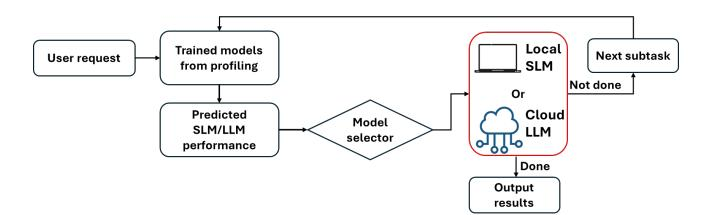
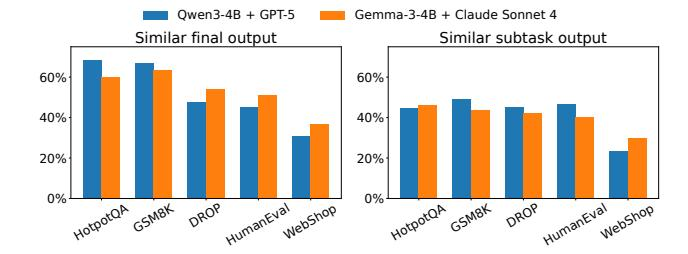
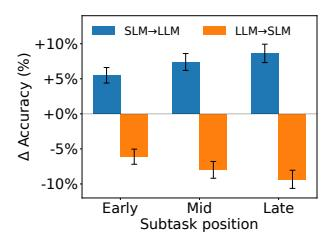
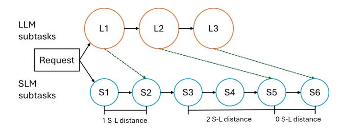
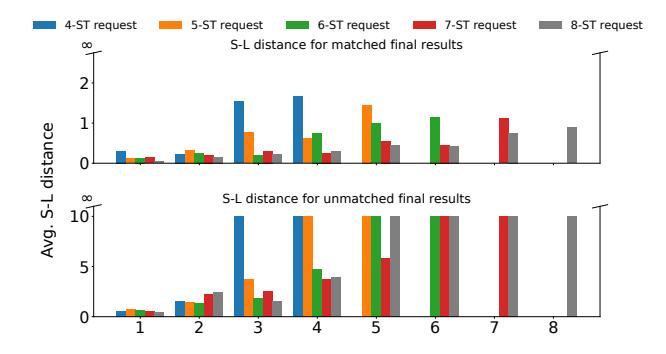
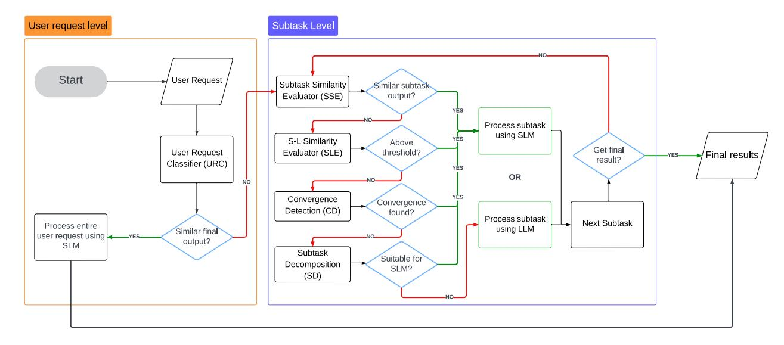
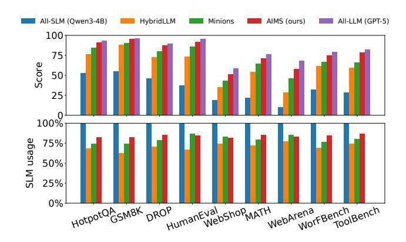
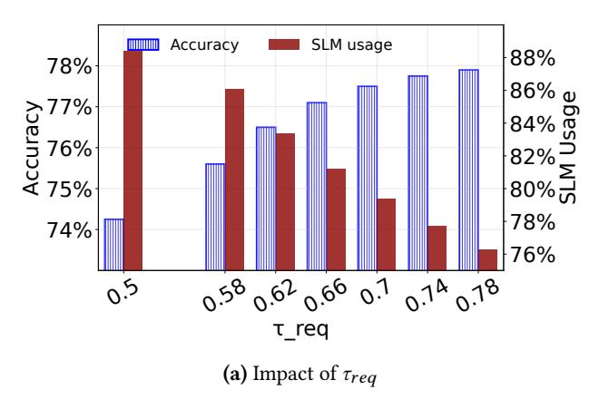
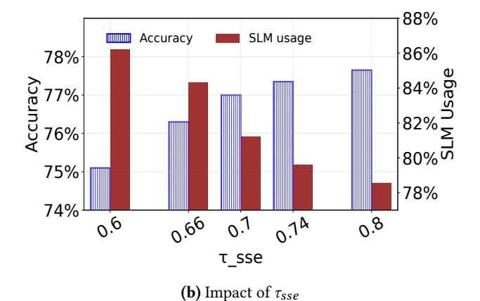

# AIMS: Cost-Efficient LLM-based Agent Deployment in Hybrid Cloud-Edge Environments

Shiyi Liu Department of Computer Science University of Virginia sl9hm@virginia.edu

Haiying Shen Department of Computer Science University of Virginia hs6ms@virginia.edu

Shuai Che Microsoft Che.Shuai@microsoft.com

Mahdi Ghandi Microsoft Mahdi.Ghandi@microsoft.com

Mingqin Li∗ Shopify Mingqin.Li@shopify.com

# Abstract

In the realm of AI, large language models (LLMs) like GPT-5, central to the operation of AI agents, predominantly operate in the cloud, incurring high operational costs. With local-based small language models (SLMs) becoming more accurate, the necessity of cloud-exclusive processing is being reconsidered. An AI agent's response to a user's request comprises a series of subtasks or iterations. Existing approaches choose either an LLM or SLM for the entire request to ensure similar outputs, but this is ineffective for AI agents as SLMs may generate differing subtasks, compromising final accuracy. In this paper, we first conduct experimental analysis to understand the features of AI agent operations. Leveraging our findings, we propose the Adaptive Iteration-level Model Selector(AIMS), a lightweightschedulerto automatically partition an AI agent's subtasks between local-based SLM and cloud-based LLM. AIMS considers the varying subtask features and strategically decides the location for each subtask in order to use SLM as much as possible while maintaining the accuracy level. Our experimental results demonstrate that AIMS achieves up to a 27.5% relative improvement in accuracy and up to 31.4% relative increase in SLM usage compared to HybridLLM. It offloads 83.4% of subtasks to a local SLM while attaining similar accuracy on average compared with the cloud-only LLM approach.

CCS Concepts: • Computing methodologies → Intelligent agents; Planning and scheduling; Machine learning; • Networks → Network algorithms.

Keywords: LLM systems, AI agents, hybrid cloud-edge computing, model routing, cost optimization, small language models, scheduling

#### ACM Reference Format:

Shiyi Liu, Haiying Shen, Shuai Che, Mahdi Ghandi, and Mingqin Li. 2026. AIMS: Cost-Efficient LLM-based Agent Deployment in Hybrid Cloud-Edge Environments. In 21st European Conference on Computer Systems (EUROSYS '26), April 27–30, 2026, Edinburgh, Scotland Uk. ACM, New York, NY, USA, 17 pages. https://doi.org/ 10.1145/3767295.3803622

<sup>∗</sup>This work was done when the author was at Microsoft.


This work is licensed under a Creative Commons Attribution 4.0 International License.

EUROSYS '26, Edinburgh, Scotland, UK © 2026 Copyright held by the owner/author(s). ACM ISBN 979-8-4007-2212-7/26/04 https://doi.org/10.1145/3767295.3803622

# 1 Introduction

The landscape of natural language processing (NLP) has evolved with LLMs like GPT-5, showcasing unprecedented text generation capabilities [35, 57]. These models serve as the cognitive core in autonomous AI agents, revolutionizing traditional AI by integrating reasoning capability and tool use, thus enabling diverse interactions and generalization abilities [14, 25, 30, 47, 54, 56, 61, 62, 67].

The AI agents, such as the notable Auto-GPT [46] and AutoGen [59], have expanded AI's reach. They process a user's request by breaking it into subtasks and using the Internet search and other tools in an automatic process [24, 26, 67]. Each subtask represents a specific action or decision that the AI agent needs to perform to progress toward completing the user request. For example, when an AI agent receives a question "Who was the maternal grandfather of the person who directed the 1997 film Titanic?", it generates three subtasks "Identify the director of Titanic (1997)", "Find the director's mother", and "Determine the mother's father". The language model is invoked at each step to interpret the current state, execute the subtask, and generate the next subtask. This iterative process continues, with the agent potentially creating new subtasks or refining existing ones based on intermediate results, until it determines that the original request has been satisfactorily addressed. This process is reminiscent of advanced AI techniques like Chain of Thought (CoT) [58] and Reflexion [45], enhancing the agent's decision-making and problem-solving abilities. The effectiveness of these agents heavily depends on the language models' ability to accurately interpret and execute each subtask.

Despite their capabilities, these LLM-based AI agents incur high operational costs (\$0.01/1K prompt tokens for GPT-4o) from frequent cloud-based API queries, presenting significant economic challenges [32]. For example, incorporating ChatGPT for enterprise use is expected to pose a financial burden exceeding \$9,000 monthly on small businesses [10, 32]. If a company provides AI agent services using its own LLM APIs, it incurs high operational costs. For example, serving ChatGPT costs approximately \$694,444 per day in compute hardware costs [43].



Figure 1. Dataflow of AIMS.

Companies can reduce the cost of providing AI agent services by leveraging users' edge devices (e.g., laptops) and incentivize users to adopt this system by offering lower service prices. Therefore, this work studies the computation breakdown for AI agents between the cloud and a user's local edge device. This approach is motivated by previous findings that an SLM can match the accuracy of the LLM in certain scenarios [12, 40, 63]. HybridLLM [8] employs a classifier to allocate a request to either SLM or LLM, ensuring that the SLM's output matches that of the LLM. We conducted experiments on AI agents based on different datasets and observed:

- (1) Using HybridLLM to allocate each subtask independently to SLM or LLM within an AI agent process may degrade the final output's accuracy, as SLM might produce a different subsequent subtask compared to LLM.
- (2) For certain requests and subtasks of a request, their simplicity allows for comparable accuracy when executed locally on a personal device instead of in the cloud.
- (3) Subtask position can influence the accuracy impact of SLM-LLM switching, with later stages showing greater effects.
- (4) SLM typically generates more subtasks for a later LLM subtask to gradually converge to a similar output.

Deploying LLM-based agents in a hybrid cloud–edge setting raises a systems question: how to reduce cloud inference cost by executing as much of the agent workflow as possible on an on-device SLM, without materially degrading end-toend task success. Unlike conventional request routing, an agent executes an interdependent sequence of subtasks; routing decisions early in the chain can change later subtasks, cascading into different computational paths and accuracy outcomes. This motivates position-aware routing, where the scheduler must consider both per-subtask characteristics and the subtask's stage in the agent's reasoning process.

To meet this need, based on the observations, we propose the Adaptive Iteration-level Model Selector (AIMS), a lightweight scheduler that maximizes the fraction of subtasks executed on the local SLM while retaining accuracy relative to a cloud LLM, using a similarity-based accuracy target learned from offline profiling. In the current design, AIMS does not take an explicit latency or monetary budget as an

online input; instead, we report latency empirically and show that scheduling overhead is small.

As shown in Figure 1, AIMS utilizes offline fine-tuned models to estimate the output similarity of a request or subtask on SLM and LLM to select the most suitable model. It takes the following steps: 1) if the outputs for the entire request are similar, SLM processes the entire request; 2) otherwise, for each of its subtasks, if its outputs are similar, SLM processes the subtask; 3) if the outputs differ, AIMS identifies a convergence point in the subtask series where the SLM and LLM outputs align and then continues using the SLM until that point; 4) If no convergence is detected, the subtask is decomposed to simpler subtasks and processed by the SLM only if all decomposed subtasks produce outputs similar to those of the LLM.

Our hybrid deployment model considers edge devices such as smart phone and gaming laptops, running 1-4B parameter models locally, while cloud resources provide access to frontier models (GPT-5, Claude) via API calls. The system must dynamically balance local compute utilization against network communication costs and cloud service charges.

AIMS differs from existing approaches like HybridLLM through its holistic treatment of AI agent subtasks. Rather than making isolated decisions, AIMS recognizes the interconnected nature of agent reasoning. The system employs position-aware decision-making, setting higher similarity thresholds for later subtasks to meet their increased accuracy requirements. Furthermore, AIMS identifies the convergence point to increase local processing opportunities. These novelties enable AIMS to more effectively balance cost and accuracy throughout the agent reasoning process.

Our contributions are as follows:

- Experimental analysis on subtask allocation in AI agents. We made several insightful observations from our experimental analysis. For example, unlike allocating a single request between the SLM and LLM that only needs to ensure the similarity of their outputs, allocating the subtasks for a request for AI agent has a unique challenge: if a subtask is allocated to SLM, the subsequent subtasks will vary, which affects the accuracy of the final output.
- Proposal of AIMS. Building on the observations from our experimental analysis, we propose AIMS. AIMS intelligently determines the allocation of subtasks between the local SLM and cloud-based LLM in order to use SLM as much as possible while maintaining the accuracy level.
- Comprehensive experiments of AIMS. Across nine datasets (HotpotQA, GSM8K, DROP, HumanEval, Web-Shop, MATH, WebArena, WorFBench, ToolBench), AIMS delivers a 27.5% relative improvement in output accuracy over HybridLLM on average (macro), with absolute gains of 12–17%, while increasing SLM usage

by up to 31.4% (relative) on average. In cost terms, for the Qwen3-4B+GPT-5 pair, AIMS reduces cloud LLM spend by 40.6% versus HybridLLM (macro) and by 83.4% versus an All-LLM policy. Using our tokenfootprint accounting and current API prices, this translates to savings of approximately \$3,820 (GPT-5) to \$7,450 (Claude Sonnet 4) per one million requests compared to All-LLM, while simultaneously improving accuracy over HybridLLM and Minions [31].

This adaptive model selection framework, which is the first work in the realm of autonomous AI agents to our knowledge, represents a possibility of more efficient, cost-effective AI agent applications.

# 2 Motivation and Experiment Analysis

## 2.1 Experiment Settings and Metrics

We implement the agent stack using AutoGen [59]. Experiments run on a local device with an RTX 5090 GPU. We evaluate two model pairs: Qwen3-4B (SLM) + GPT-5 (LLM) and Gemma3-4B (SLM) + Claude Sonnet 4 (LLM). Local SLMs are executed with llama.cpp using 4–6 GB VRAM; cloud LLMs are accessed via their public APIs.

We evaluated on five datasets: GSM8K [6], HotPotQA [65], DROP [9], HumanEval [4], and WebShop [66]. These datasets are widely used for evaluating language model-based AI agents [18, 23, 36, 45, 53, 58, 67]. GSM8K has 8,500 grade school math word problems, and its accuracy is measured by the percentage of correct answers. HotPotQA contains complex questions requiring reasoning. DROP contains questions involving numerical operations and discrete reasoning. The accuracy of HotPotQA and DROP is measured by the F1 score. HumanEval contains 164 programming problems, and its accuracy is measured by the pass@1 metric [4]. WebShop contains user purchasing requests and its accuracy is based on BERTScore [69] compared to the ground-truth product descriptions. We consider a response to be similar if the BERTScore is higher than a threshold (e.g., 0.7).

Completion rate is the percentage of requests completed within 5 minutes. The number of subtasks is the number of subtasks to complete a request. SLM usage is the percentage of subtasks processed by SLM per request. In this paper, we focus on text-based AI agents, therefore we use semantic similarity to quantify the alignment of SLM outputs and LLM outputs. We define two outputs as similar if the cosine similarity between their SBERT embeddings [41] exceeds a threshold. Unless otherwise specified, the threshold is set to 0.7, which is empirically determined. AIMS uses a single similarity threshold and Section 4.6 presents the sensitivity study of this threshold. We report the average results of all requests from the two model pairs and for all datasets if not specifically indicated in the figure or table.


Figure 2. Performance of existing methods.

## 2.2 The Need for a Subtask Scheduler

We conducted experiments comparing the performance of five existing methods: HybridLLM [8], All-SLM, All-LLM, Oracle, and random assignment (Random). In HybridLLM, the routing classifier operates at the subtask level, sending each subtask independently to either the local SLM or the cloud LLM. All-SLM processes an entire request using only the SLM, while All-LLM processes the request entirely using the LLM. Oracle achieves the accuracy threshold (empirically determined as 90% of the All-LLM's accuracy) while maximizing SLM usage by finding the optimal subtask assignment between the SLM and LLM for each user request. It is determined by enumerating all possible assignments for each subtask.

Figure 2 reports macro-averages (across datasets) of SLM usage, accuracy, and completion rate for each method under the two new model pairs. As expected, All-SLM attains the lowest accuracy (42.95% on average), while All-LLM achieves the highest accuracy (93.15%) at the cost of 0% SLM usage. Random yields moderate accuracy (47.65%), and HybridLLM improves to 66.08%. Oracle slightly sacrifices accuracy for substantially higher SLM usage, reaching 84.05% accuracy with 72.25% SLM usage. Compared to Oracle, HybridLLM delivers 17.97% lower accuracy and 31.20% lower SLM usage; compared to All-LLM, HybridLLM is 27.07% lower in accuracy. Completion rates follow the same ordering for both pairs: Oracle ≈ All-LLM > HybridLLM ≈ Random > All-SLM.

In addition, Table 1 reports the percentage of incorrect assignment decisions for HybridLLM and Random relative to Oracle. An assignment is counted as incorrect when a subtask is routed to the SLM while Oracle routes it to the LLM, or vice versa. HybridLLM makes incorrect assignments in 33.80% of cases with Qwen3+GPT-5 and 35.70% with Gemma3+Claude S4; Random is higher at 45.25% and 41.95%,



**Figure 3.** Similar output percentage across datasets.

respectively. These errors stem from assigning subtasks independently without accounting for inter-subtask dependencies, underscoring the need for holistic, workflow-aware assignment. The results highlight the suboptimality of HybridLLM and Random and the headroom for improved subtask allocation strategies.

**Table 1.** Percentage of incorrect assignments.

| Method    | Qwen3 + GPT-5 | Gemma3 + Claude S4 |
|-----------|---------------|--------------------|
| HybridLLM | 33.80%        | 35.70%             |
| Random    | 45.25%        | 41.95%             |

**Observation 1.** Using the existing HybridLLM inference system in AI agent scenarios, which assigns each subtask independently to either the SLM or LLM, fails to optimize accuracy or SLM usage, highlighting the need for a more advanced approach. (Figure 2 and Table 1)

To investigate subtask-level model assignment and identify which subtasks can be effectively handled by SLM, we conduct two additional experiments, presented in Figure 3: 1) the percentage of user requests where the final outputs are similar when processed entirely by either SLM or LLM (left), and 2) the average percentage of individual subtasks of a request processed by LLM, for which SLM produces similar subtask outputs. The figure shows that 23.3%-44.9% of user requests and 30.2%-68.9% of subtask outputs can be handled by SLMs without compromising accuracy, with percentages varying across datasets. These findings indicate significant opportunities to reduce cloud usage by leveraging SLMs for suitable tasks and subtasks.

**Observation 2.** The SLM can manage certain user requests and subtasks, producing outputs similar to the LLM. (Figure 3)

## 2.3 Impact of Subtask Stage

This experiment assessed the accuracy impact of switching a single subtask from LLM to SLM while keeping the others on LLM, and vice versa, switching one subtask from SLM to LLM while keeping the rest on SLM. To account for user requests with varying numbers of subtasks, we grouped




(a) Accuracy  $\Delta$  by switching a subtask between SLM and LLM.

**(b)** The number of subtasks in All-SLM and All-LLM.

**Figure 4.** Subtask behavior under different model assignments.

the subtasks into three relative positions: Early (first third), Middle (middle third), and Late (final third) stages within the request's subtask sequence.

Figure 4a shows the average accuracy impact of switching a subtask at different stages. The results show that switching a subtask from LLM to SLM causes an average accuracy drop of 5.25% in the Early stage, 7.59% in the Middle stage, and 9.53% in the Late stage. Conversely, switching a subtask from SLM to LLM yields accuracy gains of 5.14%, 6.25%, and 9.40% in the Early, Middle, and Late stages, respectively. These findings suggest that SLM can manage early subtasks with minimal accuracy loss, but as tasks progress, leveraging LLM's advanced capabilities becomes increasingly critical.

**Observation 3.** Subtask position can influence the accuracy impact of SLM-LLM switching, with later stages showing greater effects, highlighting its importance in subtask allocation decisions. (Figure 4a)

Figure 4b illustrates the average number of subtasks generated per user request in All-SLM and All-LLM, respectively, across all datasets, considering only the requests that produced correct results. All-SLM generates more subtasks per request than All-LLM, with SLM averaging 6.37 subtasks per user request compared to LLM's 5.9. This indicates that SLM decomposes requests into more granular subtasks due to its limited capability to handle complex requests, whereas LLM's superior ability enables it to generate fewer, more comprehensive subtasks.



Figure 5. S-L distance illustration.



Figure 6. S-L distance comparison across subtask sequence.

To evaluate the convergence of SLM and LLM subtasks, we introduce the concept of *S-L distance* for an LLM subtask. This distance represents the number of additional SLM subtasks needed to produce a subtask similar (or match) to this LLM subtask, with their similarity defined as S-L similarity. Figure 5 illustrates the S-L distance, where LLM-generated subtasks are denoted as L1, L2, and L3, while SLM-generated subtasks are denoted as S1, S2, S3, S4, S5, and S6. Dashed lines indicate matched outputs between SLM and LLM subtasks. Subtask L1's S-L distance is 1, indicating that one additional SLM subtask is needed to match it. L2 has an S-L distance of 2, requiring two extra SLM subtasks for a match. L3 directly corresponds to S6, resulting in an S-L distance of 0. If no matched SLM subtask is found for an LLM subtask, its S-L distance is set to infinity. This metric provides insight into the alignment between SLM and LLM outputs during request processing, highlighting how SLM subtask granularity compares to that of LLM at different stages.

We ran each request using both All-LLM and All-SLM and categorized the requests into two groups: those with matched final results between LLM and SLM, and those without. Within each group, we further classified the requests into subgroups based on the number of subtasks (ST) generated (i.e., request length). Figure 6 presents the average S-L distance across LLM subtasks with the same sequence ID (X axis) in each subgroup for matched request group (top) and unmatched request group (bottom), respectively. For example, "4-ST request" represents the request subgroup that has 4 subtasks. As the subtask sequence progresses, the average S-L distance gradually increases in the matched group, while in the unmatched group, many distances reach infinity, indicating significant divergence between SLM and LLM subtask outputs. The results suggest that later LLM subtasks typically require more SLM subtasks to achieve similar outputs. SLM's inability to produce comparable subtask outputs ultimately leads to discrepancies in the final request output compared to the LLM. This observation echoes Observation 3 that the later stage of subtasks is more important to the accuracy of the user request.


Figure 7. S-L similarity across subtask sequence IDs.

Figure 7 shows the changes of S-L similarity as the request progresses in matched and unmatched scenarios. In matched cases, S-L similarity gradually increases, indicating that SLM outputs align more closely with LLM outputs in later stages. Conversely, in unmatched scenarios, S-L similarity remains low, suggesting persistent deviations. This measurement supports previous findings and highlights the potential for SLM and LLM convergence in subtask sequence, enabling efficient subtask allocation.

**Observation 4.** SLM typically generates more subtasks for a later LLM subtask to gradually converge to similar outputs. Subtask scheduling must account for whether an SLM's output can converge with that of an LLM subtask. (Figures 4b-7)

#### 3 Design of AIMS

#### 3.1 Overview

Motivated by Observation 1, we propose AIMS, which dynamically assigns the subtasks of a request between the SLM and LLM in order to maximize the SLM usage while maintaining the LLM's accuracy of processing the request.

Based on Observation 2 that the SLM may output similar results for a request or for a subtask as the LLM, AIMS lets the SLM process the entire request in the former case. Otherwise, it allocates each subtask to either the SLM or LLM. For each subtask, based on Observation 4, if it finds a convergence point, it uses the SLM until the convergence point. Otherwise, it breaks down the current subtask into smaller sub-subtasks to facilitate the SLM to process them by repeating the above steps for each sub-subtask. To avoid unnecessary LLM execution, the SLM processes decomposed sub-subtasks only if all can be handled by the SLM; otherwise, the original subtask is processed by the LLM. Based on Observation 3, we use the subtask's sequence ID to dynamically adjust the similarity threshold, and also consider it in predicting the subtask's convergence point.

AIMS consists of several offline-trained estimators based on profiled data. With the assistance of the estimators, after



Figure 8. AIMS decision-making workflow.

receiving a user request, AIMS chooses between the SLM and LLM for the request or its subtasks.

Offline Profiling. AIMS first profiles the AI agent that uses SLM and LLM with various user requests and their corresponding subtasks. The profiling process collects data on the subtask outputs from SLM and LLM. This data is then used to train prediction models, including the *user request classifier*, *subtask predictors* for the SLM and LLM execution, *distance predictor*, and *subtask decomposer*. These trained models are used in the online decision making of AIMS to make informed decisions about task or subtask allocation.

Online Decision Making. After receiving a user request or a subtask, AIMS determines its allocation between SLM and LLM. It first employs the *user request classifier*, which determines whether processing the entire request with the SLM will yield output similar to that of the LLM. If not, AIMS proceeds to subtask-level decision-making for a more granular analysis. At this stage, AIMS employs *subtask similarity evaluator*, *S-L similarity estimator* (SLE), *convergence detector* (CD), and *subtask decomposer* (SD) approaches to determine the suitable model for processing the current subtask. AIMS makes decisions for every subtask using this process until producing the final output.

AIMS follows a fast-path/slow-path design pattern: the fast path executes on the local SLM when predictors indicate the next-step behavior is safe, while the slow path falls back to the cloud LLM for accuracy-critical decisions. Convergence detection and similarity-validated decomposition act as structured recovery paths that safely expand the fraction of execution on the fast path without committing to an irrecoverably divergent subtask.

### 3.2 System Design

Let R denote a given user request, and  $ST_i$  denote the  $i^{th}$  dynamically generated subtask for request R. The workflow of AIMS is depicted in Figure 8. First, based on Observation 2, AIMS employs a hierarchical approach that allows AIMS to leverage the effectiveness of SLM for user requests that can be accurately processed by SLM alone while enabling fine-grained subtask allocation for more complex requests. Specifically, AIMS utilizes a lightweight request-level *classifier* to determine if a user's request can yield similar outputs when executed entirely on SLM. If yes, AIMS opts for SLM for the entire request. If not, AIMS proceeds to the next step to perform subtask-level model assignment. The objective of AIMS is to design a  $router: ST_i \rightarrow \{0,1\}$ , where  $router(ST_i) = 0$  and  $router(ST_i) = 1$  mean that the subtask  $ST_i$  is routed to the SLM, and to the LLM, respectively.

In the subtask-level model assignment, for the  $i^{th}$  subtask, AIMS takes the following steps:

- 1) **Subtask Similarity Evaluator (SSE).** Based on Observation 2, AIMS estimates the output similarity of the  $i^{th}$  subtask using LLM and SLM. If they are similar, AIMS uses SLM for this subtask. Otherwise, AIMS employs the following three steps based on Observation 4:
- 2) **S-L Similarity Evaluator (SLE).** It first estimates the S-L distance *d* for the current subtask, followed by an evaluation of the S-L similarity. If the S-L similarity meets the required threshold (i.e., 0.7), the subtask is assigned to SLM, as it is expected to ultimately reach a similar subtask in LLM; otherwise, it proceeds to the next step.
- 3) **Convergence Detection (CD).** If a convergence point cannot be identified for the current subtask, it may still be found for a subsequent one. Hence, AIMS continuously estimates the outputs of SLM and LLM subtasks, comparing

each SLM-LLM subtask pair until a convergence point is identified where the S-L similarity meets the threshold. If a convergence point is identified, all subtasks preceding it are executed by the SLM. Otherwise, the process moves to the next step.

4) Subtask Decomposition (SD). If convergence is not detected by CD, AIMS employs its Subtask Decomposer (SD) model, which is trained offline (Section 3.3), to predict a sequence of simpler sub-subtasks for the current complex subtask. For example, if a HotpotQA user request asks for the maternal grandfather of the Titanic director, an AI agent, after identifying the director (James Cameron) and his mother (Shirley Cameron née Lowe), might generate a complex subtask (): 'Verify Shirley Cameron's father, including corroborating biographical details, to confirm his identity as James Cameron's maternal grandfather.' The SD might then decompose this into more granular steps: 1: 'Search for Shirley Cameron's father'; 2: 'Extract father's full name'; 3: 'Find key biographical details for verification (e.g., birth/death dates)'; 4: 'Confirm and state the maternal grandfather's name'. AIMS then uses its subtask predictors ( and ) to evaluate if the SLM can adequately handle each predicted sub-subtask. Only if all predicted subsubtasks are deemed suitable for the SLM (i.e., yield similar outputs to the LLM predictions) does AIMS direct the AI agent to execute this decomposed sequence using the actual SLM; otherwise, the original defaults to the LLM. This allows AIMS, as a system-level scheduler, to guide the AI agent towards a more granular execution path that leverages the SLM's capability to handle simpler steps.

## 3.3 Offline Profiling

In the offline profiling phase, AIMS collects data to fine-tune models that predict the performance of different subtask allocations between SLM and LLM. The profiling is conducted on user requests from historical trace datasets (e.g., GSM8K and HotPotQA) and their corresponding subtasks.

Data Collection: For each user request , we generate a binary tree of subtasks, where each node represents a subtask and each edge represents using a model (SLM or LLM) to process the parent subtask. Starting from the root node, which represents the initial user request, we process the subtask using both the SLM and LLM, creating two child nodes. For each child node, we then recursively process the corresponding subtask using both SLM and LLM, further creating child nodes until a predefined depth (e.g., 15 subtasks) is reached or the model thinks the request is finished. At each leaf node, we profile the output of executing the subtask using the selected model. In addition to the subtask-level profiling, we also profile the performance of executing the entire user request using SLM and LLM. The similarity of the final results from the two models is collected. Moreover, we use the SLM to generate multiple smaller subtasks

for each original subtask, creating a dataset of subtask decomposition. Using the collected profiled data, we train the following models.

User Request Classifier (URC): For each user request in the profiled data, we use the user request as the input feature and the similarity score between the outputs generated by processing the entire user request using All-SLM and All-LLM as the target variable. We then train the user request classifier model using this input-output data.

Subtask Predictor (SP): We train two separate models, and , which learn to predict the next subtask when the current subtask is processed using SLM and LLM, respectively. For each node in the binary tree of subtasks generated during the data collection process, we use the subtask at that node as the input feature and the subtask generated by applying SLM or LLM to the current subtask as the target output for the two models, respectively.

Distance Predictor (DP): The distance predictor predicts the S-L distance. For each request in the profiled data, we extract the content of the LLM subtask and its sequence ID as the input features and its corresponding S-L distance as the target label. We then train the distance predictor model using the input and output data to predict the S-L distance. Subtask Decomposer (SD): The subtask decomposer is trained to break down a complex subtask into smaller, more manageable sub-subtasks. It takes a subtask and the predicted next subtask from for this subtask as inputs, and outputs a sequence of sub-subtasks, aiming to ensure that the output of the last sub-subtask is similar to the predicted next subtask from . The subtask decomposer is trained using data derived from decomposing subtasks from user request.

For the above models, we use ModernBERT [55] as the base for URC and DP, and Qwen3-0.6B [64] for SP and SD, fine-tuning them with LoRA [17]. These models are then used in the subsequent components of AIMS to make informed decisions about task or subtask allocation. The estimator stack requires approximately 2 GB of VRAM, which can easily be accommodated on a modern gaming laptop with 8-16 GB of GPU memory.

## 3.4 Online Decision Making

The online decision-making process comprises two stages: request-level decision-making and subtask-level decisionmaking, as detailed below.

3.4.1 Request-Level Decision Making. AIMS first uses the user request classifier to process an incoming user request. It leverages the knowledge learned during the offline profiling phase to identify user requests that can be accurately processed by the SLM alone, avoiding unnecessary subtask-level allocation. Specifically, AIMS feeds the request into the user request classifier model. The classifier predicts a similarity score between 0 and 1, indicating the expected similarity between the results of processing the request solely

using SLM versus the LLM. If the predicted similarity score is above a predefined threshold (e.g., 0.7), AIMS processes the entire user request using SLM, bypassing the subtask-level allocation. Otherwise, AIMS initializes the current subtask as the root request and enters the subtask-level routing stage.

**3.4.2 Subtask-Level Decision Making.** If the *user request classifier* determines that a user request requires subtask-level allocation, AIMS proceeds to the SSE to process the subtask.

Subtask Similarity Evaluator (SSE): The subtask similarity evaluator compares the outputs of the SLM and the LLM for each subtask, assessing their similarity and making appropriate model assignments based on the stage of the user request. For each subtask  $ST_i$  in the user request R, AIMS feeds the current subtask into the  $SP_{SLM}$  and  $SP_{LLM}$  models. The  $SP_{SLM}$  and  $SP_{LLM}$  models generate the predicted next subtasks for the SLM and the LLM, respectively. The subtask similarity evaluator then estimates the similarity of the predicted next subtasks as introduced in Section 2.1. If the similarity is above a predefined threshold  $\kappa$ , the subtask  $ST_i$  is assigned to the SLM. The similarity threshold  $\kappa$ is determined through empirical analysis during the offline profiling phase. For each SLM-LLM pair, we analyze a set of requests and their subtasks, measuring the relationship between threshold values and final accuracy. The sensitivity analysis of the  $\kappa$  threshold can be found in Section 4.6. Organizations deploying AIMS can fine-tune these thresholds during their offline profiling phase based on their specific accuracy requirements and cost constraints.

Here, instead of using a constant similarity threshold, based on Observation 3, we set the threshold adaptively based on the subtask's sequence ID. The threshold  $\kappa$  is smaller at the early stages of a request, permitting loose comparisons, and increases as the request progresses, making it more stringent in the later stages. Using the experimental data collected for Figure 4a, we compute the threshold as  $\kappa = threshold_{base} + \min(ID, 5) \cdot 0.02$ , where  $threshold_{base} = 0.6$ . All parameters are determined empirically.

If the similarity is below the threshold  $\kappa$ , the simplest way is to use LLM. However, directly using LLM results in lower SLM usage. Observation 4 suggests that while the SLM output may differ from the LLM output for the current subtask, a subsequent subtask could still produce a result similar to the LLM. Therefore, we employ three approaches: the *S-L similarity evaluator*, the *convergence detector*, and the *subtask decomposer*. The S-L similarity evaluator identifies when a future SLM subtask matches the current LLM subtask. The convergence detector identifies future subtasks where the outputs of the SLM and LLM are similar. The subtask decomposer breaks down the current subtask into smaller subtasks to increase the likelihood of successful processing by the SLM. The details are presented in the following.

**S-L Similarity Evaluator (SLE)**: Guided by Observation 4, the S-L distance metric helps determine if a future SLM subtask matches the current LLM subtask, which is crucial for deciding whether to process a subtask using SLM or LLM. Thus, the S-L similarity evaluator dynamically adjusts the similarity threshold during task processing based on the progress stage of the user request. It receives the current subtask  $ST_i$  and its sequence ID as inputs and uses the distance predictor model to estimate the S-L distance d between the outputs of the SLM and the LLM, considering the current subtask's content. The  $SP_{SLM}$  model then predicts the output for the  $(i+d)^{th}$  subtask, while the  $SP_{LLM}$  model predicts the output for the  $i^{th}$  subtask. These outputs are compared using the predefined similarity threshold  $\kappa$  (same threshold as in the subtask similarity evaluator). If their similarity is higher than  $\kappa$ , the subtask  $ST_i$  is assigned to the SLM; otherwise, we proceed to the next component.

Convergence Detector (CD): Guided by Observations 3 and 4, convergence detector identifies a future convergence point between the outputs of SLM and LLM. Starting from subtask  $ST_i$ , the convergence detector uses  $SP_{SLM}$  and  $SP_{LLM}$  to predict future subtasks iteratively. It compares the similarity of each pair of the SLM and LLM predictions using the same similarity metric and threshold as previous components. It continues this process for a predefined number of future subtasks or until the end of the sequence. If multiple convergence points are found, convergence detector selects the last one to increase the use of SLM. All subtasks from  $ST_i$  up to the identified convergence point are then assigned to SLM. If no convergence is detected, we proceed to the next component.

Subtask Decomposer (SD): Guided by Observation 4, which highlights the granularity and step-by-step nature of SLM processing, we design the *subtask decomposer*. It breaks down a complex subtask into smaller sub-subtasks, making them easier for the SLM to process. It takes a current subtask  $ST_i$ as input and uses the *subtask decomposer* model, which is trained during the offline profiling phase, to generate a sequence of sub-subtasks, denoted by  $\{SST_1, SST_2, \dots, SST_m\}$ . AIMS then evaluates each sub-subtask  $SST_i$  to determine its suitability for processing by the SLM. Specifically, AIMS inputs  $SST_i$ 's content into both  $SP_{SLM}$  and  $SP_{LLM}$  models, which then predict the next sub-subtask. If the similarity of the two predicted next sub-subtasks exceeds the predefined threshold  $\kappa$ , the sub-subtask is deemed suitable for SLM processing. While we could allocate each sub-subtask individually to the SLM or LLM, this may increase the number of LLM calls. To avoid this, we allocate the entire group of decomposed sub-subtasks or the original subtask as a single unit. That is, only when all sub-subtasks are found suitable for the SLM, AIMS assigns all sub-subtasks  $\{SST_1, SST_2, \dots, SST_m\}$ 

to SLM to produce the output for the original subtask. Conversely, if any sub-subtask is unsuitable for SLM, AIMS assigns the subtask  $ST_i$  to the LLM.

## Algorithm 1 AIMS online decision making process.

```
Require: User request R
Ensure: Final result
 1: if URC(R) predicts similar outputs then
        Process R using SLM
 3:
    else
        for each subtask ST_i generated do
 4:
            if SSE(ST_i) predicts similar outputs then
 5:
                Process ST_i using SLM
 6:
            else if SLE(ST_i) finds high S-L similarity then
 7:
               Process ST_i and next d subtasks using SLM
 8:
            else if CD(ST_i) finds convergence point then
 9:
                Process subtasks to convergence using SLM
10:
            else
11:
                sub\_subtasks = SD(ST_i)
12:
                if one sub_subtask's outputs in SP<sub>SLM</sub> and
13:
    SP_{LLM} are dissimilar then
                    Process ST_i using LLM
14:
                else
15:
                    Process each sub_subtask using SLM
16:
                end if
17:
            end if
18:
        end for
19:
    end if
```

21: return Final result

**3.4.3** Algorithm for the Process. Algorithm 1 shows the pseudocode of the decision-making process of AIMS. When a user request is received, the user request classifier (URC) first predicts the similarity score of running the entire request on SLM and LLM. If the similarity score exceeds a threshold, the request is processed entirely by SLM (lines 1-2). Otherwise, it advances to subtask-level decision-making (line 4). Specifically, the subtask similarity evaluator (SSE) compares the predicted outputs of the subtask from SLM and LLM using  $SP_{SLM}$  and  $SP_{LLM}$ . If the outputs are similar, the subtask is assigned to SLM (lines 5-6). If not, the S-L similarity estimator (SLE) component, using the distance predictor (DP), estimates the S-L distance of the current subtask (d). It then uses  $SP_{SLM}$ and  $SP_{LLM}$  to predict the S-L similarity. If it is higher than the threshold, SLM is used (lines 7-8); otherwise, the process moves to convergence detector (CD). It attempts to identify a convergence point, where the outputs of the SLM and LLM are similar. If it is found, SLM is used until the convergence point (lines 9-10). If not, the subtask decomposer (SD) breaks the subtask into smaller sub-subtasks, and the process of the SSE repeats for each sub-subtask. If one sub-subtask's outputs in the SLM and in the LLM are not similar, LLM



Figure 9. Accuracy and SLM usage.

processes  $ST_i$  (lines 13-14); otherwise, the SLM processes all the sub-subtasks (line 16).

#### 4 Performance Evaluation

#### 4.1 Experiment Settings

The experiment settings are the same as those in Section 2.1 unless otherwise specified. We employed GPT-5+Qwen3 4B as the LLM-SLM pair to generate 1000 subtask traces (i.e., the sequence of subtasks generated by the AI agent from an initial user request to its final resolution) using WorFBench [38] and GSM8K [6] to fine-tune the models in AIMS. The finetuning process for all estimators took approximately 2 hours on a cloud-based Nvidia A100, a one-time cost that enables subsequent effective decision-making. To evaluate the performance and generalization capabilities of AIMS, we test on nine benchmarks: HotpotQA, GSM8K, DROP, HumanEval, WebShop, MATH [15], WorFBench [38], WebArena [71], and ToolBench [39], though we trained the AIMS in only two of the datasets. The baseline methods for comparison are HybridLLM [8] (explained in Section 2.2) and Minions [31]. Minions follows a collaborative cloud-edge execution model where a planner generates subtasks, and a local small model first attempts each subtask, escalating to a cloud LLM when the local model is uncertain, with uncertainty measured by the average log-probability of the generated tokens.

#### 4.2 Overall Performance

Accuracy and SLM usage. Figure 9 summarizes accuracy and SLM usage. We used three representative datasets to demonstrate the performance, *HotpotQA*, *HumanEval* and *WebShop*, under Qwen3-4B+GPT-5. On *HotpotQA*, AIMS reaches 90.75% vs 76.35% (HybridLLM, +14.40%) and 84.20% (Minions, +6.55%), with higher SLM usage than both (81.85% vs 68.40% / 74.10%). On *HumanEval*, AIMS is 91.45% vs 73.65% (+17.80%) and 86.10% (+5.35%); Minions uses slightly more SLM (86.95%) than AIMS (84.10%) but trails in accuracy. On *WebShop*, AIMS attains 51.20% vs 34.75% (+16.45%) and 43.10% (+8.10%), while SLM usage is comparable (81.25% vs


**Figure 10.** End-to-end latency breakdown across nine benchmarks (Qwen3-4B + GPT-5 on RTX 5090). AIMS achieves latency comparable to HybridLLM/Minions while remaining faster than All-LLM; routing + network overhead is a small fraction of total time.

**Table 2.** Normalized remote cost per 100 requests (All-LLM = 1.0). Costs are computed via token-footprint accounting; API prices are as of September 2025.

| Dataset   | HybridLLM | Minions | AIMS (ours) |
|-----------|-----------|---------|-------------|
| HotpotQA  | 0.32      | 0.26    | 0.18        |
| GSM8K     | 0.38      | 0.26    | 0.18        |
| DROP      | 0.29      | 0.22    | 0.15        |
| HumanEval | 0.33      | 0.13    | 0.16        |
| WebShop   | 0.29      | 0.20    | 0.21        |
| MATH      | 0.28      | 0.21    | 0.15        |
| WebArena  | 0.23      | 0.15    | 0.17        |
| WorFBench | 0.31      | 0.24    | 0.21        |
| ToolBench | 0.26      | 0.20    | 0.19        |
| Macro avg | 0.29      | 0.20    | 0.17        |

74.35% / 83.10%). These gains reflect AIMS's holistic, position-aware routing, avoiding the independent or myopic assignments that limit HybridLLM and the heuristics in Minions.

Higher accuracy with greater SLM share translates to better application outcomes at lower cloud usage. For example, on *WebShop*, AIMS's 51.20% success (vs 34.75% HybridLLM / 43.10% Minions) is achieved while using the SLM more, reducing GPT-5 usage and cost; on *WebArena*, AIMS improves task success to 57.90% (vs 28.60% / 45.70%) with higher SLM usage; on *ToolBench*, chain correctness rises to 78.35% (vs 59.40% / 66.10%) with less reliance on the LLM. Taken together, for the same budget, AIMS completes more tasks, and to hit the same accuracy target, it requires fewer LLM tokens, demonstrating end-to-end benefits beyond per-step accuracy.

**Average latency.** We measured average end-to-end latency on the desktop edge (RTX 5090) and found that *AIMS* does not compromise speed. Figure 10 reports the mean across datasets: *All-SLM* 11.14 s, *HybridLLM* 12.98 s, *Minions* 14.21 s, *AIMS* 13.33 s, and *All-LLM* 15.82 s. Thus, AIMS is consistently faster than All-LLM, slower than All-SLM (as expected), and comparable to HybridLLM and Minions. The scheduler's

**Table 3.** Generalization summary across AIMS settings.

| Setting      | ΔAcc<br>HLLM | ∆Acc<br>Minions | Cost<br>vs All-LLM | Latency<br>vs All-LLM |
|--------------|--------------|-----------------|--------------------|-----------------------|
| Model pairs  |              |                 |                    |                       |
| Qwen+GPT     | +12.35       | +6.86           | 0.17×              | 0.82×                 |
| Gemma+Claude | +13.14       | +6.18           | 0.22×              | 0.76×                 |
| Hardware     |              |                 |                    |                       |
| RTX 5090     | _            | _               | _                  | 0.79×                 |
| iPhone 15    | +10.65       | +6.32           | 0.19×              | 2.52×                 |

Model-pair rows: macro accuracy deltas (%) vs baselines and normalized cost ratios per 100 tasks. Hardware rows: average end-to-end latency ratios across datasets using the same routing policy/checkpoints (Qwen3-4B + GPT-5 unless noted). RTX 5090 vs iPhone 15 differ in throughput; routing/SLM usage are unchanged.

decision overhead is small (about 3-7% of AIMS's total time), and measured average network hop latency is 0.58 s, which is negligible relative to end-to-end latency. Overall, offloading selected subtasks to the local SLM reduces reliance on cloud decoding without incurring noticeable runtime overheads. **Remote Cost.** Remote monetary cost is dominated by the cloud LLM; we treat on-device SLM execution as free and ignore edge-cloud transfer fees. We compute cost using token-footprint accounting (prompt + completion tokens) multiplied by API prices (prices as of Sep 2025). To reduce dependence on volatile pricing, Table 2 reports normalized remote cost relative to the All-LLM baseline (All-LLM = 1.0 per dataset). Averaged across nine benchmarks, HybridLLM costs 0.29×, Minions 0.20×, and AIMS 0.17× of All-LLM, corresponding to 83% savings vs. All-LLM, 41% vs. HybridLLM, and 15% vs. Minions while maintaining higher accuracy than HybridLLM and Minions.

#### 4.3 Generalizability Evaluation

Table 3 summarizes transfer across *model pairs* and *hardware*. For models, AIMS improves accuracy by +12.35% over HybridLLM and +6.86% over Minions at  $0.17\times$  the cost of All–LLM with Qwen+GPT, and by +13.14% / +6.18% at  $0.22\times$  cost with Gemma3 + Claude Sonnet 4, demonstrating robust

accuracy—cost gains across pairs. To isolate the impact of device throughput, we keep AIMS's routing policy, thresholds, and SLM usage fixed across hardware and change only the execution platform. Unless noted otherwise, the hardware results use the Qwen3-4B (SLM) + GPT-5 (LLM) pair, with the same estimator checkpoints. On RTX 5090, AIMS achieves 0.79× the All-LLM end-to-end latency; on iPhone 15, AIMS is 2.52× due to lower on-device throughput. Importantly, this is a *latency* effect: the allocation policy is unchanged across hardware. Any minor accuracy differences on mobile occur only in rare cases where the on-device runtime cannot accommodate the full context (e.g., truncation), not because the routing logic changes.

#### 4.4 Ablation Study

Ablation—components. Table 4 quantifies the effect of removing AIMS components. Relative to AIMS (full) (77.62% accuracy, 83.58% SLM), removing the subtask decomposer (w/o SD) lowers accuracy to 76.04% (-1.58%) and reduces SLM usage to 78.04% (-5.54%), indicating SD's role in exposing safe SLM opportunities. Further disabling convergence detection (URC+SSE+SLE) drops accuracy and SLM usage more sharply (73.90%, -3.72%; 75.52%, -8.06%), showing CD's contribution to stability. Removing SLE as well (URC+SSE) yields 72.48% (-5.14%) and 72.36% (-11.22%). With URC only, accuracy falls to 70.10% (-7.52%) and SLM usage to 71.98% (-11.60%), revealing that single-stage request routing is too conservative. Finally, w/o URC retains accuracy (76.82%, -0.82%) but incurs the *largest SLM* reduction (70.18%, -13.44%), confirming URC's value as an initial filter that safely increases SLM share. Overall, each component materially helps decide when a subtask can be moved to the SLM without harming accuracy.

**Ablation—training data.** Figure 11 varies the fraction of training traces used by the estimators ( $\{0, 10, 25, 50, 100\}\%$ ). The AIMS system components are trained on subtask traces generated from WorFBench and GSM8K using the indicated fraction of training traces, and evaluated as macro-averages over the other seven benchmarks (HotpotQA, DROP, HumanEval, WebShop, MATH, WebArena, ToolBench). As shown in Figure 11, accuracy improves monotonically from  $68.3\% \rightarrow 77.5\%$  while SLM usage rises from  $69.5\% \rightarrow 83.6\%$ . Gains are most pronounced up to 50% of traces (76.1% accuracy, 81.2% SLM), after which improvements taper, indicating diminishing returns and suggesting that moderate data budgets already capture most of AIMS's benefit.

#### 4.5 Performance of Estimators

Table 5 reports estimator accuracy and latency share. We train on WorFBench and GSM8K and evaluate generalization on the remaining benchmarks. We optionally apply *continual fine-tuning (CFT)* every 500 new requests: we collect the most recent batch of 500 execution traces and perform incremental LoRA updates to the estimator stack (URC, DP,


**Figure 11.** Training-data ablation for AIMS (Qwen3-4B + GPT-5).

**Table 4.** Ablation study of AIMS components.

| Variant              | Acc. (%) ↑ |       | SLM (%) ↑ |        |
|----------------------|------------|-------|-----------|--------|
| variani              | Value      | Δ     | Value     | Δ      |
| AIMS (full)          | 77.62      | _     | 83.58     | _      |
| w/o SD               | 76.04      | -1.58 | 78.04     | -5.54  |
| URC+SSE+SLE (no CD)  | 73.90      | -3.72 | 75.52     | -8.06  |
| URC+SSE (no CD, SLE) | 72.48      | -5.14 | 72.36     | -11.22 |
| w/ URC (URC only)    | 70.10      | -7.52 | 71.98     | -11.60 |
| w/o URC              | 76.82      | -0.80 | 70.18     | -13.40 |

the subtask predictors, and the subtask decomposer), then continue serving with the updated checkpoints. In Table 5, generalization accuracy without CFT is reported as-is; accuracy with CFT is shown in parentheses. On training data, estimator accuracy is consistently high (82.1–84.1%). Without CFT, generalization accuracy remains strong (75.1–77.9%); with CFT (in parentheses) it improves to 78.1–81.3%, a +3–4% gain. Latency-wise, the subtask predictors dominate estimator compute when invoked (SP<sub>SLM</sub> 42.4%, SP<sub>LLM</sub> 38.8%), while URC, the Distance Predictor, and the Convergence Detector are lightweight (6.4%, 7.1%, and 5.3%), enabling fast decisions.

**Table 5.** Performance of AIMS's estimators.

| Component                    | A     | Lat.           |       |
|------------------------------|-------|----------------|-------|
| Component                    | Train | Generalization | ratio |
| User Request Classifier      | 84.1  | 77.9 (81.3)    | 6.4%  |
| Subtask Predictor $SP_{SLM}$ | 83.9  | 76.1 (80.1)    | 42.4% |
| Subtask Predictor $SP_{LLM}$ | 82.1  | 75.1 (78.1)    | 38.8% |
| Distance Predictor           | 83.6  | 76.2 (79.4)    | 7.1%  |
| Convergence Detector         | 82.4  | 75.8 (79.1)    | 5.3%  |

Training: WorFBench, GSM8K; Generalization: Other benchmarks





Figure 12. Sensitivity of AIMS on its parameters.

Table 6. Comparison of mechanisms in AIMS, HybridLLM, and Minions.

|                        | HybridLLM [8]             | Minions [31]              | AIMS                                                                    |
|------------------------|---------------------------|---------------------------|-------------------------------------------------------------------------|
| Core idea              | classifier-based routing  | confidence-based routing  | adaptive iteration-level routing                                        |
| Decision granularity   | per subtask (independent) | per subtask (independent) | per subtask (dependency-aware)                                          |
| Position-aware routing | No                        | No                        | Yes (adaptive $\kappa(i)$ )                                             |
| Dependency handling    | No                        | No                        | Yes (subtask prediction + convergence detector + subtask decomposition) |

#### 4.6 Sensitivity Testing

We analyze two routing thresholds with macro averages across datasets: the *request-level* threshold  $\tau_{\text{req}}$  (Fig. 12a) and the *subtask-similarity* threshold  $\tau_{\text{sse}}$  (Fig. 12b). Both exhibit a monotonic trade-off: as the threshold increases, *accuracy* rises while *SLM usage* falls.

**Request threshold** ( $\tau_{\rm req}$ ). Sweeping from 0.50 to 0.78 increases accuracy from 74.25% to 77.90% (+3.65%) while reducing SLM usage from 88.40% to 76.30% (-12.10%). A balanced operating point is  $\tau_{\rm req} \in [0.66, 0.70]$ , which keeps accuracy  $\geq$ 77.10% with SLM usage  $\approx$ 79–81%.

**Subtask similarity** ( $\tau_{\rm sse}$ ). Sweeping from 0.60 to 0.80 increases accuracy from 75.10% to 77.65% (+2.55%) while reducing SLM usage from 86.20% to 78.55% (-7.65%). The knee appears around  $\tau_{\rm sse} \in [0.70, 0.74]$ , offering near-max accuracy at materially higher SLM share than more conservative settings. Overall, higher thresholds push AIMS toward conservative routing (more LLM), improving accuracy at the cost of SLM efficiency; mid-range values deliver the best accuracy–SLM balance for both thresholds.

## 4.7 Understanding Performance Gains

To explain the performance gains of AIMS over HybridLLM and Minions in Section 4.2, we analyze where the baselines lose accuracy or cost-efficiency relative to AIMS.

**Mechanism Comparison.** Table 6 compares AIMS, HybridLLM, and Minions in terms of their mechanisms. HybridLLM uses classifier-based routing, where an ML classifier forwards each subtask to an SLM or LLM. Minions uses confidence-based routing: an SLM first attempts a subtask and escalates to a cloud LLM if confidence is low. Both handle subtasks independently, ignoring subtask position or dependencies. In contrast, AIMS uses adaptive iteration-level routing that is position- and workflow-aware: it considers how routing decisions affect subsequent subtasks, becomes more conservative for later subtasks, and incorporates convergence detection and subtask decomposition to achieve high accuracy and cost-efficiency. These differences are critical because subtasks are interdependent; an early routing mistake can affect the final result, and late-stage subtasks are often most accuracy-sensitive.

Experiment Results Analysis. In our experiments in Section 4.2, for each request, we record the sequence of subtasks generated by the agent along with the routing decision (SLM or LLM) made at each step by each method. To better understand the behavioral differences among the methods, we analyze the execution traces of 100 requests, where AIMS successfully outputs correct results but both HybridLLM and Minions produce incorrect results. An incorrect result is defined as a final output that fails the task-specific correctness criterion (Section 2.1), e.g., incorrect final answer, failed test case, or similarity score below a threshold. By comparing routing decisions and subtask sequences across the three

methods, we identify two main trace patterns that explain why the baselines fail while AIMS succeeds.

- Early divergence accumulation: An early subtask may appear simple, leading Minions and HybridLLM to offload it to the SLM. However, the resulting state change can alter subsequent subtasks, causing the downstream subtask chain to drift. AIMS mitigates this by checking the predicted subtask's SLM-LLM output similarity in making routing decision and by searching for future convergence when the SLM-LLM output similarity is high.
- Late-stage sensitivity: In tasks with long subtask sequences, such as WebArena and ToolBench, later subtasks often involve final action selection, argument validation, or consistency checks. HybridLLM and Minions do not consider subtask position, leading to aggressive late-stage offloading where divergence is more impactful, producing incorrect final results. AIMS addresses this by tightening its similarity threshold for later subtasks, favoring LLM to ensure accuracy.

Performance Difference Breakdown. We consider HybridLLM or Minions to exhibit performance differences when they either produce an incorrect final outcome or produce a correct final outcome but require more cloud LLM invocations than AIMS, resulting in lower SLM usage and higher cost. For each performance difference case, we analyze the routing decisions and resulting subtask sequences to identify the dominant cause among three categories: early divergence accumulation, late-stage sensitivity, and lack of convergence and decomposition handling. The first two categories correspond to incorrect final outcomes and are explained in the previous paragraph, while the third category corresponds to cases with correct final outcomes but higher cost, where the baseline incurs more cloud LLM invocations because it cannot exploit convergence or decomposition opportunities used by AIMS. We analyze 150 cases and calculate the percentage of each cause among these cases for each method.

For HybridLLM, the gap relative to AIMS is dominated by early divergence accumulation (53.18%), followed by latestage sensitivity (29.64%) and lack of convergence and decomposition handling (17.18%). For Minions, late-stage sensitivity dominates (45.86%), with early divergence accumulation (30.07%) and lack of convergence and decomposition handling (24.07%). These patterns align with the mechanism differences summarized in Table 6: both HybridLLM and Minions treat subtasks independently and lack awareness of subtask position or dependencies. Overall, AIMS's advantage comes from accounting for subtask dependencies and position when offloading subtasks to the SLM, improving both accuracy and cost-efficiency.

# 5 Limitations and Future Work

While AIMS demonstrates promising results in balancing cost-effectiveness and accuracy for AI agent deployment, several limitations warrant further research:

Application-specific accuracy requirements. In this paper, we assume a uniform similarity threshold across all applications. However, different applications may have varying accuracy requirements, which our approach does not currently account for. In future work, we aim to extend our framework to incorporate application-specific accuracy requirements, enabling a more tailored and effective decisionmaking process.

Cost model. Our current implementation uses a simplified cost model focusing primarily on LLM API costs. However, real-world deployments involve additional considerations. Future work should develop a more comprehensive model incorporating dynamic SLA-aware scheduling, resource utilization monitoring, network-aware decision making, and multi-tenant optimization.

Extensive profiling. The current system requires extensive profiling of each SLM and LLM pair, which can be timeconsuming and hard to retrain. Future work could explore more efficient profiling techniques to leverage information from previously profiled models.

Multi-model extension. While AIMS currently supports any compatible SLM-LLM pair, as demonstrated with Qwen-4B/GPT-5 and Gemma3 4B/Claude Sonnet 4, it could be extended to leverage multiple models simultaneously.

Making AIMS SLA-aware. The current AIMS design optimizes cloud cost reduction (by maximizing SLM usage) subject to an accuracy-retention target, and reports latency empirically rather than enforcing an explicit online budget. To make AIMS SLA-aware, a deployment could provide perrequest budgets (e.g., a maximum expected remote-token budget \$ and/or latency budget ). AIMS can then tighten routing thresholds or cap lookahead/convergence search depth to satisfy , while prioritizing cloud fallback for latestage or high-risk subtasks when the remaining budget is low. Implementing this requires lightweight runtime signals such as network RTT, device throughput, and queueing/resource utilization, enabling budget-aware threshold adaptation and network-aware routing.

# 6 Related Work

LLM-based AI Agents. Recent developments in LLMs have led to a surge in constructing LLM-based autonomous agents aimed at achieving human-level decision-making capabilities [2, 58]. Most studies within this domain can be categorized into three main areas: agent architecture design [37, 45, 46, 59, 60, 62, 67, 70], capability acquisition [42, 44, 54], and application domains [1, 5, 37, 52, 72]. These works are complementary to our work and have the potential to be included in AIMS.

In parallel with research on agent architecture, researchers have been working on agent orchestration frameworks that make it easier to specify multi-step or graph-structured agent workflows, manage state, and integrate tool calls (e.g., LangGraph [22] and Microsoft Semantic Kernel [29]). These frameworks primarily focus on agent programming abstractions and runtime orchestration, and typically assume a fixed choice of underlying model(s). AIMS is complementary: it can be integrated underneath these frameworks as a backend routing layer that decides, at runtime, whether each step/ subtask should run on an edge SLM or a cloud LLM to reduce cost while preserving end-to-end accuracy.

Hybrid ML Inference. Recent ML advancements have introduced hybrid inference techniques that strategically combine models of different sizes to optimize cost and efficiency [3, 8, 11, 13, 20, 34, 49]. These systems typically route simpler queries to smaller models while directing complex tasks to larger, more capable ones [3, 7, 19, 20]. The idea of arranging predictors into a cascade—where cheap stages handle the common/easy cases and expensive stages are invoked only for hard cases—predates LLMs and has long been used in systems and ML pipelines. A classical example is the Viola–Jones boosted cascade for rapid object/face detection, which uses early rejectors to avoid unnecessary expensive computation on most inputs. Modern LLM cascades and routing systems inherit this same "common-case fast path" principle, but must additionally account for generation uncertainty and task semantics [50, 51]. While approaches like LLM-Blender [19], which ensembles outputs from multiple LLMs by ranking and fusing them using its PairRanker and GenFuser modules, and FrugalGPT [3], which queries a cascade of LLMs from least to most expensive until a satisfactory answer is obtained, utilize multiple LLMs or multiple calls per request, our method aims to achieve comparable quality primarily through intelligent routing between a single SLM and a single LLM per subtask, potentially reducing overall operational overhead associated with managing and querying numerous models for each request. HybridLLM [8], most closely related to our work, routes requests between LLM and SLM using a classifier, whereas AIMS optimizes subtask allocation within an AI agent's decision-making process. In contrast, Minions [31] targets collaboration between an ondevice small model and a remote large model at the subtask level, using handshakes and gating to recover cloud-only quality at lower cost. It does not model the internal subtask structure of agent workflows (decomposition, position effects), whereas AIMS performs fine-grained, position-aware routing within a request via its design. Empirically, this structural awareness lets AIMS sustain higher accuracy at similar or lower cost while maintaining a higher SLM share on a variety of tasks.

Recent research has also explored broader LLM inference optimization challenges like latency, throughput, and resource utilization [16, 21, 27, 28, 33, 48, 68]. For instance, NeuPIMs [16] proposes a heterogeneous NPU-PIM architecture to accelerate batched LLM inference by efficiently handling different types of matrix operations. PagedAttention [21] optimizes memory management for LLM serving by introducing a paging mechanism for the KV cache. SpecInfer [27] accelerates LLM serving through speculative inference. Other works have focused on efficient scheduling [28, 33], pipeline parallelism and recomputation [48], and distributed serving systems [68], all aiming to improve latency, throughput, and resource utilization in LLM inference.

# 7 Conclusion

Motivated by the need to reduce LLM inference costs while maintaining response accuracy in AI agents, this paper presents an experimental analysis that yields several insightful observations. Based on these findings, we propose AIMS, a cost-efficient framework for AI agents in hybrid cloud-edge environments. AIMS leverages local SLMs for request- and subtask-level computation partitioning. Unlike existing approaches that allocate requests in isolation, AIMS takes a holistic approach, leveraging subtask position-aware decisions to account for the interconnected nature of agent reasoning and identifies convergence points between LLM and SLM subtask sequences to enhance local processing. Extensive experiments on nine datasets demonstrate that AIMS outperforms state-of-the-art methods in achieving this balance.

# Acknowledgements

We thank our shepherd, Dr. Y. Charlie Hu, and the anonymous reviewers for their valuable feedback and suggestions that helped improve this paper. This research was supported in part by U.S. NSF grants NSF-2421782, NSF-2350425, NSF-2319988, NSF-2206522, Microsoft Research Faculty Fellowship 8300751, Amazon research award, AWS Cloud Credit for Research, and the Commonwealth Cyber Initiative (CCI), an investment in the advancement of cyber research, innovation and workforce development. For more information about CCI, visit cyberinitiative.org.

# References

- [1] Andres M Bran, Sam Cox, Andrew D White, and Philippe Schwaller. Chemcrow: Augmenting large-language models with chemistry tools. arXiv preprint arXiv:2304.05376, 2023.
- [2] Tom B. Brown, Benjamin Mann, Nick Ryder, Melanie Subbiah, Jared Kaplan, Prafulla Dhariwal, Arvind Neelakantan, Pranav Shyam, Girish Sastry, Amanda Askell, Sandhini Agarwal, Ariel Herbert-Voss, Gretchen Krueger, Tom Henighan, Rewon Child, Aditya Ramesh, Daniel M. Ziegler, Jeffrey Wu, Clemens Winter, Christopher Hesse, Mark Chen, Eric Sigler, Mateusz Litwin, Scott Gray, Benjamin Chess, Jack Clark, Christopher Berner, Sam McCandlish, Alec Radford, Ilya Sutskever, and Dario Amodei. Language models are few-shot learners. In Hugo Larochelle, Marc'Aurelio Ranzato, Raia Hadsell, Maria-Florina

- Balcan, and Hsuan-Tien Lin, editors, Advances in Neural Information Processing Systems 33: Annual Conference on Neural Information Processing Systems 2020, NeurIPS 2020, December 6-12, 2020, virtual, 2020.
- [3] Lingjiao Chen, Matei Zaharia, and James Zou. Frugalgpt: How to use large language models while reducing cost and improving performance. arXiv preprint arXiv:2305.05176, 2023.
- [4] Mark Chen, Jerry Tworek, Heewoo Jun, Qiming Yuan, Henrique Pondé de Oliveira Pinto, Jared Kaplan, Harri Edwards, Yuri Burda, Nicholas Joseph, Greg Brockman, Alex Ray, Raul Puri, Gretchen Krueger, Michael Petrov, Heidy Khlaaf, Girish Sastry, Pamela Mishkin, Brooke Chan, Scott Gray, Nick Ryder, Mikhail Pavlov, Alethea Power, Lukasz Kaiser, Mohammad Bavarian, Clemens Winter, Philippe Tillet, Felipe Petroski Such, Dave Cummings, Matthias Plappert, Fotios Chantzis, Elizabeth Barnes, Ariel Herbert-Voss, William Hebgen Guss, Alex Nichol, Alex Paino, Nikolas Tezak, Jie Tang, Igor Babuschkin, Suchir Balaji, Shantanu Jain, William Saunders, Christopher Hesse, Andrew N. Carr, Jan Leike, Joshua Achiam, Vedant Misra, Evan Morikawa, Alec Radford, Matthew Knight, Miles Brundage, Mira Murati, Katie Mayer, Peter Welinder, Bob McGrew, Dario Amodei, Sam McCandlish, Ilya Sutskever, and Wojciech Zaremba. Evaluating large language models trained on code. CoRR, abs/2107.03374, 2021.
- [5] Yinfang Chen, Huaibing Xie, Minghua Ma, Yu Kang, Xin Gao, Liu Shi, Yunjie Cao, Xuedong Gao, Hao Fan, Ming Wen, Jun Zeng, Supriyo Ghosh, Xuchao Zhang, Chaoyun Zhang, Qingwei Lin, Saravan Rajmohan, Dongmei Zhang, and Tianyin Xu. Automatic root cause analysis via large language models for cloud incidents. In Proceedings of the Nineteenth European Conference on Computer Systems, EuroSys '24, page 674–688, New York, NY, USA, 2024. Association for Computing Machinery.
- [6] Karl Cobbe, Vineet Kosaraju, Mohammad Bavarian, Mark Chen, Heewoo Jun, Lukasz Kaiser, Matthias Plappert, Jerry Tworek, Jacob Hilton, Reiichiro Nakano, et al. Training verifiers to solve math word problems. arXiv preprint arXiv:2110.14168, 2021.
- [7] Dujian Ding, Sihem Amer-Yahia, and Laks VS Lakshmanan. On efficient approximate queries over machine learning models. arXiv preprint arXiv:2206.02845, 2022.
- [8] Dujian Ding, Ankur Mallick, Chi Wang, Robert Sim, Subhabrata Mukherjee, Victor Rühle, Laks VS Lakshmanan, and Ahmed Hassan Awadallah. Hybrid llm: Cost-efficient and quality-aware query routing. In International Conference on Learning Representations, 2023.
- [9] Dheeru Dua, Yizhong Wang, Pradeep Dasigi, Gabriel Stanovsky, Sameer Singh, and Matt Gardner. Drop: A reading comprehension benchmark requiring discrete reasoning over paragraphs. arXiv preprint arXiv:1903.00161, 2019.
- [10] Exploding Topics. Chatgpt enterprise: The future of ai in business. https://explodingtopics.com/blog/chatgpt-enterprise, 2025. Accessed: Mar. 6, 2026.
- [11] Ruibo Fan, Xiangrui Yu, Peijie Dong, Zeyu Li, Gu Gong, Qiang Wang, Wei Wang, and Xiaowen Chu. Spinfer: Leveraging low-level sparsity for efficient large language model inference on gpus. In Proceedings of the Twentieth European Conference on Computer Systems, EuroSys '25, page 243–260, New York, NY, USA, 2025. Association for Computing Machinery.
- [12] Yao Fu, Hao Peng, Litu Ou, Ashish Sabharwal, and Tushar Khot. Specializing smaller language models towards multi-step reasoning. In International Conference on Machine Learning, pages 10421–10430. PMLR, 2023.
- [13] Shiwei Gao, Youmin Chen, and Jiwu Shu. Fast state restoration in llm serving with hcache. In Proceedings of the Twentieth European Conference on Computer Systems, EuroSys '25, page 128–143, New York, NY, USA, 2025. Association for Computing Machinery.
- [14] Thorsten Händler. Balancing autonomy and alignment: A multidimensional taxonomy for autonomous llm-powered multi-agent architectures. arXiv preprint arXiv:2310.03659, 2023.

- [15] Dan Hendrycks, Collin Burns, Saurav Kadavath, Akul Arora, Steven Basart, Eric Tang, Dawn Song, and Jacob Steinhardt. Measuring mathematical problem solving with the MATH dataset. CoRR, abs/2103.03874, 2021.
- [16] Guseul Heo, Sangyeop Lee, Jaehong Cho, Hyunmin Choi, Sanghyeon Lee, Hyungkyu Ham, Gwangsun Kim, Divya Mahajan, and Jongse Park. Neupims: Npu-pim heterogeneous acceleration for batched llm inferencing. In Proceedings of the 29th ACM International Conference on Architectural Support for Programming Languages and Operating Systems, Volume 3, pages 722–737, 2024.
- [17] Edward J Hu, Yelong Shen, Phillip Wallis, Zeyuan Allen-Zhu, Yuanzhi Li, Shean Wang, Lu Wang, and Weizhu Chen. Lora: Low-rank adaptation of large language models. arXiv preprint arXiv:2106.09685, 2021.
- [18] Shengran Hu, Cong Lu, and Jeff Clune. Automated design of agentic systems. arXiv preprint arXiv:2408.08435, 2024.
- [19] Dongfu Jiang, Xiang Ren, and Bill Yuchen Lin. LLM-blender: Ensembling large language models with pairwise ranking and generative fusion. In Anna Rogers, Jordan Boyd-Graber, and Naoaki Okazaki, editors, Proceedings of the 61st Annual Meeting of the Association for Computational Linguistics (Volume 1: Long Papers), pages 14165–14178, Toronto, Canada, July 2023. Association for Computational Linguistics.
- [20] Anil Kag and Igor Fedorov. Efficient edge inference by selective query. In International Conference on Learning Representations, 2023.
- [21] Woosuk Kwon, Zhuohan Li, Siyuan Zhuang, Ying Sheng, Lianmin Zheng, Cody Hao Yu, Joseph Gonzalez, Hao Zhang, and Ion Stoica. Efficient memory management for large language model serving with pagedattention. In Proceedings of the 29th Symposium on Operating Systems Principles, pages 611–626, 2023.
- [22] LangChain AI. Langgraph: A low-level orchestration framework for building stateful agents. https://github.com/langchain-ai/langgraph, 2024. Accessed: Mar. 6, 2026.
- [23] Yifei Li, Zeqi Lin, Shizhuo Zhang, Qiang Fu, Bei Chen, Jian-Guang Lou, and Weizhu Chen. Making language models better reasoners with step-aware verifier. In Anna Rogers, Jordan L. Boyd-Graber, and Naoaki Okazaki, editors, Proceedings of the 61st Annual Meeting of the Association for Computational Linguistics (Volume 1: Long Papers), ACL 2023, Toronto, Canada, July 9-14, 2023, pages 5315–5333. Association for Computational Linguistics, 2023.
- [24] Yaobo Liang, Chenfei Wu, Ting Song, Wenshan Wu, Yan Xia, Yu Liu, Yang Ou, Shuai Lu, Lei Ji, Shaoguang Mao, Yun Wang, Linjun Shou, Ming Gong, and Nan Duan. Taskmatrix.ai: Completing tasks by connecting foundation models with millions of apis. Intelligent Computing, 3:0063, 2024.
- [25] Pan Lu, Baolin Peng, Hao Cheng, Michel Galley, Kai-Wei Chang, Ying Nian Wu, Song-Chun Zhu, and Jianfeng Gao. Chameleon: plugand-play compositional reasoning with large language models. In Proceedings of the 37th International Conference on Neural Information Processing Systems, NIPS '23, Red Hook, NY, USA, 2023. Curran Associates Inc.
- [26] Grégoire Mialon, Roberto Dessì, Maria Lomeli, Christoforos Nalmpantis, Ram Pasunuru, Roberta Raileanu, Baptiste Rozière, Timo Schick, Jane Dwivedi-Yu, Asli Celikyilmaz, et al. Augmented language models: a survey. arXiv preprint arXiv:2302.07842, 2023.
- [27] Xupeng Miao, Gabriele Oliaro, Zhihao Zhang, Xinhao Cheng, Zeyu Wang, Zhengxin Zhang, Rae Ying Yee Wong, Alan Zhu, Lijie Yang, Xiaoxiang Shi, et al. Specinfer: Accelerating large language model serving with tree-based speculative inference and verification. In Proceedings of the 29th ACM International Conference on Architectural Support for Programming Languages and Operating Systems, Volume 3, pages 932–949, 2024.
- [28] Xupeng Miao, Chunan Shi, Jiangfei Duan, Xiaoli Xi, Dahua Lin, Bin Cui, and Zhihao Jia. Spotserve: Serving generative large language models on preemptible instances. In Proceedings of the 29th ACM International Conference on Architectural Support for Programming Languages and

- Operating Systems, Volume 2, pages 1112–1127, 2024.
- [29] Microsoft. Semantic Kernel: An open-source SDK for integrating LLMs into applications. https://github.com/microsoft/semantic-kernel, 2023. Accessed: 2025.
- [30] Reiichiro Nakano, Jacob Hilton, Suchir Balaji, Jeff Wu, Long Ouyang, Christina Kim, Christopher Hesse, Shantanu Jain, Vineet Kosaraju, William Saunders, et al. Webgpt: Browser-assisted question-answering with human feedback. arXiv preprint arXiv:2112.09332, 2021.
- [31] Avanika Narayan, Dan Biderman, Sabri Eyuboglu, Avner May, Scott Linderman, James Zou, and Christopher Re. Minions: Cost-efficient collaboration between on-device and cloud language models. arXiv preprint arXiv:2502.15964, 2025.
- [32] Neoteric. How much does it cost to use gpt models? gpt-3 pricing explained. https://neoteric.eu/blog/how-much-does-it-cost-to-usegpt-models-gpt-3-pricing-explained/, 2023. Accessed: Mar. 6, 2026.
- [33] Hyungjun Oh, Kihong Kim, Jaemin Kim, Sungkyun Kim, Junyeol Lee, Du-seong Chang, and Jiwon Seo. Exegpt: Constraint-aware resource scheduling for llm inference. In Proceedings of the 29th ACM International Conference on Architectural Support for Programming Languages and Operating Systems, Volume 2, pages 369–384, 2024.
- [34] Isaac Ong, Amjad Almahairi, Vincent Wu, Wei-Lin Chiang, Tianhao Wu, Joseph E Gonzalez, M Waleed Kadous, and Ion Stoica. Routellm: Learning to route llms with preference data. arXiv preprint arXiv:2406.18665, 2024.
- [35] Long Ouyang, Jeffrey Wu, Xu Jiang, Diogo Almeida, Carroll Wainwright, Pamela Mishkin, Chong Zhang, Sandhini Agarwal, Katarina Slama, Alex Ray, et al. Training language models to follow instructions with human feedback. Advances in Neural Information Processing Systems, 35:27730–27744, 2022.
- [36] Haritz Puerto, Gözde Şahin, and Iryna Gurevych. MetaQA: Combining expert agents for multi-skill question answering. In Andreas Vlachos and Isabelle Augenstein, editors, Proceedings of the 17th Conference of the European Chapter of the Association for Computational Linguistics, pages 3566–3580, Dubrovnik, Croatia, May 2023. Association for Computational Linguistics.
- [37] Chen Qian, Wei Liu, Hongzhang Liu, Nuo Chen, Yufan Dang, Jiahao Li, Cheng Yang, Weize Chen, Yusheng Su, Xin Cong, Juyuan Xu, Dahai Li, Zhiyuan Liu, and Maosong Sun. ChatDev: Communicative agents for software development. In Lun-Wei Ku, Andre Martins, and Vivek Srikumar, editors, Proceedings of the 62nd Annual Meeting of the Association for Computational Linguistics (Volume 1: Long Papers), pages 15174–15186, Bangkok, Thailand, August 2024. Association for Computational Linguistics.
- [38] Shuofei Qiao, Runnan Fang, Zhisong Qiu, Xiaobin Wang, Ningyu Zhang, Yong Jiang, Pengjun Xie, Fei Huang, and Huajun Chen. Benchmarking agentic workflow generation. arXiv preprint arXiv:2410.07869, 2024.
- [39] Yujia Qin, Shihao Liang, Yining Ye, Kunlun Zhu, Lan Yan, Yaxi Lu, Yankai Lin, Xin Cong, Xiangru Tang, Bill Qian, et al. Toolllm: Facilitating large language models to master 16000+ real-world apis. arXiv preprint arXiv:2307.16789, 2023.
- [40] Leonardo Ranaldi and André Freitas. Aligning large and small language models via chain-of-thought reasoning. In Yvette Graham and Matthew Purver, editors, Proceedings of the 18th Conference of the European Chapter of the Association for Computational Linguistics, EACL 2024 - Volume 1: Long Papers, St. Julian's, Malta, March 17-22, 2024, pages 1812–1827. Association for Computational Linguistics, 2024.
- [41] Nils Reimers and Iryna Gurevych. Sentence-BERT: Sentence embeddings using Siamese BERT-networks. In Kentaro Inui, Jing Jiang, Vincent Ng, and Xiaojun Wan, editors, Proceedings of the 2019 Conference on Empirical Methods in Natural Language Processing and the 9th International Joint Conference on Natural Language Processing (EMNLP-IJCNLP), pages 3982–3992, Hong Kong, China, November 2019. Association for Computational Linguistics.

- [42] Timo Schick, Jane Dwivedi-Yu, Roberto Dessì, Roberta Raileanu, Maria Lomeli, Eric Hambro, Luke Zettlemoyer, Nicola Cancedda, and Thomas Scialom. Toolformer: Language models can teach themselves to use tools. In Alice Oh, Tristan Naumann, Amir Globerson, Kate Saenko, Moritz Hardt, and Sergey Levine, editors, Advances in Neural Information Processing Systems 36: Annual Conference on Neural Information Processing Systems 2023, NeurIPS 2023, New Orleans, LA, USA, December 10 - 16, 2023, 2023.
- [43] SemiAnalysis. The inference cost of search disruption large language model cost analysis. https://semianalysis.com/2023/02/09/theinference-cost-of-search-disruption/, 2023. Accessed: Mar. 6, 2026.
- [44] Yongliang Shen, Kaitao Song, Xu Tan, Dongsheng Li, Weiming Lu, and Yueting Zhuang. Hugginggpt: Solving AI tasks with chatgpt and its friends in hugging face. In Alice Oh, Tristan Naumann, Amir Globerson, Kate Saenko, Moritz Hardt, and Sergey Levine, editors, Advances in Neural Information Processing Systems 36: Annual Conference on Neural Information Processing Systems 2023, NeurIPS 2023, New Orleans, LA, USA, December 10 - 16, 2023, 2023.
- [45] Noah Shinn, Federico Cassano, Ashwin Gopinath, Karthik R Narasimhan, and Shunyu Yao. Reflexion: Language agents with verbal reinforcement learning. In Thirty-seventh Conference on Neural Information Processing Systems, 2023.
- [46] Significant Gravitas. Autogpt. https://github.com/Significant-Gravitas/AutoGPT, 2023. Accessed: Mar. 6, 2026.
- [47] Theodore Sumers, Shunyu Yao, Karthik Narasimhan, and Thomas Griffiths. Cognitive architectures for language agents. Transactions on Machine Learning Research, 2024. Survey Certification.
- [48] Zhenbo Sun, Huanqi Cao, Yuanwei Wang, Guanyu Feng, Shengqi Chen, Haojie Wang, and Wenguang Chen. Adapipe: Optimizing pipeline parallelism with adaptive recomputation and partitioning. In Proceedings of the 29th ACM International Conference on Architectural Support for Programming Languages and Operating Systems, Volume 3, pages 86–100, 2024.
- [49] Zhenbo Sun, Shengqi Chen, Yuanwei Wang, Jian Sha, Guanyu Feng, and Wenguang Chen. Mepipe: Democratizing llm training with memory-efficient slice-level pipeline scheduling on cost-effective accelerators. In Proceedings of the Twentieth European Conference on Computer Systems, EuroSys '25, page 1263–1278, New York, NY, USA, 2025. Association for Computing Machinery.
- [50] Paul Viola and Michael Jones. Rapid object detection using a boosted cascade of simple features. In Proceedings of the 2001 IEEE computer society conference on computer vision and pattern recognition. CVPR 2001, volume 1, pages I–I. IEEE, 2001.
- [51] Paul Viola and Michael J Jones. Robust real-time face detection. International journal of computer vision, 57(2):137–154, 2004.
- [52] Guanzhi Wang, Yuqi Xie, Yunfan Jiang, Ajay Mandlekar, Chaowei Xiao, Yuke Zhu, Linxi Fan, and Anima Anandkumar. Voyager: An open-ended embodied agent with large language models. Transactions on Machine Learning Research, 2024.
- [53] Kuan Wang, Yadong Lu, Michael Santacroce, Yeyun Gong, Chao Zhang, et al. Adapting llm agents with universal feedback in communication. In ICML 2024 Workshop on Foundation Models in the Wild, 2024.
- [54] Lei Wang, Chen Ma, Xueyang Feng, Zeyu Zhang, Hao Yang, Jingsen Zhang, Zhiyuan Chen, Jiakai Tang, Xu Chen, Yankai Lin, et al. A survey on large language model based autonomous agents. Frontiers of Computer Science, 18(6):1–26, 2024.
- [55] Benjamin Warner, Antoine Chaffin, Benjamin Clavié, Orion Weller, Oskar Hallström, Said Taghadouini, Alexis Gallagher, Raja Biswas, Faisal Ladhak, Tom Aarsen, Griffin Thomas Adams, Jeremy Howard, and Iacopo Poli. Smarter, better, faster, longer: A modern bidirectional encoder for fast, memory efficient, and long context finetuning and inference. In Wanxiang Che, Joyce Nabende, Ekaterina Shutova, and Mohammad Taher Pilehvar, editors, Proceedings of the 63rd Annual Meeting of the Association for Computational Linguistics (Volume 1:

- Long Papers), pages 2526–2547, Vienna, Austria, July 2025. Association for Computational Linguistics.
- [56] Jason Wei, Maarten Bosma, Vincent Zhao, Kelvin Guu, Adams Wei Yu, Brian Lester, Nan Du, Andrew M. Dai, and Quoc V Le. Finetuned language models are zero-shot learners. In International Conference on Learning Representations, 2022.
- [57] Jason Wei, Yi Tay, Rishi Bommasani, Colin Raffel, Barret Zoph, Sebastian Borgeaud, Dani Yogatama, Maarten Bosma, Denny Zhou, Donald Metzler, Ed H. Chi, Tatsunori Hashimoto, Oriol Vinyals, Percy Liang, Jeff Dean, and William Fedus. Emergent abilities of large language models. Transactions on Machine Learning Research, 2022. Survey Certification.
- [58] Jason Wei, Xuezhi Wang, Dale Schuurmans, Maarten Bosma, Brian Ichter, Fei Xia, Ed H. Chi, Quoc V. Le, and Denny Zhou. Chain-ofthought prompting elicits reasoning in large language models. In Sanmi Koyejo, S. Mohamed, A. Agarwal, Danielle Belgrave, K. Cho, and A. Oh, editors, Advances in Neural Information Processing Systems 35: Annual Conference on Neural Information Processing Systems 2022, NeurIPS 2022, New Orleans, LA, USA, November 28 - December 9, 2022, 2022.
- [59] Qingyun Wu, Gagan Bansal, Jieyu Zhang, Yiran Wu, Beibin Li, Erkang (Eric) Zhu, Li Jiang, Xiaoyun Zhang, Shaokun Zhang, Ahmed Awadallah, Ryen W. White, Doug Burger, and Chi Wang. Autogen: Enabling next-gen llm applications via multi-agent conversation. In COLM 2024, August 2024.
- [60] Wenshan Wu, Shaoguang Mao, Yadong Zhang, Yan Xia, Li Dong, Lei Cui, and Furu Wei. Mind's eye of llms: Visualization-of-thought elicits spatial reasoning in large language models. In Amir Globersons, Lester Mackey, Danielle Belgrave, Angela Fan, Ulrich Paquet, Jakub M. Tomczak, and Cheng Zhang, editors, Advances in Neural Information Processing Systems 38: Annual Conference on Neural Information Processing Systems 2024, NeurIPS 2024, Vancouver, BC, Canada, December 10 - 15, 2024, 2024.
- [61] Zhiheng Xi, Wenxiang Chen, Xin Guo, Wei He, Yiwen Ding, Boyang Hong, Ming Zhang, Junzhe Wang, Senjie Jin, Enyu Zhou, et al. The rise and potential of large language model based agents: A survey. arXiv preprint arXiv:2309.07864, 2023.
- [62] Binfeng Xu, Zhiyuan Peng, Bowen Lei, Subhabrata Mukherjee, Yuchen Liu, and Dongkuan Xu. Rewoo: Decoupling reasoning from observations for efficient augmented language models. arXiv preprint arXiv:2305.18323, 2023.
- [63] Canwen Xu, Yichong Xu, Shuohang Wang, Yang Liu, Chenguang Zhu, and Julian McAuley. Small models are valuable plug-ins for large language models. In Lun-Wei Ku, Andre Martins, and Vivek Srikumar, editors, Findings of the Association for Computational Linguistics: ACL 2024, pages 283–294, Bangkok, Thailand, August 2024. Association for Computational Linguistics.
- [64] An Yang, Anfeng Li, Baosong Yang, Beichen Zhang, Binyuan Hui, Bo Zheng, Bowen Yu, Chang Gao, Chengen Huang, Chenxu Lv, et al. Qwen3 technical report. arXiv preprint arXiv:2505.09388, 2025.
- [65] Zhilin Yang, Peng Qi, Saizheng Zhang, Yoshua Bengio, William Cohen, Ruslan Salakhutdinov, and Christopher D. Manning. HotpotQA: A dataset for diverse, explainable multi-hop question answering. In Ellen Riloff, David Chiang, Julia Hockenmaier, and Jun'ichi Tsujii, editors, Proceedings of the 2018 Conference on Empirical Methods in Natural Language Processing, pages 2369–2380, Brussels, Belgium, October-November 2018. Association for Computational Linguistics.
- [66] Shunyu Yao, Howard Chen, John Yang, and Karthik Narasimhan. Webshop: Towards scalable real-world web interaction with grounded language agents. In Sanmi Koyejo, S. Mohamed, A. Agarwal, Danielle Belgrave, K. Cho, and A. Oh, editors, Advances in Neural Information Processing Systems 35: Annual Conference on Neural Information Processing Systems 2022, NeurIPS 2022, New Orleans, LA, USA, November 28 - December 9, 2022, 2022.

- [67] Shunyu Yao, Jeffrey Zhao, Dian Yu, Nan Du, Izhak Shafran, Karthik Narasimhan, and Yuan Cao. React: Synergizing reasoning and acting in language models. CoRR, abs/2210.03629, 2022.
- [68] Gyeong-In Yu, Joo Seong Jeong, Geon-Woo Kim, Soojeong Kim, and Byung-Gon Chun. Orca: A distributed serving system for {Transformer-Based} generative models. In 16th USENIX Symposium on Operating Systems Design and Implementation (OSDI 22), pages 521–538, 2022.
- [69] Tianyi Zhang\*, Varsha Kishore\*, Felix Wu\*, Kilian Q. Weinberger, and Yoav Artzi. Bertscore: Evaluating text generation with bert. In International Conference on Learning Representations, 2020.
- [70] Yadong Zhang, Shaoguang Mao, Tao Ge, Xun Wang, Yan Xia, Man Lan, and Furu Wei. K-level reasoning: Establishing higher order beliefs in large language models for strategic reasoning. In Luis Chiruzzo, Alan Ritter, and Lu Wang, editors, Proceedings of the 2025 Conference of the Nations of the Americas Chapter of the Association for Computational Linguistics: Human Language Technologies (Volume 1: Long Papers), pages 7212–7234, Albuquerque, New Mexico, April 2025. Association for Computational Linguistics.
- [71] Shuyan Zhou, Frank F Xu, Hao Zhu, Xuhui Zhou, Robert Lo, Abishek Sridhar, Xianyi Cheng, Tianyue Ou, Yonatan Bisk, Daniel Fried, et al. Webarena: A realistic web environment for building autonomous agents. arXiv preprint arXiv:2307.13854, 2023.
- [72] Xizhou Zhu, Yuntao Chen, Hao Tian, Chenxin Tao, Weijie Su, Chenyu Yang, Gao Huang, Bin Li, Lewei Lu, Xiaogang Wang, et al. Ghost in the minecraft: Generally capable agents for open-world enviroments via large language models with text-based knowledge and memory. arXiv preprint arXiv:2305.17144, 2023.