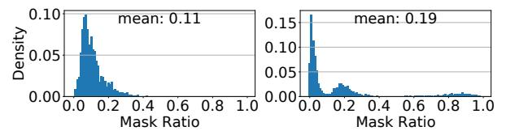
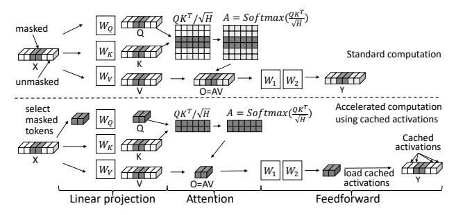
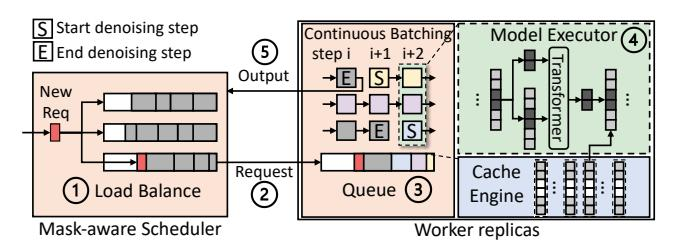
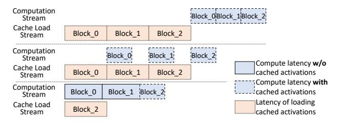
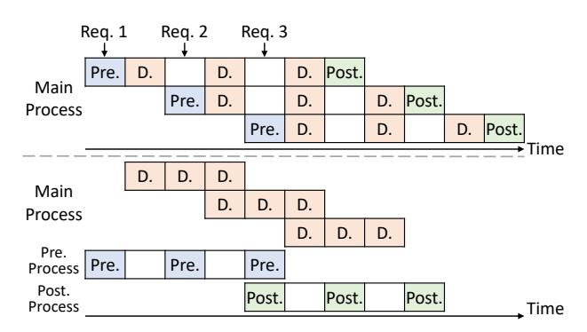
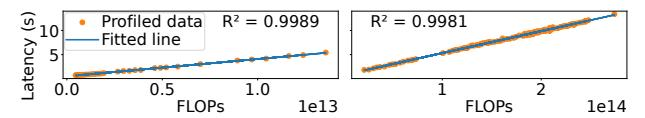
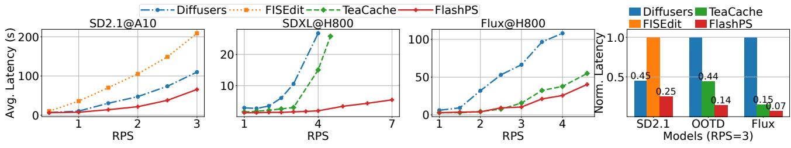
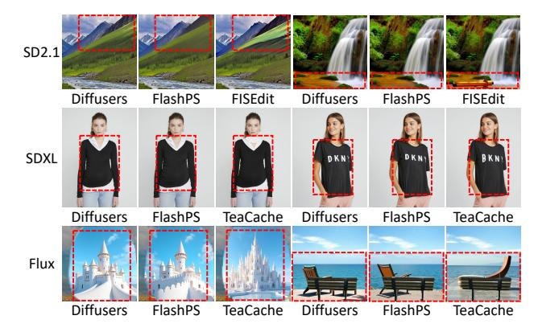
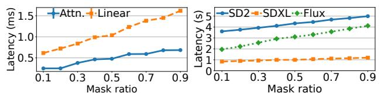
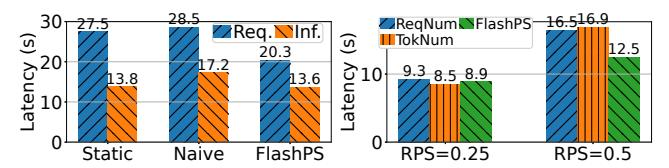

# <span id="page-0-0"></span>FLASHPS: Efficient Generative Image Editing with Mask-aware Caching and Scheduling

Xiaoxiao Jiang\*<sup>1</sup>, Suyi Li\*<sup>#1</sup>, Lingyun Yang<sup>1</sup>, Tianyu Feng<sup>1</sup>, Zhipeng Di<sup>2</sup>, Weiyi Lu<sup>2</sup>, Guoxuan Zhu<sup>2</sup>, Xiu Lin<sup>2</sup>, Kan Liu<sup>2</sup>, Yinghao Yu<sup>2</sup>, Tao Lan<sup>2</sup>, Guodong Yang<sup>2</sup>, Lin Qu<sup>2</sup>, Liping Zhang<sup>2</sup>, Wei Wang<sup>1</sup>

<sup>1</sup>Hong Kong University of Science and Technology, <sup>2</sup>Alibaba Group

#### **Abstract**

Generative image editing using diffusion models has become a prevalent application in today's AI cloud services. In production environments, image editing typically involves a mask that specifies the regions of an image template to be edited. The use of mask provides direct control over the editing process and introduces sparsity in the model inference. In this paper, we present FLASHPS, a system that efficiently serves image editing requests. The key insight behind FLASHPS is that image editing only modifies the masked regions of image templates, while preserving the original content in the unmasked areas. Driven by this insight, FlashPS judiciously skips redundant computations associated with the unmask areas by reusing cached intermediate activations from previous inferences. To mitigate the high cache loading overhead, FlashPS employs a bubble-free pipeline scheme that overlaps computation with cache loading. Additionally, to reduce queuing latency in online serving while improving the GPU utilization, FLASHPS proposes a novel continuous batching strategy for diffusion model serving, allowing newly arrived requests to join the running batch in just one step of denoising computation, without waiting for the entire batch to complete. As heterogenous masks induce imbalanced load, FLASHPS also develops a load balancing strategy that takes into account the loads of both computation and cache loading. Collectively, FLASHPS outperforms state-of-the-art diffusion serving systems for image editing, achieving up to 3× higher throughput and reducing average request latency by up to 14.7× while ensuring image quality.

CCS Concepts: • Computer systems organization  $\rightarrow$  Cloud computing; • Computing methodologies  $\rightarrow$  Computer vision.

**Keywords:** Generative Image Editing; Model Serving

#### **ACM Reference Format:**

Xiaoxiao Jiang\*1, Suyi Li\*#1, Lingyun Yang<sup>1</sup>, Tianyu Feng<sup>1</sup>, Zhipeng Di<sup>2</sup>, Weiyi Lu<sup>2</sup>, Guoxuan Zhu<sup>2</sup>, Xiu Lin<sup>2</sup>, Kan Liu<sup>2</sup>, Yinghao Yu<sup>2</sup>,


This work is licensed under a Creative Commons Attribution 4.0 International License.

EUROSYS '26, April 27–30, 2026, Edinburgh, Scotland Uk
© 2026 Copyright held by the owner/author(s).
ACM ISBN 979-8-4007-2212-7/26/04
https://doi.org/10.1145/3767295.3769379

Tao Lan<sup>2</sup>, Guodong Yang<sup>2</sup>, Lin Qu<sup>2</sup>, Liping Zhang<sup>2</sup>, Wei Wang<sup>1</sup>. 2026. FLASHPS: Efficient Generative Image Editing with Maskaware Caching and Scheduling. In *European Conference on Computer Systems (EUROSYS '26)*, *April 27–30, 2026, Edinburgh, Scotland Uk.* ACM, New York, NY, USA, 17 pages. https://doi.org/10.1145/3767295.3769379

#### 1 Introduction

Diffusion models are making significant strides in generative AI art, enabling the creation of high-quality, contextually accurate images. One of the daily-use image generation tasks is image editing, which modifies specific regions of an existing image template to achieve a desired outcome [16, 29, 41]. Image editing has a wide range of applications, from personal use to professional Photoshop [3, 5], and has fostered various use cases, such as virtual try-on [15, 58], face swapping [54], and image retouching [10]. Due to its wide applicability, image editing has matured into a service offered to users by Adobe and Midjourney [4, 42]. In a recent public diffusion model serving trace [38], 70% of requests require image editing service to edit or retouch an image. Similarly, in our production system, we collect a two-week trace that documents a large-scale image editing service using 20k GPU cards to generate 34 million images.

Typically, users employ a mask alongside other input conditions, such as textual prompts and images, to edit an image template. The use of a mask provides direct control, enabling users to precisely specify a region of arbitrary shape that they wish to modify while leaving the surrounding areas *untouched* [15, 16, 29, 32, 41]. As illustrated in Fig. 1, the mask acts as a guide in the image editing process and is particularly favored by production services that demand accurate editing. Notably, even if some image editing systems do not explicitly require users to provide masks, they will generate one based on other inputs, such as textual prompts, to facilitate the editing of a specific area in an image [10, 60].

Despite the remarkable efficacy of image editing, serving their requests is challenging. In existing systems, the computational complexity of editing an image is roughly equivalent to that of generating an entirely new image [35, 38, 40, 52]. This is because a diffusion model should model the relationships among all the images pixels in both the masked and

<sup>\*</sup>Equal contribution.

<sup>#</sup>Corresponding author: Suyi Li (slida@cse.ust.hk)

<span id="page-1-0"></span>

Figure 1. A virtual try-on example of image editing using a SDXL model on H800. FlashPS achieves a model inference speedup of 1.7× and ensures image quality. The Rightmost image: Naively disregarding unmasked regions in image editing will distort the output image.

unmasked regions to generate an image, using the attention mechanism [\[51\]](#page-14-4): naively disregarding the unmasked region to paint the masked region solely can distort the output image, as shown in Fig. [1.](#page-1-0) Consequently, the requests will suffer from the high computational load of diffusion models, resulting in high inference latency and low serving throughput [\[6,](#page-13-13) [35,](#page-13-11) [38\]](#page-13-9). For example, generating a 1024×1024 image with the SDXL model [\[45\]](#page-14-5) requires 676T FLOPs [\[35\]](#page-13-11), saturating a high-end GPU like A100 [\[38\]](#page-13-9). To address this challenge, existing approaches suggest leveraging multiple GPUs to accelerate the diffusion model inference [\[35,](#page-13-11) [38\]](#page-13-9) or reusing intermediate activations in the inference process to skip computations during inference [\[6,](#page-13-13) [40,](#page-13-12) [60\]](#page-14-2). However, employing multiple GPUs can negatively impact throughput, as existing work [\[35\]](#page-13-11) achieves only a 2.8× speedup using 8× more GPUs. Worse, blindly skipping computation can degrade image quality [\[38\]](#page-13-9), which we will show in [§6.2.](#page-9-0)

In addition to the high computational load, there has been limited attention given to the batching and routing of requests within diffusion model serving systems, resulting in a significant optimization gap. Existing systems [\[19,](#page-13-14) [35,](#page-13-11) [38\]](#page-13-9) typically employ a static batching policy [\[9\]](#page-13-15), where the running batch size remains fixed until its inference completes. As a result, requests that arrive while the model is executing inference cannot be processed until the current execution concludes, leading to prolonged queuing times. Moreover, blindly applying optimized strategies, such as continuous batching [\[33,](#page-13-16) [59\]](#page-14-6), to image editing serving systems can yield suboptimal performance. Additionally, image editing requests vary in the size of utilized mask, as demonstrated by our characterization studies ([§2.2\)](#page-2-0), and this heterogeneity should be considered by the request routing algorithm.

In this paper, we introduce FlashPS, an efficient serving system for generative image editing services. The key idea behind FlashPS is to avoid redundant computations in image editing by leveraging the guidance of the mask. As illustrated in Fig. [1,](#page-1-0) image editing modifies only the masked regions of the image, while preserving the original content in the unmasked areas. Following this insight, FlashPS accelerates the inference by caching and reusing the intermediate activations of the unmasked areas. Accelerating inference for requests further facilitates optimizations that enhance

serving efficiency at the cluster scale, as the computation load of each request is reduced and multiple requests can be served in a batch. In this context, FlashPS adapts the continuous batching strategy [\[33,](#page-13-16) [59\]](#page-14-6) to diffusion model serving and schedules requests judiciously to balance the load across multiple worker replicas. Following the design strategies, FlashPS addresses three key technical challenges.

First, FlashPS accelerates image editing by reducing the computational workload associated with unmasked regions, focusing computation precisely on the masked regions. FlashPS achieves this through mask-aware image editing, which reuses the activations from previous requests to provide global context and pixel interactions for the current request. In [§2.2](#page-2-0) and [§3.1,](#page-4-0) we demonstrate the applicability of this approach to common image editing tasks by characterizing production workloads.

While reusing pre-computed activations can accelerate computation, caching them on the GPU is impractical due to their large size, often on the order of GiB. Therefore, FlashPS stores the activations in host memory and employs a pipeline loading scheme, which overlaps cache loading for unmasked tokens with computation for masked tokens. However, the latency of computation and loading can vary significantly due to the wide range of mask sizes used ([§2.2\)](#page-2-0), which can cause bubbles in a naive pipeline loading scheme, negatively impacting the inference latency. To tackle the challenge, we formulate the pipeline optimization as a dynamic programming problem to squeeze bubbles out and minimize inference latency ([§4.2\)](#page-6-0).

Second, FlashPS improves serving efficiency using a novel continuous batching mechanism [\[33,](#page-13-16) [59\]](#page-14-6), marking its first application in diffusion model serving. Compared to full image generation, the adoption of mask-aware acceleration significantly reduces the computational load per request and thus magnifies the performance gain of batching by 1.29× with a batch size of 4, creating opportunities to leverage batching for higher throughput. We observe that diffusion model computation features an iterative denoising process, where an image is generated through multiple denoising steps, e.g., 50 [\[6,](#page-13-13) [35,](#page-13-11) [38,](#page-13-9) [52\]](#page-14-3). Driven by this observation, we adapted the continuous batching design—originating from large language model (LLM) serving [\[33,](#page-13-16) [59\]](#page-14-6)—for image editing tasks, where completed requests immediately exit from the running batch after each denoising step and new requests can join the running batch in just one denoising step, without waiting for the entire batch inference to complete. However, since diffusion model serving consists of both CPUintensive image processing operations and GPU-intensive computations, naively applying continuous batching will interleave them [\[7,](#page-13-17) [37\]](#page-13-18), leading to suboptimal serving performance ([§6.4\)](#page-11-0). To tackle this challenge, FlashPS proposes a disaggregation method that separates CPU-intensive image processing from GPU-intensive denoising computation by

<span id="page-2-1"></span>

**Figure 2.** A simplified illustration of diffusion model inference. A darker cells/cuboid means it is masked.

distributing them to different processes, thereby preventing CPU operations from interfering with GPU computations.

Third, FlashPS incorporates a load balancing strategy to prevent hotspots within the cluster. Our workload characterization (§2.2) reveals that the masks used in image editing requests differ in size vastly, which can introduce load imbalances among worker replicas if using *mask-aware* acceleration for image editing. Simply dispatching requests uniformly across worker replicas—such as balancing based on the number of requests assigned to each server—is ineffective. To tackle the load imbalance, FlashPS proposes a *mask-aware* load balancing strategy that takes mask size into account to assess a worker's load. In specific, we develop regression models, fitted with the offline data, to estimate the latency of computing and cache loading, thus enabling informed request routing decisions.

Putting it together, we prototype FlashPS on top of HuggingFace Diffusers [52] and evaluate it using real-world masks sampled from production traces. Our evaluation incorporates three diffusion models that have different computational intensities, i.e., SD2.1 [48], SDXL [45], and Flux [34]. We set up NVIDIA A10 and H800 GPUs to evaluate FlashPS and other baselines. Evaluation results show that FlashPS outperforms the state-of-the-arts diffusion model serving systems, including Diffusers [52], FISEdit [60], and TeaCache [40] achieving up to 3× higher throughput and reducing average serving latency by up to 14.7× while ensuring image quality.

#### 2 Background and Motivations

#### <span id="page-2-4"></span>2.1 A Primer on Image Editing

Generative image editing with diffusion models is gaining popularity and has led to various applications such as virtual try-on [58], face swapping [54], and image retouching [10, 12]. This process usually starts with an existing image—an *image template*—in which users mask a specific area for editing. Fig. 1 illustrates a virtual try-on example [58], where users overlay clothing items onto model images to show how the garments would appear on them.

In Fig. 2, we illustrate a simplified image editing process. Initially, the template image and the mask in pixel space are encoded into latent space. A diffusion model then uses the latent for N steps of denoising computation, producing

<span id="page-2-3"></span>

**Figure 3.** Mask ratio distributions of our traces (**Left**) and public trace [38] (**Right**).

a final latent that is decoded into the output image. Key components of diffusion models [20, 34, 45] are multiple transformer blocks<sup>\*</sup>, which primarily perform attention and feed-forward computations [51]. During a step of denoising computation, a latent of shape (B, C, H, W) is reshaped to  $(B, H \times W, C)$  to pass through transformer blocks. This means the transformer receives input with a batch size of B, token length of  $H \times W$ , and hidden dimension of C. The attention mechanism in the transformer blocks captures contextual relationships among pixels to generate high-quality and contextually accurate images. While Fig. 2 illustrates the process of a UNet-based model, i.e., SDXL [45], diffusion transformer (DiT) models [20, 34] follow a similar approach.

#### <span id="page-2-0"></span>2.2 Characterizing Image Editing Workloads

In this section, we characterize the generative image editing workloads using production traces.

**Prevalence.** Image editing services are crucial and pose real-world challenges [4, 42], as evidenced by a recent public trace of image generation [38], where 70% of requests involve image editing services for tasks like image restoration [12], virtual try-on [15, 58] and image inpainting [29]. Additionally, we collected a 14-day workload trace in January 2025, logging a large-scale production image editing service that utilized 20k GPU cards, generating more than 34M images. This service supports face-swap and virtual try-on applications during a nationwide public entertainment event, representing a high-traffic and realistic workload.

The need for masks. Masks play a crucial role in all image editing requests across both traces [15, 16, 29, 32, 38]. While image editing services typically allow users to provide their own masks, these masks can also be automatically generated when users do not specify them [10, 12]. For instance, in the image restoration task from the existing trace [38], which involves repainting hands or faces in newly generated images to correct distortions and enhance details, masks are automatically created using external tools like Adetailer [10, 12] to delineate the editing regions.

Masks differ in sizes and are generally small. We analyze the *mask ratios*—the proportion of masked area to total image area—in the traces [38]. As shown in Fig. 3, the average mask ratios are relatively small: 0.11 in our traces and 0.19 in the public trace. This indicates that editing regions

<span id="page-2-2"></span><sup>\*</sup>For UNet-based models, e.g., SDXL [58], transformer computations account for 82%; diffusion transformer (DiT) models are a stack of transformers.

<span id="page-3-0"></span>

**Figure 4. Left**: Inference latency of a request using different cache loading methods. **Middle**: Queuing times undergone by requests with static batching [9] and FLASHPS's continuous batching under different request traffic. **Right**: P95 tail latency of requests with naive load balance and FLASHPS's *mask-aware* load balance. **RPS**: request per second.

are typically limited in size. We observe similar trends in another popular benchmark for virtual try-on [15], with an average mask ratio of 0.35. While the average is small, individual ratios exhibit a significant variation—meaning, the computation loads for requests can be vastly different, particularly if the editing inference process is *mask-aware* as the computation can vary substantially with the specific masks.

Reusability of the templates. Image editing tasks in the traces reveal that most requests involve modifying either existing image templates or newly generated images. In our trace, only 970 templates were utilized among the 34 million generated images, with each template being reused an average of 35,000 times. Similarly, the public trace [38] shows that image restoration is immediately applied upon generating a new image. This observation suggests that for an image template to be edited, the intermediate activations of each pixel have likely been generated before and are available for reuse if possible. In §3.1, we will analyze the activations associated with pixels generated by different image editing requests that target the same image template and discuss the feasibility of reusing these activations.

#### 2.3 Opportunities and Challenges

Our characterization studies highlight the widespread use of masks in image editing. Notably, for an image template, the masked regions are typically small, and the activations of the unmasked pixels are available from previous requests. Driven by this observation, we propose the key insight that reusing activations associated with the pixels in the common unmasked regions can substantially reduce computational load. Specifically, activations can be cached for reuse. When a request edits an image template, the activations of the unmasked regions can be reused instead of recomputed, thereby accelerating inference. However, enabling mask awareness in the serving system poses significant challenges.

**C1:** High cache loading overheads. The primary goal of an image editing serving system is to achieve low serving latency for real-time user interaction [6, 38]. Given that the size of cached activations for an image template is on the order of GiB, storing them on GPU HBM is impractical. While

host memory (DRAM) provides a feasible alternative, it incurs significant cache loading overhead. As shown in Fig. 4-Left, naively performing sequential loading of activations from DRAM to HBM and executing inference can increase inference latency by 102% for a SDXL model running on a H800 using PCIe Gen5 [58], compared with the ideal scenario where loading overhead is eliminated. FlashPS achieves performance comparable to the ideal case with its *bubble-free* pipeline scheme, which effectively overlaps cache loading and computation (§4.2).

C2: Long queuing delay. Using cached activations instead of recomputing significantly reduces computational load: a single editing request can no longer saturate a GPU [35, 38]. This enables a unique opportunity to batch serving multiple requests for enhanced throughput and GPU utilization. However, naive static batching [9] in existing diffusion model serving systems [19, 35, 38] can result in 2× longer average queuing delays compared with FlashPS's batching strategy, as shown in Fig. 4-Middle, where we deploy a Flux model on H800. This is because static batching does not allow new arrived requests to join the running batch on a worker until the inference of the running batch concludes. Further, directly applying existing continuous batching strategies [33, 59] yields suboptimal performance, increasing the tail latency by 40%, which we will elaborate in §4.3 and §6.4.

**C3: Load imbalance.** Our characterization studies show that masks vary in size, leading to a load imbalance problem among worker replicas if enabling *mask-aware* image editing inference (§4.2). Fig. 4-Right illustrates an experiment using Flux models on H800 GPUs, where a naive request-level load balancing strategy that uniformly assigns requests to workers is ineffective, increasing the P95 latency by 32%. This highlights the need for a *mask-aware* request scheduler that accounts for the impacts of mask size on image editing computations to route requests.

#### <span id="page-3-1"></span>2.4 Inefficiencies of Existing Works

In this part, we briefly describe existing diffusion model serving systems and discuss why they cannot address the above challenges. Existing diffusion model serving systems are mask-agnostic and produce edited images through fullimage generation [52]. Consequently, they suffer from long inference latency due to the high computational load of the involved diffusion models [6, 35, 38]. While there have been tailored inference optimizations for diffusion models, such as leveraging multiple GPUs [35] for parallel model inference or reusing intermediate activations in the inference to skip computations [6, 40], these optimizations target general image generation tasks and overlook the guidance of masks in image editing. Naively applying these techniques can negatively impact serving throughput and image quality. For example, DistriFusion [35] achieves a 2.8× speedup using 8× more GPUs. Although skipping computations can reduce

inference latency without requiring more GPUs, we show that this method can degrade image quality in image editing tasks (§6.2). Previous work also exploits sparse computation to accelerate diffusion model inference for image editing by only computing the activations for the masked region using specifically designed sparse kernels. However, this method only applies to small-sized model, i.e., SD2.1 [48] and cannot serve requests with different mask ratios in a batch, leading to degraded serving performance (§6.2).

In addition, existing systems primarily optimize diffusion model inference on a single server and often adopt a constant batch size of 1 due to the heavy computational load of the diffusion models [6, 35, 38, 52]. Due to its limited batching benefits [38], static batching strategy is employed [9, 19], which can result in long queueing times and increase the tail latency of request serving by 35% (C2) when a server handles multiple requests in a batch. Besides, none of these systems addresses the issue of load imbalance (C3).

## 3 Mask-Aware Image Editing

# <span id="page-4-0"></span>3.1 Key Insight

As discussed in §2.4, existing diffusion model serving systems perform full-image regeneration to edit an image, and thus suffer from high computational load. To address the limitation, an efficient serving system should exploit sparsity introduced by the masks to accelerate image generation without compromising image quality.

Following this insight, we propose a *mask-aware* serving system, which selectively reduces the computational load associated with the unmasked regions in an image template to accelerate the image editing process. As discussed in §2.1, pixels in an image are mapped as tokens for transformer block computation. Leveraging the mask, we can categorize the tokens as *masked tokens* and *unmasked tokens*, allowing us to precisely differentiate their computations in the transformer blocks. For an image template, its pixels corresponding to the unmasked tokens are supposed to be untouched. Intuitively, intermediate activations generated during inference computation that are associated with these unmasked tokens can be cached and reused in subsequent requests that edit the same template, thereby eliminating the need for re-computation.

**How does it work in FlashPS?** In Fig. 5, we show the main computation operators in a transformer block and compare the standard computation flow with that of FlashPS.

Tokens in transformer blocks are discrete, and their computations are generally independent, except during the attention computation [51], where the computations of  $\mathbf{Q}\mathbf{K}^T$  and softmax(·) introduce inter-token dependencies, i.e., the computation results rely on the values of multiple tokens. Other computations, including linear projection, feedforward, LayerNorm [11], GeLU activation, and dropout, are token-wise, meaning that the computation of each token occurs independently of the others. Consequently, for these

<span id="page-4-1"></span>

**Figure 5.** Main computations in a transformer block. A darker cell/cuboid means it contains more information about the masked tokens. We omit LayerNorm [11], GeLU, and dropout for simplicity, which will not affect the results.

<span id="page-4-2"></span>

**Figure 6.** Token activations and attention scores in a SDXL model. **Left**: Cosine similarity of activations. **Right**: Zoomedin visualization of attention scores. Tokens with ID 200-236 are masked and with ID 237-300 are unmasked.

token-wise operations, we can precisely differentiate the computations of the masked tokens and the unmasked tokens, with no assumption of the shape of masks.

Mask-aware attention. Fig. 5-Top illustrates the standard computation process of a transformer block. We start with an input  $X \in \mathbb{R}^{B \times L \times H}$ , where B is the batch size, L is the token length, and H is the hidden dimension. Some tokens within X are masked. First, a linear projection maps X into Q, K, V, using the weight matrices W<sub>Q</sub>, W<sub>K</sub>, W<sub>V</sub>, respectively. As the linear projection computation is token-wise, the computations for masked and unmasked tokens are independent. Subsequently, the scaled matrix multiplication  $\mathbf{O}\mathbf{K}^{\mathrm{T}}/\sqrt{H}$  combines **O** and **K**, during which the values of masked and unmasked tokens are multiplied according to the rule of matrix multiplication. This results in some entries in the resulting matrix being derived from both masked and unmasked tokens (indicated by lighter gray cells). Then, the softmax function is applied row-wise to  $QK^T/\sqrt{H}$ , producing A, where all elements in A will be derived based on the value of masked tokens. While the subsequent computations O = AV and feedforward are token-wise, the activations in the output Y corresponding to the unmasked tokens are indirectly affected by the values of the masked tokens.

However, we observe that the activations corresponding to unmasked tokens in Y exhibit high similarity across different requests (those lighter gray cuboids in Y in Fig. 5-Top). This can be interpretable as the unmasked tokens are supposed to be untouched during image editing. To verify this,

<span id="page-5-0"></span>

Figure 7. An alternative approach of caching K and V.

we collect the activations from matrix Y and calculate the average cosine similarities between corresponding masked and unmasked tokens, as shown in Fig. 6-Left. The results confirm that the activations for unmasked tokens in Y are indeed highly similar across different images. Additionally, in Fig. 6-Right, we further visualize the attention score matrix (A in Fig. 5) and observe that masked tokens primarily attend to other masked tokens (③), while unmasked tokens predominantly attend to other unmasked tokens (①). Masked and unmasked tokens attend to each other significantly less (② and ④), which aligns with the findings in [58].

Driven by the observation, we propose to reduce the computational load associated with unmasked tokens by reusing cached activations, as illustrated in Fig. 5-Bottom. Given X with some tokens masked, we extract the matrix of masked tokens, project it into Q, and compute an Y matrix exclusively for the masked tokens, while replenishing cached activations for the unmasked tokens. Although reusing cached activations may slightly alter the image generation process, analysis in Fig. 6 supports the feasibility of the approach. Further, our evaluation in §6.2 shows that the images generated using cached activations are visually indistinguishable from those produced through the original computation.

The method of selecting masked tokens is analogous to the decoding process in large language model inference, where the prediction of the next token utilizes the Q matrix of only the newly generated token along with the K and V matrices of all present tokens.

Alternative approaches. While our approach in Fig. 5-Bottom utilizes cached activations on Y, an alternative strategy is to apply cached activations on K and V instead, as illustrated in Fig. 7. This approach is analogous to the well-known concept of KV-cache in LLM serving [33, 46], a technique that helps speed up LLM decoding process by reusing cached K and V activations, instead of recomputing them from scratch, making text generation much faster and more efficient. However, this approach doubles the sizes of the cached activations while offering only marginal advantages compared to the approach in Fig. 5-Bottom. With a mask ratio of 20%, caching K and V reduces the latency by 10% compared to caching Y, from 2.27s to 2.06s.

#### 3.2 Analysis of Speedup and Caching Overhead

In this part, we mathematically analyze the speedup and caching overhead associated with the approach in Fig. 5-Bottom, as summarized in Table 1. We focus primarily on

<span id="page-5-1"></span>

|                 | Ori. FLOP  | Acc. FLOP   | Speedup       | Cache Shape              |  |
|-----------------|------------|-------------|---------------|--------------------------|--|
| $(XW_1)W_2$     | $O(BLH^2)$ | $O(BmLH^2)$ | $\frac{1}{m}$ | $(B, (1-m) \times L, H)$ |  |
| XW              | $O(BLH^2)$ | $O(BmLH^2)$ | $\frac{1}{m}$ | $(B, (1-m) \times L, H)$ |  |
| $QK^T/\sqrt{H}$ | $O(BL^2H)$ | $O(BmL^2H)$ | $\frac{1}{m}$ | $(B, (1-m) \times L, H)$ |  |

**Table 1.** Analysis of the speedup and cache sizes. Without loss of generality, we define an input  $\mathbf{X} \in \mathbb{R}^{B \times L \times H}$ ; a mask ratio  $m \leq 1$ ; two layers in feedforward computation  $\mathbf{W}_1 \in \mathbb{R}^{H \times 4H}$  and  $\mathbf{W}_2 \in \mathbb{R}^{4H \times H}$ ;  $(\mathbf{X}\mathbf{W}_1)\mathbf{W}_2$  denotes feed-forward;  $\mathbf{X}\mathbf{W}$  denotes linear projection;  $\mathbf{Q}\mathbf{K}^T/\sqrt{H}$  denotes the scaled dot-product attention.

<span id="page-5-2"></span>

Figure 8. An overall architecture of FLASHPS.

the computations involved in the feedforward and the linear projection and attention score computations of the attention mechanism. As indicated in Table 1, the computational and caching overhead of mask-aware image editing is predominantly determined by the batch size B and the mask ratio m, since the values of L and H typically remain constant for a given diffusion model.

The serving batch size B within a worker is determined by how a scheduler routes requests across workers and how a worker handles requests in a batch, while the mask ratio m is input-dependent and varies significantly (§2.2). Consequently, challenges of batch serving and request routing emerge in an image editing serving system (C2 and C3).

#### 4 FLASHPS System Design

This section presents FlashPS, an efficient serving system with the *mask-aware* image editing approach (§3.1). Within a worker, FlashPS accelerates the inference of image editing by reusing the pre-computed activations to avoid the redundant computation for the unmasked region. Besides, it firstly adapts continuous batching to diffusion model serving to minimize the queueing times of requests. At the cluster scale, FlashPS features a mask-aware request routing strategy for balancing the workload across workers.

#### 4.1 System Overview

Fig. 8 illustrates the system architecture, which consists of a cluster of worker replicas and a scheduler.

**Workflow.** As shown in Fig. 8, new requests first arrive at the scheduler (①), which uses the mask-aware scheduling algorithm described in §4.4 to route them to the appropriate

<span id="page-6-1"></span>

**Figure 9. Top**: Naive caching loading. **Middle**: Strawman pipeline loading. **Bottom**: Bubble-free pipeline loading.

workers (②). Employing a continuous batching strategy detailed in §4.3, the worker fetches requests from the request queue (③) for the diffusion model (④) to process, wherein the model interacts with the cache engine to speed up image generation through caching, as explained in §4.2. Finally, the output images are returned to the users (⑤).

#### <span id="page-6-0"></span>4.2 Efficient Image Editing with Caching

Following the design approach in §3.1, we implement an efficient image editing with caching in the FlashPS's worker replicas. Though reusing cached activations can reduce the computational load, the storage and loading of the cached activations pose significant challenges. First, the size of cached activations of a template image is large, reaching up to 2.6 GiB for a SDXL model [58]. As the number of image templates can be large, storing all activations in the limited high-bandwidth memory (HBM) of GPUs is impractical. To address this challenge, FlashPS utilizes host memory and disk storage for cached activations storage. However, loading cached activations from slow medium to HBM can result in high loading overhead. This overhead becomes more significant when the mask ratio is smaller and the size of cached activations gets larger (§2.2).

Strawman solutions to loading cached activations. Naively loading cached activations from slower mediums to HBM can block the computation and cause a waste of computational resources, since the computation stream relies on the cached activations to execute the mask-aware image editing inference computation, as shown in Fig. 9-Top. This overhead becomes more significant for the smaller mask ratios §2.2.

To eliminate this overhead, a strawman solution is to employ a block-wise pipeline loading scheme to mitigate the impact. The main idea is to overlap the loading of the cached activations for unmasked tokens with the inference computation of the masked tokens. In particular, the diffusion model comprises a sequence of transformer blocks, where one transformer's input depends on its precedent's output. Therefore, we cache the activations at the granularity of transformer blocks. As shown in Fig. 9-Middle, it first loads the cached activations of the first block. Starting from loading the second block, the pipeline is built: while loading the  $i^{th}$  block, the computation stream can concurrently execute the computation of the  $(i-1)^{th}$  block.

However, bubbles will exist in the pipeline. First, before initiating the computation of the first block, the cached activations for this block must be prepared in the HBM. The cache load stream first issues the loading of cached activations for the first block into the HBM. Only after this is complete can the computation stream start processing the first block. As a result, a bubble forms due to the loading of the first block by the cache load stream. Second, when the mask ratio is small, the latency for loading a block can exceed its computation latency. In such cases, bubbles will appear between the computations of two adjacent blocks, as shown in Fig. 9-Middle.

Bubble-free pipeline. FLASHPS eliminates the pipeline bubbles by selectively using cached activations for transformer blocks within a diffusion model, as illustrated in Fig. 9-Bottom. For blocks that do not use cached activations, FLASHPS computes all tokens—both masked and unmasked without distinguishing between them, thereby avoiding the loading latency associated with cached activations. For example, in Fig. 9-Bottom, only the activations of Block<sub>2</sub> are loaded, while  $Block_0$  and  $Block_1$  do not use cached activations. To determine which blocks should use cached activations, we formulate a dynamic programming (DP) problem aimed at minimizing inference latency, as described in Algo. 1. The complexity of the DP algorithm is O(N), where N is the number of transformer blocks in the diffusion model, typically on the order of tens. Therefore, the overhead of solving Algo. 1 is negligible.

#### **Algorithm 1:** DP for pipeline loading

<span id="page-6-2"></span>**Input:** N: the number of transformer blocks in a diffusion model;  $C_{\mathbf{w}}^{m}$ : the block's computation latency of mask ratio m with cached activations;  $C_{\mathbf{w}/o}$ : the block's computation latency without any cached activations;  $L^{m}$ : the loading latency of the block of mask ratio m.

Output: useCache: a list to indicate whether to use cached activations for each block; pipeline\_latency: the minimal inference latency of the pipeline.

```
// Initialize computation & loading time, caching decisions
1 \ comp \leftarrow [0]^{N+1}, load \leftarrow [0]^{N+1}, useCache \leftarrow [0]^{N}
2 for i \in \{1, 2, ..., N\} do
          \mathbf{if} \, \max(load_{i-1} + L^m, comp_{i-1}) + C^m_{w.} \leq comp_{i-1} + C_{w/o}
3
            then
               load_i \leftarrow load_{i-1} + L^m
 4
                comp_i \leftarrow \max(load_{i-1} + L^m, comp_{i-1}) + C_{w.}^m
 5
               useCache[i-1] \leftarrow True  \triangleright Load cached activations
          else
               load_i \leftarrow load_{i-1}
                comp_i \leftarrow comp_{i-1} + C_{w/o}
                useCache_{i-1} \leftarrow False \quad \triangleright Compute
11 pipeline\_latency \leftarrow comp_N
```

Algo. 1 can also be applied in the case where the mask ratio is large, which means the computation latency for a block with cached activations exceeds the latency of loading those cached activations. In this case, the inference process becomes computation-bound, and bubbles may appear in the cache load stream. Despite these bubbles, FlashPS does not eliminate them, as all masked tokens must be processed to ensure image quality.

Hierarchical storage for activations As we will show in Fig. [14,](#page-10-0) the serving throughput of a diffusion model serving engine plateaus at a small batch size of 8, which is typically configured as the engine's maximum batch size [\[14\]](#page-13-23). Consequently, storing the activations for inflight requests in the running batch usually requires tens of GiBs of host memory, which is negligible compared to the TiB-scale host memory capacities of modern GPU servers [\[1,](#page-13-24) [2\]](#page-13-25). For instance, a machine with 2 TiB of host memory [\[2\]](#page-13-25) can store up to 787 copies of the activations for the image template used in Fig. [1,](#page-1-0) providing a sufficiently large cache to accommodate activations of image templates ([§2.2\)](#page-2-0).

Despite the capacity of host memory, FlashPS also supports storing cached activations on distributed storage systems or local disks, significantly expanding the storage available for caching activations. However, the I/O speed of these secondary storage media is on the order of GiB/s, much slower than the tens of GiB/s bandwidth provided by host memory [\[38\]](#page-13-9). To utilize the distributed storage system effectively, FlashPS evicts cold activations from host memory to secondary storage based on an LRU (least-recently-used) policy. When a request arrives, if its required activations are not in host memory, FlashPS begins loading them from secondary storage into host memory. This process can run concurrently while the request is queuing, following a stateof-the-practice approach used in KV cache management for LLMs [\[22\]](#page-13-26). In [§6.2,](#page-9-0) our evaluation shows that requests often experience a few seconds of queuing time, which is sufficient for loading activations from secondary storage. For instance, loading the cached activations of the image template in Fig. [1](#page-1-0) from disk takes 6.4 seconds.

## <span id="page-7-0"></span>4.3 Continuous Batching

Leveraging the masks in image editing, FlashPS significantly reduces the computational load per request, which can magnify the performance gain of batching by 1.29× on a Flux model, compared with full-image regeneration. However, existing diffusion model serving systems often neglect the advantages of batching [\[35,](#page-13-11) [38\]](#page-13-9). Consequently, these systems typically adopt a simplistic static batching approach [\[9,](#page-13-15) [19\]](#page-13-14), which maintains a fixed running batch size until the running batch completes, leading to extended queuing times and low GPU utilization.

We observe that diffusion models employ an iterative denoising process ([§2.1\)](#page-2-4), where a latent undergoes multiple denoising steps before being decoded into the final output image. The iterative nature of this denoising process is akin to the iterative decoding in LLMs. Drawing on this parallel,

<span id="page-7-1"></span>

Figure 10. Top: A strawman continuous batching. Bottom: Adapted continuous batching in FlashPS. Pre.: preprocessing; D.: denoising; Post.: postprocessing.

FlashPS adapts the continuous batching strategy to diffusion model serving. Typically, an image generation request is processed through a sequence of steps: one-step preprocessing, multi-step denoising computations, and one-step postprocessing. In diffusion model serving, continuous batching is applied at the step level. This means that once a request completes all steps of computation, it is immediately removed from the running batch; new requests can join the batch in just one step, without waiting for the entire batch inference to complete.

Strawman solution. A strawman continuous batching is illustrated in Fig. [10-](#page-7-1)Top, where preprocessing and postprocessing can frequently disrupt the denoising computations [\[7,](#page-13-17) [37\]](#page-13-18), cumulatively affecting request serving. In Fig. [10-](#page-7-1)Top, the serving of request 1 is interrupted by the preprocessing of the request 2 and 3. In diffusion model serving, the preprocessing and postprocessing are CPU-intensive tasks that involve substantial serialization and deserialization computations for images. While the overhead of these operations might be negligible when considered individually, their cumulative impact can significantly increase request serving latency. As demonstrated in [§6.4,](#page-11-0) our microbenchmark evaluation shows that requests can be interrupted up to 8 times, resulting in a 40% increase in P95 request serving latency.

Disaggregation. To address the issue, FlashPS disaggregates the preprocessing/postprocessing from the iterative denoising computation by distributing them across different process, as shown in Fig. [10-](#page-7-1)Bottom. The main process is dedicated to GPU-intensive denoising computations, while CPU-intensive preprocessing and postprocessing tasks are offloaded to independent processes. Consequently, the main process will not be interrupted, reducing the tail latency (P95) of request serving by 29% in evaluation ([§6.4\)](#page-11-0).

Comparison with LLM's continuous batching. The main difference of continuous batching in diffusion model serving and LLM serving results from the inherent model differences. LLM's continuous batching cannot be directly

<span id="page-8-1"></span>

Figure 11. Visualization of the models to estimate computation latency. **Left**: SDXL on H800. **Right**: Flux on H800.

applied due to the pre-/post-processing steps in image generation, which are absent in LLM serving. These extra operations from new requests disrupt all ongoing requests, creating a cumulative effect as shown in Fig. 10-Top, where Req1 experiences two disruptions.

#### <span id="page-8-0"></span>4.4 Mask-Aware Scheduler

Our characterization studies (§2.2) show that masks vary significantly in size. Therefore, naively scheduling requests across worker replicas, such as using the First-Fit bin-packing algorithm [14], will naturally introduce load imbalances for workers. This issue of load imbalance is also prevalent in LLM serving, where previous research often employs load balancing strategies that assess worker load based on the number of assigned requests or the number of tokens in those requests [46, 50]. However, these methods fail to accurately gauge the load on a worker in FlashPS, resulting in 35% increase in request tail latency (P95) in §6.5.

Estimate a worker's load. Based on the design outlined in §4.2 and §4.3, each worker in FlashPS will handle multiple requests in a batch, which involves *computing* the masked regions for images and *loading* cached activations. As shown in Table 1, the computational load and cache loading are largely determined by the mask ratio of requests. Given the wide variation in mask ratios (§2.2), simple load balancing at the request or token granularity will overlook the impact of mask ratio, failing to accurately reflect the computation and cache loading latencies, which can degrade cluster-level serving performance.

To address the challenge, FLASHPS employs linear regression models to estimate computation latency and cache loading latency based on the mask ratios for a batch of requests. This approach helps evaluate the load on a worker replica. Linear models are chosen because both the computational load and cache sizes scale linearly with the mask ratio (Table 1). These regression models can be fitted using offline data. In Fig. 11, we visualize the models used to estimate the computation latency for a batch of requests. Each request has different mask ratios. Following Table 1, for a batch of requests, we compute FLOPs of the inference computation based on their mask ratios, which are mapped to inference latency by the regression models. Our models can accurately fit the data, achieving a high coefficient of determination ( $R^2$ ) of 0.99, suggesting the models can predict performance almost perfectly:  $R^2$ =1 indicates a perfect fit. The parameters of the regression models vary with diffusion models and GPUs.

Load balance across worker replicas. Achieving optimal load balance across worker replicas requires prior knowledge of request details, such as arrival times and mask ratios. With this information, an optimal load balance schedule could theoretically be available by employing bin packing algorithms to evenly distribute the load among worker replicas. However, this assumption is unrealistic in online model serving, where request arrival patterns are bursty [23, 63] and mask ratios vary widely (§2.2). Additionally, online migration of requests among worker replicas for load balance [57] is impractical in image editing serving due to the significant data communication overhead of large latents, as well as image serialization and deserialization overheads, which can take 20% of the inference latency of editing an image.

To address these challenges, we utilize the established regression models to develop a greedy mask-aware scheduling algorithm that dynamically assigns new requests across worker replicas (Algo. 2). The scheduler selects the worker replica with the minimum estimated load to handle each new request. It keeps track of the runtime status of worker replicas, such as the slack in their running batches. Upon receiving a new request, the scheduler identifies candidate workers and calculates a cost score for each one. This cost score estimates the load in terms of serving latency on a worker candidate if the new request were allocated to it, derived from extending Algo 1, where the  $C_w^m$ ,  $C_{w/o}$  and  $L^m$ of transformer blocks are estimated using the developed regression models. The scheduler then assigns the request to the worker candidate with the lowest cost score, ensuring effective load distribution. In §6.5, we evaluate our maskaware load balance scheduler, which decreases tail request latency by up to 26%, compared to baselines. Additionally, in §6.6, we demonstrate that the load balance scheduler incurs negligible overhead relative to request serving latency.

#### **Algorithm 2:** Mask-Aware Scheduling Policy

```
Input: Workers: a cluster of worker replicas; R: a newly coming
          request; Comp(\cdot), Load(\cdot): lienar regression models for
           Computation and Cache loading; dp(batch, Comp(\cdot)),
          Load(\cdot)): a function that extends Algo. 1 to return a
          pipeline and execution latency.
1 Function CalcCost(req, worker):
2
        new_batch \leftarrow worker.running_batch + req
        results \leftarrow dp(new_batch, Comp(\cdot), Load(\cdot)))
       return results.pipeline_latency
5 while True do
        Request R arrives
        // Find candidate workers with slack in its running batch
7
        candidates ← available workers
        for worker \in candidates do
8
            worker.cost \leftarrow CalcCost(R, worker)
        best \leftarrow min(candidates, key=lambda \ x: \ x.cost)
10
       best.serve(R)
```

# 5 Implementation

FlashPS is an end-to-end serving system featuring a FastAPI frontend [\[21\]](#page-13-28) and a GPU-based inference engine. The frontend enables users to customize image generation parameters for requests, including image templates, masks, and input conditions. The backend engine is built on Diffusers [\[52\]](#page-14-3), a PyTorch-based diffusion model inference framework that incorporates state-of-the-art model optimization techniques [\[28\]](#page-13-29), such as FlashAttn [\[18\]](#page-13-30). Mask-aware image editing is achieved by adapting the attention operator and utilizing CUDA streams to load cached activations asynchronously. We implement request queues for continuous batching and load balance scheduler using asyncio [\[30\]](#page-13-31). Communication between the scheduler and workers is facilitated via ZeroMQ [\[61\]](#page-14-12).

# 6 Evaluation

We evaluate FlashPS's performance in terms of serving efficiency and image quality. We first compare FlashPS's endto-end serving performance with strong baselines and then evaluate the effectiveness of FlashPS's designs, respectively. Evaluation highlights include:

- FlashPS achieves efficient serving performance while maintaining image quality, reducing request serving latency by 14.7× compared with state-of-the-art baselines ([§6.2\)](#page-9-0).
- FlashPS's mask-aware image editing effectively leverages the sparsity from the mask, achieving empirical results consistent with the theoretical analysis in Table [1](#page-5-1) ([§6.3\)](#page-11-2).
- FlashPS's continuous batching design effectively reduce the queuing times, reducing requests' P95 tail latency by up to 29%, compared with the static batching and strawman continuous batching solution. ([§6.4\)](#page-11-0).
- FlashPS's load balance scheduling can decrease the tail request latency by up to 26% compared to baselines ([§6.5\)](#page-11-1).
- FlashPS incurs negligible system overheads ([§6.6\)](#page-12-0).

#### <span id="page-9-1"></span>6.1 Experimental Setup

Models and serving configurations. We use SD2.1 [\[48\]](#page-14-7), SDXL [\[58\]](#page-14-0) and Flux [\[34\]](#page-13-19) in our evaluation. For SD2.1, we serve it with NVIDIA A10 GPUs. For SDXL and Flux, we serve it on NVIDIA H800 GPUs. For each model, we use the default settings to generate images, including the denoising steps and image resolutions, for the best image quality.

Performance metrics Our evaluation mainly concerns two metrics, serving latency and image quality. For serving latency, we primarily measure the end-to-end request latency. For image quality, we use the following quantitative metrics that are widely adopted [\[6,](#page-13-13) [15,](#page-13-5) [16,](#page-13-0) [35,](#page-13-11) [38,](#page-13-9) [45,](#page-14-5) [58\]](#page-14-0).

• CLIP [\[25,](#page-13-32) [47\]](#page-14-13) score evaluates the alignment between generated images and their corresponding text prompts. A higher CLIP score indicates better alignment (↑).

- Fréchet Inception Distance (FID) score [\[26\]](#page-13-33) calculates the difference between two image sets, which correlates with human visual quality perception [\[6,](#page-13-13) [38\]](#page-13-9). A low FID score means that two image sets are similar (↓).
- Structural Similarity Index Measure (SSIM) score [\[56\]](#page-14-14) measures the similarity between two images, with a focus on the structural information in images. A higher SSIM score suggests a greater similarity between the images (↑).

Baselines. We consider the following baselines.

- Diffusers [\[19,](#page-13-14) [52\]](#page-14-3) is a standard baseline. It uses static batching [\[9,](#page-13-15) [19\]](#page-13-14) and does not have a load balance policy.
- FISEdit [\[60\]](#page-14-2) accelerates image editing leveraging the sparsity introduced by the mask. However, it only works with SD2.1 and does not support batching and load balance.
- TeaCache [\[40\]](#page-13-12) accelerates image generation by caching and reusing intermediate activations to skip computations during the denoising process. Although it can be applied to various diffusion models, it suffers from a latency-quality tradeoff. We configure TeaCache to minimize its inference latency while ensuring acceptable image quality.

Note that, we implement static batching [\[9\]](#page-13-15) and requestlevel load balancing for these baselines. The advantages of FlashPS's continuous batching and load balancing will be demonstrated through microbenchmarks in [§6.4](#page-11-0) and [§6.5.](#page-11-1)

Workloads. To evaluate online serving efficiency, we generated request traffic following Poisson processes with varying request per second (RPS), which is widely used in simulating invocations to model serving system [\[14,](#page-13-23) [49,](#page-14-15) [63\]](#page-14-10). For each request, we set its mask ratio following the distributions in Fig. [3,](#page-2-3) which are collected from production traces. To evaluate the quality of the generated images from each baseline, we include three benchmarks that contain image editing tasks using masks of arbitrary shapes. We elaborate the results in Table [2.](#page-11-3)

#### <span id="page-9-0"></span>6.2 End-to-end performance

Online serving efficiency. We evaluate the online serving performance on a machine equipped with 8 GPUs, allocating one GPU per worker. For SD2.1, we use A10 GPUs, while H800 GPUs are used for SDXL and Flux, as FISEdit is not compatible with NVIDIA Hopper architecture GPUs. Each baseline is evaluated under varying RPS to shown a spectrum of performance. The maximum batch size is set to 4 for SD2.1 workers, and 8 for SDXL and Flux. For each request, we measured its end-to-end serving latency. As shown in Fig. [12,](#page-10-1) FlashPS consistently outperforms existing systems across all scenarios, reducing the average latency by up to 14.7× compared to Diffusers, 4× compared to FISEdit, and 6× compared to TeaCache. In the rightmost plot of Fig. [12,](#page-10-1) we present the normalized queuing times for each setting when = 3. Compared to the three baselines, FlashPS significantly reduces queuing overhead, thanks to its effective

<span id="page-10-1"></span>

Figure 12. End-to-End request serving performance. Rightmost: Queuing times of requests.

<span id="page-10-2"></span>

**Figure 13.** Examples of images generated by each baseline. All images are edited following the guidance of irregularly shaped masks. Dashed rectangles are used as visualization bounding boxes to highlight the major masked areas.

<span id="page-10-0"></span>

Figure 14. Engine serving performance.

continuous batching strategy (§4.3), leading to more stable serving latencies as RPS increases. Diffusers suffers from prolonged model inference latency and substantial queueing overhead because it does not leverage the sparsity introduced by the mask and relies on a static batching policy [9] to handle requests. FISEDIT, on the other hand, does not support batch serving requests with different mask ratios, meaning most requests must be executed one at a time on a worker. Consequently, requests experience long queuing times, which further exacerbate serving latency. While Tea-Cache accelerates model inference, its lack of continuous batching results in considerable queuing overhead.

With the *mask-aware* load balance design (§4.4), FlashPS also excels regarding tail latency. At *RPS* = 3, FlashPS reduces the P95 request latency by 88%, 71%, and 60% compared to Diffusers, FISEDIT, and TeaCache, respectively.

**Serving engine performance.** We next evaluate the throughput of each baseline's serving engine under varying batch

sizes in Fig. 14. SD2.1 on A10 is omitted because FISEDIT causes GPU OOM errors when the batch size exceeds 2. Thanks to *mask-aware inference*, FLASHPS achieves up to 3× higher throughput than baselines for batch sizes of 2 or larger, featuring a sustained growth in throughput as the batch size increases, whereas the throughput of other baselines plateaus much earlier with marginal batching effects.

Notably, FlashPS achieves lower throughput than Tea-CACHE without batching (i.e., with a batch size of 1). This is due to limited GPU streaming multiprocessor (SM) utilization in FLASHPS, as mask-guided selection significantly reduces the number of tokens involved in computation. In contrast, TeaCache engages all tokens, fully saturating the SMs even without batching. However, this reduction in token count enhances the effectiveness of batching, necessitating the adoption of continuous batching strategies (§4.3) and helping FlashPS regain its performance advantage in practical serving scenarios where batch sizes are typically large. Image quality. We next evaluate the image quality generated by DIFFUSERS, FISEDIT, and TEACACHE, using DIF-FUSERS as the baseline for generating standard-quality images. Using three benchmarks, we compare the image quality across these systems and present the results in Table 2. Note that these three benchmarks have different inherent characteristics. For example, VITON-HD [15] is a reference-based texture transfer task, transferring an image of cloth onto an image of model, as shown in Fig. 1. Therefore, it is considerably more constrained and deterministic for image generation than other prompt-based creative inpainting benchmarks, such as InstructPix2Pix [13] and PIE-Bench [31].

1) Quantitative evaluation. CLIP scores assess the alignment between generated images and their corresponding textual prompts [44]. On the benchmarks of SD2.1 [48] and Flux [34], FlashPS outperforms FISEDIT and TeaCache, exhibiting better alignment and rivaling Diffusers 's standard-quality. For the SDXL benchmark, where input conditions are images (as depicted in Fig. 1), CLIP scores are not applicable.

FID and SSIM scores measure the similarity between the generated images and the standard images ("ground truth"). Therefore, we use the images generated by Diffusers as the ground truth, as it represents the standard for diffusion model serving systems. In Table 2, FlashPS outperforms both FISEDIT and TeaCache, demonstrating its ability to

<span id="page-11-3"></span>

| Model/Dataset        | System         | CLIP(↑) | FID (↓) | SSIM (↑) |
|----------------------|----------------|---------|---------|----------|
| SD2.1/               | Diffusers      | 31.4    | -       | -        |
|                      | FISEDIT        | 31.4    | 50.2    | 0.80     |
| InstructPix2Pix [13] | FLASHPS (ours) | 31.8    | 19.9    | 0.92     |
| SDXL/                | Diffusers      | -       | -       | -        |
|                      | ТеаСасне       | -       | 5.4     | 0.97     |
| VITON-HD [15]        | FLASHPS (ours) | -       | 3.4     | 0.99     |
| Flux/                | Diffusers      | 30.9    | -       | -        |
|                      | ТеаСасне       | 30.8    | 77.8    | 0.80     |
| PIE-Bench [31]       | FLASHPS (ours) | 30.9    | 64.8    | 0.88     |

**Table 2.** Quantitative evaluation on image quality.

<span id="page-11-4"></span>

**Figure 15.** Latency of *mask-aware* image editing with varying mask ratios. **Left**: Kernel level; **Right**: Image level.

generate images highly similar to those generated by DIFFUSERS. Notably, FLASHPS achieves SSIM scores as high as 0.99, reflecting near-perfect similarity to the images generated by DIFFUSERS, where the highest possible SSIM score is 1.0. Fig. 13 presents real examples generated by each baseline, where images generated by DIFFUSERS and FLASHPS are visually highly similar, while FISEDIT and TEACACHE fail to match the details of DIFFUSERS.

2) Qualitative evaluation. We also conducted a user study involving 50 human participants to compare the quality of generated images based on human visual perception. We compare FISEDIT and TEACACHE with FLASHPS, respectively. The participants are mainly university students. Inspired by Chatbot Arena [65], we built an online arena that randomly presents a pair of two images, offering four options: both images are acceptable, neither is acceptable, image 1 is acceptable, or image 2 is acceptable. Participants select an option based on both the degree of image alignment with the standard images and their subjective aesthetic preferences. We collected over 1,000 data points. The findings show that FLASHPS significantly outperforms FISEDIT and TEACACHE, with 2.0× and 1.63× higher acceptance rate, respectively.

#### <span id="page-11-2"></span>6.3 Mask-Aware Image Editing

We next evaluate the effectiveness of our *mask-aware* image editing (§3.1, §4.2), which leverages the mask to reduce the computations associated with the unmasked tokens.

**Kernel-level performance.** We evaluate the kernel execution latency under varying mask ratios in Flux. We choose kernels of attention computation and linear computation, the two dominant computations in a transformer block. In Fig. 15-Left, the latency of kernel execution scales linearly with the mask ratio, consistent with the analysis in Table 1.

<span id="page-11-5"></span>

**Figure 16. Left**: Tail Request (Req.) latency and inference (Inf.) latency using different batching strategies; **Right**: Tail request latency using different load balance policies.

Image-level performance. We next evaluate the latency of editing an image under different mask ratios using different models. In Fig. 15-Right, the latencies of editing an image scale linearly with the mask ratio, consistent with the analysis in Table 1. When the mask ratio is 0.2, FlashPS accelerates the inference with SD2.1/SDXL/Flux by 1.3/2.2/1.9×, by overlapping inference computation with cache loading.

#### <span id="page-11-0"></span>6.4 Continuous Batching

We next evaluate the benefits of FlashPS's continuous batching (§4.3). We compare the serving performance of a Flux worker with a max batch size of 8 if it adopts static batching [9], naive continuous batching (strawman), and FlashPS's disaggregated continuous batching, respectively, while other settings are the same. We measure its performance in terms of P95 tail request latency, using a RPS of 0.5. Fig. 16-Left illustrates that static batching and naive continuous batching can extend the latency by 35% and 40%, respectively. Though requests' inference latency with static batching and FLASHPS's continuous batching are similar, static batching degrades because it can incur long queuing latency, where a new arrived requests cannot join in the running batch until the execution of the running batch completes. Naive continuous batching degrades due to the cumulative interruptions caused by CPUintensive operations during denoising computations. The median and P95 interruption times for requests are 6 and 8, respectively. Each interruption incurs an average latency overhead of 0.36s, which increases both the inference latency and the overall request latency of each request.

#### <span id="page-11-1"></span>6.5 Optimizations for Load Balance

We now evaluate FLASHPS's design for load balance. We compare our *mask-aware* method with two baselines: request-granularity load balance and token-granularity load balance. Essentially, these two methods assign requests solely based on computational load, where request-granularity load balance aims to balance the number of requests assigned to each worker, while token-granularity load balance seeks to balance the number of masked tokens assigned to each worker. To assess their performance, we implement each method within FLASHPS's scheduler and measure their performance in terms of request tail latency. As shown in Fig. 16-Right, under low request traffic (RPS=0.25) for each worker, the scheduling performances of these methods are comparable,

because the overall load on the system is manageable, allowing each method to effectively distribute requests without significant contention or resource saturation. However, with higher request traffic (RPS=0.5) per worker, the performance of the baseline methods degrades, leading to an increase in tail latency by up to 35%. This degradation occurs because, at higher traffic levels, the baseline load balancing approaches fail to account for the varying computational and cache-loading demands of requests with different mask ratios. Consequently, they may lead to uneven distributions of work among workers, causing some workers overloaded while others remain underutilized.

#### <span id="page-12-0"></span>6.6 System Overhead

In this part, we analyze the system overhead associated with FlashPS when processing a request, identifying three primary sources. First, when a request arrives at the scheduler, the scheduler will assess the worker status, make a scheduling decision, and route the request to the appropriate worker, incurring an average overhead of 0.6 ms. Second, while enabling continuous batching, FlashPS will incur overhead to organize requests' inputs into a batch for denoising computation. At each denoising step, the batching operation takes 1.2ms on average. Third, when a worker completes the denoising computations for a request, it should serialize the resulting latent and send it to another process for postprocessing. The average overhead for serialization is 1.1 ms, while communication adds an additional 1.3 ms.

Takeways. The overhead incurred by FlashPS is on the millisecond scale, which is negligible compared to the overall request processing latency, typically measured in seconds.

# 7 Discussion and Related Works

Discussion. FlashPS targets image editing tasks that use masks to specify the editing region. As discussed in [§2.2,](#page-2-0) masks are widely used in production workloads because they provide precise control over the editing region. However, for certain image editing tasks, such as style transfer–which modifies the overall appearance of an image–the benefits of mask-aware computation and load balance will diminish. That said, FlashPS's continuous batching design is independent of mask usage and can be seamlessly integrated into existing diffusion model serving systems [\[6,](#page-13-13) [35,](#page-13-11) [38,](#page-13-9) [52\]](#page-14-3), enhancing serving performance.

Generative image editing. A series of works have explored to make generative image editing more efficient by reducing redundant computation [\[36,](#page-13-36) [43,](#page-14-18) [60\]](#page-14-2). While their methods are similar to FlashPS's mask-aware image editing, their approaches are not directly applicable to modern diffusion models [\[34\]](#page-13-19). For instance, SIGE [\[36\]](#page-13-36) mainly focused on optimizing Convolution operators and GANs for image editing, whereas modern diffusion models largely employ UNet and DiT architectures. FISEdit [\[60\]](#page-14-2), which we include

as a baseline in our evaluation, demonstrates degraded image quality and system serving performance. Moreover, it does not support models like SDXL/Flux in their implementation. LazyDiffusion [\[43\]](#page-14-18), on the other hand, requires training a new model, while our acceleration method is a training-free method for existing models. Notably, these works primarily focus on algorithm design to accelerate image editing, while overlooking the opportunities for system optimization to serve image editing requests.

Serving diffusion models. In [§2.4,](#page-3-1) we have discussed existing works [\[6,](#page-13-13) [35,](#page-13-11) [40,](#page-13-12) [52\]](#page-14-3) that are highly related to FlashPS. Besides, Katz [\[38\]](#page-13-9) focus on accelerating diffusion model inference with adapters [\[27,](#page-13-37) [64\]](#page-14-19). Our work is the first to analyze the image editing workloads and addresses the system inefficiencies. It is hence orthogonal to the existing optimization solutions for general image generation.

Other model serving systems. Previous research on model serving systems focuses on optimizing latency [\[17,](#page-13-38) [55\]](#page-14-20), throughput [\[8\]](#page-13-39), performance predictability [\[23,](#page-13-27) [63\]](#page-14-10), and resources efficiency [\[24,](#page-13-40) [53,](#page-14-21) [62\]](#page-14-22). Recent years have witnessed a bloom of LLM serving systems [\[7,](#page-13-17) [14,](#page-13-23) [22,](#page-13-26) [33,](#page-13-16) [39,](#page-13-41) [55,](#page-14-20) [59,](#page-14-6) [66\]](#page-14-23). Orca [\[59\]](#page-14-6) and vLLM [\[33\]](#page-13-16) initially introduce continuous batching and apply it in LLM serving. A series of works [\[22,](#page-13-26) [39,](#page-13-41) [66\]](#page-14-23) propose to reuse the KV cache of the common prefix prompts to accelerate prefill computing. Despite their effectiveness in the domain of LLM, directly transferring these techniques to diffusion model serving can lead to suboptimal performance due to the different computation intensity and workflow between LLMs and diffusion models, as discussed in [§4.3.](#page-7-0)

# 8 Conclusion

We presented FlashPS, an efficient system for generative image editing. FlashPS effectively leverage the sparsity introduced by masks and proposes three novel designs: (1) an efficient pipeline of computing and cache loading to accelerate inference while maintaining image quality (2) a tailored continuous batching for diffusion models, and (3) a maskaware load balance policy to route requests. Collectively, these designs accelerate the inference of image editing and improve the cluster-level serving performance. Compared to existing systems, FlashPS achieves 3× higher throughput and reduces average request serving latency by up to 14.7× while maintaining image quality.

# Acknowledgement

We would like to thank our shepherd, Sam King, and the anonymous reviewers for their valuable feedback that helps improve the quality of this work. We also thank our colleagues from the TRE and RTP teams at Alibaba Aicheng Technology for their assistance. This work was supported in part by the Alibaba Innovative Research (AIR) Grant, RGC CRF Grant (Ref. #C6015-23G), RGC GRF Grants (Ref. #16217124 and #16210822), and NSFC/RGC CRS Grants (Ref. #CRS\_PolyU501/23 and #CRS\_HKUST601/24).

# References

- <span id="page-13-24"></span>[1] 2025. Amazon EC2 P4 Instances. [https://aws.amazon.com/ec2/](https://aws.amazon.com/ec2/instance-types/p4/) [instance-types/p4/.](https://aws.amazon.com/ec2/instance-types/p4/)
- <span id="page-13-25"></span>[2] 2025. Amazon EC2 P5 Instances. [https://aws.amazon.com/ec2/](https://aws.amazon.com/ec2/instance-types/p5/) [instance-types/p5/.](https://aws.amazon.com/ec2/instance-types/p5/)
- <span id="page-13-3"></span>[3] Adobe. 2025. Adobe Free Online Photo Editor. [https://www.adobe.](https://www.adobe.com/products/photoshop/ai-photo-editor.html) [com/products/photoshop/ai-photo-editor.html.](https://www.adobe.com/products/photoshop/ai-photo-editor.html)
- <span id="page-13-7"></span>[4] Adobe. 2025. Adobe Free Online Photo Editor. [https://www.adobe.](https://www.adobe.com/express/feature/image/editor) [com/express/feature/image/editor.](https://www.adobe.com/express/feature/image/editor)
- <span id="page-13-4"></span>[5] Adobe. 2025. Next-level Generative Fill. Now in Photoshop. [https:](https://www.adobe.com/products/photoshop/generative-fill.html) [//www.adobe.com/products/photoshop/generative-fill.html.](https://www.adobe.com/products/photoshop/generative-fill.html)
- <span id="page-13-13"></span>[6] Shubham Agarwal, Subrata Mitra, Sarthak Chakraborty, Srikrishna Karanam, Koyel Mukherjee, and Shiv Kumar Saini. 2024. Approximate Caching for Efficiently Serving Text-to-Image Diffusion Models. In Proc. USENIX NSDI.
- <span id="page-13-17"></span>[7] Amey Agrawal, Nitin Kedia, Ashish Panwar, Jayashree Mohan, Nipun Kwatra, Bhargav Gulavani, Alexey Tumanov, and Ramachandran Ramjee. [n. d.]. Taming Throughput-Latency Tradeoff in LLM Inference with Sarathi-Serve. In Proc. OSDI.
- <span id="page-13-39"></span>[8] Sohaib Ahmad, Hui Guan, Brian D. Friedman, Thomas Williams, Ramesh K. Sitaraman, and Thomas Woo. 2024. Proteus: A highthroughput inference-serving system with accuracy scaling. In Proc. ACM ASPLOS.
- <span id="page-13-15"></span>[9] Anyscale. 2025. How continuous batching enables 23x throughput in LLM inference while reducing p50 latency. [https://www.anyscale.](https://www.anyscale.com/blog/continuous-batching-llm-inference) [com/blog/continuous-batching-llm-inference.](https://www.anyscale.com/blog/continuous-batching-llm-inference)
- <span id="page-13-6"></span>[10] Stable Diffusion Art. 2023. Adetailer: Automatically fix faces and hands. [https://stable-diffusion-art.com/adetailer/.](https://stable-diffusion-art.com/adetailer/)
- <span id="page-13-22"></span>[11] Jimmy Lei Ba, Jamie Ryan Kiros, and Geoffrey E Hinton. 2016. Layer normalization. In Proc. NIPS Deep Learning Symposium.
- <span id="page-13-20"></span>[12] Bing-su. 2025. adetailer. [https://github.com/Bing-su/adetailer.](https://github.com/Bing-su/adetailer)
- <span id="page-13-34"></span>[13] Tim Brooks, Aleksander Holynski, and Alexei A Efros. [n. d.]. Instructpix2pix: Learning to follow image editing instructions. In CVPR.
- <span id="page-13-23"></span>[14] Lequn Chen, Zihao Ye, Yongji Wu, Danyang Zhuo, Luis Ceze, and Arvind Krishnamurthy. 2024. Punica: Multi-tenant LoRA serving. In Proc. MLSys.
- <span id="page-13-5"></span>[15] Seunghwan Choi, Sunghyun Park, Minsoo Lee, and Jaegul Choo. 2021. VITON-HD: High-Resolution Virtual Try-On via Misalignment-Aware Normalization. In Proc. CVPR.
- <span id="page-13-0"></span>[16] Guillaume Couairon, Jakob Verbeek, Holger Schwenk, and Matthieu Cord. 2023. DiffEdit: Diffusion-based semantic image editing with mask guidance. In Proc. ICLR.
- <span id="page-13-38"></span>[17] Daniel Crankshaw, Xin Wang, Guilio Zhou, Michael J. Franklin, Joseph E. Gonzalez, and Ion Stoica. 2017. Clipper: A low-latency online prediction serving system. In Proc. USENIX NSDI.
- <span id="page-13-30"></span>[18] Tri Dao. 2024. FlashAttention-2: Faster Attention with Better Parallelism and Work Partitioning. In Proc. ICLR.
- <span id="page-13-14"></span>[19] HuggingFace Diffusers. 2025. Create a server. [https://github.](https://github.com/huggingface/diffusers/blob/main/docs/source/en/using-diffusers/create_a_server.md) [com/huggingface/diffusers/blob/main/docs/source/en/using](https://github.com/huggingface/diffusers/blob/main/docs/source/en/using-diffusers/create_a_server.md)[diffusers/create\\_a\\_server.md.](https://github.com/huggingface/diffusers/blob/main/docs/source/en/using-diffusers/create_a_server.md)
- <span id="page-13-21"></span>[20] Patrick Esser, Sumith Kulal, Andreas Blattmann, Rahim Entezari, Jonas Müller, Harry Saini, Yam Levi, Dominik Lorenz, Axel Sauer, Frederic Boesel, Dustin Podell, Tim Dockhorn, Zion English, and Robin Rombach. 2024. Scaling Rectified Flow Transformers for High-Resolution Image Synthesis. In Proc. ICML.
- <span id="page-13-28"></span>[21] FastAPI. 2025. FastAPI. [https://github.com/fastapi/fastapi.](https://github.com/fastapi/fastapi)
- <span id="page-13-26"></span>[22] Bin Gao, Zhuomin He, Puru Sharma, Qingxuan Kang, Djordje Jevdjic, Junbo Deng, Xingkun Yang, Zhou Yu, and Pengfei Zuo. 2024. Cost-Efficient Large Language Model Serving for Multi-turn Conversations with CachedAttention. In Proc. ATC.

- <span id="page-13-27"></span>[23] Arpan Gujarati, Reza Karimi, Safya Alzayat, Wei Hao, Antoine Kaufmann, Ymir Vigfusson, and Jonathan Mace. 2020. Serving DNNs like Clockwork: Performance predictability from the bottom up. In Proc. USENIX OSDI.
- <span id="page-13-40"></span>[24] Jashwant Raj Gunasekaran, Cyan Subhra Mishra, Prashanth Thinakaran, Bikash Sharma, Mahmut Taylan Kandemir, and Chita R. Das. 2022. Cocktail: A multidimensional optimization for model serving in cloud. In Proc. USENIX NSDI.
- <span id="page-13-32"></span>[25] Jack Hessel, Ari Holtzman, Maxwell Forbes, Ronan Le Bras, and Yejin Choi. 2021. CLIPScore: A Reference-free Evaluation Metric for Image Captioning. In Proc. EMNLP, Marie-Francine Moens, Xuanjing Huang, Lucia Specia, and Scott Wen-tau Yih (Eds.).
- <span id="page-13-33"></span>[26] Martin Heusel, Hubert Ramsauer, Thomas Unterthiner, Bernhard Nessler, and Sepp Hochreiter. 2017. GANs trained by a two time-scale update rule converge to a local Nash equilibrium. In Proc. NIPS.
- <span id="page-13-37"></span>[27] Edward J Hu, yelong shen, Phillip Wallis, Zeyuan Allen-Zhu, Yuanzhi Li, Shean Wang, Lu Wang, and Weizhu Chen. 2022. LoRA: Low-Rank Adaptation of Large Language Models. In Proc. ICLR.
- <span id="page-13-29"></span>[28] HuggingFace. 2025. Accelerate inference of text-to-image diffusion models. [https://huggingface.co/docs/diffusers/en/tutorials/fast\\_](https://huggingface.co/docs/diffusers/en/tutorials/fast_diffusion) [diffusion.](https://huggingface.co/docs/diffusers/en/tutorials/fast_diffusion)
- <span id="page-13-1"></span>[29] HuggingFace. 2025. Inpainting. [https://huggingface.co/docs/diffusers/](https://huggingface.co/docs/diffusers/en/using-diffusers/inpaint) [en/using-diffusers/inpaint.](https://huggingface.co/docs/diffusers/en/using-diffusers/inpaint)
- <span id="page-13-31"></span>[30] Asynchronous I/O. 2025. Asynchronous I/O. [https://docs.python.org/](https://docs.python.org/3/library/asyncio.html) [3/library/asyncio.html.](https://docs.python.org/3/library/asyncio.html)
- <span id="page-13-35"></span>[31] Xuan Ju, Ailing Zeng, Yuxuan Bian, Shaoteng Liu, and Qiang Xu. 2024. PnP Inversion: Boosting Diffusion-based Editing with 3 Lines of Code. In ICLR.
- <span id="page-13-10"></span>[32] Jeongho Kim, Guojung Gu, Minho Park, Sunghyun Park, and Jaegul Choo. 2024. Stableviton: Learning semantic correspondence with latent diffusion model for virtual try-on. In Proc. CVPR.
- <span id="page-13-16"></span>[33] Woosuk Kwon, Zhuohan Li, Siyuan Zhuang, Ying Sheng, Lianmin Zheng, Cody Hao Yu, Joseph Gonzalez, Hao Zhang, and Ion Stoica. 2023. Efficient Memory Management for Large Language Model Serving with PagedAttention. In Proc. SOSP.
- <span id="page-13-19"></span>[34] Black Forest Labs. 2024. FLUX. [https://github.com/black-forest-labs/](https://github.com/black-forest-labs/flux) [flux.](https://github.com/black-forest-labs/flux)
- <span id="page-13-11"></span>[35] Muyang Li, Tianle Cai, Jiaxin Cao, Qinsheng Zhang, Han Cai, Junjie Bai, Yangqing Jia, Ming-Yu Liu, Kai Li, and Song Han. 2024. DistriFusion: Distributed parallel inference for high-resolution diffusion models. In Proc. IEEE/CVF CVPR.
- <span id="page-13-36"></span>[36] Muyang Li, Ji Lin, Chenlin Meng, Stefano Ermon, Song Han, and Jun-Yan Zhu. 2022. Efficient Spatially Sparse Inference for Conditional GANs and Diffusion Models. In Proc. (NeurIPS).
- <span id="page-13-18"></span>[37] Suyi Li, Hanfeng Lu, Tianyuan Wu, Minchen Yu, Qizhen Weng, Xusheng Chen, Yizhou Shan, Binhang Yuan, and Wei Wang. 2025. Toppings: CPU-Assisted, Rank-Aware Adapter Serving for LLM Inference. In Proc. USENIX ATC.
- <span id="page-13-9"></span>[38] Suyi Li, Lingyun Yang, Xiaoxiao Jiang, Hanfeng Lu, Zhipeng Di, Weiyi Lu, Jiawei Chen, Kan Liu, Yinghao Yu, Tao Lan, Guodong Yang, Lin Qu, Liping Zhang, and Wei Wang. 2025. Katz: Efficient Workflow Serving for Diffusion Models with Many Adapters. In Proc. USENIX ATC.
- <span id="page-13-41"></span>[39] Chaofan Lin, Zhenhua Han, Chengruidong Zhang, Yuqing Yang, Fan Yang, Chen Chen, and Lili Qiu. 2024. Parrot: Efficient Serving of LLM-based Applications with Semantic Variable. In Proc. OSDI.
- <span id="page-13-12"></span>[40] Feng Liu, Shiwei Zhang, Xiaofeng Wang, Yujie Wei, Haonan Qiu, Yuzhong Zhao, Yingya Zhang, Qixiang Ye, and Fang Wan. 2025. Timestep Embedding Tells: It's Time to Cache for Video Diffusion Model. In Proc. IEEE/CVF CVPR.
- <span id="page-13-2"></span>[41] Chenlin Meng, Yutong He, Yang Song, Jiaming Song, Jiajun Wu, Jun-Yan Zhu, and Stefano Ermon. 2022. SDEdit: Guided Image Synthesis and Editing with Stochastic Differential Equations. In Proc. ICLR.
- <span id="page-13-8"></span>[42] Midjourney. 2025. Editor - Midjourney. [https://docs.midjourney.com/](https://docs.midjourney.com/hc/en-us/articles/32764383466893-Editor) [hc/en-us/articles/32764383466893-Editor.](https://docs.midjourney.com/hc/en-us/articles/32764383466893-Editor)

- <span id="page-14-18"></span>[43] Yotam Nitzan, Zongze Wu, Richard Zhang, Eli Shechtman, Daniel Cohen-Or, Taesung Park, and Michaël Gharbi. 2024. Lazy Diffusion Transformer for Interactive Image Editing. In Proc. ECCV.
- <span id="page-14-16"></span>[44] OpenAI. 2025. OpenAI CLIP. [https://huggingface.co/openai/clip-vit](https://huggingface.co/openai/clip-vit-base-patch16)[base-patch16.](https://huggingface.co/openai/clip-vit-base-patch16)
- <span id="page-14-5"></span>[45] Dustin Podell, Zion English, Kyle Lacey, Andreas Blattmann, Tim Dockhorn, Jonas Müller, Joe Penna, and Robin Rombach. 2024. SDXL: Improving Latent Diffusion Models for High-Resolution Image Synthesis. In Proc. ICLR.
- <span id="page-14-8"></span>[46] Ruoyu Qin, Zheming Li, Weiran He, Jialei Cui, Feng Ren, Mingxing Zhang, Yongwei Wu, Weimin Zheng, and Xinran Xu. 2025. Mooncake: Trading More Storage for Less Computation — A KVCache-centric Architecture for Serving LLM Chatbot. In Proc. FAST.
- <span id="page-14-13"></span>[47] Alec Radford, Jong Wook Kim, Chris Hallacy, Aditya Ramesh, Gabriel Goh, Sandhini Agarwal, Girish Sastry, Amanda Askell, Pamela Mishkin, Jack Clark, Gretchen Krueger, and Ilya Sutskever. 2021. Learning Transferable Visual Models From Natural Language Supervision. In Proc. ICML.
- <span id="page-14-7"></span>[48] Robin Rombach, Andreas Blattmann, Dominik Lorenz, Patrick Esser, and Björn Ommer. 2022. High-resolution image synthesis with latent diffusion models. In Proc. IEEE/CVF CVPR.
- <span id="page-14-15"></span>[49] Ying Sheng, Shiyi Cao, Dacheng Li, Coleman Hooper, Nicholas Lee, Shuo Yang, Christopher Chou, Banghua Zhu, Lianmin Zheng, Kurt Keutzer, Joseph E. Gonzalez, and Ion Stoica. 2023. S-LoRA: Serving thousands of concurrent LoRA adapters. In Proc. MLSys.
- <span id="page-14-9"></span>[50] Ying Sheng, Shiyi Cao, Dacheng Li, Banghua Zhu, Zhuohan Li, Danyang Zhuo, Joseph E. Gonzalez, and Ion Stoica. 2024. Fairness in Serving Large Language Models. In Proc. OSDI.
- <span id="page-14-4"></span>[51] Ashish Vaswani, Noam Shazeer, Niki Parmar, Jakob Uszkoreit, Llion Jones, Aidan N Gomez, Łukasz Kaiser, and Illia Polosukhin. 2017. Attention is all you need. In Proc. NIPS.
- <span id="page-14-3"></span>[52] Patrick von Platen, Suraj Patil, Anton Lozhkov, Pedro Cuenca, Nathan Lambert, Kashif Rasul, Mishig Davaadorj, Dhruv Nair, Sayak Paul, William Berman, Yiyi Xu, Steven Liu, and Thomas Wolf. 2022. Diffusers: State-of-the-art diffusion models. [https://github.com/huggingface/](https://github.com/huggingface/diffusers) [diffusers.](https://github.com/huggingface/diffusers)
- <span id="page-14-21"></span>[53] Luping Wang, Lingyun Yang, Yinghao Yu, Wei Wang, Bo Li, Xianchao Sun, Jian He, and Liping Zhang. 2021. Morphling: Fast, near-optimal auto-configuration for cloud-native model serving. In Proc. ACM SoCC.

- <span id="page-14-1"></span>[54] Qixun Wang, Xu Bai, Haofan Wang, Zekui Qin, Anthony Chen, Huaxia Li, Xu Tang, and Yao Hu. 2024. InstantID: Zero-shot identitypreserving generation in seconds. arXiv preprint arXiv:2401.07519 (2024).
- <span id="page-14-20"></span>[55] Yiding Wang, Kai Chen, Haisheng Tan, and Kun Guo. 2023. Tabi: An efficient multi-level inference system for large language models. In Proc. ACM EuroSys.
- <span id="page-14-14"></span>[56] Zhou Wang, Alan C Bovik, Hamid R Sheikh, and Eero P Simoncelli. 2004. Image quality assessment: From error visibility to structural similarity. IEEE Trans. Image Process. (2004).
- <span id="page-14-11"></span>[57] Bingyang Wu, Ruidong Zhu, Zili Zhang, Peng Sun, Xuanzhe Liu, and Xin Jin. 2024. dLoRA: Dynamically Orchestrating Requests and Adapters for LoRA LLM Serving. In Proc. USENIX OSDI.
- <span id="page-14-0"></span>[58] Yuhao Xu, Tao Gu, Weifeng Chen, and Arlene Chen. 2025. OOTDiffusion: Outfitting Fusion Based Latent Diffusion for Controllable Virtual Try-On. Proc. AAAI (2025).
- <span id="page-14-6"></span>[59] Gyeong-In Yu, Joo Seong Jeong, Geon-Woo Kim, Soojeong Kim, and Byung-Gon Chun. 2022. Orca: A distributed serving system for transformer-based generative models. In Proc. USENIX OSDI.
- <span id="page-14-2"></span>[60] Zihao Yu, Haoyang Li, Fangcheng Fu, Xupeng Miao, and Bin Cui. 2024. Accelerating text-to-image editing via cache-enabled sparse diffusion inference. In Proc. of AAAI.
- <span id="page-14-22"></span><span id="page-14-12"></span>[61] ZeroMQ. 2025. ZeroMQ. [https://github.com/zeromq/pyzmq.](https://github.com/zeromq/pyzmq)
- [62] Chengliang Zhang, Minchen Yu, Wei Wang, and Feng Yan. 2019. MArk: Exploiting cloud services for cost-effective, SLO-aware machine learning inference serving. In Proc. USENIX ATC.
- <span id="page-14-10"></span>[63] Hong Zhang, Yupeng Tang, Anurag Khandelwal, and Ion Stoica. 2023. Shepherd: Serving DNNs in the wild. In Proc. USENIX NSDI.
- <span id="page-14-19"></span>[64] Lvmin Zhang, Anyi Rao, and Maneesh Agrawala. 2023. Adding Conditional Control to Text-to-Image Diffusion Models. In Proc. IEEE/CVF ICCV.
- <span id="page-14-17"></span>[65] Lianmin Zheng, Wei-Lin Chiang, Ying Sheng, et al. 2023. Judging LLM-as-a-judge with MT-Bench and Chatbot Arena. In Proc. NeurIPS Datasets and Benchmarks Track.
- <span id="page-14-23"></span>[66] Lianmin Zheng, Liangsheng Yin, Zhiqiang Xie, Chuyue Sun, Jeff Huang, Cody Hao Yu, Shiyi Cao, Christos Kozyrakis, Ion Stoica, Joseph E. Gonzalez, Clark Barrett, and Ying Sheng. 2024. SGLang: Efficient Execution of Structured Language Model Programs. In Proc. NIPS.

# A Artifact Appendix

#### A.1 Abstract

We provide step-by-step instructions to reproduce the major experiments and results of FlashPS, validating major claims regarding performance improvements and image quality preservation.

To simplify reproducibility, we provide an off-the-shelf Docker image, jiangxiaoxiao/flashps, which includes all the dependencies and configurations required to run the experiments. This eliminates the need for complex environment setup.

#### A.2 Description & Requirements

A.2.1 How to access. GitHub: [https://github.com/Sylvia-](https://github.com/Sylvia-16/FlashPS)[16/FlashPS;](https://github.com/Sylvia-16/FlashPS) Zenodo: [https://zenodo.org/records/17176576.](https://zenodo.org/records/17176576)

A.2.2 Hardware dependencies. During artifact evaluation, we provided an AWS EC2 instance with 8 A10 GPUs to validate the following scripts.

A.2.3 Software dependencies. Please use the image template pytorch/pytorch:2.5.1-cuda12.4-cudnn9-devel as the base image, then configure the Conda environment within this image.

```
1 # Create conda env
2 conda create -n flashps python =3.10
3 conda activate flashps
4 # Git clone this repo
5 git clone https :// github . com / Sylvia -16/ FlashPS . git
6 pip install -r requirements . txt
7 # Install our customized diffusers package
8 cd diffusers && pip install -e .
```

# A.2.4 Benchmarks. The request workloads and image benchmarks can be found in [§6.1](#page-9-1) and [§6.2.](#page-9-0)

#### A.3 Set-up

```
1 # Pull the Docker image .
2 docker pull jiangxiaoxiao / flashps : latest
3 # Clear the stopped container , if it exists
4 docker kill flashps - ae
5 docker rm flashps - ae
6 # Spin up the container . This may take minutes .
7 docker run -d -- name flashps - ae -- runtime = nvidia -- gpus
        all -- shm - size =16 g -e NVIDIA_VISIBLE_DEVICES =all -e
        CUDA_VISIBLE_DEVICES =0 ,1 ,2 ,3 ,4 ,5 ,6 ,7 -e
        CONDA_DEFAULT_ENV ="" -e CONDA_AUTO_ACTIVATE_BASE =
        false jiangxiaoxiao / flashps sleep infinity
8 # Enter the container
9 docker exec - it flashps - ae zsh
10 # Activate the environment
11 conda activate flashps
```

## A.4 Evaluation workflow

# A.4.1 Major Claims.

- (C1): FlashPS achieves better serving performance across various diffusion models compared to other baselines, as shown in Fig. [12.](#page-10-1)
- (C2): FlashPS's efficient serving approach does not compromise image quality.

#### A.4.2 Experiments.

Experiment (E1): [End-to-end Serving Performance of SDXL] [30 human-minutes + 1 compute-hour]: Evaluate the serving performance of each baseline method (TeaCache and Diffusers) to reproduce the serving performance of SDXL in the paper.

```
1 cd / app /image - inpainting / scheduler /
2 # Ensure the repo up -to - date
3 git pull
4 # Run the server to test TeaCache and diffusers baseline .
5 # It may take two minutes to start the server .
6 # When the server successfully starts , it will print
7 # " INFO : Uvicorn running on http ://0.0.0.0:8005 (
        Press CTRL +C to quit )" on the console .
8 bash run_server_ootd_no_cb . sh
9 # Send requests to the server .
10 # Note that the first 10 requests are for warm -up.
11 # For each baseline , we send requests with different RPS.
12 # Send requests to evaluate the baseline TeaCache .
13 bash / app /image - inpainting / scheduler / test_ootd_teacache .
        sh
14 # Send requests to evaluate the baseline diffusers .
15 bash / app /image - inpainting / scheduler / test_ootd_diffusers .
        sh
16 # Remember to kill the server .
17 bash kill_server . sh
18 # Run the server to test FlashPS baseline .
19 # It may take two minutes to start the server .
20 # When the server successfully starts , it will print
21 # " INFO : Uvicorn running on http ://0.0.0.0:8005 (
        Press CTRL +C to quit )" on the console .
22 bash run_server_ootd . sh
23 # Send requests to evaluate FlashPS .
24 bash / app /image - inpainting / scheduler / test_ootd_flashps . sh
25 # Remember to kill the server .
26 bash kill_server . sh
27 # Analyze and plot the results .
28 # The script will print out the path to the figure .
29 python scripts / parse_end2end . py
```

You may compare the relative serving performance of each method in the output figure with those in Fig. [12.](#page-10-1)

Experiment (E2): [End-to-end Performance of SD2][30 human-minutes + 1 compute-hour]: Evaluate the serving performance of each baseline method (FISEdit and Diffusers) to reproduce the serving performance of SD2 in the paper.

We configured the FISEdit environment following this link: https://github.com/Hankpipi/diffusers-hetu, which is not included in the docker container.

```
1 # Initialize the environment
2 source activate pytorch
3 # Go to the project directory
4 cd / home / ubuntu /image - inpainting / scheduler
5 # Run the server to evaluate FlashPS .
6 # It may take two minutes to start the server .
7 # When the server successfully starts , it will print
8 # " INFO : Uvicorn running on http ://0.0.0.0:8005 (
        Press CTRL +C to quit )" on the console .
9 bash run_server_sd2_cb . sh
10 # Send requests to evaluate FlashPS .
11 bash scripts / test_cb_sd2 . sh
12 # kill the server
13 bash scripts / kill_gpu_processes . sh
14 # Run the server to evaluate Diffusers .
15 # It may take two minutes to start the server .
16 # When the server successfully starts , it will print
17 # " INFO : Uvicorn running on http ://0.0.0.0:8005 (
        Press CTRL +C to quit )" on the console .
18 bash run_server_sd2_no_cb . sh
19 # Send requests to evaluate Diffusers .
20 bash scripts / test_no_cb_sd2 . sh
21 # kill the server
22 bash scripts / kill_gpu_processes . sh
23 # activate fisedit environment
24 conda activate fisedit
25 source ~/ Hetu / hetu .exp
26 # Run the server to evaluate FisEdit .
27 # It may take two minutes to start the server .
28 # When the server successfully starts , it will print
29 # " INFO : Uvicorn running on http ://0.0.0.0:8005 (
        Press CTRL +C to quit )" on the console .
30 bash run_server_fisedit_no_cb . sh
31 # Send requests to evaluate FisEdit .
32 bash scripts / test_fisedit_e2e . sh
33 # kill the server
34 bash scripts / kill_gpu_processes . sh
35 # Analyze and plot the result .
36 # The script will print out the path to the figure .
37 python scripts / parse_end2end . py
```

You may compare the relative serving performance of each method in the output figure with those in Fig. [12.](#page-10-1)

Experiment (E3): [Image Quality Assessment] [10 humanminutes + 30 compute-minutes]: Evaluate the quality of generated images of each baseline quantitatively.

```
1 # Pull the Docker image .
2 docker pull jiangxiaoxiao / flashps : latest
3 # Clear the stopped container , if it exists
4 docker kill flashps - ae
5 docker rm flashps - ae
6 # Spin up the container . This may take minutes .
7 docker run -d -- name flashps - ae -- runtime = nvidia -- gpus
        all -- shm - size =16 g -e NVIDIA_VISIBLE_DEVICES =all -e
        CUDA_VISIBLE_DEVICES =0 ,1 ,2 ,3 ,4 ,5 ,6 ,7 -e
        CONDA_DEFAULT_ENV ="" -e CONDA_AUTO_ACTIVATE_BASE =
        false jiangxiaoxiao / flashps sleep infinity
8 # Enter the container
9 docker exec - it flashps - ae zsh
10 # Activate the environment
11 conda activate flashps
12 # Go to the directory .
13 cd / app /image - inpainting /
14 # Run the script .
15 bash scripts / test_quality . sh
```

The results will be printed on the console. You may compare them with those in Table [2.](#page-11-3)

Experiment (E4): [Distribution of Mask Ratios] [10 humanminutes + 10 compute-minutes]: Illustrate the distribution of mask ratio. You can run this experiment on your local machine.

```
1 # clone the repository
2 git clone https :// github . com / Sylvia -16/ FlashPS . git
3 # Go to directory
4 cd FlashPS / mask_ratio_distribution
5 # Run the plot script
6 python plot_mask_ratio_2traces . py
```

You may compare the output figure mask\_ratio\_2traces.pdf with Fig. [3.](#page-2-3)