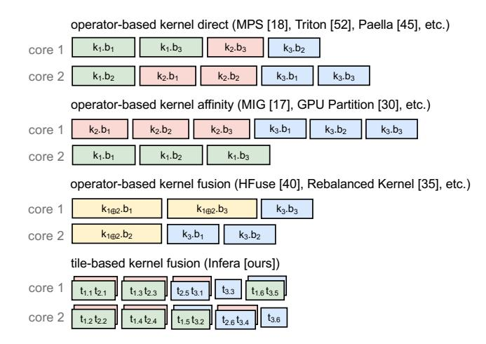
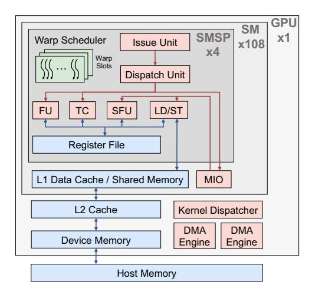
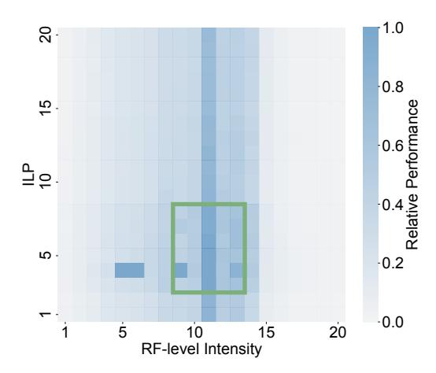
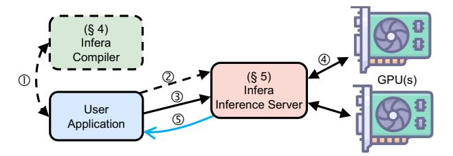
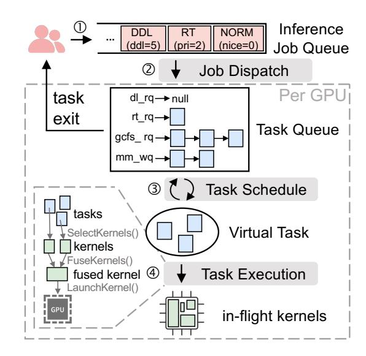
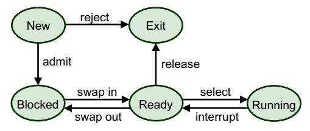
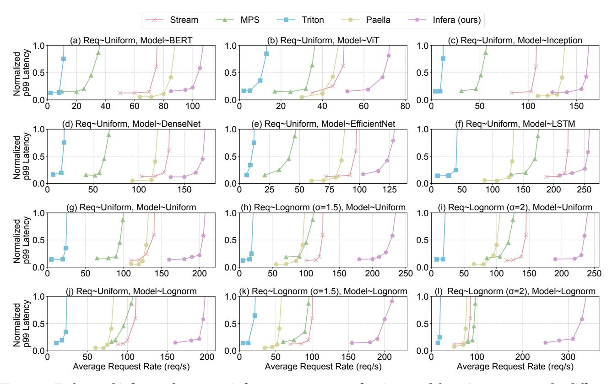
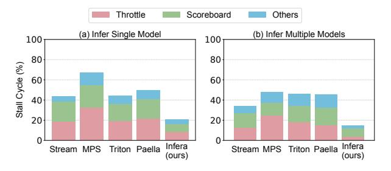
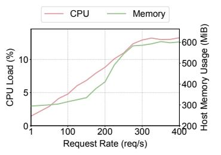

# Automated End-to-End Model Serving with Cooperative Compilation and Scheduling

[Yikang Zhang](https://orcid.org/0009-0005-6908-9183) Nanjing University ykzhang@smail.nju.edu.cn

# [Jia Liu](https://orcid.org/0000-0001-8368-4898)

Nanjing University jialiu@nju.edu.cn

# [Junlong Chen](https://orcid.org/0009-0001-3511-2796) Nanjing University cjl@smail.nju.edu.cn

# [Nan Hu](https://orcid.org/0000-0002-1250-050X)

Hunan University hunan5@hnu.edu.cn

# [Wei Wang](https://orcid.org/0000-0002-9882-2090) Nanjing University ww@nju.edu.cn

# [Haipeng Dai](https://orcid.org/0000-0003-0545-8187)<sup>∗</sup>

Nanjing University haipengdai@nju.edu.cn

# Abstract

Model serving systems are critical for deep learning inference, managing GPU infrastructure to deliver end-to-end services. Current frameworks typically treat operators as basic compilation and scheduling units, which often fail to maximize GPU utilization due to hardware-unfriendly kernels and coarse-grained scheduling. To address these limitations, we propose a cooperative compilation and scheduling scheme that statically generates multiple kernel variants and dynamically schedules them based on runtime context. We present Infera, a high-performance model serving system that implements this approach. Experimental results demonstrate that Infera improves inference throughput by at least 1.6× compared to state-of-the-art baselines.

# CCS Concepts

• Computing methodologies → Machine learning; Modeling methodologies; • Software and its engineering → Compilers; Scheduling.

# Keywords

Deep Learning Compiler, Model Serving System, High Performance Computing

### ACM Reference Format:

Yikang Zhang, Junlong Chen, Wei Wang, Jia Liu, Nan Hu, and Haipeng Dai. 2026. Automated End-to-End Model Serving with Cooperative Compilation and Scheduling. In European Conference on Computer Systems (EUROSYS '26), April 27–30, 2026, Edinburgh, Scotland UK. ACM, New York, NY, USA, [16](#page-15-0) pages. [https://doi.org/10.1145/3767295.](https://doi.org/10.1145/3767295.3769392) [3769392](https://doi.org/10.1145/3767295.3769392)

<sup>∗</sup>Haipeng Dai is the corresponding author.


[This work is licensed under a Creative Commons Attribution 4.0 Interna](https://creativecommons.org/licenses/by/4.0)[tional License.](https://creativecommons.org/licenses/by/4.0)

EUROSYS '26, Edinburgh, Scotland UK © 2026 Copyright held by the owner/author(s). ACM ISBN 979-8-4007-2212-7/26/04 <https://doi.org/10.1145/3767295.3769392>

<span id="page-0-0"></span>

Figure 1: Active cycles of the A100 GPU [\[20\]](#page-14-0) during the inference of ResNet-50 with TVM [\[32\]](#page-14-1).

# 1 Introduction

Deep Neural Networks (DNNs) are widely used and often deployed on GPUs for inference [\[40,](#page-14-2) [43,](#page-14-3) [57\]](#page-15-1). On the one hand, the high price and power consumption of GPUs necessitate maximizing hardware utilization and reducing cost. On the other hand, end users expect inference service with fast response, low latency, and reliability. This calls for a wellbuilt model serving system for managing GPU resources and handling inference requests.

Existing machine learning frameworks [\[27,](#page-14-4) [45\]](#page-15-2) and model serving systems [\[44,](#page-14-5) [51\]](#page-15-3) are designed to improve inference performance and system usability. However, they are suboptimal in two main aspects:

- (1) They exhibit poor GPU hardware utilization during DNN inference. The fundamental issue is that they treat operators as first-class citizens. Operators are perceived as basic computation units and organized into compute kernels. Therefore, the computations of a kernel are performed either all at once or not, disabling the parallelism of partially dependent operators while forcing the parallelism of a single operator's computations. Additionally, the monotonous instruction pattern of kernels prevents the simultaneous utilization of all GPU units, e.g., floating-point units and global memory bandwidth. As shown in Fig. [1,](#page-0-0) this type of frameworks executes operators sequentially with low GPU utilization. These inefficiencies are fully discussed in § [2.3.](#page-2-0)
- (2) They employ rudimentary scheduling mechanisms for inference jobs, which prove inadequate and impractical for

handling concurrent inference of heterogeneous jobs. For example, they are unable to effectively schedule inference jobs with fairness and real-time requirements.

To address the above limitations, we adopt a tile-based cooperative compilation and scheduling approach. At compile time, we partition large operators into small tiles and compile the tiles into micro kernels of multiple versions. At inference time, we schedule the inference tasks and the generated kernels with the consideration of hardware utilization and task priority. This strategy favors (1) large scheduling space from fine-grained computation partition and multi-version kernel generation, and (2) smart scheduling strategy from holistic task/kernel scheduling. Thereby, we build Infera, a model serving system that provides high-performance endto-end DNN inference service for users. This goal requires addressing the two key challenges described below.

How to compile models for large scheduling space? The model compilation involves two key steps: partitioning operators into tiles and generating multi-version kernels for those tiles. The first step, operator partitioning, is relatively straightforward, as it determines scheduling granularity and can be effectively handled through computation graph analysis. The second step, however, remains a long-standing challenge, akin to the problem of finding high-performance kernels, for two main reasons.

First, the kernel configuration space is vast, discrete, and irregular, making it difficult to explore. Moreover, different hardware backends impose distinct optimization objectives. Existing approaches often rely on extensive searches [32, 59] or heavy computations [28, 58] on specialized GPUs, which are time- and resource-intensive and yield hardware-specific code with limited portability [55].

Second, the optimization direction for kernels is inherently ambiguous. Achieving high GPU utilization requires tight collaboration between compilers and schedulers: the inference-time scheduler relies on compile-time kernel metadata (e.g., resource usage, launch configuration) to make optimal scheduling decisions [49], while the kernel compiler must account for runtime conditions (e.g., kernel concurrency, GPU load) to generate scheduler-friendly kernels [42]. Yet these runtime conditions are highly dynamic and unpredictable, significantly complicating kernel optimization.

How to schedule tasks/kernels for high GPU utilization while satisfying user requirements? Users submit inference jobs with diverse priorities at arbitrary times. Merely classifying jobs by priority [37, 49] is insufficient for a practical system. Achieving effective task scheduling demands both comprehensive handling of user requirements and substantial algorithmic and engineering effort.

For kernel scheduling, we must first define what constitutes high GPU utilization and the corresponding kernel-level requirements, then implement them efficiently for real-

<span id="page-1-0"></span>

Figure 2: Kernel scheduling illustration of various GPU colocation schemes. Here, 3 kernels each with 3 thread blocks are issued to a 2-core GPU at the start time.  $k_i.b_j$  denotes the j-th thread block of the i-th kernel,  $i \oplus j$  stands for kernel fusion, and  $t_{i,j}$  represents the j-th tile of the i-th kernel.

time operation. However, arbitrary kernel scheduling is not natively supported by GPUs, which enforces its own internal scheduling logic [29]. For instance, the CUDA runtime executes kernels sequentially [9], limiting true parallelism to brief overlaps at kernel tails (i.e., the last wave), while most of the GPU remains monopolized by a single kernel.

Existing approaches to kernel colocation such as kernel scheduling [18, 44, 51], GPU partitioning [17, 29], and kernel fusion [34, 39]. They are ineffective or inefficient, as shown in Fig. 2. "operator-based kernel direct" only enables spatial sharing at kernel boundaries; "operator-based kernel affinity" cannot share cores spatially; "operator-based kernel fusion" supports spatial sharing but incurs high fusion overhead.

Infera addresses these challenges by a carefully co-designed model compiler (§ 4) and task scheduler (§ 5). The compiler uses a tile-based, zero-tuning approach that automatically generates high-performance kernel variants through static analysis alone, avoiding costly search or profiling. The scheduler includes (1) an assembly-level kernel fuser for fast, finegrained warp-level fusion, enabling flexible kernel scheduling and efficient GPU spatial sharing, and (2) a holistic task scheduler with diverse scheduling policies and rapid preemption to manage heterogeneous user jobs efficiently. Together, they enable Infera to automate compilation and deliver high-performance end-to-end inference.

This paper makes the following contributions.

- We examine the NVIDIA GPU compute pipeline to uncover the key to peak performance. (§ 2)
- We develop an automated end-to-end high-performance

model serving system through co-designing the compiler and scheduler. (§ [3\)](#page-4-1)

- We design a DL compiler capable of rapidly generating highly efficient kernels of various versions. (§ [4\)](#page-4-0)
- We design a DNN inference server with multi-policy scheduling and high GPU utilization. (§ [5\)](#page-6-0)

We evaluate Infera with real-world workloads on NVIDIA GPUs (§ [6\)](#page-10-0), and the results indicate that Infera offers speedups of 1.6× to 3.5× compared to existing frameworks.

# <span id="page-2-1"></span>2 Background

In this section, we first introduce some essential GPU concepts (§ [2.1\)](#page-2-2). We then examine how to optimize performance on such throughput-oriented hardware from a pipeline perspective (§ [2.2\)](#page-2-3). Next, we review existing DNN inference frameworks to identify their limitations (§ [2.3\)](#page-2-0). Finally, we present our key ideas based on the above analysis (§ [2.4\)](#page-4-2).

# <span id="page-2-2"></span>2.1 GPU Abstraction

Modern GPU architectures (Fig. [3\)](#page-2-4) feature a hierarchical design centered on Streaming Multiprocessors (SMs), analogous to CPU cores. Each SM contains 4 SM Sub-Partitions (SMSPs), which house various units such as Functional Units (FUs) for arithmetic operations and Load/Store Units (LSUs) for memory access. The units are organized as a tree-like structure, with most units owning instruction buffer queues to enhance pipeline performance. Instructions travel from the root to the leaf, exerting pressure on each node along the way. A period of oversubscription of units results in throttletype stalls, leading to a low instruction execution rate. Each SMSP has a warp scheduler that manages 32 consecutive threads of a thread block. Instructions are executed in an inorder pipeline [\[38\]](#page-14-15), which has limited instruction-level parallelism (ILP) compared to out-of-order Execution (OoOE) but enhanced thread-level parallelism (TLP) by enabling rapid switching between warps with minimal overhead. Switching incurs zero cost within a warp group but takes several cycles between different warp groups [\[52\]](#page-15-8).

# <span id="page-2-3"></span>2.2 GPU Pipeline Performance Analysis

A simplified but fundamental way to quantify GPU running time is through

<span id="page-2-5"></span>
$$t = \frac{\#inst}{IPC},\tag{1}$$

where #inst is the number of instructions and IPC indicates the instruction issue rate. While we have not yet covered specific tasks, we can provisionally assume an infinite number of instructions and focus on maximizing IPC. Note that in real world, there still remains significant potential for improvement. Our benchmark reveals that even the best

<span id="page-2-4"></span>

Figure 3: Microarchitecture of NVIDIA A100 Tensor Core GPU. We omit some structures such as convergence barrier units and texture units for simplicity.

hand-optimized large matrix multiplication implementation [\[8\]](#page-14-16) achieves only 3.4 IPC (out of a theoretical maximum of 4) on A100, let alone other workloads and frameworks.

To maximize IPC, we begin with a simple case in which an SMSP manages only one warp. Here, optimizing ILP is the only way to enhance IPC since there are no other warps to hide latency. For better ILP, we need to reduce structural hazards (e.g., math\_pipe\_throttle due to math pipe oversubscription) and data hazards (e.g., stalled\_wait from fixed execution dependencies). The absence of OoOE makes the optimization of ILP heavily rely on compilation techniques such as instruction scheduling and register allocation [\[38\]](#page-14-15).

In real world, modern GPUs utilize multiple warps within the same SMSP to cover each other's instruction latency. However, optimizing both ILP and TLP presents a trade-off in that increasing registers of threads enhances ILP but weakens TLP, and vice versa. An important fact for addressing this trade-off is that excessive TLP is not advantageous. TLP beyond 4 is inefficient due to the high cost of inter-warpgroup switching, as discussed in § [2.1.](#page-2-2) In addition, too many warps can lead to performance issues with cache coherence and data locality. In GPU high-performance practice [\[1\]](#page-14-17), a TLP of 4 effectively covers warp latency. Therefore, we can resolve the ILP-TLP optimization trade-off by

<span id="page-2-6"></span>
$$\max ILP, \quad \text{s.t.} \quad TLP \ge 4. \tag{2}$$

No upper bound for TLP is necessary as maximizing the optimization objective implies minimizing TLP.

# <span id="page-2-0"></span>2.3 DNN Inference Performance Analysis

Before designing our system, we first go through some stateof-the-practice DNN inference works, identify their limitations, and analyze the inference performance. Modern

<span id="page-3-0"></span>

Figure 4: GEMM kernel performance influenced by register file level (RF-level) intensity, ILP, and TLP. The is implemented via RF-level tile configuration [61].

DL frameworks follow a compile-then-schedule paradigm, where operators [22] are instantiated as GPU kernels [28, 32, 61] and subsequently managed by their schedulers for execution on GPUs.

**Compilation.** The goal of compilation is to generate high-performance kernels for operators by applying various optimization techniques including data layout transformation [56], operator fusion [60], and loop optimization [59].

Existing approaches suffer from two critical limitations. First, compiling operators as monolithic units neglects fine-grained inter-operator data dependencies, thus missing plenty of parallelization opportunities. The computations within a compiled operator are forced to happen simultaneously because kernels are the minimum scheduling units. For example, an image tensor tile can propagate through successive convolution operators without needing to sequentially compute each operator in full. Second, most kernel generation practices either require substantial domain expertise for labor-intensive manual optimization [1, 10] or involve computationally expensive compilation processes [28, 59], which prevents their large-scale real-world application.

Next, we analyze the performance of highly-optimized DNN kernels. Given that memory and math instructions comprise over 90% of high-performance kernels' makeup [34], we can calculate the number of instructions by

<span id="page-3-1"></span>#inst 
$$\approx$$
 #inst<sub>mem</sub> + #inst<sub>math</sub>

$$= a \cdot #bytes + b \cdot #ops = #ops \cdot \left(\frac{a}{I} + b\right), \tag{3}$$

where a and b are constants, #ops is a constant for a given DL workload, and I denotes the ratio of the number of arithmetic operations to the number of bytes accessed (i.e., the algorithm's arithmetic intensity). This equation is applicable to any two memory levels with data transfer. It reveals

<span id="page-3-2"></span>

| Compilation | Scheduling Strategy |         |         |
|-------------|---------------------|---------|---------|
| Strategy    | unfused             | b-fused | w-fused |
| unfused     | 2.55 ms             | 2.91 ms | 3.57 ms |
| b-fused     | $2.73\mathrm{ms}$   | 2.48 ms | 2.94 ms |
| w-fused     | 2.83 ms             | 2.72 ms | 2.27 ms |

Table 1: Toy experiment colocating op MatMul and op Add. "unfused", "b-fused", "w-fused" refer to stream parallelism, block-level horizontal kernel fusion, and warp-level horizontal kernel fusion respectively [34].

that higher intensity leads to a reduced instruction count, which accelerates execution as per Eq. (1). This yields a new optimization metric, intensity. However, integrating ILP into Eq. (2) proposes challenges as ILP and intensity likewise form a trade-off competing for registers and shared memory. Fig. 4 demonstrates the trade-off by showing that the peak performance appears in the green box where ILP, TLP, and intensity are balanced. By optimizing Eq. (1) with the combination of Eqs. (2) and (3), we can qualitatively formalize the trade-off as

<span id="page-3-3"></span>
$$\max ILP \cdot Intensity$$
, s.t.  $TLP \ge 4$ . (4)

**Scheduling.** Most DL inference systems' schedulers [32, 42, 44, 49] run kernels generated at the compilation phase. However, these schedulers have significant design and implementation limitations.

For independent kernels, the schedulers struggle to achieve proper parallelization. For example, the inner scheduler of NVIDIA GPUs dispatches thread blocks from one kernel at a time, leading to implicit synchronization at the kernel launch point ("operator-based kernel direct" in Fig. 2). Therefore, kernel parallelism is only realized during the brief overlap of two kernels. Kernels monopolize GPUs sequentially, and their monotonous instruction pattern brings an imbalanced load to the hardware pipeline units, ultimately degrading GPU performance.

For dependent kernels, the schedulers trigger tail effect and cold start. When two consecutive dependent kernels are added to the same CUstream queue, the latter has to wait for the former to finish before being launched. The tail effect arises from insufficient threads and epilogue pipeline bubble during the former kernel's ending phase. Similarly, the cold start occurs at the start of subsequent kernels, which stems from the kernel preamble section including thread block dispatching, resource allocation, and prologue pipeline bubbles. Our measurements on an A100 show GPU idle intervals are within 1–3 microseconds, with overhead becoming more pronounced as GPUs incorporate more cores [2].

**Coupled compile-schedule.** To illustrate the interplay between compilation and scheduling in GPU performance,

we conduct an operator colocation experiment (Table 1). We run two operators MatMul and Add in parallel with different compilation and scheduling strategies. For instance, the scheduling strategy "b-fused" alternates thread block emissions from two kernels during inference, while the compilation strategy "w-fused" creates a large kernel with two operators fused at warp level. The result shows a diagonal principle that optimal performance appears only when the compilation strategy aligns with the scheduling strategy.

This is expected as tuning for a specific scheduling strategy yields the best results [32, 42]. Consequently, achieving optimal performance requires co-designing compilation and scheduling strategies. However, it is a difficult joint optimization problem. Moreover, the inference-time environment is complex and unpredictable, which makes traditional deterministic compilation strategies [32, 48, 61] unfeasible.

### <span id="page-4-2"></span>2.4 Our Scheme

We propose our solution with a two-phase design: generate multiple kernel versions at compile time, and schedule them dynamically at inference time. This design successfully addresses the tight coupling between compilation and scheduling by transforming them from dynamic coupling to static coupling. It elevates Halide's decoupling of algorithms and schedules [46] to a new level with scheduling at inference time rather than compile time [32]. It is able to solve all above concerns as follows.

Compilation (§ 4). At compile time, the compiler partitions large operators into smaller ones (micro operators) and generates multiple micro-kernel versions for them. Micro operators extend data asynchrony to sub-operator level, while different kernel versions provide various trade-offs between ILP, TLP, and intensity. Unlike previous methods that compile, profile, and discard a large amount of kernels, our zero-tuning compilation strategy directly produces high-quality kernels based on static analysis with minimal overhead. Additionally, zero-tuning allows for hardware-agnostic compilation and program portability.

**Scheduling (§ 5).** At inference time, aimed at Eq. (4), the scheduler dynamically assigns the micro kernels for DNN execution based on kernel property, task/GPU status, etc. Dynamic scheduling is able to eliminate overhead like cold start and tail effect. In addition, our sophisticated and comprehensive scheduling system effectively manages heterogeneous user inference jobs with diverse requirements.

#### <span id="page-4-1"></span>3 Overview

We describe Infera by using an example to walk through its components. Fig. 5 summarizes the inference steps in Infera. A user application first compiles a DNN model with the compiler  $(\mathfrak{I})$ , an offline static program. The application

<span id="page-4-3"></span>

Figure 5: Overview of Infera system. The solid lines represent data (③④) and signals (⑤) involved in the critical inference process, while the dashed lines indicate the preparatory works before inference, including compilation (①) and registration of models (②).

can then upload the compiled modules and the parameters to the inference model pool (②). After that, a user application can submit DNN inference jobs (③), which are then executed end-to-end by the inference server (④). Finally, the inference server notifies the user application of job completion, at which point the application can access the output data (⑤).

**End-user example.** In a few lines of code, a user can take a model of ONNX format [22] and call the Infera API to get a compiled module.

```
import infera as inf
raw_model = inf.import_model(onnx_model)
target = inf.device.gpu(gpu_id)
# compile a model with zero tuning
rt_model = inf.compile(raw_model, target)
```

The runtime model rt\_model is mainly composed of a model structure and compile-generated compute kernels. It can be uploaded to the online model pool of Infera inference server.

```
import infera.runtime as infrt
# upload the model with weights to the online pool
model_tpl_id = infrt.register_model(rt_model)
model_id = infrt.register_param(model_tpl_id, params)
```

With all prerequisite work completed, a user can easily submit inference jobs specifying the model and the input, then waiting for the output.

```
# submit a job and wait for asynchronous execution
job_id, data_out = infrt.submit(model_id, data_in)\ninfrt.wait(job_id)
```

## <span id="page-4-0"></span>4 Compiling Models

The Infera compiler (Fig. 6) automates DNN model compilation with the following steps. First, it converts an ONNX model [22] into a computation graph in the TVM Relay format [4]. The computation graph can be modified with the help of TVMScript [4]. Then, the tailored tile-based TVM compiler [5] generates tile-based tensor programs TensorIR [4] for the graphs's operators (§ 4.1), performing graph optimizations such as operator fusion and layout transformation. After the tensor programs have been compiled into basic CUDA programs framework with the TVM code generator, the code optimizer is used to reconstruct and modify the

CUDA kernel at various code levels, including CUDA, PTX, and SASS (§ [4.2\)](#page-5-2). Finally, the compiler consolidates all the generated code and data into static libraries.

# <span id="page-5-1"></span>4.1 Partitioning Graphs and Operators

Per § [2.4,](#page-4-2) the compiler treats DNN operators as concatenated operator tiles, which are named micro operators. The tile size of micro operators is determined alongside the tile size of kernels (§ [4.2\)](#page-5-2). For small operators with little computation, the compiler opts for "merge" rather than "tile", which merges a subgraph and creates a virtual operator named "shepherd operator" for the subgraph. This is used to avoid the substantial overhead caused by frequently scheduling small operators.

# <span id="page-5-2"></span>4.2 Generating Kernels

After the partition of graphs and operators, the compiler generates micro kernels, a collection of code candidates with different trade-offs between ILP, TLP, and intensity, for every micro operator. For a shepherd operator, the compiler first produces kernels for its composed operators and then produces a shepherd kernel to manage these kernels. The key designs and compilation of kernels are listed below.

Kernel structure. Most high-performance DNN kernels adopt a two-phase design: (1) a compute phase, where mainloop warps and data copy warps collaborate on tensors, and (2) a write-back phase, where mainloop warps transfer the computed values from register file to global memory. The compiler allocates 4 fixed warps for mainloop and 4 for shared→register data copy. As the GPU scheduler always distributes each set of 4 consecutive warps to 4 SMSPs of a SM [\[33\]](#page-14-23), the mainloop warps and data copy warps share the same SMSP for improved TLP.

Data copy. High-performance DNN kernels necessarily leverage shared memory for computations on subsets of larger data, following the algorithmic pattern: copy tile data from global memory to shared memory, perform some onchip computations on it, and eventually copy it back to global memory. The compiler automates the data copy process of global→shared, shared↔register, and register→global.

First we consider the data copy from global memory to shared memory. The compiler implements two key techniques: asynchronous copy and warp specialization. Asynchronous copy transfers data from global memory to shared memory, with its cost amortized across participated warps spread on 4 SMSPs. Furthermore, post-Ampere architectures [\[9\]](#page-14-10) can benefit from hardware acceleration. However, reusing the same warps for both mainloop and data copy results in only partial asynchrony because instruction execution remains synchronized between compute and memory operations. This is solved by warp specialization which uses 4

<span id="page-5-0"></span>

Figure 6: Infera compiler stack. It takes an ONNX model as input and produces binaries.

dedicated warps to copy data from global memory to shared memory. The compiler uses pipeline to synchronize between mainloop warps and data copy warps, whose stage number is set to 2, 3, or 4. Additionally, the compiler generates the data copy code and the mainloop warp code separately due to their differing register usage.

Next, we consider the data copy between shared memory and register file. For shared memory, the compiler adopts padding techniques to address the bank conflict [\[32\]](#page-14-1). For register file, the PTX compiler ptxas uses delicate register allocation to eliminate the conflict.

Finally, we consider the data copy from register file to memory. In the write-back phase, the warps directly copy data from register file to global memory. The compiler insert \_\_threadfence() after the memory operations to ensure global memory consistency at system (host+device) level. Prior to the write-back phase, a data layout transformation phase can be fused and implemented in shared memory. Cooperative group synchronization thread\_group.sync() is inserted between the data layout transformation phase and the write-back phase to synchronize threads and ensure thread-block-level consistency.

All memory operations are implemented with wide data types (e.g., STG.128) to minimize memory instructions and alleviate issue unit pressure.

Tile size. Determining the data tile size of kernels [\[1\]](#page-14-17) dictates the granularity of data transfer across multiple memory hierarchies. Similarly, constructing a micro kernel inherently introduces the notion of grid tile size, which specifies the volume of data processed in global memory. Roller [\[61\]](#page-15-9) proves that considering only this factor is sufficient to produce highperformance kernels. Moreover, we find that varying tile size enables striking a balance between ILP, TLP, and intensity. Below, we show how the tile size is determined to achieve this balance.

The compiler employs a top-down strategy to decide the tile size at all memory levels. Note that to ensure theoretical TLP, the amount of resources occupied by each warp should not exceed 1/4 of every memory level. At register file level, the compiler sets the 32-bit register usage limit per thread to 64, 96, or 128. This configuration implements the trade-off between TLP and the other two metrics. Then, the compiler calculate various tile sizes considering the trade-off between spatial axes and reduction axes [\[32\]](#page-14-1), which implements the trade-off between ILP and intensity. At shared memory level, the compiler set memory usage limit per thread block with several size configurations as 48 KiB, 80 KiB, 112 KiB, or 144 KiB. The spatial axis tile size is determined by multiplying the thread spatial tile size by the thread count of the thread block, while the reduction axis tile size is automatically constrained by the shared memory usage limit. At global memory level, the spatial axis tile size is calculated by multiplying the thread block spatial tile size by the thread block number of the grid, with a fixed grid size of 64. The reduction axis tile size at this level are parameterized as kernel arguments. These configurations align with the prevailing numerical standards of modern GPUs for ensuring hardware compatibility.

Instruction scheduling. ILP depends on both resource control discussed above and instruction pattern. To precisely control ILP, we should operate directly on machine-level assembly code instead of writing high-level code and compiling them with NVIDIA compilers nvcc or ptxas. However, the low-level CUDA kernel code is complex and closed-sourced, making the direct generation of assembly or binary code difficult and error-prone.

We introduce a novel technique called "cut and patch" to tackle it. The workflow involves extracting the on-chip computation code segments from CUDA kernels of SASS format, modifying it, and reinserting the optimized version. First, the CUDA compiler transforms a program of CUDA C++ to a binary file and disassemble it with dsass [\[7\]](#page-14-24). During the process, all optimizations of nvcc are turned off to avoid unexpected optimizations such as instruction aggregation and loop unrolling which disrupt our carefully constructed trade-offs. Next, the compiler cuts out the mainloop program for on-chip computation from the compiled program. The extracted code segment is then applied with the list scheduling algorithm [\[36\]](#page-14-25) to minimize total stall cycles. Additionally, the compiler adds yield flags every 64 instructions [\[16\]](#page-14-26) to balance warp progress, preventing any single warp from advancing too far ahead and getting stuck at barriers.

Compilation. The construction of kernels is totally based

<span id="page-6-1"></span>

Figure 7: Infera inference server pipeline. It accepts heterogeneous user jobs and provides end-to-end inference service. Red blocks are jobs, blue blocks are tasks, and green blocks are kernels.

on static analysis, without performance estimation or GPU profiling. The compilation of different kernels can be fully parallelized and achieve acceleration proportional to the allocated CPU resources.

# <span id="page-6-0"></span>5 Inferring Models

The Infera inference server (Fig. [7\)](#page-6-1) facilitates end-to-end DNN inference for users. It operates as a pipeline with 3 units: a Job Dispatch Unit (JDU), a Task Schedule Unit (TSU), and a Task Execution Unit (TEU). The models used for inference should be registered with the inference server prior to their inference process (§ [5.1\)](#page-6-2). At inference time, inference requests are organized as inference jobs, which are enqueued in the inference job queue. JDU dispatches jobs sequentially from the queue to different GPUs based on load balancing (§ [5.2\)](#page-7-0). TSU creates and manages the inference tasks, and determines which tasks to run in each scheduling cycle (§ [5.3\)](#page-7-1), so that TEU can execute these tasks by selecting, fusing, and launching kernels based on the tasks (§ [5.4\)](#page-8-0).

# <span id="page-6-2"></span>5.1 Submitting Models

Models should be submitted to the inference server before they can be inferred. Static libraries in CUDA binary format and DNN weights are registered into a high-performance data structure (e.g., [\[53\]](#page-15-14)) by the inference server. They are marked as cudaHostAllocWriteCombined for fast host-device transfer and cudaHostAllocPortable for multi-device memory consistency.



Figure 8: Inference task state.

## <span id="page-7-0"></span>5.2 Dispatching Jobs

User applications start by submitting inference jobs to the inference server, after which JDU adds them to the end of the inference job queue. If the system becomes overloaded which potentially leads to a long job queue wait, JDU throttles user jobs to regulate the queuing delay. As long as the queue is non-empty, JDU continues to dequeue jobs and assigns them to the available GPUs with enough free space and the least estimated remaining time, as computed with Eq. (1). While jobs are initially assigned to a GPU, they can be migrated between GPUs periodically due to inactivity at inference, rejoining the runqueue with the same priority.

## <span id="page-7-1"></span>5.3 Scheduling Tasks

When a job is dispatched to a GPU, it becomes an inference task managed by the GPU's dedicated task scheduler.

**Task state.** The task scheduling system defines 5 states for inference tasks:

- New. The task has been created but not yet admitted by the task scheduler. While the task control block exists, corresponding data structures are not prepared.
- Blocked. The task is unable to proceed due to incomplete data preparation in GPU memory, whether from unallocated space or unfinished data transfer.
- **Running.** The task has been selected by the task scheduler for execution in the current scheduling cycle.
- **Ready.** The task is able to be selected by the task scheduler for execution but has not yet been.
- Exit. The task has been released, either upon completion or due to an abort.

A job dispatched to a GPU begins in the "New" state and undergoes legitimacy checks such as memory requirement check. Tasks that pass these checks are admitted otherwise get rejected and exit. Once a task completes and releases its resources, it transitions to the "Exit" state. The "Blocked" state is highly relevant to memory management which is discussed in the memory management part. The transition between "Ready" and "Running" is managed by the task scheduling algorithm. The key modules of the task scheduler are as follows.

**Memory management.** During the execution of DNNs, large-scale data movement can lead to severe GPU perfor-

```
Algorithm 1: Select and Execute Tasks

Input: the set of all tasks T

1 while True do
2 | VTB = GenerateVirtualTask(T)
```

<span id="page-7-7"></span><span id="page-7-6"></span><span id="page-7-5"></span><span id="page-7-4"></span> $K = FuseKernels(K_{set})$ LaunchKernel(K)

GPU global memory.

<span id="page-7-2"></span>mance decay as the data transfer is too slow compared to computation. Therefore, an inference task is permitted to run by the task scheduler only when all its data (i.e., weights, input tensors, and intermediate tensors) is already ready in

At creation, a task is not allowed to demand more memory than the GPU's available memory. Additional memory constraints can be set to reduce memory pressure and enable more concurrent tasks. Once a task is admitted, it is added to mm\_wq where it waits for memory allocation. The waiting queue is composed of all tasks whose data is partially or entirely swapped out of GPU memory with state "Blocked". The queue is prioritized by the priority of the tasks, with tasks of the same priority being ordered by their enqueue sequence. Tasks in the waiting queue are swapped into GPU memory from the head of the queue whenever GPU space is available. In addition, the system reclaims memory of models with LRU policy in the background. The memory management system uses 4 independent GPU queues CUstream to handle asynchronous memory allocation, free, and bidirectional transfer respectively. Once a task's data is fully swapped into GPU memory, it is removed from mm\_wq and added to the corresponding runqueue based on its property (e.g., gcfs\_rq for normal tasks).

Scheduling algorithm. A primary function of the task scheduling system is to select and execute tasks. However, designing an optimal GPU task selector and task executor is non-trivial for three reasons: (1) GPU cores cannot be finely controlled via standard CUDA API. The minimum dispatching granularity is the whole GPU. (2) Concurrent kernels on a spatial-shared GPU can cause severe competition and uncertain dynamic resource occupation. (3) GPU performance fluctuates over time and varies with different kernels, unlike the constant speed assumption in CPU scheduling.

To address these challenges, we introduce an instruction-based task selector and task executor with Virtual Task (VT) abstraction (Alg. 1). It operates as follows. First of all, the task selection process is organized as consecutive scheduling cycles. At the beginning of each scheduling cycle, the TSU selects a set of tasks  $VT = \{t_i \mid i \in \{1, 2, ..., N\}\}$  from

the runqueues, where is the -th task and is the total number of tasks (Al[g1:](#page-7-2)[L2\)](#page-7-3). The tasks in VT are then promoted from "Ready" to "Running". Every task in VT is assigned an instruction budget which is the number of instructions allowed to be executed during the scheduling cycle. VT with instruction budgets is denoted as Virtual Task with Budget (VTB). During the scheduling cycle, TEU executes VTB by selecting, fusing, and launching kernels based on the tasks in it (Al[g1:](#page-7-2)[L4\)](#page-7-4). At the end of the scheduling cycle, the execution is interrupted and VTB's tasks revert back to the "Ready" state. Note that the task selection is a fairness problem and the task execution is a performance problem. The remainder of this section covers the task selection (GenerateVirtualTask(T), Al[g1:](#page-7-2)[L2\)](#page-7-3), and the task execution (ExecuteVirtualTask(VTB), Al[g1:](#page-7-2)[L4\)](#page-7-4) is described in § [5.4.](#page-8-0)

To meet different inference requirements such as realtime or deadline, several scheduling policies are designed to manage DNN inference tasks on GPUs as follows. Note that these scheduling policies (e.g., SCHED\_NORMAL) are named by analogy to Linux CPU scheduler policies, for intuitive understanding only.

We implement priority scheduling in the task scheduling system. Inference tasks are categorized into deadline tasks, realtime tasks, and normal (non-real-time) tasks. Deadline tasks (scheduled with the SCHED\_DEADLINE policy) are associated with a specific deadline by which they should complete their execution; real-time tasks (scheduled with the SCHED\_FIFO policy) require prompt and predictable responses; normal tasks (scheduled with the SCHED\_NORMAL policy) are expected to be executed with best effort.

To support priority scheduling, the task scheduler sets up 64 task runqueues with priority 0–63, where smaller number indicates higher priority, as shown in Fig. [7.](#page-6-1) Every runqueue is associated with a scheduling policy and only determines the scheduling order of tasks in it. Number 0 is assigned to a ddl\_rq runqueue for deadline tasks, number 1-39 are assigned to rt\_rq runqueues for real-time tasks, and number 40–63 are assigned to gcfs\_rq runqueues for normal tasks. Tasks in higher-priority runqueues preempt those in lowerpriority runqueues at all times. Once a runqueue exhausts its tasks, the task selector switches to a lower-priority runqueue. Additionally, the task scheduler employs an aging mechanism [\[3\]](#page-14-27) to progressively elevate the priority of normal tasks that have remained unselected for a prolonged period, by migrating tasks to higher-priority gcfs\_rq runqueues.

We implement deadline task scheduling in the task scheduling system. SCHED\_DEADLINE schedules real-time tasks, whose core is the EDF algorithm [\[11\]](#page-14-28). Tasks can be periodic (e.g., autonomous driving) or non-periodic (e.g., chatbot). The task selector selects the task with the nearest deadline to run, which means the generated VTB has only one task with unlimited budget. To avoid deadline miss, the task scheduler

estimates jobs' execution time and verifies GPU bandwidth availability prior to admitting deadline jobs. This can be accomplished via static analysis or one-shot profile of kernels.

We implement real-time task scheduling in the task scheduling system. SCHED\_FIFO schedules real-time tasks, whose core is the FIFO algorithm [\[6\]](#page-14-29). Real-time tasks run sequentially according to their order in the real-time task runqueues. Similar to deadline task scheduling, the VTB has only one task with unlimited budget.

We implement normal task scheduling in the task scheduling system. SCHED\_NORMAL schedules normal tasks, whose core is an original GPU Completely Fairness Scheduling (GCFS) algorithm. First of all, we define the fairness of normal tasks as "Tasks execute the appropriate number of instructions according to their predefined priority". At the beginning of a scheduling cycle, tasks in cfs\_rq are chosen as the VT, with their instruction budgets calculated based on the predefined nice values, similar to the Linux CFS scheduler [\[6\]](#page-14-29).

Preemption. Preemption in GPU scheduling is critical for real-time guarantees of inference tasks. The task scheduler implements all scheduling in a preemptive manner where tasks with higher priorities than the current tasks always preempt resources and run.

The preemption involves two phases: saving the context and switching the context. The arrival of a higher-priority task triggers the preemption routine, which sends a predefined preemption signal to the task scheduler. After receiving the signal, the task scheduler suspends its scheduling and saves the current task scheduling state, while the task executor responds to the preemption signal according to § [5.4.](#page-9-0) They synchronize after handling preemption and work on the new task runqueue with higher priority.

Soundness. The task scheduler is sound because it is free of deadlock and starvation, the two major liveness problems.

Deadlock (also known as circular wait) cannot occur between different priority runqueues since low-priority tasks are prohibited from requesting resources while high-priority tasks remain. Within the same runqueue, resource requirements are guaranteed to be met by TSU at task creation.

Starvation is impossible in the task scheduling system. The task migration between GPUs and the task aging between runqueues of different priorities guarantee that inactive tasks eventually get a chance to run. Therefore, we only need to prove that starvation does not exist within a single runqueue. The SCHED\_DEADLINE policy guarantees all tasks complete before their deadlines; the SCHED\_FIFO policy prevents starvation by limiting each kernel's runtime; the SCHED\_NORMAL policy lets tasks fairly share every scheduling cycle for running.

# <span id="page-8-0"></span>5.4 Execute Tasks

In each scheduling cycle, the task executor executes the VTB

generated at the cycle's beginning. In this section, we first elaborate on how to execute a VTB and then discuss the preemption of running tasks.

Three-stage task execution. For higher throughput, the task execution employs a three-stage pipeline, with each stage dynamically adapting its execution rate to maintain optimal GPU throughput. First, TEU selects some appropriate kernels from the tasks in the VTB for colocation on the GPU. Next, these kernels are fused at warp level into a single kernel, which is launched to be executed by the GPU. This ensures the SM-level spatial sharing of the selected kernels, which brings high GPU pipeline throughput based on the analysis in § 2.2.

Stage I: selects kernels from a VTB (SelectKernels(VTB), Alg1:L5). The selected kernels are expected to be fused and thus executed concurrently on the GPU.

Selecting optimal kernels for execution is non-trivial due to the two challenges: (1) excessively large optimization space where any computable data block can be processed by any applicable kernel, and (2) numerous optimization objectives (e.g., GPU throughput, data parallelism) and various constraints (e.g., data dependencies, kernel fusibility). To address this, we propose a two-step kernel selection methodology: first selecting data blocks then determining kernels.

In the first step, the kernel selector decides the candidate data blocks, with the objective of optimizing data asynchrony. The dependency relationship of data blocks in DNNs is isomorphic to a directed acyclic graph (DAG), where nodes represent data blocks labeled as "completed", "pending", or "running", and edges indicate data dependencies. This graph is built during the compilation of DNNs through static analysis of the computation graph. During inference, only data blocks free of dependencies (i.e., nodes with zero in-degree) can be computed. Once a data block is completed or nearcompleted, the dependencies on it are satisfied, marked in the DAG by changing the status of the node's outgoing edges. To enhance data asynchrony, we aim to maximize the asynchronous wavefront which is defined as the expected number of mutually independent data blocks available for future execution, denoted as G(u). A key insight is the transitive relationship between connected nodes: the release of a parent node reduces the dependency count of its children, implying that the children's expected asynchrony gain propagates uniformly across all parent nodes. Consequently, we have

$$G(u) = \left(\sum_{v \in \Gamma^{+}(u)} \frac{G(v) + 2}{d^{-}(v)}\right) - 1,$$
 (5)

where  $\Gamma^+(u)$  denotes the out-neighbors of node u and  $d^-(v)$  represents the in-degree of node v. To avoid favoring long chains, recursion terminates at a specific depth with G(v) = -1. Accordingly, the data blocks with the highest G(u) values

are selected as candidates. The overhead of computing G(u) is low because it is majorly computed at compile time and dynamically adjusted for affected nodes at inference time.

In the second step, the kernel selector chooses appropriate kernels for the data blocks, with the objective of minimizing execution time. According to the analysis in § 2, we reformalize the optimization as

<span id="page-9-0"></span>
$$\min \frac{\#inst}{IPC}, \quad \text{s.t.} \quad TLP \ge 4. \tag{6}$$

We first address the  $TLP \geq 4$  constraint. Theoretical TLP is guaranteed through careful management of register file and shared memory usage (§ 4.2), while achieved TLP optimization employs dynamic grid tile size decision at inference time, which increases the number of threads when occupancy is low. Next, *#inst* can be precisely determined via static analysis of the kernel. Finally, we estimate IPC through comprehensive hazard analysis. For data hazard, we collect the stall cycles and running cycles; for structure hazard, we calculate the density of instructions of different types and the hardware bandwidth. We pass them into an online-learned super lightweight regression model which outputs the IPC. Thereby, we are able to select the appropriate kernels for fuse via Eq. (6).

Stage II: fuse selected kernels (FuseKernels(K<sub>set</sub>), Alg1:L6). Given several primitive kernels in CUDA binary format, we fuse them horizontally at warp level.

We adopt a unified function signature \_\_global\_\_ void kernel(void\* args), where args points to a global memory area containing all required data including the original kernel arguments and each thread's special registers. The core mechanism involves generating a prologue to enable each thread to retrieve its designated data (including special registers and arguments) and subsequently branch to the corresponding code segment.

Here are some implementation details. (1) Each kernel's special registers such as %tid are substituted with general purpose registers, which are further restored at the prologue phase. (2) Each kernel has its own shared memory resources defined by \_\_shared\_\_, including arrays and asynchronous copy shared objects pipeline\_shared\_state. Shared space is indexed by the physical-level base plus index addressing, where the base is omitted in SASS code and dynamically generated at runtime. Therefore, the fuser adds appropriate offsets to shared memory access instructions to partition the large shared space for each original kernel. (3) Barrier resources used for synchronization BAR. SYNC are reorganized as thread organization changes. (4) Some flags are inserted to the fused kernel, including a preemption flag for preemption signal delivery, a locking flag for holding kernels until the conditions are met, and a progress flag for the indication of execution progress.

To improve efficiency, the kernel fusion happens at the CUDA binary code level to minimize latency and adopts a thread pool design to maximize throughput.

Stage III: launch a fused kernel (LaunchKernel (K), Alg1:L7). The kernel launcher features a multi-level pipeline to launch fused kernels.

At the host side, the fused kernels are first enqueued in Host Kernel Queue (HKQ) upon generation by kernel fusers. Each kernel is composed of program binary code, arguments, and launch configurations. HKQ is a priority queue where kernels are sorted according to their launch timestamps determined by the kernel selector. Kernels transferred to HKQ are marked as "on device" and reside until completion.

Kernels in HKQ are sequentially copied to a device-side kernel buffer named Device Kernel Queue (DKQ). To make kernels executable, their code needs to be copied to a specific device kernel execution area. However, the official kernel copy function cuModuleLoad incurs global host-device synchronization and therefore cannot be called at inference time. To address it, we preserve several placeholder kernels and overlay the kernel code onto these kernel slots via driver-level modifications [21]. Specifically, TEU first copies kernel code to device-side kernel slots and kernel arguments to global memory, and then add the kernel pointer, the argument pointer, and the kernel launch configurations to DKQ. In addition, it maintains a pool in host memory to retain fused kernel files for potential reuse.

To minimize latency and interference as much as possible, all kernel-related data transfer is implemented with GDRCopy functions gdr\_copy\_to\_mapping [15], which bypasses DMA engines for low delays (<100 ns for small data payloads and  $<5\,\mu s$  for typical kernel size).

At the device side, there runs a persistent kernel named "daemon kernel" for taking over the kernels in DKQ. The daemon kernel leverages the CUDA Dynamic Parallelism (CDP) technique to launch kernels directly at the device side with cudaLaunchDevice [9]. Fire-and-forget launches are immediately scheduled by GPUs for execution without any dependency on the completion of previously launched grids. This interface is much faster without stream tracking overhead. In addition, it maintains a double-ended queue in shared memory for low-latency kernel fetching.

At kernels' completion, the daemon kernel is notified to perform error checking cudaGetLastError. The daemon thread throws an error and notifies the host task scheduler once the kernel exits unsuccessfully.

In contrast to conventional approaches that pushes kernels to host-side streams, our method of launching kernels favors ultra-low latency ( $<10\,\mu s$ ) and avoids the HoL problem [44] by not using hardware queues.

**Preemption.** The task execution process is divided into host-side and device-side operations, both of which should

respond to preemption.

The kernel selector stops selecting kernels while the kernel fuser keeps enqueuing fused kernels into HKQ. Meanwhile, the host-side kernel launcher (1) suspends HKQ-to-DKQ transfers and (2) saves all the kernels in HKQ (marked as "off-device"), while the device-side daemon (1) saves all the kernels in DKQ and (2) saves all the kernels in shared memory. The kernel launcher and the daemon kernel are then restored to their initial state. In-flight kernels can detect preemption signals and terminate promptly, while those failing to terminate in time pose no harm to the system due to the idempotent execution of DNN kernels.

New context execution and previous context saving can be conducted simultaneously since they do not share the same kernel launch channel.

### <span id="page-10-0"></span>6 Evaluation

#### <span id="page-10-1"></span>6.1 Kernel Generation

Infera's core is implemented as a kernel-space module in C++ ( $\sim$ 17 k LoC). To minimize interference and ensure low latency, latency-sensitive threads (e.g., fuse kernels) are assigned real-time scheduling or pinned to isolated CPU cores (e.g., select kernels) with interrupts disabled, while the GPU daemon kernel exclusively occupies an entire SM core. Infera compiler builds on TVM 0.16.0 [5], whereas Infera inference server is developed from scratch.

We evaluate Infera's performance across various work-loads, setups, and metrics to answer the following questions:

- Can Infera compiler generate efficient kernels compared to existing DL compilers/libraries? (§ 6.1).
- How does Infera inference server provide model serving compared to existing DL serving systems? (§ 6.2)

Evaluations are performed on a server with an Intel(R) Xeon(R) Gold 6330 CPU, 512 GB of RAM, and an NVIDIA A100-PCIE-40GB GPU, running Linux 6.1.0 and CUDA 12.0.

Methodology. The Infera compiler, although designed for the whole inference system with static coupling property, can still produce efficient kernels as a standalone module. We evaluate the compiler's performance against other kernel compilers: Ansor [59], Roller [61], MetaSchedule [47], and cuDNN [10]. Ansor and MetaSchedule are the representatives of tuning-based compilers, Roller reduces search time by concentrating on tile size search and evaluating programs via a hardware performance model, and cuDNN is a hand-optimized library which is widely used in popular frameworks such as PyTorch [45].

We select several classic operators [22] for evaluation: Gemm, Conv2D (as well as its variants), Transpose, and AveragePool. The first two are compute bound while the other two are memory bound. All operators are medium-sized which run for several milliseconds.

<span id="page-11-1"></span>

Figure 9: Performance of operators generated by various kernel compilers on NVIDIA GPUs, evaluated separately on floating-point units and tensor units.

<span id="page-11-2"></span>

Figure 10: Search/compilation time of various kernel compilers on NVIDIA GPUs.

We let search-based compilers (i.e., Ansor, Roller, and MetaSchedule) run long enough until convergence for each test case, select the optimal configurations for cuDNN, and take the best programs from Infera's generated kernels.

**Kernel performance.** We first examine the quality of kernels produced by the Infera compiler in Fig. 9. The Infera compiler demonstrates superior or competitive results compared with other compilers/libraries, which is at least 5% better than the others on average. It supports TensorCore by generating dedicated load and compute instructions [50]. The performance gain is attributed to the meticulous kernel optimization, particularly the introduction of instruction scheduling and warp specialization (§ 4).

**Compilation time.** We then check the compilation/tuning speed of the kernel compilers. Specifically, we measure the elapsed CPU time in Fig. 10, which reflects the consumed CPU resource. Due to a long-time search process, Ansor and MetaSchedule take 2 to 3 orders of magnitude more time than Roller and Infera. Although Roller avoids running programs on real hardware, it relies on a performance model to evaluate the quality of programs, which results in Infera saving 66% to 86% more time compared to it.

<span id="page-11-3"></span>

| Model [13]        | # Layer | Size   |
|-------------------|---------|--------|
| BERT [12]         | 14      | 110 M  |
| ViT [23]          | 37      | 428 M  |
| Inception [25]    | 19      | 23.9 M |
| DenseNet [24]     | 98      | 20.2 M |
| EfficientNet [26] | 41      | 48.3 M |
| LSTM [14]         | 13      | 113 M  |

Table 2: Summary of models used to evaluate Infera.

#### <span id="page-11-0"></span>6.2 DNN Inference

**Methodology.** To validate the serving ability of Infera, we evaluate the end-to-end job inference performance of different model serving systems including Stream [9], MPS [18], Triton [51], Paella [44], and Infera (ours). Stream and MPS are the two classic implementations of running multiple models, Triton is a universal inference platform proposed by NVIDIA, and Paella is designed for minimizing inference latency while improving throughput. TVM is the inference backend for Stream and MPS.

The DNN models used in our evaluation are listed in Table 2. For fairness, the first three networks (i.e., Bert, ViT, and Inception) are compute bound while the other three (i.e., DenseNet, EfficientNet, and LSTM) are memory bound.

The request inter-arrival pattern follows a uniform distribution or a lognormal distribution which can be bursty ( $\sigma = 2$ ) or less bursty ( $\sigma = 1.5$ ). Models are evaluated under single (Fig. 11 (a)–(f)) and mixed (Fig. 11 (g)–(l)) settings. The requests are sustained long enough to ensure system stability and measurement accuracy.

**Job performance.** The results in Fig. 11 indicate that Infera outperforms all baselines. For single-model inference, it achieves a speedup of  $1.14\times$  to  $1.40\times$ , with an average of  $1.28\times$ ; for multi-model inference, it is at least  $1.6\times$  faster in (g) uniform requests for uniform models and up to  $3.5\times$  faster in (l) lognormal requests for lognormal models. Infera performs exceptionally well with nonuniform models and bursty requests because of its holistic task/kernel scheduling algorithm with careful implementation (§ 5.4). Though it introduces slight latency increases from the GCFS scheduling algorithm, the remains acceptable and manageable through system setting adjustments.

**GPU utilization.** To gain insight into how Infera excels, we take a look at the GPU runtime state and check whether the throughput improvement aligns with our performance analysis (§ 2.2 and § 2.3) and system design (§ 2.4).

Fig. 12 shows the GPU stall analysis during the inference of Fig. 11 (l). Stall cycle (%) represents the proportion of the cycles where no instruction can be issued relative to all active cycles [19], with all warps counted. "Scoreboard" refers to instructions waiting for unproduced data, whereas "throttle" happens when the units needed by the instructions are busy.

<span id="page-12-0"></span>

Figure 11: End-to-end inference latency vs. inference request rate of various model serving systems under different workload patterns. The request rate can be steady or bursty, and the distribution of requested models can be uniform or non-uniform.

The two metrics of Infera are significantly lower thanks to the ILP-optimized kernel (§ 4.2) and the inference-aware kernel selection (§ 5.4). Although other frameworks (e.g., Stream and MPS) are able to benefit from multiple-model inference, the improvement is not guaranteed due to their inability to control the GPU's inner scheduler.

**Preemption.** To observe how fast Infera responds to preemption, we simulate the preemption at inference time and record the task switch latency in Fig. 13, comparing it with EffiSha [30] and REEF-N [37]. EffiSha is a wait-based preemption approach which waits for the completion of in-flight kernels, while REEF-N is a reset-based approach that terminates kernels immediately. As Infera is able to save runtime context, we measure the preemption of new incoming tasks (Infera-P) and the preemption of in-system tasks (i.e., context restore Infera-R) separately.

Infera-P responds faster than REEF-N by approximately 2.5× and EffiSha by more than an order of magnitude. This is primarily because EffiSha has to passively wait for the completion of running kernels and the eviction of massive kernels in host and device queues, while REEF-N is able to proactively kill all running kernels but cannot clean the ker-

nels in CUDA queues. In contrast, Infera-P can suspend or kill all kernels everywhere in the system due to its dynamic parallelism implementation of kernel launch. Its preemption latency involves (1) The CPU signals the GPU kernels to terminate (<5 µs, several bytes transferred from the host memory to the device memory); (2) The GPU daemon saves the execution context to the GPU global memory (<3 µs, tens of bytes saved from the shared memory to the global memory); (3) The CPU loads a new context to the GPU (<10 μs, tens of bytes copied from the host memory to the device memory). The three operations can run in parallel, resulting in end-to-end preemption latency of  $\sim 10 \,\mu s$ . Consequently, EffiSha experiences a linear increase in preemption latency with the number of kernels, while REEF-N and Infera-P maintain constant latency due to their reset-based design [37]. Finally, the preemption speed of in-system existing tasks is ultra fast ( $\sim$ 5 µs) compared to the others due to the simple and rapid restoration of the old context (§ 5.4).

**Overhead.** To ensure usability, we need to measure the overhead brought by the inference server.

At host side, the primary overhead of CPU comes from kernel fusion, while host memory is mainly used for manag-

<span id="page-13-0"></span>




Figure 12: GPU runtime state of various model serv- Figure 13: Latency of pre- Figure 14: Overhead on CPU ing systems at inference time.

empting inference tasks.

and host memory.

ing tasks and preserving kernels. We plot the usage as the request rate increases in Fig. 14, which corresponds to the inference process in Fig. 11 (l). CPU core and host memory usage rise nearly linearly with increasing request rate, peaking at 13% CPU usage and 600 MiB of memory usage before reaching maximum throughput.

At device side, The daemon kernel monopolizes an SM core, resulting in an overhead of less than 1/#SM. The memory allocated for Infera is mainly used for DKQ composed of kernel pointers and kernel arguments, which is negligible compared to DNN weights and intermediate tensors.

## **Related Work**

Some works strongly inspire or relate to this paper, which are listed below.

Auto-generating kernels. While hand optimizations is often high-performance but laborious, generating kernels automatically is more flexible with competent performance. Ansor [59] designed a search-based strategy to fine-tune the performance of tensor programs. TIRAMISU [28] introduced a polyhedral compiler with a scheduling language to generate high-performance programs. Roller [61] significantly saves search time by reducing the search space to tile size and leveraging a program performance model.

**Serving Models.** Serving DL models aims at providing end-to-end inference service for users. Irina [54] proposed batching, stacking, and preemption strategies for inference jobs in order to schedule unpredictable workloads more flexibly. Paella [44] abstracts scheduling from GPU to enable precise kernel execution order. To improve GPU utilization while satisfying real-time requirements, Orion [49] schedules best effort tasks and high priority tasks at the granularity of individual operators, while ElasticRoom [41] introduces the co-design of resource-constrained compiling and strong priority scheduling.

**Spatial-sharing GPUs.** Spatial Sharing can be either implemented as spatial partition or spatial colocation. Spatial partition split the hardware into isolated parts and allocate different kernels to different partitions. LIBSMCTRL [29] sets enabled TPCs for NVIDIA GPU kernels by modifying their task metadata at launch time. Spatial colocation makes kernels co-exist on GPUs which is essentially a dynamic partition of warp slots. CUDA Stream [9] and NVIDIA Multi-Process Service (MPS) [18] both allow multiple kernels to run concurrently on GPUs but there is no guarantee.

**Utilizing GPUs.** Instruction scheduling optimize the kernel structure to achieve better utilization of various hardware units. TwinKernels [35] better distributes the burst of memory requests through static instruction scheduling and kernel horizonal fusion. Task scheduling manages the running of kernels to fully utilize GPUs. TQ [31] proposed a task-based dynamic load-balancing solution for GPUs through the design of a task queue scheme. RebalancedKernel [34] effectively balances the utilization of hardware through fusing kernels from different tasks at work group level.

#### Conclusion

We propose an automated end-to-end model serving system to holistically and efficiently handle DL workloads, by a cooperative design of compilers and schedulers. We hope this work can provide new insights for DL compilation and inference, and encourage more in-depth discoveries and designs.

## Acknowledgments

We are grateful to the anonymous reviewers, the program committee, and our shepherd Călin Iorgulescu, for their continuous concern and constructive feedback on this paper.

This work was supported in part by the National Key R&D Program of China under Grant No. 2023YFB4502400, in part by the National Natural Science Foundation of China under Grant 62272223, U22A2031, 61872178, in part by the New Generation Information Technology Innovation Project 2023 (2023IT196), in part by the Fundamental Research Funds for the Central Universities under Grant No. 2024300349, in part by the Collaborative Innovation Center of Novel Software Technology and Industrialization, Nanjing University, and in part by the Jiangsu High-level Innovation and Entrepreneurship (Shuangchuang) Program.

# References

- <span id="page-14-17"></span>[1] 2019. CUTLASS: CUDA Templates for Linear Algebra Subroutines and Solvers. [https://nvidia.github.io/cutlass.](https://nvidia.github.io/cutlass)
- <span id="page-14-20"></span>[2] 2023. Why GPUs Are Great for AI. [https://blogs.nvidia.com/blog/why](https://blogs.nvidia.com/blog/why-gpus-are-great-for-ai)[gpus-are-great-for-ai.](https://blogs.nvidia.com/blog/why-gpus-are-great-for-ai)
- <span id="page-14-27"></span>[3] 2025. Aging (scheduling). [https://en.wikipedia.org/wiki/Aging\\_](https://en.wikipedia.org/wiki/Aging_(scheduling)) [\(scheduling\).](https://en.wikipedia.org/wiki/Aging_(scheduling))
- <span id="page-14-21"></span>[4] 2025. Apache TVM Documentation. [https://tvm.apache.org/docs/](https://tvm.apache.org/docs/index.html) [index.html.](https://tvm.apache.org/docs/index.html)
- <span id="page-14-22"></span>[5] 2025. Apache TVM: Open Deep Learning Compiler Stack. [https:](https://github.com/apache/tvm) [//github.com/apache/tvm.](https://github.com/apache/tvm)
- <span id="page-14-29"></span>[6] 2025. CFS Scheduler. [https://docs.kernel.org/scheduler/sched-design-](https://docs.kernel.org/scheduler/sched-design-CFS.html)[CFS.html.](https://docs.kernel.org/scheduler/sched-design-CFS.html)
- <span id="page-14-24"></span>[7] 2025. CuAssembler: an Unofficial CUDA Assembler. [https://github.](https://github.com/cloudcores/CuAssembler) [com/cloudcores/CuAssembler.](https://github.com/cloudcores/CuAssembler)
- <span id="page-14-16"></span>[8] 2025. cuBLAS: the CUDA Basic Linear Algebra Subroutine Library. [https://docs.nvidia.com/cuda/cublas.](https://docs.nvidia.com/cuda/cublas)
- <span id="page-14-10"></span>[9] 2025. CUDA C++ Programming Guide. [https://docs.nvidia.com/cuda/](https://docs.nvidia.com/cuda/cuda-c-programming-guide/index.html) [cuda-c-programming-guide/index.html.](https://docs.nvidia.com/cuda/cuda-c-programming-guide/index.html)
- <span id="page-14-19"></span>[10] 2025. cuDNN: the NVIDIA CUDA Deep Neural Network Library. [https://docs.nvidia.com/deeplearning/cudnn/latest/developer/](https://docs.nvidia.com/deeplearning/cudnn/latest/developer/overview.html) [overview.html.](https://docs.nvidia.com/deeplearning/cudnn/latest/developer/overview.html)
- <span id="page-14-28"></span>[11] 2025. Deadline Task Scheduling. [https://docs.kernel.org/scheduler/](https://docs.kernel.org/scheduler/sched-deadline.html) [sched-deadline.html.](https://docs.kernel.org/scheduler/sched-deadline.html)
- <span id="page-14-33"></span>[12] 2025. google-bert/bert-based-uncased. [https://huggingface.co/google](https://huggingface.co/google-bert/bert-base-uncased)[bert/bert-base-uncased.](https://huggingface.co/google-bert/bert-base-uncased)
- <span id="page-14-32"></span>[13] 2025. Hugging Face. [https://huggingface.co.](https://huggingface.co)
- <span id="page-14-38"></span>[14] 2025. keras-io/bidirectional-lstm-imdb2. [https://huggingface.co/](https://huggingface.co/simoneprete/mbert-lstm-sentiment-analysis) [simoneprete/mbert-lstm-sentiment-analysis.](https://huggingface.co/simoneprete/mbert-lstm-sentiment-analysis)
- <span id="page-14-31"></span>[15] 2025. Magnum IO GDRCopy: Enable faster memory transfers between CPU and GPU with GDRCopy. [https://developer.nvidia.com/gdrcopy.](https://developer.nvidia.com/gdrcopy)
- <span id="page-14-26"></span>[16] 2025. MaxAs: Assembler for NVIDIA Maxwell Architecture. [https:](https://github.com/NervanaSystems/maxas) [//github.com/NervanaSystems/maxas.](https://github.com/NervanaSystems/maxas)
- <span id="page-14-12"></span>[17] 2025. MIG User Guide. [https://docs.nvidia.com/datacenter/tesla/mig](https://docs.nvidia.com/datacenter/tesla/mig-user-guide)[user-guide.](https://docs.nvidia.com/datacenter/tesla/mig-user-guide)
- <span id="page-14-11"></span>[18] 2025. Multi-Process Service. [https://docs.nvidia.com/deploy/mps.](https://docs.nvidia.com/deploy/mps)
- <span id="page-14-39"></span>[19] 2025. Nsignt Compute Kernel Profiling Guide. [https://docs.nvidia.](https://docs.nvidia.com/nsight-compute/ProfilingGuide/index.html) [com/nsight-compute/ProfilingGuide/index.html.](https://docs.nvidia.com/nsight-compute/ProfilingGuide/index.html)
- <span id="page-14-0"></span>[20] 2025. NVIDIA A100 Tensor Core GPU Architecture. [https://images.nvidia.com/aem-dam/en-zz/Solutions/data](https://images.nvidia.com/aem-dam/en-zz/Solutions/data-center/nvidia-ampere-architecture-whitepaper.pdf)[center/nvidia-ampere-architecture-whitepaper.pdf.](https://images.nvidia.com/aem-dam/en-zz/Solutions/data-center/nvidia-ampere-architecture-whitepaper.pdf)
- <span id="page-14-30"></span>[21] 2025. NVIDIA Linux Open GPU Kernel Module Source. [https://github.](https://github.com/NVIDIA/open-gpu-kernel-modules) [com/NVIDIA/open-gpu-kernel-modules.](https://github.com/NVIDIA/open-gpu-kernel-modules)
- <span id="page-14-18"></span>[22] 2025. ONNX Operators. [https://onnx.ai/onnx/operators.](https://onnx.ai/onnx/operators)
- <span id="page-14-34"></span>[23] 2025. openai/clip-vit-large-patch14. [https://huggingface.co/openai/](https://huggingface.co/openai/clip-vit-large-patch14) [clip-vit-large-patch14.](https://huggingface.co/openai/clip-vit-large-patch14)
- <span id="page-14-36"></span>[24] 2025. timm/densenet201.tv\_in1k. [https://huggingface.co/timm/](https://huggingface.co/timm/densenet201.tv_in1k) [densenet201.tv\\_in1k.](https://huggingface.co/timm/densenet201.tv_in1k)
- <span id="page-14-35"></span>[25] 2025. timm/inception\_v3.gluon\_in1k. [https://huggingface.co/timm/](https://huggingface.co/timm/inception_v3.gluon_in1k) [inception\\_v3.gluon\\_in1k.](https://huggingface.co/timm/inception_v3.gluon_in1k)
- <span id="page-14-37"></span>[26] 2025. timm/tf\_efficientnetv2\_s.in21k. [https://huggingface.co/timm/](https://huggingface.co/timm/tf_efficientnetv2_s.in21k) [tf\\_efficientnetv2\\_s.in21k.](https://huggingface.co/timm/tf_efficientnetv2_s.in21k)
- <span id="page-14-4"></span>[27] Martín Abadi, Paul Barham, Jianmin Chen, Zhifeng Chen, Andy Davis, Jeffrey Dean, Matthieu Devin, Sanjay Ghemawat, Geoffrey Irving, Michael Isard, Manjunath Kudlur, Josh Levenberg, Rajat Monga, Sherry Moore, Derek G. Murray, Benoit Steiner, Paul Tucker, Vijay Vasudevan, Pete Warden, Martin Wicke, Yuan Yu, and Xiaoqiang Zheng. 2016. TensorFlow: A System for Large-Scale Machine Learning. In USENIX Symposium on Operating Systems Design and Implementation. 265–283.
- <span id="page-14-6"></span>[28] Riyadh Baghdadi, Jessica Ray, Malek Ben Romdhane, Emanuele Del Sozzo, Abdurrahman Akkas, Yunming Zhang, Patricia Suriana, Shoaib

- Kamil, and Saman Amarasinghe. 2019. TIRAMISU: A Polyhedral Compiler for Expressing Fast and Portable Code. In IEEE/ACM International Symposium on Code Generation and Optimization. 193–205.
- <span id="page-14-9"></span>[29] Joshua Bakita and James H. Anderson. 2023. Hardware Compute Partitioning on NVIDIA GPUs. In IEEE Real-Time and Embedded Technology and Applications Symposium. 54–66.
- <span id="page-14-40"></span>[30] Guoyang Chen, Yue Zhao, Xipeng Shen, and Huiyang Zhou. 2017. EffiSha: A Software Framework for Enabling Effficient Preemptive Scheduling of GPU. In ACM SIGPLAN Symposium on Principles and Practice of Parallel Programming. 3–16.
- <span id="page-14-43"></span>[31] Long Chen, Oreste Villa, Sriram Krishnamoorthy, and Guang R. Gao. 2010. Dynamic load balancing on single- and multi-GPU systems. In IEEE International Symposium on Parallel and Distributed Processing. 1–12.
- <span id="page-14-1"></span>[32] Tianqi Chen, Thierry Moreau, Ziheng Jiang, Lianmin Zheng, Eddie Yan, Haichen Shen, Meghan Cowan, Leyuan Wang, Yuwei Hu, Luis Ceze, et al. 2018. TVM: An automated End-to-End optimizing compiler for deep learning. In USENIX Symposium on Operating Systems Design and Implementation. 578–594.
- <span id="page-14-23"></span>[33] Guin Gilman, Samuel S. Ogden, Tian Guo, and Robert J. Walls. 2021. Demystifying the Placement Policies of the NVIDIA GPU Thread Block Scheduler for Concurrent Kernels. ACM SIGMETRICS Performance Evaluation Review 48, 3 (2021), 81–88.
- <span id="page-14-13"></span>[34] Xiang Gong. 2018. Improving GPU Performance through Instruction Redistribution and Diversification. PhD thesis. Northeastern University.
- <span id="page-14-42"></span>[35] Xiang Gong, Zhongliang Chen, Amir Kavyan Ziabari, Rafael Ubal, and David Kaeli. 2017. TwinKernels: An execution model to improve GPU hardware scheduling at compile time. In IEEE/ACM International Symposium on Code Generation and Optimization. 39–49.
- <span id="page-14-25"></span>[36] R. L. Graham. 1969. Bounds on Multiprocessing Timing Anomalies. SIAM J. Appl. Math. 17, 2 (1969), 416–429.
- <span id="page-14-8"></span>[37] Mingcong Han, Hanze Zhang, Rong Chen, and Haibo Chen. 2022. Microsecond-scale Preemption for Concurrent GPU-accelerated DNN Inferences. In USENIX Symposium on Operating Systems Design and Implementation. 539–558.
- <span id="page-14-15"></span>[38] John L Hennessy and David A Patterson. 2011. Computer architecture: a quantitative approach. Elsevier.
- <span id="page-14-14"></span>[39] Ao Li, Bojian Zheng, Gennady Pekhimenko, and Fan Long. 2022. Automatic Horizontal Fusion for GPU Kernels. In IEEE/ACM International Symposium on Code Generation and Optimization. 14–27.
- <span id="page-14-2"></span>[40] Wenjun Lyu, Haotian Wang, Yiwei Song, Yunhuai Liu, Tian He, and Desheng Zhang. 2023. A prediction-and-scheduling framework for efficient order transfer in logistics. In ACM International Joint Conference on Artificial Intelligence. 1–8.
- <span id="page-14-41"></span>[41] Lixian Ma, Haoruo Chen, En Shao, Leping Wang, Quan Chen, and Guangming Tan. 2025. ElasticRoom: Multi-Tenant DNN Inference Engine via Co-design with Resource-constrained Compilation and Strong Priority Scheduling. In ACM International Symposium on High-Performance Parallel and Distributed Computing. 1–14.
- <span id="page-14-7"></span>[42] Lingxiao Ma, Zhiqiang Xie, Zhi Yang, Jilong Xue, Youshan Miao, Wei Cui, Wenxiang Hu, Fan Yang, Lintao Zhang, and Lidong Zhou. 2020. Rammer: Enabling Holistic Deep Learning Compiler Optimizations with rTasks. In USENIX Symposium on Operating Systems Design and Implementation. 881–897.
- <span id="page-14-3"></span>[43] Liang Mi, Weijun Wang, Wenming Tu, Qingfeng He, Rui Kong, Xinyu Fang, Yazhu Dong, Yikang Zhang, Yuanchun Li, Meng Li, Haipeng Dai, Guihai Chen, and Yunxin Liu. 2025. Empower Vision Applications with LoRA LMM. In ACM European Conference on Computer Systems. 261–277.
- <span id="page-14-5"></span>[44] Kelvin K. W. Ng, Henri Maxime Demoulin, and Vincent Liu. 2023. Paella: Low-latency Model Serving with Software-defined GPU Scheduling. In ACM Symposium on Operating Systems Principles. 595–610.

- <span id="page-15-2"></span><span id="page-15-0"></span>[45] Adam Paszke, Sam Gross, Francisco Massa, Adam Lerer, James Bradbury, Gregory Chanan, Trevor Killeen, Zeming Lin, Natalia Gimelshein, Luca Antiga, Alban Desmaison, Andreas Kopf, Edward Yang, Zachary DeVito, Martin Raison, Alykhan Tejani, Sasank Chilamkurthy, Benoit Steiner, Lu Fang, Junjie Bai, and Soumith Chintala. 2019. PyTorch: An Imperative Style, High-Performance Deep Learning Library. In ACM Conference on Neural Information Processing Systems, Vol. 32. 1–12.
- <span id="page-15-13"></span>[46] Jonathan Ragan-Kelley, Connelly Barnes, Andrew Adams, Sylvain Paris, Frédo Durand, and Saman Amarasinghe. 2013. Halide: a language and compiler for optimizing parallelism, locality, and recomputation in image processing pipelines. Acm SIGPLAN Notices 48, 6 (2013), 519–530.
- <span id="page-15-15"></span>[47] Junru Shao, Xiyou Zhou, Siyuan Feng, Bohan Hou, Ruihang Lai, Hongyi Jin, Wuwei Lin, Masahiro Masuda, Cody Hao Yu, and Tianqi Chen. 2022. Tensor Program Optimization with Probabilistic Programs. In Advances in Neural Information Processing Systems. 35783–35796.
- <span id="page-15-12"></span>[48] Yining Shi, Zhi Yang, Jilong Xue, Lingxiao Ma, Yuqing Xia, Ziming Miao, Yuxiao Guo, Fan Yang, and Lidong Zhou. 2023. Welder: Scheduling Deep Learning Memory Access via Tile-graph. In USENIX Symposium on Operating Systems Design and Implementation. 701–718.
- <span id="page-15-7"></span>[49] Foteini Strati, Xianzhe Ma, and Ana Klimovic. 2025. Orion: Interference-aware, Fine-grained GPU Sharing for ML Applications. In ACM European Conference on Computer Systems. 1075–1092.
- <span id="page-15-16"></span>[50] Wei Sun, Ang Li, Tong Geng, Sander Stuijk, and Henk Corporaal. 2022. Dissecting tensor cores via microbenchmarks: Latency, throughput and numeric behaviors. IEEE Transactions on Parallel and Distributed Systems 34, 1 (2022), 246–261.
- <span id="page-15-3"></span>[51] Philippe Tillet, H. T. Kung, and David Cox. 2019. Triton: an intermediate language and compiler for tiled neural network computations. In ACM SIGPLAN International Workshop on Machine Learning and Programming Languages. 10–19.
- <span id="page-15-8"></span>[52] Vasily Volkov. 2016. Understanding Latency Hiding on GPUs. PhD thesis. University of California, Berkeley.
- <span id="page-15-14"></span>[53] Hancheng Wang, Haipeng Dai, Shusen Chen, Meng Li, Rong Gu, Huayi Chai, Jiaqi Zheng, Zhiyuan Chen, Shuaituan Li, Xianjun Deng, and Guihai Chen. 2024. Bamboo Filters: Make Resizing Smooth and Adaptive. IEEE/ACM Transactions on Networking 32, 5 (2024), 3776–3791.
- <span id="page-15-17"></span>[54] Xiaorui Wu, Hong Xu, and Yi Wang. 2020. Irina: Accelerating DNN Inference with Efficient Online Scheduling. In ACM Asia-Pacific Workshop on Networking. 36–43.
- <span id="page-15-6"></span>[55] Jiarong Xing, Leyuan Wang, Shang Zhang, Jack Chen, Ang Chen, and Yibo Zhu. 2022. Bolt: Bridging the Gap between Auto-tuners and Hardware-native Performance. In Conference on Machine Learning and Systems. 204–216.
- <span id="page-15-10"></span>[56] Zhiying Xu, Jiafan Xu, Hongding Peng, Wei Wang, Xiaoliang Wang, Haoran Wan, Haipeng Dai, Yixu Xu, Hao Cheng, Kun Wang, and Guihai Chen. 2023. ALT: Breaking the Wall between Data Layout and Loop Optimizations for Deep Learning Compilation. In ACM European Conference on Computer Systems. 199–214.
- <span id="page-15-1"></span>[57] Yikang Zhang, Xiaomin Chu, Yelu Jiang, Hongjie Wu, and Lijun Quan. 2022. SemanticCAP: Chromatin Accessibility Prediction Enhanced by Features Learning from a Language Model. Genes 13, 4 (2022), 1–23.
- <span id="page-15-5"></span>[58] Jie Zhao, Bojie Li, Wang Nie, Zhen Geng, Renwei Zhang, Xiong Gao, Bin Cheng, Chen Wu, Yun Cheng, Zheng Li, Peng Di, Kun Zhang, and Xuefeng Jin. 2021. AKG: automatic kernel generation for neural processing units using polyhedral transformations. In ACM SIGPLAN International Conference on Programming Language Design and Implementation. 1233–1248.
- <span id="page-15-4"></span>[59] Lianmin Zheng, Chengfan Jia, Minmin Sun, Zhao Wu, Cody Hao Yu, Ameer Haj-Ali, Yida Wang, Jun Yang, Danyang Zhuo, Koushik Sen, Joseph E. Gonzalez, and Ion Stoica. 2020. Ansor: Generating High-Performance Tensor Programs for Deep Learning. In USENIX

- Symposium on Operating Systems Design and Implementation. 863–879.
- <span id="page-15-11"></span>[60] Zhen Zheng, Xuanda Yang, Pengzhan Zhao, Guoping Long, Kai Zhu, Feiwen Zhu, Wenyi Zhao, Xiaoyong Liu, Jun Yang, Jidong Zhai, Shuaiwen Leon Song, and Wei Lin. 2022. AStitch: enabling a new multidimensional optimization space for memory-intensive ML training and inference on modern SIMT architectures. In ACM International Conference on Architectural Support for Programming Languages and Operating Systems. 359–373.
- <span id="page-15-9"></span>[61] Hongyu Zhu, Ruofan Wu, Yijia Diao, Shanbin Ke, Haoyu Li, Chen Zhang, Jilong Xue, Lingxiao Ma, Yuqing Xia, Wei Cui, Fan Yang, Mao Yang, Lidong Zhou, Asaf Cidon, and Gennady Pekhimenko. 2022. ROLLER: Fast and Efficient Tensor Compilation for Deep Learning. In USENIX Symposium on Operating Systems Design and Implementation. 233–248.