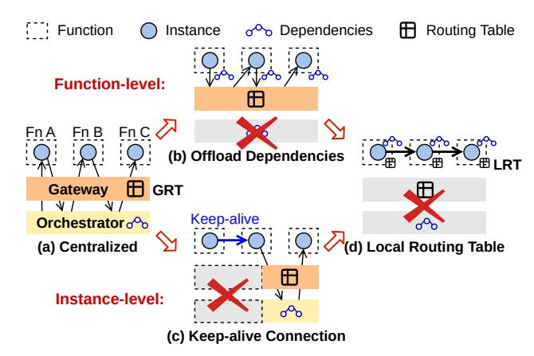
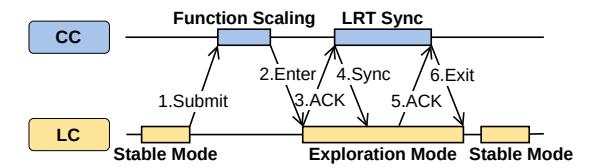
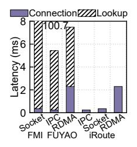
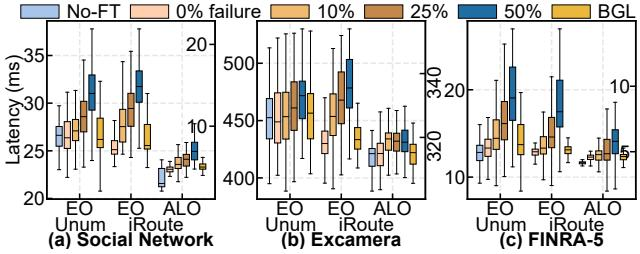
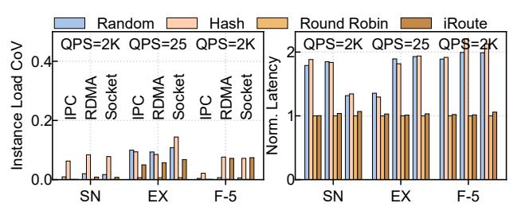
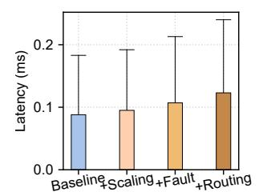
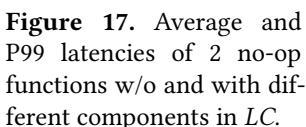

# **iRoute: Local Routing Table-based Workflow Management in Serverless Computing**

Yiming Li† , Laiping Zhao†∗, Zhiyuan Su‡ , Guowei Liu† , Wenhao Huang† , Kang Chen§ , Zhaolin Duan† , Jingjie Zong† , Wenxin Li† , Deze Zeng¶ , Dong Zhang‖ , Wenyu Qu† † College of Intelligence & Computing, Tianjin University, Tianjin Key Lab. of Advanced Networking ‡ IEIT SYSTEMS Co., Ltd, §Tsinghua University, ¶China University of Geosciences Jinan Inspur Data Technology Co., Ltd

# **Abstract**

Serverless computing typically relies on the centralized orchestrator and gateway for function-level and instance-level workflow management. Their intermediary intervention approaches fail to meet the strict microsecond-scale latency requirements of web services. To accelerate workflow execution, prior works have proposed offloading function dependencies to local functions and maintaining connections between frequently invoked instances. However, these methods still suffer from high routing lookup overhead and poor resource efficiency

To address these issues, we propose offloading both orchestrating and routing capabilities from global to local to enable universal 1-hop transfers without compromising resource efficiency. We introduce **iRoute**, a local routing tablebased solution for workflow management. It adopts a duallayer architecture, where local routing controllers make correct routing decisions while concurrently cooperating with a centralized coordinator to ensure consistency across multiple local routing tables. **iRoute** can achieve sub-millisecond data transmission latency while maintaining high resource efficiency. Our experimental results demonstrate that **iRoute** outperforms state-of-the-art systems by up to 27.3× on latency, and improve the throughput by up to 6.7×.

# *CCS Concepts:* • **Computer systems organization** → **Cloud computing**.

*Keywords:* Serverless Computing, Local Routing Table, Data Transfer

#### **ACM Reference Format:**

Yiming Li, Laiping Zhao, Zhiyuan Su, Guowei Liu, Wenhao Huang, Kang Chen, Zhaolin Duan, Jingjie Zong, Wenxin Li, Deze Zeng,

<sup>∗</sup>Corresponding author: laiping@tju.edu.cn


This [work is licensed under a Creative Commons Attribution 4.0 Interna](https://creativecommons.org/licenses/by/4.0)[tional License.](https://creativecommons.org/licenses/by/4.0)

*EUROSYS '26, Edinburgh, Scotland Uk* © 2026 Copyright held by the owner/author(s). ACM ISBN 979-8-4007-2212-7/26/04 <https://doi.org/10.1145/3767295.3769318>

Dong Zhang and Wenyu Qu. 2026. iRoute: Local Routing Tablebased Workflow Management in Serverless Computing. In *European Conference on Computer Systems (EUROSYS '26), April 27–30, 2026, Edinburgh, Scotland Uk.* ACM, New York, NY, USA, [16](#page-15-0) pages. <https://doi.org/10.1145/3767295.3769318>

# **1 Introduction**

Workflow refers to a sequence of tasks executed in a specific order to solve complex problems. In fields such as scientific computing, big data, and artificial intelligence, workflows like Pegasus [\[1\]](#page-13-0), MapReduce [\[2\]](#page-13-1), and Pytorch graph[[3](#page-13-2)] have been widely adopted. In recent years, *serverless workflows*, which orchestrate stateless functions without the need for server management, have also gained significant attention in production[[4–](#page-13-3)[7\]](#page-13-4). Studies indicate that > 31% of serverless applications currently utilize *serverless workflows* [\[4\]](#page-13-3).

However, unlike traditional workflows, which follow a single-layer abstraction, *serverless workflows* feature a twolayer abstraction model due to the auto-scaling nature: (1) *Function-level* defines workflows **offline** as directed acyclic graphs (DAGs) and ensures that the execution order of functions aligns with the predefined logic. (2) *Instance-level* identifies the specific instances of functions involved *during runtime* and ensures that data transfer is completed.

Therefore, data transmission between functions relies on a storage service and a two-layer control mechanism, where the orchestrator coordinates *inter-function* invocation and the gateway handles*inter-instance* communication.This process involves a total of six steps (Figure [2\(](#page-1-0)a)), resulting in communication latency that far exceeds computation time, reaching >20× in the case of *Social Network* [[8\]](#page-13-5).

The inefficiency of data transmission process primarily arises from two sources: (1) *Slow inter-function routing*, i.e., the significant overhead involved in resolving downstream functions at the orchestrator and locating their instances through the gateway; (2) *Slow inter-instance transmission*, i.e., the significant time associated with transferring data between dependent functions. To accelerate data transmission, existing work generally falls into two categories: (1) Offloading the resolution of downstream functions from the orchestrator to local instances (Figure [1\(](#page-1-1)b), Unum [\[9\]](#page-13-6)), thereby accelerating the routing process. However, this method does

<span id="page-1-1"></span>

**Figure 1.** Schematic overview of serverless workflow management.

not improve the efficiency of looking up instance at the gateway. (2) Maintaining connections between instances with frequent communication to accelerate data transmission (Figure 1(c), FUYAO [10]). However, *keep-alive connection* is only effective for frequent invocations, whereas, in the real world, most workflows (e.g., 80% in Azure durable functions [6]) are sparsely invoked. Therefore, no existing system can efficiently support both *inter-function routing* and *inter-instance communication* for serverless workflows.

For *inter-function routing*, the inefficiency mainly stems from the centralized orchestrator and gateway. This "intermediary intervention" introduces performance bottlenecks and incurs additional network communication overhead. To improve routing efficiency, both function resolution and instance lookup should be offloaded to local instances.

For *inter-instance transmission*, low efficiency is primarily due to the stateless nature of functions, which prevents them from directly locating each other. Therefore, intermediate data is transferred via *third-party forwarding*. Specifically, function *A* stores intermediate data in a third-party storage service, and function *B* subsequently retrieves the data from that service. This "*instance-level* intermediary intervention" potentially accounts for up to 95% of overall latency [7, 11–14]. To improve transmission efficiency, a natural solution is to publish the address of each instance and allow instances to proactively establish direct connections.

Establishing direct connections through the **Global Routing Table** (GRT) incurs 10-100 milliseconds overhead [10]. Moreover, it may lead to low resource efficiency due to the "binding scaling" problem, i.e., downstream instances must synchronize scaling with upstream instances to prevent potential overload [15]. To address these issues, we argue for splitting *GRT* into multiple **Local Routing Tables** (LRTs), thereby enabling local instances to perform autonomous routing and achieve 1-hop transmission.

<span id="page-1-0"></span>

**Figure 2.** The data transmission process of *third-party forwarding* and *keep-alive connection*.

However, LRT-based routing introduces new challenges: (1) Correctness of routing decisions: In fan-in scenarios, parallel upstream functions must independently route results to the same downstream instance without global coordination. To address this, we employ consistent hashing routing algorithm, which enables globally consistent routing decisions based on local views. Additionally, an exploration mode is introduced to handle routing faults caused by inconsistencies between LRTs. (2) Performance overhead of LRTs synchronization: Workflows may exhibit high fan-in degrees (e.g., several hundreds [6]) and experience burst workloads (e.g., 33,000× within one minute [16, 17]). Hence, the overhead of synchronizing LRTs can be non-negligible. We adopt a dual-layer architecture comprising local routing controllers and a *centralized coordinator* to efficiently synchronize *LRTs*. Moreover, a partition policy is employed to enable rapid updates of LRTs with minimal overhead.

We propose **iRoute** <sup>1</sup>, a novel routing solution for *server-less workflows* that addresses the inefficiency of inter-function communication. **iRoute** leverages *LRTs* to enable local instances to autonomously locate dependent instances and establish direct connections, achieving sub-millisecond data transfer latency while preserving high resource efficiency.

Our Contributions can be summarized as follows:

- We analyze the performance and scalability issues of intermediate data transfer in *GRT*-based methods, including third-party forwarding and keep-alive connection.
- We propose iRoute, a comprehensive LRT-based solution that enables 1-hop transfer across all scenarios (even for workflows with sparse invocations) without compromising on scalability. It achieves both low transmission latency and high resource efficiency.
- Experimental results on diverse serverless workflows demonstrate that **iRoute** can outperform the state-of-the-art by up to 27.3 × in latency and offer 6.7 × throughput.

# 2 Background & Motivation

Workflows orchestrate sequences of functions, typically modeled as DAGs, to manage complex processes and data flows.

<span id="page-1-2"></span><sup>&</sup>lt;sup>1</sup>https://github.com/tanksys/iRoute

With the advancement of serverless technology, *serverless workflows* have attracted significant attention from cloud providers for building latency-sensitive web services. For example, AWS has rearchitected web services like e-commerce [\[18](#page-13-14)] and airline booking [\[19\]](#page-13-15) using serverless. Microsoft also supports web applications based on Azure Functions[[20](#page-13-16)]. However, due to the high overhead of inter-function data transmission (e.g.,> 70% of the overall latency [\[10](#page-13-7)]), *serverless workflow*-based web services often struggle to meet strict latency requirements. As the adoption of*serverless workflows* continues to grow (e.g., > 31% [[4](#page-13-3)]), reducing workflow communication latency has become a critical challenge for *serverless workflow*-based web services.

In *serverless workflows*, communication between functions primarily consists of two steps: (1) *inter-function routing* and (2) *inter-instance communication*. Although Unum[[9](#page-13-6)] has reduced routing overhead by offloading the resolution process from the orchestrator to local instances, there is still significant overhead in locating instances and transmitting data between instances. We analyze the *posting* feature in the benchmark of *Social Network* [[8](#page-13-5)], and find that the computation times of its 10 functions range from 28 to 1.6 , with even 6 functions having latencies below 150 . However, the data transfer overhead between two functions can surpass 3.3 , more than 20× the computation time. Consequently, the substantial overhead incurred by data transfer poses a major challenge in adopting serverless computing for latency-sensitive services.

# **2.1 Intermediate Data Transfer Costs**

Due to the lack of location awareness between stateless functions, existing intermediate data transfer relies on the *gateway* and external storage, i.e., *third-party forwarding*. As illustrated in Figure [2\(](#page-1-0)a), the orchestrator triggers Function A via the gateway ➊, which uses the GRT to locate an available instance (A1) ➋. A1 completes execution and stores the intermediate data in external storage ➌. The orchestrator then triggers Function B based on the dependencies➍➎, and B's instance retrieves the data from storage➏. The entire process consumes > 3.3 .

By maintaining a direct connection between function instances (i.e., *keep-alive connection*), we can bypass the overhead of request forwarding and *GRT* queries, achieving submillisecond latency via 1-hop data transfer [\[10](#page-13-7)]. *Keep-alive connection* requires routing lookups before the first 1-hop transfer: one for the orchestrator to specify function dependencies ➊➋, and another for exchanging function instances' addresses (e.g., IP address and port, named pipe) ➌➍➎, both via the gateway (Figure [2](#page-1-0)(b)). After exchanging addresses, they can establish a persistent direct connection to achieve 1-hop transfer ➏. This connection will be kept alive for a period of time for reuse by subsequent requests.

We evaluate the data transfer efficiency by deploying *Social Network* [[8\]](#page-13-5) on three existing platforms: (1) *FMI* (implementing *keep-alive connection* utilizing TCP); (2) *FUYAO* (implementing *keep-alive connection* using IPC (inter-process communication) and RDMA; and (3) *OpenFaaS* (implementing *third-party forwarding*). Experimental configurations are detailed in [§5.1,](#page-8-0) and all function instances are pre-warmed to eliminate the impact of cold starts. Prior studies [\[21–](#page-13-17)[23](#page-13-18)] have reduced cold start overheads to the millisecond or even sub-millisecond level. Moreover, as the frequency of workflow invocations increases, the reuse rate of warm instances also rises. For example, Durable Functions reports a median cold start rate of only 0.35% for workflows invoked ≥ 100 times per day[[6](#page-13-8)]. With cold start overhead minimized, routing and connection establishment become the dominant performance concern.

The Azure trace[[10,](#page-13-7) [16](#page-13-12), [24](#page-13-19)] offers a diverse range of invocation patterns, including periodic, sparse, and bursty workloads, effectively covering the typical access patterns of web services[[25](#page-14-0)[–27\]](#page-14-1). Thus, we choose it to evaluate the performance of *keep-alive connection* using two traces: a *stable* trace with few bursts, and a *burst* trace featuring frequent invocation spikes. (Figure [3\(](#page-3-0)a)). It can be observed that *FMI* can reduce the 99th percentile latency by 2.1× compared to *OpenFaaS* under stable trace with frequent invocations. However, *FMI* demonstrates significant performance fluctuations under burst trace, with latency even averaging 1.2× over *OpenFaaS*. This is primarily due to the frequent bursts of invocation leading to scale up and down of function instances, which involves the establishment and release of direct connections. As shown in Figure [3](#page-3-0)(b), *FMI* and *FUYAO* can experience 8.7× and 2.2× higher latency compared to *OpenFaaS* in the first request due to the substantial routing lookup overhead. Therefore, *keep-alive connection* in scenarios with frequent bursts struggles to amortize the routing lookup overhead through reusing the connection for subsequent requests. Unfortunately, workloads with frequent bursts are common in both public and private clouds[[16,](#page-13-12) [28](#page-14-2), [29](#page-14-3)].

Besides burst traffic, many *serverless workflows* are typically infrequently invoked. For example, those with an invocation frequency of < 100 times per day account for 80% in Durable Functions [\[6\]](#page-13-8). Under sparse invocations, maintaining connections results in resource wastage, while establishing a new connection for each request incurs high overhead (Figure [3](#page-3-0)(a)). Therefore, *keep-alive connection* is also not suitable in such scenarios.

**Observation I:** *Limited applicability: keep-alive connection can significantly reduce the overall latency under frequent invocations, yet it is unsuitable for scenarios with frequent bursts due to high routing lookup overhead.*

<span id="page-3-0"></span>

**Figure 3.** Performance analysis of *Social Network*. (a) The figure shows a dual-axis representation: the P99 latency of *Social Network* on the left and QPS across two workload traces on the right. (b) A breakdown of the first end-to-end latency, with shading indicating the routing lookup overhead. (c) The over-provisioning percentage quantifies the additional function instances allocated beyond the minimum required to meet demand. We present the over-provisioning percentages for both *FMI* and *FUYAO* across different queries per second (QPS).

## 2.2 Resource Provisioning Costs

Current serverless platforms make scaling decisions through a global engine based on the concurrency of functions. However, 1-hop transmission bypasses the global engine, preventing it from promptly detecting the concurrency level of each function, which renders the existing scaling mechanism ineffective. Therefore, *keep-alive connections* typically adopt *binding scaling*, wherein downstream functions scale concurrently with upstream functions, to mitigate potential high tail latency issues. Obviously, this scaling mechanism, which relies on resource over-provisioning, can result in inefficient resource utilization.

We measure the over-provisioning percentage of function instances of FMI and FUYAO under various QPSs, and illustrate the results in Figure 3(c). Due to usage of a static policy that pre-defines which function pairs should establish connections, FMI necessitates scaling the entire workflow when addressing high workloads. This approach completely compromises the fine-grained scalability of serverless computing, leading to a resource wastage of up to 177.8% under QPS = 900. Despite FUYAO maintaining partial scalability by enabling upstream functions to keep alive direct connections with multiple instances of the same downstream function concurrently, the binding scaling problem still leads to 50% resource over-provisioning under QPS = 1200.

**Observation II:** Resource over-provisioning: Keep-alive connection needs to maintain direct connections between upstream and downstream functions, which results in <u>binding scaling</u> of dependent functions when scaling, leading to low resource efficiency.

## 2.3 Implications

A *serverless workflow* system must possess the dual management capabilities at both the function and instance levels. The system should: 1) support the definition and orchestration of complex inter-function dependencies, and 2) reduce the overhead of intermediate data transmission.

<span id="page-3-1"></span>**Table 1.** Comparison of Existing Systems: FN and INS denote Function-level and Instance-level; ✓ and ✗ denote whether the DAG structure or functionality is supported; 'C' and 'D' denote Centralized and Decentralized.

|     | System          | OpenFaaS | Unum     | FMI      | Fuyao    | iRoute   |
|-----|-----------------|----------|----------|----------|----------|----------|
| FN  | Fan-out pattern | V        | <b>✓</b> | <u> </u> | <b>✓</b> | <b>✓</b> |
|     | Fan-in pattern  | ×        | <b>✓</b> | <b>✓</b> | X        | <b>✓</b> |
|     | Architecture    | C        | D        | D        | D        | D        |
|     | Overhead        | High     | Low      | Low      | Low      | Low      |
| INS | Data transfer   | Forward  | Forward  | Direct   | Direct   | Direct   |
|     | Fault tolerance | ×        | <b>✓</b> | X        | X        | <b>✓</b> |
|     | Overhead        | High     | High     | Medium   | Medium   | Low      |

Although existing solutions [9, 10, 15] have made improvements in workflow management at both the function and instance levels (as shown in Table 1), they still fail to fully meet the needs of *serverless workflows*. At the function-level, *decentralized design* [9] offloads the process of resolving function dependencies to the local instance, avoiding high overhead. However, there remains significant latency in locating instances and inter-instance transmission. While *keepalive connection* methods [10, 15] can reduce transmission latency, they still have problems such as limited applicability (Observation I), resource over-provisioning (Observation II). Therefore, a *serverless workflow* system that can comprehensively address these challenges is still needed.

## 2.4 Design Goals

Our design aims to accelerate inter-function data transmission in *serverless workflows* by eliminating intermediary intervention overhead at both the *function-level* and *instance-level*. First, dependency resolution process should be offloaded to local function instances to enable efficient coordination of function execution. Next, local instances should be able to independently select available downstream instances to support invocation routing . Finally, local instances should be able to directly locate each other and establish direct connections, thereby enabling 1-hop inter-instance communication at all times.

<span id="page-4-0"></span>

Figure 4. The overall architecture of iRoute.

# 3 Design

#### 3.1 Overview

Figure 4 shows an overview of the architecture of iRoute, featuring a dual-layer structure composed of multiple Local Routing Controllers (LCs) and a Centralized Coordinator (CC). Unlike traditional centralized controllers, CC is only responsible for handling lightweight coordination tasks. It includes three main components: the DAG parser, the scaling engine, and the syncing engine. At the function level, the DAG parser is responsible for parsing the dependencies between functions in a workflow and distributing these dependencies to each function. At the instance level, each function instance is equipped with an LC acting as a sidecar. The LC maintains a Local Routing Table (LRT) that stores routing information for dependent instances and uses a routing algorithm to make routing decisions, enabling efficient 1-hop data transmission. During the execution of the workflow, the scaling engine makes scaling decisions based on the workloads, and the syncing engine then updates the LRTs at the LCs.

To ensure the correctness of routing decisions (**Challenge 1**), *LC* operates in two modes: *stable mode* and *exploration mode*. In the *stable mode*, *LC* employs routing algorithms based on calling patterns to determine the correct routing destination. In the *exploration mode*, *LC* further detects and resolves routing faults. When function scaling occurs, the *CC* instructs *LCs* to switch from *stable* to *exploration mode*. Upon completion of *LRT* synchronization, *LCs* will be informed to revert to the *stable mode*.

To reduce the synchronization overhead of *LRTs* (**Challenge 2**), **iRoute** divides the instances into multiple *partitions*, where intermediate data transfer is only allowed within the same partition. For example, the instances  $\{A_1, B_1, ...\}$  in Figure 4 belong to the same *partition* #1. When  $A_1$  completes, the  $LC_{A_1}$  takes over the responsibility of routing intermediate data. It first queries LRT to identify available instances of the function B (e.g.,  $B_1$  in *partition* #1), then employs the routing algorithm to select a destination and finally initiates 1-hop data transmission based on the destination's address

in *LRT*. When scaling out, the *scaling engine* creates a new instance and assigns it to a partition. The *syncing engine* then updates the relevant LRTs accordingly.

Note that, we only consider the direct invocation pattern where upstream functions can invoke downstream functions themselves for immediate processing. In the indirect invocation pattern, where downstream functions are triggered by external events such as storage, timers, or queues, it is generally unnecessary to establish direct connections between functions, since upstream functions cannot determine when or which downstream functions will be triggered.

## 3.2 Local Routing Controller

**3.2.1 LRT Design.** LRT stores the address information of downstream functions, allowing the LC to make routing decisions based on this information. Hence, the number of entries in the LRT equals the sum of downstream function instances. Each entry in LRT contains four fields: (1) *Instance ID* denotes the identifier of a downstream function instance. It is used for instance selection in routing algorithms; (2) Address denotes the IP address and port number used for accessing the instance; (3) State denotes the reachable state of a destination instance, which can be either active or inactive. It is set to active when the local instance and the destination instance belong to the same partition; (4) Tunnel denotes the transmission channel for accessing the instance. It could be IPC, Socket, or RDMA. IPC denotes the intra-node direct communication utilizing Linux FIFO. Socket denotes the inter-node direct communication based on socket objects. RDMA denotes the inter-node direct communication utilizing network acceleration devices.

Note that, for the same downstream function instance, the *LRTs* of upstream functions may store different *state* and *tunnel* information. For example in Figure 4, *LRTs* of function instances  $A_1$ - $A_2$  all store the *instance ID* and *address* of  $B_1$ - $B_3$ . Assuming that  $A_1$  and  $B_1$  are located on the same node, the *tunnel* in the *LRT* of  $A_1$  is set to *IPC*; otherwise, it is set to *socket*. Additionally, *state* is configured based on the partitions; thus, instances of B, which belong to the same partition as  $A_1$ , have their *state* set to *active*.

<span id="page-4-1"></span>**3.2.2 Routing Algorithm.** Following the dependencies defined in a workflow, after an upstream function completes execution, its result is passed to the local LC. The LC then identifies downstream functions for this intermediate data. It filters out available downstream instances (i.e., state = active) from the LRT. Then, it employs a routing algorithm to choose a routing destination for each downstream function. After selecting the downstream instance, it routes intermediate data to the destination via the transmission channel indicated by the tunnel field in LRT.

For workflows with a static DAG structure, the calling pattern between dependent functions typically involves three types: *chain*  $(1 \rightarrow 1)$ , *fan-out*  $(1 \rightarrow n)$ , and *fan-in*  $(n \rightarrow 1)$ .

<span id="page-5-0"></span>

**Figure 5.** The interaction process between *CC* and *LC*.

The operational mechanisms of the routing algorithm under different patterns are as follows:

**Chain (**1 → 1**)**: there is a one-to-one dependency relationship between upstream and downstream functions. Since there is only one downstream function, the routing algorithm primarily addresses the load balancing of multiple instances of the downstream function. We evaluate several commonly used load balancing algorithms, including *Random*, *Consistent Hashing* and *Round Robin*. As shown in Figure [16](#page-11-0) in Section [5.5](#page-11-1), *Round Robin* achieves the best load balancing performance. Therefore, we adopt the *Round Robin* algorithm in our design.

**Fan-out (**1 → **)**: the intermediate data produced by an upstream function is simultaneously distributed to multiple downstream functions. In this case, the local *LC* considers it as a variation of chain, and sequentially invokes *Round Robin* algorithm for each downstream function.

**Fan-in (** → 1**)**: the intermediate data produced by multiple upstream functions converges to a single downstream function. In this case, the *LC* employs a *Consistent Hashing with Exploration Mode (CH-EM)* algorithm to ensure correct routing decisions. This algorithm maps downstream instances (i.e., *instance IDs*) in the *LRT* onto a hash ring, then maps the request's ID onto the hash ring and selects the nearest instance as the destination. Thus, although each function makes independent decisions, it still ensures that the intermediate data of the same request is routed to the same downstream instance.

When a workflow includes conditional logic (e.g., *Choice* in AWS Step Functions[[30](#page-14-4)]), its DAG evolves at runtime based on intermediate data or execution state. In such scenarios, *LRTs* must be retrieved from *CC* at runtime, incurring connection establishment overhead similar to that of *centralized orchestrator*. One possible solution is to pre-distribute *LRTs* containing the address information of all branch functions, enabling *LC* to select the appropriate routing target based on the conditional logic. We leave the exploration of this approach for future work.

<span id="page-5-2"></span>**3.2.3 Fault-tolerant Routing.** In the *fan-in* communication pattern, when all *LRTs* of upstream functions are consistent, the *CH-EM* algorithm can ensure that the intermediate data from multiple upstream functions converges to the same destination. However, during the synchronization process (Figure [5](#page-5-0)), temporary inconsistencies in the *LRTs* of upstream functions may cause routing decision conflicts.

<span id="page-5-1"></span>

**Figure 6.** Exploration mode initiates feedback after detecting fault routing decisions.

In this case, the *CH-EM* algorithm employs the *exploration mode* to detect and fix fault routing decisions (Figure [6\)](#page-5-1).

The basic idea of *exploration mode* is the *check* and *rerouting* mechanism. Downstream *LCs* check the integrity of the received data and request the upstream instances to re-route any missing intermediate data. The *check* occurs upon receiving data from the critical path, typically the result from the upstream function that arrives the latest due to the longest execution time. The content to be checked is whether all upstream results have been received based on the dependency. If so, the function execution proceeds; otherwise, the re-routing mechanism is triggered for each missing function. As illustrated in Figure [6,](#page-5-1) *A->C* represents the critical path, thus the *LC* of <sup>2</sup> starts checking when receiving data from <sup>1</sup> . It deduces that a fault routing decision may have occurred due to the lack of data from *B*. Note that, we denote the path with the longest execution time as the critical path[[31\]](#page-14-5). Upon workflow submission, the *DAG parser* statically profiles parallel branches to determine the initial critical path, which is subsequently refined by the *CC* using collected function latencies (§[3.3.1\)](#page-6-0). Inaccurate critical path analysis can lead to unnecessary re-routing, incurring latency overhead of 1.9-11.1% as shown in Figure [13.](#page-11-2)

Due to the uncertainty of the required data's location, the *LC* identifies all instances of each missing function based on transmission channels, and sends re-routing request to them. If the upstream *LC* holds the required data, it will reroute it to the instance that sent the feedback (e.g., <sup>2</sup> ) and instruct the original destination (e.g., <sup>1</sup> ) to remove the previously routing data. Otherwise, the *LC* continues to monitor subsequent execution requests until it discovers the required data or receives confirmation from downstream that the data has been re-routed by another instance. To address all potential routing faults, as shown in Figure [5,](#page-5-0) the *CC* ensures that all *LCs* switch to *exploration mode* before initiating *LRTs* synchronization. Moreover, the upstream *LCs* need to temporarily buffer intermediate data for re-routing. To minimize the storage overhead, the *LC* utilizes both proactive release and expire mechanism to manage the lifetime of each buffer entry, which is detailed in [§3.2.4.](#page-6-1)

To ensure routing correctness during down scaling, an instance is removed only after all involved requests have

been fully processed. First, the *CC* updates the status of the instance to be released as *inactive* in the *GRT* and synchronizes with the *LRTs* of upstream dependent function instances. Then, upstream functions check the *inactive* status in *LRTs* and stop sending requests to the instance. Next, the *CC* notifies *LCs* of the instance to check and clear its local buffer. Once all local buffers are actively cleared, *LCs* inform the *CC*, which can then safely remove the instance from the *GRT* and release it.

<span id="page-6-1"></span>**3.2.4 Fault-Tolerant Execution.** Current serverless platforms provide three execution semantics: *at-most-once*, *atleast-once* and *exactly-once* [\[32–](#page-14-6)[34](#page-14-7)]. *At-most-once* indicates that each invocation is attempted no more than once, without automatic retries upon failure. *At-least-once* achieves reliability by retrying failed invocations until completion, potentially leading to duplicate executions. *Exactly-once* ensures that each invocation produces a single definitive result that is delivered to downstream functions only once, even in the presence of failures or retries. **iRoute** supports all three semantics and adopts *at-most-once* as the default execution mode. Stronger guarantees (*at-least-once* and *exactly-once*) require explicit user configuration to enable retries upon execution failure.

However, offloading both *function-level* and *instance-level* management capabilities to local instances presents a key challenge for **iRoute** in maintaining execution semantics. First, function interactions in our system bypass the centralized gateway, which typically tracks execution status and retries failed invocations. Consequently, detecting failed function invocations becomes more challenging in our distributed architecture. Second, while 1-hop data transfer eliminates the interaction overhead with third-party storage, it also increases the risk of data loss. As a result, failed invocations may require re-executing the entire workflow to reproduce the lost data, leading to considerable overhead.

**iRoute** supports *at-most-once* semantics by executing each invocation no more than once and immediately aborting failed requests without retries. Specifically, when *LC* detects an execution anomaly or *CC* identifies an instance failure, the corresponding invocation is aborted and an error response is returned to the upstream caller.

**iRoute** leverages *data buffer* and *re-scheduling* mechanisms to provide *at-least-once* execution semantics. First, each *LC* temporarily buffers execution results and routing destinations, enabling downstream functions to be re-executed when necessary. Second, when an instance failure is detected, the *CC* notifies all upstream *LCs* within the same partition to check for potential failed invocations, i.e., buffer entries were routed to the crashed instance.The *re-scheduling* mechanism is then activated for these affected invocations. *LCs* employ *Round Robin* and *CH-EM* routing algorithms, as described in §[3.2.2](#page-4-1) and [§3.2.3](#page-5-2), to choose new destinations for

each entry. Finally, downstream *LCs* retrieve buffered data and re-execute corresponding invocations.

To prevent redundant re-executions, **iRoute** implements a proactive buffer release mechanism. This mechanism is based on the following key insight: once all downstream *LCs* have buffered and routed their execution results, the previous buffer entries are no longer necessary to enforce execution semantics. Additionally, each buffer entry is assigned a Time To Live (TTL), e.g., twice the duration of the downstream function, and expires once timeout occurs. However, even after expiration, the identity of the expired invocation is retained until proactive release, allowing for the recovery of lost data if needed.

For applications that require stricter execution semantics (e.g., payments), **iRoute** introduces a centralized buffer mechanism. While this approach incurs additional performance overhead, it guarantees *exactly-once* execution. In this model, *LCs* perform atomic operations on a third-party storage to buffer exactly one execution result for each function invocation[[9](#page-13-6)]. If the buffer is successfully written, the execution result is routed to downstream instances via 1-hop transfer. Otherwise, only the location of the existing buffer is transmitted. This ensures that downstream functions consistently receive the same input across multiple executions. Additionally, *LCs* check for the presence of buffer before execution. If it exists, the execution is skipped, and the buffer location is transferred directly to downstream functions.

Note that, the *exactly-once* guarantee may not apply to workflows with external side effects, e.g., transactions. This well-known issue are independent of the routing architecture. Therefore, orthogonal techniques, such as log-based approaches like Boki[[35\]](#page-14-8) and Halfmoon [\[36\]](#page-14-9), can be integrated with **iRoute** to enhance the execution semantics.

**3.2.5 Trust model.** After offloading the routing functionality from the global to local instances, *LC* is currently part of the trusted computing base (TCB). To mitigate security risks, **iRoute** restricts *LC* to read-only access to *GRT* and relies on periodically refreshed access credentials. If *LC* is to be removed from TCB, authentication mechanisms must be introduced between *LC* and *CC*, as well as among *LCs* themselves. Additionally, Byzantine fault tolerant protocols[[37,](#page-14-10) [38](#page-14-11)] can be integrated to further enhance security.

## **3.3 Centralized Coordinator**

In this section, we discuss how the *CC* collaborates with *LCs* to achieve function scaling and synchronization of *LRTs*, while addressing highly dynamic serverless workloads without compromising on scalability.

<span id="page-6-0"></span>**3.3.1 Function Scaling.** Existing serverless platforms utilize a centralized controller to route each request, which records the concurrency of each function in real-time to make scaling decisions. For example, AWS Lambda provisions a separate instance for each concurrent request[[39\]](#page-14-12).

However, delegating the routing functionality to local sidecar bypasses centralized components for intermediate data transfer, rendering existing scaling policy ineffective. Therefore, **iRoute** redesigns the scaling mechanism through the collaboration of *CC* and *LCs*.

<span id="page-7-0"></span>

**Figure 7.** The function scaling decisions are determined based on the average requests per second  $\lambda$  and request duration t. And the instances are divided into multiple partitions to reduce the overhead of *LRTs* synchronization.

The scaling engine of CC makes scaling decisions for each function based on the workload metrics collected from each LC, including the average requests per second  $(\lambda)$  and request duration (t). Function scaling can be triggered in two scenarios: (1) LC detects that the local instance is overloaded; (2) the scaling engine periodically collects metrics and identifies instance redundancy. Specifically, a function instance is considered overloaded if the request per second exceed its processing capacity  $(\lambda > \frac{1}{t})$  or a given threshold  $(\lambda > \lambda_{th})$ , which is utilized to avoid transmission faults caused by excessive workloads. Similar to AWS Lambda [39], the scaling engine calculates the concurrency for each function as the expected number of instances for the current workload:

$$\alpha = \left\lceil \frac{\sum_{i=1}^{\alpha'} t_i}{\alpha'} \sum_{i=1}^{\alpha'} \lambda_i \right\rceil \tag{1}$$

where  $\lambda_i$  and  $t_i$  denotes the average arrival requests per second and request duration of the ith instance of the function, respectively. And  $\alpha'$  presents the number of existing instances. For example in Figure 7(b), the LC of  $A_1$  reports  $\lambda_{A_1}=15$  and  $t_{A_1}=0.2$ , and then the scaling engine calculates  $\alpha_A=3$ . Thus, it scales up instance  $A_2$  and  $A_3$ .

**3.3.2 LRT Synchronization.** The *syncing engine* of *CC* is responsible for distributing the routing information of newly scaled instances to all *LCs* of its dependent functions. However, simultaneously communicating with all *LCs*, which may refer to thousands of function instances, can incur significant synchronization overhead. Therefore, the *syncing engine* further partitions function instances, and reduces the synchronization overhead by firstly synchronizing only the *LRTs* of the partition containing the newly scaled instance. *LCs* can only select routing target from instances within the

# **Algorithm 1:** Partition(f, G, P, C, T)

```
Input:
```

```
f \triangleright The newly scaled function;
```

 $G \triangleright \text{The DAG of workflow};$ 

 $P \triangleright$  The partition results of existing instances;

 $C \triangleright$  The capacity of each function in a partition;

 $T \triangleright$  The request duration of functions;

#### Output

*index* ▷ The partition index of the newly scaled instance;

```
1 if C == {} then
         P_{1,f} \leftarrow P_{1,f} + 1, index \leftarrow 1;
         if P_{1,f_i} > 1 \ \forall f_i \in G then
              GetCapacity(G, P, C, T); // Calculate the
                capacity when all functions have scaled
 5 else
         index \leftarrow arg \min_{k} P_{k,f} < C_f, P_{k,f} \leftarrow P_{k,f} + 1;
          // Select the unfilled partition
         if index == -1 then
              index \leftarrow |P| + 1, P_{index} = \{..., f_i : 1, ...\}; // Add
                new partition when no available capacity
 9 return index;
10 Function GetCapacity(G, P, C, T):
         for stage_i \in G do
11
              if i == 1 then
12
                   for f_j \in stage_1 do
13
                       C_{f_i} \leftarrow P_{1,f_i}; // Use current number of
                          instances as the capacity
15
                   \lambda_{max} \leftarrow \min_{f_j \in stage_{i-1}} \frac{C_{f_j}}{T_{f_i}}; // \text{ Calculate the max}
                     workload of upstream stage
                   for f_j \in stage_i do
17
                        C_{f_i} \leftarrow \left[\lambda_{max} T_{f_i}\right]; // \text{ Calculate the}
                          required capacity to meet \lambda_{max}
```

same partition (i.e., *state* = *active*), thus delaying the synchronization of routing information for new instances located in other partitions does not affect the correctness of routing decisions.

Re-partitioning all instances for each scaling event would result in high coordination overhead under highly dynamic workloads. Therefore, the *syncing engine* opts to assign each newly scaled instance to an available partition based on the capacity, i.e., the maximum number of instances of each function that a partition can accommodate. For example in Figure 7(c), a partition can only accommodate 3A and 2B, thus  $A_4$ - $A_5$  and  $B_3$  must be allocated to  $Partition_2$ .

The principle behind calculating partition capacity is to avoid overloading instances within a filled partition as much as possible, i.e., the capacity for each function must be sufficient to handle the workload from upstream functions. For

example, the 3 instances of  $\{A_1, A_2, A_3\}$  can generate a maximum workload of  $\lambda = 15$ , which is less than the capacity accommodated by the 2 instances of  $\{B_1, B_2\}$  (i.e., the combined capacity of  $B_1$  and  $B_2$  is 20, Figure 7(b)). Algorithm 1 details the process for selecting a partition for each newly scaled instance. By default, the algorithm allocates all instances to a single partition until there are multiple instances for each function in the workflow (Lines 1-2). At this point, it determines the need to create multiple partitions and begins calculating the capacity of instances (Lines 3-4). Based on the current number of instances for functions in the first stage, the algorithm iteratively calculates the capacity required for each function to support the maximum upstream workload (Lines 10-18). Subsequently, it can assign newly scaled functions to partitions that are not yet filled (Lines 5-6), and creates new partitions when no available partitions exist (Lines 7-8). Note that, to ensure that each LRT has available routing destinations, at least one instance for each function is initiated upon the creation of a new partition.

**3.3.3 Fault tolerance.** Failures of the *CC* may lead to inconsistencies across multiple *LRTs*, potentially resulting in partial request blocking. For example, requests in *fan-in* scenarios may fail to be routed to the same downstream instance due to unsynchronized *LRTs*. However, the *GRT* is maintained in an external service (e.g., *ZooKeeper* [40]). In the event of a *CC* failure, the cluster manager (e.g., Kubernetes) automatically restarts the *CC*, which then reload the *GRT* from the external storage and synchronizes it with *LCs*, subsequently resolving any potential routing faults. Therefore, a *CC* failure does not disrupt workflow execution.

## 4 Implementation

We implement **iRoute** with Python3 atop *OpenFaaS* [41], one of the most popular open-source serverless platforms. The *CC* and *LC* modules are integrated with *OpenFaaS* as a web service and a runtime dependency library, respectively, to facilitate workflow execution. We replace *Open-FaaS*'s *alert-manager* with *scaling engine* to manage scaling while reusing other modules, such as *gateway* and *faas-netes*, to minimize development costs.

The *CC* is implemented using *socket* library [42] and runs as a daemon process. It receives JSON-formatted DAG definitions, and generates a *config.json* file for each function, which specifies the dependencies at *function-level*. Then, it places the *config.json* in corresponding function's code directory, and deploys workflows by invoking *OpenFaaS*'s *faas-cli* module through *subprocess*. After Kubernetes launches function instances and assigns IP addresses, the *CC* queries instance metadata through Kubernetes APIs and generates the required information for routing table, which are subsequently synchronized with *LCs* through TCP-based direct connections. The *CC* stores the *GRT* in *ZooKeeper* [40] and

notifies LC upon updates to provide synchronized consistency. For each function, CC creates a dedicated ZooKeeper node to store instance information and enforces read-only access for LCs through access control lists. To enhance security, the CC periodically re-generates node paths and authentication credentials, and subsequently re-notifies LCs.

The LC is packaged together with the user code and takes over the execution of the instance's main process (i.e., index.py). To support IPC-based 1-hop transfer, function instances are mounted with a shared tmpfs directory to set up named pipes and shared memory buffers. During workflow execution, the LC uses the epoll system call to listen for I/O events from all transmission channels' file descriptors, including pipes, sockets, and completion event channel of RDMA. It then utilizes the os [43], socket [42], and third-party rdma-core libraries [44] to handle message reception and transmission. Upon receiving complete intermediate data, the LC can directly invoke the user's code (i.e., handle function) and obtain the output. To avoid frequent network and deserialization overhead, LCs retrieve the latest routing table from ZooKeeper only when it is explicitly notified of an update. As for exactly-once semantics, we utilize Redis [45] as the third-party storage, and employ setnx (set if not exists) operation to ensure consistent buffer.

#### 5 Evaluation

# <span id="page-8-0"></span>5.1 Methodology

**Experimental setup.** We evaluate **iRoute** on a 12-node cluster. Each node is configured as shown in Table 2. And these nodes are connected via 25 Gbps, full-bisection bandwidth Ethernet.

**Table 2.** Experimental cluster configurations

<span id="page-8-1"></span>

| Component        | Configuration                  |  |  |
|------------------|--------------------------------|--|--|
| CPU Device       | Intel Xeon Gold 6338 @ 2.00GHz |  |  |
| CPU Threads      | 128 cores (64 physical cores)  |  |  |
| Storage          | 256GB Memory with 2TB SSD      |  |  |
| Operating System | Ubuntu 22.04                   |  |  |

Benchmarks. We evaluate iRoute and the comparison systems using three typical benchmarks. Social Network is a latency-sensitive application from DeathstarBench [8] that creates post embedded with text, media, links and user tags. Excamera [46] is a video-processing application that encodes and processes chunks in parallel. And the function execution dominates the overall latency. Financial Industry Regulatory Authority (FINRA) is a financial application that validates trades based on trade and market data. It can be configured with varying widths (i.e., fan-in degree). Specifically, we implement four distinct variants of FINRA with widths of 5, 10, 20 and 40. We further use production trace from Azure Function [16] for evaluation, including the stable trace, burst trace and sporadic trace.

<span id="page-9-0"></span>


**Figure 8.** Latency of building direct connection

**Figure 9.** Comparison of data transmission latency under various data volumes

Comparison systems. We compare iRoute with state-of-the-art systems, including *OpenFaaS* [41], *Unum* [9], *Night-core* [47], *FMI* [15] and *FUAYO* [10]. Specifically, *OpenFaaS* uses a standalone orchestrator and basic *third-party forwarding* for workflow execution; *Unum* offloads *function-level* dependencies to local instance to avoid the interaction overhead with a standalone orchestrator; *Nightcore* employs IPC to speed up data transfer between functions within the same node; *FMI* implements *keep-alive connection* based on Socket; *FUYAO* also supports *keep-alive connection* with IPC and RDMA-based direct connections. To ensure fairness, each system is compared only with others that adopts the same communication channel, i.e., Socket, RDMA, or IPC. Moreover, all function instances are pre-warmed to eliminate the impact of cold starts.

**Metrics.** We evaluate the performance of **iRoute** using three metrics: (1) Latency (e.g., data transfer latency, end-to-end latency and overhead); (2) Throughput (i.e., QPS); (3) Resource provisioning (i.e., required number of instances to support various QPS). We conduct each test five times and report the average results.

## 5.2 Intermediate Data Transfer Latency

We first evaluate the intermediate data transfer latency between two functions.

Connection overhead: iRoute can establish direct connections within  $\leq 2.3$  ms. As shown in Figure 8, FMI and FUYAO require the exchange of instance address information through controller, leading to connection overhead of 5.4-100.7 ms. In contrast, iRoute only needs to retrieve destination addresses from LRT and avoids any interaction with a global controller, which reduces the connection time to 0.2-2.3 ms. In fact, iRoute can further eliminate the overhead of connection establishment when using UDP [48, 49]. For RDMA-based transmission, existing acceleration techniques such as KECORE [50] can be integrated into iRoute to further reduce overhead.

<u>Data transfer latency</u>: iRoute can reduce the transfer latency to 288 ms when transmitting 512MB of data. After the direct connection is established, iRoute, *FMI* and *FUYAO* all use the same 1-hop data-transfer mechanism, so

their communication latency differences are mainly determined by the transfer mode. Because FMI provides only a socket-based transmission while FUYAO supports both IPC and RDMA, we group FUYAO-RDMA with **iRoute-RDMA**, FU-YAO-IPC with **iRoute-IPC**, and FMI with **iRoute-Socket** for comparison. Figure 9 shows the latency for transmitting various data sizes. Compared to OpenFaaS and Nightcore which both rely on third-party forwarding, **iRoute** can transfer 512MB in 288 ms, representing a speedup of  $8.6 \times$  and  $2.3 \times$  over OpenFaaS and Nightcore, respectively. Among IPC, socket and RDMA, IPC offers the best performance when the data size  $\leq 1$ KB, while RDMA performs better when the data size  $\geq 1$ MB. This is primarily because IPC requires additional copying of large data into the shared memory [10, 51].

# 5.3 Benchmark Analysis

Next, we evaluate **iRoute** using three latency-sensitive workflows: Social Network, Excamera and FINRA-5 (i.e., fan-in=5). P99 latency: iRoute can reduce the P99 latency of applications by 1.1-81.8×. We use Azure traces [10, 16] to generate three production-like 120-hour workloads, with 10 minutes keep-alive duration for function instance. The P99 response latency of three benchmark applications under these workloads is recorded. As shown in Figure 10(a) and 10(c), in Social Network and FINRA-5, iRoute consistently outperforms all other systems in P99 latency. In the most extreme case (FINRA-5 in stable), iRoute-Socket outperforms FMI by up to 81.8×. The poor performance of FMI is primarily due to its need to synchronously scale all other functions and establish direct connections during scaling each function. OpenFaaS and Unum exhibit up to 7.8× and 6.3× higher latency than iRoute-Socket, respectively, mainly because they rely on third-party forwarding. Compared to Nightcore, FUYAO-IPC and FUYAO-RDMA, iRoute still reduces the P99 latency by up to 2.3×, 27.3× and 10.4×, respectively. Note that, **iRoute-RDMA** exhibits higher latency compared to **iRo**ute-Socket. This is mainly due to the frequent re-establishment of direct connections, with RDMA incurring a connection overhead 6.5× greater than that of socket. Furthermore, these applications transmit relatively small data (e.g., <1KB in FINRA), preventing performance benefits typically offered by RDMA. In Figure 10(b), Excamera in which function execution dominates the overall latency, shows less sensitivity to communication and connection overhead compared to other applications. Nevertheless, **iRoute** still achieves lower latency than OpenFaaS, Unum, FMI and FUYAO, with reductions of  $1.4\times$ ,  $1.3\times$ ,  $1.6\times$  and  $1.1\times$ , respectively.

Resource efficiency: iRoute can reduce the number of function instances by up to 6.5× while supporting the same throughput. As shown in Figure 11, across all experimental cases, iRoute requires fewer instances than *Open-FaaS*, *Unum*, *Nightcore*, *FMI*, *FUYAO-RDMA* and *FUYAO-IPC*, with average reductions of 1.6×, 2.6×, 1.1×, 2.3×, 1.8× and

<span id="page-10-0"></span>

**Figure 10.** The P99 latency under different production traces, including *Stable*, *Burst* and *Sporadic*.

<span id="page-10-1"></span>

**Figure 11.** Comparison of the number of required instances for supporting different QPS.

<span id="page-10-2"></span>

**Figure 12.** The maximum throughput of *Social Network* (SN), *Excamera* (EC) and *FINRA* (F) in local cluster.

1.4×, respectively. In *Social Network* (Figure [11\(](#page-10-1)a)), *Unum* requires the most number of instances, primarily due to the highest additional overhead for function execution, including the slowest socket-based *third-party forwarding* and connection overhead of directly invoking downstream functions. *FMI* necessitates the simultaneous scaling of all functions, leading to higher instance demand than *OpenFaaS* and *FUY-AO*. Since RDMA performs less efficiently than IPC for transmitting small data, *FUYAO-RDMA* requires more instances than *FUYAO-IPC*. As for **iRoute**, **iRoute-IPC** requires the fewest instances among its variants, owing to its minimal transmission overhead. In *Excamera* (Figure [11](#page-10-1)(b)), where the overall latency is dominated by function execution time,

the number of instances required is consistent across all systems except *FMI* and *FUYAO*. This is due to their *binding scaling* problem, i.e., downstream instances must scale synchronously with upstream instances to avoid potential overload. The comparison between *FINRA-5* (Figure [11\(](#page-10-1)c)) and *FINRA-40* (Figure [11\(](#page-10-1)f)) reveals that increasing the *fan-in* degree leads to a higher computational load and larger number of required instances for the same QPS. *OpenFaaS*, *Unum* and *Nightcore* also experience central bottlenecks earlier under higher*fan-in*. In *FINRA-40*, *FUYAO-RDMA*requires more frequent scaling to meet its memory allocation demands and encounters the *binding scaling* problem earlier, resulting in the highest instance requirements, even surpassing *Unum*. We further measure the maximum throughput each system can sustain on our local cluster. As shown in Figure [12,](#page-10-2) **iRoute** can support up to 100×, 80×, 10×, 5×, 11.8× and 2.3× throughput over *OpenFaaS*, *Unum*, *Nightcore*, *FMI*, *FUYAO-RDMA* and *FUYAO-IPC*, respectively.

# **5.4 Fault Tolerance**

During *LRT* updates, **iRoute** enables fault-tolerant routing mechanism to re-route intermediate data and ensure execution correctness. When function execution fails, **iRoute** activates fault-tolerant execution to re-schedule and re-execute

<span id="page-11-2"></span>

**Figure 13.** Average and P99 latencies of *FINRA* (F) workflow under stable and exploration mode.


**Figure 14.** Maximum memory usage of buffered data in each *LC* for *at-least-once* execution semantics.

<span id="page-11-3"></span>

**Figure 15.** Latency distribution of fault-tolerant execution in Unum (left axis) and iRoute (right axis).

the failed request. In this section, we first evaluate the overhead of fault-tolerant routing by comparing latencies under *stable* and *exploration* modes. Next, we simulate different failure rates by injecting failure intervals of varying durations during application execution and assess the resulting overhead of fault-tolerant execution.

<u>Fault-tolerant routing:</u> Exploration mode leads to an increase in P99 latency by 1.9-11.1%. As shown in Figure 13, *exploration* mode results in a 7.7% increase in average latency compared to *stable mode* in *FINRA*. Moreover, as the *fan-in* degree increases, the P99 latency overhead rises from 1.9% to 11.1%, primarily due to the need for downstream functions to send re-routing requests to more upstream functions.

Fault-tolerant execution: Semantics guarantee results in an increase of 0.5-18 ms in average latency. As iRoute supports both exactly-once (EO) and at-least-once (ALO) semantics, and only Unum among the compared systems offers EO semantics, our comparison focuses on iRoute, Unum and a non-fault-tolerant baseline (No-FT). As illustrated in Figure 15, the fault injection rate ranges from 0% (i.e., no failures injected, but with data buffer overhead) to 50%. The results show that **iRoute-EO** and *Unum-EO* exhibit similar latency patterns under fault injection. Moreover, as the injection rate increases, response latency rises significantly for both systems. In contrast, **iRoute-ALO** which leverages local buffer to provide relaxed ALO semantics, experiences significantly lower latency overhead compared to EO. To further evaluate the impact of real-world failure patterns, we also inject failure following the trace from the BlueGene/L

<span id="page-11-0"></span>

**Figure 16.** Load balancing of routing algorithms. (a) The coefficient of variation (CoV). (b) The normalized latency.

supercomputer system (*BGL*) [52, 53], where each millisecond is mapped to whether a failure occurred in a 3-minute window of *BGL*. Under this workload, **iRoute** incurs minor fault-tolerance overhead, primarily because the failure rate in *BGL* is relatively low and approximately corresponds to fault injection of 7%.

## <span id="page-11-1"></span>5.5 Load Balancing

Delegating routing decisions to *LC* may compromise loadbalancing performance, since *LC* routes requests based on a local rather than a global view. Therefore, in this section we evaluate **iRoute**'s load-balancing performance. **iRoute** employs a hybrid routing strategy, which uses *Round Robin* (*RR*) for non *fan-in* functions and *Consistent Hashing* (*Hash*) for *fan-in* functions. We compare **iRoute** against several classic global routing algorithms: *Random*, *Hash*, and *RR*.

Load balancing: iRoute's routing can achieve load balancing performance comparable to that of global rout**ing.** As shown in Figure 16(a), we evaluate the load-balancing performance of three benchmarks under QPS of 2,000, 25 and 2,000, respectively. RR demonstrates the best performance, achieving a coefficient of variation (CoV) ranging from 0 to 0.0067. In contrast, Hash performs the worst, with a CoV reaching 0.144, primarily due to the non-uniform distribution of hash values on the hash ring. Thus, iRoute uses RR as the preferred algorithm. However, in fan-in patterns, RR becomes unsuitable because it may route results from multiple upstream functions to different downstream instances, compromising routing correctness. Therefore, iRoute employs *Hash* under *fan-in* to ensure that results from the same request are routed to a single downstream instance. Although **iRoute** exhibits higher CoV than RR and Random, its impact on end-to-end latency remains limited in workflows where fan-in functions have short execution times. As illustrated in Figure 16(b), the end-to-end latency of iRoute is only 0.3-6.8% higher than that of RR, This is mainly because fan-in functions in the three applications account for < 20% of the overall latency.

#### 5.6 Overheads

Then, we evaluate the overhead of **iRoute**.

<span id="page-12-0"></span>




**Figure 18.** LRTs synchronization overhead of *FINRA* (F) w/o (*Min* and *Max*) and with instance *Partition*.

Overhead breakdown: iRoute introduces only an average overhead of 35  $\mu s$  for LC. To illustrate the overhead of our design to support LC, we further break down iRoute's performance, and present the results of 2 no-op functions in Figure 17. "Baseline" only implements 1-hop transfer between function, similar to FUYAO. "Scaling" adds metrics collection of requests per second and request duration for collaborative scaling. "Fault" further supports at-least-once execution with local buffer. "Routing" increases the number of available downstream instances from 1 to 20 and utilizes CH-EM algorithm to select a destination for each request. Experimental results indicate that the three components result in an average additional overhead of 7, 12 and 16  $\mu s$ , respectively.

Synchronization overhead: Instance partition can reduce the overhead of LRTs synchronization by 1.9-5.6×. We measure the *LRTs* synchronization overhead in different scenarios using the *FINRA* application and present the results in Figure 18. As the number of function instances continues to increase, the cost of *LRTs* synchronization also significantly increases. For example, *FINRA-5* can have up to 184 upstream function instances in our local cluster (i.e., *Max*), which increases the synchronization overhead of *LRTs* by 5.5× compared to the minimum of 5 upstream instances, i.e., *Min*. With instance partition, the *CC* only needs to synchronize *LRTs* between a maximum of 11 instances each time, with a cost increase of only 5.3% compared to *Min*.

# 6 Related Work

Function level: Standalone orchestrators, such as AWS Step Functions [54] and Durable Functions [55], are a primary method for composing serverless workflows. Unum [9] seeks to eliminate the intermediary overhead introduced by orchestrators through offloading function dependencies to local instances. Similarly, Pheromone [51] and DataFlower [56] propose data-centric function orchestration, where data storage is used to trigger target functions, reducing frequent interactions with a standalone orchestrator. Additionally, ORION [6] introduces several optimization techniques for static DAGs, such as resource rightsizing and co-location of parallel invocations. **iRoute** can also benefit from these

techniques. For example, **iRoute** can pre-calculate all the routing decisions to enhance load balancing and further minimize end-to-end latency. Moreover, optimizing instances resources and parallelism can improve overall resource efficiency.

**Instance level:** *Third-party forwarding* is currently the most commonly used method for data transmission in serverless computing [7, 13, 54]. One optimization approach is to accelerate data forwarding using distributed caching [57-59]. Moreover, prior studies leverage data locality to reduce transmission overhead [13, 47, 51, 56]. However, these methods still rely on indirect data transfer between function instances, which prevents optimal performance. Boxer [60] and FMI [15] explore stateful connections to enable 1-hop direct transfer using TCP hole punching. FUYAO [10] achieves 1-hop transfer between functions both within and across nodes, leveraging DPU to further accelerate inter-node communication. Despite these advances, they still rely on GRT for routing lookup, introducing additional latency of hundreds of microseconds. Furthermore, keep-alive connection employs binding scaling to avoid high latency, but suffer from low resource efficiency. Additionally, systems like SAND [61], Faasm [62] and SPRIGHT [63] also implement similar local routing mechanisms, but are limited within a node or even a single instance. They cannot entirely eliminate the routing lookup or data overhead caused by the orchestrator when scaled to larger cases.

## 7 Conclusion

This paper presents **iRoute**, a serverless workflow system that offloads both *function-level* and *instance-level* management capabilities to local instances. **iRoute** utilizes a local sidecar to effectively resolve function-level dependencies and route requests based on LRT. It has two key attributes. (1) Low transmission latency for all scenarios: **iRoute** enables efficient 1-hop data transfer for both frequent and sparse invocations without additional constraints. (2) High resource efficiency: **iRoute** can dynamically select routing destination and update routing tables in a timely manner to maintain high scalability in 1-hop transfer.

# 8 Acknowledgments

We thank the anonymous reviewers and our shepherd, Rodrigo Bruno, for their insightful comments and suggestions that greatly improved this paper. This work is supported by the National Key Research and Development Program of China (No.2022YFB4500702); project ZR2022LZH018 supported by the Shandong Provincial Natural Science Foundation; the National Natural Science Foundation of China under grant 62372322, 62432015; and Tianjin Science and Technology Plan Project (24ZXKJGX00060).

# **References**

- <span id="page-13-0"></span>[1] Ewa Deelman, Gurmeet Singh, Mei-Hui Su, James Blythe, Yolanda Gil, Carl Kesselman, Gaurang Mehta, Karan Vahi, G. Bruce Berriman, John Good, Anastasia C. Laity, Joseph C. Jacob, and Daniel S. Katz. Pegasus: A framework for mapping complex scientific workflows onto distributed systems. *Sci. Program.*, 13(3):219–237, 2005.
- <span id="page-13-1"></span>[2] Jeffrey Dean and Sanjay Ghemawat. Mapreduce: simplified data processing on large clusters. *Commun. ACM*, 51(1):107–113, January 2008.
- <span id="page-13-2"></span>[3] The PyTorch Foundation. PyTorch GraphModule. [https:](https://pytorch.org/docs/main/fx.html?spm=5176.28103460.0.0.57dc5d27SL2uI1#torch.fx.GraphModule) [//pytorch.org/docs/main/fx.html?spm=5176.28103460.0.0.](https://pytorch.org/docs/main/fx.html?spm=5176.28103460.0.0.57dc5d27SL2uI1#torch.fx.GraphModule) [57dc5d27SL2uI1#torch.fx.GraphModule](https://pytorch.org/docs/main/fx.html?spm=5176.28103460.0.0.57dc5d27SL2uI1#torch.fx.GraphModule), 2023.
- <span id="page-13-3"></span>[4] Simon Eismann, Joel Scheuner, Erwin van Eyk, Maximilian Schwinger, Johannes Grohmann, Nikolas Herbst, Cristina L. Abad, and Alexandru Iosup. The state of serverless applications: Collection, characterization, and community consensus. *IEEE Transactions on Software Engineering*, 48(10):4152–4166, 2022.
- [5] Simon Eismann, Joel Scheuner, Erwin van Eyk, Maximilian Schwinger, Johannes Grohmann, Nikolas Herbst, Cristina L. Abad, and Alexandru Iosup. A review of serverless use cases and their characteristics, 2021.
- <span id="page-13-8"></span>[6] Ashraf Mahgoub, Edgardo Barsallo Yi, Karthick Shankar, Sameh Elnikety, Somali Chaterji, and Saurabh Bagchi. ORION and the three rights: Sizing, bundling, and prewarming for serverless DAGs. In *16th USENIX Symposium on Operating Systems Design and Implementation (OSDI 22)*, pages 303–320, Carlsbad, CA, July 2022. USENIX Association.
- <span id="page-13-4"></span>[7] Ashraf Mahgoub, Karthick Shankar, Subrata Mitra, Ana Klimovic, Somali Chaterji, and Saurabh Bagchi. SONIC: Application-aware data passing for chained serverless applications. In *2021 USENIX Annual Technical Conference (USENIX ATC 21)*, pages 285–301. USENIX Association, July 2021.
- <span id="page-13-5"></span>[8] Yu Gan, Yanqi Zhang, Dailun Cheng, Ankitha Shetty, Priyal Rathi, Nayan Katarki, Ariana Bruno, Justin Hu, Brian Ritchken, Brendon Jackson, Kelvin Hu, Meghna Pancholi, Yuan He, Brett Clancy, Chris Colen, Fukang Wen, Catherine Leung, Siyuan Wang, Leon Zaruvinsky, Mateo Espinosa, Rick Lin, Zhongling Liu, Jake Padilla, and Christina Delimitrou. An open-source benchmark suite for microservices and their hardware-software implications for cloud & edge systems. In *Proceedings of the Twenty-Fourth International Conference on Architectural Support for Programming Languages and Operating Systems*, ASPLOS '19, page 3–18, New York, NY, USA, 2019. Association for Computing Machinery.
- <span id="page-13-6"></span>[9] David H Liu, Amit Levy, Shadi Noghabi, and Sebastian Burckhardt. Doing more with less: Orchestrating serverless applications without an orchestrator. In *20th USENIX Symposium on Networked Systems Design and Implementation (NSDI 23)*, pages 1505–1519, 2023.
- <span id="page-13-7"></span>[10] Guowei Liu, Laiping Zhao, Yiming Li, Zhaolin Duan, Sheng Chen, Yitao Hu, Zhiyuan Su, and Wenyu Qu. Fuyao: Dpu-enabled direct data transfer for serverless computing. In *Proceedings of the 29th ACM International Conference on Architectural Support for Programming Languages and Operating Systems, Volume 3*, ASPLOS '24, page 431–447, New York, NY, USA, 2024. Association for Computing Machinery.
- <span id="page-13-9"></span>[11] Joseph M. Hellerstein, Jose M. Faleiro, Joseph Gonzalez, Johann Schleier-Smith, Vikram Sreekanti, Alexey Tumanov, and Chenggang Wu. Serverless computing: One step forward, two steps back. In *9th Biennial Conference on Innovative Data Systems Research, CIDR 2019, Asilomar, CA, USA, January 13-16, 2019, Online Proceedings*. www.cidrdb.org, 2019.
- [12] Swaroop Kotni, Ajay Nayak, Vinod Ganapathy, and Arkaprava Basu. Faastlane: Accelerating Function-as-a-Service workflows. In *2021 USENIX Annual Technical Conference (USENIX ATC 21)*, pages 805– 820. USENIX Association, July 2021.

- <span id="page-13-20"></span>[13] Zijun Li, Yushi Liu, Linsong Guo, Quan Chen, Jiagan Cheng, Wenli Zheng, and Minyi Guo. Faasflow: enable efficient workflow execution for function-as-a-service. In *Proceedings of the 27th ACM International Conference on Architectural Support for Programming Languages and Operating Systems*, ASPLOS '22, page 782–796, New York, NY, USA, 2022. Association for Computing Machinery.
- <span id="page-13-10"></span>[14] Yiming Li, Laiping Zhao, Yanan Yang, and Wenyu Qu. Rethinking deployment for serverless functions: A performance-first perspective. In *Proceedings of the International Conference for High Performance Computing, Networking, Storage and Analysis*, SC '23, New York, NY, USA, 2023. Association for Computing Machinery.
- <span id="page-13-11"></span>[15] Marcin Copik, Roman Böhringer, Alexandru Calotoiu, and Torsten Hoefler. Fmi: Fast and cheap message passing for serverless functions. In *Proceedings of the 37th International Conference on Supercomputing*, ICS '23, page 373–385, New York, NY, USA, 2023. Association for Computing Machinery.
- <span id="page-13-12"></span>[16] Mohammad Shahrad, Rodrigo Fonseca, Inigo Goiri, Gohar Chaudhry, Paul Batum, Jason Cooke, Eduardo Laureano, Colby Tresness, Mark Russinovich, and Ricardo Bianchini. Serverless in the wild: Characterizing and optimizing the serverless workload at a large cloud provider. In *2020 USENIX annual technical conference (USENIX ATC 20)*, pages 205–218, 2020.
- <span id="page-13-13"></span>[17] Xingda Wei, Fangming Lu, Tianxia Wang, Jinyu Gu, Yuhan Yang, Rong Chen, and Haibo Chen. No provisioned concurrency: Fast RDMA-codesigned remote fork for serverless computing. In *17th USENIX Symposium on Operating Systems Design and Implementation (OSDI 23)*, pages 497–517, Boston, MA, July 2023. USENIX Association.
- <span id="page-13-14"></span>[18] Amazon Web Services. Serverless Ecommerce Platform. [https:](https://github.com/aws-samples/aws-serverless-ecommerce-platform) [//github.com/aws-samples/aws-serverless-ecommerce-platform](https://github.com/aws-samples/aws-serverless-ecommerce-platform), 2025.
- <span id="page-13-15"></span>[19] Amazon Web Services. AWS Serverless Airline Booking. [https:](https://github.com/aws-samples/aws-serverless-airline-booking) [//github.com/aws-samples/aws-serverless-airline-booking](https://github.com/aws-samples/aws-serverless-airline-booking), 2025.
- <span id="page-13-16"></span>[20] Microsoft. Serverless web application. [https://learn.microsoft.com/](https://learn.microsoft.com/en-us/azure/architecture/web-apps/serverless/architectures/web-app) [en-us/azure/architecture/web-apps/serverless/architectures/web](https://learn.microsoft.com/en-us/azure/architecture/web-apps/serverless/architectures/web-app)[app](https://learn.microsoft.com/en-us/azure/architecture/web-apps/serverless/architectures/web-app), 2025.
- <span id="page-13-17"></span>[21] Dong Du, Tianyi Yu, Yubin Xia, Binyu Zang, Guanglu Yan, Chenggang Qin, Qixuan Wu, and Haibo Chen. Catalyzer: Sub-millisecond startup for serverless computing with initialization-less booting. In *Proceedings of the Twenty-Fifth International Conference on Architectural Support for Programming Languages and Operating Systems*, pages 467– 481, 2020.
- [22] Jialiang Huang, MingXing Zhang, Teng Ma, Zheng Liu, Sixing Lin, Kang Chen, Jinlei Jiang, Xia Liao, Yingdi Shan, Ning Zhang, Mengting Lu, Tao Ma, Haifeng Gong, and YongWei Wu. Trenv: Transparently share serverless execution environments across different functions and nodes. In *Proceedings of the ACM SIGOPS 30th Symposium on Operating Systems Principles*, SOSP '24, page 421–437, New York, NY, USA, 2024. Association for Computing Machinery.
- <span id="page-13-18"></span>[23] Xiaohu Chai, Tianyu Zhou, Keyang Hu, Jianfeng Tan, Tiwei Bie, Anqi Shen, Dawei Shen, Qi Xing, Shun Song, Tongkai Yang, Le Gao, Feng Yu, Zhengyu He, Dong Du, Yubin Xia, Kang Chen, and Yu Chen. Fork in the road: Reflections and optimizations for cold start latency in production serverless systems. In Lidong Zhou and Yuanyuan Zhou, editors, *19th USENIX Symposium on Operating Systems Design and Implementation, OSDI 2025, Boston, MA, USA, July 7-9, 2025*, pages 199–218. USENIX Association, 2025.
- <span id="page-13-19"></span>[24] Yanan Yang, Laiping Zhao, Yiming Li, Huanyu Zhang, Jie Li, Mingyang Zhao, Xingzhen Chen, and Keqiu Li. Infless: a native serverless system for low-latency, high-throughput inference. In *Proceedings of the 27th ACM International Conference on Architectural Support for Programming Languages and Operating Systems*, pages 768–781, 2022.

- <span id="page-14-0"></span>[25] Martin F. Arlitt and Carey L. Williamson. Web server workload characterization: the search for invariants. In *Proceedings of the 1996 ACM SIGMETRICS International Conference on Measurement and Modeling of Computer Systems*, SIGMETRICS '96, page 126–137, New York, NY, USA, 1996. Association for Computing Machinery.
- [26] National Institute of Standards and Technology. Tweets2011 Twitter Collection. <https://trec.nist.gov/data/tweets/>, 2011.
- <span id="page-14-1"></span>[27] Guido Urdaneta, Guillaume Pierre, and Maarten van Steen. Wikipedia workload analysis for decentralized hosting. *Elsevier Computer Networks*, 53(11):1830–1845, July 2009. [http://www.globule.org/publi/](http://www.globule.org/publi/WWADH_comnet2009.html) [WWADH\\_comnet2009.html](http://www.globule.org/publi/WWADH_comnet2009.html).
- <span id="page-14-2"></span>[28] Ao Wang, Shuai Chang, Huangshi Tian, Hongqi Wang, Haoran Yang, Huiba Li, Rui Du, and Yue Cheng. FaaSNet: Scalable and fast provisioning of custom serverless container runtimes at alibaba cloud function compute. In *2021 USENIX Annual Technical Conference (USENIX ATC 21)*, pages 443–457. USENIX Association, July 2021.
- <span id="page-14-3"></span>[29] Alireza Sahraei, Soteris Demetriou, Amirali Sobhgol, Haoran Zhang, Abhigna Nagaraja, Neeraj Pathak, Girish Joshi, Carla Souza, Bo Huang, Wyatt Cook, Andrii Golovei, Pradeep Venkat, Andrew Mcfague, Dimitrios Skarlatos, Vipul Patel, Ravinder Thind, Ernesto Gonzalez, Yun Jin, and Chunqiang Tang. Xfaas: Hyperscale and low cost serverless functions at meta. In *Proceedings of the 29th Symposium on Operating Systems Principles*, SOSP '23, page 231–246, New York, NY, USA, 2023. Association for Computing Machinery.
- <span id="page-14-4"></span>[30] Amazon Web Services. Choice workflow state. [https://docs.aws.](https://docs.aws.amazon.com/step-functions/latest/dg/state-choice.html) [amazon.com/step-functions/latest/dg/state-choice.html](https://docs.aws.amazon.com/step-functions/latest/dg/state-choice.html), 2025.
- <span id="page-14-5"></span>[31] Yu-Kwong Kwok and I. Ahmad. Dynamic critical-path scheduling: an effective technique for allocating task graphs to multiprocessors. *IEEE Transactions on Parallel and Distributed Systems*, 7(5):506–521, 1996.
- <span id="page-14-6"></span>[32] Amazon Web Services. Understanding retry behavior in Lambda. [https://docs.aws.amazon.com/lambda/latest/dg/invocation](https://docs.aws.amazon.com/lambda/latest/dg/invocation-retries.html)[retries.html](https://docs.aws.amazon.com/lambda/latest/dg/invocation-retries.html), 2024.
- [33] Amazon Web Services. Choosing workflow type in Step Functions. [https://docs.aws.amazon.com/step-functions/latest/dg/](https://docs.aws.amazon.com/step-functions/latest/dg/choosing-workflow-type.html) [choosing-workflow-type.html](https://docs.aws.amazon.com/step-functions/latest/dg/choosing-workflow-type.html), 2024.
- <span id="page-14-7"></span>[34] Google Cloud. Enable event-driven function retries. [https://cloud.](https://cloud.google.com/functions/docs/bestpractices/retries) [google.com/functions/docs/bestpractices/retries](https://cloud.google.com/functions/docs/bestpractices/retries), 2024.
- <span id="page-14-8"></span>[35] Zhipeng Jia and Emmett Witchel. Boki: Stateful serverless computing with shared logs. In *Proceedings of the ACM SIGOPS 28th Symposium on Operating Systems Principles*, SOSP '21, page 691–707, New York, NY, USA, 2021. Association for Computing Machinery.
- <span id="page-14-9"></span>[36] Sheng Qi, Xuanzhe Liu, and Xin Jin. Halfmoon: Log-optimal faulttolerant stateful serverless computing. In *Proceedings of the 29th Symposium on Operating Systems Principles*, SOSP '23, page 314–330, New York, NY, USA, 2023. Association for Computing Machinery.
- <span id="page-14-10"></span>[37] Diogo S. Antunes, Afonso N. Oliveira, André Breda, Matheus Guilherme Franco, Henrique Moniz, and Rodrigo Rodrigues. Alea-BFT: Practical asynchronous byzantine fault tolerance. In *21st USENIX Symposium on Networked Systems Design and Implementation (NSDI 24)*, pages 313–328, Santa Clara, CA, April 2024. USENIX Association.
- <span id="page-14-11"></span>[38] Diogo Avelas, Hasan Heydari, Eduardo Alchieri, Tobias Distler, and Alysson Bessani. Probabilistic byzantine fault tolerance. In *Proceedings of the 43rd ACM Symposium on Principles of Distributed Computing*, PODC '24, page 170–181, New York, NY, USA, 2024. Association for Computing Machinery.
- <span id="page-14-12"></span>[39] Amazon Web Services. AWS Understanding Lambda function scaling. [https://docs.aws.amazon.com/lambda/latest/dg/lambda](https://docs.aws.amazon.com/lambda/latest/dg/lambda-concurrency.html)[concurrency.html](https://docs.aws.amazon.com/lambda/latest/dg/lambda-concurrency.html), 2024.
- <span id="page-14-13"></span>[40] The Apache Software Foundation. Apache ZooKeeper. [https://](https://zookeeper.apache.org/) [zookeeper.apache.org/](https://zookeeper.apache.org/), 2025.
- <span id="page-14-14"></span>[41] OpenFaaS Ltd. OpenFaaS - Serverless Functions, Made Simple. [https:](https://www.openfaas.com/) [//www.openfaas.com/](https://www.openfaas.com/), 2024.
- <span id="page-14-15"></span>[42] Python Software Foundation. socket — Low-level networking interface. <https://docs.python.org/3/library/socket.html>, 2024.

- <span id="page-14-16"></span>[43] Python Software Foundation. Miscellaneous operating system interfaces. <https://docs.python.org/3/library/os.html#module-os>, 2024.
- <span id="page-14-17"></span>[44] RDMA Core Userspace Libraries and Daemons. [https://github.com/](https://github.com/linux-rdma/rdma-core) [linux-rdma/rdma-core](https://github.com/linux-rdma/rdma-core), 2024.
- <span id="page-14-18"></span>[45] Redis Ltd. Redis: The open-source, in-memory data store. [https://](https://redis.io/) [redis.io/](https://redis.io/), 2024.
- <span id="page-14-19"></span>[46] Sadjad Fouladi, Riad S. Wahby, Brennan Shacklett, Karthikeyan Balasubramaniam, William Zeng, Rahul Bhalerao, Anirudh Sivaraman, George Porter, and Keith Winstein. Encoding, fast and slow: Lowlatency video processing using thousands of tiny threads. In Aditya Akella and Jon Howell, editors, *14th USENIX Symposium on Networked Systems Design and Implementation, NSDI 2017, Boston, MA, USA, March 27-29, 2017*, pages 363–376. USENIX Association, 2017.
- <span id="page-14-20"></span>[47] Zhipeng Jia and Emmett Witchel. Nightcore: efficient and scalable serverless computing for latency-sensitive, interactive microservices. In *Proceedings of the 26th ACM International Conference on Architectural Support for Programming Languages and Operating Systems*, AS-PLOS '21, page 152–166, New York, NY, USA, 2021. Association for Computing Machinery.
- <span id="page-14-21"></span>[48] Jana Iyengar, Martin Thomson, et al. Quic: A udp-based multiplexed and secure transport. In *RFC 9000*. Internet Engineering Task Force (IETF) Fremont, CA, USA, 2021.
- <span id="page-14-22"></span>[49] Kaiyu Hou, Sen Lin, Yan Chen, and Vinod Yegneswaran. Qfaas: accelerating and securing serverless cloud networks with quic. In *Proceedings of the 13th Symposium on Cloud Computing*, SoCC '22, page 240–256, New York, NY, USA, 2022. Association for Computing Machinery.
- <span id="page-14-23"></span>[50] Xingda Wei, Fangming Lu, Rong Chen, and Haibo Chen. KRCORE: A microsecond-scale RDMA control plane for elastic computing. In *2022 USENIX Annual Technical Conference (USENIX ATC 22)*, pages 121– 136, Carlsbad, CA, July 2022. USENIX Association.
- <span id="page-14-24"></span>[51] Minchen Yu, Tingjia Cao, Wei Wang, and Ruichuan Chen. Following the data, not the function: Rethinking function orchestration in serverless computing. In *20th USENIX Symposium on Networked Systems Design and Implementation (NSDI 23)*, pages 1489–1504, Boston, MA, April 2023. USENIX Association.
- <span id="page-14-25"></span>[52] Adam Oliner and Jon Stearley. What supercomputers say: A study of five system logs. In *37th Annual IEEE/IFIP International Conference on Dependable Systems and Networks (DSN'07)*, pages 575–584, 2007.
- <span id="page-14-26"></span>[53] Jieming Zhu, Shilin He, Pinjia He, Jinyang Liu, and Michael R. Lyu. Loghub: A large collection of system log datasets for ai-driven log analytics. In *2023 IEEE 34th International Symposium on Software Reliability Engineering (ISSRE)*, pages 355–366, 2023.
- <span id="page-14-27"></span>[54] Amazon Web Services. AWS Step Functions: Visual workflows for distributed applications. <https://aws.amazon.com/step-functions/>, 2025.
- <span id="page-14-28"></span>[55] Microsoft. Durable Functions is an extension of Azure Functions that lets you write stateful functions in a serverless compute environment. [https://docs.microsoft.com/en-us/azure/azure-functions/](https://docs.microsoft.com/en-us/azure/azure-functions/durable/) [durable/](https://docs.microsoft.com/en-us/azure/azure-functions/durable/), 2025.
- <span id="page-14-29"></span>[56] Zijun Li, Chuhao Xu, Quan Chen, Jieru Zhao, Chen Chen, and Minyi Guo. Dataflower: Exploiting the data-flow paradigm for serverless workflow orchestration. In *Proceedings of the 28th ACM International Conference on Architectural Support for Programming Languages and Operating Systems, Volume 4*, ASPLOS '23, page 57–72, New York, NY, USA, 2024. Association for Computing Machinery.
- <span id="page-14-30"></span>[57] Ao Wang, Jingyuan Zhang, Xiaolong Ma, Ali Anwar, Lukas Rupprecht, Dimitrios Skourtis, Vasily Tarasov, Feng Yan, and Yue Cheng. InfiniCache: Exploiting ephemeral serverless functions to build a Cost-Effective memory cache. In *18th USENIX Conference on File and Storage Technologies (FAST 20)*, pages 267–281, Santa Clara, CA, February 2020. USENIX Association.
- [58] Francisco Romero, Gohar Irfan Chaudhry, Íñigo Goiri, Pragna Gopa, Paul Batum, Neeraja J. Yadwadkar, Rodrigo Fonseca, Christos Kozyrakis, and Ricardo Bianchini. Faa\$t: A transparent auto-scaling

- <span id="page-15-0"></span>cache for serverless applications. In *Proceedings of the ACM Symposium on Cloud Computing*, SoCC '21, page 122–137, New York, NY, USA, 2021. Association for Computing Machinery.
- <span id="page-15-1"></span>[59] Djob Mvondo, Mathieu Bacou, Kevin Nguetchouang, Lucien Ngale, Stéphane Pouget, Josiane Kouam, Renaud Lachaize, Jinho Hwang, Tim Wood, Daniel Hagimont, Noël De Palma, Bernabé Batchakui, and Alain Tchana. Ofc: an opportunistic caching system for faas platforms. In *Proceedings of the Sixteenth European Conference on Computer Systems*, EuroSys '21, page 228–244, New York, NY, USA, 2021. Association for Computing Machinery.
- <span id="page-15-2"></span>[60] Michal Wawrzoniak, Ingo Müller, Gustavo Alonso, and Rodrigo Bruno. Boxer: Data analytics on network-enabled serverless platforms. In *11th Conference on Innovative Data Systems Research, CIDR 2021, Virtual Event, January 11-15, 2021, Online Proceedings*. www.cidrdb.org, 2021.
- <span id="page-15-3"></span>[61] Istemi Ekin Akkus, Ruichuan Chen, Ivica Rimac, Manuel Stein, Klaus Satzke, Andre Beck, Paarijaat Aditya, and Volker Hilt. SAND: Towards High-Performance serverless computing. In *2018 USENIX Annual Technical Conference (USENIX ATC 18)*, pages 923–935, Boston, MA, July 2018. USENIX Association.
- <span id="page-15-4"></span>[62] Simon Shillaker and Peter Pietzuch. Faasm: Lightweight isolation for efficient stateful serverless computing. In *2020 USENIX Annual Technical Conference (USENIX ATC 20)*, pages 419–433. USENIX Association, July 2020.
- <span id="page-15-5"></span>[63] Shixiong Qi, Leslie Monis, Ziteng Zeng, Ian-chin Wang, and K. K. Ramakrishnan. Spright: extracting the server from serverless computing! high-performance ebpf-based event-driven, shared-memory processing. In *Proceedings of the ACM SIGCOMM 2022 Conference*, SIG-COMM '22, page 780–794, New York, NY, USA, 2022. Association for Computing Machinery.