# ZipServ: Fast and Memory-Efficient LLM Inference with Hardware-Aware Lossless Compression

# [Ruibo Fan](https://orcid.org/0009-0006-7492-2069)

The Hong Kong University of Science and Technology (Guangzhou) Guangzhou, China ruibo.fan@connect.hkust-gz.edu.cn

# [Zeyu Li](https://orcid.org/0009-0008-4381-0544)

The Hong Kong University of Science and Technology (Guangzhou) Guangzhou, China zli755@connect.hkust-gz.edu.cn

# [Xiangrui Yu](https://orcid.org/0009-0005-2478-1512)

The Hong Kong University of Science and Technology (Guangzhou) Guangzhou, China xyu868@connect.hkust-gz.edu.cn

# [Weile Luo](https://orcid.org/0009-0007-2875-0056)

The Hong Kong University of Science and Technology (Guangzhou) Guangzhou, China wluo976@connect.hkust-gz.edu.cn

# [Xinglin Pan](https://orcid.org/0000-0002-1172-9935)

The Hong Kong University of Science and Technology (Guangzhou) Guangzhou, China xpan413@connect.hkust-gz.edu.cn

# [Qiang Wang](https://orcid.org/0000-0002-2986-967X)

Harbin Institute of Technology, Shenzhen Shenzhen, China qiang.wang@hit.edu.cn

# [Wei Wang](https://orcid.org/0000-0002-4585-4152)

The Hong Kong University of Science and Technology Hong Kong, Hong Kong SAR weiwa@cse.ust.hk

# [Xiaowen Chu](https://orcid.org/0000-0001-9745-4372)

The Hong Kong University of Science and Technology (Guangzhou) Guangzhou, China The Hong Kong University of Science and Technology Hong Kong, Hong Kong SAR xwchu@ust.hk

# Abstract

Lossless model compression holds tremendous promise for alleviating the memory and bandwidth bottlenecks in bitexact Large Language Model (LLM) serving. However, existing approaches often result in substantial inference slowdowns due to fundamental design mismatches with GPU architectures: at the kernel level, variable-length bitstreams produced by traditional entropy codecs break SIMT parallelism; at the system level, decoupled pipelines lead to redundant memory traffic. We present ZipServ, a lossless compression framework co-designed for efficient LLM inference. ZipServ introduces Tensor-Core-Aware Triple Bitmap Encoding (TCA-TBE), a novel fixed-length format that enables constant-time, parallel decoding, together with a fused decompression-GEMM (ZipGEMM) kernel that decompresses weights on-the-fly directly into Tensor Core registers. This "load-compressed, compute-decompressed" design eliminates intermediate buffers and maximizes compute intensity. Experiments show that ZipServ reduces the model size by up to 30%, achieves up to 2.21× kernel-level speedup over NVIDIA's cuBLAS, and expedites end-to-end inference by


[This work is licensed under a Creative Commons Attribution 4.0 Interna](https://creativecommons.org/licenses/by/4.0)[tional License.](https://creativecommons.org/licenses/by/4.0)

ASPLOS '26, Pittsburgh, PA, USA © 2026 Copyright held by the owner/author(s). ACM ISBN 979-8-4007-2359-9/2026/03 <https://doi.org/10.1145/3779212.3790250>

an average of 1.22× over vLLM. ZipServ is the first lossless compression system that provides both storage savings and substantial acceleration for LLM inference on GPUs.

# CCS Concepts: • Computing methodologies → Shared memory algorithms.

Keywords: LLM Inference, Lossless Compression, GEMM, GPU, Tensor Core

## ACM Reference Format:

Ruibo Fan, Xiangrui Yu, Xinglin Pan, Zeyu Li, Weile Luo, Qiang Wang, Wei Wang, and Xiaowen Chu. 2026. ZipServ: Fast and Memory-Efficient LLM Inference with Hardware-Aware Lossless Compression. In Proceedings of the 31st ACM International Conference on Architectural Support for Programming Languages and Operating Systems, Volume 2 (ASPLOS '26), March 22–26, 2026, Pittsburgh, PA, USA. ACM, New York, NY, USA, [17](#page-16-0) pages. [https:](https://doi.org/10.1145/3779212.3790250) [//doi.org/10.1145/3779212.3790250](https://doi.org/10.1145/3779212.3790250)

# 1 Introduction

The transformative power of Large Language Models (LLMs) like GPT-4 [\[54\]](#page-15-0), LLaMA-3 [\[17\]](#page-14-0), and Qwen-3 [\[70\]](#page-16-1) is rooted in their massive scale [\[3,](#page-14-1) [36\]](#page-15-1), enabling a new paradigm of AI applications [\[6,](#page-14-2) [60,](#page-15-2) [74,](#page-16-2) [81\]](#page-16-3). However, this immense scale creates significant deployment challenges, making GPU memory capacity and bandwidth the primary bottlenecks for LLM serving, especially in resource-constrained environments.

Model compression offers a promising solution for efficient LLM deployment. Most existing approaches are lossy, reducing size by approximating model weights via

<span id="page-1-0"></span>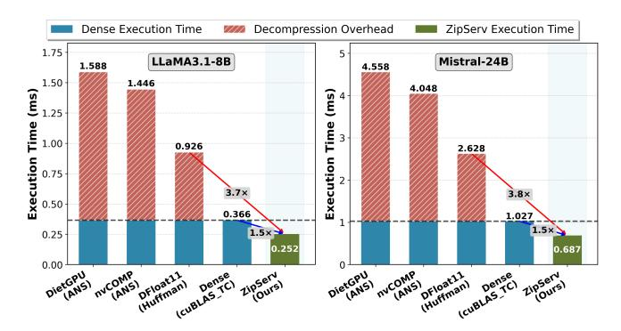

Figure 1. Execution time of lossless compression pipelines on NVIDIA L40S GPU with GateUp\_proj layers.

quantization (e.g., GPTQ [\[23\]](#page-14-3), AWQ [\[43\]](#page-15-3)) or pruning (e.g., SparseGPT [\[22\]](#page-14-4)). However, such approximations risk accuracy loss. For instance, aggressive 4-bit quantization (e.g., MXFP4) slashes accuracy from 56.0% to 36.2% on Live-CodeBench [\[44\]](#page-15-4), while even robust int8 quantization (GPTQint8) can cause up to 11.1% loss in long-context reasoning (NOCHA) [\[49\]](#page-15-5). These risks undermine reliability in safetycritical and user-facing settings, motivating approaches that guarantee bit-exact reproducibility and numerical integrity.

Lossless compression offers a compelling alternative by providing bit-exact model representation without accuracy loss. To date, its benefits have largely targeted storage and training workflows. For example, LMC [\[71\]](#page-16-4) and ZipNN [\[29\]](#page-15-6) employ Huffman [\[31\]](#page-15-7) to compress model checkpoints for efficient storage and distribution, while NeuZip [\[28\]](#page-15-8) and DietGPU [\[33\]](#page-15-9) mitigate memory and communication overhead during training. Although recent efforts, notably DFloat11 [\[85\]](#page-16-5), aim to extend these gains to inference, practical efficiency remains elusive. When integrated into serving pipelines, existing lossless techniques incur significant runtime overhead. As shown in Figure [1,](#page-1-0) the decoupled decompression step alone takes 1.56–3.44× the time of the core inference computation. This overhead forces an unpleasant tradeoff between memory efficiency and runtime efficiency.

We contend that this tradeoff is not fundamental but arises from a mismatch between conventional compression algorithms and modern GPU architectures. The issue manifests at two levels. At the kernel level, traditional entropy codecs (e.g., Huffman [\[31\]](#page-15-7) or ANS [\[18\]](#page-14-5)) produce variablelength bitstreams, whose decoding demands serialized, datadependent operations. These are ill-suited to the lockstep, parallel SIMT execution model of GPU warps, resulting in severe control-flow divergence and compute underutilization. At the system level, most frameworks employ a decoupled inference pipeline: weights are fully decompressed into a global-memory buffer before kernel consumption. This staged execution results in redundant, high-latency memory accesses, eroding compression-provided bandwidth savings and reducing arithmetic intensity during inference.

To rectify these fundamental algorithm-hardware mismatches, we present ZipServ[1](#page-1-1) , the first lossless compression framework co-designed for high-performance LLM inference on GPUs. Our key observation is that the exponent bits of BFloat16 weights in LLMs exhibit a highly skewed, low-entropy distribution in contemporary models. Exploiting this statistical redundancy, we propose Tensor-Core-Aware Triple Bitmap Encoding (TCA-TBE), a fixed-length, bitmapbased weight format tailored to GPU architectures. Unlike variable-length entropy codecs, TCA-TBE enables constanttime, parallel decoding using lightweight bitwise operations, thereby eliminating control-flow divergence and aligning with the GPU's SIMT execution model. Paired with TCA-TBE, ZipServ devises a fused decompression-GEMM kernel (ZipGEMM). Rather than decompressing weights into global memory as an intermediate step, ZipGEMM performs onthe-fly decoding, delivering compressed weights directly into the register files that feed Tensor Core matrix multiplication units. This "load-compressed, compute-decompressed" design eliminates intermediate buffers, reduces data movement, and maximizes the overlap between computation and memory access. By jointly addressing both the kernel-level and systemlevel mismatches, ZipServ transforms the theoretical storage savings of lossless compression into tangible performance gains on inference-optimized GPUs.

We demonstrate ZipServ's effectiveness through comprehensive benchmarking against state-of-the-art lossless approaches, including DietGPU [\[33\]](#page-15-9), vendor-optimized nvCOMP [\[53\]](#page-15-10), and the Huffman-based DFloat11 [\[85\]](#page-16-5). Compared to these baselines, which uniformly suffer significant runtime overhead, ZipServ consistently delivers substantial accelerations at both the kernel and system level on various inference-optimized GPUs, including RTX4090, L40S, and RTX5090. Our fused ZipGEMM achieves speedups of up to 2.21× over NVIDIA's cuBLAS, and up to 5.53× over DFloat11, the fastest lossless compression pipeline. These kernel-level improvements translate into an average 1.22× end-to-end speedup compared to leading systems like vLLM [\[39\]](#page-15-11). Our results demonstrate for the first time that when co-designed with hardware, lossless compression can provide both storage savings and substantial LLM inference acceleration.

The main contributions of this paper are as follows:

- We identify the fundamental mismatch between conventional entropy-based compression and GPU architectures, revealing both kernel- and system-level bottlenecks that hinder efficient inference.
- We propose TCA-TBE, a fixed-length, bitmap-based encoding tailored to SIMT execution and Tensor Core tiling, enabling constant-time, parallel decoding.
- We design ZipGEMM, a novel kernel that performs decompression on-the-fly directly into Tensor Core

<span id="page-1-1"></span><sup>1</sup>Publicly available at [https://github.com/HPMLL/ZipServ\\_ASPLOS26.git](https://github.com/HPMLL/ZipServ_ASPLOS26.git)

- registers, eliminating intermediate memory buffers and maximizing compute intensity.
- We present and evaluate ZIPSERV, a lossless compressed LLM inference framework that achieves end-to-end speedups across diverse LLMs and GPUs, constituting the first practical evidence that lossless compression can directly accelerate LLM serving.

## 2 Background

#### 2.1 Transformer-Based LLMs

Transformer-based LLMs [2, 17, 70] are composed of stacked layers of multi-head attention, feed-forward networks (FFNs), and normalization layers. During inference, computation proceeds autoregressively in two phases: prefill and decode. The prefill phase parallelizes computation over the input prompt, resulting in high arithmetic intensity due to large matrix multiplications operated over multiple tokens. On the contrary, the decode phase generates tokens one at a time, where matrix multiplications involve only a single token per batch element. The decode phase, hence, suffers from reduced compute utilization and greater sensitivity to memory bandwidth. In both phases, the dominant operation is dense matrix multiplication: Y = WX, where  $W \in \mathbb{R}^{M \times K}$ is a learned weight matrix and  $X \in \mathbb{R}^{K \times N}$  are activations, where M is the output dimension, K is the hidden dimension, and *N* is the number of tokens.

#### 2.2 BFloat16 Format

**BFloat16 (BF16)** [35] is a 16-bit floating-point format that has become the *de facto* precision standard for LLM inference, balancing memory efficiency with numerical robustness. It is natively supported by major hardware accelerators, including NVIDIA Tensor Cores [47], Google TPUs [34], and Intel AMX [37], and is widely adopted in production-scale models, including LLaMA-3 [17], Qwen [70], and Mistral [2]. A BF16 number consists of 1 sign bit, 8 exponent bits, and 7 mantissa bits. Its numerical value is computed as:

BF16(x) = 
$$(-1)^{\text{sign}} \times 2^{\text{exponent}-127} \times (1.\text{mantissa})$$
.

This layout preserves the full exponent range of IEEE FP32 (1-8-23) while reducing mantissa precision. Compared to FP16 (1-5-10), BF16 offers a wider dynamic range, reducing vulnerability to overflows and underflows in large models.

#### 2.3 GPU Architecture and Tensor Core Execution

Modern GPUs comprise multiple Streaming Multiprocessors (SMs), each with SIMT cores, Tensor Cores, registers, shared memory, and local caches. Threads are grouped into warps of 32, executing under the Single Instruction, Multiple Threads (SIMT) paradigm. Tensor Cores are specialized processors for high-throughput matrix multiplications. On recent NVIDIA architectures [50, 51], Tensor Cores support BF16 operands through the PTX-level

<span id="page-2-0"></span>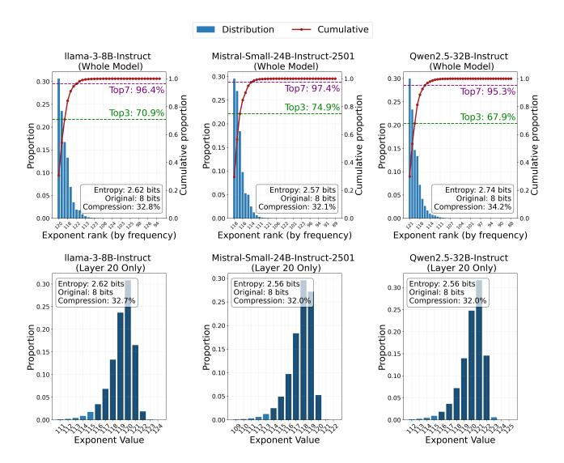

**Figure 2.** Exponent bit distribution in LLM weights.

mma . sync . m16n8k16 instruction, which performs fused matrix multiply-accumulate (FMA) operations across small matrix tiles. A typical BF16 Tensor Core operation can be expressed as:  $D_{\rm frag} = A_{\rm frag} \times B_{\rm frag} + C_{\rm frag}$ , where  $A_{\rm frag} \in \mathbb{R}^{16 \times 16}$ ,  $B_{\rm frag} \in \mathbb{R}^{16 \times 8}$ , and  $C_{\rm frag} \in \mathbb{R}^{16 \times 8}$  is the FP32 accumulator fragment. This operation is executed at the warp level, where a group of 32 threads collaborate to compute the matrix multiplication. The input and output fragments are distributed across the entire warp. Each thread holds a specific subset of fragment elements in its registers, and the complete fragment is formed collectively.

## <span id="page-2-2"></span>3 Gaps and Opportunities

Lossless compression enables *bit-exact* model representation but is rarely used for inference due to high runtime overheads stemming from a mismatch between traditional codecs and GPU architectures. This section quantifies compressibility in LLM weights and identifies key kernels and system-level bottlenecks that motivate our co-designed solution.

## <span id="page-2-1"></span>3.1 Compressibility of BF16 Weights

We analyzed the BF16 weights of leading LLMs, including Llama-3-8B-Instruct [17], Mistral-Small-24B-Instruct-2501 [2], and Qwen2.5-32B-Instruct [69], and observed remarkable redundancy in their 8-bit exponent fields. As shown in Figure 2, the exponent distributions are *highly skewed*: the **top-3** most frequent exponents account for more than 67% of all weights, and the **top-7** exponents cover over **95%** (e.g., 96.4% in LLaMA-3 and 97.4% in Mistral-24B). The information entropy of the exponent field is only **2.57–2.74 bits**, far below its 8-bit allocation, implying a theoretical lossless compression ratio of about 1.51× (16/10.6) for BF16 values. These findings are consistent with prior

<span id="page-3-0"></span>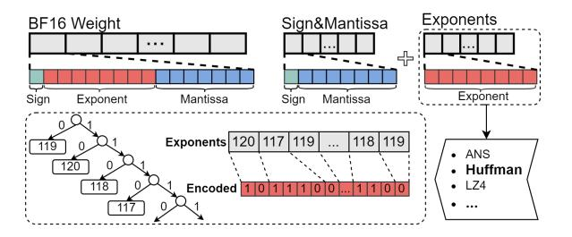

**Figure 3.** Existing Lossless Compression for BF16 Weights. Illustrated with Huffman Encoding.

works [28, 29, 71, 83, 85]. We further scrutinized this redundancy across 3,875 weight matrices from four LLM families (Gemma-3, Mistral, Qwen2.5, and LLaMA-3.1), revealing a critical structural property: exponent contiguity. In 99.6% of these matrices, the top-7 most frequent exponents form a numerically contiguous sequence (i.e.,  $e^*, \ldots, e^* + 6$ ). Consequently, a simple contiguous window covers 97.1% of all weights on average, approaching the information-theoretic limit. In Appendix A, we prove that this is not coincidental but an intrinsic property of LLMs. This contiguity is the cornerstone of ZIPSERV. It obviates the need for complex, hardware-unfriendly variable-length codecs (e.g., Huffman) in favor of a **fixed-length**, base-plus-offset representation. This insight directly enables our Tensor-Core-Aware Triple Bitmap Encoding (TCA-TBE) and its implicit lookup mechanism described in §4.3.2.

## 3.2 Kernel-Level Architectural Mismatch

Existing methods exploit the exponent redundancy of BF16 weights by applying entropy coding to the exponent stream. For example, DFloat11 uses Huffman coding [85], while Diet-GPU employs Asymmetric Numeral Systems (ANS) [33]. As shown in Figure 3, these approaches produce a compressed bitstream with *variable-length* symbols depending on their statistical frequency. However, this bitstream must be decompressed *sequentially* to correctly recover each exponent, which fundamentally conflicts with the lockstep, massively parallel SIMT execution model of modern GPUs.

To illustrate this mismatch, we examine the three-stage decompression pipeline in DFloat11 [85]. Bitstream Partitioning. The bitstream is split into chunks for parallel thread processing. However, because variable-length symbols cross chunk boundaries, threads cannot operate independently but require additional metadata to locate valid symbol start points, introducing overhead and disrupting parallel execution. Symbol Extraction. Threads use hierarchical lookup tables (LUTs) for symbol decoding—a data-dependent operation. When warp threads encounter different symbol lengths, faster threads stall for slower ones, causing divergence and underutilization of GPU resources. Pointer Advancement. After symbol decoding, each thread advances its bit pointer by the symbol's length, which is only known

<span id="page-3-1"></span>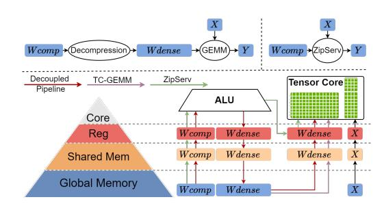

Figure 4. Existing lossless compression inference pipeline.

after the lookup completion. This inherently serializes the decoding loop and sacrifices opportunities for instruction-level parallelism. Our evaluation shows that on L40S GPUs, even highly optimized decompressors (e.g., ANS-based DietGPU and Huffman-based DFloat11) achieve only 43.7% and 76.5% of peak memory bandwidth, respectively. This inefficiency exposes a fundamental algorithm-hardware mismatch: entropy coding is inherently data-dependent, while efficient GPU execution desires regular, uniform parallelism.

## 3.3 Inefficiency of Decoupled Inference Pipeline

The architectural inefficiency of entropy-coded decoding is found not only at the kernel level, but also at the system pipeline level for LLM inference. In mainstream approaches, decompression is performed as a separate, decoupled preprocessing stage (see Figure 4): it materializes the entire decompressed weights in global memory first and then passes it to the compute kernels. This decoupled pipeline design leads to redundant data transfers, undermining the benefits of compression, particularly in bandwidth-constrained environments. We analytically quantify its inefficiency using the Roofline model, focusing on Compute Intensity (CI).

**Compute Intensity.** CI measures the number of floating-point operations (FLOPs) performed per byte read from global memory. For a typical BF16 GEMM operation  $Y_{M\times N} = W_{M\times K}X_{K\times N}$ , the compute intensity is:

$$CI_{GEMM} = \frac{MNK}{MK + KN + MN}. (1)$$

In the decoupled pipeline scenario, assuming an average compression ratio (CR) of 1.51 (§3.1), the CI becomes:

$$CI_{\mbox{Decoupled}} = \frac{2MNK}{MK\left(\frac{2}{\mbox{CR}} + 4\right) + 2(KN + MN)} \approx \frac{MNK}{2.66MK + KN + MN}. \eqno(2)$$

**Roofline Model Analysis.** Figure 5 illustrates the Roofline analysis on an NVIDIA RTX4090. During the decode stage, both the standard GEMM and the decoupled pipeline operate in the memory-bound regime, where performance scales linearly with CI. However, our analysis highlights a pronounced penalty for the decoupled approach: the additional memory traffic required to materialize intermediate decompressed weights significantly reduces CI. Specifically, for a

<span id="page-4-0"></span>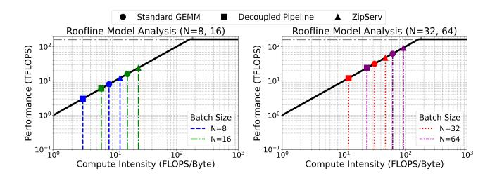

Figure 5. Roofline analysis.

weight matrix of size M = K = 4096, the decoupled pipeline exhibits a CI degradation of 62.3%, 62.2%, 62.0%, and 61.7% relative to standard GEMM for batch sizes of 8, 16, 32, and 64, respectively.

**ZIPSERV's Fused Design.** The inefficiency of decoupled pipelines arises directly from staging decompressed weights in global memory. ZIPSERV addresses this by introducing a fused decompression-GEMM kernel that directly fetches compressed weights from DRAM and decompresses them on-the-fly into register files, which immediately feed the Tensor Core. This approach effectively increases CI to

$$CI_{\text{ZIPSERV}} = \frac{2MNK}{MK \cdot \frac{2}{CR} + 2(KN + MN)} \approx \frac{MNK}{0.66MK + KN + MN}.$$
 (3)

Revisiting the Roofline model in Figure 5, ZIPSERV's fused execution ( $CI_{ZIPSERV}$ ) demonstrates a substantial improvement, achieving even higher CI (approximately 50%) than the uncompressed GEMM baseline. This benefit, most pronounced in memory-bound regimes, leads to linear speedups relative to the compression ratio, translating information-theoretic redundancy into wall-clock acceleration.

## 4 Design of ZIPSERV

Our earlier analysis identifies both kernel-level and systemlevel sources of inefficiency that hinder the decoding of lossless compression in LLM inference. In this section, we present ZIPSERV, a lossless compression system co-designed for storage efficiency and *fast*, *bit-exact* LLM inference.

## 4.1 Overview and Workflow

As illustrated in Figure 6, ZIPSERV consists of two main components: an *offline compressor*, which transforms BF16 model weights into a parallelization-friendly compressed representation, and an *online inference engine*, responsible for efficient decoding and computation at runtime.

**Offline Compressor.** At the core of the offline compressor is the *Tensor-Core-Aware Triple Bitmap Encoding* (TCA-TBE), a fixed-length, bitmap-based compression format designed to enable *parallel decoding* via GPU SIMT execution and Tensor Core–accelerated GEMM operations. As outlined in **Algorithm 1**, given a model, the compressor first profiles the exponent distribution of each layer's weights. Instead of

selecting arbitrary frequent exponents, it identifies a window of k numerically consecutive exponent values (typically k=7) that maximizes coverage of the weight distribution. The compressor records the value immediately preceding this range as the BaseExp (i.e.,  $\min(\text{range})-1$ ). Using this range, the compressor encodes the entire weight matrix into the TCA-TBE representation. Each  $8\times 8$  tile of weights is converted into three 64-bit bitmaps and two compact value buffers: one for high-frequency values falling within the selected exponent range (storing only the sign and mantissa relative to BaseExp), and another for outliers in full BF16 precision. The resulting compressed model is then loaded onto the GPU, ready for serving.

**Online Inference Engine.** The inference engine employs a stage-aware strategy that adapts the execution pipeline for the prefill and decode phases, all on the unified TCA-TBE format. During the compute-bound **prefill stage**, the engine performs decoupled execution: a dedicated decompression kernel decompresses the weights into global memory first, followed by the prefill computation. This approach allows high-throughput GEMM to effectively amortize the decompression overhead. In the memory-bound decode stage, the engine switches to a fused decompression-GEMM kernel (ZipGEMM). ZipGEMM enables a "load-compressed, computedecompressed" execution model, where weights are decompressed on-the-fly directly into Tensor Core registers. This eliminates redundant data transfers and maximizes compute intensity for each token generation. These two specialized execution paths deliver near-optimal inference performance.

#### 4.2 Tensor-Core-Aware Triple Bitmap Encoding

ZIPSERV is built on top of a novel Tensor-Core-Aware Triple Bitmap Encoding (TCA-TBE) scheme. It is designed to minimize the weight memory footprint while enabling efficient parallel decoding on GPUs. In contrast to existing variablelength bitstream-based entropy codecs, TCA-TBE employs a fixed-length, tile-structured representation that ensures constant-time, thread-local decompression. Its data layout is carefully aligned with Tensor Core tiling and register-level operand distribution, allowing the decompressed weights to be consumed directly by the mma. sync instruction. The core of TCA-TBE is a fixed-length 3-bit codeword assigned to each weight element, representing one of eight possible states (000-111). During offline compression, ZIPSERV profiles the exponent histogram of a weight matrix and identifies the top-7 most frequent exponent values and maps them to codewords 001-111. The special codeword 000 serves as a fallback, designating weights whose exponent falls outside the top-7, which are then stored in full precision.

The Choice of Codeword Length. We choose the 3-bit codeword because it achieves a near-optimal compression ratio by leveraging the highly skewed exponent distributions observed in contemporary LLMs. To quantify this design

<span id="page-5-0"></span>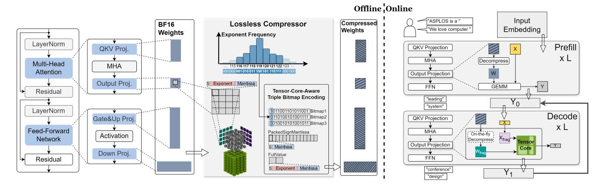

Figure 6. Overview of ZIPSERV. ZIPSERV features an offline lossless compressor (left) and an online inference engine (right).

```
Algorithm 1 ZIPSERV Offline Compressor (TCA-TBE)
Input: Weight Matrix W, Tile Size T = 8 \times 8
Output: Bitmaps \mathcal{B}_{1..3}, High-Freq Buffer \mathcal{H}, Fallback Buffer
     \mathcal{L}, BaseExp e_{base}
  1: ▶ Phase I: Global Exponent Analysis
 2: Hist \leftarrow ComputeExponentHistogram(W)
 3: E_{top} \leftarrow \text{SelectTop7ConsecutiveExponents}(Hist)
 4: e_{base} ← min(E_{top}) − 1 \rightarrow Set base for implicit lookup
 5: ▶ Phase II: Tile Encoding
 6: for each tile t \in \mathcal{W} do
        Initialize local bitmaps b_1, b_2, b_3 \leftarrow 0
 7:
        for i = 0 to 63 do
 8:
 9:
           w \leftarrow t[i]; e \leftarrow w.exponent
           if e \in E_{top} then
 10:
                                   ▶ Compute 3-bit code c \in [1, 7]
              c \leftarrow e - e_{base}
11.
               b_1[i] \leftarrow c_0; \ b_2[i] \leftarrow c_1; \ b_3[i] \leftarrow c_2 \quad \triangleright \text{Set bits}
 12:
              \mathcal{H}.Push(Pack(w.sign, w.mantissa))
13:
 14:
                                       ▶ Store full precision fallback
               \mathcal{L}.Push(w)
15:
            end if
16:
        end for
17:
        Store b_1, b_2, b_3 to global \mathcal{B}_{1..3}
18:
```

choice, we calculate the expected per-element storage cost as:

19: end for

```
AverageBits(n) = r_n \cdot (n + 8) + (1 - r_n) \cdot (n + 16),
```

where n is the codeword length and  $r_n$  is the proportion of weights covered by the top  $2^n-1$  exponent values. As shown in §3.1,  $r_3 \approx 0.96$ , yielding an average of 11.3 bits per element, which approaches the theoretical lower bound (8+2.6=10.6 bits) and offers clear advantages over 2-bit (12.4 bits) and 4-bit (12.1 bits) codewords. Besides, the 3-bit encoding yields a compact 7-entry codebook, enabling decoding via a simple table lookup. This requires only a handful of bitwise operations per thread, which can be efficiently performed with warp-synchronous Tensor Core pipelines.

<span id="page-5-2"></span>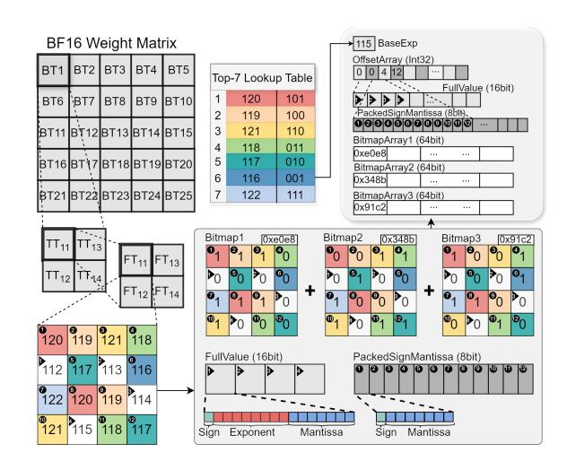

**Figure 7.** Tensor-Core-Aware Triple Bitmap Encoding. The  $4 \times 4$  FragTile shown is illustrative; the actual size is  $8 \times 8$ .

Decoupled Triple Bitmap Layout. To maximize decoding efficiency on SIMT architectures, TCA-TBE implements a *decoupled triple bitmap layout* rather than packing codewords into a dense bitstream. Conventional bitstreams are inefficient on GPUs because packing non-byte-aligned codes (e.g., 3-bit) forces codewords to span memory word boundaries. This necessitates complex logic for non-aligned accesses and introduces data-dependent branching, which in turn causes thread divergence that severely degrades SIMT throughput.

TCA-TBE avoids these bottlenecks by decomposing the 3-bit codewords for each 8 × 8 weight tile into three independent 64-bit bitmaps, with each bitmap representing a single bit-plane (Figure 7). This design enables two benefits. First, it guarantees coalesced memory accesses, as each bitmap is a contiguous 64-bit word, naturally aligned to native memory boundaries. Second, it enables branch-free decoding. All threads in a warp follow an identical execution path, aligning with the SIMT model on modern GPUs.

<span id="page-6-1"></span>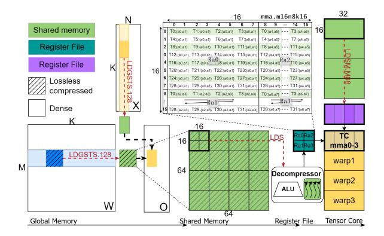

Figure 8. Data movement and instruction pipeline.

Hierarchical Tiling Design. TCA-TBE adopts a threelevel hierarchical tiling scheme that partitions the weight matrix according to the architectural granularity of modern GPUs. **1** FragTile (FT): The base unit is an 8×8 tile, matching the smallest operand fragment of Tensor Core instruction. 2 TensorCoreTile (TT): Each  $16 \times 16$  tile is composed of a  $2 \times 2$ grid of FragTiles. This size aligns with the operand dimensions (m=16, k=16) required by PTX-level Tensor Core mma instructions (mma.m16n8k16). 3 BlockTile (BT): At the coarsest level, a 64 × 64 tile aggregates multiple TensorCoreTiles and is processed cooperatively by a thread block. The FragTiles within a TensorCoreTile are stored in column-major order, mirroring the operand register layout (e.g., Ra0-Ra3) expected by Tensor Core instructions. This design eliminates the need for runtime coordinate transformation, reducing instruction overhead. Each 8 × 8 FragTile is encoded using five buffers. **1** Three 64-bit bitmaps, each representing one bit-plane of the 3-bit codewords. ② A PackedSignMantissa buffer, which holds the compact 8-bit representation (sign and mantissa) of weights whose exponents fall within the top-k frequent classes. **3** A FullValue buffer, which stores full-precision BF16 values for weights not covered by the exponent codebook. At the matrix level, TCA-TBE organizes these buffers into four contiguous global arrays, each nested according to the tiling hierarchy. In addition, an Offset array records the starting offset of each GroupTile within the PackedSignMantissa and FullValue arrays.

## 4.3 Fused ZipGEMM Kernel Design

TCA-TBE's SIMT-friendly design opens up new opportunities for high-throughput decoding. To achieve this, ZIPSERV fuses decompression and matrix multiplication into a single kernel, **ZipGEMM**, that fetches weights from global memory in a compact TCA-TBE format and decompresses them just-in-time during computation. ZipGEMM enables a *load-compressed*, *compute-decompressed* execution model, substantially reducing the memory bandwidth requirement for each token generation in the decode stage (see Figure 5).

**4.3.1 Kernel Workflow.** Figure 8 illustrates the workflow of the ZipGEMM kernel. Based on a split-K tiling architecture, each thread block iteratively processes the *K* dimension in chunks. In each iteration, the kernel proceeds through four coordinated stages. 1 Tile Loading. Threads cooperatively load the compressed weight tile and the corresponding activation tile from global memory into shared memory, with asynchronous and vectorized memory instructions (i.e., LDGSTS.128) to bypass the L1 cache and improve global memory bandwidth utilization. The PackedSignMantissa and FullValue arrays within each tile are padded offline to ensure 128-bit alignment. **②** Warp-Level Decoding. Each warp independently decompresses the compressed weight from shared memory. The decompressor reconstructs the original BF16 values in a layout compatible with Tensor Core consumption, utilizing lightweight ALU operations and avoiding shared memory round-trips. 3 Activation Register Transfer. The activation tile is moved from shared memory into registers using the LDSM. M88 instruction, which enables a warp to load a  $16 \times 16$  tile and arrange it in the layout required for Tensor Cores. **4** Tensor Core Computation. Once both decompressed weights and activations reside in registers, the warp performs Tensor Core mma instructions. The execution path closely mirrors the standard cuBLAS GEMM kernels, while operating directly on compressed representations and reducing global memory accesses.

<span id="page-6-0"></span>**4.3.2 Efficient Decompressor.** ZipGEMM incorporates an efficient Decompressor that enables thread-local reconstruction of compressed weights directly within the register file. The core principle of the Decompressor is that each thread independently decompresses the elements required for the proper Tensor Core fragment layout. Specifically, as shown in Figure 7, the fragment layout requires that thread i's .bf16x2 register (e.g., Ra0) holds the values at positions 2i and 2i + 1 within the  $8 \times 8$  tile, denoted as  $a_0$  and  $a_1$ respectively. Since each element is encoded in one of two states-either as a high-frequency fixed-length code or as a fallback full-precision value—and these states are distributed in an unstructured manner, the decompressor solves a sparse, non-uniform spatial reconstruction problem. Two challenges arise in this context. First, each thread must efficiently determine the state of its assigned element (compressed or fallback). Second, each thread should recover the original BF16 representation in a deterministic, SIMT-friendly manner. To this end, ZIPSERV's Decompressor is structured into three tightly integrated stages: spatial bitmap indicator, dynamic addressing, and fast exponent reassembly (see Figure 9 and Algorithm 2).

**Spatial Bitmap Indicator.** Each thread first determines the storage mode of its assigned elements by evaluating a spatial indicator mask. During offline compression, each 8×8 weight tile is encoded using three 64-bit bitmaps, where each

<span id="page-7-0"></span>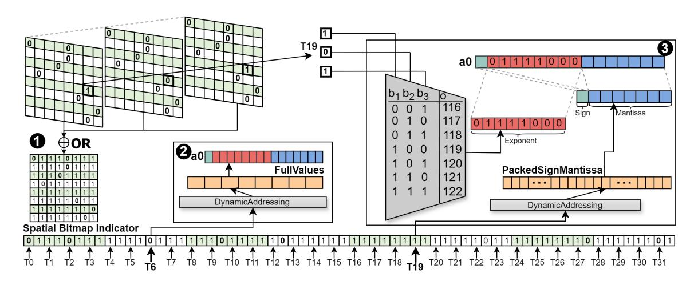

Figure 9. The Decompressor Design.

## <span id="page-7-1"></span>Algorithm 2 ZipGEMM Thread-Local Decompression

```
Input: Bitmaps \mathcal{B}_{1..3}, Buffers \mathcal{H}, \mathcal{L}, BaseExp e_{base}, LaneID l Output: Register pair R containing two BF16 values
```

```
1: ▶ Step 1: Spatial Indicator Construction
 2: \mathcal{M} \leftarrow \mathcal{B}_1 \vee \mathcal{B}_2 \vee \mathcal{B}_3
 3: ▶ Step 2: Parallel Element Decompression
 4: for k \in \{0, 1\} do
 5:
         p \leftarrow 2 \cdot l + k
                                                 \triangleright Global position in 8 \times 8 tile
          mask \leftarrow (1 \ll p) - 1
 6:
          idx_{\mathcal{H}} \leftarrow \text{Popc}(\mathcal{M} \& \textit{mask})
                                                                     ▶ Calculate index
 7:
          if (\mathcal{M} \gg p) \& 1 then
 8:
              ▶ Case A: High-Frequency Path
 9:
              val \leftarrow \mathcal{H}[\operatorname{start}_{\mathcal{H}} + idx_{\mathcal{H}}] \triangleright \operatorname{Fetch} \operatorname{Sign} + \operatorname{Mantissa}
10:
              ▶Reconstruct 3-bit code
11:
              c \leftarrow (\mathcal{B}_3[p] \ll 2) \vee (\mathcal{B}_2[p] \ll 1) \vee \mathcal{B}_1[p]
12:
              e \leftarrow e_{base} + c
                                                                    ▶ Implicit Lookup
13:
              w_k \leftarrow \text{MAKEBF16}(val.sign, e, val.mantissa)
14:
          else
15:
16:
              ▶ Case B: Fallback Path
              idx_{\mathcal{L}} \leftarrow p - idx_{\mathcal{H}} > Calculate index in fallback
17:
18:
              w_k \leftarrow \mathcal{L}[\operatorname{start}_{\mathcal{L}} + idx_{\mathcal{L}}]
19:
20: end for
21: R \leftarrow \text{PackRegister}(w_0, w_1)
22: return R
```

bitmap encodes a single bit of the 3-bit codeword. At runtime, the three bitmaps are combined using a warp-level bitwise OR to produce a single 64-bit indicator mask. Each bit in this mask specifies the storage mode of one element: 1 for compressed (high-frequency), 0 for fallback (uncompressed). Each thread determines its decoding path by inspecting the corresponding bits in this spatial indicator mask, which resides in registers. Specifically, for thread i, the bits at positions 2i (for  $a_0$ ) and 2i + 1 (for  $a_1$ ) indicate the state

of the two assigned elements. For instance, Thread 19 finds that bit 38 (2 × 19) is set, indicating its  $a_0$  element is stored in compressed form. It fetches the packed value from the high-frequency buffer and proceeds with exponent reassembly. In contrast, Thread 6 sees that bit 12 (2 × 6) is unset and simply loads its  $a_0$  directly from the fallback buffer. This bitwise decision process is lightweight, fully register–resident, and completes in constant time.

**Dynamic Addressing.** Once the storage mode is determined, each thread computes its read offset into the appropriate value buffer on-the-fly, without explicit per-element indices. This is achieved via a lightweight, warp-local prefix sum over the spatial indicator. For thread i, the offset is calculated by counting how many previous elements of the same storage type appear in bits [0, 2i-1] of the spatial indicator. Specifically, if the element is compressed (bit = 1), the offset equals the number of 1s; if uncompressed (bit = 0), it equals the number of 0s in that range. These counts are efficiently computed using GPU-native instructions such as \_\_popc() and \_\_shfl\_sync(). For example, Thread 6, encountering an unset bit at position 12, computes its fallback buffer offset by counting the number of 0s in bits [0, 11]. Thread 19, with bit 38 set, counts the number of 1s in bits [0, 37] to access the compressed buffer. This dynamic addressing mechanism transforms indexing into a deterministic, SIMT-friendly operation that aligns naturally with GPU execution patterns.

**Fast Exponent Reassembly via Implicit Lookup.** To further reduce the decoding overhead, ZIPSERV reconstructs exponents using an *implicit lookup* mechanism based on *arithmetic remapping*, avoiding table-based decoding. During offline compression, the top-7 most frequent exponent values are identified globally and assigned 3-bit codewords (001–111), ordered by increasing numerical value instead of frequency rank. A single global base exponent is recorded as base\_exp = min(top\_exponents)-1, which is shared by all

tiles. At runtime, each thread reconstructs the original exponent by adding the 3-bit codeword to the base exponent. This operation eliminates shared memory table lookups by using a single integer ALU instruction. The recovered exponent is then fused with the sign and mantissa fields to assemble a valid BF16 value. For example, Thread 19 observes that bit 38 in the spatial indicator is set and reconstructs the 3-bit codeword by reading the corresponding bits from the three bitmap planes, yielding 101 (5). With a global base exponent of 115, it recovers the original exponent as 115 + 5 = 120, then combines it with the sign and mantissa to form the final BF16 value. This arithmetic decoding process is fully SIMT-compatible, exploits the GPU's integer pipelines.

**Repacking into Tensor Core Fragments.** Each thread repacks the two reconstructed BF16 elements into a single bfloat162 register, matching the operand layout required by Tensor Core mma. sync instructions.

4.3.3 Fine-grained Software Pipeline. ZipGEMM uses a hierarchical two-level pipeline to overlap memory transfer, decompression, and computation, effectively hiding memory and decompression latency. At the coarse level, tile-wise double buffering overlaps global-to-shared memory transfers with computation; at the fine level, slice-wise interleaving overlaps shared-to-register movement and decompression with Tensor Core operations. This is implemented via two shared memory buffers for compressed weights (triple bitmaps, packed sign-mantissa, fallback values) and activations. Within each tile, computation is sliced along the K dimension (typically  $16 \times 16$  fragments) and processed using an interleaved load-decompress-compute pattern. While Tensor Cores execute matrix multiplication (mma) on slice i, ALU units concurrently load and decompress weights for slice i + 1 from shared memory into registers. This ensures a steady compute flow by hiding decompression and memory latency behind computation.

To coordinate the two pipeline levels, ZipGEMM uses a hierarchical barrier strategy for inter-tile and intra-warp synchronization. **Inter-tile synchronization:** cp.async.wait\_group<0>() and \_\_syncthreads() ensure all asynchronous transfers complete before switching buffers. This barrier is placed *after the final slice decompression but before the final slice* mma, allowing computation to proceed while the next tile is being loaded and decompressed, which maximizes overlap and minimizes stalls. **Intra-warp coordination:** Intra-warp operations are implicitly synchronized via the SIMT model, requiring no explicit barriers between load, decompress, and compute at the slice level.

## 4.4 Stage-Aware Inference Strategy

ZIPSERV uses the fused ZipGEMM kernel exclusively during the decode stage for accelerated token generation. For the compute-bound prefill stage, where large matrix dimensions ( $N = BS \times Seq\_len$ ) provide high arithmetic intensity,

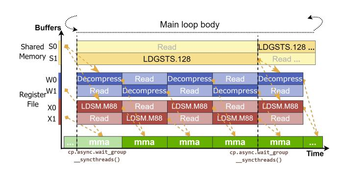

Figure 10. Hierarchical software pipeline design.

ZIPSERV falls back to a decoupled pipeline: an efficient decompression kernel first extracts the compressed weights to global memory, then performs high-throughput GEMM operations to amortize the decompression overhead (typically <4% as shown in §6.4). In both prefill and decode stages, the decompression kernel and ZipGEMM kernel share the same compressed format and per-thread decompression logic (§4.3.2), obviating the need for runtime format conversions.

## 5 Implementation

We implemented ZIPSERV as a high-performance, modular inference backend comprising approximately 3.5K lines of code. The core engine consists of about 2.5K lines of CUDA and C++, which implements the offline TCA-TBE compressor and the online ZipGEMM kernel. The kernel is compiled into a standalone shared library (. so) using nvcc, exposing C++ APIs for weight packing and kernel launching. The remaining 1.0K lines are Python glue code used to integrate ZIPSERV into **vLLM** [39]. We extended vLLM's model loader and linear execution modules to support the TCA-TBE format, utilizing PyBind11 to invoke our custom CUDA kernels.

#### 6 Evaluation

We evaluate the performance of ZIPSERV at two levels: the kernel level of the fused ZipGEMM and the standalone Decompression kernel (ZIPSERV-Decomp), and the end-to-end inference framework level. All experiments are conducted on two platforms. • A consumer-grade server equipped with 4× NVIDIA RTX4090 GPUs (Ada Lovelace, 24GB memory, Compute Capability 8.9), paired with an Intel Xeon Platinum 8352V CPU (144 cores, 512GB DDR4). 2 A datacenter platform with 4× NVIDIA L40S GPUs (Ada Lovelace, 48GB), paired with an Intel Xeon Gold 6230R CPU (104 cores, 512GB DDR4). We also evaluate ZipGEMM on the latest 3 RTX5090 GPU (Blackwell, 32GB, Compute Capability 12.0) to demonstrate forward compatibility. All code is compiled using GCC 11.3 and NVCC 12.4 (with NVCC 12.8 specifically for RTX5090). For kernel-level evaluation, we perform 100 warm-up iterations followed by 1,000 timed executions. For end-to-end evaluation, each configuration is run 10 times.

<span id="page-9-0"></span>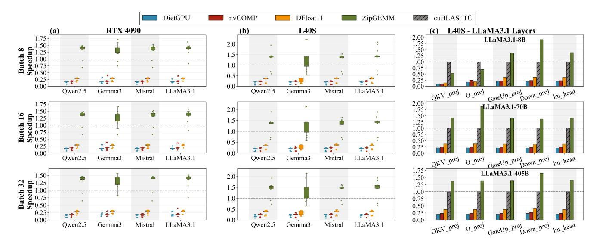

Figure 11. Kernel performance comparison on NVIDIA RTX4090 and L40S GPUs.

## 6.1 ZipGEMM Kernel Performance

**Datasets.** We benchmark the kernel-level performance on representative linear layers from state-of-the-art LLMs. The input shapes for kernel benchmarking are directly extracted from the real weight matrices of prominent LLM families, including LLaMA3.1 [17] (8B, 70B, and 405B), Qwen2.5 [69] (7B, 14B, 32B, and 72B), Gemma3 [68] (12B and 27B), and Mistral [2] (24B and 123B), covering a broad range of model scales and hidden dimensions.

Baselines. We compare ZipGEMM against four representative baselines: ① cuBLAS\_TC v12.4.5 [52], NVIDIA's official BF16 Tensor Core GEMM kernel; ② DietGPU [33], a popular open-source, GPU-native rANS codec for lossless decompression of floating-point weights; ③ nvCOMP (rANS) [53], NVIDIA's general-purpose asymmetric numeral systems-based decompression library; and ④ DFloat11 [85], a state-of-the-art Huffman-coded GPU decompression framework for LLM inference. Since nvCOMP lacks native BF16 support, we compress exponent bits as a bitstream via rANS and reconstruct BF16 values with a custom high-performance kernel. For DFloat11, whose compression code is unavailable, we benchmark full Transformer block decompression latency and linearly scale estimates for other matrix shapes.

Workloads. We profile all linear layers within a Transformer block, including the merged QKV projection (QKV\_proj), attention output projection (O\_proj), merged FFN gate and up projection (GateUp\_proj), and down projection (Down\_proj), along with the model's LM head layer. Benchmarks are conducted at batch sizes of 8, 16, and 32.

**Results.** We begin by evaluating the performance of our fused *ZipGEMM* kernel. Figure 11 shows the normalized

speedup relative to cuBLAS\_TC across all evaluated models and workloads. ZipGEMM consistently outperforms all baseline methods on both hardware platforms. On the RTX4090, ZipGEMM achieves an average speedup of 1.31× over cuBLAS\_TC, with a peak speedup of 1.71×. The advantage is even greater on the L40S, with an average speedup of 1.36× and a maximum of 2.21×. In contrast, other decoupled decompression methods introduce substantial overhead, resulting in significant slowdowns. Specifically, DietGPU, nvCOMP, and DFloat11 achieve average speedups of only  $0.17 \times /0.20 \times$ ,  $0.19 \times /0.23 \times$ , and  $0.28 \times /0.34 \times$  on RTX4090 and L40S, respectively. This indicates that the decoupled decompression processes incur overheads that exceed the computation time of the baseline GEMM. ZipGEMM stands out as the only implementation that can significantly surpass the efficient Tensor Core GEMM. These results highlight the effectiveness of ZipGEMM's fused decompressioncomputation approach, which efficiently transforms storage savings into tangible execution speedup.

We further conducted a layer-wise analysis (Figure 11(c)). ZipGEMM exhibits significant acceleration on most of the computationally intensive layers within a transformer block. For instance, within the LLaMA3.1 model family on the L40S, ZipGEMM achieves average speedups of 1.39× and 1.64× on the GateUp\_proj and Down\_proj layers, respectively. However, ZipGEMM may experience a slowdown when processing certain layers with small shapes; for example, on the L40S, its performance on the O\_proj layer of LLaMA3.1-8B is reduced to 0.79×. This is primarily because small layers require fine-grained parameter tuning (e.g., split-K configurations and precise tiling) to fully utilize hardware, which is beyond the scope of this work. Nevertheless, such layers account for only a small fraction of the total FLOPs within a Transformer block. ZipGEMM delivers robust block-level

<span id="page-10-0"></span>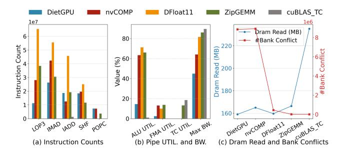

Figure 12. Micro-level kernel performance analysis.

<span id="page-10-1"></span>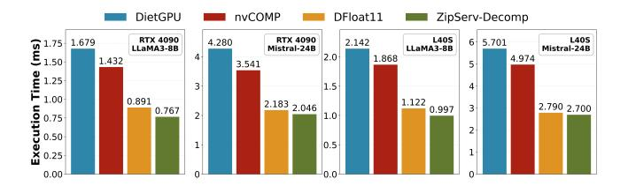

Figure 13. Standalone decompression kernel comparison.

speedups of 1.35× for LLaMA3.1-8B and 1.48× for LLaMA3.1- 405B on the L40S.

Micro-level Analysis. We profiled ZipGEMM with Nsight Compute (NCU) on an RTX4090 to identify the source of its speedup ( = 28672, = 4096 and = 32). As shown in Figure [12,](#page-10-0) the performance gain stems from a deliberate architectural trade-off: introducing a predictable ALU workload for on-the-fly decoding in exchange for a reduction in memory traffic. Figure [12\(](#page-10-0)a) quantifies this trade-off. The high volume of integer and logical instructions (LOP3, IADD, and POPC) reflects the computational cost of our core decoding steps. This workload is the price for a 29.3% drop in DRAM reads, a direct validation of the TCA-TBE format's efficiency. Crucially, the two-level software pipeline effectively hides the decoding latency by overlapping it with compute and memory operations. As a result, even with ALU utilization soaring to 66.0%, Tensor Core utilization is maintained at a remarkable 71.6% of the cuBLAS baseline, demonstrating that compute throughput is preserved (Figure [12\(](#page-10-0)b)). This high pipeline efficiency is enabled by our data layout. As seen in Figure [12\(](#page-10-0)c), shared memory bank conflicts are virtually eliminated (∼4.7K) compared to the millions incurred by methods like DietGPU. This conflict-free access is a prerequisite for our fine-grained pipeline, ensuring smooth data flow and maximizing SIMT throughput.

## 6.2 Decompression Kernel Performance

To further dissect decompression efficiency, we benchmark our standalone ZipServ-Decomp kernel. Figure [13](#page-10-1) presents the total decompression time for all weights in a full Transformer block of LLaMA3.1-8B and Mistral-24B. ZipServ-Decomp achieves average speedups of 2.14×, 1.83×, and

<span id="page-10-2"></span>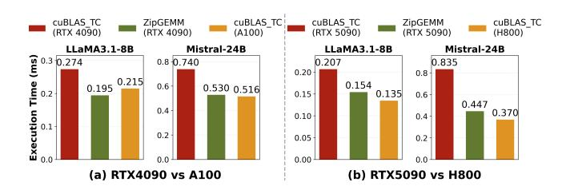

Figure 14. Cross-generation performance comparison.

<span id="page-10-3"></span>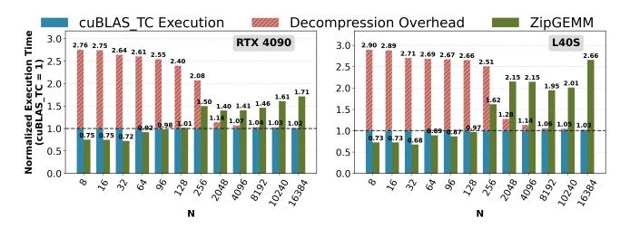

Figure 15. ZipServ performance under different N settings.

1.10× over DietGPU, nvCOMP, and DFloat11, respectively. Although the TCA-TBE format was co-designed to support fused execution with matrix multiplication, its structure proves highly efficient for standalone decompression as well. This efficiency stems from its fixed-length, warp-aligned design, which eliminates control divergence and enables warpsynchronous per-thread decoding. In contrast, although existing baselines are explicitly optimized for decompression, they often rely on variable-length, entropy-coded formats. These lead to thread divergence, serialized bit parsing, and irregular memory access that degrade GPU efficiency.

## <span id="page-10-4"></span>6.3 Performance Across GPU Generations and Tiers

To establish forward compatibility, we benchmark ZipGEMM on the latest NVIDIA RTX5090 and compare it against toptier datacenter A100 and H800 using LLaMA3.1-8B and Mistral-24B GateUp\_proj layers at batch size 32. We first directly port ZipGEMM to the Blackwell-based RTX5090 without exploiting new features (e.g., Tensor Memory and asynchronous WMMA execution [\[32\]](#page-15-19)). As shown in Figure [14,](#page-10-2) ZipGEMM delivers substantial speedups over cuBLAS\_TC on RTX5090—1.34× for LLaMA3.1-8B and 1.87× for Mistral-24B—confirming the design to be forward-compatible. ZipGEMM also narrows the consumer–datacenter divide: on an RTX4090, ZipGEMM outperforms the standard cuBLAS\_TC on A100 with LLaMA3.1-8B (0.195 ms vs. 0.215 ms, 9.3% faster) and is only 2.7% slower on Mistral-24B (0.530 ms vs. 0.516 ms), effectively placing it in the same performance class. This trend intensifies on newer hardware. While a standard RTX5090 trails the H800 by 53.3% (LLaMA3.1-8B) and 125.7% (Mistral-24B), ZipGEMM reduces these deficits to 14.1% and 20.8%, respectively (Figure [14\(](#page-10-2)b)), approaching datacenter-level performance on consumer GPUs.

#### <span id="page-11-0"></span>6.4 Overhead Analysis

We analyze the system overhead from two perspectives: runtime inference overhead and offline preparation cost. **1** Runtime Overhead. Figure 15 quantifies the overhead of ZIPSERV during inference across different N settings  $(N = BS \times Seqlen)$ . In the decode stage (small N, typically 1– 128), the fused ZipGEMM kernel incurs no overhead. Instead, it consistently outperforms the cuBLAS\_TC baseline in these memory-bound regimes, with on-the-fly decompression fully hidden within the kernel execution. For the compute-bound prefill stage (large N, e.g., 8192), where ZipGEMM's onthe-fly decompression overhead outweighs its benefits from reduced memory access, ZIPSERV switches to a decoupled pipeline. The efficient decompression kernel first expands the compressed weights, followed by cuBLAS\_TC GEMMs. This incurs a limited overhead of only  $\sim 4\%/2\%$  of the GEMM time at N = 8192/16384. ② Offline Compression Cost. Bevond runtime performance, we also evaluate the one-time cost of preparing the model. Compressing the LLaMA-3.1-8B model takes approximately 2.5 minutes on a 16-core Intel Xeon 8352V CPU. Given that this is an offline operation performed only once prior to deployment, it does not impact the critical path of online serving and is negligible when amortized over the model's lifecycle.

#### 6.5 End-to-end Inference Performance

**Setup.** We evaluate the end-to-end inference performance of ZIPSERV on a range of representative models and hardware configurations: LLaMA3.1-8B on one RTX4090 GPU, Mistral-24B on two L40S GPUs, and LLaMA3.1-70B on four L40S GPUs with tensor parallelism. We benchmark using batch sizes of 8 and 32, with varied output sequence lengths of 128, 256, 512, 1024, and 2048 tokens to simulate different serving scenarios. We compare ZIPSERV against three leading baseline systems: • vLLM [39], a state-of-the-art LLM inference and serving framework; 2 Transformers [75], a widely adopted standard library; and 3 DFloat11 [85], representing state-of-the-art performance for lossless compression-based inference frameworks. We measure two key metrics: end-toend request latency (total time to generate the full output sequence) and throughput (output tokens per second). As shown in Figure 16, ZIPSERV consistently demonstrates superior performance across all tested configurations.

**Results.** For **latency**, on average, across all models and batch sizes, ZIPSERV reduces latency by 17.60%, 60.79%, and 82.13% compared to vLLM, Transformers, and DFloat11, respectively. For **throughput**, ZIPSERV provides average speedups of 1.22× over vLLM, 3.18× over Transformers, and 8.52× over DFloat11. The performance gains are pronounced for long-context generation, where the memory-bandwidth savings and computational efficiency of the fused ZipGEMM kernel in the decode phase become dominant. For instance, when generating 2048 output tokens with batch size of 32

<span id="page-11-1"></span>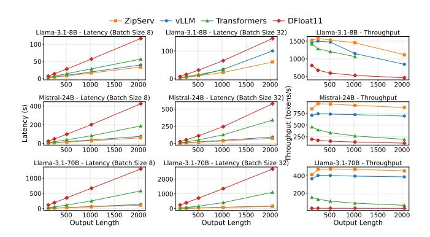

**Figure 16.** End-to-end performance comparison.

using LLaMA3.1-8B, ZIPSERV achieves a throughput of 1105 tokens/sec, resulting in a 1.66× speedup over vLLM. We also analyzed the **memory consumption** during inference. For LLaMA3.1-8B, Mistral-24B, and LLaMA3.1-70B, ZIPSERV reduces the weight footprint of 14.96/43.92/131.56 GB down to 10.83 (72.4%)/31.30 (71.3%)/93.52 (71.1%) GB, respectively. The reduction in weight storage further enhances serving efficiency in two key ways. First, it enables the deployment of larger models on resource-constrained hardware. Second, the freed memory can be allocated to the KV cache, allowing memory managers like vLLM's PagedAttention [39] to support larger batch sizes and longer contexts, thereby converting static weight savings into dynamic throughput gains.

Breakdown Analysis. We further dissect the performance gains by analyzing the latency and memory composition of LLaMA-3.1-8B on an RTX4090, as detailed in Figure 17. In the baseline vLLM system (at sequence length 1024), GEMM operations dominate the runtime, consuming 24.99 ms (83.6% of total latency). ZIPSERV effectively alleviates this bottleneck: the fused ZipGEMM kernel, combined with residual dense GEMMs, reduces the total linear layer latency to 14.76 ms, a 1.69× improvement. Since Attention (3.02 ms) and other overheads (1.88 ms) remain constant, these kernel-level gains directly drive the end-to-end speedup. On the memory front, ZIPSERV compresses the static weights from 14.96 GB to 11.18 GB. This 3.78 GB saving is automatically repurposed by the memory manager to expand the KV cache capacity from 5.07 GB to 8.60 GB (a 1.70× increase), thereby enabling the higher throughput and longer context support observed in our end-to-end benchmarks.

## 7 Limitation and Discussion

ZIPSERV is designed for the increasingly important deployment scenario on resource-constrained consumer-grade and inference-optimized GPUs, where limited memory bandwidth makes lossless compression a powerful lever for efficiency. On such platforms, ZIPSERV consistently delivers substantial acceleration and memory savings. To stress-test performance under more bandwidth-relaxed conditions, we

<span id="page-12-0"></span>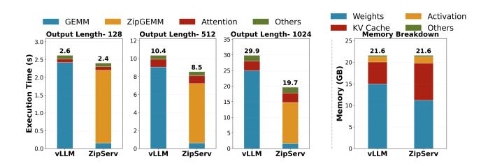

Figure 17. Breakdown of end-to-end inference time and memory consumption.

<span id="page-12-1"></span>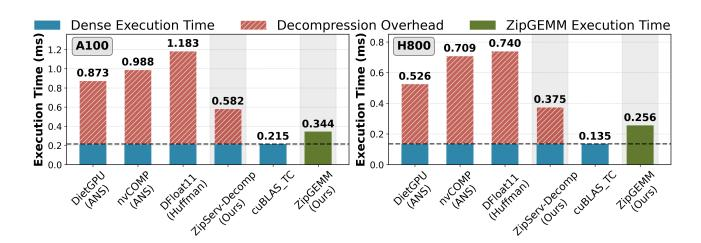

Figure 18. Performance on training-oriented GPUs.

also benchmarked on training-oriented datacenter GPUs (A100, H800), where ZipGEMM may not always match the highly optimized cuBLAS baseline (Figure [18\)](#page-12-1). This reflects a hardware–software mismatch rather than an algorithmic limitation: abundant HBM (HBM2e/HBM3) alleviates the memory bottlenecks ZipServ is designed to mitigate, while lower core frequencies (e.g., 1410 MHz on A100 vs. 2520 MHz on RTX4090) make the intensive ALU workload harder to hide within the software pipeline. Nevertheless, ZipServ still provides best-in-class support for compressed inference. Our standalone decompression kernel outperforms state-ofthe-art by up to 2.64×, and ZipGEMM remains the fastest fused GEMM kernel. As shown in [§6.3,](#page-10-4) ZipServ also enables consumer-grade GPUs to close much of the gap with elite datacenter accelerators, offering a compelling cost-performance proposition for deployment on accessible hardware.

While ZipServ targets bit-exact inference, a comparison with lossy techniques is instructive. ZipGEMM was benchmarked against the Marlin W8A16 FP8 kernel on an RTX4090 GPU, using a representative weight shape (28672 × 4096) at batch size 32. Although ZipGEMM trails Marlin-W8A16 in latency (0.194 ms vs. 0.143 ms), the resulting 1.36× gap aligns closely with the ratio of effective bit-widths (∼11 bits vs. FP8). This indicates that our design reduces and hides the overhead of complex lossless decompression within the memory access latency. Furthermore, ZipServ is orthogonal to lossy methods and can be applied atop quantized weights to exploit residual redundancy, combining aggressive compression with enhanced performance [\[26\]](#page-14-7).

Three key directions are envisioned for extending ZipServ. First, the TCA-TBE format can be adapted for lossless KV

Cache compression, addressing the dominant memory bottleneck in long-context serving [\[45\]](#page-15-20). Second, although currently optimized for NVIDIA architectures, ZipGEMM can be adapted to other matrix accelerators, including Intel AMX [\[37\]](#page-15-15) and AMD Matrix Cores [\[61\]](#page-16-10). This extensibility is supported by the hardware-agnostic nature of the core design, as the integer arithmetic and population count instructions required for decompression are widely supported across modern instruction sets. Finally, ZipServ is applicable to broader system-level challenges, including efficient model checkpointing [\[65,](#page-16-11) [71\]](#page-16-4) and communication compression in distributed training [\[73,](#page-16-12) [84\]](#page-16-13).

# 8 Related Work

Lossy Model Compression. Lossy methods dominate LLM acceleration, mainly via post-training quantization (PTQ) [\[4,](#page-14-8) [12,](#page-14-9) [15,](#page-14-10) [19,](#page-14-11) [23,](#page-14-3) [43,](#page-15-3) [46,](#page-15-21) [78,](#page-16-14) [88\]](#page-16-15) and pruning [\[11,](#page-14-12) [14,](#page-14-13) [22,](#page-14-4) [67,](#page-16-16) [80,](#page-16-17) [86\]](#page-16-18), supported by efficient kernels [\[21,](#page-14-14) [24,](#page-14-15) [55–](#page-15-22)[57,](#page-15-23) [72,](#page-16-19) [77\]](#page-16-20). These approaches risk accuracy degradation [\[16,](#page-14-16) [41\]](#page-15-24). ZipServ provides bit-exact, lossless, and efficient inference.

Lossless Model Compression. A large body of work has investigated memory compression to reduce bandwidth or expand capacity via lightweight hardware schemes [\[7,](#page-14-17) [8,](#page-14-18) [20,](#page-14-19) [38,](#page-15-25) [58,](#page-15-26) [59,](#page-15-27) [87\]](#page-16-21), but these techniques are not tailored for model compression. Efforts such as LMC [\[71\]](#page-16-4) and ZipNN [\[29\]](#page-15-6) apply Huffman [\[31\]](#page-15-7) to compress checkpoints for efficient storage and distribution, but offer no runtime benefits. Recent systems, including NeuZip [\[28\]](#page-15-8), DietGPU [\[33\]](#page-15-9), nvCOMP [\[53\]](#page-15-10), and DFloat11 [\[85\]](#page-16-5), support lossless GPU codecs at runtime to reduce inference memory usage, but incur significant overhead ([§3\)](#page-2-2). Huff-LLM [\[83\]](#page-16-7) achieves higher efficiency but targets FPGA-like architectures and does not generalize to GPUs. Ecco [\[5\]](#page-14-20) designs specialized Huffman codec hardware, but targets lossy compression. Our ZipServ fuses decompression and GEMM computation, turning lossless compression into practical GPU inference acceleration.

Kernel Fusion. Kernel fusion reduces memory traffic by combining operators, as in FlashAttention [\[9,](#page-14-21) [10,](#page-14-22) [62\]](#page-16-22) or graph-level frameworks [\[48,](#page-15-28) [76,](#page-16-23) [79\]](#page-16-24). ZipServ draws insights from them and, to our knowledge, is the first to fuse decompression with GEMM, avoiding full-weight materialization.

System-Level Optimizations for LLM Inference. Modern LLM serving is powered by sophisticated inference engines [\[1,](#page-14-23) [25,](#page-14-24) [27,](#page-14-25) [30,](#page-15-29) [39,](#page-15-11) [42,](#page-15-30) [64,](#page-16-25) [66,](#page-16-26) [82,](#page-16-27) [89,](#page-16-28) [90\]](#page-16-29), which focus on high-level scheduling strategies and memory orchestration. ZipServ is orthogonal and complementary, and can be integrated as a high-performance backend. This allows these engines to benefit from both a reduced memory footprint and accelerated computation without altering their core logic.

## 9 Conclusion

We presented **ZIPSERV**, a lossless compression framework that, for the first time, delivers significant inference acceleration for Large Language Models. By co-designing a hardware-aware compression format, TCA-TBE, with a fused decompression-GEMM kernel, ZIPSERV overcomes the architectural bottlenecks that have historically plagued lossless methods on GPUs. Our evaluation demonstrates substantial speedups over highly-optimized baselines like cuBLAS, particularly on consumer-grade hardware where ZIPSERV narrows the performance gap to expensive datacenter GPUs, establishing a compelling cost-performance proposition. Ultimately, ZIPSERV reframes lossless compression from a mere storage-saving utility into a practical and powerful tool for high-performance, bit-exact LLM inference.

## Acknowledgments

We extend our thanks to the anonymous ASPLOS reviewers and our shepherd, Bo Wu, for their valuable feedback and support. This work was partially supported by National Natural Science Foundation of China under Grant No. 62272122, the Guangzhou Municipal Joint Funding Project with Universities and Enterprises under Grant No. 2024A03J0616, Guangzhou Municipality Big Data Intelligence Key Lab (2023 A03J0012), Hong Kong CRF grants under Grant No. C7004-22G and C6015-23G, the NSFC/RGC Collaborative Research Scheme under the contract of CRS\_HKUST601/24, and National Natural Science Foundation of China under Grant No. 62302126. Wei Wang and Xiaowen Chu are the corresponding authors.

# <span id="page-13-0"></span>A Theoretical Analysis: Compressibility of LLM BF16 Weights

We present the theoretical foundation showing why exponent distributions in LLM weights are highly skewed and exhibit top-K contiguity.

Following recent studies [13, 40, 63], we assume that weights  $w \in \mathbb{R}^D$  in a single layer (vectorized for analysis) follow a zero-mean normal distribution:

$$w \sim \mathcal{N}(0, \sigma^2 I)$$

A non-zero, normal BF16 number v is represented as  $v = (-1)^S \times 2^{E-127} \times (1.m_1...m_7)_2$ , where S is the sign bit, E is the 8-bit unsigned integer value of the exponent field, and  $(1.m_1...m_7)_2$  is the 7-bit mantissa with an implicit leading 1. The bias for the BF16 exponent is 127.

Let x = E - 127 be the actual exponent value. Any number using this specific exponent E will have a magnitude in the range  $[2^x, 2^{x+1})$ . Our analysis focuses on the probability distribution of this exponent value x (or equivalently, E), given that the weights w are drawn from  $\mathcal{N}(0, \sigma^2)$ . The redundancy arises if this distribution P(X = x) is highly skewed,

meaning some exponent values are far more common than others.

The probability of a single weight  $w_i$  falling into the magnitude range corresponding to a specific exponent x is:

$$P(X = x) = P(2^x \le |w_i| < 2^{x+1})$$

Note that this calculation is an approximation. We are calculating the probability of a value falling into the exponent's ideal magnitude range  $[2^x, 2^{x+1})$ , which simplifies the BF16 quantization process by ignoring rounding effects caused by the 7-bit mantissa. However, this serves as a robust approximation for analyzing the overall exponent distribution.

Given that  $w_i \sim \mathcal{N}(0, \sigma^2)$ , its Probability Density Function (PDF) is  $f(w_i) = \frac{1}{\sqrt{2\pi\sigma^2}} e^{-w_i^2/(2\sigma^2)}$ . The probability is the integral of this PDF over the positive and negative ranges:

$$P_{\sigma}(X=x) = 2 \times \int_{2^{x}}^{2^{x+1}} \frac{1}{\sqrt{2\pi\sigma^{2}}} e^{-t^{2}/(2\sigma^{2})} dt$$

This integral can be expressed using the error function (erf), defined as  $\operatorname{erf}(z) = \frac{2}{\sqrt{\pi}} \int_0^z e^{-u^2} du$ :

$$P_{\sigma}(X = x) = \operatorname{erf}\left(\frac{2^{x+1}}{\sigma\sqrt{2}}\right) - \operatorname{erf}\left(\frac{2^{x}}{\sigma\sqrt{2}}\right)$$

**Theorem A.1.** The function  $P(X = x) = erf\left(\frac{2^{x+1}}{\sigma\sqrt{2}}\right) - erf\left(\frac{2^x}{\sigma\sqrt{2}}\right)$  is unimodal for  $x \in \mathbb{Z}$ .

*Proof.* To prove unimodality, we consider the continuous extension  $f(x) = \operatorname{erf}\left(\frac{2^{x+1}}{\sigma\sqrt{2}}\right) - \operatorname{erf}\left(\frac{2^x}{\sigma\sqrt{2}}\right)$  for  $x \in \mathbb{R}$ . If f(x) is unimodal, then the discrete function P(X=x), which is the evaluation of f(x) at integer points, will also be unimodal.

Let  $u = \frac{2^{x^2}}{\sigma\sqrt{2}}$ , so that f(x) = erf(2u) - erf(u). The derivative of the error function is  $\frac{d}{dz}\text{erf}(z) = \frac{2}{\sqrt{\pi}}e^{-z^2}$ . Thus, the derivative of f with respect to x is:

$$\frac{df}{dx} = \frac{2}{\sqrt{\pi}} u \ln 2e^{-u^2} \left( 2e^{-3u^2} - 1 \right)$$

Let  $h(u) = 2e^{-3u^2} - 1$ . Since  $\frac{2}{\sqrt{\pi}}$ , u,  $\ln 2$ , and  $e^{-u^2}$  are all positive for u > 0 (as  $2^x > 0$ ), the sign of  $\frac{df}{dx}$  is determined solely by h(u).

Setting h(u) = 0 gives:

$$2e^{-3u^2} = 1 \implies e^{-3u^2} = \frac{1}{2} \implies -3u^2 = -\ln 2 \implies u^2 = \frac{\ln 2}{3}$$

Thus, the unique critical point is at  $u_0 = \sqrt{\frac{\ln 2}{3}}$ .

For  $u < u_0$ , we have  $3u^2 < \ln 2$ , so  $e^{-3u^2} > \frac{1}{2}$ , meaning h(u) > 0 and  $\frac{df}{dx} > 0$ , so f(x) is increasing.

For  $u > u_0$ , we have  $3u^2 > \ln 2$ , so  $e^{-3u^2} < \frac{1}{2}$ , meaning h(u) < 0 and  $\frac{df}{dx} < 0$ , so f(x) is decreasing.

Therefore, f(x) has a single maximum at  $u_0$ , proving that it is unimodal. Since P(X = x) is the discrete sampling of f(x) at integer values, it follows that P(X = x) is also unimodal.

**Theorem A.2.** Contiguity of Top-K in Unimodal Distributions.

*Proof.* Proof by contradiction: Suppose that the set  $X_K$  of the Top-K most probable values is not contiguous. Then, there exist three integers  $x_a < x_c < x_b$  such that:  $x_a, x_b \in X_K$  but  $x_c \notin X_K$ .

By the unimodal property, the probability function P(x) first increases and then decreases, so for any  $x_c$  between  $x_a$  and  $x_b$ , we have:

$$P(x_c) \ge \min(P(x_a), P(x_b)).$$

Since  $x_a$  and  $x_b$  are in  $X_K$ , they are among the K largest probabilities. Thus,  $\min(P(x_a), P(x_b))$  is at least as large as the K-th largest probability. Therefore,  $P(x_c)$  must also be at least as large as the K-th largest probability, meaning  $x_c$  should be in  $X_K$ .

This contradicts the assumption that  $x_c \notin \mathcal{X}_K$ . Hence, the Top-K set must be contiguous.

#### References

- <span id="page-14-23"></span>[1] Amey Agrawal, Nitin Kedia, Ashish Panwar, Jayashree Mohan, Nipun Kwatra, Bhargav S. Gulavani, Alexey Tumanov, and Ramachandran Ramjee. 2024. Taming throughput-latency tradeoff in LLM inference with sarathi-serve. In Proceedings of the 18th USENIX Conference on Operating Systems Design and Implementation (Santa Clara, CA, USA) (OSDI'24). USENIX Association, USA, Article 7, 18 pages.
- <span id="page-14-6"></span>[2] Mistral AI. 2023. Mistral 7B. arXiv preprint arXiv:2310.06825 (2023).
- <span id="page-14-1"></span>[3] Zeyuan Allen-Zhu and Yuanzhi Li. 2025. Physics of Language Models: Part 3.3, Knowledge Capacity Scaling Laws. In ICLR. OpenReview.net.
- <span id="page-14-8"></span>[4] Saleh Ashkboos, Amirkeivan Mohtashami, Maximilian L Croci, Bo Li, Martin Jaggi, Dan Alistarh, Torsten Hoefler, and James Hensman. 2024. Quarot: Outlier-free 4-bit inference in rotated llms. arXiv preprint arXiv:2404.00456 (2024).
- <span id="page-14-20"></span>[5] Feng Cheng, Cong Guo, Chiyue Wei, Junyao Zhang, Changchun Zhou, Edward Hanson, Jiaqi Zhang, Xiaoxiao Liu, Hai Li, and Yiran Chen. 2025. Ecco: Improving Memory Bandwidth and Capacity for LLMs via Entropy-Aware Cache Compression. In Proceedings of the 52nd Annual International Symposium on Computer Architecture. 793–807.
- <span id="page-14-2"></span>[6] Wei-Lin Chiang, Lianmin Zheng, Ying Sheng, Anastasios Nikolas Angelopoulos, Tianle Li, Dacheng Li, Banghua Zhu, Hao Zhang, Michael I. Jordan, Joseph E. Gonzalez, and Ion Stoica. 2024. Chatbot Arena: An Open Platform for Evaluating LLMs by Human Preference. In ICML. OpenReview.net.
- <span id="page-14-17"></span>[7] Esha Choukse, Mattan Erez, and Alaa R Alameldeen. 2018. Compresso: Pragmatic main memory compression. In 2018 51st Annual IEEE/ACM International Symposium on Microarchitecture (MICRO). IEEE, 546–558.
- <span id="page-14-18"></span>[8] Esha Choukse, Michael B Sullivan, Mike O'Connor, Mattan Erez, Jeff Pool, David Nellans, and Stephen W Keckler. 2020. Buddy compression: Enabling larger memory for deep learning and hpc workloads on gpus. In 2020 ACM/IEEE 47th Annual International Symposium on Computer Architecture (ISCA). IEEE, 926–939.
- <span id="page-14-21"></span>[9] Tri Dao. 2024. FlashAttention-2: Faster Attention with Better Parallelism and Work Partitioning. In *International Conference on Learning Representations (ICLR)*.

- <span id="page-14-22"></span>[10] Tri Dao, Daniel Y. Fu, Stefano Ermon, Atri Rudra, and Christopher Ré. 2022. FlashAttention: Fast and Memory-Efficient Exact Attention with IO-Awareness. In Advances in Neural Information Processing Systems (NeurIPS).
- <span id="page-14-12"></span>[11] Rocktim Jyoti Das, Liqun Ma, and Zhiqiang Shen. 2023. Beyond size: How gradients shape pruning decisions in large language models. arXiv preprint arXiv:2311.04902 (2023).
- <span id="page-14-9"></span>[12] Tim Dettmers, Mike Lewis, Younes Belkada, and Luke Zettlemoyer. 2022. Gpt3. int8 (): 8-bit matrix multiplication for transformers at scale. Advances in Neural Information Processing Systems 35 (2022), 30318–30332.
- <span id="page-14-26"></span>[13] Tim Dettmers, Artidoro Pagnoni, Ari Holtzman, and Luke Zettlemoyer. 2023. QLoRA: Efficient Finetuning of Quantized LLMs. In NeurIPS.
- <span id="page-14-13"></span>[14] Peijie Dong, Lujun Li, Zhenheng Tang, Xiang Liu, Xinglin Pan, Qiang Wang, and Xiaowen Chu. 2024. Pruner-Zero: Evolving Symbolic Pruning Metric from Scratch for Large Language Models. In Proceedings of the 41st International Conference on Machine Learning. PMLR. https://arxiv.org/abs/2406.02924 [arXiv: 2406.02924].
- <span id="page-14-10"></span>[15] Peijie Dong, Lujun Li, Yuedong Zhong, Dayou Du, Ruibo Fan, Yuhan Chen, Zhenheng Tang, Qiang Wang, Wei Xue, Yike Guo, et al. 2024. Stbllm: Breaking the 1-bit barrier with structured binary llms. arXiv preprint arXiv:2408.01803 (2024).
- <span id="page-14-16"></span>[16] Peijie Dong, Zhenheng Tang, Xiang Liu, Lujun Li, Xiaowen Chu, and Bo Li. 2025. Can Compressed LLMs Truly Act? An Empirical Evaluation of Agentic Capabilities in LLM Compression. arXiv preprint arXiv:2505.19433 (2025).
- <span id="page-14-0"></span>[17] Abhimanyu Dubey, Abhinav Jauhri, Abhinav Pandey, Abhishek Kadian, Ahmad Al-Dahle, Aiesha Letman, Akhil Mathur, Alan Schelten, Amy Yang, Angela Fan, et al. 2024. The llama 3 herd of models. arXiv preprint arXiv:2407.21783 (2024).
- <span id="page-14-5"></span>[18] Jarek Duda, Khalid Tahboub, Neeraj J Gadgil, and Edward J Delp. 2015. The use of asymmetric numeral systems as an accurate replacement for Huffman coding. In 2015 Picture Coding Symposium (PCS). IEEE, 65–69.
- <span id="page-14-11"></span>[19] Ali Edalati, Alireza Ghaffari, Mahsa Ghazvini Nejad, Lu Hou, Boxing Chen, Masoud Asgharian, and Vahid Partovi Nia. 2025. OAC: Outputadaptive Calibration for Accurate Post-training Quantization. In AAAI. AAAI Press, 16453–16461.
- <span id="page-14-19"></span>[20] Magnus Ekman and Per Stenstrom. 2005. A robust main-memory compression scheme. In 32nd International Symposium on Computer Architecture (ISCA'05). IEEE, 74–85.
- <span id="page-14-14"></span>[21] Ruibo Fan, Xiangrui Yu, Peijie Dong, Zeyu Li, Gu Gong, Qiang Wang, Wei Wang, and Xiaowen Chu. 2025. SpInfer: Leveraging Low-Level Sparsity for Efficient Large Language Model Inference on GPUs. In EuroSys. ACM, 243–260.
- <span id="page-14-4"></span>[22] Elias Frantar and Dan Alistarh. 2023. SparseGPT: Massive Language Models Can Be Accurately Pruned in One-Shot. In ICML.
- <span id="page-14-3"></span>[23] Elias Frantar, Saleh Ashkboos, Torsten Hoefler, and Dan Alistarh. 2022. Gptq: Accurate post-training quantization for generative pre-trained transformers. arXiv preprint arXiv:2210.17323 (2022).
- <span id="page-14-15"></span>[24] Elias Frantar, Roberto L. Castro, Jiale Chen, Torsten Hoefler, and Dan Alistarh. 2025. MARLIN: Mixed-Precision Auto-Regressive Parallel Inference on Large Language Models. In PPoPP. ACM, 239–251.
- <span id="page-14-24"></span>[25] Yao Fu, Leyang Xue, Yeqi Huang, Andrei-Octavian Brabete, Dmitrii Ustiugov, Yuvraj Patel, and Luo Mai. 2024. ServerlessLLM: Low-Latency Serverless Inference for Large Language Models. In OSDI. USENIX Association, 135–153.
- <span id="page-14-7"></span>[26] Gerasimos Gerogiannis, Stijn Eyerman, Evangelos Georganas, Wim Heirman, and Josep Torrellas. 2025. DECA: A Near-Core LLM Decompression Accelerator Grounded on a 3D Roofline Model. In Proceedings of the 58th IEEE/ACM International Symposium on Microarchitecture®. 184–200.
- <span id="page-14-25"></span>[27] Ruihao Gong, Shihao Bai, Siyu Wu, Yunqian Fan, Zaijun Wang, Xiuhong Li, Hailong Yang, and Xianglong Liu. 2025. Past-Future Scheduler for LLM Serving under SLA Guarantees. In Proceedings of the 30th

- ACM International Conference on Architectural Support for Programming Languages and Operating Systems, Volume 2. 798–813.
- <span id="page-15-8"></span>[28] Yongchang Hao, Yanshuai Cao, and Lili Mou. 2024. NeuZip: Memory-Efficient Training and Inference with Dynamic Compression of Neural Networks. CoRR abs/2410.20650 (2024).
- <span id="page-15-6"></span>[29] Moshik Hershcovitch, Andrew Wood, Leshem Choshen, Guy Girmonsky, Roy Leibovitz, Ilias Ennmouri, Michal Malka, Peter Chin, Swaminathan Sundararaman, and Danny Harnik. 2024. ZipNN: Lossless Compression for AI Models. CoRR abs/2411.05239 (2024).
- <span id="page-15-29"></span>[30] Connor Holmes, Masahiro Tanaka, Michael Wyatt, Ammar Ahmad Awan, Jeff Rasley, Samyam Rajbhandari, Reza Yazdani Aminabadi, Heyang Qin, Arash Bakhtiari, Lev Kurilenko, and Yuxiong He. 2024. DeepSpeed-FastGen: High-throughput Text Generation for LLMs via MII and DeepSpeed-Inference. arXiv[:2401.08671](https://arxiv.org/abs/2401.08671) [cs.PF] [https://arxiv.](https://arxiv.org/abs/2401.08671) [org/abs/2401.08671](https://arxiv.org/abs/2401.08671)
- <span id="page-15-7"></span>[31] David A Huffman. 2007. A method for the construction of minimumredundancy codes. Proceedings of the IRE 40, 9 (2007), 1098–1101.
- <span id="page-15-19"></span>[32] Aaron Jarmusch, Nathan Graddon, and Sunita Chandrasekaran. 2025. Dissecting the NVIDIA Blackwell Architecture with Microbenchmarks. arXiv preprint arXiv:2507.10789 (2025).
- <span id="page-15-9"></span>[33] Jeff Johnson. 2024. DIET-GPU: Efficient Model Inference on GPUs. <https://github.com/facebookresearch/dietgpu>.
- <span id="page-15-14"></span>[34] Norm Jouppi, George Kurian, Sheng Li, Peter Ma, Rahul Nagarajan, Lifeng Nai, Nishant Patil, Suvinay Subramanian, Andy Swing, Brian Towles, et al. 2023. Tpu v4: An optically reconfigurable supercomputer for machine learning with hardware support for embeddings. In Proceedings of the 50th annual international symposium on computer architecture. 1–14.
- <span id="page-15-12"></span>[35] Dhiraj Kalamkar, Dheevatsa Mudigere, Naveen Mellempudi, Dipankar Das, Kunal Banerjee, Sasikanth Avancha, Dharma Teja Vooturi, Nataraj Jammalamadaka, Jianyu Huang, Hector Yuen, et al. 2019. A study of BFLOAT16 for deep learning training. arXiv preprint arXiv:1905.12322 (2019).
- <span id="page-15-1"></span>[36] Jared Kaplan, Sam McCandlish, Tom Henighan, Tom B. Brown, Benjamin Chess, Rewon Child, Scott Gray, Alec Radford, Jeffrey Wu, and Dario Amodei. 2020. Scaling Laws for Neural Language Models. CoRR abs/2001.08361 (2020).
- <span id="page-15-15"></span>[37] Hyungyo Kim, Gaohan Ye, Nachuan Wang, Amir Yazdanbakhsh, and Nam Sung Kim. 2024. Exploiting intel advanced matrix extensions (AMX) for large language model inference. IEEE Computer Architecture Letters 23, 1 (2024), 117–120.
- <span id="page-15-25"></span>[38] Jungrae Kim, Michael Sullivan, Esha Choukse, and Mattan Erez. 2016. Bit-plane compression: Transforming data for better compression in many-core architectures. ACM SIGARCH Computer Architecture News 44, 3 (2016), 329–340.
- <span id="page-15-11"></span>[39] Woosuk Kwon, Zhuohan Li, Siyuan Zhuang, Ying Sheng, Lianmin Zheng, Cody Hao Yu, Joseph Gonzalez, Hao Zhang, and Ion Stoica. 2023. Efficient Memory Management for Large Language Model Serving with PagedAttention. In SOSP. ACM, 611–626.
- <span id="page-15-31"></span>[40] Hoil Lee, Fadhel Ayed, Paul Jung, Juho Lee, Hongseok Yang, and Francois Caron. 2023. Deep Neural Networks with Dependent Weights: Gaussian Process Mixture Limit, Heavy Tails, Sparsity and Compressibility. J. Mach. Learn. Res. 24 (2023), 289:1–289:78.
- <span id="page-15-24"></span>[41] Zhen Li, Yupeng Su, Runming Yang, Zhongwei Xie, Ngai Wong, and Hongxia Yang. 2025. Quantization Meets Reasoning: Exploring LLM Low-Bit Quantization Degradation for Mathematical Reasoning. CoRR abs/2501.03035 (2025).
- <span id="page-15-30"></span>[42] Zhuohan Li, Lianmin Zheng, Yinmin Zhong, Vincent Liu, Ying Sheng, Xin Jin, Yanping Huang, Zhifeng Chen, Hao Zhang, Joseph E. Gonzalez, and Ion Stoica. 2023. AlpaServe: Statistical Multiplexing with Model Parallelism for Deep Learning Serving. In OSDI. USENIX Association, 663–679.
- <span id="page-15-3"></span>[43] Ji Lin, Jiaming Tang, Haotian Tang, Shang Yang, Wei-Ming Chen, Wei-Chen Wang, Guangxuan Xiao, Xingyu Dang, Chuang Gan, and

- Song Han. 2024. AWQ: Activation-aware Weight Quantization for On-Device LLM Compression and Acceleration. Proceedings of Machine Learning and Systems 6 (2024), 87–100.
- <span id="page-15-4"></span>[44] Ruikang Liu, Yuxuan Sun, Manyi Zhang, Haoli Bai, Xianzhi Yu, Tiezheng Yu, Chun Yuan, and Lu Hou. 2025. Quantization Hurts Reasoning? An Empirical Study on Quantized Reasoning Models. CoRR abs/2504.04823 (2025).
- <span id="page-15-20"></span>[45] Yuhan Liu, Hanchen Li, Yihua Cheng, Siddhant Ray, Yuyang Huang, Qizheng Zhang, Kuntai Du, Jiayi Yao, Shan Lu, Ganesh Ananthanarayanan, et al. 2024. Cachegen: Kv cache compression and streaming for fast large language model serving. In Proceedings of the ACM SIG-COMM 2024 Conference. 38–56.
- <span id="page-15-21"></span>[46] Zechun Liu, Changsheng Zhao, Igor Fedorov, Bilge Soran, Dhruv Choudhary, Raghuraman Krishnamoorthi, Vikas Chandra, Yuandong Tian, and Tijmen Blankevoort. 2024. SpinQuant–LLM quantization with learned rotations. arXiv preprint arXiv:2405.16406 (2024).
- <span id="page-15-13"></span>[47] Weile Luo, Ruibo Fan, Zeyu Li, Dayou Du, Qiang Wang, and Xiaowen Chu. 2024. Benchmarking and dissecting the nvidia hopper gpu architecture. In 2024 IEEE International Parallel and Distributed Processing Symposium (IPDPS). IEEE, 656–667.
- <span id="page-15-28"></span>[48] Lingxiao Ma, Zhiqiang Xie, Zhi Yang, Jilong Xue, Youshan Miao, Wei Cui, Wenxiang Hu, Fan Yang, Lintao Zhang, and Lidong Zhou. 2020. Rammer: Enabling Holistic Deep Learning Compiler Optimizations with rTasks. In 14th USENIX Symposium on Operating Systems Design and Implementation (OSDI 20). USENIX Association, 881–897. [https:](https://www.usenix.org/conference/osdi20/presentation/ma) [//www.usenix.org/conference/osdi20/presentation/ma](https://www.usenix.org/conference/osdi20/presentation/ma)
- <span id="page-15-5"></span>[49] Anmol Mekala, Anirudh Atmakuru, Yixiao Song, Marzena Karpinska, and Mohit Iyyer. 2025. Does quantization affect models' performance on long-context tasks? arXiv preprint arXiv:2505.20276 (2025).
- <span id="page-15-16"></span>[50] NVIDIA. 2020. NVIDIA Ampere GA102 GPU Architecture Whitepaper. [https://www.nvidia.com/content/PDF/nvidia-ampere-ga-102](https://www.nvidia.com/content/PDF/nvidia-ampere-ga-102-gpu-architecture-whitepaper-v2.pdf) [gpu-architecture-whitepaper-v2.pdf](https://www.nvidia.com/content/PDF/nvidia-ampere-ga-102-gpu-architecture-whitepaper-v2.pdf).
- <span id="page-15-17"></span>[51] NVIDIA. 2023. NVIDIA Ada GPU Architecture Whitepaper. [https://images.nvidia.com/aem-dam/Solutions/geforce/ada/](https://images.nvidia.com/aem-dam/Solutions/geforce/ada/nvidia-ada-gpu-architecture.pdf) [nvidia-ada-gpu-architecture.pdf](https://images.nvidia.com/aem-dam/Solutions/geforce/ada/nvidia-ada-gpu-architecture.pdf).
- <span id="page-15-18"></span>[52] NVIDIA. 2024. cuBLAS Docs. [https://docs.nvidia.com/cuda/cublas/](https://docs.nvidia.com/cuda/cublas/index.html) [index.html](https://docs.nvidia.com/cuda/cublas/index.html).
- <span id="page-15-10"></span>[53] NVIDIA. 2025. nvcomp: Repository for nvCOMP docs and examples. <https://github.com/NVIDIA/nvcomp>. Accessed: 2025-08-18.
- <span id="page-15-0"></span>[54] OpenAI. 2023. GPT-4 Technical Report. arXiv[:2303.08774](https://arxiv.org/abs/2303.08774) [cs.CL]
- <span id="page-15-22"></span>[55] Gunho Park, Baeseong Park, Minsub Kim, Sungjae Lee, Jeonghoon Kim, Beomseok Kwon, Se Jung Kwon, Byeongwook Kim, Youngjoo Lee, and Dongsoo Lee. 2024. LUT-GEMM: Quantized Matrix Multiplication based on LUTs for Efficient Inference in Large-Scale Generative Language Models. In ICLR. OpenReview.net.
- [56] Gunho Park, Baeseong Park, Se Jung Kwon, Byeongwook Kim, Youngjoo Lee, and Dongsoo Lee. 2022. nuQmm: Quantized MatMul for Efficient Inference of Large-Scale Generative Language Models. CoRR abs/2206.09557 (2022).
- <span id="page-15-23"></span>[57] Tommaso Pegolotti, Elias Frantar, Dan Alistarh, and Markus Püschel. 2023. QIGen: Generating Efficient Kernels for Quantized Inference on Large Language Models. CoRR abs/2307.03738 (2023).
- <span id="page-15-26"></span>[58] Gennady Pekhimenko, Vivek Seshadri, Yoongu Kim, Hongyi Xin, Onur Mutlu, Phillip B Gibbons, Michael A Kozuch, and Todd C Mowry. 2013. Linearly compressed pages: A low-complexity, low-latency main memory compression framework. In Proceedings of the 46th Annual IEEE/ACM International Symposium on Microarchitecture. 172–184.
- <span id="page-15-27"></span>[59] Gennady Pekhimenko, Vivek Seshadri, Onur Mutlu, Phillip B Gibbons, Michael A Kozuch, and Todd C Mowry. 2012. Base-delta-immediate compression: Practical data compression for on-chip caches. In Proceedings of the 21st international conference on Parallel architectures and compilation techniques. 377–388.
- <span id="page-15-2"></span>[60] Timo Schick, Jane Dwivedi-Yu, Roberto Dessì, Roberta Raileanu, Maria Lomeli, Eric Hambro, Luke Zettlemoyer, Nicola Cancedda, and Thomas Scialom. 2023. Toolformer: Language Models Can Teach Themselves

- <span id="page-16-0"></span>to Use Tools. In NeurIPS.
- <span id="page-16-10"></span>[61] Gabin Schieffer, Daniel Araújo De Medeiros, Jennifer Faj, Aniruddha Marathe, and Ivy Peng. 2024. On the rise of amd matrix cores: Performance, power efficiency, and programmability. In 2024 IEEE International Symposium on Performance Analysis of Systems and Software (ISPASS). IEEE, 132–143.
- <span id="page-16-22"></span>[62] Jay Shah, Ganesh Bikshandi, Ying Zhang, Vijay Thakkar, Pradeep Ramani, and Tri Dao. 2024. FlashAttention-3: Fast and Accurate Attention with Asynchrony and Low-precision. In NeurIPS.
- <span id="page-16-30"></span>[63] Chongjie Si, Jingjing Jiang, and Wei Shen. 2025. Unveiling the Mystery of Weight in Large Foundation Models: Gaussian Distribution Never Fades. CoRR abs/2501.10661 (2025).
- <span id="page-16-25"></span>[64] Yixin Song, Zeyu Mi, Haotong Xie, and Haibo Chen. 2024. PowerInfer: Fast Large Language Model Serving with a Consumer-grade GPU. In Proceedings of the ACM SIGOPS 30th Symposium on Operating Systems Principles (Austin, TX, USA) (SOSP '24). Association for Computing Machinery, New York, NY, USA, 590–606. doi:[10.1145/3694715.3695964](https://doi.org/10.1145/3694715.3695964)
- <span id="page-16-11"></span>[65] Foteini Strati, Michal Friedman, and Ana Klimovic. 2025. PCcheck: Persistent Concurrent Checkpointing for ML. In Proceedings of the 30th ACM International Conference on Architectural Support for Programming Languages and Operating Systems, Volume 1. 811–827.
- <span id="page-16-26"></span>[66] Biao Sun, Ziming Huang, Hanyu Zhao, Wencong Xiao, Xinyi Zhang, Yong Li, and Wei Lin. 2024. Llumnix: Dynamic Scheduling for Large Language Model Serving. In OSDI. USENIX Association, 173–191.
- <span id="page-16-16"></span>[67] Mingjie Sun, Zhuang Liu, Anna Bair, and J. Zico Kolter. 2024. A Simple and Effective Pruning Approach for Large Language Models. In ICLR.
- <span id="page-16-8"></span>[68] Gemma Team. 2025. Gemma 3 technical report. arXiv preprint arXiv:2503.19786 (2025).
- <span id="page-16-6"></span>[69] Qwen Team. 2024. Qwen2.5 technical report. arXiv preprint arXiv:2412.15115 (2024).
- <span id="page-16-1"></span>[70] Qwen Team. 2025. Qwen3 Technical Report. arXiv preprint arXiv:2505.09388 (2025).
- <span id="page-16-4"></span>[71] Daniel Waddington and Cornel Constantinescu. 2025. Lossless Compression for LLM Tensor Incremental Snapshots. arXiv preprint arXiv:2505.09810 (2025).
- <span id="page-16-19"></span>[72] Lei Wang, Lingxiao Ma, Shijie Cao, Quanlu Zhang, Jilong Xue, Yining Shi, Ningxin Zheng, Ziming Miao, Fan Yang, Ting Cao, et al. 2024. Ladder: Enabling Efficient Low-Precision Deep Learning Computing through Hardware-aware Tensor Transformation. In 18th USENIX Symposium on Operating Systems Design and Implementation (OSDI 24). 307–323.
- <span id="page-16-12"></span>[73] Zhuang Wang, Zhaozhuo Xu, Jingyi Xi, Yuke Wang, Anshumali Shrivastava, and TS Eugene Ng. 2025. {ZEN}: Empowering Distributed Training with Sparsity-driven Data Synchronization. In 19th USENIX Symposium on Operating Systems Design and Implementation (OSDI 25). 537–556.
- <span id="page-16-2"></span>[74] Jason Wei, Xuezhi Wang, Dale Schuurmans, Maarten Bosma, Brian Ichter, Fei Xia, Ed H. Chi, Quoc V. Le, and Denny Zhou. 2022. Chainof-Thought Prompting Elicits Reasoning in Large Language Models. In NeurIPS.
- <span id="page-16-9"></span>[75] Thomas Wolf, Lysandre Debut, Victor Sanh, Julien Chaumond, Clement Delangue, Anthony Moi, Pierric Cistac, Tim Rault, Remi Louf, Morgan Funtowicz, et al. 2020. Transformers: State-of-the-art natural language processing. In Proceedings of the 2020 conference on empirical methods in natural language processing: system demonstrations. 38–45.
- <span id="page-16-23"></span>[76] Mengdi Wu, Xinhao Cheng, Shengyu Liu, Chunan Shi, Jianan Ji, Kit Ao, Praveen Velliengiri, Xupeng Miao, Oded Padon, and Zhihao Jia. 2025. Mirage: A Multi-Level Superoptimizer for Tensor Programs. In 19th USENIX Symposium on Operating Systems Design and Implementation (OSDI 25). USENIX Association. [https://www.usenix.org/conference/](https://www.usenix.org/conference/osdi25/presentation/wu-mengdi) [osdi25/presentation/wu-mengdi](https://www.usenix.org/conference/osdi25/presentation/wu-mengdi)
- <span id="page-16-20"></span>[77] Haojun Xia, Zhen Zheng, Yuchao Li, Donglin Zhuang, Zhongzhu Zhou, Xiafei Qiu, Yong Li, Wei Lin, and Shuaiwen Leon Song. 2023. Flash-LLM: Enabling Cost-Effective and Highly-Efficient Large Generative

- Model Inference with Unstructured Sparsity. Proc. VLDB Endow. 17, 2 (Oct. 2023), 211–224. doi:[10.14778/3626292.3626303](https://doi.org/10.14778/3626292.3626303)
- <span id="page-16-14"></span>[78] Guangxuan Xiao, Ji Lin, Mickael Seznec, Hao Wu, Julien Demouth, and Song Han. 2023. Smoothquant: Accurate and efficient post-training quantization for large language models. In International Conference on Machine Learning. PMLR, 38087–38099.
- <span id="page-16-24"></span>[79] Jiarong Xing, Leyuan Wang, Shang Zhang, Jack Chen, Ang Chen, and Yibo Zhu. 2022. Bolt: Bridging the gap between auto-tuners and hardware-native performance. Proceedings of Machine Learning and Systems 4 (2022), 204–216.
- <span id="page-16-17"></span>[80] Peng Xu, Wenqi Shao, Mengzhao Chen, Shitao Tang, Kaipeng Zhang, Peng Gao, Fengwei An, Yu Qiao, and Ping Luo. 2024. BESA: Pruning Large Language Models with Blockwise Parameter-Efficient Sparsity Allocation. In ICLR.
- <span id="page-16-3"></span>[81] Tian Ye, Zicheng Xu, Yuanzhi Li, and Zeyuan Allen-Zhu. 2025. Physics of Language Models: Part 2.2, How to Learn From Mistakes on Grade-School Math Problems. In ICLR. OpenReview.net.
- <span id="page-16-27"></span>[82] Gyeong-In Yu, Joo Seong Jeong, Geon-Woo Kim, Soojeong Kim, and Byung-Gon Chun. 2022. Orca: A Distributed Serving System for Transformer-Based Generative Models. In 16th USENIX Symposium on Operating Systems Design and Implementation (OSDI 22). USENIX Association, Carlsbad, CA, 521–538. [https://www.usenix.org/conference/](https://www.usenix.org/conference/osdi22/presentation/yu) [osdi22/presentation/yu](https://www.usenix.org/conference/osdi22/presentation/yu)
- <span id="page-16-7"></span>[83] Patrick Yubeaton, Tareq Mahmoud, Shehab Naga, Pooria Taheri, Tianhua Xia, Arun George, Yasmein Khalil, Sai Qian Zhang, Siddharth Joshi, Chinmay Hegde, and Siddharth Garg. 2025. Huff-LLM: End-to-End Lossless Compression for Efficient LLM Inference. arXiv[:2502.00922](https://arxiv.org/abs/2502.00922) [cs.LG] <https://arxiv.org/abs/2502.00922>
- <span id="page-16-13"></span>[84] Lin Zhang, Longteng Zhang, Shaohuai Shi, Xiaowen Chu, and Bo Li. 2023. Evaluation and optimization of gradient compression for distributed deep learning. In 2023 IEEE 43rd International Conference on Distributed Computing Systems (ICDCS). IEEE, 361–371.
- <span id="page-16-5"></span>[85] Tianyi Zhang, Yang Sui, Shaochen Zhong, Vipin Chaudhary, Xia Hu, and Anshumali Shrivastava. 2025. 70% Size, 100% Accuracy: Lossless LLM Compression for Efficient GPU Inference via Dynamic-Length Float. arXiv preprint arXiv:2504.11651 (2025).
- <span id="page-16-18"></span>[86] Yingtao Zhang, Haoli Bai, Haokun Lin, Jialin Zhao, Lu Hou, and Carlo Vittorio Cannistraci. 2024. Plug-and-play: An efficient posttraining pruning method for large language models. In The Twelfth International Conference on Learning Representations.
- <span id="page-16-21"></span>[87] Jishen Zhao, Sheng Li, Jichuan Chang, John L Byrne, Laura L Ramirez, Kevin Lim, Yuan Xie, and Paolo Faraboschi. 2015. Buri: Scaling bigmemory computing with hardware-based memory expansion. ACM Transactions on Architecture and Code Optimization (TACO) 12, 3 (2015), 1–24.
- <span id="page-16-15"></span>[88] Yilong Zhao, Chien-Yu Lin, Kan Zhu, Zihao Ye, Lequn Chen, Size Zheng, Luis Ceze, Arvind Krishnamurthy, Tianqi Chen, and Baris Kasikci. 2024. Atom: Low-bit quantization for efficient and accurate llm serving. Proceedings of Machine Learning and Systems 6 (2024), 196–209.
- <span id="page-16-28"></span>[89] Lianmin Zheng, Liangsheng Yin, Zhiqiang Xie, Chuyue Sun, Jeff Huang, Cody Hao Yu, Shiyi Cao, Christos Kozyrakis, Ion Stoica, Joseph E. Gonzalez, Clark Barrett, and Ying Sheng. 2025. SGLang: efficient execution of structured language model programs. In Proceedings of the 38th International Conference on Neural Information Processing Systems (Vancouver, BC, Canada) (NIPS '24). Curran Associates Inc., Red Hook, NY, USA, Article 2000, 27 pages.
- <span id="page-16-29"></span>[90] Yinmin Zhong, Shengyu Liu, Junda Chen, Jianbo Hu, Yibo Zhu, Xuanzhe Liu, Xin Jin, and Hao Zhang. 2024. DistServe: Disaggregating Prefill and Decoding for Goodput-optimized Large Language Model Serving. In 18th USENIX Symposium on Operating Systems Design and Implementation (OSDI 24). USENIX Association, Santa Clara, CA, 193– 210. [https://www.usenix.org/conference/osdi24/presentation/zhong](https://www.usenix.org/conference/osdi24/presentation/zhong-yinmin)[yinmin](https://www.usenix.org/conference/osdi24/presentation/zhong-yinmin)