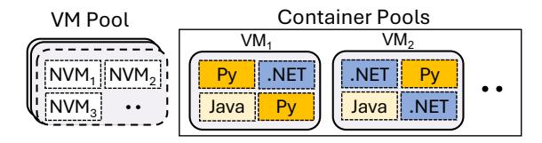
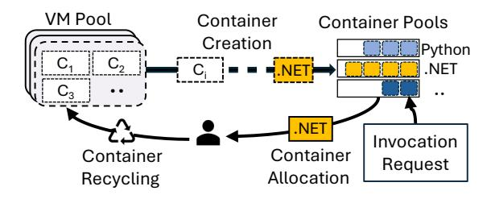
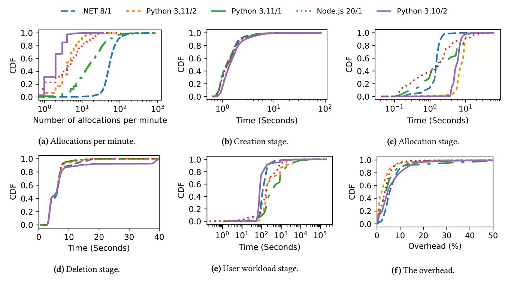
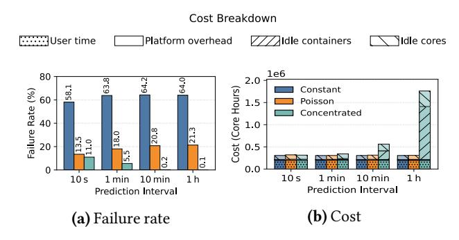
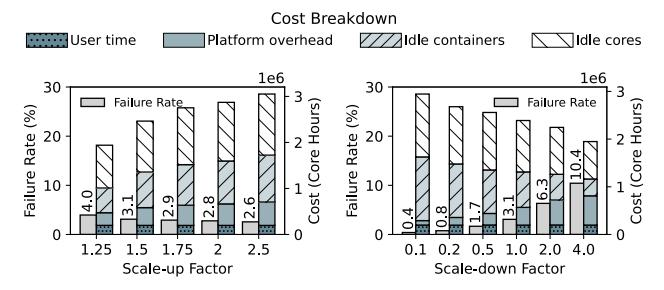
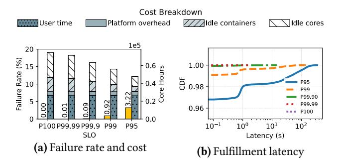
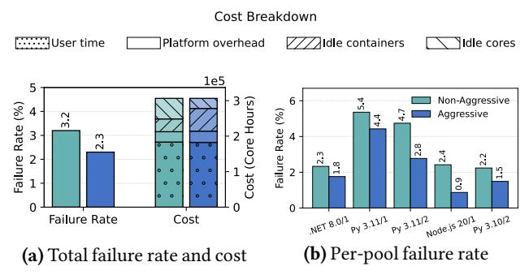
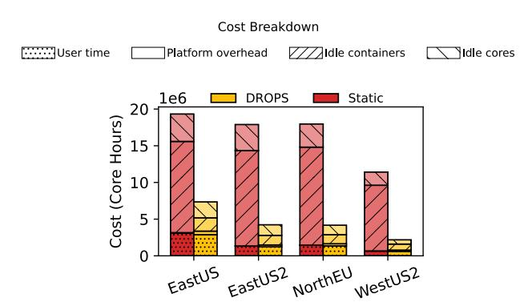

# DROPS: Managing Serverless Resource Pools in Microsoft Azure Functions

Ahmed Alquraan\* University of Waterloo Abdelrahman Baba\* University of Waterloo Rafael Mendes da Silva Microsoft Research

Sameh Elnikety Microsoft Research Paul Batum Microsoft Yan Chen Microsoft

Hamid Henry Safi

Seth Fine

Samer Al-Kiswany University of Waterloo

#### Abstract

Azure Functions maintains pools of pre-warmed containers to avoid the high container-allocation latency. The size of a pool is important: a pool that is too small leads to high allocation latency, whereas a pool that is too large wastes resources and increases cost. Service providers typically oversize pools to meet service-level objectives (SLOs). Our findings indicate that the cost of maintaining pre-warmed container pools dominates the overall platform cost, motivating the need for effective pool management strategies.

We characterize container-allocation traces from Azure Functions, revealing key findings: the demand for container allocation is highly bursty, while the supply of new containers is virtually unlimited but may have long delays. Traditional resource management approaches, which rely on prediction or reactive techniques, fail to reduce costs while meeting the target SLO due to the bursty nature of the workload. These insights lead us to develop a new statistical, data-driven pool optimization method that uses historical traces to compute the size of each pool. Our evaluation shows that the proposed method meets the target SLO while reducing the operational cost by 41% compared to the static approach employed earlier in the production platform.

CCS Concepts: • Computer systems organization → Cloud computing; • Social and professional topics → Pricing and resource allocation.

*Keywords:* serverless computing, cloud platforms, resource management, performance optimization

#### **ACM Reference Format:**

Ahmed Alquraan, Abdelrahman Baba, Rafael Mendes da Silva, Sameh Elnikety, Paul Batum, Yan Chen, Hamid Henry Safi, Seth Fine, and Samer

\*Both authors contributed equally to the paper


This work is licensed under a Creative Commons Attribution 4.0 International License

EUROSYS '26, Edinburgh, Scotland Uk
© 2026 Copyright held by the owner/author(s).
ACM ISBN 979-8-4007-2212-7/26/04
https://doi.org/10.1145/3767295.3769350

Al-Kiswany. 2026. DROPS: Managing Serverless Resource Pools in Microsoft Azure Functions. In 21st European Conference on Computer Systems (EUROSYS '26), April 27–30, 2026, Edinburgh, Scotland Uk. ACM, New York, NY, USA, 17 pages. https://doi.org/10.1145/3767295. 3769350

#### 1 Introduction

Serverless computing offers an attractive computing model for developers, allowing them to express their application as event-driven functions. The provider is responsible for deploying, maintaining, and managing resources. In addition, it offers automatic dynamic scalability and a fine-grained billing model, in which users are charged only for the actual execution time. Leading serverless platforms, such as Azure Functions [1], AWS Lambda [2], and Google Cloud Run [3], support a broad range of runtime environments (e.g., Python, .NET, and Node.js) and diverse resource configurations (e.g., 1-core and 2-core containers).

The Azure Functions platform is composed of a set of virtual machines (VMs). Each VM hosts a set of smaller nested VMs (NVMs), and each nested VM runs a single container with a specific runtime. The platform uses nested virtualization (i.e., each container runs in a nested VM) to isolate tenants. The platform does not employ resource oversubscription: each nested VM reserves exclusive cores and memory from the corresponding VM. For the remainder of this paper, we use VM to refer to the VM that hosts nested VMs, and container to refer to both the container and its associated nested VM.

A user registers a serverless function and specifies its runtime version, container size, and concurrency settings. When the user invokes the function for the first time, a containerallocation request is generated. The serverless platform fulfills the allocation request by providing a container with the requested runtime and size from a pool of pre-warmed containers. A *pre-warmed container* is a container that is initialized with a runtime but not with the user code. After processing the user invocation and as soon as the container becomes idle, the container is deleted and its resources are recycled. Notice that the concurrency setting allows a single container to process multiple concurrent invocations, which reduces the cost



Figure 1. The architecture of the serverless platform.

per invocation for the user and, as a side e"ect, extends the lifetime of the container.

The platform aims to satisfy every allocation request immediately using a pre-warmed container. If the containerallocation request is not satis!ed immediately, we call this an *allocation failure*. A failed allocation request is handled by creating a new container, which requires allocating resources from a VM. The ful!llment latency of the container-allocation request depends on the availability of required resources. If an existing VM has su#cient available cores and memory, a new container can be immediately created, resulting in a ful!llment latency ranging from hundreds of milliseconds to a few seconds.We refer to this scenario as a *container-allocation failure*. In contrast, if no existing VM has su#cient available cores and memory, the platform must provision a new VM, leading to a much higher ful!llment latency, typically on the order of minutes. We refer to this scenario as a *core-allocation failure*.In thiswork,we use the target success rate of containerallocation requests as the service level objective (SLO).

Figure 1 illustrates the architecture of the platform. To eliminate container-allocation failures, the platform maintains a dedicated pool of pre-warmed containers for each supported runtime and con!guration size. Additionally, it maintains a pool of ready VMs to prevent core-allocation failures and enable rapid replenishment of the container pools. The VM pool and each container pool have static sizes. The platform actively maintains these pools: whenever a resource (i.e., a VM or container) is consumed from a pool, it triggers a replenishment to create a new resource and restore the pool to its predetermined size.

Balancing performance and operational cost is a signi! cant challenge. The size of pre-warmed resource pools signi!cantly impacts the performance and the costs. Oversized pools result in substantial underutilization and unnecessary expenses, whereas undersized pools fail to meet performance expectations, leading to increased latency and potential SLO violations. Typically, these pools are oversized in production environments. For instance, the pre-warmed resource pools in our production platform incur 76% of the overall cost of the platform (Section 7).

This research investigates the optimization of pre-warmed resource pools (i.e., VM and container pools) to reduce the operational costs, while maintaining platform performance and meeting the target SLO. The contribution of this work is threefold.

First, we present a comprehensive analysis of containerallocation traces from the production environment of Azure Functions. The container-allocation trace di"ers from the function invocation trace, as not every user function invocation results in a container allocation. We highlight that this work is the !rst to study this kind of trace at a large scale. We study various features of the container-allocation workload, including runtime popularity, container lifecycle, and request arrival patterns, burstiness, and periodicity. We !nd that runtimes vary signi!cantly in their popularity and arrival rates, with a few runtimes dominating the workload. In addition, our analysis shows that the workload is highly bursty, lacks periodicity, and exhibits long-tailed creation latencies, making e#cient pool size management more challenging.

Second, we assess the viability of using traditional forecasting and reactive approaches to manage resource pools. Our !ndings (Section 3) indicate that workload forecasting using state-of-the-art statistical and machine learning models [4–9] is an ine"ective method to manage resource pools because it fails to accurately predict future workload bursts. Also, our evaluation (Section 7) shows that reactive methods [10] cannot handle bursty workload due to their inherent lagging behavior.

Motivated by our !ndings, we introduce DROPS, a novel data-driven resource optimization method to manage serverless resource pools. The core of DROPS is a statistical analysis of the demand and supply of the workload. DROPS captures workload burstiness relative to resource creation latencies through an e#cient sliding window analysis over the container-allocation trace and the container-lifecycle trace. Based on this analysis, DROPS builds a mapping that accurately determines the minimum pool size for a target SLO. Our evaluation demonstrates that DROPS generates pool sizes that consistently meet the target SLO, while reducing the operational cost by 41% compared to the static approach that was previously deployed in the production environment. DROPS is currently deployed in production in all Azure regions.

The rest of the paper is organized as follows. Section 2 presents the workload characterization. Section 3 assesses the viability of using workload forecasting tomanage resource pools. Section 4 discusses common resource pool management methods. Section 5 introduces DROPS, the proposed resource optimization method. Section 7 presents the evaluation results. Section 8 discusses related work. Finally, the paper concludes in Section 9.

# 2 Workload Characterization

In this section, we !rst de!ne the production datasets we use in this work (Section 2.1). Then, Section 2.2 presents a detailed analysis of the workload characteristics. Finally, Section 2.3 analyzes the workload burstiness.


Figure 2. Proportion of the top 10 pools.

#### 2.1 Datasets

We collected our dataset from data centers in one region of the serverless platform. The collected data includes the containerallocation requests over 14 days between November 1, 2024 and November 14, 2024. The dataset includes two traces:

- Container-allocation trace:A time series of containerallocation requests. It includes the container ID, request timestamp with microsecond accuracy, the target runtime environment, the runtime version, and the container size (i.e., number of cores and amount of RAM). Our platform, o"ers a set of container sizes. Each size is identi!ed by runtime/core count and comes with a !xed amount of memory. The trace includes more than 2*.*2 million requests for 16 runtime environments.
- Container-lifecycle trace: For each container, the trace includes the duration, in microseconds, spent in each stage, namely, the creation, allocation, user workload, and deletion stages.

We plan to publicly release our dataset1. The dataset contains container-allocation requests, which is di"erent from other public datasets [11–14] that represent user function invocations, which do not directly translate to container allocations.

## 2.2 Statistical Features of the Workload

This section presents a comprehensive analysis of the statistical features of the container-allocation workload. We use the following notation to refer to pools in text: runtime/corecount. For example, "Python 3.11/1" refers to a pool for the Python 3.11 runtime with single-core containers.

Pool popularity. Figure 2 illustrates the popularity of different container pools based on the number of containerallocation requests. The workloads of the .NET 8.0/1 and Python 3.11/1 pools dominate the total workload of the platform, accounting for 75% of the total load. Python 3.11/2 and Node.js 20/1, see moderate usage, jointly accounting for around 15% of container allocations. The remaining 12 pools account for about 10% of the total workload. This signi!cant variation in the load across pools highlights that di"erent



Figure 3. The lifecycle of a container.

pools require di"erent amounts of assigned resources (i.e., di"erent pool sizes).

Requests arrival rate. Figure 4a shows the CDF of perminute container-allocation requests of di"erent pools. The workload volume varies signi!cantly across pools, with the .NET 8.0/1 and Python 3.11/1 pools exhibiting a long tail, with the 99.9th percentile (P99.9) reaching 500 requests per minute. In addition, the workloads of various pools exhibit signi!cant burstiness. The Python 3.11/1 pool has the most bursty workload, with a median of 17 requests per minute and a P99.9 of 530, which is 32 times the median. The .NET 8.0/1 pool shows a slightly lower burstiness, with a median of 48 requests per minute and a P99.9 of 460 requests. Notably, even low-tra#c pools experience sudden bursts; the P99.9 of per-minute requests of Python 3.10/2 is 14 times the median. This high level of burstiness complicates resource allocation, as underestimating these bursts can lead to resource underprovisioning, resulting in SLO violations.

Container lifecycle. Figure 3 shows the lifecycle of a container, which consists of !ve main stages: creation, ready, allocation, user workload, and deletion. The cycle begins with the creation stage, during which the platform allocates the required resources from a VM and bootstraps a container with the target runtime environment. Next, the container transitions to the ready state, in which it remains idle in a pre-warmed container pool. When a container-allocation request is triggered, the platform consumes the container from the pool, and the container transitions to the allocation stage. During the allocation stage, the platform injects user-speci!c code, dependencies, and con!gurations into the container. The container then transitions to the user workload stage, in which it processes user-de!ned function invocations. Once all function invocations are completed, the platform moves the container to the deletion state, in which the container is terminated, and its resources are released back to the VM pool for future use.

We focus on four container lifecycle stages that critically in\$uence resource allocation: creation, allocation, user workload, and deletion stages. The container-creation latency impacts the container pool size required to meet the SLO. A longer creation time means the platform requires a longer time to replenish the pool. As a result, a pool must be larger to account for allocation requests that arrive while the pool

<sup>1</sup>The dataset will be available at: h!ps://github.com/Azure/ AzurePublicDataset.



Figure 4. CDFs of (a) allocation requests per minute, (b–e) container lifecycle stage latencies, and (f) the overhead of container management for the top !ve container pools.

is being replenished. Similarly, the container-allocation latency, container-deletion latency, and user-workload latency impact the VM pool size. The deletion time determines when the resources of deleted containers become available to create new containers. The longer the allocation time and deletion time, the larger the VM pool needed to account for allocation requests arriving while resources are still reserved.

Figure 4b-e shows the CDF of the latency of the creation, allocation, deletion, and user workload stages for di"erent pools. The distributions of the creation (Figure 4b) and deletion (Figure 4d) stages exhibit similar patterns across various pools. The median and P99.9 container-creation latencies are approximately 1.1 seconds and 26 seconds, respectively, while the median and P99.9 container-deletion latencies are around 6 seconds and 50 seconds.In contrast, the container-allocation latency (Figure 4c) is dominated by loading user code and dependencies. As a result, it varies signi!cantly across pools. For instance, the median latencies of the .NET 8.0/1 and Python 3.11/1 pools are 1.48 seconds and 1.30 seconds, while the P99.9 latencies of the .NET 8.0/1 and Python 3.11/1 pools are 7.83 seconds and 22.49 seconds, respectively.

Figure 4e shows the CDF of user time across various pools. User time is the time spent running user workload. The .NET 8.0/1 pool has the shortest median user time at approximately 2 minutes, while Python 3.11/1 has the longest median user time of around 6 minutes. The median user times of the remaining pools fall between these two extremes. Despite these

relatively smallmedians, all pools exhibitlong-tailed user time distributions, with notable variation in the extent of these tails. Python runtimes exhibit the longest-running workloads, with the P99.9 durations extending to 23 hours. In contrast, Node.js 20/1 and .NET 8.0/1 have more bounded tails, with the P99.9 values around 2 hours.

To assess the e#ciency of the platform, Figure 4f reports the CDF of the overhead of various pools. The overhead is de!ned as the ratio of time spent in the creation, allocation, and deletion stages to the total lifetime of a container, which includes creation, allocation, deletion, and user workload durations.Approximately 90%of all containers have an overhead of around 11%, indicating high resource e#ciency. However, a few containers of each pool experience high overhead that can reach almost 100%, which may result from high creation, allocation, or deletion latencies or exceptionally short user workload durations.

Periodicity. Periodicity measures the presence of recurrent, periodic patterns in a time series, where \$uctuations in the data align with regular temporal intervals (e.g., hourly, daily, or weekly). For example, serving enterprise users might exhibit daily periodicity, with requests peaking during business hours and declining overnight.

To capture periodicity, we compute the autocorrelation of the time series. Formally, let = {1*,*2*,...,*} represent a time series of time units, where denotes the number of container-allocation requests in time unit . Autocorrelation

Table 1. Periodicity and spikiness of the workload of the top !ve container pools.

| Workload       | Periodicity<br>(Daily) | Periodicity<br>(Hourly) | Spikiness |
|----------------|------------------------|-------------------------|-----------|
| .NET 8.0/1     | 0.01                   | 0.01                    | 5.52      |
| Python 3.11/1  | 0.01                   | 0.02                    | 6.87      |
| Python 3.11/2  | 0.05                   | 0.03                    | 5.81      |
| Node.js 20.0/1 | 0.09                   | 0.08                    | 7.82      |
| Python 3.10/2  | 0.05                   | 0.03                    | 5.81      |

measures how closely current values resemble past values at various time intervals, known as lags (l), as in Equation 1 [15].

$$C(X,l) = \frac{1}{(n-1)\sigma^2} \sum_{t=1}^{n-l} (X_t - \mu)(X_{t+l} - \mu)$$
 (1)

The values of the periodicity metric are bounded between -1 and 1, where 1 indicates perfect positive periodicity, -1 indicates perfect negative periodicity, and 0 indicates no periodicity. Table 1 presents the hourly and daily periodicity for various pools. Most pools exhibit low hourly and daily periodicity, ranging between 0.01 and 0.09. Low periodicity values suggest that it is di#cult to forecast the workload, as we show in Section 3.

## 2.3 Burstiness Analysis

In this section, we perform a burstiness analysis to measure the role of bursts in determining the pool size to meet the SLO. A burst is a temporary and sudden change in the containerallocation demand during a short time period.

First, we measure the spikiness of various pools. Spikiness [15, 16] is a metric that measures the degree of \$uctuation in the workload over time. For example, the platform may receive a few container-allocation requests during periods of low demand, followed by an abrupt spike (e.g., up to a thousand requests) in the subsequent time unit. The spikiness is de!ned as in Equation 2.

Spikiness(X) = 
$$\frac{1}{\mu} \sqrt{\frac{1}{n-1} \sum_{t=1}^{n-1} (X_{t+1} - X_t)^2}$$
 (2)

Spikiness is calculated as the normalized root mean squared deviation between consecutive time units () and (+1), normalized by the mean () to ensure comparability across workloads with di"ering baselines. Table 1 presents the spikiness of di"erent pools using 1-second time intervals. As a baseline, the spikiness of a Poisson workload with the same average interarrival rate as our workload has a value of 1. From Table 1, we can see that the workload of most pools exhibits substantially higher spikiness than the Poisson workload, ranging between 5*.*5 and 7*.*8.

To better understand the burstiness of the workload, we analyze \$uctuations in the load over time. Speci!cally, we


Figure 5. Burstiness analysis: (a) The CDF of the load changes of the container allocation trace, and (b) Original trace with bursts highlighted in orange.

measure the positive changes in the load over a time window of 1 second. We slide two back-to-back windows on the container-allocation trace. At each time step, we measure the change in the load between the !rst window and the second window. The change in the load is computed as the di"erence between the number of requests in the !rst window and the number of requests in the second window. Figure 5a shows the CDF of the positive changes in the workload of the .NET 8.0/1 pool. We select the top 1% of the measured changes as bursts. The value of P99 of the positive change is 38 times larger than the median value of the positive change.

Role of bursts in meeting the SLO. To assess the role of bursts in meeting the target SLO, we measure the volume of the load in the bursts to the total volume of the workload. Figure 5b shows a sample 12-hour trace of the containerallocation trace of the .NET 8.0/1 pool with bursts highlighted in orange. The volume of the load in the top 1% of bursts is 8% of the total load. As a result, in order to meet any SLO higher than 92%, bursts above the P99 must be considered and carefully analyzed. Hence, bursts play a critical role in determining the pool size needed to meet the target SLO.

Predictability of bursts. We study if it is possible to predict the time and volume of future bursts using forecasting models (detailed in Section 3). We measure the periodicity of bursts for di"erent pools using Equation 1. The periodicity of the bursts of di"erent pools ranges between 0*.*03 and 0*.*06, indicating that bursts exhibit no periodicity, making them extremely hard to predict. We further measure the error of predicting bursts, as discussed in Section 3. Results show that the average error and the maximum error of predicting bursts are 107% and 1170%, indicating that forecasting models are poor at predicting bursts for any pool.

Workload summary.Our analysis reveals that the real containerallocation workload is highly bursty, lacks clear periodic patterns, and involves long-tailed resource creation latencies. These characteristics complicate pool sizing decisions: bursty demand leads to sudden spikes in resource needs, the absence of periodicity hinders prediction-based planning, and long creation times delay resource availability during spikes. Our

evaluation (Section 7) shows that reactive and predictive methods struggle to achieve high success rates without incurring excessive overprovisioning.

## 3 Forecasting Future Load

Forecasting methods can be used to predict future workload to proactively adjust the size of pre-warmed resource pools. To assess the viability of this idea, we employ state-of-the-art time series forecasting methods, including statistical, machine learning, and foundation models:

- Statistical models. We evaluate four statistical models: ARIMA [8], Theta [7], ETS [9], and a Naive model that repeats the value of the previous day.
- Machine learning models. We evaluate three machine learning (ML) models: PatchTST [6], a transformer-based model optimized for time series; Temporal Fusion Transformer (TFT) [5], which combines LSTM with a transformer layer, and DeepAR [4], a probabilistic autoregressive network based on LSTM architecture.
- Other models. We evaluate Chronos [17], a foundation model pre-trained on massive datasets, enabling zero-shot forecasting without task-specific fine-tuning. Additionally, we evaluate a Weighted Ensemble model, fitted using other top-performing predictors.

To train various forecasting models, we use AutoGluon [18], which is an open-source AutoML framework that provides a unified interface for different models and handles parameter tuning. The evaluation is conducted using a rolling forecasting approach over the trace. The training period is 7 days followed by a testing period of one day. The rolling window is advanced by one day at each step, ensuring that the entire test week is covered and that performance metrics reflect models' generalization capability across different temporal contexts.

We evaluate the forecasting models using the containerallocation trace of the .NET 8.0/1 pool, as it is the most popular pool (Figure 2). However, our findings generalize to other resource pools (Section 7). For training, we use a machine equipped with two Intel E5-2630 CPUs (each CPU has 16 cores or 32 threads running at 2.40 GHz), 128 GB RAM, and 480 GB SSD.

#### 3.1 Container-allocation Workload Predictability

We evaluate the forecasting models with four prediction intervals: 10 seconds, 1 minute, 10 minutes, and 1 hour. A prediction interval refers to the temporal resolution at which future values are forecasted. Formally, a prediction interval of  $\tau$  seconds implies that the model generates one predicted data point for every  $\tau$ -second interval. We use different prediction intervals to evaluate the capability of a model to capture patterns at different time resolutions. For training, we provide a time series where each data point corresponds to the total number of container allocations within an interval. The model generates

**Table 2.** Forecasting models performance evaluation with different prediction intervals.

| Model                | Interval         | Avg Error | Max Error | Bias   | Training Time (s) |  |  |  |
|----------------------|------------------|-----------|-----------|--------|-------------------|--|--|--|
| Statistical          |                  |           |           |        |                   |  |  |  |
| Naive                | 10 seconds       | 182%      | 2300%     | 1.3    | 6.0               |  |  |  |
|                      | 1 minute         | 46%       | 2900%     | 4.0    | 1.7               |  |  |  |
|                      | 10 minutes       | 25%       | 842%      | 40.8   | 1.4               |  |  |  |
|                      | 1 hour           | 18%       | 124%      | 245.0  | 1.4               |  |  |  |
| ETS                  | 10 seconds       | 123%      | 1246%     | -1.6   | 6.3               |  |  |  |
|                      | 1 minute         | 53%       | 4202%     | -16.9  | 1.9               |  |  |  |
|                      | 10 minutes       | 72%       | 638%      | 253.2  | 3.4               |  |  |  |
|                      | 1 hour           | 18%       | 82%       | 19.2   | 0.4               |  |  |  |
| Theta                | 10 seconds       | 173%      | 3630%     | 1.3    | 67.3              |  |  |  |
|                      | 1 minute         | 66%       | 5404%     | -1.9   | 22.9              |  |  |  |
|                      | 10 minutes       | 20%       | 758%      | -81.4  | 21.9              |  |  |  |
|                      | 1 hour           | 17%       | 87%       | -307.5 | 7.1               |  |  |  |
| ARIMA                | 10 seconds       | 130%      | 1268%     | -0.6   | 8.4               |  |  |  |
|                      | 1 minute         | 34%       | 3195%     | -3.3   | 2.4               |  |  |  |
| ANIMA                | 10 minutes       | 20%       | 763%      | -18.4  | 21.1              |  |  |  |
|                      | 1 hour           | 14%       | 76%       | 54.5   | 1.1               |  |  |  |
|                      | Machine Learning |           |           |        |                   |  |  |  |
| DeepAR               | 10 seconds       | 84%       | 1628%     | -3.26  | 3574.1            |  |  |  |
|                      | 1 minute         | 33%       | 2569%     | -6.9   | 743.1             |  |  |  |
|                      | 10 minutes       | 40%       | 579%      | -27.0  | 173.0             |  |  |  |
|                      | 1 hour           | 28%       | 124%      | -120.4 | 74.9              |  |  |  |
| TFT                  | 10 seconds       | 92%       | 889%      | -3.8   | 3597.9            |  |  |  |
|                      | 1 minute         | 38%       | 3082%     | 0.4    | 893.4             |  |  |  |
|                      | 10 minutes       | 27%       | 901%      | -22.2  | 347.1             |  |  |  |
|                      | 1 hour           | 31%       | 358%      | 209.5  | 159.1             |  |  |  |
| PatchTST             | 10 seconds       | 96%       | 1562%     | -1.9   | 1413.1            |  |  |  |
|                      | 1 minute         | 32%       | 2929%     | -3.4   | 194.7             |  |  |  |
|                      | 10 minutes       | 21%       | 714%      | -7.7   | 35.1              |  |  |  |
|                      | 1 hour           | 45%       | 167%      | 343.7  | 31.3              |  |  |  |
| Other Models         |                  |           |           |        |                   |  |  |  |
| Chronos              | 10 seconds       | 102%      | 2946%     | -3.7   | 7.6               |  |  |  |
|                      | 1 minute         | 31%       | 2326%     | -13.5  | 1.3               |  |  |  |
|                      | 10 minutes       | 19%       | 678%      | -39.8  | 1.0               |  |  |  |
|                      | 1 hour           | 15%       | 74%       | 77.2   | 1.4               |  |  |  |
| Weighted<br>Ensemble | 10 seconds       | 99%       | 2946%     | -2.7   | 30.1              |  |  |  |
|                      | 1 minute         | 30%       | 2522%     | -6.5   | 19.0              |  |  |  |
|                      | 10 minutes       | 19%       | 731%      | -19.6  | 20.3              |  |  |  |
|                      | 1 hour           | 17%       | 131%      | 15.7   | 3.0               |  |  |  |

a time series where each point represents the predicted total load within an interval.

Table 2 reports the average and maximum prediction errors of various models for different prediction intervals. We use the mean absolute percentage error (MAPE [19]) as an error metric. MAPE provides an intuitive, scale-independent measure of forecast accuracy expressed as a percentage, making it easy to interpret. MAPE penalizes overprediction and underprediction of the same magnitude equally. MAPE is computed as shown in Equation 3, where  $A_t$  is the actual value,  $F_t$  is the forecast value, and n is the time series length.

MAPE = 
$$\frac{100}{n} \sum_{t=1}^{n} \left| \frac{A_t - F_t}{A_t} \right|$$
 (3)


Figure 6. One-hour training trace with di"erent prediction intervals.

Table 2 shows that the lowest average errors for the 10 second, 1-minute, 10-minute, and 1-hour intervals are 84%, 30%, 19%, and 14%, respectively. Table 2 indicates that forecasting models are incapable of accurately predicting !negrained long-term container-allocation workload because the container-allocation workload exhibits unpredictable, highintensity bursts. These bursts deviate sharply from regular temporal patterns, making them di#cult to capture with forecasting models.

Table 2 shows that using a smaller prediction interval signi!cantly increases the prediction error for all forecasting models because shorter intervals capture !ner-grained \$uctuations, making the training data more bursty and harder to model. Furthermore, the length of the prediction interval has a signi!cant impact on the shape of the trace, which directly impacts the forecasting accuracy. Figure 6 presents a normalized 1-hour training trace using 10-second, 1-minute, and 10-minute prediction intervals. As the prediction interval increases, the workload becomes signi!cantly smoother, suppressing abrupt and sharp bursts. The coe#cients of variation of the same trace with 10-second, 1-minute, and 10-minute intervals are 1*.*88, 0*.*32, and 0*.*05, respectively, illustrating the smoothing e"ect. This smoothing e"ect simpli!es the learning and prediction of the workload.

Bias. Table 2 reports the bias, which is the average di"erence between predicted values and actual values. A positive bias indicates that the model tends to overpredict, while a negative bias indicates that the model tends to underpredict. In the context of resource allocation, overprediction results in larger pools than needed, increasing operational costs. In contrast, underprediction leads to undersized pools, which can result in allocation failures and SLO violations.

Training cost. Table 2 reports the training time required to generate predictions for 1 day across di"erent models. The resultsindicate that shorter predictionintervals require substantially longer training times than larger intervals because they require !tting the models on larger training datasets. For example, the size of the training data for a 10-secondintervalis 60 times larger than that for a 10-minute interval. In addition, results show that ML-based models consistently exhibit longer training times than statistical models due to their increased complexity and reliance on iterative optimization algorithms. Summary. Our evaluation of forecasting models shows that they are not an e"ective solution for managing resource pools, as they fail to predict the workload with high accuracy. In Section 7, we further evaluate an oracle perfect predictor that provides exact future workload values. Even with perfect predictions, our results reveal a fundamental limitation of forecasting: it cannot predict bursts' temporal proprieties, leading to SLO violations. As a result, tuning current models or using more accurate models will not make forecasting a viable approach for resource pool management.

# 4 Resource Pool Management Methods

E"ective pool size management is critical in serverless platforms as it directly a"ects performance and cost. Oversized pools lead to idle resources and higher costs, while undersized pools result in allocation failures, violating the SLO.

The resource bu"ering problem is not unique to serverless platforms. For example, operating systems and networked environments typically maintain memory bu"ers to improve performance. This section discusses three main approaches that are widely used to determine a bu"er size: static, reactive, and prediction-based approaches. We evaluate the performance of these approaches in Section 7.

Static approach. In this approach, the system pre-allocates a !xed bu"er size in advance, which remains !xed regardless of the system load. Azure Functions maintains a !xed number of pre-warmed containers for each pool to avoid allocation failures. A high watermark and a low watermark can be used to lazily replenish the bu"er; instead of replenishing the bu"er immediately after an item is consumed, the bu"er is replenished only if it drops below the low watermark. The main advantage of this approach is its simplicity, as it eliminates the overhead associated with dynamic resizing and runtime monitoring. However, in large-scale serverless platforms, this approach requires manual management of many pools, which is cumbersome and prone to miscon!guration.

Reactive approach. A reactive approach can be used to dynamically manage the bu"er size based on its usage. The bu"er has a target size, and whenever a resource is consumed from the bu"er, the system starts replenishing the bu"er to its target size. Low and high watermarks are used to trigger changes to the target bu"er size. When many resources are consumed and the low watermark is reached, the target bu"er size is increased. Similarly, if many resources are idle and the high watermark is crossed, the bu"er size is decreased. The reactive approach adapts to the workload, which can yield better cost e#ciency. However, a reactive approach uses a lagging indicator, which does not !t bursty workloads: after a usage spike is observed, the target bu"er size is increased. This can lead to potential allocation failures in serverless platforms. Predictive approach. To overcome the lagging nature of the reactive approach, load forecasting can be used to predict the upcoming workload based on historical data and set the bu"er

size in advance. Similar to other approaches, the buffer is replenished eagerly. Forecasting models have limited effectiveness for bursty workloads, as described in Section 3. Another challenge with this approach lies in translating the predicted load into a pool size. We discuss this challenge in Section 7.

#### 5 DROPS

This section introduces DROPS, a new statistical, data-driven resource optimization method to manage resource pools in infinite-capacity systems, such as serverless platforms. In such systems, there are no constraints on the system's ability to create new resources (i.e., there is no upper bound on the number of resources, such as VMs and containers, that can be created in parallel).

DROPS utilizes historical traces to generate an accurate pool-size-to-success-rate mapping that can be used to determine the minimum pool size needed to meet a target SLO. DROPS uses an efficient sliding window analysis to capture burstiness relative to resource creation latencies. In this work, we use the target success rate of allocation requests as an SLO. That is, the SLO specifies the minimum percentage of allocation requests that must be fulfilled using pre-warmed containers. Section 5.1 presents the proposed method. Section 5.2 and Section 5.3 discuss how we apply the proposed method to optimize the container and VM pools.

#### 5.1 Resource Optimization Algorithm

DROPS optimizes resource pools in an infinite-capacity system that maintains a set of pools. Each pool has a target size, which the system strives to maintain at all times. Three main actions can occur to a resource pool: resource consumption, resource recycling, and resource replenishment. A resource consumption means that the system consumed an item from the pool. The system can keep using the consumed item indefinitely, or it can release the item after some time. Released resource items may be added back to the pool (i.e., resource recycling) and can be consumed again. When a resource item is consumed from the pool, the system triggers a resource replenishment to create a new resource item to refill the pool. The system can create an unlimited number of resource items in parallel. However, resource creation is not instantaneous and incurs some delay.

DROPS is based on a statistical demand-supply analysis. The demand represents the consumption of items from the pool, while the supply represents the time required to create resource items. That is, the duration from the time point at which a request to create a resource item is issued to the time point at which the resource item becomes ready and part of the pool.

DROPS utilizes the following property of infinite-capacity systems: the latency to fulfill a resource consumption request is bounded by the maximum creation latency of a resource. When a consumption request is received, it is either fulfilled immediately if the pool is not empty or must wait until a

### Algorithm 1 DROPS

```
\textbf{Input:} \ \mathsf{Demand} \ \mathsf{trace:} \ R, \mathsf{Recycling} \ \mathsf{trace:} \ Q, \mathsf{Resource} \ \mathsf{creation} \ \mathsf{latency}
     distribution: C, Number of samples: N
    Output: Pool-size-to-success-rate mapping: P
 3: Initialize an empty list L
 4: for i = 1 to N do
 5:
         Set WS to P_{100}(C)
                                            ▶ Window size = max creation latency
 6:
         for each consumption request r in R do
 7:
                                                      \triangleright Start with a pool size of zero
                                            \triangleright Set window w using timestamp of r
              Set w \leftarrow [t_r - WS, t_r]
 8:
 9:
              for each request x in w do
                                                             ▶ Analyze requests in w
                                                            ▶ Latency drawn from C
10:
                  Rep_{lat} \leftarrow sample from C
                                                        ▶ Is replenishment time > t_r
                  if t_x + Rep<sub>lat</sub> > t_r then
11:
12:
                      PS = PS + 1
                                                  ▶ Increment the needed pool size
13:
                  end if
14:
              end for
15
              q \leftarrow count of recycling events with timestamp \in w
16:
              PS = PS - q > Resource recycling reduces the needed pool size
17.
                                                         \triangleright Append pool size PS to L
              L \leftarrow L \cup \{PS\}
18:
         end for
19: end for
20: Compute P as the empirical CDF of L
21: return P
```

resource item becomes ready. In the worst case, the consumption request waits for the maximum creation latency. The pool size needed to fulfill a resource consumption request at time  $t_r$  depends only on the volume of the consumption and recycling within the interval  $[t_r - t_c, t_r]$ , where  $t_c$  is the maximum resource creation latency. In other words, it depends only on the consumption requests and recycling events occurring within the creation latency window preceding the request r.

Algorithm 1 shows the pseudo-code of DROPS, which requires the following inputs: 1) a demand trace, a sequence of resource consumption requests, 2) a recycling trace, a sequence of resource recycling events, and 3) a supply-latency distribution, a distribution of resource creation latency. DROPS outputs a mapping that can precisely set the pool size to meet any target SLO.

DROPS uses a sliding window analysis to construct a statistical distribution of the consumption demand over time. To determine the minimum pool size required to fulfill a request r from the pool, DROPS examines all prior consumption requests within the interval  $[t_r - t_c, t_r]$  (Algorithm 1, Line 9–14). Recall that every consumption request triggers a replenishment to refill the pool. Hence, for each request within the interval, DROPS samples a replenishment latency from the creation latency distribution (Line 10). If the sampled replenishment completes before  $t_r$ , then its demand does not affect the pool size required at  $t_r$ . In contrast, if the replenishment arrives after  $t_r$ , the request still affects the pool at time  $t_r$ , and the pool size is incremented accordingly (Lines 11–12). To determine the final pool size required to fulfill request r, we need to account for recycling events. DROPS counts the number of recycling events that occur within the interval, and uses it to adjust the pool size (Line 15–16). A resource recycling event reduces

the required pool size, as a recycled resource is added back to the pool and can be used to ful!ll future consumption requests. The adjusted pool size is added to the distribution (Line 17).

For each consumption request, the distribution contains one value representing the pool size required to ful!ll that request. The distribution is transformed to a pool-size-tosuccess-rate mapping by computing the empirical cumulative distribution function (CDF) of *L* (Line 20), which DROPS generates as an output. This mapping can be used to set the pool size to meet any SLO. For instance, if the target SLO is 99%, setting the pool size to the 99 percentile of the mapping guarantees meeting that SLO as long as the future workload has the same properties as the input workload.

DROPS can handle both stationary and bursty workloads. DROPS captures workload burstiness while accounting for the creation latency of resources. DROPS enables accurate sizing for any target SLO, a capability that other methods lack. The accuracy of DROPS depends on the length of the input traces, which production systems typically collect and store for long durations. DROPS is e#cient and does not involve any complex training algorithms. Furthermore, a system must re-run DROPS only if new pools are introduced or if there are changes in the workload that lead to a higher failure rate or resource underutilization than expected.

## 5.2 Container Pools Optimization

The serverless platform maintains multiple container pools. Each pool has its unique workload and container-creation latency distribution (Figure 4). Hence, we use Algorithm 1 to independently optimize each container pool. For each pool, we use the container-allocation trace as the demand trace and the container-creation latency distribution as the supplylatency distribution. In our platform, containers cannot be reused; when a container is deleted, its resources are released to the VM hosting the container. Hence, we set the recycling trace to an empty trace. The output pool-size-to-success-rate is then used to set the size of the container pool.

## 5.3 VM Pool Optimization

In this section, we discuss how DROPS is applied to optimize the VM pool. We use the empirical distribution of the VM-creation latency. We use the input container-allocation trace and the container-lifecycle distributions to generate the core-allocation and the core-recycling traces.

Core-allocation trace. Recall that the platform maintains a target number of idle VMs in the VM pool. As a result, whenever a VM is consumed, the platform creates a new VM to re!ll the pool. To generate a core-allocation trace, we map each container-allocation request in the container-allocation trace to a core-allocation event, with the number of allocated cores determined based on the target container size (e.g., 1 core or 2 cores). The generated core-allocation trace re\$ects the VM demand of all container pools.

The above assumes that the core-allocation event occurs at the same time as the container-allocation request, which is inaccurate. The core-allocation event must happen earlier than the container-allocation request. Speci!cally, the core-allocation event must precede the container-allocation request by at least one unit of container-creation latency. So, we adjust the core-allocation trace by shifting each coreallocation event backward in time by a duration sampled from the container-creation latency distribution.

Core-recycling trace. In our serverless platform, a container is deleted onceit becomesidle. Resources of deleted containers are released back to the VM pool (i.e., core recycling). Recycled cores signi!cantly impact the VM pool size as these cores become available to create new containers. Hence, neglecting the core-recycling events results in resource overprovisioning and higher costs.

The core-recycling events depend on the user workload characteristics, which vary from one tenant to another and from time to time. To account for that, we generate a corerecycling trace, a sequence of core-recycling events. For each container-allocation request, we determine the time at which the container will be deleted by sampling the duration of every stage in the container lifecycle from the container-lifecycle distributions.

Now, we have all the inputs required to apply Algorithm 1 to optimize the VM pool.We use the generated core-allocation trace as the demand trace, the generated core-recycling trace as the resource-recycling trace, and the VM-creation latency distribution as the supply distribution. The generated poolsize-to-success-rate mapping can be used to set the size of the VM pool to meet any target SLO.

# 6 Implementation and Deployment

We implement DROPS in C#, and it is currently deployed across all regions and data centers of Azure Functions. The platform runs DROPS every four hours using the previous week's traces as input to dynamically resize resource pools. In addition to periodic runs, DROPS is invoked on-demand by monitoring container allocation failures and abnormal resource utilization. For instance, if the failure rate surpasses the target SLO, the platform runs DROPS to reanalyze the workload and adjust pool sizes. DROPS has negligible overhead;it requires about one minute to analyze a two-week trace containing around two million allocation requests. Deploying DROPS in production resulted in substantial cost savings that vary across geographic regions, ranging between 80%↑90%.

# 7 Evaluation

This section evaluates the performance of various pool sizing methods. Section 7.1 compares the failure rate, cost, and latency of various methods. Section 7.2 evaluates the performance of the forecasting-based methods with di"erent

prediction intervals. Section 7.3 presents a sensitivity analysis of the reactive method. Section 7.4 presents a sensitivity analysis of DROPS. Section 7.5 introduces the aggressive container creation optimization. Section 7.6 evaluates DROPS using traces from di"erent geographical regions.

Metrics. We use the following metrics in the evaluation:

- Failure rate. The failure rate is the ratio of failed requests to total requests. A failed request is a request that is not satis!ed immediately from the pre-warmed pool of containers. Note that no allocation request is rejected; every request is eventually ful!lled.
- Cost. We measure the total cost in core-hours that is required to serve the input container-allocation trace. We also provide a breakdown of the cost in various components, including the container pool, VM pool, platform overhead, and user workload cost. The container pool and VM pool costs represent the cost of maintaining idle containers and VMs, respectively.
- Latency.Thelatency of ful!lling a container-allocation request. This includes the time from when the request is received until a container is allocated to the request.

Alternatives. In addition to DROPS, we consider the following alternatives in our evaluation:

- Static method. The size of each container pool is static and set by an expert operator. For the VM pool, the platform employs a reactive scaling strategy based on the availability of idle CPU cores, which can be used to replenish container pools. When the number of idle cores drops below a low watermark, the platform increases the VM pool size, while if the number of idle cores exceeds a high watermark, the platform reduces the VM pool size. This alternative represents the approach used in production in the Azure Functions platform prior to DROPS. The low and high watermarks are set to 10% and 40% of the platform's total number of CPU cores.
- Predictive method. For each container pool, the bestperforming forecasting model is used to predict the future load. The predicted load is used to set the pool size at the beginning of each prediction interval. We evaluate three approaches to map the predicted load to a pool size: constant, Poisson, and concentrated load mapping approaches. The constant load approach assumes that the load is stationary (i.e., no burstiness). It measures the average arrival rate ( =/), and the pool size is set to meet this rate. In contrast, the concentrated load approach models an extreme busrtiness by assuming that the entire predicted load arrives at a single time point. The Poisson load approach lies between these two extremes; it assumes that request arrivals follow a Poisson distribution and determines the pool size using the cumulative distribution function (CDF) of the Poisson distribution [20].
- Reactivemethod.A reactive poolmanagementmethod is employed, using a multiplicative increase, additive


Figure 7. Performance of optimization methods. (a) Failure rate and cost. (b) Ful!llment latency (DROPS and the static alternative have a latency of zero).

decrease(MIAD [10]) control algorithm. The pool sizeis exponentially scaled up upon each container-allocation failure, and linearly decreased over time when no failures are observed. This method enables fast adaptation to sudden load bursts, avoids resource overprovisioning duringidle periods, and achieves stability by preventing oscillations in pool size.

• Predictive-reactive method. This alternative combines forecasting with the reactive method. At the beginning of each interval, the method predicts the future load in the next window and adjusts the pool size to meet the predicted load, assuming that all load arrives at a single point in time (i.e., concentrated load). Within an interval, the reactive method adjusts the pool size in response to allocation failures.

Workload. We use a 2-week trace from the production platform in our experiments. We use the !rst week for training and the second week for evaluation. The evaluation follows a rolling approach, where to optimize the pool sizes in a day, the preceding seven days are used as input. We conduct our experiments using a custom-built simulator that replicates the behavior of our serverless platform. We use simulation in our evaluation as it is infeasible to compare alternative approaches in the production environment. The simulator models all stages of the container and VM lifecycles, with delays at each stage sampled from real empirical distributions. The simulator supports di"erent pool optimization methods, replays the container-allocation trace, and collects various metrics, including failure rate, ful!llment latency, core utilization, pool utilization, and cost. We have validated that the simulator accurately emulates the production platform and faithfully replays input traces. The simulator is implemented in C#.The source code of the simulator and DROPS is available at https://github.com/UWASL/DROPS.



Figure 8. The Failure rate and the cost of di"erent prediction intervals using a perfect predictor.

## 7.1 Performance Comparison

Figure 7a shows the failure rate and the total cost of di"erent optimization methods when the target SLO is 100%. In Figure 7a, prediction-based methods use a 1-hour prediction interval as it has the best performance. Results show that DROPS and the static alternative are the only methods that achieve a 100% success rate, meeting the target SLO. However, DROPS reduces the total cost by 41% compared to the static alternative. The breakdown of the cost reveals a key di"erence between DROPS and the static approach used in production in the management of idle resources. DROPS reduces the cost of idle containers by 79% and increases the cost of idle cores by 13% (Figure 7a). DROPS is designed to set the container pools to the smallest size capable of meeting the SLO, while keeping the remaining idle cores unassigned to any container pool. This approach enables on-demand core-to-container allocation, leading to more e#cient and accurate allocation decisions. In contrast, the static approach maintains excessively oversized container pools, which require early allocation of cores to container pools. This may lead to suboptimal and ine#cient core-to-pool allocation decisions.

To further analyze the impact of this behavior, Figure 9 shows the CDF of the normalized fullness (i.e., the ratio of the number of resource elements in the pool to the size of the pool) of the VM and .NET 8.0/1 pools of DROPS and the static alternative. A 100% fullness means the pool is full, while a 0% fullness means the pool is empty. For the static alternative, the minimum fullness of the VM pool reaches 0% while the minimum fullness of the .NET pool is 55%. This indicates that the VM pool is fully consumed while many containers are idle, risking the occurrence of allocation failures despite the platform being overprovisioned. In contrast, in DROPS, the minimum fullness of both the .NET and VM pools is 0% while not leading to any allocation failures, indicating more e"ective core-to-container allocation decisions. Although the fullness of the .NET and VM pools of DROPS remains high for most of the time, the fact that it reaches 0% indicates that the used pool sizes are necessary to meet the SLO.

Figure 7a shows that the predictive method with a concentrated load mapping fails to meet the target SLO and incurs


Figure 9. CDF of the fullness of the .NET and VM pools. Figure 10. Pool size to SLO for the .NET and VM pools.

3*.*3↘ higher cost than DROPS. This method assumes that the load arrives in a single burst, leading to oversized pools and incurring higher costs. It also fails to meet the target SLO for two reasons. First, prediction errors can lead to inaccurate pool sizes. Second, this method does not account for the time needed to create new containers and VMs. Hence, requests that arrive while resources are being created may fail. Accounting for the creation latency is challenging as it exhibits long-tail distributions (Figure 4), and accounting only for the worst-case creation latency increases the cost signi!cantly.

The reactive method leads to the highest failure rate due to its inherent lagging nature; it scales the pool size only after observing a burst. However, because bursts in containerallocation workload are typically short and the creation latencies of containers and VMs are relatively longer, the newly created resources become available only after most of the burst's requests have already failed. The multiplicative increase in pool size under the reactive method leads to a substantial cost escalation, exceeding DROPS's cost by more than 4*.*2 times. Using prediction to augment the reactive method reduces the failure rate as the predicted load is used to adjust the pool size at the start of each interval.

Ful!llment latency. Figure 7b shows the ful!llment latency of container-allocation requests of various methods. DROPS and the static alternative have a latency of zero for all requests. Latencies greater than zero correspond to failed allocation requests. A request can fail due to either a container-allocation failure, which incurs a latency of hundreds of milliseconds to a few seconds, or a core-allocation failure, which incurs a latency in the range of minutes. The predictive, reactive, and predictive-reactive methods exhibit a sharp rise in latency at the tail of the distribution. This sharp rise is attributed to core-allocation failures.

## 7.2 Performance of the Predictive Method with Di"erent Prediction Intervals

Forecasting-based methods are ine"ective for pool sizing for two reasons. First, they are incapable of accurately predicting the load, particularly during burst periods (Table 2). Second, they generate a single value for each prediction interval. Mapping this single value to a pool size requires assumptions about the workload distribution (e.g., Poisson), which may fail to capture the burstiness in the load. To better illustrate this, we assume the existence of a hypothetical perfect predictor: a perfect forecasting model that can predict the true



Figure 11. The failure rate and cost of the reactive method when varying the scale-up and scale-down factors.

average load in each interval. This removes failures attributed to prediction errors.

Figure 8 presents the failure rates and costs of the predictive method under di"erent prediction intervals, using three load-to-pool-sizemapping approaches: constant, Poisson, and concentrated-load. Figure 8 shows that the predictive method fails to achieve a 100% success rate, even when a perfect predictor is used. The concentrated-load approach has the lowest failure rate and the highest cost due to pool oversizing. The constant-based approach leads to the highest failure rate as it does not account for any burstiness in the load. The Poisson approach achieves a lower failure rate compared to the constant approach while slightly increasing the cost, as it captures some level of burstiness.

Figure 8 shows that larger prediction intervals lead to a slightly higher failure rate for the constant and Poisson approaches. For the Poisson approach, using a prediction interval of 1 minute instead of 10 seconds increases the failure rate from 13*.*5% to 18%. Notably, the failure rate plateaus for larger intervals; both 10-minute and 1-hour intervals yield similar failure rates. This occurs because both apply a similar degree of smoothing, resulting in comparable pool size estimates.

#### 7.3 Sensitivity Analysis of the Reactive Method

The performance of the MIAD reactive method depends primarily on two parameters: the scale-up factor, which controls how quickly the pool size increases after allocation failures, and the scale-down factor, which controls how gradually it decreases during failure-free periods. Figure 11 shows how varying these factors a"ects the performance of the reactive method. As shown in Figure 11, increasing the scale-up factor reduces the failure rate but signi!cantly increases the total cost. For example, a scale-up factor of 2*.*5 lowers the failure rate by 1*.*4% while increasing the cost by 57%. Further increases in the scale-up factor are unlikely to bring much improvement to the failure rate as the creation latencies of containers and VMs become the limiting factor.

Figure 11 shows that increasing the scale-down factor reduces the total cost but leads to a higher failure rate. The scale-down factor controls the rate at which the container pool size is reduced (i.e., the number of deleted containers per second). Increasing the scale-down factor from 0.1 to 4.0



Figure 12. Performance of DROPS with di"erent SLOs.

raises the failure rate by 10% while reducing the total cost by 34%. However, aggressive scale-down (e.g., a factor of 4) introduces platform instability and increases overhead, as containers and VMs are deleted before they are e"ectively utilized. For instance, with a factor of 4, the overhead contribution to total cost is 31%, which is 3*.*1↘ and 1*.*7↘ larger than the cost of user workload and idle containers, respectively.

## 7.4 DROPS Sensitivity Analysis

Sensitivity to di"erent SLOs. DROPS provides a key advantage over other resource management methods by enabling precise pool sizing for a given SLO. DROPS constructs a statistical mapping that translates each pool size to its corresponding success rate. Figure 12a shows the failure rate and the cost of DROPS for di"erent SLOs. The results show that DROPS successfully maintains the failure rate below the target SLO. Notably, achieving a 95% success rate incurs a cost that is 30% lower than that required for a 99*.*9% success rate. This demonstrates that satisfying the highest percentiles of load comes at a signi!cantly higher cost compared to satisfying lower percentiles.

To further validate this, Figure 10 shows the pool-size-tosuccess-rate mapping for the VM and .NET 8.0/1 pools. The VM pool and .NET 8.0/1 pool sizes required to achieve a 99*.*9% success rate are 2*.*2↘ and 2*.*5↘ larger than the size required to achieve a 95% success rate. That is, achieving a 99*.*9% success rate requires doubling the amount of idle resources needed to achieve a 95% success rate.

Figure 12b shows the latency CDF for di"erent SLOs. The results show that the latency CDFs of various SLOs exhibit a long tail that reaches hundreds of seconds, which is attributed to core-allocation failures.

Sensitivity to keep-alive intervals. A keep-alive interval determines how long a container remains active after completing a function invocation and before being deleted. Di"erent serverless platforms adopt di"erent keep-alive intervals. For instance, AWS Lambda [2] and Google Cloud Run [3] keep containers active for a short period (typically several minutes) in order to mitigate cold starts.In contrast, in Azure Functions, containers are immediately deleted once they become idle, and their resources are recycled back to the VM pool.


Figure 13. The cost of DROPS under di"erent kep-alive intervals. The percentages annotated above each bar denote the fraction of container-allocation requests that are ful!lled using kept-alive containers.

A keep-aliveinterval directly a"ects the container-allocation trace. A longer keep-alive interval reduces the number of container-allocation requests, as future function invocations can reuse containers that are kept alive rather than triggering new allocation requests.

DROPS is inherently robust to di"erent keep-alive intervals because it relies on real traces of allocation and recycling events. Hence, DROPS can manage both con!gurations that recycle containers immediately and relaxed con!gurations with long keep-alive intervals that preserve containers for reuse.

Figure 13 shows the cost of DROPS using di"erent keepalive intervals. The percentages annotated above each bar denote the fraction of allocation requests that are ful!lled using kept-alive containers. DROPS has a 0% failure rate for di"erent keep-alive intervals. Increasing the keep-alive interval increases the ratio of requests that are served using kept-alive containers. For instance, with a 10-minute keepalive interval, 53% of the requests are served using kept-alive containers. However, using a keep-alive interval increases the total cost. For instance, a 10-minute keep-alive interval incurs 19% higher total cost compared to immediately deleting idle containers (zero keep-alive interval). The cost of keeping containers alive accounts for 9% and 14% of the total cost of the 5-minute and 10-minute intervals, respectively.

#### 7.5 Aggressive Container Creation Optimization

The VM pool maintains a number of idle cores at any time. The aggressive container creation optimization improves the success rate of allocation requests without incurring additional costs by utilizing the idle cores to create extra containers and expand the pools beyond their size limits. However, to avoid incurring additional costs, using cores to create extra containers does not lead to VM creation.

A critical aspect of this optimization is how to distribute the idle cores across container pools. To e"ectively achieve this, we distribute the idle cores across pools proportional to



Figure 14. DROPS performance with and without the aggressive container creation optimization with an SLO of 95%.

the pool size needed to achieve a 100% success rate. Thus, a pool with a bursty load will be assigned a larger number of extra containers than a pool with a lower burstiness.

The VM pool optimization process of DROPS (Section 5.3) assumes on-demand core-to-container allocation. That is, cores are consumed only to re!ll a container pool. However, the aggressive container creation optimization pre-allocates cores to container pools, reducing the number of idle cores in the VM pool. This may cause a starvation problem where one container pool may become empty, while other pools have extra idle containers. To address this, DROPS redistributes the idle cores across container pools periodically.

Figure 14 shows the failure rate and the cost of DROPS with and without the aggressive container creation optimization with an SLO of 95%. This optimization reduces the total failure rate from 3*.*2% to 2*.*3% (25% improvement) without incurring additional costs. Figure 14b illustrates that the reduction in failure rate di"ers across pools. The per-pool improvement depends on the number of extra containers assigned to each pool and the volume of allocations that these containers can handle.

## 7.6 Performance Across Geographic Regions

This section evaluates DROPS using traces from four Azure regions to verify that DROPS is capable of managing workloads with di"erent characteristics. Figure 15 compares DROPS to the static approach that was previously used in the production environment using 1-month traces from four regions: EastUS, EastUS2, WestUS2, and NorthEurope. Across all regions, both DROPS and the static approach achieve 0% failure rate. However, DROPS brings substantial cost reduction compared to the static approach, ranging from 57↑80%, which indicates that the pools in the static approach are oversized to achieve 0% failure rate.

# 8 Related Work

Cloud workload analysis. Prior research e"orts have analyzed cloud workload characteristics to optimize performance and resource utilization. An early study [21] examined Azure VM workloads, detailing distributions of VM size, lifetime, resource consumption, and deployment patterns. Another



Figure 15. The performance of DROPS using traces from di"erent Azure regions.

e"ort [11] presents a large-scale analysis of production serverless workloads to characterize Azure Functions, revealing extremeinvocation skew, unpredictable trigger-driven behavior, and short-lived executions. Subsequent studies expanded this understanding:A recent paper [15] compared provisioned and serverless query workloads in Amazon Redshift, while other e"orts [13, 14] analyze serverless functions in Huawei's platform. These e"orts focus on mitigating cold starts by studying function invocation workloads to identify daily periodicity and execution time variability. Major cloud providers have released production traces to enable broader research, including Microsoft Azure [22], Google Borg [23, 24], Alibaba [25], Huawei [13, 14], and Amazon [15, 16]. In contrast, we study container-allocation workloads to eliminate allocation failures that incur substantially higher latency than cold starts. Cloudworkload forecasting.Prior works haveinvestigated the use of forecasting models to predict cloud workload. A recent study [15] on Amazon Redshift [26] evaluates the use of forecasting methods to predict the future query workload. It evaluates various forecasting methods, including time series analysis, ML-based techniques, and foundation models. The study concludes that these approaches often fail to deliver accurate predictions for burst-prone serverless workloads compared to provisioned counterparts. While this work focuses on database queries, its insights into forecasting limitations for dynamic serverless patterns remain relevant. Another recent study [13] explored using forecasting function invocations to optimize resource provisioning and reduce cold starts in Huawei's cloud serverless platform. This paper identi!es load forecasting challenges, such as sporadic demand spikes and variable execution frequencies. The paper highlights the problem of !ne-grained long-term predictions, as modeling per-second data over weeks poses scalability issues for standard forecasting models.

While prior e"orts focus on analyzing and predicting user function invocations or generic workload patterns, they primarily evaluate performance using standard forecasting error metrics without assessing system-level impacts such as latency or resource e#ciency. In contrast, our work focuses on the container-allocation workload, which, to the best of our

knowledge, has not been previously studied. Additionally, we propose a new pool optimization method and compare it with predictive and reactive methods.

Cold start mitigation. A signi!cant body of research focuses on reducing cold start latency in serverless platforms. Mohan et al. [27] pre-allocate reusable virtual network interfaces, decoupling provisioning from container initialization. SOCK [28] optimizes Python function loading in Open-Lambda through library caching and lightweight isolation, while SAND [29] eliminates cold starts for subsequent invocations within an application via shared sandboxing. Replayable Execution [30] accelerates JVM-based FaaS startup by checkpointing and sharing memory states across containers. These e"orts focus on reducing the latency of the cold start. Our work is orthogonal to these e"orts as we propose a new optimization method to manage resource pools.

# 9 Conclusion

We present the !rst study of container-allocation workload in serverless platforms. Our characterization of real traces from Azure Functions reveals key workload properties including high burstiness, lack of periodicity, and long-tail creation latencies. We !nd that the cost of maintaining the resource pools dominates the platform operational cost. Our evaluation shows that predictive and reactive pool sizing methods fail to meet the target SLO. Motivated by these !ndings, we present DROPS, a statistical, data-driven method to optimize resource pools in serverless platforms. DROPS leverages historical traces to construct a pool-size-to-success-rate mapping, enabling precise pool sizing to meet target SLOs while minimizing cost. Evaluation on production traces shows that DROPS outperforms existing methods, achieving the desired SLO at a signi!cantly lower cost.

# Acknowledgments

We thank our shepherd, John Wilkes, for his insightful feedback and guidance. We also thank Bilal Alam, Ricardo Bianchini, RodrigoFonseca,Shan Lu,WilliamMoy, PhilipSchowitz, and anonymous reviewers for many helpful comments and suggestions. The research team was supported by grants from the National Cybersecurity Consortium (NCC), Natural Sciences and Engineering Research Council of Canada (NSERC) (ALLRP-561423-20 and RGPIN-2025-03332), Ontario Research Fund – Research Excellence program (ORF-RE012- 051). Ahmed is supported by a Fields Postdoctoral Fellowship.

# References

- [1] Azure Functions. h!ps://azure.microso".com/en-us/services/ functions/. Accessed: 2025-05-16.
- [2] AWS Lambda. h!ps://aws.amazon.com/lambda/. Accessed: 2025-05-16.
- [3] Google Cloud. What is Cloud Run. https://cloud.google.com/run/docs/overview/what-is-cloud-run. Accessed: 2025-05-16.
- [4] David Salinas, Valentin Flunkert, Jan Gasthaus, and Tim Januschowski. Deepar: Probabilistic forecasting with autoregressive recurrent

- networks. *International Journal of Forecasting*, 36(3):1181–1191, 2020.
- [5] Bryan Lim, Sercan Ö. Arık, Nicolas Loe", and Tomas P!ster. Temporal fusion transformers for interpretable multi-horizon time series forecasting. *International Journal of Forecasting*, 2021.
- [6] Yuqi Nie, Nam H. Nguyen, Phanwadee Sinthong, and Jayant Kalagnanam. A time series is worth 64 words: Long-term forecasting with transformers. In *International Conference on Learning Representations (ICLR)*, 2023.
- [7] Vassilis Assimakopoulos and Konstantinos Nikolopoulos. The theta model: A decomposition approach to forecasting. *International Journal of Forecasting*, 16(4):521–530, 2000.
- [8] George E. P. Box, Gwilym M. Jenkins, Gregory C. Reinsel, and Greta M. Ljung. *Time Series Analysis: Forecasting and Control*. 1970.
- [9] Rob J. Hyndman, Anne B. Koehler, J. Keith Ord, and Ralph D. Snyder. *Forecasting with Exponential Smoothing: The State Space Approach*. 2008.
- [10] Dah-Ming Chiu and Raj Jain. Analysis of the increase and decrease algorithms for congestion avoidance in computer networks. *Computer Networks and ISDN Systems*, 17(1):1–14, 1989.
- [11] Mohammad Shahrad, Rodrigo Fonseca, Inigo Goiri, Gohar Chaudhry, Paul Batum, Jason Cooke, Eduardo Laureano, Colby Tresness, Mark Russinovich, and Ricardo Bianchini. Serverless in the wild: Characterizing and optimizing the serverless workload at a large cloud provider. In *2020 USENIX Annual Technical Conference (USENIX ATC 20)*, pages 205–218, July 2020.
- [12] Yanqi Zhang, Íñigo Goiri, Gohar Irfan Chaudhry, Rodrigo Fonseca, Sameh Elnikety, Christina Delimitrou, and Ricardo Bianchini. Faster and cheaper serverless computing on harvested resources. In *Proceedings of the ACM SIGOPS 28th Symposium on Operating Systems Principles*, pages 724–739, 2021.
- [13] Artjom Joosen, Ahmed Hassan, Martin Asenov, Rajkarn Singh, Luke Darlow, Jianfeng Wang, and Adam Barker. How does it function? characterizing long-term trends in production serverless workloads. In *Proceedings of the 2023 ACM Symposium on Cloud Computing*, pages 443–458, 2023.
- [14] Artjom Joosen, Ahmed Hassan, Martin Asenov, Rajkarn Singh, Luke Darlow, Jianfeng Wang, Qiwen Deng, and Adam Barker. Serverless cold starts and where to !nd them. *arXiv preprint arXiv:2410.06145*, 2024.
- [15] Yanlei Diao, Dominik Horn, Andreas Kipf, Oleksandr Shchur, Ines Benito, Wenjian Dong, Davide Pagano, Pascal Pfeil, Vikram Nathan, Balakrishnan Narayanaswamy, and Tim Kraska. Forecasting algorithms for intelligent resource scaling: An experimental analysis. In *Proceedings of the 2024 ACM Symposium on Cloud Computing*, SoCC '24, page 126–143, 2024.
- [16] Alexander van Renen, Dominik Horn, Pascal Pfeil, Kapil Vaidya, Wenjian Dong, Murali Narayanaswamy, Zhengchun Liu, Gaurav Saxena, Andreas Kipf, and Tim Kraska. Why TPC is not enough: An analysis of the Amazon Redshift \$eet. *Proceedings of the VLDB Endowment*, 17(11):3694–3706, 2024.
- [17] Abdul Fatir Ansari, Lorenzo Stella, Caner Turkmen, Xiyuan Zhang, Pedro Mercado, Huibin Shen, Oleksandr Shchur, Syama Syndar Rangapuram, Sebastian Pineda Arango, Shubham Kapoor, Jasper Zschiegner, Danielle C. Maddix, Michael W. Mahoney, Kari Torkkola, Andrew Gordon Wilson, Michael Bohlke-Schneider, and Yuyang Wang. Chronos: Learning the language of time series. *arXiv preprint arXiv:2403.07815*, 2024.
- [18] Oleksandr Shchur, Caner Turkmen, Nick Erickson, Huibin Shen, Alexander Shirkov, Tony Hu, and Yuyang Wang. AutoGluon-TimeSeries: AutoML for probabilistic time series forecasting. In *International Conference on Automated Machine Learning*, 2023.
- [19] Rob J. Hyndman and George Athanasopoulos. *Forecasting: Principles and Practice*. 3rd edition, 2021.
- [20] Milton Abramowitz and Irene A. Stegun. *Handbook of Mathematical Functions with Formulas, Graphs, and Mathematical Tables*. 1972.

- [21] Eli Cortez, Anand Bonde, Alexandre Muzio, Mark Russinovich, Marcus Fontoura, and Ricardo Bianchini. Resource central: Understanding and predicting workloads for improved resource management in large cloud platforms. In *Proceedings of the 26th Symposium on Operating Systems Principles*, SOSP '17, page 153–167, 2017.
- [22] Ashraf Mahgoub, Edgardo Barsallo Yi, Karthick Shankar, Sameh Elnikety, Somali Chaterji, and Saurabh Bagchi. ORION and the three rights: Sizing, bundling, and prewarming for serverless DAGs. In *16th USENIX Symposium on Operating Systems Design and Implementation (OSDI 22)*, pages 303–320, 2022.
- [23] Abhishek Verma, Luis Pedrosa, Madhukar Korupolu, David Oppenheimer, Eric Tune, and John Wilkes. Large-scale cluster management at Google with Borg. In *Proceedings of the Tenth European Conference on Computer Systems*, EuroSys '15, 2015.
- [24] Muhammad Tirmazi, Adam Barker, Nan Deng, Md E Haque, Zhijing Gene Qin, Steven Hand, Mor Harchol-Balter, and John Wilkes. Borg: the Next Generation. In *Proceedings of the* !*fteenth European conference on computer systems*, pages 1–14, 2020.
- [25] Qizhen Weng, Wencong Xiao, Yinghao Yu, Wei Wang, Cheng Wang, Jian He, Yong Li, Liping Zhang, Wei Lin, and Yu Ding. MLaaS in the wild: Workload analysis and scheduling in Large-Scale heterogeneous GPU clusters. In *19th USENIX Symposium on Networked Systems Design and Implementation (NSDI 22)*, pages 945–960, Renton, WA, April 2022.
- [26] Amazon Web Services. Amazon Redshift. h!ps://aws.amazon.com/ redshi"/, 2024. Accessed: 2025-04-22.
- [27] Anup Mohan, Harshad Sane, Kshitij Doshi, Saikrishna Edupuganti, Naren Nayak, and Vadim Sukhomlinov. Agile cold starts for scalable serverless. In *11th USENIX Workshop on Hot Topics in Cloud Computing (HotCloud 19)*, 2019.
- [28] Edward Oakes, Leon Yang, Dennis Zhou, Kevin Houck, Tyler Harter, Andrea Arpaci-Dusseau, and Remzi Arpaci-Dusseau. SOCK: Rapid task provisioning with Serverless-Optimized containers. In *2018 USENIX annual technical conference (USENIX ATC 18)*, pages 57–70, 2018.
- [29] Istemi Ekin Akkus, Ruichuan Chen, Ivica Rimac, Manuel Stein, Klaus Satzke, Andre Beck, Paarijaat Aditya, and Volker Hilt. SAND: Towards High-Performance serverless computing. In *2018 USENIX Annual Technical Conference (USENIX ATC 18)*, pages 923–935, Boston, MA, July 2018.
- [30] Kai-Ting Amy Wang, Rayson Ho, and Peng Wu. Replayable execution optimized for page sharing for a managed runtime environment. In *Proceedings of the Fourteenth EuroSys Conference 2019*, pages 1–16, 2019.

# A Artifact Appendix

#### A.1 Abstract

Our artifact is an implementation of the DROPS algorithm, together with the simulator required to run the experiments described in the paper. Speci!cally, it contains the following items:

- The source code of the serverless platform simulator, written in C#, which includes:
  - Our reference implementation of DROPS.
  - Our implementation of alternative resource optimization methods.
  - Our reference implementation of the aggressive container creation optimization.
- The tools to train the forecasting models.
- The tools to generate the !gures in this paper.

## A.2 Description & Requirements

A.2.1 How to access. The artifact is publicly available in the following GitHub repository:

https://github.com/UWASL/DROPS.git

A snapshot of this repository is archived at:

https://zenodo.org/records/17051480

## A.2.2 Hardware dependencies. To run our experiments, you need the following:

- A machine running Linux. Our code is tested on Ubuntu 22.04. However, it should work on other operating systems, including Windows and MacOS.
- For model training, at least 128 GB of RAM is required to train machine learning models. However, training models is optional: we provide the output trace of the trained models that is needed to reproduce the results in the paper without retraining models.

A.2.3 Software dependencies. Our code has been tested on Ubuntu 22.04. The simulator requires the .NET 9.0 Runtime. The training process requires the AutoGluon library. The plotting scripts require Python 3, along with the pandas, numpy, and matplotlib libraries.

A.2.4 Benchmarks. Reproducing the results in the paper requires two traces (i.e., container-allocation trace and lifecycle trace). Follow the steps under the set-up section (A.3) to download the traces.

## A.3 Set-up

To download DROPS' source code, run the following: git clone https://github.com/UWASL/DROPS.git Then, install all dependencies:

./setup-scripts/install-dep.sh

./training/training-dep.sh

Then, build DROPS:

./setup-scripts/build.sh

Then, run the following command to fetch the input traces.

./setup-scripts/fetch-traces.sh The environment is now ready to run all experiments.

## A.4 Evaluation work#ow

Please see the README.md !le in the artifact repository for a detailed description of the process. The rest of this section discusses our major claims and the experiments that support them.

## A.4.1 Major Claims. Our papermakes the followingmajor claims.

- C1. DROPS meets the target SLO while signi!cantly reducing the cost compared to other approaches. Experiments 1 and 2 and Figure 7 and 12 support this claim.
- C2.DROPS enables precise pool sizing for di"erent SLO levels, ensuring that the failure rate is below the target SLO. Experiment 2 and Figure 12 support this claim.
- C3. Prediction-based approaches fail to meet the target SLO, and their performance is signi!cantly a"ected by the prediction interval. Larger prediction intervals lead to a higher failure rate for the constant and Poisson approaches and alower failure rate for the concentratedload approach. Experiments 1 and 3 and Figures 8 and 7 support this claim.
- C4. The reactive approach fails to meet the target SLO, andits performanceis signi!cantly a"ected by the scaleup and scale-down factors. Increasing the scale-up factor reduces the failure rate andincreases the cost. On the other hand, increasing the scale-down factor increases the failure rate and reduces the cost. Experiment 4 and Figure 11 support this claim.
- C5. The aggressive container creation optimization reduces the failure rate without incurring additional cost. Experiment 5 and Figure 14a support this claim.

A.4.2 Experiment E1: Performance Comparison [0.5 compute-hours]. This experiment compares the failure rate, cost, and ful!llment latency of di"erent optimization methods. The results are used to generate Figure 7 and support claims C1, C3, and C4.

[Preparation] None.

[Execution] Run the following commands:

cd /<repo\_root>/experiments/

./scripts/fig6.sh

[Results] Two !gures similar to Figure 7a and Figure 7b are generated under/<repo\_root>/experiments/directory. Raw results for failure rate, cost breakdown, and latency are generatedincsvformat under/<repo\_root>/experiments/fig6 directory.

A.4.3 Experiment E2: DROPS Sensitivity Analysis [0.5 compute-hours]. This experiment shows that DROPS enables precise pool sizing for di"erent SLOs. The results are used to generate Figure 12 and support claim C2.

[Preparation] None.

## [Execution] Run the following commands:

cd /<repo\_root>/experiments/

./scripts/fig11.sh

[Results]Two !gures similar to Figure 12a and Figure 12b are generated under/<repo\_root>/experiments/directory. Raw results for failure rate, cost breakdown, and latency are generated in csv format under /<repo\_root>/ experiments/fig11 directory.

# A.4.4 ExperimentE3:PredictionMethod [0.5 compute-

hours]. This experiment evaluates the prediction method using di"erent pool sizemapping approaches(i.e., constant, Poisson, and concentrated) using di"erent prediction intervals. The results are used to generate Figure 8 and support claim C3. [Preparation] None.

[Execution] Run the following commands:

cd /<repo\_root>/experiments/

./scripts/fig7.sh

[Results] Two !gures similar to Figure 8a and Figure 8b are generated under/<repo\_root>/experiments/directory. Raw results for failure rate and cost breakdown are generated in csv format under /<repo\_root>/experiments/fig7 directory.

#### A.4.5 Experiment E4: Reactive Method [1 compute-

hour]. This experiment evaluates the reactive method with di"erent scale-up and scale-down factors. The results are used to generate Figure 11 and support claim C4.

[Preparation] None.

[Execution] Run the following commands:

cd /<repo\_root>/experiments/

./scripts/fig10a.sh

./scripts/fig10b.sh

[Results] Two !gures similar to the ones shown in Figure 11 are generated under /<repo\_root>/experiments/ directory. Raw results for failure rate and cost breakdown are generatedincsvformat under/<repo\_root>/experiments/ fig10a and /<repo\_root>/experiments/fig10b directories.

#### A.4.6 Experiment E5: Aggressive Container Creation

[0.5 compute-hours]. This experiment evaluates the aggressive container creation optimization. The results are used to generate Figure 14 and support claim C5.

[Preparation] None.

[Execution] Run the following commands:

cd /<repo\_root>/experiments/

./scripts/fig12.sh

[Results] A !gures similar to Figure 14a is generated under /<repo\_root>/experiments/ directory. Raw results for failure rate and cost breakdown are generated in csv format under /<repo\_root>/experiments/fig12 directory.

#### A.5 Notes on Reusability

Our artifact includes a simulator of a real serverless platform. This simulator can be used to compare the performance and cost of di"erent resource sizing methods. Also, it enables estimating the bene!ts of di"erent optimizations or improvements in the platform (e.g., the estimated cost reduction of reducing the container creation latency by 50%). Our simulator requires input traces in a speci!c format. We include sample traces for the allocation trace and the life cycle trace. Other traces must be transformed to the required format before running the simulator. Also, the simulator accepts a JSON!le specifying a list of experiments to simulate. Each experiment speci!es an optimization method along with a set of parameters.