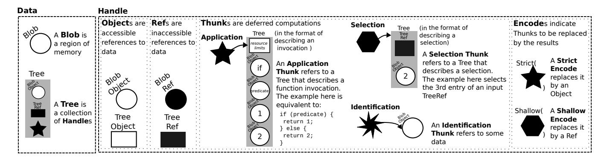
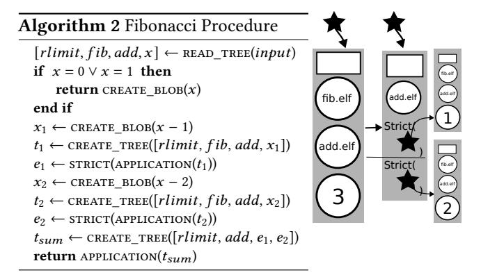
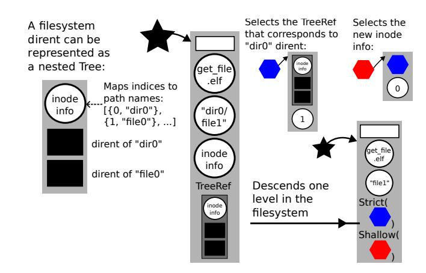
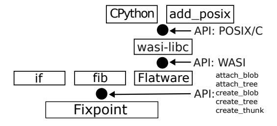
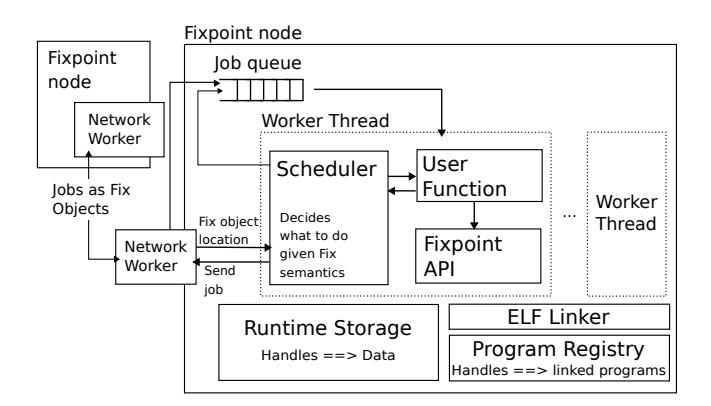
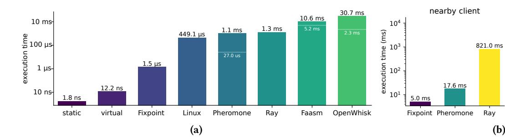
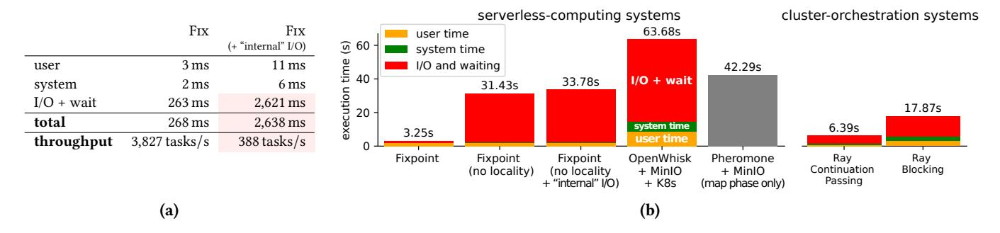
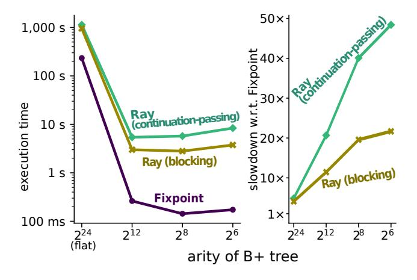
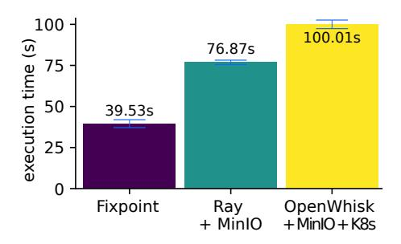
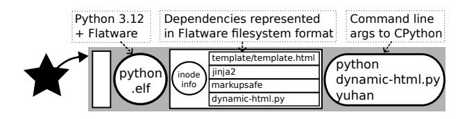

# Fix: externalizing network I/O in serverless computing

Yuhan Deng Stanford University

Francis Chua Stanford University Akshay Srivatsan Stanford University

Yasmine Mitchell Stanford University Matthew Vilaysack Stanford University

Sebastian Ingino

Stanford University

Keith Winstein Stanford University

#### **Abstract**

We describe a system for serverless computing where users, programs, and the underlying platform share a common representation of a computation: a deterministic procedure, run in an environment of well-specified data or the outputs of other computations. This representation externalizes I/O: data movement over the network is performed exclusively by the platform. Applications can describe the precise data needed at each stage, helping the provider schedule tasks and network transfers to reduce starvation. The design suggests an end-to-end argument for outsourced computing, shifting the service model from "pay-for-effort" to "pay-for-results."

# *CCS Concepts:* • Networks → Cloud Computing.

**Keywords:** serverless computing

#### **ACM Reference Format:**

Yuhan Deng, Akshay Srivatsan, Sebastian Ingino, Francis Chua, Yasmine Mitchell, Matthew Vilaysack, Keith Winstein. 2026. Fix: externalizing network I/O in serverless computing. In 21st European Conference on Computer Systems (EUROSYS '26), April 27–30, 2026, Edinburgh, Scotland, UK. ACM, New York, NY, USA, 16 pages. https://doi.org/10.1145/3767295.3769387

#### 1 Introduction

For a decade, cloud-computing operators have offered "serverless" function-as-a-service products. These systems let users upload functions to be invoked on request. When this happens, the function is allocated a slice of a physical machine's RAM, CPU, and NIC, and the customer is billed for the time until it finishes [1, 2]. In practice, cloud functions are typically used for asynchronous services where each invocation runs independently, but researchers have also explored their use for large jobs that launch thousands of parallel invocations working together with complex dataflow: video processing [18], linear algebra [25, 39], software compilation and testing [16], theorem proving [43], 3D rendering [17], ML training [24], data analysis [26], sorting [30], etc.


This work is licensed under a Creative Commons Attribution 4.0 International License.

EUROSYS '26, Edinburgh, Scotland, UK
© 2026 Copyright held by the owner/author(s).
ACM ISBN 979-8-4007-2212-7/26/04
https://doi.org/10.1145/3767295.3769387

Despite this interest, effective use of serverless computing remains elusive. In this paper, we argue that a root cause is an *underconstrained notion of networked computation*, one where the I/O and dependencies of user functions are opaque to the platform. Consider a common serverless application: a cloud function that resizes an image [38]. A user creates the function by uploading a piece of code—call this f. When the function is invoked, the provider finds a physical server with enough available RAM and cores, transfers and unpacks the code if not already present, claims a slice of RAM, and runs the function, generally as a Linux process in a pre-warmed VM. After seeing the invocation payload (an HTTP request or other event), the function requests the image file x from network storage, e.g. Amazon S3.

From the user's point of view, the invocation was always meant to compute f(x) (the resized image), but from the provider's perspective, f is a running Linux process, and its dependency on x wasn't known until after the code was placed and running. If S3 has cached x nearby, the retrieval happens quickly. Otherwise, the function will wait, occupying and mostly idling its slice of RAM until retrieval finishes.

For computations that are short relative to network and storage latencies [29, 30], limitations of this service model can be significant. If the user had been able to express that the invocation represented "f(x)" in a way the provider understood, the provider might have attempted a better strategy to place or schedule it, e.g.:

- simultaneously transfer *f* (the code) and *x* (the image) to the server so the task can finish sooner,
- wait to allocate f's RAM and CPU until x arrives, letting other functions run there in the meantime,
- instead of starting f on a server chosen without regard to x, choose a server close to whichever dependency (f or x) is bigger,
- delay the invocation, hoping to aggregate multiple tasks that depend on *x* to run in a batch on one server,
- if f(x) is part of a pipeline g(f(x)), and if y = f(x) is hinted to be large, then transfer f and x close to their downstream dependency g, and run f(x) on that server before running g on the result—avoiding the need to transfer y over the network,
- or if x can be computed deterministically by h(z), then if easier, fetch h and z and recompute x instead of transferring it.

In many cases, these strategies could improve the job throughputs, latencies, RAM and CPU utilization, and perhaps costs of serverless platforms. But they probably aren't feasible today, even for an image-resizing function of one input, because f's dataflow was "internal": it fetched x by opening a socket, sending a request, and receiving arbitrary data. Even if x came from the provider's own storage service, the provider didn't observe the dependency until after the task was placed and running. For the sorts of jobs surveyed in the first paragraph, jobs that launch thousands of parallel invocations with complex dataflow among them, the need for good placement and scheduling will be even greater.

This paper presents FIX, an architecture for serverless computing that *externalizes* I/O, making application dataflow visible to, and performed by, the underlying networked system. In FIX, function invocations are described in a low-level ABI (application binary interface) that specifies a sealed container where execution occurs, containing dependencies that are addressed in a way the program and provider both understand—maybe as the output of another invocation.

In Fix, programs can choose to capture only the minimum data needed to make progress at each step of a larger job. The underlying platform uses its visibility and flexibility to place and schedule tasks and transfers to reduce starvation and use of the network, e.g. via the strategies above.

This paper's main contribution is in Fix's design and the demonstration that I/O externalization, with the ability to express precise and dynamic data-dependencies with little overhead, can boost performance and efficiency. Fix is a realization of I/O-compute separation [11, 14, 27, 28, 34] as well a mechanism for programs to provide the platform with visibility—perhaps partial visibility, refined as computation proceeds—into future data- and control flow. Fix does this in a declarative way that can be parsed anywhere, avoiding round-trips to a scheduler when invoking a new task.

Fix's design and implementation have a number of mutually reinforcing characteristics that lead to efficient execution. Fix's invocations are concisely described in a packed binary format designed to minimize runtime overhead. We implemented a runtime for Fix, called Fixpoint, that has a per-invocation overhead of about 1.5 µs. This means that applications can afford to use fine-grained containers that capture only data needed to make progress at each stage. Minimizing the data "footprint" of each invocation helps Fixpoint reduce cold-start times and optimize the scheduling and utilization of CPUs, RAM, and the network.

Fix has significant limitations. It represents a constrained model of computation: to describe each task in a placement-agnostic way, invocations must be of pure functions applied to content-addressed data or to the outputs of other invocations. Functions can't access data outside the container. At least at present, Fix doesn't support calls to nondeterministic services e.g., clocks, true random number generators, multi-user databases, or arbitrary Web APIs. Fix is its own ABI and doesn't run Linux executables; it runs some POSIX programs (e.g. CPython, clang) but we had to recompile them with a

Fix-targeting toolchain to achieve this. We haven't measured Fix's ease of use or effect on developer productivity.

**Summary of results.** We found that Fix's approach can unlock significant advantages in performance and efficiency (as well as reproducibility and reliability, aspects we did not evaluate quantitatively). We evaluated several applications run on Fixpoint, compared with OpenWhisk, MinIO, and Kubernetes (open-source analogs of AWS Lambda and S3), Pheromone [46], and Ray [32]; full results are in Section 5.

FIXPOINT creates hermetic containers without spawning OS processes, by requiring that functions be converted ahead-of-time to safe machine code. This results in lower overhead than systems based on Linux containers (OpenWhisk) or higher-level programming languages (Ray). To invoke a trivial function that adds two 8-bit integers, FIXPOINT's containers show lower overhead (fig. 7a):

| Approach         | Time              | slowdown vs. Fix |
|------------------|-------------------|------------------|
| Fix              | 1.46 µs           | 1×               |
| Linux vfork+exec | 449 µs            | 307×             |
| Pheromone        | $1.05\mathrm{ms}$ | 720×             |
| Ray              | $1.29\mathrm{ms}$ | 881×             |
| Faasm            | 10.6 ms           | 7,260×           |
| OpenWhisk        | 30.7 ms           | 20,980×          |

In a different experiment, we used Linux's CPU-state statistics to measure how much of these gains come from avoiding starvation—by co-scheduling computations and transfers, and waiting to allocate CPU and RAM until dependencies have arrived. We wrote a program to count non-overlapping strings in a 96 GiB dataset from Wikipedia and ran it on a 320-core, 10-node cluster. Fix's approach avoids a substantial amount of CPU starvation (fig. 8b):

| Approach                  | Time   | CPU waiting %         |
|---------------------------|--------|-----------------------|
| **                        |        | (idle + iowait + irq) |
| Fix                       | 3.25 s | 37%                   |
| FIX (with "internal" I/O) | 33.8 s | 92%                   |
| OpenWhisk + MinIO + K8s   | 63.9 s | 92%                   |

Finally, we implemented a key-value store represented on disk as a B+-tree, using Fix and two other approaches. Each version traverses the B+-tree node-by-node to retrieve the value corresponding to a key. As we decrease the maximum number of children of each B+-tree node, this process results in a smaller memory footprint and total amount of data accessed, at the cost of more function invocations. Compared with Ray, Fix's semantics let users benefit from breaking down programs with fine granularity (fig. 9):

| Approach (B+-tree of arity 256)            | Time   | slowdown vs. Fix |
|--------------------------------------------|--------|------------------|
| Fix                                        | 0.14 s | 1×               |
| Ray                                        | 2.8 s  | 19.6×            |
| Ray (broken into fine-grained invocations) | 5.74 s | $40\times$       |

Fix represents a fundamentally different approach to outsourced computing: one that's more constraining and probably more difficult to program for, but ultimately advantageous for customers (whose jobs run faster) and providers (whose infrastructure is used more efficiently). Current service abstractions represent something of a "pay-for-effort" system—by billing customers for each millisecond that a function occupies a machine slice, idle or not, providers aren't directly incentivized to improve scheduling and placement. Even if a provider wanted to do this, current systems lack the visibility into application dataflow to do it well. Fix's approach suggests a shift towards "pay-for-results": computations described in a way that permits providers to innovate in the placement and scheduling of computation and I/O, so long as they arrive at the correct answers.

This paper proceeds as follows. In section 2, we discuss the substantial context of related work across several areas. We describe Fix's design (sec. 3) and its implementation in the Fixpoint runtime (sec. 4). We report our evaluation in section 5, finishing with limitations (sec. 6) and a conclusion.

#### <span id="page-2-0"></span>2 Related work

Fix relates to prior work across workflow orchestration (Hadoop [42], Spark [47], etc.), techniques that optimize serverless platforms with lightweight containers for dense packability or locality hints, tools that run highly parallel workloads on current function-as-a-service platforms, containerization and execution systems (Docker [31], NixOS [15], etc.), and content-addressed storage. We discuss how Fix relates to this prior literature in several areas.

Cluster orchestration systems. Cluster orchestration systems like Spark [47], Dryad [22], CIEL [33] and Ray [32] allow programmers to express applications as a group of tasks, and orchestrate execution of the tasks across a cluster. Task interdependencies can be represented at runtime as a static DAG (Spark and Dryad) or dynamic task graph (CIEL and Ray). These systems generally employ language-level mechanisms: users spawn tasks using domain-specific languages (CIEL and Dryad), or with a pre-existing programming language (Python for Ray, Scala for Spark, etc.)

Fix's computation model represents interdependencies in a dynamic graph (similar to CIEL or Ray), in a somewhat more general sense: Fix's invocations describe all data-dependencies that code will have access to; Fix can capture subselections of existing data objects and the relationships between application data structures (e.g. the relationships between nodes in a B+-tree); this kind of dataflow can't generally be exposed to the runtime by current systems.

Fix enforces I/O externalization: all data-dependencies that code need access to must be made explicit. This allows it to freely schedule tasks at different execution locations. In comparison, existing systems allow programs to states not captured by the computation representation, such as local

file system. This makes Fix more amenable to outsourcing computations to cloud services.

Previous work relies on runtime infrastructure to track dependency information at a centralized scheduler or a designated physical node. In contrast, Fix unifies the description of data flow—inputs and outputs of invocations—with control flow—which function should be invoked with the results of another—in a single serializable format. Dependency information is shipped with data defining a function, avoiding round-trips. This leads to lower dependency-resolution overhead that allows finer-grained function invocations.

Scheduling and containers for serverless platforms. Much prior work is aimed at optimizing the performance of function-as-a-service platforms with conventional architectures for applications with interdependent workflows. This includes adding long-living caches beyond individual function invocations [35], and providing locality hints [10] to for better placement decisions. The line of work most similar to Fix is workflow-based serverless systems [37, 46] with a static function dependency model, e.g. the outputs of a function f are always consumed by another function q. Fix represents data-dependencies in a richer way at a finer-grained per-invocation level. Prior work has proposed the model of I/O-compute separation [14] and realization of the model [27, 28] that targets at better elasticity for spiky serverless workloads. Fix focus on designing the abstraction and mechanism for representing computational workloads in a I/O-compute separation way.

Another line of work designs lightweight containers to allow denser packability, such as Firecracker [5], Virtine [41], AlloyStack [45], Junction [19], Faasm [40], and WasmBox-C/wasm2c [49]. As part of our work on Fix, we became significant contributors to and maintainers of the wasm2c codebase; Fix's toolchain includes this tool.

Massively burst-parallel applications. There has been considerable interest in using serverless platforms for short-lived, large-scale, highly parallel jobs, including video processing [18], linear algebra [25, 39], software compilation and testing [16], theorem proving [43], 3D rendering [17], ML training [24], data analysis [12, 26], etc. Fix aims to be a better platform for these kinds of applications.

Build environments and content-addressed storage. Fix's computation-addressed dependencies for user programs resemble execution-environment languages like Docker [31], NixOS [15], or Spark [47] (discussed above). Fix's binary representation of dependencies draws inspiration from content-addressed systems such as Git [6], Bittorrent [4], Named Data Networking [23], and IPFS [7].

# <span id="page-2-1"></span>3 Fix: describing dataflow to the runtime

In this section, we describe the design of Fix: a low-level binary representation, or ABI, where code externalizes its dataand control flow. Instead of fetching data by making network connections or syscalls and waiting for a reply, programs describe the code and data they need declaratively, in a format that's parsed and executed by the runtime infrastructure.

Fix objects represent pieces of data, function invocations, dependencies, and data sub-selection, in an in-memory representation that is independent of programming language and placement on a server. User functions make dataflow visible by constructing Fix objects; a runtime can exchange references to these objects with native functions using a defined calling convention. The computation graph necessary to evaluate a Fix object is described by the object itself, so runtimes do not need to maintain additional metadata.

Fix's design is intended to let pieces of black-box machine code precisely express their data needs in a manner lightweight enough to permit microsecond-level overheads, but general enough to support arbitrary applications, including ones where the dataflow graph evolves over the course of a computation in a data-dependent way. To enable efficient and flexible execution, Fix's design goals were:

- 1. Code can be represented as black-box machine code that originated from any programming language.
- 2. The complete data "footprint" needed to evaluate a function call will be known before it is invoked.
- 3. A function will always run to completion without blocking, and will finish execution without invoking another function or enlarging its data "footprint."
- 4. Functions will have tools to subselect from large data structures to fetch only the portion truly needed.

These considerations led to the design below.

# 3.1 Data and References

Fix gives user functions an interface for expressing their data- and control flow. Fix models two core types of Data:

Blob A region of memory (an array of bytes).

Tree A collection of other Fix Handles.

Fix also provides four reference types as Handles, each of which has a particular binary representation in the ABI:

Object A reference to accessible Data.

Ref A reference to inaccessible Data.

Thunk A reference to a deferred computation.

Encode A request to evaluate a Thunk, and replace it by the result.

# 3.2 Representation

Handles. Every value in Fix is assigned a unique deterministic Handle. These Handles contain information about a value's data, its type, and its size. This takes the form of a truncated 192-bit BLAKE3 hash of the data, 16 bits of metadata and type information, and a 48-bit size field. As an optimization, Blobs 30 bytes or smaller are stored as "literals"—putting the Blob contents directly in the Handle. Handles can be held and passed in machine SIMD registers, e.g. %ymm on x86-64.

In-Memory Representation. Data are represented in an efficient format that minimizes copying; Blobs are a contiguous sequence of bytes, and Trees are a sequence of Handles.

Objects. An Object is a reference to accessible data directly needed for the next function invocation. A function that is passed an Object may read its data.

Refs. A Ref is a reference to inaccessible data not directly needed for the next function invocation, but may be needed by a downstream consumer. A function that is passed a Ref may look up the type and length of the referent but not its data. Refs allow Fix functions to reference remote data without fetching it to the execution server.

Thunks. A Thunk represents a function invocation whose value is not yet needed, letting Fix functions refer to data which can be lazily computed when needed. "Application" Thunks describe the execution of a function in a container of available data and memory resource limits. There are two more styles of Thunk corresponding to common usage patterns. "Identification" Thunks represent the identity function. "Selection" Thunks represent a "pinpoint" data-dependency: the extraction of a subrange of a Blob or a Tree.

Encodes. Encodes[1](#page-3-0) embody a request to evaluate a particular Thunk. When provided in the input to a child function, they will be replaced with the result of evaluating the Thunk. There are two styles of Encode, Shallow and Strict.

Shallow Encodes request the minimum amount of computation (or data movement) needed to make meaningful progress. This means that a Thunk is evaluated until the result is not a Thunk, and the result is provided as a Ref. Strict Encodes request the maximum amount of computation (or data movement) possible. A Thunk is replaced by its fully-evaluated result as a Object, recursively descending into any Trees and evaluating all Thunks within. These two styles of Encode allow Fix programs to express both lazy and eager styles of evaluation.

# 3.3 Minimum Repositories

Each Thunk has the ability to access a bounded set of resources, including both Fix data and hardware resources like RAM. In order to ensure that a function won't require any I/O operations before finishing, the runtime must ensure these resources are available throughout its execution. This set is called the "minimum repository" of the Thunk. While a function may not change its minimum repository, it may create new Thunks with different minimum repositories:

- 1. It may specify new resource limits in the new Thunk;
- 2. It may grow the repository by including an Encode, which will evaluate its referent and add the result to the new repository;

<span id="page-3-0"></span><sup>1</sup> an Explicit Named Computation on Data or Encodes



Figure 1. Fix represents function invocations and data dependencies with a unified serializable format.

3. It may shrink the repository by excluding data which were part of its own repository from the new Thunk. Since a function can't directly call another one (can't directly evaluate a Thunk), these operations don't affect the minimum repository of the currently-running function.

#### 3.4 Expressivity

Fix enables programs to express their dataflow at fine granularity by specifying the minimum repositories of child functions. Programs are required to express, at worst, an overapproximation of their data dependencies; it's impossible for a program to access any data not explicitly requested. Fix's different types allow programs to describe complex access patterns to Fixpoint. A pseudocode version of the Fix API is shown in Table 1; the exact implementation varies depending on the implementation language.

<span id="page-4-0"></span>

| Function                                   | Description                    |  |
|--------------------------------------------|--------------------------------|--|
| T read_blob(BlobObject)                    | Read a Blob into a variable.   |  |
| <pre>Value[] read_tree(TreeObject)</pre>   | Read a Tree into an array.     |  |
| BlobObject create_blob(T)                  | Create a Blob from a variable. |  |
| <pre>TreeObject create_tree(Value[])</pre> | Create a Tree from an array.   |  |
| Thunk application(Tree)                    | Apply a function (lazily).     |  |
| Thunk identification(Value)                | Apply the identity function.   |  |
| Thunk <b>selection</b> (Value, int)        | Select a child element.        |  |
| <pre>Encode strict(Thunk)</pre>            | Strictly evaluate a Thunk.     |  |
| Encode <b>shallow</b> (Thunk)              | Shallowly evaluate a Thunk.    |  |

Table 1. Fix Pseudocode API

Fix's Thunks are lazy by default, which allows control flow to be expressed by user-provided programs. For example, Fig. 2 shows how a user-provided if procedure can lazily select one of two Thunks based on a predicate. The other Thunk, and its data dependencies, never need to be loaded or executed by Fixpoint. The minimum repository of the if procedure includes the machine codelet and the predicate, but excludes the Thunks' definitions or results.

By returning a Thunk, as in Fig. 3, a function can recurse or call other functions. In this case, a user-provided fibonacci procedure creates two Thunks corresponding to recursive

<span id="page-4-1"></span>

**Figure 2.** This if procedure reads a boolean predicate from its input and selects one of two Thunks to return.

<span id="page-4-2"></span>

**Figure 3.** A Fix version of the Fibonacci algorithm creates recursive Thunks and passes them to an addition procedure.

calls of itself, and a third Thunk adding the two results. The first two Thunks are wrapped in Strict Encodes, specifying that the addition function needs the evaluated results.

Selection Thunks provide efficient access to large or partially evaluated data structures without including the entire structure in a program's minimum repository. Fig. 4 shows how a Fix procedure may recursively descend a directory structure without fetching the full contents of the directories or the files within. The procedure uses a strictly-encoded

# <span id="page-5-1"></span>Algorithm 3 Get File Procedure $[rlimit, elf, path, info, dir] \leftarrow \text{READ\_TREE}(input)$ $i \leftarrow \text{index of child directory given } path \text{ and } info$ $path_{new} \leftarrow \text{updated } path$ $child \leftarrow \text{SELECTION}(dir, i)$ \nif $path_{new} = \text{"" then}$ return child\nend if $info \leftarrow \text{SELECTION}(child, 0)$ $x_0 \leftarrow \text{STRICT}(info)$ $x_1 \leftarrow \text{SHALLOW}(child)$ $res \leftarrow \text{CREATE\_TREE}([rlimit, elf, path_{new}, x_0, x_1])$



**Figure 4.** A Fix procedure identifies the index of "dir0" within a TreeRef, and recurses into "dir0". It specifies that the inode information from "dir0" is immediately necessary, while still providing a TreeRef to "dir0" for later use.

Selection Thunk to express its immediate dependency on the inode information of the subdirectory, and a shallowlyencoded Selection Thunk to express its eventual dependency on children of the subdirectory. In this way, the directory contents are never added to the minimum repository of a Thunk, avoiding unnecessary data transfers and RAM usage.

#### <span id="page-5-0"></span>4 FIXPOINT: a FIX runtime

In this section, we describe the design and implementation of Fixpoint: a Linux application that functions as a multi-node runtime for programs expressed in the Fix ABI.

#### 4.1 Procedures

return APPLICATION(res)

FIXPOINT procedures are implemented as machine codelets: small programs compiled to native x86-64 machine code. Each codelet contains an entrypoint, \_fix\_apply, which is invoked when a Thunk referring to that procedure is run. This function receives as input the Handle of a TreeObject (the Thunk's definition), and returns the Handle of a Fix object. These procedures are provided as Executable and Linkable Format (ELF) files, which are loaded and linked against the Fixpoint API in a shared address space. Fixpoint requires these codelets to be sandboxed, but they may otherwise contain arbitrary code.

**4.1.1 Safety and Correctness.** FIXPOINT runs arbitrary machine codelets within a single address space. However, since these codelets are user-provided and therefore untrusted, FIXPOINT must ensure they satisfy these properties.

A particular execution of Fixpoint defines a trusted Fix program which is responsible for generating safe codelets. The approach Fixpoint currently uses is to treat the trusted program as a trusted compilation toolchain for a higher-level intermediate representation (IR) which provides sandboxing capabilities. The current implementation uses WebAssembly (Wasm) [21] as its higher-level IR. Wasm provides memory-safety and determinism, and is amenable to ahead-of-time

compilation, at the cost of having a larger trusted codebase than a verifier-based approach.

However, since Fixpoint doesn't place any restrictions on what the *input* of this program should be, other approaches are possible; the use of Wasm is not intrinsic to Fix or Fixpoint. For example, another approach is to statically analyze machine code, as in Native Client [36] or Deterministic Client [44]. These approaches could also provide good performance and memory-safety with a small trusted codebase.

While there are other representations that provide similar guarantees, Wasm has the benefits of strong existing toolchain and language support. This allows existing third-party software, such as the CPython interpreter or clang compiler, to be easily ported to Fix. Wasm also provides programs the ability to reference opaque pieces of external data (via an externref), which Fixpoint uses to efficiently exchange Fix Handles with the otherwise-untrusted function invocations while maintaining security.

We have implemented an ahead-of-time "trusted toolchain" that takes programs that have been compiled to Wasm and compiles them, in turn, into x86-64 machine codelets. Given a Wasm module, Fixpoint compiles it by using (1) the Wasm-spec-conforming wasm2c tool [9, 49] to convert it to multiple C source files, (2) libclang to compile each generated C file into an optimized x86-64 object file in parallel, and then (3) liblld to combine all the generated object files into a single complete ELF file. We implemented this toolchain against the Fixpoint API (upstreaming our changes to wasm2c) and compiled it to Wasm. It is implemented as an ordinary Fix program, runs within Fixpoint normally, and is self-hosting: it can compile itself.

Machine codelets generated by this compilation toolchain are ELF files containing relocation entries against the Fix-Point API. Fixpoint contains a small in-memory ELF linker that links the codelet with the Fixpoint API. This can be done ahead-of-time and is not on the critical path.

```
// Map Fix data to native Wasm types
void attach_blob ( m256i handle , wasm_memory *) ;
void attach_tree ( m256i handle , wasm_table *) ;
m256i create_blob ( int size , wasm_memory *) ;
m256i create_tree ( int size , wasm_table *) ;
// Create Thunks
m256i application / identification / selection
  ( m256i handle );
// Create Encodes
m256i strict / shallow ( m256i handle );
// Query information about a Handle
bool is_blob / tree / ref / thunk / encode ( m256i handle );
int get_size ( m256i handle );
```

Listing 1. Fixpoint API

4.1.2 Fixpoint API. From the perspective of the original Wasm code, Fixpoint's API allows it to "map" Blobs and Trees into native Wasm data types (for Blobs, a read-only linear memory, and for Trees, an externref-typed table), and create Blobs and Trees from native Wasm data types. This allows the procedure to perform zero-copy conversions between Fixpoint objects and native structures.

Procedures interact with the Fixpoint API through Handles represented as 256-bit vector types, which can be passed by value as an m256i using AVX2 (%ymm) registers on x86-64. The allowed operations on a Handle are decided by their type: BlobObjects and TreeObjects are mappable, making their data accessible; Refs aren't mappable but procedures can inspect types and sizes of the referents; Thunks can't be inspected at all, but new Encodes can refer to Thunks. By creating Identification and Selection Thunks referring to Refs, and then Encodes to those Thunks, procedures can request that Fixpoint do the I/O necessary to give a child function access to their contents.

- 4.1.3 Security and Isolation. Fixpoint runs user-provided machine code in a shared address space. Fixpoint ensures isolation between function invocations: Wasm procedures can only access their own linear memory and make external function calls to Fixpoint API, which provides isolation similar to software-based fault isolation. Procedures can also gain read-only access to Fix Blobs and Trees which they get the Handles of by recursively mapping Trees, starting from the input to \_fix\_apply. Proclets do not have access to shared mutable memory or timers (both of which are nondeterministic), which prevent timing side-channels. The safety and isolation provided by Fix and Fixpoint is similar to V8 isolates used by Cloudflare Workers platform.
- 4.1.4 Adapting existing applications. We have begun implementing a library to let existing Unix-style programs run on Fixpoint. The Wasm community has created a standard C library (wasi-libc) that implements the C/POSIX interface in terms of underlying system calls known as the Wasm System Interface (WASI). In turn, we implemented a

library called "Flatware" (Fig. [5\)](#page-6-0) that implements the WASI interface in terms of the Fixpoint API—treating the Thunk's arguments as containing a Unix-like filesystem. Fixpoint is oblivious to this translation layer; from its perspective, it is an ordinary unprivileged part of the procedure.

Fixpoint, via Flatware, runs an off-the-shelf compilation of Python 3.12 built for wasm32-wasi by VMWare Labs [\[8\]](#page-14-26) with no modifications. The Python script and arguments are passed in as part of the Thunk's definition, and the stdout containing the result is returned as part of the output.

<span id="page-6-0"></span>

Figure 5. Fix can express "native" functions as well as Unixstyle programs that manipulate a filesystem.

# 4.2 Runtime architecture



Figure 6. Fixpoint infrastructure

4.2.1 Fixpoint workers. The execution engine of Fixpoint consists of a thread pool of Fixpoint worker threads. All worker threads share access to a queue of pending jobs and a runtime storage that maps from Blobs and Trees to their data and from Encodes to evaluation results. Each worker thread contains an instance of the Scheduler, which decides what I/O and computations are needed for evaluating an Fix object based on Fix semantics. Fix's computation model guarantees that a procedure cannot block on further I/O before it returns, which allows the worker thread to directly jump to the entry point of the codelet instead of launching new threads or processes.

Fixpoint instances can interact to form a distributed execution engine. Each node keeps track of which other nodes

to notify when a job is completed, with a Network Worker that handles messaging between nodes.

A Fixpoint node delegates jobs to remote nodes by sending Fix values—Blobs and Trees. This allows different nodes to communicate complicated user-function dataflow without any intermediate conversion. Moreover, as all dependencies are specified as part of the packed binary format, Fixpoint doesn't need to maintain a global data structure or perform multiple roundtrips between nodes to translate between a Tree and the function invocation it represents.

4.2.2 Dataflow-aware distributed scheduling. In the distributed execution engine, the Schedulers could also decide where a job should be executed. In the current implementation, Fixpoint does not have a centralized scheduler, and each local scheduler makes independent scheduling decisions by consulting a "view" of which data exist on what node provided by the Network Worker. When two Fixpoint nodes first connect, they each provide the other with a list of objects available locally, and this "view" is advanced passively: if the other node sends or proposes to send an object, the object is added to the view of the other node. This "view" of where the data are located will be replaced by a distributed object store in the future.

Given an Application Thunk, the Fixpoint scheduler descends the Application Thunk Tree given Fix semantics, and collects its dependencies on data and the results of other computations. For Encodes without results, it decides where to evaluate the Thunk by picking the node that needs minimal data movement given locations of existing Fix objects. Applications can "hint" an estimated output size of a Thunk, and if so, the scheduler includes the cost of moving the output as part of the data movement cost. In addition, Fix allows the scheduler to see jobs that are dependees of the same downstream job, and outsource parallel jobs to different nodes.

The choice of optimizing for data movement specifically is not intrinsic to Fixpoint. With I/O externalization, service providers have the flexibility to implement schedulers that optimize for platform-specific goals, e.g. better bin-packing of RAM resources.

# <span id="page-7-0"></span>5 Evaluation

In this section, we describe our experiments and performance measurements. We compared Fix programs, running on Fixpoint, with comparable applications written for a serverlesscomputing system (OpenWhisk, MinIO, and Kubernetes), a serverless-workflow-orchestration system (Pheromone), a serverless system with Wasm runtime (Faasm), and a clusterorchestration system (Ray). Our evaluation answers five questions:

- How do Fix and Fixpoint improve function invocation and orchestration (Section [5.2\)](#page-8-0)?
- How does I/O externalization benefit resource utilization (Section [5.3\)](#page-9-1)?

- How does Fix's richer features allow computations to be broken down into much finer-grained (Section [5.4\)](#page-10-0)?
- Can developers port real-word applications to Fix and gain performance benefit (Section [5.5\)](#page-12-0)?
- What is the experience of porting existing third-party software to Fix (Section [5.6\)](#page-12-1)?

#### 5.1 Benchmark Setup

Baselines We compare Fixpoint with 4 baselines:

OpenWhisk. OpenWhisk is a popular open-source serverless platform. We deployed OpenWhisk on Kubernetes with MinIO, an open-source object store. OpenWhisk is configured with Kubernetes as the container factory, such that Kubernetes handles scheduling and placing of OpenWhisk function invocations. By comparing with OpenWhisk, we aimed to investigate whether Fix's approach of externalizing I/O to the runtime produces a measurable benefit in practice; in terms of allowing programs to achieve higher utilization and decrease end-to-end execution time.

Ray. Ray is an open-source distributed execution framework with a with two main abstractions: ObjectRefs and ray.get. To get the values associated with a ObjectRef, users of Ray either 1) pass a ObjectRef as the argument to a Ray function invocation or 2) call ray.get on the ObjectRef which blocks the current function until the data are loaded. ObjectRefs and ray.gets are analogous to Thunks and Encodes of Fix.

We compare Fixpoint with three styles of Ray programs: Ray + MinIO. User functions are Linux executables that reads from and writes to MinIO. The binaries of user functions locate on a single machine. When a function is invoked, Ray checks whether the binary is presenting locally, loads the binary if not, executes the binary via Popen and blocks until the subprocess returns. For Linux executables, this is the only viable style, as such user functions can not directly interact with Ray interfaces.

Ray (blocking-style I/O). User functions are Python functions implemented against Ray API. When a ObjectRef is needed, the function calls ray.get on the ObjectRef. This is how we expect Ray is normally used.

Ray (continuation-passing-style I/O). User functions are Python functions implemented against Ray API. Different from the previous usage, ray.get is never called. Whenever a ObjectRef is needed, a new function is invoked with the ObjectRef as the input, which breaks down applications into fine-grained function invocations along boundaries of I/O. This is the closest usage of Ray to Fix.

To illustrate how the latter two usages of Ray differ from each other and Fix, we describe how retrieving an entry from a linked-list is implemented in Listing [2](#page-8-1) and Listing [3.](#page-8-2) Ray (continuation-passing-style) has similar conceptual benefits to Fix: functions blocked on I/O don't occupy memory, are broken into fine-grained movable invocations, and allows Ray to utilize locality information. For these two usages of Ray, we setup Ray to read from the same file directory as Fixpoint, and Ray has the same information as Fixpoint in terms of where data locates across the nodes.

```
1 # A linked-list Node holds two Ray ObjectRefs: the data and
       the next Node
2 Node = Tuple [ Ref , Ref ]
3
4 @ray . remote
5 def get_blocking ( head : Node , i: int ):
6 current_node = head
7 for _ in range (0 , i):
8 # When data of the next Node is needed, the function
       blocks on the data
9 current_node = ray . get ( current_node [1])
10 return ray . get ( current_node [0])
```

Listing 2. In Ray (blocking-style), getting an entry is implemented as a Ray function that gets and blocks on the data of the next node until it reaches the node it needs. After the function invocation is started, data for Node objects are moved to where the function invocation is.

```
1 @ray . remote
2 def get_cps ( node : Node , i: int ):
3 if (n ==0) :
4 return node [0]
5 else :
6 # When data of the next Node is needed, the function
      calls itself with the new data dependency, and the new
      function invocation is called when the data is ready
7 return get_cps ( node [1] , i -1)
```

Listing 3. In Ray (continuation-passing-style), there is no function blocked while Ray performs I/O to get the data, and Ray can choose different execution locations for each new function invocation.

By comparing with Ray, we would like to show how Fix's computation model expresses dataflow dependency at a lower overhead compares to previous distributed job execution system, and how Fix enables user procedures expressed as machine code to make their dataflow visible.

Pheromone. Pheromone allows users to describe dataflow of serverless applications by specifying dependencies between functions (e.g. invoke function B on the output of function A) or dependency of a function on a set of data (e.g. invoke function A on any data added to bucket B). Pheromone's approach targets reducing function orchestration overhead by collocating intermediate data and function dependency information. We deployed Pheromone on Kubernetes. By comparing with Pheromone, we would like to show how Fix's computation model allows functions to specify dependencies on both intermediate data and external data from durable storage and achieves collocation of function

data- and control flow with a more expressive dependency abstraction.

Faasm. Faasm is a serverless runtime that achieves lightweight isolation by using Wasm for software fault isolation. Faasm's isolation mechanism is similar to Fixpoint, but without I/O externalization. Therefore, Faasm provides functions with a host interface that supports operations such as file system I/Os, shared states across multiple running function invocations, etc., which leads to a more general interface than Fixpoint, but also a heavier runtime overhead. We deploy Faasm locally using Docker containers. By comparing with Faasm, we would like to show Fix's abstraction allows user programs to declare precise code dependencies and let Fixpoint minimize runtime overhead.

Hardware The experiments were run on m5.8xlarge Amazon EC2 instances. At the time of writing, an m5.8xlarge instance has 32 vCPU cores and 128 GiB memory. The volumes we used are Amazon EBS gp3 volumes with 3,000 IOPS.

# <span id="page-8-0"></span>5.2 Function invocation and orchestration

5.2.1 Invocation overhead. In this section, we measure the raw overhead of Fix invocations by measuring the performance of a trivial function—add two 8-bit numbers—run in different types of isolation mechanisms. We compare the latency of executing 8 functions:

static: Calling a statically linked function in C.

virtual: The same, called as a virtual function in C++.

Fixpoint: The same, implemented in Wasm against the Fix API. This and the below approaches provide various forms of containerized or visible dataflow.

Faasm: A C++ function against Faasm's API, pre-compiled. Pheromone: A C++ function against Pheromone's API.

Ray: A Python function that adds two 8-bit integers, called as a Ray remote function.

OpenWhisk: A full C/POSIX program that takes a JSON input, invoked as an OpenWhisk action.

Linux Process: A full C/POSIX program that takes two 8-bit integers as command line arguments.

Benchmark: For the first seven, we evaluate the add function 4,096 times, and report the average time per function call. Fixpoint, Pheromone, Ray and OpenWhisk have different way of setting up a function. Fixpoint statically links the executable; Pheromone dynamically load the function as a shared library; Ray pickles the Python function; OpenWhisk sets up the function container. To exclude the function setup time from the measurement, we evaluate the add function one time before the measurement, and the time reported does not include function setup time. For the Linux process, we vfork the add program and wait for its completion 4,096 times, and average the time per execution. We report the average of five benchmark runs. For OpenWhisk, Pheromone and Faasm, we also collect the core function logic execution time reported by the systems, shown as stacked bars in the figure.

remote client

Fixpoint Pheromone

Ray

<span id="page-9-0"></span>

**Figure 7.** (a) Duration of a single trivial function invocation on Fixpoint and comparator systems. Fixpoint's overhead is lower, letting applications express themselves in finer-grained steps that each capture the minimum data needed. Dashed lines show "core" execution time recorded by some systems' internal timers (generally excluding orchestration and cleanup). (b) Duration of a chain of 500 function invocations, with the client either near the server (left) or farther away (right). Ray incurs 500 network roundtrips, while Fixpoint and Pheromone can express the intended control flow in one go. For applications with pipelines of many fine-grained invocations, it's helpful to reduce the overhead of function composition as much as possible.

Analysis: As Fig. 7a shows, add as static or virtual function calls are the fastest implementations, taking 1.8 ns and 12.2 ns for execution, but do not provide isolation. Executing add as a Linux process provides isolation, at the cost of a >400 µs context-switching penalty.

By contrast, the Fixpoint program has an overhead of about 1.5  $\mu s$ . This overhead suggests a lower bound on the practical granularity of an individual function invocation in Fix; in order to provide > 50% efficiency, each invocation will need do about 1.5  $\mu s$  of computation (>3 kcycles). This, in turn, suggests a minimum granularity of data "footprint" that will be efficient in a multi-stage application.

Although Fixpoint isn't close to the overhead of a function call, it is much lighter than comparator systems: Fixpoint is about 880× lighter than Ray and 20,000× lighter than OpenWhisk. Fixpoint is also 3500× lighter than Faasm. Fixpoint's speed-up is not solely attributable to its choice of isolation mechanism, but also benefits from Fix's abstractions. These differences in overhead suggest that Fix programs will be able to afford to break down computation into much finer-grained and *smaller* containers.

**5.2.2 Orchestration overhead.** In this section, we measure the overhead of Fix function orchestration by measuring the performance of a function chain.

**Benchmark.** Each function invocation increments its input value by 1, which is consumed by the next function invocation. We measure the performance of 500 chained functions, as shown in Fig. 7b. We run the experiment with the clients placed on one of the machine in the EC2 cluster and on a remote server and report the average latency over 5 runs. We invoke the function once before taking the measurements, such that the measured results do not include the time of function loading for all three systems.

**Analysis.** Ray allows users to specify dependency on the level of individual function invocations, but the specified dependencies are coupled with the location where they are

specified. Ray needs to pay for a roundtrip to the client for each dependency resolution.

Compared with Ray, Pheromone restricts the expressivity of its dependency model to the level of individual functions. It decreases the overhead of sharing function dependencies in a distributed setting, and enables Pheromone to collocate function dependency information and function outputs. Pheromone is  $47\times$  faster and  $303\times$  faster than Ray with different client locations.

Fix allows users to specify dependency on the level of individual function invocations. This gives Fix the level of expressivity of Ray and Pheromone's capabilities of coupling function data- and control flow.

#### <span id="page-9-1"></span>5.3 I/O externalization

Fix has a computation model that externalizes all I/Os of user function invocations, making it possible for service providers to late binding physical resources and optimize placement decisions with locality information. In this section, we focus on how I/O externalization benefits 1) one-off functions that depend on input from network storage and 2) a map-reducing style workload with locality information.

To better understand the contributions of Fix and Fix-POINT, we conduct the experiments with two ablations:

**FIXPOINT (no locality)**: The scheduler picks a random execution location for each function invocation.

**FIXPOINT** ("internal" I/O): Function invocations occupy the claimed physical resources before their I/O dependencies are resolved. In addition, we oversubscribe the number of CPU cores and do not oversubscribe the memory for FIXPOINT, which is analogous to how status quo serverless platforms manage physical resources.

**5.3.1** I/O externalization for one-off functions. We measure the benefits of Fix's I/O externalization for individual function invocations that depend on inputs residing on a remote data server configured with 150ms response

latency to mimic Amazon S3 performance of fetching small objects [\[3\]](#page-14-27).

Each function invocation reads an input that resides on the remote data server, and adds the input to itself. Different function invocations depend on different inputs. Each function invocation requests 1 CPU and 1 GB memory, and the Fixpoint server is configured with 32 available cores and 64 GiB available memory, which allows up to 32 function invocations that Fixpoint has fetched the inputs for to run in parallel. In Fixpoint ("internal" I/O), we oversubscribed the CPU cores to 200, which allows up to 64 function invocations to fetch the inputs and calculate the result in parallel. This is analogous to current serverless services where a function invocation starts fetching data from network storage after it is placed and the requested physical resources are provisioned. We run 1,024 function invocations for each run, recorded the CPU utilization data on the server and report the average latency of 5 runs in Fig. [8a.](#page-11-0)

Analysis. I/O externalization allows Fixpoint to achieve late binding of physical resources: resources are allocated after the data for function invocations is ready. As a result Fixpoint is 8.7× faster than Fixpoint ("internal" I/O). This suggests that typical serverless workloads—individual function invocations that depend on input from network storage could benefit from Fix's computation model.

#### 5.3.2 I/O externalization with locality information.

We count the occurrences of a 3-character string through a dump of the English Wikipedia sharded into 984 100 MiB chunks in a map-reducing style. The workload consists of 2 functions: (1) count-string takes a chunk and a string as inputs and reports the number of occurrences of the string and (2) merge-counts merges the results in a binary reduction. count-string is invoked on every Wikipedia chunk and merge-counts is invoked on the results of every two completed function invocations until the final result. We deploy Fixpoint, OpenWhisk and Ray on a 10-node cluster with 320 vCPUs in total. The 100 MiB chunks are scattered among the 10 nodes randomly for Fixpoint and Ray, and store in MinIO deployed on the same cluster for OpenWhisk. We measure the end-to-end execution time of Fixpoint, Fixpoint (no locality), Fixpoint (no locality + "internal" I/O), Ray (continuation-passing), Ray (blocking-style) and Open-Whisk, and record CPU utilization data of the 10 nodes from /proc/stat. Results are shown in Fig. [8b,](#page-11-0) averaged over 16 runs.

Fixpoint (no locality) selects a random node for each invocation of count-string. On top of that, Fixpoint (no locality + "internal" I/O) oversubscribes the CPU, running 128 threads instead of 31.

Due to the implementation of Pheromone, we are not able to get the reduce-phase (i.e. merge-counts) to run: before map-phase function invocations complete, Pheromone starts the reduce-phase function invocations which try to access the output bucket of the map phase with a hard-coded timeout value. Pheromone's implementation makes it hard to precisely record the CPU utilization data, as its components have 100% CPU utilization whether there are user applications running or not. We report the end-to-end execution time of the map phase in Pheromone, averaged over 5 runs.

Analysis. I/O externalization allows Fixpoint to pick execution locations of functions with the knowledge of data locality information, and Fixpoint achieves 9.7× speed-up compared to Fixpoint (no locality). Ray sees similar benefits as Ray (continuation-passing-style) breaks the program into fine-grained invocations such that Ray can pick the execution location before the function is started.

Fixpoint (no locality + "internal" I/O) oversubscribes CPUs such that no count-string invocation is blocked due to physical resource limitation, but the oversubscription introduces a 7.5% overhead.

Compared to Fix, Pheromone's dependency abstraction does not allow users to specify function dependencies on data that are not intermediate results. Although the end-to-end execution time of Pheromone does not reflect the actual performance of a production-grade system implemented with similar ideas, its execution time is of a magnitude that is more analogous to Fixpoint (no locality).

#### <span id="page-10-0"></span>5.4 Fine-grained function invocations

Compared to status quo serverless workloads—individual function invocations—other real-world applications have more dynamic data dependencies. They may traverse treelike structures and require several rounds of I/O, for example, identifying objects given a BVH tree of scene data for 3D rendering, or fetching a file from a file system represented by nested trees. Breaking down these applications into finegrained function invocations reduces their memory footprint, but may hurt overall performance due to the overhead of function invocation and orchestration. In this section, we would like to show how Fix and Fixpoint allow users to describe data dependencies precisely and benefit from breaking applications into fine-grained steps.

Benchmark. We take the list of titles of English Wikipedia articles, about 6 million entries with an average length of 22 bytes, and create B+ Trees of different arities with the titles as keys (details shown in Table [2\)](#page-11-2). Each node of the tree is implemented as a list of ObjectRefs for Ray and as a Tree of for Fixpoint. An internal node contains the ObjectRef/Handles to subtrees. A leaf node contains the ObjectRef/Handles to values. All nodes contain the ObjectRef/Handle to an array of keys. Traversing the keyspace of the B+ Trees descends the B+ Tree node-by-node. For each layer, Ray gets 2 ObjectRefs: one for a list of child ObjectRefs, and one for the array of keys corresponding to each child. For each ObjectRef, Ray (blocking-style) does a blocking get and Ray (continuation-passing-style) makes a new Ray function call.

<span id="page-11-0"></span>

**Figure 8.** (a) Duration to execute 1,024 function-invocation requests on a server with 32 CPUs and 64 GiB RAM. Each invocation depends on a single input from a network storage with a 150 ms response time and asks for 1 CPU core and 1 GB memory. I/O externalization allows Fixpoint to fetch data dependencies before committing physical resources, greatly increasing task throughput. (b) Counting occurrences of a 3-character chunk in 984 100-MiB shards from Wikipedia. Fixpoint's runtime is much lower than other systems'—fueled, in large part, by its ability to avoid stalling CPUs to wait for dependencies.

<span id="page-11-2"></span>

| Tree arity (a) / Tree depth (d) | $\begin{array}{ c c c c c c c c c c c c c c c c c c c$ | data accessed                              | maximum memory footprint        |
|---------------------------------|--------------------------------------------------------|--------------------------------------------|---------------------------------|
|                                 | # of function invocations                              | data accessed                              |                                 |
| Fixpoint                        | d                                                      | adO(key size)                              | aO(key size)                    |
| Ray (Continuation Passing)      | 2 <i>d</i>                                             | ad(O(key size) + O(entry size))            | a(O(key size)+O(entry size))    |
| Ray (Blocking)                  | 1                                                      | <pre>ad(O(key size) + O(entry size))</pre> | ad(O(key size) + O(entry size)) |

**Table 2.** The amount of data accessed and maximum memory footprint of FIXPOINT and comparator systems to get a value from B+ Trees of different arities that hold all Wikipedia article titles. O(key size) stands for the length of Wikipedia article titles and O(entry size) stands for the size of Tree entry.

<span id="page-11-1"></span>

**Figure 9.** Applications with data-dependent dependencies benefit from Fix's model. Plotted here is the time to traverse a 6M-entry B+-tree of Wikipedia article titles, searching for one entry. Each step of the search examines one node to decide which node to descend into. A Ray program (broken into fine-grained invocations in continuation-passing style) scales poorly as the tree arity decreases. A blocking Ray program performs better here, but worse in Fig. 8b. Compared with Fix, both Ray implementations are hindered by a lack of expressiveness regarding data and control flow.

We deploy Fixpoint and Ray on a single node, and configure Fixpoint and Ray to each use a single worker thread.

All the data of the B+ tree is stored on the same node for Fixpoint and Ray. We run five independent sets of queries, resetting the system state between each set. Each set of queries contains 10 sequential queries for different keys chosen randomly. We measure the end-to-end execution time of executing a set of queries, and average the results across the five set of queries. We run this experiments twice for arity 2<sup>24</sup>, and 16 times for all other arities, results in Fig. 9.

**Analysis.** As the arity of B+ Tree decreases, the total data accessed and maximum memory footprint of the 3 comparators decrease, with a different factor across different implementations at the cost of increased number of function calls.

Although Ray (continuation-passing-style) outperforms Ray (blocking-style) in Fig. 8b as it shares similar benefits as Fix, Ray (continuation-passing-style) involves more function invocations. As the function invocations get more fine-grained in this benchmark, the extra function invocation and orchestration overhead makes it a net loss for Ray (continuation-passing-style), which consistently performs worse than Ray (blocking-style) and sees an increase in end-to-end execution time as the arity decreases from 2<sup>12</sup> to 2<sup>8</sup>, while Fixpoint sees a decrease in end-to-end execution time. At the arity of 2<sup>6</sup>, Ray (blocking-style) is 22.3× slower; and Ray (continuation-passing-style) is 49.9× slower.

This suggests that Fix's richer semantics and lower overhead of function orchestration makes it possible for user and

<span id="page-12-2"></span>

Figure 10. Duration to run a large software-compilation job, with a dataflow graph that evolves over time, on a 10-node cluster with 320 total vCPUs. Fix lets Fixpoint outsource function invocations with more fine-grained data needs, and bundles the data-dependencies along with the invocations. Error bars represent standard deviation of 5 runs.

the platforms to benefit from smaller memory footprint and amount of data accessed by decomposing applications into multiple invocations of fine-grained data dependency, which could benefit applications with dynamic data dependency mentioned before.

# <span id="page-12-0"></span>5.5 Burst-parallel application

In this section, we would like to study whether users can port real-world applications to Fix and see performance gain. We port libclang and liblld to Fix, which involves three parts of programmer efforts: we made a one-line change to upstream LLVM codebase to remove its dependency on threading support; we created function stubs for functions that wasi-libc does not implement; we wrote driver programs that interact with Fix for I/Os, which includes 186 lines of code in C, and 93 lines of code in WAT (the POSIX counterparts are implemented with 92 lines of code in C).

Benchmark. To measure Fixpoint's performance on burst-parallel applications, we compile a project with almost 2,000 C source files, resulting in parallel invocations of libclang (each depends on a input C file, plus system and clang headers) and a single invocation of liblld to combine the outputs into a single object file.

For OpenWhisk, libclang and liblld are created with Docker images due to OpenWhisk's limit on binary size. Other data dependencies and input/output files are stored in MinIO. OpenWhisk functions are created when needed, and the reported execution time includes function creations.

For Ray, each executable behaves the same as in Open-Whisk, and Ray launches executables via Popen. The executables start on a single node. When a Ray job is scheduled on a node, it first checks whether the executable exists on the machine, and loads the executable if not. As Ray does not provide interfaces of getting data for such executables, the executables read data dependencies from MinIO, similar to OpenWhisk.

For Fixpoint, all dependencies including data and binaries are uploaded from the client at execution time. The Fixpoint client is connected to a single Fixpoint server node.

We deployed Fixpoint, OpenWhisk and Ray on a 10-node cluster with 320 vCPUs in total, and measured the end-to-end execution time of Fixpoint, Ray + MinIO, and OpenWhisk. Results are shown in fig. [10,](#page-12-2) averaged over 5 runs.

Analysis. Fix allows user programs expressed in machine code, like libclang and liblld, to make their dataflow visible to Fixpoint in a language-agnostic way. Fixpoint also has a lower function invocation and orchestration overhead, such that the large number of parallel function invocations are distributed across the nodes efficiently. Fixpoint achieves a 1.9× speed-up compared to Ray and 2.5× speedup compared to OpenWhisk since Ray and OpenWhisk do not have the same level of visibility as Fixpoint.

# <span id="page-12-1"></span>5.6 Porting existing third-party software

In this section, we would like to show the user efforts involved in porting existing applications with the support of Flatware. We take two functions— dynamic-html and compression—from SeBS [\[13\]](#page-14-28), a popular serverless benchmark suite. dynamic-html takes a user name as input, and generates an HTML from a template using Jinja library. compression takes a bucket name as input, downloads all the files and creates an archive. Porting these two functions involves two parts: (1) we modify the functions to read inputs from command line arguments, and the data dependencies from the file system; and (2) we identify dependencies of the functions. dynamic-html depends on external libraries and the HTML template, while compression depends on the files to create an archive for. We create Fix objects that represent the dependencies as files in a Unix-like filesystem in the format required by Flatware. With these changes, we are able to run the two functions with an off-the-shelf compilation of Python 3.12 built for wasm-wasi in Fixpoint via Flatware.



Figure 11. Represent an invocation of dynamic-html with Fix objects.

These two parts are representative of the process of porting arbitrary programs to Fix: (1) modifying the source code to remove code dependencies that are not yet supported by WASI or Fix (e.g. socket operations, threads, etc.); and (2) identifying the minimum repositories that the programs will need access to. Complexity of the porting process varies across different programs. Applications that are mainly "computational" are easier to port to Fix, while ones that heavily

depend on nondeterministic services need either refactoring the applications, or expanding Fix. Identifying the minimum repository relies on application-specific knowledge. For applications like serverless functions with well-defined dependencies, programmers could include everything in the minimum repository, as what we did for the two SeBS functions. For applications with highly-dynamic dataflow, how they should be broken down into smaller invocations with evolving minimum repositories relies on programmers' discretion.

#### <span id="page-13-0"></span>6 Limitations and Future Work

Fix is a constrained model of computation, and this comes with significant limitations. Although some of these might be lifted with future work, doing so will require solving some open research problems.

Fix can only model functional workloads. Although FIXPOINT shows substantial performance benefits in functional workloads, Fix's model of computation is more limited than existing FaaS platforms. Fix requires user programs to be pure functions that consume content-addressed data (or the outputs of other computations). We think this model is compatible with many typical uses of FaaS platforms, where functions use provider APIs to perform limited I/O to other services, but excludes applications that rely on the ability to perform arbitrary network requests. It also excludes applications that wouldn't fit the serverless model because of a reliance on shared mutable state, e.g., multi-user databases, message buses, e-commerce workloads [20], etc. Existing applications that rely on such state are deployed on a combination of services: computations are run on serverless services, while the shared mutable state is managed by other external services like databases or blob storage. We imagine that Fix's role in such applications will one day be similar to current serverless platforms, but currently Fix doesn't support them.

Nondeterministic I/O must be delineated. Fix requires inputs and dependencies of a function invocation to be identifiable deterministically. However, real-world programs sometimes desire nondeterministic I/O, e.g., to gather a random seed, the time, or arbitrary information from a remote sensor or service. In Fix's world, this nondeterministic I/O needs to be delineated from the rest of the program, so it can be performed externally by a Fix runtime. We believe that it will be possible to statically or dynamically transform existing programs with embedded I/O into a sequence of pure functions with delineated I/O, using techniques similar to asynchronous programming languages [48].

I/O externalization is burdensome. Existing programs have to be recompiled with a Fix-targeting toolchain. Programmers need to separate applications into I/O and compute, so each stage of a computation can declare its dependencies before execution, and convert existing programs to continuation-passing style to keep necessary state across

points of I/Os. This burden could be lifted by expanding Flatware and providing implementations of common programming paradigms, e.g. map-reduce, on Fix. In addition, Fix's visibility into data- and control flow suggests the possibility of lightweight continuation capture, where existing programs are automatically split at I/O operations. We leave implementation of this transformation to future work.

**Towards computation-as-a-service.** We are optimistic that changing the interface to computation on FaaS platforms could make it possible to realize new efficiencies, to the mutual benefit of operators and their customers. We expect serverless platforms might be able to change dramatically:

*Ultra-high-density multitenancy.* Serverless platforms will be able to pack as many applications as possible into limited memory and CPU resources, with fine-grained understanding of each application's time-varying memory footprint.

Computational "garbage" collection. Because Fix computations are deterministic products of known dependencies, users who opt for "delayed-availability" storage would grant the provider the ability to delete stored objects as long as the provider knows how to recompute them on demand, within the SLA window for the data to be delivered.

"Paying for results." Billing models that reward better placement and scheduling strategies could benefit both users and providers. Operators could compute prices based on an "upfront" cost (the size of an invocation's data inputs and RAM reservation), plus a "runtime" cost that immunizes the customer from bad placement or a "noisy neighbor." E.g., instead of milliseconds of wall-clock time, the runtime cost might be a combination of "instructions retired" plus a penalty for L1 and L2 cache misses (which are the core's fault), but not L3 cache misses, which may be affected by neighbors on a CPU. Invocations that come with more-distant deadlines could carry a lower cost and allow a provider to spread out load.

Commoditizing cloud computing. Because computations will have a single, unambiguous result, providers could sign statements with their answers—" $f(x) \rightarrow y$ , according to Provider Z"—and customers could bid out jobs to any provider that carries acceptable "wrong answer" insurance and double-check answers if and when they choose.

#### 7 Conclusion

In this paper, we presented Fix, an architecture for serverless computing where functions and the underlying platform share a common representation of a computation. This leads to better placement and scheduling of user jobs, improving performance and reducing waste. Fix is available at https://github.com/fix-project/fix, with a Zenodo snapshot at https://zenodo.org/records/17154970.

# Acknowledgments

We thank our shepherd Anil Madhavapeddy and all our reviewers for their thoughtful feedback. We are grateful to

Angela Montemayor, Amit Levy, Mark Handley, Gerald Sussman, Sam Clegg, Deian Stefan, Sadjad Fouladi, Justin Weiler, Colin Drewes, Katie Gioioso, Zachary Yedidia, Matthew Sotoudeh, Rupanshu Soi, Alex Aiken, Philip Levis, Scott Shenker, Sebastian Thrun, and Alex Crichton for helpful conversations. This work was supported in part by NSF grants 2045714 and 2039070, DARPA contract HR001120C0107, a Sloan Research Fellowship, and by Google, Huawei, VMware, Dropbox, Amazon, and Meta Platforms.

#### References

- <span id="page-14-0"></span>[1] AWS Lambda. https://aws.amazon.com/lambda/.
- <span id="page-14-1"></span>[2] Azure Functions. https://azure.microsoft.com/en-us/products/ functions.
- <span id="page-14-27"></span>[3] Best practices design patterns: optimizing Amazon S3 performance. https://docs.aws.amazon.com/AmazonS3/latest/userguide/optimizing-performance.html.
- <span id="page-14-21"></span>[4] BitTorrent. https://www.bittorrent.com.
- <span id="page-14-17"></span>[5] Firecracker. https://firecracker-microvm.github.io/.
- <span id="page-14-20"></span>[6] Git. https://git-scm.com.
- <span id="page-14-23"></span>[7] IPFS. https://ipfs.tech.
- <span id="page-14-26"></span>[8] Python for WASI. https://github.com/vmware-labs/webassembly-language-runtimes/releases/tag/python/3.12.0%2B20231211-040d5a6.
- <span id="page-14-25"></span>[9] wasm2c (WebAssembly binary toolkit). https://github.com/ WebAssembly/wabt/tree/main/wasm2c, 2018.
- <span id="page-14-16"></span>[10] Mania Abdi, Sam Ginzburg, Charles Lin, Jose M Faleiro, Íñigo Goiri, Gohar Irfan Chaudhry, Ricardo Bianchini, Daniel S. Berger, and Rodrigo Fonseca. Palette load balancing: Locality hints for serverless functions. In *EuroSys*. ACM, May 2023.
- <span id="page-14-10"></span>[11] Gustavo Alonso, Ana Klimovic, Tom Kuchler, and Michael Wawrzoniak. Rethinking serverless computing: from the programming model to the platform design. In Joint proceedings of workshops at the 49th international conference on very large data bases (VLDB 2023), volume 3462. CEUR-WS, 2023.
- <span id="page-14-19"></span>[12] Benjamin Carver, Jingyuan Zhang, Ao Wang, Ali Anwar, Panruo Wu, and Yue Cheng. Wukong: a scalable and locality-enhanced framework for serverless parallel computing. In *Proceedings of the 11th ACM Symposium on Cloud Computing*, SoCC '20, page 1–15, New York, NY, USA, 2020. Association for Computing Machinery.
- <span id="page-14-28"></span>[13] Marcin Copik, Grzegorz Kwasniewski, Maciej Besta, Michal Podstawski, and Torsten Hoefler. SeBS: A serverless benchmark suite for Function-as-a-Service computing. In *Proceedings of the 22nd International Middleware Conference*, Middleware '21, page 64–78, New York, NY, USA, 2021. Association for Computing Machinery.
- <span id="page-14-11"></span>[14] Yuhan Deng, Angela Montemayor, Amit Levy, and Keith Winstein. Computation-centric networking. In *Proceedings of the 21st ACM Workshop on Hot Topics in Networks*, HotNets '22, page 167–173, New York, NY, USA, 2022. Association for Computing Machinery.
- <span id="page-14-14"></span>[15] Eelco Dolstra, Andres Löh, and Nicolas Pierron. NixOS: A purely functional Linux distribution. J. Funct. Program., 20:577–615, 09 2008.
- <span id="page-14-4"></span>[16] Sadjad Fouladi, Francisco Romero, Dan Iter, Qian Li, Shuvo Chatterjee, Christos Kozyrakis, Matei Zaharia, and Keith Winstein. From laptop to lambda: Outsourcing everyday jobs to thousands of transient functional containers. In 2019 USENIX Annual Technical Conference (USENIX ATC 19), pages 475–488, Renton, WA, July 2019. USENIX Association.
- <span id="page-14-5"></span>[17] Sadjad Fouladi, Brennan Shacklett, Fait Poms, Arjun Arora, Alex Ozdemir, Deepti Raghavan, Pat Hanrahan, Kayvon Fatahalian, and Keith Winstein. R2E2: Low-latency path tracing of terabyte-scale scenes using thousands of cloud cpus. ACM Trans. Graph., 41(4), July 2022.

- <span id="page-14-2"></span>[18] Sadjad Fouladi, Riad S Wahby, Brennan Shacklett, Karthikeyan Balasubramaniam, William Zeng, Rahul Bhalerao, Anirudh Sivaraman, George Porter, and Keith Winstein. Encoding, fast and slow: Lowlatency video processing using thousands of tiny threads. In NSDI, pages 363–376, 2017.
- <span id="page-14-18"></span>[19] Joshua Fried, Gohar Irfan Chaudhry, Enrique Saurez, Esha Choukse, Inigo Goiri, Sameh Elnikety, Rodrigo Fonseca, and Adam Belay. Making kernel bypass practical for the cloud with Junction. In 21st USENIX Symposium on Networked Systems Design and Implementation (NSDI 24), pages 55–73, Santa Clara, CA, April 2024. USENIX Association.
- <span id="page-14-29"></span>[20] Yu Gan, Yanqi Zhang, Dailun Cheng, Ankitha Shetty, Priyal Rathi, Nayan Katarki, Ariana Bruno, Justin Hu, Brian Ritchken, Brendon Jackson, Kelvin Hu, Meghna Pancholi, Yuan He, Brett Clancy, Chris Colen, Fukang Wen, Catherine Leung, Siyuan Wang, Leon Zaruvinsky, Mateo Espinosa, Rick Lin, Zhongling Liu, Jake Padilla, and Christina Delimitrou. An open-source benchmark suite for microservices and their hardware-software implications for cloud & edge systems. In Proceedings of the Twenty-Fourth International Conference on Architectural Support for Programming Languages and Operating Systems, ASPLOS '19, page 3–18, New York, NY, USA, 2019. Association for Computing Machinery.
- <span id="page-14-24"></span>[21] Andreas Haas, Andreas Rossberg, Derek L. Schuff, Ben L. Titzer, Michael Holman, Dan Gohman, Luke Wagner, Alon Zakai, and JF Bastien. Bringing the web up to speed with WebAssembly. SIGPLAN Not., 52(6):185–200, jun 2017.
- <span id="page-14-15"></span>[22] Michael Isard, Mihai Budiu, Yuan Yu, Andrew Birrell, and Dennis Fetterly. Dryad: Distributed data-parallel programs from sequential building blocks. In *Proceedings of the 2nd ACM SIGOPS/EuroSys Euro*pean Conference on Computer Systems 2007, EuroSys '07, pages 59–72, New York, NY, USA, 2007. ACM.
- <span id="page-14-22"></span>[23] Van Jacobson, Diana K. Smetters, James D. Thornton, Michael F. Plass, Nicholas H. Briggs, and Rebecca L. Braynard. Networking named content. In Proceedings of the 5th International Conference on Emerging Networking Experiments and Technologies, CoNEXT '09, page 1–12, New York, NY, USA, 2009. Association for Computing Machinery.
- <span id="page-14-6"></span>[24] Jiawei Jiang, Shaoduo Gan, Yue Liu, Fanlin Wang, Gustavo Alonso, Ana Klimovic, Ankit Singla, Wentao Wu, and Ce Zhang. Towards demystifying serverless machine learning training. In *Proceedings of the 2021 International Conference on Management of Data*, SIGMOD '21, page 857–871, New York, NY, USA, 2021. Association for Computing Machinery.
- <span id="page-14-3"></span>[25] Eric Jonas, Qifan Pu, Shivaram Venkataraman, Ion Stoica, and Benjamin Recht. Occupy the cloud: Distributed computing for the 99%. In Proceedings of the 2017 Symposium on Cloud Computing, SoCC '17, page 445–451, New York, NY, USA, 2017. Association for Computing Machinery.
- <span id="page-14-7"></span>[26] Youngbin Kim and Jimmy Lin. Serverless data analytics with Flint. In 2018 IEEE 11th International Conference on Cloud Computing (CLOUD), pages 451–455, 2018.
- <span id="page-14-12"></span>[27] Tom Kuchler, Michael Giardino, Timothy Roscoe, and Ana Klimovic. Function as a function. In *Proceedings of the 2023 ACM Symposium on Cloud Computing*, SoCC '23, page 81–92, New York, NY, USA, 2023. Association for Computing Machinery.
- <span id="page-14-13"></span>[28] Tom Kuchler, Pinghe Li, Yazhuo Zhang, Lazar Cvetković, Boris Goranov, Tobias Stocker, Leon Thomm, Simone Kalbermatter, Tim Notter, Andrea Lattuada, and Ana Klimovic. Unlocking true elasticity for the cloud-native era with Dandelion, 2025.
- <span id="page-14-9"></span>[29] Collin Lee and John Ousterhout. Granular computing. In Proceedings of the Workshop on Hot Topics in Operating Systems, HotOS '19, page 149–154, New York, NY, USA, 2019. Association for Computing Machinery.
- <span id="page-14-8"></span>[30] Yilong Li, Seo Jin Park, and John Ousterhout. MilliSort and MilliQuery: Large-scale data-intensive computing in milliseconds. In 18th USENIX Symposium on Networked Systems Design and Implementation (NSDI 21), pages 593–611. USENIX Association, April 2021.

- <span id="page-15-9"></span><span id="page-15-0"></span>[31] D. Merkel. Docker: Lightweight linux containers for consistent development and deployment. Linux J., 2014(239), March 2014.
- <span id="page-15-6"></span>[32] Philipp Moritz, Robert Nishihara, Stephanie Wang, Alexey Tumanov, Richard Liaw, Eric Liang, Melih Elibol, Zongheng Yang, William Paul, Michael I. Jordan, and Ion Stoica. Ray: A distributed framework for emerging AI applications. In 13th USENIX Symposium on Operating Systems Design and Implementation (OSDI 18), pages 561–577, Carlsbad, CA, October 2018. USENIX Association.
- <span id="page-15-10"></span>[33] Derek G. Murray, Malte Schwarzkopf, Christopher Smowton, Steven Smith, Anil Madhavapeddy, and Steven Hand. CIEL: A universal execution engine for distributed data-flow computing. In 8th USENIX Symposium on Networked Systems Design and Implementation (NSDI 11), Boston, MA, March 2011. USENIX Association.
- <span id="page-15-4"></span>[34] Kay Ousterhout, Christopher Canel, Sylvia Ratnasamy, and Scott Shenker. Monotasks: Architecting for performance clarity in data analytics frameworks. In Proceedings of the 26th Symposium on Operating Systems Principles, SOSP '17, page 184–200, New York, NY, USA, 2017. Association for Computing Machinery.
- <span id="page-15-11"></span>[35] Francisco Romero, Gohar Irfan Chaudhry, Íñigo Goiri, Pragna Gopa, Paul Batum, Neeraja J. Yadwadkar, Rodrigo Fonseca, Christos Kozyrakis, and Ricardo Bianchini. Faa\$T: A transparent auto-scaling cache for serverless applications. In Proceedings of the ACM Symposium on Cloud Computing, SoCC '21, pages 122–137, New York, NY, USA, 2021. Association for Computing Machinery.
- <span id="page-15-17"></span>[36] David Sehr, Robert Muth, Cliff Biffle, Victor Khimenko, Egor Pasko, Karl Schimpf, Bennet Yee, and Brad Chen. Adapting software fault isolation to contemporary cpu architectures. In Proceedings of the 19th USENIX Conference on Security, USENIX Security'10, page 1, USA, 2010. USENIX Association.
- <span id="page-15-12"></span>[37] Amazon Web Services. AWS Step Functions. [https://aws.amazon.com/](https://aws.amazon.com/step-functions/) [step-functions/](https://aws.amazon.com/step-functions/).
- <span id="page-15-3"></span>[38] Amazon Web Services. Tutorial: Using an Amazon S3 trigger to create thumbnail images. [https://docs.aws.amazon.com/lambda/latest/dg/](https://docs.aws.amazon.com/lambda/latest/dg/with-s3-tutorial.html) [with-s3-tutorial.html](https://docs.aws.amazon.com/lambda/latest/dg/with-s3-tutorial.html).
- <span id="page-15-1"></span>[39] Vaishaal Shankar, Karl Krauth, Kailas Vodrahalli, Qifan Pu, Benjamin Recht, Ion Stoica, Jonathan Ragan-Kelley, Eric Jonas, and Shivaram Venkataraman. Serverless linear algebra. In Proceedings of the 11th ACM Symposium on Cloud Computing, pages 281–295, 2020.
- <span id="page-15-15"></span>[40] Simon Shillaker and Peter Pietzuch. Faasm: Lightweight isolation for efficient stateful serverless computing. In 2020 USENIX Annual Technical Conference (USENIX ATC 20), pages 419–433. USENIX Association,

- July 2020.
- <span id="page-15-13"></span>[41] Nicholas C. Wanninger, Joshua J. Bowden, Kirtankumar Shetty, Ayush Garg, and Kyle C. Hale. Isolating functions at the hardware limit with virtines. In Proceedings of the Seventeenth European Conference on Computer Systems, EuroSys '22, page 644–662, New York, NY, USA, 2022. Association for Computing Machinery.
- <span id="page-15-7"></span>[42] Tom White. Hadoop: The Definitive Guide. O'Reilly Media, Inc., 1st edition, 2009.
- <span id="page-15-2"></span>[43] Haoze Wu, Alex Ozdemir, Aleksandar Zeljić, Kyle Julian, Ahmed Irfan, Divya Gopinath, Sadjad Fouladi, Guy Katz, Corina Pasareanu, and Clark Barrett. Parallelization techniques for verifying neural networks. In 2020 Formal Methods in Computer Aided Design (FMCAD), pages 128–137, 2020.
- <span id="page-15-18"></span>[44] Zachary Yedidia, Geoffrey Ramseyer, and David Mazières. Deterministic client: Enforcing determinism on untrusted machine code. In 19th USENIX Symposium on Operating Systems Design and Implementation (OSDI 25), pages 633–649, 2025.
- <span id="page-15-14"></span>[45] Jianing You, Kang Chen, Laiping Zhao, Yiming Li, Yichi Chen, Yuxuan Du, Yanjie Wang, Luhang Wen, Keyang Hu, and Keqiu Li. AlloyStack: A library operating system for serverless workflow applications. In Proceedings of the Twentieth European Conference on Computer Systems, EuroSys '25, page 921–937, New York, NY, USA, 2025. Association for Computing Machinery.
- <span id="page-15-5"></span>[46] Minchen Yu, Tingjia Cao, Wei Wang, and Ruichuan Chen. Following the data, not the function: Rethinking function orchestration in serverless computing. In 20th USENIX Symposium on Networked Systems Design and Implementation (NSDI 23), pages 1489–1504, Boston, MA, April 2023. USENIX Association.
- <span id="page-15-8"></span>[47] Matei Zaharia, Mosharaf Chowdhury, Tathagata Das, Ankur Dave, Justin Ma, Murphy McCauly, Michael J. Franklin, Scott Shenker, and Ion Stoica. Resilient distributed datasets: A fault-tolerant abstraction for in-memory cluster computing. In 9th USENIX Symposium on Networked Systems Design and Implementation (NSDI 12), pages 15–28, San Jose, CA, April 2012. USENIX Association.
- <span id="page-15-19"></span>[48] Alon Zakai. Pause and resume WebAssembly with Binaryen's Asyncify. <https://kripken.github.io/blog/wasm/2019/07/16/asyncify.html>, July 2019.
- <span id="page-15-16"></span>[49] Alon Zakai. WasmBoxC: Simple, easy, and fast VM-less sandboxing. <https://kripken.github.io/blog/wasm/2020/07/27/wasmboxc.html>, July 2020.