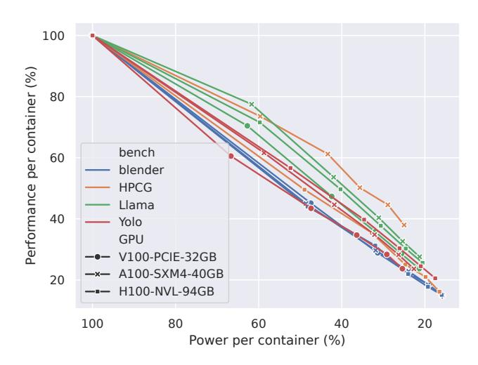
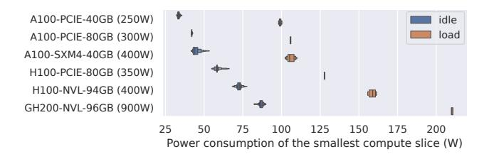
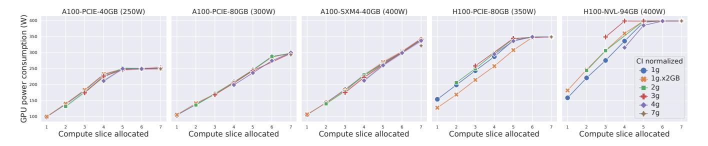
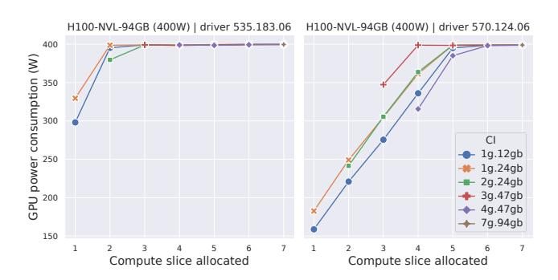
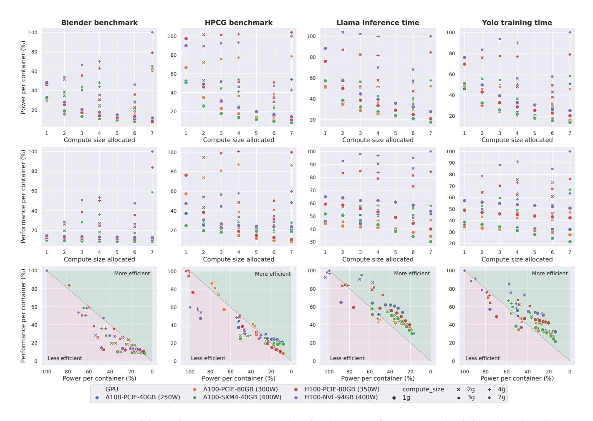
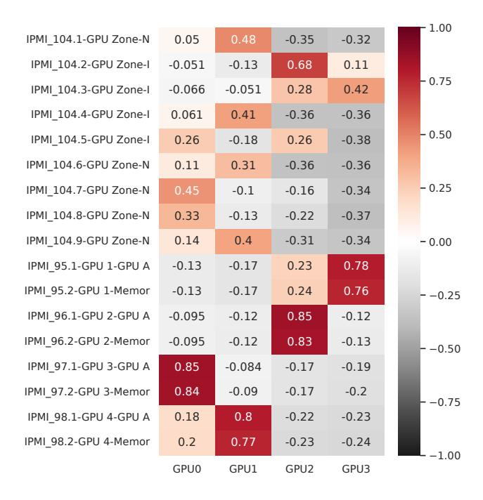
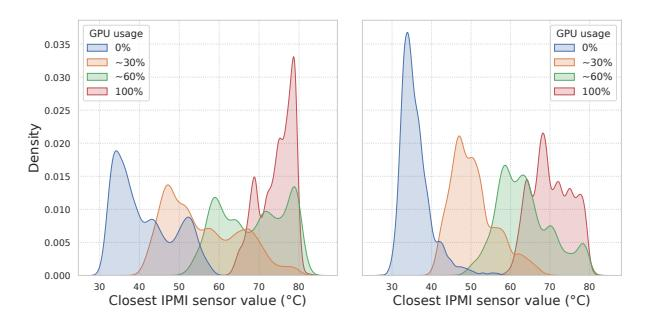
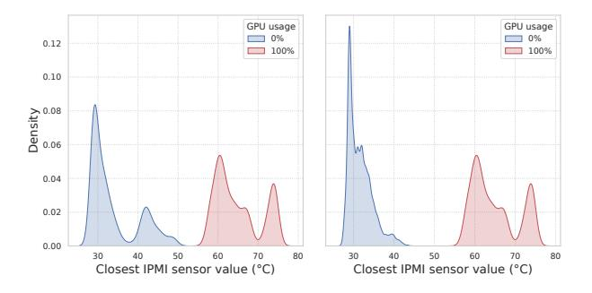
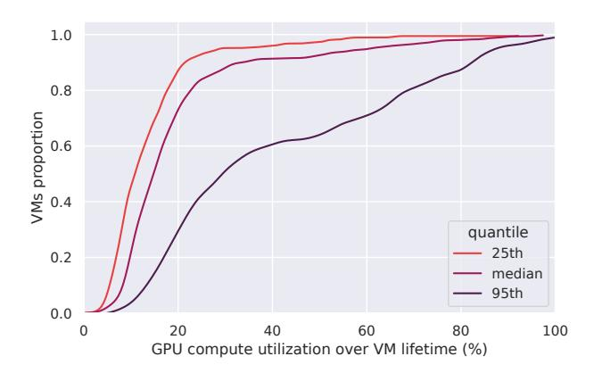
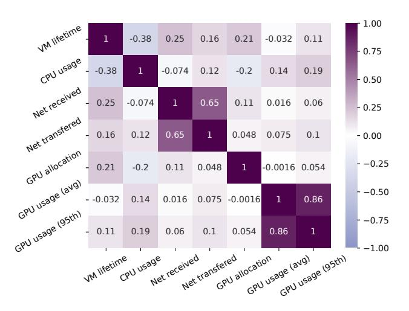

# Untangling GPU Power Consumption: Job-Level Inference in Cloud Shared Settings

[Pierre Jacquet](https://orcid.org/0009-0002-7988-8550) École de Technologie Supérieure, Université du Québec Montréal, Canada pierre.jacquet@etsmtl.ca

[Camille Coti](https://orcid.org/0000-0002-1224-7786) École de Technologie Supérieure, Université du Québec Montréal, Canada camille.coti@etsmtl.ca

[Maxime Agusti](https://orcid.org/0000-0003-3926-3273) Univ Lyon1, Inria, OVHcloud Roubaix, France maxime.agusti@inria.fr

[Marcos Dias De Assunção](https://orcid.org/0000-0002-4218-0260) École de Technologie Supérieure, Université du Québec Montréal, Canada marcos.dias-de-assuncao@etsmtl.ca

[Anne-Cécile Orgerie](https://orcid.org/0000-0003-0727-965X) Inria, CNRS, IRISA, University of Rennes Rennes, France anne-cecile.orgerie@irisa.fr

[Eddy Caron](https://orcid.org/0000-0001-6626-3071) Univ Lyon1, Inria, ENS de Lyon, CNRS Lyon, France eddy.caron@ens-lyon.fr

[Laurent Lefèvre](https://orcid.org/0000-0002-7198-9800) Univ Lyon1, Inria, ENS de Lyon, CNRS Lyon, France laurent.lefevre@inria.fr

# Abstract

As the demand for AI-driven workloads increases, the energy consumption of Graphics Processing Units (GPUs) devices has come under intense scrutiny, particularly in hyperscale data centers where large numbers of accelerators are centralized and leased to diverse clients.

In the context of cloud hyperscalers, GPUs power monitoring presents several challenges that vary depending on the product offered. The monitoring capabilities of physical devices may be limited or even absent for some products. However, given the substantial energy demands of GPUs, power monitoring is essential for both cloud providers and clients. Operators require tools to manage power distribution effectively, such as balancing workloads across Power Distribution Units (PDUs), while clients need visibility into power usage to optimize their workloads for energy efficiency.

To address these challenges, we propose methods for estimating the energy consumption of jobs running on GPU devices in cloud environments, spanning from shared and managed offerings like ML-as-a-Service (MLaaS) to less managed products (e.g., Infrastructure-as-a-Service (IaaS)). Our models demonstrate the benefits of sharing GPUs for small AI workloads, as well as the current sub-optimal utilization

[ACM acknow](https://creativecommons.org/licenses/by/4.0)ledges that this contribution was authored or co-authored by an employee, contractor or affiliate of a [national government. As such, the Government retains a](https://creativecommons.org/licenses/by/4.0)  nonexclusive, royalty-free right to publish or reproduce this article, or to allow others to do so, for Government purposes only.

EUROSYS '26, [Edinburgh,](https://doi.org/10.1145/3767295.3769333) Scotland Uk © 2026 Copyright held by the owner/author(s). ACM ISBN 979-8-4007-2212-7/26/04 https://doi.org/10.1145/3767295.3769333

of GPUs in cloud hyperscalers, based on insights from an IaaS GPU cluster.

CCS Concepts: • Hardware → Power estimation and optimization; • Computing methodologies → Modeling methodologies; • Computer systems organization → Cloud computing; Parallel architectures.

Keywords: Cloud computing, GPU, Power consumption

#### ACM Reference Format:

Pierre Jacquet, Maxime Agusti, Eddy Caron, Camille Coti, Marcos Dias De Assunção, Laurent Lefèvre, and Anne-Cécile Orgerie. 2026. Untangling GPU Power Consumption: Job-Level Inference in Cloud Shared Settings. In European Conference on Computer Systems (EU-ROSYS '26), April 27–30, 2026, Edinburgh, Scotland Uk. ACM, New York, NY, USA, [17](#page-16-0) pages. <https://doi.org/10.1145/3767295.3769333>

# 1 Introduction

Hyperscale Data Centers (DCs) are under increasing scrutiny due to their power consumption [\[1\]](#page-13-0). More than the absolute value itself, the rising trend draws attention, driven by the expansion of computing capacity and the construction of new DCs. A significant portion of this increase is attributed to Artificial Intelligence (AI) workloads, which rely on energyintensive accelerators such as GPUs [\[2\]](#page-13-1).

GPUs often consume more power than Central Processing Units (CPUs), sometimes by an order of magnitude in multi-GPUs servers. Monitoring and reporting power consumption is crucial for both cloud clients, who can optimize their workloads accordingly, and cloud operators, who need to manage power distribution across their infrastructure.

However, this issue is often overlooked due to two assumptions. (A) Monitoring GPU power consumption

<span id="page-1-0"></span>

Figure 1. Illustration of different GPU allocation

is straightforward: power consumption can be easily retrieved using the NVML API (or its executable, nvidia-smi) [\[3,](#page-13-2) [4\]](#page-13-3). (B) Accelerators are dedicated to a single job: the device's power consumption can be entirely attributed to a single process, avoiding complex attribution models like those used for CPUs [\[5](#page-13-4)[–7\]](#page-13-5). While these assumptions may hold in bare-metal environments (such as HPC), they are challenged in hyperscale cloud infrastructures, where virtualization layers introduce additional complexity.

In shared environments, depending on the product (ranging from IaaS to MLaaS and even cloud gaming), relying solely on the GPU driver for power consumption data is not always feasible. Furthermore, multiple jobs may share a single device through different allocation paradigms, making power attribution non-trivial. Figure [1](#page-1-0) introduces different allocation policies. Here, jobs can share the GPU over time (temporal sharing) or run in parallel on the same device (spatial sharing). Finally, passthrough situations bypass the host kernel by allowing direct access to the accelerator, making API calls to the accelerator infeasible from the host perspective.

This paper examines job power consumption in such shared GPU settings. We analyze how cloud providers can estimate individual usage while preserving the black-box nature of cloud computing. Our contributions are threefold:

- 1. Practical models for power estimation in different GPUsharing modes;
- 2. Empirical evidence that sharing can sometimes improve energy efficiency;
- 3. Identification of severe GPU underutilization in IaaS environments.

Our models are designed for GPUs operated in a black-box context. They rely on system metrics without compromising workload privacy. We notably demonstrate that IPMI temperature sensors provide a viable means for GPU power monitoring even in multi-tenant settings.

After reviewing previous work in Section [2,](#page-1-1) we present power monitoring approaches for temporal sharing (Section [3\)](#page-2-0), spatial sharing (Section [4\)](#page-4-0), and passthrough contexts (Section [5\)](#page-7-0). We then apply this knowledge to analyze GPU compute usage at a European cloud provider (Section [6\)](#page-11-0) and discuss our findings (Section [7\)](#page-12-0). Finally, we conclude our work and propose perspectives in Section [8.](#page-12-1)

# <span id="page-1-1"></span>2 Related Work

This section reviews existing related work on GPU cluster management (Section [2.1](#page-1-2) and GPU power monitoring (Section [2.2\)](#page-2-1).

## <span id="page-1-2"></span>2.1 GPU Cluster Management

Cloud data centers provide access to GPUs through various service models, ranging from IaaS offerings to MLaaS platforms. These differences influence how GPUs are allocated to workloads, which we briefly outline below.

2.1.1 Temporal allocation. In its basic form, sharing a GPU device is similar to scheduling a single CPU core. Each process has sequential exclusive access to the device depending on the scheduler (e.g., round-robin). Access is managed through time slices and context switches.

While this behavior is the default one when different processes require access to the CUDA API, processes do not get direct access to the accelerator in the cloud. Instead, they are encapsulated within their software stack through containers or Virtual Machines (VMs). The underlying virtualization stack may affect temporal sharing. With Kubernetes, the number of concurrent processes is controlled through GPU replica settings using the GPU Operator driver [\[8\]](#page-13-6). This allows exposing more GPUs than are physically available, using a ratio that can be specified at the cluster or node scale [\[9\]](#page-13-7), similarly to what exists for CPU oversubscription [\[10](#page-13-8)[–12\]](#page-13-9). Outside the Kubernetes environment, this time-slice sharing can be controlled with NVIDIA vGPU technology [\[13\]](#page-13-10), where GPUs can lead to multiple profiles exposed to VMs.

2.1.2 Spatial allocation. While time-slice sharing offers a way to divide GPU resources, it may not be optimal for specific workloads, as there is no guarantee that the entire GPU will be utilized during each slice. Several spatial allocation solutions have been proposed to tackle this challenge, enabling different processes to run simultaneously on distinct resources within the accelerator.

Multi-Process Service (MPS) is one such solution that relies on cooperation at the API level. Implemented through a client-server architecture, MPS enables multiple applications (e.g., MPI-based workloads) to share a single CUDA context, facilitating parallel execution of their tasks on the GPU [\[14\]](#page-13-11).

However, in cloud environments, the cooperation of the workload cannot always be assumed. In this case, Multi-Instance GPU (MIG) can partition the GPU into multiple independent instances, each with dedicated CUDA cores, L2 cache, and DRAM area. It provides stronger isolation guarantees than MPS, making it suitable for multi-tenant environments, but it is not available on all architectures. Each MIG instance can be attached to a container using NVIDIA's container drivers or a VM using NVIDIA vGPU technology.

2.1.3 Pass-through allocation. One standard method to enable direct access to hardware in virtualized environments is through Virtual Function I/O (VFIO), a Linux kernel module that allows virtual machines to interact directly with PCI devices. This mechanism ensures hardware isolation by relying on Input-Output Memory Management Unit (IOMMU), which enforces strict memory protection and prevents unauthorized access between virtualized workloads. It remains a widely used approach due to its privacy advantages (by leveraging VMs), performance benefits [15], and direct access to native hardware features [16]. Multi-GPUs servers can host multiple VMs, allowing them to share the server's CPU resources while providing direct access to accelerators.

#### <span id="page-2-1"></span>2.2 GPU Power Monitoring

GPU power monitoring is frequently performed using tools that access the NVML API, such as nvidia-smi or DCGM [17–19]. Readings are claimed to be accurate within 5 watts according to NVIDIA documentation, but these figures may not always hold in micro-benchmarks [20]. To mitigate this, the measurements in our study are typically taken over more extended periods (e.g., modeling batch jobs).

JoularJX [21] can monitor live power consumption for processes on GPUs. It observes the consumption exposed by the nvidia-smi tool and attributes it to a given process. However, the case where multiple processes share the same GPU is not addressed, nor is it applied to hyperscale contexts.

Several power modeling frameworks for various GPU architectures have been proposed, such as GPUWattch [22] and AccelWattch [23]. These tools primarily focus on simulation rather than live power tracking. In contrast, our goal is to model the energy consumption of jobs in shared environments using measurements from the actual device, similar to existing models for CPU process power consumption [6, 24].

We believe there is a mismatch between how GPU power monitoring is conducted and how hyperscalers operate GPUs. In scenarios where cloud providers need to monitor the power consumption of rented GPUs—such as for load balancing, carbon footprint calculation [25, 26], and other use cases—there is often no transparent methodology for monitoring jobs in shared environments.

In this paper, we aim to address these gaps by leveraging simple, practical principles for GPU power monitoring in shared contexts.

# <span id="page-2-0"></span>3 Inferring Power Consumption in Temporally Shared Situations

In its most basic form, an accelerator can always be shared temporally [27]. With GPUs, each process is loaded into the device memory, and context switching occurs on CUDA cores to create the "illusion of concurrency". The device driver typically manages the scheduling policy.

We now evaluate the impact of temporal sharing on GPUs power consumption. First, we summarize where temporal sharing is applicable in a cloud context (Subsection 3.1). We

then detail our experimental protocol for assessing its impact on both energy consumption and performance from a job perspective (Subsection 3.2). Finally, we present our findings (Subsection 3.3).

#### <span id="page-2-2"></span>3.1 Principle

When multiple jobs request access to a GPU, the accelerator's default behavior is to partition its time between the requesting processes. Specifically, with n processes, each process is allocated a coarse share of  $\frac{1}{n}$  of the GPU's computing time. However, the actual time slice allocation notably depends on the GPU scheduler and may vary depending on the scheduling policies and workload priorities. In a cloud context, processes originate from VMs or containers, which encapsulate the software stack and provide isolation from other tenants.

Workloads such as Jupyter notebooks, batch processing, or other services (MLaaS) are typically managed through containers and orchestrated by Kubernetes. Kubernetes interfaces with the NVIDIA GPU Operator, a component responsible for deploying NVIDIA drivers and runtime environments, and exposing GPUs as resources to Kubernetes. The GPU Operator manages how these resources are allocated, defining the maximum number of processes per device (and, therefore, the time-slice size).

Time-shared GPUs are also publicly promoted by cloud providers for virtual workstations through the vGPU software from NVIDIA [28–30].

While this configuration is common in cloud settings, we are unaware of previous work investigating how its power consumption can be modeled and the implications of this for efficiency.

#### <span id="page-2-3"></span>3.2 Experimental Protocol

Assessing the power consumption of GPUs jobs on a timesliced GPU was done in two stages. We first measured the device's highest power consumption before measuring the shared level's impact on performance and efficiency for various workloads.

**3.2.1** Highest power consumption. Assessing the highest power consumption was done using GPU-burn [31]. GPU-burn applies a compute-intensive workload by repeatedly multiplying large matrices, which maximizes the use of both the GPU cores and memory. This operation stresses the GPU with high-demand tasks, allowing for the evaluation of power consumption under full load.

We explored the replica parameters of the NVIDIA GPU Operator for Kubernetes. More specifically, we set up a Kubernetes cluster in which the replica setting was initially left at its default value (r = 1) before progressively increasing (we explored r = 2, r = 4, r = 8).

<span id="page-3-2"></span>

| Name    | Туре                              | Technical details                          | Metric                |
|---------|-----------------------------------|--------------------------------------------|-----------------------|
| Blender | 3D rendering                      | Rendering Scene 'Monster' on Blender 4.3.0 | Samples per minute    |
| HPCG    | HPC                               | Solving large-scale sparse linear systems  | GFLOP per second      |
| LLama   | Inference workload                | Model Llama-3.2-1B                         | Inferences per minute |
| Yolo    | Train model for image recognition | YOLOv8 reinforcement learning              | Trainings per hour    |

Table 1. Benchmarks presentation

<span id="page-3-3"></span>

**Figure 2.** Power consumption of P100 GPUs under different Kubernetes oversubscription settings

This represents an oversubscription policy<sup>1</sup>, allowing more GPU resources to be exposed than are physically available (under the default setting, a GPU can only be used by a single container). The rest of the NVIDIA GPU Operator parameters were left unchanged.

Under each r oversubscription policy, we deployed n containers, exploring all values in the [0, r] range. Power measurements were read from the GPU device using the NVML API through nvidia-smi.

**3.2.2** Explore the energy vs. power trade-off. To evaluate the impact of shared settings on applications, we built our testbed specifically targeting workloads that do not fully utilize the GPU resources we tested (P100, V100, A100, H100). These workloads do not exhaust all available memory, allowing for sharing mechanisms. This focus allows us to assess the impact of shared contexts specifically, as sharing is most relevant for workloads that do not fully exhaust their resources in terms of capacity or timeline.

We selected a set of applications that we consider representative of typical workloads on a cloud *Container as a Service* (CaaS) GPU-enabled platform: 3D simulation (Blender [32]), HPC-like workloads (HPCG [33] using NVIDIA's implementation [34]), inference workloads (Llama [35]), and model training (Yolo [36]). This selection allows us to broaden the scope of our study beyond MLaaS platforms (typically containerized) to include a wider range of use-cases.

Each workload was adapted for performance evaluation. A Python wrapper was written to load the application, execute it in a loop, and periodically dump a performance metric. Each setup is containerized. Selected performance metrics can be seen in Table 1. Performance degradation for each application was quantified as more workloads were introduced to the GPU based on these metrics.

For each configuration, we measured performance and power over a 30-minute period. This duration captures both steady-state and transient phases, providing meaningful insights into energy and temperature (notably considering the low sampling frequency of sensors). GPU settings were kept at their defaults.

#### <span id="page-3-0"></span>3.3 Results

We conducted our experiments on different GPUs. Regarding the highest power consumption on an oversubscribed Kubernetes cluster, our results, based on two P100 GPUs (Pascal architecture), are presented in Figure 2. As expected, the power consumption of a single replica is high (close to the *Thermal Design Power* (TDP) of the GPU under study), as exclusive access allows the container to utilize all available resources. Interestingly, power consumption slightly decreases as soon as the GPUs begin to be shared, likely due to the time overhead introduced by context switching between processes, which induces a certain level of throttling. However, the cost of these context switches does not appear to increase significantly with higher levels of multiplexing.

Regarding performance, the experiments were conducted on V100 (Volta), A100 (Ampere), and H100 (Hopper) architectures. Figure 3 illustrates our findings. The per-container consumption exposed was computed by  $Container_{power} = \frac{GPU_{power}}{n}$  where n is the number of concurrent containers. We observe a relatively proportional relationship between the power consumed by containers and their performance, which decreases as the time slice allocated to each container shortens.

However, for some workloads, performance decreases less than power consumption, leading to improved energy efficiency. For example, HPCG is more efficient when timeshared on the A100 but not on the H100. Since HPCG is memory-bound, the H100's higher memory bandwidth (3.9 TB/s vs. 1.5 TB/s, according to technical specifications) reduces idle times, making time-slicing less beneficial for this model.

This underscores the relevance of time-shared policies when GPU compute resources experience idle periods. The same principle applies to inference workloads such as Llama,

<span id="page-3-1"></span><sup>&</sup>lt;sup>1</sup>Oversubscription is also sometimes referred to as overcommitment

<span id="page-4-1"></span>

Figure 3. Performance per container (expressed as a percentage of the baseline where the benchmark is running alone on the GPU) compared to the container power consumption (also expressed as a percentage of its power consumption while running alone)

which also benefit from sharing. Conversely, for computebound tasks such as training and 3D modeling, sharing techniques offer limited energy efficiency advantages.

3.3.1 Insights gained: Temporal sharing is more relevant when workloads have staggered execution patterns (i.e., Streaming Multiprocessor (SM) resources experience idle time) than when workloads underutilize GPU capacity.

While the power consumption of time-shared GPUs is influenced by context-switching overhead, a proportional power allocation model—where the total power is evenly divided among active containers—provides a reasonable approximation.

# <span id="page-4-0"></span>4 Inferring Power Consumption in Spatially Shared Situations

While temporal sharing has some limits regarding energy efficiency in a concurrent setting, we now explore how GPUs power consumption behaves when the accelerator is spatially shared between multi-tenant jobs. In this paradigm, the GPU device is divided into subsections, each with its own CUDA cores, cache levels, DRAM area, and system pipe. By allowing simultaneous execution, this paradigm offers more significant opportunities to reduce per-container static power consumption.

We first review where spatial sharing can be used in cloud computing (Subsection [4.1\)](#page-4-2), before detailing our experimental protocol (Subsection [4.2\)](#page-4-3) and then diving into our results (Subsection [4.3\)](#page-5-0).

#### <span id="page-4-2"></span>4.1 Principle

Spatial resource sharing has long been supported in computer science: multi-core CPUs allow multiple processes to run on separate cores, with mechanisms like Linux cgroups enabling exclusive core allocation.

In contrast, spatial sharing on GPUs is more recent. It is now widely available on Nvidia's Ampere and Hopper datacenter GPUs (released in 2021 and 2024, respectively). Although Nvidia's Blackwell architecture was recently introduced, it remains too scarce to be included in this study.

Given the rising power consumption of GPUs, spatial sharing is a compelling approach, particularly for workloads that do not require full access to the device's resources. Despite its potential, limited data exist on power consumption in these environments. Cloud providers leverage spatial partitioning to enforce isolation in multi-tenant settings (e.g., CaaS) using vGPU software or by directly assigning MIG devices to containers.

In this section, we investigate how to infer power consumption in sub-GPU partitioning, particularly in multitenant environments where cloud providers may aim to provide power usage estimates to their clients.

#### <span id="page-4-3"></span>4.2 Experimental Protocol

The spatial sharing of GPUs, referred to as MIG, involves dividing a GPU into GPU instances (GIs), a combination of dedicated SMs and engines. The GIs SMs can be further divided through Compute Instances (CIs), while other components are shared between CIs belonging to the same GI.

The GPU partitioning takes place with these two concepts through predefined profiles that apply multiple combinations. Profiles use a slice unit, with a total of 7 compute slices and 8 memory slices on explored architectures (Ampere, Hopper). For 40GB GPUs, a memory slice is, therefore, approximately 5GB.

We followed the same approach as in the previous section, first determining the highest power consumption for different configurations before analyzing the impact on performance and energy consumption for various workloads.

4.2.1 Highest power consumption. We first explore how this partitioning affects the device's energy consumption using the GPU-burn workload previously introduced. To this end, we measured all possible GIs sizes along with all the unique CIs sizes they can host while progressively increasing the workload of co-hosted GIs. For example, with a 3-compute-slice GI, we tested sizes of 1, 2, and 3 CI compute slices while introducing additional 1-compute-slice GIs until reaching the full capacity of the GPU.

Each run lasted 5 minutes to limit the experiment's total duration (approximately 18 hours due to the number of combinations), and power consumption was retrieved through NVML. We tested five different GPUs supporting MIG, with varying models and TDP.

<span id="page-5-1"></span>

**Figure 4.** Power consumption of one compute slice on A100, H100 and GH200 devices

Note that MIG does not prevent a time-sliced usage of a CI. This paper did not explore the combination of time-sharing with spatial sharing, both to restrict the scope of our work and because time-sharing behaves similarly in a sub-GPU as it does at the full-GPU level.

**4.2.2** Explore the energy vs. power trade-off. We then explore the implications of sub-GPU partitioning for the workloads introduced in Table 1. A key question was whether the degradation in performance could lead to improved energy efficiency (i.e., if the performance reduction is lower than the power reduction).

To investigate this, we tested all CI sizes for each benchmark, ranging from a single CI up to full GPU allocation. For example, with a CI size of 1, we assigned it a container running the Blender benchmark, measured its performance, then introduced a second container running the same benchmark on another 1-slice CI, and continued this process until all resources were utilized.

Each configuration was tested for 30 minutes, while percontainer and device power consumption were recorded.

## <span id="page-5-0"></span>4.3 Results

Regarding the highest power consumption across different MIGs levels, we first report on the smallest GI size in Figure 4. The static power consumption of an accelerator remains high and is primarily influenced by its TDP. The boxplots illustrate the range of measured values.

Our testbed included three single-GPU instances (A100-PCIE-80GB, H100-PCIE-80GB, and GH200-NVL-96GB), while other configurations consisted of servers equipped with two to four identical accelerators, all subjected to the same workload. While the single-GPU configurations confirm that power variation is minimal for the same device, multi-GPU setups reveal some variability between identical accelerators. We observed this as a static offset: a GPU consuming 10 watts more than its counterparts in idle typically maintained this difference under load. In our tests, 10 watts was the maximum observed variation.

Introducing multiple GIs reveals interesting power consumption patterns. As shown in Figure 5, the use of GIs enables energy-proportional computing, a long-standing design goal in cloud computing for efficiency [37].

We observed that GIs allow the power consumption of A100 GPUs to scale primarily with the number of slices used, regardless of the architecture. The size of the GI appears to have little impact, as a configuration with three GPU compute slices (MIG\_3g\_20gb) consumes approximately the same power as three GIs composed of a single GPU compute slice (MIG\_1g\_5gb). Additionally, increasing the number of compute slices utilized within a GPU leads to a predictable increase in power consumption.

While only full GIs are displayed in this graph (i.e., CIs utilizing all the resources of their respective GIs), we observed that both paradigms exhibit comparable power consumption. This implies that a CI consuming the equivalent of two GPU compute slices draws approximately the same power as a GI configured with two physical compute slices.

Additionally, the graph reveals a "last one for free" effect on specific hardware, where the maximum power consumption of the GPU is reached at n-2 or n-1 compute slices (where n is the maximum). As a result, the final slice(s) appear to consume negligible additional power.

**Driver impact on power consumption:** The NVIDIA driver version also influenced our findings. The experiments and results presented here were conducted using the latest drivers available on our test platforms (570.86.15 for A100-PCIE-80GB and H100-PCIE-80GB, and 570.124.06 for others). However, we observed unexpected behavior with older drivers.

As shown in Figure 6, the proportional scaling of MIG power consumption is absent when using driver version 535.183.06. In this configuration, the power consumption of a single compute slice was measured at approximately 300W—significantly higher than the 160W observed with the latest driver versions. Furthermore, the maximum power usage was reached as soon as a second compute slice was scheduled. We found no mention of this behavior in the changelogs between these driver versions.

**DCGM impact on power consumption:** The monitoring stack of GPUs also had a significant impact in some instances. The latest DCGM Prometheus exporter available at the time of writing (version 4.1.1-4.0.4) can increase the static power consumption of MIG-enabled devices by up to 50 watts compared to version 4.1.1-4.0.3. This increase is due to additional profiling mechanisms relying on the NVIDIA Perf Works library for A100 and older devices [38]. To mitigate this effect, we avoided any active profiling in our experiments.

Regarding performance impact, we first present the evolution of jobs performance and power while increasing the number of compute slices of size 1 on an H100 in Figure 7. Power is reported using the same formula as in the previous section:  $Container_{power} = \frac{GPU_{power}}{n}$  where n is the number of concurrent containers.

<span id="page-6-0"></span>

Figure 5. Power consumption of MIG configurations on A100 and H100 devices

<span id="page-6-1"></span>

**Figure 6.** Comparison of the consumption of different MIG configurations under different driver versions for the same hardware

<span id="page-6-2"></span>

**Figure 7.** Evolution of power and performance when increasing the number of 1 slice allocation on an H100-NVL-94GB

In contrast to the time-shared setting, deploying more containers on different GIs always leads to an increase in the raw power consumption of the device, as more SM are utilized. However, the per-container power consumption decreases as the device's static power is amortized across more containers. This decrease follows a hyperbolic pattern.

Performance remains more stable thanks to the guaranteed resources of MIG. This leads to efficiency gains (defined as the ratio of performance to energy) in some configurations, although contention effects can appear for certain benchmarks.

We generalize this study of performance and energy evolution to multiple compute slice sizes (1, 2, 3, 4, 7) across

different hardware in Figure 8. The first horizontal row reports power per container, while the second horizontal row shows the impact on performance. Performance is generally influenced more by the size of the CI than by the number of instances, as each container uses different SMs. The main exception is the HPCG benchmark, which experienced contention on shared resources (bus, CPU)

Finally, the last row reports the ratio between performance degradation and power gain. The "performance equals power" line is displayed for reference. Any configuration above this line shows that the performance degradation was less significant than the power consumption reduction, resulting in better energy efficiency. Anything below the line indicates the opposite, where the performance loss outweighs the power consumption gain.

Interestingly, AI workloads (inference and training) achieve higher energy efficiency in most configurations when the second instance is deployed, demonstrating the value of shared allocation paradigms with small models. In contrast, 3D rendering and HPCG appear less suitable for such configurations due to: A) the full utilization of SMs cores, and B) contention on other resources.

**4.3.1 Insights gained:** The mostly energy-proportional behaviors observed in Figure 5 lead us to propose a model that decomposes the power consumption into a static chiplevel component, evenly amortized across all slices, and a slice-specific component that depends on the slice size.

<span id="page-6-3"></span>
$$\mathcal{P}_{i}^{\text{slice}} = \frac{\mathcal{P}_{\text{chip}}^{\text{static}}}{N} + \left(\mathcal{P}_{\text{slice},i}^{\text{max}} - \mathcal{P}_{\text{chip}}^{\text{static}}\right) \tag{1}$$

Equation 1 models the power consumption of a slice of size i, where N is the maximum number of slices. The first term accounts for the static consumption of the GPU, divided evenly across slices, while the second term represents the range specific to the slice size. For clarity, both  $\mathcal{P}_{\text{chip}}^{\text{static}}$  and  $\mathcal{P}_{\text{slice }i}^{\text{max}}$  are obtained empirically for each MIG profile.

To improve determinism, we rely on the worst case, defined as the maximum power draw obtained with a GPU burn workload. This represents an upper bound, since all compute resources are saturated. Determinism is preferred in a cloud setting: otherwise, tenants would observe fluctuating power

<span id="page-7-1"></span>

Figure 8. Overview of the performance vs. Energy trade-off with MIG configurations under different benchmarks

readings for identical usage patterns, complicating analysis in multi-tenant scenarios. In contrast, models prioritizing empirical fidelity over determinism are harder to construct, especially given the lack of classic GPU usage metrics in MIG mode.

When applied to our benchmarks across the wide range of hardware tested, this model yields a *Root Mean Square Error* (RMSE) of 13.4 W (MAPE of 11.5%) on a 1-compute slice, which can be considered a right-sized configuration. On oversized allocations (where compute resources are underutilized), the error increases, as applications no longer reach the modeled upper bound (MAPE of 26.5%). These larger slices fail to use their full compute share, resulting in high modeled power despite low utilization.

<span id="page-7-2"></span>
$$\mathcal{P}_{i}^{\text{slice}} = \frac{\mathcal{P}_{\text{chip}}^{\text{static}}}{N} + F * \left(\mathcal{P}_{\text{slice},i}^{\text{max}} - \mathcal{P}_{\text{chip}}^{\text{static}}\right)$$
(2)

The difference between the predicted upper bound of power consumption and the actual measurement represents unused energy. This unused energy is captured by the factor F in Equation 2. On our testbed, the factor increases

with the allocation size and follows the relation:  $F_{\text{slice}(i)} = 1 - 0.07 \times (i - 1)$ .

Its integration into a carbon-accounting mechanism depends on provider policy. If the objective is to foster right-sizing, the unused energy can be interpreted as an energetic penalty induced by oversized workloads. In this case, Equation 1 should be preferred, as it encourages tenants to adopt more suitable application sizing (choosing a smaller envelope would drastically reduce the metric with limited impact on performance for oversized allocations). If the objective is accuracy, Equation 2 should be used. On our testbed, this model reduces global RMSE (19.7 W vs. 53.0 W) and MAPE (14.2% vs. 26.5%).

# <span id="page-7-0"></span>5 Inferring Power Consumption in Pass-Through Situations

While sharing GPUs may be beneficial in periodic usage or, as demonstrated, for some kinds of workloads in terms of energy efficiency, others require exclusive usage of the device. In that case, virtualization remains in use, as a multi-GPUs server is still shared, but processes (containers or VMs) may get exclusive access to an accelerator. This approach is particularly prevalent in use cases such as virtual desktops, gaming, and IaaS.

Particularly, assigning GPUs to VM through PCIe passthrough offers near-native performance while preserving the key benefits of virtualization, such as isolation and security. However, this configuration introduces a significant challenge for cloud providers. Once a GPU is passed through to a virtual machine, the host loses all visibility over the PCIe device, including monitoring capabilities. In other words, from the cloud provider's perspective, the GPU operates as a black box with no direct means of tracking its usage.

This section explores a method to infer GPU usage in passthrough scenarios. We propose a monitoring technique to restore visibility into energy usage while maintaining the integrity and security guarantees of VFIO-based GPU assignment. We first introduce our approach (Subsection 5.1), followed by detailing our experimental protocol (Subsection 5.2) and evaluating it (Subsection 5.3).

#### <span id="page-8-0"></span>5.1 Principle

GPU power monitoring in pass-through environments can be implemented through several approaches. However, ensuring the privacy of VMs rules out solutions that involve reimplementing the VFIO module. Additionally, approaches that would require cooperation from clients (e.g., installing an agent) — an assumption that cannot be guaranteed in multi-tenant environments — are also not feasible.

Instead, we adopt an entirely non-intrusive technique. Our approach leverages the various embedded sensors available on modern server motherboards. While GPU-integrated sensors, typically exposed through manufacturer-specific drivers, become inaccessible in a pass-through configuration, we investigate whether temperature sensors from the motherboard can serve as reliable proxies for GPU power consumption.

Given the high and continuously increasing TDP values of modern GPUs, temperature emerges as a natural candidate for indirect power estimation. While previous work has modeled CPU usage from temperature [39], to our knowledge, this is the first study to consider temperature as a proxy for GPUs. We specifically evaluate the ability of *Intelligent* Platform Management Interface (IPMI) temperature sensors to approximate GPU energy consumption. In contrast to the nvidia-smi interface, which becomes unavailable in passthrough scenarios, IPMI sensors remain accessible at the host level, making them particularly relevant for our use case. They are, however, difficult to exploit due to their low sampling frequency, limited precision, unknown placement, and sensitivity to thermal interference between GPUs assigned to different tenants. We designed our experimental protocol to evaluate their viability for GPU power monitoring in multi-tenant environments.

#### <span id="page-8-1"></span>5.2 Experimental Protocol

Our experimental setup is designed to address two key Research Questions (RQs).

- Can GPU usage levels and power consumption be accurately inferred from generic IPMI temperature sensors? By "accurately", we aim not only to distinguish between idle and fully loaded states but also to identify intermediate levels of GPU utilization.
- Can interference between GPUs temperature readings be mitigated? In hyperscale cloud environments, GPUs are deployed in high-density configurations, typically ranging from 2 to 8 GPUs per server. As a result, IPMI temperature sensors may detect heat signatures from multiple accelerators, potentially introducing cross-interference in the measurements. Understanding whether this interference can be controlled is essential for ensuring reliable power estimations.

To answer these questions, we conducted a series of controlled experiments, leveraging different workload intensities and GPU placements within a server chassis. By analyzing the correlation between GPU activity levels and IPMI-reported temperature variations, we evaluate the feasibility and accuracy of using motherboard sensors as a proxy for power monitoring in pass-through settings.

**5.2.1 Build a workload.** We built a GPU workload stressing different GPUs to various levels. Specifically, we selected n workload stress levels, ranging from n=2 (a GPU is either entirely idle or fully loaded) to n=4 (a GPU can be used at 0%, 30%, 60% or 100%). We tested all combinations of GPUs and stress levels. The total number of combinations on a machine with m GPUs is  $(n^m)$ . For a machine having 4 GPUs under 4 distinct levels, this results in 256 different combinations.

The GPU workload is composed of GPU-burn, and the workload level is controlled through GIs (e.g., the 30% usage level is obtained by using 2 compute slices of the 7,  $2/7 \simeq 29\%$  of the SMs). Each combination is run for 5 minutes, during which the power is periodically (5-second interval) read for each GPU instance.

**5.2.2 Identifying appropriate IPMI sensors.** Modern servers typically integrate multiple IPMI sensors, each positioned at different locations on the motherboard. Due to these physical placements, some sensors are closer to specific GPUs than others, potentially capturing temperature variations more accurately. We aim to identify which IPMI sensor exhibits the highest correlation with the power consumption of each GPU unit.

All IPMI sensors recognized as temperature sensors by the ipmitool agent were monitored to achieve this. Then, for each sensor, we computed the Pearson correlation coefficient with the power consumption of each GPU (as exposed by the device, read from nvidia-smi), assuming a linear relationship between power consumption and heat generation

<span id="page-9-1"></span>

**Figure 9.** Pearson correlation between temperature readings from IPMI sensors and the power consumption of four A100 GPUs, restricted to sensors whose labels mention GPU

(as expected from Ohm's law). The correlation results are illustrated in Figure 9. For readability, we display only the sensors labeled with GPU, although correlations were computed using all temperature sensors available.

Although servers are equipped with multiple IPMI sensors, only a subset of them is significantly influenced by GPU power consumption. A coefficient close to 1 indicates a strong positive correlation, a coefficient near -1 suggests a strong negative correlation, while a coefficient around 0 implies no correlation. The most relevant temperature sensor for each GPU power consumption is then selected for our analysis.

#### <span id="page-9-0"></span>5.3 Results

We now seek to address our two previously defined research questions: the precision of the IPMI-based usage model and the potential interference caused by thermal effects from neighboring GPUs in different hardware configurations.

#### 5.3.1 Precision on 4xGPUs air-cooled configurations.

To evaluate precision, we tested all possible combinations of the following stress levels: 0%, 30%, 60%, and 100% on the four A100 GPUs of an Apollo 6500 Gen10 Plus server. Figure 10 presents the results as a kernel density estimate.

As Figure 10 shows, each compute level can result in a range of temperature readings. For instance, the idle state (0% compute level) can produce temperature values between 30°C and 60°C, notably depending on other GPUs state as

we captured all combinations of usage. We found that part of the overlap of temperature ranges for a given usage was caused by the closest GPU neighbor, though this is not a symmetrical relation. For example, if a GPU A's temperature is influenced by a GPU B, the opposite is generally not true, as fans direct the airflow in a single direction.

To automatically correct this, we identify, for each GPU, the closest neighbor by selecting the second most correlated sensor to the given GPU among those identified as good proxies (the first one being itself). Then, we fit a linear regression between the neighbor's temperature delta (*current – min*) and the temperature observed on the GPU under study. If the coefficient is significantly positive, we correct the sensor value by accounting for the neighbor's delta. The entire process is described in Algorithm 1. Note that the  $\beta$  coefficient of the linear regression between the neighbor's temperature delta and the sensor value represents the minimum value of the sensor and can be discarded from the correction formula. Under positive correlation,  $\alpha$  value was typically around 0.3 across the various servers tested. Applying this correction significantly reduces the overlap between GPU usage levels, as shown in Figure 10.

Other approaches exist for identifying and modeling cross-interference between signal sources, such as the Expectation-Maximization Algorithm [40]. Here, we adopt a simpler, guided process, since the temperature influence is primarily dominated by airflow from the closest neighbor.

# <span id="page-9-2"></span>**Algorithm 1** Temperature Correction Based on Neighbor Influence on Air-Cooled multi-GPUs Servers

```
Output: Corrected temperature value

1: Select closest neighbor G_j

arg max Correlation (G_i, G_k)
```

- arg max Correlation $(G_i, G_k)$ 2. Compute neighbour temperature delta:  $\Delta T_i = T_i$
- 2: Compute neighbour temperature delta:  $\Delta T_j = T_j \min(T_j)$
- 3: Fit linear regression:  $T_i = \alpha \cdot \Delta T_i + \beta$

Input: Temperature reading for a GPU

- 4: **if**  $\alpha > 0$  (significant) **then**
- 5: Temperature corrected:  $T_i \leftarrow T_i \alpha \cdot \Delta T_j$
- 6: else
- 7: Temperature corrected:  $T_i \leftarrow T_i$
- 8: end if
- 9: **return** Temperature corrected

When using the density plot to define usage bounds (for each sub-degree, we select the most likely usage level), we achieve an accuracy of 76.7%, with a precision of 98.6% for idle, 82.0% for 30% usage, 59.5% for 60% usage, and 68.6% for fully loaded GPUs. When focusing solely on idle and non-idle states, we achieve a precision of 98.6% and 97.0%, respectively. This demonstrates the feasibility of inferring workload intensity from temperature variations. Moreover,

<span id="page-10-0"></span>

**Figure 10.** Temperature readings (initial and corrected) under 4xA100 GPUs with 4 stress levels

each intermediate compute level further confirms that the approach can be extended to lower TDP GPUs.

# 5.3.2 Precision on 8xGPUs air-cooled configurations.

We conducted the same experiment on servers with higher GPU density to assess the effect of thermal interference from neighboring GPUs. Specifically, an Nvidia DGX server equipped with 8×A100 GPUs was selected to run different stress levels. Due to time constraints, the stress levels were reduced from 4 to 2, as testing all 48 combinations would require 227 computation days with a 5-minute interval per combination. As shown in Figure 11, the temperature intervals remain identifiable despite the higher GPU density, demonstrating feasibility even in high-density environments. Since the range of temperatures and usage levels in this situation does not overlap, we achieve 100% accuracy. However, this would likely be challenged when identifying intermediate states, as previously observed.

# **5.3.3** Precision in water-cooled configurations. Our final evaluation aimed to determine whether temperature remains a reliable proxy in environments where GPUs experience less intensive thermal variation, such as water-cooled servers.

We partnered with OVHcloud, one of Europe's largest cloud providers, to explore this scenario. OVHcloud employs a direct-to-chip water cooling system, where coolant flows through a water block in direct contact with the most thermally demanding components, such as CPUs and GPUs [41].

We analyzed temperature and power measurements of A100 and H100 GPUs under a controlled workload intensity (MIG-based) in a virtualized production environment over a week. As seen in Figure 12, the temperature range is narrower than in air-cooled configurations. While the minimum temperature remains similar (around 30°C), no reading exceeds 65°C (compared to 80°C for the 4xA100 configuration). Nevertheless, a clear correlation between power consumption and GPU usage and, consequently, between temperature and GPU usage can still be observed.

The difference in temperature readings between the two devices does not stem from the accelerators themselves, as



**Figure 11.** Temperature readings (initial and corrected) under 8xA100 GPUs with 2 stress levels

<span id="page-10-1"></span>

**Figure 12.** Comparison between GPUs power usage, compute usage, and temperature in a water-cooled environment

the same TDP should yield similar heat dissipation. Rather, it highlights the measurement's contextual nature, as the inlet water temperature influences the thermal baseline. This water temperature depends on the water-cooling configuration (in this case, some GPUs cooling flow may be mounted in series) and on seasonality—we observed variations in our dataset spanning both winter and spring. Interestingly, this thermal offset can be easily corrected using sliding time windows, as it remains a constant across all GPU usage levels.

Specifically, we employed the Automated Baseline Correction algorithm from [42], using the imor implementation provided by the pybaselines library [43]. This algorithm smooths temperature readings toward a local baseline by applying erosion and dilation within sliding windows (we used 24-hour time windows), effectively correcting thermal offsets and TDP variation between models. Next, we scaled the corrected readings using min-max normalization. Finally, we performed a regression between the corrected temperature values and GPU usage to build our inference model.

A simple linear regression yielded an average RMSE of 5.0% for A100 GPUs and 13.3% for the H100 configuration—higher in the latter due to greater temperature overlap across usage levels, as illustrated in Figure 12. Using a polynomial regression (with the degree selected through exploration in the range d=1 to d=100) slightly improved accuracy, achieving RMSE values of 3.7% for A100 and

<span id="page-11-3"></span>

**Figure 13.** Cumulative Distribution Functions (CDFs) of GPU compute utilization used by VMs on an IaaS GPU cluster

11.2% for H100. We consider this level of precision sufficient to infer general trends in GPU compute usage.

**5.3.4 Insights gained:** In conclusion, while this temperature-based approach requires calibration for each server type due to potential variations in cooling efficiency, it holds significant promise for cloud providers. By leveraging easily accessible IPMI sensors, cloud providers can implement a non-intrusive method for monitoring both GPU usage and power consumption across virtualized environments with precision and accuracy.

# <span id="page-11-0"></span>6 Insights From a Cloud Provider

To illustrate the importance of GPU usage monitoring in cloud computing, we analyze a real GPU cluster from OVH-cloud, composed of 176 H100 GPUs operating in a commercial IaaS environment. To the best of our knowledge, this is the first study to examine a rented GPU cluster in an IaaS context. We use temperature as a proxy to infer the usage of the water-cooled devices in Subsection 6.1, before exploring usage prediction opportunities in Subsection 6.2.

#### <span id="page-11-1"></span>6.1 GPU Usage in an IaaS Cluster

Our analysis, conducted over a two-month period, covered 865 VMs. On average, a VM was active for 2h30 and allocated 1.4 GPUs (with possible values being 1, 2, or 4 on the explored product). Figure 13 shows the utilization of GPUs allocated to VMs. The CDFs highlight a sub-optimal use of the allocated accelerators: 80% of VMs exhibit a median GPU compute usage below 25%. Even when considering peak usage (95th percentile), 60% of deployments remain below 50% of the GPU's compute capacity.

Two main factors influence these observations. First, our definition of GPU utilization is based on the full usage of CUDA cores, as our model was trained using a precise number of cores operating at full capacity, leveraging both GPU-burn and MIG functionalities. In contrast, NVIDIA defines

<span id="page-11-4"></span>

Figure 14. Spearman correlation between different VMs characteristics

utilization more loosely as the "percent of time over the past sample period during which one or more kernels were executing on the GPU" [44]. Under our definition, executing a kernel with a single thread would result in a very low usage estimate, whereas NVIDIA might report the device as fully utilized.

Second, the temperature readings were collected at a 3-minute interval. As a result, short-lived peaks in utilization may not be captured. This is acceptable given that these highend GPUs are primarily intended for long-running jobs.

In practice, most workloads do not fully exploit the device's compute resources due to setup phases, memory-bound behavior, small problem sizes (in terms of CUDA threads), and similar constraints. Altogether, these findings highlight the potential for sharing GPU compute capacity—an opportunity that can be explored through both temporal sharing (Section 3) and spatial sharing (Section 4).

#### <span id="page-11-2"></span>6.2 On GPU Usage Prediction

We now investigate whether GPU compute usage can be predicted from other VM attributes. To this end, we selected several features—VM lifetime, CPU usage, and network activity—and computed their Spearman correlation with three GPU-related metrics: GPU allocation, GPU usage, and peak GPU usage (95th percentile). Results can be seen in Figure 14.

CPU usage does not exhibit strong correlation with GPU usage. We believe this is influenced by the number of *virtual CPUs* (vCPUs) assigned to the VM (starting at 30), which may reduce the statistical visibility of CPU-GPU interactions when workloads are bound to a subset of cores.

Similarly, network activity shows little correlation with GPU usage. While significant data transfers may occur during model loading or checkpointing, we hypothesize that inference workloads are more memory-bound than computebound, limiting network influence on our compute usage estimation. Although training workloads are theoretically compute-intensive, they may also exhibit idle phases due to data movement bottlenecks, further weakening the correlation.

A weak correlation is observed between the number of allocated GPUs and the lifetime of a VM, suggesting that instances with larger GPU allocations tend to run for slightly longer durations.

Overall, these findings highlight the limitations of relying solely on conventional VM metrics to estimate GPU activity in a black-box IaaS context. They reinforce the relevance of alternative proxies such as temperature signals explored in Section [5.](#page-7-0)

# <span id="page-12-0"></span>7 Discussion

Potential for cloud providers. Cloud providers typically expose carbon-footprint accounting for instances through dedicated tools. Integrating our models would improve their accuracy for jobs running under different GPU allocation paradigms, leading to more precise environmental impact assessments. In practice, the power consumption of temporally shared allocations can be modeled based on oversubscription levels, while spatial sharing can be estimated from allocation size. Moreover, temperature serves as a reliable proxy in environments without access to driver-level metrics.

Our results also show that some jobs become more energyefficient under shared settings, supporting the expansion of GPU-shared instance types or the development of managed services designed around them.

Finally, our experiments highlight the influence of drivers and monitoring tools on power consumption. Specifically, using outdated drivers (e.g., 535.X.X) on MIG devices can almost double the power consumption of small slices compared to the latest drivers (at the time of writing, 570.X.X). The DCGM Prometheus exporter can also double the static power consumption on some accelerators if active profiling is used (which is the default option). These are factors that providers should carefully validate before deployment in production environments.

Potential for cloud clients. Selecting an appropriate instance remains the client's responsibility. Our results show that high-end GPUs are often underutilized in dedicated IaaS offers and that jobs can exhibit markedly different energy efficiency depending on the sharing configuration. This suggests that clients could benefit from monitoring the performance and energy footprint of their workloads to guide instance selection. In particular, shared-GPUs represent a viable option to improve efficiency and reduce costs when full accelerator capacity is not required.

Limits. Our approach has practical constraints inherent to the black-box nature of cloud computing and vendorspecific features. The passthrough method requires per-machine calibration and remains sensitive to environmental variation. The time-shared approach could generalize to other accelerators, but spatial sharing is currently tied to NVIDIA MIG feature.

# <span id="page-12-1"></span>8 Conclusion

In this paper, we examined the power consumption of individual jobs in different GPU-sharing configurations. Through empirical benchmarks, we observed that power consumption is linear with load, but also influenced by several key factors: high static power draw, maximum power reached before full utilization (a "last-for-free" effect), and measurement variations due to drivers and monitoring tools. Notably, outdated GPUs drivers (version 535 vs. 570) can nearly double the power use of MIG accelerators, and the default active profiling of the DCGM exporter can similarly increase static power in certain configurations.

We proposed models for estimating power in time-shared settings (load-based), spatially shared settings (slice-sizebased), and passthrough settings (temperature-based, accuracy of 76.7%). These models are tailored for cloud environments operating in a multi-tenant black-box context, preserving workload privacy while enabling integration with cloud providers' carbon accounting tools to help limit power consumption.

Our findings also show that GPU sharing can improve energy efficiency for certain jobs, where reduced per-job power consumption outweighs performance degradation. Small AI-like workloads, in particular, appear to benefit from such sharing strategies.

Applying the passthrough method to an OVHcloud cluster, we found significant underutilization of GPU compute resources in IaaS contexts, reinforcing the potential of accelerator sharing.

Future work will extend these inference techniques to other GPU architectures (e.g., AMD and Intel) and integrate them into energy-aware scheduling strategies.

# Electricity Usage

The experiments conducted in this study required 1,902 GPU hours, encompassing multiple architectures, configurations, and benchmark runs. This resulted in an energy consumption of 327.5 kWh, corresponding to 12.1 kg CO<sup>2</sup> when applying the carbon intensity of the hosting country.

Though not exhaustively, these figures partially account for development iterations and failed runs. We believe the overall consumption is within the same order of magnitude.

# Reproducibility

To support the reproducibility of our results and facilitate further research, we have made all the code used in our experiments publicly available. This includes the notebooks used to generate the figures presented in this paper, which are accessible in the accompanying repository[2](#page-13-30) .

# Acknowledgement

We thank all the anonymous reviewers and our shepherd, Orna Agmon Ben-Yehuda, for their valuable feedback. This work was supported by Mitacs and OVHcloud under project IT42864, as well as by FrugalCloud, a collaborative project between Inria and OVHcloud. Part of the experiments presented in this paper were carried out using the Grid'5000 / Slices testbed, supported by a scientific interest group hosted by Inria and including CNRS, RENATER, and several Universities as well as other organizations (see [https:](https://www.grid5000.fr) [//www.grid5000.fr](https://www.grid5000.fr) [\[45\]](#page-14-11)).

# References

- <span id="page-13-0"></span>[1] International Energy Agency, "Data centres and data transmission networks," 2021. Available at [https://www.iea.org/energy](https://www.iea.org/energy-system/buildings/data-centres-and-data-transmission-networks#programmes)[system/buildings/data-centres-and-data-transmission](https://www.iea.org/energy-system/buildings/data-centres-and-data-transmission-networks#programmes)[networks#programmes](https://www.iea.org/energy-system/buildings/data-centres-and-data-transmission-networks#programmes).
- <span id="page-13-1"></span>[2] S. Brad and M. Nakagawa, "Our 2024 environmental sustainability report," 2024. Available at [https://blogs.microsoft.com/on-the-issues/](https://blogs.microsoft.com/on-the-issues/2024/05/15/microsoft-environmental-sustainability-report-2024/) [2024/05/15/microsoft-environmental-sustainability-report-2024/](https://blogs.microsoft.com/on-the-issues/2024/05/15/microsoft-environmental-sustainability-report-2024/).
- <span id="page-13-2"></span>[3] NVIDIA, "Nvidia management library (nvml)," 2024. Available at <https://developer.nvidia.com/management-library-nvml>.
- <span id="page-13-3"></span>[4] Y. Zhang, Q. Wang, Z. Lin, P. Xu, and B. Wang, "Improving gpu energy efficiency through an application-transparent frequency scaling policy with performance assurance," in Proceedings of the Nineteenth European Conference on Computer Systems, pp. 769–785, 2024.
- <span id="page-13-4"></span>[5] M. Colmant, M. Kurpicz, P. Felber, L. Huertas, R. Rouvoy, and A. Sobe, "Process-level power estimation in vm-based systems," in Proceedings of the Tenth European Conference on Computer Systems, pp. 1–14, 2015.
- <span id="page-13-20"></span>[6] G. Fieni, D. R. Acero, P. Rust, and R. Rouvoy, "Powerapi: A python framework for building software-defined power meters," Journal of Open Source Software, vol. 9, no. 98, p. 6670, 2024.
- <span id="page-13-5"></span>[7] P. Jacquet, C. Coti, M. D. de Assuncao, and R. Rouvoy, "Cinergy: Reasoning over the worst case power consumption of cloud virtual machines," in 2025 IEEE 25th International Symposium on Cluster, Cloud and Internet Computing (CCGrid), IEEE Computer Society, May 2025.
- <span id="page-13-6"></span>[8] NVIDIA, "Nvidia gpu operator," 2024. Available at [https://docs.nvidia.](https://docs.nvidia.com/datacenter/cloud-native/gpu-operator/latest/index.html) [com/datacenter/cloud-native/gpu-operator/latest/index.html](https://docs.nvidia.com/datacenter/cloud-native/gpu-operator/latest/index.html).
- <span id="page-13-7"></span>[9] NVIDIA, "Time-slicing gpus in kubernetes," 2024. Available at [https://docs.nvidia.com/datacenter/cloud-native/gpu](https://docs.nvidia.com/datacenter/cloud-native/gpu-operator/latest/gpu-sharing.html)[operator/latest/gpu-sharing.html](https://docs.nvidia.com/datacenter/cloud-native/gpu-operator/latest/gpu-sharing.html).
- <span id="page-13-8"></span>[10] OpenStack, "overcommiting cpu and ram," 2022. Available at [https://docs.openstack.org/arch-design/design-compute/design](https://docs.openstack.org/arch-design/design-compute/design-compute-overcommit.html)[compute-overcommit.html](https://docs.openstack.org/arch-design/design-compute/design-compute-overcommit.html).
- [11] P. Jacquet, T. Ledoux, and R. Rouvoy, "Slackvm: Packing virtual machines in oversubscribed cloud infrastructures," in CLUSTER, pp. 190– 201, IEEE, 2024.
- <span id="page-13-9"></span>[12] P. Jacquet, T. Ledoux, and R. Rouvoy, "Sweetspotvm: Oversubscribing CPU without sacrificing VM performance," in CCGrid, pp. 148–157, IEEE, 2024.

- <span id="page-13-10"></span>[13] NVIDIA, "Nvidia virtual gpu software," 2024. Available at [https://docs.](https://docs.nvidia.com/vgpu/17.0/index.html) [nvidia.com/vgpu/17.0/index.html](https://docs.nvidia.com/vgpu/17.0/index.html).
- <span id="page-13-11"></span>[14] NVIDIA, "Multi-process service," 2024. Available at [https://docs.nvidia.](https://docs.nvidia.com/deploy/mps/index.html) [com/deploy/mps/index.html](https://docs.nvidia.com/deploy/mps/index.html).
- <span id="page-13-12"></span>[15] J. P. Walters, A. J. Younge, D. I. Kang, K. T. Yao, M. Kang, S. P. Crago, and G. C. Fox, "Gpu passthrough performance: A comparison of kvm, xen, vmware esxi, and lxc for cuda and opencl applications," in 2014 IEEE 7th International Conference on Cloud Computing, pp. 636–643, 2014.
- <span id="page-13-13"></span>[16] M. Dowty and J. Sugerman, "Gpu virtualization on vmware's hosted i/o architecture," ACM SIGOPS Operating Systems Review, vol. 43, no. 3, pp. 73–82, 2009.
- <span id="page-13-14"></span>[17] P. Henderson, J. Hu, J. Romoff, E. Brunskill, D. Jurafsky, and J. Pineau, "Towards the systematic reporting of the energy and carbon footprints of machine learning," Journal of Machine Learning Research, vol. 21, no. 248, pp. 1–43, 2020.
- [18] A. Jahanshahi, H. Z. Sabzi, C. Lau, and D. Wong, "Gpu-nest: Characterizing energy efficiency of multi-gpu inference servers," IEEE Computer Architecture Letters, vol. 19, no. 2, pp. 139–142, 2020.
- <span id="page-13-15"></span>[19] J. White, K. Adamek, and W. Armour, "Cutting the cost of pulsar astronomy: Saving time and energy when searching for binary pulsars using nvidia gpus," arXiv preprint arXiv:2211.13517, 2022.
- <span id="page-13-16"></span>[20] Z. Yang, K. Adamek, and W. Armour, "Accurate and convenient energy measurements for gpus: A detailed study of nvidia gpu's built-in power sensor," in SC24: International Conference for High Performance Computing, Networking, Storage and Analysis, pp. 1–17, IEEE, 2024.
- <span id="page-13-17"></span>[21] A. Noureddine, "Powerjoular and joularjx: Multi-platform software power monitoring tools," in 2022 18th International Conference on Intelligent Environments (IE), pp. 1–4, 2022.
- <span id="page-13-18"></span>[22] J. Leng, T. Hetherington, A. ElTantawy, S. Gilani, N. S. Kim, T. M. Aamodt, and V. J. Reddi, "Gpuwattch: enabling energy optimizations in gpgpus," in Proceedings of the 40th Annual International Symposium on Computer Architecture, ISCA '13, (New York, NY, USA), p. 487–498, Association for Computing Machinery, 2013.
- <span id="page-13-19"></span>[23] V. Kandiah, S. Peverelle, M. Khairy, J. Pan, A. Manjunath, T. G. Rogers, T. M. Aamodt, and N. Hardavellas, "Accelwattch: A power modeling framework for modern gpus," in MICRO-54: 54th Annual IEEE/ACM International Symposium on Microarchitecture, MICRO '21, (New York, NY, USA), p. 738–753, Association for Computing Machinery, 2021.
- <span id="page-13-21"></span>[24] Scaphandre, "Scaphandre documentation," 2024. Available at [https:](https://https://hubblo-org.github.io/scaphandre-documentation/) [//https://hubblo-org.github.io/scaphandre-documentation/](https://https://hubblo-org.github.io/scaphandre-documentation/).
- <span id="page-13-22"></span>[25] Microsof, "Microsoft cloud for sustainability api calculation methodology," 2024. Available at [https://learn.microsoft.com/en-us/industry/](https://learn.microsoft.com/en-us/industry/sustainability/api-calculation-method) [sustainability/api-calculation-method](https://learn.microsoft.com/en-us/industry/sustainability/api-calculation-method).
- <span id="page-13-23"></span>[26] GCP, "Carbon footprint reporting methodology," 2024. Available at <https://cloud.google.com/carbon-footprint/docs/methodology>.
- <span id="page-13-24"></span>[27] P. Jacquet and A. Luxey-Bitri, "The Case for Time-Shared Computing Resources," in LIMITS 2025 - 11th Workshop on Computing within Limits, (Online, France), arXiv, June 2025.
- <span id="page-13-25"></span>[28] Google Cloud Platform, "Install drivers for nvidia rtx virtual workstations (vws)," 2024. Available at [https://cloud.google.com/compute/](https://cloud.google.com/compute/docs/gpus/install-grid-drivers) [docs/gpus/install-grid-drivers](https://cloud.google.com/compute/docs/gpus/install-grid-drivers).
- [29] Oracle Cloud Infrastructure, "Deploy nvidia rtx virtual workstation on oracle cloud infrastructure," 2024. Available at [https://docs.oracle.](https://docs.oracle.com/en/learn/deploy-nvidia-rtx-oci/index.html) [com/en/learn/deploy-nvidia-rtx-oci/index.html](https://docs.oracle.com/en/learn/deploy-nvidia-rtx-oci/index.html).
- <span id="page-13-26"></span>[30] NVIDIA, "Nvidia a10-powered instances from azure deliver accelerated graphics and computing in the cloud," 2022. Available at [https://docs.](https://docs.oracle.com/en/learn/deploy-nvidia-rtx-oci/index.html) [oracle.com/en/learn/deploy-nvidia-rtx-oci/index.html](https://docs.oracle.com/en/learn/deploy-nvidia-rtx-oci/index.html).
- <span id="page-13-27"></span>[31] V. Timonen, "Multi-gpu cuda stress test," 2020. Available at [http:](http://wili.cc/blog/gpu-burn.html) [//wili.cc/blog/gpu-burn.html](http://wili.cc/blog/gpu-burn.html).
- <span id="page-13-28"></span>[32] Blender, "Introducing blender benchmark," 2018. Available at [https:](https://www.blender.org/news/introducing-blender-benchmark/) [//www.blender.org/news/introducing-blender-benchmark/](https://www.blender.org/news/introducing-blender-benchmark/).
- <span id="page-13-29"></span>[33] M. A. Heroux and J. Dongarra, "Toward a new metric for ranking high performance computing systems.," tech. rep., Sandia National Lab.

<span id="page-13-30"></span><sup>2</sup>https://zenodo.org/records/16981547

- (SNL-NM), Albuquerque, NM (United States); University of Tennessee" Knoxville, TN, 06 2013.
- <span id="page-14-0"></span>[34] NVIDIA, "Nvidia high performance conjugate gradient benchmark (hpcg)," 2024. Available at <https://github.com/NVIDIA/nvidia-hpcg>.
- <span id="page-14-1"></span>[35] meta-llama, "Llama 3.2 1b," 2018. Available at [https://huggingface.co/](https://huggingface.co/meta-llama/Llama-3.2-1B) [meta-llama/Llama-3.2-1B](https://huggingface.co/meta-llama/Llama-3.2-1B).
- <span id="page-14-2"></span>[36] Ultralytics, "Ultralytics yolo," 2025. Available at [https://github.com/](https://github.com/ultralytics/ultralytics) [ultralytics/ultralytics](https://github.com/ultralytics/ultralytics).
- <span id="page-14-3"></span>[37] L. A. Barroso, U. Hölzle, and P. Ranganathan, The datacenter as a computer: Designing warehouse-scale machines. Springer Nature, 2019.
- <span id="page-14-4"></span>[38] P. Jacquet, "High gpu power consumption with latest version (4.1.1- 4.0.4," 2025. Available at [https://github.com/NVIDIA/dcgm-exporter/](https://github.com/NVIDIA/dcgm-exporter/issues/464) [issues/464](https://github.com/NVIDIA/dcgm-exporter/issues/464).
- <span id="page-14-5"></span>[39] H. Liu, "Measuring cpu utilization in a cloud computing infrastructure by artificially executing a bursting application on a virtual machine," July 1 2014. US Patent 8,769,534.
- <span id="page-14-6"></span>[40] A. P. Dempster, N. M. Laird, and D. B. Rubin, "Maximum likelihood from incomplete data via the em algorithm," Journal of the royal statistical society: series B (methodological), vol. 39, no. 1, pp. 1–22, 1977.
- <span id="page-14-7"></span>[41] M. Agusti, E. Caron, B. Fichel, L. Lefèvre, O. Nicol, and A.-C. Orgerie, "Powerheat: A non-intrusive approach for estimating the power consumption of bare metal water-cooled servers," in 2024 IEEE Green Computing & Communications (GreenCom), pp. 415–421, 2024.
- <span id="page-14-8"></span>[42] Y. Chen and L. Dai, "An automated baseline correction method based on iterative morphological operations," Applied spectroscopy, vol. 72, no. 5, pp. 731–739, 2018.
- <span id="page-14-9"></span>[43] D. Erb, "pybaselines: A Python library of algorithms for the baseline correction of experimental data."
- <span id="page-14-10"></span>[44] DATADOG, "Nvidia nvml," 2025. Available at [https://docs.datadoghq.](https://docs.datadoghq.com/integrations/nvml/) [com/integrations/nvml/](https://docs.datadoghq.com/integrations/nvml/).
- <span id="page-14-11"></span>[45] F. Cappello, E. Caron, M. Dayde, F. Desprez, E. Jeannot, Y. Jegou, S. Lanteri, J. Leduc, N. Melab, G. Mornet, R. Namyst, P. Primet, and O. Richard, "Grid'5000: a large scale, reconfigurable, controlable and monitorable Grid platform," in SC'05: Proc. The 6th IEEE/ACM International Workshop on Grid Computing Grid'2005, (Seattle, USA), pp. 99– 106, IEEE/ACM, Nov. 2005. hal number inria-00000284.

# A Artifact Appendix

# A.1 Abstract

This artifact provides the necessary scripts, tools, and data to generate the figures presented in the paper "Untangling GPU Power Consumption: Job-Level Inference in Cloud Shared Settings". The goal is to ensure the results are transparent and verifiable, supporting the claims for the "Artifact Available" and "Artifact Functional" badges. However, due to confidentiality agreements with OVHcloud, the figures and raw data corresponding to their production environment are not included in this artifact.

# A.2 Description & Requirements

This section lists all the information necessary to run the artifact and generate the paper's figures from the provided data.

- A.2.1 How to access. The artifact is permanently available in a public Zenodo repository. You can download it using the following URL: <https://zenodo.org/records/17122337>
- A.2.2 Hardware dependencies. General-purpose computer running Ubuntu 22.04 (or later) or macOS 13 (or later). Resource Requirements:
  - Storage: A total of 2.0 GiB of disk space is required to store the repository, datasets, dependencies, and generated figures.
  - Processor: All scripts are single-threaded, a single CPU core is sufficient.
  - Memory: The most demanding script requires approximately 1.8 GiB of memory.
- A.2.3 Software dependencies. The artifact requires Python 3.11 or a newer version. All other Python dependencies are listed in the requirements.txt file.
- A.2.4 Benchmarks. The raw data and results from our benchmarks are included in the artifact within the data/ and brench-res/ directories. No external datasets are required.

# A.3 Set-up

This section describes the steps to prepare the environment for evaluating the artifact.

- 1. Clone the repository: Download the artifact from Zenodo repository and untar the provided archive.
- 2. Install dependencies: Install the required Python packages using pip and the requirements.txt file.

pip install -r requirements.txt

# A.4 Evaluation workflow

This section outlines the experiments to be performed to validate that the artifact is functional and can reproduce the key results (figures) of our paper.

#### A.4.1 Major Claims.

- (C1): The artifact is functional and can successfully generate the main figures presented in the paper using the provided data and scripts. This is demonstrated by experiments (E1) through (E9), which correspond to Figures 2, 3, 5, 6, 7, 8, 9, 10, 11 and 12 in the paper.
- A.4.2 Experiments. The following experiments will generate the figures from the paper. The execution time may vary depending on the hardware configuration. The times given were measured on an Apple M3 Pro processor.

Experiment (E1): Generate Figure 2 [1 human-minute + 3 compute-seconds]: This experiment generates the timeseries power consumption plot. [Execution] Run the following command from the root of the repository:

python3 src/Sec-03\_temporally-shared/Fig-02\_TS-power.py

[Results] A PDF file named TS-power.pdf will be created in the figures/ directory, corresponding to Figure 2 in the paper.

Experiment (E2): Generate Figure 3 [1 human-minute + 7 compute-seconds]: This experiment generates the performance vs. power plot for temporal sharing. [Execution] python3

src/Sec-03\_temporally-shared/Fig-03\_TS-perf-power.py

[Results] Generates TS-perf-power.pdf in the figures/ directory.

Experiment (E3): Generate Figure 5 [1 human-minute + 5 compute-seconds]: Generates the power consumption plot for MIG instances. [Execution]

python3 src/Sec-04\_spatially-shared/Fig-05\_MIG-GI-power-all.py

[Results] Generates MIG-GI-power-all.pdf in the figures/ directory.

Experiment (E4): Generate Figure 6 [1 human-minute + 3 compute-seconds]: Generates the MIG driver overhead plot. [Execution]

python3 src/Sec-04\_spatially-shared/Fig-06\_MIG-driver.py

[Results] Generates MIG-driver.pdf in the figures/ directory.

Experiment (E5): Generate Figure 7 [1 human-minute + 10 compute-seconds]: Generates the power and performance plot for 1-slice allocations on H100. [Execution] python3 src/Sec-04\_spatially-shared/Fig-07\_MIG-GI-bench-zoom.py

[Results] Generates MIG-GI-bench-zoom.pdf in the figures/ directory.

Experiment (E6): Generate Figure 8 [1 human-minute + 10 compute-seconds]: Generates the benchmark performance on MIG instances. [Execution]

python3 src/Sec-04\_spatially-shared/Fig-08\_MIG-GI-bench-all.py

<span id="page-16-0"></span>[Results] Generates MIG-GI-bench-all.pdf in the figures/ directory.

Experiment (E7): Generate Figure 9 [1 human-minute + 5 compute-seconds]: Generates the Pearson correlation heatmap for pass-through GPUs. [Execution] python3 src/Sec-05\_pass-through/Fig-09\_PT-pearson-corr-ipmi.py [Results] Generates PT-pearson-corr-ipmi.pdf in the figures/ directory.

Experiment (E8): Generate Figure 10 [1 human-minute + 6 compute-minutes]: Generates the power density plot for 4 A100 GPUs. [Execution]

python3

src/Sec-05\_pass-through/Fig-10\_PT-density-4A100-4states-corrected.py [Results] Add to the figures/ directory the following plot: PT-density-4A100-4states-corrected.pdf

Experiment (E9): Generate Figure 11 [1 human-minute + 1.5 compute-minutes]: Generates the power density plot for 8 A100 GPUs. [Execution]

python3

src/Sec-05\_pass-through/Fig-11\_PT-density-8A100-2states-corrected.py

[Results] Add to the figures/ directory the following plot: PT-density-8A100-2states-corrected.pdf

Experiment (E10): Generate Figure 12 [1 human-minute + 4 compute-seconds]: Generates the plot showing GPU temperature, power, and utilization. [Execution] python3 src/Sec-05\_pass-through/Fig-12\_WC-GPU-temp-pwr-util.py [Results] Generates WC-GPU-temp-pwr-util.pdf in the figures/ directory.

#### A.5 General Notes

For full transparency, the experiments/ directory contains the scripts and configurations used to conduct the original experiments. These scripts handle workload deployment (Blender, YOLO, etc.), power data collection (DCGM, IPMI), and GPU sharing mode configuration. While reproducing these experiments is not the goal of this evaluation due to hardware constraints, we provide them for informational purposes.

Received 15 May 2025; revised 26 September 2025