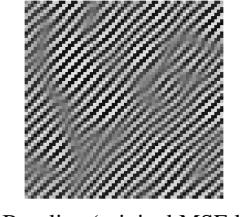
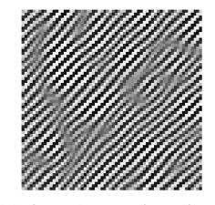
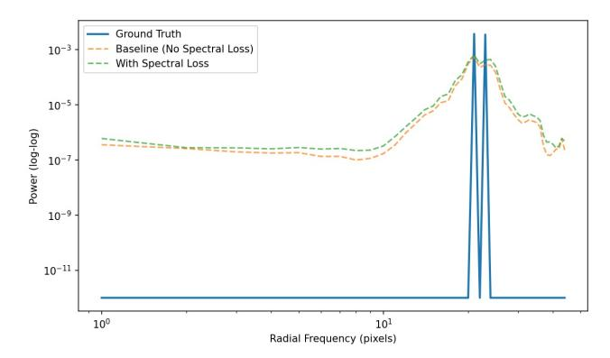
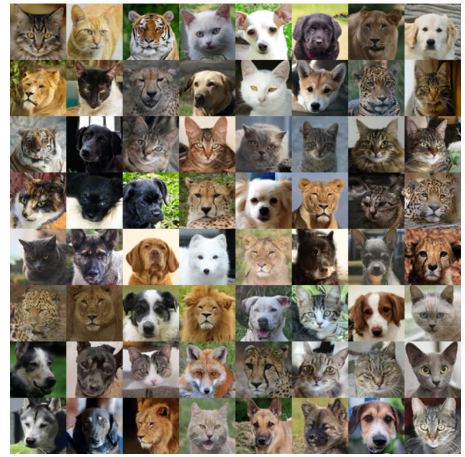
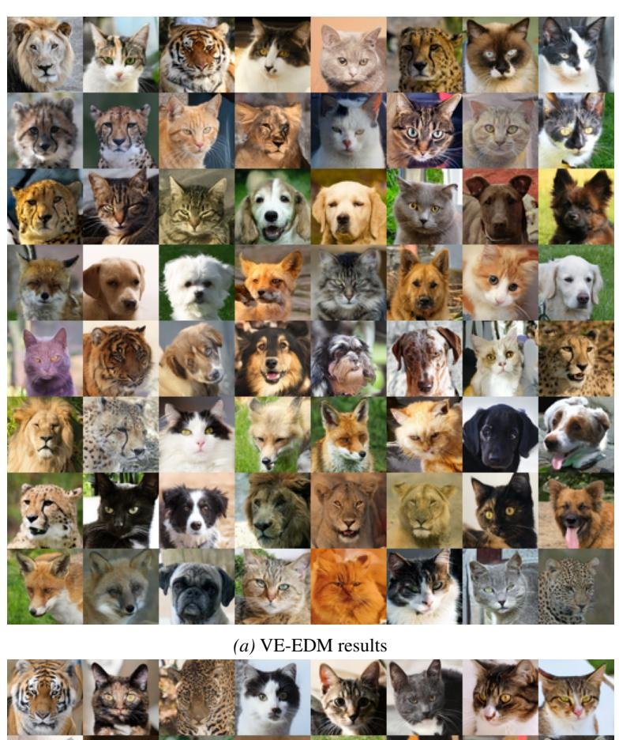
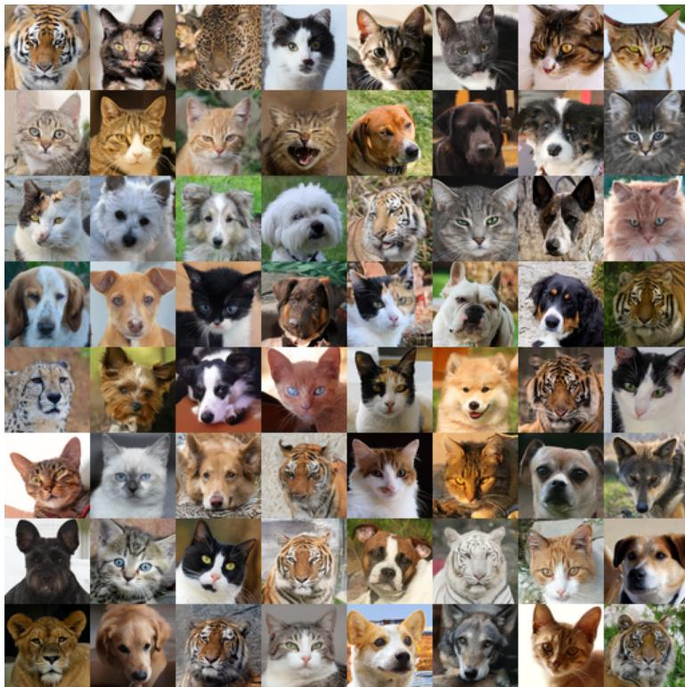
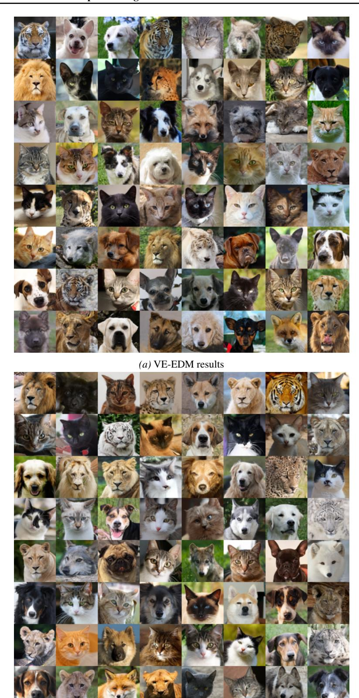
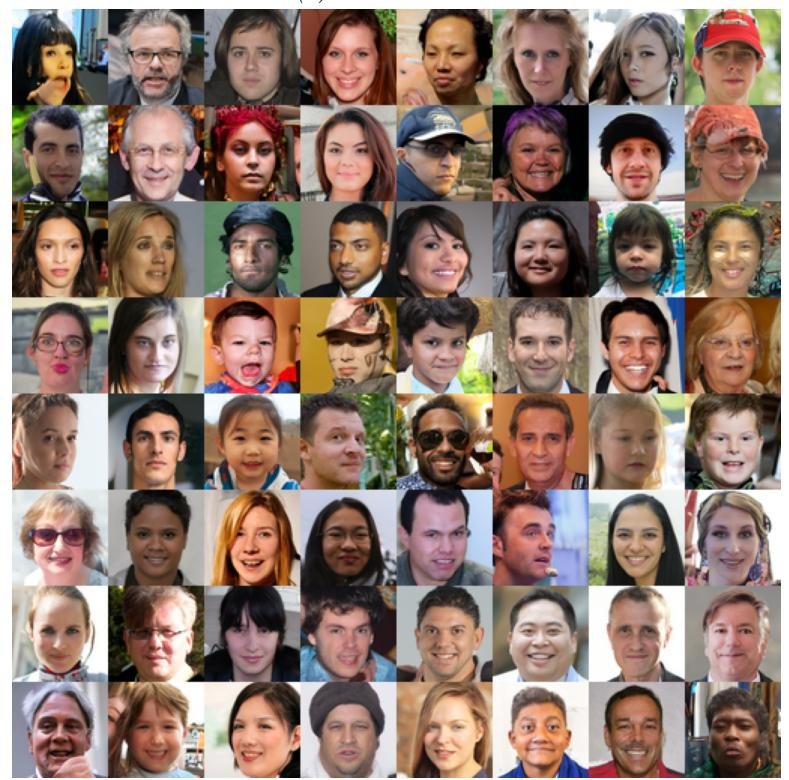
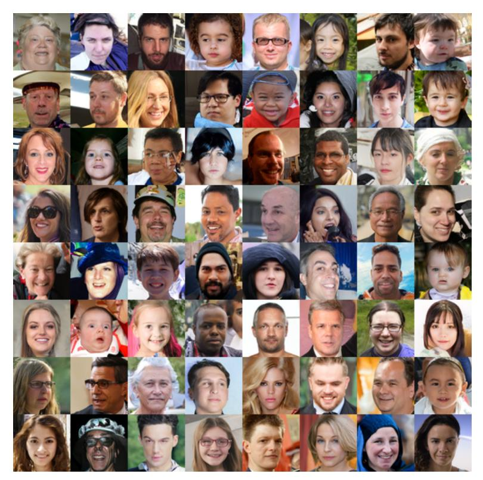
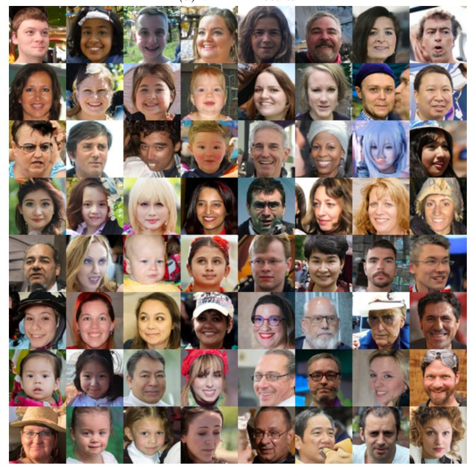

# Spectral Regularization for Diffusion Models

Satish Chandran \* 1 N´ıcolas Roque dos Santos \* 2 Yunshu Wu 2 Greg Ver Steeg 2 Evangelos Papalexakis 2

# Abstract

Diffusion models are typically trained using pointwise reconstruction objectives that are agnostic to the spectral and multi-scale structure of natural signals. We propose a loss-level spectral regularization framework that augments standard diffusion training with differentiable Fourier- and wavelet-domain losses, without modifying the diffusion process, model architecture, or sampling procedure. The proposed regularizers act as soft inductive biases that encourage appropriate frequency balance and coherent multi-scale structure in generated samples. Our approach is compatible with DDPM, DDIM, and EDM formulations and introduces negligible computational overhead. Experiments on image and audio generation demonstrate consistent improvements in sample quality, with the largest gains observed on higher-resolution, unconditional datasets where fine-scale structure is most challenging to model.

## 1. Introduction

Diffusion models have emerged as a powerful and versatile framework for generative modeling of high-dimensional signals. By learning to reverse a gradual noising process, diffusion models provide stable training, strong mode coverage, and state-of-the-art performance across a wide range of modalities, including natural images, audio waveforms, and graphical representations [\(Sohl-Dickstein et al.,](#page-9-0) [2015;](#page-9-0) [Ho et al.,](#page-8-0) [2020;](#page-8-0) [Dhariwal & Nichol,](#page-8-1) [2021;](#page-8-1) [Liu et al.,](#page-9-1) [2023\)](#page-9-1). Their success has led to rapid adoption in image synthesis [\(Rombach et al.,](#page-9-2) [2022\)](#page-9-2), audio generation [\(Kong et al.,](#page-9-3) [2021\)](#page-9-3), and conditional generation tasks such as super-resolution and inpainting [\(Saharia et al.,](#page-9-4) [2022\)](#page-9-4).

Despite their strong empirical performance, diffusion models are typically trained using pointwise reconstruction

*Preprint. March 4, 2026.*

losses defined in the signal domain, most commonly meansquared error on predicted noise or clean signals [\(Ho et al.,](#page-8-0) [2020;](#page-8-0) [Song et al.,](#page-9-5) [2021\)](#page-9-5). While these objectives are well motivated from both a empirical and theoretical perspective, they are agnostic to the spectral and multi-scale structure that characterizes many natural signals. Images and audio often exhibit highly structured frequency content, longrange correlations, and scale-dependent patterns that are only implicitly captured through pixel/sample-level supervision. As a result, diffusion models often generate samples that match low-level statistics while exhibiting artifacts such as over-smoothing, incorrect frequency balance, or degraded fine-scale structure [\(Benita et al.,](#page-8-2) [2025;](#page-8-2) [Chen et al.,](#page-8-3) [2025;](#page-8-3) [Ding et al.,](#page-8-4) [2024;](#page-8-4) [Jiralerspong et al.,](#page-8-5) [2025\)](#page-8-5).

Recent works have explored augmenting diffusion models with additional forms of structure or inductive bias. In scientific and engineering domains, this has included incorporating explicit constraint or residual losses into diffusion training to enforce known properties of the data-generating process [\(Shu et al.,](#page-9-6) [2023;](#page-9-6) [Bastek et al.,](#page-8-6) [2025;](#page-8-6) [Jacobsen et al.,](#page-8-7) [2025\)](#page-8-7). While effective in settings where such constraints are well defined, these approaches are less directly applicable to general image and audio tasks, where the structure is implicit, statistical, and perceptual rather than being defined explicitly as a set of differential equations.

In contrast, frequency-domain representations have long played a central role in image and audio processing. Fourier analysis provides a global description of signal energy distribution across frequencies and is fundamental to understanding smoothness, noise, and periodic structure [\(Oppenheim](#page-9-7) [et al.,](#page-9-7) [1996\)](#page-9-7). Wavelet representations extend this perspective by offering localized, multi-resolution decompositions that capture both spatial or temporal locality and scale [\(Mallat,](#page-9-8) [2008\)](#page-9-8). These representations underpin classical methods in compression, denoising, and texture analysis, and they have also been used as inductive biases or auxiliary losses in deep learning models for images and audio [\(Bruna &](#page-8-8) [Mallat,](#page-8-8) [2013;](#page-8-8) [Gatys et al.,](#page-8-9) [2016;](#page-8-9) [Kong et al.,](#page-9-3) [2021\)](#page-9-3).

We propose a spectral regularization framework for diffusion model training that augments the standard denoising objective with differentiable losses defined in the Fourier and wavelet domains. Rather than modifying model architectures, samplers, or imposing hard constraints, our approach

1Department of Mathematics, University of California Riverside, Riverside, California, USA 2Department of Computer Science, University of California Riverside, Riverside, California, USA. Correspondence to: Evangelos Papalexakis <epapalexcs@cs.ucr.edu>.

introduces a soft inductive bias that encourages generated samples to match the frequency-dependent structure of the data. Fourier-based losses capture global spectral characteristics, while wavelet-based losses provide localized, scaleaware control well suited to non-stationary signals such as audio and textured images. The resulting regularization is domain-agnostic, requires no auxiliary networks or additional supervision, and incurs negligible computational overhead. Empirically, we find that incorporating spectral information complements pixel-level objectives, leading to sharper reconstructions, improved perceptual quality, and reduced overfitting, while preserving the diversity and expressiveness of diffusion models. The code is available at [https://anonymous.4open.science/r/fourierdm-8B8E.](https://anonymous.4open.science/r/fourierdm-8B8E)

## 2. Related Works

Spectral-domain diffusion models. A growing body of work explores incorporating frequency structure directly into diffusion models by redefining the diffusion process in spectral coordinates or operating on transformed representations. [Crabbe et al.](#page-8-10) ´ [\(2024\)](#page-8-10) formulate diffusion for time series in the Fourier domain, explicitly modeling conjugatesymmetric complex coefficients to ensure real-valued reconstructions. [Jiralerspong et al.](#page-8-5) [\(2025\)](#page-8-5) shape the diffusion dynamics in frequency space to emphasize or suppress specific spectral bands through frequency-based noise control. [Phillips et al.](#page-9-9) [\(2022\)](#page-9-9) propose spectral process diffusion, performing score-based modeling over coefficients of stochastic processes expressed in a spectral basis.

These approaches embed spectral structure directly into the diffusion state space or dynamics, requiring modified forward processes or basis-specific parameterizations. In contrast, our method preserves standard diffusion formulations (DDPM, DDIM, and EDM) and introduces spectral structure solely through auxiliary loss terms applied to reconstructions. Spectral bias is therefore imposed at the loss objective level rather than through changes to the generative process itself.

Wavelet-based and multi-resolution diffusion. Wavelet representations have motivated several diffusion models that operate directly on multi-scale decompositions. [Guth](#page-8-11) [et al.](#page-8-11) [\(2022\)](#page-8-11) perform score-based diffusion on wavelet coefficients and interpret the resulting hierarchy through renormalization group theory. [Phung et al.](#page-9-10) [\(2022\)](#page-9-10) and [Hu et al.](#page-8-12) [\(2024\)](#page-8-12) apply wavelet-domain diffusion for efficient image generation and 3D shape modeling, respectively. Related approaches selectively apply diffusion to low-frequency components while refining high-frequency content using auxiliary modules, primarily for restoration and efficiency [\(Huang et al.,](#page-8-13) [2023;](#page-8-13) [Zhao et al.,](#page-9-11) [2024;](#page-9-11) [Liu et al.,](#page-9-12) [2025;](#page-9-12) [Zhou et al.,](#page-9-13) [2026\)](#page-9-13). In these works, diffusion is typically

performed in a transformed representation or coupled with frequency-specific architectural modules. Our approach instead retains standard pixel- or waveform-space diffusion and applies wavelet regularization purely at the loss level. This maintains architectural simplicity while encouraging multi-scale consistency through the training objective.

Hybrid Fourier-wavelet diffusion. Several recent works explicitly combine Fourier and wavelet representations within diffusion pipelines. [Luo et al.](#page-9-14) [\(2025\)](#page-9-14) introduce crossfrequency fusion for trajectory modeling in reinforcement learning. [Kiruluta & Lemos](#page-8-14) [\(2025\)](#page-8-14) propose a hybrid forward process combining partial Fourier corruption with wavelet decomposition and multi-branch denoising networks. These hybrid approaches integrate spectral structure into the forward process or network design. In contrast, we treat Fourier and wavelet transforms as analysis operators used only for defining differentiable penalties. The diffusion dynamics remain unchanged, making our framework modular and directly compatible with existing implementations.

Constraint-augmented diffusion models. More broadly, diffusion models have been augmented with auxiliary losses to encode known structure, particularly in scientific domains. Physics-informed diffusion models incorporate residualbased constraints derived from governing equations to enforce physical consistency [\(Shu et al.,](#page-9-6) [2023;](#page-9-6) [Bastek et al.,](#page-8-6) [2025;](#page-8-6) [Jacobsen et al.,](#page-8-7) [2025\)](#page-8-7). While effective when explicit constraints are available, such methods are less applicable to natural images and audio, where structure is statistical rather than rule-based. Our work adopts the broader idea of auxiliary regularization but replaces equation-based constraints with soft frequency-domain penalties derived from signal statistics.

Positioning of Our Approach. Overall, existing frequency-aware diffusion methods typically modify the diffusion process, operate in transformed domains, or introduce task-specific architectures. In contrast, we propose a loss-level spectral regularization framework that preserves standard diffusion formulations (DDPM, DDIM, and EDM) while encouraging frequency balance and multi-scale coherence through differentiable Fourierand wavelet-domain losses. This design is domain-agnostic, architecture-independent, and directly compatible with existing diffusion training and sampling pipelines.

## 3. Diffusion Models

Diffusion models define a class of generative models that construct complex data distributions by reversing a gradual stochastic noising process. The central idea is to transform data samples into noise through a forward process that is analytically tractable, and to learn a parameterized reverse process that progressively removes noise. This framework has evolved through several closely related formulations, including denoising diffusion probabilistic models (DDPMs) (Ho et al., 2020), deterministic diffusion implicit models (DDIMs) (Song et al., 2021), and more recent formulations such as Elucidated Diffusion Models (EDMs) (Karras et al., 2022), which unify training and sampling under continuous noise parameterizations.

#### 3.1. Denoising Diffusion Probabilistic Models (DDPM)

Denoising Diffusion Probabilistic Models (DDPMs) define a discrete-time Markov chain that gradually corrupts data with Gaussian noise over T steps. Given a data sample  $x_0 \sim p_{\rm data}$ , the forward process is defined as

$$q(x_t \mid x_{t-1}) = \mathcal{N}\left(\sqrt{1 - \beta_t} x_{t-1}, \ \beta_t I\right), \tag{1}$$

where  $\{\beta_t\}_{t=1}^T$  is a predefined variance schedule. By construction, this process admits a closed-form marginal defined by

$$x_t = \sqrt{\bar{\alpha}_t} x_0 + \sqrt{1 - \bar{\alpha}_t} \varepsilon, \qquad \varepsilon \sim \mathcal{N}(0, I), \quad (2)$$

with  $\bar{\alpha}_t = \prod_{s=1}^t (1 - \beta_s)$ . The reverse process is parameterized by a neural network trained to predict either the mean of the reverse transition or, more commonly, the added noise  $\varepsilon$ . This leads to the standard DDPM objective:

$$\mathcal{L}_{\text{DDPM}} = \mathbb{E}_{x_0, \, \varepsilon, \, t} \left[ \left\| \varepsilon - \varepsilon_{\theta}(x_t, t) \right\|_2^2 \right], \tag{3}$$

which can be shown to correspond to a variational bound on the negative log-likelihood. DDPMs established diffusion models as an alternative to GANs, offering stable training and strong mode coverage, at the cost of relatively slow sampling due to the large number of required reverse steps

### 3.2. Denoising Diffusion Implicit Models (DDIM)

Denoising Diffusion Implicit Models (DDIMs) reinterpret the DDPM framework by constructing a non-Markovian, deterministic sampling process that preserves the same marginal distributions as DDPMs while enabling faster generation. Rather than sampling from a stochastic reverse transition, DDIMs define a deterministic mapping:

$$x_{t-1} = \sqrt{\bar{\alpha}_{t-1}} \, \widehat{x}_0 + \sqrt{1 - \bar{\alpha}_{t-1}} \, \varepsilon_{\theta}(x_t, t), \qquad (4)$$

where

$$\widehat{x}_0 = \left(x_t - \sqrt{1 - \bar{\alpha}_t} \,\varepsilon_\theta(x_t, t)\right) / \sqrt{\bar{\alpha}_t}.\tag{5}$$

This formulation reveals that diffusion models define a family of generative trajectories indexed by a stochasticity parameter, interpolating between fully stochastic DDPM sampling and deterministic DDIM sampling. Importantly, DDIMs use the same training objective as DDPMs with the only difference being the sampling procedure.

#### 3.3. Elucidated Diffusion Models (EDM)

Elucidated Diffusion Models (EDMs) further generalize diffusion modeling by formulating training and sampling in continuous noise space rather than discrete time steps. Instead of indexing noise by t, EDMs parameterize corruption using the noise standard deviation  $\sigma$ , defining noisy samples as

$$x_{\sigma} = x_0 + \sigma \varepsilon, \qquad \varepsilon \sim \mathcal{N}(0, I).$$
 (6)

EDMs introduce a reweighted denoising objective of the form

$$\mathcal{L}_{\mathrm{EDM}} = \mathbb{E}_{x_0, \, \varepsilon, \, \sigma} \left[ \lambda_{EDM}(\sigma) \left\| \varepsilon - \varepsilon_{\theta}(x_{\sigma}, \sigma) \right\|_{2}^{2} \right], \quad (7)$$

where the weighting function  $\lambda_{EDM}(\sigma)$  is chosen to balance contributions across noise scales. A key advantage of the EDM framework is that it exposes diffusion models as learning scale-dependent denoisers across a continuum of noise levels. This perspective is particularly relevant for image and audio generation, where meaningful structure exists across a wide range of spatial or temporal scales. By explicitly decoupling noise level, loss weighting, and sampling trajectory, EDMs provide a flexible foundation for incorporating additional regularization terms without altering the core generative mechanism.

#### 3.4. Implications for Regularized Diffusion Training

Across DDPM, DDIM, and EDM formulations, diffusion models are trained using pointwise denoising objectives defined in the signal domain. While sufficient for likelihood-based learning, these objectives do not explicitly constrain how reconstruction error is distributed across frequencies or scales. Since the learned denoiser defines a family of noise-dependent reconstruction operators, augmenting the training objective with spectral or multi-scale regularization naturally complements the diffusion framework without altering its probabilistic foundations.

From an operator perspective, diffusion models recover coarse, low-frequency structure at high noise levels, while fine-scale, high-frequency components are reconstructed only in low-noise regimes. As a result, high-frequency errors are learned under weaker effective regularization and fewer samples, making them more susceptible to overfitting and instability. Standard diffusion objectives treat all reconstruction errors equally, allowing error to concentrate in perceptually or structurally undesirable frequency bands (Benita et al., 2025; Chen et al., 2025; Ding et al., 2024; Jiralerspong et al., 2025).

In this work, we address this limitation by introducing Fourier- and wavelet-based regularization terms that operate entirely at the loss level. The proposed approach applies uniformly to DDPM, DDIM, and EDM training and sampling,

providing explicit control over frequency and scale without modifying the diffusion process or model architecture.

#### 3.5. Fourier and Wavelet Transformations

Fourier and wavelet transforms provide foundational tools for analyzing the frequency and multi-scale structure of signals. For image and audio data, these representations offer complementary perspectives on smoothness, oscillatory behavior, and localized structure that are not explicitly captured in the spatial/temporal domains. As such, they play a central role in signal processing, compression, and perceptual modeling, and thus serve as natural candidates for imposing inductive biases in generative models.

#### 3.5.1. FOURIER TRANSFORM

The Fourier transform represents a signal as a linear superposition of global sinusoidal basis functions and generalizes naturally to signals defined on  $\mathbb{R}^n$ . Let  $x(\zeta) \in L^2(\mathbb{R}^n)$ , with spatial/temporal coordinate  $\zeta \in \mathbb{R}^n$ . The n-dimensional Fourier transform is defined as

$$X(\omega) = \int_{\mathbb{R}^n} x(\zeta) e^{-i2\pi\omega\cdot\zeta} d\zeta, \tag{8}$$

with inverse transform

$$x(\zeta) = \int_{\mathbb{R}^n} X(\omega) \, e^{i2\pi\omega\cdot\zeta} \, d\zeta,\tag{9}$$

where  $\omega \in \mathbb{R}^n$  denotes the frequency vector and  $\omega \cdot \zeta$  is the usual Euclidean inner/dot product. In practice, for discrete signals defined on grid (e.g. images and audio), the discrete Fourier transform and can be computed efficiently using the fast Fourier transform (FFT) (Press et al., 2007).

A central property of the Fourier transform is energy preservation, formalized by the Parseval–Plancherel theorem:

$$||x(\zeta)||_2^2 = ||X(\omega)||_2^2,$$
 (10)

i.e. the total  $L^2$  energy of a signal is invariant under transformation to the frequency domain. Consequently, minimizing a squared reconstruction loss in signal space is equivalent to minimizing it in Fourier space. Crucially, this equivalence holds only for  $L^2$  norms and does not extend to the  $L^1$  losses used in our spectral regularization. Parseval's identity is therefore agnostic to how reconstruction error is distributed across frequencies. This motivates the introduction of explicit spectral penalties: by applying  $L^1$  discrepancies to Fourier amplitude (and phase), we intentionally break Parseval invariance to directly control the allocation of error, penalizing spectral imbalance—particularly in high-frequency components that are weakly constrained by standard diffusion objectives.

While the Fourier spectrum captures global structure such as smoothness, anisotropy, and periodicity, its globally supported basis functions lack spatial or temporal localization, limiting their expressiveness for non-stationary or localized phenomena common in images and audio. This limitation is especially relevant for diffusion models, whose denoising objectives constrain only the total squared error and not its spectral distribution. As a result, small overall losses may still correspond to disproportionate high-frequency errors, leading to over-smoothing or perceptual artifacts.

#### 3.5.2. WAVELET TRANSFORMS

Wavelet transforms address the local limitations of the Fourier transform by providing a localized, multi-resolution representation of signals. Instead of global sinusoids, wavelets use basis functions that are localized in both space (or time) and frequency. Let  $x(\zeta) \in L^2(\mathbb{R}^n)$  be a signal with coordinate  $\zeta \in \mathbb{R}^n$ . Given a mother wavelet  $\psi(\zeta)$  satisfying suitable admissibility conditions, a family of wavelets is generated through isotropic dilation and translation:

$$\psi_{a,b}(\zeta) = \frac{1}{|a|^{n/2}} \psi\left(\frac{\zeta - b}{a}\right),\tag{11}$$

where  $a \in \mathbb{R}^+$  controls scale and  $b \in \mathbb{R}^n$  controls translation. The normalization factor ensures energy preservation across scales.

The continuous wavelet transform (CWT) of x is defined as

$$W_x(a,b) = \int_{\mathbb{R}^n} x(\zeta) \, \psi_{a,b}(\zeta) \, d\zeta \tag{12}$$

yielding a joint representation over both scale and spatial location.

Discrete wavelet transforms (DWTs) provide a hierarchical, multi-scale decomposition of a signal into approximation and detail coefficients at dyadic scales. For multi-dimensional signals, this yields multiple oriented sub-bands per scale, capturing localized and directional structure (e.g., horizontal, vertical, and diagonal components in images). Low-frequency coefficients encode coarse content, while high-frequency coefficients capture edges, textures, and transient features, closely mirroring the hierarchical representations learned by deep neural networks.

From a modeling perspective, wavelet-domain representations enable explicit control over both scale and spatial localization. Regularization applied to wavelet coefficients can target specific resolutions or regions, making wavelets particularly effective for non-stationary signals such as natural images and audio, where meaningful structure varies across space, time, and scale.

## 3.6. Spectral and Multi-Scale Structure

Both Fourier and wavelet representations offer complementary views of signal structure. Fourier transforms emphasize global frequency content and energy distributions, while

wavelets provide localized, scale-aware representations. For natural images and audio, meaningful structure is often expressed across a range of scales and frequencies, suggesting that generative models should respect these properties.

From a modeling perspective, losses or regularizers defined in spectral or wavelet domains can be interpreted as constraints on the geometry of the generated distribution in transformed spaces. Unlike pointwise signal-domain objectives, such regularization explicitly emphasizes frequency balance, scale consistency, and localized structure. These properties motivate the use of Fourier/wavelet-based regularization within diffusion models, where denoising already operates implicitly across multiple noise scales.

## 4. Spectral Regularization

Rather than introducing spectral losses as ad-hoc auxiliary penalties, we derive them from a geometric reinterpretation of diffusion training. Diffusion objectives constrain the reconstruction error in an  $L^2$  sense, which controls only the total spectral energy of the error. Our spectral regularizers are formulated using  $L^1$  discrepancies in the Fourier and wavelet domains rather than squared  $L^2$  losses. This emphasizes the distribution of reconstruction error across frequencies rather than its total energy. The  $L^1$  penalties treat discrepancies across bands uniformly and remain sensitive to structured high-frequency mismatches.

### 4.1. Fourier-Regularized Diffusion Models

### 4.1.1. Preliminaries

Let  $x_0 \sim p_{\text{data}}$  denote a data sample, and let  $x_t$  denote a noisy version of  $x_0$  obtained at diffusion time t (or equivalently, noise level  $(\alpha)$ . We denote by  $\mathcal{F}[x_t](\omega)$  the n-dimensional Fourier transform of  $x_t$ , where  $\omega \in \mathbb{R}^n$  denotes the frequency variable. We express the Fourier transform in polar form,

$$\mathcal{F}[x_t](\omega) = A_t(\omega) \exp(i\phi_t(\omega)),$$
 (13)

where  $A_t(\omega) = |\mathcal{F}[x_t](\omega)|$  is the amplitude and  $\theta_t(\omega)$  is the phase.

Given a predicted denoised sample  $\widehat{x}_0 = \widehat{x}_{\theta}(x_t, t)$ , we denote its Fourier amplitude and phase by  $\widehat{A}_0$  and  $\widehat{\phi}_0$ , respectively.

### 4.1.2. AMPLITUDE-BASED FOURIER LOSSES

We consider Fourier-domain regularization terms that penalize discrepancies between the spectral representations of the predicted clean sample  $\hat{x}_0$  and the ground-truth sample  $x_0$ . In contrast to pixel-domain losses, these objectives explicitly control frequency-dependent structure and scale.

**Amplitude Loss.** The first regularizer enforces agreement between the amplitude spectra of the generated and target samples:

$$\mathcal{L}_{\mathrm{F}}^{\mathrm{A}} = \mathbb{E}_{x_0, t} \left[ \left\| A_0 - \widehat{A}_0 \right\|_{1} \right], \tag{14}$$

where  $A_0$  denotes the amplitude spectrum of the ground-truth sample and the expectation is taken over data samples and diffusion times. The Fourier amplitude spectrum captures how signal energy is distributed across frequencies, independent of spatial alignment. This enforces a global structural constraint that is invisible to pointwise losses. Importantly, amplitude discrepancies correspond to mismatches in frequency-wise energy allocation rather than local phase misalignment. As a result, amplitude-based regularization directly addresses the incorrect redistribution of reconstruction error across frequency bands.

**Amplitude-and-Phase Loss.** While amplitude matching enforces global spectral alignment, it does not explicitly account for relative scaling across frequencies. To address this, we introduce a second regularizer that incorporates both amplitude magnitude and phase information:

$$\mathcal{L}_{F}^{AP} = \mathbb{E}_{x_{0}, t} \left[ \left\| A_{0} - \widehat{A}_{0} \right\|_{1} \left( 1 + \left\| \left( \phi_{0} - \widehat{\phi}_{0} \right) \right\|_{1} \right) \right].$$
(15)

The amplitude–phase (AP) coupling is motivated by the observation that phase information becomes meaningful primarily when associated with non-negligible spectral energy and that simply using the phase information leads to unstable training due to the branch-cuts. Large phase discrepancies in frequency bands with vanishing amplitude are perceptually insignificant, while similar discrepancies in dominant bands correspond to coherent structural distortions. This formulation avoids over-penalizing inconsequential phase noise while stabilizing fine-scale structure.

## 4.2. Wavelet Regularized Diffusion Models

#### 4.2.1. Preliminaries

Let  $x_0 \sim p_{\text{data}}$  denote a data sample, and let  $x_t$  be its noisy counterpart at diffusion time t. We denote by  $\mathcal{W}[x_t] = \left\{W_t^{(s,\ell)}(b)\right\}_{s,\ell}$  the discrete wavelet transform of  $x_t$ , where s indexes scale,  $\ell$  indexes orientation or sub-band, and  $\mathbf{b} \in \mathbb{R}^n$  denotes spatial or temporal location. This decomposition yields a hierarchical set of wavelet coefficients corresponding to different resolutions and directions. Similarly, given a predicted denoised sample  $\widehat{x}_0 = \widehat{x}_{\theta}(x_t, t)$ , we denote its wavelet coefficients by  $\widehat{W}_0^{(s,\ell)}(b)$ .

#### 4.2.2. WAVELET LOSSES

We define wavelet-domain regularization terms that penalize discrepancies between the wavelet coefficients of the predicted clean sample and those of the ground-truth data. These losses encourage agreement across scales and locations, directly targeting multi-resolution structure.

**Wavelet Coefficient Matching Loss.** Our first wavelet loss enforces alignment between wavelet coefficients at all scales and orientations:

$$\mathcal{L}_{W} = \mathbb{E}_{x_{0}, t} \left[ \sum_{s, \ell} \gamma_{s, l} \left\| W_{0}^{(s, \ell)} - \widehat{W}_{0}^{(s, \ell)} \right\|_{1} \right], \quad (16)$$

where the norm is taken over spatial locations b and  $\gamma_{s,l}$  is the weight corresponding to each scale and sub-band. This loss encourages the diffusion model to match localized features such as edges, textures, and transient events at each resolution level.

#### 4.3. Training Objective

The final training objective augments the standard diffusion loss with the proposed Fourier regularization:

$$\mathcal{L}_{\text{total}} = \mathcal{L} + \lambda \, \mathcal{L}_{S}, \tag{17}$$

where  $\mathcal{L}$  is the standard diffusion denoising objective defined by Eq. (3) and  $\mathcal{L}_{\mathrm{S}}$  denotes either  $\mathcal{L}_{\mathrm{F}}^{\mathrm{A}}$ ,  $\mathcal{L}_{\mathrm{F}}^{\mathrm{AS}}$ , or  $\mathcal{L}_{\mathrm{W}}$ . The hyperparameter  $\lambda$  controls the spectral regularization.

This formulation mirrors the structure of constraintaugmented diffusion models while remaining fully datadriven and domain-agnostic. Fourier regularization shapes the learned denoising operator to respect global spectral properties without restricting the generative process to satisfy explicit rules or equations. The Wavelet loss provide complementary global and local spectral biases that improve the fidelity and robustness of generative diffusion models. As a result, the proposed method integrates seamlessly with existing diffusion architectures and sampling procedures.

#### 5. Experiments

## 5.1. Checkerboard Toy Experiment

To isolate the effect of our spectral regularizer, we construct a toy dataset of  $64 \times 64$  grayscale checkerboard images, which concentrate energy at a small set of high spatial frequencies. Such patterns provide a controlled stress test for assessing whether diffusion models preserve dominant periodic structure during generation. We compare a standard DDPM trained with the Mean Squared Error (MSE) noise prediction loss to the same objective augmented with our amplitude-and-phase spectral loss (Eq. 15), keeping architectures and optimization settings fixed.

Figure 1 shows representative generations and Figure 2 shows the radially averaged power spectra. The baseline

model exhibits visible smoothing and spectral leakage, producing attenuated and broadened responses at the checker-board frequencies. In contrast, the spectral regularizer concentrates energy near the correct frequency bands and yields sharper periodic structure, resulting in samples that more closely match the ground-truth spectrum, despite remaining less strictly binary than the target.

#### 5.2. Image Datasets

We study spectral regularization as a lightweight fine-tuning strategy applied to pretrained EDM models (Karras et al., 2022). For each dataset and EDM formulation, models are fine-tuned for 5 optimization steps using the standard EDM denoising objective augmented with a spectral loss. This setup isolates the effect of loss-level spectral biasing without modifying the model architecture, diffusion formulation, or sampler. More training details are in Appendix A.1.

We consider both variance-preserving (VP) and varianceexploding (VE) EDM variants. For each, we evaluate four spectral losses: (i) Fourier amplitude, (ii) Fourier amplitude+phase, (iii) Haar wavelet, and (iv) bi-orthogonal 1.3 (bior13) wavelet regularization. Fourier transforms are computed using PyTorch FFTs, while wavelet transforms are implemented based on PyWavelets (Lee et al., 2019). Experiments are conducted on CIFAR-10 (32  $\times$  32), FFHQ, and AFHQv2 ( $64 \times 64$ ), following the standard EDM evaluation protocol. CIFAR-10 is evaluated under conditional sampling, whereas FFHQ and AFHQv2 are evaluated unconditionally. We consider two choices for the regularization weight. The first being the "weighted" setting where  $\lambda = \lambda_{\rm EDM}$  (see Eq. 7), and the "unweighted" setting where  $\lambda = 1$ . Generative quality is measured using Fréchet Inception Distance (FID), computed between 50,000 generated samples and the full real dataset. Results are averaged over three random seeds. Some sampled images for the FFHQ and AFHQ datasets are shown in Appendix C.

Table 1 reports FID scores for CIFAR-10, AFHQ, and FFHQ under both VE- and VP-EDM formulations. Since all experiments start from strong pretrained EDM baselines, the scope for improvement is necessarily limited. On CIFAR-10 (conditional), spectral losses have negligible effect, with all methods performing within the standard deviation of the EDM baseline, indicating limited benefit when conditional structure is already well captured.

On the higher-resolution AFHQ and FFHQ datasets, we observe small but reliable FID reductions (typically 0.02-0.07) across multiple spectral losses and EDM variants, with no cases of systematic degradation. These gains are comparable in magnitude across AFHQ and FFHQ, indicating that the proposed losses behave similarly on distinct but equally challenging natural image distributions.

(a) Ground truth (b) Baseline (original MSE loss) (c) Ours (amp+phase loss)

*Figure 1.* Checkerboard toy experiment. Figures (a) to (c) show the ground-truth pattern, a sample from a model trained without spectral regularization, and a sample from a model trained with the proposed amplitude-and-phase loss.

*Table 1.* Frechet Inception Distance (FID) scores for different spectral regularizers and EDM variants. All models are fine-tuned from ´ pretrained EDM baselines. Lower values indicate better generative performance.

| DATASET | EDM VARIANT | EDM SAMPLING STEPS | CONDITIONING | REGULARIZER                        | WEIGHTED FID                                  | UNWEIGHTED FID                                | EDM FID |
|---------|----------------|-----------------------|--------------|------------------------------------|--------------------------------------------------|--------------------------------------------------|------------|
| CIFAR   | VE             | 18                    | COND         | AMP AMP PHASE HAAR BIOR13 | 1.82±0.01 1.82±0.01 1.81±0.01 1.82±0.01 | 1.82±0.01 1.82±0.01 1.81±0.02 1.81±0.02 | 1.81±0.01  |
| CIFAR   | VP             | 18                    | COND         | AMP AMP PHASE HAAR BIOR13 | 1.84±0.02 1.84±0.02 1.84±0.02 1.83±0.02 | 1.84±0.02 1.84±0.02 1.84±0.02 1.84±0.02 | 1.84±0.02  |
| AFHQ    | VE             | 40                    | UNCOND       | AMP AMP PHASE HAAR BIOR13 | 2.13±0.00 2.13±0.01 2.14±0.01 2.14±0.01 | 2.14±0.00 2.16±0.01 2.14±0.00 2.14±0.01 | 2.17±0.00  |
| AFHQ    | VP             | 40                    | UNCOND       | AMP AMP PHASE HAAR BIOR13 | 2.03±0.02 2.04±0.02 2.05±0.02 2.07±0.02 | 2.05±0.02 2.03±0.02 2.03±0.03 2.05±0.02 | 2.04±0.00  |
| FFHQ    | VE             | 40                    | UNCOND       | AMP AMP PHASE HAAR BIOR13 | 2.5±0.02 2.49±0.02 2.5±0.02 2.51±0.02   | 2.51±0.02 2.50±0.02 2.49±0.02 2.5±0.02  | 2.56±0.03  |
| FFHQ    | VP             | 40                    | UNCOND       | AMP AMP PHASE HAAR BIOR13 | 2.35±0.03 2.33±0.03 2.33±0.04 2.34±0.04 | 2.31±0.03 2.34±0.03 2.33±0.04 2.32±0.04 | 2.38±0.01  |

Importantly, the improvements are achieved with only a handful of fine-tuning steps and without modifying the architecture or sampler, highlighting that spectral regularization acts as a stable and data-efficient bias rather than an aggressive optimization mechanism.

Overall, amplitude-phase regularization is the most consistently competitive method, achieving the best or tied-best performance on FFHQ and remaining close to optimal elsewhere. These results suggest that spectral regularization is most effective in higher-resolution, unconditional settings where diffusion models struggle to capture fine-scale structure, and offer limited benefits when baseline performance is already near saturation.

#### 5.3. Audio Dataset

We additionally evaluate spectral regularization for audio generation by fine-tuning a pretrained DiffWave model using the same loss-level protocol as in our image experiments [\(Kong et al.,](#page-9-3) [2021\)](#page-9-3). Specifically, we optimize the standard DiffWave DDPM denoising objective and augment it with one of our proposed spectral losses, namely Fourier amplitude, Fourier amplitude-phase, and wavelet-based regularizers. We fine-tune the official implementation for 150,000 steps on the LJSpeech-1.1 dataset [\(Ito & Johnson,](#page-8-16) [2017\)](#page-8-16) starting from the publicly released pretrained checkpoint. Additional details are presented in Appendix [A.2.](#page-10-1)

A key implementation detail is that we compute spectral representations using the predicted clean waveform that is

*Table 2.* Audio generation quality metrics for DiffWave fine-tuning with spectral regularization. FAD measures distributional similarity in audio embedding space (lower is better), UTMOS estimates perceptual naturalness (higher is better), PESQ measures perceptual speech quality (higher is better), MR-STFT measures multi-resolution spectral error (lower is better), and NDB evaluates distributional coverage and mode balance (lower is better). We report the average and standard deviation of five runs with different seeds.

| METHOD    | λ    | FAD ↓       | UTMOS ↑     | PESQ ↑      | MR-STFT ↓     | NDB ↓     |
|-----------|------|-------------|-------------|-------------|---------------|-----------|
| DIFFWAVE  | –    | 1.994±0.008 | 3.941±0.005 | 3.440±0.002 | 1.217±0.001   | 0.63±0.02 |
| AMP       | 10−4 | 1.462±0.006 | 3.953±0.009 | 3.477±0.003 | 1.1802±0.0005 | 0.65±0.03 |
|           | 10−5 | 1.609±0.007 | 3.953±0.009 | 3.476±0.001 | 1.1930±0.0004 | 0.63±0.02 |
|           | 10−6 | 1.775±0.008 | 3.952±0.006 | 3.491±0.003 | 1.1958±0.0005 | 0.64±0.03 |
| AMP+PHASE | 10−4 | 1.694±0.009 | 3.969±0.008 | 3.516±0.002 | 1.1896±0.0003 | 0.66±0.02 |
|           | 10−5 | 1.543±0.012 | 3.988±0.003 | 3.495±0.002 | 1.1773±0.0004 | 0.59±0.01 |
|           | 10−6 | 1.539±0.007 | 3.976±0.008 | 3.344±0.003 | 1.1921±0.0003 | 0.65±0.02 |
| HAAR      | 10−4 | 1.729±0.016 | 3.965±0.006 | 3.466±0.003 | 1.1708±0.0006 | 0.59±0.02 |
|           | 10−5 | 1.992±0.014 | 3.988±0.008 | 3.485±0.003 | 1.2163±0.0002 | 0.66±0.02 |
|           | 10−6 | 2.123±0.010 | 3.923±0.002 | 3.359±0.002 | 1.2343±0.0002 | 0.69±0.03 |
| BIOR      | 10−4 | 1.492±0.011 | 3.977±0.009 | 3.500±0.002 | 1.1768±0.0002 | 0.62±0.01 |
|           | 10−5 | 2.649±0.011 | 3.927±0.007 | 3.303±0.001 | 1.2949±0.0004 | 0.67±0.04 |
|           | 10−6 | 1.520±0.008 | 3.985±0.008 | 3.466±0.003 | 1.1787±0.0003 | 0.64±0.02 |

*Figure 2.* Radially averaged power spectra (log scale) for the ground truth, baseline DDPM with MSE loss, and DDPM with our amplitude+phase spectral loss.

obtained from DDIM sampling, rather than directly transforming the noisy input. Specifically, at a randomly sampled diffusion timestep t, we first obtain a denoised estimate x ∗ 0 by running a deterministic DDIM update initialized at xt using Eq. [5,](#page-2-2) and then compute Fourier/wavelet transforms of x ∗ 0 for the spectral loss. This follows the same pattern used in Algorithm 1 of [\(Bastek et al.,](#page-8-6) [2025\)](#page-8-6). This choice ensures that spectral supervision is applied to a sample-consistent estimate of the clean signal, aligning the spectral objective with the model's generation pathway.

Table [2](#page-7-1) demonstrates that loss-level spectral regularization consistently improves DiffWave audio generation across perceptual, spectral, and distributional metrics, despite being applied as a lightweight fine-tuning procedure. All spectral losses outperform the DiffWave baseline in FAD and PESQ for certain choice of λ, indicating that explicit spectral-domain biasing effectively corrects spectral mismatches that are weakly constrained by time-domain denoising alone. Fourier amplitude regularization yields the strongest FAD improvements, achieving the best overall score at moderate regularization strength, suggesting that matching global magnitude statistics is sufficient to recover dominant spectral structure that drives perceptual distance. In contrast, the amplitude-phase loss produces the most balanced gains across metrics, attaining the highest UTMOS and PESQ values and the lowest NDB. This shows the benefit of our novel approach of incorporating phase into the loss. Wavelet-based regularization exhibits complementary behavior: Haar wavelets achieve the lowest MR-STFT distance at higher λ, highlighting improved multi-resolution temporal coherence, while biorthogonal wavelets show increased sensitivity to the regularization weight, likely due to their redundant, non-orthogonal structure. Overall, no single spectral loss dominates across all criteria. Thus, spectral regularization acts a controllable inductive bias whose effect depends on both representation choice and loss weighting.

# 6. Conclusion

We introduced a loss-level spectral regularization framework for diffusion models that augments standard denoising objectives with differentiable Fourier- and wavelet-domain penalties, while leaving the diffusion process, architecture, and sampler unchanged. By explicitly shaping how reconstruction error is distributed across frequencies and scales, the proposed regularizers act as soft, domain-agnostic inductive biases that promote frequency balance and multiscale coherence. Empirically, we demonstrated that spectral regularization can be applied as a lightweight fine-tuning procedure to pretrained diffusion models, yielding consistent improvements in image and audio generation quality. The largest gains arise in higher-resolution, unconditional

settings, where diffusion models are most prone to spectral imbalance and degradation of fine-scale structure. Overall, our results suggest that loss-level spectral structure provides a principled and practical mechanism for improving diffusion models without sacrificing their generality or flexibility.

## 7. Impact Statement

This paper presents work whose goal is to advance the field of Machine Learning. There are many potential societal consequences of our work, none which we feel must be specifically highlighted here.

## References

- Bastek, J.-H., Sun, W., and Kochmann, D. Physics-informed diffusion models. In *The Thirteenth International Conference on Learning Representations*, 2025. URL [https:](https://openreview.net/forum?id=tpYeermigp) [//openreview.net/forum?id=tpYeermigp](https://openreview.net/forum?id=tpYeermigp).
- Benita, R., Elad, M., and Keshet, J. Spectral analysis of diffusion models with application to schedule design, 2025. URL <https://arxiv.org/abs/2502.00180>.
- Bruna, J. and Mallat, S. Invariant scattering convolution networks. *IEEE Transactions on Pattern Analysis and Machine Intelligence*, 35(8):1872–1886, 2013. doi: 10. 1109/TPAMI.2012.230.
- Chen, Y., Orlandi, M., Rapa, P. M., Benatti, S., Benini, L., and Li, Y. Physiowave: A multi-scale wavelettransformer for physiological signal representation, 2025. URL <https://arxiv.org/abs/2506.10351>.
- Crabbe, J., Huynh, N., Stanczuk, J., and Van Der Schaar, M. ´ Time series diffusion in the frequency domain. In *Proceedings of the 41st International Conference on Machine Learning*, ICML'24. JMLR.org, 2024.
- Dhariwal, P. and Nichol, A. Diffusion models beat gans on image synthesis. In Ranzato, M., Beygelzimer, A., Dauphin, Y., Liang, P., and Vaughan, J. W. (eds.), *Advances in Neural Information Processing Systems*, volume 34, pp. 8780–8794. Curran Associates, Inc., 2021. URL [https://proceedings.neurips.](https://proceedings.neurips.cc/paper_files/paper/2021/file/49ad23d1ec9fa4bd8d77d02681df5cfa-Paper.pdf) [cc/paper\\_files/paper/2021/file/](https://proceedings.neurips.cc/paper_files/paper/2021/file/49ad23d1ec9fa4bd8d77d02681df5cfa-Paper.pdf) [49ad23d1ec9fa4bd8d77d02681df5cfa-Paper](https://proceedings.neurips.cc/paper_files/paper/2021/file/49ad23d1ec9fa4bd8d77d02681df5cfa-Paper.pdf). [pdf](https://proceedings.neurips.cc/paper_files/paper/2021/file/49ad23d1ec9fa4bd8d77d02681df5cfa-Paper.pdf).
- Ding, Z., Zhang, M., Wu, J., and Tu, Z. Patched denoising diffusion models for high-resolution image synthesis. In *The Twelfth International Conference on Learning Representations*, 2024.
- Gatys, L. A., Ecker, A. S., and Bethge, M. Image style transfer using convolutional neural networks. In

- *2016 IEEE Conference on Computer Vision and Pattern Recognition (CVPR)*, pp. 2414–2423, 2016. doi: 10.1109/CVPR.2016.265.
- Guth, F., Coste, S., De Bortoli, V., and Mallat, S. Wavelet score-based generative modeling. In *Proceedings of the 36th International Conference on Neural Information Processing Systems*, NIPS '22, Red Hook, NY, USA, 2022. Curran Associates Inc. ISBN 9781713871088.
- Ho, J., Jain, A., and Abbeel, P. Denoising diffusion probabilistic models. In Larochelle, H., Ranzato, M., Hadsell, R., Balcan, M., and Lin, H. (eds.), *Advances in Neural Information Processing Systems*, volume 33, pp. 6840–6851. Curran Associates, Inc., 2020. URL [https://proceedings.neurips.](https://proceedings.neurips.cc/paper_files/paper/2020/file/4c5bcfec8584af0d967f1ab10179ca4b-Paper.pdf) [cc/paper\\_files/paper/2020/file/](https://proceedings.neurips.cc/paper_files/paper/2020/file/4c5bcfec8584af0d967f1ab10179ca4b-Paper.pdf) [4c5bcfec8584af0d967f1ab10179ca4b-Paper](https://proceedings.neurips.cc/paper_files/paper/2020/file/4c5bcfec8584af0d967f1ab10179ca4b-Paper.pdf). [pdf](https://proceedings.neurips.cc/paper_files/paper/2020/file/4c5bcfec8584af0d967f1ab10179ca4b-Paper.pdf).
- Hu, J., Hui, K.-H., Liu, Z., Li, R., and Fu, C.-W. Neural wavelet-domain diffusion for 3d shape generation, inversion, and manipulation. *ACM Trans. Graph.*, 43(2), January 2024. ISSN 0730-0301. doi: 10.1145/3635304. URL <https://doi.org/10.1145/3635304>.
- Huang, Y., Huang, J., Liu, J., Yan, M., Dong, Y., Lv, J., and Chen, S. Wavedm: Wavelet-based diffusion models for image restoration. *IEEE Transactions on Multimedia*, 26: 7058–7073, 2023.
- Ito, K. and Johnson, L. The lj speech dataset. [https://](https://keithito.com/LJ-Speech-Dataset/) [keithito.com/LJ-Speech-Dataset/](https://keithito.com/LJ-Speech-Dataset/), 2017.
- Jacobsen, C., Zhuang, Y., and Duraisamy, K. Cocogen: Physically consistent and conditioned score-based generative models for forward and inverse problems. *SIAM Journal on Scientific Computing*, 47(2):C399– C425, 2025. doi: 10.1137/24M1636071. URL [https:](https://doi.org/10.1137/24M1636071) [//doi.org/10.1137/24M1636071](https://doi.org/10.1137/24M1636071).
- Jiralerspong, T., Earnshaw, B., Hartford, J., Bengio, Y., and Scimeca, L. Shaping inductive bias in diffusion models through frequency-based noise control, 2025. URL <https://arxiv.org/abs/2502.10236>.
- Karras, T., Aittala, M., Laine, S., and Aila, T. Elucidating the design space of diffusion-based generative models. In *Proceedings of the 36th International Conference on Neural Information Processing Systems*, NIPS '22, Red Hook, NY, USA, 2022. Curran Associates Inc. ISBN 9781713871088.
- Kiruluta, A. and Lemos, A. A hybrid wavelet-fourier method for next-generation conditional diffusion models, 2025. URL [https://arxiv.org/abs/2504.](https://arxiv.org/abs/2504.03821) [03821](https://arxiv.org/abs/2504.03821).

- Kong, Z., Ping, W., Huang, J., Zhao, K., and Catanzaro, B. Diffwave: A versatile diffusion model for audio synthesis. In *ICLR*. OpenReview.net, 2021. URL [http://dblp.uni-trier.de/db/conf/](http://dblp.uni-trier.de/db/conf/iclr/iclr2021.html#KongPHZC21) [iclr/iclr2021.html#KongPHZC21](http://dblp.uni-trier.de/db/conf/iclr/iclr2021.html#KongPHZC21).
- Lee, G. R., Gommers, R., Waselewski, F., Wohlfahrt, K., and O'Leary, A. Pywavelets: A python package for wavelet analysis. *Journal of Open Source Software*, 4(36): 1237, 2019. doi: 10.21105/joss.01237. URL [https:](https://doi.org/10.21105/joss.01237) [//doi.org/10.21105/joss.01237](https://doi.org/10.21105/joss.01237).
- Liu, C., Fan, W., Liu, Y., Li, J., Li, H., Liu, H., Tang, J., and Li, Q. Generative diffusion models on graphs: methods and applications. In *Proceedings of the Thirty-Second International Joint Conference on Artificial Intelligence*, IJCAI '23, 2023. ISBN 978-1-956792-03-4. doi: 10. 24963/ijcai.2023/751. URL [https://doi.org/10.](https://doi.org/10.24963/ijcai.2023/751) [24963/ijcai.2023/751](https://doi.org/10.24963/ijcai.2023/751).
- Liu, S., Zhu, C., Peng, L., Su, X., Li, L., and Wen, G. Wavelet-based diffusion with spatial-frequency attention for hyperspectral anomaly detection. *International Journal of Applied Earth Observation and Geoinformation*, 142:104662, 2025. ISSN 1569- 8432. doi: https://doi.org/10.1016/j.jag.2025.104662. URL [https://www.sciencedirect.com/](https://www.sciencedirect.com/science/article/pii/S1569843225003097) [science/article/pii/S1569843225003097](https://www.sciencedirect.com/science/article/pii/S1569843225003097).
- Luo, Y., Chang, Y., and Wang, X. Wavelet fourier diffuser: Frequency-aware diffusion model for reinforcement learning, 2025. URL [https://arxiv.org/abs/2509.](https://arxiv.org/abs/2509.19305) [19305](https://arxiv.org/abs/2509.19305).
- Mallat, S. *A Wavelet Tour of Signal Processing, Third Edition: The Sparse Way*. Academic Press, Inc., USA, 3rd edition, 2008. ISBN 0123743702.
- Oppenheim, A. V., Willsky, A. S., and Nawab, S. H. *Signals & systems (2nd ed.)*. Prentice-Hall, Inc., USA, 1996. ISBN 0138147574.
- Phillips, A., Seror, T., Hutchinson, M., Bortoli, V. D., Doucet, A., and Mathieu, E. Spectral diffusion processes, 2022. URL [https://arxiv.org/abs/](https://arxiv.org/abs/2209.14125) [2209.14125](https://arxiv.org/abs/2209.14125).
- Phung, H., Dao, Q., and Tran, A. Wavelet diffusion models are fast and scalable image generators. *2023 IEEE/CVF Conference on Computer Vision and Pattern Recognition (CVPR)*, pp. 10199–10208, 2022.
- Press, W. H., Teukolsky, S. A., Vetterling, W. T., and Flannery, B. P. *Numerical Recipes 3rd Edition: The Art of Scientific Computing*. Cambridge University Press, 3 edition, 2007. ISBN 0521880688.

- Rombach, R., Blattmann, A., Lorenz, D., Esser, P., and Ommer, B. High-resolution image synthesis with latent diffusion models. In *Proceedings of the IEEE/CVF Conference on Computer Vision and Pattern Recognition (CVPR)*, pp. 10684–10695, June 2022.
- Saharia, C., Chan, W., Saxena, S., Lit, L., Whang, J., Denton, E., Ghasemipour, S. K. S., Ayan, B. K., Mahdavi, S. S., Gontijo-Lopes, R., Salimans, T., Ho, J., Fleet, D. J., and Norouzi, M. Photorealistic text-to-image diffusion models with deep language understanding. In *Proceedings of the 36th International Conference on Neural Information Processing Systems*, NIPS '22, Red Hook, NY, USA, 2022. Curran Associates Inc. ISBN 9781713871088.
- Shu, D., Li, Z., and Barati Farimani, A. A physics-informed diffusion model for high-fidelity flow field reconstruction. *Journal of Computational Physics*, 478:111972, April 2023. ISSN 0021-9991. doi: 10.1016/j.jcp.2023. 111972. URL [http://dx.doi.org/10.1016/j.](http://dx.doi.org/10.1016/j.jcp.2023.111972) [jcp.2023.111972](http://dx.doi.org/10.1016/j.jcp.2023.111972).
- Sohl-Dickstein, J., Weiss, E., Maheswaranathan, N., and Ganguli, S. Deep unsupervised learning using nonequilibrium thermodynamics. In Bach, F. and Blei, D. (eds.), *Proceedings of the 32nd International Conference on Machine Learning*, volume 37 of *Proceedings of Machine Learning Research*, pp. 2256–2265, Lille, France, 07– 09 Jul 2015. PMLR. URL [https://proceedings.](https://proceedings.mlr.press/v37/sohl-dickstein15.html) [mlr.press/v37/sohl-dickstein15.html](https://proceedings.mlr.press/v37/sohl-dickstein15.html).
- Song, Y., Sohl-Dickstein, J., Kingma, D. P., Kumar, A., Ermon, S., and Poole, B. Score-based generative modeling through stochastic differential equations. In *9th International Conference on Learning Representations, ICLR 2021, Virtual Event, Austria, May 3-7, 2021*. OpenReview.net, 2021. URL [https://openreview.net/](https://openreview.net/forum?id=PxTIG12RRHS) [forum?id=PxTIG12RRHS](https://openreview.net/forum?id=PxTIG12RRHS).
- Zhao, C., Cai, W., Dong, C., and Hu, C. Wavelet-based fourier information interaction with frequency diffusion adjustment for underwater image restoration. In *Proceedings of the IEEE/CVF Conference on Computer Vision and Pattern Recognition*, pp. 8281–8291, 2024.
- Zhou, L., Li, W., Li, J., Gao, G., and Lin, C.-W. Diffusion-based laplacian frequency-aware network for low-light image enhancement. *Pattern Recognition*, 175:113060, 2026. ISSN 0031-3203. doi: https://doi.org/10.1016/j.patcog.2026.113060. URL [https://www.sciencedirect.com/](https://www.sciencedirect.com/science/article/pii/S0031320326000233) [science/article/pii/S0031320326000233](https://www.sciencedirect.com/science/article/pii/S0031320326000233).

*Table 3.* EDM fine-tuning hyperparameters used for all experiments.

| Dataset                | Duration | Batch | LR     | CRes    | Dropout | Augment |
|------------------------|----------|-------|--------|---------|---------|---------|
| CIFAR-10 (cond/uncond) | 0.5      | 16    | 2×10−4 | –       | –       | –       |
| AFHQ-64 (uncond)       | 0.5      | 16    | 5×10−5 | 1,2,2,2 | 0.25    | 0.15    |
| FFHQ-64 (uncond)       | –        | 16    | 5×10−5 | 1,2,2,2 | 0.05    | 0.15    |

## A. Training Details

#### A.1. EDM Configuration

We adopt the EDM framework of [\(Karras et al.,](#page-8-15) [2022\)](#page-8-15) as our pretrained diffusion backbone. We fine-tune eight publicly released checkpoints corresponding to the continuous-time DDPM++ (VP) and NCSN++ (VE) variants, pretrained on CIFAR-10 (conditional and unconditional), FFHQ-64 (unconditional), and AFHQv2 (unconditional). The pretrained weights are obtained from the official release and correspond to the following datasets and variants:

### • AFHQv2-64 (unconditional)

- VE: <https://nvlabs-fi-cdn.nvidia.com/edm/pretrained/edm-afhqv2-64x64-uncond-ve.pkl>
- VP: <https://nvlabs-fi-cdn.nvidia.com/edm/pretrained/edm-afhqv2-64x64-uncond-vp.pkl>

### • CIFAR-10 (conditional)

- VE: <https://nvlabs-fi-cdn.nvidia.com/edm/pretrained/edm-cifar10-32x32-cond-ve.pkl>
- VP: <https://nvlabs-fi-cdn.nvidia.com/edm/pretrained/edm-cifar10-32x32-cond-vp.pkl>

#### • CIFAR-10 (unconditional)

- VE: <https://nvlabs-fi-cdn.nvidia.com/edm/pretrained/edm-cifar10-32x32-uncond-ve.pkl>
- VP: <https://nvlabs-fi-cdn.nvidia.com/edm/pretrained/edm-cifar10-32x32-uncond-vp.pkl>

#### • FFHQ-64 (unconditional)

- VE: <https://nvlabs-fi-cdn.nvidia.com/edm/pretrained/edm-ffhq-64x64-uncond-ve.pkl>
- VP: <https://nvlabs-fi-cdn.nvidia.com/edm/pretrained/edm-ffhq-64x64-uncond-vp.pkl>

All models are fine-tuned using the same optimization protocol as in the original EDM work. We use a per-GPU batch size of 16 and run experiments on NVIDIA A4000 and A6000 GPUs. Dataset-specific hyperparameters for fine-tuning are summarized in Table [3.](#page-10-2)

## A.2. Diffwave Configuration

We adopt DiffWave [\(Kong et al.,](#page-9-3) [2021\)](#page-9-3) as our pretrained audio diffusion backbone and fine-tune the official checkpoint released by LMNT.[1](#page-10-3) Across all loss variants, we keep the network architecture and optimization settings fixed, following the original implementation. Specifically, we use:

- Training: batch size = 16, learning rate = 2×10−4 .
- Data / preprocessing: sample rate = 22050 Hz, nmels = 80, nfft = 1024, hop = 256 samples, crop mel frames = 62.
- Model: 30 residual layers, 64 residual channels, dilation cycle length = 10, conditional training.
- Diffusion schedules: inference noise schedule = [10−4 , 10−3 , 10−2 , 0.05, 0.2, 0.5].

We fine-tune DiffWave for 150,000 steps on the LJSpeech-1.1 dataset [\(Ito & Johnson,](#page-8-16) [2017\)](#page-8-16), which contains 13,100 short utterances from a single speaker reading passages from seven non-fiction books. Following the original DiffWave training protocol, we excluded the LJ001\* and LJ002\* subsets from the training split, which we used for evaluation.

1<https://github.com/lmnt-com/diffwave>

## B. More Wavelet Transform Background

This appendix provides additional background on the discrete wavelet transforms used in our experiments, with particular focus on the Haar and biorthogonal 1.3 (bior1.3) wavelets. We include this discussion to clarify the mathematical structure of the corresponding spectral regularizers and to highlight the differences between orthogonal and biorthogonal constructions.

#### B.1. Discrete Wavelet Transform

Given a discrete signal x ∈ R N (or an image x ∈ R N×N ), the discrete wavelet transform (DWT) represents x in terms of localized basis functions obtained via dilations and translations of a mother wavelet ψ and a scaling function φ. In one dimension, the DWT decomposes x into approximation and detail coefficients at multiple resolution levels,

$$x \longleftrightarrow \{a_J, d_J, d_{J-1}, \dots, d_1\}, \tag{18}$$

where aJ denotes coarse-scale approximation coefficients and dj captures detail information at scale 2 −j .

For images, a separable two-dimensional DWT is applied by performing the one-dimensional transform independently along each spatial axis. This yields one low-frequency subband (LL) and three directional high-frequency subbands (LH, HL, HH) at each scale, corresponding to horizontal, vertical, and diagonal features.

From a spectral perspective, wavelet coefficients encode localized frequency content: unlike the Fourier transform, which provides global frequency information, wavelets retain joint spatial–frequency localization. This property makes waveletbased losses particularly sensitive to localized oscillations, edges, and multiscale structure.

#### B.2. Haar Wavelet

The Haar wavelet is the simplest orthogonal wavelet and is defined by the scaling function

$$\varphi(t) = \begin{cases} 1, & t \in [0, 1), \\ 0, & \text{otherwise,} \end{cases}$$
 (19)

and the wavelet function

$$\psi(t) = \begin{cases} 1, & t \in [0, \frac{1}{2}), \\ -1, & t \in [\frac{1}{2}, 1), \\ 0, & \text{otherwise.} \end{cases}$$
 (20)

The corresponding filter bank consists of length-two low-pass and high-pass filters, resulting in a transform that is exactly orthogonal and energy preserving. In the discrete setting, the Haar transform computes local averages and differences, making it particularly sensitive to sharp discontinuities and piecewise-constant structure.

In our experiments, Haar regularization emphasizes consistency in coarse-to-fine difference patterns and strongly penalizes spurious high-frequency oscillations. However, due to its limited smoothness and short support, the Haar wavelet provides only a crude approximation of smooth spectral behavior.

### B.3. Biorthogonal 1.3 Wavelet

Biorthogonal wavelets generalize orthogonal constructions by allowing distinct analysis and synthesis bases. Rather than a single scaling function and wavelet, biorthogonal systems employ dual pairs (φ, ψ) and ( ˜φ, ψ˜), which satisfy biorthogonality conditions but are not individually orthonormal. This added flexibility permits linear-phase filters and improved smoothness.

The biorthogonal 1.3 (bior1.3) wavelet is defined implicitly through its associated analysis and synthesis filter banks. In one dimension, the analysis low-pass and high-pass filters are given by

$$h = \left\{\frac{1}{2}, \frac{1}{2}\right\}, \qquad g = \left\{-\frac{1}{2}, \frac{1}{2}\right\},$$
 (21)

while the synthesis low-pass and high-pass filters are

$$\tilde{h} = \left\{ \frac{1}{8}, \frac{3}{8}, \frac{3}{8}, \frac{1}{8} \right\}, \qquad \tilde{g} = \left\{ -\frac{1}{8}, -\frac{3}{8}, \frac{3}{8}, \frac{1}{8} \right\}. \tag{22}$$

These filters define the scaling and wavelet functions through the refinement equations

$$\varphi(t) = \sum_{k} h_k \, \varphi(2t - k), \qquad \psi(t) = \sum_{k} g_k \, \varphi(2t - k), \tag{23}$$

with analogous relations for the synthesis pair ( ˜φ, ψ˜) using (h, ˜ g˜). The resulting wavelets are compactly supported but asymmetric.

By construction, the analysis wavelet ψ has one vanishing moment, while the synthesis wavelet ψ˜ has three vanishing moments. This asymmetry yields smoother reconstructions than the Haar wavelet while retaining sensitivity to localized features.

From a spectral perspective, the bior1.3 transform produces a more graded separation between low- and high-frequency components than Haar. High-frequency coefficients capture oscillatory behavior over slightly larger spatial neighborhoods, leading to smoother multiscale regularization when used as a loss.

#### B.4. Wavelet-Based Regularization

Given a wavelet transform W and its inverse W−1 , we define wavelet-domain regularization by comparing wavelet coefficients of the predicted sample xb and the reference sample x,

$$\mathcal{L}_{\text{wavelet}} = \mathbb{E}[\|\mathcal{W}(x) - \mathcal{W}(\widehat{x})\|_{1}]. \tag{24}$$

This loss penalizes discrepancies across multiple spatial scales and orientations. Haar-based losses emphasize sharp transitions and edge-like features, while bior1.3-based losses impose smoother multiscale consistency due to their higherorder vanishing moments.

Importantly, wavelet losses can be interpreted as localized spectral constraints: they enforce agreement between samples not only in frequency magnitude but also in spatially localized frequency bands. This contrasts with Fourier-based losses, which operate on globally supported basis functions and therefore impose uniform constraints across the domain.

#### B.5. Relation to Fourier Regularization

Both Fourier and wavelet regularizers enforce spectral consistency, but they differ in how frequency information is localized. Fourier regularization constrains global frequency amplitudes (and phases), while wavelet regularization constrains frequency content within localized spatial neighborhoods and across scales.

In practice, this distinction leads to different inductive biases. Fourier losses encourage globally correct power spectra, whereas wavelet losses emphasize local texture, edges, and multiscale coherence. Our empirical results reflect this difference, with Haar and bior1.3 wavelets exhibiting distinct trade-offs between sharpness and smoothness depending on the dataset and EDM parameterization.

# C. Generated Images for AFHQ and FFHQ

Here we present some selected image samples from our models.

*(b)* VP-EDM results

*Figure 3.* Generated AFHQ samples obtained by fine-tuning with the unweighted Fourier amplitude loss under different EDM formulations.

*(b)* VP-EDM results

*Figure 4.* Generated AFHQ samples obtained by fine-tuning with the unweighted Fourier amplitude+phase loss under different EDM formulations.

*(a)* VE-EDM results

*(b)* VP-EDM results

*Figure 5.* Generated AFHQ samples obtained by fine-tuning with the unweighted Haar wavelet loss under different EDM formulations.

*(b)* VP-EDM results

*Figure 6.* Generated AFHQ samples obtained by fine-tuning with the unweighted bi-orthogonal 1.3 wavelet loss under different EDM formulations.

*(a)* VE-EDM results

*(b)* VP-EDM results

*Figure 7.* Generated FFHQ samples obtained by fine-tuning with the unweighted Fourier amplitude loss under different EDM formulations.

*(a)* VE-EDM results

*(b)* VP-EDM results

*Figure 8.* Generated FFHQ samples obtained by fine-tuning with the unweighted Fourier amplitude+phase loss under different EDM formulations.

*(a)* VE-EDM results

*(b)* VP-EDM results

*Figure 9.* Generated FFHQ samples obtained by fine-tuning with the unweighted Haar wavelet loss under different EDM formulations.

*(b)* VP-EDM results

*Figure 10.* Generated FFHQ samples obtained by fine-tuning with the unweighted bi-orthogonal 1.3 wavelet loss under different EDM formulations.