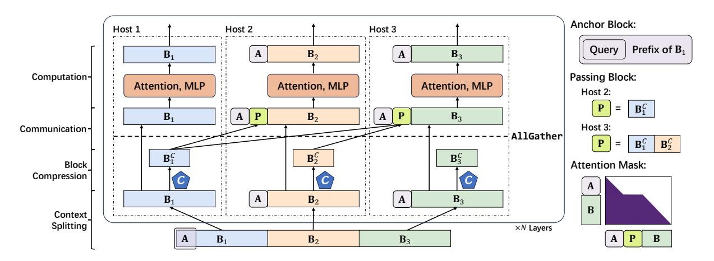
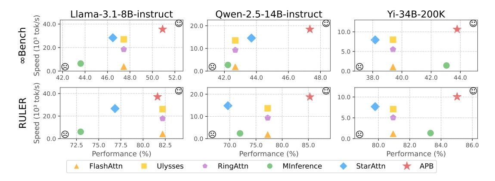
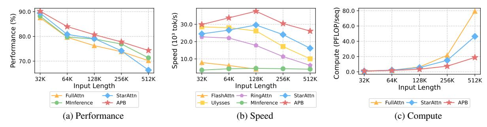
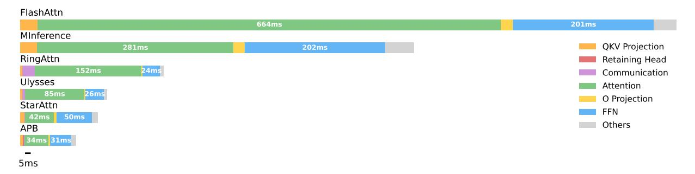
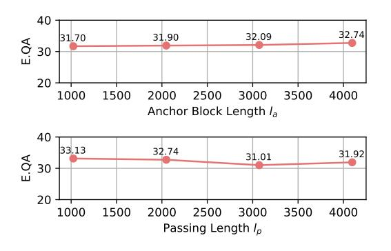

# **APB:** Accelerating Distributed Long-Context Inference by Passing Compressed Context Blocks across GPUs

Yuxiang Huang<sup>1\*</sup>, Mingye Li<sup>2\*†</sup>, Xu Han<sup>1‡</sup>, Chaojun Xiao<sup>1‡</sup>, Weilin Zhao<sup>1</sup>, Ao Sun<sup>3</sup>, Hao Zhou<sup>4</sup>, Jie Zhou<sup>4</sup>, Zhiyuan Liu<sup>1</sup>, Maosong Sun<sup>1</sup>

<sup>1</sup>NLP Group, DCST, IAI, BNRIST, Tsinghua University, Beijing, China.

<sup>2</sup>Department of CS&T, Central South University, Changsha, China.

<sup>3</sup>BUPT, Beijing, China. <sup>4</sup>Pattern Recognition Center, WeChat AI, Tencent Inc. huang-yx21@mails.tsinghua.edu.cn, lmy2004@csu.edu.cn, han-xu@tsinghua.edu.cn, xiaocj20@mails.tsinghua.edu.cn

#### **Abstract**

While long-context inference is crucial for advancing large language model (LLM) applications, its prefill speed remains a significant bottleneck. Current approaches, including sequence parallelism strategies and compute reduction through approximate attention mechanisms, still fall short of delivering optimal inference efficiency. This hinders scaling the inputs to longer sequences and processing long-context queries in a timely manner. To address this, we introduce APB, an efficient long-context inference framework that leverages multi-host approximate attention to enhance prefill speed by reducing compute and enhancing parallelism simultaneously. APB introduces a communication mechanism for essential key-value pairs within a sequence parallelism framework, enabling a faster inference speed while maintaining task performance. We implement APB by incorporating a tailored FLASHATTN kernel alongside optimized distribution strategies, supporting diverse models and parallelism configurations. APB achieves speedups of up to  $9.2\times$ ,  $4.2\times$ , and  $1.6\times$  compared with FLASHATTN, RINGATTN, and STARATTN, respectively, without any observable task performance degradation. We provide the implementation and experiment code of APB in https://github.com/thunlp/APB.

#### <span id="page-0-1"></span>1 Introduction

Large language models (LLMs) (OpenAI, 2024; Anthropic, 2024; DeepSeek-AI, 2024) have demonstrated unprecedented proficiencies, pushing the boundaries of artificial intelligence research and practical applications. Recent advancements are not only transforming usage paradigms but also empowering intelligent systems such as LLM-based agents (Li, 2025; Qin et al., 2024; Zhao et al.,

<span id="page-0-0"></span>

Figure 1: The prefill speed of methods with and without sequence parallelism when processing different input lengths. "SP" indicates sequence parallelism. "x" represents that the setting triggers out-of-memory error.

2024), robotics (Zeng et al., 2023; Kim et al., 2024), and prompting methodologies (Chu et al., 2023; Sahoo et al., 2024). These systems often rely on extended context inference. To address the growing demand for longer inputs, contemporary foundation models have been increasingly designed to support extended context lengths. For instance, Llama-3.1 (Dubey et al., 2024) supports up to 128K tokens, Claude-3.5 (Anthropic, 2024) extends input capacity to 200K tokens, and MiniMax-01 (Li et al., 2025) can even process input sequences up to 4M tokens.

As context lengths grow, the quadratic computational cost of attention makes single-GPU inference both infeasible and inefficient for LLMs. To address this, various optimizations aim to enhance parallelism or reduce compute. Sequence parallelism (Li et al., 2023), which aims to enhance parallelism, partitions the sequence across devices (termed as hosts) and significantly improves the prefill speed, especially for extremely long inputs (Figure 1). However, the overall computations remain unchanged to ensure the accuracy of the attention results. On the other hand, approximate attention mechanisms (Zhang et al., 2024e; Li et al., 2024b; Jiang et al., 2024), which compute only those elements selected from the attention matrix, accelerate inference by reducing compute but face scalabil-

<sup>\*</sup> indicates equal contribution.

<sup>†</sup> Work done during internship at TsinghuaNLP.

<sup>&</sup>lt;sup>‡</sup> indicates corresponding authors.

ity challenges and performance degradation when processing longer inputs. To this end, designing an approximate attention mechanism that fits in sequence parallelism frameworks offers a promising way to further enhance efficiency, particularly in accelerating long-context prefill. However, *designing such systems demands system and algorithm optimizations to address the key challenges.*

Challenge 1: *Localized Attention Pruning.* Existing widely-used approximate attention mechanisms, such as H2O [\(Zhang et al.,](#page-11-2) [2024e\)](#page-11-2) and SNAPKV [\(Li et al.,](#page-10-7) [2024b\)](#page-10-7), typically depend on full sequence information, such as the attention scores computed over the entire sequence, to prune the redundant compute of the attention scores. This requirement directly conflicts with the distributed architecture of sequence parallelism, where individual hosts only maintain partial context visibility without heavy host-to-host communication.

Challenge 2: *Multi-host Scalability.* Traditional sequence parallelism approaches face inherent scalability limitations due to model-architectural constraints and performance degradation risks. While sequence parallelism with attention head splitting for computation [\(Jacobs et al.,](#page-9-4) [2023\)](#page-9-4) offers substantial throughput improvements, its scalability remains fundamentally bounded by the fixed number of attention heads. Existing solutions that simply combine approximate attention with sequence parallelism, such as STARATTN [\(Acharya et al.,](#page-9-5) [2024\)](#page-9-5), suffer from progressive performance degradation when the number of hosts increases, as these solutions merely extend [Xiao et al.](#page-11-3) [\(2024b\)](#page-11-3) to multiple hosts with a large proportion of invisible context.

To address these challenges, we propose APB, a distributed inference framework designed to leverage approximate attention to reduce redundant compute and communication overhead. For *localized attention pruning*, APB introduces a local keyvalue (KV) cache compression technique that operates independently on each host, eliminating the need for a global sequence view to prune redundant attention compute. For *multi-host scalability*, APB ensures that each host processes all attention heads within its local context and selectively shares compressed critical context across hosts. This design enables APB to maintain stable model performance even as the number of hosts scales up.

We implement APB using a customized FLASH-ATTN [\(Dao,](#page-9-6) [2024\)](#page-9-6) kernel and an optimized distribution framework, enabling efficient scaling across diverse sequence lengths and multiple hosts. Comprehensive evaluations demonstrate that APB achieves an excellent trade-off between inference speed and model performance across a variety of tasks. Additionally, APB is compatible with various model sizes and distribution settings, making it a robust solution for scalable distributed inference. APB achieves speedups of up to 9.2×, 4.2×, and 1.6× compared with FLASHATTN, RINGATTN [\(Li et al.,](#page-10-6) [2023\)](#page-10-6), and STARATTN, respectively, without any observable performance degradation.

# 2 Related Works

Existing approaches to the efficient long-context inference of LLMs focus on system and algorithm optimizations. Please refer to the surveys [\(Zhao et al.,](#page-11-4) [2023;](#page-11-4) [Wan et al.,](#page-10-9) [2024\)](#page-10-9) for more about LLMs.

System Optimizations. The efficiency of longcontext inference can be enhanced by leveraging hardware architectures and preserving accurate LLM computations. Hardware-aware algorithms, such as FLASHATTN [\(Dao et al.,](#page-9-7) [2022;](#page-9-7) [Dao,](#page-9-6) [2024;](#page-9-6) [Shah et al.,](#page-10-10) [2024\)](#page-10-10), utilize matrix tiling to optimize GPU memory usage and boost inference speed. Additionally, efficient parallelism methods support longer sequences with a higher processing speed. RINGATTN [\(Li et al.,](#page-10-6) [2023\)](#page-10-6) splits long sequences across multiple hosts using ringstyle communication to preserve accurate attention computation, while ULYSSES [\(Jacobs et al.,](#page-9-4) [2023\)](#page-9-4) distributes attention heads across hosts to reduce communication overhead. Other parallelism strategies [\(Narayanan et al.,](#page-10-11) [2021;](#page-10-11) [Huang et al.,](#page-9-8) [2019;](#page-9-8) [Ra](#page-10-12)[jbhandari et al.,](#page-10-12) [2020;](#page-10-12) [Sun et al.,](#page-10-13) [2025;](#page-10-13) [DeepSeek-](#page-9-1)[AI,](#page-9-1) [2024\)](#page-9-1) enable longer sequences on larger models, and the mixture of various distribution strategies [\(Ren et al.,](#page-10-14) [2021;](#page-10-14) [Sun et al.,](#page-10-15) [2024a\)](#page-10-15) can further enhance long-context efficiency. However, most parallelism approaches are tailored for training and lack optimization for inference. Offloading-based methods [\(Xiao et al.,](#page-11-5) [2024a;](#page-11-5) [Sun et al.,](#page-10-16) [2024b;](#page-10-16) [Lee](#page-10-17) [et al.,](#page-10-17) [2024;](#page-10-17) [Chen et al.,](#page-9-9) [2025\)](#page-9-9) leverage hierarchical memory systems to reduce hardware requirements by storing redundant KV cache in CPU memory and recalling only a small part to GPU memory.

Algorithm Optimizations. The burden of longcontext inference can also be mitigated through algorithm optimizations. KV cache-centric optimization reduces the size of the KV cache, enabling faster decoding speed and lower GPU memory usage. Cache eviction methods [\(Zhang et al.,](#page-11-2) [2024e;](#page-11-2) [Li et al.,](#page-10-7) [2024b;](#page-10-7) [Yao et al.,](#page-11-6) [2024;](#page-11-6) [Huang et al.,](#page-9-10) [2024\)](#page-9-10) discard irrelevant or unimportant KV cache, alleviating the memory bottlenecks. Quantization techniques (Liu et al., 2024; Hooper et al., 2024; Zhang et al., 2024a; He et al., 2024) decrease the memory footprint by utilizing low-bit representations to store the KV cache. Merging methods (Cai et al., 2024; Wang et al., 2024; Zhang et al., 2024c,d) consolidate redundant KV cache units across sequences or layers to alleviate storage overheads. Sparse mechanisms (Zaheer et al., 2020; Beltagy et al., 2020; Lou et al., 2024) decrease inference latency by reducing the attention computational load. Specifically, approaches like MINFERENCE (Jiang et al., 2024) and FASTGEN (Ge et al., 2024) assign specific patterns to attention heads, accelerating inference by computing only elements selected from the attention matrix. Moreover, algorithm optimizations can complement system optimizations. STARATTN (Acharya et al., 2024) and APE (Yang et al., 2025) linearize attention complexity by dividing context into parallelized blocks, but they struggle with tasks that require inter-context dependencies. More details on these algorithm optimizations are elaborated in Li et al. (2024a) and Shi et al. (2024). Apart from KV cache optimizations on Transformer-based (Vaswani, 2017) LLMs, approaches altering backbone architectures can also enhance long-context inference efficiency. Typically, RNN-based models (Gu and Dao, 2024; Dao and Gu, 2024) and hybrid models (Lieber et al., 2025; Dong et al., 2024; Li et al., 2025) reduce the computation complexity of long-context inference.

#### 3 Methodology

# 3.1 Preliminaries

We primarily introduce the Transformer architecture and the prefill-decoding pattern.

**Transformers.** Transformer-based LLMs take a sequence  $\{t_1, t_2, \cdots, t_n\}$  as input. We denote the hidden state of the token  $t_k$  at the i-th layer as  $\mathbf{H}^{(i)}[k]$ , where  $\mathbf{H}^{(0)}$  represents the embeddings of the input sequence. Assuming the model has L layers, each layer consists of an attention block and a feedforward network (FFN) block. For each attention head in an attention block, the attention score at layer  $i \in \{1, 2, \cdots, L\}$  is calculated as follows, where  $\mathbf{M}$  represents the attention mask.

$$\mathbf{A}^{(i)} = \operatorname{softmax}\left(\mathbf{M} \odot \frac{\mathbf{Q}^{(i)} \mathbf{K}^{(i)\top}}{\sqrt{d_m}}\right) \cdot \mathbf{V}^{(i)}, \qquad (1)$$

where  $\mathbf{Q}^{(i)} = \mathbf{H}^{(i-1)} \mathbf{W}_Q^{(i)}$ ,  $\mathbf{K}^{(i)} = \mathbf{H}^{(i-1)} \mathbf{W}_K^{(i)}$ , and  $\mathbf{V}^{(i)} = \mathbf{H}^{(i-1)} \mathbf{W}_V^{(i)}$ . The hidden size of each

head is denoted by  $d_m$ . Then, the attention scores are passed through the FFN:  $\mathbf{H}^{(i)} = \mathsf{FFN}(\mathbf{A}^{(i)})$ .

**Prefill and Decoding.** The procedure of an LLM  $\mathcal{M}$  processing an input can be divided into two stages: prefill and decoding. During the prefill stage, the model computes the KV cache for the input sequence  $\{t_1, t_2, \cdots, t_n\}$  and predicts the first answer token  $t_{n+1}$ . This process can be formalized as  $(t_{n+1}; \mathbf{K}[1:n], \mathbf{V}[1:n]) = \mathcal{M}(t_1, \cdots, t_n)$ . After the prefill stage, the model decodes one token at a time using the KV cache of previous tokens, which can be written as  $(t_{k+1}; \mathbf{K}[k], \mathbf{V}[k]) = \mathcal{M}(t_k; \mathbf{K}[1:k-1], \mathbf{V}[1:k-1])$ . The complexities of the prefill stage and a single step of decoding are  $\mathcal{O}(n^2)$  and  $\mathcal{O}(n)$ , respectively.

#### 3.2 Framework

We adopt sequence parallelism with approximate attention to accelerate the prefill of long-context inputs. The framework of APB is illustrated in Figure 2. The inference of APB can be split into 4 stages: context splitting, block compression, communication, and computation.

**Context Splitting.** Given a long-context input  $t = \{t_1, t_2, \cdots, t_n\}$ , we first split the input sequence into a document  $d = \{d_1, \cdots, d_{l_d}\}$  and a query  $q = \{q_1, \cdots, q_{l_q}\}$ , i.e.,  $t = \{d, q\}$  and  $n = l_d + l_q$ . Since  $l_d \gg l_q$ , we primarily focus on optimizing the prefill speed of the document. We apply accurate attention with online softmax for processing the query and decoding the answer. The document is evenly split across all hosts, with an *anchor block* prepended at the start of each local context block on every host to preserve its visibility to the document's initial part.

**Block Compression.** To reduce the attention compute and communication overhead, we first perform KV cache compression using a *compressor C* on each host to shorten the block length and only retain the essential KV cache units for inter-host communication in the next step. These compressed blocks are crucial for capturing long-distance semantic dependency and maintaining task performance by reducing attention errors.

**Communication.** We design a specialized communication pattern to gather the compressed context blocks on each host for the awareness of previous essential context. After the communication, we form the *passing blocks* to encapsulate the essential KV cache units passed from the previous hosts.

**Computation.** Finally, each host obtains a context layout containing the local context block, an

<span id="page-3-0"></span>

Figure 2: The framework of APB. The input document d is split into blocks  $\mathbf{B}_1$ ,  $\mathbf{B}_2$ ,  $\mathbf{B}_3$  and distributed across 3 hosts. The anchor block is denoted as "A", the passing block as "P", and the compressor as " $\mathcal{C}$ ". Each block is first prepended with an anchor block. When calculating attention, the context block  $\mathbf{B}$  is compressed into  $\mathbf{B}^C$  using the compressor  $\mathcal{C}$ . Subsequently, the passing block is constructed after an AllGather communication. Finally, attention is performed using a modified attention mask. Passing blocks are discarded after the attention computation.

anchor block, and a passing block. We perform attention using a modified attention mask, executed with a specialized FLASHATTN (Dao, 2024) kernel.

Overall, APB is designed to communicate and compute only the most critical context by aggressively compressing the KV cache within a sequence parallelism framework. It introduces an algorithm-aware, distributed system-level optimization specifically tailored to its unique communication pattern and approximate attention mechanism.

#### 3.3 Context Splitting

At the beginning of APB inference, we first split the document d across H hosts, with each host holding a partial sequence with length  $l_b = l_d/H$ , denoted as blocks  $\mathbf{B}_1, \mathbf{B}_2, \cdots, \mathbf{B}_H$ . Each block is prepended with an anchor block at the front. Inspired by STARATTN (Acharya et al., 2024), we adopt the anchor block A containing the first  $l_a$  tokens  $d_1, \dots, d_{l_a}$  of the input sequence. We also embed the query q in the front of the anchor block, to provide more query-related information for the compressors to identify the essential cache units. Therefore, the anchor block can be formally written as  $\mathbf{A} = \{q_1, \dots, q_{l_q}, d_1, \dots, d_{l_a}\}.$ The positions assigned to the tokens in anchor blocks are the starting positions, i.e.  $0, 1, \dots, l_q +$  $l_a - 1$ . Notably, we apply much smaller anchor blocks compared to STARATTN, where  $l_a = \frac{1}{4}l_b$  or  $l_a = \frac{1}{8}l_b$  in APB but  $l_a =$  $l_b$  in STARATTN. Formally, each host except the first one holds a sequence of  $\{A, B_h\}$  $\{q_1, \cdots, q_{l_q}, d_1, \cdots, d_{l_a}; d_{(h-1)l_b+1}, \cdots, d_{hl_b}\}.$ The first host only holds  $B_1$  without anchor block.

#### 3.4 Block Compression

Before starting the attention computation on the h-th host, we compress the KV cache of  $\mathbf{B}_h$  into  $\mathbf{B}_h^C$  using the compressors C. As calculating full attention scores or full KV cache on a single host is infeasible, existing methods like H<sub>2</sub>O (Zhang et al., 2024e) and SNAPKV (Li et al., 2024b) are incompatible in this scenario. The need to identify important KV cache units without a global view aligns with the design of LOCRET (Huang et al., 2024), where importance scores are based on each token's query and KV We implement the compressors C as LOCRET's retaining heads  $\mathcal{R}$ , which are small MLPs trained on additional long-context SFT data. These MLPs take [Q, K, V] as input and output importance scores for the corresponding cache units, reflecting the influence towards the calculation of subsequent KV cache. Formally, the compressed context block on host h with passing length  $l_p$  is defined as  $\mathbf{B}_h^C = (\mathbf{K}_h^C, \mathbf{V}_h^C) =$  $\left( \left\{ \mathbf{k}_h[i_1], \cdots, \mathbf{k}_h[i_{l_p}] \right\}, \ \left\{ \mathbf{v}_h[i_1], \cdots, \mathbf{v}_h[i_{l_p}] \right\} \right),$  where  $\left\{ s_{i_1}, \cdots, s_{i_{l_p}} \right\} = \mathsf{Top-}l_p(s_1, \cdots, s_{l_b})$  and  $s_1, \cdots, s_{l_h} = \mathcal{R}([\dot{\mathbf{Q}}_h, \mathbf{K}_h, \mathbf{V}_h]).$ 

#### 3.5 Communication

To acquire all the compressed context blocks sent from each host after block compression, we apply an AllGather communication on the compressed KV cache across all the hosts by  $\left(\mathbf{K}_{[1:H]}^{C}, \mathbf{V}_{[1:H]}^{C}\right) = \text{AllGather}\left(\mathbf{K}_{h}^{C}, \mathbf{V}_{h}^{C}\right)$ . Subsequently, the passing block is constructed by concatenating all compressed context blocks from

<span id="page-4-2"></span>

Figure 3: The inference speed and model performance of APB and all the baselines. The top-right direction represents the optimal tradeoff between speed and performance. APB achieves the best tradeoff of the two metrics. FLASHATTN, RINGATTN, and ULYSSES share the same performance as they are all FULLATTN methods.

previous hosts, i.e.  $\mathbf{P}_h = \left(\mathbf{K}_p^C, \mathbf{V}_p^C\right) = \left(\mathbf{K}_{[1:h-1]}^C, \mathbf{V}_{[1:h-1]}^C\right)$ . We simply ignore the compressed context blocks sent by subsequent hosts.

#### 3.6 Computation

After the communication and construction of the passing blocks, each host acquires the context layout required for attention computation. We place the passing block between the anchor block and the local context block on each host to perform the attention as Equation 2. The passing blocks are discarded after the attention calculation and do not participate in the FFN calculation. M' is the modified attention mask. We implement the attention calculation in a modified FLASHATTN (Dao, 2024) kernel with only the attention mask changed.

We present the complete inference procedure of APB in Algorithm 1. Running approximate attention of the document d is detailed in Algorithm 2, while the accurate attention with online softmax is presented in Algorithm 3.

<span id="page-4-0"></span>
$$\begin{split} \mathbf{Q}^{(i)} &= \left[\mathbf{Q}_a^{(i)}, \mathbf{Q}_h^{(i)}\right], \\ \mathbf{K}^{(i)} &= \left[\mathbf{K}_a^{(i)}, \mathbf{K}_p^C, \mathbf{K}_h^{(i)}\right], \\ \mathbf{V}^{(i)} &= \left[\mathbf{V}_a^{(i)}, \mathbf{V}_p^C, \mathbf{V}_h^{(i)}\right], \\ \left[\mathbf{A}_a^{(i)}, \mathbf{A}_h^{(i)}\right] &= \operatorname{softmax}\left(\mathbf{M}' \odot \frac{\mathbf{Q}^{(i)} \mathbf{K}^{(i)\top}}{\sqrt{d_m}}\right) \cdot \mathbf{V}^{(i)}, \\ \left[\mathbf{H}_a^{(i)}, \mathbf{H}_h^{(i)}\right] &= \operatorname{FFN}\left(\left[\mathbf{A}_a^{(i)}, \mathbf{A}_h^{(i)}\right]\right). \end{split} \tag{2}$$

#### 4 Experiments

In this section, we present our benchmark results to evaluate APB, aiming at addressing the following research questions: (Q1) Can APB obtain higher

end-to-end prefill speed without significant performance degradation? ( $\underline{Q2}$ ) How effective and efficient is APB on various context length? ( $\underline{Q3}$ ) Is the design of each component in APB effective?

#### 4.1 Experimental Setup

In this section, we briefly introduce experimental settings, and more details are in Appendix B.

**Benchmarks.** We evaluate APB against selected baselines on two long-context evaluation benchmarks: ∞Bench (Zhang et al., 2024b) and RULER (Hsieh et al., 2024).  $\infty$ Bench is a benchmark with an average context length exceeding 100K tokens, encompassing a mix of both synthetic and real-world tasks. Following MINFER-ENCE (Jiang et al., 2024), we utilize 10 tasks, excluding Math.Calc and Code.Run due to their difficulty, which leads to failures for all methods. RULER is a benchmark featuring a variety of synthetic tasks with a controllable context length. We evaluate all 13 tasks of the benchmark. We provide the mapping of task abbreviations to the original task name in Appendix D. Additional experiments and results are placed in Appendix E.

**Models.** For the end-to-end benchmark ( $\overline{\mathbf{Q1}}$ ), we test APB with the baselines on the instruct versions of Llama-3.1-8B, Qwen-2.5-14B, and Yi-34B-200K. When benchmarking across various input lengths ( $\overline{\mathbf{Q2}}$ ), we utilize Llama-3-8B-1M<sup>1</sup>, which supports up to 1M input tokens.

**Metrics.** When evaluating performance on the benchmark, we directly adopt the original performance metrics for each task. For speed measurement, we define inference speed as the total number

<span id="page-4-1"></span><sup>&</sup>lt;sup>1</sup>https://huggingface.co/gradientai/Llama-3-8B-Instruct-Gradient-1048k

<span id="page-5-0"></span>

| Method                        | R.PassKey                  | R.Number                   | R.KV                    | E.Sum                   | E.QA                    | E.MC                    | E.Dia                   | Z.QA                    | C.Debug                 | M.Find                  | Avg.                    |
|-------------------------------|----------------------------|----------------------------|-------------------------|-------------------------|-------------------------|-------------------------|-------------------------|-------------------------|-------------------------|-------------------------|-------------------------|
|                               | Llama-3.1-8B-instruct      |                            |                         |                         |                         |                         |                         |                         |                         |                         |                         |
| FULLATTN                      | 100.00                     | 99.49                      | 51.00                   | 30.59                   | 29.04                   | 63.76                   | 11.00                   | 36.18                   | 24.62                   | 28.82                   | 47.45                   |
| MINFERENCE<br>STARATTN<br>APB | 98.47<br>100.00<br>100.00  | 98.81<br>98.98<br>98.81    | 17.40<br>40.60<br>81.8  | 30.06<br>30.55<br>30.63 | 26.42<br>30.66<br>29.25 | 55.46<br>61.57<br>63.32 | 12.50<br>15.00<br>11.00 | 36.51<br>36.26<br>36.99 | 28.17<br>26.65<br>30.46 | 32.29<br>24.57<br>26.86 | 43.61<br>46.48<br>50.91 |
|                               | Qwen-2.5-14B-instruct      |                            |                         |                         |                         |                         |                         |                         |                         |                         |                         |
| FULLATTN                      | 100.00                     | 100.00                     | 17.80                   | 27.80                   | 10.40                   | 52.84                   | 28.00                   | 10.21                   | 38.07                   | 42.57                   | 42.68                   |
| MINFERENCE<br>STARATTN<br>APB | 100.00<br>100.00<br>100.00 | 100.00<br>100.00<br>100.00 | 5.20<br>18.00<br>62.20  | 25.63<br>27.48<br>26.51 | 12.04<br>12.44<br>12.74 | 61.57<br>62.88<br>66.38 | 16.50<br>23.50<br>25.00 | 11.06<br>11.03<br>11.22 | 41.62<br>43.40<br>37.31 | 48.57<br>37.71<br>35.71 | 42.22<br>43.69<br>47.34 |
|                               |                            |                            |                         |                         | Yi-34B-200K             |                         |                         |                         |                         |                         |                         |
| FULLATTN                      | 100.00                     | 100.00                     | 49.00                   | 5.83                    | 17.57                   | 47.60                   | 2.00                    | 18.77                   | 25.13                   | 28.00                   | 39.39                   |
| MINFERENCE<br>STARATTN<br>APB | 100.00<br>100.00<br>100.00 | 100.00<br>100.00<br>100.00 | 52.40<br>24.60<br>65.20 | 7.19<br>4.38<br>5.96    | 20.07<br>19.71<br>19.81 | 63.32<br>60.26<br>62.45 | 2.50<br>0.00<br>1.00    | 25.40<br>23.40<br>25.42 | 28.17<br>28.17<br>27.92 | 31.40<br>21.14<br>30.00 | 43.05<br>38.17<br>43.78 |

Table 1: The results of APB compared with all the baselines on ∞Bench, where higher score represents better performance. "Avg." represents the average score. The highest score in each column is marked in bold. FULLATTN represents FLASHATTN, RINGATTN, and ULYSSES, as their computational results remain unchanged.

<span id="page-5-1"></span>

| Method     | SG1                   | SG2    | SG3    | MK1   | MK2   | MK3         | MV    | MQ    | VT    | CWE   | FWE   | QA1   | QA2<br>Avg.    |
|------------|-----------------------|--------|--------|-------|-------|-------------|-------|-------|-------|-------|-------|-------|----------------|
|            |                       |        |        |       |       |             |       |       |       |       |       |       |                |
|            | Llama-3.1-8B-instruct |        |        |       |       |             |       |       |       |       |       |       |                |
| FULLATTN   | 99.40                 | 99.80  | 99.60  | 98.20 | 87.60 | 67.00       | 94.65 | 98.00 | 60.98 | 71.40 | 72.20 | 78.20 | 41.6<br>82.20  |
| MINFERENCE | 100.00                | 98.60  | 99.00  | 95.40 | 58.20 | 23.80       | 84.35 | 95.70 | 66.40 | 45.94 | 74.67 | 67.80 | 38.80<br>72.97 |
| STARATTN   | 100.00                | 99.60  | 99.60  | 95.80 | 73.60 | 53.00       | 72.80 | 94.45 | 59.40 | 65.72 | 76.53 | 67.40 | 41.00<br>76.84 |
| APB        | 100.00                | 100.00 | 99.80  | 85.60 | 91.00 | 89.00       | 95.05 | 96.40 | 51.96 | 63.82 | 77.33 | 70.00 | 41.20<br>81.63 |
|            | Qwen-2.5-14B-instruct |        |        |       |       |             |       |       |       |       |       |       |                |
| FULLATTN   | 100.00                | 99.20  | 99.80  | 94.20 | 47.80 | 27.20       | 75.10 | 94.60 | 89.52 | 93.88 | 76.13 | 63.20 | 43.40<br>77.23 |
| MINFERENCE | 100.00                | 99.60  | 100.00 | 89.60 | 32.60 | 6.94        | 61.25 | 93.29 | 89.44 | 84.36 | 77.33 | 56.60 | 44.40<br>71.95 |
| STARATTN   | 100.00                | 99.20  | 97.40  | 80.00 | 38.00 | 20.20       | 48.75 | 77.10 | 82.44 | 93.86 | 77.53 | 52.80 | 38.00<br>69.64 |
| APB        | 100.00                | 100.00 | 99.80  | 93.00 | 87.20 | 85.80       | 66.55 | 93.00 | 96.40 | 94.94 | 76.33 | 60.00 | 55.60<br>85.28 |
|            |                       |        |        |       |       | Yi-34B-200K |       |       |       |       |       |       |                |
| FULLATTN   | 100.00                | 100.00 | 99.60  | 95.20 | 76.00 | 55.40       | 92.10 | 97.05 | 85.56 | 51.84 | 84.27 | 65.20 | 50.00<br>80.94 |
| MINFERENCE | 100.00                | 100.00 | 100.00 | 96.00 | 87.00 | 59.60       | 90.15 | 96.05 | 73.68 | 79.20 | 84.87 | 67.40 | 49.40<br>83.33 |
| STARATTN   | 100.00                | 100.00 | 99.60  | 93.20 | 78.20 | 48.00       | 77.05 | 88.35 | 83.96 | 80.58 | 78.33 | 61.20 | 48.80<br>79.79 |
| APB        | 100.00                | 100.00 | 100.00 | 92.80 | 88.00 | 92.60       | 86.05 | 96.45 | 60.48 | 88.46 | 84.53 | 63.80 | 52.20<br>85.03 |

Table 2: The results of APB compared with all the baselines on RULER, where higher score represents better performance. "Avg." represents the average score. The highest score in each column is marked in bold. FULLATTN represents FLASHATTN, RINGATTN, and ULYSSES, as their computational results remain unchanged.

of tokens in both the prefill and decoding stages, divided by the total inference time, which includes both the prefill and decoding stages.

Baselines. Existing methods for accelerating long-context inference can be categorized into four types based on their use of sequence parallelism and approximate attention mechanisms. We select FLASHATTN, ULYSSES, RINGATTN, MINFERENCE, and STARATTN as our baselines. FLASHATTN does not use sequence parallelism and maintains accurate attention computation. ULYSSES and RINGATTN are two major approaches for performing accurate attention with sequence parallelism, each with a different communication design. MINFERENCE is an approximate attention mechanism that accelerates longcontext inference by applying sparse attention without sequence parallelism. STARATTN combines sequence parallelism and approximate attention by prepending an anchor block to each context block and removing all communication. Further details on the baselines can be found in Appendix [C.](#page-14-0)

#### <span id="page-5-2"></span>4.2 End-to-End Results

To address Q1, we conduct an end-to-end benchmark focusing on the overall performance and longcontext processing speed by comparing APB with all the baselines on both ∞Bench and RULER.

APB demonstrates superior task performance in both real-world scenarios (∞Bench in Table [1\)](#page-5-0) and synthetic benchmarks (RULER in Table [2\)](#page-5-1), compared to all the selected baselines. In certain tasks, APB even surpasses FULLATTN. In contrast, MINFERENCE and STARATTN exhibit noticeable

<span id="page-6-0"></span>

Figure 4: The performance, speed, and the amount of compute of various methods under different input lengths. APB consistently outperforms other methods with better performance, faster speed, and lower compute.

performance degradation relative to FULLATTN. Notably, APB significantly enhances performance in complex context retrieval tasks, such as R.KV in ∞Bench and MK3 in RULER. This improvement can be attributed to APB's ability to trim noisy context within each block by our compressor, thereby constructing cleaner passing blocks with reduced noise and enabling more accurate context retrieval.

In terms of inference speed, APB also demonstrates significant advantages over existing methods. As illustrated in Figure 3, methods without sequence parallelism, such as FLASHATTN and MINFERENCE, exhibit slower inference speeds. In contrast, sequence parallelism-based methods, including RINGATTN and ULYSSES, achieve speedups ranging from  $3\times$  to  $10\times$  compared to FLASHATTN. By incorporating approximate attention, STARATTN achieves a faster inference speed than RINGATTN, though its improvement over ULYSSES remains limited. APB, on the other hand, delivers at least a 25% speed improvement over STARATTN without any performance decay.

Overall, APB establishes the best speed-performance trade-off, outperforming all competing methods in both efficiency and effectiveness.

#### <span id="page-6-2"></span>4.3 Benchmarking Across Different Lengths

We evaluate APB and baselines with input lengths ranging from 32K to 512K to address **Q2**. All methods are tested on the RULER benchmark, where we report task performance, inference speed, and the compute under each input length in Figure 4.

As shown in Figure 4(a), APB consistently outperforms all the methods across all input lengths in terms of performance. Additionally, APB achieves the fastest inference speed among all methods, as depicted in Figure 4(b). The speed advantage of APB remains humble for shorter input sequences. However, as the input length increases, APB's advantage becomes more pronounced, demonstrat-

<span id="page-6-1"></span>

| No.         | A             | P           | С               | Q      | E.MC                    |
|-------------|---------------|-------------|-----------------|--------|-------------------------|
| 0           | <b>/</b>      | 1           | $\mathcal{R}$   | ✓      | 72.00                   |
| 1<br>2<br>3 | \ \frac{1}{2} | \<br>\<br>\ | R<br>Rd.<br>Rd. | Х<br>У | 68.00<br>66.00<br>66.00 |
| 4 5         | 1             | X<br>X      | Rd.<br>Rd.      | √<br>X | 64.00<br>62.00          |
| 6<br>7      | X<br>X        | 1           | Rd.             | X<br>X | 28.00<br>28.00          |
| 8           | X             | Х           | Rd.             | Х      | 22.00                   |

Table 3: Ablation studies of APB on E.MC. "A" and "P" represent the anchor block and passing block. We implement the compressors  $\mathcal C$  as the retaining heads  $\mathcal R$  or random selectors "Rd.". "Q" indicates embedding the query in the anchor block.

ing a substantial speedup over all competitors at a 512K input length. Notably, both STARATTN and APB show an increase in inference speed from 32K to 128K inputs, whereas other methods continue to slow down. Since STARATTN and APB both incorporate approximate attention mechanisms, the overall compute is reduced, delaying the point where compute becomes the dominant bottleneck instead of memory access. Figure 4(c) further explains APB's superior speed, as it yields significantly less compute than FULLATTN and STARATTN, especially for longer inputs. Further discussion on the compute of each method can be referred to Table 9.

#### <span id="page-6-3"></span>4.4 Ablation Studies

Regarding  $\underline{\mathbf{Q3}}$ , we conduct ablation studies and focus on the following key points.

Each Component's Contribution. We focus on four major components in the APB framework: the anchor block, the passing block, selecting important KV pairs via retaining heads, and embedding the query at the beginning of the anchor block. We conduct an ablation study on these four components. For the anchor block and passing block, they can be removed in the corresponding settings. To

<span id="page-7-0"></span>

Figure 5: The wall-time breakdown of prefill for various methods on 128K context.

ablate the implementation of the compressors C, we compare retaining heads R with random selectors picking the same number of KV pairs. When the embedded query is removed, the anchor block contains only the beginning of the document.

The ablation results in Table [3](#page-6-1) show that all four components are effective, as removing any of them leads to performance degradation (No. 1, 2, 4, 6). The anchor block is the most critical component, as its removal causes task failure (No. 6, 7). The passing block is also essential for good performance, as a performance drop of more than 8% occurs in No. 4 and 5. The retaining heads are crucial for selecting important KV pairs to pass to subsequent hosts, as randomly selecting KV pairs results in poorer performance (No. 2). Embedding the query in the anchor block must be used in conjunction with the retaining heads, as activating these components separately does not improve performance (No. 1, 2, 3). Above all, when used together, they yield significantly better performance (No. 0).

Wall-time Breakdown Analysis. We begin by analyzing the prefill and decoding time, as detailed in Appendix [E.1.](#page-15-2) Our findings indicate that prefill dominates the overall processing time, while decoding time is negligible in long-context tasks.

Next, we decompose the prefill time into seven components: the projection of QKV, the calculation of retaining heads, the communication time, the attention computation, the projection of O, the FFN computation, and others. The wall-time of each component is shown in Figure [5.](#page-7-0) Methods without sequence parallelism (FLASHATTN and MINFER-ENCE) exhibit substantial inference time, whereas sequence parallelism proves effective in reducing the time of both attention and FFN computations.

Compared to existing sequence parallelism methods, APB achieves even lower attention time without incurring significant overhead for retaining heads and communication. When compared with RINGATTN and ULYSSES, although the introduction of the anchor blocks increases the compute cost for FFN, the additional time is smaller than the reduction in attention time, thus resulting in a faster inference speed. APB outperforming STARATTN is due to smaller anchor blocks, whose overhead in the FFN time is significantly lower.

Distributed Settings. We evaluate the effectiveness of APB across various distributed settings. As mentioned in STARATTN [\(Acharya et al.,](#page-9-5) [2024\)](#page-9-5), when the context is split across more hosts, significant performance degradation occurs due to the increasing invisibility of the middle context. However, APB addresses this issue by using passing blocks, allowing each host to share the most essential KV pairs with subsequent hosts.

We test APB and STARATTN across {2, 4, 6, 8} hosts, and the results are shown in Table [4.](#page-7-1) When the sequence is long (128K tokens), both APB and STARATTN exhibit improved performance as the sequence parallelism size increases. With a shorter input length (32K tokens), the block size on each host is smaller, and APB demonstrates consistently stronger and more stable performance across all settings, while STARATTN shows significant performance loss as the host count increases.

<span id="page-7-1"></span>

| Length | Method   | H = 2 | H = 4 | H = 6 | H = 8 |
|--------|----------|-------|-------|-------|-------|
| 128K   | APB      | 84.00 | 92.00 | 92.00 | 92.00 |
|        | STARATTN | 82.00 | 84.00 | 86.00 | 88.00 |
| 32K    | APB      | 92.00 | 92.00 | 94.00 | 94.00 |
|        | STARATTN | 94.00 | 92.00 | 92.00 | 84.00 |

Table 4: The E.MC performance of APB and STAR-ATTN tested under various distributed settings and different context length. "H" refers to the number of hosts.

Short-Context Performance. While APB exhibits outstanding performance and inference speed on long-context benchmarks, its effectiveness and efficiency on short-context inputs (i.e., 4K tokens) are equally important. To evaluate this, we conduct experiments on RULER using 4K input lengths, reporting both task performance and inference speed. We compare APB against FLASHATTN using the Llama-3-8B-instruct-1M model, and present the results in Table [5.](#page-8-0)

The results demonstrate that APB consistently achieves superior speed and performance on shortcontext inputs. Even in such scenarios, APB outperforms FULLATTN without any degradation in performance or slowdown in inference. Please refer to Appendix [E.3](#page-16-1) for more details.

<span id="page-8-0"></span>

| Method    | RULER-4K | Speed(tok/s). |
|-----------|----------|---------------|
| FLASHATTN | 94.54    | 6247.58       |
| APB       | 94.89    | 6597.47       |

Table 5: The task performance and inference speed of APB and FLASHATTN on RULER, where context length set to 4K tokens. We report the speed in "tok/s".

Orthogonality to Quantization. APB exhibits strong orthogonality and can be integrated with other compression methods, such as KV quantization. To demonstrate this, we tested APB in combination with KV cache quantization techniques. We integrate the KV cache quantization method officially supported by Hugging Face Transformers[2](#page-8-1) into the APB framework. This method is inspired by KIVI [\(Liu et al.,](#page-10-18) [2024\)](#page-10-18) and implemented using the HQQ backend[3](#page-8-2) . We evaluate the integration on the RULER benchmark using 50 entries per task with LLaMA-3.1-8B-Instruct as the backbone. The KV cache is quantized to 4 bits. For comparison, the results of FULLATTN, MINFER-ENCE, STARATTN, and standalone APB are taken from Table 2, which used 500 entries per task. The results are summarized in Table [6.](#page-8-3)

The results shows that APB is compatible with KV quantization. In this setting, the stadalone APB shows a minor performance drop compared with FullAttn, and APB+HQQ-4bits also shows a small performance degredation compared with standalone HQQ-4bits quantization. However, it is worth noticing that APB+HQQ-4bits can still ourperform the baselines (MINFERENCE and STARATTN), as the baselines do not use quantization. This setting is able to reduce the size of KV cache to 4× and enhance prefill speed at the meantime, showing a promising balance of task performance and inference efficiency.

Training Generalizability. To demonstrate that the training of the retaining heads is robust and generalizable, we conduct an ablation study on

<span id="page-8-3"></span>

| Method     | Original (M) | Quantized (M-4bits) |
|------------|--------------|---------------------|
| FULLATTN   | 82.20        | 81.73               |
| MINFERENCE | 72.97        | -                   |
| STARATTN   | 76.84        | -                   |
| APB        | 81.63        | 79.13               |

Table 6: Performance of FULLATTN, MINFERENCE, STARATTN, APB, and their quantized variants on RULER-128K. "M" denotes the original method and "M-4bits" represents its 4-bit quantized version. Since MINFERENCE and STARATTN cause more degradation than quantization, we skip their quantized versions.

their training data. Specifically, we train the retaining heads on datasets including LongAlpaca [\(Chen](#page-9-20) [et al.,](#page-9-20) [2024\)](#page-9-20), LongAlign, and AntiHaystack[4](#page-8-4) , using Llama-3.1-8B-instruct as the backbone model. We then evaluate APB with these trained retaining heads on RULER across 20 samples per task. Other settings are aligned to Table [2.](#page-5-1) The results are presented in Table [7.](#page-8-5)

The similar results across different training data indicate that the retaining heads in APB are robust across different training datasets, demonstrating their generalizability. Consequently, various longcontext training data recipes can be employed in the APB framework.

<span id="page-8-5"></span>

| Training Data | LongAlign | LongAlpaca | AntiHaystack |
|---------------|-----------|------------|--------------|
| RULER-128K    | 81.17     | 81.04      | 80.40        |

Table 7: The task performance tested on RULER-128K of APB trained on various datasets.

# 5 Conclusion

We propose APB, a distributed long-context inference framework based on approximate attention, achieving speedups up to 9.2×, 4.2×, and 1.6× compared to FLASHATTN, RINGATTN, and STARATTN, respectively, without observable performance degradation. APB constructs the passing blocks with minimal communication cost by sending only core KV pairs among hosts. The experimental results on ∞Bench and RULER, using various models and sequence lengths, demonstrate that APB delivers faster inference speeds while maintaining or exceeding performance. Furthermore, APB is adaptable to diverse distribution configurations and models of varying sizes. Next, we aim to accelerate the decoding process in APB, where the KV cache is distributed across different hosts.

<span id="page-8-1"></span><sup>2</sup> https://github.com/huggingface/transformers

<span id="page-8-2"></span><sup>3</sup> https://github.com/mobiusml/hqq

<span id="page-8-4"></span><sup>4</sup> https://huggingface.co/datasets/wenbopan/anti-haystack

# Limitations

As APB is specifically optimized to minimize the prefill time for extremely long inputs, it is less effective for processing shorter inputs, particularly those under 32K tokens. When applying APB to short inputs, the optimal distributed setting is to run the inference on a single host, as the computation can be effectively parallelized within a single GPU. In such cases, APB falls back to vanilla FLASHATTN.

# Acknowledgments

This work is supported by the National Key R&D Program of China (No.2022ZD0116312) and a grant from the Guoqiang Institute, Tsinghua University. Yuxiang Huang is supported by Beijing National Science Foundation (No. QY24253). We deeply thank the anonymous reviewers for their constructive reviews.

# References

- <span id="page-9-5"></span>Shantanu Acharya, Fei Jia, and Boris Ginsburg. 2024. Star Attention: Efficient llm inference over long sequences. *ArXiv:2411.17116*.
- <span id="page-9-0"></span>Anthropic. 2024. [Claude 3.5 Sonnet.](https://www.anthropic.com/claude/sonnet)
- <span id="page-9-21"></span>Yushi Bai, Xin Lv, Jiajie Zhang, Yuze He, Ji Qi, Lei Hou, Jie Tang, Yuxiao Dong, and Juanzi Li. 2024. Longalign: A recipe for long context alignment of large language models. *Proceedings of EMNLP*.
- <span id="page-9-14"></span>Iz Beltagy, Matthew E Peters, and Arman Cohan. 2020. Longformer: The long-document transformer. *ArXiv:2004.05150*.
- <span id="page-9-13"></span>Ruisi Cai, Yuandong Tian, Zhangyang Wang, and Beidi Chen. 2024. LoCoCo: Dropping in convolutions for long context compression. *Proceedings of ICML*.
- <span id="page-9-20"></span>Yukang Chen, Shengju Qian, Haotian Tang, Xin Lai, Zhijian Liu, Song Han, and Jiaya Jia. 2024. Longlora: Efficient fine-tuning of long-context large language models. *Proceedings of ICLR*.
- <span id="page-9-9"></span>Zhuoming Chen, Ranajoy Sadhukhan, Zihao Ye, Yang Zhou, Jianyu Zhang, Niklas Nolte, Yuandong Tian, Matthijs Douze, Leon Bottou, Zhihao Jia, et al. 2025. MagicPig: LSH sampling for efficient llm generation. *Proceedings of ICLR*.
- <span id="page-9-2"></span>Zheng Chu, Jingchang Chen, Qianglong Chen, Weijiang Yu, Tao He, Haotian Wang, Weihua Peng, Ming Liu, Bing Qin, and Ting Liu. 2023. A survey of chain of thought reasoning: Advances, frontiers and future. *ArXiv:2309.15402*.
- <span id="page-9-6"></span>Tri Dao. 2024. FlashAttention-2: Faster attention with better parallelism and work partitioning. *Proceedings of ICLR*.

- <span id="page-9-7"></span>Tri Dao, Dan Fu, Stefano Ermon, Atri Rudra, and Christopher Ré. 2022. FlashAttention: Fast and memory-efficient exact attention with io-awareness. *Proceedings of NeurIPS*.
- <span id="page-9-17"></span>Tri Dao and Albert Gu. 2024. Transformers are SSMs: Generalized models and efficient algorithms through structured state space duality. *Proceedings of ICML*.
- <span id="page-9-1"></span>DeepSeek-AI. 2024. Deepseek-V3 technical report. *ArXiv:2412.19437*.
- <span id="page-9-18"></span>Xin Dong, Yonggan Fu, Shizhe Diao, Wonmin Byeon, Zijia Chen, Ameya Sunil Mahabaleshwarkar, Shih-Yang Liu, Matthijs Van Keirsbilck, Min-Hung Chen, Yoshi Suhara, et al. 2024. Hymba: A hybrid-head architecture for small language models. *ArXiv:2411.13676*.
- <span id="page-9-3"></span>Abhimanyu Dubey, Abhinav Jauhri, Abhinav Pandey, Abhishek Kadian, Ahmad Al-Dahle, Aiesha Letman, Akhil Mathur, Alan Schelten, Amy Yang, Angela Fan, et al. 2024. The llama 3 herd of models. *ArXiv:2407.21783*.
- <span id="page-9-15"></span>Suyu Ge, Yunan Zhang, Liyuan Liu, Minjia Zhang, Jiawei Han, and Jianfeng Gao. 2024. Model tells you what to discard: Adaptive kv cache compression for llms. *Proceedings of ICLR*.
- <span id="page-9-16"></span>Albert Gu and Tri Dao. 2024. Mamba: Linear-time sequence modeling with selective state spaces. *Proceedings of COLM*.
- <span id="page-9-12"></span>Yefei He, Luoming Zhang, Weijia Wu, Jing Liu, Hong Zhou, and Bohan Zhuang. 2024. ZipCache: Accurate and efficient kv cache quantization with salient token identification. *Proceedings of NeurIPS*.
- <span id="page-9-11"></span>Coleman Hooper, Sehoon Kim, Hiva Mohammadzadeh, Michael W Mahoney, Yakun Sophia Shao, Kurt Keutzer, and Amir Gholami. 2024. KVQuant: Towards 10 million context length llm inference with kv cache quantization. *Proceedings of NeurIPS*.
- <span id="page-9-19"></span>Cheng-Ping Hsieh, Simeng Sun, Samuel Kriman, Shantanu Acharya, Dima Rekesh, Fei Jia, Yang Zhang, and Boris Ginsburg. 2024. RULER: What's the real context size of your long-context language models? *Proceedings of COLM*.
- <span id="page-9-8"></span>Yanping Huang, Youlong Cheng, Ankur Bapna, Orhan Firat, Mia Xu Chen, Dehao Chen, HyoukJoong Lee, Jiquan Ngiam, Quoc V Le, Yonghui Wu, and Zhifeng Chen. 2019. GPipe: Efficient training of giant neural networks using pipeline parallelism. *Proceedings of NeurIPS*.
- <span id="page-9-10"></span>Yuxiang Huang, Binhang Yuan, Xu Han, Chaojun Xiao, and Zhiyuan Liu. 2024. Locret: Enhancing eviction in long-context llm inference with trained retaining heads. *ArXiv:2410.01805*.
- <span id="page-9-4"></span>Sam Ade Jacobs, Masahiro Tanaka, Chengming Zhang, Minjia Zhang, Shuaiwen Leon Song, Samyam Rajbhandari, and Yuxiong He. 2023. DeepSpeed

- Ulysses: System optimizations for enabling training of extreme long sequence transformer models. *ArXiv:2309.14509*.
- <span id="page-10-8"></span>Huiqiang Jiang, Yucheng Li, Chengruidong Zhang, Qianhui Wu, Xufang Luo, Surin Ahn, Zhenhua Han, Amir H Abdi, Dongsheng Li, Chin-Yew Lin, et al. 2024. MInference 1.0: Accelerating pre-filling for long-context llms via dynamic sparse attention. *Proceedings of ICML*.
- <span id="page-10-3"></span>Yeseung Kim, Dohyun Kim, Jieun Choi, Jisang Park, Nayoung Oh, and Daehyung Park. 2024. A survey on integration of large language models with intelligent robots. *Intelligent Service Robotics*.
- <span id="page-10-17"></span>Wonbeom Lee, Jungi Lee, Junghwan Seo, and Jaewoong Sim. 2024. InfiniGen: Efficient generative inference of large language models with dynamic KV cache management. *Proceedings of OSDI*.
- <span id="page-10-5"></span>Aonian Li, Bangwei Gong, Bo Yang, Boji Shan, Chang Liu, Cheng Zhu, Chunhao Zhang, Congchao Guo, Da Chen, Dong Li, et al. 2025. Minimax-01: Scaling foundation models with lightning attention. *ArXiv preprint arXiv:2501.08313*.
- <span id="page-10-6"></span>Shenggui Li, Fuzhao Xue, Chaitanya Baranwal, Yongbin Li, and Yang You. 2023. Sequence Parallelism: Long sequence training from system perspective. *Proceedings of ACL*.
- <span id="page-10-1"></span>Xinzhe Li. 2025. A review of prominent paradigms for llm-based agents: Tool use (including RAG), planning, and feedback learning. *Proceedings of COL-ING*.
- <span id="page-10-20"></span>Yucheng Li, Huiqiang Jiang, Qianhui Wu, Xufang Luo, Surin Ahn, Chengruidong Zhang, Amir H Abdi, Dongsheng Li, Jianfeng Gao, Yuqing Yang, et al. 2024a. SCBench: A kv cache-centric analysis of long-context methods. *ArXiv:2412.10319*.
- <span id="page-10-7"></span>Yuhong Li, Yingbing Huang, Bowen Yang, Bharat Venkitesh, Acyr Locatelli, Hanchen Ye, Tianle Cai, Patrick Lewis, and Deming Chen. 2024b. SnapKV: Llm knows what you are looking for before generation. *Proceedings of NeurIPS*.
- <span id="page-10-23"></span>Opher Lieber, Barak Lenz, Hofit Bata, Gal Cohen, Jhonathan Osin, Itay Dalmedigos, Erez Safahi, Shaked Meirom, Yonatan Belinkov, Shai Shalev-Shwartz, et al. 2025. Jamba: A hybrid transformermamba language model. *Proceedings of ICLR*.
- <span id="page-10-18"></span>Zirui Liu, Jiayi Yuan, Hongye Jin, Shaochen Zhong, Zhaozhuo Xu, Vladimir Braverman, Beidi Chen, and Xia Hu. 2024. KIVI: A tuning-free asymmetric 2bit quantization for KV cache. *Proceedings of ICML*.
- <span id="page-10-19"></span>Chao Lou, Zixia Jia, Zilong Zheng, and Kewei Tu. 2024. Sparser is Faster and Less is More: Efficient sparse attention for long-range transformers. *ArXiv:2406.16747*.

- <span id="page-10-11"></span>Deepak Narayanan, Mohammad Shoeybi, Jared Casper, Patrick LeGresley, Mostofa Patwary, Vijay Korthikanti, Dmitri Vainbrand, Prethvi Kashinkunti, Julie Bernauer, Bryan Catanzaro, et al. 2021. Efficient large-scale language model training on gpu clusters using Megatron-LM. *Proceedings of SC*.
- <span id="page-10-0"></span>OpenAI. 2024. [OpenAI GPT-4o.](https://platform.openai.com/docs/models/gpt-4o)
- <span id="page-10-2"></span>Yujia Qin, Shengding Hu, Yankai Lin, Weize Chen, Ning Ding, Ganqu Cui, Zheni Zeng, Xuanhe Zhou, Yufei Huang, Chaojun Xiao, et al. 2024. Tool learning with foundation models. *ACM Computing Surveys*.
- <span id="page-10-12"></span>Samyam Rajbhandari, Jeff Rasley, Olatunji Ruwase, and Yuxiong He. 2020. ZeRO: Memory optimizations toward training trillion parameter models. *Proceedings of SC*.
- <span id="page-10-14"></span>Jie Ren, Samyam Rajbhandari, Reza Yazdani Aminabadi, Olatunji Ruwase, Shuangyan Yang, Minjia Zhang, Dong Li, and Yuxiong He. 2021. ZeRO-Offload: Democratizing billion-scale model training. *Proceedings of ATC*.
- <span id="page-10-4"></span>Pranab Sahoo, Ayush Kumar Singh, Sriparna Saha, Vinija Jain, Samrat Mondal, and Aman Chadha. 2024. A systematic survey of prompt engineering in large language models: Techniques and applications. *ArXiv:2402.07927*.
- <span id="page-10-10"></span>Jay Shah, Ganesh Bikshandi, Ying Zhang, Vijay Thakkar, Pradeep Ramani, and Tri Dao. 2024. FlashAttention-3: Fast and accurate attention with asynchrony and low-precision. *ArXiv:2407.08608*.
- <span id="page-10-21"></span>Luohe Shi, Hongyi Zhang, Yao Yao, Zuchao Li, and Hai Zhao. 2024. Keep the Cost Down: A review on methods to optimize llm's kv-cache consumption. *Proceedings of COLM*.
- <span id="page-10-15"></span>Ao Sun, Weilin Zhao, Xu Han, Cheng Yang, Zhiyuan Liu, Chuan Shi, and Maosong Sun. 2024a. BurstAttention: An efficient distributed attention framework for extremely long sequences. *ArXiv:2403.09347*.
- <span id="page-10-13"></span>Ao Sun, Weilin Zhao, Xu Han, Cheng Yang, Xinrong Zhang, Zhiyuan Liu, Chuan Shi, and Maosong Sun. 2025. Seq1F1B: Efficient sequence-level pipeline parallelism for large language model training. *Proceedings of NAACL*.
- <span id="page-10-16"></span>Hanshi Sun, Li-Wen Chang, Wenlei Bao, Size Zheng, Ningxin Zheng, Xin Liu, Harry Dong, Yuejie Chi, and Beidi Chen. 2024b. ShadowKV: KV cache in shadows for high-throughput long-context llm inference. *ArXiv:2410.21465*.
- <span id="page-10-22"></span>Ashish Vaswani. 2017. Attention is all you need. *Proceedings of NeurIPS*.
- <span id="page-10-9"></span>Zhongwei Wan, Xin Wang, Che Liu, Samiul Alam, Yu Zheng, et al. 2024. Efficient large language models: A survey. *Transactions on Machine Learning Research*.

- <span id="page-11-8"></span>Zheng Wang, Boxiao Jin, Zhongzhi Yu, and Minjia Zhang. 2024. Model tells you where to merge: Adaptive kv cache merging for llms on long-context tasks. *arXiv:2407.08454*.
- <span id="page-11-5"></span>Chaojun Xiao, Pengle Zhang, Xu Han, Guangxuan Xiao, Yankai Lin, Zhengyan Zhang, Zhiyuan Liu, Song Han, and Maosong Sun. 2024a. InfLLM: Unveiling the intrinsic capacity of llms for understanding extremely long sequences with training-free memory. *Proceedings of NeurIPS*.
- <span id="page-11-3"></span>Guangxuan Xiao, Yuandong Tian, Beidi Chen, Song Han, and Mike Lewis. 2024b. Efficient streaming language models with attention sinks. *Proceedings of ICLR*.
- <span id="page-11-12"></span>Xinyu Yang, Tianqi Chen, and Beidi Chen. 2025. APE: Faster and longer context-augmented generation via adaptive parallel encoding. *Proceedings of ICLR*.
- <span id="page-11-6"></span>Yao Yao, Zuchao Li, and Hai Zhao. 2024. SirLLM: Streaming infinite retentive LLM. *Proceedings of ACL*.
- <span id="page-11-11"></span>Manzil Zaheer, Guru Guruganesh, Kumar Avinava Dubey, Joshua Ainslie, Chris Alberti, Santiago Ontanon, Philip Pham, Anirudh Ravula, Qifan Wang, Li Yang, and Amr Ahmed. 2020. Big Bird: Transformers for longer sequences. *Proceedings of NeurIPS*.
- <span id="page-11-1"></span>Fanlong Zeng, Wensheng Gan, Yongheng Wang, Ning Liu, and Philip S Yu. 2023. Large language models for robotics: A survey. *ArXiv:2311.07226*.
- <span id="page-11-7"></span>Tianyi Zhang, Jonah Yi, Zhaozhuo Xu, and Anshumali Shrivastava. 2024a. KV cache is 1 bit per channel: Efficient large language model inference with coupled quantization. *Proceedings of NeurIPS*.
- <span id="page-11-13"></span>Xinrong Zhang, Yingfa Chen, Shengding Hu, Zihang Xu, Junhao Chen, Moo Khai Hao, Xu Han, Zhen Leng Thai, Shuo Wang, Zhiyuan Liu, et al. 2024b. ∞ bench: Extending long context evaluation beyond 100k tokens. *Proceedings of ACL*.
- <span id="page-11-9"></span>Xuan Zhang, Cunxiao Du, Chao Du, Tianyu Pang, Wei Gao, and Min Lin. 2024c. SimLayerKV: A simple framework for layer-level kv cache reduction. *ArXiv:2410.13846*.
- <span id="page-11-10"></span>Yuxin Zhang, Yuxuan Du, Gen Luo, Yunshan Zhong, Zhenyu Zhang, Shiwei Liu, and Rongrong Ji. 2024d. CaM: Cache merging for memory-efficient llms inference. In *Proceedings of ICML*.
- <span id="page-11-2"></span>Zhenyu Zhang, Ying Sheng, Tianyi Zhou, Tianlong Chen, Lianmin Zheng, Ruisi Cai, Zhao Song, Yuandong Tian, Christopher Ré, Clark Barrett, et al. 2024e. H2O: Heavy-hitter oracle for efficient generative inference of large language models. *Proceedings of NeurIPS*.

- <span id="page-11-0"></span>Jun Zhao, Can Zu, Hao Xu, Yi Lu, Wei He, Yiwen Ding, Tao Gui, Qi Zhang, and Xuanjing Huang. 2024. LongAgent: Scaling language models to 128k context through multi-agent collaboration. *Proceedings of EMNLP*.
- <span id="page-11-4"></span>Wayne Xin Zhao, Kun Zhou, Junyi Li, Tianyi Tang, Xiaolei Wang, Yupeng Hou, Yingqian Min, Beichen Zhang, Junjie Zhang, Zican Dong, et al. 2023. A survey of large language models. *ArXiv:2303.18223*.

#### Algorithm 1: APB Inference

```
Input: Model M, Input sequence t, Anchor length l_a,
                 Passing length l_p, Host index h, Total host
                 number H, Stop Criteria SC
     Output: Generated tokens t_{gen}
 1 d, q \leftarrow SplitDocumentQuery(t)
 \mathbf{B}_h \leftarrow \mathsf{SplitContext}(d,h)
     // Make anchor block and embed query
 \mathbf{3} \ \mathbf{A} \leftarrow [q_1, \cdots, q_{l_q}, \ d_1, \cdots, d_{l_a}]
 4 if h = 1 then
 5 \mathbf{A} \leftarrow \mathsf{None}
 6 end if
 7 \mathbf{H}_a^{(0)}, \mathbf{H}_b^{(0)} \leftarrow \mathbf{M}.embedding(\mathbf{A}, \mathbf{B}_h)
     // Prefill
 8 KV_cache ← []
 9 for i, 1 \in \text{enumerate}(\mathbf{M}.\text{layers}) do
            \mathbf{H}_{a}^{(i)}, \mathbf{H}_{b}^{(i)}, \mathbf{K}_{a}^{(i)}, \mathbf{K}_{b}^{(i)}, \mathbf{V}_{a}^{(i)}, \mathbf{V}_{b}^{(i)} \leftarrow
               \underline{\mathsf{APB}}(1,\,\mathbf{H}_a^{(i-1)},\,\mathbf{H}_h^{(i-1)},\,l_p,\,h,\,H)
            KV_cache.append(\mathbf{K}_{h}^{(i)}, \mathbf{V}_{h}^{(i)})
11
12 end for
     // Decoding
13 t_{gen} \leftarrow []
14 x \leftarrow q
15 while not SC(\mathbf{M}, t, t_{gen}) do
            \mathbf{H}^{(0)} \leftarrow \mathbf{M}. \text{embedding}(x)
16
17
            for i, 1 \in \text{enumerate}(\mathbf{M}.\text{layers}) do
                    \mathbf{H}^{(i)}, \mathbf{K}^{(i)}, \mathbf{V}^{(i)} \leftarrow
18
                       \underline{\mathsf{Accu}}(1,\ \mathbf{H}^{(i-1)},\ \mathsf{KV\_cache}[i],\ h,\ H)
                    if h = H then
 19
                        \mathsf{KV\_cache}[i].\mathsf{extend}(\mathbf{K}^{(i)},\ \mathbf{V}^{(i)})
                    end if
21
             end for
22
            x \leftarrow \mathsf{GenerateNextToken}(\mathbf{H}^{(L)}, \ \mathbf{M}.\mathsf{LM\_Head})
23
            t_{qen} \leftarrow [t_{gen}, x]
24
25 end while
26 return t_{qen}
```

<span id="page-12-12"></span><span id="page-12-11"></span><span id="page-12-10"></span>Here, we present the complete inference process of APB in Algorithm 1.

For initialization, the input sequence t is first split into the document d and query q (line 1). Each host then takes a partial context  $\mathbf{B}_h$  based on the host index h (line 2) and sets the anchor block (lines 3–6). To begin prefill, the embeddings of the anchor block  $\mathbf{A}$  and the context block  $\mathbf{B}_h$  are computed (line 7). During the prefill stage (lines 8–12), we employ Algorithm 2 to perform sequence parallelism-aware approximate attention. In the decoding stage (lines 13–25), we directly apply accurate attention with online softmax (Algorithm 3), as introduced in STARATTN (Acharya et al., 2024) as stage-2, to generate new tokens. Finally, the generated tokens are returned (line 26).

The prefill stage function of APB is described in Algorithm 2. Before performing the attention calculation, the KV cache of the current host is

#### Algorithm 2: APB Prefill Function

```
Input: Layer layer, Anchor hidden states \mathbf{H}_a, Block
                    hidden states \mathbf{H}_h, Passing length l_p, Host
                    index h, Total host number H
      Output: Output hidden states \mathbf{H}_a^{out}, \mathbf{H}_h^{out}, KV cache
                       \mathbf{K}_a, \mathbf{K}_h, \mathbf{V}_a, \mathbf{V}_h
 _{1}\left[\mathbf{Q}_{a},\mathbf{Q}_{h}\right],\left[\mathbf{K}_{a},\mathbf{K}_{h}\right],\left[\mathbf{V}_{a},\mathbf{V}_{h}\right]\leftarrow
        layer.qkv_proj([\mathbf{H}_a,\mathbf{H}_h])
      // Compress KV cache by Retaining Head
 s_1, \cdots, s_{l_b} \leftarrow \text{layer.} \mathcal{R}([\mathbf{Q}_h, \mathbf{K}_h, \mathbf{V}_h])
 3 indices \leftarrow \text{ArgTop-}l_p(s_1, \cdots, s_{l_b})
 4 \mathbf{K}_h^C, \mathbf{V}_h^C \leftarrow \mathbf{K}_h[\text{indices}], \mathbf{V}_h[\text{indices}]
     // Communication
 5 \mathbf{K}_1^C, \cdots, \mathbf{K}_H^C, \leftarrow AllGather(\mathbf{K}_h^C)
 6 \mathbf{V}_1^C, \cdots, \mathbf{V}_H^C, \leftarrow \texttt{AllGather}(\mathbf{V}_h^C)
7 \mathbf{K}_p \leftarrow \mathbf{K}_1^C, \cdots, \mathbf{K}_{h-1}^C \mathbf{V}_p \leftarrow \mathbf{V}_1^C, \cdots, \mathbf{V}_{h-1}^C
     // Attention with \bf A block and \bf P block
        \mathsf{Attention}([\mathbf{Q}_a,\mathbf{Q}_h],[\mathbf{K}_a,\mathbf{K}_p,\mathbf{K}_h],[\mathbf{V}_a,\mathbf{V}_p,\mathbf{V}_h])
 9 \mathbf{H}_a^{out}, \mathbf{H}_h^{out} \leftarrow \mathsf{FFN}(\mathbf{A}_a, \mathbf{A}_h)
10 return \mathbf{H}_a^{out}, \mathbf{H}_h^{out}, \mathbf{K}_a, \mathbf{K}_h, \mathbf{V}_a, \mathbf{V}_h
```

#### <span id="page-12-19"></span><span id="page-12-18"></span><span id="page-12-17"></span><span id="page-12-16"></span><span id="page-12-15"></span>**Algorithm 3:** APB Decoding Function

```
Input: Layer layer, Hidden states H, KV cache
               cache. Host index h. Total host number H
    Output: Output hidden states \mathbf{H}^{out}, KV cache
                  K, V
 \mathbf{Q}, \mathbf{K}, \mathbf{V} \leftarrow layer.qkv\_proj(\mathbf{H})
2 \mathbf{K}_{cache}, \ \mathbf{V}_{cache} \leftarrow \mathsf{cache}
3 if h < H then
    A, lse \leftarrow Attention(Q, K_{cache}, V_{cache})
5 end if
6 else
           A.1se \leftarrow
             Attention(Q, [K_{cache}, K], [V_{cache}, V])
8 end if
9 \mathbf{A}_1, \cdots, \mathbf{A}_H; lse_1, \cdots, lse_H \leftarrow Gather(\mathbf{A}, lse)
10 \mathbf{A} \leftarrow \mathsf{MergeScore}(\mathbf{A}_1, \cdots, \mathbf{A}_H; \mathsf{lse}_1, \cdots, \mathsf{lse}_H)
11 \mathbf{H}^{out} \leftarrow \mathsf{FFN}(\mathbf{A})
12 return \mathbf{H}^{out}, \mathbf{K}, \mathbf{V}
```

<span id="page-12-25"></span><span id="page-12-24"></span><span id="page-12-23"></span>compressed using the retaining heads  $\mathcal{R}$  (line 2–4). Next, two AllGather communications are performed on the compressed K and V caches, allowing each host to obtain a full view of the compressed KV cache from all hosts (line 5–6). Subsequently, the passing block is formed by concatenating the compressed KV caches sent from the previous hosts (line 7), followed by the modified attention mechanism (line 8). After the attention calculation, the passing blocks are discarded, and only the attention scores corresponding to the anchor block and the context block held by the current host are passed through the FFN (line 9).

The decoding function of APB, also known as *stage-2* of STARATTN, is described in Algorithm 3. In the decoding stage, all hosts hold the hidden states **H** of the new token. The **Q**, **K**, and **V** of the

new token are computed simultaneously on each host (line [1\)](#page-12-20). For all hosts except the last one, the attention score is calculated by the new token's query with the KV cache held by the current host (line [4\)](#page-12-21). For the last host, the local KV cache is first concatenated with the new KV, and then attention calculation is performed with the query (line [7\)](#page-12-22). A Gather communication is performed to collect A<sup>h</sup> and lse calculated by each host (line [9\)](#page-12-23), which are then merged to obtain the global attention score A (line [10\)](#page-12-24). Notably, the A on each host should be identical. Finally, A is passed through the FFN simultaneously on each host, generating identical H out on all hosts (line [11\)](#page-12-25).

# <span id="page-13-0"></span>B Reproducibility Settings

#### B.1 Training of the Compressor

We use the retaining heads proposed in [Huang et al.](#page-9-10) [\(2024\)](#page-9-10) as our compressor. Following [Huang et al.](#page-9-10) [\(2024\)](#page-9-10), we set the intermediate size of the retaining heads to 1024. We utilize the first 3000 samples from the LongAlign [\(Bai et al.,](#page-9-21) [2024\)](#page-9-21) dataset to generate the training labels, and we train the retaining heads with the a frozen model backbone for 3000 steps in 1 epoch. The batch size set is 1 and the maximum input length is set to 10240. We use AdamW as the optimizer and the learning rate is set to 5e-4, with β<sup>1</sup> set to 0.9 and β<sup>2</sup> set to 0.95. We apply a linear scheduler whose number of warmup steps is set to 300. Notably, the training loss of the retaining head consists of a regression loss and a smoothing loss, following the setting of [\(Huang et al.,](#page-9-10) [2024\)](#page-9-10), and the balance factor α is set to 0.0025. The gradient clipping value is set to 0.5 to avoid gradient explosion.

<span id="page-13-1"></span>

| n  | 32K  | 64K | 128K | 256K | 512K |
|----|------|-----|------|------|------|
| lb | 4K   | 8K  | 16K  | 32K  | 64K  |
| la | 1K   | 2K  | 4K   | 8K   | 8K   |
| lp | 0.5K | 1K  | 2K   | 4K   | 8K   |

Table 8: Hyperparameters of APB used in Section [4.3.](#page-6-2) n stands for input length, l<sup>b</sup> is the block size, l<sup>a</sup> represents the anchor length, and l<sup>p</sup> represents the passing length. "K" is an abbreviation for 1024.

#### B.2 Inference Hyperparameters

Here, we elaborate on the details of the inference hyperparameters used in Section [4.2,](#page-5-2) [4.3,](#page-6-2) and [4.4.](#page-6-3)

#### B.2.1 End-to-End Benchmark (Section [4.2\)](#page-5-2)

In the end-to-end benchmark, we first test the performance of 3 baselines with the performance of our method. Since methods without approximate attention do not alter the computational outcome of the attention mechanism, we take the result of ULYSSES as the performance benchmark for FUL-LATTN. Then, we evaluate the inference speed of all baselines along with APB .

Performance Evaluation. In the ∞Bench experiments, we evaluate the performance of each method by running all the data from each task. Details of the tasks can be found in [Zhang et al.](#page-11-13) [\(2024b\)](#page-11-13). When conducting the RULER experiments, we generate 500 test samples for each RULER task to evaluate the performance, with details introduced in [Hsieh et al.](#page-9-19) [\(2024\)](#page-9-19). We report the performance of each method under a 128K input length for both benchmarks. For methods with sequence parallelism, we set the sequence parallel size to 8. We use a single machine with 8 GPUs for Llama-3.1-8B and Qwen-2.5-14B, while for Yi-34B, due to its large model size, we employ two machines with layers evenly distributed between them. All the answers are generated with greedy decoding, i.e. with a temperature set to 0. For STARATTN, we set both the block length and the anchor length to 16K. For MINFERENCE, we use the official head configuration for Llama-3.1-8B and generate the configurations for Qwen-2.5-14B and Yi-34B based on the first data entry of SG1 from RULER. For APB, we set anchor length l<sup>a</sup> to 4K and passing length l<sup>p</sup> to 2K. We place the query tokens after the system prompt to embed the query within the anchor blocks without disrupting the model's chat template.

Speed Evaluation. We run the first 20 samples for each task and average the inference speed. To reflect the speed of LLMs in processing a query, we define the inference speed as follows.

$$speed = \frac{\#input \ tokens + \#output \ tokens}{prefill \ time + decoding \ time}$$

We keep all the hyperparameters and distribution settings same as the performance evaluation.

# B.2.2 Benchmarking Across Input Lengths (Section [4.3\)](#page-6-2)

For Section 4.3, we evaluate the performance, speed, and report the compute of all the methods across different input lengths using the Llama-3.1-8B model and the RULER benchmark. We run 50 samples per task for performance evaluation, while for speed testing, we run 20 samples per task. For STARATTN, we set both the block size and the anchor length to n/H, where n is the input length and H is the sequence parallelism size. For APB, we use the hyperparameters listed in Table [8.](#page-13-1) We align other hyperparameters to the end-to-end benchmark. We visualize the compute of each method following Table [9.](#page-16-0)

#### B.2.3 Ablation Studies (Section [4.4\)](#page-6-3)

Here, we elaborate on the settings in Section [4.4.](#page-6-3)

Each Component's Contribution. We conduct the ablation study of each component using Llama-3.1-8B. We conduct experiments of different settings on E.MC from ∞Bench using the first 50 samples to assess the impact of different combinations on performance. We use the hyperparameters of n = 128K, l<sup>b</sup> = 32K, l<sup>a</sup> = 4K, l<sup>p</sup> = 2K.

Wall-time Breakdown Analysis. The prefill and decoding time is tested with Llama-3.1-8B on SG1 from RULER. For the breakdown analysis of the prefill time, we run all the methods on synthetic random input. All the experiments are conducted under a 128K input length, and the hyperparameters are kept the same as in previous experiments.

Distributed Settings. We test the performance under different host numbers (sequence parallelism size) with Llama-3.1-8B. We set H across {2, 4, 6, 8} and evaluate the performance of STARATTN and APB on E.MC from ∞Bench. We set the sequence length to 32K and 128K, and test on the first 50 samples.

#### B.3 System Environment

All training and evaluation are conducted on workstations equipped with 8× NVIDIA A800-80GB GPUs and 104 Intel® Xeon® Platinum 8470 CPUs, running CentOS Linux 7 (Core). The GPUs within each machine are interconnected using third-generation NVLink technology, while cross-machine communication is facilitated via HDR InfiniBand. We perform the training of the retaining head and all experiments—except for FLASHATTN and MINFERENCE tests—on 8 GPUs. The experiments for FLASHATTN and MINFER-ENCE are conducted on a single GPU.

# <span id="page-14-0"></span>C Baselines

In this section, we briefly introduce the design principles of each baseline.

FLASHATTN. [Dao](#page-9-6) [\(2024\)](#page-9-6) introduces an attention computation method with hardware awareness that leverages the architecture of modern GPUs. FLASHATTN applies tiling techniques to the calculation of attention scores and fully utilizes the high-bandwidth memory to accelerate computation. FLASHATTN is an accurate attention method that preserves the computation results, primarily focusing on accelerating attention on a single GPU.

MINFERENCE. As introduced in [Jiang et al.](#page-10-8) [\(2024\)](#page-10-8), three approximate attention patterns can be utilized to approximate FULLATTN computation. MINFERENCE first searches for the head configuration by assigning an approximate pattern to each head. During inference, only a limited number of attention score entries are calculated, accelerating the prefill by reducing the computation in attention. MINFERENCE focuses on applying approximate attention without sequence parallelism.

RINGATTN. Introduced by [Li et al.](#page-10-6) [\(2023\)](#page-10-6), RINGATTN distributes the context across multiple GPUs (hosts). Online softmax is applied to the attention calculation, where each host computes the partial attention score passed by the previous host, using local context for H −1 rounds (H is the number of hosts). The core idea is to overlap the communication of passing partial attention scores with the attention calculation. RINGATTN is primarily used for training LLMs with extremely long contexts but is not optimized for inference.

ULYSSES. Similar to RINGATTN, ULYSSES [\(Ja](#page-9-4)[cobs et al.,](#page-9-4) [2023\)](#page-9-4) was also introduced for longcontext training. ULYSSES applies sequence parallelism, with each host holding a partial context. During attention calculation, three AlltoAll communications on Q, K, and V are performed to distribute the full context of specific heads to the corresponding host. After the calculation, another AlltoAll communication is conducted on the attention score to revert the distribution from splitting heads to splitting the sequence.

STARATTN. Introduced by [Acharya et al.](#page-9-5) [\(2024\)](#page-9-5), STARATTN is a pioneer in combining approximate attention with sequence parallelism. STARATTN introduces *anchor blocks*, which contain the initial tokens of the input sequence and are the same size as the blocks on each host. Each host calculates only the partial attention between the anchor block and the current context block, with no communication required. Although STARATTN reduces communication and synchronization, its large anchor blocks introduce overhead in the FFN,

limiting the speedup gains.

Here, we present the computation per forward call for each method in Table 9. Notably, since FLASHATTN, RINGATTN, and ULYSSES are FULLATTN methods, they share the same computation formula. We do not include MINFERENCE, as its computation depends on the search results of the head configurations. We provide a visualization of Table 9 in Figure 4(c).

#### <span id="page-15-0"></span>D Task Abbreviations

<span id="page-15-3"></span>Here, we provide a mapping between the benchmark task abbreviations and their full names used in the main text in Table 10 and 11.

| Abbr.     | Full Name        |
|-----------|------------------|
| R.PassKey | Retrieve.PassKey |
| R.Number  | Retrieve.Number  |
| R.KV      | Retrieve.KV      |
| E.Sum     | En.Sum           |
| E.QA      | En.QA            |
| E.Dia     | En.Dia           |
| Z.QA      | Zh.QA            |
| C.Debug   | Code.Debug       |
| M.Find    | Math.Find        |
|           |                  |

<span id="page-15-4"></span>Table 10: Task name mapping of  $\infty$ Bench.

| Abbr.      | Full Name                 |
|------------|---------------------------|
| SG1        | Single NIAH 1             |
| SG2        | Single NIAH 2             |
| SG3        | Single NIAH 3             |
| MK1        | Multi-keys NIAH 1         |
| MK2        | Multi-keys NIAH 2         |
| MK3        | Multi-keys NIAH 3         |
| MV         | Multi-values NIAH         |
| MQ         | Multi-queries NIAH        |
| VT         | Variable Tracking         |
| CWE        | Common Words Extraction   |
| <b>FWE</b> | Frequent Words Extraction |
| QA1        | Question Answering 1      |
| QA2        | Question Answering 2      |

Table 11: Task name mapping of RULER.

# <span id="page-15-1"></span>E Further Ablation Studies and Detailed Experimental Results

Here, we represent the further ablation studies in Section E.1 and E.2. We list all experimental data that are not included in the main text in Section E.5.

# <span id="page-15-2"></span>E.1 Breakdown Analysis: Prefill and Decoding

We conduct a wall-time breakdown analysis to further investigate how APB achieves a higher inference speed. First, we measure the prefill and decoding times for each method, and the results shown in Figure 6 reveal that the prefill stage is the bottleneck, while the decoding stage takes up significantly less time. Since APB optimizes the prefill stage, it is able to address the most time-consuming part of the process.

<span id="page-15-6"></span>

Figure 6: The wall-time of prefill and decoding for various methods on 128K context. Prefill is the major bottleneck in long-context query processing.

#### <span id="page-15-5"></span>**E.2** Hyperparameter Stability

There are two hyperparameters introduced in the APB framework: the length of the anchor block  $l_a$ , and the passing length  $l_p$ . In this study, we examine the sensitivity of these two parameters by measuring the performance on the E.QA task from  $\infty$ Bench for various lengths of  $l_a$  and  $l_p$ .

In this experiment, we use L1ama-3.1-8B as the model backbone. We test on the first 50 samples and set the sequence length to 128K. We present the results with  $l_a, l_p \in \{1\mathrm{K}, 2\mathrm{K}, 3\mathrm{K}, 4\mathrm{K}\}$ .

<span id="page-15-7"></span>

Figure 7: The E.QA performance of APB with various anchor block length  $l_a$  and passing length  $l_p$ . We select the hyperparameters from  $\{1024, 2048, 3072, 4096\}$ .

The experimental results shown in Figure 7 indicate that both  $l_a$  and  $l_p$  are stable. While there is a slight performance improvement with larger  $l_a$ , the variation remains insignificant. The performance change with varying  $l_p$  is also minimal. This suggests that it is not necessary to tune  $l_a$  and  $l_p$  delicately, making APB easy to use.

<span id="page-16-0"></span>

| Method   | FLOPs / forward                                                                                                                                                                                                                                                                                              |
|----------|--------------------------------------------------------------------------------------------------------------------------------------------------------------------------------------------------------------------------------------------------------------------------------------------------------------|
| FULLATTN | $L\times \left(4nd^2+\frac{4}{g}nd^2+2n^2d+6ndI\right)$                                                                                                                                                                                                                                                      |
| STARATTN | $\frac{L}{H} \times \left[ (8H - 4)nd^2 + \frac{8H - 4}{g}nd^2 + \frac{8H - 6}{H}n^2d + (12H - 6)ndI \right]$                                                                                                                                                                                                |
| APB      | $L \times \left[ 4 \left( 1 + \frac{1}{g} + \frac{0.5n}{Hd} + \frac{1.5I}{d} \right) \frac{n}{H} d^2 + 4(H-1) \left( 1 + \frac{1}{g} + \frac{0.5 \left( \frac{n}{H} + l_a \right)}{d} + \frac{1.5I}{d} \right) \left( \frac{n}{H} + l_a \right) d^2 + l_p H(H-1) \left( \frac{n}{H} + l_a \right) d \right]$ |

Table 9: The FLOPs per forward call of FULLATTN, STARATTN and APB. "L" stands for the number of layers, "n" stands for the input length, "d" is the hidden size of the model, and "I" is the intermediate size of FFN. "H" stands for the number of hosts, " $l_a$ " is the anchor length, and " $l_p$ " is the passing length. We calculate the compute of the model without the input embedding, the language-modeling head, positional embeddings, and all the normalizations.

<span id="page-16-3"></span>

| Method     | R.PassKey | R.Number | R.KV  | E.Sum    | E.QA     | E.MC  | E.Dia | Z.QA  | C.Debug | M.Find | Avg.  |
|------------|-----------|----------|-------|----------|----------|-------|-------|-------|---------|--------|-------|
|            |           |          |       | Llama-3. | 1-8B-ins | truct |       |       |         |        |       |
| FLASHATTN  | 4056      | 3998     | 3530  | 609      | 3985     | 3924  | 4280  | 4137  | 3959    | 5209   | 3769  |
| ULYSSES    | 30999     | 30426    | 25266 | 3423     | 27616    | 25860 | 29654 | 25332 | 31289   | 39967  | 26983 |
| RINGATTN   | 20440     | 20218    | 17507 | 3082     | 19476    | 18577 | 20826 | 18779 | 20092   | 25956  | 18495 |
| MINFERENCE | 7910      | 7686     | 5259  | 832      | 6186     | 7238  | 7016  | 6399  | 7719    | 8027   | 6427  |
| STARATTN   | 33968     | 32632    | 25840 | 2605     | 27896    | 31986 | 32267 | 27266 | 31942   | 37051  | 28345 |
| APB        | 44995     | 43111    | 32086 | 2848     | 32930    | 41040 | 36553 | 32057 | 44780   | 45117  | 35552 |
|            |           |          | (     | Qwen-2.5 | -14B-ins | truct |       |       |         |        |       |
| FLASHATTN  | 2155      | 2082     | 1736  | 706      | 1929     | 1758  | 1863  | 1882  | 2131    | 2347   | 1859  |
| ULYSSES    | 17214     | 16461    | 12623 | 1574     | 13374    | 13398 | 14092 | 11131 | 16932   | 18460  | 13526 |
| RINGATTN   | 11056     | 10589    | 8658  | 1314     | 10140    | 9539  | 9982  | 8977  | 10919   | 11676  | 9285  |
| MINFERENCE | 3527      | 3305     | 2244  | 618      | 2645     | 2498  | 2480  | 2222  | 3669    | 3785   | 2699  |
| STARATTN   | 18793     | 17892    | 13695 | 1641     | 14604    | 13874 | 14462 | 12453 | 18640   | 19640  | 14569 |
| APB        | 25218     | 23643    | 17192 | 1592     | 16875    | 17937 | 17267 | 13303 | 25134   | 25929  | 18409 |
|            |           |          |       | Yi-      | 34B-200K |       |       |       |         |        |       |
| FLASHATTN  | 1041      | 1089     | 907   | 372      | 1110     | 1137  | 1099  | 1125  | 1111    | 1208   | 1030  |
| ULYSSES    | 9192      | 8820     | 7383  | 1369     | 8523     | 8388  | 8841  | 8374  | 9016    | 9901   | 7981  |
| RINGATTN   | 6203      | 6032     | 5296  | 1281     | 6021     | 5785  | 5951  | 6024  | 5989    | 6552   | 5513  |
| MINFERENCE | 1732      | 1637     | 1199  | 400      | 1327     | 1760  | 1523  | 1062  | 1766    | 1806   | 1421  |
| STARATTN   | 9039      | 8675     | 7284  | 1893     | 8419     | 9007  | 8866  | 7877  | 9046    | 9373   | 7948  |
| APB        | 12441     | 9404     | 2059  | 10798    | 12726    | 12233 | 9327  | 12744 | 9328    | 12744  | 10624 |

Table 12: The inference speed of APB compared with all the baselines on  $\infty$ Bench. The "Avg." represents the average speed. The highest score in each column is marked in **bold**. We report the speed in "tok/s".

#### <span id="page-16-1"></span>E.3 Short-Context Performance of APB

We report the details and hyperparameters of short-context performance experiment here.

As reperted in Section 4.4, we compare task performance and inference speed of RULER using FULLATTN (implemented with FLASHATTN) and APB, with the context length set to 4K tokens, utilizing Llama-3-8B-instruct-1M as the backbone model. In addition, the number of hosts H is set to 4, and both anchor length  $l_a$  and passing length  $l_p$  are set to 256. We evaluate each method on 50 samples per task. We align the settings for inference speed measurement with those used in Figure 3. The detailed results are reported in Table 19.

#### E.4 Accuracy Experiment on LoCoCo

To present a comparison of APB against optimization strategies that target KV cache size reduction to enable faster inference, we select LoCoCo as a baseline here for comparison with APB. We report its performance in this section. As Table 20 shows,

LoCoCo achieves low performance on RULER, as its fixed KV cache size leads to significant information loss, hindering its ability to handle complex long-context tasks effectively. The performance of FULLATTN and APB corresponds to the results reported in Table 2 of the main text, which were evaluated using the Llama-3.1-8B-instruct model. Meanwhile, for the evaluation of LoCoCo, we test only 20 samples for each task.

#### <span id="page-16-2"></span>**E.5** The Detailed Experimental Results

Here, we present the detailed experimental results to extensively illustrate each figure in the main text, Section E.1 and E.2. In Section 4.2, the detailed experimental results of Figure 3 are provided in Table 12 and Table 15. Table 12 provides the accurate speed for all methods on ∞Bench, while the speed is the average value across all tasks. By contrast, Table 15 reports the precise speed measurements for all methods on RULER, with the values similarly averaged over all tasks. The performance of each method in Figure 3 is provided in Table 1

and Table 2. In Section 4.3, Figure 17 and Figure 18 present the detailed results corresponding to Figure 4. Specifically, Table 17 aligns with Figure 4(a) while Table 18 corresponds to Figure 4(b). In Section 4.4, the detailed experimental results of Figure 5 are provided in Table 16. In Section E.1, we add the breakdown analysis of the prefill and decoding wall-time for various methods, while the results are illustrated in Figure 6. The detailed experimental results are provided in Table 13. In Section 1, the detailed experimental results of Figure 1 are provided in Table 14. The anchor length and passing length are set to 1024 and 512 for 32K input length, 2048 and 1024 for 64K input length, 4096 and 2048 for 128K-1024K input length.

<span id="page-17-0"></span>

|            | Prefill Time | Decoding Time |
|------------|--------------|---------------|
| FLASHATTN  | 30137.03     | 422.31        |
| ULYSSES    | 4028.66      | 263.52        |
| RINGATTN   | 6317.03      | 185.33        |
| MINFERENCE | 18067.32     | 2275.61       |
| STARATTN   | 3556.60      | 208.23        |
| APB        | 2554.77      | 284.21        |

Table 13: The accurate time of Figure 6. All the time is reported in "ms". We breakdown the wall-time of Transformer inference into prefill and decoding time.

<span id="page-17-1"></span>

|            | 32K  | 64K  | 128K  | 256K  | 512K  | 1024K |
|------------|------|------|-------|-------|-------|-------|
| FLASHATTN  | 3.46 | 9.51 | 30.01 | OOM   | OOM   | OOM   |
| ULYSSES    | 0.50 | 1.30 | 3.95  | 13.49 | 49.55 | OOM   |
| RINGATTN   | 0.72 | 2.00 | 6.34  | 21.80 | 81.62 | OOM   |
| MINFERENCE | 4.95 | 8.72 | 15.16 | OOM   | OOM   | OOM   |
| STARATTN   | 0.67 | 1.43 | 3.50  | 9.63  | 30.43 | OOM   |
| APB        | 0.49 | 1.09 | 2.79  | 5.53  | 13.39 | 37.60 |

Table 14: The prefill time of Figure 1. We report the time in "s". "OOM" represents out-of-memory error.

<span id="page-18-0"></span>

| Method                | SG1                   | SG2   | SG3   | MK1   | MK2   | MK3   | MV     | MQ    | VT    | CWE   | FWE   | QA1   | QA2   | Avg.  |
|-----------------------|-----------------------|-------|-------|-------|-------|-------|--------|-------|-------|-------|-------|-------|-------|-------|
|                       | Llama-3.1-8B-instruct |       |       |       |       |       |        |       |       |       |       |       |       |       |
| FLASHATTN             | 4277                  | 4282  | 4062  | 4317  | 4293  | 4145  | 3908   | 3899  | 3847  | 4203  | 4056  | 4361  | 4382  | 4156  |
| ULYSSES               | 30138                 | 29537 | 25214 | 29611 | 29542 | 24749 | 20721  | 20212 | 27411 | 19994 | 21721 | 29547 | 31609 | 26154 |
| RINGATTN              | 19642                 | 19521 | 17318 | 19760 | 19622 | 17298 | 14582  | 15072 | 18716 | 14731 | 16244 | 20022 | 19862 | 17876 |
| MINFERENCE            | 7660                  | 7579  | 7555  | 7362  | 5780  | 5201  | 4509   | 3245  | 7720  | 7148  | 6544  | 5604  | 3617  | 6117  |
| STARATTN              | 31636                 | 32532 | 25900 | 32436 | 32314 | 25378 | 17494  | 20770 | 29319 | 22738 | 22901 | 19696 | 33661 | 26675 |
| APB                   | 43930                 | 44504 | 33106 | 44502 | 43717 | 33882 | 31328  | 25349 | 39680 | 25580 | 27828 | 42931 | 45664 | 37077 |
| Qwen-2.5-14B-instruct |                       |       |       |       |       |       |        |       |       |       |       |       |       |       |
| FLASHATTN             | 2175                  | 1958  | 1819  | 2054  | 1925  | 1438  | 1426   | 1315  | 1882  | 1352  | 1982  | 2038  | 2045  | 1801  |
| ULYSSES               | 16221                 | 13968 | 13761 | 15047 | 14713 | 11345 | 10552  | 9863  | 14312 | 11420 | 15174 | 15642 | 15464 | 13652 |
| RINGATTN              | 10571                 | 9558  | 9322  | 10070 | 9892  | 7771  | 7791   | 7487  | 9816  | 8267  | 10505 | 10464 | 10358 | 9375  |
| MINFERENCE            | 3391                  | 2097  | 2637  | 2408  | 2389  | 1476  | 1845   | 1634  | 2721  | 1465  | 2756  | 3134  | 3010  | 2382  |
| STARATTN              | 18226                 | 16314 | 15403 | 18285 | 15941 | 11292 | 13469  | 9292  | 15276 | 11039 | 16059 | 16118 | 15965 | 14821 |
| APB                   | 24576                 | 21588 | 19580 | 20732 | 23305 | 14292 | 15638  | 10786 | 18601 | 13469 | 19301 | 21758 | 20339 | 18767 |
|                       |                       |       |       |       |       | Yi-34 | B-200K |       |       |       |       |       |       |       |
| FLASHATTN             | 1194                  | 1146  | 1122  | 1147  | 1182  | 1144  | 1078   | 1099  | 1174  | 1140  | 1224  | 1167  | 1186  | 1154  |
| ULYSSES               | 8466                  | 5513  | 4427  | 5110  | 8659  | 7498  | 6144   | 6674  | 8152  | 7083  | 8099  | 8130  | 8130  | 7083  |
| RINGATTN              | 4478                  | 3895  | 3915  | 5158  | 5814  | 5286  | 4657   | 4862  | 5615  | 5092  | 5685  | 5620  | 5625  | 5054  |
| MINFERENCE            | 1644                  | 1279  | 1199  | 1340  | 1585  | 1293  | 1012   | 1101  | 1450  | 1210  | 1361  | 1484  | 1461  | 1340  |
| STARATTN              | 8554                  | 7569  | 6939  | 7690  | 8713  | 7442  | 6933   | 6704  | 8108  | 7086  | 7826  | 8160  | 8151  | 7683  |
| APB                   | 11989                 | 10176 | 8902  | 10030 | 12061 | 9768  | 7910   | 8396  | 10252 | 9135  | 10264 | 10990 | 10777 | 10050 |

Table 15: The inference speed of APB compared with all the baselines on RULER. The "Avg." represents the average speed. The highest score in each column is marked in **bold**. We report the speed in "tok/s".

<span id="page-18-2"></span>

|            | QKV Projection | Retaining Head | Communication | Attention | O Projection | FFN    | Others | Transformer Block |
|------------|----------------|----------------|---------------|-----------|--------------|--------|--------|-------------------|
| FLASHATTN  | 25.33          | -              | -             | 664.01    | 17.42        | 201.44 | 32.67  | 940.86            |
| ULYSSES    | 3.31           | _              | 3.90          | 84.53     | 2.27         | 25.88  | 4.62   | 124.51            |
| RINGATTN   | 3.21           | -              | 18.40         | 152.12    | 2.09         | 24.40  | 4.62   | 205.19            |
| MINFERENCE | 24.45          | _              | _             | 281.39    | 15.88        | 201.56 | 40.80  | 564.07            |
| STARATTN   | 6.67           | _              | _             | 41.84     | 4.29         | 50.01  | 8.56   | 111.37            |
| APB        | 4.01           | 1.72           | 0.62          | 34.07     | 2.67         | 30.76  | 6.33   | 80.18             |

Table 16: The accurate time of Figure 5. All the time is reported in "ms". We breakdown the wall-time of each Transformer block into 7 components. "—" indicates that the time of this component does not exist in the corresponding method.

<span id="page-18-1"></span>

| Method          | SG1    | SG2             | SG3    | MK1             | MK2            | MK3             | MV             | MQ             | VT             | CWE            | FWE   | QA1            | QA2            | Avg.           |
|-----------------|--------|-----------------|--------|-----------------|----------------|-----------------|----------------|----------------|----------------|----------------|-------|----------------|----------------|----------------|
|                 |        |                 |        |                 |                | n = 321         | K              |                |                |                |       |                |                |                |
| FULLATTN        | 100.00 | 100.00          | 98.00  | 100.00          | 96.00          | 82.00           | 97.00          | 98.50          | 92.00          | 40.20          | 88.00 | 82.00          | 64.00          | 87.52          |
| MINFERENCE      | 100.00 | 100.00          | 100.00 | 100.00          | 96.00          | 76.00           | 95.50          | 99.00          | 90.40          | 59.40          | 88.00 | 80.00          | 62.00          | 88.18          |
| STARATTN<br>APB | 100.00 | 100.00<br>98.00 | 100.00 | 96.00<br>100.00 | 98.00<br>98.00 | 96.00<br>100.00 | 83.50<br>89.50 | 93.50<br>98.50 | 88.80<br>86.40 | 76.20<br>78.00 | 90.67 | 78.00<br>74.00 | 62.00<br>60.00 | 89.44<br>90.18 |
| AFD             | 100.00 | 98.00           | 100.00 | 100.00          | 96.00          |                 |                | 98.30          | 80.40          | 78.00          | 90.00 | 74.00          | 00.00          | 90.18          |
|                 |        |                 |        |                 |                | n = 641         | K.             |                |                |                |       |                |                |                |
| FULLATTN        | 100.00 | 100.00          | 98.00  | 100.00          | 98.00          | 56.00           | 99.00          | 98.00          | 84.40          | 1.20           | 78.67 | 68.00          | 54.00          | 79.64          |
| MINFERENCE      | 100.00 | 100.00          | 100.00 | 100.00          | 98.00          | 54.00           | 97.50          | 99.50          | 78.00          | 6.20           | 81.33 | 64.00          | 58.00          | 79.73          |
| STARATTN        | 100.00 | 94.00           | 100.00 | 96.00           | 96.00          | 86.00           | 81.50          | 94.50          | 82.40          | 16.00          | 82.00 | 70.00          | 52.00          | 80.80          |
| APB             | 100.00 | 96.00           | 100.00 | 98.00           | 98.00          | 100.00          | 95.00          | 97.50          | 80.40          | 11.40          | 85.33 | 72.00          | 58.00          | 83.97          |
| n = 128K        |        |                 |        |                 |                |                 |                |                |                |                |       |                |                |                |
| FULLATTN        | 100.00 | 100.00          | 100.00 | 98.00           | 100.00         | 36.00           | 98.50          | 95.50          | 77.20          | 0.00           | 72.00 | 68.00          | 46.00          | 76.25          |
| MINFERENCE      | 100.00 | 100.00          | 100.00 | 100.00          | 100.00         | 46.00           | 96.50          | 99.00          | 74.80          | 0.20           | 80.00 | 76.00          | 54.00          | 78.96          |
| STARATTN        | 100.00 | 100.00          | 100.00 | 96.00           | 96.00          | 90.00           | 79.50          | 90.50          | 84.40          | 0.20           | 72.00 | 68.00          | 52.00          | 79.12          |
| APB             | 100.00 | 100.00          | 100.00 | 98.00           | 94.00          | 98.00           | 97.00          | 98.00          | 73.20          | 0.20           | 70.67 | 68.00          | 52.00          | 80.70          |
|                 |        |                 |        |                 |                | n = 256         | K              |                |                |                |       |                |                |                |
| FULLATTN        | 100.00 | 100.00          | 96.00  | 94.00           | 97.22          | 22.00           | 92.50          | 95.00          | 64.00          | 0.60           | 76.67 | 78.00          | 44.00          | 73.85          |
| MINFERENCE      | 100.00 | 100.00          | 100.00 | 96.00           | 94.00          | 46.00           | 91.85          | 95.50          | 77.20          | 0.20           | 79.33 | 72.00          | 48.00          | 76.93          |
| STARATTN        | 100.00 | 96.00           | 100.00 | 94.00           | 86.00          | 66.00           | 78.50          | 83.00          | 70.00          | 0.20           | 80.67 | 68.00          | 42.00          | 74.18          |
| APB             | 100.00 | 96.00           | 100.00 | 94.00           | 94.00          | 94.00           | 93.00          | 98.00          | 47.60          | 0.40           | 78.00 | 70.00          | 46.00          | 77.77          |
|                 |        |                 |        |                 |                | n = 512         | K              |                |                |                |       |                |                |                |
| FULLATTN        | 98.00  | 98.00           | 100.00 | 94.00           | 76.00          | 10.00           | 90.50          | 96.00          | 46.80          | 0.60           | 86.67 | 70.00          | 46.00          | 70.20          |
| MINFERENCE      | 100.00 | 100.00          | 100.00 | 98.00           | 76.00          | 12.00           | 85.50          | 91.00          | 77.20          | 0.40           | 83.33 | 62.00          | 42.00          | 71.34          |
| STARATTN        | 100.00 | 98.00           | 100.00 | 88.00           | 74.00          | 20.00           | 71.50          | 80.00          | 45.20          | 0.40           | 88.00 | 60.00          | 38.00          | 66.39          |
| APB             | 100.00 | 100.00          | 100.00 | 90.00           | 88.80          | 80.00           | 88.80          | 95.00          | 25.20          | 0.80           | 83.33 | 72.00          | 44.00          | 74.33          |

Table 17: The task performance of APB compared with all the baselines on RULER across different input length n, where higher score represents better performance. "Avg." represents the average score.

<span id="page-19-2"></span>

| Method            | SG1   | SG2   | SG3   | MK1   | MK2   | MK3   | MV           | MQ    | VT    | CWE   | FWE   | QA1   | QA2   | Avg.  |
|-------------------|-------|-------|-------|-------|-------|-------|--------------|-------|-------|-------|-------|-------|-------|-------|
|                   |       |       |       |       |       | n =   | 32K          |       |       |       |       |       |       |       |
| FLASHATTN         | 8955  | 8764  | 8754  | 7369  | 8818  | 7534  | 6259         | 6751  | 8005  | 6614  | 8200  | 8333  | 8121  | 7883  |
| ULYSSES           | 42479 | 40140 | 22599 | 39735 | 45166 | 23239 | 14300        | 15644 | 27447 | 15465 | 26981 | 32685 | 25030 | 28532 |
| RINGATTN          | 31432 | 32855 | 16703 | 29762 | 32016 | 19901 | 14227        | 15243 | 21899 | 12687 | 20532 | 26173 | 22230 | 22743 |
| MINFERENCE        | 4940  | 4714  | 3116  | 4644  | 4725  | 3018  | 1771         | 2097  | 3765  | 2094  | 3608  | 3874  | 3657  | 3540  |
| STARATTN          | 33909 | 34256 | 17630 | 34951 | 36137 | 20604 | 14362        | 12704 | 23505 | 14008 | 23792 | 27637 | 24730 | 24479 |
| APB               | 50778 | 43160 | 18264 | 41896 | 45641 | 21149 | 24893        | 13909 | 30407 | 13457 | 25016 | 29156 | 30863 | 29892 |
| n=64K             |       |       |       |       |       |       |              |       |       |       |       |       |       |       |
|                   |       |       |       |       |       |       |              |       |       |       |       |       |       | 6191  |
| ULYSSES           | 38672 | 37904 | 22892 | 36890 | 38257 | 24925 | 13190        | 18511 | 28011 | 17790 | 27585 | 28760 | 30551 | 27995 |
| RINGATTN          | 27484 | 27209 | 20289 | 27089 | 27621 | 21167 | 11823        | 16726 | 22120 | 15897 | 22340 | 23076 | 23959 | 22062 |
| MINFERENCE        | 5531  | 5437  | 3954  | 5527  | 5156  | 4012  | 2069         | 2531  | 4609  | 3130  | 4364  | 4539  | 4868  | 4287  |
| STARATTN          | 35871 | 35840 | 21658 | 33590 | 33620 | 23213 | 17342        | 16487 | 28760 | 19524 | 27363 | 26143 | 26949 | 26643 |
| APB               | 48822 | 46944 | 32005 | 50754 | 51244 | 29646 | 19554        | 19655 | 30925 | 21003 | 28469 | 29516 | 30056 | 33738 |
| $n=128\mathrm{K}$ |       |       |       |       |       |       |              |       |       |       |       |       |       |       |
| FLASHATTN         | 4262  | 4233  | 3984  | 4285  | 4209  | 4062  | 3463         | 3766  | 4161  | 3910  | 4330  | 4184  | 4266  | 4086  |
| ULYSSES           | 30195 | 29300 | 25446 | 30020 | 30070 | 25720 | 16690        | 20717 | 28030 | 22484 | 28064 | 26920 | 26951 | 26200 |
| RINGATTN          | 20013 | 19221 | 17226 | 19559 | 19565 | 17264 | 13162        | 15344 | 18501 | 16042 | 18622 | 18715 | 18447 | 17822 |
| MINFERENCE        | 5389  | 5385  | 4459  | 5427  | 5097  | 4597  | 2275         | 3167  | 5149  | 3762  | 4851  | 4789  | 4734  | 4545  |
| STARATTN          | 34734 | 34416 | 29086 | 34171 | 33984 | 28468 | 19095        | 20370 | 31682 | 25456 | 31313 | 31339 | 30678 | 29600 |
| APB               | 46644 | 46110 | 36421 | 42653 | 46052 | 35107 | 18480        | 27517 | 40831 | 30995 | 39476 | 40254 | 37931 | 37575 |
|                   |       |       |       |       |       | n =   | 256K         |       |       |       |       |       |       |       |
| FLASHATTN         | OOM   | OOM   | OOM   | OOM   | OOM   | OOM   | OOM          | OOM   | OOM   | OOM   | OOM   | OOM   | OOM   | OOM   |
| ULYSSES           | 18365 | 18295 | 16987 | 18385 | 18265 | 17231 | 12866        | 15530 | 17689 | 16117 | 17894 | 17710 | 17735 | 17159 |
| RINGATTN          | 11847 | 11748 | 11335 | 11777 | 11849 | 11431 | 9325         | 10654 | 11642 | 10925 | 11799 | 11661 | 11663 | 11358 |
| MINFERENCE        | 5046  | 5223  | 4262  | 5027  | 4744  | 4411  | 2315         | 2711  | 4930  | 3705  | 4682  | 4519  | 4559  | 4318  |
| STARATTN          | 26455 | 26174 | 23985 | 26096 | 26304 | 24073 | 18374        | 18399 | 25383 | 22303 | 24674 | 25413 | 24953 | 24045 |
| APB               | 34126 | 33613 | 29983 | 34000 | 33914 | 30404 | 19710        | 25390 | 32728 | 26596 | 31437 | 31574 | 32469 | 30457 |
|                   |       |       |       |       |       | n =   | 512 <b>K</b> |       |       |       |       |       |       |       |
| FLASHATTN         | OOM   | OOM   | OOM   | OOM   | OOM   | OOM   | OOM          | OOM   | OOM   | OOM   | OOM   | OOM   | OOM   | OOM   |
| ULYSSES           | 10327 | 10249 | 10089 | 10299 | 10317 | 9993  | 8910         | 9334  | 10324 | 9797  | 10458 | 10192 | 10259 | 10042 |
| RINGATTN          | 6395  | 6337  | 6246  | 6331  | 6383  | 6253  | 5783         | 5937  | 6342  | 6138  | 6508  | 6332  | 6332  | 6255  |
| MINFERENCE        | 4796  | 4720  | 3999  | 4468  | 4465  | 4134  | 2261         | 2314  | 4585  | 3613  | 4562  | 4367  | 4332  | 4047  |
| STARATTN          | 16841 | 16661 | 16130 | 16556 | 16746 | 15988 | 13936        | 14365 | 16969 | 15737 | 16969 | 16798 | 16600 | 16177 |
| APB               | 28100 | 27614 | 25938 | 28315 | 28306 | 25773 | 19435        | 22188 | 27541 | 24470 | 27484 | 27087 | 27082 | 26102 |

Table 18: The inference speed of APB compared with all the baselines on RULER across different input length n. "Avg." represents the average speed. We report the speed in "tok/s". "OOM" represents out-of-memory error.

<span id="page-19-0"></span>

| Method   | SG1    | SG2   | SG3    | MK1   | MK2    | MK3    | MV     | MQ    | VT    | CWE   | FWE   | QA1   | QA2   Avg.    | tok/s.  |
|----------|--------|-------|--------|-------|--------|--------|--------|-------|-------|-------|-------|-------|---------------|---------|
| FULLATTN | 100.00 | 98.00 | 100.00 | 98.00 | 98.00  | 100.00 | 100.00 |       | 98.80 |       |       | 84.00 | 64.00   94.54 |         |
| APB      | 100.00 | 92.00 | 100.00 | 98.00 | 100.00 | 94.00  | 100.00 | 99.50 | 98.80 | 98.00 | 95.33 | 90.00 | 68.00 94.89   | 6597.47 |

Table 19: The task performance and inference speed of APB and FULLATTN (FLASHATTN) on RULER, where input length is set to 4K tokens. We report the speed in "tok/s". "Avg." represents the average score.

<span id="page-19-1"></span>

| Method                    | SG1                             | SG2                             | SG3  | MK1  | MK2   | MK3   | MV   | MQ   | VT    | CWE   | FWE   | QA1                      | QA2   | Avg   |
|---------------------------|---------------------------------|---------------------------------|------|------|-------|-------|------|------|-------|-------|-------|--------------------------|-------|-------|
| FULLATTN<br>LoCoCo<br>APB | 99.40<br>30.00<br><b>100.00</b> | 99.80<br>10.00<br><b>100.00</b> | 0.00 | 0.00 | 10.00 | 10.00 | 5.00 | 7.50 | 24.00 | 56.50 | 75.00 | <b>78.20</b> 40.00 70.00 | 20.00 | 22.15 |

Table 20: The task performance of LoCoCo compared with APB and FullAttn on RULER. "Avg." represents the average score. FullAttn represents FlashAttn, RingAttn, and Ulysses, as their computational results remain unchanged.