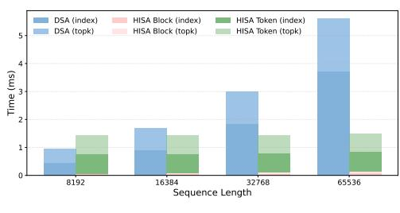
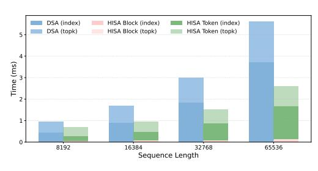

# HISA: Efficient Hierarchical Indexing for Fine-Grained Sparse Attention

Yufei Xu,\*Fanxu Meng,\*Fan Jiang, Yuxuan Wang, Ruijie Zhou, Zhaohui Wang, Jiexi Wu, Zhixin Pan, Xiaojuan Tang, Wenjie Pei, Tongxuan Liu, Di Yin, Xing Sun, Muhan Zhang†
https://github.com/MuLabPKU/TransArch

## **Abstract**

Token-level sparse attention mechanisms, exemplified by DeepSeek Sparse Attention (DSA), achieve fine-grained key selection by scoring every historical key for each query through a lightweight indexer, then computing attention only on the selected subset. While the downstream sparse attention itself scales favorably, the indexer must still scan the entire prefix for every query, introducing an  $\mathcal{O}(L^2)$  per-layer bottleneck that grows prohibitively with context length. We propose HISA (Hierarchical Indexed Sparse Attention), a plug-and-play replacement for the indexer that rewrites the search path from a flat token scan into a two-stage hierarchical procedure: (1) a block-level coarse filtering stage that scores pooled block representations to discard irrelevant regions, followed by (2) a token-level refinement stage that applies the original indexer exclusively within the retained candidate blocks. HISA preserves the identical token-level top-*k* sparse pattern consumed by the downstream Sparse MLA operator and requires no additional training. On kernel-level benchmarks, HISA achieves up to 3.75× **speedup** at 64K context. On Needle-in-a-Haystack and LongBench, we directly replace the indexer in DeepSeek-V3.2 and GLM-5 with our HISA indexer, without any finetuning. HISA closely matches the original DSA in quality, while substantially outperforming block-sparse baselines.

# 1 Introduction

Serving large language models (LLMs) (OpenAI, 2026; Anthropic, 2026; Google DeepMind, 2025; Meta, 2025; Qwen, 2026; DeepSeek-AI, 2024; MiniMax et al., 2025; Moonshot AI, 2025) over long contexts remains a central systems challenge. As context windows grow from 128K to 1M tokens and beyond—driven by demands for agentic multi-turn reasoning, long-document understanding, and native multimodal processing—the quadratic cost of self-attention becomes a dominant bottleneck in both prefill latency and memory consumption (Dao et al., 2022; Dao, 2023).

A productive line of work tackles this challenge through *sparse attention*: instead of attending to all key–value pairs, each query selects a small subset of the most relevant tokens and computes attention only over that subset. DeepSeek-V3.2 (DeepSeek-AI, 2025) adopts a *token-level* sparse attention paradigm, in which a lightweight *indexer* scores every historical token for each query, selects the top-*k* highest-scoring keys, and forwards only those keys to a downstream Sparse Multi-Head Latent Attention (Sparse MLA). This design has also been adopted in GLM-5 (GLM-5-Team, 2026) and provides strictly finer-grained selection than block-level methods such as MoBA (Lu et al., 2025) and Native Sparse Attention (Yuan et al., 2025).

However, the token-level sparse paradigm introduces a subtler bottleneck. Although the downstream attention is sparse and cheap, the indexer itself must score every token in the

<sup>\*</sup>Equal contribution.

<sup>&</sup>lt;sup>†</sup>Corresponding author: muhan@pku.edu.cn

prefix for every query. Concretely, if the prefix length is *L* and the indexer runs once per query per layer, the per-layer indexing cost is O(*L* 2 )—the same asymptotic scaling as dense attention. As context lengths push toward 128K or 1M tokens, the indexer can transition from a negligible overhead into the dominant cost component.

This observation motivates a natural question: *can we reduce the indexer's search cost without changing the final sparse attention pattern it produces?* In other words, can we rewrite the search *path* while preserving the search *result*?

We answer affirmatively with **HISA** (**H**ierarchical **I**ndexed **S**parse **A**ttention). HISA replaces the flat, full-prefix token scan with a two-stage hierarchical search (shown in Figure [1\)](#page-2-0):

- 1. **Block-level coarse filtering.** The prefix is partitioned into contiguous blocks of size *B*. A pooled representative vector is computed for each block via mean pooling over its constituent indexing keys. The query scores all ⌈*L*/*B*⌉ block representatives and retains only the top-*m* blocks, immediately pruning the majority of the prefix from further consideration.
- 2. **Token-level refinement.** The token-level indexer then scores at most *mB* tokens from the candidate blocks using the same scoring mechanism as the original DSA indexer, except that the candidate pool is restricted to the tokens within the selected blocks rather than the full set of *L* tokens considered in DSA. The final top-*k* token set is then selected from this reduced candidate pool.

Crucially, HISA produces outputs with the same structure as the original DSA indexer: for each query, a set of *k* token indices. As a result, the downstream Sparse MLA operator remains entirely unchanged. HISA is therefore a **drop-in replacement** that requires no retraining, no architectural changes to the attention mechanism, and no modification to the KV cache layout. The per-query indexing complexity drops from O(*L*) to O(*L*/*B* + *mB*), and the per-layer cost drops from O(*L* 2 ) to O(*L* <sup>2</sup>/*B* + *LmB*).

Our contributions are as follows:

- We identify the indexer as an emerging bottleneck in token-level sparse attention systems and formalize the problem of **search-path optimization** for sparse indexers.
- We propose HISA, a hierarchical block-to-token indexing strategy that is trainingfree, operator-compatible, and asymptotically faster than the flat indexer.
- We provide optimized TileLang GPU kernel implementations for both stages of HISA and demonstrate 2–4× kernel-level speedup at 64K contexts.
- We empirically validate that HISA achieves performance comparable to the original DSA on the Needle-in-a-Haystack and LongBench benchmarks.

# **2 Related Work**

**Block sparse attention.** Block sparse attention partitions sequences into fixed-size blocks and restricts computation to selected blocks, mapping naturally to GPU tiled matrix multiplications. This design is hardware-friendly, but all tokens within a block must be retained or discarded together. Among training-free methods, MInference [\(Huiqiang et al.,](#page-9-11) [2024\)](#page-9-11) profiles each head offline and assigns one of several sparse patterns at inference time; FlexPrefill [\(Lai et al.,](#page-9-12) [2025\)](#page-9-12) estimates block scores online and selects blocks by a cumulativeattention threshold; XAttention [\(Xu et al.,](#page-10-3) [2025\)](#page-10-3) uses antidiagonal sums as an O(*B*) proxy for block importance; and SpargeAttention [\(Zhang et al.,](#page-10-4) [2025\)](#page-10-4) applies a two-stage online filter to skip low-importance regions during matrix multiplication and softmax. Among trainable methods, MoBA [\(Lu et al.,](#page-9-10) [2025\)](#page-9-10) uses mixture-of-experts-style routing over blocks, while NSA [\(Yuan et al.,](#page-10-2) [2025\)](#page-10-2) combines compression, selection, and sliding-window branches to cover different dependency scales. Their common limitation is block granularity: they cannot capture token-level importance differences within a selected block. HISA also introduces a block-level stage, but only as a fast pre-filter before token refinement; its final sparse pattern remains fine-grained and token-wise, as in DSA.

<span id="page-2-0"></span>

Figure 1: Comparison of the DSA token-wise indexer (left) and our HISA hierarchical block-level coarse filter followed by token-level refinement (right). Both produce the same data structure—a per-query set of *k* token indices—consumed by the downstream Sparse MLA operator.

**Token sparse attention.** Token-level methods offer finer selection but face the challenge of efficient importance estimation. SnapKV [\(Yuhong et al.,](#page-10-5) [2024\)](#page-10-5) uses an observation window at the end of the prompt to select important KV positions for subsequent decoding, but ignores layer- and query-specific variation. KV cache eviction methods—such as H2O [\(Zhang et al.,](#page-10-6) [2024\)](#page-10-6), which combines cumulative attention with recency, and TOVA [\(Oren et al.,](#page-10-7) [2024\)](#page-10-7), which evicts the lowest-scoring cached token under the latest query—maintain a fixed-size cache but irrecoverably lose evicted tokens. LazyLLM [\(Fu et al.,](#page-9-13) [2024\)](#page-9-13) progressively prunes tokens across layers during prefill, so early pruning mistakes cannot be corrected later in the same forward pass. DSA [\(DeepSeek-AI,](#page-9-8) [2025\)](#page-9-8) instead scores every prefix token with a lightweight indexer and selects top-*k* tokens per query, achieving fine-grained sparsity at the cost of O(*L* 2 ) per-layer indexing overhead. IndexCache [\(Bai et al.,](#page-9-14) [2026\)](#page-9-14) reduces this cost by reusing indices across nearby layers, although its benefit depends on cross-layer similarity in sparse patterns.

**Hierarchical sparse attention.** Hierarchical attention dates back to [Yang et al.](#page-10-8) [\(2016\)](#page-10-8), who introduced a two-tier word-and-sentence network for document classification. Among recent sparse methods, NSA [\(Yuan et al.,](#page-10-2) [2025\)](#page-10-2) and InfLLM-V2 [\(Zhao et al.,](#page-10-9) [2026\)](#page-10-9) can both be viewed as two-level designs: they score block-level summaries globally and activate finer-grained sparse attention only within selected blocks. Twilight [\(Lin et al.,](#page-9-15) [2025\)](#page-9-15) uses quantized keys for coarse scoring and then applies hierarchical top-*p* pruning, while Double-P [\(Ni et al.,](#page-10-10) [2026\)](#page-10-10) clusters the KV cache, scores cluster centroids, refines computation within selected clusters, and approximates low-score clusters with their centroids. HISA follows the same coarse-to-fine spirit but with a different goal: it combines a hardware-friendly block-level indexer with a fine-grained token-level indexer to accelerate DSA, achieving both high efficiency and strong selection quality on DeepSeek-V3.2 and GLM-5.

# <span id="page-2-2"></span>**3 Preliminary**

We briefly review DeepSeek Sparse Attention (DSA) as used in DeepSeek-V3.2 [\(DeepSeek-](#page-9-8)[AI,](#page-9-8) [2025\)](#page-9-8). DSA consists of two components: a **token-wise Indexer** and **Sparse MLA**.

**Indexer in DSA.** Let *L* denote the causal prefix length for a query position *t*. The indexer maintains lightweight indexing keys **k** *I s* , indexing queries **q** *I t*,*j* for *H<sup>I</sup>* indexing heads, and per-head gating weights *w I t*,*j* . The relevance score between query *t* and key *s* is defined as

<span id="page-2-1"></span>
$$I_{t,s} = \sum_{j=1}^{H^I} w_{t,j}^I \cdot \text{ReLU}\left(\mathbf{q}_{t,j}^I \cdot \mathbf{k}_s^I\right). \tag{1}$$

The indexer then selects the top-k token indices,

$$\mathcal{T}_t = \text{TopK}(I_{t,:}, k), \tag{2}$$

which are passed to the downstream Sparse MLA operator. Since the scoring cost for each query is  $\mathcal{O}(L)$  over the full prefix, the total cost across all queries in a layer is  $\mathcal{O}(L^2)$ .

**Sparse MLA** in **DSA**. Following the DeepSeek-V3.2 design, Sparse MLA adopts the MQA mode of MLA, in which each token stores a single latent key–value entry shared across all query heads for efficiency. Let  $\mathbf{c}_s$  denote the latent MLA entry associated with token s. Given the selected token set  $\mathcal{T}_t$ , Sparse MLA computes attention for query token t only over the selected latent entries, rather than over the full prefix:

$$\mathbf{u}_t = \operatorname{Attn}(\mathbf{h}_t, \{\mathbf{c}_s \mid s \in \mathcal{T}_t\}). \tag{3}$$

As a result, the main attention cost is reduced from dense  $\mathcal{O}(L^2)$  to sparse  $\mathcal{O}(Lk)$ . For our purposes, the key observation is that the interface between the two components is precisely the selected token set  $\mathcal{T}_t$ : HISA replaces only the indexer search path, while leaving the downstream Sparse MLA operator unchanged.

## 4 Method

## 4.1 HISA: Hierarchical Indexed Sparse Attention

As shown in Figure 1, HISA replaces the flat prefix scan with a two-stage coarse-to-fine search. The final output remains an identical per-query token set  $\mathcal{T}_t^H$  of size k, consumed by the original Sparse MLA operator.

**Block partitioning and pooled keys.** The prefix tokens of length L is partitioned into  $M = \lceil L/B \rceil$  contiguous, causally valid blocks  $\mathcal{B}_1, \mathcal{B}_2, \dots, \mathcal{B}_M$ , where B is the block size. For each block, a representative key is constructed via mean pooling over its indexing keys:

$$\tilde{\mathbf{k}}_b^I = \text{Pool}\left(\left\{\mathbf{k}_s^I \mid s \in \mathcal{B}_b\right\}\right). \tag{4}$$

These representative keys serve exclusively as coarse-grained proxies for block-level scoring and leave both the token-level indexing keys consumed by the second stage and the KV states consumed by Sparse MLA unchanged, thereby making HISA a plug-and-play replacement. In practice, these representative keys can be incrementally maintained alongside the KV cache with negligible overhead.

**Stage 1: Block-level coarse filtering.** For query position t, HISA reuses the same indexing query representations  $\mathbf{q}_{t,j}^{I}$  and gating weights  $w_{t,j}^{I}$  as DSA, but scores the **pooled representative keys** instead of individual token keys:

$$J_{t,b} = \sum_{j=1}^{H^I} w_{t,j}^I \cdot \text{ReLU}\left(\mathbf{q}_{t,j}^I \cdot \tilde{\mathbf{k}}_b^I\right). \tag{5}$$

The top-*m* blocks are selected:

$$C_t = \text{TopK}(J_{t,:}, m), \tag{6}$$

and the candidate token set is the union of all tokens in the selected blocks:

$$\Omega_t = \bigcup_{b \in \mathcal{C}_t} \mathcal{B}_b. \tag{7}$$

All block selections strictly respect the causal mask: only blocks that precede the query position t, together with the block containing position t, are considered eligible. Following MoBA (Lu et al., 2025), the first and the last blocks are **always** included in  $\mathcal{C}_t$ , as they contain the attention sink and local contexts. This forced inclusion also simplifies boundary handling during batched prefill with packed sequences of varying lengths, where a single block may straddle the boundary between two sequences.

<span id="page-4-0"></span>



(a) Budget = 8192 (b) Compression Ratio = 4:1

Figure 2: Latency comparison of the indexer kernel between the original DSA (flat token scan) and HISA (hierarchical block-to-token indexing). In the left panel, the block size is fixed to B = 128 and the maximum number of selected blocks is set to top-m = 64. In the right panel, the block size is also fixed to B = 128, while the number of selected blocks is adjusted for each sequence length to maintain a fixed compression ratio of M: m = 4:1.

**Stage 2: Token-level refinement.** Within the selected candidate set  $\Omega_t$ , the token-level indexer computes scores using the same scoring mechanism as in the original DSA (Eq. 1):

$$I_{t,s} = \sum_{j=1}^{H^I} w_{t,j}^I \cdot \text{ReLU}\left(\mathbf{q}_{t,j}^I \cdot \mathbf{k}_s^I\right), \quad s \in \Omega_t.$$
 (8)

Then the top-*k* tokens are selected as final tokens:

$$\mathcal{T}_t = \text{TopK}(\{I_{t,s} \mid s \in \Omega_t\}, k). \tag{9}$$

To ensure that the candidate pool is sufficiently large to select k tokens, the feasibility constraint  $mB \ge k$  must be satisfied. Given the selected token set  $\mathcal{T}_t$ , sparse MLA is executed following the same computation as in the original DSA. Algorithm 1 provides the complete pseudocode for the HISA indexer.

**Boundary behavior.** Three regimes arise depending on the relationship between the effective prefix length t, the candidate capacity mB, and the budget k:

- When  $t \le k$ , all prefix tokens are selected and HISA is equivalent to dense attention.
- When  $k < t \le mB$ , the coarse filter selects all blocks (since  $m \ge M$ ), and Stage 2 reduces the set to k tokens. HISA is equivalent to the original DSA indexer.
- When t > mB, the coarse filter performs non-trivial block pruning, activating HISA's hierarchical advantage, which becomes increasingly pronounced as the sequence length grows.

The third regime is precisely the long-context setting where HISA provides its efficiency gains.

#### 4.2 Complexity Analysis

Assuming that the pooled representative keys are maintained incrementally, the per-query indexing cost of HISA consists of scoring  $\lceil L/B \rceil$  block representatives (Stage 1) and scoring at most mB candidate tokens (Stage 2):

$$\mathcal{O}\left(\frac{L}{B} + mB\right). \tag{10}$$

Summing over all *L* queries within a layer yields:

$$\mathcal{O}\left(\frac{L^2}{B} + LmB\right),\tag{11}$$

<span id="page-5-1"></span>

Figure 3: Needle-in-a-Haystack retrieval accuracy heatmaps for DeepSeek-V3.2 under three indexing strategies. The *x*-axis denotes the context length (8K–128K), and the *y*-axis denotes the needle depth (0%–100%). Shades closer to green indicate higher retrieval accuracy.

compared to  $\mathcal{O}(L^2)$  for the original DSA indexer. The design introduces a clear trade-off: larger B reduces the cost of coarse-filtering stage but makes each block a coarser proxy; smaller m improves efficiency but increases the risk of missing relevant blocks. When  $m \ll M$  and  $B \ll L$ —the regime of ultra-long contexts with a selective coarse filter—the reduction is substantial. Conversely, as m approaches M, HISA degrades gracefully toward the DSA baseline.

As modern LLMs increasingly adopt context windows of 128K or even 1M tokens to support advanced agent capabilities and native multimodal reasoning, HISA's asymptotic advantage translates directly into practical speedups.

## 5 Experiments

We evaluate HISA along five axes: (1) kernel-level latency, (2) retrieval accuracy on Needle-in-a-Haystack, (3) downstream task performance on LongBench, (4) visualization of attention scores, and (5) hyperparameter sensitivity. Throughout the evaluation, we compare three indexing strategies:

- **DSA (original)**: the full-prefix token-level indexer as described in Section 3.
- **Block-Sparse**: a block-level-only baseline that selects top-*m* blocks and attends to all tokens within those blocks (i.e., Stage 1 only, without token-level refinement).
- **HISA**: the hierarchical block-to-token indexer proposed in this work.

Both HISA and Block-Sparse are *training-free*: they are applied at inference time by replacing the indexer module, with no fine-tuning or architectural modification.

#### 5.1 Kernel-Level Speedup

Figure 2 compares the indexer kernel latency of the original DSA and HISA across context lengths from 8K to 64K tokens. Both implementations use TileLang (Wang et al., 2025) kernels, with DSA following the official reference implementation. The HISA kernel is decomposed into two stages: block-level filtering and token-level refinement within the selected candidate blocks. The configuration is as follows: query lens = 1024, final top-k = 2048 tokens, block size B = 128, and two choices for the maximum number of selected blocks. All comparisons are conducted on an NVIDIA A100 GPU. These results are measured at the *indexer kernel* level and do not directly reflect end-to-end serving throughput,

<span id="page-5-0"></span><sup>1</sup>https://github.com/tile-ai/tilelang/tree/main/examples/deepseek\_v32

which also depends on the sparse MLA operator, KV cache management, and other system components.

With 2048 selected tokens, the sparse MLA operator consistently costs about 1.6 ms, while the indexer reaches 5.6 ms at 64K context length. This suggests that the main performance bottleneck in DSA lies in the indexer rather than in sparse MLA itself. Accordingly, we restrict the comparison to indexer overhead. At 64K context length, HISA delivers an approximately  $2.16\times$  speedup with a 4:1 first-stage compression ratio (corresponding to a 16K candidate budget), and up to  $3.75\times$  speedup under a fixed 8K budget. Although HISA adds a block-level filtering stage, this stage operates only on pooled block summaries of size  $\lceil L/B \rceil$ , which is far smaller than the full token sequence. Moreover, under a fixed 8K budget, the second-stage cost remains nearly constant because both the input and output lengths are fixed, making the computation graph easier to optimize and further improving inference speed.

## 5.2 Needle-in-a-Haystack

The Needle-in-a-Haystack (NIAH) test (Kamradt, 2023) evaluates a model's ability to retrieve a specific fact (the "needle") embedded at a controlled position within a long distractor context (the "haystack"). We evaluate DeepSeek-V3.2 with its original DSA indexer replaced by HISA (4:1 ratio) and block indexer, without any additional training, over context lengths ranging from 8K to 648K tokens and needle insertion depths ranging from 0% (beginning) to 100% (end).

Figure 3 presents the retrieval accuracy heatmaps. The original DSA achieves near-perfect retrieval across all context lengths and needle positions (Figure 3a). HISA closely matches this performance (Figure 3c), with only marginal degradation at extreme lengths and depths, suggesting that the our HISA rarely discards blocks containing the target information. In contrast, the Block-Sparse baseline (Figure 3b) exhibits noticeable accuracy degradation, particularly when the needle is located in the middle of the context where block-level selection is least reliable. This result underscores the value of hierarchical selection. Block-sparse methods often waste budget on unimportant tokens within selected blocks while overlooking truly critical tokens. HISA, in contrast, refines the selection at the token level after block retrieval, allowing it to preserve important tokens more accurately and achieve efficient token-wise sparsity.

#### 5.3 LongBench Evaluation

LongBench (Bai et al., 2024) is a comprehensive benchmark for long-context understanding, covering single-document QA, multi-document QA, summarization, few-shot learning, and synthetic retrieval tasks. We evaluate DeepSeek-V3.2 (DeepSeek-AI, 2025) and GLM-5 (GLM-5-Team, 2026) under three configurations: the original DSA indexer, HISA, and Block-Sparse Attention. For a fair comparison, all three configurations ultimately retain 2048 tokens for computation. Specifically, Block-Sparse Attention directly selects 16 blocks of size 128 (i.e.,  $128 \times 16 = 2048$  tokens). HISA first selects 64 blocks of size 128 (i.e.,  $128 \times 64 = 8192$  tokens), and then further refines them through token-level selection to 2048 tokens.

Table 1 summarizes the results. Across both models and all task categories, HISA achieves performance very close to that of the original DSA. Notably, HISA consistently surpasses DSA on the Synthetic tasks, and on GLM-5 it even attains a higher average score. By contrast, the Block-Sparse baseline, which does not include token-level refinement, exhibits a substantially larger performance gap. This is particularly apparent on the Synthetic tasks for GLM-5, where its score declines by 8.35%.

#### 5.4 Visualization of Attention Scores

To analyze the structural properties of attention in long-context generation, we conduct a visualization study on a representative sample from the code task of LongBench. We generate the first output token using DeepSeek-V3.2 and extract the full attention distributions

<span id="page-7-0"></span>Table 1: LongBench results for DeepSeek-V3.2 and GLM-5 under different indexing strategies. All sparse methods are applied at inference time without additional training. Scores are averaged across sub-tasks within each category. Task abbreviations: **SQA** = Single-Document QA, **MQA** = Multi-Document QA, **Sum** = Summarization, **FS** = Few-shot Learning, **Syn** = Synthetic Retrieval, **Code** = Code Completion.

| Model         | Indexer              | SQA                      | MQA                      | Sum                     | FS                       | Syn                            | Code                                  | Avg.                                      |
|---------------|----------------------|--------------------------|--------------------------|-------------------------|--------------------------|--------------------------------|---------------------------------------|-------------------------------------------|
| DeepSeek-V3.2 | DSA<br>Block<br>HISA | <b>50.89</b> 48.36 49.17 | <b>52.66</b> 49.76 51.96 | 22.11<br>21.90<br>22.13 | <b>62.24</b> 59.45 61.62 | 69.83<br>68.67<br><b>70.83</b> | 48.56<br><b>49.09</b><br><u>48.99</u> | <b>51.05</b><br>  49.54<br>  <u>50.78</u> |
| GLM-5         | DSA<br>Block<br>HISA | 41.23<br>38.35<br>42.45  | 27.89<br>24.29<br>27.62  | 18.39<br>16.95<br>17.90 | 63.20<br>60.64<br>63.78  | 68.84<br>60.49<br><b>69.35</b> | 56.53<br>55.29<br><b>56.79</b>        | 46.01<br>42.67<br>46.32                   |


Figure 4: Visualization of Attention Distribution.

at each layer. We visualize the attention weights over all context tokens as a 2D heatmap, where the x-axis denotes token positions and the y-axis denotes layer indices.

The visualization reveals a pattern: tokens with high attention weights tend to form contiguous spans rather than appearing as isolated points in a considerable number of tasks. These high-density regions often correspond to semantically coherent segments (e.g.,code blocks,mathematical formulas and derivations) and persist across multiple layers. Outside these spans,attention scores are negligible. This observation suggests that attention mass may be naturally concentrated in block-wise regions. Therefore,block-level sparsification can retain most of the informative attention distribution while avoiding the fine-grained selection overhead of token-wise top-k methods. The results provide empirical support for the two-stage hierarchical structure of HISA.

#### 5.5 Hyperparameter Sensitivity

We investigate the sensitivity of HISA to its two key hyperparameters—block size B and block-level top-m—by comparing three HISA configurations that share the same candidate pool size, mB = 8192, but different coarse-to-fine trade-offs: (B=64, m=128), (B=128, m=64), and (B=256, m=32). We further include the original DSA as an upper bound and Block-Sparse (B=128, m=16) as a lower bound. All configurations use k=2048 for the final token selection. Results are evaluated on DeepSeek-V3.2 and GLM-5 across five LongBench task categories.

Figure 5 reveals several key findings. First, all three HISA configurations closely track DSA performance across all five task categories. This result confirms that our two-stage hierarchical indexer recovers nearly the same set of important tokens as the exhaustive flat scan. Second, among the three HISA variants, the intermediate configurations (B=64 and B=128) perform better than B=256. This suggests that finer-grained selection is important for accurately identifying the most relevant tokens. Third, Block-Sparse consistently underperforms all HISA configurations. This gap underscores the importance of token-level

<span id="page-8-0"></span>

Figure 5: LongBench scores under different indexer configurations. All three HISA variants use a candidate token pool of size mB = 8192 and a final token budget of k=2048, with different choices of block size B and block-level top-m. The Block-Sparse baseline uses B=128 and m=16, corresponding to a candidate pool of 2048 tokens and no token-level refinement.

refinement: even under the same block-level selection mechanism, the ability to prune low-relevance tokens *within* selected blocks yields measurable quality gains.

### 6 Conclusion and Future Directions

To address the emerging bottleneck caused by the  $O(L^2)$  complexity of the DSA indexer, we propose HISA, a hierarchical indexing approach. Specifically, HISA first uses a hardware-friendly block indexer to efficiently filter out a large number of irrelevant tokens, and then applies token-level reranking over the remaining candidates to construct the final cache for sparse attention computation. At the kernel level, HISA delivers a  $3.75\times$  speedup over the DSA kernel. As a plug-and-play module, HISA can directly replace the token indexer in DeepSeek-V3.2 and GLM-5. Without any additional training, it maintains nearly unchanged performance on LongBench. On NIAH, it also performs significantly better than the corresponding block-sparse baseline.

Several avenues remain open: (1) *Reducing information loss in coarse filtering*: the current block-level stage represents each block with a single pooled vector, which can fail when a block crosses a semantic boundary and the pooled representation does not reflect the most important token. Potential mitigations include overlapping blocks, adaptive block boundaries, or replacing mean pooling with max pooling to better preserve salient outlier directions. (2) *Training-aware HISA*: while HISA currently operates as a training-free inference-time replacement, jointly training the block scoring stage may improve the coarse filter's accuracy, particularly for such boundary cases. (3) *End-to-end system integration*: integrating HISA into a full inference serving stack (e.g., with continuous batching and speculative decoding) and measuring throughput and latency under realistic workloads.

# **References**

- <span id="page-9-0"></span>Anthropic. Claude sonnet 4.6, 2026. URL [https://www.anthropic.com/news/](https://www.anthropic.com/news/claude-sonnet-4-6) [claude-sonnet-4-6](https://www.anthropic.com/news/claude-sonnet-4-6).
- <span id="page-9-17"></span>Yushi Bai, Xin Lv, Jiajie Zhang, Hongchang Lyu, Jiankai Tang, Zhidian Huang, Zhengxiao Du, Xiao Liu, Aohan Zeng, Lei Hou, et al. Longbench: A bilingual, multitask benchmark for long context understanding. *arXiv preprint arXiv:2308.14508*, 2024.
- <span id="page-9-14"></span>Yushi Bai, Qian Dong, Ting Jiang, Xin Lv, Zhengxiao Du, Aohan Zeng, Jie Tang, and Juanzi Li. Indexcache: Accelerating sparse attention via cross-layer index reuse. *arXiv preprint arXiv:2603.12201*, 2026.
- <span id="page-9-7"></span>Tri Dao. Flashattention-2: Faster attention with better parallelism and work partitioning. *arXiv preprint arXiv:2307.08691*, 2023.
- <span id="page-9-6"></span>Tri Dao, Daniel Y Fu, Stefano Ermon, Atri Rudra, and Christopher Re. Flashattention: Fast ´ and memory-efficient exact attention with io-awareness. In *Advances in Neural Information Processing Systems*, volume 35, 2022.
- <span id="page-9-3"></span>DeepSeek-AI. DeepSeek-V3 technical report. *arXiv preprint arXiv:2412.19437*, 2024.
- <span id="page-9-8"></span>DeepSeek-AI. Deepseek-v3.2: Pushing the frontier of open large language models. *arXiv preprint arXiv:2512.02556*, 2025.
- <span id="page-9-13"></span>Qichen Fu, Minsik Cho, Thomas Merth, Sachin Mehta, Mohammad Rastegari, and Mahyar Najibi. Lazyllm: Dynamic token pruning for efficient long context LLM inference. *arXiv preprint arXiv:2407.14057*, 2024.
- <span id="page-9-9"></span>GLM-5-Team. Glm-5: from vibe coding to agentic engineering. *arXiv preprint arXiv:2602.15763*, 2026.
- <span id="page-9-1"></span>Google DeepMind. Introducing gemini 3, 2025. URL [https://blog.google/](https://blog.google/products-and-platforms/products/gemini/gemini-3-collection/) [products-and-platforms/products/gemini/gemini-3-collection/](https://blog.google/products-and-platforms/products/gemini/gemini-3-collection/).
- <span id="page-9-11"></span>Jiang Huiqiang, Li Yucheng, Zhang Chengruidong, Wu Qianhui, Luo Xufang, Ahn Surin, Han Zhenhua, Abdi Amir, H., Li Dongsheng, Lin Chin-Yew, Yang Yuqing, and Qiu Lili. Minference 1.0: Accelerating pre-filling for long-context llms via dynamic sparse attention. *arXiv preprint arXiv:2407.02490*, 2024. URL <https://www.arxiv.org/abs/2407.02490>.
- <span id="page-9-16"></span>Greg Kamradt. Needle in a haystack — pressure testing llms. 2023. [https://github.com/](https://github.com/gkamradt/LLMTest_NeedleInAHaystack) gkamradt/LLMTest [NeedleInAHaystack](https://github.com/gkamradt/LLMTest_NeedleInAHaystack).
- <span id="page-9-12"></span>Xunhao Lai, Jianqiao Lu, Yao Luo, Yiyuan Ma, and Xun Zhou. Flexprefill: A contextaware sparse attention mechanism for efficient long-sequence inference. In *International Conference on Learning Representations*, 2025.
- <span id="page-9-15"></span>Chaofan Lin, Jiaming Tang, Shuo Yang, Hanshuo Wang, Tian Tang, Boyu Tian, Ion Stoica, Song Han, and Mingyu Gao. Twilight: Adaptive attention sparsity with hierarchical top-*p* pruning. In *Advances in Neural Information Processing Systems*, volume 38, 2025.
- <span id="page-9-10"></span>Enzhe Lu, Zhejun Jiang, Jingyuan Liu, Yulun Du, Tao Jiang, Chao Hong, Shaowei Liu, Weiran He, Enming Yuan, Yuzhi Wang, et al. Moba: Mixture of block attention for long-context llms. *arXiv preprint arXiv:2502.13189*, 2025.
- <span id="page-9-2"></span>Meta. The llama 4 model collection, 2025. URL [https://ai.meta.com/blog/](https://ai.meta.com/blog/llama-4-multimodal-intelligence/) [llama-4-multimodal-intelligence/](https://ai.meta.com/blog/llama-4-multimodal-intelligence/).
- <span id="page-9-4"></span>MiniMax, Aonian Li, Bangwei Gong, Bo Yang, Boji Shan, Chang Liu, et al. MiniMax-01: Scaling foundation models with lightning attention. *arXiv preprint arXiv:2501.08313*, 2025.
- <span id="page-9-5"></span>Moonshot AI. Kimi K2: Open agentic intelligence. *arXiv preprint arXiv:2507.20534*, 2025.

- <span id="page-10-10"></span>Wentao Ni, Kangqi Zhang, Zhongming Yu, Oren Nelson, Mingu Lee, Hong Cai, Fatih Porikli, Jongryool Kim, Zhijian Liu, and Jishen Zhao. Double-p: Hierarchical top-p sparse attention for long-context LLMs. *arXiv preprint arXiv:2602.05191*, 2026.
- <span id="page-10-0"></span>OpenAI. GPT-5.4: Openai's most powerful model, 2026. URL [https://openai.com/index/](https://openai.com/index/gpt-5-4-thinking-system-card) [gpt-5-4-thinking-system-card](https://openai.com/index/gpt-5-4-thinking-system-card).
- <span id="page-10-7"></span>Matanel Oren, Michael Hassid, Nir Rosenfeld, Yossi Adi, and Roy Schwartz. Transformers are multi-state RNNs. In *Proceedings of the 2024 Conference on Empirical Methods in Natural Language Processing*, 2024.
- <span id="page-10-1"></span>Qwen. Qwen3.5: Native multimodal agentic model, 2026. URL [https://qwenlm.github.](https://qwenlm.github.io/blog/qwen3.5) [io/blog/qwen3.5](https://qwenlm.github.io/blog/qwen3.5).
- <span id="page-10-11"></span>Lei Wang, Yu Cheng, Yining Shi, Zhengju Tang, Zhiwen Mo, Wenhao Xie, Lingxiao Ma, Yuqing Xia, Jilong Xue, Fan Yang, and Zhi Yang. Tilelang: A composable tile-based programming model for ai systems. *arXiv preprint arXiv:2504.17577*, 2025.
- <span id="page-10-3"></span>Ruyi Xu, Guangxuan Xiao, Haofeng Huang, Junxian Guo, and Song Han. Xattention: Block sparse attention with antidiagonal scoring. In *Proceedings of the 42nd International Conference on Machine Learning*, 2025.
- <span id="page-10-8"></span>Zichao Yang, Diyi Yang, Chris Dyer, Xiaodong He, Alex Smola, and Eduard Hovy. Hierarchical attention networks for document classification. In *Proceedings of the 2016 Conference of the North American Chapter of the Association for Computational Linguistics: Human Language Technologies*, pp. 1480–1489, 2016.
- <span id="page-10-2"></span>Jingyang Yuan, Huazuo Gao, Damai Dai, Junyu Luo, Liang Zhao, Zhengyan Zhang, Zhenda Xie, Yuxing Wei, Lean Wang, Zhiping Xiao, et al. Native sparse attention: Hardwarealigned and natively trainable sparse attention. In *Proceedings of the 63rd Annual Meeting of the Association for Computational Linguistics (Volume 1: Long Papers)*, pp. 23078–23097, 2025.
- <span id="page-10-5"></span>Li Yuhong, Huang Yingbing, Yang Bowen, Venkitesh Bharat, Locatelli Acyr, Ye Hanchen, Cai Tianle, Lewis Patrick, and Chen Deming. Snapkv: Llm knows what you are looking for before generation. *arXiv preprint arXiv:2404.14469*, 2024. URL [https://www.arxiv.](https://www.arxiv.org/abs/2404.14469) [org/abs/2404.14469](https://www.arxiv.org/abs/2404.14469).
- <span id="page-10-4"></span>Jintao Zhang, Chendong Xiang, Haofeng Huang, Jia Wei, Haocheng Xi, Jun Zhu, and Jianfei Chen. Spargeattention: Accurate and training-free sparse attention accelerating any model inference. In *Proceedings of the 42nd International Conference on Machine Learning*, 2025.
- <span id="page-10-6"></span>Zhenyu Zhang, Ying Sheng, Tianyi Zhou, Tianlong Chen, Lianmin Zheng, Ruisi Cai, Zhao Song, Yuandong Tian, Christopher Re, Clark Barrett, et al. H ´ <sup>2</sup>O: Heavy-hitter oracle for efficient generative inference of large language models. In *Advances in Neural Information Processing Systems*, volume 36, 2024.
- <span id="page-10-9"></span>Weilin Zhao, Zihan Zhou, Zhou Su, Chaojun Xiao, Yuxuan Li, Yanghao Li, Yudi Zhang, Weilun Zhao, Zhen Li, Yuxiang Huang, Ao Sun, Xu Han, and Zhiyuan Liu. Infllm-v2: Dense-sparse switchable attention for seamless short-to-long adaptation. In *International Conference on Learning Representations*, 2026.

## A Algorithm Pseudocode

Algorithm 1 provides the complete pseudocode for the HISA indexer.

## <span id="page-11-0"></span>Algorithm 1 HISA: Hierarchical Indexed Sparse Attention

```
Require: Query indexing representations \{\mathbf{q}_{t,i}^I\}, gating weights \{w_{t,i}^I\}, token indexing keys
      \{\mathbf{k}_{s}^{I}\}_{s=1}^{L}, block size B, block budget m, token budget k
Ensure: Selected token set \mathcal{T}_t of size k
 1: Partition prefix into M = \lfloor L/B \rfloor blocks \mathcal{B}_1, \dots, \mathcal{B}_M
 2: for b = 1 to M do
       \tilde{\mathbf{k}}_{h}^{I} \leftarrow \text{MeanPool}(\{\mathbf{k}_{s}^{I} \mid s \in \mathcal{B}_{h}\})
 3:
 4: end for
 5: for each query position t do
          // Stage 1: Block-level coarse filter
          for b = 1 to M such that \mathcal{B}_b precedes t do
 7:
             J_{t,b} \leftarrow \sum_{j} w_{t,j}^{I} \cdot \text{ReLU}(\mathbf{q}_{t,j}^{I} \cdot \tilde{\mathbf{k}}_{b}^{I})
 8:
 9:
          C_t \leftarrow \text{TopK}(J_{t,:}, m) \cup \{\text{first block, last block}\}
10:
          \Omega_t \leftarrow \bigcup_{b \in \mathcal{C}_t} \mathcal{B}_b
          // Stage 2: Token-level refinement
          for s \in \Omega_t do
13:
              I_{t,s} \leftarrow \sum_{j=1}^{H^I} w_{t,j}^I \cdot \text{ReLU}(\mathbf{q}_{t,j}^I \cdot \mathbf{k}_s^I)
14:
15:
          \mathcal{T}_t \leftarrow \text{TopK}(\{I_{t,s} \mid s \in \Omega_t\}, k)
17: end for
18: return \mathcal{T}_t
```

# **B** Experimental Settings

We detail the experimental settings for long-context evaluations in this section. All evaluations were conducted in a **zero-shot** setting.

#### **B.1** Long-context Benchmarks

We evaluated the long-context performance using the Needle In A Haystack (NIAH) test and the LongBench benchmark. We tested two models: **DeepSeek-V3.2** and **GLM-5**. Both models were deployed using the vLLM online serving framework with **FP8** precision.

**NIAH Settings** For the NIAH experiments, we utilized a customized evaluation codebase modified from the RULER<sup>2</sup> GitHub repository. We did not apply chat templates to either model to ensure a direct assessment of their raw retrieval capabilities.

**LongBench Settings** We evaluated LongBench using the lm-eval<sup>3</sup> framework. The configurations for LongBench varied slightly depending on the model characteristics:

• Chat Template Usage: DeepSeek-V3.2 was evaluated with its standard chat template. In contrast, GLM-5 was evaluated *without* a chat template. This decision was made because using the template triggered an extended thinking process that exceeded the maximum generation length and significantly slowed down inference. Furthermore, disabling the thinking process while keeping the template resulted in inferior performance compared to not using the template at all.

<span id="page-11-1"></span><sup>&</sup>lt;sup>2</sup>https://github.com/NVIDIA/RULER

<span id="page-11-2"></span><sup>&</sup>lt;sup>3</sup>https://github.com/EleutherAI/lm-evaluation-harness

• **Concurrency Settings:** The default number of concurrent requests (num concurrent) was set to 20. However, due to Out-Of-Memory (OOM) issues specific to GLM-5 on certain tasks, we adjusted the concurrency: longbench single was run with a concurrency of 1, and longbench summary was run with a concurrency of 2.

**Fairness of Comparison** We emphasize that although the specific settings (e.g., concurrency, chat template) differ across models and tasks to accommodate their unique characteristics and hardware constraints, we ensure that the settings are **strictly aligned** when comparing different methods within the same model and task combination. This guarantees a fair and rigorous comparison.