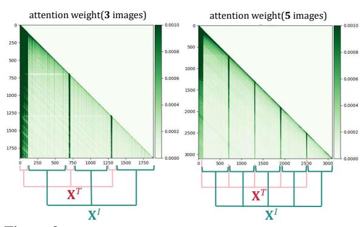
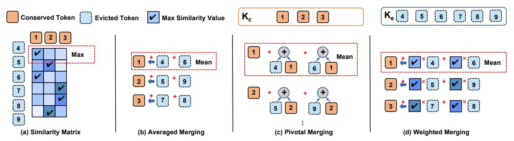
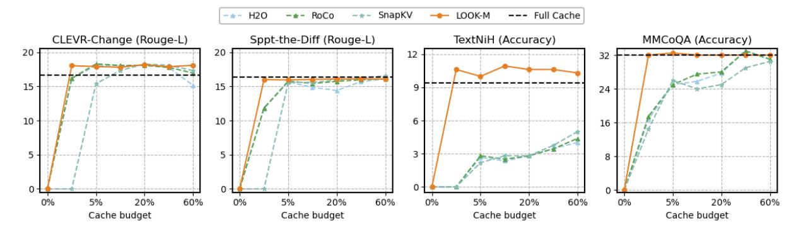
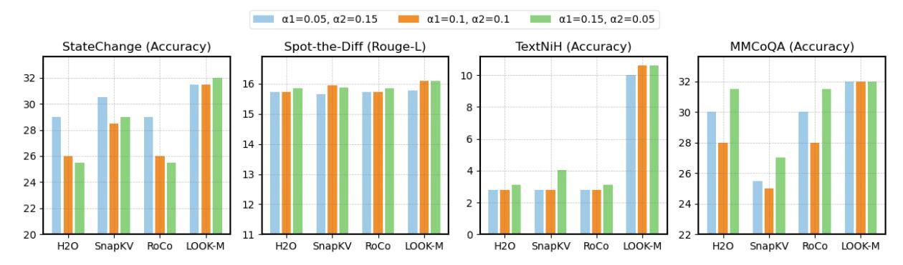

## LOOK-M: Look-Once Optimization in KV Cache for Efficient Multimodal Long-Context Inference

Zhongwei Wan1†\*, Ziang Wu2† , Che Liu3 , Jinfa Huang2 , Zhihong Zhu2 , Peng Jin2 , Longyue Wang4‡ , Li Yuan2‡

1The Ohio State University 2Peking University 3 Imperial College London 4Tencent AI Lab wan.512@osu.edu, ziangwu7777@gmail.com, che.liu21@imperial.ac.uk {jinfahuang, jp21, zhihongzhu}@stu.pku.edu.cn, vinnylywang@tencent.com yuanli-ece@pku.edu.cn

Code: <https://github.com/SUSTechBruce/LOOK-M>.

## Abstract

Long-context Multimodal Large Language Models (MLLMs) demand substantial computational resources for inference as the growth of their multimodal Key-Value (KV) cache, in response to increasing input lengths, challenges memory and time efficiency. Unlike single-modality LLMs that manage only textual contexts, the KV cache of long-context MLLMs includes representations from multiple images with temporal and spatial relationships and related textual contexts. The predominance of image tokens means traditional optimizations for LLMs' KV caches are unsuitable for multimodal long-context settings, and no prior works have addressed this challenge. In this work, we introduce LOOK-M, a pioneering, fine-tuning-free approach that efficiently reduces the multimodal KV cache size while maintaining performance comparable to a full cache. We observe that during prompt prefilling phase, the model prioritizes more textual attention over image features, and based on the multimodal interaction observation, a new proposed text-prior method is explored to compress the KV cache. Furthermore, to mitigate the degradation of image contextual information, we propose several compensatory strategies using KV pairs merging. LOOK-M demonstrates that with a significant reduction in KV Cache memory usage, such as reducing it by 80% in some cases, it not only achieves up to 1.5x faster decoding but also maintains or even enhances performance across a variety of long context multimodal tasks.

## 1 Introduction

Large language models (LLMs) [\(Achiam et al.,](#page-8-0) [2023;](#page-8-0) [Meta,](#page-9-0) [2024;](#page-9-0) [Jiang et al.,](#page-8-1) [2023;](#page-8-1) [Wan et al.,](#page-9-1) [2023b\)](#page-9-1) are progressively evolving into multimodal large language models (MLLMs) [\(Yang et al.,](#page-10-0)

**Instruction:** Your objective is the main goal. Evaluate your current environment and your past decisions, and decide your immediate course of action.

**Question:** Your Main Goal: Put a warm slice of bread on the counter. Step Details: <image1>Step#1: Turn around and walk to the counter top above the dishwasher, just past the refrigerator. <image2>Step#2: Pick up the loaf of bread to the right of the toaster. <image3>Step#3: Move over to your right so that you are directly in front of the knife's on the counter. <image4>Step#4: Place the bread on the counter to the left of the knife's. <image5>Current Step:

**GroundTruth**:Pick up the knife closest to the fork on the right, located on the counter.

Figure 1: A multimodal long-context sample contains multiple images from MileBench [\(Song et al.,](#page-9-2) [2024\)](#page-9-2) showing comprehensive spatial relationships.

[2023;](#page-10-0) [Yin et al.,](#page-10-1) [2023\)](#page-10-1), making significant advances in the processing of extensive multimodal contexts such as GPT-4V. Despite the impressive capabilities of MLLMs, they still face significant challenges when dealing with long multimodal context inputs, such as temporal multi-image tasks and semantic multi-image tasks [\(Song et al.,](#page-9-2) [2024\)](#page-9-2), or multi-turn multimodal dialogues [\(Team et al.,](#page-9-3) [2023\)](#page-9-3) in real-world applications. Specifically, multimodal KV caches hinder the efficient processing of long multimodal inputs. During inference, the increased lengths of inputs linearly slow down the decoding process due to the attention computations across past multimodal KVs.

Furthermore, as depicted in Figure [1,](#page-0-0) in contrast to text-only LLMs' KV cache eviction methods [\(Zhang et al.,](#page-10-2) [2023;](#page-10-2) [Wan et al.,](#page-9-1) [2023b\)](#page-9-1), long multimodal inputs typically include multiple interrelated images, along with definitions or background descriptions relevant to the task. Directly applying traditional text-centric KV cache eviction strategies [\(Zhang et al.,](#page-10-2) [2023;](#page-10-2) [Ge et al.,](#page-8-2) [2023;](#page-8-2) [Ren and Zhu,](#page-9-4) [2024a;](#page-9-4) [Li et al.,](#page-9-5) [2024\)](#page-9-5) to MLLMs overlooks the potential interactions between multimodal representations [\(Team et al.,](#page-9-3) [2023\)](#page-9-3). Specifically, Figure [2](#page-1-0) shows the attention visualization for multimodal long-context, the model exhibits

\*Work was done at Tencent AI Lab.

†Equal contribution.

‡Corresponding authors.

Figure 2: Visualization of attention in multimodal prompt encoding phase, where XT represents a text sentence and XI denotes a subsequent image, showcasing the interleaved input of text and images in multimodal long-context scenarios.

greater attention to the textual components during the multimodal prompt encoding process. This observation demonstrates that the model tends to understand global visual content through textual knowledge, highlighting the necessity of preserving textual features and selectively pruning redundant image tokens in the multimodal KV cache to maintain the integrity of the multimodal context.

In this paper, we introduce LOOK-M, a pioneering and efficient framework that marks the first effort to compress KV caches specifically for multimodal long-context scenarios. The term Look-Once in our method implies that pruning occurs only once during multimodal long prompt encoding, and the model effectively sees the full image just once. LOOK-M utilizes a text-prior technique that prioritizes the retention of textual KV pairs during the prompt encoding phase, given the insight from Figure [2.](#page-1-0) For visual representation, inspired by attention-based eviction strategies [\(Zhang et al.,](#page-10-3) [2024b\)](#page-10-3), our method prunes redundant visual KV pairs that show sparse patterns in attention visualizations, utilizing the metric of attention scores. Furthermore, to preserve global contextual information in the compressed cache, we develop several merging strategies to merge the evicted KV tokens into conserved ones, addressing potential hallucinations and contextual inconsistencies [\(Yang et al.,](#page-10-4) [2024\)](#page-10-4) during the decoding process.

Remarkably, LOOK-M does not require any fine-tuning and can be applied in a plug-andplay manner with a look-once KV cache compression strategy. We evaluate our LOOK-M with several strategies over four recent MLLM backbones LLaVA-v1.5-7B/13B [\(Liu et al.,](#page-9-6) [2023\)](#page-9-6), MobileVLM-v2 [\(Chu et al.,](#page-8-3) [2024a\)](#page-8-3) and InternVLv1.5 [\(Chen et al.,](#page-8-4) [2023\)](#page-8-4) across several multimodal long-context tasks from MileBench [\(Song et al.,](#page-9-2)

[2024\)](#page-9-2): temporal multi-image tasks, semantic multiimage tasks, needle in a haystack task, and image retrieval tasks, respectively. Compared to baselines, LOOK-M achieves minimal performance drop with a fixed KV cache budget and improves the model inference decoding latency by 1.3x to 1.5x and reduces KV Cache memory footprint by 80% to 95% while still maintaining performance on long context multimodal tasks, and even showing improved performance across various tasks. Our analysis validates that combining text-prior and proposed merging strategies contributes to the multimodal KV cache compression effectiveness of LOOK-M.

## 2 Related work

Vision Token Compression For MLLMs. Classical works in this category, including MobileVLM [\(Chu et al.,](#page-8-5) [2024b\)](#page-8-5), LLaVA-Prumerge [\(Shang et al.,](#page-9-7) [2024\)](#page-9-7), MADTP [\(Cao et al.,](#page-8-6) [2024\)](#page-8-6), and FastV [\(Chen et al.,](#page-8-7) [2024\)](#page-8-7), focus on reducing the number of image tokens, which constitute the majority of total tokens. These methods enhance inference speed by eliminating redundant image tokens. Specifically, MobileVLM [\(Chu](#page-8-5) [et al.,](#page-8-5) [2024b\)](#page-8-5) employs a lightweight projector architecture featuring an average pooling layer to significantly compress the number of visual tokens. LLaVA-Prumerge [\(Shang et al.,](#page-9-7) [2024\)](#page-9-7) and MADTP [\(Cao et al.,](#page-8-6) [2024\)](#page-8-6) introduce adaptive approaches to visual token reduction, effectively decreasing their count while maintaining model performance. FastV [\(Chen et al.,](#page-8-7) [2024\)](#page-8-7) introduces a versatile plug-and-play method that optimizes computational efficiency through adaptive attention patterns in early layers and visual token pruning in later stages, achieving up to a 45% reduction in computational costs while preserving performance. Unlike these methods, which focus solely on optimizing VIT output tokens and require finetuning, LOOK-M specifically targets multimodal token compression within the KV cache without necessitating additional fine-tuning.

KV Cache Compression For LLMs. KV cache compression primarily encompasses three strategies: Eviction, Quantization, and Trainable Compression. In eviction, techniques like Mistral-7B [\(Jiang et al.,](#page-8-1) [2023\)](#page-8-1) and StreamingLLM [\(Xiao](#page-10-5) [et al.,](#page-10-5) [2023\)](#page-10-5) only preserve key tokens for efficient sequence generation, while approaches like H2O[\(Zhang et al.,](#page-10-3) [2024b\)](#page-10-3) and SnapKV [\(Li et al.,](#page-9-5)

#### Pick up the mug that's in front of you at the coffee maker.

Figure 3: Pipeline of LOOK-M's KV cache optimization strategy. 'Prefill' denotes prompt encoding.

2024) focus on maintaining a small, influential set of tokens to enhance performance, though risk losing context with evicted KVs. Quantization strategies such as KIVI (Liu et al., 2024d) and Gear (Kang et al., 2024) reduce cache memory through advanced quantization techniques, balancing memory efficiency with precision. In trainable Compression, methods like LESS (Dong et al., 2024) and DMC (Nawrot et al., 2024) adapt LLMs to compress KV caches by training on selected datasets, although they face challenges in generalization. However, our LOOK-M utilizes a plugand-play approach that does not require additional training, ensuring wider applicability without the necessity for tuning specific to multimodal datasets. Therefore, different from these text-centric KV cache compression methods, our LOOK-M specifically targets long multimodal text scenarios and seeks to leverage attention map interactions between text and images to guide KV cache pruning.

Unlike token pruning (Tang Token Merging. et al., 2023; Kong et al., 2021; Song et al., 2022; Yun et al., 2024) in encoder-based backbones like ViT (Dosovitskiy et al., 2021) or Bert (Devlin et al., 2019), which discards less significant tokens, token merging (Bolya et al., 2022) consolidates tokens into fewer, more meaningful units, preserving information integrity. Consequently, token merging has become preferred over token pruning to reduce token count. Existing methods like TPS (Wei et al., 2023), MG-ViT (Zhang et al., 2024a), and PuMer (Cao et al., 2023) have explored token merging and pruning techniques, primarily in computer vision tasks. In contrast, LOOK-M is a pioneering effort to adapt token merging within the multimodal KV cache in long-context scenarios, enhancing efficiency for auto-regressive tasks in MLLMs.

#### 3 Methodology

In Section 3.1, we first review the basic implementation of generative inference utilizing a multimodal KV cache. Subsequently, as shown in Figure 3, we detail the principal components of the LOOK-M model, which includes text-prior KV pairs eviction strategy to facilitate precise pruning, discussed in Section 3.2, and various strategies for merging KV pairs, such as averaged, pivotal, and weighted merging in Section 3.3.

# 3.1 Preliminary: Generative Inference with Multimodal KV Cache

A typical generative inference process for MLLMs involves encoding multimodal prompts and generating tokens.

Multimodal Prompt Encoding. During the prompt encoding phase, a sequence of prompts is used to construct a KV cache for each transformer layer in MLLMs. Consider the input prompt tensor  $\mathbf{X} \in \mathbb{R}^{L_{\text{prompt}} \times D}$ , represented as  $\mathbf{X} = \{\mathbf{X}_1^T, \mathbf{X}_1^I, \dots, \mathbf{X}_N^T, \mathbf{X}_M^I\}$ , where  $\mathbf{X}^T$  and  $\mathbf{X}^I$  denote textual and visual embeddings, and M and N represent the number of image and text representations, respectively. Here,  $L_{\text{prompt}}$  indicates the prompt length and D is the model's hidden dimension. In most long multimodal context settings,  $\mathbf{X}^T$  and  $\mathbf{X}^I$  are interleaved as inputs. For simplicity, the indices for heads and layers have been omitted. The key and value tensors are derived as follows:

$$\mathbf{K} = \mathbf{X}\mathbf{W}_K, \mathbf{V} = \mathbf{X}\mathbf{W}_V, \tag{1}$$

With  $\mathbf{W}_K, \mathbf{W}_V \in \mathbb{R}^{D \times D}$  representing the weights

for the key and value layers, respectively, **K** and **V** are computed and subsequently stored in the KV cache to aid in token generation.

**Token Generation**. During the Token Generation phase, the KV cache is employed and updated to sequentially generate tokens. At each time step t, keys and values are computed only for the new token  $\mathbf{x}_i$ , while those for  $\mathbf{x}_{< i}$  are retrieved from the cache. Concatenation is denoted as  $[\cdot]$ . Following this, the cache is updated, and the output for the newly generated token is given as:

$$\mathbf{K} = [\mathbf{K}, \mathbf{x}_t \mathbf{W}_K], \mathbf{V} = [\mathbf{V}, \mathbf{x}_t \mathbf{W}_V], \quad (2)$$

$$\mathbf{x}_{t,out} = \operatorname{Softmax}\left(\mathbf{q}_t \mathbf{K}^{\top} / \sqrt{D}\right) \mathbf{V}, \mathbf{q}_t = \mathbf{x}_t \mathbf{W}_Q,$$
(3)

where  $\mathbf{W}_Q \in \mathbb{R}^{D \times D}$  is the weight matrix of the query layer, the linear growth of the multimodal KV cache with each new token notably heightens memory consumption and latency, especially with longer prompts or during token generation, highlighting the need for cache compression.

#### 3.2 Text-Prior KV Pairs Eviction

The key idea of KV pair eviction during the prompt prefilling phase is to dynamically update the KV cache using cumulative attention scores. This process strategically excludes the least essential KV pairs to maintain a compact cache size, thereby ensuring that only the most valuable tokens are preserved for efficient inference. However, contrary to the traditional accumulation-based approach (Zhang et al., 2024b) that will indiscriminately treat all tokens, our method prioritizes the retention of text-based KV pairs and performs eviction of image-based KV pairs, guided by the patterns observed in the attention visualizations shown in Figure 2, and then integrating them within a recent window with size M. Let T denotes the indices of textual tokens,  $T_p$  denotes text-prior value, the attention score  $A_s$  is formulated as follows:

$$\mathbf{A}_{s} = \sum_{i=0}^{L_{\text{prompt}}} \mathbf{A}_{p}[i,:], \ \mathbf{A}_{p} = \operatorname{Attn}\left(\mathbf{Q}_{p} \mathbf{K}_{p}^{\top}\right), \ (4)$$

$$\mathbf{A}_s[T] = \mathbf{A}_s[T] + \mathbf{T}_p, \ \mathbf{T}_p = \mathbf{Max}(\mathbf{A}_s), \quad (5)$$

where  $\mathbf{A}_p$  denotes the attention weight of prompt encoding,  $\mathbf{Q}_p, \mathbf{K}_p \in \mathbb{R}^{L_{\text{prompt}} \times D}$ . We set  $\mathbf{T}_p$  as the maximum value of  $\mathbf{A}_s$  to prioritize text tokens for preservation. After calculating the current cumulative attention scores, we preserve the most recent

window of size M. Subsequently, from the remaining KV cache, the top N important tokens with the highest scores are selected to finalize the eviction. The process is defined as follows:

$$\mathbf{K}_c = [\mathbf{K}[I,:], \mathbf{K}[-M::]],$$
 (6)

$$\mathbf{V}_c = [\mathbf{V}[I,:], \mathbf{V}[-M:,:]],$$
 (7)

and 
$$I = \operatorname{Top}_N(\mathbf{A}_s[:-M], N)$$
, (8)

where  $\operatorname{Top}_N(\cdot,N)$  selects the indices of top N important tokens in AttnScore, I denotes the union of textual token indices T and the Top N tokens.  $(\mathbf{K}_c, \mathbf{V}_c)$  is the conserved KV cache after eviction. Therefore, the compressed multimodal KV cache size is S = N + M.

#### 3.3 KV Pairs Merging Strategies

To mitigate the loss of context information following the eviction of multimodal KV pairs, we explore various merging strategies during the prompt encoding phase. Given the eviction set  $K_e =$  $K-K_c$ , we deploy a many-to-one nearest-neighbor matching algorithm (Dang et al., 2021) to derive the similarity matrix S between  $\mathbf{K}_e$  and  $\mathbf{K}_c$ . Considering the alignment properties of KV-pairs in MLLMs, we only compute the similarity matrix on the key's tokens and share the similarity matrix and weighted merging weights with the value's tokens. More specifically,  $I^e$  and  $I^c$  represent the indices, and  $L^e$  and  $L^c$  signify the token lengths in  $\mathbf{K}_e$  and  $\mathbf{K}_c$ , respectively. Within the matrix  $\mathbf{S}$ , each element  $s_{i,j}$  captures the interaction required for matching tokens, where  $i \in I^e$  and  $j \in I^c$ . The process starts by identifying the nearest token  $\mathbf{k}^{\mathrm{closest}}$  within  $\mathbf{K}_c$  for each token  $\mathbf{k}_i$  from the evicted set. The respective formulas are as follows:

$$\mathbf{k}_{\mathbf{K}_{c} \to \mathbf{K}_{e}}^{\text{closest}} = \underset{j \in I^{c}}{\operatorname{Argmax}} \left( \mathbf{s}_{i,j} \right), \ \mathbf{s}_{i,j} = \frac{\mathbf{k}_{i}^{\top} \mathbf{k}_{j}}{\|\mathbf{k}_{i}\| \|\mathbf{k}_{j}\|},$$
(9)

We utilize cosine similarity where  $|\cdot|$  denotes the norm, and matrix  $\mathbf{S} \in \mathbb{R}^{L^c \times L^c}$ .. Subsequently, we introduce three novel merging strategies for integrating evicted and conserved KV tokens, namely averaged merging, pivotal merging, and weighted merging.

**Averaged Merging** We begin by exploring a straightforward averaged merging strategy. After computing the similarity matrix **S** and obtaining the maximum value from each row to identify the

Figure 4: A simple similarity matrix example and Four merging strategies of LOOK-M: Averaged Merging, Pivotal Merging, and Weighted Merging.

 $\mathbf{k}_{\mathbf{K}_c \to \mathbf{K}_e}^{\text{closest}}$ , we observe that each  $\mathbf{k}_c$  may have a corresponding maximum similarity set  $\mathbf{k}_{sim}$  from  $\mathbf{K}_e$ , since the relationship between the evicted tokens  $\mathbf{K}_e$  and the conserved tokens  $\mathbf{K}_c$  is one-to-many. As demonstrated in Figure 4 (b), given the results from the similarity matrix, the maximum similarity set for token 1 includes tokens 4 and 8. We employ the most direct method of averaging for the merging:

$$\mathbf{k}_c = \frac{1}{L_{\text{sim}} + 1} (\mathbf{k}_c + \sum_{i=0}^{L_{\text{sim}}} \mathbf{k}_{sim}[i]), \ \mathbf{k}_{sim} \in \mathbf{K}_e,$$
(10)

where  $L_{\text{sim}}$  denotes the number of  $\mathbf{K}_e$  tokens.

**Pivotal Merging** Unlike averaged merging, the pivotal merging approach emphasizes the weight proportion for the conserved tokens  $\mathbf{K}_c$  during the merging process. As illustrated in Figure 4 (c), we initially perform an average fusion between each  $\mathbf{k}_e$  and its corresponding  $\mathbf{k}_{\mathbf{K}_c \to \mathbf{K}_e}^{\text{closest}}$ . The merged tokens are designated as 'pivotal tokens'. Subsequently, we average merge each  $\mathbf{k}_c$  with its corresponding pivotal token, as formulated below:

$$\mathbf{k}_{c} = \frac{1}{L_{\text{sim}} + 1} \{ \mathbf{k}_{c} + \frac{1}{2} \sum_{i=0}^{L_{\text{sim}}} (\mathbf{k}_{sim}[i] + \mathbf{k}^{\text{closest}}) \},$$

$$(11)$$

Weighted Merging Contrast to the static weight allocation strategies used in averaged and pivotal merging, we propose a similarity-based weighted merging method that dynamically allocates weights based on the information in the similarity matrix. Specifically, for each  $\mathbf{k}_c$  and its corresponding maximum similarity set  $\mathbf{k}_{sim}$ , weights for the elements in  $\mathbf{k}_{sim}$  are dynamically assigned according to the entries in the similarity matrix  $\mathbf{S}$ , as illustrated in Figure 4 (d). Consequently, the formula for

weighted merging is as follows:

$$\mathbf{k}_{c} = \frac{1}{L_{\text{sim}} + 1} \{ \mathbf{k}_{c} + \sum_{i=0}^{L_{\text{sim}}} (\mathbf{k}_{sim}[i] \cdot \mathbf{S}[x][y]) \}, (12)$$

where x, y represent specific coordinates of each element in  $\mathbf{k}_{sim}$  relative to corresponding  $\mathbf{k}_{sim}$ .

## 4 Experiments Setting

## 4.1 Datasets and Metrics

MileBench is recognized as the first comprehensive benchmark developed to evaluate Multimodal Long-Length Models (MLLMs) across dimensions of multi-image and extended context, designed to cover a broad spectrum of general scenarios. In this section, we scrutinize the effectiveness of our diverse KV Cache compression strategies across all subtasks of MileBench. The benchmark organizes these into four primary task classifications, denoted as **T**, **S**, **N**, and **I**, each encompassing a series of specialized sub-tasks:

T: Temporal Multi-image Tasks, which include four distinct tasks from T-1 to T-4.

S: Semantic Multi-image Tasks, comprising five sub-tasks, spanning from S-1 to S-5.

N: Needle in a Haystack Tasks, featuring two specific sub-tasks, N-1 and N-2.

I: Image Retrieval Tasks, which consists of a single, focused sub-task.

The sub-tasks within MileBench are further divided across various datasets, and we employ evaluation metrics such as Accuracy and ROUGE-L to assess performance. The scores for each sub-task are calculated from the average values of these metrics across the datasets included in that sub-task. For specific details regarding the datasets and their associated metrics, please refer to the Appendix A, Table 5.

Table 1: Performance metrics of various KV Cache Strategy on LLaVA-v1.5-7B/13B on MileBench's tasks with recent ratio α1 = 0.1 and important ratio α2 = 0.1. A-Merge, W-Merge, P-Merge denote averaged merging, weighted merging and pivotal merging, respectively. TR represents text-prior KV pairs eviction.

| Method                    | T-1  | T-2  | T-3  | T-4            | S-1  | S-2  | S-3  | S-4  | S-5  | NH   | IR  |
|---------------------------|------|------|------|----------------|------|------|------|------|------|------|-----|
| LLaVA-v1.5-7B             |      |      |      |                |      |      |      |      |      |      |     |
| Full Cache                | 40.0 | 46.0 | 32.2 | 37.8           | 56.9 | 33.3 | 12.6 | 23.4 | 60.5 | 4.7  | 4.3 |
| H2O (Zhang et al., 2023)  | 40.2 | 46.0 | 31.8 | 38.5           | 55.0 | 33.8 | 12.6 | 22.8 | 60.0 | 1.4  | 3.7 |
| SnapKV (Li et al., 2024)  | 40.0 | 46.0 | 31.5 | 40.6           | 54.6 | 33.5 | 13.0 | 21.9 | 60.0 | 1.4  | 3.7 |
| RoCo (Ren and Zhu, 2024a) | 40.2 | 46.0 | 31.8 | 38.5           | 55.0 | 33.8 | 12.6 | 22.8 | 60.0 | 1.4  | 3.7 |
| LOOK-M (A-Merge)          | 40.3 | 46.1 | 32.2 | 39.1           | 54.9 | 34.0 | 12.9 | 21.4 | 60.5 | 1.6  | 3.7 |
| LOOK-M (W-Merge)          | 40.3 | 46.1 | 31.8 | 39.1           | 55.0 | 34.0 | 13.2 | 22.4 | 60.5 | 1.4  | 3.7 |
| LOOK-M (P-Merge)          | 40.2 | 46.1 | 32.5 | 39.8           | 55.1 | 33.8 | 12.9 | 22.5 | 60.5 | 1.7  | 3.5 |
| LOOK-M (TP + A-Merge)     | 40.2 | 46.1 | 31.8 | 39.2           | 56.1 | 33.7 | 12.9 | 22.6 | 60.0 | 4.9  | 3.7 |
| LOOK-M (TP + W-Merge)     | 40.2 | 46.1 | 32.0 | 39.0           | 56.5 | 33.8 | 12.9 | 23.1 | 60.0 | 5.1  | 3.5 |
| LOOK-M (TP + P-Merge)     | 40.3 | 46.1 | 32.5 | 39.9           | 57.0 | 34.0 | 12.8 | 23.9 | 60.5 | 5.3  | 3.8 |
|                           |      |      |      | LLaVA-v1.5-13B |      |      |      |      |      |      |     |
| Full Cache                | 39.8 | 46.2 | 30.8 | 48.1           | 64.8 | 48.5 | 13.6 | 28.4 | 60.0 | 12.0 | 1.0 |
| H2O (Zhang et al., 2023)  | 39.5 | 45.9 | 30.4 | 47.9           | 64.1 | 48.7 | 13.9 | 25.1 | 59.7 | 3.6  | 0.0 |
| SnapKV (Li et al., 2024)  | 39.6 | 46.0 | 30.6 | 47.8           | 64.2 | 48.2 | 13.4 | 22.9 | 59.8 | 4.2  | 1.0 |
| RoCo (Ren and Zhu, 2024a) | 39.7 | 45.9 | 30.5 | 48.0           | 64.3 | 48.3 | 13.8 | 24.9 | 59.7 | 3.5  | 0.0 |
| LOOK-M (A-Merge)          | 39.7 | 46.1 | 30.7 | 48.0           | 64.6 | 48.0 | 13.3 | 22.1 | 59.8 | 4.6  | 1.0 |
| LOOK-M (W-Merge)          | 39.6 | 46.1 | 30.6 | 47.9           | 64.5 | 48.4 | 13.4 | 23.4 | 59.9 | 4.7  | 1.0 |
| LOOK-M (P-Merge)          | 39.7 | 46.0 | 30.6 | 48.0           | 64.6 | 48.1 | 13.3 | 25.7 | 59.8 | 5.1  | 1.0 |
| LOOK-M (TP + A-Merge)     | 39.7 | 46.2 | 30.7 | 48.0           | 65.4 | 48.3 | 13.7 | 26.6 | 60.0 | 11.2 | 1.0 |
| LOOK-M (TP + W-Merge)     | 39.8 | 46.1 | 30.7 | 48.1           | 64.8 | 48.2 | 13.9 | 26.9 | 60.0 | 11.4 | 1.0 |
| LOOK-M (TP + P-Merge)     | 39.8 | 46.2 | 30.8 | 48.1           | 65.2 | 48.5 | 14.1 | 26.6 | 60.0 | 11.7 | 1.0 |
|                           |      |      |      |                |      |      |      |      |      |      |     |

#### 4.2 Baselines

To compare the benefits of LOOK-M, we employ the latest KV cache eviction methods as baselines: H2O [\(Zhang et al.,](#page-10-3) [2024b\)](#page-10-3), which relies on cumulative attention scores; SnapKV [\(Li et al.,](#page-9-5) [2024\)](#page-9-5), using a pooling strategy; and RoCo [\(Ren and Zhu,](#page-9-13) [2024b\)](#page-9-13), based on mean attention scores. Notably, these methods are exclusively text-based KV cache compression methods. We utilize their default configurations and adapt them for fair comparison in multimodal long-context scenarios.

#### 4.3 Implementation Details

We conducted experiments on NVIDIA A100 (80GB) and RTX 3090 (24GB) GPUs, employing nine variants of our method to compress the KV Cache of LLaVA-v1.5-7B/13B on ten tasks from MileBench. For all methods, the number of recent tokens size M is α1 × input\_length. In addition to the recent tokens, we also retain a number of important token sizes N equal to α2 ×input\_length, ensuring that at the start of the decoding phase, the memory overhead is (α1 + α2) proportion that of the original decoding phase, where α1 and α2 are recent and important ratios. Additionally, our testing process aligns with MileBench's, using the

default batch size settings for each dataset.

## 5 Experiment Results

In this section, we present experimental results demonstrating the effectiveness of our LOOK-M strategy for KV cache optimization on the LLaVAv1.5-7B and 13B [\(Liu et al.,](#page-9-6) [2023\)](#page-9-6), InternVLv1.5-7B [\(Chen et al.,](#page-8-4) [2023\)](#page-8-4), and MobileVLM\_V2- 3B [\(Chu et al.,](#page-8-5) [2024b\)](#page-8-5) models. These models were tested across various subtasks of the MileBench dataset [\(Song et al.,](#page-9-2) [2024\)](#page-9-2), highlighting the advantages of our approach in multimodal long-context scenarios. We also examine the impact of KV cache compression on different model architectures, establishing its efficacy across diverse structures. Additionally, we explore how varying KV cache budgets and compression ratios (α1 and α2) affect model performance. Finally, we assess the computational efficiency of our method by measuring the time and computational load during the decoding phase of compressed models.

## 5.1 Main Results on MileBench

We evaluate the LOOK-M model on the LLaVAv1.5 7B and 13B using MileBench, as shown in Table [1.](#page-5-0) To ensure a fair comparison, we set the

recent token ratio α1 and the important token ratio α2 both at 10%. The results demonstrate that LOOK-M not only manages multimodal KV cache compression effectively with minimal accuracy impact but also surpasses Full Cache when integrating text-prior and merging strategies, significantly enhancing reasoning accuracy by pruning irrelevant tokens from visual representations. Notably, *TP* + *P-Merge* outperforms text-based KV cache eviction baselines such as H2O, SnapKV, and RoCo, indicating that considering attention disparities between text and vision leads to better retention of key information. Moreover, this approach achieves superior outcomes compared to other merging strategies, highlighting the benefits of allocating more weight to conserved tokens in preserving critical information under multimodal KV cache compression.

Since the *TP* + *P-Merge* strategy achieves the best performance, we use it as the default merging strategy in the following experiments.

Table 2: Performance on *InternVL-v1.5-7B*.

| Method     | T-2  | S-4  | NH   | IR  |
|------------|------|------|------|-----|
| Full Cache | 19.2 | 19.1 | 11.1 | 0.0 |
| H2O        | 20.0 | 19.6 | 3.9  | 0.5 |
| SnapKV     | 19.9 | 19.4 | 4.1  | 0.2 |
| RoCo       | 20.0 | 19.6 | 3.9  | 0.5 |
| LOOK-M     | 22.0 | 22.9 | 10.9 | 0.5 |

Table 3: Performance on *MobileVLM\_V2-3B*.

| Method     | T-2  | S-4  | NH   | IR  |
|------------|------|------|------|-----|
| Full Cache | 46.2 | 33.0 | 10.6 | 4.7 |
| H2O        | 46.4 | 28.2 | 4.2  | 4.5 |
| SnapKV     | 46.4 | 27.2 | 4.4  | 4.7 |
| RoCo       | 46.6 | 28.9 | 4.2  | 4.7 |
| LOOK-M     | 47.0 | 32.8 | 10.3 | 4.8 |

## 5.2 Performance on Different Architectures

To validate the effectiveness of the LOOK-M method across various architectures, we tested its performance not only on the LLaVA architecture but also on mobileVLM and InternVL. We selected several representative multimodal long-context subtasks from MileBench, including T2 (Temporal Multi-image), S-4 (Semantic Multi-image), NH (Needle in a Haystack), and I (Image Retrieval). From the results presented in Tables [2](#page-6-0) and [3,](#page-6-1) LOOK-M consistently outperformed traditional eviction-based methods, including H2O, SnapKV,

and RoCo. Notably, in both architectures, LOOK-M demonstrated significant advantages over other baselines in Needle in a Haystack, the multimodal long-context retrieval task. This confirms that LOOK-M's pivotal merging strategy effectively preserves key multimodal representations while compressing the KV cache for accurate information retrieval, with minimal information loss compared to Full Cache.

#### 5.3 Influence of Various Cache Budgets

In this section, we assess the efficiency of the LOOK-M strategy under varying KV cache budgets by conducting standardized tests on the LLaVA-v1.5-7B model and four subtasks: CLEVR-Change, Spot-the-Diff, TextNiH, and MMCoQA. As depicted in Figure [5,](#page-7-0) LOOK-M approaches Full Cache performance even with an extreme KV cache compression of 5%, especially using the textprior pivotal merging strategy. Particularly in the TextNiH and MMCoQA tasks, it consistently outperforms the baselines regardless of compression rate. These results demonstrate that, despite the redundancy of tokens within the multimodal longcontext KV cache, traditional algorithms' maximal compression often results in considerable loss of information. Conversely, LOOK-M effectively preserves critical information with a minimal KV budget, with its merging strategy significantly reducing context loss.

## 5.4 Hyperparameter Analysis on α1 and α2

To evaluate the impact of varying the recent token ratio (α1) and important token ratio (α2) on model performance, we conducted tests across four different datasets using the LLaVA-v1.5-7B model. As shown in Figure [6,](#page-7-1) LOOK-M consistently outperformed other baselines under different settings of α1 : α2 ratios, particularly showing significant advantages in the StateChange and MMCoQA datasets at every ratio. Furthermore, we observed that for LOOK-M, a higher important token ratio α2 correlates with improved performance, suggesting that when less context information is discarded, the merging strategy is more effective.

#### 5.5 Efficiency Analysis

In this section, we analyze the efficiency of our proposed LOOK-M method, as illustrated in Table [4.](#page-7-2) We compare the decoding speed and memory usage of model inference with and without our LOOK-M method. To ensure the robustness of our results,

Figure 5: Influence of Various Cache Budgets on Performance.

Figure 6: Impact of Different Compression Ratio Proportion.

the tests for decoding latency and GPU memory usage were specifically conducted on 20 randomly selected data entries from the MileBench dataset. Additionally, the speed tests were performed using RTX  $3090 \times 1$ .

Table 4: Model Speed and KV Cache GPU Memory Usage.

| Method     | Budge | Decoding Latency | GPU Memory |
|------------|-------|------------------|------------|
| Full Cache | 100%  | 28.16 ms/token   | 1.52 GiB   |
| LOOK-M     | 20%   | 20.98 ms/token   | 0.32 GiB   |
| LOOK-M     | 5%    | 18.22 ms/token   | 0.13 GiB   |

As we can observe from Table 4, the decoding latency of our compressed model is significantly lower than that of the model retaining the full cache, with the advantage becoming more pronounced in the generation of long texts. This highlights the efficiency of our method in tasks involving long text generation. Additionally, we analyzed the speed and GPU memory usage of the KV Cache under two budget scenarios: 20% and 5%, based on the mean values from the inference process of 20 randomly sampled data points (as illustrated in Table 4, Our findings indicate that the average GPU memory consumption is nearly proportional to the cache budget. At a 20% KV Cache budget, memory us-

age during the decode stage is reduced by approximately 80% compared to a Full Cache scenario. Furthermore, an increase in the compression ratio significantly reduces decoding latency, thus enhancing the decode stage's efficiency and demonstrating the effectiveness of our compression method.

#### 6 Conclusion

In this work, we propose Look-Once Optimization in KV for Efficient Multimodal long-context inference (LOOK-M), the first framework is specifically designed to manage multimodal KV caches in multimodal large language models (MLLMs) efficiently. LOOK-M integrates a novel KV cache eviction strategy with innovative merging techniques, such as averaged, weighted, and pivotal merging, to maintain essential contextual information without the need for fine-tuning. Our findings reveal that the framework not only preserves the quality of generation in multimodal long-text scenarios but also ensures robust performance under significant KV cache compression. Observations indicate that LOOK-M prioritizes text over visual inputs during prompt prefilling, leading to the development of a text-prior method that further optimizes KV cache compression. Looking ahead, we plan to expand

LOOK-M's capabilities by incorporating additional compression techniques like quantization, distillation, and efficient attention mechanisms to enhance both efficiency and efficacy.

## 7 Limitation

The constraints of our work lie in the fact that we have used plain multimodal large language models (MLLMs) without incorporating advanced compression techniques such as quantization, distillation, and efficient attention mechanisms. In our future research, we plan to explore methods to achieve the most extreme level of KV cache compression. Additionally, by optimizing the multimodal KV cache, our technique allows MLLMs to run on resource-limited devices like smartphones and laptops while maintaining inference accuracy. This capability supports diverse applications, including healthcare [\(Wan et al.,](#page-9-14) [2024b](#page-9-14)[,a,](#page-9-15) [2022;](#page-9-16) [Liu et al.,](#page-9-17) [2024a,](#page-9-17)[c](#page-9-18)[,b;](#page-9-19) [Zheng et al.,](#page-10-10) [2024\)](#page-10-10), math [\(Cobbe et al.,](#page-8-15) [2021;](#page-8-15) [Xiong et al.,](#page-10-11) [2022\)](#page-10-11), optimization [\(Liang et al.,](#page-9-20) [2020a](#page-9-20)[,b\)](#page-9-21), and recommendation [\(Wan et al.,](#page-9-22) [2023a\)](#page-9-22), and aids in developing MLLMs for various technological environments. However, improper application of this compression method, particularly at high compression ratios, may reduce performance and affect functionality.

## References

- Josh Achiam, Steven Adler, Sandhini Agarwal, Lama Ahmad, Ilge Akkaya, Florencia Leoni Aleman, Diogo Almeida, Janko Altenschmidt, Sam Altman, Shyamal Anadkat, et al. 2023. Gpt-4 technical report. *arXiv preprint arXiv:2303.08774*.
- Daniel Bolya, Cheng-Yang Fu, Xiaoliang Dai, Peizhao Zhang, Christoph Feichtenhofer, and Judy Hoffman. 2022. Token merging: Your vit but faster. *arXiv preprint arXiv:2210.09461*.
- Jianjian Cao, Peng Ye, Shengze Li, Chong Yu, Yansong Tang, Jiwen Lu, and Tao Chen. 2024. [Madtp: Mul](https://api.semanticscholar.org/CorpusID:268248344)[timodal alignment-guided dynamic token pruning](https://api.semanticscholar.org/CorpusID:268248344) [for accelerating vision-language transformer.](https://api.semanticscholar.org/CorpusID:268248344) *ArXiv*, abs/2403.02991.
- Qingqing Cao, Bhargavi Paranjape, and Hannaneh Hajishirzi. 2023. [Pumer: Pruning and merging to](https://api.semanticscholar.org/CorpusID:258959382)[kens for efficient vision language models.](https://api.semanticscholar.org/CorpusID:258959382) *ArXiv*, abs/2305.17530.
- Liang Chen, Haozhe Zhao, Tianyu Liu, Shuai Bai, Junyang Lin, Chang Zhou, and Baobao Chang. 2024. [An image is worth 1/2 tokens after layer 2: Plug-and](https://api.semanticscholar.org/CorpusID:268358224)[play inference acceleration for large vision-language](https://api.semanticscholar.org/CorpusID:268358224) [models.](https://api.semanticscholar.org/CorpusID:268358224) *ArXiv*, abs/2403.06764.

- Zhe Chen, Jiannan Wu, Wenhai Wang, Weijie Su, Guo Chen, Sen Xing, Zhong Muyan, Qinglong Zhang, Xizhou Zhu, Lewei Lu, Bin Li, Ping Luo, Tong Lu, Yu Qiao, and Jifeng Dai. 2023. [Internvl: Scaling up](https://api.semanticscholar.org/CorpusID:266521410) [vision foundation models and aligning for generic](https://api.semanticscholar.org/CorpusID:266521410) [visual-linguistic tasks.](https://api.semanticscholar.org/CorpusID:266521410) *ArXiv*, abs/2312.14238.
- Xiangxiang Chu, Limeng Qiao, Xinyu Zhang, Shuang Xu, Fei Wei, Yang Yang, Xiaofei Sun, Yiming Hu, Xinyang Lin, Bo Zhang, and Chunhua Shen. 2024a. [Mobilevlm v2: Faster and stronger baseline for vision](https://api.semanticscholar.org/CorpusID:267500104) [language model.](https://api.semanticscholar.org/CorpusID:267500104) *ArXiv*, abs/2402.03766.
- Xiangxiang Chu, Limeng Qiao, Xinyu Zhang, Shuang Xu, Fei Wei, Yang Yang, Xiaofei Sun, Yiming Hu, Xinyang Lin, Bo Zhang, et al. 2024b. Mobilevlm v2: Faster and stronger baseline for vision language model. *arXiv preprint arXiv:2402.03766*.
- Karl Cobbe, Vineet Kosaraju, Mohammad Bavarian, Mark Chen, Heewoo Jun, Lukasz Kaiser, Matthias Plappert, Jerry Tworek, Jacob Hilton, Reiichiro Nakano, Christopher Hesse, and John Schulman. 2021. Training verifiers to solve math word problems. *CoRR*, abs/2110.14168.
- Zhiyuan Dang, Cheng Deng, Xu Yang, Kun Wei, and Heng Huang. 2021. Nearest neighbor matching for deep clustering. In *Proceedings of the IEEE/CVF conference on computer vision and pattern recognition*, pages 13693–13702.
- Jacob Devlin, Ming-Wei Chang, Kenton Lee, and Kristina Toutanova. 2019. [Bert: Pre-training of deep](https://api.semanticscholar.org/CorpusID:52967399) [bidirectional transformers for language understand](https://api.semanticscholar.org/CorpusID:52967399)[ing.](https://api.semanticscholar.org/CorpusID:52967399) In *North American Chapter of the Association for Computational Linguistics*.
- Harry Dong, Xinyu Yang, Zhenyu Zhang, Zhangyang Wang, Yuejie Chi, and Beidi Chen. 2024. Get more with less: Synthesizing recurrence with kv cache compression for efficient llm inference. *arXiv preprint arXiv:2402.09398*.
- Alexey Dosovitskiy, Lucas Beyer, Alexander Kolesnikov, Dirk Weissenborn, Xiaohua Zhai, Thomas Unterthiner, Mostafa Dehghani, Matthias Minderer, Georg Heigold, Sylvain Gelly, Jakob Uszkoreit, and Neil Houlsby. 2021. An image is worth 16x16 words: Transformers for image recognition at scale. In *ICLR*. OpenReview.net.
- Suyu Ge, Yunan Zhang, Liyuan Liu, Minjia Zhang, Jiawei Han, and Jianfeng Gao. 2023. [Model tells you](https://api.semanticscholar.org/CorpusID:263609075) [what to discard: Adaptive kv cache compression for](https://api.semanticscholar.org/CorpusID:263609075) [llms.](https://api.semanticscholar.org/CorpusID:263609075) *ArXiv*, abs/2310.01801.
- Albert Q Jiang, Alexandre Sablayrolles, Arthur Mensch, Chris Bamford, Devendra Singh Chaplot, Diego de las Casas, Florian Bressand, Gianna Lengyel, Guillaume Lample, Lucile Saulnier, et al. 2023. Mistral 7b. *arXiv preprint arXiv:2310.06825*.
- Hao Kang, Qingru Zhang, Souvik Kundu, Geonhwa Jeong, Zaoxing Liu, Tushar Krishna, and Tuo Zhao. 2024. Gear: An efficient kv cache compression

- recipefor near-lossless generative inference of llm. *arXiv preprint arXiv:2403.05527*.
- Zhenglun Kong, Peiyan Dong, Xiaolong Ma, Xin Meng, Wei Niu, Mengshu Sun, Bin Ren, Minghai Qin, Hao Tang, and Yanzhi Wang. 2021. [Spvit: Enabling faster](https://api.semanticscholar.org/CorpusID:245537400) [vision transformers via latency-aware soft token prun](https://api.semanticscholar.org/CorpusID:245537400)[ing.](https://api.semanticscholar.org/CorpusID:245537400) In *European Conference on Computer Vision*.
- Yuhong Li, Yingbing Huang, Bowen Yang, Bharat Venkitesh, Acyr F. Locatelli, Hanchen Ye, Tianle Cai, Patrick Lewis, and Deming Chen. 2024. [Snapkv:](https://api.semanticscholar.org/CorpusID:269303164) [Llm knows what you are looking for before genera](https://api.semanticscholar.org/CorpusID:269303164)[tion.](https://api.semanticscholar.org/CorpusID:269303164) *ArXiv*, abs/2404.14469.
- Zhenyu Liang, Yunfan Li, and Zhongwei Wan. 2020a. Large scale many-objective optimization driven by distributional adversarial networks. *arXiv preprint arXiv:2003.07013*.
- Zhenyu Liang, Yunfan Li, and Zhongwei Wan. 2020b. Many-objective estimation of distribution optimization algorithm based on wgan-gp. *arXiv preprint arXiv:2003.08295*.
- Che Liu, Zhongwei Wan, Sibo Cheng, Mi Zhang, and Rossella Arcucci. 2024a. Etp: Learning transferable ecg representations via ecg-text pre-training. In *ICASSP 2024-2024 IEEE International Conference on Acoustics, Speech and Signal Processing (ICASSP)*, pages 8230–8234. IEEE.
- Che Liu, Zhongwei Wan, Cheng Ouyang, Anand Shah, Wenjia Bai, and Rossella Arcucci. 2024b. Zero-shot ecg classification with multimodal learning and testtime clinical knowledge enhancement. *arXiv preprint arXiv:2403.06659*.
- Che Liu, Zhongwei Wan, Yuqi Wang, Hui Shen, Haozhe Wang, Kangyu Zheng, Mi Zhang, and Rossella Arcucci. 2024c. Benchmarking and boosting radiology report generation for 3d high-resolution medical images. *arXiv e-prints*, pages arXiv–2406.
- Haotian Liu, Chunyuan Li, Qingyang Wu, and Yong Jae Lee. 2023. [Visual instruction tuning.](https://api.semanticscholar.org/CorpusID:258179774) *ArXiv*, abs/2304.08485.
- Zirui Liu, Jiayi Yuan, Hongye Jin, Shaochen Zhong, Zhaozhuo Xu, Vladimir Braverman, Beidi Chen, and Xia Hu. 2024d. Kivi: A tuning-free asymmetric 2bit quantization for kv cache. *arXiv preprint arXiv:2402.02750*.
- AI Meta. 2024. Introducing meta llama 3: The most capable openly available llm to date. *Meta AI.*
- Piotr Nawrot, Adrian Łancucki, Marcin Chochowski, ´ David Tarjan, and Edoardo M Ponti. 2024. Dynamic memory compression: Retrofitting llms for accelerated inference. *arXiv preprint arXiv:2403.09636*.
- Siyu Ren and Kenny Q. Zhu. 2024a. [On the efficacy of](https://api.semanticscholar.org/CorpusID:267617273) [eviction policy for key-value constrained generative](https://api.semanticscholar.org/CorpusID:267617273) [language model inference.](https://api.semanticscholar.org/CorpusID:267617273) *ArXiv*, abs/2402.06262.

- Siyu Ren and Kenny Q. Zhu. 2024b. On the efficacy of eviction policy for key-value constrained generative language model inference. *CoRR*, abs/2402.06262.
- Yuzhang Shang, Mu Cai, Bingxin Xu, Yong Jae Lee, and Yan Yan. 2024. [Llava-prumerge: Adaptive to](https://api.semanticscholar.org/CorpusID:268667281)[ken reduction for efficient large multimodal models.](https://api.semanticscholar.org/CorpusID:268667281) *ArXiv*, abs/2403.15388.
- Dingjie Song, Shunian Chen, Guiming Hardy Chen, Fei Yu, Xiang Wan, and Benyou Wang. 2024. [Milebench: Benchmarking mllms in long context.](https://api.semanticscholar.org/CorpusID:269449774) *ArXiv*, abs/2404.18532.
- Zhuoran Song, Yihong Xu, Zhezhi He, Li Jiang, Naifeng Jing, and Xiaoyao Liang. 2022. [Cp-vit:](https://api.semanticscholar.org/CorpusID:247319015) [Cascade vision transformer pruning via progressive](https://api.semanticscholar.org/CorpusID:247319015) [sparsity prediction.](https://api.semanticscholar.org/CorpusID:247319015) *ArXiv*, abs/2203.04570.
- Quan Tang, Bowen Zhang, Jiajun Liu, Fagui Liu, and Yifan Liu. 2023. [Dynamic token pruning in plain](https://api.semanticscholar.org/CorpusID:260379178) [vision transformers for semantic segmentation.](https://api.semanticscholar.org/CorpusID:260379178) *2023 IEEE/CVF International Conference on Computer Vision (ICCV)*, pages 777–786.
- Gemini Team, Rohan Anil, Sebastian Borgeaud, Yonghui Wu, Jean-Baptiste Alayrac, Jiahui Yu, Radu Soricut, Johan Schalkwyk, Andrew M Dai, Anja Hauth, et al. 2023. Gemini: a family of highly capable multimodal models. *arXiv preprint arXiv:2312.11805*.
- Zhongwei Wan, Che Liu, Xin Wang, Chaofan Tao, Hui Shen, Zhenwu Peng, Jie Fu, Rossella Arcucci, Huaxiu Yao, and Mi Zhang. 2024a. Electrocardiogram instruction tuning for report generation. *arXiv preprint arXiv:2403.04945*.
- Zhongwei Wan, Che Liu, Mi Zhang, Jie Fu, Benyou Wang, Sibo Cheng, Lei Ma, César Quilodrán-Casas, and Rossella Arcucci. 2024b. Med-unic: Unifying cross-lingual medical vision-language pre-training by diminishing bias. *Advances in Neural Information Processing Systems*, 36.
- Zhongwei Wan, Xin Liu, Benyou Wang, Jiezhong Qiu, Boyu Li, Ting Guo, Guangyong Chen, and Yang Wang. 2023a. Spatio-temporal contrastive learningenhanced gnns for session-based recommendation. *ACM Transactions on Information Systems*, 42(2):1– 26.
- Zhongwei Wan, Xin Wang, Che Liu, Samiul Alam, Yu Zheng, Zhongnan Qu, Shen Yan, Yi Zhu, Quanlu Zhang, Mosharaf Chowdhury, et al. 2023b. Efficient large language models: A survey. *arXiv preprint arXiv:2312.03863*, 1.
- Zhongwei Wan, Yichun Yin, Wei Zhang, Jiaxin Shi, Lifeng Shang, Guangyong Chen, Xin Jiang, and Qun Liu. 2022. G-map: general memory-augmented pretrained language model for domain tasks. *arXiv preprint arXiv:2212.03613*.

Siyuan Wei, Tianzhu Ye, Shen Zhang, Yao Tang, and Jiajun Liang. 2023. Joint token pruning and squeezing towards more aggressive compression of vision transformers. In *Proceedings of the IEEE/CVF Conference on Computer Vision and Pattern Recognition*, pages 2092–2101.

Guangxuan Xiao, Yuandong Tian, Beidi Chen, Song Han, and Mike Lewis. 2023. [Efficient stream](https://api.semanticscholar.org/CorpusID:263310483)[ing language models with attention sinks.](https://api.semanticscholar.org/CorpusID:263310483) *ArXiv*, abs/2309.17453.

Jing Xiong, Zhongwei Wan, Xiping Hu, Min Yang, and Chengming Li. 2022. Self-consistent reasoning for solving math word problems. *arXiv preprint arXiv:2210.15373*.

June Yong Yang, Byeongwook Kim, Jeongin Bae, Beomseok Kwon, Gunho Park, Eunho Yang, Se Jung Kwon, and Dongsoo Lee. 2024. [No to](https://api.semanticscholar.org/CorpusID:268041747)[ken left behind: Reliable kv cache compression](https://api.semanticscholar.org/CorpusID:268041747) [via importance-aware mixed precision quantization.](https://api.semanticscholar.org/CorpusID:268041747) *ArXiv*, abs/2402.18096.

Zhengyuan Yang, Linjie Li, Kevin Lin, Jianfeng Wang, Chung-Ching Lin, Zicheng Liu, and Lijuan Wang. 2023. [The dawn of lmms: Preliminary explorations](https://api.semanticscholar.org/CorpusID:263310951) [with gpt-4v\(ision\).](https://api.semanticscholar.org/CorpusID:263310951) *ArXiv*, abs/2309.17421.

Shukang Yin, Chaoyou Fu, Sirui Zhao, Ke Li, Xing Sun, Tong Xu, and Enhong Chen. 2023. [A sur](https://api.semanticscholar.org/CorpusID:259243718)[vey on multimodal large language models.](https://api.semanticscholar.org/CorpusID:259243718) *ArXiv*, abs/2306.13549.

Jungmin Yun, Mihyeon Kim, and Youngbin Kim. 2024. [Focus on the core: Efficient attention via pruned to](https://api.semanticscholar.org/CorpusID:266167105)[ken compression for document classification.](https://api.semanticscholar.org/CorpusID:266167105) In *Conference on Empirical Methods in Natural Language Processing*.

Yu Zhang, Yepeng Liu, Duoqian Miao, Qi Zhang, Yiwei Shi, and Liang Hu. 2024a. Mg-vit: A multigranularity method for compact and efficient vision transformers. *Advances in Neural Information Processing Systems*, 36.

Zhenyu Zhang, Ying Sheng, Tianyi Zhou, Tianlong Chen, Lianmin Zheng, Ruisi Cai, Zhao Song, Yuandong Tian, Christopher Ré, Clark Barrett, et al. 2024b. H2o: Heavy-hitter oracle for efficient generative inference of large language models. *Advances in Neural Information Processing Systems*, 36.

Zhenyu (Allen) Zhang, Ying Sheng, Tianyi Zhou, Tianlong Chen, Lianmin Zheng, Ruisi Cai, Zhao Song, Yuandong Tian, Christopher Ré, Clark W. Barrett, Zhangyang Wang, and Beidi Chen. 2023. [H2o:](https://api.semanticscholar.org/CorpusID:259263947) [Heavy-hitter oracle for efficient generative inference](https://api.semanticscholar.org/CorpusID:259263947) [of large language models.](https://api.semanticscholar.org/CorpusID:259263947) *ArXiv*, abs/2306.14048.

Kangyu Zheng, Yingzhou Lu, Zaixi Zhang, Zhongwei Wan, Yao Ma, Marinka Zitnik, and Tianfan Fu. 2024. Structure-based drug design benchmark: Do 3d methods really dominate? *arXiv e-prints*, pages arXiv– 2406.

## A Appendix

## A.1 Details of MileBench

MileBench [\(Song et al.,](#page-9-2) [2024\)](#page-9-2) dataset is the first benchmark specifically designed to test the Multimodal Long-context capabilities of MLLMs. Milebench primarily includes 6,440 multimodal long-text samples, which are composed of 21 existing or self-constructed datasets, with an average of 15.2 images and 422.3 words per sample. It composed of two primary subsets: *Realistic Evaluation* and *Diagnostic Evaluation*.

*Realistic Evaluation* component challenges MLLMs to manage tasks within multimodal long-context situations, underscoring the models' ability to understand and reason through prolonged multimodal contexts.

*Diagnostic Evaluation* requires MLLMs to extract information from the given context, accentuating the models' skills in long-distance information retrieval and the removal of distractors.

The comprehensive classification of Milebench is presented in Table [5.](#page-11-0)

## A.2 Performance under extreme compression ratio

We evaluate the performance of various KV Cache compression strategies at compression ratios exceeding 80%, as detailed in the main text. Notably, Table [6](#page-11-1) reveals that at an extreme compression ratio of 99%, our method, LOOK-M, exhibits a significant advantage over competing methods. It consistently maintains performance across the vast majority of sub-tasks, closely matching the results achieved using a Full Cache. This outcome not only underscores the robustness of our method at high compression ratios but also its superior ability to sustain performance relative to other approaches.

Table 5: Detailed Taxonomy of MileBench. [\(Song et al.,](#page-9-2) [2024\)](#page-9-2)

| Category                | Task                                                | Dataset                                                                         | Metric                                       |  |  |  |  |  |  |  |
|-------------------------|-----------------------------------------------------|---------------------------------------------------------------------------------|----------------------------------------------|--|--|--|--|--|--|--|
|                         | Realistic Evaluation                                |                                                                                 |                                              |  |  |  |  |  |  |  |
|                         | Action Understanding and Prediction (T-1)        | Action Localization Action Prediction Action Sequence                     | Accuracy Accuracy Accuracy             |  |  |  |  |  |  |  |
| Temporal Multi-image | Object and Scene Understanding (T-2)             | Object Existence Object Interaction Moving Attribute Object Shuffle    | Accuracy Accuracy Accuracy Accuracy |  |  |  |  |  |  |  |
|                         | Visual Navigation and Spatial Localization (T-3) | Egocentric Navigation Moving Direction                                       | Accuracy Accuracy                         |  |  |  |  |  |  |  |
|                         | Counterfactual Reasoning and State Change (T-4)  | Counterfactual Inference State Change Character Order Scene Transition | Accuracy Accuracy Accuracy Accuracy |  |  |  |  |  |  |  |
|                         | Knowledge Grounded QA (S-1)                         | Webpage QA Textbook QA Complex Multimodal QA Long Text with Images QA  | Accuracy Accuracy Accuracy Accuracy |  |  |  |  |  |  |  |
| Semantic Multi-image | Text-Rich Images QA (S-2)                           | Slide QA OCR QA Document QA                                               | Accuracy Accuracy Accuracy             |  |  |  |  |  |  |  |
|                         | Visual Relation Inference (S-3)                     | Visual Change Captioning Visual Relationship Expressing                      | ROUGE-L ROUGE-L                           |  |  |  |  |  |  |  |
|                         | Dialogue (S-4)                                      | Multimodal Dialogue Conversational Embodied Dialogue                         | Accuracy ROUGE-L                          |  |  |  |  |  |  |  |
|                         | Space Understanding (S-5)                           | Space Understanding                                                             | Accuracy                                     |  |  |  |  |  |  |  |
|                         | Diagnostic Evaluation                               |                                                                                 |                                              |  |  |  |  |  |  |  |
| Needle In               | Text Needle (N-1)                                   | Text Needle In A Haystack                                                       | Accuracy                                     |  |  |  |  |  |  |  |
| A Haystack              | Image Needle (N-2)                                  | Image Needle In A Haystack                                                      | Accuracy                                     |  |  |  |  |  |  |  |
| Image Retrieval         | Image Retrieval (I-1)                               | Image Retrieval                                                                 | Accuracy                                     |  |  |  |  |  |  |  |

Table 6: Comparative Performance of Different Strategies at Maximum Compression Rate(99%) on LLaVA-v1.5-7B

| Method                | T-1                  | T-2                  | T-3                  | T-4                  | S-1                  | S-2                  | S-3               | S-4               | S-5                  | NH                | IR                |
|-----------------------|----------------------|----------------------|----------------------|----------------------|----------------------|----------------------|-------------------|-------------------|----------------------|-------------------|-------------------|
| Full Cache            | 40.0                 | 46.0                 | 32.2                 | 37.8                 | 56.9                 | 33.3                 | 12.6              | 23.4              | 60.5                 | 4.7               | 4.3               |
| H2O SnapKV RoCo | 36.5 38.8 36.5 | 46.0 45.1 46.1 | 25.0 26.5 25.2 | 31.5 34.1 32.5 | 36.4 38.4 36.4 | 23.0 26.0 23.0 | 9.4 0.0 9.4 | 9.4 9.6 9.2 | 51.5 58.0 52.5 | 0.0 0.0 0.0 | 3.3 3.5 3.1 |
| LOOK-M                | 40.3                 | 46.1                 | 32.5                 | 40.0                 | 57.0                 | 33.7                 | 12.8              | 24.0              | 60.0                 | 5.3               | 3.7               |