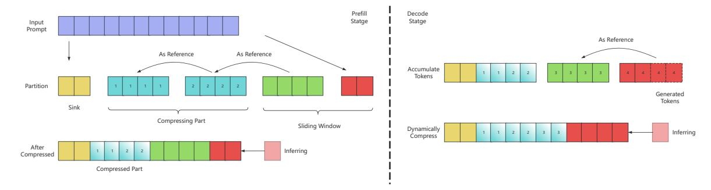
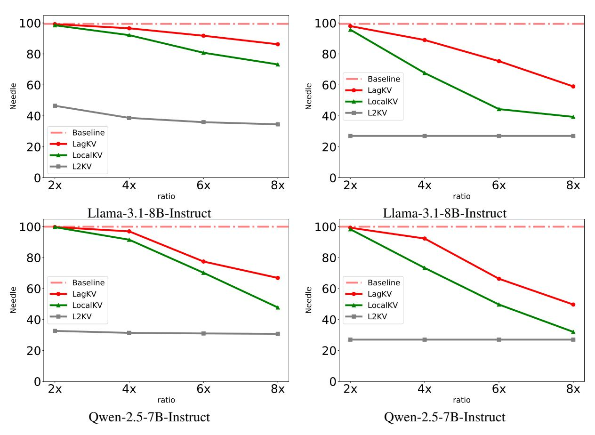
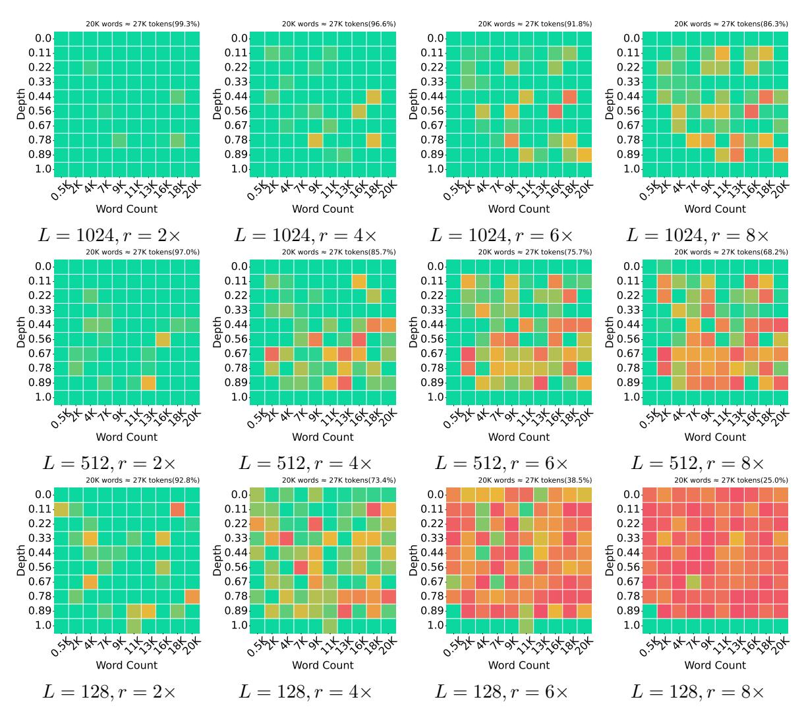
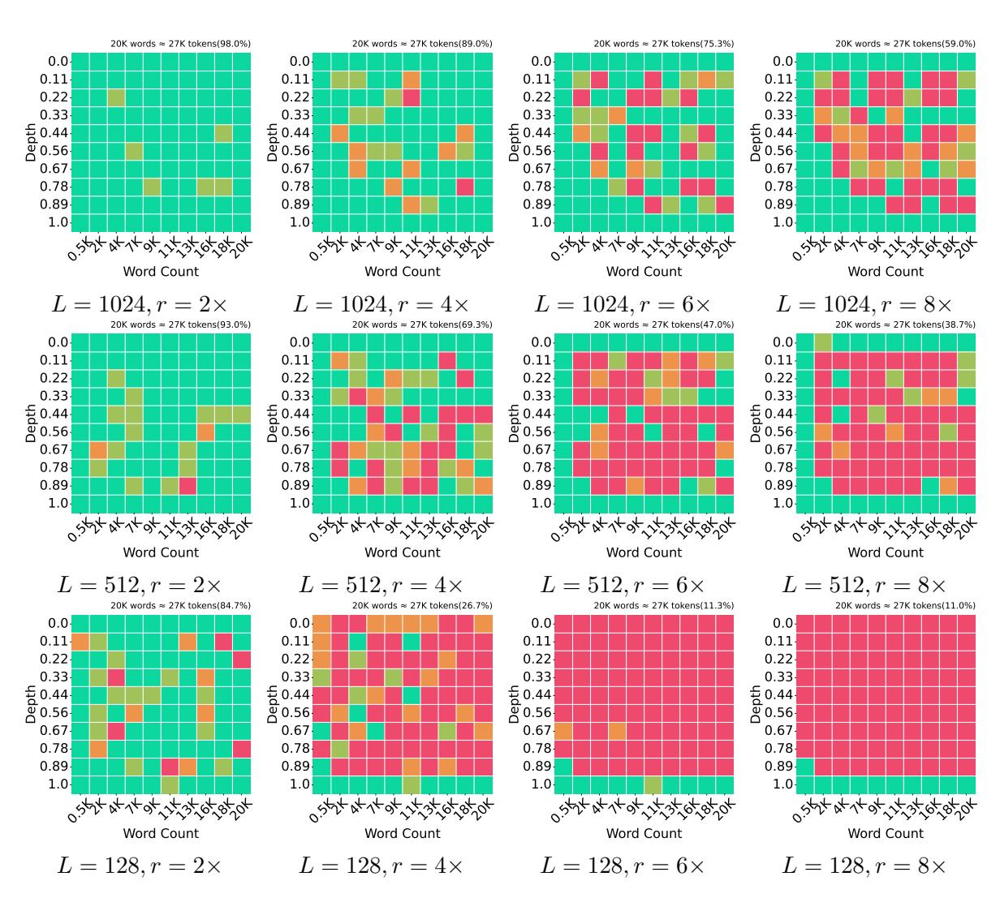
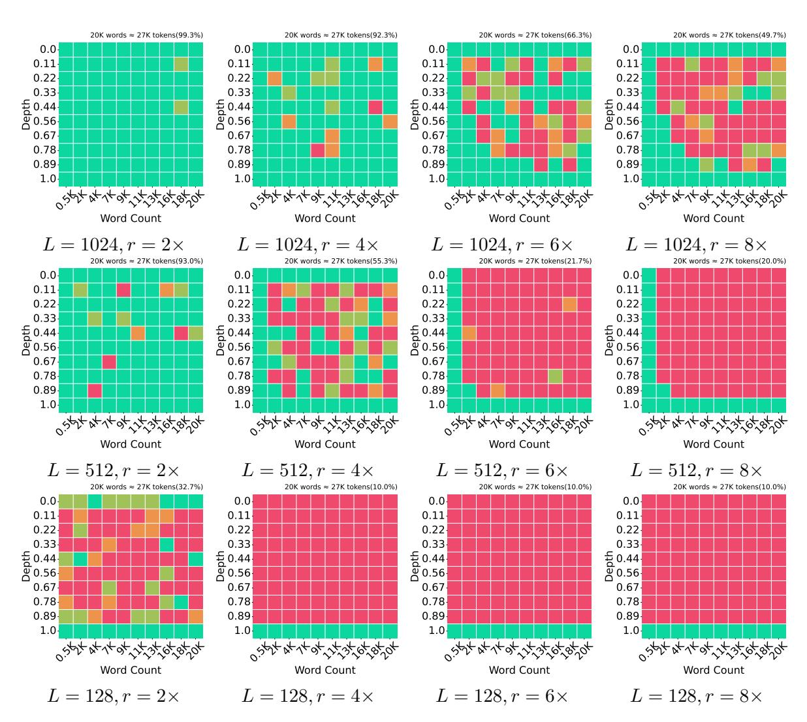

# LagKV: Lag-Relative Information of the KV Cache Tells Which Tokens Are Important

Manlai Liang and Jiaming Zhang and Xiong Li and Jinlong Li∗ AI Lab, China Merchants Bank, China {liangml,zhangjm,lixiong,lucida}@cmbchina.com

#### Abstract

The increasing size of the Key-Value (KV) cache during the Large Language Models longcontext inference is the main obstacle for its balance between the deployment cost and task accuracy. To reduce the KV cache size in such scenarios, most previous efforts leveraged on the attention weight to evict noncritical cache tokens. But there is a tradeoff in those methods, they usually require major modification of the inference infrastructure and significant computation overhead. Based on the fact that the Large Language models are autoregressive models, we propose LagKV, a KV compression strategy only relying on straight forward comparison among KV themselves. It is a totally attention free method which offers easy integration to the main stream inference platform and comparable performance comparing to other complicated KV compression methods. Results on RULER benchmark show that, our approach outperforms SnapKV and StreamingLLM in different compression ratios. Especially in the 64 digit passkey retrieval task, our method outperforms the attention weight based method H2O over 50% with same compression ratios. Our code is available at [https://github.com/](https://github.com/AI-Lab-China-Merchants-Bank/LagKV) [AI-Lab-China-Merchants-Bank/LagKV](https://github.com/AI-Lab-China-Merchants-Bank/LagKV).

# 1 Introduction

Large Language Models (LLMs) have recently demonstrated remarkable success across diverse text processing tasks, including document retrieval [\(Laban et al.,](#page-9-0) [2023\)](#page-9-0), code generation [\(Gu,](#page-8-0) [2023\)](#page-8-0), and mathematical reasoning (like R1 model [\(DeepSeek-AI et al.,](#page-8-1) [2025\)](#page-8-1)). The Scaling law [\(Kaplan et al.,](#page-8-2) [2020\)](#page-8-2) suggests that larger models generally achieve superior performance. The R1-like models further indicates that longer generation sequences with additional 'thinking tokens' can enhance reasoning capabilities. However, these improvements comes at a significant cost: the growing KV cache size poses a major challenge for efficient LLM inference. Many efforts try to mitigate this challenge.

Most of LLMs are totally relying on Self-Attention mechanism [\(Vaswani et al.,](#page-9-1) [2023\)](#page-9-1) to determine which historical tokens are important in the next token prediction. Therefore, many KV compression approaches are based on it to drop unimportant ones [\(Zhang et al.,](#page-9-2) [2024;](#page-9-2) [Liu et al.,](#page-9-3) [2024b;](#page-9-3) [Li et al.,](#page-9-4) [2024;](#page-9-4) [Tang et al.,](#page-9-5) [2024b;](#page-9-5) [NVIDIA,](#page-9-6) [2024\)](#page-9-6). This kind of algorithms keeps a remarkable performance even when the compression ratio is high. However, most of these importance-based token-dropping approaches depend on the ending query question (Instruction Dependence) to achieve such a performance [\(Li et al.,](#page-9-7) [2025;](#page-9-7) [Feng et al.,](#page-8-3) [2024;](#page-8-3) [Tang et al.,](#page-9-8) [2024a\)](#page-9-8).

Another prominent direction in KV cache optimization involves quantization techniques [\(Yang](#page-9-9) [et al.,](#page-9-9) [2024;](#page-9-9) [Liu et al.,](#page-9-10) [2024c\)](#page-9-10), which aim to compress the memory footprint of KV states by representing them with reduced precision. These methods achieve significant memory savings—often by 4× or more—while preserving model performance through careful error mitigation strategies. Beyond memory efficiency, quantization also reduces the bandwidth overhead of transferring KV cache across devices in distributed inference scenarios, accelerating multi-GPU or memory-bound workloads. However, a critical limitation of pure quantization approaches is that they retain all historical tokens, leaving the computational cost of attention unchanged. For long-context tasks, this means the quadratic complexity of attention persists despite the reduced memory usage.

The simple but with limited performance methods are usually based on the sliding window tokens eviction. Sliding window-based eviction methods—such as those used in Infinite-LLM [\(Han](#page-8-4) [et al.,](#page-8-4) [2024\)](#page-8-4) and StreamingLLM [\(Xiao et al.,](#page-9-11) [2023\)](#page-9-11)—retain only the initial cache tokens and those within a fixed sliding window, discarding the

rest. However, this indiscriminate eviction strategy often leads to a notable degradation in generation quality.

Recent work by (Liu et al., 2024a,c) addresses the statistical properties of KV states, revealing distinct distribution patterns for keys and values. Their findings suggest that per-channel quantization for keys (which exhibit consistent variance across feature dimensions) and per-token quantization for values (which vary more significantly across sequence positions) yield better fidelity. This observation motivates our key insight: token importance for eviction—traditionally derived from attention weights—can instead be inferred from token- and channel-wise distribution patterns in the KV space. By leveraging these structural properties, we can design a pruning criterion, LagKV, that is both hardware-friendly (compatible with Flash Attention (Dao, 2023)) and instruction independent, enabling compute savings alongside memory reduction.

#### 2 Methodology

In this section, we formally introduce our KV compression method, LagKV. We begin by looking at the autoregressive process of the LLMs. Inspired by this, we propose a simple yet effective strategy to use the subsequent tokens to compress the previous ones.

## 2.1 Preliminaries

LLMs' next token prediction relies on the previous tokens. First, in the prefill stage, the model uses its tokenizer to convert the words to n indices of the embedding metrics  $E \in \mathbb{R}^{V \times d}$  of the model and collects the representations to form a input matrix,  $X \in \mathbb{R}^{n \times d}$ . This matrix is the initial tokens of the first layer of LLM and then each layer will output a same shape matrix as next layer's input. To depict the operations in each layer, we follow the notation system from (Liu et al., 2023) with h attention heads. For each head  $i \in [1,h]$  and head dimension  $d_h$ , we focus on the Query, Key, and Value states, which are converted from tokens by three linear transformation matrices  $W_i^Q$ ,  $W_i^K$ ,  $W_i^V \in \mathbb{R}^{d \times d_h}$  separately:

$$Q_i = XW_i^Q, K_i = XW_i^K, V_i = XW_i^V \tag{1}$$

The output  $Y \in \mathbb{R}^{n \times d}$  is computed using the attention weights  $A_i \in \mathbb{R}^{n \times n}$  and the final output matrix  $W^O \in \mathbb{R}^{d \times d}$ :

$$Y = Concat_{i \in [1,h]}(A_i V_i) W^O$$
 (2)

where

$$A_i = \operatorname{softmax}(\frac{Q_i K_i^T}{\sqrt{d_h}}). \tag{3}$$

When the new tokens are generated subsequently in the autoregressive inference, which named as decode stage, the embedding of generated token  $\boldsymbol{x}$  is mapped to its respective Query, Key, and Value states for each head, and the previous KV cache is updated accordingly:

$$q_i = xW_i^Q, k_i = xW_i^K, v_i = xW_i^V$$
 (4)

$$K_i = Cat[K_i:k_i], V_i = Cat[V_i:v_i]$$
 (5)

$$A_i = \operatorname{softmax}(\frac{q_i K_i^T}{\sqrt{d_h}}) \tag{6}$$

Since  $q_i \in \mathbb{R}^{1 \times d_h}$ , the computation will be much faster because of the KV cache.

#### 2.2 LagKV

Since the intrinsic property of autoregressive model, the next token representation will not change abruptly from the previous one. As observed in (Liu et al., 2024a), the called token-wise locality will show that the tokens in closer proximity have more similar K/V tensor values compared to tokens that are further apart.

And also, the StreamingLLM method (Xiao et al., 2023) has demonstrated that the head portion and sliding window of the KV cache are crucial. This suggests that cache compression should use subsequent tokens to assess whether prior tokens remain in the cache, rather than relying on the competition between them—as done in many attention-weight-based methods.

Inspired by above insights, we proposed our LagKV method as:

- After the prefill is done, start to apply the compression dynamically.
- Always keep the attention sink with size S and the already compressed part if had unchanged.
- Skip the compression if the length of the rest KV after the static part is less than 2L, where we denote the lag size as L.
- Partition the rest KV with L. If it's not divisible by L, the modulo of it will be added to the sliding window.

Figure 1: LagKV recursively compression process: partition the KV cache and use the next joint chunk as reference to compress the current one. Keep the rest of them as the sliding window.

• Recursively compute the KV cache score. Use the next partition as a reference, calculate token-wise max and min from the reference then use max-min to normalize the Key and Value states respectively. After the KV are normalized, calculate the channel-wise standard deviation then softmax. The equations are formally like:

$$min_i^{p,Z} = min_{seq}(Z_i^{p+1}) \tag{7}$$

$$max_i^{p,Z} = max_{seq}(Z_i^{p+1}) \tag{8}$$

$$\bar{Z_i^p} = \frac{Z_i^p - min_i^{p,Z}}{max_i^{p,Z} - min_i^{p,Z}}$$
(9)

$$score(Z_i) = Softmax(Std.(\bar{Z}_i))$$
 (10)

where Z is one of  $\{K,V\}$ , p denotes the partition index, i represents the head index and seq for the sequence axis. Since the last partition has no reference can be used, our method will naturally have a sliding window with at least size L.

• Sum the scores of Key and Value to get the final score of each token:

$$score_i = score(K_i) + score(V_i)$$
 (11)

 Base on the scorei, use the top-K strategy to select tokens in each partition and each head and add them to the compressed part.

The max-min normalization is applied along the sequence dimension, meaning each channel is normalized using statistics from lag-L tokens. Due to token-wise locality, the channel-specific norms of  $K_i$  and  $V_i$  are largely eliminated. The resulting normalized representations,  $\bar{K}_i$  and  $\bar{V}_i$ , retain the original channel-wise variance, allowing the

standard deviation to serve as a measure of token importance. The softmax operation then identifies and separates outliers, while the summed scores  $score(K_i)$  and  $score(V_i)$  determine their relative contributions.

As showed in Fig. 1, our method is recursively compressing KV cache in both prefill and decode parts, which is essential for the token-wise locality as mentioned above. It requires relative short distance to keep the similarity among the KV states. Subsequently, another benefit, it also avoids the bias from the long context with length much larger than L and the case when the question is at the end of the prompt.

We do not compare the LagKV score to the attention weights here. The attention weights vary on different incoming queries. But our scoring method does not depend on the query states or the tokens after the next joint chunk. It mainly finds the tokens that are not coherent to the next chunk and keep them in the cache. As in KIVI (Liu et al., 2024c) quantization method, we need a rightful mean to find the correct variance and then prune the small ones. However, we use this strategy to evict tokens instead of quantizing them.

To calculate the compression ratio, we set the token retention ratio as r in each partition. In the partition chunk, only rL tokens will be kept and others are evicted. Therefore, the compression ratio C for the token sequence length  $L_s \geq S + 2L$  can be expressed as:

$$L_R = S + rL(\lfloor \frac{L_s - S}{L} \rfloor - 1) + L + Mod(L_s - S, L)$$
(12)

$$C = 1 - \frac{L_R}{L_s} \tag{13}$$

Where  $L_R$  is the length of the KV cache after compression. For the case  $L_s < S + 2L$ , the compression ratio is zero.

#### 3 Comparisons

#### 3.1 Base Models

We employ two open-source base models: Llama-3.1-8B-Instruct [\(Grattafiori et al.,](#page-8-6) [2024\)](#page-8-6) and Qwen2.5-7B-Instruct [\(Qwen et al.,](#page-9-14) [2025\)](#page-9-14). These models are main stream LLMs with moderate size and both leverage the GQA [\(Ainslie et al.,](#page-8-7) [2023\)](#page-8-7) technique to reduce the KV cache size.

### 3.2 Results of RULER

We use the RULER [\(Hsieh et al.,](#page-8-8) [2024\)](#page-8-8) benchmark to compare our approach to SnapKV [\(Li et al.,](#page-9-4) [2024\)](#page-9-4) and StreamingLLM [\(Xiao et al.,](#page-9-11) [2023\)](#page-9-11) in various compression ratios. To fairly compare different methods, we integrate our approach into the framework KVPress [\(NVIDIA,](#page-9-6) [2024\)](#page-9-6) and adapt their versions of other approaches. This framework applies compression without question to avoid the query-aware bias. In this task, we set the lag size to be L = 128 for LagKV and the retention ratio of each recursive window will be adaptively changed by Eq. [13](#page-2-1) for different compression ratios.

The results are present in Table [1](#page-4-0) and [2](#page-4-1) with best scores of each compression ratio shown in bold. The average scores of RULER tasks show that LagKV outperforms SnapKV and StreamingLLM across all compression ratios.

# 4 Ablations

In this section, we fix the sink size to S = 16 and vary the lag size L and retention ratio r. The values of L will be L = 128, 512 and 1024. The values of r will be 2×, 4×, 6× and 8× which correspond to r = 0.5, 0.25, 0.167, and 0.125 respectively. Aslo, we will alter the prefilling method to prove the stability of our approach and scoring method for the validity of lag information.

Datasets. We use the facility in [\(Yuan et al.,](#page-9-15) [2024\)](#page-9-15) to extensively test our method. It contains two benchmarks: LongBench [\(Bai et al.,](#page-8-9) [2024\)](#page-8-9) and Needle-in-a-HaystackTest with Passkey-Retrieval in a Paul Graham Essays background [\(Kamradt,](#page-8-10) [2023;](#page-8-10) [Mohtashami and Jaggi,](#page-9-16) [2023\)](#page-9-16). We only test the 64-digit passkey retrieval task which is much more challenging. And because we are using a recursive and evicting compression strategy, it's easier to illustrate some insights with the partial match score other than the exact one in their report. Therefore, the default needle score will be the partial score throughout the work unless otherwise specified. The main result of this ablation is Table [3.](#page-5-0)

Prefill stage. By default, like many other compression methods, compression begins after prefill completes for each layer. This is an efficient and accurate approach—preserving both the KV cache values and the first generated token (FGT) while reducing KV cache size. However, since we lack a reliable benchmark for long-context and longgeneration scenarios, we will extend the passkey retrieval task by enabling chunk-by-chunk compression during prefill. This will help us evaluate how compression impacts long-generation performance, especially the FGT. Also, this chunked prefilling method will be useful for extreme long context processing.

#### 4.1 LongBench

For the LongBench dataset, the method performs very well across different ratios and lag sizes. When L = 1024, r = 8×, the method still retains approximate 90% of the baseline performance. Since the compression ratio will increase when L decreases, the worse case is L = 128, r = 8× for both models but the method maintains at least 85% of the baseline performance.

#### 4.2 Passkey Retrieval

The 64-digit passkey retrieval task is a challenging one for most token eviction strategies. As discussed in [\(Yuan et al.,](#page-9-15) [2024\)](#page-9-15), the most successful eviction strategy H2O [\(Zhang et al.,](#page-9-2) [2024\)](#page-9-2) performs well in 7-digit task (scoring 100% for all compression ratios) but degrades a lot in the 64-digit one (for 4× in Llama-3, exact match score is 35% and partial match score is 70.8%). It happens because the strategy applies its compression after the prefill is done which means the FGT is not affected by the compression and the 7-digit passkey usually takes only 2 or 3 tokens. When the passkey size increases to 64, much more generated tokens are impacted by the compression. Many token-evict algorithms are struggling to maintain their performance in this case. In contrast, our method performs very well when the product of r and L is sufficient large enough (for L = 1024, r = 4× in Llama model, exact math score is 89% and partial match score is 96.57%).

Our recursive compression strategy will not perform well for the setups with small rL due to the fact that when the recursive window size is compressed to be close to or less than the length of

Table 1: RULER-16K Results of Llama-3.1-8B-Instruct

| Comp. Ratio | Method                          | SK1                          | SK2                         | SK3                         | MK1                         | MK2                         | MK3                         | MV                          | MQ                          | VT                           | CWE                        | FWE                         | QA1                                | QA2                         | AVERAGE                     |
|-------------|---------------------------------|------------------------------|-----------------------------|-----------------------------|-----------------------------|-----------------------------|-----------------------------|-----------------------------|-----------------------------|------------------------------|----------------------------|-----------------------------|------------------------------------|-----------------------------|-----------------------------|
| 0.0         | FullKV                          | 100.0                        | 100.0                       | 100.0                       | 97.4                        | 100.0                       | 100.0                       | 100.0                       | 98.2                        | 100.0                        | 90.2                       | 87.5                        | 75.7                               | 54.7                        | 92.6                        |
| 0.25        | SnapKV StreamingLLM LagKV | 100.0 72.5 100.0       | 100.0 74.7 100.0      | 33.3 72.5 <b>95.7</b> | <b>98.7</b> 79.2 97.4       | 83.3 86.7 <b>96.7</b> | 63.9 <b>66.7</b> 56.9 | 97.9 72.7 <b>99.4</b> | 98.2 75.0 <b>98.5</b> | 94.8 90.5 <b>100.0</b> | 85.3 0.1 <b>88.4</b> | <b>90.2</b> 87.1 89.0 | 64.9 <b>75.7</b> 74.3        | 46.9 43.8 <b>50.0</b> | 81.3 69.0 <b>88.2</b> |
| 0.5         | SnapKV StreamingLLM LagKV | 100.0 47.2 100.0       | 94.2 46.0 <b>98.8</b> | 15.9 46.4 <b>88.4</b> | 93.5 53.2 <b>98.7</b> | 48.3 50.0 <b>81.7</b> | 15.3 <b>44.4</b> 13.9 | 77.9 48.5 <b>97.9</b> | 87.8 52.4 <b>98.5</b> | 94.8 69.5 <b>98.7</b>  | <b>72.3</b> 1.6 65.7       | 85.5 83.1 <b>86.3</b> | 44.6 <b>75.7</b> 66.2        | 37.5 35.9 <b>45.3</b> | 66.8 50.3 <b>80.0</b> |
| 0.75        | SnapKV StreamingLLM LagKV | 93.4 28.6 <b>100.0</b> | 79.3 21.8 <b>98.8</b> | 4.3 20.3 <b>46.4</b>  | 52.0 33.8 <b>90.9</b> | 26.7 26.7 <b>33.3</b> | 1.4 <b>23.6</b> 1.4   | 33.5 23.2 <b>86.2</b> | 35.7 27.1 <b>92.4</b> | 83.0 43.6 <b>96.1</b>  | 17.1 0.9 10.9        | 77.2 <b>80.4</b> 73.3 | 28.4 33.8 <b>46.0</b>        | 26.6 29.7 <b>42.2</b> | 43.0 30.3 <b>62.9</b> |
| 0.875       | SnapKV StreamingLLM LagKV | 85.7 12.1 <b>95.6</b>  | 43.7 13.8 <b>77.0</b> | 4.3 <b>11.6</b> 5.8   | 26.0 26.0 <b>75.3</b> | 15.0 <b>16.7</b> 8.3  | 1.4 <b>15.3</b> 1.4   | 17.1 12.3 <b>70.6</b> | 14.3 13.4 <b>80.8</b> | 61.3 20.7 <b>89.8</b>  | 1.9 0.9 1.5          | 66.3 <b>75.3</b> 62.0 | 18.9 <b>29.7</b> <b>29.7</b> | 26.6 29.7 <b>37.5</b> | 29.4 21.3 <b>48.9</b> |

Table 2: RULER-16K Results of Qwen2.5-7B-Instruct

| Comp. Ratio | Method       | SK1   | SK2   | SK3   | MK1  | MK2  | MK3  | MV   | MQ    | VT   | CWE  | FWE  | QA1  | QA2  | AVERAGE |
|-------------|--------------|-------|-------|-------|------|------|------|------|-------|------|------|------|------|------|---------|
| 0.0         | FullKV       | 100.0 | 100.0 | 100.0 | 99.2 | 99.1 | 94.2 | 94.3 | 100.0 | 99.0 | 79.9 | 93.2 | 72.6 | 48.2 | 90.8    |
| 0.25        | SnapKV       | 88.2  | 90.6  | 4.5   | 44.5 | 57.1 | 50.0 | 39.8 | 44.9  | 92.2 | 80.1 | 92.8 | 62.9 | 42.0 | 60.7    |
|             | StreamingLLM | 76.3  | 72.5  | 75.9  | 78.9 | 79.5 | 67.5 | 71.1 | 74.4  | 76.8 | 74.1 | 89.3 | 69.3 | 36.6 | 72.5    |
|             | LagKV        | 100.0 | 99.3  | 86.6  | 98.4 | 88.4 | 24.2 | 93.9 | 99.4  | 99.0 | 79.3 | 92.1 | 66.1 | 45.5 | 82.5    |
| 0.5         | SnapKV       | 86.8  | 64.5  | 3.6   | 24.2 | 28.6 | 9.2  | 21.9 | 23.0  | 90.8 | 77.8 | 92.3 | 40.3 | 35.7 | 46.1    |
|             | StreamingLLM | 50.7  | 42.8  | 52.7  | 52.3 | 45.5 | 45.8 | 48.8 | 51.2  | 61.5 | 72.3 | 88.3 | 72.6 | 33.0 | 55.2    |
|             | LagKV        | 100.0 | 97.8  | 48.2  | 98.4 | 54.5 | 3.3  | 93.9 | 95.3  | 98.6 | 74.4 | 89.5 | 58.1 | 42.9 | 73.5    |
|             | SnapKV       | 82.2  | 18.8  | 3.6   | 13.3 | 10.7 | 4.2  | 13.2 | 12.2  | 79.7 | 64.4 | 89.3 | 27.4 | 27.7 | 34.4    |
| 0.75        | StreamingLLM | 25.0  | 20.3  | 22.3  | 28.9 | 25.9 | 20.0 | 24.4 | 25.8  | 35.8 | 66.9 | 82.3 | 32.3 | 24.1 | 33.4    |
|             | LagKV        | 99.3  | 87.7  | 8.9   | 85.2 | 6.2  | 0.8  | 86.2 | 83.5  | 95.6 | 43.8 | 69.5 | 39.5 | 29.5 | 56.6    |
| 0.875       | SnapKV       | 69.7  | 8.0   | 3.6   | 14.1 | 6.2  | 0.8  | 11.6 | 11.4  | 55.1 | 47.7 | 79.2 | 19.4 | 22.3 | 26.9    |
|             | StreamingLLM | 11.2  | 13.8  | 14.3  | 18.8 | 15.2 | 12.5 | 13.4 | 14.0  | 20.7 | 56.1 | 78.1 | 21.0 | 18.8 | 23.7    |
|             | LagKV        | 99.3  | 62.3  | 3.6   | 56.2 | 0.0  | 0.8  | 60.2 | 50.6  | 93.0 | 18.8 | 55.2 | 29.0 | 22.3 | 42.4    |

the queried content, it's highly possible that only a small portion of the wanted information will be kept. In the task of 64-digit passkey retrieval, because digits usually require more tokens to be represented than the same length words, the number of expected tokens is much larger than the similar tasks in LongBench sub tasks like Document QA, that leads to its results are more sensitive to small rL. As shown in Fig. 2, the Qwen model which uses one token for one digit degenerates faster than the Llama model which represents three digits by one token with smaller rL. It hints us that we must choose the compression ratio and the lag size carefully in considering the length of the expected content and the tokenizer of the LLM. A.1 shows all the details of the needle results.

# 4.3 Chunk-by-Chunk Compression in Prefill Stage

To enable chunk-by-chunk compression during prefill, we have to split the retrieval tokens like our recursive compression for long context with prefilling the first S+2L tokens and then L each time until all input tokens are prefilled. In such a way, the hidden values after the first chunk will be different from default prefill ones since less tokens are seen in the forwarding. Then, the FGT may be different too. With the chunk-by-chunk prefill compression, we calculated the FGT accuracy which is defined as the ratio of FGT same as the default prefill ones and also the overall needle scores, shown in Fig. 3.

The chunked prefill definitely diminishes the FGT accuracy as it drops from 100% to around 80% for  $r=8\times$  in both models. But we do not see it has a strong dependence on sequence lengths or needle depths in Fig. 4. These confirm that our method is able to retain the major part of the baseline capabilities in the case with long sequence hidden values impacted by the compression. It ensures that LagKV will deliver a good performance in the long generation scenarios.

Meanwhile, we also notice that the FGT accuracy and overall needle scores suffer more degradation in Llama model with chunked prefill. It is mainly because different models exhibit various abilities of stable long generation (Quan et al., 2024).

Table 3: Performance of LagKV.

| Model                 | Method      | Single. QA | Multi. QA | Summ. | Few-shot | Synthetic | Code  | LB Avg. | Needle |
|-----------------------|-------------|------------|-----------|-------|----------|-----------|-------|---------|--------|
|                       | FullKV      | 40.71      | 37.90     | 28.29 | 68.49    | 68.00     | 58.70 | 47.44   | 99.44  |
|                       | L=1024,r=2x | 39.42      | 37.12     | 27.38 | 67.71    | 68.50     | 58.83 | 46.74   | 99.27  |
|                       | L=1024,r=4x | 37.06      | 36.77     | 26.79 | 66.96    | 63.50     | 58.42 | 45.54   | 96.57  |
|                       | L=1024,r=6x | 35.74      | 36.08     | 26.33 | 66.33    | 60.50     | 57.91 | 44.65   | 91.77  |
| Llama-3.1-8B-Instruct | L=1024,r=8x | 35.49      | 35.99     | 25.90 | 65.21    | 61.00     | 57.95 | 44.31   | 86.26  |
|                       | L=512,r=2x  | 39.43      | 37.45     | 27.35 | 67.82    | 67.50     | 58.66 | 46.73   | 97.02  |
|                       | L=512,r=4x  | 37.39      | 36.27     | 26.19 | 66.56    | 62.50     | 57.86 | 45.16   | 85.73  |
|                       | L=512,r=6x  | 34.95      | 35.62     | 25.52 | 65.87    | 59.50     | 58.14 | 44.11   | 75.67  |
|                       | L=512,r=8x  | 34.03      | 36.12     | 25.25 | 64.94    | 56.00     | 57.50 | 43.47   | 68.25  |
|                       | L=128,r=2x  | 38.56      | 36.80     | 27.20 | 67.64    | 68.00     | 59.27 | 46.48   | 92.76  |
|                       | L=128,r=4x  | 36.66      | 36.58     | 25.62 | 66.78    | 66.50     | 57.90 | 45.28   | 73.41  |
|                       | L=128,r=6x  | 34.57      | 35.41     | 24.59 | 63.59    | 64.00     | 56.97 | 43.49   | 38.48  |
|                       | L=128,r=8x  | 33.78      | 34.60     | 23.91 | 62.21    | 61.50     | 55.68 | 42.42   | 25.01  |
|                       | FullKV      | 41.62      | 45.00     | 26.41 | 68.91    | 100.00    | 63.60 | 51.53   | 100.00 |
|                       | L=1024,r=2x | 39.80      | 42.85     | 26.11 | 67.66    | 99.50     | 63.12 | 50.33   | 99.75  |
|                       | L=1024,r=4x | 36.92      | 40.39     | 24.81 | 65.91    | 95.00     | 61.60 | 48.15   | 96.98  |
|                       | L=1024,r=6x | 35.77      | 39.74     | 24.68 | 65.28    | 93.50     | 61.45 | 47.52   | 77.47  |
|                       | L=1024,r=8x | 34.60      | 39.10     | 24.18 | 64.74    | 90.50     | 61.30 | 46.73   | 66.88  |
|                       | L=512,r=2x  | 38.72      | 42.79     | 25.91 | 67.98    | 98.50     | 62.00 | 49.91   | 97.07  |
|                       | L=512,r=4x  | 35.42      | 39.12     | 24.49 | 64.59    | 94.00     | 60.16 | 47.01   | 75.89  |
|                       | L=512,r=6x  | 34.00      | 38.04     | 23.72 | 64.31    | 87.50     | 58.80 | 45.69   | 42.70  |
| Qwen-2.5-7B-Instruct  | L=512,r=8x  | 32.14      | 37.83     | 23.11 | 63.48    | 82.50     | 58.71 | 44.64   | 30.00  |
|                       | L=128,r=2x  | 38.67      | 42.49     | 25.69 | 67.75    | 99.00     | 60.64 | 49.61   | 65.93  |
|                       | L=128,r=4x  | 34.47      | 39.78     | 24.07 | 65.13    | 96.00     | 58.67 | 46.91   | 20.83  |
|                       | L=128,r=6x  | 32.83      | 38.15     | 22.95 | 62.23    | 90.50     | 56.25 | 44.76   | 16.18  |
|                       | L=128,r=8x  | 32.47      | 37.10     | 22.20 | 60.24    | 88.50     | 56.10 | 43.78   | 15.07  |

#### 4.4 Scoring Methods

We present two different scoring variants from LagKV. Both of them will only change the scoring methods but keep the attention sink and sliding window unchanged. And we only use the 64-digits passkey retrieval task which can easily distinguish eviction strategies as the detector. Among these tests, we keep S = 16, L = 1024 as constant.

The first one is called LocalKV which only skips using the reference from the next joint chunk tokens but replacing the equation Eq. [7](#page-2-2) and [8](#page-2-3) by the following equations:

$$min_i^{p,Z} = min_{seq}(Z_i^p) \tag{14}$$

$$max_i^{p,Z} = max_{seq}(Z_i^p)$$
 (15)

Therefore, the min-max is totally from the local chunk instead of the remote one.

The second one is L2 norm from [\(Devoto et al.,](#page-8-11) [2024\)](#page-8-11). We adapt the low key states norm method into the recursive framework by replacing Eq[.11](#page-2-4) by:

$$score_i = -Norm(K_i)$$
 (16)

As suggested in their work, we skip the compression of the first two layers in this variant too.

The results of the 64-digit passkey retrieval task are present in Fig. [5](#page-7-1) and [6](#page-7-2) with partial match scores and exact match scores. As we can see, the LagKV method is always the best one especially in the high compression ratios and the exact match cases. The LocalKV variant performs closely to LagKV at low compression ratios but degrades significantly at higher ones. This behavior stems from the similarity between local and remote maxmin statistical values, which aligns with the tokenwise locality.

Since the setup of L = 1024 will have a chunk that fully covers the passkey when the context is shorter than 2K or the passkey is at 100% depth, the bottom line of the exact match score will be about 27% if the selected tokens did not mess up the output. That means the L2 norm variant shows very limited performance with a constant exact match score 27% for all compression ratios and models.

Figure 2: The needle score vs different setups of rL. The horizontal dash-dot line is the baseline for each model. The x-axis is in log scale. We put two vertical lines rL=64 (solid blue) and rL=128 (dash green) for guidelines.

#### 5 Related Works

The  $L_2$  Norm-Based KV compression (Devoto et al., 2024) is an existing eviction approach that relies solely on KV information to compress the KV cache. This method computes token scores using the negative norm of key states. In contrast to our derivation from the autoregressive process and the token-wise locality, their method is formed by comparing the attention loss.

FINCH (Corallo and Papotti, 2024) introduces a prompt-guided KV compression method for the prefill stage, employing a chunk-by-chunk approach with instruction tokens appended to each document chunk. This design ensures the computation of attention submatrices between instructions and document chunks, enabling subsequent KV cache filtering. In contrast, our proposed chunked prefilling method operates without instructions, making it compatible with multi-turn queries. In other words, our approach transforms a causal LLM into a compressor capable of condensing long

Figure 3: The needle score and FGT accuracy for different prefill methods with L=1024 only. The horizontal dash-dot line is the baseline for both needle scores and FGT accuracy since they are overlapping.

documents into compressed KV sequences, which can later be decompressed under varying instructions without reconstruction.

#### 6 Conclusion

In this study, we propose LagKV, an attention-weight-free token eviction method. It achieves comparable performance on long-context tasks while significantly outperforming mainstream eviction strategies in 64-digit passkey retrieval tasks. These results demonstrate that our method maintains robust long-text retrieval capabilities even at high compression ratios.

Unlike existing approaches, LagKV employs a recursive attention-weight-free strategy in both prefill and decode stages to determine token importance for future processing. It is independent from query states and the rest part of the long prompt. Therefore our method offers a novel perspective on LLM mechanisms, shedding light on their inner workings in a fundamentally different way.

Figure 4: First Generated Token Accuracy for different setups, sequence lengths and needle depths with chunked prefill. It tests three trials on each depth.

Figure 5: The 64-digit Passkey Retrieval **partial** match scores of different variants and compression ratios.

Figure 6: The 64-digit Passkey Retrieval **exact** match scores of different variants and compression ratios.

# References

- Joshua Ainslie, James Lee-Thorp, Michiel de Jong, Yury Zemlyanskiy, Federico Lebron, and Sumit Sanghai. 2023. [GQA: Training generalized multi-query trans](https://doi.org/10.18653/v1/2023.emnlp-main.298)[former models from multi-head checkpoints.](https://doi.org/10.18653/v1/2023.emnlp-main.298) In *Proceedings of the 2023 Conference on Empirical Methods in Natural Language Processing*, pages 4895– 4901, Singapore. Association for Computational Linguistics.
- Yushi Bai, Xin Lv, Jiajie Zhang, Hongchang Lyu, Jiankai Tang, Zhidian Huang, Zhengxiao Du, Xiao Liu, Aohan Zeng, Lei Hou, Yuxiao Dong, Jie Tang, and Juanzi Li. 2024. [LongBench: A bilingual, multi](https://doi.org/10.18653/v1/2024.acl-long.172)[task benchmark for long context understanding.](https://doi.org/10.18653/v1/2024.acl-long.172) In *Proceedings of the 62nd Annual Meeting of the Association for Computational Linguistics (Volume 1: Long Papers)*, pages 3119–3137, Bangkok, Thailand. Association for Computational Linguistics.
- Giulio Corallo and Paolo Papotti. 2024. [FINCH:](https://doi.org/10.1162/tacl_a_00716) [Prompt-guided key-value cache compression for](https://doi.org/10.1162/tacl_a_00716) [large language models.](https://doi.org/10.1162/tacl_a_00716) *Transactions of the Association for Computational Linguistics*, 12:1517–1532.
- Tri Dao. 2023. Flashattention-2: Faster attention with better parallelism and work partitioning. *arXiv preprint arXiv:2307.08691*.
- DeepSeek-AI, Daya Guo, Dejian Yang, Haowei Zhang, Junxiao Song, Ruoyu Zhang, Runxin Xu, Qihao Zhu, Shirong Ma, Peiyi Wang, Xiao Bi, Xiaokang Zhang, Xingkai Yu, Yu Wu, Z. F. Wu, Zhibin Gou, Zhihong Shao, Zhuoshu Li, Ziyi Gao, Aixin Liu, Bing Xue, Bingxuan Wang, Bochao Wu, Bei Feng, Chengda Lu, Chenggang Zhao, Chengqi Deng, Chenyu Zhang, Chong Ruan, Damai Dai, Deli Chen, Dongjie Ji, Erhang Li, Fangyun Lin, Fucong Dai, Fuli Luo, Guangbo Hao, Guanting Chen, Guowei Li, H. Zhang, Han Bao, Hanwei Xu, Haocheng Wang, Honghui Ding, Huajian Xin, Huazuo Gao, Hui Qu, Hui Li, Jianzhong Guo, Jiashi Li, Jiawei Wang, Jingchang Chen, Jingyang Yuan, Junjie Qiu, Junlong Li, J. L. Cai, Jiaqi Ni, Jian Liang, Jin Chen, Kai Dong, Kai Hu, Kaige Gao, Kang Guan, Kexin Huang, Kuai Yu, Lean Wang, Lecong Zhang, Liang Zhao, Litong Wang, Liyue Zhang, Lei Xu, Leyi Xia, Mingchuan Zhang, Minghua Zhang, Minghui Tang, Meng Li, Miaojun Wang, Mingming Li, Ning Tian, Panpan Huang, Peng Zhang, Qiancheng Wang, Qinyu Chen, Qiushi Du, Ruiqi Ge, Ruisong Zhang, Ruizhe Pan, Runji Wang, R. J. Chen, R. L. Jin, Ruyi Chen, Shanghao Lu, Shangyan Zhou, Shanhuang Chen, Shengfeng Ye, Shiyu Wang, Shuiping Yu, Shunfeng Zhou, Shuting Pan, S. S. Li, Shuang Zhou, Shaoqing Wu, Shengfeng Ye, Tao Yun, Tian Pei, Tianyu Sun, T. Wang, Wangding Zeng, Wanjia Zhao, Wen Liu, Wenfeng Liang, Wenjun Gao, Wenqin Yu, Wentao Zhang, W. L. Xiao, Wei An, Xiaodong Liu, Xiaohan Wang, Xiaokang Chen, Xiaotao Nie, Xin Cheng, Xin Liu, Xin Xie, Xingchao Liu, Xinyu Yang, Xinyuan Li, Xuecheng Su, Xuheng Lin, X. Q. Li, Xiangyue Jin, Xiaojin Shen, Xiaosha Chen, Xiaowen Sun, Xiaoxiang Wang, Xinnan Song, Xinyi Zhou, Xianzu Wang,

- Xinxia Shan, Y. K. Li, Y. Q. Wang, Y. X. Wei, Yang Zhang, Yanhong Xu, Yao Li, Yao Zhao, Yaofeng Sun, Yaohui Wang, Yi Yu, Yichao Zhang, Yifan Shi, Yiliang Xiong, Ying He, Yishi Piao, Yisong Wang, Yixuan Tan, Yiyang Ma, Yiyuan Liu, Yongqiang Guo, Yuan Ou, Yuduan Wang, Yue Gong, Yuheng Zou, Yujia He, Yunfan Xiong, Yuxiang Luo, Yuxiang You, Yuxuan Liu, Yuyang Zhou, Y. X. Zhu, Yanhong Xu, Yanping Huang, Yaohui Li, Yi Zheng, Yuchen Zhu, Yunxian Ma, Ying Tang, Yukun Zha, Yuting Yan, Z. Z. Ren, Zehui Ren, Zhangli Sha, Zhe Fu, Zhean Xu, Zhenda Xie, Zhengyan Zhang, Zhewen Hao, Zhicheng Ma, Zhigang Yan, Zhiyu Wu, Zihui Gu, Zijia Zhu, Zijun Liu, Zilin Li, Ziwei Xie, Ziyang Song, Zizheng Pan, Zhen Huang, Zhipeng Xu, Zhongyu Zhang, and Zhen Zhang. 2025. [Deepseek-r1: Incen](http://arxiv.org/abs/2501.12948)[tivizing reasoning capability in llms via reinforce](http://arxiv.org/abs/2501.12948)[ment learning.](http://arxiv.org/abs/2501.12948)
- Alessio Devoto, Yu Zhao, Simone Scardapane, and Pasquale Minervini. 2024. [A simple and effective](https://doi.org/10.18653/v1/2024.emnlp-main.1027) l\_2 [norm-based strategy for KV cache compression.](https://doi.org/10.18653/v1/2024.emnlp-main.1027) In *Proceedings of the 2024 Conference on Empirical Methods in Natural Language Processing*, pages 18476–18499, Miami, Florida, USA. Association for Computational Linguistics.
- Yuan Feng, Junlin Lv, Yukun Cao, Xike Xie, and S. Kevin Zhou. 2024. [Ada-kv: Optimizing kv cache](http://arxiv.org/abs/2407.11550) [eviction by adaptive budget allocation for efficient](http://arxiv.org/abs/2407.11550) [llm inference.](http://arxiv.org/abs/2407.11550)
- Aaron Grattafiori, Abhimanyu Dubey, and Abhinav Jauhri .et al. 2024. [The llama 3 herd of models.](http://arxiv.org/abs/2407.21783)
- Qiuhan Gu. 2023. Llm-based code generation method for golang compiler testing. In *Proceedings of the 31st ACM Joint European Software Engineering Conference and Symposium on the Foundations of Software Engineering*, pages 2201–2203.
- Chi Han, Qifan Wang, Hao Peng, Wenhan Xiong, Yu Chen, Heng Ji, and Sinong Wang. 2024. [LM](https://doi.org/10.18653/v1/2024.naacl-long.222)[infinite: Zero-shot extreme length generalization for](https://doi.org/10.18653/v1/2024.naacl-long.222) [large language models.](https://doi.org/10.18653/v1/2024.naacl-long.222) In *Proceedings of the 2024 Conference of the North American Chapter of the Association for Computational Linguistics: Human Language Technologies (Volume 1: Long Papers)*, pages 3991–4008, Mexico City, Mexico. Association for Computational Linguistics.
- Cheng-Ping Hsieh, Simeng Sun, Samuel Kriman, Shantanu Acharya, Dima Rekesh, Fei Jia, Yang Zhang, and Boris Ginsburg. 2024. Ruler: What's the real context size of your long-context language models? *arXiv preprint arXiv:2404.06654*.
- Gregory Kamradt. 2023. [Needle In A Haystack - pres](https://github.com/gkamradt/LLMTest_NeedleInAHaystack/tree/main)[sure testing LLMs.](https://github.com/gkamradt/LLMTest_NeedleInAHaystack/tree/main) *Github*.
- Jared Kaplan, Sam McCandlish, Tom Henighan, Tom B. Brown, Benjamin Chess, Rewon Child, Scott Gray, Alec Radford, Jeffrey Wu, and Dario Amodei. 2020. [Scaling laws for neural language models.](http://arxiv.org/abs/2001.08361)

- Philippe Laban, Wojciech Kryscinski, Divyansh Agarwal, Alexander Fabbri, Caiming Xiong, Shafiq Joty, and Chien-Sheng Wu. 2023. [SummEdits: Measuring](https://doi.org/10.18653/v1/2023.emnlp-main.600) [LLM ability at factual reasoning through the lens](https://doi.org/10.18653/v1/2023.emnlp-main.600) [of summarization.](https://doi.org/10.18653/v1/2023.emnlp-main.600) In *Proceedings of the 2023 Conference on Empirical Methods in Natural Language Processing*, pages 9662–9676, Singapore. Association for Computational Linguistics.
- Yucheng Li, Huiqiang Jiang, Qianhui Wu, Xufang Luo, Surin Ahn, Chengruidong Zhang, Amir H. Abdi, Dongsheng Li, Jianfeng Gao, Yuqing Yang, and Lili Qiu. 2025. [SCBench: A KV cache-centric analysis](https://openreview.net/forum?id=gkUyYcY1W9) [of long-context methods.](https://openreview.net/forum?id=gkUyYcY1W9) In *The Thirteenth International Conference on Learning Representations*.
- Yuhong Li, Yingbing Huang, Bowen Yang, Bharat Venkitesh, Acyr Locatelli, Hanchen Ye, Tianle Cai, Patrick Lewis, and Deming Chen. 2024. Snapkv: Llm knows what you are looking for before generation. *arXiv preprint arXiv:2404.14469*.
- Yuhan Liu, Hanchen Li, Yihua Cheng, Siddhant Ray, Yuyang Huang, Qizheng Zhang, Kuntai Du, Jiayi Yao, Shan Lu, Ganesh Ananthanarayanan, Michael Maire, Henry Hoffmann, Ari Holtzman, and Junchen Jiang. 2024a. [Cachegen: Kv cache compression and](https://doi.org/10.1145/3651890.3672274) [streaming for fast large language model serving.](https://doi.org/10.1145/3651890.3672274) In *Proceedings of the ACM SIGCOMM 2024 Conference*, ACM SIGCOMM '24, page 38–56, New York, NY, USA. Association for Computing Machinery.
- Zichang Liu, Aditya Desai, Fangshuo Liao, Weitao Wang, Victor Xie, Zhaozhuo Xu, Anastasios Kyrillidis, and Anshumali Shrivastava. 2024b. Scissorhands: Exploiting the persistence of importance hypothesis for llm kv cache compression at test time. *Advances in Neural Information Processing Systems*, 36.
- Zichang Liu, Jue Wang, Tri Dao, Tianyi Zhou, Binhang Yuan, Zhao Song, Anshumali Shrivastava, Ce Zhang, Yuandong Tian, Christopher Re, and Beidi Chen. 2023. [Deja vu: Contextual sparsity for efficient llms](http://arxiv.org/abs/2310.17157) [at inference time.](http://arxiv.org/abs/2310.17157)
- Zirui Liu, Jiayi Yuan, Hongye Jin, Shaochen Zhong, Zhaozhuo Xu, Vladimir Braverman, Beidi Chen, and Xia Hu. 2024c. Kivi: A tuning-free asymmetric 2bit quantization for kv cache. *arXiv preprint arXiv:2402.02750*.
- Amirkeivan Mohtashami and Martin Jaggi. 2023. [Land](http://arxiv.org/abs/2305.16300)[mark attention: Random-access infinite context](http://arxiv.org/abs/2305.16300) [length for transformers.](http://arxiv.org/abs/2305.16300)
- NVIDIA. 2024. [Llm kv cache compression made easy.](https://github.com/NVIDIA/kvpress)
- Shanghaoran Quan, Tianyi Tang, Bowen Yu, An Yang, Dayiheng Liu, Bofei Gao, Jianhong Tu, Yichang Zhang, Jingren Zhou, and Junyang Lin. 2024. [Lan](http://arxiv.org/abs/2410.23933)[guage models can self-lengthen to generate long](http://arxiv.org/abs/2410.23933) [texts.](http://arxiv.org/abs/2410.23933)

- Qwen, :, An Yang, Baosong Yang, Beichen Zhang, Binyuan Hui, Bo Zheng, Bowen Yu, Chengyuan Li, Dayiheng Liu, Fei Huang, Haoran Wei, Huan Lin, Jian Yang, Jianhong Tu, Jianwei Zhang, Jianxin Yang, Jiaxi Yang, Jingren Zhou, Junyang Lin, Kai Dang, Keming Lu, Keqin Bao, Kexin Yang, Le Yu, Mei Li, Mingfeng Xue, Pei Zhang, Qin Zhu, Rui Men, Runji Lin, Tianhao Li, Tianyi Tang, Tingyu Xia, Xingzhang Ren, Xuancheng Ren, Yang Fan, Yang Su, Yichang Zhang, Yu Wan, Yuqiong Liu, Zeyu Cui, Zhenru Zhang, and Zihan Qiu. 2025. [Qwen2.5 technical](http://arxiv.org/abs/2412.15115) [report.](http://arxiv.org/abs/2412.15115)
- Hanlin Tang, Yang Lin, Jing Lin, Qingsen Han, Shikuan Hong, Yiwu Yao, and Gongyi Wang. 2024a. [Razo](http://arxiv.org/abs/arXiv:2407.15891)[rattention: Efficient kv cache compression through](http://arxiv.org/abs/arXiv:2407.15891) [retrieval heads.](http://arxiv.org/abs/arXiv:2407.15891)
- Jiaming Tang, Yilong Zhao, Kan Zhu, Guangxuan Xiao, Baris Kasikci, and Song Han. 2024b. Quest: queryaware sparsity for efficient long-context llm inference. In *Proceedings of the 41st International Conference on Machine Learning*, ICML'24. JMLR.org.
- Ashish Vaswani, Noam Shazeer, Niki Parmar, Jakob Uszkoreit, Llion Jones, Aidan N. Gomez, Lukasz Kaiser, and Illia Polosukhin. 2023. [Attention is all](http://arxiv.org/abs/1706.03762) [you need.](http://arxiv.org/abs/1706.03762)
- Guangxuan Xiao, Yuandong Tian, Beidi Chen, Song Han, and Mike Lewis. 2023. Efficient streaming language models with attention sinks. *arXiv preprint arXiv:2309.17453*.
- Dongjie Yang, Xiaodong Han, Yan Gao, Yao Hu, Shilin Zhang, and Hai Zhao. 2024. [PyramidInfer: Pyramid](https://aclanthology.org/2024.findings-acl.195) [KV cache compression for high-throughput LLM](https://aclanthology.org/2024.findings-acl.195) [inference.](https://aclanthology.org/2024.findings-acl.195) In *Findings of the Association for Computational Linguistics ACL 2024*, pages 3258–3270, Bangkok, Thailand and virtual meeting. Association for Computational Linguistics.
- Jiayi Yuan, Hongyi Liu, Shaochen Zhong, Yu-Neng Chuang, Songchen Li, Guanchu Wang, Duy Le, Hongye Jin, Vipin Chaudhary, Zhaozhuo Xu, Zirui Liu, and Xia Hu. 2024. Kv cache compression, but what must we give in return? a comprehensive benchmark of long context capable approaches. In *The 2024 Conference on Empirical Methods in Natural Language Processing*.
- Zhenyu Zhang, Ying Sheng, Tianyi Zhou, Tianlong Chen, Lianmin Zheng, Ruisi Cai, Zhao Song, Yuandong Tian, Christopher Ré, Clark Barrett, et al. 2024. H2o: Heavy-hitter oracle for efficient generative inference of large language models. *Advances in Neural Information Processing Systems*, 36.

Figure 7: The 64-digit Passkey Retrieval of Llama-3.1-8B-Instruct for different setups with partial matching.

#### A Appendix

#### A.1 Detail Rresults of Passkey Retrieval

Here, we present all the Needle-in-a-Haystack results with 64-digit Passkey Retrieval for different setups. The partial matching results are in Fig.7 and 8 while Fig.9 and 10 with exact matching. Overall accuracies are noted within parentheses on the top-right corner of each sub graph.

Figure 8: The 64-digit Passkey Retrieval of Owen-2.5-7B-Instruct for different setups with partial matching.

Figure 9: The 64-digit Passkey Retrieval of Llama-3.1-8B-Instruct for different setups with exact matching.

Figure 10: The 64-digit Passkey Retrieval of Owen-2.5-7B-Instruct for different setups with exact matching.