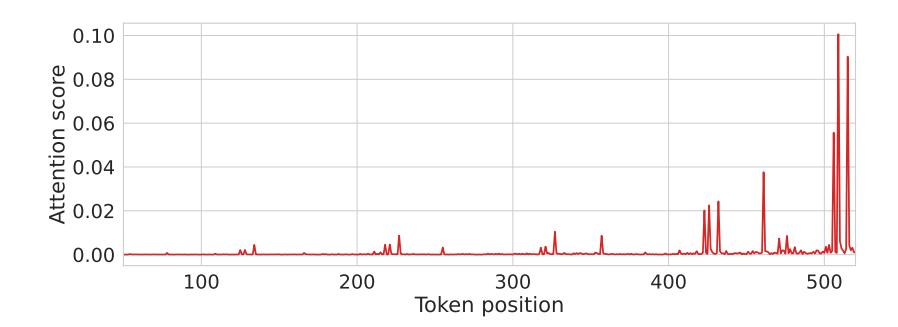
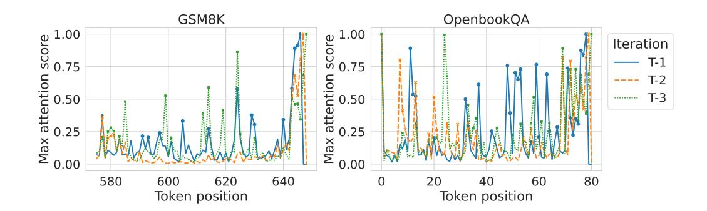
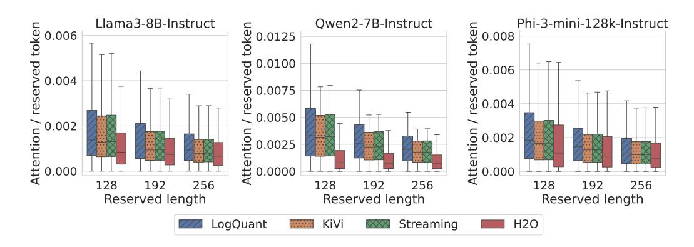
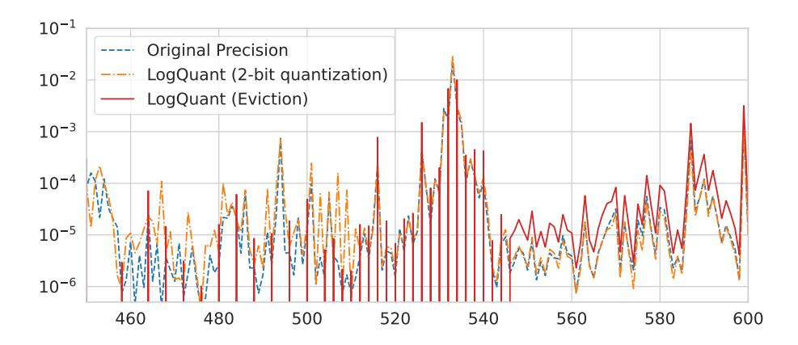
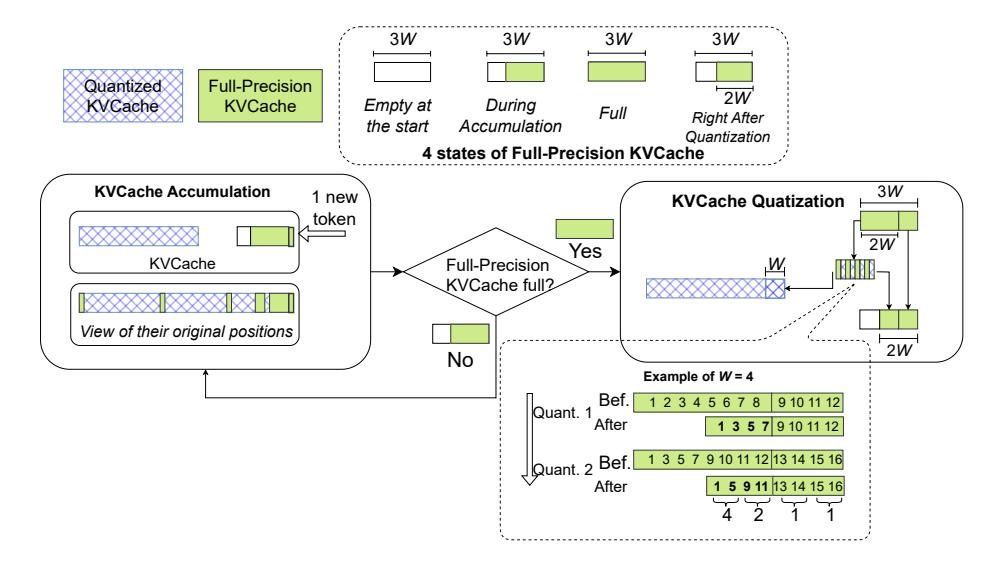

# LOGQUANT: LOG-DISTRIBUTED 2-BIT QUANTIZA-TION OF KV CACHE WITH SUPERIOR ACCURACY PRESERVATION

## Han Chen & Zining Zhang & Bingsheng He

School of Computing National University of Singapore 21 Lower Kent Ridge Road, Singapore 119077 {chenhan, zzn}@u.nus.edu, hebs@comp.nus.edu.sg

#### Zicong Jiang

School of Electronic and Information Engineering South China University of Technology 381 Wushan Road, Tianhe District, Guangzhou, 510641 P. R. China 202420111170@mail.scut.edu.cn

## Pingyi Luo & Mian Lu & Yuqiang Chen

4Paradigm #03-20 Galaxis (West Lobby),Singapore 138522 {luopingyi, lumian, chenyuqiang}@4paradigm.com

# ABSTRACT

We introduce LogQuant, a groundbreaking 2-bit quantization technique for KV Cache in large language model (LLM) inference, delivering substantial memory savings while preserving superior performance. Previous methods either assume that later tokens are more important or attempt to predict important tokens based on earlier attention patterns. Both approaches, however, can result in performance bottlenecks or frequent mispredictions.

LogQuant takes a different approach. By applying a log-based filtering mechanism, it selectively compresses the KV Cache across the entire context, achieving better performance with the same or even reduced memory footprint compared to existing methods. In benchmark tests, it enhances throughput by 25% and boosts batch size by 60% without increasing memory consumption. For challenging tasks such as Math and Code Completion, LogQuant improves accuracy by 40% to 200% at the same compression ratio, outperforming comparable techniques. LogQuant integrates effortlessly with popular inference frameworks like Python's transformers library. Implementation can be available in [https://github.com/Concyclics/LogQuantKV.](https://github.com/Concyclics/LogQuantKV)

# <span id="page-0-0"></span>1 INTRODUCTION

The rapid evolution of Large Language Models (LLMs) has enabled context window expansion from 4k to 128k tokens [\(Meta, 2024;](#page-10-0) [OpenAI, 2024a\)](#page-10-1), driving demand for efficient KV cache management in applications like multi-round chatbot conversations [\(OpenAI, 2024a;](#page-10-1) [Anthropic, 2024;](#page-9-0) [DeepSeek, 2024\)](#page-9-1) and document-based question answering [\(Gao et al., 2023;](#page-10-2) [Lewis et al., 2020\)](#page-10-3), where comprehensive contextual understanding is required. Moreover, reasoning models such as OpenAI o1 [\(OpenAI, 2024b\)](#page-10-4), increased the demand for even longer reasoning contexts, xacerbated the memory challenges faced in KV cache management.

Recent studies [Zhang et al.](#page-11-0) [\(2024\)](#page-11-0); [Li et al.](#page-10-5) [\(2024\)](#page-10-5); [Dong et al.](#page-9-2) [\(2024\)](#page-9-2) reveal KV cache's linear memory growth with context length and even exceeds model weights in long context and batch

<span id="page-1-0"></span>

Figure 1: The observed log-distribution pattern is evident not only in the magnitude of attention scores but also in the positions of attention spikes. These spikes become sparser as the model attends to tokens further from the most recent position, indicating that the model not only focuses on nearby tokens. This phenomenon, illustrated here with Llama3-8B-Instruct (Dubey et al., 2024) on the GSM8K dataset (Cobbe et al., 2021), is consistent across different tasks and models, as further detailed in Section 2.

inference, posing serious deployment challenges. Existing KV Cache compression methods adopt either *eviction*, (H2O (Zhang et al., 2024), Keyformer (Adnan et al., 2024), snapKV (Li et al., 2024)), aim to reduce memory usage by selectively removing tokens deemed unimportant. or *quantization* (QAQ (Dong et al., 2024), KiVi (Liu et al., 2024c)), reduce the precision of less important tokens, retaining more data while minimizing memory costs. Both struggle with importance identification. window-based methods (KiVi, StreamingLLM (Xiao et al., 2023)) risk missing distant important tokens, while attention-based approaches (H2O, keyformer) suffer prediction errors from historical scores.

Our approach addresses these shortcomings by leveraging a key insight: the positions of the *attention spikes* (i.e. high attention scores) follow a log distribution as shown in Figure 1, resulting in sparser importance for tokens as they move further from the current position. By utilizing this property, we can outperform existing methods across a wide range of tasks. Additionally, the original absolute positions of KV cache entries can be disregarded without changing the final attention results during the decoding phase, which allows us to enhance the speed of our log-distributed quantization method.

The key contributions of this paper are as follows:

- Observation of Log-Distributed Attention Spikes: We observe that in various models and downstream tasks, the positions of high attention spikes follow a log distribution, becoming sparser as tokens move further from the current position. This insight underpins our approach to estimate token importance.
- **Design of LogQuant**: Leveraging this log-distribution observation, we introduce LogQuant, a 2-bit quantization technique that significantly improves accuracy. LogQuant outperforms existing methods like KiVi and H2O by better preserving important tokens, achieving a 40% to 200% improvement in accuracy on complex tasks such as Math and Code Completion with the same or higher compression ratio.
- **Throughput Optimization**: By ignoring the absolute positions of KV cache entries, our method further optimizes the speed of quantization/dequantization process without affecting the final attention results, resulting in a 25% increase in throughput and a 60% increase in batch size.

The remainder of the paper is organized as follows: Section 2 details the core concepts behind our proposed LogQuant methods, Section 3 present an extensive set of experiments, Section 4 summarizes our findings and discusses potential directions for future work.

<span id="page-2-3"></span>

Figure 2: The maximum attention score of each token position across four consecutive decoding steps, marking the high attention positions for illustrating the unpredictable nature of attention scores. This analysis was conducted using Llama3-8B-Instruct (Dubey et al., 2024) on the GSM8K (Cobbe et al., 2021) and OpenBookQA (Mihaylov et al., 2018) datasets.

#### <span id="page-2-0"></span>2 METHODOLOGY

In Section 2.1, we analyze the distribution of attention scores and evaluate the impact of quantization loss, both with and without sink tokens. Section 2.2 explores the distribution of token importance and introduces our log-based selection strategy. In Section 2.3, we compare the effects of quantization and eviction under this selection scheme, demonstrating the superiority of quantization over eviction. To further enhance efficiency, Section 2.4 prove that attention computation is positionagnostic. Finally, we present the implementation details of our proposed **LogQuant** method in Section 2.5.

#### <span id="page-2-1"></span>2.1 PRELIMINARY STUDY OF KV CACHE AND ATTENTION SCORES

There are two well-established observations in recent works particularly relevant to KV cache compression. First, many tokens exhibit consistently low attention scores, indicating that their KV cache entries can be safely compressed with minimal impact on performance (Liu et al., 2024c). Second, predicting token importance based on previous decoding steps is unreliable, as attention scores can vary significantly across iterations, making it difficult to accurately identify which tokens should be preserved (Dong et al., 2024; Jiang et al., 2024). This is also demonstrated in Figure 2.

Inspired by the observation of *sink tokens* (Xiao et al., 2023), which are the first few tokens that consistently receive high attention scores (Figure 3), we included these tokens in the set maintained at original precision to improve accuracy in 2-bit quantization. However, as shown in Table 1, this adjustment yielded minimal improvement. This suggests that while sink tokens play a role in defining the conversational context, maintaining high precision for only these tokens is insufficient, indicating that tokens beyond the first few are also crucial for preserving model performance.

<span id="page-2-4"></span>Table 1: Impact of retaining the first two tokens (referred to as "Sink") at original precision. The final answer accuracy results on GSM8K Cobbe et al. (2021) are presented. We present the improvement as  $\Delta_{\text{Sink}}$ . Both methods maintain the recent 128 tokens at original precision.

| Model                | baseline(BF16) | KiVi(4-bit) | KiVi(2-bit) | KiVi(2-bit)+Sink(BF16) | $\Delta_{Sink}$ |
|----------------------|----------------|-------------|-------------|------------------------|-----------------|
| Llama3.1-8B-Instruct | 71.41          | 67.24       | 18.04       | 18.49                  | +0.45           |
| Qwen1.5-7B-Chat      | 57.24          | 52.27       | 39.80       | 39.42                  | -0.38           |

#### <span id="page-2-2"></span>2.2 The Log-distributed Attention Pattern

As mentioned in Section 1, our analysis of attention heads reveals a log-distributed high-attention pattern, which motivates the development of a quantization scheme that follows this distribution. We introduce a selection scheme where a window of size 2W retains the most recent consecutive tokens

<span id="page-3-0"></span>

Figure 3: Attention distribution across different token positions, represented as boxplots based on 25% quantiles across all attention heads. The median and overall distribution of attention scores for sink tokens (Xiao et al., 2023) (tokens 0 and 1) are greater than the sum of the most recent 128 tokens. The attention scores are derived from experiments using Llama3-8B-Instruct (Dubey et al., 2024) and the GSM8K (Cobbe et al., 2021) dataset.

<span id="page-3-1"></span>

Figure 4: The attention coverage without the first two sink tokens for different selection methods (Liu et al., 2024c; Xiao et al., 2023; Zhang et al., 2024) and different models (Dubey et al., 2024; Yang et al., 2024; Abdin et al., 2024), tested on a subset of the GSM8K (Cobbe et al., 2021) dataset. Details of LogQuant will be introduced in Section 2.5.

in full precision. Following this, another window of size W/2 selects tokens spaced one token apart, and then a window of size W/4 follows the similar pattern and so on. Finally, a window of 3W tokens is reserved in full precision. This creates a log-distributed token selection scheme.

We compare this log-distributed selection to other methods: KiVi, which selects only the most recent 3W tokens; StreamingLLM, which selects the most recent 3W tokens plus the first four *sink tokens*; and H2O, which uses previous attention scores to select the top 3W tokens. To evaluate these methods, we define *token coverage* as the average attention score captured by the selection scheme:

Token Coverage = 
$$\frac{\sum_{i=1}^{3W} \text{Attention Score of Selected Tokens}}{3W}.$$
 (1)

Figure 4 presents the results, where we exclude the first two tokens for calibration, as they typically have high attention scores but contribute minimally to overall model performance (see Section 2.1).

The results demonstrate that our log-distributed selection scheme covers high-attention tokens more effectively. This suggests that filtering tokens for quantization based on this log distribution leads to better token importance preservation.

<span id="page-4-2"></span>

Figure 5: Eviction and Quantization Loss on Attention Distribution

## <span id="page-4-0"></span>2.3 COMPARISON OF QUANTIZATION AND EVICTION STRATEGIES

When implementing log-distributed token selection for KV Cache compression, two primary approaches emerge: quantization and eviction. These methods differ fundamentally in their operation. Quantization reduces the numerical precision of individual tokens, whereas eviction removes tokens entirely, thereby shortening the sequence length.

This distinction becomes critical due to the nature of the attention mechanism. The softmax function normalizes attention scores such that their sum equals 1. Consequently, removing tokens through eviction creates larger deviations from the original attention distribution compared to precision reduction via quantization. Specifically, eviction eliminates certain tokens from the attention computation entirely, while quantization retains all tokens with reduced numerical accuracy.

As demonstrated in [Figure 5,](#page-4-2) this behavioral difference is visually apparent. Quantitative results on the GSM8K dataset using Llama3.1-8B (see [Table 2\)](#page-4-3) show that eviction-based methods produce twice and higher attention errors than quantization. Based on these findings, we select quantization as the compression strategy.

<span id="page-4-3"></span>Table 2: Comparison of L1 error with original attention for eviction and quantization.

| LogQuant (2-bit) | KiVi (2-bit) | LogQuant (Eviction) | KiVi (Eviction) |
|------------------|--------------|---------------------|-----------------|
| 432.50           | 556.10       | 1076.70             | 1612.56         |

## <span id="page-4-1"></span>2.4 POSITION-AGNOSTIC ATTENTION CALCULATION

LLM inference involves two phases: prefill and decoding (Section [A\)](#page-14-0). As described in [Yuan et al.](#page-11-3) [\(2024\)](#page-11-3), the decoding phase is computationally expensive and memory-bound due to the use of the KV Cache. In the prefill phase, the model processes the input prompt in a single pass. However, during decoding, new tokens are generated one at a time, and each generation step requires access to the entire KV Cache. This leads to inefficiencies in both memory usage and execution time.

To mitigate these inefficiencies, we plan to accelerate the attention procedure. The attention operation can be expressed mathematically as follows:

$$A = \text{Softmax}(Q \cdot K^T)$$

$$O = A \cdot V,$$
(2)

where A is the attention distribution, a 1 × N vector resulting from the softmax operation applied to the product of Q and the transpose of K and O is the output, a 1×d vector calculated by multiplying the attention distribution A with the Value matrix V .

<span id="page-5-1"></span>

Figure 6: LogQuant's KV cache compression workflow. The number of reserved original-precision tokens increases from 2W to 3W. We then apply a log-sparse strategy to filter the first 2W tokens, quantize half of these tokens, and compress the reserved token length back to 2W.

Since the attention distribution A aggregates values over all N tokens, the specific ordering of tokens in the Key and Value matrices does not affect the final output. This property allows us to permute or reorder the Key and Value caches without any loss of accuracy. By leveraging this insight, we can optimize the KV Cache by concatenating high-precision tokens with quantized tokens while disregarding their original positions. This approach enhances memory locality and processing efficiency while maintaining the correctness of the attention computation. This leads to the relation:

$$A \cdot V = A_P \cdot V_P,\tag{3}$$

where P is a permutation of the indices  $\{1, \ldots, N\}$ . This enables us to optimize the KV Cache effectively.

#### <span id="page-5-0"></span>2.5 LOGQUANT: ALGORITHM AND IMPLEMENTATION

**Algorithm.** After comparing different logarithmic bases  $\log_N$ , we found that a base-2 logarithmic implementation is sufficiently effective for our purposes. To maintain logarithmic sparsity within a specified length, we adopt this base-2 logarithmic approach. We fix a window length configuration W, allowing us to retain up to 3W tokens at original precision. Each time the length limit is reached, we reduce the density of tokens in the first two windows (each of length W) by retaining tokens at regular intervals, effectively halving the density. This process reduces the number of retained tokens in the first two windows from 2W to  $\frac{2W}{2}=W$ . Subsequently, we add W new tokens, resulting in a full-precision window size of  $\frac{2W}{2}+W=2W$ . At this point, the densities become density  $W_1=\frac{1}{2}p$  and density  $W_2=p$ , where p is the initial density and  $W_i$  denotes the i-th window. By continuously adding new tokens, LogQuant naturally forms a  $\log_2$  sparsity selection within the constrained length. The detailed selection process is described in Algorithm 1. Using this approach, the length of retained full-precision tokens fluctuates between 2W and 3W, providing a more stable compression ratio compared to KiVi, where the length fluctuates between 0 and R, with R being the length of retained full-precision tokens in KiVi. We illustrate the workflow in Figure 6, which visually represents the KV cache management process, enhancing the understanding of our algorithm's implementation.

**Implementation.** Popular inference frameworks, such as Hugging Face's transformers library, have encapsulated KV Cache management into dedicated classes, which simplifies the integration of new methods. To leverage this modular design, we implemented **LogQuant** as a derived class of the Cache class in the transformers library. This approach ensures seamless compatibility with

## <span id="page-6-1"></span>Algorithm 1 Log-based Filtering Token Selection Strategy

```
1: Input: A (list of original precision tokens), a* (new token), W (window length)
2: Output: A (updated list of tokens)
3: procedure APPENDTOKEN(A, a
                                ∗
                                 , W)
4: if length(A) < 3W then
5: A ← concat(A, a*)
6: else
7: A ← concat(A[0:2W:2], A[2W:3W])
8: A ← concat(A, a*)
9: end if
10: return A
11: end procedure
```

various quantization backends, including Quanto [\(Face, 2024\)](#page-9-8) and HQQ [\(Badri & Shaji, 2023\)](#page-9-9). For our implementation, we utilized Quanto as the quantization backend, adopting the Key-per-channel strategy. Furthermore, we integrated LogQuant into Hugging Face's inference pipeline, enhancing its usability for efficient and precise inference workflows.

# <span id="page-6-0"></span>3 EXPERIMENTS

## 3.1 SETTINGS

Models. We evaluate KiVi and *LogQuant* by 3 popular model families: Llama3/Llama3.1 [\(Dubey](#page-9-3) [et al., 2024\)](#page-9-3), Qwen1.5/Qwen2 [\(Bai et al., 2023;](#page-9-10) [Yang et al., 2024\)](#page-11-2), and Microsoft Phi3 [\(Abdin et al.,](#page-9-7) [2024\)](#page-9-7). Qwen1.5 and Phi3 are based on Multi-Head Attention, whereas Llama3/3.1 and Qwen2 utilize Group-Query Attention. The quantization group size G is set to the Hugging Face default value of 64, and the quantized precision is set to INT2. For KiVi, the maximum length of reserved original-precision tokens R is set to [128, 192, 256]. For LogQuant, the window length W is limited to ⌊ R 3 ⌋ as it will reserve a maximum of 3W original precision tokens to ensure that the total number of reserved original-precision tokens does not exceed that of KiVi.

Datasets. We selected GSM8K(Grade School Math, [\(Cobbe et al., 2021\)](#page-9-4)) and LongBench [\(Bai](#page-9-11) [et al., 2024\)](#page-9-11) due to their widespread use in evaluating KV cache quantization, ensuring our results are comparable to those in the literature. For GSM8K, we test with a 5-shot from the training set for better accuracy and keep the length of the input token between 600 and 1700, the evaluation is based on the exact value of the final answer. For LongBench, we test all 21 datasets among 6 types of tasks and use the LongBench's original pipeline for evaluation. The test dataset details are present in Table [B5.](#page-15-0)

# 3.2 ACCURACY AND EFFICIENCY ANALYSIS

## <span id="page-6-2"></span>3.2.1 ACCURACY COMPARISON ON DIFFERENT PRECISION

To illustrate the impact of quantized data precision, we evaluate the accuracy loss using Llama3.1- 8B-Instruct under both 2-bit and 4-bit quantization for KiVi and LogQuant methods on LongBench. As shown in [Table 3,](#page-7-0) both methods achieve performance comparable to the baseline across all tasks with 4-bit quantization. However, 2-bit quantization results in a noticeable drop in accuracy, highlighting the trade-off between memory efficiency and performance. Notably, LogQuant demonstrates better accuracy compared to KiVi under the same conditions.

## 3.2.2 ACCURACY COMPARISON AMONG DIFFERENT CONFIGURATIONS

As discussed in Section [3.2.1,](#page-6-2) 4-bit quantization incurs only a slight accuracy loss across tasks. Therefore, we focus on 2-bit quantization in the following discussion to highlight LogQuant's performance. To further investigate the accuracy loss resulting from quantization, we compared the following methods: 1) 16-bit baseline, 2) KiVi and 3) LogQuant across different configurations, we define the *compression ratio* as:

<span id="page-7-0"></span>Table 3: Accuracy of Different Precision on Llama 3.1-8B. Refer to the Table C6 for the scores of each specific task. The  $\Delta$  shows the difference to baseline.

| Category           | KiVi (2-bit)             | KiVi (4-bit)            | LogQuant (2-bit)          | LogQuant (4-bit)        | baseline |
|--------------------|--------------------------|-------------------------|---------------------------|-------------------------|----------|
|                    |                          |                         |                           |                         |          |
| Single-Document QA | $38.89 (\Delta - 8.11)$  | $47.75 (\Delta +0.75)$  | $41.91 (\Delta -5.09)$    | $47.73 (\Delta +0.73)$  | 47.71    |
| Multi-Document QA  | $34.02 (\Delta - 4.98)$  | $39.74 (\Delta + 0.74)$ | $36.08 (\Delta - 2.92)$   | $39.93 (\Delta + 0.93)$ | 39.96    |
| Summarization      | $16.10 (\Delta - 1.90)$  | 17.94 ( $\Delta$ -0.06) | $16.62 (\Delta - 1.38)$   | $17.92 (\Delta - 0.08)$ | 18.08    |
| Few-shot Learning  | $52.51 (\Delta - 8.49)$  | $61.34 (\Delta + 0.34)$ | $56.43 \ (\Delta - 4.57)$ | 61.21 ( $\Delta$ +0.21) | 61.22    |
| Synthetic Tasks    | $45.02 (\Delta -21.98)$  | $67.74 (\Delta + 0.74)$ | $52.51 (\Delta - 14.49)$  | $67.68 (\Delta + 0.68)$ | 67.78    |
| Code Completion    | $43.06 (\Delta - 15.94)$ | $59.53 (\Delta + 0.53)$ | $52.10 \ (\Delta - 6.90)$ | 59.57 ( $\Delta$ +0.57) | 59.78    |

<span id="page-7-1"></span>

Figure 7: Accuracy(EM) with different compression ratio in GSM8K tasks for different models.

where, for a sequence length L and reserved original precision token length R in a BF16 model with 2-bit quantization, the *compression ratio* can be expressed as:

$$\frac{16L}{2(L-R)+16R}. (5)$$

We tested the three compression ratios using GSM8K across three model families, and the results summarized in Figure 7. Our findings demonstrate that the LogQuant method consistently outperforms KiVi across all three models at various compression ratios. The results also indicate that smaller models and small KV states models, such as Phi3-mini (3.8B) and Qwen2-7B (retaining only  $\frac{1}{8}$  of KV heads than Query, while other GQA models typically retain at least  $\frac{1}{4}$ .), experience a more significant accuracy loss with 2-bit quantized KV caches. However, our method provides a notable improvement in accuracy for these smaller models.

#### 3.2.3 ACCURACY COMPARISON AMONG DIFFERENT TASKS

To further investigate the accuracy loss across various tasks, we evaluate the seven task groups listed in Table B5 and report the average score for each method in Table 4.

In the following, the task groups are abbreviated as follows: Math remains unchanged; Code refers to Code Completion; Few-shot stands for Few-shot Learning; Multi-QA represents Multi-Document QA; Single-QA denotes Single-Document QA; Summ. is short for Summarization; and Synth. stands for Synthetic Tasks.

We set the reserved length R to 128, meaning that LogQuant uses only  $3\lfloor \frac{R}{3} \rfloor = 126$  original precision tokens, which is slightly fewer than the 128 tokens reserved by KiVi. As shown in Table 4, for simpler tasks such as Summarization, quantization has little to no impact on performance compared to the 16-bit baseline. However, for more complex tasks such as Code Completion, Synthetic Tasks,

<span id="page-8-1"></span>

Figure 8: memory usage and throughput comparison between 2bit LogQuant and 16bit baseline under huggingface generation pipeline with llama3.1-8B and H100.

and Math, quantization significantly affects accuracy, with *LogQuant* demonstrating better retention of accuracy than KiVi.

<span id="page-8-0"></span>Table 4: Task Group Average Score for Different Models with 2-bit KV Cache Quantization. (The best result of 2-bit quantization is in bold. Refer to Table D7 for the scores of each specific task in LongBench.)

| Model                    | Method          | Math  | Code  | Few-shot | Multi-QA | Single-QA | Summ. | Synth. |
|--------------------------|-----------------|-------|-------|----------|----------|-----------|-------|--------|
|                          | 16-bit Baseline | 71.42 | 59.78 | 61.21    | 39.95    | 47.71     | 18.07 | 67.78  |
| llama-3.1-8B-Instruct    | KiVi            | 18.04 | 43.06 | 52.50    | 34.01    | 38.89     | 16.10 | 45.02  |
|                          | LogQuant (ours) | 40.41 | 52.09 | 56.42    | 36.08    | 41.90     | 16.62 | 52.51  |
|                          | 16-bit Baseline | 56.18 | 52.46 | 53.88    | 33.05    | 39.26     | 17.11 | 26.50  |
| Qwen1.5-7B-Chat-AWQ      | KiVi            | 39.27 | 34.79 | 51.32    | 31.08    | 35.80     | 17.16 | 10.00  |
|                          | LogQuant (ours) | 49.28 | 40.68 | 52.54    | 32.04    | 37.22     | 17.38 | 13.50  |
|                          | 16-bit Baseline | 70.28 | 57.47 | 59.02    | 39.72    | 42.48     | 17.21 | 61.33  |
| Qwen1.5-14B-Chat-AWQ     | KiVi            | 59.82 | 37.48 | 57.50    | 37.91    | 40.39     | 17.17 | 46.85  |
|                          | LogQuant (ours) | 63.31 | 49.37 | 58.25    | 38.01    | 41.37     | 17.24 | 52.17  |
|                          | 16-bit Baseline | 52.99 | 58.23 | 61.90    | 33.35    | 44.66     | 16.33 | 43.00  |
| Qwen2-7B-Instruct        | KiVi            | 3.71  | 35.91 | 35.26    | 12.35    | 20.52     | 9.31  | 11.42  |
| _                        | LogQuant (ours) | 34.34 | 48.71 | 51.23    | 28.28    | 34.84     | 13.13 | 22.83  |
| Phi-3-mini-128k-instruct | 16-bit Baseline | 80.29 | 55.97 | 52.58    | 33.55    | 42.47     | 17.56 | 48.00  |
|                          | KiVi            | 12.59 | 33.97 | 36.17    | 18.19    | 19.58     | 9.10  | 4.83   |
|                          | LogQuant (ours) | 51.86 | 40.84 | 39.36    | 21.70    | 23.63     | 9.89  | 5.39   |

### 3.2.4 EFFICIENCY COMPARISON

To evaluate memory and throughput efficiency by a NVIDIA H100 48G MIG with the HuggingFace pipeline, we conducted a benchmark similar to that in (Turganbay, 2024), setting an average prompt length of 512 and a maximum output length of 2000. We incrementally increased the batch size while recording peak memory usage and throughput for both *LogQuant* (2-bit with 126 reserved tokens) and the BF16 baseline on the Llama-3.1-8B model, until memory usage reached the 48GB limit. The hardware utilized was a single NVIDIA H100 GPU. As shown in Figure 8, *LogQuant* achieves approximately 25% higher throughput by supporting a larger batch size. Additionally, it allows for a 60% increase in batch size within the same memory constraints under the HuggingFace pipeline.

We also observed that, within the HuggingFace pipeline, inference with a quantized cache does not immediately release original KV states, which limits memory compression and efficiency. Furthermore, the dequantization operation impacts throughput. These issues suggest that memory efficiency and speed could be further improved by employing operator fusion, enabling computation on the quantized cache directly with a fused attention operation. We will explore this optimization in future work.

# <span id="page-9-6"></span>4 CONCLUSION AND FUTURE WORK

In this paper, we introduced LogQuant, a novel quantization technique designed to optimize KV Cache management in large language models (LLMs). Our approach leverages a base-2 logarithmic strategy to maintain sparsity while accommodating an increased number of full-precision tokens. Through comprehensive evaluations, we demonstrated that LogQuant consistently outperforms existing methods, such as KiVi, across various model families and compression ratios, particularly benefiting smaller models that typically suffer from accuracy loss due to quantization.

We further explored the efficiency of our implementation within the HuggingFace pipeline, achieving notable improvements in throughput and memory utilization. Additionally, our investigation into accuracy loss across different tasks highlighted LogQuant's superior retention of performance, especially in complex tasks. These findings underscore the potential of LogQuant to enhance LLM inference in resource-constrained environments.

Future work will focus on refining our quantization approach and investigating further optimizations, such as operator fusion, to maximize efficiency and performance in LLM applications.

# REFERENCES

- <span id="page-9-7"></span>Marah Abdin, Sam Ade Jacobs, Ammar Ahmad Awan, Jyoti Aneja, Ahmed Awadallah, Hany Awadalla, Nguyen Bach, Amit Bahree, Arash Bakhtiari, Harkirat Behl, et al. Phi-3 technical report: A highly capable language model locally on your phone. *arXiv preprint arXiv:2404.14219*, 2024.
- <span id="page-9-5"></span>Muhammad Adnan, Akhil Arunkumar, Gaurav Jain, Prashant Nair, Ilya Soloveychik, and Purushotham Kamath. Keyformer: Kv cache reduction through key tokens selection for efficient generative inference. *Proceedings of Machine Learning and Systems*, 6:114–127, 2024.
- <span id="page-9-12"></span>Joshua Ainslie, James Lee-Thorp, Michiel de Jong, Yury Zemlyanskiy, Federico Lebron, and Sumit Sanghai. Gqa: Training generalized multi-query transformer models from multi-head checkpoints. In *Proceedings of the 2023 Conference on Empirical Methods in Natural Language Processing*, pp. 4895–4901, 2023.
- <span id="page-9-0"></span>Anthropic. Claude. <https://claude.ai/new>, 2024. (Accessed on 09/26/2024).
- <span id="page-9-9"></span>Hicham Badri and Appu Shaji. Half-quadratic quantization of large machine learning models, November 2023. URL [https://mobiusml.github.io/hqq\\_blog/](https://mobiusml.github.io/hqq_blog/).
- <span id="page-9-10"></span>Jinze Bai, Shuai Bai, Yunfei Chu, Zeyu Cui, Kai Dang, Xiaodong Deng, Yang Fan, Wenbin Ge, Yu Han, Fei Huang, et al. Qwen technical report. *arXiv preprint arXiv:2309.16609*, 2023.
- <span id="page-9-11"></span>Yushi Bai, Xin Lv, Jiajie Zhang, Hongchang Lyu, Jiankai Tang, Zhidian Huang, Zhengxiao Du, Xiao Liu, Aohan Zeng, Lei Hou, Yuxiao Dong, Jie Tang, and Juanzi Li. LongBench: A bilingual, multitask benchmark for long context understanding. In Lun-Wei Ku, Andre Martins, and Vivek Srikumar (eds.), *Proceedings of the 62nd Annual Meeting of the Association for Computational Linguistics (Volume 1: Long Papers)*, August 2024.
- <span id="page-9-4"></span>Karl Cobbe, Vineet Kosaraju, Mohammad Bavarian, Mark Chen, Heewoo Jun, Lukasz Kaiser, Matthias Plappert, Jerry Tworek, Jacob Hilton, Reiichiro Nakano, et al. Training verifiers to solve math word problems. *arXiv preprint arXiv:2110.14168*, 2021.
- <span id="page-9-1"></span>DeepSeek. Deepseek. <https://chat.deepseek.com/>, 2024. (Accessed on 09/26/2024).
- <span id="page-9-2"></span>Shichen Dong, Wen Cheng, Jiayu Qin, and Wei Wang. Qaq: Quality adaptive quantization for llm kv cache. *arXiv preprint arXiv:2403.04643*, 2024.
- <span id="page-9-3"></span>Abhimanyu Dubey, Abhinav Jauhri, Abhinav Pandey, Abhishek Kadian, Ahmad Al-Dahle, Aiesha Letman, Akhil Mathur, Alan Schelten, Amy Yang, Angela Fan, et al. The llama 3 herd of models. *arXiv preprint arXiv:2407.21783*, 2024.
- <span id="page-9-8"></span>Hugging Face. Optimum quanto, 2024. URL [https://github.com/huggingface/](https://github.com/huggingface/optimum-quanto) [optimum-quanto](https://github.com/huggingface/optimum-quanto). Accessed: 2024-09-06.

- <span id="page-10-2"></span>Yunfan Gao, Yun Xiong, Xinyu Gao, Kangxiang Jia, Jinliu Pan, Yuxi Bi, Yi Dai, Jiawei Sun, and Haofen Wang. Retrieval-augmented generation for large language models: A survey. *arXiv preprint arXiv:2312.10997*, 2023.
- <span id="page-10-8"></span>Huiqiang Jiang, YUCHENG LI, Chengruidong Zhang, Qianhui Wu, Xufang Luo, Surin Ahn, Zhenhua Han, Amir H Abdi, Dongsheng Li, Chin-Yew Lin, et al. Minference: Accelerating pre-filling for long-context llms via dynamic sparse attention. In *Workshop on Efficient Systems for Foundation Models II@ ICML2024*, 2024.
- <span id="page-10-14"></span>Hao Kang, Qingru Zhang, Souvik Kundu, Geonhwa Jeong, Zaoxing Liu, Tushar Krishna, and Tuo Zhao. Gear: An efficient kv cache compression recipefor near-lossless generative inference of llm. *arXiv preprint arXiv:2403.05527*, 2024.
- <span id="page-10-3"></span>Patrick Lewis, Ethan Perez, Aleksandra Piktus, Fabio Petroni, Vladimir Karpukhin, Naman Goyal, Heinrich Kuttler, Mike Lewis, Wen-tau Yih, Tim Rockt ¨ aschel, et al. Retrieval-augmented genera- ¨ tion for knowledge-intensive nlp tasks. *Advances in Neural Information Processing Systems*, 33: 9459–9474, 2020.
- <span id="page-10-5"></span>Yuhong Li, Yingbing Huang, Bowen Yang, Bharat Venkitesh, Acyr Locatelli, Hanchen Ye, Tianle Cai, Patrick Lewis, and Deming Chen. Snapkv: Llm knows what you are looking for before generation. *arXiv preprint arXiv:2404.14469*, 2024.
- <span id="page-10-12"></span>Ji Lin, Jiaming Tang, Haotian Tang, Shang Yang, Xingyu Dang, and Song Han. Awq: Activationaware weight quantization for llm compression and acceleration. arxiv. *arXiv preprint arXiv:2306.00978*, 2023.
- <span id="page-10-13"></span>Yujun Lin, Haotian Tang, Shang Yang, Zhekai Zhang, Guangxuan Xiao, Chuang Gan, and Song Han. Qserve: W4a8kv4 quantization and system co-design for efficient llm serving. *arXiv preprint arXiv:2405.04532*, 2024.
- <span id="page-10-16"></span>Aixin Liu, Bei Feng, Bin Wang, Bingxuan Wang, Bo Liu, Chenggang Zhao, Chengqi Deng, Chong Ruan, Damai Dai, Daya Guo, et al. Deepseek-v2: A strong, economical, and efficient mixtureof-experts language model. *CoRR*, 2024a.
- <span id="page-10-10"></span>Akide Liu, Jing Liu, Zizheng Pan, Yefei He, Gholamreza Haffari, and Bohan Zhuang. Minicache: Kv cache compression in depth dimension for large language models. *arXiv preprint arXiv:2405.14366*, 2024b.
- <span id="page-10-6"></span>Zirui Liu, Jiayi Yuan, Hongye Jin, Shaochen Zhong, Zhaozhuo Xu, Vladimir Braverman, Beidi Chen, and Xia Hu. Kivi: A tuning-free asymmetric 2bit quantization for kv cache. In *Forty-first International Conference on Machine Learning*, 2024c.
- <span id="page-10-0"></span>Meta. Introducing llama 3.1: Our most capable models to date. [https://ai.meta.com/](https://ai.meta.com/blog/meta-llama-3-1/) [blog/meta-llama-3-1/](https://ai.meta.com/blog/meta-llama-3-1/), 2024. (Accessed on 09/26/2024).
- <span id="page-10-7"></span>Todor Mihaylov, Peter Clark, Tushar Khot, and Ashish Sabharwal. Can a suit of armor conduct electricity? a new dataset for open book question answering. In *EMNLP*, 2018.
- <span id="page-10-1"></span>OpenAI. Models - openai api. [https://platform.openai.com/docs/models/](https://platform.openai.com/docs/models/gpt-4-and-gpt-4-turbo) [gpt-4-and-gpt-4-turbo](https://platform.openai.com/docs/models/gpt-4-and-gpt-4-turbo), 2024a. (Accessed on 09/26/2024).
- <span id="page-10-4"></span>OpenAI. Openai o1 hub — openai. <https://openai.com/o1/>, 2024b. (Accessed on 09/26/2024).
- <span id="page-10-15"></span>Noam Shazeer. Fast transformer decoding: One write-head is all you need. *arXiv preprint arXiv:1911.02150*, 2019.
- <span id="page-10-9"></span>Raushan Turganbay. Unlocking longer generation with key-value cache quantization, 2024. URL <https://huggingface.co/blog/kv-cache-quantization>. Accessed: 2024-09- 24.
- <span id="page-10-11"></span>Chaojun Xiao, Pengle Zhang, Xu Han, Guangxuan Xiao, Yankai Lin, Zhengyan Zhang, Zhiyuan Liu, Song Han, and Maosong Sun. Infllm: Unveiling the intrinsic capacity of llms for understanding extremely long sequences with training-free memory. *arXiv preprint arXiv:2402.04617*, 2024.

- <span id="page-11-1"></span>Guangxuan Xiao, Yuandong Tian, Beidi Chen, Song Han, and Mike Lewis. Efficient streaming language models with attention sinks. In *The Twelfth International Conference on Learning Representations*, 2023.
- <span id="page-11-2"></span>An Yang, Baosong Yang, Binyuan Hui, Bo Zheng, Bowen Yu, Chang Zhou, Chengpeng Li, Chengyuan Li, Dayiheng Liu, Fei Huang, et al. Qwen2 technical report. *CoRR*, 2024.
- <span id="page-11-3"></span>Zhihang Yuan, Yuzhang Shang, Yang Zhou, Zhen Dong, Chenhao Xue, Bingzhe Wu, Zhikai Li, Qingyi Gu, Yong Jae Lee, Yan Yan, et al. Llm inference unveiled: Survey and roofline model insights. *arXiv preprint arXiv:2402.16363*, 2024.
- <span id="page-11-0"></span>Zhenyu Zhang, Ying Sheng, Tianyi Zhou, Tianlong Chen, Lianmin Zheng, Ruisi Cai, Zhao Song, Yuandong Tian, Christopher Re, Clark Barrett, et al. H2o: Heavy-hitter oracle for efficient gen- ´ erative inference of large language models. *Advances in Neural Information Processing Systems*, 36, 2024.

# REFERENCES

- Marah Abdin, Sam Ade Jacobs, Ammar Ahmad Awan, Jyoti Aneja, Ahmed Awadallah, Hany Awadalla, Nguyen Bach, Amit Bahree, Arash Bakhtiari, Harkirat Behl, et al. Phi-3 technical report: A highly capable language model locally on your phone. *arXiv preprint arXiv:2404.14219*, 2024.
- Muhammad Adnan, Akhil Arunkumar, Gaurav Jain, Prashant Nair, Ilya Soloveychik, and Purushotham Kamath. Keyformer: Kv cache reduction through key tokens selection for efficient generative inference. *Proceedings of Machine Learning and Systems*, 6:114–127, 2024.
- Joshua Ainslie, James Lee-Thorp, Michiel de Jong, Yury Zemlyanskiy, Federico Lebron, and Sumit Sanghai. Gqa: Training generalized multi-query transformer models from multi-head checkpoints. In *Proceedings of the 2023 Conference on Empirical Methods in Natural Language Processing*, pp. 4895–4901, 2023.
- Anthropic. Claude. <https://claude.ai/new>, 2024. (Accessed on 09/26/2024).
- Hicham Badri and Appu Shaji. Half-quadratic quantization of large machine learning models, November 2023. URL [https://mobiusml.github.io/hqq\\_blog/](https://mobiusml.github.io/hqq_blog/).
- Jinze Bai, Shuai Bai, Yunfei Chu, Zeyu Cui, Kai Dang, Xiaodong Deng, Yang Fan, Wenbin Ge, Yu Han, Fei Huang, et al. Qwen technical report. *arXiv preprint arXiv:2309.16609*, 2023.
- Yushi Bai, Xin Lv, Jiajie Zhang, Hongchang Lyu, Jiankai Tang, Zhidian Huang, Zhengxiao Du, Xiao Liu, Aohan Zeng, Lei Hou, Yuxiao Dong, Jie Tang, and Juanzi Li. LongBench: A bilingual, multitask benchmark for long context understanding. In Lun-Wei Ku, Andre Martins, and Vivek Srikumar (eds.), *Proceedings of the 62nd Annual Meeting of the Association for Computational Linguistics (Volume 1: Long Papers)*, August 2024.
- Karl Cobbe, Vineet Kosaraju, Mohammad Bavarian, Mark Chen, Heewoo Jun, Lukasz Kaiser, Matthias Plappert, Jerry Tworek, Jacob Hilton, Reiichiro Nakano, et al. Training verifiers to solve math word problems. *arXiv preprint arXiv:2110.14168*, 2021.
- DeepSeek. Deepseek. <https://chat.deepseek.com/>, 2024. (Accessed on 09/26/2024).
- Shichen Dong, Wen Cheng, Jiayu Qin, and Wei Wang. Qaq: Quality adaptive quantization for llm kv cache. *arXiv preprint arXiv:2403.04643*, 2024.
- Abhimanyu Dubey, Abhinav Jauhri, Abhinav Pandey, Abhishek Kadian, Ahmad Al-Dahle, Aiesha Letman, Akhil Mathur, Alan Schelten, Amy Yang, Angela Fan, et al. The llama 3 herd of models. *arXiv preprint arXiv:2407.21783*, 2024.
- Hugging Face. Optimum quanto, 2024. URL [https://github.com/huggingface/](https://github.com/huggingface/optimum-quanto) [optimum-quanto](https://github.com/huggingface/optimum-quanto). Accessed: 2024-09-06.

- Yunfan Gao, Yun Xiong, Xinyu Gao, Kangxiang Jia, Jinliu Pan, Yuxi Bi, Yi Dai, Jiawei Sun, and Haofen Wang. Retrieval-augmented generation for large language models: A survey. *arXiv preprint arXiv:2312.10997*, 2023.
- Huiqiang Jiang, YUCHENG LI, Chengruidong Zhang, Qianhui Wu, Xufang Luo, Surin Ahn, Zhenhua Han, Amir H Abdi, Dongsheng Li, Chin-Yew Lin, et al. Minference: Accelerating pre-filling for long-context llms via dynamic sparse attention. In *Workshop on Efficient Systems for Foundation Models II@ ICML2024*, 2024.
- Hao Kang, Qingru Zhang, Souvik Kundu, Geonhwa Jeong, Zaoxing Liu, Tushar Krishna, and Tuo Zhao. Gear: An efficient kv cache compression recipefor near-lossless generative inference of llm. *arXiv preprint arXiv:2403.05527*, 2024.
- Patrick Lewis, Ethan Perez, Aleksandra Piktus, Fabio Petroni, Vladimir Karpukhin, Naman Goyal, Heinrich Kuttler, Mike Lewis, Wen-tau Yih, Tim Rockt ¨ aschel, et al. Retrieval-augmented genera- ¨ tion for knowledge-intensive nlp tasks. *Advances in Neural Information Processing Systems*, 33: 9459–9474, 2020.
- Yuhong Li, Yingbing Huang, Bowen Yang, Bharat Venkitesh, Acyr Locatelli, Hanchen Ye, Tianle Cai, Patrick Lewis, and Deming Chen. Snapkv: Llm knows what you are looking for before generation. *arXiv preprint arXiv:2404.14469*, 2024.
- Ji Lin, Jiaming Tang, Haotian Tang, Shang Yang, Xingyu Dang, and Song Han. Awq: Activationaware weight quantization for llm compression and acceleration. arxiv. *arXiv preprint arXiv:2306.00978*, 2023.
- Yujun Lin, Haotian Tang, Shang Yang, Zhekai Zhang, Guangxuan Xiao, Chuang Gan, and Song Han. Qserve: W4a8kv4 quantization and system co-design for efficient llm serving. *arXiv preprint arXiv:2405.04532*, 2024.
- Aixin Liu, Bei Feng, Bin Wang, Bingxuan Wang, Bo Liu, Chenggang Zhao, Chengqi Deng, Chong Ruan, Damai Dai, Daya Guo, et al. Deepseek-v2: A strong, economical, and efficient mixtureof-experts language model. *CoRR*, 2024a.
- Akide Liu, Jing Liu, Zizheng Pan, Yefei He, Gholamreza Haffari, and Bohan Zhuang. Minicache: Kv cache compression in depth dimension for large language models. *arXiv preprint arXiv:2405.14366*, 2024b.
- Zirui Liu, Jiayi Yuan, Hongye Jin, Shaochen Zhong, Zhaozhuo Xu, Vladimir Braverman, Beidi Chen, and Xia Hu. Kivi: A tuning-free asymmetric 2bit quantization for kv cache. In *Forty-first International Conference on Machine Learning*, 2024c.
- Meta. Introducing llama 3.1: Our most capable models to date. [https://ai.meta.com/](https://ai.meta.com/blog/meta-llama-3-1/) [blog/meta-llama-3-1/](https://ai.meta.com/blog/meta-llama-3-1/), 2024. (Accessed on 09/26/2024).
- Todor Mihaylov, Peter Clark, Tushar Khot, and Ashish Sabharwal. Can a suit of armor conduct electricity? a new dataset for open book question answering. In *EMNLP*, 2018.
- OpenAI. Models openai api. [https://platform.openai.com/docs/models/](https://platform.openai.com/docs/models/gpt-4-and-gpt-4-turbo) [gpt-4-and-gpt-4-turbo](https://platform.openai.com/docs/models/gpt-4-and-gpt-4-turbo), 2024a. (Accessed on 09/26/2024).
- OpenAI. Openai o1 hub openai. <https://openai.com/o1/>, 2024b. (Accessed on 09/26/2024).
- Noam Shazeer. Fast transformer decoding: One write-head is all you need. *arXiv preprint arXiv:1911.02150*, 2019.
- Raushan Turganbay. Unlocking longer generation with key-value cache quantization, 2024. URL <https://huggingface.co/blog/kv-cache-quantization>. Accessed: 2024-09- 24.
- Chaojun Xiao, Pengle Zhang, Xu Han, Guangxuan Xiao, Yankai Lin, Zhengyan Zhang, Zhiyuan Liu, Song Han, and Maosong Sun. Infllm: Unveiling the intrinsic capacity of llms for understanding extremely long sequences with training-free memory. *arXiv preprint arXiv:2402.04617*, 2024.

- Guangxuan Xiao, Yuandong Tian, Beidi Chen, Song Han, and Mike Lewis. Efficient streaming language models with attention sinks. In *The Twelfth International Conference on Learning Representations*, 2023.
- An Yang, Baosong Yang, Binyuan Hui, Bo Zheng, Bowen Yu, Chang Zhou, Chengpeng Li, Chengyuan Li, Dayiheng Liu, Fei Huang, et al. Qwen2 technical report. *CoRR*, 2024.
- Zhihang Yuan, Yuzhang Shang, Yang Zhou, Zhen Dong, Chenhao Xue, Bingzhe Wu, Zhikai Li, Qingyi Gu, Yong Jae Lee, Yan Yan, et al. Llm inference unveiled: Survey and roofline model insights. *arXiv preprint arXiv:2402.16363*, 2024.
- Zhenyu Zhang, Ying Sheng, Tianyi Zhou, Tianlong Chen, Lianmin Zheng, Ruisi Cai, Zhao Song, Yuandong Tian, Christopher Re, Clark Barrett, et al. H2o: Heavy-hitter oracle for efficient gen- ´ erative inference of large language models. *Advances in Neural Information Processing Systems*, 36, 2024.

# <span id="page-14-0"></span>A BACKGROUND & RELATED WORK: KV CACHE COMPRESSION

The attention mechanism relies on three key components: the Query (Q), Key (K), and Value (V) vectors. For each token, LLM computes a d-dimensional Q vector and compares it against all stored N × d K vectors, where N is the length of the sequence processed. The result of this comparison is used to weigh the corresponding V vectors, producing the final output. Mathematically, the attention operation is defined as:

$$Attention(Q, K, V) = Softmax\left(\frac{QK^{\top}}{\sqrt{d}}\right)V$$
 (6)

LLM inference is generally divided into two phases: a prefill phase for processing input tokens and a decoding phase for generating new tokens. In decoding, each token generation reloads the entire KV Cache from previous tokens, causing time and memory inefficiencies.

KV cache compression methods fall into two categories: 'training-free' methods (using eviction and quantization without model retraining) and 'training-required' methods (designing more efficient attention structures). Our approach focuses on enhancing training-free methods for broader applicability. Eviction selectively discards less important tokens, while quantization lowers the precision of key and value states to save memory. However, both methods risk significant information loss at high compression rates—especially 2-bit quantization, which can greatly reduce accuracy.

#### A.1 KV CACHE EVICTION

Eviction methods aim to reduce KV cache memory usage in Large Language Models (LLMs) by discarding less important tokens. The early work H2O [\(Zhang et al., 2024\)](#page-11-0) selects "heavy hitter" tokens based on cumulative attention scores, though this risks evicting tokens that may become important later. Keyformer [\(Adnan et al., 2024\)](#page-9-5) improves on H2O by combining "Key Attention" with a "window attention" mechanism, retaining both historically significant and recent tokens for better accuracy. MiniCache [\(Liu et al., 2024b\)](#page-10-10) reduces memory by reusing Key and Value states across layers. This method assumes that some key and value representations are redundant across model layers and can be shared. InfLLM [\(Xiao et al., 2024\)](#page-10-11) addresses very long contexts by dividing them into blocks and retaining 'representative tokens' for block eviction decisions.

## A.2 KV CACHE QUANTIZATION

Quantization reduces storage and boosts computational speed by using fewer bits to represent values. Earlier works, like AWQ [\(Lin et al., 2023\)](#page-10-12) and Qserve [\(Lin et al., 2024\)](#page-10-13), applied 4-bit quantization to the KV cache with minimal accuracy loss. Recent methods aim to compress the KV cache further while preserving accuracy. QAQ [\(Dong et al., 2024\)](#page-9-2) dynamically adjusts the precision of the in-GPU quantized cache by offloading all original-precision KV data to CPU memory. GEAR [\(Kang](#page-10-14) [et al., 2024\)](#page-10-14) improves accuracy by storing the quantization error of the KV cache as a sparse matrix with low-rank decomposition. KiVi [\(Liu et al., 2024c\)](#page-10-6) introduces a 2-bit quantization by retaining a recent window of full-precision tokens, balancing memory efficiency and accuracy.

#### A.3 TRAINING-REQUIRED APPROACHES

An early memory-reducing attention design is Multi-Query Attention (MQA, [\(Shazeer, 2019\)](#page-10-15)), where all query heads share a single pair of key and value heads. While this reduces memory, it significantly impacts accuracy. Grouped-Query Attention (GQA, [\(Ainslie et al., 2023\)](#page-9-12)) addresses this by grouping query heads, with each group sharing the same key and value heads, preserving the generalization ability of multi-head attention while reducing KV cache size. Deepseek V2 [\(Liu](#page-10-16) [et al., 2024a\)](#page-10-16) introduces Multi-Head Latent Attention (MLA), which compresses key and value states using LoRA-based projections. To prevent disruption of position embeddings from LoRA compression, specific channels are reserved for position information only, excluding them from LoRA compression.

## B OVERVIEW OF TEST DATASETS

<span id="page-15-0"></span>Table B5: Overview of all test datasets. 'Avg len' (average length) is computed using the number of words for the English (code) datasets and the number of characters for the Chinese datasets. 'Accuracy (CLS)' refers to classification accuracy, while 'Accuracy (EM)' refers to exact match accuracy

| Task Group             | Dataset             | Avg len | Metric         | Language       | #data |
|------------------------|---------------------|---------|----------------|----------------|-------|
| Math                   | GSM8K               | 240     | Accuracy (EM)  | English        | 1319  |
|                        | NarrativeQA         | 18,409  | F1             | English        | 200   |
| Simple Decomment OA    | Qasper              | 3,619   | F1             | English        | 200   |
| Single-Document QA     | MultiFieldQA-en     | 4,559   | F1             | English        | 150   |
|                        | MultiFieldQA-zh     | 6,701   | F1             | Chinese        | 200   |
|                        | HotpotQA            | 9,151   | F1             | English        | 200   |
| Multi-Document OA      | 2WikiMultihopQA     | 4,887   | F1             | English        | 200   |
| Muiti-Document QA      | MuSiQue             | 11,214  | F1             | English        | 200   |
|                        | DuReader            | 15,768  | Rouge-L        | Chinese        | 200   |
|                        | GovReport           | 8,734   | Rouge-L        | English        | 200   |
| Summarization          | QMSum               | 10,614  | Rouge-L        | English        | 200   |
| Summarization          | MultiNews           | 2,113   | Rouge-L        | English        | 200   |
|                        | VCSUM               | 15,380  | Rouge-L        | Chinese        | 200   |
|                        | TREC                | 5,177   | Accuracy (CLS) | English        | 200   |
| Few-shot Learning      | TriviaQA            | 8,209   | F1             | English        | 200   |
| rew-shot Learning      | SAMSum              | 6,258   | Rouge-L        | English        | 200   |
|                        | LSHT                | 22,337  | Accuracy (CLS) | Chinese        | 200   |
|                        | PassageCount        | 11,141  | Accuracy (EM)  | English        | 200   |
| Synthetic Task         | PassageRetrieval-en | 9,289   | Accuracy (EM)  | English        | 200   |
|                        | PassageRetrieval-zh | 6,745   | Accuracy (EM)  | Chinese        | 200   |
| <b>Code Completion</b> | LCC                 | 1,235   | Edit Sim       | Python/C#/Java | 500   |
| Code Completion        | RepoBench-P         | 4,206   | Edit Sim       | Python/Java    | 500   |

# C META DATA OF PRECISION COMPARISON

Table C6: Comparison on Llama3.1-8B-Instruct of different quantization precisions

<span id="page-15-1"></span>

| Dataset              | KiVi (2-bit) | KiVi (4-bit) | LogQuant (2-bit) | LogQuant (4-bit) | Baseline |
|----------------------|--------------|--------------|------------------|------------------|----------|
| 2wikimqa             | 39.52        | 44.79        | 40.69            | 45.18            | 45.06    |
| dureader             | 22.20        | 27.75        | 22.59            | 27.99            | 28.48    |
| gov_report           | 18.60        | 19.86        | 18.78            | 20.09            | 20.41    |
| hotpotqa             | 48.83        | 55.78        | 52.43            | 55.85            | 55.90    |
| lcc                  | 47.09        | 63.44        | 57.52            | 62.85            | 62.99    |
| lsht                 | 31.42        | 45.00        | 33.75            | 45.00            | 45.00    |
| multi_news           | 15.07        | 15.65        | 15.11            | 15.64            | 15.89    |
| multifieldqa_en      | 42.51        | 55.10        | 45.98            | 54.63            | 54.91    |
| multifieldqa_zh      | 50.12        | 62.77        | 55.51            | 63.27            | 62.72    |
| musique              | 25.52        | 30.65        | 28.62            | 30.70            | 30.39    |
| narrativeqa          | 26.44        | 27.91        | 27.93            | 28.28            | 28.19    |
| passage_count        | 5.67         | 6.31         | 5.63             | 6.15             | 6.31     |
| passage_retrieval_en | 83.17        | 99.50        | 92.25            | 99.50            | 99.50    |
| passage_retrieval_zh | 46.23        | 97.42        | 59.65            | 97.38            | 97.54    |
| qasper               | 36.50        | 45.20        | 38.21            | 44.74            | 45.03    |
| qmsum                | 17.41        | 19.07        | 18.19            | 18.92            | 19.15    |
| repobench-p          | 39.03        | 55.61        | 46.67            | 56.28            | 56.57    |
| samsum               | 23.88        | 36.12        | 33.33            | 35.45            | 35.72    |
| trec                 | 65.00        | 72.50        | 67.00            | 72.50            | 72.50    |
| triviaqa             | 89.72        | 91.73        | 91.63            | 91.89            | 91.64    |
| vesum                | 13.33        | 17.17        | 14.41            | 17.04            | 16.85    |

# <span id="page-16-0"></span>D META DATA OF LONGBENCH RESULTS

Table D7: LongBench score of each dataset

| precision                           | 16-bit                   |               | 2-bit         |  |  |  |  |
|-------------------------------------|--------------------------|---------------|---------------|--|--|--|--|
|                                     |                          |               | LogQuant      |  |  |  |  |
| Task Group                          | Baseline                 | KiVi          | (ours)        |  |  |  |  |
|                                     | llama-3-8B-Instruct      |               |               |  |  |  |  |
| 2WikiMultihopQA                     | 37.24                    | 31.72         | 35.08         |  |  |  |  |
| DuReader                            | 16.73                    | 12.45         | 15.5          |  |  |  |  |
| GovReport                           | 17.8                     | 12.8          | 15.63         |  |  |  |  |
| HotpotQA                            | 46.1                     | 43.87         | 44.96         |  |  |  |  |
| LCC                                 | 56.85                    | 31.73         | 41.75         |  |  |  |  |
| LSHT                                | 25.25                    | 21.5          | 21.75         |  |  |  |  |
| MultiFieldQA-en                     | 44.44                    | 38.68         | 41.04         |  |  |  |  |
| MultiFieldQA-zh                     | 56.3                     | 43.96         | 48.44         |  |  |  |  |
| MultiNews                           | 16.59                    | 15.76         | 16.06         |  |  |  |  |
| MuSiQue                             | 21.44                    | 19.56         | 20.59         |  |  |  |  |
| NarrativeQA                         | 22.07                    | 19.82         | 21.56         |  |  |  |  |
| PassageCount                        | 6.5                      | 5.5           | 4.0           |  |  |  |  |
| PassageRetrieval-en                 | 66.0                     | 53.0          | 58.5          |  |  |  |  |
| PassageRetrieval-zh                 | 91.0                     | 33.45         | 72.0          |  |  |  |  |
| Qasper                              | 43.69                    | 33.9          | 39.46         |  |  |  |  |
| QMSum                               | 17.49                    | 17.01         | 17.37         |  |  |  |  |
| RepoBench-P                         | 51.32                    | 31.99         | 40.1          |  |  |  |  |
| SAMSum                              | 33.22                    | 22.44         | 32.66         |  |  |  |  |
| TREC                                | 74.0                     | 72.5          | 73.0          |  |  |  |  |
| TriviaQA                            | 90.48                    | 87.65         | 89.36         |  |  |  |  |
| VCSUM                               | 0.16                     | 0.17          | 0.25          |  |  |  |  |
|                                     | llama-3.1-8B-Instruct    |               |               |  |  |  |  |
| 2WikiMultihopQA                     | 45.06                    | 39.52         | 40.69         |  |  |  |  |
| DuReader                            | 28.48                    | 22.2          | 22.59         |  |  |  |  |
| GovReport                           | 20.41                    | 18.6          | 18.78         |  |  |  |  |
| HotpotQA                            | 55.9                     | 48.83         | 52.43         |  |  |  |  |
| LCC                                 | 62.99                    | 47.09         | 57.52         |  |  |  |  |
| LSHT                                | 45.0                     | 31.42         | 33.75         |  |  |  |  |
| MultiFieldQA-en                     | 54.91                    | 42.51         | 45.98         |  |  |  |  |
| MultiFieldQA-zh                     | 62.72                    | 50.12         | 55.51         |  |  |  |  |
| MultiNews                           | 15.89                    | 15.07         | 15.11         |  |  |  |  |
| MuSiQue                             | 30.39                    | 25.52         | 28.62         |  |  |  |  |
| NarrativeQA                         | 28.19                    | 26.44<br>5.67 | 27.93         |  |  |  |  |
| PassageCount<br>PassageRetrieval-en | 6.31<br>99.5             | 83.17         | 5.63<br>92.25 |  |  |  |  |
| PassageRetrieval-zh                 | 97.54                    | 46.23         | 59.65         |  |  |  |  |
| Qasper                              | 45.03                    | 36.5          | 38.21         |  |  |  |  |
| QMSum                               | 19.15                    | 17.41         | 18.19         |  |  |  |  |
| RepoBench-P                         | 56.57                    | 39.03         | 46.67         |  |  |  |  |
| SAMSum                              | 35.72                    | 23.88         | 33.33         |  |  |  |  |
| TREC                                | 72.5                     | 65.0          | 67.0          |  |  |  |  |
| TriviaQA                            | 91.64                    | 89.72         | 91.63         |  |  |  |  |
| VCSUM                               | 16.85                    | 13.33         | 14.41         |  |  |  |  |
|                                     | Phi-3-mini-128k-instruct |               |               |  |  |  |  |
| 2WikiMultihopQA                     | 35.78                    | 19.12         | 24.61         |  |  |  |  |
| DuReader                            | 22.75                    | 10.38         | 9.26          |  |  |  |  |
| GovReport                           | 18.7                     | 8.83          | 9.47          |  |  |  |  |
| HotpotQA                            | 50.44                    | 31.33         | 37.48         |  |  |  |  |
| LCC                                 | 57.44                    | 39.85         | 47.53         |  |  |  |  |
| Continued on next page              |                          |               |               |  |  |  |  |
|                                     |                          |               |               |  |  |  |  |

| Task Group          | Baseline             | KiVi  | LogQuant<br>(ours) |
|---------------------|----------------------|-------|--------------------|
| LSHT                | 27.25                | 14.25 | 13.75              |
| MultiFieldQA-en     | 54.9                 | 29.04 | 34.91              |
| MultiFieldQA-zh     | 52.09                | 8.16  | 12.32              |
| MultiNews           | 15.52                | 12.72 | 13.33              |
| MuSiQue             | 25.23                | 11.92 | 15.46              |
| NarrativeQA         | 23.28                | 15.34 | 17.37              |
| PassageCount        | 3.0                  | 2.25  | 4.5                |
| PassageRetrieval-en | 82.5                 | 11.0  | 9.68               |
| PassageRetrieval-zh | 58.5                 | 1.25  | 2.0                |
| Qasper              | 39.6                 | 25.78 | 29.91              |
| QMSum               | 17.97                | 5.88  | 7.04               |
| RepoBench-P         | 54.49                | 28.09 | 34.16              |
| SAMSum              | 30.62                | 9.23  | 13.03              |
| TREC                | 66.0                 | 59.5  | 62.5               |
| TriviaQA            | 86.43                | 61.72 | 68.15              |
| VCSUM               | 18.04                | 8.97  | 9.74               |
|                     | Qwen1.5-14B-Chat-AWQ |       |                    |
| 2WikiMultihopQA     | 44.81                | 44.35 | 44.39              |
| DuReader            | 26.02                | 23.34 | 23.28              |
| GovReport           | 16.31                | 16.23 | 16.25              |
| HotpotQA            | 55.67                | 53.69 | 53.9               |
| LCC                 | 56.69                | 36.94 | 50.95              |
| LSHT                | 37.0                 | 32.5  | 34.5               |
| MultiFieldQA-en     | 48.36                | 44.75 | 45.68              |
| MultiFieldQA-zh     | 60.35                | 58.54 | 59.43              |
| MultiNews           | 14.95                | 15.01 | 14.94              |
| MuSiQue             | 32.38                | 30.25 | 30.45              |
| NarrativeQA         | 22.26                | 21.73 | 22.83              |
| PassageCount        | 1.0                  | 2.55  | 2.0                |
| PassageRetrieval-en | 94.5                 | 71.0  | 80.0               |
| PassageRetrieval-zh | 88.5                 | 67.0  | 74.5               |
| Qasper              | 38.93                | 36.56 | 37.54              |
| QMSum               | 18.16                | 18.03 | 18.13              |
| RepoBench-P         | 58.25                | 38.03 | 47.79              |
| SAMSum              | 32.95                | 32.69 | 33.34              |
| TREC                | 77.5                 | 76.5  | 77.5               |
| TriviaQA            | 88.63                | 88.32 | 87.66              |
| VCSUM               | 19.41                | 19.42 | 19.65              |
|                     | Qwen1.5-7B-Chat      |       |                    |
| 2WikiMultihopQA     | 32.8                 | 31.83 | 32.14              |
| DuReader            | 25.96                | 22.64 | 24.06              |
| GovReport           | 16.66                | 15.57 | 15.84              |
| HotpotQA            | 48.11                | 47.37 | 48.91              |
| LCC                 | 58.17                | 45.87 | 53.77              |
| LSHT                | 28.0                 | 24.0  | 24.5               |
| MultiFieldQA-en     | 47.14                | 42.26 | 43.72              |
| MultiFieldQA-zh     | 53.4                 | 50.18 | 51.68              |
| MultiNews           | 15.02                | 15.0  | 14.92              |
| MuSiQue             | 26.74                | 25.88 | 27.09              |
| NarrativeQA         | 20.06                | 19.02 | 20.06              |
| PassageCount        | 1.0                  | 0.5   | 0.0                |
| PassageRetrieval-en | 40.5                 | 20.0  | 24.0               |
| PassageRetrieval-zh | 59.0                 | 18.25 | 29.0               |
| Qasper              | 39.84                | 37.19 | 37.28              |
| QMSum               | 18.25                | 17.59 | 18.18              |
|                     |                      |       |                    |

Continued on next page

|                     |                     |       | LogQuant |
|---------------------|---------------------|-------|----------|
| Task Group          | Baseline            | KiVi  | (ours)   |
| RepoBench-P         | 45.46               | 26.33 | 30.76    |
| SAMSum              | 33.01               | 29.7  | 33.31    |
| TREC                | 70.5                | 69.5  | 67.5     |
| TriviaQA            | 86.76               | 86.51 | 87.37    |
| VCSUM               | 17.98               | 19.15 | 19.34    |
|                     | Qwen1.5-7B-Chat-AWQ |       |          |
| 2WikiMultihopQA     | 32.43               | 30.82 | 33.46    |
| DuReader            | 25.84               | 23.1  | 24.36    |
| GovReport           | 16.98               | 16.31 | 16.65    |
| HotpotQA            | 47.77               | 47.17 | 46.0     |
| LCC                 | 57.98               | 44.56 | 52.33    |
| LSHT                | 29.0                | 25.5  | 27.0     |
| MultiFieldQA-en     | 46.72               | 42.87 | 45.85    |
| MultiFieldQA-zh     | 50.97               | 45.51 | 46.73    |
| MultiNews           | 14.97               | 15.04 | 15.16    |
| MuSiQue             | 26.18               | 23.23 | 24.36    |
| NarrativeQA         | 20.93               | 19.58 | 20.14    |
| PassageCount        | 0.5                 | 0.0   | 0.0      |
| PassageRetrieval-en | 30.5                | 16.0  | 18.5     |
| PassageRetrieval-zh | 48.5                | 14.0  | 22.0     |
| Qasper              | 38.45               | 35.27 | 36.16    |
| QMSum               | 17.85               | 17.34 | 17.77    |
| RepoBench-P         | 46.95               | 25.02 | 29.03    |
| SAMSum              | 31.98               | 28.3  | 32.06    |
| TREC                | 67.0                | 65.0  | 63.5     |
| TriviaQA            | 87.56               | 86.48 | 87.61    |
| VCSUM               | 18.66               | 19.95 | 19.96    |
|                     | Qwen2-7B-Instruct   |       |          |
| 2WikiMultihopQA     | 44.15               | 11.33 | 40.12    |
| DuReader            | 19.22               | 13.08 | 15.01    |
| GovReport           | 18.09               | 10.82 | 16.07    |
| HotpotQA            | 44.3                | 17.39 | 39.92    |
| LCC                 | 57.72               | 36.63 | 51.46    |
| LSHT                | 44.0                | 23.0  | 26.25    |
| MultiFieldQA-en     | 46.89               | 21.97 | 36.42    |
| MultiFieldQA-zh     | 61.48               | 33.67 | 47.57    |
| MultiNews           | 15.58               | 8.53  | 13.6     |
| MuSiQue             | 25.71               | 7.58  | 18.07    |
| NarrativeQA         | 24.43               | 5.29  | 18.43    |
| PassageCount        | 5.0                 | 5.5   | 5.5      |
| PassageRetrieval-en | 69.0                | 19.25 | 33.5     |
| PassageRetrieval-zh | 55.0                | 9.5   | 29.5     |
| Qasper              | 45.82               | 21.16 | 36.94    |
| QMSum               | 17.92               | 9.08  | 12.25    |
| RepoBench-P         | 58.74               | 35.18 | 45.95    |
| SAMSum              | 35.94               | 18.23 | 28.03    |
| TREC                | 78.0                | 58.25 | 68.0     |
| TriviaQA            | 89.66               | 41.56 | 82.63    |
| VCSUM               | 13.74               | 8.82  | 10.58    |
|                     |                     |       |          |