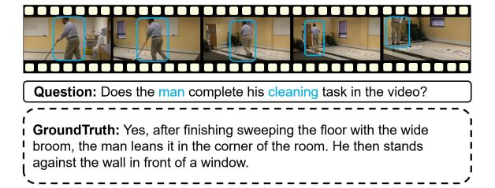
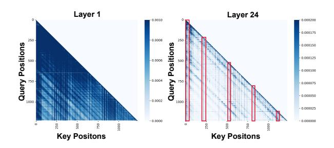
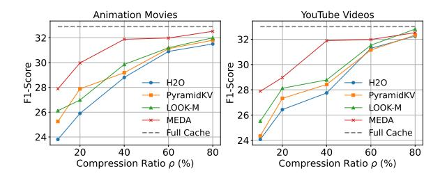
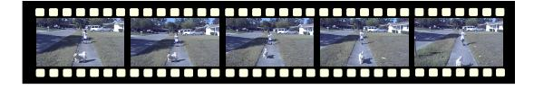
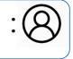

## MEDA: Dynamic KV Cache Allocation for Efficient Multimodal Long-Context Inference

Zhongwei Wan1 , Hui Shen1 , Xin Wang1 , Che Liu2 , Zheda Mai1 , Mi Zhang1

1The Ohio State University 2 Imperial College London

<https://github.com/AIoT-MLSys-Lab/MEDA>

## Abstract

Long-context Multimodal Large Language Models (MLLMs) that incorporate long textimage and text-video modalities, demand substantial resources as their multimodal Key-Value (KV) caches grow with increasing input lengths, challenging inference efficiency. Existing methods for KV cache compression, in both text-only and multimodal LLMs, have neglected attention density variations across layers, thus often adopting uniform or progressive reduction strategies for layer-wise cache allocation. In this work, we propose MEDA, a dynamic layer-wise KV cache allocation method for efficient multimodal long-context inference. As its core, MEDA utilizes cross-modal attention entropy to determine the KV cache size at each MLLMs layer. Given the dynamically allocated KV cache size at each layer, MEDA also employs a KV pair selection scheme to identify which KV pairs to select and a KV pair merging strategy that merges the selected and non-selected ones to preserve information from the entire context. MEDA achieves up to 72% KV cache memory reduction and 2.82 times faster decoding speed, while maintaining or enhancing performance on various multimodal tasks in long-context settings, including multi-images and long-video scenarios. Our code is released at [https://github.com/](https://github.com/AIoT-MLSys-Lab/MEDA) [AIoT-MLSys-Lab/MEDA](https://github.com/AIoT-MLSys-Lab/MEDA).

## 1 Introduction

Long-context Multimodal Large Language Models (MLLMs) have achieved remarkable progress in processing multimodal long context involving long text-image and text-video inputs, as exemplified by LLaVA-NeXT [\(Liu et al.,](#page-8-0) [2024c\)](#page-8-0), GPT-4V [\(Achiam et al.,](#page-8-1) [2023\)](#page-8-1) and long-video MLLMs [\(Xue et al.,](#page-9-0) [2024;](#page-9-0) [Zhang et al.,](#page-10-0) [2024b\)](#page-10-0). These models are capable of handling complex multimodal patterns within their Key-Value (KV) caches, such as text accompanied by multiple in-

Figure 1: A multimodal long-context sample from Video-ChatGPT [\(Maaz et al.,](#page-8-2) [2023\)](#page-8-2), showing key information interactions between blue-boxed video frames and textual phrases.

terrelated images or lengthy video sequences, introducing intricate cross-modal interactions, as shown in Figure [1.](#page-0-0) However, despite these advancements, long-context MLLMs demand substantial resources as their multimodal KV caches grow with increasing input lengths in long-context settings, causing significant slowdown during inference.

Conventional KV cache methods designed for text-only LLMs are difficult to be directly adopted to long-context multimodal inputs because they do not account for the complex cross-modal interactions present in long-context settings. Previous methods for KV cache compression in both text-only LLMs and MLLMs such as text-centric eviction-based methods [\(Zhang et al.,](#page-10-1) [2023;](#page-10-1) [Ren](#page-9-1) [and Zhu,](#page-9-1) [2024;](#page-9-1) [Li et al.,](#page-8-3) [2024a\)](#page-8-3), static progressive layer-wise reduction methods [\(Zhang et al.,](#page-10-2) [2024c;](#page-10-2) [Yang et al.,](#page-10-3) [2024\)](#page-10-3), and multimodal pruning methods [\(Wan et al.,](#page-9-2) [2024c\)](#page-9-2) have predominantly employed *uniform* cache size allocation across layers. However, these methods overlook the variations in attention density across different layers as illustrated in Figure [2.](#page-1-0) As a consequence, allocating a uniform KV cache size across different layers, without accounting for these variations, can not only lead to information loss in dense layers if less KV caches are allocated, resulting in reduced precision and suboptimal performance, but also cause significant inefficiency in sparse layers when more than enough KV caches are allocated.

In this paper, we propose a *dynamic* layer-wise KV cache allocation method, which we refer to as MEDA (Multimodal Attention Entropy-Guided Dynamic KV Cache Allocation), for efficient multimodal long-context inference. The key idea of MEDA is that it proposes to use cross-modal attention entropy to capture the diverse cross-modal attention patterns at different layers in MLLMs, and then dynamically allocates KV caches across layers so as to adapt to the unique layer-wise attention distributions. Moreover, given the dynamically allocated KV cache size at each layer, MEDA employs a multimodal KV pair selection scheme to identify which KV pairs to be selected at each layer. For each KV pair that is not selected, MEDA incorporates a KV pair merging strategy that merges the selected and non-selected KV pairs to preserve information from the entire context despite the reduced KV cache size. In doing so, MEDA is able to achieve efficient KV cache usage for multimodal long-context inference. It is also worthwhile to note that MEDA does not require additional fine-tuning and can be seamlessly integrated as a plug-and-play solution, offering a dynamic KV cache allocation strategy tailored for multimodal contexts.

We evaluate MEDA across various recent MLLM backbones, including LLaVA-v1.5-13B (Liu et al., 2023), LLaVA-NeXT-7B (Liu et al., 2024c), and InternVL-v1.5-7B (Chen et al., 2023) for multi-images tasks, as well as LLaVA-Video-7B/32B (Zhang et al., 2024d), LongVA-7B (Zhang et al., 2024b), and LongVILA-8B (Xue et al., 2024) for long-video tasks. We also evaluate MEDA on diverse mutlimodal long-context datasets including MileBench (Song et al., 2024), Video-ChatGPT (Maaz et al., 2023), DREAM-1K (Wang et al., 2024a), and WorldQA (Zhang et al., 2024e). Our results show that MEDA outperforms both state-of-the-art text-based and multimodal KV cache methods including H2O (Zhang et al., 2024g), SnapKV (Li et al., 2024a), PyramidKV (Zhang et al., 2024c), LOOK-M (Wan et al., 2024c), and is able to achieve up to 2.82 times faster inference speed and reduce KV cache memory footprint by up to 72%, while maintaining or improving performance on the target tasks.

#### 2 Related Work

**Post-training KV Cache Compression.** Post-training KV cache compression methods (Wan et al., 2023; Liu, 2024) fall into four categories:

Figure 2: Using the cross-modal attention entropy from Eq. 6, we analyze LLaVA-NeXT-7B (Liu et al., 2024c) across different sub-tasks (Song et al., 2024). We observe varying multimodal interaction patterns: early layers (e.g., Layer 1) exhibit dense attention weights with higher entropy, while deeper layers (e.g., Layer 24) exhibit sparse attention weights with lower entropy, given that they focus on key tokens (red columns), similar to the blue areas and text in Figure 1.

token-wise eviction, token-wise merging, static layer-wise reduction, and quantization. Tokenwise eviction (e.g., StreamingLLM (Xiao et al., 2023)) retains key tokens for sequence generation, while H2O (Zhang et al., 2024g), SnapKV (Li et al., 2024a), Parallel Comp (Xiong et al., 2025), and UNComp (Xiong et al., 2024b) focus on compact subsets, potentially sacrificing context. Tokenwise merging (e.g., CaM (Zhang et al., 2024f), D2O (Wan et al., 2024b)) re-integrates tokens to maintain context. Static layer-wise reduction (e.g., PyramidKV (Zhang et al., 2024c)) linearly reduces cache across layers but ignores inter-layer attention variations. Quantization (e.g., KIVI (Liu et al., 2024d), Gear (Kang et al., 2024)) balances memory and precision. Most methods focus on textbased KV compression, overlooking multimodal contexts. LOOK-M (Wan et al., 2024c) addresses multimodal compression but uses fixed allocation, neglecting inter-layer attention differences. MEDA introduces a multimodal attention entropy-guided dynamic allocation to address this.

Vision Token Compression for MLLMs. Classical approaches such as MobileVLM (Chu et al., 2024), LLaVA-Prumerge (Shang et al., 2024), MADTP (Cao et al., 2024), and FastV (Chen et al., 2024) focus on reducing image tokens, which dominate the total token count, to accelerate inference by removing redundancies. MobileVLM (Chu et al.,

2024) uses a lightweight projector with average pooling to compress visual tokens, while LLaVA-Prumerge (Shang et al., 2024) and MADTP (Cao et al., 2024) adopt adaptive strategies to reduce tokens while preserving performance. FastV (Chen et al., 2024) offers a plug-and-play solution that optimizes early layer computations and prunes visual tokens in later layers. In contrast, MEDA focuses on multimodal KV cache compression through a dynamic layer-wise allocation strategy, eliminating the need for additional fine-tuning and enhance the efficiency of multimodal long-context generative inference.

**Long-context MLLMs.** Recent works have expanded MLLMs' multimodal long-context capabilities through additional training. Liu et al. (2024b) leverage Blockwise RingAttention for scalable long-sequence training. LongVA (Zhang et al., 2024b) first pre-trains LLMs on long-text sequences and then aligns Long LLMs using short vision data to generalize to multimodal long-text contexts. LongLLaVA (Wang et al., 2024b) modifies the model architecture by integrating Mamba and Transformer blocks and employs a progressive training strategy using multiple images. Video-XL (Shu et al., 2024) introduces visual context latent summarization to train models for handling even longer multimodal token sequences. In contrast, MEDA introduces a dynamic KV cache optimization algorithm, enhancing long-context multimodal inference without additional training and is compatible with these methods.

#### 3 MEDA

## 3.1 Background on Generative Inference with Multimodal Context

Standard generative inference process of MLLMs involves two stages: (i) multimodal long-context prompt encoding, and (ii) decoding with multimodal KV cache.

Multimodal Long-Context Prompt Encoding. In the prompt encoding stage, a sequence of prompts comprising text, images, or videos is used to construct the Key-Value (KV) cache for each transformer layer in MLLMs. Specifically, let  $\mathbf{X} \in \mathbb{R}^{L_{\text{prompt}} \times D}$  denote the input prompt tensor, where  $L_{\text{prompt}}$  is the total length of the prompt sequence and D is the hidden dimension of the model. The input prompt tensor can be expressed as:  $\mathbf{X} = \{\mathbf{X}_1^T, \mathbf{X}_1^I, \dots, \mathbf{X}_N^T, \mathbf{X}_M^I\}$  or  $\mathbf{X} = \{\mathbf{X}_1^T, \mathbf{X}_2^T, \dots, \mathbf{X}_p^V, \mathbf{X}_q^V\}$  where  $\mathbf{X}_n^T, \mathbf{X}_m^I$ 

and  $\mathbf{X}_q^V$  represent the embeddings for the n-th text token, m-th image token, and q-th video token, respectively. In the text-multi-images setting, embeddings from different modalities are often interleaved in the input sequence. In the long-video setting, the number of video embeddings can become large due to the large number of input video frames, leading to a significant increase in decoding length. For simplicity, we omit indices for attention heads and layers. The key and value tensors are computed as:

$$\mathbf{K} = \mathbf{X}\mathbf{W}_K, \quad \mathbf{V} = \mathbf{X}\mathbf{W}_V, \tag{1}$$

where  $\mathbf{W}_K, \mathbf{W}_V \in \mathbb{R}^{D \times D}$  are the key and value projection matrices. The computed  $\mathbf{K}$  and  $\mathbf{V}$  are stored in the KV cache to facilitate subsequent token generation.

**Decoding with Multimodal KV Cache**. In the decoding stage, the KV cache is utilized and updated to generate tokens sequentially. At each time step t, the keys and values for the new token  $\mathbf{x}_t$  are computed, while the keys and values for previous tokens  $\mathbf{x} < t$  are retrieved from the cache. Denoting concatenation by  $[\cdot]$ , the KV cache is updated as:

$$\mathbf{K} = [\mathbf{K}, \mathbf{x}_t \mathbf{W}_K], \quad \mathbf{V} = [\mathbf{V}, \mathbf{x}_t \mathbf{W}_V]. \tag{2}$$

The output for the newly generated token is then computed as:

$$\mathbf{x}_{t,out} = \operatorname{Softmax}\left(\mathbf{q}_t \mathbf{K}^{\top} / \sqrt{D}\right) \mathbf{V}, \mathbf{q}_t = \mathbf{x}_t \mathbf{W}_Q,$$
 (3)

where  $\mathbf{W}_Q \in \mathbb{R}^{D \times D}$  is the query projection.

Challenge. The inclusion of multimodal long-context inputs and complex interactions between multimodal tokens (text, images, videos) significantly increases the size and complexity of the KV cache. Unlike text-only models, multimodal scenarios involve intricate cross-modal interactions between tokens, which pose new challenges for compressing the KV cache in long-context settings.

## 3.2 Cross-Modal Attention Entropy for Dynamic KV Cache Allocation

Cross-modal interactions in MLLMs create diverse attention patterns across MLLMs layers, and ignoring these variations leads to inefficient cache usage and degraded performance. Thus, designing a multimodal dynamic KV cache allocation strategy that adapts to layer-wise attention distribution is crucial for efficient KV cache management. To capture the attention distribution characteristics across different layers, we introduce the concept

Figure 3: Illustration of MEDA's multimodal attention entropy-guided dynamic KV cache allocation and merging strategy.

of **cross-modal attention entropy**. Attention entropy (De Boer et al., 2005; Zhai et al., 2023) quantifies the uncertainty or dispersion of the attention weights, providing insights into how focused or diffused the model's attention is at each layer.

As illustrated in Figure 3, for each layer l in the MLLMs, we compute the **cross-modal attention matrices** between text and visual tokens. Specifically, the attention from text to vision  $(\mathbf{A}_{\text{TV}}^{l})$  and from vision to text  $(\mathbf{A}_{\text{VT}}^{l})$  are calculated as:

$$\mathbf{A}_{\mathrm{TV}}^{l} = \operatorname{Softmax}\left(\mathbf{Q}_{T}^{l}\left(\mathbf{K}_{V}^{l}\right)^{\top} / \sqrt{D}\right),$$

$$\mathbf{A}_{\mathrm{VT}}^{l} = \operatorname{Softmax}\left(\mathbf{Q}_{V}^{l}\left(\mathbf{K}_{T}^{l}\right)^{\top} / \sqrt{D}\right),$$
(4)

where  $\mathbf{Q}_T^l \in \mathbb{R}^{n_T \times d}$  and  $\mathbf{K}_T^l \in \mathbb{R}^{n_T \times D}$  are the query and key matrices for text tokens,  $\mathbf{Q}_V^l \in \mathbb{R}^{n_V \times D}$  and  $\mathbf{K}_V^l \in \mathbb{R}^{n_V \times D}$  represent the query and key matrices for visual tokens, which are derived from the original  $\mathbf{Q}$  and  $\mathbf{K}$  based on the modality index,  $n_T$  and  $n_V$  are the numbers of text and visual tokens, and D is the dimensionality of the embeddings. We define the attention entropy of a row i of  $\mathbf{A}$  by  $\mathbf{E}(\mathbf{A}_i) = -\sum_{j=1}^T \mathbf{A}_{[i,j]} \log{(\mathbf{A}[i,j])}.$  Let  $\mathbf{E}(A) = \frac{1}{T}\sum_{i=1}^T \mathrm{Ent}\left(A_i\right)$  denote the attention entropy of  $\mathbf{A}$ , T is the number of tokens and  $\mathbf{A}$  is average attention across multi-heads for each layer. The cross-modal attention entropy  $\mathbf{E}_{CM}^l$  for layer l is then computed as:

$$\begin{split} \mathbf{E}_{TV}^{l} &= \frac{1}{|T|} \sum_{i=1}^{n_{T}} \sum_{j=1}^{n_{V}} \mathbf{A}_{\text{TV}}^{l}[i, j] \log \mathbf{A}_{\text{TV}}^{l}[i, j], \\ \mathbf{E}_{VT}^{l} &= \frac{1}{|V|} \sum_{i=1}^{n_{T}} \sum_{j=1}^{n_{V}} \mathbf{A}_{\text{VT}}^{l}[i, j] \log \mathbf{A}_{\text{VT}}^{l}[i, j], \end{split} \tag{5}$$

$$\mathbf{E}_{CM}^{l} = -(\mathbf{E}_{TV}^{l} + \mathbf{E}_{VT}^{l}),\tag{6}$$

where |T|, |V| denotes the number of text and visual tokens respectively. This entropy measures the uncertainty in the cross-modal attention distributions between text and visual tokens. A lower entropy indicates that the attention is more concentrated on specific cross-modal token pairs, suggesting that the layer is focusing on some more important multimodal interactions. Therefore, using the computed cross-modal attention entropy, we propose an inverse entropy softmax allocation strategy to determine the proportion  $\alpha_l$  of the total KV cache size S allocated to layer l:

$$S_{l} = \alpha_{l} \cdot S, \ \alpha_{l} = \frac{\exp\left(\mathbf{E}_{\mathrm{CM}}^{l}\right)}{\sum_{k=1}^{L} \exp\left(\mathbf{E}_{\mathrm{CM}}^{k}\right)} \cdot L \cdot \rho, \tag{7}$$

where the attention entropy-guided dynamic allocated KV cache size for layer l is  $S_l$ , L is the total number of layers in the model, and  $\rho \in (0,1]$  is the compression ratio representing the fraction of the original cache size to retain. The allocation strategy ensures that layers with *lower* cross-modal attention entropy receive a *smaller* portion of the KV cache, effectively preserving critical cross-modal information. Layers with *higher* cross-modal attention entropy, indicating more diffused attention, receive *larger* cache allocation. Such dynamic layer-wise KV cache allocation strategy optimizes memory usage. Details of  $\alpha_l$  are described in A.3.

# 3.3 Multimodal KV Pair Selection and Merging

As illustrated in Figure 3, given the dynamically allocated KV cache size  $S_l$  at layer l, MEDA employs a multimodal KV pair selection scheme to identify which KV pairs to be selected at layer l.

For each KV pair that is not selected, MEDA incorporates a KV pair merging strategy that merges the selected and non-selected KV pairs to preserve information from the entire context despite the reduced KV cache size.

Multimodal KV Pair Selection. Text tokens often contain crucial semantic information in multimodal contexts (Wan et al., 2024c). Therefore, during the prompt encoding stage, we prioritize the retention of text-based KV pairs and select conserved tokens based on the compression ratio and accumulated attention ranks. The tokens not selected are considered as *less important tokens*. Unlike previous eviction-based (Zhang et al., 2024g) or static layerwise reduction methods (Zhang et al., 2024c; Yang et al., 2024) that discard these less important tokens, we employ KV cache merging techniques to preserve the integrity of the contextual information. The cumulative attention score  $\mathbf{A}_s$  is computed as:

$$\mathbf{A}_{s} = \sum_{i=1}^{L_{\text{prompt}}} \mathbf{A}_{p}[i,:], \quad \mathbf{A}_{p} = \operatorname{Attn}\left(\mathbf{Q}_{p}\mathbf{K}_{p}^{\top}\right), \quad (8)$$

where  $\mathbf{A}_p$  denotes the attention weights during prompt encoding, and  $\mathbf{Q}_p, \mathbf{K}_p \in \mathbb{R}^{L_{\text{prompt}} \times D}$  are the query and key matrices of the prompt tokens, respectively. To prioritize text tokens, we enhance their attention scores by adding a max value among all tokens:

$$\mathbf{A}_s[T] = \mathbf{A}_s[T] + \max\left(\mathbf{A}_s\right),\tag{9}$$

where T denotes the indices of text tokens. This adjustment ensures that text-based KV pairs are more likely to be retained during the selection process. We also retain a recent context window of size M to preserve immediate context, and then select the top N important tokens with the highest attention scores from the remaining tokens. The conserved KV cache ( $\mathbf{K}_c$ ,  $\mathbf{V}_c$ ) is given by:

$$\mathbf{K}_c = [\mathbf{K}[I,:]; \mathbf{K}[-M:,:]], \quad \mathbf{V}_c = [\mathbf{V}[I,:]; \mathbf{V}[-M:,:]]$$
$$I = \text{Top}_N \left( \mathbf{A}_s[:-M] \right)$$

where  $\operatorname{Top}_N(\cdot)$  selects the indices of the top N tokens based on  $\mathbf{A}_s$ , excluding the most recent M tokens. The tokens not included in  $(\mathbf{K}_c, \mathbf{V}_c)$  constitute less important KV pairs  $(\mathbf{K}_{less}, \mathbf{V}_{less})$ . **Multimodal KV Pair Merging.** To preserve the integrity of the contextual information, we employ a KV pair merging strategy that integrates the less important tokens into the conserved cache, rather than discarding them as in prior works (Zhang et al., 2024c; Li et al., 2024a). Specifically, we

perform a many-to-one nearest-neighbor matching (Wan et al., 2024c) between the less important KV pairs ( $\mathbf{K}_{less}$ ,  $\mathbf{V}_{less}$ ) and the conserved KV pairs ( $\mathbf{K}_c$ ,  $\mathbf{V}_c$ ). We compute the similarity matrix  $\mathbf{U} \in \mathbb{R}^{L_{les} \times L_c}$  between the keys of less important and conserved tokens using cosine similarity:

$$\mathbf{u}_{i,j} = \frac{\mathbf{k}_i^{\mathsf{T}} \mathbf{k}_j}{\|\mathbf{k}_i\| \|\mathbf{k}_j\|}, \quad i \in I_{\text{less}}, j \in I_c$$
 (11)

where  $\mathbf{k}_i \in \mathbf{K}_{\mathrm{less}}, \mathbf{k}_j \in \mathbf{K}_c$ , and  $I_{\mathrm{less}}, I_c$  are the indices of less important and conserved to-kens, respectively. For each less important to-ken  $\mathbf{k}_i$ , we identify its nearest conserved token by finding the one with the highest similarity as  $j = \arg\max_{j \in I_c} \mathbf{s}_{i,j}$ . We then merge the less important tokens with their corresponding conserved tokens. In MEDA, we adopt the **average merging** strategy, where we update the conserved key as:

$$\mathbf{k}_j \leftarrow \frac{1}{|\mathcal{N}_j| + 1} \left( \mathbf{k}_j + \sum_{i \in \mathcal{N}_j} \mathbf{k}_i \right).$$
 (12)

Considering the alignment properties of KV pairs (Zhang et al., 2021), we compute the similarity matrix only on the key tokens and apply the same similarity metric and the same averaged merging to the value tokens. Therefore, by merging the less important tokens into the conserved ones, we aim to preserve essential information from the entire context, thus maintaining coherence during decoding despite the reduced cache size.

#### 4 Experimental Setups

#### 4.1 Datasets and Evaluation Metrics

To evaluate the performance of MEDA, we conduct experiments on two types of datasets: text-multi-images datasets and long-video datasets.

For text-multi-images datasets, we use the MileBench (Song et al., 2024) benchmark, which includes four categories of tasks: Temporal Multi-image Tasks (T), Semantic Multi-image Tasks (S), Needle in a Haystack Tasks (NH), and Image Retrieval Tasks (IR). Performance is assessed using metrics including accuracy and ROUGE-L.

For long-video datasets, we use generative evaluation benchmarks Video-ChatGPT (Maaz et al., 2023) and DREAM-1K (Wang et al., 2024a) for video description, and generation-based openended QA dataset WorldQA (Zhang et al., 2024e). The quality of generated responses is evaluated using the GPT API1. Additional details regarding these datasets are provided in Appendix A.1.

&lt;sup>1https://platform.openai.com/docs/models

Table 1: Performance of various KV cache strategy on several MLLMs on MileBench's tasks with compression ratio ρ = 0.1. A-Merge, W-Merge, P-Merge denote averaged merging, weighted merging and pivotal merging, respectively. TR represents text-prior KV pair eviction.

| Method                          | T-1  | T-2  | T-3  | T-4            | S-1  | S-2  | S-3  | S-4  | S-5  | NH   | IR  |
|---------------------------------|------|------|------|----------------|------|------|------|------|------|------|-----|
| LLaVA-NeXT-7B                   |      |      |      |                |      |      |      |      |      |      |     |
| Full Cache                      | 45.8 | 51.8 | 38.3 | 44.8           | 61.1 | 39.6 | 18.7 | 29.8 | 66.9 | 5.5  | 7.6 |
| H2O (Zhang et al., 2023)        | 42.0 | 48.8 | 35.1 | 41.5           | 57.8 | 35.9 | 15.0 | 25.9 | 63.8 | 2.4  | 3.7 |
| SnapKV (Li et al., 2024a)       | 42.1 | 48.5 | 35.2 | 41.1           | 57.6 | 36.1 | 15.6 | 26.6 | 63.3 | 1.8  | 3.2 |
| PyramidKV (Zhang et al., 2024c) | 42.4 | 48.6 | 35.1 | 41.7           | 57.9 | 36.5 | 15.2 | 26.7 | 63.6 | 2.0  | 3.2 |
| LOOK-M (Wan et al., 2024c)      | 44.1 | 50.1 | 36.7 | 43.0           | 59.5 | 37.8 | 17.2 | 28.1 | 65.3 | 3.6  | 5.0 |
| MEDA (Ours)                     | 45.4 | 50.9 | 37.6 | 44.1           | 60.2 | 38.9 | 17.8 | 30.1 | 66.9 | 4.8  | 7.4 |
| InternVL-v1.5-7B                |      |      |      |                |      |      |      |      |      |      |     |
| Full Cache                      | 10.7 | 19.2 | 13.8 | 19.1           | 16.8 | 9.7  | 14.4 | 19.1 | 5.0  | 11.1 | 0.0 |
| H2O (Zhang et al., 2023)        | 8.4  | 16.8 | 11.5 | 16.7           | 14.6 | 7.3  | 12.1 | 16.8 | 2.7  | 8.9  | 0.0 |
| SnapKV (Li et al., 2024a)       | 8.9  | 17.1 | 11.8 | 17.3           | 15.1 | 7.6  | 12.5 | 16.9 | 3.2  | 9.2  | 0.0 |
| PyramidKV (Zhang et al., 2024c) | 8.3  | 17.7 | 12.0 | 16.8           | 15.1 | 8.2  | 11.9 | 16.8 | 3.1  | 9.3  | 0.0 |
| LOOK-M (Wan et al., 2024c)      | 9.2  | 17.5 | 12.2 | 17.8           | 15.1 | 8.5  | 12.9 | 19.2 | 4.0  | 10.2 | 0.0 |
| MEDA (Ours)                     | 10.5 | 18.8 | 13.3 | 18.6           | 16.4 | 9.0  | 14.3 | 18.4 | 5.0  | 10.9 | 1.2 |
|                                 |      |      |      | LLaVA-v1.5-13B |      |      |      |      |      |      |     |
| Full Cache                      | 39.8 | 46.2 | 30.8 | 48.1           | 64.8 | 48.5 | 13.6 | 28.4 | 60.0 | 12.0 | 1.0 |
| H2O (Zhang et al., 2023)        | 37.4 | 43.5 | 28.2 | 45.6           | 61.4 | 45.0 | 11.3 | 25.5 | 57.6 | 9.8  | 0.0 |
| SnapKV (Li et al., 2024a)       | 36.3 | 42.9 | 27.7 | 45.0           | 61.5 | 45.3 | 10.4 | 25.0 | 56.9 | 9.0  | 1.0 |
| PyramidKV (Zhang et al., 2024c) | 36.4 | 43.5 | 28.1 | 45.2           | 62.2 | 45.1 | 10.4 | 25.0 | 56.8 | 9.0  | 0.0 |
| LOOK-M (Wan et al., 2024c)      | 38.8 | 44.3 | 28.5 | 46.5           | 62.8 | 46.4 | 11.7 | 26.7 | 57.6 | 10.2 | 1.0 |
| MEDA (Ours)                     | 40.0 | 46.2 | 30.4 | 48.0           | 64.7 | 48.6 | 13.1 | 27.6 | 59.7 | 12.2 | 1.5 |

## 4.2 Models

To evaluate MEDA's robustness across different model architectures, we conduct experiments on both multimodal long-context and long-video models. For multimodal long-context models, we evaluate LLaVA-v1.5-13B [\(Liu et al.,](#page-8-4) [2023\)](#page-8-4), LLaVA-NeXT-7B [\(Liu et al.,](#page-8-0) [2024c\)](#page-8-0), and InternVL-v1.5- 7B [\(Chen et al.,](#page-8-5) [2023\)](#page-8-5). For long-video models, we evaluate LLaVA-Video-7B/32B [\(Zhang et al.,](#page-10-4) [2024d\)](#page-10-4), LongVA-7B [\(Zhang et al.,](#page-10-0) [2024b\)](#page-10-0), and LongVILA-8B [\(Xue et al.,](#page-9-0) [2024\)](#page-9-0).

#### 4.3 Baselines

To demonstrate the advantages of MEDA, we use the latest KV cache compression methods as baselines. H2O [\(Zhang et al.,](#page-10-6) [2024g\)](#page-10-6) and SnapKV [\(Li](#page-8-3) [et al.,](#page-8-3) [2024a\)](#page-8-3) employ eviction-based strategies, while PyramidKV [\(Zhang et al.,](#page-10-2) [2024c\)](#page-10-2) uses static layer-wise reduction. As these methods are textcentric, we adapt them for fair comparison in multimodal long-context settings. We also include LOOK-M [\(Wan et al.,](#page-9-2) [2024c\)](#page-9-2), the state-of-the-art multimodal KV cache compression method.

## 4.4 Implementation Details

Let ρ denote the total compression ratio of the KV cache across layers, with the compressed cache as ρ×*input\_context*. For each layer, the allocated KV cache is αl × *input\_context*, where αl = β1 + β2. We followed [\(Wan et al.,](#page-9-2) [2024c\)](#page-9-2) to set the ratio

β1 : β2 to 3 : 1 that corresponds to recent context tokens M and important tokens N, respectively, with the memory overhead per layer proportional to β1 + β2. All of the experiments are conducted on NVIDIA A100 GPUs.

## 5 Experiment Results

We present experiments demonstrating MEDA's effectiveness in optimizing multimodal KV cache across various models. Evaluations on MileBench [\(Song et al.,](#page-9-3) [2024\)](#page-9-3) highlight its benefits in long-context scenarios, while tests on long-video datasets confirm its generative reasoning capabilities. We analyze the impact of KV cache budgets at different compression ratios ρ on token generation and provide ablation studies for further insight into MEDA's performance. Additionally, we evaluate computational efficiency by measuring runtime and KV cache load during decoding.

## 5.1 Performance on MileBench

To validate the effectiveness of MEDA in dynamically compressing KV cache in multi-image and multi-text cross-attention scenarios, we conducted experiments on MileBench using various models ranging from 7B to 13B parameters. We set the compression ratio to ρ = 0.1 to compare the performance of different algorithms under low compression settings. As shown in Table [1,](#page-5-0) MEDA

Table 2: Performance of various KV cache strategy on Video-ChatGPT tasks with compression ratio  $\rho = 0.2$ .

| Method                               | Correct(                     | `) Detail(↑)                 | Context(                     | †)Temp(†)                    |  |  |  |
|--------------------------------------|------------------------------|------------------------------|------------------------------|------------------------------|--|--|--|
| LongVILA-8B                          |                              |                              |                              |                              |  |  |  |
| Full Cache                           | 2.35                         | 2.43                         | 2.82                         | 2.12                         |  |  |  |
| H 2 O SnapKV           | 1.96 1.84                 | 2.08 2.12                 | 2.38 2.38                 | 1.66 1.72                 |  |  |  |
| PyramidKV LOOK-M MEDA (Ours)   | 2.13 2.19 <b>2.25</b>  | 2.12 2.15 <b>2.29</b>  | 2.43 2.51 <b>2.69</b>  | 1.84 1.88 <b>2.05</b>  |  |  |  |
| LongVA-7B                            |                              |                              |                              |                              |  |  |  |
| Full Cache                           | 2.24                         | 2.48                         | 2.68                         | 2.09                         |  |  |  |
| H2O SnapKV PyramidKV LOOK-M | 1.93 1.86 1.91 2.09 | 2.23 2.13 2.08 2.21 | 2.23 2.43 2.35 2.44 | 1.74 1.70 1.78 1.88 |  |  |  |
| MEDA (Ours)                          | 2.16                         | 2.41                         | 2.54                         | 1.98                         |  |  |  |

outperforms other text-centric baselines across all models, such as H2O and SnapKV, demonstrating that incorporating attention differences between text and vision modalities helps preserve critical information during compression. Moreover, MEDA surpasses PyramidKV and LOOK-M, indicating that it provides superior layer-wise cache allocation by dynamically adjusting the KV cache budget based on attention entropy between modalities, compared to uniform or progressive reduction techniques. The use of the KV Pairs Average Merging strategy allows MEDA to retain essential multimodal tokens while eliminating redundant context.

#### **5.2** Performance on Long Video Tasks

Next, we evaluate the generality and effectiveness of MEDA on various long-video MLLMs as well as video captioning and generative QA datasets, with model sizes ranging from 7B to 32B.

Results on Video-ChatGPT. We evaluate each MLLM's predictions for correctness, detail orientation, and contextual and temporal understanding with a compressed KV cache at  $\rho = 0.2$ . Following prior settings (Maaz et al., 2023; Xue et al., 2024), we use GPT-3.5 with 32 video frames to test each compression algorithm's video captioning performance against human-annotated ground truth. As shown in Table 2, MEDA consistently outperforms text-centric baselines like H2O, SnapKV, and PyramidKV on LongVILA-8B and LongVA-7B models, showing that preserving key tokens from cross-modal interactions is crucial for long-video compression. MEDA also surpasses LOOK-M in all evaluation dimensions, confirming its effectiveness in dynamically adjusting KV cache size based on cross-modal attention entropy to retain essential multimodal information.

Table 3: Performance of various KV cache strategy on DREAM-1K tasks with compression ratio  $\rho=0.2$ .

| Method          | F1(↑) | Precision(↑) | Recall(↑) |  |  |  |
|-----------------|-------|--------------|-----------|--|--|--|
| LLaVA-Video-7B  |       |              |           |  |  |  |
| Full Cache      | 32.5  | 37.9         | 28.4      |  |  |  |
| H2O             | 27.7  | 33.9         | 23.4      |  |  |  |
| SnapKV          | 28.8  | 34.7         | 24.6      |  |  |  |
| PyramidKV       | 28.1  | 34.2         | 23.9      |  |  |  |
| LOOK-M          | 30.4  | 35.8         | 26.4      |  |  |  |
| MEDA (Ours)     | 31.3  | 36.8         | 27.2      |  |  |  |
| LLaVA-Video-32B |       |              |           |  |  |  |
| Full Cache      | 32.9  | 34.4         | 31.6      |  |  |  |
| H2O             | 28.1  | 28.8         | 27.5      |  |  |  |
| SnapKV          | 29.1  | 30.6         | 27.7      |  |  |  |
| PyramidKV       | 29.7  | 31.4         | 28.1      |  |  |  |
| LOOK-M          | 29.6  | 31.1         | 28.3      |  |  |  |
| MEDA (Ours)     | 31.7  | 33.3         | 30.3      |  |  |  |

Table 4: Performance of different KV cache strategies on WorldQA tasks with a compression ratio of  $\rho=0.2$ . For instance, F represents Full Cache, and M represents MEDA.

| Open-ended QA(↑)                           |      |                      |      |      |      |      |
|--------------------------------------------|------|----------------------|------|------|------|------|
| Models                                     | F    | Н                    | S    | P    | L    | M    |
| LLaVA-Video-7B LongVA-7B LongVILA-8B | 28.9 | 24.3 26.5 25.5 | 26.6 | 25.4 | 27.0 | 27.5 |

Results on DREAM-1K. We evaluate the DREAM-1K (Wang et al., 2024a) benchmark on LLaVA-Video-7B and 32B models, using AutoDQ to assess five types of video data and report the average score. As shown in Table 3, MEDA outperforms other KV cache compression strategies, maintaining performance close to that of the Full Cache even when compressed to 20% on both 7B and 32B models. This result demonstrates that combining cross-modal attention entropy for layer-wise KV cache allocation with KV merging effectively preserves critical information in the KV cache.

Results on WorldQA. We further evaluate MEDA's reasoning capabilities on a generation-based open-ended QA dataset (Zhang et al., 2024e), using GPT-4 to assess the quality of generated responses. As shown in Table 4, MEDA outperforms other KV cache compression strategies across various model architectures, especially demonstrating a significant advantage over the eviction-based H2O method. The results confirm that MEDA's combined dynamic layer allocation and average merging strategies can effectively maintain high-quality video reasoning even under high compression rates.

#### 5.3 Impact of Compression Ratio $\rho$

We evaluate MEDA's efficiency across KV cache compression ratios  $\rho$  from 10% to 80%, using standardized tests on the LLaVA-Video-7B model

Figure 4: Impact of compression ratio  $\rho$ . Table 5: Results of ablation studies. For CL-CH and SP-DI, we use ROUGE-L and  $\rho=0.1$ . For AM and YT, we use F1 and  $\rho=0.2$ .

|                         | CL-CH   | SP-DI   | AM    | YT        |
|-------------------------|---------|---------|-------|-----------|
|                         | LLaVA-N | NeXT-7B | LLaVA | -Video-7B |
| Full Cache              | 19.5    | 18.7    | 27.6  | 33.0      |
| H2O                     | 16.6    | 16.2    | 23.8  | 27.1      |
| MEDA                    | 18.9    | 18.2    | 26.7  | 31.8      |
| w.o. Dynamic Allocation | 17.8    | 17.5    | 25.5  | 28.2      |
| w.o. Average Merging    | 18.2    | 17.3    | 25.8  | 29.3      |
| w.o. Both               | 17.0    | 16.5    | 24.5  | 27.2      |

for video captioning tasks (live-action, animation, YouTube, and TikTok) from the DREAM-1K dataset. As shown in Figure 4, MEDA consistently outperforms all baseline methods across all compression ratios  $\rho$ . Notably, at a compression ratio of 10%, MEDA significantly surpasses both LOOK-M and PyramidKV, demonstrating its ability to dynamically preserve crucial multimodal information even under highly compressed conditions, thereby minimizing the loss of video context.

#### 5.4 Ablation Study

To demonstrate the effectiveness and generality of each component of MEDA, we present a table comparing Full Cache, H2O, and the key components of MEDA, evaluated on generative subtasks from MileBench (CLEVR-Change (CL-CH), Spot-the-Diff (SP-DI)) and DREAM-1K (Animation (AM), YouTube (YT)). As shown in Table 5, the removal of any MEDA component leads to performance degradation. Even with two components removed, MEDA still slightly outperforms H2O, which relies purely on eviction. These results confirm that each MEDA component mitigates information loss caused by entropy-based dynamic layer allocation and multimodal average merging.

#### 5.5 Decoding Efficiency Analysis

We evaluate MEDA's efficiency in Table 6, comparing decoding speed and memory usage against the Full Cache using LLaVA-Video-7B (Zhang et al., 2024d). Tests on 20 randomly selected DREAM-1K video, using a single A100 GPU, show that our compressed model has significantly lower decoding latency, particularly for long text generation.

Table 6: Latency and KV cache GPU memory usage.

| Method     | Budget $\rho$ | Decoding Latency | GPU Memory |
|------------|---------------|------------------|------------|
| Full Cache | 100%          | 14.61 ms/token   | 2.42 GiB   |
| MEDA       | 50%           | 11.58 ms/token   | 1.34 GiB   |
| MEDA       | 35%           | 9.64 ms/token    | 1.05 GiB   |
| MEDA       | 20%           | 8.23 ms/token    | 0.67 GiB   |
| MEDA       | 5%            | 5.18 ms/token    | 0.37 GiB   |

Speed and memory usage were further analyzed from 50% to 5% KV cache budgets. Results show that GPU memory usage scales proportionally to the cache budget, for instance, with a 20% budget reducing memory usage by 72% compared to Full Cache. Higher compression ratios also reduce latency, demonstrating the efficiency of our method. More details about specific environment for speed and memory test are illustrated in Appendix A.2.

#### 6 Conclusion

In this paper, we introduced MEDA, an approach for dynamically allocating KV cache in longcontext MLLMs. By leveraging attention entropy, MEDA efficiently adapts to the complexities of cross-modal interactions, dynamically allocating layer-wise cache sizes and preserving critical information using an average merging technique, while significantly reducing memory usage and improving decoding speed. Our experiments show that MEDA achieves substantial memory savings and faster inference without sacrificing performance, setting a new standard for efficient multimodal processing in tasks involving long text-image and textvideo inputs. These results affirm the effectiveness of MEDA in addressing the computational challenges inherent to multimodal models.

## 7 Limitation

The limitations of our study arise from optimizing the KV cache of standard MLLMs without incorporating advanced LLMs techniques such as quantization, pruning, distillation, retrieval augmented generation or efficient attention mechanisms (Lin et al., 2024; Gu et al., 2024; Dao et al., 2022; Tao et al., 2024; Wang et al., 2024d; Shen et al., 2024; Li et al., 2024b; Wang et al., 2024c; Xin et al., 2025), and for mutltimodal generation tasks (Shen et al., 2025; Xiong et al., 2024a), math reasoning (Zhang et al., 2024a; Xiong et al., 2022). In future work, we plan to combine these techniques and applications with MEDA to achieve the highest possible degree of KV cache compression.

#### 8 Acknowledgment

This study is supported in part by NSF Award NeTS-2312675.

## References

- Josh Achiam, Steven Adler, Sandhini Agarwal, Lama Ahmad, Ilge Akkaya, Florencia Leoni Aleman, Diogo Almeida, Janko Altenschmidt, Sam Altman, Shyamal Anadkat, et al. 2023. Gpt-4 technical report. *arXiv preprint arXiv:2303.08774*.
- Jianjian Cao, Peng Ye, Shengze Li, Chong Yu, Yansong Tang, Jiwen Lu, and Tao Chen. 2024. [Madtp: Mul](https://api.semanticscholar.org/CorpusID:268248344)[timodal alignment-guided dynamic token pruning](https://api.semanticscholar.org/CorpusID:268248344) [for accelerating vision-language transformer.](https://api.semanticscholar.org/CorpusID:268248344) *ArXiv*, abs/2403.02991.
- Liang Chen, Haozhe Zhao, Tianyu Liu, Shuai Bai, Junyang Lin, Chang Zhou, and Baobao Chang. 2024. [An image is worth 1/2 tokens after layer 2: Plug-and](https://api.semanticscholar.org/CorpusID:268358224)[play inference acceleration for large vision-language](https://api.semanticscholar.org/CorpusID:268358224) [models.](https://api.semanticscholar.org/CorpusID:268358224) *ArXiv*, abs/2403.06764.
- Simin Chen, Yiming Chen, Zexin Li, Yifan Jiang, Zhongwei Wan, Yixin He, Dezhi Ran, Tianle Gu, Haizhou Li, Tao Xie, et al. 2025. Recent advances in large langauge model benchmarks against data contamination: From static to dynamic evaluation. *arXiv preprint arXiv:2502.17521*.
- Zhe Chen, Jiannan Wu, Wenhai Wang, Weijie Su, Guo Chen, Sen Xing, Zhong Muyan, Qinglong Zhang, Xizhou Zhu, Lewei Lu, Bin Li, Ping Luo, Tong Lu, Yu Qiao, and Jifeng Dai. 2023. [Internvl: Scaling up](https://api.semanticscholar.org/CorpusID:266521410) [vision foundation models and aligning for generic](https://api.semanticscholar.org/CorpusID:266521410) [visual-linguistic tasks.](https://api.semanticscholar.org/CorpusID:266521410) *ArXiv*, abs/2312.14238.
- Xiangxiang Chu, Limeng Qiao, Xinyu Zhang, Shuang Xu, Fei Wei, Yang Yang, Xiaofei Sun, Yiming Hu, Xinyang Lin, Bo Zhang, et al. 2024. Mobilevlm v2: Faster and stronger baseline for vision language model. *arXiv preprint arXiv:2402.03766*.
- Tri Dao, Daniel Y. Fu, Stefano Ermon, Atri Rudra, and Christopher R'e. 2022. [Flashattention: Fast and](https://api.semanticscholar.org/CorpusID:249151871) [memory-efficient exact attention with io-awareness.](https://api.semanticscholar.org/CorpusID:249151871) *ArXiv*, abs/2205.14135.
- Pieter-Tjerk De Boer, Dirk P Kroese, Shie Mannor, and Reuven Y Rubinstein. 2005. A tutorial on the cross-entropy method. *Annals of operations research*, 134:19–67.
- Zixuan Gong, Guangyin Bao, Qi Zhang, Zhongwei Wan, Duoqian Miao, Shoujin Wang, Lei Zhu, Changwei Wang, Rongtao Xu, Liang Hu, et al. 2024. Neuroclips: Towards high-fidelity and smooth fmri-tovideo reconstruction. *Advances in Neural Information Processing Systems*, 37:51655–51683.
- Yuxian Gu, Li Dong, Furu Wei, and Minlie Huang. 2024. Minillm: Knowledge distillation of large language models. In *The Twelfth International Conference on Learning Representations*.
- Fabian Caba Heilbron, Victor Escorcia, Bernard Ghanem, and Juan Carlos Niebles. 2015. [Activitynet:](https://api.semanticscholar.org/CorpusID:1710722) [A large-scale video benchmark for human activity](https://api.semanticscholar.org/CorpusID:1710722) [understanding.](https://api.semanticscholar.org/CorpusID:1710722) *2015 IEEE Conference on Computer*

- *Vision and Pattern Recognition (CVPR)*, pages 961– 970.
- Jinfa Huang, Jinsheng Pan, Zhongwei Wan, Hanjia Lyu, and Jiebo Luo. 2024. Evolver: Chain-ofevolution prompting to boost large multimodal models for hateful meme detection. *arXiv preprint arXiv:2407.21004*.
- Hao Kang, Qingru Zhang, Souvik Kundu, Geonhwa Jeong, Zaoxing Liu, Tushar Krishna, and Tuo Zhao. 2024. Gear: An efficient kv cache compression recipefor near-lossless generative inference of llm. *arXiv preprint arXiv:2403.05527*.
- Yuhong Li, Yingbing Huang, Bowen Yang, Bharat Venkitesh, Acyr F. Locatelli, Hanchen Ye, Tianle Cai, Patrick Lewis, and Deming Chen. 2024a. [Snapkv:](https://api.semanticscholar.org/CorpusID:269303164) [Llm knows what you are looking for before genera](https://api.semanticscholar.org/CorpusID:269303164)[tion.](https://api.semanticscholar.org/CorpusID:269303164) *ArXiv*, abs/2404.14469.
- Zixuan Li, Jing Xiong, Fanghua Ye, Chuanyang Zheng, Xun Wu, Jianqiao Lu, Zhongwei Wan, Xiaodan Liang, Chengming Li, Zhenan Sun, et al. 2024b. Uncertaintyrag: Span-level uncertainty enhanced longcontext modeling for retrieval-augmented generation. *arXiv preprint arXiv:2410.02719*.
- Haokun Lin, Haobo Xu, Yichen Wu, Jingzhi Cui, Yingtao Zhang, Linzhan Mou, Linqi Song, Zhenan Sun, and Ying Wei. 2024. Rotation and permutation for advanced outlier management and efficient quantization of llms. *arXiv preprint arXiv:2406.01721*.
- Che Liu, Zhongwei Wan, Yuqi Wang, Hui Shen, Haozhe Wang, Kangyu Zheng, Mi Zhang, and Rossella Arcucci. 2024a. Benchmarking and boosting radiology report generation for 3d high-resolution medical images. *arXiv preprint arXiv:2406.07146*.
- Dong Liu. 2024. Contemporary model compression on large language models inference. *arXiv preprint arXiv:2409.01990*.
- Hao Liu, Wilson Yan, Matei Zaharia, and Pieter Abbeel. 2024b. World model on million-length video and language with blockwise ringattention. *arXiv preprint arXiv:2402.08268*.
- Haotian Liu, Chunyuan Li, Yuheng Li, Bo Li, Yuanhan Zhang, Sheng Shen, and Yong Jae Lee. 2024c. Llavanext: Improved reasoning, ocr, and world knowledge.
- Haotian Liu, Chunyuan Li, Qingyang Wu, and Yong Jae Lee. 2023. [Visual instruction tuning.](https://api.semanticscholar.org/CorpusID:258179774) *ArXiv*, abs/2304.08485.
- Zirui Liu, Jiayi Yuan, Hongye Jin, Shaochen Zhong, Zhaozhuo Xu, Vladimir Braverman, Beidi Chen, and Xia Hu. 2024d. Kivi: A tuning-free asymmetric 2bit quantization for kv cache. *arXiv preprint arXiv:2402.02750*.
- Muhammad Maaz, Hanoona Rasheed, Salman Khan, and Fahad Shahbaz Khan. 2023. Video-chatgpt: Towards detailed video understanding via large

- vision and language models. *arXiv preprint arXiv:2306.05424*.
- Siyu Ren and Kenny Q. Zhu. 2024. [On the efficacy of](https://api.semanticscholar.org/CorpusID:267617273) [eviction policy for key-value constrained generative](https://api.semanticscholar.org/CorpusID:267617273) [language model inference.](https://api.semanticscholar.org/CorpusID:267617273) *ArXiv*, abs/2402.06262.
- Yuzhang Shang, Mu Cai, Bingxin Xu, Yong Jae Lee, and Yan Yan. 2024. [Llava-prumerge: Adaptive to](https://api.semanticscholar.org/CorpusID:268667281)[ken reduction for efficient large multimodal models.](https://api.semanticscholar.org/CorpusID:268667281) *ArXiv*, abs/2403.15388.
- Hui Shen, Zhongwei Wan, Xin Wang, and Mi Zhang. 2024. Famba-v: Fast vision mamba with cross-layer token fusion. *arXiv preprint arXiv:2409.09808*.
- Hui Shen, Jingxuan Zhang, Boning Xiong, Rui Hu, Shoufa Chen, Zhongwei Wan, Xin Wang, Yu Zhang, Zixuan Gong, Guangyin Bao, et al. 2025. Efficient diffusion models: A survey. *arXiv preprint arXiv:2502.06805*.
- Yan Shu, Peitian Zhang, Zheng Liu, Minghao Qin, Junjie Zhou, Tiejun Huang, and Bo Zhao. 2024. Video-xl: Extra-long vision language model for hour-scale video understanding. *arXiv preprint arXiv:2409.14485*.
- Dingjie Song, Shunian Chen, Guiming Hardy Chen, Fei Yu, Xiang Wan, and Benyou Wang. 2024. [Milebench: Benchmarking mllms in long context.](https://api.semanticscholar.org/CorpusID:269449774) *ArXiv*, abs/2404.18532.
- Chaofan Tao, Qian Liu, Longxu Dou, Niklas Muennighoff, Zhongwei Wan, Ping Luo, Min Lin, and Ngai Wong. 2024. Scaling laws with vocabulary: Larger models deserve larger vocabularies. *arXiv preprint arXiv:2407.13623*.
- Zhongwei Wan. 2023. Text classification: A perspective of deep learning methods. *arXiv preprint arXiv:2309.13761*.
- Zhongwei Wan, Che Liu, Xin Wang, Chaofan Tao, Hui Shen, Zhenwu Peng, Jie Fu, Rossella Arcucci, Huaxiu Yao, and Mi Zhang. 2024a. Meit: Multi-modal electrocardiogram instruction tuning on large language models for report generation. *arXiv preprint arXiv:2403.04945*.
- Zhongwei Wan, Xin Wang, Che Liu, Samiul Alam, Yu Zheng, Jiachen Liu, Zhongnan Qu, Shen Yan, Yi Zhu, Quanlu Zhang, et al. 2023. Efficient large language models: A survey. *arXiv preprint arXiv:2312.03863*.
- Zhongwei Wan, Xinjian Wu, Yu Zhang, Yi Xin, Chaofan Tao, Zhihong Zhu, Xin Wang, Siqi Luo, Jing Xiong, and Mi Zhang. 2024b. D2o: Dynamic discriminative operations for efficient generative inference of large language models. *arXiv preprint arXiv:2406.13035*.
- Zhongwei Wan, Ziang Wu, Che Liu, Jinfa Huang, Zhihong Zhu, Peng Jin, Longyue Wang, and Li Yuan. 2024c. Look-m: Look-once optimization in kv cache for efficient multimodal long-context inference. *arXiv preprint arXiv:2406.18139*.

- Jiawei Wang, Liping Yuan, and Yuchen Zhang. 2024a. Tarsier: Recipes for training and evaluating large video description models. *arXiv preprint arXiv:2407.00634*.
- Xidong Wang, Dingjie Song, Shunian Chen, Chen Zhang, and Benyou Wang. 2024b. Longllava: Scaling multi-modal llms to 1000 images efficiently via hybrid architecture. *arXiv preprint arXiv:2409.02889*.
- Xin Wang, Zhongwei Wan, Arvin Hekmati, Mingyu Zong, Samiul Alam, Mi Zhang, and Bhaskar Krishnamachari. 2024c. Iot in the era of generative ai: Vision and challenges. *IEEE Internet Computing*.
- Xin Wang, Yu Zheng, Zhongwei Wan, and Mi Zhang. 2024d. Svd-llm: Truncation-aware singular value decomposition for large language model compression. *arXiv preprint arXiv:2403.07378*.
- Guangxuan Xiao, Yuandong Tian, Beidi Chen, Song Han, and Mike Lewis. 2023. [Efficient stream](https://api.semanticscholar.org/CorpusID:263310483)[ing language models with attention sinks.](https://api.semanticscholar.org/CorpusID:263310483) *ArXiv*, abs/2309.17453.
- Yi Xin, Siqi Luo, Xuyang Liu, Haodi Zhou, Xinyu Cheng, Christina E Lee, Junlong Du, Haozhe Wang, MingCai Chen, Ting Liu, et al. 2025. V-petl bench: A unified visual parameter-efficient transfer learning benchmark. *Advances in Neural Information Processing Systems*, 37:80522–80535.
- Jing Xiong, Gongye Liu, Lun Huang, Chengyue Wu, Taiqiang Wu, Yao Mu, Yuan Yao, Hui Shen, Zhongwei Wan, Jinfa Huang, et al. 2024a. Autoregressive models in vision: A survey. *arXiv preprint arXiv:2411.05902*.
- Jing Xiong, Jianghan Shen, Fanghua Ye, Chaofan Tao, Zhongwei Wan, Jianqiao Lu, Xun Wu, Chuanyang Zheng, Zhijiang Guo, Lingpeng Kong, et al. 2024b. Uncomp: Uncertainty-aware long-context compressor for efficient large language model inference. *arXiv preprint arXiv:2410.03090*.
- Jing Xiong, Jianghan Shen, Chuanyang Zheng, Zhongwei Wan, Chenyang Zhao, Chiwun Yang, Fanghua Ye, Hongxia Yang, Lingpeng Kong, and Ngai Wong. 2025. Parallelcomp: Parallel long-context compressor for length extrapolation. *arXiv preprint arXiv:2502.14317*.
- Jing Xiong, Zhongwei Wan, Xiping Hu, Min Yang, and Chengming Li. 2022. Self-consistent reasoning for solving math word problems. *arXiv preprint arXiv:2210.15373*.
- Fuzhao Xue, Yukang Chen, Dacheng Li, Qinghao Hu, Ligeng Zhu, Xiuyu Li, Yunhao Fang, Haotian Tang, Shang Yang, Zhijian Liu, et al. 2024. Longvila: Scaling long-context visual language models for long videos. *arXiv preprint arXiv:2408.10188*.

- Dongjie Yang, XiaoDong Han, Yan Gao, Yao Hu, Shilin Zhang, and Hai Zhao. 2024. Pyramidinfer: Pyramid kv cache compression for high-throughput llm inference. *arXiv preprint arXiv:2405.12532*.
- Shuangfei Zhai, Tatiana Likhomanenko, Etai Littwin, Dan Busbridge, Jason Ramapuram, Yizhe Zhang, Jiatao Gu, and Joshua M Susskind. 2023. Stabilizing transformer training by preventing attention entropy collapse. In *International Conference on Machine Learning*, pages 40770–40803. PMLR.
- Di Zhang, Jianbo Wu, Jingdi Lei, Tong Che, Jiatong Li, Tong Xie, Xiaoshui Huang, Shufei Zhang, Marco Pavone, Yuqiang Li, et al. 2024a. Llama-berry: Pairwise optimization for o1-like olympiad-level mathematical reasoning. *arXiv preprint arXiv:2410.02884*.
- Peiyuan Zhang, Kaichen Zhang, Bo Li, Guangtao Zeng, Jingkang Yang, Yuanhan Zhang, Ziyue Wang, Haoran Tan, Chunyuan Li, and Ziwei Liu. 2024b. Long context transfer from language to vision. *arXiv preprint arXiv:2406.16852*.
- Shujian Zhang, Xinjie Fan, Huangjie Zheng, Korawat Tanwisuth, and Mingyuan Zhou. 2021. [Alignment](https://api.semanticscholar.org/CorpusID:239768788) [attention by matching key and query distributions.](https://api.semanticscholar.org/CorpusID:239768788) *ArXiv*, abs/2110.12567.
- Yichi Zhang, Bofei Gao, Tianyu Liu, Keming Lu, Wayne Xiong, Yue Dong, Baobao Chang, Junjie Hu, Wen Xiao, et al. 2024c. Pyramidkv: Dynamic kv cache compression based on pyramidal information funneling. *arXiv preprint arXiv:2406.02069*.
- Yuanhan Zhang, Jinming Wu, Wei Li, Bo Li, Zejun Ma, Ziwei Liu, and Chunyuan Li. 2024d. Video instruction tuning with synthetic data. *arXiv preprint arXiv:2410.02713*.
- Yuanhan Zhang, Kaichen Zhang, Bo Li, Fanyi Pu, Christopher Arif Setiadharma, Jingkang Yang, and Ziwei Liu. 2024e. Worldqa: Multimodal world knowledge in videos through long-chain reasoning. *arXiv preprint arXiv:2405.03272*.
- Yuxin Zhang, Yuxuan Du, Gen Luo, Yunshan Zhong, Zhenyu Zhang, Shiwei Liu, and Rongrong Ji. 2024f. [Cam: Cache merging for memory-efficient llms in](https://api.semanticscholar.org/CorpusID:272330701)[ference.](https://api.semanticscholar.org/CorpusID:272330701) In *International Conference on Machine Learning*.
- Zhenyu Zhang, Ying Sheng, Tianyi Zhou, Tianlong Chen, Lianmin Zheng, Ruisi Cai, Zhao Song, Yuandong Tian, Christopher Ré, Clark Barrett, et al. 2024g. H2o: Heavy-hitter oracle for efficient generative inference of large language models. *Advances in Neural Information Processing Systems*, 36.
- Zhenyu (Allen) Zhang, Ying Sheng, Tianyi Zhou, Tianlong Chen, Lianmin Zheng, Ruisi Cai, Zhao Song, Yuandong Tian, Christopher Ré, Clark W. Barrett, Zhangyang Wang, and Beidi Chen. 2023. [H2o:](https://api.semanticscholar.org/CorpusID:259263947) [Heavy-hitter oracle for efficient generative inference](https://api.semanticscholar.org/CorpusID:259263947) [of large language models.](https://api.semanticscholar.org/CorpusID:259263947) *ArXiv*, abs/2306.14048.

Zhihong Zhu, Kefan Shen, Zhaorun Chen, Yunyan Zhang, Yuyan Chen, Xiaoqi Jiao, Zhongwei Wan, Shaorong Xie, Wei Liu, Xian Wu, et al. 2024. Dglf: A dual graph-based learning framework for multimodal sarcasm detection. In *Proceedings of the 2024 Conference on Empirical Methods in Natural Language Processing*, pages 2900–2912.

## A Appendix

## A.1 Details of Datasets

## A.1.1 Details of MileBench

The MileBench dataset, introduced by [\(Song et al.,](#page-9-3) [2024\)](#page-9-3), is the first comprehensive benchmark specifically designed to evaluate the Multimodal Longcontext capabilities of Multimodal Large Language Models (MLLMs) [\(Huang et al.,](#page-8-18) [2024;](#page-8-18) [Zhu et al.,](#page-10-12) [2024;](#page-10-12) [Gong et al.,](#page-8-19) [2024;](#page-8-19) [Liu et al.,](#page-8-20) [2024a;](#page-8-20) [Wan](#page-9-21) [et al.,](#page-9-21) [2024a\)](#page-9-21), which is different from static classification tasks [\(Wan,](#page-9-22) [2023;](#page-9-22) [Chen et al.,](#page-8-21) [2025\)](#page-8-21). It contains 6,440 multimodal long-text samples sourced from 21 datasets, averaging 15.2 images and 422.3 words per sample. The benchmark is divided into two main components: Realistic Evaluation and Diagnostic Evaluation.

Realistic Evaluation This component evaluates the model's ability to handle long multimodal contexts, focusing on tasks that involve understanding and reasoning over extended sequences of multimodal data. Key tasks include:

- 1. Action Understanding and Prediction: Models are assessed on tasks like action localization, prediction, and sequence understanding, using accuracy as the performance metric.
- 2. Object and Scene Understanding: Tasks involve recognizing object existence, interaction, moving attributes, and shuffling of objects across time and scenes, with accuracy as the primary metric.
- 3. Visual Navigation and Spatial Localization: These tasks test a model's ability to navigate environments and track moving directions.
- 4. Counterfactual Reasoning and State Change: The model is challenged with tasks like inferring state changes, understanding character order, and handling scene transitions.
- 5. Knowledge-Grounded Question Answering (QA): This category includes QA tasks based on webpages, textbooks, multimodal content,

- and long texts paired with images, all evaluated using accuracy.
- 6. Text-Rich Image QA: Models answer questions based on text-rich images such as slides and OCR content.
- 7. Visual Relation Inference: Tasks include visual change captioning and expressing visual relationships, measured using the ROUGE-L metric.
- 8. Dialogue: Multimodal dialogues and conversational embodied dialogues are tested, with ROUGE-L and accuracy metrics used to evaluate performance.
- 9. Space Understanding: The model's ability to comprehend spatial relationships is also tested, with accuracy as the metric.

Diagnostic Evaluation: This component focuses on specific challenges related to retrieving key information from complex or noisy multimodal data. Tasks include:

- 1. Text Needle in a Haystack: A task that requires the model to find specific information in large text corpora, using accuracy as the metric.
- 2. Image Needle in a Haystack: Similar to the text-based task, but involving visual search in large datasets of images.
- 3. Image Retrieval: The model is evaluated on its ability to retrieve relevant images from a set, based on accuracy.

#### A.1.2 Details of Video-ChatGPT

Video-ChatGPT [\(Maaz et al.,](#page-8-2) [2023\)](#page-8-2) introduce a video-based text Generation performance Benchmark specifically designed to assess the text generation capabilities of video-based conversation models. To achieve this, they compile a test set from the ActivityNet-200 dataset [\(Heilbron et al.,](#page-8-22) [2015\)](#page-8-22), which contains videos with dense descriptive captions and human-annotated question-answer pairs. They also develop an evaluation pipeline using the GPT-3.5 model, which rates the models' generated predictions on a scale from 1 to 5 across five evaluation criteria:

1. Information Accuracy: This criterion checks that the generated text accurately reflects the content of the video, without misinterpretation or misinformation.

- 2. Detail Orientation: The metric assess the thoroughness and specificity of the model's responses, ensuring they capture the essential details of the video rather than providing overly generic answers.
- 3. Contextual Understanding: This aspect evaluates the model's ability to generate responses that are coherent with the overall context of the video.
- 4. Temporal Comprehension: The model's understanding of the chronological order of events within the video is examined, especially when responding to questions about sequences of events.
- 5. Consistency: The evaluation also considers the consistency of the model's responses across different, but similar, questions or across various sections of the same video.

#### A.1.3 Details of DREAM-1K

DREAM-1K [\(Wang et al.,](#page-9-4) [2024a\)](#page-9-4) is introduced as a benchmark specifically designed to challenge video understanding models through detailed video description tasks, focusing on Rich events, Actions, and Motions. Unlike conventional video captioning datasets, which typically offer only brief, singlesentence captions for each video, DREAM-1K addresses the need for more comprehensive evaluation by providing in-depth descriptions. It includes 1,000 video clips of varying complexities, drawn from five distinct sources: live-action movies, animated films, stock footage, YouTube videos, and TikTok-style short clips. Each clip is annotated with detailed descriptions by expert annotators. To more effectively assess the quality of these detailed video descriptions, DREAM-1K employs the AutoDQ (Automatic Description Quality) metric instead of traditional metrics like CIDEr, which are less suited for evaluating rich, detailed captions. AutoDQ has demonstrated both its discriminative power and strong alignment with human evaluations, making it a more interpretable and reliable method for automatic assessment in this context

## A.1.4 Details of WorldQA

WorldQA [\(Zhang et al.,](#page-10-5) [2024e\)](#page-10-5) introduces an Open-Ended Question Answering (QA) task to evaluate the video-based generative reasoning capabilities of multimodal language models. For the evaluation of open-ended question answering (QA), WorldQA

employs **GPT-4** with a specific scoring system that compares the model's answer A with the ground truth G. This system assigns a score based on the following categories:

- (1) A = G: Correct answer, earning 1 point.
- (2)  $A \cap G = \emptyset$ : Incorrect answer, scoring 0 points.
- (3)  $\emptyset \subset A \cap G \subset A \cup G$ : Partially correct answer, receiving 0.3 points.
- (4)  $A \subset G$ ,  $A \neq G$ : Incomplete but correct answer, earning 0.5 points.
- (5)  $G \subset A$ ,  $A \neq G$ : Redundant answer, also receiving 0.5 points.

This structured scoring approach evaluates the model's responses based on correctness, completeness, and redundancy.

#### A.2 Details of Speed and Memory Testing

To ensure reproducibility of the results presented in Section 5.5, we detail the hardware setup, sample selection, as well as the methods used for calculating speed and GPU memory consumption below:

*Hardware Specifications*: The tests were conducted using an AMD EPYC 7643 48-Core Processor and an NVIDIA A100 GPU.

**Speed Test Sample Selection**: The first 20 samples from the DREAM-1K (Wang et al., 2024a) YouTube videos dataset were selected for inference

Speed Measurement Methodology: The measured speed refers to the model's decoding rate, beginning from the start of the decoding process. It is calculated by dividing the time spent in the decoding phase by the total number of tokens generated. Memory Usage Calculation Methodology: The average memory usage refers to the average memory allocated to the KVCache. The formula for this is given by:

Memory Usage = (input\_len + decoding\_len) 
$$\times 2 \times 32 \times 32 \times \frac{128 \times 2}{1024^3} \, \text{GiB}$$

where input\_len represents the sequence length after pruning during the pre-filling phase, and decoding\_len represents the total number of tokens generated. The factor of 2 refers to the 2 bytes used for FP16 precision, 32 corresponds to both

the number of attention heads and the number of layers in the model, and 128 is the dimensionality of each attention head. The second factor of 2 accounts for the storage of both Key and Value tokens.

#### **A.3** Details of Allocation Factor $\alpha_l$ Derivation

To derive the formula for the entropy-based softmax allocation strategy, we determine the proportion  $\alpha_l$  of the total KV cache size S allocated to each layer l based on the computed cross-modal attention entropy  $\mathbf{E}_{CM}^{l}$ . The objective is to allocate more resources to layers that exhibit higher importance according to their entropy values, thereby preserving critical information. Let S be the total KV cache size available across all layers, and L be the total number of layers in the model. We want to distribute this total cache size dynamically based on the significance of each layer, as measured by the cross-modal attention entropy  $\mathbf{E}_{\mathrm{CM}}^l.$  We denote the proportion of the total cache allocated to layer l as  $\alpha_l$ , and the allocated cache size for that layer as  $S_l$ . Therefore:

$$S_l = \alpha_l \cdot S \tag{13}$$

The cross-modal attention entropy  $\mathbf{E}_{CM}^l$  measures the concentration or dispersion of attention at layer l. A higher entropy suggests that the layer has a more distributed attention pattern, indicating the need for more resources to capture and store these interactions. Thus, we define  $\alpha_l$  using a softmax function over the entropy:

$$\alpha_l = \frac{\exp(\mathbf{E}_{CM}^l)}{\sum_{k=1}^L \exp(\mathbf{E}_{CM}^k)}$$
(14)

This ensures that layers with higher entropy receive a greater proportion of the total cache. However, this normalization alone only provides weights that sum to 1 across all layers.

The factor L, representing the number of layers, scales the normalized weights to ensure that the total allocation reflects the model's structure. The compression ratio  $\rho \in (0,1]$  indicates the fraction of the original total cache size to be retained after compression, ensuring that the overall allocation respects the intended compression level. Thus, the adjusted formula for  $\alpha_l$  becomes:

$$\alpha_l = \frac{\exp(\mathbf{E}_{CM}^l)}{\sum_{k=1}^L \exp(\mathbf{E}_{CM}^k)} \cdot L \cdot \rho$$
 (15)

Can you describe in detail what happens in the video? <Video>

Ground Truth: The video opens with a fluffy dog standing on the sidewalk with a child behind it. As the video progresses, the dog starts walking on the sidewalk, and the child riding a scooter closely follows behind the dog. The child skillfully moves the scooter while keeping up with the dog's pace. The dog scents calm and collected, wagging its tail as it walks. The pavement is clean and even, and there are trees and bushes in the background, indicating that the video was shot in a residential area. There are no other people or animals visible in the video, and the focus remains on the dog and child throughout. Overall, the video portrays a beautiful and simple moment of a child enjoying time with their furry friend. It is heartwarming to see how the dog and child are in sync as they stroll down the sidewalk, enjoying each other's company. The playful ride on the scooter also adds a touch of joy and fun to the video.

Full Cache: The video starts with a dog standing on a sidewalk, with a child positioned behind it. As the dog begins to walk, the child rides a scooter, staying close to the dog's pace. The child navigates the scooter with ease, and the dog appears relaxed, occasionally waging its tail as it moves. The setting shows an even sidewalk lined with trees and bushes, suggesting a calm neighborhood environment. No other people or animals are seen in the video, keeping the focus on the dog and child. The video captures a peaceful moment where the child and dog move together, enjoying their time outdoors.

60% KV Cache: The video shows a dog walking along a sidewalk, with a child following closely behind on a scooter. The child rides smoothly, keeping up with the dog's pace. The dog seems content as it walks, wagging its tail every now and then. The area looks residential, with plants and trees lining the path. No other animals or people are visible, keeping the attention on the child and the dog. It's a simple and enjoyable scene of the child and the dog spending time together.

40% KV Cache: In the video, a fluffy dog walks down a sidewalk, and a child on a scooter follows. The child skillfully matches the dog's pace. The dog moves calmly, occasionally moving its tail. The background features trees and some bushes, indicating a quite neighborhood area. There are no other figures present, so the focus remains on the pair. It shows a pleasant moment of the child and the dog moving in swy.

20% KV Cache: A dog walks on a sidewalk with a child riding a scooter close behind. The child moves at the same pace as the dog, following closely. The area features trees and greenery, suggesting a residential neighborhood. The video doesn't show any other people or animals, keeping the attention on the dog and child. They appear to enjoy each other's company as they move steadily down the path.

Figure 5: An example of video content understanding and question answering based on Video-ChatGPT using the LongVA model and the KV cache compression technique of MEDA.

Finally, the cache size for each layer l is:

$$S_{l} = \alpha_{l} \cdot S = \left(\frac{\exp(\mathbf{E}_{\mathrm{CM}}^{l})}{\sum_{k=1}^{L} \exp(\mathbf{E}_{\mathrm{CM}}^{k})} \cdot L \cdot \rho\right) \cdot S$$
(16)

This formula dynamically distributes the total cache S across all layers, allocating more cache to layers with higher entropy, thus ensuring that critical cross-modal interactions are effectively captured. The strategy respects the general cache size and compression constraints while adapting based on the attention distribution of each layer, optimizing the allocation for efficient long-context inference in multimodal models.

#### A.4 Generation Sample

To demonstrate the effectiveness of MEDA in generating responses under varying compression rates in video scenarios, we utilize the LongVA (Zhang et al., 2024b) model and sample a result from Video-ChaGPT (Maaz et al., 2023). As illustrated in Figure 5, we present the outputs of the LongVA model, ranging from the Full cache setting to a 20% compression using MEDA. Our findings show that, with multimodal KV cache compression at

levels of 60% and 20%, MEDA maintains a strong understanding of the video content and provides accurate responses. Remarkably, even with a 20% compression of video or text tokens, the model employing MEDA produces outputs that are nearly semantically identical to those from the Full Cache configuration, also demonstrating an understanding of the video content that is close to the Ground Truth.