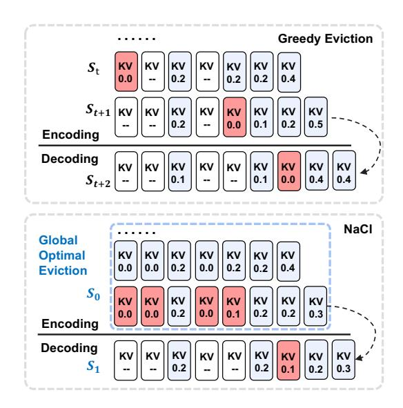
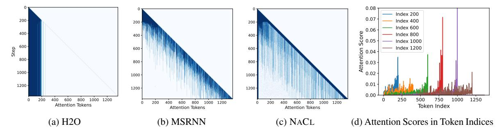
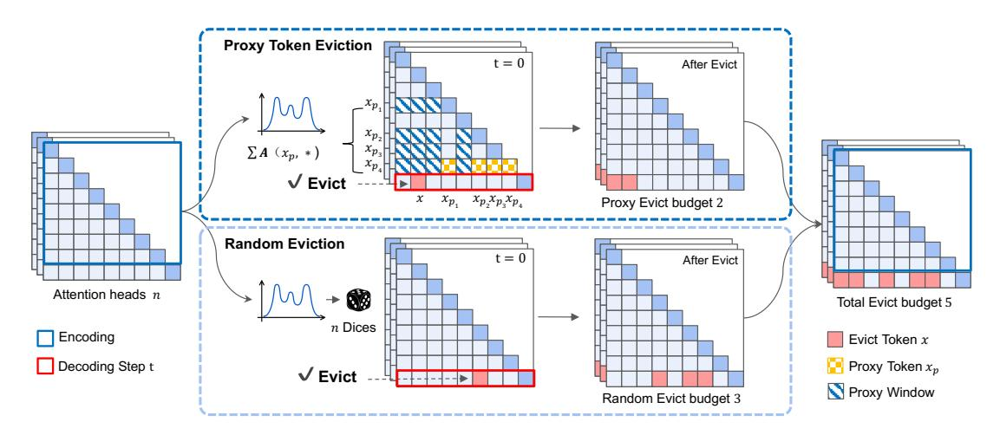
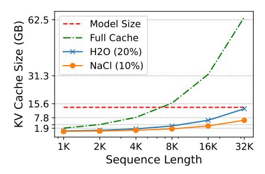
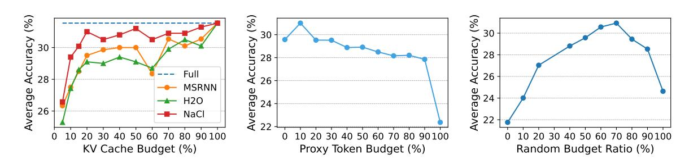
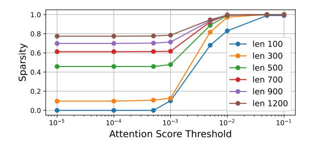
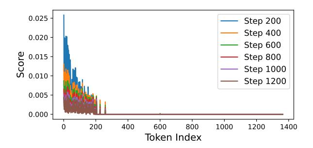
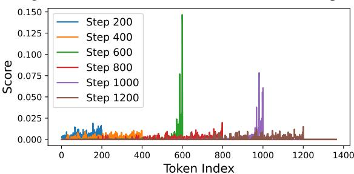
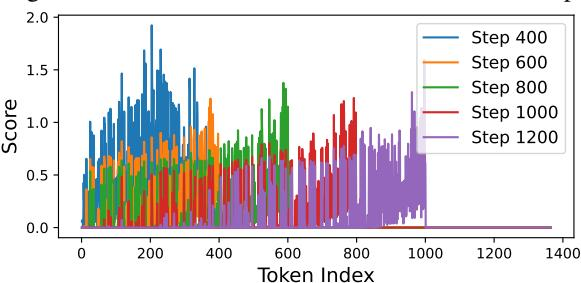
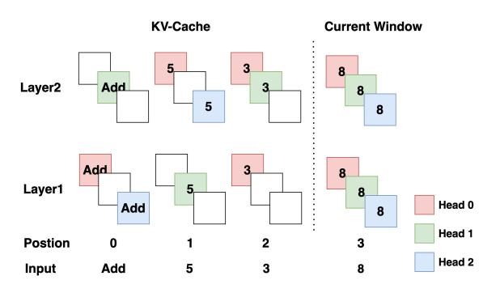

# NACL: A General and Effective KV Cache Eviction Framework for LLMs at Inference Time

Yilong Chen<sup>1,2\*</sup>, Guoxia Wang<sup>3\*</sup>, Junyuan Shang<sup>3†</sup>, Shiyao Cui<sup>1</sup>, Zhenyu Zhang<sup>3</sup>, Tingwen Liu<sup>1,2†</sup>, Shuohuan Wang<sup>3</sup>, Yu Sun<sup>3</sup>, Dianhai Yu<sup>3</sup>, Hua Wu<sup>3</sup>

<sup>1</sup> Institute of Information Engineering, Chinese Academy of Sciences
 <sup>2</sup> School of Cyber Security, University of Chinese Academy of Sciences
 <sup>3</sup> Baidu Inc.

{chenyilong, cuishiyao, liutingwen}@iie.ac.cn {wangguoxia, shangjunyuan, zhangzhenyu07, wangshuohuan, sunyu02}@baidu.com

## **Abstract**

Large Language Models (LLMs) have ignited an innovative surge of AI applications, marking a new era of exciting possibilities equipped with extended context windows. However, hosting these models is cost-prohibitive mainly due to the extensive memory consumption of KV Cache involving long-context modeling. Despite several works proposing to evict unnecessary tokens from the KV Cache, most of them rely on the biased local statistics of accumulated attention scores and report performance using unconvincing metric like perplexity on inadequate short-text evaluation. In this paper, we propose NACL, a general framework for long-context KV cache eviction that achieves more optimal and efficient eviction in a single operation during the encoding phase. Due to NACL's efficiency, we combine more accurate attention score statistics in PROXY-TOKENS EVICTION with the diversified random eviction strategy of RANDOM EVICTION, aiming to alleviate the issue of attention bias and enhance the robustness in maintaining pivotal tokens for long-context modeling tasks. Notably, our method significantly improves the performance on short- and long-text tasks by 80% and 76% respectively, reducing KV Cache by up to  $5\times$  with over 95% performance maintenance. The code is available at https: //github.com/PaddlePaddle/Research/ tree/master/NLP/ACL2024-NACL.

#### 1 Introduction

Large Language Models (LLMs) with longer context window (Touvron et al., 2023; Xiong et al., 2023; Jiang et al., 2023; Anthropic, 2023; OpenAI, 2023) have emerged recently for better conducting long conversations, summarizing long documents,



Figure 1: Traditional eviction algorithms perform stepby-step greedy search for tokens for eviction. Our framework searches globally for tokens within a chunk and then performs one single eviction.

or debugging code at the repository level (Bai et al., 2023). However, their deployment is costly and infeasible on fixed memory hardware, mainly due to the surprisingly large memory consumption of KV Cache mechanism. For instance, a 7 billion-parameter model with an input batch size of 4 and a sequence length of 32k results in 64GB of KV cache,  $4.7 \times$  larger than the model weights.

To mitigate the pressure on the scarce GPU memory from using KV cache, a number of studies (Zhang et al., 2023; Liu et al., 2023c; Ge et al., 2023; Xiao et al., 2023) have explored sparsity among Transformer attention blocks to evict unnecessary tokens from the KV cache. For instance, H2O (Zhang et al., 2023) utilized the local statistics of accumulated attention scores to retain a balance of recent and heavy hitter tokens during generation. Window Attention based methods (Xiao et al., 2023) proposed to keep the initial tokens which is proven vital for generation fluency. This line of work reduced the memory footprint of KV cache

Equal contribution. Work done at Baidu Inc.

<sup>&</sup>lt;sup>†</sup>Corresponding author. <sup>‡</sup> Project lead.

for efficient inference with negligible loss in generation quality. In addition, the above methods do not require costly retraining which is more suitable for current open-sourced LLMs [\(Touvron et al.,](#page-10-0) [2023;](#page-10-0) [Jiang et al.,](#page-9-0) [2023\)](#page-9-0), compared to those that need specific attention mechanism adaptation [\(Beltagy](#page-9-5) [et al.,](#page-9-5) [2020;](#page-9-5) [Kitaev et al.,](#page-9-6) [2020;](#page-9-6) [Shazeer,](#page-10-4) [2019;](#page-10-4) [Ainslie et al.,](#page-8-1) [2023\)](#page-8-1).

However, we argue that the performance reported in the above methods is over-optimistic, as the evaluation metric and tested benchmark is not sufficient. LLMs may fail in real-life long-context modeling tasks [\(Bai et al.,](#page-9-2) [2023\)](#page-9-2), though they can achieve low language modeling perplexity which is untrustworthy used as the golden metric in current studies [\(Xiao et al.,](#page-10-3) [2023;](#page-10-3) [Han et al.,](#page-9-7) [2023\)](#page-9-7). Furthermore, the local statistics of accumulated attention score is observed to be biased (see Fig. [2\)](#page-3-0), especially in long context input, meaning that it should be carefully used as the only strategy for measuring the importance of tokens.

To fill the gap, we propose NACL, a general and effective KV cache eviction framework to unleash the power of LLMs for long-context modeling with limited memory budgets. NACL specifically formulates the eviction task in encoding phase which is different from the commonly used one-tokenin one-token out eviction procedure in generation phase. In encoding phase, the eviction can be effectively implemented to apply only once on the whole input by progressively evicting KV caches layer by layer. The one-eviction formulation benefits current eviction policies in a more efficient and optimal way, as multiple costly eviction operations can be combined, then the global statistics of attention scores can be utilized.

Based on the above formulation, we present PROXY-TOKENS EVICTION which exploits the global statistics of attention scores gathered from proxy tokens for eviction. In practise, the proxy tokens can be selected from the question input, commonly located at the end of a long text. Intuitively, these proxy tokens are more capable of retaining the task-specific tokens in KV cache. As a result, PROXY-TOKENS EVICTION alleviates the *attention bias problem* (see Sec. [4\)](#page-3-1) occurred in methods using local statistics [\(Zhang et al.,](#page-10-2) [2023;](#page-10-2) [Oren et al.,](#page-9-8) [2024\)](#page-9-8) or task-irrelevant proxy tokens [\(Liu et al.,](#page-9-3) [2023c\)](#page-9-3).

However, PROXY-TOKENS EVICTION also relies heavily on the statistic of attention scores

which may be untrustworthy in long-context input. Thus, we incorporate RANDOM EVICTION, a random eviction policy, into PROXY-TOKENS EVICTION. RANDOM EVICTION randomly samples tokens to evict from the probability distribution in PROXY-TOKENS EVICTION with different seed on attention heads and layers. This diversified randomness enhances the model's robustness to maintain potentially important tokens in long text generation.

We conducted extensive experiments on a single NVIDIA A100 (80GB) GPU on representative open-sourced LLMs: LLaMA2-base, LLaMA2- Chat [\(Touvron et al.,](#page-10-0) [2023\)](#page-10-0), and evaluated them on both short- and long-text modeling tasks from lmeval-harness [\(Gao et al.,](#page-9-9) [2021\)](#page-9-9) and LongBench [\(Bai](#page-9-2) [et al.,](#page-9-2) [2023\)](#page-9-2). The experiments show that NACL performs KV cache eviction efficiently with negligible degradation on model quality (i.e., saving the inference memory usage of KV cache by up to 5× with over 95% maintenance). Specifically, NACL achieve 80% and 75% performance improvement on short- and long- text modeling tasks, respectively, with 50% KV cache reduction, compared to current eviction methods.

## 2 Related Work

# ence bottleneck caused by KV cache, particularly for long content input. A series of methods [\(Zhang](#page-10-2) [et al.,](#page-10-2) [2023;](#page-10-2) [Ge et al.,](#page-9-4) [2023;](#page-9-4) [Liu et al.,](#page-9-3) [2023c;](#page-9-3) [Oren](#page-9-8) [et al.,](#page-9-8) [2024\)](#page-9-8) explored the sparsity among Transformer's attention block, then evicted unnecessary tokens from KV Cache for efficient inference. For instance, H2O [\(Zhang et al.,](#page-10-2) [2023\)](#page-10-2) retained a balance of recent and heavy hitter tokens with the highest accumulated attention scores throughout the sequence. Scissorhands [\(Liu et al.,](#page-9-3) [2023c\)](#page-9-3) sequentially predicted the potentially pivotal tokens with the attention score above average within a history window. Some method [\(Ge et al.,](#page-9-4) [2023\)](#page-9-4) further applied costly eviction policy selection for better

Efficient Inference with Limited KV Cache Budgets emerged for reducing the prominent infer-

Meanwhile, some efforts have been made to utilize a learnable mechanism to determine necessary tokens during inference [\(Anagnostidis et al.,](#page-8-2) [2023\)](#page-8-2), or converting the traditional multi-head at-

[et al.,](#page-9-10) [2023;](#page-9-10) [Bai et al.,](#page-9-2) [2023\)](#page-9-2).

performance. However, the above methods relied heavily on the attention score with local statistics which may be sub-optimal in long-context tasks [\(Li](#page-9-10) tention(MHA) (Vaswani et al., 2017) to multi-query attention (MQA) (Shazeer, 2019) or group-query attention (GQA) (Ainslie et al., 2023). However, these methods involve additional training, while NACL focuses on the inference phase without resource-intensive training.

**Efficient Transformers** (Tay et al., 2020) have been extensively explored (Child et al., 2019; Kitaev et al., 2020; Zaheer et al., 2020; Beltagy et al., 2020; Dai et al., 2019; Ding et al., 2020; Bulatov et al., 2022; Chevalier et al., 2023) to address the self-attention operation which scales quadratically with the sequence length. For instance, Sparse Transformer (Child et al., 2019) uses a dilated sliding window the reduces the attention complexity. Longformer (Beltagy et al., 2020) and Bigbird (Zaheer et al., 2020) reduced the complexity of selfattention by combining random, window and global attention. Recurrence Transformers (Dai et al., 2019) maintain a memory bank of past KV cache to process the long text in segments. However, the above methods either trade off model quality or require re-training of models, but often failed in achieving memory saving and wall-clock speedup at inference time (Dao et al., 2022).

Length Extrapolation enabled language models to generalize beyond the context window they were trained on. A recent line of research (Chen et al., 2023; Peng et al., 2023; Liu et al., 2023b) focuses on adapting relative positional embedding (Su et al., 2024) widely used in current Foundation models (Touvron et al., 2023; Jiang et al., 2023) for context window extension. Attention Sink (Xiao et al., 2023) and LM-Infinite (Han et al., 2023) further exploited the initial tokens to recover the performance of window attention for infinite-length inputs. However, the ability of these methods tested using metric like perplexity is over-optimistic for long context tasks (Li et al., 2023; Bai et al., 2023).

#### 3 Problem Formulation

This section defines a two-phased approach for efficient KV cache management during LLM inference, tailored for scenarios with limited KV cache budgets.

**Eviction Policy** We defined the eviction policy  $F_{\text{score}}: S_t^i \leftarrow S_{t-1}^i$ , subject to  $|S_t^i| = |S_{t-1}^i| \leq \mathcal{C}$  where the scoring function  $F_{\text{score}}$  assigns low scores to unnecessary tokens for eviction, such that the

pre-define KV cache budget C is maintained.  $S_t^i$  denote the indices set of retained tokens in KV cache at t-th time step and i-th transformer layer.

Encoding Phase Eviction The model processes the input prompts,  $x^i_{\text{prompt}} = [x^i_1, \dots, x^i_p] \in \mathbb{R}^{p \times d}$ , to compute the initial key cache  $\mathcal{K}^i_0 = x^i_{\text{prompt}} W^i_K \in \mathbb{R}^{p \times d}$  and value cache  $\mathcal{V}^i_0 = x^i_{\text{prompt}} W^i_V \in \mathbb{R}^{p \times d}$ , where p denotes the encoding prompt length,  $W^i_K, W^i_V \in \mathbb{R}^{d \times d}$  represent the key and value projection weight at layer i with hidden dimension d, respectively. The attention scores  $\mathbf{A}^i_{\text{prompt}} \in \mathbb{R}^{p \times p}$  are computed as  $\frac{(x^i_{\text{prompt}} W^i_Q) \cdot (x^i_{\text{prompt}} W^i_K)^T}{\sqrt{d}}$  where  $W^i_Q \in \mathbb{R}^{d \times d}$  represent the query projection weight. The eviction in encoding phase is defined as follows:

$$S_{\text{encoding}}^i = F_{\text{score}}(\mathbf{A}_{\text{prompt}}^i, \mathcal{C})$$

then, the initial KV cache can be updated  $\mathcal{K}_0^i, \mathcal{V}_0^i \leftarrow \mathcal{K}_{S_{\mathrm{encoding}}^i}, \mathcal{V}_{S_{\mathrm{encoding}}^i}$  for the later usage in generation phase.

Generation Phase Eviction Denote the generated tokens' input to i-th layer as  $x^i_{\text{decoding}} = [z^i_1, \dots, z^i_T] \in \mathbb{R}^{T \times d}$ . The Generation phase updates the KV cache with each new token generation. Given the time step t and layer i, key and value cache is updated as  $\mathcal{K}^i_t = [\mathcal{K}^i_{t-1}, z^i_t \cdot W^i_K], \mathcal{V}^i_t = [\mathcal{V}^i_{t-1}, z^i_t \cdot W^i_V],$  respectively. The attention scores  $\mathbf{A}^i_t \in \mathbb{R}^{1 \times |\mathcal{K}^i_t|}$  are computed as  $\frac{(z^i_t W^i_Q) \cdot \mathcal{K}^{i^T}_t}{\sqrt{d}}$ . The eviction in generation phase is defined as follows:

$$S_t^i = F_{\text{score}}(\mathbf{A}_t^i, S_{t-1}, \mathcal{C})$$

where the KV cache are updated  $\frac{T}{m}$  times following  $\mathcal{K}_t^i, \mathcal{V}_t^i \leftarrow \mathcal{K}_{S_t^i}, \mathcal{V}_{S_t^i}$  at every m time steps.

To note that, recent works formulated the encoding phase eviction the same as the one in generation phase which require step-by-step evictions, resulting in computational overhead. In contrast, we formulate the eviction to perform only once during the encoding phase and  $\frac{T}{m}$  times during the generation phase. Generally, the condition  $T \ll p$  is readily satisfied in long text scenarios, allowing  $\frac{T}{m}$  to be approximated as a constant order of magnitude. Consequently, the overall time complexity is reduced from  $\mathcal{O}(p+T)$  to  $\mathcal{O}(1)$ . This also allows the eviction policy in a global optimal manner comparing to those greedy algorithm that couples the input window size with the KV cache budget.

<span id="page-3-0"></span>

Figure 2: Attention score bias in eviction policy. The darker color in Fig. (a,b,c) shows the retained tokens.

#### <span id="page-3-1"></span>4 Observation

We present two experimental findings by rethinking previous eviction methods that inspire the design of NACL.

**Rethinking Evaluation Metrics for Long-text Eviction Strategy** Current metrics such as the perplexity (PPL) fall short in capturing the nuances of model performance in long-text scenarios, revealing a gap between evaluation practices and real-world applications (see, Tab. 1). Evaluations predominantly utilize datasets with short texts, inadequately representing the complexities and challenges of processing and understanding long-text input. The emphasis on textual fluency leads to a notable bias: the method (Xiao et al., 2023), though claiming for infinite input, fails in tasks (see, Tab. 1, 2) which requires the ability to generate accurately. This inspires us to re-evaluate current methods on both short- and long- text modeling tasks demands on comprehension and generation capabilities.

#### **Rethinking Attention Scores to Retain Pivotal**

**Tokens** Attention bias problem refers to the phenomenon where, at each step of generation, attention scores are higher within the tokens directly preceding the current token, while comparatively diminished for all others. In Fig. 2 (a) and (b), the attention bias problem is observed, leading to an overemphasis on either initial tokens (Zhang et al., 2023) or recent tokens (Oren et al., 2024), overlooking those potentially pivotal tokens in longer context. Furthermore, the attention score distribution become flattened with the increase in text length (see Fig. 2 (d)), which may be less capable of accurately identifying important tokens. Normalization can solve this problem to some extent. but as stated in the H2O (Zhang et al., 2023), the effect is not optimal. This inspires us to reform

the attention-based eviction methods to be less bias and more robust in long-context modeling tasks.

#### 5 NACL

In this section, we present a hybrid KV cache eviction policy in NACL, including the PROXY-TOKENS EVICTION in Sec. 5.1 and RANDOM EVICTION in Sec. 5.2.

#### <span id="page-3-2"></span>5.1 Eviction based on Proxy Tokens

Based on previous observations, the current  $F_{\rm score}$  of accumulating attention scores effectively identifies important tokens but suffers from significant bias. We attribute this to the excessive redundant information in the process of scoring tokens.

We discovered that when calculating the attention for a given token x (i.e. tokens may need to be evicted), only a mere fraction of tokens  $x_p$  (i.e. proxy tokens) are responsible for yielding the most precise outcomes during the computation of the token score. Hence, we introduce the proxy tokens hypothesis: within the input  $x_{\text{prompt}}$ , there exists a subset called proxy tokens  $\mathcal{P} \in x_{\text{prompt}}$ , which precisely estimate the importance of tokens. Scoring function  $F_{\text{score}}$  can be instantiated as:

$$F_{\text{score }}\left(\mathbf{A},\mathcal{C}\right) = \sum_{x_p \in \mathcal{P}} \operatorname{Softmax}\left(\mathbf{A}(x_p,*)\right)$$

The  $F_{\rm score}$ , calculated by reducing the attention score matrix column-wise using the proxy tokens subset  ${\cal P}$ , provides the most precise measurement of a token's importance during the eviction process. We can validate the significance of proxy tokens using a straightforward approach. When the proxy token is set to the universal set, our method is equivalent to H2O (Zhang et al., 2023), introducing redundant information that degrades the quality of eviction. When the proxy token is set to only the current token, our method can be equivalent to



Figure 3: NACL consists of a hybrid eviction policy by incorporating RANDOM EVICTION into PROXY-TOKENS EVICTION. PROXY-TOKENS EVICTION utilizes proxy tokens for more accurate eviction, while RANDOM EVICTION performs head-wise sampling from the scoring function of PROXY-TOKENS EVICTION to enhance the robustness.

MSRNN (Oren et al., 2024), neglecting substantial information, thus reducing the accuracy of eviction.

Due to the progressively flattened distribution of attention scores with the increase in text length, the pre-defined threshold for sampling  $\mathcal{C}_p$  results in lack of generalizability for long text tasks. Therefore, we model the KV cache eviction as an optimization problem, aiming to find a set  $S_t$  that maximizes the function  $F_{\text{score}}$ , while satisfying the constraint  $|S_t| = \mathcal{C}_p$ .

$$S_t \leftarrow (\operatorname*{arg\,max}_{S_t \subset R} \sum_{x \in S_t} F_{\operatorname{score}}(\mathbf{A}, \mathcal{C}_p)) \cup P$$

where  $R=x_{\text{prompt}}\backslash\mathcal{P}$  as the proxy tokens are retained by default. In practise, the proxy tokens tend to be chosen at the end of the input where the user's question with more task-specific information is located in. The choice of Proxy Token can be based on task orientation, which allows our approach to be flexibly adapted to various application scenarios. For more information, please refer to the Appx. A.3.

# <span id="page-4-0"></span>5.2 Eviction based on Random Possibility Sampling

Eviction algorithms commonly rely on the attention scores which may be biased or lack robustness in capturing critical information throughout the generation process. Herein, we introduce a simple and effective eviction policy which incorporates the randomness into the decision-making process of the attention mechanism. By randomly sampling from a probability distribution, our method aims to enhance the model's ability to recover and maintain important information that might otherwise be lost.

In detail, we construct the probability distribution from  $F_{\rm random}$ .  $F_{\rm random}$  can signify each candidate token's relative significance in long text generation, and the probability  $P_{\rm prompt}$  is determined as follows:

$$P_{\text{prompt}} = \text{Softmax} \left( F_{\text{random}} \left( \mathbf{A}_{\text{prompt}}, \mathcal{C}_r \right) \right)$$

where  $P_{\text{prompt}}$  allows the non-deterministic selection of pivotal tokens. Through this probabilistic lens, our model casts the dice, diversifying its focus and increasing the chances of preserving essential information across the span of long texts. Thus, we present RANDOM EVICTION with budget  $\mathcal{C}_r$ :

$$S_{\rm random} \sim P_{\rm prompt}, \quad |S_{\rm random}| = C_r$$

In practise,  $P_{\rm random}$  can be based on the normalized distribution  ${\rm Softmax}(F_{\rm score})$ , then the complexity is  $\mathcal{O}(|x_{\rm prompt}|)$  dominated by the softmax operation.

Finally, NACL effectively combines PROXY-TOKENS EVICTION and RANDOM EVICTION, applying an efficient one-eviction strategy under the KV Cache budget  $\mathcal{C} = \mathcal{C}_p + \mathcal{C}_r$ , shown in the following Algorithm 1. Our method is compatible with FlashAttention-2 (see Appx. A.7) to minimize memory and computational overhead, helping models to be efficiently deployed in long text tasks.

#### 6 Experiments

#### 6.1 Setup

**Objective** We aim to provide experimental evidence for three key research questions: **1**. Whether there are advantages in performance and task generalization of NACL over other eviction methods. **2**. How the two eviction policys in NACL affect the

<span id="page-5-0"></span>

| Model                                                          | PiQA                                | COPA                                | Open.                               | Wino.                               | SciQ                                | ARC-E                               | ARC-C                               | Average                             | Δ                                     | log PPL                  |
|----------------------------------------------------------------|-------------------------------------|-------------------------------------|-------------------------------------|-------------------------------------|-------------------------------------|-------------------------------------|-------------------------------------|-------------------------------------|---------------------------------------|--------------------------|
| # of tokens (5-Shot)                                           | 319                                 | 118                                 | 97                                  | 160                                 | 508                                 | 296                                 | 239                                 | _                                   | _                                     | _                        |
| Full cache                                                     | 78.8                                | 83.0                                | 44.8                                | 73.7                                | 80.9                                | 78.8                                | 50.8                                | 64.6                                | _                                     | 3.8                      |
| Attention Sink (20%)<br>H2O (20%)<br>MSRNN(20%)<br>NACL (20%)  | 54.0<br>77.6<br>77.6<br><b>77.9</b> | 55.0<br><b>81.0</b><br>78.0<br>79.0 | 30.2<br>41.0<br>43.0<br><b>43.8</b> | 49.1<br>67.0<br>67.8<br><b>71.5</b> | 22.3<br>75.8<br>76.5<br><b>80.0</b> | 25.4<br>70.4<br>71.6<br><b>74.9</b> | 23.0<br>44.0<br>45.3<br><b>48.8</b> | 35.9<br>60.3<br>60.6<br><b>63.8</b> | -28.7<br>-4.3<br>-4.0<br>- <b>0.8</b> | 6.4<br>4.0<br>4.0<br>4.0 |
| # of tokens (25-Shot)                                          | 1014                                | 501                                 | 559                                 | 689                                 | 2540                                | 1480                                | 1195                                | _                                   | -                                     | _                        |
| Full cache                                                     | 59.3                                | 87.0                                | 47.2                                | 75.5                                | 11.1                                | 67.6                                | 31.2                                | 53.8                                | _                                     | 3.2                      |
| Attention Sink (20%)<br>H2O (20%)<br>MSRNN (20%)<br>NACL (20%) | 50.4<br><b>59.2</b><br>58.9<br>58.9 | 47.0<br>86.0<br>86.0<br><b>87.0</b> | 29.0<br>44.6<br>44.8<br><b>45.6</b> | 46.6<br>73.8<br><b>73.9</b><br>73.6 | 11.1<br>10.5<br>10.7<br>11.1        | 25.6<br>66.0<br>65.9<br><b>66.1</b> | 22.5<br>30.0<br>30.6<br><b>31.4</b> | 33.2<br>52.8<br>52.9<br><b>53.2</b> | -20.6<br>-1.0<br>-0.9<br>- <b>0.6</b> | 7.9<br>3.3<br>3.3<br>3.2 |

Table 1: N-shot evaluation of eviction strategies on short text tasks on LLaMA2-7B-base.

### <span id="page-5-1"></span>Algorithm 1 NACL Algorithm

```
1: Total Cache budget \mathcal{C} (\mathcal{C} = \mathcal{C}_p + \mathcal{C}_r), Proxy-Token Evic-
       tion Cache budget C_p, Random Eviction Cache budget C_r, Proxy tokens \mathcal{P}, KV Cache \mathcal{K}, \mathcal{V}
 2: function ENCODING(Prompts)
              for Every Layer-i in LLMs do
 3:
 4:
                     for Every Attention Head-n do
                            W_Q^{i,n}, W_K^{i,n}, W_V^{i,n} \in \mathbb{R}^{d \times d}
 5:
                            \mathbf{A} \leftarrow (x_{\text{prompt}}W_Q^{i,n}) \cdot (x_{\text{prompt}}W_K^{i,n})^T \sqrt{d}^{-1}
 6:
                            F_{\text{score}} = \sum_{x_p \in \mathcal{P}} \operatorname{Softmax} (\mathbf{A}(x_p, *))
 7:
                           R \leftarrow x_{\mathsf{prompt}} \dot{\backslash} P^{i,n}
 8:
 9:
                            u_{\text{score}} \leftarrow (\max \sum_{x \in R} F_{\text{score}}(\mathbf{A}, \mathcal{C}_{p})) \cup \mathcal{P}^{i,n}
10:
                            u_{\rm random} \sim {\rm Softmax}\left(F_{\rm random}({\bf A}_{\rm prompt}), C_{\rm r}\right)
                            S_{\text{encoding}}^{i,n} \leftarrow u_{\text{score}} \cup u_{\text{random}}
11:
                     end for
12.
              end for
13.
14: end function
15: function GENERATION(S_{\text{encoding}}, Max Length)
16:
              m \leftarrow \text{eviction interval}
17:
              z_0 \leftarrow \text{last prompt token}
              S_0 \leftarrow S_{\text{encoding}}
18:
              for t \in \{1, ..., Max Length\} do
19.
20:
                     for Every Layer-i in LLMs do
21:
                           for Every Attention Head-n do
                                  \mathcal{K}_{t-1}^{i,n} \leftarrow \mathcal{K}_{S_{t-1}^{i,n}}, \mathcal{V}_{t-1}^{i,n} \leftarrow \mathcal{V}_{S_{t-1}^{i,n}}
22.
                                  \mathcal{K}_t^{i,n} \leftarrow [\mathcal{K}_{t-1}^{i,n}, z_t^i \cdot W_K^{i,n}]
23:
                                  \mathcal{V}_t^{i,n} \leftarrow [\mathcal{V}_{t-1}^{i,n}, z_t^i \cdot W_V^{i,n}]
24:
                                  \mathbf{A} = (z_t W_Q^{i,n}) \cdot \mathcal{K}_t^{i,n} \sqrt[T]{d}^{-1}\nif t \mod m = 0 then
25:
26.
                                         S^{i,n}_{t} \leftarrow \text{Eviction}(\mathbf{A}, \mathcal{C})
27.
                                         ⊳ Ref: Line7-10.
28:
29:
                                   end if
30:
                            end for
                     end for
31:
32:
                     z_t \leftarrow sample from LLM prediction
              end for
34: end function
```

final functionality, and by what combination can we achieve optimal results. **3**. What is the rationale behind NACL for superior results?

Models and Tasks We use the family of decoderonly Transformers: LLaMA2-7B-base, LLaMA2-7B-Chat (Touvron et al., 2023) to evaluate the effectiveness of NACL. To evaluate the few-shot learning ability, we sample seven tasks from the popular benchmark (lm-eval-harness (Gao et al., 2021)): PiQA (Bisk et al., 2020), COPA (Roemmele et al., 2011), OpenBookQA (Mihaylov et al., 2018), Winogrande (Sakaguchi et al., 2021), SciQA (Welbl et al., 2017), ARC-E and ARC-C (Clark et al., 2018). In the long text scenario, we took seven tasks from Longbench (Bai et al., 2023): PassageRetrieval-Zh, PassageRetrieval-En, RepoBench-P (Liu et al., 2023a), HotpotQA (Yang et al., 2018), NarrativeQA (Kočiský et al., 2018), TriviaQA (Joshi et al., 2017), QMSum (Zhong et al., 2021). We report perplexity computed on the OpenBookQA dataset as a measure of the model's generation ability in generalized domains. We conduct our experiments on a single NVIDIA A100 80GB GPU. Results were averaged over various seeds to ensure reliability.

**Baselines** We consider four representative eviction methods:

- Attention Sink (Xiao et al., 2023) keeps the initial and recent tokens for infinite-length text processing.
- **H2O** (Zhang et al., 2023) firstly proposes utilizing the summation of attention scores for greedy eviction, which achieves fair results which serves as our main baseline.
- MSRNN (Oren et al., 2024) considers the current token's attention score for eviction.
- **Scissorhands** (Liu et al., 2023c) increments the counter within a history window for low score

<span id="page-6-0"></span>

Figure 4: The memory usage of KV Cache with respect to the sequence length in the setting of comparable downstreaming performance between NACL and other methods.

token eviction.

#### 6.2 Result

Short-Text Performance Our experimental analysis shows the effectiveness of NACL in managing KV cache under constrained memory budgets while maintaining high performance across various shorttext benchmarks. Firstly, NACL demonstrated superior performance in comparison to the baseline eviction methods with minimal performance degradation. In the 5-shot setting, NACL achieved an average score of 63.8% points, nearly matching the full cache performance of 64.6% points and significantly outperforming H2O by 3.5% points. Moreover, NACL exhibited consistent improvements across most datasets relative to previous methods, affirming its robust generalization and practical applicability. In the 25-shot setting, although there was a performance dip across all methods due to the increased complexity and information redundancy, NACL still showed remarkable resilience. Notably, it matched or slightly outperformed the full cache setup in certain datasets, such as maintaining a 87.0% point score on COPA, identical to the full cache performance. This illustrates that NACL not only manages to select pertinent information effectively but also mitigates the impact of redundant data, enhancing the model's robustness.

Long-text Performance NACL achieves 80% memory usage reduction with only mere 0.7% point decrease with respect to the average accuracy in Tab. 2. Fig. 5 (Left) shows that NACL is possible to achieve 3× more reduction in KV Cache while maintaining comparable performance to baselines. Additionally, we observed the stable performance of NACL under different budget, while others' fluctuate. In HotpotQA and QMSum, NACL (30%) even surpassed the performance without KV cache eviction by 0.2% and 0.9% points, re-

spectively. For challenging passkey retrieval tasks, H2O and MSRNN with the attention bias towards initial and recent tokens fails in retaining the pivotal passkey located in the middle of the long input. In contrast, NACL demonstrates stable and superior performance in different budgets setting, that only missed 2 passkeys in PR-Zh and PR-En comparing to the model in full cache setting. This remarkable achievement highlights NACL's ability to retain essential information, avoiding the pitfalls of redundant data and thereby bolstering the model's robustness in processing complex long texts.

#### **6.3** Ablation Studies

#### The Effect of Proxy-Tokens Eviction

Proxy tokens play an important role in finding pivotal tokens. The performance degradation (see Tab. 3) is significant when removing this policy. In Fig. 5 (Middle), we report the impact of proxy token budget on the average accuracy as a proportion of the text length. In extreme cases, such as 0% and 100% proxy token budget, the method degenerates into two special cases: MSRNN (Oren et al., 2024) and H2O (Zhang et al., 2023), respectively. The suboptimal performance with 0% proxy token budget suggests that the unsufficiency of a single current token for determining the pivotal tokens. However, excessive abuse of proxy token budget up to 100% will introduce redundant information leading to decline in performance. In practise, we suggest the budgets for proxy tokens  $\sim 10\%$  for better performance.

The Effect of RANDOM EVICTION As shown in Tab. 3, RANDOM EVICTION obtained a performance gain of 9% points. In Fig. 5 (Right), increasing the random budget from 10% to 70% results in an average performance improvement of 2.25% to 8.17% points over 0% random budget. The performance peaks at 70% budgets, demonstrating the necessity of the RANDOM EVICTION. However, when the random budget's proportion increases from 90% to 100%, a noticeable performance decline occurs, highlighting the importance to combine the Attention-score-based, PROXY-TOKENS EVICTION.

The Choice of Sampling Distributions for RAN-DOM EVICTION In Tab. 3, the experimental results demonstrate that sampling based on global statistical attention scores outperforms those based on uniform distributions in terms of performance. This indicates that attention scores can also provide

<span id="page-7-0"></span>

| Method             | PR-Zh      | PR-En      | Repo-P      | HotpotQA    | NarQA       | TriviaQA    | QMSum       | Average     | Δ            |
|--------------------|------------|------------|-------------|-------------|-------------|-------------|-------------|-------------|--------------|
| Full Cache         | 8.0        | 10.1       | 52.3        | 27.7        | 18.6        | 83.3        | 20.6        | 31.5        | -            |
| Scissorhands (30%) | 4.0        | 2.6        | 51.8        | 17.2        | 12.5        | 79.2        | 19.6        | 26.7        | -4.8         |
| H2O (30%)          | 3.7        | 5.0        | 50.9        | 27.1        | 15.5        | 81.6        | 20.2        | 29.1        | -2.4         |
| MSRNN (30%)        | 5.5        | 4.5        | 50.3        | 26.1        | <b>16.4</b> | 82.9        | 20.9        | 29.5        | -2.0         |
| NACL (30%)         | <b>6.8</b> | <b>9.0</b> | <b>52.5</b> | <b>27.9</b> | <b>16.4</b> | <b>83.1</b> | <b>21.5</b> | <b>31.0</b> | - <b>0.5</b> |
| Scissorhands (20%) | 0.5        | 43.0       | 44.9        | 11.4        | 6.7         | 68.9        | 16.3        | 21.9        | -9.6         |
| H2O (20%)          | 4.2        | 4.5        | 49.4        | 24.5        | 15.2        | <b>82.8</b> | 19.8        | 28.6        | -2.9         |
| MSRNN(20%)         | 4.5        | 4.5        | 49.0        | 23.9        | 14.7        | 82.5        | 20.4        | 28.5        | -3.0         |
| NACL (20%)         | <b>7.0</b> | <b>9.4</b> | <b>51.6</b> | <b>27.2</b> | <b>17.1</b> | 82.5        | <b>20.8</b> | <b>30.8</b> | - <b>0.7</b> |
| Scissorhands (10%) | 0.0        | 3.7        | 27.6        | 4.4         | 2.8         | 52.8        | 12.9        | 14.9        | -16.6        |
| H2O (10%)          | 4.9        | 3.5        | 48.1        | 22.8        | 13.6        | 79.4        | 19.6        | 27.4        | -4.1         |
| MSRNN (10%)        | 4.0        | 3.0        | 47.9        | 23.4        | 13.4        | 80.8        | 19.6        | 27.5        | -4.0         |
| NACL (10%)         | <b>6.8</b> | <b>7.0</b> | <b>49.2</b> | <b>25.5</b> | <b>15.0</b> | <b>81.7</b> | <b>20.4</b> | <b>29.4</b> | - <b>2.1</b> |

Table 2: Evaluation of eviction strategies on long text tasks with 4k-length on LLaMA2-7B-Chat.

<span id="page-7-1"></span>

Figure 5: The average accuracy is reported with different KV Cache budget (Left), Proxy tokens budget (Middle), and Random budget ratio (Right).

<span id="page-7-2"></span>

|                                          | Short-Text ACC. | Long-Text ACC. |
|------------------------------------------|-----------------|----------------|
| NACL                                     | 63.8            | 30.8           |
| Eviction w. Proxy Tokens                 | 35.7 (-28.1)    | 24.8 (-6.0)    |
| <ul> <li>Random Eviction</li> </ul>      | 62.6(-1.2)      | 21.7(-9.2)     |
| <ul> <li>Probability Sampling</li> </ul> | 63.0(-0.8)      | 29.7(-1.1)     |
| <ul> <li>Global Eviction</li> </ul>      | 62.5(-1.3)      | 29.3(-1.5)     |
| - Head-wise Eviction                     | 61.7(-2.1)      | 28.1(-2.7)     |

Table 3: Ablation study at 20% budget's eviction. We report the average accuracy of short- and long-text tasks.

a more informative reference for randomness in specific contexts.

The Effect of Global Eviction The one-eviction formulation in NACL enhanced the average performance of 1.4% points in Tab. 3. Compared to the greedy algorithm, our approach reduces complexity while giving more consideration to global information. Furthermore, our algorithm exhibits greater simplicity and directness in its engineering implementation.

The Effect of Head-wise Token Eviction The results in Tab. 3 show a gradual decline in the algorithm's effectiveness as the strategies become more uniform. The algorithm performs best when each head adopts a completely different strategy. The diversity of strategies leads to improved gener-

alization, preserving information across a broader spectrum of dimensions.

#### 6.4 Analysis

Memory Usage of KV Cache In Fig. 4, we report the memory reduction of KV cache for LLaMA2-7B with respect to the sequence length with a fixed batch size of 4 in bf16 precision. At the same accuracy as H2O (20%), our method alleviates the linearly growing KV cache to 10% of the original size, significantly reducing the memory footprint of the KV cache for all model sizes. The memory usage reduction is more significant on long texts, effectively alleviating the memory bottleneck problem of long text reasoning.

### Interpretable Analysis of Eviction Results

Fig. 2 shows the attention score matrix where the darker area represents the retained tokens after eviction. Compared to previous methods, the proxy token guides NACL to sample the middle tokens more evenly, and protects the initial and recent tokens in the meantime. The head-wise randomness enables maintaining more context information, thereby enhancing the robustness of NACL.

Why Head-wise Eviction Matters From a probabilistic perspective, it is basically impossible for a token to be evicted in the head-wise eviction setting. Taking LLaMA-7B with 32-layers (number of layers l) and 32-heads (number of heads h) as an example, the probability of a token retained in least one head's KV cache is which equals 99.92% when the KV Cache budget C = 20%. Even in a severe KV Cache budget setting like C = 1%, the probability that the information of a token is retained in at least one layer is 1 − (C h ) <sup>l</sup> which is larger than 99.99%.

## 7 Conclusion

In this paper, we focus on the accuracy, robustness, and reliability of evaluation for KV cache eviction algorithms deployed in LLMs for processing long texts. We introduce NACL, a novel approach that combines PROXY-TOKENS EVICTION and RAN-DOM EVICTION for KV cache eviction strategies, significantly reducing memory usage during model inference without the need for training. We model the eviction problem as a combinatorial optimization issue, where PROXY-TOKENS EVICTION provides eviction references based on importance, and RANDOM EVICTION enhances information richness and robustness through headwise and layerwise composite sampling. Through extensive evaluation, we demonstrate that NACL can significantly improve cache eviction strategies, reduce inference memory costs, and minimize the impact on the LLM's ability to handle complex tasks.

## Limitations

Our approach presents two main limitations: First, due to constraints on resources, our method has not been extensively tested across various large-scale language models, especially for different lengths and even ultra-long texts. However, based on our current comprehensive experimental conclusions, we believe NACL can be extended to more application scenarios. In addition, we introduced the utilization of proxy tokens in PROXY-TOKENS EVICTION for identifying pivotal tokens, yet the selection of proxy tokens primarily relies on observations and experience. Determining proxy tokens from the model adaptively and accurately presents a challenge, which we deem worthy of further research.

## Ethics Statement

In this research, we employ open-source data and technologies, significantly reducing privacy concerns. Our innovative approach is geared towards understanding model contexts and boosting inference efficiency, with the aim of developing accessible and highly efficient models for extended contexts. This strategy is anticipated to propel the openness of NLP technology and its practical implementation in diverse applications. Importantly, our method is designed to be independent of the training process, ensuring it does not perpetuate or introduce biases into models. By focusing on cutting-edge and resource-efficient methodologies, our work contributes to making AI more open and automated, pushing the envelope in artificial intelligence while ensuring the benefits of our advancements are widely accessible and applicable across various domains, marking a step towards a more inclusive and automated AI future.

## Acknowledgments

We thank the anonymous reviewers for their insightful comments and constructive suggestions. We would like to thank Yinqi Yang, Jiawei Sheng, Xinhua Zhang, Shicheng Wang, Chuanyu Tang and members of the IIE KDsec group for their valuable feedback and discussions. We thank Siming Wu for the implementation of Reduce Attention Scores CUDA kernel. Work done during Yilong Chen's internship at Baidu Inc. This research is supported by the National Key Research and Development Program of China (Grant No.2021ZD0110501 and Grant No.2021YFB3100600) and the Youth Innovation Promotion Association of CAS (Grant No.2021153).

## References

<span id="page-8-1"></span>Joshua Ainslie, James Lee-Thorp, Michiel de Jong, Yury Zemlyanskiy, Federico Lebrón, and Sumit Sanghai. 2023. Gqa: Training generalized multi-query transformer models from multi-head checkpoints. *arXiv preprint arXiv:2305.13245*.

<span id="page-8-2"></span>Sotiris Anagnostidis, Dario Pavllo, Luca Biggio, Lorenzo Noci, Aurelien Lucchi, and Thomas Hoffmann. 2023. Dynamic context pruning for efficient and interpretable autoregressive transformers. *arXiv preprint arXiv:2305.15805*.

<span id="page-8-0"></span>Anthropic. 2023. [Anthropic: Introducing claude 2.1.](https://www.anthropic.com/index/claude-2-1)

- <span id="page-9-2"></span>Yushi Bai, Xin Lv, Jiajie Zhang, Hongchang Lyu, Jiankai Tang, Zhidian Huang, Zhengxiao Du, Xiao Liu, Aohan Zeng, Lei Hou, et al. 2023. Longbench: A bilingual, multitask benchmark for long context understanding. *arXiv preprint arXiv:2308.14508*.
- <span id="page-9-5"></span>Iz Beltagy, Matthew E Peters, and Arman Cohan. 2020. Longformer: The long-document transformer. *arXiv preprint arXiv:2004.05150*.
- <span id="page-9-19"></span>Yonatan Bisk, Rowan Zellers, Jianfeng Gao, Yejin Choi, et al. 2020. Piqa: Reasoning about physical commonsense in natural language. In *Proceedings of the AAAI conference on artificial intelligence*, volume 34, pages 7432–7439.
- <span id="page-9-14"></span>Aydar Bulatov, Yury Kuratov, and Mikhail Burtsev. 2022. Recurrent memory transformer. *Advances in Neural Information Processing Systems*, 35:11079– 11091.
- <span id="page-9-17"></span>Shouyuan Chen, Sherman Wong, Liangjian Chen, and Yuandong Tian. 2023. Extending context window of large language models via positional interpolation. *arXiv preprint arXiv:2306.15595*.
- <span id="page-9-15"></span>Alexis Chevalier, Alexander Wettig, Anirudh Ajith, and Danqi Chen. 2023. Adapting language models to compress contexts. *arXiv preprint arXiv:2305.14788*.
- <span id="page-9-11"></span>Rewon Child, Scott Gray, Alec Radford, and Ilya Sutskever. 2019. Generating long sequences with sparse transformers. *arXiv preprint arXiv:1904.10509*.
- <span id="page-9-21"></span>Peter Clark, Isaac Cowhey, Oren Etzioni, Tushar Khot, Ashish Sabharwal, Carissa Schoenick, and Oyvind Tafjord. 2018. Think you have solved question answering? try arc, the ai2 reasoning challenge. *arXiv preprint arXiv:1803.05457*.
- <span id="page-9-12"></span>Zihang Dai, Zhilin Yang, Yiming Yang, Jaime G. Carbonell, Quoc V. Le, and Ruslan Salakhutdinov. 2019. [Transformer-xl: Attentive language models beyond a](http://arxiv.org/abs/1901.02860) [fixed-length context.](http://arxiv.org/abs/1901.02860) *CoRR*, abs/1901.02860.
- <span id="page-9-16"></span>Tri Dao, Dan Fu, Stefano Ermon, Atri Rudra, and Christopher Ré. 2022. Flashattention: Fast and memory-efficient exact attention with io-awareness. *Advances in Neural Information Processing Systems*, 35:16344–16359.
- <span id="page-9-13"></span>Siyu Ding, Junyuan Shang, Shuohuan Wang, Yu Sun, Hao Tian, Hua Wu, and Haifeng Wang. 2020. Erniedoc: A retrospective long-document modeling transformer. *arXiv preprint arXiv:2012.15688*.
- <span id="page-9-9"></span>Leo Gao, Jonathan Tow, Stella Biderman, Sid Black, Anthony DiPofi, Charles Foster, Laurence Golding, Jeffrey Hsu, Kyle McDonell, Niklas Muennighoff, Jason Phang, Laria Reynolds, Eric Tang, Anish Thite, Ben Wang, Kevin Wang, and Andy Zou. 2021. A framework for few-shot language model evaluation. In *Zenodo*. https://doi.org/10.5281/zenodo.5371628.

- <span id="page-9-4"></span>Suyu Ge, Yunan Zhang, Liyuan Liu, Minjia Zhang, Jiawei Han, and Jianfeng Gao. 2023. Model tells you what to discard: Adaptive kv cache compression for llms. *arXiv preprint arXiv:2310.01801*.
- <span id="page-9-7"></span>Chi Han, Qifan Wang, Wenhan Xiong, Yu Chen, Heng Ji, and Sinong Wang. 2023. Lm-infinite: Simple on-the-fly length generalization for large language models. *arXiv preprint arXiv:2308.16137*.
- <span id="page-9-0"></span>Albert Q Jiang, Alexandre Sablayrolles, Arthur Mensch, Chris Bamford, Devendra Singh Chaplot, Diego de las Casas, Florian Bressand, Gianna Lengyel, Guillaume Lample, Lucile Saulnier, et al. 2023. Mistral 7b. *arXiv preprint arXiv:2310.06825*.
- <span id="page-9-24"></span>Mandar Joshi, Eunsol Choi, Daniel S Weld, and Luke Zettlemoyer. 2017. Triviaqa: A large scale distantly supervised challenge dataset for reading comprehension. *arXiv preprint arXiv:1705.03551*.
- <span id="page-9-6"></span>Nikita Kitaev, Lukasz Kaiser, and Anselm Levskaya. 2020. [Reformer: The efficient transformer.](https://openreview.net/forum?id=rkgNKkHtvB) In *8th International Conference on Learning Representations, ICLR 2020, Addis Ababa, Ethiopia, April 26- 30, 2020*. OpenReview.net.
- <span id="page-9-23"></span>Tomáš Kocisk ˇ y, Jonathan Schwarz, Phil Blunsom, Chris ` Dyer, Karl Moritz Hermann, Gábor Melis, and Edward Grefenstette. 2018. The narrativeqa reading comprehension challenge. *Transactions of the Association for Computational Linguistics*, 6:317–328.
- <span id="page-9-10"></span>Dacheng Li, Rulin Shao, Anze Xie, and Ying Sheng. 2023. [How long can open-source llms truly promise](https://lmsys.org/blog/2023-06-29-longchat) [on context length?](https://lmsys.org/blog/2023-06-29-longchat)
- <span id="page-9-22"></span>Tianyang Liu, Canwen Xu, and Julian McAuley. 2023a. Repobench: Benchmarking repositorylevel code auto-completion systems. *arXiv preprint arXiv:2306.03091*.
- <span id="page-9-18"></span>Xiaoran Liu, Hang Yan, Shuo Zhang, Chenxin An, Xipeng Qiu, and Dahua Lin. 2023b. Scaling laws of rope-based extrapolation. *arXiv preprint arXiv:2310.05209*.
- <span id="page-9-3"></span>Zichang Liu, Aditya Desai, Fangshuo Liao, Weitao Wang, Victor Xie, Zhaozhuo Xu, Anastasios Kyrillidis, and Anshumali Shrivastava. 2023c. Scissorhands: Exploiting the persistence of importance hypothesis for llm kv cache compression at test time. *arXiv preprint arXiv:2305.17118*.
- <span id="page-9-20"></span>Todor Mihaylov, Peter Clark, Tushar Khot, and Ashish Sabharwal. 2018. Can a suit of armor conduct electricity? a new dataset for open book question answering. *arXiv preprint arXiv:1809.02789*.
- <span id="page-9-1"></span>OpenAI. 2023. [Openai: Gpt-4.](https://openai.com/research/gpt-4)
- <span id="page-9-8"></span>Matanel Oren, Michael Hassid, Yossi Adi, and Roy Schwartz. 2024. Transformers are multi-state rnns. *arXiv preprint arXiv:2401.06104*.

<span id="page-10-8"></span>Bowen Peng, Jeffrey Quesnelle, Honglu Fan, and Enrico Shippole. 2023. Yarn: Efficient context window extension of large language models. *arXiv preprint arXiv*:2309.00071.

<span id="page-10-10"></span>Melissa Roemmele, Cosmin Adrian Bejan, and Andrew S Gordon. 2011. Choice of plausible alternatives: An evaluation of commonsense causal reasoning. In 2011 AAAI Spring Symposium Series.

<span id="page-10-11"></span>Keisuke Sakaguchi, Ronan Le Bras, Chandra Bhagavatula, and Yejin Choi. 2021. Winogrande: An adversarial winograd schema challenge at scale. *Commu*nications of the ACM, 64(9):99–106.

<span id="page-10-4"></span>Noam Shazeer. 2019. Fast transformer decoding: One write-head is all you need. *arXiv preprint arXiv:1911.02150*.

<span id="page-10-9"></span>Jianlin Su, Murtadha Ahmed, Yu Lu, Shengfeng Pan, Wen Bo, and Yunfeng Liu. 2024. Roformer: Enhanced transformer with rotary position embedding. *Neurocomputing*, 568:127063.

<span id="page-10-6"></span>Yi Tay, Mostafa Dehghani, Dara Bahri, and Donald Metzler. 2020. Efficient transformers: A survey. *arXiv* preprint arXiv:2009.06732.

<span id="page-10-0"></span>Hugo Touvron, Louis Martin, Kevin Stone, Peter Albert, Amjad Almahairi, Yasmine Babaei, Nikolay Bashlykov, Soumya Batra, Prajjwal Bhargava, Shruti Bhosale, et al. 2023. Llama 2: Open foundation and fine-tuned chat models. *arXiv preprint arXiv:2307.09288*.

<span id="page-10-5"></span>Ashish Vaswani, Noam Shazeer, Niki Parmar, Jakob Uszkoreit, Llion Jones, Aidan N Gomez, Łukasz Kaiser, and Illia Polosukhin. 2017. Attention is all you need. *Advances in neural information processing systems*, 30.

<span id="page-10-12"></span>Johannes Welbl, Nelson F Liu, and Matt Gardner. 2017. Crowdsourcing multiple choice science questions. *arXiv preprint arXiv:1707.06209*.

<span id="page-10-3"></span>Guangxuan Xiao, Yuandong Tian, Beidi Chen, Song Han, and Mike Lewis. 2023. Efficient streaming language models with attention sinks. *arXiv preprint arXiv:2309.17453*.

<span id="page-10-1"></span>Wenhan Xiong, Jingyu Liu, Igor Molybog, Hejia Zhang, Prajjwal Bhargava, Rui Hou, Louis Martin, Rashi Rungta, Karthik Abinav Sankararaman, Barlas Oguz, et al. 2023. Effective long-context scaling of foundation models. *arXiv preprint arXiv:2309.16039*.

<span id="page-10-13"></span>Zhilin Yang, Peng Qi, Saizheng Zhang, Yoshua Bengio, William W Cohen, Ruslan Salakhutdinov, and Christopher D Manning. 2018. Hotpotqa: A dataset for diverse, explainable multi-hop question answering. arXiv preprint arXiv:1809.09600.

<span id="page-10-7"></span>Manzil Zaheer, Guru Guruganesh, Avinava Dubey, Joshua Ainslie, Chris Alberti, Santiago Ontanon, Philip Pham, Anirudh Ravula, Qifan Wang, Li Yang, et al. 2020. Big bird: Transformers for longer sequences. Advances in neural information processing systems.

<span id="page-10-2"></span>Zhenyu Zhang, Ying Sheng, Tianyi Zhou, Tianlong Chen, Lianmin Zheng, Ruisi Cai, Zhao Song, Yuandong Tian, Christopher Ré, Clark Barrett, et al. 2023. H \_2 o: Heavy-hitter oracle for efficient generative inference of large language models. *arXiv* preprint *arXiv*:2306.14048.

<span id="page-10-14"></span>Ming Zhong, Da Yin, Tao Yu, Ahmad Zaidi, Mutethia Mutuma, Rahul Jha, Ahmed Hassan Awadallah, Asli Celikyilmaz, Yang Liu, Xipeng Qiu, et al. 2021. Qmsum: A new benchmark for query-based multidomain meeting summarization. arXiv preprint arXiv:2104.05938.

## A Appendix

## A.1 Sparsity in Attention Cache

Inspired by previous literature on the existence of attentional sparsity in self-attentive heads, we delve into the sparsity of attention during the generation of LLMs. Given a normalised attention score matrix calculated by the softmax function applied to the dot product of the query matrix Q and the key matrix K, represented as  $A = \operatorname{Softmax}(QK^\top)$ , the attention mechanism allocates weights to different elements in the input sequence, reflecting their relative importance. Thus if the attention score of a token is low, it means that it has little influence on the process, and therefore we base our sparsification on the threshold to quantify sparsity. The sparsity percentage for a given threshold t is calculated as:

$$Sparsity(t, i) = \frac{\sum_{j=1}^{N} \mathbf{1} \left( |A_{ij}| < t \right)}{N}$$

where N is the dimension of the attention matrix,  $\operatorname{Softmax}(QK^{\top})_{ij}$  represents the attention weight between the  $i^{th}$  and  $j^{th}$  elements, and  $\mathbf{1}(\cdot)$  is an indicator function that returns 1 if the condition is true and 0 otherwise. This formula calculates the proportion of attention weights that are considered negligible or insignificant for different sparsity thresholds, thus providing a multi-faceted view of attention distribution's sparsity across the model.

Fig. 6 shows the change of Sparsity under different thresholds, it can be seen that under different threshold values, the sparsity of A gradually increases with the sequence length, when the sequence length is 1200, the sparsity is more stable at 0.78. This means that 22% of the tokens are the dominant factor in the computation process.

<span id="page-11-1"></span>

Figure 6: Attention weights sparsity under different thresholds and sequence length.

<span id="page-11-2"></span>

Figure 7: H2O Eviction Function Score with Step

<span id="page-11-3"></span>

Figure 8: MSRNN Eviction Function Score with Step

<span id="page-11-4"></span>

Figure 9: NACL Eviction Function Score with Step

## **A.2** Attention Score Function in Eviction

In this section we show the importance scores of token in the contexts for H2O (see Fig. 7), MSRNN (see Fig. 8) and NACL (see Fig. 9) during different steps. The importance score function of H2O assigns larger scores to tokens in the front part, and MSRNN assigns larger scores to tokens in close proximity.NACL evenly distributes importance scores over longer contexts, so that both distant and close tokens will have a chance to be sampled to be retained.

# <span id="page-11-0"></span>A.3 The Influence of Proxy Token Locations on NACL's Proxy Eviction Strategy

In Proxy Token Eviction, we need to find the most accurate tokens in the sequence that can calculate the importance score of the token. The core of this problem is how to establish a judgment criterion of whether a token is important or not, and this judgment criterion determines how to select the proxy token set. Intuitively, we believe that whether a token in a sequence is important or not is determined by the task the model is about to accomplish. We refer to this task of the model's input as the user's question. In practical applications, we can usually separate the user's question, so that we can place it at the end of input to maximize the performance of the Proxy Eviction Strategy. When we are unaware of the position of the user's question, we primarily utilize proxy tokens to protect the beginning and end of the sequence, as in most cases, these positions contain crucial information about the generation. Even if the proxy token fails to include any information related to the question, our method can be considered as an improved version of MSRNN (Oren et al., 2024). By introducing the proxy token, we regularize the distribution of the Important scores. We also enhance the robustness of preserving intermediate information by combining it with the Random Sample strategy. Based on the aforementioned combination strategies, NACL demonstrates significant performance improvements in terms of results.

#### A.4 Why NACL ues Random Eviction?

<span id="page-11-5"></span>

Figure 10: Through random sampling, these layers and heads can access a broader range of tokens, thereby casting a wider net to capture information.

We demonstrate a case of combinatorial optimization based on randomness in Figure 10. Within the KV cache, the loss of any information can lead to a misunderstanding of the current information.

In previous methods, a broader spectrum of information that might otherwise be overlooked due to the uniformity and potential bias of score-based eviction methods. This randomness of diversification ensures that even information that is not prominently featured by self-attention mechanisms is given a chance to be integrated at deeper levels of the model [\(Dai et al.,](#page-9-12) [2019\)](#page-9-12). Consequently, this approach facilitates the model's ability to capture and process a more varied set of token interactions, enhancing its overall performance by reducing the risk of losing vital information.

## A.5 Algorithmic Complexity Analysis

In long-text scenarios, the length of the generated text during the generation phase is often much shorter than the length of the input text. Assuming the length of the input text during the encoding phase is p and the length of the output text during the decoding phase is T, where T ≪ p. Given the complexity of the Fscore function as O(p), and applying a *step-by-step* eviction algorithm on data of length p results in a complexity of O(p 2 ), making it impractical and costly for real-world applications.

Therefore, in long-text scenarios, we employ a one-time optimal eviction algorithm, where we calculate the optimal eviction strategy Senocding in a one-time computation during the encoding phase. Since the number of tokens generated is negligible compared to the total, we apply the eviction strategy S<sup>i</sup> at this stage as well. In comparison to the greedy algorithm that evicts based on Si−<sup>1</sup> while retaining the same budget, our method can globally optimize to find the best eviction strategy. Moreover, we can decrease the time complexity from O(p 2 ) to O(p), making the algorithm straightforward and effective in engineering applications.

#### A.6 Hyperparameters

Here, we provide the hyperparameters for allocating the ratio of KV cache bugets for the hybrid eviction policy used in our experiments in Tab. [4.](#page-13-0)

# <span id="page-12-0"></span>A.7 Reduce Attention Scores with FlashAttention-2

We have implemented NACL on 128k long-text inference and made it compatible with Flash Attention. There are two implementations below, both of which can be directly used with Flash Attention.

Re-Computation of the Attention Score: We utilize Q<sup>P</sup> and K to calculate the required attention scores during the encoding phase, separate from Flash Attention. Since the proxy tokens set is very small, only a small portion of the attention score needs to be re-computed, thus the additional overhead is insignificant. According to experimental results, on a 128k context, evicting 20% while maintaining a stable 15GB of memory usage does not affect the inference speed.

Implementation of Reduce Attention Scores Kernel: The forward computation of FlashAttention-2 [\(Dao et al.,](#page-9-16) [2022\)](#page-9-16) returns the log-sum-exp (Logsumexp) for each row. Leveraging this Logsumexp, we can recompute the attention scores matrix in the manner described in the backward computation of FlashAttention-2. Subsequently, we perform a column-wise summation to obtain the reduced attention scores, as outlined in Algorithm [2.](#page-13-1)

<span id="page-13-0"></span>

| Budget | Protect Proxy | No-protect Proxy | Proxy-Tokens Eviction | Random Eviction |
|--------|---------------|------------------|-----------------------|-----------------|
| 10%    | 1%            | 3%               | 2%                    | 7%              |
| 20%    | 2%            | 18%              | 6%                    | 12%             |
| 30%    | 1.5%          | 20%              | 10.5%                 | 18%             |

Table 4: The allocation of the KV cache budget ratio for Protect Proxy, PROXY-TOKENS EVICTION and RANDOM EVICTION in NACL.

## <span id="page-13-1"></span>Algorithm 2 Reduce Attention Scores with FlashAttention-2

```
Require: Matrices \mathbf{Q} \in \mathbb{R}^{N_q \times d}, \mathbf{K} \in \mathbb{R}^{N_k \times d} in HBM, vector Logsumexp L \in \mathbb{R}^{N_q} in HBM,
      block sizes B_c, B_r.
  1: Divide \mathbf{Q} into T_r = \left\lceil \frac{N_q}{B_r} \right\rceil blocks \mathbf{Q}_1, \dots, \mathbf{Q}_{T_r} of size B_r \times d each, and divide \mathbf{K} in to T_c = \left\lceil \frac{N_k}{B_c} \right\rceil blocks \mathbf{K}_1, \dots, \mathbf{K}_{T_c}, of size B_c \times d each.
  2: Divide L into T_r blocks L_i, \ldots, L_{T_r} of size B_r each.
  3: Initialize the output \mathbf{O} = (0)_{N_k} in HBM and divide it into T_c blocks \mathbf{O}_1, \dots, \mathbf{O}_{T_c} of size
       B_c each.
  4: for 1 \le j \le T_c do
             Load \mathbf{K}_i from HBM to on-chip SRAM.
  6:
             Initialize \mathbf{R}_i = (0)_{B_c} on Register.
             for 1 \le i \le T_r do
  7:
                   Load \mathbf{Q}_i, L_i from HBM to on-chip SRAM.
  8:
                   On chip, compute \mathbf{S}_i^{(j)} = \mathbf{Q}_i \mathbf{K}_j^T \in \mathbb{R}^{B_r \times B_c}.
  9:
                   On chip, compute \mathbf{P}_i^{(j)} = \exp(\mathbf{S}_{ij} - L_i) \in \mathbb{R}^{B_r \times B_c}.
10:
                   On chip, compute \mathbf{R}_j \leftarrow \mathbf{R}_j + Reduce(\mathbf{P}_i^{(j)}) \in \mathbb{R}^{B_c}.
11:
             end for
12:
             amtomicAdd(O_i, R_i).
14: end for
15: Return O.
```