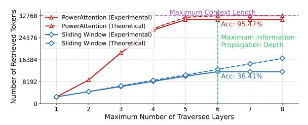
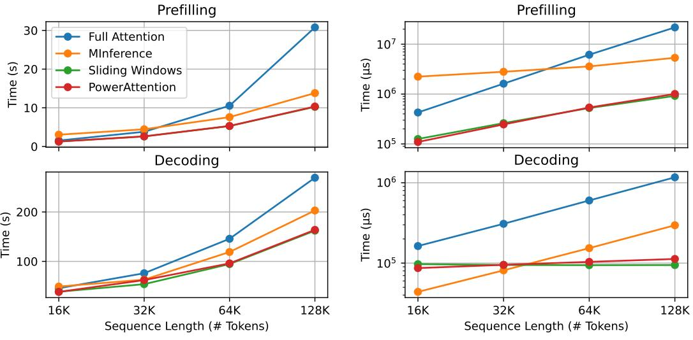
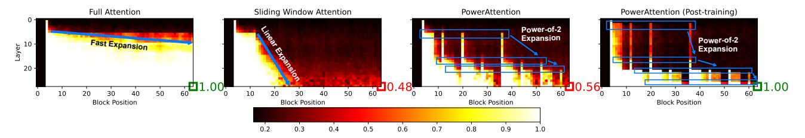

# **PowerAttention: Exponentially Scaling of Receptive Fields for Effective Sparse Attention**

 $\begin{array}{cccccccccccccccccccccccccccccccccccc$ 

### **Abstract**

Large Language Models (LLMs) face efficiency bottlenecks due to the quadratic complexity of the attention mechanism when processing long contexts. Sparse attention methods offer a promising solution, but existing approaches often suffer from incomplete effective context and/or require complex implementation of pipeline. We present a comprehensive analysis of sparse attention for autoregressive LLMs from the respective of receptive field, recognize the suboptimal nature of existing methods for expanding the receptive field, and introduce POWER ATTENTION, a novel sparse attention design that facilitates effective and complete context extension through the theoretical analysis. POWERATTENTION achieves exponential receptive field growth in d-layer LLMs, allowing each output token to attend to  $2^d$  tokens, ensuring completeness and continuity of the receptive field. Experiments demonstrate that Pow-ERATTENTION outperforms existing static sparse attention methods by  $5 \sim 40\%$ , especially on tasks demanding long-range dependencies like Passkey Retrieval and RULER, while maintaining a comparable time complexity to sliding window attention. Efficiency evaluations further highlight POWERATTENTION's superior speedup in both prefilling and decoding phases compared with dynamic sparse attentions and full attention  $(3.0 \times$ faster on 128K context), making it a highly effective and user-friendly solution for processing long sequences in LLMs.

Preprint.


(a) 6-Layer Receptive Field Expansion in Sliding Window (L) and PowerAttention (R)



<span id="page-0-0"></span>(b) Theoretical Receptive Field Size and Experimental Retrieval Performance

Figure 1. Layer-wise receptive field analysis of sparse attention patterns. (a) illustrates the information flow across six layers with a simplified 128-block example, while (b) presents the quantitative evaluation on Qwen2-7B with 32K context length. The actual token retrieval capability closely matches the theoretical receptive field growth for both patterns. Within the maximum information propagation depth, POWERATTENTION's exponential growth in receptive field leads to significantly higher accuracy compared to sliding window's linear expansion. Detailed implementation is provided in Appendix A.

# 1. Introduction

Large Language Models (LLMs) have demonstrated remarkable capabilities across diverse NLP tasks. Increasing context length allows LLMs to support more complex applications like long chain-of-thought reasoning (OpenAI, 2024; Qwen, 2024; DeepSeek-AI et al., 2025), agents in complex environments (Park et al., 2023; Zhou et al., 2023; Chen et al., 2023), and long document question answering (Chevalier et al., 2024; Wang et al., 2024; An et al., 2023). However, the quadratic complexity of the attention mechanism poses a significant efficiency bottleneck for Transformer-based LLMs when processing long contexts.

<sup>\*</sup>Equal contribution <sup>1</sup>Knowledge Works Research Laboratory, School of Computer Science and Technology, Fudan University, Shanghai, China <sup>2</sup>The University of Hong Kong, Hong Kong, China <sup>3</sup>ByteDance Seed, Shanghai, China. Part of the work done while at Fudan University. <sup>4</sup>Ant Group, Hangzhou, China. Correspondence to: Yanghua Xiao <shawyh@fudan.edu.cn>, Wei Wang <weiwang1@fudan.edu.cn>.

To address the inefficiency of Transformer, recent studies have explored sparse attention [\(Correia et al.,](#page-8-4) [2019;](#page-8-4) [Beltagy](#page-8-5) [et al.,](#page-8-5) [2020;](#page-8-5) [Roy et al.,](#page-10-2) [2021;](#page-10-2) [Liu et al.,](#page-9-2) [2022;](#page-9-2) [Anagnostidis](#page-8-6) [et al.,](#page-8-6) [2023;](#page-8-6) [Jiang et al.,](#page-9-3) [2024\)](#page-9-3), which reduces computational complexity by restricting each token to attend to only a fixed number of tokens instead of the full sequence. The *static* pattern uses a pre-defined attention mask such as the classic sliding window attention, while the *dynamic* pattern requires the model to be trained with full attention and to update the defined attention mask at inference stage, such as MInference [\(Jiang et al.,](#page-9-3) [2024\)](#page-9-3). Dynamic patterns usually achieves better performance in downstream tasks, but the static counterpart features efficiency optimization in training stage and can better handle new tokens during decoding.

However, both the two mainstream sparse attention methods have predominantly relied on intuitive heuristics and experimental results, lacking theoretical analysis to explain their effectiveness. In this paper, we address this critical gap by presenting a novel comprehensive analysis of sparse attention methods for autoregressive LLMs, providing new insights for designing efficient attention for the future. Our analysis starts from the information flow across LLM layers. Consider how information flows within an LLM: at each layer, a token receives information from other tokens it can attend to via self-attention and propagates this aggregated information to subsequent layers. To analyze this process systematically, we introduce the concept of *model receptive field*, defined as the maximum set of context tokens that the model can utilize during output generation, and model it as a Directed Acyclic Graph (DAG) where different static sparse attention patterns correspond to different edge sets. Although different sparse patterns with the same sparsity result in identical single-layer receptive field sizes, well-designed patterns can achieve much larger effective receptive fields across multiple layers through efficient information propagation (Figure [1\(](#page-0-0)a)).

Based on this analysis framework, we identify two critical limitations of existing static sparse attention designs that prevent them from achieving optimal receptive fields: (1) information from tokens at certain positions cannot be retrieved by the final output, and (2) they exhibit low efficiency in expanding the receptive field layer by layer, as demonstrated by sliding window's linear growth in Figure [1\(](#page-0-0)b). Based on these insights, we propose POWERATTENTION, a novel sparse attention pattern that can achieve an effective balance between efficiency and performance, both theoretically and experimentally (Figure [1\(](#page-0-0)b)). Specifically, by calculating attention between tokens at power-of-2 distances, POWER-ATTENTION achieves exponential expansion of the receptive field across layers while requiring only O(log n) tokens to ensure the receptive field covers the entire sequence, demonstrating significant potential for ultra-long sequences and high-sparsity scenarios.

We conduct comprehensive experiments to evaluate both the model performance and efficiency of existing static sparse attention methods and POWERATTENTION. On long-range dependency tasks like Passkey Retrieval and RULER, POW-ERATTENTION significantly outperforms other static sparse attention methods. In terms of efficiency, static sparse attention methods with the same sparsity show similar performance, and outperform both full attention and dynamic sparse attention methods like MInference in both prefilling and decoding phases by 1.2 ∼ 30×.

In summary, our contributions are:

- We establish an analysis framework for studying static sparse attention patterns in autoregressive LLMs, which explains why certain patterns are effective.
- We design a novel static sparse attention pattern, POW-ERATTENTION, that achieves the best balance between efficiency and performance, both theoretically and experimentally.
- We conduct extensive experiments demonstrating that POWERATTENTION achieves superior performance compared to existing static sparse attention methods while maintaining state-of-the-art efficiency.

# 2. Related Work

Dynamic Sparse Attention It has been widely observed that attention patterns are often highly sparse [\(Liu et al.,](#page-9-2) [2022\)](#page-9-2), allowing certain correlation computations between tokens to be omitted without significantly degrading the model performance. Dynamic sparse attention mechanism predicts the necessary sparse pattern based on the input context and relevant information, which focuses on either prefilling [\(Roy et al.,](#page-10-2) [2021;](#page-10-2) [Qu et al.,](#page-10-3) [2022;](#page-10-3) [Liu et al.,](#page-9-2) [2022;](#page-9-2) [Ribar et al.,](#page-10-4) [2024;](#page-10-4) [Jiang et al.,](#page-9-3) [2024;](#page-9-3) [Gao et al.,](#page-9-4) [2024\)](#page-9-4), adapting the overall attention pattern to the entire input sequence, or focuses on decoding, dynamically evicting [\(Anagnostidis](#page-8-6) [et al.,](#page-8-6) [2023;](#page-8-6) [Zhang et al.,](#page-11-1) [2023;](#page-11-1) [Ge et al.,](#page-9-5) [2024;](#page-9-5) [Zhang et al.,](#page-11-2) [2024;](#page-11-2) [Hooper et al.,](#page-9-6) [2024\)](#page-9-6) or selecting [\(Tang et al.,](#page-10-5) [2024;](#page-10-5) [Li et al.,](#page-9-7) [2024;](#page-9-7) [Kim et al.,](#page-9-8) [2024;](#page-9-8) [Yang et al.,](#page-11-3) [2024b\)](#page-11-3) tokens from the offloaded KV-Cache in each iteration. While this dynamic nature allows for greater expressiveness, it also introduces extraneous complexity, both in implementation and computation. For instance, dynamic prefilling methods, requiring O(N) time complexity (a whole line scan) at each step, will incur an additional quadratic time overhead to decode N tokens, which prevents them from providing a substantial speedup during the decoding stage [\(Jiang et al.,](#page-9-3) [2024\)](#page-9-3).

Static Sparse Attention Static sparse attention, by contrast, represents a more straightforward design, in which a

predefined masking pattern is applied consistently throughout the inference process. A common static sparse attention consists of some initial tokens at the beginning (*sink tokens*) and a fixed sliding window (*local windows*). This pattern has proven effective in generating fluent outputs with low perplexity [\(Xiao et al.,](#page-10-6) [2024;](#page-10-6) [Han et al.,](#page-9-9) [2024\)](#page-9-9). Earlier work includes fixed strided patterns [\(Child et al.,](#page-8-7) [2019;](#page-8-7) [Shi](#page-10-7) [et al.,](#page-10-7) [2021\)](#page-10-7), dilated patterns [\(Ding et al.,](#page-8-8) [2023\)](#page-8-8), or a mix of both [\(Beltagy et al.,](#page-8-5) [2020;](#page-8-5) [Zaheer et al.,](#page-11-4) [2020\)](#page-11-4). However, sliding window-based solutions fail to effectively leverage information from long contexts. Specifically, in sliding window attention with a window size of W, each position within the hidden state attends exclusively to the W preceding positions. This inherent locality implies that the range of context that sliding window attention can capture (which we refer to as *receptive field* later) expands linearly with the number of layers. Our method, POWERATTENTION, also falls into this category of mechanisms. Recognizing the limitation, it aims to optimally extend the effective context length while minimizing the overhead of additional computations.

Alternative Architecture for Transformer Alternative architectures have been proposed to replace modules of the traditional transformer, including state-space model [\(Poli](#page-10-8) [et al.,](#page-10-8) [2023a;](#page-10-8) [Peng et al.,](#page-10-9) [2023;](#page-10-9) [Sun et al.,](#page-10-10) [2023;](#page-10-10) [Gu &](#page-9-10) [Dao,](#page-9-10) [2024;](#page-9-10) [De et al.,](#page-8-9) [2024;](#page-8-9) [Li et al.,](#page-9-11) [2023\)](#page-9-11), linear attention [\(Katharopoulos et al.,](#page-9-12) [2020;](#page-9-12) [Feng et al.,](#page-9-13) [2024\)](#page-9-13) and longterm memory [\(Behrouz et al.,](#page-8-10) [2024\)](#page-8-10). While these methods have demonstrated superior language modeling capabilities on certain tasks, they have not yet seen widespread adoption in real-world applications.

# <span id="page-2-0"></span>3. Methodology

## <span id="page-2-1"></span>3.1. Problem Formulation

LLM's decoder layer leverages the attention mechanism to incorporate contextual information into the token generation process, as formally expressed by the following equation:

$$\mathbf{o}_{i} = \sum_{j \in \mathcal{A}_{i}} \operatorname{softmax}\left(\frac{q_{i} k_{j}^{T}}{\sqrt{d_{k}}}\right) v_{j} \tag{1}$$

where o<sup>i</sup> is computed as a weighted sum of value vectors (v<sup>j</sup> ) from the attended tokens (j ∈ Ai), with weights determined by similarity scores between q<sup>i</sup> and k<sup>j</sup> . We define the *receptive field* as the set of all tokens that can influence a given token's representation. Specifically, the single-layer receptive field of token i is A<sup>i</sup> , which directly influences the o<sup>i</sup> within the current layer. While full attention allows every token to attend to all previous tokens (A<sup>i</sup> = {j ∈ Z ∗ |j ≤ i}), sparse attention strategically limits attention to a subset of tokens to reduce computational costs. However, this restriction poses the risk of omitting crucial

information which lies outside the receptive field.

We formulate token selection in sparse attention as the problem of finding an optimal edge set in a graph, where nodes represent tokens at specific positions. Sparse attention masks can be naturally interpreted as adjacency matrices, as illustrated in Figure [2.](#page-3-0) Since modern LLMs adopt autoregressive mechanism, the graph is a directed acyclic graph (DAG) where each token can attend only to earlier ones. Within a single layer, a given token's receptive field consists of all its successor nodes in the graph.

Although different sparse patterns at comparable sparsity result in similar out-degree of nodes (*i.e.*, the size of singlelayer receptive field), well-designed patterns can achieve larger effective receptive fields across multiple layers. Consider the internal information flow within an LLM during a single forward pass: at layer l, the token representation at position i receives information from tokens within its single-layer receptive field via self-attention, which is then propagated through the feed-forward layer to the next layer. Through this process, o<sup>i</sup> at layer l effectively relays information from previous tokens, serving as an intermediate node that propagates aggregated information to tokens that attend to i in subsequent layers. For instance, in a twolayer scenario, when token x attends to y in the second layer, y's representation already encodes first-layer information, thereby expanding x's receptive field effectively. Thus, in multi-layer LLMs, the receptive field of token x extends beyond immediate successors to encompass all DAG-accessible nodes originating from x. We conduct an empirical study on information flow in Section [4.6.](#page-6-0)

Therefore, under the constraint of preserving the computational efficiency, we can reformulate the problem of finding the optimal sparse attention design as finding an edge set in the DAG that maximizes node reachability in l steps under fixed maximum out-degree constraints (l represents the number of model layers). For nodes beyond a distance of l, the model theoretically cannot access their information when predicting the next token. Consequently, if these tokens contain key information, the model performance will degrade significantly.

#### 3.2. Limitations of Existing Sparse Attention

We analyze several static sparse attention designs: (1) Sliding window [\(Xiao et al.,](#page-10-6) [2024;](#page-10-6) [Han et al.,](#page-9-9) [2024\)](#page-9-9), which incorporates attention sink tokens from the sequence start in addition to the local window; (2) Stride slash attention [\(Child](#page-8-7) [et al.,](#page-8-7) [2019\)](#page-8-7), which places slash tokens at equal intervals across the context length, beyond the local window and sink tokens; (3) Dilated attention [\(Beltagy et al.,](#page-8-5) [2020\)](#page-8-5), which employs dilated local windows; (4) LongNet [\(Ding et al.,](#page-8-8) [2023\)](#page-8-8), which constructs the attention mask by overlaying multiple masks with geometrically increasing block sizes


(I) Modeling Attention Patterns as DAG


(II) Receptive Field Analysis for Sparse Attention Patterns

Figure 2. (I) Modeling Attention Patterns as DAG: the attention mask serves as the adjacency matrix of a DAG, where edges represent token connections across layers, and the shortest path length indicates the minimum number of layers required for information flow between tokens. (II) Receptive Field Analysis for Sparse Attention Patterns: white lines show the shortest path to reach passkey tokens, with path length complexity O(f(N)) for distance N and coverage indicating token accessibility.

#### and dilated intervals;

We analyze the shortest path from the last token to reach a passkey token in different attention designs. As shown in Figure 2, in sliding window attention, each token can reach the farthest token within its window until the passkey token appears in the window. To reach a token at distance N, it requires O(N) layers. Under stride slash attention, a token first reaches the nearest slash token to its target, then iteratively reaches the farthest token within each window until the passkey token appears. With strategically placed slash tokens, reaching a token at distance N only requires  $O(\sqrt{N})$  layers. Both dilated attention and LongNet have unreachable tokens, making them impossible to retrieve passkeys at certain positions. In dilated attention, all tokens at distances 2k + 1 from the current token are unreachable. Despite having a window twice as large as sliding window at the same sparsity, it can only access 50% of the tokens. LongNet requires O(loqN) layers to reach a token at distance N, but cannot access certain tokens, such as the last token in each segment. Therefore, existing methods often fail to achieve both fast expansion of the receptive field and

<span id="page-3-0"></span>complete token coverage

#### 3.3. PowerAttention

Based on our modeling of sparse attention, we propose POW-ERATTENTION, a sparse attention design that exponentially expands the receptive field. Our edge set construction ensures that in a DAG, any node can reach all nodes within a distance of n in at most  $\log n$  steps, while maintaining a maximum out-degree of  $\log n$ . This is achieved by connecting each node only to nodes whose index differences are powers of 2, which is transformed to a sparse pattern where each token attends only to positions at power-of-2 distances.

Under our pattern, we guarantee that the receptive field grows exponentially with the maximum distance d, while capturing information from all tokens within a distance of  $2^d$ . The theoretical proof of this property is provided in Appendix B. As for implementation, POWERATTENTION introduces no additional computational overhead. We present its pseudo-code implementation in Algorithm 1.

# Algorithm 1 POWERATTENTION in Python-like pseudocode

```
# q_idx [M, 1]: The indices of the query
# kv_idx [1, N]: The indices of the key-value
# block_size (int): The size of the CUDA block
# window_size (int): The block size of the sliding window
# build sink token mask
mask_sink = kv_idx < block_size # [1, N]
# build sliding window mask
blk_qk = q_idx // block_size - kv_idx // block_size # [M, N]
mask_window = blk_qk < window_size # [M, N]
# build PowerAttention mask
mask_power = (blk_qk & (blk_qk - 1)) == 0 # [M, N]
# ensure causality
causal = q_idx >= kv_idx # [M, N]
# combine all masks
mask = causal & (mask_window | mask_power | mask_sink) # [M, N]
```

<span id="page-4-1"></span>Table 1. Perplexity of different static sparse attention methods on PG19. Each static sparse attention pattern achieves a sparsity ratio of 0.94.

|                  | PG19  |       |       |       |  |  |  |  |  |  |  |
|------------------|-------|-------|-------|-------|--|--|--|--|--|--|--|
| Method           | 4k    | 8k    | 16k   | 32k   |  |  |  |  |  |  |  |
| Full Attention   |       |       |       |       |  |  |  |  |  |  |  |
| Vanilla          | 9.77  | 9.72  | 9.60  | 9.42  |  |  |  |  |  |  |  |
| Sparse Attention |       |       |       |       |  |  |  |  |  |  |  |
| Sliding Window   | 9.94  | 9.99  | 9.99  | 9.97  |  |  |  |  |  |  |  |
| Dilated          | 10.74 | 10.72 | 10.64 | 10.58 |  |  |  |  |  |  |  |
| Stride Slash     | 10.01 | 10.11 | 10.07 | 10.03 |  |  |  |  |  |  |  |
| LongNet          | 10.14 | 10.28 | 10.30 | 10.31 |  |  |  |  |  |  |  |
| POWERATTENTION   | 10.03 | 10.08 | 10.05 | 10.00 |  |  |  |  |  |  |  |

# 4. Experiments

We evaluate the performance of existing sparse attention designs and POWERATTENTION on LLMs in terms of both accuracy and efficiency. For accuracy, we assess model performance on language modeling, synthetic retrieval tasks, and long context benchmarks. For efficiency, we measure model performance during both the prefill and decoding phases.

#### 4.1. Setting

Implementation We use Qwen2-7B [\(Yang et al.,](#page-11-5) [2024a\)](#page-11-5), a pretrained model with 32K context length, as our base model. To better adapt the model to sparse attention patterns, we conduct continued pre-training on processed SlimPajama corpus [\(Soboleva et al.,](#page-10-11) [2023\)](#page-10-11) for 1B tokens. To effectively train the model with sparse attention patterns, we fine-tune the model on ChatQA 2 [\(Xu et al.,](#page-10-12) [2024\)](#page-10-12) data before evaluating on long context benchmarks. This ensures the training data contains dependencies beyond the local window, providing natural supervision signals for the model to learn and utilize its full receptive field. For hardware efficiency, we implement sparse attention using 256-token blocks to align with GPU compute cores' memory access pattern. To ensure a fair comparison across designs, we maintain consistent sparsity levels by fixing the maximum number of tokens each position can attend to, and employ the consistent patterns during both prefilling and decoding phases.

Baseline We evaluate the static sparse attention designs analyzed in Section [3,](#page-2-0) including sliding window attention, stride slash attention, dilated attention, LongNet, and POW-ERATTENTION. The specific configurations are as follows: For sliding window attention, we use a 9-block local window and 1 block of sink tokens. For stride slash attention, we configure a 6-block local window, 1 block of sink tokens, and 3 blocks of slash tokens. For dilated attention, we set the local window size to 20 blocks with a dilation rate of 1 block. For LongNet, we use segment lengths w = 8, 16, 32, 64, 128 blocks with corresponding dilation ratios r = 1, 2, 4, 8, 16. For POWERATTENTION, we employ a 5-block local window, 1 block of initial tokens, and 4 additional blocks of slash tokens distributed at power-of-2 intervals. See Appendix [D](#page-13-0) for more implementation details.

#### 4.2. Long Context Language Modeling

We first evaluate the language modeling perplexity of different static sparse attention methods on the PG19 test set [\(Rae](#page-10-13) [et al.,](#page-10-13) [2019\)](#page-10-13). The evaluation is conducted across four different sequence lengths, as shown in [1.](#page-4-1) All sparse attention methods maintain low perplexity scores up to 32K context length, demonstrating their ability to preserve strong language modeling capabilities while reducing computational costs. Notably, despite using the same number of attended tokens, different sparse attention designs vary in performance. StreamingLLM, POWERATTENTION, and stride slash attention achieve lower perplexity, while dilated attention and LongNet perform slightly worse. We attribute this gap to the discontinuous receptive fields in the latter two, which may hinder effective language modeling.

## <span id="page-4-2"></span>4.3. Retrieval-Based Evaluation

While local information suffices for low perplexity in language modeling, it inadequately assesses a model's ability to capture key information across the entire context. To evaluate how different static sparse attention designs affect the model's ability to capture context-wide information through their receptive fields, we evaluate them on the passkey retrieval [\(Mohtashami & Jaggi,](#page-9-14) [2023\)](#page-9-14) task. This requires the model's receptive field to seamlessly cover all positions and efficiently span the entire sequence within limited layers. To isolate training data effects, we fine-tune LLMs on the same synthetic passkey retrieval dataset. We also employ


<span id="page-5-0"></span>Figure 3. Results on passkey retrieval with different attention patterns: (a) evaluation on context lengths up to 32k, and (b) comparison between stride slash attention and POWERATTENTION on extended context lengths up to 64k.

<span id="page-5-1"></span>Table 2. Performance comparison of different static sparse attention patterns on RULER benchmark across different context lengths (4k-32k). The RULER benchmark consists of 13 tasks categorized into Needle-in-a-Haystack (NIAH), Variable Tracing (VT), Aggregation, and Question Answering (QA). Results show average scores for each category and overall performance across all 13 tasks.

| Method           |       | 4k    |       |       |       | 8k    |       |       |       | 16k   |       |       |       |       | 32k   |       |       |       |       |       |
|------------------|-------|-------|-------|-------|-------|-------|-------|-------|-------|-------|-------|-------|-------|-------|-------|-------|-------|-------|-------|-------|
|                  | NIAH  | VT    | Agg.  | QA    | Avg.  | NIAH  | VT    | Agg.  | QA    | Avg.  | NIAH  | VT    | Agg.  | QA    | Avg.  | NIAH  | VT    | Agg.  | QA    | Avg.  |
| Full Attention   |       |       |       |       |       |       |       |       |       |       |       |       |       |       |       |       |       |       |       |       |
| Vanilla          | 95.69 | 97.60 | 93.48 | 71.50 | 91.77 | 95.72 | 91.80 | 68.45 | 64.00 | 86.34 | 95.34 | 89.00 | 59.85 | 62.00 | 84.27 | 91.38 | 84.60 | 53.75 | 53.50 | 79.24 |
| Sparse Attention |       |       |       |       |       |       |       |       |       |       |       |       |       |       |       |       |       |       |       |       |
| Sliding Window   | 91.75 | 40.40 | 24.61 | 57.50 | 72.20 | 74.47 | 38.40 | 17.02 | 44.00 | 58.17 | 59.53 | 22.00 | 29.50 | 42.50 | 49.40 | 44.88 | 10.60 | 19.14 | 23.00 | 34.91 |
| Stride Slash     | 87.22 | 36.40 | 37.46 | 61.50 | 71.70 | 74.25 | 40.20 | 37.34 | 45.50 | 61.53 | 65.06 | 22.20 | 40.21 | 43.00 | 54.55 | 54.12 | 14.60 | 35.66 | 33.50 | 45.07 |
| Dilated          | 87.91 | 38.20 | 31.66 | 54.50 | 70.29 | 85.56 | 4.40  | 20.15 | 48.50 | 63.55 | 71.28 | 0.20  | 20.48 | 49.00 | 54.57 | 61.03 | 1.20  | 13.70 | 36.50 | 45.37 |
| LongNet          | 84.44 | 43.00 | 35.20 | 65.50 | 70.76 | 75.69 | 24.00 | 27.73 | 48.50 | 60.15 | 65.00 | 15.60 | 23.02 | 45.00 | 51.66 | 51.41 | 9.80  | 14.15 | 31.50 | 39.41 |
| POWERATTENTION   | 90.00 | 26.80 | 36.70 | 60.50 | 72.40 | 81.47 | 30.20 | 34.56 | 46.50 | 64.93 | 73.75 | 25.00 | 41.84 | 44.50 | 60.59 | 62.94 | 18.40 | 36.84 | 32.00 | 50.74 |

curriculum learning, gradually increasing sequence lengths from 4K to 32K with 200 steps per stage.

Figure 3 demonstrates that sparse attention performance aligns with our theoretical analysis of receptive field: sliding window performs well up to 12K tokens but degrades significantly at 16K and 32K lengths, failing to retrieve passkeys from initial 16K tokens at 32K length. With a window size of approximately 2K tokens, we estimate that information strength decays to near zero after propagating through 6 layers. Dilated attention captures only  $\sim 50\%$ input across all lengths, as its 5K window covers the 30K sequence within 6 layers but lacks adjacent-block aggregation in the last block. LongNet similarly suffers from gaps in its receptive field, failing to capture information at specific positions. Both stride slash attention and POWER-ATTENTION achieve full-sequence coverage within 6 layers, enabling successful 32K passkey retrieval. Notably, further evaluation at 64K sequence length shows that POWERAT- TENTION's exponential receptive field expansion achieves better performance than stride slash's quadratic approach, demonstrating the benefits of faster receptive field growth for ultra-long sequence processing.

#### 4.4. Long Context Benchmark Evaluation

To further validate that POWER ATTENTION is more effective for long sequence processing, we evaluate all baseline methods on the widely-used RULER benchmark (Hsieh et al., 2024). RULER is a challenging dataset consisting of 14 sub-tasks that assess models' effective context utilization across different difficulty levels. We adopt a practical hybrid architecture (Poli et al., 2023b; Lieber et al., 2024; Yang et al., 2025) that retains some full attention layers while varying sparse attention patterns in the remaining layers. To maximize the continuity of sparse attention layers, we keep 2 full attention layers for every 7 layers.

<span id="page-6-1"></span>

- (a) End-to-end inference latency of different attention methods with 16K∼128K input context and 1024 decoding steps.
- <span id="page-6-2"></span>(b) Time consumption for each forward pass of the attention kernel under different methods with 16K∼128K input context.

Figure 4. Efficiency evaluation results on Qwen2-7B with a NVIDIA A800 GPU.

Table [2](#page-5-1) presents the performance comparison on RULER benchmark. Among all baseline methods, POWERATTEN-TION demonstrates superior performance by consistently achieving the highest scores across four different sequence lengths. Meanwhile, stride slash attention and LongNet show comparable performance, ranking below POWERAT-TENTION but above other baselines. These results align with our findings from the passkey retrieval task, demonstrating that well-designed sparse attention patterns can achieve larger receptive fields and better handle long sequences. All sparse attention methods show a noticeable performance gap compared to full attention, which can be attributed to the high sparsity ratio (up to 94% in sparse attention layers) we employ to simulate ultra-long sequence performance at 32K context length. Notably, the widely adopted sliding window pattern achieves the lowest accuracy. Given its prevalence in attention optimization methods [\(Arora et al.,](#page-8-11) [2024\)](#page-8-11), replacing sliding window with alternative designs may potentially yield further performance improvement.

#### 4.5. Efficiency Evaluation

To verify the inference efficiency of POWERATTENTION, we compare its latency against other methods. We exclude stride slash attention from this evaluation as it obviously has the same computational cost as POWERATTENTION.

End-to-end Latency POWERATTENTION achieves the highest speedup compared with three baseline methods: full attention, sliding window, and MInference. Notably, MInference is claimed be more efficient with FlashAttention-based

full attention during the decoding phase in the original paper, and we adopted this suggestion, applying MInference solely during the prefilling stage. Figure [4\(a\)](#page-6-1) shows the latency of different methods.

At a context length of 128K, POWERATTENTION delivers speedups of 3.0× and 1.3× over full attention and MInference in the prefilling phase, respectively. In the decoding phase, POWERATTENTION also demonstrates improvements, taking only 58% and 80% of the time required by these two methods. Consequently, POWERATTENTION offers a user experience that is nearly equivalent to that of sliding window attention.

Kernel Speedup To better illustrate the differences in time complexity among various attention methods, Figure [4\(b\)](#page-6-2) outlines the time taken for each attention forward pass. Due to POWERATTENTION's inherent O(N log<sup>2</sup> N) time complexity, its growth rate is nearly as gradual as that of sliding window attention, which has linear time complexity. At a context length of 128K, POWERATTENTION is 5.3× faster than MInference and 21.6× faster than full attention in terms of kernel overhead. In longer input contexts, POW-ERATTENTION's attention inference overhead is expected to be superior to these baseline methods.

## <span id="page-6-0"></span>4.6. Probing of Information Flow

We also investigate LLMs to address the following questions of interest: (1) whether the inter-layer information flow, which is the foundation of the receptive field expansion discussed in Section [3.1,](#page-2-1) actually exists in the LLMs, and



Figure 5. Information flow probing result for various attention mechanisms on the 28-layer Qwen2-7B with 16K context length. The sequence is divided into 64 blocks (0 is at the beginning and 63 is at the end), each of which contains 256 tokens, as detailed in Appendix [C.](#page-12-2) Each pixel represents the strength of passkey information at a specific layer and block position; a brighter pixel indicates a higher possibility of extracting passkey information from that position. The classification accuracy of the final token block in the last layer is highlighted, as it directly determines the output token.

(2) whether our proposed training method enable LLMs to leverage this mechanism more effectively.

To interpret the hidden states propagated within the model, we employ a simple yet effective probing method: linear classifiers. For convenience, we design a straightforward passkey retrieval task, in which the model is given a long sequence input which includes a specific passkey (*e.g.*, "*Passkey is apple.*") at a fixed position. The passkey is sampled from 6 words (*i.e.*, *apple*, *grape*, etc.), and the remainder of the context is filled with grammatically correct, randomly generated sentences to a length of N = 16K. The model is asked to identify and extract the passkey from the context in the task. For each layer of the model, a logistic classifier is trained at each token position to map the hidden state to the corresponding target passkey. Finally, we collect the prediction accuracies of all classifiers as an indicator of whether passkey information is present at that location; if the state at a position is easily mapped to the corresponding label, it obviously includes the information, and vice versa. Appendix [C](#page-12-2) discusses our probing process in details and presents additional probing results for alternative methods post-training.

The probing results are shown in Figure [5,](#page-7-0) from which we could conclude that:

Inter-layer information flow inherently exists within LLMs. In the early layers of the unmodified model with full attention, passkey information is predominantly localized to token positions near the passkey. As inference progresses through the layers, the information range gradually expands forward throughout the hidden state. This suggests that even though full attention theoretically allows it to attend to any position in a single step, the attention heads still exhibit a degree of spatial locality. Specifically, they not only retrieve the original information at the passkey's location but also attend to and aggregate information from neighboring positions where earlier layers have accumulated relevant information. In sparse attentions, this phenomenon is even more evident: the receptive field of sliding window attention

<span id="page-7-0"></span>expands progressively across layers at a linear rate, and the receptive field of POWERATTENTION, in contrast, exhibits phase transition-like jumps across layers, enabling information to be flowed in discrete leaps to power-differentiated positions at specific layers. This demonstrates that interlayer information flow is an inherent mechanism of LLMs.

POWERATTENTION effectively enhances the information flow mechanism. Neither the sliding window attention nor the untrained POWERATTENTION effectively retrieves the correct passkey, although the latter shows a slight advantage. However, after continued pretraining and finetuning, the model's information flow mechanism improves significantly, with the classification accuracy of the last token in the final layer increasing by 44% to achieve 100%. Visually, the post-training information flow image also exhibits clearer and more focused boundary. Combining our primary experimental results, we can attribute the post-training performance improvement to the enhancement of this mechanism.

# 5. Conclusion

We present POWERATTENTION, a novel sparse attention mechanism that addresses the limitations of existing static and dynamic sparse attention patterns in LLMs. Leveraging a theoretically grounded framework, POWERATTENTION achieves exponential receptive field expansion with complete token coverage, enhancing information flow while maintaining computational efficiency.

Our work not only offers a simple yet effective alternative to current static sparse patterns, but also establishes a theoretical foundation for designing future sparse attention mechanisms. We believe this advancement will contribute to the development of more efficient and capable LLMs, ultimately facilitating their application in tasks involving extensive contextual dependencies.

# Impact Statement

This paper presents work whose goal is to advance the field of Large Language Models and Attention Mechanisms. There are many potential societal consequences of our work, none of which we feel must be specifically highlighted here.

# References

- <span id="page-8-3"></span>An, C., Gong, S., Zhong, M., Li, M., Zhang, J., Kong, L., and Qiu, X. L-eval: Instituting standardized evaluation for long context language models. *arXiv preprint arXiv:2307.11088*, 2023.
- <span id="page-8-6"></span>Anagnostidis, S., Pavllo, D., Biggio, L., Noci, L., Lucchi, A., and Hofmann, T. Dynamic context pruning for efficient and interpretable autoregressive transformers. In Oh, A., Naumann, T., Globerson, A., Saenko, K., Hardt, M., and Levine, S. (eds.), *Advances in Neural Information Processing Systems 36: Annual Conference on Neural Information Processing Systems 2023, NeurIPS 2023, New Orleans, LA, USA, December 10 - 16, 2023*, 2023.
- <span id="page-8-11"></span>Arora, S., Eyuboglu, S., Zhang, M., Timalsina, A., Alberti, S., Zou, J., Rudra, A., and Re, C. Simple linear attention ´ language models balance the recall-throughput tradeoff. In *Forty-first International Conference on Machine Learning, ICML 2024, Vienna, Austria, July 21-27, 2024*, 2024.
- <span id="page-8-10"></span>Behrouz, A., Zhong, P., and Mirrokni, V. Titans: Learning to memorize at test time, 2024. URL [https://arxi](https://arxiv.org/abs/2501.00663) [v.org/abs/2501.00663](https://arxiv.org/abs/2501.00663).
- <span id="page-8-5"></span>Beltagy, I., Peters, M. E., and Cohan, A. Longformer: The long-document transformer, 2020. URL [https:](https://arxiv.org/abs/2004.05150) [//arxiv.org/abs/2004.05150](https://arxiv.org/abs/2004.05150).
- <span id="page-8-1"></span>Chen, J., Yuan, S., Ye, R., Majumder, B. P., and Richardson, K. Put your money where your mouth is: Evaluating strategic planning and execution of llm agents in an auction arena. *arXiv preprint arXiv:2310.05746*, 2023.
- <span id="page-8-2"></span>Chevalier, A., Geng, J., Wettig, A., Chen, H., Mizera, S., Annala, T., Aragon, M. J., Fanlo, A. R., Frieder, S., Machado, S., et al. Language models as science tutors. *arXiv preprint arXiv:2402.11111*, 2024.
- <span id="page-8-7"></span>Child, R., Gray, S., Radford, A., and Sutskever, I. Generating long sequences with sparse transformers, 2019. URL <https://arxiv.org/abs/1904.10509>.
- <span id="page-8-4"></span>Correia, G. M., Niculae, V., and Martins, A. F. T. Adaptively sparse transformers. In Inui, K., Jiang, J., Ng, V., and Wan, X. (eds.), *Proceedings of the 2019 Conference on Empirical Methods in Natural Language Processing and the 9th International Joint Conference on Natural Language Processing, EMNLP-IJCNLP 2019,*

- *Hong Kong, China, November 3-7, 2019*, pp. 2174–2184. Association for Computational Linguistics, 2019. doi: 10.18653/V1/D19-1223. URL [https://doi.org/](https://doi.org/10.18653/v1/D19-1223) [10.18653/v1/D19-1223](https://doi.org/10.18653/v1/D19-1223).
- <span id="page-8-9"></span>De, S., Smith, S. L., Fernando, A., Botev, A., Cristian-Muraru, G., Gu, A., Haroun, R., Berrada, L., Chen, Y., Srinivasan, S., Desjardins, G., Doucet, A., Budden, D., Teh, Y. W., Pascanu, R., Freitas, N. D., and Gulcehre, C. Griffin: Mixing gated linear recurrences with local attention for efficient language models, 2024. URL [ht](https://arxiv.org/abs/2402.19427) [tps://arxiv.org/abs/2402.19427](https://arxiv.org/abs/2402.19427).
- <span id="page-8-0"></span>DeepSeek-AI, Guo, D., Yang, D., Zhang, H., Song, J., Zhang, R., Xu, R., Zhu, Q., Ma, S., Wang, P., Bi, X., Zhang, X., Yu, X., Wu, Y., Wu, Z. F., Gou, Z., Shao, Z., Li, Z., Gao, Z., Liu, A., Xue, B., Wang, B., Wu, B., Feng, B., Lu, C., Zhao, C., Deng, C., Zhang, C., Ruan, C., Dai, D., Chen, D., Ji, D., Li, E., Lin, F., Dai, F., Luo, F., Hao, G., Chen, G., Li, G., Zhang, H., Bao, H., Xu, H., Wang, H., Ding, H., Xin, H., Gao, H., Qu, H., Li, H., Guo, J., Li, J., Wang, J., Chen, J., Yuan, J., Qiu, J., Li, J., Cai, J. L., Ni, J., Liang, J., Chen, J., Dong, K., Hu, K., Gao, K., Guan, K., Huang, K., Yu, K., Wang, L., Zhang, L., Zhao, L., Wang, L., Zhang, L., Xu, L., Xia, L., Zhang, M., Zhang, M., Tang, M., Li, M., Wang, M., Li, M., Tian, N., Huang, P., Zhang, P., Wang, Q., Chen, Q., Du, Q., Ge, R., Zhang, R., Pan, R., Wang, R., Chen, R. J., Jin, R. L., Chen, R., Lu, S., Zhou, S., Chen, S., Ye, S., Wang, S., Yu, S., Zhou, S., Pan, S., Li, S. S., Zhou, S., Wu, S., Ye, S., Yun, T., Pei, T., Sun, T., Wang, T., Zeng, W., Zhao, W., Liu, W., Liang, W., Gao, W., Yu, W., Zhang, W., Xiao, W. L., An, W., Liu, X., Wang, X., Chen, X., Nie, X., Cheng, X., Liu, X., Xie, X., Liu, X., Yang, X., Li, X., Su, X., Lin, X., Li, X. Q., Jin, X., Shen, X., Chen, X., Sun, X., Wang, X., Song, X., Zhou, X., Wang, X., Shan, X., Li, Y. K., Wang, Y. Q., Wei, Y. X., Zhang, Y., Xu, Y., Li, Y., Zhao, Y., Sun, Y., Wang, Y., Yu, Y., Zhang, Y., Shi, Y., Xiong, Y., He, Y., Piao, Y., Wang, Y., Tan, Y., Ma, Y., Liu, Y., Guo, Y., Ou, Y., Wang, Y., Gong, Y., Zou, Y., He, Y., Xiong, Y., Luo, Y., You, Y., Liu, Y., Zhou, Y., Zhu, Y. X., Xu, Y., Huang, Y., Li, Y., Zheng, Y., Zhu, Y., Ma, Y., Tang, Y., Zha, Y., Yan, Y., Ren, Z. Z., Ren, Z., Sha, Z., Fu, Z., Xu, Z., Xie, Z., Zhang, Z., Hao, Z., Ma, Z., Yan, Z., Wu, Z., Gu, Z., Zhu, Z., Liu, Z., Li, Z., Xie, Z., Song, Z., Pan, Z., Huang, Z., Xu, Z., Zhang, Z., and Zhang, Z. Deepseek-r1: Incentivizing reasoning capability in llms via reinforcement learning, 2025. URL <https://arxiv.org/abs/2501.12948>.
- <span id="page-8-8"></span>Ding, J., Ma, S., Dong, L., Zhang, X., Huang, S., Wang, W., Zheng, N., and Wei, F. Longnet: Scaling transformers to 1,000,000,000 tokens, 2023. URL [https://arxiv.](https://arxiv.org/abs/2307.02486) [org/abs/2307.02486](https://arxiv.org/abs/2307.02486).
- <span id="page-8-12"></span>Dong, J., Feng, B., Guessous, D., Liang, Y., and He,

- H. Flex attention: A programming model for generating optimized attention kernels. *arXiv preprint arXiv:2412.05496*, 2024.
- <span id="page-9-13"></span>Feng, L., Tung, F., Hajimirsadeghi, H., Ahmed, M. O., Bengio, Y., and Mori, G. Attention as an rnn, 2024. URL <https://arxiv.org/abs/2405.13956>.
- <span id="page-9-4"></span>Gao, Y., Zeng, Z., Du, D., Cao, S., So, H. K.-H., Cao, T., Yang, F., and Yang, M. Seerattention: Learning intrinsic sparse attention in your llms, 2024. URL [https://ar](https://arxiv.org/abs/2410.13276) [xiv.org/abs/2410.13276](https://arxiv.org/abs/2410.13276).
- <span id="page-9-5"></span>Ge, S., Zhang, Y., Liu, L., Zhang, M., Han, J., and Gao, J. Model tells you what to discard: Adaptive KV cache compression for llms. In *The Twelfth International Conference on Learning Representations, ICLR 2024, Vienna, Austria, May 7-11, 2024*, 2024.
- <span id="page-9-10"></span>Gu, A. and Dao, T. Mamba: Linear-time sequence modeling with selective state spaces, 2024. URL [https://ar](https://arxiv.org/abs/2312.00752) [xiv.org/abs/2312.00752](https://arxiv.org/abs/2312.00752).
- <span id="page-9-9"></span>Han, C., Wang, Q., Peng, H., Xiong, W., Chen, Y., Ji, H., and Wang, S. Lm-infinite: Zero-shot extreme length generalization for large language models. In Duh, K., Gomez-Adorno, H., and Bethard, S. (eds.), ´ *Proceedings of the 2024 Conference of the North American Chapter of the Association for Computational Linguistics: Human Language Technologies (Volume 1: Long Papers), NAACL 2024, Mexico City, Mexico, June 16-21, 2024*, pp. 3991–4008. Association for Computational Linguistics, 2024. doi: 10.18653/V1/2024.NAACL-LONG.222. URL [https://doi.org/10.18653/v1/2024](https://doi.org/10.18653/v1/2024.naacl-long.222) [.naacl-long.222](https://doi.org/10.18653/v1/2024.naacl-long.222).
- <span id="page-9-6"></span>Hooper, C., Kim, S., Mohammadzadeh, H., Maheswaran, M., Paik, J., Mahoney, M. W., Keutzer, K., and Gholami, A. Squeezed attention: Accelerating long context length llm inference, 2024. URL [https://arxiv.org/ab](https://arxiv.org/abs/2411.09688) [s/2411.09688](https://arxiv.org/abs/2411.09688).
- <span id="page-9-15"></span>Hsieh, C.-P., Sun, S., Kriman, S., Acharya, S., Rekesh, D., Jia, F., Zhang, Y., and Ginsburg, B. Ruler: What's the real context size of your long-context language models?, 2024. URL <https://arxiv.org/abs/2404.06654>.
- <span id="page-9-3"></span>Jiang, H., LI, Y., Zhang, C., Wu, Q., Luo, X., Ahn, S., Han, Z., Abdi, A. H., Li, D., Lin, C.-Y., et al. Minference 1.0: Accelerating pre-filling for long-context llms via dynamic sparse attention. In *The Thirty-eighth Annual Conference on Neural Information Processing Systems*, 2024.
- <span id="page-9-12"></span>Katharopoulos, A., Vyas, A., Pappas, N., and Fleuret, F. Transformers are rnns: Fast autoregressive transformers with linear attention. In *Proceedings of the 37th International Conference on Machine Learning, ICML 2020, 13- 18 July 2020, Virtual Event*, volume 119 of *Proceedings*

- *of Machine Learning Research*, pp. 5156–5165. PMLR, 2020.
- <span id="page-9-8"></span>Kim, M., Shim, K., Choi, J., and Chang, S. Infinipot: Infinite context processing on memory-constrained llms. In Al-Onaizan, Y., Bansal, M., and Chen, Y. (eds.), *Proceedings of the 2024 Conference on Empirical Methods in Natural Language Processing, EMNLP 2024, Miami, FL, USA, November 12-16, 2024*, pp. 16046–16060. Association for Computational Linguistics, 2024. URL [https://](https://aclanthology.org/2024.emnlp-main.897) [aclanthology.org/2024.emnlp-main.897](https://aclanthology.org/2024.emnlp-main.897).
- <span id="page-9-11"></span>Li, Y., Cai, T., Zhang, Y., Chen, D., and Dey, D. What makes convolutional models great on long sequence modeling? In *The Eleventh International Conference on Learning Representations, ICLR 2023, Kigali, Rwanda, May 1-5, 2023*, 2023.
- <span id="page-9-7"></span>Li, Y., Huang, Y., Yang, B., Venkitesh, B., Locatelli, A., Ye, H., Cai, T., Lewis, P., and Chen, D. Snapkv: Llm knows what you are looking for before generation, 2024. URL <https://arxiv.org/abs/2404.14469>.
- <span id="page-9-16"></span>Lieber, O., Lenz, B., Bata, H., Cohen, G., Osin, J., Dalmedigos, I., Safahi, E., Meirom, S., Belinkov, Y., Shalev-Shwartz, S., Abend, O., Alon, R., Asida, T., Bergman, A., Glozman, R., Gokhman, M., Manevich, A., Ratner, N., Rozen, N., Shwartz, E., Zusman, M., and Shoham, Y. Jamba: A hybrid transformer-mamba language model, 2024. URL [https://arxiv.org/abs/2403.1](https://arxiv.org/abs/2403.19887) [9887](https://arxiv.org/abs/2403.19887).
- <span id="page-9-17"></span>Liu, H., Zaharia, M., and Abbeel, P. Ringattention with blockwise transformers for near-infinite context. In *The Twelfth International Conference on Learning Representations*, 2024. URL [https://openreview.net/f](https://openreview.net/forum?id=WsRHpHH4s0) [orum?id=WsRHpHH4s0](https://openreview.net/forum?id=WsRHpHH4s0).
- <span id="page-9-2"></span>Liu, L., Qu, Z., Chen, Z., Tu, F., Ding, Y., and Xie, Y. Dynamic sparse attention for scalable transformer acceleration. *IEEE Transactions on Computers*, 71(12): 3165–3178, 2022. doi: 10.1109/TC.2022.3208206.
- <span id="page-9-14"></span>Mohtashami, A. and Jaggi, M. Random-access infinite context length for transformers. In *Thirty-seventh Conference on Neural Information Processing Systems*, 2023. URL [https://openreview.net/forum?id=7eHn](https://openreview.net/forum?id=7eHn64wOVy) [64wOVy](https://openreview.net/forum?id=7eHn64wOVy).
- <span id="page-9-0"></span>OpenAI. Openai o1, 2024. URL [https://openai.com](https://openai.com/index/learning-to-reason-with-llms/) [/index/learning-to-reason-with-llms/](https://openai.com/index/learning-to-reason-with-llms/).
- <span id="page-9-1"></span>Park, J. S., O'Brien, J. C., Cai, C. J., Morris, M. R., Liang, P., and Bernstein, M. S. Generative agents: Interactive simulacra of human behavior. In *In the 36th Annual ACM Symposium on User Interface Software and Technology (UIST '23)*, UIST '23, New York, NY, USA, 2023. Association for Computing Machinery.

- <span id="page-10-9"></span>Peng, B., Alcaide, E., Anthony, Q., Albalak, A., Arcadinho, S., Biderman, S., Cao, H., Cheng, X., Chung, M., Grella, M., GV, K. K., He, X., Hou, H., Lin, J., Kazienko, P., Kocon, J., Kong, J., Koptyra, B., Lau, H., Mantri, K. S. I., Mom, F., Saito, A., Song, G., Tang, X., Wang, B., Wind, J. S., Wozniak, S., Zhang, R., Zhang, Z., Zhao, Q., Zhou, P., Zhou, Q., Zhu, J., and Zhu, R.-J. Rwkv: Reinventing rnns for the transformer era, 2023. URL <https://arxiv.org/abs/2305.13048>.
- <span id="page-10-8"></span>Poli, M., Massaroli, S., Nguyen, E., Fu, D. Y., Dao, T., Baccus, S., Bengio, Y., Ermon, S., and Re, C. Hyena ´ hierarchy: Towards larger convolutional language models. In Krause, A., Brunskill, E., Cho, K., Engelhardt, B., Sabato, S., and Scarlett, J. (eds.), *International Conference on Machine Learning, ICML 2023, 23-29 July 2023, Honolulu, Hawaii, USA*, volume 202 of *Proceedings of Machine Learning Research*, pp. 28043–28078. PMLR, 2023a.
- <span id="page-10-14"></span>Poli, M., Wang, J., Massaroli, S., Quesnelle, J., Carlow, R., Nguyen, E., and Thomas, A. StripedHyena: Moving Beyond Transformers with Hybrid Signal Processing Models, 12 2023b. URL [https://github.com/t](https://github.com/togethercomputer/stripedhyena) [ogethercomputer/stripedhyena](https://github.com/togethercomputer/stripedhyena).
- <span id="page-10-3"></span>Qu, Z., Liu, L., Tu, F., Chen, Z., Ding, Y., and Xie, Y. DOTA: detect and omit weak attentions for scalable transformer acceleration. In Falsafi, B., Ferdman, M., Lu, S., and Wenisch, T. F. (eds.), *ASPLOS '22: 27th ACM International Conference on Architectural Support for Programming Languages and Operating Systems, Lausanne, Switzerland, 28 February 2022 - 4 March 2022*, pp. 14–26. ACM, 2022. doi: 10.1145/3503222.3507738. URL [https://doi.org/10.1145/3503222.](https://doi.org/10.1145/3503222.3507738) [3507738](https://doi.org/10.1145/3503222.3507738).
- <span id="page-10-0"></span>Qwen. Qwq, 2024. URL [https://qwenlm.github.](https://qwenlm.github.io/blog/qwq-32b-preview/) [io/blog/qwq-32b-preview/](https://qwenlm.github.io/blog/qwq-32b-preview/).
- <span id="page-10-13"></span>Rae, J. W., Potapenko, A., Jayakumar, S. M., Hillier, C., and Lillicrap, T. P. Compressive transformers for longrange sequence modelling. *arXiv preprint*, 2019. URL <https://arxiv.org/abs/1911.05507>.
- <span id="page-10-4"></span>Ribar, L., Chelombiev, I., Hudlass-Galley, L., Blake, C., Luschi, C., and Orr, D. Sparq attention: Bandwidthefficient LLM inference. In *Forty-first International Conference on Machine Learning, ICML 2024, Vienna, Austria, July 21-27, 2024*, 2024.
- <span id="page-10-2"></span>Roy, A., Saffar, M., Vaswani, A., and Grangier, D. Efficient content-based sparse attention with routing transformers. *Trans. Assoc. Comput. Linguistics*, 9:53–68, 2021. doi: 10.1162/TACL A 00353. URL [https://doi.org/](https://doi.org/10.1162/tacl_a_00353) [10.1162/tacl\\_a\\_00353](https://doi.org/10.1162/tacl_a_00353).

- <span id="page-10-7"></span>Shi, H., Gao, J., Ren, X., Xu, H., Liang, X., Li, Z., and Kwok, J. T. Sparsebert: Rethinking the importance analysis in self-attention. In Meila, M. and Zhang, T. (eds.), *Proceedings of the 38th International Conference on Machine Learning, ICML 2021, 18-24 July 2021, Virtual Event*, volume 139 of *Proceedings of Machine Learning Research*, pp. 9547–9557. PMLR, 2021. URL [http://proceedings.mlr.press/v139/shi](http://proceedings.mlr.press/v139/shi21a.html) [21a.html](http://proceedings.mlr.press/v139/shi21a.html).
- <span id="page-10-11"></span>Soboleva, D., Al-Khateeb, F., Myers, R., Steeves, J. R., Hestness, J., and Dey, N. SlimPajama: A 627B token cleaned and deduplicated version of RedPajama. [https:](https://cerebras.ai/blog/slimpajama-a-627b-token-cleaned-and-deduplicated-version-of-redpajama) [//cerebras.ai/blog/slimpajama-a-627](https://cerebras.ai/blog/slimpajama-a-627b-token-cleaned-and-deduplicated-version-of-redpajama) [b-token-cleaned-and-deduplicated-ver](https://cerebras.ai/blog/slimpajama-a-627b-token-cleaned-and-deduplicated-version-of-redpajama) [sion-of-redpajama](https://cerebras.ai/blog/slimpajama-a-627b-token-cleaned-and-deduplicated-version-of-redpajama), 2023. URL [https://hu](https://huggingface.co/datasets/cerebras/SlimPajama-627B) [ggingface.co/datasets/cerebras/SlimP](https://huggingface.co/datasets/cerebras/SlimPajama-627B) [ajama-627B](https://huggingface.co/datasets/cerebras/SlimPajama-627B).
- <span id="page-10-10"></span>Sun, Y., Dong, L., Huang, S., Ma, S., Xia, Y., Xue, J., Wang, J., and Wei, F. Retentive network: A successor to transformer for large language models, 2023. URL <https://arxiv.org/abs/2307.08621>.
- <span id="page-10-5"></span>Tang, J., Zhao, Y., Zhu, K., Xiao, G., Kasikci, B., and Han, S. QUEST: query-aware sparsity for efficient long-context LLM inference. In *Forty-first International Conference on Machine Learning, ICML 2024, Vienna, Austria, July 21-27, 2024*, 2024.
- <span id="page-10-15"></span>Tillet, P., Kung, H.-T., and Cox, D. Triton: an intermediate language and compiler for tiled neural network computations. In *Proceedings of the 3rd ACM SIGPLAN International Workshop on Machine Learning and Programming Languages*, pp. 10–19, 2019.
- <span id="page-10-1"></span>Wang, M., Chen, L., Cheng, F., Liao, S., Zhang, X., Wu, B., Yu, H., Xu, N., Zhang, L., Luo, R., Li, Y., Yang, M., Huang, F., and Li, Y. Leave no document behind: Benchmarking long-context LLMs with extended multi-doc QA. In Al-Onaizan, Y., Bansal, M., and Chen, Y.-N. (eds.), *Proceedings of the 2024 Conference on Empirical Methods in Natural Language Processing*, pp. 5627–5646, Miami, Florida, USA, November 2024. Association for Computational Linguistics. doi: 10.18653/v1/2024.emnlp-main.322. URL [https://ac](https://aclanthology.org/2024.emnlp-main.322/) [lanthology.org/2024.emnlp-main.322/](https://aclanthology.org/2024.emnlp-main.322/).
- <span id="page-10-6"></span>Xiao, G., Tian, Y., Chen, B., Han, S., and Lewis, M. Efficient streaming language models with attention sinks. In *The Twelfth International Conference on Learning Representations, ICLR 2024, Vienna, Austria, May 7-11, 2024*, 2024.
- <span id="page-10-12"></span>Xu, P., Ping, W., Wu, X., Xu, C., Liu, Z., Shoeybi, M., and Catanzaro, B. Chatqa 2: Bridging the gap to proprietary

- llms in long context and rag capabilities, 2024. URL <https://arxiv.org/abs/2407.14482>.
- <span id="page-11-5"></span>Yang, A., Yang, B., Hui, B., Zheng, B., Yu, B., Zhou, C., Li, C., Li, C., Liu, D., Huang, F., Dong, G., Wei, H., Lin, H., Tang, J., Wang, J., Yang, J., Tu, J., Zhang, J., Ma, J., Yang, J., Xu, J., Zhou, J., Bai, J., He, J., Lin, J., Dang, K., Lu, K., Chen, K., Yang, K., Li, M., Xue, M., Ni, N., Zhang, P., Wang, P., Peng, R., Men, R., Gao, R., Lin, R., Wang, S., Bai, S., Tan, S., Zhu, T., Li, T., Liu, T., Ge, W., Deng, X., Zhou, X., Ren, X., Zhang, X., Wei, X., Ren, X., Liu, X., Fan, Y., Yao, Y., Zhang, Y., Wan, Y., Chu, Y., Liu, Y., Cui, Z., Zhang, Z., Guo, Z., and Fan, Z. Qwen2 technical report, 2024a. URL <https://arxiv.org/abs/2407.10671>.
- <span id="page-11-3"></span>Yang, L., Zhang, Z., Chen, Z., Li, Z., and Jia, Z. Tidaldecode: Fast and accurate llm decoding with position persistent sparse attention, 2024b. URL [https://arxi](https://arxiv.org/abs/2410.05076) [v.org/abs/2410.05076](https://arxiv.org/abs/2410.05076).
- <span id="page-11-6"></span>Yang, S., Wang, B., Zhang, Y., Shen, Y., and Kim, Y. Parallelizing linear transformers with the delta rule over sequence length, 2025. URL [https://arxiv.org/](https://arxiv.org/abs/2406.06484) [abs/2406.06484](https://arxiv.org/abs/2406.06484).
- <span id="page-11-4"></span>Zaheer, M., Guruganesh, G., Dubey, K. A., Ainslie, J., Alberti, C., Ontan˜on, S., Pham, P., Ravula, A., Wang, Q., ´ Yang, L., and Ahmed, A. Big bird: Transformers for longer sequences. In Larochelle, H., Ranzato, M., Hadsell, R., Balcan, M., and Lin, H. (eds.), *Advances in Neural Information Processing Systems 33: Annual Conference on Neural Information Processing Systems 2020, NeurIPS 2020, December 6-12, 2020, virtual*, 2020.
- <span id="page-11-1"></span>Zhang, Z., Sheng, Y., Zhou, T., Chen, T., Zheng, L., Cai, R., Song, Z., Tian, Y., Re, C., Barrett, C. W., Wang, Z., and ´ Chen, B. H2O: heavy-hitter oracle for efficient generative inference of large language models. In Oh, A., Naumann, T., Globerson, A., Saenko, K., Hardt, M., and Levine, S. (eds.), *Advances in Neural Information Processing Systems 36: Annual Conference on Neural Information Processing Systems 2023, NeurIPS 2023, New Orleans, LA, USA, December 10 - 16, 2023*, 2023.
- <span id="page-11-2"></span>Zhang, Z., Zhu, A., Yang, L., Xu, Y., Li, L., Phothilimthana, P. M., and Jia, Z. Accelerating iterative retrievalaugmented language model serving with speculation. In *Forty-first International Conference on Machine Learning, ICML 2024, Vienna, Austria, July 21-27, 2024*, 2024.
- <span id="page-11-0"></span>Zhou, S., Xu, F. F., Zhu, H., Zhou, X., Lo, R., Sridhar, A., Cheng, X., Ou, T., Bisk, Y., Fried, D., et al. Webarena: A realistic web environment for building autonomous agents. *arXiv preprint arXiv:2307.13854*, 2023.

## <span id="page-12-0"></span>A. Quantitative Evaluation of Retrieval Performance

This section details the evaluation experiments we conduct to quantify the actual receptive field of different static sparse attention methods whose results are shown in Figure 1(b).

We design a passkey retrieval task, akin to the one in Section 4.3, where the passkey is a string of random digits (e.g., 12345678). The background text is populated with repeated irrelevant sentences and padded to a fixed length of 32K. The position of the passkey is uniformly distributed throughout the context. The models are tasked with retrieving and outputting the corresponding passkey. Based on the block-sparse pattern we implement, the input sequence is divided into blocks of 256 tokens. Within each block, we ensure that there are at least five samples with their passkeys uniformly distributed in the block's range.

Building upon the discussed theory, we calculate the set of blocks  $\mathcal{B}_k$  that the final block can reach within k step for various sparse attention methods ( $k=1,2,\cdots$ ), and the *theoretical accuracy*  $\hat{\alpha}_k$  as the ratio of total blocks to  $|\mathcal{B}_k|$ . For instance,  $\mathcal{B}_1$  for sliding window attention is  $\{1,120,121,122,\cdots,128\}$ , thus  $\hat{\alpha}_1=\frac{10}{128}\approx 7.82\%$ . To retrieve the passkeys from these samples, the model must achieve successful information propagation within at least k layers.

We collect the evaluation results and compute the *experimental accuracy*  $\alpha_k$  for each step k as the ratio of the total number of samples to the number of examples that are successfully retrieved within  $\mathcal{B}_k$ . Ideally,  $\hat{\alpha}_k$  is the least upper bound of  $\alpha_k$ . Figure 1 illustrates the relationship between k and  $\alpha_k$ ,  $\hat{\alpha}_k$  across different attention methods.

## <span id="page-12-1"></span>**B. Proof of Exponential Receptive Field Growth**

**Theorem B.1.** For a directed acyclic graph (DAG) with vertices labeled from 1 to n, let the edge set be

$$E = \{(i, j) \mid i - j = 2^k, k \in \mathbb{Z}^*\}$$

Then the following properties hold:

- 1. For any vertex i, the out-degree of i is less than  $\log n$ .
- 2. For any vertices i and j where j < i, the distance from i to j is at most  $\log n$ .

*Proof.* We prove both of the properties:

- (1) For any edge  $(i, j) \in E$ , we have  $i j = 2^k$  where  $2^k < n$ . Therefore,  $k < \log n$ . Since each possible value of k corresponds to at most one outgoing edge from vertex i, the out-degree of any vertex is bounded by  $\log n$ .
- (2) Consider any vertex pair i and j where j < i. Let d = i j be the difference. Since d < n, the **binary representation** of d has at most  $\log n$  bits, and consequently, at most  $\log n$  ones.

Let  $k_1, k_2, ..., k_m$  denote the positions of ones in the binary representation of d. Then we can say:

$$d = \sum_{t=1}^{m} 2^{k_t}$$

This decomposition naturally induces a path from i to j:

$$i \to (i - 2^{k_1}) \to (i - 2^{k_1} - 2^{k_2}) \to \cdots \to (i - \sum_{t=1}^{m-1} 2^{k_t}) \to j$$

The length of this path equals the number of ones in the binary representation of d, which is at most  $\log n$ . Therefore, the distance from i to j is at most  $\log n$ .

## <span id="page-12-2"></span>C. Implementation Details and Additional Results of Probing Analysis

# C.1. Implementation

Figure 6 illustrates our approach for probing information flow. We feed long sequence retrieval tasks into LLMs, incorporating 6 different passkeys with equal frequencies: *apple*, *banana*, *cherry*, *grape*, *kiwi* and *lemon*; then we collect the


<span id="page-13-1"></span>Figure 6. Implementation of our probing analysis on a sequence length of L. We employ a linear regression model to evaluate whether a specific block position within a given layer encodes sufficient information of the passkey (*i.e.*, "Rich info" or "Poor info").

hidden states from each layer, which are subsequently average-pooled at evenly spaced intervals, yielding state vectors with a dimensionality of dhidden. For each block within each layer, the state vectors from all samples are gathered and used to train a logistic regression model. In other words, with a 28-layer model and 64 sampling positions, we will perform 28 × 64 = 1792 training runs.

For the classification results, accuracy is directly calculated as the proportion of correctly identified input passkeys across all samples. With 6 distinct passkeys, if a state vector does not contain any passkey-related information, one would expect a trivial accuracy of <sup>1</sup> 6 .

For retrieval tasks, we utilize the following prompt:

There is an important info hidden inside a lot of irrelevant text. Find it and memorize it. I will quiz you about the important information there.

The abhorrent round combs elevation. The dark roar tabulates event. [*irrelevant context up to* ∼*1K*] The pass key is apple. Remember it. apple is the pass key. [*irrelevant context up to* ∼*15K*]

What is the pass key? The pass key is

To ensure consistency and generalizability in decoding and analysis at the same relative position across different samples, we fix the passkey position at the 10% of the entire context. We implement all attention patterns using PyTorch's Flex Attention module, and conduct comparative testing on the same task dataset (N = 1200).

## C.2. Additional Results on Sliding Window Attention

To maintain consistency in controlled variables, we also conducted probing on the post-trained sliding window attention mechanism, as illustrated in Figure [7.](#page-14-0)

Interestingly, the model's performance in information flow degrades post-training, with accuracy declining from 0.48 to 0.37. We hypothesize this stems from overfitting during the training stage as described in Section [4.3.](#page-4-2) Notably, the model underperforms even on the task to which it overfits (Figure [3\)](#page-5-0). This observation may highlight fundamental limitations imposed by the inherently restricted receptive field of sliding window attention.

# <span id="page-13-0"></span>D. Implementation Details of Baseline Sparse Attention Patterns

We present the pseudo-code implementations of four baseline sparse attention patterns below. In our experiments, these patterns are implemented using the FlexAttention [\(Dong et al.,](#page-8-12) [2024\)](#page-8-12) library. Additionally, we provide Triton [\(Tillet et al.,](#page-10-15) [2019\)](#page-10-15) implementations combined with RingAttention [\(Liu et al.,](#page-9-17) [2024\)](#page-9-17) for sequence-parallel training, enabling scaling to longer sequences.


Figure 7. Additional results of information flow probing on sliding window attention.

## Algorithm 2 Sliding window attention in Python-like pseudo-code

```
# q_idx [M, 1]: The indices of the query
# kv_idx [1, N]: The indices of the key-value
# block_size (int): The size of the CUDA block
# window_size (int): The block size of the sliding window
# build sink token mask
mask_sink = kv_idx < block_size # [1, N]
# build sliding window mask
blk_qk = q_idx // block_size - kv_idx // block_size # [M, N]
mask_window = blk_qk < window_size # [M, N]
# ensure causality
causal = q_idx >= kv_idx # [M, N]
# combine all masks
mask = causal & (mask_window | mask_sink) # [M, N]
```

## <span id="page-14-0"></span>Algorithm 3 Stride slash attention in Python-like pseudocode

```
# q_idx [M, 1]: The indices of the query
# kv_idx [1, N]: The indices of the key-value
# block_size (int): The size of the CUDA block
# window_size (int): The block size of the sliding window
# stride_size (int): The stride interval between blocks for stride slash
# build sink token mask
mask_sink = kv_idx < block_size # [1, N]
# build sliding window mask
blk_qk = q_idx // block_size - kv_idx // block_size # [M, N]
mask_window = blk_qk < window_size # [M, N]
# build stride slash mask
mask_slash = blk_qk%stride_size==0
# ensure causality
causal = q_idx >= kv_idx # [M, N]
# combine all masks
mask = causal & (mask_window | mask_slash | mask_sink) # [M, N]
```

#### Algorithm 4 Dilated attention in Python-like pseudo-code

```
# q_idx [M, 1]: The indices of the query
# kv_idx [1, N]: The indices of the key-value
# block_size (int): The size of the CUDA block
# window_size (int): The block size of the sliding window
# build dilated mask
blk_qk = q_idx // block_size - kv_idx // block_size # [M, N]
mask_dilated = (blk_qk&1==0) & (blk_qk<window_size) # [M, N]
# ensure causality
causal = q_idx >= kv_idx # [M, N]
# combine all masks
mask = causal & (mask_window | mask_dilated) # [M, N]
```

#### Algorithm 5 LongNet in Python-like pseudo-code

```
# q_idx [M, 1]: The indices of the query
# kv_idx [1, N]: The indices of the key-value
# block_size (int): The size of the CUDA block
# initialize
q_idx_b=q_idx//block_size
kv_idx_b=kv_idx//block_size
temp1_qk=q_idx_b|kv_idx_b
temp2_qk=q_idx_b^kv_idx_b
# s=8 block, r=1
mask_1 = temp2_qk<8
# s=16 block, r=2
mask_2=(temp2_qk<16) & (temp1_qk&1==0)
# s=32 block, r=4
mask_3=(temp2_qk<32) & (temp1_qk&3==0)
# s=64 block, r=8
mask_4=(temp2_qk<64) & (temp1_qk&7==0)
# s=128 block, r=16
mask_5=(temp2_qk<128) & (temp1_qk&15==0)
# ensure causality
causal = q_idx >= kv_idx # [M, N]
# combine all masks
mask = causal & (mask_1|mask_2|mask_3|mask_4|mask_5) # [M, N]
```