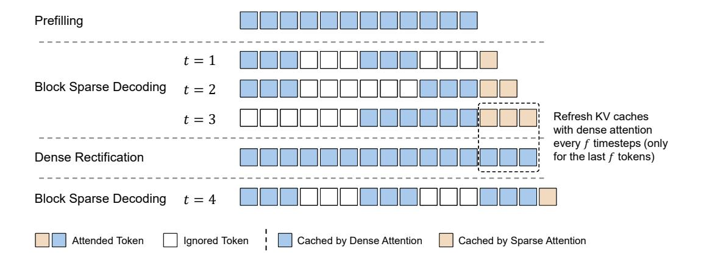
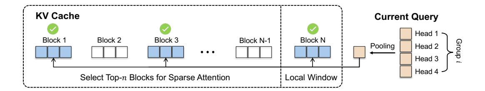

# **Rectified Sparse Attention**

Yutao Sun\* 12 Tianzhu Ye\* 12 Li Dong\* 1 Yuqing Xia\* 1

Jian Chen 1 Yizhao Gao 13 Shijie Cao 1 Jianyong Wang 2 Furu Wei 1 of Microsoft Research 2 Tsinghua University

3 The University of Hong Kong
https://aka.ms/GeneralAI

#### **Abstract**

Efficient long-sequence generation is a critical challenge for Large Language Models. While recent sparse decoding methods improve efficiency, they suffer from KV cache misalignment, where approximation errors accumulate and degrade generation quality. In this work, we propose Rectified Sparse Attention (ReSA), a simple yet effective method that combines block-sparse attention with periodic dense rectification. By refreshing the KV cache at fixed intervals using a dense forward pass, ReSA bounds error accumulation and preserves alignment with the pretraining distribution. Experiments across math reasoning, language modeling, and retrieval tasks demonstrate that ReSA achieves near-lossless generation quality with significantly improved efficiency. Notably, ReSA delivers up to 2.42× end-to-end speedup under decoding at 256K sequence length, making it a practical solution for scalable long-context inference. Code is available at https://aka.ms/ReSA-LM.

#### 1 Introduction

The ability to process long contexts has become a core requirement for Large Language Models, with context lengths up to millions of tokens [20, 26]. In particular, long sequence generation has received growing attention, especially due to the demand for test-time scaling [9, 13].

Despite this progress, efficient long-sequence generation remains a significant challenge. In standard autoregressive decoding, each token must attend to the full KV cache, leading to frequent memory access and increased IO pressure. This bottleneck severely limits throughput, especially in long-context scenarios where memory access dominates latency.

Recent works [18, 23] used sparse decoding to alleviate this issue. These methods selectively attend to a subset of the context, achieving accuracy comparable to dense attention on long inputs while reducing computational cost. However, as shown in Figure 1, they often suffer from worse performance with increasing length. Since **computation errors accumulate in the KV cache during sparse decoding**, the attention computation will suffer from the misalignment between training and inference, contributing to performance degradation.

In this work, we propose Rectified Sparse Attention (ReSA), a simple yet effective approach that achieves near-lossless long-sequence generation quality while maintaining high inference efficiency. ReSA leverages block-sparse attention [23] for fast

<span id="page-0-0"></span>Figure 1: Sparse decoding performance becomes worse with increasing decoding length due to error accumulation of KV cache.

<sup>0.79
0.79
0.79
0.79
0.77
0.76
0 1000 2000 3000 4000</sup>Decoding Length

<sup>\*</sup> Equal contribution. \$\phi\$ Corresponding author.



Figure 2: Overview of ReSA. After completing the prefill stage, the model enters sparse decoding. Once the number of generated tokens reaches the rectification frequency, a rectification step is performed to construct a lossless compact KV cache, after which sparse decoding resumes.

retrieval and further improves memory efficiency by applying

shared grouping [28], allowing query heads to reuse attention patterns. To address the error accumulation issue, we introduce dense rectification, where the sparse KV cache is periodically refreshed with a parallel dense forward pass. This ensures that approximation errors are bounded within a constant range, preventing long-term degradation.

We conduct comprehensive experiments to demonstrate the effectiveness of ReSA. On math reasoning benchmarks, ReSA achieves strong test-time scaling and matches dense attention in long-sequence settings. In language modeling, ReSA significantly closes the quality gap between sparse and dense decoding. On the efficiency side, our approach yields up to  $2.42 \times$  end-to-end speedup under INT4 decoding at 256K context length, showing strong practical utility for real-world deployment.

#### 2 Rectified Sparse Attention

ReSA primarily involves two alternating phases, sparse decoding and periodic rectification. During the decoding phase, we employ the group block sparse attention mechanism, which significantly reduces computational and memory overhead, enabling fast autoregressive inference. During the rectification stage, the decoding tokens are forwarded in parallel to correct approximation errors in KV cache introduced by sparse decoding. By alternating between sparse generation and dense rectification, ReSA enables scalable long-context inference while ensuring the generation quality.

#### <span id="page-1-0"></span>2.1 Group Block Sparse Attention

Self-attention mechanisms are the core component of Transformer architectures, enabling each token to attend to all previous tokens. Formally, in Group-Query Attention (GQA) [2], given a sequence of n tokens, we compute the query  $Q \in \mathbb{R}^{h \times g \times n \times d}$ , key  $K \in \mathbb{R}^{h \times n \times d}$ , and value  $V \in \mathbb{R}^{h \times n \times d}$  matrices through learned projections. The attention output is computed as:

Attention
$$(Q, K, V)_{ij} = \operatorname{softmax}\left(\frac{Q_{ij}K_i^{\top}}{\sqrt{d}}\right)V_i$$
 (1)

where  $\operatorname{softmax}(\cdot)$  is applied along each query row. The pairwise computation requires  $\mathcal{O}(n^2d)$  operations, making standard attention prohibitively expensive for long-context inference.

We adopt a block-sparse attention design that selectively attends to a small number of relevant memory blocks rather than the entire context. Given the block size b and block sparse mask  $M \in \{0,1\}^{h \times n \times n/b}$ , the block-sparse attention is computed as:

$$GBSA(Q, K, V, M)_{ij} = \operatorname{softmax}\left(\frac{Q_{ij}K_i^{\top} \cdot \overline{M}_i}{\sqrt{d}}\right) V_i, \ \overline{M}_{ijk} = M_{ij \lfloor k/b \rfloor}$$
 (2)



Figure 3: Overview of Group Block Sparse Attention. For each group of query heads, we perform average pooling and enforce the selection of the same KV blocks across all heads within the group.

GBSA adopts a query-dependent sparsity pattern, where each query attends to a limited set of key blocks determined by M. Since each selected key block corresponds to a contiguous memory region in the KV cache, this design ensures both high performance and memory efficiency during inference. Note that we further accelerate decoding by maintaining a shared sparse pattern within each GQA group [28].

**Block Representation** Following the Quest algorithm [23], we represent the key-value memory using blocks to enable efficient retrieval. Specifically, given a key matrix  $k \in \mathbb{R}^{n \times d}$ , we partition it into non-overlapping blocks of size b, where each block contains b consecutive tokens. For the i-th block, we compute two block descriptors:

$$k_{\text{block\_min},i} = \min(k_{ib:(i+1)b}), \ k_{\text{block\_max},i} = \max(k_{ib:(i+1)b})$$
 (3)

where  $\min(\cdot)$  and  $\max(\cdot)$  are applied element-wise across the block dimension.

Each block is thus summarized by a pair of vectors  $(k_{\mathrm{block} \, \mathrm{min},i}, k_{\mathrm{block} \, \mathrm{max},i})$ , which compactly describe the distribution range of keys within the block. This representation allows efficient approximate matching without exhaustively scanning all individual tokens. During decoding, newly generated keys can be incrementally incorporated by updating the block key statistics, enabling an online update mechanism without recomputing from scratch.

Notably, the block representation is entirely training-free, relying solely on statistical descriptors. Our method remains compatible with more advanced block representation strategies, such as SeerAttention [8], where block keys are fine-tuned jointly with the model to achieve higher retrieval precision if needed.

**Block Selection** During decoding, given a pooling query  $q \in \mathbb{R}^d$  for each GQA group and a set of block descriptors  $\{(k_{\text{block\_min},i}, k_{\text{block\_max},i})\}_{i=1}^M$ , we compute similarity scores following the Quest algorithm [23]. Specifically, the score between the pooling query and block i is calculated as:

$$score_{i} = \sum_{j=1}^{d} \max(q_{j} \times (k_{block\_max,i})_{j}, q_{j} \times (k_{block\_min,i})_{j})$$

$$(4)$$

where  $q_j$  denotes the j-th dimension of the pooling query, and  $(k_{\text{block min},i})_j$ ,  $(k_{\text{block max},i})_j$  are the j-th dimensions of the minimum and maximum vectors of block i, respectively.

To select the attended blocks, we adopt a dynamic top-n strategy. First, a fixed number of recent blocks, denoted as  $n_{\rm local}$ , are always preserved by setting their scores to  $+\infty$ , ensuring that the latest context is available for local coherence. Second, we enforce a minimal block number  $n_{\rm min}$  to avoid significant performance degradation on short sequences. Finally, the value of n is dynamically determined based on a active ratio p, following:

$$n = \max\left(n_{\min}, \lceil M \times p \rceil\right),\tag{5}$$

where M is the total number of available memory blocks. Attention computation is restricted to the selected blocks, significantly reducing memory accesses while maintaining retrieval quality.

### 2.2 Dense Rectification

Transformer inference implicitly consists of two distinct phases: **context encoding**, realized through the construction of the KV cache, and **next-token prediction**, realized through the forward pass of

#### Algorithm 1 Rectified Sparse Decoding

```
Require: Initial prompts P, model M, rectification frequency f, maximum generation steps T
Ensure: Generated tokens G
  Initialize KV cache K by Prefill(P, K)
  Initialize block key cache B
  Initialize output sequence G ← empty
  for i = 1 to T do
    t ← SparseForward(G[i − 1], K, B)
    Append t to G
    Update KV cache K with t
    Update block key cache B with t
    if i mod f = 0 then
       K, B ← DenseForward(G[i − f : i], K, B)
       Update block key cache B
    end if
  end for
```

the current token. While sparse attention effectively approximates the next-token prediction phase, it inevitably introduces errors. Crucially, these prediction errors accumulate in the KV cache during decoding, leading to compounding inaccuracies over long sequences. To mitigate this issue, we propose Dense Rectification, a lightweight mechanism that periodically refreshes the KV cache to maintain its quality. This design constrains error accumulation within a constant window size and enables efficient sparse decoding without compromising generation consistency.

Rectification Algorithm Given a rectification frequency f, we perform standard sparse decoding for up to f tokens, appending newly generated tokens into the KV cache. After every f token, we batch these recent tokens and re-encode them using dense attention to reconstruct an updated KV cache. This two-phase approach — serial sparse decoding followed by parallel rectification — ensures that errors introduced by approximate attention are corrected at regular intervals, keeping the memory quality close to that of dense decoding. Importantly, the rectification step amortizes efficiently over large batches, maintaining high throughput even when dense recomputation is involved. To maintain consistency, we also refresh the associated block keys during rectification. otherwise, the misalignment between the block keys and the updated KV cache would degrade subsequent sparse retrieval accuracy.

Compatibility with LLM Serving Systems Dense Rectification is naturally compatible with modern LLM serving optimizations such as continuous batching [\[27\]](#page-10-5) and chunked prefill [\[1,](#page-9-4) [12\]](#page-9-5). Since rectification only requires periodic batched re-encoding, it seamlessly fits into systems that dynamically group decoding and prefill workloads to maximize GPU utilization. By maintaining a fixed rectification frequency per request, our method can operate within the batching and scheduling pipelines without introducing special synchronization barriers or inefficiencies.

# 2.3 Decoding Procedure

Our decoding procedure alternates between sparse decoding and periodic rectification to achieve a balance between efficiency and generation quality. The process begins with a standard dense prefill phase, where the initial prompt is encoded into a complete key-value memory for subsequent decoding. During the decoding phase, tokens are generated sequentially using sparse attention, which restricts memory access to a dynamically selected subset of context blocks. This enables fast autoregressive generation with reduced computational and memory costs.

To correct for approximation errors introduced by sparse attention, we periodically perform rectification. Specifically, after a fixed number of decoding steps, we batch the recently generated tokens and re-encode them using dense attention. This refreshes the key-value memory and ensures that accumulated errors are bounded within a constant window, maintaining memory quality close to dense decoding. The full decoding procedure is summarized in Algorithm [1.](#page-3-0)

The pipeline continues by alternating between sparse generation and rectification until the generation process completes. This design enables scalable long-context inference while preserving the consistency and reliability of the generated outputs.

**Memory Access Analysis** We further analyze the memory efficiency of the proposed decoding pipeline. In each sparse decoding step, the memory access consists of two parts: retrieving block keys for selection, proportional to  $\operatorname{mem}(\mathsf{KV} \operatorname{cache})/b$ , and performing sparse attention, proportional to  $\operatorname{mem}(\mathsf{KV} \operatorname{cache}) \times p$ , where b denotes the block size and p denotes the sparsity ratio. In addition, for every f step, a dense rectification is performed, whose amortized cost per step is  $\operatorname{mem}(\mathsf{KV} \operatorname{cache})/f$ . Therefore, the average memory access per decoding step can be approximated as:

$$Avg(mem) = mem(KV cache) \times \left(\frac{1}{b} + p + \frac{1}{f}\right).$$
 (6)

Compared to dense decoding, which requires accessing the entire KV cache at every step, our design achieves a theoretical memory access reduction factor of  $\frac{1}{b} + p + \frac{1}{f}$ . By adjusting b, p, and f, the pipeline can flexibly trade-off between memory efficiency and generation fidelity.

#### 2.4 Kernel Implementation

We develop a custom kernel optimized for the decoding phase, following a split-execution strategy similar to Flash Decoding and incorporating shared KV fetching techniques [28]. The key design principle is to assign each GQA group to an individual streaming multiprocessor (SM), ensuring efficient resource utilization and minimal inter-SM communication.

The decoding workload is batch\_size  $\times$  num\_kv\_heads. Given the total number of SMs available on the GPU, the workload is split accordingly to balance the computation between SMs. The splitting is performed at the level of block indices. For each decoding step, a batch of queries typically activates k memory blocks. We partition these k active blocks evenly across the available SMs, so that each SM is responsible for approximately k/split blocks. Each SM independently fetches the required KV entries corresponding to its assigned blocks and performs sparse attention locally. The kernel implementation details are described in Appendix A.

The design achieves high decoding throughput by minimizing memory contention, maximizing SM occupancy, and fully exploiting intra-GQA key sharing during sparse decoding.

## 3 Experiments

# 3.1 Setup

We evaluate ReSA from different perspectives. First, we make test-time scaling inference on math reasoning tasks (Section 3.2). Second, we simulate inference-time attention pattern on language modeling (Section 3.3). Third, we verify the effectiveness on retrieval (Section 3.4) tasks. Fourth, we analyze the inference advantages (Section 3.5, including kernel-level and end-to-end accelerations.

We choose Qwen2.5 [25], a widely-used standard Transformer pre-trained model as evalutaion architectures. We apply ReSA on all of the layers, rather than skipping the first two layers in Quest [23]. The block size is 16 and the minimal selected block number is  $n_{\min} = 16$ ,  $n_{\text{local}} = 1$  to avoid performance degradation in short context. For longer sequences, the default sparsity ratio is p = 0.9. The default rectification frequency is f = 32.

### <span id="page-4-0"></span>3.2 Long Reasoning

We evaluate test-time scaling performance on math reasoning tasks. The validation dataets inclue Minerva Math [15], Gaokao 2023 En [17], OlympiadBench [10], AIME24, and AMC23. We exclude some well-known math datasets such as GSM8K [5], and MATH [11] since these datasets' average inference length is below 512. We choose DeepSeek-R1-Qwen-Distill 7B [9] as the evaluation model. The number of attention head is 28 and kv head is 4. The hidden size is 3584 and the number of layers is 28.

The results in Table 1 show that while ReSA achieves performance comparable to the dense baseline, Sparse Decoding alone consistently underperforms. ReSA maintains near-lossless performance in

|                          | Minerva          | Gaokao2023En        | OlympiadBench       | AIME24       | AMC23               | Avg            |
|--------------------------|------------------|---------------------|---------------------|--------------|---------------------|----------------|
| R1-Qwen-Distill 1.5B     |                  |                     |                     |              |                     |                |
| Dense                    | 28.7             | 71.6                | 40.8                | 27.4         | 65.6                | 46.82          |
| Sparse<br>ReSA           | <b>29.0</b> 28.1 | 67.9<br><b>71.8</b> | 38.7<br><b>39.5</b> | 21.3<br>23.0 | 60.6<br><b>65.4</b> | 43.50<br>45.56 |
| Avg Length               | 6390.8           | 4915.8              | 8991.6              | 12126.4      | 7866.4              | 8058.2         |
| R1-Owen-Distill 7B       |                  |                     |                     |              |                     |                |
| Dense                    | 40.4             | 73.8                | 52.3                | 48.1         | 89.0                | 60.72          |
| Sparse                   | 38.1             | 72.9                | 48.4                | 46.1         | 83.1                | 57.72          |
| Sparse <sub>dense2</sub> | 37.9             | 72.5                | 48.8                | 44.6         | 83.1                | 57.38          |
| ReSA                     | 39.7             | 73.5                | 52.3                | 51.1         | 86.0                | 60.52          |
| Avg Length               | 4018.7           | 2889.9              | 7520.0              | 10474.5      | 5732.2              | 6127.1         |

Table 1: Performance comparison on math reasoning tasks. While simple sparse decoding methods show a gap with dense decoding, ReSA achieves near lossless long-sequence generation.


<span id="page-5-1"></span>

<span id="page-5-2"></span>Figure 4: Top-3 next-token prediction accuracy with different rectification frequency.

<span id="page-5-3"></span>Figure 5: Top-3 next-token prediction accuracy with different sparsity ratio.

long-context reasoning tasks, whereas Sparse Decoding leads to performance degradation as decoding progresses. Additionally, manually enforcing dense layers for the first two layers does not result in a significant improvement in math-reasoning tasks.

#### <span id="page-5-0"></span>3.3 Language Modeling

Se evaluate language modeling performance under simulated sparse decoding patterns. Specifically, we divide each input sequence into two parts. Given a total sequence length L, we split it into a prefix of length L-x and a suffix of length x. The prefix is processed using dense attention, while the suffix uses sparse attention. Here, x effectively controls the rectification frequency. When x=L, it corresponds to the sparse decoding baseline, where no rectifying is performed and the entire sequence is encoded using sparse attention.

We conduct our experiments using long-sequence book data. For each target sequence length, we use the same data and truncate from the left to ensure that the prediction tokens are perfectly aligned across all settings. We report the top-3 accuracy computed over the final 32 tokens of each sequence to focus on the model's performance in the later decoding stages.

As shown in Figure 4, we compare the impact of different rectification frequencies on model perplexity. The setting labeled  $Decode\ Only$  corresponds to the case where all KV cache entries are generated using dense attention, and sparse attention is only used for decoding. This serves as the upper bound for ReSA. We observe that ReSA significantly reduces the performance gap between dense and sparse decoding. Notably, when x=32, the model's performance almost approaches the upper bound,

| Setting                                                                                                  | QA                      | MultiQuery              | FWE                     | VT                      | MultiKey                | MultiValue              | CWE                     | Single                  | Avg                     |
|----------------------------------------------------------------------------------------------------------|-------------------------|-------------------------|-------------------------|-------------------------|-------------------------|-------------------------|-------------------------|-------------------------|-------------------------|
| Dense                                                                                                    | 0.563                   | 0.211                   | 0.833                   | 0.719                   | 0.688                   | 0.246                   | 0.134                   | 1.000                   | 0.549                   |
| $\begin{array}{c} \hline \text{ReSA}_{p=0.95} \\ \text{ReSA}_{p=0.9} \\ \text{ReSA}_{p=0.8} \end{array}$ | 0.500<br>0.625<br>0.594 | 0.180<br>0.203<br>0.195 | 0.740<br>0.760<br>0.771 | 0.719<br>0.719<br>0.719 | 0.750<br>0.750<br>0.719 | 0.238<br>0.234<br>0.246 | 0.125<br>0.178<br>0.175 | 1.000<br>1.000<br>1.000 | 0.531<br>0.559<br>0.552 |

<span id="page-6-2"></span>Table 2: RULER benchmarks under different sparsity ratios. Dense represents the fully-attended baseline, while  $ReSA_{p=x}$  denotes our method with sparsity level x.

demonstrating the effectiveness of rectification in mitigating the error accumulation issue inherent in sparse decoding.

In Figure 5, we further examine the effect of different sparsity ratios under a fixed rectification frequency of x=32. We find that there is a noticeable performance gap between the p=0.98 and p=0.95. Although p=0.8 sparsity achieves perplexity comparable to the dense setting, we adopt p=0.9 as the default due to its better trade-off between performance and efficiency. Additionally, since effective block selection strategies can lead to higher achievable sparsity, our method can be further combined with advanced attention selection mechanisms such as SeerAttention [8] to enhance runtime efficiency.

#### <span id="page-6-0"></span>3.4 Long-Sequence Retrieval

We conduct experiments on the RULER benchmark to further evaluate the impact of different sparsity levels. Unlike the long-sequence generation tasks, where rectification plays a critical role in mitigating cumulative error, the RULER benchmark focuses on relatively short output sequences. As a result, the final accuracy is primarily determined by the quality of the sparse attention estimation.

Results are presented in Table 2. We observe that as the sparsity ratio increases from p=0.95 to p=0.9, there is a consistent improvement in average accuracy, with  ${\rm ReSA}_{p=0.9}$  achieving comparable performance to the dense baseline (0.559 vs. 0.549). The performance under p=0.8 remains similar to that under p=0.9, indicating that moderate increases in sparsity do not substantially degrade accuracy in short-generation settings. Considering that a lower sparsity ratio generally leads to faster inference,  ${\rm ReSA}_{p=0.9}$  represents a better trade-off between performance and efficiency on the RULER benchmark.

# <span id="page-6-1"></span>3.5 Inference Efficiency

We evaluate the efficiency of ReSA on standard GPU hardware. Specifically, we use Qwen-2.5 7B as the evaluation model and conduct all experiments on NVIDIA A100-80G GPUs. The primary baseline is FlashAttention, a highly optimized dense attention implementation. To ensure a fair comparison and prevent memory overflow issues caused by excessively large KV caches during long-sequence evaluation, we adopt a shared KV cache strategy across all layers during efficiency measurements. The batch size is fixed at 8 by default throughout all experiments.

For latency measurement, we report the CUDA kernel execution time, excluding CPU-side scheduling overhead. This setup more accurately reflects the real-world inference scenario, as the CPU overhead can be effectively optimized away through techniques such as CUDA graph capture.

## 3.5.1 Attention Efficiency

Figure 6 shows the detailed latency breakdown across different sequence lengths (16k, 64k, and 256k tokens). We compare ReSA, and dense attention under the same settings. The latency is decomposed into three parts: sparse estimation, attention computation, and rectification overhead.

Compared to dense attention, ReSA significantly reduces the total latency, especially at longer sequence lengths. As the sequence grows, dense attention exhibits longer latency with increasing context length, leading to substantial latency increase, while ReSA maintains much flatter scaling due to its sparsified attention computation.


<span id="page-7-0"></span>Figure 6: Kernel-level latency breakdown across different sequence lengths. While Sparse Decoding achieves effective acceleration, rectification only requires a small additional overhead.

Moreover, sparse estimation and attention computation consume comparable amounts of time, because the memory access pattern for sparse estimation scales with mem(KV cache)/block, while for attention it scales with mem(KV cache) × p. Given our experimental settings (block = 16, p = 0.9), both operations operate on similar memory volumes. Notably, under fixed block size, further increasing the sparsity ratio can not bring significant speed-up.

The overhead of rectification is relatively small compared with sparse decoding part. Specifically, the rectification module accounts for up to 32.7% of the total attention-related latency at 256k lengths, while at 64k, this proportion drops to 28.9%. When the sequence length is scaling, the latency ratio will converge to the memory access ratio 1/f. These results indicate that while sparse estimation and attention computation remain efficient, the rectification does not bring big overhead.

#### 3.5.2 End-to-End Efficiency

We further evaluate the end-to-end throughput of ReSA in both FP16 and INT4 precision settings. For the INT4 experiments, we leverage the Marlin kernel [\[7\]](#page-9-9) for low-bit matmul. The matmul weight is quantized with group-wise scaling. The group size is 128.

Figure [7](#page-7-1) and Figure [8](#page-7-2) report the throughput across different context lengths (4K, 16K, 64K, and 256K tokens) under FP16 and INT4 settings, respectively. Consistent with the kernel-level results, ReSA significantly improves the overall throughput as the sequence length grows, achieving up to 2.28× speedup over dense attention in FP16 and 2.44× in INT4 at 256K context length.

Notably, the benefits of ReSA become more prominent at longer sequences due to the quadratic scaling bottleneck of dense attention, while the overhead of sparse estimation and rectification remains modest even under quantized inference. These results demonstrate that ReSA is highly effective in improving real-world end-to-end generation speed across different precision levels.


<span id="page-7-1"></span>Figure 7: End-to-end latency with FP16.

<span id="page-7-2"></span>Figure 8: End-to-end latency with INT4.


<span id="page-8-0"></span>Figure 9: Ablation studies on different rectification frequencies f and sparsity ratios p across five math reasoning benchmarks. ReSA consistently improves over the sparse baseline. Frequencies f=32 or f=64 achieve the best trade-off between performance and overhead.

#### 3.6 Ablation Studies

We conduct ablation studies to examine the effect of rectification frequency and sparsity ratio on performance. As shown in Figure 9, we evaluate ReSA across five math reasoning benchmarks under varying sparsity levels ( $p \in \{0.9, 0.95, 0.98\}$ ) and rectification frequencies ( $f \in \{16, 32, 64, 128\}$ ).

Compared to the sparse decoding baseline, ReSA consistently outperforms the baseline across all sparsity levels. Notably, when the attention computation ratio is reduced to 0.1, ReSA achieves accuracy that is remarkably close to the dense decoding upper bound. This demonstrates that ReSA effectively mitigates the quality drop typically associated with sparse decoding while maintaining high computational efficiency.

Among the frequencies, f=32 achieves accuracy close to the dense baseline on most datasets, striking a favorable balance between quality and efficiency. While f=16 offers marginal gains, it incurs higher rectification overhead and is therefore less practical. Notably, even with f=128, a large portion of the performance gain is retained, highlighting the robustness of the rectification mechanism under infrequent updates.

### <span id="page-8-1"></span>4 Related Work

**Sparse Attention** Recent efforts in sparse decoding for large language models can be broadly categorized into training-free and training-aware approaches. Training-free methods enhance inference efficiency without substantial retraining. Quest [23] and InfLLM [24] both adopt query-aware blocksparse attention, selectively retrieving critical memory blocks based on query relevance. MagicPig [4] and ClusterKV (Tactic) [18] employ similarity-based techniques, using hashing or clustering to approximate attention relevance. In contrast, training-aware architectures such as NSA [28] and MoBA [19] integrate sparsity into model design, aligning structures with hardware during pretraining. Our method complements training-free sparse attention by improving memory quality through lightweight rectification, avoiding the high retraining cost required by training-aware approaches.

**Speculative Decoding** Speculative decoding [14] accelerates generation by drafting multiple tokens and verifying them with the target model. Methods like Medusa [3] and EAGLE [16] reuse the target model's hidden states for drafting. TriForce [22] and MagicDec [21] propose self-speculation, using the model's own sparse KV cache for drafting and a dense cache for verification. While sharing similar compute characteristics with sparse KV-based self-speculation, ReSA avoids per-token accept/reject decisions and resampling overhead. In Appendix B, we compare ReSA and self-speculation in detail.

### 5 Conclusion

In this paper, we introduced Rectified Sparse Attention, a simple yet effective method for efficient long-sequence generation. ReSA combines group block sparse attention for decoding latency, and dense rectification to bound error accumulation. Extensive experiments on math reasoning and language modeling tasks demonstrate that ReSA achieves near-lossless performance compared to dense decoding, delivering up to  $2.42\times$  inference speedup at 256K context length. These results highlight ReSA's practical effectiveness in long-context language model deployment.

# Acknowledgments

We would like to thank Lei Wang and Yu Cheng for their valuable help implementing group block sparse attention with the [TileLang](https://github.com/tile-ai/tilelang) library.

# References

- <span id="page-9-4"></span>[1] Amey Agrawal, Ashish Panwar, Jayashree Mohan, Nipun Kwatra, Bhargav S Gulavani, and Ramachandran Ramjee. Sarathi: Efficient llm inference by piggybacking decodes with chunked prefills. *arXiv preprint arXiv:2308.16369*, 2023.
- <span id="page-9-2"></span>[2] Joshua Ainslie, James Lee-Thorp, Michiel de Jong, Yury Zemlyanskiy, Federico Lebrón, and Sumit Sanghai. Training generalized multi-query transformer models from multi-head checkpoints. *arXiv preprint arXiv:2305.13245*, 2023.
- <span id="page-9-11"></span>[3] Tianle Cai, Yuhong Li, Zhengyang Geng, Hongwu Peng, Jason D Lee, Deming Chen, and Tri Dao. Medusa: Simple llm inference acceleration framework with multiple decoding heads. *arXiv preprint arXiv:2401.10774*, 2024.
- <span id="page-9-10"></span>[4] Zhuoming Chen, Ranajoy Sadhukhan, Zihao Ye, Yang Zhou, Jianyu Zhang, Niklas Nolte, Yuandong Tian, Matthijs Douze, Leon Bottou, Zhihao Jia, et al. Magicpig: Lsh sampling for efficient llm generation. *arXiv preprint arXiv:2410.16179*, 2024.
- <span id="page-9-7"></span>[5] Karl Cobbe, Vineet Kosaraju, Mohammad Bavarian, Mark Chen, Heewoo Jun, Lukasz Kaiser, Matthias Plappert, Jerry Tworek, Jacob Hilton, Reiichiro Nakano, et al. Training verifiers to solve math word problems. *arXiv preprint arXiv:2110.14168*, 2021.
- <span id="page-9-12"></span>[6] Tri Dao, Daniel Haziza, Francisco Massa, and Grigory Sizov. Flash-Decoding for long-context inference. <https://crfm.stanford.edu/2023/10/12/flashdecoding.html>, 2023.
- <span id="page-9-9"></span>[7] Elias Frantar, Roberto L Castro, Jiale Chen, Torsten Hoefler, and Dan Alistarh. Marlin: Mixed-precision auto-regressive parallel inference on large language models. *arXiv preprint arXiv:2408.11743*, 2024.
- <span id="page-9-3"></span>[8] Yizhao Gao, Zhichen Zeng, Dayou Du, Shijie Cao, Peiyuan Zhou, Jiaxing Qi, Junjie Lai, Hayden Kwok-Hay So, Ting Cao, Fan Yang, et al. Seerattention: Learning intrinsic sparse attention in your llms. *arXiv preprint arXiv:2410.13276*, 2024.
- <span id="page-9-0"></span>[9] Daya Guo, Dejian Yang, Haowei Zhang, Junxiao Song, Ruoyu Zhang, Runxin Xu, Qihao Zhu, Shirong Ma, Peiyi Wang, Xiao Bi, et al. Deepseek-r1: Incentivizing reasoning capability in llms via reinforcement learning. *arXiv preprint arXiv:2501.12948*, 2025.
- <span id="page-9-6"></span>[10] Chaoqun He, Renjie Luo, Yuzhuo Bai, Shengding Hu, Zhen Leng Thai, Junhao Shen, Jinyi Hu, Xu Han, Yujie Huang, Yuxiang Zhang, et al. Olympiadbench: A challenging benchmark for promoting agi with olympiad-level bilingual multimodal scientific problems. *arXiv preprint arXiv:2402.14008*, 2024.
- <span id="page-9-8"></span>[11] Dan Hendrycks, Collin Burns, Saurav Kadavath, Akul Arora, Steven Basart, Eric Tang, Dawn Song, and Jacob Steinhardt. Measuring mathematical problem solving with the math dataset. In *Thirty-fifth Conference on Neural Information Processing Systems Datasets and Benchmarks Track (Round 2)*, 2021.
- <span id="page-9-5"></span>[12] Connor Holmes, Masahiro Tanaka, Michael Wyatt, Ammar Ahmad Awan, Jeff Rasley, Samyam Rajbhandari, Reza Yazdani Aminabadi, Heyang Qin, Arash Bakhtiari, Lev Kurilenko, et al. Deepspeed-fastgen: High-throughput text generation for llms via mii and deepspeed-inference. *arXiv preprint arXiv:2401.08671*, 2024.
- <span id="page-9-1"></span>[13] Aaron Jaech, Adam Kalai, Adam Lerer, Adam Richardson, Ahmed El-Kishky, Aiden Low, Alec Helyar, Aleksander Madry, Alex Beutel, Alex Carney, et al. Openai o1 system card. *arXiv preprint arXiv:2412.16720*, 2024.

- <span id="page-10-11"></span>[14] Yaniv Leviathan, Matan Kalman, and Yossi Matias. Fast inference from transformers via speculative decoding. In *International Conference on Machine Learning*, pages 19274–19286. PMLR, 2023.
- <span id="page-10-7"></span>[15] Aitor Lewkowycz, Anders Andreassen, David Dohan, Ethan Dyer, Henryk Michalewski, Vinay Ramasesh, Ambrose Slone, Cem Anil, Imanol Schlag, Theo Gutman-Solo, et al. Solving quantitative reasoning problems with language models. *Advances in Neural Information Processing Systems*, 35:3843–3857, 2022.
- <span id="page-10-12"></span>[16] Yuhui Li, Fangyun Wei, Chao Zhang, and Hongyang Zhang. Eagle: Speculative sampling requires rethinking feature uncertainty. *arXiv preprint arXiv:2401.15077*, 2024.
- <span id="page-10-8"></span>[17] Minpeng Liao, Wei Luo, Chengxi Li, Jing Wu, and Kai Fan. Mario: Math reasoning with code interpreter output–a reproducible pipeline. *arXiv preprint arXiv:2401.08190*, 2024.
- <span id="page-10-2"></span>[18] Guangda Liu, Chengwei Li, Jieru Zhao, Chenqi Zhang, and Minyi Guo. Clusterkv: Manipulating llm kv cache in semantic space for recallable compression. *arXiv preprint arXiv:2412.03213*, 2024.
- <span id="page-10-10"></span>[19] Enzhe Lu, Zhejun Jiang, Jingyuan Liu, Yulun Du, Tao Jiang, Chao Hong, Shaowei Liu, Weiran He, Enming Yuan, Yuzhi Wang, et al. Moba: Mixture of block attention for long-context llms. *arXiv preprint arXiv:2502.13189*, 2025.
- <span id="page-10-0"></span>[20] Machel Reid, Nikolay Savinov, Denis Teplyashin, Dmitry Lepikhin, Timothy Lillicrap, Jeanbaptiste Alayrac, Radu Soricut, Angeliki Lazaridou, Orhan Firat, Julian Schrittwieser, et al. Gemini 1.5: Unlocking multimodal understanding across millions of tokens of context. *arXiv preprint arXiv:2403.05530*, 2024.
- <span id="page-10-14"></span>[21] Ranajoy Sadhukhan, Jian Chen, Zhuoming Chen, Vashisth Tiwari, Ruihang Lai, Jinyuan Shi, Ian En-Hsu Yen, Avner May, Tianqi Chen, and Beidi Chen. Magicdec: Breaking the latencythroughput tradeoff for long context generation with speculative decoding. *arXiv preprint arXiv:2408.11049*, 2024.
- <span id="page-10-13"></span>[22] Hanshi Sun, Zhuoming Chen, Xinyu Yang, Yuandong Tian, and Beidi Chen. Triforce: Lossless acceleration of long sequence generation with hierarchical speculative decoding. *arXiv preprint arXiv:2404.11912*, 2024.
- <span id="page-10-3"></span>[23] Jiaming Tang, Yilong Zhao, Kan Zhu, Guangxuan Xiao, Baris Kasikci, and Song Han. Quest: Query-aware sparsity for efficient long-context llm inference. *arXiv preprint arXiv:2406.10774*, 2024.
- <span id="page-10-9"></span>[24] Chaojun Xiao, Pengle Zhang, Xu Han, Guangxuan Xiao, Yankai Lin, Zhengyan Zhang, Zhiyuan Liu, and Maosong Sun. Infllm: Training-free long-context extrapolation for llms with an efficient context memory. *arXiv preprint arXiv:2402.04617*, 2024.
- <span id="page-10-6"></span>[25] An Yang, Baosong Yang, Beichen Zhang, Binyuan Hui, Bo Zheng, Bowen Yu, Chengyuan Li, Dayiheng Liu, Fei Huang, Haoran Wei, et al. Qwen2. 5 technical report. *arXiv preprint arXiv:2412.15115*, 2024.
- <span id="page-10-1"></span>[26] An Yang, Bowen Yu, Chengyuan Li, Dayiheng Liu, Fei Huang, Haoyan Huang, Jiandong Jiang, Jianhong Tu, Jianwei Zhang, Jingren Zhou, et al. Qwen2. 5-1m technical report. *arXiv preprint arXiv:2501.15383*, 2025.
- <span id="page-10-5"></span>[27] Gyeong-In Yu, Joo Seong Jeong, Geon-Woo Kim, Soojeong Kim, and Byung-Gon Chun. Orca: A distributed serving system for Transformer-based generative models. In *16th USENIX Symposium on Operating Systems Design and Implementation (OSDI 22)*, pages 521–538, 2022.
- <span id="page-10-4"></span>[28] Jingyang Yuan, Huazuo Gao, Damai Dai, Junyu Luo, Liang Zhao, Zhengyan Zhang, Zhenda Xie, YX Wei, Lean Wang, Zhiping Xiao, et al. Native sparse attention: Hardware-aligned and natively trainable sparse attention. *arXiv preprint arXiv:2502.11089*, 2025.

# <span id="page-11-0"></span>A Pseudo Code of Flash Decoding Kernel

The proposed group block sparse attention (Section [2.1\)](#page-1-0) can be easily integrated into the Flash Decoding [\[6\]](#page-9-12) kernel implementation. The modified parts are highlighted as follows.

```
Algorithm 2 Flash Decoding with Block-Sparse Attention
Require: Queries Q, Keys K, Values V , block_indices
Ensure: Attention outputs Outpartial, logsumpartial, Out
 1: for Grid indexed by (num_splits, num_kv_heads, batch_size) do
 2: Load query vectors q in a GQA group
 3: Compute partial_block_indices with block_indices and num_splits
 4: Initialize accumulators: mi ← −∞, li ← 1.0, acc ← 0
 5: for block_id in partial_block_indices do
 6: Load keys k and values v from KV cache in block block_id
 7: Compute scaled attention scores qk ← (qk) × sm_scale
 8: Apply masking to invalid positions (qk ← −1e6)
 9: Compute and update mi
                               , li
                                 , acc
10: end for
11: Store partial logsum and attention outputs into logsumpartial, Outpartial
12: end for
13: Combine different splits Combine(logsumpartial, Outpartial, Out)
14: return Attention output tensor Out
```

# <span id="page-11-1"></span>B Comparison with Self-Speculation

As discussed in Section [4,](#page-8-1) ReSA shares similar computational characteristics with sparse KV cachebased self-speculation. The rectification phase in ReSA resembles the verification phase used in self-speculative methods. However, unlike these methods, ReSA does not rely on output logits to make per-token accept / reject decisions. This design choice is motivated by the observation that, when sparse attention achieves high generation quality, this kind of token-wise strict verification can significantly increase latency without providing proportionate accuracy gains.

To validate this, we compare ReSA and sparse KV-based self-speculation on mathematical reasoning tasks. We set the speculation length to 16, meaning that the model drafts 16 tokens using the sparse KV cache. Similarly, we set ReSA's rectification frequency to 16. Across all tasks, ReSA achieves nearly 2× speedup over self-speculation while maintaining comparable accuracy. This is because, in each verification step of speculative decoding, only about 8 tokens are typically accepted—effectively halving the generation rate compared to ReSA. Although this strict verification ensures that speculative decoding matches the accuracy of dense attention, we have previously shown that ReSA also approaches the accuracy of dense attention. Therefore, we believe that the marginal accuracy gains of speculative decoding do not justify its substantial latency overhead.

| Task          | Sparse KV Self-Spec. | Rectified Sparse Attention |
|---------------|----------------------|----------------------------|
| Minerva       | 1×                   | 1.93×                      |
| Gaokao2023En  | 1×                   | 1.87×                      |
| OlympiadBench | 1×                   | 1.98×                      |
| AIME24        | 1×                   | 1.96×                      |
| AMC23         | 1×                   | 1.86×                      |
| Average       | 1×                   | 1.92×                      |

Table 3: Decoding speedup comparison. We set the throughput of self-speculation as baseline. ReSA achieves larger speedup compared with sparse self-speculative decoding.