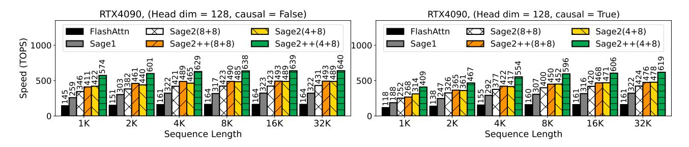
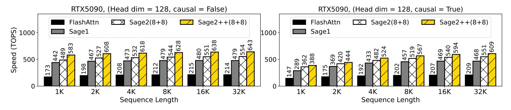
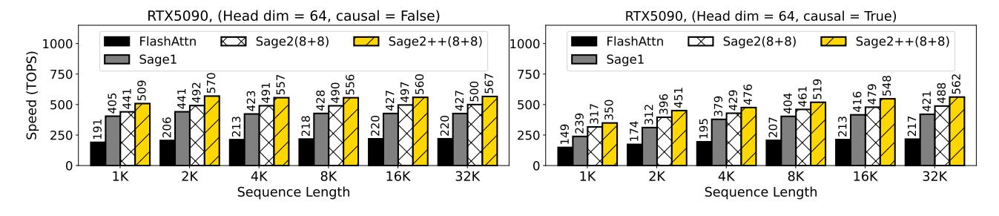
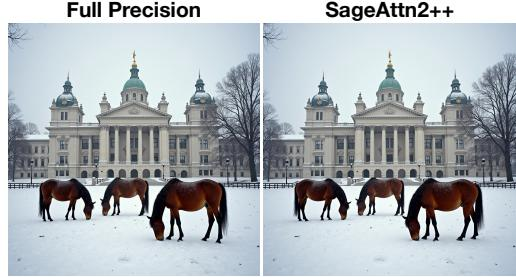
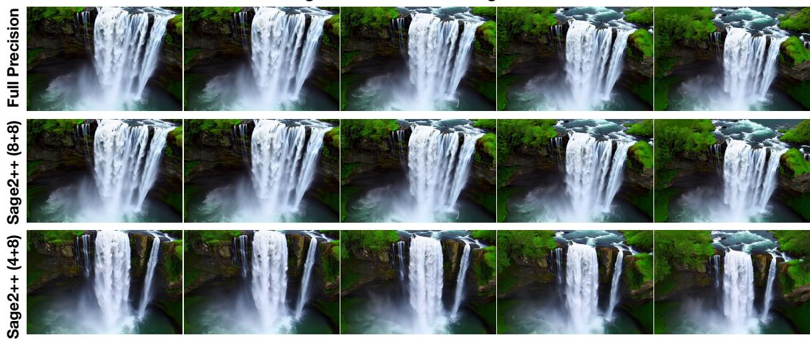
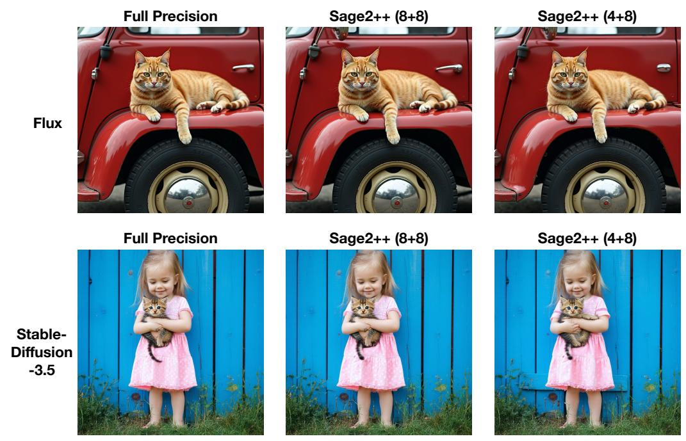

# SageAttention2++: A More Efficient Implementation of SageAttention2

Jintao Zhang 1 Xiaoming Xu 1 Jia Wei 1 Haofeng Huang 1 Pengle Zhang 1 Chendong Xiang 1 Jun Zhu 1 Jianfei Chen 1

# Abstract

The efficiency of attention is critical because its time complexity grows quadratically with sequence length. SageAttention2 addresses this by using quantization to speed up matrix multiplications (Matmul) in attention. To further accelerate SageAttention2, we propose to utilize the faster instruction of FP8 Matmul accumulated in FP16. The instruction is 2× faster than the FP8 Matmul used in SageAttention2. Our experiments show that SageAttention2++ achieves a 3.9× speedup over FlashAttention while maintaining the same attention accuracy as SageAttention2. This means SageAttention2++ effectively accelerates various models, including those for language, image, and video generation, with negligible end-to-end metrics loss. The code will be available at [https://github.com/](https://github.com/thu-ml/SageAttention) [thu-ml/SageAttention](https://github.com/thu-ml/SageAttention).

# 1. Introduction

The quadratic time complexity of attention necessitates efficient implementations for real-world applications with long sequences [\(Jiang et al., 2024\)](#page-5-0). Current approaches to reduce attention's computational demands fall into three main categories: (1) *linear attention* methods [\(Wang et al., 2020;](#page-6-0) [Choromanski et al., 2021;](#page-5-1) [Yu et al., 2022;](#page-7-0) [Katharopoulos](#page-5-2) [et al., 2020;](#page-5-2) [Qin et al., 2024;](#page-6-1) [Yang et al., 2024\)](#page-7-1) that achieve O(N) complexity, and (2) *sparse attention* techniques [\(Liu](#page-6-2) [et al., 2021;](#page-6-2) [Chu et al., 2021;](#page-5-3) [Li et al., 2022;](#page-5-4) [Xiao et al.,](#page-6-3) [2024b;](#page-6-3)[a;](#page-6-4) [Chen et al., 2024;](#page-5-5) [Jiang et al., 2024;](#page-5-0) [Venkatara](#page-6-5)[manan et al., 2024;](#page-6-5) [Gao et al., 2024;](#page-5-6) [Fu et al., 2024;](#page-5-7) [Zhang](#page-7-2) [et al., 2025e;](#page-7-2) [Xi et al., 2025;](#page-6-6) [Zhang et al., 2025f\)](#page-7-3) that process only relevant context portions. While effective, these methods often exhibit limited generality across models and tasks. (3) An alternative direction focuses on hardware-optimized attention implementations that maintain full sequence computation while achieving superior speed and accuracy. Notable examples include FlashAttention [\(Dao et al., 2022\)](#page-5-8), FlashAttention2 [\(Dao, 2024;](#page-5-9) [Shah et al., 2024\)](#page-6-7), xFormers [\(Lefaudeux et al., 2022\)](#page-5-10), and SageAttentions [\(Zhang](#page-7-4) [et al., 2025c;c;](#page-7-4)[d](#page-7-5)[;b\)](#page-7-6) which demonstrate strong performance across diverse applications.

Motivation, problem, and our approach. For the second matrix multiplication (Matmul) P V in attention, SageAttention2 accelerates it by quantizing to FP8 and using the mma.f32.f8.f8.f32 instruction. However, mma.f32.f8.f8.f32 employs an FP32 accumulator and is only 2× faster than FP16. We find that the mma.f16.f8.f8.f16 instruction (using FP16 accumulator for FP8 Matmul) achieves 4× speedup over FP16 [\(NVIDIA, 2022\)](#page-6-8). Therefore, we aim to accelerate SageAttention2 by using the faster instruction. However, directly using the faster instruction will lead to the values of P V exceeding the representable range of FP16. To address the problem, we propose to narrow the quantization range of P and V to satisfy the accumulator range in FP16.

Performance. For efficiency, SageAttention2++ delivers a 3.9× speedup over FlashAttention. In terms of accuracy, SageAttention2++ matches SageAttention2's performance. We conduct comprehensive evaluations on state-of-the-art models for text, image, and video generation. The results demonstrate that SageAttention2++ provides plug-and-play acceleration with negligible end-to-end metrics loss across diverse models.

# 2. Preliminary

Table 1. Speedup compared to matrix multiplication in FP16 with an FP32 accumulator.

| GPU      | MM Input | MM Accumulator | Speedup |
|----------|----------|----------------|---------|
|          | FP16     | FP32           | 1x      |
| RTX4090, | FP8      | FP32           | 2x      |
| RTX5090  | FP8      | FP16           | 4x      |

### 2.1. SageAttention2

SageAttention2 [\(Zhang et al., 2025a\)](#page-7-7) is a quantization [\(Zhang et al., 2025g;](#page-7-8) [Hu et al., 2025\)](#page-5-11) method based on FlashAttention [\(Dao et al., 2022\)](#page-5-8). FlashAttention tiles

1Department of Computer Science, Tsinghua University. *Preprint*.

Table 2. Average attention accuracy across all attention layers of CogvideoX.

| Method      | $P_r$ | $V_r$ | <b>Cossim</b> ↑ | L1↓     |
|-------------|-------|-------|-----------------|---------|
| SageAttn2   | 448   | 448   | 99.97%          | 0.01862 |
| SageAttn2++ | 448   | 2.25  | 99.97%          | 0.01863 |
| SageAttn2++ | 224   | 4.5   | 99.97%          | 0.01862 |
| SageAttn2++ | 112   | 9     | 99.97%          | 0.01863 |

Q,K,P,V into blocks  $(\{Q_i\},\{K_i\},\{\tilde{P}_i\},\{V_i\})$  and uses online softmax (Milakov & Gimelshein, 2018) to compute attention progressively. For simplicity, we omit the subscripts  $(\{Q_i\},\{K_i\},\{\tilde{P}_i\},\{V_i\})$  in the following content and use  $Q,K,\tilde{P},V$  to represent the tiled blocks. SageAttention2 quantizes Q,K to INT4/INT8 with per-block granularity,  $\tilde{P}$  to FP8 in E4M3 with per-block granularity, and quantizes V to FP8 in E4M3 with per-channel granularity. This means each  $Q,K,\tilde{P}$  has a separate scale factor:  $\delta_Q = \max(|Q|)/127, \delta_K = \max(|K|)/127, \delta_P = \max(|\tilde{P}|)/448$ , and each channel of V has a separate scalar scale:  $\delta_V = \operatorname{colmax}(|V|)/448$ . By doing so, SageAttention2 accelerates matrix multiplications in attention through low-bit Tensor Core operations. For example,  $\hat{P} = \lceil \tilde{P}/\delta_P \rfloor$ ,  $\hat{V} = \lceil V/\delta_v \rceil$ . Then,  $PV = \hat{P}\hat{V} * \delta_P * \delta_V$ .

### 2.2. Data Type of Accumulator for Matmul

In some GPUs, the speed of Matmul instructions depends on the accumulator data type. For instance, mma.f32.f8.f8.f32 uses FP32 accumulator for FP8 Matmul and is only  $2\times$  faster than FP16. The instruction using FP16 accumulator for FP8 Matmul (mma.f16.f8.f8.f16) is  $4\times$  faster than FP16. Table 1 summarizes the speedup of Matmul instructions with different accumulators.

### 3. SageAttention2++

In this section, we introduce SageAttention2++. The workflow of SageAttention2++ is based on SageAttention2, also using the smoothing of Q and K, INT4/INT8 quantization for  $QK^{\top}$  Matmul and FP8 quantization for PV Matmul. The main difference is that for PV, SageAttention2++ uses the faster instruction (mma.f16.f8.f8.f16), which employs an FP16 accumulator for the FP8 Matmul. To ensure the results of FP8 Matmul remain within FP16's representable range, we adjust the scale factor of the FP8 quantization.

### 3.1. Narrowing the FP8 Quantization Range

The specific MMA (NVIDIA, 2025) instruction used for the MatMul between P and V is mma.m16n8k32. If we quantize P and V to FP8 in E4M3 (-448 $\sim$ 448) as in SageAt-

tention2, the results may exceed FP16's representable range (-65504 $\sim$ 65504). This occurs because 32 product values pv are accumulated in FP16, where p and v come from quantized  $\hat{P}$  and  $\hat{V}$  (derived from  $\widetilde{P}$  and V). To ensure the accumulated results stay within FP16's range:

$$|32 \times pv| \le 65504\tag{1}$$

For instance, choosing  $|p| \le 224$  and  $|v| \le 9$  satisfies this condition. We therefore narrow the quantization ranges of P and V by adjusting their scale factors:

$$\delta_P = |\max(\widetilde{P})|/P_r, \quad \delta_V = |\max(V)|/V_r$$
 (2)

where we constrain  $P_r \times V_r \le 2047$  (since 65504/32 = 2047).

### 3.2. Delayed FP32 Buffering

The transformation of accumulated values from mma.m16n8k32 (in FP16) to FP32 incurs overhead because it needs additional data type conversion PTX instructions (NVIDIA, 2025) to execute. To reduce this overhead, we accumulate two consecutive mma.m16n8k32 results in FP16 before performing FP32 conversion, effectively halving the transformation overhead. Maintaining the FP16 representable range requires:

$$P_r \times V_r \le 2047/2 \tag{3}$$

**Choice of**  $P_r$  **and**  $V_r$ . Table 2 shows attention accuracy for feasible  $(P_r, V_r)$  pairs. The results demonstrate that narrowing quantization ranges introduces negligible error. We select  $P_r = 224$  and  $V_r = 4.5$  for optimal performance.

### 4. Experiment

Main result. SageAttention2++ achieves up to 3.9× speedup over FlashAttention2 while consistently outperforming both SageAttention and SageAttention2 in computational efficiency. Importantly, these performance gains are achieved with negligible impact on end-to-end metrics across diverse model architectures.

### **4.1. Setup**

Models and attentions. We evaluate SageAttention2++ across diverse representative models spanning language, image, and video generation: Llama3.1 (8B) (Dubey et al., 2024) for text2text, CogvideoX (2B), HunyuanVideo (Kong et al., 2024), and Wan (Wan et al., 2025) for text2video, and Flux (schnell) (Black Forest Labs, 2023) and Stable-Diffusion3.5 (turbo) (Stability AI, 2023) for text2image. We compare our method with FlashAttention2 (Dao, 2024), SageAttention (Zhang et al., 2025c),

Figure 1. Speed comparison between SageAttention2++ and baselines (RTX4090, headdim=128).

Figure 2. Speed comparison between SageAttention2++ and baselines (RTX4090, headdim=64).

Figure 3. Speed comparison between SageAttention2++ and baselines (RTX5090, headdim=128).

Figure 4. Speed comparison between SageAttention2++ and baselines (RTX5090, headdim=64).

and SageAttention2 (Zhang et al., 2025a). Please **note** that FlashAttention3 can only run on Hopper GPUs, so FlashAttention2 is already the fastest version for RTX5090 and RTX4090. Following SageAttention2's approach, we implement two SageAttention2++ variants: SageAttn2++(8+8) (INT8 for Q,K) and SageAttn2++(4+8) (INT4 for Q,K), both using FP8 in E4M3 for  $\widetilde{P},V$ .

Datasets and metrics. Detailed dataset and metric informa-

tion appears in Appendix A.2.

Implementation. We implement SageAttention2++ using CUDA.

### 4.2. Speed of Kernels

**Kernel Speed.** We benchmark the speed of SageAttention2++ against baselines using configurations with headdim=64 and headdim=128, both with

Table 3. End-to-end metrics across text, image, and video generation models.

| Model    | Attention        | WikiText (Ppl.) ↓ | Lambda (Acc.) ↑ | NIAH (Acc.) ↑ |
|----------|------------------|-------------------|-----------------|---------------|
|          | Full-Precision   | 6.013             | 0.815           | 0.906         |
| Llama3.1 | SageAttn2(8+8)   | 6.019             | 0.811           | 0.903         |
|          | SageAttn2++(8+8) | 6.020             | 0.813           | 0.901         |

| Model     | Attention        | CLIPSIM ↑ | CLIP-T ↑ | VQA-a ↑ | VQA-t ↑ | FScore ↑ |
|-----------|------------------|-----------|----------|---------|---------|----------|
|           | Full-Precision   | 0.179     | 0.997    | 74.499  | 74.642  | 4.974    |
|           | SageAttn2(4+8)   | 0.179     | 0.997    | 76.309  | 66.396  | 4.386    |
| CogvideoX | SageAttn2(8+8)   | 0.178     | 0.997    | 74.322  | 74.447  | 4.899    |
| (2B)      | SageAttn2++(4+8) | 0.179     | 0.997    | 74.387  | 66.568  | 4.333    |
|           | SageAttn2++(8+8) | 0.179     | 0.997    | 76.309  | 73.165  | 4.386    |
|           | Full-Precision   | 0.175     | 0.999    | 77.437  | 52.731  | 1.169    |
|           | SageAttn2(4+8)   | 0.176     | 0.999    | 73.282  | 55.141  | 0.968    |
| Hunyuan   | SageAttn2(8+8)   | 0.175     | 0.999    | 78.145  | 54.878  | 1.176    |
| Video     | SageAttn2++(4+8) | 0.176     | 0.999    | 73.282  | 52.258  | 0.968    |
|           | SageAttn2++(8+8) | 0.175     | 0.999    | 78.569  | 51.080  | 1.192    |
|           | Full-Precision   | 0.172     | 0.999    | 53.255  | 59.989  | 1.843    |
|           | SageAttn2(4+8)   | 0.176     | 0.998    | 29.728  | 38.533  | 0.994    |
|           | SageAttn2(8+8)   | 0.172     | 0.999    | 49.794  | 55.712  | 1.870    |
| Wan       | SageAttn2++(4+8) | 0.176     | 0.998    | 29.728  | 38.023  | 0.994    |
|           | SageAttn2++(8+8) | 0.172     | 0.999    | 50.876  | 57.140  | 1.902    |

| Model                   | Attention        | FID ↓   | sFID ↓  | CLIP ↑ | IR ↑  |
|-------------------------|------------------|---------|---------|--------|-------|
| Flux                    | Full-Precision   | 165.117 | 147.831 | 31.401 | 0.912 |
|                         | SageAttn2(4+8)   | 164.170 | 147.185 | 31.358 | 0.910 |
|                         | SageAttn2(8+8)   | 163.185 | 146.101 | 31.453 | 0.905 |
|                         | SageAttn2++(4+8) | 164.170 | 147.185 | 31.358 | 0.910 |
|                         | SageAttn2++(8+8) | 163.555 | 146.036 | 31.445 | 0.902 |
| Stable-Dif fusion3.5 | Full-Precision   | 166.369 | 146.514 | 31.876 | 0.929 |
|                         | SageAttn2(4+8)   | 164.610 | 147.350 | 31.912 | 0.914 |
|                         | SageAttn2(8+8)   | 164.971 | 148.498 | 31.964 | 0.931 |
|                         | SageAttn2++(4+8) | 164.610 | 147.350 | 31.912 | 0.914 |
|                         | SageAttn2++(8+8) | 165.842 | 146.465 | 31.968 | 0.929 |

# **SageAttn2++ Full Precision SageAttention2++ on Wan SageAttention2++ on Flux**

Figure 5. A visible example of using SageAttention2++.

and without a Causal Mask [\(Vaswani, 2017\)](#page-6-13). Specifically, Fig. [1](#page-2-0) shows the speed across varying sequence lengths on RTX4090, indicating that SageAttn2++(4+8) and SageAttn2++(8+8) are approximately 3.9x and 3.0x faster than FlashAttention2, respectively. Fig. [2,](#page-2-1) [3](#page-2-2) and [4](#page-2-3)

show more kernel speed comparison on RTX4090 and RTX5090 GPUs.

### **SageAttention2++ on CogvideoX**

### **SageAttention2++ on HunyuanVideo**

Figure 6. Visible examples of using SageAttention2++ on video generation.

### 4.3. End-to-end Performance

Metrics loss. We evaluate end-to-end model performance using SageAttention2++ against baseline methods. Detailed evaluation results are presented in Table [3.](#page-3-0) The results indicate that SageAttn2++(8+8) and SageAttn2++(4+8) match the end-to-end metrics of SageAttention2. Specifically, SageAttn2++(8+8) incurs almost no metrics loss across various models and SageAttn2++(4+8) brings a little metrics loss.

Visible image and video examples. Fig[.5,](#page-3-1) [7,](#page-8-1) and [6](#page-4-0) show some visible comparison examples.

# 5. Conclusion

We introduce SageAttention2++ to further accelerate SageAttention2. We propose to utilize the faster instruction of FP8 Matmul accumulated in FP16 for the matrix multiplication of P V . Experiments show that SageAttention2++ achieves a 3.9× speedup over FlashAttention while maintaining the same attention accuracy as SageAttention2. This means SageAttention2++ can accelerate various models, including those for language, image, and video generation, with negligible end-to-end metrics loss.

# References

- Black Forest Labs. Flux. [https://github.com/](https://github.com/black-forest-labs/flux) [black-forest-labs/flux](https://github.com/black-forest-labs/flux), 2023.
- Chen, Y., Qian, S., Tang, H., Lai, X., Liu, Z., Han, S., and Jia, J. Longlora: Efficient fine-tuning of long-context large language models. In *The International Conference on Learning Representations*, 2024.
- Choromanski, K. M., Likhosherstov, V., Dohan, D., Song, X., Gane, A., Sarlos, T., Hawkins, P., Davis, J. Q., Mohiuddin, A., Kaiser, L., Belanger, D. B., Colwell, L. J., and Weller, A. Rethinking attention with performers. In *International Conference on Learning Representations*, 2021.
- Chu, X., Tian, Z., Wang, Y., Zhang, B., Ren, H., Wei, X., Xia, H., and Shen, C. Twins: Revisiting the design of spatial attention in vision transformers. In Beygelzimer, A., Dauphin, Y., Liang, P., and Vaughan, J. W. (eds.), *Advances in Neural Information Processing Systems*, 2021.
- Dao, T. Flashattention-2: Faster attention with better parallelism and work partitioning. In *The Twelfth International Conference on Learning Representations*, 2024.
- Dao, T., Fu, D. Y., Ermon, S., Rudra, A., and Re, C. Flashattention: Fast and memory-efficient exact attention with IO-awareness. In Oh, A. H., Agarwal, A., Belgrave, D., and Cho, K. (eds.), *Advances in Neural Information Processing Systems*, 2022.
- Dubey, A., Jauhri, A., Pandey, A., Kadian, A., Al-Dahle, A., Letman, A., Mathur, A., Schelten, A., Yang, A., Fan, A., et al. The llama 3 herd of models. *arXiv preprint arXiv:2407.21783*, 2024.
- Fu, T., Huang, H., Ning, X., Zhang, G., Chen, B., Wu, T., Wang, H., Huang, Z., Li, S., Yan, S., Dai, G., Yang, H., and Wang, Y. Moa: Mixture of sparse attention for automatic large language model compression. *arXiv preprint arXiv:2406.14909*, 2024.
- Gao, Y., Zeng, Z., Du, D., Cao, S., So, H. K.-H., Cao, T., Yang, F., and Yang, M. Seerattention: Learning intrinsic sparse attention in your llms. *arXiv preprint arXiv:2410.13276*, 2024.
- Hessel, J., Holtzman, A., Forbes, M., Le Bras, R., and Choi, Y. Clipscore: A reference-free evaluation metric for image captioning. In *Proceedings of the 2021 Conference on Empirical Methods in Natural Language Processing*, pp. 7514–7528, 2021.
- Heusel, M., Ramsauer, H., Unterthiner, T., Nessler, B., and Hochreiter, S. Gans trained by a two time-scale update rule converge to a local nash equilibrium. *Advances in neural information processing systems*, 30, 2017.

- Hu, Y., Huang, W., Liang, Z., Chen, C., Zhang, J., Zhu, J., and Chen, J. Identifying sensitive weights via postquantization integral. *arXiv preprint arXiv:2503.01901*, 2025.
- Jelinek, F., Mercer, R. L., Bahl, L. R., and Baker, J. K. Perplexity—a measure of the difficulty of speech recognition tasks. *The Journal of the Acoustical Society of America*, 62(S1):S63–S63, 1977.
- Jiang, H., LI, Y., Zhang, C., Wu, Q., Luo, X., Ahn, S., Han, Z., Abdi, A. H., Li, D., Lin, C.-Y., Yang, Y., and Qiu, L. MInference 1.0: Accelerating pre-filling for long-context LLMs via dynamic sparse attention. In *The Thirty-eighth Annual Conference on Neural Information Processing Systems*, 2024.
- Kamradt, G. Llmtest needle in a haystack-pressure testing llms. [https://github.com/gkamradt/](https://github.com/gkamradt/LLMTest_NeedleInAHaystack) [LLMTest\\_NeedleInAHaystack](https://github.com/gkamradt/LLMTest_NeedleInAHaystack), 2023.
- Katharopoulos, A., Vyas, A., Pappas, N., and Fleuret, F. Transformers are rnns: Fast autoregressive transformers with linear attention. In *International conference on machine learning*, pp. 5156–5165. PMLR, 2020.
- Kong, W., Tian, Q., Zhang, Z., Min, R., Dai, Z., Zhou, J., Xiong, J., Li, X., Wu, B., Zhang, J., Wu, K., Lin, Q., Wang, A., Wang, A., Li, C., Huang, D., Yang, F., Tan, H., Wang, H., Song, J., Bai, J., Wu, J., Xue, J., Wang, J., Yuan, J., Wang, K., Liu, M., Li, P., Li, S., Wang, W., Yu, W., Deng, X., Li, Y., Long, Y., Chen, Y., Cui, Y., Peng, Y., Yu, Z., He, Z., Xu, Z., Zhou, Z., Xu, Z., Tao, Y., Lu, Q., Liu, S., Zhou, D., Wang, H., Yang, Y., Wang, D., Liu, Y., Jiang, J., and Zhong, C. Hunyuanvideo: A systematic framework for large video generative models. *arXiv preprint arXiv:2412.03603*, 2024.
- Lefaudeux, B., Massa, F., Liskovich, D., Xiong, W., Caggiano, V., Naren, S., Xu, M., Hu, J., Tintore, M., Zhang, S., Labatut, P., Haziza, D., Wehrstedt, L., Reizenstein, J., and Sizov, G. xformers: A modular and hackable transformer modelling library. [https://github.](https://github.com/facebookresearch/xformers) [com/facebookresearch/xformers](https://github.com/facebookresearch/xformers), 2022.
- Li, K., Wang, Y., Peng, G., Song, G., Liu, Y., Li, H., and Qiao, Y. Uniformer: Unified transformer for efficient spatial-temporal representation learning. In *International Conference on Learning Representations*, 2022.
- Lin, T.-Y., Maire, M., Belongie, S., Hays, J., Perona, P., Ramanan, D., Dollar, P., and Zitnick, C. L. Microsoft coco: ´ Common objects in context. In *Computer Vision–ECCV 2014: 13th European Conference, Zurich, Switzerland, September 6-12, 2014, Proceedings, Part V 13*, pp. 740– 755. Springer, 2014.

- Liu, Y., Cun, X., Liu, X., Wang, X., Zhang, Y., Chen, H., Liu, Y., Zeng, T., Chan, R., and Shan, Y. Evalcrafter: Benchmarking and evaluating large video generation models. In *Proceedings of the IEEE/CVF Conference on Computer Vision and Pattern Recognition*, pp. 22139– 22149, 2024.
- Liu, Z., Lin, Y., Cao, Y., Hu, H., Wei, Y., Zhang, Z., Lin, S., and Guo, B. Swin transformer: Hierarchical vision transformer using shifted windows. In *Proceedings of the IEEE/CVF international conference on computer vision*, pp. 10012–10022, 2021.
- Merity, S., Xiong, C., Bradbury, J., and Socher, R. Pointer sentinel mixture models. In *International Conference on Learning Representations*, 2022.
- Milakov, M. and Gimelshein, N. Online normalizer calculation for softmax. *arXiv preprint arXiv:1805.02867*, 2018.
- NVIDIA. Nvidia ada gpu architecture, 2022. URL [https://images.nvidia.com/](https://images.nvidia.com/aem-dam/Solutions/geforce/ada/nvidia-ada-gpu-architecture.pdf) [aem-dam/Solutions/geforce/ada/](https://images.nvidia.com/aem-dam/Solutions/geforce/ada/nvidia-ada-gpu-architecture.pdf) [nvidia-ada-gpu-architecture.pdf](https://images.nvidia.com/aem-dam/Solutions/geforce/ada/nvidia-ada-gpu-architecture.pdf). Technical whitepaper.
- NVIDIA. Parallel Thread Execution ISA Version 8.7. [https://docs.nvidia.com/cuda/pdf/](https://docs.nvidia.com/cuda/pdf/ptx_isa_8.4.pdf) [ptx\\_isa\\_8.4.pdf](https://docs.nvidia.com/cuda/pdf/ptx_isa_8.4.pdf), 2025. Accessed: 2025-05-16.
- Paperno, D., Kruszewski, G., Lazaridou, A., Pham, N.-Q., Bernardi, R., Pezzelle, S., Baroni, M., Boleda, G., and Fernandez, R. The lambada dataset: Word prediction ´ requiring a broad discourse context. In *Proceedings of the 54th Annual Meeting of the Association for Computational Linguistics (Volume 1: Long Papers)*, pp. 1525– 1534, 2016.
- Qin, Z., Sun, W., Li, D., Shen, X., Sun, W., and Zhong, Y. Lightning attention-2: A free lunch for handling unlimited sequence lengths in large language models. *arXiv preprint arXiv:2401.04658*, 2024.
- Salimans, T., Goodfellow, I., Zaremba, W., Cheung, V., Radford, A., and Chen, X. Improved techniques for training gans. *Advances in neural information processing systems*, 29, 2016.
- Shah, J., Bikshandi, G., Zhang, Y., Thakkar, V., Ramani, P., and Dao, T. Flashattention-3: Fast and accurate attention with asynchrony and low-precision. In *The Thirty-eighth Annual Conference on Neural Information Processing Systems*, 2024.
- Stability AI. Introducing stable diffusion 3.5. [https://stability.ai/news/](https://stability.ai/news/introducing-stable-diffusion-3-5) [introducing-stable-diffusion-3-5](https://stability.ai/news/introducing-stable-diffusion-3-5), 2023.

- Vaswani, A. Attention is all you need. *Advances in Neural Information Processing Systems*, 2017.
- Venkataramanan, S., Ghodrati, A., Asano, Y. M., Porikli, F., and Habibian, A. Skip-attention: Improving vision transformers by paying less attention. In *The Twelfth International Conference on Learning Representations*, 2024.
- Wan, T., Wang, A., Ai, B., Wen, B., Mao, C., Xie, C.-W., Chen, D., Yu, F., Zhao, H., Yang, J., Zeng, J., Wang, J., Zhang, J., Zhou, J., Wang, J., Chen, J., Zhu, K., Zhao, K., Yan, K., Huang, L., Feng, M., Zhang, N., Li, P., Wu, P., Chu, R., Feng, R., Zhang, S., Sun, S., Fang, T., Wang, T., Gui, T., Weng, T., Shen, T., Lin, W., Wang, W., Wang, W., Zhou, W., Wang, W., Shen, W., Yu, W., Shi, X., Huang, X., Xu, X., Kou, Y., Lv, Y., Li, Y., Liu, Y., Wang, Y., Zhang, Y., Huang, Y., Li, Y., Wu, Y., Liu, Y., Pan, Y., Zheng, Y., Hong, Y., Shi, Y., Feng, Y., Jiang, Z., Han, Z., Wu, Z.-F., and Liu, Z. Wan: Open and advanced large-scale video generative models. *arXiv preprint arXiv:2503.20314*, 2025.
- Wang, S., Li, B. Z., Khabsa, M., Fang, H., and Ma, H. Linformer: Self-attention with linear complexity. *arXiv preprint arXiv:2006.04768*, 2020.
- Wu, H., Zhang, E., Liao, L., Chen, C., Hou, J., Wang, A., Sun, W., Yan, Q., and Lin, W. Exploring video quality assessment on user generated contents from aesthetic and technical perspectives. In *Proceedings of the IEEE/CVF International Conference on Computer Vision*, pp. 20144– 20154, 2023.
- Xi, H., Yang, S., Zhao, Y., Xu, C., Li, M., Li, X., Lin, Y., Cai, H., Zhang, J., Li, D., et al. Sparse videogen: Accelerating video diffusion transformers with spatial-temporal sparsity. *arXiv preprint arXiv:2502.01776*, 2025.
- Xiao, C., Zhang, P., Han, X., Xiao, G., Lin, Y., Zhang, Z., Liu, Z., and Sun, M. Infllm: Training-free long-context extrapolation for llms with an efficient context memory. In *First Workshop on Long-Context Foundation Models@ ICML 2024*, 2024a.
- Xiao, G., Tian, Y., Chen, B., Han, S., and Lewis, M. Efficient streaming language models with attention sinks. In *The Twelfth International Conference on Learning Representations*, 2024b.
- Xu, J., Liu, X., Wu, Y., Tong, Y., Li, Q., Ding, M., Tang, J., and Dong, Y. Imagereward: Learning and evaluating human preferences for text-to-image generation. In *Thirty-seventh Conference on Neural Information Processing Systems*, 2023.

- Yang, S., Kautz, J., and Hatamizadeh, A. Gated delta networks: Improving mamba2 with delta rule. *arXiv preprint arXiv:2412.06464*, 2024.
- Yu, W., Luo, M., Zhou, P., Si, C., Zhou, Y., Wang, X., Feng, J., and Yan, S. Metaformer is actually what you need for vision. In *Proceedings of the IEEE/CVF conference on computer vision and pattern recognition*, pp. 10819– 10829, 2022.
- Zhang, J., Huang, H., Zhang, P., Wei, J., Zhu, J., and Chen, J. Sageattention2: Efficient attention with thorough outlier smoothing and per-thread int4 quantization. In *International Conference on Machine Learning (ICML)*, 2025a.
- Zhang, J., Huang, H., Zhang, P., Wei, J., Zhu, J., and Chen, J. Sageattention2: Efficient attention with smoothing q and per-thread quantization. 2025b.
- Zhang, J., Wei, J., Zhang, P., Chen, J., and Zhu, J. Sageattention: Accurate 8-bit attention for plug-and-play inference acceleration. In *The International Conference on Learning Representations*, 2025c.
- Zhang, J., Wei, J., Zhang, P., Xu, X., Huang, H., Wang, H., Jiang, K., Zhu, J., and Chen, J. Sageattention3: Microscaling fp4 attention for inference and an exploration of 8-bit training. *arXiv preprint arXiv:2505.11594*, 2025d.
- Zhang, J., Xiang, C., Huang, H., Wei, J., Xi, H., Zhu, J., and Chen, J. Spargeattn: Accurate sparse attention accelerating any model inference. In *International Conference on Machine Learning (ICML)*, 2025e.
- Zhang, J., Xiang, C., Huang, H., Wei, J., Xi, H., Zhu, J., and Chen, J. Spargeattn: Training-free sparse attention accelerating any model inference. 2025f.
- Zhang, P., Wei, J., Zhang, J., Zhu, J., and Chen, J. Accurate int8 training through dynamic block-level fallback. *arXiv preprint arXiv:2503.08040*, 2025g.
- Zhao, T., Fang, T., Huang, H., Liu, E., Wan, R., Soedarmadji, W., Li, S., Lin, Z., Dai, G., Yan, S., Yang, H., et al. Vidit-q: Efficient and accurate quantization of diffusion transformers for image and video generation. In *International Conference on Learning Representations*, 2025.
- Zheng, Z., Peng, X., Yang, T., Shen, C., Li, S., Liu, H., Zhou, Y., Li, T., and You, Y. Open-sora: Democratizing efficient video production for all. *arXiv preprint arXiv:2412.20404*, 2024.

# A. Appendix

### A.1. Visible Comparison Examples

Figure 7. Visible examples of using SageAttention2++ on image generation.

### A.2. Datasets and Metrics in Experiments

Datasets. Text-to-text models are evaluated on: WikiText [\(Merity et al., 2022\)](#page-6-14) to assess the model's prediction confidence, LAMBADA [\(Paperno et al., 2016\)](#page-6-15) for contextual understanding, and Needle-in-A-Haystack (NIAH) task [\(Kamradt, 2023\)](#page-5-15). Text-to-video models are evaluated using the open-sora [\(Zheng et al., 2024\)](#page-7-9) prompt sets. Text-to-image models are assessed on COCO annotations [\(Lin et al., 2014\)](#page-5-16).

End-to-end metrics. For text-to-text models, we use perplexity (Ppl.) [\(Jelinek et al., 1977\)](#page-5-17) for WikiText, accuracy (Acc.) for LAMBADA and NIAH. For text-to-video models, following [Zhao et al.](#page-7-10) [\(2025\)](#page-7-10), we evaluate the quality of generated videos on five metrics: CLIPSIM and CLIP-Temp (CLIP-T) [\(Liu et al., 2024\)](#page-6-16) to measure the text-video alignment; VQA-a and VQA-t to assess the video aesthetic and technical quality, respectively; and Flow-score (FScore) for temporal consistency [\(Wu et al., 2023\)](#page-6-17). For text-to-image models, generated images are compared with the images in three aspects: FID [\(Heusel et al., 2017\)](#page-5-18) and sFID [\(Salimans et al., 2016\)](#page-6-18) for fidelity evaluation, *Clipscore* (CLIP) [\(Hessel et al., 2021\)](#page-5-19) for text-image alignment, and *ImageReward* (IR) [\(Xu et al., 2023\)](#page-6-19) for human preference.

Accuracy metrics. We use three metrics to assess the accuracy of quantized attention output O′ compared to attention output in full-precision O. First, we flatten O′ and O into vectors in the shape of 1 × n. Then, Cosine similarity: CosSim = POO′/ pPO2 pPO′2, Relative L1 distance: L1 = P|O − O′ |/ P|O|, Root mean square error: RMSE = p (1/n) P(O − O′) 2.