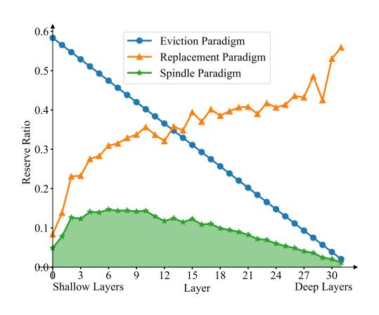
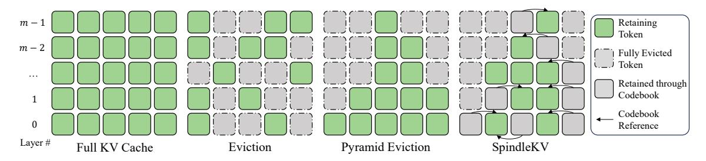
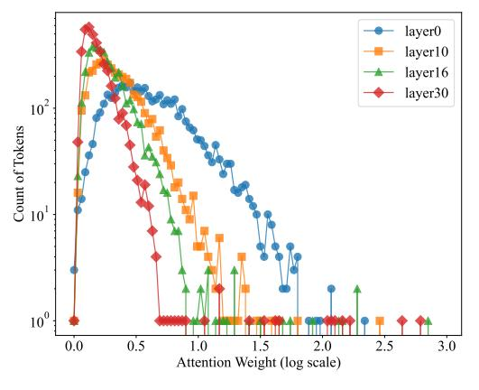
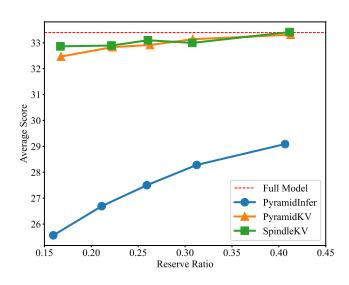
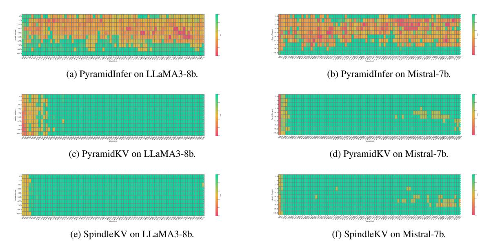
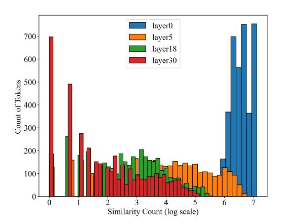
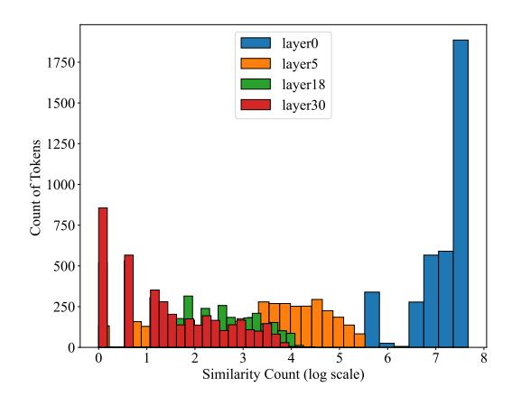

# SpindleKV: A Novel KV Cache Reduction Method Balancing Both Shallow and Deep Layers

Zicong Tang $^{2,\dagger}$ , Shi Luohe $^2$ , Zuchao Li $^{1,\dagger*}$ , Baoyuan Qi $^3$ , Guoming Liu $^3$ , Lefei Zhang $^2$ , Ping Wang $^4$ 

<sup>1</sup>School of Artificial Intelligence, Wuhan University <sup>2</sup>School of Computer Science, Wuhan University <sup>3</sup>Xiaomi, Beijing, China

<sup>4</sup>School of Information Management, Wuhan University {tangzc, shiluohe, zcli-charlie, zhanglefei, wangping}@whu.edu.cn {qibaoyuan, liuguoming}@xiaomi.com

# **Abstract**

Large Language Models (LLMs) have achieved impressive accomplishments in recent years. However, the increasing memory consumption of KV cache has possessed a significant challenge to the inference system. Eviction methods have revealed the inherent redundancy within the KV cache, demonstrating its potential for reduction, particularly in deeper layers. However, KV cache reduction for shallower layers has been found to be insufficient. Based on our observation that, the KV cache exhibits a high degree of similarity. Based on this observation, we proposed a novel KV cache reduction method, SpindleKV, which balances both shallow and deep layers. For deep layers, we employ an attention weight based eviction method, while for shallow layers, we apply a codebook based replacement approach which is learnt by similarity and merging policy. Moreover, SpindleKV addressed the Grouped-Query Attention (GOA) dilemma faced by other attention based eviction methods. Experiments on two common benchmarks with three different LLMs shown that SpindleKV obtained better KV cache reduction effect compared to baseline methods, while preserving similar or even better model performance. Our code is available in https://github.com/tyxqc/SpindleKV.

## 1 Introduction

Large language models (LLMs) (OpenAI, 2023; Touvron et al., 2023; Yang et al., 2024d), demonstrate impressive capabilities across various fields, such as machine translation (Koshkin et al., 2024), content generation (Yuan et al., 2022), and harder tasks like coding (Rozière et al., 2023) and reasoning (Wei et al., 2022; Yao et al., 2024b). LLMs' excellency in generating coherent text makes them

<span id="page-0-0"></span>

Figure 1: A quick illustration for how SpindleKV works on LLaMA-3-8b-instruct.

useful tools in a wide range of industries. However, their more widespread and comprehensive use is facing a severe and realistic challenge, which is their high demand for GPU memory (Yao et al., 2024a). When using large models for inference, the memory overhead primarily consists of two parts: the model parameters and the context. The context exists in the form of Key-Value cache (KV cache), in order to reduce redundant computations during the autoregressive decoding (Zhang et al., 2022; Touvron et al., 2023; Shi et al., 2024; Ma et al., 2025; Yao et al., 2024c; Shi et al., 2025).

With an increase in context length, the memory footprint for the KV cache increases proportionally. Occasionally, it can exceed the memory occupied by the model's parameters. As the context of LLMs getting longer, KV cache has become a new bottleneck that limits the deployment and application of LLMs (Bai et al., 2024).

Previous research has identified significant redundancy within KV cache, facilitating potential cache compression. Token eviction (Zhang et al., 2023; Xiao et al., 2024; Li et al., 2024; Yang et al., 2024b; Cai et al., 2024) is one of the prevailing

<sup>\*</sup> Corresponding author. † Equal contribution. This work was supported by the National Natural Science Foundation of China (No. 62306216), the National Social Science Fund of China (No. 24&ZD186) and Xiaomi Open-Competition Research Program.

methods. It reduces the size of the cache by eliminating tokens with smaller contribution in the attention mechanism. Token merging [\(Zhang et al.,](#page-10-10) [2024;](#page-10-10) [Wan et al.,](#page-10-11) [2024;](#page-10-11) [Wang et al.,](#page-10-12) [2024\)](#page-10-12) goes a step further by merging tokens based on their relevance, thereby compressing the information at a finer granularity. Another approach is quantization [\(He et al.,](#page-9-8) [2024;](#page-9-8) [Liu et al.,](#page-9-9) [2024a;](#page-9-9) [Tao](#page-10-13) [et al.,](#page-10-13) [2024\)](#page-10-13), which provides a low-precision approximation of the KV cache without removing any information. However, these works indicate that the reduction effectiveness is generally better for deeper layers than for shallower layers with token eviction, merging or quantization. Consequently, research on KV cache reduction methods for shallow layers has been largely overlooked in previous studies.

KV cache reduction methods work better in deeper layers for two key reasons: (1) attention patterns in deeper layers naturally concentrate on fewer tokens, exhibiting low-rank characteristics; (2) deeper layers are more robust to modifications due to the shallow-to-deep propagation of changes through the network. We argue that shallow layers also exhibit notable redundancy, primarily because tokens in these layers undergo fewer Transformer encoding iterations and thus receive limited contextual influence. This indicates the existence of an additional form of redundancy beyond intertoken redundancy: tokens can be decomposed into smaller, redundant basis vectors that form their fundamental constituents. By leveraging both intertoken redundancy in deeper layers and inner-token compositional redundancy in shallow layers, we propose SpindleKV to balance both deep and shallow layers KV cache reduction as illustrated in Figure [1.](#page-0-0) Specifically, we employ token eviction mechanisms to eliminate redundancy in deeper layers, while adopting a Just-in-Time (JIT) learned basis vector codebook to reduce redundancy in shallow layers.

We conducted comprehensive evaluations across multiple models and datasets. The experimental results demonstrate that our approach achieves higher KV cache reduction rates while maintaining comparable performance, and delivers superior performance at equivalent reduction rates, compared to existing state-of-the-art (SOTA) methods. Notably, in some settings, our approach enables a 50% reduction in KV cache size without compromising model performance metrics. Evaluations on long-text knowledge-intensive datasets demonstrate that SpindleKV preserves the model's knowledge retention and reasoning capabilities, even with significant KV cache reduction. Further evaluations on the *Needle-in-a-Haystack* task confirm that SpindleKV maintains the model's long-sequence retrieval efficacy, which is essential for efficient large-scale document processing. Under identical KV cache compression ratios, SpindleKV demonstrates enhanced retrieval recall metrics, outperforming both PyramidInfer and PyramidKV. Lastly, the comparative experiments conducted on the use of GQA-based models indicate that SpindleKV has superior compression capability on the GQA model, thereby validating that our approach is highly compatible with the new paradigms of LLMs.

# 2 Related Works

# 2.1 KV Head Reuse

The concept of KV head reuse has been introduced in Multi-Query Attention (MQA, [Shazeer,](#page-9-10) [2019\)](#page-9-10), where a single set of KV heads is retained to serve all Q heads. Even when sharing the same KV, different Q heads focus on different aspects of K, resulting in diverse combinations. The subsequent Grouped-Query Attention (GQA, [Ainslie et al.,](#page-8-1) [2023\)](#page-8-1) method introduced a new balance by grouping Q heads and sharing a single KV head within each group, offering a finer-grained approach to balancing performance and efficiency. However, despite GQA becoming the gold standard for LLMs, further compression of the KV cache presents challenges: (1) KV heads now possess higher information density; (2) KV head reuse restricts decisions to be made across all heads within the same group, limiting the potential for fine-grained methods.

# 2.2 Token Eviction

Earlier works discovered that tokens at the beginning and end of the sequence tend to be the most important in KV cache. These findings inspired several KV cache eviction methods like *StreamingLLM* [\(Xiao et al.,](#page-10-8) [2024\)](#page-10-8). Recent work has introduced eviction methods based on the contribution of attention scores, such as *H2O* [\(Zhang](#page-11-0) [et al.,](#page-11-0) [2023\)](#page-11-0) and *SnapKV* [\(Li et al.,](#page-9-6) [2024\)](#page-9-6). Building on this, some approaches no longer simply remove unimportant tokens, but instead merge them into the tokens that are retained, represented by *CaM* [\(Zhang et al.,](#page-10-10) [2024\)](#page-10-10), *D2O* [\(Wan et al.,](#page-10-11) [2024\)](#page-10-11), and *KVMerger* [\(Wang et al.,](#page-10-12) [2024\)](#page-10-12). Latest re-



Figure 2: Comparison of major eviction methods.

searches, *PyramidInfer* (Yang et al., 2024b) and *PyramidKV* (Cai et al., 2024), show that the cost of evicting tokens from deeper layers is often lower, and the evicted KV cache exhibits a triangular pattern. However, these methods are difficult to integrate with GQA, as they require evaluating token acceptance or eviction for an entire group of Q heads, rather than for each individual Q head.

Quantization is also an important method to reduce KV cache though less relative with our method, detailed in Appendix A.

In summary, existing KV cache reduction methods face challenges in compressing shallower layers. Moreover, attention score-based eviction methods exhibit poor compatibility with GQA.

#### 3 Method

### 3.1 Notations

SpindleKV does not involve information interaction between layers; therefore, we focus solely on the attention component within a single decoder layer. Let d represent the hidden dimension of the model,  $d_h$  the size of each attention head, and h the total number of attention heads,  $h_g$  as the number of KV heads for GQA models, and the amount of Q heads per KV head  $h_n = h/h_g$  correspondingly. We denote l as the length of the input sequence  $X \in \mathbb{R}^{l \times d}$ . We firstly acquire the attention score  $A_i$  of the i-th head through the equation:

$$A_{i} = \operatorname{softmax} \left( \operatorname{mask} \left( \frac{Q_{i} \cdot K_{i}^{\top}}{\sqrt{d_{h}}} \right) \right) , \quad (1)$$

$$Q_{i} = X \cdot W_{Q,i} \cdot \mathcal{R}, \ K_{i} = X \cdot W_{K,i} \cdot \mathcal{R}$$

in which  $W_{\{Q,K\},i}$  denotes the parameters of the LLM and  $\mathcal{R}$  as rotary position embedding matrix. Then, the output of the masked multi-head self-attention is given out as follows.

$$O = \sum_{i=0}^{h-1} A_i \cdot V_i \cdot W_{O,i}$$
$$V_i = X \cdot W_{V,i}$$

Additionally,  $W_{\{V,O\},i}$  denotes the other two parameter matrices. We define  $\Gamma \in \{K,V\}$  as a unified representation for K and V. Lastly we use  $\{x,k_i,v_i,\gamma\}_a$  to represent the a-th entry of  $\{X,K_i,V_i,\Gamma\}$ .

 $A_i \in \mathbb{R}^{l \times l}$  is the critical standard for evaluating the contribution of each token to the attention. We typically use the accumulated attention scores, which represent the average attention score in a window  $l_w$  for each query from a given token's key, as an indicator of the importance of a token. The accumulated attention score  $ac_{i,a}$  for the a-th token in the sequence is calculated as shown in equation:

$$ac_{i,a} = \frac{\sum_{b=l-l_w}^{l-1} A_{i,a,b}}{l-a}.$$
 (2)

Additionally, for models that utilize GQA, the same K would serves multiple Q. We've also have to take the average across all  $h_n$  heads (Yang et al., 2024b), as equation:

$$ac'_{i,a} = \frac{1}{h_n} \sum_{g=0}^{h_n} \frac{\sum_{b=l-l_w}^{l-1} A_{h_n \cdot i+g,a,b}}{n-a}.$$
 (3)

For SpindleKV, we also focused on the similarity  $S_{\{K,V\}}$  within the KV cache, measured in *cosine similarity* as equation:

$$\cos_{-}\sin(\gamma_{a}, \gamma_{b}) = \frac{a \cdot b^{\top}}{|a| \cdot |b|}$$

$$S_{\Gamma, i, a, b} = \cos_{-}\sin(\gamma_{i, a}, \gamma_{i, b}).$$
(4)

### 3.2 Preliminary Experiment

We investigated the distributional characteristics of the KV cache components. To this end, we examined the attention distributions and the similarity of KV caches in the LLaMA2-7B-chat model on the 2WikiMQA dataset.

Attention Sparsity We calculated the accumulated attention scores ac for each token and each

<span id="page-3-0"></span>


(b) High cosine similarity in shallower layers

Figure 3: The distribution of attention weight and cosine similarity in token level cross different layers of LLaMA2-7b-chat with a prompt sampling from 2WikiMQA.

attention head across all layers, and then aggregated these scores in ascending order. As shown in Figure 3a, we observed that as the layer depth increases, the number of tokens with lower attention scores also increases, reflecting the concentration of attention scores on a few specific tokens. This phenomenon reveals the attention sparsity in deeper layers and provides evidence for the feasibility of token eviction in these layers.

KV Constitutional Similarity We measured the number of token pairs in different layers whose similarity S exceeds a threshold  $\theta$ . The composition of the KV cache exhibits a high degree of similarity in the shallower layers, as depicted in Figure 3b. This suggests that, in the shallower layers, although many tokens receive high attention scores, their constituent components are highly similar. More details are avaiable in Appendix B. This observation leads us to consider the potential of managing large numbers of similar KV caches using a codebook-based approach.

### <span id="page-3-1"></span>3.3 Attention Weight Based Token Eviction

We apply token eviction majorly for reducing the redundancy in deeper layers. Following PyramidKV (Cai et al., 2024), a simple linear interpolation works on the layer-wise KV cache allocation. We define r as the total reserve ratio the KV cache. Following SnapKV (Li et al., 2024), we apply an observation window with length  $l_w$  to calculate ac, in which all the tokens are reserved. The reserve ratio of the context, whose length  $l_c = l - l_w$ , is consistent across all decoding request. We first cal-

culate the reserve ratio of context  $r_c$  by equation:

$$r_c = \frac{r \cdot l - l_w}{l_c}.$$

Moreover, we define the minimal preserve ratio for any layer as  $\beta$ . And we define  $\alpha = \frac{1}{2}(1+\beta)$ . Then we can define the maximal and minimal retain ratio for context for a model with m layers, used by layer 0 and m-1, in the equation:

$$r_{c}(0) = \begin{cases} 2 \times r_{c} - 0.05, \ \beta < r_{c} \le \alpha \\ 1, & \alpha < r_{c} \le 1 \end{cases}$$

$$r_{c}(m-1) = \begin{cases} 0.05, & \beta < r_{c} \le \alpha \\ 1 - 2 \times rc, & \alpha < r_{c} \le 1 \end{cases}$$
(5)

Finally, the retain ratio of  $\lambda$ -th layer  $r_c(\lambda)$  can be determined by equation:

$$r_c(\lambda) = r_c(0) + \frac{r_c(m-1) - r_c(0)}{m-1} \cdot \lambda.$$
 (6)

At inference time, we dynamically select the preserved KV cache of i-th head by  $ac_i$ :

$$\eta_i = \operatorname{argTop} K\left(ac_i, \ k = \lfloor r_c(\lambda) \times l_c \rfloor\right)$$

$$\Gamma_{r,i} = \Gamma_i[\eta_i] \tag{7}$$

For models utilizing GQA, we can employ the ac' designed for GQA in the previous section to complete this step. However, an alternative approach is to directly repeat these KV vectors  $h_n$  times, effectively fully unfolding the GQA, then decision can then be made regarding whether to retain them. This step will increase the size of the KV vectors by several times, but we will address this overhead in the next subsection, ensuring that it does not require any additional storage space.


Figure 4: An overview of SpindleKV

### 3.4 Similarity Based Token Replacement

The redundancy that the Eviction method cannot address arises from the high similarity between the constituent of the KV cache in shallower layers. Meanwhile, the operation of unfolding GQA in the previous section also increases this redundancy, as the cosine similarity of the unfolded components is clearly 1. Therefore, we can approximate the KV cache by constructing a CodeBook from the similarity of the KV cache and retaining only the indices pointing to the CodeBook entries, thereby reducing its size.

In the prefilling stage, our goal is to create two CodeBooks  $C_{\{K,V\}}$  that satisfies the following conditions:

- $\min(|C_K \cup C_V|)$
- $\forall \gamma \in \Gamma_{r,i}, \exists j \in [0, |C_{\Gamma}| 1],$ s.t.  $\cos_{\sin(k, C_{\Gamma,i})} > \theta_{\Gamma},$

where  $\theta_{\{K,V\}}$  are the similarity threshold for K and V.

However, we noted that cosine similarity only measures the direction of a vector and does not effectively capture its magnitude. This implies that we must also record the magnitude to minimize information loss as much as possible. Formally, this involves recording the magnitude  $m_{\{K,V\}}$  of each KV cache, as shown in the equation:

<span id="page-4-0"></span>
$$m_{\Gamma} = \sqrt{\Gamma \cdot \Gamma^{\top}}, \ \Gamma_r \longleftarrow \frac{\Gamma_r}{m_{\Gamma}}.$$
 (8)

Then we construct a binary matrix  $G_{\{K,V\}}$ , where  $G_{\Gamma,a,b}$  indicates whether the a-th and b-th tokens can be merged, determined by:

<span id="page-4-1"></span>
$$G_{\Gamma} = \text{where}(S_{\Gamma} > \theta_{\Gamma}, 1, 0).$$
 (9)

This matrix also represents the adjacency matrix of an undirected graph. What we need to identify is the node with the highest degree in this graph, as the vector corresponding to this node can represent the greatest number of other vectors. The degree of each node is computed as shown in the equation:

<span id="page-4-2"></span>
$$s_{\Gamma,a} = \sum_{b=0}^{N-1} G_{\Gamma,a,b}.$$
 (10)

We greedily choose the token with the highest degree and add it to the C. Then we delete this vertex and the vertices that are directly adjacent to this vertex from the graph through a simple mask operation. Formally, each round of the CodeBook building process is given by:

<span id="page-4-3"></span>
$$\iota = \operatorname{argmax}(s_{\Gamma})$$

$$C_{\Gamma} \longleftarrow C_{\Gamma} + [\Gamma_{r,\iota}]'$$
(11)

then, we build the reference  $r_{\{K,V\}}$  of each token to the corresponding vector in the CodeBook:

<span id="page-4-4"></span>
$$\eta_{\iota} = \operatorname{argwhere}(G_{\Gamma, \iota} == 1)$$

$$r_{\Gamma}[\eta_{\iota}] = |C_{\Gamma}| - 1$$
(12)

The  $\max_{\{K,V\}}$  and the clean up to the graph is given by:

<span id="page-4-5"></span>
$$\max_{\Gamma} = \neg G_{\Gamma,\iota}^{\top} \cdot \neg G_{\Gamma,\iota}$$

$$G_{\Gamma} \longleftarrow G_{\Gamma} \& \max_{\Gamma}$$
(13)

We firstly execute equation 8, 9, then execute equation 10, 11, 12, 13 repetitively until  $G_{\Gamma} == 0$ . Then we finished the construction of CodeBook  $C_{\Gamma}$ , magnitudes  $m_{\Gamma}$  and the reference to CodeBook for every token  $r_{\Gamma}$ . The process is illustrated in Algorithm 1.

At inference time, we can reconstruct KV cache efficiently through the equation:

$$\Gamma_r = C_{\Gamma}[r_{\Gamma}] \otimes m_{\Gamma} \tag{14}$$

During inference, we generate a large number of new KV cache entries. We first search for suitable CodeBook entries for merging, using  $\theta$  as the threshold. If such entries are found, we merge

<span id="page-5-2"></span>


(a) LongBench result of LLaMA2-7b

(b) LongBench results of LLaMA3-8b

(c) LongBench results of Mistral-7b

Figure 5: LongBench result on three models cross different reserve ratios.

```
Algorithm 1 CodeBook Generate of \Gamma \in \{K, V\}
 Input: Cached \Gamma_r, Threshold \theta_{\Gamma}.
  Output: CodeBook C_{\Gamma}, References r_{\Gamma},
Magnitudes m_{\Gamma}
     C_{\Gamma} \leftarrow \emptyset
     r_{\Gamma} \leftarrow [-1, -1, \dots, -1]
                                                                        ▷ Initialization
     m_{\Gamma} \leftarrow L_2 Norm(\Gamma, \dim = -1)
     \Gamma_r \leftarrow \Gamma_r/m_\Gamma
                                                                \triangleright Normalize \Gamma to 1
     S_{\Gamma} \leftarrow \cos_{-}\sin(\Gamma, \Gamma)
     G_{\Gamma} \leftarrow \text{where}(S_{\Gamma} > \theta_{\Gamma}, 1, 0)
     while G_{\Gamma}! = 0 do
             s_{\Gamma} \leftarrow \text{sum}(S_{\Gamma}, \text{dim} = 1)
            \iota \leftarrow \operatorname{argmax}(s_{\Gamma})
             C_{\Gamma} \leftarrow C_{\Gamma} + [\Gamma_{r,\iota}]
                                                                             New entry
             \eta_{\iota} \leftarrow \operatorname{argwhere}(G_{\Gamma,\iota} == 1)
             r_{\Gamma}[\eta_{\iota}] \leftarrow |C_{\Gamma}| - 1
                                                          ⊳ Inserted to the end
             \operatorname{mask}_{\Gamma} \leftarrow \operatorname{matmul}(\neg G_{\Gamma,\iota}^{\top}, \neg G_{\Gamma,\iota})
     G_{\Gamma} \leftarrow G_{\Gamma} \ \& \ \mathrm{mask}_{\Gamma} return C_{\Gamma}, r_{\Gamma}, m_{\Gamma}
```

them; otherwise, we repeat the process of building the CodeBook for the remaining tokens.

It is important to note that although this search process has a slightly higher time complexity, it does not result in a significant additional time overhead. Furthermore, our method operates on the pre-RoPE K, meaning that after reconstruction, the RoPE operation must be re-applied. However, due to limitations imposed by memory bandwidth and the inherent sparsity of RoPE as a sparse matrix multiplication, this step does not introduce substantial time overhead (Liu et al., 2024b). This is because, while the computational workload is increased, the corresponding increase in arithmetic intensity enhances the peak FLOPS achievable by the chip (Williams et al., 2009).

## 4 Experiments

### 4.1 Experimental Setup

We conducted our experiments on three models, including LLaMA2-7b-chat (Touvron et al., 2023), LLaMA3-8b-instruct (Dubey et al., 2024) and Mistral-7b-instruct-v0.2 (Jiang et al., 2023). Their maximum context length ranges from 4k to 32k. LLaMA2-7b employs MHA, while LLaMA3-8b and Mistral-7b utilize GQA with  $h_n=8,\,h_g=4$ . All models' h=32.

We evaluate the model's knowledge and reasoning capabilities on *LongBench* (Bai et al., 2024), which contains 16 long-context knowledge intensive subsets covering 6 tasks including multi-document question answering (QA), single-document QA, summarization, few-show learning, synthetic tasks and code, with the length of most tasks ranging from 5k to 15k. We also evaluate our method on *Needle-in-a-Haystack* task (Briakou et al., 2023) to test the long-context retrieval ability.

We select *Pyramidinfer* (Yang et al., 2024b) and *PyramidKV* (Cai et al., 2024) as baselines, both of which compress the KV cache based on token eviction method and allocate pyramid shaped KV cache cross layers.

<span id="page-5-1"></span>
$$\begin{cases} r_1^{\lambda} = \frac{\sum_{j=0}^{h_g-1} (|K_{\lambda}^{j,r}| + |V_{\lambda}^{j,r}|)}{\sum_{j=0}^{h_g-1} (|K_j^{i}| + |V_j^{i}|)} \\ r_2^{\lambda} = \frac{|C_K^{\lambda} \cup C_V^{\lambda}|}{\sum_{j=0}^{h_g} (|K_{j,r}^{\lambda}| + |V_{j,r}^{\lambda}|)} \\ r_3^{\lambda} = \frac{1}{d_h} \left( d_h + \frac{\text{int\_bit}}{\text{key\_bit} + 1} \right) \end{cases}$$

$$r^{\lambda} = r_1^{\lambda} \times r_2^{\lambda} \times r_3^{\lambda}$$

$$r = \frac{1}{m} \sum_{\lambda=0}^{m-1} r^{\lambda}$$

$$(15)$$

We use the reserve ratio r to measure the com-

<span id="page-6-1"></span>

| Methods      | Ratio |             | Single-Document QA |       |       | Multi-Document QA |       |             | Summarization |       |       | Few-shot Learning |       |      | Synthetic        |       | Code  | AVG.        |
|--------------|-------|-------------|--------------------|-------|-------|-------------------|-------|-------------|---------------|-------|-------|-------------------|-------|------|------------------|-------|-------|-------------|
|              |       | Na.QA       | Qasp               | Mu.QA | Ho.QA | Wi.QA             | Musq  | Gv.Rp       | QMSm          | M.New | TREC  | Tr.QA             | SASm  | PCnt | Pa.Rt            | Lcc   | RB.P  |             |
| FullKV       | 100%  | 25.70       | 29.75              | 41.12 | 45.55 | 35.87             | 22.35 | 25.63       | 23.03         | 26.21 | 73.00 | 90.56             | 41.88 | 4.67 | 69.25            | 58.05 | 50.77 | 41.46       |
| PyramidInfer | 39.3% | 23.75       | 17.46              | 29.97 | 35.08 | 23.92             | 16.90 | 28.08       | 21.26         | 24.42 | 62.00 | 85.06             | 41.45 | 1.04 | 41.23            | 50.95 | 52.86 | 34.71       |
| PyramidKV    | 40.5% | 26.31       | 28.64              | 49.12 | 41.66 | 25.98             |       | 19.02 26.38 | 23.91         | 22.66 | 70.00 | 85.88             | 42.53 |      | 2.69 86.32 54.04 |       | 53.36 | 41.16       |
| SpindleKV    |       | 40.1% 26.95 | 31.23              | 49.01 | 41.89 | 26.90             |       | 18.60 29.92 | 24.56         | 24.89 | 71.50 | 85.98             | 43.39 |      | 2.74 86.18 56.39 |       | 54.13 | 42.14       |
| PyramidInfer | 30.7% | 22.65       | 14.57              | 30.14 | 33.87 | 23.52             | 15.59 | 26.82       | 21.10         | 23.10 | 61.00 | 84.18             | 40.57 | 1.85 | 32.25            | 50.64 | 53.02 | 33.43       |
| PyramidKV    | 31.4% | 26.12       | 27.31              | 48.31 | 41.44 | 25.14             |       | 18.72 25.28 | 23.61         | 21.99 | 69.00 | 86.27             | 42.65 | 2.53 | 84.81            | 53.71 | 52.77 | 40.60       |
| SpindleKV    |       | 30.2% 26.69 | 30.19              | 49.32 | 42.09 | 27.23             |       | 18.69 28.52 | 24.19         | 24.02 | 71.00 | 86.38             | 43.54 | 3.03 | 87.18            | 55.19 | 53.62 | 41.93       |
| PyramidInfer | 25.1% | 21.43       | 13.49              | 25.88 | 31.92 | 20.44             | 14.83 | 25.27       | 20.57         | 22.06 | 58.00 | 82.16             | 40.77 | 1.45 | 27.93            | 52.53 | 52.55 | 32.00       |
| PyramidKV    | 25.7% | 25.14       | 26.11              | 46.97 | 40.56 | 25.46             |       | 19.06 25.00 | 23.32         | 21.55 | 70.50 | 86.41             | 41.92 |      | 3.26 84.56       | 51.95 | 52.23 | 40.25       |
| SpindleKV    |       | 25.2% 25.97 | 30.34              | 49.17 | 42.06 | 27.35             |       | 18.22 27.99 | 24.25         | 23.19 | 70.00 | 86.22             | 42.96 |      | 2.74 87.26       | 54.69 | 53.77 | 41.64       |
| PyramidInfer | 20.3% | 18.73       | 11.96              | 24.34 | 27.10 | 15.87             | 11.98 | 24.89       | 20.07         | 21.19 | 54.00 | 76.19             | 39.92 | 2.06 | 20.83            | 51.83 | 52.50 | 29.59       |
| PyramidKV    | 20.5% | 24.96       | 25.19              | 47.12 | 39.94 | 25.45             |       | 18.63 24.05 | 23.35         | 20.71 | 69.50 | 85.48             | 41.87 |      | 2.48 83.56       | 52.02 | 51.35 | 39.73       |
| SpindleKV    |       | 20.0% 26.03 | 29.49              | 49.61 | 41.87 | 26.50             |       | 17.98 27.01 | 23.73         | 22.73 | 70.00 | 86.28             | 43.59 |      | 2.29 86.99       | 53.81 | 53.57 | 41.34       |
| PyramidInfer | 15.4% | 17.28       | 11.52              | 23.41 | 26.38 | 16.72             | 11.98 | 24.49       | 19.41         | 20.77 | 53.00 | 68.87             | 39.78 |      | 3.53 11.88 54.48 |       |       | 52.72 28.51 |
| PyramidKV    | 15.0% | 24.36       | 24.66              | 45.85 | 40.67 | 24.81             | 17.83 | 23.29       | 23.41         | 20.53 | 70.00 | 86.09             | 40.74 | 3.27 | 81.84            | 51.54 | 50.60 | 39.34       |
| SpindleKV    |       | 14.8% 26.02 | 28.05              | 48.84 | 40.74 | 25.45             | 19.05 | 25.51       | 23.72         | 21.95 | 69.50 | 86.13             | 42.47 |      | 2.70 85.65 53.89 |       |       | 52.48 40.76 |

<span id="page-6-3"></span>Table 1: LongBench results for Mistral-7b-instruct-v0.2. The correspondence between abbreviations and datasets is provided in Appendix [C.](#page-12-2) We ensure that the reserve ratio r of SpindleKV is slightly lower than the baselines, with the deviation kept within 2%, as our method cannot precisely control the KV cache size.

| Methods     | Ratio | Na.QA | Wi.QA | QMSm  | Tr.QA | PCnt | Lcc   | AVG.  |
|-------------|-------|-------|-------|-------|-------|------|-------|-------|
| FullKV      | 100%  | 24.50 | 36.23 | 23.40 | 90.48 | 4.77 | 59.21 | 39.77 |
| w/o. repeat | 39.1% | 24.00 | 28.02 | 22.64 | 89.05 | 4.95 | 58.24 | 37.82 |
| w/. repeat  | 39.1% | 23.87 | 36.02 | 23.28 | 90.43 | 5.23 | 59.37 | 39.70 |
| w/o. repeat | 30.4% | 21.47 | 24.00 | 22.21 | 89.47 | 4.70 | 57.63 | 36.58 |
| w/. repeat  | 29.3% | 24.18 | 34.95 | 23.52 | 90.43 | 5.24 | 59.24 | 39.59 |
| w/o. repeat | 21.3% | 21.21 | 24.91 | 22.30 | 89.95 | 4.75 | 55.86 | 36.50 |
| w/. repeat  | 21.2% | 23.92 | 33.90 | 22.66 | 90.56 | 5.58 | 58.26 | 39.15 |

Table 2: Comparison between SpindleKV with and without repeating on LLaMA3-8b-instruct when handling GQA.

pression intensity. We define r λ as the reserve ratio for λ-th layer, which is co-determined by r λ 1 , the reserve ratio of eviction method, r λ 2 , the reserve ratio of replacement method, and ri,3, serves as the dtype convert ratio since we store int type index and float type magnitude for each key and value. The calculation is given by Formura [15.](#page-5-1) r <sup>λ</sup> = r λ 1 for pyramidinfer and PyramidKV, and h<sup>g</sup> = h if a repeat operation is conducted before eviction. We record r<sup>1</sup> and r<sup>2</sup> for every input when evaluating on *LongBench* to ensure their precision.

Hyper-parameters including α, β and θ, are given in Table [3.](#page-6-0)

## 4.2 Accuracy on Long Context Tasks

LongBench Result We evaluate SpindleKV on three models mentioned above and the result are

<span id="page-6-0"></span>

| Hyper-parameter          | Value |
|--------------------------|-------|
| Key Threshold (θK)       | 0.98  |
| Value Threshold (θV<br>) | 0.95  |
| β                        | 0.05  |
| α                        | 0.525 |

Table 3: Hyper-parameters Used in Experiments

<span id="page-6-2"></span>

| Methods      | LLaMA3-8b | Mistral-7b |
|--------------|-----------|------------|
| PyramidInfer | 0.615     | 0.621      |
| PyramidKV    | 0.938     | 0.962      |
| SpindleKV    | 0.979     | 0.975      |

Table 4: Accuracy of *Needle-in-a-Haystack* on LLaMA3-8b-instruct and Mistral-7b-instruct-v0.2 with 15% KV cache reserved.

<span id="page-7-0"></span>

<span id="page-7-1"></span>Figure 6: Visualization of Needle-in-a-Haystack. The vertical axis of the table represents the depth percentage, and the horizontal axis represents the token length.

|       |       |       | QMSm                    |       |      |       |       |
|-------|-------|-------|-------------------------|-------|------|-------|-------|
| 100%  | 18.40 | 25.73 | 20.97<br>21.05<br>19.68 | 83.38 | 5.50 | 60.70 | 35.78 |
| 47.8% | 18.57 | 25.51 | 21.05                   | 84.40 | 6.00 | 60.54 | 36.01 |
| 29.4% | 15.99 | 24.26 | 19.68                   | 80.62 | 6.00 | 53.20 | 33.29 |

Table 5: Accuracy of 6 datasets on SpindleKV without eviction on LLaMA2-7b-chat.

illustrated in Figure 5 and Table 1. Figure 5 shows that our method can further compress KV cache while retaining model's capability. Our method outperforms the two baselines on both models with and without GQA, showing that our method effectively reduced the constituent redundancy in shallower layers. In models with GQA structure, we surpass baselines with only half of the KV cache compared with them, which indicates that SpindleKV has a better compatibility with GOA. Table 1 shows results of Mistral-7b on different datasets in LongBench, more results are avaiable in Appendix D.1. We report that our method further surpasses Pyramidinfer on average score and outperforms PyramidKV on 13 datasets between different reserve ratios on Mistral-7b. The results on LongBench show that our method can further reserve model's knowledge retention and reasoning capabilities with the same KV cache budget.

Needle-in-a-Haystack Result Following PyramidKV, we use LLaMA3-8b-isntruct and Mistral-7b-instruct-v0.2 for this task. The results are displayed in Table 4 and more details are available in Figure 6. In our experiment, models reserve

only 15% KV cache then retrieve a special "needle" from the context. The results in Table 4 indicate that, compared with PyramidInfer and PyramidKV, SpindleKV significantly maintains the model's long-sequence retrieval efficacy with the same KV cache budget. As illustrated in Figure 6, PyramidInfer, which apply a mean operation on attention weight before eviction raise significantly context loss. And for PyramidKV, also raise noticeable context loss when reserve only 15% KV cache. But SpindleKV saves more context with the same KV cache budget, significantly improved the quality of after-compress retrieval.

# 4.3 Ablation Study

We investigate the correctness of the settings and the effectiveness of every component in SpindleKV.

**Integrating GQA** We discussed two approaches of how eviction methods integrate with GQA in Section 3.3. We conduct an experiment with LLaMA3-8b-instruct on the other approach following PyramidInfer, which applies the same averaged attention weight on different heads to conduct the eviction. The results in Table 2 indicate that our

<span id="page-8-3"></span>

| Methods          | Ratio | Na.QA | Wi.QA | QMSm  | Tr.QA | PCnt | Lcc   | AVG.  |
|------------------|-------|-------|-------|-------|-------|------|-------|-------|
| FullKV           | 100%  | 18.40 | 25.73 | 20.97 | 83.38 | 5.50 | 60.70 | 35.78 |
| w/o. reconstruct | 19.7% | 17.17 | 25.64 | 20.73 | 84.15 | 5.50 | 59.34 | 35.42 |
| w/. reconstruct  | 20.5% | 17.34 | 25.64 | 20.64 | 84.15 | 6.00 | 60.31 | 35.68 |
| w/o. reconstruct | 28.3% | 18.06 | 25.70 | 20.76 | 84.04 | 5.50 | 59.06 | 35.52 |
| w/. reconstruct  | 29.1% | 18.13 | 26.10 | 20.95 | 83.69 | 6.00 | 59.85 | 35.79 |
| w/o. reconstruct | 39.4% | 18.47 | 25.77 | 20.81 | 83.89 | 5.56 | 59.41 | 35.65 |
| w/. reconstruct  | 40.2% | 18.45 | 25.74 | 20.66 | 84.31 | 6.00 | 60.45 | 35.94 |

Table 6: Accuracy of 6 datasets on SpindleKV with and without reocnstruct opearation on LLaMA2-7b-chat.

method further outperforms this approach, significantly addressed the GQA dilemma.

CodeBook Works Without Eviction We remove the eviction part of SpindleKV and compress KV cache with only the cosine similarity based replacement method. We evaluate this method on 6 datasets of *LongBench* with 50% and 30% KV cache reserve ratio for LLaMA2-7b-chat. The results in Table [5](#page-7-1) indicates that this method compresses half of KV cache without any impact on accuracy and reserves most of model's capabilities with 30% KV cache, Which confirms that there is a significant amount of constituent redundancy in the KV cache, which appears in the form of Constitutional cosine similarity.

# Effectiveness of reconstruction Via magnitude

In SpindleKV, we record the magnitude for each key and value, and reconstruct them to their original magnitude after indexing them from the Code-Book. We compare the performance of SpindleKV with and without the reconstruction operation on LLaMA2-7b-chat. The results in Table [6](#page-8-3) indicate reconstruct operation can effectively reserve model's capability with only a slight memory consumption of the magnitude.

# 5 Conclusion

In this study, we find the constituent redundancy of KV cache in shallower layers and develop SpindleKV. It addresses the GQA dilemma faced by other attention weight based eviction methods and balances both shallow and deep layers with an attention weight based eviction method and a CodeBook based replacement approach. Experimental results present SpindleKV is a promising solution on long-context inference with constrained memory for KV cache.

# Limitations

In this work, we develop SpindleKV, which achieves a balance in KV cache compression across shallow and deep layers. Experiments conducted on two long-context benchmarks and three models demonstrate the effectiveness of our method.

While our current approach shows promising results, future work will focus on further refining the control over KV cache size to achieve more precise management. Additionally, although we have validated the effectiveness of our method on LLaMA2- 7b-chat, LLaMA3-8b-instruct, and Mistral-7binstruct-v0.2, we plan to extend our evaluation to additional models such as Qwen2.5-7b [\(Yang et al.,](#page-10-15) [2024a\)](#page-10-15), LLaMA2-13b, and LLaMA3-70b. This will allow us to further demonstrate the generality of our approach across a broader range of settings.

# References

<span id="page-8-1"></span>Joshua Ainslie, James Lee-Thorp, Michiel de Jong, Yury Zemlyanskiy, Federico Lebrón, and Sumit Sanghai. 2023. [GQA: training generalized multi-query trans](https://doi.org/10.18653/V1/2023.EMNLP-MAIN.298)[former models from multi-head checkpoints.](https://doi.org/10.18653/V1/2023.EMNLP-MAIN.298) In *Proceedings of the 2023 Conference on Empirical Methods in Natural Language Processing, EMNLP 2023, Singapore, December 6-10, 2023*, pages 4895–4901. Association for Computational Linguistics.

<span id="page-8-0"></span>Yushi Bai, Xin Lv, Jiajie Zhang, Hongchang Lyu, Jiankai Tang, Zhidian Huang, Zhengxiao Du, Xiao Liu, Aohan Zeng, Lei Hou, Yuxiao Dong, Jie Tang, and Juanzi Li. 2024. [Longbench: A bilingual, multi](https://doi.org/10.18653/V1/2024.ACL-LONG.172)[task benchmark for long context understanding.](https://doi.org/10.18653/V1/2024.ACL-LONG.172) In *Proceedings of the 62nd Annual Meeting of the Association for Computational Linguistics (Volume 1: Long Papers), ACL 2024, Bangkok, Thailand, August 11-16, 2024*, pages 3119–3137. Association for Computational Linguistics.

<span id="page-8-2"></span>Eleftheria Briakou, Colin Cherry, and George F. Foster. 2023. [Searching for needles in a haystack: On the](https://doi.org/10.18653/V1/2023.ACL-LONG.524) [role of incidental bilingualism in palm's translation](https://doi.org/10.18653/V1/2023.ACL-LONG.524)

- [capability.](https://doi.org/10.18653/V1/2023.ACL-LONG.524) In *Proceedings of the 61st Annual Meeting of the Association for Computational Linguistics (Volume 1: Long Papers), ACL 2023, Toronto, Canada, July 9-14, 2023*, pages 9432–9452. Association for Computational Linguistics.
- <span id="page-9-7"></span>Zefan Cai, Yichi Zhang, Bofei Gao, Yuliang Liu, Tianyu Liu, Keming Lu, Wayne Xiong, Yue Dong, Baobao Chang, Junjie Hu, and Wen Xiao. 2024. [Pyramidkv:](https://doi.org/10.48550/ARXIV.2406.02069) [Dynamic KV cache compression based on pyramidal](https://doi.org/10.48550/ARXIV.2406.02069) [information funneling.](https://doi.org/10.48550/ARXIV.2406.02069) *CoRR*, abs/2406.02069.
- <span id="page-9-12"></span>Abhimanyu Dubey, Abhinav Jauhri, Abhinav Pandey, Abhishek Kadian, Ahmad Al-Dahle, Aiesha Letman, Akhil Mathur, Alan Schelten, Amy Yang, Angela Fan, Anirudh Goyal, Anthony Hartshorn, Aobo Yang, Archi Mitra, Archie Sravankumar, Artem Korenev, Arthur Hinsvark, Arun Rao, Aston Zhang, Aurélien Rodriguez, Austen Gregerson, Ava Spataru, Baptiste Rozière, Bethany Biron, Binh Tang, Bobbie Chern, Charlotte Caucheteux, Chaya Nayak, Chloe Bi, Chris Marra, Chris McConnell, Christian Keller, Christophe Touret, Chunyang Wu, Corinne Wong, Cristian Canton Ferrer, Cyrus Nikolaidis, Damien Allonsius, Daniel Song, Danielle Pintz, Danny Livshits, David Esiobu, Dhruv Choudhary, Dhruv Mahajan, Diego Garcia-Olano, Diego Perino, Dieuwke Hupkes, Egor Lakomkin, Ehab AlBadawy, Elina Lobanova, Emily Dinan, Eric Michael Smith, Filip Radenovic, Frank Zhang, Gabriel Synnaeve, Gabrielle Lee, Georgia Lewis Anderson, Graeme Nail, Grégoire Mialon, Guan Pang, Guillem Cucurell, Hailey Nguyen, Hannah Korevaar, Hu Xu, Hugo Touvron, Iliyan Zarov, Imanol Arrieta Ibarra, Isabel M. Kloumann, Ishan Misra, Ivan Evtimov, Jade Copet, Jaewon Lee, Jan Geffert, Jana Vranes, Jason Park, Jay Mahadeokar, Jeet Shah, Jelmer van der Linde, Jennifer Billock, Jenny Hong, Jenya Lee, Jeremy Fu, Jianfeng Chi, Jianyu Huang, Jiawen Liu, Jie Wang, Jiecao Yu, Joanna Bitton, Joe Spisak, Jongsoo Park, Joseph Rocca, Joshua Johnstun, Joshua Saxe, Junteng Jia, Kalyan Vasuden Alwala, Kartikeya Upasani, Kate Plawiak, Ke Li, Kenneth Heafield, Kevin Stone, and et al. 2024. [The llama 3 herd of models.](https://doi.org/10.48550/ARXIV.2407.21783) *CoRR*, abs/2407.21783.
- <span id="page-9-8"></span>Yefei He, Luoming Zhang, Weijia Wu, Jing Liu, Hong Zhou, and Bohan Zhuang. 2024. [Zipcache: Accu](https://doi.org/10.48550/ARXIV.2405.14256)[rate and efficient KV cache quantization with salient](https://doi.org/10.48550/ARXIV.2405.14256) [token identification.](https://doi.org/10.48550/ARXIV.2405.14256) *CoRR*, abs/2405.14256.
- <span id="page-9-13"></span>Albert Q. Jiang, Alexandre Sablayrolles, Arthur Mensch, Chris Bamford, Devendra Singh Chaplot, Diego de Las Casas, Florian Bressand, Gianna Lengyel, Guillaume Lample, Lucile Saulnier, Lélio Renard Lavaud, Marie-Anne Lachaux, Pierre Stock, Teven Le Scao, Thibaut Lavril, Thomas Wang, Timothée Lacroix, and William El Sayed. 2023. [Mistral](https://doi.org/10.48550/ARXIV.2310.06825) [7b.](https://doi.org/10.48550/ARXIV.2310.06825) *CoRR*, abs/2310.06825.
- <span id="page-9-1"></span>Roman Koshkin, Katsuhito Sudoh, and Satoshi Nakamura. 2024. [TransLLaMa: LLM-based simultaneous](https://doi.org/10.18653/v1/2024.findings-emnlp.27) [translation system.](https://doi.org/10.18653/v1/2024.findings-emnlp.27) In *Findings of the Association for Computational Linguistics: EMNLP 2024*, pages

- 461–476, Miami, Florida, USA. Association for Computational Linguistics.
- <span id="page-9-6"></span>Yuhong Li, Yingbing Huang, Bowen Yang, Bharat Venkitesh, Acyr Locatelli, Hanchen Ye, Tianle Cai, Patrick Lewis, and Deming Chen. 2024. [Snapkv:](https://doi.org/10.48550/ARXIV.2404.14469) [LLM knows what you are looking for before genera](https://doi.org/10.48550/ARXIV.2404.14469)[tion.](https://doi.org/10.48550/ARXIV.2404.14469) *CoRR*, abs/2404.14469.
- <span id="page-9-9"></span>Akide Liu, Jing Liu, Zizheng Pan, Yefei He, Gholamreza Haffari, and Bohan Zhuang. 2024a. [Minicache:](https://doi.org/10.48550/ARXIV.2405.14366) [KV cache compression in depth dimension for large](https://doi.org/10.48550/ARXIV.2405.14366) [language models.](https://doi.org/10.48550/ARXIV.2405.14366) *CoRR*, abs/2405.14366.
- <span id="page-9-11"></span>Zirui Liu, Jiayi Yuan, Hongye Jin, Shaochen Zhong, Zhaozhuo Xu, Vladimir Braverman, Beidi Chen, and Xia Hu. 2024b. [KIVI: A tuning-free asymmetric 2bit](https://proceedings.mlr.press/v235/liu24bz.html) [quantization for KV cache.](https://proceedings.mlr.press/v235/liu24bz.html) In *Proceedings of the 41st International Conference on Machine Learning*, volume 235 of *Proceedings of Machine Learning Research*, pages 32332–32344. PMLR.
- <span id="page-9-4"></span>Ziyang Ma, Zuchao Li, Lefei Zhang, Gui-Song Xia, Bo Du, Liangpei Zhang, and Dacheng Tao. 2025. [Model hemorrhage and the robustness limits of large](https://doi.org/10.48550/ARXIV.2503.23924) [language models.](https://doi.org/10.48550/ARXIV.2503.23924) *CoRR*, abs/2503.23924.
- <span id="page-9-0"></span>OpenAI. 2023. [GPT-4 technical report.](https://doi.org/10.48550/ARXIV.2303.08774) *CoRR*, abs/2303.08774.
- <span id="page-9-2"></span>Baptiste Rozière, Jonas Gehring, Fabian Gloeckle, Sten Sootla, Itai Gat, Xiaoqing Ellen Tan, Yossi Adi, Jingyu Liu, Tal Remez, Jérémy Rapin, Artyom Kozhevnikov, Ivan Evtimov, Joanna Bitton, Manish Bhatt, Cristian Canton-Ferrer, Aaron Grattafiori, Wenhan Xiong, Alexandre Défossez, Jade Copet, Faisal Azhar, Hugo Touvron, Louis Martin, Nicolas Usunier, Thomas Scialom, and Gabriel Synnaeve. 2023. [Code llama: Open foundation models for code.](https://doi.org/10.48550/ARXIV.2308.12950) *CoRR*, abs/2308.12950.
- <span id="page-9-10"></span>Noam Shazeer. 2019. [Fast transformer decoding: One](https://arxiv.org/abs/1911.02150) [write-head is all you need.](https://arxiv.org/abs/1911.02150) *CoRR*, abs/1911.02150.
- <span id="page-9-14"></span>Ying Sheng, Lianmin Zheng, Binhang Yuan, Zhuohan Li, Max Ryabinin, Beidi Chen, Percy Liang, Christopher Ré, Ion Stoica, and Ce Zhang. 2023. [Flexgen:](https://proceedings.mlr.press/v202/sheng23a.html) [High-throughput generative inference of large lan](https://proceedings.mlr.press/v202/sheng23a.html)[guage models with a single GPU.](https://proceedings.mlr.press/v202/sheng23a.html) In *International Conference on Machine Learning, ICML 2023, 23-29 July 2023, Honolulu, Hawaii, USA*, volume 202 of *Proceedings of Machine Learning Research*, pages 31094–31116. PMLR.
- <span id="page-9-5"></span>Luohe Shi, Zuchao Li, Lefei Zhang, Baoyuan Qi, Guoming Liu, and Hai Zhao. 2025. [KV](https://openreview.net/forum?id=vQvZQ1wDVN)[latent: Dimensional-level KV cache reduction with](https://openreview.net/forum?id=vQvZQ1wDVN) [frequency-aware rotary positional embedding.](https://openreview.net/forum?id=vQvZQ1wDVN) In *The 63rd Annual Meeting of the Association for Computational Linguistics*.
- <span id="page-9-3"></span>Luohe Shi, Hongyi Zhang, Yao Yao, Zuchao Li, and Hai Zhao. 2024. [Keep the cost down: A review on](https://doi.org/10.48550/ARXIV.2407.18003) [methods to optimize llm' s kv-cache consumption.](https://doi.org/10.48550/ARXIV.2407.18003) *CoRR*, abs/2407.18003.

- <span id="page-10-13"></span>Qian Tao, Wenyuan Yu, and Jingren Zhou. 2024. [Asymkv: Enabling 1-bit quantization of KV cache](https://doi.org/10.48550/ARXIV.2410.13212) [with layer-wise asymmetric quantization configura](https://doi.org/10.48550/ARXIV.2410.13212)[tions.](https://doi.org/10.48550/ARXIV.2410.13212) *CoRR*, abs/2410.13212.
- <span id="page-10-0"></span>Hugo Touvron, Louis Martin, Kevin Stone, Peter Albert, Amjad Almahairi, Yasmine Babaei, Nikolay Bashlykov, Soumya Batra, Prajjwal Bhargava, Shruti Bhosale, Dan Bikel, Lukas Blecher, Cristian Canton-Ferrer, Moya Chen, Guillem Cucurull, David Esiobu, Jude Fernandes, Jeremy Fu, Wenyin Fu, Brian Fuller, Cynthia Gao, Vedanuj Goswami, Naman Goyal, Anthony Hartshorn, Saghar Hosseini, Rui Hou, Hakan Inan, Marcin Kardas, Viktor Kerkez, Madian Khabsa, Isabel Kloumann, Artem Korenev, Punit Singh Koura, Marie-Anne Lachaux, Thibaut Lavril, Jenya Lee, Diana Liskovich, Yinghai Lu, Yuning Mao, Xavier Martinet, Todor Mihaylov, Pushkar Mishra, Igor Molybog, Yixin Nie, Andrew Poulton, Jeremy Reizenstein, Rashi Rungta, Kalyan Saladi, Alan Schelten, Ruan Silva, Eric Michael Smith, Ranjan Subramanian, Xiaoqing Ellen Tan, Binh Tang, Ross Taylor, Adina Williams, Jian Xiang Kuan, Puxin Xu, Zheng Yan, Iliyan Zarov, Yuchen Zhang, Angela Fan, Melanie Kambadur, Sharan Narang, Aurélien Rodriguez, Robert Stojnic, Sergey Edunov, and Thomas Scialom. 2023. [Llama 2: Open foundation and fine](https://doi.org/10.48550/ARXIV.2307.09288)[tuned chat models.](https://doi.org/10.48550/ARXIV.2307.09288) *CoRR*, abs/2307.09288.
- <span id="page-10-11"></span>Zhongwei Wan, Xinjian Wu, Yu Zhang, Yi Xin, Chaofan Tao, Zhihong Zhu, Xin Wang, Siqi Luo, Jing Xiong, and Mi Zhang. 2024. [D2O: dynamic discriminative](https://doi.org/10.48550/ARXIV.2406.13035) [operations for efficient generative inference of large](https://doi.org/10.48550/ARXIV.2406.13035) [language models.](https://doi.org/10.48550/ARXIV.2406.13035) *CoRR*, abs/2406.13035.
- <span id="page-10-12"></span>Zheng Wang, Boxiao Jin, Zhongzhi Yu, and Minjia Zhang. 2024. [Model tells you where to merge: Adap](https://doi.org/10.48550/ARXIV.2407.08454)[tive KV cache merging for llms on long-context tasks.](https://doi.org/10.48550/ARXIV.2407.08454) *CoRR*, abs/2407.08454.
- <span id="page-10-3"></span>Jason Wei, Xuezhi Wang, Dale Schuurmans, Maarten Bosma, Brian Ichter, Fei Xia, Ed H. Chi, Quoc V. Le, and Denny Zhou. 2022. [Chain-of-thought prompting](http://papers.nips.cc/paper_files/paper/2022/hash/9d5609613524ecf4f15af0f7b31abca4-Abstract-Conference.html) [elicits reasoning in large language models.](http://papers.nips.cc/paper_files/paper/2022/hash/9d5609613524ecf4f15af0f7b31abca4-Abstract-Conference.html) In *Advances in Neural Information Processing Systems 35: Annual Conference on Neural Information Processing Systems 2022, NeurIPS 2022, New Orleans, LA, USA, November 28 - December 9, 2022*.
- <span id="page-10-14"></span>Samuel Williams, Andrew Waterman, and David Patterson. 2009. [Roofline: an insightful visual perfor](https://doi.org/10.1145/1498765.1498785)[mance model for multicore architectures.](https://doi.org/10.1145/1498765.1498785) *Commun. ACM*, 52(4):65–76.
- <span id="page-10-8"></span>Guangxuan Xiao, Yuandong Tian, Beidi Chen, Song Han, and Mike Lewis. 2024. [Efficient streaming lan](https://openreview.net/forum?id=NG7sS51zVF)[guage models with attention sinks.](https://openreview.net/forum?id=NG7sS51zVF) In *The Twelfth International Conference on Learning Representations, ICLR 2024, Vienna, Austria, May 7-11, 2024*. OpenReview.net.
- <span id="page-10-15"></span>An Yang, Beichen Zhang, Binyuan Hui, Bofei Gao, Bowen Yu, Chengpeng Li, Dayiheng Liu, Jianhong Tu, Jingren Zhou, Junyang Lin, Keming Lu, Mingfeng Xue, Runji Lin, Tianyu Liu, Xingzhang

- Ren, and Zhenru Zhang. 2024a. [Qwen2.5-math tech](https://doi.org/10.48550/ARXIV.2409.12122)[nical report: Toward mathematical expert model via](https://doi.org/10.48550/ARXIV.2409.12122) [self-improvement.](https://doi.org/10.48550/ARXIV.2409.12122) *CoRR*, abs/2409.12122.
- <span id="page-10-9"></span>Dongjie Yang, Xiaodong Han, Yan Gao, Yao Hu, Shilin Zhang, and Hai Zhao. 2024b. [Pyramidinfer: Pyramid](https://doi.org/10.18653/V1/2024.FINDINGS-ACL.195) [KV cache compression for high-throughput LLM in](https://doi.org/10.18653/V1/2024.FINDINGS-ACL.195)[ference.](https://doi.org/10.18653/V1/2024.FINDINGS-ACL.195) In *Findings of the Association for Computational Linguistics, ACL 2024, Bangkok, Thailand and virtual meeting, August 11-16, 2024*, pages 3258– 3270. Association for Computational Linguistics.
- <span id="page-10-16"></span>June Yong Yang, Byeongwook Kim, Jeongin Bae, Beomseok Kwon, Gunho Park, Eunho Yang, Se Jung Kwon, and Dongsoo Lee. 2024c. [No token](https://doi.org/10.48550/ARXIV.2402.18096) [left behind: Reliable KV cache compression via](https://doi.org/10.48550/ARXIV.2402.18096) [importance-aware mixed precision quantization.](https://doi.org/10.48550/ARXIV.2402.18096) *CoRR*, abs/2402.18096.
- <span id="page-10-1"></span>Yifei Yang, Runhan Shi, Zuchao Li, Shu Jiang, Bao-Liang Lu, Yang Yang, and Hai Zhao. 2024d. [Batgpt](https://arxiv.org/abs/2408.10285)[chem: A foundation large model for retrosynthesis](https://arxiv.org/abs/2408.10285) [prediction.](https://arxiv.org/abs/2408.10285) *Preprint*, arXiv:2408.10285.
- <span id="page-10-5"></span>Yao Yao, Zuchao Li, and Hai Zhao. 2024a. [GKT: A](https://doi.org/10.18653/V1/2024.FINDINGS-ACL.204) [novel guidance-based knowledge transfer framework](https://doi.org/10.18653/V1/2024.FINDINGS-ACL.204) [for efficient cloud-edge collaboration LLM deploy](https://doi.org/10.18653/V1/2024.FINDINGS-ACL.204)[ment.](https://doi.org/10.18653/V1/2024.FINDINGS-ACL.204) In *Findings of the Association for Computational Linguistics, ACL 2024, Bangkok, Thailand and virtual meeting, August 11-16, 2024*, pages 3433– 3446. Association for Computational Linguistics.
- <span id="page-10-4"></span>Yao Yao, Zuchao Li, and Hai Zhao. 2024b. [GoT: Effec](https://doi.org/10.18653/v1/2024.findings-naacl.183)[tive graph-of-thought reasoning in language models.](https://doi.org/10.18653/v1/2024.findings-naacl.183) In *Findings of the Association for Computational Linguistics: NAACL 2024*, pages 2901–2921, Mexico City, Mexico. Association for Computational Linguistics.
- <span id="page-10-7"></span>Yao Yao, Zuchao Li, and Hai Zhao. 2024c. [Sirllm:](https://doi.org/10.18653/V1/2024.ACL-LONG.143) [Streaming infinite retentive LLM.](https://doi.org/10.18653/V1/2024.ACL-LONG.143) In *Proceedings of the 62nd Annual Meeting of the Association for Computational Linguistics (Volume 1: Long Papers), ACL 2024, Bangkok, Thailand, August 11-16, 2024*, pages 2611–2624. Association for Computational Linguistics.
- <span id="page-10-2"></span>Ann Yuan, Andy Coenen, Emily Reif, and Daphne Ippolito. 2022. [Wordcraft: Story writing with large](https://doi.org/10.1145/3490099.3511105) [language models.](https://doi.org/10.1145/3490099.3511105) In *Proceedings of the 27th International Conference on Intelligent User Interfaces*, IUI '22, page 841–852, New York, NY, USA. Association for Computing Machinery.
- <span id="page-10-6"></span>Susan Zhang, Stephen Roller, Naman Goyal, Mikel Artetxe, Moya Chen, Shuohui Chen, Christopher Dewan, Mona T. Diab, Xian Li, Xi Victoria Lin, Todor Mihaylov, Myle Ott, Sam Shleifer, Kurt Shuster, Daniel Simig, Punit Singh Koura, Anjali Sridhar, Tianlu Wang, and Luke Zettlemoyer. 2022. [OPT: open pre-trained transformer language mod](https://doi.org/10.48550/ARXIV.2205.01068)[els.](https://doi.org/10.48550/ARXIV.2205.01068) *CoRR*, abs/2205.01068.
- <span id="page-10-10"></span>Yuxin Zhang, Yuxuan Du, Gen Luo, Yunshan Zhong, Zhenyu Zhang, Shiwei Liu, and Rongrong Ji. 2024.

[Cam: Cache merging for memory-efficient llms in](https://openreview.net/forum?id=LCTmppB165)[ference.](https://openreview.net/forum?id=LCTmppB165) In *Forty-first International Conference on Machine Learning, ICML 2024, Vienna, Austria, July 21-27, 2024*. OpenReview.net.

<span id="page-11-0"></span>Zhenyu Zhang, Ying Sheng, Tianyi Zhou, Tianlong Chen, Lianmin Zheng, Ruisi Cai, Zhao Song, Yuandong Tian, Christopher Ré, Clark W. Barrett, Zhangyang Wang, and Beidi Chen. 2023. [H2O:](http://papers.nips.cc/paper_files/paper/2023/hash/6ceefa7b15572587b78ecfcebb2827f8-Abstract-Conference.html) [heavy-hitter oracle for efficient generative inference](http://papers.nips.cc/paper_files/paper/2023/hash/6ceefa7b15572587b78ecfcebb2827f8-Abstract-Conference.html) [of large language models.](http://papers.nips.cc/paper_files/paper/2023/hash/6ceefa7b15572587b78ecfcebb2827f8-Abstract-Conference.html) In *Advances in Neural Information Processing Systems 36: Annual Conference on Neural Information Processing Systems 2023, NeurIPS 2023, New Orleans, LA, USA, December 10 - 16, 2023*.

### <span id="page-12-0"></span>A Quantization

Quantization is the most straightforward method for providing a low-precision approximation of the KV cache. *FlexGen* (Sheng et al., 2023) and *KIVI* (Liu et al., 2024b), as prior works, have proved the capability of quantization. Indeed, as the bit-width decreases, uniform quantization of the entire KV cache quickly encounters limitations, prompting the development of more fine-grained approaches (Yang et al., 2024c). One such approach, *AsymKV* (Tao et al., 2024), identifies a similar pattern observed in eviction methods, namely, that quantization compression becomes easier for deeper layers of the cache. However, similarly, it has significant limitations when it comes to compressing the KV cache in shallower layers.

#### <span id="page-12-1"></span>**B** More Observation Results

We conducted observations of cosine similarity on Key and Values, and the results are showed in Figure 7 and Figure 8. We set  $\theta=0.9$  for Key and  $\theta=0.6$  for Value as the token level cosine similarity is more obvious in Key. Different with the past study (Wang et al., 2024), we also observed the layer level decrease of cosine similarity in Value. In the shallower layers, the highly similar constituent components is consistent in Key and Value.

## <span id="page-12-2"></span>C Abbreviation-Dataset Mapping

Due to space constraints, we use abbreviations for datasets in Table 1, 10 and 11. Below 7, we provide a detailed mapping between the abbreviations and their corresponding full names for clarity and ease of reference.

# **D** More Experiment Results

#### <span id="page-12-3"></span>D.1 Accuracy on Long Context Tasks

The detail *LongBench* results of LLaMA2-7b-chat and LLaMA3-8b-instruct are depicted in Table 10 and Table 11. Overall, SpindleKV outperforms baselines cross various reserve ratio of KV cache.

#### **D.2** LongBench Results On More Baselines

We also compared SpindleKV with three additional KV cache compression techniques on LongBench: H2O, SnapKV, and StreamingLLM. The average scores across 16 datasets for LLaMA3-8B-Instruct are showed in Table 8, which demonstrate the superiority of SpindleKV as a promising solution for KV cache compression compared to other method.



<span id="page-12-4"></span>Figure 7: Cosine similarity in Key.( $\theta = 0.9$ )



<span id="page-12-5"></span>Figure 8: Cosine similarity in Value.( $\theta = 0.6$ )

<span id="page-12-6"></span>

| Abbreviation | Full Name            |
|--------------|----------------------|
| Na.QA        | narrativeqa          |
| Qasp         | qasper               |
| Mu.QA        | multifieldqa_en      |
| Ho.QA        | hotpotqa             |
| Wi.QA        | 2wikimqa             |
| Musq         | musique              |
| Gv.Rp        | gov_report           |
| QMSm         | qmsum                |
| M.New        | multi_news           |
| TREC         | trec                 |
| Tr.QA        | triviaqa             |
| SASm         | samsum               |
| PCnt         | passage_count        |
| Pa.Rt        | passage_retrieval_en |
| Lcc          | lcc                  |
| RB.P         | repobench-p          |

Table 7: Abbreviation to Dataset Mapping

<span id="page-13-0"></span>

| Reserve Ratio | H2O   | SnapKV | StreamingLLM | SpindleKV |
|---------------|-------|--------|--------------|-----------|
| 20.0%         | 36.12 | 39.56  | 37.46        | 40.10     |
| 40.1%         | 37.34 | 40.48  | 39.29        | 41.13     |

<span id="page-13-1"></span>Table 8: Accuracy of *LongBench* on LLaMA3-8b-instruct with more baselines.

| Model              | FullKV        | SpindleKV with 40% Cache |
|--------------------|---------------|--------------------------|
| LLaMA3-8B-Instruct | 22.16 token/s | 18.39 token/s            |
| Mistral-7B         | 22.48 token/s | 18.47 token/s            |

Table 9: Decoding speed (token/s) comparison between FullKV and SpindleKV with 40% cache.

## D.3 Inference Speed

We measured the latency on LLaMA3-8B-Instruct and Mistral-7B using a context length of 4096 and a generation length of 1000 on a signal 3090 GPU. The inference speed (token/s) are showed in Table [9,](#page-13-1) our method does not introduce significant additional time overhead during inference, which is consistent with the analysis presented in our paper.

<span id="page-14-0"></span>

| Methods      | Ratio |             | Single-Document QA |       |       | Multi-Document QA |       |             | Summarization |       |       | Few-shot Learning |       |      | Synthetic        |             | Code              | AVG.  |
|--------------|-------|-------------|--------------------|-------|-------|-------------------|-------|-------------|---------------|-------|-------|-------------------|-------|------|------------------|-------------|-------------------|-------|
|              |       | Na.QA       | Qasp               | Mu.QA | Ho.QA | Wi.QA             | Musq  | Gv.Rp       | QMSm          | M.New | TREC  | Tr.QA             | SASm  | PCnt | Pa.Rt            | Lcc         | RB.P              |       |
| FullKV       | 100%  | 24.50       | 31.50              | 39.36 | 43.70 | 36.23             | 21.60 | 28.50       | 23.40         | 26.39 | 74.00 | 90.48             | 42.82 | 4.77 | 69.50            | 59.21       | 54.02             | 41.87 |
| PyramidInfer | 39.3% | 19.18       | 26.47              | 22.67 | 38.92 | 27.64             | 18.25 | 25.02       | 21.52         | 24.05 | 66.50 | 90.38             | 40.68 | 1.58 | 49.50            | 48.88       | 48.78             | 35.62 |
| PyramidKV    |       | 40.6% 24.73 | 20.75              | 35.56 | 44.00 | 32.74             | 20.77 | 23.47       | 22.62         | 22.10 | 72.00 | 90.33             | 40.61 |      | 5.77 69.25       |             | 58.28 54.85 39.86 |       |
| SpindleKV    | 39.1% | 23.87       | 26.40              | 39.02 | 44.38 | 36.02             | 22.12 | 26.10       | 23.28         | 24.24 | 72.00 | 90.43             | 41.49 |      | 5.23 69.50       |             | 59.37 54.68 41.13 |       |
| PyramidInfer | 31.3% | 19.58       | 23.23              | 21.60 | 36.24 | 24.45             | 16.79 | 24.31       | 21.31         | 22.78 | 62.50 | 89.74             | 40.17 | 2.20 | 49.00            | 48.04       | 49.43             | 34.46 |
| PyramidKV    | 30.5% | 23.02       | 20.24              | 33.66 | 44.50 | 30.27             | 20.95 | 22.60       | 22.77         | 21.40 | 71.50 | 90.24             | 40.47 | 5.83 |                  | 69.50 58.94 | 54.69             | 39.41 |
| SpindleKV    |       | 29.3% 24.18 | 25.71              | 37.44 | 43.42 | 34.95             | 21.97 | 25.13       | 23.52         | 23.13 | 72.00 | 90.43             | 41.47 |      | 5.24 69.50       | 59.24       | 60.04             | 41.08 |
| PyramidInfer | 26.0% | 18.80       | 21.61              | 17.34 | 33.47 | 22.29             | 13.95 | 23.32       | 21.08         | 22.01 | 61.00 | 87.85             | 40.28 | 2.25 | 32.50            | 49.57       | 50.83             | 32.38 |
| PyramidKV    | 24.2% | 24.13       | 19.70              | 33.08 | 43.32 | 30.86             | 21.08 | 22.16       | 23.02         | 20.59 | 72.00 | 90.16             | 40.00 |      | 5.37 69.50 58.48 |             | 53.92             | 39.21 |
| SpindleKV    |       | 23.6% 24.66 | 23.73              | 34.65 | 43.54 | 33.74             | 22.15 | 24.44       | 23.11         | 22.92 | 71.50 | 90.56             | 41.38 | 5.58 | 69.50            | 58.57       | 54.13             | 40.26 |
| PyramidInfer | 21.7% | 16.98       | 15.74              | 17.47 | 31.30 | 22.74             | 14.68 | 23.09       | 20.72         | 21.31 | 54.50 | 84.45             | 40.32 | 2.36 | 21.00            | 53.22       | 51.01             | 30.68 |
| PyramidKV    | 21.6% | 23.77       | 18.77              | 34.46 | 42.84 | 30.46             | 21.00 | 22.19       | 22.98         | 20.23 | 72.50 | 90.18             | 40.05 | 5.70 |                  | 69.50 57.33 | 53.83             | 39.11 |
| SpindleKV    |       | 21.2% 23.92 | 23.16              | 35.87 | 43.52 | 33.90             | 21.20 | 24.27       | 22.66         | 22.46 | 71.50 | 90.56             | 41.37 |      | 5.58 69.50       | 58.26       | 53.93             | 40.10 |
| PyramidInfer | 16.6% | 15.60       | 16.31              | 15.89 | 30.04 | 20.58             | 10.43 | 22.55       | 20.03         | 21.10 | 52.00 | 78.46             | 39.50 | 1.30 | 13.03            | 56.74       | 51.28             | 29.05 |
| PyramidKV    | 16.1% | 22.73       | 17.58              | 34.83 | 43.86 | 27.50             |       | 21.66 21.44 | 22.47         | 19.28 | 71.00 | 88.93             | 39.88 | 5.59 |                  | 69.50 56.62 | 53.39             | 38.51 |
| SpindleKV    |       | 16.0% 24.34 | 20.99              | 35.72 | 44.06 | 31.29             |       | 20.52 23.22 | 22.79         | 21.90 | 71.50 | 90.33             | 40.60 |      | 5.52 69.50       | 57.94       | 53.93             | 39.63 |

Table 10: LongBench Results of LLaMA3-8b-instruct.

<span id="page-14-1"></span>

| Methods      | Ratio  |       | Single-Document QA |       |       | Multi-Document QA |       |             | Summarization |       |       | Few-shot Learning |       |      | Synthetic  |             | Code                         | AVG.        |
|--------------|--------|-------|--------------------|-------|-------|-------------------|-------|-------------|---------------|-------|-------|-------------------|-------|------|------------|-------------|------------------------------|-------------|
|              |        | Na.QA | Qasp               | Mu.QA | Ho.QA | Wi.QA             | Musq  | Gv.Rp       | QMSm          | M.New | TREC  | Tr.QA             | SASm  | PCnt | Pa.Rt      | Lcc         | RB.P                         |             |
| FullKV       | 100%   | 18.39 | 20.14              | 35.67 | 30.92 | 25.73             | 10.64 | 25.58       | 20.98         | 26.43 | 64.00 | 83.38             | 41.02 | 5.50 | 10.00      | 60.81       | 55.12                        | 33.39       |
| PyramidInfer | 40.7%  | 15.36 | 15.40              | 19.23 | 29.14 | 24.53             | 7.49  | 21.64       | 19.66         | 22.70 | 54.00 | 81.79             | 40.71 | 4.00 | 3.50       | 54.29       | 51.98                        | 29.09       |
| PyramidKV    | 41.3%  | 18.38 | 20.99              | 35.98 | 30.76 | 25.45             |       | 10.79 23.73 | 20.88         | 25.08 | 64.00 | 83.75             | 41.17 | 6.00 | 10.50      | 60.58       |                              | 54.93 33.31 |
| SpindleKV    | 41.1%  | 18.45 | 21.23              | 36.67 | 30.80 | 25.74             |       | 10.62 24.49 | 20.66         | 25.18 | 64.00 | 84.31             | 41.11 |      | 6.00 10.00 | 60.45       |                              | 54.92 33.41 |
| PyramidInfer | 31.2%  | 13.80 | 15.27              | 17.69 | 27.69 | 26.10             | 7.27  | 20.53       | 19.42         | 22.04 | 53.50 | 77.06             | 40.50 | 2.00 | 6.50       | 52.69       | 50.46                        | 28.28       |
| PyramidKV    | 30.8%  | 17.78 | 20.49              | 36.86 | 30.55 | 26.04             | 9.93  | 22.92       | 20.97         | 24.13 | 64.00 | 83.59             | 41.06 | 6.00 | 11.00      | 60.74       | 54.15                        | 33.13       |
| SpindleKV    | 30.8%  | 18.13 | 19.95              | 36.91 | 30.77 | 26.10             | 9.91  | 23.19       | 20.95         | 24.35 | 64.00 | 83.69             | 41.37 | 6.00 | 9.00       | 59.85       | 53.77                        | 33.00       |
| PyramidInfer | 25.9%  | 14.85 | 15.19              | 15.41 | 26.82 | 24.95             | 5.67  | 19.96       | 18.66         | 21.34 | 49.00 | 76.22             | 38.83 | 4.50 | 5.00       | 51.87       | 51.71                        | 27.50       |
| PyramidKV    | 26.3%  | 17.32 | 20.99              | 36.37 | 30.86 | 25.62             | 9.80  | 22.38       | 20.57         | 23.24 | 64.00 | 83.81             | 40.82 | 6.00 |            |             | 10.50 59.95 54.40 32.91      |             |
| SpindleKV    | 26.0%  | 17.31 | 20.72              | 36.86 | 31.09 | 25.80             | 10.00 | 22.93       | 21.32         | 23.94 | 64.00 | 84.00             | 40.97 |      |            |             | 6.00 10.00 60.92 53.70 33.10 |             |
| PyramidInfer | 21.10% | 13.39 | 14.44              | 13.23 | 30.97 | 27.24             | 8.27  | 19.67       | 18.71         | 20.49 | 43.50 | 70.34             | 37.94 | 3.00 | 2.00       | 52.44       | 51.41                        | 26.69       |
| PyramidKV    | 22.3%  | 17.77 | 21.77              | 35.70 | 30.78 | 25.96             | 9.99  | 21.74       | 20.50         | 23.48 | 64.00 | 83.80             | 40.33 | 6.00 |            | 10.00 59.69 | 53.83                        | 32.83       |
| SpindleKV    | 22.1%  | 17.34 | 21.20              | 35.81 | 30.69 | 25.64             | 9.90  | 22.31       | 20.64         | 23.17 | 64.00 | 84.15             | 40.65 | 6.00 | 10.00      | 60.31       | 54.49                        | 32.89       |
| PyramidInfer | 15.9%  | 12.11 | 14.49              | 14.25 | 26.98 | 27.30             | 6.76  | 19.28       | 18.33         | 19.78 | 38.00 | 61.76             | 38.84 | 2.00 | 6.00       | 52.35       | 50.78                        | 25.56       |
| PyramidKV    | 16.8%  | 16.95 | 20.81              | 36.05 | 31.22 | 25.50             | 9.69  | 20.77       | 20.52         | 22.53 | 64.00 | 83.72             | 40.09 |      | 6.00 10.00 | 58.36       | 53.33                        | 32.47       |
| SpindleKV    | 16.7%  | 17.33 | 20.64              | 35.04 | 31.01 | 25.88             | 9.72  | 21.28       | 20.15         | 22.67 | 64.00 | 87.84             | 39.81 |      | 5.50 11.00 | 59.60       | 54.34                        | 32.86       |

Table 11: LongBench Results of LLaMA2-7b-chat.