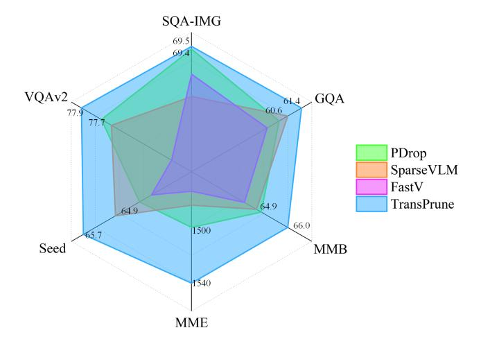
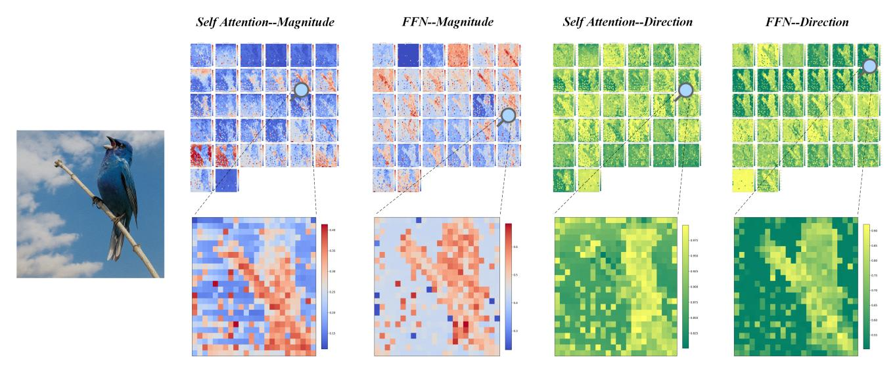
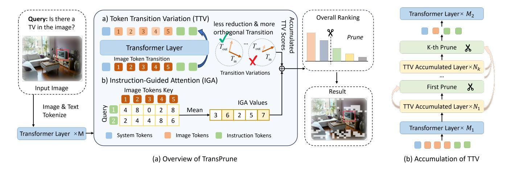
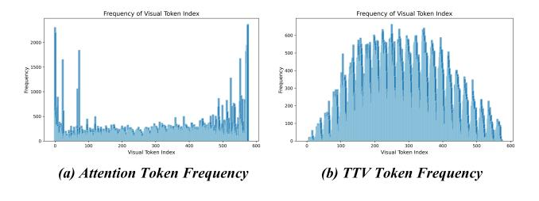
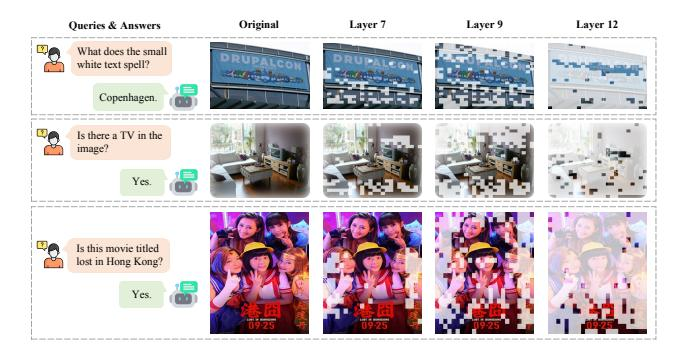

# TransPrune:

# Token Transition Pruning for Efficient Large Vision-Language Model

Ao Li\*,1 Yuxiang Duan\*,1 Jinghui Zhang2 Congbo Ma3 Yutong Xie2 Gustavo Carneiro4 Mohammad Yaqub2 Hu Wang†,2 1Shandong University 2MBZUAI 3New York University Abu Dhabi 4University of Surrey

# Abstract

*Large Vision-Language Models (LVLMs) have advanced multimodal learning but face high computational cost issues due to the input of large number of visual tokens, motivating token pruning to improve inference efficiency. The key challenge lies in identifying which tokens are truly important. Most existing approaches rely on attentionor similarity-based criteria to estimate token importance. However, they inherently suffer from certain limitations, such as being task-agnostic and exhibiting positional bias. In this work, we explore a new perspective on token importance assignment based on token transitions in LVLMs, where token transitions are defined as the changes in token representations occurring as they propagate through the model's modules. We observe that the transition of token representations provides a meaningful signal of semantic information. Based on this insight, we propose TransPrune, a training-free and efficient token pruning method. Specifically, TransPrune progressively prunes tokens by assessing their importance through a combination of Token Transition Variation (TTV), which measures changes in both the magnitude and direction of token representations; as well as Instruction-Guided Attention (IGA), which measures how strongly the instruction attends to visual tokens via attention. Extensive experiments on various LVLM architectures, such as LLaVA-v1.5, LLaVA-Next and Qwen2.5-VL, demonstrate that TransPrune maintains comparable multimodal performance while reducing inference TFLOPs by more than half.*

# 1. Introduction

Recently, Large Vision-Language Models (LVLMs) have achieved remarkable progress, demonstrating impressive performance on a wide range of tasks [\[15,](#page-8-0) [37\]](#page-9-0). However, LVLMs typically incur substantial computational overhead.

Figure 1. Comparison with existing pruning methods on LLaVAv1.5-7B. Among within-LLM pruning approaches, TransPrune achieves the best performance across six benchmarks under the lowest TFLOPs budget.

A primary contributor to this computational burden is the large number of visual tokens processed during inference. Consequently, an effective way to improve the efficiency of LVLMs is token pruning, which identifies and retains the most important tokens that typically carry richer semantic information and are more closely related to the user's instruction. However, reliably estimating the importance of each visual token remains a challenging problem.

Token pruning methods are generally categorized into *within-LLM* [\[4,](#page-8-1) [29,](#page-9-1) [36\]](#page-9-2) and *projector-based* approaches [\[1,](#page-8-2) [31,](#page-9-3) [34,](#page-9-4) [35\]](#page-9-5), all of which fundamentally rely on attention or similarity-based criteria to identify the most informative tokens. While attention-based methods are widely used and often effective, they exhibit inherent limitations. In particular, attention exhibits positional bias [\[6,](#page-8-3) [27\]](#page-8-4), where tokens at the beginning or end of a sequence are often assigned higher attention scores compared to those in other positions. Additionally, attention may overemphasize visually salient but semantically irrelevant regions [\[11\]](#page-8-5). In contrast,

\*Equal contribution to this work.

†Corresponding author.

Figure 2. Token Transition Visualization in LLaVA-v1.5-7B. We visualize the magnitude and direction changes of token representations within both the self-attention and FFN modules for each layer (excluding residual connections). To measure the magnitude change, we use the ratio of output to input L2 norm; to measure the directional change, we use cosine similarity. Token transitions that reflect semantic importance can be observed across shallow, middle, and deep layers, and they are most concentrated and pronounced in the middle layers (around layers 6–14), where tokens with larger ratios and smaller absolute cosine similarities tend to be more semantically important. We provide more visualization examples in supplementary material.

similarity-based methods typically merge tokens with high representational similarity, making them task-agnostic and less effective at identifying tokens that are truly relevant to specific downstream tasks. These limitations motivate the exploration of alternative or complementary criteria for token importance estimation.

In numerous real-world phenomena, the dynamic evolution and transformation of an entity often yield deeper and more nuanced insights than a mere examination of its instantaneous or static state [\[25\]](#page-8-6). Inspired by this broader perspective, we delve into a novel viewpoint: *can the dynamic transition of a token representation serve as an indicator of its importance?*

To answer this question, we evaluate token transitions from two complementary perspectives: first, the magnitude change, quantified by the L2 norm between a token's input and output representations within a module; and second, the direction change, captured by the cosine similarity between these two representations [\[28\]](#page-9-6). We visualize token transitions across different layers, focusing on both the self-attention and feed-forward network (FFN) modules, as shown in Figure [2.](#page-1-0) Interestingly, transitions in the middle layers indeed reflect the semantic information of tokens.

Based on our observation, we propose TransPrune, which primarily leverages two complementary criteria to estimate token importance: Token Transition Variation (TTV) and Instruction-Guided Attention (IGA). TTV captures both the magnitude and direction changes of tokens representations by focusing solely on each token's self-transition, without computing inter-token dependencies. This design avoids the positional bias that may arise from the triangular mask mechanism in attention [\[6\]](#page-8-3). Complementing TTV, IGA estimates token importance based on attention scores from instruction tokens, introducing taskguided semantic supervision. However, while TTV reflects token importance, its patterns are not consistently stable across layers. To mitigate this variability, we propose an accumulation mechanism that aggregates TTV values exclusively across middle layers exhibiting consistent characteristics, thereby yielding a more reliable importance metric.

Extensive experiments demonstrate that TransPrune, as an effective within-LLM pruning method, achieves comparable multimodal performance with over 50% TFLOPs reduction. Furthermore, combining TransPrune with projector-based methods, such as VisionZip [\[31\]](#page-9-3) and CD-Pruner [\[35\]](#page-9-5), can further improve token reduction efficiency while maintaining multimodal performance.

In summary, our main contributions are as follows:

- We introduce a novel perspective beyond attention and similarity mechanisms by showing that token transitions yield meaningful signals of token importance in LVLMs.
- We propose TransPrune, which combines TTV and IGA. TTV captures magnitude and direction changes of visual tokens, while IGA estimates image token importance based on attention from instruction tokens.
- Extensive experiments show that TransPrune maintains comparable multimodal performance while reducing in-

ference TFLOPs by more than half on LLaVA-v1.5, LLaVA-Next and Qwen2.5-VL.

### 2. Related Work

### 2.1. Large Vision-Language Models

Large Vision-Language Models (LVLMs) have achieved remarkable progress in multimodal comprehension and generation [9, 15, 17, 24, 37]. Representative models such as LLaVA [17], BLIP2 [15], and MiniGPT-4 [37] enable users to interact with the system through rich multimodal prompts that encompass both textual and visual inputs. Beyond general-purpose tasks, recent advancements have further extended the capabilities of LVLMs to downstream applications such as affective computing [13, 33] and medical image understanding [2], demonstrating their potential in high-stakes, domain-specific scenarios.

Despite recent advances, the inherent complexity of LVLMs still demands substantial computation for both training and inference. This challenge intensifies with fine-grained understanding of high-resolution images and becomes even more severe for video understanding [16, 20, 23], where temporal redundancy and long sequences drastically increase token counts. These growing burdens highlight the urgent need for efficient token pruning to enable scalable, real-time LVLMs.

#### 2.2. Token Pruning

The existing token pruning methods for LVLMs can be categorized into two types: **projection-based pruning** [1, 7, 31, 34, 35] and within-LLM pruning [4, 29, 30, 32, 36].

Projector-based pruning methods are designed to select and prune visual tokens before passing them to the LLM. VisionZip [31] selects frequently attended visual tokens and merges similar ones based on their similarity to reduce redundancy. DivPrune [1] formulates pruning as a Max-Min Diversity Problem to select the most diverse subset of tokens, thereby reducing redundancy while preserving performance. CDPruner [35] leverages conditional diversity to select tokens based on user instructions.

Although projector-based methods are receiving increasing attention, exploring within-LLM pruning approaches remains essential, as they can leverage information unique to the LLM that is not captured by the visual encoder. Moreover, combining these two types of methods can further improve inference efficiency. Specifically, within-LLM pruning operates within the LLM itself. Such methods typically perform token pruning at different layers based on internal evaluation metrics of tokens within the LLM. FastV [4] prunes visual tokens based on their attention from the last token. PDrop [29] adopts a pyramid-style multi-stage pruning strategy to accelerate inference. SparseVLM [36] leverages attention scores between important instruction tokens

and visual tokens to guide pruning. However, recent studies have highlighted that reliance on attention scores alone can introduce positional bias [6, 27].

Unlike most existing within-LLM approaches that rely solely on attention or similarity, TransPrune introduce a novel and efficient criterion grounded in token transition to evaluate token importance better.

### 3. Method

In this section, we introduce the TransPrune method, as shown in Figure 3.

#### 3.1. Token Transition Variation

**Token transition as a signal of importance.** Inspired by the insight that dynamic changes often better reflect the state of an entity than static values in the real world, we hypothesize that the transformations experienced by tokens within LLM layers may reveal their semantic importance.

Each transformer layer consists of a self-attention module and a FFN, both of which modify token representations in meaningful ways. To characterize these changes, we analyze token transitions along two dimensions: *magnitude* and *direction*. Formally, let F denote a transformation module (e.g., self-attention or FFN), and let  $T_{\rm in}$  be the input token representation. The output token is then given by  $T_{\rm out} = F(T_{\rm in})$ . We define the magnitude transition  $m(F, T_{\rm in})$  and direction transition  $d(F, T_{\rm in})$  as:

$$m(F, T_{\rm in}) = \frac{\|T_{\rm out}\|_2}{\|T_{\rm in}\|_2}, d(F, T_{\rm in}) = \frac{T_{\rm out} \cdot T_{\rm in}}{\|T_{\rm out}\|_2 \|T_{\rm in}\|_2}.$$
 (1)

We empirically observe (see Figure 2) that these two types of transition variations reflect a token's semantic information, which can be observed to varying degrees across shallow, middle, and deep layers, but is most pronounced and concentrated in the middle layers. We argue that this phenomenon arises because the middle layers lie between the shallow global features and the deep local features [4], enabling them to integrate both global context and local details. As a result, these layer-wise transitions demonstrate how the LLM progressively shifts its attention from global representations to local information under the guidance of instructions. Consequently, tokens exhibiting larger transitions in the middle layers better reflect the model's dynamic attention shifts and are therefore more semantically important.

Based on this insight, we propose a criterion called **To-ken Transition Variation (TTV)**. Specifically, we find that  $1 - |d(F, T_I)|$  performs better than  $d(F, T_I)$  directly. Accordingly, we define the direction transition of all image to-kens  $T_I$  using  $1 - |d(F, T_I)|$  (see the supplementary material). We then apply a softmax operation across all tokens to normalize these direction transition values and multiply

Figure 3. (a) Overview of TransPrune. During pruning, TransPrune computes image token transitions. Tokens whose transitions are closer in magnitude to those of the original tokens, and that exhibit more orthogonal directional changes, are assigned higher TTV scores. In parallel, we compute IGA by averaging the attention from instruction tokens to image tokens. The final score for each token is obtained by summing TTV and IGA, followed by sorting. (b) Accumulation of TTV. To achieve a more precise TTV, we retain TTV scores from earlier layers. For each pruning stage, we accumulate TTV scores from the first accumulated layer up to the current pruning layer.

them by the corresponding magnitude transitions to compute the final TTV score:

$$TTV(F, T_I) = Softmax (1 - |d(F, T_I)|) \cdot m(F, T_I).$$
 (2)

For each layer l, we compute a token's TTV score by aggregating the contributions from both the self-attention and FFN modules:

$$TTV_l(T_I) = TTV(Attention, T_I) + TTV(FFN, T_I).$$
 (3)

These scores are then used to guide token pruning decisions in each layer.

Token Transition Accumulation for Precise Pruning. In token pruning, it is common to remove tokens at specific layers based on a predefined importance criterion. However, as shown in Figure [2,](#page-1-0) the TTV patterns vary across layers, making TTV scores from any single layer insufficiently precise for consistently identifying important tokens. To improve the consistency of token pruning, we introduce an accumulation mechanism that aggregates token transitions across multiple layers before each pruning layer, as shown in Figure [3](#page-3-0) (b).

Formally, we define the accumulation layer set A = {a1, a2, . . . , am}, where TTV scores are computed. Within this set A, we select specific layers, forming the pruning layer set P = {p1, p2, . . . , pk}, where token pruning is performed sequentially. For each pruning layer pi ∈ P, we compute an accumulated TTV score for each token by summing its TTV values from all preceding accumulation layers up to and including pi :

$$TTV_{p_i}(T_I) = \sum_{l \in \mathcal{A}, l \le p_i} TTV_l(T_I). \tag{4}$$

This accumulation strategy enables each pruning stage to make decisions based on the transition history of each token, leading to more precise pruning.

### 3.2. Instruction-Guided Attention

Since TTV relies solely on the intrinsic variation of image tokens and is independent of the instruction, it may fail to capture instruction-related information. To address this issue, we introduce Instruction-Guided Attention (IGA). We simply leverage how instruction tokens attend to image tokens to estimate the importance of each image token.

Specifically, we first compute the attention matrix A between the query of the instruction tokens Q and the key of image tokens KTI . We then average them over all instruction tokens to obtain the IGA:

$$IGA(T_I) = \frac{1}{L} \sum_{j=1}^{L} A_j,$$
 (5)

where Aj indicates the weight of attention from the j-th instruction token to the image tokens and L indicates the length of instruction tokens. A higher IGA score indicates that the token is more semantically relevant under the given instruction.

For each pruning layer pi , TransPrune integrates the accumulated TTV with IGA to determine token importance for pruning. The combined pruning score for image tokens TI at layer pi is computed as:

$$Score_{p_i}(T_I) = \alpha \cdot TTV_{p_i}(T_I) + (1 - \alpha) \cdot IGA_{p_i + 1}(T_I), (6)$$

where hyperparameter α ∈ [0, 1] balances the contributions of TTV and IGA. Tokens with lower combined scores are

| Methods                             | TFLOPs                      | Acc.(%)      | $MME^P$     | $VQA^{V2}$  | $Seed^I$    | TextVQA     | $SQA^I$     | POPE        | GQA         | $\mathrm{MMB}^{en}$ |  |
|-------------------------------------|-----------------------------|--------------|-------------|-------------|-------------|-------------|-------------|-------------|-------------|---------------------|--|
| Upper Bound (100% TFLOPs            | Upper Bound (100% TFLOPs)   |              |             |             |             |             |             |             |             |                     |  |
| LLaVA-1.5-7B                        | 3.82 (100%)                 | 100.0 (-0.0) | 1506        | 78.5        | 66.2        | 58.2        | 69.5        | 85.9        | 61.9        | 64.6                |  |
| Approximately 40-50% TFLO           | Approximately 40-50% TFLOPs |              |             |             |             |             |             |             |             |                     |  |
| FastV K=2,R=0.5 (ECCV24) | 2.01 (52.6%)                | 97.8 (-2.2)  | 1474        | 77.0        | 64.0        | 57.2        | 68.5        | 84.0        | 59.4        | 64.2                |  |
| TopV (CVPR25)                       | 1.95 (51.0%)                | -            | -           | -           | -           | -           | 69.6        | 84.2        | -           | 64.3                |  |
| PDrop (CVPR25)                      | 1.78 (46.6%)                | 98.8 (-1.2)  | 1500        | <u>77.7</u> | 64.3        | 57.5        | 69.4        | 84.8        | 60.1        | 64.9                |  |
| ShortV (ICCV25)                     | 1.68 (44.0%)                | -            | 1342        | -           | 62.5        | -           | -           | -           | 58.3        | 60.7                |  |
| SparseVLM (ICML25)                  | 1.57 (41.1%)                | 98.8 (-1.2)  | 1484        | 77.6        | 64.9        | 58.0        | 67.7        | 85.7        | 60.6        | 64.7                |  |
| TransPrune-High (Ours)              | 1.56 (40.8%)                | 100.0 (-0.0) | 1540        | 77.9        | 65.7        | <u>57.8</u> | <u>69.5</u> | <u>85.0</u> | 61.4        | 66.0                |  |
| Approximately 25-35% TFLO           | Ps                          |              |             |             |             |             |             |             |             |                     |  |
| TopV (CVPR25)                       | 1.34 (35.0%)                | -            | -           | -           | -           | -           | 69.5        | 85.0        | -           | 60.4                |  |
| PDrop (CVPR25)                      | 1.28 (33.5%)                | 96.5 (-3.5)  | <u>1468</u> | 76.1        | 62.4        | <u>57.2</u> | 68.8        | 84.2        | 58.0        | 63.0                |  |
| SparseVLM (ICML25)                  | 1.28 (33.5%)                | 97.9 (-2.1)  | 1441        | 77.0        | <u>64.1</u> | 57.8        | 68.7        | 85.3        | <u>59.5</u> | <u>64.1</u>         |  |
| $FastV_{K=2,R=0.75}$ (ECCV24)       | 1.12 (29.3%)                | 94.4 (-5.6)  | 1394        | 74.3        | 61.2        | 56.2        | 68.7        | 79.2        | 56.6        | 62.3                |  |
| TransPrune-Low (Ours)               | 1.19 (31.2%)                | 98.4 (-1.6)  | 1491        | <u>76.6</u> | 64.2        | 56.5        | 68.7        | <u>85.1</u> | 60.0        | 65.6                |  |

Table 1. Performance of *within-LLM* methods across different benchmarks on LLaVA-1.5-7B. TransPrune-High and TransPrune-Low achieve the best performance under low TFLOPs settings. Bold font highlights the best-performing results, and underlined values denote the second-best performance.

| Methods                                           | TFLOPS                      | Acc.(%)      | $MME^P$ | $VQA^{V2}$  | $Seed^I$    | TextVQA     | $SQA^I$     | POPE | GQA         | $MMB^{en}$ |
|---------------------------------------------------|-----------------------------|--------------|---------|-------------|-------------|-------------|-------------|------|-------------|------------|
| Upper Bound (100% TFLOPs                          | Upper Bound (100% TFLOPs)   |              |         |             |             |             |             |      |             |            |
| LLaVA-Next-7B                                     | 20.83 (100%)                | 100.0 (-0.0) | 1520    | 81.8        | 70.2        | 61.3        | 70.2        | 86.5 | 64.3        | 67.9       |
| Approximately 40-50% TFLO                         | Approximately 40-50% TFLOPs |              |         |             |             |             |             |      |             |            |
| ShortV (ICCV25)                                   | 10.62 (51.0%)               | -            | 1525    | -           | 70.4        | -           | -           | -    | 63.4        | 67.2       |
| $FastV_{K=2,R=0.5}$ (ECCV24)                      | 10.55 (50.6%)               | 98.9 (-1.1)  | 1524    | 80.7        | 69.1        | 59.3        | 69.2        | 86.6 | 63.6        | 67.8       |
| PDrop (CVPR25)                                    | 9.46 (45.4%)                | 99.3 (-0.7)  | 1511    | 81.2        | 69.0        | 61.8        | 69.0        | 86.7 | 63.3        | 67.4       |
| TransPrune-High (Ours)                            | 8.33 (40.0%)                | 99.8 (-0.2)  | 1528    | <u>81.1</u> | <u>70.1</u> | 61.8        | <u>69.1</u> | 86.9 | 63.6        | 67.8       |
| Approximately 25-35% TFLO                         | PS                          |              |         |             |             |             |             |      |             |            |
| PDrop (CVPR25)                                    | 6.65 (31.9%)                | 98.2 (-1.8)  | 1492    | 80.2        | 68.4        | 60.2        | 68.3        | 86.6 | 62.7        | 67.2       |
| FastV <math>K=2,R=0.75</math> (ECCV24) | 5.80 (27.8%)                | 95.5 (-4.5)  | 1465    | 78.4        | 66.4        | 57.4        | 67.5        | 83.7 | 60.6        | 65.6       |
| TransPrune-Low (Ours)                             | 6.41 (30.8%)                | 98.4 (-1.6)  | 1500    | <u>80.0</u> | 70.2        | <u>60.1</u> | 68.4        | 86.6 | <u>61.5</u> | 67.3       |

Table 2. Performance of *within-LLM* methods across different benchmarks on LLaVA-Next-7B. TransPrune-High and TransPrune-Low achieve the best performance under low TFLOPs settings.

| Methods           | TFLOPs | MME P | $SQA^I$ | POPE | $\mathrm{MMB}^{en}$ |
|-------------------|--------|------------------|---------|------|---------------------|
| Qwen2.5-VL-7B     | 100%   | 1634             | 79.6    | 86.2 | 79.8                |
| FastV             | 53.6%  | 1563             | 78.3    | 85.1 | 77.6                |
| TransPrune (Ours) | 45.1%  | 1580             | 78.1    | 87.5 | 78.1                |

Table 3. Performance of *within-LLM* methods across different benchmarks on Qwen2.5-VL-7B.

subsequently pruned. Note that the accumulation mechanism is exclusively applied to TTV and is not utilized in IGA.

## 4. Experiment

### **4.1.** Setup

**Benchmarks.** To thoroughly evaluate the effectiveness of TransPrune, we conduct experiments across a diverse set of benchmarks spanning tasks such as perception, reasoning, and visual question answering (VQA). The benchmarks include: MME [8], MMBench [21], SEED [14], ScienceQA [22], VQA-v2 [10], POPE [12], GQA [12] and

TextVQA [26]. In addition, we select two video benchmarks, TGIF and MSVD, to evaluate the generalization capability of TransPrune in Video LLM.

**Models.** We validate the effectiveness and generalization capability of TransPrune through extensive experiments on LVLMs with diverse architectural designs and input resolutions. Specifically, our study includes LLaVA-v1.5-7B [19], LLaVA-NeXT-7B [18] and Qwen2.5-VL-7B [3]. For video, we select Video-LLaVA [16] as base model.

**Methods.** As TransPrune is a within-LLM method, we conduct a fair comparison with existing within-LLM pruning approaches, including FastV [4], TopV [30], PDrop [29], ShortV [32], and SparseVLM [36]. We further demonstrate its potential when combined with two representative projector-based pruning methods, VisionZip [31] and CD-Pruner [35].

Implementation details. We set  $\alpha$ =0.5 to equally balance the contributions of TTV and IGA. TTV is accumulated across layers 7 to 12, while token pruning is performed at layers 7, 9, and 12. To evaluate the effective of the second second second second second second second second second second second second second second second second second second second second second second second second second second second second second second second second second second second second second second second second second second second second second second second second second second second second second second second second second second second second second second second second second second second second second second second second second second second second second second second second second second second second second second second second second second second second second second second second second second second second second second second second second second second second second second second second second second second second second second second second second second second second second second second second second second second second second second second second second second second second second second second second second second second second second second second second second second second second second second second second second second second second second second second second second second second second second second second second second second second second second second second second second second second second second second second second second second second second second second second second second second second second second second second second second second second second second second second second second second second second second second second second second second second second second second second second second second second second second second second second second second second second second second second second second second second second second second second second second second second second s

| Methods                 | Final Token                           | TFLOPs       | Acc.(%)     | $MME^P$ | $SQA^I$ | GQA         | POPE | $MMB^{en}$  | $\mathrm{Seed}^I$ |  |
|-------------------------|---------------------------------------|--------------|-------------|---------|---------|-------------|------|-------------|-------------------|--|
| Upper Bound (100% TFLOF | Upper Bound (100% TFLOPs, 576 tokens) |              |             |         |         |             |      |             |                   |  |
| LLaVA-1.5-7B            | 576                                   | 3.82 (100%)  | 100         | 1506    | 69.5    | 61.9        | 85.9 | 64.6        | 66.2              |  |
| Retained 36 tokens      | Retained 36 tokens                    |              |             |         |         |             |      |             |                   |  |
| VisionZip (CVPR25)      | 288                                   | 1.89 (49.5%) | 98.5        | 1457    | 68.8    | 60.3        | 86.3 | 64.3        | 64.7              |  |
| VisionZip+FastV         | 144                                   | 1.00 (26.2%) | 95.8 (-2.7) | 1423    | 68.7    | 58.0        | 83.0 | 62.5        | 62.5              |  |
| VisionZip+PDrop         | 36                                    | 0.88 (23.0%) | 96.4 (-2.1) | 1447    | 68.7    | 58.2        | 84.5 | 63.5        | 61.7              |  |
| VisionZip+TransPrune    | 36                                    | 0.66 (17.3%) | 98.0 (-0.5) | 1460    | 68.9    | <u>59.4</u> | 86.3 | <u>63.8</u> | <u>64.1</u>       |  |
| Retained 24 tokens      |                                       |              |             |         |         |             |      |             |                   |  |
| VisionZip (CVPR25)      | 192                                   | 1.25 (32.7%) | 97.2        | 1443    | 68.8    | 59.3        | 85.5 | 62.9        | 63.2              |  |
| VisionZip+FastV         | 96                                    | 0.66 (17.3%) | 94.3 (-2.9) | 1383    | 69.0    | 56.8        | 81.1 | 62.3        | 61.0              |  |
| VisionZip+PDrop         | 24                                    | 0.59 (15.4%) | 94.8 (-2.4) | 1417    | 69.7    | 56.8        | 83.2 | 61.2        | 60.3              |  |
| VisionZip+TransPrune    | 24                                    | 0.44 (11.5%) | 97.2 (-0.0) | 1444    | 68.6    | 59.4        | 85.9 | 63.0        | <u>62.7</u>       |  |

Table 4. Performance when combined with the *projector-based* method VisionZip. Our method achieves a reduction in FLOPs while maintaining performance comparable to VisionZip alone.

| Methods                               | Final Token | TFLOPs       | Acc.(%)     | $MME^P$     | $SQA^I$     | GQA         | POPE        | $MMB^{en}$  | $Seed^I$    |
|---------------------------------------|-------------|--------------|-------------|-------------|-------------|-------------|-------------|-------------|-------------|
| Upper Bound (100% TFLOPs, 576 tokens) |             |              |             |             |             |             |             |             |             |
| LLaVA-1.5-7B                          | 576         | 3.82 (100%)  | 100         | 1506        | 69.5        | 61.9        | 85.9        | 64.6        | 66.2        |
| Retained 36 tokens                    |             |              |             |             |             |             |             |             |             |
| CDPruner (NeurIPS25)                  | 288         | 1.89 (49.5%) | 98.8        | 1452        | 68.6        | 60.8        | 86.9        | 64.2        | 65.6        |
| CDPruner+FastV                        | 144         | 1.00 (26.2%) | 96.3 (-2.5) | 1440        | 67.5        | 58.7        | 84.3        | 62.4        | 63.4        |
| CDPruner+PDrop                        | 36          | 0.88 (23.0%) | 96.7 (-2.1) | 1455        | <u>68.0</u> | 59.0        | 85.2        | 62.4        | 62.5        |
| CDPruner+TransPrune                   | 36          | 0.66 (17.3%) | 98.3 (-0.5) | 1467        | 67.9        | <u>60.4</u> | <u>86.8</u> | <u>63.8</u> | <u>64.6</u> |
| Retained 24 tokens                    |             |              |             |             |             |             |             |             |             |
| CDPruner (NeurIPS25)                  | 192         | 1.25 (32.7%) | 98.3        | 1447        | 68.8        | 60.3        | 87.3        | 63.1        | 64.7        |
| CDPruner+FastV                        | 96          | 0.66 (17.3%) | 96.2 (-2.1) | 1419        | 68.8        | 58.2        | 84.9        | 62.1        | 62.9        |
| CDPruner+PDrop                        | 24          | 0.59 (15.4%) | 95.9 (-2.4) | 1407        | 69.2        | 57.9        | 85.5        | 62.3        | 61.6        |
| CDPruner+TransPrune                   | 24          | 0.44 (11.5%) | 97.6 (-0.7) | <u>1430</u> | 68.7        | <u>59.3</u> | 87.3        | 63.1        | <u>64.1</u> |

Table 5. Performance when combined with the *projector-based* method CDPruner. Our method achieves a reduction in FLOPs while maintaining performance comparable to CDPruner alone.

| Methods                                                                                                                                                                                                                                                                                                                                                                                                                                                                                                                                                                                                                                                                                                                                                                                                                                                                                                                                                                                                                                                                                                                                                                                                                                                                                                                                                                                                                                                                                                                                                                                                                                                                                                                                                                                                                                                                                                                                                                                                                                                                                                                        | TFLOPs | TO   | GIF       | MSVD |       |
|--------------------------------------------------------------------------------------------------------------------------------------------------------------------------------------------------------------------------------------------------------------------------------------------------------------------------------------------------------------------------------------------------------------------------------------------------------------------------------------------------------------------------------------------------------------------------------------------------------------------------------------------------------------------------------------------------------------------------------------------------------------------------------------------------------------------------------------------------------------------------------------------------------------------------------------------------------------------------------------------------------------------------------------------------------------------------------------------------------------------------------------------------------------------------------------------------------------------------------------------------------------------------------------------------------------------------------------------------------------------------------------------------------------------------------------------------------------------------------------------------------------------------------------------------------------------------------------------------------------------------------------------------------------------------------------------------------------------------------------------------------------------------------------------------------------------------------------------------------------------------------------------------------------------------------------------------------------------------------------------------------------------------------------------------------------------------------------------------------------------------------|--------|------|-----------|------|-------|
| Tradition of the second of the second of the second of the second of the second of the second of the second of the second of the second of the second of the second of the second of the second of the second of the second of the second of the second of the second of the second of the second of the second of the second of the second of the second of the second of the second of the second of the second of the second of the second of the second of the second of the second of the second of the second of the second of the second of the second of the second of the second of the second of the second of the second of the second of the second of the second of the second of the second of the second of the second of the second of the second of the second of the second of the second of the second of the second of the second of the second of the second of the second of the second of the second of the second of the second of the second of the second of the second of the second of the second of the second of the second of the second of the second of the second of the second of the second of the second of the second of the second of the second of the second of the second of the second of the second of the second of the second of the second of the second of the second of the second of the second of the second of the second of the second of the second of the second of the second of the second of the second of the second of the second of the second of the second of the second of the second of the second of the second of the second of the second of the second of the second of the second of the second of the second of the second of the second of the second of the second of the second of the second of the second of the second of the second of the second of the second of the second of the second of the second of the second of the second of the second of the second of the second of the second of the second of the second of the second of the second of the second of the second of the second of the second of the second of the second of the |        | Acc  | Acc Score |      | Score |
| Video-LLaVA                                                                                                                                                                                                                                                                                                                                                                                                                                                                                                                                                                                                                                                                                                                                                                                                                                                                                                                                                                                                                                                                                                                                                                                                                                                                                                                                                                                                                                                                                                                                                                                                                                                                                                                                                                                                                                                                                                                                                                                                                                                                                                                    | 14.4   | 47.0 | 3.3       | 69.6 | 3.9   |
| w / FastV                                                                                                                                                                                                                                                                                                                                                                                                                                                                                                                                                                                                                                                                                                                                                                                                                                                                                                                                                                                                                                                                                                                                                                                                                                                                                                                                                                                                                                                                                                                                                                                                                                                                                                                                                                                                                                                                                                                                                                                                                                                                                                                      | 7.4    | 47.6 | 3.4       | 70.3 | 3.9   |
| w / PDrop                                                                                                                                                                                                                                                                                                                                                                                                                                                                                                                                                                                                                                                                                                                                                                                                                                                                                                                                                                                                                                                                                                                                                                                                                                                                                                                                                                                                                                                                                                                                                                                                                                                                                                                                                                                                                                                                                                                                                                                                                                                                                                                      | 6.6    | 46.9 | 3.4       | 70.0 | 3.9   |
| w / TransPrune (Ours)                                                                                                                                                                                                                                                                                                                                                                                                                                                                                                                                                                                                                                                                                                                                                                                                                                                                                                                                                                                                                                                                                                                                                                                                                                                                                                                                                                                                                                                                                                                                                                                                                                                                                                                                                                                                                                                                                                                                                                                                                                                                                                          | 6.1    | 47.5 | 3.4       | 70.3 | 3.9   |

Table 6. Performance of *within-LLM* methods across different benchmarks on Video-LLaVA.

| Methods      | SQA I | GQA  | POPE | $MMB^{en}$ | TextVQA |
|--------------|------------------|------|------|------------|---------|
| LLaVA-1.5-7B | 69.5             | 61.9 | 85.9 | 64.6       | 58.2    |
| TTV-only     | 68.9             | 58.4 | 82.1 | 64.9       | 50.9    |

Table 7. Performance using only TTV.

tiveness of TransPrune under different computational budgets, we design two configurations—TransPrune-High and TransPrune-Low—which keep different numbers of tokens at each pruning layer (see the supplementary material). All experiments are conducted on A100 GPUs (40GB). During

inference, we leverage **FlashAttention** [5] for efficient attention computation. Since TransPrune's TTV computation only requires access to module inputs and outputs, and IGA exclusively computes attention weights from instruction tokens to image tokens (rather than full attention maps), our method remains compatible with FlashAttention.

### 4.2. Comparison with SOTA in Public Benchmarks

TransPrune achieves strong performance across a wide range of benchmarks while incurring low TFLOPs among all compared methods. As shown in Table 1, TransPrune-High maintains negligible performance degradation while reducing computational cost to just 41% of the original TFLOPs. Furthermore, as shown in Table 2 on the higher-resolution LLaVA-NeXT-7B, TransPrune maintains even lower TFLOPs while simultaneously outperforming other methods. For Qwen2.5-VL, which has an architecture different from LLaVA, our method also demonstrates strong performance, validating the generalization capability of TransPrune.

While TransPrune is a within-LLM pruning method, it also integrates seamlessly with existing projector-based token pruning approaches. As shown in the Table [4](#page-5-0) and Table [5,](#page-5-1) we present its combined performance with VisionZiP [\[31\]](#page-9-3) and CDPruner [\[35\]](#page-9-5). TransPrune achieves consistently strong results, demonstrating its compatibility and effectiveness with existing projector-based pruning methods. When retaining only 24 tokens, the combination with VisionZiP [\[31\]](#page-9-3) achieves a substantial reduction in TFLOPs with almost no performance degradation.

### 4.3. Analysis

We use TransPrune-High for the following analysis.

Effectiveness of TTV. To assess the effectiveness of TTV as a standalone criterion for token importance, we conduct experiments using only TTV for token pruning. As shown in Table [7,](#page-5-2) our results demonstrate that the attentionindependent TTV also achieves competitive performance, highlighting its effectiveness as a standalone criterion for token importance. However, we also observe a noticeable performance drop when using TTV alone on TextVQA. This may be attributed to TTV's exclusive reliance on image token transitions, as it does not account for instructiondependent semantics [\[27\]](#page-8-4).

Besides, we visualize the positional distribution of the final retained tokens across all MME samples, as shown in Figure [4.](#page-6-0) Figure [4](#page-6-0) (a) presents the frequency using IGA. Since IGA is an attention-based method, it clearly exhibits positional bias, favoring the retention of tokens at the beginning and end [\[6,](#page-8-3) [27\]](#page-8-4). However, for images, tokens at these positions often carry less semantic information. In contrast, Figure [4](#page-6-0) (b) shows the frequency using TTV. TTV introduces no apparent positional bias and tends to focus more uniformly on the central regions of the image, which typically encapsulate denser and more relevant semantic information. The combined use of TTV and attention-based methods can partially alleviate the issue of positional bias.

Figure 4. Token position frequency statistics on MME benchmark for IGA and TTV.

Efficiency of TransPrune. We analyze the additional computational cost introduced by TransPrune in a setting where there are l instruction tokens, each with hidden dimension d, and m denotes the intermediate dimension of the FFN layer. In common VQA tasks, the instruction typically consists of only a few dozen tokens. TransPrune operates in s *pruning stages*, where at each stage, a subset of ni visual tokens is retained (with i = 1, 2, ..., s). Each pruning stage may correspond to multiple Transformer layers. Let ki denote the number of layers in stage i. The extra computations introduced by TransPrune mainly come from two components: (1) the L2 norm and cosine similarity calculations in TTV, and (2) the attention between retained visual tokens and instruction tokens in IGA. Formally, the total FLOPs can be approximated as:

$$\sum_{i=1}^{s} k_i \left( 4n_i d^2 + 2n_i^2 d + 3n_i dm \right) + \sum_{i=1}^{s-1} ln_i d + \mathcal{O}(sd), \tag{7}$$

where the first term corresponds to the Transformer operations on the retained tokens across all layers, the second term represents the attention between instruction tokens and visual tokens at each stage, and the last term captures the small overhead from TTV computations, which scales linearly with the number of stages and token dimension. Compared to the baseline model's total computation, the extra cost introduced by TransPrune is marginal. Besides, we evaluate the latency (ms) and memory usage (GB) of various methods on the MME benchmark under identical experimental settings. TransPrune demonstrates superior performance with reduced latency and memory consumption.

| Methods    | Latency (ms) | Memory (GB) | Accuracy |
|------------|--------------|-------------|----------|
| FastV      | 125.2        | 14.99       | 1474     |
| PDrop      | 115.2        | 14.87       | 1500     |
| SparseVLM  | 129.1        | 19.05       | 1484     |
| TransPrune | 111.4        | 14.82       | 1540     |

Table 8. Comparison of latency, memory, and accuracy for different pruning methods in MME.

Qualitative visualization. As shown in Figure [5,](#page-7-0) we present token pruning results across different layers for three VQA examples. From left to right, we visualize how the retained tokens evolve as pruning progresses.

In all examples, less relevant tokens are progressively discarded, while semantically important tokens are consistently preserved at the final pruning stage.

Impact of different layer choices. Since the accumulation layers and pruning layers are two critical hyperparameters in TransPrune, we conduct experiments to evaluate their impact on performance. The pruning layers are determined by the accumulation layers, making it difficult to analyze their effects independently. Therefore, we consider them jointly. As shown in Table [9,](#page-7-1) the combination of layers 7, 9, and 12 achieves the best performance. This result corroborates our previous analysis, confirming that transitions in the middle layers provide a more reliable signal of token semantic importance.

Figure 5. Visualization of TransPrune on different VQA prompts.

| Group | Layer 1 | Layer 2 | Layer 3 | MME  | TFLOPs |
|-------|---------|---------|---------|------|--------|
| 1     | 5       | 7       | 10      | 1479 | 1.35   |
| 2     | 6       | 8       | 11      | 1496 | 1.45   |
| 3     | 7       | 9       | 12      | 1540 | 1.56   |
| 4     | 8       | 10      | 13      | 1493 | 1.66   |
| 5     | 9       | 11      | 14      | 1497 | 1.77   |

Table 9. Comparison of MME performance and TFLOPs under different layer selections. For example, the entry '5, 7, 10' indicates that pruning is performed at layers 5, 7, and 10, with the corresponding accumulation layers spanning from 5 to 10.

Shallow vs. deep accumulation layers on TTV. To investigate the effect of accumulation layers on TTV, we compare token pruning using TTV computed from deeper layers (layers 7–12) with that computed solely from shallow layers (layers 1–6). In all settings, token pruning is performed at layers 7, 9, and 12 to ensure a fair comparison. For the shallow-layer setting, TTV at each pruning layer is accumulated only from the preceding shallow layers: for example, at pruning layer 7, we use TTV from layer 1; at layer 9, from layers 1–3; and at layer 12, from layers 1–6. As reported in Table [10,](#page-7-2) TTV computed solely from shallow layers is less effective than TTV derived from deeper layers. These results indicate that tokens with larger transitions in the middle layers are more semantically informative than those in shallow layers, because the middle layers combine shallow global information with deep local details, thereby more effectively reflecting the LLM's shifting attention.

| Layers        | MMEP | SQAI | GQA  | MMBen |
|---------------|------|------|------|-------|
| Layers (1-6)  | 1515 | 69.4 | 61.3 | 65.6  |
| Layers (7-12) | 1540 | 69.5 | 61.4 | 66.0  |

Table 10. Impact of accumulated TTV across different layers.

Impact of accumulation mechanism. To verify the effectiveness of the accumulation mechanism, we conduct ablation experiments using the same pruning layers as TransPrune, as shown in Table [11.](#page-7-3) Almost all benchmarks show improvements after introducing the accumulation mechanism, indicating that it enables TTV to capture more precise semantic information.

| Methods          | MMEP | SQAI | GQA  | MMBen |
|------------------|------|------|------|-------|
| w/o Accumulation | 1530 | 69.2 | 61.4 | 65.7  |
| w Accumulation   | 1540 | 69.5 | 61.4 | 66.0  |

Table 11. Ablation study on the impact of accumulation.

Impact of magnitude and direction. To evaluate the contribution of the magnitude and direction components within TTV, we perform an ablation study by progressively incorporating these elements, starting from a baseline using only IGA. As presented in the Table [12,](#page-7-4) both magnitude and direction contribute to performance gains, with magnitude yielding a more significant improvement. Combining both components leads to the optimal performance.

| Methods       | MMEP | SQAI | GQA  | MMBen |
|---------------|------|------|------|-------|
| Only IGA      | 1514 | 69.0 | 61.1 | 65.6  |
| IGA+Direction | 1521 | 69.1 | 61.2 | 65.4  |
| IGA+Magnitude | 1532 | 69.4 | 61.4 | 65.7  |
| IGA+TTV       | 1540 | 69.5 | 61.4 | 66.0  |

Table 12. Ablation study on the impact of direction and magnitude.

Impact of the parameter α. We conduct experiments on the impact of different α parameters on the final performance, as shown in Table [13.](#page-7-5) When α is set to 0.5, meaning TTV and IGA contribute equally, the performance reaches its optimal level. This shows that balancing the contributions of TTV and IGA allows the model to fully leverage both the image token's own information and the instruction information, leading to the best overall performance.

| Parameter | MMEP | SQAI | GQA  | MMBen |
|-----------|------|------|------|-------|
| α=0.4     | 1540 | 69.4 | 61.4 | 65.5  |
| α=0.5     | 1540 | 69.5 | 61.4 | 66.0  |
| α=0.6     | 1525 | 69.5 | 61.4 | 65.9  |

Table 13. Ablation study on the impact of parameter α.

# 5. Conclusion

In this paper, we explore a novel perspective for LVLM token pruning that is distinct from attention- or similaritybased approaches: leveraging the transition of token representations to reflect token importance. Based on this insight, we propose TransPrune, a training-free and efficient pruning method. TransPrune's core relies on combining token transition variation with instruction-guided attention. Extensive experiments validate the effectiveness and efficiency of TransPrune across a wide range of benchmarks and ablation studies further confirm our findings regarding the importance of middle-layer token transitions. We believe that this work opens new avenues for accelerating LVLM inference.

# References

- [1] Saeed Ranjbar Alvar, Gursimran Singh, Mohammad Akbari, and Yong Zhang. Divprune: Diversity-based visual token pruning for large multimodal models, 2025. [1,](#page-0-0) [3](#page-2-0)
- [2] Fan Bai, Yuxin Du, Tiejun Huang, Max Q-H Meng, and Bo Zhao. M3d: Advancing 3d medical image analysis with multi-modal large language models. *arXiv preprint arXiv:2404.00578*, 2024. [3](#page-2-0)
- [3] Shuai Bai, Keqin Chen, Xuejing Liu, Jialin Wang, Wenbin Ge, Sibo Song, Kai Dang, Peng Wang, Shijie Wang, Jun Tang, Humen Zhong, Yuanzhi Zhu, Mingkun Yang, Zhaohai Li, Jianqiang Wan, Pengfei Wang, Wei Ding, Zheren Fu, Yiheng Xu, Jiabo Ye, Xi Zhang, Tianbao Xie, Zesen Cheng, Hang Zhang, Zhibo Yang, Haiyang Xu, and Junyang Lin. Qwen2.5-vl technical report, 2025. [5](#page-4-2)
- [4] Liang Chen, Haozhe Zhao, Tianyu Liu, Shuai Bai, Junyang Lin, Chang Zhou, and Baobao Chang. An image is worth 1/2 tokens after layer 2: Plug-and-play inference acceleration for large vision-language models, 2024. [1,](#page-0-0) [3,](#page-2-0) [5](#page-4-2)
- [5] Tri Dao, Dan Fu, Stefano Ermon, Atri Rudra, and Christopher Re. Flashattention: Fast and memory-efficient exact ´ attention with io-awareness. *Advances in neural information processing systems*, 35:16344–16359, 2022. [6](#page-5-3)
- [6] Mohamed Dhouib, Davide Buscaldi, Sonia Vanier, and Aymen Shabou. Pact: Pruning and clustering-based token reduction for faster visual language models, 2025. [1,](#page-0-0) [2,](#page-1-1) [3,](#page-2-0) [7](#page-6-1)
- [7] Yuxiang Duan, Ao Li, Yingqin Li, Luyu Li, and Pengwei Wang. Gridprune: From "where to look" to "what to select" in visual token pruning for mllms, 2025. [3](#page-2-0)
- [8] Chaoyou Fu, Peixian Chen, Yunhang Shen, Yulei Qin, Mengdan Zhang, Xu Lin, Zhenyu Qiu, Wei Lin, Jinrui Yang, Xiawu Zheng, Ke Li, Xing Sun, and Rongrong Ji. Mme: A comprehensive evaluation benchmark for multimodal large language models. *arXiv preprint arXiv:2306.13394*, 2023. [5](#page-4-2)
- [9] Gemini Team. Gemini: a family of highly capable multimodal models. *arXiv preprint arXiv:2312.11805*, 2023. [3](#page-2-0)
- [10] Yash Goyal, Tejas Khot, Douglas Summers-Stay, Dhruv Batra, and Devi Parikh. Making the v in vqa matter: Elevating the role of image understanding in visual question answering. In *Proceedings of the IEEE conference on computer vision and pattern recognition*, pages 6904–6913, 2017. [5](#page-4-2)
- [11] Meng-Hao Guo, Tian-Xing Xu, Jiang-Jiang Liu, Zheng-Ning Liu, Peng-Tao Jiang, Tai-Jiang Mu, Song-Hai Zhang, Ralph R Martin, Ming-Ming Cheng, and Shi-Min Hu. Attention mechanisms in computer vision: A survey. *Computational visual media*, 8(3):331–368, 2022. [1](#page-0-0)
- [12] Drew A Hudson and Christopher D Manning. Gqa: A new dataset for real-world visual reasoning and compositional question answering. In *Proceedings of the IEEE/CVF conference on computer vision and pattern recognition*, pages 6700–6709, 2019. [5](#page-4-2)

- [13] Ao Li, Longwei Xu, Chen Ling, Jinghui Zhang, and Pengwei Wang. Emoverse: Enhancing multimodal large language models for affective computing via multitask learning. *Neurocomputing*, 650:130810, 2025. [3](#page-2-0)
- [14] Bohao Li, Rui Wang, Guangzhi Wang, Yuying Ge, Yixiao Ge, and Ying Shan. Seed-bench: Benchmarking multimodal llms with generative comprehension. *arXiv preprint arXiv:2307.16125*, 2023. [5](#page-4-2)
- [15] Junnan Li, Dongxu Li, Silvio Savarese, and Steven Hoi. Blip-2: Bootstrapping language-image pre-training with frozen image encoders and large language models. *ArXiv*, abs/2301.12597, 2023. [1,](#page-0-0) [3](#page-2-0)
- [16] Bin Lin, Yang Ye, Bin Zhu, Jiaxi Cui, Munan Ning, Peng Jin, and Li Yuan. Video-llava: Learning united visual representation by alignment before projection. *arXiv preprint arXiv:2311.10122*, 2023. [3,](#page-2-0) [5](#page-4-2)
- [17] Haotian Liu, Chunyuan Li, Yuheng Li, and Yong Jae Lee. Improved baselines with visual instruction tuning, 2024. [3](#page-2-0)
- [18] Haotian Liu, Chunyuan Li, Yuheng Li, Bo Li, Yuanhan Zhang, Sheng Shen, and Yong Jae Lee. Llava-next: Improved reasoning, ocr, and world knowledge, 2024. [5](#page-4-2)
- [19] Haotian Liu, Chunyuan Li, Qingyang Wu, and Yong Jae Lee. Visual instruction tuning. *Advances in neural information processing systems*, 36, 2024. [5](#page-4-2)
- [20] Xiangrui Liu, Yan Shu, Zheng Liu, Ao Li, Yang Tian, and Bo Zhao. Video-xl-pro: Reconstructive token compression for extremely long video understanding, 2025. [3](#page-2-0)
- [21] Yuan Liu, Haodong Duan, Yuanhan Zhang, Bo Li, Songyang Zhang, Wangbo Zhao, Yike Yuan, Jiaqi Wang, Conghui He, Ziwei Liu, et al. Mmbench: Is your multi-modal model an all-around player? *arXiv preprint arXiv:2307.06281*, 2023. [5](#page-4-2)
- [22] Pan Lu, Swaroop Mishra, Tony Xia, Liang Qiu, Kai-Wei Chang, Song-Chun Zhu, Oyvind Tafjord, Peter Clark, and Ashwin Kalyan. Learn to explain: Multimodal reasoning via thought chains for science question answering. In *The 36th Conference on Neural Information Processing Systems (NeurIPS)*, 2022. [5](#page-4-2)
- [23] Muhammad Maaz, Hanoona Rasheed, Salman Khan, and Fahad Shahbaz Khan. Video-chatgpt: Towards detailed video understanding via large vision and language models. *arXiv preprint arXiv:2306.05424*, 2023. [3](#page-2-0)
- [24] OpenAI. Gpt-4v(ision) system card, 2024. [3](#page-2-0)
- [25] Yongming Rao, Wenliang Zhao, Benlin Liu, Jiwen Lu, Jie Zhou, and Cho-Jui Hsieh. Dynamicvit: Efficient vision transformers with dynamic token sparsification. *Advances in neural information processing systems*, 34:13937–13949, 2021. [2](#page-1-1)
- [26] Amanpreet Singh, Vivek Natarajan, Meet Shah, Yu Jiang, Xinlei Chen, Dhruv Batra, Devi Parikh, and Marcus Rohrbach. Towards vqa models that can read. In *Proceedings of the IEEE/CVF conference on computer vision and pattern recognition*, pages 8317–8326, 2019. [5](#page-4-2)
- [27] Zichen Wen, Yifeng Gao, Weijia Li, Conghui He, and Linfeng Zhang. Token pruning in multimodal large language models: Are we solving the right problem? *arXiv preprint arXiv:2502.11501*, 2025. [1,](#page-0-0) [3,](#page-2-0) [7](#page-6-1)

- [28] Junyi Wu, Bin Duan, Weitai Kang, Hao Tang, and Yan Yan. Token transformation matters: Towards faithful posthoc explanation for vision transformer. In *Proceedings of the IEEE/CVF Conference on Computer Vision and Pattern Recognition*, pages 10926–10935, 2024. [2](#page-1-1)
- [29] Long Xing, Qidong Huang, Xiaoyi Dong, Jiajie Lu, Pan Zhang, Yuhang Zang, Yuhang Cao, Conghui He, Jiaqi Wang, Feng Wu, and Dahua Lin. Pyramiddrop: Accelerating your large vision-language models via pyramid visual redundancy reduction, 2025. [1,](#page-0-0) [3,](#page-2-0) [5](#page-4-2)
- [30] Cheng Yang, Yang Sui, Jinqi Xiao, Lingyi Huang, Yu Gong, Chendi Li, Jinghua Yan, Yu Bai, Ponnuswamy Sadayappan, Xia Hu, et al. Topv: Compatible token pruning with inference time optimization for fast and low-memory multimodal vision language model. In *Proceedings of the Computer Vision and Pattern Recognition Conference*, pages 19803– 19813, 2025. [3,](#page-2-0) [5](#page-4-2)
- [31] Senqiao Yang, Yukang Chen, Zhuotao Tian, Chengyao Wang, Jingyao Li, Bei Yu, and Jiaya Jia. Visionzip: Longer is better but not necessary in vision language models. In *Proceedings of the Computer Vision and Pattern Recognition Conference*, pages 19792–19802, 2025. [1,](#page-0-0) [2,](#page-1-1) [3,](#page-2-0) [5,](#page-4-2) [7](#page-6-1)
- [32] Qianhao Yuan, Qingyu Zhang, Yanjiang Liu, Jiawei Chen, Yaojie Lu, Hongyu Lin, Jia Zheng, Xianpei Han, and Le Sun. Shortv: Efficient multimodal large language models by freezing visual tokens in ineffective layers. *arXiv preprint arXiv:2504.00502*, 2025. [3,](#page-2-0) [5](#page-4-2)
- [33] Jinghui Zhang, Kaiyang Wan, Longwei Xu, Ao Li, Zongfang Liu, and Xiuying Chen. From individuals to crowds: Dual-level public response prediction in social media. In *Proceedings of the 33rd ACM International Conference on Multimedia*, pages 5903–5912, 2025. [3](#page-2-0)
- [34] Qizhe Zhang, Aosong Cheng, Ming Lu, Renrui Zhang, Zhiyong Zhuo, Jiajun Cao, Shaobo Guo, Qi She, and Shanghang Zhang. Beyond text-visual attention: Exploiting visual cues for effective token pruning in vlms. *arXiv preprint arXiv:2412.01818*, 2025. [1,](#page-0-0) [3](#page-2-0)
- [35] Qizhe Zhang, Mengzhen Liu, Lichen Li, Ming Lu, Yuan Zhang, Junwen Pan, Qi She, and Shanghang Zhang. Beyond attention or similarity: Maximizing conditional diversity for token pruning in mllms, 2025. [1,](#page-0-0) [2,](#page-1-1) [3,](#page-2-0) [5,](#page-4-2) [7](#page-6-1)
- [36] Yuan Zhang, Chun-Kai Fan, Junpeng Ma, Wenzhao Zheng, Tao Huang, Kuan Cheng, Denis Gudovskiy, Tomoyuki Okuno, Yohei Nakata, Kurt Keutzer, et al. Sparsevlm: Visual token sparsification for efficient vision-language model inference. *arXiv preprint arXiv:2410.04417*, 2024. [1,](#page-0-0) [3,](#page-2-0) [5](#page-4-2)
- [37] Deyao Zhu, Jun Chen, Xiaoqian Shen, Xiang Li, and Mohamed Elhoseiny. Minigpt-4: Enhancing vision-language understanding with advanced large language models. *ArXiv*, abs/2304.10592, 2023. [1,](#page-0-0) [3](#page-2-0)