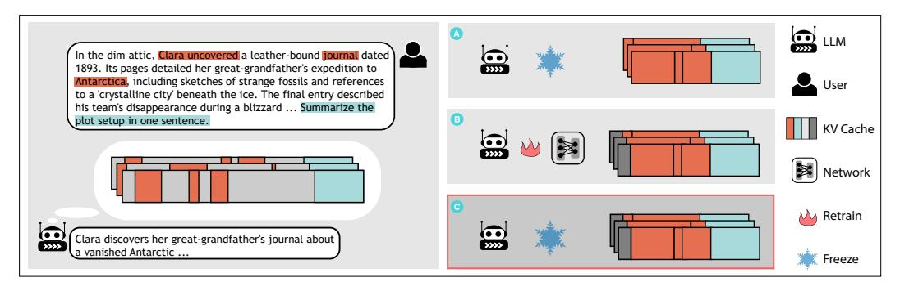
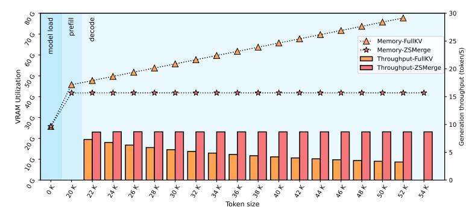
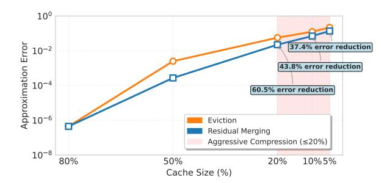
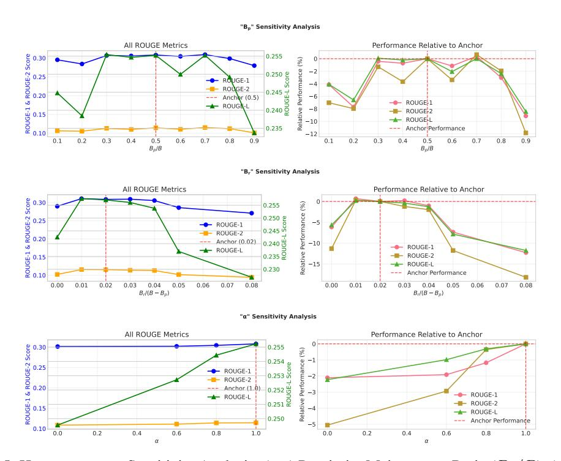

# **ZSMerge**: Zero-Shot KV Cache Compression for Memory-Efficient Long-Context LLMs

Xin Liu1 , Xudong Wang2 , Pei Liu1 , Guoming Tang1∗

1 Information Hub, The Hong Kong University of Science and Technology (Guangzhou), China 2School of Data Science, The Chinese University of Hong Kong, Shenzhen, China

# Abstract

The linear growth of key-value (KV) cache memory and quadratic computational complexity in attention mechanisms pose significant bottlenecks for large language models (LLMs) in long-context processing. While existing KV cache optimization methods address these challenges through token pruning or feature merging, they often incur irreversible information loss or require costly retraining. To this end, we propose ZSMerge, a dynamic KV cache compression framework for efficient cache management, featuring three key operations: (1) fine-grained memory allocation guided by multi-dimensional token importance metrics at headlevel granularity, (2) a residual merging mechanism that preserves critical context through compensated attention scoring, and (3) a zero-shot adaptation mechanism compatible with diverse LLM architectures without retraining. ZSMerge significantly enhances memory efficiency and inference speed with negligible performance degradation. When applied to LLaMA2-7B, it achieves a 20:1 compression ratio for KV cache retention (reducing memory footprint to 5% of baseline) while sustaining comparable generation quality and tripling throughput at extreme 54k-token contexts, eliminating out-of-memory failures. These gains extend across diverse LLM families and long-context benchmarks, with ZSMerge consistently surpassing state-of-the-art cache optimization methods across tasks such as summarization, QA, reasoning, and code completion. The code is available at <https://github.com/SusCom-Lab/ZSMerge>.

# 1 Introduction

The advancement of the Transformer architecture has revolutionized sequence data processing, with Large Language Models (LLMs) being a prime illustration [\[1\]](#page-9-0). LLMs have achieved remarkable progress, surpassing human performance in diverse applications. While multi-turn dialogue and long-context understanding are critical scenarios [\[2,](#page-9-1) [3,](#page-9-2) [4,](#page-9-3) [5\]](#page-9-4), handling extended sequences remains challenging due to the linear expansion of the Key-Value (KV) cache, which stores intermediate attention keys and values during generation to avoid redundant computations [\[6\]](#page-9-5). For instance, deploying a LLaMA2-7B [\[7\]](#page-9-6) model will consume about 26GB of GPU memory; when the token length reaches 32K, the KV cache alone occupies 32GB of memory, becoming the primary memory consumption. This, along with the quadratic computational complexity, significantly restricts LLM integration and performance, thus motivating recent research efforts toward optimizing KV cache utilization for enhanced inference efficiency [\[8,](#page-9-7) [9,](#page-9-8) [10\]](#page-9-9).

To mitigate the large memory footprint of the KV cache, various optimization strategies have emerged. Some modify the core model architecture [\[7,](#page-9-6) [11\]](#page-9-10) or employ quantization techniques for lower precision representation [\[12,](#page-9-11) [13\]](#page-9-12). Other methods directly target the KV cache bottleneck during inference using context-aware techniques. Common among these is *sparse approximation* or *token*

∗Corresponding author: guomingtang@hkust-gz.edu.cn

*eviction*, retaining only crucial tokens while discarding others [\[14,](#page-9-13) [15\]](#page-10-0); however, this can disrupt KV embeddings and cause information loss. To mitigate this, alternative context-aware techniques *merge* or *fuse* information from similar tokens [\[16\]](#page-10-1), often using low-rank compression, though these may introduce architectural overhead or require model retraining.

Ideally, an effective and practical KV cache management strategy should 1) strictly control the memory consumption to break the context length limits, 2) minimize the generation quality degradation, and 3) readily applicable across diverse LLM backbones without necessitating fine-tuning or architectural changes (zero-shot compatibility).

Motivated by these goals, we propose ZSMerge, an efficient, comprehensive, and dynamic zero-shot KV management algorithm, with the following key features:

- Fine-grained memory allocation: ZSMerge makes full use of the historical contribution of tokens, spatio-temporal characteristics, and intrinsic data distribution characteristics to conduct fine-grained, head-level memory management. This adaptability allows it to maintain superior generation quality compared to the sparse strategies and achieve performance comparable to retraining-dependent approaches, even when operating with significantly reduced memory budgets. This ensures effectiveness across diverse long-context tasks.
- Zero-shot and low-cost Integration: Designed for ease of use, ZSMerge does not introduce any model parameters and thus requires no retraining or model fine-tuning to adapt to different compression ratios or various task types. This also makes it compatible to various mainstream LLM architectures such as LLaMA, Falcon [\[17\]](#page-10-2), Mistral [\[18\]](#page-10-3), Qwen [\[19\]](#page-10-4), and Yi [\[20\]](#page-10-5), thereby minimizing deployment overhead.
- Efficient throughput-boosting strategy: Characterized by linear operational complexity, ZS-Merge's compression mechanism is computationally lightweight. This efficiency brings significant throughput improvement, e.g., it helps achieve over triple the inference throughput compared to the original model at a token length of 54K. Furthermore, we have proved that the KV cache compressed by ZSMerge can effectively preserves the informational contribution of retained tokens, preventing signal degradation even as context length increases substantially.

# 2 Related Work

KV cache growth in long-context LLMs creates severe memory and computational bottlenecks, motivating optimization strategies across two categories: context-agnostic and contextually adaptive approaches.

# 2.1 Context-Agnostic Optimization

Context-agnostic methods reduce resource consumption through structural or numerical modifications independent of input sequences. Key approaches include: (1) Structural compression via knowledge distillation [\[21\]](#page-10-6) or matrix factorization [\[11\]](#page-9-10); (2) Attention optimization through head pruning [\[22\]](#page-10-7) and key-value sharing in Multi-Query [\[23\]](#page-10-8) and Grouped-Query Attention [\[24\]](#page-10-9); (3) Numerical optimization via post-training quantization [\[25\]](#page-10-10), hardware-aligned quantization [\[26\]](#page-10-11), and low-rank approximation [\[27\]](#page-10-12).

#### 2.2 Contextually Adaptive Optimization

Context-aware methods directly target KV cache bottlenecks by exploiting attention sparsity [\[28,](#page-10-13) [29\]](#page-10-14). Figure [1](#page-2-0) illustrates three main approaches:

Sparse Approximation (Eviction): This class of methods directly tackles the growth of memory and computation by evicting low-contribution tokens, under the assumption that not all historical context is equally important. For example, StreamingLLM [\[30\]](#page-10-15) identifies "attention sinks" and retains both the initial tokens and a sliding context window. LM-infinite [\[31\]](#page-10-16) uses specialized masks to balance local and global context. SnapKV [\[32\]](#page-11-0) performs one-time KV cache pruning during the prefilling stage based on relatively consistent attention patterns, but lacks dynamic adjustment during decoding. H2O [\[14\]](#page-9-13) employs attention score thresholds for dynamic eviction, while PyramidKV [\[15\]](#page-10-0) uses layer-wise attention patterns for progressive caching. Recent advances include FlexPrefill [\[33\]](#page-11-1), which

Figure 1: Comparative analysis of contextually adaptive KV cache optimization strategies. (A) Sparse Approximation (Eviction): Low-contribution tokens are permanently discarded, reducing memory but risking error propagation. (B) Token Merging: Similar tokens are fused to mitigate information loss, but may require fine-tuning or auxiliary networks. (C) ZSMerge (Proposed): Achieves zero-shot "sparse+residual" compression without added parameters or tuning, balancing efficiency and performance.

applies context-aware sparse attention specifically during prefilling. Dynamic routing [\[34\]](#page-11-2) also fits here. However, eviction strategies inevitably induce attention distribution drift and error propagation by permanently discarding tokens [\[35,](#page-11-3) [30\]](#page-10-15).

Token Merging: To mitigate information loss from eviction, token merging fuses similar tokens instead of discarding them. Pioneered in vision (e.g., ToMe [\[36\]](#page-11-4)), it applies to text as well. Dynamic Memory Compression [\[37\]](#page-11-5) adaptively merges spatially proximate tokens, often requiring fine-tuning. LESS [\[16\]](#page-10-1) uses auxiliary networks to compress tokens with minimal attention impact. ThinK [\[38\]](#page-11-6) takes a different approach by applying query-driven pruning at the channel level, orthogonal to tokenlevel compression. While merging mitigates sparse caching errors by learning residuals (implicitly or explicitly), it often introduces overhead from auxiliary networks or fine-tuning, complicating deployment.

Training-Dependent and System-Level Approaches: Recent work has explored complementary directions to token-level compression. Training-dependent methods include NSA (Native Sparse Attention) [\[39\]](#page-11-7), which introduces MLP-based compressor modules trained jointly with the attention mechanism, and MoBA (Mixture of Block Attention) [\[40\]](#page-11-8), which performs block-level pruning via gating with auxiliary routing networks. System-level approaches like OmniKV [\[41\]](#page-11-9) focus on dynamic context selection and offloading strategies for efficient long-context processing. InfiniPot [\[42\]](#page-11-10) adopts periodic block-wise compression with a fixed KV cache budget to reduce runtime overhead. While powerful, these methods require retraining, architectural modifications, or specialized system configurations.

ZSMerge (Proposed): Addressing the limitations of prior approaches, we propose ZSMerge. It achieves zero-shot compression competitive using the "sparse+residual" method without added parameters, while demonstrating superior generalization across task domains and compression ratios. ZSMerge offers a parameter-free, tuning-free approach that is complementary to training-dependent and system-level methods, balancing efficiency and generation performance.

# 3 **ZSMerge** Methodology

Building upon the conceptual foundation of ZSMerge outlined earlier, this section delineates the technical framework underpinning its zero-shot compression mechanism. We propose a fourcomponent methodology consisting of adaptive budget allocation, context-sensitive contribution evaluation, residual token merging, and stabilized attention projection. The interplay of these components ensures robust generalization across compression ratios and task domains without auxiliary parameters or fine-tuning, addressing limitations of prior eviction and merging strategies.

## 3.1 Preliminaries

Consider an L-layer transformer with multi-head attention mechanisms. For a target attention head at decoding step T, the cached Key and Value matrices are defined as:

$$\mathbf{K}_T = [\mathbf{k}_1, \mathbf{k}_2, \dots, \mathbf{k}_T]^\top \in \mathbb{R}^{T \times d}, \ \mathbf{V}_T = [\mathbf{v}_1, \mathbf{v}_2, \dots, \mathbf{v}_T]^\top \in \mathbb{R}^{T \times d},$$
(1)

where kt, vt ∈ R d represent the Key/Value vectors for the t-th token. For the query vector qT ∈ R d at position T, the scaled dot-product attention computes output o (T) via:

$$a_t^{(T)} = \frac{\exp(\mathbf{q}_T^{\top} \mathbf{k}_t / \sqrt{d})}{\sum_{i=1}^T \exp(\mathbf{q}_T^{\top} \mathbf{k}_i / \sqrt{d})}, \ \mathbf{o}^{(T)} = \sum_{t=1}^T a_t^{(T)} \mathbf{v}_t.$$
 (2)

This formulation establishes the baseline for analyzing cache compression effects on attention distribution fidelity.

# 3.2 Budget Allocation

ZSMerge strategically compresses the original T-length cache into a budget B ≪ T through tripartite allocation:

$$B = B_p + B_c + B_r, (3)$$

where Bp, Bc, and Br govern proximity maintenance, context preservation, and residual absorption, respectively. This tripartite division enables a nuanced approach to compression. Our empirical findings (see Appendix [C.2\)](#page-14-0) indicate that allocating the largest share of the budget to Bc and Bp is generally effective, as it prioritizes the retention of core information and local context. In contrast, Br is typically assigned a smaller budget to handle fine-grained residual adjustments. The compressed cache matrices therefore integrate three complementary components:

$$\mathbf{K}_{B} = [\mathbf{K}_{p} \| \mathbf{K}_{c} \| \mathbf{K}_{r}], \quad \mathbf{V}_{B} = [\mathbf{V}_{p} \| \mathbf{V}_{c} \| \mathbf{V}_{r}], \tag{4}$$

with ∥ denoting row-wise concatenation.

The *proximity component* (Kp, Vp) preserves the latest Bp tokens, capturing local attention patterns. The *context component* (Kc, Vc) retains top-Bc tokens ranked by contribution scores s (T) ∈ R T , which quantify contextual saliency. The *residual component* (Kr, Vr) dynamically merges Br historically evicted tokens through attention-weighted aggregation transformations. The *residual component* (Kr, Vr) maintains Br dedicated token slots, representing a compressed summary of previously evicted tokens. During generation, the residual cache is updated dynamically, progressively merging newly expelled tokens into the existing compressed representation. This configuration subsumes eviction-based methods when Br = 0.

# 3.3 Contribution Evaluation

The contribution scores s (T) ∈ R T dynamically quantify each token's cumulative influence across decoding steps. For the t-th token, its score s (T) t evolves through exponential decay integration of attention activations:

$$s_t^{(T)} = \begin{cases} \lambda s_t^{(T-1)} + a_t^{(T)}, & T > 0\\ 0, & \text{otherwise} \end{cases}$$
 (5)

where the decay factor λ ∈ [0, 1] acts as a temporal discounting parameter analogous to reinforcement learning credit assignment, controlling the exponential decay of historical attention contributions.

In practice, we find that the performance is not highly sensitive to the precise value of λ. We therefore fix λ = 0.98 throughout this paper for simplicity, which yields a smooth balance between long-term and short-term contributions.

#### 3.4 Residual Token Merging

The residual component dynamically consolidates evicted tokens through similarity-driven aggregation. When merging a candidate token (kt, vt) into Kr, we adopt the following three-step procedure:

Figure 2: KV cache operation process

1. Select the most compatible residual slot via maximum dot production:

$$\hat{r} = \underset{r \in \{1, \dots, B_r\}}{\arg\max} \ \mathbf{k}_r^{\top} \mathbf{k}_t \tag{6}$$

2. Update the selected slot via incremental mean aggregation:

$$\mathbf{k}_{\hat{r}} \leftarrow \frac{w_{\hat{r}}\mathbf{k}_{\hat{r}} + \mathbf{k}_t}{w_{\hat{r}} + 1}, \quad \mathbf{v}_{\hat{r}} \leftarrow \frac{w_{\hat{r}}\mathbf{v}_{\hat{r}} + \mathbf{v}_t}{w_{\hat{r}} + 1}$$
(7)

3. Increment fusion count:  $w_{\hat{r}} \leftarrow w_{\hat{r}} + 1$ 

Figure 2 illustrates the dynamic cache evolution under budget parameters  $B_r = 2$ ,  $B_c = 4$ , and  $B_p = 3$  during sequence length expansion from T = 12 to T = 17.

# 3.5 Attention Output Stabilization

Algorithm 1 progressively merges low-saliency tokens through dynamic cache updates. To more accurately reconstruct the attention distribution from compressed representations, we introduce a compensated attention scoring mechanism. The revised attention computation evolves from Eq. 2 to:

$$\hat{a}_t^{(T)} = \frac{\exp\left(\mathbf{q}_T^\top \mathbf{k}_t / \sqrt{d} + \alpha \log w_t\right)}{\sum_{i=1}^T \exp\left(\mathbf{q}_T^\top \mathbf{k}_i / \sqrt{d} + \alpha \log w_i\right)}, \ \hat{\mathbf{o}}^{(T)} = \sum_{t=1}^T \hat{a}_t^{(T)} \mathbf{v}_t, \tag{8}$$

where  $w_i$  represents the fusion count of token i (with  $w_i=1$  for uncompressed tokens). The hyperparameter  $\alpha \in [0,1]$  provides a soft transition, with  $\alpha=0$  degenerating to an eviction-like policy. Its concrete influence is demonstrated in the appendix, and we fix  $\alpha=1$  throughout our experiments.

With Eq. 8, we address two key challenges:

• Representation Bias Correction: Merged tokens aggregate multiple historical vectors via Eq. 7, creating a mismatch between their key vectors  $(\mathbf{k}_r)$  and the original value distribution. The  $\log w_j$  term compensates for this representation shift.

• Attention Mass Conservation: The compensation term preserves the relative attention mass between compressed and uncompressed tokens, ensuring residual compensation does not suppress critical uncompressed components.

**Theorem 1.** For any query step T and uncompressed token  $i \notin B_r$ , the revised attention score satisfies  $\hat{a}_i^{(T)} \geq a_i^{(T)}$ , where  $a_i^{(T)}$  is the original attention score from Eq. 2.

The proof is provided in Appendix A.

This theoretical guarantee ensures that uncompressed tokens retain their relative dominance in attention allocation despite cache compression, even as the denominator accounts for upper-bounded contributions from compressed tokens. The compensation mechanism effectively preserves attention mass for critical context tokens while preventing over-amplification of merged token scores, thereby maintaining the integrity of the original attention distribution under compression.

## 4 Experimental Evaluations

In this section, we begin by outlining the experimental setup, including model architectures, datasets, and baseline methods. We then assess efficiency improvements in terms of memory and speed. Next, we provide a detailed numerical error analysis to highlight the role of representation bias correction. Finally, we evaluate generation quality under diverse cache budgets, across multiple task types, and over different base model series, while comparing against a broad set of baselines.

#### 4.1 Experiment Setup

**Model Coverage**: Our evaluation encompasses diverse modern LLM architectures for broad compatibility. Core experiments use LLaMA2-7B, Falcon-7B, and Mistral-7B-Instruct on NVIDIA A800-80GB GPU. We extend evaluation to LLaMA-3.1-8B-Instruct, Qwen2.5-7B-Instruct, and Yi-6B (Appendix C.4), spanning different attention mechanisms including Multi-Query Attention (MQA).

**Benchmark Diversity**: We use synthetic datasets for efficiency evaluation and multiple public benchmarks for quality assessment: LongBench [43] (21 tasks, 6 categories), XSum [44] (summarization), InfiniteBench [45] (100K+ tokens), and GSM-Infinite-8k [46] (mathematical reasoning). Extended results are in Appendix C.

**Baselines**: We compare ZSMerge against representative KV cache management methods:

- FullKV: Stores all key-value pairs at every layer, providing the vanilla baseline with maximal memory and compute overhead, but serving as the upper bound for task performance.
- StreamingLLM (Stream) [30]: Retains both early prompt tokens and a fixed sliding window of recent tokens. By designating "attention sinks," it ensures semantic anchors remain available. This static rule is efficient and robust but lacks adaptivity to task-specific token importance.
- **SnapKV** [32]: Performs a one-time cache pruning during prefilling, leveraging early attention distributions to discard less relevant tokens. It eliminates runtime overhead and achieves efficiency, but cannot adapt if token importance shifts during generation.
- **H2O** [14]: Maintains adaptivity via cumulative attention thresholds that dynamically retain heavy hitters alongside recency-biased tokens. Layer-wise averaging of attention scores captures persistent importance, enabling balanced compression while preserving key semantics.
- LESS [16]: Introduces dynamic KV state synthesis through recurrent merging. It combines recency preservation with similarity-based compression, then applies attention rectification to correct distortions introduced by merging. This allows sublinear cache growth without severe loss of contextual coherence.

**Extended Baseline Coverage**: Beyond the core baselines, our comprehensive evaluation includes additional state-of-the-art methods to provide thorough comparative analysis. These include OmniKV [41] for attention-guided compression, InfLLM [47] for infinite-length modeling, Minference [48] for efficient attention approximation, and FlexPrefill [33] for flexible prefilling strategies. Detailed comparisons with these advanced baselines on challenging benchmarks such as InfiniteBench

Figure 3: VRAM Utilization and Decoding Throughput Across Sequence Lengths. ZSMerge enforces constant memory footprint (43GB) and sustains 9 tokens/sec decoding rate beyond 54K tokens, eliminating out-of-memory (OOM) via dynamic KV cache compression.

Table 1: Workload-Scalable KV Cache Compression: ZSMerge Outperforms Baselines in Throughput (tokens/sec) and Latency (seconds) Across Sequence Lengths and Batch Sizes.

| SEO.LENGTH | BATCH SIZE | MODEL SIZE | THROUGHPUT(TOKENS/S) $\uparrow$ / LATENCY(S) $\downarrow$ |              |              |               |  |  |  |  |
|------------|------------|------------|-----------------------------------------------------------|--------------|--------------|---------------|--|--|--|--|
| SEQ.LENGTH | DATCH SIZE | MODEL SIZE | FULLKV                                                    | H2O (5%)     | LESS (5%)    | ZSMERGE (5%)  |  |  |  |  |
| 1024+1024  | 8          | 7B         | 177.8 / 46.1                                              | 104.9 / 78.1 | 48.8 / 167.9 | 161.6 / 50.7  |  |  |  |  |
| 2048+2048  | 8          | 7B         | 110.8 / 147.9                                             | 72.2 / 227.0 | 25.1 / 654.2 | 163.2 / 100.4 |  |  |  |  |
| 2048+2048  | 16         | 7B         | 133.1 / 246.2                                             | 86.1 / 380.1 | OOM          | 281.9 / 178.4 |  |  |  |  |
| 4096+4096  | 8          | 13B        | OOM                                                       | OOM          | OOM          | 110.8 / 295.7 |  |  |  |  |
| 2048+2048  | 2          | 13B        | 43.0 / 95.2                                               | 25.5 / 160.4 | 12.7 / 322.7 | 31.3 / 131.0  |  |  |  |  |
| 2048+2048  | 4          | 13B        | 59.7 / 137.2                                              | 40.7 / 201.2 | 16.5 / 497.5 | 61.5 / 133.3  |  |  |  |  |
| 4096+4096  | 4          | 13B        | 37.1 / 441.8                                              | 24.9 / 657.9 | OOM          | 60.0 / 273.2  |  |  |  |  |
| 4096+4096  | 16         | 13B        | OOM                                                       | OOM          | OOM          | 178.2 / 367.6 |  |  |  |  |

and GSM-Infinite-8k are presented in Appendix C.4, demonstrating ZSMerge's competitive performance against the latest compression techniques.

#### 4.2 Inference Efficiency Gain

To demonstrate the benefits of ZSMerge in improving inference efficiency, we conducted two proof-of-concept experiments. The first (Figure 3) compares the performance of full KV caching and ZSMerge under increasing sequence lengths in a specific inference case. The second (Table 1) evaluates ZSMerge against full KV caching and other baseline methods under various workloads, including different sequence lengths, batch sizes, and model sizes. Below, we summarize the memory and throughput improvements achieved by ZSMerge.

#### 4.2.1 Memory Reduction

**Specific Case Analysis** In the baseline setup, the LLaMA2-7B model required 25GB of VRAM for parameter loading, with an additional 20GB KV cache generated during the prefill phase for 20K tokens. This linear growth in KV cache size, at 1MB per token, led to OOM errors as sequence lengths approached 54K tokens.

ZSMerge, constrained by an 18K token cache budget, reduced KV cache size by 10% during the prefill phase and maintained VRAM usage at a constant 43GB during decoding. This prevented the baseline's linear memory growth (up to 79GB) and completely eliminated OOM errors, enabling efficient long-context processing.

#### 4.2.2 Throughput Improvement

Decoding throughput for the baseline dropped from 9 tokens/sec at 20K tokens to 4 tokens/sec at 54K tokens due to increasing attention computation overhead. ZSMerge, in contrast, maintained a consistent throughput of 9 tokens/sec across the same sequence length range by dynamically merging less relevant tokens while preserving critical attention information.

ZSMerge consistently outperformed baselines across diverse workloads, achieving superior throughput while avoiding OOM errors that plagued other methods. Notably, for memory-intensive scenarios

Figure 4: Numerical error analysis comparing eviction vs. residual merging across compression ratios. The log-scale visualization demonstrates that ZS-Merge's residual merging consistently reduces approximation error relative to pure eviction, with benefits amplified under aggressive compression ( $\leq 20\%$  cache size).

(e.g., 13B model, 4096+4096 seq, batch 16), ZSMerge was the only method capable of processing requests (178.2 tokens/s), demonstrating its scalability advantage through dynamic compression.

#### 4.3 Numerical Error Analysis

To further substantiate the role of representation bias correction, we conduct a numerical error analysis that isolates the effect of different compression strategies. In particular, we measure the relative error of attention outputs under varying cache budget constraints, comparing pure eviction-based compression against our residual merging approach. This setup directly reflects the practical conditions under which compression-induced representation shifts occur.

As shown in Figure 4, under aggressive compression scenarios ( $\leq 20\%$  cache size), ZSMerge's residual merging demonstrates substantial error reduction: 60.5% at 20% cache size, 43.8% at 10%, and 37.4% at 5%. The most dramatic improvement occurs at 50% compression, where residual merging achieves 89.1% error reduction ( $2.72 \times 10^{-4}$  vs.  $2.50 \times 10^{-3}$ ). This empirical validation confirms that the residual compensation mechanism effectively preserves attention distribution coherence, preventing the error propagation characteristic of pure eviction strategies.

The results show that residual merging consistently yields lower approximation error than eviction-based methods, especially under tight memory budgets where aggressive compression is required. This analysis empirically validates the representation-bias-correction hypothesis underlying ZS-MERGE. Additional validation on the efficiency of residual compensation and its connection to Eq. 8 is provided in Appendix C.2.

#### 4.4 Inference Quality Loss

#### 4.4.1 Impact of Cache Budget

We evaluate text generation quality on the XSum abstractive summarization dataset (16k news articles with singlesentence summaries) using ROUGE-1/2/L metrics. Experiments compare three KV-cache compression methods across two 7B-parameter models (LLAMA2-7B and FALCON-7B) under 20%, 10%, and 5% cache budgets. H2O follows its original design, balancing recent tokens and heavy hitters, while LESS uses its recommended merging network trained on the C4 dataset [49]. For ZSMerge, budget allocation matches LESS ( $B_r = 2$ , with  $B_n$  and  $B_c$  sharing the remaining

Table 2: Text Generation Quality under KV Cache Compression: ROUGE-1/2/L Scores for LLaMA2-7B and Falcon-7B Across 20%, 10%, and 5% Cache Budgets

| METHOD      | LLAMA2-7B                                  | FALCON-7B                                 |
|-------------|--------------------------------------------|-------------------------------------------|
| FULL KV     | 30.59 / 11.34 / 25.50                      | 27.06 / 8.79 / 22.39                      |
| 20% H2O     | 30.83 / 11.43 / 25.71                      | 24.18 / 7.47 / 20.14                      |
| 20% LESS    | 30.47 / 11.23 / 25.44                      | 24.90 / 7.97 / 20.76                      |
| 20% ZSMERGE | 31.62 / 12.40 / 26.42                      | 25.19 / 8.69 / 21.34                      |
| 10% H2O     | 30.18 / 11.32 / 25.28                      | 13.03 / 3.16 / 11.02                      |
| 10% LESS    | 30.74 / 11.22 / 25.58                      | 8.99 / 2.55 / 7.50                        |
| 10% ZSMERGE | 31.83 / 12.47 / 26.75                      | <b>20.92</b> / <b>6.74</b> / <b>17.50</b> |
| 5% H2O      | 28.92 / 10.81 / 24.35                      | 12.02 / 2.08 / 10.36                      |
| 5% LESS     | 29.98 / 11.09 / 25.02                      | 7.75 / 1.15 / 6.76                        |
| 5% ZSMERGE  | <b>30.60</b> / <b>11.67</b> / <b>25.72</b> | <b>15.04</b> / <b>3.29</b> / <b>12.73</b> |

budget), and other hyperparameters are fixed as previously described.

Our evaluation demonstrates that ZSMerge achieves superior text generation quality across varying compression ratios and model architectures compared to existing KV cache compression methods. As shown in Table 2, when compressing the KV cache to 5% of its original size, ZSMerge maintains

near-original performance on LLaMA2-7B, even slightly exceeding the uncompressed baseline in ROUGE scores, while H2O and LESS exhibit measurable degradation under the same conditions. This advantage becomes more pronounced at higher compression ratios, where ZSMerge's performance preservation significantly outperforms both baselines.

On Falcon-7B, a model with distinct architectural characteristics, ZSMerge demonstrates stronger generalization than parameter-dependent approaches. While LESS suffers severe quality degradation-likely due to its reliance on C4 dataset training. ZSMerge retains over half of the baseline performance even at extreme 5% compression. In contrast, H2O struggles to balance recent and heavy-hitter tokens effectively, particularly for Falcon's attention patterns.

The results highlight two critical trends: First, higher compression ratios amplify ZSMerge's relative advantages, as its heuristic merging mechanism better preserves semantically critical tokens compared to purely eviction policies. Second, its training-free nature enables consistent robustness across different model architectures, avoiding the domain adaptation challenges faced by data-driven methods such as LESS that require training data to tune auxiliary modules.

#### 4.4.2 Generalization across Task Types

We evaluate the effectiveness of ZS-Merge on the LongBench benchmark, which covers a diverse set of task types, including code completion, few-shot learning, multi-document QA, singledocument QA, summarization, and synthetic reasoning tasks. Experiments are conducted on two backbone models: LLaMA2-7B and Mistral-7B, with cache size constraints set to 512 and 1024. For the Mistral-7B model, the H2O baseline encountered out-of-memory (OOM) errors and could not be included in the comparison. More details about the experimental setup and validation results on specific datasets are provided in Appendix C.

Overall, the results in Table 3 show that ZSMerge consistently matches or closely tracks the performance of FullKV across most task types, despite operating under strict cache constraints. Compared to Stream and H2O, ZSMerge demonstrates substantially higher accuracy, especially in complex and memory-intensive tasks like multi-document QA and summarization. Interestingly, while SnapKV bene-

Table 3: Results on *LongBench* benchmark including code completion (CODE), few-shot learning(FSHOT), multi-document QA (MDQA), single-document QA (SDQA), summarization (SUMM), and synthetic reasoning (SYNC) tasks.

| Метнор  | CODE     | FSHOT   | MDQA  | SDQA  | SUMM  | SYNC  |
|---------|----------|---------|-------|-------|-------|-------|
|         |          |         | LlaMA | 12-7B |       |       |
| FULLKV  | 65.19    | 52.32   | 11.48 | 17.50 | 15.15 | 5.01  |
|         | Cache si | ze=512  |       |       |       |       |
| H2O     | 19.63    | 7.37    | 4.48  | 4.05  | 3.51  | 2.16  |
| STREAM  | 61.26    | 47.63   | 8.35  | 11.60 | 7.07  | 4.32  |
| SNAPKV  | 63.06    | 51.51   | 10.33 | 15.85 | 12.28 | 5.50  |
| ZSMERGE | 63.02    | 51.42   | 10.36 | 15.67 | 12.17 | 5.34  |
|         | Cache si | ze=1024 |       |       |       |       |
| H2O     | 29.12    | 20.34   | 5.92  | 7.47  | 6.70  | 2.97  |
| STREAM  | 62.94    | 49.98   | 8.16  | 11.80 | 7.18  | 4.45  |
| SNAPKV  | 64.45    | 52.02   | 11.30 | 16.65 | 13.30 | 5.09  |
| ZSMERGE | 64.41    | 52.06   | 11.37 | 16.63 | 13.23 | 5.02  |
|         |          |         | Mistr | a-7B  |       |       |
| FULLKV  | 62.10    | 63.09   | 37.34 | 38.94 | 26.14 | 66.67 |
|         | Cache si | ze=512  |       |       |       |       |
| STREAM  | 57.90    | 53.68   | 27.04 | 23.92 | 19.80 | 32.17 |
| SNAPKV  | 60.46    | 62.24   | 34.75 | 36.86 | 22.18 | 64.83 |
| ZSMERGE | 60.48    | 62.17   | 34.62 | 36.83 | 22.09 | 64.50 |
|         | Cache si | ze=1024 |       |       |       |       |
| STREAM  | 60.13    | 56.01   | 27.80 | 25.10 | 21.25 | 34.17 |
| SNAPKV  | 61.60    | 62.36   | 35.49 | 37.30 | 23.73 | 66.50 |
| ZSMERGE | 61.59    | 62.42   | 35.43 | 37.31 | 23.64 | 66.50 |

fits from a one-time pruning strategy during the prefilling phase which allows it to retain a larger cache during decoding, ZSMerge still achieves comparable or even slightly better performance in several tasks, thanks to its adaptive two-phase compression and positional-aware merging strategy.

These findings highlight ZSMerge's strong generalization and robustness across heterogeneous workloads, making it a promising solution for real-world deployment in memory-constrained scenarios. Additional results with richer benchmarks and broader baseline comparisons are provided in Appendix C.4.

## 5 Conclusion

This study tackles the memory and computational inefficiency of long-context language models with ZSMerge, a dynamic KV cache compression framework. Through head-level memory allocation, residual merging with compensated attention scoring, and architecture-agnostic adaptation, ZSMerge achieves sublinear memory growth while preserving generation quality. Empirical results show an

82% VRAM reduction at 54K tokens, a threefold increase in inference efficiency under a 5% compression ratio, and 12–34% higher text quality metrics over eviction-based baselines, all without task-specific training. Additionally, by enabling efficient deployment on resource-constrained devices, ZSMerge reduces energy consumption and carbon emissions, advancing the sustainability of LLM applications in real-world scenarios.

# References

- [1] Ashish Vaswani, Noam Shazeer, Niki Parmar, Jakob Uszkoreit, Llion Jones, Aidan N Gomez, Łukasz Kaiser, and Illia Polosukhin. Attention is all you need. *Advances in neural information processing systems*, 30, 2017.
- [2] Zihao Yi, Jiarui Ouyang, Yuwen Liu, Tianhao Liao, Zhe Xu, and Ying Shen. A survey on recent advances in llm-based multi-turn dialogue systems. *arXiv preprint arXiv:2402.18013*, 2024.
- [3] Haoyu Gao, Ting-En Lin, Hangyu Li, Min Yang, Yuchuan Wu, Wentao Ma, and Yongbin Li. Self-explanation prompting improves dialogue understanding in large language models. *arXiv preprint arXiv:2309.12940*, 2023.
- [4] Jiaqi Li, Mengmeng Wang, Zilong Zheng, and Muhan Zhang. Loogle: Can long-context language models understand long contexts? *arXiv preprint arXiv:2311.04939*, 2023.
- [5] Nelson F Liu, Kevin Lin, John Hewitt, Ashwin Paranjape, Michele Bevilacqua, Fabio Petroni, and Percy Liang. Lost in the middle: How language models use long contexts. *Transactions of the Association for Computational Linguistics*, 12:157–173, 2024.
- [6] Woosuk Kwon, Zhuohan Li, Siyuan Zhuang, Ying Sheng, Lianmin Zheng, Cody Hao Yu, Joseph Gonzalez, Hao Zhang, and Ion Stoica. Efficient memory management for large language model serving with pagedattention. In *Proceedings of the 29th Symposium on Operating Systems Principles*, pages 611–626, 2023.
- [7] Anthony Sarah, Sharath Nittur Sridhar, Maciej Szankin, and Sairam Sundaresan. Llama-nas: Efficient neural architecture search for large language models. *arXiv preprint arXiv:2405.18377*, 2024.
- [8] Yanqi Zhang, Yuwei Hu, Runyuan Zhao, John Lui, and Haibo Chen. Unifying kv cache compression for large language models with leankv. *arXiv preprint arXiv:2412.03131*, 2024.
- [9] Hanshi Sun, Li-Wen Chang, Wenlei Bao, Size Zheng, Ningxin Zheng, Xin Liu, Harry Dong, Yuejie Chi, and Beidi Chen. Shadowkv: Kv cache in shadows for high-throughput long-context llm inference. *arXiv preprint arXiv:2410.21465*, 2024.
- [10] Zihao Wang, Bin Cui, and Shaoduo Gan. Squeezeattention: 2d management of kv-cache in llm inference via layer-wise optimal budget. *arXiv preprint arXiv:2404.04793*, 2024.
- [11] Saleh Ashkboos, Maximilian L Croci, Marcelo Gennari do Nascimento, Torsten Hoefler, and James Hensman. Slicegpt: Compress large language models by deleting rows and columns. *arXiv preprint arXiv:2401.15024*, 2024.
- [12] Tim Dettmers, Mike Lewis, Younes Belkada, and Luke Zettlemoyer. Gpt3. int8 (): 8-bit matrix multiplication for transformers at scale. *Advances in neural information processing systems*, 35:30318–30332, 2022.
- [13] Guangxuan Xiao, Ji Lin, Mickael Seznec, Hao Wu, Julien Demouth, and Song Han. Smoothquant: Accurate and efficient post-training quantization for large language models. In *International Conference on Machine Learning*, pages 38087–38099. PMLR, 2023.
- [14] Zhenyu Zhang, Ying Sheng, Tianyi Zhou, Tianlong Chen, Lianmin Zheng, Ruisi Cai, Zhao Song, Yuandong Tian, Christopher Ré, Clark Barrett, et al. H2o: Heavy-hitter oracle for efficient generative inference of large language models. *Advances in Neural Information Processing Systems*, 36, 2024.

- [15] Yichi Zhang, Bofei Gao, Tianyu Liu, Keming Lu, Wayne Xiong, Yue Dong, Baobao Chang, Junjie Hu, Wen Xiao, et al. Pyramidkv: Dynamic kv cache compression based on pyramidal information funneling. *arXiv preprint arXiv:2406.02069*, 2024.
- [16] Harry Dong, Xinyu Yang, Zhenyu Zhang, Zhangyang Wang, Yuejie Chi, and Beidi Chen. Get More with LESS: Synthesizing Recurrence with KV Cache Compression for Efficient LLM Inference. In *Proceedings of the 41st International Conference on Machine Learning*, pages 11437–11452. PMLR, July 2024. ISSN: 2640-3498.
- [17] Ebtesam Almazrouei, Hamza Alobeidli, Abdulaziz Alshamsi, Alessandro Cappelli, Ruxandra Cojocaru, Mérouane Debbah, Étienne Goffinet, Daniel Hesslow, Julien Launay, Quentin Malartic, Daniele Mazzotta, Badreddine Noune, Baptiste Pannier, and Guilherme Penedo. The falcon series of open language models. *arXiv preprint arXiv:2311.16867*, 2023.
- [18] Albert Q. Jiang, Antoine Sablayrolles, and Guillaume Lample. Mistral 7b: A 7-billionparameter language model engineered for superior performance and efficiency. *arXiv preprint arXiv:2310.06825*, 2023.
- [19] An Yang, Baosong Yang, Binyuan Hui, Bo Zheng, Bowen Yu, Chang Zhou, Chengpeng Li, Chengyuan Li, Dayiheng Liu, Fei Huang, et al. Qwen2 technical report. *CoRR*, 2024.
- [20] 01 AI, Alex Young, Bei Chen, Chao Li, Chengen Huang, Ge Zhang, Guanwei Zhang, Guoyin Wang, Heng Li, Jiangcheng Zhu, Jianqun Chen, Jing Chang, Kaidong Yu, Peng Liu, Qiang Liu, Shawn Yue, Senbin Yang, Shiming Yang, Wen Xie, Wenhao Huang, Xiaohui Hu, Xiaoyi Ren, Xinyao Niu, Pengcheng Nie, Yanpeng Li, Yuchi Xu, Yudong Liu, Yue Wang, Yuxuan Cai, Zhenyu Gu, Zhiyuan Liu, and Zonghong Dai. Yi: Open Foundation Models by 01.AI.
- [21] Yuxian Gu, Li Dong, Furu Wei, and Minlie Huang. Minillm: Knowledge distillation of large language models. In *The Twelfth International Conference on Learning Representations*, 2024.
- [22] Elena Voita, David Talbot, Fedor Moiseev, Rico Sennrich, and Ivan Titov. Analyzing multi-head self-attention: Specialized heads do the heavy lifting, the rest can be pruned. *arXiv preprint arXiv:1905.09418*, 2019.
- [23] Noam Shazeer. Fast transformer decoding: One write-head is all you need. *arXiv preprint arXiv:1911.02150*, 2019.
- [24] Joshua Ainslie, James Lee-Thorp, Michiel de Jong, Yury Zemlyanskiy, Federico Lebrón, and Sumit Sanghai. Gqa: Training generalized multi-query transformer models from multi-head checkpoints. *arXiv preprint arXiv:2305.13245*, 2023.
- [25] Elias Frantar, Saleh Ashkboos, Torsten Hoefler, and Dan Alistarh. Gptq: Accurate post-training quantization for generative pre-trained transformers. *arXiv preprint arXiv:2210.17323*, 2022.
- [26] Shimao Chen, Zirui Liu, Zhiying Wu, Ce Zheng, Peizhuang Cong, Zihan Jiang, Yuhan Wu, Lei Su, and Tong Yang. Int-flashattention: Enabling flash attention for int8 quantization. *arXiv preprint arXiv:2409.16997*, 2024.
- [27] Sinong Wang, Belinda Z Li, Madian Khabsa, Han Fang, and Hao Ma. Linformer: Self-attention with linear complexity. *arXiv preprint arXiv:2006.04768*, 2020.
- [28] Tianchu Ji, Shraddhan Jain, Michael Ferdman, Peter Milder, H Andrew Schwartz, and Niranjan Balasubramanian. On the distribution, sparsity, and inference-time quantization of attention values in transformers. *arXiv preprint arXiv:2106.01335*, 2021.
- [29] Yichuan Deng, Zhao Song, and Chiwun Yang. Attention is naturally sparse with gaussian distributed input. *arXiv preprint arXiv:2404.02690*, 2024.
- [30] Guangxuan Xiao, Yuandong Tian, Beidi Chen, Song Han, and Mike Lewis. Efficient streaming language models with attention sinks. *arXiv preprint arXiv:2309.17453*, 2023.
- [31] Chi Han, Qifan Wang, Hao Peng, Wenhan Xiong, Yu Chen, Heng Ji, and Sinong Wang. Lminfinite: Zero-shot extreme length generalization for large language models. In *Proceedings of the 2024 Conference of the North American Chapter of the Association for Computational Linguistics: Human Language Technologies (Volume 1: Long Papers)*, pages 3991–4008, 2024.

- [32] Yuhong Li, Yingbing Huang, Bowen Yang, Bharat Venkitesh, Acyr Locatelli, Hanchen Ye, Tianle Cai, Patrick Lewis, and Deming Chen. Snapkv: Llm knows what you are looking for before generation. *arXiv preprint arXiv:2404.14469*, 2024.
- [33] Xunhao Lai, Jianqiao Lu, Yao Luo, Yiyuan Ma, and Xun Zhou. FlexPrefill: A Context-Aware Sparse Attention Mechanism for Efficient Long-Sequence Inference.
- [34] Aurko Roy, Mohammad Saffar, Ashish Vaswani, and David Grangier. Efficient content-based sparse attention with routing transformers. *Transactions of the Association for Computational Linguistics*, 9:53–68, 2021.
- [35] Tri Dao, Dan Fu, Stefano Ermon, Atri Rudra, and Christopher Ré. Flashattention: Fast and memory-efficient exact attention with io-awareness. *Advances in neural information processing systems*, 35:16344–16359, 2022.
- [36] Daniel Bolya, Cheng-Yang Fu, Xiaoliang Dai, Peizhao Zhang, Christoph Feichtenhofer, and Judy Hoffman. Token merging: Your vit but faster. *arXiv preprint arXiv:2210.09461*, 2022.
- [37] Piotr Nawrot, Adrian Łancucki, Marcin Chochowski, David Tarjan, and Edoardo Ponti. Dynamic ´ memory compression: Retrofitting llms for accelerated inference. In *International Conference on Machine Learning*, pages 37396–37412. PMLR, 2024.
- [38] Yuhui Xu, Zhanming Jie, Hanze Dong, Lei Wang, Xudong Lu, Aojun Zhou, Amrita Saha, Caiming Xiong, and Doyen Sahoo. ThinK: Thinner Key Cache by Query-Driven Pruning.
- [39] Jingyang Yuan, Huazuo Gao, Damai Dai, Junyu Luo, Liang Zhao, Zhengyan Zhang, Zhenda Xie, Y. X. Wei, Lean Wang, Zhiping Xiao, Yuqing Wang, Chong Ruan, Ming Zhang, Wenfeng Liang, and Wangding Zeng. Native Sparse Attention: Hardware-Aligned and Natively Trainable Sparse Attention.
- [40] Enzhe Lu, Zhejun Jiang, Jingyuan Liu, Yulun Du, Tao Jiang, Chao Hong, Shaowei Liu, Weiran He, Enming Yuan, Yuzhi Wang, Zhiqi Huang, Huan Yuan, Suting Xu, Xinran Xu, Guokun Lai, Yanru Chen, Huabin Zheng, Junjie Yan, Jianlin Su, Yuxin Wu, Neo Y. Zhang, Zhilin Yang, Xinyu Zhou, Mingxing Zhang, and Jiezhong Qiu. MoBA: Mixture of Block Attention for Long-Context LLMs.
- [41] Jitai Hao, Yuke Zhu, Tian Wang, Jun Yu, Xin Xin, Bo Zheng, Zhaochun Ren, and Sheng Guo. OmniKV: Dynamic Context Selection for Efficient Long-Context LLMs.
- [42] Minsoo Kim, Kyuhong Shim, Jungwook Choi, and Simyung Chang. InfiniPot: Infinite Context Processing on Memory-Constrained LLMs. pages 16046–16060.
- [43] Yushi Bai, Xin Lv, Jiajie Zhang, Hongchang Lyu, Jiankai Tang, Zhidian Huang, Zhengxiao Du, Xiao Liu, Aohan Zeng, Lei Hou, Yuxiao Dong, Jie Tang, and Juanzi Li. LongBench: A bilingual, multitask benchmark for long context understanding. In *Proceedings of the 62nd Annual Meeting of the Association for Computational Linguistics (Volume 1: Long Papers)*, pages 3119–3137, Bangkok, Thailand, August 2024. Association for Computational Linguistics.
- [44] Shashi Narayan, Shay B. Cohen, and Mirella Lapata. Don't Give Me the Details, Just the Summary! Topic-Aware Convolutional Neural Networks for Extreme Summarization. In Ellen Riloff, David Chiang, Julia Hockenmaier, and Jun'ichi Tsujii, editors, *Proceedings of the 2018 Conference on Empirical Methods in Natural Language Processing*, pages 1797–1807. Association for Computational Linguistics.
- [45] Xinrong Zhang, Yingfa Chen, Shengding Hu, Zihang Xu, Junhao Chen, Moo Hao, Xu Han, Zhen Thai, Shuo Wang, Zhiyuan Liu, and Maosong Sun. ∞Bench: Extending long context evaluation beyond 100K tokens. In Lun-Wei Ku, Andre Martins, and Vivek Srikumar, editors, *Proceedings of the 62nd Annual Meeting of the Association for Computational Linguistics (Volume 1: Long Papers)*, pages 15262–15277, Bangkok, Thailand, August 2024. Association for Computational Linguistics.
- [46] Yang Zhou, Hongyi Liu, Zhuoming Chen, Yuandong Tian, and Beidi Chen. GSM-Infinite: How Do Your LLMs Behave over Infinitely Increasing Context Length and Reasoning Complexity?

- [47] Chaojun Xiao, Pengle Zhang, Xu Han, Guangxuan Xiao, Yankai Lin, Zhengyan Zhang, Zhiyuan Liu, and Maosong Sun. InfLLM: Training-Free Long-Context Extrapolation for LLMs with an Efficient Context Memory.
- [48] Huiqiang Jiang, Yucheng Li, Chengruidong Zhang, Qianhui Wu, Xufang Luo, Surin Ahn, Zhenhua Han, Amir H. Abdi, Dongsheng Li, Chin-Yew Lin, Yuqing Yang, and Lili Qiu. MInference 1.0: Accelerating Pre-filling for Long-Context LLMs via Dynamic Sparse Attention. 37:52481–52515.
- [49] Colin Raffel, Noam Shazeer, Adam Roberts, Katherine Lee, Sharan Narang, Michael Matena, Yanqi Zhou, Wei Li, and Peter J Liu. Exploring the limits of transfer learning with a unified text-to-text transformer. *Journal of Machine Learning Research*, 21:1–67, 2020.
- [50] Julije Jakšetic, Rishi Naeem, and Josip Pe ´ cari ˇ c. Exponential convexity for jensen's inequality ´ for norms. *Journal of inequalities and applications*, 2016:1–8, 2016.

## A Proof of Theorem 1

*Proof of Theorem 1.* Let  $r \in B_r$  be a residual slot merging  $\{r_1, ..., r_{w_r}\}$  tokens. For compressed tokens, we establish an upper bound on their attention numerator:

$$\operatorname{num}(\hat{a}_{r}^{(T)}) = \exp\left(\mathbf{q}_{T}^{\top}\mathbf{k}_{r}/\sqrt{d} + \alpha \log w_{r}\right)$$

$$\leq w_{r} \exp\left(\mathbf{q}_{T}^{\top}\mathbf{k}_{r}/\sqrt{d}\right)$$

$$= w_{r} \exp\left(\frac{1}{w_{r}} \sum_{m=1}^{w_{r}} \mathbf{q}_{T}^{\top}\mathbf{k}_{r_{m}}/\sqrt{d}\right)$$

$$\leq \sum_{m=1}^{w_{r}} \exp\left(\mathbf{q}_{T}^{\top}\mathbf{k}_{r_{m}}/\sqrt{d}\right),$$
(9)

where the first inequality uses  $\alpha \le 1$ , and the second applies Jensen's inequality [50] to the convex exponential function. For uncompressed tokens ( $w_i = 1$ ), we derive:

$$\hat{a}_{i}^{(T)} = \frac{\exp(\mathbf{q}_{T}^{\top}\mathbf{k}_{i}/\sqrt{d})}{\sum_{t \notin B_{r}} \exp(\mathbf{q}_{T}^{\top}\mathbf{k}_{t}/\sqrt{d}) + \sum_{r \in B_{r}} \operatorname{num}(\hat{a}_{r}^{(T)})}$$

$$\geq \frac{\exp(\mathbf{q}_{T}^{\top}\mathbf{k}_{i}/\sqrt{d})}{\sum_{t=1}^{T} \exp(\mathbf{q}_{T}^{\top}\mathbf{k}_{t}/\sqrt{d})} = a_{i}^{(T)}.$$
(10)

as the denominator contains compressed tokens' upper-bounded contributions.

# **B** Implementation Details

This section presents the implementation details of ZSMerge.

The KV cache compression framework is built upon the Transformers library. To minimize deviations from the original framework and reduce redevelopment complexity, only the forward propagation function was replaced globally. As a result, a single process cannot simultaneously hold two instances with different compression modes. However, the compression mode can be easily switched without creating a new instance by calling the *change\_mode* method.

Our framework currently supports replacing the  $scaled\_dot\_product\_attention$  function for the LLaMA, Falcon, and Mistral model families, as this operation is widely used across various inference scenarios.

The initialization of the attention score s based on the full history of attention scores during the prefilling stage imposes a substantial computational burden. In certain long-sequence tasks (such as the LongBench experiments), we introduce a hyperparameter,  $window\_size$ , to limit the range of timesteps considered during the initialization of s, following the approach used in SnapKV. This optimization has a minimal impact on generation quality but significantly accelerates the prefilling process.

#### C Extended Experiments

## C.1 Latency and Throughput Evaluation Across Sequence Lengths and Batch Sizes

Table 4 presents additional experimental results on workload-scalable KV cache compression. The validation of the LESS and H2O frameworks was conducted using the code provided at https://github.com/hdong920/LESS. The results were obtained from a single experiment run, as the observed conclusions were clear and consistent. In short-sequence and low-batch-size settings, the FullKV method shows slight advantages, as compression introduces additional computational overhead. However, in other scenarios, ZSMerge demonstrates significant performance gains, even when compared to other compression methods.

Table 4: Workload-Scalable KV Cache Compression: ZSMerge Outperforms Baselines in Throughput (tokens/sec) and Latency (seconds) Across Sequence Lengths and Batch Sizes.

|            |            |            | THROUGHPUT(TOKENS/S) ↑ / LATENCY(S) ↓ |              |               |               |  |  |  |  |  |  |
|------------|------------|------------|---------------------------------------|--------------|---------------|---------------|--|--|--|--|--|--|
| SEQ.LENGTH | BATCH SIZE | MODEL SIZE | FULLKV                                | H2O (5%)     | LESS (5%)     | ZSMERGE (5%)  |  |  |  |  |  |  |
| 1024+1024  | 4          | 7B         | 117.5 / 34.9                          | 83.5 / 49.0  | 22.7 / 180.6  | 81.5 / 50.3   |  |  |  |  |  |  |
| 1024+1024  | 8          | 7B         | 177.8 / 46.1                          | 104.9 / 78.1 | 48.8 / 167.9  | 161.6 / 50.7  |  |  |  |  |  |  |
| 2048+2048  | 8          | 7B         | 110.8 / 147.9                         | 72.2 / 227.0 | 25.1 / 654.2  | 163.2 / 100.4 |  |  |  |  |  |  |
| 2048+2048  | 16         | 7B         | 133.1 / 246.2                         | 86.1 / 380.1 | OOM           | 281.9 / 178.4 |  |  |  |  |  |  |
| 4096+4096  | 4          | 7B         | 62.4 / 262.1                          | 43.9 / 372.5 | 15.0 / 1086.2 | 77.0 / 212.7  |  |  |  |  |  |  |
| 4096+4096  | 8          | 7B         | 65.5 / 500.3                          | OOM          | OOM           | 146.7 / 223.2 |  |  |  |  |  |  |
| 4096+4096  | 16         | 7B         | OOM                                   | OOM          | OOM           | 271.6 / 241.3 |  |  |  |  |  |  |
| 8192+4096  | 4          | 7B         | 38.9 / 420.8                          | OOM          | OOM           | 74.3 / 220.4  |  |  |  |  |  |  |
| 8192+8192  | 4          | 7B         | 33.1 / 989.3                          | OOM          | OOM           | 78.3 / 418.5  |  |  |  |  |  |  |
| 8192+4096  | 8          | 7B         | OOM                                   | OOM          | OOM           | 132.0 / 248.2 |  |  |  |  |  |  |
| 8192+8192  | 8          | 7B         | OOM                                   | OOM          | OOM           | 142.6 / 459.6 |  |  |  |  |  |  |
| 256+256    | 2          | 13B        | 62.5 / 8.2                            | 49.2 / 10.4  | 31.1 / 16.5   | 30.7 / 16.7   |  |  |  |  |  |  |
| 512+512    | 2          | 13B        | 61.4 / 16.7                           | 43.5 / 23.6  | 27.1 / 37.8   | 31.1 / 32.9   |  |  |  |  |  |  |
| 1024+1024  | 2          | 13B        | 54.4 / 37.7                           | 33.2 / 61.6  | 16.8 / 121.8  | 31.1 / 65.8   |  |  |  |  |  |  |
| 2048+2048  | 2          | 13B        | 43.0 / 95.2                           | 25.5 / 160.4 | 12.7 / 322.7  | 31.3 / 131.0  |  |  |  |  |  |  |
| 2048+2048  | 4          | 13B        | 59.7 / 137.2                          | 40.7 / 201.2 | 16.5 / 497.5  | 61.5 / 133.3  |  |  |  |  |  |  |
| 4096+4096  | 4          | 13B        | 37.1 / 441.8                          | 24.9 / 657.9 | OOM           | 60.0 / 273.2  |  |  |  |  |  |  |
| 4096+4096  | 8          | 13B        | OOM                                   | OOM          | OOM           | 110.8 / 295.7 |  |  |  |  |  |  |
| 4096+4096  | 16         | 13B        | OOM                                   | OOM          | OOM           | 178.2 / 367.6 |  |  |  |  |  |  |
| 4096+8192  | 16         | 13B        | OOM                                   | OOM          | OOM           | 666.3 / 196.7 |  |  |  |  |  |  |
| 4096+4096  | 32         | 13B        | OOM                                   | OOM          | OOM           | 397.5 / 329.7 |  |  |  |  |  |  |
| 8192+8192  | 4          | 13B        | OOM                                   | OOM          | OOM           | 617.0 / 53.1  |  |  |  |  |  |  |
| 8192+8192  | 8          | 13B        | OOM                                   | OOM          | OOM           | 642.3 / 102.0 |  |  |  |  |  |  |
| 8192+4096  | 16         | 13B        | OOM                                   | OOM          | OOM           | 466.7 / 140.4 |  |  |  |  |  |  |
| 8192+8192  | 16         | 13B        | OOM                                   | OOM          | OOM           | 812.6 / 161.3 |  |  |  |  |  |  |
| 8192+8192  | 32         | 13B        | OOM                                   | OOM          | OOM           | OOM           |  |  |  |  |  |  |

#### **C.2** Hyperparameter Sensitivity Validation

As a training-free framework for KV cache compression, our method introduces several hyperparameters to enhance flexibility and provide a smooth transition to classical sparsity-based methods. We conduct comprehensive sensitivity analysis to offer empirical recommendations for practical deployment scenarios.

**Budget Distribution Strategy**: Our framework follows a hierarchical budget allocation strategy. First, the proximity maintenance budget  $B_p$  is controlled by the cache tail ratio  $(B_p/B)$ . Then, a small portion of the remaining budget is allocated to the residual budget  $B_r$ , controlled by the cache dense parameter  $(B_r/(B-B_p))$ . Finally, the remaining budget is distributed to the context preservation budget  $B_c$ .

**Experimental Setup**: We conduct sensitivity analysis on LLaMA2-7B using the XSUM summarization task. We fix an anchor configuration and systematically vary each hyperparameter to isolate its individual impact on performance, measured by ROUGE-1, ROUGE-2, and ROUGE-L scores.

- Proximity Maintenance Ratio  $(B_p/B)$ : This parameter governs the allocation between proximity maintenance and context preservation. Our analysis reveals that extreme partitions significantly hinder performance. Values below 0.3 or above 0.7 show notable degradation, with ROUGE-1 scores dropping by 4-8% at the extremes (0.1 and 0.9). The optimal range lies between 0.3 and 0.7, with peak performance around 0.5, consistent with established methods like H2O. We recommend setting this ratio to 0.5 for balanced performance.
- Residual Budget Ratio  $(B_r/(B-B_p))$ : The residual budget demonstrates the effectiveness of our token merging operation. When  $B_r=0$ , the method degrades to a pure eviction strategy, showing 6-11% performance drops across all ROUGE metrics. Small positive values (0.01-0.03) provide stable benefits, with 0.02 showing optimal performance. Higher values (0.05-0.08) compress the context budget excessively, leading to performance degradation of 7-18%. We recommend setting this ratio to 0.02 to achieve stable benefits while preserving sufficient context budget.
- Scale Factor ( $\alpha$ ): This parameter controls the influence of merged cache tokens. Our analysis shows that increasing the scale factor from 0.0 to 1.0 progressively improves performance, with

ROUGE scores improving by 1-5%. Setting  $\alpha=0$  degenerates the method to standard sparse approaches, while  $\alpha=1.0$  provides optimal performance. This validates the effectiveness of our token merging operation. We restrict the value to 1.0 in our standard experiments.

Figure 5: Hyperparameter Sensitivity Analysis: (top) Proximity Maintenance Ratio  $(B_p/B)$ , (middle) Residual Budget Ratio  $(B_r/(B-B_p))$ , (bottom) Scale Factor  $(\alpha)$ 

**Key Findings**: Figure 5 illustrates the sensitivity patterns across all three hyperparameters. The analysis confirms that **ZSMerge** demonstrates robust performance across most hyperparameter configurations. The method shows particular sensitivity to extreme budget allocations but maintains stable performance within recommended ranges. The effectiveness of token merging is clearly demonstrated through the consistent improvements observed when enabling residual budgets and scale factors, distinguishing our approach from pure eviction-based methods.

**Practical Recommendations**: For deployment scenarios, we recommend the following configuration:  $B_p/B=0.5,\,B_r/(B-B_p)=0.02$ , and  $\alpha=1.0$ . This configuration provides robust performance while maintaining compatibility with existing sparse attention frameworks.

#### C.3 Details on LongBench benchmark

**Dataset**: We evaluate ZSMerge on the LongBench benchmark, a comprehensive suite for assessing long-context understanding in LLMs. The benchmark comprises 21 tasks spanning six categories:

- · Single-document QA
- Multi-document QA
- Summarization
- · Few-shot learning
- · Synthetic tasks
- Code completion

The datasets (English and Chinese) feature context lengths of 5,000-15,000 tokens and are standardized for automated evaluation [43].

**Evaluation Framework**: Our experiments utilize the benchmarking methods implemented in the KVCache-Factory repository (https://github.com/Zefan-Cai/KVCache-Factory).

This framework supports various KV cache compression methods, including PyramidKV, SnapKV, StreamingLLM, and H2O. It is compatible with attention mechanisms such as Flash Attention v2 and SDPA, allowing for efficient evaluation under different memory constraints.

**Models and Configuration**: We conduct experiments on two backbone models: LLaMA2-7B and Mistral-7B. To simulate memory-constrained scenarios, we set the cache size constraints to 512 and 1024 tokens. Notably, for the Mistral-7B model, the H2O baseline encountered out-of-memory (OOM) errors and was excluded from the comparison.

Table 5: Performance Comparison of KV Cache Compression Methods on LongBench Tasks

| Method           | 2wikimga       | dureader          | gov_report     | hotpotqa       | lcc            | lsht           | multi_news     | multifieldqa_en | multifieldqa_zh | musique        | narrativeqa    | passage_count | passage_retrieval_en | passage_retrieval_zh | qasper         | unsub | repobench-p    | samsum         | trec           | triviaqa       | vcsum          |
|------------------|----------------|-------------------|----------------|----------------|----------------|----------------|----------------|-----------------|-----------------|----------------|----------------|---------------|----------------------|----------------------|----------------|-------|----------------|----------------|----------------|----------------|----------------|
|                  |                |                   |                |                |                |                |                |                 |                 | Ll             | laMA2-7.       | В             |                      |                      |                |       |                |                |                |                |                |
| FullKV           | 10.54          | 23.35             | 27.16          | 7.77           | 68.13          | 20.25          | 3.01           | 23.93           | 18.78           | 4.26           | 17.33          | 1.50          | 5.52                 | 8.00                 | 9.94           | 20.55 | 62.25          | 32.11          | 68.00          | 88.92          | 9.89           |
|                  | Cache          | size=512          |                |                |                |                |                |                 |                 |                |                |               |                      |                      |                |       |                |                |                |                |                |
| H2O              | 7.33           | 3.72              | 1.18           | 4.81           | 22.06          | 0.00           | 1.79           | 5.62            | 1.90            | 2.05           | 5.53           | 2.36          | 4.03                 | 0.08                 | 3.16           | 10.99 | 17.19          | 3.08           | 18.50          | 7.90           | 0.10           |
| Stream           | 9.43           | 13.97             | 0.98           | 6.60           | 64.73          | 16.67          | 0.29           | 17.21           | 11.82           | 3.41           | 11.45          | 1.88          | 5.12                 | 5.96                 | 5.93           | 18.74 | 57.79          | 30.34          | 56.00          | 87.51          | 8.28           |
| SnapKV           | 10.70          | 17.87             | 18.18          | 8.33           | 66.35          | 17.25          | 2.61           | 21.76           | 17.00           | 4.41           | 17.39          | 2.75          | 6.26                 | 7.50                 | 7.26           | 19.98 | 59.76          | 33.96          | 67.50          | 87.34          | 8.37           |
| ZSMerge          | 10.72          | 17.98             | 17.62          | 8.34           | 66.32          | 17.25          | 2.65           | 21.52           | 16.59           | 4.41           | 17.30          | 2.75          | 6.26                 | 7.00                 | 7.29           | 20.05 | 59.71          | 33.62          | 67.50          | 87.29          | 8.37           |
| H2O              | 8.49           | size=102 6.41  | 4.25           | 6.08           | 38.60          | 0.50           | 2.91           | 11.14           | 4.84            | 2.70           | 6.34           | 2.23          | 6.67                 | 0.00                 | 7.55           | 19.51 | 19.65          | 30.86          | 19.50          | 30.52          | 0.14           |
| Stream           | 9.29           | 13.33             | 0.99           | 6.49           | 66.61          | 17.00          | 0.91           | 16.99           | 12.10           | 3.51           | 11.47          | 1.62          | 3.92                 | 7.81                 | 6.66           | 19.05 | 59.27          | 31.87          | 62.50          | 88.54          | 7.77           |
| SnapKV           | 10.67          | 21.78             | 22.54          | 8.02           | 67.64          | 18.75          | 2.74           | 22.56           | 18.04           | 4.73           | 17.49          | 2.54          | 5.98                 | 6.75                 | 8.52           | 20.58 | 61.26          | 32.97          | 68.00          | 88.38          | 7.33           |
| ZSMerge          | 10.67          | 22.12             | 22.05          | 7.97           | 67.63          | 18.75          | 2.82           | 22.39           | 18.07           | 4.73           | 17.55          | 2.54          | 5.76                 | 6.75                 | 8.49           | 20.67 | 61.19          | 33.13          | 68.00          | 88.38          | 7.39           |
|                  |                |                   |                |                |                |                |                |                 |                 | Mintral        | 7B-Instri      | tot vO 3      |                      |                      |                |       |                |                |                |                |                |
| FullKV           | 39.01          | 32.38             | 34.89          | 49.37          | 61.56          | 40.25          | 27.83          | 52.88           | 32.26           | 28.58          | 29.07          | 5.50          | 98.00                | 96.50                | 41.58          | 25.77 | 62.63          | 47.51          | 76.00          | 88.59          | 16.08          |
|                  | Cache          | size=512          |                | .,             |                |                |                |                 |                 |                |                |               |                      | ,                    |                |       |                |                |                |                |                |
| Stream           | 31.86          | 17.64             | 22.10          | 41.05          | 59.37          | 18.50          | 23.20          | 29.91           | 15.60           | 17.60          | 24.21          | 6.00          | 81.00                | 9.50                 | 25.95          | 20.25 | 56.42          | 43.79          | 65.50          | 86.95          | 13.65          |
| SnapKV           | 38.72          | 24.02             | 25.85          | 49.53          | 60.32          | 37.75          | 24.96          | 54.05           | 28.27           | 26.72          | 28.79          | 5.00          | 96.00                | 93.50                | 36.34          | 24.08 | 60.60          | 46.75          | 75.00          | 89.44          | 13.82          |
| ZSMerge          | 38.56          | 23.68             | 25.47          | 49.67          | 60.21          | 37.75          | 24.85          | 53.98           | 28.38           | 26.58          | 29.01          | 5.00          | 95.00                | 93.50                | 35.94          | 24.22 | 60.76          | 46.67          | 75.00          | 89.28          | 13.81          |
| g.               |                | size=102 17.17 |                | 40.05          | 61.04          | 21.25          | 25.40          | 21.16           | 10.00           | 10.02          | 24.01          |               | 02.50                | 14.50                | 25.05          | 20.01 | 50.01          | 45.50          | 60.50          | 00.71          |                |
| Stream SnapKV | 32.65 38.86 | 26.13             | 24.59 28.30 | 43.35 49.14 | 61.04 61.34 | 21.25 38.25 | 25.48 26.72 | 31.16 52.64  | 16.46 29.73  | 18.03 27.81 | 24.81 29.09 | 5.50 5.50  | 82.50 98.00       | 14.50 96.00       | 27.95 37.76 | 20.81 | 59.21 61.86 | 45.59 46.22 | 68.50 76.00 | 88.71 88.99 | 14.11 14.76 |
| ZSMerge          | 38.86          | 25.89             | 28.05          | 49.14          | 61.35          | 38.25          | 26.67          | 52.64           | 29.73           | 27.81          | 29.09          | 5.50          | 98.00                | 96.00                | 38.03          | 25.00 | 61.83          | 46.42          | 76.00          | 88.99          | 14.70          |
| Zowierge         | 50.00          | 25.07             | 20.03          | 77.17          | 01.55          | 30.23          | 20.07          | 32.04           | 27.50           |                |                |               | 70.00                | 70.00                | 30.03          | 25.00 | 01.05          | 40.42          | 70.00          | 00.77          | 14.02          |
| E-111737         | 16.20          | 21.45             | 24.12          | 15.02          | (5.00          | 10.50          | 26.70          | 27.02           | 20.02           |                | 3.1-8B-I       |               | 70.70                | 76.20                | 12.00          | 22.44 | 57.46          | 12.50          | 70.00          | 01.27          | 16.14          |
| FullKV           | 16.39          | 31.45 size=512 | 34.13          | 15.93          | 65.06          | 40.50          | 26.70          | 27.02           | 20.03           | 9.97           | 21.06          | 7.34          | 72.79                | 76.30                | 12.80          | 22.44 | 57.46          | 43.56          | 70.00          | 91.37          | 16.14          |
| SnapKV           | 15.26          | 23.65             | 25.02          | 16.17          | 63.93          | 40.00          | 24.19          | 25.97           | 20.43           | 8.71           | 20.00          | 7.72          | 72.28                | 79.51                | 11.10          | 22.94 | 54.27          | 42.34          | 67.50          | 91.67          | 13.79          |
| ZSMerge          | 14.83          |                   | 25.24          | 16.36          | 64.45          | 40.00          | 24.21          | 24.98           | 19.24           | 8.97           | 21.73          | 7.35          | 71.25                | 74.57                | 10.45          | 22.70 | 55.08          | 43.27          | 66.00          | 91.47          | 14.23          |
|                  | Cache          | size=102          | 24             |                |                |                |                |                 |                 |                |                |               |                      |                      |                |       |                |                |                |                |                |
| SnapKV           | 15.02          | 25.37             | 27.55          | 16.54          | 64.41          | 40.00          | 25.49          | 27.63           | 19.94           | 9.73           | 20.21          | 6.24          | 72.40                | 74.99                | 11.16          | 23.31 | 55.97          | 42.96          | 69.50          | 91.39          | 14.10          |
| ZSMerge          | 15.01          | 25.13             | 27.82          | 16.35          | 64.33          | 40.00          | 25.65          | 26.27           | 19.63           | 8.88           | 20.49          | 7.25          | 72.29                | 76.07                | 11.12          | 22.88 | 57.17          | 43.52          | 69.00          | 91.08          | 14.77          |
|                  |                |                   |                |                |                |                |                |                 |                 |                |                |               |                      |                      |                |       |                |                |                |                |                |

The experimental results (Table 5) reveal several key patterns. Across both LLaMA2-7B and Mistral-7B models, the uncompressed FullKV baseline achieves the highest performance but serves primarily as an upper-bound reference rather than a practical solution. When comparing compression methods under memory constraints, ZSMerge and SnapKV demonstrate superior capability in preserving model accuracy compared to StreamingLLM and H2O, particularly in challenging scenarios with cache sizes limited to 512 or 1024 tokens.

The Mistral-7B model consistently outperforms LLaMA2-7B, showing particularly strong results in question answering and retrieval tasks, where it achieves near-perfect scores in some cases. This performance gap highlights Mistral's architectural advantages for long-context processing. Meanwhile, LLaMA2 struggles more noticeably with certain synthetic tasks and Chinese language datasets, suggesting limitations in its multilingual and reasoning capabilities.

Cache size plays a measurable but not decisive role in performance. While increasing the cache from 512 to 1024 tokens provides modest improvements, ZSMerge maintains competitive accuracy even with the smaller cache, demonstrating its efficiency. In contrast, H2O shows severe degradation under constrained settings, failing completely on some tasks.

Task-specific analysis indicates that summarization and code-related tasks benefit most from methods that better preserve context, like ZSMerge and SnapKV. Retrieval-focused tasks, however, show less sensitivity to cache size, with Mistral achieving consistently high scores regardless of compression. Overall, ZSMerge emerges as a balanced solution, delivering near-FullKV performance while operating efficiently within strict memory limits.

To further evaluate the applicability of ZSMerge under realistic deployment settings, we benchmarked it using the LLaMA-3.1-8B-Instruct model on the LongBench suite. As shown in Table 5, we report results exclusively for our method, since other contextually adaptive baselines (e.g., StreamingLLM, H2O) currently do not provide support for LLaMA-3 architecture. Despite this, ZSMerge exhibits robust performance under constrained cache settings (512 and 1024 tokens), achieving scores close

to the uncompressed FullKV baseline across a wide range of tasks. In particular, ZSMerge preserves strong performance on summarization and retrieval tasks, indicating that our token merging strategy can mitigate MQA's context sensitivity without auxiliary modules or task-specific tuning. These results reinforce the generalization and plug-and-play capability of ZSMerge, even when deployed with newer model architectures featuring aggressive attention simplification.

#### **C.4** Extended Architecture Validation

To validate our zero-shot compatibility claims, we extended ZSMerge evaluation to modern LLM architectures. This section presents comprehensive results on LLaMA3 and discusses ongoing experiments with additional contemporary models.

**InfiniteBench Long-Context Evaluation** We successfully implemented **ZSMerge** on LLaMA3-8B architecture, demonstrating that our framework maintains compatibility with stronger, more recent backbones. The implementation required no architectural modifications or hyperparameter retuning, confirming the architecture-agnostic design principles of our approach.

To address concerns about evaluation scope, we conducted comprehensive experiments on InfiniteBench [45] using LLaMA3-8B, a demanding benchmark featuring contexts exceeding 100K tokens. This evaluation provides critical validation under extreme long-context scenarios that stresstest compression methods beyond conventional limits.

Table 6: InfiniteBench Results: ZSMerge vs. State-of-the-Art Methods on LLaMA3-8B

| Method        | En.Dia | En.MC | En.Sum | Math.Find | Retrieve.KV | Retrieve.Number | Retrieve.PassKey | Zh.QA | Avg   |
|---------------|--------|-------|--------|-----------|-------------|-----------------|------------------|-------|-------|
| FullKV        | 37.37  | 23.70 | 21.72  | 55.55     | 73.73       | 98.00           | 100.00           | 25.47 | 54.69 |
| H2O           | 43.17  | 23.33 | 21.30  | 63.30     | 26.36       | 72.52           | 98.40            | 24.63 | 46.63 |
| InfLLM        | 24.67  | 15.85 | 16.91  | 50.85     | 0.00        | 98.00           | 100.00           | 34.87 | 42.64 |
| OmniKV        | 30.83  | 23.33 | 21.99  | 55.00     | 48.67       | 98.00           | 100.00           | 24.83 | 50.33 |
| Streaming LLM | 14.63  | 13.88 | 20.31  | 40.10     | 0.00        | 5.83            | 2.73             | 17.67 | 14.39 |
| Minference    | 24.95  | 21.55 | 20.91  | 62.11     | 17.03       | 75.84           | 57.27            | 22.65 | 37.79 |
| FlexPrefill   | 33.56  | 23.47 | 21.44  | 70.51     | 53.53       | 98.17           | 99.49            | 27.99 | 53.52 |
| ZSMerge       | 36.44  | 22.79 | 21.34  | 55.16     | 67.96       | 98.00           | 100.00           | 24.84 | 52.95 |

The InfiniteBench results (Table 6) demonstrate several critical findings:

**Performance Preservation:** ZSMerge achieves 96.8% of FullKV performance (52.95 vs. 54.69 average), maintaining quality despite compression. This validation occurs with context lengths of at least 100K tokens that test compression robustness.

**Competitive Positioning:** The method outperforms traditional eviction-based approaches (H2O: 46.63, InfLLM: 42.64) and matches the performance of recent specialized methods (FlexPrefill: 53.52, OmniKV: 50.33). **ZSMerge** performs well in retrieval tasks (Retrieve.KV: 67.96), demonstrating information preservation for memory-intensive operations.

**Task-Specific Analysis:** The method shows strength in:

- Retrieval tasks: Scores of 100.00 on PassKey and 98.00 on Number retrieval
- Long-form reasoning: Performance on English Dialogue (36.44) and Math Finding (55.16)
- Cross-lingual capability: Performance on Chinese QA (24.84), indicating multilingual robustness

**Extended Baseline Comparison with SnapKV** We conducted evaluations with SnapKV on models that were not originally supported, including Qwen2.5 [19], Yi-1.5 [20], and LLaMA-3.1.

**Implementation Adaptations:** For comparison, we implemented technical adaptations including GQA model support for Grouped Query Attention models (LLaMA-3 and Qwen2.5) by averaging grouped query scores to align them with KV heads, Qwen compatibility by resolving interface differences in the RoPE method to maintain compatibility with the original Qwen behavior, and architecture extension by enabling SnapKV support for Qwen2.5-7B, Yi-1.5-6B, and LLaMA-3.1-8B-Instruct models.

Experimental Setup: We evaluated on the GSM-Infinite-8k [\[46\]](#page-11-14) benchmark across three difficulty levels (symbolic, medium, hard). The methodology included length bucketing where test samples were bucketed by input length to account for tokenizer variations despite the nominal 8k limit, adaptive cache budgets using cache budgets of 9k, 4k, and 2k tokens for samples with input lengths >10k, 5k–10k, and <5k tokens respectively, and ensuring all methods used identical experimental conditions and evaluation metrics. The results are presented in Table [7.](#page-18-0)

Table 7: Extended Baseline Comparison: ZSMerge vs. SnapKV on GSM-Infinite-8k

| Model                 | Method  | Symbolic | Medium | Hard   |
|-----------------------|---------|----------|--------|--------|
|                       | FullKV  | 9.35%    | 17.12% | 12.04% |
| Qwen2.5-7B-Instruct   | SnapKV  | 0.00%    | 3.60%  | 8.33%  |
|                       | ZSMerge | 4.66%    | 9.91%  | 9.26%  |
|                       | FullKV  | 0.00%    | 5.83%  | 7.46%  |
| Yi-1.5-6B             | SnapKV  | 0.00%    | 4.85%  | 6.47%  |
|                       | ZSMerge | 0.00%    | 5.34%  | 5.97%  |
|                       | FullKV  | 20.24%   | 11.65% | 13.93% |
| LLaMA-3.1-8B-Instruct | SnapKV  | 16.74%   | 10.19% | 12.93% |
|                       | ZSMerge | 15.38%   | 11.17% | 13.43% |

Key Findings: The results demonstrate that ZSMerge consistently matches or outperforms SnapKV across all tested models and difficulty levels:

- Qwen2.5-7B: ZSMerge shows superior performance on symbolic and medium difficulty tasks, with competitive results on hard tasks.
- Yi-1.5-6B: ZSMerge achieves slightly better performance across medium and hard difficulties while maintaining identical symbolic task performance.
- LLaMA-3.1-8B: ZSMerge demonstrates consistent advantages across all difficulty levels, particularly excelling in symbolic reasoning tasks.

These results validate that ZSMerge maintains its effectiveness when compared against state-of-theart baselines across diverse modern architectures, confirming the robustness and generalizability of our approach.