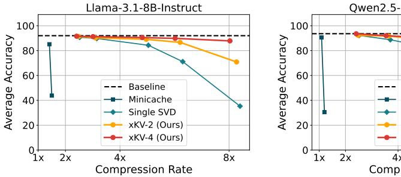

# **xKV: Cross-Layer SVD for KV-Cache Compression**

Chi-Chih Chang1 Chien-Yu Lin2 Yash Akhauri1 Wei-Cheng Lin3 Kai-Chiang Wu3 Luis Ceze2 Mohamed S. Abdelfattah1

Cornell University 2University of Washington

3National Yang Ming Chiao Tung University

## Abstract

Large Language Models (LLMs) with long context windows enable powerful applications but come at the cost of high memory consumption to store the Key and Value states (KV-Cache). Recent studies attempted to merge KV-cache from multiple layers into shared representations, yet these approaches either require expensive pretraining or rely on assumptions of high per-token cosine similarity across layers which generally does not hold in practice. We find that the dominant singular vectors are remarkably well-aligned across multiple layers of the KV-Cache. Exploiting this insight, we propose xKV, a simple post-training method that applies Singular Value Decomposition (SVD) on the KV-Cache of grouped layers. xKV consolidates the KV-Cache of multiple layers into a shared low-rank subspace, significantly reducing KV-Cache sizes. Through extensive evaluations on the RULER long-context benchmark with widely-used LLMs (e.g., Llama-3.1 and Qwen2.5), xKV achieves up to **6.8**× **higher compression rates** than the state-ofthe-art inter-layer technique, while improving accuracy by 2.7%. Moreover, xKV is compatible with the emerging Multi-Head Latent Attention (MLA) (e.g., DeepSeek-Coder-V2), **yielding a notable 3**× **compression rates** on coding tasks without performance degradation. These results highlight xKV's strong capability and versatility in addressing memory bottlenecks for long-context LLM inference. Our code is publicly available at: https://github.com/abdelfattah-lab/xKV.

Figure 1: Accuracy comparison of MiniCache [32], applying SVD on single layer's KV-Cache and xKV (cross-layer SVD) on Llama-3.1-8B-Instruct (left) and Qwen2.5-14B-Instruct-1M (right). Results are averaged across tasks from RULER [25] benchmark.

## 1 Introduction

Large language models (LLMs) [2, 7, 26, 37, 44, 45] have revolutionized numerous artificial intelligence (AI) applications with advanced cognitive capabilities that were previously unattainable with conventional machine learning (ML) models. Recent efforts to extend the context lengths of LLMs

have further expanded their potential: open-sourced models now support up to 1M tokens [\[38,](#page-12-3) [48\]](#page-12-4), and proprietary ones like Gemini push this limit even further to 10M tokens [\[44\]](#page-12-1). These extended context windows unlock a wide range of previously impractical applications, such as large-scale information retrieval and debugging or extending a large-scale codebase [\[15,](#page-8-1) [21,](#page-9-0) [37,](#page-12-0) [48\]](#page-12-4).

However, this expanded capability on long-context introduces significant challenges, particularly in the management of key-Value (KV) caches during inference [\[19,](#page-9-1) [30\]](#page-11-3). Typically, KV states are cached to avoid redundant computations; yet, under extended context lengths, the memory consumption of KV-Cache rapidly becomes prohibitive. This inflated memory footprint severely limits the number of concurrent inference requests, causing substantial throughput reduction. To address this, researchers have proposed various approaches to mitigate the large memory footprint of KV caches. These include quantization [\[13,](#page-8-2) [24,](#page-11-4) [35,](#page-11-5) [52\]](#page-13-0), token eviction [\[3,](#page-7-1) [11,](#page-8-3) [20,](#page-9-2) [31,](#page-11-6) [47,](#page-12-5) [51\]](#page-13-1), and low-rank decomposition [\[12,](#page-8-4) [41,](#page-12-6) [49,](#page-13-2) [50\]](#page-13-3). These approaches have primarily focused on intra-layer redundancies that compress the KV-Cache of each layer separately. While this often yields respectable per-layer compression, these methods do not utilize potential redundancy across layers [\[22\]](#page-11-7).

To effectively exploit cross-layer redundancy, pioneering methods such as Cross-Layer Attention (CLA) [\[10\]](#page-8-5) have introduced novel model architectures that share a single set of KV-Cache across groups of adjacent layers. Another notable approach, MiniCache [\[32\]](#page-11-0), utilizes the assumption of high cosine similarity between KV-Cache pairs in adjacent layers, merging them through spherical linear interpolation (SLERP) [\[40\]](#page-12-7). However, these existing methods present significant limitations. Specifically, they either necessitate expensive model pretraining due to architectural modifications [\[10\]](#page-8-5) or depend heavily on assumptions about KV-Cache similarity [\[32\]](#page-11-0) that often do not hold true in practical scenarios (see [§3\)](#page-2-0). Consequently, these constraints limit their achievable compression rates, come with a high accuracy degradation, or restrict the applicability to existing, pretrained models.

We revisit the inter-layer similarity via Centered Kernel Alignment (CKA) [\[29\]](#page-11-8). Our investigation shows that, despite having low cosine similarities, the KV-Cache of adjacent layers often have high similarities on their underlying dominant singular vectors. By exploiting this alignment, we can share basis vectors of multiple adjacent layers' KV-Cache, yielding a more compact representation. Leveraging these insights, we introduce xKV, a fully *plug-and-play* compression method that requires neither additional fine-tuning nor architectural changes. xKV compresses multiple layers' KV-Cache simultaneously by extracting their shared singular vectors through a cross-layer Singular Value Decomposition (SVD). Crucially, due to the alignment of singular vectors across layers, xKV achieves significantly better compression and accuracy trade-offs compared to applying SVD individually to single layers. Notably, xKV can compress not only pairs of two adjacent layers but also larger groups of layers, further enhancing compression ratios and accuracy retention.

Extensive experiments conducted on the challenging RULER benchmark with widely-used LLMs such as Llama and Qwen demonstrate the capabilities of xKV. Our method achieves up to 6.8× higher compression rates compared to the prior state-of-the-art inter-layer method, while simultaneously improving accuracy by 2.7%. Moreover, on the popular DeepSeek model architecture, which employs multi-head latent attention (MLA) [\[16\]](#page-8-6) and already aggressively reduces KV-Cache size, xKV further attains 3× compression without compromising accuracy, showcasing its versatility and compatibility across diverse attention mechanisms.

# 2 Related Work

Low-Rank KV-Cache Compression. A broad line of research exploits the *low-rank nature* of the KV-Cache to reduce its memory footprint. For instance, Multi-Head Latent Attention (MLA) [\[15,](#page-8-1) [16\]](#page-8-6) projects tokens onto a low-rank subspace and caches those latent representations instead of the original key and value states, however, MLA requires training the model from scratch. In contrast, several *post-training* techniques decompose the key/value parameter matrices to obtain low-rank projection modules similar to MLA, such as ASVD [\[49\]](#page-13-2), Palu [\[12\]](#page-8-4), and LoRC [\[50\]](#page-13-3). Other methods decompose the KV-Cache directly: EigenAttention [\[39\]](#page-12-8) applies SVD to a calibration dataset to derive projection matrices, whereas ShadowKV [\[41\]](#page-12-6) performs online SVD to capture the dynamic of different context. In xKV, we also exploits the low-rank nature of KV-Cache. However, unlike prior methods focusing on per layer compression, xKV further considers the shared information among multiple layers and extends the usage of low-rank to a new, cross-layer, dimension.

**Cross-Layer KV-Cache Optimization.** Going beyond the intra-layer perspective, another stream of research explores inter-layer redundancy of KV-Cache [10, 18, 32, 42, 46]. CLA [10] and YOCO[42] both modify the Transformer model architecture so that later layers can directly reuse or reference KV states from earlier layers. LCKV [46] restricts full KV storage to a small subset of layers, foregoing caches in other layers. However, these methods rely on retraining or model fine-tuning, which makes them less flexible. Minicache [32], in contrast, provides a flexible post-training alternative by merging the key and value tokens from adjacent similar layers using spherical linear interpolation. Our approach goes further by extracting shared singular vectors of multiple layers' KV-Caches thereby enabling higher compression.

Figure 2: (a) Average Token-wise Cosine Similarity for value-caches across different layers. For each pair of layers, we compute the token-level cosine similarities between their embeddings and average these values into a single similarity score. (b) CKA Matrix for the value-cache. The higher (warmer) values indicate stronger singular vector alignment across layers. (c) Required rank ratio (percentage of total dimension) for capturing 95% of the cumulative eigenvalues in the key (red) and value (blue) matrices, plotted against the number of grouped layers. For each group, we horizontally concatenate the key/value caches and compute the rank needed to achieve 95% of the cumulative eigenvalues. As the grouping increases, fewer ranks (relative to total dimension) are required, implying a higher compression rate for the same level of information preservation. We perform these analyses on the KV-Cache obtained from Llama-3.1-8B-Instruct, using the multi-valued NIAH dataset from the RULER [25] benchmark.

# **Analysis and Motivation**

In this section, we examine the cross-layer similarity of KV-Caches with different metrics to reveal the motivation behind the design of xKV.

#### 3.1 Cross-Layer Cosine Similarity

To understand the assumption used in a previous work [32], we first measure token-wise cosine similarity across various layer-pairs. The measurement on the cosine similarity is presented in Figure 2a. Notably, the adjacent layers exhibit low per-token similarity. This modest similarity fundamentally limits the compression rate achieved by prior representative methods [32]. However, a further examination using Centered Kernel Alignment (CKA) [29] reveals that while individual token representations differ significantly, multiple layers still share highly aligned singular vectors. While the embeddings vary at the token level, the latent subspaces spanned by KV-Cache across multiple layers remain notably similar. This observation motivates us to approach cross-layer KV-Cache compression by leveraging such sub-space alignments.

## 3.2 Revisit Cross-Layer Similarity with CKA

While token-wise (cosine) similarity offers a local perspective, a more holistic view can reveal deeper patterns in how an entire KV-Cache is aligned across layers. Specifically, we adopt Centered Kernel Alignment (CKA) [29] to measure the similarity in the overall structure of two layers' KV-Caches. Concretely, for a layer  $\ell$  with KV-cache  $\mathbf{X}_{\ell} \in \mathbb{R}^{n \times d}$ , we first define the centered Gram matrix  $\mathbf{G}_{\ell} = \mathbf{H} \mathbf{X}_{\ell} \mathbf{X}_{\ell}^{\top} \mathbf{H}$ , where  $\mathbf{H} = \mathbf{I}_{n} - \frac{1}{n} \mathbf{1} \mathbf{1}^{\top}$ .

$$\mathbf{G}_{\ell} = \mathbf{H} \mathbf{X}_{\ell} \mathbf{X}_{\ell}^{\top} \mathbf{H}, \text{ where } \mathbf{H} = \mathbf{I}_{n} - \frac{1}{n} \mathbf{1} \mathbf{1}^{\top}.$$

Then, the CKA between two layers  $\ell_1$  and  $\ell_2$  is

$$\mathrm{CKA}\big(\mathbf{X}_{\ell_1},\mathbf{X}_{\ell_2}\big) \; = \; \frac{\mathrm{trace}\big(\mathbf{G}_{\ell_1}\mathbf{G}_{\ell_2}\big)}{\sqrt{\mathrm{trace}\big(\mathbf{G}_{\ell_1}^2\big)\mathrm{trace}\big(\mathbf{G}_{\ell_2}^2\big)}} \, .$$

Unlike a token-wise cosine metric, which simply compares corresponding token embeddings, CKA reflects the similarity of *the entire distribution* of token embeddings in each layer. As shown in Appendix A, if  $CKA(\mathbf{X}_{\ell_1}, \mathbf{X}_{\ell_2})$  is high, then the dominant left singular vectors of  $\mathbf{X}_{\ell_1}$  are highly aligned to those of layer  $\ell_2$ . In other words, the basis vectors that define how the token varies in these two layers might be similar.

**Observation 1: Highly Aligned Basis.** In Figure 2b, we show the CKA value between each layers' KV-Cache of Llama-3.1-8B-Instruct. As shown in Figure 2b, many pairs of layers exhibit remarkably high CKA (red blocks) even though their token-wise cosine similarity are very modest. This observation suggests that, although individual token embeddings differ across layers, the dominant singular vectors (*i.e.*, basis) that span the KV-cache are, in fact, well-aligned. Thus, focusing solely on the cosine similarity between pairs of token embeddings can underestimate the potential for *cross-layer* merging and compression.

#### 3.3 Eigenvalue Analysis of KV-Cache

Observation 2: Horizontally Concatenated KV-Caches Require Lower Rank. Motivated by the observation that different layers' basis are well aligned, we examine the rank to achieve a certain level of information preservation after horizontally concatenating the key/value caches across multiple layers. Because each layer shows substantial cross-layer overlap (§3.2), a *single* set of low-rank basis vectors can effectively approximate the KV-Cache caches of all layers in the group. As illustrated in Figure 2c, a larger group size reduces the fraction of total rank needed to preserve the same variance. Compared with creating separate low-rank subspaces for each layer, this shared approach avoids storing nearly identical basis vectors multiple times, yielding a more compact yet expressive representation. In §4, we leverage these observations to propose our xKV method that achieves significantly higher compression ratios while preserving model accuracy.

Figure 3: Illustration of the xKV for compressing KV-Cache.

## 4 Methodology: xKV

Building on top of the core observations mentioned in previous subsections, we now present the core methodology of xKV, cross-layer SVD to identify a set of shared basis and leverage them to form a shared low-rank subspace that collectively approximates the KV-Caches from multiple layers. The design overview of xKV is shown in Figure 3.

**Notation.** Let L be the sequence length (number of tokens) and d be the hidden dimension of the KV-Caches. Because the same compression technique is applied to both the keys and values, we use a unified symbol  $\mathbf{X}_{\ell} \in \mathbb{R}^{L \times d}$  to represent either key or value cache for the  $\ell$ -th block.

**Cross-Layer SVD.** Suppose we select a subset (or *group*) of layers  $\mathcal{G} \subseteq \{0, \dots, N-1\}$ , and let  $\ell_1, \dots, \ell_{|\mathcal{G}|}$  be the layer indices in that subset. We form the horizontal concatenation of their KV-Caches:

$$\left[\mathbf{X}_{\ell_1}, \ldots, \mathbf{X}_{\ell_{|\mathcal{G}|}}\right] \in \mathbb{R}^{L \times (|\mathcal{G}| \cdot d)}.$$

We then perform a single *singular value decomposition (SVD)* on this concatenated matrix, retaining only the top-r singular values and corresponding singular vectors:

$$\left[\mathbf{X}_{\ell_1}, \dots, \mathbf{X}_{\ell_{|G|}}\right] \ \approx \ \mathbf{U}_r \, \mathbf{S}_r \, \mathbf{V}_r^{\top},$$

where  $\mathbf{U}_r \in \mathbb{R}^{L \times r}$ ,  $\mathbf{S}_r \in \mathbb{R}^{r \times r}$ , and  $\mathbf{V}_r^{\top} \in \mathbb{R}^{r \times (|\mathcal{G}| \cdot d)}$ . By further applying matrix fusion view, we can derive:

$$\mathbf{U}_r \, \mathbf{S}_r \, \mathbf{V}_r^\top \ = \ \left[ \mathbf{U}_r \, \mathbf{S}_r \right] \mathbf{V}_r^\top \ = \ \mathbf{A} \left[ \mathbf{B}_{\ell_1}, \dots, \mathbf{B}_{\ell_{|\mathcal{G}|}} \right],$$

where A holds the shared left singular vectors that span the shared low-rank subspace, and  $\mathbf{B}_{\ell_i} \in \mathbb{R}^{r \times d}$  are layer-specific reconstruction matrices.

**Stride-based Grouping.** Motivated by our empirical observation (see Figure 2b) that adjacent layers exhibit a strong singular vector alignment, we adopt a simple stride-based approach. Specifically, we partition the N Transformer blocks into contiguous *strides* of size G. Formally,

$$\mathcal{G}_k = \{k \cdot G, k \cdot G + 1, \dots, k \cdot G + (G - 1)\}\ (\text{for } k = 0, 1, \dots, \frac{N}{G} - 1),$$

so that each group  $\mathcal{G}_k \subseteq \{0,\ldots,N-1\}$  collects G adjacent layers. In this manner, xKV can effectively share a common set of principal components among layers that exhibit high mutual alignment.

## 4.1 Deploy Long Context LLM with xKV

**Prefill Phase.** During prefill, we gather the key and value states of each group of layers. We then apply the cross-layer SVD method on keys and values separately to extract the aligned left singular vector (*i.e.*, share basis) and the layer-specific reconstruction matrix. We apply decomposition on the fly during pre-filling to better capture the dynamic of KV-Cache [41]. While this includes additional computation, the overheads consume less than 10% of prefilling times at context length of 128k and become negligible when we handle longer context length scenarios for which xKV is designed. In a real-world use case, the proposed cross-layer decomposition could also be performed on the prefix cache [28] to reduce the storage costs and communication latency when fetching from remote storage [27].

**Decode Phase.** As illustrated in Figure 3b, we reconstruct the compressed KV-Cache corresponding to the prompt during decoding by multiplying the shared aligned basis  $\bf A$  with layer-specific construction matrix  ${\bf B}_{\ell_i}$ . For the newly generated tokens, we do not compress their KV-Cache as in general long-context scenarios, where prompts range from extensive documents, web information [1], or code repository [33], the KV-Cache from the generated response is typically much smaller than those corresponding to prompts. For instance, with a 64k token prompt, a subsequent 1k tokens response amounts to under 2% of the total. Consequently, leaving these tokens uncompressed introduces only a negligible overhead while better-preserving accuracy as demonstrated in previous KV-Cache compression works [11, 31, 41]. In use cases that entail very long generations, such as long writing [9] or reasoning [36], one could re-apply our cross-layer SVD to the newly produced tokens after accumulating a certain amount of generated tokens, thereby further reducing the memory overhead when needed.

## 5 Experiments

#### 5.1 Experiments Setup

**Models** We evaluate xKV on three widely used language models using Group-Query Attention (GQA): Llama-3.1-8B-Instruct [21] (8 KV heads), Qwen2.5-14B-Instruct-1M [48] (8 KV heads) and Qwen2.5-7B-Instruct-1M [48] (4 KV heads). To demonstrate xKV's high compatibility, we also include DeepSeek-Coder-V2-Lite-Instruct with 16B parameters based on Mixter-of-Experts (MoE) [14] with 2.4B activated parameters.

Table 1: Performance of different methods on the RULER benchmark evaluated at a context length of 64K.

| Method                  | Comp. | N-S1  | N-S2  | N-MK1 | N-MK2 | N-MQ  | N-MV | QA-1 | QA-2 | VT   | FWE  | Avg. |
|-------------------------|-------|-------|-------|-------|-------|-------|------|------|------|------|------|------|
| Llama-3.1-8B-Instruct   |       |       |       |       |       |       |      |      |      |      |      |      |
| Baseline                | 1.0   | 100.0 | 100.0 | 99.0  | 97.9  | 99.0  | 98.4 | 83.3 | 60.4 | 97.3 | 84.7 | 92.0 |
| Minicache               | 1.2   | 100.0 | 100.0 | 97.9  | 90.6  | 87.0  | 81.0 | 78.1 | 47.9 | 84.6 | 84.0 | 85.1 |
| Minicache               | 1.3   | 87.5  | 64.6  | 39.6  | 10.4  | 13.3  | 20.1 | 60.4 | 35.4 | 49.0 | 58.0 | 43.8 |
| Single SVD              | 2.5   | 100.0 | 100.0 | 100.0 | 97.9  | 97.9  | 96.1 | 80.2 | 58.3 | 96.9 | 79.5 | 90.7 |
| xKV-2 (Ours)            | 2.5   | 100.0 | 100.0 | 100.0 | 97.9  | 97.9  | 96.3 | 83.3 | 61.5 | 96.2 | 80.6 | 91.4 |
| xKV-4 (Ours)            | 2.4   | 100.0 | 100.0 | 100.0 | 97.9  | 98.4  | 97.1 | 84.4 | 60.4 | 96.2 | 81.2 | 91.6 |
| Single SVD              | 8.4   | 29.2  | 26.0  | 32.3  | 96.9  | 8.6   | 17.2 | 44.8 | 36.5 | 2.7  | 59.0 | 35.3 |
| xKV-2 (Ours)            | 8.3   | 99.0  | 75.0  | 69.8  | 97.9  | 74.5  | 65.9 | 67.7 | 49.0 | 36.9 | 73.3 | 70.9 |
| xKV-4 (Ours)            | 8.0   | 100.0 | 96.9  | 97.9  | 97.9  | 95.3  | 93.5 | 76.0 | 54.2 | 87.7 | 78.8 | 87.8 |
| Qwen2.5-7B-Instruct-1M  |       |       |       |       |       |       |      |      |      |      |      |      |
| Baseline                | 1.0   | 100.0 | 100.0 | 100.0 | 100.0 | 100.0 | 95.6 | 83.3 | 59.4 | 90.8 | 86.5 | 91.6 |
| Minicache               | 1.2   | 78.1  | 34.4  | 32.3  | 3.1   | 27.3  | 42.7 | 26.0 | 24.0 | 8.5  | 8.0  | 28.4 |
| Minicache               | 1.3   | 25.0  | 0.0   | 0.0   | 0.0   | 0.0   | 0.0  | 13.5 | 13.5 | 0.8  | 4.5  | 5.7  |
| Single SVD              | 2.3   | 100.0 | 100.0 | 99.0  | 99.0  | 99.7  | 92.7 | 75.0 | 58.3 | 80.8 | 75.7 | 88.0 |
| xKV-2 (Ours)            | 2.3   | 100.0 | 100.0 | 100.0 | 99.0  | 100.0 | 90.6 | 80.2 | 59.4 | 79.0 | 81.2 | 88.9 |
| xKV-4 (Ours)            | 2.2   | 100.0 | 100.0 | 100.0 | 99.0  | 100.0 | 90.9 | 83.3 | 60.4 | 85.0 | 83.0 | 90.2 |
| Single SVD              | 6.4   | 24.0  | 7.3   | 6.2   | 97.9  | 4.4   | 3.4  | 36.5 | 35.4 | 6.9  | 26.4 | 24.8 |
| xKV-2 (Ours)            | 6.3   | 99.0  | 81.2  | 75.0  | 97.9  | 38.3  | 57.0 | 56.2 | 46.9 | 46.7 | 41.3 | 64.0 |
| xKV-4 (Ours)            | 6.2   | 100.0 | 85.4  | 91.7  | 99.0  | 84.1  | 76.8 | 62.5 | 50.0 | 66.2 | 64.9 | 78.1 |
| Qwen2.5-14B-Instruct-1M |       |       |       |       |       |       |      |      |      |      |      |      |
| Baseline                | 1.0   | 100.0 | 100.0 | 100.0 | 99.0  | 100.0 | 99.2 | 80.2 | 66.7 | 99.6 | 91.3 | 93.6 |
| Minicache               | 1.1   | 100.0 | 100.0 | 100.0 | 99.0  | 98.2  | 99.0 | 72.9 | 61.5 | 90.8 | 84.4 | 90.6 |
| Minicache               | 1.3   | 0.0   | 1.0   | 0.0   | 0.0   | 0.0   | 0.0  | 17.7 | 27.1 | 0.2  | 8.3  | 5.4  |
| Single SVD              | 2.5   | 100.0 | 100.0 | 100.0 | 99.0  | 100.0 | 96.6 | 78.1 | 62.5 | 98.5 | 87.2 | 92.2 |
| xKV-2 (Ours)            | 2.5   | 100.0 | 100.0 | 100.0 | 99.0  | 100.0 | 95.6 | 81.2 | 61.5 | 99.2 | 86.1 | 92.2 |
| xKV-4 (Ours)            | 2.4   | 100.0 | 100.0 | 100.0 | 99.0  | 100.0 | 95.3 | 83.3 | 69.8 | 99.4 | 88.5 | 93.5 |
| Single SVD              | 8.4   | 12.5  | 9.4   | 18.8  | 96.9  | 25.5  | 14.3 | 32.3 | 44.8 | 8.1  | 59.0 | 32.2 |
| xKV-2 (Ours)            | 8.3   | 95.8  | 91.7  | 91.7  | 96.9  | 90.4  | 74.0 | 49.0 | 52.1 | 77.7 | 80.2 | 79.9 |
| xKV-4 (Ours)            | 8.0   | 100.0 | 96.9  | 99.0  | 97.9  | 97.1  | 88.5 | 63.5 | 58.3 | 86.0 | 86.5 | 87.4 |
|                         |       |       |       |       |       |       |      |      |      |      |      |      |

**Datasets.** We select RULER as our major benchmark, which features complex tasks such as retrieval, multi-hop tracking, and question-answering. For DeepSeek-Coder-V2, we adopt Repobench-P [33] and LCC [23] from LongBench's [8] collection to evaluate the LLM capabilities of code completion under long-context scenarios.

**Baselines.** We compare against two baselines. First, Single SVD, a special case of xKV with group size  $|\mathcal{G}|=1$ , factorizes each layer's key and value caches independently. For a fair comparison, the Single-Layer SVD also applies decomposition on the fly for every incoming request. We also compare xKV to representative inter-layer compression method, MiniCache. The baseline refers to the model's original (uncompressed) KV cache.

**Implementation Details.** We implement xKV using the Huggingface library. Because keys and values exhibit different sensitivities [12] to compression, we fix their rank ratio to 1:1.5 (for example, if the key rank is 96, then the value rank is 144). On the model with MLA, we apply xKV on the non-RoPE latent representations and leave the small decoupled RoPE keys uncompressed. For both Single-Layer SVD and xKV, we decompose the *pre-RoPE* key states, and then re-apply RoPE to the reconstructed keys during generation. Since the code for MiniCache was not publicly available, we re-implemented it based on the original paper and the SLERP code it references. We follow the official settings to merge half of the layers, from the middle to the end of the LLM, and we vary MiniCache's compression rate by adjusting the layer index at which merging begins. For a fair comparison, we keep the newly generated tokens uncompressed for all comparison targets. We measure the compression rate assuming a context length of 64k.

Figure 4: Evaluation results of different KV-Cache methods on DeepSeek-Coder-V2-Lite-Instruct model using RepoBench-P [33] and LCC[23]. The accuracy denotes the edit similarity [43], and the dotted line represents the baseline score with uncompressed KV-Cache.

## 5.2 Main Evaluation Results on RULER

Table 1 compares xKV against two baselines on the RULER benchmark [25] at a 64k context length. On both Llama-3.1-8B and Qwen2.5-14B using GQA [4] with eight key and value heads [4], we observe that *MiniCache* suffers marked performance degradation at compression ratios of 1.3×. This degradation stems from MiniCache's reliance on adjacent layers having high token-wise cosine similarity, which are not generally present. In contrast, Single SVD maintains strong accuracy at 2.5× compression, reflecting the observed low-rank nature of *individual* KV-caches. However, at extreme compression levels, Single SVD also experiences catastrophic performance degradation. By exploiting the low-rank nature of the KV-Cache, and by and constructing a shared low-rank subspace across layers, xKV far surpasses Single SVD's accuracy at moderate compression and remains nearly lossless.

Moreover, when increasing the group size (e.g., from 2 to 4 layers), xKV achieves further gains under the *same* compression ratio, underscoring the advantage of capturing a richer shared subspace among multiple layers. Notably, xKV still maintains competitive performance at an extreme  $8.0 \times 0.0 \times 0.00 \times 0.00$  compression ratio, achieving roughly  $6.8 \times 0.00 \times 0.00 \times 0.00 \times 0.00$  accuracy gain on Llama-3.1-8B, illustrating its efficacy in compressing KV-caches for large-context scenarios with minimal quality loss. We also examine xKV on the Qwen2.5-7B-1M, which natively has highly compact KV-Cache with only four key and value heads. We observe that the benefit of exploiting the inter-layer still holds, highlighting the xKV generalizability.

# 5.3 Evaluation on DeepSeek's MLA

To demonstrate the effectiveness of xKV on emerging attention variants, we evaluate it using DeepSeek-V2-Coder-Lite [17], which employs the efficient Multi-head Latent Attention (MLA) architecture [16]. Although MLA already significantly reduces the KV-Cache size per layer through low-rank projections, xKV further compresses this already compact latent cache by effectively leveraging cross-layer redundancy. We evaluate performance using the popular RepoBench-P [8, 33] and LCC [23] coding benchmark and present the results in Figure 4. As shown, with a group size of 4, xKV achieves a  $3\times$  compression rate on RepoBench and  $3.5\times$  on LCC without compromising accuracy. In contrast, other methods, such as MiniCache and Single SVD, fail to preserve accuracy on the MLA architecture even at substantially lower compression rates. These results underscore xKV's versatility and its compatibility with emerging architectures.

#### 5.4 Ablation Studies

Compressing key and value Separately. To understand how xKV affects key and value compression, we conduct ablation experiments on four subtasks from RULER (Figure 5) to evaluate how xKV (cross-layer low-rank SVD) affects key and value compression. Overall, xKV consistently boosts accuracy under varying compression rates. Also, keys exhibit higher compressibility than values, matching the eigenvalue analysis in Figure 2c. A closer inspection of the results reveals that the

Figure 5: Accuracy comparison of applying different methods to key and value separately on Llama-3.1-8B-Instruct using RULER benchmark.

achievable compression ratio appear to be task-dependent. On the questions-answering subtasks (QA-1 and QA-2) xKV can push the compression rate to  $16\times$  while still preserving performance. In Variable Tracking (VT) and NIAH multi-queries (N-MQ), accuracy begins to decline beyond  $8\times$  compression; however, in these same tasks, values tolerate compression more easily than in QA subtasks. These observations underscore how different tasks may demand different "sweet spots" for key versus value compression. In xKV, we employ a fixed compression ratio for all different tasks. Exploring task-specific or context-aware [5, 6, 34] rank allocation is a promising avenue for future work.

# **6** Limitations and Broader Impacts

**Fine-Grained Compression Rate Allocation.** Currently, we employ the fixed rank ratio across all grouped of layers. Prior works have demonstrated that the KV-Cache of different layers [5, 12] have different levels of sensitivity and some potential error propagation issues [50]. While xKV have yielded promising performance, we believe that exploring the fine-grained allocations of each group of layers could help boost the performance of xKV further.

**End-to-End System Demonstration.** While xKV substantially reduces memory usage for long-context inference, we have yet to integrate it into a complete system to measure its effect on decoding speed and throughput, especially in light of the extra FLOPs introduced by reconstruction. Still, xKV holds strong potential for high-performance deployments. For instance, ShadowKV [41] shows how combining single-layer SVD with sparse attention can improve throughput. Incorporating xKV, a more powerful variant of single-layer SVD, into a similar framework may enable both lower KV-cache footprints and faster end-to-end inference.

## 7 Conclusion

We introduce xKV, a plug-and-play compression method for Key-Value (KV) caches that exploits inter-layer redundancy. Our approach reveals that KV caches across different layers share highly aligned basis. Leveraging their inherent low-rank structure, we apply a cross-layer SVD to compress multiple KV caches into a shared low-rank subspace. Experiments demonstrate that xKV achieves up to an  $8.5\times$  compression rate while maintaining strong accuracy on representative long-context benchmarks.

#### References

- [1] Perplexity ai. https://www.perplexity.ai/. Accessed: March 21, 2025.
- [2] Introducing meta llama 3: The most capable openly available llm to date, 2024.
- [3] Muhammad Adnan, Akhil Arunkumar, Gaurav Jain, Prashant Nair, Ilya Soloveychik, and Purushotham Kamath. Keyformer: Kv cache reduction through key tokens selection for efficient generative inference. *Proceedings of Machine Learning and Systems*, 7, 2024.

- [4] Joshua Ainslie, James Lee-Thorp, Michiel de Jong, Yury Zemlyanskiy, Federico Lebrón, and Sumit Sanghai. Gqa: Training generalized multi-query transformer models from multi-head checkpoints. *arXiv preprint arXiv:2305.13245*, 2023.
- [5] Yash Akhauri, Ahmed F AbouElhamayed, Jordan Dotzel, Zhiru Zhang, Alexander M Rush, Safeen Huda, and Mohamed S Abdelfattah. Shadowllm: Predictor-based contextual sparsity for large language models. *arXiv preprint arXiv:2406.16635*, 2024.
- [6] Yash Akhauri, Ahmed F AbouElhamayed, Yifei Gao, Chi-Chih Chang, Nilesh Jain, and Mohamed S. Abdelfattah. Tokenbutler: Token importance is predictable, 2025.
- [7] Anthropic. Claude: A conversational ai assistant, 2023. Large Language Model. Version 1.0. Accessed: 2025-03-13.
- [8] Yushi Bai, Xin Lv, Jiajie Zhang, Hongchang Lyu, Jiankai Tang, Zhidian Huang, Zhengxiao Du, Xiao Liu, Aohan Zeng, Lei Hou, Yuxiao Dong, Jie Tang, and Juanzi Li. Longbench: A bilingual, multitask benchmark for long context understanding. *arXiv preprint arXiv:2308.14508*, 2023.
- [9] Yushi Bai, Jiajie Zhang, Xin Lv, Linzhi Zheng, Siqi Zhu, Lei Hou, Yuxiao Dong, Jie Tang, and Juanzi Li. Longwriter: Unleashing 10,000+ word generation from long context LLMs. In *The Thirteenth International Conference on Learning Representations*, 2025.
- [10] William Brandon, Mayank Mishra, Aniruddha Nrusimha, Rameswar Panda, and Jonathan Ragan-Kelley. Reducing transformer key-value cache size with cross-layer attention. In *The Thirty-eighth Annual Conference on Neural Information Processing Systems*, 2024.
- [11] Zefan Cai, Yichi Zhang, Bofei Gao, Yuliang Liu, Tianyu Liu, Keming Lu, Wayne Xiong, Yue Dong, Baobao Chang, Junjie Hu, and Wen Xiao. Pyramidkv: Dynamic kv cache compression based on pyramidal information funneling, 2024.
- [12] Chi-Chih Chang, Wei-Cheng Lin, Chien-Yu Lin, Chong-Yan Chen, Yu-Fang Hu, Pei-Shuo Wang, Ning-Chi Huang, Luis Ceze, Mohamed S. Abdelfattah, and Kai-Chiang Wu. Palu: KV-cache compression with low-rank projection. In *The Thirteenth International Conference on Learning Representations*, 2025.
- [13] Yuzong Chen, Xilai Dai, Chi chih Chang, Yash Akhauri, and Mohamed S. Abdelfattah. The power of negative zero: Datatype customization for quantized large language models, 2025.
- [14] Damai Dai, Chengqi Deng, Chenggang Zhao, R. X. Xu, Huazuo Gao, Deli Chen, Jiashi Li, Wangding Zeng, Xingkai Yu, Y. Wu, Zhenda Xie, Y. K. Li, Panpan Huang, Fuli Luo, Chong Ruan, Zhifang Sui, and Wenfeng Liang. Deepseekmoe: Towards ultimate expert specialization in mixture-of-experts language models, 2024.
- [15] DeepSeek-AI, Daya Guo, Dejian Yang, Haowei Zhang, Junxiao Song, Ruoyu Zhang, Runxin Xu, Qihao Zhu, Shirong Ma, Peiyi Wang, et al. DeepSeek-R1: Incentivizing Reasoning Capability in LLMs via Reinforcement Learning, 2025. Version Number: 1.
- [16] DeepSeek-AI, Aixin Liu, Bei Feng, Bin Wang, Bingxuan Wang, Bo Liu, Chenggang Zhao, Chengqi Dengr, Chong Ruan, Damai Dai, Daya Guo, Dejian Yang, Deli Chen, Dongjie Ji, Erhang Li, Fangyun Lin, Fuli Luo, Guangbo Hao, Guanting Chen, Guowei Li, H. Zhang, Hanwei Xu, Hao Yang, Haowei Zhang, Honghui Ding, Huajian Xin, Huazuo Gao, Hui Li, Hui Qu, J. L. Cai, Jian Liang, Jianzhong Guo, Jiaqi Ni, Jiashi Li, Jin Chen, Jingyang Yuan, Junjie Qiu, Junxiao Song, Kai Dong, Kaige Gao, Kang Guan, Lean Wang, Lecong Zhang, Lei Xu, Leyi Xia, Liang Zhao, Liyue Zhang, Meng Li, Miaojun Wang, Mingchuan Zhang, Minghua Zhang, Minghui Tang, Mingming Li, Ning Tian, Panpan Huang, Peiyi Wang, Peng Zhang, Qihao Zhu, Qinyu Chen, Qiushi Du, R. J. Chen, R. L. Jin, Ruiqi Ge, Ruizhe Pan, Runxin Xu, Ruyi Chen, S. S. Li, Shanghao Lu, Shangyan Zhou, Shanhuang Chen, Shaoqing Wu, Shengfeng Ye, Shirong Ma, Shiyu Wang, Shuang Zhou, Shuiping Yu, Shunfeng Zhou, Size Zheng, T. Wang, Tian Pei, Tian Yuan, Tianyu Sun, W. L. Xiao, Wangding Zeng, Wei An, Wen Liu, Wenfeng Liang, Wenjun Gao, Wentao Zhang, X. Q. Li, Xiangyue Jin, Xianzu Wang, Xiao Bi, Xiaodong Liu, Xiaohan Wang, Xiaojin Shen, Xiaokang Chen, Xiaosha Chen, Xiaotao Nie, Xiaowen Sun, Xiaoxiang Wang, Xin Liu, Xin Xie, Xingkai Yu, Xinnan Song, Xinyi Zhou, Xinyu Yang, Xuan Lu, Xuecheng Su, Y. Wu, Y. K. Li, Y. X. Wei, Y. X. Zhu, Yanhong Xu, Yanping Huang, Yao Li,

- Yao Zhao, Yaofeng Sun, Yaohui Li, Yaohui Wang, Yi Zheng, Yichao Zhang, Yiliang Xiong, Yilong Zhao, Ying He, Ying Tang, Yishi Piao, Yixin Dong, Yixuan Tan, Yiyuan Liu, Yongji Wang, Yongqiang Guo, Yuchen Zhu, Yuduan Wang, Yuheng Zou, Yukun Zha, Yunxian Ma, Yuting Yan, Yuxiang You, Yuxuan Liu, Z. Z. Ren, Zehui Ren, Zhangli Sha, Zhe Fu, Zhen Huang, Zhen Zhang, Zhenda Xie, Zhewen Hao, Zhihong Shao, Zhiniu Wen, Zhipeng Xu, Zhongyu Zhang, Zhuoshu Li, Zihan Wang, Zihui Gu, Zilin Li, and Ziwei Xie. Deepseek-v2: A strong, economical, and efficient mixture-of-experts language model, 2024.
- [17] DeepSeek-AI, Qihao Zhu, Daya Guo, Zhihong Shao, Dejian Yang, Peiyi Wang, Runxin Xu, Y. Wu, Yukun Li, Huazuo Gao, Shirong Ma, Wangding Zeng, Xiao Bi, Zihui Gu, Hanwei Xu, Damai Dai, Kai Dong, Liyue Zhang, Yishi Piao, Zhibin Gou, Zhenda Xie, Zhewen Hao, Bingxuan Wang, Junxiao Song, Deli Chen, Xin Xie, Kang Guan, Yuxiang You, Aixin Liu, Qiushi Du, Wenjun Gao, Xuan Lu, Qinyu Chen, Yaohui Wang, Chengqi Deng, Jiashi Li, Chenggang Zhao, Chong Ruan, Fuli Luo, and Wenfeng Liang. Deepseek-coder-v2: Breaking the barrier of closed-source models in code intelligence, 2024.
- [18] Xin Dong, Yonggan Fu, Shizhe Diao, Wonmin Byeon, ZIJIA CHEN, Ameya Sunil Mahabaleshwarkar, Shih-Yang Liu, Matthijs Van keirsbilck, Min-Hung Chen, Yoshi Suhara, Yingyan Celine Lin, Jan Kautz, and Pavlo Molchanov. Hymba: A hybrid-head architecture for small language models. In *The Thirteenth International Conference on Learning Representations*, 2025.
- [19] Yao Fu. Challenges in deploying long-context transformers: A theoretical peak performance analysis, 2024.
- [20] Suyu Ge, Yunan Zhang, Liyuan Liu, Minjia Zhang, Jiawei Han, and Jianfeng Gao. Model tells you what to discard: Adaptive KV cache compression for LLMs. In *The Twelfth International Conference on Learning Representations*, 2024.
- [21] Aaron Grattafiori, Abhimanyu Dubey, Abhinav Jauhri, Abhinav Pandey, Abhishek Kadian, Ahmad Al-Dahle, Aiesha Letman, Akhil Mathur, Alan Schelten, Alex Vaughan, Amy Yang, Angela Fan, Anirudh Goyal, Anthony Hartshorn, Aobo Yang, Archi Mitra, Archie Sravankumar, Artem Korenev, Arthur Hinsvark, Arun Rao, Aston Zhang, Aurelien Rodriguez, Austen Gregerson, Ava Spataru, Baptiste Roziere, Bethany Biron, Binh Tang, Bobbie Chern, Charlotte Caucheteux, Chaya Nayak, Chloe Bi, Chris Marra, Chris McConnell, Christian Keller, Christophe Touret, Chunyang Wu, Corinne Wong, Cristian Canton Ferrer, Cyrus Nikolaidis, Damien Allonsius, Daniel Song, Danielle Pintz, Danny Livshits, Danny Wyatt, David Esiobu, Dhruv Choudhary, Dhruv Mahajan, Diego Garcia-Olano, Diego Perino, Dieuwke Hupkes, Egor Lakomkin, Ehab AlBadawy, Elina Lobanova, Emily Dinan, Eric Michael Smith, Filip Radenovic, Francisco Guzmán, Frank Zhang, Gabriel Synnaeve, Gabrielle Lee, Georgia Lewis Anderson, Govind Thattai, Graeme Nail, Gregoire Mialon, Guan Pang, Guillem Cucurell, Hailey Nguyen, Hannah Korevaar, Hu Xu, Hugo Touvron, Iliyan Zarov, Imanol Arrieta Ibarra, Isabel Kloumann, Ishan Misra, Ivan Evtimov, Jack Zhang, Jade Copet, Jaewon Lee, Jan Geffert, Jana Vranes, Jason Park, Jay Mahadeokar, Jeet Shah, Jelmer van der Linde, Jennifer Billock, Jenny Hong, Jenya Lee, Jeremy Fu, Jianfeng Chi, Jianyu Huang, Jiawen Liu, Jie Wang, Jiecao Yu, Joanna Bitton, Joe Spisak, Jongsoo Park, Joseph Rocca, Joshua Johnstun, Joshua Saxe, Junteng Jia, Kalyan Vasuden Alwala, Karthik Prasad, Kartikeya Upasani, Kate Plawiak, Ke Li, Kenneth Heafield, Kevin Stone, Khalid El-Arini, Krithika Iyer, Kshitiz Malik, Kuenley Chiu, Kunal Bhalla, Kushal Lakhotia, Lauren Rantala-Yeary, Laurens van der Maaten, Lawrence Chen, Liang Tan, Liz Jenkins, Louis Martin, Lovish Madaan, Lubo Malo, Lukas Blecher, Lukas Landzaat, Luke de Oliveira, Madeline Muzzi, Mahesh Pasupuleti, Mannat Singh, Manohar Paluri, Marcin Kardas, Maria Tsimpoukelli, Mathew Oldham, Mathieu Rita, Maya Pavlova, Melanie Kambadur, Mike Lewis, Min Si, Mitesh Kumar Singh, Mona Hassan, Naman Goyal, Narjes Torabi, Nikolay Bashlykov, Nikolay Bogoychev, Niladri Chatterji, Ning Zhang, Olivier Duchenne, Onur Çelebi, Patrick Alrassy, Pengchuan Zhang, Pengwei Li, Petar Vasic, Peter Weng, Prajjwal Bhargava, Pratik Dubal, Praveen Krishnan, Punit Singh Koura, Puxin Xu, Qing He, Qingxiao Dong, Ragavan Srinivasan, Raj Ganapathy, Ramon Calderer, Ricardo Silveira Cabral, Robert Stojnic, Roberta Raileanu, Rohan Maheswari, Rohit Girdhar, Rohit Patel, Romain Sauvestre, Ronnie Polidoro, Roshan Sumbaly, Ross Taylor, Ruan Silva, Rui Hou, Rui Wang, Saghar Hosseini, Sahana Chennabasappa, Sanjay Singh, Sean Bell, Seohyun Sonia Kim, Sergey Edunov, Shaoliang Nie, Sharan Narang, Sharath Raparthy, Sheng Shen, Shengye Wan, Shruti Bhosale, Shun Zhang, Simon Vandenhende, Soumya Batra, Spencer Whitman, Sten Sootla, Stephane

Collot, Suchin Gururangan, Sydney Borodinsky, Tamar Herman, Tara Fowler, Tarek Sheasha, Thomas Georgiou, Thomas Scialom, Tobias Speckbacher, Todor Mihaylov, Tong Xiao, Ujjwal Karn, Vedanuj Goswami, Vibhor Gupta, Vignesh Ramanathan, Viktor Kerkez, Vincent Gonguet, Virginie Do, Vish Vogeti, Vítor Albiero, Vladan Petrovic, Weiwei Chu, Wenhan Xiong, Wenyin Fu, Whitney Meers, Xavier Martinet, Xiaodong Wang, Xiaofang Wang, Xiaoqing Ellen Tan, Xide Xia, Xinfeng Xie, Xuchao Jia, Xuewei Wang, Yaelle Goldschlag, Yashesh Gaur, Yasmine Babaei, Yi Wen, Yiwen Song, Yuchen Zhang, Yue Li, Yuning Mao, Zacharie Delpierre Coudert, Zheng Yan, Zhengxing Chen, Zoe Papakipos, Aaditya Singh, Aayushi Srivastava, Abha Jain, Adam Kelsey, Adam Shajnfeld, Adithya Gangidi, Adolfo Victoria, Ahuva Goldstand, Ajay Menon, Ajay Sharma, Alex Boesenberg, Alexei Baevski, Allie Feinstein, Amanda Kallet, Amit Sangani, Amos Teo, Anam Yunus, Andrei Lupu, Andres Alvarado, Andrew Caples, Andrew Gu, Andrew Ho, Andrew Poulton, Andrew Ryan, Ankit Ramchandani, Annie Dong, Annie Franco, Anuj Goyal, Aparajita Saraf, Arkabandhu Chowdhury, Ashley Gabriel, Ashwin Bharambe, Assaf Eisenman, Azadeh Yazdan, Beau James, Ben Maurer, Benjamin Leonhardi, Bernie Huang, Beth Loyd, Beto De Paola, Bhargavi Paranjape, Bing Liu, Bo Wu, Boyu Ni, Braden Hancock, Bram Wasti, Brandon Spence, Brani Stojkovic, Brian Gamido, Britt Montalvo, Carl Parker, Carly Burton, Catalina Mejia, Ce Liu, Changhan Wang, Changkyu Kim, Chao Zhou, Chester Hu, Ching-Hsiang Chu, Chris Cai, Chris Tindal, Christoph Feichtenhofer, Cynthia Gao, Damon Civin, Dana Beaty, Daniel Kreymer, Daniel Li, David Adkins, David Xu, Davide Testuggine, Delia David, Devi Parikh, Diana Liskovich, Didem Foss, Dingkang Wang, Duc Le, Dustin Holland, Edward Dowling, Eissa Jamil, Elaine Montgomery, Eleonora Presani, Emily Hahn, Emily Wood, Eric-Tuan Le, Erik Brinkman, Esteban Arcaute, Evan Dunbar, Evan Smothers, Fei Sun, Felix Kreuk, Feng Tian, Filippos Kokkinos, Firat Ozgenel, Francesco Caggioni, Frank Kanayet, Frank Seide, Gabriela Medina Florez, Gabriella Schwarz, Gada Badeer, Georgia Swee, Gil Halpern, Grant Herman, Grigory Sizov, Guangyi, Zhang, Guna Lakshminarayanan, Hakan Inan, Hamid Shojanazeri, Han Zou, Hannah Wang, Hanwen Zha, Haroun Habeeb, Harrison Rudolph, Helen Suk, Henry Aspegren, Hunter Goldman, Hongyuan Zhan, Ibrahim Damlaj, Igor Molybog, Igor Tufanov, Ilias Leontiadis, Irina-Elena Veliche, Itai Gat, Jake Weissman, James Geboski, James Kohli, Janice Lam, Japhet Asher, Jean-Baptiste Gaya, Jeff Marcus, Jeff Tang, Jennifer Chan, Jenny Zhen, Jeremy Reizenstein, Jeremy Teboul, Jessica Zhong, Jian Jin, Jingyi Yang, Joe Cummings, Jon Carvill, Jon Shepard, Jonathan McPhie, Jonathan Torres, Josh Ginsburg, Junjie Wang, Kai Wu, Kam Hou U, Karan Saxena, Kartikay Khandelwal, Katayoun Zand, Kathy Matosich, Kaushik Veeraraghavan, Kelly Michelena, Keqian Li, Kiran Jagadeesh, Kun Huang, Kunal Chawla, Kyle Huang, Lailin Chen, Lakshya Garg, Lavender A, Leandro Silva, Lee Bell, Lei Zhang, Liangpeng Guo, Licheng Yu, Liron Moshkovich, Luca Wehrstedt, Madian Khabsa, Manav Avalani, Manish Bhatt, Martynas Mankus, Matan Hasson, Matthew Lennie, Matthias Reso, Maxim Groshev, Maxim Naumov, Maya Lathi, Meghan Keneally, Miao Liu, Michael L. Seltzer, Michal Valko, Michelle Restrepo, Mihir Patel, Mik Vyatskov, Mikayel Samvelyan, Mike Clark, Mike Macey, Mike Wang, Miquel Jubert Hermoso, Mo Metanat, Mohammad Rastegari, Munish Bansal, Nandhini Santhanam, Natascha Parks, Natasha White, Navyata Bawa, Nayan Singhal, Nick Egebo, Nicolas Usunier, Nikhil Mehta, Nikolay Pavlovich Laptev, Ning Dong, Norman Cheng, Oleg Chernoguz, Olivia Hart, Omkar Salpekar, Ozlem Kalinli, Parkin Kent, Parth Parekh, Paul Saab, Pavan Balaji, Pedro Rittner, Philip Bontrager, Pierre Roux, Piotr Dollar, Polina Zvyagina, Prashant Ratanchandani, Pritish Yuvraj, Qian Liang, Rachad Alao, Rachel Rodriguez, Rafi Ayub, Raghotham Murthy, Raghu Nayani, Rahul Mitra, Rangaprabhu Parthasarathy, Raymond Li, Rebekkah Hogan, Robin Battey, Rocky Wang, Russ Howes, Ruty Rinott, Sachin Mehta, Sachin Siby, Sai Jayesh Bondu, Samyak Datta, Sara Chugh, Sara Hunt, Sargun Dhillon, Sasha Sidorov, Satadru Pan, Saurabh Mahajan, Saurabh Verma, Seiji Yamamoto, Sharadh Ramaswamy, Shaun Lindsay, Shaun Lindsay, Sheng Feng, Shenghao Lin, Shengxin Cindy Zha, Shishir Patil, Shiva Shankar, Shuqiang Zhang, Shuqiang Zhang, Sinong Wang, Sneha Agarwal, Soji Sajuyigbe, Soumith Chintala, Stephanie Max, Stephen Chen, Steve Kehoe, Steve Satterfield, Sudarshan Govindaprasad, Sumit Gupta, Summer Deng, Sungmin Cho, Sunny Virk, Suraj Subramanian, Sy Choudhury, Sydney Goldman, Tal Remez, Tamar Glaser, Tamara Best, Thilo Koehler, Thomas Robinson, Tianhe Li, Tianjun Zhang, Tim Matthews, Timothy Chou, Tzook Shaked, Varun Vontimitta, Victoria Ajayi, Victoria Montanez, Vijai Mohan, Vinay Satish Kumar, Vishal Mangla, Vlad Ionescu, Vlad Poenaru, Vlad Tiberiu Mihailescu, Vladimir Ivanov, Wei Li, Wenchen Wang, Wenwen Jiang, Wes Bouaziz, Will Constable, Xiaocheng Tang, Xiaojian Wu, Xiaolan Wang, Xilun Wu, Xinbo Gao, Yaniv Kleinman, Yanjun Chen, Ye Hu, Ye Jia, Ye Qi, Yenda Li, Yilin Zhang, Ying Zhang, Yossi Adi, Youngjin

- Nam, Yu, Wang, Yu Zhao, Yuchen Hao, Yundi Qian, Yunlu Li, Yuzi He, Zach Rait, Zachary DeVito, Zef Rosnbrick, Zhaoduo Wen, Zhenyu Yang, Zhiwei Zhao, and Zhiyu Ma. The llama 3 herd of models, 2024.
- [22] Andrey Gromov, Kushal Tirumala, Hassan Shapourian, Paolo Glorioso, and Daniel A Roberts. The unreasonable ineffectiveness of the deeper layers. *arXiv preprint arXiv:2403.17887*, 2024.
- [23] Daya Guo, Canwen Xu, Nan Duan, Jian Yin, and Julian J. McAuley. Longcoder: A longrange pre-trained language model for code completion. In Andreas Krause, Emma Brunskill, Kyunghyun Cho, Barbara Engelhardt, Sivan Sabato, and Jonathan Scarlett, editors, *International Conference on Machine Learning, ICML 2023, 23-29 July 2023, Honolulu, Hawaii, USA*, volume 202 of *Proceedings of Machine Learning Research*, pages 12098–12107. PMLR, 2023.
- [24] Coleman Hooper, Sehoon Kim, Hiva Mohammadzadeh, Michael W Mahoney, Yakun Sophia Shao, Kurt Keutzer, and Amir Gholami. Kvquant: Towards 10 million context length llm inference with kv cache quantization. *arXiv preprint arXiv:2401.18079*, 2024.
- [25] Cheng-Ping Hsieh, Simeng Sun, Samuel Kriman, Shantanu Acharya, Dima Rekesh, Fei Jia, Yang Zhang, and Boris Ginsburg. Ruler: What's the real context size of your long-context language models? *arXiv preprint arXiv:2404.06654*, 2024.
- [26] Albert Q. Jiang, Alexandre Sablayrolles, Arthur Mensch, Chris Bamford, Devendra Singh Chaplot, Diego de las Casas, Florian Bressand, Gianna Lengyel, Guillaume Lample, Lucile Saulnier, Lélio Renard Lavaud, Marie-Anne Lachaux, Pierre Stock, Teven Le Scao, Thibaut Lavril, Thomas Wang, Timothée Lacroix, and William El Sayed. Mistral 7b, 2023.
- [27] Shuowei Jin, Xueshen Liu, Qingzhao Zhang, and Z Morley Mao. Compute or load kv cache? why not both? *arXiv preprint arXiv:2410.03065*, 2024.
- [28] Jordan Juravsky, Bradley Brown, Ryan Saul Ehrlich, Daniel Y Fu, Christopher Re, and Azalia Mirhoseini. Hydragen: High-throughput LLM inference with shared prefixes. In *Workshop on Efficient Systems for Foundation Models II @ ICML2024*, 2024.
- [29] Simon Kornblith, Mohammad Norouzi, Honglak Lee, and Geoffrey Hinton. Similarity of neural network representations revisited. In *International conference on machine learning*, pages 3519–3529. PMLR, 2019.
- [30] Haoyang Li, Yiming Li, Anxin Tian, Tianhao Tang, Zhanchao Xu, Xuejia Chen, Nicole Hu, Wei Dong, Qing Li, and Lei Chen. A survey on large language model acceleration based on kv cache management. *arXiv preprint arXiv:2412.19442*, 2024.
- [31] Yuhong Li, Yingbing Huang, Bowen Yang, Bharat Venkitesh, Acyr Locatelli, Hanchen Ye, Tianle Cai, Patrick Lewis, and Deming Chen. SnapKV: LLM knows what you are looking for before generation. In *The Thirty-eighth Annual Conference on Neural Information Processing Systems*, 2024.
- [32] Akide Liu, Jing Liu, Zizheng Pan, Yefei He, Gholamreza Haffari, and Bohan Zhuang. Minicache: KV cache compression in depth dimension for large language models. In *The Thirty-eighth Annual Conference on Neural Information Processing Systems*, 2024.
- [33] Tianyang Liu, Canwen Xu, and Julian McAuley. Repobench: Benchmarking repository-level code auto-completion systems, 2023.
- [34] Zichang Liu, Jue Wang, Tri Dao, Tianyi Zhou, Binhang Yuan, Zhao Song, Anshumali Shrivastava, Ce Zhang, Yuandong Tian, Christopher Re, and Beidi Chen. Deja vu: Contextual sparsity for efficient LLMs at inference time. In Andreas Krause, Emma Brunskill, Kyunghyun Cho, Barbara Engelhardt, Sivan Sabato, and Jonathan Scarlett, editors, *Proceedings of the 40th International Conference on Machine Learning*, volume 202 of *Proceedings of Machine Learning Research*, pages 22137–22176. PMLR, 23–29 Jul 2023.
- [35] Zirui Liu, Jiayi Yuan, Hongye Jin, Shaochen Zhong, Zhaozhuo Xu, Vladimir Braverman, Beidi Chen, and Xia Hu. Kivi: A tuning-free asymmetric 2bit quantization for kv cache. *arXiv preprint arXiv:2402.02750*, 2024.

- [36] Niklas Muennighoff, Zitong Yang, Weijia Shi, Xiang Lisa Li, Li Fei-Fei, Hannaneh Hajishirzi, Luke Zettlemoyer, Percy Liang, Emmanuel Candès, and Tatsunori Hashimoto. s1: Simple test-time scaling, 2025.
- [37] OpenAI, Josh Achiam, Steven Adler, Sandhini Agarwal, Lama Ahmad, Ilge Akkaya, Florencia Leoni Aleman, Diogo Almeida, Janko Altenschmidt, Sam Altman, et al. GPT-4 Technical Report, March 2024. arXiv:2303.08774 [cs].
- [38] Leonid Pekelis, Michael Feil, Forrest Moret, Mark Huang, and Tiffany Peng. Llama 3 gradient: A series of long context models, 2024.
- [39] Utkarsh Saxena, Gobinda Saha, Sakshi Choudhary, and Kaushik Roy. Eigen attention: Attention in low-rank space for KV cache compression. In Yaser Al-Onaizan, Mohit Bansal, and Yun-Nung Chen, editors, *Findings of the Association for Computational Linguistics: EMNLP 2024*, pages 15332–15344, Miami, Florida, USA, November 2024. Association for Computational Linguistics.
- [40] Ken Shoemake. Animating rotation with quaternion curves. *SIGGRAPH Comput. Graph.*, 19(3):245–254, July 1985.
- [41] Hanshi Sun, Li-Wen Chang, Wenlei Bao, Size Zheng, Ningxin Zheng, Xin Liu, Harry Dong, Yuejie Chi, and Beidi Chen. Shadowkv: Kv cache in shadows for high-throughput long-context llm inference, 2024.
- [42] Yutao Sun, Li Dong, Yi Zhu, Shaohan Huang, Wenhui Wang, Shuming Ma, Quanlu Zhang, Jianyong Wang, and Furu Wei. You only cache once: Decoder-decoder architectures for language models. In *The Thirty-eighth Annual Conference on Neural Information Processing Systems*, 2024.
- [43] Alexey Svyatkovskiy, Shao Kun Deng, Shengyu Fu, and Neel Sundaresan. Intellicode compose: Code generation using transformer. In *Proceedings of the 28th ACM joint meeting on European software engineering conference and symposium on the foundations of software engineering*, pages 1433–1443, 2020.
- [44] Gemini Team, Petko Georgiev, Ving Ian Lei, Ryan Burnell, Libin Bai, Anmol Gulati, Garrett Tanzer, Damien Vincent, Zhufeng Pan, Shibo Wang, et al. Gemini 1.5: Unlocking multimodal understanding across millions of tokens of context. *arXiv preprint arXiv:2403.05530*, 2024.
- [45] Hugo Touvron, Louis Martin, Kevin Stone, Peter Albert, Amjad Almahairi, Yasmine Babaei, Nikolay Bashlykov, Soumya Batra, Prajjwal Bhargava, Shruti Bhosale, Dan Bikel, Lukas Blecher, Cristian Canton Ferrer, Moya Chen, Guillem Cucurull, David Esiobu, Jude Fernandes, Jeremy Fu, Wenyin Fu, Brian Fuller, Cynthia Gao, Vedanuj Goswami, Naman Goyal, Anthony Hartshorn, Saghar Hosseini, Rui Hou, Hakan Inan, Marcin Kardas, Viktor Kerkez, Madian Khabsa, Isabel Kloumann, Artem Korenev, Punit Singh Koura, Marie-Anne Lachaux, Thibaut Lavril, Jenya Lee, Diana Liskovich, Yinghai Lu, Yuning Mao, Xavier Martinet, Todor Mihaylov, Pushkar Mishra, Igor Molybog, Yixin Nie, Andrew Poulton, Jeremy Reizenstein, Rashi Rungta, Kalyan Saladi, Alan Schelten, Ruan Silva, Eric Michael Smith, Ranjan Subramanian, Xiaoqing Ellen Tan, Binh Tang, Ross Taylor, Adina Williams, Jian Xiang Kuan, Puxin Xu, Zheng Yan, Iliyan Zarov, Yuchen Zhang, Angela Fan, Melanie Kambadur, Sharan Narang, Aurelien Rodriguez, Robert Stojnic, Sergey Edunov, and Thomas Scialom. Llama 2: Open foundation and fine-tuned chat models, 2023.
- [46] Haoyi Wu and Kewei Tu. Layer-condensed kv cache for efficient inference of large language models. In *Proceedings of the 62nd Annual Meeting of the Association for Computational Linguistics (Volume 1: Long Papers)*, pages 11175–11188, 2024.
- [47] Guangxuan Xiao, Yuandong Tian, Beidi Chen, Song Han, and Mike Lewis. Efficient streaming language models with attention sinks. In *The Twelfth International Conference on Learning Representations*, 2024.
- [48] An Yang, Bowen Yu, Chengyuan Li, Dayiheng Liu, Fei Huang, Haoyan Huang, Jiandong Jiang, Jianhong Tu, Jianwei Zhang, Jingren Zhou, Junyang Lin, Kai Dang, Kexin Yang, Le Yu, Mei Li, Minmin Sun, Qin Zhu, Rui Men, Tao He, Weijia Xu, Wenbiao Yin, Wenyuan Yu, Xiafei

- Qiu, Xingzhang Ren, Xinlong Yang, Yong Li, Zhiying Xu, and Zipeng Zhang. Qwen2.5-1m technical report, 2025.
- [49] Zhihang Yuan, Yuzhang Shang, Yue Song, Qiang Wu, Yan Yan, and Guangyu Sun. Asvd: Activation-aware singular value decomposition for compressing large language models, 2023.
- [50] Rongzhi Zhang, Kuang Wang, Liyuan Liu, Shuohang Wang, Hao Cheng, Chao Zhang, and Yelong Shen. Lorc: Low-rank compression for llms kv cache with a progressive compression strategy. *arXiv preprint arXiv:2410.03111*, 2024.
- [51] Zhenyu Zhang, Ying Sheng, Tianyi Zhou, Tianlong Chen, Lianmin Zheng, Ruisi Cai, Zhao Song, Yuandong Tian, Christopher Ré, Clark Barrett, et al. H2o: Heavy-hitter oracle for efficient generative inference of large language models. *Advances in Neural Information Processing Systems*, 36, 2024.
- [52] Yilong Zhao, Chien-Yu Lin, Kan Zhu, Zihao Ye, Lequn Chen, Size Zhenga, Luis Ceze, Arvind Krishnamurthy, Tianqi Chen, and Baris Kasikci. Atom: Low-bit quantization for efficient and accurate llm serving. *arXiv preprint arXiv:2310.19102*, 2023.

## A CKA and Indication of Aligned Left Singular Vectors

#### A.1 Notation and Definitions

For each layer  $\ell$ , let

$$\mathbf{X}_{\ell} \in \mathbb{R}^{n \times d},$$

where each of the n rows corresponds to a token (data point). Define the centering matrix

$$\mathbf{H} = \mathbf{I}_n - \frac{1}{n} \mathbf{1} \mathbf{1}^{\mathsf{T}},$$

which subtracts the (row) mean from each token embedding. We define the centered embeddings

$$\widetilde{\mathbf{X}}_{\ell} = \mathbf{H} \mathbf{X}_{\ell},$$

and the centered Gram matrix

$$\mathbf{G}_{\ell} = \widetilde{\mathbf{X}}_{\ell} \widetilde{\mathbf{X}}_{\ell}^{\top} \in \mathbb{R}^{n \times n}.$$

Because  $G_{\ell}$  is symmetric and positive semidefinite, its largest-eigenvalue directions capture the most "energetic" dimensions of  $\widetilde{X}_{\ell}$ .

Given two layers  $\ell_1$  and  $\ell_2$ , the Centered Kernel Alignment (CKA) between their token embeddings is

$$\mathrm{CKA}\big(\mathbf{X}_{\ell_1},\mathbf{X}_{\ell_2}\big) \; = \; \frac{\mathrm{trace}\big(\mathbf{G}_{\ell_1}\mathbf{G}_{\ell_2}\big)}{\sqrt{\mathrm{trace}\big(\mathbf{G}_{\ell_1}^2\big)\;\mathrm{trace}\big(\mathbf{G}_{\ell_2}^2\big)}} \; ,$$

which measures how similarly  $G_{\ell_1}$  and  $G_{\ell_2}$  encode pairwise relationships (dot products) among the n token embeddings.

## A.2 SVD Perspective and Overlap

SVD of centered embeddings. Consider the (compact) SVD of  $\widetilde{\mathbf{X}}_\ell$ :

$$\widetilde{\mathbf{X}}_{\ell} = \mathbf{U}_{\ell} \mathbf{\Sigma}_{\ell} \mathbf{V}_{\ell}^{\top},$$

where:

 $\mathbf{U}_{\ell} \in \mathbb{R}^{n \times r}$  (orthonormal columns),  $\mathbf{\Sigma}_{\ell} = \operatorname{diag}(\sigma_1, \dots, \sigma_r)$ ,  $\mathbf{V}_{\ell} \in \mathbb{R}^{d \times r}$  (orthonormal columns), and  $r \leq \min(n, d)$  is the rank. Then the centered Gram matrix factors as

$$\mathbf{G}_{\ell} \ = \ \widetilde{\mathbf{X}}_{\ell} \, \widetilde{\mathbf{X}}_{\ell}^{\top} \ = \ \mathbf{U}_{\ell} \, \mathbf{\Sigma}_{\ell}^2 \, \mathbf{U}_{\ell}^{\top},$$

so the columns of  $\mathbf{U}_{\ell}$  are exactly the eigenvectors of  $\mathbf{G}_{\ell}$ , and  $\sigma_i^2$  are the corresponding eigenvalues.

CKA in terms of left singular vectors. Let  $\widetilde{\mathbf{X}}_{\ell_1} = \mathbf{U}_{\ell_1} \, \mathbf{\Sigma}_{\ell_1} \, \mathbf{V}_{\ell_1}^{\top}$  and  $\widetilde{\mathbf{X}}_{\ell_2} = \mathbf{U}_{\ell_2} \, \mathbf{\Sigma}_{\ell_2} \, \mathbf{V}_{\ell_2}^{\top}$ . Then  $\mathbf{G}_{\ell_1} = \mathbf{U}_{\ell_1} \, \mathbf{\Sigma}_{\ell_1}^2 \, \mathbf{U}_{\ell_1}^{\top}$ ,  $\mathbf{G}_{\ell_2} = \mathbf{U}_{\ell_2} \, \mathbf{\Sigma}_{\ell_2}^2 \, \mathbf{U}_{\ell_2}^{\top}$ .

We compute

$$\operatorname{trace}(\mathbf{G}_{\ell_1} \, \mathbf{G}_{\ell_2}) \; = \; \operatorname{trace}\left(\mathbf{U}_{\ell_1} \, \mathbf{\Sigma}_{\ell_1}^2 \, \mathbf{U}_{\ell_1}^\top \, \mathbf{U}_{\ell_2} \, \mathbf{\Sigma}_{\ell_2}^2 \, \mathbf{U}_{\ell_2}^\top\right) \; = \; \sum_{i=1}^{r_1} \sum_{i=1}^{r_2} \sigma_{\ell_1,i}^2 \, \sigma_{\ell_2,j}^2 \, \left(\mathbf{u}_{\ell_1}^{(i)} \top \mathbf{u}_{\ell_2}^{(j)}\right)^2,$$

where  $\mathbf{u}_{\ell_1}^{(i)}$  and  $\mathbf{u}_{\ell_2}^{(j)}$  are the *i*-th and *j*-th columns of  $\mathbf{U}_{\ell_1}$  and  $\mathbf{U}_{\ell_2}$ , respectively. Meanwhile,

$$\operatorname{trace}(\mathbf{G}_{\ell_1}^2) \ = \ \sum_{i=1}^{r_1} \sigma_{\ell_1,i}^4, \qquad \operatorname{trace}(\mathbf{G}_{\ell_2}^2) \ = \ \sum_{j=1}^{r_2} \sigma_{\ell_2,j}^4.$$

Hence,

$$\mathrm{CKA}(\mathbf{X}_{\ell_1}, \mathbf{X}_{\ell_2}) = \frac{\sum_{i,j} \sigma_{\ell_1,i}^2 \sigma_{\ell_2,j}^2 (\mathbf{u}_{\ell_1}^{(i) \top} \mathbf{u}_{\ell_2}^{(j)})^2}{\sqrt{\left(\sum_i \sigma_{\ell_1,i}^4\right) \left(\sum_j \sigma_{\ell_2,j}^4\right)}}.$$

Because the eigenvalues  $\sigma_{\ell,i}^2$  reflect how "dominant" each left singular vector is, a **large CKA** value requires significant overlap  $\left(\mathbf{u}_{\ell_1}^{(i) \top} \mathbf{u}_{\ell_2}^{(j)}\right)^2$  for the most important (largest- $\sigma^2$ ) directions, implying the principal subspaces of  $\mathbf{G}_{\ell_1}$  and  $\mathbf{G}_{\ell_2}$  align closely.

## A.3 Conclusion

In summary, when  $CKA(\mathbf{X}_{\ell_1}, \mathbf{X}_{\ell_2})$  is high, the dominant *left singular vectors* of  $\widetilde{\mathbf{X}}_{\ell_1}$  and  $\widetilde{\mathbf{X}}_{\ell_2}$  are well aligned. Since these vectors also serve as the *largest-eigenvalue* directions of the centered Gram matrices, high CKA implies that the *principal subspace* geometry of the token embeddings in layers  $\ell_1$  and  $\ell_2$  is *structurally* very similar—even if token-by-token (cosine) matches are small. Thus, CKA goes beyond individual token similarities, capturing **how** tokens vary collectively in a shared subspace.