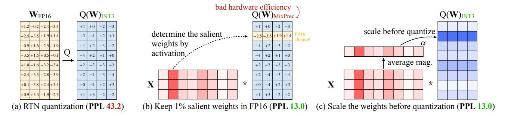
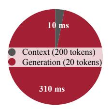
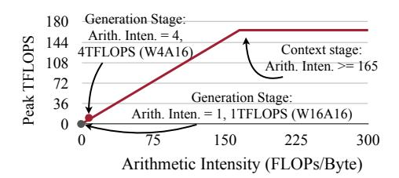
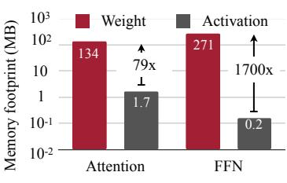
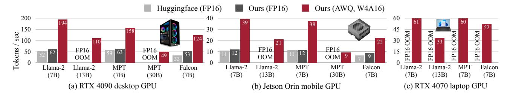

# AWQ: <u>ACTIVATION-AWARE WEIGHT QUANTIZATION FOR</u> ON-DEVICE LLM COMPRESSION AND ACCELERATION

Ji  ${\rm Lin}^{*1}$  Jiaming Tang $^{*12}$  Haotian Tang $^{\dagger1}$  Shang Yang $^{\dagger1}$  Wei-Ming Chen $^3$  Wei-Chen Wang $^1$  Guangxuan Xiao $^1$  Xingyu Dang $^{14}$  Chuang Gan $^{56}$  Song Han $^{13}$ 

https://github.com/mit-han-lab/llm-awq

#### **ABSTRACT**

Large language models (LLMs) have transformed numerous AI applications. On-device LLM is becoming increasingly important: running LLMs locally on edge devices can reduce the cloud computing cost and protect users' privacy. However, the astronomical model size and the limited hardware resource pose significant deployment challenges. We propose Activation-aware Weight Quantization (AWQ), a hardware-friendly approach for LLM low-bit weight-only quantization. AWO finds that not all weights in an LLM are equally important. Protecting only 1% salient weights can greatly reduce quantization error. To identify salient weight channels, we should refer to the activation distribution, not weights. To avoid the hardware-inefficient mix-precision quantization, we mathematically derive that scaling up the salient channels can reduce the quantization error. AWQ employs an equivalent transformation to scale the salient weight channels to protect them. The scale is determined by collecting the activation statistics offline. AWQ does not rely on any backpropagation or reconstruction, so it generalizes to different domains and modalities without overfitting the calibration set. AWQ outperforms existing work on various language modeling and domain-specific benchmarks (coding and math). Thanks to better generalization, it achieves excellent quantization performance for instruction-tuned LMs and, for the first time, multi-modal LMs. Alongside AWQ, we implement TinyChat, an efficient and flexible inference framework tailored for 4-bit on-device LLM/VLMs. With kernel fusion and platform-aware weight packing, TinyChat offers more than 3× speedup over the Huggingface FP16 implementation on both desktop and mobile GPUs. It also democratizes the deployment of the 70B Llama-2 model on mobile GPUs.

#### 1 Introduction

Deploying large language models (LLMs) directly on edge devices is crucial. On-device usage eliminates delays caused by sending data to a cloud server and enables LLMs to operate offline, which is beneficial for real-time applications like virtual assistants, chatbots, and autonomous vehicles. The operational costs associated with maintaining and scaling centralized cloud infrastructure can also be reduced. On-device LLM also enhances data security by keeping sensitive information local, reducing the chance of data breaches. LLMs, grounded in transformer-based architectures (Vaswani et al., 2017), have gathered significant attention for their impressive performance across diverse benchmarks (Brown et al., 2020; Zhang et al., 2022; Touvron

Proceedings of the 7th MLSys Conference, Santa Clara, CA, USA, 2024. **Best Paper Award.** Copyright 2024 by the author(s).

**Figure 1.** We introduce **AWQ**, a versatile weight quantization method for LLM. To implement AWQ, we developed **TinyChat** to deploy 4-bit quantized LLMs into various edge platforms, achieving a **3-4**× performance boost compared to FP16. Notably, we've also manufactured a **TinyChat computer**, powered by TinyChat, which contains an NVIDIA Jetson Orin Nano with only 8GB of memory and 15W power consumption. Demo: https://youtu.be/z91a8DrfqEw.

et al., 2023a; Scao et al., 2022). However, the large model size leads to the high serving costs. For example, GPT-3 has 175B parameters, which is 350GB in FP16, while the latest B200 GPU only has 192GB memory, let alone edge devices.

\*: Algorithm co-lead, †: system co-lead. ¹MIT ²Shanghai Jiao Tong University ³NVIDIA ⁴Tsinghua University ⁵MIT-IBM Watson AI Lab 6UMass Amherst. Correspondence to: Song Han <songhan@mit.edu>.

Low-bit weight quantization for LLMs can significantly reduce the memory footprint of on-device LLM inference but is hard. Quantization-aware training (QAT) is not efficient due to the high training cost, while post-training quantization (PTQ) suffers from large accuracy degradation under a low-bit setting. The closest work is GPTQ [\(Frantar et al.,](#page-11-0) [2022\)](#page-11-0), which uses second-order information to perform error compensation. However, it may overfit the calibration set during reconstruction, distorting the learned features on out-of-distribution domains (Figure [8\)](#page-9-0), which is problematic since LLMs are *generalist* models.

In this paper, we propose Activation-aware Weight Quantization (AWQ), a hardware-friendly low-bit weight-only quantization method for LLMs. Our method is based on the observation that *weights are not equally important* for LLMs' performance. There is a small fraction (0.1%-1%) of *salient* weights; skipping the quantization of these salient weights will significantly reduce the quantization loss (Table [1\)](#page-3-0). To find the salient weight channels, the insight is that we should refer to the *activation* distribution instead of the *weight* distribution, despite we are doing *weightonly* quantization: weight channels corresponding to larger activation magnitudes are more salient since they process more important features. To avoid the hardware-inefficient mixed-precision implementation, we analyze the error from weight quantization and derive that *scaling up the salient channels can reduce their relative quantization error* (Equation [2\)](#page-3-0). Following the intuition, we designed a per-channel scaling method to automatically search for the optimal scaling that minimizes the quantization error under full-weight quantization. AWQ does not rely on any backpropagation or reconstruction, so it can well preserve LLMs' generalization ability on various domains and modalities without overfitting to the calibration set.

To implement AWQ, we designed TinyChat, an efficient inference framework to convert theoretical memory savings from 4-bit LLM to measured speedup. Our framework significantly speeds up linear layers through on-the-fly dequantization. We also take advantage of efficient 4-bit weight packing and kernel fusion to minimize the inference overhead (*e.g*., intermediate DRAM access and kernel launch overhead), such that we can better realize the speed up from quantizing the weights to 4-bit, despite the computer is byte-aligned.

Experiments show that AWQ outperforms existing work on various tasks for different model families (*e.g*., LLaMA [\(Touvron et al.,](#page-13-0) [2023a\)](#page-13-0), OPT [\(Zhang et al.,](#page-14-0) [2022\)](#page-14-0)) and model sizes. Thanks to better generalization, it also achieves good quantization performance for *instructiontuned* LMs (*e.g*., Vicuna) and, for the first time, *multi-modal* LMs (OpenFlamingo [\(Awadalla et al.,](#page-10-0) [2023\)](#page-10-0)). TinyChat further translates the ∼4× lower memory footprint to mea-

sured speedup. On desktop, laptop and mobile GPUs, we consistently observe a 3.2-3.3× average speedup compared to the FP16 implementation by Huggingface across a diverse spectrum of LLMs. Furthermore, it facilitates effortless deployment of the Llama-2-70B model on a single NVIDIA Jetson Orin with 64GB of memory. It also democratizes 13 billion parameter LLM at an interactive pace of 30 tokens/second on a laptop RTX 4070 GPU with only 8GB of memory. AWQ has been widely adopted by industry and open-source community: [HuggingFace Transform](https://huggingface.co/docs/transformers/main_classes/quantization)[ers,](https://huggingface.co/docs/transformers/main_classes/quantization) [NVIDIA TensorRT-LLM,](https://github.com/NVIDIA/TensorRT-LLM/) [Microsfot DirectML,](https://blogs.windows.com/windowsdeveloper/2024/05/24/quantization-with-directml-helps-you-scale-further-on-windows/) [Google](https://console.cloud.google.com/vertex-ai/publishers/meta/model-garden/llama-2-quantized) [Vertex AI,](https://console.cloud.google.com/vertex-ai/publishers/meta/model-garden/llama-2-quantized) [Intel Neural Compressor,](https://github.com/intel/neural-compressor) [Amazon Sagemaker,](https://aws.amazon.com/blogs/machine-learning/boost-inference-performance-for-llms-with-new-amazon-sagemaker-containers/) [AMD,](https://community.amd.com/t5/ai/reduce-memory-footprint-and-improve-performance-running-llms-on/ba-p/686157) [FastChat,](https://github.com/lm-sys/FastChat/blob/main/docs/awq.md) [vLLM,](https://github.com/vllm-project/vllm/blob/main/vllm/model_executor/layers/quantization/awq.py) [LMDeploy,](https://github.com/InternLM/lmdeploy) and enables Falcon-180B deployable on a [single](https://github.com/NVIDIA/TensorRT-LLM/blob/main/docs/source/blogs/Falcon180B-H200.md) H200 GPU.

# 2 RELATED WORK

Model quantization methods. Quantization reduces the bit-precision of deep learning models [\(Han et al.,](#page-12-0) [2016;](#page-12-0) [Jacob et al.,](#page-12-0) [2018;](#page-12-0) [Nagel et al.,](#page-12-0) [2019;](#page-12-0) [Wang et al.,](#page-13-0) [2019;](#page-13-0) [Nagel et al.,](#page-12-0) [2020;](#page-12-0) [Lin et al.,](#page-12-0) [2020\)](#page-12-0), which helps to reduce the model size and accelerate inference. Quantization techniques generally fall into two categories: quantization-aware training (QAT, which relies on backpropagation to update the quantized weights) [\(Bengio et al.,](#page-11-0) [2013;](#page-11-0) [Gholami et al.,](#page-11-0) [2021;](#page-11-0) [Nagel et al.,](#page-12-0) [2021;](#page-12-0) [Choi et al.,](#page-11-0) [2018\)](#page-11-0) and post-training quantization [\(Jacob et al.,](#page-12-0) [2018;](#page-12-0) [Nagel et al.,](#page-12-0) [2019;](#page-12-0) [2020\)](#page-12-0) (PTQ, usually training-free). The QAT methods cannot easily scale up to large models like LLMs. Therefore, people usually use PTQ methods to quantize LLMs.

Quantization of LLMs. People study two settings for LLM quantization: (1) W8A8 quantization, where both activation and weights are quantized to INT8 [\(Dettmers](#page-11-0) [et al.,](#page-11-0) [2022;](#page-11-0) [Xiao et al.,](#page-13-0) [2022;](#page-13-0) [Yao et al.,](#page-13-0) [2022;](#page-13-0) [Wei et al.,](#page-13-0) [2022a;](#page-13-0) [2023\)](#page-13-0); (2) Low-bit weight-only quantization (*e.g*., W4A16), where only weights are quantized into low-bit integers [\(Frantar et al.,](#page-11-0) [2022;](#page-11-0) [Dettmers & Zettlemoyer,](#page-11-0) [2022;](#page-11-0) [Sheng et al.,](#page-13-0) [2023;](#page-13-0) [Park et al.,](#page-13-0) [2022\)](#page-13-0). We focus on the second setting in this work since it not only reduces the hardware barrier (requiring a smaller memory size) but also speeds up the token generation (remedies memory-bound workload). Apart from the vanilla round-to-nearest baseline (RTN), GPTQ [\(Frantar et al.,](#page-11-0) [2022\)](#page-11-0) is the closest to our work. However, the reconstruction process of GPTQ leads to an over-fitting issue to the calibration set and may not preserve the generalist abilities of LLMs for other modalities and domains. It also requires a reordering trick to work for some models (*e.g*., LLaMA-7B [\(Touvron et al.,](#page-13-0) [2023a\)](#page-13-0) and OPT-66B [\(Zhang et al.,](#page-14-0) [2022\)](#page-14-0)). Apart from quantiztion methods designed for general-purporse hardware, SpAtten [\(Wang](#page-13-0) [et al.,](#page-13-0) [2020\)](#page-13-0) designs a progressive approach to gradually increase the number of bits used in softmax calculation.

System support for low-bit quantized LLMs. Low-bit quantized LLMs have been a popular setting to reduce in-

Figure 2. We observe that we can find 1% of the salient weights in LLMs based on the *activation distribution* (middle). Keeping the salient weights in FP16 can significantly improve the quantized performance (PPL from 43.2 (left) to 13.0 (middle)), but the mixed-precision format is not hardware-efficient. We follow the activation-awareness principle and propose AWQ (right). AWQ performs per-channel scaling to protect the salient weights and reduce quantization error. We measure the perplexity of OPT-6.7B under INT3-g128 quantization.

ference costs. There are some system supports to achieve a practical speed-up. GPTQ [\(Frantar et al.,](#page-11-0) [2022\)](#page-11-0) provides INT3 kernels for OPT models and GPTQ-for-LLaMA extends kernel support for INT4 reordered quantization with the help of Triton [\(Tillet et al.,](#page-13-0) [2019\)](#page-13-0). FlexGen [\(Sheng et al.,](#page-13-0) [2023\)](#page-13-0), llama.cpp[\\*](#page-0-0) and exllama[†](#page-0-0) perform group-wise INT4 quantization to reduce I/O costs and offloading. Faster-Transformer implements FP16×INT4 GEMM for weightonly per-tensor quantization but does not support group quantization. LUT-GEMM [\(Park et al.,](#page-13-0) [2022\)](#page-13-0) performs bitwise computation on GPU CUDA cores with the help of lookup tables. Our concurrent work, MLC-LLM [\(MLC-](#page-12-0)[Team,](#page-12-0) [2023\)](#page-12-0) offers strong results on multiple edge CPU and GPU platforms thanks to the powerful TVM [\(Chen et al.,](#page-11-0) [2018;](#page-11-0) [Feng et al.,](#page-11-0) [2023\)](#page-11-0) backend.

# 3 AWQ: ACTIVATION-AWARE WEIGHT QUANTIZATION

*Quantization* maps a floating-point number into lower-bit integers. It is an effective method to reduce the model size and inference costs of LLMs [\(Dettmers et al.,](#page-11-0) [2022;](#page-11-0) [Frantar et al.,](#page-11-0) [2022;](#page-11-0) [Yao et al.,](#page-13-0) [2022;](#page-13-0) [Xiao et al.,](#page-13-0) [2022\)](#page-13-0). In this section, we first propose a weight-only quantization method to improve accuracy *without training/regression* by protecting more "important" weights. And then develop a data-driven method to search for the optimal scaling that reduces quantization errors (Figure 2).

## 3.1 Improving LLM Quantization by Preserving 1% Salient Weights

We observe that the weights of LLMs are *not equally important*: there is a small fraction of *salient* weights that are much more important for LLMs' performance compared to others. Skipping the quantization of these salient weights can help bridge the performance degradation due

to the quantization loss *without* any training or regression (Figure 2(b)). To verify the idea, we benchmark the performance of quantized LLMs when skipping part of the weight channels in Table [1.](#page-3-0) We measured the performance of INT3 quantized models while keeping some ratios of weight channels in FP16. A widely used method to determine the importance of weights is to look at its magnitude or L2-norm [\(Han et al.,](#page-12-0) [2015;](#page-12-0) [Frankle & Carbin,](#page-11-0) [2018\)](#page-11-0). But we find skipping the weight channels with large norm (*i.e*., FP16% (based on W)) does not significantly improve the quantized performance, leading to a similar marginal improvement as random selection. Interestingly, selecting weights based on *activation magnitude* can significantly improve the performance despite keeping only 0.1%-1% of channels in FP16. We hypothesize that the input features with larger magnitudes are generally more important. Keeping the corresponding weights in FP16 can preserve those features, which contributes to better model performance.

Limitations: Despite keeping 0.1% of weights in FP16 can improve the quantized performance without a noticeable increase in model size (measured in total bits), such a mixedprecision data type will make the system implementation difficult. We need to come up with a method to protect the important weights without actually keeping them as FP16.

### 3.2 Protecting Salient Weights by Activation-aware Scaling

We propose an alternative method to reduce the quantization error of the salient weight by *per-channel scaling*, which does not suffer from the hardware inefficiency issue.

#### Analyzing the quantization error.

We start by analyzing the error from weight-only quantization. Consider a group/block of weight w; the linear operation can be written as y = wx, and the quantized counterpart is y = Q(w)x. Specifically, the quantization

\*https://github.com/ggerganov/llama.cpp

† https://github.com/turboderp/exllama

| PPL J    | FP16  | RTN       | FP16% | (based | on act.) | FP16%  | (based | on W) | FP10   | 5% (rando | om)   |
|----------|-------|-----------|-------|--------|----------|--------|--------|-------|--------|-----------|-------|
| <b>v</b> | Ψ     | (w3-g128) | 0.1%  | 1%     | 3%       | 0.1%   | 1%     | 3%    | 0.1%   | 1%        | 3%    |
| OPT-1.3B | 14.62 | 119.00    | 25.03 | 16.91  | 16.68    | 108.71 | 98.55  | 98.08 | 119.76 | 109.38    | 61.49 |
| OPT-6.7B | 10.86 | 23.54     | 11.58 | 11.39  | 11.36    | 23.41  | 22.37  | 22.45 | 23.54  | 24.23     | 24.22 |
| OPT-13B  | 10.13 | 46.04     | 10.51 | 10.43  | 10.42    | 46.07  | 48.96  | 54.49 | 44.87  | 42.00     | 39.71 |

**Table 1.** Keeping a small fraction of weights (0.1%-1%) in FP16 significantly improves the performance of the quantized models over round-to-nearest (RTN). It is only effective when we select the important weights in FP16 by looking at *activation* distribution instead of *weight* distribution. We highlight results with a decent perplexity in green. We used INT3 quantization with a group size of 128 and measured the WikiText perplexity  $(\downarrow)$ .

OPT (PPL↓)

FP16

RTN

s = 2

AWQ

1% FP16

1.3B

14.62

119.47

16.91

18.63

16.32

| OPT-6.7B                                           | s = 1 | s = 1.25 | s = 1.5 | s = 2 | s = 4 |
|----------------------------------------------------|-------|----------|---------|-------|-------|
| proportion of $\Delta^{'} \neq \Delta$             | 0%    | 2.8%     | 4.4%    | 8.2%  | 21.2% |
| average $\Delta'/\Delta$                           | 1     | 1.005    | 1.013   | 1.038 | 1.213 |
| average $\frac{\Delta'}{\Delta} \cdot \frac{1}{s}$ | 1     | 0.804    | 0.676   | 0.519 | 0.303 |
| Wiki-2 PPL                                         | 23.54 | 12.87    | 12.48   | 11.92 | 12.36 |

**Table 2.** Statistics when multiplying the 1% salient channels by s>1. Scaling up the salient channels significantly improves the perplexity (23.54 to 11.92). As s goes larger, the percentage of changed  $\Delta$  increases, and the error reduction rate for salient channels also increases. However, the best perplexity is achieved at s=2, since further increasing s will increase the quantization error for *non-salient* channels.

**Table 3.** AWQ protects salient weights and reduces quantization error by using a scaling-based method. It consistently outperforms Round-to-nearest quantization (RTN) and achieves comparable performance as mixed-precision (1% FP16) while being more hardware-friendly. We use 3-bit quantization with group size 128.

2.7B

12.47

298.00

13.69

14.94

13.58

6.7B

10.86

23.54

11.39

11.92

11.39

13B

10.13

46.04

10.43

10.80

10.56

30B

9.56

18.80

9.85

10.32

9.77

function is defined as:

$$Q(\mathbf{w}) = \Delta \cdot \text{Round}(\frac{\mathbf{w}}{\Delta}), \quad \Delta = \frac{\max(|\mathbf{w}|)}{2^{N-1}}, \quad (1)$$

where N is the number of quantization bits, and  $\Delta$  is the quantization scaler determined by the absolute maximum value. Now consider a weight element  $w \in \mathbf{w}$ , if we multiply w with s > 1 and the inversely scale x, we will have  $Q(w \cdot s)(x/s)$ , which is:

$$Q(w \cdot s) \cdot \frac{x}{s} = \Delta' \cdot \text{Round}(\frac{ws}{\Delta'}) \cdot x \cdot \frac{1}{s}, \tag{2}$$

where  $\Delta'$  is the new quantization scaler after applying s. We empirically find that: (1) The expected error from Round( $\cdot$ ) (denoted as RoundErr( $\cdot$ )) does not change: since the round function maps a floating-point number to an integer, the error is roughly uniformly distributed from [0,0.5], resulting in an average error of 0.25; i.e., RoundErr( $\cdot$ )  $\sim$  0.25. (2) Scaling up a single element w usually does not change the maximum value from the group  $\mathbf{w}$ . Therefore we have  $\Delta' \approx \Delta$ ; (3) As  $\Delta$  and x are represented in FP16, they have no quantization error. Consequently, the quantization error from equation 1 and 2 can be expressed as

$$\begin{aligned} & \operatorname{Err}(Q(w)x) = \Delta \cdot \operatorname{RoundErr}(\frac{w}{\Delta}) \cdot x \\ & \operatorname{Err}(Q(w \cdot s)(\frac{x}{s})) = \Delta^{'} \cdot \operatorname{RoundErr}(\frac{ws}{\Delta^{'}}) \cdot x \cdot \frac{1}{s} \end{aligned} \tag{3}$$

The ratio of the new error to the original error is  $\frac{\Delta^{'}}{\Delta} \cdot \frac{1}{s}$ . Given  $\Delta^{'} \approx \Delta$  and s>1, the relative error is smaller for the salient weight w.

To verify the idea, we multiply the 1% salient channels with s > 1 for the OPT-6.7B model, and measure the change in  $\Delta$  for each group in Table 2. We find that scaling up the salient channels is quite effective: the perplexity improves from 23.54 for s = 1 (simply RTN) to 11.92 for s = 2. As s goes larger, the percentage of changed  $\Delta$  generally gets larger, but the percentage is still quite small for s < 2(less than 5%); the relative error for the salient channels continues to go smaller as s increases. Nonetheless, the best PPL actually appears at s=2. This is because if we use a very large s, it will increase the relative error for the nonsalient channels when  $\Delta$  increases (the error of non-salient channels will be amplified by  $\frac{\Delta'}{\Delta}$ , and the ratio is larger than 1 for 21.2% of the channels under s=4), which can damage the model's overall accuracy. Therefore, we need to also consider the error from non-salient channels when protecting salient ones.

**Searching to scale.** To consider both salient and non-salient weights, we choose to automatically search for an optimal (per input channel) scaling factor that minimizes the output difference after quantization for a certain layer.

- (a) Generation stage is slower
- (b) Generation stage is bounded by memory bandwidth
- (c) Weight loading is more expensive

Figure 3. Bottleneck analysis for Llama-2-7B on NVIDIA RTX 4090. Left: In on-device LLM applications, generation stage is much slower than the context stage. Middle: The generation stage is memory bound and has low arithmetic intensity. W4A16 quantization can effectively improve the arithmetic intensity by 4×. Right: The amount of weight access is orders of magnitude larger than the amount of activation access. Thus, weight-only quantization is more effective for on-device LLMs.

Formally, we want to optimize the following objective:

$$\mathbf{s}^* = \operatorname*{arg\,min}_{\mathbf{s}} \mathcal{L}(\mathbf{s})$$

$$\mathcal{L}(\mathbf{s}) = \|Q(\mathbf{W} \cdot \operatorname{diag}(\mathbf{s}))(\operatorname{diag}(\mathbf{s})^{-1} \cdot \mathbf{X}) - \mathbf{W}\mathbf{X}\|$$
(4)

Here Q means the weight quantization function (*e.g*., INT3/INT4 quantization with group size 128), W is the original weights in FP16, and X is the input features cached from a small calibration set (we take a small calibration set from he pre-training dataset in order not to overfit to a specific task). s is a per-(input) channel scaling factor; for s −1 · X, it can usually be fused into the previous operator [\(Wei et al.,](#page-13-0) [2022b;](#page-13-0) [Xiao et al.,](#page-13-0) [2022\)](#page-13-0). Since the quantization function is not differentiable, we are not able to directly optimize the problem with vanilla backpropagation. There are some techniques relying on approximated gradients [\(Bengio et al.,](#page-11-0) [2013;](#page-11-0) [Esser et al.,](#page-11-0) [2019\)](#page-11-0), which we found still suffers from unstable convergence.

To make the process more stable, we define a *search space* for the optimal scale by analyzing the factors that will affect the choice of scaling factor. As shown in the last section, the saliency of weight channels is actually determined by the activation scale (thus "activation-awareness"). Therefore, we simply use a very simple search space:

$$\mathbf{s} = \mathbf{s_X}^{\alpha}, \quad \alpha^* = \operatorname*{arg\,min}_{\alpha} \mathcal{L}(\mathbf{s_X}^{\alpha})$$
 (5)

sX is the average magnitude of activation (per-channel), and we use a single hyper-parameter α to balance between the protection of salient and non-salient channels. We can find the best α by a fast grid search over the interval of [0, 1] (0 means we do not scale; 1 corresponds to the most aggressive scaling in our search space). We further apply weight clipping to minimize the MSE error of quantization. We provide an ablation study on OPT models under INT3-g128 quantization in Table [5;](#page-6-0) AWQ consistently outperforms round-to-nearest quantization (RTN) and achieves comparable performance as mixed-precision (1% FP16) while being more hardware-friendly.

Advantages. Our method does not rely on any regression [\(Frantar et al.,](#page-11-0) [2022\)](#page-11-0) or backpropagation, which is required by many quantization-aware training methods. It has minimal reliance on the calibration set since we only measure the average magnitude per channel, thus preventing over-fitting (Figure [8\)](#page-9-0). Therefore, our method requires fewer data for the quantization process and can preserve LLMs' knowledge outside of the calibration set's distribution. See Section [5.3](#page-9-0) for more details.

# 4 TINYCHAT: MAPPING AWQ ONTO EDGE PLATFORMS

AWQ can substantially reduce the size of LLMs. However, converting the theoretical memory savings from W4A16 (4-bit weight, 16-bit activation) quantization into measured speedup is non-trivial. Alternative W8A8 quantization methods, such as SmoothQuant [\(Xiao et al.,](#page-13-0) [2022\)](#page-13-0), maintain *the same* data precision for both storage and computation. This allows the dequantization procedure to be seamlessly integrated into the computation kernel's epilogue. On the other hand, W4A16 quantization employs *different* data types for memory access and computation. As a result, its dequantization must be incorporated into the primary computation loop for optimal performance, posing implementation challenges. To tackle this, we introduce TinyChat: a nimble system for AWQ model inference. It boasts a PyTorch frontend and a backend harnessing device-specific instruction sets (e.g., CUDA/PTX, Neon, AVX).

#### 4.1 Why AWQ Helps Accelerate On-Device LLMs

To understand the acceleration opportunities in quantized LLMs on the edge, we start by profiling the latency breakdown of LLaMA-7B [\(Touvron et al.,](#page-13-0) [2023a\)](#page-13-0) model on an RTX 4090 GPU. We adopt an inference batch size of 1, catering for edge use cases, and implement the model in FP16 with NVIDIA FasterTransformer.

Context *vs* generation latency. As in Figure 3(a), it takes 310 ms to generate 20 tokens, while summarizing a prompt

**Figure 4.** SIMD-aware weight packing for ARM NEON with 128-bit SIMD units. Original weights are reordered and packed to align with the bit width so that the weights can be unpacked into bytes at runtime using AND and shift bitwise operations with a 128-bit mask.

with 200 tokens only takes 10 ms. Consequently, the generation phase is substantially slower than the context stage, particularly for on-device interactive applications.

Generation stage is memory-bound. To accelerate the generation phase, we conduct a roofline analysis in Figure 3(b). The 4090 GPU has a peak computation throughput of 165 TFLOPS and a memory bandwidth of 1TB/s. Therefore, any workload with arithmetic intensity (the ratio of FLOPs to memory access) less than 165 is memory bounded on 4090 GPUs. Notably, when executed in FP16, the generation stage for on-device LLMs has arithmetic intensity≈1. This underscores the memory-bound nature of the workload. Since the FLOPs of a given model is fixed, the only way to improve the peak performance is to reduce the total amount of memory traffic. AWQ reduces the weight memory by four times.

Weight access dominates memory traffic. We therefore further break down the memory access for weight and activation in Figure 3(c). Clearly, weight access dominates the memory traffic for on-device LLMs. Quantizing the model weights to 4 bit integers will approximately increase the arithmetic intensity to 4 FLOPs/Byte, leading to a 4TFLOPS peak performance in Figure 3(b). Since weight-only quantization leads to a lower bit width for weights (and thus higher theoretical performance upper bound), it is natural for AWQ to follow this setting for on-device LLM applications.

#### 4.2 Deploy AWQ with TinyChat

To this end, we demonstrated that 4-bit weight quantization could lead to a  $4\times$  theoretical peak performance. We further design TinyChat to realize this speedup. On GPUs, we only focus on implementing essential components, including attention, layer normalization, and linear projection kernels. The flexible frontend allows easy customization and fast support for new models. TinyChat with 4-bit AWQ achieves more than  $3\times$  speedup compared with the Huggingface FP16 implementation across different families of LLMs on GPUs. On CPUs, we lower the entire computation graph to C++ to minimize overhead.

**On-the-fly weight dequantization.** For quantized layers, as the hardware does not provide multiplication instructions between INT4 and FP16, we need to dequantize the integers

to FP16 before performing matrix computation. We avoid writing dequantized weights into DRAM by fusing dequantization kernels with the matrix multplication kernel. Note that such fusion is adopted for both matrix-matrix (MM) and matrix-vector (MV) product kernels.

**SIMD-aware weight packing.** On-the-fly weight dequantization reduces intermediate DRAM access, but remains expensive. For instance, dequantizing a single 4-bit weight involves 1 shift, 1 bitwise AND, and 1 FMA scaling operations, while the dequantized weight undergoes only 1 FMA computation. This process is particularly costly on CPUs with SIMD architecture that favor vectorized instructions. To mitigate this, we suggest platform-specific weight packing tailored to the bitwidth of a device's SIMD units. Figure 4 demonstrates our strategy for ARM CPUs with 128-bit SIMD registers offering up to  $1.2 \times$  speedup. Here, each register holds 32 4-bit weights, sequenced as  $w_0, w_{16}, w_1, w_{17}, ..., w_{15}, w_{31}$ . This approach requires just three SIMD instructions to unpack all 32 weights, as opposed to 3 scalar instructions per weight in a conventional packing  $(w_0, w_1, ..., w_{31})$ . Generally, for  $2^n$ -bit SIMD registers, adjacent weights will have indices off by  $1/8 \times 2^n$ , since each register can hold  $1/8 \times 2^n$  8-bit integers. On GPUs, we found it more efficient to pack each 8 weights into  $w_{\{0,2,4,6,1,3,5,7\}}$  following (Kim et al., 2022).

**Kernel fusion.** We also extensively apply kernel fusion to optimize on-device LLM inference. For layer normalization, we fuse all operators (*e.g.* multiplication, division and square root) into a single kernel. For attention layers, we fuse QKV projections into a single kernel, and also perform on-the-fly positional embedding calculation. We also preallocate KV caches and perform cache updates within the attention kernel. Kernel fusion is particularly useful for models with inefficient forward pass implementations, such as Falcon (Penedo et al., 2023) and StarCoder (Li et al., 2023c). Notably, the computation time for each FP16 kernel is in the order of 0.01ms on the 4090 GPU, comparable to the GPU kernel launch overhead. Hence, reducing number of kernel calls through kernel fusion leads to direct speedups.

| PPL↓         |                              |                              | Llama-2                      |                              | LLaMA                        |                              |                              |                              |
|--------------|------------------------------|------------------------------|------------------------------|------------------------------|------------------------------|------------------------------|------------------------------|------------------------------|
|              |                              | 7B                           | 13B                          | 70B                          | 7B                           | 13B                          | 30B                          | 65B                          |
| FP16         | -                            | 5.47                         | 4.88                         | 3.32                         | 5.68                         | 5.09                         | 4.10                         | 3.53                         |
| INT3 g128 | RTN GPTQ GPTQ-R AWQ | 6.66 6.43 6.42 6.24 | 5.52 5.48 5.41 5.32 | 3.98 3.88 3.86 3.74 | 7.01 8.81 6.53 6.35 | 5.88 5.66 5.64 5.52 | 4.88 4.88 4.74 4.61 | 4.24 4.17 4.21 3.95 |
| INT4 g128 | RTN GPTQ GPTQ-R AWQ | 5.73 5.69 5.63 5.60 | 4.98 4.98 4.99 4.97 | 3.46 3.42 3.43 3.41 | 5.96 6.22 5.83 5.78 | 5.25 5.23 5.20 5.19 | 4.23 4.24 4.22 4.21 | 3.67 3.66 3.66 3.62 |

Table 4. AWQ improves over round-to-nearest quantization (RTN) for different model sizes and different bit-precisions. It consistently achieves better perplexity than GPTQ (w/ and w/o reordering) on LLaMA & Llama-2 models.

| Wikitext2 PPL↓ | Mixtral-8x7B | Mistral-7B |
|----------------|--------------|------------|
| FP16           | 5.94         | 4.14       |
| INT4-g128      | 6.05         | 4.30       |
| INT3-g128      | 6.52         | 4.83       |

Table 5. AWQ quantization results on Mistral-7B-Instructv0.2[\(Jiang et al.,](#page-12-0) [2023\)](#page-12-0) and Mixtral-8x7B-Instruct-v0.1 model [\(Jiang et al.,](#page-12-0) [2024\)](#page-12-0). The PPL result on wikitext shows that AWQ can achieve superior quantization performance on different model architectures including LLMs with GQA and Mixture-of-Experts (MoE) models.

# 5 EXPERIMENTS

#### 5.1 Settings

Quantization. We focus on *weight-only grouped* quantization in this work. As shown in previous work [\(Dettmers &](#page-11-0) [Zettlemoyer,](#page-11-0) [2022;](#page-11-0) [Frantar et al.,](#page-11-0) [2022\)](#page-11-0), grouped quantization is always helpful for improving performance/model size trade-off. We used a group size of 128 throughout the work, except otherwise specified. We focus on INT4/INT3 quantization since they are able to mostly preserve the LLMs' performance [\(Dettmers & Zettlemoyer,](#page-11-0) [2022\)](#page-11-0). For AWQ, we used a small calibration set from the Pile [\(Gao et al.,](#page-11-0) [2020\)](#page-11-0) dataset in order not to overfit to a specific downstream domain. We used a grid size of 20 to search for the optimal α in Equation [5.](#page-4-0)

Models. We benchmarked our method on LLaMA [\(Tou](#page-13-0)[vron et al.,](#page-13-0) [2023a\)](#page-13-0) and OPT [\(Zhang et al.,](#page-14-0) [2022\)](#page-14-0) families. There are other open LLMs like BLOOM [\(Scao et al.,](#page-13-0) [2022\)](#page-13-0), but they are generally worse in quality, so we do not include them in our study. We further benchmark an instructiontuned model Vicuna [\(Chiang et al.,](#page-11-0) [2023\)](#page-11-0) and visual language models OpenFlamingo-9B [\(Awadalla et al.,](#page-10-0) [2023\)](#page-10-0) and LLaVA-13B [\(Liu et al.,](#page-12-0) [2023a\)](#page-12-0) to demonstrate the generability of our method.

Figure 5. Comparing INT3-g128 quantized Vicuna models with FP16 counterparts under GPT-4 evaluation protocol [\(Chiang et al.,](#page-11-0) [2023\)](#page-11-0). More winning cases (in blue) indicate better performance. AWQ consistently improves the quantized performance compared to RTN and GPTQ [\(Frantar et al.,](#page-11-0) [2022\)](#page-11-0), showing generalization to instruction-tuned models.

Evaluations. Following previous literature [\(Dettmers](#page-11-0) [et al.,](#page-11-0) [2022;](#page-11-0) [Xiao et al.,](#page-13-0) [2022;](#page-13-0) [Frantar et al.,](#page-11-0) [2022;](#page-11-0) [Dettmers](#page-11-0) [& Zettlemoyer,](#page-11-0) [2022;](#page-11-0) [Yao et al.,](#page-13-0) [2022\)](#page-13-0), we mainly profiled the quantized models on language modeling tasks (perplexity evaluation on WikiText-2 [\(Merity et al.,](#page-12-0) [2016\)](#page-12-0)) since perplexity can stably reflect the LLM's performance [\(Dettmers](#page-11-0) [& Zettlemoyer,](#page-11-0) [2022\)](#page-11-0).

Baselines. Our primary baseline is vanilla round-tonearest quantization (RTN). It is actually quite strong when using a small group size like 128 [\(Frantar et al.,](#page-11-0) [2022;](#page-11-0) [Dettmers & Zettlemoyer,](#page-11-0) [2022\)](#page-11-0). We also compare with a state-of-the-art method GPTQ [\(Frantar et al.,](#page-11-0) [2022\)](#page-11-0) for LLM weight quantization. For GPTQ, we also compare with an updated version that uses a "reorder" trick (denoted as GPTQ-Reorder or GPTQ-R). Other techniques like ZeroQuant [\(Yao et al.,](#page-13-0) [2022\)](#page-13-0), AdaRound [\(Nagel et al.,](#page-12-0) [2020\)](#page-12-0), and BRECQ [\(Li et al.,](#page-12-0) [2021\)](#page-12-0) rely on backpropagation to update the quantized weights, which may not easily scale up to large model sizes; they also do not outperform GPTQ [\(Fran](#page-11-0)[tar et al.,](#page-11-0) [2022\)](#page-11-0), thus not included for study.

## 5.2 Evaluation

Results on LLaMA models. We focus on LLaMA models (LLaMA [\(Touvron et al.,](#page-13-0) [2023a\) and Llama-2 \(Touvron](#page-13-0)

| COCO         | (CIDEr ↑)          | 0-shot                         | 4-shot                         | 8-shot                         | 16-shot                        | 32-shot                        | $\Delta$ (32-shot)               |
|--------------|--------------------|--------------------------------|--------------------------------|--------------------------------|--------------------------------|--------------------------------|----------------------------------|
| FP16         | -                  | 63.73                          | 72.18                          | 76.95                          | 79.74                          | 81.70                          | -                                |
| INT4 g128 | RTN GPTQ AWQ | 60.24 59.72 <b>62.57</b> | 68.07 67.68 <b>71.02</b> | 72.46 72.53 <b>74.75</b> | 74.09 74.98 <b>78.23</b> | 77.13 74.98 <b>80.53</b> | -4.57 -6.72 <b>-1.17</b>   |
| INT3 g128 | RTN GPTQ AWQ | 46.07 29.84 <b>56.33</b> | 55.13 50.77 <b>64.73</b> | 60.46 56.55 <b>68.79</b> | 63.21 60.54 <b>72.86</b> | 64.79 64.77 <b>74.47</b> | -16.91 -16.93 <b>-7.23</b> |

**Table 6.** Quantization results of a visual language model OpenFlamingo-9B (Awadalla et al., 2023) on COCO Captioning datasets. Activation-aware Weight Quantization outperforms existing methods under zero-shot and various few-shot settings, demonstrating the generability to different modalities and in-context learning workloads. Activation-aware Weight Quantization reduces the quantization degradation (32-shot) from 4.57 to 1.17 under INT4-g128, providing 4× model size reduction with negligible performance loss.

| Model (Accuracy↑) | VQAv2 | GQA  | VizWiz | SQA-I | VQA-T | POPE | MME    | MMB  | SEED | llava-bench | MM-Vet |
|-------------------|-------|------|--------|-------|-------|------|--------|------|------|-------------|--------|
| VILA-7B           | 80.3  | 63.1 | 59.6   | 68.0  | 62.6  | 86.3 | 1489.4 | 69.8 | 61.7 | 75.2        | 35.1   |
| VILA-7B-AWQ       | 80.1  | 63.0 | 57.8   | 68.0  | 61.9  | 85.3 | 1486.3 | 68.8 | 61.3 | 75.8        | 35.9   |
| VILA-13B          | 80.5  | 63.6 | 63.1   | 70.5  | 64.0  | 86.3 | 1553.6 | 73.8 | 62.8 | 78.3        | 42.6   |
| VILA-13B-AWQ      | 80.4  | 63.6 | 63.0   | 71.2  | 63.5  | 87.0 | 1552.9 | 73.6 | 62.2 | 77.6        | 42.0   |

**Table 7.** INT4-g128 results of VILA-7B and VILA-13B (Lin et al., 2024) on 11 visual-language benchmarks. AWQ consistently shows lossless performance on all benchmarks. Benchmark names are abbreviated due to space limits. VQA-v2 (Goyal et al., 2017); GQA (Hudson & Manning, 2019); VisWiz (Gurari et al., 2018); SQAI: ScienceQA-IMG (Lu et al., 2022); VQAT: TextVQA (Singh et al., 2019); POPE (Li et al., 2023d); MME (Fu et al., 2023); MMB: MMBench (Liu et al., 2023b); MMBCN: MMBench-Chinese (Liu et al., 2023b); SEED: SEED-Bench (Li et al., 2023a); LLaVAW: LLaVA-Bench (In-the-Wild) (Liu et al., 2023a); MM-Vet (Yu et al., 2023).

et al., 2023b)) due to their superior performance compared to other open-source LLMs (Zhang et al., 2022; Scao et al., 2022); it is also the foundation of many popular open-source models (Taori et al., 2023; Chiang et al., 2023). We evaluate the perplexity before and after quantization in Table 4. AWQ consistently outperforms round-to-nearest (RTN) and GPTQ (Frantar et al., 2022) (w/ and w/o reordering) across different model scales (7B-70B) and generations.

Results on Mistral / Mixtral models. We also evaluated AWQ on the Mistral and Mixtral models, which are among the most popular open-source LLMs and Mixture-of-Experts (MoE) models, respectively (Jiang et al., 2023; 2024). The results indicate that AWQ achieves superior performance on both the Mistral and Mixtral models. This demonstrates that AWQ is effective across various model architectures.

Quantization of instruction-tuned models. Instruction tuning can significantly improve the models' performance and usability (Wei et al., 2021; Sanh et al., 2021; Ouyang et al., 2022; Chung et al., 2022). It has become an essential procedure before model deployment. We further benchmark our method's performance on a popular instruction-tuned model Vicuna (Chiang et al., 2023) in Figure 5. We used the GPT-4 score to evaluate the quantized models' performance against the FP16 counterpart on 80 sample questions (Chiang et al., 2023). We compare the responses with both orders (quantized-FP16, FP16-quantized) to get rid of the ordering

| <b>MBPP</b> (7B)   | pass@1                         | pass@10                        | GSM8K              | 7B    | 13B                            | 70B   |
|--------------------|--------------------------------|--------------------------------|--------------------|-------|--------------------------------|-------|
| FP16               | 38.53                          | 49.77                          | FP16               | 13.87 | 26.16                          | 56.41 |
| RTN GPTQ AWQ | 37.51 31.97 <b>40.64</b> | 48.49 44.75 <b>49.25</b> | RTN GPTQ AWQ | 12.13 | 21.23 24.26 <b>25.25</b> | 56.03 |

**Table 8.** INT4-g128 quantization results of CodeLlama-7b-Instruct-hf on MBPP dataset and Llama-2 (7B/13B/70B) on GSM8K dataset. AWQ outperforms existing methods on programming and math datasets, demonstrating the generability to different scenarios and evaluation settings. Notably, AWQ under the INT4-g128 configuration demonstrates comparable performance to the original FP16 model across both datasets.

effect (we found GPT-4 tends to increase the rating of the first input), leading to 160 trials. AWQ consistently improves the INT3-g128 quantized Vicuna models over RTN and GPTQ under both scales (7B and 13B), demonstrating the generability to instruction-tuned models.

Quantization of multi-modal language models. Large multi-modal models (LMMs) or visual language models (VLMs) are LLMs augmented with vision inputs (Alayrac et al., 2022; Li et al., 2023b; Koh et al., 2023; Driess et al., 2023; Zhang et al., 2023; Liu et al., 2023a). Such models are able to perform text generation conditioned on image/video inputs. Since our method does not have the overfitting issue to the calibration set, it can be directly applied to VLMs

**Question**: Can you explain this meme in detail?

**INT4-g128 RTN**: The meme in the image features a plate of food, likely fried chicken, with a unique twist. There are small pictures of the Earth and other planets placed on top of the food, creating an interesting and amusing visual. Alongside the plate, a caption reads, "Sometimes I look at pictures of the Earth from space and I marvel at how beautiful it all is." This combination of food and planet images adds a touch of humor and curiosity, making the viewer wonder about the context and intent behind the meme.

**INT4-g128 AWQ**: The meme in the image is a lighthearted and humorous take on the concept of looking at pictures of the Earth from space. A plate of fried food, specifically chicken nuggets, is presented with the caption, "Sometimes I look at pictures of the Earth from space and I marvel at how beautiful it all is." The playful combination of a food item and an Earth-related context creates a fun and entertaining visual.

Figure 6. Visual reasoning examples from LLaVA-13B model [\(Liu et al.,](#page-12-0) [2023a\)](#page-12-0). AWQ improves over the round-to-nearest (RTN) baseline, providing more reasonable answers. We color the text to show the correct or wrong responses.

**W4-RTN**: A model airplane flying in the sky.

**W4-AWQ**: Two toy airplanes sit on a grass field.

**W4-RTN**: A man is holding a baby elephant in his arms.

**W4-AWQ**: A man and his daughter pose with an elephant.

**W4-RTN**: A man and a dog walking past some bushes.

**W4-AWQ**: Two dogs are walking on the street.

Figure 7. Qualitative results of quantized OpenFlamingo-9B [\(Awadalla et al.,](#page-10-0) [2023\)](#page-10-0) on COCO captioning dataset (4-shot, INT4-g128 quantization). Our method significantly improves the captioning quality compared to the round-to-nearest (RTN) baseline. We color the text to show the correct or wrong captions.

to provide accurate and efficient quantization. We perform experiments with the OpenFlamingo-9B model [\(Awadalla](#page-10-0) [et al.,](#page-10-0) [2023\)](#page-10-0) (an open-source reproduction of [\(Alayrac et al.,](#page-10-0) [2022\)](#page-10-0)) on COCO captioning [\(Chen et al.,](#page-11-0) [2015\)](#page-11-0) dataset (Table [6\)](#page-7-0). We measured the average performance of 5k samples under different few-shot settings. We only quantize the language part of the model since it dominates the model size. AWQ outperforms existing methods under zero-shot and various few-shot settings, demonstrating the generability to different modalities and in-context learning workloads. It reduces the quantization degradation (32-shot) from 4.57 to 1.17 under INT4-g128, providing 4× model size reduction with negligible performance loss. To further demonstrate the generability of AWQ, we also evaluated AWQ on one of the SoTA multi-image visual language models: VILA. The result in Table [7](#page-7-0) shows that AWQ achieves lossless quantization performance on 11 visual-language benchmarks. We further provide some qualitative captioning results in Figure 7 to show our advantage over RTN. Our method provides a push-the-button solution for LMM/VLM quantization. It is the *first* study of VLM low-bit quantization to the best of our knowledge.

Visual reasoning results. We further provide some qualitative visual reasoning examples of the LLaVA-13B [\(Liu](#page-12-0) [et al.,](#page-12-0) [2023a\)](#page-12-0) model in Figure 6. AWQ improves the responses compared to round-to-nearest (RTN) for INT4-g128 quantization, leading to more reasonable answers. In this first example, the AWQ model can understand the meme as it resembles the Earth when looking from space, while RTN produces wrong descriptions (marked in red).

| OPT (Wiki PPL↓) 1.3B |       | 2.7B                  | 6.7B          | 13B            | 30B           |
|----------------------|-------|-----------------------|---------------|----------------|---------------|
| FP16                 | 14.62 | 12.47                 | 10.86         | 10.13          | 9.56          |
| RTN GPTQ          | 46.67 | 10476 193210 28.15 | 7622 16.65 | 17564 16.74 | 8170 11.75 |
| AWQ +GPTQ            | 35.71 | 25.70                 | 15.71         | 13.25          | 11.38         |

Table 9. Our method is orthogonal to GPTQ: it further closes the performance gap under extreme low-bit quantization (INT2-g64) when combined with GPTQ. Results are WikiText-2 perplexity of OPT models.

Results on programming and math tasks To further evaluate the performance of AWQ on tasks involving complex generations, we also tested AWQ on MBPP [\(Austin et al.,](#page-10-0) [2021\)](#page-10-0) and GSM8K [\(Cobbe et al.,](#page-11-0) [2021\)](#page-11-0). MBPP [\(Austin et al.,](#page-10-0) [2021\)](#page-10-0) consists of around 1,000 Python programming problems, designed to be solvable by entry level programmers, covering programming fundamentals, standard library functionality, etc. GSM8K [\(Cobbe](#page-11-0) [et al.,](#page-11-0) [2021\)](#page-11-0) was created to support the task of question answering on basic mathematical problems that require multistep reasoning. We quantize CodeLlama-7b-Instruct-hf and Llama-2 to INT4-g128 and perform experiments on programming and math datasets (Table [8\)](#page-7-0). AWQ outperforms existing methods on both datasets, demonstrating the generability to complex generation. AWQ under the INT4-g128 configuration demonstrates comparable performance to the original FP16 model on both datasets.

Extreme low-bit quantization. We further quantize LLM to INT2 to accommodate limited device memory (Table 9).

| Eval     | GPT    | Q        | Ours        |             |  |
|----------|--------|----------|-------------|-------------|--|
| Calib    | PubMed | Enron    | PubMed      | Enron       |  |
| PubMed   | 32.48  | 50.41 +4 | .89 (32.56  | 45.07 +0.50 |  |
| Enron +2 | 34.81  | 45.52    | +0.60 33.16 | 44.57       |  |

(b) Our method is more robust to calibration set distribution

**Figure 8. Left:** AWQ needs a much smaller calibration set to reach a good quantized performance. It can achieve better perplexity using  $10 \times$  smaller calibration set compared to GPTQ. **Right:** Our method is more robust to the calibration set distribution. Overall, using the same calibration and evaluation distribution works the best (PubMed-PubMed, Enron-Enron). But when using a different calibration distribution (PubMed-Enron, Enron-PubMed), AWQ only increases the perplexity by 0.5-0.6, while GPTQ has 2.3-4.9 worse perplexity. All experiments are done with the OPT-6.7B model under INT3-g128 quantization.

Figure 9. TinyChat provides a turn-key solution to transform the theoretical memory footprint reduction into a quantifiable speedup. As a result, TinyChat is up to  $3.9 \times$  and  $3.5 \times$  faster than the FP16 implementation from Huggingface on 4090 (desktop GPU) and Orin (mobile GPU), respectively. AWQ also democratizes Llama-2-13B deployment on laptop GPUs (4070) with merely 8GB memory.

RTN completely fails, and AWQ brings significant perplexity improvement on top of GPTQ. Our method is orthogonal to GPTQ. We can combine our method with GPTQ to further improve the INT2 quantization performance, making it a more practical setting.

#### 5.3 Data Efficiency and Generalization

Better data-efficiency for the calibration set. Our method requires a smaller calibration set since we do not rely on regression/backpropagation; we only measure the average activation scale from the calibration set, which is data-efficient. To demonstrate the idea, we compare the perplexity of the OPT-6.7B model with INT3-g128 quantization in Figure 8 (a). AWQ needs a much smaller calibration to reach a good quantized performance; it can achieve better perplexity using  $10 \times$  smaller calibration set compared to GPTQ (16 sequences v.s. 192 sequences).

Robust to the calibration set distributions. Our method is less sensitive to the calibration set distribution since we only measure the average activation scale from the calibration set, which is more generalizable across different dataset distributions. We further benchmarked the effect of the different calibration set distributions in Figure 8(b). We took two subsets from the Pile dataset (Gao et al., 2020): PubMed Abstracts and Enron Emails (Klimt & Yang, 2004). We use each of the subsets as the calibration set and evaluate the quantized model on both sets (the calibration and evaluation sets are split with no overlapping; we used 1k samples for

| $Model~(Throughput \!\!\uparrow)$ | Precision | A100  | 4090  | Orin |
|-----------------------------------|-----------|-------|-------|------|
| VILA-7B                           | FP16      | 81.6  | 58.5  | 11.5 |
| VILA-7B-AWQ                       | W4A16     | 155.3 | 168.1 | 35.6 |
| VILA-13B                          | FP16      | 48.5  | OOM   | 6.1  |
| VILA-13B-AWQ                      | W4A16     | 102.1 | 99.0  | 17.5 |

**Table 10.** TinyChat also enables seamless deployment of VILA (Lin et al., 2024), a state-of-the-art visual-language model, on multiple GPU platforms. Leveraging our 4-bit AWQ quantization, TinyChat accelerates VILA-7B by up to  $\bf 3.1 \times$  and VILA-13B by up to  $\bf 2.9 \times$ .

evaluation). Overall, using the same calibration and evaluation distribution works the best (PubMed-PubMed, Enron-Enron). But when using a different calibration distribution (PubMed-Enron, Enron-PubMed), AWQ only increases the perplexity by 0.5-0.6, while GPTQ has 2.3-4.9 worse perplexity. This demonstrates the robustness of AWQ to the calibration set distribution.

#### 5.4 Speedup Evaluation

**Settings.** In Figure 9, we demonstrate the system acceleration results from TinyChat. TinyChat optimizes both linear layers and layers that do not have quantized weights. We conduct benchmarking experiments on RTX 4090 and Jetson Orin following the protocol described in exllama ‡.

&lt;sup>‡https://github.com/turboderp/exllama

Figure 10. TinyChat offers 1.2-3.0× speedup over existing systems when running 4-bit quantized Llama models on NVIDIA Jetson Orin. It also supports a diverse range of general-purpose and coding-specific LLMs with at least 2.6× speedup over AutoGPTQ, which also supports all these workloads. Moreover, TinyChat seamlessly operates on Raspberry Pi and enables the deployment of LLMs with up to 7 billion parameters on extremely resource-constrained IoT devices.

We perform batch size = 1 inference for all LLMs using a fixed prompt length of 4 tokens. We generate 200 tokens for each inference run and calculate the median latency as the final result.

Results. As in Figure [9\(](#page-9-0)a), TinyChat brings 2.7-3.9× speedup to three families of LLMs (Llama-2, MPT and Falcon) on 4090 compared with the Huggingface FP16 implementation. For Llama-2-7B, we improve the inference speed from 52 tokens/s to 62 tokens/s through FP16 kernel fusion. On top of the stronger FP16 baseline, we further harvest 3.1× additional speedup from the fast quantized linear kernels. For Falcon-7B, the official implementation did not support KV cache correctly during the inference time, and thus it is significantly slower than other models. In this case, our FP16 optimizations bring about a larger speedup of 1.6×. On the laptop 4070 GPU with only 8GB memory, we are still able to run Llama-2-13B models at 33 tokens/s, while the FP16 implementation cannot fit 7B models. We also demonstrate visual-language model [\(Lin et al.,](#page-12-0) [2024\)](#page-12-0) acceleration results in Table [10.](#page-9-0) TinyChat brings about 3× speedup to both VILA-7B and VILA-13B on NVIDIA Jetson Orin. Notably, we implement the forward pass for all AWQ models using native PyTorch APIs, and this code is reused across various GPU architectures. Hence, TinyChat offers exceptional extensibility.

Comparisons against other systems. We compare Tiny-Chat against existing edge LLM inference systems Auto-GPTQ, llama.cpp and exllama in Figure 10. Our system achieves up to 1.7× speedup over llama.cpp on Orin. Furthermore, llama.cpp and exllama exhibit limited adaptability, primarily tailored for LLaMA and Llama-2 models. In contrast, our TinyChat supports a wide range of applications, including StarCoder [\(Li et al.,](#page-12-0) [2023c\)](#page-12-0), StableCode (GPT-NeoX) [\(Black et al.,](#page-11-0) [2022\)](#page-11-0), Mistral [\(Jiang et al.,](#page-12-0) [2023\)](#page-12-0), and Falcon [\(Penedo et al.,](#page-13-0) [2023\)](#page-13-0) while consistently delivering significant speedup over AutoGPTQ. TinyChat even democratizes LLM deployment on extremely resource-constrained Raspberry Pi 4B, achieving 0.7 tokens/s for 7B models.

# 6 CONCLUSION

In this work, we propose Activation-aware Weight Quantization (AWQ), a simple yet effective method for low-bit weight-only LLM compression. Based on the observation that weights are not equally important in LLMs, AWQ performs per-channel scaling to reduce the quantization loss of salient weights. AWQ does not over-fit the calibration set and preserves the generalist abilities of LLMs in various domains and modalities. It outperforms existing work on language modeling and is applicable to instruction-tuned LMs and multi-modal LMs. Our TinyChat system further translates the theoretical memory savings achieved by AWQ into 3.2-3.3× measured speedups over the FP16 implementations from Huggingface on desktop and mobile GPUs, democratizing LLM deployment on the edge.

# ACKNOWLEDGEMENTS

We thank MIT AI Hardware Program, National Science Foundation (CNS-2112562), MIT-IBM Watson AI Lab, Amazon and MIT Science Hub, Microsoft Turing Academic Program, and Samsung for supporting this research.

# REFERENCES

Alayrac, J.-B., Donahue, J., Luc, P., Miech, A., Barr, I., Hasson, Y., Lenc, K., Mensch, A., Millican, K., Reynolds, M., et al. Flamingo: a visual language model for few-shot learning. *Advances in Neural Information Processing Systems*, 35:23716–23736, 2022.

Austin, J., Odena, A., Nye, M., Bosma, M., Michalewski, H., Dohan, D., Jiang, E., Cai, C., Terry, M., Le, Q., and Sutton, C. Program synthesis with large language models, 2021.

Awadalla, A., Gao, I., Gardner, J., Hessel, J., Hanafy, Y., Zhu, W., Marathe, K., Bitton, Y., Gadre, S., Jitsev, J., Kornblith, S., Koh, P. W., Ilharco, G., Wortsman, M., and Schmidt, L. Openflamingo, March 2023. URL [https:](https://doi.org/10.5281/zenodo.7733589) [//doi.org/10.5281/zenodo.7733589](https://doi.org/10.5281/zenodo.7733589).

- Bengio, Y., Leonard, N., and Courville, A. Estimating or ´ propagating gradients through stochastic neurons for conditional computation. *arXiv preprint arXiv:1308.3432*, 2013.
- Black, S., Biderman, S., Hallahan, E., Anthony, Q., Gao, L., Golding, L., He, H., Leahy, C., McDonell, K., Phang, J., et al. Gpt-neox-20b: An open-source autoregressive language model. *arXiv preprint arXiv:2204.06745*, 2022.
- Brown, T., Mann, B., Ryder, N., Subbiah, M., Kaplan, J. D., Dhariwal, P., Neelakantan, A., Shyam, P., Sastry, G., Askell, A., Agarwal, S., Herbert-Voss, A., Krueger, G., Henighan, T., Child, R., Ramesh, A., Ziegler, D., Wu, J., Winter, C., Hesse, C., Chen, M., Sigler, E., Litwin, M., Gray, S., Chess, B., Clark, J., Berner, C., McCandlish, S., Radford, A., Sutskever, I., and Amodei, D. Language models are few-shot learners. In Larochelle, H., Ranzato, M., Hadsell, R., Balcan, M., and Lin, H. (eds.), *Advances in Neural Information Processing Systems*, volume 33, pp. 1877–1901. Curran Associates, Inc., 2020. URL [https://proceedings.](https://proceedings.neurips.cc/paper/2020/file/1457c0d6bfcb4967418bfb8ac142f64a-Paper.pdf) [neurips.cc/paper/2020/file/](https://proceedings.neurips.cc/paper/2020/file/1457c0d6bfcb4967418bfb8ac142f64a-Paper.pdf) [1457c0d6bfcb4967418bfb8ac142f64a-Paper](https://proceedings.neurips.cc/paper/2020/file/1457c0d6bfcb4967418bfb8ac142f64a-Paper.pdf). [pdf](https://proceedings.neurips.cc/paper/2020/file/1457c0d6bfcb4967418bfb8ac142f64a-Paper.pdf).
- Chen, T., Moreau, T., Jiang, Z., Zheng, L., Yan, E., Shen, H., Cowan, M., Wang, L., Hu, Y., Ceze, L., et al. TVM: An Automated End-to-End Optimizing Compiler for Deep Learning. In *13th USENIX Symposium on Operating Systems Design and Implementation (OSDI)*, 2018.
- Chen, X., Fang, H., Lin, T.-Y., Vedantam, R., Gupta, S., Dollar, P., and Zitnick, C. L. Microsoft coco captions: ´ Data collection and evaluation server. *arXiv preprint arXiv:1504.00325*, 2015.
- Chiang, W.-L., Li, Z., Lin, Z., Sheng, Y., Wu, Z., Zhang, H., Zheng, L., Zhuang, S., Zhuang, Y., Gonzalez, J. E., Stoica, I., and Xing, E. P. Vicuna: An open-source chatbot impressing gpt-4 with 90%\* chatgpt quality, March 2023. URL [https://lmsys.org/blog/](https://lmsys.org/blog/2023-03-30-vicuna/) [2023-03-30-vicuna/](https://lmsys.org/blog/2023-03-30-vicuna/).
- Choi, J., Wang, Z., Venkataramani, S., Chuang, P. I.-J., Srinivasan, V., and Gopalakrishnan, K. Pact: Parameterized clipping activation for quantized neural networks. *arXiv preprint arXiv:1805.06085*, 2018.
- Chung, H. W., Hou, L., Longpre, S., Zoph, B., Tay, Y., Fedus, W., Li, E., Wang, X., Dehghani, M., Brahma, S., et al. Scaling instruction-finetuned language models. *arXiv preprint arXiv:2210.11416*, 2022.
- Cobbe, K., Kosaraju, V., Bavarian, M., Chen, M., Jun, H., Kaiser, L., Plappert, M., Tworek, J., Hilton, J., Nakano, R., Hesse, C., and Schulman, J. Training verifiers to solve math word problems, 2021.

- Dettmers, T. and Zettlemoyer, L. The case for 4-bit precision: k-bit inference scaling laws. *arXiv preprint arXiv:2212.09720*, 2022.
- Dettmers, T., Lewis, M., Belkada, Y., and Zettlemoyer, L. Llm.int8(): 8-bit matrix multiplication for transformers at scale. *arXiv preprint arXiv:2208.07339*, 2022.
- Driess, D., Xia, F., Sajjadi, M. S., Lynch, C., Chowdhery, A., Ichter, B., Wahid, A., Tompson, J., Vuong, Q., Yu, T., et al. Palm-e: An embodied multimodal language model. *arXiv preprint arXiv:2303.03378*, 2023.
- Esser, S. K., McKinstry, J. L., Bablani, D., Appuswamy, R., and Modha, D. S. Learned step size quantization. *arXiv preprint arXiv:1902.08153*, 2019.
- Feng, S., Hou, B., Jin, H., Lin, W., Shao, J., Lai, R., Ye, Z., Zheng, L., Yu, C. H., Yu, Y., and Chen, T. TensorIR: An Abstraction for Automatic Tensorized Program Optimization. In *ASPLOS*, 2023.
- Frankle, J. and Carbin, M. The lottery ticket hypothesis: Finding sparse, trainable neural networks. *arXiv preprint arXiv:1803.03635*, 2018.
- Frantar, E., Ashkboos, S., Hoefler, T., and Alistarh, D. Gptq: Accurate post-training quantization for generative pretrained transformers. *arXiv preprint arXiv:2210.17323*, 2022.
- Fu, C., Chen, P., Shen, Y., Qin, Y., Zhang, M., Lin, X., Yang, J., Zheng, X., Li, K., Sun, X., Wu, Y., and Ji, R. MME: A Comprehensive Evaluation Benchmark for Multimodal Large Language Models. *arXiv preprint arXiv:2306.13394*, 2023.
- Gao, L., Biderman, S., Black, S., Golding, L., Hoppe, T., Foster, C., Phang, J., He, H., Thite, A., Nabeshima, N., et al. The pile: An 800gb dataset of diverse text for language modeling. *arXiv preprint arXiv:2101.00027*, 2020.
- Gholami, A., Kim, S., Dong, Z., Yao, Z., Mahoney, M. W., and Keutzer, K. A survey of quantization methods for efficient neural network inference. *arXiv preprint arXiv:2103.13630*, 2021.
- Goyal, Y., Khot, T., Summers-Stay, D., Batra, D., and Parikh, D. Making the v in vqa matter: Elevating the role of image understanding in visual question answering. In *Proceedings of the IEEE conference on computer vision and pattern recognition*, pp. 6904–6913, 2017.
- Gurari, D., Li, Q., Stangl, A. J., Guo, A., Lin, C., Grauman, K., Luo, J., and Bigham, J. P. Vizwiz grand challenge: Answering visual questions from blind people. In *Proceedings of the IEEE conference on computer vision and pattern recognition*, pp. 3608–3617, 2018.

- Han, S., Pool, J., Tran, J., and Dally, W. Learning both weights and connections for efficient neural network. *Advances in neural information processing systems*, 28, 2015.
- Han, S., Mao, H., and Dally, W. J. Deep Compression: Compressing Deep Neural Networks with Pruning, Trained Quantization and Huffman Coding. In *ICLR*, 2016.
- Hudson, D. A. and Manning, C. D. Gqa: A new dataset for real-world visual reasoning and compositional question answering. In *CVPR*, 2019.
- Jacob, B., Kligys, S., Chen, B., Zhu, M., Tang, M., Howard, A., Adam, H., and Kalenichenko, D. Quantization and training of neural networks for efficient integerarithmetic-only inference. In *Proceedings of the IEEE Conference on Computer Vision and Pattern Recognition*, pp. 2704–2713, 2018.
- Jiang, A. Q., Sablayrolles, A., Mensch, A., Bamford, C., Chaplot, D. S., Casas, D. d. l., Bressand, F., Lengyel, G., Lample, G., Saulnier, L., et al. Mistral 7b. *arXiv preprint arXiv:2310.06825*, 2023.
- Jiang, A. Q., Sablayrolles, A., Roux, A., Mensch, A., Savary, B., Bamford, C., Chaplot, D. S., de las Casas, D., Hanna, E. B., Bressand, F., Lengyel, G., Bour, G., Lample, G., Lavaud, L. R., Saulnier, L., Lachaux, M.-A., Stock, P., Subramanian, S., Yang, S., Antoniak, S., Scao, T. L., Gervet, T., Lavril, T., Wang, T., Lacroix, T., and Sayed, W. E. Mixtral of experts, 2024.
- Kim, Y. J., Henry, R., Fahim, R., and Awadalla, H. H. Who says elephants can't run: Bringing large scale moe models into cloud scale production. *arXiv preprint arXiv:2211.10017*, 2022.
- Klimt, B. and Yang, Y. The enron corpus: A new dataset for email classification research. In *Machine Learning: ECML 2004: 15th European Conference on Machine Learning, Pisa, Italy, September 20-24, 2004. Proceedings 15*, pp. 217–226. Springer, 2004.
- Koh, J. Y., Salakhutdinov, R., and Fried, D. Grounding language models to images for multimodal generation. *arXiv preprint arXiv:2301.13823*, 2023.
- Li, B., Wang, R., Wang, G., Ge, Y., Ge, Y., and Shan, Y. Seed-bench: Benchmarking multimodal llms with generative comprehension. *arXiv preprint arXiv:2307.16125*, 2023a.
- Li, J., Li, D., Savarese, S., and Hoi, S. Blip-2: Bootstrapping language-image pre-training with frozen image encoders and large language models. *arXiv preprint arXiv:2301.12597*, 2023b.

- Li, R., Allal, L. B., Zi, Y., Muennighoff, N., Kocetkov, D., Mou, C., Marone, M., Akiki, C., Li, J., Chim, J., et al. Starcoder: may the source be with you! *arXiv preprint arXiv:2305.06161*, 2023c.
- Li, Y., Gong, R., Tan, X., Yang, Y., Hu, P., Zhang, Q., Yu, F., Wang, W., and Gu, S. Brecq: Pushing the limit of post-training quantization by block reconstruction. *arXiv preprint arXiv:2102.05426*, 2021.
- Li, Y., Du, Y., Zhou, K., Wang, J., Zhao, W. X., and Wen, J.-R. Evaluating object hallucination in large visionlanguage models. *arXiv preprint arXiv:2305.10355*, 2023d.
- Lin, J., Chen, W.-M., Lin, Y., Gan, C., Han, S., et al. Mcunet: Tiny deep learning on iot devices. *Advances in Neural Information Processing Systems*, 33:11711–11722, 2020.
- Lin, J., Yin, H., Ping, W., Lu, Y., Molchanov, P., Tao, A., Mao, H., Kautz, J., Shoeybi, M., and Han, S. Vila: On pre-training for visual language models. In *CVPR*, 2024.
- Liu, H., Li, C., Wu, Q., and Lee, Y. J. Visual instruction tuning. 2023a.
- Liu, Y., Duan, H., Zhang, Y., Li, B., Zhang, S., Zhao, W., Yuan, Y., Wang, J., He, C., Liu, Z., et al. Mmbench: Is your multi-modal model an all-around player? *arXiv preprint arXiv:2307.06281*, 2023b.
- Lu, P., Mishra, S., Xia, T., Qiu, L., Chang, K.-W., Zhu, S.-C., Tafjord, O., Clark, P., and Kalyan, A. Learn to explain: Multimodal reasoning via thought chains for science question answering. *Advances in Neural Information Processing Systems*, 35:2507–2521, 2022.
- Merity, S., Xiong, C., Bradbury, J., and Socher, R. Pointer sentinel mixture models, 2016.
- MLC-Team. MLC-LLM, 2023. URL [https://github.](https://github.com/mlc-ai/mlc-llm) [com/mlc-ai/mlc-llm](https://github.com/mlc-ai/mlc-llm).
- Nagel, M., Baalen, M. v., Blankevoort, T., and Welling, M. Data-free quantization through weight equalization and bias correction. In *Proceedings of the IEEE/CVF International Conference on Computer Vision*, pp. 1325– 1334, 2019.
- Nagel, M., Amjad, R. A., Van Baalen, M., Louizos, C., and Blankevoort, T. Up or down? adaptive rounding for post-training quantization. In *International Conference on Machine Learning*, pp. 7197–7206. PMLR, 2020.
- Nagel, M., Fournarakis, M., Amjad, R. A., Bondarenko, Y., Van Baalen, M., and Blankevoort, T. A white paper on neural network quantization. *arXiv preprint arXiv:2106.08295*, 2021.

- Ouyang, L., Wu, J., Jiang, X., Almeida, D., Wainwright, C., Mishkin, P., Zhang, C., Agarwal, S., Slama, K., Ray, A., et al. Training language models to follow instructions with human feedback. *Advances in Neural Information Processing Systems*, 35:27730–27744, 2022.
- Park, G., Park, B., Kwon, S. J., Kim, B., Lee, Y., and Lee, D. nuqmm: Quantized matmul for efficient inference of large-scale generative language models. *arXiv preprint arXiv:2206.09557*, 2022.
- Penedo, G., Malartic, Q., Hesslow, D., Cojocaru, R., Cappelli, A., Alobeidli, H., Pannier, B., Almazrouei, E., and Launay, J. The refinedweb dataset for falcon llm: outperforming curated corpora with web data, and web data only. *arXiv preprint arXiv:2306.01116*, 2023.
- Sanh, V., Webson, A., Raffel, C., Bach, S. H., Sutawika, L., Alyafeai, Z., Chaffin, A., Stiegler, A., Scao, T. L., Raja, A., et al. Multitask prompted training enables zero-shot task generalization. *arXiv preprint arXiv:2110.08207*, 2021.
- Scao, T. L., Fan, A., Akiki, C., Pavlick, E., Ilic, S., Hesslow, ´ D., Castagne, R., Luccioni, A. S., Yvon, F., Gall ´ e, M., ´ et al. Bloom: A 176b-parameter open-access multilingual language model. *arXiv preprint arXiv:2211.05100*, 2022.
- Sheng, Y., Zheng, L., Yuan, B., Li, Z., Ryabinin, M., Fu, D. Y., Xie, Z., Chen, B., Barrett, C., Gonzalez, J. E., et al. High-throughput generative inference of large language models with a single gpu. *arXiv preprint arXiv:2303.06865*, 2023.
- Singh, A., Natarajan, V., Shah, M., Jiang, Y., Chen, X., Batra, D., Parikh, D., and Rohrbach, M. Towards vqa models that can read. In *Proceedings of the IEEE/CVF conference on computer vision and pattern recognition*, pp. 8317–8326, 2019.
- Taori, R., Gulrajani, I., Zhang, T., Dubois, Y., Li, X., Guestrin, C., Liang, P., and Hashimoto, T. B. Stanford alpaca: An instruction-following llama model. [https://github.com/tatsu-lab/](https://github.com/tatsu-lab/stanford_alpaca) [stanford\\_alpaca](https://github.com/tatsu-lab/stanford_alpaca), 2023.
- Tillet, P., Kung, H.-T., and Cox, D. Triton: an intermediate language and compiler for tiled neural network computations. In *Proceedings of the 3rd ACM SIGPLAN International Workshop on Machine Learning and Programming Languages*, pp. 10–19, 2019.
- Touvron, H., Lavril, T., Izacard, G., Martinet, X., Lachaux, M.-A., Lacroix, T., Roziere, B., Goyal, N., Hambro, E., ` Azhar, F., et al. Llama: Open and efficient foundation language models. *arXiv preprint arXiv:2302.13971*, 2023a.

- Touvron, H., Martin, L., Stone, K., Albert, P., Almahairi, A., Babaei, Y., Bashlykov, N., Batra, S., Bhargava, P., Bhosale, S., et al. Llama 2: Open foundation and finetuned chat models. *arXiv preprint arXiv:2307.09288*, 2023b.
- Vaswani, A., Shazeer, N., Parmar, N., Uszkoreit, J., Jones, L., Gomez, A. N., Kaiser, Ł., and Polosukhin, I. Attention is all you need. *Advances in neural information processing systems*, 30, 2017.
- Wang, H., Zhang, Z., and Han, S. Spatten: Efficient sparse attention architecture with cascade token and head pruning. *CoRR*, abs/2012.09852, 2020. URL <https://arxiv.org/abs/2012.09852>.
- Wang, K., Liu, Z., Lin, Y., Lin, J., and Han, S. HAQ: Hardware-Aware Automated Quantization with Mixed Precision. In *CVPR*, 2019.
- Wei, J., Bosma, M., Zhao, V. Y., Guu, K., Yu, A. W., Lester, B., Du, N., Dai, A. M., and Le, Q. V. Finetuned language models are zero-shot learners. *arXiv preprint arXiv:2109.01652*, 2021.
- Wei, X., Zhang, Y., Zhang, X., Gong, R., Zhang, S., Zhang, Q., Yu, F., and Liu, X. Outlier suppression: Pushing the limit of low-bit transformer language models, 2022a. URL <https://arxiv.org/abs/2209.13325>.
- Wei, X., Zhang, Y., Zhang, X., Gong, R., Zhang, S., Zhang, Q., Yu, F., and Liu, X. Outlier suppression: Pushing the limit of low-bit transformer language models. *arXiv preprint arXiv:2209.13325*, 2022b.
- Wei, X., Zhang, Y., Li, Y., Zhang, X., Gong, R., Guo, J., and Liu, X. Outlier suppression+: Accurate quantization of large language models by equivalent and optimal shifting and scaling. *arXiv preprint arXiv:2304.09145*, 2023.
- Xiao, G., Lin, J., Seznec, M., Demouth, J., and Han, S. Smoothquant: Accurate and efficient post-training quantization for large language models. *arXiv preprint arXiv:2211.10438*, 2022.
- Yao, Z., Aminabadi, R. Y., Zhang, M., Wu, X., Li, C., and He, Y. Zeroquant: Efficient and affordable post-training quantization for large-scale transformers, 2022. URL <https://arxiv.org/abs/2206.01861>.
- Yu, W., Yang, Z., Li, L., Wang, J., Lin, K., Liu, Z., Wang, X., and Wang, L. Mm-vet: Evaluating large multimodal models for integrated capabilities. *arXiv preprint arXiv:2308.02490*, 2023.
- Zhang, R., Han, J., Zhou, A., Hu, X., Yan, S., Lu, P., Li, H., Gao, P., and Qiao, Y. Llama-adapter: Efficient finetuning of language models with zero-init attention. *arXiv preprint arXiv:2303.16199*, 2023.

Zhang, S., Roller, S., Goyal, N., Artetxe, M., Chen, M., Chen, S., Dewan, C., Diab, M., Li, X., Lin, X. V., Mihaylov, T., Ott, M., Shleifer, S., Shuster, K., Simig, D., Koura, P. S., Sridhar, A., Wang, T., and Zettlemoyer, L. Opt: Open pre-trained transformer language models, 2022. URL [https://arxiv.org/abs/2205.](https://arxiv.org/abs/2205.01068) [01068](https://arxiv.org/abs/2205.01068).