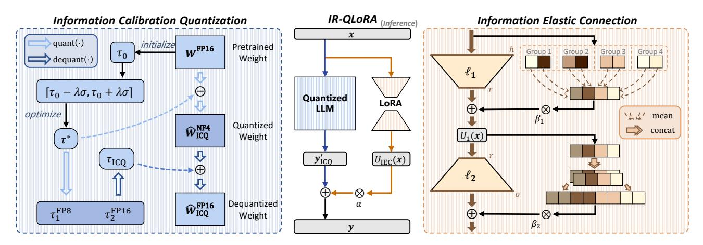
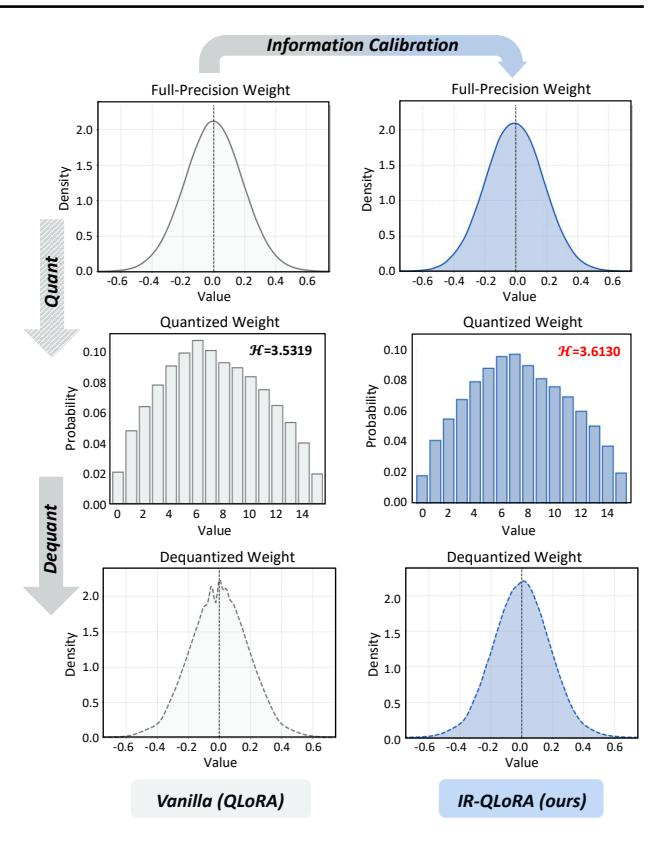
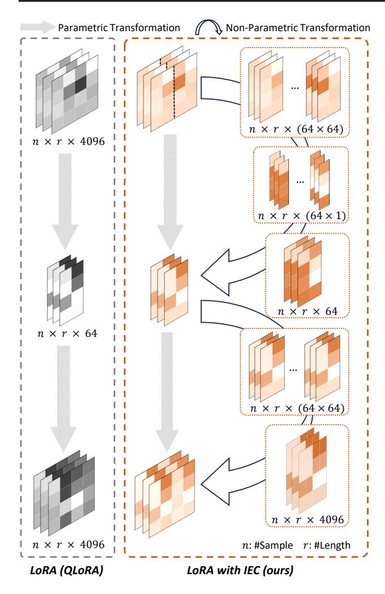
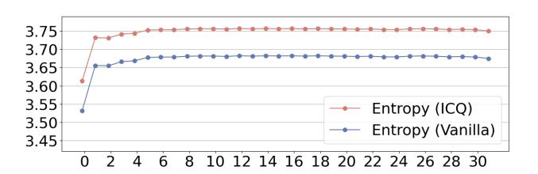

# Accurate LoRA-Finetuning Quantization of LLMs via Information Retention

 $\begin{array}{cccccccccccccccccccccccccccccccccccc$ 

### **Abstract**

The LoRA-finetuning quantization of LLMs has been extensively studied to obtain accurate yet compact LLMs for deployment on resourceconstrained hardware. However, existing methods cause the quantized LLM to severely degrade and even fail to benefit from the finetuning of LoRA. This paper proposes a novel **IR-QLoRA** for pushing quantized LLMs with LoRA to be highly accurate through information retention. The proposed IR-QLoRA mainly relies on two technologies derived from the perspective of unified information: (1) statistics-based Information Calibration Quantization allows the quantized parameters of LLM to retain original information accurately; (2) finetuning-based Information Elastic Connection makes LoRA utilizes elastic representation transformation with diverse information. Comprehensive experiments show that IR-QLoRA can significantly improve accuracy across LLaMA and LLaMA2 families under 2-4 bit-widths, e.g., 4bit LLaMA-7B achieves 1.4% improvement on MMLU compared with the state-of-the-art methods. The significant performance gain requires only a tiny 0.31% additional time consumption, revealing the satisfactory efficiency of our IR-QLoRA. We highlight that IR-QLoRA enjoys excellent versatility, compatible with various frameworks (e.g., NormalFloat and Integer quantization) and brings general accuracy gains. The code is available at https://github.com/htqin/ir-qlora.

### 1. Introduction

Large language models (LLMs) have demonstrated strong performance in natural language understanding (Touvron

Proceedings of the 41<sup>st</sup> International Conference on Machine Learning, Vienna, Austria. PMLR 235, 2024. Copyright 2024 by the author(s).

et al., 2023a;b). LLMs can be adapted to various downstream real-world applications, paired with large-scale pretraining and finetuning for downstream tasks (Chang et al., 2023; Devlin et al., 2018; Zhao et al., 2023; Huang & Chang, 2022; Brown et al., 2020). However, because of the massive parameters and computation, the LLM has high or even harsh resource requirements for deployment scenarios. The inference of LLMs is expensive and heavily relies on high-performance devices, such as graphics processing units (GPUs) (Ganesh et al., 2021; Zhu et al., 2023; Chitty-Venkata et al., 2023). Therefore, compression approaches of LLMs are widely studied to allow their deployment on edge devices. Quantization emerges as a promising approach to compress LLMs by reducing bit-width but usually results in significant degeneration in accuracy (Xiao et al., 2023; Lin et al., 2023). For example, the 4-bit LLaMA-7B quantized by GPTQ (Frantar et al., 2022) suffers a 1.5% drop of 5-shot accuracy on MMLU benchmark (Hendrycks et al., 2020) compared to its original counterpart (Liu et al., 2023a).

LoRA-finetuning quantization has become a popular paradigm that combines the LLM quantization with parameter-efficient finetuning of low-rank adaption (LoRA) (Dettmers et al., 2023; Xu et al., 2023b). Methods under this paradigm mainly consist of the following two phases. The first one is the post-training quantization (PTQ) of the LLM (Dettmers et al., 2021), obtaining quantizers by resource-saving calibration. The latter one is finetuning the LoRA (Hu et al., 2021), where the quantized LLM remains fixed and LoRA is finetuned. LoRA-finetuning quantization of LLMs is resource and time-saving compared to finetuning of the whole LLM while pushing the quantized LLM to high accuracy compared to performing PTQ solely (Dettmers et al., 2023; Xu et al., 2023b; Liu et al., 2023b).

However, despite several efforts made, existing LoRA fine-tuning quantization of LLMs is still far from the limits regarding accuracy. We empirically observe that the prevention of further accurate quantization is mainly because the information loss caused by LLM quantization is significant and cannot be recovered effectively by LoRA. Especially with ultra-low bit-widths ( $\leq$  3-bit) and large model scales ( $\geq$  30B), the former results in the nonlinearly increased level of information loss for each element, and the latter leads to a significant increase of the total amount of information loss

<sup>\*</sup>Equal contribution <sup>1</sup>ETH Zürich <sup>2</sup>Beihang University <sup>3</sup>Bytedance AI Lab. Correspondence to: <sup>™</sup>Xianglong Liu <xl-liu@buaa.edu.cn>.

<span id="page-1-0"></span>

Figure 1: Overview of IR-QLoRA. The framework includes Information Calibration Quantization (ICQ) for quantizing LLMs and Information Elastic Connection (IEC) for enhancing LoRA

for the whole model. In these cases, the finetuned LoRA is hard to assist LLMs to achieve high accuracy on downstream tasks, *e.g.*, 4-bit LLaMA-30B with finetuned LoRA even fails to achieve the accuracy of the original counterpart without finetuning (57.7% *vs.* 58.2% on MMLU).

In this paper, we present **IR-QLoRA** to obtain accurate **Q**uantized LLMs with **LoRA** via **Information Retention** (see the overview in Figure 1). To tackle the information loss of the quantization of the LLM, we propose a *Information Calibration Quantization* (ICQ) technique. By calibration by entropy maximization, ICQ enables quantizers for the LLM to retain the original information from the original parameters to quantized ones. We also propose the *Information Elastic Connection* (IEC) to enhance the information recovery capability of LoRA. IEC works together with LoRA, which performs parameter-free elastic transformations to utilize the information of original features and diversify the transformation form of LoRA.

Our IR-QLoRA provides strong and generic support to achieve accurate quantized LLMs with LoRA. Extensive experiments on the MMLU benchmark show that our IR-QLoRA outperforms existing methods with convincing margins on LLaMA and LLaMA2 series models under different bit-widths, especially at ultra-low bit-widths (2-3 bit). For example, the average accuracy of 2-bit IR-QLoRA in the LLaMA family is 0.5% higher than SOTA LoRA-finetuning quantization methods. For efficiency, the significant performance growth brought by our IR-QLoRA requires only a tiny 0.31% additional time consumption for LLaMA-13B. Moreover, IR-QLoRA is versatile and can boost existing LoRA-finetuning LLM quantization frameworks flexibly, e.g., the integration with QA-LoRA (Xu et al., 2023b) brings a cost-free 0.5% gain on MMLU to 4-bit LLaMA-7B.

### 2. Related Work

LLMs have demonstrated remarkable proficiency across diverse natural language understanding tasks and are established as a prominent paradigm in this field (Chang et al., 2023; Devlin et al., 2018; Zhao et al., 2023; Huang & Chang, 2022; Brown et al., 2020; Touvron et al., 2023a;b). This reality poses substantial challenges to deploying LLMs in settings with limited resources. Consequently, the research of the compression technologies for LLMs has gained prominence as a critical area of research. Existing compression technologies of LLMs include pruning, distillation, low-rank decomposition, and low-bit quantization (Ganesh et al., 2021; Zhu et al., 2023; Chitty-Venkata et al., 2023; Xu et al., 2023a). Among these technologies, quantization aims to compress the LLMs from 16-bit floating-point to lower bit-widths to mitigate the storage and computation.

Since compression is from a generic bit-width perspective, quantization has become a popular method to obtain efficient LLMs (Xiao et al., 2023; Lee et al., 2023; Shao et al., 2023; Dettmers et al., 2022; Liu et al., 2023b; Kim et al., 2023). The LoRA-finetuning quantization of LLMs emerges to achieve a balanced trade-off between computational cost and accuracy (Dettmers et al., 2023; Li et al., 2023), where quantized LLMs are finetuned with parameter-efficient LoRAs. However, existing quantized LLMs with LoRA are still far from ideal in accuracy. More details about related works are presented in Appendix A.1.

### 3. The Rise of IR-QLoRA

### 3.1. Preliminaries

We first present a baseline for LoRA-finetuning quantization of LLMs following common practice (Dettmers et al., 2023).

Before finetuning, the weights of LLMs are to be quantized.

The quantization function for the weight  $w \in \mathbb{R}^{h \times o}$  is

$$\hat{\boldsymbol{w}}^{\mathrm{NF}k} = \mathrm{NF}k\left(\frac{\boldsymbol{w}}{s}\right) = \mathrm{NF}k\left(\frac{\boldsymbol{w}}{\mathrm{absmax}(\boldsymbol{w})}\right),$$
 (1)

where  $\hat{\boldsymbol{w}}^{\text{NF}k}$  denotes quantized weight and the quantization block size is 64 as default, and s is the scaling factor calculated by  $\operatorname{absmax}(\boldsymbol{w})$ . NF $k(\cdot)$  denotes the k-bit NormalFloat quantization (Dettmers et al., 2023), quantizing the weights of LLMs to  $2^k$  values  $q_i$  as follows:

$$q_i = \frac{1}{2} \left( Q \left( \frac{i}{2^k + 1} \right) + Q \left( \frac{i+1}{2^k + 1} \right) \right), \qquad (2)$$

where  $Q(\cdot)$  is the quantile function of  $\mathcal{N}(0,1)$  distribution. Then, the computation process (e.g., linear projection) of the quantized unit of the LLM during inference is

<span id="page-2-0"></span>
$$\mathbf{y}' = \mathbf{x}\hat{\mathbf{w}}^{\text{FP16}} = \mathbf{x}\left(\hat{\mathbf{w}}^{\text{NF}k} \operatorname{dequant}(s_1^{\text{FP8}}, s_2^{\text{FP16}})\right), \quad (3)$$

where  $\boldsymbol{x} \in \mathbb{R}^{b \times h}$  and  $\boldsymbol{y}' \in \mathbb{R}^{b \times o}$  denote the input and output of quantized linear projection in LLMs, respectively. dequant $(s_1^{\text{FP8}}, s_2^{\text{FP16}})$  is expected to approximate the original scaling factor s. After double-quantization of s, we can obtain the quantized values  $s_1^{\text{FP8}}$  and scaling factors  $s_2^{\text{FP16}}$  follow (Dettmers et al., 2023).  $\hat{\boldsymbol{w}}^{\text{FP16}}$  denotes the FP16 weights dequantized from  $\hat{\boldsymbol{w}}^{\text{NF}k}$ .

The LoRA refers to a set of finetunable parameters designed to enhance the quantized linear projection in LLMs by introducing an extra factorized projection (Hu et al., 2021; Dettmers et al., 2023). For the quantized linear projection as Eq. (3), the computation with LoRA can be expressed as:

<span id="page-2-4"></span>
$$y = y' + \alpha x \ell_1 \ell_2, \tag{4}$$

where  $\ell_1 \in \mathbb{R}^{h \times r}$  and  $\ell_2 \in \mathbb{R}^{r \times o}$  are the finetunable parameters, and  $\alpha$  is a scalar. Since the parameter efficiency of LoRA should be kept during inference, its rank r is far smaller than the input and output dimensions (h and o, respectively), which makes its memory and computational consumption far smaller than the corresponding linear projection in LLMs (e.g., r=64 vs. h=4096 and o=4096). During the backward propagation of the finetuning process, the gradients are passed through the fixed quantized weights of LLMs to update the parameters in LoRA.

The quantization process of the LLM and the finetuning process of the LoRA are decoupled. The PTQ first processes the LLM to obtain low-bit quantized weights, and then the LoRA is finetuned for specific downstream tasks.

### 3.2. Information Calibration Quantization

### 3.2.1. Degeneration of Quantized LLMs

In the aforementioned baseline, the LLMs are quantized directly from pre-trained models, where the low-bit discretization of the parameters causes the accuracy degradation. Existing quantization methods attribute the degradation to the

<span id="page-2-3"></span>

Figure 2: An illustration of ICQ in IR-QLoRA

numerical quantization error. However, the information loss caused by quantization is always neglected.

Specifically, the quantized weights of LLMs are expected to reflect the information carried by original counterparts, but reduced bit-width severely constrains the representation capabilities. From the information perspective, the dependence between the weights of quantized and original LLMs is expressed as the mutual information (Qin et al., 2023):

<span id="page-2-1"></span>
$$\mathcal{I}(\hat{\boldsymbol{w}}^{\text{FP16}}; \boldsymbol{w}) = \mathcal{H}(\hat{\boldsymbol{w}}^{\text{FP16}}) - \mathcal{H}(\hat{\boldsymbol{w}}^{\text{FP16}} \mid \boldsymbol{w}),$$
 (5)

where  $\mathcal{H}(\hat{\boldsymbol{w}}^{\text{FP16}})$  denotes the entropy of  $\hat{\boldsymbol{w}}^{\text{FP16}}$ , and  $\mathcal{H}(\hat{\boldsymbol{w}}^{\text{FP16}} \mid \boldsymbol{w})$  denotes the conditional entropy of  $\hat{\boldsymbol{w}}^{\text{FP16}}$  given  $\boldsymbol{w}$ . As deterministic quantizers are used in the quantization of LLMs,  $\mathcal{H}(\hat{\boldsymbol{w}}^{\text{FP16}} \mid \boldsymbol{w}) = 0$  and the  $\mathcal{I}(\hat{\boldsymbol{w}}^{\text{FP16}}; \boldsymbol{w})$  depends on  $\mathcal{H}(\hat{\boldsymbol{w}}^{\text{FP16}})$  directly. In the PTQ, since the original weights  $\boldsymbol{w}$  remain unchanged, maximizing the mutual information  $\mathcal{I}(\hat{\boldsymbol{w}}^{\text{FP16}}; \boldsymbol{w})$  in Eq. (5) is equivalent to

<span id="page-2-2"></span>
$$\underset{s,s_{1}^{\text{FP}},s_{2}^{\text{FP}}}{argmax} \mathcal{H}(\hat{\boldsymbol{w}}^{\text{FP}16}; s, s_{1}^{\text{FP}8}, s_{2}^{\text{FP}16}). \tag{6}$$

Since dequant( $s_1^{\text{FP8}}, s_2^{\text{FP16}}$ ) is a scalar in dequantization and does not affect information entropy of  $\hat{w}^{\text{FP16}}$ , the above objective function can be further simplified as follows:

$$\underset{s}{\operatorname{argmax}} \mathcal{H}(\hat{\boldsymbol{w}}^{\text{NF}k}; s) = -\sum_{i=1}^{2^{k}-1} P(q_i) \log_2 P(q_i), \quad (7)$$

where  $P(q_i)$  is the probability of  $\hat{\boldsymbol{w}}^{NFk}$  taking the value  $q_i$ .

Since the significant reduction of bit-width leads to decreased representation capability, the entropy of the quantized weight is far less than that of the original counterpart. For example, the number of representation candidates for a 4-bit quantized weight reduces  $4096\times$  compared to its original 16-bit (FP16) counterpart, and the upper bound of information entropy  $\mathcal{H}(\hat{w}^{\text{FP16}})$  in Eq. (6) is correspondingly reduced  $4\times$  (4 for 4-bit vs. 16 for 16-bit), meaning a significant degradation of information in the quantity and quality. Thus, prioritizing information recovery within low-bit weights is crucial for enhancing quantized LLMs.

# 3.2.2. Information Calibration Quantization For Representation Recovery

To mitigate the degeneration caused by information loss for the quantized LLMs, we introduce an Information Calibration Quantization (ICQ) technique for LLMs (as Figure 2), which applies the fine-grained information maximization of quantized weights to improve the accuracy.

We first introduce a calibration constant  $\tau$  to the quantizer, liberating its flexibility to retain information fully. The quantization process it engages in can be expressed as follows:

<span id="page-3-1"></span>
$$\hat{\boldsymbol{w}}^{\text{NF}k} = \text{NF}k \left( \frac{\boldsymbol{w} - \tau}{s} \right). \tag{8}$$

Since the original weight w is fixed, the optimization objective in Eq. (6) can be expressed as

<span id="page-3-0"></span>
$$\underset{\tau}{\operatorname{argmax}} \mathcal{H}\left(\hat{\boldsymbol{w}}^{\text{NF}k}; \tau, s\right). \tag{9}$$

Directly solving the objective in Eq. (9) is significantly complex and time-consuming. Therefore, we then present a two-step strategy for calibrating the quantizers of LLMs blockwisely by the information entropy maximization.

The first step is to process the initialization for the calibration constant  $\tau$ . Based on the common assumption of a symmetrical normal distribution for weights of neural networks (Dettmers et al., 2023; Baskin et al., 2021), we initialize the constant as the median  $\tau_0 = \text{quantile}_{\frac{1}{2}}(w)$  for each quantization block of weights. As the probability density is higher in regions closer to the symmetry axis in a normal distribution, this initialization enables the quantizer to utilize intervals to a greater extent. The position-dependent median also allows  $\tau_0$  to alleviate the influence from outliers.

The second step is to optimize the calibration constant  $\tau$  and the scaling factors  $s_1$  and  $s_2$  for quantization and double quantization of weights, respectively. We apply information entropy in Eq. (5) as the metric and perform the search-based optimization to obtain  $\tau^*$ . We create the search spaces for  $\tau$  by linearly dividing  $[\tau_0 - \lambda \sigma, \tau_0 + \lambda \sigma]$ 

into 2n candidates, where  $\sigma=1$  is the standard deviation of  $\mathcal{N}(0,1)$  and  $\lambda$  is a coefficient. We empirically set  $\lambda$  and n to 0.1 and 100, respectively, to achieve a trade-off between accurate and efficient search. For each candidate  $\tau$ , we use it to calibrate weight and calculate the information entropy of weights quantized by Eq. (8), and then obtain the optimal calibration constant  $\tau^*$  corresponding to the maximum entropy. The scaling factor s for  $w-\tau^*$  is double-quantized to  $s_1^{\text{FP8}}$  and  $s_2^{\text{FP16}}$ .

For the optimized calibration constant  $\tau^*$ , we perform double quantization similar to the scale to save memory. The quantization and dequantization processes of our ICQ can be summarized as

$$\begin{split} \hat{\boldsymbol{w}}_{\text{ICQ}}^{\text{NF}k} &= \text{NF}k \left( \frac{\boldsymbol{w} - \boldsymbol{\tau}^*}{\text{absmax}(\boldsymbol{w} - \boldsymbol{\tau}^*)} \right), \\ \hat{\boldsymbol{w}}_{\text{ICQ}}^{\text{FP16}} &= \hat{\boldsymbol{w}}_{\text{ICQ}}^{\text{NF}k} \operatorname{dequant}(s_1^{\text{FP8}}, s_2^{\text{FP16}}) + \operatorname{dequant}(\boldsymbol{\tau}_1^{\text{FP8}}, \boldsymbol{\tau}_2^{\text{FP16}}). \end{split}$$
(10)

where  $\tau_1^{\text{FP8}}$  and  $\tau_2^{\text{FP16}}$  are the quantized calibration constant and its scaling factor for double quantization, respectively. The inference of LLMs with our ICQ can be expressed as

$$y'_{\rm ICQ} = x \hat{w}_{\rm ICQ}^{\rm FP16}. \tag{11}$$

Our ICQ technique maximizes the information entropy of quantized weight to alleviate its immense information degradation and revive the representation capability. As Figure 2 shows, the quantized weights calibrated by ICQ derive increased information and recover the original distribution more accurately following the dequantization.

### 3.3. Information Elastic Connection

### 3.3.1. LIMITATION OF FINETUNABLE LORA

In addition to the quantized LLM in the baseline, the limited representation capability of the finetuneable LoRA also hinders information recovery. LoRA mitigates the performance degradation caused by weight quantization in LLM by finetuning additional adapters for downstream tasks, sometimes even yielding notable performance enhancements. The finetuning of LoRA can be roughly considered as finetuning a subset of weights in LLM, where low-rank parameters facilitate an efficient finetuning process, avoiding the expensive computation and storage of finetuning the LLM directly.

However, through LoRA processes parameter-efficient fine-tuning for quantized LLMs, its information representation still exhibits significant limitations, impeding the accurate quantized LLM with LoRA. Firstly, compared to the corresponding linear projection in LLM, the parameter transformation by LoRA can still be considered homogenized, albeit with a noticeably lower rank. On the other hand, the information utilization of LoRA remains limited, as the latter low-rank matrix  $\ell_2$  in Eq. (3) can only exploit the

<span id="page-4-0"></span>

Figure 3: An illustration of IEC in IR-QLoRA

transformed representation matrix ℓ<sup>1</sup> from the preceding transformation, thereby losing accessibility to the original representation information. Therefore, liberating LoRA from its constraints in representation capacity is expected to enhance the accuracy of quantized LLM further.

# 3.3.2. INFORMATION ELASTIC CONNECTION FOR INFORMATION ENHANCEMENT

To bolster the representation capacity of LoRA, aiding in recovering information of quantized LLMs while maintaining its lightweight nature, we introduce an effective Information Elastic Connection (IEC). As Figure [3](#page-4-0) shows, IEC constructs a parameter-free connection for LoRA, facilitating information utilization derived from quantized LLM and diversifying the information transformation.

As shown in Eq. [\(4\)](#page-2-4), the input of one LoRA unit is generated by the previous quantized LLM and LoRA units. The h-dimensional input x is transformed to low-rank rdimensional intermediate features through the ℓ<sup>1</sup> matrix and then restored to the o-dimensional output through the ℓ<sup>2</sup> matrix. Since usually r ≪ min{h, o}, we construct flexible parameter-free connections for LoRA matrix pairs so that each LoRA matrix can fully utilize the original input representation x. Specifically, we group and average the original feature according to the greatest common divisor of the input and intermediate dimensions and add it to the output computed by the ℓ<sup>1</sup> matrix. The first sub-unit U<sup>1</sup> of LoRA with our IEC can be expressed as

<span id="page-4-1"></span>
$$U_{1}(\boldsymbol{x}) = \boldsymbol{x}\boldsymbol{\ell}_{1} + \beta_{1} \prod_{\substack{\overline{\operatorname{gcd}(h,r)} \\ h}} \left( \frac{\operatorname{gcd}(h,r)}{h} \sum_{i=1}^{\operatorname{gcd}(h,r)} \boldsymbol{x}^{\left[(i-1)\frac{h}{\operatorname{gcd}(h,r)}:i\frac{h}{\operatorname{gcd}(h,r)}-1\right]} \right),$$
(12)

where x [m:n] denotes taking the m to n dimension of x, gcd (h, r) denotes the greatest common divisor of h and r, and β denotes a layerwise learnable scalar; P denotes the summation of all divided features and Q denotes the r gcd (h,r) -time repeated concatenation; The dimension of the latter term in Eq. [\(12\)](#page-4-1) is r. Through the above operations, we transform the representation to low-rank through parameter-free operation to retain the original information.

The latter matrix of LoRA transforms the low-rank intermediate representation up to the higher dimension. It thus accompanies a parameter-free repeated concatenation for x ′ = U1(x) and composes the second sub-unit U<sup>2</sup> in IEC, where the computation process can be expressed as

<span id="page-4-2"></span>
$$U_{2}(\boldsymbol{x}') = \boldsymbol{x}'\boldsymbol{\ell}_{2} + \beta_{2} \prod_{\substack{o \text{gcd}(o,r) \\ r}} \left( \frac{\gcd(o,r)}{r} \sum_{i=1}^{\gcd(o,r)} \boldsymbol{x}'^{\left[(i-1)\frac{r}{\gcd(o,r)}:i\frac{r}{\gcd(o,r)}-1\right]} \right),$$

$$(13)$$

where x ′ is first aligned to the gcd(o, r)-dimension and concatenated <sup>o</sup> gcd(o,r) times repeatedly, and is then connected to the calculation result of ℓ<sup>2</sup> matrix.

Note that in the LoRA unit, the input dimension h and output dimension o are usually multiples of low-rank r, and gcd(h, r) and gcd(o, r) are thus equal to r. In these cases, Eq. [\(12\)](#page-4-1) and Eq. [\(13\)](#page-4-2) for our IEC can be simplified as follows:

$$U_{1}(\boldsymbol{x}) = \boldsymbol{x}\boldsymbol{\ell}_{1} + \beta_{1} \frac{r}{h} \sum_{i=1}^{r} \boldsymbol{x}^{\left[(i-1)\frac{h}{r}:i\frac{h}{r}-1\right]},$$

$$U_{2}(\boldsymbol{x}') = \boldsymbol{x}'\boldsymbol{\ell}_{2} + \beta_{2} \prod_{i=1}^{\frac{o}{r}} \boldsymbol{x}'.$$
(14)

With our IEC, the computation process of the quantized LLM projection and LoRA can be expressed as

$$\boldsymbol{y} = \boldsymbol{y}'_{\text{ICQ}} + \alpha U_{\text{IEC}}(\boldsymbol{x}) = \boldsymbol{y}'_{\text{ICQ}} + \alpha U_2 \circ U_1(\boldsymbol{x}).$$
 (15)

Appendix [A.2](#page-12-1) discusses the efficiency of IEC, which can be merged into LoRA to avoid additional inference costs.

The IEC propagates the input with elasticity dimension changing, thus allowing the matrix in LoRA to directly access and utilize the original information extracted by the quantized LLM projection. Moreover, the parameter-free IEC can seem diversified compared with the parametric matrix multiplication of LoRA, further enhancing the information representation of quantized LLMs.

# 4. Experiment

We extensively evaluate the accuracy and efficiency of our proposed IR-QLoRA. Our IR-QLoRA is established upon the LLaMA [\(Touvron et al.,](#page-10-0) [2023a\)](#page-10-0) and LLaMA2 [\(Touvron et al.,](#page-10-1) [2023b\)](#page-10-1) families (7B, 13B, 30B, and 65B), and constructs parameter-efficient finetuning on Alpaca [\(Taori et al.,](#page-10-13) [2023\)](#page-10-13) and Flan v2 [\(Longpre et al.,](#page-10-14) [2023\)](#page-10-14) datasets. The Massively Multitask Language Understanding (MMLU) [\(Hendrycks et al.,](#page-9-6) [2020\)](#page-9-6) and CommonsenseQA benchmarks(*e*.*g*.HellaSwag [\(Zellers et al.,](#page-11-3) [2019\)](#page-11-3), PIQA [\(Bisk et al.,](#page-9-12) [2020\)](#page-9-12)) are applied for evaluation. For experiment settings [\(Dettmers et al.,](#page-9-7) [2023;](#page-9-7) [Xu et al.,](#page-11-2) [2023b;](#page-11-2) [Kim et al.,](#page-10-10) [2023;](#page-10-10) [Frantar et al.,](#page-9-5) [2022\)](#page-9-5), we follow the settings of comparison methods reported in their publications or official code for fair comparison. All our experiments are conducted on Nvidia Tesla A100 GPUs. Detailed experiment settings and results are presented in Appendix [B](#page-14-0) and Appendix [C,](#page-16-0) respectively.

### 4.1. Main Results

To evaluate the performance of IR-QLoRA, we conducted comprehensive experiments and compared our IR-QLoRA with the state-of-the-art (SOTA) LoRA-finetuning quantization methods, *i*.*e*., QLoRA [\(Dettmers et al.,](#page-9-7) [2023\)](#page-9-7) and QA-LoRA [\(Xu et al.,](#page-11-2) [2023b\)](#page-11-2). We also compare with PEQA [\(Kim et al.,](#page-10-10) [2023\)](#page-10-10) without LoRA follow [\(Xu et al.,](#page-11-2) [2023b\)](#page-11-2). Table [1](#page-5-0) and Table [2](#page-6-0) present the 5-shot accuracy results on the MMLU benchmark finetuned on the Alpaca [\(Taori et al.,](#page-10-13) [2023\)](#page-10-13) and Flan v2 [\(Longpre et al.,](#page-10-14) [2023\)](#page-10-14) datasets, respectively.

Comprehensive results indicate that across various sizes of LLaMA models, IR-QLoRA consistently outperforms all comparative quantization methods by a convincing margin. Compared to the baseline method QLoRA, our IR-QLoRA achieves a significant improvement in accuracy on the MMLU benchmark under the same finetuning pipeline. Specifically, as shown in Table [1,](#page-5-0) the 4-bit LLaMA-7B model finetuned with IR-QLoRA on the Alpaca dataset achieves an accuracy of 40.8%, significantly surpassing the model obtained with QLoRA at 38.4%. This outstanding trend continues in larger LLaMA-13B and LLaMA-30B

<span id="page-5-0"></span>Table 1: Accuracy (%) comparison of LLaMA on the MMLU finetuned on the Alpaca dataset

| Method        | #Bit |      |                              | MMLU |      |      |
|---------------|------|------|------------------------------|------|------|------|
|               |      |      | Hums. STEM Social Other Avg. |      |      |      |
| LLaMA-7B      | 16   | 33.3 | 29.8                         | 37.8 | 38.0 | 34.6 |
| PEQA          | 4    | 34.9 | 28.9                         | 37.5 | 40.1 | 34.8 |
| NormalFloat   | 4    | 33.1 | 30.6                         | 38.8 | 38.8 | 35.1 |
| QLoRA w/ GPTQ | 4    | 33.8 | 31.3                         | 37.4 | 42.2 | 36.0 |
| QLoRA         | 4    | 36.1 | 31.9                         | 42.0 | 44.5 | 38.4 |
| QA-LoRA       | 4    | 36.6 | 32.4                         | 44.8 | 44.9 | 39.4 |
| IR-QLoRA      | 4    | 38.6 | 34.6                         | 45.2 | 45.5 | 40.8 |
| LLaMA-13B     | 16   | 40.6 | 36.7                         | 48.9 | 48.0 | 43.3 |
| NormalFloat   | 4    | 43.0 | 34.5                         | 51.8 | 51.4 | 45.0 |
| PEQA          | 4    | 43.0 | 37.7                         | 53.6 | 49.0 | 45.0 |
| QLoRA         | 4    | 45.4 | 37.4                         | 55.7 | 54.3 | 48.0 |
| QLoRA w/ GPTQ | 4    | 48.4 | 38.3                         | 54.9 | 55.2 | 49.2 |
| QA-LoRA       | 4    | 48.4 | 38.3                         | 54.9 | 55.2 | 49.2 |
| IR-QLoRA      | 4    | 47.2 | 39.0                         | 56.5 | 55.0 | 49.3 |
| LLaMA-30B     | 16   | 56.2 | 45.9                         | 67.1 | 63.9 | 58.2 |
| NormalFloat   | 4    | 55.3 | 44.7                         | 66.2 | 63.3 | 57.3 |
| QLoRA         | 4    | 55.4 | 46.0                         | 66.4 | 63.6 | 57.7 |
| QLoRA w/ GPTQ | 4    | 55.8 | 46.4                         | 67.0 | 64.0 | 58.1 |
| QA-LoRA       | 4    | 55.8 | 46.4                         | 67.0 | 64.0 | 58.1 |
| IR-QLoRA      | 4    | 56.7 | 46.7                         | 66.5 | 63.2 | 58.2 |
| LLaMA-65B     | 16   | 61.4 | 51.9                         | 73.6 | 67.6 | 63.4 |
| QA-LoRA       | 4    | 60.8 | 50.5                         | 72.5 | 66.7 | 62.5 |
| NormalFloat   | 4    | 60.7 | 52.3                         | 72.6 | 67.3 | 63.0 |
| QLoRA w/ GPTQ | 4    | 60.4 | 52.5                         | 73.0 | 67.2 | 63.0 |
| QLoRA         | 4    | 60.3 | 52.7                         | 72.9 | 67.4 | 63.1 |
| IR-QLoRA      | 4    | 60.1 | 50.1                         | 74.4 | 68.7 | 63.1 |

models, where IR-QLoRA exceeds the baseline by 1.3%, 0.5%, respectively. Compared to QLoRA with GPTQ and SOTA QA-LoRA using integer quantization, our method consistently performs better across various settings, with a notable advantage of 1.4% even on LLaMA-7B. We further provide results for variants of the IR-QLoRA integer quantizer in Section [4.3](#page-7-0) below to demonstrate the robust improvement of our techniques in IR-QLoRA across different quantizers.

Table [2](#page-6-0) presents the results obtained using Flan v2 [\(Longpre](#page-10-14) [et al.,](#page-10-14) [2023\)](#page-10-14) as the finetuning dataset. Similar to the results on the Alpaca dataset, IR-QLoRA consistently achieves optimal results and outperforms SOTA methods across various settings, and even improves performance after finetuning with this dataset. For instance, the comparison of IR-QLoRA results on LLaMA-7B is Alpaca 47.4% vs. Flan v2 40.8%, and the average improvement of IR-QLoRA over QLoRA across various sizes of LLaMA is 1.25%. This indicates that IR-QLoRA consistently provides stable benefits

<span id="page-6-0"></span>Table 2: Accuracy (%) comparison of LLaMA on the MMLU finetuned on the Flan v2 dataset

| Method        | #Bit |      |                              | MMLU |      |      |
|---------------|------|------|------------------------------|------|------|------|
|               |      |      | Hums. STEM Social Other Avg. |      |      |      |
| LLaMA-7B      | 16   | 33.3 | 29.8                         | 37.8 | 38.0 | 34.6 |
| NormalFloat   | 4    | 33.1 | 30.6                         | 38.8 | 38.8 | 35.1 |
| QLoRA w/ GPTQ | 4    | 33.8 | 31.3                         | 37.4 | 42.2 | 36.0 |
| QLoRA         | 4    | 41.4 | 35.0                         | 49.8 | 52.0 | 44.3 |
| QA-LoRA       | 4    | 43.9 | 38.0                         | 54.3 | 53.0 | 47.0 |
| IR-QLoRA      | 4    | 44.2 | 39.3                         | 54.5 | 52.9 | 47.4 |
| LLaMA-13B     | 16   | 40.6 | 36.7                         | 48.9 | 48.0 | 43.3 |
| NormalFloat   | 4    | 43.0 | 34.5                         | 51.8 | 51.4 | 45.0 |
| QLoRA w/ GPTQ | 4    | 48.4 | 38.3                         | 54.9 | 55.2 | 49.2 |
| QLoRA         | 4    | 49.9 | 40.1                         | 60.2 | 57.9 | 51.9 |
| QA-LoRA       | 4    | 50.0 | 41.5                         | 60.5 | 58.4 | 52.4 |
| IR-QLoRA      | 4    | 49.2 | 41.2                         | 62.1 | 59.2 | 52.6 |
| LLaMA-30B     | 16   | 56.2 | 45.9                         | 67.1 | 63.9 | 58.2 |
| NormalFloat   | 4    | 55.3 | 44.7                         | 66.2 | 63.3 | 57.3 |
| QLoRA w/ GPTQ | 4    | 55.8 | 46.4                         | 67.0 | 64.0 | 58.1 |
| QLoRA         | 4    | 57.2 | 48.6                         | 69.8 | 65.2 | 60.0 |
| QA-LoRA       | 4    | 57.9 | 48.8                         | 71.0 | 65.5 | 60.6 |
| IR-QLoRA      | 4    | 58.1 | 49.4                         | 70.7 | 65.8 | 60.8 |
| LLaMA-65B     | 16   | 61.4 | 51.9                         | 73.6 | 67.6 | 63.4 |
| NormalFloat   | 4    | 60.7 | 52.3                         | 72.6 | 67.3 | 63.0 |
| QLoRA w/ GPTQ | 4    | 60.4 | 52.5                         | 73.0 | 67.2 | 63.0 |
| QLoRA         | 4    | 59.8 | 52.9                         | 75.0 | 69.6 | 63.9 |
| QA-LoRA       | 4    | 57.6 | 51.1                         | 73.9 | 67.4 | 62.1 |
| IR-QLoRA      | 4    | 61.6 | 52.0                         | 75.6 | 68.9 | 64.3 |

when using different finetuning datasets.

In addition, we conduct the accuracy comparison on the recently proposed LLaMA2, demonstrating the generalization performance of the proposed IR-QLoRA across LLM families. Specifically, we applied IR-QLoRA to the 7B and 13B models of LLaMA2 and compared their evaluation results on the MMLU benchmark with the QA-LoRA method, which currently holds SOTA performance. The results in Table [3](#page-6-1) show that our method not only achieved 2.7% performance improvement but also demonstrated advantages in almost every individual metric on LLaMA2-7B. These results indicate that IR-QLoRA exhibits strong generalization across different LLM families.

### 4.2. Ablation Study

To reveal the effectiveness of techniques in the proposed IR-QLoRA on accuracy and efficiency, we conduct extensive ablation studies for 4-bit LLaMA-7B on MMLU.

Accuracy Ablation. Figure [4](#page-6-2) illustrates the entropy of quantized weights with ICQ is constantly higher than the vanilla

<span id="page-6-1"></span>Table 3: Accuracy (%) comparison of LLaMA2 on MMLU

| Method      | Dataset#Bit |    |                          | MMLU |      |           |  |  |
|-------------|-------------|----|--------------------------|------|------|-----------|--|--|
|             |             |    | Hums.STEMSocialOtherAvg. |      |      |           |  |  |
| LLaMA2-7B   | -           | 16 | 43.0                     | 36.4 | 51.4 | 52.2 45.5 |  |  |
| NormalFloat | -           | 4  | 42.0                     | 35.9 | 51.0 | 51.4 44.8 |  |  |
| QA-LoRA     | Alpaca      | 4  | 42.1                     | 34.4 | 49.1 | 50.3 43.9 |  |  |
| IR-QLoRA    | Alpaca      | 4  | 43.4                     | 36.8 | 51.9 | 53.6 46.2 |  |  |
| QA-LoRA     | Flan v2     | 4  | 48.4                     | 41.4 | 59.4 | 58.6 51.7 |  |  |
| IR-QLoRA    | Flan v2     | 4  | 49.2                     | 41.6 | 60.2 | 58.0 52.0 |  |  |
| LLaMA2-13B  | -           | 16 | 53.3                     | 44.1 | 63.3 | 61.0 55.3 |  |  |
| NormalFloat | -           | 4  | 52.2                     | 44.1 | 62.3 | 60.8 54.7 |  |  |
| QA-LoRA     | Alpaca      | 4  | 48.0                     | 43.0 | 59.7 | 57.4 51.7 |  |  |
| IR-QLoRA    | Alpaca      | 4  | 51.9                     | 43.9 | 61.9 | 60.4 54.4 |  |  |
| QA-LoRA     | Flan v2     | 4  | 52.9                     | 44.8 | 65.9 | 64.0 56.6 |  |  |
| IR-QLoRA    | Flan v2     | 4  | 53.1                     | 45.6 | 64.9 | 63.8 56.5 |  |  |

<span id="page-6-2"></span>

Figure 4: Entropy of linear projections in LLaMA-7B

QLoRA across different layers. This indicates that ICQ effectively enhances the mutual information between quantized weights of LLMs and original counterparts, thereby reducing information loss and producing a 1.9% accuracy gain, as Table [4](#page-7-1) shows. We also conducted different controlled experiments to illustrate the effectiveness of the IEC. Firstly, we apply the IEC directly to Vanilla, resulting in 1.8% enhancements, as indicated by the results in Table [4.](#page-7-1) Then we conduct in-depth observations, applying IEC on the first and latter sub-units respectively, both of which lead to improvements, (IEC (U1) 1.0% *vs.* IEC (U2) 1.3%). Moreover, when ICQ and IEC are combined, their synergistic effect surpasses individual contributions, pushing the quantized model to achieve up to 40.8% accuracy.

We also present the performances of the quantized LLMs solely with our proposed ICQ in IR-QLoRA without LoRA and fine-tuning, including the detailed accuracy in the MMLU benchmark and the average information entropy of quantized LLMs. As Table [5](#page-7-2) shows, ICQ can solely improve the entropy of quantized weight in LLMs even without finetuning while contributing significantly to the experiment results compared to NormalFloat quantization (average accuracy increases by 0.5%). We also compare the average information entropy between quantized LLM with and without our ICQ. With the proposed ICQ of IR-QLoRA,

Table 4: Accuracy (%) ablation on MMLU

<span id="page-7-1"></span>

| Method   | #Bit |       |      | MMLU   |       |      |
|----------|------|-------|------|--------|-------|------|
|          |      | Hums. | STEM | Social | Other | Avg. |
| LLaMA-7B | 16   | 33.3  | 29.8 | 37.8   | 38.0  | 34.6 |
| Vanilla  | 4    | 36.1  | 31.9 | 42.0   | 44.5  | 38.4 |
| ICQ      | 4    | 37.9  | 33.6 | 43.9   | 46.7  | 40.3 |
| IEC (U1) | 4    | 37.9  | 31.9 | 43.4   | 44.8  | 39.4 |
| IEC (U2) | 4    | 38.0  | 32.3 | 43.6   | 45.1  | 39.7 |
| IEC      | 4    | 38.3  | 33.0 | 44.5   | 45.7  | 40.2 |
| IR-QLoRA | 4    | 38.6  | 34.6 | 45.2   | 45.5  | 40.8 |

<sup>1</sup> ICQ and IEC denote the vanilla QLoRA with ICQ and IEC, and IR-QLoRA uses both of them. IEC (U1) and IEC (U2) denote the further ablation for IEC in the first or latter LoRA sub-units

<span id="page-7-2"></span>Table 5: Accuracy (%) ablation on MMLU for ICQ without LoRA and fine-tuning

| Method      |    |      | #Bit Hums. STEM Social Other Avg. Ent. |      |      |      |           |
|-------------|----|------|----------------------------------------|------|------|------|-----------|
| LLaMA-7B    | 16 | 33.3 | 29.8                                   | 37.8 | 38.0 | 34.6 | /         |
| NormalFloat | 4  | 33.1 | 30.6                                   | 38.8 | 38.8 |      | 35.1 3.67 |
| ICQ         | 4  | 33.6 | 31.7                                   | 39.6 | 38.2 |      | 35.6 3.74 |

the average entropy increases by 0.07, which means a significant improvement of the information retention for quantized weights in LLMs, proving the accuracy improvement of ICQ comes from its motivation of information retention.

Efficiency Ablation. Table [6](#page-7-3) demonstrates that the proposed ICQ and IEC techniques impose little additional storage and training overhead. For ICQ, the added parameters are only equivalent to the quantized scaling factor, and double quantization is applied to reduce storage further. Therefore, the additional storage introduced by ICQ is minor, increasing only by 2.04% on the 4-bit LLaMA-7B. The optimization process for τ also adds only a negligible amount of training time (*e*.*g*.0.46% for LLamA-7B and 0.31% for LLaMA-13B). Furthermore, this additional time is exclusively required for the initial optimization during training and does not result in increased inference time. IEC just introduces 2 additional parameters per layer, which can be negligible in the whole model. In the case of IR-QLoRA, our ICQ and IEC significantly enhance the accuracy performance of quantized LLMs with little additional storage increase. The ablation studies present the effectiveness and efficiency of ICQ and IEC, showcasing their strong capabilities in constructing accurate and efficient LLMs.

As for the fine-tuning efficiency, the additional time incurred by IEC can be considered negligible theoretically, whereas the increased fine-tuning time due to ICQ depends on the range set during the search process. The larger the range and the finer the granularity, the longer the search process will

<span id="page-7-3"></span>Table 6: Efficiency ablation on the different sizes of LLaMA

| Method   | #Bit |       | #Params(GB) | Time(h) |       |  |
|----------|------|-------|-------------|---------|-------|--|
|          |      | 7B    | 13B         | 7B      | 13B   |  |
| LLaMA    | 16   | 12.55 | 24.24       | -       | -     |  |
| Vanilla  | 4    | 2.34  | 4.13        | 15.33   | 26.18 |  |
| ICQ      | 4    | 2.39  | 4.22        | 15.40   | 26.26 |  |
| IEC      | 4    | 2.34  | 4.13        | 15.33   | 26.18 |  |
| IR-QLoRA | 4    | 2.39  | 4.22        | 15.40   | 26.26 |  |

take. We represented the additional fine-tuning time using the default setting (λ = 0.1, n = 100) in Table [7,](#page-8-0) where the original fine-tuning time is the time used for baseline finetuning, and the additional fine-tuning time is the additional time used by IR-QLoRA fine-tuning. Compared with the original fine-tuning time, the additional fine-tuning time is only up to 0.84%, which is extremely low additional overhead.

### <span id="page-7-0"></span>4.3. Analysis and Discussion

IR-QLoRA on More Evaluation Benchmark. We present the 0-shot results of the CommonsenseQA benchmark in Table [8.](#page-8-1) Similar to the phenomenon on the MMLU benchmark, our IR-QLoRA consistently maintains the best average accuracy for LLaMA-7B on the CommonsenseQA benchmark compared to SOTA methods, and also significantly improves the effectiveness in the majority of sub-items. More evaluation results are presented in Appendix [C.3.](#page-16-1)

IR-QLoRA under Ultra-low Bit-width. We have evaluated and compared the proposed IR-QLoRA under ultra-low bit-width. Specifically, we employed the quantization methods from QLoRA [\(Dettmers et al.,](#page-9-7) [2023\)](#page-9-7) and LoftQ [\(Li](#page-10-11) [et al.,](#page-10-11) [2023\)](#page-10-11), following the percentile quantization approach to construct NF2 and NF3 quantization. Additionally, we adhered to the 2-bit and 3-bit integer quantization results from QA-LoRA and QLoRA with GPTQ as presented in [\(Xu](#page-11-2) [et al.,](#page-11-2) [2023b\)](#page-11-2). Table [9](#page-8-2) demonstrates that as the quantization bit-width decreases, the performance of the baseline QLoRA sharply declines, to the extent that its performance in the 2 bit scenario is similar to random. In contrast, our IR-QLoRA exhibits superior performance, with only a 0.9% accuracy difference compared to the 16-bit counterpart when finetuning a 2-bit model on the Flan v2 dataset. These results strongly indicate the competitiveness of our IR-QLoRA in the realm of ultra-low bit-width. The quantization values for NF quantization are presented in Appendix [B.2.](#page-14-1)

IR-QLoRA with Integer Quantizer. We demonstrate the strong generality of the technology in IR-QLoRA across different quantization frameworks and present variants based on QA-LoRA as the baseline. In this variant, ICQ performs searching for the zero point and determines it along with the

Table 7: Additional fine-tuning time (h) for different sizes of LLaMA

<span id="page-8-0"></span>

| Model                        | LLaMA-7B | LLaMA-13B | LLaMA-30B | LLaMA-65B |
|------------------------------|----------|-----------|-----------|-----------|
| Original Training Time (h)   | 15.40    | 26.26     | 43.07     | 119.38    |
| Additional Training Time (h) | 0.07     | 0.08      | 0.36      | 0.41      |

Table 8: Accuracy (%) comparison on the Commonsense QA datasets

<span id="page-8-1"></span>

| Method        | #Bit |           |      |            | CommonsenseQA |       |       |      |      |
|---------------|------|-----------|------|------------|---------------|-------|-------|------|------|
|               |      | HellaSwag | PIQA | WinoGrande | ARC-e         | ARC-c | BoolQ | OBQA | Avg. |
| LLaMA-7B      | 16   | 56.3      | 78.2 | 67.1       | 67.3          | 38.2  | 72.9  | 28.4 | 58.3 |
| NormalFloat   | 4    | 56.7      | 78.7 | 70.6       | 75.7          | 41.6  | 74.7  | 33.2 | 61.6 |
| QLoRA w/ GPTQ | 4    | 57.4      | 77.6 | 66.2       | 70.9          | 41.8  | 73.5  | 31.2 | 59.8 |
| QLoRA         | 4    | 61.8      | 78.1 | 68.4       | 75.8          | 43.6  | 73.7  | 32.8 | 62.0 |
| QA-LoRA       | 4    | 58.6      | 78.0 | 66.9       | 71.2          | 43.9  | 79.9  | 34.0 | 61.8 |
| IR-QLoRA      | 4    | 54.7      | 78.8 | 72.6       | 76.6          | 45.1  | 80.6  | 37.2 | 63.7 |

<span id="page-8-2"></span>Table 9: Accuracy (%) comparison under 2-3 bits on MMLU

Method Data #Bit MMLU Hums.STEMSocialOtherAvg. LLaMA-7B - 16 33.3 29.8 37.8 38.0 34.6 NormalFloat - 3 30.5 29.9 34.8 34.9 32.3 QLoRA w/ GPTQ Alpaca 3 31.6 30.1 35.6 39.8 34.0 QLoRA Alpaca 3 35.8 32.1 40.7 43.1 37.8 QA-LoRA Alpaca 3 35.6 30.5 41.5 42.7 37.4 IR-QLoRA Alpaca 3 36.0 33.9 42.2 42.7 38.4 QLoRA w/ GPTQFlan v2 3 32.2 31.7 42.7 42.8 36.9 QLoRA Flan v2 3 41.3 37.1 50.9 49.8 44.5 QA-LoRA Flan v2 3 41.3 36.0 52.8 50.2 44.7 IR-QLoRA Flan v2 3 43.0 37.7 52.3 51.7 45.9 NormalFloat - 2 24.2 28.9 31.1 25.0 26.9 QLoRA w/ GPTQ Alpaca 2 23.4 26.2 26.4 28.4 25.8 QLoRA Alpaca 2 24.0 27.0 27.5 26.7 26.2 QA-LoRA Alpaca 2 27.3 26.1 26.1 30.3 27.5 IR-QLoRA Alpaca 2 26.0 27.8 30.2 28.3 27.8 QLoRA w/ GPTQFlan v2 2 23.9 25.3 26.2 25.3 25.0 QLoRA Flan v2 2 31.8 28.7 36.7 37.7 33.5 QA-LoRA Flan v2 2 31.8 28.1 34.5 38.5 33.2 IR-QLoRA Flan v2 2 31.7 29.4 37.8 36.5 33.7

scaling factor for integer quantizers, while the universality of IEC for LoRA allows direct application for the QA-LoRA baseline. As shown in Table [10,](#page-8-3) experiments reveal a significant improvement in accuracy for IR-QLoRA under the same quantizer form and neural architecture. Furthermore, we emphasize that due to the zero point carried by integer quantizers themselves, where the calibration constant τICQ in our ICQ can be merged, the improvements brought about by our techniques come at almost zero cost. These experiments indicate that the techniques in our QA-LoRA can be effectively integrated into various LoRA-finetuning

<span id="page-8-3"></span>Table 10: Comparsion of IR-QLoRA variants on MMLU

| Method             | #Bit |      |      | MMLU |                          |  |
|--------------------|------|------|------|------|--------------------------|--|
|                    |      |      |      |      | Hums.STEMSocialOtherAvg. |  |
| LLaMA-7B           | 16   | 33.3 | 29.8 | 37.8 | 38.0 34.6                |  |
| QA-LoRA            | 4    | 36.6 | 32.4 | 44.8 | 44.9 39.4                |  |
| IR-QLoRA (QA-LoRA) | 4    | 37.3 | 32.8 | 43.8 | 46.7 39.9                |  |

quantization methods for LLMs and bring general benefits.

# 5. Conclusion

This paper introduces the IR-QLoRA, designed to accurately quantize LLMs with LoRA-finetuning via information retention. This framework leverages two key technologies: statistics-based *Information Calibration Quantization*, which ensures that the quantized parameters of the LLM accurately retain the original information; and finetuning-based *Information Elastic Connection*, enabling LoRA to employ elastic representation transformation with diverse information. Extensive experiments validate that IR-QLoRA delivers convincing accuracy improvements across the LLaMA and LLaMA2 families, even with 2-4 bit-widths, accompanied by a minimal 0.45% increase in time consumption. Remarkably versatile, IR-QLoRA seamlessly integrates with various quantization frameworks. In a nutshell, our IR-QLoRA significantly advances the accuracy of LoRA-finetuning quantization for LLMs, facilitating practical deployment in resource-constrained scenarios.

Acknowledgement. This work was supported by the National Science and Technology Major Project (2022ZD0116405), the Swiss National Science Foundation (SNSF) project 200021E 219943 Neuromorphic Attention Models for Event Data (NAMED), the Baidu Scholarship, and the National Natural Science Foundation of China (No. 62306025, No. 92367204, No. 62276014).

# Impact Statement

This paper presents work whose goal is to advance the field of Machine Learning. There are many potential societal consequences of our work, none which we feel must be specifically highlighted here.

# References

- <span id="page-9-16"></span>Agarwal, R., Vieillard, N., Stanczyk, P., Ramos, S., Geist, M., and Bachem, O. Gkd: Generalized knowledge distillation for auto-regressive sequence models. *arXiv preprint arXiv:2306.13649*, 2023.
- <span id="page-9-11"></span>Baskin, C., Liss, N., Schwartz, E., Zheltonozhskii, E., Giryes, R., Bronstein, A. M., and Mendelson, A. Uniq: Uniform noise injection for non-uniform quantization of neural networks. *ACM Transactions on Computer Systems (TOCS)*, 37(1-4):1–15, 2021.
- <span id="page-9-12"></span>Bisk, Y., Zellers, R., Gao, J., Choi, Y., et al. Piqa: Reasoning about physical commonsense in natural language. In *Proceedings of the AAAI conference on artificial intelligence*, volume 34, pp. 7432–7439, 2020.
- <span id="page-9-2"></span>Brown, T., Mann, B., Ryder, N., Subbiah, M., Kaplan, J. D., Dhariwal, P., Neelakantan, A., Shyam, P., Sastry, G., Askell, A., et al. Language models are few-shot learners. *Advances in neural information processing systems*, 33: 1877–1901, 2020.
- <span id="page-9-0"></span>Chang, Y., Wang, X., Wang, J., Wu, Y., Zhu, K., Chen, H., Yang, L., Yi, X., Wang, C., Wang, Y., et al. A survey on evaluation of large language models. *arXiv preprint arXiv:2307.03109*, 2023.
- <span id="page-9-4"></span>Chitty-Venkata, K. T., Mittal, S., Emani, M., Vishwanath, V., and Somani, A. K. A survey of techniques for optimizing transformer inference. *Journal of Systems Architecture*, pp. 102990, 2023.
- <span id="page-9-13"></span>Chowdhery, A., Narang, S., Devlin, J., Bosma, M., Mishra, G., Roberts, A., Barham, P., Chung, H. W., Sutton, C., Gehrmann, S., et al. Palm: Scaling language modeling with pathways. *Journal of Machine Learning Research*, 24(240):1–113, 2023.
- <span id="page-9-19"></span>Clark, C., Lee, K., Chang, M.-W., Kwiatkowski, T., Collins, M., and Toutanova, K. Boolq: Exploring the surprising difficulty of natural yes/no questions. *arXiv preprint arXiv:1905.10044*, 2019.
- <span id="page-9-18"></span>Clark, P., Cowhey, I., Etzioni, O., Khot, T., Sabharwal, A., Schoenick, C., and Tafjord, O. Think you have solved question answering? try arc, the ai2 reasoning challenge. *arXiv preprint arXiv:1803.05457*, 2018.

- <span id="page-9-8"></span>Dettmers, T., Lewis, M., Shleifer, S., and Zettlemoyer, L. 8 bit optimizers via block-wise quantization. *arXiv preprint arXiv:2110.02861*, 2021.
- <span id="page-9-10"></span>Dettmers, T., Lewis, M., Belkada, Y., and Zettlemoyer, L. Llm. int8 (): 8-bit matrix multiplication for transformers at scale. *arXiv preprint arXiv:2208.07339*, 2022.
- <span id="page-9-7"></span>Dettmers, T., Pagnoni, A., Holtzman, A., and Zettlemoyer, L. Qlora: Efficient finetuning of quantized llms. *arXiv preprint arXiv:2305.14314*, 2023.
- <span id="page-9-1"></span>Devlin, J., Chang, M.-W., Lee, K., and Toutanova, K. Bert: Pre-training of deep bidirectional transformers for language understanding. *arXiv preprint arXiv:1810.04805*, 2018.
- <span id="page-9-14"></span>Frantar, E. and Alistarh, D. Sparsegpt: Massive language models can be accurately pruned in one-shot. In *International Conference on Machine Learning*, pp. 10323– 10337. PMLR, 2023.
- <span id="page-9-5"></span>Frantar, E., Ashkboos, S., Hoefler, T., and Alistarh, D. Gptq: Accurate post-training quantization for generative pretrained transformers. *arXiv preprint arXiv:2210.17323*, 2022.
- <span id="page-9-3"></span>Ganesh, P., Chen, Y., Lou, X., Khan, M. A., Yang, Y., Sajjad, H., Nakov, P., Chen, D., and Winslett, M. Compressing large-scale transformer-based models: A case study on bert. *Transactions of the Association for Computational Linguistics*, 9:1061–1080, 2021.
- <span id="page-9-20"></span>Gao, L., Tow, J., Abbasi, B., Biderman, S., Black, S., DiPofi, A., Foster, C., Golding, L., Hsu, J., Le Noac'h, A., Li, H., McDonell, K., Muennighoff, N., Ociepa, C., Phang, J., Reynolds, L., Schoelkopf, H., Skowron, A., Sutawika, L., Tang, E., Thite, A., Wang, B., Wang, K., and Zou, A. A framework for few-shot language model evaluation, 12 2023. URL [https://zenodo.org/records/](https://zenodo.org/records/10256836) [10256836](https://zenodo.org/records/10256836).
- <span id="page-9-15"></span>Gu, Y., Dong, L., Wei, F., and Huang, M. Knowledge distillation of large language models. *arXiv preprint arXiv:2306.08543*, 2023.
- <span id="page-9-6"></span>Hendrycks, D., Burns, C., Basart, S., Zou, A., Mazeika, M., Song, D., and Steinhardt, J. Measuring massive multitask language understanding. In *International Conference on Learning Representations*, 2020.
- <span id="page-9-17"></span>Hendrycks, D., Burns, C., Basart, S., Zou, A., Mazeika, M., Song, D., and Steinhardt, J. Measuring massive multitask language understanding. *Proceedings of the International Conference on Learning Representations (ICLR)*, 2021.
- <span id="page-9-9"></span>Hu, E. J., Shen, Y., Wallis, P., Allen-Zhu, Z., Li, Y., Wang, S., Wang, L., and Chen, W. Lora: Low-rank adaptation of

- large language models. *arXiv preprint arXiv:2106.09685*, 2021.
- <span id="page-10-2"></span>Huang, J. and Chang, K. C.-C. Towards reasoning in large language models: A survey. *arXiv preprint arXiv:2212.10403*, 2022.
- <span id="page-10-16"></span>Huang, Y., Chen, Y., Yu, Z., and McKeown, K. Incontext learning distillation: Transferring few-shot learning ability of pre-trained language models. *arXiv preprint arXiv:2212.10670*, 2022.
- <span id="page-10-18"></span>Jiang, Y., Chan, C., Chen, M., and Wang, W. Lion: Adversarial distillation of closed-source large language model. *arXiv preprint arXiv:2305.12870*, 2023.
- <span id="page-10-10"></span>Kim, J., Lee, J. H., Kim, S., Park, J., Yoo, K. M., Kwon, S. J., and Lee, D. Memory-efficient fine-tuning of compressed large language models via sub-4-bit integer quantization. *arXiv preprint arXiv:2305.14152*, 2023.
- <span id="page-10-8"></span>Lee, C., Jin, J., Kim, T., Kim, H., and Park, E. Owq: Lessons learned from activation outliers for weight quantization in large language models. *arXiv preprint arXiv:2306.02272*, 2023.
- <span id="page-10-17"></span>Li, S., Chen, J., Shen, Y., Chen, Z., Zhang, X., Li, Z., Wang, H., Qian, J., Peng, B., Mao, Y., et al. Explanations from large language models make small reasoners better. *arXiv preprint arXiv:2210.06726*, 2022.
- <span id="page-10-11"></span>Li, Y., Yu, Y., Liang, C., He, P., Karampatziakis, N., Chen, W., and Zhao, T. Loftq: Lora-fine-tuning-aware quantization for large language models. *arXiv preprint arXiv:2310.08659*, 2023.
- <span id="page-10-4"></span>Lin, J., Tang, J., Tang, H., Yang, S., Dang, X., and Han, S. Awq: Activation-aware weight quantization for llm compression and acceleration. *arXiv preprint arXiv:2306.00978*, 2023.
- <span id="page-10-5"></span>Liu, P., Liu, Z., Gao, Z.-F., Gao, D., Zhao, W. X., Li, Y., Ding, B., and Wen, J.-R. Do emergent abilities exist in quantized large language models: An empirical study. *arXiv preprint arXiv:2307.08072*, 2023a.
- <span id="page-10-6"></span>Liu, Z., Oguz, B., Zhao, C., Chang, E., Stock, P., Mehdad, Y., Shi, Y., Krishnamoorthi, R., and Chandra, V. Llm-qat: Data-free quantization aware training for large language models. *arXiv preprint arXiv:2305.17888*, 2023b.
- <span id="page-10-14"></span>Longpre, S., Hou, L., Vu, T., Webson, A., Chung, H. W., Tay, Y., Zhou, D., Le, Q. V., Zoph, B., Wei, J., et al. The flan collection: Designing data and methods for effective instruction tuning. *arXiv preprint arXiv:2301.13688*, 2023.

- <span id="page-10-21"></span>Mihaylov, T., Clark, P., Khot, T., and Sabharwal, A. Can a suit of armor conduct electricity? a new dataset for open book question answering. In *Proceedings of the 2018 Conference on Empirical Methods in Natural Language Processing*, pp. 2381–2391, 2018.
- <span id="page-10-12"></span>Qin, H., Zhang, X., Gong, R., Ding, Y., Xu, Y., and Liu, X. Distribution-sensitive information retention for accurate binary neural network. *International Journal of Computer Vision*, 131(1):26–47, 2023.
- <span id="page-10-20"></span>Sakaguchi, K., Bras, R. L., Bhagavatula, C., and Choi, Y. Winogrande: An adversarial winograd schema challenge at scale. *Communications of the ACM*, 64(9):99–106, 2021.
- <span id="page-10-9"></span>Shao, W., Chen, M., Zhang, Z., Xu, P., Zhao, L., Li, Z., Zhang, K., Gao, P., Qiao, Y., and Luo, P. Omniquant: Omnidirectionally calibrated quantization for large language models. *arXiv preprint arXiv:2308.13137*, 2023.
- <span id="page-10-15"></span>Sun, M., Liu, Z., Bair, A., and Kolter, J. Z. A simple and effective pruning approach for large language models. *arXiv preprint arXiv:2306.11695*, 2023.
- <span id="page-10-13"></span>Taori, R., Gulrajani, I., Zhang, T., Dubois, Y., Li, X., Guestrin, C., Liang, P., and Hashimoto, T. B. Stanford alpaca: an instruction-following llama model (2023). *URL https://github. com/tatsu-lab/stanford alpaca*, 2023.
- <span id="page-10-0"></span>Touvron, H., Lavril, T., Izacard, G., Martinet, X., Lachaux, M.-A., Lacroix, T., Roziere, B., Goyal, N., Hambro, E., ` Azhar, F., et al. Llama: Open and efficient foundation language models. *arXiv preprint arXiv:2302.13971*, 2023a.
- <span id="page-10-1"></span>Touvron, H., Martin, L., Stone, K., Albert, P., Almahairi, A., Babaei, Y., Bashlykov, N., Batra, S., Bhargava, P., Bhosale, S., et al. Llama 2: Open foundation and finetuned chat models. *arXiv preprint arXiv:2307.09288*, 2023b.
- <span id="page-10-19"></span>Wang, Y., Kordi, Y., Mishra, S., Liu, A., Smith, N. A., Khashabi, D., and Hajishirzi, H. Self-instruct: Aligning language model with self generated instructions. *arXiv preprint arXiv:2212.10560*, 2022.
- <span id="page-10-3"></span>Xiao, G., Lin, J., Seznec, M., Wu, H., Demouth, J., and Han, S. Smoothquant: Accurate and efficient post-training quantization for large language models. In *International Conference on Machine Learning*, pp. 38087–38099. PMLR, 2023.
- <span id="page-10-7"></span>Xu, M., Xu, Y. L., and Mandic, D. P. Tensorgpt: Efficient compression of the embedding layer in llms based on the tensor-train decomposition. *arXiv preprint arXiv:2307.00526*, 2023a.

- <span id="page-11-2"></span>Xu, Y., Xie, L., Gu, X., Chen, X., Chang, H., Zhang, H., Chen, Z., Zhang, X., and Tian, Q. Qa-lora: Quantizationaware low-rank adaptation of large language models. *arXiv preprint arXiv:2309.14717*, 2023b.
- <span id="page-11-3"></span>Zellers, R., Holtzman, A., Bisk, Y., Farhadi, A., and Choi, Y. Hellaswag: Can a machine really finish your sentence? In *Proceedings of the 57th Annual Meeting of the Association for Computational Linguistics*, pp. 4791–4800, 2019.
- <span id="page-11-4"></span>Zhang, M., Shen, C., Yang, Z., Ou, L., Yu, X., Zhuang, B., et al. Pruning meets low-rank parameter-efficient fine-tuning. *arXiv preprint arXiv:2305.18403*, 2023.
- <span id="page-11-0"></span>Zhao, W. X., Zhou, K., Li, J., Tang, T., Wang, X., Hou, Y., Min, Y., Zhang, B., Zhang, J., Dong, Z., et al. A survey of large language models. *arXiv preprint arXiv:2303.18223*, 2023.
- <span id="page-11-1"></span>Zhu, X., Li, J., Liu, Y., Ma, C., and Wang, W. A survey on model compression for large language models. *arXiv preprint arXiv:2308.07633*, 2023.

### A. Details about IR-QLoRA

### <span id="page-12-0"></span>A.1. Details about Related Works

Large Language Models. With the significant development of deep learning (??????????), LLMs have demonstrated remarkable proficiency across diverse natural language understanding tasks and are established as a prominent paradigm in this field (Chang et al., 2023; Devlin et al., 2018; Zhao et al., 2023; Huang & Chang, 2022). Recent noteworthy instances of LLMs encompass OpenAI's GPT family (Brown et al., 2020) and Meta's LLaMA and LLaMA2 families (Touvron et al., 2023a;b). Nonetheless, the exceptional performance of these LLMs is contingent upon extensive parameters and computational resources. Notably, the PaLM-540B model boasts an impressive 540 billion parameters (Chowdhery et al., 2023), underscoring the substantial computational demands. This reality poses substantial challenges to deploying LLMs in settings with limited resources. Consequently, the research of the compression technologies for LLMs has gained prominence as a critical area of research.

Compression of LLMs. Existing compression technologies of LLMs include pruning, distillation, low-rank decomposition, and low-bit quantization (Ganesh et al., 2021; Zhu et al., 2023; Chitty-Venkata et al., 2023). Pruning removes redundant parameters in LLMs structurally or unstructuredly (Frantar & Alistarh, 2023; Zhang et al., 2023; Sun et al., 2023). Distillation enables the compressed student LLMs to learn from intermediate features or predictions of a larger teacher model (Gu et al., 2023; Huang et al., 2022; Agarwal et al., 2023; Li et al., 2022; Jiang et al., 2023). Low-rank decomposition saves computation by decomposing the weight of LLMs into smaller matrices with significantly reduced dimensions (Xu et al., 2023a). Different from the above technologies that mainly reduce the number of parameters (weights and/or activations), quantization aims to compress the LLMs from 16-bit floating-point to lower bit-widths to mitigate the storage and computation.

Quantization of LLMs. Since compression is from a generic bit-width perspective, quantization has become a popular method to obtain efficient LLMs (Frantar et al., 2022; Xiao et al., 2023). The most common practice is directly performing post-training quantization on pre-trained LLMs and optimizing quantizers through calibration (Lin et al., 2023; Lee et al., 2023; Shao et al., 2023; Dettmers et al., 2022), which usually results in non-negligible degradation. Some quantization-aware training methods finetune the parameters of quantized LLMs to improve accuracy (Liu et al., 2023b; Kim et al., 2023), while the computational burden brought is significantly expensive. The LoRA-finetuning quantization of LLMs emerges to achieve a balanced trade-off between computational cost and accuracy (Dettmers et al., 2023; Xu et al., 2023b; Li et al., 2023), where LLMs are first quantized and then finetuned with a parameter-efficient LoRA. However, existing quantized LLMs with LoRA are still far from ideal in accuracy.

#### <span id="page-12-1"></span>A.2. Details about Pipeline

In this section, we demonstrate the application of *Information Calibration Quantization* (ICQ) and *Information Elastic Connection* (IEC) in our IR-QLoRA in detail when we quantizing the LLMs.

### <span id="page-12-2"></span>Algorithm 1 The weight search process within each block in IR-QLoRA

```
Input: Block Weight \boldsymbol{w}, hypermeters \lambda, \sigma, n

Output: Calibration constant \tau_1^{\text{FP8}}, \tau_2^{\text{FP16}}

Initialize \tau_0 = \text{quantile}_{\frac{1}{2}}\left(\boldsymbol{w}\right), \mathcal{H}^* = 0

for \tau in \text{Linspace}(\tau_0 - \lambda \sigma, \tau_0 + \lambda \sigma, \frac{\lambda \sigma}{n}) do

\boldsymbol{w} = \boldsymbol{w} - \tau
\hat{\boldsymbol{w}} = \text{NF}k(\boldsymbol{w}/\operatorname{absmax}(\boldsymbol{w}))

Calculate the probability P(q_i) of the \hat{\boldsymbol{w}} taking the value q_i

\mathcal{H} = \sum_{i=0}^{2^k-1} P(q_i) \log_2 P(q_i)
\nif \mathcal{H} > \mathcal{H}^* then

Update \tau^* and \mathcal{H}^*\nend if
\nend for

\tau_1^{\text{FP8}} = \text{FP8}(\tau^*/\tau_2^{\text{FP16}}) = \text{FP8}(\tau^*/\operatorname{absmax}(\tau^*))
```

**Pipeline of ICQ**. The targets of ICQ are all weights that need to be quantized. In the initial phase, these weights are partitioned into distinct blocks according to blocksize B. Thereafter, an optimization process is engaged, aiming to

identify a calibration constant that is optimal for maximizing the entropy of the quantized weights within each block. The implementation details of the above functions are listed in Algorithm 1.

Note that the quantization of  $\tau$  is a discretionary choice, contingent upon the preference for either elevated accuracy or diminished storage requirements. By default, we elect to implement the quantization of  $\tau$  as a standard protocol.

Besides, in integer quantization like GPTQ (Frantar et al., 2022), the ICQ strategy remains applicable for refining the entropy profile of quantized weights. This is actualized by the integration of the weights' entropy into the loss function during the calibration phase, thereby facilitating precision calibration.

### <span id="page-13-0"></span>Algorithm 2 The inference process of the linear layer in IR-QLoRA

```
Input: Input tensor \boldsymbol{x} \in \mathbb{R}^{b \times h}, original weights \boldsymbol{w} \in \mathbb{R}^{o \times h}, low-rank paramaters \boldsymbol{\ell}_1 \in \mathbb{R}^{h \times r}, \boldsymbol{\ell}_2 \in \mathbb{R}^{r \times o}, parameters \alpha, \beta_1, \beta_2
Output: Output tensor \boldsymbol{y} \in \mathbb{R}^{b \times o}
\hat{\boldsymbol{w}}_{\mathrm{ICQ}}^{\mathrm{NF} k}, s_1^{\mathrm{FP8}}, s_2^{\mathrm{FP16}}, \tau_1^{\mathrm{FP8}}, \tau_2^{\mathrm{FP16}} \leftarrow \mathrm{search} process for \boldsymbol{w}
\hat{\boldsymbol{w}}_{\mathrm{ICQ}}^{\mathrm{FP16}} = \hat{\boldsymbol{w}}_{\mathrm{ICQ}}^{\mathrm{NF} k} dequant (s_1^{\mathrm{FP8}}, s_2^{\mathrm{FP16}}) + \mathrm{dequant}(\tau_1^{\mathrm{FP8}}, \tau_2^{\mathrm{FP16}})
\boldsymbol{y}'_{\mathrm{ICQ}} = \boldsymbol{x} \hat{\boldsymbol{w}}_{\mathrm{ICQ}}^{\mathrm{FP16}}
\boldsymbol{x}' = U_1(\boldsymbol{x}) = \boldsymbol{x} \boldsymbol{\ell}_1 + \beta_1 \frac{r}{h} \sum_{i=1}^r \boldsymbol{x}^{\left[(i-1)\frac{h}{r}:i\frac{h}{r}-1\right]}
U_{\mathrm{IEC}}(\boldsymbol{x}) = U_2(\boldsymbol{x}') = \boldsymbol{x}' \boldsymbol{\ell}_2 + \beta_2 \prod_{i=1}^r \boldsymbol{x}'^{\left[0:r-1\right]}
\boldsymbol{y} = \boldsymbol{y}'_{\mathrm{ICQ}} + \alpha U_{\mathrm{IEC}}(\boldsymbol{x})
```

**Pipeline of IEC**. The targets of IEC are specifically focused on the low-rank adaptations added in linear layers. We modified the forward function of LoRA, and the current implementation of the forward function is shown in Algorithm 2.

The parameters  $\beta_1$  and  $\beta_2$  introduced by the IEC can be integrated into the learned LoRA adapters to avoid additional inference costs. Specifically, by defining the matrix  $\tilde{\ell}_1 \in \mathbb{R}^{h \times r}$  and  $\tilde{\ell}_2 \in \mathbb{R}^{r \times o}$  as Eq. (16):

<span id="page-13-1"></span>
$$\widetilde{\ell}_{1\{i,j\}} = \begin{cases}
\ell_{1\{i,j\}} + \beta_1 \frac{\gcd(h,r)}{h} & \text{if } \lfloor i/\frac{h}{\gcd(h,r)} \rfloor = \lfloor j/\frac{r}{\gcd(h,r)} \rfloor, \\
\ell_{1\{i,j\}} & \text{otherwise,} 
\end{cases}$$

$$\widetilde{\ell}_{2\{i,j\}} = \begin{cases}
\ell_{2\{i,j\}} + \beta_2 \frac{\gcd(o,r)}{r} & \text{if } \lfloor i/\frac{r}{\gcd(o,r)} \rfloor = \lfloor j/\frac{o}{\gcd(o,r)} \rfloor, \\
\ell_{2\{i,j\}} & \text{otherwise,} 
\end{cases} (16)$$

where  $\{i, j\}$  is the index of the matrix, and  $\lfloor \cdot \rfloor$  denotes the floor operation.

The function  $U_1(x)$  and  $U_2(x)$  can be further redefined, as Eq. (17):

$$U_{1}(\boldsymbol{x}) = \boldsymbol{x}\widetilde{\boldsymbol{\ell}_{1}} = \boldsymbol{x}\boldsymbol{\ell}_{1} + \beta_{1} \prod_{\substack{r \text{ gcd } (h,r) \\ h}} \left( \frac{\gcd(h,r)}{h} \sum_{i=1}^{\gcd(h,r)} \boldsymbol{x}^{\left[(i-1)\frac{h}{\gcd(h,r)}:i\frac{h}{\gcd(h,r)}-1\right]} \right),$$

$$U_{2}(\boldsymbol{x}) = \boldsymbol{x}\widetilde{\boldsymbol{\ell}_{2}} = \boldsymbol{x}\boldsymbol{\ell}_{2} + \beta_{2} \prod_{\substack{r \text{ gcd } (o,r) \\ r}} \left( \frac{\gcd(o,r)}{r} \sum_{i=1}^{\gcd(o,r)} \boldsymbol{x}^{\left[(i-1)\frac{r}{\gcd(o,r)}:i\frac{r}{\gcd(o,r)}-1\right]} \right).$$

$$(17)$$

<span id="page-13-2"></span>To summarize, ICQ and IEC within IR-QLoRA exhibit remarkable generality and both can be seamlessly integrated into any methods for LoRA-finetuning quantization of LLMs (*e.g.*QLoRA (Dettmers et al., 2023), QA-LoRA (Xu et al., 2023b)). Moreover, their implementation incurs minimal overhead.

# <span id="page-14-0"></span>B. Experiment Settings

# B.1. Models and Datasets

For models, we establish IR-QLoRA upon the LLaMA [\(Touvron et al.,](#page-10-0) [2023a\)](#page-10-0) and LLaMA2 [\(Touvron et al.,](#page-10-1) [2023b\)](#page-10-1) families. Specifically, we finetune the 7B, 13B, 30B, and 65B models of LLaMA and the 7B and 13B models of LLaMA2.

For datasets, we choose Alpaca [\(Taori et al.,](#page-10-13) [2023\)](#page-10-13) and FLAN v2 [\(Longpre et al.,](#page-10-14) [2023\)](#page-10-14) as our finetuning datasets. Alpaca contains 52K instruction-following data generated from text-davinci-003 (GPT 3.5) [\(Wang et al.,](#page-10-19) [2022\)](#page-10-19). Flan v2 is a collection of 1,836 tasks combining the mixture with CoT, Muffin, T0-SF, and NIV2.

### <span id="page-14-1"></span>B.2. NormalFloat Quantization

Quantile Quantization [\(Dettmers et al.,](#page-9-8) [2021\)](#page-9-8) is an information-theoretically optimal data type that ensures each quantization bin has an equal number of values from the input tensor. Essentially, it distributes the data evenly across the available quantization levels, leading to efficient and balanced utilization of the quantized representation.

Building on Quantile Quantization, NormalFloat (NF) Quantization [\(Dettmers et al.,](#page-9-7) [2023\)](#page-9-7) introduces the quantization principle that the weights conform to a zero-centered normal distribution. By converting all weights into a fixed distribution, their distribution is fully adapted to the range of the specified data type. Then the quantile constant can be calculated. Following the processing steps in QLoRA [\(Dettmers et al.,](#page-9-7) [2023\)](#page-9-7), we can get different quantized points according to different quantized bit widths. Table [11](#page-14-2)[-13](#page-14-3) shows the NF quantization for 2-4 bits, respectively. Note that we use symmetrical settings in NF2 to prevent excessive deviation of information.

Table 11: The exact values of the NormalFloat 2-bit (NF2) data type

<span id="page-14-2"></span>

| Index | Value                | Index | Value              |
|-------|----------------------|-------|--------------------|
| 0     | -1.0                 | 2     | 0.2525685131549835 |
| 1     | -0.25256848335266113 | 3     | 1.0                |

Table 12: The exact values of the NormalFloat 3-bit (NF3) data type

| Index | Value               | Index | Value               |
|-------|---------------------|-------|---------------------|
| 0     | -1.0                | 4     | 0.16093020141124725 |
| 1     | -0.4786292016506195 | 5     | 0.33791524171829224 |
| 2     | -0.217141792178154  | 6     | 0.5626170039176941  |
| 3     | 0.0                 | 7     | 1.0                 |

Table 13: The exact values of the NormalFloat 4-bit (NF4) data type

<span id="page-14-3"></span>

| Index | Value                | Index | Value               |
|-------|----------------------|-------|---------------------|
| 0     | -1.0                 | 8     | 0.07958029955625534 |
| 1     | -0.6961928009986877  | 9     | 0.16093020141124725 |
| 2     | -0.5250730514526367  | 10    | 0.24611230194568634 |
| 3     | -0.39491748809814453 | 11    | 0.33791524171829224 |
| 4     | -0.28444138169288635 | 12    | 0.44070982933044434 |
| 5     | -0.18477343022823334 | 13    | 0.5626170039176941  |
| 6     | -0.09105003625154495 | 14    | 0.7229568362236023  |
| 7     | 0.0                  | 15    | 1.0                 |

Table 14: Examples for each the evaluation datasets

<span id="page-15-0"></span>

| Dataset       | Question                                                                               |                                          | Answer |  |  |  |  |
|---------------|----------------------------------------------------------------------------------------|------------------------------------------|--------|--|--|--|--|
|               | Which of the following factors is associated with a decreased risk of Alzheimer's?     |                                          |        |  |  |  |  |
| MMLU          | (A) Being African or Hispanic American                                                 | (B) Eating fish                          | B      |  |  |  |  |
|               | (C) A lower level of education                                                         | (D) Being married                        |        |  |  |  |  |
| HellaSwag     | A man is sitting on a roof. he                                                         |                                          |        |  |  |  |  |
|               | (A) is using wrap to wrap a pair of skis.                                              | (B) is ripping level tiles off.          | D      |  |  |  |  |
|               | (C) is holding a rubik's cube.                                                         | (D) starts pulling up roofing on a roof. |        |  |  |  |  |
| PIQA          | How do I ready a guinea pig cage for it's new occupants?                               |                                          |        |  |  |  |  |
|               | (A) Provide the guinea pig with a cage full of a few inches of bedding made of ripped  |                                          |        |  |  |  |  |
|               | paper strips, you will also need to supply it with a water bottle and a food dish.     |                                          |        |  |  |  |  |
|               | (B) Provide the guinea pig with a cage full of a few inches of bedding made of ripped  |                                          |        |  |  |  |  |
|               | jeans material, you will also need to supply it with a water bottle and a food dish.   |                                          |        |  |  |  |  |
| WinoGrande    | John moved the couch from the garage to the backyard to create space. The<br>is small. |                                          |        |  |  |  |  |
|               | (A) garage<br>(B) backyard                                                             |                                          |        |  |  |  |  |
| ARC-Easy      | Which factor will most likely cause a person to develop a fever?                       |                                          |        |  |  |  |  |
|               |                                                                                        | (B) a bacterial population in the        |        |  |  |  |  |
|               | (A) a leg muscle relaxing after exercise                                               | bloodstream                              |        |  |  |  |  |
|               |                                                                                        | (D) carbohydrates being digested in the  |        |  |  |  |  |
|               | (C) several viral particles on the skin                                                | stomach                                  |        |  |  |  |  |
| ARC-Challenge | George wants to warm his hands quickly by rubbing them. Which skin surface will        |                                          |        |  |  |  |  |
|               | produce the most heat?                                                                 |                                          | A      |  |  |  |  |
|               | (A) dry palms                                                                          | (B) wet palms                            |        |  |  |  |  |
|               | (C) palms covered with oil                                                             | (D) palms covered with lotion            |        |  |  |  |  |
| BoolQ         | Phantom pain sensations are described as perceptions that an individual experiences    |                                          |        |  |  |  |  |
|               | relating to a limb or an organ that is not physically part of the body. Limb loss is a |                                          |        |  |  |  |  |
|               | result of either removal by amputation or congenital limb deficiency. However,         |                                          |        |  |  |  |  |
|               | phantom limb sensations can also occur following nerve avulsion or spinal cord injury. |                                          |        |  |  |  |  |
|               | Is pain experienced in a missing body part or paralyzed area?                          |                                          |        |  |  |  |  |
|               | (A) True                                                                               | (B) False                                |        |  |  |  |  |
| OpenBookQA    | A magnet will stick to                                                                 |                                          |        |  |  |  |  |
|               | (A) a belt buckle                                                                      | (B) a wooden table,                      | A      |  |  |  |  |
|               | (C) a plastic cup                                                                      | (D) a paper plate                        |        |  |  |  |  |

# B.3. Evaluation Metrics

Following QLoRA [\(Dettmers et al.,](#page-9-7) [2023\)](#page-9-7) and QA-LoRA [\(Xu et al.,](#page-11-2) [2023b\)](#page-11-2), we evaluate language understanding capabilities of the LLMs on Massively Multitask Language Understanding (MMLU) benchmark [\(Hendrycks et al.,](#page-9-6) [2020\)](#page-9-6) and commonsense reasoning ability on several Common Sense QA datasets.

MMLU includes 57 language tasks, including humanities (Hums.), STEM, social science, etc. We utilize the MMLU evaluation script and prompts as outlined in [\(Hendrycks et al.,](#page-9-17) [2021\)](#page-9-17). Common Sense QA datasets includes HellaSwag [\(Zellers](#page-11-3) [et al.,](#page-11-3) [2019\)](#page-11-3), PIQA [\(Bisk et al.,](#page-9-12) [2020\)](#page-9-12), WinoGrande [\(Sakaguchi et al.,](#page-10-20) [2021\)](#page-10-20), ARC [\(Clark et al.,](#page-9-18) [2018\)](#page-9-18), BoolQ [\(Clark et al.,](#page-9-19) [2019\)](#page-9-19), and OpenBookQA [\(Mihaylov et al.,](#page-10-21) [2018\)](#page-10-21). We adopt lm-evalharness [\(Gao et al.,](#page-9-20) [2023\)](#page-9-20) to produce the Common Sense QA results. Table [14](#page-15-0) provides examples of each evaluation dataset. Given the multiple-choice (MC) nature of these tasks, accuracy is selected as the primary metric for evaluation.

# B.4. Implementation Details

All experiments are conducted on Tesla A100 GPUs. Following [\(Dettmers et al.,](#page-9-7) [2023\)](#page-9-7), we apply the double quantization mechanism, and set the block size is 64 for quantization and 256 for double quantization. Regarding LoRA parameters, we set r = 64, α = 16, and LoRA dropout of 0.1 for models up to 13B and 0.05 for 33B and 65B models. We employ the paged AdamW optimizer with a beta2 value of 0.999, and a learning rate of 2e-4 for models up to 13B and 1e-4 for 33B and

<span id="page-16-2"></span>

Figure 5: Entropy comparison of linear projections in 4-bit LLaMA-7B

65B models., limiting the maximum gradient norm to 0.3 and adopting a constant learning rate strategy. Fine-tuning was executed for 10,000 and 20,000 steps on the Alpaca and FLAN v2 datasets, respectively, utilizing a batch size 16.

# <span id="page-16-0"></span>C. Experiment Results

### C.1. Weight Visualization

In addition to the linear projection for Key mentioned earlier, we also compute the entropy of quantized weights in various other types of layers, as illustrated in Figure [5.](#page-16-2) This observation confirms that ICQ effectively boosts the information entropy of weights and augments the mutual information between the weights of quantized and original LLMs, consequently alleviating the constraints on representational capacity imposed by quantization.

### C.2. Efficiency Ablation

We counted the number of parameters and training time for different sizes of LLaMA, as shown in Table [15.](#page-17-0) It is evident that IEC introduces a minimal number of additional parameters and does not increase the training time. In the case of ICQ, a small number of extra parameters are introduced, and the increase in training time is only incurred once, as the results can be efficiently cached after ICQ is applied. Thus, IR-QLoRA maintains nearly the same efficiency as Vanilla.

# <span id="page-16-1"></span>C.3. Case Study

This section offers a qualitative analysis that contrasts the performance of our IR-QLoRA model with that of QLoRA within the domain of LLM quantization. Utilizing prompts from the Stanford Alpaca dataset [\(Taori et al.,](#page-10-13) [2023\)](#page-10-13) for text generation, we indicate definitive answers in blue and unexpected responses in red for clarity. Our qualitative assessment accentuates the enhanced capabilities of IR-QLoRA in intricate understanding and text generation quality, compared to the QLoRA baseline.

#### Accurate LoRA-Finetuning Quantization of LLMs via Information Retention

Table 15: Efficiency ablation on the different sizes of LLaMA

<span id="page-17-0"></span>

| Method   | #Bit | #Params(GB) |       |       | Time(h) |       |       |       |        |
|----------|------|-------------|-------|-------|---------|-------|-------|-------|--------|
|          |      | 7B          | 13B   | 30B   | 65B     | 7B    | 13B   | 30B   | 65B    |
| LLaMA    | 16   | 12.55       | 24.24 | 60.59 | 121.60  | -     | -     | -     | -      |
| Vanilla  | 4    | 2.34        | 4.13  | 9.41  | 18.02   | 15.33 | 26.18 | 42.71 | 118.97 |
| ICQ      | 4    | 2.39        | 4.22  | 9.65  | 18.50   | 15.40 | 26.26 | 43.07 | 119.38 |
| IEC      | 4    | 2.34        | 4.13  | 9.41  | 18.02   | 15.33 | 26.18 | 42.71 | 118.97 |
| IR-QLoRA | 4    | 2.39        | 4.22  | 9.65  | 18.50   | 15.40 | 26.26 | 43.07 | 119.38 |

Cognitive Reasoning. The cognitive reasoning aptitude of IR-QLoRA has shown notable advancement. When tasked with challenges that require logical deduction and computational acumen, such as those presented in arithmetic case studies and family relationship inference, as illustrated in Table [16,](#page-18-0) IR-QLoRA demonstrates a commendable level of proficiency. These results underscore its inherent reasoning capabilities and shed light on the potential for cognitive reasoning in quantized, smaller-scale models like QLoRA-7B. Both IR-QLoRA-7B and IR-QLoRA-13B provided correct answers and demonstrated a capacity to explain their reasoning to a certain degree. In contrast, QLoRA-7B failed to answer correctly.

Text Generation Quality. IR-QLoRA demonstrates substantial improvements in the coherence and fluency of generated text. When tasked with composing narratives for various scenarios, from mundane daily activities to complex extraterrestrial interactions, as cataloged in Table [16,](#page-18-0) IR-QLoRA invariably outshines QLoRA. Both IR-QLoRA-7B and IR-QLoRA-13B demonstrate a remarkable ability to generate narratives with consistent themes and create more comprehensive stories. In contrast, QLoRA-7B often falters by misinterpreting the subject matter or producing narratives that lack completeness.

Table 16: Case study for text generation outputs

<span id="page-18-0"></span>

|                                                                                                                             | Table 16: Case study for text generation outputs                                                                                                                                                                                                                                                                                                                                                                                                                                                                                                                                            |  |  |  |  |
|-----------------------------------------------------------------------------------------------------------------------------|---------------------------------------------------------------------------------------------------------------------------------------------------------------------------------------------------------------------------------------------------------------------------------------------------------------------------------------------------------------------------------------------------------------------------------------------------------------------------------------------------------------------------------------------------------------------------------------------|--|--|--|--|
| apples does Alice have now?                                                                                                 | [1] Input: Alice has 15 apples. She buys 10 more from the market and then gives 7 apples to her friend. How many                                                                                                                                                                                                                                                                                                                                                                                                                                                                            |  |  |  |  |
| Answer: Alice have 18 apples now.                                                                                           |                                                                                                                                                                                                                                                                                                                                                                                                                                                                                                                                                                                             |  |  |  |  |
| Model                                                                                                                       | Output                                                                                                                                                                                                                                                                                                                                                                                                                                                                                                                                                                                      |  |  |  |  |
| QLoRA-7B                                                                                                                    | 22                                                                                                                                                                                                                                                                                                                                                                                                                                                                                                                                                                                          |  |  |  |  |
| IR-QLoRA-7B (ours)                                                                                                          | Alice now has 18 apples.                                                                                                                                                                                                                                                                                                                                                                                                                                                                                                                                                                    |  |  |  |  |
|                                                                                                                             | Alice had 15 apples. Alice buys 10 more apples. Alice has 15 + 10 = 25 apples. Alice gives 7                                                                                                                                                                                                                                                                                                                                                                                                                                                                                                |  |  |  |  |
| QLoRA-13B                                                                                                                   | apples to her friend. Alice has 25 - 7 = 18 apples.                                                                                                                                                                                                                                                                                                                                                                                                                                                                                                                                         |  |  |  |  |
| IR-QLoRA-13B (ours)                                                                                                         | Alice started with 15 apples and then bought 10 apples from the market, so her total apples<br>inventory is now 25 apples (15 + 10 = 25). Then she gave 7 apples to her friend, so her total<br>apples inventory is now 18 apples (25 - 7 = 18). Alice now has 18 apples.                                                                                                                                                                                                                                                                                                                   |  |  |  |  |
|                                                                                                                             | [2] Input: If Thomas is Joseph's son, what is Thomas to Joseph's father?                                                                                                                                                                                                                                                                                                                                                                                                                                                                                                                    |  |  |  |  |
| Answer: Thomas is Joseph's father's grandson                                                                                |                                                                                                                                                                                                                                                                                                                                                                                                                                                                                                                                                                                             |  |  |  |  |
| Model                                                                                                                       | Output                                                                                                                                                                                                                                                                                                                                                                                                                                                                                                                                                                                      |  |  |  |  |
| QLoRA-7B                                                                                                                    | nephew                                                                                                                                                                                                                                                                                                                                                                                                                                                                                                                                                                                      |  |  |  |  |
| IR-QLoRA-7B (ours)                                                                                                          | Thomas is grandson of Joseph's father.                                                                                                                                                                                                                                                                                                                                                                                                                                                                                                                                                      |  |  |  |  |
| QLoRA-13B                                                                                                                   | grandson                                                                                                                                                                                                                                                                                                                                                                                                                                                                                                                                                                                    |  |  |  |  |
| IR-QLoRA-13B (ours)                                                                                                         | grandson                                                                                                                                                                                                                                                                                                                                                                                                                                                                                                                                                                                    |  |  |  |  |
|                                                                                                                             | [3] Input: Imagine you are a historian living in ancient Rome, describe a day in your life.                                                                                                                                                                                                                                                                                                                                                                                                                                                                                                 |  |  |  |  |
| Model                                                                                                                       | Output                                                                                                                                                                                                                                                                                                                                                                                                                                                                                                                                                                                      |  |  |  |  |
|                                                                                                                             |                                                                                                                                                                                                                                                                                                                                                                                                                                                                                                                                                                                             |  |  |  |  |
| QLoRA-7B                                                                                                                    | I wake up in my bed and eat breakfast. I put on my clothes and walk to school. I take my<br>lunch and sit in my desk. We have a history lesson and a math lesson. I walk home and play<br>with my friends.                                                                                                                                                                                                                                                                                                                                                                                  |  |  |  |  |
| IR-QLoRA-7B (ours)                                                                                                          | My day begins with waking up early to tend to my animals. I then head to the forum to listen<br>to the debates between my fellow Romans. Afterwards, I might head to the library to<br>research some more, before I finally return home to my family in the evening.                                                                                                                                                                                                                                                                                                                        |  |  |  |  |
| QLoRA-13B                                                                                                                   | You wake up in your apartment in the center of the city. You roll out of your bed and stretch<br>your arms and legs. You yawn and open your eyes. You sit up and put your feet on the floor.<br>You get up and walk to the bathroom. You wash your face, your hands and your body. You<br>then brush your teeth. You return to your bedroom and get dressed in your clothes. You then<br>put on your shoes and walk out of your apartment.                                                                                                                                                  |  |  |  |  |
| IR-QLoRA-13B (ours)                                                                                                         | As a historian living in ancient Rome, I would wake up in the morning when my slave would<br>bring me coffee. Then I would go to the library and read ancient texts to see how Rome<br>developed over time. Later, I would visit a slave market where I would buy my slaves. Then,<br>I went to bed.                                                                                                                                                                                                                                                                                        |  |  |  |  |
| [4] Input: Tell a story set on an alien planet, featuring an Earth astronaut and a representative of an alien civilization. |                                                                                                                                                                                                                                                                                                                                                                                                                                                                                                                                                                                             |  |  |  |  |
| Model                                                                                                                       | Output                                                                                                                                                                                                                                                                                                                                                                                                                                                                                                                                                                                      |  |  |  |  |
| QLoRA-7B                                                                                                                    | This is an alien planet that has been invaded by an alien civilization.                                                                                                                                                                                                                                                                                                                                                                                                                                                                                                                     |  |  |  |  |
| IR-QLoRA-7B (ours)                                                                                                          | Earth astronaut John Smith landed on the alien planet of Tarsis. The planet Tarsis was<br>inhabited by an alien civilization called the Ranax, who greeted Smith in a traditional<br>Ranaxian ceremony. Smith and his Ranaxian counterpart, Kxat, bonded over their shared<br>love of exploring space. Together, they set off on an adventure to uncover the mysteries of<br>Tarsis, learning more about each other's cultures and planet along the way.                                                                                                                                    |  |  |  |  |
| QLoRA-13B                                                                                                                   | As the spacecraft came to a stop on a distant planet, the astronauts got out and began to<br>explore.                                                                                                                                                                                                                                                                                                                                                                                                                                                                                       |  |  |  |  |
| IR-QLoRA-13B (ours)                                                                                                         | Earth astronaut Tom Jones landed on Mars and saw a Martian spaceship landing in front of<br>him. Tom Jones approached the Martian spaceship and stepped inside. Tom Jones met a<br>Martian representative named Martian Smith. Tom Jones asked Martian Smith "Are there<br>any intelligent life forms on Mars?" Martian Smith replied "Yes, there are intelligent life<br>forms on Mars." Tom Jones asked Martian Smith "How intelligent are these life forms?"<br>Martian Smith replied "These life forms are very intelligent, they are more intelligent than<br>any life form on Earth." |  |  |  |  |