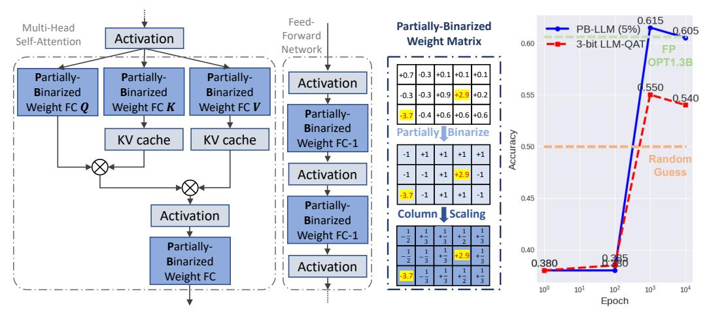
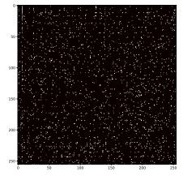

# PB-LLM: PARTIALLY BINARIZED LARGE LANGUAGE MODELS

Yuzhang Shang∗ Illinois Institute of Technology Zhihang Yuan∗ Huomo AI Qiang Wu Huomo AI Zhen Dong UC Berkeley

## ABSTRACT

This paper explores network binarization, a radical form of quantization, compressing model weights to a single bit, specifically for Large Language Models (LLMs) compression. Due to previous binarization methods collapsing LLMs, we propose a novel approach, Partially-Binarized LLM (PB-LLM), which can achieve extreme low-bit quantization while maintaining the linguistic reasoning capacity of quantized LLMs. Specifically, our exploration first uncovers the ineffectiveness of na¨ıve applications of existing binarization algorithms and highlights the imperative role of salient weights in achieving low-bit quantization. Thus, PB-LLM filters a small ratio of salient weights during binarization, allocating them to higher-bit storage, *i.e.,* partially-binarization. PB-LLM is extended to recover the capacities of quantized LMMs, by analyzing from the perspective of post-training quantization (PTQ) and quantization-aware training (QAT). Under PTQ, combining the concepts from GPTQ, we reconstruct the binarized weight matrix guided by the Hessian matrix and successfully recover the reasoning capacity of PB-LLM in low-bit. Under QAT, we freeze the salient weights during training, explore the derivation of optimal scaling factors crucial for minimizing the quantization error, and propose a scaling mechanism based on this derived scaling strategy for residual binarized weights. Those explorations and the developed methodologies significantly contribute to rejuvenating the performance of low-bit quantized LLMs and present substantial advancements in the field of network binarization for LLMs. The code is available at [PB-LLM.](https://github.com/hahnyuan/PB-LLM)

# 1 INTRODUCTION

Recently, large language models (LLMs) have gained significant traction in artificial intelligence. It can be attributed to the success of models such as ChatGPT [\[Brown et al.,](#page-9-0) [2020,](#page-9-0) [Ouyang et al.,](#page-9-1) [2022\]](#page-9-1). Following its lead, other LLMs such as OPT [\[Zhang et al.,](#page-9-2) [2022\]](#page-9-2), BLOOM [\[Scao et al.,](#page-9-3) [2022\]](#page-9-3), and LLaMA [\[Touvron et al.,](#page-9-4) [2023\]](#page-9-4) have emerged, proving that an increase in model size typically results in enhanced capabilities. As a result, models with tens to hundreds of billions of parameters have become the norm. However, their vast size poses considerable deployment challenges on memoryconstrained devices. A model such as the LLAMA-65B (with 65 billion parameters) requires at least 130GB of memory for inference - a number that often exceeds the capacity of a single GPU or server.

Many methods have been proposed to reduce the memory consumption of LLMs [\[Zhu et al.,](#page-9-5) [2023\]](#page-9-5). Those methods can be categorized into weight quantization [\[Dettmers et al.,](#page-9-6) [2022\]](#page-9-6), network pruning [\[Frantar and Alistarh,](#page-9-7) [2023\]](#page-9-7), and low-rank factorization [\[Zhang et al.,](#page-9-8) [2023\]](#page-9-8). Among these compression paradigms, weight quantization is particularly prominent and widely adopted for LLMs. Since it preserves the original model architecture and leverages well-trained LLMs' full-precision checkpoints, the compression process is greatly simplified [\[Zhu et al.,](#page-9-5) [2023\]](#page-9-5). However, state-of-the-art LLM quantization methods show a marked decline in quality beyond 4 bits [\[Liu et al.,](#page-9-9) [2023a\]](#page-9-9).

More aggressive compression methods are required to push the LLM quantization into the lower bit range. The network binarization technique stands out, reducing the bit-width of weights to just one bit [\[Helwegen et al.,](#page-9-10) [2019,](#page-9-10) [Rusci et al.,](#page-9-11) [2020,](#page-9-11) [Qin et al.,](#page-9-12) [2020a;](#page-9-12) [2023\]](#page-9-13). The binarized models take little storage and memory, and accelerate the inference by efficient bitwise operations. Compared

∗Equal contribution.

(a) One basic block of the Partially-Binarized LLM.

(b) Performance on BoolQ.

Figure 1: (a) We introduce Partially-Binarized Large Language Model (PB-LLM), where a small subset of the weights of the LLM are frozen and preserved with higher bit precision, while the remaining weights are binarized utilizing an optimal scaling factor strategy; (b) By using PB-LLM, an extremely low-bit LLM can be acquired efficiently (*i.e.*, quantization-aware training converges quickly) while maintaining its language reasoning capabilities.

to other aggressive compression technologies like high-sparsity pruning, network binarization has potent topological generics, as it only applies to parameters. Binarization is widely studied in academic research as a standalone compression technique, rather than simply a 1-bit specialization of quantization. Some SoTA binarization algorithms have even achieved full-precision performance on large-scale tasks, *e.g.*, ReActNet [Liu et al., 2020a] for ImageNet classification [Deng et al., 2009]. It is theoretically possible to significantly lower the LLM quantization if we generalize the idea of binarizing the weights of LLMs.

In this paper, we explore network binarization specifically for LLM quantization and propose Partiallybinarized LLMs (abbreviated as PB-LLM). This methodology aims to achieve extreme quantization to the lowest possible bit, while maintaining the language reasoning capacity inherent in LLMs. The explorations indicate that simple adaptations of existing binarization algorithms do not work well for LLM quantization. As a result of this realization, attention is directed towards the salient-weight property of LLM quantization. In order to achieve the desired extreme low-bit quantization, salient weights must be fully exploited. We investigate the salient weights in aspects of their detection criteria and granularity, as well as the storage costs. Then, we propose the partially binarized matrix, storing the salient weights in higher bits. After establishing the foundation of PB-LLM, the exploration extends to regain the lost reasoning capacity of the quantized LLMs, under the frameworks of posttraining quantization (PTQ) and quantization-aware training (QAT). In the view of PTQ, inspired by the concepts of GPTQ [Frantar et al., 2022], we reconstruct the PB-LLM matrix guided by the Hessian matrix and successfully recover the reasoning capacity of PB-LLM in low-bit. In the view of QAT, salient weights are frozen throughout the binarization process for efficient training. In addition, from the perspective of quantization error minimization, we explore how binarized LLMs should be scaled based on the ideal scaling factor. We scale the binarized weight based on the derived scaling strategy shown in Fig. 1a. Low-bit quantized LLMs can significantly improve their performance with such explorations. Benefited from explorations of PTQ and QAT, PB-LLM can efficiently obtain an extremely low-bit LLM with comparable reasoning capacity (see Fig. 1b). The methodologies applied and the insights gained within this study stand to contribute substantially to the advancement of knowledge and development in the field of network binarization for LLMs.

#### 2 Related Work

#### 2.1 NETWORK BINARIZATION.

Binarization uses the sign function to binarize weights and activations to  $\pm 1$ . To eliminate the vanishing gradient issue caused by the sign function in the binarization, the straight-through estimator

(STE) [\[Bengio et al.,](#page-9-17) [2013\]](#page-9-17) is utilized for the network backpropagation. Based on this archetype, copious studies contribute to improving the performance of BNNs. Binarization techniques can be broadly classified into three categories: the enhancement of training objectives, the reduction of gradient mismatch, and the minimization of quantization errors [\[Qin et al.,](#page-9-18) [2020b;](#page-9-18) [2023,](#page-9-13) [Yuan](#page-9-19) [and Agaian,](#page-9-19) [2023\]](#page-9-19). To illustrate: *Gradient Mismatch:* [Liu et al.](#page-10-0) [\[2020b\]](#page-10-0) introduce double residual connections paired with full-precision downsampling layers. This approach addresses the gradient vanishing problem that arises due to binarization. *Training Objectives:* [Martinez et al.](#page-10-1) [\[2020\]](#page-10-1) focus on optimizing the loss function during training. They suggest aligning the spatial attention maps derived from both binary and real-valued convolutions. *Quantization Error Minimization:* [Rastegari et al.](#page-10-2) [\[2016\]](#page-10-2) identify that the disparity in quantization between full-precision and binarized weights can impede the representational abilities of BNNs. As a solution, they introduce a scaling factor—determined by the L1 norm—for both weights and activation functions.

While binarization has proven successful in computer vision, its exploration in natural language processing remains limited. Existing methods [\[Bai et al.,](#page-10-3) [2020,](#page-10-3) [Qin et al.,](#page-10-4) [2022,](#page-10-4) [Liu et al.,](#page-10-5) [2022;](#page-10-5) [2023b\]](#page-10-6) primarily target smaller language models (*e.g.,* BERT-base [\[Devlin et al.,](#page-10-7) [2018\]](#page-10-7) with 110M parameters) potentially hindering their generalization to larger ones (*e.g.,* LLAMA-7B [\[Touvron](#page-9-4) [et al.,](#page-9-4) [2023\]](#page-9-4) with 7B parameters). We investigate binarization for LLMs comprehensively in this paper and propose PB-LLM, which is an attempt to compress LLMs using binarization.

### 2.2 LARGE LANGUAGE MODEL QUANTIZATION.

Quantization, a prominent method in model compression, addresses the storage and computational overhead of deep learning models. Recent research efforts successfully apply quantization to compress Large Language Models (LLMs), including Quantization-Aware Training (QAT) and Post-Training Quantization (PTQ).

In the domain of QAT, innovative strategies like LLM-QAT [\[Liu et al.,](#page-9-9) [2023a\]](#page-9-9) address challenges in acquiring training data for LLMs by leveraging pre-trained models for data-free distillation. Additionally, techniques such as QLORA [\[Dettmers et al.,](#page-10-8) [2023a\]](#page-10-8) focus on parameter-efficient fine-tuning (PEFT), expediting model compression and inference acceleration. In PTQ, approaches range from quantizing only the weights of LLMs to jointly quantizing both weights and activations. Methods like GPTQ [\[Frantar et al.,](#page-9-16) [2022\]](#page-9-16) and QuIP [\[Chee et al.,](#page-10-9) [2023\]](#page-10-9) optimize matrix multiplications and propose novel layer-wise quantization techniques achieving high compression rates. SqueezeLLM [\[Kim et al.,](#page-10-10) [2023\]](#page-10-10) and SpQR [\[Dettmers et al.,](#page-10-11) [2023b\]](#page-10-11) identify weights that lead to particularly large quantization errors and subsequently storing them with higher precision to mitigate the accuracy degradation caused by weight quantization. AWQ [\[Lin et al.,](#page-10-12) [2023\]](#page-10-12) and OWQ [\[Lee et al.,](#page-10-13) [2023\]](#page-10-13) contend that when quantizing weights, it is crucial to account for the impact of activation outliers on weights. Norm Tweaking [\[Li et al.,](#page-10-14) [2023\]](#page-10-14) addresses the issue of activation value deviation by training LayerNorm. For activation quantization, ZeroQuant [\[Yao et al.,](#page-10-15) [2022\]](#page-10-15) proposes a fine-grained quantization method that can be applied to both weights and activations. Methods like SmoothQuant [\[Xiao et al.,](#page-10-16) [2022\]](#page-10-16) and Outlier Suppression [\[Wei et al.,](#page-10-17) [2022;](#page-10-17) [2023\]](#page-10-18) shift the quantization challenge from activations to weights by proposing a mathematically equivalent per-channel scaling transformation. Omni-Quant [\[Shao et al.,](#page-10-19) [2023\]](#page-10-19) further enhances performance by training the quantization parameters. RPTQ [\[Yuan et al.,](#page-10-20) [2023\]](#page-10-20) proposed proposes performance improvement through grouped quantization after clustering similar channels. In this paper, our primary focus lies in the binarization of weights exclusively, employing both PTQ and QAT methodologies.

# 3 PARTIALLY BINARIZING LARGE LANGUAGE MODELS (PB-LLM)

In this section, we elaborate on the methodology of Partially Binarizing Large Language Models, named PB-LLM. To begin, a review of the foundational framework of binarized neural networks is presented, showcasing its applicability and limitation to LLM quantization. Subsequently, a novel format for the quantized matrix is formulated, specifically tailored for the binarization of LLMs. Taking advantage of the proposed partially-binarized weight matrix, we delve into its potential in the realms of post-training quantization and training-aware training for LLMs, to break the trade-off between bit-width and performance. It is crucial to note that, due to constraints in computational resources, the methodology exploration predominantly utilizes OPT-1.3B [\[Zhang et al.,](#page-9-2) [2022\]](#page-9-2) to perform the majority of experiments. Given the space constraints, this section primarily focuses on key

aspects of the methodology. For detailed discussions, exact result values, and specific implementation details in codes, readers are referred to the supplemental materials.

#### 3.1 PRELIMINARY: NETWORK BINARIZATION

To begin with, we briefly review the general concept of network binarization and binarized neural networks (BNNs) in [Courbariaux et al., 2016, Hubara et al., 2016]. As most optimizable quantized structures of LLMs are linear layers (see Fig. 1a) in LLMs, we use a one-layer Perceptron to show the training and inference processes of the BNN. The one-layer neural network is defined as  $f(\mathbf{x}) = (\mathbf{W})(\mathbf{a})$ , where  $\mathbf{a} \in \mathbb{R}^{d_i}$  is the input activation and  $\mathbf{W} : \mathbb{R}^{d_i} \longmapsto \mathbb{R}^{d_o}$  stands for the weight matrix, with  $d_i$  and  $d_o$  representing the sizes of the input and output of the layer, respectively.

The goal of network binarization is to represent floating-point (FP) weights, denoted as  $W_F$ , and/or FP activations  $a_F$  as 1-bit (*i.e.*, .,  $\pm 1$ ) values [Qin et al., 2020b]. Networks utilizing this representation are referred to as BNNs. BNNs diverge from FP neural networks in their forward operations and in the approximation of backward gradients. In the forward propagation, the sign function is used for binarizing FP values of weights:

Forward: 
$$\operatorname{sign}(x) = \begin{cases} +1 & x \ge 0 \\ -1 & x < 0. \end{cases} \tag{1}$$

Specifically, in the training process of binarized network, the BNN maintains FP latent weights  $\mathbf{W}_F$  for gradient updates, and the updated weight matrix  $\mathbf{W}_F$  is binarized into the binary weight matrix  $\mathbf{W}_B$  via the binarize function  $\mathtt{sign}(\cdot)$ , i.e.  $\mathbf{W}_B = \mathtt{sign}(\mathbf{W}_F)$ . Then the intermediate activation map (full-precision) of this layer is produced by  $\mathbf{A}_{F,o} = \mathbf{W}_B \mathbf{A}_{F,i}$ . For inference efficiency, BNNs with 1-bit weights significantly reduce the memory cost of inference. Theoretically, BNNs can binarize both weights and activations to 1-bit, providing a 32x compression in memory cost and a 64x acceleration in inference speed, by replacing FP multiplications in conventional floating-point networks with Xnor-Bitcount operations. However, recent studies highlight that the weights of LLMs as the main contributor to memory overhead [Kim et al., 2023], and thus we primarily aim to curtail memory costs. Therefore, in this pivotal exploration of binarized LLMs, our attention is specifically centered on weight binarization, foregoing the simultaneous binarization of weights and activations.

In the backward propagation, the main challenge is that the pervasive sign functions are theoretically non-differentiable, and thus extremely destroy the gradient chain in the backward propagation. To address this problem, researchers widely exploit the straight-through estimator (STE) [Bengio et al., 2013] to numerically approximate the derivative of the whole BNN [Qin et al., 2020b], *i.e.*,

$$\text{Backward:} \quad \frac{\partial \mathcal{L}}{\partial x} = \left\{ \begin{array}{ll} \frac{\partial \mathcal{L}}{\partial \text{sign}(x)} & \quad |x| \leq 1 \\ 0 & \quad |x| > 1, \end{array} \right.$$

which makes the optimization of BNN accessible.

We first investigate the **possibility of implementing binarization to LLM quantization**. Specifically, following the binarization benchmark in BiBench [Qin et al., 2023], we generalize some representative binarization methods into LLM quantization scenarios. BNN [Hubara et al., 2016], XNOR [Rastegari et al., 2016], Bi-Real [Liu et al., 2020b], ReCU [Xu et al., 2021a] and FDA [Xu et al., 2021b] are re-implemented to quantize LLMs, particularly to OPT [Zhang et al., 2022]. Training details are illustrated in the Sec. 4. The results evaluated on seven zero-shot

Figure 2: We implement five renowned binarization methods on LLMs and assess the resultant binarized LLMs across seven zeroshot common sense reasoning tasks. Random represents the hypothetical worst baseline, indicating random guesses, while FP stands as the optimal baseline, representing full-precision OPT-1.3B. The exact values corresponding to this radar graph are detailed in the Appendix.

common sense reasoning tasks are shown in Fig. 2. We can see that the LLMs binarized via the existing popular binarization algorithms perform worse than random guesses, showing that the existing binarization methods are not suitable for LLM binarization.

#### 3.2 PARTIALLY BINARIZED WEIGHT MATRIX

In the low-bit quantization of Transformers, a significant challenge is managing the salient weights, as they can unnecessarily extend the quantization range [Kovaleva et al., 2021]. Several outlier-aware quantization methods have been explored to tackle this issue [Dettmers et al., 2022, Wei et al., 2022, Kim et al., 2023, Lin et al., 2023]. Notably, SqueezeLLM [Kim et al., 2023] provides a generalized methodology for handling outliers in weight values during 4-bit LLM post-training quantization. Concurrently, AWQ [Lin et al., 2023] demonstrates that preserving only 1% of significant weights can benefit 4-bit LLM quantization. Motivated by existing research, this study also seeks to optimize the treatment of salient weights while binarizing most of weights. We present Partially-Binarized LLMs (PB-LLM), a method involving the selective binarization of the LLMs' weight matrix, wherein a minor fraction of weights is kept in high bits for enhanced language capacity.

#### 3.2.1 SALIENT WEIGHT: CRITERIA, GRANULARITY, AND COST

Beyond the most straightforward method of choosing salient weights—selecting based on magnitude element-wise—we conduct a thorough investigation into salient weight detection from two perspectives: criteria and granularity. For criteria, we compare Magnitude- and Hessian-based methods, and for granularity, we explore both element-wise and column-wise approaches. In addition, we discuss the cost of storing matrix weights in a mixed-precision manner.

Criteria: Magnitude vs. Hessian. Beyond the identification of salient weights through magnitude, alternative criteria have also been examined. The Hessian metric emerges as a crucial factor in LLM quantization, as elucidated in [Dong et al., 2019, Frantar et al., 2022, Frantar and Alistarh, 2023], particularly in relation to post-training quantization for LLMs (details regarding the Hessian criteria for PTQ can be found in Sec. 3.3). However, we observe that the selection of salient weights, whether by magnitude or Hessian, does not significantly impact the efficacy of PTQ. Consequently, magnitude is elected as the preferred criterion for the identification of salient weights in both PTQ and QAT, primarily due to its simplicity and efficacy in distinguishing critical weight components.

**Granularity: Element-wise vs. Column-wise.** Our investigations reveal that adopting a column-wise approach for selecting salient weights has the potential to impair the performance of binarization. Visualization of the salient weights' distribution within the matrix, as depicted in Fig. 3 (where the white dots represent the filtered salient weights), disclosed a random and uniform scattering of these weights. Given the absence of any discernable column-wise pattern in the distribution of salient weights, a column-wise filtration method is deemed unsuitable. This scattered and uniform distribution necessitates an element-wise approach for effective filtration in the binarization process.

Figure 3: Distribution of 5% salient weight.

Salient Weight Storing Cost. The additional overhead for storing the salient weights is acceptable. The overall bit number,  $N_{bit}$  must adhere to the following condition:

$$N_{bit} \leq \underbrace{1 * r_{binary}}_{\text{for binary weights}} + \underbrace{N_{salient-bit} * (1 - r_{binary})}_{\text{for index storing, could be optimized}}, \qquad (3)$$

Here,  $r_{binary}$  denotes the ratio of the binarized weights,  $N_{salient-bit}$  represents the number of bits allocated for storing salient weights (e.g., 8 bits), and the additional 1 bit is allocated for using the bitmap mechanism [Chan and Ioannidis, 1998] for index saving. It's important to note that employing bitmap for index storage is not the most efficient method and can be optimized further using sparse matrix storage methods such as Compressed Sparse Row (CSR) or Compressed Sparse Column (CSC) [Borštnik et al., 2014]; hence the use of  $\leq$  instead of = in Eq. 3. Given this research's emphasis on the theoretical aspects of binarization for LLM quantization, we do not delve into saving the cost of storing the index. The relationship between the ratio of salient weights and the overall bit number is illustrated in Fig. 4, depicting that a lower ratio corresponds to a

Figure 4: Variation in overall bit number  $N_{bit}$  with the ratio of the salient weights  $r_{binary}$ , where salient weights are stored in 8-bit.

reduced overall bit number. For example, retaining 10% of weights in 8 bits and binarizing the remaining 90% equates to, at most, a 2.7-bit quantization.

Table 1: Perplexity of C4 on OPT-1.3B quantized with RTN (without GPTQ) and PB-GPTQ. Magnitude criteria or Hessian criteria is used for detecting salient weights.

| Salient Fraction        | 50%     | 20%       | 10%       | 5%        |
|-------------------------|---------|-----------|-----------|-----------|
| RTN Magnitude           | 24.5675 | 5892.0898 | 4889.0385 | 8023.1132 |
| RTN Hessian             | 20.2512 | 2109.8522 | 7508.7788 | 6173.1611 |
| PB-GPTQ Magnitude       | 18.3674 | 46.4093   | 895.0322  | 2880.6157 |
| PB-GPTQ Hessian         | 17.7567 | 42.1157   | 165.6767  | 528.4877  |
| PB-GPTQ Magnitude g=128 | 18.0293 | 57.2164   | 1230.8537 | 2662.7114 |
| PB-GPTQ Hessian g=128   | 17.6000 | 45.9811   | 157.8825  | 646.3616  |

#### 3.3 POST-TRAINING QUANTIZATION FOR PB-LLMS

After defining the partially-binarized matrix format, the next step is to recover the performance (*i.e.*, the reasoning capacity in the literature of LLMs) of the quantized PB-LLM. In this section, we explore the weight binarization with post-training quantization (PTQ) methods. PTQ methods hold a prominent position in the realm of quantization techniques for LLMs due to their ease of implementation. They enable direct quantization of pre-trained LLMs without the need for a training dataset and additional training overhead. Therefore, we first explore the weight binarization within the PTQ framework.

GPTQ [Frantar et al., 2022] is the most efficient and effective method for weight quantization [Zhu et al., 2023], capable of quantizing LLMs to 4-bit or even 2-bit. Therefore, we generalize the idea of GPTQ to the partial-binarization setting. Specifically, GPTQ quantizes the weights in LLM layer-by-layer to minimize the layer-wise quantization error:

$$\underset{\hat{\mathbf{W}}}{\arg\min} ||\mathbf{W}\mathbf{X} - \hat{\mathbf{W}}\mathbf{X}||_2^2 \tag{4}$$

GPTQ quantizes a weight  $w_q$  to  $\hat{w}_q$ , calculates the compensation  $\delta_{-q}$  for remaining weights  $w_{-q}$ , and then applies the compensation factor to the remaining weights:

$$\delta_{-q} = \frac{w_q - \hat{w}_q}{[\mathbf{H}^{-1}]_{qq}} \cdot (\mathbf{H}^{-1})_{:,q}, \qquad w_{-q} := w_{-q} + \delta_{-q}, \tag{5}$$

where the  $\mathbf{H}$  is the Hessian matrix of the layer-wise quantization error with respect to the weights and  $w_q$  is the q-th value in flattened weight matrix  $\mathbf{W}$ . In GPTQ, weights are quantized iteratively and the remaining weights are updated until all weights have been quantized.

We propose to use GPTQ to iteratively bianrize the un-salient weights and quantize the salient weights to higher bit, and then apply the compensation to the remaining weights. Specifically, we first detect the salient weights  $\mathbf{W}^{sal}$  and un-salient (to-be-binarized) weights  $\mathbf{W}^{unsal}$  in the weight matrix  $\mathbf{W} = \mathbf{W}^{sal} + \mathbf{W}^{unsal}$ . Drawing inspiration from SparseGPT [Frantar and Alistarh, 2023], we calculate the saliency metric, represented as  $v_i = w_i^2/[\mathbf{H}^{-1}]_{ii}^2$ , for the purpose of detecting salient weights using Hessian criterion. The un-salient weights will be binarized to  $\hat{\mathbf{W}}^{unsal}$ , and the salient weights will be quantized to higher bit  $\hat{\mathbf{W}}^{sal}$ . We use asymmetric per-channel quantization for both salient and un-salient weights. For un-salient weight, we use the per-channel mean as zero point and calculate the optimal scaling factor  $\alpha$  for the un-salient weights using the method in Sec. 3.4.2. We use MinMax metric to calibrate the scaling factor and zero point for salient weights.

In the quantization process, we iteratively quantize the columns in the weight matrix W. For each column, we binarize the un-salient weights and quantize the salient weights, and then calculate the compensation for remaining weights, and then apply the compensation factor to the remaining columns of weights. This process is repeated until all the weights are quantized. The proposed method is denoted as PB-GPTQ. We also explore the fine-grained PB-GPTQ, which quantizes the weights in a group-wise manner. Specifically, the weight matrix is split into several groups, each group contains g columns. In each group, we detect the salient weights and un-salient weights, and then calibrate to set the scaling factor and zero point using the weights in this group.

The results are listed in Tab. 1. PB-GPTQ is significantly better than RTN. We note that the Hessian-based PB-GPTQ exhibits a superior performance compared to the Magnitude criterion PB-GPTQ. The group-wise PB-GPTQ performs better or worse than the non-group-wise PB-GPTQ, but the difference is not significant. Our analysis suggests that the disparity in scaling factors is not the primary determinant of binarization performance; hence, the introduction of group-wise methodology does not yield an enhancement in binarization performance. Subsequently, our next endeavor will involve the application of QAT to reduce the error introduced by weight binarization.

#### 3.4 QUANTIZATION-AWARE TRAINING FOR PB-LLMS

In order to further enhance the reasoning capacity of the Partially-Binarized Large Language Models (PB-LLM), we extend our exploration by employing Quantization-aware Training (QAT) to meticulously train the quantized models. Because LLM training is difficult, we desire that PB-LLM training could be as efficient as possible. To realize efficient training for PB-LLM, we propose the Salient Weights Frozen and Optimal Scaling Factor for Binary Weights, targeting the salient weights and binarized weights, respectively.

#### 3.4.1 SALIENT WEIGHTS FROZEN

To leverage the value of pre-trained weights, we propose freezing the salient weights, determined by weight magnitude, prior to the weight binarization process. As illustrated in Fig. 1a, we initially filter out a number of weights from a pre-trained weight matrix—*e.g.*, 2% by magnitude—at the beginning of quantization-aware training, maintaining their fixed state throughout the training process. Examination of training efficiency (refer to Fig.5) suggests that these salient weights play a crucial role in LLM capacity. Maintaining the high bit representation of certain weights, thereby freezing them, aids in the training of quantized LLMs and reduces their optimization difficulty.

Figure 5: **Training Loss Curves:** When only 2% of weights are retained in their un-binarized state, the training loss converges more swiftly.

#### 3.4.2 OPTIMAL SCALING FACTOR FOR BINARY WEIGHTS.

AWQ [Lin et al., 2023] enhances the weight-only quantization method for LLMs by optimizing scaling factors to mitigate the quantization error of quantized weights. Specifically, AWQ demonstrates that searching for empirically optimal scaling factors proves to be an effective strategy for reducing quantization errors and recovering the performance of the quantized models. Fortunately, in the context of LLM binarization, we have a better choice for scaling the binarized weights. There's no need to search for optimal scaling factors as they can be **analytically derived**. Specifically, we apply a column-wise scaling factor to binarized weights to **reduce the binarization error**, *i.e.*, enforcing  $\mathbf{w}_F = \alpha \bar{\mathbf{w}}_B$ . The optimal values of scaling factor  $\alpha$  for the  $\bar{\mathbf{w}}_B \in \{-1,1\}$  can be calculated by minimizing the L2 error:

$$\alpha^{\star} = \arg\min_{\alpha \in \mathbb{R}_{+}} \mathcal{J}(\alpha), \text{ in which } \mathcal{J}(\alpha) = \|\mathbf{w}_{F} - \alpha \bar{\mathbf{w}}_{B}\|_{2}^{2}$$
 (6)

Following XNOR-Net [Rastegari et al., 2016], by expanding the below equation, we have

$$\mathcal{J}(\alpha) = \alpha^2 \bar{\mathbf{w}}_B^T \bar{\mathbf{w}}_B - 2\alpha \mathbf{w}_F^T \bar{\mathbf{w}}_B + \mathbf{w}_F^T \mathbf{w}_F$$
 (7)

For the vector with  $\mathbf{w}_F \in \mathbb{R}^n$  we follow the traditional methods of binarizing weights [Hubara et al., 2016] by taking the sign of real-valued weights:

$$\bar{\mathbf{w}}_B^i = \text{sign}(\mathbf{w}_F^i) = \begin{cases} +1, & \mathbf{w}_F^i \ge 0; \\ -1, & \mathbf{w}_F^i < 0. \end{cases} \tag{8}$$

In that case,  $\bar{\mathbf{w}}_B^T \bar{\mathbf{w}}_B = n_{\mathbf{w}_F}$ , where  $n_{\mathbf{w}_F}$  is number of elements in  $\mathbf{w}_F$ , and  $\alpha^*$  can be solved as:

$$\alpha^* = \frac{\mathbf{w}_F^T \bar{\mathbf{w}}_B}{n_{\mathbf{w}_F}} = \frac{\|\mathbf{w}_F\|_1}{n_{\mathbf{w}_F}}.$$
 (9)

A counterintuitive outcome emerges from the incorporation of salient-frozen and optimal-scaling mechanisms: directly deploying those two mechanisms to pre-trained LLM even *without any retraining or fine-tuning*, still results in commendable perfor-

Figure 6: **Perplexity (PPL) on C4:** When 50% of the weights are maintained in their un-binarized state (equivalent to around 5-bit quantization), the untrained PB-LLM does not experience a total loss of reasoning capabilities.

mance. For instance, applying these techniques to OPT-1.3B with 50% salient weights (see Fig. 6) reveals that the partially-binarized OPT-1.3B retains a small amount of language capacity, corroborating the importance of a small number of salient weights in LLM quantization. Consequently,

Figure 7: QAT training results with 30% salient weights PB-LLM (upper two lines): As fine-tuning epochs increase, quantized models swiftly regain their reasoning capacities, demonstrating the resilience and adaptability of PB-LLMin sustaining cognitive functionalities within models, despite substantial quantization; QAT training results with 5% salient weights PB-LLM (bottom two lines): Existing LLM QAT methods exhibit an absolute failure when subjected to extremely-low bit conditions. In contrast, PB-LLMtriumphs in restoring the reasoning capacities of low-bit quantized LLMs. This underlines the efficacy of PB-LLM in balancing quantization and performance, preserving the essential reasoning abilities of LLMs even under rigorous bit reduction.

implementing just these two techniques—Outlier Frozen and Optimal Scaling Factor for Binary Weights—on pre-trained LLMs serves as an efficient starting point for training PB-LLM.

Both of the above-proposed mechanisms are very effective when used during quantization-aware training of PB-LLM. The consequential outcomes are delineated in Figs.7a-7p. Observations from the presented results elucidate that optimizing using the partially-binarized quantization format is notably more straightforward compared to single-bit quantization. This empirical evidence corroborates the discussion regarding the rapid convergence property found in Sec.3.4.1, highlighting the efficacy and adaptability of our proposed methodology in optimizing LLMs within the constraints of partial binarization. From the perspective of QAT, PB-LLM emerges as more efficient in training compared to existing LLM QAT methods. For instance, while models like LLM-QAT [Liu et al., 2023a] necessitate up to 100K iterations for adequate training, PB-LLM remarkably achieves recovery of the performance of quantized LLMs in merely around 1-10K iterations. This substantial reduction in required iterations represents a leap in training efficiency, streamlining the path to achieving optimal performance in quantized LLMs with significantly reduced computational effort.

#### 4 EXPERIMENTS

Besides the exploration with OPT-1.3B in Sec. 3, we assess the effectiveness of PB-LLM by conducting experiments on LLaMA-7B [Touvron et al., 2023] and presenting results on various tasks.

Table 2: Zero-shot performance on Common Sense Reasoning tasks within a 4-bit setting. Reported results of previous works are documented in their papers. PB-LLM 30% denotes the preservation of 30% salient weights, and PB-LLM 10% implies the preservation of 10% salient weights.

| Method        | BoolQ | PIQA                 | HellaSwag | WinoGrande | ARC-E | ARC-C | OBQA | Avg          |
|---------------|-------|----------------------|-----------|------------|-------|-------|------|--------------|
| FP LLaMA-7B   | 76.8  | 79.3                 | 76.1      | 70.0       | 73.0  | 48.0  | 57.6 | 68.7         |
| RTN           | 71.2  | 77.3                 | 72.7      | 66.9       | 68.8  | 46.4  | 52.8 | 65.2         |
| SmoothQuant   | 67.7  | 76.0                 | 69.4      | 66.7       | 66.9  | 43.0  | 50.6 | 63.0         |
| LLM-QAT       | 75.5  | 78.3                 | 74.0      | 69.0       | 70.0  | 45.0  | 55.4 | 66.6         |
| PB-GPTQ 10%   | 62.3  | - -55.9 - | 27.7      | 49.3       | 29.3  | 20.1  | 10.6 | $\bar{36.5}$ |
| PB-GPTQ 30%   | 73.5  | 74.9                 | 47.5      | 64.9       | 61.3  | 32.4  | 25.2 | 54.2         |
| PB-LLM $10\%$ | 68.9  | 67.8                 | 68.1      | 67.4       | 58.7  | 42.9  | 50.6 | 60.6         |
| PB-LLM $30\%$ | 75.7  | 78.0                 | 74.3      | 69.7       | 69.0  | 45.6  | 55.8 | 66.9         |

#### 4.1 EXPERIMENTAL SETUP

**Dataset.** In this study, the PB-LLM is trained using the RedPajama-simple-1B dataset, as the dataset for LLaMa training is not openly accessible. This dataset, RedPajama-1T, is structured to closely resemble the LLaMa paper and serves as a transparent, open-source alternative to LLM training dataset. It amalgamates data from diverse sources including Commoncrawl, C4, GitHub, Wikipedia, Gutenberg Books3, ArXiv, and Stackexchange. RedPajama-simple-1B, representing a 0.1% subset of RedPajama-1T, is substantially smaller than the typical datasets used for training other LLMs, making it a convenient choice for our experiments.

**Training Details.** In the training process of our quantized network, we commence with a pretrained model for initialization. The optimization of the model is facilitated through the AdamW optimizer [Loshchilov and Hutter, 2017], applied with zero weight decay. We assign a batch size of 1 to each GPU and implement a learning rate of 2e-5, adhering to a cosine learning rate decay strategy. We only fine-tune our PB-LLM for 10K iterations.

**Evaluated Tasks.** To eliminate the variance of evaluated performance, we evaluate the binarized LLMs on seven zero-shot common sense reasoning tasks, *i.e.*, BoolQ [Clark et al., 2019], PIQA [Bisk et al., 2020], HellaSwag [Zellers et al., 2019], WinoGrande [Sakaguchi et al., 2021], ARC-Easy, ARC-Challenge [Clark et al., 2018], OBQA [Mihaylov et al., 2018]. We also along eavulated the quantized moelds' perplexity scores on WikiText2 [Merity et al., 2016] and C4 [Raffel et al., 2020].

### 4.2 RESULTS ON LLAMA

Experiments were conducted on LLaMA-7B. The results of employing PB-GPTQ and PB-LLM are illustrated in Tabs. 2 and 3. When employing PTQ, PB-GPTQ exhibited commendable performance, particularly when the salient weight exceeded 30%. Nevertheless, a noteworthy decline in the performance of the quantized network was observed when the salient weight was reduced to 10%. On the other hand, employing QAT resulted in a notable improve-

Table 3: Perplexity of C4, wikitext2 and PTB on LLaMA-7b quantized with PTQ methods.

|                | C4       | WIKI      | PTB       |
|----------------|----------|-----------|-----------|
| FP             | 7.3435   | 5.6770    | 41.1509   |
| GPTQ 4b        | 8.6977   | 8.1368    | 57.9951   |
| SparseGPT 50%  | 15.5949  | 12.829483 | 505.1396  |
| PB-GPTQ 50%    | 8.1466   | 6.3089    | 54.8674   |
| PB-GPTQ $20\%$ | 20.6057  | 17.1929   | 280.4353  |
| PB-GPTQ 10%    | 72.1115  | 85.7838   | 708.4120  |
| PB-GPTQ 5%     | 401.6475 | 619.1054  | 1687.1815 |

ment in the performance. A comparison within a 4-bit quantization setting between PB-LLM 30% and LLM-QAT in Tab. 2 reveals superior performance by our method. It is notable that PB-LLM is only fine-tuned for 10K iterations, whereas LLM-QAT underwent 100K iterations of training, showing its fast convergence property (refer to Sec. 3.2). The results under PB-LLM 10% represent the outcomes of PB-LLM where 10% of salient weights are preserved. This demonstrates the potential for advancing LLM quantization towards a fully 1-bit state.

#### 5 CONCLUSION

In conclusion, this work is the first to implement network binarization for LLM quantification, introducing the novel Partially-binarized LLM (PB-LLM) methodology. This approach is meticulously designed to maintain linguistic reasoning capabilities of LLMs, even under extreme low-bit quantization. The research unearthed the significant role of salient weights in achieving extreme quantization and proposed innovative strategies like optimal scaling for effective binarization. This framework is extended to recover the capacities of quantized LMMs, by analyzing from the perspective of post-training quantization (PTQ) and quantization-aware training (QAT). The methodology is a significant stride in the realm of network binarization for LLMs.

# REFERENCES

- Tom Brown, Benjamin Mann, Nick Ryder, Melanie Subbiah, Jared D Kaplan, Prafulla Dhariwal, Arvind Neelakantan, Pranav Shyam, Girish Sastry, Amanda Askell, et al. Language models are few-shot learners. *Advances in neural information processing systems*, 33:1877–1901, 2020.
- Long Ouyang, Jeffrey Wu, Xu Jiang, Diogo Almeida, Carroll Wainwright, Pamela Mishkin, Chong Zhang, Sandhini Agarwal, Katarina Slama, Alex Ray, et al. Training language models to follow instructions with human feedback. *Advances in Neural Information Processing Systems*, 35:27730–27744, 2022.
- Susan Zhang, Stephen Roller, Naman Goyal, Mikel Artetxe, Moya Chen, Shuohui Chen, Christopher Dewan, Mona Diab, Xian Li, Xi Victoria Lin, et al. Opt: Open pre-trained transformer language models. *arXiv preprint arXiv:2205.01068*, 2022.
- Teven Le Scao, Angela Fan, Christopher Akiki, Ellie Pavlick, Suzana Ilic, Daniel Hesslow, Roman Castagn ´ e,´ Alexandra Sasha Luccioni, Franc¸ois Yvon, Matthias Galle, et al. Bloom: A 176b-parameter open-access ´ multilingual language model. *arXiv preprint arXiv:2211.05100*, 2022.
- Hugo Touvron, Thibaut Lavril, Gautier Izacard, Xavier Martinet, Marie-Anne Lachaux, Timothee Lacroix, ´ Baptiste Roziere, Naman Goyal, Eric Hambro, Faisal Azhar, et al. Llama: Open and efficient foundation ` language models. *arXiv preprint arXiv:2302.13971*, 2023.
- Xunyu Zhu, Jian Li, Yong Liu, Can Ma, and Weiping Wang. A survey on model compression for large language models. *arXiv preprint arXiv:2308.07633*, 2023.
- Tim Dettmers, Mike Lewis, Younes Belkada, and Luke Zettlemoyer. Llm. int8 (): 8-bit matrix multiplication for transformers at scale. *arXiv preprint arXiv:2208.07339*, 2022.
- Elias Frantar and Dan Alistarh. Sparsegpt: Massive language models can be accurately pruned in one-shot. *ICML*, 2023.
- Mingyang Zhang, Chunhua Shen, Zhen Yang, Linlin Ou, Xinyi Yu, Bohan Zhuang, et al. Pruning meets low-rank parameter-efficient fine-tuning. *arXiv preprint arXiv:2305.18403*, 2023.
- Zechun Liu, Barlas Oguz, Changsheng Zhao, Ernie Chang, Pierre Stock, Yashar Mehdad, Yangyang Shi, Raghuraman Krishnamoorthi, and Vikas Chandra. Llm-qat: Data-free quantization aware training for large language models. *arXiv preprint arXiv:2305.17888*, 2023a.
- Koen Helwegen, James Widdicombe, Lukas Geiger, Zechun Liu, Kwang-Ting Cheng, and Roeland Nusselder. Latent weights do not exist: Rethinking binarized neural network optimization. *Advances in neural information processing systems*, 2019.
- Manuele Rusci, Alessandro Capotondi, and Luca Benini. Memory-driven mixed low precision quantization for enabling deep network inference on microcontrollers. *MLSys*, 2020.
- Haotong Qin, Ruihao Gong, Xianglong Liu, Mingzhu Shen, Ziran Wei, Fengwei Yu, and Jingkuan Song. Forward and backward information retention for accurate binary neural networks. In *CVPR*, 2020a.
- Haotong Qin, Mingyuan Zhang, Yifu Ding, Aoyu Li, Zhongang Cai, Ziwei Liu, Fisher Yu, and Xianglong Liu. Bibench: Benchmarking and analyzing network binarization. *ICML*, 2023.
- Zechun Liu, Zhiqiang Shen, Marios Savvides, and Kwang-Ting Cheng. Reactnet: Towards precise binary neural network with generalized activation functions. In *ECCV*, 2020a.
- Jia Deng, Wei Dong, Richard Socher, Li-Jia Li, Kai Li, and Li Fei-Fei. Imagenet: A large-scale hierarchical image database. In *CVPR*, 2009.
- Elias Frantar, Saleh Ashkboos, Torsten Hoefler, and Dan Alistarh. Gptq: Accurate post-training quantization for generative pre-trained transformers. *arXiv preprint arXiv:2210.17323*, 2022.
- Yoshua Bengio, Nicholas Leonard, and Aaron Courville. Estimating or propagating gradients through stochastic ´ neurons for conditional computation. *arXiv:1308.3432*, 2013.
- Haotong Qin, Ruihao Gong, Xianglong Liu, Xiao Bai, Jingkuan Song, and Nicu Sebe. Binary neural networks: A survey. *Pattern Recognition*, 105:107281, 2020b.
- Chunyu Yuan and Sos S Agaian. A comprehensive review of binary neural network. *Artificial Intelligence Review*, pages 1–65, 2023.

- Zechun Liu, Wenhan Luo, Baoyuan Wu, Xin Yang, Wei Liu, and Kwang-Ting Cheng. Bi-real net: Binarizing deep network towards real-network performance. *IJCV*, 2020b.
- Brais Martinez, Jing Yang, Adrian Bulat, and Georgios Tzimiropoulos. Training binary neural networks with real-to-binary convolutions. *arXiv preprint arXiv:2003.11535*, 2020.
- Mohammad Rastegari, Vicente Ordonez, Joseph Redmon, and Ali Farhadi. Xnor-net: Imagenet classification using binary convolutional neural networks. In *ECCV*, 2016.
- Haoli Bai, Wei Zhang, Lu Hou, Lifeng Shang, Jing Jin, Xin Jiang, Qun Liu, Michael Lyu, and Irwin King. Binarybert: Pushing the limit of bert quantization. *arXiv preprint arXiv:2012.15701*, 2020.
- Haotong Qin, Yifu Ding, Mingyuan Zhang, Qinghua Yan, Aishan Liu, Qingqing Dang, Ziwei Liu, and Xianglong Liu. Bibert: Accurate fully binarized bert. *arXiv preprint arXiv:2203.06390*, 2022.
- Zechun Liu, Barlas Oguz, Aasish Pappu, Lin Xiao, Scott Yih, Meng Li, Raghuraman Krishnamoorthi, and Yashar Mehdad. Bit: Robustly binarized multi-distilled transformer. *Advances in neural information processing systems*, 35:14303–14316, 2022.
- Zechun Liu, Barlas Oguz, Aasish Pappu, Yangyang Shi, and Raghuraman Krishnamoorthi. Binary and ternary natural language generation. *ACL*, 2023b.
- Jacob Devlin, Ming-Wei Chang, Kenton Lee, and Kristina Toutanova. Bert: Pre-training of deep bidirectional transformers for language understanding. *arXiv preprint arXiv:1810.04805*, 2018.
- Tim Dettmers, Artidoro Pagnoni, Ari Holtzman, and Luke Zettlemoyer. Qlora: Efficient finetuning of quantized llms. *arXiv preprint arXiv:2305.14314*, 2023a.
- Jerry Chee, Yaohui Cai, Volodymyr Kuleshov, and Christopher De Sa. Quip: 2-bit quantization of large language models with guarantees. *arXiv preprint arXiv:2307.13304*, 2023.
- Sehoon Kim, Coleman Hooper, Amir Gholami, Zhen Dong, Xiuyu Li, Sheng Shen, Michael W Mahoney, and Kurt Keutzer. Squeezellm: Dense-and-sparse quantization. *arXiv preprint arXiv:2306.07629*, 2023.
- Tim Dettmers, Ruslan Svirschevski, Vage Egiazarian, Denis Kuznedelev, Elias Frantar, Saleh Ashkboos, Alexander Borzunov, Torsten Hoefler, and Dan Alistarh. Spqr: A sparse-quantized representation for near-lossless llm weight compression. *arXiv preprint arXiv:2306.03078*, 2023b.
- Ji Lin, Jiaming Tang, Haotian Tang, Shang Yang, Xingyu Dang, and Song Han. Awq: Activation-aware weight quantization for llm compression and acceleration. *arXiv preprint arXiv:2306.00978*, 2023.
- Changhun Lee, Jungyu Jin, Taesu Kim, Hyungjun Kim, and Eunhyeok Park. Owq: Lessons learned from activation outliers for weight quantization in large language models. *arXiv preprint arXiv:2306.02272*, 2023.
- Liang Li, Qingyuan Li, Bo Zhang, and Xiangxiang Chu. Norm tweaking: High-performance low-bit quantization of large language models. *arXiv preprint arXiv:2309.02784*, 2023.
- Zhewei Yao, Reza Yazdani Aminabadi, Minjia Zhang, Xiaoxia Wu, Conglong Li, and Yuxiong He. Zeroquant: Efficient and affordable post-training quantization for large-scale transformers. *arXiv preprint arXiv:2206.01861*, 2022.
- Guangxuan Xiao, Ji Lin, Mickael Seznec, Julien Demouth, and Song Han. Smoothquant: Accurate and efficient post-training quantization for large language models. *arXiv preprint arXiv:2211.10438*, 2022.
- Xiuying Wei, Yunchen Zhang, Xiangguo Zhang, Ruihao Gong, Shanghang Zhang, Qi Zhang, Fengwei Yu, and Xianglong Liu. Outlier suppression: Pushing the limit of low-bit transformer language models. *NeurIPS*, 2022.
- Xiuying Wei, Yunchen Zhang, Yuhang Li, Xiangguo Zhang, Ruihao Gong, Jinyang Guo, and Xianglong Liu. Outlier suppression+: Accurate quantization of large language models by equivalent and optimal shifting and scaling. *arXiv preprint arXiv:2304.09145*, 2023.
- Wenqi Shao, Mengzhao Chen, Zhaoyang Zhang, Peng Xu, Lirui Zhao, Zhiqian Li, Kaipeng Zhang, Peng Gao, Yu Qiao, and Ping Luo. Omniquant: Omnidirectionally calibrated quantization for large language models. *CoRR*, abs/2308.13137, 2023.
- Zhihang Yuan, Lin Niu, Jiawei Liu, Wenyu Liu, Xinggang Wang, Yuzhang Shang, Guangyu Sun, Qiang Wu, Jiaxiang Wu, and Bingzhe Wu. Rptq: Reorder-based post-training quantization for large language models. *arXiv preprint arXiv:2304.01089*, 2023.

- Matthieu Courbariaux, Yoshua Bengio, and Jean-Pierre David. Binaryconnect: Training deep neural networks with binary weights during propagations. In *NeurIPS*, 2016.
- Itay Hubara, Matthieu Courbariaux, Daniel Soudry, Ran El-Yaniv, and Yoshua Bengio. Binarized neural networks. In *NeurIPS*, 2016.
- Zihan Xu, Mingbao Lin, Jianzhuang Liu, Jie Chen, Ling Shao, Yue Gao, Yonghong Tian, and Rongrong Ji. Recu: Reviving the dead weights in binary neural networks. In *ICCV*, 2021a.
- Yixing Xu, Kai Han, Chang Xu, Yehui Tang, Chunjing Xu, and Yunhe Wang. Learning frequency domain approximation for binary neural networks. In *NeurIPS*, 2021b.
- Olga Kovaleva, Saurabh Kulshreshtha, Anna Rogers, and Anna Rumshisky. Bert busters: Outlier dimensions that disrupt transformers. *arXiv preprint arXiv:2105.06990*, 2021.
- Zhen Dong, Zhewei Yao, Amir Gholami, Michael W Mahoney, and Kurt Keutzer. Hawq: Hessian aware quantization of neural networks with mixed-precision. In *ICCV*, 2019.
- Chee-Yong Chan and Yannis E Ioannidis. Bitmap index design and evaluation. In *SIGMOD*, 1998.
- Urban Borstnik, Joost VandeVondele, Val ˇ ery Weber, and J ´ urg Hutter. Sparse matrix multiplication: The ¨ distributed block-compressed sparse row library. *Parallel Computing*, 2014.
- Christopher Clark, Kenton Lee, Ming-Wei Chang, Tom Kwiatkowski, Michael Collins, and Kristina Toutanova. Boolq: Exploring the surprising difficulty of natural yes/no questions. *arXiv preprint arXiv:1905.10044*, 2019.
- Yonatan Bisk, Rowan Zellers, Jianfeng Gao, Yejin Choi, et al. Piqa: Reasoning about physical commonsense in natural language. In *AAAI*, 2020.
- Rowan Zellers, Ari Holtzman, Yonatan Bisk, Ali Farhadi, and Yejin Choi. Hellaswag: Can a machine really finish your sentence? *arXiv preprint arXiv:1905.07830*, 2019.
- Keisuke Sakaguchi, Ronan Le Bras, Chandra Bhagavatula, and Yejin Choi. Winogrande: An adversarial winograd schema challenge at scale. *Communications of the ACM*, 2021.
- Peter Clark, Isaac Cowhey, Oren Etzioni, Tushar Khot, Ashish Sabharwal, Carissa Schoenick, and Oyvind Tafjord. Think you have solved question answering? try arc, the ai2 reasoning challenge. *arXiv preprint arXiv:1803.05457*, 2018.
- Todor Mihaylov, Peter Clark, Tushar Khot, and Ashish Sabharwal. Can a suit of armor conduct electricity? a new dataset for open book question answering. *arXiv preprint arXiv:1809.02789*, 2018.
- Ilya Loshchilov and Frank Hutter. Decoupled weight decay regularization. *arXiv preprint arXiv:1711.05101*, 2017.
- Stephen Merity, Caiming Xiong, James Bradbury, and Richard Socher. Pointer sentinel mixture models. *arXiv preprint arXiv:1609.07843*, 2016.
- Colin Raffel, Noam Shazeer, Adam Roberts, Katherine Lee, Sharan Narang, Michael Matena, Yanqi Zhou, Wei Li, and Peter J Liu. Exploring the limits of transfer learning with a unified text-to-text transformer. *JMLR*, 2020.

### A SUPPLEMENTAL MATERIALS

### A.1 Exisiting Binarization Methods on LLM Quantization

| Method             | BoolQ                | PIQA           | HellaSwag     | WinoGrande            | ARC-Easy       | ARC-Challenge | OBQA                   | Mean                 |
|--------------------|----------------------|----------------|---------------|-----------------------|----------------|---------------|------------------------|----------------------|
| Random Performance | 0.5                  | 0.5            | 0.25          | 0.5                   | 0.25           | 0.25          | 0.25                   | 0.36                 |
| FP                 | 0.595                | 0.63           | 0.415         | 0.595                 | 0.54           | 0.22          | 0.25                   | 0.46                 |
| BNN                | 0.38                 | 0.545          | 0.235         | 0.46                  | 0.195          | 0.165         | 0.15                   | 0.30                 |
| XNOR               | 0.37                 | 0.525          | 0.265         | 0.49                  | 0.195          | 0.165         | 0.16                   | 0.31                 |
| Bi-Real            | 0.395                | 0.5            | 0.25          | 0.505                 | 0.235          | 0.185         | 0.165                  | 0.32                 |
| ReCU FDA        | 0.39 0.39 0.39 | 0.515 0.485 | 0.24 0.265 | 0.503 0.51 0.49 | 0.255 0.265 | 0.185 0.19 | 0.103 0.175 0.17 | 0.32 0.32 0.32 |

Table 4: Table corresponds to Figure 2 in the main paper: We implement five renowned binarization methods on LLMs and assess the resultant binarized LLMs across seven zero-shot common sense reasoning tasks.

We first investigate the possibility of implementing binarization to LLM quantization. Specifically, following the binarization benchmark in BiBench [Qin et al., 2023], we generalize some representative binarization methods into LLM quantization scenarios. BNN [Hubara et al., 2016], XNOR [Rastegari et al., 2016], Bi-Real [Liu et al., 2020b], ReCU [Xu et al., 2021a] and FDA [Xu et al., 2021b] are re-implemented to quantize LLMs, particularly to OPT [Zhang et al., 2022]. Training details are illustrated in the Sec. 4. The results evaluated on seven zero-shot common sense reasoning tasks are shown in the above table. We can see that the LLMs binarized via the existing popular binarization algorithms perform worse than random guesses, showing that the existing binarization methods are not suitable for LLM binarization.