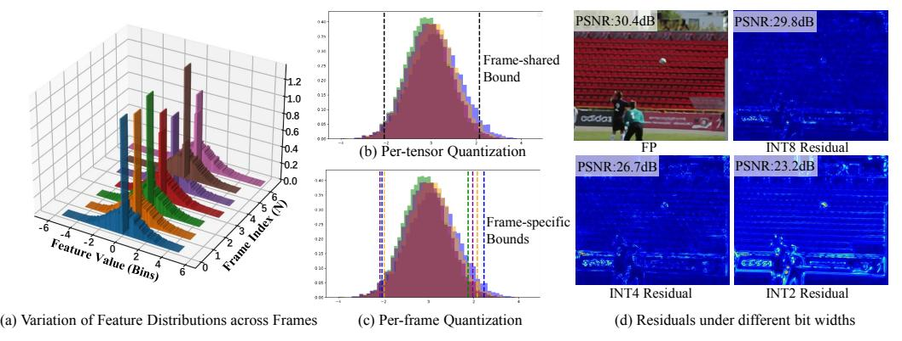
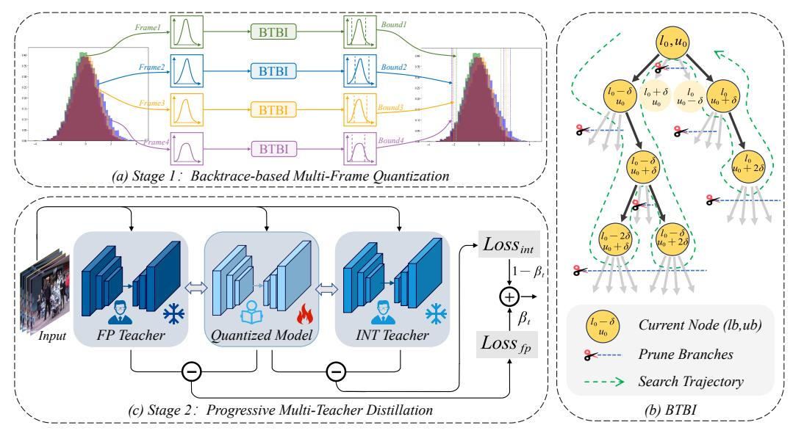

# PMQ-VE: Progressive Multi-Frame Quantization for Video Enhancement

ZhanFeng Feng<sup>1†</sup>, Long Peng<sup>1†‡</sup>, Xin Di<sup>1†</sup>, Yong Guo<sup>2</sup>, Wenbo Li<sup>3</sup>, Yulun Zhang<sup>4</sup>, Renjing Pei<sup>5\*</sup>, Yang Wang<sup>1,6\*</sup>, Yang Cao<sup>1</sup>, Zheng-Jun Zha<sup>1</sup>

<sup>1</sup>USTC, <sup>2</sup>Max Planck Institute, <sup>3</sup>CUHK, <sup>4</sup>SJTU,
 <sup>5</sup>Institute of Automation, Chinese Academy of Sciences, <sup>6</sup>Chang'an University {xiaobigfeng, longp2001, dx9826}@mail.ustc.edu.cn, ywang120@chd.edu.cn

#### **Abstract**

Multi-frame video enhancement tasks aim to improve the spatial and temporal resolution and quality of video sequences by leveraging temporal information from multiple frames, which are widely used in streaming video processing, surveillance, and generation. Although numerous Transformer-based enhancement methods have achieved impressive performance, their computational and memory demands hinder deployment on edge devices. Quantization offers a practical solution by reducing the bit-width of weights and activations to improve efficiency. However, directly applying existing quantization methods to video enhancement tasks often leads to significant performance degradation and loss of fine details. This stems from two limitations: (a) inability to allocate varying representational capacity across frames, which results in suboptimal dynamic range adaptation; (b) over-reliance on full-precision teachers, which limits the learning of low-bit student models. To tackle these challenges, we propose a novel quantization method for video enhancement: Progressive Multi-Frame Quantization for Video Enhancement (PMQ-VE). This framework features a coarse-to-fine two-stage process: Backtracking-based Multi-Frame Quantization (BMFQ) and Progressive Multi-Teacher Distillation (PMTD). BMFO utilizes a percentile-based initialization and iterative search with pruning and backtracking for robust clipping bounds. PMTD employs a progressive distillation strategy with both full-precision and multiple high-bit (INT) teachers to enhance low-bit models' capacity and quality. Extensive experiments demonstrate that our method outperforms existing approaches, achieving state-of-the-art performance across multiple tasks and benchmarks. The code will be made publicly available at: https://github.com/xiaoBIGfeng/PMQ-VE.

# 1 Introduction

Multi-frame video enhancement tasks aim to enhance the spatial and temporal resolution and quality of video sequences by exploiting temporal information from multiple frames. Among these, Video Frame Interpolation (VFI) [1, 18, 23, 35, 40, 42, 46, 47, 68–70, 74, 77], Video Super-Resolution (VSR) [3–6, 9, 20, 24, 52], and Spatio-Temporal Video Super-Resolution (STVSR) [12, 15, 34, 59, 63, 64, 66, 75] are the most representative video enhancement methods. They are widely employed as post-processing and pre-processing techniques in social media platforms, gaming environments, and various video perception and generation tasks [4, 11, 12, 51, 53]. Recent Transformer-based approaches for video enhancement exploit attention mechanisms to capture temporal dependencies across multiple frames, enabling substantial improvements in visual quality and structural fidelity. However, their high computational and memory demands remain a major

<sup>\*\*</sup> Renjing Pei and Yang Wang are the corresponding authors. † ZhanFeng Feng, Long Peng, and Xin Di contributed equally to this work. ‡ Long Peng is the project leader.

obstacle for real-world deployment. Therefore, numerous studies have proposed various model quantization methods to compress the bit-width of weights and activations from 32 bits (FP32) to 8, 4, or 2 bits [\[17,](#page-11-4) [26,](#page-11-5) [36–](#page-12-5)[38,](#page-12-6) [49,](#page-13-6) [50,](#page-13-7) [67\]](#page-14-7). This is a crucial step in practical deployment, reducing memory consumption and inference latency. For example, PAMS [\[26\]](#page-11-5), a classic method in Post-Training Quantization (PTQ), introduces trainable scale parameters to dynamically learn the maximum value of the quantization range. Liu *et al.* propose 2DQuant [\[36\]](#page-12-5), a dual-stage method for image superresolution which designs a differentiated search strategy and uses knowledge distillation [\[14\]](#page-10-8) to guide the learning of the quantization range. However, to the best of our knowledge, exploring model quantization in video enhancement remains largely uncharted. Directly applying existing quantization methods can lead to significant issues such as performance degradation and loss of fine details. Through observations and statistical experiments, we attribute these problems to two key limitations: (a) Video enhancement models need to aggregate texture and motion information from multiple frames, leading to inter-frame differential perception of information, manifesting as differentiated activation value distributions across frames as shown in Figure [2\(](#page-3-0)a). However, traditional quantization methods fails to allocate inconsistent representational capacity to different frames, resulting in discrepancies in dynamic range across frames, as shown in Figure [2\(](#page-3-0)b). This results in suboptimal utilization of sub-pixel spatial details, thereby limiting reconstruction performance. (b) Quantization inevitably reduces the representational capacity of the video model. Traditional methods overlook the capacity differences between the teacher (FP32) and student models (2bit, 4bit), relying solely on full-precision teachers for distillation. This makes it challenging for the student to learn high-quality mappings given its limited capacity, resulting in difficulty when directly quantizing a high-precision network into a low-precision one, as shown in Figure [1\(](#page-2-0)a). To address these limitations, we propose a novel quantization framework: Progressive Multi-Frame Quantization for multi-frame Video Enhancement, called PMQ-VE. Specifically, PMQ-VE introduces a coarse-to-fine two-stage process, which includes Backtracking-based Multi-Frame Quantization (BMFQ) and Progressive Multi-Teacher Distillation (PMTD).

Coarse Stage: Backtracking-based Multi-Frame Quantization. Existing methods [\[36,](#page-12-5) [57\]](#page-13-8) typically initialize quantization bounds using the global minimum and maximum values and symmetrically shrink them inward, ignoring inter-frame variations and the asymmetric nature of distributions. To address this, as illustrated in Figure [2\(](#page-3-0)c), BMFQ assigns frame-specific clipping bounds to better match the heterogeneous activation statistics across video frames. BMFQ employs a percentile-based initialization to suppress outliers and performs a backtracking-based search with pruning and backtracking to search the bounds efficiently. This strategy enables accurate, adaptive quantization with negligible overhead,

Fine Stage: Progressive Multi-Teacher Distillation. In the fine stage, we introduce a Progressive Multi-Teacher Distillation framework to restore the model's representational capacity under low-bit quantization. Specifically, a full-precision teacher provides fine-grained feature supervision, while an intermediate 8/4-bit teacher offers quantization-aware guidance, helping the 4/2-bit student model learn stable and informative representations under low-bit constraints, bridging the gap between the quantized and full-precision models.

Extensive experiments on three representative video enhancement tasks—STVSR, VSR, and VFI—demonstrate that our method achieves state-of-the-art performance across multiple benchmarks for various tasks. Our method consistently outperforms existing methods, achieving the best performance on PSNR, SSIM across various bit-width settings, as shown in Figure [1\(](#page-2-0)b-c). The contributions of this paper can be summarized as follows:

- To the best of our knowledge, we are the first to explore model quantization in multi-frame video enhancement tasks. We propose PMQ-VE, a novel per-frame coarse-to-fine quantization framework for multi-frame video enhancement models.
- In the coarse stage, we propose BMFQ to search quantization bounds via iterative backtracking with pruning, achieving efficient initialization. In the fine stage, we propose PMTD to leverage the knowledge of multi-level teachers to help a low-bit student model, enhancing its mapping quality and performance.
- Extensive experiments on three video enhancement tasks (STVSR, VSR, and VFI) demonstrate that our method achieves state-of-the-art results across various benchmarks under different low-bit quantization settings, highlighting the superiority and practicability of our approach.

<span id="page-2-0"></span>

Figure 1: (a) Qualitative comparison of reconstructed frames using different quantization methods. Quantitative comparison of PSNR(b) and SSIM(c) improvements across three video enhancement tasks (STVSR, VFI, VSR). Our method consistently outperforms existing quantization approaches in both visual quality and quantitative metrics.

# 2 Related work

## 2.1 Video Enhancement

Video enhancement aims to exploit sub-pixel information from contextual frames to improve the quality and resolution of videos, which primarily includes video frame interpolation, video superresolution, and spatio-temporal video super-resolution.

Video Frame Interpolation (VFI) targets generating the intermediate frames between given consecutive inputs. Early CNN-based methods [\[1,](#page-10-0) [18,](#page-11-0) [23,](#page-11-1) [40,](#page-12-1) [77\]](#page-14-3) mainly rely on optical flow estimation or direct frame synthesis, but often suffer from limited receptive fields and poor handling of large motion. Therefore, Transformer-based approaches [\[35,](#page-12-0) [47,](#page-13-0) [74\]](#page-14-2) have been proposed to model long-range dependencies, significantly improving the quality and detail of generated video.

Video Super-Resolution (VSR) aims to reconstruct high-resolution (HR) video from low-resolution (LR) inputs. Early VSR methods primarily used explicit optical flow alignment [\[3,](#page-10-1) [5,](#page-10-9) [56\]](#page-13-9), dynamic filtering [\[24\]](#page-11-3), deformable convolutions [\[60\]](#page-13-10), and temporal attention mechanisms [\[28,](#page-11-6) [65\]](#page-14-8). With the increasing prominence of the Transformer's powerful representation capabilities, numerous Transformer-based VSR methods have been proposed, achieving progressive success. For example, PSRT [\[55\]](#page-13-11) leverages a multi-frame self-attention mechanism to jointly process features from the current input frame and the propagated features. MIA [\[76\]](#page-14-9) further boosts performance by leveraging masked intra-frame and inter-frame attention blocks to better use of previously enhanced features.

Spatio-Temporal Video Super-Resolution (STVSR) aims to simultaneously enhance spatial and temporal resolution, combining VSR and VFI, and presents greater challenges. Among the most representative real-time Transformer-based models is RSTT [\[12\]](#page-10-4), which achieves state-of-the-art performance by constructing feature dictionaries from different levels of encoders and repeatedly querying them during the decoding stage.

Although powerful transformer-based models have demonstrated superiority in enhancing spatial resolution and perceptual quality, their high computational cost hinders practical deployment. This paper is the first to propose an efficient model compression method specifically for video enhancement to facilitate its deployment.

# 2.2 Model Quantization

Model quantization aims to reduce the model's bit-width, from the Float 32-bit used in training to int 8, 4, or 2-bit for deployment, significantly reducing computational and memory costs and is widely applied in various fields such as LLM and VLM, etc. Quantization is divided into post-training quantization (PTQ) and Quantization-Aware Training (QAT). QAT, requiring simultaneous training and quantization, demands significant resources and data. PTQ, applied after pre-training, is more efficient and thus receives greater research focus. Early PTQ methods focused on minimizing quantization error using efficient calibration techniques [\[30,](#page-11-7) [67\]](#page-14-7). Recent approaches, such as AdaRound [\[62\]](#page-13-12) and BRECQ [\[29\]](#page-11-8), refine weight quantization by minimizing layer-wise output discrepancies. Additionally, robustness-oriented methods like NoisyQuant [\[38\]](#page-12-6), OASQ [\[43\]](#page-12-7), and ERQ [\[73\]](#page-14-10) enhance PTQ performance by mitigating quantization noise, suppressing outliers, or optimizing error-aware objectives.

<span id="page-3-0"></span>

Figure 2: Finding and Motivation. (a) In multi-frame video enhancement, activation distributions vary significantly across frames. Traditional per-tensor quantization (b) fails to dynamically adjust quantization bounds for these variations, but our method (c) achieves this dynamic adjustment. (d) We calculated PSNR and residual maps for FP, INT8, INT4, and INT2 with respect to GT. The significant gap between low-bit (INT2/4) and full-precision (FP) model suggests that low-bit struggles to learn directly from FP. This inspired us to use multiple teacher models for supervision.

However, existing work mainly addresses high-level vision/language tasks and is often unsuitable for pixel-level image/video enhancement, which is sensitive to quantization errors due to its reliance on fine-grained features. Recent research has thus started exploring quantization for pixel-level image enhancement and super-resolution [\[7,](#page-10-10) [8,](#page-10-11) [33,](#page-12-8) [54,](#page-13-13) [72\]](#page-14-11). For example, DBDC+Pac [\[57\]](#page-13-8) introduces a PTQ framework for image super-resolution, combining calibration techniques with knowledge distillation from a full-precision teacher model. Similarly, 2DQuant [\[36\]](#page-12-5) targets SwinIR [\[31\]](#page-12-9) by proposing a one-sided search algorithm to quantize sensitive activations, such as post-softmax and post-GELU [\[16\]](#page-10-12) layers. These methods often overlook inter-frame differences in multi-frame video enhancement, limiting detail representation and resulting in blurred images.

# 3 Methodology

#### 3.1 Problem Formulation

Model quantization aims to learn appropriate clipping ranges [\[36,](#page-12-5) [57,](#page-13-8) [67\]](#page-14-7) for each tensor (e.g., weights or activations) in order to minimize the discrepancy between the outputs of the full-precision model and the quantized model. Following previous work [\[36,](#page-12-5) [37,](#page-12-10) [57\]](#page-13-8), we use fake quantization [\[22\]](#page-11-9) to simulate the quantization process. Given a pre-learned clipping range [lb, ub] for a tensor x, the quantization and dequantization process is defined as follows:

$$x_{\text{clip}} = \text{clamp}(x, lb, ub) = \min(\max(x, lb), ub), \tag{1}$$

$$x_{\text{int}} = \text{round}\left(\frac{x_{\text{clip}} - lb}{\Delta}\right), \quad \Delta = \frac{ub - lb}{2^N - 1}, \quad \hat{x} = x_{\text{int}} \cdot \Delta + lb,$$
 (2)

Where xclip is the clipped tensor, xint ∈ {0, 1, . . . , 2 <sup>N</sup> − 1} is the quantized integer, ∆ is the quantization step size, and xˆ is the dequantized approximation of the original value. Linear and MatMul layers are the most computationally intensive components in Transformer-based architectures. We follow existing work [\[36,](#page-12-5) [38\]](#page-12-6) to focus quantization on these modules. Since the quantization function is non-differentiable due to rounding, we also adopt the Straight-Through Estimator (STE) [\[10\]](#page-10-13) during training to approximate gradients and enable end-to-end optimization under quantized settings. More details are in the Appendix.

#### 3.2 Observations and Motivation

Observation 1: Inability to allocate varying representational capacity across frames. Previous studies have thoroughly examined the statistical properties of activations in Transformer-based architectures, uncovering long-tailed distributions and a mix of symmetric and asymmetric behaviors across layers [\[30,](#page-11-7) [36,](#page-12-5) [45,](#page-12-11) [67,](#page-14-7) [73\]](#page-14-10). However, these analyses are largely confined to single-frame scenarios. In the context of quantizing multi-frame video enhancement networks, it is essential

<span id="page-4-0"></span>

Figure 3: The overall framework of our proposed method.

to preserve the capability of the full-precision network to effectively integrate inter-frame texture information and motion cues—a challenge that vanilla methods fail to address.

Our analysis reveals that multi-frame networks perceive and process each frame in the input tensor differently. As shown in Figure 2(a), we collect per-frame activation statistics and observe significant disparities in activation distributions across frames. In particular, the value ranges (i.e., the minimum and maximum activation values) vary considerably, indicating that the network allocates representational capacity unevenly across frames. These differences are influenced by the model's frame-dependent attention dynamics. In particular, the network assigns different attention weights to each frame, resulting in varied activation distributions. Consequently, applying existing Transformer quantization methods [30, 36, 45, 67, 73], which typically assume a unified activation distribution, can be suboptimal for multi-frame models. Such methods overlook inter-frame variation, leading to inefficient quantization and increased error, ultimately degrading the quality of the output.

Observation 2: Over-reliance on full-precision teachers limits low-bit model learning. Low-bit quantization inevitably reduces the representational capacity of models, which brings significant challenges to multi-frame video enhancement tasks. Under low-bit quantization, both activation values and network precision degrade noticeably, making it difficult to maintain the clear motion trajectories and rich texture details required for these tasks. As shown in Figure 2(c), directly quantizing the network to 4-bit/2-bit and applying it without adaptation leads to severe artifacts and motion blur. The main reason for this degradation lies in the large quantization errors introduced when networks are directly quantized to low-bit precision. Furthermore, traditional methods often overlook the capacity gap between the teacher model (FP32) and the student model (e.g., 4-bit or 2-bit), relying solely on full-precision teachers for knowledge distillation [14, 36, 57]. This makes it difficult for the student model to learn high-quality mappings within its limited capacity, further increasing the challenge of achieving satisfactory performance under low-bit constraints.

#### 3.3 Proposed Method

Based on the above observations, we propose a two-stage quantization framework. The coarse stage uses Backtracking-based Multi-Frame Quantization (BMFQ) to initialize asymmetric bounds efficiently. The fine stage applies Progressive Multi-Teacher Distillation (PMTD) to refine bounds.

#### 3.3.1 Backtracking-based Multi-Frame Quantization

Motivated by Observation 1, we adopt a per-frame quantization strategy to handle frame-wise variations in activation distributions and representational capacity. Given a multi-frame activation tensor  $X \in \mathbb{R}^{N \times C \times H \times W}$ , where N denotes the number of frames, we independently search the clipping bounds for each frame  $X_i = X[i,:,:]$ , yielding frame-specific clipping parameters  $(lb_i, ub_i)$  for  $i = 1, \ldots, N$ . This strategy enables the quantizer to adapt to frame-specific activation

statistics, thereby improving quantization accuracy.

To robustly estimate the clipping bounds during the coarse stage, we formulate the selection of  $(lb_i, ub_i)$  as a constrained optimization problem that minimizes quantization-induced distortion over a percentile-based search space  $S_i$  derived from the empirical distribution of  $X_i$ :

<span id="page-5-0"></span>
$$(lb_i^*, ub_i^*) = \underset{(lb, ub) \in S_i}{\min} \ \mathbb{E}_{x \sim X_i} \left[ (x - Q_{lb, ub}(x))^2 \right],$$
 (3)

Here,  $Q_{lb,ub}(\cdot)$  denotes a uniform quantizer [39] with clipping range [lb, ub]. To mitigate the influence of outliers, we constrain the search space  $S_i$ using percentiles:  $lb \in [p_{0.1}(X_i), p_{10}(X_i)], ub \in$  $[p_{90}(X_i), p_{99.9}(X_i)]$ , where  $p_k(X)$  denotes the k-th percentile of the tensor X. To efficiently solve the optimization problem in Eq. (3), we introduce a Backtracking-based Bound Initialization (BTBI) algorithm. Starting from an initial estimate derived from the percentiles of  $X_i$ , the algorithm recursively explores candidate bounds by adjusting  $lb_i$  and  $ub_i$ within the search space  $S_i$ . At each step, it evaluates the quantization error and updates the optimal bounds if a better configuration is found. To avoid redundant searches, previously visited bounds are skipped. The algorithm backtracks to explore alternative adjustments when no further improvement is achieved, terminating when all candidates are evaluated or a convergence threshold is met. In contrast to traditional methods that uniformly shrink bounds [36] or adjust them sequentially [57], BTBI is less sensitive to outliers and explores a richer set of candidate configurations. By combining frame-wise adaptation with recursive backtracking search, BTBI robustly converges to optimal clipping parameters for each frame. To enhance understanding, we provide a detailed algorithm of our BTBI in Algorithm 1.

```
Algorithm 1: Backtracking-based Bound
Initialization (BTBI) pipeline
Input: X, step sizes \Delta L, \Delta U, threshold
Output: Optimal bounds lb^*, ub^*
visited \leftarrow \emptyset, error_{\min} \leftarrow \infty
Function Backtrack (lb, ub):
     if (lb, ub) \in visited or out-of-range
       then
       return
      visited \leftarrow visited \cup \{(lb, ub)\}
     X_q \leftarrow \text{Quantize } X \text{ using } (lb, ub)
     err \leftarrow ||X - X_q||_2
     if err > error_{\min} + \varepsilon then
       return
     \begin{array}{l} \textbf{if } err < error_{\min} \textbf{ then} \\ | \ error_{\min} \leftarrow err, lb^* \leftarrow lb, \end{array}
           ub^* \leftarrow ub
     foreach (\delta_l, \delta_u) \in \{\pm \Delta L, \pm \Delta U\}
       Backtrack(lb + \delta_l, ub + \delta_u)
Backtrack(lb_0, ub_0)
```

## 3.3.2 Progressive Multi-Teacher Distillation

As revealed by Observation 2, training accurate quantized models under extremely low-bit settings (e.g., 4-bit or 2-bit) remains challenging due to limited capacity and optimization instability. To address this, we propose Progressive Multi-Teacher Distillation (PMTD), a hierarchical distillation framework that leverages both high-bit and full-precision teachers to facilitate low-bit training. Instead of directly distilling knowledge from a full-precision (FP) teacher to a low-bit student, which often suffers from large representational gaps, PMTD introduces intermediate-bit teacher models (e.g., 8-bit) between the full-precision (FP) teacher and the low-bit student. These intermediate teachers serve as quantization-aware approximations of the FP model, providing smoother supervision and easing the optimization process. This hierarchical approach effectively bridges the representational gap between student and teacher models, ensuring more stable training dynamics and improved performance under extreme quantization constraints. Specifically, to train a 4-bit quantized model, PMTD first uses the full-precision model as a teacher to train an 8-bit model. When training the 4-bit model, both the full-precision network and the 8-bit network are used as teacher models, as illustrated in Figure 3(c). The distillation process is formally defined by the following loss function:

$$\mathcal{L}_{PMTD} = (\mathcal{L}_{INT} + \alpha(t) \cdot \mathcal{L}_{FP}) / (1 + \alpha(t)), \tag{4}$$

return  $lb^*, ub^*$ 

where  $\mathcal{L}_{\text{INT}}$  denotes the total loss from intermediate-bit teachers (e.g., 8-bit), and  $\mathcal{L}_{\text{FP}}$  represents the loss from the full-precision teacher. The balancing coefficient  $\alpha(t)$  linearly increases over time and is defined as  $\alpha(t) = \min\left(1, \frac{t}{T_{\text{warmup}}}\right)$ , where  $T_{\text{warmup}}$  is a hyperparameter controlling the warm-up duration. Each teacher-specific loss consists of two components: an output-level reconstruction loss

<span id="page-6-0"></span>Table 1: Quantitative comparison of different methods on four STVSR benchmarks. The best and the second best results are in **bold** and bold.

| Method          | Bit   | Vid4         |                     | Vimeo-Fast   |                     | Vimeo-Medium |                     | Vimeo-Slow   |               |
|-----------------|-------|--------------|---------------------|--------------|---------------------|--------------|---------------------|--------------|---------------|
| Method          |       | PSNR↑        | $SSIM \!\!\uparrow$ | PSNR↑        | $SSIM \!\!\uparrow$ | PSNR↑        | $SSIM \!\!\uparrow$ | PSNR↑        | SSIM↑         |
| RSTT-S [12]     | 32/32 | 26.29        | 0.7941              | 36.58        | 0.9381              | 35.43        | 0.9358              | 33.30        | 0.9123        |
| Trilinear       | 32/32 | 22.90        | 0.5883              | 29.45        | 0.8019              | 29.16        | 0.8351              | 28.21        | 0.8091        |
| OpenVINO [13]   | 2/2   | 18.24        | 0.3151              | 23.39        | 0.6103              | 23.60        | 0.6227              | 23.87        | 0.6242        |
| TensorRT [58]   | 2/2   | 20.31        | 0.5118              | 23.41        | 0.6106              | 23.61        | 0.6236              | 23.88        | 0.6283        |
| SNPE [19]       | 2/2   | 15.22        | 0.2378              | 23.40        | 0.6106              | 23.61        | 0.6241              | 23.88        | 0.6281        |
| Percentile [27] | 2/2   | 12.67        | 0.1349              | 15.27        | 0.2274              | 14.80        | 0.2165              | 14.67        | 0.2156        |
| MinMax [21]     | 2/2   | 10.34        | 0.0138              | 10.52        | 0.0266              | 10.48        | 0.0289              | 10.45        | 0.0303        |
| NoisyQuant [38] | 2/2   | 12.06        | 0.1028              | 12.50        | 0.1669              | 11.81        | 0.1465              | 11.49        | 0.1508        |
| DBDC+Pac [57]   | 2/2   | 22.64        | 0.5695              | 28.94        | 0.8254              | 28.87        | 0.8214              | 27.86        | 0.7905        |
| 2DQuant [36]    | 2/2   | <u>22.91</u> | <u>0.5883</u>       | <u>29.38</u> | <u>0.8315</u>       | <u>29.14</u> | <u>0.8330</u>       | <u>28.18</u> | 0.8086        |
| Ours            | 2/2   | 23.48        | 0.6252              | 30.33        | 0.8424              | 30.19        | 0.8523              | 29.14        | 0.8316        |
| OpenVINO [13]   | 4/4   | 18.84        | 0.4591              | 21.82        | 0.6372              | 21.63        | 0.6315              | 18.84        | 0.4591        |
| TensorRT [58]   | 4/4   | 18.63        | 0.4578              | 21.74        | 0.6019              | 21.70        | 0.6324              | 18.63        | 0.4578        |
| SNPE [19]       | 4/4   | 17.84        | 0.3977              | 21.64        | 0.6018              | 21.56        | 0.6301              | 18.76        | 0.4584        |
| Percentile [27] | 4/4   | 23.26        | 0.6314              | 27.12        | 0.7664              | 27.16        | 0.7709              | 26.58        | 0.7531        |
| MinMax [21]     | 4/4   | 21.60        | 0.5242              | 26.41        | 0.6990              | 25.94        | 0.7059              | 25.44        | 0.6957        |
| NoisyQuant [38] | 4/4   | 24.26        | 0.6905              | 31.22        | 0.8719              | 30.64        | 0.8705              | 29.61        | 0.8462        |
| DBDC+Pac [57]   | 4/4   | 24.50        | 0.6923              | 32.64        | 0.8857              | 32.06        | 0.8866              | 30.64        | 0.8643        |
| 2DQuant [36]    | 4/4   | <u>25.04</u> | <u>0.7256</u>       | <u>33.59</u> | <u>0.9035</u>       | <u>32.83</u> | 0.9009              | <u>31.21</u> | <u>0.8766</u> |
| Ours            | 4/4   | 25.42        | 0.7501              | 34.69        | 0.9181              | 33.74        | 0.9150              | 31.94        | 0.8903        |

and an intermediate feature-matching loss:

$$\mathcal{L}_{\text{INT}} = \sum_{k=1}^{K} \left( \mathcal{L}_{\text{rec}}^{(k)} + \lambda \cdot \mathcal{L}_{\text{feat}}^{(k)} \right), \tag{5}$$

$$\mathcal{L}_{FP} = \mathcal{L}_{rec}^{FP} + \lambda \cdot \mathcal{L}_{feat}^{FP}, \tag{6}$$

where K is the number of intermediate-bit teachers (e.g., K=2 when using 4-bit and 8-bit teachers),  $\mathcal{L}_{rec}$  is the  $\ell_2$  loss [32] between the student and teacher outputs, and  $\mathcal{L}_{feat}$  is the mean squared error (MSE) [2] between selected intermediate feature representations. The balancing coefficient  $\lambda$  is set to 5 to emphasize the importance of internal consistency. By gradually transitioning supervision from intermediate-bit to full-precision teachers, PMTD effectively reduces the training difficulty of low-bit models, mitigates quantization errors, and offers a more stable optimization path. This hierarchical approach ensures high-quality quantized outputs, even under extreme quantization constraints.

## 4 Experiment and Analysis

# 4.1 Experiment Setting

**Datasets and backbone.** We evaluate our method on three representative video enhancement tasks: Space-Time Video Super-Resolution (STVSR), Video Super-Resolution (VSR), and Video Frame Interpolation (VFI). For each task, we select state-of-the-art and popular methods as backbones: RSTT [12] for STVSR, MIA [76] for VSR, and EMA-VFI [74] for VFI. The Vimeo-90K [66] dataset is used for training across all tasks, with Vid4 [34] and the Vimeo-90K test set serving as evaluation benchmarks. More details of data preparation and setting are provided in the supplementary material. **Evaluation metrics.** We use PSNR and SSIM [61] as evaluation metrics, computed on the luminance (Y) channel of the YCbCr color space. To further evaluate perception-oriented metrics, LPIPS [71] and NIQE [44] are used to assess the perceptual quality of videos.

**Implementation details.** We adopt the Adam optimizer [25] with an initial learning rate of  $2 \times 10^{-4}$ 

<span id="page-7-0"></span>Table 2: Quantitative comparison of different methods on two VFI EMA-VFI variants ([T] and [D]), evaluated on the Vimeo90K benchmark under 4-bit.

| Method          | Bit   | EMA-VFI [T] [68] |        |        |       | EMA-VFI [D] [74] |        |        |        |
|-----------------|-------|------------------|--------|--------|-------|------------------|--------|--------|--------|
|                 |       | PSNR↑            | SSIM↑  | LPIPS↓ | NIQE↓ | PSNR↑            | SSIM↑  | LPIPS↓ | NIQE↓  |
| Baseline        | 32/32 | 29.41            | 0.9279 | 0.086  | 6.736 | 30.29            | 0.9418 | 0.078  | 6.545  |
| OpenVINO [13]   | 4/4   | 26.03            | 0.8703 | 0.222  | 8.022 | 25.38            | 0.8579 | 0.257  | 8.2784 |
| TensorRT [58]   | 4/4   | 25.33            | 0.8551 | 0.268  | 8.582 | 25.21            | 0.8537 | 0.269  | 8.4035 |
| SNPE [19]       | 4/4   | 25.49            | 0.8581 | 0.259  | 8.500 | 25.83            | 0.8683 | 0.236  | 8.0399 |
| Percentile [27] | 4/4   | 26.82            | 0.8919 | 0.185  | 7.765 | 28.54            | 0.9198 | 0.132  | 7.0667 |
| MinMax [21]     | 4/4   | 23.03            | 0.7918 | 0.389  | 9.475 | 24.19            | 0.8309 | 0.313  | 8.5153 |
| DBDC+Pac[57]    | 4/4   | 27.30            | 0.8976 | 0.171  | 7.545 | 28.36            | 0.9179 | 0.134  | 7.1221 |
| 2DQuant [36]    | 4/4   | 28.06            | 0.9110 | 0.152  | 7.494 | 28.78            | 0.9233 | 0.120  | 6.9884 |
| Ours            | 4/4   | 28.41            | 0.9162 | 0.136  | 7.361 | 29.59            | 0.9335 | 0.101  | 6.7881 |

<span id="page-7-1"></span>Table 3: Quantitative comparison of different methods on two VSR benchmarks under 4-bit.

| Benchmark Metric |       | Baseline:<br>MIA [76] | TensorRT<br>[58] | SNPE<br>[19] | Percentile<br>[27] | MinMax<br>[21] | DBDC<br>+Pac [57] | 2DQuant<br>[36] | Ours   |
|------------------|-------|-----------------------|------------------|--------------|--------------------|----------------|-------------------|-----------------|--------|
| Vimeo90K         | PSNR↑ | 38.32                 | 31.81            | 32.42        | 35.15              | 34.13          | 36.64             | 36.92           | 37.34  |
|                  | SSIM↑ | 0.9532                | 0.8612           | 0.8805       | 0.9262             | 0.9119         | 0.9404            | 0.9434          | 0.9487 |
| Vid4             | PSNR↑ | 28.20                 | 24.48            | 24.22        | 26.14              | 25.60          | 27.26             | 27.38           | 27.64  |
|                  | SSIM↑ | 0.8507                | 0.6758           | 0.6877       | 0.7805             | 0.7494         | 0.8230            | 0.8287          | 0.8341 |

and apply Cosine Annealing [\[41\]](#page-12-15) over 20,000 iterations. The batch size is set to 8 and 2 per GPU during the initialization and distillation-based fine-tuning phases, respectively. Random cropping, rotations, and flipping are applied to enhance training robustness. All experiments are implemented in Python with PyTorch [\[48\]](#page-13-16) and conducted on 8 NVIDIA V100 GPUs.

## 4.2 Quantitative Results

Table [1](#page-6-0) presents quantitative comparisons of various methods under 2/2, 4/4, bit-width across four STVSR benchmarks. Traditional quantization approaches, such as OpenVINO [\[13\]](#page-10-14) and TensorRT [\[58\]](#page-13-14), face challenges in pixel-level video enhancement, resulting in model performance scores of only 18.24dB and 20.31dB on Vid4 at 2-bit quantization. Although DBDC+Pac [\[57\]](#page-13-8) and 2DQuant [\[36\]](#page-12-5) are tailored for low-level vision tasks with enhanced sharpness awareness, which somewhat mitigates the performance drop due to quantization, they still lag behind our proposed method. This is primarily due to their limitations in managing multi-frame distribution differences and detail enhancement. Our method achieves the best performance across all scenarios and benchmarks, notably surpassing existing methods by nearly 1 dB on the Vimeo benchmark, underscoring the effectiveness of our approach. In a similar manner, our method demonstrates superior performance across all benchmarks and bit-width configurations for both Video Super-Resolution (VSR) and Video Frame Interpolation (VFI) tasks. As detailed in Tables [2](#page-7-0) and [3,](#page-7-1) our approach exemplifies remarkable generalization capabilities, consistently outperforming existing methods in all benchmarks and bits. More results on additional bit-width settings and benchmarks can be found in Appendix.

#### 4.3 Qualitative Results

To verify the visual quality, we present the visual comparisons of different PTQ methods applied to STVSR, VSR and VFI tasks under 4-bit quantization, as shown in Figure [4.](#page-8-0) Traditional methods such as MinMax [\[21\]](#page-11-12) and Percentile [\[27\]](#page-11-11) exhibit noticeable artifacts, while other methods like DBDC+Pac [\[57\]](#page-13-8) and 2dquant [\[36\]](#page-12-5) suffer from detail blurring issues, particularly in complex scenes. However, our proposed method consistently produces sharper edges and more faithful textures that are visually closer to the full-precision outputs. In more challenging cases, such as the Vimeo-Fast dataset where motion and fine details coexist, our proposed method better preserves structural information

<span id="page-8-0"></span>

Figure 4: Visual comparisons under 4-bit quantization for three video enhancement tasks: from top to bottom are STVSR, VSR, and VFI tasks. More results are provided in the Appendix.

and avoids common artifacts. This highlights the visual superiority of our approach. More visual effects and comparisons with user studies will be presented in the Appendix.

#### 4.4 Ablation Studies

To validate the effectiveness of the proposed core idea, we design several ablation experiments to explore the multi-teacher distillation strategy the frame-wise quantization strategy.

Specifically, we conduct experiments on STVSR in a 2-bit compression setting, removing these core modules one by one, with results shown in Table 4. It is seen that the baseline without any core ideas achieves only 12.67dB. By introducing the frame-wise quantization strategy, the network perceives differences between frames, improving performance. Furthermore, the BMFQ helps the network adaptively learn clipping ranges for each frame, boosting

<span id="page-8-1"></span>Table 4: Ablation studies.

| Per-Frame<br>Quantizatio | PSNR↑        |              |       |  |
|--------------------------|--------------|--------------|-------|--|
| Х                        | Х            | X            | 12.67 |  |
| $\checkmark$             | X            | X            | 19.64 |  |
| $\checkmark$             | $\checkmark$ | X            | 27.56 |  |
| $\checkmark$             | $\checkmark$ | $\checkmark$ | 30.33 |  |
|                          |              |              |       |  |

model performance to 27.56dB. Finally, with the introduction of the multi-teacher distillation strategy, the low-bit network learns prior knowledge from different teachers, further improving model performance despite limited capacity. This validates the effectiveness of the proposed core modules. More ablation studies are presented in the Appendix.

#### 5 Conclusion

We introduced a novel coarse-to-fine PMQ-VE, addressing key challenges in quantizing multi-frame video enhancement models. BMFQ is proposed to establish robust quantization bounds through a percentile-based initialization and backtracking search, ensuring efficient quantization across frames. PMTD enhances the quality of low-bit models by utilizing a progressive distillation strategy with both full-precision and quantized teachers, bridging the gap between high-precision and low-bit models. Experiments on STVSR, VSR, and VFI tasks show that our PMQ-VE achieves state-of-the-art performance and visually pleasing results. Limitation and Future Work: Although our PMQ-VE has achieved promising results on Transformer-based video enhancement methods, more diffusion-based

Transformer (DiT) methods can be tested. In the future, we plan to extend our method to more video enhancement tasks and models to facilitate the deployment of video models in the community.

# References

- <span id="page-10-0"></span>[1] Wenbo Bao, Wei-Sheng Lai, Chao Ma, Xiaoyun Zhang, Zhiyong Gao, and Ming-Hsuan Yang. Depth-aware video frame interpolation. In *Proceedings of the IEEE/CVF conference on computer vision and pattern recognition*, pages 3703–3712, 2019.
- <span id="page-10-15"></span>[2] Eric Bauer and Ron Kohavi. An empirical comparison of voting classification algorithms: Bagging, boosting, and variants. *Machine learning*, 36:105–139, 1999.
- <span id="page-10-1"></span>[3] Jose Caballero, Christian Ledig, Andrew Aitken, Alejandro Acosta, Johannes Totz, Zehan Wang, and Wenzhe Shi. Real-time video super-resolution with spatio-temporal networks and motion compensation. In *Proceedings of the IEEE conference on computer vision and pattern recognition*, pages 4778–4787, 2017.
- <span id="page-10-6"></span>[4] Jiezhang Cao, Yawei Li, Kai Zhang, and Luc Van Gool. Video super-resolution transformer. *arXiv preprint arXiv:2106.06847*, 2021.
- <span id="page-10-9"></span>[5] Kelvin CK Chan, Xintao Wang, Ke Yu, Chao Dong, and Chen Change Loy. Basicvsr: The search for essential components in video super-resolution and beyond. In *Proceedings of the IEEE/CVF conference on computer vision and pattern recognition*, pages 4947–4956, 2021.
- <span id="page-10-2"></span>[6] Kelvin CK Chan, Shangchen Zhou, Xiangyu Xu, and Chen Change Loy. Basicvsr++: Improving video super-resolution with enhanced propagation and alignment. In *Proceedings of the IEEE/CVF conference on computer vision and pattern recognition*, pages 5972–5981, 2022.
- <span id="page-10-10"></span>[7] Yujie Chen, Haotong Qin, Zhang Zhang, Michelo Magno, Luca Benini, and Yawei Li. Q-mambair: Accurate quantized mamba for efficient image restoration. *arXiv preprint arXiv:2503.21970*, 2025.
- <span id="page-10-11"></span>[8] Zheng Chen, Haotong Qin, Yong Guo, Xiongfei Su, Xin Yuan, Linghe Kong, and Yulun Zhang. Binarized diffusion model for image super-resolution. *arXiv preprint arXiv:2406.05723*, 2024.
- <span id="page-10-3"></span>[9] Myungsub Choi, Heewon Kim, Bohyung Han, Ning Xu, and Kyoung Mu Lee. Channel attention is all you need for video frame interpolation. In *Proceedings of the AAAI conference on artificial intelligence*, volume 34, pages 10663–10671, 2020.
- <span id="page-10-13"></span>[10] Matthieu Courbariaux, Itay Hubara, Daniel Soudry, Ran El-Yaniv, and Yoshua Bengio. Binarized neural networks: Training deep neural networks with weights and activations constrained to+ 1 or-1. *arXiv preprint arXiv:1602.02830*, 2016.
- <span id="page-10-7"></span>[11] Xin Di, Long Peng, Peizhe Xia, Wenbo Li, Renjing Pei, Yang Cao, Yang Wang, and Zheng-Jun Zha. Qmambabsr: Burst image super-resolution with query state space model. *arXiv preprint arXiv:2408.08665*, 2024.
- <span id="page-10-4"></span>[12] Zhicheng Geng, Luming Liang, Tianyu Ding, and Ilya Zharkov. Rstt: Real-time spatial temporal transformer for space-time video super-resolution. In *Proceedings of the IEEE/CVF conference on computer vision and pattern recognition*, pages 17441–17451, 2022.
- <span id="page-10-14"></span>[13] Yury Gorbachev, Mikhail Fedorov, Iliya Slavutin, Artyom Tugarev, Marat Fatekhov, and Yaroslav Tarkan. Openvino deep learning workbench: Comprehensive analysis and tuning of neural networks inference. In *Proceedings of the IEEE/CVF International Conference on Computer Vision Workshops*, pages 0–0, 2019.
- <span id="page-10-8"></span>[14] Jianping Gou, Baosheng Yu, Stephen J Maybank, and Dacheng Tao. Knowledge distillation: A survey. *International Journal of Computer Vision*, 129(6):1789–1819, 2021.
- <span id="page-10-5"></span>[15] Muhammad Haris, Greg Shakhnarovich, and Norimichi Ukita. Space-time-aware multiresolution video enhancement. In *Proceedings of the IEEE/CVF conference on computer vision and pattern recognition*, pages 2859–2868, 2020.
- <span id="page-10-12"></span>[16] Dan Hendrycks and Kevin Gimpel. Gaussian error linear units (gelus). *arXiv preprint arXiv:1606.08415*, 2016.

- <span id="page-11-4"></span>[17] Cheeun Hong, Heewon Kim, Sungyong Baik, Junghun Oh, and Kyoung Mu Lee. Daq: Channelwise distribution-aware quantization for deep image super-resolution networks. In *Proceedings of the IEEE/CVF Winter Conference on Applications of Computer Vision*, pages 2675–2684, 2022.
- <span id="page-11-0"></span>[18] Zhewei Huang, Tianyuan Zhang, Wen Heng, Boxin Shi, and Shuchang Zhou. Real-time intermediate flow estimation for video frame interpolation. In *European Conference on Computer Vision*, pages 624–642. Springer, 2022.
- <span id="page-11-10"></span>[19] Andrey Ignatov, Radu Timofte, William Chou, Ke Wang, Max Wu, Tim Hartley, and Luc Van Gool. Ai benchmark: Running deep neural networks on android smartphones. In *Proceedings of the European Conference on Computer Vision (ECCV) Workshops*, pages 0–0, 2018.
- <span id="page-11-2"></span>[20] Takashi Isobe, Xu Jia, Shuhang Gu, Songjiang Li, Shengjin Wang, and Qi Tian. Video superresolution with recurrent structure-detail network. In *Computer Vision–ECCV 2020: 16th European Conference, Glasgow, UK, August 23–28, 2020, Proceedings, Part XII 16*, pages 645–660. Springer, 2020.
- <span id="page-11-12"></span>[21] Benoit Jacob, Skirmantas Kligys, Bo Chen, Menglong Zhu, Matthew Tang, Andrew Howard, Hartwig Adam, and Dmitry Kalenichenko. Quantization and training of neural networks for efficient integer-arithmetic-only inference. In *Proceedings of the IEEE conference on computer vision and pattern recognition*, pages 2704–2713, 2018.
- <span id="page-11-9"></span>[22] Benoit Jacob, Skirmantas Kligys, Bo Chen, Menglong Zhu, Matthew Tang, Andrew Howard, Hartwig Adam, and Dmitry Kalenichenko. Quantization and training of neural networks for efficient integer-arithmetic-only inference. In *Proceedings of the IEEE conference on computer vision and pattern recognition*, pages 2704–2713, 2018.
- <span id="page-11-1"></span>[23] Zhaoyang Jia, Yan Lu, and Houqiang Li. Neighbor correspondence matching for flow-based video frame synthesis. In *Proceedings of the 30th ACM International Conference on Multimedia*, pages 5389–5397, 2022.
- <span id="page-11-3"></span>[24] Younghyun Jo, Seoung Wug Oh, Jaeyeon Kang, and Seon Joo Kim. Deep video super-resolution network using dynamic upsampling filters without explicit motion compensation. In *Proceedings of the IEEE conference on computer vision and pattern recognition*, pages 3224–3232, 2018.
- <span id="page-11-13"></span>[25] Diederik P Kingma and Jimmy Ba. Adam: A method for stochastic optimization. *arXiv preprint arXiv:1412.6980*, 2014.
- <span id="page-11-5"></span>[26] Huixia Li, Chenqian Yan, Shaohui Lin, Xiawu Zheng, Baochang Zhang, Fan Yang, and Rongrong Ji. Pams: Quantized super-resolution via parameterized max scale. In *Computer Vision– ECCV 2020: 16th European Conference, Glasgow, UK, August 23–28, 2020, Proceedings, Part XXV 16*, pages 564–580. Springer, 2020.
- <span id="page-11-11"></span>[27] Rundong Li, Yan Wang, Feng Liang, Hongwei Qin, Junjie Yan, and Rui Fan. Fully quantized network for object detection. In *Proceedings of the IEEE/CVF conference on computer vision and pattern recognition*, pages 2810–2819, 2019.
- <span id="page-11-6"></span>[28] Wenbo Li, Xin Tao, Taian Guo, Lu Qi, Jiangbo Lu, and Jiaya Jia. Mucan: Multi-correspondence aggregation network for video super-resolution. In *Computer Vision–ECCV 2020: 16th European Conference, Glasgow, UK, August 23–28, 2020, Proceedings, Part X 16*, pages 335–351. Springer, 2020.
- <span id="page-11-8"></span>[29] Yuhang Li, Ruihao Gong, Xu Tan, Yang Yang, Peng Hu, Qi Zhang, Fengwei Yu, Wei Wang, and Shi Gu. Brecq: Pushing the limit of post-training quantization by block reconstruction. *arXiv preprint arXiv:2102.05426*, 2021.
- <span id="page-11-7"></span>[30] Zhikai Li, Junrui Xiao, Lianwei Yang, and Qingyi Gu. Repq-vit: Scale reparameterization for post-training quantization of vision transformers. In *Proceedings of the IEEE/CVF International Conference on Computer Vision*, pages 17227–17236, 2023.

- <span id="page-12-9"></span>[31] Jingyun Liang, Jiezhang Cao, Guolei Sun, Kai Zhang, Luc Van Gool, and Radu Timofte. Swinir: Image restoration using swin transformer. In *Proceedings of the IEEE/CVF international conference on computer vision*, pages 1833–1844, 2021.
- <span id="page-12-13"></span>[32] Bee Lim, Sanghyun Son, Heewon Kim, Seungjun Nah, and Kyoung Mu Lee. Enhanced deep residual networks for single image super-resolution. In *Proceedings of the IEEE conference on computer vision and pattern recognition workshops*, pages 136–144, 2017.
- <span id="page-12-8"></span>[33] Boyu Liu, Haoyu Huang, Linlin Yang, Yanjing Li, Guodong Guo, Xianbin Cao, and Baochang Zhang. Efficient low-bit quantization with adaptive scales for multi-task co-training. In *The Thirteenth International Conference on Learning Representations*.
- <span id="page-12-4"></span>[34] Ce Liu and Deqing Sun. On bayesian adaptive video super resolution. *IEEE transactions on pattern analysis and machine intelligence*, 36(2):346–360, 2013.
- <span id="page-12-0"></span>[35] Chunxu Liu, Guozhen Zhang, Rui Zhao, and Limin Wang. Sparse global matching for video frame interpolation with large motion. In *Proceedings of the IEEE/CVF Conference on Computer Vision and Pattern Recognition*, pages 19125–19134, 2024.
- <span id="page-12-5"></span>[36] Kai Liu, Haotong Qin, Yong Guo, Xin Yuan, Linghe Kong, Guihai Chen, and Yulun Zhang. 2dquant: Low-bit post-training quantization for image super-resolution. *Advances in Neural Information Processing Systems*, 37:71068–71084, 2024.
- <span id="page-12-10"></span>[37] Kai Liu, Dehui Wang, Zhiteng Li, Zheng Chen, Yong Guo, Wenbo Li, Linghe Kong, and Yulun Zhang. Condiquant: Condition number based low-bit quantization for image super-resolution. *arXiv preprint arXiv:2502.15478*, 2025.
- <span id="page-12-6"></span>[38] Yijiang Liu, Huanrui Yang, Zhen Dong, Kurt Keutzer, Li Du, and Shanghang Zhang. Noisyquant: Noisy bias-enhanced post-training activation quantization for vision transformers. In *Proceedings of the IEEE/CVF Conference on Computer Vision and Pattern Recognition*, pages 20321–20330, 2023.
- <span id="page-12-12"></span>[39] Zechun Liu, Kwang-Ting Cheng, Dong Huang, Eric P Xing, and Zhiqiang Shen. Nonuniform-touniform quantization: Towards accurate quantization via generalized straight-through estimation. In *Proceedings of the IEEE/CVF conference on computer vision and pattern recognition*, pages 4942–4952, 2022.
- <span id="page-12-1"></span>[40] Ziwei Liu, Raymond A Yeh, Xiaoou Tang, Yiming Liu, and Aseem Agarwala. Video frame synthesis using deep voxel flow. In *Proceedings of the IEEE international conference on computer vision*, pages 4463–4471, 2017.
- <span id="page-12-15"></span>[41] Ilya Loshchilov and Frank Hutter. Sgdr: Stochastic gradient descent with warm restarts. *arXiv preprint arXiv:1608.03983*, 2016.
- <span id="page-12-2"></span>[42] Liying Lu, Ruizheng Wu, Huaijia Lin, Jiangbo Lu, and Jiaya Jia. Video frame interpolation with transformer. In *Proceedings of the IEEE/CVF Conference on Computer Vision and Pattern Recognition*, pages 3532–3542, 2022.
- <span id="page-12-7"></span>[43] Yuexiao Ma, Huixia Li, Xiawu Zheng, Feng Ling, Xuefeng Xiao, Rui Wang, Shilei Wen, Fei Chao, and Rongrong Ji. Outlier-aware slicing for post-training quantization in vision transformer. In *Forty-first International Conference on Machine Learning*, 2024.
- <span id="page-12-14"></span>[44] Anish Mittal, Rajiv Soundararajan, and Alan C Bovik. Making a "completely blind" image quality analyzer. *IEEE Signal processing letters*, 20(3):209–212, 2012.
- <span id="page-12-11"></span>[45] Jaehyeon Moon, Dohyung Kim, Junyong Cheon, and Bumsub Ham. Instance-aware group quantization for vision transformers. In *Proceedings of the IEEE/CVF Conference on Computer Vision and Pattern Recognition*, pages 16132–16141, 2024.
- <span id="page-12-3"></span>[46] Simon Niklaus and Feng Liu. Context-aware synthesis for video frame interpolation. In *Proceedings of the IEEE conference on computer vision and pattern recognition*, pages 1701– 1710, 2018.

- <span id="page-13-0"></span>[47] Junheum Park, Jintae Kim, and Chang-Su Kim. Biformer: Learning bilateral motion estimation via bilateral transformer for 4k video frame interpolation. In *Proceedings of the IEEE/CVF Conference on Computer Vision and Pattern Recognition*, pages 1568–1577, 2023.
- <span id="page-13-16"></span>[48] A Paszke. Pytorch: An imperative style, high-performance deep learning library. *arXiv preprint arXiv:1912.01703*, 2019.
- <span id="page-13-6"></span>[49] Long Peng, Wenbo Li, Jiaming Guo, Xin Di, Haoze Sun, Yong Li, Renjing Pei, Yang Wang, Yang Cao, and Zheng-Jun Zha. Unveiling hidden details: A raw data-enhanced paradigm for real-world super-resolution. *arXiv preprint arXiv:2411.10798*, 2024.
- <span id="page-13-7"></span>[50] Long Peng, Wenbo Li, Renjing Pei, Jingjing Ren, Jiaqi Xu, Yang Wang, Yang Cao, and Zheng-Jun Zha. Towards realistic data generation for real-world super-resolution. *arXiv preprint arXiv:2406.07255*, 2024.
- <span id="page-13-4"></span>[51] Long Peng, Xin Di, Zhanfeng Feng, Wenbo Li, Renjing Pei, Yang Wang, Xueyang Fu, Yang Cao, and Zheng-Jun Zha. Directing mamba to complex textures: An efficient texture-aware state space model for image restoration. *arXiv preprint arXiv:2501.16583*, 2025.
- <span id="page-13-1"></span>[52] Long Peng, Yang Wang, Xin Di, Xueyang Fu, Yang Cao, Zheng-Jun Zha, et al. Boosting image de-raining via central-surrounding synergistic convolution. In *Proceedings of the AAAI Conference on Artificial Intelligence*, volume 39, pages 6470–6478, 2025.
- <span id="page-13-5"></span>[53] Long Peng, Anran Wu, Wenbo Li, Peizhe Xia, Xueyuan Dai, Xinjie Zhang, Xin Di, Haoze Sun, Renjing Pei, Yang Wang, et al. Pixel to gaussian: Ultra-fast continuous super-resolution with 2d gaussian modeling. *arXiv preprint arXiv:2503.06617*, 2025.
- <span id="page-13-13"></span>[54] Haotong Qin, Yulun Zhang, Yifu Ding, Xianglong Liu, Martin Danelljan, Fisher Yu, et al. Quantsr: accurate low-bit quantization for efficient image super-resolution. *Advances in Neural Information Processing Systems*, 36:56838–56848, 2023.
- <span id="page-13-11"></span>[55] Shuwei Shi, Jinjin Gu, Liangbin Xie, Xintao Wang, Yujiu Yang, and Chao Dong. Rethinking alignment in video super-resolution transformers. *Advances in Neural Information Processing Systems*, 35:36081–36093, 2022.
- <span id="page-13-9"></span>[56] Xin Tao, Hongyun Gao, Renjie Liao, Jue Wang, and Jiaya Jia. Detail-revealing deep video super-resolution. In *Proceedings of the IEEE international conference on computer vision*, pages 4472–4480, 2017.
- <span id="page-13-8"></span>[57] Zhijun Tu, Jie Hu, Hanting Chen, and Yunhe Wang. Toward accurate post-training quantization for image super resolution. In *Proceedings of the IEEE/CVF Conference on Computer Vision and Pattern Recognition*, pages 5856–5865, 2023.
- <span id="page-13-14"></span>[58] Han Vanholder. Efficient inference with tensorrt. In *GPU Technology Conference*, volume 1, pages 1–24, 2016.
- <span id="page-13-2"></span>[59] Hai Wang, Xiaoyu Xiang, Yapeng Tian, Wenming Yang, and Qingmin Liao. Stdan: deformable attention network for space-time video super-resolution. *IEEE Transactions on Neural Networks and Learning Systems*, 2023.
- <span id="page-13-10"></span>[60] Xintao Wang, Kelvin CK Chan, Ke Yu, Chao Dong, and Chen Change Loy. Edvr: Video restoration with enhanced deformable convolutional networks. In *Proceedings of the IEEE/CVF conference on computer vision and pattern recognition workshops*, pages 0–0, 2019.
- <span id="page-13-15"></span>[61] Zhou Wang, Alan C Bovik, Hamid R Sheikh, and Eero P Simoncelli. Image quality assessment: from error visibility to structural similarity. *IEEE transactions on image processing*, 13(4): 600–612, 2004.
- <span id="page-13-12"></span>[62] Zhuguanyu Wu, Jiaxin Chen, Hanwen Zhong, Di Huang, and Yunhong Wang. Adalog: Posttraining quantization for vision transformers with adaptive logarithm quantizer. In *European Conference on Computer Vision*, pages 411–427. Springer, 2024.
- <span id="page-13-3"></span>[63] Xiaoyu Xiang, Yapeng Tian, Yulun Zhang, Yun Fu, Jan P Allebach, and Chenliang Xu. Zooming slow-mo: Fast and accurate one-stage space-time video super-resolution. In *Proceedings of the IEEE/CVF conference on computer vision and pattern recognition*, pages 3370–3379, 2020.

- <span id="page-14-4"></span>[64] Gang Xu, Jun Xu, Zhen Li, Liang Wang, Xing Sun, and Ming-Ming Cheng. Temporal modulation network for controllable space-time video super-resolution. In *Proceedings of the IEEE/CVF conference on computer vision and pattern recognition*, pages 6388–6397, 2021.
- <span id="page-14-8"></span>[65] Kai Xu, Ziwei Yu, Xin Wang, Michael Bi Mi, and Angela Yao. Enhancing video super-resolution via implicit resampling-based alignment. In *Proceedings of the IEEE/CVF Conference on Computer Vision and Pattern Recognition*, pages 2546–2555, 2024.
- <span id="page-14-5"></span>[66] Tianfan Xue, Baian Chen, Jiajun Wu, Donglai Wei, and William T Freeman. Video enhancement with task-oriented flow. *International Journal of Computer Vision*, 127:1106–1125, 2019.
- <span id="page-14-7"></span>[67] Zhihang Yuan, Chenhao Xue, Yiqi Chen, Qiang Wu, and Guangyu Sun. Ptq4vit: Post-training quantization for vision transformers with twin uniform quantization. In *European conference on computer vision*, pages 191–207. Springer, 2022.
- <span id="page-14-0"></span>[68] Guozhen Zhang, Yuhan Zhu, Haonan Wang, Youxin Chen, Gangshan Wu, and Limin Wang. Extracting motion and appearance via inter-frame attention for efficient video frame interpolation. In *Proceedings of the IEEE/CVF Conference on Computer Vision and Pattern Recognition*, pages 5682–5692, 2023.
- [69] Guozhen Zhang, Yuhan Zhu, Haonan Wang, Youxin Chen, Gangshan Wu, and Limin Wang. Extracting motion and appearance via inter-frame attention for efficient video frame interpolation. In *Proceedings of the IEEE/CVF Conference on Computer Vision and Pattern Recognition*, pages 5682–5692, 2023.
- <span id="page-14-1"></span>[70] Guozhen Zhang, Chuxnu Liu, Yutao Cui, Xiaotong Zhao, Kai Ma, and Limin Wang. Vfimamba: Video frame interpolation with state space models. *Advances in Neural Information Processing Systems*, 37:107225–107248, 2024.
- <span id="page-14-12"></span>[71] Richard Zhang, Phillip Isola, Alexei A Efros, Eli Shechtman, and Oliver Wang. The unreasonable effectiveness of deep features as a perceptual metric. In *Proceedings of the IEEE conference on computer vision and pattern recognition*, pages 586–595, 2018.
- <span id="page-14-11"></span>[72] Yulun Zhang, Haotong Qin, Zixiang Zhao, Xianglong Liu, Martin Danelljan, and Fisher Yu. Flexible residual binarization for image super-resolution. In *Forty-first International Conference on Machine Learning*, 2024.
- <span id="page-14-10"></span>[73] Yunshan Zhong, Jiawei Hu, You Huang, Yuxin Zhang, and Rongrong Ji. Erq: Error reduction for post-training quantization of vision transformers. In *Forty-first International Conference on Machine Learning*, 2024.
- <span id="page-14-2"></span>[74] Zhihang Zhong, Gurunandan Krishnan, Xiao Sun, Yu Qiao, Sizhuo Ma, and Jian Wang. Clearer frames, anytime: Resolving velocity ambiguity in video frame interpolation. In *European Conference on Computer Vision*, pages 346–363. Springer, 2024.
- <span id="page-14-6"></span>[75] Chengcheng Zhou, Zongqing Lu, Linge Li, Qiangyu Yan, and Jing-Hao Xue. How video super-resolution and frame interpolation mutually benefit. In *Proceedings of the 29th ACM International Conference on Multimedia*, pages 5445–5453, 2021.
- <span id="page-14-9"></span>[76] Xingyu Zhou, Leheng Zhang, Xiaorui Zhao, Keze Wang, Leida Li, and Shuhang Gu. Video super-resolution transformer with masked inter&intra-frame attention. In *Proceedings of the IEEE/CVF Conference on Computer Vision and Pattern Recognition*, pages 25399–25408, 2024.
- <span id="page-14-3"></span>[77] Yuhan Zhu, Guozhen Zhang, Jing Tan, Gangshan Wu, and Limin Wang. Dual detrs for multilabel temporal action detection. In *Proceedings of the IEEE/CVF Conference on Computer Vision and Pattern Recognition*, pages 18559–18569, 2024.