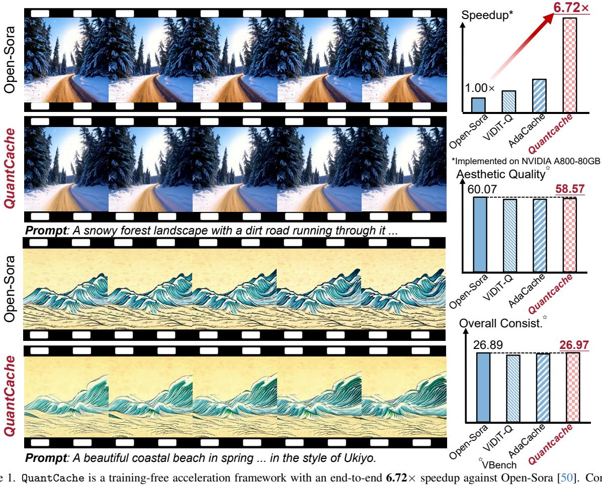
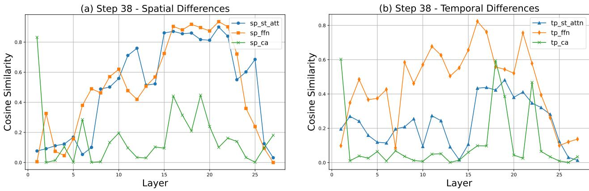

# QuantCache: Adaptive Importance-Guided Quantization with Hierarchical Latent and Layer Caching for Video Generation

Junyi Wu1\*, Zhiteng Li1\*, Zheng Hui2, Yulun Zhang1†, Linghe Kong1, Xiaokang Yang1 1Shanghai Jiao Tong University, 2MGTV, Shanhai Academy

Figure 1. QuantCache is a training-free acceleration framework with an end-to-end 6.72× speedup against Open-Sora [50]. Compared with ViDiT-Q [48] and AdaCache [15], QuantCache achieves superior quality scores, demonstrating the effectiveness of our method.

## **Abstract**

Recently, Diffusion Transformers (DiTs) have emerged as a dominant architecture in video generation, surpassing *U-Net-based models in terms of performance. However,* the enhanced capabilities of DiTs come with significant drawbacks, including increased computational and memory costs, which hinder their deployment on resourceconstrained devices. Current acceleration techniques, such as quantization and cache mechanism, offer limited speedup and are often applied in isolation, failing to fully address the complexities of DiT architectures. In this paper, we propose QuantCache, a novel training-free inference acceleration framework that jointly optimizes hierarchical latent caching, adaptive importance-guided quantization, and structural redundancy-aware pruning. QuantCache

\* Equal contribution.

† Corresponding author: Yulun Zhang, yulun100@gmail.com

*achieves an end-to-end latency speedup of 6.72*× *on Open-Sora with minimal loss in generation quality. Extensive experiments across multiple video generation benchmarks demonstrate the effectiveness of our method, setting a new standard for efficient DiT inference. The code and models will be available at [https: // github. com/](https://github.com/JunyiWuCode/QuantCache) [JunyiWuCode/ QuantCache](https://github.com/JunyiWuCode/QuantCache) .*

# 1. Introduction

Recently, Diffusion Transformers (DiTs) [\[35,](#page-9-2) [45\]](#page-9-3) have gained significant attention due to their superior performance in generative modeling, particularly in video generation tasks [\[4,](#page-8-1) [11,](#page-8-2) [16,](#page-8-3) [19,](#page-8-4) [34,](#page-9-4) [37,](#page-9-5) [40\]](#page-9-6). These models leverage the powerful attention mechanism of transformers, which allows them to capture long-range dependencies and produce high-quality outputs. However, this remarkable performance comes at the cost of substantial computational and memory requirements, which hinder their practical deployment, especially on resource-constrained devices. For instance, generating a 64-frame, 512×512 resolution video with the Open-Sora model [\[50\]](#page-9-0) on an NVIDIA A800-80GB GPU takes up to 130 seconds. The computational complexity is compounded by the quadratic growth of attention mechanisms in DiTs, which increases with the fixed long timesteps. Therefore, despite their impressive generative capabilities, DiTs face significant barriers to efficient deployment in real-world and edge device applications.

Model quantization is a widely used technique for reducing the memory and computational overhead of large models by compressing weights and activations into lowbit representations. Among the various quantization approaches, Post-Training Quantization (PTQ) [\[2,](#page-8-5) [6,](#page-8-6) [21,](#page-8-7) [48\]](#page-9-1) is particularly appealing due to its minimal training requirements and rapid deployment capabilities, making it ideal for large models like DiTs. Unlike Quantization-Aware Training (QAT) [\[30\]](#page-9-7), which requires extensive fine-tuning resources, PTQ allows for efficient quantization with much fewer computational costs. In addition to quantization, inference acceleration frameworks have been explored to further optimize diffusion models, including distillation [\[24\]](#page-8-8), pruning [\[8\]](#page-8-9), and cache-based methods [\[3,](#page-8-10) [15\]](#page-8-0).

However, these methods are often applied in isolation and neglect to fully leverage the synergies among them. A major limitation of existing approaches is their reliance on static heuristics, which do not adapt to the dynamic nature of the diffusion process. For instance, uniform quantization strategies apply a fixed bit-width across all layers and timesteps. They ignore that different layers exhibit varying levels of importance depending on the generation stage. Similarly, existing caching strategies use predefined schedules, neglecting to account for frame-specific variations in content evolution. These issues motivate the need for a more adaptive approach that can dynamically allocate computational resources based on specific content analyses.

To address those challenges, we propose a joint optimization framework QuantCache for video generation. First, we propose hierarchical latent caching (HLC) that adaptively determines when to refresh cached features based on inter-step feature divergence. HLC reduces redundant computations while preserving generation quality. Second, we propose adaptive importance-guided quantization (AIGQ), where bit-widths are adjusted per timestep and per layer according to feature sensitivity. AIGQ ensures that more critical computations retain higher bit-widths while redundant ones are processed at lower bit-widths. Finally, we propose structural redundancy-aware pruning (SRAP) that selectively prunes layers with highly correlated feature representations within the same timestep, further reducing computational cost. By jointly optimizing these three techniques, QuantCache effectively minimizes redundant computations while preserving the expressiveness of DiTs. Our contributions can be summarized as follows:

- We propose an efficient video generation framework QuantCache by jointly optimizing caching, quantization, and pruning. QuantCache achieves 6.72× speedup against Open-Sora [\[50\]](#page-9-0) (Figure [1\)](#page-0-0), surpassing SOTA methods while maintaining high generation quality.
- We propose hierarchical latent caching (HLC) that dynamically adjusts caching schedules based on feature divergence. HLC significantly reduces redundant computations in Diffusion Transformers (DiTs).
- We propose adaptive importance-guided quantization (AIGQ), a novel adaptive quantization framework that allocates precision levels based on timestep significance.
- We propose structural redundancy-aware pruning (SRAP), an online layer pruning method that selectively omits redundant computations within each timestep.

# 2. Related Works

# 2.1. Diffusion Transformers

Diffusion Transformers (DiTs) [\[4,](#page-8-1) [11,](#page-8-2) [16,](#page-8-3) [19,](#page-8-4) [34,](#page-9-4) [37,](#page-9-5) [40\]](#page-9-6) have emerged as a compelling alternative to traditional U-Net architectures in generative modeling tasks. DiTs utilize the self-attention mechanism [\[41\]](#page-9-8) to effectively capture long-range dependencies, thereby enhancing the quality of generated visual content. For instance, Open-Sora [\[50\]](#page-9-0) integrates a Variational Autoencoder (VAE) [\[18\]](#page-8-11) with DiTs, enabling efficient high-quality video generation. Despite their notable success, transformer-based diffusion models face challenges related to computational complexity and memory consumption. The self-attention mechanism's computational requirements scale quadratically with the input size, making high-resolution image and multi-frame video generation particularly resource-intensive. Addressing these challenges is crucial for the practical deployment of such models, especially with limited computational resources.

# 2.2. Model Quantization

Model quantization [5, 21, 44] is a pivotal technique for enhancing the efficiency of deep learning models by converting full-precision weights and activations into lower-bit representations, thereby reducing both memory footprint and computational load. Post-Training Quantization (PTO) [25] stands out as a particularly effective approach, enabling the compression of pre-trained models without necessitating extensive retraining. In the realm of diffusion models, PTQ has been successfully applied to U-Net-based architectures [38]. The advent of Diffusion Transformers (DiTs) has further propelled advancements in generative modeling, offering superior scalability and performance. However, the application of PTQ to DiTs presents unique challenges due to their architectural distinctions from U-Net-based models. Addressing this, ViDiT-Q [48] proposed a quantization scheme tailored for DiTs that achieves lossless 8-bit weight and activation quantization, resulting in significant memory and latency improvements. These advancements underscore the critical role of specialized PTQ methods in optimizing the performance and efficiency of diffusion models, particularly as architectures evolve from U-Net-based structures to transformer-based designs.

#### 2.3. Cache Mechanism

In the realm of diffusion models, cache-based acceleration techniques have been developed to enhance inference efficiency by reusing computations across timesteps. For instance, DeepCache [31] leverages temporal redundancy in U-Net architectures by caching high-level features during the denoising process, achieving significant speedups without necessitating model retraining. For DiT architectures, AdaCache [15] introduces a training-free method tailored for video Diffusion Transformers (DiTs), implementing a content-dependent caching schedule that adapts to each video's complexity, thereby optimizing the quality-latency  $\Delta$ -DiT [3] introduces a specialized caching mechanism known as  $\Delta$ -Cache, designed specifically for DiT architectures. This approach involves analyzing the role of each DiT block in image generation and selectively reuses feature offsets, accelerating inference without compromising image quality. However, optimizing these cache strategies remains challenging, particularly in balancing efficiency gains with the preservation of generation quality.

### 3. Method

#### 3.1. Preliminary

**Diffusion Models.** Diffusion models [4, 11, 16, 19, 34, 37, 40] are a class of generative models inspired by the process of diffusion in physics, where particles spread out over time due to random motion. In the context of generative modeling, diffusion models operate by gradually adding noise to data in a forward process, and then reversing this process to reconstruct the original data.

The forward diffusion process starts with a clean data sample  $x_0 \sim q(x)$  and progressively adds noise over T timesteps. The noisy data at timestep t is defined as:

$$x_t = \sqrt{\overline{\alpha}_t} x_0 + \sqrt{1 - \overline{\alpha}_t} \epsilon_t, \quad \epsilon_t \sim \mathcal{N}(0, I),$$
 (1) where  $\overline{\alpha}_t$  is a schedule controlling the noise level at timestep  $t$ , and  $\epsilon_t$  is Gaussian noise. As the diffusion process progresses,  $x_t$  becomes increasingly noisy, and by the final timestep  $T$ , it is pure Gaussian noise.

The reverse diffusion process aims to recover the clean data  $x_0$  from the noisy data  $x_t$ . The model learns a parameterized distribution  $p_{\theta}(x_{t-1}|x_t)$ , which predicts the clean data at timestep t-1 based on the noisy data at timestep t. This is typically modeled as a Gaussian distribution:

$$p_{\theta}(x_{t-1}|x_t) = \mathcal{N}\left(x_{t-1}; \mu_{\theta}(x_t, t), \Sigma_{\theta}(x_t, t)\right), \quad (2)$$
 where  $\mu_{\theta}(x_t, t)$  and  $\Sigma_{\theta}(x_t, t)$  are the mean and covariance predicted by the model at timestep  $t$ .

In a typical Diffusion Transformers [10, 17, 20, 27, 35, 45], the noisy data  $x_t$  is processed through a sequence of Transformer blocks. Each block consists of self-attention (SA), cross-attention (CA), and feed-forward networks (FFN). The self-attention mechanism allows the model to capture complex dependencies within the data, while the cross-attention layers integrate additional conditional information, like class labels or textual descriptions. **Model Quantization.** Quantization [33] is a technique employed to reduce the computational and memory demands by representing weights and activations with lower precision. This process involves approximating high-precision values with low-bit representations, thereby ac-

celerating inference and decreasing storage requirements. Formally, consider a neural network with L layers, where each layer l has weights  $W^{(l)}$  and activations  $X^{(l)}$ . The objective of quantization is to find proper bit-widths that minimizes the discrepancy between the original and quantized models. In uniform quantization, both weights and activations are mapped to discrete levels within a fixed range. The quantization function Q for a tensor x with b-bit representation is defined as:

$$x_{\text{int}} = Q(x; s, z, b) = \text{clamp}\left(\left\lfloor \frac{x}{s} \right\rceil + z, 0, 2^b - 1\right), \quad (3)$$

where s is the scaling factor, z is the zero point,  $\lfloor \cdot \rceil$  denotes rounding to the nearest integer, and  $\operatorname{clamp}(\cdot, a, c)$  restricts the values to the interval [a, c]. The scaling factor s is typically determined by the range of x:

$$s = \frac{\max(x) - \min(x)}{2^b - 1}.$$
(4)

Quantization error arises from two primary sources: clipping (or clamping) error and rounding error. Clipping error occurs when the dynamic range of x exceeds the representable range, leading to saturation. Rounding error results from mapping continuous values to discrete levels. These errors are influenced by factors such as the bit-width b, the distribution of x, and the chosen quantization parameters.

Figure 2. The overview of QuantCache with (a) HLC, (b) AIGQ, (c) SRAP. STA, CA, and FFN respectively refer to spatial-temporal attention, cross attention, and feedforward network in a Transformer layer.

In Diffusion Transformers (DiTs), quantization presents unique challenges. The isotropic architecture of DiTs [3], lacking the skip connections found in U-Net structures, makes traditional feature map caching methods less effective. We propose QuantCache, a novel training-free inference acceleration framework that jointly optimizes hierarchical latent caching, adaptive importance-guided quantization, and structural redundancy-aware pruning.

# 3.2. Joint Optimization of HLC and AIGQ

To enhance the efficiency of Diffusion Transformers (DiTs) in video generation, we propose a joint optimization framework that integrates *Hierarchical Latent Caching* with *Adaptive Importance-Guided Quantization*, as shown in Figure 2. This framework stems from a novel observation: within the iterative denoising process, the relative importance of different layers and timesteps fluctuates dynamically, depending on the evolution of latent representations and cross-step feature interactions. Crucially, we find that certain layers play a pivotal role in refining spatial structure, while others primarily contribute to temporal smoothness. Similarly, the degree of information retention across timesteps varies non-uniformly, creating opportunities for selectively caching features and adjusting quantization granularity based on their functional relevance.

**Hierarchical Latent Caching.** Unlike conventional caching mechanisms relying on static cache intervals, inspired by [3, 15, 22, 28], our approach leverages an adaptive refresh strategy that dynamically determines where recomputation is necessary. Given that DiTs lack the explicit skip connections found in U-Net architectures, we model cache decisions using an importance-aware metric that considers inter-step feature variations. Specifically, at timestep t, we compute a timestep-wise feature divergence score  $\mathcal{D}_t^{(l)}$ :

$$\mathcal{D}_{t}^{(l)} = \frac{\|p_{t}^{(l)} - p_{t-k}^{(l)}\|_{1}}{k} \cdot \|\nabla_{t} m_{t}^{(l)}\|, \tag{5}$$

where  $p_t^{(l)}$  represents the activation at layer l and timestep t, k is the last cached step, and  $\nabla_t m_t^{(l)}$  denotes the inter-frame gradient of the feature map, capturing the rate of change in motion across consecutive timesteps.

Based on the feature divergence score, we establish a *cache-refresh decision function*:

$$\tau_t^{(l)} = \begin{cases} \tau_{\text{max}}, & \text{if } \mathcal{D}_t^{(l)} < \delta_1, \\ \tau_{\text{mid}}, & \text{if } \delta_1 \le \mathcal{D}_t^{(l)} < \delta_2, \\ \tau_{\text{min}}, & \text{if } \mathcal{D}_t^{(l)} \ge \delta_2, \end{cases}$$
(6)

where  $\tau_t^{(l)}$  determines the number of steps before recomputation, adapting caching frequency to content variations.

Figure 3. AIGQ: adaptive importance-guided quantization.

Adaptive Importance-Guided Quantization. While caching effectively reduces redundant computations, quantization offers an orthogonal opportunity to optimize inference efficiency. However, naive low-bit quantization risks degrading spatial and temporal coherence, particularly in critical layers. To address this, we introduce an importance-driven mixed-precision quantization scheme that dynamically assigns bit-widths to both weights and activations based on their perceptual relevance, as shown in Figure 3.

(1) Weight Quantization: Instead of applying a uniform bit-width across all layers, inspired by [14, 39, 48], we allocate a quantization budget  $B_{\rm total}$  by first estimating layer sensitivity. Specifically, we evaluate each layer based on its numerical error, perceptual distortion, and temporal dynamics. Layers that contribute significantly to fine-grained texture reconstruction or motion continuity are assigned higher precision, whereas those with minimal impact on perceptual quality are allocated lower bit-widths.

To further mitigate quantization-induced artifacts, we incorporate a channel-balancing mechanism that combines scaling and rotation. The scaling-based approach corrects static imbalances originating from pretrained scale shift tables, while the rotation-based method addresses dynamic variations caused by timestep embeddings. By first applying scaling to stabilize the initial activation distribution, followed by a lightweight rotation transformation, we ensure a more uniform data distribution across channels, reducing extreme outliers that could degrade quantization performance. Given the total bit-width budget, we iteratively allocate precision levels while satisfying:

$$\sum_{l} B(l) \le B_{\text{total}},\tag{7}$$

where bit-widths are assigned to layers that exhibit higher sensitivity to quantization. This adaptive allocation ensures that critical layers retain sufficient precision while computational efficiency is maximized, enabling effective compression with minimal impact on generative quality. (2) Activation Quantization: Beyond optimizing weight precision, we extend our quantization strategy to activation, where bit-widths are dynamically modulated based on timestep-level redundancy. Inspired by [3, 6, 15], We observe that not all timesteps contribute equally to the final output quality. In early stages or during redundant intermediate steps, feature representations often exhibit high similarity, suggesting that lower precision is sufficient without compromising perceptual fidelity. Conversely, during critical transitions—such as the emergence of fine details or significant structural changes—higher precision is essential to capture the complexity of the evolving content.

Based on the observation, we propose a novel timestepwise content-adaptive bit allocation function that tailors activation bit-widths to the specific demands of each step, thereby optimizing both computational efficiency and output quality. Formally, our allocation function is defined as:

$$\text{bit-width}(t) = \begin{cases} Bit_{\text{max}}, & \text{if } \mathcal{D}_t < \theta_1, \\ Bit_{\text{mid}}, & \text{if } \theta_1 \leq \mathcal{D}_t < \theta_2, \\ Bit_{\text{min}}, & \text{if } \mathcal{D}_t \geq \theta_2, \end{cases}$$
(8)

where  $\mathcal{D}_t$  represents a timestep-specific redundancy metric (e.g. distance between consecutive feature maps), and  $\theta_1$  and  $\theta_2$  are empirically determined thresholds that delineate low, medium, and high redundancy regimes. Here,  $Bit_{\max}$ ,  $Bit_{\min}$ , and  $Bit_{\min}$  denote the maximum, intermediate, and minimum bit-widths, respectively.

The intuition behind this design is straightforward yet powerful: steps with high feature redundancy (i.e.,  $\mathcal{D}_t \geq \theta_2$ ) can tolerate aggressive quantization to  $Bit_{\min}$ , as the information loss is minimal and does not degrade the generative process. In video generation, consecutive frames with subtle changes—like a static background—require less precision in activations, allowing us to allocate fewer bits without sacrificing visual coherence. In contrast, steps with low redundancy (i.e.,  $\mathcal{D}_t < \theta_1$ ), such as those involving abrupt scene transitions or the refinement of intricate textures, demand  $Bit_{\max}$  to preserve the fidelity of complex features. The intermediate range  $(Bit_{\min})$  serves as a balanced compromise for timesteps with moderate complexity, ensuring a smooth trade-off between efficiency and quality.

This adaptive strategy reduces memory footprint and computational overhead, and aligns quantization decisions with the intrinsic dynamics of the generative model. By adjusting activation precision dynamically, we avoid pitfalls of uniform quantization, which over-allocates resources to redundant steps or under-allocates to critical ones.

#### **Unified Optimization for Efficient Video Generation.**

By integrating *Hierarchical Latent Caching* (HLC) with *Adaptive Importance-Guided Quantization* (AIGQ), we construct a self-adaptive compute allocation strategy that minimizes unnecessary computation while preserving video generation quality. HLC uses  $\mathcal{D}_t^{(l)}$  in Equation (5) to assess

Figure 4. Spatial and temporal differences across adjacent layers for spatial-temporal attention, cross-attention, and feed-forward network.

feature divergence at timestep t, guiding adaptive caching. AIGQ leverages a related timestep-wise metric  $\mathcal{D}_t$ , derived from  $\mathcal{D}_t^{(l)}$  via feature similarity, to dynamically adjust activation bit-widths. For smaller skips (low  $\tau_t^{(l)}$  in Equation (6)), we use smaller bit-widths to exploit redundancy, while for larger skips (high  $\tau_t^{(l)}$  in Equation (6)), we apply smaller bit-widths to enhance precision in post-skip steps, ensuring video quality. This cohesive timestep-wise strategy optimizes computation and precision.

## 3.3. Structural Redundancy-Aware Pruning

To further enhance the efficiency of DiTs, we propose a novel *Structural Redundancy-Aware Pruning (SRAP)* mechanism. In Figure 4, SRAP adaptively prunes layers within a single timestep based on their internal feature similarity. Unlike conventional static layer pruning strategies that predefine a fixed subset of layers to be pruned, SRAP dynamically determines layer importance *at runtime* by analyzing the intrinsic similarity of intermediate representations. This allows us to minimize redundant computations.

Motivation: Layer-Wise Redundancy in DiTs. Studies in vision transformers show that early layers capture coarse-grained details, while deeper layers refine high-frequency components [9, 47]. However, in DiTs, Feature evolution is highly iterative across timesteps. We observe that certain layers within a single timestep exhibit significant representational overlap. This phenomenon suggests that some computations can be pruned without information loss. By quantifying this redundancy, we introduce a data-driven mechanism to selectively prune layers at inference time.

Quantifying Redundancy with Cosine Similarity. To determine which layers can be pruned, inspired by [7, 32], we compute a layer-wise cosine similarity score between consecutive layers at timestep t (Figure 4):

$$S_t^{(l,l+1)} = \frac{\langle p_t^{(l)}, p_t^{(l+1)} \rangle}{\|p_t^{(l)}\| \|p_t^{(l+1)}\|}, \tag{9}$$

where  $p_t^{(l)}$  and  $p_t^{(l+1)}$  represent the feature representations at layers l and l+1 within timestep t. The closer this score is to 1, the higher the redundancy between layers.

Based on the cosine similarity measure, we define a *layer* pruning probability function:

$$P_{\text{prune}}^{(l)} = \begin{cases} 1, & \text{if } S_t^{(l,l+1)} > \tau_{\text{high}}, \\ P_{\text{base}}, & \text{if } \tau_{\text{low}} \le S_t^{(l,l+1)} \le \tau_{\text{high}}, \\ 0, & \text{if } S_t^{(l,l+1)} < \tau_{\text{low}}, \end{cases}$$
(10)

where  $\tau_{\rm high}$  and  $\tau_{\rm low}$  define redundancy thresholds, and  $P_{\rm base}$  is a baseline probability allowing occasional pruning when similarity is moderate. If two layers exhibit strong redundancy  $(S_t^{(l,l+1)} > \tau_{\rm high})$ , we completely bypass computations for  $p_t^{(l+1)}$ , reducing the inference cost.

**Adaptive Layer Pruning Strategy.** Rather than applying uniform layer pruning across all timesteps, we introduce an *adaptive pruning mechanism* that considers temporal feature dynamics. Specifically, we track the cumulative feature variation across previous timesteps:

$$\mathcal{V}_t = \sum_{i=0}^k \|p_t - p_{t-i}\|_1. \tag{11}$$

If  $\mathcal{V}_t$  is below a threshold  $\delta_{\text{low}}$ , indicating that the diffusion process is carefully refining rather than radically transforming content, we increase the layer pruning probability across all redundant layers. Conversely, if  $\mathcal{V}_t$  exceeds  $\delta_{\text{high}}$ , meaning that drastic changes are actively occurring, we reduce layer pruning to maintain information flow.

# Joint Optimization with Quantization and Caching.

The integration of Structural Redundancy-Aware Pruning (SRAP) with our existing quantization and caching strategies creates a *three-tier compute optimization frame-work*: (1) Hierarchical Latent Caching eliminates redundant computations across timesteps. (2) Adaptive Importance-Guided Quantization dynamically reduces numerical precision based on feature sensitivity. (3) Structural Redundancy-Aware Pruning selectively prunes layers within a timestep to prevent unnecessary overhead.

By holistically optimizing compute allocation across layers and timesteps, our method significantly accelerates DiT inference while preserving generative fidelity. This marks a substantial step forward in efficient video diffusion model and deployment for real-world applications.

| Method           | Bit-width (W/A) | Motion Smooth. | BG. Consist. | Subject Consist. | Aesthetic Quality | Imaging Quality | Dynamic Degree | Scene Consist. | Overall Consist. |
|------------------|-----------------|-------------------|-----------------|---------------------|----------------------|--------------------|-------------------|-------------------|---------------------|
| Open-Sora [50]   | 16/16           | 98.42             | 96.44           | 95.20               | 60.07                | 59.66              | 33.33             | 41.72             | 26.89               |
| Q-diffusion [23] | 8/8             | 96.54             | 94.47           | 92.52               | 58.00                | 56.57              | 38.88             | 38.57             | 26.33               |
| Q-DiT [2]        | 8/8             | 95.72             | 95.01           | 91.68               | 58.68                | 56.54              | 38.88             | 34.06             | 26.77               |
| PTQ4DiT [43]     | 8/8             | 98.02             | 96.33           | 96.23               | 58.40                | 53.29              | 37.50             | 36.36             | 25.98               |
| SmoothQuant [44] | 8/8             | 98.09             | 94.47           | 92.49               | 58.79                | 58.29              | 38.88             | 38.61             | 26.33               |
| Quarot [1]       | 8/8             | 97.09             | 95.34           | 90.00               | 55.96                | 56.34              | 37.50             | 37.55             | 26.09               |
| ViDiT-Q [48]     | 8/8             | 98.28             | 96.15           | 95.16               | 59.89                | 59.47              | 34.72             | 40.26             | 26.74               |
| QuantCache       | 8/8             | 98.52             | 96.12           | 94.62               | 58.57                | 55.94              | 31.94             | 36.92             | 26.97               |
| Q-DiT [2]        | 4/8             | 99.88             | 97.33           | 96.50               | 31.14                | 21.83              | 2.77              | 0.00              | 5.11                |
| PTQ4DiT [43]     | 4/8             | 94.62             | 98.50           | 98.69               | 32.76                | 35.57              | 5.56              | 3.75              | 11.76               |
| SmoothQuant [44] | 4/8             | 96.69             | 94.66           | 97.85               | 46.67                | 44.01              | 12.50             | 27.82             | 18.72               |
| Quarot [1]       | 4/8             | 94.63             | 94.55           | 99.70               | 46.04                | 41.46              | 37.50             | 29.94             | 18.91               |
| ViDiT-Q [48]     | 4/8             | 97.82             | 95.54           | 93.55               | 58.23                | 57.21              | 33.33             | 38.12             | 26.61               |
| QuantCache       | 4/6             | 98.57             | 96.34           | 94.56               | 58.63                | 55.94              | 34.72             | 39.39             | 26.77               |

Table 1. Performance comparison of various methods on VBench [12, 13]. The bit-width "16" refers to FP16 without quantization, while QuantCache-4/6 represents the version with adaptive importance-guided quantization. Due to failure to generate readable content, Q-diffusion for W4A8 is omitted. Notably, QuantCache-4/6 shows negligible loss in quality metrics compared to the baseline Open-Sora.

| Method           | Bit-width (W/A) | CLIPSIM | CLIP- Temp | VQA- Aesthetic | VQA- Technical |
|------------------|-----------------|---------|---------------|-------------------|-------------------|
| Open-Sora [50]   | 16/16           | 0.1842  | 0.9983        | 62.58             | 50.18             |
| Q-DiT [2]        | 8/8             | 0.1833  | 0.9972        | 60.24             | 34.78             |
| PTQ4DiT [43]     | 8/8             | 0.1882  | 0.9986        | 53.85             | 53.03             |
| SmoothQuant [44] | 8/8             | 0.2000  | 0.9981        | 59.01             | 51.24             |
| Quarot [1]       | 8/8             | 0.1990  | 0.9971        | 57.97             | 51.99             |
| ViDiT-Q [48]     | 8/8             | 0.1999  | 0.9986        | 59.91             | 54.34             |
| QuantCache       | 8/8             | 0.1925  | 0.9989        | 60.19             | 52.39             |
| Q-DiT [2]        | 4/8             | 0.1729  | 0.9828        | 0.01              | 0.02              |
| PTQ4DiT [43]     | 4/8             | 0.1778  | 0.9968        | 2.18              | 0.32              |
| SmoothQuant [44] | 4/8             | 0.1878  | 0.9978        | 90.77             | 22.72             |
| Quarot [1]       | 4/8             | 0.1863  | 0.9960        | 46.75             | 32.95             |
| ViDiT-Q [48]     | 4/8             | 0.1854  | 0.9984        | 59.84             | 49.11             |
| QuantCache       | 4/6             | 0.1904  | 0.9981        | 59.92             | 49.14             |

Table 2. Performance comparison of various methods on CLIP and Dover. The bit-width "16" refers to FP16 without quantization, while QuantCache-4/6 represents the version with adaptive importance-guided quantization.

# 4. Experiment

# 4.1. Experiment Settings

We evaluate the effectiveness of QuantCache on Open-Sora1.2 [50], exploring different bit-width configurations and acceleration strategies. The videos are generated with 100 timesteps. More comprehensive discussion of implementation details are provided in supplementary materials.

**Quantization Scheme.** We employ a uniform min-max quantization with per-channel weight and dynamic per-layer activation quantization. The activation quantization parameters are computed online with minimal computational overhead, ensuring adaptability across varying feature distributions. Our mixed-precision weight quantization is determined offline using a small calibration dataset, balancing numerical efficiency with generation quality.

Evaluation Settings. We evaluate the performance of QuantCache using the VBench benchmark suite [12, 13], which provides a comprehensive set of evaluation metrics. In alignment with prior works [36, 48], we select 8 key evaluation dimensions from VBench to ensure a thorough assessment. Furthermore, we adopt CLIP used in [29] and Dover [42] and benchmarks, chosen based on their relevance to our experimental objectives. Specifically, we use CLIPSIM and CLIP-Temp to measure the alignment between text and video, as well as to assess temporal semantic consistency. Additionally, we utilize DOVER for video quality assessment, which evaluates the generation quality from both aesthetic perspectives and technical metrics.

Hardware Implementation. To efficiently implement QuantCache in hardware, we developed optimized GEMM CUDA kernels that handle both quantization and caching mechanisms, resulting in better resource utilization and improved inference speed. Inspired by [26, 44, 48], we absorb the scaling-based channel balancing factors into the preceding layers offline to enhance computational efficiency. Additionally, we apply kernel fusion, which combines the quantization process with rotation transformations, while leveraging intermediate feature caching. The optimized CUDA kernels effectively reduce the computational cost of QuantCache, achieving a 6.72× speedup on a single NVIDIA A800-80GB GPU with CUDA 12.1.

#### 4.2. Main Results

Tables 1 and 2, demonstrate the significant improvements achieved by QuantCache, over other SOTA methods.

**VBench Quality Comparison.** First, we analyze the quality of the generated video frames using VBench [12, 13] (Tab. 1). In terms of bit-width, QuantCache operates with bit-widths of 8/8 and 4/6 for weights and acti-

| Methods      |              | Motion Smooth. | BG. Consist.    | Subject Consist. | Aesthetic Quality | Imaging Quality     | Speedup         |               |
|--------------|--------------|----------------|-----------------|------------------|-------------------|---------------------|-----------------|---------------|
| HLC          | AIGQ         | SRAP           | Triouen Sineoun | 20.00115151      | Suejeer Combiser  | Tresurence Quantity | ininging Quanty | Specuap       |
| -            | -            | -              | 99.29           | 98.10            | 97.74             | 63.09               | 59.37           | 1.00×         |
| $\checkmark$ | -            | -              | 99.21           | 97.59            | 97.65             | 62.09               | 58.28           | $4.12 \times$ |
| $\checkmark$ | $\checkmark$ | -              | 99.16           | 97.62            | 97.62             | 61.61               | 55.68           | $6.33 \times$ |
| $\checkmark$ | $\checkmark$ | $\checkmark$   | 98.91           | 96.19            | 97.29             | 61.39               | 55.64           | $6.72 \times$ |

Table 3. Ablation studies. Evaluation on motion smoothness, background consistency, subject consistency, aesthetic quality, imaging quality, and speedup demonstrates the proposed HLC, AIGQ, and SRAP achieve significant speedup with minimal performance degradation.

vations, comparable to other methods like Q-diffusion [23], Q-DiT [2], PTQ4DiT [43], and SmoothQuant [44]. Specifically, for the 8/8 bit-width setting, QuantCache achieves strong performance, with only minor reductions compared to the baseline Open-Sora [50] model. In the 4/8 bit-width setup, Q-DiT and PTQ4DiT struggle to maintain content quality. In the more challenging 4/6 bit-width configuration, QuantCache still outperforms other methods with 4/8 bit-width, showing the model's robustness across different precision settings.

CLIP and Dover Quality Comparison. Table 2 demonstrates the generated outputs using CLIP and Dover metrics, including CLIPSIM, CLIP-Temp, and two VQA tasks: Aesthetic and Technical. QuantCache achieves a higher aesthetic and technical score in both the 8/8 and 4/6 bitwidth configurations, demonstrating its ability to generate high-quality video content even with reduced bit-widths. For more detailed comparisons across additional prompts, please refer to the supplementary file.

#### 4.3. Ablation Studies

We present ablation studies in Tab. 3 to evaluate the contribution of different components in our proposed framework. We use the Open-Sora [50] prompt sets for video generation and select five representative evaluation metrics from VBench [12, 13] for performance assessment. We begin by evaluating the baseline configuration, where no enhancements are applied, providing a reference point for assessing the impact of each technique.

**Evaluation of** *HLC***.** As shown in Tab. 3, enabling *HLC* improves efficiency by reducing redundant timesteps, resulting in a notable speedup of  $4.12 \times$ . Quality metrics show minimal degradation, with only slight reductions observed in comparison to the baseline.

**Evaluation of** *AIGQ***.** Next, we incorporate *AIGQ* alongside HLC. The dynamic allocation of precision to weights and activations based on their importance further refines the model's performance, leading to a higher speedup of  $6.33 \times$  with negligible visual degradation.

**Evaluation of** *SRAP* **and Full Model.** We evaluate the full model, where SRAP selectively prunes redundant layers to contribute to further acceleration. The complete implementation of QuantCache achieves a speedup of  $6.72 \times$ . Despite slight quality loss, this configuration provides the best trade-off between efficiency and generation quality.

| Method             | Bitwidth (W/A) | Cache        | Speedup       |
|--------------------|----------------|--------------|---------------|
| Open-Sora [50]     | 16/16          | -            | 1.00 ×        |
| T-Gate [46]        | 16/16          | <b>√</b>     | 1.10 ×        |
| PAB [49]           | 16/16          | $\checkmark$ | $1.34 \times$ |
| ViDiT-Q [48]       | 8/8            | -            | $1.71 \times$ |
| AdaCache-slow [15] | 16/16          | $\checkmark$ | $1.46 \times$ |
| AdaCache-fast [15] | 16/16          | $\checkmark$ | $2.24 \times$ |
| QuantCache         | 4/6            | $\checkmark$ | 6.72 ×        |

Table 4. Speedup performance comparison of various methods, including the impact of bitwidth and cache on their performance.

## 4.4. Speedup Performance

As shown in Tab. 4, T-Gate [46], PAB [49], ViDiT-Q [48], and AdaCache [15] provide more efficient solutions compared to the baseline Open-Sora [50]. The speedup for these methods ranges from 1.10× (for T-Gate) to 2.24× (for AdaCache-fast), while QuantCache achieves a remarkable speedup of 6.72×, significantly surpassing all other methods while maintaining high generation quality. This substantial improvement is attributed to our low bit-width quantization and sophisticated caching strategies.

CUDA Acceleration. A key factor in QuantCache's superior performance lies in its ability to balance low bitwidth quantization with caching, incorporating kernel fusion techniques in our CUDA implementation for enhanced computational efficiency. These kernels integrate quantization with rotation transformations and intermediate feature caching. QuantCache maximizes GPU resource utilization, resulting in both faster computation and lower latency, making it particularly well-suited for efficient video generation.

#### 5. Conclusion

We propose a joint optimization framework that integrates hierarchical latent caching, adaptive importance-guided quantization, and structural redundancy-aware pruning to accelerate Diffusion Transformers (DiTs) for video generation. By adaptively reusing cached features, adjusting bit-widths based on content sensitivity, and pruning redundant layers, our method achieves efficient inference while maintaining high generation quality. Our approach achieves a 6.72× speedup on Open-Sora with minimal degradation in generation quality. We believe QuantCache provides a scalable and efficient solution for accelerating DiTs, making high-fidelity video generation more accessible for real-world and resource-constrained applications.

# References

- [1] Saleh Ashkboos, Amirkeivan Mohtashami, Maximilian Croci, Bo Li, Pashmina Cameron, Martin Jaggi, Dan Alistarh, Torsten Hoefler, and James Hensman. Quarot: Outlierfree 4-bit inference in rotated llms. In *NeurIPS*, 2024. [7](#page-6-2)
- [2] Lei Chen, Yuan Meng, Chen Tang, Xinzhu Ma, Jingyan Jiang, Xin Wang, Zhi Wang, and Wenwu Zhu. Q-dit: Accurate post-training quantization for diffusion transformers. *arXiv preprint arXiv:2406.17343*, 2024. [2,](#page-1-0) [7,](#page-6-2) [8](#page-7-2)
- [3] Pengtao Chen, Mingzhu Shen, Peng Ye, Jianjian Cao, Chongjun Tu, Christos-Savvas Bouganis, Yiren Zhao, and Tao Chen. δ-dit: A training-free acceleration method tailored for diffusion transformers. *arXiv preprint arXiv:2406.01125*, 2024. [2,](#page-1-0) [3,](#page-2-0) [4,](#page-3-3) [5](#page-4-1)
- [4] Ting Chen, Ruixiang Zhang, and Geoffrey Hinton. Analog bits: Generating discrete data using diffusion models with self-conditioning. In *ICLR*, 2023. [2,](#page-1-0) [3](#page-2-0)
- [5] Juncan Deng, Shuaiting Li, Zeyu Wang, Hong Gu, Kedong Xu, and Kejie Huang. Vq4dit: Efficient post-training vector quantization for diffusion transformers. *arXiv preprint arXiv:2408.17131*, 2024. [3](#page-2-0)
- [6] Zhenyuan Dong and Sai Qian Zhang. Ditas: Quantizing diffusion transformers via enhanced activation smoothing. In *WACV*, 2025. [2,](#page-1-0) [5](#page-4-1)
- [7] Razvan-Gabriel Dumitru, Paul-Ioan Clotan, Vikas Yadav, Darius Peteleaza, and Mihai Surdeanu. Change is the only constant: Dynamic llm slicing based on layer redundancy. In *ACL*, 2024. [6](#page-5-1)
- [8] Gongfan Fang, Kunjun Li, Xinyin Ma, and Xinchao Wang. Tinyfusion: Diffusion transformers learned shallow. In *CVPR*, 2025. [2](#page-1-0)
- [9] Amin Ghiasi, Hamid Kazemi, Eitan Borgnia, Steven Reich, Manli Shu, Micah Goldblum, Andrew Gordon Wilson, and Tom Goldstein. What do vision transformers learn? a visual exploration. In *ICLR*, 2023. [6](#page-5-1)
- [10] Ali Hatamizadeh, Jiaming Song, Guilin Liu, Jan Kautz, and Arash Vahdat. Diffit: Diffusion vision transformers for image generation. In *ECCV*, 2024. [3](#page-2-0)
- [11] Jonathan Ho, Ajay Jain, and Pieter Abbeel. Denoising diffusion probabilistic models. In *NeurIPS*, 2020. [2,](#page-1-0) [3](#page-2-0)
- [12] Ziqi Huang, Yinan He, Jiashuo Yu, Fan Zhang, Chenyang Si, Yuming Jiang, Yuanhan Zhang, Tianxing Wu, Qingyang Jin, Nattapol Chanpaisit, Yaohui Wang, Xinyuan Chen, Limin Wang, Dahua Lin, Yu Qiao, and Ziwei Liu. VBench: Comprehensive benchmark suite for video generative models. In *CVPR*, 2024. [7,](#page-6-2) [8](#page-7-2)
- [13] Ziqi Huang, Fan Zhang, Xiaojie Xu, Yinan He, Jiashuo Yu, Ziyue Dong, Qianli Ma, Nattapol Chanpaisit, Chenyang Si, Yuming Jiang, Yaohui Wang, Xinyuan Chen, Ying-Cong Chen, Limin Wang, Dahua Lin, Yu Qiao, and Ziwei Liu. Vbench++: Comprehensive and versatile benchmark suite for video generative models. *arXiv preprint arXiv:2411.13503*, 2024. [7,](#page-6-2) [8](#page-7-2)
- [14] Dongwon Jo, Taesu Kim, Yulhwa Kim, and Jae-Joon Kim. Mixture of scales: Memory-efficient token-adaptive binarization for large language models. In *NeurIPS*, 2024. [5](#page-4-1)

- [15] Kumara Kahatapitiya, Haozhe Liu, Sen He, Ding Liu, Menglin Jia, Chenyang Zhang, Michael S Ryoo, and Tian Xie. Adaptive caching for faster video generation with diffusion transformers. *arXiv preprint arXiv:2411.02397*, 2024. [1,](#page-0-1) [2,](#page-1-0) [3,](#page-2-0) [4,](#page-3-3) [5,](#page-4-1) [8](#page-7-2)
- [16] Tero Karras, Miika Aittala, Timo Aila, and Samuli Laine. Elucidating the design space of diffusion-based generative models. In *NeurIPS*, 2022. [2,](#page-1-0) [3](#page-2-0)
- [17] Gwanghyun Kim, Alonso Martinez, Yu-Chuan Su, Brendan Jou, Jose Lezama, Agrim Gupta, Lijun Yu, Lu Jiang, Aren ´ Jansen, Jacob Walker, et al. A versatile diffusion transformer with mixture of noise levels for audiovisual generation. *arXiv preprint arXiv:2405.13762*, 2024. [3](#page-2-0)
- [18] Diederik P Kingma and Max Welling. Auto-encoding variational bayes. In *ICLR*, 2014. [2](#page-1-0)
- [19] Diederik P Kingma, Tim Salimans, Ben Poole, and Jonathan Ho. On density estimation with diffusion models. In *NeurIPS*, 2021. [2,](#page-1-0) [3](#page-2-0)
- [20] Black Forest Labs. Flux. [https://github.com/black](https://github.com/black-forest-labs/flux)[forest-labs/flux](https://github.com/black-forest-labs/flux), 2024. [3](#page-2-0)
- [21] Muyang Li\*, Yujun Lin\*, Zhekai Zhang\*, Tianle Cai, Xiuyu Li, Junxian Guo, Enze Xie, Chenlin Meng, Jun-Yan Zhu, and Song Han. Svdquant: Absorbing outliers by low-rank components for 4-bit diffusion models. In *ICLR*, 2025. [2,](#page-1-0) [3](#page-2-0)
- [22] Senmao Li, Taihang Hu, Joost van de Weijer, Fahad Shahbaz Khan, Tao Liu, Linxuan Li, Shiqi Yang, Yaxing Wang, Ming-Ming Cheng, and Jian Yang. Faster diffusion: Rethinking the role of the encoder for diffusion model inference. In *NeurIPS*, 2024. [4](#page-3-3)
- [23] Xiuyu Li, Yijiang Liu, Long Lian, Huanrui Yang, Zhen Dong, Daniel Kang, Shanghang Zhang, and Kurt Keutzer. Q-diffusion: Quantizing diffusion models. In *ICCV*, 2023. [7,](#page-6-2) [8](#page-7-2)
- [24] Zhimin Li, Jianwei Zhang, Qin Lin, Jiangfeng Xiong, Yanxin Long, Xinchi Deng, Yingfang Zhang, Xingchao Liu, Minbin Huang, Zedong Xiao, et al. Hunyuan-dit: A powerful multi-resolution diffusion transformer with fine-grained chinese understanding. *arXiv preprint arXiv:2405.08748*, 2024. [2](#page-1-0)
- [25] Zhiteng Li, Xianglong Yan, Tianao Zhang, Haotong Qin, Dong Xie, Jiang Tian, Linghe Kong, Yulun Zhang, Xiaokang Yang, et al. Arb-llm: Alternating refined binarizations for large language models. In *ICLR*, 2025. [3](#page-2-0)
- [26] Yujun Lin, Haotian Tang, Shang Yang, Zhekai Zhang, Guangxuan Xiao, Chuang Gan, and Song Han. Qserve: W4a8kv4 quantization and system co-design for efficient llm serving. In *MLSys*, 2025. [7](#page-6-2)
- [27] Zhenghao Lin, Yeyun Gong, Yelong Shen, Tong Wu, Zhihao Fan, Chen Lin, Weizhu Chen, and Nan Duan. Genie: Large scale pre-training for text generation with diffusion model. *arXiv preprint arXiv:2212.11685*, 2022. [3](#page-2-0)
- [28] Haozhe Liu, Wentian Zhang, Jinheng Xie, Francesco Faccio, Mengmeng Xu, Tao Xiang, Mike Zheng Shou, Juan-Manuel Perez-Rua, and Jurgen Schmidhuber. Faster diffusion via ¨ temporal attention decomposition. In *TMLR*, 2025. [4](#page-3-3)
- [29] Yaofang Liu, Xiaodong Cun, Xuebo Liu, Xintao Wang, Yong Zhang, Haoxin Chen, Yang Liu, Tieyong Zeng, Raymond

- Chan, and Ying Shan. Evalcrafter: Benchmarking and evaluating large video generation models. In *CVPR*, 2024. [7](#page-6-2)
- [30] Xudong Lu, Aojun Zhou, Ziyi Lin, Qi Liu, Yuhui Xu, Renrui Zhang, Yafei Wen, Shuai Ren, Peng Gao, Junchi Yan, et al. Terdit: Ternary diffusion models with transformers. *arXiv preprint arXiv:2405.14854*, 2024. [2](#page-1-0)
- [31] Xinyin Ma, Gongfan Fang, and Xinchao Wang. Deepcache: Accelerating diffusion models for free. In *CVPR*, 2024. [3](#page-2-0)
- [32] Xin Men, Mingyu Xu, Qingyu Zhang, Bingning Wang, Hongyu Lin, Yaojie Lu, Xianpei Han, and Weipeng Chen. Shortgpt: Layers in large language models are more redundant than you expect. *arXiv preprint arXiv:2403.03853*, 2024. [6](#page-5-1)
- [33] Markus Nagel, Marios Fournarakis, Rana Ali Amjad, Yelysei Bondarenko, Mart van Baalen, and Tijmen Blankevoort. A white paper on neural network quantization. *CoRR*, abs/2106.08295, 2021. [3](#page-2-0)
- [34] Alexander Quinn Nichol and Prafulla Dhariwal. Improved denoising diffusion probabilistic models. In *ICCV*, 2021. [2,](#page-1-0) [3](#page-2-0)
- [35] William Peebles and Saining Xie. Scalable diffusion models with transformers. In *ICCV*, 2023. [2,](#page-1-0) [3](#page-2-0)
- [36] Weiming Ren, Harry Yang, Ge Zhang, Cong Wei, Xinrun Du, Stephen Huang, and Wenhu Chen. Consisti2v: Enhancing visual consistency for image-to-video generation. In *TMLR*, 2024. [7](#page-6-2)
- [37] Tim Salimans and Jonathan Ho. Progressive distillation for fast sampling of diffusion models. *ArXiv*, abs/2202.00512, 2022. [2,](#page-1-0) [3](#page-2-0)
- [38] Yuzhang Shang, Zhihang Yuan, Bin Xie, Bingzhe Wu, and Yan Yan. Post-training quantization on diffusion models. In *CVPR*, 2023. [3](#page-2-0)
- [39] Yuzhang Shang, Zhihang Yuan, Qiang Wu, and Zhen Dong. Pb-llm: Partially binarized large language models. In *ICLR*, 2024. [5](#page-4-1)
- [40] Jiaming Song, Chenlin Meng, and Stefano Ermon. Denoising diffusion implicit models. In *ICLR*, 2021. [2,](#page-1-0) [3](#page-2-0)
- [41] Ashish Vaswani, Noam Shazeer, Niki Parmar, Jakob Uszkoreit, Llion Jones, Aidan N Gomez, Ł ukasz Kaiser, and Illia Polosukhin. Attention is all you need. In *NeurIPS*, 2017. [2](#page-1-0)
- [42] Haoning Wu, Erli Zhang, Liang Liao, Chaofeng Chen, Jingwen Hou Hou, Annan Wang, Wenxiu Sun Sun, Qiong Yan, and Weisi Lin. Exploring video quality assessment on user generated contents from aesthetic and technical perspectives. In *ICCV*, 2023. [7](#page-6-2)
- [43] Junyi Wu, Haoxuan Wang, Yuzhang Shang, Mubarak Shah, and Yan Yan. Ptq4dit: Post-training quantization for diffusion transformers. In *NeurIPS*, 2025. [7,](#page-6-2) [8](#page-7-2)
- [44] Guangxuan Xiao, Ji Lin, Mickael Seznec, Hao Wu, Julien Demouth, and Song Han. SmoothQuant: Accurate and efficient post-training quantization for large language models. In *ICML*, 2023. [3,](#page-2-0) [7,](#page-6-2) [8](#page-7-2)
- [45] Zhuoyi Yang, Jiayan Teng, Wendi Zheng, Ming Ding, Shiyu Huang, Jiazheng Xu, Yuanming Yang, Wenyi Hong, Xiaohan Zhang, Guanyu Feng, et al. Cogvideox: Text-to-video diffusion models with an expert transformer. In *ICLR*, 2025. [2,](#page-1-0) [3](#page-2-0)

- [46] Wentian Zhang, Haozhe Liu, Jinheng Xie, Francesco Faccio, Mike Zheng Shou, and Jurgen Schmidhuber. Cross- ¨ attention makes inference cumbersome in text-to-image diffusion models. In *TMLR*, 2025. [8](#page-7-2)
- [47] Zizhao Zhang, Han Zhang, Long Zhao, Ting Chen, Sercan O¨ Arik, and Tomas Pfister. Nested hierarchical transformer: Towards accurate, data-efficient and interpretable visual understanding. In *AAAI*, 2022. [6](#page-5-1)
- [48] Tianchen Zhao, Tongcheng Fang, Enshu Liu, Wan Rui, Widyadewi Soedarmadji, Shiyao Li, Zinan Lin, Guohao Dai, Shengen Yan, Huazhong Yang, Xuefei Ning, and Yu Wang. Vidit-q: Efficient and accurate quantization of diffusion transformers for image and video generation. In *ICLR*, 2025. [1,](#page-0-1) [2,](#page-1-0) [3,](#page-2-0) [5,](#page-4-1) [7,](#page-6-2) [8](#page-7-2)
- [49] Xuanlei Zhao, Xiaolong Jin, Kai Wang, and Yang You. Real-time video generation with pyramid attention broadcast. *arXiv preprint arXiv:2408.12588*, 2024. [8](#page-7-2)
- [50] Zangwei Zheng, Xiangyu Peng, Tianji Yang, Chenhui Shen, Shenggui Li, Hongxin Liu, Yukun Zhou, Tianyi Li, and Yang You. Open-sora: Democratizing efficient video production for all, march 2024. *URL https://github. com/hpcaitech/Open-Sora*, 2024. [1,](#page-0-1) [2,](#page-1-0) [7,](#page-6-2) [8](#page-7-2)