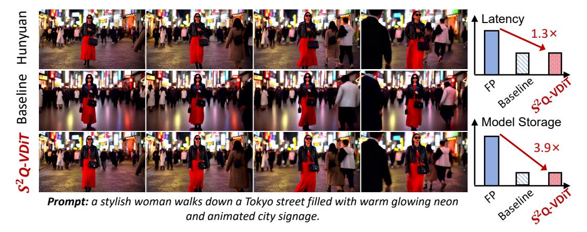
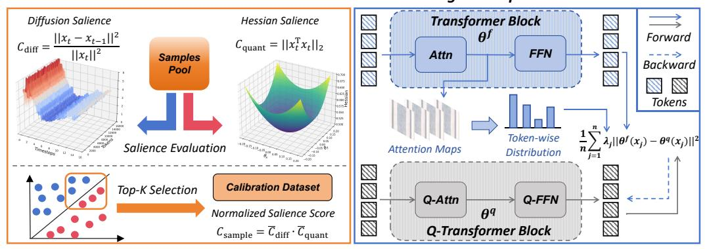
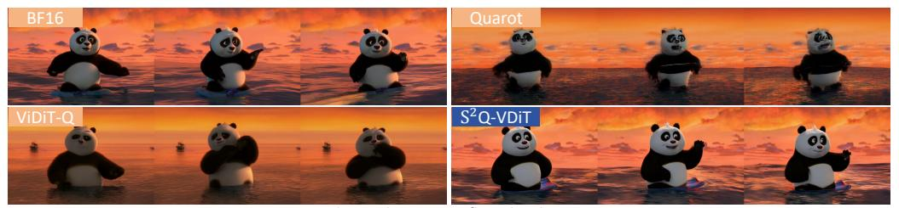
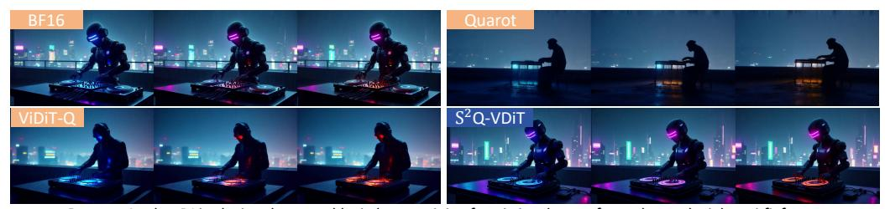
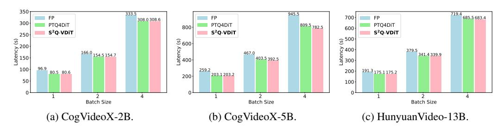
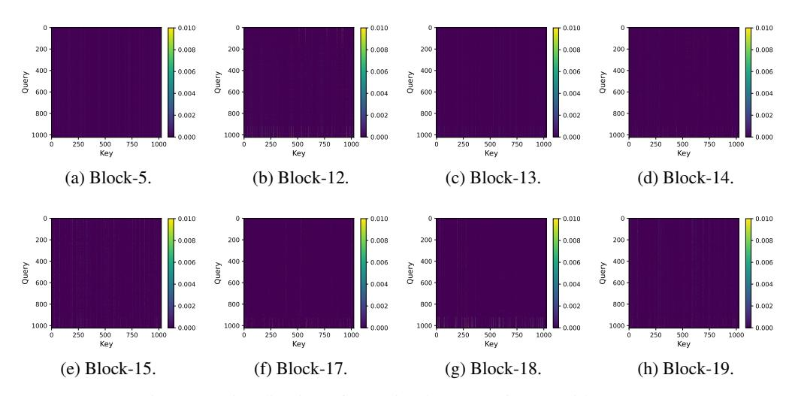
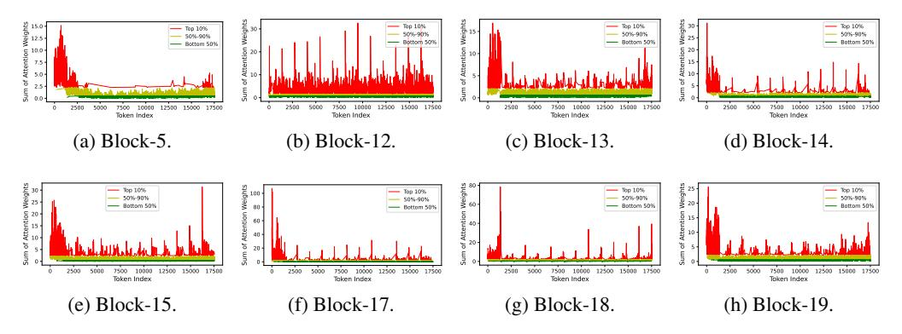
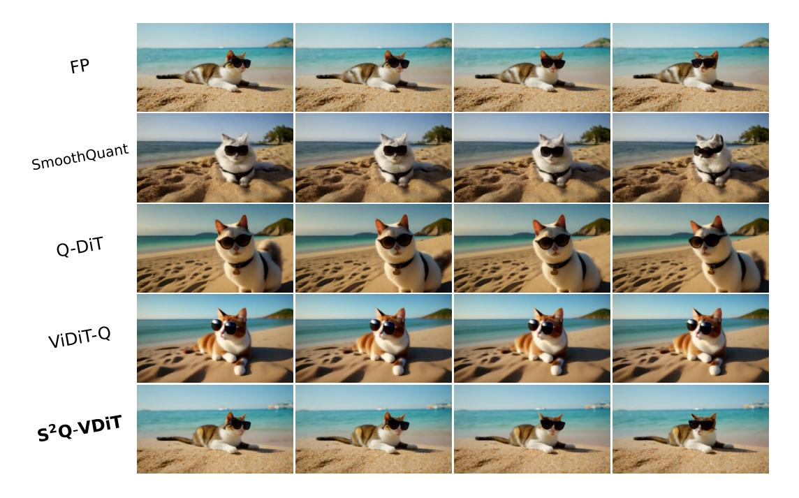

# S2Q-VDiT: Accurate Quantized Video Diffusion Transformer with Salient Data and Sparse Token Distillation

Weilun Feng $^{1,2}$ , Haotong Qin $^3$ , Chuanguang Yang $^{1\dagger}$ , Xiangqi Li $^{1,2}$ , Han Yang $^1$ , Yuqi Li $^1$ , Zhulin An $^1$ , Libo Huang $^1$ , Michele Magno $^3$ , Yongjun Xu $^1$ 

1State Key Laboratory of AI Safety, Institute of Computing Technology, Chinese Academy of Sciences

2University of Chinese Academy of Sciences

3ETH Zürich

 $\label{lem:composition} $$\{fengweilun 24s, yangchuanguang, lixiangqi 24s, anzhulin, xyj\}@ict.ac.cn $$\{haotong.qin, michele.magno\}@pbl.ee.ethz.ch, $$\{yuqili010602, www.huanglibo\}@gmail.com, and the second second second second second second second second second second second second second second second second second second second second second second second second second second second second second second second second second second second second second second second second second second second second second second second second second second second second second second second second second second second second second second second second second second second second second second second second second second second second second second second second second second second second second second second second second second second second second second second second second second second second second second second second second second second second second second second second second second second second second second second second second second second second second second second second second second second second second second second second second second second second second second second second second second second second second second second second second second second second second second second second second second second second second second second second second second second second second second second second second second second second second second second second second second second second second second second second second second second second second second second second second second second second second second second second second second second second second second second second second second second second second second second second second second second second second second second second second second second second second second second second second second second second second second second second second second second second second second second second second second second second second second second second$ 

Figure 1: We present  $S^2Q$ -VDiT, a post-training quantization method for video diffusion transformers. We quantize HunyuanVideo [24] to 4-bit weights and 6-bit activations without compromising visual quality.  $S^2Q$ -VDiT can further achieve  $3.9\times$  model compression and  $1.3\times$  inference acceleration.

### **Abstract**

Diffusion transformers have emerged as the mainstream paradigm for video generation models. However, the use of up to billions of parameters incurs significant computational costs. Quantization offers a promising solution by reducing memory usage and accelerating inference. Nonetheless, we observe that the joint modeling of spatial and temporal information in video diffusion models (V-DMs) leads to extremely long token sequences, which introduces high calibration variance and learning challenges. To address these issues, we propose S2Q-VDiT, a post-training quantization framework for V-DMs that leverages Salient data and Sparse token distillation. During the calibration phase, we identify that quantization performance is highly sensitive to the choice of calibration data. To mitigate this, we introduce *Hessian-aware Salient Data Selection*, which constructs high-quality calibration datasets by considering both diffusion and quantization characteristics unique to V-DMs. To tackle the learning challenges, we further analyze the sparse attention patterns inherent in V-DMs. Based on this observation, we propose

\*Equal contribution.

†Corresponding authors: Zhulin An, anzhulin@ict.ac.cn; Chuanguang Yang, yangchuanguang@ict.ac.cn

*Attention-guided Sparse Token Distillation*, which exploits token-wise attention distributions to emphasize tokens that are more influential to the model's output. Under W4A6 quantization, S 2Q-VDiT achieves lossless performance while delivering 3.9× model compression and 1.3× inference acceleration. Code will be available at <https://github.com/wlfeng0509/s2q-vdit>.

### 1 Introduction

In recent years, diffusion transformer [\[39\]](#page-12-0) has emerged as a powerful generative paradigm, demonstrating remarkable performance across diverse domains such as image synthesis [\[6,](#page-10-0) [26,](#page-11-1) [9,](#page-10-1) [57\]](#page-13-0), audio generation [\[15\]](#page-10-2), and increasingly, video generation [\[37,](#page-12-1) [35\]](#page-12-2). Among these, video diffusion models (V-DMs) [\[58,](#page-13-1) [24\]](#page-11-0) represent a new frontier by extending the spatial generative capabilities of image diffusion models (I-DMs) into the spatial-temporal domain, enabling high-quality video synthesis from textual prompts.

However, the transition from image to video generation introduces substantial computational challenges, primarily due to the exponential growth in token count introduced by the temporal dimension [\[35,](#page-12-2) [58,](#page-13-1) [24\]](#page-11-0). These memory and compute demands become particularly severe in large-scale video generation models [\[35,](#page-12-2) [58,](#page-13-1) [24\]](#page-11-0), which contain up to billions of parameters, where each input consists of thousands or even tens of thousands of tokens. To enable efficient deployment of such models in resource-constrained environments, post-training quantization (PTQ) [\[32,](#page-11-2) [52,](#page-13-2) [20,](#page-11-3) [5\]](#page-10-3) has become a widely adopted approach. PTQ compresses the pre-trained models into low-bit representations without modifying the model weights, relying only on a small dataset to calibrate quantization parameters with only hours on a single GPU [\[51,](#page-13-3) [28\]](#page-11-4).

While PTQ has proven effective for I-DMs [\[30,](#page-11-5) [45,](#page-12-3) [54\]](#page-13-4), directly applying it to V-DMs leads to substantial performance degradation [\[2,](#page-10-4) [62\]](#page-13-5). Prior works [\[2,](#page-10-4) [54,](#page-13-4) [62\]](#page-13-5) have sought to improve V-DMs' quantization performance primarily from the perspective of quantizer design. In this paper, we delve deeper into the PTQ challenges specific to V-DMs, focusing on calibration data and optimization methods.

We identify that the long token sequences characteristic of V-DMs significantly constrain the number of calibration samples (e.g., thousands for I-DMs vs. only dozens for V-DMs under equal computational budgets). Under such limited budgets, quantization performance becomes highly sensitive to the selection of calibration samples. Existing methods [\[54,](#page-13-4) [2,](#page-10-4) [62\]](#page-13-5) typically employ random or uniform sampling strategies, which work reasonably well for I-DMs but fail to generalize well to only dozens of data for V-DMs. Moreover, we observe that V-DMs exhibit sparse attention patterns across all tokens. Current PTQ optimization frameworks [\[54,](#page-13-4) [30\]](#page-11-5) treat all tokens equally during loss alignment between full-precision and quantized models. However, this uniform treatment is suboptimal for long token sequences, where only a small subset of tokens significantly impacts the final output. These observations highlight two fundamental challenges in PTQ for V-DMs: (1) the absence of a principled method for selecting calibration samples, and (2) the inefficiency of uniform token treatment during optimization, despite the varying importance of tokens.

To address these limitations, we propose S 2Q-VDiT, a post-training quantization framework tailored for V-DMs, built upon Salient data selection and Sparse token distillation. An overview of the proposed framework is illustrated in Fig. [2.](#page-2-0) First, we introduce *Hessian-aware Salient Data Selection*, which constructs calibration datasets by jointly assessing diffusion informativeness and quantization sensitivity. We define a unified metric to quantify sample's saliency to the denoising process and its sensitivity to quantization perturbations. Second, we present *Attention-guided Sparse Token Distillation*, a technique that leverages the inherent sparsity of spatial-temporal attention in V-DMs. Rather than treating all tokens equally during optimization, we reweight quantization losses based on token-wise attention distribution, allowing the model to focus more on the impactful representations.

Our main contribution can be summarized as follows:

• We empirically identify that V-DMs suffer from high calibration data variance in quantization performance. We propose *Hessian-aware Salient Data Selection*, which jointly considers diffusion informativeness and quantization sensitivity to construct effective calibration datasets.

#### Hessian-aware Salient Data Selection

#### Attention-quided Sparse Token Distillation

Figure 2: Overview of S2Q-VDiT. The framework includes Hessian-aware Salient Data Selection (SDS) for constructing calibration dataset and Attention-guided Sparse Token Distillation (STD) for block-wise optimization.

- We introduce *Attention-guided Sparse Token Distillation*, a method that leverages the inherent sparsity in spatial-temporal attention of V-DMs. We reweight the quantization loss of different tokens by measuring token-wise attention distribution. This enables the model to focus more on the impactful representations during optimization.
- Extensive experiments on large-scale video diffusion transformers with 2B to 13B parameters demonstrate that our S2Q-VDiT consistently outperforms existing PTQ baselines, achieving state-of-the-art performance under all quantization settings.

#### 2 Related Works

Diffusion models[46, 17] have demonstrated strong generative capabilities in video generation tasks. However, up to billions of parameters [35, 49, 58, 24] pose major challenges for deployment in resource-constrained environments. Quantization has emerged as a widely adopted solution for model compression and acceleration [40, 14, 3, 21, 25]. A growing body of work has explored post-training quantization (PTQ) for diffusion models, particularly focusing on U-Net-based architectures [30, 45, 16, 18, 29, 63]. For the Diffusion Transformer architecture specifically, recent methods [54, 2, 10] have made further explorations from the perspective of data distribution and architecture characteristics on quantization behavior. To address performance degradation at ultra-low bits, several quantization-aware training approaches have been proposed [64, 31, 36, 65, 8, 11]. While effective, these methods typically require extensive training time and large-scale datasets, making them less practical in many scenarios.

Despite these advances, most existing quantization research remains focused on image diffusion models (I-DMs), with limited exploration of video diffusion models (V-DMs). ViDiT-Q [62] and Q-DiT [2] have made the first explorations on the quantization of V-DMs. Q-DiT [2] introduces automatic quantization granularity allocation for fine-grained quantizer selection. ViDiT-Q [62] proposes static-dynamic quantization strategy to enhance quantization accuracy. While these approaches improve performance from different perspectives, they primarily focus on quantization granularity and quantizer design. In this paper, we tackle V-DM quantization from a new angle—calibration data quality and optimization strategy. Our method achieves lossless performance on various large-scale video diffusion transformers from 2B to 13B.

#### 3 Methods

#### 3.1 Preliminary

**Video Diffusion Transformer.** Diffusion transformers [39] predict the target using the representation of multiple tokens  $X \in \mathbb{R}^{n \times d}$  where n and d represent the number of tokens and feature dimension, respectively. For image diffusion models (I-DMs) [42, 26], n = s accounts for spatial

tokens. But for video diffusion models (V-DMs) [58, 24, 37],  $n = s \times t$  incorporates the temporal dimension t. This significantly increases the token count per sample (e.g., t = 49 for a 6-second video at 8 FPS), resulting in heightened memory consumption and greater optimization complexity.

**Post-training Quantization.** Quantization maps the model weights and activation to low-bit integers for acceleration and memory saving. For a float vector x, the symmetry quantization process can be formulated as:

$$x_{\text{int}} = \text{clamp}(\text{round}[\frac{x}{\Lambda}], -2^{N-1}, 2^{N-1} - 1), \ \Delta = \frac{\max(abs(x))}{2^{N-1} - 1}$$
 (1)

where N is the quantized bit,  $round(\cdot)$  is the round operation, and  $clamp(\cdot)$  constrains the value within integer range  $[-2^{N-1}, 2^{N-1} - 1]$ . Among quantization methods, post-training quantization (PTQ) is a more efficient method that only calibrates quantization parameters using a small calibration dataset  $D_{\text{calib}}$  without altering model weights. According to common practice [1, 55, 62], the quantization loss is expressed as:

$$\mathcal{L}_{\text{quant}} = \mathbb{E}_{X \sim D_{\text{calib}}}[||\theta^f(x) - \theta^q(x)||^2], \tag{2}$$

where  $\theta^f$  and  $\theta^q$  denote the full-precision and quantized model parameters, respectively.  $D_{\text{calib}} \in \mathbb{R}^{N \times n \times d}$  where N denotes the sample number in  $D_{\text{calib}}$ . Due to the limitations in computing resources and long token sequences in V-DMs, the calibration sample size N is smaller than that in I-DMs, leading to higher variance in data representation. This variance is further exacerbated by the diverse text prompts and different denoising timesteps present in the diffusion models.

#### 3.2 Hessian-aware Salient Data Selection

Figure 3: Visualization of different calibration data on CogVideoX-2B. We compare our proposed method with All Timesteps from One Prompt (ATOP), All Timesteps from Five Prompts (ATFP), and Random Timesteps from Five Prompts (RTFP). Our method has better generation quality.

**Observation 1.** Calibration sample selection methods result in high variance of the quantized model performance.

In line with we discussed in Sec. 3.1, we observed that under constrained calibrated data size, different samples have significant differences in the final model performance as shown in Fig. 3 and Fig. 6a. However, the sample selection method for V-DMs post-training quantization has not been thoroughly explored. Therefore, we hope to evaluate the importance of different data for V-DMs. To address this issue, we propose evaluating sample utility along two dimensions that naturally exist in the quantization of diffusion models: contribution to the diffusion process and sensitivity to quantization.

Prior work on timestep distillation [43, 44] and caching [33, 22] indicates that skipping certain consecutive timesteps has limited impact on output quality, suggesting varying information content across different timesteps. Based on this insight, we measure the salient information of timestep t for the whole denoising diffusion process by calculating the contribution of two consecutive timesteps latent representation. Given all candidate data among all the diffusion timesteps  $[x_1, x_2, \cdots, x_T]$  where T is the total denoising timesteps defined in the pretrained models. We define the diffusion salience as:

$$C_{\text{diff}} = \frac{||x_t - x_{t-1}||^2}{||x_t||^2},\tag{3}$$

where  $x_t$  stands for the denoised feature of timestep t. A higher  $C_{\rm diff}$  value denotes more informative denoising steps, while a lower  $C_{\rm diff}$  value indicates that the contained information largely overlaps with the previous timestep.  $C_{\rm diff}$  naturally measures the saliency of different timesteps during the diffusion denoising process. By focusing on the salient data, we can better approximate the distribution of the entire diffusion process and achieve better performance.

We then consider the quantization of weight W and its quantized version  $\hat{W} = W + \Delta$ , the quantization loss that jointly considers the input X can be be approximated using a Taylor expansion:

$$\mathbb{E}[||XW^{\top} - X\hat{W}^{\top}||^{2}] = \mathbb{E}[||XW^{\top} - X(W + \Delta)^{\top}||^{2}]$$

$$\approx \Delta g^{X} + \frac{1}{2}\Delta H^{X}\Delta^{\top},$$
(4)

where  $g^X$  is the gradient and  $H^X$  is the Hessian matrix. Using  $g^X = 0$  for a well-trained model provided in [32, 59] and  $H^X = \mathbb{E}[2X^\top X]$  provided in [13], Eq. (4) can be further simplified to:

$$\mathbb{E}[||XW^{\top} - X\hat{W}^{\top}||^2] \approx \mathbb{E}[\Delta(X^{\top}X)\Delta^{\top}],\tag{5}$$

where Hessian matrix  $X^{\top}X$  is given by Levenberg-Marquardt approximation [12, 38]. The Hessian matrix represents the inherent perturbation ability of sample X to the quantization process, which leads us to define quantization salience as:

$$C_{\text{quant}} = ||x_t^{\top} x_t||_2, \tag{6}$$

where a larger  $C_{\rm quant}$  denotes that  $x_t$  is more sensitive to the quantization process due to the property of the Hessian matrix [13, 12, 59]. By focusing on the quantization-sensitive samples, we can further relieve the bridge between the original data distribution and quantization operations, making the quantized model more robust and perform better.

To jointly emphasize diffusion informativeness and quantization sensitivity, we apply min–max normalization over the candidate calibration pool  $\mathcal{D}_{calib}$ :

$$\overline{C}_{\text{diff}}(x_t) = \frac{C_{\text{diff}}(x_t) - C_{\text{diff}}^{\min}}{C_{\text{diff}}^{\max} - C_{\text{diff}}^{\min}}, \ \overline{C}_{\text{quant}}(x_t) = \frac{C_{\text{quant}}(x_t) - C_{\text{quant}}^{\min}}{C_{\text{quant}}^{\max} - C_{\text{quant}}^{\min}},$$
(7)

where  $C_{\text{diff}}^{\min}$ ,  $C_{\text{diff}}^{\max}$ ,  $C_{\text{quant}}^{\min}$ , and  $C_{\text{quant}}^{\max}$  denote the mininum value and maxminum value of all  $C_{\text{diff}}(\cdot)$  and  $C_{\text{quant}}(\cdot)$  respectively. The unified salience score is then defined as the product:

$$C_{\text{sample}}(x_t) = \overline{C}_{\text{diff}}(x_t) \cdot \overline{C}_{\text{quant}}(x_t) \le \left(\frac{\overline{C}_{\text{diff}}(x_t) + \overline{C}_{\text{quant}}(x_t)}{2}\right)^2, \tag{8}$$

by the Arithmetic–Geometric Mean inequality [67] which ensuring the score is maximized only when both normalized metrics are high. This mutual-salience product metric inherently penalizes samples that are only strong on one dimension, aligns with mutual-information objectives, and yields a more strong, robust calibration set.

#### 3.3 Attention-guided Sparse Token Distillation

Figure 4: Visualization of sparse attention patterns in CogVideoX-2B block-10. In (4a), fewer columns have significantly higher weights. In (4b), only 10% of tokens have larger attention weights.

**Observation 2.** The fully spatial-temporal attention in V-DMs exhibits certain sparse patterns, suggesting that only subsets of tokens notably impact the model output.

Table 1: Performance of 4-bit weight and 6-bit activation quantization on text-to-video generation under VBench evaluation benchmark suite. We evaluate on Imaging Quality (IQ), Aesthetic Quality (AQ), Motion Smoothness (MS), Dynamic Degree (DD), Background Consistency (BC), Subject Consistency (SuC), Scene Consistency (ScC), and Overall Consistency (OC). Higher (↑) metrics represent better performance. Bold: the best result.

| Model        | Method       | IQ    | AQ    | MS    | DD    | BC    | SuC   | ScC   | OC    |
|--------------|--------------|-------|-------|-------|-------|-------|-------|-------|-------|
|              | FP           | 58.69 | 55.25 | 97.95 | 50.00 | 96.40 | 94.30 | 33.79 | 25.91 |
|              | Q-DiT        | 48.63 | 47.63 | 98.08 | 19.44 | 95.30 | 92.15 | 23.84 | 24.00 |
|              | PTQ4DiT      | 42.91 | 45.49 | 98.48 | 5.56  | 95.65 | 92.85 | 17.88 | 21.15 |
| CogVideoX-2B | SmoothQuant  | 44.60 | 44.33 | 98.22 | 9.72  | 95.62 | 92.04 | 18.60 | 21.20 |
|              | Quarot       | 51.89 | 48.48 | 97.49 | 31.94 | 95.61 | 93.01 | 22.97 | 23.57 |
|              | ViDiT-Q      | 51.94 | 48.06 | 97.47 | 33.33 | 95.54 | 92.87 | 22.17 | 23.69 |
|              | 2Q-VDiT S | 55.49 | 53.74 | 98.10 | 40.28 | 96.05 | 94.16 | 32.70 | 25.19 |
|              | FP           | 61.80 | 58.88 | 97.61 | 72.22 | 95.56 | 94.63 | 45.28 | 26.46 |
|              | Q-DiT        | 49.94 | 50.18 | 97.03 | 43.06 | 95.52 | 91.58 | 29.65 | 24.49 |
|              | PTQ4DiT      | 43.54 | 42.70 | 97.77 | 4.17  | 96.70 | 93.32 | 10.93 | 21.75 |
| CogVideoX-5B | SmoothQuant  | 39.50 | 36.92 | 97.88 | 6.94  | 96.39 | 92.28 | 23.11 | 18.19 |
|              | Quarot       | 43.95 | 44.81 | 97.33 | 31.94 | 96.58 | 92.27 | 20.93 | 22.34 |
|              | ViDiT-Q      | 48.87 | 50.51 | 97.66 | 37.50 | 96.25 | 93.60 | 27.76 | 23.57 |
|              | 2Q-VDiT S | 60.75 | 56.90 | 97.46 | 58.33 | 96.76 | 94.24 | 46.66 | 26.30 |
|              | FP           | 62.30 | 62.49 | 99.00 | 56.94 | 98.08 | 95.30 | 33.36 | 26.85 |
|              | Q-DiT        | 50.23 | 48.40 | 98.95 | 40.28 | 97.14 | 94.03 | 18.46 | 14.41 |
|              | PTQ4DiT      | 48.31 | 50.13 | 98.26 | 19.44 | 97.95 | 94.37 | 20.19 | 19.85 |
| HunyuanVideo | SmoothQuant  | 47.55 | 56.03 | 98.77 | 27.78 | 97.33 | 94.57 | 23.69 | 25.47 |
|              | Quarot       | 52.31 | 58.50 | 99.13 | 37.50 | 97.98 | 95.31 | 25.51 | 26.01 |
|              | ViDiT-Q      | 52.21 | 58.38 | 99.12 | 41.67 | 98.02 | 95.20 | 23.69 | 26.15 |
|              | 2Q-VDiT S | 58.83 | 59.62 | 99.20 | 48.61 | 98.15 | 95.57 | 33.65 | 26.91 |

Let x ∈ R n×d be the token embeddings, we can express Eq. [\(2\)](#page-3-1) in the summation form as follows:

$$\mathcal{L}_{\text{quant}} = \frac{1}{n} \sum_{j=1}^{n} ||\theta^f(x_{j,:}) - \theta^q(x_{j,:})||^2, \tag{9}$$

where xj,: refers to the jth token in the video diffusion transformer. This loss function assumes that each token contributes equally to the overall error between the quantized and full-precision models. However, due to the spatial-temporal modeling objectives, V-DMs typically require large-scale pretraining to achieve full convergence [\[37,](#page-12-1) [58,](#page-13-1) [24,](#page-11-0) [56\]](#page-13-10).

In the post-training quantization (PTQ) stage, only a small dataset is used to calibrate the quantization parameters, which naturally limits the model's ability to optimize from all tokens. Nevertheless, attention maps derived from V-DMs reveal that only subsets of tokens significantly influence the final output (see Fig. [4](#page-4-3) and Appendix Sec. [H\)](#page-19-0). This observation aligns with prior studies on attention in V-DMs [\[60,](#page-13-11) [4,](#page-10-13) [61,](#page-13-12) [66\]](#page-14-2), which have shown that pruning irrelevant tokens has a negligible impact on generation quality. These findings motivate a strategy that focuses learning more intensely on salient tokens while relaxing constraints on less impactful ones. Thereby enabling better convergence and improved performance even with limited calibration data.

To improve alignment between quantized and full-precision outputs, we reweight each token's contribution in the loss function based on its influence on the block output. Formally, we modify Eq. [\(9\)](#page-5-0) to:

$$\mathcal{L}_{\text{quant}} = \frac{1}{n} \sum_{j=1}^{n} \lambda_j ||\theta^f(x_{j,:}) - \theta^q(x_{j,:})||^2,$$
 (10)

where λj denotes the weighting factor corresponding to token xj,: . Leveraging the attention mechanism within each transformer block of V-DMs, we can obtain the complete multi-head attention

| Table 2: Performance of both 4-bit weight and activation quantization on text-to-video generation |
|---------------------------------------------------------------------------------------------------|
| under VBench evaluation benchmark suite.                                                          |

| Model        | Method       | IQ    | AQ    | MS    | DD    | BC    | SuC   | ScC   | OC    |
|--------------|--------------|-------|-------|-------|-------|-------|-------|-------|-------|
|              | FP           | 58.69 | 55.25 | 97.95 | 50.00 | 96.40 | 94.30 | 33.79 | 25.91 |
|              | Q-DiT        | 26.26 | 27.66 | 99.14 | 0     | 98.09 | 96.52 | 1.16  | 8.43  |
|              | PTQ4DiT      | 20.66 | 28.50 | 99.30 | 0     | 97.61 | 95.33 | 2.11  | 11.11 |
| CogVideoX-2B | SmoothQuant  | 29.76 | 28.31 | 98.95 | 0     | 97.62 | 94.65 | 5.31  | 9.74  |
|              | QuaRot       | 43.22 | 39.59 | 97.54 | 13.89 | 96.18 | 92.35 | 12.21 | 19.57 |
|              | ViDiT-Q      | 45.56 | 42.03 | 97.57 | 12.5  | 96.08 | 92.43 | 11.91 | 19.61 |
|              | 2Q-VDiT S | 53.71 | 52.31 | 98.09 | 36.11 | 96.15 | 93.99 | 34.23 | 24.90 |
|              | FP           | 61.80 | 58.88 | 97.61 | 72.22 | 95.56 | 94.63 | 45.28 | 26.46 |
|              | Q-DiT        | 40.80 | 33.00 | 95.71 | 36.11 | 98.26 | 96.99 | 0.22  | 1.91  |
|              | PTQ4DiT      | 41.48 | 28.63 | 96.38 | 0     | 97.29 | 95.09 | 0     | 7.37  |
| CogVideoX-5B | SmoothQuant  | 40.30 | 29.99 | 95.76 | 1.39  | 96.54 | 96.02 | 0.44  | 6.51  |
|              | QuaRot       | 29.41 | 35.36 | 97.77 | 15.28 | 97.23 | 92.71 | 8.36  | 15.31 |
|              | ViDiT-Q      | 31.95 | 36.71 | 97.09 | 15.28 | 96.37 | 93.01 | 10.85 | 16.91 |
|              | 2Q-VDiT S | 58.76 | 55.35 | 97.18 | 47.22 | 96.25 | 93.69 | 36.56 | 26.02 |

map A ∈ R H×n×n where H is the number of attention heads. A naturally represents the importance matrix of different tokens within each block, and Ah,i,j denotes the attention weight jth token receives from the ith token in hth attention head. We use the attention map A to compute λj using:

$$S_j = \sum_{h,i} A_{h,i,j}, \ \lambda_j = \frac{S_j - \min(S)}{\max(S) - \min(S)} (\lambda_{\max} - \lambda_{\min}) + \lambda_{\min}, \tag{11}$$

where min(S) and max(S) denote the minimum and maximum values in all S respectively. The hyperparameters λmin and λmax define the normalization range for token importance. Ultimately, λj quantifies each token's salience and helps guide the optimization process to prioritize alignment for tokens that exert greater influence.

### 4 Experiments

### 4.1 Experimental and Evaluation Settings

Quantization Scheme. We employ uniform per-channel weight quantization and dynamic per-token activation quantization with channel-wise scale and rotation matrix same as prior works [\[2,](#page-10-4) [1,](#page-10-10) [62\]](#page-13-5). We use symmetry quantization for both weight and activation for better hardware acceleration and memory saving. We follow the block-wise post-training strategy used in prior works [\[30,](#page-11-5) [54,](#page-13-4) [2\]](#page-10-4). More implementation details and model settings can be seen in Appendix Sec. [A.](#page-15-0)

Evaluation Settings. We conduct text-to-video experiment on different scale SOTA models CogVideoX-2B, CogVideoX-5B [\[58\]](#page-13-1) and HunyuanVideo-13B [\[24\]](#page-11-0) for better evaluation. We evaluate the performance of the quantized model using the VBench benchmark [\[19\]](#page-11-14), which provides a comprehensive evaluation on video generation performance. Same as the prior works [\[2,](#page-10-4) [62\]](#page-13-5), we select 8 major evaluation dimensions from VBench to ensure a thorough assessment. We also present more experiments on EvalCrafter [\[34\]](#page-12-13) benchmark in Appendix Sec. [D](#page-17-0). As current works [\[2,](#page-10-4) [62\]](#page-13-5) have achieved almost lossless performance at high bits (e.g., 6-8 bits), we evaluated the performance at more challenging and unexplored low-bit W4A6 and W4A4 settings.

Compared Methods. Consist with prior works [\[2,](#page-10-4) [62\]](#page-13-5), we compare S 2Q-VDiT with current PTQ baseline methods. For diffusion baseline, we compare with Q-DiT [\[2\]](#page-10-4), PTQ4DiT [\[54\]](#page-13-4), and ViDiT-Q [\[62\]](#page-13-5). We further compare with strong LLM baseline, SmoothQuant [\[55\]](#page-13-8) and QuaRot [\[1\]](#page-10-10).

**Prompt:** A panda standing on a surfboard in the ocean in sunset.

(a) CogVideoX-5B.

**Prompt:** A robot DJ is playing the turntable, in heavy raining futuristic tokyo rooftop cyberpunk night, sci-fi, fantasy. (b) Hunyuan Video-13B.

Figure 5: Visual comparison on different models under W4A6 quantization setting.

#### 4.2 Quantitative Comparison

We present text-to-video experiment under VBench evaluation benchmark suite in Tab. 1 and Tab. 2. **W4A6 Quantization.** In Tab. 1, we focus on relatively higher bit quantization setting of W4A6 (4-bit weight and 6-bit activation). In three different scale current V-DMs CogVideoX-2B, CogVideoX-5B, and HunyuanVideo-13B, our method outperforms all current quantization methods by a notable margin. Our S2Q-VDiT achieves almost lossless performance across all eight selected dimensions. For CogVideoX-5B, S2Q-VDiT even outperforms FP model with 46.66 scene consistency while other methods achieved the highest score of 29.65.

W4A4 Quantization. In Tab. 2, we further explored the quantization performance of V-DMs under extremely low bit W4A4 settings. It is worth noting that this is currently the first exploration under 4-bit activation quantization. In this extremely low bit setting, S2Q-VDiT can still maintain 95% of the model's performance while other methods showed significant performance degradation. Although some methods are particularly high in metrics such as SuC and BC, this is due to their almost collapsed generation quality. ViDiT-Q [62] pointed out that these metrics are particularly high on extremely collapsed methods, and maintaining performance closer to FP is better. For CogVideoX-2B, our method achieves even lossless scene consistency of 34.23 while other methods achieved the highest score of 12.21 with almost a three times improvement.

#### 4.3 Visual comparison

We present visual comparisons on different models under W4A6 in Fig. 5. Compared with the current SOTA methods QuaRot [1] and ViDiT-Q [62],  $S^2Q$ -VDiT has significant improvements in image quality and dynamic degree, and is lossless compared to FP models. For CogVideoX-5B, QuaRot can hardly generate clear images; ViDiT-Q lacks the ability in color richness and image details;  $S^2Q$ -VDiT is significantly better in color, detail, and video dynamics. For HunyuanVideo, although all methods have not significantly reduced image clarity, the semantic information of QuaRot has severely declined; the generated characters and background details of ViDiT-Q are also insufficient.  $S^2Q$ -VDiT maintains high quality in the details and colors of both the background and characters, and ensures the dynamic level of the video at different frame. The consistent and significant improvement on three different scales V-DMs also demonstrates the generalization and effectiveness of our method. We provide more visual comparison in Appendix Sec. I.

Figure 6: Ablation study of proposed methods on W4A4 CogVideoX-2B.

Calbration Time **Imaging** Aesthetic Overall Method Data Size (Hour) Quality Quality Consistency 58.61 55.25 25.91 S2Q-VDiT 20 1.64 53.56 53.07 24.69 S2Q-VDiT 40 2.88 55.49 53.74 25.19

55.52

53.64

25.21

Table 3: Ablation study on calibration data size.

5.56

### Ablation Study

S2O-VDiT

80

FP

In Fig. 6, we present ablation studies on Hessian-aware Salient Data Selection (SDS) and Attention-guided Sparse Token Distillation (STD). To verify the effectiveness of these techniques, we conducted integration experiments with existing PTQ methods in Appendix Sec. E.

**Ablation on SDS.** We study different calibration data selection methods with our proposed SDS and shown the results in Fig. 6a. We compare three different straightforward methods, including All Timesteps from One Prompt (ATOP), All Timesteps from Five Prompts (ATFP), and Random Timesteps from Five Prompts (RTFP). We selected 40 samples for all methods for fair comparison. We also present the visual comparison in Fig. 3. Our proposed SDS outperforms all other methods in terms of both visual and metric effects while other methods can not maintain high generation quality. We conducted more ablation experiments on the random seeds and decoupled the two saliences used in SDS. We present the experimental results in Appendix Sec. B. We further conduct an ablation study on calibration data size in CogVideoX-2B under W4A6 setting and present the results in Tab. 3. It can be seen that the calibration time increases almost linearly with the increase of data size. The performance of 40 data is significantly better than that of 20 data, but the performance improvement of 80 data is minor. Therefore, in the trade-off of performance and calibration time, we choose to use 40 data as the unified experimental settings.

**Ablation on STD.** In Fig. 6b, we compare our proposed STD with no sparse distillation (w/o STD). It can be seen that compared with no STD, all distillation strategies can improve model performance. We also compare different hyperparameters used in Eq (11). We set  $\lambda_{max} = 1$  as default and investigate different  $\lambda_{min}$  selections which control the relaxation degree on less impactful tokens. It can be seen that all different  $\lambda_{min}$  can improve quantization performance which proves the robustness of STD. We select  $\lambda_{min}=0.5$  in the main experiments for the most balanced performance improvement. We provide more visualization of the sparse patterns in Appendix Sec. H.

### **Efficiency Study**

We study the deployment efficiency of different-scale video diffusion transformers in Tab. 5. We used the CUDA implementation provided in [62, 47] for deployment and conducted all experiments on a single NVIDIA A800 GPU. For Inference Memory and Latency, we use a batch size of 1 in Tab [5.](#page-9-0) Compared with baseline method PTQ4DiT [\[54\]](#page-13-4), our method brings significant performance improvement with almost no extra inference burden. Compared with FP model, our method can bring 3.94× model memory saving, 1.56× inference memory saving, and 1.28× inference acceleration on CogVideoX-5B. In Appendix Sec. [F,](#page-18-0) we conducted more experiments on deployment efficiency.

#### 4.6 Calibration Resource Cost

Table 4: Calibration cost on W4A4 CogVideoX-2B.

| Method       | GPU Memory (GB) | GPU Time (hour) | Imaging Quality | Aesthetic Quality |
|--------------|-----------------|-----------------|-----------------|-------------------|
| FP           | -               | -               | 58.61           | 55.25             |
| Q-DiT        | 29.85           | 2.69            | 26.26           | 27.66             |
| PTQ4DiT      | 33.30           | 2.25            | 20.66           | 28.50             |
| 2Q-VDiT S | 35.68           | 2.88            | 53.71           | 52.31             |

We reported on the calibration resource consumption of our S 2Q-VDiT compared with existing baseline methods Q-DiT [\[2\]](#page-10-4) and PTQ4DiT [\[54\]](#page-13-4) in Tab. [4.](#page-9-1) Compared with existing methods, S 2Q-VDiT only increases 2GB memory consumption and 0.2h calibration time, but improves Imaging Quality from 26.26 to 53.71, significantly enhancing the quantization performance. This proves the high efficiency and performance of S 2Q-VDiT. We further reported more detailed calibration resource consumption of each proposed component in Appendix Sec. [G](#page-19-1).

Table 5: Efficiency study on different W4A6 models.

| Model        | Method       | Model Storage (GB) | Inference Memory (GB) | Latency (s) | Imaging Quality | Aesthetic Quality |
|--------------|--------------|-----------------------|--------------------------|-------------|--------------------|----------------------|
|              | FP           | 10.375                | 15.801                   | 259.2       | 61.80              | 58.88                |
| CogVideoX-5B | PTQ4DiT      | 2.633                 | 10.139                   | 203.1       | 43.54              | 42.70                |
|              | 2Q-VDiT S | 2.633                 | 10.145                   | 203.2       | 60.75              | 56.90                |
| HunyuanVideo | FP           | 23.881                | 29.260                   | 191.3       | 62.30              | 62.49                |
|              | PTQ4DiT      | 6.494                 | 13.703                   | 175.1       | 48.31              | 50.13                |
|              | 2Q-VDiT S | 6.494                 | 13.713                   | 175.2       | 58.83              | 59.62                |

### 5 Conclusion

In this paper, we propose S 2Q-VDiT, a post-training quantization framework for V-DMs using Salient data and Sparse token distillation. To address the sensitivity to calibration data, we propose Hessian-aware Salient Data Selection to construct high-quality datasets from the perspectives of diffusion and quantization. To address the learning challenge brought by long token sequences, we propose Attention-guided Sparse Token Distillation, which utilizes the natural sparse attention in V-DMs to allocate more loss weights to important tokens. Extensive experiments have shown that S 2Q-VDiT outperforms all existing methods on different scales of V-DMs.

### Acknowledgements

This work is partially supported by the National Natural Science Foundation of China under Grant Number 62476264 and 62406312, the Postdoctoral Fellowship Program and China Postdoctoral Science Foundation under Grant Number BX20240385 (China National Postdoctoral Program for Innovative Talents), the Beijing Natural Science Foundation under Grant Number 4244098, the Science Foundation of the Chinese Academy of Sciences, and Swiss National Science Foundation (SNSF) project 200021E\_219943 Neuromorphic Attention Models for Event Data (NAMED).

# References

- [1] Saleh Ashkboos, Amirkeivan Mohtashami, Maximilian L Croci, Bo Li, Pashmina Cameron, Martin Jaggi, Dan Alistarh, Torsten Hoefler, and James Hensman. Quarot: Outlier-free 4-bit inference in rotated llms. *arXiv preprint arXiv:2404.00456*, 2024.
- [2] Lei Chen, Yuan Meng, Chen Tang, Xinzhu Ma, Jingyan Jiang, Xin Wang, Zhi Wang, and Wenwu Zhu. Q-dit: Accurate post-training quantization for diffusion transformers. *arXiv preprint arXiv:2406.17343*, 2024.
- [3] Krishna Teja Chitty-Venkata, Sparsh Mittal, Murali Emani, Venkatram Vishwanath, and Arun K Somani. A survey of techniques for optimizing transformer inference. *Journal of Systems Architecture*, page 102990, 2023.
- [4] Hangliang Ding, Dacheng Li, Runlong Su, Peiyuan Zhang, Zhijie Deng, Ion Stoica, and Hao Zhang. Efficient-vdit: Efficient video diffusion transformers with attention tile. *arXiv preprint arXiv:2502.06155*, 2025.
- [5] Yifu Ding, Weilun Feng, Chuyan Chen, Jinyang Guo, and Xianglong Liu. Reg-ptq: Regressionspecialized post-training quantization for fully quantized object detector. In *Proceedings of the IEEE/CVF Conference on Computer Vision and Pattern Recognition*, pages 16174–16184, 2024.
- [6] Patrick Esser, Sumith Kulal, Andreas Blattmann, Rahim Entezari, Jonas Müller, Harry Saini, Yam Levi, Dominik Lorenz, Axel Sauer, Frederic Boesel, et al. Scaling rectified flow transformers for high-resolution image synthesis. In *Forty-first international conference on machine learning*, 2024.
- [7] Yuming Fang, Hanwei Zhu, Yan Zeng, Kede Ma, and Zhou Wang. Perceptual quality assessment of smartphone photography. In *Proceedings of the IEEE/CVF conference on computer vision and pattern recognition*, pages 3677–3686, 2020.
- [8] Weilun Feng, Haotong Qin, Chuanguang Yang, Zhulin An, Libo Huang, Boyu Diao, Fei Wang, Renshuai Tao, Yongjun Xu, and Michele Magno. Mpq-dm: Mixed precision quantization for extremely low bit diffusion models. In *Proceedings of the AAAI Conference on Artificial Intelligence*, volume 39, pages 16595–16603, 2025.
- [9] Weilun Feng, Chuanguang Yang, Zhulin An, Libo Huang, Boyu Diao, Fei Wang, and Yongjun Xu. Relational diffusion distillation for efficient image generation. In *Proceedings of the 32nd ACM International Conference on Multimedia*, pages 205–213, 2024.
- [10] Weilun Feng, Chuanguang Yang, Haotong Qin, Xiangqi Li, Yu Wang, Zhulin An, Libo Huang, Boyu Diao, Zixiang Zhao, Yongjun Xu, et al. Q-vdit: Towards accurate quantization and distillation of video-generation diffusion transformers. *arXiv preprint arXiv:2505.22167*, 2025.
- [11] Weilun Feng, Chuanguang Yang, Haotong Qin, Yuqi Li, Xiangqi Li, Zhulin An, Libo Huang, Boyu Diao, Fuzhen Zhuang, Michele Magno, et al. Mpq-dmv2: Flexible residual mixed precision quantization for low-bit diffusion models with temporal distillation. *arXiv preprint arXiv:2507.04290*, 2025.
- [12] Elias Frantar and Dan Alistarh. Optimal brain compression: A framework for accurate posttraining quantization and pruning. *Advances in Neural Information Processing Systems*, 35:4475– 4488, 2022.
- [13] Elias Frantar, Saleh Ashkboos, Torsten Hoefler, and Dan Alistarh. Gptq: Accurate post-training quantization for generative pre-trained transformers. *arXiv preprint arXiv:2210.17323*, 2022.
- [14] Amir Gholami, Sehoon Kim, Zhen Dong, Zhewei Yao, Michael W Mahoney, and Kurt Keutzer. A survey of quantization methods for efficient neural network inference. In *Low-Power Computer Vision*, pages 291–326. Chapman and Hall/CRC, 2022.
- [15] Jiarui Hai, Yong Xu, Hao Zhang, Chenxing Li, Helin Wang, Mounya Elhilali, and Dong Yu. Ezaudio: Enhancing text-to-audio generation with efficient diffusion transformer. *arXiv preprint arXiv:2409.10819*, 2024.

- [16] Yefei He, Luping Liu, Jing Liu, Weijia Wu, Hong Zhou, and Bohan Zhuang. Ptqd: Accurate post-training quantization for diffusion models. *Advances in Neural Information Processing Systems*, 36, 2024.
- [17] Jonathan Ho, Ajay Jain, and Pieter Abbeel. Denoising diffusion probabilistic models. *Advances in neural information processing systems*, 33:6840–6851, 2020.
- [18] Yushi Huang, Ruihao Gong, Jing Liu, Tianlong Chen, and Xianglong Liu. Tfmq-dm: Temporal feature maintenance quantization for diffusion models. In *Proceedings of the IEEE/CVF Conference on Computer Vision and Pattern Recognition*, pages 7362–7371, 2024.
- [19] Ziqi Huang, Yinan He, Jiashuo Yu, Fan Zhang, Chenyang Si, Yuming Jiang, Yuanhan Zhang, Tianxing Wu, Qingyang Jin, Nattapol Chanpaisit, et al. Vbench: Comprehensive benchmark suite for video generative models. In *Proceedings of the IEEE/CVF Conference on Computer Vision and Pattern Recognition*, pages 21807–21818, 2024.
- [20] Itay Hubara, Yury Nahshan, Yair Hanani, Ron Banner, and Daniel Soudry. Improving post training neural quantization: Layer-wise calibration and integer programming. *arXiv preprint arXiv:2006.10518*, 2020.
- [21] Benoit Jacob, Skirmantas Kligys, Bo Chen, Menglong Zhu, Matthew Tang, Andrew Howard, Hartwig Adam, and Dmitry Kalenichenko. Quantization and training of neural networks for efficient integer-arithmetic-only inference. In *Proceedings of the IEEE conference on computer vision and pattern recognition*, pages 2704–2713, 2018.
- [22] Kumara Kahatapitiya, Haozhe Liu, Sen He, Ding Liu, Menglin Jia, Chenyang Zhang, Michael S Ryoo, and Tian Xie. Adaptive caching for faster video generation with diffusion transformers. *arXiv preprint arXiv:2411.02397*, 2024.
- [23] Junjie Ke, Qifei Wang, Yilin Wang, Peyman Milanfar, and Feng Yang. Musiq: Multi-scale image quality transformer. In *Proceedings of the IEEE/CVF international conference on computer vision*, pages 5148–5157, 2021.
- [24] Weijie Kong, Qi Tian, Zijian Zhang, Rox Min, Zuozhuo Dai, Jin Zhou, Jiangfeng Xiong, Xin Li, Bo Wu, Jianwei Zhang, et al. Hunyuanvideo: A systematic framework for large video generative models. *arXiv preprint arXiv:2412.03603*, 2024.
- [25] Raghuraman Krishnamoorthi. Quantizing deep convolutional networks for efficient inference: A whitepaper. arxiv 2018. *arXiv preprint arXiv:1806.08342*, 1806.
- [26] Black Forest Labs. Flux. <https://github.com/black-forest-labs/flux>, 2024.
- [27] LAION-AI. Aesthetic-predictor, 2022. Accessed: 2022-04-16.
- [28] Jiedong Lang, Zhehao Guo, and Shuyu Huang. A comprehensive study on quantization techniques for large language models. In *2024 4th International Conference on Artificial Intelligence, Robotics, and Communication (ICAIRC)*, pages 224–231. IEEE, 2024.
- [29] Muyang Li, Yujun Lin, Zhekai Zhang, Tianle Cai, Xiuyu Li, Junxian Guo, Enze Xie, Chenlin Meng, Jun-Yan Zhu, and Song Han. Svdqunat: Absorbing outliers by low-rank components for 4-bit diffusion models. *arXiv preprint arXiv:2411.05007*, 2024.
- [30] Xiuyu Li, Yijiang Liu, Long Lian, Huanrui Yang, Zhen Dong, Daniel Kang, Shanghang Zhang, and Kurt Keutzer. Q-diffusion: Quantizing diffusion models. In *Proceedings of the IEEE/CVF International Conference on Computer Vision*, pages 17535–17545, 2023.
- [31] Yanjing Li, Sheng Xu, Xianbin Cao, Xiao Sun, and Baochang Zhang. Q-dm: An efficient low-bit quantized diffusion model. *Advances in Neural Information Processing Systems*, 36, 2024.
- [32] Yuhang Li, Ruihao Gong, Xu Tan, Yang Yang, Peng Hu, Qi Zhang, Fengwei Yu, Wei Wang, and Shi Gu. Brecq: Pushing the limit of post-training quantization by block reconstruction. *arXiv preprint arXiv:2102.05426*, 2021.

- [33] Feng Liu, Shiwei Zhang, Xiaofeng Wang, Yujie Wei, Haonan Qiu, Yuzhong Zhao, Yingya Zhang, Qixiang Ye, and Fang Wan. Timestep embedding tells: It's time to cache for video diffusion model. *arXiv preprint arXiv:2411.19108*, 2024.
- [34] Yaofang Liu, Xiaodong Cun, Xuebo Liu, Xintao Wang, Yong Zhang, Haoxin Chen, Yang Liu, Tieyong Zeng, Raymond Chan, and Ying Shan. Evalcrafter: Benchmarking and evaluating large video generation models. In *Proceedings of the IEEE/CVF Conference on Computer Vision and Pattern Recognition*, pages 22139–22149, 2024.
- [35] Yixin Liu, Kai Zhang, Yuan Li, Zhiling Yan, Chujie Gao, Ruoxi Chen, Zhengqing Yuan, Yue Huang, Hanchi Sun, Jianfeng Gao, et al. Sora: A review on background, technology, limitations, and opportunities of large vision models. *arXiv preprint arXiv:2402.17177*, 2024.
- [36] Xudong Lu, Aojun Zhou, Ziyi Lin, Qi Liu, Yuhui Xu, Renrui Zhang, Yafei Wen, Shuai Ren, Peng Gao, Junchi Yan, et al. Terdit: Ternary diffusion models with transformers. *arXiv preprint arXiv:2405.14854*, 2024.
- [37] Xin Ma, Yaohui Wang, Gengyun Jia, Xinyuan Chen, Ziwei Liu, Yuan-Fang Li, Cunjian Chen, and Yu Qiao. Latte: Latent diffusion transformer for video generation. *arXiv preprint arXiv:2401.03048*, 2024.
- [38] Donald W Marquardt. An algorithm for least-squares estimation of nonlinear parameters. *Journal of the society for Industrial and Applied Mathematics*, 11(2):431–441, 1963.
- [39] William Peebles and Saining Xie. Scalable diffusion models with transformers. In *Proceedings of the IEEE/CVF International Conference on Computer Vision*, pages 4195–4205, 2023.
- [40] Ratko Pilipovic, Patricio Buli ´ c, and Vladimir Risojevi ´ c. Compression of convolutional neural ´ networks: A short survey. In *2018 17th International Symposium INFOTEH-JAHORINA (INFOTEH)*, pages 1–6. IEEE, 2018.
- [41] Alec Radford, Jong Wook Kim, Chris Hallacy, Aditya Ramesh, Gabriel Goh, Sandhini Agarwal, Girish Sastry, Amanda Askell, Pamela Mishkin, Jack Clark, et al. Learning transferable visual models from natural language supervision. In *International conference on machine learning*, pages 8748–8763. PMLR, 2021.
- [42] Robin Rombach, Andreas Blattmann, Dominik Lorenz, Patrick Esser, and Björn Ommer. Highresolution image synthesis with latent diffusion models. In *Proceedings of the IEEE/CVF conference on computer vision and pattern recognition*, pages 10684–10695, 2022.
- [43] Tim Salimans and Jonathan Ho. Progressive distillation for fast sampling of diffusion models. *arXiv preprint arXiv:2202.00512*, 2022.
- [44] Axel Sauer, Dominik Lorenz, Andreas Blattmann, and Robin Rombach. Adversarial diffusion distillation. In *European Conference on Computer Vision*, pages 87–103. Springer, 2024.
- [45] Yuzhang Shang, Zhihang Yuan, Bin Xie, Bingzhe Wu, and Yan Yan. Post-training quantization on diffusion models. In *Proceedings of the IEEE/CVF conference on computer vision and pattern recognition*, pages 1972–1981, 2023.
- [46] Jiaming Song, Chenlin Meng, and Stefano Ermon. Denoising diffusion implicit models. *arXiv preprint arXiv:2010.02502*, 2020.
- [47] Yuxuan Sun, Ruikang Liu, Haoli Bai, Han Bao, Kang Zhao, Yuening Li, Jiaxin Hu, Xianzhi Yu, Lu Hou, Chun Yuan, et al. Flatquant: Flatness matters for llm quantization. *arXiv preprint arXiv:2410.09426*, 2024.
- [48] Zachary Teed and Jia Deng. Raft: Recurrent all-pairs field transforms for optical flow. In *Computer Vision–ECCV 2020: 16th European Conference, Glasgow, UK, August 23–28, 2020, Proceedings, Part II 16*, pages 402–419. Springer, 2020.
- [49] Team Wan, Ang Wang, Baole Ai, Bin Wen, Chaojie Mao, Chen-Wei Xie, Di Chen, Feiwu Yu, Haiming Zhao, Jianxiao Yang, et al. Wan: Open and advanced large-scale video generative models. *arXiv preprint arXiv:2503.20314*, 2025.

- [50] Yi Wang, Yinan He, Yizhuo Li, Kunchang Li, Jiashuo Yu, Xin Ma, Xinhao Li, Guo Chen, Xinyuan Chen, Yaohui Wang, et al. Internvid: A large-scale video-text dataset for multimodal understanding and generation. *arXiv preprint arXiv:2307.06942*, 2023.
- [51] Lu Wei, Zhong Ma, Chaojie Yang, and Qin Yao. Advances in the neural network quantization: A comprehensive review. *Applied Sciences*, 14(17):7445, 2024.
- [52] Xiuying Wei, Ruihao Gong, Yuhang Li, Xianglong Liu, and Fengwei Yu. Qdrop: Randomly dropping quantization for extremely low-bit post-training quantization. *arXiv preprint arXiv:2203.05740*, 2022.
- [53] Haoning Wu, Erli Zhang, Liang Liao, Chaofeng Chen, Jingwen Hou, Annan Wang, Wenxiu Sun, Qiong Yan, and Weisi Lin. Exploring video quality assessment on user generated contents from aesthetic and technical perspectives. In *Proceedings of the IEEE/CVF International Conference on Computer Vision*, pages 20144–20154, 2023.
- [54] Junyi Wu, Haoxuan Wang, Yuzhang Shang, Mubarak Shah, and Yan Yan. Ptq4dit: Post-training quantization for diffusion transformers. *arXiv preprint arXiv:2405.16005*, 2024.
- [55] Guangxuan Xiao, Ji Lin, Mickael Seznec, Hao Wu, Julien Demouth, and Song Han. Smoothquant: Accurate and efficient post-training quantization for large language models. In *International Conference on Machine Learning*, pages 38087–38099. PMLR, 2023.
- [56] Chuanguang Yang, Helong Zhou, Zhulin An, Xue Jiang, Yongjun Xu, and Qian Zhang. Crossimage relational knowledge distillation for semantic segmentation. In *Proceedings of the IEEE/CVF Conference on Computer Vision and Pattern Recognition*, pages 12319–12328, 2022.
- [57] Han Yang, Chuanguang Yang, Qiuli Wang, Zhulin An, Weilun Feng, Libo Huang, and Yongjun Xu. Multi-party collaborative attention control for image customization. In *Proceedings of the Computer Vision and Pattern Recognition Conference*, pages 7942–7951, 2025.
- [58] Zhuoyi Yang, Jiayan Teng, Wendi Zheng, Ming Ding, Shiyu Huang, Jiazheng Xu, Yuanming Yang, Wenyi Hong, Xiaohan Zhang, Guanyu Feng, et al. Cogvideox: Text-to-video diffusion models with an expert transformer. *arXiv preprint arXiv:2408.06072*, 2024.
- [59] Zhihang Yuan, Chenhao Xue, Yiqi Chen, Qiang Wu, and Guangyu Sun. Ptq4vit: Post-training quantization for vision transformers with twin uniform quantization. In *European conference on computer vision*, pages 191–207. Springer, 2022.
- [60] Jintao Zhang, Chendong Xiang, Haofeng Huang, Jia Wei, Haocheng Xi, Jun Zhu, and Jianfei Chen. Spargeattn: Accurate sparse attention accelerating any model inference. *arXiv preprint arXiv:2502.18137*, 2025.
- [61] Peiyuan Zhang, Yongqi Chen, Runlong Su, Hangliang Ding, Ion Stoica, Zhenghong Liu, and Hao Zhang. Fast video generation with sliding tile attention. *arXiv preprint arXiv:2502.04507*, 2025.
- [62] Tianchen Zhao, Tongcheng Fang, Enshu Liu, Wan Rui, Widyadewi Soedarmadji, Shiyao Li, Zinan Lin, Guohao Dai, Shengen Yan, Huazhong Yang, et al. Vidit-q: Efficient and accurate quantization of diffusion transformers for image and video generation. *arXiv preprint arXiv:2406.02540*, 2024.
- [63] Tianchen Zhao, Xuefei Ning, Tongcheng Fang, Enshu Liu, Guyue Huang, Zinan Lin, Shengen Yan, Guohao Dai, and Yu Wang. Mixdq: Memory-efficient few-step text-to-image diffusion models with metric-decoupled mixed precision quantization. In *European Conference on Computer Vision*, pages 285–302. Springer, 2025.
- [64] Xingyu Zheng, Xianglong Liu, Yichen Bian, Xudong Ma, Yulun Zhang, Jiakai Wang, Jinyang Guo, and Haotong Qin. Bidm: Pushing the limit of quantization for diffusion models. *arXiv preprint arXiv:2412.05926*, 2024.

- [65] Xingyu Zheng, Haotong Qin, Xudong Ma, Mingyuan Zhang, Haojie Hao, Jiakai Wang, Zixiang Zhao, Jinyang Guo, and Xianglong Liu. Binarydm: Towards accurate binarization of diffusion model. *arXiv preprint arXiv:2404.05662*, 2024.
- [66] Chang Zou, Xuyang Liu, Ting Liu, Siteng Huang, and Linfeng Zhang. Accelerating diffusion transformers with token-wise feature caching. In *The Thirteenth International Conference on Learning Representations*, 2025.
- [67] Limin Zou and Youyi Jiang. Improved arithmetic-geometric mean inequality and its application. *J. Math. Inequal*, 9(1):107–111, 2015.

# A Implementation Details

In the main experiment, we use 10 random prompts for generating the candidate calibration samples. We finally selected 40 samples for post-training quantization for all methods. For our method, we use a channel-wise scale used in [\[55,](#page-13-8) [62,](#page-13-5) [54\]](#page-13-4) and a rotation matrix used in [\[47\]](#page-12-14) for linear quantization. We further use a learnable threshold for clipping the weight and activation min-max value as prior work [\[30,](#page-11-5) [18,](#page-11-10) [47\]](#page-12-14). We also use GPTQ weight quantizer [\[13\]](#page-10-11) for our experiment, following prior work [\[2\]](#page-10-4). We conduct all the experiments on a single NVIDIA A800 GPU.

For optimization, we train the diag-balancing scale, rotation-based matrix, and learnable clipping threshold following the layer-wise post-training quantization framework as prior works [\[30,](#page-11-5) [54\]](#page-13-4). We use 30 samples and train 15 epochs for each layer. We use AdamW optimizer and cosine learning rate scheduler. For the diag-balancing scale and rotation-based matrix, we use a learning rate of 5e-3. For the learnable clipping threshold, we use a learning rate of 5e-2.

For deployment, we absorb all weight quantization parameters as prior works [\[54,](#page-13-4) [55,](#page-13-8) [62\]](#page-13-5), which brings no extra burden. For activation quantization, we apply online dynamic quantization following [\[62,](#page-13-5) [1\]](#page-10-10).

### B More Ablation on Hessian-aware Salient Data Selection

Table 6: Performance of both 4-bit weight and activation quantization on CogVideoX-2B under three random seeds.

| Method    | Imaging                       | Aesthetic    | Motion       | Dynamic      | BG           | Subject      | Scene        | Overall      |
|-----------|-------------------------------|--------------|--------------|--------------|--------------|--------------|--------------|--------------|
|           | Quality Quality Smooth. |              | Degree       | Consist.     | Consist.     | Consist.     | Consist.     |              |
| -         | 58.69                         | 55.25        | 97.95        | 50.00        | 96.40        | 94.30        | 33.79        | 25.91        |
| ATOS      | 51.65±(1.76)                  | 49.79±(0.59) | 98.09±(0.16) | 29.17±(3.40) | 95.82±(0.35) | 93.24±(0.19) | 29.94±(1.35) | 24.31±(0.37) |
| ATDS      | 50.63±(0.81)                  | 50.13±(0.25) | 98.05±(0.11) | 29.63±(2.62) | 95.94±(0.16) | 93.16±(0.41) | 30.98±(2.14) | 24.11±(0.27) |
| DTDS      | 50.66±(1.04)                  | 50.33±(0.19) | 98.03±(0.14) | 31.48±(4.58) | 96.01±(0.16) | 93.07±(0.18) | 30.47±(1.77) | 24.75±(0.25) |
| DS        | 52.73±(0.98)                  | 50.62±(0.81) | 98.15±(0.19) | 31.75±(2.73) | 96.06±(0.18) | 93.29±(0.15) | 31.38±(0.98) | 24.78±(0.22) |
| QS        | 52.34±(0.85)                  | 51.17±(0.23) | 98.11±(0.12) | 32.01±(2.97) | 96.10±(0.17) | 93.57±(0.19) | 31.86±(0.90) | 24.79±(0.23) |
| SDS(Ours) | 52.95±(0.69)                  | 51.58±(0.11) | 98.16±(0.09) | 32.87±(2.36) | 96.13±(0.15) | 93.89±(0.17) | 32.75±(0.77) | 24.84±(0.26) |

In this section, we investigate the random seed influence on the quantization performance of different calibration datasets mentioned in Sec. [3.2](#page-3-2) and Sec. [4.4.](#page-8-4) We compare our proposed Hessian-aware Salient Data Selection (SDS) with All Timesteps from One Prompt (ATOP), All Timesteps from Five Prompts (ATFP), and Random Timesteps from Five Prompts (RTFP) using three different random seeds. We further decoupled SDS into Diffusion Salience (DS) in Eq. [\(3\)](#page-3-3) and Quantization Salience (QS) in Eq. [\(6\)](#page-4-4) and reported the performance. We present the average results and variance in Tab. [6.](#page-15-2)

Other straightforward sampling methods have lower average performance and larger variances, proving the influence of random seeds in these random sampling methods. Using our proposed diffusion salience (DS) or quantization salience (QS) can all improve the performance and reduce the impact of random seeds. Only using DS and QS can improve Scene Consistency to over 31 with variances less than 1, while other random sampling methods cannot achieve. By jointly considering two saliences, Hessian-aware Salient Data Selection (SDS) can achieve the best quantization performance with minimal impact from randomness. SDS achieved an average Imaging Quality of 52.95 with only 0.69 variance, while the random sampling only achieved the best average of 51.65 with 1.67 variance.

### C Detailed Description of Selected Evaluation Metrics

# C.1 VBench Benchmark

For VBench [\[19\]](#page-11-14) benchmark, we follow the previous work ViDiT-Q [\[62\]](#page-13-5), which selects 8 dimensions from three key aspects in video-generation task.

Frame-wise Quality: In this aspect, we assess the quality of each individual frame without taking temporal quality into concern.

- Imaging Quality assesses distortion (e.g., over-exposure, noise) presented in the generated frames using the MUSIQ [\[23\]](#page-11-15) image quality predictor trained on the SPAQ [\[7\]](#page-10-14) dataset.
- Aesthetic Quality evaluates the artistic and beauty value perceived by humans towards each video frame using the LAION aesthetic predictor [\[27\]](#page-11-16).

Temporal Quality: In this aspect, we assess the cross-frame temporal consistency and dynamics.

- Dynamic Degree evaluates the degree of dynamics (i.e., whether it contains large motions) generated by each model.
- Motion Smoothness evaluates whether the motion in the generated video is smooth, and follows the physical law of the real world.
- Subject Consistency assesses whether the subject's appearance remains consistent throughout the whole video.
- Background Consistency evaluate the temporal consistency of the background scenes by calculating CLIP [\[41\]](#page-12-15) feature similarity across frames.

Semantics: In this aspect, we evaluate the video's adherence to the text prompt given by the user. consistency.

- Scene evaluates whether the synthesized video is consistent with the intended scene described by the text prompt.
- Overall Consistency further use overall video-text consistency computed by ViCLIP [\[50\]](#page-13-13) on general text prompts as an aiding metric to reflect both semantics and style consistency.

We use three different prompt sets provided by the official github repository of VBench [\[19\]](#page-11-14) to generate videos. We generate one video for each prompt for evaluation same as ViDiT-Q [\[62\]](#page-13-5).

- overall consistency.txt: includes 93 prompts, used to evaluate overall consistency, aesthetic quality, and imaging quality.
- subject consistency.txt: includes 72 prompts, used to evaluate subject consistency, dynamic degree, and motion smoothness.
- scene.txt: includes 86 prompts, used to evaluate scene and background consistency.

# C.2 EvalCrafter Benchmark

For EvalCrafter [\[34\]](#page-12-13) benchmark, consistent with prior work ViDiT-Q [\[62\]](#page-13-5), we select 5 low-level metrics to evaluate the generation performance.

CLIPSIM and CLIP-Temp: CLIPSIM computes the image-text CLIP similarity for all frames in the generated videos, and we report the averaged results. This quantifies the similarity between input text prompts and generated videos. CLIP-Temp computes the CLIP similarity of each two consecutive frames of the generated videos and then gets the averages for each two frames. This quantifies the semantic consistency of generated videos. We use the CLIP-VIT-B/32 [\[50\]](#page-13-13) model to compute CLIPSIM and CLIP-Temp. We use the implementation from EvalCrafter [\[34\]](#page-12-13) to compute these two metrics.

DOVER's VQA: VQA-Technical measures common distortions like noise, blur, and over-exposure. VQA-Aesthetic reflects aesthetic aspects such as the layout, the richness and harmony of colors, the photo-realism, naturalness, and artistic quality of the frames. We use the Dover [\[53\]](#page-13-14) method to compute these two metrics.

FLOW Score: Flow score was proposed in [\[34\]](#page-12-13) to measure the general motion information of the video. We use RAFT [\[48\]](#page-12-16) to extract the dense flows of the video in every two frames, and we calculate the average flow on these frames to obtain the average flow score of each generated video.

We use the prompt sets provided by the official github repository of ViDiT-Q [\[62\]](#page-13-5) to generate 10 videos for evaluation. We also attached the prompt sets in the supplementary material.

# D Experiments on more metrics

Following prior work [\[62\]](#page-13-5), we evaluate different methods on EvalCrafter [\[34\]](#page-12-13) benchmark for multiaspects metrics evaluation. We select CLIPSIM, CLIP-Temp, DOVER [\[53\]](#page-13-14) video quality assessment (VQA) metrics to evaluate the generation quality, and Flow-score to evaluate the temporal consistency. We conduct experiments on CogVideoX-2B, CogVideoX-5B, and HunyuanVideo-13B under W4A6 quantization setting. We present the evaluation results in Tab. [7.](#page-17-2)

Table 7: Performance of 4-bit weight and 6-bit activation quantization on text-to-video generation under EvalCrafter benchmark. Higher (↑) metrics represent better performance.

|              |              |         |           | VQA       | VQA       | FLOW   |
|--------------|--------------|---------|-----------|-----------|-----------|--------|
| Model        | Method       | CLIPSIM | CLIP-Temp | Aesthetic | Technical | Score. |
|              | FP           | 0.1844  | 0.9978    | 76.64     | 85.02     | 3.452  |
|              | Q-DiT        | 0.1787  | 0.9978    | 63.15     | 67.37     | 2.331  |
|              | PTQ4DiT      | 0.1772  | 0.9985    | 58.76     | 52.60     | 1.837  |
| CogVideoX-2B | SmoothQuant  | 0.1762  | 0.9981    | 55.18     | 53.87     | 1.378  |
|              | Quarot       | 0.1808  | 0.9975    | 51.83     | 56.79     | 2.867  |
|              | ViDiT-Q      | 0.1812  | 0.9976    | 53.09     | 59.84     | 3.040  |
|              | 2Q-VDiT S | 0.1838  | 0.9979    | 70.50     | 73.31     | 3.122  |
|              | FP           | 0.1814  | 0.9982    | 78.87     | 73.17     | 4.536  |
|              | Q-DiT        | 0.1835  | 0.9976    | 47.96     | 46.72     | 2.967  |
|              | PTQ4DiT      | 0.1789  | 0.9984    | 22.93     | 44.07     | 2.230  |
| CogVideoX-5B | SmoothQuant  | 0.1742  | 0.9976    | 3.05      | 14.13     | 1.026  |
|              | Quarot       | 0.1805  | 0.9983    | 33.10     | 43.67     | 3.040  |
|              | ViDiT-Q      | 0.1795  | 0.9980    | 42.01     | 48.59     | 1.850  |
|              | 2Q-VDiT S | 0.1819  | 0.9987    | 73.45     | 74.41     | 3.688  |
|              | FP           | 0.1910  | 0.9985    | 80.66     | 63.51     | 1.674  |
|              | Q-DiT        | 0.1871  | 0.9987    | 56.45     | 43.17     | 1.482  |
|              | PTQ4DiT      | 0.1786  | 0.9973    | 42.17     | 33.69     | 1.089  |
| HunyuanVideo | SmoothQuant  | 0.1782  | 0.9978    | 7.24      | 0.42      | 0.111  |
|              | Quarot       | 0.1873  | 0.9977    | 66.49     | 52.81     | 0.899  |
|              | ViDiT-Q      | 0.1895  | 0.9978    | 66.23     | 51.35     | 0.897  |
|              | 2Q-VDiT S | 0.1902  | 0.9985    | 77.80     | 66.38     | 1.562  |

It can be seen that under the EvalCrafter [\[34\]](#page-12-13) benchmark, our S 2Q-VDiT still achieved almost lossless performance and showed significant performance improvement compared to all comparison methods. Especially in terms of VQA-Technical metrics, our S 2Q-VDiT even outperforms the full precision model on CogVideoX-5B and HunyuanVideo, while other methods show notable performance degradation. For CogVideoX-5B, S 2Q-VDiT achieves 74.41 in VQA-Technical which outperforms the full precision model of 73.17, while current methods achieve the best of 48.59.

### E Integration with Existing PTQ Methods

The techniques that we proposed Hessian-aware Salient Data Selection (SDS) and Attention-guided Sparse Token Distillation (STD) can also be applied to existing block-wise optimization-based post-training quantization methods. To verify the generality of these two techniques, we combined them with the existing baseline method PTQ4DiT [\[54\]](#page-13-4) and reported the performance improvement of these techniques on W4A6 CogVideoX-2B under VBench [\[19\]](#page-11-14) benchmark in Tab. [8.](#page-18-1) By using the calibration constructed by SDS, we further improved the performance of PTQ4DiT and increased Aesthetic Quality by 1.4. This demonstrates the improvement of SDS-constructed datasets under different optimization frameworks. From optimization perspective, we further improved the Aesthetic Quality to 47.27 by using sparse distillation STD. This also demonstrates the effectiveness and generalization of our attention-based optimization method.

Table 8: Performance of 4-bit weight and 6-bit activation quantization on CogVideoX-2B under VBench evaluation benchmark suite

| Method  | Imaging | Aesthetic | Motion  | Dynamic | BG       | Subject  | Scene    | Overall  |
|---------|---------|-----------|---------|---------|----------|----------|----------|----------|
|         | Quality | Quality   | Smooth. | Degree  | Consist. | Consist. | Consist. | Consist. |
| FP      | 58.69   | 55.25     | 97.95   | 50.00   | 96.40    | 94.30    | 33.79    | 25.91    |
| PTQ4DiT | 42.91   | 45.49     | 98.48   | 5.56    | 95.65    | 92.85    | 17.88    | 21.15    |
| +SDS    | 43.06   | 46.89     | 98.64   | 11.11   | 95.79    | 93.33    | 18.10    | 22.27    |
| +STD    | 43.08   | 47.27     | 98.78   | 9.72    | 95.97    | 93.68    | 19.04    | 22.09    |

# **F** More Experiments on Deployment Efficiency

Figure 7: Deployment latency comparison under different batch size.

We further expanded the experiments provided in Sec. 4.5. We compared the deployment efficiency of different models under different batch sizes in Fig. 7. Our  $S^2Q$ -VDiT can bring consistent inference acceleration to different models under different batch sizes. Under the 50-step inference setting of CogVideoX-5B with a batch size of 4, our  $S^2Q$ -VDiT can reduce the inference latency from 945.4s to 782.5s, achieving a significant acceleration of 163 seconds and outperforming the baseline method PTQ4DiT [54].

Table 9: Calibration cost about each component.

| Hess         | sian Approximation    | n                  | Attention Computation |                          |                    |  |  |  |  |
|--------------|-----------------------|--------------------|-----------------------|--------------------------|--------------------|--|--|--|--|
| Method       | Construct Time (mins) | Imaging Quality | Method                | Calibration Time (hours) | Imaging Quality |  |  |  |  |
| CogVideoX-2B |                       |                    |                       |                          |                    |  |  |  |  |
| FP           | -                     | 58.69              | FP                    | -                        | 58.69              |  |  |  |  |
| w/o Hessian  | 7.708                 | 53.16              | w/o Attention         | 2.82                     | 52.16              |  |  |  |  |
| w Hessian    | 7.717                 | 55.49              | w Attention           | 2.84                     | 55.49              |  |  |  |  |
|              |                       | CogV               | ideoX-5B              |                          |                    |  |  |  |  |
| FP           | -                     | 61.80              | FP                    | -                        | 61.80              |  |  |  |  |
| w/o Hessian  | 20.719                | 58.91              | w/o Attention         | 3.97                     | 58.23              |  |  |  |  |
| w Hessian    | 20.734                | 60.75              | w Attention           | 4.00                     | 60.75              |  |  |  |  |
|              | Hunyuan Video-13B     |                    |                       |                          |                    |  |  |  |  |
| FP           | -                     | 62.30              | FP                    | -                        | 62.30              |  |  |  |  |
| w/o Hessian  | 19.505                | 57.25              | w/o Attention         | 5.70                     | 56.94              |  |  |  |  |
| w Hessian    | 19.508                | 58.83              | w Attention           | 5.73                     | 58.83              |  |  |  |  |

### **G** More Detailed Calibration Resource Cost

We reported the time increase caused by using the Hessian approximation when constructing the calibration dataset and the attention scores calculation across different scale video generation models in Tab. 9.

It can be seen that the computational burden of using Hessian approximation is minor, but it can bring significant performance improvement. We use the Levenberg-Marquardt approximation [13] to calculate the Hessian approximation, which requires only one step matrix multiplication to obtain the approximate result, and is very efficient.

Also, during the calibration process, we only need to use the Full-Precision model to conduct a single forward calculation of attention scores for all data in advance. When optimizing the quantization model, we can directly get the pre-computed attention scores by the data index, which brings minimal burden.

### **H** More Visualization about Sparse Attention Pattern

Figure 8: Visualization of attention heatmaps in CogVideoX-2B.

Figure 9: Visualization of token-wise attention distribution in CogVideoX-2B.

We demonstrate the sparse attention patterns existing in V-DMs that we mentioned in Sec 3.3. We present more visualization results of different blocks of CogVideoX-2B in Fig. 8 and Fig. 9. There is a considerable degree of sparse attention patterns in the most layers of the model, and almost all 90% tokens have significantly lower attention weights than the top 10% tokens. This indicates that

Figure 10: HunyuanVideo-13B results. Prompt: A cat wearing sunglasses on a beach.

sparse attention is commonly present in V-DMs, and almost every layer only has a small portion of tokens that play an important role in the final output. This proves the universality of our observations in Sec. 3.3 and the effectiveness of our Attention-guided Sparse Token Distillation.

### I More Visualization Results

We present more visual comparison results on HunyuanVideo-13B [24], CogVideoX-5B, and CogVideoX-2B [58] under W4A6 quantization in the following figures. Compared with current methods SmoothQuant [55], Q-DiT [2], ViDiT-Q [62], our  $S^2Q$ -VDiT made notable visual improvement on different scale video diffusion models. This proves that our  $S^2Q$ -VDiT not only surpasses existing methods in terms of evaluation metrics but also shows significant improvement in visual effects, demonstrating the effectiveness of our  $S^2Q$ -VDiT.

### J Limitations

Although our S2Q-VDiT outperforms existing methods, it cannot achieve completely lossless performance under the most difficult fully 4-bit quantization. We hope to optimize the quantization performance under low bit settings in the future.

### **K** Broader Impacts

Our quantized model may be used by people to generate false content, and we will require users to apply our model in legitimate and reasonable scenarios and label it as AI-generated.

Figure 11: HunyuanVideo-13B results. Prompt: A boat sailing leisurely along the Seine River with the Eiffel Tower in background.

Figure 12: HunyuanVideo-13B results. Prompt: A panda cooking in the kitchen.

Figure 13: CogVideoX-5B results. Prompt: A beautiful coastal beach in spring, waves lapping on sand by Hokusai, in the style of Ukiyo.

Figure 14: CogVideoX-5B results. Prompt: A modern art museum, with colorful paintings.

Figure 15: CogVideoX-5B results. Prompt: Yoda playing guitar on the stage.

Figure 16: CogVideoX-2B results. Prompt: Macro slo-mo. Slow motion cropped closeup of roasted coffee beans falling into an empty bowl.

Figure 17: CogVideoX-2B results. Prompt: A boat sailing leisurely along the Seine River with the Eiffel Tower in background by Vincent van Gogh.

# NeurIPS Paper Checklist

# 1. Claims

Question: Do the main claims made in the abstract and introduction accurately reflect the paper's contributions and scope?

Answer: [Yes]

Justification: The claims reflect the paper's contributions and scope.

# Guidelines:

- The answer NA means that the abstract and introduction do not include the claims made in the paper.
- The abstract and/or introduction should clearly state the claims made, including the contributions made in the paper and important assumptions and limitations. A No or NA answer to this question will not be perceived well by the reviewers.
- The claims made should match theoretical and experimental results, and reflect how much the results can be expected to generalize to other settings.
- It is fine to include aspirational goals as motivation as long as it is clear that these goals are not attained by the paper.

### 2. Limitations

Question: Does the paper discuss the limitations of the work performed by the authors?

Answer: [Yes]

Justification: We discuss the limitations of the work in Appendix Sec. [J.](#page-20-1)

### Guidelines:

• The answer NA means that the paper has no limitation while the answer No means that the paper has limitations, but those are not discussed in the paper.

- The authors are encouraged to create a separate "Limitations" section in their paper.
- The paper should point out any strong assumptions and how robust the results are to violations of these assumptions (e.g., independence assumptions, noiseless settings, model well-specification, asymptotic approximations only holding locally). The authors should reflect on how these assumptions might be violated in practice and what the implications would be.
- The authors should reflect on the scope of the claims made, e.g., if the approach was only tested on a few datasets or with a few runs. In general, empirical results often depend on implicit assumptions, which should be articulated.
- The authors should reflect on the factors that influence the performance of the approach. For example, a facial recognition algorithm may perform poorly when image resolution is low or images are taken in low lighting. Or a speech-to-text system might not be used reliably to provide closed captions for online lectures because it fails to handle technical jargon.
- The authors should discuss the computational efficiency of the proposed algorithms and how they scale with dataset size.
- If applicable, the authors should discuss possible limitations of their approach to address problems of privacy and fairness.
- While the authors might fear that complete honesty about limitations might be used by reviewers as grounds for rejection, a worse outcome might be that reviewers discover limitations that aren't acknowledged in the paper. The authors should use their best judgment and recognize that individual actions in favor of transparency play an important role in developing norms that preserve the integrity of the community. Reviewers will be specifically instructed to not penalize honesty concerning limitations.

### 3. Theory assumptions and proofs

Question: For each theoretical result, does the paper provide the full set of assumptions and a complete (and correct) proof?

Answer: [NA]

Justification: The paper does not include theoretical results.

### Guidelines:

- The answer NA means that the paper does not include theoretical results.
- All the theorems, formulas, and proofs in the paper should be numbered and crossreferenced.
- All assumptions should be clearly stated or referenced in the statement of any theorems.
- The proofs can either appear in the main paper or the supplemental material, but if they appear in the supplemental material, the authors are encouraged to provide a short proof sketch to provide intuition.
- Inversely, any informal proof provided in the core of the paper should be complemented by formal proofs provided in appendix or supplemental material.
- Theorems and Lemmas that the proof relies upon should be properly referenced.

### 4. Experimental result reproducibility

Question: Does the paper fully disclose all the information needed to reproduce the main experimental results of the paper to the extent that it affects the main claims and/or conclusions of the paper (regardless of whether the code and data are provided or not)?

Answer: [Yes]

Justification: We provide all the details in Sec. [4](#page-6-2) and Appendix Sec. [A.](#page-15-0)

### Guidelines:

- The answer NA means that the paper does not include experiments.
- If the paper includes experiments, a No answer to this question will not be perceived well by the reviewers: Making the paper reproducible is important, regardless of whether the code and data are provided or not.
- If the contribution is a dataset and/or model, the authors should describe the steps taken to make their results reproducible or verifiable.

- Depending on the contribution, reproducibility can be accomplished in various ways. For example, if the contribution is a novel architecture, describing the architecture fully might suffice, or if the contribution is a specific model and empirical evaluation, it may be necessary to either make it possible for others to replicate the model with the same dataset, or provide access to the model. In general. releasing code and data is often one good way to accomplish this, but reproducibility can also be provided via detailed instructions for how to replicate the results, access to a hosted model (e.g., in the case of a large language model), releasing of a model checkpoint, or other means that are appropriate to the research performed.
- While NeurIPS does not require releasing code, the conference does require all submissions to provide some reasonable avenue for reproducibility, which may depend on the nature of the contribution. For example
- (a) If the contribution is primarily a new algorithm, the paper should make it clear how to reproduce that algorithm.
- (b) If the contribution is primarily a new model architecture, the paper should describe the architecture clearly and fully.
- (c) If the contribution is a new model (e.g., a large language model), then there should either be a way to access this model for reproducing the results or a way to reproduce the model (e.g., with an open-source dataset or instructions for how to construct the dataset).
- (d) We recognize that reproducibility may be tricky in some cases, in which case authors are welcome to describe the particular way they provide for reproducibility. In the case of closed-source models, it may be that access to the model is limited in some way (e.g., to registered users), but it should be possible for other researchers to have some path to reproducing or verifying the results.

### 5. Open access to data and code

Question: Does the paper provide open access to the data and code, with sufficient instructions to faithfully reproduce the main experimental results, as described in supplemental material?

Answer: [Yes]

Justification: We provide the code in supplemental material.

# Guidelines:

- The answer NA means that paper does not include experiments requiring code.
- Please see the NeurIPS code and data submission guidelines ([https://nips.cc/](https://nips.cc/public/guides/CodeSubmissionPolicy) [public/guides/CodeSubmissionPolicy](https://nips.cc/public/guides/CodeSubmissionPolicy)) for more details.
- While we encourage the release of code and data, we understand that this might not be possible, so "No" is an acceptable answer. Papers cannot be rejected simply for not including code, unless this is central to the contribution (e.g., for a new open-source benchmark).
- The instructions should contain the exact command and environment needed to run to reproduce the results. See the NeurIPS code and data submission guidelines ([https:](https://nips.cc/public/guides/CodeSubmissionPolicy) [//nips.cc/public/guides/CodeSubmissionPolicy](https://nips.cc/public/guides/CodeSubmissionPolicy)) for more details.
- The authors should provide instructions on data access and preparation, including how to access the raw data, preprocessed data, intermediate data, and generated data, etc.
- The authors should provide scripts to reproduce all experimental results for the new proposed method and baselines. If only a subset of experiments are reproducible, they should state which ones are omitted from the script and why.
- At submission time, to preserve anonymity, the authors should release anonymized versions (if applicable).
- Providing as much information as possible in supplemental material (appended to the paper) is recommended, but including URLs to data and code is permitted.

### 6. Experimental setting/details

Question: Does the paper specify all the training and test details (e.g., data splits, hyperparameters, how they were chosen, type of optimizer, etc.) necessary to understand the results?

Answer: [Yes]

Justification: We provide the details in Appendix Sec. [A.](#page-15-0)

Guidelines:

- The answer NA means that the paper does not include experiments.
- The experimental setting should be presented in the core of the paper to a level of detail that is necessary to appreciate the results and make sense of them.
- The full details can be provided either with the code, in appendix, or as supplemental material.

### 7. Experiment statistical significance

Question: Does the paper report error bars suitably and correctly defined or other appropriate information about the statistical significance of the experiments?

Answer: [Yes]

Justification: We report experiment about statistical significance in Appendix Sec. [B.](#page-15-1)

### Guidelines:

- The answer NA means that the paper does not include experiments.
- The authors should answer "Yes" if the results are accompanied by error bars, confidence intervals, or statistical significance tests, at least for the experiments that support the main claims of the paper.
- The factors of variability that the error bars are capturing should be clearly stated (for example, train/test split, initialization, random drawing of some parameter, or overall run with given experimental conditions).
- The method for calculating the error bars should be explained (closed form formula, call to a library function, bootstrap, etc.)
- The assumptions made should be given (e.g., Normally distributed errors).
- It should be clear whether the error bar is the standard deviation or the standard error of the mean.
- It is OK to report 1-sigma error bars, but one should state it. The authors should preferably report a 2-sigma error bar than state that they have a 96% CI, if the hypothesis of Normality of errors is not verified.
- For asymmetric distributions, the authors should be careful not to show in tables or figures symmetric error bars that would yield results that are out of range (e.g. negative error rates).
- If error bars are reported in tables or plots, The authors should explain in the text how they were calculated and reference the corresponding figures or tables in the text.

### 8. Experiments compute resources

Question: For each experiment, does the paper provide sufficient information on the computer resources (type of compute workers, memory, time of execution) needed to reproduce the experiments?

Answer: [Yes]

Justification: We provide the compute resources in Sec. [4,](#page-6-2) Sec [A,](#page-15-0) and Appendix Sec [G.](#page-19-1)

### Guidelines:

- The answer NA means that the paper does not include experiments.
- The paper should indicate the type of compute workers CPU or GPU, internal cluster, or cloud provider, including relevant memory and storage.
- The paper should provide the amount of compute required for each of the individual experimental runs as well as estimate the total compute.
- The paper should disclose whether the full research project required more compute than the experiments reported in the paper (e.g., preliminary or failed experiments that didn't make it into the paper).

### 9. Code of ethics

Question: Does the research conducted in the paper conform, in every respect, with the NeurIPS Code of Ethics <https://neurips.cc/public/EthicsGuidelines>?

Answer: [Yes]

Justification: We conform with the NeurIPS Code of Ethics.

Guidelines:

- The answer NA means that the authors have not reviewed the NeurIPS Code of Ethics.
- If the authors answer No, they should explain the special circumstances that require a deviation from the Code of Ethics.
- The authors should make sure to preserve anonymity (e.g., if there is a special consideration due to laws or regulations in their jurisdiction).

### 10. Broader impacts

Question: Does the paper discuss both potential positive societal impacts and negative societal impacts of the work performed?

Answer: [Yes]

Justification: We discuss the broader impacts in Appendix Sec. [K.](#page-20-2)

### Guidelines:

- The answer NA means that there is no societal impact of the work performed.
- If the authors answer NA or No, they should explain why their work has no societal impact or why the paper does not address societal impact.
- Examples of negative societal impacts include potential malicious or unintended uses (e.g., disinformation, generating fake profiles, surveillance), fairness considerations (e.g., deployment of technologies that could make decisions that unfairly impact specific groups), privacy considerations, and security considerations.
- The conference expects that many papers will be foundational research and not tied to particular applications, let alone deployments. However, if there is a direct path to any negative applications, the authors should point it out. For example, it is legitimate to point out that an improvement in the quality of generative models could be used to generate deepfakes for disinformation. On the other hand, it is not needed to point out that a generic algorithm for optimizing neural networks could enable people to train models that generate Deepfakes faster.
- The authors should consider possible harms that could arise when the technology is being used as intended and functioning correctly, harms that could arise when the technology is being used as intended but gives incorrect results, and harms following from (intentional or unintentional) misuse of the technology.
- If there are negative societal impacts, the authors could also discuss possible mitigation strategies (e.g., gated release of models, providing defenses in addition to attacks, mechanisms for monitoring misuse, mechanisms to monitor how a system learns from feedback over time, improving the efficiency and accessibility of ML).

### 11. Safeguards

Question: Does the paper describe safeguards that have been put in place for responsible release of data or models that have a high risk for misuse (e.g., pretrained language models, image generators, or scraped datasets)?

Answer: [NA]

Justification: The paper poses no such risks.

### Guidelines:

- The answer NA means that the paper poses no such risks.
- Released models that have a high risk for misuse or dual-use should be released with necessary safeguards to allow for controlled use of the model, for example by requiring that users adhere to usage guidelines or restrictions to access the model or implementing safety filters.
- Datasets that have been scraped from the Internet could pose safety risks. The authors should describe how they avoided releasing unsafe images.

• We recognize that providing effective safeguards is challenging, and many papers do not require this, but we encourage authors to take this into account and make a best faith effort.

### 12. Licenses for existing assets

Question: Are the creators or original owners of assets (e.g., code, data, models), used in the paper, properly credited and are the license and terms of use explicitly mentioned and properly respected?

Answer: [Yes]

Justification: The models used in the paper are properly credited.

### Guidelines:

- The answer NA means that the paper does not use existing assets.
- The authors should cite the original paper that produced the code package or dataset.
- The authors should state which version of the asset is used and, if possible, include a URL.
- The name of the license (e.g., CC-BY 4.0) should be included for each asset.
- For scraped data from a particular source (e.g., website), the copyright and terms of service of that source should be provided.
- If assets are released, the license, copyright information, and terms of use in the package should be provided. For popular datasets, <paperswithcode.com/datasets> has curated licenses for some datasets. Their licensing guide can help determine the license of a dataset.
- For existing datasets that are re-packaged, both the original license and the license of the derived asset (if it has changed) should be provided.
- If this information is not available online, the authors are encouraged to reach out to the asset's creators.

### 13. New assets

Question: Are new assets introduced in the paper well documented and is the documentation provided alongside the assets?

Answer: [NA]

Justification: We did not release new assets.

### Guidelines:

- The answer NA means that the paper does not release new assets.
- Researchers should communicate the details of the dataset/code/model as part of their submissions via structured templates. This includes details about training, license, limitations, etc.
- The paper should discuss whether and how consent was obtained from people whose asset is used.
- At submission time, remember to anonymize your assets (if applicable). You can either create an anonymized URL or include an anonymized zip file.

### 14. Crowdsourcing and research with human subjects

Question: For crowdsourcing experiments and research with human subjects, does the paper include the full text of instructions given to participants and screenshots, if applicable, as well as details about compensation (if any)?

Answer: [NA]

Justification: The paper does not involve crowdsourcing nor research with human subjects Guidelines:

- The answer NA means that the paper does not involve crowdsourcing nor research with human subjects.
- Including this information in the supplemental material is fine, but if the main contribution of the paper involves human subjects, then as much detail as possible should be included in the main paper.

• According to the NeurIPS Code of Ethics, workers involved in data collection, curation, or other labor should be paid at least the minimum wage in the country of the data collector.

### 15. Institutional review board (IRB) approvals or equivalent for research with human subjects

Question: Does the paper describe potential risks incurred by study participants, whether such risks were disclosed to the subjects, and whether Institutional Review Board (IRB) approvals (or an equivalent approval/review based on the requirements of your country or institution) were obtained?

Answer: [NA]

Justification: The paper does not involve crowdsourcing nor research with human subjects. Guidelines:

- The answer NA means that the paper does not involve crowdsourcing nor research with human subjects.
- Depending on the country in which research is conducted, IRB approval (or equivalent) may be required for any human subjects research. If you obtained IRB approval, you should clearly state this in the paper.
- We recognize that the procedures for this may vary significantly between institutions and locations, and we expect authors to adhere to the NeurIPS Code of Ethics and the guidelines for their institution.
- For initial submissions, do not include any information that would break anonymity (if applicable), such as the institution conducting the review.

### 16. Declaration of LLM usage

Question: Does the paper describe the usage of LLMs if it is an important, original, or non-standard component of the core methods in this research? Note that if the LLM is used only for writing, editing, or formatting purposes and does not impact the core methodology, scientific rigorousness, or originality of the research, declaration is not required.

Answer: [NA]

Justification: The core method development in this research does not involve LLMs as any important, original, or non-standard components.

### Guidelines:

- The answer NA means that the core method development in this research does not involve LLMs as any important, original, or non-standard components.
- Please refer to our LLM policy (<https://neurips.cc/Conferences/2025/LLM>) for what should or should not be described.