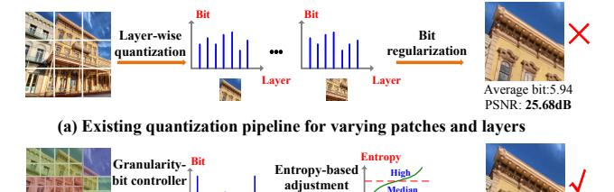
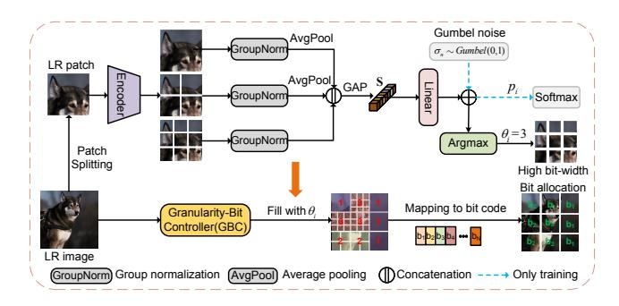
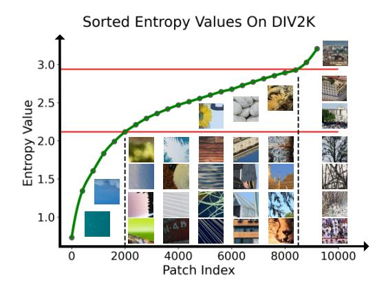

# Thinking in Granularity: Dynamic Quantization for Image Super-Resolution by Intriguing Multi-Granularity Clues

Mingshen Wang1, Zhao Zhang1,2\*, Feng Li1\*, Ke Xu3, Kang Miao1, Meng Wang1

1School of Computer Science and Information Engineering, Hefei University of Technology, Hefei, China
2Yunnan Key Laboratory of Software Engineering, Yunan, China
3School of Artificial Intelligence, Anhui University, Hefei, China

#### **Abstract**

Dynamic quantization has attracted rising attention in image super-resolution (SR) as it expands the potential of heavy SR models onto mobile devices while preserving competitive performance. Existing methods explore layer-to-bit configuration upon varying local regions, adaptively allocating the bit to each layer and patch. Despite the benefits, they still fall short in the trade-off of SR accuracy and quantization efficiency. Apart from this, adapting the quantization level for each layer individually can disturb the original inter-layer relationships, thus diminishing the representation capability of quantized models. In this work, we propose Granular-DQ, which capitalizes on the intrinsic characteristics of images while dispensing with the previous consideration for layer sensitivity in quantization. Granular-DQ conducts a multi-granularity analysis of local patches with further exploration of their information densities, achieving a distinctive patch-wise and layer-invariant dynamic quantization paradigm. Specifically, Granular-DQ initiates by developing a granularity-bit controller (GBC) to apprehend the coarse-to-fine granular representations of different patches, matching their proportional contribution to the entire image to determine the proper bit-width allocation. On this premise, we investigate the relation between bit-width and information density, devising an entropy-to-bit (E2B) mechanism that enables further fine-grained dynamic bit adaption of high-bit patches. Extensive experiments validate the superiority and generalization ability of Granular-DQ over recent state-ofthe-art methods on various SR models. Code and supplementary statement can be found at https://github.com/MmmingS/ Granular-DQ.git.

### Introduction

Single image super-resolution (SISR) has been a fundamental task in the computer vision community, aiming to recover high-resolution (HR) images from corrupted low-resolution (LR) input. Recently, from the pioneering deep learning-based method (Dong et al. 2014), convolutional neural networks (CNN) (Dong et al. 2014; Kim, Lee, and Lee 2016; Shi et al. 2016; Zhang et al. 2018; Ahn, Kang, and Sohn 2018; Li et al. 2022) and transformers (Liang et al. 2021;

(b) Our dynamic granularity-aware quantization pipeline

Average bit:5.00

PSNR: 25.74dB

Figure 1: Visual comparison of (a) previous dynamic quantization pipeline (Hong et al. 2022a) that adapt the bit allocation for layers and patches simultaneously and (b) our Granular-DQ pipeline conducts patch-wise and layer-invariant dynamic quantization, which contains two steps: 1) granularity-aware bit allocation and 2) fine-grained bit-width adaption based on the entropy statistics. Our method recovers a better SR image with a lower average bit.

Lu et al. 2022; Zhang et al. 2022; Chen et al. 2023) have dominated SISR. While the SR performance continues to achieve breakthroughs, the model complexity of later methods also increases constantly, which limits their practical applications, especially tackling large-size images (*e.g.* 2K and 4K). This raises interest in compressing deep SR models to unlock their potential on resource-constrained devices.

Model quantization (Zhou et al. 2016) has emerged as a promising technology that reduces both computational overhead and memory cost with minimal performance sacrifice, where the effectiveness has been demonstrated in a wide range of high-level tasks (Zhou et al. 2016; Choi et al. 2018; Bhalgat et al. 2020; Chen et al. 2021; Gao et al. 2022; Luo et al. 2023). Some prior works design SR quantizers by adjusting the quantization range (Li et al. 2020; Zhong et al. 2022) or modeling the feature distribution (Hong et al. 2022b; Qin et al. 2024) for activations, assigning a fixed bit for diverse image regions. However, these methods overlook that the accuracy degradation from quantization can vary for different contents, where some are more sensitive to quantization, thus showing a worse tolerance for low bits.

To address this limitation, Hong *et al.* (Hong et al. 2022a) propose content-aware dynamic quantization (CADyQ)

\*Corresponding authors: Zhao Zhang (cszzhang@gmail.com) and Feng Li (fengli@hfut.edu.cn).

Copyright © 2025, Association for the Advancement of Artificial Intelligence (www.aaai.org). All rights reserved.

which employs trainable bit selectors to measure the image and layer sensitivities for quantization simultaneously, as illustrated in Figure 1(a). Nevertheless, incorporating such selectors into each layer will cause additional computational costs, particularly pronounced in deep networks. Several methods (Tian et al. 2023; Lee, Yoo, and Jung 2024) improve the trained selectors in CADyQ by exploring different image characteristics of patches, which conduct once more patch-wise quantization to tackle the image sensitivity. Though some advancements have been made, such a layer-wise bit-width adaption in response to varying patches can introduce disturbances to the inter-layer relations within original models to some extent, which leads to disparities in the representations, consequently compromising the reconstruction after quantization.

These observations prompt us to consider a key question: *Can we straightly adapt quantization with the awareness of image contents while avoiding layer sensitivity?* In this context, deviating from existing methods, we rethink the quantization principle from two perspectives: 1) Granular characteristic, where fine-granularity representations reveal the texture complexity of local regions and coarse ones express structural semantics of the overall scene; 2) Entropy statistic, which reflects the average information density and the complexity of pixel distributions given patches (Shannon 1948), correlated with the image quality. Therefore, we propose a distinctive approach, dubbed Granular-DQ, which conducts low-bit dynamic quantization by harnessing the multi-granularity clues of diverse image contents to achieve efficient yet effective quantized SR models.

Granular-DQ consists of two sequential policies: one to conduct granularity-aware bit allocation for all the patches and the other is fine-grained bit-width adaption based on the entropy (see Figure 1(b)). For the former, we design a granularity-bit controller (GBC) that constructs a hierarchy of coarse-to-fine granularity representations for each patch. GBC then assigns an appropriate level of granularity to each patch, contingent upon its desired contribution percentage to the entire image, and aligns this with potential quantization bit-widths, enabling a tailored bit allocation. However, since Granular-DQ contains no bit constraint as CADyQ, relying solely on the GBC for quantization will force the network to be optimized toward reconstruction accuracy with pixel-wise supervision, leading to excessively high bits on some patches. To alleviate this, we present an entropybased fine-tuning approach on the premise of GBC, making a fine-grained bit adjustment for the patches less quantized. We capture generalized distribution statistics of the entropy across large-scale data, providing approximate entropy thresholds to establish an entropy-to-bit (E2B) mechanism. The resultant entropy thresholds are then dynamically calibrated and fine-tuned by exploiting the entropy of calibration patches as the adaption factor, achieving a more precise bit assignment. Experiments on representative CNNand transformer-based SR models demonstrate the superiority of Granular-DQ in the trade-off between accuracy and quantization efficiency over recent state-of-the-art methods. The main contributions are summarized as follows:

- For the first time, we propose Granular-DQ, a markedly different method with full explorations of the granularity and entropy statistic of images to quantization adaption, allowing complete patch-wise and layer-invariant dynamic quantization for SR models.
- We propose GBC which learns hierarchical granular representations of image patches and adaptively determines the granularity levels based on their contribution to the entire image, aligning these with suitable bit-widths.
- We propose an entropy-based fine-tuning approach upon GBC and build an E2B mechanism, which enables finegrained and precise bit adaption for the patches with excessively high bits. Granular-DQ shows preferable performance with existing methods.

# Related Work

## Single Image Super-Resolution.

Recent progress in CNNs has critically advanced the field of SISR, enhancing image quality and detail restoration significantly (Dong et al. 2014; Lim et al. 2017). However, the intensive computational demands of CNNs (Dong et al. 2014; Shi et al. 2016; Zhang et al. 2018; Hui, Wang, and Gao 2018; Li, Bai, and Zhao 2020), transformer-based (Liang et al. 2021; Lu et al. 2022; Chen et al. 2023) and diffusion-based models (Rombach et al. 2022; Saharia et al. 2023) limit their use in mobile and embedded systems. Efforts to mitigate computational complexity have spanned several dimensions, research has focused on several strategies, including lightweight architecture implementation (Chu et al. 2021; Wang et al. 2021b), knowledge distillation (Hui et al. 2019; Zhang et al. 2021a), network pruning (Zhang et al. 2021b), re-parameterization (Wang, Dong, and Shan 2022), and parameter sharing (Chen et al. 2022). Additionally, some adaptive networks have been investigated to refine both performance and efficiency dynamically (Chen et al. 2022; Wang et al. 2022), highlighting the ongoing pursuit of an optimal balance between resource occupation and SR performance. However, apart from the computational complexity, the obstacle of memory storage imposed by floating-point operations also limits the usage of existing SR models. This work applies the network quantization technique for this purpose.

## Network Quantization

Network quantization has emerged as an effective solution that transforms 32-bit floating point values into lower bits (Zhou et al. 2016; Choi et al. 2018; Zhuang et al. 2018; Esser et al. 2019; Bhalgat et al. 2020; Li et al. 2021) to improve the network efficiency, which can be divided into quantization-aware training (QAT) and post-training quantization (PTQ) methods. QAT (Zhou et al. 2016; Choi et al. 2018; Esser et al. 2019; Bhalgat et al. 2020) integrates the quantization process into the training of networks, performing quantization adaption with complete datasets. PTQ methods (Li et al. 2021; Wei et al. 2022) often require a small calibration dataset to determine quantization parameters without retraining, which enables fast deployment on various devices. Recently, some methods introduce mixedprecision (2019) or dynamic quantization (2022) into the

Figure 2: The schematic of the proposed Granular-DQ for SR networks. Granular-DQ is a patch-wise and layer-invariant quantization pipeline, which contains two key steps: 1) granularity-aware bit allocation by the granularity-bit controller (GBC) and 2) entropy-based fine-grained bit-width adaption on the patches allocated with high bits in GBC based on an entropy-to-bit (E2B) mechanism. During the inference phase, the input image is partitioned into serial patches mapped to the adapted bit code, which forces the SR network to be specifically quantized for each patch.

above two paradigms, which allows for the automatic selection of the quantization precision of each layer. Though network quantization has been predominantly applied in various high-level tasks, its potential in SISR has not been fully exploited.

#### **Quantization for Super-Resolution Networks**

Unlike high-level vision tasks, SISR presents unique challenges due to its high sensitivity to precision loss (Li et al. 2020; Wang et al. 2021a; Hong et al. 2022b; Hong and Lee 2023). PAMS (Li et al. 2020) introduces the parameterized max scale scheme, which quantizes both weights and activations of the full-precision SR networks to fixed low-bit ones. DDTB (Zhong et al. 2022) tackles the quantization of highly asymmetric activations by a layer-wise quantizer with dynamic upper and lower trainable bounds. DAQ (Hong et al. 2022b) and QuantSR (Qin et al. 2024) study the influence of the parameter distribution in quantization, continuing to narrow the performance gap to fullprecision networks. Recently, some attempts adopt dynamic quantization, which exploits the quantization sensitivity of layers and images, e.g. gradient magnitude (Hong et al. 2022a), edge score (Tian et al. 2023), or cross-patch similarity (Lee, Yoo, and Jung 2024), have demonstrated promising achievements. AdaBM (Hong and Lee 2024) accelerates the adaptive quantization by separately processing imagewise and layer-wise bit-width adaption on the fly. In contrast, our method exploits the granularity and information density inherent in images to conduct dynamic quantization. It dispenses with the conventional need for layer sensitivity while being responsive to local contents, devising a distinctive patch-wise and layer-invariant dynamic quantization principle, which achieves superior performance and generalization ability for both CNN and transformer models.

#### **Proposed Method**

#### **Preliminaries**

In most cases, converting the extensive floating-point calculations into operations that use fewer bits within CNNs involves quantizing the input features and weights at convolutional layers (Krishnamoorthi 2018). In the quantized SR network, given a quantizer  $\mathcal{Q}$  in a symmetric mode, the function  $\mathcal{Q}_b(\cdot)$  is applied to the input  $\hat{x}_k$  of the k-th convolutional layer, transforming  $x_k$  into its quantized counterpart  $\hat{x}_k$  with a lower bit-width b, as expressed in the following formula

$$\hat{x}_k = \mathcal{Q}_b(x_k) = \text{round}\left(\frac{\text{clip}(\boldsymbol{x_k})}{r_b}\right) r_b,$$
 (1)

where  $\operatorname{clip}(\cdot) = \max(\min(x_k, a), -a)$  confines  $x_k$  within [-a, a]. a denotes the maximum of the absolute value of x (Wu et al. 2020) or derived from the moving average of max values across batches (Wang et al. 2021a). Additionally,  $r_b$  serves as the mapping function that scales inputs of higher precision down to their lower bit equivalents, defined as  $r_b = \frac{a}{2^b-1}$ . Specially, the non-negative values after ReLU are truncated to [0,a] and  $r_b = \frac{a}{2^b-1}$ . For weight quantization, given the k-th convolutional layer weight  $w_k$ ,

Figure 3: The structure of granularity-bit controller (GBC). It constructs hierarchical coarse-to-fine granularity representations for each patch. Then, it measures the granularity level of the patch upon its desired contribution percentage to the entire image, and maps this to quantization bit codes, finally achieving a tailored bit allocation.

the quantized weight  $\hat{w}_i$  can be formulated as follows

$$\hat{w}_k = \mathcal{Q}_b(w_k) = \text{round}\left(\frac{\text{clip}(w_k)}{r_b}\right) r_b.$$
 (2)

Different from activations, the weights are quantized with fixed bit-width following (Li et al. 2020; Hong et al. 2022a).

# **Granular-DQ for SISR**

The proposed Granular-DQ aims to cultivate a layer-invariant SR quantization approach that enables dynamic quantization of existing SR models for varying image contents with the awareness of multi-granularity clues. The overall pipeline is shown in Figure 2, which contains two steps: 1) granularity-aware bit allocation by the granularity-bit controller (GBC) and 2) entropy-based fine-grained bit-width adaption on the patches allocated with high bits in GBC based on an entropy-to-bit (E2B) mechanism.

**Granularity-Bit Controller.** Given an image X, as shown in Figure 3, the GBC first encodes it into hierarchical feature  $\mathbf{Z} = \mathcal{E}(X)$  by the encoder  $\mathcal{E}$ , where  $\mathbf{Z} = Z_1, Z_2, ..., Z_D$  via D-1 downsampling operations. Note that the resolution from  $Z_1$  to  $Z_D$  decreases progressively, where the largest  $Z_1$ corresponds to the finest-granularity feature and the smallest  $Z_D$  denotes the coarsest-granularity one (i.e. D granularities), forming multi-granularity representations for X. We implement GBC with the Gumbel-Softmax, a differentiable sampling scheme (Jang, Gu, and Poole 2017), to adaptively measure the proportional contribution of all patches to the entire image, and align this with potential quantization bit-widths. To be specific, all the granularity features are group normalized and then average pooled to the coarsest granularity, i.e., with the same resolution of  $Z_D$ , denoted by  $\hat{\mathbf{Z}} = \hat{Z}_1, \hat{Z}_2, ..., \hat{Z}_D$ . We concatenate  $\hat{\mathbf{Z}}$  along the channel dimension and squeeze the multi-granularity information by global average pooling  $GAP(\cdot)$  to generate a channel-wise statistics S of X, formulated by

$$\mathbf{S} = GAP(\|\hat{Z}_1, \hat{Z}_2, ..., \hat{Z}_D\|). \tag{3}$$

Assuming there are N total bit codes  $(b_1,...,b_n,...,b_N)$  with different bit-widths, a linear layer is employed to acquire a learnable weight  $\mathbf{W_g} \in \mathbb{R}^{(N \times D) \times N}$  that operates on

Figure 4: The generalized distribution statistic of the entropy for all LR patches on DIV2K.

**S** to generate the gating logits  $\mathbf{G} \in \mathbb{R}^{1 \times 1 \times N}$  as

$$G = W_g S, (4)$$

For each patch  $X_i$ , its gating logit  $g_i \in \mathbb{R}^N$  is utilized to ascertain the granularity level through the gating index  $\theta_i$ :

$$\theta_i = \arg\max_n(g_{i,n}) \in \{1, 2, ..., n\}.$$
 (5)

Inspired by the end-to-end discrete methodology in (Xie et al. 2020), the fixed decision typically dictated by Eq.(5) is substituted with a probabilistic sampling approach. It hinges on the utilization of a categorical distribution characterized by unnormalized log probabilities, from which discrete gating indices are derived by integrating a noise sample  $\sigma_n$ , originating from the standard Gumbel distribution Gumbel(0, 1):

$$\theta_i = \arg\max_n (g_{i,n} + \sigma_n). \tag{6}$$

After that, we calculate the gating score  $p_i$  for each patch:

$$p_i = \frac{\exp((g_{i,\theta_i} + \sigma_{\theta_i}))/\tau}{\sum_n^N \exp((g_{i,n} + \sigma_n)/\tau)},$$
 (7)

where  $p_i \in [0,1]$  measures the probability of  $X_i$  contributing to the entire image X, thus determining the granularity level and pointing to a corresponding code  $b_n$ . In our experiments, we set the temperature coefficient  $\tau=1$ . Similar to the forward propagation approach in quantization, the gradients for such a gate are calculated using a straight-through estimator, derived from  $p_i$  during the backward pass. By incorporating GBC at the onset of SR networks, Granular-DQ only introduces negligible computational overhead.

Entropy-based Fine-grained Bit-width Adaption. In this work, since Granular-DQ is optimized by pixel-wise supervision, relying solely on the GBC for quantization will force the network to be optimized toward reconstruction accuracy with pixel-wise supervision, which can lead to excessively high bits on some patches. To tackle this problem, we propose an entropy-based scheme to fine-tune bit adaption on the patches less quantized by GBC.

Specifically, we capture a generalized distribution statistic of the entropy for all LR patches on the training set. We first

| Methods                 | Scale      |       | Urban100 |       |       | Test2K |       |       | Test4K |                                                                                                                                                                                                                                                                                  |  |
|-------------------------|------------|-------|----------|-------|-------|--------|-------|-------|--------|----------------------------------------------------------------------------------------------------------------------------------------------------------------------------------------------------------------------------------------------------------------------------------|--|
| Methods                 | Scure      | FAB↓  | PSNR↑    | SSIM↑ | FAB↓  | PSNR↑  | SSIM↑ | FAB↓  | PSNR↑  | NR↑ SSIM↑  .04 0.823 .77 0.813 .72 0.812 .91 0.818 .62 0.809 .91 0.818 .93 0.820  .80 0.814 .77 0.813 .91 0.818 .96 0.819 .98 0.820  .54 0.806 .59 0.807 .54 0.806 .59 0.807 .59 0.807 .11 0.825 .08 0.823 .92 0.819 .02 0.821 .11 0.824 .56 0.836 .48 0.834 .32 0.830 .31 0.829 |  |
| SRResNet                | $\times 4$ | 32.00 | 26.11    | 0.787 | 32.00 | 27.65  | 0.776 | 32.00 | 29.04  | 0.823                                                                                                                                                                                                                                                                            |  |
| PAMS                    | $\times 4$ | 8.00  | 26.01    | 0.784 | 8.00  | 27.67  | 0.781 | 8.00  | 28.77  | 0.813                                                                                                                                                                                                                                                                            |  |
| CADyQ                   | $\times 4$ | 5.73  | 25.92    | 0.781 | 5.14  | 27.64  | 0.781 | 5.02  | 28.72  | 0.812                                                                                                                                                                                                                                                                            |  |
| CABM                    | $\times 4$ | 5.34  | 25.86    | 0.778 | 5.17  | 27.52  | 0.771 | 5.07  | 28.91  | 0.818                                                                                                                                                                                                                                                                            |  |
| AdaBM                   | $\times 4$ | 5.60  | 25.72    | 0.773 | 5.20  | 27.55  | 0.777 | 5.10  | 28.62  | 0.809                                                                                                                                                                                                                                                                            |  |
| RefQSR( $\delta$ -4bit) | $\times 4$ | 4.00  | 25.90    | 0.778 | 5.17  | 27.52  | 0.771 | 5.07  | 28.91  | 0.818                                                                                                                                                                                                                                                                            |  |
| Granular-DQ (Ours)      | $\times 4$ | 4.00  | 25.98    | 0.783 | 4.01  | 27.55  | 0.773 | 4.01  | 28.93  | 0.820                                                                                                                                                                                                                                                                            |  |
| EDSR                    | $\times 4$ | 32.00 | 26.03    | 0.784 | 32.00 | 27.59  | 0.773 | 32.00 | 28.80  | 0.814                                                                                                                                                                                                                                                                            |  |
| PAMS                    | $\times 4$ | 8.00  | 26.01    | 0.784 | 8.00  | 27.67  | 0.781 | 8.00  | 28.77  | 0.813                                                                                                                                                                                                                                                                            |  |
| CADyQ                   | $\times 4$ | 6.09  | 25.94    | 0.782 | 5.52  | 27.67  | 0.781 | 5.37  | 28.91  | 0.818                                                                                                                                                                                                                                                                            |  |
| CABM                    | $\times 4$ | 5.80  | 25.95    | 0.782 | 5.65  | 27.57  | 0.772 | 5.56  | 28.96  | 0.819                                                                                                                                                                                                                                                                            |  |
| Granular-DQ (Ours)      | $\times 4$ | 4.97  | 26.01    | 0.784 | 4.57  | 27.58  | 0.773 | 4.41  | 28.98  | 0.820                                                                                                                                                                                                                                                                            |  |
| IDN                     | $\times 4$ | 32.00 | 25.42    | 0.763 | 32.00 | 27.48  | 0.774 | 32.00 | 28.54  | 0.806                                                                                                                                                                                                                                                                            |  |
| PAMS                    | $\times 4$ | 8.00  | 25.56    | 0.768 | 8.00  | 27.53  | 0.775 | 8.00  | 28.59  | 0.807                                                                                                                                                                                                                                                                            |  |
| CADyQ                   | $\times 4$ | 5.78  | 25.65    | 0.771 | 5.16  | 27.54  | 0.776 | 5.03  | 28.61  | 0.808                                                                                                                                                                                                                                                                            |  |
| CABM                    | $\times 4$ | 4.28  | 25.57    | 0.768 | 4.25  | 27.42  | 0.766 | 4.23  | 28.74  | 0.813                                                                                                                                                                                                                                                                            |  |
| Granular-DQ (Ours)      | $\times 4$ | 4.18  | 25.68    | 0.772 | 4.29  | 27.47  | 0.767 | 4.23  | 28.83  | 0.816                                                                                                                                                                                                                                                                            |  |
| SwinIR-light            | $\times 4$ | 32.00 | 26.46    | 0.798 | 32.00 | 27.72  | 0.779 | 32.00 | 29.14  | 0.825                                                                                                                                                                                                                                                                            |  |
| PAMS                    | $\times 4$ | 8.00  | 26.31    | 0.793 | 8.00  | 27.67  | 0.776 | 8.00  | 29.08  | 0.823                                                                                                                                                                                                                                                                            |  |
| CADyQ                   | $\times 4$ | 5.15  | 25.87    | 0.779 | 5.01  | 27.54  | 0.772 | 5.01  | 28.92  | 0.819                                                                                                                                                                                                                                                                            |  |
| CABM                    | $\times 4$ | 5.34  | 25.88    | 0.780 | 4.92  | 27.62  | 0.774 | 4.91  | 29.02  | 0.821                                                                                                                                                                                                                                                                            |  |
| Granular-DQ (Ours)      | $\times 4$ | 4.79  | 26.42    | 0.796 | 4.74  | 27.67  | 0.778 | 4.76  | 29.11  | 0.824                                                                                                                                                                                                                                                                            |  |
| HAT-S                   | $\times 4$ | 32.00 | 27.81    | 0.833 | 32.00 | 28.07  | 0.791 | 32.00 | 29.56  | 0.836                                                                                                                                                                                                                                                                            |  |
| PAMS                    | $\times 4$ | 8.00  | 27.56    | 0.827 | 8.00  | 28.00  | 0.789 | 8.00  | 29.48  | 0.834                                                                                                                                                                                                                                                                            |  |
| CADyQ                   | $\times 4$ | 5.53  | 26.98    | 0.814 | 5.41  | 27.88  | 0.784 | 5.33  | 29.32  | 0.830                                                                                                                                                                                                                                                                            |  |
| CABM                    | $\times 4$ | 5.49  | 26.95    | 0.813 | 5.38  | 27.87  | 0.784 | 5.30  | 29.31  | 0.829                                                                                                                                                                                                                                                                            |  |
| Granular-DQ (Ours)      | $\times 4$ | 4.77  | 27.66    | 0.829 | 4.80  | 28.01  | 0.789 | 4.78  | 29.49  | 0.834                                                                                                                                                                                                                                                                            |  |

Table 1: Quantitative comparison (FAB, PSNR (dB)/SSIM) with full precision models, PAMS, CADyQ, CABM, RefQSR and our method on Urban100, Test2K, Test4K for  $\times 4$  SR.  $\times 2$  SR results are provided in the **supplementary material**.

discretize the total N pixels within a patch into multiple bin intervals B based on the pixel values, which can estimate the probability distribution of pixels smoothly. Then entropy is computed as

$$\mathcal{H} = -\sum_{i=1}^{N} \mathcal{P}(x_i) log(\mathcal{P}(x_i)). \tag{8}$$

We use Gaussian-weighted kernel to assign different importance to the pixels in a patch with the formulation of  $\sum_{i=1}^{N} \sum_{j=1}^{B} exp(-\frac{(r_i)^2}{2\sigma^2}) + \epsilon$ , where  $r_i$  denotes the residual between the pixel value of the *i*-th pixel  $x_i$  and the segment values for bin intervals. Thus, one can obtain its kernel den-

sity 
$$\mathcal{P}(x_i)$$
 by  $\frac{\sum_{j=1}^B \exp(-\frac{(r_i)^2}{2\sigma^2})}{\sum_{i=1}^N \sum_{j=1}^B \exp(-\frac{(r_i)^2}{2\sigma^2}) + \epsilon}$ . In this way, we can get the entropy statistic across the overall training set, rep-

get the entropy statistic across the overall training set, represented by  $\mathbf{H} = \mathcal{H}_1, \mathcal{H}_2, ..., \mathcal{H}_M$  sorted in ascending order with M patches, as shown in Figure 4.

We establish an entropy-to-bit (E2B) mechanism based on the entropy statistic  $\mathbf{H}$  and conduct fine-grained bit-width adjustment. Firstly, serial quantiles are inserted on  $\mathbf{H}$  to divide it into multiple subintervals V by  $\mathcal{I}_t = \lceil \frac{M \cdot t}{V} \rceil$ , where  $\mathcal{I}_t$  denotes the patch indice at the t-th quantile, which points to a certain entropy  $\mathcal{H}_t$  in  $\mathbf{H}$ . The quantiles can be seen as thresholds, thus we provide candidate bit configurations according to the thresholds for all the patches. Given a patch

with its entropy E, one can find the index of the subinterval in  $\mathbf{H}$ , and finally determine the adapted bit-width. Taking two quantiles  $t_1$  and  $t_2$  as an example, we can get two patch indices  $\mathcal{I}_{t_1}$  and  $\mathcal{I}_{t_2}$  which corresponds to the entropy values  $\mathcal{H}_{t_1}$  and  $\mathcal{H}_{t_2}$  respectively, *i.e.*  $\mathbf{H}$  will be divided into three discrete subintervals as

$$c_{n} = \begin{cases} c_{1} & \text{if } E \leq \mathcal{H}_{t_{1}}, \\ c_{2} & \text{if } \mathcal{H}_{t_{1}} < E \leq \mathcal{H}_{t_{2}}, \\ c_{3} & \text{if } \mathcal{H}_{t_{2}} < E \leq \mathcal{H}_{M} \end{cases}$$
 (9)

where  $c_n$  denotes the adapted bit codes.

To further improve the flexibility and robustness of E2B for various contents, we present an adaptive threshold calibration (ATC) scheme on E2B. During the training iterations J, we leverage the exponential moving average (EMA) to dynamically calibrate the threshold t, formulated by

$$t^{(j)} = t^{(j-1)} \cdot \gamma + Norm(E) \cdot (1 - \gamma), \qquad (10)$$

where  $Norm(\cdot) = \frac{\mathcal{H}_t - \mathcal{H}_{min}}{\mathcal{H}_{max} - \mathcal{H}_{min}}$ , and  $\mathcal{H}_{max}$  and  $\mathcal{H}_{min}$  denotes the maximum and minimum entropy of all the patches in the current mini-batch at the j-th iteration.  $\gamma$  represents the smoothing parameter of EMA, which is set to 0.9997. It should be noted that the LR samples remain consistent across epochs during training. Hence, our method only necessitates the E2B with ATC at the initial epoch, circumventing significant computational expenditure with iterations.

Once the model is trained, as shown in Figure 2, our method enables to fine-grained adapt the bit-widths of the patches based on calibrated thresholds from the large training set, yielding preferable bit codes [c1, c2, ..., cN ].

In summary, by combining GBC and E2B, our method ensures optimal bit allocation for each patch individually while dispensing with the consideration for layer sensitivity as previous methods (Hong et al. 2022a; Tian et al. 2023).

## Loss Function

In previous SR quantization methods (Hong et al. 2022a; Tian et al. 2023; Lee, Yoo, and Jung 2024), the objective function is composed of L1 loss, knowledge distillation loss, and even bit regularization term to facilitate the bit adaption. In Granular-DQ, we only use L1 loss to train all the models

$$L_1 = \|I_{HR} - I_{SR}\|_1 \tag{11}$$

where IHR is the HR ground truth of the LR input and ISR is the SR reconstruction by our Granular-DQ.

# Experiments

## Experimental Settings

Baseline SR Models. The proposed Granular-DQ is applied directly to existing CNN-based SR models including SRResNet (Ledig et al. 2017), EDSR (Lim et al. 2017), and IDN (2018) as well as transformer-based models including SwinIR-light (Liang et al. 2021) and HAT-S (Chen et al. 2023). Following CADyQ (Hong et al. 2022a) and CABM (Tian et al. 2023), we implement quantization on the weights and feature maps within the high-level feature extraction part, which is the focal point for the majority of computationally intensive operations. Notably, for SwinIRlight and HAT-S, the attention blocks are computed with full precision due to severe quantization errors, where more details are provided in the supplementary material.

In Granular-DQ, the first step for bit allocation by GBC designates 4/6/8-bit as the candidate bits to quantize the patches. Subsequently, the second step by E2B adapts the patches allocated with 8 bits in GBC are further adapted using 4/5/8-bit as the candidates for fine-grained bit-width adjustment. The initial entropy thresholds, denoted as t1 and t2, are set to 0.5 and 0.9 respectively and then gradually calibrated according to the entropy statistic on the training set, for all models. In this work, we employ QuantSR (Qin et al. 2024) for all the quantization candidates and uniformly apply 8-bit linear quantization for weights.

Datasets and Metrics. In our experiments, all the models are trained on DIV2K (Agustsson and Timofte 2017) dataset which contains 800 training samples for ×2 and ×4 SR. We evaluate the model and compare it with existing methods on three benchmarks: Urban100 (Huang, Singh, and Ahuja 2015), Test2K and Test4K (Kong et al. 2021) derived from DIV8K dataset (Gu et al. 2019) by bicubic downsampling. We quantitatively measure the SR performance using two metrics: peak signal-to-noise ratio (PSNR) and the structural similarity index (SSIM) for reconstruction accuracy. Besides, we also compute the feature average bit-width (FAB)

| Method        | FAB          | Params (K) (↓ Ratio)          | BitOPs (G) (↓ Ratio)             |
|---------------|--------------|----------------------------------|-------------------------------------|
| EDSR          | 32.00        | 1518K (0.0%)                     | 527.0T (0.0%)                       |
| PAMS CADyQ | 8.00 6.09 | 631K (↓ 58.4%) 489K (↓ 67.8%) | 101.9T (↓ 80.7%) 82.6T (↓ 84.3%) |
| CABM Ours  | 5.80 4.97 | 486K (↓ 68.0%) 486K (↓ 68.0%) | 82.4T (↓ 84.4%) 73.6T (↓ 86.0%)  |

Table 2: Model complexity and compression ratio of EDSR for different quantization methods. We calculate the average BitOPs for generating SR images on the Urban100 dataset.

which represents the average bit-width across all features within the test dataset to measure the quantization efficiency. Implementation details. During training, we randomly crop each LR RGB image into a 48 × 48 patch with a batch size of 16. All the models are trained for 300K iterations on NVIDIA RTX 4090 GPUs with Pytorch. The learning rate is set to 2×10−4 and is halved after 250K iterations. During testing, the input image is split into 96 × 96 LR patches.

## Comparing with the State-of-the-Art

Quantitative Comparison. Table 1 reports the quantitative results on benchmarks. The proposed Granular-DQ is compared with original full-precision models, PAMS (Li et al. 2020), CADyQ, CABM, AdaBM (Hong and Lee 2024), and RefQSR (2024). One can see that Granular-DQ demonstrates the minimum performance sacrifice relative to the full-precision SRResNet and EDSR models while attaining the lowest FAB against other methods on all benchmarks. For IDN, Granular-DQ even exceeds its full-precision model by about 0.2dB on Urban100 and Test4K datasets, whereas other methods show lower PSNR and SSIM improvements with obviously higher FAB. Moreover, when implementing these methods on transformer-based baselines, it can be observed that Granular-DQ significantly outperforms other methods in terms of reconstruction accuracy and quantization efficiency. The results validate the superior effectiveness and generalization ability of Granular-DQ.

Qualitative Comparison. Figure 5 shows the qualitative results on the Urban100 dataset. As one can see, Granular-DQ produces SR images with sharper edges and clearer details, sometimes even better than the original unquantized IDN. By comparison, despite the lower PSNR and more FAB consumption, existing methods also suffer from obvious blurs and misleading textures.

Complexity Analysis. To further investigate the complexity of our method for quantizing SR models, we calculate the number of operations weighted by the bit-widths (BitOPs) (Van Baalen et al. 2020) as the metric and compare it with existing methods. As shown in Table 2, Granular-DQ leads to significant computational complexity reduction of the baseline model, which decreases the BitOPs from 527.0T to 73.6T and sustains a competitive FAB. Coupled with the decrease in the model parameters to 68.0% (486K) of the full-precision model, the results demonstrate that Granular-DQ can ensure optimal trade-off between reconstruction accuracy and quantization efficiency.

Figure 5: Qualitative comparison  $(\times 4)$  on Urban100 and Test2K based on IDN and HAT-S models. Granular-DQ reconstructs SR images with better details and quantitative results

| GBC | E2B | ATC |      | Urban100 |       |
|-----|-----|-----|------|----------|-------|
|     |     |     | FAB  | PSNR     | SSIM  |
| ×   | Х   | Х   | 8.00 | 26.01    | 0.783 |
| ✓   | Х   | ×   | 5.86 | 25.97    | 0.782 |
| ✓   | ✓   | ×   | 5.51 | 26.02    | 0.784 |
| ✓   | ✓   | ✓   | 4.97 | 26.01    | 0.784 |

Table 3: Ablation study on individual proposed components in Granular-DQ including GBC, E2B, and ATC.

| $b^*$     |      | Set14 |       |      | Urban100 | )     |
|-----------|------|-------|-------|------|----------|-------|
| Ü         | FAB  | PSNR  | SSIM  | FAB  | PSNR     | SSIM  |
| [4, 5, 6] | 5.29 | 28.52 | 0.780 | 4.85 | 25.98    | 0.783 |
| [4, 5, 7] | 5.50 | 28.54 | 0.780 | 4.98 | 25.99    | 0.782 |
| [4, 6, 7] | 5.79 | 28.55 | 0.781 | 5.22 | 25.97    | 0.783 |
| [4, 6, 8] | 5.64 | 28.57 | 0.781 | 5.38 | 26.01    | 0.784 |
| [4, 7, 8] | 5.64 | 28.55 | 0.780 | 5.64 | 25.99    | 0.783 |
| [4, 5, 8] | 5.54 | 28.58 | 0.781 | 4.97 | 26.01    | 0.784 |

Table 4: Ablation study on the influence of the bit configuration (denoted by  $b^*$ ) in E2B with EDSR baseline.

#### **Ablation Study**

Effects of Individual Components. We study the effects of the proposed components including GBC, E2B, and ATC in Table 3, where the results are evaluated on the Urban100 dataset. We can see that quantization with only GBC leads to a performance drop. Based on GBC, when we introduce E2B to conduct fine-grained bit-width adaption, the resultant quantizer can enhance the reconstruction accuracy and a small improvement in efficiency. Moreover, E2B and ATC in conjunction effectively reduce the FAB by a considerable margin (over 0.5 FAB) with almost the same PSNR/SSIM.

Influence of the Candidate Bits in E2B. We conduct ex-

periments to investigate the influence of the bit configuration in E2B. For 3 candidate bits, we set the lowest bit-width as 4 and randomly change the other two, resulting in 6 variants. As reported in Table 4, the configuration of [4, 5, 6] performs worst on both Set14 and Urban100 with relatively lower FAB. Surprisingly, although we allocate higher bitwidth to patches ([4, 7, 8]), the model incurs the most FAB but acquires negligible performance gains. By comparison, the model with [4, 5, 8] achieves the best trade-off on the two datasets, which is selected as our final configuration. **More ablations are provided in the supplementary material**.

## Conclusion

In this paper, we propose Granular-DQ, a patch-wise and layer-invariant approach that conducts low-bit dynamic quantization for SISR by harnessing the multi-granularity clues of diverse image contents. Granular-DQ constructs a hierarchy of coarse-to-fine granularity representations for each patch and performs granularity-aware bit allocation by a granularity-bit controller (GBC). Then, an entropy-to-bit (E2B) mechanism is introduced to fine-tune bit-width adaption for the patches with high bits in GBC. Extensive experiments indicate that our Granular-DQ outperforms recent state-of-the-art methods in both effectiveness and efficiency.

#### Acknowledgments

This work is supported by the National Natural Science Foundation of China (62472137, 62072151, 62302141, 62331003, 62206003), Anhui Provincial Natural Science Fund for the Distinguished Young Scholars (2008085J30), Open Foundation of Yunnan Key Laboratory of Software Engineering (2023SE103), CCF-Baidu Open Fund (CCF-BAIDU202321), CAAI-Huawei MindSpore Open Fund (CAAIXSJLJJ-2022-057A) and the Fundamental Research Funds for the Central Universities (JZ2024HGTB0255).

# References

- Agustsson, E.; and Timofte, R. 2017. Ntire 2017 challenge on single image super-resolution: Dataset and study. In *Proceedings of the IEEE Conference on Computer Vision and Pattern Recognition Workshops*.
- Ahn, N.; Kang, B.; and Sohn, K.-A. 2018. Fast, accurate, and lightweight super-resolution with cascading residual network. In *Proceedings of the European Conference on Computer Vision*.
- Bhalgat, Y.; Lee, J.; Nagel, M.; Blankevoort, T.; and Kwak, N. 2020. Lsq+: Improving low-bit quantization through learnable offsets and better initialization. In *Proceedings of the IEEE/CVF Conference on Computer Vision and Pattern Recognition Workshops*.
- Chen, B.; Lin, M.; Sheng, K.; Zhang, M.; Chen, P.; Li, K.; Cao, L.; and Ji, R. 2022. Arm: Any-time super-resolution method. In *Proceedings of the European Conference on Computer Vision*.
- Chen, P.; Liu, J.; Zhuang, B.; Tan, M.; and Shen, C. 2021. AQD: Towards Accurate Quantized Object Detection. In *Proceedings of the IEEE/CVF Conference on Computer Vision and Pattern Recognition*.
- Chen, X.; Wang, X.; Zhou, J.; Qiao, Y.; and Dong, C. 2023. Activating more pixels in image super-resolution transformer. In *Proceedings of the IEEE/CVF International Conference on Computer Vision*.
- Choi, J.; Wang, Z.; Venkataramani, S.; Chuang, P. I.-J.; Srinivasan, V.; and Gopalakrishnan, K. 2018. PACT: Parameterized Clipping Activation for Quantized Neural Networks. In *International Conference on Learning Representations*.
- Chu, X.; Zhang, B.; Ma, H.; Xu, R.; and Li, Q. 2021. Fast, accurate and lightweight super-resolution with neural architecture search. In *Proceedings of 25th International conference on pattern recognition*.
- Dong, C.; Loy, C. C.; He, K.; and Tang, X. 2014. Learning a deep convolutional network for image super-resolution. In *Proceedings of the European Conference on Computer Vision*.
- Dong, Z.; Yao, Z.; Gholami, A.; Mahoney, M. W.; and Keutzer, K. 2019. Hawq: Hessian aware quantization of neural networks with mixed-precision. In *Proceedings of the IEEE/CVF International Conference on Computer Vision*.
- Esser, S. K.; McKinstry, J. L.; Bablani, D.; Appuswamy, R.; and Modha, D. S. 2019. Learned Step Size Quantization. In *International Conference on Learning Representations*.
- Gao, Y.; Zhang, Z.; Hong, R.; Zhang, H.; Fan, J.; and Yan, S. 2022. Towards feature distribution alignment and diversity enhancement for data-free quantization. In *Proceedings of IEEE International Conference on Data Mining*.
- Gu, S.; Lugmayr, A.; Danelljan, M.; Fritsche, M.; Lamour, J.; and Timofte, R. 2019. Div8k: Diverse 8k resolution image dataset. In *Proceedings of the IEEE/CVF International Conference on Computer Vision Workshops*.
- Hong, C.; Baik, S.; Kim, H.; Nah, S.; and Lee, K. M. 2022a. Cadyq: Content-aware dynamic quantization for image super-resolution. In *Proceedings of the European Conference on Computer Vision*.
- Hong, C.; Kim, H.; Baik, S.; Oh, J.; and Lee, K. M. 2022b. DAQ: Channel-Wise Distribution-Aware Quantization for Deep Image Super-Resolution Networks. In *Proceedings of the IEEE/CVF Winter Conference on Applications of Computer Vision*.
- Hong, C.; and Lee, K. M. 2023. Overcoming Distribution Mismatch in Quantizing Image Super-Resolution Networks. arXiv:2307.13337v2.

- Hong, C.; and Lee, K. M. 2024. AdaBM: On-the-Fly Adaptive Bit Mapping for Image Super-Resolution. In *Proceedings of the IEEE/CVF Conference on Computer Vision and Pattern Recognition*.
- Huang, J.-B.; Singh, A.; and Ahuja, N. 2015. Single image superresolution from transformed self-exemplars. In *Proceedings of the IEEE Conference on Computer Vision and Pattern Recognition*.
- Hui, Z.; Gao, X.; Yang, Y.; and Wang, X. 2019. Lightweight image super-resolution with information multi-distillation network. In *Proceedings of the 27th ACM International Conference on Multimedia*.
- Hui, Z.; Wang, X.; and Gao, X. 2018. Fast and accurate single image super-resolution via information distillation network. In *Proceedings of the IEEE Conference on Computer Vision and Pattern Recognition*.
- Jang, E.; Gu, S.; and Poole, B. 2017. Categorical reparameterization with gumbel-softmax. In *Proceedings of the International Conference on Learning Representations*.
- Kim, J.; Lee, J. K.; and Lee, K. M. 2016. Accurate image superresolution using very deep convolutional networks. In *Proceedings of the IEEE Conference on Computer Vision and Pattern Recognition*.
- Kong, X.; Zhao, H.; Qiao, Y.; and Dong, C. 2021. Classsr: A general framework to accelerate super-resolution networks by data characteristic. In *Proceedings of the IEEE/CVF Conference on Computer Vision and Pattern Recognition*.
- Krishnamoorthi, R. 2018. Quantizing Deep Convolutional Networks for Efficient Inference: A Whitepaper. arXiv:1806.08342.
- Ledig, C.; Theis, L.; Huszar, F.; Caballero, J.; Cunningham, A.; ´ Acosta, A.; Aitken, A.; Tejani, A.; Totz, J.; Wang, Z.; et al. 2017. Photo-realistic single image super-resolution using a generative adversarial network. In *Proceedings of the IEEE Conference on Computer Vision and Pattern Recognition*.
- Lee, H.; Yoo, J.-S.; and Jung, S.-W. 2024. RefQSR: Referencebased Quantization for Image Super-Resolution Networks. *IEEE Transactions on Image Processing*, 33: 2823–2834.
- Li, F.; Bai, H.; and Zhao, Y. 2020. FilterNet: Adaptive information filtering network for accurate and fast image super-resolution. *IEEE Transactions on Circuits and Systems for Video Technology*, 30(6).
- Li, F.; Wu, Y.; Bai, H.; Lin, W.; Cong, R.; and Zhao, Y. 2022. Learning detail-structure alternative optimization for blind superresolution. *IEEE Transactions on Multimedia*, 25.
- Li, H.; Yan, C.; Lin, S.; Zheng, X.; Zhang, B.; Yang, F.; and Ji, R. 2020. Pams: Quantized super-resolution via parameterized max scale. In *Proceedings of the European Conference on Computer Vision*.
- Li, Y.; Gong, R.; Tan, X.; Yang, Y.; Hu, P.; Zhang, Q.; Yu, F.; Wang, W.; and Gu, S. 2021. Brecq: Pushing the limit of post-training quantization by block reconstruction. In *Proceedings of the International Conference on Learning Representations*.
- Liang, J.; Cao, J.; Sun, G.; Zhang, K.; Van Gool, L.; and Timofte, R. 2021. Swinir: Image restoration using swin transformer. In *Proceedings of the IEEE/CVF International Conference on Computer Vision*.
- Lim, B.; Son, S.; Kim, H.; Nah, S.; and Mu Lee, K. 2017. Enhanced deep residual networks for single image super-resolution. In *Proceedings of the IEEE Conference on Computer Vision and Pattern Recognition Workshops*.

- Liu, Z.; Wang, Y.; Han, K.; Ma, S.; and Gao, W. 2022. Instance-Aware Dynamic Neural Network Quantization. In *Proceedings of the IEEE/CVF Conference on Computer Vision and Pattern Recognition*.
- Lu, Z.; Li, J.; Liu, H.; Huang, C.; Zhang, L.; and Zeng, T. 2022. Transformer for Single Image Super-Resolution. In *Proceedings of the IEEE/CVF Conference on Computer Vision and Pattern Recognition Workshops*.
- Luo, Y.; Gao, Y.; Zhang, Z.; Fan, J.; Zhang, H.; and Xu, M. 2023. Long-range zero-shot generative deep network quantization. *Neural Networks*, 166: 683–691.
- Qin, H.; Zhang, Y.; Ding, Y.; Liu, X.; Danelljan, M.; Yu, F.; et al. 2024. QuantSR: Accurate Low-bit Quantization for Efficient Image Super-Resolution. In *Advances in Neural Information Processing Systems*.
- Rombach, R.; Blattmann, A.; Lorenz, D.; Esser, P.; and Ommer, B. 2022. High-Resolution Image Synthesis With Latent Diffusion Models. In *Proceedings of the IEEE/CVF Conference on Computer Vision and Pattern Recognition*.
- Saharia, C.; Ho, J.; Chan, W.; Salimans, T.; Fleet, D. J.; and Norouzi, M. 2023. Image Super-Resolution via Iterative Refinement. *IEEE Transactions on Pattern Analysis and Machine Intelligence*, 45(4): 4713–4726.
- Shannon, C. E. 1948. A Mathematical Theory of Communication. *The Bell System Technical Journal*, 27(3): 379–423.
- Shi, W.; Caballero, J.; Huszar, F.; Totz, J.; Aitken, A. P.; Bishop, R.; ´ Rueckert, D.; and Wang, Z. 2016. Real-time single image and video super-resolution using an efficient sub-pixel convolutional neural network. In *Proceedings of the IEEE Conference on Computer Vision and Pattern Recognition*.
- Tian, S.; Lu, M.; Liu, J.; Guo, Y.; Chen, Y.; and Zhang, S. 2023. CABM: Content-Aware Bit Mapping for Single Image Super-Resolution Network With Large Input. In *Proceedings of the IEEE/CVF Conference on Computer Vision and Pattern Recognition*.
- Tu, Z.; Hu, J.; Chen, H.; and Wang, Y. 2023. Toward Accurate Post-Training Quantization for Image Super Resolution. In *Proceedings of the IEEE/CVF Conference on Computer Vision and Pattern Recognition*.
- Van Baalen, M.; Louizos, C.; Nagel, M.; Amjad, R. A.; Wang, Y.; Blankevoort, T.; and Welling, M. 2020. Bayesian bits: Unifying quantization and pruning. *Advances in Neural Information Processing Systems*.
- Wang, H.; Chen, P.; Zhuang, B.; and Shen, C. 2021a. Fully quantized image super-resolution networks. In *Proceedings of the 29th ACM International Conference on Multimedia*.
- Wang, L.; Dong, X.; Wang, Y.; Ying, X.; Lin, Z.; An, W.; and Guo, Y. 2021b. Exploring sparsity in image super-resolution for efficient inference. In *Proceedings of the IEEE/CVF Conference on Computer Vision and Pattern Recognition*.
- Wang, S.; Liu, J.; Chen, K.; Li, X.; Lu, M.; and Guo, Y. 2022. Adaptive patch exiting for scalable single image super-resolution. In *Proceedings of the European Conference on Computer Vision*.
- Wang, X.; Dong, C.; and Shan, Y. 2022. Repsr: Training efficient vgg-style super-resolution networks with structural reparameterization and batch normalization. In *Proceedings of the 30th ACM International Conference on Multimedia*.
- Wei, X.; Gong, R.; Li, Y.; Liu, X.; and Yu, F. 2022. Qdrop: Randomly dropping quantization for extremely low-bit post-training quantization. In *International Conference on Learning Representations*.

- Wu, H.; Judd, P.; Zhang, X.; Isaev, M.; and Micikevicius, P. 2020. Integer Quantization for Deep Learning Inference: Principles and Empirical Evaluation. arXiv:2004.09602.
- Xie, Z.; Zhang, Z.; Zhu, X.; Huang, G.; and Lin, S. 2020. Spatially adaptive inference with stochastic feature sampling and interpolation. In *Proceedings of the European Conference on Computer Vision*.
- Zhang, X.; Zeng, H.; Guo, S.; and Zhang, L. 2022. Efficient longrange attention network for image super-resolution. In *Proceedings of the European Conference on Computer Vision*.
- Zhang, Y.; Chen, H.; Chen, X.; Deng, Y.; Xu, C.; and Wang, Y. 2021a. Data-free knowledge distillation for image superresolution. In *Proceedings of the IEEE/CVF Conference on Computer Vision and Pattern Recognition*.
- Zhang, Y.; Li, K.; Li, K.; Wang, L.; Zhong, B.; and Fu, Y. 2018. Image super-resolution using very deep residual channel attention networks. In *Proceedings of the European Conference on Computer Vision*.
- Zhang, Y.; Wang, H.; Qin, C.; and Fu, Y. 2021b. Aligned structured sparsity learning for efficient image super-resolution. *Advances in Neural Information Processing Systems*, 34.
- Zhong, Y.; Lin, M.; Li, X.; Li, K.; Shen, Y.; Chao, F.; Wu, Y.; and Ji, R. 2022. Dynamic dual trainable bounds for ultra-low precision super-resolution networks. In *European Conference on Computer Vision*.
- Zhou, S.; Wu, Y.; Ni, Z.; Zhou, X.; Wen, H.; and Zou, Y. 2016. DoReFa-Net: Training Low Bitwidth Convolutional Neural Networks with Low Bitwidth Gradients. arXiv:1606.06160.
- Zhuang, B.; Shen, C.; Tan, M.; Liu, L.; and Reid, I. 2018. Towards effective low-bitwidth convolutional neural networks. In *Proceedings of the IEEE conference on computer vision and pattern recognition*.

# **Supplementary Material**

# Thinking in Granularity: Dynamic Quantization for Image Super-Resolution by Intriguing Multi- Granularity Clues

Mingshen Wang1, Zhao Zhang1,2\*, Feng Li1\*, Ke Xu3, Kang Miao1, Meng Wang1

1Hefei University of Technology 2Yunnan Key Laboratory of Software Engineering 3Anhui University

## **Appendix**

The supplementary material mainly includes the following contents:

- The motivation of Granular-DQ.
- Ablation studies involve the thresholds (quantile *t*) number in E2B, and the combination with different weight quantization patterns, *i.e.* PAMS (Li et al. 2020) and QuantSR (Qin et al. 2024).
- More implementation details on the transformer-based baseline models including SwinIR-light (Liang et al. 2021) and HAT-S (Chen et al. 2023).
- More experimental results consist of  $\times 2$  SR performance and additional qualitative visualization.
- Limitations in Granular-DQ.

#### Motivation

Recent advances (Tu et al. 2023; Hong et al. 2022a; Tian et al. 2023; Lee, Yoo, and Jung 2024; Hong and Lee 2024) have demonstrated the benefits of considering the quantization sensitivity of layers and image contents in SR quantization. Taking CADyQ (Hong et al. 2022a) for example, it applies a trainable bit selector to determine the proper bitwidth and quantization level for each layer and a given local image patch based on the feature gradient magnitude. In our analysis, we compute the average bit-width and the quantization error measured by MSE between the reconstructions of the quantized model (via CADyQ) and the original highprecision model (EDSR) on the Test2K dataset. Figure S1 (a) reveals that the majority of patches fall within a 6-bit to 8-bit range, accompanied by a relatively elevated MSE. Furthermore, we present t-SNE maps for various quantized layers and the final layer in Figure S1 (c)-(d). Firstly, it is evident that the distribution of different layers quantized by CADyQ is markedly more scattered than that of the original model, as depicted in Figure S1 (c). Secondly, on the final layer, the features from the CADyQ-quantized model exhibit a distinct vertical pattern, which is notably at odds with the structure of the original model's feature points (Figure S1 (d)). In our investigation, CABM actually exhibited similar findings, although it fine-tunes the CADyQ model based on edge scores. These results indicate that: 1) Simply relying on image edge information is suboptimal for the trade-off between quantization efficiency and error; 2) The bit allocation for each layer in response to varying patches can introduce disturbances to the inter-layer relations within original models leading to disparities in the representations.

Based on the above analysis, this work aims to design a dynamic quantization approach for diverse image contents

Figure S1: Analysis of the quantization efficiency, quantization error, and feature distribution in t-SNE on CADyQ and our Granular-DQ. (a) and (b) illustrate the quantization efficiency v.s. quantization error trade-off; (c) and (d) visualize the feature distribution of two resultant models and compare with the corresponding original one (Float32: EDSR).

while maintaining the representation ability of the original model. To this end, we rethink the image characteristics related to image quality from the granularity and information density. As we know, the fine-granularity representations reveal the texture complexity of local regions, while coarse ones express structural semantics of the overall scene. Besides, according to Shannon's Second Theorem (Shannon 1948), the entropy statistic reflects the average information density and the complexity of pixel distributions given patches, which is directly correlated to the image quality. Therefore, we propose Granular-DQ, a markedly different method that fully explores the granularity and entropy statistic of images to quantization adaption. Granular-DQ contains two sequential steps: 1) granularity-aware bit allocation for all the patches and 2) entropy-based fine-grained bit-width adaption for the patches less quantized by 1). In this way, we can see that the bit-width allocation by Graular-DQ is sparser than CADyQ, where a majority of patches are lower than 5bit with only a few patches at high bit-width (Figure S1 (b)). Moreover, the feature distribution of the layers quantized by our method is closer to that of the original

| t1 t2 |     | Set14 |       |       | Urban100 |       |       |  |  |
|----------|-----|-------|-------|-------|----------|-------|-------|--|--|
|          |     | FAB   | PSNR  | SSIM  | FAB      | PSNR  | SSIM  |  |  |
| 0.4      | 0.7 | 5.86  | 28.53 | 0.780 | 5.28     | 25.96 | 0.783 |  |  |
| 0.4      | 0.8 | 5.86  | 28.50 | 0.779 | 5.04     | 25.99 | 0.783 |  |  |
| 0.4      | 0.9 | 5.54  | 28.56 | 0.780 | 4.99     | 25.98 | 0.782 |  |  |
| 0.5      | 0.7 | 5.86  | 28.53 | 0.780 | 5.25     | 25.97 | 0.784 |  |  |
| 0.5      | 0.8 | 5.82  | 28.57 | 0.780 | 5.02     | 26.00 | 0.782 |  |  |
| 0.5      | 0.9 | 5.54  | 28.58 | 0.781 | 4.97     | 26.01 | 0.784 |  |  |

Table S1: Ablation study on the impact of the thresholds in ATC with EDSR baseline.

| ∗ t                       | ∗ b    |      | Set14            | Urban100 |             |  |
|------------------------------|-----------|------|------------------|----------|-------------|--|
|                              |           | FAB  | PSNR SSIM FAB    |          | PSNR SSIM   |  |
| [0.5]                        | [4, 8]    | 6.57 | 28.57 0.780 5.75 |          | 25.97 0.781 |  |
| [0.5, 0.9]                   | [4, 5, 8] | 5.54 | 28.58 0.781 4.97 |          | 26.01 0.784 |  |
| [0.4, 0.6, 0.9] [4, 5, 6, 8] |           | 6.07 | 28.58 0.779 5.41 |          | 25.93 0.781 |  |
| [0.4, 0.6, 0.9] [4, 5, 7, 8] |           | 6.21 | 28.54 0.780 5.61 |          | 25.93 0.782 |  |

Table S2: Ablation study on the influence of a different number of thresholds (quantile, denoted by t ∗ ) and corresponding bit configuration (denoted by b ∗ ) in E2B with EDSR.

model (Figure S1(c)-(d)). These validate that our Granular-DQ enables low-bit and layer-invariant quantization.

## Ablation Study

Impact of the Threshold t in ATC. In this work, we set two thresholds t1 and t2 in ATC, which divide the entropy of input patches into 3 subintervals and then map them to the bit codes ([4, 5, 8] in Table S1), whitch facilitates the bit-width adjustment in E2B. As in Table S1, according to the results on Set14 and Urban100, we can empirically set the combination of [t1 = 0.5, t2 = 0.9] as it achieves the best balance in quantization.

Impact of the Threshold Number in E2B. We further experimentally investigated the effect of different numbers of thresholds in E2B and their corresponding candidate bit configuration. Firstly, we assume that there is only one quantile for all the input patches, which means the entropy statistic H is divided into two subintervals. As shown in Table S2, when we adjust the bit-widths of patches using 4/8bit, the model performs worst on both Set14 and Urban100 datasets. Similarly, when we incorporate three thresholds of t with [0.4, 0.6, 0.9] to divide H into four subintervals, it can be seen that whether using the bit configurations of [4, 5, 6, 8] or [4, 5, 7, 8], the model cannot obtain satisfied quantization efficiency. In contrast, the model with two thresholds [0.5, 0.9] and corresponding candidate bit-widths of [4, 5, 8] achieved the best trade-off on both datasets, making it our final choice. Influence of Different Quantization Patterns. To investigate the compatibility of our method on different quantization patterns, we conduct experiments by combining Granular-DQ with PAMS (Li et al. 2020) and QuantSR (Qin et al. 2024), where the results on Urban100 are reported in Table S3. Notably, different from existing dynamic meth-

| Methods             | Urban100 |       |       |  |  |  |  |
|---------------------|----------|-------|-------|--|--|--|--|
|                     | FAB↓     | PSNR↑ | SSIM↑ |  |  |  |  |
| EDSR                | 32.00    | 26.03 | 0.784 |  |  |  |  |
| PAMS                | 8.00     | 26.01 | 0.784 |  |  |  |  |
| CADyQ+PAMS          | 6.09     | 25.94 | 0.782 |  |  |  |  |
| Granular-DQ+PAMS    | 5.69     | 25.95 | 0.782 |  |  |  |  |
| Granular-DQ+QuantSR | 4.97     | 26.01 | 0.784 |  |  |  |  |
| IDN                 | 32.00    | 25.42 | 0.763 |  |  |  |  |
| PAMS                | 8.00     | 25.56 | 0.768 |  |  |  |  |
| CADyQ+PAMS          | 5.78     | 25.65 | 0.771 |  |  |  |  |
| Granular-DQ+PAMS    | 4.73     | 25.62 | 0.770 |  |  |  |  |
| Granular-DQ+QuantSR | 4.18     | 25.68 | 0.772 |  |  |  |  |

Table S3: Investigation of the compatibility of our Granular-DQ with different quantization patterns. We observe the ×4 SR results on Urban100 based on EDSR and IDN.

ods (Hong et al. 2022a; Tian et al. 2023), our Granular-DQ does not require the pre-trained models of PAMS or QuantSR. We can see that Granular-DQ+PAMS gets 0.07dB PSNR gains with 0.4 FAB reduction for EDSR compared to CADyQ+PAMS. When applying the QuantSR scheme on Granular-DQ, the model can achieve the best trade-off between FAB and PSNR/SSIM for both EDSR and IDN models, where even the latter surpasses the original model by 0.26dB in PSNR.

# Implementation Details on Transformer-based Baselines

For the transformer-based models, the linear layers of the MLPs in both SwinIR-light (Liang et al. 2021) and HAT-S (Chen et al. 2023) are all quantized using the QuantSR scheme (Qin et al. 2024). Surprisingly, despite all our efforts, we still encountered the gradient explosion issue when implementing the quantization scheme for CADyQ (Hong et al. 2022a) and CABM (Tian et al. 2023) in HAT-S. As a result, these two retained full precision for channel attention in the experiments. During the training phase, we randomly cropped the LR image into 64 × 64 with a total batch size of 16 for all scale factors, following the settings of the original model. The learning rate was initially set to 2 × 10−4 and halved after 250K iterations.

## Comparison with the State-of-the-Art

Quantitative Comparison for ×2 SR. We further conduct experiments for ×2 SR, where the quantitative results are illustrated in Table S4. Obviously, Granular-DQ demonstrates competitive trade-offs in terms of FAB and PSNR/SSIM compared to other quantization methods across all CNN models. Additionally, for SwinIR-light and HAT-S, Granular-DQ also achieves remarkably superior reconstruction accuracy to full precision than others while maintaining the lowest FAB.

More Qualitative Comparison. In Figure S2 and S3, we provide more ×4 SR visual results produced by recent state-of-the-art methods and our Granular-DQ. Regardless of whether the models are CNN-based or transformer-based,

| Methods               | Scale |       | Urban100 |       |       | Test2K |       |       |       |       |
|-----------------------|-------|-------|----------|-------|-------|--------|-------|-------|-------|-------|
|                       |       | FAB↓  | PSNR↑    | SSIM↑ | FAB↓  | PSNR↑  | SSIM↑ | FAB↓  | PSNR↑ | SSIM↑ |
| SRResNet              | ×2    | 32.00 | 32.11    | 0.928 | 32.00 | 32.81  | 0.930 | 32.00 | 34.53 | 0.944 |
| PAMS                  | ×2    | 8.00  | 31.96    | 0.927 | 8.00  | 32.72  | 0.928 | 8.00  | 34.33 | 0.943 |
| CADyQ                 | ×2    | 6.46  | 31.58    | 0.923 | 6.10  | 32.61  | 0.926 | 6.02  | 34.19 | 0.942 |
| CABM                  | ×2    | 5.46  | 31.54    | 0.923 | 5.33  | 32.55  | 0.925 | 5.23  | 34.16 | 0.942 |
| Granular-DQ (Ours) ×2 |       | 4.11  | 31.94    | 0.927 | 4.17  | 32.52  | 0.925 | 4.12  | 34.52 | 0.944 |
| EDSR                  | ×2    | 32.00 | 31.97    | 0.927 | 32.00 | 32.75  | 0.928 | 32.00 | 34.38 | 0.943 |
| PAMS                  | ×2    | 8.00  | 31.96    | 0.927 | 8.00  | 32.72  | 0.928 | 8.00  | 34.33 | 0.943 |
| CADyQ                 | ×2    | 6.15  | 31.95    | 0.927 | 5.68  | 32.70  | 0.928 | 5.59  | 34.30 | 0.943 |
| CABM                  | ×2    | 5.59  | 31.92    | 0.927 | 5.39  | 32.74  | 0.927 | 5.31  | 34.33 | 0.943 |
| Granular-DQ (Ours) ×2 |       | 4.60  | 32.01    | 0.928 | 4.40  | 32.57  | 0.925 | 4.27  | 34.42 | 0.944 |
| IDN                   | ×2    | 32.00 | 31.29    | 0.920 | 32.00 | 32.42  | 0.924 | 32.00 | 34.02 | 0.940 |
| PAMS                  | ×2    | 8.00  | 31.39    | 0.921 | 8.00  | 32.46  | 0.925 | 8.00  | 34.05 | 0.941 |
| CADyQ                 | ×2    | 5.22  | 31.54    | 0.923 | 4.67  | 32.51  | 0.925 | 4.57  | 34.10 | 0.941 |
| CABM                  | ×2    | 4.21  | 31.40    | 0.921 | 4.19  | 32.50  | 0.925 | 4.19  | 34.10 | 0.941 |
| Granular-DQ (Ours) ×2 |       | 4.01  | 31.63    | 0.924 | 4.05  | 32.36  | 0.922 | 4.05  | 34.35 | 0.942 |
| SwinIR-light          | ×2    | 32.00 | 32.71    | 0.934 | 32.00 | 32.81  | 0.928 | 32.00 | 34.81 | 0.946 |
| PAMS                  | ×2    | 8.00  | 32.40    | 0.931 | 8.00  | 32.68  | 0.927 | 8.00  | 34.68 | 0.945 |
| CADyQ                 | ×2    | 5.29  | 31.88    | 0.926 | 5.07  | 32.50  | 0.924 | 5.06  | 34.48 | 0.943 |
| CABM                  | ×2    | 5.14  | 31.93    | 0.927 | 4.98  | 32.52  | 0.925 | 4.97  | 34.50 | 0.944 |
| Granular-DQ (Ours) ×2 |       | 4.76  | 32.54    | 0.932 | 4.73  | 32.73  | 0.927 | 4.12  | 34.52 | 0.944 |
| HAT-S                 | ×2    | 32.00 | 34.19    | 0.945 | 32.00 | 33.28  | 0.934 | 32.00 | 35.30 | 0.950 |
| PAMS                  | ×2    | 8.00  | 33.63    | 0.941 | 8.00  | 33.12  | 0.932 | 8.00  | 35.12 | 0.949 |
| CADyQ                 | ×2    | 5.43  | 33.13    | 0.938 | 5.32  | 32.95  | 0.930 | 5.22  | 34.95 | 0.947 |
| CABM                  | ×2    | 5.34  | 33.09    | 0.937 | 5.26  | 32.94  | 0.930 | 5.18  | 34.95 | 0.947 |
| Granular-DQ (Ours) ×2 |       | 4.80  | 33.71    | 0.942 | 4.78  | 33.12  | 0.932 | 4.77  | 35.12 | 0.949 |

Table S4: Quantitative comparison (FAB, PSNR (dB)/SSIM) with full precision models, PAMS, CADyQ, CABM and our method on Urban100, Test2K, Test4K for ×2.

Granular-DQ consistently achieves superior reconstruction details at the lowest FAB compared to other quantization methods in most instances. In each case, minimal discrepancies can be observed between Granular-DQ and its corresponding full-precision model. These findings further validate that Granular-DQ ensures an optimal trade-off between reconstruction accuracy and quantization efficiency.

## Limitation

While Granular-DQ effectively maintains promising SR performance with dramatic computational overhead reduction, it still has several limitations. First, the mixed-precision solution of Granular-DQ makes it require specific hardware design and operator support to achieve true compression acceleration. Second, its efficacy in accelerating processing for super-resolving large-size images is modest at best. In future work, we will design more efficient and effective quantization approaches to overcome these limitations.

Figure S2: More visual comparison (×4) on Urban100 (×4) for different methods.

Figure S3: More visual comparison (×4) on Test2K (×4) for different methods.