# APTMoE: Affinity-Aware Pipeline Tuning for MoE Models on Bandwidth-Constrained GPU Nodes

Yuanxin Wei *Sun Yat-sen University* Guangzhou, China weiyx25@mail2.sysu.edu.cn

Jiangsu Du\* *Sun Yat-sen University* Guangzhou, China dujiangsu@mail.sysu.edu.cn

Jiazhi Jiang *Sun Yat-sen University* Guangzhou, China jiangjzh6@mail2.sysu.edu.cn Xiao Shi *Sun Yat-sen University* Guangzhou, China shix36@mail2.sysu.edu.cn

Xianwei Zhang *Sun Yat-sen University* Guangzhou, China zhangxw79@mail.sysu.edu.cn

Dan Huang\* *Sun Yat-sen University* Guangzhou, China huangd79@mail.sysu.edu.cn

Nong Xiao *Sun Yat-sen University* Guangzhou, China xiaon6@mail.sysu.edu.cn

Yutong Lu *Sun Yat-sen University* Guangzhou, China luyutong@mail.sysu.edu.cn

*Abstract*—Recently, the sparsely-gated Mixture-Of-Experts (MoE) architecture has garnered significant attention. To benefit a wider audience, fine-tuning MoE models on more affordable clusters, which are typically a limited number of bandwidthconstrained GPU nodes, holds promise. However, it is non-trivial to apply existing cost-effective fine-tuning approaches to MoE models, due to the increased ratio of data to computation.

In this paper, we introduce APTMoE, which employs affinityaware pipeline parallelism for fine-tuning MoE models on bandwidth-constrained GPU nodes. We propose an affinity-aware offloading technique that enhances pipeline parallelism for both computational efficiency and model size, and it benefits from a hierarchical loading strategy and a demand-priority scheduling strategy. To improve the computation efficiency and reduce the data movement volume, the hierarchical loading strategy designs three loading phases and efficiently allocates computation across GPUs and CPUs during these phases, leveraging different levels of expert popularity and computation affinity. With the aim of alleviating the mutual interference among the three loading phases and maximizing the bandwidth utilization, the demand-priority scheduling strategy proactively and dynamically coordinates the loading execution order. Experiments demonstrate that APTMoE outperforms existing methods in most cases. Particularly, APT-MoE successfully fine-tunes a 61.2B MoE model on 4 Nvidia A800 GPUs(40GB) and achieves up to 33% throughput improvement compared to the SOTA method.

*Index Terms*—Large language models, Hardware acceleration, High performance computing

# I. INTRODUCTION

In recent years, the sparsely-gated Mixture-Of-Experts (MoE) architecture has emerged as a highly effective approach for enhancing model quality. Google [1], xAI [2], OpenAI [3], and Databricks [4] have successively released their MoE models. The MoE architecture scales model capacity by dividing the computational workload across multiple specialized submodels, known as "experts", and introduces a gate operation to decide which expert(s) to activate for a given input. Compared to dense models, like Llama [5] and GPT [6], MoE enhances model quality by expanding the amount of parameters without significantly increasing computation. However, the increased

\* Corresponding authors.

ratio of data to computation results in the blocking problem, making existing cost-effective fine-tuning approaches no longer efficient.

Instead of training from scratch, fine-tuning is the practical way to utilize large-scale models. This process involves re-training a pretrained model on smaller, domain-specific datasets, thereby requiring significant less computing power and increasing accessibility for most developers. However, the expense of fine-tuning on clusters equipped with highperformance interconnection is tremendously high. For example, the prices of clusters with high-performance interconnection, such as NVLink and Infiniband, can cost several times more than clusters with weak interconnection [7]. As demand grows, prior works [8]–[13] explore efficient finetuning approaches of dense models on affordable and costeffective devices, lowering the barriers to the adoption of large-scale models. The number of devices is usually not large, leading to limited memory capacity, and these devices typically feature constrained interconnect bandwidth due to the pursuit of high cost-effectiveness.

In order to overcome the inherent hardware limitations of communication bandwidth and memory capacity, previous approaches fine-tune large-scale models on affordable devices by employing pipeline parallelism and offloading technique. Pipeline parallelism [14]–[17], unlike other model parallelism approaches that rely on frequent collective communication, requires only minimal asynchronous point-to-point communication, thus making it especially suitable for devices with limited bandwidth. The offloading technique [9]–[12], on the other hand, dynamically manages data transfer between the host memory and GPU memory, effectively enhancing the system's capacity to accommodate larger models.

However, the increased ratio of data to computation makes the combination of pipeline parallelism and offloading technique less efficient. Figure 1 illustrates the existing combination [8]. In each fine-tuning iteration, every stage is loaded from the host memory. For the MoE architecture, there is a marked increase in data volume that needs to be transferred,

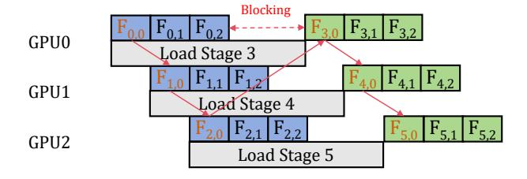

Fig. 1. Forward process with pipeline parallelism and offloading technique. In Fi,j , i represents the stage number and j represents the micro-batch number.

while the computational demand remains relatively stable. Due to this imbalance, the degree of overlapping the loading process is significantly reduced, blocking the computation. Notably, the backward process performs in a similar manner.

In this paper, we propose APTMoE, an affinity-aware pipeline fine-tuning system for MoE models on bandwidthconstrained GPU nodes. APTMoE proposes the affinity-aware offloading technique to enhance pipeline parallelism finetuning. The key idea is to *allocate computation across both GPUs and CPUs based on affinity, so as to improve computational efficiency and enable to better manage data across heterogeneous memory*.

The affinity-aware offloading technique leverages the expert popularity of MoE models, where input tokens are directed to different experts, and generally in a skewed distribution. Therefore, different experts have varying computational intensities. Leveraging this insight, the affinity-aware offloading technique distributes computation across GPUs and CPUs based on affinity. To enable an efficient allocation of computation and achieve better scheduling of communication, the affinity-aware offloading technique further incorporates a hierarchical loading strategy and a demand-priority scheduling strategy.

The hierarchical loading strategy aims to determine the efficient allocation of computation across GPUs and CPUs, and manage different loading decisions. Since the real expert popularity cannot be determined until the gate operation is finished, we tend to miss the opportunity for overlapping. To overcome this problem, the hierarchical loading strategy designs three loading phases to distribute loading decisions into different phases, namely inter-stage loading, inter-layer loading and inter-expert loading. First, with the aim of overlapping the computation and loading between different pipeline stages, the inter-stage loading leverages the historical expert popularity and greedily allocates computation with the highest affinity to GPUs. Some other loading decisions are deferred until more accurate expert popularity is available. Then, the inter-layer loading leverages the predicted expert popularity, so as to overlap the loading and computation between layers in the same pipeline stage. To leverage the expert popularity in advance, we employ a predictor to foresee the popularity distribution of subsequent layers. Given the prediction, we can make loading decisions for experts with high activation density and process them on GPUs, while those with low activation density are left and executed in place on CPUs. Then, the inter-expert loading overlaps the loading and computation of different experts in the same layer, relying on the real-time expert popularity. With these three loading phases, the affinityaware offloading technique can better allocate computation across GPUs and CPUs.

To alleviate the mutual interference among the three loading phases and maximize the bandwidth utilization, the demandpriority scheduling strategy is proposed. While each of the three loading phases identifies different overlapping space, they all rely on the same PCIe bandwidth, leading to mutual interference. Furthermore, memory copy kernels transferring data in the same direction cannot execute concurrently, so that these loading phases run sequentially and potentially block each other. For example, if the inter-stage loading for the next pipeline stage blocks the inter-layer loading for the current stage, the computation will be delayed. Therefore, the demandpriority scheduling strategy tackles with the above problems by dynamically coordinating the order of these loading phases. It adopts a proactive way, with the program periodically querying the GPU for the loading process status and dynamically determining the loading order at runtime.

Our contributions are summarized as follows:

- We identify the computation blocking problem caused by the increased ratio of data to computation when applying existing cost-effective fine-tuning approaches to the MoE architecture.
- We propose APTMoE, an affinity-aware pipeline finetuning system for MoE models targeting at bandwidthconstrained GPU nodes, with the key idea to offload a portion of the affinity computation to the CPU, so as to better manage data across heterogeneous memory. APTMoE incorporates the hierarchical loading strategy and the demand-priority scheduling strategy.
- We propose the hierarchical loading strategy. With the prior knowledge of expert popularity and computation affinity, it designs three loading phases to greedily allocate computation with the highest affinity and minimize data movement volume.
- We propose the demand-priority scheduling strategy to alleviate the mutual interference among loading phases and maximize the bandwidth utilization by dynamically coordinating the loading order.

The experimental results show that APTMoE surpasses baseline methods in most cases, and achieves up to 33% throughput improvement compared to the SOTA method. Besides, APTMoE successfully fine-tunes a 61.2B MoE model on 4 Nvidia A800 GPUs(40GB), which theoretically requires 1126GB memory.

### II. BACKGROUND AND MOTIVATION

#### *A. Mixture-of-Experts*

MoE is short for sparsely-gated Mixture-Of-Experts. The MoE architecture utilizes multiple sub-models, referred to as "experts", with each specializing in distinct sub-tasks. As in

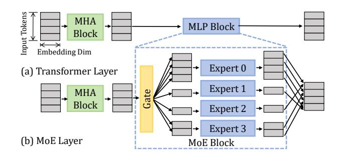

Fig. 2. Illustration of Transformer layer and MoE layer.

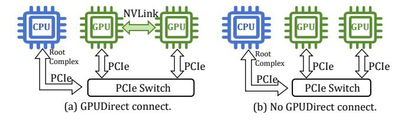

Fig. 3. GPU nodes with different connections.

Figure 2, here we take the popular Transformer models, e.g. LLama [5] and GPT [6], and Transformer-based MoE models, e.g. Mixtral [18], DBRX [4], and Grok [2], as the example. A Transformer model is stacked by a number of Transformer layers, and a Transformer layer consists of a Multi-Head Attention (MHA) block and a Multi-Layer Perceptron (MLP) block. In comparison, the MoE layer replaces the conventional Transformer layer's MLP block with the MoE block to introduce sparsity.

The MoE block contains two main components: one gate operation and multiple experts. The gate operation is typically composed of one or two feed-forward layers and a routing function (with a softmax layer and top-k selection), with the aim of routing each input token to k experts. Each expert has the same structure with the MLP block and is actually a neural network with feed-forward layers. Overall, for given tokens of an input sequence, these tokens will firstly flow through the gate operation, and the gate operation determines the allocation of tokens to different experts.

#### B. Bandwidth-constrained Pipeline Tuning

The pre-training phase is typically carried out on large-scale clusters, commonly utilizing hundreds of GPU nodes connected via high-speed network fabric, such as NVLink in Figure 3(a). Such high-quality hardware is generally affordable for a small proportion of individuals within the AI community. Moving onto the fine-tuning phase, the hardware accessible to most people is significantly weaker, typically consisting of a single node or several nodes equipped with multiple GPUs. As shown in Figure 3(b), these nodes usually lack high-speed interconnection and the inter-GPU communication relies on conventional PCIe buses, presenting constrained bandwidth.

To fine-tune large-scale models on bandwidth-constrained GPU nodes, existing solutions exploit pipeline parallelism

and offloading technique to scale up the model size and distribute workloads. Pipeline parallelism involves partitioning a model into disjoint stages, each of which is assigned to a specific device. Figure 4(a) illustrates the fundamental pipeline parallelism approach in GPipe [14]. The execution of multiple micro-batches on different stages can overlap and form a pipeline. Compared to tensor parallelism [19], another popular model parallelism approach, pipeline parallelism incurs significantly fewer communications, making it more suitable for bandwidth-constrained hardware.

Building upon pipeline parallelism, adopting the offloading technique can further expand the model size that limited hardware can fine-tune. Figure 4(b) illustrates the combination of pipeline parallelism and offloading technique introduced in Mobius [8]. Mobius enhances pipeline parallelism with the heterogeneous memory. Instead of placing a single pipeline stage in a GPU, Mobius pipeline partitions the model into more stages and allocates multiple stages to a GPU, with adjacent stages mapped to different GPUs. As shown in Figure 5(a), Mobius pre-fetches parameters of the subsequent stage while the current stage is executing, and offloads parameters along with activations after forward process. For backward process, it pre-fetches parameters and activations from host memory to GPU memory, and offloads parameters and gradients for parameters update at the end of each step. Thus, a single device only requires to keep two stages at a time. Mobius also includes a cross-mapping stage placement that maps two adjacent stages to GPUs under different CPU root complexes for reducing bandwidth contention.

## C. Challenges and Opportunities

1) Increased ratio of data to computation: In general, the computation of MLP or MoE blocks dominates in both dense and sparse models. As stated above, each layer in the MoE architecture consists of multiple experts, and each input token will be routed to k experts. Typically, k is much smaller than the number of experts in the layer. Thus, the ratio of data to computation in MoE models increases significantly compared to that of their dense counterparts.

When applying pipeline parallelism and offloading technique to fine-tune large-scale models, the ratio of data loading to computation determines whether the computation will be blocked. As the ratio grows, the data loading process may potentially block the computation in existing approaches. To alleviate this, one approach is to enlarge the computation amount by using larger batch size. However, unrestrained growth in the batch size may exceed memory capabilities during fine-tuning and may lead to potential convergence issues. Therefore, it is still necessary to optimize the workload from the system view.

2) Expert popularity: As compared to dense models, one notable feature of MoE models is expert popularity, that input tokens will be routed to different experts and the distribution is generally skewed. During MoE fine-tuning, we capture the severely imbalanced expert workload that most input tokens will select a small portion of experts, especially fine-

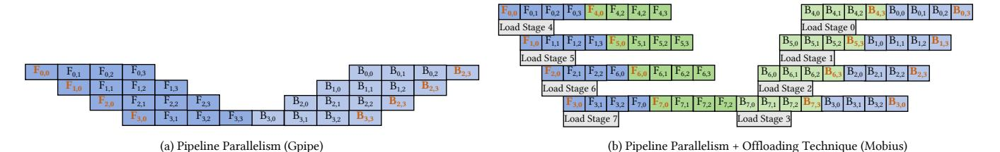

Fig. 4. Existing pipeline parallelism approaches.  $F_{i,j}$ ,  $B_{i,j}$  denote the *i*-th stage's forward/backward execution on the *j*-th micro-batch respectively.

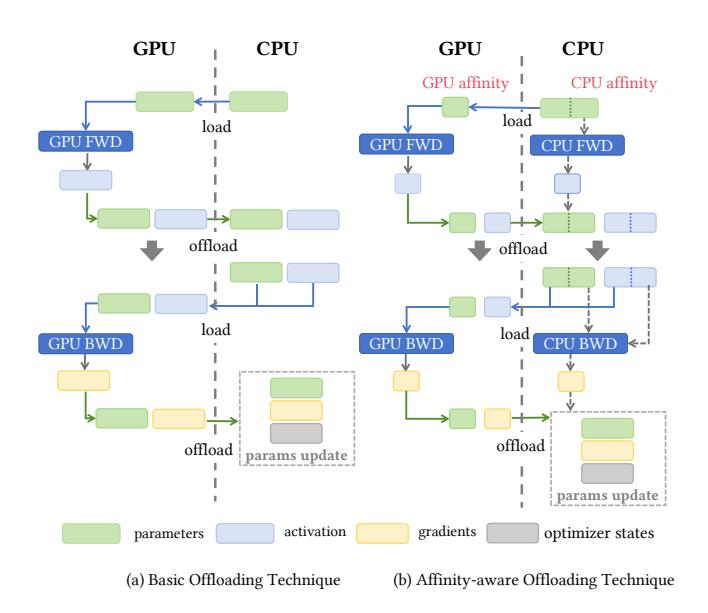

Fig. 5. Different offloading techniques.

tuning on domain-specific datasets, which corroborates similar observations in previous works [20]–[29].

In most cases, the expert activation is dynamically decided by the gate operation located right before experts, and we call this real-time expert popularity, which limits opportunities for system-side optimization. Prior efforts [20]–[23], [25], [30] have proposed to predict expert activation using approaches including neural networks, statistical methods and hashing function. As reported, these approaches have shown considerable prediction accuracy. This predicted expert popularity provides us with more opportunities for system-side expert prefetch and overlapping of loading and computation. Besides, previous works [21], [30], [31] also identify that a few experts are always activated with high intensity within a time period, which we also validate on a real case in experiments. We call this historical expert popularity.

3) Computation affinity: Capitalizing on the imbalanced popularity among experts, the activation of different experts occurs unevenly, resulting in significant variations in computational intensity. Thus, it is promising to leverage this variation and allocate experts across GPUs and CPUs based on affinity. In Figure 6, to validate this, we report the execution time for loading, CPU computing and GPU computing of a single expert (FP32) with varying numbers of input tokens, utilizing

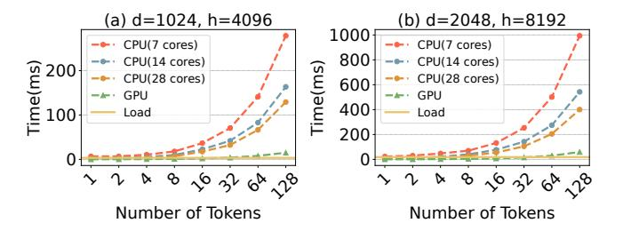

Fig. 6. The time for loading, CPU computing, and GPU computing of a single expert, conducted on Intel Xeon Gold 6348 CPU with 28 Cores and Nvidia A800 GPU. d and h represent dimensions of linear layers in the expert.

an Intel Xeon Gold 6348 CPU and an NVIDIA A800 GPU.

Compared to GPUs, CPUs typically have much lower theoretical computing power and simply offloading fine-tuning workloads onto CPUs can result in inefficiency. However, with the skewed expert popularity, some experts are activated in low density. As shown in Figure 6, comparing the CPU and GPU results, GPU apparently performs much better than CPU when the number of input tokens is large. However, when processing the expert with a small number of tokens as input, their results become comparable. This is because the computation becomes less compute-bound when the number of input tokens is small, and CPU is more friendly to handle this kind of workloads. Thus, we can allocate high-demand experts to GPUs and leverage their parallel processing capabilities, while allocating less-intensive experts to CPUs. In this way, on one hand, we can take advantage of the idle computing resources of CPUs, one the other hand, we can release GPUs to process more suitable workloads. Moreover, if an expert is conducted on CPUs, it is not necessary to load into GPU memory, thus reducing the data movement volume.

We further compare CPU performance under different cores, e.g. 7, 14 and 28 cores respectively. Figure 6 shows that the execution time of high-demand experts obviously increases when reducing the number of CPU cores. In comparison, the execution time of these less-intensive experts increases slightly when reducing the number of CPU cores. This is because these less-intensive experts are in lower computation intensity, and they cannot even saturate CPU cores. Thus, it becomes more feasible to offload affinity computation onto CPUs even if the number of GPUs exceeds that of CPUs.

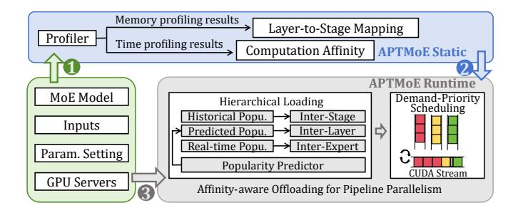

Fig. 7. The workflow of APTMoE system. The static part runs the profiler and generate the corresponding memory and time results, and the runtime part takes the affinity-aware offloading.

#### III. THE DESIGN OF APTMOE

We propose APTMoE, a system for fine-tuning MoE models with affinity-aware pipeline parallelism. APTMoE takes the key idea of allocating computation to both GPUs and CPUs based on affinity, so as to achieve better computation efficiency and memory management. In this section, we first introduce the APTMoE workflow. Next, we illustrate the overview of affinity-aware pipeline tuning, and present the hierarchical loading strategy and the demand-priority scheduling strategy.

#### A. APTMoE Workflow

As demonstrated in Figure 7, APTMoE system can be divided into two parts: the static part and the runtime part. The static part profiles memory usage and execution time, and generates the layer-to-stage mapping and execution time lookup table. In detail, with the given MoE model, the parameter settings and the target GPU nodes, the profiler performs finetuning of a single MoE layer on both CPU and GPU. Since the input sequence length and the batch size are generally fixed, the workload of the Multi-Head Attention (MHA) block keeps unchanged throughout the fine-tuning phase. In contrast, since the gate operation dynamically determines the routing of tokens to experts, the profiler needs to traverse a single expert with all possible number of tokens as input. The time cost of the profiler is moderate as we only run a single layer for a limited number of fine-tuning steps. Also, the static part runs offline and thus does not incur runtime overhead.

Through fine-tuning a single MoE layer, the profiler records the memory footprint of a single layer to generate the layer-to-stage mapping. Also, the profiler records the execution time and represents the computation affinity by comparing the execution time of the same workload. Allocating computation to CPU or GPU is also impacted by the data movement time, and we profile the data movement time of a single MHA block, a single gate operation and a single expert. These profiling results are stored for determining the computation affinity.

Moving onto the runtime part, APTMoE takes the affinity-aware offloading, which includes the hierarchical loading strategy and the demand-priority scheduling strategy, to enhance the pipeline parallelism on bandwidth-constrained GPU nodes. Details are described as follows.

#### B. Affinity-aware Offloading on Pipeline Parallelism

This section will introduce the critical concept of the affinity-aware offloading and explain how it enhances the pipeline parallelism. Basically, APTMoE takes the common pipeline stage placement method that multiple stages are allocated to a GPU and adjacent stages are placed in different GPUs. As shown in Figure 5(b), instead of only conducting computation on GPUs as in previous offloading techniques, the affinity-aware offloading gets benefits from distributing computation across both GPUs and CPUs. For a given input, leveraging both the expert popularity and computation affinity, the affinity-aware offloading will determine which part should be conducted on the CPU and which part on the GPU. Accordingly, the affinity-aware offloading correspondingly schedules the data movement.

In detail, the affinity-aware offloading takes the hierarchical loading strategy to determine the allocation of computation to devices and manage the loading decisions. Compared to the basic offloading technique in Figure 5(a), besides reducing the burden of GPUs by leveraging CPUs, it enables to load and offload a smaller amount of parameters, activations and gradients. Then, the affinity-aware offloading takes the demand-priority scheduling strategy to carefully coordinate the loading execution, alleviating the mutual interference within the hierarchical loading strategy and maximizing the bandwidth utilization between host memory and GPU memory.

#### C. Hierarchical Loading Strategy

As shown in Figure 8, instead of loading only at stage granularity, the hierarchical loading strategy subdivides the previous inter-stage loading into three phases, namely inter-stage loading, inter-layer loading and inter-expert loading. Given that different experts are activated unevenly and possess varying computational intensities, their affinity to CPU and GPU differs and placing computation on CPUs can reduce the data movement volume. These three phases enable to schedule loading decision with more accurate expert popularity.

Notably, the loading strategy differentiates the forward and backward processes. For the forward process, the real expert popularity remains unknown until the execution of the gating operation. On the contrary, all real expert popularity is already known for the backward process, thereby allowing for preallocation. We will begin by introducing how we construct the loading decision management, then illustrate the three loading phases for forward process, and finally explain our loading strategy for backward process.

1) Loading Decision Management: The hierarchical loading strategy manages the loading decisions at the granularity of the model block, such as the MHA block, gate operation, and expert. We employ three queues for each of these three phases to manage loading decisions, and they are assigned different priorities from low to high. Through adding or removing the names of blocks in the corresponding queues, the hierarchical loading strategy can manage the loading decisions. Also, these queues will be used in the demand-priority scheduling strategy for coordinating the loading execution.

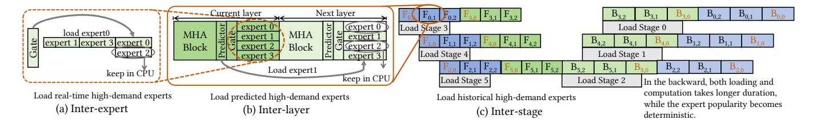

Fig. 8. Three loading phases of the hierarchical loading strategy.

2) Inter-stage Loading: For the forward process, the real expert popularity keeps unrevealed until the gate operation is carried out. To maximize the benefits of performing computations on CPUs, the hierarchical loading strategy defers the loading decision based on different levels of expert popularity, so as to greedily allocate computation with the highest affinity and minimize the data movement volume.

The inter-stage loading phase, illustrated in Figure 8(c), follows the similar idea as in previous works that it identifies the overlapping space between the computation of the current stage and the loading of the subsequent stage. Instead of loading all data required by the next stage indiscriminately, our inter-stage loading phase greedily loads partial data according to their computational demands. The inter-stage phase tends to prioritize model blocks that are highly likely to exhibit high computational intensity. Thus, MHA blocks and gate operations are inherently prioritized during the inter-stage phase, which means their names will be added to the inter-stage queue with priority. The reason is that they need to process all input data and pose intensive computational demands.

Considering which experts to be loaded in the forward process, the inter-stage phase leverages the historical expert popularity. The historical expert popularity indicates that a few experts are always activated with high intensity within a time period [21], [30], [31]. The inter-stage phase prioritizes the loading of these experts that are highly activated in the previous iteration. It begins by adding the names of the top-ranked experts across all layers into the inter-stage queue and then gradually decreases the rank order.

Once switching pipeline stages, the names in the current inter-stage queue will be cleared, despite some model blocks have not been loaded in this phase. Although the historical expert popularity cannot provide accurate guidance, these historical top-ranked ones are generally high-demand ones in real scenarios, as we can only load a small proportion of experts in each MoE layer in actual.

Overall, the inter-stage loading firstly adds the names of MHA blocks and gate operations into its queue and then greedily decides which experts to load based on the historical expert popularity. For those MHA blocks, gate operations, and experts who are not loaded during this phase, we defer their loading decisions to the later inter-layer and inter-expert phases with more accurate expert popularity.

3) Inter-layer Loading: The inter-layer loading is illustrated in Figure 8(b) and it identifies the overlapping space

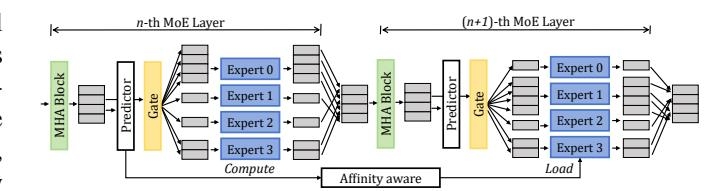

Fig. 9. Design of the popularity predictor.

between the computation of the current layer and the loading of the subsequent layer, both in the current pipeline stage. When getting into the execution of a stage, this loading phase dynamically determines the loading decisions of experts in the subsequent layer based on the predicted expert popularity and computation affinity.

In MoE models, each MoE block contains a gate operation that is responsible for determining the routing of tokens to experts. However, since the gate operation is positioned just before experts, the real expert popularity remains unknown until the gate operation completes, making it challenging for the inter-layer phase to effectively leverage activation patterns of experts. To address this limitation in the forward process, we introduce an additional structure, called the expert popularity predictor, to provide predicted expert popularity. It is noted that the predictor operates independently and does not alter the original MoE model.

As illustrated in Figure 9, for each layer, the predictor is incorporated one or a few layers ahead of the gate operation. The intermediate results flow through both the predictor and the gate operation of the current layer, generating the predicted expert popularity and the real expert popularity respectively. The predictor takes the same structure as the gate operation. The predictor initially takes weights of the corresponding gate operation, then takes steps of training for better prediction. Leveraging the proximity of intermediate results to the targeted layer, the predicted expert popularity generally achieves very high accuracy compared to the real expert popularity.

Next, we discuss how the inter-layer phase determines which experts to load into GPU memory for execution. In detail, with the predicted expert popularity, we pre-allocate computation across GPUs and CPUs based on Equation 1:

$$R = \frac{\sum_{low}^{high} Comp_{cpu}}{Load_{MHA} + Load_{Gate} + \sum_{high}^{low} Load_{expert}}$$
 (1)

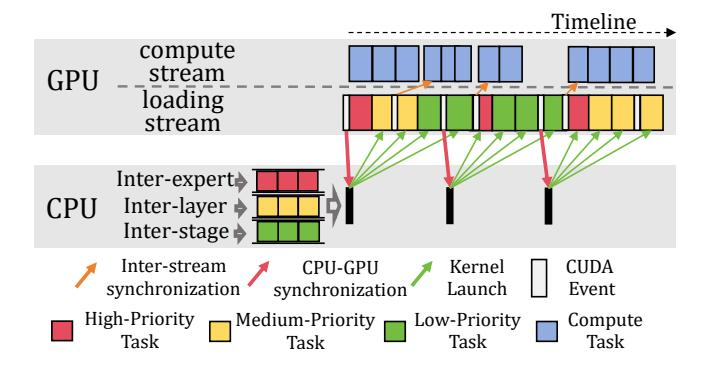

Fig. 10. The proactive loading coordination.

We assume that, by default, the loading time takes longer than the computation. The numerator of R is the accumulated CPU predicted execution time of experts in all executed microbatches with the computational intensity ranking from low to high. The denominator of R comprises the loading time of MHA blocks, gate operations, and the accumulated loading time of experts with the computational intensity ranking from high to low. Since the expert popularity of subsequent microbatches remains unknown, we greedily scale the computation time based on existing results. The threshold of stopping loading is R = 1. Once the expert popularity of a new micro-batch is generated, we will re-schedule and the interlayer loading decision may change. In other words, once there appears new highly-demand experts in the current microbatch, we will modify the inter-layer loading decisions to meet the new computational demands. This is done by adding or removing names of the inter-layer queue.

- *4) Inter-expert Loading:* The inter-expert loading is illustrated in Figure 8(a), and it identifies the overlapping space between the computation and loading of experts, in the current layer of the current pipeline stage. When entering the current layer, the real expert popularity is generated by the gate operation, and the inter-expert phase loads these experts with deterministic high intensity. Specifically, we still adhere to the Equation 1 to determine whether an expert should be loaded, with one difference that the CPU execution time is determined by the actual gating operation, instead of predicted ones.
- *5) Backward Loading Strategy:* Given that all accurate expert popularity is already known for the backward process, the loading strategy differs with that of the forward process. In detail, with the real expert popularity, we can pre-allocate computation across GPUs and CPUs still following Equation 1. Since Equation 1 considers the expert popularity of all micro-batches, it can provide the globally optimal allocation scheme for the backward process. Based on this, we can predetermine the allocation of all experts in the inter-stage phase before backward process, without the necessity of inter-layer and inter-expert loading phases.

#### *D. Demand-priority Scheduling Strategy*

The three loading phases of the hierarchical loading strategy generate the loading decisions. However, since these loading phases rely on the same PCIe lane with the same direction and cannot execute concurrently, they will potentially block each other. The demand-priority scheduling strategy is responsible for coordinating these three loading phases and scheduling the loading execution, alleviating the mutual interference and maximizing the bandwidth utilization.

Figure 10 illustrates the demand-priority scheduling strategy, which employs a proactive approach. In this approach, the program periodically queries the GPU for the loading process status and dynamically determines the loading order at runtime. During execution, the three loading phases dynamically add or remove the names of model blocks into three queues. These queues are prioritized differently based on their demand urgency. In detail, the demand-priority scheduling strategy assigns the highest priority to the inter-expert phase, followed by the inter-layer phase, and finally the inter-stage phase, which has the lowest priority.

The loading decisions of these phases are made in different styles. Specifically, the inter-stage phase makes loading decisions for numerous model blocks once the pipeline stage switches. The inter-layer phase only makes loading decisions for several model blocks of the next layer, while the interexpert phase makes loading decisions for fewer experts of the current layer. Thus, the loading decision moments and the loading execution moments are inconsistent. These loading execution should be interlaced in some conditions. Consequently, dynamically scheduling loading execution of these phases in real-time becomes essential.

Coordinating loading becomes the CUDA kernel scheduling problem. Since interrupting and resuming a kernel's execution is very difficult and expensive, each kernel continues execution until completion once started. Consequently, scheduling launched kernels presents significant challenges. As a solution, we opt to schedule data movement kernels before their launches, simplifying the overall scheduling process.

As in Figure 10, we initially select a pre-determined number of data movement actions from the queues of loading phases, and launch them to the loading stream in the GPU. To query the GPU loading status, we additionally incorporate a cuda event and utilize the CPU-GPU synchronization to query whether the event is triggered. The cuda event is inserted at the position before the last action. This arrangement ensures that when the CUDA event is triggered, a data loading kernel is still executing, effectively hiding the kernel launch overhead.

Besides, the demand-priority scheduling strategy is also responsible for ensuring the correctness of data dependencies. As shown in Figure 10, to guarantee that the data has been moved to GPU memory when the computation occurs, the strategy inserts a CUDA event for consecutive data loading kernels and uses the inter-stream synchronization to inform the corresponding computation kernel that the data is ready.

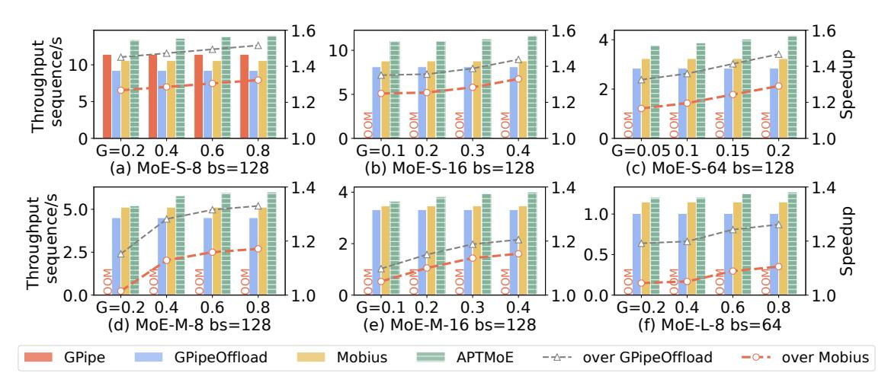

Fig. 11. Overall performance on 4 Nvidia A800 GPUs under various expert popularity.

TABLE I MODEL CONFIGURATION

|                                 | Layers | Dim  | Hidden Dim | Experts       | Model Size            | Memory(FP32)            |
|---------------------------------|--------|------|------------|---------------|-----------------------|-------------------------|
| MoE-S-8 MoE-S-16 MoE-S-64 | 64     | 1024 | 4096       | 8 16 64 | 4.5B 8.8B 34.6B | 111GB 213GB 821GB |
| MoE-M-8 MoE-M-16             | 64     | 2048 | 8192       | 8 16       | 18.2B 35.4B        | 366GB 707GB          |
| MoE-L-8                         | 64     | 4096 | 14336      | 8             | 61.2B                 | 1126GB                  |

#### IV. EVALUATION

#### A. Experiment Setup

**Testbed.** We deploy APTMoE on a cluster with 4 nodes. Each node contains 8 NVIDIA A800 GPUs (40GB) and every four of them connect to a Intel Xeon Gold 6348 CPU with 28 cores. A node has a total of 1024 GB main memory. All GPUs can only communicate via PCIe switch. We evaluate on three device topologies to validate the impacts of involving CPUs on performance:

- *C1+G4*: Four GPUs are connected to one CPU, and every 7 cores are bound to each process.
- *C1+G2*: Every two GPUs share one CPU, and every 14 cores are bound to each process.
- *C1+G1*: Each GPU fully occupies one CPU, and 28 cores are bound to each process.

**Baselines**. We compare APTMoE with the following approaches:

- GPipe [14]: GPipe is a fundamental pipeline parallelism approach which partitions the model into stages equal to the device number and sequentially maps them to devices. Besides, it only utilizes GPU memory.
- GPipeOffload: We configure GPipe with the naive offloading technique. Specifically, we split the original stage of GPipe into several smaller stages and keep the same stage-to-device mapping. We load and execute them one by one.

Mobius [8]: A fine-tuning system for bandwidth-constrained GPU nodes, integrating pipeline parallelism and offloading technique. It partitions the model into stages and the number of stages is more than that of GPUs, with adjacent stages mapped to different GPUs. Next, it schedules these stages between GPU memory and host memory. Mobius also features a novel stage-to-device mapping for reducing bandwidth contention. We take Mobius as our primary baseline.

**Workloads**. We use MoE models based on GPT-like Transformer structure. To validate the generalization, we establish some MoE models (top-2 gating) as shown in Table I, and design a simulator to replace both gate operation and predictor for simulating different expert popularity. We also present the theoretical memory requirements when fine-tuning them with a batch size of 128 and FP32 in Table I. We use Adam optimizer, and the number of micro-batches is set to the number of GPUs. A metric G is proposed to describe the expert popularity:

$$G = \frac{1}{L} \sum_{l=1}^{L} \sum_{e=1}^{E} (p_l^e)^2$$
 (2)

 $p_l^e$  is the proportion of input tokens assigned to the e-th expert of the l-th MoE layer. A larger G indicates more imbalanced expert popularity, and notably, this metric is seriously impacted by the number of experts.

Besides, we fine-tune NLLB-MoE [32] and Mixtral-8x7B [18] on APP dataset [33] as the real-world case study, mainly focusing on validating the accuracy of the predicted expert popularity.

#### B. Overall Performance

In this section, we verify the effectiveness of APTMoE under various expert popularity. In detail, we simulate the expert popularity of these models with varying G. Since G is influenced by the number of experts, we select different ranges of G values for MoE models with varying numbers of experts. Experiments are conducted on four GPUs within a

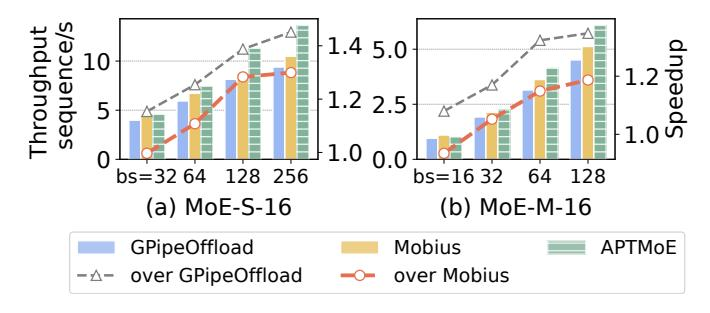

Fig. 12. Varying batch size on MoE-S-16 and MoE-M-16, conducted under CI+G2 topology and G=0.3.

node under C1+G2 topology. Detailed results are presented in Figure 11 and Figure 12.

In all cases shown in Figure 11, APTMoE presents advantages in fine-tuning throughput and yields positive speedup compared to all baseline methods across all models. For GPipe that relies solely on GPU memory, it can only accommodate MoE-S-8 in our model configurations and occurs out-of-memory(OOM) errors with all other MoE models. This demonstrates the necessity of combining offloading technique with pipeline parallelism for effectively fine-tuning MoE models. Since the MoE-S-8 model is relatively small and exhibits low computational intensity, the loading time can be hidden within the execution time. As APTMoE can allocate computation across GPUs and CPUs, it outperforms GPipe.

Comparing APTMoE, Mobius, and GPipeOffload, APT-MoE consistently outperforms Mobius and Mobius outperforms GPipeOffload. Mobius outperforms GPipeOffload due to its novel model partition method and cross-mapping scheme. These features enable better overlapping and less bandwidth contention. On top of Mobius, APTMoE performs better for it distributes computation across both GPUs and CPUs, as well as implementing a more flexible loading process. Particularly, APTMoE allows CPUs share part of non-popular expert workload, which can relieve these memory-bound burden of GPU and enhance efficiency. The experts in CPU affinity stay in host memory, resulting in lower data movement volume. Moreover, the throughput of APTMoE improves with the increase of *G*. This can be attributed to the fact that more imbalanced workloads lead to better affinity.

Next, comparing Figure 11(a), (b) and (c) with the same batch size and varying numbers of experts, as the number of experts increases, the impact of imbalanced expert popularity on the throughput becomes more pronounced. The reason is, when the expert number increases with the fixed batch size and sequence length, these low-demand experts are more likely to demonstrate better affinity to CPUs, thereby presenting better CPU-GPU cooperation and less data movement volume. For all cases in our evaluation, APTMoE can achieve a maximum speedup of 33% over Mobius on MoE-S-16 when G=0.4.

Comparing APTMoE's performance on MoE-S and MoE-M, we can find that APTMoE's speedup decreases with larger expert size. In our evaluation, as shown in Figure 11(a) and (d), APTMoE's maximum speedup over Mobius is 32.3% on

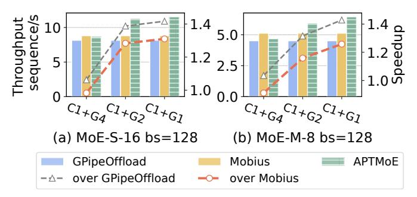

Fig. 13. Evaluation of device topologies on MoE-S-16 and MoE-M-8. G=0.6 for MoE-M-8 and G=0.3 for MoE-S-16.

MoE-S-8 and 17.1% on MoE-M-8. In Figure 11(b) and (e), APTMoE can achieve the maximum speedup over Mobius of 33% on MoE-S-16 and 15.3% on MoE-M-16. In our analysis, the performance improvement achieved by leveraging CPU computation resources diminishes as the model scales. This is primarily because CPUs are not as proficient as GPUs when dealing with large-scale matrix multiplication.

In Figure 12, we evaluate MoE-S-16 and MoE-M-16 with varying batch size. Results show that the speedup improves and the trend gradually becomes slowly when the batch size increases, both for MoE-S-16 and MoE-M-16. As the batch size increases, the total amount of data movement for each iteration rises slowly, whereas the computation amount increases proportionally with the batch size. In this way, when the batch size is small, the data movement time dominates the overall execution time and APTMoE takes effect only by reducing the data movement volume. As the batch size becomes larger, APTMoE can improve from more aspects.

#### C. Benefits of CPU Involvement

We conduct experiments on three device topologies with MoE-S-16 and MoE-M-16 using batch size of 128, as in Figure 13. Comparing the results of three device topologies, as the CPU ratio relative to GPU increases, the throughput consistently improves across these two models. In detail, APT-MoE achieves the speedup to Mobius of -2%, 28.3% and 31% on MoE-S-16, and -9%, 15.9% and 25.8% on MoE-M-8. The throughput improvement can attribute to the increased CPU cores assigned to a process, and this well fits the results of the prior experiment in Figure 6. When under *C1+G4* topology, APTMoE's throughput is sightly lower than Mobius, due to the insufficient CPU computing resources. The insufficient CPU cores fail to handle the expert workload, especially when the expert size is large. In this way, we think it is cost-effective to introduce more CPUs in bandwidth-constrained systems.

#### D. Strong Scaling

We evaluate MoE-S-64 and MoE-M-16 for strong scaling evaluation, presented in Figure 14. Specifically, we increase the number of GPUs from 4 to 16 under C1 + G2 topology, and fix a constant batch size of 128. For MoE-S-64, when the number of GPUs increases from 4 to 8 and 16, APTMoE achieves the speedup of  $1.65 \times$  and  $3.08 \times$ , respectively. As

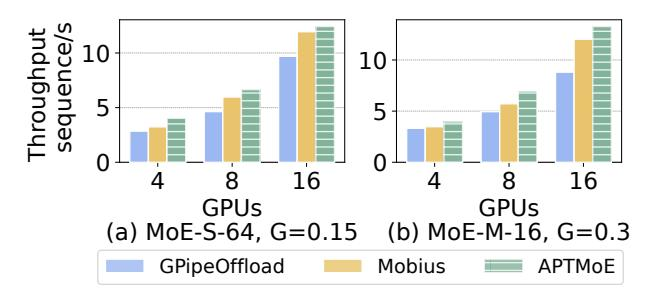

Fig. 14. Strong scaling results for MoE-S-64 and MoE-M-16 under C1+G2.

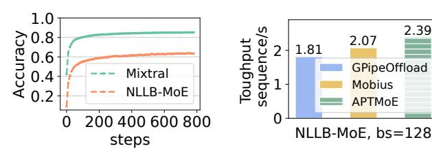

Fig. 15. Token accuracy.

Fig. 16. NLLB-MoE performance.

2.07

Mobius

**GPipeOffload** 

2.39

for MoE-M-16, APTMoE achieves the speedup of  $1.76 \times$ and 3.36×. Pipeline parallelism is renowned for its minimal communication overhead and increasing the GPU number can improve the accumulated bandwidth between host memory and GPU memory. However, we observe that the strong scaling results are not as impressive as expected. This is primarily because when scaling to more GPUs, the batch size of microbatches becomes small. Consequently, the reduced batch size leads to a much lower computational intensity. Furthermore, APTMoE consistently achieves the highest throughput in all three tests.

#### E. Real Case Evaluation

1) Predictor Token Accuracy: We fine-tune two opensource pre-trained MoE models, i.e. Mixtral-8x7B [18] and NLLB-MoE [32], on APP dataset [33] with APTMoE. At first, we evaluate the effectiveness of our predictor design. For Mixtral-8x7B, since all layers are MoE layers, we place the predictor one layer ahead of the gate operation. As for NLLB-MoE where every 4 layers contain a MoE layer, we place the predictor 4 layers ahead. Predictors are initialized with weights adopted from the gate operation of the target layer.

Figure 15 reports the prediction accuracy per token with 0.85 for Mixtral-8x7B and 0.64 for NLLB-MoE, respectively. Intuitively, the predictor accuracy of NLLB-MoE is lower than that of Mixtral-8x7B. On one hand, NLLB-MoE has 128 experts and Mixtral-8x7B has only 8 experts. More experts hinder the prediction accuracy, as a token has more expert choices. On the other hand, the prediction of NLLB-MoE is earlier, which comes at the expense of lower accuracy, but allows for earlier determination of inter-layer loading scheduling.

2) Predictor Expert Accuracy: Compared to the predictor accuracy per token, we calculate the expert accuracy that

whether an expert is correctly predicted based on the tokenlevel predicted results. Since the APTMoE only requires to know the activation order of experts and decides whether an expert should be loaded into GPU memory, the expert accuracy is more reasonable in APTMoE design. We measure the expert accuracy by providing the probability that the predicted least activated n experts fall within the the real least activated mexperts  $(n \le m)$ .

For Mixtral-8x7B with 8 experts, the correct probability of the last 1/4 experts (n=2) is always 100% predicted. In other words, we can accurately predict the last two least activated experts of Mixtral-8x7B, as less experts tend to result in higher correct probability. For NLLB-MoE with 128 experts, we evaluate whether the last 1/4 least activated experts can be predicted, that is, n = 32. The expert accuracy is 94% when m = 48. These above results demonstrate that, the predictor can almost accurately predict non-popular experts, so as to provide beneficial guidance to the hierarchical loading strategy.

Meanwhile, we also evaluate the expert accuracy between iterations to verify the historical expert popularity. For NLLB-MoE, among these 32 least activated experts in the current iteration, on average 73.3% of them also fall into the 48 least activated experts in the next iteration. This verifies the historical expert popularity, which validating the opportunity for the inter-stage loading phases.

3) Performance: Mixtral-8x7B [18] takes the same expert configuration as the MoE-L-8, with a G value of approximately 0.2. In fact, the Mixtral-8x7B introduces a novel algorithm called the load balance loss that alleviates the impact of skewed expert popularity. The configuration of Mixtral-8x7B falls into the Figure 11(e). APTMoE achieves approximately 4% speedup over Mobius and 20% over GPipeOffload.

NLLB-MoE [32] has the same expert configuration as the small model and has 128 experts. The G value of NLLB-MoE is approximately 0.05. Although the G value is much less than that of Mixtral-8x7B, its expert popularity is much more imbalanced due to the larger number of experts it includes. As in Figure 16, APTMoE shows around 15% speedup over Mobius and 32% over GPipeOffload.

4) Overhead Analysis: We demonstrate the overhead introduced by the predictor. s and E represent the sequence length and number of experts per layer, while d and h are dimensions of linear layers of an expert. Considering top-2 gating, expert FLOPs within a MoE block of a forward process is given by 8sdh in theory, while FLOPs of the gate operation of 2sdE. In MoE architecture, h is usually several orders of magnitude larger than E (h = 14336 and E = 8 in Mixtral-8x7B). Thus, the extra FLOPs introduced by the predictor can be negligible.

For our real case evaluation, in Figure 15, the predictor of Mixtral-8x7B converges after around 700 steps with nearly 0.93s, while the predictor of NLLB-MoE converges with nearly 0.18s. These overheads are much less compared to a single step, or rather the overall fine-tuning process.

#### V. RELATED WORKS

In recent years, there has been a surge of system-level researches on MoE training, fine-tuning and inference. These works can be broadly classified into two categories: scale-out and scale-up approaches.

Scale-out Approaches. Scale-out approaches often increase the number of GPUs to satisfy the memory requirement and improve efficiency. Expert parallelism, firstly introduced by GShard [1], is widely adopted in modern MoE training system. It distributes experts onto different devices, with the aim of accommodating more experts, but at the expense of heavy allto-all communication. Deepspeed-MoE [34], FasterMoE [26], Lina [22], ScMoE [35] , TA-MoE [36] and Yao et al. [37] optimize the all-to-all communication in expert parallelism. Lazarus [29] focuses on the training resilience of expert parallelism, with a provably optimal expert placement algorithm to maximize the probability of recovery from failures. However, the expert parallelism approach may suffer from severe communication bottleneck in bandwidth-constrained environments. In contrast, MPipeMoE [38] and PipelineMoE [39] concentrate on combining MoE training with pipeline parallelism, which are more communication-friendly. However, these two efforts do not explore the combination of pipeline parallelism and offloading technique, posing difficulties to accommodate large models with limited number of devices. Tutel [40] and SmartMoE [21] focus on adaptive parallelism, and dynamically adjust the combination of expert parallelism, pipeline parallelism, and tensor parallelism during runtime.

Scale-up Approaches. Scale-up approaches address the GPU memory wall issue by immigrating large-scale models to external storage resources, such as CPU memory. Some offloading techniques, including ZERO-Offload [9], ZERO-Infinity [10], L2L [11] and CoTrain [41], are designed for dense models. However, since the data flow graph cannot be constructed in advance due to the dynamic nature of expert popularity, MoE-specific approaches are proposed. M6- 10T [42] proposes granular CPU offloading technique that selectively offloads some layers and leaves part of the model in GPU memory, with the aim of reducing data movements and improving efficiency. Besides, SE-MoE [43] tackles the memory wall issue by comprehensively considering GPU memory, CPU memory and even SSDs. Based on its proposed ring memory offloading technique, SE-MoE dynamically schedules data across different storage. Huang et al. [31] propose an expert buffering mechanism to offload infrequently activated experts to the CPU memory, while popular experts are kept in the GPU memory. As they only utilize the CPU memory and do not offload the computation, it loses opportunities for CPU computing resources participant. To better schedule the data movement, Pre-gated MoE [25] advances the gate operation in MoE models and achieves better overlap of the expert migration and expert execution. Whereas, it changes the original model structure and may potentially impact the model quality. Eliseev et al. [30] propose the speculative expert loading. Through directly duplicating and advancing the gate operation, it can roughly foresee the expert popularity.

Among these efforts, they fail to leverage CPUs and reduce the data movement volume. In comparison, APTMoE is a combination of scale-up and scale-out approaches and it creatively adopts CPUs for better offloading.

#### VI. CONCLUSION

To lower the barriers of adopting MoE architecture, this paper introduces APTMoE, an affinity-aware pipeline finetuning system for MoE models targeting at bandwidthconstrained GPU nodes. Through carefully allocating computation in pipeline parallelism across GPUs and CPUs based on expert popularity and computation affinity, APTMoE can largely enhance computational efficiency and reduce the data movement volume between GPU memory and host memory. Experiments demonstrate that APTMoE outperforms existing methods in most cases and can achieve up to 33% throughput improvement compared to the state-of-the-art method. With APTMoE, a 61.2B MoE model that theoretically requires 1126GB memory is successfully fine-tuned on 4 Nvidia A800 GPUs(40GB).

For LLM workloads, such as large model generative inference [44], [45] and our MoE fine-tuning, leveraging CPUs can significantly enhance cost-effectiveness. CPUs serve not only as the control unit but also play a crucial role in optimizing overall performance. Therefore, it is reasonable to reconsider the role of CPUs in AI infrastructure.

# VII. ACKNOWLEDGEMENT

This research was supported by the Major Program of Guangdong Basic and Applied Research: 2019B030302002, and was also supported in part by the GuangDong Basic and Applied Basic Research Foundation: 2023A1515110117, in part by the Natural Science Foundation of China under Grant No. 62272499, 62332021, in part by the Pazhou Lab Research Project: PZL2023KF0001, in part by the Fundamental Research Funds for the Central Universities, Sun Yat-sen University: 23xkjc016.

#### REFERENCES

- [1] Dmitry Lepikhin, HyoukJoong Lee, Yuanzhong Xu, Dehao Chen, Orhan Firat, Yanping Huang, Maxim Krikun, Noam Shazeer, and Zhifeng Chen. Gshard: Scaling giant models with conditional computation and automatic sharding. *arXiv preprint arXiv:2006.16668*, 2020.
- [2] Grok-1. https://github.com/xai-org/grok-1, 2024.
- [3] Gpt-moe-1.8t. https://www.nvidia.cn/gtc-global/keynote, 2024.
- [4] Databricks. Dbrx. https://github.com/databricks/dbrx, 2024.
- [5] Hugo Touvron, Thibaut Lavril, Gautier Izacard, Xavier Martinet, Marie-Anne Lachaux, Timothee Lacroix, Baptiste Rozi ´ ere, Naman Goyal, Eric ` Hambro, Faisal Azhar, et al. Llama: Open and efficient foundation language models. *arXiv preprint arXiv:2302.13971*, 2023.
- [6] Luciano Floridi and Massimo Chiriatti. Gpt-3: Its nature, scope, limits, and consequences. *Minds and Machines*, 30:681–694, 2020.
- [7] https://aws.amazon.com/.
- [8] Yangyang Feng, Minhui Xie, Zijie Tian, Shuo Wang, Youyou Lu, and Jiwu Shu. Mobius: Fine tuning large-scale models on commodity gpu servers. In *Proceedings of the 28th ACM International Conference on Architectural Support for Programming Languages and Operating Systems, Volume 2*, pages 489–501, 2023.

- [9] Jie Ren, Samyam Rajbhandari, Reza Yazdani Aminabadi, Olatunji Ruwase, Shuangyan Yang, Minjia Zhang, Dong Li, and Yuxiong He. {Zero-offload}: Democratizing {billion-scale} model training. In *2021 USENIX Annual Technical Conference (USENIX ATC 21)*, pages 551– 564, 2021.
- [10] Samyam Rajbhandari, Olatunji Ruwase, Jeff Rasley, Shaden Smith, and Yuxiong He. Zero-infinity: Breaking the gpu memory wall for extreme scale deep learning. In *Proceedings of the International Conference for High Performance Computing, Networking, Storage and Analysis*, pages 1–14, 2021.
- [11] Bharadwaj Pudipeddi, Maral Mesmakhosroshahi, Jinwen Xi, and Sujeeth Bharadwaj. Training large neural networks with constant memory using a new execution algorithm. *arXiv preprint arXiv:2002.05645*, 2020.
- [12] Minsoo Rhu, Natalia Gimelshein, Jason Clemons, Arslan Zulfiqar, and Stephen W Keckler. vdnn: Virtualized deep neural networks for scalable, memory-efficient neural network design. In *2016 49th Annual IEEE/ACM International Symposium on Microarchitecture (MICRO)*, pages 1–13. IEEE, 2016.
- [13] Jiarui Fang, Zilin Zhu, Shenggui Li, Hui Su, Yang Yu, Jie Zhou, and Yang You. Parallel training of pre-trained models via chunk-based dynamic memory management. *IEEE Transactions on Parallel and Distributed Systems*, 34(1):304–315, 2022.
- [14] Yanping Huang, Youlong Cheng, Ankur Bapna, Orhan Firat, Dehao Chen, Mia Chen, HyoukJoong Lee, Jiquan Ngiam, Quoc V Le, Yonghui Wu, et al. Gpipe: Efficient training of giant neural networks using pipeline parallelism. *Advances in neural information processing systems*, 32, 2019.
- [15] Deepak Narayanan, Aaron Harlap, Amar Phanishayee, Vivek Seshadri, Nikhil R Devanur, Gregory R Ganger, Phillip B Gibbons, and Matei Zaharia. Pipedream: Generalized pipeline parallelism for dnn training. In *Proceedings of the 27th ACM Symposium on Operating Systems Principles*, pages 1–15, 2019.
- [16] Shigang Li and Torsten Hoefler. Chimera: efficiently training largescale neural networks with bidirectional pipelines. In *Proceedings of the International Conference for High Performance Computing, Networking, Storage and Analysis*, pages 1–14, 2021.
- [17] Ziming Liu, Shenggan Cheng, Haotian Zhou, and Yang You. Hanayo: Harnessing wave-like pipeline parallelism for enhanced large model training efficiency. In *Proceedings of the International Conference for High Performance Computing, Networking, Storage and Analysis*, pages 1–13, 2023.
- [18] Albert Q Jiang, Alexandre Sablayrolles, and et al. Mixtral of experts. *arXiv preprint arXiv:2401.04088*, 2024.
- [19] Mohammad Shoeybi, Mostofa Patwary, Raul Puri, Patrick LeGresley, Jared Casper, and Bryan Catanzaro. Megatron-lm: Training multi-billion parameter language models using model parallelism. *arXiv preprint arXiv:1909.08053*, 2019.
- [20] Zhixu Du, Shiyu Li, Yuhao Wu, Xiangyu Jiang, Jingwei Sun, Qilin Zheng, Yongkai Wu, Ang Li, Hai Li, Yiran Chen, et al. Sida: Sparsityinspired data-aware serving for efficient and scalable large mixture-ofexperts models. *arXiv preprint arXiv:2310.18859*, 2023.
- [21] Mingshu Zhai, Jiaao He, Zixuan Ma, Zan Zong, Runqing Zhang, and Jidong Zhai. {SmartMoE}: Efficiently training {Sparsely-Activated} models through combining offline and online parallelization. In *2023 USENIX Annual Technical Conference (USENIX ATC 23)*, pages 961– 975, 2023.
- [22] Jiamin Li, Yimin Jiang, Yibo Zhu, Cong Wang, and Hong Xu. Accelerating distributed {MoE} training and inference with lina. In *2023 USENIX Annual Technical Conference (USENIX ATC 23)*, pages 945– 959, 2023.
- [23] Zhengyan Zhang, Yankai Lin, Zhiyuan Liu, Peng Li, Maosong Sun, and Jie Zhou. Moefication: Transformer feed-forward layers are mixtures of experts. *arXiv preprint arXiv:2110.01786*, 2021.
- [24] Trevor Gale, Deepak Narayanan, Cliff Young, and Matei Zaharia. Megablocks: Efficient sparse training with mixture-of-experts. *Proceedings of Machine Learning and Systems*, 5, 2023.
- [25] Ranggi Hwang, Jianyu Wei, Shijie Cao, Changho Hwang, Xiaohu Tang, Ting Cao, Mao Yang, and Minsoo Rhu. Pre-gated moe: An algorithmsystem co-design for fast and scalable mixture-of-expert inference. *arXiv preprint arXiv:2308.12066*, 2023.
- [26] Jiaao He, Jidong Zhai, Tiago Antunes, Haojie Wang, Fuwen Luo, Shangfeng Shi, and Qin Li. Fastermoe: modeling and optimizing training of large-scale dynamic pre-trained models. In *Proceedings of the*

- *27th ACM SIGPLAN Symposium on Principles and Practice of Parallel Programming*, pages 120–134, 2022.
- [27] Jiaao He, Jiezhong Qiu, and et al. Fastmoe: A fast mixture-of-expert training system. *arXiv preprint arXiv:2103.13262*, 2021.
- [28] Leyang Xue, Yao Fu, Zhan Lu, Luo Mai, and Mahesh Marina. Moeinfinity: Activation-aware expert offloading for efficient moe serving. *arXiv preprint arXiv:2401.14361*, 2024.
- [29] Yongji Wu, Wenjie Qu, Tianyang Tao, Zhuang Wang, Wei Bai, Zhuohao Li, Yuan Tian, Jiaheng Zhang, Matthew Lentz, and Danyang Zhuo. Lazarus: Resilient and elastic training of mixture-of-experts models with adaptive expert placement. *arXiv preprint arXiv:2407.04656*, 2024.
- [30] Artyom Eliseev and Denis Mazur. Fast inference of mixture-of-experts language models with offloading. *arXiv preprint arXiv:2312.17238*, 2023.
- [31] Haiyang Huang, Newsha Ardalani, and et al. Towards moe deployment: Mitigating inefficiencies in mixture-of-expert (moe) inference. *arXiv preprint arXiv:2303.06182*, 2023.
- [32] Marta R Costa-jussa, James Cross, Onur C¸ elebi, Maha Elbayad, Kenneth ` Heafield, Kevin Heffernan, Elahe Kalbassi, Janice Lam, Daniel Licht, Jean Maillard, et al. No language left behind: Scaling human-centered machine translation. *arXiv preprint arXiv:2207.04672*, 2022.
- [33] Dan Hendrycks, Steven Basart, Saurav Kadavath, Mantas Mazeika, Akul Arora, Ethan Guo, Collin Burns, Samir Puranik, Horace He, Dawn Song, and Jacob Steinhardt. Measuring coding challenge competence with apps. *NeurIPS*, 2021.
- [34] Samyam Rajbhandari, Conglong Li, Zhewei Yao, Minjia Zhang, Reza Yazdani Aminabadi, Ammar Ahmad Awan, Jeff Rasley, and Yuxiong He. Deepspeed-moe: Advancing mixture-of-experts inference and training to power next-generation ai scale. In *International conference on machine learning*, pages 18332–18346. PMLR, 2022.
- [35] Weilin Cai, Juyong Jiang, Le Qin, Junwei Cui, Sunghun Kim, and Jiayi Huang. Shortcut-connected expert parallelism for accelerating mixtureof-experts. *arXiv preprint arXiv:2404.05019*, 2024.
- [36] Chang Chen, Min Li, Zhihua Wu, Dianhai Yu, and Chao Yang. Tamoe: Topology-aware large scale mixture-of-expert training. *Advances in Neural Information Processing Systems*, 35:22173–22186, 2022.
- [37] Jinghan Yao, Quentin Anthony, Aamir Shafi, Hari Subramoni, and Dhabaleswar K DK Panda. Exploiting inter-layer expert affinity for accelerating mixture-of-experts model inference. In *2024 IEEE International Parallel and Distributed Processing Symposium (IPDPS)*, pages 915–925. IEEE, 2024.
- [38] Zheng Zhang, Donglin Yang, Yaqi Xia, Liang Ding, Dacheng Tao, Xiaobo Zhou, and Dazhao Cheng. Mpipemoe: Memory efficient moe for pre-trained models with adaptive pipeline parallelism. In *2023 IEEE International Parallel and Distributed Processing Symposium (IPDPS)*, pages 167–177. IEEE, 2023.
- [39] Xin Chen, Hengheng Zhang, Xiaotao Gu, Kaifeng Bi, Lingxi Xie, and Qi Tian. Pipeline moe: A flexible moe implementation with pipeline parallelism. *arXiv preprint arXiv:2304.11414*, 2023.
- [40] Changho Hwang, Wei Cui, Yifan Xiong, Ziyue Yang, Ze Liu, Han Hu, Zilong Wang, Rafael Salas, Jithin Jose, Prabhat Ram, et al. Tutel: Adaptive mixture-of-experts at scale. *Proceedings of Machine Learning and Systems*, 5, 2023.
- [41] Zhenxing Li, Qiang Cao, Yajie Chen, and Wenrui Yan. Cotrain: Efficient scheduling for large-model training upon gpu and cpu in parallel. In *Proceedings of the 52nd International Conference on Parallel Processing*, ICPP '23, page 92–101, New York, NY, USA, 2023. Association for Computing Machinery.
- [42] Junyang Lin, An Yang, Jinze Bai, Chang Zhou, Le Jiang, Xianyan Jia, Ang Wang, Jie Zhang, Yong Li, Wei Lin, et al. M6-10t: A sharingdelinking paradigm for efficient multi-trillion parameter pretraining. *arXiv preprint arXiv:2110.03888*, 2021.
- [43] Liang Shen, Zhihua Wu, WeiBao Gong, Hongxiang Hao, Yangfan Bai, HuaChao Wu, Xinxuan Wu, Jiang Bian, Haoyi Xiong, Dianhai Yu, et al. Se-moe: A scalable and efficient mixture-of-experts distributed training and inference system. *arXiv preprint arXiv:2205.10034*, 2022.
- [44] Xuanlei Zhao, Bin Jia, Haotian Zhou, Ziming Liu, Shenggan Cheng, and Yang You. Hetegen: Heterogeneous parallel inference for large language models on resource-constrained devices. *arXiv preprint arXiv:2403.01164*, 2024.
- [45] Jiaao He and Jidong Zhai. Fastdecode: High-throughput gpu-efficient llm serving using heterogeneous pipelines. *arXiv preprint arXiv:2403.11421*, 2024.

# Appendix: Artifact Description/Artifact Evaluation

# I. OVERVIEW OF CONTRIBUTIONS AND ARTIFACTS

#### *A. Paper's Main Contributions*

This paper presents APTMoE, an affinity-aware pipeline fine-tuning system for MoE models targeting at bandwidthconstrained GPU nodes. APTMoE enhances the computational efficiency and the model size for fine-tuning MoE models on limited number of bandwidth-constrained GPU nodes. APTMoE includes the affinity-aware offloading technique to enhance the pipeline parallelism, with the key idea to offload a portion of the affinity computation to the CPU, so as to better manage data across heterogeneous memory. Our contributions are summarized as follows:

- C1 The hierarchical loading strategy. With the prior knowledge of expert popularity and computation affinity, it employs three loading phases to greedily allocate computation with the highest affinity and minimize data movement volume.
- C2 The demand-priority scheduling strategy. It is used to alleviate the mutual interference among loading phases and maximize the bandwidth utilization by dynamically coordinating the loading order.
- C3 Expert popularity simulator for evaluation. It proxies the gate and predictor for both generalized and real MoE models, so as to evaluate APTMoE on finetuning MoE models.

## *B. Computational Artifacts*

# A1 https://github.com/Atopos-309/APTMoE

| Artifact ID | Contributions Supported | Related Paper Elements |
|-------------|----------------------------|---------------------------|
| A1          | C1, C2, C3                 | Figure 11-16              |

# II. ARTIFACT IDENTIFICATION

# *A. Computational Artifact* A1

# *Relation To Contributions*

The artifact A1 implements and validates the key concept in the APTMoE system. To display it more clearly, we divide the artifact into three parts:

- The static part. It profiles memory usage and execution time by performing fine-tuning of a single MoE layer on both CPU and GPU. This part is used to guide the layerto-stage mapping and hardware affinity for the runtime part. It mainly relates to C1.
- The runtime part. It implements the basic pipeline parallelism fine-tuning. Upon the pipeline parallelism, it implements the hierarchical loading strategy and the demand-priority scheduling strategy in the affinity-aware offloading technique. It mainly relates to C1, C2.

• The gate simulator part. It is responsible for validating the effectiveness of APTMoE on MoE models with all kinds of configurations. First, it takes the expert popularity generator for simulating generalized MoE models. Second, it acquires expert popularity from real model fine-tuning for real case evaluation. It mainly relates to C3.

For the static part, it locates in APTMoE/Static. An instance of class Profilier performs fine-tuning of a single MoE layer on both CPU and GPU, and generates execution time lookup table associated with affinity.

The runtime part of APTMoE is located in APTMoE /Runtime. APTMoE system is based on a pipeline framework (APTMoE/Runtime/PipelineRuntime /pipeline\_runtime.py), which is responsible for pipeline P2P communication and fine-tuning process. The hierarchical loading strategy is implemented in APTMoE/ Runtime/OffloadRuntime, including the three loading phases(offload.py) and the optimal expert-to-device allocation scheme for given popularity(R\_solver.py). The demand-priority scheduling strategy is located in comm\_scheduler.py. It includes a PriorityQueue that manages three loading queues with respect to different loading phases. We use torch.cuda.Event.query() to check if the correspoding loading event is completed. If it is, then launch the highest priority loading in the current queue. We perform two cuda streams(comp\_stream and load\_stream) to execute computation and loading operations concurrently, with the aim of overlapping computation and communication. Besides, we specify a torch.cuda.Event() to each model block to maintain the inter-stream dependency.

For the C3 of the gate simulator part, we simulate the expert popularity that satisfies a specified power-law distribution for the generalized MoE models, which is located in APTMoE /model/top2gate.py. Also, we execute the real MoE model fine-tuning and abstract the real expert popularity for the real case study, the code is located in APTMoE/ RealCase.

Besides, we use psutil.Process().cpu\_affinity () to bind different numbers of CPU cores to a specific process, so as to set different device topologies.

#### *Expected Results*

APTMoE aims to improve the model size and fine-tuning efficiency under limited number of bandwidth-constrained GPU nodes. We take the state-of-the-art approach, i.e. Mobius, as the major baseline. First, we hope to validate that APTMoE can fine-tune MoE models with the same size as Mobius and this can be validated once these experiments are successfully executed. Second, we hope to validate that APTMoE has better performance compared to Mobius in most model configurations and most device topologies. This is evaluated in two steps:

- Generalized Case Study: We establish MoE models with varying model sizes to conduct performance evaluation, incorporating a simulator for simulating different expert popularity.
- Real Case Study: We inject the real expert popularity of fine-tuning NLLB-MoE and Mixtral-8x7B models on APP dataset into the simulator.

#### *Expected Reproduction Time (in Minutes)*

Since the generalized case study simulates the expert popularity, it can be performed directly. Its execution time depends on the number of fine-tuning iterations, the model configuration, the simulated expert popularity and device topology. It takes less than 10 mins per case.

For the real case study, it needs to run the real fine-tuning process and collect gating results. The expected time of this process is around 30 mins.

*Hardware:* We conduct all these experiments on a cluster with 4 nodes. Each node contains 8 NVIDIA A800 GPUs (40GB) and every four of them connect to a Intel Xeon Gold 6348 CPU with 28 cores. Each node has a total of 1024 GB main memory. The inter-node interconnect is InfiniBand HDR 100 Gbps, and the intra-node interconnect is PCIe. We evaluate on three different device topologies: *C1+G4*, *C1+G2* and *C1+G1*.

*Software:* Ubuntu 22.04.3, Pytorch 2.0.0+cu117, numpy 1.26.4, transformers 4.37.0, psutil 5.9.8.

*Datasets / Inputs:* Basically, we design a simulator to proxy both predictor and gate operation for evaluation. For the generalized model study, we simulate the expert popularity and use the dummy data. For the real case study, we take traces from fine-tuning NLLB-MoE1 and Mixtral-8x7B2 models on APP3 dataset.

*Installation and Deployment:* The artifact depends on Pytorch and the recommended version is 2.0.0+cu117. Also, it relies on numpy 1.26.4, transformers 4.37.0 and psutil 5.9.8.

#### *Artifact Execution*

#### To execution command of the demo:

CUDA\_VISIBLE\_DEVICES=0,1,2,3 torchrun - nproc\_per\_node 4 ./main.py --is\_moe=True --num\_training\_steps=50 --model\_config=S --num\_experts=16 --gini=0.3 --topo=C1+G2 --pipeline=APTMoE. You can use python main.py --help and browse README.md to investigate the meaning of these hyper-parameters and customize the experiment.

The experiment workflow of executing the artifact A1 for the generalized case is consist of two phases. First, the static part profiles the execution of a single MoE layer to generate the memory usage of a layer and an execution time lookup table, so as to provide guidance for the runtime part. Second, the runtime part performs the pipeline fine-tuning with the given model configuration and parameter settings. The throughput of different approaches will be reported in this phase.

To execute real case experiment, we need to execute the real fine-tuning and acquire the expert popularity, which follows commands in README.md of APTMoE/RealCase. This part will produce expert popularity generated from both predictor and gate throughout all iterations. Also, it reports the predictor accuracy.

*Artifact Analysis (incl. Outputs)*

The throughput of each evaluation is related to a specific model configuration(e.g. MoE-S-16), hardware configuration(e.g. *C1+G2*) and expert popularity(e.g. G=0.3). In most cases, our APTMoE outperforms Mobius, GPipe, and GPipeOffload.

For the predictor in the simulator part, its accuracy improves with the training process, and tends to be stable in seconds.

1https://huggingface.co/docs/transformers/main/model doc/nllb-moe

2https://huggingface.co/mistralai/Mixtral-8x7B-Instruct-v0.1

3https://github.com/hendrycks/apps