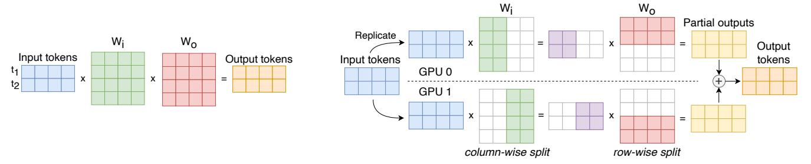
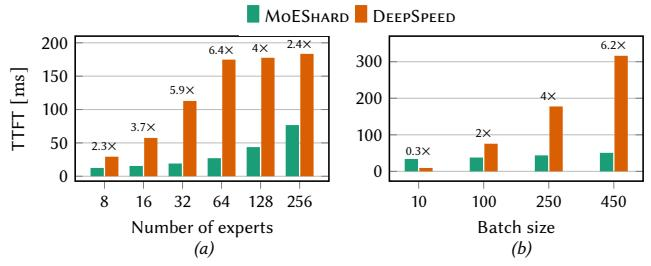
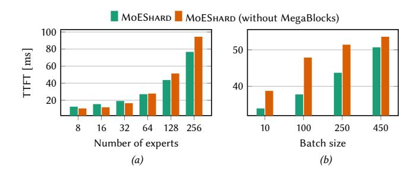

# Accelerating MoE Model Inference with Expert Sharding

Oana Balmau McGill University Canada, Montreal

André Loureiro Espírito Santo EPFL

Lausanne, Switzerland

Anne-Marie Kermarrec EPFL Lausanne, Switzerland

Martijn de Vos EPFL

Lausanne, Switzerland

Rafael Pires EPFL

Lausanne, Switzerland

Milos Vujasinovic EPFL

Lausanne, Switzerland

## Abstract

Mixture of experts (MoE) models achieve state-of-the-art results in language modeling but suffer from inefficient hardware utilization due to imbalanced token routing and communication overhead. While prior work has focused on optimizing MoE training and decoder architectures, inference for encoder-based MoE models in a multi-GPU with expert parallelism setting remains underexplored. We introduce MoEShard, an inference system that achieves perfect load balancing through tensor sharding of MoE experts. Unlike existing approaches that rely on heuristic capacity factors or drop tokens, MoEShard evenly distributes computation across GPUs and ensures full token retention, maximizing utilization regardless of routing skewness. We achieve this through a strategic row- and column-wise decomposition of expert matrices. This reduces idle time and avoids bottlenecks caused by imbalanced expert assignments. Furthermore, MoEShard minimizes kernel launches by fusing decomposed expert computations, further improving throughput. We evaluate MoEShard against DeepSpeed on encoderbased architectures, demonstrating speedups of up to 6.4× in time to first token (TTFT). Our results show that when properly applied to experts, tensor sharding is a viable and effective strategy for efficient MoE inference.

## CCS Concepts: • Computing methodologies→Distributed computing methodologies; Machine learning.

Keywords: mixture of experts inference, expert sharding, distributed machine learning, large language models

Permission to make digital or hard copies of all or part of this work for personal or classroom use is granted without fee provided that copies are not made or distributed for profit or commercial advantage and that copies bear this notice and the full citation on the first page. Copyrights for components of this work owned by others than the author(s) must be honored. Abstracting with credit is permitted. To copy otherwise, or republish, to post on servers or to redistribute to lists, requires prior specific permission and/or a fee. Request permissions from permissions@acm.org. EuroMLSys '25, March 30-April 3 2025, Rotterdam, Netherlands

© 2025 Copyright held by the owner/author(s). Publication rights licensed to ACM.

ACM ISBN 979-8-4007-1538-9/2025/03 <https://doi.org/10.1145/3721146.3721938>

#### ACM Reference Format:

Oana Balmau, Anne-Marie Kermarrec, Rafael Pires, André Loureiro Espírito Santo, Martijn de Vos, and Milos Vujasinovic. 2025. Accelerating MoE Model Inference with Expert Sharding. In The 5th Workshop on Machine Learning and Systems (EuroMLSys '25), March 30-April 3 2025, Rotterdam, Netherlands. ACM, New York, NY, USA, [8](#page-7-0) pages. <https://doi.org/10.1145/3721146.3721938>

## 1 Introduction

Scaling the size of machine learning (ML) models has been a successful strategy to build generative large language models (LLMs) [\[1,](#page-6-0) [2\]](#page-6-1). These models are increasingly used in numerous domains such as healthcare and industry, and are becoming integral to modern society [\[3\]](#page-6-2). However, scaling these models introduces computational challenges and raises concerns about energy consumption and sustainability [\[4\]](#page-6-3).

Conditional computation techniques can reduce the computational overhead during inference [\[5\]](#page-6-4). Mixture of experts (MoE) models implement conditional computation by replacing the feed-forward network in a transformer block by multiple smaller experts. Only a subset of experts (typically one or two) is activated per token input during inference. A routing mechanism decides to which experts a particular token is forwarded. This approach allows MoE models to scale more efficiently than dense models. However, these MoE models have a significant memory footprint. For example, the Switch-Base encoder-decoder model with 256 experts requires 54.63 GiB of memory, whereas the activated parameters of that model for one single token only requires 1.11 GiB. Since a single graphics processing unit (GPU) often lacks the memory to store all experts, MoE inference systems typically employ expert parallelism where each GPU holds a subset of experts [\[6\]](#page-6-5).

While training MoE models has received much attention in recent work [\[7](#page-6-6)[–9\]](#page-6-7), inference optimization remains underexplored. A key challenge in MoE inference with expert parallelism is the imbalance in workload distribution across GPUs [\[10–](#page-6-8)[12\]](#page-6-9). Although routing mechanisms are trained to distribute tokens evenly among experts, in practice, some experts receive a disproportionate share of tokens, leading to uneven computational loads. Moreover, this imbalance changes across different batches. This results in some GPUs

<span id="page-1-0"></span>

Figure 1. ECDF of token distribution per expert for the first and last layer, for a Switch transformer.

idling while others remain fully utilized, increasing overall inference latency. The end-to-end duration of inference is dictated by the GPU with the most computational load (e.g., most tokens assigned), meaning that any load imbalance directly translates into inefficiencies in system throughput.

We empirically show this imbalance in Figure [1.](#page-1-0) We show an ECDF of token distribution per expert for the first and last layer of a Switch encoder-only model with 128 experts. Particularly for the last layer, there are significant differences in the load on different experts. For the last layer, 14 experts do not receive any token, whereas the most busy expert receives 3105 tokens.

Existing MoE inference systems attempt to mitigate token imbalance through various strategies. A common approach is to employ capacity factors (CFs), which limits the number of tokens assigned to each expert [\[10\]](#page-6-8). However, this method often results in token dropping, which degrades model accuracy. Other methods, such as expert replication, distribute copies of overburdened experts and tokens across multiple GPUs to balance the load [\[13,](#page-6-10) [14\]](#page-6-11). While this alleviates some imbalance, it also requires profiling solutions and introduces additional overhead. Thus, efficiently achieving a balanced workload across GPUs running MoE models remains an open challenge.

This paper proposes MoEShard, an inference system that achieves perfect load balancing for MoE models by applying tensor sharding (TS) to experts. In contrast to existing work, experts are not replicated, and no profiling is required. Instead, our key insight is that the structure of the expert models and the associated computation is easily parallelizable across GPUs. We, therefore, take advantage of the structure of the MoE expert computation, which consists of a multiplication of two matrices. This operation can be efficiently sharded (the first matrix column-wise, the second row-wise) so that each GPU holds a shard of each of the matrices for all experts. Sharding like this achieves perfect load balancing as all the tokens can be processed in parallel for each batch. Our work thus takes a novel way of looking at the load imbalance problem, in contrast to other approaches that alleviate load imbalance by replicating experts over multiple GPUs or redirecting tokens to different GPUs.

Our experiments compare MoEShard against DeepSpeed, a state-of-the-art framework for distributed training and inference of large ML models. MoEShard achieves up to 6.4× speedups in terms of time-to-first-token (TTFT) and these speedups increase as the batch size grows.

This paper makes the following contributions.

- We introduce MoEShard, a MoE inference solution with perfect load balancing (Section [3\)](#page-2-0). MoEShard achieves this by evenly distributing the expert computation across multiple GPUs. We minimize the computational overhead by grouping and fusing kernels.
- We implement MoEShard and conduct experiments, comparing the TTFT latency of MoEShard against that of DeepSpeed (Section [4\)](#page-4-0). Our experimental results show that MoEShard results in significantly lower TTFT compared to DeepSpeed and is a feasible approach to speed up MoE model inference in tokenimbalanced scenarios.

# 2 Background on Multi-GPU MoE Inference

Transformer models have become a cornerstone of modern ML [\[15\]](#page-6-12). A transformer model comprises multiple transformer blocks, each leveraging self-attention mechanisms and Feed-Forward Networks (FFNs) to process input tokens. The self-attention mechanism enables the model to capture dependencies across the sequence by dynamically attending to different input elements. The resulting representations are then refined by a FFN.

Mixture-of-Experts (MoEs) is a form of sparse computation where only a subset of specialized sub-networks, known as experts, are activated during inference [\[5\]](#page-6-4). In a MoE model, certain transformer blocks can include an MoE layer, which we refer to as a MoE block. Unlike a conventional transformer block with a single FFN, a MoE layer consists of multiple experts, typically between 8 to 256 [\[1,](#page-6-0) [16\]](#page-6-13). Rather than propagating tokens to all experts, MoE models dynamically route each token to only a subset of experts.

Since a single model generally cannot fit all experts within the memory of a single GPU, parts of the model are processed by different GPUs. To address this, MoE model inference typically relies on expert parallelism (EP). With EP, the self-attention and router layers are replicated across GPUs, while the experts are distributed across GPUs [\[1\]](#page-6-0). During the forward pass, each GPU processes a minibatch of input tokens independently, computing self-attention in parallel. The router on each GPU then assigns tokens from its minibatch to specific experts. Since the assigned experts may reside on different GPUs, an all-to-all scatter communication step ensures that each GPU receives the tokens designated for the experts it hosts, introducing the first synchronization barrier in MoE blocks. Once the tokens reach their respective GPUs, expert computations are performed locally using the

#### **Algorithm 1:** MoESHARD forward pass

```
Require: G: Set of GPUs, E: Set of experts.
1 Procedure FORWARD(x):
        // Step 1: token routing
2
        m_{expert} \leftarrow \text{ROUTER}(x)
4
        // Step 2: metadata exchange
        I_{exp} \leftarrow \text{GROUPPerExpert}(x, m_{expert})
        m_{sizes} \leftarrow \text{countPerExpert}(I_{exp})
        SENDMETADATATOGPUs(G, m_{sizes})
8
        receive m'_{sizes}[g] from each GPU g \in G
10
        // Step 3: scatter tokens
11
        SENDTOKENSTOGPUS(G, CONCATENATE(I_{exp}))
12
        receive W[q] from each GPU q \in G
13
14
        // Step 4: expert computation
15
        for q \in G do
17
            for e \in E do
18
                s \leftarrow \text{LOAdShard}(q, e)
                 W[q][e] \leftarrow COMPUTE(s, W[q][e])
19
20
        // Step 5: gather tokens
21
        send W[q] to each GPU q \in G
22
        receive y[g] from each GPU g \in G
23
        x \leftarrow \text{AGGREGATETOKENS}(y)
24
25
        return x
26
```

assigned experts. Following this, an all-to-all gather communication step consolidates the computed results, returning them to the GPUs responsible for the original inputs. These processed tokens then serve as input for the next MoE block.

**System assumptions.** Our work proposes a refinement of EP. Instead of placing experts on each GPU, we *shard* all experts and place pieces of each expert in each GPU, leveraging the parallelizable structure of expert computations. In order to do this, our system makes the following assumptions: (i) All GPUs are considered to have equal computational capacity and memory; (ii) the entire MoE model fits in the collective memory of all GPUs; (iii) we operate on a single server that hosts multiple GPU, all interconnected via high-speed, high-throughput links; and (iv) we make the simplifying assumption that the number of expert shards is divisible by the number of GPUs, for the sake of clarity and space constraints. Handling scenarios with "leftover" shards is straightforward but remains outside the scope of this work.

### <span id="page-2-0"></span>3 Design of MoESHARD

In a nutshell, with MoEShard, each GPU takes all tokens as input and hosts a shard of each expert to compute *partial token outputs*. These partial token outputs are combined later

into a final output for each token. All non-MoE layers, as well as the components of MoE layers excluding experts, are replicated across each GPU, following the work of Lepikhin et al. [17].

We first present the workflow of MoESHARD in Section 3.1, then detail the expert sharding algorithm in Section 3.2, and finally present an expert fusing optimization to minimize the computation overhead in Section 3.3.

#### <span id="page-2-1"></span>3.1 MoESHARD workflow

Algorithm 1 shows the pseudocode associated with the forward function where tokens are processed by the experts. We refer to the set of GPUs as G, and the set of experts as E. Each GPU executes the forward function on a tensor of input tokens x with shape [b, s, h], where b represents the batch size, s the sequence length, and s the hidden dimension. At this point, the self-attention layer has already processed these input tokens. MoEShard operates in the following six steps:

**Step 1: token routing.** The input tokens are first assigned to specific experts using a router mechanism by the ROUTER function. This assignment creates a token-to-expert mapping,  $m_{expert}$ , which is a tensor of integers representing the target expert for each token.

**Step 2: metadata exchange.** This step ensures that each GPU knows the number of tokens assigned to each expert by every other GPU. We first group each input token in x by its assigned expert as defined by the router, and store this grouping in  $I_{exp}$ . Then we create a list  $m_{sizes}$  of size |E| where the value at each index i indicates the number of input tokens assigned to expert E[i]. The list  $m_{sizes}$  of each GPU is sent to all other GPUs, and the per-GPU input counts are stored in  $m'_{sizes}$ , completing the metadata exchange.

**Step 3: scatter tokens.** MoESHARD then replicates *all* input tokens across all GPUs, *i.e.*, each GPU sends its input tokens  $I_{exp}$  to all other GPUs, concatenating them into one tensor for communication efficiency. The received tokens are stored by each GPU in a two-dimensional tensor W. Specifically, W[g][i] stores the tokens originating from GPU g designated for expert e. We note that each GPU can correctly map the incoming list of input tokens to entries in W using the input counts in  $m'_{sizes}$  received earlier.

As a consequence of our devised algorithm, all input to-kens need to be replicated across all GPUs. While this has implications for memory usage and communication volume, this overhead is manageable. As an example, assume there are 4 GPUs with b=250, s=120, and h=768. Assuming a 4B occupation per tensor element, each GPU must send approximately 88 MiB to all other GPUs while receiving 352 MiB. Given that NVLINK 3.0 supports up to 600 GiB/s bidirectional bandwidth [18], sending 88 MiB per GPU would only take around 0.15 ms, which is negligible in the end-to-end inference time.

<span id="page-3-2"></span>

- (a) Expert computation without parallelism.
- (b) Expert computation with MoESHARD and expert sharding.

**Figure 2.** Expert computations with and without MoESHARD. An expert consists of matrices  $W_i$  (in green) and  $W_o$  (in red).

**Step 4: expert computation.** MoEShard now processes the tokens in W by iterating over each GPU in G and expert in E. We load the appropriate expert shard for each GPU g and expert e by calling the loadshard function. The particular shard to load depends on the rank of the GPU that executes the forward function. The relevant expert shard then processes the tokens, and the corresponding entries in W are replaced with the output of the expert computation. Depending on the number of experts and GPUs, this results in many matrix multiplications, and we discuss how to optimize this step in Section 3.3.

**Step 5: gather tokens.** The processed tokens in W[g] are then sent back to each GPU g, and each GPU g receives the partial token outputs y[g]. These tokens are then pointwise aggregated, resulting in the final token outputs x. This aggregation is a consequence of our choice of expert sharding dynamics, which we elaborate on in the next subsection.

#### <span id="page-3-0"></span>3.2 Expert Sharding

We now discuss how MoEShard shards experts across GPUs. Experts are typically implemented as two matrices  $W_i \in \mathbb{R}^{(h_i,h_o)}$  and  $W_o \in \mathbb{R}^{(h_o,h_i)}$  [1, 17]. We visualize a standard expert computation on the input tokens in Figure 2a, where the input tokens are processed using two matrix multiplications. To balance the computational load across GPUs, MoEShard employs expert sharding where the matrices  $W_i$  and  $W_o$  are split between different GPUs. This allows the input tokens to be processed in parallel with the resulting partial computations aggregated to produce the final output. The shards of one expert are contiguous rows and columns of  $W_i$  and  $W_o$ , and each GPU holds  $\frac{a}{|G|}$  rows or columns of both matrices, where a is either  $h_i$  or  $h_o$ . Each GPU holds one shard of all experts.

Figure 2b shows how an expert is split across two GPUs with Moeshard. Matrix  $W_i$  is sharded column-wise, and  $W_o$  is sharded row-wise. Thus, if matrix  $W_i$  has four columns ( $h_o = 4$ ), GPU 0 loads the first two columns, and GPU 1 loads the remaining two. Similarly, if matrix  $W_o$  has four rows ( $h_o = 4$ ), GPU 0 loads the first two rows, and GPU 1 loads the remaining two. Let  $W_i^g$  and  $W_o^g$  denote the shard of  $W_i$ ,

respectively  $W_o$  held by GPU g. Each GPU g now computes  $x \cdot W_i^g \cdot W_o^g$ , resulting in the partial output  $y_g$  with the same dimension as the input tokens x. Summing each  $y_g$  for each GPU g will yield equivalent output tokens as in Figure 2a.

We acknowledge that different sharding strategies are possible. Generally,  $W_i$  and  $W_o$  can be sharded row-wise, column-wise, or in combinations of both. We first analyze the sharding of  $W_i$ . For simplicity, let x have shape  $(c,h_i)$ . In a column-wise split, each GPU processes  $c \cdot h_i$  entries of  $\mathbf{x}$ . Conversely, in a row-wise split, each GPU processes only  $\frac{h_i \cdot c}{|G|}$  entries of  $\mathbf{x}$ . This distinction directly affects the volume of data transferred during the first data communication round. With a column-wise split of  $W_i$ , each GPU must send all its input data to every other GPU, resulting in a total data transfer of  $c \cdot h_i \cdot (|G|-1)$  matrix entries per GPU. In contrast, a row-wise split requires each GPU to send only  $\frac{c \cdot h_i \cdot (|G|-1)}{|G|}$  entries in total, as each GPU transmits a unique segment of  $\mathbf{x}$  to the others.

While a row-wise split of  $W_i$  may initially seem advantageous, considering the interaction with  $W_o$  reveals a different outcome. A column-wise split of  $W_i$  allows both matrix multiplications to proceed without intermediate synchronization if  $W_o$  is split row-wise. All other sharding combinations would require synchronization between operations. For instance, if  $W_i$  is split row-wise, the outputs of  $\mathbf{x}W_i^P$  must be summed point-wise across all GPUs. Similarly, if both  $W_i$  and  $W_o$  are split column-wise, the outputs of  $\mathbf{x}W_i^P$  must be concatenated across GPUs before the next multiplication.

The optimal sharding strategy is to split  $W_i$  column-wise and  $W_o$  row-wise. Assuming that  $h_o \equiv 0 \pmod{|G|}$ , each GPU will store  $h_i \cdot \frac{h_o}{|G|}$  entries from  $W_i$  and  $\frac{h_o}{|G|} \cdot h_i$  entries from  $W_o$ .

#### <span id="page-3-1"></span>3.3 Optimizing expert inference

MOESHARD executes numerous small matrix multiplications as each GPU processes each expert shard independently. This can result in substantial compute overhead due to the need for frequent kernel launches. This overhead becomes particularly problematic as the number of experts and GPUs in the system increases. To address this issue, we reduce the

number of kernel launches using the following two optimizations.

Firstly, instead of separately processing the input tokens for each GPU and expert, we concatenate the tokens *for the same expert from all GPUs* into a single tensor, thus reducing the maximum number of expert shard computations from  $|E| \times |G|$  to |E|. After the expert computations, we group back the tokens per GPU and assign them to the appropriate entries in W. This optimization makes the number of kernel launches for expert shard processing independent of the number of GPUs.

Secondly, Moeshard leverages variable-sized sparse matrix multiplication, enabling the processing of all expert shards in a single operation using a large sparse matrix multiplication algorithm, as detailed by Gale *et al.* [19]. This approach makes the number of kernel launches independent of the number of experts. We empirically evaluate the effect of this optimization on performance in Section 4.

#### <span id="page-4-0"></span>4 Evaluation

We implement MoEShard in the Python 3 programming language using PyTorch<sup>1</sup>. We compare the performance of MoEShard against DeepSpeed, a popular framework for MoE inference. Our experiments answer the following three questions:

- 1. How does the per-layer inference latency of MoE-SHARD compare to that of DEEPSPEED across different batches (Section 4.2)?
- 2. How does the TTFT of MoESHARD evolve for MoESHARD and DEEPSPEED when varying the number of experts and batch size (Section 4.3)?
- 3. How does the TTFT of MoESHARD evolve with and without Sparse Matrix Multiplication when varying the number of experts and batch size (Section 4.4)?

#### 4.1 Experimental setup

Model and dataset. We evaluate MoESHARD using Google Switch Transformers [1], a family of language models that extend the T5 architecture [20] by replacing its feed-forward layers with MoE logic. In particular, we use the Switch-Base version of the model. Since autoregressive decoder generation is not particularly compute-intensive and relies more on fine-grained optimizations, we focus only on the encoder part of the model to understand the performance gains by our approach. All experiments are run on *BookCorpus*, a large-scale dataset comprising up to 7185 unique books [21].

**Router.** To regulate skew in token-to-expert assignments, we replace the default router with a custom implementation, used in all experiments except Section 4.2. Since the Switch Transformer employs a capacity factor (CF), our router ensures that all tokens are processed instead of being dropped.

However, it is unsuitable for production due to its probabilistic nature, leading to nonsensical token-to-expert assignments. Nevertheless, it allows us to evaluate the performance of MoESHARD under varying skew conditions.

Our router has two parameters: (i) router skew  $(\alpha_r)$ , which controls token-to-expert imbalance, and (ii) number of skewed experts  $(k_r)$ , the number of experts receiving a disproportionate share of tokens. For each token, the router selects an expert from a multinomial distribution, where the selection probability  $p_i$  of the expert indexed by  $i \in [|E|]$  is proportional to:

$$p_i \propto \begin{cases} \frac{1}{|E|} + \alpha_r, & i \leq k_r \\ \frac{1}{|E|}, & \text{otherwise} \end{cases}$$

Hardware. Our evaluation is executed using four NVIDIA A100 GPUs, each with 80 GB GPU memory. We use CUDA 12.6. All GPUs are connected to the same computing node and share access to a single CPU, specifically an AMD EPYC 7543 32-core Processor operating at a maximum clock speed of 3.7 GHz. The GPUs are interconnected via NVLink technology [18] and are linked to the CPU through PCIe bridges.

**Baseline.** We compare MoEShard against DeepSpeed, specifically DeepSpeed-MoE, a popular inference engine for MoE models [22]. For a fair comparison, we enable expert parallelism in DeepSpeed. By default, DeepSpeed employs a CF in the router of MoE layers. We fix this parameter to  $\min(|E|, 50)$  to minimize token loss, as we found increasing the CF further leads to memory issues. Notably, DeepSpeed also implements expert sharding; however, its purpose is to scale the system horizontally rather than to address load balancing. In both DeepSpeed and MoEShard, the non-expert parts of the model are replicated across all GPUs.

#### <span id="page-4-2"></span>4.2 Per-layer latency of MoESHARD and DEEPSPEED

We compare the per-layer latency of MoEShard and Deep-Speed by measuring the average forward-pass latency across multiple encoder layers. Using a batch size of 250, a sequence length of 120, and 128 experts, we collect results over 100 iterations and average them per layer. This experiment employs the default, original router.

Our measurements show a consistent pattern: DeepSpeed exhibits latencies between 177 ms and 180 ms, whereas MoE-Shard processes the same layers in 41.5 ms to 43.5 ms, achieving up to 4.25× per-layer speedup.

#### <span id="page-4-3"></span>4.3 TTFT of MoESHARD and DEEPSPEED

Next, we analyze how the time-to-first-token (TTFT) of MoE-Shard evolves with varying numbers of experts and batch sizes compared to DeepSpeed. We define TTFT as the time required for a full forward pass of the encoder. In these experiments, we fix the sequence length at 120, set the number of skewed experts ( $k_r$ ) to 10% of the total experts, and the skew degree ( $\alpha_r$ ) to 0.6. We vary the number of experts from

<span id="page-4-1"></span><sup>&</sup>lt;sup>1</sup>Source code is available at https://github.com/sacs-epfl/moe-inference.

<span id="page-5-1"></span>

Bar labels indicate the speedup of MoESHARD w.r.t. DeepSpeed.

**Figure 3.** The average TTFT of MoESHARD with respect to DEEPSPEED for varying numbers of experts (left) and batch sizes (right).

<span id="page-5-2"></span>

**Figure 4.** The average TTFT of MoESHARD with and without MegaBlocks enabled, for varying numbers of experts (left) and batch sizes (right).

8 to 256 with a fixed batch size of 250 and vary the batch size from 10 to 450 with 128 experts.

Figure 3 compares MoEShard and DeepSpeed under these settings. Figure 3a examines the impact of varying the number of experts, showing that MoEShard achieves increasing speedup, peaking at 6.45× before declining but remaining above 2.39×. This decline results from DeepSpeed's use of CF, which drops tokens once the number of experts exceeds 50, reducing computation time. In contrast, MoEShard remains consistently *dropless*. Overall, these results demonstrate that MoEShard outperforms DeepSpeed in terms of TTFT for different number of experts.

Figure 3b presents results for varying batch sizes. Here, Moeshard is initially slower than DeepSpeed at a batch size of 10, surpasses it at 100, and continues to show a near-linear increase in speedup, reaching approximately 6.24× at a batch size of 450. The lower initial speed of Moeshard is presumed to be due to fine-grained optimizations in DeepSpeed that are absent in our implementation. However, the steady increase in speedup can be attributed to the fact that, even with fixed parameters of the custom router, as batch size grows, so does the absolute difference in token assignment across experts. This leads to greater total idle time for imbalanced solutions like DeepSpeed.

#### <span id="page-5-0"></span>4.4 Ablation Study

Next, we break down the performance of MoESHARD in its original formulation with the inclusion of Block Sparse Matrix Multiplication from Megablocks [19], as well as without it, referred to as MoESHARD (without MEGABLOCKS). We use the same experiment setup as in Section 4.3. The results, shown in Figure 4, reveal that for a fixed batch size and a varying number of experts, it is beneficial to exclude MegaBlocks until the number of experts reaches 64. Beyond this point, the Megablocks-enhanced solution exhibits an increasingly higher speedup as the number of experts grows. This can be explained by the overhead of kernel creation when using Megablocks; however, the benefits of Megablocks outweigh this overhead at higher expert counts, allowing it to fully exploit the advantages of TS. Furthermore, when varying the batch size, the solution with Megablocks consistently outperforms the one without it. This is attributed to the high number of experts (128) in this experiment, which allows Megablocks to achieve superior efficiency.

#### 5 Related Work

There is a vast body of work aimed at accelerating the inference of MoE models across various areas, including improved load balancing, task scheduling, and communication optimization. DeepSpeed-MoE [22] tackles multiple aspects of this challenge by providing a framework for serving MoE models with highly optimized kernels, hierarchical all-toall communication optimizations, and flexible parallelism strategies. However, its reliance on expert parallelism with static assignment makes it less effective for dynamic and unbalanced workloads. Tutel [23] improves on this by dynamically adjusting parallelism strategies at each iteration, yet it still struggles with load imbalance due to static expert assignment. LAZARUS [14] addresses this issue using an optimal placement algorithm that replicates frequently selected experts across GPUs to better balance the workload at the cost of requiring additional GPU memory. PROPHET [13] instead builds a load-balancing placement model for experts and uses a greedy search to optimize their placement, while Lina [24] profiles experts and predicts their selection to enable dynamic resource scheduling. Both systems, however, struggle when expert popularity shifts over time. ExFLow [25] takes a different approach by placing experts based on inter-layer affinity to reduce all-to-all communication and minimize token transfers between GPUs. However, the system does not adapt well to affinity fluctuations caused by distribution change of inputs. In contrast to these approaches, MoE-Shard avoids complex scheduling mechanisms that may be sensitive to temporal shifts in expert popularity. Instead, it places slices of experts across GPUs, significantly simplifying resource allocation. Furthermore, MoESHARD can take advantage of research on optimized CUDA kernels, enabling it to benefit from advancements in kernel optimization while ensuring efficient resource distribution.

## 6 Conclusion

In this paper, we presented MoEShard, a system that optimizes inference latency for MoE models. MoEShard ensures perfect load balancing across GPUs through tensor sharding of experts. Our experiments demonstrate that MoEShard outperforms a state-of-the-art baseline across various settings for a high degree of routing function skewness.

## Acknowledgments

This work has been funded by the Swiss National Science Foundation, under the project "FRIDAY: Frugal, Privacy-Aware and Practical Decentralized Learning", SNSF proposal No. 10.001.796.

## References

- <span id="page-6-0"></span>[1] William Fedus, Barret Zoph, and Noam Shazeer. Switch transformers: Scaling to trillion parameter models with simple and efficient sparsity. Journal of Machine Learning Research, 23(120), 2022.
- <span id="page-6-1"></span>[2] Aakanksha Chowdhery, Sharan Narang, Jacob Devlin, Maarten Bosma, Gaurav Mishra, Adam Roberts, Paul Barham, Hyung Won Chung, Charles Sutton, Sebastian Gehrmann, Parker Schuh, Kensen Shi, Sasha Tsvyashchenko, Joshua Maynez, Abhishek Rao, Parker Barnes, Yi Tay, Noam Shazeer, Vinodkumar Prabhakaran, Emily Reif, Nan Du, Ben Hutchinson, Reiner Pope, James Bradbury, Jacob Austin, Michael Isard, Guy Gur-Ari, Pengcheng Yin, Toju Duke, Anselm Levskaya, Sanjay Ghemawat, Sunipa Dev, Henryk Michalewski, Xavier Garcia, Vedant Misra, Kevin Robinson, Liam Fedus, Denny Zhou, Daphne Ippolito, David Luan, Hyeontaek Lim, Barret Zoph, Alexander Spiridonov, Ryan Sepassi, David Dohan, Shivani Agrawal, Mark Omernick, Andrew M. Dai, Thanumalayan Sankaranarayana Pillai, Marie Pellat, Aitor Lewkowycz, Erica Moreira, Rewon Child, Oleksandr Polozov, Katherine Lee, Zongwei Zhou, Xuezhi Wang, Brennan Saeta, Mark Diaz, Orhan Firat, Michele Catasta, Jason Wei, Kathy Meier-Hellstern, Douglas Eck, Jeff Dean, Slav Petrov, and Noah Fiedel. Palm: Scaling language modeling with pathways, 2022.
- <span id="page-6-2"></span>[3] Rishi Bommasani, Drew A Hudson, Ehsan Adeli, Russ Altman, Simran Arora, Sydney von Arx, Michael S Bernstein, Jeannette Bohg, Antoine Bosselut, Emma Brunskill, et al. On the opportunities and risks of foundation models. arXiv preprint arXiv:2108.07258, 2021.
- <span id="page-6-3"></span>[4] Matthias Rillig, Marlene Ågerstrand, Mohan Bi, Kenneth Gould, and Uli Sauerland. Risks and benefits of large language models for the environment. Environmental science and technology, 57, 02 2023.
- <span id="page-6-4"></span>[5] Noam Shazeer, Azalia Mirhoseini, Krzysztof Maziarz, Andy Davis, Quoc Le, Geoffrey Hinton, and Jeff Dean. Outrageously large neural networks: The sparsely-gated mixture-of-experts layer, 2017.
- <span id="page-6-5"></span>[6] Siddharth Singh, Olatunji Ruwase, Ammar Ahmad Awan, Samyam Rajbhandari, Yuxiong He, and Abhinav Bhatele. A hybrid tensor-expertdata parallelism approach to optimize mixture-of-experts training. In Proceedings of the 37th International Conference on Supercomputing, pages 203–214, 2023.
- <span id="page-6-6"></span>[7] Jiaao He, Jiezhong Qiu, Aohan Zeng, Zhilin Yang, Jidong Zhai, and Jie Tang. Fastmoe: A fast mixture-of-expert training system, 2021.
- [8] Jiaao He, Jidong Zhai, Tiago Antunes, Haojie Wang, Fuwen Luo, Shangfeng Shi, and Qin Li. Fastermoe: modeling and optimizing training of large-scale dynamic pre-trained models. In Proceedings of the 27th ACM SIGPLAN Symposium on Principles and Practice of

- Parallel Programming, PPoPP '22, page 120–134, New York, NY, USA, 2022. Association for Computing Machinery.
- <span id="page-6-7"></span>[9] Mingshu Zhai, Jiaao He, Zixuan Ma, Zan Zong, Runqing Zhang, and Jidong Zhai. SmartMoE: Efficiently training Sparsely-Activated models through combining offline and online parallelization. In 2023 USENIX Annual Technical Conference (USENIX ATC 23), pages 961–975, Boston, MA, July 2023. USENIX Association.
- <span id="page-6-8"></span>[10] Yanqi Zhou, Tao Lei, Hanxiao Liu, Nan Du, Yanping Huang, Vincent Zhao, Andrew M Dai, zhifeng Chen, Quoc V Le, and James Laudon. Mixture-of-experts with expert choice routing. In Advances in Neural Information Processing Systems, volume 35. Curran Associates, Inc., 2022.
- [11] An Yang, Junyang Lin, Rui Men, Chang Zhou, Le Jiang, Xianyan Jia, Ang Wang, Jie Zhang, Jiamang Wang, Yong Li, Di Zhang, Wei Lin, Lin Qu, Jingren Zhou, and Hongxia Yang. M6-t: Exploring sparse expert models and beyond, 2021.
- <span id="page-6-9"></span>[12] Yechan Kim, Hwijoon Lim, and Dongsu Han. Scaling beyond the GPU memory limit for large mixture-of-experts model training. In ICML, 2024.
- <span id="page-6-10"></span>[13] Wei Wang, Zhiquan Lai, Shengwei Li, Weijie Liu, Keshi Ge, Yujie Liu, Ao Shen, and Dongsheng Li. Prophet: Fine-grained load balancing for parallel training of large-scale moe models. In 2023 IEEE International Conference on Cluster Computing (CLUSTER), pages 82–94. IEEE, 2023.
- <span id="page-6-11"></span>[14] Yongji Wu, Wenjie Qu, Tianyang Tao, Zhuang Wang, Wei Bai, Zhuohao Li, Yuan Tian, Jiaheng Zhang, Matthew Lentz, and Danyang Zhuo. Lazarus: Resilient and elastic training of mixture-of-experts models with adaptive expert placement. arXiv preprint arXiv:2407.04656, 2024.
- <span id="page-6-12"></span>[15] A Vaswani et al. Attention is all you need. NeurIPS, 2017.
- <span id="page-6-13"></span>[16] Noam Shazeer, Azalia Mirhoseini, Krzysztof Maziarz, Andy Davis, Quoc Le, Geoffrey Hinton, and Jeff Dean. Outrageously large neural networks: The sparsely-gated mixture-of-experts layer. In ICLR, 2017.
- <span id="page-6-14"></span>[17] Dmitry Lepikhin, HyoukJoong Lee, Yuanzhong Xu, Dehao Chen, Orhan Firat, Yanping Huang, Maxim Krikun, Noam Shazeer, and Zhifeng Chen. Gshard: Scaling giant models with conditional computation and automatic sharding, 2020.
- <span id="page-6-15"></span>[18] Ang Li, Shuaiwen Leon Song, Jieyang Chen, Jiajia Li, Xu Liu, Nathan R. Tallent, and Kevin J. Barker. Evaluating modern gpu interconnect: Pcie, nvlink, nv-sli, nvswitch and gpudirect. IEEE Transactions on Parallel and Distributed Systems, 31(1):94–110, January 2020.
- <span id="page-6-16"></span>[19] Trevor Gale, Deepak Narayanan, Cliff Young, and Matei Zaharia. Megablocks: Efficient sparse training with mixture-of-experts, 2022.
- <span id="page-6-17"></span>[20] Colin Raffel, Noam Shazeer, Adam Roberts, Katherine Lee, Sharan Narang, Michael Matena, Yanqi Zhou, Wei Li, and Peter J Liu. Exploring the limits of transfer learning with a unified text-to-text transformer. Journal of machine learning research, 21(140), 2020.
- <span id="page-6-18"></span>[21] Yukun Zhu, Ryan Kiros, Richard Zemel, Ruslan Salakhutdinov, Raquel Urtasun, Antonio Torralba, and Sanja Fidler. Aligning books and movies: Towards story-like visual explanations by watching movies and reading books. In arXiv:1506.06724, 2015.
- <span id="page-6-19"></span>[22] Samyam Rajbhandari, Conglong Li, Zhewei Yao, Minjia Zhang, Reza Yazdani Aminabadi, Ammar Ahmad Awan, Jeff Rasley, and Yuxiong He. DeepSpeed-MoE: Advancing mixture-of-experts inference and training to power next-generation AI scale. In Kamalika Chaudhuri, Stefanie Jegelka, Le Song, Csaba Szepesvari, Gang Niu, and Sivan Sabato, editors, Proceedings of the 39th International Conference on Machine Learning, volume 162 of Proceedings of Machine Learning Research, pages 18332–18346. PMLR, 17–23 Jul 2022.
- <span id="page-6-20"></span>[23] Changho Hwang, Wei Cui, Yifan Xiong, Ziyue Yang, Ze Liu, Han Hu, Zilong Wang, Rafael Salas, Jithin Jose, Prabhat Ram, Joe Chau, Peng Cheng, Fan Yang, Mao Yang, and Yongqiang Xiong. Tutel: Adaptive mixture-of-experts at scale, 2023.
- <span id="page-6-21"></span>[24] Jiamin Li, Yimin Jiang, Yibo Zhu, Cong Wang, and Hong Xu. Accelerating distributed MoE training and inference with lina. In 2023 USENIX Annual Technical Conference (USENIX ATC 23), pages 945–959, Boston,

<span id="page-7-0"></span>MA, July 2023. USENIX Association.

<span id="page-7-1"></span>[25] Jinghan Yao, Quentin Anthony, Aamir Shafi, Hari Subramoni, Dhabaleswar K., and Panda. Exploiting inter-layer expert affinity for

accelerating mixture-of-experts model inference, 2024.