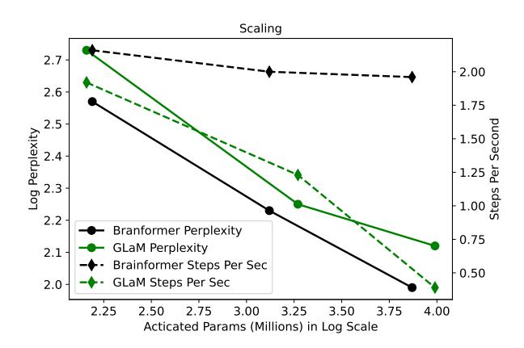
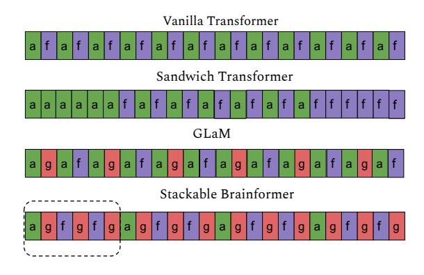
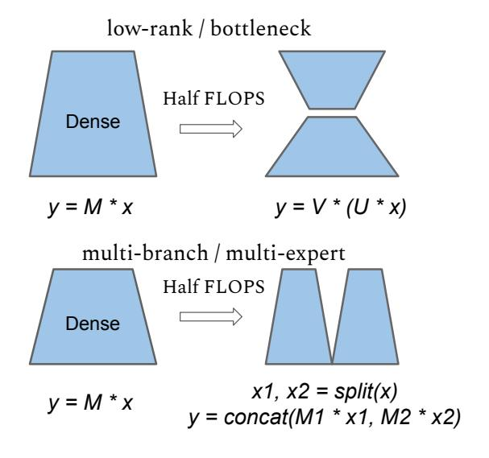
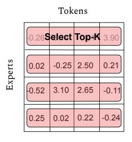
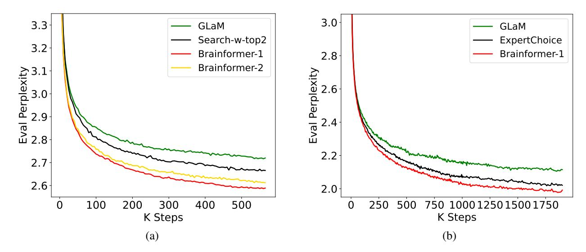
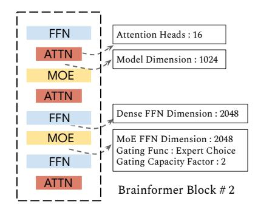

## **Brainformers: Trading Simplicity for Efficiency**

Yanqi Zhou <sup>1</sup> Nan Du <sup>1</sup> Yanping Huang <sup>1</sup> Daiyi Peng <sup>1</sup> Chang Lan <sup>1</sup> Da Huang <sup>1</sup> Siamak Shakeri <sup>1</sup> David So <sup>1</sup> Andrew Dai <sup>1</sup> Yifeng Lu <sup>1</sup> Zhifeng Chen <sup>1</sup> Quoc Le <sup>1</sup> Claire Cui <sup>1</sup> James Laudon <sup>1</sup> Jeff Dean <sup>1</sup>

#### **Abstract**

Transformers are central to recent successes in natural language processing and computer vision. Transformers have a mostly uniform backbone where layers alternate between feed-forward and self-attention in order to build a deep network. Here we investigate this design choice and find that more complex blocks that have different permutations of layer primitives can be more efficient. Using this insight, we develop a complex block, named Brainformer, that consists of a diverse sets of layers such as sparsely gated feed-forward layers, dense feed-forward layers, attention layers, and various forms of layer normalization and activation functions. Brainformer consistently outperforms the state-of-the-art dense and sparse Transformers, in terms of both quality and efficiency. A Brainformer model with 8 billion activated parameters per token demonstrates 2× faster training convergence and  $5 \times$  faster step time compared to its GLaM counterpart. In downstream task evaluation, Brainformer also demonstrates a 3% higher SuperGLUE score with fine-tuning compared to GLaM with a similar number of activated parameters. Finally, Brainformer largely outperforms a Primer dense model derived with NAS with similar computation per token on fewshot evaluations.

### 1. Introduction

In recent years, large neural networks derived from from the Transformer architecture (Vaswani et al., 2017) have demonstrated superior results on language understanding and generative tasks. Many improvements on Transformer variants have come from scaling the size of models (Raffel et al., 2020; Brown et al., 2020a; Shoeybi et al., 2019; Chowdhery et al., 2022), scaling the training tokens (Hoff-

Proceedings of the 40<sup>th</sup> International Conference on Machine Learning, Honolulu, Hawaii, USA. PMLR 202, 2023. Copyright 2023 by the author(s).

<span id="page-0-0"></span>

Figure 1: Brainformer Vs. GLaM in Scaling. Brainformer improves model quality at much faster training step time.

mann et al., 2022; Shoeybi et al., 2019), better training data quality (Du et al., 2022), and sparsely activated model architectures (Du et al., 2022; Lepikhin et al., 2021; Roller et al., 2021; Lewis et al., 2021).

Among the efficient transformer language models (Wang et al., 2020; Choromanski et al., 2020; Tay et al., 2021; Hua et al., 2022), there is a focus on improving attention-layer efficiency using low-rank approaches or approximations. However, recent work has also identified that dense feedforward layers constitute most of the computational cost for common sequence lengths ( $\leq 2048$ ), particularly when the model is large (Du et al., 2022; Zhou et al., 2022). To further improve compute efficiency such as total FLOPs used during training to reach convergence, sparsely gated Mixture-of-Experts (Lepikhin et al., 2021; Fedus et al., 2021; Du et al., 2022; Zhou et al., 2022; Roller et al., 2021; Lewis et al., 2021; Jaszczur et al., 2021) have become prevalent, giving the model a larger overall capacity to improve quality while holding computational cost fixed. Sparsely activated models not only reduce the computational cost, but also have better specialization by training different experts on different data distributions through the use of a routing function without reducing the effective training time for each expert. The MoE architectures in this line of work are based on uniform transformer blocks or interleaving dense and sparse layers (Du et al., 2022) and a fixed top-k routing.

<sup>&</sup>lt;sup>1</sup>Google Deepmind. Correspondence to: Yanqi Zhou <yanqiz@google.com>.

<span id="page-1-0"></span>

Figure 2: High-level Comparison with Related Work. 'a': attention, 'f': feed-forward, 'g': sparsely gated feed-forward. GLaM interleaves dense transformer blocks with sparse transformer blocks. Brainformer reduces the frequency of attention and changes layer widths together with layer types.

Resonating with the layer-wise architecture stacking in EfficientNet (Tan & Le, 2019) and layer reordering in the sandwich transformer (Press et al., 2019), we propose a non-uniform architecture with sparsity where there is no strict layer interleaving as in the vanilla transformer in fig. 2. We trade off architecture regularity by allowing the search space to compose different sub-layers in different orders. For better scaling, we introduce sparsity in the search space with a sparsely gated feed-forward layer (MoE layer) coupled with different gating mechanisms.

We find that optimizing the architecture, sparsity, and routing mechanism in sparse layers is critical to achieve near-perfect log-scale scaling in quality. Figure 1 shows that Brainformer scales much better than GLaM (manually crafted sparse transformer). Brainformer consistently improves training perplexity while keeps example rate almost constant when increasing model capacity, however, GLaM has a much worse example rate when scaled up.

We only treat the MoE layer as a general method to sparsify the model. In practice, any conditional computation method can be blended in. We apply a simple evolutionary search to discover many attributes, such as the best way to interleave layers and layer capacities, when to fuse layers, and when to specialize layers with MoE modules. For ease of scaling, we propose a block-wise sub-layer grouping, such that stacking a variable number of blocks produces models of different scales, as illustrated in Stackable Brainformer in fig. 2. As our results in Section 5 show, this approach has proven effective in our evaluation at multiple model scales.

#### 2. Related Work

**Large Language Models:** Language models have demonstrated strong performance for many natural language pro-

cessing tasks (Mikolov et al., 2010; Sutskever et al., 2011; Dai & Le, 2015). Scaling up model capacity and number of training tokens has shown huge success in enhancing the performance of computer vision architectures (He et al., 2016a;b; Ghiasi et al., 2019; Dai et al., 2021) as well as neural language models (Radford et al., 2018; Brown et al., 2020b; Kaplan et al., 2020; Raffel et al., 2020; Shoeybi et al., 2019; Hoffmann et al., 2022).

Sparsely Activated Models: Conditional computation effectively increases the capacity of a deep neural network without increasing the total amount of computation, by activating certain parameters and computation on demand, based off the input token or sequence (Cho & Bengio, 2014; Puigcerver et al., 2020; Lin et al., 2019). The gating decisions may be binary or sparse and continuous, stochastic or deterministic. In a multi-device setting, sparsely-gated MoE (Shazeer et al., 2017) demonstrates massive improvements in model capacity, training time, or model quality with gating. Various MoE architectures including Switch Transformer (Fedus et al., 2021) and GLaM (Du et al., 2022) have been proposed. They adopt a token-based gating where an auxiliary loss is imposed to counter load imbalance issues. Recently, more advanced gating functions are devised to ameliorate load imbalance, improve speed, and downstream generalization (Roller et al., 2021; Dua et al., 2021; Zuo et al., 2021; Gross et al., 2017; Zhou et al., 2022; Jaszczur et al., 2021).

**Non-uniform Architectures:** EfficientNet represents one of the very early non-uniform architectures that leverages layer heterogeneity to achieve SoTA. Instead of searching for a new operator or a new block of operators, EfficientNet focuses on optimizing the layer compound coefficients to scale the model effectively. This heterogeneity leads to a model more than 8× smaller and more than 6× faster on inference (Tan & Le, 2019). Sandwich Transformer promotes a non-interleaved, non-uniform architecture for language modeling tasks. However, the sandwich reordering pattern does not guarantee performance gains across every task. Residual MoE (Wu et al., 2022) factorized the weights into an input-independent core and an input-dependent residual, thus achieves comparable results with the upper-bound MoE training while only introducing minor additional training cost than the lower-bound non-MoE training. In this work, we take inspiration from the earlier work but further improve scaling and generalization via automatic model discoveries.

#### <span id="page-1-1"></span>3. Method

#### 3.1. Deriving Our Model Components

There are various forms of computation factorization that can lead to lower computation cost or faster computation without penalizing model quality. As indicated in fig. 3, low-rank and multi-expert layers are two major methods for factorizing a matrix multiplication, both of which reduces FLOPs by half while not sacrificing model capacity. When devising an efficient neural network, as indicated in fig. 4, low-rank and multi-expert can be combined and stacked to achieve more interesting model architectures that are computationally efficient. Finally, by also coupling a temporal mixture layer (e.g. attention (Vaswani et al., 2017), gMLP (Liu et al., 2021) or MLP mixer (Tolstikhin et al., 2021)) which captures the causal relations between tokens, the network becomes a multi-expert transformer variant.

<span id="page-2-0"></span>

Figure 3: Two methods of matrix factorization: Low-rank and Multi-branch.

However, constructing an efficient network does not require conforming to the uniformity of the model architecture as illustrated in the last figure of fig. 4. By carefully selecting layer types and layer interleaving, as well as other hyperparameters layers, we could achieve higher quality, training efficiency, as well as better scaling. This leads our exploration towards a more training-efficient architecture by adopting low-rank and multi-expert compression methods with coarse-grain sparsity.

#### 3.2. Block-wise Architecture

We largely take inspiration from the layer-wise compound scaling in EfficientNet (Tan & Le, 2019). For the easiness of scaling, We construct a block-wise search space where the restriction of uniformly stacking layers is removed. Instead, we create a generic layer as a function  $Y_i = \mathcal{F}_i(X_i), \mathcal{F}_i \in \{\mathcal{F}_{\rm attn}, \mathcal{F}_{\rm moe}, \mathcal{F}_{\rm ffn}\}$  where  $\mathcal{F}_i$  is an operator selected from the operation set consisting of self attention, sparsely gated feed-forward (MoE), and dense feed-forward sub-layers as depicted in eq. (3). Input  $X_i$  has a tensor shape of  $\{B, L, H\}$  and  $H \in \{\frac{3}{4}, 1, \frac{3}{2}\} \times H_{\rm model\_dim}$ 

<span id="page-2-1"></span>

Figure 4: Evolving matrix factorization into transformerstyled model architecture.

where B is the batch size, L is the sequence length, and H is a tunable model dimension. The intuition behind tuning model dimension is to enable more flexible network topologies with various factorization methods as described in section 3.1. For example, we could instantiate a model with wider hidden dimensions or a model with experts but each expert being narrow.

Unlike a traditional simple, uniform transformer block, a Brainformer block is a complex block  $\mathcal{N}$  that can be represented by a list of composed layers in eq. (1):

<span id="page-2-2"></span>
$$\mathcal{N} = \mathcal{F}_k \odot ... \odot \mathcal{F}_2 \odot \mathcal{F}_1(X_1) = \bigcup_{j=1...k} \mathcal{F}_j(X_1)$$
 (1)

We can stack an arbitrary number of Brainformer blocks to create a target model. The search objective is to find an optimal layer architecture  $\mathcal{F}_i$ , and model scaling multipliers for multiple model inner dimensions that minimizes the perplexity. Table 1 summarizes the search space in a Brainformer architecture.

Figure 5 and Algorithm 1 illustrate the two phases that we use to discover compute-efficient Brainformer models. During the search, a regularized evolutionary search algorithm samples block architectures from the search space and trains the sampled architectures using a proxy training. In a proxy training task, a small 100M32E architecture is instantiated by stacking the sampled block three times. This matches the number of layers in a baseline GLaM architecture. We apply early stopping during the proxy training, where un-

<span id="page-3-1"></span>

Figure 5: Block-wise architecture search and stacking.

<span id="page-3-0"></span>Table 1: Search Space Table: Fattn is a self-attention layer, Fmoe is a sparsely gated FFN layer, and Fffn is a regular dense FFN layer. The baseline is a 100M 12-layer dense transformer model with Hmodel\_dim = 768.

| Search Item            | Search Space              |
|------------------------|---------------------------|
| Layer Type (Fi)        | Fattn, Fmoe, Fffn         |
| Model Dim. (d)         | 512, 768, 1024            |
| MoE Hidden Dim. (dmoe) | 1536, 2048, 3072, 4096    |
| FFN Hidden Dim. (dffn) | 1536, 2048, 3072, 4096    |
| Attention Heads. (h)   | 12, 16, 20                |
| Gating Func. (g)       | Top-2, Expert Choice      |
| Capacity Factor (c)    | 1, 2, 3, 4                |
| Activation Func. (a)   | Gated Re/GeLU, ReLU, GeLU |

promising models are pruned early due to the violation of inference time constraint or perplexity constraint at 25% of the maximum training steps, compared to the baseline GLaM architecture.

At the end of evolution, top-k block architectures with the highest rewards are evaluated at multiple target scales. In our evaluation, we first scale the model dimension and hidden dimension 2x and 4x, following the scaling factors presented in GLaM, to create block S1 and S2 targeting 1B and 8B model scale. Then we stack block S1 and S2 respectively to create 1B64E and 8B64E model variants. N in Algorithm [1](#page-3-2) can be determined mathematically according to the target total activated parameters. Our final evaluations are based on comparisons with baseline architectures at multiple scales.

#### <span id="page-3-2"></span>Algorithm 1 Brainformer Block Search

Require: A Block-wise architecture search space B. An evolutionary search algorithm with population size p.

```
1: for t = 1 to T0 do
 2: for B
           (i)
             in SamplePopulation(B, p) do
 3: G
         (i) ← StackThreeTimes(B
                                  (i)
                                    )
 4: if EarlyStopping(G
                          (i)
                            ) then
 5: R(i) = −1
 6: else
 7: Ai
             , T
                i ← Train(G
                           (i)
                              , Tmax)
 8: R(i) ← f(Ai
                       , T
                          i
                          )
 9: end if
10: end for
11: end for
12: Gtopk ← TopK({G(i)
                       , R(i)})
13: for G
        (i)
           in Gtopk do
14: G
       (i) ← ScaleModelDim(G
                              (i)
                                 )
15: G
       (i) ← StackNTimes(G
                            (i)
                              )
16: Ai
        , T
           i ← Train(G
                       (i)
                         )
17: end for
```

#### 3.3. Fair Comparisons Across Model Architectures

Prior NLP model scaling studies [\(Raffel et al., 2020;](#page-9-0) [Rad](#page-9-12)[ford et al., 2018;](#page-9-12) [Brown et al., 2020b;](#page-8-6) [Rae et al., 2021\)](#page-9-19) typically explore quality scaling with fixed model capacity and training steps/tokens. For example, a scaling plot typically fixes training steps/tokens while varying the model parameters. However, when training a model, users typically have a fixed budget and can trade-off training time, compute resources, and quality to stay within that budget. If what we care about is computational cost and training

<span id="page-4-4"></span>



Figure 6: Token-based routing vs. Expert-based routing.

convergence time, then comparing model qualities while fixing total parameters is not fair, particularly when comparing across model architectures and model families. For example, it may discriminate against models with more total parameters that consume fewer computational FLOPs, such as sparsely activated models. The GLaM paper (Du et al., 2022) addresses this by conducting a scaling study on activated memory (which approximates the computational cost), rather than the total parameter size, on a fixed number of training tokens. However, comparing models with a fixed amount of training tokens may still also not be fair as some smaller models can benefit more from additional training data and outperform a bigger model with the same total training cost (e.g. GPU hours, TPU hours, etc.). The Chinchilla paper (Hoffmann et al., 2022) is the first to suggest compute-efficient scaling, which varies both model capacity and training tokens at a fixed computational cost. Resonating with compute-efficient model scaling, we further take model architectural change into consideration during the search for efficient model architectures with better training convergence and inference time. More particularly, we compare across models with a fixed training cost and model inference time, which allows the search algorithm to trade off between model capacity and training tokens.

#### 3.4. Training Time Constrained Search

We fix the wall clock time for each search trial which encourages models with faster training convergence being discovered. The objective is to find model architectures that yield higher accuracy with a fixed training budget (number of chips times training hours). In an evolution search, a controller minimizes the pre-training validation cross-entropy loss in eq. (2) while meeting an inference time constraint in eq. (5). The block architecture is defined around a 100M vanilla transformer architecture, as illustrated in Table 2. Each trial is trained with a fixed wall clock time so that faster models can be compensated with more training steps. We empirically find that fixing training wall clock time while meeting a inference time constraint yields models with faster training convergence and higher quality.

$$\min_{\mathcal{F}_{1:k},d,d_{\text{moe}},d_{ffn},h,g,c,a} \mathcal{L}(\mathcal{N}(\mathcal{F}_{1:k},d,d_{\text{moe}},d_{ffn},h,g,c,a))$$

<span id="page-4-2"></span><span id="page-4-1"></span>
$$\mathcal{F}_{i} = \begin{cases}
\mathcal{F}_{i}^{d,h,a}, & \text{if } \mathcal{F}_{i} = \mathcal{F}_{attn} \\
\mathcal{F}_{i}^{d,d_{ffn},a}, & \text{else if } \mathcal{F}_{i} = \mathcal{F}_{ffn} \\
\mathcal{F}_{i}^{d,d_{\text{moe}},g,c,a}, & \text{otherwise } \mathcal{F}_{i} = \mathcal{F}_{\text{moe}}
\end{cases}$$
(3)

s.t. 
$$\mathcal{N}(\mathcal{F}_{1:k}, d, d_{\text{moe}}, d_{ff}, h, g, c, a) = \bigcup_{i=1...k} \mathcal{F}_i(X_1)$$
(4)

<span id="page-4-3"></span>Step Time(
$$\mathcal{N}$$
) < baseline step time (5)

# 4. Token-based Routing Versus Expert-based Routing

While there are various routing methods in existing MoE literature, we primarily focus on two classes of routing: token-based routing and expert-based routing, to illustrate the idea that routing strategy can change the optimal model architecture when sparsely activated layers are introduced.

As an example, in Figure 6, the rows and columns contain un-normalized scores computed for four tokens and four experts. Each value is produced by the dot product of the token embedding and the expert embedding. Once the token-to-expert affinity scores are generated, there are a few ways to decide which experts each token should be routed to. In token-based routing, the model routes to the top-k experts for each token, while in an expert-based routing, the experts choose top-k tokens. More particularly, we follow the top-2 gating approach used in GShard (Lepikhin et al., 2021) and GLaM (Du et al., 2022) as top-2 has demonstrated stronger empirical performance than top-1 gating. For the expert-based gating, we follow the Expert Choice gating (Zhou et al., 2022) where perfect load balance is achieved with heterogeneous parameter allocation.

There are various ways of generating the token-to-expert affinity scores. One possible way is to create a trainable gating matrix  $W_g$  that projects the input feature space to a token-to-expert score. The score should be normalized either along the token dimension or the expert dimension. To avoid causal leakage in decoding mode, we suggest normalizing along the expert dimension for both token-based routing and expert-based routing.

#### <span id="page-4-0"></span>5. Evaluation

**Setup:** Table 2 summarizes the hyperparameter settings of different baseline MoE models. In the baseline MoE GLaM (Du et al., 2022) model, we interleave transformer blocks with regular dense FFNs and transformer blocks with sparsely gated FFNs (MoE layer). As a reference point, we also include the respective dense model configurations with

<span id="page-5-0"></span>Table 2: Sizes and architectures of baseline dense models and MoE (GLaM) models. Models are grouped by the number of activated parameters per token.

| Model            | Type         | $n_{\rm params}$ | $n_{\rm act-params}$ | L  | M     | Н      | $n_{\rm heads}$ | $d_{\rm head}$ | E       |
|------------------|--------------|------------------|----------------------|----|-------|--------|-----------------|----------------|---------|
| 0.1B<br>0.1B/32E | Dense<br>MoE | 130M<br>1.9B     | 130M<br>145M         | 12 | 768   | 3,072  | 12              | 64             | -<br>32 |
| 1.7B<br>1.7B/64E | Dense<br>MoE | 1.7B<br>27B      | 1.700B<br>1.879B     | 24 | 2,048 | 8,192  | 16              | 128            | -<br>64 |
| 8B<br>8B/64E     | Dense<br>MoE | 8.7B<br>143B     | 8.7B<br>9.8B         | 32 | 4,096 | 16,384 | 32              | 128            | -<br>64 |



Figure 7: (a) Pre-training perplexity comparison for 100M32E (100M parameters per expert, 32 experts). Search-w-top2 is the model found by using neural architecture search but with fixed top-2 token-based gating. (b) Training perplexity comparison for 8B64E (8B parameters per experts, 64 experts). Expert Choice is the GLaM architecture with expert-based gating function.

comparable numbers of activated parameters per-token during inference in the table. With a similar number of activated parameters as a 0.1B dense model, 0.1B/32E represents the sparse model with every other transformer layer replaced by a 32-expert MoE layer. While  $n_{\rm params}$  is the total number of trainable parameters,  $n_{\rm act-params}$  represents the number of activated parameters per token.  $n_{\rm act-params}$  roughly approximates the computational expensive of a model. L is the total number of Transformer layers, M is the model dimension, H is the hidden dimension after the projection in each transformer layer,  $n_{\rm heads}$  is the number of attention heads, and  $d_{\rm head}$  is the hidden dimension of each attention head. We train and evaluate our Brainformer models and baseline models on 64 Cloud TPU-V4 chips, except for models at the 8B-scale which take 512 Cloud TPU-V4 chips to train.

**Dataset:** We use the high-quality dataset from GLaM of 1.6 trillion tokens that are representative of a wide range of natural language use cases. This dataset consists of a high-

quality filtered subset of webpages that are combined with smaller corpora of books, Wikipedia pages, conversations, forums, and news to create the final dataset. A more detailed description of the dataset including the data and mixture weights can be found in the GLaM paper (Du et al., 2022).

**Model Training:** We train a few decoder-only models using the searched best Brainformer blocks and related baselines. Brainformer-1 and Brainformer-2 are two selected best models. With limited computational resources, we only scale Brainformer-1 to 1B and 8B scales. Our model training follows the setup of GLaM where a maximum sequence length of 1024 tokens is used. We use an Adafactor optimizer (Shazeer & Stern, 2018) with first-moment decay  $\beta_1 = 0$  and second-moment decay  $\beta_2 = 0.99$ . The learning rate is kept constant for the first 10K training steps, then is decayed with an inverse square root schedule. We use the SentencePiece subword tokenizer with a vocabulary of size of 256K. The 100M-scale models and 1B-scale models

<span id="page-6-0"></span>Table 3: Training efficiency comparison. Brainformer models have better training convergence and faster step times, compared to GLaM, fixed gating search, and expert-based gating but with fixed architecture. Brainformer-1 and Brainformer-2 are two selected best models. With limited computational resources, we only scale Brainformer-1 to 1B and 8B scales.

| Model               | Total Params | Activated Params | Train Steps | Steps/Sec | PPLX           |
|---------------------|--------------|------------------|-------------|-----------|----------------|
| 100M32E             |              |                  |             |           |                |
| GLaM                | 1B           | 145M             | 0.5M        | 1.92      | 2.73 +/- 0.002 |
| Search-w-Top2       | 1.87B        | 210M             | 0.5M        | 2.03      | 2.67 +/- 0.005 |
| Brainformer-1       | 3.19B        | 156M             | 0.5M        | 2.03      | 2.57 +/- 0.003 |
| Brainformer-2       | 3.33B        | 266M             | 0.5M        | 2.16      | 2.59 +/- 0.005 |
| 1B64E               |              |                  |             |           |                |
| GLaM                | 27B          | 1.88B            | 1.0M        | 1.23      | 2.25 +/- 0.004 |
| Search-w-Top2       | 27B          | 3.05B            | 1.0M        | 1.27      | 2.21 +/- 0.003 |
| Brainformer-1       | 30B          | 1.38B            | 1.0M        | 2.00      | 2.25 +/- 0.002 |
| Brainformer-2       | 52B          | 1.31B            | 1.0M        | 1.76      | 2.23 +/- 0.001 |
| 8B64E               |              |                  |             |           |                |
| GLaM                | 143B         | 9.8B             | 1.5M        | 0.39      | 2.12 +/- 0.002 |
| Expert-based Gating | 143B         | 9.8B             | 1.5M        | 0.50      | 2.03 +/- 0.005 |
| Brainformer-1       | 158B         | 7.4B             | 1.5M        | 1.96      | 1.99 +/- 0.002 |

are trained with 64 TPU V4 chips, while the largest model (8B/64E) evaluated is trained on 512 TPU V4 chips. We don't use any dropout during training because the training corpus is large enough that each sample is only encountered once.

Model Evaluation: We mainly focus on two types of downstream evaluation: 1) Fine-tuning performance on 11 selected classification tasks from the GLUE and SuperGLUE benchmarks [\(Wang et al., 2018;](#page-10-13) [2019\)](#page-10-14). 2) We evaluate oneshot performance with five language generation tasks focused on question answering.

#### 5.1. Training Convergence

In this section, we evaluate Brainformer top models with related baselines including 1) Top-2 gating based model architecture search (Search-w-Top2) and 2) GLaM [\(Du et al.,](#page-8-2) [2022\)](#page-8-2), a manually crafted architecture with fixed top-2 gating. Providing the flexibility of tuning the gating function and network architecture significantly improves pre-training efficiency. As shown in table [3,](#page-6-0) our searched best Brainformer models outperform the baselines in terms of computational cost (activated parameters), training step time (steps/sec), and training perplexity (PPLX) for fixed training steps. When scaled to 8B64E, Brainformer converges to lower perplexity and is more than 5x faster in step time and 2x faster in training convergence using the same hardware configuration (512 Cloud TPU-V4 chips). With a fixed 600B training tokens, Brainformer is much more accurate than the baselines at 8B scale.

#### 5.2. Finetuning Results

We pretrain the models for a total fixed wall clock time as the baseline GLaM model. We then finetune the models with eleven selected GLUE and SuperGLUE classification tasks. At two different scales, 100M64E and 1B64E, Brainformers outperform the baseline GLaM model by a significant margin of 2-4% average score. The fine-tuning results in table [4](#page-7-0) indicates that Brainformer not only excels at training convergence but also generalizes well to downstream tasks.

#### 5.3. Fewshot Results

Aligned with prior work in fewshot in-context learning, we compare Brainformer oneshot performance on five selected generative tasks in table [5:](#page-7-1) Natural Questions [\(Kwiatkowski](#page-9-20) [et al., 2019\)](#page-9-20), TriviaQA [\(Joshi et al., 2017\)](#page-9-21), Web Questions [\(Berant et al., 2013\)](#page-8-8), Squadv2 [\(Rajpurkar et al., 2018\)](#page-10-15), and Lambada [\(Paperno et al., 2016\)](#page-9-22), with a sparse model GLaM and a dense model Primer [\(So et al., 2021\)](#page-10-16) of similar activated memory size. Brainformer outperforms Primer and GLaM by a large margin on all the tasks except Nqs being slightly worse than GLaM. GLaM yields competitive scores while being 2x slower than Brainformer.

## 6. Discussion

#### 6.1. Visualizing a Brainformer Block

In this section, fig. [9](#page-7-2) provides a visualization of a Brainformer architecture block. Unlike a conventional transformer block, where there is only an attention layer and a dense feed-forward layer, a Brainformer block contains 8 sub-layers. The Brianformer block is repeated 3 times, 6

<span id="page-7-0"></span>Table 4: Finetuning Results on GLUE/superGLUE: Brainformers at 100M and 1B significantly outperform GLaM counterparts, yielding over 3% gains in overall scores.

| Size    | Model         | BoolQ | CB    | CoLA  | MNLI  | MRPC  | QNLI  |
|---------|---------------|-------|-------|-------|-------|-------|-------|
|         | GLaM          | 0.791 | 0.859 | 0.818 | 0.849 | 0.833 | 0.901 |
| 100M64E | Brainformer-1 | 0.812 | 0.922 | 0.828 | 0.855 | 0.870 | 0.907 |
|         | GLaM          | 0.829 | 0.938 | 0.831 | 0.860 | 0.857 | 0.919 |
| 1B64E   | Brainformer-1 | 0.859 | 0.938 | 0.863 | 0.896 | 0.875 | 0.938 |
| Size    | Model         | QQP   | RTE   | SST2  | WiC   | WNLI  | AVG   |
|         | GLaM          | 0.907 | 0.808 | 0.952 | 0.687 | 0.609 | 0.819 |
| 100M64E | Brainformer-1 | 0.812 | 0.840 | 0.952 | 0.702 | 0.635 | 0.840 |
| 1B64E   | GLaM          | 0.911 | 0.816 | 0.945 | 0.711 | 0.547 | 0.833 |
|         | Brainformer-1 | 0.917 | 0.899 | 0.972 | 0.720 | 0.719 | 0.873 |

<span id="page-7-1"></span>Table 5: Oneshot evaluation on five important generative tasks. All models are trained with 200B training tokens.

| Model                       | Nqs  | Triviaqa | Webqa | Squadv2 | Lambada | Steps/Sec |
|-----------------------------|------|----------|-------|---------|---------|-----------|
| GLaM 1B64E                  | 9.14 | 41.8     | 10.8  | 46.2    | 25.2    | 0.55      |
| Primer 1B (So et al., 2021) | 4.82 | 24.7     | 6.50  | 49.2    | 22.6    | 1.50      |
| Brainformer 1B64E           | 8.23 | 43.4     | 12.0  | 49.5    | 25.7    | 1.37      |

times, and 8 times respectively in the 100M, 1B, and 8B scale. In a vanilla transformer model, a dense FFN layer has an optimized expansion ratio of 4, which results in a hidden dimension 4x wider than the model dimension. In the optimized Brainformer block 1 and 2, the search algorithm picks a slightly larger model dimension of 1024 (as compared to 768) and a smaller expansion factor in the dense FFNs and MoE layers (as compared to 3072). This is a reasonable optimization, as MoE layers effectively widen the network with more experts. In the MoE layers, the search algorithm picks the expert choice gating function [\(Zhou et al., 2022\)](#page-10-5) with a capacity factor of one in Brainformer block 1, resulting in a very sparse network in which each token can be routed to a single expert on average. Being much faster in step time, block 1 takes more training steps, thus training data to achieve good quality. Therefore, we also picked another strong candidate, Brainformer block 2, in which a larger capacity factor in the MoE layers is selected. Block 2 is lightly slower in step time, but takes fewer training steps to get good accuracy, thus is more data efficient.

#### 6.2. Can We Simplify?

We did an ablation study on block simplification. A very natural question to ask is whether we can simplify the architecture block. In exploring the answer to this question we were able to extrapolate some patterns. We find that the ratio of different layer types is critical to model quality: replacing a layer with a different layer results in degraded quality. However, the network is relatively insensitive to

layer order, such that swapping any two layers would not affect performance much. For example, to create a simplified pattern, we can interleave the dense FFNs and MoE layers or simply creating contiguous layers of the same type.


Figure 8: Brainformer Block # 1

<span id="page-7-2"></span>

Figure 9: Brainformer Block # 2

## 7. Conclusion

Using an evolutionary search algorithm, we have developed and evaluated a complex architecture block, named Brainformer, that consists of a diverse sequence of layers, including a sparsely gated feed-forward layer. Along with the new block, we also propose evaluating using a fixed training time search, which enables fair comparisons across model families. Brainformer demonstrates up to 2× faster training convergence and 5× faster step time compared to its GLaM counterpart. In downstream task evaluation, Brainformer also demonstrates a 3% higher SuperGLUE score with finetuning compared to GLaM, and greatly outperforms Primer on oneshot evaluation for five generative tasks.

## 8. Limitations

In terms of research scope, our empirical results are primarily on NLP domain, thoroughly on a wide range of NLU and NLG tasks. However, we leave it to future work to apply Brainformer to computer vision.

When adopting Brainformer targeting different hardware platforms, there can be potential intricacies. For example, edge devices can impose strict hardware constraints that restricts the expression of Brainformer models. A practical way is to run model training and quality evaluation on faster accelerators such as GPUs or TPUs while simulating the step time for the target hardware or using a learnt performance model to predict the inference speed on the target hardware. Another issue is some fundamental operators might not be supported on a device lacking sufficient on-chip memories. For example, global pooling is not supported on edge TPU. But that can be out of scope for this paper, as Brainformer aims to construct a compute-efficient model architecture out of feasible operators.

Another limitation can be large resource consumption. In the Brainformer search, we used 512 TPU v4 for a week to arrive at the best solutions. However, worth mentioning that we are working at a much large model scale and this will be mitigated when we use a smaller model size and smaller number of experts in the MoE layers. Also, the search identified better model architecture within as early as 500 trials. Practically, the resource consumption can be small if we only need to identify better but suboptimal models.

## References

<span id="page-8-8"></span>Berant, J., Chou, A., Frostig, R., and Liang, P. Semantic parsing on Freebase from question-answer pairs. In *Proceedings of the 2013 Conference on Empirical Methods in Natural Language Processing*, pp. 1533–1544, Seattle, Washington, USA, October 2013. Association for Com-

- putational Linguistics. URL [https://www.aclweb.](https://www.aclweb.org/anthology/D13-1160) [org/anthology/D13-1160](https://www.aclweb.org/anthology/D13-1160).
- <span id="page-8-0"></span>Brown, T., Mann, B., Ryder, N., Subbiah, M., Kaplan, J. D., Dhariwal, P., Neelakantan, A., Shyam, P., Sastry, G., Askell, A., Agarwal, S., Herbert-Voss, A., Krueger, G., Henighan, T., Child, R., Ramesh, A., Ziegler, D., Wu, J., Winter, C., Hesse, C., Chen, M., Sigler, E., Litwin, M., Gray, S., Chess, B., Clark, J., Berner, C., McCandlish, S., Radford, A., Sutskever, I., and Amodei, D. Language models are few-shot learners. In Larochelle, H., Ranzato, M., Hadsell, R., Balcan, M. F., and Lin, H. (eds.), *Advances in Neural Information Processing Systems*, volume 33, pp. 1877–1901. Curran Associates, Inc., 2020a. URL [https://proceedings.](https://proceedings.neurips.cc/paper/2020/file/1457c0d6bfcb4967418bfb8ac142f64a-Paper.pdf) [neurips.cc/paper/2020/file/](https://proceedings.neurips.cc/paper/2020/file/1457c0d6bfcb4967418bfb8ac142f64a-Paper.pdf) [1457c0d6bfcb4967418bfb8ac142f64a-Paper](https://proceedings.neurips.cc/paper/2020/file/1457c0d6bfcb4967418bfb8ac142f64a-Paper.pdf). [pdf](https://proceedings.neurips.cc/paper/2020/file/1457c0d6bfcb4967418bfb8ac142f64a-Paper.pdf).
- <span id="page-8-6"></span>Brown, T., Mann, B., Ryder, N., Subbiah, M., Kaplan, J. D., Dhariwal, P., Neelakantan, A., Shyam, P., Sastry, G., Askell, A., et al. Language models are few-shot learners. *Advances in neural information processing systems*, 33: 1877–1901, 2020b.
- <span id="page-8-7"></span>Cho, K. and Bengio, Y. Exponentially increasing the capacity-to-computation ratio for conditional computation in deep learning. *arXiv preprint arXiv:1406.7362*, 2014.
- <span id="page-8-3"></span>Choromanski, K., Likhosherstov, V., Dohan, D., Song, X., Gane, A., Sarlos, T., Hawkins, P., Davis, J., Mohiuddin, A., Kaiser, L., et al. Rethinking attention with performers. *arXiv preprint arXiv:2009.14794*, 2020.
- <span id="page-8-1"></span>Chowdhery, A., Narang, S., Devlin, J., Bosma, M., Mishra, G., Roberts, A., Barham, P., Chung, H. W., Sutton, C., Gehrmann, S., et al. Palm: Scaling language modeling with pathways. *arXiv preprint arXiv:2204.02311*, 2022.
- <span id="page-8-4"></span>Dai, A. M. and Le, Q. V. Semi-supervised sequence learning. In Cortes, C., Lawrence, N., Lee, D., Sugiyama, M., and Garnett, R. (eds.), *Advances in Neural Information Processing Systems*, volume 28. Curran Associates, Inc., 2015. URL [https://proceedings.](https://proceedings.neurips.cc/paper/2015/file/7137debd45ae4d0ab9aa953017286b20-Paper.pdf) [neurips.cc/paper/2015/file/](https://proceedings.neurips.cc/paper/2015/file/7137debd45ae4d0ab9aa953017286b20-Paper.pdf) [7137debd45ae4d0ab9aa953017286b20-Paper](https://proceedings.neurips.cc/paper/2015/file/7137debd45ae4d0ab9aa953017286b20-Paper.pdf). [pdf](https://proceedings.neurips.cc/paper/2015/file/7137debd45ae4d0ab9aa953017286b20-Paper.pdf).
- <span id="page-8-5"></span>Dai, Z., Liu, H., Le, Q. V., and Tan, M. CoAtNet: Marrying convolution and attention for all data sizes. In *Advances in Neural Information Processing Systems*, 2021.
- <span id="page-8-2"></span>Du, N., Huang, Y., Dai, A. M., Tong, S., Lepikhin, D., Xu, Y., Krikun, M., Zhou, Y., Yu, A. W., Firat, O., et al. Glam: Efficient scaling of language models with mixture-ofexperts. In *International Conference on Machine Learning*, pp. 5547–5569. PMLR, 2022.

- <span id="page-9-16"></span>Dua, D., Bhosale, S., Goswami, V., Cross, J., Lewis, M., and Fan, A. Tricks for training sparse translation models. *arXiv preprint arXiv:2110.08246*, 2021.
- <span id="page-9-5"></span>Fedus, W., Zoph, B., and Shazeer, N. Switch transformers: Scaling to trillion parameter models with simple and efficient sparsity, 2021.
- <span id="page-9-11"></span>Ghiasi, G., Lin, T.-Y., and Le, Q. V. Nas-fpn: Learning scalable feature pyramid architecture for object detection. In *Proceedings of the IEEE/CVF conference on computer vision and pattern recognition*, pp. 7036–7045, 2019.
- <span id="page-9-17"></span>Gross, S., Ranzato, M., and Szlam, A. Hard mixtures of experts for large scale weakly supervised vision. In *Proceedings of the IEEE Conference on Computer Vision and Pattern Recognition*, pp. 6865–6873, 2017.
- <span id="page-9-9"></span>He, K., Zhang, X., Ren, S., and Sun, J. Deep residual learning for image recognition. In *Proceedings of the IEEE conference on computer vision and pattern recognition*, pp. 770–778, 2016a.
- <span id="page-9-10"></span>He, K., Zhang, X., Ren, S., and Sun, J. Identity mappings in deep residual networks. In *European conference on computer vision*, pp. 630–645. Springer, 2016b.
- <span id="page-9-1"></span>Hoffmann, J., Borgeaud, S., Mensch, A., Buchatskaya, E., Cai, T., Rutherford, E., Casas, D. d. L., Hendricks, L. A., Welbl, J., Clark, A., et al. Training compute-optimal large language models. *arXiv preprint arXiv:2203.15556*, 2022.
- <span id="page-9-4"></span>Hua, W., Dai, Z., Liu, H., and Le, Q. Transformer quality in linear time. In *International Conference on Machine Learning*, pp. 9099–9117. PMLR, 2022.
- <span id="page-9-6"></span>Jaszczur, S., Chowdhery, A., Mohiuddin, A., Kaiser, L., Gajewski, W., Michalewski, H., and Kanerva, J. Sparse is enough in scaling transformers. *Advances in Neural Information Processing Systems*, 34:9895–9907, 2021.
- <span id="page-9-21"></span>Joshi, M., Choi, E., Weld, D. S., and Zettlemoyer, L. Triviaqa: A large scale distantly supervised challenge dataset for reading comprehension. In *Proceedings of the 55th Annual Meeting of the Association for Computational Linguistics*, Vancouver, Canada, July 2017. Association for Computational Linguistics.
- <span id="page-9-13"></span>Kaplan, J., McCandlish, S., Henighan, T., Brown, T. B., Chess, B., Child, R., Gray, S., Radford, A., Wu, J., and Amodei, D. Scaling laws for neural language models. *arXiv preprint arXiv:2001.08361*, 2020.
- <span id="page-9-20"></span>Kwiatkowski, T., Palomaki, J., Redfield, O., Collins, M., Parikh, A., Alberti, C., Epstein, D., Polosukhin, I., Kelcey, M., Devlin, J., Lee, K., Toutanova, K. N., Jones, L., Chang, M.-W., Dai, A., Uszkoreit, J., Le, Q., and

- Petrov, S. Natural questions: a benchmark for question answering research. *Transactions of the Association of Computational Linguistics*, 2019.
- <span id="page-9-2"></span>Lepikhin, D., Lee, H., Xu, Y., Chen, D., Firat, O., Huang, Y., Krikun, M., Shazeer, N., and Chen, Z. GShard: Scaling giant models with conditional computation and automatic sharding. In *International Conference on Learning Representations*, 2021.
- <span id="page-9-3"></span>Lewis, M., Bhosale, S., Dettmers, T., Goyal, N., and Zettlemoyer, L. Base layers: Simplifying training of large, sparse models. In *International Conference on Machine Learning*, pp. 6265–6274. PMLR, 2021.
- <span id="page-9-15"></span>Lin, M., Fu, J., and Bengio, Y. Conditional computation for continual learning. *arXiv preprint arXiv:1906.06635*, 2019.
- <span id="page-9-18"></span>Liu, H., Dai, Z., So, D., and Le, Q. V. Pay attention to mlps. *Advances in Neural Information Processing Systems*, 34: 9204–9215, 2021.
- <span id="page-9-8"></span>Mikolov, T., Karafiát, M., Burget, L., Cernocky, J., and ` Khudanpur, S. Recurrent neural network based language model. In *Interspeech*, volume 2, pp. 1045–1048. Makuhari, 2010.
- <span id="page-9-22"></span>Paperno, D., Kruszewski, G., Lazaridou, A., Pham, Q. N., Bernardi, R., Pezzelle, S., Baroni, M., Boleda, G., and Fernández, R. The lambada dataset: Word prediction requiring a broad discourse context, 2016. URL [https:](https://arxiv.org/abs/1606.06031) [//arxiv.org/abs/1606.06031](https://arxiv.org/abs/1606.06031).
- <span id="page-9-7"></span>Press, O., Smith, N. A., and Levy, O. Improving transformer models by reordering their sublayers. *arXiv preprint arXiv:1911.03864*, 2019.
- <span id="page-9-14"></span>Puigcerver, J., Riquelme, C., Mustafa, B., Renggli, C., Pinto, A. S., Gelly, S., Keysers, D., and Houlsby, N. Scalable transfer learning with expert models. *arXiv preprint arXiv:2009.13239*, 2020.
- <span id="page-9-12"></span>Radford, A., Narasimhan, K., Salimans, T., and Sutskever, I. Improving language understanding by generative pretraining. 2018.
- <span id="page-9-19"></span>Rae, J. W., Borgeaud, S., Cai, T., Millican, K., Hoffmann, J., Song, F., Aslanides, J., Henderson, S., Ring, R., Young, S., et al. Scaling language models: Methods, analysis & insights from training gopher. *arXiv preprint arXiv:2112.11446*, 2021.
- <span id="page-9-0"></span>Raffel, C., Shazeer, N., Roberts, A., Lee, K., Narang, S., Matena, M., Zhou, Y., Li, W., Liu, P. J., et al. Exploring the limits of transfer learning with a unified text-to-text transformer. *J. Mach. Learn. Res.*, 21(140):1–67, 2020.

- <span id="page-10-15"></span>Rajpurkar, P., Jia, R., and Liang, P. Know what you don't know: Unanswerable questions for squad, 2018. URL <https://arxiv.org/abs/1806.03822>.
- <span id="page-10-2"></span>Roller, S., Sukhbaatar, S., Weston, J., et al. Hash layers for large sparse models. *Advances in Neural Information Processing Systems*, 34:17555–17566, 2021.
- <span id="page-10-12"></span>Shazeer, N. and Stern, M. Adafactor: Adaptive learning rates with sublinear memory cost. In *International Conference on Machine Learning*, pp. 4596–4604. PMLR, 2018.
- <span id="page-10-8"></span>Shazeer, N., Mirhoseini, A., Maziarz, K., Davis, A., Le, Q., Hinton, G., and Dean, J. Outrageously large neural networks: The sparsely-gated mixture-of-experts layer. *arXiv preprint arXiv:1701.06538*, 2017.
- <span id="page-10-1"></span>Shoeybi, M., Patwary, M., Puri, R., LeGresley, P., Casper, J., and Catanzaro, B. Megatron-lm: Training multibillion parameter language models using model parallelism. *arXiv preprint arXiv:1909.08053*, 2019.
- <span id="page-10-16"></span>So, D., Manke, W., Liu, H., Dai, Z., Shazeer, N., and Le, ´ Q. V. Searching for efficient transformers for language modeling. *Advances in Neural Information Processing Systems*, 34:6010–6022, 2021.
- <span id="page-10-7"></span>Sutskever, I., Martens, J., and Hinton, G. E. Generating text with recurrent neural networks. In *ICML*, 2011.
- <span id="page-10-6"></span>Tan, M. and Le, Q. Efficientnet: Rethinking model scaling for convolutional neural networks. In *International conference on machine learning*, pp. 6105–6114. PMLR, 2019.
- <span id="page-10-4"></span>Tay, Y., Bahri, D., Metzler, D., Juan, D.-C., Zhao, Z., and Zheng, C. Synthesizer: Rethinking self-attention for transformer models. In *International conference on machine learning*, pp. 10183–10192. PMLR, 2021.
- <span id="page-10-11"></span>Tolstikhin, I. O., Houlsby, N., Kolesnikov, A., Beyer, L., Zhai, X., Unterthiner, T., Yung, J., Steiner, A., Keysers, D., Uszkoreit, J., et al. Mlp-mixer: An all-mlp architecture for vision. *Advances in Neural Information Processing Systems*, 34:24261–24272, 2021.
- <span id="page-10-0"></span>Vaswani, A., Shazeer, N., Parmar, N., Uszkoreit, J., Jones, L., Gomez, A. N., Kaiser, Ł., and Polosukhin, I. Attention is all you need. *Advances in neural information processing systems*, 30, 2017.
- <span id="page-10-13"></span>Wang, A., Singh, A., Michael, J., Hill, F., Levy, O., and Bowman, S. R. Glue: A multi-task benchmark and analysis platform for natural language understanding. *arXiv preprint arXiv:1804.07461*, 2018.

- <span id="page-10-14"></span>Wang, A., Pruksachatkun, Y., Nangia, N., Singh, A., Michael, J., Hill, F., Levy, O., and Bowman, S. Superglue: A stickier benchmark for general-purpose language understanding systems. *Advances in neural information processing systems*, 32, 2019.
- <span id="page-10-3"></span>Wang, S., Li, B. Z., Khabsa, M., Fang, H., and Ma, H. Linformer: Self-attention with linear complexity. *arXiv preprint arXiv:2006.04768*, 2020.
- <span id="page-10-10"></span>Wu, L., Liu, M., Chen, Y., Chen, D., Dai, X., and Yuan, L. Residual mixture of experts. *arXiv preprint arXiv:2204.09636*, 2022.
- <span id="page-10-5"></span>Zhou, Y., Lei, T., Liu, H., Du, N., Huang, Y., Zhao, V., Dai, A., Chen, Z., Le, Q., and Laudon, J. Mixture-ofexperts with expert choice routing, 2022. URL [https:](https://arxiv.org/abs/2202.09368) [//arxiv.org/abs/2202.09368](https://arxiv.org/abs/2202.09368).
- <span id="page-10-9"></span>Zuo, S., Liu, X., Jiao, J., Kim, Y. J., Hassan, H., Zhang, R., Zhao, T., and Gao, J. Taming sparsely activated transformer with stochastic experts. *arXiv preprint arXiv:2110.04260*, 2021.

## A. You *can* have an appendix here.

You can have as much text here as you want. The main body must be at most 8 pages long. For the final version, one more page can be added. If you want, you can use an appendix like this one, even using the one-column format.