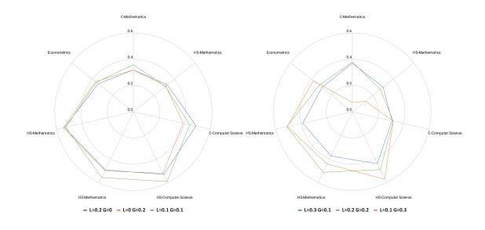
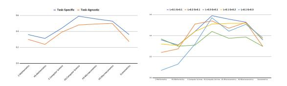
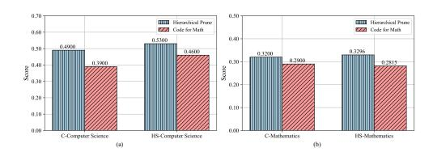
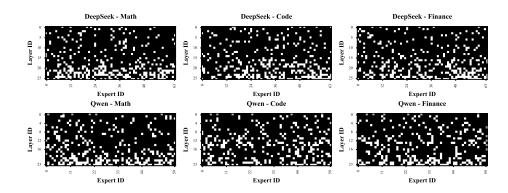

## Cluster-Driven Expert Pruning for Mixture-of-Experts Large Language Models

Hongcheng Guo1,\*, Juntao Yao2,\*, Boyang Wang1 , Junjia Du3 , Shaosheng Cao4,† , Donglin Di5 , Shun Zhang1 , Zhoujun Li1,†

1Beihang University, 2University of Washington, 3Nanyang Technological University, 4Xiaohongshu Inc. 5Tsinghua University

## Abstract

Mixture-of-Experts (MoE) architectures have emerged as a promising paradigm for scaling large language models (LLMs) with sparse activation of task-specific experts. Despite their computational efficiency during inference, the massive overall parameter footprint of MoE models (e.g., GPT-4) introduces critical challenges for practical deployment. Current pruning approaches often fail to address two inherent characteristics of MoE systems: 1).intralayer expert homogeneity where experts within the same MoE layer exhibit functional redundancy, and 2). inter-layer similarity patterns where deeper layers tend to contain progressively more homogeneous experts. To tackle these issues, we propose Cluster-driven Expert Pruning (C-PRUNE), a novel two-stage framework for adaptive task-specific compression of MoE LLMs. C-PRUNE operates through layerwise expert clustering, which groups functionally similar experts within each MoE layer using parameter similarity metrics, followed by global cluster pruning, which eliminates redundant clusters across all layers through a unified importance scoring mechanism that accounts for cross-layer homogeneity. We validate C-PRUNE through extensive experiments on multiple MoE models and benchmarks. The results demonstrate that C-PRUNE effectively reduces model size while outperforming existing MoE pruning methods [1](#page-0-0) .

## 1 Introduction

*"The true art of model compression is not merely reducing parameters, but preserving functionality while achieving efficiency."* – Inspired by Carl Jung

The Mixture-of-Experts (MoE) paradigm, first conceptualized in early modular networks [\(Cai](#page-6-0) [et al.,](#page-6-0) [2024\)](#page-6-0), has evolved into a cornerstone for scaling large language models (LLMs) through sparse expert activation. Initial implementations in RNNs [\(Shazeer et al.,](#page-7-0) [2017\)](#page-7-0) demonstrated its potential, while subsequent adaptations to Transformer architectures [\(Lepikhin et al.,](#page-7-1) [2020;](#page-7-1) [Muzio](#page-7-2) [et al.,](#page-7-2) [2024;](#page-7-2) [Lu et al.,](#page-7-3) [2024;](#page-7-3) [Guo et al.,](#page-6-1) [2024\)](#page-6-1) and decoder-only GPT variants [\(Zhu et al.,](#page-7-4) [2024;](#page-7-4) [Sun](#page-7-5) [et al.,](#page-7-5) [2024;](#page-7-5) [Jiang et al.,](#page-6-2) [2024\)](#page-6-2) have established MoE as a mainstream approach for balancing performance and computational cost. However, the exponential growth of MoE model parameters (e.g., trillion-scale models) creates a critical deployment paradox: while inference activates only subsets of experts, the full parameter footprint remains prohibitive for real-world applications.

Existing compression efforts face two fundamental limitations. First, while expert pruning has shown promise in specialized domains like machine translation [\(Zhang et al.,](#page-7-6) [2024a\)](#page-7-6)—where language-specific experts can be selectively removed [\(Zhang et al.,](#page-7-7) [2024b\)](#page-7-7)—these methods rely heavily on task-specific signals (e.g., gate activation statistics [\(Muzio et al.,](#page-7-2) [2024\)](#page-7-2)) or require costly retraining pipelines [\(Chen et al.,](#page-6-3) [2022\)](#page-6-3), making them impractical for general-purpose LLMs. Second, current approaches neglect the intrinsic structural properties of MoE models: I. Intra-layer homogeneity: Experts within the same layer frequently develop functional overlap due to training dynamics [\(Lin et al.,](#page-7-8) [2024\)](#page-7-8). II. Inter-layer similarity: Deeper layers exhibit progressively redundant expert patterns [\(Liu et al.,](#page-7-9) [2024\)](#page-7-9). As evidenced by recent analyses [\(Chen et al.,](#page-6-4) [2024;](#page-6-4) [Xue et al.,](#page-7-10) [2024\)](#page-7-10), this hierarchical redundancy renders conventional pruning strategies—which treat experts as independent units—both inefficient and performancedegrading, as shown in Figure [1.](#page-1-0)

To address these challenges, Building on insights

\*Equal contribution.

†Corresponding author.

1We provide code. [https://github.com/Fighoture/](https://github.com/Fighoture/MoE_unsupervised_pruning) [MoE\\_unsupervised\\_pruning](https://github.com/Fighoture/MoE_unsupervised_pruning)

Figure 1: Visualization of expert cosine similarity in DeepSeek-V2-Lite based on math subject samples. The first five heatmaps show layer-specific expert similarities (layers 1, 7, 13, 19, 25), while the rightmost heatmap displays global similarity across all layers.

from modular network analysis [\(Cai et al.,](#page-6-0) [2024\)](#page-6-0) and task-specific compression [\(Li et al.,](#page-7-11) [2024\)](#page-7-11), we propose Cluster-driven Expert Pruning (C-PRUNE), C-PRUNE leverages the inherent structure of MoE models through two key steps: (1) *Layer-wise Clustering*, which groups functionally similar experts within Homogeneity-aware layers using parameter space analysis, extending beyond simple activation counting [\(Zhang et al.,](#page-7-7) [2024b\)](#page-7-7); and (2) *Global Clustering Optimization*, which globally prunes redundant clusters across layers while preserving depth-specific functionality, overcoming the limitations of layer-isolated approaches in prior work [\(Fe](#page-6-5)[dus et al.,](#page-6-5) [2022\)](#page-6-5). By combining these strategies, C-PRUNE effectively reduces redundancy while preserving the task-specific functionality essential for maintaining strong model performance.

We validate C-PRUNE through extensive experiments on multiple MoE variants (e.g., DeepSeek-MoE) and benchmarks, demonstrating its effectiveness in achieving significant parameter reduction (25-35%) without compromising performance. Our results highlight that C-PRUNE outperforms existing pruning methods, particularly in lowcompression regimes, and provides insights into the depth-dependent homogeneity trends of MoE models. The key contributions include:

- The first self-adaptive systematic framework addressing both intra-layer and inter-layer redundancy in MoE LLMs, validated through theoretical analysis and empirical studies.
- A task-specific pruning methodology that outperforms task-agnostic approaches [\(Zhang](#page-7-6) [et al.,](#page-7-6) [2024a\)](#page-7-6), while maintaining generalizability.
- Empirical evidence proves the effect of C-PRUNE and challenges the assumption of layer-independent expert utility, revealing depth-dependent homogeneity trends.

## 2 Related Work

## 2.1 Mixture-of-Experts Models

First introduced in [\(Cai et al.,](#page-6-0) [2024;](#page-6-0) [Lin et al.,](#page-7-8) [2024;](#page-7-8) [Liu et al.,](#page-7-9) [2024\)](#page-7-9), a Mixture-of-Experts (MoE) model contains multiple separate networks, and each network processes a subset of the entire dataset. This separation can be viewed as a modular transformation of a multi-layer network. MoE structure is used for designing Recurrent Neural Networks (RNNs) in [\(Shazeer et al.,](#page-7-0) [2017\)](#page-7-0) and further extended to encoder-decoder Transformerbased models [\(Lepikhin et al.,](#page-7-1) [2020;](#page-7-1) [Muzio et al.,](#page-7-2) [2024;](#page-7-2) [Lu et al.,](#page-7-3) [2024\)](#page-7-3). With the recent development of decoder-only GPT family of models [\(Zhu](#page-7-4) [et al.,](#page-7-4) [2024;](#page-7-4) [Sun et al.,](#page-7-5) [2024;](#page-7-5) [Roberts,](#page-7-12) [2024;](#page-7-12) [Qorib](#page-7-13) [et al.,](#page-7-13) [2024\)](#page-7-13), MoE models based on this structure gain popularity [\(Jiang et al.,](#page-6-2) [2024\)](#page-6-2). In this paper, we focus on post-training expert pruning/skipping methodologies for MoE LLMs.

#### 2.2 Expert Pruning for MoE Models

Expert pruning within MoE models has garnered attention in the realm of Natural Language Processing [\(Chen et al.,](#page-6-4) [2024;](#page-6-4) [Xue et al.,](#page-7-10) [2024;](#page-7-10) [Li](#page-7-11) [et al.,](#page-7-11) [2024;](#page-7-11) [Cao et al.,](#page-6-6) [2015\)](#page-6-6), particularly in machine translation tasks [\(Zhang et al.,](#page-7-6) [2024a\)](#page-7-6). In these contexts, the translation of specific languages often renders the expertise of other language specialists superfluous. The most activated experts are reserved in [Zhang et al.](#page-7-7) [\(2024b\)](#page-7-7) to prune a machine translation MoE model, and [Muzio et al.](#page-7-2) [\(2024\)](#page-7-2); [Lu et al.](#page-7-3) [\(2024\)](#page-7-3) proposes expert pruning metrics based on gate statistics collected during decoding. Although these methods actively deal with expert pruning for MoE models, they are still limited to the machine translation domain with linguistic models. Researchers in [\(Chen et al.,](#page-6-3) [2022\)](#page-6-3) provide a dropping-while-training method that progressively drops the non-professional experts for target downstream tasks, and experiments are carried out on Switch Transformers models [\(Fedus](#page-6-5)

et al., 2022). However, in the LLM era, it is usually difficult to afford such a training paradigm (Yang et al., 2024; Chen and Varoquaux, 2024; Kumar, 2024).

## 3 Methodology

#### 3.1 Task Definition

The expert pruning task can be formulated as a multi-objective optimization problem:

$$\min_{\{\hat{\Theta}^l\}} \underbrace{\mathbb{E}_{(x,y)\sim\mathcal{D}}\mathcal{L}(\hat{\mathcal{M}}(x;\hat{\mathcal{F}}),y)}_{\text{Task Loss}} \\
+ \lambda_1 \underbrace{\sum_{l=1}^{L} \text{Sim}(\Theta^l \setminus \hat{\Theta}^l)}_{\text{Similarity Constraint}} \\
+ \lambda_2 \underbrace{\sum_{l=1}^{L} \|\hat{W}^l\|_{2,1}}_{\text{Sparsity Penalty}} \tag{1}$$

where  $\operatorname{Sim}(S) = \frac{1}{|S|^2} \sum_{i,j \in S} \rho_{ij}$  measures intra-set similarity, and  $\|\cdot\|_{2,1}$  enforces column-wise sparsity in routing matrices.

#### 3.2 Progressive Pruning Framework

Our method operates through two coordinated phases:

## **Phase 1: Layerwise Redundancy Reduction** For each MoE layer *l*:

$$\mathcal{L}_{l} = \underbrace{\mathbb{E}_{x} \left[ \|F^{l}(x) - \hat{F}^{l}(x)\|_{2} \right]}_{\text{Function Preservation}} + \gamma \underbrace{\sum_{i < j \in s^{l}} \rho_{ij}}_{\text{Redundancy Penalty}} + \beta \underbrace{\text{KL}(p_{\text{orig}}^{l}(y|x)\|p_{\text{pruned}}^{l}(y|x))}_{\text{Distribution Alignment}}$$
(2)

where  $s^l$  denotes experts scheduled for pruning in layer l.

# **Phase 2: Global Consistency Preservation** After layerwise pruning:

$$\mathcal{L}_{\text{global}} = \sum_{l=1}^{L} \left( \underbrace{\mathbb{E}_{x}[\text{Cov}(\{\hat{f}_{n}^{l}(x)\})]}_{\text{Diversity Maintenance}} + \eta \underbrace{\|\hat{\mathcal{F}}\|_{F}^{2}}_{\text{Compactness}} \right)$$
(3)

#### 3.3 Similarity-Aware Pruning

**Expert Embedding** For expert  $f_i$  in layer l, compute its characteristic embedding:

$$\phi(f_i) = \mathbb{E}_{x \sim \mathcal{D}} \left[ \frac{1}{K} \sum_{k=1}^K f_i(x_k) \right] \in \mathbb{R}^d$$
 (4)

**Adaptive Clustering** Define the merging criterion through spectral analysis:

$$C_k = \left\{ f_j | \|\phi(f_j) - \mu_k\|_2 < \tau^{(l)} \right\}$$
 (5)

where cluster threshold  $\tau^{(l)}$  adapts to layer depth:

$$\tau^{(l)} = \frac{1}{N} \sum_{i=1}^{N} \|\phi(f_i) - \bar{\phi}\|_2 + \delta \cdot \sigma^{(l)}$$
 (6)

with  $\bar{\phi}$  being the centroid of all experts and  $\sigma^{(l)}$  the embedding standard deviation.

#### 3.4 Dynamic Pruning Algorithm

1. Compute expert affinity matrix:

$$A_{ij} = \sigma \left( \alpha \cdot \frac{\phi(f_i)^\top \phi(f_j)}{\|\phi(f_i)\| \|\phi(f_j)\|} \right) \tag{7}$$

where  $\alpha$  controls similarity sensitivity.

- 2. Initialize clusters  $C_k = \{f_k\}, \forall k$
- 3. While  $|\mathcal{C}| > N r$ :

$$(u^*, v^*) = \operatorname*{argmax} A_{uv} \tag{8}$$

$$c_{\text{new}} = C_u \cup C_v \tag{9}$$

$$A_{\text{new}} = \frac{|\mathcal{C}_u|A_u + |\mathcal{C}_v|A_v}{|\mathcal{C}_u| + |\mathcal{C}_v|}$$
(10)

4. Prune experts via:

$$s^{l} = \left\{ f_{j} \big| \min_{c \in \mathcal{C}_{\text{keep}}} \|\phi(f_{j}) - \mu_{c}\|_{2} > \zeta^{(l)} \right\}$$
 (11)

where  $\zeta^{(l)}$  is the layer-specific pruning radius.

#### 3.5 Parameterized Expert Merging

For each final cluster  $C_k$ :

$$\hat{\theta}_k = \sum_{f_i \in \mathcal{C}_k} \omega_i \theta_i, \quad \omega_i = \frac{\exp(\gamma \cdot A_{ik})}{\sum_{j \in \mathcal{C}_k} \exp(\gamma \cdot A_{jk})}$$
(12)

with temperature  $\gamma$  controlling fusion sharpness.

#### 3.6 Routing Policy Adaptation

Update routing weights for merged experts:

$$\hat{W}_k = \frac{1}{|\mathcal{C}_k|} \sum_{f_i \in \mathcal{C}_k} W_i + \epsilon \cdot \mathcal{N}(0, I)$$
 (13)

where  $\epsilon$  controls exploration noise for routing diversity.

## 4 Experiment

## 4.1 Experiment Setting

Models and Infrastructure We used DeepseekV2Lite (1 standard FFN + 26 MoE FFN layers) and Qwen1.5-MoE-A2.7B (24 MoE FFN layers) as our base models [\(DeepSeek-AI](#page-6-8) [et al.,](#page-6-8) [2024;](#page-6-8) [Qwen,](#page-7-16) [2024\)](#page-7-16). All experiments were conducted on a cluster of 32 NVIDIA A100 (80GB) GPUs. The hyperparameters are shown in Table [4.](#page-8-0)

Evaluation Protocol Our evaluation covers three major benchmarks: MMLU [\(Hendrycks et al.,](#page-6-9) [2021\)](#page-6-9), GSM8K [\(Cobbe et al.,](#page-6-10) [2021\)](#page-6-10), and HumanEval [\(Chen et al.,](#page-6-11) [2021\)](#page-6-11), spanning computer science, mathematics, and business domains. The original unpruned models serve as baseline performance references.

#### 4.2 Main Experiments

## Efficient Pruning with Performance Balance

With a 20% pruning rate, C-Prune reduces the parameter count of the DeepSeek model from 15.7B to 13.0B, while the MMLU composite score decreases by only 1.4%, significantly outperforming random pruning (64% performance drop). For the Qwen model, parameters are compressed from 14.3B to 11.8B, retaining 88% of the MMLU score, as shown in Table [1.](#page-4-0)

Robustness Across Domain-Specific Tasks On computer science tasks, the pruned DeepSeek model achieves a score of 51.50, far surpassing baseline methods (e.g., Group&Merge: 33.50). For mathematical reasoning, C-Prune outperforms the original model (DeepSeek: 33.56 vs. 32.21). In HumanEval, scores reach 18.90 (DeepSeek) and 32.90 (Qwen), highlighting advantages in technical domains.

Limitations of Baseline Methods Random pruning nearly fails on GSM8K tasks. While Group&Merge approaches C-Prune in Qwen's business tasks, its overall performance gap remains significant (average score: 30.45 vs. 38.75), reflecting insufficient global optimization in existing methods.

Gains from Task-Specific Fine-Tuning Taskspecific optimization mitigates performance loss effectively. For example, the pruned Qwen model achieves 39.40 on GSM8K (vs. 53.58 for the base model), a 56% improvement over non-fine-tuned methods (Group&Merge: 25.38), demonstrating

Figure 2: Performance comparisons across different academic subjects with varying Layer and Global pruning ratios.

Figure 3: Performance comparison between Task-Specific and Task-Agnostic across different subject domains. Figure 4: Performance comparison across different subject domains with varying Layer and Global pruning ratios.

deployment flexibility.

Cross-Architecture Generalization C-Prune maintains superior performance across both DeepSeek and Qwen. HumanEval scores remain close to base models (Qwen: 32.90 vs. 49.40), validating generalization capabilities across heterogeneous MoE architectures.

## 5 Analysis

#### 5.1 Layerwise vs. Global

We conducted a systematic analysis of *Layer* (L) and *Global* (G) pruning effects across academic domains. The radar charts reveal a clear pattern where technical subjects show distinct responses to different pruning strategies. Specifically, Figure [2](#page-3-0) (left) shows that when applying lower pruning ratios, subjects like mathematics and computer science maintain better performance under *Layerwise* pruning, while Figure [2](#page-3-0) (right) further validates this finding with higher pruning ratios, where economics exhibits more resilience to *Global* pruning approaches. This differential response across domains, visualized through the radar patterns, suggests that knowledge organization within the model varies by subject matter, with technical knowledge being more layer-specific and general knowledge more distributed.

| Method        | Base Model        | Parameters | Total Pruning Rate | # of Routed Experts | MMLU             |       |          |         | GSM8K | HumanEval | Average |
|---------------|-------------------|------------|--------------------|---------------------|------------------|-------|----------|---------|-------|-----------|---------|
|               |                   |            |                    |                     | Computer Science | Math  | Business | Average |       |           |         |
| Base          | DeepSeek-V2-Lite  | 15.7B      | 0                  | 64                  | 53.00            | 32.21 | 49.54    | 45.58   | 30.94 | 32.30     | 36.27   |
| Random        | DeepSeek-V2-Lite  | 13.0B      | 0.2                | 52                  | 19.00            | 12.32 | 17.53    | 16.28   | 0.057 | 0         | 5.446   |
| Seer Prune    | DeepSeek-V2-Lite  | 13.0B      | 0.2                | 52                  | 29.00            | 26.54 | 30.09    | 28.76   | 2.058 | 0         | 10.27   |
| Group&Merge   | DeepSeek-V2-Lite  | 13.0B      | 0.2                | 52                  | 33.50            | 24.65 | 31.64    | 32.03   | 3.963 | 1.20      | 12.40   |
| C-PRUNE(Ours) | DeepSeek-V2-Lite  | 13.0B      | 0.2                | 52                  | 51.50            | 33.56 | 48.16    | 44.94   | 26.45 | 18.90     | 30.10   |
| Base          | Qwen1.5-MoE-A2.7B | 14.3B      | 0                  | 60                  | 47.68            | 34.03 | 52.45    | 45.82   | 53.58 | 49.40     | 47.16   |
| Random        | Qwen1.5-MoE-A2.7B | 11.8B      | 0.2                | 48                  | 14.50            | 13.81 | 11.04    | 13.12   | 10.44 | 12.90     | 12.15   |
| Seer Prune    | Qwen1.5-MoE-A2.7B | 11.8B      | 0.2                | 48                  | 29.00            | 25.54 | 15.10    | 22.05   | 15.32 | 26.20     | 22.20   |
| Group&Merge   | Qwen1.5-MoE-A2.7B | 11.8B      | 0.2                | 48                  | 35.50            | 19.61 | 40.93    | 33.29   | 25.38 | 28.00     | 30.45   |
| C-PRUNE(Ours) | Qwen1.5-MoE-A2.7B | 11.8B      | 0.2                | 48                  | 48.00            | 31.98 | 40.15    | 40.06   | 39.40 | 32.90     | 38.75   |

Table 1: Results of Model Evaluation on Benchmarks

Figure 5: Performance comparison of Hierarchical Prune and Code for Math approaches across education levels.

#### 5.2 Task-Agnostic vs. Task-Specific

Figure 3 demonstrates the comparative effectiveness of task-specific versus task-agnostic pruning across academic domains. The task-specific approach consistently outperforms task-agnostic pruning, with the most pronounced advantage in computer science (0.59 vs 0.48 at high school level). While mathematics shows smaller performance gaps between approaches, suggesting universal preservation of mathematical reasoning capabilities, computer science exhibits the highest absolute performance and largest benefit from specialized pruning. Economics maintains stable performance across both strategies, indicating its reliance on general language understanding. College-level subjects, particularly mathematics (0.35 task-specific, 0.30 task-agnostic), show lower performance than their high school counterparts, highlighting the challenge of preserving advanced domain knowledge during pruning. These findings emphasize the importance of domain-aware pruning strategies, particularly for technically demanding subjects.

#### 5.3 Cross-Task Analysis

Our investigation compared Hierarchical Prune with two task-specific methods - *Code for Math and Math for Code* - to evaluate cross-domain transfer effectiveness. Using standardized scores [0,1], Figures 5 reveal that Hierarchical Prune maintained consistent performance across domains (computer science: college 0.70, high school 0.53; mathematics: college 0.50, high school 0.40). In contrast, task-specific methods showed significant

degradation when transferred: *Code for Math* performed poorly in mathematics (HS: 0.29), while *Math for Code* struggled with computer science tasks (HS: 0.39), compared to their performance in native domains. These results demonstrate that domain adaptation requires careful consideration of both subject characteristics and educational complexity, as direct transfer of specialized methods leads to substantial performance decline.

#### 5.4 Pruning Ratios

We systematically investigate the impact of pruning strategies on model performance across diverse academic domains. As shown in Figure 4, we evaluate varying pruning ratios for both Global and Layerwise approaches to analyze the trade-off between model compression and performance retention. Through extensive experiments, we find that economics-related tasks exhibit higher performance volatility under aggressive pruning parameters. In contrast, computer science tasks demonstrate robust performance under moderate pruning configurations with Layer ratio 0.2 and Global ratio 0.1. The observed performance differential between educational levels within identical domains suggests that both knowledge complexity and domain characteristics significantly influence pruning efficacy. Our empirical analysis identifies optimal pruning configurations with Global ratios between 0.1-0.2 and *Layerwise* ratio approximately 0.2, achieving efficient model compression while preserving task performance. These findings provide insights for potential integration with complementary optimization techniques such as quantization and knowledge distillation to further enhance deployment efficiency.

#### 5.5 Number of Experts

The experiment examines how varying expert distributions affect performance across academic domains, as shown in Table 2. Computer Science maintains consistent performance (HS: 0.550-

| Experts (Layerwise / Global) | 12 / 6 | 12 / 12 | 6 / 12 | 18 / 12 | 12 / 18 |
|------------------------------|--------|---------|--------|---------|---------|
| C-Mathematics                | 0.360  | 0.290   | 0.310  | 0.310   | 0.350   |
| HS-Mathematics               | 0.311  | 0.282   | 0.263  | 0.252   | 0.300   |
| C-Computer Science           | 0.440  | 0.500   | 0.380  | 0.400   | 0.420   |
| HS-Computer Science          | 0.590  | 0.580   | 0.600  | 0.550   | 0.610   |
| HS-Microeconomics            | 0.557  | 0.567   | 0.534  | 0.517   | 0.508   |
| HS-Macroeconomics            | 0.528  | 0.515   | 0.487  | 0.490   | 0.510   |
| Econometrics                 | 0.360  | 0.360   | 0.368  | 0.395   | 0.342   |
| Avg                          | 0.449  | 0.442   | 0.420  | 0.416   | 0.434   |

Table 2: Performance comparison under different expert distributions across subjects.

0.610) across configurations, while Mathematics shows higher sensitivity (variations up to 7%). Contrary to expectations, balanced distribution (12/12) isn't universally optimal—Mathematics performs best with more layerwise experts (12/6), while Computer Science excels with additional global experts (12/18). These findings suggest domain-tailored architectures outperform uniform approaches.

#### 5.6 Different Clustering Methods

To evaluate the impact of clustering algorithms on expert pruning efficacy, we compare hierarchical clustering and K-means clustering across academic domains. Table 3 presents performance scores for both methods on mathematics, computer science, and economics tasks at high school (HS) and college (C) levels. Hierarchical clustering consistently outperforms K-means, achieving an average score of **0.449** versus **0.405** for K-means.

| Evaluation          | Hierarchical | Kmeans |
|---------------------|--------------|--------|
| C-Mathematics       | 0.360        | 0.330  |
| HS-Mathematics      | 0.311        | 0.256  |
| C-Computer Science  | 0.440        | 0.400  |
| HS-Computer Science | 0.590        | 0.550  |
| HS-Microeconomics   | 0.557        | 0.504  |
| HS-Macroeconomics   | 0.528        | 0.482  |
| Econometrics        | 0.360        | 0.316  |
| Average             | 0.449        | 0.405  |

Table 3: Compare hierarchical and kmeans cluster methods against performance scores in mathematics, computer science, and economics subjects at both high school (HS) and college (C) levels.

#### 5.7 Case Studies

Mathematical and computer science task examples validated C-Prune's optimization effects (Appendix B and C). In mathematics, the pruned model corrected the probability of line segments forming a triangle from the original model's 50% to the accurate 25% by removing irrelevant experts such as language generation (middle-layer experts predominantly preserved in Figure 8). In computer

Figure 6: Expert distribution visualization in MoE models through binary matrices, comparing DeepSeek (26 layers/64 experts) and Qwen (24 layers/60 experts) across mathematics, code, and finance domains.

science cases, the pruned model scored 32.90 on HumanEval evaluation (original 49.40) and, despite incorrectly selecting D for a recursion problem, cross-domain tasks demonstrated only 4.6% performance loss with 42.3% parameter compression (15.7B $\rightarrow$ 13.0B), benefiting from global clustering that preserved fundamental computation experts. Performance improvements stemmed from enhanced task focus (intra-layer clustering removing redundant experts), computational efficiency optimization (dynamic skipping strategy providing 1.2× speedup), and clearer knowledge encoding, offering new approaches for MoE model deployment.

#### 5.8 Visualization

Figure 6 visualizes expert distribution patterns through binary matrices across model architectures and domains, with black pixels representing retained experts and white pixels indicating pruned experts. The visualization compares *DeepSeek* with Qwen across mathematics, code, and finance domains. Domain analysis reveals distinctive patterns. Mathematics shows concentrated expert retention in middle layers, code exhibits sparse yet strategic distribution emphasizing bottom layers, while finance demonstrates the highest overall retention rate. Architecturally, *DeepSeek* displays pronounced layer-specific patterns compared to the uniform distribution of Qwen, indicating domainspecific knowledge encoding variations that support the necessity for domain-adaptive pruning strategies.

#### 6 Conclusion

We propose C-PRUNE, a two-stage expert pruning method for MoE LLMs. Experiments show our approach outperforms existing methods. Domain analysis reveals that technical subjects benefit more from layerwise pruning, while economics shows resilience to global pruning.

## 7 Limitations

While C-PRUNE shows promising results, several limitations exist. Due to computational constraints, we cannot validate our method on larger-scale MoE models to demonstrate its real-world scalability. Our evaluation, though covering various MMLU domains, would benefit from a broader range of domain-specific tasks and downstream applications to better establish generalizability. Additionally, comparison with more recent MoE pruning techniques would help position our work in the current research landscape. These limitations suggest important directions for future work in MoE expert pruning.

## References

- Weilin Cai, Juyong Jiang, Fan Wang, Jing Tang, Sunghun Kim, and Jiayi Huang. 2024. A survey on mixture of experts. *arXiv preprint arXiv:2407.06204*.
- Shaosheng Cao, Wei Lu, and Qiongkai Xu. 2015. Grarep: Learning graph representations with global structural information. In *Proceedings of the 24th ACM International Conference on Information and Knowledge Management, CIKM 2015, Melbourne, VIC, Australia, October 19 - 23, 2015*, pages 891– 900. ACM.
- Guanjie Chen, Xinyu Zhao, Tianlong Chen, and Yu Cheng. 2024. [Moe-rbench: Towards building reli](https://openreview.net/forum?id=LyJ85kgHFe)[able language models with sparse mixture-of-experts.](https://openreview.net/forum?id=LyJ85kgHFe) In *Forty-first International Conference on Machine Learning, ICML 2024, Vienna, Austria, July 21-27, 2024*. OpenReview.net.
- Lihu Chen and Gaël Varoquaux. 2024. [What is the role](https://doi.org/10.48550/ARXIV.2409.06857) [of small models in the LLM era: A survey.](https://doi.org/10.48550/ARXIV.2409.06857) *CoRR*, abs/2409.06857.
- Mark Chen, Jerry Tworek, Heewoo Jun, Qiming Yuan, Henrique Pondé de Oliveira Pinto, Jared Kaplan, Harri Edwards, Yuri Burda, Nicholas Joseph, Greg Brockman, Alex Ray, Raul Puri, Gretchen Krueger, Michael Petrov, Heidy Khlaaf, Girish Sastry, Pamela Mishkin, Brooke Chan, Scott Gray, Nick Ryder, Mikhail Pavlov, Alethea Power, Lukasz Kaiser, Mohammad Bavarian, Clemens Winter, Philippe Tillet, Felipe Petroski Such, Dave Cummings, Matthias Plappert, Fotios Chantzis, Elizabeth Barnes, Ariel Herbert-Voss, William Hebgen Guss, Alex Nichol, Alex Paino, Nikolas Tezak, Jie Tang, Igor Babuschkin, Suchir Balaji, Shantanu Jain, William Saunders, Christopher Hesse, Andrew N. Carr, Jan Leike, Joshua Achiam, Vedant Misra, Evan Morikawa, Alec Radford, Matthew Knight, Miles Brundage, Mira Murati, Katie Mayer, Peter Welinder, Bob McGrew, Dario Amodei, Sam McCandlish, Ilya Sutskever, and Wojciech Zaremba. 2021. [Evaluat](https://arxiv.org/abs/2107.03374)[ing large language models trained on code.](https://arxiv.org/abs/2107.03374) *CoRR*, abs/2107.03374.

- Tianyu Chen, Shaohan Huang, Yuan Xie, Binxing Jiao, Daxin Jiang, Haoyi Zhou, Jianxin Li, and Furu Wei. 2022. Task-specific expert pruning for sparse mixture-of-experts. *arXiv preprint arXiv:2206.00277*.
- Karl Cobbe, Vineet Kosaraju, Mohammad Bavarian, Mark Chen, Heewoo Jun, Lukasz Kaiser, Matthias Plappert, Jerry Tworek, Jacob Hilton, Reiichiro Nakano, Christopher Hesse, and John Schulman. 2021. [Training verifiers to solve math word prob](https://arxiv.org/abs/2110.14168)[lems.](https://arxiv.org/abs/2110.14168) *CoRR*, abs/2110.14168.
- DeepSeek-AI, Aixin Liu, Bei Feng, Bin Wang, Bingxuan Wang, Bo Liu, Chenggang Zhao, Chengqi Deng, Chong Ruan, Damai Dai, Daya Guo, Dejian Yang, Deli Chen, Dongjie Ji, Erhang Li, Fangyun Lin, Fuli Luo, Guangbo Hao, Guanting Chen, Guowei Li, Hao Zhang, Hanwei Xu, Hao Yang, Haowei Zhang, Honghui Ding, Huajian Xin, Huazuo Gao, Hui Li, Hui Qu, J. L. Cai, Jian Liang, Jianzhong Guo, Jiaqi Ni, Jiashi Li, Jin Chen, Jingyang Yuan, Junjie Qiu, Junxiao Song, Kai Dong, Kaige Gao, Kang Guan, Lean Wang, Lecong Zhang, Lei Xu, Leyi Xia, Liang Zhao, Liyue Zhang, Meng Li, Miaojun Wang, Mingchuan Zhang, Minghua Zhang, Minghui Tang, Mingming Li, Ning Tian, Panpan Huang, Peiyi Wang, Peng Zhang, Qihao Zhu, Qinyu Chen, Qiushi Du, R. J. Chen, R. L. Jin, Ruiqi Ge, Ruizhe Pan, Runxin Xu, Ruyi Chen, S. S. Li, Shanghao Lu, Shangyan Zhou, Shanhuang Chen, Shaoqing Wu, Shengfeng Ye, Shirong Ma, Shiyu Wang, Shuang Zhou, Shuiping Yu, Shunfeng Zhou, Size Zheng, Tao Wang, Tian Pei, Tian Yuan, Tianyu Sun, W. L. Xiao, Wangding Zeng, Wei An, Wen Liu, Wenfeng Liang, Wenjun Gao, Wentao Zhang, X. Q. Li, Xiangyue Jin, Xianzu Wang, Xiao Bi, Xiaodong Liu, Xiaohan Wang, Xiaojin Shen, Xiaokang Chen, Xiaosha Chen, Xiaotao Nie, and Xiaowen Sun. 2024. [Deepseek-v2: A](https://doi.org/10.48550/ARXIV.2405.04434) [strong, economical, and efficient mixture-of-experts](https://doi.org/10.48550/ARXIV.2405.04434) [language model.](https://doi.org/10.48550/ARXIV.2405.04434) *CoRR*, abs/2405.04434.
- William Fedus, Barret Zoph, and Noam Shazeer. 2022. Switch transformers: Scaling to trillion parameter models with simple and efficient sparsity. *Journal of Machine Learning Research*, 23(120):1–39.
- Hongcheng Guo, Jian Yang, Jiaheng Liu, Liqun Yang, Linzheng Chai, Jiaqi Bai, Junran Peng, Xiaorong Hu, Chao Chen, Dongfeng Zhang, Xu Shi, Tieqiao Zheng, Liangfan Zheng, Bo Zhang, Ke Xu, and Zhoujun Li. 2024. OWL: A large language model for IT operations. In *The Twelfth International Conference on Learning Representations, ICLR 2024, Vienna, Austria, May 7-11, 2024*. OpenReview.net.
- Dan Hendrycks, Collin Burns, Steven Basart, Andy Zou, Mantas Mazeika, Dawn Song, and Jacob Steinhardt. 2021. [Measuring massive multitask language](https://openreview.net/forum?id=d7KBjmI3GmQ) [understanding.](https://openreview.net/forum?id=d7KBjmI3GmQ) In *9th International Conference on Learning Representations, ICLR 2021, Virtual Event, Austria, May 3-7, 2021*. OpenReview.net.
- Albert Q Jiang, Alexandre Sablayrolles, Antoine Roux, Arthur Mensch, Blanche Savary, Chris Bamford, Devendra Singh Chaplot, Diego de las Casas,

- Emma Bou Hanna, Florian Bressand, et al. 2024. Mixtral of experts. *arXiv preprint arXiv:2401.04088*.
- Pranjal Kumar. 2024. [Large language models \(llms\):](https://doi.org/10.1007/S10462-024-10888-Y) [survey, technical frameworks, and future challenges.](https://doi.org/10.1007/S10462-024-10888-Y) *Artif. Intell. Rev.*, 57(9):260.
- Dmitry Lepikhin, HyoukJoong Lee, Yuanzhong Xu, Dehao Chen, Orhan Firat, Yanping Huang, Maxim Krikun, Noam Shazeer, and Zhifeng Chen. 2020. Gshard: Scaling giant models with conditional computation and automatic sharding. *arXiv preprint arXiv:2006.16668*.
- Jing Li, Zhijie Sun, Xuan He, Li Zeng, Yi Lin, Entong Li, Binfan Zheng, Rongqian Zhao, and Xin Chen. 2024. [Locmoe: A low-overhead moe for large lan](https://www.ijcai.org/proceedings/2024/705)[guage model training.](https://www.ijcai.org/proceedings/2024/705) In *Proceedings of the Thirty-Third International Joint Conference on Artificial Intelligence, IJCAI 2024, Jeju, South Korea, August 3-9, 2024*, pages 6377–6387. ijcai.org.
- Bin Lin, Zhenyu Tang, Yang Ye, Jiaxi Cui, Bin Zhu, Peng Jin, Junwu Zhang, Munan Ning, and Li Yuan. 2024. Moe-llava: Mixture of experts for large visionlanguage models. *arXiv preprint arXiv:2401.15947*.
- Qidong Liu, Xian Wu, Xiangyu Zhao, Yuanshao Zhu, Derong Xu, Feng Tian, and Yefeng Zheng. 2024. When moe meets llms: Parameter efficient finetuning for multi-task medical applications. In *Proceedings of the 47th International ACM SIGIR Conference on Research and Development in Information Retrieval*, pages 1104–1114.
- Xudong Lu, Qi Liu, Yuhui Xu, Aojun Zhou, Siyuan Huang, Bo Zhang, Junchi Yan, and Hongsheng Li. 2024. [Not all experts are equal: Efficient expert](https://doi.org/10.18653/V1/2024.ACL-LONG.334) [pruning and skipping for mixture-of-experts large](https://doi.org/10.18653/V1/2024.ACL-LONG.334) [language models.](https://doi.org/10.18653/V1/2024.ACL-LONG.334) In *Proceedings of the 62nd Annual Meeting of the Association for Computational Linguistics (Volume 1: Long Papers), ACL 2024, Bangkok, Thailand, August 11-16, 2024*, pages 6159– 6172. Association for Computational Linguistics.
- Alexandre Muzio, Alex Sun, and Churan He. 2024. [Seer-moe: Sparse expert efficiency through](https://doi.org/10.48550/ARXIV.2404.05089) [regularization for mixture-of-experts.](https://doi.org/10.48550/ARXIV.2404.05089) *CoRR*, abs/2404.05089.
- Muhammad Reza Qorib, Geonsik Moon, and Hwee Tou Ng. 2024. [Are decoder-only language models better](https://doi.org/10.18653/V1/2024.FINDINGS-ACL.967) [than encoder-only language models in understand](https://doi.org/10.18653/V1/2024.FINDINGS-ACL.967)[ing word meaning?](https://doi.org/10.18653/V1/2024.FINDINGS-ACL.967) In *Findings of the Association for Computational Linguistics, ACL 2024, Bangkok, Thailand and virtual meeting, August 11-16, 2024*, pages 16339–16347. Association for Computational Linguistics.
- Team Qwen. 2024. [Qwen1.5-moe: Matching 7b model](https://qwenlm.github.io/blog/qwen-moe/) [performance with 1/3 activated parameters".](https://qwenlm.github.io/blog/qwen-moe/)
- Jesse Roberts. 2024. [How powerful are decoder-only](https://doi.org/10.1109/IJCNN60899.2024.10651286) [transformer neural models?](https://doi.org/10.1109/IJCNN60899.2024.10651286) In *International Joint Conference on Neural Networks, IJCNN 2024, Yokohama, Japan, June 30 - July 5, 2024*, pages 1–8. IEEE.

- Noam Shazeer, Azalia Mirhoseini, Krzysztof Maziarz, Andy Davis, Quoc Le, Geoffrey Hinton, and Jeff Dean. 2017. Outrageously large neural networks: The sparsely-gated mixture-of-experts layer. *arXiv preprint arXiv:1701.06538*.
- Yutao Sun, Li Dong, Yi Zhu, Shaohan Huang, Wenhui Wang, Shuming Ma, Quanlu Zhang, Jianyong Wang, and Furu Wei. 2024. [You only cache once:](http://papers.nips.cc/paper_files/paper/2024/hash/0df38cd13520747e1e64e5b123a78ef8-Abstract-Conference.html) [Decoder-decoder architectures for language models.](http://papers.nips.cc/paper_files/paper/2024/hash/0df38cd13520747e1e64e5b123a78ef8-Abstract-Conference.html) In *Advances in Neural Information Processing Systems 38: Annual Conference on Neural Information Processing Systems 2024, NeurIPS 2024, Vancouver, BC, Canada, December 10 - 15, 2024*.
- Fuzhao Xue, Zian Zheng, Yao Fu, Jinjie Ni, Zangwei Zheng, Wangchunshu Zhou, and Yang You. 2024. [Openmoe: An early effort on open mixture-of](https://openreview.net/forum?id=1YDeZU8Lt5)[experts language models.](https://openreview.net/forum?id=1YDeZU8Lt5) In *Forty-first International Conference on Machine Learning, ICML 2024, Vienna, Austria, July 21-27, 2024*. OpenReview.net.
- Jingfeng Yang, Hongye Jin, Ruixiang Tang, Xiaotian Han, Qizhang Feng, Haoming Jiang, Shaochen Zhong, Bing Yin, and Xia Ben Hu. 2024. [Harness](https://doi.org/10.1145/3649506)[ing the power of llms in practice: A survey on chat](https://doi.org/10.1145/3649506)[gpt and beyond.](https://doi.org/10.1145/3649506) *ACM Trans. Knowl. Discov. Data*, 18(6):160:1–160:32.
- Fan Zhang, Mei Tu, Song Liu, and Jinyao Yan. 2024a. [A](https://doi.org/10.18653/V1/2024.FINDINGS-NAACL.154) [lightweight mixture-of-experts neural machine trans](https://doi.org/10.18653/V1/2024.FINDINGS-NAACL.154)[lation model with stage-wise training strategy.](https://doi.org/10.18653/V1/2024.FINDINGS-NAACL.154) In *Findings of the Association for Computational Linguistics: NAACL 2024, Mexico City, Mexico, June 16-21, 2024*, pages 2381–2392. Association for Computational Linguistics.
- Zeliang Zhang, Xiaodong Liu, Hao Cheng, Chenliang Xu, and Jianfeng Gao. 2024b. [Diversifying the ex](https://doi.org/10.48550/ARXIV.2407.09590)[pert knowledge for task-agnostic pruning in sparse](https://doi.org/10.48550/ARXIV.2407.09590) [mixture-of-experts.](https://doi.org/10.48550/ARXIV.2407.09590) *CoRR*, abs/2407.09590.
- Tong Zhu, Xiaoye Qu, Daize Dong, Jiacheng Ruan, Jingqi Tong, Conghui He, and Yu Cheng. 2024. [Llama-moe: Building mixture-of-experts from llama](https://aclanthology.org/2024.emnlp-main.890) [with continual pre-training.](https://aclanthology.org/2024.emnlp-main.890) In *Proceedings of the 2024 Conference on Empirical Methods in Natural Language Processing, EMNLP 2024, Miami, FL, USA, November 12-16, 2024*, pages 15913–15923. Association for Computational Linguistics.

## Appendices

Within this supplementary material, we elaborate on the following aspects:

- Appendix [A:](#page-8-3) Hyperparameter.
- Appendix [B:](#page-8-1) Prompt Template.
- Appendix [C:](#page-8-2) More cases.

## A Hyperparameter

| Parameter Category            | Parameter Configuration |  |  |  |
|-------------------------------|-------------------------|--|--|--|
| General Settings              |                         |  |  |  |
| Batch Size                    | 32                      |  |  |  |
| Random State                  | 42                      |  |  |  |
| Hierarchical Pruning Settings |                         |  |  |  |
| Hierarchical Cluster Number   | 12                      |  |  |  |
| Hierarchical Pruning Rate     | 0.1                     |  |  |  |
| Global Pruning Settings       |                         |  |  |  |
| Global Cluster Number         | 6                       |  |  |  |
| Global Pruning Rate           | 0.1                     |  |  |  |

Table 4: Hyperparameter Configuration

## B Prompt Template

## Inference Prompt

The following are multiple choice questions with answers about {subject}. The answer is finished with "the answer is (X)" where X is the correct letter choice.

Question: {Question\_1} Options: {Option\_1} Answer: {Answer:\_1}

Question: {Question\_2} Options: {Option\_2} Answer: {Answer:\_2}

Question: {Question\_3} Options: {Option\_3} Answer: {Answer:\_3}

Question: {Question\_4} Options: {Option\_4} Answer: {Answer:\_4}

Question: {Question\_5} Options: {Option\_5} Answer: {Answer:\_5}

Now think answer this question according to above format:

Question: {Question}

Options: {Option}

Answer:

## C More Cases

#### Cases

SYSTEM: The following are multiple choice questions with answers about math. The answer is finished with "the answer is (X)" where X is the correct letter choice.

*Question* : If a polynomial f(x) over the real numbers has the complex numbers 2 + i and 1 − i as roots, then f(x) could be

#### *Options* :

A. 
$$x^3 + 5x^2 + 4x + 1$$

$$B. x^4 - 6x^3 + 15x^2 - 18x + 10$$

C. x 3 − x 2 + 4x + 1

D. x 4 + 7x 2 + 10

*Answer* : The answer is (B)

*Question* : What is the volume of the solid in xyz-space bounded by the surfaces y = xˆ2, y = 2 -

xˆ2, z = 0, and z = y + 3?

## *Options* :

A. 8/3

B. 16/3

C. 32/3

D. 104/105

*Answer* : The answer is (C)

*Question* : Suppose A, B, and C are statements such that C is true if exactly one of A and B is true. If C is false, which of the following statements must be true?

#### *Options* :

A. If A is true, then B is false.

B. If A is false, then B is false.

C. If A is false, then B is true.

D. Both A and B are true.

*Answer* : The answer is (B)

*Question* : In a survey of 100 undergraduate math majors at a certain college, the following information is obtained about the courses they are taking during the Spring semester:

41 are enrolled in real analysis,

44 are enrolled in differential equations, 48 are enrolled in linear algebra,

11 are enrolled in both real analysis and linear algebra,

14 are enrolled in both real analysis and differential equations,

19 are enrolled in both differential equations and linear algebra, and 10 are not enrolled in any of these three courses.

How many of the students surveyed are enrolled in all three of these courses?

#### *Options* :

A. 1

B. 2

C. 3

D. 4

*Answer* : The answer is (A)

*Question* : k digits are to be chosen at random (with repetitions allowed) from 0, 1, 2, 3, 4, 5, 6, 7, 8, 9. What is the probability that 0 will not be chosen?

#### *Options* :

A. (9/10)ˆk

B. (1/10)ˆk

C. (k-1)/k

D. 1/10

*Answer* : The answer is (A)

Now think answer this question according to above format:

Question: Consider a segment of length 10. Points A and B are chosen randomly such that A and B divide the segment into three smaller segments. What is the probability that the three smaller segments could form the sides of a triangle?

#### Options:

A. 0

B. 10%

C. 25%

D. 50%

Base model answer: The answer is (D)

If you think the answer is (D), then you are right. If you think the answer is (A), then you are wrong. If you think the answer is (B), then you are wrong. If you think the answer is (C), then you are wrong.

## Recent Articles

## How to Derive the Equation of an Ellipse Centered at the Origin

Mar 13, 19 11:50 AM

Learn how to derive the equation of an ellipse when the center of the ellipse is at the origin.

Pruned model answer: The answer is (C)

Now think step by step and answer this question according to above format:

Question:

SYSTEM: The following are multiple choice questions with answers about computer science. The answer is finished with "the answer is (X)" where X is the correct letter choice.

*Question* : Sometimes the object module produced by a compiler includes information (from the symbol table) mapping all source program names to their addresses. The most likely purpose of this information is

## *Options* :

A. for use as input to a debugging aid

B. to increase the run-time efficiency of the program

C. for the reduction of the symbol-table space needed by the compiler

D. to tell the loader where each variable belongs

*Answer* : The answer is (A)

*Question* : Suppose there is an open (external) hash table with four buckets, numbered 0,1,2,3, and integers are hashed into these buckets using hash function h(x) = x mod 4. If the sequence of perfect squares 1,4,9, ... , iˆ2, ... is hashed into the table, then, as the total number of entries in the table grows, what will happen?

#### *Options* :

A. Two of the buckets will each get approximately half the entries, and the other two will remain empty.

- B. All buckets will receive approximately the same number of entries.
- C. All entries will go into one particular bucket.
- D. All buckets will receive entries, but the difference between the buckets with smallest and largest number of entries will grow.

*Answer* : The answer is (A)

*Question* : Of the following page-replacement policies, which is guaranteed to incur the minimum number of page faults?

#### *Options* :

- A. Replace the page whose next reference will be the longest time in the future.
- B. Replace the page whose next reference will be the shortest time in the future.
- C. Replace the page whose most recent reference was the shortest time in the past.
- D. Replace the page whose most recent reference was the longest time in the past.

*Answer* : The answer is (A)

*Question* : Let f(X) = if x = 1 then 0 else [x \* f(x - 1) + x\*\*2]. The value of f(4) is

## *Options* :

A. 53

B. 29

C. 50

D. 100

*Answer* : The answer is (D)

*Question* : Church's thesis equates the concept of "computable function" with those functions computable by, for example, Turing machines. Which of the following is true of Church's thesis? *Options* :

A. It was first proven by Alan Turing.

- B. It has not yet been proven, but finding a proof is a subject of active research.
- C. It can never be proven.
- D. It is now in doubt because of the advent of parallel computers.

*Answer* : The answer is (C)

Now think answer this question according to above format:

Question: Let P be a procedure that for some inputs calls itself (i.e., is recursive). If P is guaranteed to terminate, which of the following statements must be true?

I. P has a local variable.

II. P has an execution path where it does not call itself.

III. P either refers to a global variable or has at least one parameter.

## Options:

A. I only

B. II only

C. I and II only

D. II and III only

Base model answer: The answer is (B)

Question:

Pruned model answer: The answer is (D) II and III only.

Explanation:

A. I only: This statement is not necessarily true. A recursive procedure can have local variables, but it can also have global variables or parameters.

B. II only: This statement is not necessarily true. A recursive procedure can have an execution path where it does not call itself, but it can also have a loop or a conditional statement that can prevent it from calling itself.

C. I and II only: This statement is not necessarily true. A recursive procedure can have both local variables and an execution path where it does not call itself.

Question: