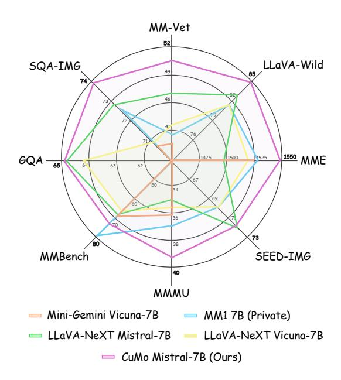
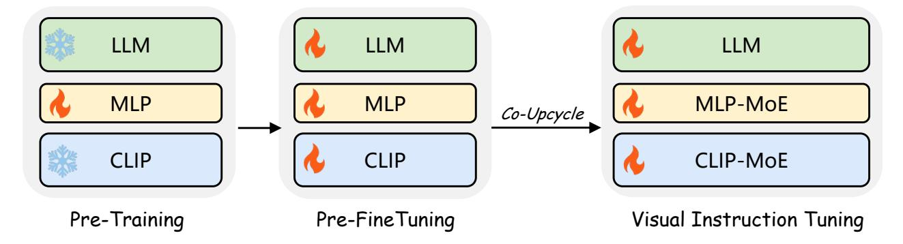
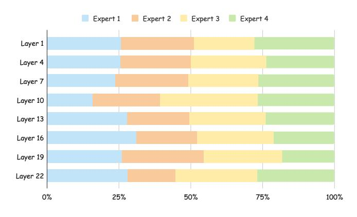

# CuMo: Scaling Multimodal LLM with Co-Upcycled Mixture-of-Experts

Jiachen Li1\* Xinyao Wang2† Sijie Zhu2 Chia-Wen Kuo2 Lu Xu2 Fan Chen2 Jitesh Jain1 Humphrey Shi1† Longyin Wen2 1SHI Labs @ Georgia Tech & UIUC, 2ByteDance Inc.

**<https://github.com/SHI-Labs/CuMo>**

# Abstract

*Recent advancements in Multimodal Large Language Models (LLMs) have focused primarily on scaling by increasing text-image pair data and enhancing LLMs to improve performance on multimodal tasks. However, these scaling approaches are computationally expensive and overlook the significance of efficiently improving model capabilities from the vision side. Inspired by the successful applications of Mixture-of-Experts (MoE) in LLMs, which improves model scalability during training while keeping inference costs similar to those of smaller models, we propose CuMo, which incorporates Co-upcycled Top-K sparselygated Mixture-of-experts blocks into both the vision encoder and the MLP connector, thereby enhancing the multimodal LLMs with neglectable additional activated parameters during inference. CuMo first pre-trains the MLP blocks and then initializes each expert in the MoE block from the pre-trained MLP block during the visual instruction tuning stage, with auxiliary losses to ensure a balanced loading of experts. CuMo outperforms state-of-the-art multimodal LLMs across various VQA and visual-instructionfollowing benchmarks within each model size group, all while training exclusively on open-sourced datasets. The code and model weights for CuMo are open-sourced at [https://github.com/SHI-Labs/CuMo.](https://github.com/SHI-Labs/CuMo)*

## 1. Introduction

The advent of GPT-4V [\[56\]](#page-10-0) has sparked excitement within open-source communities to transform large language models (LLM) into multimodal LLMs. Recent multimodal LLMs [\[3,](#page-8-0) [13,](#page-8-1) [47\]](#page-10-1) typically integrate pre-trained vision encoders and LLMs with visual instruction tuning data to fine-tune the pre-trained LLMs, enhancing their visual understanding capabilities. To further scale up multimodal

Figure 1. Comparisons of CuMo Mistral-7B with state-of-the-art 7B multimodal LLMs. CuMo outperforms strong open-sourced models such as Mini-Gemini and LLaVA-NeXT, as well as the private MM1 model.

LLMs, previous efforts [\[8,](#page-8-2) [42,](#page-9-0) [44,](#page-9-1) [46,](#page-10-2) [48,](#page-10-3) [54\]](#page-10-4) primarily focus on training the model with a more extensive collection of text-image paired data and employing stronger LLMs, significantly increasing training efforts. On the vision side, recent work concentrates on leveraging multiple vision encoders [\[20,](#page-9-2) [45\]](#page-9-3) to enrich visual content, employing larger vision encoders [\[10\]](#page-8-3), and using advanced visionlanguage connectors [\[6\]](#page-8-4) to improve performance on multimodal tasks. However, these techniques result in an increased number of additional parameters and generate additional visual tokens for LLMs to process, making it inefficient to scale.

In terms of efficiently scaling up models, Mixture-of-Experts (MoE) has become the de-facto framework in modern large-scale neural networks, particularly in natu-

\* Work done during an internship at ByteDance Inc., San Jose, CA. Correspondence to X. Wang (xinyao.wang@bytedance.com) and H. Shi.

Figure 2. Architecture of CuMo. CuMo incorporates sparse Top-K MoE blocks into the CLIP vision encoder and vision-language MLP connector, thereby improving the multimodal LLM capabilities from the vision side. Skip connections are omitted for simplicity. Further implementation details are provided in Section [3.2.](#page-3-0)

ral language processing (NLP). Most large language models (LLM) are built upon the transformer [\[68\]](#page-10-5) architecture, wherein sparse MoE is used to replace the dense MLP block with the Top-K sparsely-gated MoE block [\[60\]](#page-10-6). Recent state-of-the-art open-sourced [\[30,](#page-9-4) [65\]](#page-10-7) and private [\[58\]](#page-10-8) LLMs have predominantly adopted the sparse MoE architecture. These models are scaled up using the MoE design during training while maintaining relatively lower inference costs as only selected MLP experts are activated during the feed-forward process. Nevertheless, the development and optimization of MoE-based models have been largely tailored to LLMs, and the exploration of scaling multimodal LLMs with MoE, especially on the vision side, remains largely unexplored.

Motivated by these observations, we introduce CuMo, which integrates Top-K sparsely-gated MoE blocks into the vision encoder and the MLP connector of multimodal LLMs, as depicted in Figure [2.](#page-1-0) We also explore the associated training recipe and methodology for CuMo. Firstly, we pre-train the MLP connector and perform pre-finetuning to warm up the whole model without introducing the MoE architecture, which stabilizes the following visual instruction tuning stage with newly incorporated sparse MoE blocks. Then, we replace each MLP block with the sparse MoE block in the MLP connector and the vision encoder through co-upcycling. Each expert within the sparse MoE block is initialized from the corresponding MLP block after the pretraining and the pre-finetuning stages. Additionally, each MoE block contains a Top-K router trained from scratch to select experts during the visual instruction tuning stage with auxiliary losses on the router to maintain a balanced loading of experts. We conduct further comparisons between co-upcycled LLMs and pre-trained MoE-based LLMs. The results show that the pre-trained MoE-based LLMs significantly outperform the co-upcycled LLMs. As a result, the upcycling of LLMs is not included in CuMo. Our models are trained fully on open-sourced datasets that are converted to visual instruction following formats. Experimental results demonstrate that CuMo outperforms other stateof-the-art multimodal LLMs on various VQA and multimodal instruction-following benchmarks within the same model size group, as illustrated in Figure [1.](#page-0-0) Our contributions can be summarized as follows:

- We introduce CuMo, which integrates co-upcycled sparsely-gated MoE layers into both the MLP connector and the vision encoder, enhancing the multimodal LLM with only slightly additional activated parameters.
- We outline the training methodology for CuMo, including a three-stage training process with auxiliary losses to stabilize training and ensure a balanced loading of experts.
- We train CuMo exclusively on open-sourced datasets and pre-trained models. It outperforms state-of-the-art opensourced and private multimodal LLMs across multiple competitive benchmarks within each model size group.

## 2. Related Works

# 2.1. Multimodal LLM

While the ultimate goal for mulitmodal models may be generative across various modalities [\[4,](#page-8-5) [63,](#page-10-9) [70\]](#page-10-10), modern multimodal LLMs primarily focus on integrating additional modalities, such as vision, into LLMs. Instruct-BLIP [\[13\]](#page-8-1) adopts Q-Former [\[38\]](#page-9-5) to sample from visual tokens for LLM to feed-forward and follow the instructions. Flamingo [\[1\]](#page-8-6) and IDEFICS [\[25,](#page-9-6) [34\]](#page-9-7) use shared decoder for visual-language understanding. Qwen-VL [\[3\]](#page-8-0) uses three-stage training to convert QwenLM to Qwen-VL. LLaVA series [\[46](#page-10-2)[–48\]](#page-10-3) adopt visual instruction tuning that uses instruction-following data to convert LLM into multimodal LLM. ShareGPT4V [\[8\]](#page-8-2) collects detailed image caption data from GPT4V to augment the LLaVA models. HoneyBee [\[6\]](#page-8-4) investigates different designs of the MLP connector for better alignment. VILA [\[44\]](#page-9-1) unfreezes the LLM during pre-training with interleaved image-text data. MoE-LLaVA [\[43\]](#page-9-8) adopts the MoE design in small LLMs and reaches comparable performance to LLaVA with large LLMs. VCoder [\[28\]](#page-9-9) adopts various vision adapters to enhance visual perception abilities. SPHINX [\[20,](#page-9-2) [45\]](#page-9-3) adopts multiple visual encoders to enrich the visual features with scaled data and models. InternLM-Xcomposer [\[14,](#page-8-7) [73\]](#page-10-11) is trained with interleaved text-image composition data and achieves state-of-the-art performance. InternVL [\[10\]](#page-8-3) scales up the vision encoder to a 6B ViT model. MM1 [\[54\]](#page-10-4) summarizes the essential steps towards building a strong multimodal LLM from a pre-trained LLM. Mini-Gemini [\[42\]](#page-9-0) further collects guided generation into the pipeline.

### 2.2. Mixture-of-Experts

Mixture-of-Experts [\[26\]](#page-9-10) is proposed to utilize a set of expert networks to address specific tasks by employing a gating network to determine the selection of these experts. Recently, it has gained popularity in the design of large language models [\[17\]](#page-8-8). The mainstream practice [\[60\]](#page-10-6) is to replace the dense MLP layers with Top-K sparsely-gated mixture-of-experts (MoE) layers in the transformer [\[68\]](#page-10-5).

MoE in Language Subsequent works [\[18,](#page-9-11) [35\]](#page-9-12) have further scaled up MoE-based large language models with improved stability and load balancing of experts. The design of gating networks often involves selecting the top-k experts for each token [\[35,](#page-9-12) [60\]](#page-10-6). Various routing strategies have been explored, such as choosing top-k tokens by experts [\[75\]](#page-11-0), oneto-one matching between experts and tokens [\[36\]](#page-9-13). Besides routing strategies, maintaining the load balance of experts is crucial for training MoE models. ST-MoE [\[77\]](#page-11-1) adopts loading balancing loss and router-z loss to ensure a balanced distribution of the experts. Upcycling [\[33\]](#page-9-14) proposes training sparse experts from dense checkpoints to stabilize training and lower the cost. Recent large language models like Gemini-Pro [\[58\]](#page-10-8) and DBRX [\[65\]](#page-10-7) are also based on the MoE design.

MoE in Vision The success of MoE extends to the vision community, particularly following the popularity of vision transformers [\[5,](#page-8-9) [15,](#page-8-10) [22,](#page-9-15) [23,](#page-9-16) [27,](#page-9-17) [39,](#page-9-18) [76\]](#page-11-2). V-MoE [\[59\]](#page-10-12) reaches

Figure 3. Initialization of MoE blocks via Co-Upcycling. Each MLP expert within the MoE block during the visual instruction tuning stage is initialized from the corresponding pre-trained MLP.

comparable performance to dense ViT while only requiring half of the compute. LIMoE [\[55\]](#page-10-13) replaces dense MLP layers with MoE layers in CLIP and observes improvements in zero-shot image classification. Residual MoE [\[69\]](#page-10-14) corporates residual design into MoE transformer and saves over 30% training cost. AdaMV-MoE [\[9\]](#page-8-11) proposes an adaptive MoE framework for multi-task learning.

# 3. Method

In this section, we first review the sparse MoE block structure and the upcycling strategy utilized in previous studies. Subsequently, we describe how these sparsely-gated MoE blocks are integrated into each module of multimodal LLMs using co-upcycling strategies. Then, we introduce the threestage training process and auxiliary loss functions employed to stabilize training and balance the loads of experts.

### 3.1. Revisit Sparse MoE

Sparse MoE Structure Previous mainstream practice [\[60\]](#page-10-6) is to replace the dense MLP blocks with sparsely-gated mixture-of-experts blocks. Given input X ∈ R N×Cin and a MLP block,

$$X_{out} = \text{MLP}(X) \in \mathbb{R}^{N \times C_{out}}$$
 (1)

To scale up the model with multiple MLP blocks in parallel, a sparse MoE block includes a router network to select Top-K experts out of S total experts. This router network has a linear layer to compute the normalized weight matrix based on the inputs X for voting, resulting in

$$W = \operatorname{Softmax}(\operatorname{Linear}(X)) \in \mathbb{R}^{N \times S}$$
 (2)

The Top-K experts are selected for each token based on W, and the re-normalized weightsWK ∈ R N×K are computed

Figure 4. Training Stages of CuMo. The first stage involves pre-training the MLP for better alignment. Subsequently, the pre-finetuning stage trains all parameters as a warm-up before the next stage. Finally, the MLP experts within each MoE block are initialized from the weights of the corresponding MLP block, followed by training all parameters in the visual instruction tuning stage.

using

$$W_K = \text{Softmax}(\text{TopK}(W)) \in \mathbb{R}^{N \times K}$$
 (3)

Each selected expert is represented by an MLP block, and the final output is obtained through a re-weighted sum

$$X_{out} = \sum_{i}^{K} W_K^i \circ \text{MLP}_i(X) \in \mathbb{R}^{N \times C_{out}}$$
 (4)

the output Xout maintains the same dimension as the output of a single dense MLP block.

Sparse Upcycling Training MoE-based designs from scratch can be unstable and costly. Sparse Upcycling [\[33\]](#page-9-14) addresses this challenge by initializing the experts in each MoE block from the corresponding MLP block in pretrained dense checkpoints. This initialization approach provides a better starting point for training MoE-based models and reduces training costs compared to training from scratch.

# 3.2. CuMo Architecture

Sparse MoE in MLP Connector The MLP connector converts visual tokens into word embedding space, aligning dimensions between visual and text tokens. An effective architecture for the vision-language connector is an MLP block [\[46\]](#page-10-2) that contains two linear layers. We start from a single MLP block and replace it with a Top-K sparse MoE block, incorporating a Top-K router and a set of experts for projecting visual tokens into word embedding space.

Sparse MoE in Vision Encoder Vision encoders extract image features as sequences of visual tokens for reasoning in LLMs. CLIP [\[57\]](#page-10-15) is one the most popular pre-trained vision encoders for multimodal LLM since it is pre-trained on large-scale image-text pairs, which makes it suitable for processing images for multimodal usage. The visual encoding part of CLIP is a ViT [\[15\]](#page-8-10) model, which has consecutive MLP blocks in the transformer encoder. We substitute each MLP block with a Top-K sparse MoE block, retaining skip connections alongside MoE block outputs.

Sparse MoE in LLM In terms of using MoE in LLM, we compare the co-upcycled LLM with pre-trained MoEbased LLM. We start from Mistral-7B and the upcycled Mistral-7B-MoE slightly outperforms Mistral-7B on certain benchmarks. However, considering the constrained knowledge base of upcycled experts from Mistral-7B, we compare it with the pre-trained Mixtral 8x7B with pre-trained experts of a diverse knowledge base. Experimental results reveal that pre-trained Mixtral 8x7B significantly outperforms Mistral-7B-MoE. As a result, LLM is not co-upcycled with CLIP and MLP connectors since it brings marginal improvements with great additional parameters.

## 3.3. Training Recipe

Co-Upcycling MoE blocks We start with training the added MoE blocks from scratch while the model is struggling to converge. Attempts to address this issue with lower learning rates perform worse compared to the baseline. As a result, we adopt a co-upcycling approach, initializing each module that integrates sparsely-gated MoE blocks with pretrained MLPs to replace corresponding MLP blocks, as shown in Figure [3.](#page-2-0) This strategy consistently improves training stability and model performance.

Three-Stage Training To further enhance training stability, we adopt a three-stage training strategy for CuMo models, as illustrated in Figure [4.](#page-3-1) In the first stage, we only pretrain the MLP connector, given that the vision encoder and LLM have already undergone pre-training on large-scale data. During the second pre-finetuning stage, we train all parameters using high-quality caption data to warm up the entire model before introducing MoE blocks in the subsequent stage. The third stage involves visual instruction finetuning, where the multimodal LLM is scaled up with upcycled MoE blocks and trained on visual instruction tuning

|                     |              |       | SQA  | Text | <b></b> | DODE |        | MI   |      | MM                | VQA  | LLaVA             | SEED | MMMU | Math              |
|---------------------|--------------|-------|------|------|---------|------|--------|------|------|-------------------|------|-------------------|------|------|-------------------|
| Method              | LLM          | Act.  | IMG  | VQA  | GQA     | POPE | MME    | EN   | CN   | Vet               | v2   | Wild              | IMG  | val  | Vista             |
| 7B to 13B N         | Models       |       |      |      |         |      |        |      |      |                   |      |                   |      |      |                   |
| InstructBLIP [13]   | Vicuna-7B    | 7.9B  | 60.5 | 50.1 | 49.2    | -    | -      | 36.0 | 23.7 | 26.2              | -    | 60.9              | 60.5 | -    | -                 |
| Qwen-VL-Chat [3]    | Qwen-7B      | -     | 68.2 | 61.5 | 57.5    | -    | 1487.5 | 60.6 | 56.7 | -                 | 78.2 | -                 | 58.2 | 35.9 | -                 |
| LLaVA-v1.5 [46]     | Vicuna-7B    | 7.1B  | 66.8 | 58.2 | 62.0    | 85.9 | 1510.7 | 64.3 | 58.3 | 30.5              | 78.5 | 63.4              | 66.1 | -    | -                 |
| LLaMA-VID [41]      | Vicuna-7B    | -     | 68.3 | -    | 64.3    | 86.0 | 1521.4 | 65.1 | -    | -                 | 79.3 | -                 | 59.9 | -    | -                 |
| VILA [44]           | Vicuna-7B    | 7.1B  | 68.2 | 64.4 | 62.3    | 85.5 | 1533.0 | 68.9 | 61.7 | 34.9              | 79.9 | 69.7              | 61.1 | -    | -                 |
| SPHINX-Intern2 [20] | InternLM2-7B | -     | 70.4 | 58.1 | 56.2    | 86.9 | 1260.4 | 57.9 | -    | 36.5              | 75.5 | 57.6              | 68.8 | -    | 35.5              |
| LLaVA-NeXT [48]     | Mistral-7B   | 7.6B  | 72.8 | 65.7 | 64.8    | 86.7 | 1498   | 68.7 | 61.2 | 47.3              | 82.2 | 83.2              | 72.2 | 35.3 | 37.7              |
| LLaVA-NeXT [48]     | Vicuna-7B    | 7.1B  | 70.1 | 64.9 | 64.2    | 86.5 | 1519   | 67.4 | 60.6 | 43.9              | 81.8 | 81.6              | 70.2 | 35.8 | 34.6              |
| LLaVA-LLaMA3 [12]   | LLaMA3-8B-IT | 8.4B  | 72.9 | 59.0 | 62.6    | 86.4 | 1469   | 72.3 | 66.4 | -                 | -    | -                 | 70.1 | 36.8 | -                 |
| Mini-Gemini [42]    | Vicuna-7B    | 7.3B  | 65.2 | -    | -       | -    | 1523   | 69.3 | -    | 40.8              | -    | -                 | -    | 36.1 | 31.4              |
| MM1 [54]            | MM1-7B       | -     | 72.6 | 72.8 | -       | 86.6 | 1529.3 | 79.0 | -    | 42.1              | 82.8 | 81.5              | 69.9 | 37.0 | 35.9              |
| InstructBLIP [13]   | Vicuna-13B   | 14.2B | 63.1 | 50.7 | 49.5    | 78.9 | 1212.8 | -    | -    | 25.6              | -    | 58.2              | 63.1 | -    | -                 |
| LLaVA-v1.5 [46]     | Vicuna-13B   | 13.4B | 71.6 | 61.3 | 63.3    | 85.9 | 1531.3 | 67.7 | 63.6 | 35.4              | 80.0 | 70.7              | 68.2 | 36.4 | 27.6              |
| VILA [44]           | Vicuna-13B   | 13.4B | 73.7 | 66.6 | 63.3    | 84.2 | 1570.1 | 70.3 | 64.3 | 38.8              | 80.8 | 73.0              | 62.8 | -    | -                 |
| LLaMA-VID [41]      | Vicuna-13B   | -     | 70.0 | -    | 65.0    | 86.0 | 1542.3 | 66.6 | -    | -                 | 80.0 | -                 | 62.3 | -    | -                 |
| SPHINX-Plus [20]    | LLaMA2-13B   | -     | 74.2 | 65.7 | -       | 89.1 | 1457.7 | 71.0 | -    | 47.9              | -    | 71.7              | 74.8 | -    | 36.8              |
| Mini-Gemini[42]     | Vicuna-13B   | 13.6B | 65.9 | -    | -       | -    | 1565   | 68.5 | -    | 46.0              | -    | -                 | -    | 38.1 | 37.0              |
| InternVL-Chat [10]  | Vicuna-13B   | 19B   | -    | 61.5 | 66.6    | 87.6 | 1586.4 | -    | -    | -                 | 81.2 | -                 | -    | -    | -                 |
| LLaVA-NeXT [48]     | Vicuna-13B   | 13.4B | 73.6 | 67.1 | 65.4    | 86.2 | 1575   | 70   | 64.4 | 48.4              | 82.8 | 87.3              | 71.9 | 36.2 | 35.3              |
| CuMo                | Mistral-7B   | 7.8B  | 73.9 | 67.0 | 64.9    | 86.7 | 1548.6 | 73.0 | 66.6 | 51.0 † | 82.2 | 85.7 † | 72.1 | 39.1 | 35.1 † |
| 7B MoE M            | lodels       |       |      |      |         |      |        |      |      |                   |      |                   |      |      |                   |
| SPHINX-MoE [20]     | Mixtral-8×7B | l -   | 74.5 | 68.0 | 63.8    | 89.6 | 1485.3 | 71.3 | _    | 40.9              | 81.1 | 70.2              | 73.0 | 31.1 | 42.7              |
| MM1 [54]            | MM1-7B-MoE   | _     | 75.3 | 72.8 | _       | 87.6 | 1629.0 | 79.7 | _    | 47.0              | 83.4 | 82.0              | 70.4 | 40.9 | 40.9              |
| Mini-Gemini [42]    | Mixtral-8×7B | 13.5B | -    | 69.2 | -       | -    | 1639   | 75.6 | -    | 45.8              | -    | -                 | -    | 41.8 | 41.8              |
| CuMo                | Mixtral-8×7B | 13.5B | 77.9 | 66.0 | 63.8    | 85.7 | 1639.5 | 75.3 | 68.0 | 48.7 † | 81.8 | 84.7 † | 73.2 | 45.0 | 38.2 † |
| Private Me          | odels        |       |      |      |         |      |        |      |      |                   |      |                   |      |      |                   |
| GPT4V [56]          | -            | -     | -    | 78.0 | _       | -    | -      | 77.0 | 74.4 | 60.2              | _    | -                 | -    | 56.8 | 49.9              |
| Gemini 1.5 Pro [58] | _            | -     | -    | 73.5 | -       | _    | -      | 73.6 | 74.3 | 64.3              | 73.2 | -                 | _    | 58.5 | 52.1              |
| Claude 3 Opus [2]   | _            | -     | -    | -    | -       | _    | -      | 63.3 | 59.2 | 58.1              | -    | -                 | _    | 59.4 | 50.5              |
| Qwen-VL-Max [64]    | -            | -     | -    | 79.5 | -       | -    | 1790.1 | 77.6 | 75.1 | 66.6              | -    | -                 | -    | 51.4 | 51.0              |

Table 1. Comparisons between CuMo and other state-of-the-art multimodal LLMs on competitive benchmarks. These models are grouped by the size of the base LLM. The benchmarks are double-rowed due to limited space: SQA-IMG [50]; TextVQA [62]; GQA [24]; POPE [40]; MME [19]; MMBench [49]; MMVet [71]; VQAv2 [21]; LLaVA-Wild [47]; SEED-IMG [37]; MMMU [72]; MathVista [51]. Act.: Activated Parameters. Numbers are averaged by three inference runs of querying GPT API.

data.

**Loss Function** To maintain a load balance between experts in each MoE block, we adopt auxiliary losses based on the language modeling cross-entropy loss. The auxiliary losses comprise loading balance loss and router z-loss [77]. Hence, the total loss is

$$L = L_{ce} + \alpha_b L_b + \alpha_z L_z \tag{5}$$

Here,  $L_{ce}$  represents the language modeling loss, which computes the cross-entropy of next-token predictions.  $\alpha_b$  and  $\alpha_z$  denote coefficients for loading balance loss  $L_b$  and router z-loss  $L_z$ , set to 0.1 and 0.01, respectively, across all experiments. These auxiliary losses, abbreviated as bzloss in Section 4, are individually applied to the MLP connector, vision encoder, and LLM for simplicity.

### 4. Experiments

We train the CuMo models on a mixture of open-sourced datasets, which are converted into the visual instruction tuning format. Then, we conduct comprehensive evaluations of the performance of CuMo models across various competitive VQA-based and instruction-following-based benchmarks. Additionally, we perform ablation studies on each module with upcycled MoE blocks with qualitative analysis of the results.

#### 4.1. Implementation Details

Training Datasets During pre-training, we only utilize LLaVA-558K [47] to train the MLP connector for better alignment. In the subsequent pre-finetuning stage, detailed image caption data from ALLaVA [7] is employed to warm up all parameters of the multimodal LLM. For the final visual instruction tuning stage, a mixture of datasets including LLaVA-665K [46], ShareGPT4V [8], LAION-GPT-V [16], DocVQA [66], ChartQA [52], AI2D [31], InfoVQA [53], SynDog-EN [32], ALLaVA [7], and LIMA [74] is utilized to train the CuMo models with upcycled MoE blocks. The total data size for visual instruction tuning is approximately 1.65 million, and all training data are publicly accessible.

|                   |            |      |            | SQA  | Text |      |      |        | MMI  | Bench | MM   | VQA  | LLaVA | SEED |
|-------------------|------------|------|------------|------|------|------|------|--------|------|-------|------|------|-------|------|
| Method            | LLM        | PT   | IT         | IMG  | VQA  | GQA  | POPE | MME    | EN   | CN    | Vet  | v2   | Wild  | IMG  |
| InstructBLIP [13] | Vicuna-7B  | 129M | 1.2M       | 60.5 | 50.1 | 49.2 | -    | -      | 36.0 | 23.7  | 26.2 | -    | 60.9  | 60.5 |
| InstructBLIP [13] | Vicuna-13B | 129M | 1.2M       | 63.1 | 50.7 | 49.5 | 78.9 | 1212.8 | -    | -     | 25.6 | -    | 58.2  | 63.1 |
| IDEFICS-9B [25]   | LLaMA-7B   | 353M | 1 <b>M</b> | -    | 25.9 | 38.4 | -    | -      | 48.2 | 25.2  | -    | 50.9 | -     | -    |
| IDEFICS-80B [25]  | LLaMA-65B  | 353M | 1 <b>M</b> | -    | 30.9 | 45.2 | -    | -      | 54.5 | 38.1  | -    | 60.0 | -     | -    |
| Qwen-VL [3]       | Qwen-7B    | 1.4B | 50M        | 67.1 | 63.8 | 59.3 | -    | -      | 38.2 | 7.4   | -    | 78.8 | -     | 56.3 |
| Qwen-VL-Chat [3]  | Qwen-7B    | 1.4B | 50M        | 68.2 | 61.5 | 57.5 | -    | 1487.5 | 60.6 | 56.7  | -    | 78.2 | -     | 58.2 |
| LLaVA-v1.5 [46]   | Vicuna-7B  | 558K | 665K       | 66.8 | 58.2 | 62.0 | 85.9 | 1510.7 | 64.3 | 58.3  | 30.5 | 78.5 | 63.4  | 66.1 |
| LLaVA-v1.5 [46]   | Vicuna-13B | 558K | 665K       | 71.6 | 61.3 | 63.3 | 85.9 | 1531.3 | 67.7 | 63.6  | 35.4 | 80.0 | 70.7  | 68.2 |
| CuMo              | Mistral-7B | 558K | 665K       | 71.7 | 59.3 | 63.2 | 87.1 | 1428.6 | 69.6 | 62.6  | 34.3 | 80.6 | 68.8  | 69.6 |

Table 2. Comparisons between CuMo Mistral-7B and other multimodal LMM models with limited training data.

| Method                 | SQA  | $VQA^T$ | MMVet | SEED |
|------------------------|------|---------|-------|------|
| Baseline on Mistral-7B | 72.8 | 57.6    | 32.1  | 66.4 |
| + Top 2-in-4 & Scratch | 68.1 | 55.6    | 29.3  | 65.1 |
|                        | 73.7 | 57.2    | 32.3  | 67.1 |
| + bzloss               | 73.5 | 57.4    | 33.1  | 67.4 |
| ≓ Top 2-in-8 & Upcycle | 73.4 | 57.6    | 32.4  | 67.2 |

Table 3. Ablation study on the MLP-MoE module. Each row represents a different configuration, with changes or additions marked using  $\rightleftharpoons$  and + symbols, respectively. Settings highlighted with a light blue background are those adapted for the MLP-MoE module in Table 1.

| Method                | SQA  | $VQA^T$ | MMVet | SEED |
|-----------------------|------|---------|-------|------|
| MLP-MoE               | 73.5 | 57.4    | 33.1  | 67.4 |
| + Unfreeze CLIP       | 72.0 | 58.9    | 34.7  | 69.0 |
| + Top 2-in-4 & bzloss | 72.8 | 59.7    | 35.4  | 69.8 |
| ⇒ Top 2-in-8 & bzloss | 71.0 | 59.0    | 33.6  | 69.2 |

Table 4. Ablation study on the CLIP-MoE module. All MoE blocks in CLIP are initialized with upcycling.

| Method                                     | SQA  | $VQA^T$ | MMVet | SEED |
|--------------------------------------------|------|---------|-------|------|
| MLP-MoE & CLIP-MoE                         | 71.7 | 59.3    | 34.3  | 69.6 |
| + Mistral 4×7B & Upcycle                   | 72.8 | 57.0    | 35.2  | 69.9 |
| <i>≅ Mistral 8×7B &amp; Upcycle</i>        | 73.2 | 56.4    | 35.7  | 70.5 |
| $\rightleftharpoons$ Mixtral $8 \times 7B$ | 74.2 | 60.6    | 40.0  | 72.6 |

Table 5. Ablation study on the LLM-MoE module. Mixtral  $8\times7B$  outperforms upcycled Mistral MoE models significantly.

The detailed breakdown of the training dataset is listed in Appendix A.

Evaluation Benchmarks Evaluation of CuMo models primarily focuses on academic VQA-based datasets such as VQAv2 [21], GQA [24], Science-QA [50], and TextVQA [62], as well as instruction-following-based LMM benchmarks including POPE [40], MME [19], MM-Bench [49], SEED-Bench [37], LLaVA-Wild [47], and MM-Vet [71]. Additionally, the challenging MMMU [72] and MathVista [51] datasets are evaluated to assess the vi-

sual reasoning abilities of the multimodal LLMs.

Training Settings We employ the pre-trained CLIP ViT-L [57] as the vision encoder, a two-layer MLP as the vision-language connector, and Mistral-7B [29] as the LLM to establish the baseline model following LLaVA v1.5 [46]. We only use LLaVA-558K [46] as pre-training data and LLaVA-665K [46] as visual instruction tuning data to train the baseline model and make ablation studies for comparisons. The learning rate is set to 1e-3 for pre-training the MLP connector and reduced to 2e-5 for visual instruction tuning of both the MLP connector and CLIP. To further stabilize the visual instruction tuning process after scaling up with additional data, the learning rate is lowered to 2e-6 for all parameters of the CuMo models in the final results. More hyperparameters of the training process is listed in Appendix B.

**Evaluation Settings** During evaluation, we adhere to the settings outlined in the LLaVA series [46], employing a greedy decoding strategy for all benchmarks. The data and questions are converted into visual instructions to prompt the multimodal LLMs. For benchmarks that utilize GPT API for evaluation, we adopt gpt-4-0613 for LLaVA-Wild [47] and gpt-3.5-turbo for MathVista [51].

#### 4.2. Main Results

Comparison with SoTA Multimodal LLMs In Table 1, we present a comparison of CuMo models with other state-of-the-art instruction-following-based multimodal LLMs. We categorize the models based on the size of the base LLMs, including 7B models, 13B models, and 7B MoE models. CuMo Mistral-7B outperforms other 7B-based state-of-the-art multimodal LLMs across multiple benchmarks. Moreover, the performance of the CuMo Mistral-7B model is comparable to many 13B-based multimodal LLMs. In the case of Mixtral-8×7B models, CuMo achieves results on par with SPHINX-MoE, MM1, and Mini-Gemini. LLaMA-based LLMs [11, 67] are not utilized in our experiments due to license constraints.

Comparison under limited training data To further evaluate the effectiveness of the co-upcycled MoE blocks, we

| $1 \times$                | $2\times$    | $3\times$    | SQA  | $\mathbf{V}\mathbf{Q}\mathbf{A}^T$ | MMVet | SEED |
|---------------------------|--------------|--------------|------|------------------------------------|-------|------|
| $\checkmark$              | -            | -            | 71.7 | 59.3                               | 34.3  | 69.6 |
| $\overline{\hspace{1em}}$ | <b>√</b>     | -            | 71.7 | 60.6                               | 35.0  | 69.7 |
| $\checkmark$              | -            | $\checkmark$ | 72.9 | 61.0                               | 37.0  | 69.7 |
| $\checkmark$              | $\checkmark$ | $\checkmark$ | 72.2 | 60.5                               | 36.9  | 70.1 |

Table 6. Ablation study on multi-resolution image features. The combination of  $3\times$  and  $1\times$  is adopted for the final models in Table 1.

| Method                      | SQA  | $VQA^T$ | MMVet | SEED |
|-----------------------------|------|---------|-------|------|
| No PFT                      | 71.7 | 59.3    | 34.3  | 69.6 |
| + ShareGPT4V                | 72.4 | 61.7    | 36.5  | 70.0 |
| $\rightleftharpoons$ ALLaVA | 73.0 | 62.8    | 37.2  | 70.9 |

Table 7. Ablation study on the pre-finetuning stage. ALLaVA is chosen for pre-finetuning due to its provision of high-quality image caption data.

train the vanilla CuMo mistral-7B under limited training data in Table 2. It shows that CuMo outperforms other 7B models and reaches comparable performance to LLaVA-v1.5 Vicuna-13B under the same training data.

### 4.3. Ablation Study

Upcycle MLP connector to MLP-MoE We initiate the ablation study by replacing the MLP connector with upcycled MLP-MoE, as depicted in Table 3. We start with a Top 2-in-4 router and train the MoE blocks from scratch, which leads to a clear performance drop on all benchmarks. Then, we adopt the upcycling strategy to initialize the MLP experts. We observe marginal improvements over the baseline, considering each expert comprises only two linear layers. Subsequently, the incorporation of bzloss to ensure a balanced loading of experts in the MLP-MoE yields noticeable enhancements on MMVet. However, employing a Top 2-in-8 router with upcycling and bzloss results in a slight performance decline, possibly due to the limited visual instruction tuning data to train robust and well-balanced eight experts. Empower CLIP with CLIP-MoE In Table 4, initially unfreezing CLIP based on MLP-MoE leads to noticeable improvements on TextVQA and MMVet benchmarks. However, training the added Top2-in-4 MoE blocks in CLIP from scratch proves unsuccessful, as the model fails to converge even with reduced learning rates. Consequently, adopting upcycled MoE blocks during the visual instruction tuning stage yields further enhancements on TextVQA, MMVet, and SEED benchmarks.

**Upcycle LLM vs Pre-trained LLM-MoE** Upon replacing all MLP blocks with sparsely-gated MoE blocks in the visual part, we further investigate the utilization of the MoE architecture in the LLM. Starting from the Mistral-

Figure 5. Expert distributions of MoE blocks in CLIP. We select layers from CLIP and summarize the activated experts during the feed-forward process on the MME test set.

7B model, we first lower the learning rate to 2e-6 to set the baseline and the following experiments since a learning rate of 2e-5 induces training instabilities. Then, we upcycle each MLP block with a sparsely-gated MoE block, initializing the weight of each expert from the pre-trained MLP block. As demonstrated in Table 5, the upcycled Mistral- $4 \times 7B$  and  $8 \times 7B$  outperform the Mistral-7B model slightly except for TextVQA. However, considering that the upcycled experts significantly increase parameters without introducing new knowledge, we replace the upcycled Mistral  $8 \times 7B$  with Mixtral  $8 \times 7B$  [30]. In Mixtral  $8 \times 7B$ , all expert layers are pre-trained on large-scale language data, providing superior initialization compared to upcycling. The results indicate that CuMo Mixtral-8x7B outperforms its upcycled counterparts significantly and is employed in the final models with bzloss to maintain a balanced loading of experts.

**Multi-Resolution Visual Features** Incorporating multi-resolution inputs is crucial for enhancing the understanding of image content in multimodal LLMs. Following the approach outlined in  $S^2$ [61], we introduce multi-resolution inputs to CLIP and concatenate the feature maps channelwise to maintain the total number of visual tokens consistent with low-resolution inputs. As illustrated in Table 6, an empirical combination of  $3\times$  and  $1\times$  yields optimal performance and we adopt this configuration for the final CuMo models.

**Pre-FineTuning Stage** Previous ablation studies were conducted directly after the pre-training of the MLP connector, leading to observed training instabilities during visual instruction tuning. To address this, we introduce a pre-finetuning stage using high-quality image caption data, wherein all parameters are unfrozen. In Table 7, we leverage caption data from ALLaVA for this stage. Results indicate that ALLaVA data proves to be a superior option,

prominently displayed, indicating the film's availability in theaters. The poster also highlights the film's availability in various formats, including 3D, which was a significant selling point at the time of its release.

#### CuMo-Mistral-7B

The poster is for the movie "The Avengers," which is part of the Marvel Cinematic Universe. It features a team of superheroes, each with unique abilities and costumes, coming together to face a significant threat. The central figure, with the iconic red and gold suit, is likely the leader of the group. The presence of the Hulk and Thor suggests that the film includes a mix of science fiction and fantasy elements. The cityscape and the explosion in the background imply that the movie's plot involves a large-scale conflict that impacts the urban environment. The release date and the mention of "3D and IMAX 3D" indicate that the movie was available in various formats, catering to different viewing preferences. The poster is designed to convey the epic scale and the high stakes of the film, as well as the diverse team of heroes that viewers can expect to see on screen.

Figure 6. Dialogues between the user and multimodal LLMs on challenging images. We highlight the correct answers and hallucinations from the responses of the multimodal LLMs.

providing fewer but higher-quality captions for training, ultimately leading to improved performance.

can you introduce this movie based

on this poster

### 4.4. Qualitative Analysis

Expert Distribution As shown in Figure [5,](#page-6-2) we visualize the expert distributions in the MoE block from selected layers at CLIP-MoE. The dataset analyzed is the test set of the MME benchmark. The distribution indicates that the selected experts during inference are evenly spread across layers, providing further evidence of the effectiveness of the auxiliary losses in maintaining load balance.

Dialogue Comparisons Presented in Figure [6,](#page-7-0) we contrast the responses from CuMo-Mistral-7B, LLaVA-Yi-34B, and MiniGemini-Yi-34B. It demonstrates that CuMo-Mistral-7B can effectively follow instructions and predominantly provide correct answers to challenging questions derived from complex scenes. However, CuMo also exhibits instances of hallucinations, such as responding with "2 characters standing on the table," highlighting the need for further investigation to mitigate hallucinations in CuMo.

# 5. Conclusion

In this study, we introduce the sparse mixture-of-experts design into multimodal LLMs. Specifically, we replace each MLP block with a Top-K sparse MoE block in the MLP connector and the vision encoder. To enhance training stability, we employ a three-stage training approach, incorporating upcycled MoE blocks during the visual instruction tuning stage, along with auxiliary bzloss to maintain a balanced loading of experts. All CuMo models are trained and evaluated on fully open-sourced datasets and benchmarks. Through extensive experiments and ablation studies, we validate the effectiveness of the upcycled MoE blocks in each module. CuMo outperforms state-of-the-art models across multiple competitive benchmarks within the same group of model sizes.

Acknowledgments We extend our gratitude to Chunyuan Li, Lei Chen, and Haibin Lin for their insightful and valuable discussions throughout this project.

## References

- [1] Jean-Baptiste Alayrac, Jeff Donahue, Pauline Luc, Antoine Miech, Iain Barr, Yana Hasson, Karel Lenc, Arthur Mensch, Katherine Millican, Malcolm Reynolds, et al. Flamingo: a visual language model for few-shot learning. *Advances in neural information processing systems*, 35:23716–23736, 2022. [3](#page-2-1)
- [2] Anthropic. The claude 3 model family: Opus, sonnet, haiku. [5](#page-4-2)
- [3] Jinze Bai, Shuai Bai, Shusheng Yang, Shijie Wang, Sinan Tan, Peng Wang, Junyang Lin, Chang Zhou, and Jingren Zhou. Qwen-vl: A frontier large vision-language model with versatile abilities. *arXiv preprint arXiv:2308.12966*, 2023. [1,](#page-0-1) [3,](#page-2-1) [5,](#page-4-2) [6](#page-5-4)
- [4] Fan Bao, Shen Nie, Kaiwen Xue, Chongxuan Li, Shi Pu, Yaole Wang, Gang Yue, Yue Cao, Hang Su, and Jun Zhu. One transformer fits all distributions in multi-modal diffusion at scale. In *International Conference on Machine Learning (ICML)*, pages 1692–1717. PMLR, 2023. [2](#page-1-1)

- [5] Nicolas Carion, Francisco Massa, Gabriel Synnaeve, Nicolas Usunier, Alexander Kirillov, and Sergey Zagoruyko. End-toend object detection with transformers. In *European conference on computer vision*. Springer, 2020. [3](#page-2-1)
- [6] Junbum Cha, Wooyoung Kang, Jonghwan Mun, and Byungseok Roh. Honeybee: Locality-enhanced projector for multimodal llm. *arXiv preprint arXiv:2312.06742*, 2023. [1,](#page-0-1) [3](#page-2-1)
- [7] Guiming Hardy Chen, Shunian Chen, Ruifei Zhang, Junying Chen, Xiangbo Wu, Zhiyi Zhang, Zhihong Chen, Jianquan Li, Xiang Wan, and Benyou Wang. Allava: Harnessing gpt4v-synthesized data for a lite vision-language model. *arXiv:2402.11684*, 2024. [5](#page-4-2)
- [8] Lin Chen, Jinsong Li, Xiaoyi Dong, Pan Zhang, Conghui He, Jiaqi Wang, Feng Zhao, and Dahua Lin. Sharegpt4v: Improving large multi-modal models with better captions, 2023. [1,](#page-0-1) [3,](#page-2-1) [5](#page-4-2)
- [9] Tianlong Chen, Xuxi Chen, Xianzhi Du, Abdullah Rashwan, Fan Yang, Huizhong Chen, Zhangyang Wang, and Yeqing Li. Adamv-moe: Adaptive multi-task vision mixture-ofexperts. In *Proceedings of the IEEE/CVF International Conference on Computer Vision (ICCV)*, pages 17346–17357, 2023. [3](#page-2-1)
- [10] Zhe Chen, Jiannan Wu, Wenhai Wang, Weijie Su, Guo Chen, Sen Xing, Muyan Zhong, Qinglong Zhang, Xizhou Zhu, Lewei Lu, Bin Li, Ping Luo, Tong Lu, Yu Qiao, and Jifeng Dai. Internvl: Scaling up vision foundation models and aligning for generic visual-linguistic tasks. *arXiv preprint arXiv:2312.14238*, 2023. [1,](#page-0-1) [3,](#page-2-1) [5](#page-4-2)
- [11] WL Chiang, Z Li, Z Lin, Y Sheng, Z Wu, H Zhang, L Zheng, S Zhuang, Y Zhuang, JE Gonzalez, et al. Vicuna: An opensource chatbot impressing gpt-4 with 90%\* chatgpt quality, mar. 2023. [6](#page-5-4)
- [12] XTuner Contributors. Xtuner: A toolkit for efficiently fine-tuning llm. [https://github.com/InternLM/](https://github.com/InternLM/xtuner) [xtuner](https://github.com/InternLM/xtuner), 2023. [5](#page-4-2)
- [13] Wenliang Dai, Junnan Li, Dongxu Li, Anthony Meng Huat Tiong, Junqi Zhao, Weisheng Wang, Boyang Li, Pascale Fung, and Steven Hoi. Instructblip: Towards generalpurpose vision-language models with instruction tuning. *arXiv preprint arXiv:2305.06500*, 2023. [1,](#page-0-1) [3,](#page-2-1) [5,](#page-4-2) [6](#page-5-4)
- [14] Xiaoyi Dong, Pan Zhang, Yuhang Zang, Yuhang Cao, Bin Wang, Linke Ouyang, Songyang Zhang, Haodong Duan, Wenwei Zhang, Yining Li, et al. Internlm-xcomposer2- 4khd: A pioneering large vision-language model handling resolutions from 336 pixels to 4k hd. *arXiv preprint arXiv:2404.06512*, 2024. [3](#page-2-1)
- [15] Alexey Dosovitskiy, Lucas Beyer, Alexander Kolesnikov, Dirk Weissenborn, Xiaohua Zhai, Thomas Unterthiner, Mostafa Dehghani, Matthias Minderer, Georg Heigold, Sylvain Gelly, et al. An image is worth 16x16 words: Transformers for image recognition at scale. *arXiv preprint arXiv:2010.11929*, 2020. [3,](#page-2-1) [4](#page-3-2)
- [16] LAION eV. Laion/gpt4v-dataset · datasets at hugging face. [5](#page-4-2)
- [17] William Fedus, Jeff Dean, and Barret Zoph. A review of sparse expert models in deep learning. *arXiv preprint arXiv:2209.01667*, 2022. [3](#page-2-1)

- [18] William Fedus, Barret Zoph, and Noam Shazeer. Switch transformers: Scaling to trillion parameter models with simple and efficient sparsity, 2022. [3](#page-2-1)
- [19] Chaoyou Fu, Peixian Chen, Yunhang Shen, Yulei Qin, Mengdan Zhang, Xu Lin, Zhenyu Qiu, Wei Lin, Jinrui Yang, Xiawu Zheng, et al. Mme: A comprehensive evaluation benchmark for multimodal large language models. *arXiv:2306.13394*, 2023. [5,](#page-4-2) [6](#page-5-4)
- [20] Peng Gao, Renrui Zhang, Chris Liu, Longtian Qiu, Siyuan Huang, Weifeng Lin, Shitian Zhao, Shijie Geng, Ziyi Lin, Peng Jin, Kaipeng Zhang, Wenqi Shao, Chao Xu, Conghui He, Junjun He, Hao Shao, Pan Lu, Hongsheng Li, and Yu Qiao. Sphinx-x: Scaling data and parameters for a family of multi-modal large language models. *ArXiv*, abs/2402.05935, 2024. [1,](#page-0-1) [3,](#page-2-1) [5](#page-4-2)
- [21] Yash Goyal, Tejas Khot, Douglas Summers-Stay, Dhruv Batra, and Devi Parikh. Making the v in vqa matter: Elevating the role of image understanding in visual question answering. In *CVPR*, 2017. [5,](#page-4-2) [6](#page-5-4)
- [22] Ali Hassani and Humphrey Shi. Dilated neighborhood attention transformer. *arXiv preprint arXiv:2209.15001*, 2022. [3](#page-2-1)
- [23] Ali Hassani, Steven Walton, Jiachen Li, Shen Li, and Humphrey Shi. Neighborhood attention transformer. In *Proceedings of the IEEE/CVF Conference on Computer Vision and Pattern Recognition*, 2023. [3](#page-2-1)
- [24] Drew A Hudson and Christopher D Manning. Gqa: A new dataset for real-world visual reasoning and compositional question answering. In *CVPR*, 2019. [5,](#page-4-2) [6](#page-5-4)
- [25] IDEFICS. Introducing idefics: An open reproduction of state-of-the-art visual language model. [https://](https://huggingface.co/blog/idefics) [huggingface.co/blog/idefics](https://huggingface.co/blog/idefics), 2023. [3,](#page-2-1) [6](#page-5-4)
- [26] Robert A Jacobs, Michael I Jordan, Steven J Nowlan, and Geoffrey E Hinton. Adaptive mixtures of local experts. *Neural computation*, 3(1):79–87, 1991. [3](#page-2-1)
- [27] Jitesh Jain, Jiachen Li, Mang Tik Chiu, Ali Hassani, Nikita Orlov, and Humphrey Shi. Oneformer: One transformer to rule universal image segmentation. In *Proceedings of the IEEE/CVF Conference on Computer Vision and Pattern Recognition*, pages 2989–2998, 2023. [3](#page-2-1)
- [28] Jitesh Jain, Jianwei Yang, and Humphrey Shi. Vcoder: Versatile vision encoders for multimodal large language models. *arXiv preprint arXiv:2312.14233*, 2023. [3](#page-2-1)
- [29] Albert Q Jiang, Alexandre Sablayrolles, Arthur Mensch, Chris Bamford, Devendra Singh Chaplot, Diego de las Casas, Florian Bressand, Gianna Lengyel, Guillaume Lample, Lucile Saulnier, et al. Mistral 7b. *arXiv preprint arXiv:2310.06825*, 2023. [6](#page-5-4)
- [30] Albert Q Jiang, Alexandre Sablayrolles, Antoine Roux, Arthur Mensch, Blanche Savary, Chris Bamford, Devendra Singh Chaplot, Diego de las Casas, Emma Bou Hanna, Florian Bressand, et al. Mixtral of experts. *arXiv:2401.04088*, 2024. [2,](#page-1-1) [7](#page-6-3)
- [31] Aniruddha Kembhavi, Mike Salvato, Eric Kolve, Minjoon Seo, Hannaneh Hajishirzi, and Ali Farhadi. A diagram is worth a dozen images. In *ECCV*, 2016. [5](#page-4-2)

- [32] Geewook Kim, Teakgyu Hong, Moonbin Yim, JeongYeon Nam, Jinyoung Park, Jinyeong Yim, Wonseok Hwang, Sangdoo Yun, Dongyoon Han, and Seunghyun Park. Ocr-free document understanding transformer. In *European Conference on Computer Vision*, pages 498–517. Springer, 2022. [5](#page-4-2)
- [33] Aran Komatsuzaki, Joan Puigcerver, James Lee-Thorp, Carlos Riquelme Ruiz, Basil Mustafa, Joshua Ainslie, Yi Tay, Mostafa Dehghani, and Neil Houlsby. Sparse upcycling: Training mixture-of-experts from dense checkpoints, 2023. [3,](#page-2-1) [4](#page-3-2)
- [34] Hugo Laurenc¸on, Leo Tronchon, Matthieu Cord, and Victor ´ Sanh. What matters when building vision-language models? *arXiv preprint arXiv:2405.02246*, 2024. [3](#page-2-1)
- [35] Dmitry Lepikhin, HyoukJoong Lee, Yuanzhong Xu, Dehao Chen, Orhan Firat, Yanping Huang, Maxim Krikun, Noam M. Shazeer, and Z. Chen. Gshard: Scaling giant models with conditional computation and automatic sharding. *ArXiv*, abs/2006.16668, 2020. [3](#page-2-1)
- [36] Mike Lewis, Shruti Bhosale, Tim Dettmers, Naman Goyal, and Luke Zettlemoyer. Base layers: Simplifying training of large, sparse models, 2021. [3](#page-2-1)
- [37] Bohao Li, Rui Wang, Guangzhi Wang, Yuying Ge, Yixiao Ge, and Ying Shan. Seed-bench: Benchmarking multimodal llms with generative comprehension. *arXiv:2307.16125*, 2023. [5,](#page-4-2) [6](#page-5-4)
- [38] Junnan Li, Dongxu Li, Silvio Savarese, and Steven Hoi. Blip-2: Bootstrapping language-image pre-training with frozen image encoders and large language models. *arXiv preprint arXiv:2301.12597*, 2023. [3](#page-2-1)
- [39] Jiachen Li, Vidit Goel, Marianna Ohanyan, Shant Navasardyan, Yunchao Wei, and Humphrey Shi. Vmformer: End-to-end video matting with transformer. In *Proceedings of the IEEE/CVF Winter Conference on Applications of Computer Vision*, pages 6678–6687, 2024. [3](#page-2-1)
- [40] Yifan Li, Yifan Du, Kun Zhou, Jinpeng Wang, Wayne Xin Zhao, and Ji-Rong Wen. Evaluating object hallucination in large vision-language models. *arXiv:2305.10355*, 2023. [5,](#page-4-2) [6](#page-5-4)
- [41] Yanwei Li, Chengyao Wang, and Jiaya Jia. Llama-vid: An image is worth 2 tokens in large language models. *arXiv:2311.17043*, 2023. [5](#page-4-2)
- [42] Yanwei Li, Yuechen Zhang, Chengyao Wang, Zhisheng Zhong, Yixin Chen, Ruihang Chu, Shaoteng Liu, and Jiaya Jia. Mini-gemini: Mining the potential of multi-modality vision language models, 2024. [1,](#page-0-1) [3,](#page-2-1) [5](#page-4-2)
- [43] Bin Lin, Zhenyu Tang, Yang Ye, Jiaxi Cui, Bin Zhu, Peng Jin, Junwu Zhang, Munan Ning, and Li Yuan. Moe-llava: Mixture of experts for large vision-language models. *arXiv preprint arXiv:2401.15947*, 2024. [3](#page-2-1)
- [44] Ji Lin, Hongxu Yin, Wei Ping, Yao Lu, Pavlo Molchanov, Andrew Tao, Huizi Mao, Jan Kautz, Mohammad Shoeybi, and Song Han. Vila: On pre-training for visual language models. *arXiv preprint arXiv:2312.07533*, 2023. [1,](#page-0-1) [3,](#page-2-1) [5](#page-4-2)
- [45] Ziyi Lin, Chris Liu, Renrui Zhang, Peng Gao, Longtian Qiu, Han Xiao, Han Qiu, Chen Lin, Wenqi Shao, Keqin Chen, Jiaming Han, Siyuan Huang, Yichi Zhang, Xuming He, Hongsheng Li, and Yu Qiao. Sphinx: The joint mixing of weights,

- tasks, and visual embeddings for multi-modal large language models, 2023. [1,](#page-0-1) [3](#page-2-1)
- [46] Haotian Liu, Chunyuan Li, Yuheng Li, and Yong Jae Lee. Improved baselines with visual instruction tuning. *arXiv preprint arXiv:2310.03744*, 2023. [1,](#page-0-1) [3,](#page-2-1) [4,](#page-3-2) [5,](#page-4-2) [6](#page-5-4)
- [47] Haotian Liu, Chunyuan Li, Qingyang Wu, and Yong Jae Lee. Visual instruction tuning, 2023. [1,](#page-0-1) [5,](#page-4-2) [6](#page-5-4)
- [48] Haotian Liu, Chunyuan Li, Yuheng Li, Bo Li, Yuanhan Zhang, Sheng Shen, and Yong Jae Lee. Llava-next: Improved reasoning, ocr, and world knowledge, 2024. [1,](#page-0-1) [3,](#page-2-1) [5](#page-4-2)
- [49] Yuan Liu, Haodong Duan, Yuanhan Zhang, Bo Li, Songyang Zhang, Wangbo Zhao, Yike Yuan, Jiaqi Wang, Conghui He, Ziwei Liu, et al. Mmbench: Is your multi-modal model an all-around player? *arXiv:2307.06281*, 2023. [5,](#page-4-2) [6](#page-5-4)
- [50] Pan Lu, Swaroop Mishra, Tanglin Xia, Liang Qiu, Kai-Wei Chang, Song-Chun Zhu, Oyvind Tafjord, Peter Clark, and Ashwin Kalyan. Learn to explain: Multimodal reasoning via thought chains for science question answering. In *NeurIPS*, 2022. [5,](#page-4-2) [6](#page-5-4)
- [51] Pan Lu, Hritik Bansal, Tony Xia, Jiacheng Liu, Chunyuan Li, Hannaneh Hajishirzi, Hao Cheng, Kai-Wei Chang, Michel Galley, and Jianfeng Gao. Mathvista: Evaluating mathematical reasoning of foundation models in visual contexts. In *ICLR*, 2024. [5,](#page-4-2) [6](#page-5-4)
- [52] Ahmed Masry, Do Xuan Long, Jia Qing Tan, Shafiq Joty, and Enamul Hoque. Chartqa: A benchmark for question answering about charts with visual and logical reasoning. *arXiv:2203.10244*, 2022. [5](#page-4-2)
- [53] Minesh Mathew, Viraj Bagal, Ruben Tito, Dimosthenis ` Karatzas, Ernest Valveny, and CV Jawahar. Infographicvqa. In *Proceedings of the IEEE/CVF Winter Conference on Applications of Computer Vision*, pages 1697–1706, 2022. [5](#page-4-2)
- [54] Brandon McKinzie, Zhe Gan, Jean-Philippe Fauconnier, Sam Dodge, Bowen Zhang, Philipp Dufter, Dhruti Shah, Xianzhi Du, Futang Peng, Floris Weers, Anton Belyi, Haotian Zhang, Karanjeet Singh, Doug Kang, Ankur Jain, Hongyu He, Max Schwarzer, Tom Gunter, Xiang Kong, Aonan ` Zhang, Jianyu Wang, Chong Wang, Nan Du, Tao Lei, Sam Wiseman, Guoli Yin, Mark Lee, Zirui Wang, Ruoming Pang, Peter Grasch, Alexander Toshev, and Yinfei Yang. Mm1: Methods, analysis, insights from multimodal llm pretraining, 2024. [1,](#page-0-1) [3,](#page-2-1) [5](#page-4-2)
- [55] Basil Mustafa, Carlos Riquelme, Joan Puigcerver, Rodolphe Jenatton, and Neil Houlsby. Multimodal contrastive learning with limoe: the language-image mixture of experts, 2022. [3](#page-2-1)
- [56] OpenAI. Gpt-4v(ision) system card. 2023. [1,](#page-0-1) [5](#page-4-2)
- [57] Alec Radford, Jong Wook Kim, Chris Hallacy, Aditya Ramesh, Gabriel Goh, Sandhini Agarwal, Girish Sastry, Amanda Askell, Pamela Mishkin, Jack Clark, et al. Learning transferable visual models from natural language supervision. In *ICML*, 2021. [4,](#page-3-2) [6](#page-5-4)
- [58] Machel Reid, Nikolay Savinov, Denis Teplyashin, Dmitry Lepikhin, Timothy Lillicrap, Jeffrey Dean, and et al. Oriol Vinyals. Gemini 1.5: Unlocking multimodal understanding across millions of tokens of context, 2024. [2,](#page-1-1) [3,](#page-2-1) [5](#page-4-2)

- [59] Carlos Riquelme, Joan Puigcerver, Basil Mustafa, Maxim Neumann, Rodolphe Jenatton, Andre Susano Pinto, Daniel ´ Keysers, and Neil Houlsby. Scaling vision with sparse mixture of experts, 2021. [3](#page-2-1)
- [60] Noam Shazeer, Azalia Mirhoseini, Krzysztof Maziarz, Andy Davis, Quoc Le, Geoffrey Hinton, and Jeff Dean. Outrageously large neural networks: The sparsely-gated mixtureof-experts layer, 2017. [2,](#page-1-1) [3](#page-2-1)
- [61] Baifeng Shi, Ziyang Wu, Maolin Mao, Xin Wang, and Trevor Darrell. When do we not need larger vision models? *arXiv preprint arXiv:2403.13043*, 2024. [7](#page-6-3)
- [62] Amanpreet Singh, Vivek Natarajan, Meet Shah, Yu Jiang, Xinlei Chen, Dhruv Batra, Devi Parikh, and Marcus Rohrbach. Towards vqa models that can read. In *CVPR*, 2019. [5,](#page-4-2) [6](#page-5-4)
- [63] Zineng Tang, Ziyi Yang, Chenguang Zhu, Michael Zeng, and Mohit Bansal. Any-to-any generation via composable diffusion. *Advances in Neural Information Processing Systems*, 36, 2024. [2](#page-1-1)
- [64] Qwen Team. Introducing qwen-vl, 2024. [5](#page-4-2)
- [65] The Mosaic Research Team. Introducing dbrx: A new stateof-the-art open llm, 2024. [2,](#page-1-1) [3](#page-2-1)
- [66] Ruben Tito, Dimosthenis Karatzas, and Ernest Valveny. Doc- ` ument collection visual question answering. In *ICDAR 2021*, 2021. [5](#page-4-2)
- [67] Hugo Touvron and et al. Louis Martin. Llama 2: Open foundation and fine-tuned chat models, 2023. [6](#page-5-4)
- [68] Ashish Vaswani, Noam Shazeer, Niki Parmar, Jakob Uszkoreit, Llion Jones, Aidan N Gomez, Łukasz Kaiser, and Illia Polosukhin. Attention is all you need. *Advances in neural information processing systems*, 2017. [2,](#page-1-1) [3](#page-2-1)
- [69] Lemeng Wu, Mengchen Liu, Yinpeng Chen, Dongdong Chen, Xiyang Dai, and Lu Yuan. Residual mixture of experts, 2022. [3](#page-2-1)
- [70] Xingqian Xu, Zhangyang Wang, Gong Zhang, Kai Wang, and Humphrey Shi. Versatile diffusion: Text, images and variations all in one diffusion model. In *Proceedings of the IEEE/CVF International Conference on Computer Vision*, pages 7754–7765, 2023. [2](#page-1-1)
- [71] Weihao Yu, Zhengyuan Yang, Linjie Li, Jianfeng Wang, Kevin Lin, Zicheng Liu, Xinchao Wang, and Lijuan Wang. Mm-vet: Evaluating large multimodal models for integrated capabilities. *arXiv:2308.02490*, 2023. [5,](#page-4-2) [6](#page-5-4)
- [72] Xiang Yue, Yuansheng Ni, Kai Zhang, Tianyu Zheng, Ruoqi Liu, Ge Zhang, Samuel Stevens, Dongfu Jiang, Weiming Ren, Yuxuan Sun, Cong Wei, Botao Yu, Ruibin Yuan, Renliang Sun, Ming Yin, Boyuan Zheng, Zhenzhu Yang, Yibo Liu, Wenhao Huang, Huan Sun, Yu Su, and Wenhu Chen. Mmmu: A massive multi-discipline multimodal understanding and reasoning benchmark for expert agi. In *CVPR*, 2024. [5,](#page-4-2) [6](#page-5-4)
- [73] Pan Zhang, Xiaoyi Dong Bin Wang, Yuhang Cao, Chao Xu, Linke Ouyang, Zhiyuan Zhao, Shuangrui Ding, Songyang Zhang, Haodong Duan, Hang Yan, et al. Internlmxcomposer: A vision-language large model for advanced text-image comprehension and composition. *arXiv preprint arXiv:2309.15112*, 2023. [3](#page-2-1)

- [74] Chunting Zhou, Pengfei Liu, Puxin Xu, Srinivasan Iyer, Jiao Sun, Yuning Mao, Xuezhe Ma, Avia Efrat, Ping Yu, Lili Yu, et al. Lima: Less is more for alignment. *Advances in Neural Information Processing Systems*, 36, 2024. [5](#page-4-2)
- [75] Yanqi Zhou, Tao Lei, Hanxiao Liu, Nan Du, Yanping Huang, Vincent Zhao, Andrew Dai, Zhifeng Chen, Quoc Le, and James Laudon. Mixture-of-experts with expert choice routing, 2022. [3](#page-2-1)
- [76] Xizhou Zhu, Weijie Su, Lewei Lu, Bin Li, Xiaogang Wang, and Jifeng Dai. Deformable detr: Deformable transformers for end-to-end object detection. In *International Conference on Learning Representations*, 2020. [3](#page-2-1)
- [77] Barret Zoph, Irwan Bello, Sameer Kumar, Nan Du, Yanping Huang, Jeff Dean, Noam Shazeer, and William Fedus. Stmoe: Designing stable and transferable sparse expert models, 2022. [3,](#page-2-1) [5](#page-4-2)

| Dataset            | Size   |
|--------------------|--------|
| Pre-Training       | ,      |
| LCS-558K           | 558K   |
| Pre-Finetunin      | g      |
| ALLaVA-Caption     | 708K   |
| Visual Instruction | Tuning |
| LLaVA-665K         | 665K   |
| ShareGPT4V         | 102K   |
| LAION-GPT-V        | 11K    |
| DocVQA             | 10K    |
| SynDog-EN          | 50K    |
| ChartQA            | 4K     |
| DVQA               | 50K    |
| AI2D               | 2K     |
| InfoVQA            | 4K     |
| ALLaVA             | 708K   |
| LIMA               | 1K     |
| ALLaVA-Text        | 143K   |

Table 8. List of datasets used for three training stages.

# **Appendix**

The supplementary material elaborates on further aspects of our work concerning the experimental setups and dataset usage. In Appendix A, we provide details on the datasets used for the visual instruction tuning stage and how we converted the mixture of datasets into the visual instruction following formats. In Appendix B, we present the hyperparameters used for the three-stage trainings. In Appendix D, we include additional examples of dialogues between the user and our M3 models.

#### A. Dataset Details

As outlined in Table 8, we provide detailed information on the datasets utilized for the three-stage training process mentioned in Section 3.3. All data are converted into the instruction-following format for training. For the Syndog-EN and DVQA datasets, we didn't use the entire training set as we observed that a large portion of synthetic data negatively impacts the zero-shot performance of the multimodal LLMs.

### **B.** Experimental Setup Details

Table 9 provides an overview of the main hyperparameters used during the three-stage training process. For the final results presented in Table 1, the model was trained using 32 × A100 GPUs with a total batch size of 256 and a learning rate of 4e-6. All ablation studies were conducted with a total batch size of 128 and learning rates of 2e-5 and 2e-6, as detailed in Section 4.3.

| Hyperparameter    | PT     | PFT     | VIT           |
|-------------------|--------|---------|---------------|
| learning rate     | 1e-3   | 2e-6    | 4e-6          |
| lr schedule       | Cosine | Cosine  | Cosine        |
| batchsize per GPU | 32     | 8       | 8             |
| GPUs              | 8×A100 | 16×A100 | 32×A100       |
| Zero              | Zero2  | Zero3   | Zero3-offload |
| Optimizer         | AdamW  | AdamW   | AdamW         |
| MLP               | Open   | Open    | Open          |
| CLIP              | Freeze | Open    | Open          |
| LLM               | Freeze | Open    | Open          |
| MoE blocks        | -      | -       | ✓             |
| Max Token         | 2048   | 4096    | 4096          |

Table 9. Hyperparameters used in three-stage training on Mistral-7B. PT: Pre-Training stage. PFT: Pre-FineTuning stage. VIT: Visual Instruction tuning stage.

| CuMo                              | CLIP  | MLP    | LLM    | Total  |
|-----------------------------------|-------|--------|--------|--------|
| Mistral-7B                        | 0.30B | 0.025B | 7.25B  | 7.58B  |
| ⇔ Activation Params               | 0.30B | 0.025B | 7.25B  | 7.58B  |
| + Top 2-in-4 MLP-MoE              | 0.30B | 0.10B  | 7.25B  | 7.65B  |
|                                   | 0.30B | 0.05B  | 7.25B  | 7.60B  |
| + Top 2-in-4 CLIP-MoE             | 0.91B | 0.10B  | 7.25B  | 8.26B  |
|                                   | 0.50B | 0.05B  | 7.25B  | 7.80B  |
| $\rightleftharpoons$ Mixtral-8x7B | 0.91B | 0.10B  | 46.70B | 47.71B |
|                                   | 0.50B | 0.05B  | 12.90B | 13.45B |

Table 10. Change of model parameters of CuMo. The 7.80B and 13.45B activation parameters corresponds to Act. of CuMo in Table 1.

#### C. Model Parameters

We include Table 10 to illustrate the evolution of parameters in the CuMo model throughout its construction process. The LLM constitutes a significant proportion of the total parameters, underscoring the potential for further scaling up the vision encoders to bolster the strength of multimodal LLMs.

### **D.** More Dialogues

We add more dialogues between the questions from user and the response from CuMo in Figure 7.

Figure 7. More dialogues between the user and CuMo. We highlight the correct answers and hallucinations from the responses of CuMo.