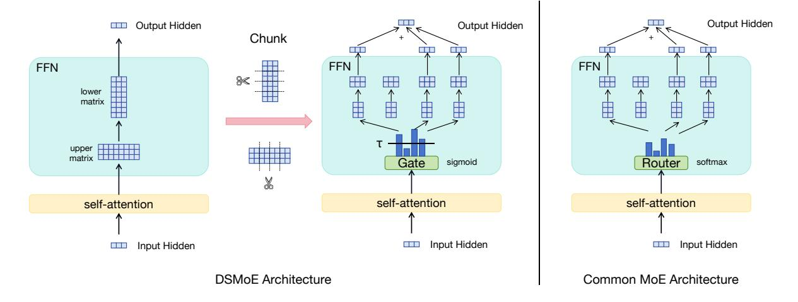

# DSMoE: Matrix-Partitioned Experts with Dynamic Routing for Computation-Efficient Dense LLMs

Minxuan Lv 1,2\*, Zhenpeng Su1,2,3\*, Leiyu Pan4 ,Yizhe Xiong5 ,Zijia Lin3,5†,Hui Chen5†,Wei Zhou1,2 Jungong Han5 ,Guiguang Ding5 ,Cheng Luo3 ,Di Zhang3 ,Kun Gai3 ,Songlin Hu1,2†

> 1 Institute of Information Engineering, Chinese Academy of Sciences 2University of Chinese Academy of Sciences 3Kuaishou Technology, 4Tianjin University, 5Tsinghua University {lvminxuan,husonglin}@iie.ac.cn huichen@tsinghua.edu.cn {suzhenpeng,linzijia}@kuaishou.com

# Abstract

As large language models continue to scale, computational costs and resource consumption have emerged as significant challenges. While existing sparsification methods like pruning reduce computational overhead, they risk losing model knowledge through parameter removal. This paper proposes DSMoE (Dynamic Sparse Mixture-of-Experts), a novel approach that achieves sparsification by partitioning pretrained FFN layers into computational blocks. We implement adaptive expert routing using sigmoid activation and straight-through estimators, enabling tokens to flexibly access different aspects of model knowledge based on input complexity. Additionally, we introduce a sparsity loss term to balance performance and computational efficiency. Extensive experiments on LLaMA models demonstrate that under equivalent computational constraints, DSMoE achieves superior performance compared to existing pruning and MoE approaches across language modeling and downstream tasks, particularly excelling in generation tasks. Analysis reveals that DSMoE learns distinctive layerwise activation patterns, providing new insights for future MoE architecture design.

## 1 Introduction

Large Language Models(LLM) have demonstrated remarkable performance across various downstream tasks[\(Touvron et al.,](#page-10-0) [2023;](#page-10-0) [Dai et al.,](#page-9-0) [2022;](#page-9-0) [Anil et al.,](#page-8-0) [2023;](#page-8-0) [Biderman et al.,](#page-8-1) [2023\)](#page-8-1). However, as model sizes continue to expand, computational costs and resource consumption grow exponentially. How to improve computational efficiency while maintaining model performance has become a pressing challenge[\(Cheng et al.,](#page-8-2) [2024\)](#page-8-2).

At the algorithmic level, approaches to model efficiency optimization generally follow two paradigms: post-training compression and acceleration of dense models, or training of Mixture of Experts (MoE) architectures. While compression methods like pruning achieve efficiency through permanent parameter removal[\(Ashkboos et al.,](#page-8-3) [2024;](#page-8-3) [Ma et al.,](#page-9-1) [2023;](#page-9-1) [Frantar and Alistarh,](#page-9-2) [2023\)](#page-9-2), they may discard valuable knowledge and lack flexibility in handling inputs of varying complexity. Conversely, though MoE approaches effectively expand model capacity[\(Fedus et al.,](#page-9-3) [2022;](#page-9-3) [Dai et al.,](#page-8-4) [2024;](#page-8-4) [Liu et al.,](#page-9-4) [2024\)](#page-9-4), traditional MoE typically employs fixed activation patterns where each token can only access a predetermined number of experts, lacking the ability to dynamically adjust computation based on input complexity. Given that the most widely used and effective foundation models still maintain dense architectures (such as LLaMA[\(Touvron et al.,](#page-10-0) [2023\)](#page-10-0), Qwen[\(Bai et al.,](#page-8-5) [2023\)](#page-8-5)), we face a critical challenge: how to achieve truly input-adaptive computation while preserving pre-trained knowledge, allowing models to dynamically adjust activated parameters according to varying input complexity, thereby reaching an optimal balance between computational efficiency and model performance.

To address this challenge, we propose DSMoE, a novel approach that partitions pre-trained FFN layers into computational blocks and introduces dynamic routing mechanisms. DSMoE fundamentally differs from existing methods by preserving the original model parameters and reorganizing them into expert networks, while incorporating adaptive routing mechanisms that enable dynamic expert activation based on input complexity, rather than fixed activation strategies. Through straightthrough estimator and sparsity loss design, DSMoE enables the model to autonomously learn sparse expert activation patterns, achieving computational resource allocation for inputs of varying complex-

\*These authors contributed equally to this work.

†Corresponding authors.

This work was supported by National Natural Science Foundation of China (Nos. 62271281, 62441235, 62525103). It was also sponsored by CCF-Kuaishou Large Model Explorer Fund (No. CCF-Kuaishou 2024001).

Figure 1: The Overview of DSMoE versus Traditional MoE Framework Architectures. The structure shown in the figure is a simplified representation of the transformer backbone. We have simplified the FFN layer structure here; the FFN layer also includes a gating matrix with dimensions matching the upper matrix, which performs Hadamard multiplication with the upper matrix without affecting our partitioning scheme. In the FFN layer, we partition matrices along the intermediate dimension, where portions corresponding to the original matrix multiplication form new expert FFN layers.

ity.

Extensive experiments conducted on LLaMA-1B and LLaMA-7B models demonstrate encouraging results. Under equivalent computational constraints, our method achieves significant improvements in language modeling perplexity and downstream task performance compared to existing pruning and MoE approaches. Notably superior performance is observed in reasoning and question-answering tasks, particularly in generation tasks.

The main contributions of this work include:

- proposing a novel approach that enables transition from dense to dynamically sparse models by preserving and partitioning pre-trained knowledge, enabling different tokens to adaptively access varying portions of model knowledge.
- validating the method's effectiveness across multiple benchmarks through extensive experimentation, providing new insights for MoE large model optimization.

#### 2 Related Work

Model pruning is an effective approach to achieving sparse LLMs while maintaining model functionality. Pruning methods can be categorized into two main types: unstructured and structured pruning. Unstructured pruning operates at the weight level, allowing for arbitrary weight removal (Lee et al., 2018). In large language models, pruned

weights are set to zero (Frantar and Alistarh, 2023; Sun et al., 2023). However, this method requires specialized hardware and software support for acceleration(Han et al., 2015; Wen et al., 2016; Filters'Importance, 2016; Tang et al., 2021). Structured pruning takes a coarser-grained approach by removing complete structural units such as convolution kernels, channels, attention heads, or entire layers (You et al., 2019; Ashkboos et al., 2024; Liu et al., 2021; Ma et al., 2023; Men et al.). Its main advantage is the ability to directly produce regular, narrow model architectures that can achieve acceleration without specialized sparse computation libraries (Luo et al., 2017; Liu et al., 2021; Filters'Importance, 2016; Nonnenmacher et al., 2021). However, both approaches face a fundamental limitation: achieving efficiency through permanent parameter removal may discard valuable knowledge and lose the ability to adapt computation based on input complexity.

The Mixture of Experts architecture is recognized as a promising approach for model sparsification. Recently, it has garnered significant research attention, with several studies investigating methodologies for converting pre-trained models into MoE architectures.

While various MoE approaches exist with different objectives, methods like Llama-MoE v2 focus on post-training optimization of instruction-tuned models, and approaches like DTSI target parameter efficiency during training from scratch. How-

ever, these methods either address specialized posttraining scenarios or require training models from initialization, whereas our approach specifically targets sparsification of pre-trained dense models during the pre-training stage.

MoEfication(Zhang et al., 2022) trains routers to predict the activation patterns of experts that are partitioned from FFNs while keeping model parameters frozen, thereby activating a fixed number of experts. However, this method was primarily designed for ReLU activation functions and requires additional transformation steps for SiLU/GeLU activation functions that are widely utilized in contemporary Transformer architectures. FactorLLM(Zhao et al., 2024) employs a multistage training strategy, initially utilizing the original dense model to guide router training, followed by fixing the router and subsequently training the experts. This sequential training methodology constrains collaborative optimization between routers and experts, and its dependence on a teacher-student framework introduces additional training complexity. LLaMA-MoE(Zhu et al., 2024) explores the decomposition of FFNs and organizes training according to the Switch Transformer(Fedus et al., 2022) paradigm; however, it merely provides improved expert initialization while lacking flexible input-adaptive computation mechanisms. Given that MoEfication and FactorLLM differ significantly from mainstream MoE methods in architecture design and training paradigms, we choose to use LLaMA-MoE as a comparative approach.

Recent dynamic pruning methods such as DejaVu(Liu et al., 2023) and PowerInfer(Song et al., 2024) can adaptively select activated weights based on input patterns. However, these approaches primarily focus on system-level acceleration through specialized hardware configurations: DejaVu requires integration with asynchronous hardware-aware implementations including kernel fusion and memory coalescing, while PowerInfer employs GPU-CPU hybrid inference engines to exploit locality patterns and minimize communication overhead. In contrast, our method employs algorithm-level sparsification, which reduces the model's floating-point operations.

#### 3 Background

For simplicity, we focus on the prevalent architecture of generative large language models while

maintaining a concise mathematical formulation. In autoregressive generation tasks, given a sequence  $X=(x_1,x_2,...,x_T)$  of length T, the model iteratively produces a probability distribution over the vocabulary for each position conditioned on preceding tokens. This process can be formulated as:

$$\begin{split} P_{\cdot,t} &= \operatorname{softmax}(EH_{\cdot,t}^L) \\ H^L &= \operatorname{Transformer}(x_1, x_2, ..., x_{T-1}) \end{split} \tag{1}$$

Here, L denotes the number of layers in the Transformer architecture. For any position t,  $P_{\cdot,t}$  represents the probability distribution over the vocabulary, derived from the t-th column of the hidden state matrix  $h^L$ . Specifically,  $H^L = [h_1^L, h_2^L, ..., h_{T-1}^L]$  contains the hidden representations from the final layer, where  $h_t^L$  is the contextual embedding at position t. The probability of the ground-truth token  $x_{t+1}$  is denoted as  $P_{x_{t+1},t}$  in the distribution  $P \cdot t$ . The transformation from hidden states to probability distributions is achieved through a linear projection matrix E, followed by a softmax operation.

In typical scenarios, we employ cross-entropy loss for autoregressive learning, which can be expressed as:

$$\mathcal{L}_{LM} = -\sum_{t=1}^{T-1} \log P(x_{t+1}|x_{\leq t})$$
 (2)

The Transformer architecture consists of multiple layer-wise submodules, where each layer comprises a self-attention module and a Feed-Forward Network (FFN) module. The simplified mathematical formulation can be expressed as:

$$\hat{h_t^l} = \text{Attn}([h_1^{l-1}, h_2^{l-1}, ..., h_t^{l-1}]) \tag{3}$$

$$h_t^l = \text{FFN}(\hat{h_t^l}) \tag{4}$$

FFN modules typically consist of two matrix transformations with a non-linear activation function. In modern language models, the most prevalent FFN implementation uses SwiGLU activation, which involves three essential matrices: the upprojection matrix  $\mathbf{U}_{up}$ , the down-projection matrix  $\mathbf{V}_{down}$ , and the gate matrix  $\mathbf{W}_{gate}$ . The upprojection matrix transforms the input to a higher dimensional space for richer feature representation, the down-projection matrix compresses the information back to the original dimension, and the gate matrix controls information flow through adaptive

feature weighting. The FFN output is computed through the following operation:

$$h_t^l = (act(\hat{h_t^l}W_{gate}) \odot (\hat{h_t^l}U_{up}))V_{down} \quad (5)$$

In this formulation,  $act(\cdot)$  represents the activation function and  $\odot$  denotes Hadamard product.

### 4 Method

Although our method is termed DSMoE, its training approach differs from traditional MoE methods such as Switch Transformer and DeepSeeKMoE (Dai et al., 2024). Our objective is to achieve sparsity through partitioning pre-trained models, where each expert inherits a distinct portion of the original model's knowledge. Our approach is based on the principle that the model should learn to selectively utilize different aspects of pre-trained knowledge based on input complexity, rather than routing tokens among independently trained experts. To implement this insight, we present our method in three modules.

#### 4.1 FFN Partitioning

The widespread adoption of MoE architectures inspires our exploration of sparsity in FFN layers, suggesting that different parts of computation can be dynamically activated based on input patterns. Previous work has further revealed that FFN lavers essentially operate as key-value memories, where different portions of the layer specialize in detecting and processing distinct input patterns(Geva et al., 2020). Building on these insights, we propose to directly partition pre-trained FFN layers. As shown in Equation 5, we partition the matrices U, V, and W into n groups along the intermediate dimension, where each group can be viewed as an "expert" that inherits a portion of the original transformation capabilities. When summing all expert outputs, this partitioned form is mathematically equivalent to the original FFN computation:

$$h_t^l = (act(\hat{h}_t^l [W_1 \cdots W_n]) \odot$$

$$(\hat{h}_t^l [U_1 \cdots U_n])) \begin{bmatrix} V_1 \\ \vdots \\ V_n \end{bmatrix}$$

$$= (act(\hat{h}_t^l W_1) \odot \hat{h}_t^l U_1) V_1 + \cdots$$

$$+ (act(\hat{h}_t^l W_n) \odot \hat{h}_t^l U_n) V_n$$

$$(6)$$

To enable dynamic expert activation based on input, we employ a gating network that determines which experts should be activated. The expert's output is propagated to the subsequent layer only when the corresponding gating activation value exceeds a certain threshold  $\tau$ . This can be formulated as:

$$o_{i} = (act(\hat{h}_{t}^{l}W_{i}) \odot \hat{h}_{t}^{l}U_{i})V_{i}$$

$$h_{t}^{l} = \sum_{i=1}^{n} o_{i} * G(\sigma(\hat{h}_{t}^{l}\mathbf{Y}_{i}))$$

$$G(x) = \begin{cases} x & \text{if } x > \tau \\ 0 & \text{others} \end{cases}$$

$$(7)$$

where  $\mathbf{Y} = [\mathbf{Y}_1, \dots, \mathbf{Y}_n] \in \mathbb{R}^{d \times n}$  represents the parameters of the gating network, and  $\sigma(\cdot)$  denotes the sigmoid activation function.

To maintain consistent output norm regardless of the number of active experts, similar to dropout, we scale  $h_t^l$  by the ratio of total expert count n to the number of activated experts. This normalization can be expressed as:

$$h_t^l = \frac{n \cdot h_t^l}{\sum_{i=1}^n \mathbb{I}[\sigma(\hat{h}_t^l \mathbf{Y}_k) > \tau]}$$
(8)

#### 4.2 Straight-Through Estimator

A key challenge in converting dense models to sparse ones is maintaining the learning capability of all experts. During the forward pass, experts with activation values below the threshold  $\tau$  do not participate in computation, as defined by the gating function G(x) in Equation 7. However, this thresholding operation creates a critical problem during backpropagation - experts that are not activated receive zero gradients:

$$\frac{\partial h_t^l}{\partial \mathbf{V}_i} = \frac{\partial h_t^l}{\partial \mathbf{W}_i} = \frac{\partial h_t^l}{\partial \mathbf{U}_i} = \frac{\partial h_t^l}{\partial \mathbf{Y}_i} = \mathbf{0}, \text{if } \sigma(\hat{h}_t^l \mathbf{Y}_i) \le \tau$$
(9)

This gradient blocking prevents non-activated experts from receiving training signals, leading to a "dead expert" problem where these experts become permanently inactive. Due to random initialization of the sigmoid gating parameters, experts with initially low activation probabilities below the threshold receive zero gradients and cannot improve through training, creating a Matthew effect where inactive experts remain progressively underutilized. Unlike traditional MoE models that train experts from scratch, our experts inherit pre-trained

| Model              | Configuration                         | Params | Activated Params | PPL (↓) |
|--------------------|---------------------------------------|--------|------------------|---------|
| LLaMA-1B           | d=2048, D=8192                        | 1.24B  | 1.24B            | 5.67    |
| LLaMA-7B           | d=4096, D=11008                       | 6.74B  | 6.74B            | 3.40    |
| LLaMA-1B           |                                       |        |                  |         |
| LLM-Pruner-channel | d=1215, D=8192                        | 889M   | 889M             | 7.51    |
| LLM-Pruner-block   | d=2048, D=3896.4                      | 735M   | 735M             | 7.46    |
| SparseGPT          | d=2048, D=8192                        | 1.24B  | 735M             | 9.82    |
| LLaMA-MoE          | $d=2048$ , $D=1024 \times 8$ , topK=3 | 1.24B  | 736M             | 7.45    |
| DSMoE(ours)        | d=2048, D=1024 ×8                     | 1.24B  | 735M             | 7.41    |
| LLaMA-7B           |                                       |        |                  |         |
| LLM-Pruner-channel | d=2401, D=11008                       | 3.95B  | 3.95B            | 4.01    |
| LLM-Pruner-block   | d=4096, D=6256.5                      | 3.94B  | 3.94B            | 4.01    |
| SparseGPT          | d=4096, D=11008                       | 6.74B  | 3.93B            | 3.96    |
| LLaMA-MoE          | d=4096, D=1376 $\times 8$ , topK=3    | 6.74B  | 3.98B            | 4.12    |
| DSMoE(ours)        | d=4096, D=1376 ×8                     | 6.74B  | 3.93B            | 3.91    |

Table 1: Results of perplexity (PPL) across different language models. The **bold** values indicate the best-performing method among various acceleration approaches. The Configuration column describes the specific model architecture, where d represents the hidden dimension, D denotes the expansion dimension in FFN layers (for LLM-Pruner-block method, this represents the average value),  $\times$  n indicates the use of n parallel FFN layers, and topK specifies the number of activated experts per layer in the MoE architecture. The Params column shows the total number of model parameters, while Activated Params indicates the average number of parameters activated during inference.

knowledge that we wish to preserve and adapt. To address this issue, we employ the straight-through estimator technique, which allows gradient flow through non-activated experts while maintaining thresholded activation during the forward pass:

$$S(x) = sq(G(x)) + x - sq(x)$$
 (10)

$$h_t^l = \sum_{i=1}^n o_i \cdot S(\sigma(\hat{h}_t^l \mathbf{Y}_k))$$
 (11)

where the operator " $sg(\cdot)$ " is the "stop gradient" operator to prevent gradient back propagation. The partial derivatives for experts and their gates below the threshold are as follows. Let:

$$a_{i} = \operatorname{act}(\hat{h}_{t}^{l} \mathbf{W}_{i}), \quad a'_{i} = \operatorname{act}'(\hat{h}_{t}^{l} \mathbf{W}_{i})$$

$$q_{i} = \sigma(\hat{h}_{t}^{l} \mathbf{Y}_{i}), \quad u_{i} = \hat{h}_{t}^{l} \mathbf{U}_{i}$$
(12)

The gradients for expert parameters and their gates can be derived as:

$$\frac{\partial h_t^l}{\partial \mathbf{V}_i} = \begin{cases} (a_i \odot u_i)^\top \cdot g_i & \text{if } g_i > \tau \\ \mathbf{0} & \text{if } g_i \le \tau \end{cases}$$
(13)

$$\frac{\partial h_t^l}{\partial \mathbf{W}_i} = \begin{cases} (\hat{h}_t^l)^\top \odot a_i' \cdot ((u_i \odot \mathbf{V}_i) \cdot g_i) & \text{if } g_i > \tau \\ \mathbf{0} & \text{if } g_i \le \tau \end{cases}$$
(14)

$$\frac{\partial h_t^l}{\partial \mathbf{U}_i} = \begin{cases} (\hat{h}_t^l)^\top \cdot (a_i \odot \mathbf{V}_i \cdot g_i) & \text{if } g_i > \tau \\ \mathbf{0} & \text{if } g_i \le \tau \end{cases}$$
(15)

$$\frac{\partial h_t^l}{\partial \mathbf{Y}_i} = (\hat{h}_t^l)^\top \cdot (o_i \cdot \sigma'(\hat{h}_t^l \mathbf{Y}_i))$$
(16)

The gradient dynamics show a key property: with the straight-through estimator, experts receive gradients for their gating parameters regardless of activation status. The gradient direction for  $\mathbf{Y}_i$  depends on whether the expert's output  $o_i$  would reduce the overall loss. This allows experts to adaptively learn when to activate based on their usefulness for specific input patterns.

#### 4.3 Sparse Loss

Since our experts inherit from a dense model, the model naturally tends to activate all experts to access complete knowledge. However, this conflicts with our goal of sparse computation. We introduce a sparsity loss term that creates an adversarial effect with expert gate gradients, encouraging the model to learn which knowledge is truly necessary for different inputs.

$$\mathcal{L} = \mathcal{L}_{LM} + \mathcal{L}_{sparse} \tag{17}$$

where  $\mathcal{L}_{sparse}$  denotes the sparsity loss term, which we abbreviate as  $\mathcal{L}s$  in subsequent equations.

$$\mathcal{L} = \mathcal{L}_{LM} + \frac{1}{LN} \sum_{l=1}^{L} \sum_{n=1}^{N} \mathcal{L}_s(G(\sigma(\hat{h}_t^l \mathbf{Y}_n)))$$
 (18)

We employ L1 norm as the sparsity function  $\mathcal{L}_s$ . Given that our activation function  $\sigma(x) > 0$ , our final loss function becomes:

$$\mathcal{L} = \mathcal{L}_{LM} + \frac{1}{LN} \sum_{l=1}^{L} \sum_{n=1}^{N} G(\sigma(\hat{h}_t^l \mathbf{Y}_n))$$
 (19)

The gradients introduced by this sparse loss term create an adversarial effect with the gate gradients, encouraging the model to actively suppress the output of less important experts across different layers.

It is worth noting that our approach differs fundamentally from the MoE framework and therefore does not require auxiliary load balancing losses. While load balancing losses in MoE aim to ensure uniform training across experts, our objective is solely focused on learning sparse activation patterns. Furthermore, unlike MoE which typically enforces a fixed number of active experts, our method allows for flexible activation patterns determined by the learned gating mechanism.

# 5 Experiments

## 5.1 Dataset

We gathered datasets from various domains to continually pre-train the base model. For the general domain, we used the Fineweb-edu dataset, which consists of high-quality educational web pages filtered from the Fineweb dataset [\(Penedo et al.,](#page-10-9) [2024\)](#page-10-9). In the math and coding domains, we selected the OpenWebMath [\(Paster et al.,](#page-9-14) [2024\)](#page-9-14) and StarCoder [\(Li et al.,](#page-9-15) [2023\)](#page-9-15) datasets respectively. The OpenWebMath dataset contains high-quality mathematical text data extracted from web pages, while the StarCoder dataset offers a diverse range of code data and has been demonstrated to effectively pre-train well-behaved code models. Furthermore, it has been demonstrated that incorporating synthetic data enhances model pre-training performance [\(Abdin et al.,](#page-8-6) [2024\)](#page-8-6). Therefore, we introduced the Cosmopedia dataset to leverage this advantage[\(Ben Allal et al.,](#page-8-7) [2024\)](#page-8-7).

Furthermore, we mixed datasets from different domains. Due to computational resource limitations, we set the total amount of training data to 10 billion tokens. Finally, we used the tokenizers from LLaMA to segment the data, limiting the maximum sample length to 1024 tokens for each. We randomly sampled 5,000 non-overlapping instances from each dataset as the validation set, ensuring no intersection with the training set.

#### 5.2 Experimental Setup

We evaluate DSMoE on two pre-trained models of different scales: Llama-7B[1](#page-5-0) and Llama-1B[2](#page-5-1) . For

[2-1B](https://huggingface.co/meta-llama/Llama-3.2-1B)

our method's hyperparameters, we simply set the activation threshold τ = 0.5, learning rate to 2e-5, batch size to 32, and sequence length to 1024. To ensure fair evaluation, all baseline methods underwent continued training on identical data quantities (10B tokens) with the same training configurations.

We compare our approach with several baselines: the channel-wise and block-wise methods from LLM-Pruner (a structured pruning approach), and SparseGPT (an unstructured pruning method). To ensure fair comparison, all baseline methods (LLM-Pruner channel/block-wise, SparseGPT, and LLaMA-MoE) were trained on identical data quantities (10B tokens) and configured to match DSMoE's activated parameter count.

Additionally, we compare against LLaMA-MoE, which applies a similar FFN partitioning scheme but follows the traditional MoE paradigm with fixed top-k expert selection and standard MoE training objectives, to investigate whether conventional MoE frameworks can effectively leverage pre-trained weights through warm-starting.

#### 5.3 Main Results

We first present the model's perplexity on the validation set. Following previous work[\(Touvron et al.,](#page-10-0) [2023;](#page-10-0) [Brown et al.,](#page-8-8) [2020;](#page-8-8) [Su et al.,](#page-10-10) [2024;](#page-10-10) [Xiong](#page-10-11) [et al.,](#page-10-11) [2024;](#page-10-11) [Dai et al.,](#page-8-4) [2024\)](#page-8-4), we then evaluate the model's performance on downstream benchmarks, which includes zero-shot accuracy testing on HellaSwag[\(Zellers et al.,](#page-10-12) [2019\)](#page-10-12), LAMBADA[\(Paperno](#page-9-16) [et al.,](#page-9-16) [2016\)](#page-9-16), SIQA[\(Sap et al.,](#page-10-13) [2019\)](#page-10-13), PIQA[\(Bisk](#page-8-9) [et al.,](#page-8-9) [2020\)](#page-8-9), StoryCloze[\(Mostafazadeh et al.,](#page-9-17) [2016\)](#page-9-17), and Winogrande[\(Sakaguchi et al.,](#page-10-14) [2021\)](#page-10-14). Additionally, we conduct 5-shot evaluation measuring exact match performance on TriviaQA[\(Joshi](#page-9-18) [et al.,](#page-9-18) [2017\)](#page-9-18), WebQuestions (WebQs)[\(Berant et al.,](#page-8-10) [2013\)](#page-8-10), GSM8K[\(Cobbe et al.,](#page-8-11) [2021\)](#page-8-11), and Natural Questions (NaturalQs)[\(Kwiatkowski et al.,](#page-9-19) [2019\)](#page-9-19).

#### 5.3.1 Perplexity Results

Table [1](#page-4-0) presents the perplexity results of the baseline dense model and its pruned, sparsified variants. The results demonstrate that DSMoE consistently outperforms baseline models under equivalent activation constraints. Our experimental results indicate that DSMoE achieves superior efficiency compared to static parameter pruning. Furthermore, DSMoE exhibits better performance than fixed-activation methods like MoE, which can be attributed to the fact that knowledge from all experts contributes to the model's learning process,

1 <https://huggingface.co/meta-llama/Llama-2-7b>

[https://huggingface.co/meta-llama/Llama-3.](https://huggingface.co/meta-llama/Llama-3.2-1B)

| Model              | Hellaswag | LAMBAD | A PIQA | SIQA  | StoryCloze | Wino  | GSM8K | NaturalQs | TriviaQA | WebQs |
|--------------------|-----------|--------|--------|-------|------------|-------|-------|-----------|----------|-------|
| LLaMA-1B           | 64.09     | 61.05  | 75.51  | 42.47 | 72.58      | 60.85 | 4.85  | 12.52     | 36.08    | 22.49 |
| LLaMA-7B           | 76.39     | 72.34  | 79.05  | 44.67 | 79.15      | 70.87 | 14.70 | 26.28     | 61.89    | 32.82 |
| LLaMA-1B           |           |        |        |       |            |       |       |           |          |       |
| LLM-Pruner-channel | 53.44     | 45.04  | 71.43  | 40.94 | 68.67      | 58.45 | 1.44  | 6.98      | 17.46    | 14.56 |
| LLM-Pruner-block   | 51.05     | 46.28  | 71.71  | 41.04 | 68.62      | 56.27 | 1.36  | 7.28      | 18.46    | 14.56 |
| SparseGPT          | 54.01     | 56.49  | 71.10  | 40.68 | 68.05      | 57.30 | 1.51  | 5.29      | 14.44    | 11.61 |
| LLaMA-MoE          | 49.06     | 44.84  | 70.02  | 41.05 | 65.47      | 55.64 | 1.62  | 5.76      | 13.49    | 11.27 |
| DSMoE(ours)        | 50.92     | 48.12  | 72.36  | 41.14 | 68.78      | 56.35 | 1.67  | 8.17      | 25.52    | 18.21 |
| LLaMA-7B           |           |        |        |       |            |       |       |           |          |       |
| LLM-Pruner-channel | 66.41     | 61.63  | 74.97  | 43.19 | 75.30      | 66.85 | 4.85  | 12.63     | 36.02    | 20.57 |
| LLM-Pruner-block   | 67.93     | 62.02  | 76.22  | 44.26 | 75.46      | 63.53 | 1.81  | 12.96     | 38.77    | 21.65 |
| SparseGPT          | 73.60     | 67.43  | 77.36  | 44.21 | 76.37      | 70.48 | 8.33  | 17.61     | 47.83    | 24.90 |
| LLaMA-MoE          | 63.89     | 60.49  | 74.10  | 43.29 | 72.90      | 61.17 | 3.26  | 11.58     | 31.25    | 19.09 |
| DSMoE(ours)        | 70.22     | 67.61  | 78.12  | 44.31 | 76.37      | 66.77 | 6.41  | 22.04     | 57.94    | 29.92 |

Table 2: Performances of language models on downstream tasks. The best score is marked in **bold**.

enabling it to develop the ability to flexibly select activations based on input. Additionally, DSMoE exhibits distinctive feature processing capabilities, learning layer-specific activation patterns that naturally emerge from the input complexity. We will examine these emergent patterns in detail in the analysis section.

In conclusion, DSMoE demonstrates consistent superiority across models of two different scales, highlighting its robust advantages.

#### 5.3.2 Benchmark Results

Table 2 presents the benchmark performance of various pruning methods, traditional MoE approaches, and DSMoE. DSMoE achieved the best performance in 7 out of 10 benchmarks for both LLaMA-1B and LLaMA-7B model architectures, demonstrating superior effectiveness over existing sparsification methods across most evaluation metrics.

Specifically, DSMoE exhibited excellent performance on inference tasks (i.e., the first 6 benchmarks), achieving the best results on PIQA, SIQA, and StoryCloze test sets. While not achieving top performance on Hellaswag, LAMBADA, and Wino test sets, DSMoE still ranked among the leading models. For generation tasks (i.e., the last 4 benchmarks), DSMoE demonstrated remarkable effectiveness. Apart from slightly lower performance on GSM8K with LLaMA-7B compared to SparseGPT, it significantly outperformed other sparse methods on all other test sets, with performance only a few points below the dense model. These results highlight DSMoE's potential, particularly in generation tasks.

Furthermore, we observed that the performance gap between DSMoE and other sparse approaches

| Model      | DSMoE | w/o S(x) |
|------------|-------|----------|
| Hellaswag  | 50.92 | 32.29    |
| LAMBADA    | 48.12 | 27.79    |
| PIQA       | 72.36 | 62.73    |
| SIQA       | 41.14 | 39.30    |
| StoryCloze | 68.67 | 57.14    |
| Wino       | 56.35 | 50.83    |
| GSM8K      | 1.67  | 0.38     |
| NaturalQs  | 8.17  | 2.47     |
| TriviaQA   | 25.52 | 2.95     |
| WebQs      | 18.21 | 1.00     |
| PPL        | 7.41  | 12.75    |

Table 3: Ablation study of DMoE against the model without direct estimation function S(x), where G(x) is employed in place of S(x).

was more pronounced in LLaMA-7B compared to LLaMA-1B. This may be attributed to greater model redundancy at larger parameter scales, enabling DSMoE to more effectively prune unnecessary information. This observation suggests the potential scalability of DSMoE to models with larger parameter counts.

## 6 Analyses

# 6.1 Ablation Study: Removing Straight-Through Estimator

To validate the necessity of the straight-through estimator mechanism in DSMoE, we conduct an ablation study by removing this component. Specifically, instead of using Equation (11) for training, we employ Equation (7). We perform this comparative analysis on the LLaMA-1B model.

As shown in Table 3, the model without straightthrough estimator significantly underperforms the complete model in terms of both perplexity and benchmark performance. This substantial degradation occurs because routing parameters for nonactivated experts receive zero gradients during backpropagation, preventing these routes from being adjusted to utilize more of the pre-trained knowledge inherited from the dense model. Without the ability to adaptively modify routing decisions, potentially valuable knowledge encoded in these experts becomes permanently inaccessible, leading to significant performance loss.

# 6.2 Ablation Study: Training without Piecewise Function G(x)

To validate the necessity of incorporating piecewise function learning during training, we conduct an ablation study by removing the piecewise function G(x) and using the following formula for training:

$$h_t^l = \sum_{i=1}^n o_i * \sigma(\hat{h_t^l} Y_i)$$
 (20)

Figure 2: During the training phase, G(x) is not utilized. In the inference phase, G(x) is employed for activation. The model's perplexity and the number of activated experts vary with the threshold  $\tau$ . The pentagram markers indicate the perplexity and number of activated experts achieved by DSMoE.

Prior to inference, we determine the appropriate activation level by adjusting the threshold value on the validation set, with a step size of 0.05. Figure 2 illustrates the relationship between perplexity and the average number of activated experts on the validation set.

The results clearly demonstrate that as the threshold increases, perplexity rises rapidly while the average number of activated experts decreases correspondingly. This observation indicates that without the piecewise function G(x), all experts participate in computation and gradient updates. Under the

constraint of sparsity loss, the model tends to distribute activation values uniformly across all experts rather than learning to distinctively identify more important experts. This leads to two consequences: first, the activation values for each expert are suppressed to a relatively low level, and second, the learned importance of each expert becomes relatively uniform. Under the same activation constraints as DSMoE, the approach without the piecewise function G(x) exhibits higher perplexity, highlighting how this training-inference inconsistency significantly degrades model performance.

#### **6.3** Layer-wise Activation Patterns Analysis

(a) Heatmap for 1B model (b) Heatmap for 7B model

Figure 3: Heatmap visualization of expert activation counts across different layers and average expert activations for LLaMA-7B and LLaMA-1B models on various validation sets.

We evaluated DSMoE across different validation sets and generated heatmaps to visualize the distribution of activated experts across network layers. Both model sizes exhibit a distinctive activation pattern: higher activation counts at both input and output layers, elevated activation in middle layers, and lower activation in remaining layers - forming a "W-shaped" pattern.

The bottom layers, which typically encode fundamental features, demonstrate high expert activation. This suggests the model's tendency to activate multiple experts in parallel to process multidimensional input features, potentially serving as an "information preservation mechanism" to retain critical base-level information. The top layers, responsible for final decision-making and output generation, show increased expert activation to enhance output robustness by reducing individual ex-

pert bias through collective decision-making. The elevated activation in middle layers suggests these layers serve as critical zones for feature transformation, integration, and processing of long-range dependencies. This bottom-middle-top activation pattern forms a complete information processing pipeline: bottom layers for extensive collection and processing of basic features, middle layers for feature transformation and information integration, and top layers for comprehensive decision-making and output generation.

Furthermore, we observed significant variations in both the average number of activated experts and activation patterns across different test sets. This indicates that DSMoE implements dynamic regulation mechanisms specific to different inputs rather than converging to a homogeneous learning pattern.

These observations provide novel insights for future MoE architectures, suggesting that expert activation counts can be strategically varied across different layers of the network.

## 7 Conclusion

This paper presents DSMoE, a novel approach that achieves model sparsification by partitioning pretrained FFN layers into computational blocks. Experiments on LLaMA models demonstrate superior performance over existing pruning and MoE approaches under equivalent computational constraints, while revealing distinctive layerwise activation patterns for future MoE designs.

# 8 Limitations

Due to computational resource constraints, we were only able to evaluate DSMoE on language models up to 7B parameters. Future work with access to larger computational resources could explore the scalability and effectiveness of our approach on larger model architectures, which may reveal additional insights about the relationship between model scale and dynamic sparsification patterns.

# References

Marah Abdin, Jyoti Aneja, Harkirat Behl, Sébastien Bubeck, Ronen Eldan, Suriya Gunasekar, Michael Harrison, Russell J Hewett, Mojan Javaheripi, Piero Kauffmann, et al. 2024. Phi-4 technical report. *arXiv preprint arXiv:2412.08905*.

- Rohan Anil, Sebastian Borgeaud, Yonghui Wu, Jean-Baptiste Alayrac, Jiahui Yu, Radu Soricut, Johan Schalkwyk, Andrew M Dai, Anja Hauth, Katie Millican, et al. 2023. Gemini: A family of highly capable multimodal models. *arXiv preprint arXiv:2312.11805*, 1.
- Saleh Ashkboos, Maximilian L Croci, Marcelo Gennari do Nascimento, Torsten Hoefler, and James Hensman. 2024. Slicegpt: Compress large language models by deleting rows and columns. *arXiv preprint arXiv:2401.15024*.
- Jinze Bai, Shuai Bai, Yunfei Chu, Zeyu Cui, Kai Dang, Xiaodong Deng, Yang Fan, Wenbin Ge, Yu Han, Fei Huang, et al. 2023. Qwen technical report. *arXiv preprint arXiv:2309.16609*.
- Loubna Ben Allal, Anton Lozhkov, Guilherme Penedo, Thomas Wolf, and Leandro von Werra. 2024. [Cos](https://huggingface.co/datasets/HuggingFaceTB/cosmopedia)[mopedia.](https://huggingface.co/datasets/HuggingFaceTB/cosmopedia)
- Jonathan Berant, Andrew Chou, Roy Frostig, and Percy Liang. 2013. Semantic parsing on freebase from question-answer pairs. In *Proceedings of the 2013 conference on empirical methods in natural language processing*, pages 1533–1544.
- Stella Biderman, Hailey Schoelkopf, Quentin Gregory Anthony, Herbie Bradley, Kyle O'Brien, Eric Hallahan, Mohammad Aflah Khan, Shivanshu Purohit, USVSN Sai Prashanth, Edward Raff, et al. 2023. Pythia: A suite for analyzing large language models across training and scaling. In *International Conference on Machine Learning*, pages 2397–2430. PMLR.
- Yonatan Bisk, Rowan Zellers, Jianfeng Gao, Yejin Choi, et al. 2020. Piqa: Reasoning about physical commonsense in natural language. In *Proceedings of the AAAI conference on artificial intelligence*, volume 34, pages 7432–7439.
- Tom Brown, Benjamin Mann, Nick Ryder, Melanie Subbiah, Jared D Kaplan, Prafulla Dhariwal, Arvind Neelakantan, Pranav Shyam, Girish Sastry, Amanda Askell, et al. 2020. Language models are few-shot learners. *Advances in neural information processing systems*, 33:1877–1901.
- Hongrong Cheng, Miao Zhang, and Javen Qinfeng Shi. 2024. A survey on deep neural network pruning: Taxonomy, comparison, analysis, and recommendations. *IEEE Transactions on Pattern Analysis and Machine Intelligence*.
- Karl Cobbe, Vineet Kosaraju, Mohammad Bavarian, Mark Chen, Heewoo Jun, Lukasz Kaiser, Matthias Plappert, Jerry Tworek, Jacob Hilton, Reiichiro Nakano, et al. 2021. Training verifiers to solve math word problems. *arXiv preprint arXiv:2110.14168*.
- Damai Dai, Chengqi Deng, Chenggang Zhao, RX Xu, Huazuo Gao, Deli Chen, Jiashi Li, Wangding Zeng, Xingkai Yu, Y Wu, et al. 2024. Deepseekmoe: Towards ultimate expert specialization in

- mixture-of-experts language models. *arXiv preprint arXiv:2401.06066*.
- Damai Dai, Li Dong, Shuming Ma, Bo Zheng, Zhifang Sui, Baobao Chang, and Furu Wei. 2022. Stablemoe: Stable routing strategy for mixture of experts. *arXiv preprint arXiv:2204.08396*.
- William Fedus, Barret Zoph, and Noam Shazeer. 2022. Switch transformers: Scaling to trillion parameter models with simple and efficient sparsity. *Journal of Machine Learning Research*, 23(120):1–39.
- Determine Filters'Importance. 2016. Pruning filters for efficient convnets.
- Elias Frantar and Dan Alistarh. 2023. Sparsegpt: Massive language models can be accurately pruned in oneshot.(2023). *URL https://arxiv. org/abs/2301.00774*.
- Mor Geva, Roei Schuster, Jonathan Berant, and Omer Levy. 2020. Transformer feed-forward layers are keyvalue memories. *arXiv preprint arXiv:2012.14913*.
- Song Han, Huizi Mao, and William J Dally. 2015. Deep compression: Compressing deep neural networks with pruning, trained quantization and huffman coding. *arXiv preprint arXiv:1510.00149*.
- Mandar Joshi, Eunsol Choi, Daniel S Weld, and Luke Zettlemoyer. 2017. Triviaqa: A large scale distantly supervised challenge dataset for reading comprehension. *arXiv preprint arXiv:1705.03551*.
- Tom Kwiatkowski, Jennimaria Palomaki, Olivia Redfield, Michael Collins, Ankur Parikh, Chris Alberti, Danielle Epstein, Illia Polosukhin, Jacob Devlin, Kenton Lee, et al. 2019. Natural questions: a benchmark for question answering research. *Transactions of the Association for Computational Linguistics*, 7:453– 466.
- Namhoon Lee, Thalaiyasingam Ajanthan, and Philip HS Torr. 2018. Snip: Single-shot network pruning based on connection sensitivity. *arXiv preprint arXiv:1810.02340*.
- Raymond Li, Loubna Ben Allal, Yangtian Zi, Niklas Muennighoff, Denis Kocetkov, Chenghao Mou, Marc Marone, Christopher Akiki, Jia Li, Jenny Chim, Qian Liu, Evgenii Zheltonozhskii, Terry Yue Zhuo, Thomas Wang, Olivier Dehaene, Mishig Davaadorj, Joel Lamy-Poirier, João Monteiro, Oleh Shliazhko, Nicolas Gontier, Nicholas Meade, Armel Zebaze, Ming-Ho Yee, Logesh Kumar Umapathi, Jian Zhu, Benjamin Lipkin, Muhtasham Oblokulov, Zhiruo Wang, Rudra Murthy V, Jason T. Stillerman, Siva Sankalp Patel, Dmitry Abulkhanov, Marco Zocca, Manan Dey, Zhihan Zhang, Nour Fahmy, Urvashi Bhattacharyya, Wenhao Yu, Swayam Singh, Sasha Luccioni, Paulo Villegas, Maxim Kunakov, Fedor Zhdanov, Manuel Romero, Tony Lee, Nadav Timor, Jennifer Ding, Claire Schlesinger, Hailey Schoelkopf, Jan Ebert, Tri Dao, Mayank Mishra, Alex Gu, Jennifer Robinson, Carolyn Jane Anderson, Brendan Dolan-Gavitt, Danish Contractor, Siva

- Reddy, Daniel Fried, Dzmitry Bahdanau, Yacine Jernite, Carlos Muñoz Ferrandis, Sean Hughes, Thomas Wolf, Arjun Guha, Leandro von Werra, and Harm de Vries. 2023. [Starcoder: may the source be with](https://openreview.net/forum?id=KoFOg41haE) [you!](https://openreview.net/forum?id=KoFOg41haE) *Trans. Mach. Learn. Res.*, 2023.
- Aixin Liu, Bei Feng, Bing Xue, Bingxuan Wang, Bochao Wu, Chengda Lu, Chenggang Zhao, Chengqi Deng, Chenyu Zhang, Chong Ruan, et al. 2024. Deepseek-v3 technical report. *arXiv preprint arXiv:2412.19437*.
- Liyang Liu, Shilong Zhang, Zhanghui Kuang, Aojun Zhou, Jing-Hao Xue, Xinjiang Wang, Yimin Chen, Wenming Yang, Qingmin Liao, and Wayne Zhang. 2021. Group fisher pruning for practical network compression. In *International Conference on Machine Learning*, pages 7021–7032. PMLR.
- Zichang Liu, Jue Wang, Tri Dao, Tianyi Zhou, Binhang Yuan, Zhao Song, Anshumali Shrivastava, Ce Zhang, Yuandong Tian, Christopher Re, et al. 2023. Deja vu: Contextual sparsity for efficient llms at inference time. In *International Conference on Machine Learning*, pages 22137–22176. PMLR.
- Jian-Hao Luo, Jianxin Wu, and Weiyao Lin. 2017. Thinet: A filter level pruning method for deep neural network compression. In *Proceedings of the IEEE international conference on computer vision*, pages 5058–5066.
- Xinyin Ma, Gongfan Fang, and Xinchao Wang. 2023. Llm-pruner: On the structural pruning of large language models. *Advances in neural information processing systems*, 36:21702–21720.
- Xin Men, Mingyu Xu, Qingyu Zhang, Bingning Wang, Hongyu Lin, Yaojie Lu, Xianpei Han, and Weipeng Chen. Shortgpt: Layers in large language models are more redundant than you expect, 2024. *URL https://arxiv. org/abs/2403.03853*.
- Nasrin Mostafazadeh, Nathanael Chambers, Xiaodong He, Devi Parikh, Dhruv Batra, Lucy Vanderwende, Pushmeet Kohli, and James Allen. 2016. A corpus and evaluation framework for deeper understanding of commonsense stories. *arXiv preprint arXiv:1604.01696*.
- Manuel Nonnenmacher, Thomas Pfeil, Ingo Steinwart, and David Reeb. 2021. Sosp: Efficiently capturing global correlations by second-order structured pruning. *arXiv preprint arXiv:2110.11395*.
- Denis Paperno, Germán Kruszewski, Angeliki Lazaridou, Quan Ngoc Pham, Raffaella Bernardi, Sandro Pezzelle, Marco Baroni, Gemma Boleda, and Raquel Fernández. 2016. The lambada dataset: Word prediction requiring a broad discourse context. *arXiv preprint arXiv:1606.06031*.
- Keiran Paster, Marco Dos Santos, Zhangir Azerbayev, and Jimmy Ba. 2024. [Openwebmath: An open](https://openreview.net/forum?id=jKHmjlpViu) [dataset of high-quality mathematical web text.](https://openreview.net/forum?id=jKHmjlpViu) In *The Twelfth International Conference on Learning*

- *Representations, ICLR 2024, Vienna, Austria, May 7-11, 2024*. OpenReview.net.
- Guilherme Penedo, Hynek Kydlícek, Anton Lozhkov, ˇ Margaret Mitchell, Colin Raffel, Leandro Von Werra, Thomas Wolf, et al. 2024. The fineweb datasets: Decanting the web for the finest text data at scale. *arXiv preprint arXiv:2406.17557*.
- Keisuke Sakaguchi, Ronan Le Bras, Chandra Bhagavatula, and Yejin Choi. 2021. Winogrande: An adversarial winograd schema challenge at scale. *Communications of the ACM*, 64(9):99–106.
- Maarten Sap, Hannah Rashkin, Derek Chen, Ronan LeBras, and Yejin Choi. 2019. Socialiqa: Commonsense reasoning about social interactions. *arXiv preprint arXiv:1904.09728*.
- Yixin Song, Zeyu Mi, Haotong Xie, and Haibo Chen. 2024. Powerinfer: Fast large language model serving with a consumer-grade gpu. In *Proceedings of the ACM SIGOPS 30th Symposium on Operating Systems Principles*, pages 590–606.
- Zhenpeng Su, Xing Wu, Zijia Lin, Yizhe Xiong, Minxuan Lv, Guangyuan Ma, Hui Chen, Songlin Hu, and Guiguang Ding. 2024. Cartesianmoe: Boosting knowledge sharing among experts via cartesian product routing in mixture-of-experts. *arXiv preprint arXiv:2410.16077*.
- Mingjie Sun, Zhuang Liu, Anna Bair, and J Zico Kolter. 2023. A simple and effective pruning approach for large language models. *arXiv preprint arXiv:2306.11695*.
- Yehui Tang, Yunhe Wang, Yixing Xu, Yiping Deng, Chao Xu, Dacheng Tao, and Chang Xu. 2021. Manifold regularized dynamic network pruning. In *Proceedings of the IEEE/CVF conference on computer vision and pattern recognition*, pages 5018–5028.
- Hugo Touvron, Thibaut Lavril, Gautier Izacard, Xavier Martinet, Marie-Anne Lachaux, Timothée Lacroix, Baptiste Rozière, Naman Goyal, Eric Hambro, Faisal Azhar, et al. 2023. Llama: Open and efficient foundation language models. *arXiv preprint arXiv:2302.13971*.
- Wei Wen, Chunpeng Wu, Yandan Wang, Yiran Chen, and Hai Li. 2016. Learning structured sparsity in deep neural networks. *Advances in neural information processing systems*, 29.
- Yizhe Xiong, Xiansheng Chen, Xin Ye, Hui Chen, Zijia Lin, Haoran Lian, Zhenpeng Su, Jianwei Niu, and Guiguang Ding. 2024. Temporal scaling law for large language models. *arXiv preprint arXiv:2404.17785*.
- Zhonghui You, Kun Yan, Jinmian Ye, Meng Ma, and Ping Wang. 2019. Gate decorator: Global filter pruning method for accelerating deep convolutional neural networks. *Advances in neural information processing systems*, 32.

- Rowan Zellers, Ari Holtzman, Yonatan Bisk, Ali Farhadi, and Yejin Choi. 2019. Hellaswag: Can a machine really finish your sentence? *arXiv preprint arXiv:1905.07830*.
- Zhengyan Zhang, Yankai Lin, Zhiyuan Liu, Peng Li, Maosong Sun, and Jie Zhou. 2022. Moefication: Transformer feed-forward layers are mixtures of experts. In *Findings of the Association for Computational Linguistics: ACL 2022*, pages 877–890.
- Zhongyu Zhao, Menghang Dong, Rongyu Zhang, Wenzhao Zheng, Yunpeng Zhang, Huanrui Yang, Dalong Du, Kurt Keutzer, and Shanghang Zhang. 2024. Factorllm: Factorizing knowledge via mixture of experts for large language models. *arXiv preprint arXiv:2408.11855*.
- Tong Zhu, Xiaoye Qu, Daize Dong, Jiacheng Ruan, Jingqi Tong, Conghui He, and Yu Cheng. 2024. Llama-moe: Building mixture-of-experts from llama with continual pre-training. In *Proceedings of the 2024 Conference on Empirical Methods in Natural Language Processing*, pages 15913–15923.

# A Sparseness Adjustment

Although our method does not explicitly specify the activation quantity (sparsity degree) of the MoE model, the sparsity of DSMoE can be adjusted by modulating the hyperparameter τ . The specific regulatory effects are shown in the table [4.](#page-10-15)

Table 4: DSMoE LLaMA Models: Threshold (τ ) vs. Performance and Parameter Activation

| τ   |      | LLaMA-7B         | LLaMA-1B |                  |  |  |
|-----|------|------------------|----------|------------------|--|--|
|     | PPL  | activated params | PPL      | activated params |  |  |
| 0.2 | 3.82 | 65.45%           | 7.22     | 64.19%           |  |  |
| 0.3 | 3.83 | 62.70%           | 7.24     | 62.32%           |  |  |
| 0.4 | 3.85 | 60.43%           | 7.29     | 60.79%           |  |  |
| 0.5 | 3.91 | 58.46%           | 7.41     | 59.35%           |  |  |
| 0.6 | 4.02 | 56.54%           | 7.61     | 57.87%           |  |  |
| 0.7 | 4.28 | 54.77%           | 8.01     | 56.34%           |  |  |
| 0.8 | 5.09 | 52.54%           | 8.85     | 54.37%           |  |  |

The results demonstrate that as τ increases from 0.2 to 0.8, perplexity gradually increases while the percentage of activated parameters decreases, which aligns with intuitive expectations. Performance degradation is relatively modest in the range of τ=0.2 to τ=0.5, but becomes more pronounced beyond τ=0.5.

We selected τ=0.5 as the default value for our main experiments because it offers an optimal balance between model performance and computational efficiency. In practical applications, τ can function as an adjustable parameter that users can tune according to their specific computational resource constraints and performance requirements.

# B Impact of Continued Pretraining Token Count on DSMoE Performance

To evaluate how the number of tokens used in continued pretraining affects DSMoE performance, we conducted a series of controlled experiments on both LLaMA-7B and LLaMA-1B models. Tables [5](#page-11-0) and [6](#page-11-1) show the perplexity changes for both models across different token counts. Our approach achieves relatively favorable performance even with fewer tokens, illustrating the relationship between training tokens and complexity (PPL). Performance tends to stabilize after approximately 8 billion training tokens.

| Tokens (B) | 2.2   | 3.8   | 5.4   | 7.0   | 7.8   | 8.6   |
|------------|-------|-------|-------|-------|-------|-------|
| PPL        | 7.384 | 7.323 | 7.481 | 7.488 | 7.445 | 7.422 |

Table 5: Effect of token count on LLaMA-1B DSMoE model performance

| Tokens (B) | 2.4   | 3.2   | 4.8   | 6.4   | 8.0   | 9.6   |
|------------|-------|-------|-------|-------|-------|-------|
| PPL        | 4.091 | 4.029 | 3.994 | 3.975 | 3.929 | 3.916 |

Table 6: Effect of token count on LLaMA-7B DSMoE model performance