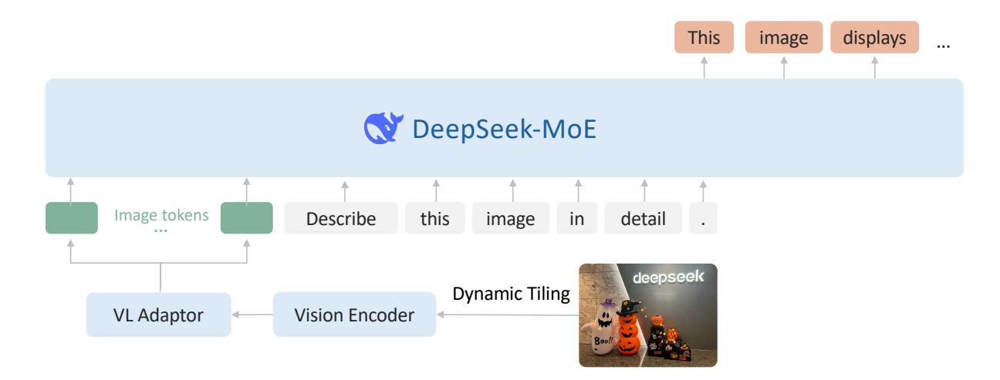
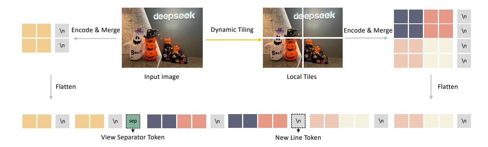
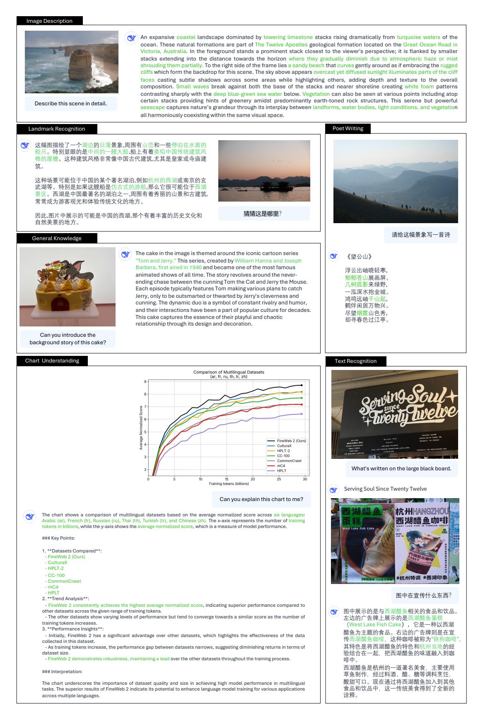
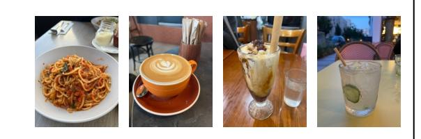
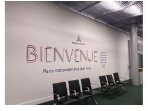
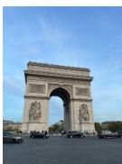
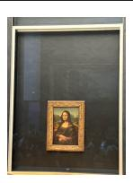
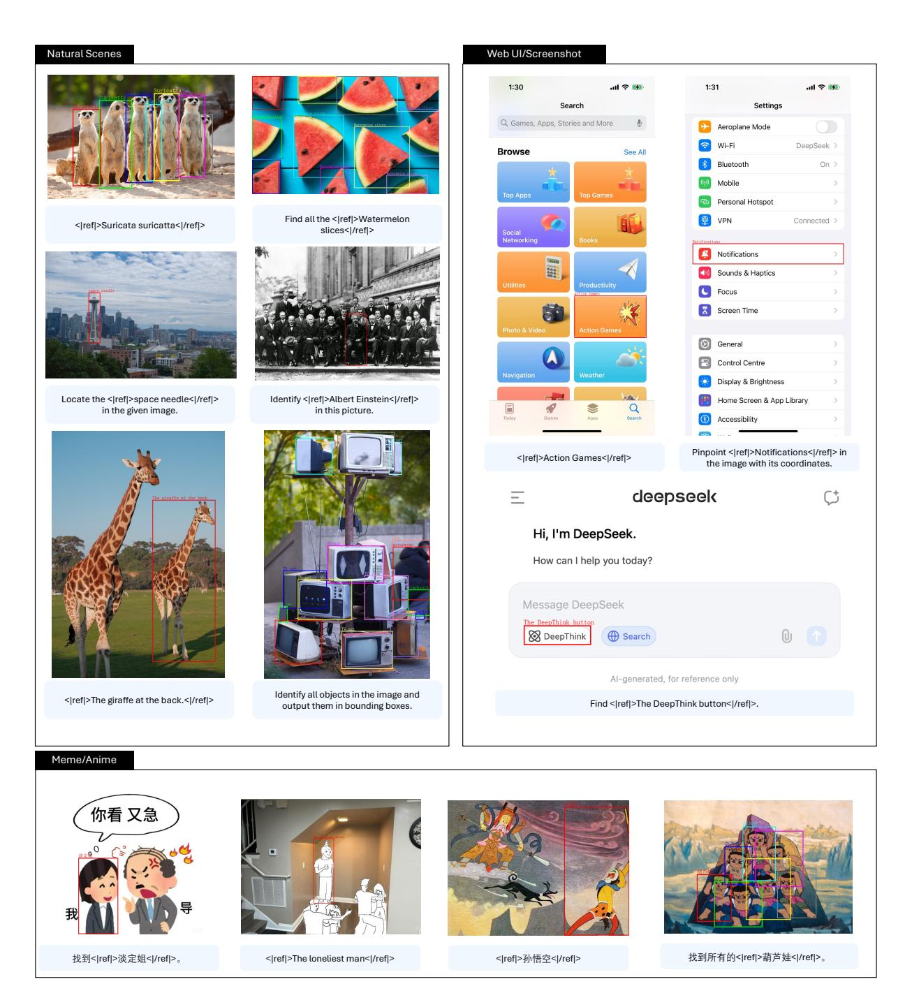
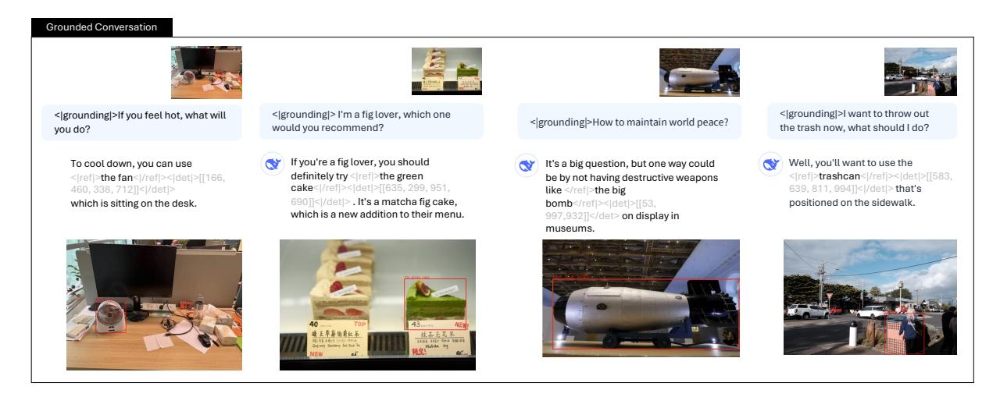
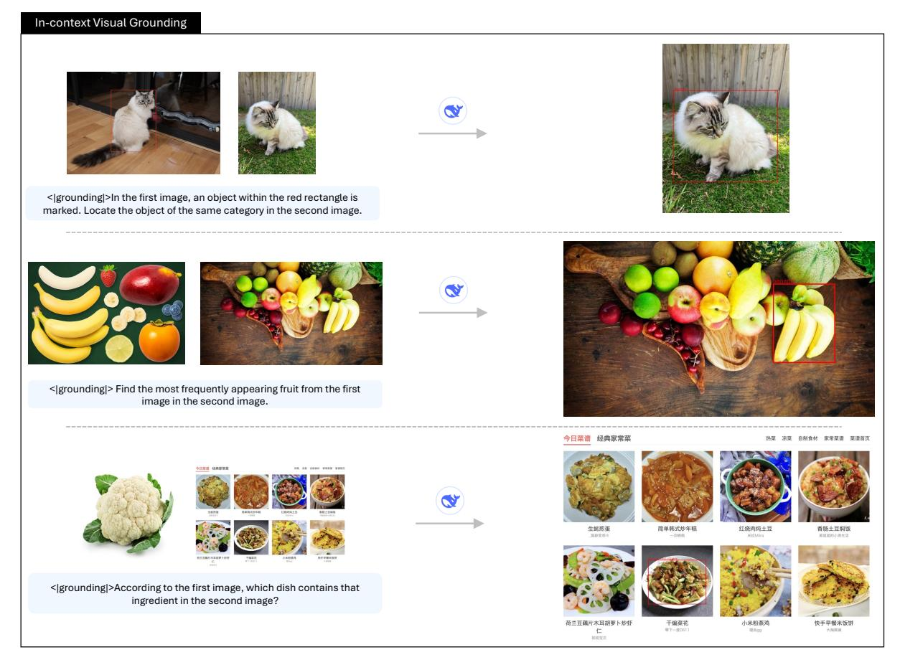

# DeepSeek-VL2: Mixture-of-Experts Vision-Language Models for Advanced Multimodal Understanding

Zhiyu Wu\*, Xiaokang Chen\*, Zizheng Pan\*, Xingchao Liu\*, Wen Liu\*, †, Damai Dai, Huazuo Gao, Yiyang Ma, Chengyue Wu, Bingxuan Wang, Zhenda Xie, Yu Wu, Kai Hu, Jiawei Wang, Yaofeng Sun, Yukun Li, Yishi Piao, Kang Guan, Aixin Liu, Xin Xie, Yuxiang You, Kai Dong, Xingkai Yu, Haowei Zhang, Liang Zhao, Yisong Wang, Chong Ruan‡

#### DeepSeek-AI

## **Abstract**

We present DeepSeek-VL2, an advanced series of large Mixture-of-Experts (MoE) Vision-Language Models that significantly improves upon its predecessor, DeepSeek-VL, through two key major upgrades. For the vision component, we incorporate a dynamic tiling vision encoding strategy designed for processing high-resolution images with different aspect ratios. For the language component, we leverage DeepSeekMoE models with the Multi-head Latent Attention mechanism, which compresses Key-Value cache into latent vectors, to enable efficient inference and high throughput. Trained on an improved vision-language dataset, DeepSeek-VL2 demonstrates superior capabilities across various tasks, including but not limited to visual question answering, optical character recognition, document/table/chart understanding, and visual grounding. Our model series is composed of three variants: DeepSeek-VL2-Tiny, DeepSeek-VL2-Small and DeepSeek-VL2, with 1.0B, 2.8B and 4.5B activated parameters respectively. DeepSeek-VL2 achieves competitive or state-of-the-art performance with similar or fewer activated parameters compared to existing open-source dense and MoE-based models. Codes and pre-trained models are publicly accessible at https://github.com/deepseek-ai/DeepSeek-VL2.

Figure 1 | Average performance vs. activated parameters among different open-source models. We average the accuracy of MMBench v1.1, MMStar, MMMU (Val), MathVista (TestMini), AI2D (Test), and OCRBench. The scores of OCRBench are divided by 10 to scale them to [0,100].

\*: Core contributors. †: Project lead. ‡: Corresponding author.

## **Contents**

| 1 |                                             | Introduction                            | 3  |  |  |  |  |  |  |  |  |
|---|---------------------------------------------|-----------------------------------------|----|--|--|--|--|--|--|--|--|
| 2 |                                             | Model Architecture                      | 4  |  |  |  |  |  |  |  |  |
| 3 |                                             | Data Construction                       |    |  |  |  |  |  |  |  |  |
|   | 3.1                                         | Vision-Language Alignment Data          | 6  |  |  |  |  |  |  |  |  |
|   | 3.2 Vision-Language Pretraining Data  |                                         |    |  |  |  |  |  |  |  |  |
|   | 3.3                                         | Supervised Fine-tuning Data          | 8  |  |  |  |  |  |  |  |  |
| 4 | Training Methodology                        |                                         |    |  |  |  |  |  |  |  |  |
|   | 4.1                                         | Training Pipelines                      | 9  |  |  |  |  |  |  |  |  |
|   | 4.2                                         | Hyperparameters and Infrastructures  | 10 |  |  |  |  |  |  |  |  |
| 5 |                                             | Evaluation                              | 11 |  |  |  |  |  |  |  |  |
|   | 5.1                                         | Multimodal Performance                  | 11 |  |  |  |  |  |  |  |  |
|   | 5.2                                         | Qualitative Study                    | 12 |  |  |  |  |  |  |  |  |
| 6 |                                             | Conclusion                              | 20 |  |  |  |  |  |  |  |  |

# **1. Introduction**

Large Vision-Language Models (VLMs) have emerged as a transformative force in artificial intelligence [\[15,](#page-20-0) [54,](#page-23-0) [59,](#page-23-1) [63,](#page-24-0) [83,](#page-25-0) [88,](#page-26-0) [94\]](#page-26-1), extending the remarkable capabilities of Large Language Models (LLMs) to seamlessly process both visual and textual information. This advancement has dramatically expanded the potential for AI systems to tackle complex real-world applications that require multimodal understanding.

In this technical report, we present DeepSeek-VL2, a new series of open-source Vision-Language Models that leverages the Mixture-of-Experts (MoE) architecture to achieve substantial improvements in both performance and efficiency compared to its predecessor, DeepSeek-VL [\[59\]](#page-23-1). Our advancements center around three key aspects: (1) a dynamic, high-resolution vision encoding strategy that enhances visual understanding, (2) an optimized language model architecture that significantly improves both training and inference efficiency, and (3) a refined vision-language data construction pipeline that not only boosts overall performance but also extends model capabilities to new areas such as precise visual grounding.

For the vision component, we introduce a dynamic tiling vision encoding strategy that efficiently processes high-resolution images of varying aspect ratios. This approach improves over DeepSeek-VL's hybrid vision encoder, which extracted features from images at two fixed resolutions (384 × 384 and 1024 × 1024). Our approach avoids the limitations of the old fixedsize encoder and excels in tasks requiring ultra-high resolution, including visual grounding, document/table/chart analysis, and detailed feature extraction, while maintaining a manageable number of visual tokens. Drawing inspiration from established slicing-tile methods, our system dynamically segments high-resolution inputs into local tiles, processes each tile through a shared vision transformer, and seamlessly integrates the extracted features within the language model. This design preserves the advantages of vision transformers with local attention, enabling rich feature extraction without the quadratic computational scaling typically associated with increasing image resolutions.

For the language component, we leverage DeepSeek language models [\[20,](#page-21-0) [53\]](#page-23-2), featuring the Multi-head Latent Attention (MLA) mechanism. MLA significantly reduces computational cost by compressing the Key-Value (KV) cache into a latent vector, resulting in faster inference and increased throughput capacity. We further enhance efficiency through the DeepSeekMoE framework [\[20,](#page-21-0) [86\]](#page-25-1), which employs sparse computation techniques. Our model series adopt three MoE variants, 3B, 16B, and 27B. These LLMs have 0.57B, 2.4B, and 4.1B activated parameters respectively.

We also greatly enhance our vision-language training data in terms of quality, quantity, and diversity. This comprehensive dataset enables better generalization and performance across a broad spectrum of tasks, including Visual Question Answering (VQA), Optical Character Recognition (OCR), document/table/chart understanding, visual reasoning, and general chatbot applications. The improved training data has also enabled new abilities such as visual grounding and Graphical User Interface (GUI) perception.

In summary, DeepSeek-VL2 marks a substantial leap forward in large-scale Mixture-of-Experts Vision-Language modeling. Through a new visual processing strategy and an optimized language model, we develop a series of models that balances performance with efficiency. By open-sourcing the pre-trained models, we aim to accelerate progress in the field and promote collaborative research advancement.

Figure 2 | **Overview of DeepSeek-VL2**. The overall structure is a llava-style architecture, which includes a vision encoder, a VL adaptor, and a MoE-based LLM.

## **2. Model Architecture**

DeepSeek-VL2 consists of three core modules: (1) a vision encoder, (2) a vision-language adaptor, and (3) a Mixture-of-Experts language model. Building upon the decoder-only LLaVAstyle [\[54\]](#page-23-0) architecture of its predecessor, DeepSeek-VL2 introduces two major advancements: a dynamic tiling strategy and a DeepSeekMOE [\[20,](#page-21-0) [86\]](#page-25-1) language model featuring Multi-head Latent Attention [\[53\]](#page-23-2). These innovations enable more efficient processing of both high-resolution visual inputs and text data.

**Dynamic Tiling Strategy.** The original DeepSeek-VL employed a hybrid vision encoder combining SigLIP [\[106\]](#page-27-0) for coarse-grained feature extraction at 384 × 384 resolution and SAM-B [\[35\]](#page-22-0) for fine-grained feature extraction at 1024 × 1024 resolution. While this fusion approach generated rich visual representations suitable for various vision-language tasks, it was limited by the fixed 1024 × 1024 resolution constraint. This limitation is particularly challenging for processing images with larger resolutions and extreme aspect ratios, such as those found in InfographicVQA [\[67\]](#page-24-1), dense OCR, and detailed visual grounding tasks.

Inspired by recent advances in VLMs [\[16,](#page-21-1) [21,](#page-21-2) [55\]](#page-23-3), we implement a dynamic tiling strategy by splitting a high-resolution image into tiles. This approach enables the efficient processing of different high-resolution images with varying aspect ratios using a single SigLIP-SO400M-384 vision encoder [\[106\]](#page-27-0). The pre-trained SigLIP operates at a base resolution of 384 × 384. To accommodate different aspect ratios, we define a set of candidate resolutions: = {( · 384, · 384) | ∈ **N**, ∈ **N**, 1 ≤ , , ≤ 9}, where : represents the aspect ratio. For an input image of size (,), we calculate the padding area required for resizing[1](#page-0-0) it to each candidate resolution in . We select the resolution ( · 384, · 384) that minimizes the padding area. The resized image is then divided into × local tiles of 384 × 384 pixels, plus one global thumbnail tile. The SigLIP-SO400M-384 vision encoder processes all (1 + × ) tiles, yielding 27 × 27 = 729 visual embeddings of 1152 dimensions per tile. For computational efficiency and context length management, we disable the dynamic tiling strategy when processing multiple (> 2) images.

1We first resize the original image until its long side matches the target resolution, then pad the other dimension while maintaining the original aspect ratio.

Figure 3 | **Illustration of dynamic tiling strategy in DeepSeek-VL2**. By dividing images into multiple tiles, DeepSeek-VL2 achieves stronger fine-grained understanding capabilities compared to DeepSeek-VL.

Table 1 | **Architectural configuration for DeepSeek-VL2**. We list the hyperparameters of the architecture along with the details related to the mixture-of-expert training.

|                            | DeepSeek-VL2-Tiny    | DeepSeek-VL2-Small | DeepSeek-VL2   |  |
|----------------------------|----------------------|--------------------|----------------|--|
| Vocabulary size            | 129,280              | 102,400            | 129,280        |  |
| Embedding size             | 1,280                | 2,048              | 2,560          |  |
| #Attention heads           | 10                   | 16                 | 32             |  |
| #Layers                    | 12                   | 27                 | 30             |  |
| Attention                  | Multi-Head Attention | MLA (rank=512)     | MLA (rank=512) |  |
| #Routed experts            | 64                   | 64                 | 72             |  |
| #Shared experts            | 2                    | 2                  | 2              |  |
| Top-K for expert selection | 6                    | 6                  | 6              |  |
| Routing function           | Softmax              | Softmax            | Sigmoid        |  |
| Expert correction bias     | ×                    | ×                  | ✓              |  |

**Vision-Language Adaptor.** Following visual tile processing, we implement a 2 × 2 pixel shuffle operation to compress each tile's visual tokens from 27 × 27 to 14 × 14 = 196 tokens. We then introduce three special tokens when processing the (1 + × ) tiles. For the global thumbnail tile (14 × 14), we add 14 <tile\_newline> tokens to the end of each row, resulting in a total number of 14 × 15 = 210 tokens. For the × local tiles, which are arranged in a 2D grid of shape ( · 14, · 14), we append · 14 <tile\_newline> tokens at the end of the final column to indicate the end of a row of all the local tiles. Additionally, a <view\_separator> token is inserted between the global thumbnail tile and the local tiles. The complete visual sequence contains 210 + 1 + · 14 × ( · 14 + 1) visual tokens, which are subsequently projected into the language model's embedding space using a two-layer multilayer perceptron (MLP). A visual illustration of our dynamic tiling strategy is shown in Figure [3.](#page-4-1)

**DeepSeekMoE LLM.** Our language model is based on DeepSeekMoE [\[20,](#page-21-0) [86\]](#page-25-1), which incorporates the Multi-head Latent Attention mechanism [\[53\]](#page-23-2). MLA enhances inference efficiency by compressing the Key-Value cache into a latent vector, enabling increased throughput capacity. The model also incorporates a MoE architecture [\[20\]](#page-21-0) allowing for efficient inference through sparse computation. During MoE training, we introduce a global bias term [\[86\]](#page-25-1) for each expert to cost-effectively improve load balancing between experts. DeepSeek-VL2 comes in three variants with the following model sizes: 1.0B, 2.8B and 4.5B. Complete architectural specifications can be found in Table [1.](#page-4-2)

## **3. Data Construction**

We build a comprehensive Vision-Language dataset from diverse sources for DeepSeek-VL2. The training process is structured into three distinct stages: (1) VL alignment, (2) VL pretraining, and (3) supervised fine-tuning (SFT). In the following parts, we provide descriptions of the data used in each stage.

#### **3.1. Vision-Language Alignment Data**

The alignment stage focuses on training the MLP connector to bridge the pretrained visual encoder and the LLM. For this initial warmup phase, we utilize ShareGPT4V [\[12\]](#page-20-1), a dataset containing approximately 1.2M caption and conversation samples.

## **3.2. Vision-Language Pretraining Data**

Following DeepSeek-VL [\[59\]](#page-23-1), our pretraining data combines vision-language (VL) and text-only data to maintain a balance between VL capabilities and text-only performance. For DeepSeek-VL2, we maintain a ratio of around 70% VL data to 30% text-only data, with the latter sourced directly from our base LLM pretraining corpus. In the following, we categorize the VL data into several groups and describe their details.

**Interleaved image-text data.** Our data collection begins with several open-sourced datasets, including WIT [\[79\]](#page-25-2), WikiHow [\[38\]](#page-22-1), and 30% random samples from OBELICS [\[41\]](#page-22-2). This specific mixing ratio was determined through preliminary experiments with DeepSeek-VL2-Tiny. To enhance multilingual capabilities, we supplemented the predominantly English datasets with Chinese content extracted from Wanjuan [\[29\]](#page-21-3). Additionally, we developed an in-house collection to expand coverage of general real-world knowledge.

**Image captioning data.** Image captions represent fundamental data in VLM training, providing direct alignment between visual and textual information. We initially leveraged diverse open-source datasets [\[8,](#page-20-2) [25,](#page-21-4) [28,](#page-21-5) [36,](#page-22-3) [37,](#page-22-4) [39,](#page-22-5) [40,](#page-22-6) [48,](#page-23-4) [50,](#page-23-5) [51,](#page-23-6) [73,](#page-24-2) [78,](#page-25-3) [80,](#page-25-4) [82\]](#page-25-5). However, our preliminary analysis revealed severe quality variations across these datasets, ranging from dense, accurate captions generated by advanced VLMs to problematic cases with brief descriptions, mismatched text pairs, or obvious hallucinations. To address these quality inconsistencies, we developed a comprehensive image captioning pipeline that considers: (1) OCR hints, (2) meta information (e.g., location, camera settings), and (3) relevant original captions as prompts. Using an in-house captioner, we recaption the images following prompting strategies similar to PixelProse [\[78\]](#page-25-3), employing varied instructions to guide the VLM's caption generation.

Despite the overall improvement in caption quality, we observed repetition issues in the large-scale annotation pipelines. To mitigate this, we implemented a quality control pipeline using DeepSeek Chat [\[53\]](#page-23-2) to score all captions simply based on their writing quality. In practice, this approach is both efficient and effective in filtering out low-quality captions.

**Optical character recognition data.** To develop OCR capabilities, we used open-source datasets including LaTeX OCR [\[7\]](#page-20-3) and 12M RenderedText [\[93\]](#page-26-2). We combined these datasets with an extensive in-house OCR dataset covering diverse document types. Currently, our in-house dataset mainly focuses on English and Chinese character recognition. We plan to expand to other languages in our future work.

**Visual question-answering (QA) data.** In our early exploration, we found general QA data clearly benefits model pretraining. Consequently, we developed a comprehensive visual QA dataset consisting of the following categories:

- **General VQA.** We inherit the general VQA data from DeepSeek-VL. For more details, please refer to [\[59\]](#page-23-1).
- **Table, chart and document understanding.** We adopt PubTabNet [\[112\]](#page-27-1), FinTabNet [\[111\]](#page-27-2) and Docmatix [\[42\]](#page-22-7) to enhance document comprehension capabilities.
- **Web-to-code and plot-to-Python generation.** We leverage Websight [\[44\]](#page-22-8) for webpageto-code abilities and Python plots obtained from public Jupyter notebooks, following DeepSeek-VL. We enhance this dataset by replicating a portion of Websight using DeepSeek V2.5. We also exploit Python plot codes generated by DeepSeek V2.5 to mitigate the noises in the plot-to-code data.
- **QA with visual prompt.** We follow [\[9\]](#page-20-4) to construct visual prompt understanding data by overlaying various visual indicators (arrows, boxes, circles, and scribbles) onto images from [\[9,](#page-20-4) [89,](#page-26-3) [90\]](#page-26-4). We then created QA pairs focusing on objects highlighted by these visual prompts.

**Visual grounding data.** We construct our visual grounding dataset from [\[71,](#page-24-3) [75\]](#page-25-6). For each image's object detection annotations, we structure the data as follows:

- Prompt: Locate <|ref|><query><|/ref|> in the given image.
- Response: <|ref|><query><|/ref|><|det|>[[x1, y1, x2, y2],...]<|/det|>

during training, the question prompts are randomly sampled from a candidate pool during training. <|ref|>, <|/ref|>, <|det|>, <|/det|> are special tokens. <query> is a placeholder for either the category name (e.g., "car") or description of the object (e.g., "the leftmost person"). [[x1, y1, x2, y2], ...] is a list of bounding boxes, where each bounding box corresponds to an object's position. The coordinates x1, y1 and x2, y2 specify the top-left and bottom-right corners respectively, normalized to values between 0 and 999 according to the resolution of the image. We also construct negative samples where queried objects are intentionally absent from the images to enhance the robustness of the model.

**Grounded conversation data.** We derived our grounded conversation dataset from [\[71\]](#page-24-3), structured in the following format:

- Prompt: <|grounding|>Can you describe the content of the image?
- Response: Two <|ref|>dogs<|/ref|><|det|>[[x1, y1, x2, y2],...]<|/det|> are running on the grass.

As in other visual grounding data, <|grounding|>, <|ref|>, <|/ref|>, <|det|>, <|/det|> are special tokens and x1, y1, x2, y2 is subject to the same normalization scheme.

### **3.3. Supervised Fine-tuning Data**

Our SFT data combines a diverse collection of open-sourced datasets with high-quality in-house QA pairs. Below, we detail our efforts to enhance the quality of our SFT dataset.

**General visual question-answering.** While public visual QA datasets are diverse [\[9,](#page-20-4) [10,](#page-20-5) [27,](#page-21-6) [31,](#page-22-9) [43,](#page-22-10) [47,](#page-23-7) [74\]](#page-24-4), they often suffer from three main limitations: (1) short responses, (2) poor OCR quality, and (3) hallucinated content. To address these issues, we regenerate responses by jointly considering the original questions, images, and OCR information. Our experiments demonstrate that this approach produces more comprehensive and accurate results. During development, we observed that an early version of DeepSeek-VL2, particularly the Tiny variant, occasionally inserted English words inappropriately in Chinese responses. This issue was not present in our larger models, suggesting it stemmed from limited model capacity and an imbalance between English and Chinese data in the visual-language pretraining stage. To address this limitation in our smaller model, we developed an in-house Chinese QA dataset with diverse image descriptions and single/multi-round conversations. This dataset helps to mitigate the language mixing issue. Furthermore, we created an extra in-house dataset to complement real-world and cultural visual knowledge, including anime, memes, cuisine and art.

**OCR and document understanding.** Thanks to our advanced image captioning pipeline, DeepSeek-VL2 already demonstrates superior OCR capabilities compared to other state-of-theart VLMs. Therefore, rather than further enhancing OCR performance during the SFT stage, we focused on cleaning existing open-source datasets [\[24,](#page-21-7) [31,](#page-22-9) [43,](#page-22-10) [66,](#page-24-5) [67,](#page-24-1) [77,](#page-25-7) [92,](#page-26-5) [104\]](#page-27-3) by removing samples with poor OCR quality. For document understanding, we curated a diverse subset of document pages from our in-house data. We then generate multi-round conversational QA pairs specific to document comprehension. Early results indicate that this approach improves document-based interactions.

**Table and chart understanding.** We enhanced table-based QA data by regenerating responses for all public datasets [\[14,](#page-20-6) [49\]](#page-23-8) based on their original questions except Cauldron [\[43\]](#page-22-10), which already exhibits high quality. Similar to our OCR capabilities developed during VL pretraining, our model demonstrated strong performance in chart understanding without requiring additional efforts.

**Reasoning, logic, and mathematics.** We enhance public reasoning-focused datasets [\[17,](#page-21-8) [43,](#page-22-10) [61,](#page-24-6) [76,](#page-25-8) [102,](#page-27-4) [109\]](#page-27-5) with more detailed reasoning processes and standardize response formats which puts the final answer at the end of the response. We observe that detailed responses are less effective when training smaller VLMs. In our exploration, DeepSeek-VL2-Tiny shows better performance with more concise responses.

**Textbook and academic questions.** We build an internal dataset focused on textbooks from our document collection. This dataset primarily emphasizes college-level contents across multiple academic disciplines.

**Web-to-code and plot-to-Python generation.** We expand our in-house dataset for web code and Python plot code beyond what was used during pretraining. For open-source datasets, we improve their quality by regenerating their answers.

**Visual grounding.** We develop our visual grounding dataset using data from [\[2,](#page-20-7) [23,](#page-21-9) [64,](#page-24-7) [85,](#page-25-9) [101,](#page-26-6) [110\]](#page-27-6). To boost model capabilities, we translate query phrases into Chinese and create additional negative samples. We also add in-context visual grounding data, where the task involves locating objects of the same category across multiple images, given a reference object highlighted by a rectangle or ellipse in a reference image. The data format follows this structure:

- Prompt: <|grounding|>The first image shows <object>.Please identify the object of the same category in the second image.
- Response: <|ref|><description><|/ref|><|det|>[[x1, y1, x2, y2]]<|/det|>

In this format, <|grounding|>, <|ref|>, <|/ref|>, <|det|>, <|/det|> are special tokens. The <object> placeholder represents phrases like "an object within the red bounding box" while <description> is the model's description of the detected object (e.g., "cat").

**Grounded conversation.** We construct our grounded conversation data using [\[62,](#page-24-8) [72\]](#page-24-9) to further enhance the model's capabilities established during the pretraining phase.

**Text-Only datasets.** To maintain the language ability of the model, we also use text-only instruction-tuning datasets [\[4,](#page-20-8) [6,](#page-20-9) [18,](#page-21-10) [19,](#page-21-11) [68,](#page-24-10) [70,](#page-24-11) [84,](#page-25-10) [91,](#page-26-7) [98\]](#page-26-8) during the SFT stage.

## **4. Training Methodology**

#### **4.1. Training Pipelines**

DeepSeek-VL2 is trained through a three-stage pipeline: (1) an initial stage where we train the vision encoder and vision-language adaptor MLP while keeping the language model fixed, using image-text paired data detailed in Section [3.1,](#page-5-0) (2) a pretraining stage where we conduct visionlanguage pre-training using the data described in Section [3.2,](#page-5-1) and (3) a fine-tuning stage where we perform supervised fine-tuning with the data outlined in Section [3.3.](#page-6-0) In both the pretraining and fine-tuning stages, all model parameters, including the vision encoder, vision-language adaptor, and language model, are unlocked and trained simultaneously. Throughout all stages, we emphasize visual understanding capabilities and compute the next token prediction loss exclusively on the text tokens.

**Vision-Language Alignment.** Building upon pre-trained language models (DeepSeekMoE 3B/16B/27B), our primary objective is to establish robust connections between visual features and language features. This alignment enables the pre-trained language model to effectively handle visual inputs. Unlike previous approaches [\[54,](#page-23-0) [59\]](#page-23-1), which maintain fixed pretrained vision encoders and language models, we adapt the fixed-resolution vision encoder to accommodate dynamic high-resolution images. In this stage, we optimize both the vision encoder and vision-language adaptor while keeping the language model frozen.

**Vision-Language Pre-training.** After establishing the vision-language alignment in the embedding space, we dedicate the majority of our computational resources to vision-language pre-training. This stage focuses on developing comprehensive joint vision-language knowledge across diverse tasks. We unfreeze all parameters, including the vision encoder, vision-language

Table 2 | **Hyperparameters for training DeepSeek-VL2**. The Step LR Scheduler divides the learning rate by  $\sqrt{10}$  at 50% and 75% of the total training steps.

|                              | DeepSeek-VL2-Tiny    |                             |                    | Deep                                    | Seek-VL2-            | Small              | DeepSeek-VL2                             |                      |                    |
|------------------------------|----------------------|-----------------------------|--------------------|-----------------------------------------|----------------------|--------------------|------------------------------------------|----------------------|--------------------|
| Total parameters (LLM)       | 3B                   |                             |                    | 16B                                     |                      |                    | 27B                                      |                      |                    |
| Activated parameters (LLM)   |                      | 0.57B                       |                    |                                         | 2.4B                 |                    | 4.1B                                     |                      |                    |
| Vision Encoder               | Sig                  | gLIP-SO40                   | 0M                 | SigLIP-SO400M                           |                      |                    | SigLIP-SO400M                            |                      |                    |
| Hyperparameters              | Stage 1              | Stage 2                     | Stage 3            | Stage 1                                 | Stage 2              | Stage 3            | Stage 1                                  | Stage 2              | Stage 3            |
| Learning rate                | $5.4 \times 10^{-4}$ | $5.4 \times 10^{-4}$        | $3.0\times10^{-5}$ | $4.2 \times 10^{-4}$                    | $4.2 \times 10^{-4}$ | $1.4\times10^{-5}$ | $4.5 \times 10^{-4}$                     | $4.5 \times 10^{-4}$ | $2 \times 10^{-5}$ |
| Visual Encoder LR multiplier | 0.1                  | 0.1                         | 0.1                | 0.1                                     | 0.1                  | 0.1                | 0.1                                      | 0.1                  | 0.1                |
| Fix langauge model           | ✓                    | ×                           | ×                  | ✓                                       | ×                    | ×                  | ✓                                        | ×                    | ×                  |
| LR scheduler                 | Cosine               | Step                        | Constant           | Cosine                                  | Step                 | Constant           | Cosine                                   | Step                 | Constant           |
| Weight decay                 | 0.1                  | 0.1                         | 0.1                | 0.1                                     | 0.1                  | 0.1                | 0.1                                      | 0.1                  | 0.1                |
| Gradient clip                | 1.0                  | 1.0                         | 1.0                | 1.0                                     | 1.0                  | 1.0                | 1.0                                      | 1.0                  | 1.0                |
| Optimizer                    | AdamW                | $f(\beta_1 = 0.9, \beta_2)$ | $B_2 = 0.95$       | Adam $W(\beta_1 = 0.9, \beta_2 = 0.95)$ |                      |                    | AdamW( $\beta_1 = 0.9, \beta_2 = 0.95$ ) |                      |                    |
| BF16 optimizer               | ×                    | ×                           | ×                  | ×                                       | ×                    | ×                  | ✓                                        | $\checkmark$         | $\checkmark$       |
| Aux loss weight              | 0.001                | 0.001                       | 0.001              | 0.001                                   | 0.001                | 0.001              | 0.0001                                   | 0.0001               | 0.0001             |
| Expert bias correction step  | -                    | -                           | -                  | _                                       | -                    | -                  | 0                                        | 0.001                | 0                  |
| Training tokens              | 2.0B                 | 798.5B                      | 19.5B              | 2.0B                                    | 808.9B               | 20.0B              | 2.0B                                     | 796.5B               | 19.5B              |
| Batch size                   | 256                  | 2304                        | 64                 | 256                                     | 2304                 | 64                 | 256                                      | 3360                 | 64                 |
| Sequence length              | 4096                 | 4096                        | 4096               | 4096                                    | 4096                 | 4096               | 4096                                     | 4096                 | 4096               |
| Sequence packing             | ×                    | $\checkmark$                | $\checkmark$       | ×                                       | $\checkmark$         | $\checkmark$       | ×                                        | $\checkmark$         | $\checkmark$       |
| Pipeline parallelism         | ×                    | ✓                           | ✓                  | ✓                                       | ✓                    | ✓                  | ✓                                        | ✓                    | ✓                  |

adaptor MLP, and DeepSeekMoE LLM, to enable full model optimization. Using approximately 800B image-text tokens (Section 3.2), this stage significantly enhances the model's multimodal understanding capabilities while maintaining most of its language capabilities.

**Supervised Fine-Tuning.** In the final stage, we enhance the pre-trained model's instruction-following and conversational capabilities through supervised fine-tuning. Using our in-house vision-language SFT data, we optimize all parameters while supervising only the answers and special tokens, masking both system and user prompts. To strengthen dialogue comprehension, we combine multimodal data with the pure text dialogue data from DeepSeek-V2 [53]. This approach ensures robust performance across diverse vision-language tasks, including dense image captioning, general VQA, OCR, table/chart/document/figure understanding, visual-to-code, visual reasoning, visual grounding, and language understanding, etc..

#### 4.2. Hyperparameters and Infrastructures

Detailed hyperparameters for DeepSeek-VL2 training are listed in Table 2. We conducted our training and evaluation using HAI-LLM [30], an efficient and lightweight platform designed for large models. A significant challenge in our pipeline parallel strategy arose from the vision encoder's unique computational characteristics compared to LLM blocks. As the first component in the model pipeline, the vision encoder requires careful load balancing across GPUs to prevent pipeline bubbles and optimize GPU utilization. To address this, we implemented fine-grained layer division of the vision encoder within our pipeline parallel strategy. Moreover, we perform image tile load balancing across different data parallel ranks during the forward and backward processes to alleviate the imbalance in the number of image tiles caused by the dynamic resolution strategy. Our training process also incorporates tensor parallelism and expert parallelism approaches to achieve the highest efficiency. Since some data batches have only text data while others include image data, we introduce two different pipeline strategies

Table 3 | **Comparison with state-of-the-art models on OCR-related multimodal benchmarks**. † : activated parameters of MoE model.

|                               | #Params (LLM) | #Params (VE) |                              | DocVQA | ChartQA    | InfoVQA | TextVQA | OCRBench  |  |  |  |  |
|-------------------------------|---------------|--------------|------------------------------|--------|------------|---------|---------|-----------|--|--|--|--|
| Model                         |               |              | #Params (Activated)          | (test) | (test)     | (test)  | (val)   |           |  |  |  |  |
| Closed Model                  |               |              |                              |        |            |         |         |           |  |  |  |  |
| GPT-4V [69]                   | -             | -            | 87.2                         | 78.1   | 75.1       | 78.0    | 645     |           |  |  |  |  |
| GPT-4o [32]                   | -             | -            | - -                       | 92.8   | 85.7       | 79.2    | 77.4    | 736       |  |  |  |  |
| Claude 3.5 Sonnet [5]         | -             | -            | -                            | 95.2   | 90.8       | 74.1    | 74.1    | 788       |  |  |  |  |
| Gemini-1.5-Pro [81]           | -             | -            | -                            | 93.1   | 87.2       | 80.1    | 78.7    | 754       |  |  |  |  |
| Open-source Model (0.5B - 3B) |               |              |                              |        |            |         |         |           |  |  |  |  |
| LLaVA-OV 0.5B [45]            | 0.5B          | 0.4B         | 0.9B                         | 70.0   | 61.4       | 41.8    | -       | -         |  |  |  |  |
| InternVL2-1B [16]             | -             | -            | 0.9B                         | 81.7   | 72.9       | 50.9    | 70.5    | 754       |  |  |  |  |
| MM 1.5-1B [107]               | -             | -            | 1B                           | 81.0   | 67.2       | 50.5    | 72.5    | 605       |  |  |  |  |
| DeepSeek-VL2-Tiny             | 0.6B†         | 0.4B         | 1.0B†                        | 88.9   | 81.0       | 66.1    | 80.7    | 809       |  |  |  |  |
| MolmoE-1B [22]                | 1.2B†         | 0.3B         | 1.5B†                        | 77.7   | 78.0       | 53.9    | 78.8    |           |  |  |  |  |
| MiniCPM-V 2.0 [99]            | 2.4B          | 0.4B         | 2.8B                         | 71.9   | -          | -       | 74.1    | 605       |  |  |  |  |
| InternVL2-2B [16]             | 1.9B          | 0.3B         | 2.2B                         | 86.9   | 76.2       | 58.9    | 73.4    | 784       |  |  |  |  |
| Qwen2-VL-2B [88]              | 1.5B          | 0.7B         | 2.2B                         | 90.1   | 73.5       | 65.5    | 79.7    | 794       |  |  |  |  |
| MM 1.5-3B [107]               | -             | -            | 3B                           | 87.7   | 74.2       | 58.5    | 76.5    | 657       |  |  |  |  |
| DeepSeek-VL2-Small            | 2.4B†         | 0.4B         | 2.8B†                        | 92.3   | 84.5       | 75.8    | 83.4    | 834       |  |  |  |  |
|                               |               |              | Open-source Model (4B - 13B) |        |            |         |         |           |  |  |  |  |
| Phi-3.5-Vision [1]            | 3.8B          | 0.3B         | 4.1B                         | 69.3   | 81.8       | 36.6    | 72.0    | 599       |  |  |  |  |
| InternVL2-4B [16]             | 3.8B          | 0.3B         | 4.1B                         | 89.2   | 81.5       | 67.0    | 74.4    | 788       |  |  |  |  |
| Aria-MoE [46]                 | 3.9B†         | 0.4B         | 4.3B†                        | 92.6   | 86.4       | -       | 81.1    | -         |  |  |  |  |
| MM 1.5-7B [107]               | -             | -            | 7B                           | 88.1   | 78.6       | 59.5    | 76.5    | 635       |  |  |  |  |
| LLaVA-OV 7B [45]              | 7.6B          | 0.4B         | 8.0B                         | 87.5   | 80.0       | 68.8    | -       | -         |  |  |  |  |
| Molmo-7B-O [22]               | 7.3B          | 0.3B         | 7.6B                         | -      | 80.4       | 70.0    | 80.4    | -         |  |  |  |  |
| MiniCPM-V2.6 [99]             | 7.6B          | 0.4B         | 8.0B                         | 90.8   | 82.4       | -       | 80.1    | 852 (CoT) |  |  |  |  |
| InternVL2-8B [16]             | 7.7B          | 0.3B         | 8.0B                         | 91.6   | 83.3       | 74.8    | 77.4    | 794       |  |  |  |  |
| Qwen2-VL-7B [88]              | 7.6B          | 0.7B         | 8.3B                         | 94.5   | 83.0       | 76.5    | 84.3    | 845       |  |  |  |  |
| Pixtral-12B [3]               | 12.0B         | 0.4B         | 12.4B                        | 90.7   | 81.8 (CoT) | 50.8    | 75.7    |           |  |  |  |  |
| DeepSeek-VL 7B [59]           | 6.9B          | 0.4B         | 7.3B                         | -      | -          | -       | -       | 456       |  |  |  |  |
| DeepSeek-VL2                  | 4.1B†         | 0.4B         | 4.5B†                        | 93.3   | 86.0       | 78.1    | 84.2    | 811       |  |  |  |  |

for different kinds of data and switch between these two strategies on demand. The training of DeepSeek-VL2 was completed in 7/10/14 days using a cluster of 16/33/42 nodes, with each node equipped with 8 NVIDIA A100 GPUs.

## **5. Evaluation**

## **5.1. Multimodal Performance**

**Benchmarks** We perform a holistic evaluation of DeepSeek-VL2 across a collection of commonly used benchmarks, including DocVQA [\[66\]](#page-24-5), ChartQA [\[65\]](#page-24-13), InfoVQA [2](#page-0-0) [\[67\]](#page-24-1), TextVQA [\[77\]](#page-25-7), RealWorldQA [\[95\]](#page-26-10), OCRBench [\[57\]](#page-23-10), AI2D [\[34\]](#page-22-14), MMMU [\[105\]](#page-27-8), MMStar [\[13\]](#page-20-13), MathVista [\[60\]](#page-24-14), MME [\[26\]](#page-21-13), MMBench, MMBench-V1.1 [\[58\]](#page-23-11) and MMT-Bench [\[100\]](#page-26-11). These benchmarks span diverse tasks from document understanding and chart interpretation to real-world problem solving, enabling comprehensive evaluation of our model's capabilities. To evaluate the grounding capability of our models, we test DeepSeek-VL2 on the RefCOCO, RefCOCO+ and RefCOCOg benchmarks [\[33,](#page-22-15) [64\]](#page-24-7).

2Given that InfoVQA contains images with extreme aspect ratios and excessively large images, we enlarge the candidate resolutions as = {( · 384, · 384) | ∈ **N**, ∈ **N**, 1 ≤ , , ≤ 18} when evaluating.

Table 4 | Comparison with state-of-the-art models on general QA and math-related multimodal benchmarks. †: activated parameters of MoE model. \*: evaluated in a different setting.

| Model                 | #Params           | MMStar | AI2D   | MMMU       | MME         | MMBench           | MMBench   | MMBench-V1.1 | MMT-Bench | RealWorldQA | MathVista  |
|-----------------------|-------------------|--------|--------|------------|-------------|-------------------|-----------|--------------|-----------|-------------|------------|
|                       | (Activated)       |        | (test) | (val)      | Clos        | (sum) ed Model | (en test) | (cn test)    |           |             | (testmini) |
| GPT-4V [69]           | _                 | 56.0   | 89.4   | 63.1       | 1,927       | 81                | 80.2      | 80           | 64.3      | 61.4        | 58.1       |
| GPT-4o [32]           | _                 | 63.9   | 94.2   | 69.1       | 2,329       | 83.4              | 82.1      | 82.2         | 65.5      | 75.4        | 63.8       |
| Claude 3.5 Sonnet [5] | _                 | 62.2   | 94.7   | 68.3       | 1,920       | 79.7              | 80.7      | 78.5         | -         | 60.1        | 67.7       |
| Gemini-1.5-Pro [81]   | _                 | -      | 94.4   | 62.2       | -,          | -                 | -         | -            | 64.5      | 70.4        | 63.9       |
|                       |                   |        |        |            | Open-source | Model (0.5B       | - 3B)     |              |           |             |            |
| LLaVA-OV 0.5B [45]    | 0.9B              | 37.7   | 57.1   | 31.4       | 1,478       | 61.6              | 55.5      | 59.6         | -         | 55.6        | 34.8       |
| InternVL2-1B [16]     | 0.9B              | 45.7   | 64.1   | 35.4       | 1,794       | 65.4              | 60.7      | 61.6         | 49.5      | 50.3        | 37.7       |
| MM 1.5-1B [107]       | 1B                | -      | 59.3   | 35.8       | 1,611       | -                 | -         | -            | -         | 53.3        | 37.2       |
| DeepSeek-VL2-Tiny     | 1.0B † | 45.9   | 71.6   | 40.7       | 1,915       | 73.3              | 69.2      | 68.3         | 53.2      | 64.2        | 53.6       |
| MolmoE-1B [22]        | 1.5B † | -      | 86.4*  | 34.9       | -           | -                 | -         | -            | -         | 60.4        | 34         |
| MiniCPM-V 2.0 [99]    | 2.8B              | -      | -      | 38.2       | 1,809       | 69.6              | 68.1      | -            | -         | -           | 38.7       |
| InternVL2-2B [16]     | 2.2B              | 49.8   | 74.1   | 36.3       | 1,877       | 73.2              | 70.9      | 69.6         | 50.4      | 57.3        | 46.3       |
| Qwen2-VL-2B [88]      | 2.2B              | 48     | 74.4   | 41.1       | 1,872       | 74.9              | 73.5      | 72.2         | 54.5      | 62.9        | 47.8       |
| MM 1.5-3B [107]       | 3B                | -      | 65.7   | 37.1       | 1,798       | -                 | -         | -            | -         | 56.9        | 44.4       |
| DeepSeek-VL2-Small    | 2.8B † | 57.0   | 80.0   | 48.0       | 2,123       | 82.3              | 80.3      | 79.3         | 62.9      | 65.4        | 60.7       |
|                       |                   | •      |        |            | Open-source | Model (4B -       | 13B)      |              |           |             |            |
| Phi-3.5-Vision [1]    | 4.1B              | 47.5   | 78.1   | 43         | -           | 76                | 66.1      | 72.1         | 53.6      | 53.6        | 43.9       |
| InternVL2-4B [16]     | 4.1B              | 54.3   | 78.9   | 47.9       | 2,060       | 78.6              | 73.9      | 75.8         | 55.7      | 60.7        | 58.6       |
| Aria-MoE [46]         | 4.3B † | -      | -      | 54.9       | -           | -                 | -         | -            | -         | -           | 66.1       |
| MM 1.5-7B [107]       | 7B                | -      | 72.2   | 41.8       | 1,861       | -                 | -         | -            | -         | 62.5        | 47.6       |
| LLaVA-OV 7B [45]      | 8.0B              | -      | 81.4   | 48.8       | 1,998       | 80.8              | -         | -            | -         | 66.3        | 63.2       |
| Molmo-7B-O [22]       | 7.6B † | -      | 90.7*  | 39.3       | -           | -                 | -         | -            | -         | 67.5        | 44.5       |
| MiniCPM-V2.6 [99]     | 8.0B              | 57.5   | 82.1   | 49.8 (CoT) | 2,348 (CoT) | 81.5              | 79.3      | 78.0         | 60.8      | 65.0        | 60.6       |
| InternVL2-8B [16]     | 8.0B              | 61.5   | 83.8   | 51.8       | 2,210       | 81.7              | 81.2      | 79.4         | 60.0      | 64.4        | 58.3       |
| Qwen2-VL-7B [88]      | 8.3B              | 60.7   | 83     | 54.1       | 2,327       | 83                | 80.5      | 80.7         | 63.7      | 70.1        | 58.2       |
| Pixtral-12B [3]       | 12.4B             | -      | -      | 52.5 (CoT) | -           | -                 | -         | -            | -         | 65.4        | 58 (CoT)   |
| DeepSeek-VL 7B [59]   | 7.3B              | -      | -      | 36.6       | -           | 73.2              | -         | -            | -         | -           | -          |
| DeepSeek-VL2          | 4.5B † | 61.3   | 81.4   | 51.1       | 2,253       | 83.1              | 79.6      | 79.2         | 63.6      | 68.4        | 62.8       |

Comparison with the state-of-the-arts On the multimodal understanding benchmarks, we compare DeepSeek-VL2 with state-of-the-art models, including LLaVA-OV [45], InternVL2 [15], DeepSeek-VL [59], Qwen2-VL [88], Phi-3.5-Vision [1], Molmo [22], Pixtral [3], MM1.5 [107] and Aria-MoE [46]. The results are reported in Table 3 and 4. Benefited from our MoE architecture, DeepSeek-VL2 achieves similar or better performance with fewer activated parameters. On the grounding benchmarks, we compare DeepSeek-VL2 with Groudning DINO [56], UNINEXT [52], ONE-PEACE [87], mPLUG-2 [97], Florence-2 [96], InternVL2 [16], Shikra [11], TextHawk2 [103], Ferret-v2 [108], MM1.5 [107] and Qwen2 [88]. Our models outperforms the other VLMs at similar scales.

#### 5.2. Qualitative Study

In this section, we demonstrate different capabilities of DeepSeek-VL2, ranging from general question answering to visual storytelling and visual grounding.

General visual question answering. Benefited from our new VL pretraining dataset and diverse SFT data. DeepSeek-VL2 demonstrated significantly improved ability on general visual question answering, as shown in Figure 4. Overall, this model excels at dense image description and it is able to recognize common landmarks, general visual knowledge, and rich-texts in both English and Chinese. It also performs favorably on chart understanding with accurate attributes recognition. Furthermore, we show the improved meme understanding of DeepSeek-VL2 in Figure 5, where it can describe the correct context and explain the humor with meaningful cultural background.

Figure 4 | **General question answering capability of DeepSeek-VL2**. Our model has multifaceted capabilities, including recognition of landmarks, image-based poetry composition, answering questions about general knowledge, understanding charts, recognizing text, and more.

#### 这张梗图展示了⼀位⽼⼈在海边,似乎正在试图⽤锤⼦将⼀些东⻄打进沙滩的情景。上⽅配⽂是"试图挽留假期的 我",显然将⽼⼈的⾏为与"留不住"假期的情况联系在⼀起。 ### 分析与解读: 1. \*\*图像情景与动作对⽐的幽默性\*\*: - ⽼⼈的动作显得⼗分徒劳,因为沙滩与⽔边的沙⼦难以固定,他试图⽤锤⼦钉住什么,这显然是⼀件⽆法实现的 事情。这形象地表现了⼀个⼈在⾯对不可抗拒的⼒量(如假期结束)时的⽆奈和⽆助。 2. \*\*⽂字与画⾯的结合\*\*: - "试图挽留假期的我"与图⽚形成直接关联,画⾯展现了⼀种滑稽的、略带夸张的尝试挽留假期的情景。⼈们在⽣ 活中也常常试图阻⽌即将结束的假期,⽐如试图在假期最后⼏天拖延,推迟归程等。这个梗将这种⼼理状态以幽默 的⽅式表现出来。 3. \*\*⽂化背景\*\*: - 假期结束是很多现代⼯作族的共同感受,尤其是⾯临节后综合症,⼈们会感到⾮常焦虑、不适应,因此图中的夸 张表现⽅式⾮常贴近⼈们真实的情感体验,具有较强的共鸣性。 ### 总结: 这张梗图通过图像和⽂字的结合,利⽤⼀种幽默和夸张的⼿法,表达了⼈们在假期结束时试图"挽留"假期的⽆奈和 ⼼理挣扎。它反映了⼀种普遍的情感,尤其是在现代快节奏的⽣活中,假期是⼈们难得的放松时间,当假期即将结 束时,⼈们往往感到焦虑和不舍。 详细解释⼀下这张梗图 The image humorously depicts the contrasting thoughts of a PhD student. On the left, the student is working at a desk, surrounded by books and papers, dreaming of a relaxing beach vacation. On the right, the student is actually at the beach, but their mind is still consumed by thoughts of work, represented by stacks of papers and a laptop. This illustrates the common experience of PhD students who often find it difficult to fully disconnect from their research, even when they are physically away from their work environment. What does this image imply? Meme understanding Explain this meme to me. This image depicts a humorous situation involving a young child and a cake. The child, appearing determined and mischievous, is depicted biting into a large chocolate cake on a table. The text at the top of the image reads: "Mom told me not to touch it." ### Analysis and Meaning: 1. \*\*Disobedience theme\*\*: The text implies that the child has intentionally ignored the instruction or warning given by their mom. This reflects the common tendency of children to follow rules reluctantly and test boundaries when told otherwise. 2. \*\*Humor in contrast\*\*: The exaggerated act of biting the cake makes the situation absurd, adding to the humor. The over-the-top behavior contrasts with the seemingly simple instruction, creating an unexpected and funny outcome. 3. \*\*Relatable scenario\*\*: This image humorously captures a widely understood, everyday behavior children wanting things they are told they cannot have, leading to playful and sometimes rebellious actions. 4. \*\*Visual cue\*\*: The child's action of taking a bite adds a dynamic and engaging element to the humor, amplifying the sense of mischief and delight in the moment. In short, this image humorously captures the playful defiance of childhood, using the visual of a child taking a bite of an untouchable cake to amplify the humor and relatability. 这张图是⼀种常⻅的幽默梗图,表达了在考试时学⽣可能会感受到的"⽆⼒感"或"打击感"。 ### 图中含义: 1. \*\*上⽅\*\*:"当你为考试做⾜了功课",表示学⽣在⾯对考试时⾃认为已经做好充分的准备,充满信⼼。 2. \*\*下⽅\*\*:"第⼀题:"搭配图⽚中的骑⼠被射中眼睛的场景,象征考试开始后,第⼀题的内容超出了⾃⼰准备的 范围或难度,瞬间让⼈陷⼊迷茫,也可能对考试信⼼造成重⼤打击。

Figure 5 | **Meme understanding capability of DeepSeek-VL2**. Our model can understand the humor in memes and provide explanations.

1. \*\*中世纪骑⼠与武⼠形象\*\*:骑⼠和武⼠通常被⽤来表现强⼤、⽆畏的形象,但在这⾥,骑⼠被箭射中,造成了

这张图通过戏剧化的反差,幽默地讽刺了在考试中⾯对挑战时的⽭盾⼼理,很容易让经历过类似情景的⼈会⼼⼀笑。

2. \*\*考试的普遍性\*\*:考试对学⽣来说是⽣活中的重要部分,所以这种夸张的对⽐能引起⼤家共鸣。 3. \*\*调侃考试难度\*\*:第⼀题通常难度较⾼,成为考⽣在考试初期最可能受到冲击的部分,这种"第⼀题必超纲"的

### 背景和⽂化:

既视感⾮常普遍。 ### 结论:

反差感,增强了对考试的调侃效果。

这张图为什么好笑

#### Multi-image conversation

I am having lunch now and I like sweet things. What would be a good drink to pair with my meal?

A good drink to pair with your meal might be the milkshake from image 3. The sweetness of the milkshake can complement the flavors of your spaghetti dish.

能帮我用这几个食材做一道菜吗?

当然可以!这个⻝谱使⽤了胡萝⼘、⽟⽶和猪肋⻣,可以做出的味道⾮常丰富。你可以尝试这道胡萝⼘⽟⽶猪肋⻣锅。

### 胡萝⼘⽟⽶猪肋⻣锅

#### #### 材料:

- 猪肋⻣ 500克
- 胡萝⼘ 3根
- ⽟⽶ 2根
- 葱 适量
- 姜 适量
- 蒜 适量
- ⼋⻆ 1颗 - 料酒 2汤匙
- 酱油 1汤匙
- 糖 1汤匙
- 盐 适量
- 鸡精或味精(可选)

#### #### 步骤:

- 1. \*\*处理⻝材:\*\*
- 猪肋⻣洗净后切块,⽤清⽔泡30分钟去⾎⽔,捞出备⽤。
- 胡萝⼘去⽪,切成块;⽟⽶剥⽪,切成段。
- 2. \*\*焯⽔:\*\*
- 猪肋⻣放⼊锅中,加⼊清⽔和姜⽚,烧开焯⽔3分钟,去除浮沫,捞出备⽤。
- 3. \*\*炒⾹料:\*\*
- 锅中留少量底油,放⼊⼋⻆爆⾹,然后加⼊葱姜蒜炒⾹。
- 4. \*\*炖煮:\*\*
- 倒⼊焯⽔后的猪肋⻣,翻炒均匀,加⼊料酒、酱油、糖、盐,倒⼊适量热⽔,盖锅炖煮45分钟,直到⾁熟透。
- 5. \*\*加⼊配菜:\*\*
- 炖煮过程中,加⼊胡萝⼘和⽟⽶,继续炖煮20分钟,直到蔬菜软熟。
- 6. \*\*调味:\*\*
- 最后加⼊鸡精或味精,根据个⼈⼝味调味,搅拌均匀,即可出锅享⽤。

这道胡萝⼘⽟⽶猪肋⻣锅,味道丰富,营养均衡,⾮常适合喜欢尝试不同⼝感的朋友。

Figure 6 | **Multi-image conversation capability of DeepSeek-VL2**. Our model can understand the relationships between multiple images and do some reasoning based on them.

Can you help me write a short travel story based on these photos?

Title: "A Voyage Through Time and Light"

The wait was a symphony of anticipation, each note a silent prayer to the gods of travel. I sat in the Paris Airport terminal, the word "BIENVENUE" etched in bold, inviting letters above me. The Eiffel Tower symbol floated serenely, a promise of what was to come. I reached into my bag, feeling the cool metal of my suitcase handle, and bit my lip, trying not to sink further into the comfort of the grey seats. The ceiling lights buzzed softly, casting a sterile glow that neither cheered nor soothed my nerves.

I boarded the plane, the roar of engines a symphony of promise. As we soared above the clouds, the world below became a patchwork of life—houses, roads, rivers—each a story waiting to be told. Then, the familiar spire of the Arc de Triomphe appeared, its grandeur a testament to human ambition. I watched, entranced, as the plane descended, the iconic archway a beacon of hope and history. The sky, a canvas of blue, welcomed us with a smile.

Finally, we landed. The terminal buzzed with life, a cacophony of languages and laughter. I walked through the glass doors, the world outside a blur of green and grey. I found myself in a room, the Mona Lisa's eyes staring back at me, a mystery untouched by time. The golden frame shimmered, and I felt a connection, a fleeting moment of understanding. The reflection in the glass showed me a different perspective, a reminder that beauty is in the eye of the beholder.

I left the room, the Mona Lisa's enigmatic smile still etched in my mind. The journey had been a dance of light and shadow, a symphony of moments that painted a picture of a city where every corner held a story. As I stepped outside, the Parisian night embraced me, a welcome that felt both ancient and new, just like the city itself.

⽤这些图⽚讲⼀个故事吧

#### **《雪夜的奇遇》**

冬⽇的寒⻛在⼭⾕中低语,雪花轻轻飘落在⽼⿏先⽣的蓝⾊连帽外套上。他肩上的柳条篮⼦⾥装满了红苹果,仿佛是这个寒冷世界中唯⼀的温暖。⽼ ⿏先⽣微笑着,尽管天⽓寒冷,他的⼼中却充满了期待。他知道,今晚将是⼀个不平凡的夜晚。

夜幕降临,⽼⿏先⽣⾛进了⼀⽚神秘的玫瑰花园。中央那朵粉红⾊的玫瑰,花瓣在⽉光下闪烁着柔和的光芒。⽼⿏先⽣轻轻触摸花瓣,突然,花园中 的⼀切都静⽌了,只有他⼼中那股莫名的⼒量在涌动。

就在这时,⼀位⽩发苍苍的巫师出现在他⾯前。巫师⼿中的⽕球闪烁着橙⻩⾊的光芒,仿佛在诉说着古⽼的魔法。巫师告诉⽼⿏先⽣,这⽚花园隐藏 着⼀个秘密,只有真正的勇⼠才能解开。

⽼⿏先⽣⿎起勇⽓,跟随巫师来到了⼀⽚沐浴在⾦⾊阳光中的⽥野。⾼⼤的树影在阳光下显得格外神秘。巫师将⽕球放在树下,瞬间,树⼲中涌出了 ⼀股温暖的⼒量。⽼⿏先⽣感到⼀股⼒量从⼼底涌出,他知道,这是⼤⾃然的馈赠。

当夜幕再次降临,⽼⿏先⽣带着满篮的红苹果回到了⼭⾕。他微笑着,⼼中充满了满⾜与希望。这个冬天,他不仅找到了温暖,还发现了内⼼的⼒量。

Figure 7 | **Visual storytelling capability of DeepSeek-VL2**. Our model can accept multiple images as input and narrate a story in either Chinese or English based on the images.

Table 5 | **Comparison with state-of-the-art models on visual grounding benchmarks**. Our models of different sizes have all achieved the best results among MLLMs with similar sizes.

|                            | RefCOCO |                                 |                             | RefCOCO+ |       |       | RefCOCOg |      |  |  |
|----------------------------|---------|---------------------------------|-----------------------------|----------|-------|-------|----------|------|--|--|
| Model                      | val     | testA                           | testB                       | val      | testA | testB | val      | test |  |  |
| Vision Model               |         |                                 |                             |          |       |       |          |      |  |  |
| Grounding DINO-Tiny [56]   | 89.2    | 91.9                            | 86.0                        | 81.1     | 87.4  | 74.7  | 85.2     | 84.9 |  |  |
| Grounding DINO-Largey [56] | 90.6    | 93.2                            | 88.2                        | 82.8     | 89.0  | 75.9  | 86.1     | 87.0 |  |  |
| UNINEXT-H [52]             | 92.6    | 94.3                            | 91.5                        | 85.2     | 89.6  | 79.8  | 88.7     | 89.4 |  |  |
|                            |         | VLM + Task-Specific Fine-Tuning |                             |          |       |       |          |      |  |  |
| ONE-PEACE [87]             | 92.6    | 94.2                            | 89.3                        | 88.8     | 92.2  | 83.2  | 89.2     | 89.3 |  |  |
| mPLUG-2 [97]               | 90.1    | 92.8                            | 86.1                        | -        | -     | 86.1  | 84.7     | 85.1 |  |  |
| Florence-2-B [96]          | 92.6    | 94.8                            | 91.5                        | 86.8     | 91.7  | 82.2  | 89.8     | 82.2 |  |  |
| Florence-2-L [96]          | 93.4    | 95.3                            | 92.0                        | 88.3     | 92.9  | 83.6  | 91.2     | 91.7 |  |  |
|                            |         |                                 | Open-source VLM (0.5B - 3B) |          |       |       |          |      |  |  |
| InternVL2-1B [16]          | 83.6    | 88.7                            | 79.8                        | 76.0     | 83.6  | 67.7  | 80.2     | 79.9 |  |  |
| DeepSeek-VL2-Tiny          | 84.7    | 87.8                            | 78.4                        | 75.9     | 83.9  | 67.4  | 73.8     | 83.9 |  |  |
| InternVL2-2B [16]          | 82.3    | 88.2                            | 75.9                        | 73.5     | 82.8  | 63.3  | 77.6     | 78.3 |  |  |
| DeepSeek-VL2-Small         | 93.9    | 95.3                            | 91.3                        | 89.4     | 92.9  | 84.8  | 92.6     | 92.6 |  |  |
|                            |         |                                 | Open-source VLM (4B - 9B)   |          |       |       |          |      |  |  |
| Shikra-7B [11]             | 87.0    | 90.6                            | 80.2                        | 81.6     | 87.4  | 72.1  | 82.3     | 82.2 |  |  |
| TextHawk2-7B [103]         | 91.9    | 93.0                            | 87.6                        | 86.2     | 90.0  | 80.4  | 88.2     | 88.1 |  |  |
| Ferret-v2-7B [108]         | 92.8    | 94.7                            | 88.7                        | 87.4     | 92.8  | 79.3  | 89.4     | 89.3 |  |  |
| InternVL2-8B [16]          | 87.1    | 91.1                            | 80.7                        | 79.8     | 87.9  | 71.4  | 82.7     | 82.7 |  |  |
| MM1.5-7B [107]             | -       | 92.5                            | 86.7                        | -        | 88.7  | 77.8  | -        | 87.1 |  |  |
| Qwen2-VL-7B [88]           | 91.7    | 93.6                            | 87.3                        | 85.8     | 90.5  | 79.5  | 87.3     | 87.8 |  |  |
| DeepSeek-VL2               | 95.1    | 96.7                            | 92.7                        | 91.2     | 94.9  | 87.4  | 92.8     | 92.9 |  |  |

**Multi-image conversation.** DeepSeek-VL2 demonstrated improved ability on multi-image conversation, as shown in Figure [6.](#page-14-0) Our model can analyze the associations and differences among multiple images, while also enabling simple reasoning by integrating the content of several images. For example, it can think about how to prepare a dish based on images of certain ingredients.

**Visual storytelling.** In Figure [7,](#page-15-0) we show DeepSeek-VL2 is able to write a creative story given a few images. The story writing is backed by its strong general visual capabilities such as landmark recognition and OCR, as highlight in green texts. In addition, since the story writing ability is originally from the text-only DeepSeek Chat model, which is already aligned with good safety, we do not observe significant harmful and NSFW output from DeepSeek-VL2 during our internal testing. However, it is worth noting that creative storytelling in real-world scenarios demands more diverse genres (*e*.*g*., horror, comedy, action) and varied plot types (*e*.*g*., happy or tragic endings), which may inherently conflict with the safety requirements in LLM/VLM research. We aim to explore solutions to broaden the scope of storytelling while considering these challenges.

**Visual grounding.** Visual grounding is a new ability we bring to DeepSeek-VL2. In Figure [8,](#page-17-0) we show the general grounding ability of DeepSeek-VL2. Interestingly, although the majority of images in our training set come from natural scenes, and the referring expressions are object category names or specific descriptions of objects, we find that the model is capable of generalizing to other scenarios (such as memes and animes), and has the ability to recognize certain celebrities and abstract concepts. Furthermore, we show DeepSeek-VL2 has in-context visual grounding ability in Figure [10.](#page-18-0) Given the first image, where an object is referred by the

Figure 8 | **Visual grounding ability of DeepSeek-VL2**. Our model can locate objects based on their category names, descriptions, or some abstract concepts.

Figure 9 | **Grounded conversation with DeepSeek-VL2**. Our model can perform reasoning on images while identifying the locations of relevant objects, thereby enabling the possibility of interacting with the real world.

Figure 10 | **In-context visual grounding with DeepSeek-VL2**. Given one image, either with or without visual prompts, DeepSeek-VL2 is able to find relevant objects in another image.

visual prompt, the model is able to locate the object of the same category in the second image. We also observe that the model has exhibited emergent abilities. Given an image and textual descriptions, the model can combine the information from the image and the text to identify the corresponding object in a second image. Examples are listed in the second and the third rows in Figure [10.](#page-18-0)

**Grounding conversation.** With the special token <|grounding|>, DeepSeek-VL2 can unleash its ability of grounded conversation, where it can refer to the key objects with accurate locations in its response, as demonstrated in Figure [9.](#page-18-1) This enables the model to interact better with the real world, thereby creating opportunities to play a greater role in fields such as embodied AI and computer/phone agents.

# **6. Conclusion**

In this technical report, we introduce DeepSeek-VL2, an enhanced version of MoE-based Vision-Language Models, available in scales of 3B, 16B, and 27B parameters in total, with corresponding activated parameters of 1.0B, 2.8B, and 4.5B. This configuration facilitates efficient computational consumption during both training and inference stages. Notably, our 3B, 16B and 27B models can be deployed on a single GPU with 10 GB, 40GB and 80GB memory respectively. We employ a dynamic tiling vision encoding strategy to efficiently process high-resolution images with various aspect ratios. By making codes and pre-trained models publicly available, we aim to stimulate further advancements and applications at the intersection of vision and language.

**Limitations and Future Work** While DeepSeek-VL2 demonstrates strong capabilities across various tasks, there are several areas for future improvements. Currently, DeepSeek-VL2's context window only allows for a few images per chat session. We plan to extend the context window in our next version to enable richer multi-image interactions. Moreover, like other current VLMs, the model occasionally faces challenges with blurry images or unseen objects, presenting opportunities for improved robustness in future versions. Finally, while DeepSeek-VL2 excels in visual perception and recognition tasks, we aim to strengthen its reasoning capabilities. These identified areas guide our ongoing research directions as we continue to advance the model's capabilities.

## **References**

- [1] M. Abdin, J. Aneja, H. Awadalla, A. Awadallah, A. A. Awan, N. Bach, A. Bahree, A. Bakhtiari, J. Bao, H. Behl, et al. Phi-3 technical report: A highly capable language model locally on your phone. arXiv preprint arXiv:2404.14219, 2024.
- [2] agentsea. Wave-ui 25k. [https://huggingface.co/datasets/agentsea/wave-u](https://huggingface.co/datasets/agentsea/wave-ui-25k) [i-25k](https://huggingface.co/datasets/agentsea/wave-ui-25k), 2024.
- [3] P. Agrawal, S. Antoniak, E. B. Hanna, B. Bout, D. Chaplot, J. Chudnovsky, D. Costa, B. De Monicault, S. Garg, T. Gervet, et al. Pixtral 12b. arXiv preprint arXiv:2410.07073, 2024.
- [4] A. Amini, S. Gabriel, P. Lin, R. Koncel-Kedziorski, Y. Choi, and H. Hajishirzi. Mathqa: Towards interpretable math word problem solving with operation-based formalisms. arXiv preprint arXiv:1905.13319, 2019.
- [5] Anthropic. Claude 3.5 sonnet. [https://www.anthropic.com/news/claude-3-5-s](https://www.anthropic.com/news/claude-3-5-sonnet) [onnet](https://www.anthropic.com/news/claude-3-5-sonnet), 2024.
- [6] Y. Bai, X. Du, Y. Liang, Y. Jin, Z. Liu, J. Zhou, T. Zheng, X. Zhang, N. Ma, Z. Wang, et al. Coig-cqia: Quality is all you need for chinese instruction fine-tuning. arXiv preprint arXiv:2403.18058, 2024.
- [7] L. Blecher. Latex-ocr — a tool to convert images of latex equations into latex code. <https://github.com/lukas-blecher/LaTeX-OCR>, 2023. Accessed: 2023-10-17.
- [8] O. B. Bohan and H. Face. Megalith 10m dataset. [https://huggingface.co/dataset](https://huggingface.co/datasets/madebyollin/megalith-10m) [s/madebyollin/megalith-10m](https://huggingface.co/datasets/madebyollin/megalith-10m), 2024.
- [9] M. Cai, H. Liu, S. K. Mustikovela, G. P. Meyer, Y. Chai, D. Park, and Y. J. Lee. Vip-llava: Making large multimodal models understand arbitrary visual prompts. In CVPR, pages 12914–12923. IEEE, 2024.
- [10] G. H. Chen, S. Chen, R. Zhang, J. Chen, X. Wu, Z. Zhang, Z. Chen, J. Li, X. Wan, and B. Wang. Allava: Harnessing gpt4v-synthesized data for a lite vision-language model. arXiv preprint arXiv:2402.11684, 2024.
- [11] K. Chen, Z. Zhang, W. Zeng, R. Zhang, F. Zhu, and R. Zhao. Shikra: Unleashing multimodal llm's referential dialogue magic. arXiv preprint arXiv:2306.15195, 2023.
- [12] L. Chen, J. Li, X. Dong, P. Zhang, C. He, J. Wang, F. Zhao, and D. Lin. Sharegpt4v: Improving large multi-modal models with better captions. ECCV, 2023.
- [13] L. Chen, J. Li, X. Dong, P. Zhang, Y. Zang, Z. Chen, H. Duan, J. Wang, Y. Qiao, D. Lin, et al. Are we on the right way for evaluating large vision-language models? arXiv preprint arXiv:2403.20330, 2024.
- [14] W. Chen, H. Wang, J. Chen, Y. Zhang, H. Wang, S. Li, X. Zhou, and W. Y. Wang. Tabfact: A large-scale dataset for table-based fact verification. In International Conference on Learning Representations.
- [15] Z. Chen, J. Wu, W. Wang, W. Su, G. Chen, S. Xing, M. Zhong, Q. Zhang, X. Zhu, L. Lu, B. Li, P. Luo, T. Lu, Y. Qiao, and J. Dai. Internvl: Scaling up vision foundation models and aligning for generic visual-linguistic tasks. arXiv preprint arXiv:2312.14238, 2023.

- [16] Z. Chen, W. Wang, H. Tian, S. Ye, Z. Gao, E. Cui, W. Tong, K. Hu, J. Luo, Z. Ma, et al. Internvl2: Better than the best—expanding performance boundaries of open-source multimodal models with the progressive scaling strategy, 2024.
- [17] A. Cherian, K.-C. Peng, S. Lohit, K. Smith, and J. B. Tenenbaum. Are deep neural networks smarter than second graders? arXiv preprint arXiv:2212.09993, 2022.
- [18] K. Cobbe, V. Kosaraju, M. Bavarian, M. Chen, H. Jun, L. Kaiser, M. Plappert, J. Tworek, J. Hilton, R. Nakano, C. Hesse, and J. Schulman. Training verifiers to solve math word problems. arXiv preprint arXiv:2110.14168, 2021.
- [19] M. Conover, M. Hayes, A. Mathur, J. Xie, J. Wan, S. Shah, A. Ghodsi, P. Wendell, M. Zaharia, and R. Xin. Free dolly: Introducing the world's first truly open instruction-tuned llm, 2023. URL [https://www.databricks.com/blog/2023/04/12/dolly-first-ope](https://www.databricks.com/blog/2023/04/12/dolly-first-open-commercially-viable-instruction-tuned-llm) [n-commercially-viable-instruction-tuned-llm](https://www.databricks.com/blog/2023/04/12/dolly-first-open-commercially-viable-instruction-tuned-llm).
- [20] D. Dai, C. Deng, C. Zhao, R. Xu, H. Gao, D. Chen, J. Li, W. Zeng, X. Yu, Y. Wu, et al. Deepseekmoe: Towards ultimate expert specialization in mixture-of-experts language models. arXiv preprint arXiv:2401.06066, 2024.
- [21] W. Dai, N. Lee, B. Wang, Z. Yang, Z. Liu, J. Barker, T. Rintamaki, M. Shoeybi, B. Catanzaro, and W. Ping. Nvlm: Open frontier-class multimodal llms. arXiv preprint, 2024.
- [22] M. Deitke, C. Clark, S. Lee, R. Tripathi, Y. Yang, J. S. Park, M. Salehi, N. Muennighoff, K. Lo, L. Soldaini, et al. Molmo and pixmo: Open weights and open data for state-of-the-art multimodal models. arXiv preprint arXiv:2409.17146, 2024.
- [23] X. Deng, Y. Gu, B. Zheng, S. Chen, S. Stevens, B. Wang, H. Sun, and Y. Su. Mind2web: Towards a generalist agent for the web. Advances in Neural Information Processing Systems, 36, 2024.
- [24] M. Diem, S. Fiel, F. Kleber, R. Sablatnig, J. M. Saavedra, D. Contreras, J. M. Barrios, and L. S. Oliveira. Icfhr 2014 competition on handwritten digit string recognition in challenging datasets (hdsrc 2014). In 2014 14th International Conference on Frontiers in Handwriting Recognition, pages 779–784. IEEE, 2014.
- [25] B. Egan, A. Redden, XWAVE, and SilentAntagonist. Dalle3 1 Million+ High Quality Captions, May 2024. URL [https://huggingface.co/datasets/ProGamerGov/sy](https://huggingface.co/datasets/ProGamerGov/synthetic-dataset-1m-dalle3-high-quality-captions) [nthetic-dataset-1m-dalle3-high-quality-captions](https://huggingface.co/datasets/ProGamerGov/synthetic-dataset-1m-dalle3-high-quality-captions).
- [26] C. Fu, P. Chen, Y. Shen, Y. Qin, M. Zhang, X. Lin, J. Yang, X. Zheng, K. Li, X. Sun, Y. Wu, and R. Ji. Mme: A comprehensive evaluation benchmark for multimodal large language models, 2024. URL <https://arxiv.org/abs/2306.13394>.
- [27] Y. Goyal, T. Khot, D. Summers-Stay, D. Batra, and D. Parikh. Making the V in VQA matter: Elevating the role of image understanding in Visual Question Answering. In Conference on Computer Vision and Pattern Recognition (CVPR), 2017.
- [28] J. Gu, X. Meng, G. Lu, L. Hou, N. Minzhe, X. Liang, L. Yao, R. Huang, W. Zhang, X. Jiang, C. Xu, and H. Xu. Wukong: A 100 million large-scale chinese cross-modal pre-training benchmark. In NeurIPS, 2022.
- [29] C. He, Z. Jin, C. Xu, J. Qiu, B. Wang, W. Li, H. Yan, J. Wang, and D. Lin. Wanjuan: A comprehensive multimodal dataset for advancing english and chinese large models. arXiv preprint arXiv:2308.10755, 2023.

- [30] High-flyer. HAI-LLM: Efficient and lightweight training tool for large models, 2023. URL <https://www.high-flyer.cn/en/blog/hai-llm>.
- [31] D. A. Hudson and C. D. Manning. Gqa: A new dataset for real-world visual reasoning and compositional question answering. In Proceedings of the IEEE/CVF conference on computer vision and pattern recognition, pages 6700–6709, 2019.
- [32] A. Hurst, A. Lerer, A. P. Goucher, A. Perelman, A. Ramesh, A. Clark, A. Ostrow, A. Welihinda, A. Hayes, A. Radford, et al. Gpt-4v(ision) system card. 2023.
- [33] S. Kazemzadeh, V. Ordonez, M. Matten, and T. Berg. Referitgame: Referring to objects in photographs of natural scenes. In Proceedings of the 2014 conference on empirical methods in natural language processing (EMNLP), pages 787–798, 2014.
- [34] A. Kembhavi, M. Salvato, E. Kolve, M. Seo, H. Hajishirzi, and A. Farhadi. A diagram is worth a dozen images. In Computer Vision–ECCV 2016: 14th European Conference, Amsterdam, The Netherlands, October 11–14, 2016, Proceedings, Part IV 14, pages 235– 251. Springer, 2016.
- [35] A. Kirillov, E. Mintun, N. Ravi, H. Mao, C. Rolland, L. Gustafson, T. Xiao, S. Whitehead, A. C. Berg, W.-Y. Lo, et al. Segment anything. In Proceedings of the IEEE/CVF International Conference on Computer Vision, pages 4015–4026, 2023.
- [36] A. Kirillov, E. Mintun, N. Ravi, H. Mao, C. Rolland, L. Gustafson, T. Xiao, S. Whitehead, A. C. Berg, W.-Y. Lo, et al. Segment anything. In Proceedings of the IEEE/CVF International Conference on Computer Vision, pages 4015–4026, 2023.
- [37] Y. Kirstain, A. Polyak, U. Singer, S. Matiana, J. Penna, and O. Levy. Pick-a-pic: An open dataset of user preferences for text-to-image generation. In NeurIPS, 2023.
- [38] M. Koupaee and W. Y. Wang. Wikihow: A large scale text summarization dataset. arXiv preprint arXiv:1810.09305, 2018.
- [39] A. Kuznetsova, H. Rom, N. Alldrin, J. Uijlings, I. Krasin, J. Pont-Tuset, S. Kamali, S. Popov, M. Malloci, A. Kolesnikov, T. Duerig, and V. Ferrari. The open images dataset v4: Unified image classification, object detection, and visual relationship detection at scale. IJCV, 2020.
- [40] LAION. Laion-aesthetics, 2023. URL <https://laion.ai/blog/laion-aesthetics>. Accessed: 2023-10-27.
- [41] H. Laurençon, L. Saulnier, L. Tronchon, S. Bekman, A. Singh, A. Lozhkov, T. Wang, S. Karamcheti, A. M. Rush, D. Kiela, M. Cord, and V. Sanh. OBELICS: an open web-scale filtered dataset of interleaved image-text documents. In NeurIPS, 2023.
- [42] H. Laurençon, A. Marafioti, V. Sanh, and L. Tronchon. Building and better understanding vision-language models: insights and future directions., 2024.
- [43] H. Laurençon, L. Tronchon, M. Cord, and V. Sanh. What matters when building visionlanguage models?, 2024.
- [44] H. Laurençon, L. Tronchon, and V. Sanh. Unlocking the conversion of web screenshots into html code with the websight dataset, 2024.
- [45] B. Li, Y. Zhang, D. Guo, R. Zhang, F. Li, H. Zhang, K. Zhang, P. Zhang, Y. Li, Z. Liu, et al. Llava-onevision: Easy visual task transfer. arXiv preprint arXiv:2408.03326, 2024.

- [46] D. Li, Y. Liu, H. Wu, Y. Wang, Z. Shen, B. Qu, X. Niu, G. Wang, B. Chen, and J. Li. Aria: An open multimodal native mixture-of-experts model. arXiv preprint arXiv:2410.05993, 2024.
- [47] F. Li, R. Zhang, H. Zhang, Y. Zhang, B. Li, W. Li, Z. Ma, and C. Li. Llava-nextinterleave: Tackling multi-image, video, and 3d in large multimodal models. arXiv preprint arXiv:2407.07895, 2024.
- [48] L. Li, Y. Wang, R. Xu, P. Wang, X. Feng, L. Kong, and Q. Liu. Multimodal ArXiv: A dataset for improving scientific comprehension of large vision-language models. In ACL, 2024.
- [49] L. Li, Y. Wang, R. Xu, P. Wang, X. Feng, L. Kong, and Q. Liu. Multimodal arxiv: A dataset for improving scientific comprehension of large vision-language models. arXiv preprint arXiv:2403.00231, 2024.
- [50] X. Li, F. Zhang, H. Diao, Y. Wang, X. Wang, and L.-Y. Duan. Densefusion-1m: Merging vision experts for comprehensive multimodal perception. arXiv preprint arXiv:2407.08303, 2024.
- [51] Z. Li, X. Yang, K. Choi, W. Zhu, R. Hsieh, H. Kim, J. H. Lim, S. Ji, B. Lee, X. Yan, et al. Mmsci: A dataset for graduate-level multi-discipline multimodal scientific understanding. arXiv preprint arXiv:2407.04903, 2024.
- [52] F. Lin, J. Yuan, S. Wu, F. Wang, and Z. Wang. Uninext: Exploring a unified architecture for vision recognition. In Proceedings of the 31st ACM International Conference on Multimedia, pages 3200–3208, 2023.
- [53] A. Liu, B. Feng, B. Wang, B. Wang, B. Liu, C. Zhao, C. Dengr, C. Ruan, D. Dai, D. Guo, et al. Deepseek-v2: A strong, economical, and efficient mixture-of-experts language model. arXiv preprint arXiv:2405.04434, 2024.
- [54] H. Liu, C. Li, Q. Wu, and Y. J. Lee. Visual instruction tuning. Advances in neural information processing systems, 36, 2023.
- [55] H. Liu, C. Li, Y. Li, B. Li, Y. Zhang, S. Shen, and Y. J. Lee. Llava-next: Improved reasoning, ocr, and world knowledge, January 2024. URL [https://llava-vl.github.io/blog](https://llava-vl.github.io/blog/2024-01-30-llava-next/) [/2024-01-30-llava-next/](https://llava-vl.github.io/blog/2024-01-30-llava-next/).
- [56] S. Liu, Z. Zeng, T. Ren, F. Li, H. Zhang, J. Yang, Q. Jiang, C. Li, J. Yang, H. Su, et al. Grounding dino: Marrying dino with grounded pre-training for open-set object detection. In European Conference on Computer Vision, pages 38–55. Springer, 2025.
- [57] Y. Liu, Z. Li, B. Yang, C. Li, X. Yin, C.-l. Liu, L. Jin, and X. Bai. On the hidden mystery of ocr in large multimodal models. arXiv preprint arXiv:2305.07895, 2023.
- [58] Y. Liu, H. Duan, Y. Zhang, B. Li, S. Zhang, W. Zhao, Y. Yuan, J. Wang, C. He, Z. Liu, et al. Mmbench: Is your multi-modal model an all-around player? In European Conference on Computer Vision, pages 216–233. Springer, 2025.
- [59] H. Lu, W. Liu, B. Zhang, B. Wang, K. Dong, B. Liu, J. Sun, T. Ren, Z. Li, H. Yang, et al. Deepseek-vl: towards real-world vision-language understanding. arXiv preprint arXiv:2403.05525, 2024.

- [60] P. Lu, H. Bansal, T. Xia, J. Liu, C. Li, H. Hajishirzi, H. Cheng, K.-W. Chang, M. Galley, and J. Gao. Mathvista: Evaluating mathematical reasoning of foundation models in visual contexts. In The Twelfth International Conference on Learning Representations.
- [61] P. Lu, L. Qiu, J. Chen, T. Xia, Y. Zhao, W. Zhang, Z. Yu, X. Liang, and S.-C. Zhu. Iconqa: A new benchmark for abstract diagram understanding and visual language reasoning. arXiv preprint arXiv:2110.13214, 2021.
- [62] C. Ma, Y. Jiang, J. Wu, Z. Yuan, and X. Qi. Groma: Localized visual tokenization for grounding multimodal large language models. In European Conference on Computer Vision, pages 417–435. Springer, 2025.
- [63] Y. Ma, X. Liu, X. Chen, W. Liu, C. Wu, Z. Wu, Z. Pan, Z. Xie, H. Zhang, L. Zhao, et al. Janusflow: Harmonizing autoregression and rectified flow for unified multimodal understanding and generation. arXiv preprint arXiv:2411.07975, 2024.
- [64] J. Mao, J. Huang, A. Toshev, O. Camburu, A. L. Yuille, and K. Murphy. Generation and comprehension of unambiguous object descriptions. In Proceedings of the IEEE conference on computer vision and pattern recognition, pages 11–20, 2016.
- [65] A. Masry, D. X. Long, J. Q. Tan, S. Joty, and E. Hoque. Chartqa: A benchmark for question answering about charts with visual and logical reasoning. arXiv preprint arXiv:2203.10244, 2022.
- [66] M. Mathew, D. Karatzas, and C. Jawahar. Docvqa: A dataset for vqa on document images. In Proceedings of the IEEE/CVF winter conference on applications of computer vision, pages 2200–2209, 2021.
- [67] M. Mathew, V. Bagal, R. Tito, D. Karatzas, E. Valveny, and C. Jawahar. Infographicvqa. In Proceedings of the IEEE/CVF Winter Conference on Applications of Computer Vision, pages 1697–1706, 2022.
- [68] A. Mitra, H. Khanpour, C. Rosset, and A. Awadallah. Orca-math: Unlocking the potential of slms in grade school math, 2024.
- [69] OpenAI. Gpt-4v(ision) system card. [https://openai.com/research/gpt-4v-sys](https://openai.com/research/gpt-4v-system-card) [tem-card](https://openai.com/research/gpt-4v-system-card), 2023.
- [70] B. Peng, C. Li, P. He, M. Galley, and J. Gao. Instruction tuning with gpt-4. arXiv preprint arXiv:2304.03277, 2023.
- [71] Z. Peng, W. Wang, L. Dong, Y. Hao, S. Huang, S. Ma, and F. Wei. Kosmos-2: Grounding multimodal large language models to the world. arXiv preprint arXiv:2306.14824, 2023.
- [72] B. A. Plummer, L. Wang, C. M. Cervantes, J. C. Caicedo, J. Hockenmaier, and S. Lazebnik. Flickr30k entities: Collecting region-to-phrase correspondences for richer imageto-sentence models. In Proceedings of the IEEE international conference on computer vision, pages 2641–2649, 2015.
- [73] B. Saleh and A. Elgammal. Large-scale classification of fine-art paintings: Learning the right metric on the right feature. arXiv preprint arXiv:1505.00855, 2015.
- [74] S. Shah, A. Mishra, N. Yadati, and P. P. Talukdar. Kvqa: Knowledge-aware visual question answering. In Proceedings of the AAAI conference on artificial intelligence, volume 33, pages 8876–8884, 2019.

- [75] S. Shao, Z. Li, T. Zhang, C. Peng, G. Yu, X. Zhang, J. Li, and J. Sun. Objects365: A large-scale, high-quality dataset for object detection. In Proceedings of the IEEE/CVF international conference on computer vision, pages 8430–8439, 2019.
- [76] W. Shi, Z. Hu, Y. Bin, J. Liu, Y. Yang, S.-K. Ng, L. Bing, and R. K.-W. Lee. Math-llava: Bootstrapping mathematical reasoning for multimodal large language models. arXiv preprint arXiv:2406.17294, 2024.
- [77] A. Singh, V. Natarajan, M. Shah, Y. Jiang, X. Chen, D. Batra, D. Parikh, and M. Rohrbach. Towards vqa models that can read. In Proceedings of the IEEE/CVF conference on computer vision and pattern recognition, pages 8317–8326, 2019.
- [78] V. Singla, K. Yue, S. Paul, R. Shirkavand, M. Jayawardhana, A. Ganjdanesh, H. Huang, A. Bhatele, G. Somepalli, and T. Goldstein. From pixels to prose: A large dataset of dense image captions. CoRR, abs/2406.10328, 2024.
- [79] K. Srinivasan, K. Raman, J. Chen, M. Bendersky, and M. Najork. Wit: Wikipedia-based image text dataset for multimodal multilingual machine learning. In SIGIR, page 2443–2449, 2021.
- [80] K. Sun, J. Pan, Y. Ge, H. Li, H. Duan, X. Wu, R. Zhang, A. Zhou, Z. Qin, Y. Wang, J. Dai, Y. Qiao, L. Wang, and H. Li. Journeydb: A benchmark for generative image understanding. In NeurIPS, 2023.
- [81] G. Team, P. Georgiev, V. I. Lei, R. Burnell, L. Bai, A. Gulati, G. Tanzer, D. Vincent, Z. Pan, S. Wang, et al. Gemini 1.5: Unlocking multimodal understanding across millions of tokens of context. arXiv preprint arXiv:2403.05530, 2024.
- [82] B. Thomee, D. A. Shamma, G. Friedland, B. Elizalde, K. Ni, D. Poland, D. Borth, and L.-J. Li. Yfcc100m: The new data in multimedia research. Communications of the ACM, 59(2): 64–73, 2016.
- [83] S. Tong, E. L. Brown II, P. Wu, S. Woo, A. J. IYER, S. C. Akula, S. Yang, J. Yang, M. Middepogu, Z. Wang, et al. Cambrian-1: A fully open, vision-centric exploration of multimodal llms. In The Thirty-eighth Annual Conference on Neural Information Processing Systems.
- [84] S. Toshniwal, W. Du, I. Moshkov, B. Kisacanin, A. Ayrapetyan, and I. Gitman. Openmathinstruct-2: Accelerating ai for math with massive open-source instruction data. arXiv preprint arXiv:2410.01560, 2024.
- [85] J. Wang, P. Zhang, T. Chu, Y. Cao, Y. Zhou, T. Wu, B. Wang, C. He, and D. Lin. V3det: Vast vocabulary visual detection dataset. In Proceedings of the IEEE/CVF International Conference on Computer Vision, pages 19844–19854, 2023.
- [86] L. Wang, H. Gao, C. Zhao, X. Sun, and D. Dai. Auxiliary-loss-free load balancing strategy for mixture-of-experts. CoRR, abs/2408.15664, 2024. doi: 10.48550/ARXIV.2408.15664. URL <https://doi.org/10.48550/arXiv.2408.15664>.
- [87] P. Wang, S. Wang, J. Lin, S. Bai, X. Zhou, J. Zhou, X. Wang, and C. Zhou. One-peace: Exploring one general representation model toward unlimited modalities. arXiv preprint arXiv:2305.11172, 2023.

- [88] P. Wang, S. Bai, S. Tan, S. Wang, Z. Fan, J. Bai, K. Chen, X. Liu, J. Wang, W. Ge, et al. Qwen2-vl: Enhancing vision-language model's perception of the world at any resolution. arXiv preprint arXiv:2409.12191, 2024.
- [89] W. Wang, M. Shi, Q. Li, W. Wang, Z. Huang, L. Xing, Z. Chen, H. Li, X. Zhu, Z. Cao, et al. The all-seeing project: Towards panoptic visual recognition and understanding of the open world. arXiv preprint arXiv:2308.01907, 2023.
- [90] W. Wang, Y. Ren, H. Luo, T. Li, C. Yan, Z. Chen, W. Wang, Q. Li, L. Lu, X. Zhu, et al. The all-seeing project v2: Towards general relation comprehension of the open world. In European Conference on Computer Vision, pages 471–490. Springer, 2025.
- [91] Y. Wei, Z. Wang, J. Liu, Y. Ding, and L. Zhang. Magicoder: Empowering code generation with OSS-instruct. In Proceedings of the 41st International Conference on Machine Learning, volume 235 of Proceedings of Machine Learning Research, pages 52632–52657. PMLR, 21–27 Jul 2024. URL <https://proceedings.mlr.press/v235/wei24h.html>.
- [92] C. Wendler. wendlerc/renderedtext.
- [93] C. Wendler. Renderedtext dataset. [https://huggingface.co/datasets/wendlerc](https://huggingface.co/datasets/wendlerc/RenderedText) [/RenderedText](https://huggingface.co/datasets/wendlerc/RenderedText), 2023. Accessed: 2023-10-17.
- [94] C. Wu, X. Chen, Z. Wu, Y. Ma, X. Liu, Z. Pan, W. Liu, Z. Xie, X. Yu, C. Ruan, et al. Janus: Decoupling visual encoding for unified multimodal understanding and generation. arXiv preprint arXiv:2410.13848, 2024.
- [95] xAI. Grok-1.5 vision preview. 2024.
- [96] B. Xiao, H. Wu, W. Xu, X. Dai, H. Hu, Y. Lu, M. Zeng, C. Liu, and L. Yuan. Florence-2: Advancing a unified representation for a variety of vision tasks. In Proceedings of the IEEE/CVF Conference on Computer Vision and Pattern Recognition, pages 4818–4829, 2024.
- [97] H. Xu, Q. Ye, M. Yan, Y. Shi, J. Ye, Y. Xu, C. Li, B. Bi, Q. Qian, W. Wang, et al. mplug-2: A modularized multi-modal foundation model across text, image and video. In International Conference on Machine Learning, pages 38728–38748. PMLR, 2023.
- [98] Z. Xu, F. Jiang, L. Niu, Y. Deng, R. Poovendran, Y. Choi, and B. Y. Lin. Magpie: Alignment data synthesis from scratch by prompting aligned llms with nothing. arXiv preprint arXiv:2406.08464, 2024.
- [99] Y. Yao, T. Yu, A. Zhang, C. Wang, J. Cui, H. Zhu, T. Cai, H. Li, W. Zhao, Z. He, et al. Minicpm-v: A gpt-4v level mllm on your phone. arXiv preprint arXiv:2408.01800, 2024.
- [100] K. Ying, F. Meng, J. Wang, Z. Li, H. Lin, Y. Yang, H. Zhang, W. Zhang, Y. Lin, S. Liu, et al. Mmt-bench: A comprehensive multimodal benchmark for evaluating large visionlanguage models towards multitask agi. In Forty-first International Conference on Machine Learning.
- [101] L. Yu, P. Poirson, S. Yang, A. C. Berg, and T. L. Berg. Modeling context in referring expressions. In Computer Vision–ECCV 2016: 14th European Conference, Amsterdam, The Netherlands, October 11-14, 2016, Proceedings, Part II 14, pages 69–85. Springer, 2016.

- [102] L. Yu, W. Jiang, H. Shi, J. Yu, Z. Liu, Y. Zhang, J. T. Kwok, Z. Li, A. Weller, and W. Liu. Metamath: Bootstrap your own mathematical questions for large language models. arXiv preprint arXiv:2309.12284, 2023.
- [103] Y.-Q. Yu, M. Liao, J. Zhang, and J. Wu. Texthawk2: A large vision-language model excels in bilingual ocr and grounding with 16x fewer tokens. arXiv preprint arXiv:2410.05261, 2024.
- [104] Y. Yuan, X. Liu, W. Dikubab, H. Liu, Z. Ji, Z. Wu, and X. Bai. Syntax-aware network for handwritten mathematical expression recognition. arXiv preprint arXiv:2203.01601, 2022.
- [105] X. Yue, Y. Ni, K. Zhang, T. Zheng, R. Liu, G. Zhang, S. Stevens, D. Jiang, W. Ren, Y. Sun, et al. Mmmu: A massive multi-discipline multimodal understanding and reasoning benchmark for expert agi. In Proceedings of the IEEE/CVF Conference on Computer Vision and Pattern Recognition, pages 9556–9567, 2024.
- [106] X. Zhai, B. Mustafa, A. Kolesnikov, and L. Beyer. Sigmoid loss for language image pretraining. In Proceedings of the IEEE/CVF International Conference on Computer Vision, pages 11975–11986, 2023.
- [107] H. Zhang, M. Gao, Z. Gan, P. Dufter, N. Wenzel, F. Huang, D. Shah, X. Du, B. Zhang, Y. Li, et al. Mm1.5: Methods, analysis & insights from multimodal llm fine-tuning. arXiv preprint arXiv:2409.20566, 2024.
- [108] H. Zhang, H. You, P. Dufter, B. Zhang, C. Chen, H.-Y. Chen, T.-J. Fu, W. Y. Wang, S.-F. Chang, Z. Gan, et al. Ferret-v2: An improved baseline for referring and grounding with large language models. arXiv preprint arXiv:2404.07973, 2024.
- [109] R. Zhang, X. Wei, D. Jiang, Y. Zhang, Z. Guo, C. Tong, J. Liu, A. Zhou, B. Wei, S. Zhang, P. Gao, and H. Li. Mavis: Mathematical visual instruction tuning, 2024. URL [https:](https://arxiv.org/abs/2407.08739) [//arxiv.org/abs/2407.08739](https://arxiv.org/abs/2407.08739).
- [110] B. Zheng, B. Gou, J. Kil, H. Sun, and Y. Su. Gpt-4v(ision) is a generalist web agent, if grounded. 2024. URL <https://openreview.net/forum?id=piecKJ2DlB>.
- [111] X. Zheng, D. Burdick, L. Popa, P. Zhong, and N. X. R. Wang. Global table extractor (gte): A framework for joint table identification and cell structure recognition using visual context. Winter Conference for Applications in Computer Vision (WACV), 2021.
- [112] X. Zhong, E. ShafieiBavani, and A. Jimeno-Yepes. Image-based table recognition: Data, model, and evaluation. In ECCV, volume 12366, pages 564–580, 2020.