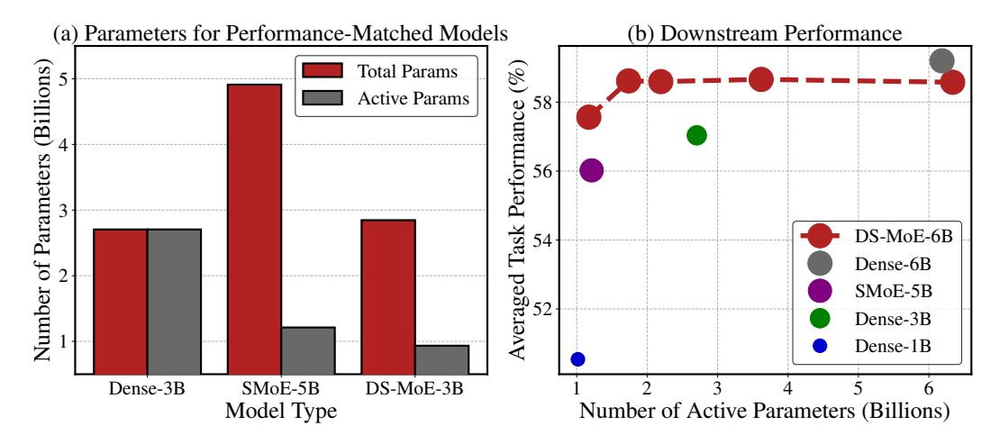
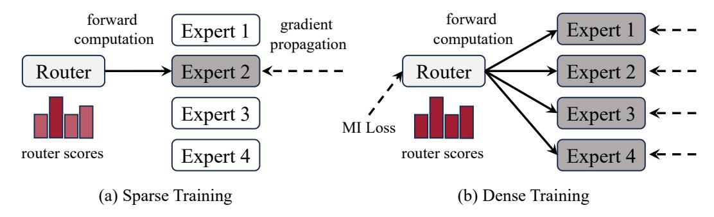
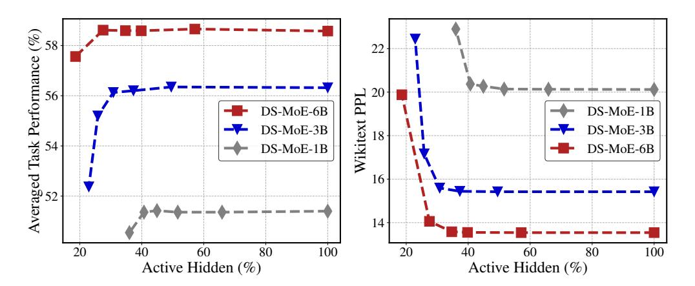
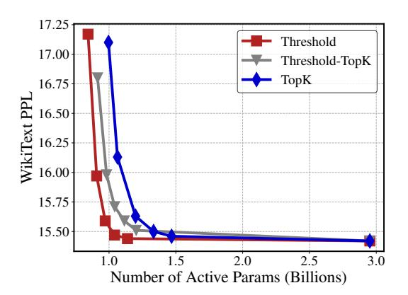
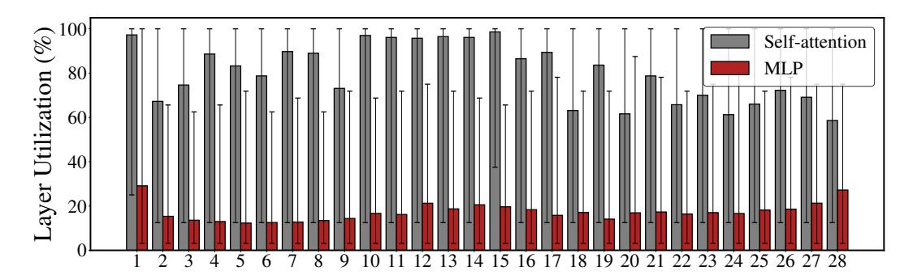
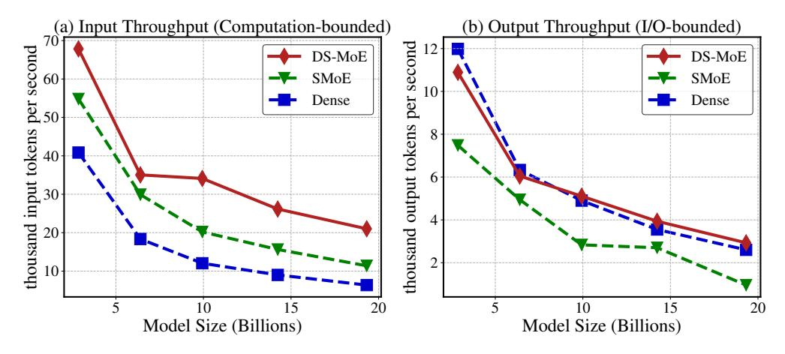

# Dense Training, Sparse Inference: Rethinking Training of Mixture-of-Experts Language Models

Bowen Pan Vikang Shen Haokun Liu Mayank Mishra Gaoyuan Zhang Aude Oliva Colin Raffel Rameswar Panda NIT CSAIL, MIT-IBM Watson AI Lab, University of Toronto, Vector Institute [bpan, oliva] Mit.edu, [haokunliu412, craffel] (gmail.com, [rpanda, yikang.shen, mayank.mishra2, Gaoyuan.zhang] (ibm.com)

## **Abstract**

Mixture-of-Experts (MoE) language models can reduce computational costs by 2-4× compared to dense models without sacrificing performance, making them more efficient in computation-bounded scenarios. However, MoE models generally require 2-4× times more parameters to achieve comparable performance to a dense model, which incurs larger GPU memory requirements and makes MoE models less efficient in I/O-bounded scenarios like autoregressive generation. In this work, we propose a hybrid dense training and sparse inference framework for MoE models (DS-MoE) which achieves strong computation and parameter efficiency by employing dense computation across all experts during training and sparse computation during inference. Our experiments on training LLMs demonstrate that our DS-MoE models are more parameter-efficient than standard sparse MoEs and are on par with dense models in terms of total parameter size and performance while being computationally cheaper (activating 30-40% of the model's parameters). Performance tests using vLLM show that our DS-MoE-6B model runs up to  $1.86 \times$  faster than similar dense models like Mistral-7B, and between  $1.50 \times$  and  $1.71 \times$  faster than comparable MoEs, such as DeepSeekMoE-16B and Qwen1.5-MoE-A2.7B.

## 1 Introduction

While scaling up Large Language Models (LLMs) has proven to be an effective way to improve performance on a huge range of tasks, increased scale leads to increased computational costs. The Mixture-of-Experts (MoE) approach Shazeer et al. (2017); Fedus et al. (2022); Shen et al. (2023d); Jiang et al. (2024) presents one possible solution by selectively utilizing a subset of parameters for improved computational efficiency while maintaining or even enhancing performance. This efficiency is particularly beneficial in computation-bound scenarios where many tokens need to be processed simultaneously, like preprocessing a large batch of prompts. Despite these benefits, MoE models often require  $2-4\times$  more parameters than dense models Dai et al. (2024); Shen et al. (2023d) to achieve comparable performance. The large number of parameters makes MoE models consume more memory and less efficient in I/O-bounded scenarios such as recurrent token generation. We hypothesize that the relative parameter inefficiency of MoE models is primarily due to the sparse training approaches typically used to train MoE models, wherein only a subset of experts is activated and optimized for each token. In addition, sparse training can lead to inefficient GPU utilization when expert parallelism is used and expert usage is unbalanced Gale et al. (2023).

In our study, we introduce dense training and sparse inference as a method to improve the parameter efficiency of MoE models. As illustrated in Figure 1, our DS-MoE matches the performance of the same-size dense model while notably decreasing the number of active computing parameters during inference. In comparison with a performance-matched sparse MoE Fedus et al. (2022); Gale et al. (2023), our DS-MoE significantly diminishes the total parameter count of the model while activating a similar number of parameters. The critical

Figure 1: Subfigure (a) showcases the sizes and computational profiles of the Dense-3B, SMoE-5B, and DS-MoE-3B models, each achieving a comparable averaged task performance in Table 3. The computational cost is quantified by counting the number of active parameters engaged during inference. Subfigure (b) displays the performance of our DS-MoE-6B model in sparse inference, set against that of the traditional dense models and SMoE models. The radius of the icon circle reflects the total number of the model parameters.

distinction between our DS-MoE and traditional sparse training lies in the involvement of **all experts** in each layer throughout the training phase. Additionally, we incorporate a Mutual Information (MI) loss Shen et al. (2023d) that focuses on load balancing and expert concentration. This MI loss ensures the router produces an even distribution across experts and a sparse distribution for individual tokens, thereby ensuring expert use is balanced while allowing for sparse inference post-training. We then employ sparse inference by selecting the top K experts in each layer, based on their router scores. The value of K is either a fixed number or dynamically determined based on a predefined router score threshold  $\epsilon$ . As a result, our DS-MoE model achieves performance comparable to that of dense models with same model size while only activating 30% to 40% of the parameters during inference.

Our experimental results demonstrate that: (1) Our DS-MoE significantly improves the parameter efficiency of MoE models and outperforms conventional sparse training methods for MoE; (2) when compared to parameter-matched dense models, our DS-MoE model not only maintains comparable performance but also substantially reduces computation by activating 30-40% of parameters during inference; (3) we observe that larger models exhibit greater tolerance to sparsity, effectively maintaining dense-inference performance levels by engaging fewer experts, and (4) our DS-MoE has the best throughput performance in both computation-bounded and I/O-bounded scenarios.

#### 2 Related Work

**Spa60rsely Gated Mixture-of-Experts Models** Shazeer et al. (2017) introduced the sparsely gated Mixture of Experts (MoE) layer, which are sparsely activated subnetworks whose routing is determined by softmax gates, to enhance the scalability of LSTMs Hochreiter & Schmidhuber (1997). With the advent of transformers Vaswani et al. (2017); Radford & Narasimhan (2018); Devlin et al. (2019), which have shown significant improvements with scaling Kaplan et al. (2020), MoE has been recognized as a promising avenue for advancing model performance. The integration of MoE into the Transformer framework has been furthered by innovations such as Gshard Lepikhin et al. (2020), Switch transformers Fedus et al. (2022), and GLAM Du et al. (2021), which each introduce parallelization techniques for efficient training of MoE models across multiple devices. Nonetheless, the complexity of training MoE models is augmented by the routing problem Rosenbaum et al. (2019); Mittal et al. (2022), prompting numerous studies to enhance routing strategies either by redesigning the router Roller et al. (2021); Lewis et al.

Figure 2: Illustration of Dense Training of MoE models: Subfigure (a) illustrates the conventional sparse training method in MoE models, characterized by sparse gradient propagation in both the router and the experts. In subfigure (b), we detail the dense training strategy in our DS-MoE, which involves dense propagation of gradients for both routers and experts.

[\(2021\)](#page-13-2); [Chi et al.](#page-11-4) [\(2022\)](#page-11-4); [Zhou et al.](#page-15-0) [\(2022\)](#page-15-0) or by altering the training methodology [Zoph et al.](#page-16-0) [\(2022\)](#page-16-0); [Dai et al.](#page-11-5) [\(2022\)](#page-11-5); [Shen et al.](#page-14-6) [\(2023c\)](#page-14-6). Additional research has explored converting dense models into MoE models [Komatsuzaki et al.](#page-12-4) [\(2022\)](#page-12-4); [Zhang et al.](#page-15-1) [\(2021a\)](#page-15-1) or utilizing a complete transformer model as an expert [Li et al.](#page-13-3) [\(2022\)](#page-13-3). Beyond merely scaling, MoE offers benefits in managing diverse tasks, with notable achievements in machine translation [Kudugunta et al.](#page-12-5) [\(2021\)](#page-12-5), multitask learning [Hazimeh et al.](#page-12-6) [\(2021\)](#page-12-6); [Gupta et al.](#page-12-7) [\(2022\)](#page-12-7), and instruction tuning [Shen et al.](#page-14-7) [\(2023a\)](#page-14-7). The landscape of MoE models is rapidly expanding, with recent introductions of more powerful frameworks [Jiang et al.](#page-12-0) [\(2024\)](#page-12-0); [Dai et al.](#page-11-1) [\(2024\)](#page-11-1), and studies by [Shen et al.](#page-14-8) [\(2023b\)](#page-14-8) and [Qiu et al.](#page-14-9) [\(2023\)](#page-14-9) have shown that instruction finetuning significantly enhances MoE models, bolstering their prevalence.

**Sparsity in Dense Model.** Sparsity is a common trait in large language models. [Liu et al.](#page-13-4) [\(2023\)](#page-13-4) has demonstrated that similar performance levels can be achieved by activating only 10-20% of the neurons in these models. The concept of MoEfication, as introduced by another study [Zhang et al.](#page-15-2) [\(2021b\)](#page-15-2), involves organizing neurons into distinct expert groups within a dense model and then converting it into a sparse MoE model. This transformation is accomplished by training a router to manage these expert groups, thereby preserving performance. Model pruning techniques [Voita et al.](#page-15-3) [\(2019\)](#page-15-3); [Michel et al.](#page-13-5) [\(2019\)](#page-13-5) leverage the inherent sparsity within dense models to eliminate superfluous neurons, enhancing efficiency. Similarly, dynamic inference strategies [Wang et al.](#page-15-4) [\(2018\)](#page-15-4); [Wu et al.](#page-15-5) [\(2018\)](#page-15-5); [Pan et al.](#page-13-6) [\(2021\)](#page-13-6) aim to selectively engage only the necessary parts of the model during computation, optimizing resource use. Furthermore, studies on model-preserving compression [Chee et al.](#page-11-6) [\(2022\)](#page-11-6) have revealed that neurons in dense models are often redundant. It has been shown that the model's parameter size can be significantly reduced by generating portions of the neuron through cost-effective operations on existing neurons, further affirming the potential for optimization in model design.

**Efficient Inference for LLM.** The high computational costs of large-scale LLMs have led to a great deal of work that aims to make inference of LLMs more efficient. Structured pruning techniques [Xia et al.](#page-15-6) [\(2023;](#page-15-6) [2022\)](#page-15-7); [Cai et al.](#page-11-7) [\(2019\)](#page-11-7); [Wen et al.](#page-15-8) [\(2016\)](#page-15-8); [Liu et al.](#page-13-7) [\(2017\)](#page-13-7); [Luo](#page-13-8) [et al.](#page-13-8) [\(2017\)](#page-13-8) aim to trim a pre-trained large model in a systematic manner, resulting in a smaller model that can be further enhanced through continuous learning. Quantization methods [Xiao et al.](#page-15-9) [\(2023\)](#page-15-9); [Nagel et al.](#page-13-9) [\(2019;](#page-13-9) [2020\)](#page-13-10); [Wang et al.](#page-15-10) [\(2019\)](#page-15-10); [Lin et al.](#page-13-11) [\(2023\)](#page-13-11); [Frantar et al.](#page-11-8) [\(2022\)](#page-11-8) significantly reduce the model size and notably accelerate inference speed. Additionally, speculative decoding strategies [Stern et al.](#page-14-10) [\(2018\)](#page-14-10); [Chen et al.](#page-11-9) [\(2023\)](#page-11-9); [Leviathan et al.](#page-13-12) [\(2023\)](#page-13-12) expedite LLM inference by employing a compact draft model to decode tokens concurrently, showcasing innovative approaches to improve computational efficiency and model performance.

## 3 Methods

In this section, we first provide an overview of the MoE language model. Subsequently, we present our DS-MoE framework, detailing the process of densely training our MoE model prior to sparse inference, as well as two pivotal elements for DS-MoE framework: the mutual information (MI) loss and the Mixture of Attention Head (MoA) blocks.

## 3.1 Preliminary: Mixture-of-Experts Language Models

We take the feed-forward network (FFN) in the transformer language model for example to illustrate the MoE architecture. An MoE FFN comprises N experts and a router  $\mathbf{h}$ , where each expert  $\mathbf{e}$  is an MLP module and the router predicts a score for each expert. Given an input token  $\mathbf{X} \in \mathbb{R}^{d_h}$ , the MoE computes the output  $\mathbf{O} \in \mathbb{R}^{d_h}$  through:

$$\mathbf{S} = \operatorname{softmax}(\mathbf{h}(\mathbf{X})), \quad \mathbf{O} = \sum_{i=1}^{K} S_{\mathbf{A}_i} \cdot \mathbf{e}_{\mathbf{A}_i}(\mathbf{X}),$$
 (1)

where  $\mathbf{S} \in \mathbf{R}^N$  is the score vector for the experts and  $\mathbf{A}_i$  is the index for  $i^{th}$  of the K experts with the highest scores. During training, gradients only backpropagate through the selected experts  $\mathbf{e}_{topK_i}$  and the corresponding scores  $S_{topK_i}$ .

#### 3.2 DS-MoE Framework

The traditional MoE language models, despite being able to match the performance of dense models with approximately 40-50% of the computation, necessitate significantly more parameters, typically 2-3 times more. This increased requirement for parameters arises from the process of backpropagation in MoE models, which is sparsely optimized as we discussed in Section 3.1, thus not as efficient as in dense models. Our approach trains the MoE model in a dense manner with an additional MI loss, and performs inference sparsely. This strategy aims to retain the runtime efficiency of traditional MoE models while achieving the parameter efficiency of dense models.

**Dense Training.** The fundamental concept of dense training revolves around optimizing the router using complete gradients. Unlike traditional MoEs, where the gradient of  $\bf S$  is expressed as:

$$\nabla \mathbf{S} = [\mathbf{e}_1(\mathbf{X}), ..., \mathbf{e}_N(\mathbf{X})]^\mathsf{T} \, \nabla \mathbf{O} \odot \mathbf{M},\tag{2}$$

in this context,  $\mathbf{M} \in \{0,1\}^N$  serves as a binary mask identifying the activated experts. Specifically,  $\mathbf{M}_i = 1$  indicates that expert  $\mathbf{e}_i$  is active in the forward pass, and  $\mathbf{M}_i = 0$  otherwise. To preserve all gradients of  $\mathbf{S}$ , we ensure that the output of every expert is computed during the forward pass, and this output is retained for use during backpropagation. The gradients of  $\mathbf{S}$  and  $\mathbf{e}_i(\mathbf{X})$  in our approach are articulated as follows:

$$\nabla \mathbf{S} = [\mathbf{e}_1(\mathbf{X}), ..., \mathbf{e}_N(\mathbf{X})]^\mathsf{T} \, \nabla \mathbf{O}, \quad \nabla \mathbf{e}_i(\mathbf{X}) = S_i \nabla \mathbf{O}, \tag{3}$$

where j represents the expert index. As shown in Figure 2, our approach to training the MoE model densely involves activating all experts.

**Sparse Inference.** During inference, only the top K experts, determined by their scores, are used. The selection of K is based either on a predetermined value or adaptively, depending on how many experts have scores above a specified threshold  $\epsilon$ . We adopt the SimpleMoE Tan et al. (2024) implementation for the sparse inference. More details can be found in Section 4.4.

**Mutual Information Loss.** To achieve load balance among all experts and prevent the underutilization of model capacity, we integrate a Mutual Information (MI) loss into the router. This method, following Shen et al. (2023d), aims to maximize the entropy of the expert distribution to ensure even distribution of workload:

$$H(\mathbf{e}) = -\sum_{i=1}^{N} p(\mathbf{e}) \log p(\mathbf{e}), \tag{4}$$

thereby promoting load balance across experts. In addition, to avoid the router adopting overly simplistic solutions and to ensure expert concentration, we minimize the conditional entropy of the expert distribution,  $H(\mathbf{e}|\mathbf{X})$ . The overall loss function is therefore defined as:

$$\mathcal{L}_{\text{MI}} = -H(\mathbf{e}) + \frac{1}{|\mathcal{X}|} \sum_{\mathbf{X} \in \mathcal{X}} H(\mathbf{e}|\mathbf{X}), \tag{5}$$

where  $\mathcal{X}$  denotes the tokens in a minibatch. This approach not only ensures an equitable load balance among the experts but also maintains a high level of concentration on the appropriate solutions, optimizing the router's performance. The total loss is then calculates as

$$\mathcal{L} = \mathcal{L}_{LM} + \alpha \mathcal{L}_{MI} \tag{6}$$

where  $\mathcal{L}_{LM}$  is the standard autoregressive language modeling loss and  $\alpha$  is the weight for mutual information loss.

**Mixture of Attention Head.** Unlike the majority of current MoE language models that retain a dense layer for self-attention, we have substituted our self-attention layer with a Mixture of Attention (MoA) heads layer Zhang et al. (2022). Our MoA heads are constructed following the usage of group-query attention (GQA) Ainslie et al. (2023), where key and value pairs are shared among a group of query vectors. In our implementation, each expert in the MoA heads is responsible for computing  $N_{\text{head}}$  query vectors  $\mathbf{Q} \in \mathbb{R}^{d_{\text{head}}}$ . For a given input token  $\mathbf{X} \in \mathbb{R}^{d_{\text{h}}}$ , the output from an expert  $e_i$  is derived as follows:

$$\mathbf{Q}_i = \mathbf{W}_{\mathbf{q}} \mathbf{X}, \quad \mathbf{O}_{ij} = \operatorname{softmax}(\mathbf{Q}_{ij} \mathbf{K}_i^{\mathsf{T}}) \mathbf{V}_i \mathbf{W}_{\mathbf{0}j},$$
 (7)

here,  $\mathbf{W_q} \in \mathbb{R}^{N_{\text{head}} \times d_{\text{head}} \times d_{\text{h}}}$  represents the query projection weight for expert  $\mathbf{e}_i$ . It is important to note that the key and value cache, represented by  $\mathbf{K}, \mathbf{V} \in \mathbb{R}^{N_{\text{head}} \times L \times d_{\text{head}}}$ , where L is the length of the cache, is shared among all the experts. The output projection for the expert is indicated by  $\mathbf{W_o} \in \mathbb{R}^{N_{\text{head}} \times d_{\text{head}} \times d_{\text{h}}}$ . The final output of the layer is calculated as:

$$\mathbf{O} = \sum_{k=1}^{K} S_{\mathbf{A}_k} \sum_{j=1}^{N_{\text{head}}} \mathbf{O}_{\mathbf{A}_k j'}$$
 (8)

where **A** is the index set for the activated experts.

## 4 Empirical Study

In this section, we comprehensively evaluate our DS-MoE, focusing on its performance in downstream tasks, sparsity, and GPU inference speed. The primary objective of our study is to investigate the advantages of DS-MoE compared to both dense models and SMoE models. We test our model and baselines in moderate-scale language modeling.

## 4.1 Experimental Setup

**Dataset and Tokenization** We pretrain our models using a subset of the Pile dataset Gao et al. (2020), and apply tokenization using the CodeGen tokenizer Nijkamp et al. (2023). This dataset encompasses 300B tokens. Specifically, we utilize a 30B token subset for training our 1B-scale models and a 100B token subset for the training of models at the 3B and 6B scales.

**Model Hyperparameters.** We list the hyperparameter settings of different model architectures in Table 1. Here,  $N_{\rm att}$  and  $N_{\rm ffd}$  represent the number of experts in each attention layer and each feed-forward layer respectively. In our models, we use the GeLU Hendrycks & Gimpel (2016) activation function. We use Grouped-Query Attention (GQA) Ainslie et al. (2023) in our attention blocks. We use 2 shared key-value heads for the 1B models and 4 for the 3B and 6B models.

Table 1: Model Architecture Hyperparameters. Here,  $N_{\rm att}$  and  $N_{\rm ffd}$  denote the number of experts in the self-attention layer and the MLP layer, respectively. In the case of the SMoE models, the top-2 experts are activated both during training and inference phases.

| Model                | $D_{\rm emb}$ | $N_{\rm layer}$ | $N_{\rm att}$ | N head | $D_{att}$ | $N_{\mathrm{ffd}}$ | $D_{\rm ffd}$ | total params |
|----------------------|---------------|-----------------|---------------|-------------------|-----------|--------------------|---------------|-----------------|
| Dense-1B Dense-3B | 2048          | 24 28        | 1             | 32 32          | 64 96  | 1 1             | 8192 12288 | 1017M 2705M  |
| Dense-6B             | 4096          | 36              | 1             | 32                | 128       | 1                  | 16384         | 6186M           |
| SMoE-1B              | 2048          | 24              | 1             | 32                | 64        | 8                  | 1024          | 1042M           |
| SMoE-1.5B            | 2048          | 24              | 1             | 32                | 64        | 12                 | 1024          | 1445M           |
| SMoE-5B              | 3072          | 28              | 1             | 32                | 96        | 16                 | 1536          | 4911M           |
| DS-MoE-1B            | 2048          | 24              | 16            | 2                 | 64        | 32                 | 256           | 1067M           |
| DS-MoE-3B            | 3072          | 28              | 8             | 4                 | 96        | 32                 | 384           | 2846M           |
| DS-MoE-6B            | 4096          | 36              | 8             | 4                 | 128       | 32                 | 512           | 6343M           |

**Training Details.** We train our models using the AdamW optimizer Loshchilov & Hutter (2017) with a learning rate of  $3 \times 10^{-4}$ . The training includes a cosine learning rate schedule with a warmup of 1 billion tokens for 1B models and 2 billion for 3B and 6B models. We use a constant weight decay of 0.01 and clip gradients at 1.0 throughout the training. Batch sizes are 0.5 million tokens for 1B models and 2 million for

Table 2: Value of  $\alpha$  in Our Models.

| Model                               | α in MoA                                              | α in MoE                   |
|-------------------------------------|-------------------------------------------------------|----------------------------|
| DS-MoE-1B DS-MoE-3B DS-MoE-6B | $\begin{array}{c c} 3.5e-4 \ 2e-4 \ 2e-4 \end{array}$ | 6.3e - 4 $4e - 4$ $2e - 4$ |

3B and 6B models, with a sequence length of 2048 tokens. To optimize training, we use fully sharded data parallelism Zhao et al. (2023); Rajbhandari et al. (2020) and activation checkpointing Korthikanti et al. (2023). Training times are 24 hours for 1B models on 8 H100 80GB GPUs, 64 hours for 3B models and 124 hours for 6B models on 32 H100 GPUs. The mutual information loss weights ( $\alpha$  in Equation 6) are listed in Table 2.

### 4.1.1 Evaluation Settings

**Baselines.** We compare our method against two baselines. *A. Dense model*. For each instance of our DS-MoE model, we train an analogous dense model. This model is designed to have a parameter size similar to that of our DS-MoE model, as detailed in Table 1. The only parameter difference between the dense model and our DS-MoE model arises from the router function. *B. Sparse MoE*. We train the MoE model with traditional sparse gradient propagation to match the performance of Dense-1B and Dense-3B models. The Top-K is set to be 2 with the use of switch loss Fedus et al. (2022) for the load balance of the routers. For the implementation of the sparse MoE block, we employ dMoE Gale et al. (2023). The model hyperparameters for our SMoE baselines are outlined in Table 1. These baseline models aim to highlight the parameter inefficiencies found in traditional sparse MoE training approaches.

**Downstream tasks.** We assess our models across a diverse array of downstream tasks, encompassing both common-sense reasoning and question-answering. These include evaluations on PiQA Bisk et al. (2020), HellaSwag Zellers et al. (2019), WinoGrande Sakaguchi et al. (2021), SciQ Welbl et al. (2017), and Arc Clark et al. (2018). Additionally, we measure and report the model's perplexity on the Wikitext dataset Merity et al. (2016). For all these evaluations, we utilize the LM evaluation harness Gao et al. (2023) to ensure consistency and reliability in our testing methodology.

#### 4.2 Results

In Table 3, we count the mean active parameters across a range of zero-shot tasks as well as the Wikitext Merity et al. (2016) language modeling task. Additionally, we evaluate

Table 3: Evaluation of Base Models in Zero-shot and Language Modeling Tasks. The number of active parameter and the percentage of the active hidden are calculated across all the downstream tasks and the wikitext dataset. Acronyms: HS (HellaSwag), WG (WinoGrande).

| Model     | HS   | PIQA | WG   | SciQ | Arc-e | Arc-c | Avg. Perf.↑ | Wikitext PPL↓ | Active Params | Active Hidden |
|-----------|------|------|------|------|-------|-------|----------------|------------------|------------------|------------------|
| Dense-1B  | 33.1 | 66.6 | 51.1 | 80.0 | 50.8  | 21.5  | 50.5           | 20.48            | 1017M            | 100%             |
| SMoE-1B   | 32.8 | 66.4 | 52.4 | 79.7 | 50.7  | 21.7  | 50.5           | 21.09            | 419M             | 40%              |
| SMoE-1.5B | 33.1 | 67.7 | 52.5 | 79.7 | 50.5  | 22.8  | 51.0           | 20.32            | 419M             | 29%              |
| DS-MoE-1B | 33.7 | 68.1 | 50.8 | 81.1 | 52.4  | 22.2  | 51.4           | 20.37            | 439M             | 41%              |
| Dense-3B  | 40.4 | 71.4 | 58.7 | 86.0 | 59.6  | 26.1  | 57.0           | 14.77            | 2705M            | 100%             |
| SMoE-5B   | 40.1 | 70.7 | 56.5 | 85.6 | 58.4  | 24.8  | 56.0           | 14.93            | 1212M            | 25%              |
| DS-MoE-3B | 39.3 | 71.6 | 57.9 | 85.6 | 57.7  | 24.9  | 56.2           | 15.48            | 934M             | 34%              |
| Dense-6B  | 44.3 | 72.2 | 59.9 | 88.0 | 62.9  | 27.9  | 59.2           | 12.98            | 6186M            | 100%             |
| DS-MoE-6B | 43.5 | 73.0 | 57.9 | 86.9 | 61.9  | 27.9  | 58.5           | 13.89            | 1813M            | 29%              |

Figure 3: We assess the sparsity in our DS-MoEs by gradually deactivating experts to attain increasingly sparse configurations, monitoring until a significant performance drop occurs.

the proportion of active parameters within the hidden layers. For DS-MoE-1B model, we evaluate the performance of the dense model baseline and the sparse training baseline. For all the DS-MoE models, experts are activated based on a criterion where their normalized probability  $^1$  exceeds a threshold  $\epsilon$ . The threshold  $\epsilon$  can be flexibly adjusted to balance the performance and sparsity.

We list the evaluation results of the baselines and our models Table 3, from which we derive three key insights. **Firstly**, it is evident that the DS-MoE model demonstrates superior parameter efficiency compared to its sparsely trained counterpart. For example, the table reveals that our DS-MoE-3B model not only aligns with the SMoE-5B model in terms of performance and computational expenses but does so with half the number of expert parameters in the MLP layers compared to the SMoE-5B model. This parameter efficiency improves the inference throughput when I/O is bounded as we demonstrated in Section 4.4. **Secondly**, applying dense optimization to experts can achieve comparable parameter efficiency to that of traditional dense models. The table demonstrates that, across all three varying sizes, our DS-MoE models either closely match or even surpass their dense model counterparts in downstream task performance and language modeling capabilities. This model performance is achieved with a way lesser count of active parameters, thereby significantly reducing computational costs. **Thirdly**, the sparsity observed in DS-MoE models intensifies as the model size expands. This increase in sparsity is evident from the rising ratio of activated parameters within the hidden layers, indicating a clear trend across

&lt;sup>1The normalized probability is calculated by multiplying the router's output probability by the total number of experts.

our DS-MoE models from 1B to 6B in size. Also as illustrated in Figure 3, there is a strategic reduction in the number of sampled experts to a point where further reduction noticeably degrades performance. This is visually represented by the turning point moving towards the left (indicating increased sparsity) as the model size grows. This pattern suggests an even higher level of sparsity in models of a larger magnitude, including those with over 70B parameters.

## 4.3 Ablation Study and Analysis

Effect of  $\alpha$ . To explore the impact of the mutual information loss weight on model sparsity and performance, we conduct an ablation study using our DS-MoE-6B models. In this study, we fix the  $\alpha$  value at 2e-4 in the self-attention layer, while in the MLP layer, we vary the weight from 2e-4 to 4e-4. This adjustment is made during the model training phase. For evaluation purposes,

Table 4: Effect of Different  $\alpha$  on our DS-MoE-6B model.

| Active Params | Active Hidden | $\alpha_{\rm mlp}$                           | Avg.                | Wikitext PPL  |
|------------------|------------------|----------------------------------------------|---------------------|------------------|
| 1826M 1813M   | 29% 29%       | $\begin{vmatrix} 4e-4\\ 2e-4 \end{vmatrix}$  | 57.8 <b>58.5</b> | 13.9 13.9     |
| 1496M 1497M   | 24% 24%       | $\begin{vmatrix} 4e-4 \\ 2e-4 \end{vmatrix}$ | <b>57.8</b> 56.9    | <b>14.0</b> 16.1 |

we modulate the  $\alpha$  value to ensure that both models operated at identical sparsity levels. We assess the models' performance on zero-shot tasks and their Wikitext perplexity at two sparsity levels: 24% and 29%. According to the results presented in Table 4, the model trained with  $\alpha=4e-4$  demonstrates resilience at higher sparsity levels, maintaining its performance across both tested sparsity thresholds. Conversely, the model trained with  $\alpha=2e-4$  exhibits diminished performance at the 24% sparsity level, though it has the best performance at the 29% sparsity level. Hence, we deduce that the  $\alpha$  parameter plays a pivotal role in balancing the model's tolerance to high sparsity against its overall performance.

**Expert Sampling Strategy.** We explore various strategies for expert selection in our DS-MoE models. Employing a threshold on normalized expert probability yields significant reductions in active parameters but introduces challenges for real-world deployment, especially during batch inference where different tokens in the same batch may engage varying numbers of experts. To address this, we investigate two alternative sampling methods: TopK and Threshold-TopK. The TopK approach selects a set number of experts, *K*, in each MLP layer, activating all experts in the self-attention layers due to lower sparsity in self-attention. Meanwhile, the Threshold-TopK strategy sets a threshold for normalized expert probability, then determines the total and average number of experts activated per token in a batch, us-

Figure 4: Expert Sampling Strategy Evaluation. We assess the impact of different expert sampling strategies on the Wikitext perplexity (PPL) using our DS-MoE-3B model.

ing this average as the K value. These methods are demonstrated through the Wikitext perplexity and the active parameter count in our DS-MoE-3B model, as shown in Figure 4. By adjusting the sparsity — either by increasing the threshold or decreasing K — we find that all three expert sampling strategies strike an effective balance between computational efficiency and Wikitext perplexity. The Threshold strategy achieves the best trade-off, whereas the TopK and Threshold-TopK methods are more adaptable for real-world applications.

Figure 5: Layer Utilization Assessment. We determine the average proportion of activated experts within both the self-attention and MLP layers. This analysis is conducted using the Wikitext dataset with our DS-MoE-3B model.

**Layer Utilization.** In Figure 5, we showcase the average percentage of active experts in each layer for a threshold value of  $\epsilon=0.48$ , utilizing data from experiments conducted with the DS-MoE-3B model. The figure is augmented with error bars that depict the range of activated experts per layer, highlighting the maximum and minimum counts observed. Our findings highlight two key observations: (1) The MLP layer exhibits significantly greater sparsity compared to the self-attention layer, a trend that persists in our 6B model even when the weighting of the MI loss is identical across both the self-attention and MLP layers. (2) Within a single layer, the activated number of experts for processing different tokens exhibits substantial variance. Although sparsely trained MoEs traditionally employ a fixed number of experts, denoted as K, for each layer and token, our results suggest that adhering strictly to this fixed assumption may lead to computational inefficiencies.

## 4.4 GPU Inference Analysis

Table 5: Inference Speed of Dense Models and DS-MoE Models. Top-K represents the number of active experts in the MLP layer. We evaluate the model inference speed by measuring the latency (second) and the input token throughput (token per second). The models are deployed on HuggingFace's transformers Wolf et al. (2020).

| Model                 | Total Params | Active Params | Тор-К    | Wikitext PPL | Latency      | Speedup | TPS                | Speedup |
|-----------------------|-----------------|------------------|----------|-----------------|--------------|---------|--------------------|---------|
| Dense-3B DS-MoE-3B | 2705M 2793M  | 2705M 1039M   | N/A 6 | 14.77 15.63  | 4.28 3.68 | 1.16×   | 40854.5 61515.9 | 1.51×   |
| Dense-6B DS-MoE-6B | 6186M 6338M  | 6186M 2043M   | N/A 4 | 12.98 13.92  | 8.58 5.75 | 1.49×   | 18354.2 35046.7 | 1.91×   |

In this section, we evaluate the inference performance of the dense model and our DS-MoE model on GPUs. We assess inference speed using three key metrics: (1) **Latency**, which measures the total time taken by the model to process the text input and generate a complete response. This evaluation involves processing a batch of 64 sentences, each comprising 2,000 tokens, with the model producing 20 tokens in response. (2) **Input token throughput**, which is the speed at which the model processes and encodes input tokens. For this metric, we set the input token sequence length at 256 and adjust the batch size to its maximum to optimize the utilization of GPU memory. (3) **Output token throughput**, which is measured as the model's ability to generate tokens per second from the given input tokens. This is evaluated under conditions where the model decodes 512 tokens utilizing a key-value cache mechanism. These benchmarks for assessing performance are carried out on an A100-80GB GPU. We utilize the ParallelLinear operation Tan et al. (2024) for sparse inference in the MLP layer and employ torch.nn Paszke et al. (2019) to perform dense inference in the self-attention layer. Figure 5 reveals that the layer utilization of the self-attention layer consistently exceeds 60%. We find that at this level of sparsity, sparse inference can

Figure 6: Input and Output Token Throughput. We measure the input and output token throughput of each model on an A100-80GB GPU. The X-axis represent the model size of the dense model. In this comparison, we contrast each dense model with its corresponding performance-matched DS-MoE and SMoE models. The details of the model hyperparameters can be found in Table 6.

Table 6: Hyperparameters of the Scaled Models for the Speed Test. We maintain the total number of heads  $N_{\text{att}} \times N_{\text{head}}$  as 32 and increase the number of layers  $N_{\text{laver}}$  to 36.

| Model                               | $D_{\rm emb}$ | $D_{att}$ | $N_{\rm ffd}$ | $D_{\rm ffd}$        | Тор-К       | total params            | active params         |
|-------------------------------------|---------------|-----------|---------------|----------------------|-------------|----------------------------|--------------------------|
| Dense-10B SMoE-17B DS-MoE-10B | 5120          | 160       | 1 16 32 | 20480 2560 640 | 1 2 4 | 9667M 17413M 9857M   | 9667M 4201M 3257M  |
| Dense-14B SMoE-25B DS-MoE-14B | 6144          | 192       | 1 16 32 | 24576 3072 768 | 1 2 4 | 13923M 25029M 14149M | 13923M 6004M 4645M |
| Dense-19B SMoE-34B DS-MoE-19B | 7168          | 224       | 1 16 32 | 28672 3584 896 | 1 2 4 | 18951M 34023M 19216M | 18951M 8127M 6278M |

become even slower than dense inference, primarily due to operation overheads of dynamic inference such as the duplication of intermediate tokens and the aggregation of outputs from various experts.

We first compare our DS-MoE model with the dense models regarding latency and input throughput in Table 5. We employ the TopK inference strategy, as elaborated in Section 4.3. As we can see in Table 5, the DS-MoE model consistently achieves a speedup across both metrics. Notably, the speedup effect amplifies on the DS-MoE-6B model with an increase in model size. This correlation is attributed to the models becoming sparser with larger parameter sizes, a phenomenon detailed in Section 4.2. Additionally, with the augmentation in model size, the models lean more towards being computation-bounded, making the operation overheads of dynamic inference increasingly insignificant.

Then, to thoroughly examine the inference advantages of our DS-MoE model, we conduct a comparison with both dense model and SMoE models at larger model scales. To ensure the models we compare have matched performance, we assume the SMoE to have  $2\times$  the parameters in the MLP layer as both the dense and DS-MoE models, referencing Table 3 and relevant literature Dai et al. (2024); Shen et al. (2023d). We enlarge the models by increasing both the embedding dimension ( $D_{\rm emb}$ ) and the number of hidden layers ( $N_{\rm layer}$ ), while keeping the number of experts and attention heads constant. The hyperparameters

for these scaled models are detailed in Table [6.](#page-9-0) We evaluate both the input and output throughput of the models, corresponding to computation-bounded and I/O-bounded scenarios, respectively. As illustrated in Figure [6\(](#page-9-1)a), in computation-bounded scenarios, our DS-MoE model demonstrates a significantly higher input throughput, particularly when compared to the dense model, showcasing its computational efficiency. In contrast, Figure [6\(](#page-9-1)b) reveals that while our DS-MoE model achieves comparable throughput to the dense model, it significantly outperforms the SMoE model in terms of throughput, highlighting its parameter efficiency.

**Comparison with other MoEs.** We further deploy our DS-MoE models with vLLM [Kwon](#page-12-12) [et al.](#page-12-12) [\(2023\)](#page-12-12) to benchmark our inference speed against other models at the 7B performance tier. For comparison, we select the Mistral-7B [Jiang et al.](#page-12-13) [\(2023\)](#page-12-13), which stands out as one of the leading open-source 7B models. According to Table [7,](#page-10-1) our DS-MoE-6B model demonstrates a speed increase of 1.86× and 1.64× over the Mistral-7B on A100-80GB GPU and H100-80GB GPU, respectively. For MoEs, we choose DeepSeekMoE-16B [Dai et al.](#page-11-1) [\(2024\)](#page-11-1) and Qwen1.5-MoE-A2.7B [Bai et al.](#page-11-12) [\(2023\)](#page-11-12). Both of them are sparsely trained and comparable to the performance of 7B dense models. Table [7](#page-10-1) illustrates that DeepSeekMoE-16B and Qwen1.5-MoE-A2.7B possess active parameters similar to those of DS-MoE-6B, but their total weights nevertheless occupy more than 2× the GPU memory compared to DS-MoE-6B. This affects both the maximum batch size that a GPU can handle and the I/O latency, subsequently impacting throughput. As shown in Table [7,](#page-10-1) our DS-MoE-6B model is 1.50× and 1.27× faster than Qwen1.5-MoE-A2.7B on A100-80GB GPU and H100-80GB GPU, respectively.

Table 7: Speed Comparison with other MoEs. We deploy our Dense-6B and DS-MoE-6B models with vLLM [Kwon et al.](#page-12-12) [\(2023\)](#page-12-12) and test the performance under the experimental setup where the number of input tokens are 1000 and output tokens are 1000. We measure the performance with two metrics: (1) **Throughput**: requests processed per second; (2) **TPS**: tokens processed per second. The GPU memory utilization is set to be 0.9.

| Model       | Total Params | Active Params | Model Memory | A100-80GB Throughput TPS |        | H100-80GB Throughput | TPS    |
|-------------|-----------------|------------------|-----------------|--------------------------------|--------|-------------------------|--------|
| Dense-6B    | 6.4B            | 6.4B             | 12.3 GiB        | 1.04                           | 2079.8 | 1.40                    | 2808.7 |
| Mistral-7B  | 7.2B            | 7.2B             | 13.5 GiB        | 1.07                           | 2140.8 | 1.52                    | 3047.4 |
| DeepSeekMoE | 17.3B           | 2.8B             | 30.5 GiB        | 1.17                           | 2330.1 | 1.57                    | 3144.1 |
| Qwen1.5-MoE | 16.4B           | 2.7B             | 26.7 GiB        | 1.33                           | 2665.7 | 1.81                    | 3616.9 |
| DS-MoE-6B   | 6.5B            | 2.2B             | 12.6 GiB        | 2.00                           | 3992.8 | 2.30                    | 4603.9 |

# **5 Conclusion**

In this study, we investigate the application of dense pre-training, sparse inference for MoE (DS-MoE) models. Our analysis reveals that traditional sparse training methods do not optimize MoE models efficiently during the training phase, leading to suboptimal parameter effectiveness in the resulting MoE models. In contrast, we adopt a strategy where gradients are densely propagated to both the router and experts. This approach ensures our MoE models maintain the parameter efficiency comparable to dense models, while the computation efficiency similar with MoE models. Moreover, we demonstrate that our DS-MoE model achieves superior inference throughput in both computation-bounded and I/O-bounded scenarios. Upon comparing our DS-MoE against other MoE models, it is evident that our DS-MoE model achieves the highest throughput.

## **References**

Joshua Ainslie, James Lee-Thorp, Michiel de Jong, Yury Zemlyanskiy, Federico Lebrón, and Sumit Sanghai. Gqa: Training generalized multi-query transformer models from multi-head checkpoints. *arXiv preprint arXiv:2305.13245*, 2023.

- Jinze Bai, Shuai Bai, Yunfei Chu, Zeyu Cui, Kai Dang, Xiaodong Deng, Yang Fan, Wenbin Ge, Yu Han, Fei Huang, Binyuan Hui, Luo Ji, Mei Li, Junyang Lin, Runji Lin, Dayiheng Liu, Gao Liu, Chengqiang Lu, Keming Lu, Jianxin Ma, Rui Men, Xingzhang Ren, Xuancheng Ren, Chuanqi Tan, Sinan Tan, Jianhong Tu, Peng Wang, Shijie Wang, Wei Wang, Shengguang Wu, Benfeng Xu, Jin Xu, An Yang, Hao Yang, Jian Yang, Shusheng Yang, Yang Yao, Bowen Yu, Hongyi Yuan, Zheng Yuan, Jianwei Zhang, Xingxuan Zhang, Yichang Zhang, Zhenru Zhang, Chang Zhou, Jingren Zhou, Xiaohuan Zhou, and Tianhang Zhu. Qwen technical report. *arXiv preprint arXiv:2309.16609*, 2023.
- Yonatan Bisk, Rowan Zellers, Jianfeng Gao, Yejin Choi, et al. Piqa: Reasoning about physical commonsense in natural language. In *Proceedings of the AAAI conference on artificial intelligence*, volume 34, pp. 7432–7439, 2020.
- Han Cai, Chuang Gan, Tianzhe Wang, Zhekai Zhang, and Song Han. Once-for-all: Train one network and specialize it for efficient deployment. *arXiv preprint arXiv:1908.09791*, 2019.
- Jerry Chee, Anil Damle, Christopher M De Sa, et al. Model preserving compression for neural networks. *Advances in Neural Information Processing Systems*, 35:38060–38074, 2022.
- Charlie Chen, Sebastian Borgeaud, Geoffrey Irving, Jean-Baptiste Lespiau, Laurent Sifre, and John Jumper. Accelerating large language model decoding with speculative sampling. *arXiv preprint arXiv:2302.01318*, 2023.
- Zewen Chi, Li Dong, Shaohan Huang, Damai Dai, Shuming Ma, Barun Patra, Saksham Singhal, Payal Bajaj, Xia Song, and Furu Wei. On the representation collapse of sparse mixture of experts. *ArXiv*, abs/2204.09179, 2022. URL [https://api.semanticscholar.](https://api.semanticscholar.org/CorpusID:248266346) [org/CorpusID:248266346](https://api.semanticscholar.org/CorpusID:248266346).
- Peter Clark, Isaac Cowhey, Oren Etzioni, Tushar Khot, Ashish Sabharwal, Carissa Schoenick, and Oyvind Tafjord. Think you have solved question answering? try arc, the ai2 reasoning challenge. *arXiv:1803.05457v1*, 2018.
- Damai Dai, Li Dong, Shuming Ma, Bo Zheng, Zhifang Sui, Baobao Chang, and Furu Wei. Stablemoe: Stable routing strategy for mixture of experts. In *Annual Meeting of the Association for Computational Linguistics*, 2022. URL [https://api.semanticscholar.org/](https://api.semanticscholar.org/CorpusID:248227505) [CorpusID:248227505](https://api.semanticscholar.org/CorpusID:248227505).
- Damai Dai, Chengqi Deng, Chenggang Zhao, RX Xu, Huazuo Gao, Deli Chen, Jiashi Li, Wangding Zeng, Xingkai Yu, Y Wu, et al. Deepseekmoe: Towards ultimate expert specialization in mixture-of-experts language models. *arXiv preprint arXiv:2401.06066*, 2024.
- Jacob Devlin, Ming-Wei Chang, Kenton Lee, and Kristina Toutanova. Bert: Pre-training of deep bidirectional transformers for language understanding. In *North American Chapter of the Association for Computational Linguistics*, 2019. URL [https://api.semanticscholar.](https://api.semanticscholar.org/CorpusID:52967399) [org/CorpusID:52967399](https://api.semanticscholar.org/CorpusID:52967399).
- Nan Du, Yanping Huang, Andrew M. Dai, Simon Tong, Dmitry Lepikhin, Yuanzhong Xu, Maxim Krikun, Yanqi Zhou, Adams Wei Yu, Orhan Firat, Barret Zoph, Liam Fedus, Maarten Bosma, Zongwei Zhou, Tao Wang, Yu Emma Wang, Kellie Webster, Marie Pellat, Kevin Robinson, Kathleen S. Meier-Hellstern, Toju Duke, Lucas Dixon, Kun Zhang, Quoc V. Le, Yonghui Wu, Z. Chen, and Claire Cui. Glam: Efficient scaling of language models with mixture-of-experts. *ArXiv*, abs/2112.06905, 2021. URL <https://api.semanticscholar.org/CorpusID:245124124>.
- William Fedus, Barret Zoph, and Noam Shazeer. Switch transformers: Scaling to trillion parameter models with simple and efficient sparsity. *The Journal of Machine Learning Research*, 23(1):5232–5270, 2022.
- Elias Frantar, Saleh Ashkboos, Torsten Hoefler, and Dan Alistarh. Gptq: Accurate post-training quantization for generative pre-trained transformers. *arXiv preprint arXiv:2210.17323*, 2022.

- Trevor Gale, Deepak Narayanan, Cliff Young, and Matei Zaharia. Megablocks: Efficient sparse training with mixture-of-experts. *Proceedings of Machine Learning and Systems*, 5, 2023.
- Leo Gao, Stella Biderman, Sid Black, Laurence Golding, Travis Hoppe, Charles Foster, Jason Phang, Horace He, Anish Thite, Noa Nabeshima, et al. The pile: An 800gb dataset of diverse text for language modeling. *arXiv preprint arXiv:2101.00027*, 2020.
- Leo Gao, Jonathan Tow, Baber Abbasi, Stella Biderman, Sid Black, Anthony DiPofi, Charles Foster, Laurence Golding, Jeffrey Hsu, Alain Le Noac'h, Haonan Li, Kyle McDonell, Niklas Muennighoff, Chris Ociepa, Jason Phang, Laria Reynolds, Hailey Schoelkopf, Aviya Skowron, Lintang Sutawika, Eric Tang, Anish Thite, Ben Wang, Kevin Wang, and Andy Zou. A framework for few-shot language model evaluation, 12 2023. URL <https://zenodo.org/records/10256836>.
- Shashank Gupta, Subhabrata Mukherjee, Krishan Subudhi, Eduardo Gonzalez, Damien Jose, Ahmed Hassan Awadallah, and Jianfeng Gao. Sparsely activated mixture-ofexperts are robust multi-task learners. *ArXiv*, abs/2204.07689, 2022. URL [https:](https://api.semanticscholar.org/CorpusID:248227728) [//api.semanticscholar.org/CorpusID:248227728](https://api.semanticscholar.org/CorpusID:248227728).
- Hussein Hazimeh, Zhe Zhao, Aakanksha Chowdhery, Maheswaran Sathiamoorthy, Yihua Chen, Rahul Mazumder, Lichan Hong, and Ed H. Chi. Dselect-k: Differentiable selection in the mixture of experts with applications to multi-task learning. In *Neural Information Processing Systems*, 2021. URL <https://api.semanticscholar.org/CorpusID:235358484>.
- Dan Hendrycks and Kevin Gimpel. Gaussian error linear units (gelus). *arXiv preprint arXiv:1606.08415*, 2016.
- Sepp Hochreiter and Jürgen Schmidhuber. Long short-term memory. *Neural Computation*, 9: 1735–1780, 1997. URL <https://api.semanticscholar.org/CorpusID:1915014>.
- Albert Q Jiang, Alexandre Sablayrolles, Arthur Mensch, Chris Bamford, Devendra Singh Chaplot, Diego de las Casas, Florian Bressand, Gianna Lengyel, Guillaume Lample, Lucile Saulnier, et al. Mistral 7b. *arXiv preprint arXiv:2310.06825*, 2023.
- Albert Q Jiang, Alexandre Sablayrolles, Antoine Roux, Arthur Mensch, Blanche Savary, Chris Bamford, Devendra Singh Chaplot, Diego de las Casas, Emma Bou Hanna, Florian Bressand, et al. Mixtral of experts. *arXiv preprint arXiv:2401.04088*, 2024.
- Jared Kaplan, Sam McCandlish, Tom Henighan, Tom B Brown, Benjamin Chess, Rewon Child, Scott Gray, Alec Radford, Jeffrey Wu, and Dario Amodei. Scaling laws for neural language models. *arXiv preprint arXiv:2001.08361*, 2020.
- Aran Komatsuzaki, Joan Puigcerver, James Lee-Thorp, Carlos Riquelme Ruiz, Basil Mustafa, Joshua Ainslie, Yi Tay, Mostafa Dehghani, and Neil Houlsby. Sparse upcycling: Training mixture-of-experts from dense checkpoints. *ArXiv*, abs/2212.05055, 2022. URL [https:](https://api.semanticscholar.org/CorpusID:254535822) [//api.semanticscholar.org/CorpusID:254535822](https://api.semanticscholar.org/CorpusID:254535822).
- Vijay Anand Korthikanti, Jared Casper, Sangkug Lym, Lawrence McAfee, Michael Andersch, Mohammad Shoeybi, and Bryan Catanzaro. Reducing activation recomputation in large transformer models. *Proceedings of Machine Learning and Systems*, 5, 2023.
- Sneha Kudugunta, Yanping Huang, Ankur Bapna, Maxim Krikun, Dmitry Lepikhin, Minh-Thang Luong, and Orhan Firat. Beyond distillation: Task-level mixture-of-experts for efficient inference. *ArXiv*, abs/2110.03742, 2021. URL [https://api.semanticscholar.](https://api.semanticscholar.org/CorpusID:238531628) [org/CorpusID:238531628](https://api.semanticscholar.org/CorpusID:238531628).
- Woosuk Kwon, Zhuohan Li, Siyuan Zhuang, Ying Sheng, Lianmin Zheng, Cody Hao Yu, Joseph E. Gonzalez, Hao Zhang, and Ion Stoica. Efficient memory management for large language model serving with pagedattention. In *Proceedings of the ACM SIGOPS 29th Symposium on Operating Systems Principles*, 2023.

- Dmitry Lepikhin, HyoukJoong Lee, Yuanzhong Xu, Dehao Chen, Orhan Firat, Yanping Huang, Maxim Krikun, Noam M. Shazeer, and Z. Chen. Gshard: Scaling giant models with conditional computation and automatic sharding. *ArXiv*, abs/2006.16668, 2020. URL <https://api.semanticscholar.org/CorpusID:220265858>.
- Yaniv Leviathan, Matan Kalman, and Yossi Matias. Fast inference from transformers via speculative decoding. In *International Conference on Machine Learning*, pp. 19274–19286. PMLR, 2023.
- Mike Lewis, Shruti Bhosale, Tim Dettmers, Naman Goyal, and Luke Zettlemoyer. Base layers: Simplifying training of large, sparse models. In *International Conference on Machine Learning*, 2021. URL <https://api.semanticscholar.org/CorpusID:232428341>.
- Margaret Li, Suchin Gururangan, Tim Dettmers, Mike Lewis, Tim Althoff, Noah A. Smith, and Luke Zettlemoyer. Branch-train-merge: Embarrassingly parallel training of expert language models. *ArXiv*, abs/2208.03306, 2022. URL [https://api.semanticscholar.org/](https://api.semanticscholar.org/CorpusID:251371375) [CorpusID:251371375](https://api.semanticscholar.org/CorpusID:251371375).
- Ji Lin, Jiaming Tang, Haotian Tang, Shang Yang, Xingyu Dang, and Song Han. Awq: Activation-aware weight quantization for llm compression and acceleration. *arXiv preprint arXiv:2306.00978*, 2023.
- Zhuang Liu, Jianguo Li, Zhiqiang Shen, Gao Huang, Shoumeng Yan, and Changshui Zhang. Learning efficient convolutional networks through network slimming. In *Proceedings of the IEEE international conference on computer vision*, pp. 2736–2744, 2017.
- Zichang Liu, Jue Wang, Tri Dao, Tianyi Zhou, Binhang Yuan, Zhao Song, Anshumali Shrivastava, Ce Zhang, Yuandong Tian, Christopher Re, et al. Deja vu: Contextual sparsity for efficient llms at inference time. In *International Conference on Machine Learning*, pp. 22137–22176. PMLR, 2023.
- Ilya Loshchilov and Frank Hutter. Decoupled weight decay regularization. *arXiv preprint arXiv:1711.05101*, 2017.
- Jian-Hao Luo, Jianxin Wu, and Weiyao Lin. Thinet: A filter level pruning method for deep neural network compression. In *Proceedings of the IEEE international conference on computer vision*, pp. 5058–5066, 2017.
- Stephen Merity, Caiming Xiong, James Bradbury, and Richard Socher. Pointer sentinel mixture models. *arXiv preprint arXiv:1609.07843*, 2016.
- Paul Michel, Omer Levy, and Graham Neubig. Are sixteen heads really better than one? *Advances in neural information processing systems*, 32, 2019.
- Sarthak Mittal, Yoshua Bengio, and Guillaume Lajoie. Is a modular architecture enough? *ArXiv*, abs/2206.02713, 2022. URL [https://api.semanticscholar.org/](https://api.semanticscholar.org/CorpusID:249395289) [CorpusID:249395289](https://api.semanticscholar.org/CorpusID:249395289).
- Markus Nagel, Mart van Baalen, Tijmen Blankevoort, and Max Welling. Data-free quantization through weight equalization and bias correction. In *Proceedings of the IEEE/CVF International Conference on Computer Vision*, pp. 1325–1334, 2019.
- Markus Nagel, Rana Ali Amjad, Mart Van Baalen, Christos Louizos, and Tijmen Blankevoort. Up or down? adaptive rounding for post-training quantization. In *International Conference on Machine Learning*, pp. 7197–7206. PMLR, 2020.
- Erik Nijkamp, Bo Pang, Hiroaki Hayashi, Lifu Tu, Huan Wang, Yingbo Zhou, Silvio Savarese, and Caiming Xiong. Codegen: An open large language model for code with multi-turn program synthesis. *ICLR*, 2023.
- Bowen Pan, Rameswar Panda, Camilo Fosco, Chung-Ching Lin, Alex Andonian, Yue Meng, Kate Saenko, Aude Oliva, and Rogerio Feris. Va-red2 : Video adaptive redundancy reduction. *arXiv preprint arXiv:2102.07887*, 2021.

- Adam Paszke, Sam Gross, Francisco Massa, Adam Lerer, James Bradbury, Gregory Chanan, Trevor Killeen, Zeming Lin, Natalia Gimelshein, Luca Antiga, et al. Pytorch: An imperative style, high-performance deep learning library. *Advances in neural information processing systems*, 32, 2019.
- Zihan Qiu, Zeyu Huang, and Jie Fu. Emergent mixture-of-experts: Can dense pre-trained transformers benefit from emergent modular structures? *arXiv preprint arXiv:2310.10908*, 2023.
- Alec Radford and Karthik Narasimhan. Improving language understanding by generative pre-training. 2018. URL <https://api.semanticscholar.org/CorpusID:49313245>.
- Samyam Rajbhandari, Jeff Rasley, Olatunji Ruwase, and Yuxiong He. Zero: Memory optimizations toward training trillion parameter models. In *SC20: International Conference for High Performance Computing, Networking, Storage and Analysis*, pp. 1–16. IEEE, 2020.
- Stephen Roller, Sainbayar Sukhbaatar, Arthur Szlam, and Jason Weston. Hash layers for large sparse models. In *Neural Information Processing Systems*, 2021. URL [https:](https://api.semanticscholar.org/CorpusID:235367626) [//api.semanticscholar.org/CorpusID:235367626](https://api.semanticscholar.org/CorpusID:235367626).
- Clemens Rosenbaum, Ignacio Cases, Matthew Riemer, and Tim Klinger. Routing networks and the challenges of modular and compositional computation. *ArXiv*, abs/1904.12774, 2019. URL <https://api.semanticscholar.org/CorpusID:139103965>.
- Keisuke Sakaguchi, Ronan Le Bras, Chandra Bhagavatula, and Yejin Choi. Winogrande: An adversarial winograd schema challenge at scale. *Communications of the ACM*, 64(9):99–106, 2021.
- Noam Shazeer, Azalia Mirhoseini, Krzysztof Maziarz, Andy Davis, Quoc Le, Geoffrey Hinton, and Jeff Dean. Outrageously large neural networks: The sparsely-gated mixtureof-experts layer. *arXiv preprint arXiv:1701.06538*, 2017.
- Sheng Shen, Le Hou, Yan-Quan Zhou, Nan Du, S. Longpre, Jason Wei, Hyung Won Chung, Barret Zoph, William Fedus, Xinyun Chen, Tu Vu, Yuexin Wu, Wuyang Chen, Albert Webson, Yunxuan Li, Vincent Zhao, Hongkun Yu, Kurt Keutzer, Trevor Darrell, and Denny Zhou. Mixture-of-experts meets instruction tuning:a winning combination for large language models. 2023a. URL <https://api.semanticscholar.org/CorpusID:259342096>.
- Sheng Shen, Le Hou, Yanqi Zhou, Nan Du, Shayne Longpre, Jason Wei, Hyung Won Chung, Barret Zoph, William Fedus, Xinyun Chen, et al. Mixture-of-experts meets instruction tuning: A winning combination for large language models. *arXiv preprint arXiv:2305.14705*, 2023b.
- Yikang Shen, Zheyu Zhang, Tianyou Cao, Shawn Tan, Zhenfang Chen, and Chuang Gan. Moduleformer: Learning modular large language models from uncurated data. *ArXiv*, abs/2306.04640, 2023c. URL <https://api.semanticscholar.org/CorpusID:259096191>.
- Yikang Shen, Zheyu Zhang, Tianyou Cao, Shawn Tan, Zhenfang Chen, and Chuang Gan. Moduleformer: Learning modular large language models from uncurated data. *arXiv preprint arXiv:2306.04640*, 2023d.
- Mitchell Stern, Noam Shazeer, and Jakob Uszkoreit. Blockwise parallel decoding for deep autoregressive models. *Advances in Neural Information Processing Systems*, 31, 2018.
- Shawn Tan, Yikang Shen, Rameswar Panda, and Aaron Courville. Scattered mixture-ofexperts implementation. *arXiv preprint arXiv:2403.08245*, 2024.
- Ashish Vaswani, Noam M. Shazeer, Niki Parmar, Jakob Uszkoreit, Llion Jones, Aidan N. Gomez, Lukasz Kaiser, and Illia Polosukhin. Attention is all you need. In *Neural Information Processing Systems*, 2017. URL [https://api.semanticscholar.org/CorpusID:](https://api.semanticscholar.org/CorpusID:13756489) [13756489](https://api.semanticscholar.org/CorpusID:13756489).

- Elena Voita, David Talbot, Fedor Moiseev, Rico Sennrich, and Ivan Titov. Analyzing multihead self-attention: Specialized heads do the heavy lifting, the rest can be pruned. *arXiv preprint arXiv:1905.09418*, 2019.
- Kuan Wang, Zhijian Liu, Yujun Lin, Ji Lin, and Song Han. Haq: Hardware-aware automated quantization with mixed precision. In *Proceedings of the IEEE/CVF conference on computer vision and pattern recognition*, pp. 8612–8620, 2019.
- Xin Wang, Fisher Yu, Zi-Yi Dou, Trevor Darrell, and Joseph E Gonzalez. Skipnet: Learning dynamic routing in convolutional networks. In *Proceedings of the European Conference on Computer Vision (ECCV)*, pp. 409–424, 2018.
- Johannes Welbl, Nelson F Liu, and Matt Gardner. Crowdsourcing multiple choice science questions. *arXiv preprint arXiv:1707.06209*, 2017.
- Wei Wen, Chunpeng Wu, Yandan Wang, Yiran Chen, and Hai Li. Learning structured sparsity in deep neural networks. *Advances in neural information processing systems*, 29, 2016.
- Thomas Wolf, Lysandre Debut, Victor Sanh, Julien Chaumond, Clement Delangue, Anthony Moi, Pierric Cistac, Tim Rault, Rémi Louf, Morgan Funtowicz, et al. Transformers: Stateof-the-art natural language processing. In *Proceedings of the 2020 conference on empirical methods in natural language processing: system demonstrations*, pp. 38–45, 2020.
- Zuxuan Wu, Tushar Nagarajan, Abhishek Kumar, Steven Rennie, Larry S Davis, Kristen Grauman, and Rogerio Feris. Blockdrop: Dynamic inference paths in residual networks. In *Proceedings of the IEEE conference on computer vision and pattern recognition*, pp. 8817–8826, 2018.
- Mengzhou Xia, Zexuan Zhong, and Danqi Chen. Structured pruning learns compact and accurate models. In *Association for Computational Linguistics (ACL)*, 2022.
- Mengzhou Xia, Tianyu Gao, Zhiyuan Zeng, and Danqi Chen. Sheared llama: Accelerating language model pre-training via structured pruning. *arXiv preprint arXiv:2310.06694*, 2023.
- Guangxuan Xiao, Ji Lin, Mickael Seznec, Hao Wu, Julien Demouth, and Song Han. Smoothquant: Accurate and efficient post-training quantization for large language models. In *International Conference on Machine Learning*, pp. 38087–38099. PMLR, 2023.
- Rowan Zellers, Ari Holtzman, Yonatan Bisk, Ali Farhadi, and Yejin Choi. Hellaswag: Can a machine really finish your sentence? In *Proceedings of the 57th Annual Meeting of the Association for Computational Linguistics*, 2019.
- Xiaofeng Zhang, Yikang Shen, Zeyu Huang, Jie Zhou, Wenge Rong, and Zhang Xiong. Mixture of attention heads: Selecting attention heads per token. *arXiv preprint arXiv:2210.05144*, 2022.
- Zhengyan Zhang, Yankai Lin, Zhiyuan Liu, Peng Li, Maosong Sun, and Jie Zhou. Moefication: Transformer feed-forward layers are mixtures of experts. In *Findings*, 2021a. URL <https://api.semanticscholar.org/CorpusID:247958465>.
- Zhengyan Zhang, Yankai Lin, Zhiyuan Liu, Peng Li, Maosong Sun, and Jie Zhou. Moefication: Transformer feed-forward layers are mixtures of experts. *arXiv preprint arXiv:2110.01786*, 2021b.
- Yanli Zhao, Andrew Gu, Rohan Varma, Liang Luo, Chien-Chin Huang, Min Xu, Less Wright, Hamid Shojanazeri, Myle Ott, Sam Shleifer, et al. Pytorch fsdp: experiences on scaling fully sharded data parallel. *arXiv preprint arXiv:2304.11277*, 2023.
- Yan-Quan Zhou, Tao Lei, Han-Chu Liu, Nan Du, Yanping Huang, Vincent Zhao, Andrew M. Dai, Zhifeng Chen, Quoc V. Le, and James Laudon. Mixture-of-experts with expert choice routing. *ArXiv*, abs/2202.09368, 2022. URL [https://api.semanticscholar.org/CorpusID:](https://api.semanticscholar.org/CorpusID:247011948) [247011948](https://api.semanticscholar.org/CorpusID:247011948).

Barret Zoph, Irwan Bello, Sameer Kumar, Nan Du, Yanping Huang, Jeff Dean, Noam M. Shazeer, and William Fedus. St-moe: Designing stable and transferable sparse expert models. 2022. URL <https://api.semanticscholar.org/CorpusID:248496391>.