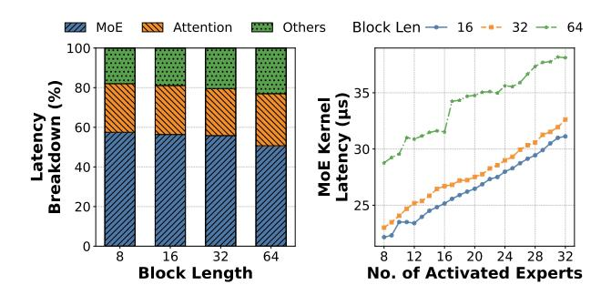
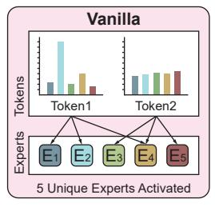
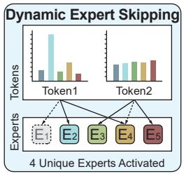
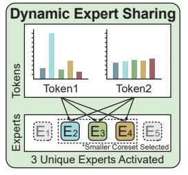
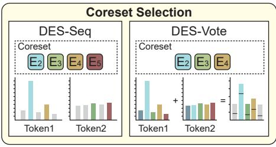
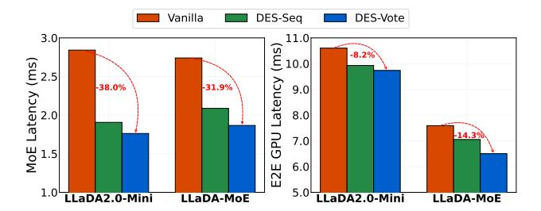
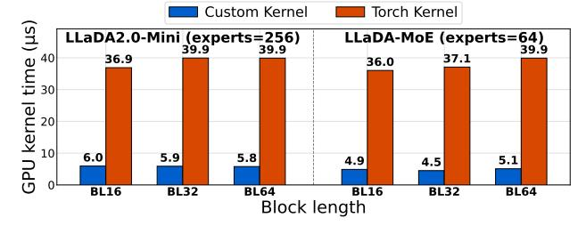
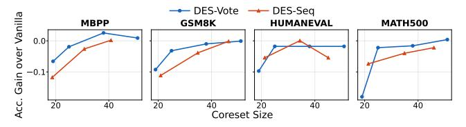
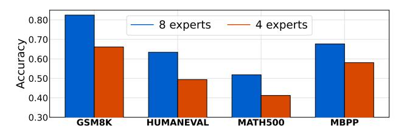
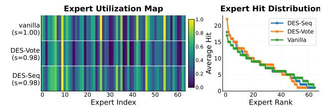

# Dynamic Expert Sharing: Decoupling Memory from Parallelism in Mixture-of-Experts Diffusion LLMs

Hao (Mark) Chen 1 Zhiwen Mo 1 Royson Lee 2 Qianzhou Wang 1 Da Li 2 Shell Xu Hu 2 Wayne Luk 1 Timothy Hospedales 2 Hongxiang Fan 1

# Abstract

Among parallel decoding paradigms, diffusion large language models (dLLMs) have emerged as a promising candidate that balances generation quality and throughput. However, their integration with Mixture-of-Experts (MoE) architectures is constrained by an "expert explosion": as the number of tokens generated in parallel increases, the number of distinct experts activated grows nearly linearly. This results in substantial memory traffic that pushes inference into a memorybound regime, negating the efficiency gains of both MoE and parallel decoding. To address this challenge, we propose Dynamic Expert Sharing (DES), a novel technique that shifts MoE optimization from token-centric pruning and conventional expert skipping methods to sequence-level coreset selection. To maximize expert reuse, DES identifies a compact, high-utility set of experts to satisfy the requirements of an entire parallel decoding block. We introduce two innovative selection strategies: (1) Intra-Sequence Sharing (DES-Seq), which adapts optimal allocation to the sequence level, and (2) Saliency-Aware Voting (DES-Vote), a novel mechanism that allows tokens to collectively elect a coreset based on aggregated router weights. Extensive experiments on MoE dLLMs demonstrate that DES reduces unique expert activations by over 55% and latency by up to 38%, while retaining 99% of vanilla accuracy, effectively decoupling memory overhead from the degree of parallelism.

# 1. Introduction

Recent advances in large-scale foundation models have seen the emergence of native parallel decoding paradigms, most

*Preprint. February 3, 2026.*

notably diffusion large language models (dLLMs) [\(Zhu](#page-9-0) [et al.,](#page-9-0) [2025;](#page-9-0) [Ye et al.,](#page-9-1) [2025\)](#page-9-1). The state-of-the-art dLLMs typically leverage block-based parallel decoding [\(Arriola](#page-8-0) [et al.,](#page-8-0) [2025;](#page-8-0) [Wu et al.,](#page-9-2) [2025\)](#page-9-2) to achieve performance parity with traditional autoregressive (AR) models through concurrent token generation. To scale these architectures effectively, dLLMs increasingly integrate Mixture-of-Experts (MoE) [\(Guo et al.,](#page-8-1) [2025;](#page-8-1) [Yang et al.,](#page-9-3) [2025;](#page-9-3) [Agarwal et al.,](#page-8-2) [2025\)](#page-8-2) as a core architectural component [\(Bie et al.,](#page-8-3) [2025;](#page-8-3) [Zhu et al.,](#page-9-0) [2025;](#page-9-0) [Cheng et al.,](#page-8-4) [2025\)](#page-8-4). The primary advantage of MoE lies in its ability to decouple the model's overall knowledge capacity from its per-token computational cost. By activating only a sparse subset of experts for each input, MoE allows dLLMs to scale to massive parameter counts, significantly enhancing representational power without a proportional increase in FLOPs.

The integration of MoE into dLLMs, however, introduces an efficiency paradox, illustrated by our roofline analysis (Figure [1\)](#page-1-0). In particular, while transitioning from AR to parallel dLLM increases operational intensity, the sparse activation of MoE dLLMs makes them more memory-bound than their dense counterparts. In these memory-bound scenarios—typical of multi-GPU and CPU-offloading environments [\(Cao et al.,](#page-8-5) [2025;](#page-8-5) [Yu et al.,](#page-9-4) [2025\)](#page-9-4)—latency is dominated by the traffic from High Bandwidth Memory (HBM) to Static RAM (SRAM) required to load unique expert weights. This bottleneck is intensified by an "expert explosion" inherent to parallel generation: whereas AR decoding processes a single token per step, dLLMs process N tokens simultaneously. Consequently, if experts are selected independently, the unique expert load scales nearly linearly with the block size N, rapidly exceeding the steady-state memory traffic of AR decoding (Figure [1\)](#page-1-0). Crucially, as the parallel block scales, the overhead of transferring divergent experts from HBM to on-chip memory can negate the compute savings of MoE, potentially rendering these models slower than their smaller dense equivalents. This memory traffic overhead imposes a systemic ceiling on the throughput gains promised by parallelization.

Existing dynamic efficiency optimizations for MoE, such as expert skipping [\(Lu et al.,](#page-9-5) [2024;](#page-9-5) [Huang et al.,](#page-8-6) [2025a;](#page-8-6)

1 Imperial College London, London, UK 2 Samsung AI Center, Cambridge, UK. Correspondence to: Hao (Mark) Chen <hc1620@ic.ac.uk>.

Figure 1. From left to right: (a) Growth of unique activated experts relative to the degree of parallelism (input block size). (b) Roofline model demonstrating that MoE dLLMs are more memory-bound than their dense counterparts and how DES mitigates this bottleneck. (c) Trade-off between activated experts and relative accuracy, where DES-Vote notably extends the Pareto frontier. (d) MoE kernel latency versus relative accuracy. For (c) and (d), accuracy is reported relative to the vanilla baseline. Results in (c) are averaged across benchmarks, namely HumanEval, MBPP, MATH500, and GSM8K, while (d) evaluates DES-Vote's performance on MBPP. The average activated experts is defined as the mean number of active experts across all MoE layers in the respective model.

Aghdam et al., 2024), are primarily designed for AR models and remain strictly token-centric. While effective at reducing per-token computational FLOPs, these methods prioritize local sparsity rather than cross-token expert redundancy. Consequently, they fail to mitigate the global HBM traffic bottleneck, as the unique expert weights loaded per layer are not optimized at the sequence level. Crucially, these approaches do not directly address the memory traffic overhead encountered in block-wise parallel decoding, where the collective expert footprint, rather than per-token compute, becomes the primary constraint on throughput.

To address these challenges, we propose **Dynamic Expert Sharing (DES)**, a novel method designed to minimize the expert footprint by forming consensus across parallel tokens. Our approach shifts the optimization objective from pertoken pruning to sequence-level sharing. We hypothesize that, unlike standard AR batching where independent tokens may activate disparate experts, *parallel decoding in dLLMs inherently involves semantically coupled tokens that exhibit significant overlap in expert demand*. To exploit this, we introduce **coreset selection**, where a minimal, high-utility set of experts is dynamically identified at runtime to serve the entire parallel block. We explore two specific strategies:

- Intra-Sequence Sharing (DES-Seq): We take the union of experts chosen independently by each token in the block. This allows for vectorized execution, eliminating the need to handle divergent expert assignments for individual positions.
- Saliency-Aware Voting (DES-Vote): A novel mechanism where tokens collectively vote for experts based on their weighted router saliency. This prioritizes the most critical experts by focusing on the holistic semantic complexity of the sequence.

By restricting the expert selection to a shared coreset, we significantly reduce the HBM-to-SRAM traffic, effectively

mitigating the memory traffic overhead of parallel MoE decoding without compromising generative quality. As shown in Figure 1, DES reduces the active experts by up to 55% and the MoE kernel latency by up to 38.0% while achieving performance comparable to the vanilla baseline.

Our contributions are summarized as follows:

- 1. We identify and quantify the "expert explosion" bottleneck in parallel MoE decoding, demonstrating how independent expert selection across parallel tokens induces a critical memory traffic overhead (Section 3).
- 2. We propose **Dynamic Expert Sharing**, a method that shifts MoE optimization from token-centric pruning to sequence-level coreset selection, leveraging a novel saliency-aware voting mechanism to maximize expert reuse (Section 4).
- 3. Through extensive benchmarking on MoE dLLMs, we demonstrate that DES achieves significant memory saving and speedup with negligible accuracy drop, effectively decoupling memory traffic from the degree of parallelism (Section 5).

# 2. Background

**Parallel Decoding.** Non-AR models first emerged in the field of neural machine translation (Gu et al., 2017; Santilli et al., 2023) as a means to reduce generation latency. More recently, parallel decoding has been adopted for LLMs to reduce the number of memory-bound forward passes. These approaches typically utilize either specially trained tokens (Chen et al., 2024; Lin et al., 2025) or *n*-grams retrieved from context (Fu et al., 2024) as inputs to a frozen AR model, enabling the generation of multiple output tokens in parallel. However, because the AR backbone undergoes limited re-training, the resulting generation quality is often constrained; consequently, these parallel models are pri-

marily employed within speculative decoding settings that require an additional verification step.

**Diffusion Large Language Models.** To fully realize the acceleration potential of parallel generation and eliminate the overhead of slow verification, natively parallel models (Gat et al., 2025; Zhu et al., 2025) are being trained from scratch with multi-token prediction objectives. In particular, Diffusion Large Language Models (dLLMs) have emerged as a promising candidate to balance generation quality and efficiency (Zhu et al., 2025; Ye et al., 2025; Arriola et al., 2025). These models ingest multiple masked tokens and process them concurrently, enabling parallel decoding without the need for supplementary verification steps. To further enhance dLLM throughput, recent research has introduced approximate KV cache and sampling strategies (Wu et al., 2025; Wei et al., 2025; Lu et al., 2025) alongside specialized inference frameworks (Ma et al., 2025).

Efficient Mixture-of-Experts. Mixture-of-Experts (MoE) has emerged as the de facto architecture to scale up dLLMs (Bie et al., 2025; Zhu et al., 2025; Cheng et al., 2025). Formally, an MoE layer replaces the standard feedforward network (FFN) of a Transformer block with a set of M independent experts  $\{E_1,\ldots,E_M\}$ , where each expert  $E_i$  is a sub-network and D is the hidden dimension. A gating or routing function  $G:\mathbb{R}^D\to\mathbb{R}^M$  assigns a score to each expert for a given input hidden state x. The output of the MoE module is computed as the weighted sum of the K highest-scoring experts:

$$MoE(x) = \sum_{i \in \mathcal{S}} \frac{G(x)_i}{\sum_{j \in \mathcal{S}} G(x)_j} E_i(x)$$
 (1)

where  $\mathcal{S} = \operatorname{TopK}(G(x), K)$  is the set of indices corresponding to the K experts with the highest routing scores. In the context of dLLMs, the total number of unique experts required across a batch of N tokens is  $|\bigcup_{n=1}^N \mathcal{S}_n|$ , which typically grows as the degree of parallelism increases.

Existing strategies for MoE efficiency primarily follow two paradigms: offline expert pruning and dynamic expert skipping. Offline approaches, such as expert pruning (Chen et al., 2022; Zhang et al., 2025) and merging (Li et al., 2023), aim to reduce the static parameter footprint through structural sparsity, quantization, or weight consolidation. In contrast, dynamic expert skipping (Huang et al., 2025b; Lu et al., 2024; Huang et al., 2025a; Aghdam et al., 2024) leverages runtime information to bypass redundant expert computations on-the-fly. Additionally, *OEA* (Oncescu et al., 2025) first attempted expert sharing across batches within the context of AR decoding. While our proposed method is orthogonal to offline pruning strategies, it addresses a critical gap in existing research: current online optimizations

Figure 2. Latency characterization of MoE decoding under varying block lengths. Left: Latency breakdown across MoE FFN, attention, and other components, showing that MoE FFN dominates end-to-end latency. Right: MoE kernel latency versus activated experts for different block lengths (16, 32, 64), illustrating a linear increase in latency with more activated experts.

are largely tailored for AR models and are not designed to optimize for the memory-traffic bottlenecks inherent to dLLMs.

# 3. Motivation

The primary motivation for parallel decoding in dLLMs is to overcome the sequential bottleneck of AR generation, which is notoriously memory-bound due to the low arithmetic intensity of processing a single token per forward pass. While dLLMs scale concurrent tokens to increase arithmetic intensity, the integration of MoE reintroduces the memorybound bottleneck (Figure 1). This is exacerbated by both algorithmic constraints, where smaller parallel blocks (e.g., 16/32 tokens) are necessary to maintain competitive accuracy (Arriola et al., 2025), and hardware trends, where the FLOPs/byte ratio of modern GPUs continues to outpace memory bandwidth (Ma & Patterson, 2026). Consequently, MoE dLLM inference is still usually memory-bound, with latency dominated by the cost of loading unique expert weights, analogous to AR decoding's bandwidth bottleneck but at a larger scale of expert demand (Yu et al., 2025).

Within this regime, the MoE FFN layer emerges as the dominant latency contributor (Figure 2). Following the simplified latency model from previous work (Oncescu et al., 2025), the time f(c) to process c tokens through a single expert is f(c) = ac + b for c > 0, where b represents the weight fetching cost from HBM to on-chip SRAM and a is the marginal computation cost. The total MoE block latency for a sequence of N parallel tokens is thus:

$$L_{MoE} = \sum_{i=1}^{N_{total}} (b \cdot \mathbb{1}_{cnt_i > 0} + a \cdot cnt_i) = b \cdot \left| \bigcup_{n=1}^{N} S_n \right| + a \cdot (N \cdot K)$$
(2)

Figure 3. Overview of the Dynamic Expert Sharing method. (a) Vanilla MoE dLLM independently routes multiple tokens, leading to a high count of unique activated experts. (b) Dynamic Expert Skipping reduces local per-token computation (indicated by dotted lines) but often fails to optimize the global unique expert load. (c) Dynamic Expert Sharing employs sequence-level coreset selection (via DES-Seq or DES-Vote) to identify high-utility experts globally, significantly minimizing the unique expert weights transferred from HBM. (d) DES-Vote enforces sequence-level consensus by aggregating router weights across the parallel block, contrasting with the independent per-token selection utilized in DES-Seq. Greyed out boxes and bars represent experts not selected and not fetched to on-chip memory.

where  $cnt_i$  is the number of tokens routed to expert  $E_i$ , and  $S_n$  is the set of K experts activated by the n-th parallel token. In MoE architectures with uniform routing, the expected number of unique activated experts  $|\bigcup_{n=1}^N S_n|$  grows as  $N_{total}(1-(1-K/N_{total})^N)$ . As the degree of parallelism N increases, this union set expands rapidly (Figure 1), leading to an increase in latency (Figure 2).

This "expert explosion" underscores the limitations of existing expert skipping methods in parallel decoding:

- 1. Diminishing Returns from Compute Sparsity: As latency is dominated by the weight-fetching cost  $b \cdot |\bigcup_{n=1}^{N} S_n|$ , reducing the compute term a yields minimal speedup if an expert remains active for any other concurrent token. This motivates "re-activating" experts within a shared coreset to recover accuracy at near-zero marginal latency (Section 5).
- 2. Lack of Cross-Token Synergy: Token-centric skipping ignores the redundancy inherent in parallel decoding. Failing to enforce a collective consensus, they do not minimize the unique expert load  $|\bigcup_{n=1}^N \mathcal{S}_n|$ , leaving the memory bottleneck unresolved.

Optimizing parallel MoE inference thus requires a shift toward *Dynamic Expert Sharing*, which explicitly minimizes the unique expert load  $|\bigcup_{n=1}^{N} S_n|$  at the sequence level.

### 4. Methodology

#### 4.1. Dynamic Expert Sharing

To optimize the memory-bound bottleneck identified in Section 3, we define a **Coreset Selection Function**,  $\Phi: \mathcal{I} \to \mathcal{C}$ , which maps available runtime information  $\mathcal{I}$  (e.g., aggregated router logits or hidden states) to a shared subset of experts  $\mathcal{C} \subset \{E_1, \dots, E_M\}$ . The coreset selection function identifies the most salient experts for a parallel decoding block. Unlike traditional AR batching, where tokens often

belong to disparate tasks, parallel decoding tokens share a common context. We hypothesize that rather than allowing independent routing, we can identify a compact, sequence-level coreset via cross-token consensus. By restricting each token's Top-k selection to this shared subset, we maximize expert reuse and minimize HBM transfer.

By substituting this coreset into our latency model, we reformulate the MoE layer latency from Equation 2. In the vanilla setting, the unique expert load is defined by the union of independent selections  $|\bigcup_{n=1}^{N} \mathcal{S}_n|$ , which is implicitly upper-bounded by the total expert pool size M. With the introduction of the coreset, the latency is expressed as:

$$L_{\text{MoE}}(\Phi) \le b \cdot |\Phi(\mathcal{I})| + a \cdot (N \cdot k) \tag{3}$$

where  $|\Phi(\mathcal{I})|$  is the cardinality of the selected coreset. Crucially, whereas the vanilla expert load is constrained by a constant, this formulation transforms the upper bound into an explicit variable  $|\Phi(\mathcal{I})|$  that guides the optimization process. We therefore define the search for an optimal coreset selection strategy as a constrained optimization problem:

$$\begin{split} \Phi^* &= \arg\min_{\Phi} \quad |\Phi(\mathcal{I})| \\ \text{s.t.} \quad \mathcal{A}(\Phi(\mathcal{I})) &\geq \mathcal{A}_{base} - \epsilon \end{split} \tag{4}$$

where  $\mathcal{A}(\Phi)$  denotes model accuracy and  $\epsilon$  is a predefined threshold for tolerable performance degradation. By shifting from independent, token-centric routing to collective coreset selection, we decouple the HBM weight-fetching cost from the number of parallel tokens N.

The DES algorithm implements this by transitioning from token-level to sequence-level routing. As detailed in Algorithm 1, the process consists of two stages: (1) **Sequence-level Consensus**, where the shared coreset  $\mathcal{C}$  is identified, and (2) **Constrained Local Routing**, where each token selects its Top-k experts exclusively from  $\mathcal{C}$ . By re-normalizing weights via an activation function  $\sigma$  from the model architecture, we preserve the original routing in-

## Algorithm 1 Dynamic Expert Sharing (DES)

**Require:** Sequence information  $\mathcal{I}$ , Coreset selection function  $\Phi$ , Activation function  $\sigma$ , Target K.

**Ensure:** Layer output Y.

1: // Stage 1: Sequence-level Consensus

2:  $\mathcal{C} \leftarrow \Phi(\mathcal{I})$  {Identify high-utility expert coreset}

3: // Stage 2: Constrained Local Routing

4: **for** each token  $n \in \{1, \dots, N\}$  **do** 

 $S_n \leftarrow \text{TopK}(\mathcal{I}_n|_{i \in \mathcal{C}}, K) \text{ {Route within coreset}}$ 

 $g_n \leftarrow \sigma(\mathcal{I}_n|_{i \in \mathcal{S}_n})$  {Re-normalize gate weights}

 $y_n \leftarrow \sum_{i \in \mathcal{S}_n} g_{n,i} \cdot E_i(x_n)$ 

9: **return**  $Y = \{y_1, \dots, y_N\}$ 

tent within the optimized memory budget. The algorithm overview is shown in Figure 3.

#### 4.2. Coreset Selection Methods

While the optimization problem in Equation 4 is difficult to solve directly, we approximate the solution by proposing two strategies for dynamic coreset selection: Intra-Sequence Sharing (DES-Seq) and Saliency-Aware Voting (**DES-Vote**). These methods serve as the function  $\Phi(\mathcal{I})$  in Algorithm 1 to identify a sequence-wide consensus.

Intra-Sequence Sharing (DES-Seq). A straightforward approach to form a smaller coreset is to select a fixed number of the most salient experts from each token. While previously explored for batch-level optimization in AR models (Oncescu et al., 2025), we adapt this to the intrasequence level for dLLM parallel decoding. For each token n in the block, we select its top-k experts, where k is a hyperparameter satisfying k < K. The coreset C is the union of these local selections:

$$C_{\text{DES-Seq}} = \bigcup_{n=1}^{N} \text{TopK}(\mathcal{I}_n, k)$$
 (5)

The exact selection algorithm is shown in Algorithm 2.

Saliency-Aware Voting (DES-Vote). Despite its simplicity, DES-Seq has two primary limitations. First, it does not explicitly maximize expert sharing; it merely reduces local budgets without seeking a global consensus. Second, it utilizes a fixed selection threshold k for all tokens, ignoring that expert importance varies significantly across a sequence (e.g., the 2nd-ranked expert for token A might be more critical than the 2nd-ranked expert for token B).

To address these, we propose Saliency-Aware Voting (DES-**Vote**). To maximize consensus, we let tokens vote for a collective set. A naive approach is uniform voting for each token's top-k experts. However, as seen in the **Expert Im-**

## Algorithm 2 DES-Seq: Intra-Sequence Sharing

**Require:** Router logits  $\mathcal{I}$ , Threshold k.

1:  $\mathcal{C} \leftarrow \emptyset$ 

2: **for** n = 1 to N **do** 

 $\mathcal{C} \leftarrow \mathcal{C} \cup \text{TopK}(\mathcal{I}_n, k)$ 

4: end for

5: return C

#### **Algorithm 3** DES-Vote: Saliency-Aware Voting

**Require:** Router logits  $\mathcal{I}$ , Coreset size  $M_{\text{core}}$ , Top-K.

1:  $\mathcal{I}_m \leftarrow \text{Mask}(\mathcal{I}, K)$  {Keep only local top-K weights}

2:  $V \leftarrow \sum_{n=1}^{N} \mathcal{I}_{m,n}$  {Aggregate weighted votes} 3:  $\mathcal{C} \leftarrow \text{TopK}(V, M_{\text{core}})$  {Choose top collective saliency}

4: return C

portance Map and Expert Weight Map (Figure 4), there is a high correlation between raw gating weights and actual importance. We hypothesize that assigning vote weights based on router scores is more effective, as it accounts for varying influences within the top-k selection.

In practice, we aggregate the router weights across the sequence, but crucially mask out weights of experts falling outside each token's local top-k selection to filter noise. This addresses DES-Seq's second limitation by allowing the collective importance to naturally dictate which experts are retained. The coreset C is formed by selecting the top  $M_{\text{core}}$ experts by total vote:

$$V_i = \sum_{n=1}^{N} \operatorname{Masked}(\mathcal{I}_{n,i}), \quad \mathcal{C}_{\operatorname{DES-Vote}} = \operatorname{TopK}(V, M_{\operatorname{core}})$$
 (6)

As shown in Figure 4, DES-Vote outperforms DES-Seq in both top-K hit rate (preserving more ground truth selections) and reconstruction loss across varying coreset sizes.

#### 4.3. Custom Kernel for Coreset Selection

To mitigate the system overhead of fragmented operator execution, we develop a custom fused GPU kernel that collapses 12 kernels (e.g., softmax, top-k, and reduction) into just two. This design addresses the kernel launch and memory traffic bottlenecks, especially significant on high-throughput architectures like the NVIDIA B200. The primary kernel fuses per-token softmax and top-k filtering with weighted expert accumulation, utilizing register-level computation and atomic instructions to update global saliency scores efficiently. A second kernel then performs final expert masking based on a threshold-governed ranking.

Figure 4. Analysis of Dynamic Expert Sharing (DES) in LLaDA-MoE-7B (8 tokens, Layer 10). (Left) Expert Importance: Heatmap of reconstruction loss sensitivity to expert ablation. Darker regions indicate an increase in reconstruction loss when an expert is removed, revealing strong dependencies between specific token positions and experts. (Middle) Selection Overlays: DES-Seq (orange), DES-Vote (pink), and shared (yellow) selections overlaid on log-routing weights. DES-Vote captures high-importance experts (see index 42) that local ranking misses. (Right) Performance vs. Coreset Size ( $M_{\text{core}}$ ): DES-Vote achieves higher Top-k recall (top) and lower residual reconstruction loss (bottom) than DES-Seq across  $M_{\text{core}}$ . Red dashed lines denote the specific  $M_{\text{core}}$  visualized in the heatmaps.

# 5. Experiments

## 5.1. Experimental Setup

**Implementations.** We evaluate two frontier MoE dLLMs optimized for parallel decoding: the 16B LLaDA2.0-minipreview (Bie et al., 2025) and 7B LLaDA-MoE-7B-A1B-**Instruct** (Zhu et al., 2025). Our experiments utilize the dInfer framework (Ma et al., 2025) with Fast-dLLM (Wu et al., 2025) as the KV cache method, adopting a 0.9 confidencebased sampling threshold and default hyperparameter configurations. All experiments were conducted on NVIDIA B200 GPUs (NVIDIA Corporation, 2025) with CUDA 13.1, paired with an Intel Xeon 6960P CPU. Kernel execution time was profiled using the NVIDIA Nsight Systems toolkit (NVIDIA Corporation, 2026). For DES, we parameterize DES-Vote using a budget factor  $\beta$  such that the coreset size  $M_{\text{core}} = \beta \times M$  (where M is the total expert pool size), while DES-Seq is controlled by the local selection count k. We vary  $\beta$  and k to adjust the coreset size, allowing us to study the behavior of our method under different expert sharing budgets.

**Datasets.** The algorithm performance is assessed across four benchmarks requiring long-form generative decoding and diverse reasoning: HumanEval (Chen et al., 2021), MBPP (Austin et al., 2021), GSM8K (Cobbe et al., 2021), and MATH500 (Lightman et al., 2023).

**Baselines.** As existing expert skipping baselines were primarily designed for AR models, we re-implement them for parallel dLLM decoding. Specifically, we adapt **NAEE** (Lu et al., 2024) by skipping the bottom experts i through K if their cumulative probability  $\sum_{u=i}^{K} \pi_{top-u}$  falls below a relative threshold  $\beta$  of the total routing sum. We calibrate  $\beta$  using the frontier search approach from Huang et al. (2025b). Additionally, we also compare with **MC-MoE** (Huang et al., 2025a), which preserves the experts of the important tokens.

Notably, we adopt only the dynamic expert skipping components of these baselines, ensuring a fair comparison solely focused on isolated dynamic expert allocation strategies. Finally, we compare against a **Top-**K baseline, which reduces expert traffic by directly decreasing the K value in expert selection.

#### 5.2. Main Results

As shown in Table 1, existing expert skipping methods such as NAEE and MC-MoE suffer from severe degradation for dLLMs, retaining only ~46% accuracy on LLaDA2.0-Mini. This failure stems from the suboptimality of applying static skipping thresholds across parallel tokens with diverse gating distributions as shown in Figure 4, which often leads to over-sparsification. In contrast, DES improves performance by exploring dynamic sequence-level expert sharing. On LLaDA2.0-Mini, DES-Vote maintains a 99.5% relative accuracy compared to vanilla while reducing the unique expert load by 55%, demonstrating an effective approximation of the optimization objective in Equation 4. Notably, incorporating local saliency (MC-MoE) yields negligible improvements over NAEE, suggesting that token-centric metrics are insufficient to address the collective redundancy inherent in parallel decoding. Finally, DES-Vote outperforms DES-Seq by achieving higher average accuracy with a smaller expert footprint. The relative accuracy of DES-Vote surpasses that of DES-Seq from 0.6% to 2.3%, consistently with lower active experts. These results validate that collective voting of DES-Vote effectively identifies a high-utility coreset that captures expert saliency across the entire parallel sequence in most cases.

#### 5.3. Efficiency Analysis

We evaluate the hardware efficiency of DES on a single NVIDIA B200 GPU. As shown in Figure 5, DES-Vote reduces MoE layer latency by up to 38.0% for LLaDA2.0-

Table 1. Main results on generative benchmarks for LLaDA2.0-Mini and LLaDA-MoE-7B.  $\mathcal{T}$  denotes the average number of unique activated experts per layer. We report the accuracy relative to the **Vanilla** model (R.Acc). *Mem.* represents the average memory footprint of unique activated parameters for the MoE component of a single layer. All experiments use a block length of 32 with 16 prefix and 16 suffix cache tokens. The best results are **bolded**, and the superior performer in adjacent DES-Seq vs. DES-Vote pairs is <u>underlined</u>.

| Method                                                                                                       | $ \tau $  | MBPP R. Acc. | $\mathcal{T}^{\mathbf{G}}$ | SM8K R. Acc.     | Hui T  | manEval R. Acc. | $\mathcal{T}$ | ATH500 R. Acc. | $\boxed{\text{Avg. } \mathcal{T}}$ | Mem. GB         | Avg. R. Acc        |
|--------------------------------------------------------------------------------------------------------------|-----------|-----------------|----------------------------|---------------------|-----------|--------------------|---------------|-------------------|------------------------------------|--------------------|--------------------|
| LLaDA2.0-Mini 16B                                                                                            |           |                 |                            |                     |           |                    |               |                   |                                    |                    |                    |
| Vanilla                                                                                                      | 78        | 100.0           | 87                         | 100.0               | 84        | 100.0              | 85            | 100.0             | 84                                 | 0.98               | 100.0              |
| top-k $(k = 4)$                                                                                              | 52        | 70.5            | 58                         | 53.8                | 56        | 91.4               | 58            | 83.6              | 56                                 | 0.66               | 74.8               |
| NAEE $(\beta = 0.6)$                                                                                         | 60        | 44.0            | 67                         | 61.6                | 67        | 20.5               | 66            | 60.5              | 65                                 | 0.76               | 46.6               |
| MC-MOE $(\beta = 0.6)$                                                                                       | 61        | 45.9            | 67                         | 60.2                | 68        | 18.0               | 67            | 62.7              | 66                                 | 0.77               | 46.7               |
| DES-Seq $(k = 3)$                                                                                            | 41        | 100.4           | 46                         | 99.7                | 45        | 92.4               | 46            | 96.5              | 45                                 | 0.53               | 97.2               |
| DES-Vote $(\beta = 0.15)$                                                                                    | <u>38</u> | <b>104.7</b>    | <u>38</u>                  | 98.4                | <u>38</u> | <u>97.5</u>        | <u>38</u>     | <b>97.4</b>       | 38                                 | <u>0.45</u>        | <b>99.5</b>        |
| DES-Seq $(k = 2)$                                                                                            | 31        | 95.1            | 35                         | 93.9                | 34        | 100.0              | 35            | 93.6              | 34                                 | 0.40               | 95.7               |
| DES-Vote $(\beta = 0.10)$                                                                                    | <u>25</u> | <u>96.4</u>     | <b>25</b>                  | <u>95.0</u>         | <u>25</u> | 97.5               | <b>25</b>     | <u>96.5</u>       | 25                                 | 0.29               | <u>96.4</u>        |
| LLaDA-MoE 7B                                                                                                 |           |                 |                            |                     |           |                    |               |                   |                                    |                    |                    |
| Vanilla                                                                                                      | 59        | 100.0           | 59                         | 100.0               | 59        | 100.0              | 59            | 100.0             | 59                                 | 0.35               | 100.0              |
| $\begin{array}{c} \text{top-k } (k=4) \\ \text{NAEE } (\beta=0.6) \\ \text{MC-MOE } (\beta=0.6) \end{array}$ | 46        | 85.6            | 48                         | 80.6                | 48        | 79.4               | 48            | 78.9              | 48                                 | 0.28               | 81.1               |
|                                                                                                              | 50        | 96.6            | 50                         | 96.6                | 51        | 99.0               | 50            | 93.5              | 50                                 | 0.29               | 96.4               |
|                                                                                                              | 52        | 84.8            | 53                         | 93.5                | 54        | 79.4               | 53            | 68.2              | 53                                 | 0.31               | 81.5               |
| DES-Seq $(k = 3)$                                                                                            | 41        | <b>98.7</b>     | 42                         | 99.1                | 42        | 96.1               | 42            | 93.9              | 42                                 | 0.25               | 96.9               |
| DES-Vote $(\beta = 0.6)$                                                                                     | <u>38</u> | 97.9            | <u>38</u>                  | <u><b>100.1</b></u> | <u>38</u> | 95.0               | <u>38</u>     | <b>97.3</b>       | 38                                 | <u>0.22</u>        | <u><b>97.6</b></u> |
| DES-Seq $(k = 2)$                                                                                            | 33        | 98.5            | 34                         | 98.8                | 34        | 96.1               | 34            | 88.1              | 34                                 | 0.20               | 95.4               |
| DES-Vote $(\beta = 0.4)$                                                                                     | 25        | 95.6            | 25                         | 98.0                | <u>25</u> | <b>101.0</b>       | <u>25</u>     | <u>89.3</u>       | 25                                 | <u><b>0.15</b></u> | <u>96.0</u>        |

Figure 5. Latency measurements for MoE kernel (left) and total end-to-end GPU kernel execution time (right) across models.

Figure 6. Profiling of coreset selection latency. Our custom fused kernel achieves huge speedup over the PyTorch baseline.

Mini and 31.9% for LLaDA-MoE-7B. Total end-to-end GPU kernel time improves by 8.2-14.3%. The expected dilution in relative gains stems from constant non-MoE operations like self-attention. These results confirm that by mitigating sequence-level HBM traffic, DES provides substantial wall-clock savings across the entire inference pipeline. As shown in Figure 6, our fused kernel (Sec. 4.3) achieves a  $6\times$  speedup in coreset selection by eliminating redundant HBM traffic and operator dispatch overhead.

#### 5.4. Ablation Studies

**Effect of coreset size.** Figure 7a, model performance generally correlates positively with the coreset size, showing a gradual decline as coreset becomes smaller. Across all evaluated benchmarks, DES-Vote consistently maintains

higher accuracy than DES-Seq when compared at similar coreset sizes. Furthermore, by leveraging the continuous  $\beta$ , DES-Vote offers greater flexibility in modulating coreset size, enabling extremely small coresets that bypass the one-expert-per-token lower bound inherent to DES-Seq. Interestingly, in certain instances, the accuracy gain is positive, indicating that the model achieves slightly higher performance than the vanilla baseline despite using significantly fewer active experts. This phenomenon could potentially be attributed to a regularization effect, where the coreset selection process prunes away lower-utility experts that may otherwise introduce noise.

**Robustness to block sizes.** Figure 7b demonstrates the performance of DES-Vote across varying parallel block

- (a) Accuracy gain across varying coreset sizes.
- (b) Accuracy vs. active experts across different block sizes.

Figure 7. Analysis of efficiency-accuracy trade-offs. (a) shows the impact of threshold  $\beta$  and budget k on coreset size; (b) illustrates the performance sensitivity to different block sizes. All experiments are done with LLaDA2.0-Mini.

Figure 8. Effect of active expert count on LLaDA2.0-mini. Both configurations activate the same number of unique experts, differing only in per-token expert computation (k = 8 vs. k = 4).

sizes ( $\{8, 16, 32, 64\}$ ). The accuracy drop remains consistently small across different tasks as the block size increases, indicating that the coreset selected from DES-Vote's collective voting effectively generalizes to larger degrees of parallelism. This shows that DES-Vote achieves a critical breakthrough by maintaining a constant and low count of activated experts regardless of block size. In contrast, the vanilla model suffers from a sharp increase in expert activations as the block size grows, leading to a severe memory traffic bottleneck. This decoupling of memory overhead from parallelism fundamentally shifts the design space for parallel decoding like dLLMs. While recent research emphasizes that block size is vital for balancing algorithmic performance and throughput (Lu et al., 2025), DES-Vote effectively neutralizes the associated efficiency penalties. Consequently, practitioners can optimize block size based purely on the trade-off between multi-token generation efficiency and model accuracy, unconstrained by the traditional limits of memory bandwidth.

Effect of active expert count. Figure 8 compares the performance of DES with different numbers of experts per token. Specifically, both configurations identify an equally sized, compact set of experts (Algorithm 1, Step 2), hence differing only in their per-token expert computation (Algorithm 1, Step 5). Notably, reducing per-token computation from 8 to 4 experts, even while activating the same total number of unique experts, results in a consistent and significant accuracy decrease across all benchmarks. This confirms that re-activating experts from the coreset can preserve performance even when these experts differ from the top-8 originally selected by the vanilla model.

Figure 9. Expert utilization analysis on the 10th layer of LLaDA-MoE7B on MBPP. (Left) Normalized hit-rate heatmaps across a parallel block, where s denotes the cosine similarity between the coreset and vanilla expert hit rate vectors. (Right) Expert activation frequencies obtained by ranking experts by their average hit counts within each method.

#### 5.5. Visualization of Expert Utilization

To evaluate how effectively our methods preserve the model's original routing logic, we analyze the expert activation patterns in Figure 9. First, both DES-Seq and DES-Vote exhibit high cosine similarity ( $s \geq 0.98$ ) with the vanilla expert hit rate vector. This high representational fidelity confirms that restricting the expert pool to a coreset does not distort the model's fundamental routing pattern. Second, the expert hit distribution reveals a concentration effect. The activation curve for DES-Vote is noticeably sharper than that of DES-Seq and the vanilla baseline. DES-Vote mitigates the long tail effect of expert hit distribution, hence reducing the memory traffic with concentrated expert activation.

#### 6. Conclusion

In this paper, we characterize the *expert explosion* phenomenon in dLLM MoE decoding, where the weight-fetching overhead scales linearly with the parallel block size. By identifying a compact, high-utility expert coreset through two strategies, DES-Seq and DES-Vote, our method effectively decouples HBM memory overhead from the degree of parallelism. Extensive experiments demonstrate that DES significantly reduces unique expert activations and MoE layer latency while retaining high accuracy. As memory bandwidth increasingly lags behind processor speed and model expert sparsity grows, we show that DES is a viable approach for realizing the high-throughput potential of parallel generation, motivating further research into sequence-level expert sharing for parallel decoding models.

# References

- Agarwal, S., Ahmad, L., Ai, J., Altman, S., Applebaum, A., Arbus, E., Arora, R. K., Bai, Y., Baker, B., Bao, H., et al. gpt-oss-120b & gpt-oss-20b model card. *arXiv preprint arXiv:2508.10925*, 2025.
- Aghdam, M. A., Jin, H., and Wu, Y. Da-moe: Towards dynamic expert allocation for mixture-of-experts models. *arXiv preprint arXiv:2409.06669*, 2024.
- Arriola, M., Gokaslan, A., Chiu, J. T., Yang, Z., Qi, Z., Han, J., Sahoo, S. S., and Kuleshov, V. Block diffusion: Interpolating between autoregressive and diffusion language models. *arXiv preprint arXiv:2503.09573*, 2025.
- Austin, J., Odena, A., Nye, M., Bosma, M., Michalewski, H., Dohan, D., Jiang, E., Cai, C., Terry, M., Le, Q., et al. Program synthesis with large language models. *arXiv preprint arXiv:2108.07732*, 2021.
- Bie, T., Cao, M., Chen, K., Du, L., Gong, M., Gong, Z., Gu, Y., Hu, J., Huang, Z., Lan, Z., et al. Llada2. 0: Scaling up diffusion language models to 100b. *arXiv preprint arXiv:2512.15745*, 2025.
- Cao, S., Liu, S., Griggs, T., Schafhalter, P., Liu, X., Sheng, Y., Gonzalez, J. E., Zaharia, M., and Stoica, I. Moelightning: High-throughput moe inference on memoryconstrained gpus. In *Proceedings of the 30th ACM International Conference on Architectural Support for Programming Languages and Operating Systems, Volume 1*, pp. 715–730, 2025.
- Chen, H. M., Luk, W., Yiu, K. F. C., Li, R., Mishchenko, K., Venieris, S. I., and Fan, H. Hardware-aware parallel prompt decoding for memory-efficient acceleration of llm inference. *arXiv preprint arXiv:2405.18628*, 2024.
- Chen, M., Tworek, J., Jun, H., Yuan, Q., de Oliveira Pinto, H. P., Kaplan, J., Edwards, H., Burda, Y., Joseph, N., Brockman, G., Ray, A., Puri, R., Krueger, G., Petrov, M., Khlaaf, H., Sastry, G., Mishkin, P., Chan, B., Gray, S., Ryder, N., Pavlov, M., Power, A., Kaiser, L., Bavarian, M., Winter, C., Tillet, P., Such, F. P., Cummings, D., Plappert, M., Chantzis, F., Barnes, E., Herbert-Voss, A., Guss, W. H., Nichol, A., Paino, A., Tezak, N., Tang, J., Babuschkin, I., Balaji, S., Jain, S., Saunders, W., Hesse, C., Carr, A. N., Leike, J., Achiam, J., Misra, V., Morikawa, E., Radford, A., Knight, M., Brundage, M., Murati, M., Mayer, K., Welinder, P., McGrew, B., Amodei, D., McCandlish, S., Sutskever, I., and Zaremba, W. Evaluating large language models trained on code. 2021.
- Chen, T., Huang, S., Xie, Y., Jiao, B., Jiang, D., Zhou, H., Li, J., and Wei, F. Task-specific expert pruning for sparse

- mixture-of-experts. *arXiv preprint arXiv:2206.00277*, 2022.
- Cheng, S., Bian, Y., Liu, D., Zhang, L., Yao, Q., Tian, Z., Wang, W., Guo, Q., Chen, K., Qi, B., et al. Sdar: A synergistic diffusion-autoregression paradigm for scalable sequence generation. *arXiv preprint arXiv:2510.06303*, 2025.
- Cobbe, K., Kosaraju, V., Bavarian, M., Chen, M., Jun, H., Kaiser, L., Plappert, M., Tworek, J., Hilton, J., Nakano, R., Hesse, C., and Schulman, J. Training verifiers to solve math word problems. *arXiv preprint arXiv:2110.14168*, 2021.
- Fu, Y., Bailis, P., Stoica, I., and Zhang, H. Break the sequential dependency of llm inference using lookahead decoding. *arXiv preprint arXiv:2402.02057*, 2024.
- Gat, I., Ben-Hamu, H., Havasi, M., Haziza, D., Reizenstein, J., Synnaeve, G., Lopez-Paz, D., Karrer, B., and Lipman, Y. Set block decoding is a language model inference accelerator. *arXiv preprint arXiv:2509.04185*, 2025.
- Gu, J., Bradbury, J., Xiong, C., Li, V. O., and Socher, R. Non-autoregressive neural machine translation. *arXiv preprint arXiv:1711.02281*, 2017.
- Guo, D., Yang, D., Zhang, H., Song, J., Zhang, R., Xu, R., Zhu, Q., Ma, S., Wang, P., Bi, X., et al. Deepseek-r1: Incentivizing reasoning capability in llms via reinforcement learning. *arXiv preprint arXiv:2501.12948*, 2025.
- Huang, W., Liao, Y., Liu, J., He, R., Tan, H., Zhang, S., Li, H., Liu, S., and Qi, X. Mixture compressor for mixtureof-experts llms gains more. *ICLR*, 2025a.
- Huang, Y., Wang, Z., Yuan, Z., Ding, Y., Gong, R., Guo, J., Liu, X., and Zhang, J. Modes: Accelerating mixtureof-experts multimodal large language models via dynamic expert skipping. *arXiv preprint arXiv:2511.15690*, 2025b.
- Li, P., Zhang, Z., Yadav, P., Sung, Y.-L., Cheng, Y., Bansal, M., and Chen, T. Merge, then compress: Demystify efficient smoe with hints from its routing policy. *arXiv preprint arXiv:2310.01334*, 2023.
- Lightman, H., Kosaraju, V., Burda, Y., Edwards, H., Baker, B., Lee, T., Leike, J., Schulman, J., Sutskever, I., and Cobbe, K. Let's verify step by step. *arXiv preprint arXiv:2305.20050*, 2023.
- Lin, F., Yi, H., Yang, Y., Li, H., Yu, X., Lu, G., and Xiao, R. Bita: Bi-directional tuning for lossless acceleration in large language models. *Expert Systems with Applications*, 279:127305, 2025.

- Lu, G., Chen, H. M., Karashima, Y., Wang, Z., Fujiki, D., and Fan, H. Adablock-dllm: Semantic-aware diffusion llm inference via adaptive block size. *arXiv preprint arXiv:2509.26432*, 2025.
- Lu, X., Liu, Q., Xu, Y., Zhou, A., Huang, S., Zhang, B., Yan, J., and Li, H. Not all experts are equal: Efficient expert pruning and skipping for mixture-of-experts large language models. *ACL*, 2024.
- Ma, X. and Patterson, D. Challenges and research directions for large language model inference hardware. *arXiv preprint arXiv:2601.05047*, 2026.
- Ma, Y., Du, L., Wei, L., Chen, K., Xu, Q., Wang, K., Feng, G., Lu, G., Liu, L., Qi, X., et al. dinfer: An efficient inference framework for diffusion language models. *arXiv preprint arXiv:2510.08666*, 2025.
- NVIDIA Corporation. Nvidia blackwell architecture technical brief. Technical report, NVIDIA Corporation, 2025. URL [https://resources.nvidia.com/](https://resources.nvidia.com/en-us-blackwell-architecture) [en-us-blackwell-architecture](https://resources.nvidia.com/en-us-blackwell-architecture).
- NVIDIA Corporation. Nvidia nsight systems, 2026. URL [https://developer.nvidia.com/](https://developer.nvidia.com/nsight-systems) [nsight-systems](https://developer.nvidia.com/nsight-systems).
- Oncescu, C.-A., Wu, Q., Chung, W. T., Wu, R., Gopal, B., Wang, J., Dao, T., and Athiwaratkun, B. Opportunistic expert activation: Batch-aware expert routing for faster decode without retraining. *arXiv preprint arXiv:2511.02237*, 2025.
- Santilli, A., Severino, S., Postolache, E., Maiorca, V., Mancusi, M., Marin, R., and Rodola, E. Accelerating trans- ` former inference for translation via parallel decoding. *arXiv preprint arXiv:2305.10427*, 2023.
- Wei, Q., Zhang, Y., Liu, Z., Liu, D., and Zhang, L. Accelerating diffusion large language models with slowfast: The three golden principles. *arXiv preprint arXiv:2506.10848*, 2025.
- Wu, C., Zhang, H., Xue, S., Liu, Z., Diao, S., Zhu, L., Luo, P., Han, S., and Xie, E. Fast-dllm: Training-free acceleration of diffusion llm by enabling kv cache and parallel decoding. *arXiv preprint arXiv:2505.22618*, 2025.
- Yang, A., Li, A., Yang, B., Zhang, B., Hui, B., Zheng, B., Yu, B., Gao, C., Huang, C., Lv, C., et al. Qwen3 technical report. *arXiv preprint arXiv:2505.09388*, 2025.
- Ye, J., Xie, Z., Zheng, L., Gao, J., Wu, Z., Jiang, X., Li, Z., and Kong, L. Dream 7b: Diffusion large language models. *arXiv preprint arXiv:2508.15487*, 2025.

- Yu, Y., Ma, H., Agarwal, K., Oswald, N., Huang, Q., Linsenmaier, H., Mei, C., Zhao, R., Borkar, R., Rouhani, B. D., et al. Efficient moe serving in the memory-bound regime: Balance activated experts, not tokens. *arXiv preprint arXiv:2512.09277*, 2025.
- Zhang, Z., Liu, X., Cheng, H., Xu, C., and Gao, J. Diversifying the expert knowledge for task-agnostic pruning in sparse mixture-of-experts. In *Findings of the Association for Computational Linguistics: ACL 2025*, pp. 86–102, 2025.
- Zhu, F., You, Z., Xing, Y., Huang, Z., Liu, L., Zhuang, Y., Lu, G., Wang, K., Wang, X., Wei, L., et al. Llada-moe: A sparse moe diffusion language model. *arXiv preprint arXiv:2509.24389*, 2025.