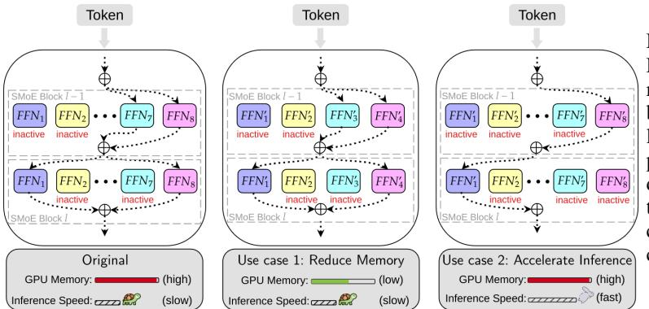
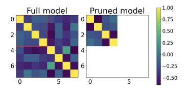
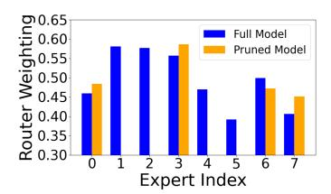
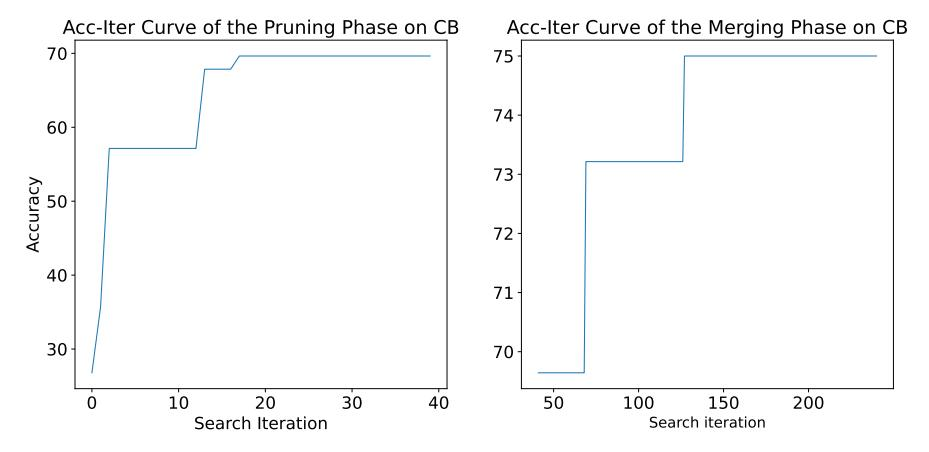
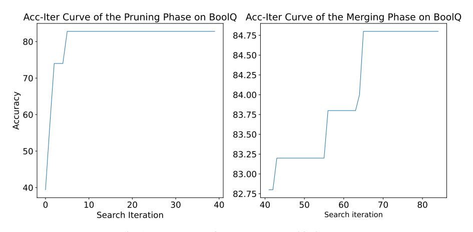
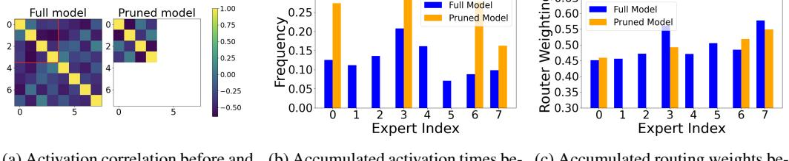
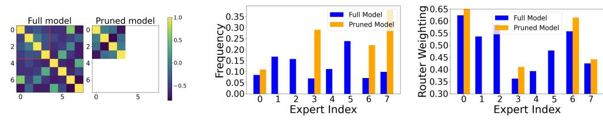

# Efficient Expert Pruning for Sparse Mixture-of-Experts Language Models: Enhancing Performance and Reducing Inference Costs

Enshu Liu $^{1,2*}$ , Junyi Zhu $^{3*}$ , Zinan Lin $^{4\dagger\ddagger}$ , Xuefei Ning $^{1\dagger\ddagger}$ , Matthew B. Blaschko $^3$ , Shengen Yan $^2$ , Guohao Dai $^{2,5}$ , Huazhong Yang $^1$ , Yu Wang $^{1\dagger}$ 

<sup>1</sup>Tsinghua University, <sup>2</sup>Infinigence AI, <sup>3</sup>KU Leuven, <sup>4</sup>Microsoft Research, <sup>5</sup>Shanghai Jiao Tong University

\*Equal Contribution, †Corresponding authors, ‡Co-advise

#### **Abstract**

The rapid advancement of large language models (LLMs) has led to architectures with billions to trillions of parameters, posing significant deployment challenges due to their substantial demands on memory, processing power, and energy consumption. Sparse Mixture-of-Experts (SMoE) architectures have emerged as a solution, activating only a subset of parameters per token, thereby achieving faster inference while maintaining performance. However, SMoE models still face limitations in broader deployment due to their large parameter counts and significant GPU memory requirements. In this work, we introduce a gradient-free evolutionary strategy named Efficient Expert Pruning (EEP) to enhance the pruning of experts in SMoE models. Specifically, EEP searches the pruning pattern and use expert merging as an memory-efficient way of fine-tuning the pruned model. EEP relies solely on model inference (i.e., no gradient computation) and achieves greater sparsity while maintaining or even improving performance on downstream tasks. EEP can be used to reduce both the total number of experts (thus saving GPU memory) and the number of active experts (thus accelerating inference). For example, we demonstrate that pruning up to 75% of experts in Mixtral 8 × 7B-Instruct results in a substantial reduction in parameters with minimal performance loss. Remarkably, we observe improved performance on certain tasks, such as a significant increase in accuracy on the SQuAD dataset (from 53.4% to 75.4%), when pruning half of the experts. With these results, EEP not only lowers the barrier to deploying SMoE models, but also challenges the conventional understanding of model pruning by showing that fewer experts can lead to better task-specific performance without any fine-tuning. Code is available at https://github.com/imagination-research/EEP.

#### 1 Introduction

Large language models have significantly advanced, evolving into highly versatile tools [23, 7, 3, 46, 61, 33]. As these models grow in accordance with scaling laws [21], the norm has shifted towards architectures with billions to trillions of parameters. However, the larger scale brings considerable deployment challenges due to increased demands on memory, processing power, and energy consumption [65, 53]. In response to these challenges, there is a notable trend towards adopting sparse Mixture-of-Experts (SMoE) architectures [45, 14, 27, 19], as seen in models such as Mixtral  $8 \times 7B$  and  $8 \times 22B$  [20], Qwen1.5-MoE-A2.7B [4], Qwen 2-57B-A14B [40], DBRX [50],

Correspondence to Yu Wang <yu-wang@mail.tsinghua.edu.cn>, Zinan Lin <zinanlin@microsoft.com>, Xuefei Ning <foxdoraame@gmail.com>.

<span id="page-1-0"></span>

- (a) A SMoE block before pruning. (b) Parameter space designed for expert pruning and merging.

Figure 1: (a) the original SMoE block and (b) our implementation of EEP. We introduce the expert merging matrix WEM, and the router mapping matrix WRM, to enable the search for the optimal pruning configuration. When WEM and WRM have one-hot vectors as their rows, pruning is performed. When their elements are continuous values, routing weights and experts are aggregated to generate new weights and experts. We use an evolutionary strategy to search for the optimal WEM and WRM.

and Grok-1 [\[57\]](#page-14-2). SMoE models activate only a subset of parameters for each token, resulting in faster inference while maintaining competitive performance compared to dense models of the same scale. For example, Mixtral 8 × 7B outperforms or matches Llama-2 70B [\[51\]](#page-13-4) and GPT-3.5 on many benchmarks, while it only activates 13B parameters to process each token. Although SMoE models have less computation per token, they remain parameter-heavy, e.g. Mixtral 8 × 7B has 47B parameters in total while Grok-1 reaches 314B (see Tab. [6](#page-16-0) for other models). This limits their broader deployment due to the substantial GPU memory requirements. Additionally, their throughput may not be ideal as the batch size needs to be restricted to fit the model within the available device memory. Therefore, it is vital to innovate methods that can reduce the size of SMoE models without compromising their performance.

Many studies have shown that only a subset of parameters significantly contributes to performance when applying LLMs to downstream tasks [\[6,](#page-10-3) [26,](#page-12-2) [42,](#page-13-5) [58\]](#page-14-3). Pruning is a crucial technique for eliminating redundancy in neural networks. It can be unstructured, achieving high sparsity while maintaining performance [\[6,](#page-10-3) [15,](#page-11-5) [47\]](#page-13-6), or structured, removing entire channels or layers to provide computational efficiency and reduced latency [\[35,](#page-12-3) [49,](#page-13-7) [58,](#page-14-3) [18,](#page-11-6) [54,](#page-14-4) [26\]](#page-12-2). One particularly efficient way is expert pruning in SMoE LLMs, a type of structured pruning with coarse granularity, which enhances overall efficiency. Recent expert pruning methods achieve 25%-50% sparsity and accelerate inference, but struggle to maintain performance [\[34\]](#page-12-4) or need fine-tuning, requiring substantial GPU memory and resources [\[8,](#page-10-4) [37\]](#page-13-8). Thus, there is a pressing need for efficient pruning methods that operate within the constraints of inference resources for SMoE LLMs.

In this work, we propose a gradient-free evolutionary strategy that achieves high sparsity while maintaining performance given a small train set on the downstream tasks. Our method is divided into two phases: expert pruning and expert merging. To facilitate the search for optimal pruning configurations, we design a parameter space for router mapping and expert merging, represented by two weight matrices, WRM and WEM. These matrices are applied to the router weighting and expert modules, as illustrated in Fig. [1.](#page-1-0) In the first phase, expert pruning, we search through the weight matrices to retain the most prominent experts without updating any network parameters. In the second phase, expert merging, we retrieve knowledge from the pruned experts and consolidate it into the retained experts. To these ends, WRM and WEM are set to one-hot rows in the first phase and to real numbers in the second phase. Since our method is gradient-free, it can be conducted on devices capable of inference. Our contributions can be summarized as follows:

• Pruning the total number of experts: smaller memory consumption and better performance. Our approach enables more aggressive pruning of experts compared to current methods [\[34,](#page-12-4) [37\]](#page-13-8). In experiments on Mixtral 8×7B-Instruct, we reduce the number of experts in each SMoE block from 8 to 2, a 72% reduction in parameters, while maintaining comparable performance across various downstream tasks. *Surprisingly, we observe that fewer experts can lead to better performance.* For instance, on the SQuAD dataset, pruning 4 out of 8 experts result in a performance increase from 53.4% to 75.4% without updating the remaining experts.

- Pruning the number of *active* experts: better inference efficiency. We explore the pruning of active experts and find that effective expert merging compensates for the loss of active experts across downstream tasks. This process significantly improves efficiency without compromising the model's utility on these tasks. For instance, by reducing the active experts in Mixtral 8 × 7B from two to one, we observe a prefill acceleration of up to 1.63×.
- Generalization ability. We test the performance of our method on datasets with higher diversity and out-of-distribution tasks using MMLU [\[17\]](#page-11-7). Specifically, we take 50 of the 57 datasets included in MMLU and conduct EEP using data from a small subset of each of the 50 datasets. We then evaluate the pruned model on the test data of i) the 50 datasets and ii) the 7 unseen datasets. In both evaluation tasks, we observe that EEP consistently outperforms other pruning methods, demonstrating the strong generalization ability of our method.
- A novel and efficient pruning paradigm. Common pruning paradigm usually conducts two steps. In the first step, parameters are pruned using empirical criteria. This operation often lowers performance. In the second step, retained parameters are fine-tuned through stochastic gradient descent to recover performance. This operation often requires substantial GPU memory and computation time, making it prohibitive for most users of LLMs. EEP adopts a gradient-free evolutionary strategy for both pruning and fine-tuning. As a result, our pruned model significantly outperforms the pruned models of other methods, while our pruning and fine-tuning processes can run on devices affordable for inference, making EEP more widely applicable. In addition, to inherit knowledge from the unpruned model, existing methods either select a subset of weights based on predefined importance criteria [\[16,](#page-11-8) [60,](#page-14-5) [38\]](#page-13-9), or rely on distillation techniques [\[39,](#page-13-10) [62,](#page-14-6) [1\]](#page-10-5). In contrast, EEP introduces a novel approach as a third paradigm, employing weight merging [\[56\]](#page-14-7) to transfer knowledge during the model compression process.

# 2 Related work

Sparse Mixture-of-Experts LLMs. Shazeer et al. [\[45\]](#page-13-1) introduced the sparse MoE layer, which consists of multiple experts, each being a simple feed-forward network (FFN), and a trainable router network that selects a sparse combination of the experts to process each input. Such SMoE models can significantly increase model capacity while maintaining computational efficiency. However, this utility is ideally achieved when the router accurately and evenly assigns experts to each token during training and inference. Many works address these challenges [\[14,](#page-11-2) [28,](#page-12-5) [12,](#page-11-9) [64\]](#page-15-1). Recently, many SOTA LLMs adopt the SMoE structure to achieve high performance and computational efficiency simultaneously [\[20,](#page-11-4) [4,](#page-10-2) [50,](#page-13-3) [57\]](#page-14-2). Additionally, Zhang et al. [\[63\]](#page-14-8) propose transforming non-MoE models into SMoE models to accelerate inference, and Komatsuzaki et al. [\[25\]](#page-12-6) upcycle pretrained models by reusing the parameters to initialize SMoE models, where all experts are replicates of the original FFNs, and then fine-tune the SMoE models.

Pruning for LLMs. Pruning techniques have emerged as a crucial strategy for optimizing LLMs by reducing model size and computational costs while maintaining performance. Unstructured pruning [\[6,](#page-10-3) [15,](#page-11-5) [47,](#page-13-6) [48\]](#page-13-11) entails the removal of individual weights according to specific criteria, creating sparse networks that demand specialized hardware for efficient execution. In contrast, structured pruning [\[35,](#page-12-3) [49,](#page-13-7) [58,](#page-14-3) [18,](#page-11-6) [54,](#page-14-4) [26,](#page-12-2) [10,](#page-10-6) [59,](#page-14-9) [5\]](#page-10-7) eliminates entire structures, such as neurons or attention heads, facilitating more straightforward implementation on standard hardware. Within structured pruning, specific focus areas include attention mechanisms, where redundant heads are pruned to streamline the self-attention layers, and FFNs where unnecessary neurons are removed to enhance computational efficiency. Additionally, expert pruning for SMoE models selectively prunes the expert networks [\[34,](#page-12-4) [37,](#page-13-8) [8,](#page-10-4) [24\]](#page-12-7).

Evolutionary Strategy for Optimization. Evolutionary Strategies (ES) have been increasingly recognized for their robustness and flexibility in various optimization tasks, particularly where gradientbased methods fall short [\[55\]](#page-14-10). Notably, ES is highly effective for optimizing non-differentiable objective functions, offering a powerful alternative in scenarios where gradients are unavailable or unreliable [\[43,](#page-13-12) [22,](#page-11-10) [32,](#page-12-8) [52,](#page-14-11) [29\]](#page-12-9). Furthermore, ES excels in discrete optimization spaces, making it suitable for a wide range of combinatorial problems [\[2,](#page-10-8) [31,](#page-12-10) [30\]](#page-12-11). Recent advancements have extended the application of ES to the domain of LLMs, enabling memory-efficient fine-tuning without the need for backpropagation [\[36\]](#page-13-13).

<span id="page-3-2"></span>

Figure 2: We leverage EEP for two purposes: reducing the total number of experts, which lowers the memory footprint (use case 1), and reducing the number of active experts, thereby accelerating inference (use case 2).

#### 3 Background of sparse Mixture-of-Expert language model

In this section, we discuss the general concept of sparse Mixture-of-Experts (SMoE) implementation in modern decoder-only models, using the Mixtral family [20] as a specific focus. A schematic illustration is provided in Fig. 1a.

**Notations.** Let  $X \in \mathbb{R}^{n \times d}$  represent the input to a SMoE block, where n is the sequence length and d is the hidden dimension. The output of the attention block is denoted by  $Z \in \mathbb{R}^{n \times d}$ . The main parameters in the attention block are the weight matrices for computing query, key, and value:  $W_Q, W_K, W_V$ . In the SMoE structure, there are E experts, each represented by a feed-forward network (FFN) with parameters  $\theta_i$  for the i-th expert. The router network, denoted by  $W_R$ , produces routing weights  $G \in \mathbb{R}^{n \times E}$  for the sparse activation of the experts. For clarity, we omit the normalization layers and biases.

**Self-Attention Mechanism.** The self-attention mechanism computes the query, key, and value matrices as follows:  $Q = XW_Q$ ,  $K = XW_K$ ,  $V = XW_V$ . The attention scores and the output Z are then computed as:

$$\operatorname{Attention}(\boldsymbol{Q},\boldsymbol{K},\boldsymbol{V}) = \operatorname{softmax}\left(\frac{\boldsymbol{Q}\boldsymbol{K}^{\top}}{\sqrt{d_k}}\right)\boldsymbol{V}, \quad \boldsymbol{Z} = \operatorname{Attention}(\boldsymbol{Q},\boldsymbol{K},\boldsymbol{V})\boldsymbol{W}_O, \tag{1}$$

where softmax  $(\cdot)$  denotes a row-wise softmax function. The attention mechanism produces a weighted sum of the values V, where the weights are derived from the dot product of the queries Q and keys K, scaled by the square root of key/query dimension  $\sqrt{d_k}$ . Then the weighted averaged values are mapped by the output matrix  $W_O$  to Z.

**Router Network in SMoE Structure.** The router network determines which experts to activate and how to scale their outputs. The routing weights  $G \in \mathbb{R}^{n \times E}$  are computed as:

<span id="page-3-1"></span>
$$G = \operatorname{softmax}(ZW_G). \tag{2}$$

Sparse activation of the experts is achieved by selecting the top-k routing weights for each input token. The output of the activated experts is scaled by the routing weights and aggregated to form the output of the SMoE layer H:\*

$$\forall j = 1 \dots n, \quad \boldsymbol{H}_j = \sum_{i \in \text{TopK}(\boldsymbol{G}_j)} \boldsymbol{G}_{ji} \cdot \text{FFN}_i(\boldsymbol{Z}_j), \tag{3}$$

where  $\text{TopK}(G_j)$  denotes the indices of the top-k routing weights for the j-th input token, and  $\text{FFN}_i$  denotes the function of the i-th expert, as defined below.

**FFN as Expert.** Each expert in the SMoE structure is an independent FFN with two fully-connected layers, denoted by  $W_{1i}$  and  $W_{2i}$ . When applying SwiGLU [44], an additional weight matrix  $W_{3i}$  is introduced for the activation function. The *i*-th expert processes the input as follows:

$$FFN_i(\mathbf{Z}_{sub}) = SwiGLU(\mathbf{Z}_{sub}, \mathbf{W}_{1i}, \mathbf{W}_{3i})\mathbf{W}_{2i}, \tag{4}$$

where  $Z_{sub}$  denotes the a subset of rows in Z that activates the i-th expert. Depending on the activation function, the parameters of the i-th expert are either  $\theta_i = \{W_{1i}, W_{2i}\}$  or  $\theta_i = \{W_{1i}, W_{2i}, W_{3i}\}$ .

<span id="page-3-0"></span><sup>\*</sup>The top-k routing weights may be further normalized to sum to 1; this nuance is omitted here.

#### 4 Method

In this section, we introduce our proposed approach for optimizing SMoE LLMs through expert pruning and merging. We aim to enhance the efficiency and performance of SMoE architectures by leveraging evolutionary strategies. Our method addresses the challenges of large and complex search spaces without incurring the prohibitive computational costs associated with gradient-based optimization. The subsequent subsections elaborate on our motivation (Sec. 4.1), the configuration of the parameter space (Sec. 4.2), the evolutionary optimization strategy employed to achieve our objectives (Sec. 4.3), and the use cases we apply EEP (Sec. 4.4).

# <span id="page-4-2"></span>70 SQUAD WIC 65 WIC 45 6 7 8 # of experts

Figure 3: Performance from a single expert to an ensemble of experts.

#### <span id="page-4-0"></span>4.1 Motivation

LLMs based on the SMoE architecture have shown remarkable performance across various natural language

processing tasks [20, 50, 57]. These models leverage multiple experts, activating only a subset for any given input, thus balancing computational efficiency and model capacity. Typically, top-2 experts are activated, striking a balance between performance and computational cost.

Fig. 3 presents our investigation into the activation of different numbers of experts on Mixtral  $8 \times 7B$ -Instruct, revealing the following observations: i) Activating only a single expert does not lead to model collapse and may result in only a minimal performance drop compared to the default setting of using two experts. This suggests that individual experts possess redundant knowledge, enabling them to maintain reasonable performance independently. This redundancy indicates potential for expert pruning. ii) Conversely, activating all 8 experts leads to a noticeable performance gain, highlighting the benefits of expert ensemble. However, the computational cost of such an ensemble is substantially higher. Wortsman et al. [56] have shown that merging differently fine-tuned models can efficiently substitute their ensemble, achieving similar performance with reduced computational overhead.

Building on these insights, we propose a two-step approach involving expert pruning followed by expert merging. Initially, we search for the optimal subset of experts given a fixed size. Subsequently, we employ expert merging to consolidate the knowledge from the pruned experts into the remaining ones. This approach not only restores the knowledge of the pruned experts but also updates the surviving experts to incorporate the collective expertise of the entire SMoE block.

#### <span id="page-4-1"></span>4.2 Parameter space for expert pruning and merging

**Expert Pruning and Merging Matrices.** To efficiently prune and merge experts in each SMoE block  $(l=1\dots L)$ , we introduce two key matrices: the Router Mapping matrix  $(\boldsymbol{W}_{\rm RM}^l)$  and the Expert Merging matrix  $(\boldsymbol{W}_{\rm EM}^l)$ . For clarity, we omit the block index l in this section. A schematic illustration is provided in Fig. 1b. The router mapping matrix  $\boldsymbol{W}_{\rm RM} \in \mathbb{R}^{E' \times E}$ , where E' is the reduced number of experts (i.e., E > E'), is applied to the routing weights  $\boldsymbol{G}$  to reduce the dimensionality and handle fewer experts:

$$G' = W_{\text{RM}} \operatorname{softmax}(ZW_G),$$
 (5)

The expert merging matrix  $W_{\rm EM} \in \mathbb{R}^{E' \times E}$  is applied to the expert weights  $\{\boldsymbol{\theta}_i\}_{i=1}^E$  to merge E experts into E' experts. Each element in  $W_{\rm EM}$  operates blockwise on the parameters of the experts. Denote  $\{\omega_{j1}, \omega_{j2}, \ldots, \omega_{jE}\}$  as the j-th row of  $W_{\rm EM}$  that maps the original E experts to the j-th new expert  $\boldsymbol{\theta}_j'$ . We define merging as follows:

$$\boldsymbol{\theta}_{j}' = \{ \sum_{i=1}^{E} \omega_{ji} \boldsymbol{W}_{1i}, \sum_{i=1}^{E} \omega_{ji} \boldsymbol{W}_{2i}, \sum_{i=1}^{E} \omega_{ji} \boldsymbol{W}_{3i} \},$$
(6)

where the parameters of the experts are defined in Eq. (4).

Expert Pruning Phase. During the expert pruning phase, the low-rank matrices WRM and WEM are initialized with each row as a one-hot vector to ensure that only pruning occurs. Additionally, WRM and WEM are set as to be identical WRM = WEM. Consequently, these matrices only retain the selected expert weights and their corresponding routing weights. During evolutionary search, EEP also maintains the one-hot format of WRM and WEM.

Expert Merging Phase. In the expert merging phase, WRM and WEM are decoupled and initialized from their optimal values obtained during the pruning phase. This decoupling allows for a more flexible transformation where multiple experts can be merged, and the router weights can be updated independently. During this phase, the elements of WRM and WEM transition from discrete 0/1 values to continuous values. This allows the matrices to perform more nuanced transformations.

#### <span id="page-5-0"></span>4.3 Evolutionary search for the router mapping and expert merging matrices

The search space of the router mapping and expert merging matrices is large and complex, making it difficult to design heuristics for determining a solution, as is done in other expert pruning studies [\[37,](#page-13-8) [8,](#page-10-4) [34\]](#page-12-4). Therefore, an efficient optimization strategy is necessary. Given the substantial size of SMoE LLMs, computing gradients for optimization is computationally prohibitive for most users. As a solution, we employ a gradient-free evolutionary strategy, similar to approaches found in previous works [\[30,](#page-12-11) [32\]](#page-12-8). Our algorithm is detailed in Alg. [1.](#page-16-1)

Initially, we populate the search space using random initialization. During the evolutionary search, each set of router mapping and expert merging matrices is treated as an individual. In each iteration, only the top-performing individuals are selected as parents to produce the next generation through crossover and mutation. Specifically, during crossover, we randomly combine the entries of the matrices from two parents or select one parent's matrices entirely. For mutation, we introduce random Gaussian noise to the matrices, ensuring stochastic variations. This process conserves beneficial adaptations while discarding detrimental modifications, enhancing the optimization process.

This evolutionary reproduction process is repeated for a predetermined number of iterations within each search phase, updating the population with newly generated individuals. Upon completion of the search process, the best individual is selected as the output of our search algorithm.

# <span id="page-5-1"></span>4.4 Use Cases

We explore two applications of EEP: expert pruning and expert activation pruning. In expert pruning, EEP searches for optimal router mapping (WRM) and expert merging matrices (WEM) to minimize the total number of experts while maintaining high performance. For expert activation pruning, the goal is to achieve strong performance with only one active expert per token. Here, we use the same EEP search algorithm to conduct expert and router networks optimization by updating the WRM and WEM matrices, while only activates one expert during inference. Fig. [2](#page-3-2) illustrates these two use cases. Additionally, we investigate the combination of these two approaches, reducing both the total number of experts and the number of active experts simultaneously (see Sec. [5.3\)](#page-7-0).

# <span id="page-5-2"></span>5 Experiments

In this section, we validate the effectiveness of our method by considering two use cases: expert pruning and expert activation pruning. In Sec. [5.1,](#page-6-0) we introduce the experimental settings. In Sec. [5.2,](#page-6-1) we investigate the first use case, expert pruning, by applying EEP to reduce the total number of experts. In Sec. [5.3,](#page-7-0) we further explore expert activation pruning, applying EEP to maintain performance while reducing the number of active experts by changing the top-2 routing weights to top-1. We also examine a composite case where both the total number of experts and the number of active experts are reduced. In Sec. [5.4,](#page-8-0) we present the experimental results on larger and more diverse datasets, as well as performance on out-of-distribution datasets, to validate the generalization ability of EEP. In Sec. [5.5,](#page-8-1) we profile memory usage and inference speed to demonstrate that our method achieves significant improvements compared to the full SMoE models. In Sec. [5.6](#page-9-0) we provide insights on the observation of fewer experts but higher performance. More results, including experiments on larger datasets and other models, can be found in App. [D.](#page-17-0)

<span id="page-6-2"></span>Table 1: Results of expert pruning on Mixtral 8×7B-Instruct. **Bold** values indicate the best across all methods; <u>underlined</u> values show the best without parameter updates (i.e., excluding EEP (Prune+Merge)).

| Expert | Method               | COPA        | MultiRC     | WIC         | WSC  | RTE  | BoolQ       | СВ          | ReCoRD | DROP | SQuAD       | Avg.        |
|--------|----------------------|-------------|-------------|-------------|------|------|-------------|-------------|--------|------|-------------|-------------|
| Num=8  | Full Model           | 89.0        | 83.0        | 51.8        | 63.5 | 73.2 | 77.4        | 51.7        | 50.3   | 30.6 | 53.4        | 62.4        |
| Num=4  | Random               | 63.8        | 49.4        | 37.6        | 43.3 | 45.1 | 50.2        | 38.7        | 35.1   | 27.4 | 58.3        | 44.9        |
|        | Frequency [37]       | 63.0        | 74.8        | 36.0        | 34.6 | 18.1 | 71.0        | 30.4        | 41.6   | 29.9 | 58.2        | 45.8        |
|        | Soft Activation [37] | 73.0        | 30.6        | 51.4        | 37.5 | 41.9 | 40.4        | 17.9        | 36.8   | 33.3 | 10.2        | 37.3        |
|        | NAEE [34]            | 87.0        | 76.0        | 52.6        | 64.5 | 61.7 | 77.2        | 51.7        | 50.4   | 30.6 | 53.0        | 60.5        |
|        | EEP (Prune Only)     | 95.0        | 81.2        | 57.8        | 67.3 | 74.0 | 82.8        | 69.6        | 60.0   | 37.3 | 75.2        | 70.3        |
|        | EEP (Prune+Merge)    | <b>99.0</b> | <b>84.6</b> | <b>65.0</b> | 73.1 | 76.9 | <b>84.8</b> | <b>75.0</b> | 63.6   | 39.7 | <b>80.6</b> | 74.2        |
| Num=2  | Random               | 36.8        | 22.3        | 13.6        | 15.0 | 28.4 | 15.5        | 38.6        | 16.9   | 18.3 | 36.9        | 24.2        |
|        | Frequency [37]       | 51.0        | 17.6        | 8.8         | 1.9  | 48.4 | 30.6        | 35.7        | 10.4   | 14.9 | 9.2         | 24.9        |
|        | Soft Activation [37] | 33.0        | 18.2        | 49.4        | 18.5 | 15.2 | 1.8         | 32.1        | 4.4    | 11.7 | 50.0        | 23.4        |
|        | NAEE [34]            | 75.0        | 42.4        | 48.4        | 49.0 | 54.5 | 49.8        | 19.6        | 42.0   | 31.2 | 58.2        | 47.0        |
|        | EEP (Prune Only)     | 76.0        | 63.8        | 51.8        | 63.5 | 64.3 | 70.6        | 58.9        | 47.2   | 37.1 | 64.0        | 59.7        |
|        | EEP (Prune+Merge)    | <b>93.0</b> | <b>71.6</b> | <b>58.6</b> | 65.4 | 69.0 | <b>75.6</b> | <b>66.1</b> | 47.2   | 38.4 | <b>70.2</b> | <b>65.6</b> |

#### <span id="page-6-0"></span>5.1 Experimental settings

Our main results are based on the popular SMoE models Mixtral 8×7B [20]. We also include a larger model, Mixtral 8×22B [20], to demonstrate the generalization of our methods. We use the "Instruct" version of these models for the generation tasks. We select tasks from the SuperGLUE dataset, as well as several other generation tasks, including SQuAD [41] and DROP [13]. For each individual dataset, we randomly sample a subset from the training set to conduct evolutionary search and use the test set for evaluation. Additional details can be found in App. A.

**Evaluation.** We adopt a generation-based evaluation approach for all datasets. Specifically, we use the instruction fine-tuned model to generate answers directly in response to the given questions and apply template matching to determine the correctness of the answers. Our evaluation protocol primarily follows the implementation of OpenCompass [11] for the design of question prompts, types of templates, and matching criteria, with a few modifications to better suit the Mixtral family of models. All experiments use the same evaluation settings. Examples of prompts and model outputs can be found in App. E and App. F.

Baselines. Since our method aims to compress the instruction fine-tuned SMoE models on down-stream tasks, we consider the zero-shot performance as our main baseline to show that EEP can achieve a significant decrease on the memory footprint and/or computation overhead during the inference time while maintain or even achieve better performance. For the use case of decreasing the total number of experts, we additionally compare EEP with four other types of baseline to demonstrate the effectiveness of the designed search space and the evolutionary-search-based tuning method: (1) Random selection of pruned experts, (2&3) Pruning the experts with the lowest frequency of being activated or the lowest soft activation values [37], and (4) NAEE [34], which exhaustively evaluates the loss between the full model and all pruning choices for each layer and select the one with the lowest loss. For the use case of decreasing the active number of experts, we select the dynamic skipping method proposed by NAEE [34] as an additional baseline. More details are given in App. A.

#### <span id="page-6-1"></span>5.2 Reducing the total number of experts

We apply EEP to search for the optimal pruning configuration, parameterized by the router mapping matrix  $W_{\rm RM}$  and the expert merging matrix  $W_{\rm EM}$ , for maintaining 4 experts and 2 experts. EEP (Prune Only) indicates the results from solely conducting the expert pruning phase as described in Sec. 4.2. In contrast, EEP (Prune + Merge) shows the results after the complete evolutionary search process. The results are shown in Tab. 1, and we discuss them below. Random is conducted 30 times, and we present the mean results here, deferring the complete results to App. D.4.

**EEP fully exploits expert-wise redundancy on downstream tasks**. Based on the results obtained from the pruning phase of EEP, retaining only 4 experts allows the model to achieve better performance and lower computational costs simultaneously on most datasets, except for MultiRC. Even with a particularly low budget of retaining only 2 experts, EEP can still achieve comparable or even better performance than the full model on five datasets, with some datasets showing significant

<span id="page-7-1"></span>Table 2: Results of expert pruning on Mixtral 8 × 22B-Instruct. Bold values indicate the best across all methods; underlined values show the best without parameter updates (i.e., excluding EEP (Prune+Merge)).

| Budget | Method               | WIC  | WSC  | BoolQ | CB   | SQuAD | Avg. |
|--------|----------------------|------|------|-------|------|-------|------|
| Num=8  | Full Model           | 68.2 | 81.7 | 90.2  | 46.5 | 45.8  | 66.5 |
| Num=4  | Random               | 27.0 | 30.2 | 37.8  | 34.6 | 37.2  | 33.4 |
|        | Frequency [37]       | 0.0  | 38.5 | 76.6  | 57.1 | 50.6  | 30.6 |
|        | Soft Activation [37] | 25.2 | 60.6 | 6.4   | 60.7 | 54.2  | 41.4 |
|        | NAEE [34]            | 64.0 | 68.3 | 78.4  | 33.9 | 52.4  | 59.4 |
|        | EEP (Prune Only)     | 70.2 | 84.2 | 89.6  | 75.0 | 71.4  | 78.1 |
|        | EEP (Prune+Merge)    | 72.2 | 87.5 | 89.6  | 78.6 | 74.0  | 80.4 |
| Num=2  | Random               | 13.9 | 10.1 | 11.0  | 24.9 | 15.6  | 15.1 |
|        | Frequency [37]       | 0.0  | 0.0  | 0.0   | 0.0  | 0.0   | 0.0  |
|        | Soft Activation [37] | 2.4  | 1.9  | 3.6   | 19.6 | 52.6  | 16.0 |
|        | NAEE [34]            | 34.0 | 32.7 | 45.0  | 16.1 | 50.0  | 30.6 |
|        | EEP (Prune Only)     | 57.8 | 63.5 | 76.0  | 50.0 | 71.0  | 63.7 |
|        | EEP (Prune+Merge)    | 59.6 | 65.4 | 76.4  | 58.9 | 75.0  | 67.1 |

improvements over the best baseline (e.g., 58.9 vs. 51.7 on CB and 64.0 vs. 53.4 on SQuAD). For the remaining datasets, model collapse is avoided.

EEP is more effective than other baseline methods for selecting pruned experts. Comparing the results of other methods, we find that EEP is more effective for identifying the optimal pruning pattern. Random sampling of experts results in low mean accuracy and high variance. Pruning experts based on selection frequency also performs poorly on most datasets and has a high probability of collapse under high sparsity. NAEE can nearly maintain the performance of the full model when retaining four experts. However, EEP surpasses all methods by a large margin across all datasets.

Expert merging brings significant improvements after pruning. As shown in the last row for each pruning rate in Tab. [1,](#page-6-2) the results after expert merging exceed those obtained through the expert pruning phase alone. Specifically, expert merging achieves a general improvement on almost all datasets. On WIC, CB, and SQuAD under both pruning rates, and on WSC when four experts are retained, the accuracy improvement reaches 5%∼7%, demonstrating its effectiveness in restoring the knowledge of pruned experts and enhancing individual experts. Additionally, we find expert merging to be an effective method for fine-tuning SMoE LLMs (i.e., keeping the number of total and active experts); the results of this are presented in Tab. [9.](#page-18-1)

Generality across models. With the promising results of Mixtral 8×7B-Instruct model, we further apply EEP to a larger model: Mixtral 8×22B-Instruct [\[20\]](#page-11-4), Qwen1.5-MoE-A2.7B-Chat [\[4\]](#page-10-2), and Qwen2-MoE-A14B-Chat [\[40\]](#page-13-2). We conduct experiments on fewer datasets due to the constraint of computational resource. Results are shown at Tab. [2,](#page-7-1) Tab. [7,](#page-17-1) and Tab. [8,](#page-18-2) respectively. EEP also achieves a strong improvement and above observations are still held, which indicates the scaling-up ability of EEP towards large SMoE models.

#### <span id="page-7-0"></span>5.3 Reducing the number of active experts

Next, we present the experimental results for the second use case: decreasing the number of active experts. We modify the number of active experts by changing the top-k from k = 2 to 1 while applying EEP to restore model performance. We evaluate our method with two different total numbers of experts (8 and 4). The results are presented in Tab. [3.](#page-8-2) We summarize the observations below.

EEP can improve individual experts through expert merging, allowing a single expert to handle the inference. Keeping the total number of experts at 8 and reducing the number of active experts to 1 consistently leads to a decline in baseline performance. However, by optimizing the model with EEP, we introduce a reliable improvement that mitigates this gap, resulting in comparable or even better performance than the full model. It is important to note that when the total number of experts is maintained, there is no expert pruning phase; only expert merging is applied for EEP.

<span id="page-8-2"></span>Table 3: Results of active expert pruning on Mixtral 8 × 7B. Bold values show the best performance. "Active" indicates the average number of experts active per token. Avg. stands for average.

| Total | Active       | Method                     | WIC          | WSC          | BoolQ        | CB           | SQuAD        | Avg.         |
|-------|--------------|----------------------------|--------------|--------------|--------------|--------------|--------------|--------------|
|       | 2            | Full Model                 | 51.8         | 63.5         | 77.4         | 51.7         | 53.4         | 59.6         |
| 8     | 1<br>1.4∼1.5 | Full Model<br>Dyn [34]     | 50.8<br>50.0 | 48.1<br>59.6 | 66.0<br>72.8 | 48.2<br>46.4 | 43.8<br>44.8 | 51.4<br>54.7 |
|       | 1            | EEP                        | 59.2         | 70.2         | 79.0         | 66.1         | 51.8         | 65.3         |
| 4     | 1<br>1.4∼1.5 | NAEE [34]<br>NAEE+Dyn [34] | 48.6<br>43.4 | 20.2<br>61.5 | 56.2<br>36.2 | 33.9<br>53.6 | 51.8<br>53.4 | 42.1<br>49.6 |
|       | 1            | EEP                        | 55.8         | 70.2         | 74.4         | 64.3         | 72.0         | 67.3         |

<span id="page-8-3"></span>Table 4: Results of expert pruning on Mixtral 8×7B-Instruct on MMLU dataset. Bold values indicate the best performance; underlined values show the best without updating remaining parameters.

| Budget | Method               | IID (50 val. sets) | OOD (7 unseen datasets) |
|--------|----------------------|--------------------|-------------------------|
| Num=8  | Full Model           | 60.7               | 72.6                    |
|        | Random               | 53.0±9.6           | 64.6±10.0               |
|        | Frequency [37]       | 35.2               | 35.0                    |
| Num=6  | Soft Activation [37] | 54.3               | 65.6                    |
|        | NAEE [34]            | 57.5               | 69.4                    |
|        | EEP (Prune Only)     | 59.6               | 71.4                    |
|        | EEP (Prune+Merge)    | 61.8               | 71.3                    |
|        | Random               | 45.1±6.1           | 50.3±10.7               |
|        | Frequency [37]       | 26.6               | 25.2                    |
| Num=4  | Soft Activation [37] | 46.7               | 53.1                    |
|        | NAEE [34]            | 53.5               | 63.6                    |
|        | EEP (Prune Only)     | 55.4               | 62.4                    |
|        | EEP (Prune+Merge)    | 56.9               | 64.6                    |

The two use cases can be combined through EEP. By retaining fewer experts and simultaneously reducing the number of active experts, we achieve significant savings *in both GPU memory and inference time* (see Sec. [5.5\)](#page-8-1). EEP can be directly applied in this scenario. Results show that with 4 total experts and 1 active expert, EEP achieves performance comparable to or even better than the full model.

#### <span id="page-8-0"></span>5.4 In-distribution and out-of-distribution generalization on diverse datasets

In this section, we further test EEP on a larger dataset, MMLU, to validate the generalization ability of EEP. We randomly split all 57 datasets in MMLU into two subsets containing 50 and 7 datasets, as the base dataset and the out-of-distribution (OOD) test dataset, respectively. We further divide each dataset in the larger subset into training and validation sets. We conduct our EEP on the training sets and use both the validation sets and the OOD test dataset to evaluate the performance of the searched patterns. Results are shown in Tab. [4.](#page-8-3) We find that EEP outperforms baseline methods on both the base dataset and the OOD test dataset. This indicates that EEP possesses the ability to handle large and diverse datasets and exhibits a certain level of generalization capability.

# <span id="page-8-1"></span>5.5 Improvements in memory usage and inference speed

We profile the memory overhead and inference speed of Mixtral 8 × 7B model for the two use cases. We conduct tests on SQuAD with a batch size of 256 using two NVIDIA A100 GPU cards. We report the peak memory usage and the wall-time acceleration ratio in Tab. [5.](#page-9-1) As shown in Tab. [5,](#page-9-1) retaining only 4 and 2 experts from the whole model decreases the memory overhead by 47% and 71%, respectively. Additionally, reducing the total number of experts improves inference speed due to higher parallelism, achieving a speedup of 1.11× and 1.18× with 4 and 2 experts, respectively.

<span id="page-9-1"></span>Table 5: Profiling the memory footprint and inference speedup of Mixtral 8 × 7B.

| Total | Active | Method     | Speedup        | GPU Mem(GB) |
|-------|--------|------------|----------------|-------------|
| 8     | 2      | Full Model | 1.0×           |             |
|       | 1      | EEP        | 1.24×          | 88.6        |
| 4     | 2<br>1 | EEP<br>EEP | 1.11×<br>1.41× | 46.6        |
| 2     | 2      | EEP        | 1.18×          | 25.6        |

<span id="page-9-2"></span>




- (a) Activation (1/0 means activated/not activated) correlation before and after pruning.
- (b) Accumulated activation times before and after pruning.
- (c) Accumulated routing weights before and after pruning.

Figure 4: Statistics of the expert activation patterns before and after the Expert Pruning Phase. The data represents the first transformer block of Mixtral 8 × 7B-Instruct on the SQuAD dataset. In (a), four retained experts are re-indexed from 0 to 3 for clarity.

In the use case of reducing active experts, an acceleration ratio of 1.24× is achieved. Finally, when combining the two use cases with 4 total experts and 1 active expert per token, EEP saves 47% of GPU memory and achieves a 1.41× increase in inference speed. The profiling results indicate that EEP can significantly reduce the computational cost and memory consumption of SMoE LLMs.

#### <span id="page-9-0"></span>5.6 Why fewer experts leads to better performance

At first glance, it may seem counterintuitive that reducing the number of experts can improve performance as shown in Tabs. [1](#page-6-2) and [2,](#page-7-1) especially when the remaining parameters are not retrained. Our hypothesis is that the router network operates differently after expert pruning, leading to this improvement. Typically, the router network is implemented as a smaller network, such as a one-layer perceptron. This makes it challenging to accurately partition the high-dimensional hidden space among experts. The issue of imbalanced activation has been identified in several works [\[14,](#page-11-2) [9\]](#page-10-9). If the router network does not function optimally before pruning, there may be potential for improvement by enabling the router to focus on a smaller subset of experts.

Although it is difficult to directly evaluate the router network's performance, we have observed that its behavior changes significantly after pruning. This change occurs because the pruning process eliminates some experts, and the routing weights for the remaining experts are normalized to sum to one. In Fig. [4,](#page-9-2) we observe distinct patterns in the accumulated activation times of the experts, their accumulated routing weights, and the activation correlation across experts. More demonstration of the expert activation pattern can be found in App. [D.6.](#page-19-1)

# 6 Conclusion

In this work, we present EEP, a gradient-free evolutionary search method optimized for pruning within an efficienct parameter space. Through extensive experiments on various downstream datasets, we demonstrate that EEP achieves superior performance and greater sparsity compared to baseline methods. Additionally, we make a novel observation that the performance of SMoE models on downstream tasks can be enhanced through pruning, even without updating the remaining parameters. We discuss the potential reasons for this phenomenon, suggesting that pruning may lead to a more effective routing mechanism by reducing the complexity the router network needs to manage.

Limitations. Although we demonstrated promising results, our approach still requires a potentially costly search process. We leave the optimization of search cost to future work.

# Acknowledgement

This work was supported by National Natural Science Foundation of China (No. 62325405, 62104128, U19B2019, U21B2031, 61832007, 62204164), Flemish Government (AI Research Program) and the Research Foundation - Flanders (FWO) through project number G0G2921N, Tsinghua EE Xilinx AI Research Fund, and Beijing National Research Center for Information Science and Technology (BNRist). We thank for all the support from Infinigence-AI.

# References

- <span id="page-10-5"></span>[1] Nima Aghli and Eraldo Ribeiro. Combining weight pruning and knowledge distillation for cnn compression. In *Proceedings of the IEEE/CVF conference on computer vision and pattern recognition*, pages 3191–3198, 2021.
- <span id="page-10-8"></span>[2] Takuya Akiba, Makoto Shing, Yujin Tang, Qi Sun, and David Ha. Evolutionary optimization of model merging recipes. *arXiv preprint arXiv:2403.13187*, 2024.
- <span id="page-10-1"></span>[3] Jean-Baptiste Alayrac, Jeff Donahue, Pauline Luc, Antoine Miech, Iain Barr, Yana Hasson, Karel Lenc, Arthur Mensch, Katherine Millican, Malcolm Reynolds, Roman Ring, Eliza Rutherford, Serkan Cabi, Tengda Han, Zhitao Gong, Sina Samangooei, Marianne Monteiro, Jacob L Menick, Sebastian Borgeaud, Andy Brock, Aida Nematzadeh, Sahand Sharifzadeh, Mikoł aj Binkowski, Ricardo Barreira, Oriol Vinyals, Andrew Zisserman, and ´ Karén Simonyan. Flamingo: a visual language model for few-shot learning. In S. Koyejo, S. Mohamed, A. Agarwal, D. Belgrave, K. Cho, and A. Oh, editors, *Advances in Neural Information Processing Systems*, volume 35, pages 23716–23736. Curran Associates, Inc., 2022. URL [https://proceedings.neurips.cc/paper\\_files/paper/2022/file/](https://proceedings.neurips.cc/paper_files/paper/2022/file/960a172bc7fbf0177ccccbb411a7d800-Paper-Conference.pdf) [960a172bc7fbf0177ccccbb411a7d800-Paper-Conference.pdf](https://proceedings.neurips.cc/paper_files/paper/2022/file/960a172bc7fbf0177ccccbb411a7d800-Paper-Conference.pdf).
- <span id="page-10-2"></span>[4] Jinze Bai, Shuai Bai, Yunfei Chu, Zeyu Cui, Kai Dang, Xiaodong Deng, Yang Fan, Wenbin Ge, Yu Han, Fei Huang, et al. Qwen technical report. *arXiv preprint arXiv:2309.16609*, 2023.
- <span id="page-10-7"></span>[5] Iz Beltagy, Matthew E Peters, and Arman Cohan. Longformer: The long-document transformer. *arXiv preprint arXiv:2004.05150*, 2020.
- <span id="page-10-3"></span>[6] Davis Blalock, Jose Javier Gonzalez Ortiz, Jonathan Frankle, and John Guttag. What is the state of neural network pruning? *Proceedings of machine learning and systems*, 2:129–146, 2020.
- <span id="page-10-0"></span>[7] Tom Brown, Benjamin Mann, Nick Ryder, Melanie Subbiah, Jared D Kaplan, Prafulla Dhariwal, Arvind Neelakantan, Pranav Shyam, Girish Sastry, Amanda Askell, Sandhini Agarwal, Ariel Herbert-Voss, Gretchen Krueger, Tom Henighan, Rewon Child, Aditya Ramesh, Daniel Ziegler, Jeffrey Wu, Clemens Winter, Chris Hesse, Mark Chen, Eric Sigler, Mateusz Litwin, Scott Gray, Benjamin Chess, Jack Clark, Christopher Berner, Sam McCandlish, Alec Radford, Ilya Sutskever, and Dario Amodei. Language models are few-shot learners. In H. Larochelle, M. Ranzato, R. Hadsell, M.F. Balcan, and H. Lin, editors, *Advances in Neural Information Processing Systems*, volume 33, pages 1877–1901. Curran Associates, Inc., 2020. URL [https://proceedings.neurips.cc/paper\\_files/paper/2020/file/](https://proceedings.neurips.cc/paper_files/paper/2020/file/1457c0d6bfcb4967418bfb8ac142f64a-Paper.pdf) [1457c0d6bfcb4967418bfb8ac142f64a-Paper.pdf](https://proceedings.neurips.cc/paper_files/paper/2020/file/1457c0d6bfcb4967418bfb8ac142f64a-Paper.pdf).
- <span id="page-10-4"></span>[8] Tianyu Chen, Shaohan Huang, Yuan Xie, Binxing Jiao, Daxin Jiang, Haoyi Zhou, Jianxin Li, and Furu Wei. Task-specific expert pruning for sparse mixture-of-experts. *arXiv preprint arXiv:2206.00277*, 2022.
- <span id="page-10-9"></span>[9] Zewen Chi, Li Dong, Shaohan Huang, Damai Dai, Shuming Ma, Barun Patra, Saksham Singhal, Payal Bajaj, Xia Song, Xian-Ling Mao, Heyan Huang, and Furu Wei. On the representation collapse of sparse mixture of experts. In Alice H. Oh, Alekh Agarwal, Danielle Belgrave, and Kyunghyun Cho, editors, *Advances in Neural Information Processing Systems*, 2022. URL <https://openreview.net/forum?id=mWaYC6CZf5>.
- <span id="page-10-6"></span>[10] Rewon Child, Scott Gray, Alec Radford, and Ilya Sutskever. Generating long sequences with sparse transformers. *arXiv preprint arXiv:1904.10509*, 2019.

- <span id="page-11-12"></span>[11] OpenCompass Contributors. Opencompass: A universal evaluation platform for foundation models. <https://github.com/open-compass/opencompass>, 2023.
- <span id="page-11-9"></span>[12] Damai Dai, Li Dong, Shuming Ma, Bo Zheng, Zhifang Sui, Baobao Chang, and Furu Wei. StableMoE: Stable routing strategy for mixture of experts. In Smaranda Muresan, Preslav Nakov, and Aline Villavicencio, editors, *Proceedings of the 60th Annual Meeting of the Association for Computational Linguistics (Volume 1: Long Papers)*, pages 7085–7095, Dublin, Ireland, May 2022. Association for Computational Linguistics. doi: 10.18653/v1/2022.acl-long.489. URL <https://aclanthology.org/2022.acl-long.489>.
- <span id="page-11-11"></span>[13] Dheeru Dua, Yizhong Wang, Pradeep Dasigi, Gabriel Stanovsky, Sameer Singh, and Matt Gardner. DROP: A reading comprehension benchmark requiring discrete reasoning over paragraphs. In Jill Burstein, Christy Doran, and Thamar Solorio, editors, *Proceedings of the 2019 Conference of the North American Chapter of the Association for Computational Linguistics: Human Language Technologies, Volume 1 (Long and Short Papers)*, pages 2368– 2378, Minneapolis, Minnesota, June 2019. Association for Computational Linguistics. doi: 10.18653/v1/N19-1246. URL <https://aclanthology.org/N19-1246>.
- <span id="page-11-2"></span>[14] William Fedus, Barret Zoph, and Noam Shazeer. Switch transformers: Scaling to trillion parameter models with simple and efficient sparsity. *Journal of Machine Learning Research*, 23 (120):1–39, 2022.
- <span id="page-11-5"></span>[15] Elias Frantar and Dan Alistarh. SparseGPT: Massive language models can be accurately pruned in one-shot. In Andreas Krause, Emma Brunskill, Kyunghyun Cho, Barbara Engelhardt, Sivan Sabato, and Jonathan Scarlett, editors, *Proceedings of the 40th International Conference on Machine Learning*, volume 202 of *Proceedings of Machine Learning Research*, pages 10323–10337. PMLR, 23–29 Jul 2023.
- <span id="page-11-8"></span>[16] Yihui He, Ji Lin, Zhijian Liu, Hanrui Wang, Li-Jia Li, and Song Han. Amc: Automl for model compression and acceleration on mobile devices. In *Proceedings of the European conference on computer vision (ECCV)*, pages 784–800, 2018.
- <span id="page-11-7"></span>[17] Dan Hendrycks, Collin Burns, Steven Basart, Andy Zou, Mantas Mazeika, Dawn Song, and Jacob Steinhardt. Measuring massive multitask language understanding. *Proceedings of the International Conference on Learning Representations (ICLR)*, 2021.
- <span id="page-11-6"></span>[18] Lu Hou, Zhiqi Huang, Lifeng Shang, Xin Jiang, Xiao Chen, and Qun Liu. Dynabert: Dynamic bert with adaptive width and depth. In H. Larochelle, M. Ranzato, R. Hadsell, M.F. Balcan, and H. Lin, editors, *Advances in Neural Information Processing Systems*, volume 33, pages 9782– 9793. Curran Associates, Inc., 2020. URL [https://proceedings.neurips.cc/paper\\_](https://proceedings.neurips.cc/paper_files/paper/2020/file/6f5216f8d89b086c18298e043bfe48ed-Paper.pdf) [files/paper/2020/file/6f5216f8d89b086c18298e043bfe48ed-Paper.pdf](https://proceedings.neurips.cc/paper_files/paper/2020/file/6f5216f8d89b086c18298e043bfe48ed-Paper.pdf).
- <span id="page-11-3"></span>[19] Changho Hwang, Wei Cui, Yifan Xiong, Ziyue Yang, Ze Liu, Han Hu, Zilong Wang, Rafael Salas, Jithin Jose, Prabhat Ram, et al. Tutel: Adaptive mixture-of-experts at scale. *Proceedings of Machine Learning and Systems*, 5, 2023.
- <span id="page-11-4"></span>[20] Albert Q Jiang, Alexandre Sablayrolles, Antoine Roux, Arthur Mensch, Blanche Savary, Chris Bamford, Devendra Singh Chaplot, Diego de las Casas, Emma Bou Hanna, Florian Bressand, et al. Mixtral of experts. *arXiv preprint arXiv:2401.04088*, 2024.
- <span id="page-11-1"></span>[21] Jared Kaplan, Sam McCandlish, Tom Henighan, Tom B Brown, Benjamin Chess, Rewon Child, Scott Gray, Alec Radford, Jeffrey Wu, and Dario Amodei. Scaling laws for neural language models. *arXiv preprint arXiv:2001.08361*, 2020.
- <span id="page-11-10"></span>[22] Eugene Kharitonov. Federated online learning to rank with evolution strategies. WSDM '19, New York, NY, USA, 2019. Association for Computing Machinery. ISBN 9781450359405. doi: 10.1145/3289600.3290968. URL <https://doi.org/10.1145/3289600.3290968>.
- <span id="page-11-0"></span>[23] Geunwoo Kim, Pierre Baldi, and Stephen McAleer. Language models can solve computer tasks. In A. Oh, T. Naumann, A. Globerson, K. Saenko, M. Hardt, and S. Levine, editors, *Advances in Neural Information Processing Systems*, volume 36, pages 39648–39677. Curran Associates, Inc., 2023. URL [https://proceedings.neurips.cc/paper\\_files/paper/2023/file/](https://proceedings.neurips.cc/paper_files/paper/2023/file/7cc1005ec73cfbaac9fa21192b622507-Paper-Conference.pdf) [7cc1005ec73cfbaac9fa21192b622507-Paper-Conference.pdf](https://proceedings.neurips.cc/paper_files/paper/2023/file/7cc1005ec73cfbaac9fa21192b622507-Paper-Conference.pdf).

- <span id="page-12-7"></span>[24] Yeskendir Koishekenov, Alexandre Berard, and Vassilina Nikoulina. Memory-efficient NLLB-200: Language-specific expert pruning of a massively multilingual machine translation model. In Anna Rogers, Jordan Boyd-Graber, and Naoaki Okazaki, editors, *Proceedings of the 61st Annual Meeting of the Association for Computational Linguistics (Volume 1: Long Papers)*, pages 3567–3585, Toronto, Canada, July 2023. Association for Computational Linguistics. doi: 10.18653/v1/2023.acl-long.198. URL <https://aclanthology.org/2023.acl-long.198>.
- <span id="page-12-6"></span>[25] Aran Komatsuzaki, Joan Puigcerver, James Lee-Thorp, Carlos Riquelme Ruiz, Basil Mustafa, Joshua Ainslie, Yi Tay, Mostafa Dehghani, and Neil Houlsby. Sparse upcycling: Training mixture-of-experts from dense checkpoints. In *The Eleventh International Conference on Learning Representations*, 2023. URL <https://openreview.net/forum?id=T5nUQDrM4u>.
- <span id="page-12-2"></span>[26] Woosuk Kwon, Sehoon Kim, Michael W. Mahoney, Joseph Hassoun, Kurt Keutzer, and Amir Gholami. A fast post-training pruning framework for transformers. In Alice H. Oh, Alekh Agarwal, Danielle Belgrave, and Kyunghyun Cho, editors, *Advances in Neural Information Processing Systems*, 2022. URL <https://openreview.net/forum?id=0GRBKLBjJE>.
- <span id="page-12-1"></span>[27] Dmitry Lepikhin, HyoukJoong Lee, Yuanzhong Xu, Dehao Chen, Orhan Firat, Yanping Huang, Maxim Krikun, Noam Shazeer, and Zhifeng Chen. {GS}hard: Scaling giant models with conditional computation and automatic sharding. In *International Conference on Learning Representations*, 2021.
- <span id="page-12-5"></span>[28] Mike Lewis, Shruti Bhosale, Tim Dettmers, Naman Goyal, and Luke Zettlemoyer. Base layers: Simplifying training of large, sparse models. In Marina Meila and Tong Zhang, editors, *Proceedings of the 38th International Conference on Machine Learning*, volume 139 of *Proceedings of Machine Learning Research*, pages 6265–6274. PMLR, 18–24 Jul 2021. URL <https://proceedings.mlr.press/v139/lewis21a.html>.
- <span id="page-12-9"></span>[29] Enshu Liu, Xuefei Ning, Zinan Lin, Huazhong Yang, and Yu Wang. Oms-dpm: Optimizing the model schedule for diffusion probabilistic models. In *International Conference on Machine Learning*, pages 21915–21936. PMLR, 2023.
- <span id="page-12-11"></span>[30] Enshu Liu, Xuefei Ning, Zinan Lin, Huazhong Yang, and Yu Wang. OMS-DPM: Optimizing the model schedule for diffusion probabilistic models. In Andreas Krause, Emma Brunskill, Kyunghyun Cho, Barbara Engelhardt, Sivan Sabato, and Jonathan Scarlett, editors, *Proceedings of the 40th International Conference on Machine Learning*, volume 202 of *Proceedings of Machine Learning Research*, pages 21915–21936. PMLR, 23–29 Jul 2023. URL [https:](https://proceedings.mlr.press/v202/liu23ab.html) [//proceedings.mlr.press/v202/liu23ab.html](https://proceedings.mlr.press/v202/liu23ab.html).
- <span id="page-12-10"></span>[31] Enshu Liu, Xuefei Ning, Huazhong Yang, and Yu Wang. A unified sampling framework for solver searching of diffusion probabilistic models. In *The Twelfth International Conference on Learning Representations*, 2024. URL <https://openreview.net/forum?id=W2d3LZbhhI>.
- <span id="page-12-8"></span>[32] Enshu Liu, Junyi Zhu, Zinan Lin, Xuefei Ning, Matthew B Blaschko, Sergey Yekhanin, Shengen Yan, Guohao Dai, Huazhong Yang, and Yu Wang. Linear combination of saved checkpoints makes consistency and diffusion models better. *arXiv preprint arXiv:2404.02241*, 2024.
- <span id="page-12-0"></span>[33] Pan Lu, Swaroop Mishra, Tanglin Xia, Liang Qiu, Kai-Wei Chang, Song-Chun Zhu, Oyvind Tafjord, Peter Clark, and Ashwin Kalyan. Learn to explain: Multimodal reasoning via thought chains for science question answering. In S. Koyejo, S. Mohamed, A. Agarwal, D. Belgrave, K. Cho, and A. Oh, editors, *Advances in Neural Information Processing Systems*, volume 35, pages 2507–2521. Curran Associates, Inc., 2022. URL [https://proceedings.neurips.cc/paper\\_files/paper/2022/file/](https://proceedings.neurips.cc/paper_files/paper/2022/file/11332b6b6cf4485b84afadb1352d3a9a-Paper-Conference.pdf) [11332b6b6cf4485b84afadb1352d3a9a-Paper-Conference.pdf](https://proceedings.neurips.cc/paper_files/paper/2022/file/11332b6b6cf4485b84afadb1352d3a9a-Paper-Conference.pdf).
- <span id="page-12-4"></span>[34] Xudong Lu, Qi Liu, Yuhui Xu, Aojun Zhou, Siyuan Huang, Bo Zhang, Junchi Yan, and Hongsheng Li. Not all experts are equal: Efficient expert pruning and skipping for mixture-ofexperts large language models. *arXiv preprint arXiv:2402.14800*, 2024.
- <span id="page-12-3"></span>[35] Xinyin Ma, Gongfan Fang, and Xinchao Wang. LLM-pruner: On the structural pruning of large language models. In *Thirty-seventh Conference on Neural Information Processing Systems*, 2023. URL <https://openreview.net/forum?id=J8Ajf9WfXP>.

- <span id="page-13-13"></span>[36] Sadhika Malladi, Tianyu Gao, Eshaan Nichani, Alex Damian, Jason D. Lee, Danqi Chen, and Sanjeev Arora. Fine-tuning language models with just forward passes. In *Thirty-seventh Conference on Neural Information Processing Systems*, 2023. URL [https://openreview.](https://openreview.net/forum?id=Vota6rFhBQ) [net/forum?id=Vota6rFhBQ](https://openreview.net/forum?id=Vota6rFhBQ).
- <span id="page-13-8"></span>[37] Alexandre Muzio, Alex Sun, and Churan He. Seer-moe: Sparse expert efficiency through regularization for mixture-of-experts. *arXiv preprint arXiv:2404.05089*, 2024.
- <span id="page-13-9"></span>[38] Xuefei Ning, Tianchen Zhao, Wenshuo Li, Peng Lei, Yu Wang, and Huazhong Yang. Dsa: More efficient budgeted pruning via differentiable sparsity allocation. In *European Conference on Computer Vision*, pages 592–607. Springer, 2020.
- <span id="page-13-10"></span>[39] Antonio Polino, Razvan Pascanu, and Dan Alistarh. Model compression via distillation and quantization. *arXiv preprint arXiv:1802.05668*, 2018.
- <span id="page-13-2"></span>[40] Qwen Team. Hello qwen2. <https://qwenlm.github.io/blog/qwen2/>, 2024. Accessed: 2024-06-20.
- <span id="page-13-15"></span>[41] Pranav Rajpurkar, Jian Zhang, Konstantin Lopyrev, and Percy Liang. SQuAD: 100,000+ questions for machine comprehension of text. In Jian Su, Kevin Duh, and Xavier Carreras, editors, *Proceedings of the 2016 Conference on Empirical Methods in Natural Language Processing*, pages 2383–2392, Austin, Texas, November 2016. Association for Computational Linguistics. doi: 10.18653/v1/D16-1264. URL <https://aclanthology.org/D16-1264>.
- <span id="page-13-5"></span>[42] Hassan Sajjad, Fahim Dalvi, Nadir Durrani, and Preslav Nakov. On the effect of dropping layers of pre-trained transformer models. *Computer Speech & Language*, 77:101429, 2023.
- <span id="page-13-12"></span>[43] Tim Salimans, Jonathan Ho, Xi Chen, Szymon Sidor, and Ilya Sutskever. Evolution strategies as a scalable alternative to reinforcement learning. *arXiv preprint arXiv:1703.03864*, 2017.
- <span id="page-13-14"></span>[44] Noam Shazeer. Glu variants improve transformer. *arXiv preprint arXiv:2002.05202*, 2020.
- <span id="page-13-1"></span>[45] Noam Shazeer, \*Azalia Mirhoseini, \*Krzysztof Maziarz, Andy Davis, Quoc Le, Geoffrey Hinton, and Jeff Dean. Outrageously large neural networks: The sparsely-gated mixtureof-experts layer. In *International Conference on Learning Representations*, 2017. URL <https://openreview.net/forum?id=B1ckMDqlg>.
- <span id="page-13-0"></span>[46] Yongliang Shen, Kaitao Song, Xu Tan, Dongsheng Li, Weiming Lu, and Yueting Zhuang. HuggingGPT: Solving AI tasks with chatGPT and its friends in hugging face. In *Thirty-seventh Conference on Neural Information Processing Systems*, 2023. URL [https://openreview.](https://openreview.net/forum?id=yHdTscY6Ci) [net/forum?id=yHdTscY6Ci](https://openreview.net/forum?id=yHdTscY6Ci).
- <span id="page-13-6"></span>[47] Mingjie Sun, Zhuang Liu, Anna Bair, and J Zico Kolter. A simple and effective pruning approach for large language models. In *The Twelfth International Conference on Learning Representations*, 2024. URL <https://openreview.net/forum?id=PxoFut3dWW>.
- <span id="page-13-11"></span>[48] Aaquib Syed, Phillip Huang Guo, and Vijaykaarti Sundarapandiyan. Prune and tune: Improving efficient pruning techniques for massive language models, 2023. URL [https://openreview.](https://openreview.net/forum?id=cKlgcx7nSZ) [net/forum?id=cKlgcx7nSZ](https://openreview.net/forum?id=cKlgcx7nSZ).
- <span id="page-13-7"></span>[49] Chaofan Tao, Lu Hou, Haoli Bai, Jiansheng Wei, Xin Jiang, Qun Liu, Ping Luo, and Ngai Wong. Structured pruning for efficient generative pre-trained language models. In Anna Rogers, Jordan Boyd-Graber, and Naoaki Okazaki, editors, *Findings of the Association for Computational Linguistics: ACL 2023*, pages 10880–10895, Toronto, Canada, July 2023. Association for Computational Linguistics.
- <span id="page-13-3"></span>[50] Mosaic Research Team. Introducing DBRX: A new state-of-the-art open LLM, 2023. <https://www.databricks.com/blog/introducing-dbrx-new-state-art-open-llm> (Accessed: 2024-05-18).
- <span id="page-13-4"></span>[51] Hugo Touvron, Louis Martin, Kevin Stone, Peter Albert, Amjad Almahairi, Yasmine Babaei, Nikolay Bashlykov, Soumya Batra, Prajjwal Bhargava, Shruti Bhosale, et al. Llama 2: Open foundation and fine-tuned chat models. *arXiv preprint arXiv:2307.09288*, 2023.

- <span id="page-14-11"></span>[52] Mircea Trofin, Yundi Qian, Eugene Brevdo, Zinan Lin, Krzysztof Choromanski, and David Li. Mlgo: a machine learning guided compiler optimizations framework. *arXiv preprint arXiv:2101.04808*, 2021.
- <span id="page-14-1"></span>[53] Zhongwei Wan, Xin Wang, Che Liu, Samiul Alam, Yu Zheng, Zhongnan Qu, Shen Yan, Yi Zhu, Quanlu Zhang, Mosharaf Chowdhury, et al. Efficient large language models: A survey. *arXiv preprint arXiv:2312.03863*, 1, 2023.
- <span id="page-14-4"></span>[54] Chaoqi Wang, Roger Grosse, Sanja Fidler, and Guodong Zhang. EigenDamage: Structured pruning in the Kronecker-factored eigenbasis. In Kamalika Chaudhuri and Ruslan Salakhutdinov, editors, *Proceedings of the 36th International Conference on Machine Learning*, volume 97 of *Proceedings of Machine Learning Research*, pages 6566–6575. PMLR, 09–15 Jun 2019.
- <span id="page-14-10"></span>[55] Daan Wierstra, Tom Schaul, Tobias Glasmachers, Yi Sun, Jan Peters, and Jürgen Schmidhuber. Natural evolution strategies. *Journal of Machine Learning Research*, 15(27):949–980, 2014. URL <http://jmlr.org/papers/v15/wierstra14a.html>.
- <span id="page-14-7"></span>[56] Mitchell Wortsman, Gabriel Ilharco, Samir Ya Gadre, Rebecca Roelofs, Raphael Gontijo-Lopes, Ari S Morcos, Hongseok Namkoong, Ali Farhadi, Yair Carmon, Simon Kornblith, and Ludwig Schmidt. Model soups: averaging weights of multiple fine-tuned models improves accuracy without increasing inference time. In Kamalika Chaudhuri, Stefanie Jegelka, Le Song, Csaba Szepesvari, Gang Niu, and Sivan Sabato, editors, *Proceedings of the 39th International Conference on Machine Learning*, volume 162 of *Proceedings of Machine Learning Research*, pages 23965–23998. PMLR, 17–23 Jul 2022. URL [https://proceedings.mlr.press/](https://proceedings.mlr.press/v162/wortsman22a.html) [v162/wortsman22a.html](https://proceedings.mlr.press/v162/wortsman22a.html).
- <span id="page-14-2"></span>[57] xAI team. Grok: A new era of ai-powered personal assistance, 2024. [https://x.ai/blog/](https://x.ai/blog/grok) [grok](https://x.ai/blog/grok) (Accessed: 2024-05-18).
- <span id="page-14-3"></span>[58] Mengzhou Xia, Zexuan Zhong, and Danqi Chen. Structured pruning learns compact and accurate models. In Smaranda Muresan, Preslav Nakov, and Aline Villavicencio, editors, *Proceedings of the 60th Annual Meeting of the Association for Computational Linguistics (Volume 1: Long Papers)*, pages 1513–1528, Dublin, Ireland, May 2022. Association for Computational Linguistics.
- <span id="page-14-9"></span>[59] Guangxuan Xiao, Yuandong Tian, Beidi Chen, Song Han, and Mike Lewis. Efficient streaming language models with attention sinks. In *The Twelfth International Conference on Learning Representations*, 2024. URL <https://openreview.net/forum?id=NG7sS51zVF>.
- <span id="page-14-5"></span>[60] Tien-Ju Yang, Andrew Howard, Bo Chen, Xiao Zhang, Alec Go, Mark Sandler, Vivienne Sze, and Hartwig Adam. Netadapt: Platform-aware neural network adaptation for mobile applications. In *Proceedings of the European conference on computer vision (ECCV)*, pages 285–300, 2018.
- <span id="page-14-0"></span>[61] Andy Zeng, Maria Attarian, brian ichter, Krzysztof Marcin Choromanski, Adrian Wong, Stefan Welker, Federico Tombari, Aveek Purohit, Michael S Ryoo, Vikas Sindhwani, Johnny Lee, Vincent Vanhoucke, and Pete Florence. Socratic models: Composing zero-shot multimodal reasoning with language. In *The Eleventh International Conference on Learning Representations*, 2023. URL <https://openreview.net/forum?id=G2Q2Mh3avow>.
- <span id="page-14-6"></span>[62] Linfeng Zhang, Jiebo Song, Anni Gao, Jingwei Chen, Chenglong Bao, and Kaisheng Ma. Be your own teacher: Improve the performance of convolutional neural networks via self distillation. In *Proceedings of the IEEE/CVF international conference on computer vision*, pages 3713–3722, 2019.
- <span id="page-14-8"></span>[63] Zhengyan Zhang, Yankai Lin, Zhiyuan Liu, Peng Li, Maosong Sun, and Jie Zhou. MoEfication: Transformer feed-forward layers are mixtures of experts. In Smaranda Muresan, Preslav Nakov, and Aline Villavicencio, editors, *Findings of the Association for Computational Linguistics: ACL 2022*, pages 877–890, Dublin, Ireland, May 2022. Association for Computational Linguistics. doi: 10.18653/v1/2022.findings-acl.71. URL [https:](https://aclanthology.org/2022.findings-acl.71) [//aclanthology.org/2022.findings-acl.71](https://aclanthology.org/2022.findings-acl.71).

- <span id="page-15-1"></span>[64] Yanqi Zhou, Tao Lei, Hanxiao Liu, Nan Du, Yanping Huang, Vincent Zhao, Andrew M Dai, zhifeng Chen, Quoc V Le, and James Laudon. Mixture-of-experts with expert choice routing. In S. Koyejo, S. Mohamed, A. Agarwal, D. Belgrave, K. Cho, and A. Oh, editors, *Advances in Neural Information Processing Systems*, volume 35, pages 7103–7114. Curran Associates, Inc., 2022.
- <span id="page-15-0"></span>[65] Zixuan Zhou, Xuefei Ning, Ke Hong, Tianyu Fu, Jiaming Xu, Shiyao Li, Yuming Lou, Luning Wang, Zhihang Yuan, Xiuhong Li, et al. A survey on efficient inference for large language models. *arXiv preprint arXiv:2404.14294*, 2024.

# <span id="page-15-2"></span>A Additional Details on Experimental Settings

#### A.1 Ours setting

Search Space. As mentioned in Sec. [5,](#page-5-2) to avoid optimizing too many parameters, we split the weights of all experts into several groups. The merging coefficients WEM and WRM within the same group are shared. Most of our main results are obtained by uniformly splitting all weights into four groups based on their depth, except for the experiments on the RTE, ReCoR, and DROP datasets in Tab. [1.](#page-6-2) We find that for these datasets, setting each layer as an independent group performs significantly better than using only four groups during the pruning phase. More detailed results can be found in App. [D.5.](#page-18-3) For other datasets, we maintain the current setting without exploring other configurations, as it consistently yields good performance.

Search Process. We apply a two-stage search method as discussed in Sec. [4.2.](#page-4-1) The pruning phase consists of 40 iterations, followed by 160 iterations for the expert merging phase. At each iteration, we evaluate the accuracy on the training set and use this metric as the score for all individuals of merging coefficients in the population. Examples of the performance curve over the search iterations are provided in App. [D.5.](#page-18-3)

Selected Datasets for OOD Evaluation. In Sec. [5.4,](#page-8-0) we randomly select 7 datasets for OOD test. These datasets are: (1) *lukaemon\_mmlu\_electrical\_engineering*, (2) *lukaemon\_mmlu\_professional\_accounting*, (3) *lukaemon\_mmlu\_high\_school\_macroeconomics*, (4) *lukaemon\_mmlu\_high\_school\_computer\_science*, (5) *lukaemon\_mmlu\_business\_ethics*, (6) *lukaemon\_mmlu\_miscellaneous*, and (7) *lukaemon\_mmlu\_high\_school\_psychology*.

#### A.2 Baselines

To evaluate the effectiveness of reducing the total number of experts, we compare our method against four baseline approaches: (1) Random selection of pruned experts, (2) pruning experts with the lowest frequency of activation, (3) pruning experts with the lowest soft activation values, and (4) NAEE [\[34\]](#page-12-4), which exhaustively evaluates the discrepancy between the full model and all pruning choices for each layer and selects the one with the lowest discrepancy. For reducing the number of active experts, we adopt the dynamic skipping scheme from NAEE as a baseline approach.

For random selection, we uniformly sample a corresponding number of experts from all 8 experts in each layer. The full results with error margins for random selection are presented in Tab. [11.](#page-19-2)

For the frequency-based method, we run the model on the training set and count the number of times each expert is activated. We then prune the experts with the lowest frequency in each layer.

For the soft activation method, we run the model on the training set and accumulate the router weighting (soft activation value) for each expert. We then prune the experts with the lowest accumulated values in each layer.

For NAEE, we enumerate all pruning choices for each layer and select the one with the smallest output discrepancy compared to the full model. We use a batch of calibration data with a size of 64 to calculate the discrepancy. For the dynamic skipping scheme, we run the model on the entire training set to determine the median value of the ratio between the two largest routing weights for each layer. During validation, we dynamically skip the expert with the second-largest routing weight if the ratio between its weight and the largest weight is below the threshold. This results in an average of approximately 1.5 active experts.

#### Size of current SMoE LLMs

Tab. 6 shows the basic parameter information of modern SMoE Large LLMs.

<span id="page-16-0"></span>Table 6: Active Parameters, Total Parameters, and Parameters of the Experts for Various Models

| Model              | <b>Active Parameters</b> | <b>Total Parameters</b> | Parameters of Experts |
|--------------------|--------------------------|-------------------------|-----------------------|
| Mixtral 8x7B       | 13B                      | 47B                     | 45B                   |
| Mixtral 8x22B      | 39B                      | 141B                    | 136B                  |
| Grok-1             | 79B                      | 314B                    | 313B                  |
| DBRX               | 36B                      | 132B                    | 128B                  |
| Qwen 1.5-MoE-A2.7B | 2.7B                     | 14.3B                   | 13.2B                 |
| Qwen 2-57B-A14B    | 14B                      | 57B                     | 49B                   |

## **Algorithm Details**

Alg. 1 presents the details of EEP. The notations are consistent with those in Sec. 4.2. For the Crossover operation, we combine the merging coefficients of the parent models along the dimension of the retained experts. For the Mutate operation, we perturb the merging coefficients. Specifically, during the pruning phase, we randomly replace the pruned experts with other experts and set the router weights accordingly. In the expert merging phase, we perturb the merging coefficients element-wise by adding Gaussian noise.

```
Algorithm 1 Evolutionary Search of EEP
```

```
\Theta = \{ \bm{\theta}_1^l, \bm{\theta}_2^l, \cdots, \bm{\theta}_E^l \}_{l=1}^L: Full set of expert weights across all L SMoE blocks.
     \mathcal{F}: The metric evaluator.
Symbols:
     P: The whole Population of matrix configurations.
     CP: The Candidate Parents set of each loop, from which a parent configuration is selected.
     NG: The Next Generation newly mutated from the parent configurations in each loop.
     W = \{W_{EM}^l, W_{RM}^l\}_{l=1}^L: Full set of the search parameters across all L SMoE blocks.
Hyperparameters:
     Epoch: Number of loops for the entire search process.
     \mathbf{M}_{CP}: Maximum size of the candidate parents set CP.
     Iter: Maximum number of mutations in each loop.
Search Process:
 1: P \leftarrow \emptyset
 2: Initialize a set of random matrices W_{\text{init}}, ensuring that each row is a one-hot vector.
 3: P \leftarrow P \cup \{(\mathbf{W}_{init}, \mathcal{F}(\mathbf{W}_{init}))\}
 4: for r = Expert Pruning Phase, Expert Matching Phase do
         for t = 1, \dots, Iters do
            NG \leftarrow \emptyset
 6:
            for i = 1, \cdots, Epochs do
 7:
               CP \leftarrow \{ \mathbf{W}_i | \hat{\mathcal{F}}(\mathbf{W}_i \cdot \Theta) \text{ ranks within the top } min(\mathbf{M}_{CP}, |P|) \text{ in } P \}
 8:
               \boldsymbol{W}_f, \boldsymbol{W}_m \xleftarrow{\text{Random Sample}} CP
 9:
                \dot{\boldsymbol{W}_{new}} \leftarrow \text{Mutate}(\text{Crossover}(\boldsymbol{W}_f, \boldsymbol{W}_m))
10:
               NG \leftarrow NG \cup \{(\grave{W}_{new}, \mathcal{F}(\grave{W}_{new}))\}
11:
12:
            end for
            P \leftarrow P \cup NG
13:
14:
         end for
15: end for
16: W^* \leftarrow \arg\min \mathcal{F}(W)
17: return W^*
```

<span id="page-17-1"></span>Table 7: Results of expert pruning on Qwen1.5-MoE-A2.7B-Chat. Bold values indicate the best performance; underlined values show the best without updating remaining parameters. For NAEE, due to the excessive number of combinatorial possibilities, we only randomly select 5k of them for each layer.

| Budget | Method               | WIC      | WSC      | BoolQ    | CB       | SQuAD     | Avg. |
|--------|----------------------|----------|----------|----------|----------|-----------|------|
| Num=60 | Full Model           | 51.4     | 46.2     | 73.6     | 32.1     | 68.6      | 54.4 |
| Num=30 | Random               | 3.7±12.1 | 7.6±14.3 | 8.1±12.9 | 5.6±8.4  | 19.5±23.0 | 8.9  |
|        | Frequency [37]       | 55.6     | 9.6      | 2.4      | 0.0      | 17.9      | 21.7 |
|        | Soft Activation [37] | 51.4     | 30.8     | 0.4      | 44.6     | 28.0      | 31.0 |
|        | NAEE [34]            | 0.0      | 0.0      | 1.6      | 0.0      | 34.6      | 7.2  |
|        | EEP (Prune Only)     | 59.8     | 59.6     | 78.0     | 71.4     | 70.6      | 67.9 |
|        | EEP (Prune+Merge)    | 62.6     | 66.3     | 81.4     | 76.9     | 71.4      | 71.7 |
| Num=15 | Random               | 1.4±5.9  | 0.5±1.3  | 2.0±4.1  | 4.3±10.6 | 1.1±3.4   | 1.9  |
|        | Frequency [37]       | 0.0      | 0.0      | 7.8      | 16.1     | 0.0       | 4.9  |
|        | Soft Activation [37] | 26.2     | 3.9      | 0.0      | 0.0      | 25.4      | 11.1 |
|        | NAEE [34]            | 0.0      | 1.0      | 5.2      | 0.0      | 0.0       | 1.2  |
|        | EEP (Prune Only)     | 51.0     | 36.5     | 45.4     | 60.7     | 57.6      | 50.2 |
|        | EEP (Prune+Merge)    | 54.4     | 63.5     | 58.2     | 58.9     | 76.9      | 62.7 |

# <span id="page-17-0"></span>D Additional Results

#### D.1 Results with other models

In this section, we further apply EEP to the Qwen 1.5 [\[4\]](#page-10-2) and Qwen 2 [\[40\]](#page-13-2) SMoE models. Results can be found in Tab. [7](#page-17-1) and Tab. [8.](#page-18-2) The same observations in Sec. [5](#page-5-2) hold for these models: (1) EEP selects better pruning patterns than other baseline methods without updating the remaining parameters, and (2) expert merging brings improvements in most cases.

For the Qwen1.5-MoE-A2.7B-Chat [\[4\]](#page-10-2), we notice that other methods are prone to collapse. Conversely, the situation is the opposite for the Qwen2-MoE-A14B-Chat model [\[40\]](#page-13-2). Most baseline methods can maintain the performance of the full model with an extremely low number of experts retained. In face, we observe that the experts in the Qwen2-MoE-A14B-Chat model are specifically homogeneous, as the model's performance is largely maintained even when only one random expert is activated per token. However, according to the information provided in their technical report, both Qwen1.5-MoE-A2.7B andQwen2-MoE-A14B employ upcycling and 64 experts per layer. We thus speculate that other training configurations, such as sizes and optimizer hyperparameters, lead to different final statuses. Nevertheless, EEP always achieves comparable or better performance than the full model and outperforms all baseline methods across settings, demonstrating its adaptability to different SMoE models.

#### D.2 Fine-tuning using EEP

EEP can also be applied to fine-tune the model without pruning. As shown in Tab. [9,](#page-18-1) the effectiveness of EEP in fine-tuning demonstrates the efficiency of expert merging. Notably, EEP does not compute gradients and can therefore be executed on devices capable of inference.

## D.3 Profiling Results

We notice that the speedup ratio brought by pruning experts is influenced by the batch size. Additionally, in different stages of the generation process, the speedup ratio is also different. Therefore, we report more detailed profiling results of Mixtral 8 × 7B model in Tab. [10.](#page-19-3)

<span id="page-18-2"></span>Table 8: Results of expert pruning on Qwen2-MoE-A14B-Chat. Bold values indicate the best performance; underlined values show the best without updating remaining parameters. For NAEE, due to the excessive number of pruning patterns, we only randomly select 2k of them for each layer.

| Budget | Method               | WIC      | WSC      | BoolQ    | CB        | SQuAD    | Avg. |
|--------|----------------------|----------|----------|----------|-----------|----------|------|
| Num=64 | Full Model           | 60.2     | 68.3     | 88.8     | 67.9      | 74.4     | 71.9 |
|        | Random               | 55.3±7.1 | 61.6±5.6 | 78.7±7.3 | 35.4±17.6 | 79.7±2.4 | 62.1 |
|        | Frequency [37]       | 58.8     | 59.6     | 79.4     | 46.4      | 78.2     | 64.5 |
|        | Soft Activation [37] | 60.8     | 64.4     | 82.6     | 14.3      | 75.2     | 59.5 |
| Num=8  | NAEE [34]            | 56.6     | 60.6     | 82.6     | 41.1      | 81.2     | 64.4 |
|        | EEP (Prune Only)     | 61.8     | 72.1     | 85.8     | 76.8      | 85.6     | 76.4 |
|        | EEP (Prune+Merge)    | 63.4     | 75.0     | 85.8     | 85.7      | 87.0     | 79.4 |
|        | Random               | 56.5±1.9 | 59.8±5.2 | 79.1±4.0 | 32.1±15.0 | 78.0±2.4 | 61.1 |
|        | Frequency [37]       | 56.8     | 60.6     | 83.2     | 17.9      | 80.0     | 59.7 |
|        | Soft Activation [37] | 59.2     | 61.5     | 81.6     | 17.9      | 77.6     | 59.6 |
| Num=4  | NAEE [34]            | 55.0     | 61.5     | 75.8     | 21.4      | 79.6     | 58.7 |
|        | EEP (Prune Only)     | 62.0     | 65.4     | 84.6     | 69.6      | 80.6     | 72.4 |
|        | EEP (Prune+Merge)    | 63.8     | 72.1     | 85.8     | 80.4      | 84.2     | 77.3 |
|        | Random               | 56.4±1.4 | 58.2±3.7 | 77.8±4.5 | 26.5±9.6  | 76.4±1.9 | 59.1 |
|        | Frequency [37]       | 58.0     | 60.6     | 79.6     | 42.9      | 72.4     | 62.7 |
|        | Soft Activation [37] | 57.4     | 65.4     | 71.4     | 62.5      | 76.8     | 66.7 |
| Num=2  | NAEE [34]            | 55.6     | 56.7     | 73.4     | 16.1      | 75.0     | 55.4 |
|        | EEP (Prune Only)     | 59.2     | 68.3     | 83.4     | 67.9      | 82.0     | 72.2 |
|        | EEP (Prune+Merge)    | 61.0     | 70.2     | 84.4     | 76.8      | 83.8     | 75.2 |
|        | Random               | 56.6±1.3 | 56.3±2.7 | 78.7±1.5 | 23.5±5.9  | 75.2±1.6 | 58.1 |
|        | Frequency [37]       | 52.2     | 62.5     | 78.6     | 35.7      | 77.0     | 61/  |
|        | Soft Activation [37] | 57.8     | 63.5     | 77.4     | 42.9      | 76.0     | 63.5 |
| Num=1  | NAEE [34]            | 57.6     | 56.7     | 78.6     | 16.1      | 73.6     | 56.5 |
|        | EEP (Prune Only)     | 57.8     | 65.4     | 82.6     | 57.1      | 81.4     | 68.5 |
|        | EEP (Prune+Merge)    | 59.4     | 69.2     | 84.0     | 82.1      | 82.8     | 75.5 |

Table 9: Results of fine-tuning on Mixtral 8 × 7B using EEP.

<span id="page-18-1"></span>

| Method   | WSC  | WIC  | RTE  | BoolQ | CB   | Record | SQuAD | DROP | Average |
|----------|------|------|------|-------|------|--------|-------|------|---------|
| Baseline | 63.5 | 51.8 | 73.2 | 77.4  | 51.7 | 50.3   | 53.4  | 30.6 | 56.5    |
| EEP      | 78.8 | 69.2 | 78.7 | 86.2  | 80.4 | 63.0   | 78.4  | 51.5 | 73.2    |

#### <span id="page-18-0"></span>D.4 Random search

We demonstrate the full results of the random pruning baseline with error margin in Tab. [11](#page-19-2) and Tab. [12.](#page-20-1) From the results we can find that random pruning is extremely unstable, especially under low expert number budget, which indicates the challenge of the expert pruning.

#### <span id="page-18-3"></span>D.5 Ablation study

The hyperparameters of EEP include the number of groups that share the same coefficients, and the number of search iterations.

Number of Groups. We uniformly split all expert weights into a number of groups. We evaluate the results when there are 4 groups (the merging coefficients are shared across layers within the group) and 32 groups (i.e., the merging coefficients of each layer are effectively independent) on RTE, ReCoRD, and DROP. Results are shown in Tab. [13.](#page-20-2) We observe that more groups achieve much better performance in the pruning phase, especially when the number of experts is extremely low. However, dividing weights into more groups introduces more parameters to optimize, which may be detrimental to the expert merging phase. It is validated that the improvements brought by expert

Table 10: Profiling the inference speedup of Mixtral  $8 \times 7B$ .

<span id="page-19-3"></span>

| Total | Active | Method     | P             | refill Spee | dup    | Decode Speedup |       |        |  |
|-------|--------|------------|---------------|-------------|--------|----------------|-------|--------|--|
|       |        |            | BS=1          | BS=32       | BS=256 | BS=1           | BS=32 | BS=256 |  |
| 8     | 2      | Full Model | 1.0×          | 1.0×        | 1.0×   | 1.0×           | 1.0×  | 1.0×   |  |
| Ü     | 1      | EEP        | 1.05×         | 1.58×       | 1.63×  | 1.34×          | 1.06× | 1.02×  |  |
| 4     | 2      | EEP        | 1.47×         | 1.02×       | 1.03×  | 1.05×          | 1.60× | 1.29×  |  |
|       | 1      | EEP        | 1.75×         | 1.77×       | 1.72×  | 1.37×          | 1.60× | 1.33×  |  |
| 2     | 2      | EEP        | $2.00 \times$ | 1.20×       | 1.03×  | 1.15×          | 2.43× | 1.53×  |  |

Table 11: Error margin of ramdom pruning on Mixtral  $8 \times 7B$ .

<span id="page-19-2"></span>

| Expert | Method     | COPA            | MultiRC   | WIC             | WSC             | RTE             | BoolQ           | CB              | ReCoRD    | DROP     | SQuAD     |
|--------|------------|-----------------|-----------|-----------------|-----------------|-----------------|-----------------|-----------------|-----------|----------|-----------|
| Num=8  | Full Model | 89.0            | 83.0      | 51.8            | 63.5            | 73.2            | 77.4            | 51.7            | 50.3      | 30.6     | 53.4      |
| Num=4  | Random     | 63.8±17.5       | 49.4±18.0 | 37.6±17.9       | 43.3±20.8       | 45.1±11.9       | 50.2±21.3       | 38.7±13.8       | 35.1±12.7 | 27.4±4.6 | 58.3±11.6 |
| Num=2  | Random     | $36.8 \pm 14.6$ | 22.3±8.4  | $13.6 \pm 14.8$ | $15.0 \pm 18.1$ | $28.4 \pm 13.4$ | $15.5 \pm 17.1$ | $38.6 \pm 10.8$ | 16.9±7.4  | 18.3±3.2 | 36.9±12.6 |

merging with 4 groups are larger than those with 32 groups. Taking all these factors into account, we use 32 groups for these three datasets and keep 4 groups for the rest of the experiments.

**Search Iterations.** We plot the Accuracy-Iteration curve in Fig. 5. We report the best accuracy among all evaluated merging coefficients at each iteration. From the figure, we can see that the evolutionary search in the pruning phase is effective and efficient, finding good pruning configurations from poor initialization within only 40 iterations. The expert merging phase can further improve performance based on the pruning results.

#### <span id="page-19-1"></span>**D.6** Router Pattern

In Sec. 5.6, we demonstrate the changes in expert activation patterns using the statistics from the first transformer block in a Mixtral  $8 \times 7B$ -Instruct model. Additionally, in this section, we provide the statistics for the  $15^{th}$  transformer block Fig. 6 and the  $31^{st}$  transformer block Fig. 7.

#### **D.7** Demonstration of Searched Patterns

We demonstrate the final searched patterns (pruning + merging) in Fig. 8. There is always one highlighted block in each row, which corresponds to the primarily retained experts in the pruning phase, while other values are close to zero. This shows that the merging matrix does not deviate significantly from the discrete matrix obtained in the pruning phase. However, these slight changes bring significant improvements. Additionally, we observe negative coefficients in some positions, indicating that the knowledge from certain experts may not benefit the downstream task.

#### <span id="page-19-0"></span>E Prompt

We list the prompt we used for each dataset in Tab. 14. We follow the default prompt in the Opencompass codebase [11].

Table 12: Results of random pruning on Mixtral  $8 \times 22B$ .

<span id="page-20-1"></span>

| Budget | Method     | WIC       | WSC       | BoolQ     | СВ        | SQuAD     |
|--------|------------|-----------|-----------|-----------|-----------|-----------|
| Num=8  | Full Model | 68.2      | 81.7      | 90.2      | 46.5      | 45.8      |
| Num=4  | Random     | 27.0±24.7 | 30.2±23.7 | 37.8±32.7 | 34.6±14.1 | 37.2±26.2 |
| Num=2  | Random     | 13.9±15.1 | 10.1±13.2 | 11.0±12.9 | 24.9±15.6 | 15.6±20.3 |

Table 13: Results with different number of coefficient groups.

<span id="page-20-2"></span>

| Group Number | Expert | Method                    | RTE          | DROP         | ReCoRD       |
|--------------|--------|---------------------------|--------------|--------------|--------------|
| 4            | Num=4  | Prune Only<br>Prune+Merge | 62.8<br>71.5 | 35.5<br>38.9 | 59.2<br>63.2 |
|              | Num=2  | Prune Only<br>Prune+Merge | 53.8<br>61.7 | 25.3<br>27.5 | 36.0<br>38.8 |
| 32           | Num=4  | Prune Only<br>Prune+Merge | 74.0<br>76.9 | 37.3<br>39.7 | 60.0<br>63.6 |
|              | Num=2  | Prune Only<br>Prune+Merge | 64.3<br>69.0 | 37.1<br>38.4 | 47.2<br>47.2 |

Table 14: Prompts for all datasets.

<span id="page-20-3"></span>

| Dataset | Prompt                                                                                                                                              |
|---------|-----------------------------------------------------------------------------------------------------------------------------------------------------|
| WIC     | Sentence 1: <sentence1>\nSentence 2: <sentence2> Are 'Areada': in the characters are the sense? In A. Yeah R. Noha Areagan.</sentence2></sentence1> |
|         | Are ' <word>' in the above two sentences the same?\nA. Yes\nB. No\nAnswer: A/B</word>                                                               |
| WSC     | Passage: <text>\n</text>                                                                                                                            |
|         | Does the pronoun #                                                                                                                                  |
| RTE     | <pre><pre><pre><pre><pre><pre><pre><pre></pre></pre></pre></pre></pre></pre></pre></pre>                                                            |
|         | Is the sentence below entailed by the sentence above?\nA. Yes\nB. No\nAnswer: A/B                                                                   |
| BoolQ   | <passage>\n</passage>                                                                                                                               |
|         | Question: question\nA. Yes\nB. No\nAnswer:                                                                                                          |
|         | A/B                                                                                                                                                 |
| CB      | <pre><pre><n<hypothesis>\n</n<hypothesis></pre></pre>                                                                                               |
|         | What is the relation between the two sentences?\nA. Contradiction\nB. Entailment\nC. Neutral\nAnswer: $A/B/C$                                       |
| ReCoRD  | Passage: <text>\nResult: <question>\n</question></text>                                                                                             |
|         | Question: What entity does refer to in the result? Give me the entity name:                                                                         |
| DROP    | \n\nText: <prompt>\n</prompt>                                                                                                                       |
|         | Question: <question>\nAnswer:</question>                                                                                                            |
| SQuAD   | <pre><context>\nAccording to the above passage, answer the following question.</context></pre>                                                      |
|         | If it is impossible to answer according to the passage, answer 'impossible to answer':\n                                                            |
|         | Question: <question></question>                                                                                                                     |

# <span id="page-20-0"></span>F Examples of model outputs, and metric evaluations

In this section, we provide examples of different approaches' output in Fig. 9, Fig. 10 and Fig. 11.

<span id="page-21-0"></span>

(a) Accuracy-Iteration curve on CB dataset.



(b) Accuracy-Iteration curve on BoolQ dataset.

Figure 5: Accuracy-Iteration curves on different datasets. The model is Mixtral 8 × 7B and the total number of expert is 4.

<span id="page-21-1"></span>

- (a) Activation correlation before and after pruning.
- (b) Accumulated activation times before and after pruning.
- (c) Accumulated routing weights before and after pruning.

Figure 6: Statistics of the expert activation patterns before and after pruning. The data represents the 15-th transformer block of Mixtral 8 × 7B-Instruct on the SQuAD dataset. In (a), four retained experts are re-indexed from 0 to 3 for clarity.

<span id="page-22-0"></span>

- (a) Activation correlation before and after pruning.
- (b) Accumulated activation times before and after pruning.
- (c) Accumulated routing weights before and after pruning.

Figure 7: Statistics of the expert activation patterns before and after pruning. The data represents the 31-th transformer block of Mixtral 8 × 7B-Instruct on the SQuAD dataset. In (a), four retained experts are re-indexed from 0 to 3 for clarity.

<span id="page-22-1"></span>

(a) Visualization of the searched expert merging matrix.


(b) Visualization of the searched router mapping matrix.

Figure 8: Visualization of the searched patterns on the CB dataset.

<span id="page-23-0"></span>User: <s>[INST]There is also a growing number of new forms of procurement that involve relationship contracting where the emphasis is ... \nAccording to the above passage, answer the following question. If it is impossible to answer according to the passage, answer 'impossible to answer':\nQuestion: Focus on what is to ameliorate the many problems that arise from the often highly competitive and adversarial practices within the construction industry[/INST]

Full Model: The focus is on cooperation to ameliorate the many problems that arise from the often highly competitive and adversarial practices within the construction industry. Evaluation: ✓

#### Expert Num=4:

EEP: The focus is on cooperation to ameliorate the many problems that arise from the often highly competitive and adversarial practices within the construction industry. Evaluation: ✓

NAEE: The focus is to ameliorate the many problems that arise from the often highly competitive and adversarial practices within the construction industry. This is achieved through the emphasis on a co-operative relationship between the principal and contractor and other stake. Evaluation: ×

Frequency: The focus on co-operation in new forms of procurement is to ameliorate the many problems that arise from the often highly competitive and adversarial practices within the construction industry.

Evaluation: ✓

Soft Activation: The focus in these new forms of procurement is to ameliorate (improve) the many problems that arise from the often highly competitive and adversarial (hostile) practices within the construction industry.\n\nThe problems that

Evaluation: ×

#### Expert Num=2:

EEP: Focus on co-operation is to ameliorate the many problems that arise from the often highly competitive and adversarial practices within the construction industry. Evaluation: ✓

NAEE: The focus is to ameliorate the many problems that arise from the often highly competitive and adversarial practices within the construction industry. is not a clear or concise enough statement to be able to answer the question.

Evaluation: ×

Frequency: I ameliorate the many problems that arise from the often highly competitive and adversarial practices within the construction industry.\n\nAccording to the passage, answer:\n\n> Focus on what is to ameliorate the many problems

Evaluation: ×

| Soft Activation: \n\n —————————————————————————— |  |  |
|--------------------------------------------------|--|--|
| —————————————————————————————————————            |  |  |
| —————————————————————————————————————            |  |  |
| —————————————————————-<br>Evaluation: ×          |  |  |

Figure 9: Example of Mixtral 8 × 7B-Instruct on SQuAD.

<span id="page-24-0"></span>User: <s>[INST]For the 2012–13 school year annual tuition was \$38,000, with a total cost of attendance of \$57,000. Beginning 2007, families with incomes below \$60,000 pay nothing for their children to attend, including room and board...\nAccording to the above passage, answer the following question. If it is impossible to answer according to the passage, answer 'impossible to answer':\nQuestion: How much did students pay in total to go to Harvard in 2007?[/INST]

Full Model: It is impossible to answer according to the passage. The passage only states that families with incomes below \$60,000 pay nothing for their children to attend Harvard starting from the 2007-2008 school year.

Evaluation: ✓

#### Expert Num=4:

EEP: It is impossible to answer according to the passage. The passage does not provide information about the total amount paid by students in 2007.

Evaluation: ✓

NAEE: The passage states that families with incomes below \$60,000 pay nothing for their children to attend Harvard in 2007, and families with incomes between \$60,000 to \$80,0 Evaluation: ×

Frequency: It is not possible to answer this question because the total cost of attendance for the year 2007 is not provided in the passage. The passage only mentions that families with incomes below \$60,000 pay nothing for

Evaluation: ×\*

Soft Activation: It is impossible to answer this question according to the passage. The passage only provides total cost information for one year (2012-13) and the total amount of grants for 2009, but it does not provide information

Evaluation: ✓

#### Expert Num=2:

EEP: Impossible to answer. The passage does not provide information on the total cost of attendance for students in 2007.

Evaluation: ✓

NAEE: The passage states that families with incomes below \$60,000 pay nothing for their children to attend Harvard in 2007, and families with incomes between \$60,000 to \$80,0.

Evaluation: ×

Frequency: The average cost for the 2007 students is \$120,000.\n\n 2007 students paid \$120,000 for the 2009 students.\n\n

Evaluation: ×

Soft Activation: The average cost of the students's 2007 is \$38,000, with a total cost of \$57,000.\n\n 2008: How much did the students's

Evaluation: ×

Figure 10: Example of Mixtral 8 × 7B-Instruct on SQuAD. \* means the answer is actually right but was marked as wrong due to the mismatch with the template.

<span id="page-25-0"></span>User: <s>[INST]Economist Simon Kuznets argued that levels of economic inequality are in large part the result of stages of development. According to Kuznets, countries with low levels of development have relatively equal distributions of wealth... \nAccording to the above passage, answer the following question. If it is impossible to answer according to the passage, answer 'impossible to answer':\nQuestion: What profession does Simon Kuznets have?[/INST]

Full Model: The passage does not provide information on Simon Kuznets' profession. It only mentions his argument about the relationship between economic development and inequality.

Evaluation: ×

# Expert Num=4:

EEP: Economist Evaluation: ✓

NAEE: Economist\n\nQuestion: What is Simon Kuznets' view on the relationship between economic development and income inequality?\nAnswer: According to Simon Kuznets, as a country develops and acquires more capital, it leads

Evaluation: ✓

Frequency: The passage does not provide information about the profession of Simon Kuznets. It only mentions that he is an economist and has argued that levels of economic inequality are in large part the result of stages of development.

Evaluation: ×

Soft Activation: The passage does not mention Simon Kuznets's profession. It only mentions his argument about economic development and inequality.

Evaluation: ×

#### Expert Num=2:

EEP: Economist Evaluation: ✓

NAEE: Simon Kuznets is not a real economist, so it is impossible to answer this question. Evaluation: ✓\*

Frequency: Simon Kuznits has a high level of development and a high level of development. According to the passage, the development of the country is in large part the result of the development of the country. According to the passage, the development of the

Evaluation: ×

Soft Activation: Simon Kuznets is a real estate agent.\n\n'impossible to answer' is a real estate agent.\n\n'impossible to answer' is a real estate agent.\n\n'impossible to answer' is a real

Evaluation: ×

Figure 11: Example of Mixtral 8 × 7B-Instruct on SQuAD. \* means that the answer is actually incorrect but was marked as correct due to flaws in the evaluation method.