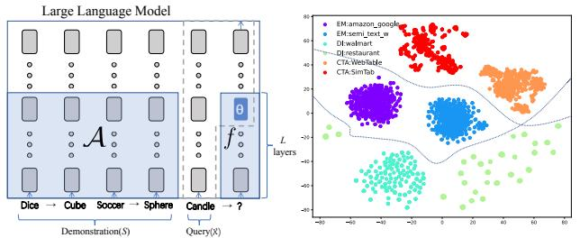
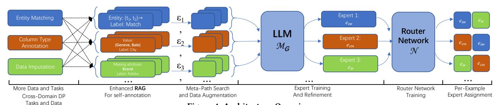
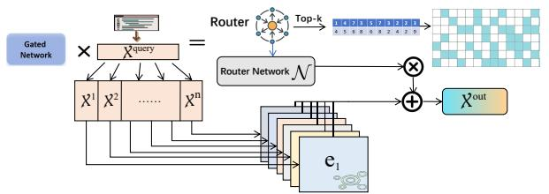
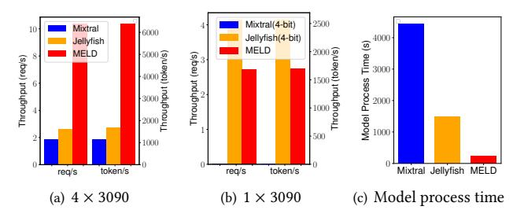
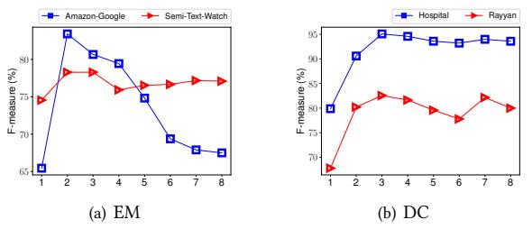

# E!icient Mixture of Experts based on Large Language Models for Low-Resource Data Preprocessing

Mengyi Yan yanmy@act.buaa.edu.cn Beihang University, Beijing, China

Yaoshu Wang∗ yaoshuw@sics.ac.cn Shenzhen Institute of Computing Sciences, Shenzhen, China

Kehan Pang pangkehan@buaa.edu.cn Beihang University, Beijing, China

# Min Xie

xiemin@sics.ac.cn Shenzhen Institute of Computing Sciences, Shenzhen, China

# Jianxin Li∗ lijx@buaa.edu.cn Beihang University, Beijing, China

# ABSTRACT

Data preprocessing (DP) that transforms erroneous and raw data to a clean version is a cornerstone of the data mining pipeline. Due to the diverse requirements of downstream tasks, data scientists and domain experts have to handcraft domain-speci!c rules or train ML models with annotated examples, which is costly/time-consuming. In this paper, we present MELD (Mixture of Experts on Large Language Models for Data Preprocessing), a universal solver for lowresource DP. MELD adopts a Mixture-of-Experts (MoE) architecture that enables the amalgamation and enhancement of domain-speci!c experts trained on limited annotated examples. To !ne-tune MELD, we develop a suite of expert-tuning and MoE-tuning techniques, including a retrieval augmented generation (RAG) system, meta-path search for data augmentation, expert re!nement and router network training based on information bottleneck. To further verify the e"ectiveness of MELD, we theoretically prove that MoE in MELD is superior than a single expert and the router network is able to dispatch data to the right experts. Finally, we conducted extensive experiments on 19 datasets over 10 DP tasks to show that MELD outperforms the state-of-the-art methods in both e"ectiveness and e#ciency. More importantly, MELD is able to be !ne-tuned in a lowresource environment, *e.g.,* a local, single and low-priced 3090 GPU. The codes, datasets and full version of the paper are available [\[1\]](#page-9-0).

# CCS CONCEPTS

• Information systems ! Data cleaning.

# KEYWORDS

Mixture of Expert, LLMs, Data Preprocessing, Low-resource

#### ACM Reference Format:

Mengyi Yan, Yaoshu Wang, Kehan Pang, Min Xie, and Jianxin Li. 2024.

Permission to make digital or hard copies of all or part of this work for personal or classroom use is granted without fee provided that copies are not made or distributed for pro!t or commercial advantage and that copies bear this notice and the full citation on the !rst page. Copyrights for components of this work owned by others than the author(s) must be honored. Abstracting with credit is permitted. To copy otherwise, or republish, to post on servers or to redistribute to lists, requires prior speci!c permission and/or a fee. Request permissions from permissions@acm.org.

*KDD '24, August 25–29, 2024, Barcelona, Spain*

© 2024 Copyright held by the owner/author(s). Publication rights licensed to ACM. ACM ISBN 979-8-4007-0490-1/24/08

<https://doi.org/10.1145/3637528.3671873>

E#cient Mixture of Experts based on Large Language Models for Low-Resource Data Preprocessing. In *Proceedings of the 30th ACM SIGKDD Conference on Knowledge Discovery and Data Mining (KDD '24), August 25–29, 2024, Barcelona, Spain.* ACM, New York, NY, USA, [12](#page-11-0) pages. [https:](https://doi.org/10.1145/3637528.3671873) [//doi.org/10.1145/3637528.3671873](https://doi.org/10.1145/3637528.3671873)

# 1 INTRODUCTION

Data Preprocessing (DP) tasks, including the discovery, extraction, transformation, cleaning, and integration of data from diverse sources, are crucial for a broad spectrum of organizations [\[2,](#page-9-1) [44\]](#page-9-2). Over the past decades, the focus has predominantly been on a limited number of tasks such as error detection (ED) [\[83,](#page-10-0) [99\]](#page-10-1), data cleaning (DC) [\[82\]](#page-10-2), data imputation (DI) [\[86\]](#page-10-3), entity matching (EM) [\[76\]](#page-10-4), entity linking (EL) [\[24\]](#page-9-3), relation extraction (RE) [\[27\]](#page-9-4), and column type annotation (CTA) [\[27,](#page-9-4) [32\]](#page-9-5). A primary challenge in this !eld arises from the diverse data distributions and requirements across various tasks, each of which deals with unique issues such as errors, anomalies, matches, and necessitates the need of speci!c features or rules for detection, repair, and alignment. Another major challenge in DP tasks is the scarcity of manual annotations, as users are often reluctant to label extensive data due to high costs. Additionally, resource constraints limit the feasibility of using multiple large-memory GPUs solely for DP. Therefore, the motivation for low-resource DP involves the need for e"ective methods that operate with few-shot data and minimal computational resources.

The advent of large language models (LLMs), such as GPT-3 [\[25\]](#page-9-6) and open-source LLaMa [\[111\]](#page-11-1), has introduced a paradigm shift in addressing DP challenges. These models, typically adopting a decoder-only Transformer architecture, have demonstrated remarkable capabilities in DP tasks [\[90,](#page-10-5) [126,](#page-11-2) [127\]](#page-11-3). The e"ectiveness of LLMs in DP can be attributed to several inherent characteristics, including (1) natural language instructions of inputs and outputs, (2) few-shot learners, and (3) rich prior knowledge. It is noteworthy that LLMs obeys scaling laws[\[63\]](#page-10-6), *i.e.,* more parameters gives better generative abilities and universal performance in DP. Consequently, most existing universal LLM-based DP solutions [\[10,](#page-9-7) [73,](#page-10-7) [90,](#page-10-5) [127\]](#page-11-3) heavily rely on querying online GPT APIs. However, this approach encounter issues of stability and data privacy in certain scenarios because DP handles private data of enterprises in practice in most of the time and it is impossible for enterprises or governments to send their core datasets to GPT APIs. Another limitation is the di#culty in adapting these online models to highly specialized domains. In

∗ Corresponding authors.

such cases, fine-tuning LLMs, such as GPT-3.5 or GPT-4, becomes a necessity, albeit a costly and sometimes infeasible one [73].

Considering the needs that online LLMs cannot fit, we focus on open-source LLMs with ≤7B parameters, that can be deployed locally in low-resource environment. However, by constraining the parameters of LLMs for universal DP, we face several challenges:

- The capability for a single model to learn representations across domains is inherently upper limited, even with more parameters.
- It is hard to leverage the world knowledge[21, 124] in LLMs, i.e., knowledge learned from large corpus in the pre-training stage, for fine-tuning on few-shot data, leading to potential overfitting.
- Because task subspaces of DP tasks are discrete and far away from each other, traditional methods, e.g., multi-task learning, are hard to work well for intrinsic task subspace identification.

To address these challenges, we revisit the Mixture of Experts (MoE) architecture, powered by the recent advancement of LLMs. Intuitively, an MoE [60] comprises a set of experts (*i.e.*, neural networks) and a trainable gating mechanism (*i.e.*, a router network). The gate assigns weights to the experts and the MoE model produces a weighted combination of experts' responses as the output. This weighting mechanism allows each expert to specialize in distinct segments of the input space, reducing training/inference costs.

Although MoE has been extensively studied over past decades, the recent advent of LLMs has necessitated a revisit on MoE. Several pioneering studies [4, 62] have shown that models with sparsely activated MoE (*i.e.*, neural network with multiple expert models and only a subset is activated) can significantly reduce the computational cost. MoE advocates that language models can be segmented into specialized sub-models or "experts", each of which focuses on different aspects of input. This approach enables efficient computation and resource allocation. Moreover, MoE facilitates the information/parameters sharing between tasks, to enhance generalizability by leveraging the inter-connection between tasks [7].

Different from existing MoE based models [4, 62], which embed a sparse gate network on model parameters, we propose MELD (Mixture of Experts on Large Language Models for Data Preprocessing), an open-source LLM-based MoE system as a universal task solver for *low-resource DP* (i.e., DP tasks addressed in resource-constrained settings with limited labels). MELD adopts a standalone router network, which allows independent and domain-specific expert training, and flexible plug-in design of experts during inference.

In training, MELD first employs a serializer to transform raw data from various sources into a standardized representation with task-specific prompts. Then an enhanced Retrieval-Augmented Generation (RAG) system is used to retrieve similar instances across domains, generating self-annotations for each instance as training data. MELD incorporates heuristic methods to identify effective meta-paths for guided data augmentation with multiple experts (Figure 1). Alongside this, a set of experts is trained using parameter-efficient fine-tuning (PEFT) methods[84, 136], addressing the scarcity of annotated data, where PEFT involves fine-tuning with a small number of model parameters. Finally, a standalone router network is trained to allocate the top-k relevant experts for each input.

**Contributions.** Our major contributions are listed as follows:

o We present a uniform framework for DP, integrating multiple

- DP tasks and datasets into a standardized representation.
- We prove the error bounds for domain adaptations across DP tasks and the convergence of the MoE design across domains.
- We present an enhanced RAG system, along with a meta-path selection mechanism, which efficiently retrieves and generates effective examples across domains, facilitating the training of experts that exhibit both generalizability and robustness.
- We design efficient MoE that could be fine-tuned in low resources, e.g., a RTX 3090 GPU. Also we dynamically assign the top-k experts for inputs across domains, ensuring data security, domain generalizability, and feasibility for further fine-tuning.
- Extensive experiments were conducted on 19 datasets over 10 DP tasks. Benefiting from MoE, MELD demonstrates superior fewshot performance, particularly in cross-domain/task scenarios.

The rest of this paper is organized as follows. Section 2 introduces the preliminary and the problem definition. Section 3 prove the error bounds for domain adaptations across various DP tasks and the convergence of MoE. Section 4 presents MELD, by delving into the data preparation, efficient expert training and router network training. Section 5 shows the experimental results. After discussing the related works in Section 6, Section 7 concludes this paper.

# 2 PRELIMINARY AND PROBLEM DEFINITION

# 2.1 Preliminary

Large Language Models (LLMs) Representative LLMs, e.g., GPT-3 [25] and LLaMa [111], are pre-trained on enormous corpora, and have been shown incredible performance on various generative tasks in few-shot or zero-shot scenarios. LLMs are well known for their emergent abilities (i.e., the sudden appearance of unseen behavior) [33], with no or few labeled data as demonstration on unseen tasks. Moreover, open-source LLMs, e.g., LLaMa [111], Mistral [62] can be fine-tuned locally with more tasks, to improve their specialized abilities, while close-source LLMs, e.g., OpenAI's GPT series (in particular GPT-3, 3.5 and 4) can only be queried online with APIs.

However, LLMs may suffer from the hallucination problem when demonstration is beyond the knowledge/scope of LLMs, leading to factual errors or unrelated answers [35]. To alleviate this, strategies below are typically adopted to constrain the responses of LLMs:

- Instruction: a combo of prompts and options (i.e., candidate outputs/answers) for guiding LLMs to accomplish a given task.
- (2) In-Context Learning (ICL): a method of prompt engineering that provides LLMs with demonstrations in the instruction [26].
- (3) Retrieval Augmented Generation (RAG): a method to improve the quality of responses by feeding LLMs with relevant context retrieved, without updating the parameters of LLMs [29].

<u>Mixture of Experts (MoE)</u> The Mixture of Experts (MoE) architecture [60] is the basis of many state-of-the-art deep learning models. For example, MoE-based layers are being used to perform efficient computation in high-capacity neural networks and to improve parameter sharing in multi-task learning (MTL) [69, 81].

The original MoE model can be formulated as  $y(x) = \sum_{i=1}^{n} g(x)_i$   $e_i(x)$ , where  $E = \{e_1, \dots, e_n\}$  represents n expert networks, and g represents a gate network that ensembles the results from all experts. Specifically, g produces a distribution over n experts based

Figure 1: A toy example of multiple experts for enhanced EM (entity matching). A meta-path "BLK (blocking)  $\rightarrow$  DI (data imputation)  $\rightarrow$  AVE (attribute value extraction)  $\rightarrow$  EM " is found to help the EM expert to make the correct prediction.

on input x, and the final output is a weighted sum of the outputs of all experts. When truncated to top-k experts, each input only needs to activate k experts in inference without much information loss.

While MoE was first developed as an ensemble method of multiple individual models, recent works, e.g., Switch Transformer [41], Mixtral [62], successfully turn it into basic building blocks (a.k.a. a router layer, MoE layer) and stack them into transformer layer. These router layers allocate input examples to different experts in E, and are jointly trained with these experts. During inference, only the parameters of top-k experts are activated for each example (e.g., top-2 for Mixtral). However, such design requires to train experts all in once, lacking the flexibility for fine-tuning a single expert. It is also hard to guarantee the experts are specialized in different domains, as observed in The Pile dataset [43] for Mixtral [62].

In light of this, we focus on external router networks as [18].

<u>Multi-task Learning(MTL)</u> Multi-task learning (MTL) solves multiple tasks at the same time, by exploiting commonalities and differences across tasks. In MTL, deep learning-based architectures that perform soft (*i.e.*, partial) parameter sharing have been proven to be effective [97, 102]. Inspired by this, we can cast DP tasks into a MTL problem, and solve such problem by multi-gate MoE [81].

#### 2.2 Problem Definition

In data management and data mining, DP is a critical step to deal with noises, missing values, inconsistencies and moreover, capture relations and associations between entries. Major DP procedures include data cleaning, data integration, data transformation and data reduction [49]. In this work, we mainly focus on tabular data, including both relational tables and web tables.

Inspired by the success of *instruction-tuning* paradigm from the NLP literature[17], we adopt a universal DP task definition.

Assume that we are given a set  $\mathcal{T}$  of DP tasks  $\{\mathcal{T}_1, \mathcal{T}_2, \dots, \mathcal{T}_n\}$ . Each  $\mathcal{T}_i$  is provided with a set of training *queries* and associated *labels*, denoted as  $X_i = \{q_1, q_2, \dots\}$  and  $\mathcal{Y}_i = \{l_1, l_2, \dots\}$ , respectively.

**Definition 2.1:** (Data Preprocessing Query): A DP query for task  $\mathcal{T}_i$  on table T is defined as a quadruple  $q = (Ins^{\mathcal{T}_i}, D^{\mathcal{T}_i}, t, C^{\mathcal{T}_i})$ , where (a)  $Ins^{\mathcal{T}_i}$  is the natural-language instruction that specifies the task  $\mathcal{T}_i$  (e.g., entity matching, EM), (b)  $D^{\mathcal{T}_i}$  is a set of  $\mathcal{T}_i$ -related

demonstrations (*e.g.*, labeled examples of EM), (c)  $t \in T$  is a *tuple* (*a.k.a. entry*) from table T, on which  $T_i$  is performed and (d)  $C^{T_i}$  is the expected output domain by performing the task following the instructions on the tuple t (*e.g.*, {match, mismatch} for EM).  $\square$ 

Given a training query q for task  $\mathcal{T}_i$ , its associated label l gives the ground truth from the expected output domain  $C^{\mathcal{T}_i}$ . To conduct a task  $\mathcal{T}_i$ , one should query an expert with q. To illustrate, we give a few representative tasks below, and a complete list with illustrating examples can be accessed in full version[1]:

*Entity Matching (EM).* Given a pair of tuples  $t_1$ ,  $t_2$  in T, EM is to infer whether they refer to the same real-world entity.

*Error Detection (ED).* Given a tuple t and an attribute  $a_i$ , ED is to detect whether there is an error in the  $a_i$ -attribute value of tuple t.

Data Imputation (DI). Given a tuple t and an attribute  $a_i$  such that the  $a_i$ -attribute value of t is missing, DI is to infer its correct value.

<u>Column Type Annotation (CTA)</u> Given a table *T*, CTA is to infer the type of each column *h* of *T* from a set of predefined semantic types.

**Definition 2.2: (Expert):** An expert  $e_i$  trained on DP task  $\mathcal{T}_i$ , is defined as a fine-tuned language model, which takes the query q as input, and return the task-specific output from the output domain.  $\Box$ 

Note that each single expert  $e_i$  can response to queries of different tasks, since the experts in  $E = \{e_1, \dots, e_n\}$  share the same architecture and most parameters with each other.

**Definition 2.3: (Few-shot Learning):** Each task  $\mathcal{T}_i \in \mathcal{T}$  is provided with few-shot training queries and labels  $\{X_i, \mathcal{Y}_i\}$ , and the remaining unlabeled queries are denoted as  $\widetilde{X}_i$ . The training set  $\mathbb{X}_i$  for  $\mathcal{T}_i$  contains both labeled and unlabeled queries, i.e.,  $\mathbb{X}_i = X_i \cup \widetilde{X}_i$ . The overall training set  $\mathbb{X} = \bigcup_{i=1}^n \mathbb{X}_i$  is the training set cross all tasks.  $\square$ 

For task  $\mathcal{T}_i$  with training queries and labels  $(X_i, \mathcal{Y}_i)$ , we denote  $Eval(e_i, X_i)$  as the performance evaluation, between  $\mathcal{Y}_i$  and the output of expert  $e_i$  over  $X_i$ . For binary classification DP tasks, the evaluation metrics is F-measure, for the other tasks is accuracy.

Note that given a training query  $q \in \mathbb{X}_i$  for task  $\mathcal{T}_i$ , e.g., EM, it may be possible to transform q (and its associated label) to a new query-label pair (q', l') for another task  $\mathcal{T}_i$ , e.g., DI, via self-supervised learning, or masking strategies. Here the label l' can be a masked attribute from the original query q, or self-annotated, depending on tasks. The horizontal axis of Figure 2 give a toy example that transforms a query for EM to a new query-label pair for DI.

**Definition 2.4: (Low-resource DP)**: DP tasks are solved by LLMs trained and deployed in consumer-level small-memory GPUs with few-shot labeled data. □

Here we refer to a consumer-level small-memory GPU as one with memory not exceeding 24GB, and few-shot labeled data as comprising up to 10% of the original labeled benchmark data.

**Problem.** The problem studied in this paper is stated as follows.

- *Input*: A set of tasks  $\{\mathcal{T}_1, \dots, \mathcal{T}_n\}$  with few-shot training data  $\mathbb{X}$  in the low-resource DP setting.
- Output: An universal LLM-based system under the MoE architecture that is able to answer the (unseen) query of all \( \tilde{T}\_i \).

Figure 2: Illustration of our data augmentation method.

Figure 3: Illustration of Intrinsic Task Subspace (ITS) over task vectors. The left part [54] shows how LLM responses a task-specific query q with demonstrations. The right part is a 2d t-SNE plot of task vectors for different DP tasks over ITS. Dotted lines indicate decision boundary over different tasks.

#### 3 THEORETICAL ANALYSIS

Despite the empirical success of the MoE architecture in MTL, the theoretical understanding of such architecture is still elusive. It is unclear why the experts can be specialized to make predictions for different inputs, and why the router can automatically learn to dispatch data. To this end, we provide some theoretical analysis in this section, answering the following questions:

- Q1: Can various DP tasks (e.g., EM and DI) over different domains (e.g., scholar and e-commerce) be represented and learned over a compact low-dimension space, i.e., a intrinsic task subspace?
- o Q2: Why cannot a single expert fit well for multiple domains?
- Q3: How the router learn to dispatch data to the right experts?

To answer these questions, we provide the following three theorems. For the lack of space, the proofs are provided in full version[1].

**Theorem 1:** (Intrinsic Task Subspace) With unified representation of different tasks  $\{\mathcal{T}_1, \mathcal{T}_2, \cdots, \mathcal{T}_n\}$  and in-context learning (ICL) demonstrations  $D_i$  (i.e.,  $D^{\mathcal{T}_i}$ ), fine-tuning a LLM on task  $\mathcal{T}_i$  is equivalent to learn a **task vector**  $\theta_i(D_i)$ , and such vector is embed in a low-dimensional and compact intrinsic task subspace (ITS).

Theorem 1 [54, 97] indicates that with unified representation and proper ICL for each task  $\mathcal{T}_i$ , we can represent and learn multiple DP tasks  $\mathcal{T}$  in a small ITS, denoted by V. In other words, fine-tuning a small set of parameters in a LLM can generalize it to multiple tasks. Figure 3 gives a intuitive visualization of ITS over task vectors.

**Theorem 2:** (Error Bound for Single and Mixture of Experts) Consider fine-tuning a single expert  $h_N$  from the base LLM model  $h_0$ , to apply MTL over all DP tasks. Let  $C \sim \bigcup_{i=1}^{|\mathcal{T}|} X_i$  be the sampled distribution over all tasks  $\mathcal{T}$  with N samples,  $\mathbb{C} \sim \bigcup_{i=1}^{|\mathcal{T}|} \mathbb{X}_i$  be the

actual distribution over  $\mathcal{T}$ , S be the source domain distribution from  $h_0$ ,  $\epsilon_{\mathbb{C}}(h_N)$  be the expected error bound of the single fine-tuned expert, and  $\epsilon_C(h_N)$  be the empirical error. The expected error  $\epsilon_{\mathbb{C}}(h_N)$  for single fine-tuned expert is upper bounded, i.e.,

$$\epsilon_{\mathbb{C}}\left(h_{N}\right) \leq \epsilon_{C}\left(h_{N}\right) + \sqrt{\frac{KL(h_{N}||h_{0}) + ln\sqrt{4N} - ln(\delta)}{2N}} + 2D(S,C)$$

where D(S, C) is a distance function representing the gap between the source domain S and the target domain C, and  $\delta$  is a constant.

Let  $\mathcal{R}_N(H)$  be the Rademacher complexity of the hypothesis space H associated with expert models,  $d_N$  be the Natarajan dimension of the gating network N within its hypothesis space  $\mathcal{B}$ ,  $n=|\mathbf{E}|$  and k is the number of experts selected per query. For mixture of experts, the error bound is:

$$O(4C\mathcal{R}_N(H) + 2\sqrt{\frac{2kd_N(1 + \ln(\frac{n}{k}) + d_N \ln(2N) + \ln(4/\delta)}{2N}})$$

which holds with a probability of at least  $1 - \delta$ .

Theorem 2 [77, 134] shows that in few-shot learning, single expert cannot fit well for multiple target domains if (a) the model capacity is small, *i.e.*,  $KL(h_N||h_0)$ , which is negatively correlated with the model capacity [20], correspondingly large, (b) the sample number N in the target domain is small, and (c) the empirical error  $\epsilon_C$  ( $h_N$ ) is high, *i.e.*, there is a large bias between the sampled example distribution C and the actual distribution C. And the error bound of the mixture of experts is directly proportional to the sparse factor  $s = O(\sqrt{\frac{k}{N}(1 + \log(\frac{n}{k}))})$ . This implies that, with a constant total number of experts n selecting fewer experts k leads to a more sparse network architecture, which consequently reduces the bound on the generalization error. Moreover, an increase in the number of training samples N can also minimize the error bound.

These conclusions have been validated through the experimental results and hyperparameter analysis in Section 5.2.

**Theorem 3:** (Router learns Clusters in ITS) Given  $N = \Gamma(dk \log k)$  samples drawn from a mixture of k spherical Gaussian in d-dimensions which are c-separated for some constant c, and an instantiation of the MoE architecture with  $O(k \log k)$  experts, if we initialize the router weights  $g_i$  randomly, the router will learn to route examples according to the ITS task cluster distribution.

Theorem 3 [11, 18] guarantees the converge of the router network, the core of MoE architecture. However, such performance relies on a proper set of demonstration  $D_i$ , a suitable division of experts E, and a stratified sampling strategy for training the router network.

# 4 MIXTURE OF EXPERTS ARCHITECTURE BASED ON LARGE LANGUAGE MODELS

The overall architecture of MELD is presented in Figure 4, and it consists of the following four components.

• The enhanced RAG component. It takes few-shot labeled data as input, and enlarge/enrich labeled data in  $\mathcal{X}_i$  as output  $\mathbb{X}_i$  in a self-supervised manner for task  $\mathcal{T}_i$ . A fine-tuned sentence-bert model is used as the backbone of RAG system; such design can effectively encode data entries from different domains to a unified representation space. It also retrieves relevant demonstrations

Figure 4: Architecture Overview

D for each data entry and initializes a set E of experts.

- The meta-path search component. It takes the enlarged training data  $X_i$  and the expert set E as input, and finds a meta-path  $\mathcal{E}_i$  (i.e., a sequence of experts in E) for task  $\mathcal{T}_i$ , to augment  $X_i$  to  $X_i^{aug}$ , by revising and adding attributes for each query  $q \in X_i$ .
- $\circ$  The expert refinement. It takes augmented training data  $\mathbb{X}_i^{aug}$  and the expert set E as input, and fine-tunes the experts E to  $\mathsf{E}^{aug}$ , guided by the information bottleneck theory.
- $\circ$  The router network  $\mathcal{N}$ . It takes the (fixed) refined expert set  $\mathbf{E}^{aug}$  as input, and designs with a sparse multi-gate network, to select top-k experts for answering a query  $q \in \mathbb{X}$ .

Below we elaborate each component one by one.

#### 4.1 Enhanced RAG for Cross-domain Retrieval

Retrieval-Augmented Generation(RAG) is a method to retrieve relevant contextual data entries or chunks from a large corpus (e.g., knowledge graph, book) and provide to the model as reference, to improve the quality of LLM responses. However, data entries from multiple DP tasks may have different structures, which are hard to compare and retrieve. In this section, we propose a simple yet effective method to serialize and align data from different domains.

Entry Alignment. For structure and semi-structured data, the structure similarity holds equal importance as semantic similarity, e.g., if  $t_1$  and  $t_2$  share the same brand and category attribute, we can align  $t_1$  and  $t_2$  as similar entities. For tasks across tables, e.g., CTA, columns with same semantic type or knowledge graph relations should also be aligned; for binary classification tasks, e.g., EM, if  $t_1$  and  $t_2$  are labeled as match, they should be grouped as similar entries.

Based on this, for each q in  $\mathbb{X}$ , we search a positive set  $\mathcal{P}_q$  (resp. a negative set  $\mathcal{N}_q$ ) containing all aligned (resp. unaligned) entries.

Fine-tuning RAG Model. Given  $(q, \mathcal{P}_q, \mathcal{N}_q)$  as training data, we tokenize and pass them to a sentence-bert [98] model  $\mathcal{M}_{RAG}$ , and fine-tune the model with the contrastive learning loss [28]:

$$\min \sum_{p \in \mathcal{P}_q} -\log \frac{\exp \left(\left\langle emb_q, emb_p \right\rangle / \tau \right)}{\sum_{p' \in \mathcal{P}_q \cup \mathcal{N}_q} \exp \left(\left\langle emb_q, emb_{p'} \right\rangle / \tau \right)},$$

where emb is an embedding and  $\tau$  is the temperature parameter.

Moreover, we serialize each query q to a dict format, which also contains meta-data for q, e.g., table title, column header; if  $\mathcal{N}_q = \emptyset$ , we conduct hard negative sample search with the initial model  $\mathcal{M}_{RAG}$  over  $\mathbb{X}$ , to add negative examples for  $\mathcal{N}_q$ .

<u>Self-Annotation.</u> When the training of  $\mathcal{M}_{RAG}$  is finished, we apply  $\overline{\mathcal{M}_{RAG}}$  to self-annotate unlabeled queries in  $\widetilde{\mathcal{X}}_i$ . *e.g.*, for EM, given

an unlabeled query  $q_i \in \widetilde{\mathcal{X}_{EM}}$ ,  $\mathcal{M}_{RAG}$  can search the most similar  $q_j$  over entire  $\mathbb{X}$  and self-annotate the entries in  $q_i$  and  $q_j$  as match. This procedure follows a self-supervised learning paradigm, and effectively enlarge the labeled data  $\mathcal{X}_i$  to  $\mathbb{X}_i$  by adding self-annotated data. Besides, we can also apply the transformation technique in Section 2.2 to further enlarge  $\mathbb{X}_i$  with labeled queries from other tasks. Figure 2 gives an example of both ways for enlarging labeled data.

Expert Initialization. For each task  $\mathcal{T}_i$ ,  $\mathbb{X}_i$  is used to initialize the training of each expert  $e_i$ , by fine-tuning a LLM, denoted by  $\mathcal{M}_G$ .

## 4.2 Heuristic Meta-path Search

There are a host of data augmentation methods [30, 76] for DP. However, such methods are either statistical or they use pre-defined global operators for augmentation. Alternatively, we consider a fixed set of experts  $\mathbf{E} = \{e_1, \dots, e_n\}$ , and find a meta-path (*i.e.*, a sequence of experts in  $\mathbf{E}$ ) for task  $\mathcal{T}_i$ . Such meta-path can help to augment data in  $\mathbb{X}_i$  reasonably. Below we define such expert-based meta-path and data augmentation over the meta-path.

**Definition 4.1:** (Meta-path over Experts): A meta-path  $\mathcal{E}_i$  for task  $\mathcal{T}_i$  is a sequence of experts  $e_{j_1}, \dots, e_{j_n}$  from the experts set  $\mathbf{E}$ ; it describes the order of experts to be applied for task  $\mathcal{T}_i$ .

**Definition 4.2:** (Data Augmentation Over Meta-path): Given  $\mathbb{X}_i$  for task  $\mathcal{T}_i$ , we denote  $\mathbb{X}_i^{j_1}$  as the augmented set of  $\mathbb{X}_i$  by querying expert  $e_{j_1}$ . Similarly,  $\mathbb{X}_i^{\mathcal{E}_i}$  is the augmented set of  $\mathbb{X}_i$  by a meta-path  $\mathcal{E}_i = \{e_{j_1}, \cdots, e_{j_n}\}$ , *i.e.*, by querying the experts in  $\mathcal{E}_i$  in order.  $\square$ 

We show an example in Figure 1, in which  $\mathbb{X}_{EM}$  is augmented by the meta-path  $\mathcal{E}_{EM} = \{e_{\text{blocking}}, e_{\text{DI}}, e_{\text{AVE}}, e_{\text{EM}}\}$  in order.

<u>Heuristic Meta-path search</u>. Given labeled data  $X_i$  for task  $\mathcal{T}_i$ , we want to find a sequence of experts  $\mathcal{E}_i = \{e_{j_1}, \dots, e_{j_n}\}$  such that the performance of the augmented data, *i.e.*,  $Eval(e_i, X_i^{\mathcal{E}})$ , is the best.

Here we apply a greedy search algorithm for finding a meta-path  $\mathcal{E}_i$  for task  $\mathcal{T}_i$ , which reduces the search space by incorporating user-defined sub-optimal paths, e.g.,  $\{e_{\mathsf{Blocking}}, e_{\mathsf{EM}}\}$  (resp.  $\{e_{\mathsf{EL}}, e_{\mathsf{CTA}}\}$ ) is widely used in EM (resp. tabular interpretation learning [27]).

After finding a meta-path  $\mathcal{E}_i$  for task  $\mathcal{T}_i$ , we can query  $\mathcal{E}_i$  to augment training data  $\mathbb{X}_i$  to  $\mathbb{X}_i^{aug}$  with self-supervised annotation.

## 4.3 Expert Refinement

Note that for each initialized expert  $e_i$  for task  $\mathcal{T}_i$ , there is a high risk that  $e_i$  may overfit to the biased distribution of  $X_i$ , since  $X_i^{aug}$  are augmented from  $X_i$  and may share a similar biased distribution. As discussed in [9], such distribution may lead to a higher empirical

error  $\epsilon_C$  ( $h_N$ ) in Theorem 2. To alleviate such concern, we introduce the Min-Max optimization target guided by the information bottleneck theory, to improve the generalizability of each expert  $e_i$ .

<u>Information Bottleneck.</u> Information bottleneck [109, 110] was used to balance the complexity of representation and the power of predicting, based on the notion of minimal sufficient statistics for extracting information about target Y from input X into representation Z. It imposes regularization at representation Z by minimizing the mutual information between input X and the learned representation Z, *i.e.*, min I(X;Z), while maximizing the mutual information between target output Y and X, *i.e.*, max I(Y;Z) [64].

In expert training, the information bottleneck theory provides useful insights: consider training expert  $e_i$  with training data  $(\mathbb{X}_i, \mathcal{Y}_i)$ ; it is equivalent to find the most relevant task vector  $\theta_i$  as representation. On the one hand, the distribution of  $\mathbb{X}_i$  should be diverse, a.k.a. minimize  $I(\mathbb{X}_i; \theta_i)$ . Otherwise  $e_i$  may overfit to a biased distribution of sampled training data  $\mathbb{X}_i$ , and cannot learn the high-level and intrinsic features. On the other hand, the distribution of  $\mathbb{X}_i$  should fall in the same cluster with  $\theta_i$  in ITS, as shown in Theorem 3, a.k.a. maximize  $I(\mathcal{Y}_i; \theta_i)$ . Otherwise  $e_i$  may suffer from underfitting issue with low performance, due to the lack of relevant information.

Training Process. We denote  $\theta_{\mathcal{M}_{RAG}}$  as the parameters for fine-tuned RAG model in Section 4.1, and  $\theta_{\mathcal{M}_G}$  as the parameter of the base LLM-model of each expert, and RAG( $\mathcal{X}_i$ )) as the operations we use to augment  $\mathcal{X}_i$ , including both self-annotation and meta-path augmentation. The optimization function of training LLM-based  $e_i$  is:

$$\arg\min_{\theta_{\mathcal{M}_{\mathsf{RAG}}}} \max_{\theta_{\mathcal{M}_{G}}} I(\mathcal{M}_{G}(X_{i}); \mathcal{M}_{G}(\mathsf{RAG}(X_{i}))) \tag{1}$$

Intuitively, (a)  $\max \theta_{\mathcal{M}_G}$  is explicitly conducted, by parameter-efficient fine-tuning  $\mathcal{M}_G$  and maximizing the mutual information between the output of  $\mathcal{M}_G$  and label  $\mathcal{Y}_i$ ; and (b)  $\min \theta_{\mathcal{M}_{RAG}}$  is implicitly enforced, by controlling the sample parameter for  $\mathcal{M}_{RAG}$  and meta-path  $\mathcal{E}_i$  and adding  $\Delta \mathcal{X}_i = RAG(\mathcal{X}_i)$  as supplement training data for  $\mathcal{M}_G$ , while minimizing the mutual information between the labeled training data  $\mathcal{X}_i$  and external training data  $\Delta \mathcal{X}_i$ .

In practice, we adopt a iterative optimization strategy to fulfill the target function. Specifically,  $\mathcal{M}_G$  is initialized with expert  $e_i$  (Section 4.1). Then we iteratively control RAG( $\mathcal{X}_i$ ) to add diverse training data  $\Delta \mathcal{X}_i$  by extracting cross-domain examples and demonstrations, as well as implementing data augmentation with meta-path  $\mathcal{E}_i$ . After adding  $\Delta \mathcal{X}_i$  to  $\mathcal{X}_i$ , we further fine-tune  $\mathcal{M}_G$  with new data until convergence. Such iterations continue  $\sigma$  times.

After refinement,  $e_i$  is refined to  $e_i^{aug}$ , which is more robust to various DP tasks and cross-domain queries, while retaining high performance on its own  $\mathcal{T}_i$ . Denote the set of refined experts by  $\mathbf{E}^{aug}$ . We apply low-rank adaptation [56] (a.k.a. LoRA) to fine-tune  $\mathcal{M}_G$  for training and refining each expert  $e_i \in \mathbf{E}^{aug}$ .

#### 4.4 Router Network

In this section, we train a light-weighted sparse-gated router network N to select top-k experts in  $\mathbf{E}^{aug}$  for each input query.

The information bottleneck theory also provides insight in optimizing  $\mathcal{N}$ . Given query  $q_i$ , on the one hand, the selected top-k experts should be diverse to provide different yet valuable views of  $q_i$ ; this is equivalent to minimize the mutual information between the

Figure 5: Model architecture of MELD

selected experts. On the other hand, the selected experts should be relevant to  $q_i$ ; this is equivalent to maximize the mutual information between the output of selected experts and corresponding labels.

<u>Router Network.</u> Given a labeled query  $q_u \in \mathbb{X}_u^{aug}$ , let  $\mathcal{N}(q_u)$  be the top-k experts selected by the sparse gated network  $\mathcal{N}$  for  $q_u$  and task  $\mathcal{T}_u$ , and  $(q_u^i, l_u^i)$  be the transformed query-label pair from task  $\mathcal{T}_u$  to  $\mathcal{T}_i$  with self-annotation. The optimization function is:

$$\max \sum_{e_i \in \mathcal{N}(q_u)} I(e_i(q_u^i); l_u^i); \min \sum_{e_i, e_j \in \mathcal{N}(q_u)}^{i \neq j} I(e_i(q_u^i); e_j(q_u^j)) \quad (2)$$

In practice, Eq.2 can be approximated with contrastive training loss [92, 106]. Thus, we apply a transformer network that shares the encoding layers with  $\mathcal{M}_{RAG}$ , for  $\mathcal{N}$  and further fine-tune it with contrastive loss. The positive and negative examples are extracted from labeled data across all tasks. Figure 5 gives an illustration of  $\mathcal{N}$ .

#### 5 EXPERIMENTAL STUDY

Our experiments focus on answering the following questions:

- How does MELD perform compare with other non-LLM methods and local-LLM methods, especially in few-shot scenarios?
- How does MELD benefit from the MoE architecture design, especially in cross-dataset and cross-task scenarios?
- The effectiveness and efficiency comparison between the lightweighted standalone router network architecture, e.g., MELD, and the built-in MoE layer based model, e.g., Mixtral 8×7B?
- How does the number of experts, as well as the meta-path selection, affect the overall performance of MELD?

#### 5.1 Setup

<u>Statistics.</u> As shown in Table 6 in Appendix A.1, as well as the abbreviation of each DP tasks. We selected 19 datasets over 10 typical DP tasks to show the performance of MELD. In all tasks except schema matching, we use few-shot labeled data (usually  $\leq$  10%), as shown in column #Instance (few-shot). The selection of few-shot examples are kept the same among all methods.

<u>Methods.</u> We categorized the baselines as follows. (1) Non-LLM methods . (a) ED: Raha[83], (b) DI: IPM[86], (c) Blocking: DeepBlocker[107], (d) EM: Ditto[76] and PromptEM[112], (e) DC: Baran[82] and Garf[95], (f) CTA: RECA[32], (g) RE/EL: TURL[27], (h) SM: CONSchema[116] and SMAT[128], and (k) AVE: MAVE[120]. Other methods, *e.g.*, HoloClean [99], DODUO [31] have been shown to be outperformed by the listed competitors [32, 83], and hence not compared. (2) LLM-based methods. JellyFish[126] uses a 13B LLM model (1.8× than MELD) to solve multiple DP tasks. For table interpretation tasks (*e.g.*, CTA, RE, EL), we compared TableLLaMa[131] which applies a 7B foundation model. For AVE task, we used

**Table 1: Overall Performance** 

|         |                        |                  |                                 | -                           |                     |
|---------|------------------------|------------------|---------------------------------|-----------------------------|---------------------|
| Task    | Dataset                | MELD Few-shot | Non-LLM Baseline Few-shot | LLM Baseline Few-Shot | Mixtral Few-shot |
|         | Amazon- Google      | 83.41(74.12)     | 61.88(50.47)                    | 65.98(/)                    | 51.28(/)            |
| EM & | Walmart- Amazon     | 91.42(78.80)     | 79.09(58.21)                    | 42.03(/)                    | 39.78(/)            |
| (BLK)   | WDC-All                | 91.97(31.50)     | 34.35(1.70)                     | 49.80(/)                    | 48.97(/)            |
|         | Ant-Buy                | 91.12(86.20)     | 84.89(40.66)                    | 71.40(/)                    | 60.42(/)            |
|         | Semi-Text- Watch    | 78.28(59.23)     | 23.60(2.66)                     | 54.27(/)                    | 40.55(/)            |
|         | Semi-Text- Computer | 86.46(30.85)     | 33.90(8.09)                     | 76.80(/)                    | 73.15(/)            |
|         | Hospital               | 95.01            | 67.10                           | 49.30                       | 53.20               |
| DC      | Rayyan                 | 82.15            | 28.50                           | 9.39                        | 6.68                |
|         | Beer                   | 97.30            | 90.31                           | 51.30                       | 56.27               |
|         | Hospital               | 98.51            | 95.23                           | 89.41                       | 69.14               |
| ED      | Rayyan                 | 90.37            | 80.21                           | 69.67                       | 31.96               |
|         | Beer                   | 99.10            | 100.00                          | 81.64                       | 70.23               |
| СТА     | SemTab19               | 89.35            | 69.70                           | 87.77                       | 89.35               |
| _ LIA   | WebTables              | 96.30            | 90.93                           | 94.77                       | 80.16               |
| RE      | WikiGS-RE              | 89.30            | 73.50                           | 60.38                       | 65.88               |
| EL      | WikiGS-EL              | 87.05            | 60.55                           | 82.20                       | 73.25               |
| SM      | CMS                    | 60.27            | 50.00                           | 59.29                       | 31.01               |
|         | Synthea                | 56.00            | 38.50                           | 40.00                       | 23.53               |
| DI      | Walmart                | 87.50            | 65.70                           | 57.69                       | 79.82               |
|         | Amazon                 | 75.12            | 60.35                           | 60.05                       | 62.62               |
|         | Restaurant             | 93.10            | 37.50                           | 68.97                       | 72.41               |
| AVE     | OA-mine                | 74.62            | 67.00                           | 65.70                       | 77.36               |
| AVE     |                        |                  |                                 |                             |                     |

ExtractGPT[6], compared to its local LLM model with up to 70B parameters (10× than MELD). (3) MoE models. We compared the state-of-the-art MoE foundation model Mixtral-8×7B[62] (*i.e.*, Mixtral), which embeds the MoE layer  $\mathcal N$  in model parameters, and jointly train  $\mathcal N$  with a set E of 8 experts, each of which is a 7B LLM.

<u>Default Parameters.</u> For Blocking, ED and EL, we only apply our RAG model  $\mathcal{M}_{RAG}$  due to the large search space. For other tasks, we uses the LLM-based MoE system. Default number of k is set to 3, the number of iterations  $\sigma$  for expert refinement is set to 3, the demonstration number  $|D_i|$  is set to 8.  $\tau$  in RAG is 0.02. Detailed implementation is listed in Appendix A.2 and full version[1].

<u>Metrics</u> To evaluate DP tasks, we measured accuracy for DI, AVE; top-1 accuracy for EL; top-1 recall for blocking; F1 score for EM, ED, DC, SM, and micro-F1 score for CTA, RE tasks in a 100-scale.

<u>Environment</u> We select bge-large-en[34] as the backbone for the RAG models  $\mathcal{M}_{RAG}$ , and Mistral-7B[61] as the backbone of expert model by default. We conducted the experiments on a single machine powered by 256GB RAM and 32 processors with Intel(R) Xeon(R) Gold 5320 CPU @2.20GHz and 4 Nvidia GeForce RTX 3090 GPUs. Each experiment was run 3 times and the average is reported.

#### 5.2 Effectiveness Evaluation

We compared the performance of MELD with various non-LLM and LLM baselines in Table 1. In few-shot scenarios, MELD consistently

Figure 6: Efficiency among different LLMs-based models (4-bit quantization for Jellyfish and Mixtral on  $1 \times 3090$ )

outperforms all non-LLM baselines, which means that MELD has better data utilization. In particular, 10%-20% labeled training data suffices to train a robust expert  $e_i$  for task  $\mathcal{T}_i$ , while the shared parameter from other experts can prevent  $e_i$  from being overfitting.

In low-resource settings where labeled data is extremely limited, LLM baselines are prone to issues such as overfitting and hallucination problem, due to insufficient relevant demonstration data[135]; While non-LLM baselines often utilize rule-based approaches or rely on structural information, and are inherently robust in few-shot scenarios. MELD compensate such information incompleteness with  $\mathcal{M}_{RAG}$  and self-distilled data augmentation with meta-path.

Compared to LLM baselines, which are trained over MTL paradigm, MELD beats them with significant fewer parameters. This indicates that the MoE architecture is good at handling MTL, and multiple sparse experts can outperform one dense one. Besides, we argue that several LLM baselines, including Jellyfish and TableL-LaMa, require high-cost pre-training over enormous task-specific corpus with thousands of GPU hours (e.g., millions of Wikipedia webtables[131]), while MELD only needs low-cost fine-tuning for training each expert from a base model with less than 20 GPU hours.

Compared to Mixtral, which also applies a build-in MoE layer, we can see that Mixtral outperforms MELD in a few tasks (i.e., AVE, CTA). However, Mixtral fails to apply a good routing strategy, and Mixtral does not balance the load well for the task family  $\mathcal T$  to its 8 experts, leading to its better performance in open-domain/complex tasks with long context and information retrieval, e.g., DI, AVE, and poor performance in close-domain/simple tasks, e.g., EM, DC.

#### 5.3 Efficiency Evaluation

We compared the efficiency of MELD, Jellyfish and Mixtral in Figure 6, comparing the inference throughput speed and model process time. This comparison is conducted on two settings: 4×3090 GPUs and 1×3090 GPU with vLLM [68]. Due to the VRAM requirement of Mixtral, we only report its performance on the former.

Firstly, we report the throughput over 4 GPUs with vLLM [68]. Due to the small size of experts in MELD, a single 3090 GPU can hold a maximum of 16 experts for MELD, while the load-balance system of MELD and vLLM can gather similar queries within the same GPU. Therefore, MELD achieves data parallelism over 4 GPUs, and gain non-trivial 3.7× throughput improvement with 13B Jellyfish and 5.6× with 56B Mixtral, which have to apply tensor parallelism, and suffer from the communication overhead over multiple GPUs.

Secondly, we report the throughput over a single GPU, a prevalent consumer scenario. MELD perform well with full precision model, while Jellyfish has to apply a 4-bit quantization [42] to make

Table 2: Cross-Dataset(C-D) and Cross-Task(C-T)

| Task | Dataset         | MELD C-D | MELD C-T | LLM Baseline C-D | LLM Baseline C-T | Mixtral C-D | Mixtral C-T |
|------|-----------------|-------------|-------------|------------------------|------------------------|----------------|----------------|
| EM   | Amazon-Google   | 69.05       | 67.95       | 18.58                  | 18.58                  | 43.23          | 43.23          |
|      | Semi-Text-Watch | 65.07       | 51.13       | 20.52                  | 20.51                  | 37.12          | 37.12          |
| CTA  | SemTab19        | 76.84       | 61.21       | 15.79                  | 7.96                   | 64.83          | 61.64          |
|      | WebTables       | 86.76       | 88.95       | 38.92                  | 14.29                  | 79.72          | 67.64          |
| DI   | Walmart         | 54.80       | 54.80       | 43.26                  | 17.86                  | 79.82          | 78.85          |
|      | Restaurant      | 75.86       | 75.86       | 68.96                  | 6.95                   | 72.43          | 58.62          |

**Table 3: Performance for Ablation Study** 

| Task | Dataset                                                                                        | MELD w/o MoE                           | MELD w/o RAG                                    | MELD w/o Meta-Path                              | MELD with Mixtral                               |
|------|------------------------------------------------------------------------------------------------|-------------------------------------------|----------------------------------------------------|----------------------------------------------------|----------------------------------------------------|
| EM   | Amazon-Google Walmart-Amazon WDC-All Ant-Buy Semi-Text-Watch Semi-Text-Computer | 76.70 87.66 90.38 87.58 70.78 | 69.21 81.44 83.16 85.75 55.07 42.02 | 62.52 79.55 91.73 90.12 39.89 63.74 | 77.85 91.03 91.32 85.26 75.42 81.98 |

inference on a single GPU, and Mixtral cannot deploy on a single GPU even with 4-bit quantization, due to OOM issues. Although MELD is around 1.3× slower than 4-bit Jellyfish, the quantization is time-consuming and it leads to a significant performance drop.

We also report the model process time of each methods, *i.e.*, the time of merging trained LoRAs into the base model and preparing it for inference with vLLM. MELD applies a dynamic LoRA switch technique, which avoids merging multiple LoRA into a single model, and only needs to load and concatenate on multiple LoRAs, reducing the i/o cost. While Jellyfish and Mixtral have to apply a time-consuming merging and quantization operation. As a result, MELD is  $10\times$  and  $30\times$  faster than Jellyfish and Mixtral in model process.

#### 5.4 Cross-Dataset and Cross-Task Comparison

We evaluated the cross-dataset (i.e., C-D) and cross-task (i.e., C-T) performance of MELD, where C-D means we mask expert  $e_i$  and training data  $X_i$  for task  $\mathcal{T}_i$ , while C-T means we mask all experts and training data that are same as  $\mathcal{T}_i$  (e.g., mask all EM experts for evaluation on the Amazon-Google dataset). The result is presented in Table 2. To prevent the domain overlap, we select 6 datasets with different domains, and limit the overall experts of MELD into 6.

Compared with LLM baselines, MELD suffers less performance drop in C-D and C-T scenarios, which is contributed by the information bottleneck guided expert training, as well as the RAG system across datasets and tasks. Nonetheless, Mixtral also performs well in open-domain tasks, which means the MoE architecture is suitable in MTL. Besides, the shared parameters of experts in MELD and Mixtral effectively prevent them from being overfitting to few-shot data and specific task, or suffering hallucination problems.

#### 5.5 Ablation Study

We selected EM for ablation study, varying the following in Table 3:

- o MELD w/o MoE, a single expert fine-tuned per task;
- $\circ\,$  MELD w/o RAG, where each expert is fine-tuned without cross-domain data augmentation and RAG; and
- MELD-w/o Meta-Path, where each expert is fine-tuned without meta-path based data augmentation

Table 4: Performance for Different LLM parameter size

| Task | Dataset           | F1-Score (Mistral-7B) | F1-Score (Vicuna-33B) | Train Time (7B/33B) | Inference Speed (7B/33B) |
|------|-------------------|--------------------------|--------------------------|------------------------|-----------------------------|
| EM   | Amazon- Google | 83.14                    | 84.17                    | 2944/8389              | 19.56/2.93                  |
| DC   | Rayyan            | 82.15                    | 80.62                    | 1275/5494              | 27.24/6.10                  |
| CTA  | SemTab19          | 89.35                    | 87.77                    | 2792/5821              | 25.28/7.33                  |
| RE   | WikiGS-RE         | 89.30                    | 83.88                    | 501/2174               | 54.52/15.81                 |

Table 5: Performance compared with GPT-4

| Task | Dataset                         | MELD Few-shot | GPT-4          | LLM Baseline Few-Shot | Mixtral Few-shot |
|------|---------------------------------|------------------|----------------|-----------------------------|---------------------|
| EM   | Amazon-Google Walmart-Amazon | 83.41 91.42   | 74.21 90.27 | 65.98 42.03              | 51.28 39.78      |
|      | Ant-Buy                         | 91.12            | 92.77          | 71.40                       | 60.42               |
| SM   | CMS                             | 60.27            | 59.29          | 59.29                       | 31.01               |
| SIVI | Synthea                         | 56.00            | 66.67          | 40.00                       | 23.53               |
| DI   | Restaurant                      | 93.10            | 97.75          | 68.97                       | 72.41               |
| AVE  | OA-mine                         | 74.62            | 80.20          | 65.70                       | 77.36               |

With only a domain-specific expert  $e_i$ , MELD w/o MoE, is not the good solution, since different experts can provide additional information to boost the performance. MELD w/o RAG suffers from performance drop over all scenarios, justifying the effectiveness of  $\mathcal{M}_{RAG}$ . For semi-structured or low-quality data, e.g., semi-text-w and amazon-google, the meta-path can augment structural information and significantly improve the performance. As remarked earlier, if we replace the router network  $\mathcal N$  with Mixtral, it also suffers performance drop, due to unbalance load between experts in Mixtral.

#### 5.6 Hyper-parameter Analysis

We tested the impact of k and the distribution of task vectors  $\Theta$  and attention weights across experts in E and tasks in  $\mathcal{T}$ . Following [54], we present the t-SNE plot figure in Figure 3, to visualize the embeddings generated by E and router network  $\mathcal{N}$ . This proves that  $\mathcal{N}$  dispatch queries based on the latent distribution of  $\Theta$ .

Figure 7 provides the sensitive analysis of number k. Initially, the performance rises with the number of experts. However, when  $k \ge 4$ , the overall performance shows a slight drop, while the parameter size still increases. This justifies that involving more experts are not always good, since their inherit parameters may conflict.

We provide the attention weights across experts in full version[1]. The utilization rate of experts diverged significantly across tasks and datasets. We also provide the comparison of MELD and online GPT-4 in Table 5, following the best performance in [6, 126]. Similar to Mixtral, GPT-4 shows better ability in complex/open-domain tasks.

In Table 4, we compare the performance with different backbone model for expert, and evaluate their performance, training/inference speed, and cost under the same conditions across several representative tasks and datasets. Our findings indicate that utilizing a larger model results in modest performance improvements but incurs significantly higher training and inference costs. As discussed in [85, 135], increasing the model size does not necessarily translate to enhanced performance in DP tasks. In light of our low-resource setting, we currently limit our base model parameter size to 7B.

#### 6 RELATED WORKS

We briefly review the related works as follows.

Figure 7: Performance for di"erent number of experts :

# 6.1 Data Preprocessing Solutions

*Non-*LLM *solutions.* For ED and DC, traditional methods mainly depends on hand-crafted rules [\[12,](#page-9-31) [15,](#page-9-32) [19,](#page-9-33) [39,](#page-9-34) [40,](#page-9-35) [45,](#page-9-36) [46\]](#page-9-37), pattern discovery [\[13\]](#page-9-38), statistical modeling [\[16,](#page-9-39) [58,](#page-9-40) [70\]](#page-10-27). While recent works apply ML model, they focus on few-shot learning with a series of ML pipelines [\[53,](#page-9-41) [79,](#page-10-28) [82,](#page-10-2) [83,](#page-10-0) [99,](#page-10-1) [119\]](#page-11-16) or pre-trained language models (PLMs) [\[30,](#page-9-24) [95\]](#page-10-23). For entity resolution (*i.e.,* Blocking, EM), traditional solutions mostly consider attribute equivalence, hashes or similarities [\[5,](#page-9-42) [38,](#page-9-43) [47,](#page-9-44) [48,](#page-9-45) [93,](#page-10-29) [114\]](#page-11-17), while recently ML methods for blocking has also been invested [\[107\]](#page-10-22), following the application of ML and PLMs for entity matching [\[30,](#page-9-24) [36,](#page-9-46) [72,](#page-10-30) [75,](#page-10-31) [76,](#page-10-4) [87,](#page-10-32) [112,](#page-11-9) [133\]](#page-11-18). For tabular understanding [\[129\]](#page-11-19) (*i.e.,* SM, CTA, RE, EL), most of recent works focus on table representation learning [\[27,](#page-9-4) [31,](#page-9-27) [32,](#page-9-5) [59,](#page-9-47) [128\]](#page-11-11), usually cooperated with !ne-tuned PLMs. For data extraction (*i.e.,* DI, AVE), while traditional rule-based solutions [\[37,](#page-9-48) [99,](#page-10-1) [104\]](#page-10-33) remain one of the prevalent approaches, a variety of ML models are applied, including LSTM-CRF [\[132\]](#page-11-20), GAN [\[105,](#page-10-34) [123\]](#page-11-21), autoregressive models [\[55\]](#page-9-49), OT [\[89\]](#page-10-35), autoencoders [\[91,](#page-10-36) [122\]](#page-11-22), transformer-based ML methods [\[3,](#page-9-50) [37,](#page-9-48) [108,](#page-10-37) [117,](#page-11-23) [118\]](#page-11-24) and PLMs [\[86\]](#page-10-3).

Instead of focusing on one or a few similar DP tasks as above, we aim to design a universal DP task solver across all domains.

LLM *solutions.* Recently, a host of pioneering works focus on transforming DP tasks into generation tasks, leveraging online or local LLMs. Online models, *e.g.,* ChatGPT, GPT-3, [\[66,](#page-10-38) [73,](#page-10-7) [90,](#page-10-5) [94,](#page-10-39) [127\]](#page-11-3), typically employ various prompt engineering methods on frozen LLMs or !ne-tune ChatGPT for a variety of table-related tasks. However, such implementation on online model is unstable and costly. Worse still, data privacy cannot be guaranteed. There are also works on !ne-tuning and deploying local LLMs [\[6,](#page-9-28) [126,](#page-11-2) [131\]](#page-11-13) on various DP tasks, which however, aim to develop one base model for various DP tasks. They cannot perform well in MTL, and require to pre-train LLMs which is costly, while our method only requires low-cost !ne-tuning, and incorporate MoE for high-performance MTL.

# 6.2 Mixture of Experts

MoE has been investigated in natural language processing [\[14,](#page-9-51) [22,](#page-9-52) [41,](#page-9-15) [65,](#page-10-40) [69,](#page-10-11) [80,](#page-10-41) [88,](#page-10-42) [137–](#page-11-25)[139\]](#page-11-26) and it has been proven to be an e"ective method of increasing the model's capacity in parameter size, where certain modules of the model are activated, while computation is kept the same or close to its dense counterparts. Their is a host of work focusing on improving the routing strategy of MoE [\[51,](#page-9-53) [71,](#page-10-43) [100,](#page-10-44) [137\]](#page-11-25), to sparsely select a single or : experts [\[11,](#page-9-22) [18,](#page-9-17) [139\]](#page-11-26). MoE has also be well invested in multi-task learning (MTL) [\[21,](#page-9-8) [78,](#page-10-45) [81\]](#page-10-12), including multilingual machine translation [\[23,](#page-9-54) [51,](#page-9-53) [67\]](#page-10-46), natural language generation [\[115,](#page-11-27) [125\]](#page-11-28) and recommendation system [\[130\]](#page-11-29). Unlike these studies, we apply MoE by scaling both the volume

of data, and the number/types of DP tasks, aiming to mitigate the instability issue inherent in the training the MoE architecture.

Recently, a variety of work focuses on applying a uni!ed MoE base model to MTL, *e.g.,* Mixtral [\[62\]](#page-10-9), DeepSeek-MoE [\[4\]](#page-9-9) and switch transformer [\[41\]](#page-9-15). [\[103,](#page-10-47) [121\]](#page-11-30) focus on how instruction !ne-tuning with scaled tasks can counteract the generalization challenges tied to MoE models combined with small models. Di"er from this, we scrutinize the e#cacy of instruction !ne-tuning of each expert, and present an extreme parameter e#ciency with small experts at a large scale up to 7B parameter base model. We use a MoE-like structure to address the parametric knowledge retention issue in LLMs, rather than signi!cantly expanding the model parameters.

# 6.3 Multi-LoRA Architecture

*Multi-LoRA experts.* Several existing works treat di"erent LoRA as individual experts, including LoraHub [\[57\]](#page-9-55), FLAN-MoE [\[103\]](#page-10-47), MOELoRA [\[78\]](#page-10-45) and LoRAMoE [\[21\]](#page-9-8). However, they modify the architecture of LLM, thus cannot easily combine with existing LLM e# cient inference framework, and falls short in inference speed, while MELD can extend to various LLM architecture with high e#ciency.

*Model Fusion.* Various studies focus on model fusion[\[50,](#page-9-56) [74\]](#page-10-48), which merge multiple adapters with di"erent optimization strategies to achieve better MTL performance, including AdapterFusion[\[96\]](#page-10-49), MerA[\[52\]](#page-9-57) and Adamix[\[113\]](#page-11-31). However, the above methods only apply model fusion in PLMs for better MTL performance, and their process for mixture of adapters may introduce additional computation cost with signi!cant more parameters. MELD applies a uni!ed framework to jointly optimize expert set and router network based on LLM, and concentrate on sparse activated MoE, avoiding introducing any additional trainable parameters during merging phase.

# 7 CONCLUSIONS

We proposed an e#cient Mixture of Experts on Large Language Models for Data Preprocessing (MELD) that is a universal solver for the low-resource DP tasks. To adapt to low-resource environment, we develop several expert-tuning and MoE-tuning techniques, including the RAG system, meta-path search strategy, expert re!nement and router network training. We also theoretically prove that MoE in MELD is superior than a single expert and the proposed router network is able to assign data to the right experts. Finally we conduct thorough experiments to show MELD outperforms state-of-the-art methods in aspects of e#ciency and e"ectiveness, especially in the low-resource environment.

In future work, we will explore the possibility to adapt MELD in multi-source setting with limited human annotation, and integrate such additional information into complex structures, e.g. graph. Also, the RAG in MELD could be replaced to !t for more complex scenarios, e.g. searching and retrieving relevant information over high-dimensional data spaces with vector database.

# ACKNOWLEDGMENTS

This work was supported by China NSFC 62225202, Longhua Science and Technology Innovation Bureau 10162A20220720B12AB12, and Guangdong Basic and Applied Basic Research Foundation 2022A1515010120.

# REFERENCES

- [1] 2024. Code, datasets and full version. [https://github.com/authurlord/MELD.](%20https://github.com/authurlord/MELD)
- [2] Suad A Alasadi and Wesam S Bhaya. 2017. Review of data preprocessing techniques in data mining. *Journal of Engineering and Applied Sciences* 12, 16 (2017), 4102–4107.
- [3] Parikshit Bansal, Prathamesh Deshpande, and Sunita Sarawagi. 2021. Missing Value Imputation on Multidimensional Time Series. *PVLDB* 14, 11 (2021), 2533– 2545.
- [4] Xiao Bi, Deli Chen, Guanting Chen, Shanhuang Chen, Damai Dai, Chengqi Deng, Honghui Ding, Kai Dong, Qiushi Du, Zhe Fu, et al. 2024. DeepSeek LLM: Scaling Open-Source Language Models with Longtermism. *arXiv preprint arXiv:2401.02954* (2024).
- [5] Mikhail Bilenko, Beena Kamath, and Raymond J Mooney. 2006. Adaptive Blocking: Learning to Scale Up Record Linkage. In *ICDM*. 87–96.
- [6] Alexander Brinkmann, Roee Shraga, and Christian Bizer. 2023. Product Attribute Value Extraction using Large Language Models. *arXiv preprint arXiv:2310.12537* (2023).
- [7] Rich Caruana. 1997. Multitask learning. *Machine learning* 28 (1997), 41–75.
- [8] Lequn Chen, Zihao Ye, Yongji Wu, Danyang Zhuo, Luis Ceze, and Arvind Krishnamurthy. 2023. Punica: Multi-tenant lora serving. *arXiv preprint arXiv:2310.18547* (2023).
- [9] Shuxiao Chen, Edgar Dobriban, and Jane H Lee. 2020. A group-theoretic framework for data augmentation. *The Journal of Machine Learning Research* 21, 1 (2020), 9885–9955.
- [10] Zui Chen, Lei Cao, Sam Madden, Tim Kraska, Zeyuan Shang, Ju Fan, Nan Tang, Zihui Gu, Chunwei Liu, and Michael Cafarella. 2023. SEED: Domain-Speci!c Data Curation With Large Language Models. *arXiv e-prints* (2023), arXiv–2310.
- [11] Zixiang Chen, Yihe Deng, Yue Wu, Quanquan Gu, and Yuanzhi Li. 2022. Towards understanding mixture of experts in deep learning. *arXiv preprint arXiv:2208.02813* (2022).
- [12] Xu Chu, Ihab F Ilyas, and Paolo Papotti. 2013. Holistic data cleaning: Putting violations into context. In *2013 IEEE 29th International Conference on Data Engineering (ICDE)*. IEEE, 458–469.
- [13] Xu Chu, John Morcos, Ihab F Ilyas, Mourad Ouzzani, Paolo Papotti, Nan Tang, and Yin Ye. 2015. Katara: A data cleaning system powered by knowledge bases and crowdsourcing. In *Proceedings of the 2015 ACM SIGMOD international conference on management of data*. 1247–1261.
- [14] Aidan Clark, Diego De Las Casas, Aurelia Guy, Arthur Mensch, Michela Paganini, Jordan Ho"mann, Bogdan Damoc, Blake Hechtman, Trevor Cai, Sebastian Borgeaud, et al. 2022. Uni!ed scaling laws for routed language models. In *International Conference on Machine Learning*. PMLR, 4057–4086.
- [15] Gao Cong, Wenfei Fan, Floris Geerts, Xibei Jia, and Shuai Ma. 2007. Improving Data Quality: Consistency and Accuracy. In *VLDB*. 315–326.
- [16] Sushovan De, Yuheng Hu, Venkata Vamsikrishna Meduri, Yi Chen, and Subbarao Kambhampati. 2015. BayesWipe: A Scalable Probabilistic Framework for Cleaning BigData. *CoRR* abs/1506.08908 (2015).
- [17] Jacob Devlin, Ming-Wei Chang, Kenton Lee, and Kristina Toutanova. 2019. BERT: Pre-training of Deep Bidirectional Transformers for Language Understanding. In *NAACL-HLT*. 4171–4186.
- [18] Nishanth Dikkala, Nikhil Ghosh, Raghu Meka, Rina Panigrahy, Nikhil Vyas, and Xin Wang. 2023. On the bene!ts of learning to route in mixture-of-experts models. In *Proceedings of the 2023 Conference on Empirical Methods in Natural Language Processing*. 9376–9396.
- [19] Xiaoou Ding, Hongzhi Wang, Jiaxuan Su, Muxian Wang, Jianzhong Li, and Hong Gao. 2020. Leveraging currency for repairing inconsistent and incomplete data. *TKDE* (2020).
- [20] M.N. Do. 2003. Fast approximation of Kullback-Leibler distance for dependence trees and hidden Markov models. *IEEE Signal Processing Letters* 10, 4 (2003), 115–118.<https://doi.org/10.1109/LSP.2003.809034>
- [21] Shihan Dou, Enyu Zhou, Yan Liu, Songyang Gao, Jun Zhao, Wei Shen, Yuhao Zhou, Zhiheng Xi, Xiao Wang, Xiaoran Fan, et al. 2023. LORAMOE: REVOLU-TIONIZING MIXTURE OF EX-PERTS FOR MAINTAINING WORLD KNOWL-EDGE IN LANGUAGE MODEL ALIGNMENT. *arXiv preprint arXiv:2312.09979* (2023).
- [22] Nan Du, Yanping Huang, Andrew M Dai, Simon Tong, Dmitry Lepikhin, Yuanzhong Xu, Maxim Krikun, Yanqi Zhou, Adams Wei Yu, Orhan Firat, et al. 2022. Glam: E#cient scaling of language models with mixture-of-experts. In *International Conference on Machine Learning*. PMLR, 5547–5569.
- [23] Maha Elbayad, Anna Sun, and Shruti Bhosale. 2022. Fixing moe over-!tting on low-resource languages in multilingual machine translation. *arXiv preprint arXiv:2212.07571* (2022).
- [24] Bhagavatula et al. 2015. Tabel: Entity linking in web tables. In *ISWC*.
- [25] Brown et al. 2020. Language models are few-shot learners. *NIPS* (2020).
- [26] Dong et al. 2022. A survey for in-context learning. *arXiv preprint* (2022).
- [27] Deng et al. 2022. Turl: Table understanding through representation learning. *ACM SIGMOD Record* (2022).
- [28] Karpukhin et al. 2020. Dense passage retrieval for open-domain question answering. *arXiv preprint* (2020).

- [29] Lewis et al. 2020. Retrieval-augmented generation for knowledge-intensive nlp tasks. *NIPS* (2020).
- [30] Miao et al. 2021. Rotom: A meta-learned data augmentation framework for entity matching, data cleaning, text classi!cation, and beyond. In *SIGMOD*.
- [31] Suhara et al. 2022. Annotating columns with pre-trained language models. In *SIGMOD*.
- [32] Sun et al. 2023. RECA: Related Tables Enhanced Column Semantic Type Annotation Framework. *VLDB* (2023).
- [33] Wei et al. 2022. Emergent abilities of large language models. *arXiv preprint* (2022).
- [34] Xiao et al. 2023. C-Pack: Packaged Resources To Advance General Chinese Embedding.
- [35] Zhao et al. 2023. A survey of large language models. *arXiv preprint* (2023).
- [36] Wenfei Fan, Wenzhi Fu, Ruochun Jin, Muyang Liu, Ping Lu, and Chao Tian. 2023. Making It Tractable to Catch Duplicates and Con\$icts in Graphs. *Proceedings of the ACM on Management of Data* 1, 1 (2023), 1–28.
- [37] Wenfei Fan, Ziyan Han, Weilong Ren, Ding Wang, Yaoshu Wang, Min Xie, and Mengyi Yan. 2023. Splitting Tuples of Mismatched Entities. *Proceedings of the ACM on Management of Data* 1, 4 (2023), 1–29.
- [38] Wenfei Fan, Xibei Jia, Jianzhong Li, and Shuai Ma. 2009. Reasoning about Record Matching Rules. *PVLDB* 2, 1 (2009), 407–418.
- [39] Wenfei Fan, Jianzhong Li, Shuai Ma, Nan Tang, and Wenyuan Yu. 2012. Towards certain !xes with editing rules and master data. *VLDBJ* 21, 2 (2012), 213–238.
- [40] Wenfei Fan, Ping Lu, and Chao Tian. 2020. Unifying Logic Rules and Machine Learning for Entity Enhancing. *Sci. China Inf. Sci.* 63, 7 (2020).
- [41] William Fedus, Barret Zoph, and Noam Shazeer. 2022. Switch transformers: Scaling to trillion parameter models with simple and e#cient sparsity. *The Journal of Machine Learning Research* 23, 1 (2022), 5232–5270.
- [42] Elias Frantar, Saleh Ashkboos, Torsten Hoe\$er, and Dan Alistarh. 2022. Gptq: Accurate post-training quantization for generative pre-trained transformers. *arXiv preprint arXiv:2210.17323* (2022).
- [43] Leo Gao, Stella Biderman, Sid Black, Laurence Golding, Travis Hoppe, Charles Foster, Jason Phang, Horace He, Anish Thite, Noa Nabeshima, et al. 2020. The pile: An 800gb dataset of diverse text for language modeling. *arXiv preprint arXiv:2101.00027* (2020).
- [44] Salvador García, Sergio Ramírez-Gallego, Julián Luengo, José Manuel Benítez, and Francisco Herrera. 2016. Big data preprocessing: methods and prospects. *Big Data Analytics* 1, 1 (2016), 1–22.
- [45] Floris Geerts, Giansalvatore Mecca, Paolo Papotti, and Donatello Santoro. 2013. The LLUNATIC data-cleaning framework. *PVLDB* 6, 9 (2013), 625–636.
- [46] Amir Gilad, Daniel Deutch, and Sudeepa Roy. 2020. On multiple semantics for declarative database repairs. In *SIGMOD*. 817–831.
- [47] Chaitanya Gokhale, Sanjib Das, AnHai Doan, Je"rey F. Naughton, Narasimhan Rampalli, Jude W. Shavlik, and Xiaojin Zhu. 2014. Corleone: Hands-o" crowdsourcing for entity matching. In *SIGMOD*. ACM.
- [48] Songtao Guo, Xin Luna Dong, Divesh Srivastava, and Remi Zajac. 2010. Record Linkage with Uniqueness Constraints and Erroneous Values. *PVLDB* 3, 1 (2010), 417–428.
- [49] Jiawei Han, Jian Pei, and Hanghang Tong. 2022. *Data mining: concepts and techniques*. Morgan kaufmann.
- [50] Zeyu Han, Chao Gao, Jinyang Liu, Sai Qian Zhang, et al. 2024. Parametere#cient !ne-tuning for large models: A comprehensive survey. *arXiv preprint arXiv:2403.14608* (2024).
- [51] Hussein Hazimeh, Zhe Zhao, Aakanksha Chowdhery, Maheswaran Sathiamoorthy, Yihua Chen, Rahul Mazumder, Lichan Hong, and Ed Chi. 2021. Dselect-k: Di"erentiable selection in the mixture of experts with applications to multitask learning. *Advances in Neural Information Processing Systems* 34 (2021), 29335–29347.
- [52] Shwai He, Run-Ze Fan, Liang Ding, Li Shen, Tianyi Zhou, and Dacheng Tao. 2023. Mera: Merging pretrained adapters for few-shot learning. *arXiv preprint arXiv:2308.15982* (2023).
- [53] Alireza Heidari, Joshua McGrath, Ihab F. Ilyas, and Theodoros Rekatsinas. 2019. HoloDetect: Few-Shot Learning for Error Detection. In *SIGMOD*. 829–846.
- [54] Roee Hendel, Mor Geva, and Amir Globerson. 2023. In-context learning creates task vectors. *arXiv preprint arXiv:2310.15916* (2023).
- [55] Benjamin Hilprecht and Carsten Binnig. 2021. ReStore - Neural Data Completion for Relational Databases. In *SIGMOD*. 710–722.
- [56] Edward J Hu, Yelong Shen, Phillip Wallis, Zeyuan Allen-Zhu, Yuanzhi Li, Shean Wang, Lu Wang, and Weizhu Chen. 2021. Lora: Low-rank adaptation of large language models. *arXiv preprint arXiv:2106.09685* (2021).
- [57] Chengsong Huang, Qian Liu, Bill Yuchen Lin, Tianyu Pang, Chao Du, and Min Lin. 2023. Lorahub: E#cient cross-task generalization via dynamic lora composition. *arXiv preprint arXiv:2307.13269* (2023).
- [58] Zhipeng Huang and Yeye He. 2018. Auto-detect: Data-driven error detection in tables. In *Proceedings of the 2018 International Conference on Management of Data*. 1377–1392.
- [59] Hiroshi Iida, Dung Thai, Varun Manjunatha, and Mohit Iyyer. 2021. Tabbie: Pretrained representations of tabular data. *arXiv preprint arXiv:2105.02584*

- (2021).
- [60] Robert A Jacobs, Michael I Jordan, Steven J Nowlan, and Geo"rey E Hinton. 1991. Adaptive mixtures of local experts. *Neural computation* 3, 1 (1991), 79–87.
- [61] Albert Q Jiang, Alexandre Sablayrolles, Arthur Mensch, Chris Bamford, Devendra Singh Chaplot, Diego de las Casas, Florian Bressand, Gianna Lengyel, Guillaume Lample, Lucile Saulnier, et al. 2023. Mistral 7B. *arXiv preprint arXiv:2310.06825* (2023).
- [62] Albert Q Jiang, Alexandre Sablayrolles, Antoine Roux, Arthur Mensch, Blanche Savary, Chris Bamford, Devendra Singh Chaplot, Diego de las Casas, Emma Bou Hanna, Florian Bressand, et al. 2024. Mixtral of Experts. *arXiv preprint arXiv:2401.04088* (2024).
- [63] Jared Kaplan, Sam McCandlish, Tom Henighan, Tom B Brown, Benjamin Chess, Rewon Child, Scott Gray, Alec Radford, Je"rey Wu, and Dario Amodei. 2020. Scaling laws for neural language models. *arXiv preprint arXiv:2001.08361* (2020).
- [64] Kenji Kawaguchi, Zhun Deng, Xu Ji, and Jiaoyang Huang. 2023. How Does Information Bottleneck Help Deep Learning? *arXiv preprint arXiv:2305.18887* (2023).
- [65] Aran Komatsuzaki, Joan Puigcerver, James Lee-Thorp, Carlos Riquelme Ruiz, Basil Mustafa, Joshua Ainslie, Yi Tay, Mostafa Dehghani, and Neil Houlsby. 2022. Sparse upcycling: Training mixture-of-experts from dense checkpoints. *arXiv preprint arXiv:2212.05055* (2022).
- [66] Keti Korini and Christian Bizer. 2023. Column Type Annotation using ChatGPT. *arXiv preprint arXiv:2306.00745* (2023).
- [67] Sneha Kudugunta, Yanping Huang, Ankur Bapna, Maxim Krikun, Dmitry Lepikhin, Minh-Thang Luong, and Orhan Firat. 2021. Beyond distillation: Task-level mixture-of-experts for e#cient inference. *arXiv preprint arXiv:2110.03742* (2021).
- [68] Woosuk Kwon, Zhuohan Li, Siyuan Zhuang, Ying Sheng, Lianmin Zheng, Cody Hao Yu, Joseph E. Gonzalez, Hao Zhang, and Ion Stoica. 2023. E#cient Memory Management for Large Language Model Serving with PagedAttention. In *Proceedings of the ACM SIGOPS 29th Symposium on Operating Systems Principles*.
- [69] Dmitry Lepikhin, HyoukJoong Lee, Yuanzhong Xu, Dehao Chen, Orhan Firat, Yanping Huang, Maxim Krikun, Noam Shazeer, and Zhifeng Chen. 2020. Gshard: Scaling giant models with conditional computation and automatic sharding. *arXiv preprint arXiv:2006.16668* (2020).
- [70] Alexander K. Lew, Monica Agrawal, David A. Sontag, and Vikash K. Mansinghka. 2020. PClean: Bayesian Data Cleaning at Scale with Domain-Speci!c Probabilistic Programming. *CoRR* abs/2007.11838 (2020).
- [71] Mike Lewis, Shruti Bhosale, Tim Dettmers, Naman Goyal, and Luke Zettlemoyer. 2021. Base layers: Simplifying training of large, sparse models. In *International Conference on Machine Learning*. PMLR, 6265–6274.
- [72] Bing Li, Wei Wang, Yifang Sun, Linhan Zhang, Muhammad Asif Ali, and Yi Wang. 2020. GraphER: Token-Centric Entity Resolution with Graph Convolutional Neural Networks.. In *AAAI*. 8172–8179.
- [73] Peng Li, Yeye He, Dror Yashar, Weiwei Cui, Song Ge, Haidong Zhang, Danielle Ri!nski Fainman, Dongmei Zhang, and Surajit Chaudhuri. 2023. Tablegpt: Table-tuned gpt for diverse table tasks. *arXiv preprint arXiv:2310.09263* (2023).
- [74] Weishi Li, Yong Peng, Miao Zhang, Liang Ding, Han Hu, and Li Shen. 2023. Deep model fusion: A survey. *arXiv preprint arXiv:2309.15698* (2023).
- [75] Yuliang Li, Jinfeng Li, Yoshihiko Suhara, AnHai Doan, and Wang-Chiew Tan. 2020. Deep Entity Matching with Pre-Trained Language Models. *PVLDB* 14, 1 (2020), 50–60.
- [76] Yuliang Li, Jinfeng Li, Yoshihiko Suhara, AnHai Doan, and Wang-Chiew Tan. 2020. Deep entity matching with pre-trained language models. *arXiv preprint arXiv:2004.00584* (2020).
- [77] Fan Liu, Tianshu Zhang, Wenwen Dai, Wenwen Cai, Xiaocong Zhou, and Delong Chen. 2024. Few-shot Adaptation of Multi-modal Foundation Models: A Survey. *arXiv preprint arXiv:2401.01736* (2024).
- [78] Qidong Liu, Xian Wu, Xiangyu Zhao, Yuanshao Zhu, Derong Xu, Feng Tian, and Yefeng Zheng. 2023. Moelora: An moe-based parameter e#cient !ne-tuning method for multi-task medical applications. *arXiv preprint arXiv:2310.18339* (2023).
- [79] Zifan Liu, Zhechun Zhou, and Theodoros Rekatsinas. 2020. Picket: Selfsupervised Data Diagnostics for ML Pipelines. *CoRR* abs/2006.04730 (2020).
- [80] Yuxuan Lou, Fuzhao Xue, Zangwei Zheng, and Yang You. 2021. Cross-token modeling with conditional computation. *arXiv preprint arXiv:2109.02008* (2021).
- [81] Jiaqi Ma, Zhe Zhao, Xinyang Yi, Jilin Chen, Lichan Hong, and Ed H Chi. 2018. Modeling task relationships in multi-task learning with multi-gate mixtureof-experts. In *Proceedings of the 24th ACM SIGKDD international conference on knowledge discovery & data mining*. 1930–1939.
- [82] Mohammad Mahdavi and Ziawasch Abedjan. 2020. Baran: E"ective error correction via a uni!ed context representation and transfer learning. *PVLDB* 13, 12 (2020), 1948–1961.
- [83] Mohammad Mahdavi, Ziawasch Abedjan, Raul Castro Fernandez, Samuel Madden, Mourad Ouzzani, Michael Stonebraker, and Nan Tang. 2019. Raha: A Con!guration-Free Error Detection System. In *SIGMOD*. 865–882.
- [84] Sourab Mangrulkar, Sylvain Gugger, Lysandre Debut, Younes Belkada, Sayak

- Paul, and Benjamin Bossan. 2022. PEFT: State-of-the-art Parameter-E#cient Fine-Tuning methods. [https://github.com/huggingface/peft.](https://github.com/huggingface/peft)
- [85] Ian R McKenzie, Alexander Lyzhov, Michael Pieler, Alicia Parrish, Aaron Mueller, Ameya Prabhu, Euan McLean, Aaron Kirtland, Alexis Ross, Alisa Liu, et al. 2023. Inverse Scaling: When Bigger Isn't Better. *arXiv preprint arXiv:2306.09479* (2023).
- [86] Yinan Mei, Shaoxu Song, Chenguang Fang, Haifeng Yang, Jingyun Fang, and Jiang Long. 2021. Capturing Semantics for Imputation with Pre-trained Language Models. In *ICDE*. IEEE, 61–72.
- [87] Sidharth Mudgal, Han Li, Theodoros Rekatsinas, AnHai Doan, Youngchoon Park, Ganesh Krishnan, Rohit Deep, Esteban Arcaute, and Vijay Raghavendra. 2018. Deep Learning for Entity Matching: A Design Space Exploration. In *SIGMOD*. 19–34.
- [88] Basil Mustafa, Carlos Riquelme, Joan Puigcerver, Rodolphe Jenatton, and Neil Houlsby. 2022. Multimodal contrastive learning with limoe: the language-image mixture of experts. *Advances in Neural Information Processing Systems* 35 (2022), 9564–9576.
- [89] Boris Muzellec, Julie Josse, Claire Boyer, and Marco Cuturi. 2020. Missing data imputation using optimal transport. In *International Conference on Machine Learning*. PMLR, 7130–7140.
- [90] Avanika Narayan, Ines Chami, Laurel Orr, Simran Arora, and Christopher Ré. 2022. Can foundation models wrangle your data? *arXiv preprint arXiv:2205.09911* (2022).
- [91] Alfredo Nazabal, Pablo M Olmos, Zoubin Ghahramani, and Isabel Valera. 2020. Handling incomplete heterogeneous data using vaes. *Pattern Recognition* 107 (2020), 107501.
- [92] Aaron van den Oord, Yazhe Li, and Oriol Vinyals. 2018. Representation learning with contrastive predictive coding. *arXiv preprint arXiv:1807.03748* (2018).
- [93] George Papadakis, Dimitrios Skoutas, Emmanouil Thanos, and Themis Palpanas. 2020. Blocking and !ltering techniques for entity resolution: A survey. *ACM Computing Surveys (CSUR)* 53, 2 (2020), 1–42.
- [94] Ralph Peeters and Christian Bizer. 2023. Using ChatGPT for Entity Matching. *arXiv preprint arXiv:2305.03423* (2023).
- [95] Jinfeng Peng, Derong Shen, Nan Tang, Tieying Liu, Yue Kou, Tiezheng Nie, Hang Cui, and Ge Yu. 2022. Self-supervised and Interpretable Data Cleaning with Sequence Generative Adversarial Networks. *Proceedings of the VLDB Endowment* 16, 3 (2022), 433–446.
- [96] Jonas Pfei"er, Aishwarya Kamath, Andreas Rücklé, Kyunghyun Cho, and Iryna Gurevych. 2020. Adapterfusion: Non-destructive task composition for transfer learning. *arXiv preprint arXiv:2005.00247* (2020).
- [97] Yujia Qin, Xiaozhi Wang, Yusheng Su, Yankai Lin, Ning Ding, Jing Yi, Weize Chen, Zhiyuan Liu, Juanzi Li, Lei Hou, et al. 2021. Exploring Universal Intrinsic Task Subspace via Prompt Tuning. *arXiv preprint arXiv:2110.07867* (2021).
- [98] Nils Reimers and Iryna Gurevych. 2019. Sentence-BERT: Sentence Embeddings using Siamese BERT-Networks.
- [99] Theodoros Rekatsinas, Xu Chu, Ihab F Ilyas, and Christopher Ré. 2017. Holoclean: Holistic data repairs with probabilistic inference. *arXiv preprint arXiv:1702.00820* (2017).
- [100] Stephen Roller, Sainbayar Sukhbaatar, Jason Weston, et al. 2021. Hash layers for large sparse models. *NIPS* 34 (2021), 17555–17566.
- [101] Robin Rombach, Andreas Blattmann, Dominik Lorenz, Patrick Esser, and Björn Ommer. 2021. High-Resolution Image Synthesis with Latent Di"usion Models. arXiv[:2112.10752](https://arxiv.org/abs/2112.10752) [cs.CV]
- [102] Sebastian Ruder. 2017. An overview of multi-task learning in deep neural networks. *arXiv preprint arXiv:1706.05098* (2017).
- [103] Sheng Shen, Le Hou, Yanqi Zhou, Nan Du, Shayne Longpre, Jason Wei, Hyung Won Chung, Barret Zoph, William Fedus, Xinyun Chen, et al. 2023. Mixture-of-experts meets instruction tuning: A winning combination for large language models. *arXiv preprint arXiv:2305.14705* (2023).
- [104] Shaoxu Song, Yu Sun, Aoqian Zhang, Lei Chen, and Jianmin Wang. 2018. Enriching data imputation under similarity rule constraints. *TKDE* 32, 2 (2018), 275–287.
- [105] Indro Spinelli, Simone Scardapane, and Aurelio Uncini. 2020. Missing data imputation with adversarially-trained graph convolutional networks. *Neural Networks* 129 (2020), 249–260.
- [106] Susheel Suresh, Pan Li, Cong Hao, and Jennifer Neville. 2021. Adversarial graph augmentation to improve graph contrastive learning. *Advances in Neural Information Processing Systems* 34 (2021), 15920–15933.
- [107] Saravanan Thirumuruganathan, Han Li, Nan Tang, Mourad Ouzzani, Yash Govind, Derek Paulsen, Glenn Fung, and AnHai Doan. 2021. Deep learning for blocking in entity matching: A design space exploration. *PVLDB* 14, 11 (2021), 2459–2472.
- [108] Simon Tihon, Muhammad Usama Javaid, Damien Fourure, Nicolas Posocco, and Thomas Peel. 2021. DAEMA: Denoising autoencoder with mask attention. In *International Conference on Arti*!*cial Neural Networks*. Springer, 229–240.
- [109] Naftali Tishby, Fernando C Pereira, and William Bialek. 2000. The information bottleneck method. *arXiv preprint physics/0004057* (2000).
- [110] Naftali Tishby and Noga Zaslavsky. 2015. Deep learning and the information bottleneck principle. In *2015 ieee information theory workshop (itw)*. IEEE, 1–5.

- [111] Hugo Touvron, Thibaut Lavril, Gautier Izacard, Xavier Martinet, Marie-Anne Lachaux, Timothée Lacroix, Baptiste Rozière, Naman Goyal, Eric Hambro, Faisal Azhar, et al. 2023. Llama: Open and efficient foundation language models. arXiv preprint arXiv:2302.13971 (2023).
- [112] Pengfei Wang, Xiaocan Zeng, Lu Chen, Fan Ye, Yuren Mao, Junhao Zhu, and Yunjun Gao. 2022. PromptEM: prompt-tuning for low-resource generalized entity matching. arXiv preprint arXiv:2207.04802 (2022).
- [113] Yaqing Wang, Sahaj Agarwal, Subhabrata Mukherjee, Xiaodong Liu, Jing Gao, Ahmed Hassan Awadallah, and Jianfeng Gao. 2022. Adamix: Mixture-of-adaptations for parameter-efficient model tuning. arXiv preprint arXiv:2205.12410 (2022).
- [114] Steven Euijong Whang and Hector Garcia-Molina. 2013. Joint entity resolution on multiple datasets. VLDB J. 22, 6 (2013), 773–795.
- [115] Haoyuan Wu, Haisheng Zheng, and Bei Yu. 2024. Parameter-Efficient Sparsity Crafting from Dense to Mixture-of-Experts for Instruction Tuning on General Tasks. arXiv preprint arXiv:2401.02731 (2024).
- [116] Kevin Wu, Jing Zhang, and Joyce C Ho. 2023. CONSchema: Schema matching with semantics and constraints. In European Conference on Advances in Databases and Information Systems. Springer, 231–241.
- [117] Richard Wu, Aoqian Zhang, Ihab Ilyas, and Theodoros Rekatsinas. 2020. Attention-based learning for missing data imputation in HoloClean. Proceedings of Machine Learning and Systems 2 (2020), 307–325.
- [118] Richard Wu, Aoqian Zhang, Ihab F. Ilyas, and Theodoros Rekatsinas. 2020. Attention-based Learning for Missing Data Imputation in HoloClean. In MLSys 2020
- [119] Mohamed Yakout, Laure Berti-Équille, and Ahmed K. Elmagarmid. 2013. Don't Be SCAREd: Use SCalable Automatic Repairing with Maximal Likelihood and Bounded Changes. In SIGMOD. ACM.
- [120] Li Yang, Qifan Wang, Zac Yu, Anand Kulkarni, Sumit Sanghai, Bin Shu, Jon Elsas, and Bhargav Kanagal. 2022. MAVE: A product dataset for multi-source attribute value extraction. In WSDM. 1256–1265.
- [121] Qinyuan Ye, Juan Zha, and Xiang Ren. 2022. Eliciting and Understanding Cross-Task Skills with Task-Level Mixture-of-Experts. In Findings of the Association for Computational Linguistics: EMNLP 2022. 2567–2592.
- [122] Jinsung Yoon, James Jordon, and Mihaela Schaar. 2018. Gain: Missing data imputation using generative adversarial nets. In *International conference on machine learning*. PMLR, 5689–5698.
- [123] Jinsung Yoon, James Jordon, and Mihaela van der Schaar. 2018. GAIN: Missing Data Imputation using Generative Adversarial Nets. In ICML. PMLR, 5675–5684.
- [124] Jifan Yu, Xiaozhi Wang, Shangqing Tu, Shulin Cao, Daniel Zhang-Li, Xin Lv, Hao Peng, Zijun Yao, Xiaohan Zhang, Hanming Li, et al. 2023. Kola: Carefully benchmarking world knowledge of large language models. arXiv preprint arXiv:2306.09296 (2023).
- [125] Ted Zadouri, Ahmet Ustün, Arash Ahmadian, Beyza Ermiş, Acyr Locatelli, and Sara Hooker. 2023. Pushing mixture of experts to the limit: Extremely parameter efficient moe for instruction tuning. arXiv preprint arXiv:2309.05444 (2023).
- [126] Haochen Zhang, Yuyang Dong, Chuan Xiao, and Masafumi Oyamada. 2023. Jellyfish: A Large Language Model for Data Preprocessing. arXiv preprint arXiv:2312.01678 (2023).
- [127] Haochen Zhang, Yuyang Dong, Chuan Xiao, and Masafumi Oyamada. 2023. Large Language Models as Data Preprocessors. arXiv preprint arXiv:2308.16361 (2023).
- [128] Jing Zhang, Bonggun Shin, Jinho D Choi, and Joyce C Ho. 2021. SMAT: An attention-based deep learning solution to the automation of schema matching. In ADBIS. Springer, 260–274.
- [129] Shuo Zhang and Krisztian Balog. 2019. Web table extraction, retrieval and augmentation. In Proceedings of the 42nd International ACM SIGIR Conference on Research and Development in Information Retrieval. 1409–1410.
- [130] Shijie Zhang, Xin Yan, Xuejiao Yang, Binfeng Jia, and Shuangyang Wang. 2023. Out of the Box Thinking: Improving Customer Lifetime Value Modelling via Expert Routing and Game Whale Detection. In CIKM. 3206–3215.
- [131] Tianshu Zhang, Xiang Yue, Yifei Li, and Huan Sun. 2023. TableLlama: Towards Open Large Generalist Models for Tables. arXiv preprint arXiv:2311.09206 (2023).
- [132] Yi Zhang and Zachary G Ives. 2020. Finding related tables in data lakes for interactive data science. In SIGMOD. 1951–1966.
- [133] Chen Zhao and Yeye He. 2019. Auto-EM: End-to-end Fuzzy Entity-Matching using Pre-trained Deep Models and Transfer Learning. In WWW. 2413–2424.
- [134] Jinze Zhao, Peihao Wang, and Zhangyang Wang. 2024. Generalization Error Analysis for Sparse Mixture-of-Experts: A Preliminary Study. arXiv preprint arXiv:2403.17404 (2024).
- [135] Chujie Zheng, Hao Zhou, Fandong Meng, Jie Zhou, and Minlie Huang. 2023. Large language models are not robust multiple choice selectors. In The Twelfth International Conference on Learning Representations.
- [136] Yaowei Zheng, Richong Zhang, Junhao Zhang, Yanhan Ye, Zheyan Luo, and Yongqiang Ma. 2024. LlamaFactory: Unified Efficient Fine-Tuning of 100+ Language Models. arXiv preprint arXiv:2403.13372 (2024). http://arxiv.org/abs/2403. 13372

- [137] Yanqi Zhou, Tao Lei, Hanxiao Liu, Nan Du, Yanping Huang, Vincent Zhao, Andrew M Dai, Quoc V Le, James Laudon, et al. 2022. Mixture-of-experts with expert choice routing. Advances in Neural Information Processing Systems 35 (2022), 7103-7114.
- [138] Barret Zoph, Irwan Bello, Sameer Kumar, Nan Du, Yanping Huang, Jeff Dean, Noam Shazeer, and William Fedus. 2022. St-moe: Designing stable and transferable sparse expert models. arXiv preprint arXiv:2202.08906 (2022).
- [139] Simiao Zuo, Xiaodong Liu, Jian Jiao, Young Jin Kim, Hany Hassan, Ruofei Zhang, Tuo Zhao, and Jianfeng Gao. 2021. Taming sparsely activated transformer with stochastic experts. arXiv preprint arXiv:2110.04260 (2021).

#### A APPENDIX

#### A.1 Dataset Info

Table 6: Task, Datasets, and few-shot labeled sample number.

| Task                               | Dataset                 | #Instance (few-shot) | #Instance (All) |
|------------------------------------|-------------------------|-------------------------|--------------------|
|                                    | Amazon-Google[76]       | 100                     | 6874               |
| Entity Matching                    | Walmart-Amazon[76]      | 100                     | 6144               |
| (EM)                               | WDC-All[76]             | 100                     | 7229               |
| &                                  | Ant-Buy[76]             | 100                     | 5743               |
| Blocking                           | Semi-Text-Watch[112]    | 80                      | 5540               |
|                                    | Semi-Text-Computer[112] | 80                      | 12538              |
| Error Detection(ED)                | Hospital[82]            | 20                      | 1000               |
| &                                  | Rayyan[82]              | 20                      | 1000               |
| Data Cleaning(DC)                  | Beer[82]                | 20                      | 2410               |
| Column Type                        | SemTab19[32]            | 1920                    | 7603               |
| Annotation(CTA)                    | WebTables[32]           | 15420                   | 61023              |
| Relation Extraction(RE)            | WikiGS-RE[27]           | 6502                    | 65026              |
| Entity Linking(EL)                 | WikiGS-EL[27]           | 5441                    | 54410              |
| C. L M. (. L.)                     | CMS[128]                | 20505                   | 20505              |
| Schema Matching(SM)                | Synthea[128]            | 23709                   | 23709              |
|                                    | Walmart[86]             | 242                     | 2421               |
| Data Imputation(DI)                | Amazon[86]              | 2001                    | 20013              |
|                                    | Restaurant[86]          | 86                      | 864                |
| Attribute Value Extraction(AVE) | OA-mine[6]              | 286                     | 1452               |

## A.2 Mixture of Experts Implementation

Given query  $q_u$ , a well-trained router network  $\mathcal N$  assigns k out of n fixed experts for processing it. According to theorem 1, fine-tuning on a small subset of parameters can perform well, so we apply low-rank adaptation[56](a.k.a. LoRA) to fine-tune  $\mathcal M_G$  for training and refining each expert  $e_i \in E^{aug}$ . So the storage of  $E^{aug}$  over n experts, are not n copies of LLM model, only n LoRA weights.

To provide a simple yet effective test case, illustrating the generalization of the proposed MELD framework, we currently select the merging method implemented by Peft[84] officially, which merge and concat the LoRA weights to generate a new LoRA weight in same parameter size, a prevailing method in diffusion models[101].

We apply LLaMA-Factory[136] for expert training. For inference, to serve the requirement of streaming pipeline, which need to generate per-example experts in LLM reference, we apply a multi-LoRA query system based on Punica[8] and vLLM[68]. Such system can support serving one base LLM model and up to 200 LoRA weights(*a.k.a.* experts) on one single GPU at once, dynamically generate and switch to new experts for incoming queries without significant computation efficiency loss during MoE inference.