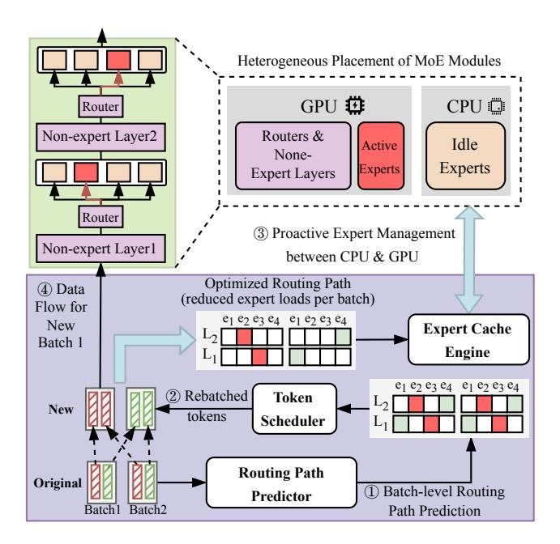
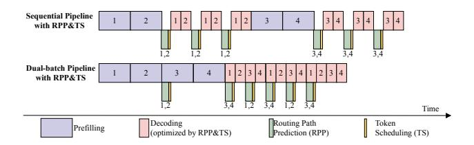
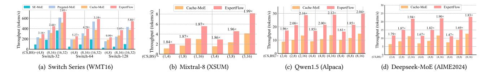

# **ExpertFlow:** Efficient Mixture-of-Experts Inference via Predictive Expert Caching and Token Scheduling

Xin He1\*, Shunkang Zhang2, Kaijie Tang3, Shaohuai Shi3, Yuxin Wang4, Zihao Zeng5, Zhenheng Tang2, Xiaowen Chu6, Haiyan Yin1, Ivor W. Tsang1,5, Yew Soon Ong1,5\*

1CFAR, Agency for Science, Technology and Research (A\*STAR), Singapore

2The Hong Kong University of Science and Technology, Hong Kong

3Harbin Institute of Technology, Shenzhen, China

4Hong Kong Baptist University, Hong Kong

5Nanyang Technological University, Singapore

6The Hong Kong University of Science and Technology (Guangzhou), China

## **Abstract**

Sparse Mixture-of-Experts (MoE) models can outperform dense large language models at similar computation by activating only a small set of experts per token. However, stacking many expert modules introduces substantial parameter memory, which makes MoE models difficult to deploy in memory-constrained environments such as single-GPU devices. Offloading alleviates this issue by storing inactive experts in CPU memory and loading them on demand, but existing methods remain limited: static caches disregard input-dependent routing, and methods that train separate models to predict expert usage ahead of time are often inaccurate or require significant training cost. We propose ExpertFlow, a lightweight MoE inference system that addresses this routing dependency through three coordinated components: 1) a transformerbased routing path predictor that estimates expert usage across all MoE layers in a single forward pass, 2) a token scheduler that groups tokens with similar predicted routes to improve expert utilization, and 3) a predictive expert cache that loads only the required experts while correcting mispredictions at runtime. Together, these components enable efficient expert loading and execution, reducing GPU memory usage by up to 93.72% and improving inference throughput by up to 10× over strong offloading baselines on a single GPU.

## **CCS Concepts**

• Computer systems organization → Heterogeneous (hybrid) systems; • Computing methodologies → Natural language processing; Neural networks; Parallel computing methodologies.

#### Keywords

Large Language Model (LLM), Mixture-of-Experts (MoE), Hybrid System

#### **ACM Reference Format:**

Xin He1\*, Shunkang Zhang2, Kaijie Tang3, Shaohuai Shi3, Yuxin Wang4, Zihao Zeng5, Zhenheng Tang2, Xiaowen Chu6, Haiyan Yin1, Ivor W. Tsang1,5, Yew Soon Ong1,5\*. 2026. *ExpertFlow*: Efficient Mixture-of-Experts Inference via Predictive Expert Caching and Token Scheduling. In *63rd ACM/IEEE Design Automation Conference (DAC '26)*, July 26–29, 2026, Long Beach, CA, USA. ACM, New York, NY, USA, 7 pages. https://doi.org/10.1145/3770743.3804292

 $^*Corresponding \ authors: \{he\_xin, ong\_yew\_soon\} @a\text{-star.edu.sg}$ 

This work is licensed under a Creative Commons Attribution-NonCommercial-NoDerivatives 4.0 International License.

DAC '26, Long Beach, CA, USA
© 2026 Copyright held by the owner/author(s).
ACM ISBN 979-8-4007-2254-7/2026/07
https://doi.org/10.1145/3770743.3804292

# 1 Introduction

Sparse MoE models [5, 8, 14, 25] scale parameter size efficiently by activating only a small subset of experts per input, reducing pertoken computation while keeping accuracy comparable to dense LLMs [10, 21, 22]. This efficiency, however, increases memory usage. For instance, Mixtral-8×7B [14] requires more than 96 GB of GPU memory, exceeding the 80 GB capacity of an NVIDIA A100 GPU. Although 45.1B of its 46.7B parameters belong to expert modules, only a small fraction is used per input, leading to substantial memory redundancy. This sparsity suggests that offloading inactive experts to CPU and loading only the needed ones can reduce GPU memory demand. Existing studies have investigated such offloading methods [6, 7, 12, 15, 27, 35], but remain limited by three challenges.

Inefficient expert prediction. Early and accurate expert activation prediction underpins effective offloading, as it enables scheduling and prefetching before experts are required. Prior work takes two routes. Regression-based methods [6, 12] approximate router scores, but even small score errors can affect output quality, necessitating extensive fine-tuning to recover the original routing. Classification-based methods predict selected experts directly. Heuristic variants based on token-expert statistics [14, 17, 34] are lightweight but fail to capture input-dependent routing behavior. Learning-based predictors (e.g., ProMoE [27]) improve accuracy, yet their layer-by-layer sequential design reveals expert usage only after the previous layer executes, restricting scheduling flexibility.

Low expert utilization. In the decoding phase, the token distribution across experts can be highly imbalanced, and some experts may receive only a single token. Since expert kernels have near-constant cost when handling a small number of tokens [32], such sparse assignments lead to low compute efficiency.

Ineffective expert caching. Expert caching is central to controlling GPU memory usage. The commonly used LRU policy [7] evicts experts purely by recency and overlooks routing patterns, leading to unstable cache hit rates under MoE's dynamic activations. SE-MoE [35] improves locality by caching all experts from two consecutive layers through a ring-buffer design, but this creates large memory overhead for models with many experts (e.g., Switch-128) and repeatedly loads inactive experts, resulting in unnecessary CPU–GPU transfers.

To address these challenges under resource-constrained settings such as single-GPU inference, we propose *ExpertFlow*, a unified system for memory-efficient MoE execution. Fig. 1 shows an example where tokens from two batches activate different experts across layers, leading to fragmented execution and high memory usage when processed directly. *ExpertFlow* recasts this process as a predictive and coordinated pipeline through three components: ① the **Routing Path Predictor (RPP)** predicts expert activations

Figure 1: Overview of ExpertFlow. Given two input batches, ① Routing Path Predictor predicts expert activation across all layers for all tokens, ② Token Scheduler uses the prediction to reorder tokens across batches to consolidate expert usage, ③ Expert Cache Engine preloads only required experts into GPU from CPU, and ④ the MoE model executes with optimized token flow and heterogeneous expert placement.

for all tokens and all layers in one forward pass, providing early global routing signals; ② the **Token Scheduler (TS)** reorganizes tokens based on predicted paths to consolidate expert usage and increase compute efficiency; ③ the **Expert Cache Engine (ECE)** loads only the needed experts into GPU memory and reuses them across steps, with lightweight correction for mispredictions. Our contributions are summarized as follows:

- We identify three core bottlenecks in MoE offloading: inefficient expert prediction, low expert utilization, and ineffective caching under dynamic routing.
- We introduce ExpertFlow, a unified system that integrates predictive scheduling, routing-aware token rebatching, and adaptive caching with lightweight correction. ExpertFlow reduces GPU memory usage by up to 93.72% and improves throughput by up to 10× over strong offloading methods, enabling efficient MoE inference on constrained single-GPU settings.
- Our *RPP* achieves up to 95% expert prediction accuracy with strong cross-domain generalization. The *TS* improves throughput by up to 16.19% via enhanced expert reuse. The *ECE* attains a cache hit ratio of 91.96%, outperforming LRU by up to 61.15%.

## 2 Related Work

## 2.1 Mixture-of-Experts (MoE)

MoE models [13] improve scalability by activating only a subset of experts for each token through a softmax-based gating mechanism, where the gating score for experts is  $G(x) = \operatorname{softmax}(xW_g)$  and the model selects the top-k experts with the highest scores. The MoE layer output is then computed as a weighted sum of the selected experts,  $y = \sum_{i \in \operatorname{TopK}(G(x))} G_i(x) E_i(x)$ . With advances in hardware

and training methods, transformer-based MoE architectures have become widely used and show strong performance across many tasks [5, 8, 25, 29], where the gating function determines which experts each token activates and shapes the routing pattern that drives system efficiency.

## 2.2 Model Compression

LLM inference faces substantial GPU memory constraints, prompting prior research to explore a range of solutions. Distillation techniques [5, 35] reduce the number of experts by compressing the teacher network into a smaller student network. Model pruning methods have also been explored, such as pruning non-essential experts during fine-tuning based on usage frequency [4] and merging similar experts followed by low-rank decomposition [16]. Post-training quantization [7, 9, 18, 19] further reduces memory consumption by converting pre-trained models to lower-precision ones (e.g., Int4), without requiring extensive retraining. The contribution of our proposed *ExpertFlow* is orthogonal to this direction, and *ExpertFlow* can be seamlessly integrated with these techniques to further reduce GPU memory cost during MoE inference.

## 2.3 Model Offloading

Model offloading reduces GPU memory usage by moving model states or computations to cheaper storage or processing units. Early work such as ZeRO [23, 24] offloaded optimizer states, gradients, and weights to CPUs or SSDs during training, and later extensions applied similar ideas to inference [3, 26, 28]. FlexGen [26] uses a zigzag block schedule to offload activations and KV caches, allowing large models like OPT-175B [37] to run on a single 16GB GPU, while Lamina [3] improves efficiency by shifting attention computation to CPUs. However, these methods are designed for dense LLMs and do not handle the dynamic, input-dependent routing of MoE models. Existing MoE offloading approaches either rely on low-accuracy heuristics [7, 17] or require costly predictor training [6, 12], limiting practical adoption. In contrast, we develop a unified system that provides accurate and low-cost expert routing prediction, enabling more efficient and flexible MoE inference.

## 3 Method

# 3.1 System Design Overview

Deploying MoE models under tight memory budgets, such as single-GPU settings, is challenging due to dynamic expert routing, low expert utilization, and heavy parameter movement. These issues are interdependent: inaccurate routing prediction limits scheduling, fragmented token batches activate unnecessary experts, and poor memory planning amplifies transfer overhead. *ExpertFlow* addresses these challenges through a unified design that integrates a routing path predictor (*RPP*), a token scheduler (*TS*), and an expert cache engine (*ECE*). The *RPP* provides early global routing signals, enabling the *TS* to reorganize tokens by predicted paths and the *ECE* to prefetch only the required experts. This prediction-informed coordination jointly optimizes expert execution, data movement, and memory usage, enabling efficient and scalable MoE inference on constrained hardware.

Figure 2: Routing Path Predictor (RPP). Given a batch of B sequences, each with S input tokens, RPP predicts MoE expert activations across L layers and E experts in a single pass. It outputs activation probabilities of shape (B, S, L, E) to support early expert prefetching.

# 3.2 Routing Path Predictor (RPP)

3.2.1 Predictor Architecture. Existing predictors [12, 27] use MLPs to infer expert choices layer by layer, creating a sequential dependency that prevents early scheduling and prefetching. Expert-Flow replaces this design with a T5-style encoder—decoder architecture [22] (Fig. 2). The encoder embeds the full input sequence, and the decoder generates routing predictions in one pass. We attach *L* lightweight heads to the decoder, each producing logits over *E* experts for a specific MoE layer. This architecture exposes the complete routing plan before the first MoE layer executes, enabling early prefetching and coordinated memory planning.

3.2.2 Predictor Training. The predictor is trained to produce accurate routing paths for all L MoE layers, each comprising E experts, in a single forward pass. We log each token's expert selections and encode its routing path as a binary matrix  $r \in \{0,1\}^{L \times E}$ . The predictor outputs a probability matrix p of the same shape, and training is formulated as a multi-label classification task using binary cross-entropy:

$$\mathcal{L} = \frac{1}{LE} \sum_{l=1}^{L} \sum_{e=1}^{E} \left[ r_{l,e} \log p_{l,e} + (1 - r_{l,e}) \log (1 - p_{l,e}) \right]. \tag{1}$$

## 3.3 Token Scheduler (TS)

In the decoding stage, an adverse routing pattern can arise where each small batch activates almost all experts while each expert receives only one token. Fig. 3 (left) illustrates this worst case for a single MoE layer with four experts and two batches of size four: tokens in each batch select different experts, so every batch activates all experts, causing frequent expert swapping and low perexpert workload. To address this, we introduce the *Token Scheduler (TS)*, which rebatches tokens between two consecutive batches and groups tokens with similar expert selections into the same batch, as shown in Fig. 3 (right). This rebatching reduces the number of

active experts per batch while increasing the tokens per expert, improving cache reuse and GPU efficiency.

Figure 3: Token Scheduler (TS). Left: normal batch inference routes tokens to different experts, producing a worst-case pattern where all experts are active with only one token. Right: TS groups tokens with similar routing path into new batches, reducing active experts and increasing per-expert token load for better efficiency.

3.3.1 Mathematical Formulation. Each token's routing path is encoded as a binary matrix  $r_i \in \{0, 1\}^{L \times E}$ . For two adjacent batches with T tokens each, we merge all 2T tokens into a global set  $\mathcal{T} = \{1, 2, \ldots, 2T\}$  and seek to split it into two disjoint batches  $\mathcal{T}_1$  and  $\mathcal{T}_2$  of equal size. The routing matrices for the new batches,  $R_1$  and  $R_2$ , are obtained by applying an element-wise logical OR  $\vee$  over the routing paths of the tokens assigned to each batch  $R_1 = \bigvee_{i \in \mathcal{T}_1} r_i, R_2 = \bigvee_{i \in \mathcal{T}_2} r_i$ . The objective is to minimize the total number of activated experts across both batches:

$$\min_{\mathcal{T}_1, \mathcal{T}_2} \sum_{l=1}^{L} \sum_{e=1}^{E} \left( R_1^{l,e} + R_2^{l,e} \right), \tag{2}$$

where  $R_k^{l,e} = 1$  indicating that expert e at layer l is activated in batch k. This objective explicitly promotes expert-wise co-location of similar tokens to reduce cache misses and raise per-expert load.

3.3.2 *K-Means Clustering for Fast Token Rebatching.* Solving Eq. 2 exactly online is intractable, so we approximate it using a K-meansstyle clustering over routing-path similarity. For the 2T tokens, we construct a similarity matrix  $S \in \mathbb{R}^{2T \times 2T}$ , where  $S_{ij} = 1 - \frac{d_{ij}}{LE}$  measures how close the routing paths of tokens i and j are, with  $d_{ij}$  being their Hamming distance. We cluster tokens into two equalsize groups by iteratively assigning each token to the closest cluster under S and updating centroids as the tokens with the highest average intra-cluster similarity. The procedure converges quickly or stops after a preset iteration limit, yielding  $(\mathcal{T}_1, \mathcal{T}_2)$  as a fast approximation to Eq. 2 with negligible CPU overhead (<10ms).

3.3.3 Adaptive KV-Cache Management. Rebatching perturbs token orderings assumed by the transformer's key-value (KV) cache. TS therefore incorporates two lightweight primitives to preserve attention semantics: Merge, which reconstructs the KV cache by

aggregating token states according to global token order across the original batches; and **Reindex**, which updates token indices to the new layout for consistent KV lookup post-reordering.

3.3.4 Dual-Batch Inference Pipeline. We propose a Dual-Batch Inference Pipeline (Fig. 4) to hide the overhead of RPP and TS. The pipeline groups every two batches into one scheduling unit, which matches the requirement of TS to reorganize tokens across batches. During execution, model prefill and decoding for the current unit run in parallel with RPP and TS for the next unit. This interleaving avoids blocking and keeps the GPU well utilized.

Figure 4: Sequential pipeline versus our Dual-Batch pipeline.

# 3.4 Expert Cache Engine (ECE)

The Expert Cache Engine (*ECE*) manages expert parameters between GPU and CPU by combining two components: *Predictive Locality-aware Expert Caching* (PLEC), which plans cache layout and prefetching based on predicted routing, and a *Real-time Correction* mechanism that resolves prediction errors during execution. Together, they enable expert-level caching that is both proactive and adaptive to unexpected routing behaviors.

3.4.1 Predictive Locality-aware Expert Caching (PLEC). Unlike conventional cache policies such as LRU [1, 7, 36] and LFU [33], which operate without prediction and therefore use fixed per-layer cache allocations, PLEC leverages routing predictions to adaptively assign cache slots across layers and prefetch the experts required in the next computation stage. This adaptive slot planning allows the cache to better match the anticipated expert demand, reducing unnecessary swaps and improving the effectiveness of prefetching.

As shown in Fig. 5, consider an MoE model with two layers and four experts per layer. The predictor forecasts that tokens  $t_1$ ,  $t_2$ ,  $t_3$  will activate three experts in layer-1 ( $e_{12}$ ,  $e_{13}$ ,  $e_{14}$ ) and two in layer-2 ( $e_{22}$ ,  $e_{23}$ ), while the GPU cache can hold only four experts. Since the predicted demand (five experts) exceeds the cache budget, PLEC allocates slots according to predicted usage—three to layer-1 and one to layer-2 (step ①)—and prefetches the four most probable experts ( $e_{12}$ ,  $e_{13}$ ,  $e_{14}$ ,  $e_{22}$ ) before execution (step ②). During computation, early-layer experts finish first and free their slots; these slots are then reused to load remaining predicted experts, such as loading  $e_{23}$  once  $e_{12}$  completes. This predictive allocation combined with runtime reuse reduces transfers and improves cache efficiency.

# 4 Evaluation

## 4.1 Setup

**Hardware Settings.** Our experiments were conducted on a single NVIDIA A40 GPU with 48 GB of memory and Intel(R) Xeon(R) Gold 6338 CPU @ 2.00GHz.

**Tasks and MoEs.** We evaluate on four datasets: Alpaca [30] for chat, WMT16 [2] for translation, XSUM [20] for summarization, and AIME2024 [11] for problem solving. Our experiments cover

Figure 5: The workflow of Expert Cache Engine (ECE). ECE pre-schedules experts to GPU based on routing predictions. During execution, it detects mispredictions (e.g., unwanted  $e_{23}$  or missed  $e_{24}$ ) and performs prioritized swaps while  $e_{22}$  runs, overlapping I/O with compute to maintain throughput.

| MoE          | L  | Act.P/P       | Act.E/E | E.P    |
|--------------|----|---------------|---------|--------|
| Switch-32    | 12 | 0.22/1.98 B   | 1/32    | 91.58% |
| Switch-64    | 12 | 0.22/3.79 B   | 1/64    | 95.61% |
| Switch-128   | 12 | 0.22/7.41 B   | 1/128   | 97.75% |
| Mixtral-8    | 32 | 12.90/46.70 B | 2/8     | 96.57% |
| Qwen1.5      | 24 | 2.70/14.30 B  | 4/60    | 88.95% |
| Deepseek-MoE | 27 | 2.80/16.40 B  | 6/64    | 94.14% |

Table 1: MoE Configurations. L, P, and E denote layers, total parameters, and experts per layer. Act.P and Act.E refer to activated parameters and experts per token. E.P is the expert-to-total parameter ratio.

six MoE models: Qwen1.5-MoE [31], Deepseek-MoE [5], Mixtral-8×7B [14], and Switch Transformer with 32, 64, and 128 experts [8]. Model specifications are provided in Table 1.

**Predictor Settings.** To evaluate robustness under domain shift, we consider two types of routing path predictors (*RPP*). An *indomain* predictor is trained on the same dataset used for inference, while a *cross-domain* predictor is trained on a different dataset. For example, when evaluating on WMT16, the in-domain *RPP* is trained on WMT16, whereas the cross-domain *RPP* is trained on XSUM.

#### 4.2 Inference Performance

4.2.1 Baselines. We compare against three representative methods. Cache-MoE [7] maintains a fixed per-layer expert cache with LRU replacement, falling back to CPU on misses. SE-MoE [35] preloads experts for multiple layers and employs ring scheduling to overlap compute and data movement. Pregated-MoE [12] trains MLP-based routers to select experts without runtime gating. All three are evaluated on Switch Transformers, which their implementations fully support. For Mixtral-8 and Qwen1.5, we report against Cache-MoE only, as other baselines lack architectural support and router weights; under these conditions, Cache-MoE is a strong baseline.

4.2.2 *In-domain Throughput.* We evaluate four model–dataset pairs (Switch on WMT16, Mixtral-8 on XSUM, Qwen1.5 on Alpaca and

Figure 6: Throughput across different MoE models and datasets. Our results are obtained using in-domain predictors.

Figure 7: Throughput comparison for Qwen1.5 on WMT16 and XSUM datasets. Our results are obtained using a cross-domain predictor trained on Alpaca.

Figure 8: GPU memory usage (GB) of All-in-GPU (AIG) and our offloading-based system for different MoE models.

Deepseek-MoE on AIME2024) under varying cache size (**CS**) and batch size (**BS**) (Fig. 6). For the Switch series (Fig. 6a), gains increase with the number of experts: at (CS=16, BS=32), our method yields 2.01×, 3.19×, and 5.86× speedups over *SE-MoE* on Switch-32/64/128, respectively. On Switch-128, tightening memory further amplifies benefits: reducing CS from 16 to 4 increases speedup from 5.86× to 9.99×. For Mixtral-8, Qwen1.5 and Deepseek-MoE (Figs. 6b–d), throughput improves with larger BS due to *TS*-enabled expert reuse; we outperform *Cache-MoE* by up to 1.99× (Mixtral-8), 2.12× (Qwen1.5) and 1.94× (Deepseek-MoE) via accurate prefetching and reduced load latency.

- 4.2.3 Cross-domain Throughput. To assess robustness, we apply an RPP trained on Alpaca to Qwen1.5 inference on XSUM and WMT16 (Fig. 7). Our method consistently surpasses Cache-MoE, achieving up to 2.18× (WMT16) and 2.21× (XSUM) at (CS=4, BS=16), indicating that the RPP captures expert-activation patterns that generalize across tasks.
- 4.2.4 Memory Cost. We compare peak GPU memory against an All-In-GPU (AIG) baseline that retains all parameters in GPU (Fig. 8). Our approach reduces memory by up to 93% across Switch models (e.g., Switch-128: 15.26 GB  $\rightarrow$  1.03 GB), from 31.35 GB to 6.38 GB on Deepseek-MoE, and from 35.21 GB to 6.52 GB on Qwen1.5. Notably, Mixtral-8×7B triggers OOM under AIG but completes with our system using only 15.99 GB.

## 4.3 Predictor Evaluation

- 4.3.1 Routing Path Datasets. For each combination of task (i.e., Alpaca, XSUM, and WMT16) and MoE model, we construct a Routing Path Dataset (*RPD*) to train and evaluate the routing predictor. We first sample 10,000 input sequences and run each sequence through the MoE model three times to collect diverse output tokens and the corresponding routing paths of both inputs and outputs. This yields 30,000 input–output–path triples per *RPD*. Each *RPD* is then split into training and test sets.
- 4.3.2 Predictor Settings. To balance between performance and size, we conducted grid search on predictor architecture settings. The final RPP has a feed-forward dimension of 2048, and a hidden size of 32, resulting in a 7.21 MB model size.
- 4.3.3 Evaluation Metrics. To assess prediction performance in an MoE model with L layers and E experts per layer, we define the batch-level accuracy ( $\mathbb{B}_{acc}$ ) as:

$$\mathbb{B}_{\mathrm{acc}} = \frac{1}{L} \sum_{i=0}^{L-1} \frac{\sum_{j=0}^{E-1} \mathbb{I}(R_{\mathrm{batch}}[i,j] = 1 \,\&\, \hat{R}_{\mathrm{batch}}[i,j] = 1)}{\sum_{i=0}^{E-1} \mathbb{I}(R_{\mathrm{batch}}[i,j] = 1)},$$

where  $R_{\text{batch}}$  and  $\hat{R}_{\text{batch}}$  are the ground-truth and predicted batchlevel routing matrices, respectively, both in  $\{0,1\}^{L\times E}$ . We apply a bitwise OR over the token-level routing paths  $r_i \in \{0,1\}^{L\times E}$  to get the batch-level results  $R_{\text{batch}} = r_1 \vee r_2 \vee \cdots \vee r_n$ .

4.3.4 Predictor Performance. Fig. 9 presents the performance of our routing path predictor (RPP) and two baselines: temporal-locality prediction (TLP), which uses the previous decoding step's routing, and spatial-locality prediction (SLP), which relies on the previous layer's expert assignment. Both are simple heuristics that lack context-awareness.

*RPP* consistently achieves high prediction accuracy across MoE models and datasets. It outperforms both TLP and SLP in all settings, with over 90% accuracy in most in-domain cases and only a modest drop (typically 5–10%) in cross-domain scenarios. For example, on Switch64 (Fig. 9b), our predictor maintains 80–90% accuracy in both domains, while baselines remain below 20%. This highlights *RPP*'s strong generalization ability. Additionally, TLP consistently surpasses SLP, suggesting that temporal cues are more predictive than layer-wise locality.

Despite differing routing mechanisms, *RPP* adapts well across models. On Switch models (a–c), accuracy declines with depth and expert count, reflecting increased uncertainty. Mixtral-8 (d) shows larger prediction variance for baselines due to its Top-2 routing, while *RPP* remains above 90% and more stable. On Qwen1.5 (e–f), our predictor achieves the highest accuracy (over 95%), with minimal domain shift impact. These results demonstrate *RPP*'s ability to capture complex and model-specific expert behaviors.

Figure 9: Layer-wise expert prediction accuracy across MoE models. "ExpertFlow(dataset)" indicates our predictor trained on the specified dataset (e.g., XSUM or WMT16). Orange and blue curves represent in-domain and cross-domain prediction accuracy, respectively. Subfigures (a-e) report accuracy on XSUM; (f) shows in-domain results on Alpaca. Our method consistently outperforms temporal-locality prediction (TLP) and spatial-locality prediction (SLP) baselines across all cases.

#### 4.4 Ablation Study

4.4.1 Expert Cache Hit Ratio. Fig. 10 compares expert cache hit ratios between LRU and our PLEC strategy on Switch-32. Our approach consistently outperforms LRU, with hit rates 15-36% higher across all configurations. At CS=16, PLEC maintains high hit ratios (91.90% to 85.91%, only 6.05% decrease) as batch size increases from 4 to 16, while LRU drops significantly (76.61% to 58.37%, an 18.24% decline). The performance gap widens at larger batch sizes, with PLEC achieving 71.89% hit ratio at CS=8/BS=16 compared to LRU's 36.22%. This stability demonstrates our predictive approach's effectiveness in allocating cache resources based on anticipated expert patterns, particularly beneficial in high-throughput scenarios.

4.4.2 Impact of Token Scheduler (TS) under Varying Expert Counts. We evaluate the TS on the Switch-series models to study its impact

Figure 10: Comparison of expert cache hit ratio on Switch-32 under different batch size and cache size (CS).

Table 2: Impact of the Token Scheduler (TS) on throughput.

| Model      | Throughput (tokens/second) |                |  |  |
|------------|----------------------------|----------------|--|--|
| Model      | w/o TS                     | with TS        |  |  |
| Switch-32  | 854.19                     | 881.91 (1.03×) |  |  |
| Switch-64  | 680.72                     | 788.30 (1.15×) |  |  |
| Switch-128 | 628.36                     | 735.35 (1.17×) |  |  |

under different expert counts. This setup allows us to isolate the effect of TS as model sparsity increases. As shown in Table 2, TS yields consistent throughput improvements:  $1.03\times$  on Switch-32,  $1.15\times$  on Switch-64, and  $1.17\times$  on Switch-128. While the absolute gains vary, a general trend of improved benefit with more experts is observed. This is attributed to the fact that, with a larger number of experts, token-to-expert assignments tend to become more fragmented. TS alleviates this by rebatching tokens with similar routing paths, improving load balance and computational efficiency across experts.

## 5 Conclusion

We introduced *ExpertFlow*, a unified system for memory-efficient MoE inference under tight GPU constraints. By integrating a **Routing Path Predictor**, a routing-aware **Token Scheduler**, and a predictive **Expert Cache Engine**, *ExpertFlow* enables early expert planning, higher expert utilization, and reduced CPU–GPU transfers, yielding up to 93.72% peak memory reduction and up to 10× throughput improvement across diverse MoE architectures when compared with strong offloading baselines. Accurate routing prediction also shows broader value for distributed expert placement, routing-guided pruning, and hierarchical caching, positioning *ExpertFlow* as a foundation for future system-level co-design that incorporates predictive routing into scalable sparse model deployment and training.

## Acknowledgments

This research is supported by the Career Development Fund (CDF) of the Agency for Science, Technology and Research (A\*STAR), Singapore (No. C243512012); partially by the National Natural Science Foundation of China (NSFC) (No. 62302123) and the Shenzhen Science and Technology Program (Nos. KJZD20240903104103005, KJZD20230923114213027, KJZD20230923115113026); and partially by the National Research Foundation (NRF), Singapore, through the AI Singapore Programme under the project titled "AI-based Urban Cooling Technology Development" (Award No. AISG3-TC-2024-014-SGKR).

# References

- [1] Reza Yazdani Aminabadi, Samyam Rajbhandari, Ammar Ahmad Awan, Cheng Li, Du Li, Elton Zheng, Olatunji Ruwase, Shaden Smith, Minjia Zhang, Jeff Rasley, and Yuxiong He. 2022. DeepSpeed- Inference: Enabling Efficient Inference of Transformer Models at Unprecedented Scale. In SC22: International Conference for High Performance Computing, Networking, Storage and Analysis. 1–15. [doi:10.](https://doi.org/10.1109/SC41404.2022.00051) [1109/SC41404.2022.00051](https://doi.org/10.1109/SC41404.2022.00051)
- [2] Ondřej Bojar, Rajen Chatterjee, Christian Federmann, Yvette Graham, Barry Haddow, Matthias Huck, Antonio Jimeno Yepes, Philipp Koehn, Varvara Logacheva, Christof Monz, Matteo Negri, Aurélie Névéol, Mariana Neves, Martin Popel, Matt Post, Raphael Rubino, Carolina Scarton, Lucia Specia, Marco Turchi, Karin Verspoor, and Marcos Zampieri. 2016. Findings of the 2016 Conference on Machine Translation. In Proceedings of the First Conference on Machine Translation: Volume 2, Shared Task Papers, Ondřej Bojar, Christian Buck, Rajen Chatterjee, Christian Federmann, Liane Guillou, Barry Haddow, Matthias Huck, Antonio Jimeno Yepes, Aurélie Névéol, Mariana Neves, Pavel Pecina, Martin Popel, Philipp Koehn, Christof Monz, Matteo Negri, Matt Post, Lucia Specia, Karin Verspoor, Jörg Tiedemann, and Marco Turchi (Eds.). Association for Computational Linguistics, Berlin, Germany, 131–198. [doi:10.18653/v1/W16-2301](https://doi.org/10.18653/v1/W16-2301)
- [3] Shaoyuan Chen, Wencong Xiao, Yutong Lin, Mingxing Zhang, Yingdi Shan, Jinlei Jiang, Kang Chen, and Yongwei Wu. 2025. Efficient Heterogeneous Large Language Model Decoding with Model-Attention Disaggregation. arXiv[:2405.01814](https://arxiv.org/abs/2405.01814) [cs.LG]<https://arxiv.org/abs/2405.01814>
- [4] Tianyu Chen, Shaohan Huang, Yuan Xie, Binxing Jiao, Daxin Jiang, Haoyi Zhou, Jianxin Li, and Furu Wei. 2022. Task-Specific Expert Pruning for Sparse Mixtureof-Experts. arXiv[:2206.00277](https://arxiv.org/abs/2206.00277) [cs.LG]<https://arxiv.org/abs/2206.00277>
- [5] Damai Dai, Chengqi Deng, Chenggang Zhao, R.x. Xu, Huazuo Gao, Deli Chen, Jiashi Li, Wangding Zeng, Xingkai Yu, Y. Wu, Zhenda Xie, Y.k. Li, Panpan Huang, Fuli Luo, Chong Ruan, Zhifang Sui, and Wenfeng Liang. 2024. DeepSeekMoE: Towards Ultimate Expert Specialization in Mixture-of-Experts Language Models. (Aug. 2024), 1280–1297. [doi:10.18653/v1/2024.acl-long.70](https://doi.org/10.18653/v1/2024.acl-long.70)
- [6] Zhixu Du, Shiyu Li, Yuhao Wu, Xiangyu Jiang, Jingwei Sun, Qilin Zheng, Yongkai Wu, Ang Li, Hai Helen Li, and Yiran Chen. 2024. SiDA: Sparsity-Inspired Data-Aware Serving for Efficient and Scalable Large Mixture-of-Experts Models. 6 (2024), 224–238. [https://proceedings.mlsys.org/paper\\_files/paper/2024/file/](https://proceedings.mlsys.org/paper_files/paper/2024/file/698cfaf72a208aef2e78bcac55b74328-Paper-Conference.pdf) [698cfaf72a208aef2e78bcac55b74328-Paper-Conference.pdf](https://proceedings.mlsys.org/paper_files/paper/2024/file/698cfaf72a208aef2e78bcac55b74328-Paper-Conference.pdf)
- [7] Artyom Eliseev and Denis Mazur. 2023. Fast Inference of Mixture-of-Experts Language Models with Offloading. arXiv[:2312.17238](https://arxiv.org/abs/2312.17238) [cs.LG] [https://arxiv.org/](https://arxiv.org/abs/2312.17238) [abs/2312.17238](https://arxiv.org/abs/2312.17238)
- [8] William Fedus, Barret Zoph, and Noam Shazeer. 2022. Switch transformers: Scaling to trillion parameter models with simple and efficient sparsity. Journal of Machine Learning Research 23, 120 (2022), 1–39.
- [9] Elias Frantar, Saleh Ashkboos, Torsten Hoefler, and Dan Alistarh. 2023. GPTQ: Accurate Post-Training Quantization for Generative Pre-trained Transformers. arXiv[:2210.17323](https://arxiv.org/abs/2210.17323) [cs.LG]<https://arxiv.org/abs/2210.17323>
- [10] Daya Guo, Qihao Zhu, Dejian Yang, Zhenda Xie, Kai Dong, Wentao Zhang, Guanting Chen, Xiao Bi, Y. Wu, Y. K. Li, Fuli Luo, Yingfei Xiong, and Wenfeng Liang. 2024. DeepSeek-Coder: When the Large Language Model Meets Programming – The Rise of Code Intelligence. arXiv[:2401.14196](https://arxiv.org/abs/2401.14196) [cs.SE] [https:](https://arxiv.org/abs/2401.14196) [//arxiv.org/abs/2401.14196](https://arxiv.org/abs/2401.14196)
- [11] Hugging Face H4. 2024. AIME 2024 Dataset. [https://huggingface.co/datasets/](https://huggingface.co/datasets/HuggingFaceH4/aime_2024) [HuggingFaceH4/aime\\_2024](https://huggingface.co/datasets/HuggingFaceH4/aime_2024)
- [12] Ranggi Hwang, Jianyu Wei, Shijie Cao, Changho Hwang, Xiaohu Tang, Ting Cao, and Mao Yang. 2024. Pre-gated MoE: An Algorithm-System Co-Design for Fast and Scalable Mixture-of-Expert Inference. In 2024 ACM/IEEE 51st Annual International Symposium on Computer Architecture (ISCA). 1018–1031. [doi:10.](https://doi.org/10.1109/ISCA59077.2024.00078) [1109/ISCA59077.2024.00078](https://doi.org/10.1109/ISCA59077.2024.00078)
- [13] Robert A. Jacobs, Michael I. Jordan, Steven J. Nowlan, and Geoffrey E. Hinton. 1991. Adaptive Mixtures of Local Experts. Neural Computation 3, 1 (1991), 79–87. [doi:10.1162/neco.1991.3.1.79](https://doi.org/10.1162/neco.1991.3.1.79)
- [14] Albert Q. Jiang, Alexandre Sablayrolles, Antoine Roux, Arthur Mensch, Blanche Savary, Chris Bamford, Devendra Singh Chaplot, Diego de las Casas, Emma Bou Hanna, Florian Bressand, Gianna Lengyel, Guillaume Bour, Guillaume Lample, Lélio Renard Lavaud, Lucile Saulnier, Marie-Anne Lachaux, Pierre Stock, Sandeep Subramanian, Sophia Yang, Szymon Antoniak, Teven Le Scao, Théophile Gervet, Thibaut Lavril, Thomas Wang, Timothée Lacroix, and William El Sayed. 2024. Mixtral of Experts. arXiv[:2401.04088](https://arxiv.org/abs/2401.04088) [cs.LG]<https://arxiv.org/abs/2401.04088>
- [15] Keisuke Kamahori, Tian Tang, Yile Gu, Kan Zhu, and Baris Kasikci. 2025. Fiddler: CPU-GPU Orchestration for Fast Inference of Mixture-of-Experts Models. arXiv[:2402.07033](https://arxiv.org/abs/2402.07033) [cs.LG]<https://arxiv.org/abs/2402.07033>
- [16] Young Jin Kim, Raffy Fahim, and Hany Hassan Awadalla. 2023. Mixture of Quantized Experts (MoQE): Complementary Effect of Low-bit Quantization and Robustness. arXiv[:2310.02410](https://arxiv.org/abs/2310.02410) [cs.LG]<https://arxiv.org/abs/2310.02410>
- [17] Jiamin Li, Yimin Jiang, Yibo Zhu, Cong Wang, and Hong Xu. 2023. Accelerating Distributed MoE Training and Inference with Lina. In 2023 USENIX Annual Technical Conference (USENIX ATC 23). USENIX Association, Boston, MA, 945– 959.<https://www.usenix.org/conference/atc23/presentation/li-jiamin>
- [18] Pingzhi Li, Xiaolong Jin, Zhen Tan, Yu Cheng, and Tianlong Chen. 2025. QuantMoE-Bench: Examining Post-Training Quantization for Mixture-of-Experts. arXiv[:2406.08155](https://arxiv.org/abs/2406.08155) [cs.LG]<https://arxiv.org/abs/2406.08155>
- [19] Ji Lin, Jiaming Tang, Haotian Tang, Shang Yang, Wei-Ming Chen, Wei-Chen Wang, Guangxuan Xiao, Xingyu Dang, Chuang Gan, and Song Han. 2024. AWQ: Activation-aware Weight Quantization for On-Device LLM Compression and

- Acceleration. 6 (2024), 87–100. [https://proceedings.mlsys.org/paper\\_files/paper/](https://proceedings.mlsys.org/paper_files/paper/2024/file/42a452cbafa9dd64e9ba4aa95cc1ef21-Paper-Conference.pdf) [2024/file/42a452cbafa9dd64e9ba4aa95cc1ef21-Paper-Conference.pdf](https://proceedings.mlsys.org/paper_files/paper/2024/file/42a452cbafa9dd64e9ba4aa95cc1ef21-Paper-Conference.pdf)
- [20] Shashi Narayan, Shay B. Cohen, and Mirella Lapata. 2018. Don't Give Me the Details, Just the Summary! Topic-Aware Convolutional Neural Networks for Extreme Summarization. In Proceedings of the 2018 Conference on Empirical Methods in Natural Language Processing, Ellen Riloff, David Chiang, Julia Hockenmaier, and Jun'ichi Tsujii (Eds.). Association for Computational Linguistics, Brussels, Belgium, 1797–1807. [doi:10.18653/v1/D18-1206](https://doi.org/10.18653/v1/D18-1206)
- [21] Alec Radford, Jeff Wu, Rewon Child, David Luan, Dario Amodei, and Ilya Sutskever. 2019. Language Models are Unsupervised Multitask Learners. (2019).
- [22] Colin Raffel, Noam Shazeer, Adam Roberts, Katherine Lee, Sharan Narang, Michael Matena, Yanqi Zhou, Wei Li, and Peter J. Liu. 2020. Exploring the Limits of Transfer Learning with a Unified Text-to-Text Transformer. Journal of Machine Learning Research 21, 140 (2020), 1–67.<http://jmlr.org/papers/v21/20-074.html>
- [23] Samyam Rajbhandari, Jeff Rasley, Olatunji Ruwase, and Yuxiong He. 2020. ZeRO: Memory optimizations Toward Training Trillion Parameter Models. In SC20: International Conference for High Performance Computing, Networking, Storage and Analysis. 1–16. [doi:10.1109/SC41405.2020.00024](https://doi.org/10.1109/SC41405.2020.00024)
- [24] Jie Ren, Samyam Rajbhandari, Reza Yazdani Aminabadi, Olatunji Ruwase, Shuangyan Yang, Minjia Zhang, Dong Li, and Yuxiong He. 2021. ZeRO-Offload: Democratizing Billion-Scale Model Training. In 2021 USENIX Annual Technical Conference (USENIX ATC 21). USENIX Association, 551–564. [https:](https://www.usenix.org/conference/atc21/presentation/ren-jie) [//www.usenix.org/conference/atc21/presentation/ren-jie](https://www.usenix.org/conference/atc21/presentation/ren-jie)
- [25] Noam Shazeer, \*Azalia Mirhoseini, \*Krzysztof Maziarz, Andy Davis, Quoc Le, Geoffrey Hinton, and Jeff Dean. 2017. Outrageously Large Neural Networks: The Sparsely-Gated Mixture-of-Experts Layer. In International Conference on Learning Representations.<https://openreview.net/forum?id=B1ckMDqlg>
- [26] Ying Sheng, Lianmin Zheng, Binhang Yuan, Zhuohan Li, Max Ryabinin, Beidi Chen, Percy Liang, Christopher Re, Ion Stoica, and Ce Zhang. 2023. FlexGen: High-Throughput Generative Inference of Large Language Models with a Single GPU. In Proceedings of the 40th International Conference on Machine Learning (Proceedings of Machine Learning Research, Vol. 202), Andreas Krause, Emma Brunskill, Kyunghyun Cho, Barbara Engelhardt, Sivan Sabato, and Jonathan Scarlett (Eds.). PMLR, 31094–31116. [https://proceedings.mlr.press/v202/sheng23a.](https://proceedings.mlr.press/v202/sheng23a.html) [html](https://proceedings.mlr.press/v202/sheng23a.html)
- [27] Xiaoniu Song, Zihang Zhong, Rong Chen, and Haibo Chen. 2025. ProMoE: Fast MoE-based LLM Serving using Proactive Caching. arXiv[:2410.22134](https://arxiv.org/abs/2410.22134) [cs.DC] <https://arxiv.org/abs/2410.22134>
- [28] Yixin Song, Zeyu Mi, Haotong Xie, and Haibo Chen. 2024. PowerInfer: Fast Large Language Model Serving with a Consumer-grade GPU. (2024), 590–606. [doi:10.1145/3694715.3695964](https://doi.org/10.1145/3694715.3695964)
- [29] Zhenheng Tang, Yonggang Zhang, Peijie Dong, Yiu-ming Cheung, Amelie Chi Zhou, Bo Han, and Xiaowen Chu. 2024. FuseFL: One-Shot Federated Learning through the Lens of Causality with Progressive Model Fusion. In Advances in Neural Information Processing Systems, A. Globerson, L. Mackey, D. Belgrave, A. Fan, U. Paquet, J. Tomczak, and C. Zhang (Eds.), Vol. 37. Curran Associates, Inc., 28393–28429. [doi:10.52202/079017-0891](https://doi.org/10.52202/079017-0891)
- [30] Rohan Taori, Ishaan Gulrajani, Tianyi Zhang, Yann Dubois, Xuechen Li, Carlos Guestrin, Percy Liang, and Tatsunori B. Hashimoto. 2023. Stanford Alpaca: An Instruction-following LLaMA model. [https://github.com/tatsu-lab/stanford\\_](https://github.com/tatsu-lab/stanford_alpaca) [alpaca.](https://github.com/tatsu-lab/stanford_alpaca)
- [31] Qwen Team. 2024. Qwen1.5-MoE: Matching 7B Model Performance with 1/3 Activated Parameters".<https://qwenlm.github.io/blog/qwen-moe/>
- [32] Samuel Williams, Andrew Waterman, and David Patterson. 2009. Roofline: an insightful visual performance model for multicore architectures. Commun. ACM 52, 4 (April 2009), 65–76. [doi:10.1145/1498765.1498785](https://doi.org/10.1145/1498765.1498785)
- [33] Minrui Xu, Dusit Niyato, Hongliang Zhang, Jiawen Kang, Zehui Xiong, Shiwen Mao, and Zhu Han. 2026. Cached Model-as-a-Resource: Provisioning Large Language Model Agents for Edge Intelligence in Space–Air–Ground Integrated Networks. IEEE Transactions on Networking 34 (2026), 2850–2864. [doi:10.1109/](https://doi.org/10.1109/TON.2025.3649068) [TON.2025.3649068](https://doi.org/10.1109/TON.2025.3649068)
- [34] Fuzhao Xue, Zian Zheng, Yao Fu, Jinjie Ni, Zangwei Zheng, Wangchunshu Zhou, and Yang You. 2024. OpenMoE: An Early Effort on Open Mixture-of-Experts Language Models. arXiv[:2402.01739](https://arxiv.org/abs/2402.01739) [cs.CL]<https://arxiv.org/abs/2402.01739>
- [35] Dianhai Yu, Liang Shen, Hongxiang Hao, Weibao Gong, Huachao Wu, Jiang Bian, Lirong Dai, and Haoyi Xiong. 2024. MoESys: A Distributed and Efficient Mixture-of-Experts Training and Inference System for Internet Services. arXiv[:2205.10034](https://arxiv.org/abs/2205.10034) [cs.DC]<https://arxiv.org/abs/2205.10034>
- [36] Xiaoming Yuan, Weixuan Kong, Zhenyu Luo, and Minrui Xu. 2024. Efficient Inference Offloading for Mixture-of-Experts Large Language Models in Internet of Medical Things. Electronics 13, 11 (2024). [doi:10.3390/electronics13112077](https://doi.org/10.3390/electronics13112077)
- [37] Susan Zhang, Stephen Roller, Naman Goyal, Mikel Artetxe, Moya Chen, Shuohui Chen, Christopher Dewan, Mona Diab, Xian Li, Xi Victoria Lin, Todor Mihaylov, Myle Ott, Sam Shleifer, Kurt Shuster, Daniel Simig, Punit Singh Koura, Anjali Sridhar, Tianlu Wang, and Luke Zettlemoyer. 2022. OPT: Open Pre-trained Transformer Language Models. arXiv[:2205.01068](https://arxiv.org/abs/2205.01068) [cs.CL] [https://arxiv.org/abs/](https://arxiv.org/abs/2205.01068) [2205.01068](https://arxiv.org/abs/2205.01068)