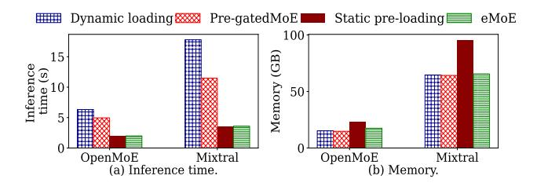
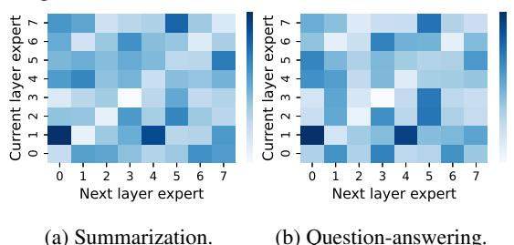
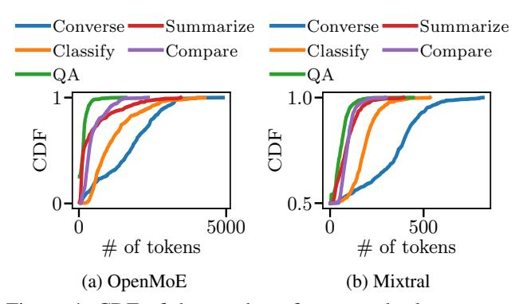
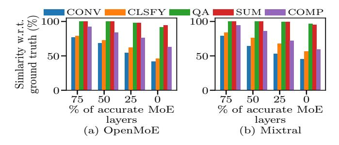
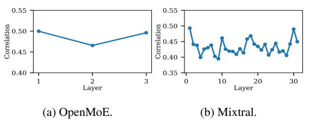
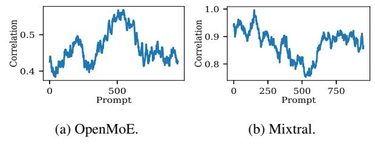
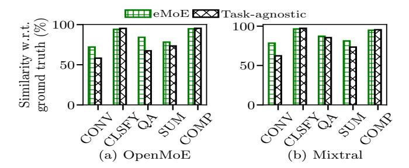

## eMoE: Task-aware Memory Efficient Mixture-of-Experts-Based (MoE) Model Inference

Suraiya Tairin<sup>∗</sup> *,* Shohaib Mahmud<sup>∗</sup> *,* Haiying Shen *University of Virginia*

Anand Iyer *Georgia Institute of Technology*

## Abstract

In recent years, Mixture-of-Experts (MoE) has emerged as an effective approach for enhancing the capacity of deep neural network (DNN) with sub-linear computational costs. However, storing all experts on GPUs incurs significant memory overhead, increasing the monetary cost of MoE-based inference. To address this, we propose eMoE, a memoryefficient inference system for MoE-based large language models (LLMs) by leveraging our observations from experiment measurements. eMoE reduces memory usage by predicting and loading only the required experts based on recurrent patterns in expert routing. To reduce loading latency while maintaining accuracy, as we found using the same experts for subsequent prompts has minimal impact on perplexity, eMoE invokes the expert predictor every few prompts rather than for each prompt. In addition, it skips predictions for tasks less sensitive to routing accuracy. Finally, it has task-aware scheduling to minimize inference latency by considering Service Level Objectives (SLOs), task-specific output lengths, and expert loading latencies. Experimental results show that compared to existing systems, eMoE reduces memory consumption by up to 80% while maintaining accuracy and reduces inference latency by up to 17%. It also enables processing prompts 40× longer, batches 4.5× larger, and achieves 1.5× higher throughput.

## 1 Introduction

A recent trend in Deep learning (DL) has been increasing the model performance by increasing the number of model parameters [\[1,](#page-12-0) [2\]](#page-12-1). However, the linear relationship between the computational cost and the model size remains as a crucial impediment to the practical applications of the large models. To circumvent this bottleneck, sparse architectures [\[3–](#page-12-2)[8\]](#page-12-3) have been introduced. Among these, the Mixture-of-Experts (MoE) stands out as one of the most prominent sparse models. Its adoption has substantially amplified the scalability of DNN

models across various DL applications, encompassing natural language processing [\[9–](#page-12-4)[11\]](#page-12-5), computer vision [\[12\]](#page-12-6), speech recognition [\[13,](#page-12-7) [14\]](#page-12-8), and recommendation systems [\[15\]](#page-12-9).

An MoE layer comprises a gate and a collection of experts. The gate selects only a small number (e.g., 1 or 2) of experts for computation based on each input. Its sparse expert activation enables considerable expansion of model size by several orders of magnitude without a commensurate increase in computational requirements (FLOPs). However, the scaling of such models demands an excessively large amount of scarce GPU memory [\[16\]](#page-12-10). This directly corresponds to substantial monetary expenses when implementing MoE-based inference systems at scale. Our data analysis, detailed in [§2,](#page-1-0) reveals that an MoE-based model typically consumes 4x to 14x more memory compared to its dense counterpart. Due to the intricate dependence between model capacity and memory requirements, designing a memory-optimized MoE inference system is crucial for serving very large models. Existing state-of-the-art inference systems such as vLLM [\[16\]](#page-12-10), DeepSpeed-FastGEN [\[17\]](#page-12-11), Sarathi-Serve [\[18\]](#page-13-0), DistServe [\[19\]](#page-13-1) are designed for the traditional transformer architecture and thus unequipped to provide memory-efficient MoE inference.

In this work, we propose eMoE, a memory-efficient inference system for MoE-based large language models (LLMs). eMoE is designed by leveraging our observations from experiment measurements. eMoE integrates several components working in unison:

- Expert Prediction. We observe a recurring pattern in tokento-expert routing, where certain experts process more tokens than others within a given time period (i.e., popular experts). Based on this observation, we propose an on-demand loading of popular experts during inference to reduce memory footprint. By leveraging the prior distribution of expert selection, eMoE predicts and proactively loads the experts for future inputs.
- Periodic Expert Invocation. However, we found that timeefficient on-demand expert loading is challenging due to the increased inference latency. We observe that subsequent prompts are highly correlated, and using the same experts for

<sup>\*</sup>Equal contribution.

subsequent prompts does not significantly affect perplexity. To reduce expert loading overhead while maintaining accuracy, eMoE invokes the expert predictor every few prompts rather than for each prompt.

- Task-aware Expert Loading. Additionally, our data analysis reveals that an MoE-based model can produce the same output with inaccurate experts for certain tasks as it does with the correct experts. Leveraging this observation, eMoE skips predictions for tasks less sensitive to token-to-expert-routing accuracy.
- Task-aware Request Scheduling. Furthermore, leveraging the above observation with another observation that certain tasks generate significantly fewer tokens than others, eMoE uses profiled task-specific token generation length, task-aware expert loading latency and user-imposed inference latency Service Level Objective (SLO) in request scheduling with an objective to minimal impact on the end-to-end inference latency. It offers an advantage over existing request schedulers [\[16,](#page-12-10) [18–](#page-13-0)[20\]](#page-13-2) by considering expert loading latency.

Unlike previous methods that rely on continuous expert prefetching during inference [\[21–](#page-13-3)[23\]](#page-13-4), eMoE periodically loads and reuses experts, reducing the inference latency associated with these approaches. The limitations of these methods are discussed in [§2.2.](#page-2-0) Our real experimental evaluations show that compared to existing systems, eMoE reduces memory consumption by up to 80% while maintaining accuracy and reduces inference latency by up to 17%. It also enables processing prompts 40× longer, batches 4.5× larger, and achieves 1.5× higher throughput.

In summary, we make the following contributions:

- •We systematically analyze token-to-expert recurrence patterns and task-specific characteristics, such as tolerance for less accurate experts and varying output lengths. Our findings reveal that existing solutions for memory-efficient MoE inference are insufficient in addressing both memory optimization and inference latency effectively.
- •We propose eMoE, a memory-efficient inference system that uses expert prediction to load experts, incorporates periodic expert invocation, employs task-aware expert loading to minimize latency for less routing-sensitive tasks, and utilizes task-aware request scheduling to optimize both inference latency and memory consumption.
- •We evaluate eMoE against state-of-the-art transformer-based inference systems, demonstrating significant reductions in memory consumption while preserving accuracy and minimizing end-to-end inference latency.

## <span id="page-1-0"></span>2 Observation and Motivation

## <span id="page-1-2"></span>2.1 Experiment Settings

We conducted an analysis experiment on four popular publicly available MoE based LLMs: Mixtral-8x7B [\[24\]](#page-13-5), Mixtral-8x22B, TinyMixtral [\[24\]](#page-13-5) and OpenMoE [\[25\]](#page-13-6). We used various

Table 1: Dataset summary.

<span id="page-1-1"></span>

| Dataset           | Contents                | Task                     |  |
|-------------------|-------------------------|--------------------------|--|
| XSUM [26]         | News articles           | Summarize (SUM)          |  |
| Tweet             | Tweets<br>related<br>to | Classify tweet sentiment |  |
| sentiment [27]    | financial<br>markets,   | (CLSFY)                  |  |
|                   | stocks, and economic    |                          |  |
|                   | discussions             |                          |  |
| SQUAD [28]        | Context and question    | Question answer (QA)     |  |
|                   | pairs                   |                          |  |
| Headlines similar | Pairs of headlines on   | Compare semantic simi    |  |
| ity [29]          | same topics             | larity (COMP)            |  |
| Human-assistant   | Pairs of prompts and    | Conversation (CONV)      |  |
| conversation [30] | responses               |                          |  |
|                   |                         |                          |  |

popular natural language processing (NLP) tasks including text summarization, question answering (QA), semantic similarity comparison and semantic classification. Details of the datasets used for these tasks are summarized in Table [1.](#page-1-1) Following [\[20\]](#page-13-2) and [\[16\]](#page-12-10), we generated synthetic client request traces since there is no publicly available request trace for generative MoE-based language models. The generated trace follows the Poisson distribution. To generate a set of requests, first, we drew the number of requests from the Poisson distribution. Next, for each arrival of requests, we generate tasks following a multinomial distribution, where tasks have a uniform probability. We conducted our experiment on a computer equipped with Intel Xeon processor with 128GB host memory and four Nvidia A100 Tensor core GPU with 40GB device memory. We set the maximum number of generated tokens to 1000 for all the models to avoid out-of-memory errors. For accuracy measurement, we consider the output of an MoE-based model with all experts as the ground truth. We measured the semantic similarity between an output and ground truth as the accuracy using a pre-trained BERT model [\[2\]](#page-12-1).

#### 2.1.1 High Inference Latency with Dynamic Expert Loading During Inference

To reduce the memory requirements of MoE models, an alternative strategy involves keeping all experts on the CPU and dynamically transferring the router-selected experts to GPUs during inference, instead of pre-loading all experts onto the GPU. However, during inference, the communication between the CPU and GPUs for transferring the required experts introduces additional time overhead. To assess this trade-off, we conducted experiments comparing the inference time for the two cases. Figure [1\(](#page-2-1)a) shows that the inference time is significantly higher in dynamic loading than in static pre-loading. It is 3.2x higher for OpenMoE, and 5x higher for Mixtral-8x7B. Figure [1\(](#page-2-1)b) exhibits the corresponding memory consumption for each case. The memory consumption of dynamic loading is lower than the static pre-loading. It is 1.5x lower for OpenMoE, and 1.4x lower for Mixtral. The average number of active experts is around 67% and 78% for OpenMoE and Mixtral respectively. Further analysis reveals

that the average time to transfer experts from the CPU to the GPUs is  $\sim$ 4.431 seconds and  $\sim$ 12.744 seconds for OpenMoE and Mixtral, which is 2.2x and 3.6x of the inference time of OpenMoE and Mixtral, respectively. These findings highlight a critical trade-off: while dynamic loading reduces memory consumption, it significantly increases inference latency. As a result, instant loading of experts during inference is not a practical solution for memory-efficient MoE inference.

<span id="page-2-1"></span>

Figure 1: Inference time with memory consumption for dynamic expert loading during inference.

<span id="page-2-4"></span>**Observation 1** Instant loading of the required experts during inference is not a feasible solution to reduce the memory consumption of MoE models as it significantly increases inference latency.

<span id="page-2-2"></span>

Figure 2: Inference time with memory consumption for different approaches.

#### <span id="page-2-0"></span>2.2 Issues with Existing Approaches

Some existing approaches, like Pre-gatedMoE [21], MoE-Infinity [22], and EdgeMoE [23], reduce communication overhead by overlapping computation and data transfer, prefetching experts for the next layer during the current layer's computation into the GPU. To assess the impact of these techniques, we evaluated Pre-gatedMoE against dynamic loading, static pre-loading (all experts on GPU), and our proposed eMoE, which predicts, periodically loads, and reuses experts. Figure 2 shows that Pre-gatedMoE reduces latency by 1.2x-1.6x compared to dynamic loading but has 2.5x-3.5x higher latency than static pre-loading and eMoE. Real-time expert transfer between CPU and GPU can lead to memory and bandwidth contention, especially when the GPU is concurrently handling computations. This contention impacts both data transfer and processing speed, resulting in increased latency in Pre-gatedMoE. Additionally, it requires retraining the MoE

model with its gating mechanism, which is resource-intensive and time-consuming.

MoEInfinity and EdgeMoE both utilize expert prefetching to reduce memory usage but introduce complexity and overhead. MoEInfinity employs "group activation" to prefetch frequently co-activated experts but requires maintaining an expert activation matrix for each inference request, adding computational overhead. EdgeMoE is tailored for edge devices with limited GPU memory, making it less suitable for larger models or multi-GPU setups. Both methods increase inference latency and require either full MoE model training or creating additional data structures, complicating their use with larger models.

<span id="page-2-3"></span>

Figure 3: Expert activation transition patterns between consecutive layers.

#### 2.2.1 Repetitive Patterns in Expert Activation

To investigate the repetitive patterns in expert activation between consecutive layers in MoE model, we conducted experiments to track expert selection across layers. For each input, we recorded the pair of experts chosen at consecutive layers, compiling this data into a matrix where each entry at the position (i, j) represents the number of times Expert i at the current layer was followed by Expert j at the next layer. We use a heatmap to visualize these frequencies. Figure 3 presents the heatmap for summarization and question-answering tasks for Mixtral-8x7B. In the figure, darker colors (e.g., deep blue) indicate a higher frequency of transitions, while lighter colors (e.g., pale blue or white) indicate lower frequencies. The figure reveals strong, consistent patterns in expert activation between layers, suggesting an opportunity to predict future expert activations based on prior patterns. This insight highlights the potential for developing a predictive method to anticipate expert selection, which could significantly reduce memory usage.

#### 2.2.2 Inference Latency is Task Sensitive

The inference latency is directly proportional to the number of generated tokens. Therefore, the inference latency may vary depending on the task's characteristics. To test our hypothesis, we analyze a number of popular NLP tasks given in Table 1.

Figure 4 shows the Cumulative Distribution Frequency (CDF) of requests versus the number of generated tokens. The figure reveals variations in the lengths of generated outputs across different tasks. Specifically, the QA tasks yield the

<span id="page-3-0"></span>

Figure 4: CDF of the number of generated tokens across different tasks

shortest output length, while the conversation tasks produce the longest output length. Notably, both models generate explanations in their generated texts for classification and comparison tasks, resulting in longer output lengths compared to the QA tasks. Additionally, the 90th percentile of the output length of the QA tasks is 17% and 26% smaller than that of the conversation tasks for the OpenMoE and Mixtral models, respectively. The rest of the tasks' 90th percentile output lengths follow this order: QA (Mixtral: 2.2 sec, OpenMoE: 1.8 sec) > Summarization (Mixtral: 1.8 sec, OpenMoE: 1.4 sec) > Semantic similarity measure (Mixtral: 1.4 sec, OpenMoE: 1.1 sec). The output length difference among the tasks is caused by their output characteristics. Therefore, we make the following observation

<span id="page-3-5"></span>**Observation 2** Different tasks exhibit different output length distributions. The length difference can be often as high as twice the output length of a certain task.

## <span id="page-3-4"></span>2.2.3 Tasks Show Varying Sensitivity To Tokens-toexpert Routing Accuracy

Existing work indicates that layers closer to the input in neural networks tend to learn general representations, while layers closer to the output specialize in task-specific representations [31,32]. Building upon this observation, we hypothesize that certain tasks may not require highly accurate representations in the layers closer to the input. This suggests that the inference system can prioritize experts selections for tasks that demand more accurate representation.

To ascertain the hypothesis, we conducted an analysis experiment. In this experiment, starting from the first MoE layer, we progressively made the MoE layers' routing inaccurate and measured the output accuracy. The results of this analysis experiment are shown in Figure 5, where the X-axis denotes the percentage of MoE layers where accurate token-to-expert routing was applied and Y-axis represents the similarity. We see that for the classification and compare tasks, both models maintain above 90% similarity with respect to the full model even when all tokens are routed incorrectly. We also note that open-ended tasks such as conversation and summarization

<span id="page-3-1"></span>

Figure 5: Accuracy with progressive applying of exact token-to-expert routing in MoE layers closer to output layer.

show low tolerance to inaccurate expert routing. Even with 75% accurate MoE layers, the similarity score falls below 80%. On the other hand, for the QA tasks which need to be more specific as the answer is in the context, the similarity score is above 80% for both models when only 50% of the MoE layers have accurate routing. For the summarization tasks, the accuracy falls below 80% when 50% of the MoE layers are accurate. We see that a task's tolerance to MoE layers' routing accuracy varies greatly. Therefore, we make the following observation:

<span id="page-3-3"></span>**Observation 3** Different tasks exhibit different tolerance to inaccurate MoE layers' expert routing. Tasks that are more open-ended such as conversation demand more accurate routing than tasks that are more specific such as semantic classification.

#### 3 System Design of eMoE

#### 3.1 Overview

<span id="page-3-2"></span>

Figure 6: Overview of eMoE.

Figure 6 illustrates the architecture of the eMoE inference system. The inference process starts with task type extraction. After extracting the task type, the prompts are scheduled by eMoE's task-aware request scheduler (①). The scheduler aims to minimize the inference latency by considering profiled task-specific token generation length, user-imposed latency SLO and expert loading latency. The scheduled requests are sent to the task-aware expert loading module (②). This module leverages tasks' sensitivity to token-to-expert routing accuracy and the expert prediction to selectively load experts to the inference engine to minimize expert loading latency. In addition to serving inference requests, the inference engine

also runs the expert prediction model based on recurrence patterns (③). To save the overhead for expert loading while maintaining accuracy, it periodically invokes expert prediction at regular intervals (④). Once expert loading is initiated, the inference engine starts serving the scheduled requests. In the following, we present each of these components.

#### 3.2 Expert Prediction

In the inference pipeline, we first identify the task type for each request for task-aware expert loading. Next, we predict the specific experts needed and load only predicted experts onto the GPU. We present task-type extraction and expert prediction methods in §3.2.1 and §3.2.2. The MoE inference process using the expert predictor is described in §3.3.

#### <span id="page-4-0"></span>3.2.1 Task Type Extraction

This task type extraction method identifies the task type associated with each individual user request. The method leverages the occurrence of certain task-specific keywords to determine a request's task type. A task is typically described by one or two sentences and task description for a task type is likely to have similar keywords. For example, a user may write "Summarize the following text" or "Write a synopsis for the following text" to request for a summarizing task. Upon receiving a user request, this method processes the input tokens and generates a potential task type as the output. Specifically, it searches for some profiled keywords in the sentences in the input. Each identified keyword is compared against the keywords from all task types. The task type that has the highest number of matches is assigned as the task type of the input. The method runs on an on-demand basis on CPU and therefore does not interfere with the inference system pipeline.

#### <span id="page-4-1"></span>3.2.2 Task-aware Expert Prediction

Observation 1 shows that instantly loading the required experts during inference in MoE models to reduce memory consumption increases inference latency. Using fewer experts than the model was trained with reduces memory consumption but compromises output quality [32]. Besides, the workload among experts varies dynamically during inference [12, 33]. An ideal solution should reduce memory consumption without harming the quality of model output or increasing inference latency. The most effective approach is to proactively determine the necessary experts for an inference request before processing it and load only those experts into the GPU's memory. Building on these insights, we propose an expert prediction method to reduce memory consumption while maintaining model output quality and inference latency.

We employ a machine learning (ML) based method to predict the experts. This predictor forecasts the future experts needed for an incoming request based on the prior distribution of experts. The experts are represented by numerical digits. For instance, if there are *m* MoE layers in an MoE model,

and if we denote the expert sequence for layer i as  $e_i$ , the sequence of the expert index for m layers can be represented as follows:  $e_1, e_2, ... e_i, ..., e_m$ . Each  $e_i$  represents a series of k indices for top-k routing. This expert prediction can be seen as a sequence prediction task, where elements in the sequence exhibit certain correlations or patterns. Typically, future elements in a sequence depend on the past elements. In sequence or series prediction, the output is a distribution of probabilities over possible outcomes, representing the relative frequency of each possible next element, rather than a single fixed value. The element with the highest probability is considered as the next element in the sequence.

Correlation in Expert Sequence. We analyze expert selection correlation and use cross-correlation [34] to measure the correlation between experts chosen in one layer and those chosen in the next layer. For a top-k routing, we consider the k chosen experts in layer i as a sequence  $e_i$  and the k chosen experts in layer i+1 as a sequence  $e_{i+1}$ , and compute the correlation between them. We compute the average cross-correlation of selected experts from one layer to the next for 1000 prompts using the settings in §2.1. Figures 7a and 7b show the correlation for each layer. For both Open-MoE and Mixtral-8x7B, we observe a significant correlation of around 0.50 between the experts selected by consecutive layers. This is because the gate network uses basic features such as parts of speech and word meaning to select experts, resulting in similar tokens being handled by similar experts across layers [33]. This consistent selection process leads to a high degree of correlation between the experts chosen in consecutive layers. We leverage this correlation to estimate the expert in the next layer using an ML model.

<span id="page-4-2"></span>

Figure 7: Correlation in expert sequence between consecutive layers.

We then calculate the cross-correlation to examine the relationship between experts selected for consecutive prompts. Figures 8a and 8b show the correlation coefficient between each prompt and the following prompt. In OpenMoE and Mixtral-8x7B, the correlations range from 0.4 to 0.6 and from 0.75 to 0.95, respectively, indicating a strong correlation in expert selection between prompts. There exists shared context or vocabulary across consecutive prompts. This shared information results in a high correlation in expert selection between consecutive prompts.

**Preparing Expert Sequence for Prediction.** Motivated by the above observations, we predict the future expert sequence based on past expert sequences. For an incoming prompt, be-

<span id="page-5-1"></span>

Figure 8: Correlation in expert sequence between consecutive prompts.

fore processing it, we must determine the expert sequence (i.e., the experts in each layer) which is the future expert sequence for all its tokens. For this future expert sequence, the past expert sequence would be the expert sequence of previous layers. We consider two cases to predict the expert sequence: (1) predicting future expert sequence for one layer at a time using the past layer's expert sequence (layer-by-layer prediction), denoted as eMoE-L, and (2) predicting future expert sequence for all the layers at once using the past prompt's expert distribution (all-layer prediction), denoted as eMoE-A. Suppose there is an incoming inference request  $r_1$ . For case (1), let the predicted expert of the *i*-th layer for prompt  $r_1$  be denoted as  $e_i^{r_1}$ . Then the prediction method f can be represented as follows:  $e_i^{r_1} = f(e_{i-1}^{r_1})$ . To predict the experts for the first layer, we use the experts of the first layer of the previous prompt.

For case (2), suppose there are two inference requests  $r_1$  and  $r_2$ . We want to predict the expert sequence of  $r_2$  using the expert selection of  $r_1$ . The experts selected by the router for all the layers for  $r_1$  are denoted as  $e_1^{r_1}, e_2^{r_1}, ..., e_m^{r_1}$ , where the model has m layers. Let's assume the predicted expert sequence for all layers of  $r_2$  is  $e_1^{r_2}, e_2^{r_2}, ..., e_m^{r_2}$ . Then, the prediction method f can be presented as follows:

$$e_1^{r_2}, e_2^{r_2}, ..., e_m^{r_2} = f(e_1^{r_1}, e_2^{r_1}, ..., e_m^{r_1}).$$
 (1)

Expert Predictor Selection. Selecting a suitable ML model for sequence prediction is crucial for effectively learning relationships between past and future sequences. We choose a transformer-based model given its ability to capture and maintain dependencies in very long sequences using the attention mechanism [35]. In contrast, other models for sequence prediction, such as LSTM [36], struggle to capture dependencies in long sequences that are far apart, as they process sequences sequentially and suffer from vanishing gradient problems in very long sequences [37]. Transformer-based models often perform comparably or better than traditional sequence prediction models [38]. We use the GPU to run our expert predictor to minimize latency, as it consumes very little GPU memory. Our empirical results in §5.3 show that the predictor typically uses only 0.24%-1.3% of the MoE model's memory. When loading predicted experts, we compare them with those already loaded in the GPU. New experts are identified and loaded into the GPU, while experts not in the prediction are moved to the CPU. Experts are loaded

according to a memory budget, prioritizing those with the higher workload, which is determined by the total number of tokens they receive. If the expert selected for a token is not on the GPU, the token is routed to the next top-k expert that is on the GPU.

### <span id="page-5-0"></span>3.3 Periodic Expert Invocation

Calling the expert predictor for each inference request adds latency to the inference time (shown in §5.7), which is undesirable. Therefore, calling the predictor should be strategized to avoid harming the inference latency performance of the MoE inference system. This means the expert predictor should be called opportunistically, not for every inference request. One straightforward approach is to invoke the expert predictor at regular or adaptive intervals, rather than for every inference request. The predicted experts can then be used for several consecutive requests without needing to re-invoke the expert predictor for each one. We assume that there is a level of stickiness or continuity among subsequent incoming inference requests. For example, in a conversation, there is often a logical flow or sequence to the topics being discussed. Therefore, subsequent inference requests are often related to the previous ones.

To observe the correlation between subsequent prompts, we conduct an experiment using the settings in §2.1. For each prompt, we compare its correlation [34] with the

<span id="page-5-2"></span>

Figure 9: Correlation in consecutive prompts.

subsequent prompt. Specifically, for a prompt, we consider pairs with the i-th subsequent prompt ( $i = 1, 2, \ldots, 20$ ) and measure the correlation of each pair. Figure 9 illustrates the average correlation between a prompt and each subsequent prompt. We observe that the correlation is significantly high, ranging from 0.48 to 0.55. This is due to the shared context or common vocabulary. When prompts are contextually related or use similar terms, their contents become more similar, leading to higher correlation. Words and phrases that frequently appear together or within the same context results in stronger correlations.

To investigate whether experts chosen for one prompt can be reused for subsequent prompts, we conducted an experiment using the settings described in §2.1. In this experiment, we used the same experts selected for a prompt for its next p prompts, with p values of 0, 20, 40, 60, and 80. p=0 means the same experts are not reused for any subsequent prompts. Figure 10 shows the average perplexity for different numbers of subsequent prompts. We observed that the average perplexity remains nearly the same for 20 and 40 prompts but starts increasing from 60 onwards. This is because the prompts are highly correlated, and using the same experts for some

subsequent prompts does not significantly impact perplexity.

<span id="page-6-0"></span>

Figure 10: Perplexity using same experts.

Motivated by the above observations, we consider that the expert predictor does not need to be invoked for every inference request. Once the expert predictor is called and the predicted experts are loaded, they can be reused for multiple subsequent inference requests in the future. Therefore, in our design, we consider calling the expert predictor at regular intervals (i.e., after a certain number of prompts). In our inference system, we maintain an index of the incoming requests as 0, 1, 2, and so on. Based on this index, we invoke the expert predictor after every p prompts. For each incoming request, the system first checks if it is the p-th prompt. If not, the system processes the prompt using the experts already loaded on the GPU without invoking the predictor. Otherwise, the system calls the expert predictor, loads the predicted experts onto the GPU, and then processes the prompt using these newly loaded experts. For the first prompt, the system loads all the experts onto the GPU, and subsequently, after every p prompts, it invokes the predictor and loads only the predicted experts.

### 3.4 Task-aware Expert Loading

Running MoE-based models with a lower number of experts loaded into the GPU memory than the model originally trained can degrade the quality of the model output. However, our Observation 3 indicates that certain tasks show greater sensitivity to token-to-expert routing accuracy while some tasks show little sensitivity to this accuracy. In the context of expert loading for a particular layer, we denote a task as either sensitive or insensitive. eMoE has task-aware expert loading, which only considers the predicted experts of the sensitive tasks during the expert loading to reduce the expert loading latency while incurring minimal compromise on the accuracy of the model output.

eMoE runs its task-aware expert loader each time one or more new input requests are scheduled. As detailed in § 3.2.2, the expert prediction module outputs the relative frequency with which tokens in a task type are likely to be routed to an expert. eMoE leverages this task type-based expert prediction to prioritize tasks that are more sensitive to token-to-expert routing accuracy. We define a task type's sensitivity to routing accuracy on an MoE layer basis. This sensitivity is evaluated through offline profiling, where, for each task type, we

progressively apply random token-to-expert routing, starting from the MoE layer closest to the input. We then record the accuracy drop as we progressively use less accurate routing. The details are in § 2.2.3.

The MoE layers with inaccurate routing that yield output with accuracy higher than a threshold (e.g., 85%) are marked as insensitive to the particular task. In each iteration of expert loading, eMoE first computes the expected number of tokens per expert per task type and assembles the computed data in a 3D array as shown in Figure 11. We obtain the expected number of tokens per ex-

<span id="page-6-1"></span>

Figure 11: eMoE maintains the expected number of tokens per expert for each task type.

pert with an objective to maximize the number of correct token-to-expert routing. We hypothesize that maximizing the number of correctly routed tokens per expert will ensure the least impact on the accuracy. The rationale behind such hypothesis is that if we reduce the error in token-to-expert routing for a given number of experts, the accuracy drop will decrease.

Let  $N_i$  be the expected number of tokens that will be routed to expert i in an arbitrary MoE layer for a given task type. Also, let  $s \in \{0,1\}$  be a binary variable to indicate whether a token is sensitive to token-to-expert routing accuracy of the task type to the particular MoE layer,  $f_i$  be predicted token-to-expert routing frequency, and T be the number of requests belonging to the given task type that are already running. We compute the value of  $N_i$  using the following equation:

<span id="page-6-2"></span>
$$N_i = \left(\sum_{j=0}^{T-1} W_j + T \cdot W_o\right) \cdot s \cdot f_i \tag{2}$$

where  $W_n$  denotes the number of input tokens in the *n*th request and  $W_o$  denotes the expected number of generated tokens

eMoE utilizes Equation (2) to determine the expected number of tokens per expert for a given set of requests that are to be scheduled and the requests that are already running by the inference engine. eMoE obtains the total expected number of tokens per expert by summing  $N_i$ s belonging to all task types. Next, eMoE sorts the experts at each MoE layer based on the expected number of tokens likely to be routed in descending order. Subsequently, eMoE picks the top L experts for every layer, where L is set based on the memory budget. In the MoE architecture where the number of experts across MoE layers is different, different L values are chosen for each layer. The values of L is set by the system user. Finally, eMoE identifies the experts that are already loaded into the inference

engine. The identified experts are then set to be loaded into the inference engine in the next dispatching of the inference requests.

## 3.5 Task-aware Request Scheduling

eMoE's request scheduler aims to minimize the impact on inference latency while ensuring compliance with the SLOs of running requests. Under such setting, the existing scheduling systems (e.g., [\[16–](#page-12-10)[19\]](#page-13-1)) which neglect expert loading cannot optimally meet the latency SLO in eMoE. Furthermore the existing systems do not exploit the Observations [2,](#page-3-5) [3](#page-3-3) which present some unique opportunities in terms of minimal impact on the inference latency. First, tasks' varying sensitivity to token-to-expert routing accuracy suggests that this phenomenon should be exploited to limit expert loading latency. Second, tasks have inherent latency requirements, leading to varying computational demands and differing impacts on the latency of running requests. This is because scheduling a request may significantly increase the latency of the existing running requests due to the expert loading and a large number of input tokens. Therefore, it will be beneficial to delay the incoming request if the request has relaxed latency SLO requirement and the existing running requests are likely to complete the token generation in short period of time. eMoE's request scheduler jointly considers user imposed latency SLOs, taskspecific profiled generation length, and task-specific profiled sensitivity to token-to-expert routing accuracy to minimize the end-to-end inference latency.

Scheduling a new batch of requests introduces an initial upfront latency cost due to a large increase of the number of tokens per MoE layer in the model. This increase in the number of tokens equals to the number of input tokens. The increase in input size results in higher computation latency and increased all-to-all communication among the experts in MoE layer and thereby increasing the latency of the running requests.

Let *W* be the number of input tokens in a new request to be scheduled, *G<sup>i</sup>* be the number of tokens to be generated by the *i*th request, ∆*E* be the expert loading latency due to the scheduling of new requests and *c* be the average expert computation and communication latency for a single input token. We use task-specific profiling to obtain *G<sup>i</sup>* . When a request is scheduled, *G<sup>i</sup>* is set to the average number of tokens generated by the task the request belongs to. After each iteration of token generation, *G<sup>i</sup>* is decremented. If *G<sup>i</sup>* reaches 0 but the request is not completed, *G<sup>i</sup>* is reset to a value proportional (e.g., 5%) to its initial value. We also use a profiled value for ∆*E* and *c*. Also, let *n<sup>i</sup>* be the number of existing running requests that will complete generation after the *i*th request. We can express the expected latency of the *i*th request *t<sup>i</sup>* due to scheduling of a new request as follows:

$$t_i = \Delta E + (W + n_i \cdot G_i) \cdot c + r_i \tag{3}$$

where *r<sup>i</sup>* denotes the run-time of request *i* so far. For a new

request, *r<sup>i</sup>* is set to zero and incremented as it runs on the inference engine.

Algorithm 1: eMoE Request Scheduling Algorithm

```
Input: Waiting queue Qw, Scheduled queue Qs, Maximum
        number of tokens Tmax
1 T ← Qs.length ;
2 Qw ← Sort Qw by SLO stringiness
3 for R ∈ Qw do
4 if R.inputTokens+T < Tmax then
5 if S.NewExpectedLatency < S.SLO,∀S ∈ Qs :
          S.ExpectedLatency < S.SLO then
6 Qs ← Qs ∪ {S} ;
7 T ← T +R.inputTokens
8 end
9 end
10 end
11 return Qs
```

eMoE adopts a greedy approach in its iterative scheduling algorithm. Algorithm [1](#page-7-0) shows the pseudocode of eMoE's scheduling algorithm. At each iteration, eMoE picks the request with the most stringent latency SLO and attempts to schedule the request (*line 2-6*). We measure a request's SLO stringiness by how quickly the first response token will be generated. The algorithm first checks if scheduling the request will exceed the total number of tokens that the inference engine can process. If the total number of tokens exceeds the limit, the request is kept in the waiting queue (*line 2*). Otherwise, the request is scheduled if it will not lead to SLO violations of the requests already scheduled (*line 3*). The request scheduler runs whenever a new request arrives or a running request completes token generation.

## 4 Implementation

We implemented eMoE using the Python programming language. The expert prediction model is implemented using Pytorch [\[39\]](#page-14-1). The expert prediction model runs on a separate process besides the inference engine. We utilize DeepSpeed-FastGen [\[17\]](#page-12-11) as the inference engine. The inference engine wraps Huggingface [\[40\]](#page-14-2) models for inference serving.

We extended the Huggingface model codes to augment functionality for expert loading. Specifically, we maintained Python multiprocessing lock for each MoE layer and wrapped the MoE layer's computation inside the lock. The lock is used by the expert loader process to synchronize the expert loading operation with the MoE layer computation. Furthermore, We wrapped the expert loading of an MoE layer with a CUDA event, which the corresponding MoE layer synchronizes with. This prevents an MoE layer from using stale model weights.

eMoE asynchronously loads experts in an MoE layer form host to device via *torch*.*Tensor*.*copy*\_(*non*\_*blocking* = *True*) to overlap the loading process with the computation by the non-expert layers. We condition the loading of experts in an MoE layer contingent upon the completion of the loading process from the previous layer. We made such design decision to prevent the saturation of the PCIe channel bandwidth.

## 5 Performance Evaluation

In this section, we first evaluate eMoE's end-to-end latency performance in [§5.1](#page-8-1) which demonstrate the effectiveness of eMoE. We evaluate eMoE's impact on accuracy in [§5.2.](#page-8-2) Then we demonstrate the performance of expert predictor in [§5.3.](#page-8-0) We then evaluate eMoE's inference performance with expert predictor ([§5.4\)](#page-9-0) and show the impacts of reducing memory consumption ([§5.5\)](#page-9-1). Furthermore, we evaluate the sensitivity of eMoE on different parameters [§5.6.](#page-11-1) We present the time overhead of our methods in [§5.7.](#page-11-0) Unless otherwise specified, we use the same experiment setting as detailed in [§2.1.](#page-1-2) Our key results include:

- eMoE reduces inference latency by up to 17%.
- eMoE reduces memory consumption up to 80% while maintaining accuracy. By optimizing memory usage, it enables processing prompts 40× longer, batches 4.5× larger, and achieves 1.5× higher throughput (tokens/second).

## <span id="page-8-1"></span>5.1 Evaluation on End-to-End Inference Latency

Figure [12](#page-9-2) shows the end-to-end inference latency of eMoE, vLLM, and DeepspeedFastGen for OpenMoE, Mixtral-8x7, TinyMixtral, and Mixtral-8x22B models. We compared with these two methods because they outperform other approaches. In the figure, the X-axis denotes the arrival rate of request per second and the Y-axis denotes the average inference latency. In the experiment, we varied the throughput in a step 0.1 request/second and generate tokens until the end of sequence (EOS) token. We only show the results for higher throughput for the interest of clarity. For Mixtral-8x22B model, the results include throughput upto 0.4, which is the maximum throughput supported by our experiment setup.

From the figure, we see that for all four models, eMoE outperforms DeepspeedFastGen and vLLM. Among the compared methods, vLLM performs the worst. DeepspeedFast-Gen's superior performance over vLLM is due to its kernel level optimizations tailored to MoE based models. eMoE also achieves superior performance compared to vLLM as eMoE is implemented on top of DeepspeedFastGen.

From the figure we see that, eMoE consistently outperforms DeepspeedFastGen for a given throughput. The highest improvement (17%) comes with the Mixtral-8x22B model which is the largest among the four in terms of the number of parameters. On the contrary, the smallest improvement (9%) comes from TinyMixtral model which is the smallest among the four. We see that with eMoE performance improvement is larger with the larger model. This is due to larger model being

compute heavy and memory heavy. eMoE runs with fewer experts which allows it to reduce the compute latency and global GPU memory read operations. Therefore, with larger model eMoE performs better.

## <span id="page-8-2"></span>5.2 Evaluation on Inference Accuracy

Figure [13](#page-9-3) shows the average accuracy achieved by the proposed task-aware expert loading and the task-agnostic expert loading methods. In the task-agnostic loading methods, the expert prediction model's output for all the tasks in Table [1](#page-1-1) was utilized in the expert loading. In the figure, the X-axis denotes different tasks and Y-axis represents the similarity of the model's output with the partially loaded expert to the model's output to the fully loaded experts. We refer the output of the latter as the ground truth. To measure the similarity with respect to ground truth, we pass the two outputs to a pretrained BERT [\[2\]](#page-12-1) to measure the similarity. From the figure, we see that for all the tasks, eMoE performs better if not the same as the task-agnostic method. We see that for text classification and text similarity measure tasks, both methods perform almost the same. Recall that these two tasks are less sensitive to the accuracy of expert routing as indicated in [§2.2.3](#page-3-4) . However, for conversation, question-answer, and text summarizing tasks, we see that eMoE achieves better accuracy than the task-agnostic method.

## <span id="page-8-0"></span>5.3 Performance of Expert Predictor

To find a suitable model for expert prediction, we conducted experiments on different variants of BERT [\[2\]](#page-12-1) and GPT-2 [\[41\]](#page-14-3) models from Huggingface [\[40,](#page-14-2) [42\]](#page-14-4) and compare their results. We collected the expert routing data from the OpenMoE and Mixtral models, and use 80% of the data for training and 30% for testing. The results are shown in Table [2.](#page-8-3) The precision, recall and F1-score for Mixtral are 0.712, 0.713, 0.705 and for OpenMoE are 0.696,0.689, 0.680. We observe that BERT-XLNet performs better than other models. XLNet [\[43\]](#page-14-5) learns bidirectional contexts by maximizing the likelihood over all possible permutations of the input sequence, capturing more complex relationships between elements in the sequence, which leads to higher accuracy than other models. Therefore, we chose XLNet for our system.

<span id="page-8-3"></span>Table 2: Performance of the expert predictor.

| Models     | # of            | Accuracy | Accuracy | Routing |
|------------|-----------------|----------|----------|---------|
|            | parameters eMoE |          | eMoE     | data    |
|            |                 | L        | A        |         |
| GPT-2      | 0.115B          | 50%      | 49%      | OpenMoE |
| BERT-base  | 0.108B          | 13%      | 12%      | OpenMoE |
| BERT-XLNet | 0.108B          | 70%      | 69%      | OpenMoE |
| GPT-2      | 0.115B          | 51%      | 51%      | Mixtral |
| BERT-base  | 0.108B          | 16%      | 16%      | Mixtral |
| BERT-XLNet | 0.108B          | 71%      | 71%      | Mixtral |

<span id="page-9-2"></span>

Figure 12: End-to-End latency performance evaluations.

<span id="page-9-3"></span>

Figure 13: Accuracy with different tasks.

# <span id="page-9-0"></span>5.4 Inference Performance with Expert Predictor

We compared eMoE-L and eMoE-A (with only the expert predictor invoked) against Baseline, Random [44], Pre-Gated MoE [21], and MoEInfinity [22]. The Baseline method loads all experts into GPU memory without using an expert predictor. The Random [44] method randomly selects experts for tokens. The details of Pre-GatedMoE and MoEInfinity are explained in §2.2. We also tested a variant of eMoE, in which the expert predictor (eMoE-A) is called for every prompt, denoted as eMoE-E.

Memory Consumption and Accuracy. Figures 14 and 15 illustrate memory consumption and accuracy for various percentages of experts loaded into GPU memory. Baseline, which loads all experts, results in the highest memory usage. eMoE variants reduce memory consumption by 20%-80% while maintaining 93.7%-99.8% accuracy. With 60% of experts loaded, eMoE achieves 98.2%-98.8% accuracy, and with 80%, it reaches 99.6%-99.7%. This high accuracy stems from eMoE's predictive approach, which minimizes incorrect expert selection. In contrast, the Random method shows significantly lower accuracy, underperforming eMoE by 4.7%-8.6% for OpenMoE and 4.1%-6.5% for Mixtral. PregatedMoE (98.6%-99.7%) and MoEInfinity (98.1%-98.7%) show comparable accuracy to eMoE, as they employ similar expert prefetching strategies. Among eMoE variants, eMoE-E achieves slightly higher accuracy (0.1%-0.4%) than eMoE-A and eMoE-L by calling the predictor for each prompt, improving expert selection accuracy.

**Inference Time.** Figure 16 shows the average inference time for different batch sizes and the overhead for calling the

expert predictor (upper black part). A detailed analysis of time overhead is in §5.7. We can observe that the inference time increases with batch size due to the greater computational workload. Both eMoE-A and eMoE-L perform similarly to the Baseline and Random methods because they only invoke the expert predictor periodically. In contrast, Pre-GatedMoE demonstrates a 2.4x-3.5x higher inference time compared to eMoE variants. Pre-GatedMoE prefetches experts to overlap data transfer with computation at the current layer. However, expert transfers between the CPU and GPU cause memory and bandwidth contention, slowing data transfer and processing, especially when the GPU is simultaneously handling computations, leading to increased latency. MoEInfinity shows 1.25x-1.5x higher inference time compared to eMoE. MoEInfinity employs prefetching for the later layers and uses stored experts for the initial layers. Since it also employs prefetching during inference, its inference time is longer than that of eMoE. However, eMoE-E has a 9%-34% higher overhead as it calls the predictor for every prompt, resulting in longer inference time. Although eMoE-E achieves slightly higher accuracy, the trade-off between accuracy and increased inference time makes eMoE-A and eMoE-L more practical choices than eMoE-E for our system.

## <span id="page-9-1"></span>5.5 Impacts of Reducing Memory Consumption

Impact on Prompt Length. eMoE reduces GPU memory consumption, allowing it to process longer prompts. We tested eMoE-A and eMoE-L with 60% of experts loaded and gradually increased the prompt length until memory consumption matched the Baseline. Figure 17 shows memory usage for different prompt lengths. At a length of 512, the Baseline Open-MoE uses 24GB, while eMoE-A and eMoE-L use 14GB. At a length of 8192, eMoE's memory consumption matches the Baseline, allowing it to handle prompts 16x longer. Similarly, the Baseline Mixtral uses 96GB for a prompt of 512, while eMoE-A and eMoE-L use 59GB, enabling them to process prompts up to 40x longer.

**Impact on Batch Size and Throughput.** We conducted experiments to determine the maximum batch size eMoE-L and eMoE-A can handle with the saved memory. We progressively increased the batch size until its memory consumption


Figure 17: Memory consumption vs. prompt length.

<span id="page-10-1"></span><span id="page-10-0"></span>1024 2048 409 Prompt length

(a) OpenMoE.

4096

100

Prompt length

(b) Mixtral-8x7B.

matches Baseline's memory consumption. Figure 18 shows memory consumption for varying batch sizes. The Baseline OpenMoE uses around 29GB for a batch size of 4, while eMoE-L and eMoE-A use about 19GB. As the batch size increases to 8, the memory consumption of eMoE-L and eMoE-A rises to 29GB, indicating that they can efficiently process up to 8 batches, handling 2x more batches than Baseline. Similarly, the Baseline Mixtral consumes about 100GB for a batch size of 4, while eMoE-L and eMoE-A use approximately 59GB. For a batch size of 18, their memory consumption matches 100GB. This demonstrates that eMoE-L and eMoE-A can efficiently handle up to 18 batches, processing 4.5x more batches than the Baseline model. We also measured throughput, which refers to the number of tokens processed per second at increased batch sizes. The blue lines in Figure 18 show eMoE's throughput increase. OpenMoE achieves 1.3x to 1.4x improvement as batch size grows from 4 to 8, while Mixtral sees a 1.3x to 1.5x boost from 4 to 18. These results show that eMoE can process up to 1.5x more tokens

per second compared to the Baseline, demonstrating both memory efficiency and improved processing speed.

<span id="page-10-2"></span>

Figure 18: Memory consumption vs. batch size.

<span id="page-10-3"></span>Table 3: Performance comparison with Quantized model

| Methods |                | Memory (GB) | Accuracy |  |
|---------|----------------|-------------|----------|--|
| ĺ       | eMoE           | 64.504      | 98.2%    |  |
|         | Quantized-8bit | 57.814      | 95.2%    |  |
|         | Quantized-4bit | 30.487      | 91.5%    |  |

Benefits over Quantized models. We conducted experiments to evaluate the benefits of using eMoE compared to a quantized model. To assess eMoE's performance, we compared it to the 4-bit and 8-bit quantized versions of the Mixtral 8x7B model, recording both memory usage and accuracy. As shown in Table 3, the 4-bit model reduced memory by 2.2x and the 8-bit model by 1.2x compared to eMoE-A, but at the cost of a 3.06%-6.82% accuracy drop. These results demonstrate that eMoE offers a better balance of memory efficiency and accuracy, outperforming quantized models.

#### <span id="page-11-1"></span>5.6 Sensitivity Analysis

#### 5.6.1 Sensitivity To Task Classification Accuracy

Figure 19 shows the percentage change in latency with respect to the latency achieved with 100% task classification accuracy. In the experiment, we randomly introduced an inaccuracy in task label for a given task accuracy, record the average inference latency, and computed the percentage change in latency with respect to the ground truth case.

From the figure, we see that with the increase in inaccuracy in task identification, the inference latency increases for all four models. The increase in latency mainly stems from excess host-to-device expert loading. Note that eMoE uses its task-aware expert loading method to selectively load experts based on expert sensitivity. eMoE relies on accurate task type identification to achieve this objec-

<span id="page-11-2"></span>

Figure 19: Impact on latency under different task classification accuracy.

tive. However, with more inaccuracy, eMoE starts to load the experts from the host when it is not required to. However, even with 20% inaccuracy, the impact on the latency is less than 10% even for the largest model. When the inaccuracy becomes excessively high, eMoE loads the experts from the host most of the times, which causes the increase in latency to plateau.

#### <span id="page-11-0"></span>5.7 Time Overhead

We tested the time overhead of calling the expert predictor for eMoE-A and eMoE-L. We measured the time taken for expert prediction and moving the experts to GPU, then compute the average. The time for eMoE-A and eMoE-L averages at ~0.381s and ~1.387s for OpenMoE, and averages at ~0.334s and ~4.211s for Mixtral-8x7B. The expert predictor is called every 40 prompts, as determined empirically (Figure 10). For OpenMoE, the time overhead for eMoE-A and eMoE-L is 0.47% and 1.69% of the average inference time per request. For Mixtral, it is 0.24% and 3.11%, respectively. Mixtral incurs higher time overhead due to its 32 layers, each requiring prediction and transfer time, whereas OpenMoE has only 4 layers. The task-aware request scheduler runs on the CPU, incurring no additional overhead.

#### 6 Related Work

**Mixture-of-Expert models.** Recent research has focused on enhancing large-scale models using MoE-based architectures

[11, 44–59]. Google's Switch Transformer [10] pioneered MoE exploration, dynamically selecting different experts for different parts of the input sequence. GShard [60] scales MoE to a trillion parameters and uses expert parallelism. Other models such as PaLM [61], GaLM [9] from Google, and M6-T [62] from Alibaba have also excelled in language and multi-modal tasks. MoEfication [63] transforms conventional models into MoE models by splitting FFN parameters into multiple expert partitions. DeepSpeed Zero3 [64] collects parameters from other GPUs dynamically to support extremely large models.

MoE Training and Inference Systems. A group of methods focus on improving the performance and scalability of MoE models [12, 18, 19, 32, 33, 65–75]. Deepspeed-MoE [32] utilizes tensor slicing and expert-slicing to split parameters across multiple GPUs and to leverage memory bandwidth efficiently. Janus [66] uses a data-centric paradigm that focuses on keeping data in place and moving experts between GPUs to reduce communication workload. Tutel [12] uses adaptive parallelism switching and adaptive pipelining to manage the dynamic workloads of MoE. Faster-MoE [67] uses a shadow expert to address imbalanced workloads and a fine-grained scheduler for achieving asynchronous all-to-all communication. FastMoE [68] offers a hierarchical interface that enables flexible MoE model design and easy adaptation to various applications, including Transformer-XL [76] and Megatron-LM [77]. SMARTMoE [69] is an automatic parallelization system for distributed training for MoE-based models. Lina [33] prioritizes all-to-all over all-reduce using tensor partitioning to improve training step time. Pre-Gated MoE [21], MoEInfifnity [22] and EdgeMoE [23] leverage pipelining to overlap computation and the transfer of experts from CPU to GPU. MoE-Lightning [78] also leverages CPU-GPU pipelining and a Hierarchical Roofline Model to achieve higher throughput. Compared to these methods, eMoE significantly reduces memory consumption while preserving accuracy and also minimizes end-to-end inference latency.

#### 7 Conclusion

We present eMoE, a memory-efficient MoE inference system that uses an expert prediction model to load experts and incorporate several advanced methods to reduce latency. It has periodic expert invocation to avoid frequent expert prediction and loading. Moreover, we demonstrate that the input sensitivity to token-to-expert routing accuracy varies among tasks, prompting us to develop a task-aware expert loading method that prioritizes tasks with higher sensitivity. Additionally, we introduce a task-aware request scheduling method that optimizes request scheduling based on task-specific token generation length, task-aware expert loading latency, and latency SLO. Our experiments demonstrate that eMoE significantly outperforms existing MoE inference systems in terms of memory consumption and inference time while incurring a minimal impact on accuracy.

## References

- <span id="page-12-0"></span>[1] Tom Brown, Benjamin Mann, Nick Ryder, Melanie Subbiah, Jared D Kaplan, Prafulla Dhariwal, Arvind Neelakantan, Pranav Shyam, Girish Sastry, Amanda Askell, Sandhini Agarwal, Ariel Herbert-Voss, Gretchen Krueger, Tom Henighan, Rewon Child, Aditya Ramesh, Daniel Ziegler, Jeffrey Wu, Clemens Winter, Chris Hesse, Mark Chen, Eric Sigler, Mateusz Litwin, Scott Gray, Benjamin Chess, Jack Clark, Christopher Berner, Sam McCandlish, Alec Radford, Ilya Sutskever, and Dario Amodei. Language models are few-shot learners. In H. Larochelle, M. Ranzato, R. Hadsell, M.F. Balcan, and H. Lin, editors, *Advances in Neural Information Processing Systems*, volume 33, pages 1877–1901. Curran Associates, Inc., 2020.
- <span id="page-12-1"></span>[2] Jacob Devlin, Ming-Wei Chang, Kenton Lee, and Kristina Toutanova. Bert: Pre-training of deep bidirectional transformers for language understanding. *arXiv preprint arXiv:1810.04805*, 2018.
- <span id="page-12-2"></span>[3] Robert A Jacobs, Michael I Jordan, Steven J Nowlan, and Geoffrey E Hinton. Adaptive mixtures of local experts. *Neural computation*, 3(1):79–87, 1991.
- [4] Sheng Shen, Zhen Dong, Jiayu Ye, Linjian Ma, Zhewei Yao, Amir Gholami, Michael W Mahoney, and Kurt Keutzer. Q-bert: Hessian based ultra low precision quantization of bert. In *Proceedings of the AAAI Conference on Artificial Intelligence*, volume 34, pages 8815–8821, 2020.
- [5] Zhen Dong, Zhewei Yao, Amir Gholami, Michael W Mahoney, and Kurt Keutzer. Hawq: Hessian aware quantization of neural networks with mixed-precision. In *Proceedings of the IEEE/CVF International Conference on Computer Vision*, pages 293–302, 2019.
- [6] Zhen Dong, Zhewei Yao, Daiyaan Arfeen, Amir Gholami, Michael W Mahoney, and Kurt Keutzer. Hawq-v2: Hessian aware trace-weighted quantization of neural networks. *Advances in neural information processing systems*, 33:18518–18529, 2020.
- [7] Rewon Child, Scott Gray, Alec Radford, and Ilya Sutskever. Generating long sequences with sparse transformers. *arXiv preprint arXiv:1904.10509*, 2019.
- <span id="page-12-3"></span>[8] François Lagunas, Ella Charlaix, Victor Sanh, and Alexander Rush. Block pruning for faster transformers. In *Proceedings of the 2021 Conference on Empirical Methods in Natural Language Processing*, Online and Punta Cana, Dominican Republic, November 2021. Association for Computational Linguistics.

- <span id="page-12-4"></span>[9] Nan Du, Yanping Huang, Andrew M. Dai, Simon Tong, Dmitry Lepikhin, Yuanzhong Xu, Maxim Krikun, Yanqi Zhou, Adams Wei Yu, Orhan Firat, Barret Zoph, Liam Fedus, Maarten Bosma, Zongwei Zhou, Tao Wang, Yu Emma Wang, Kellie Webster, Marie Pellat, Kevin Robinson, Kathy Meier-Hellstern, Toju Duke, Lucas Dixon, Kun Zhang, Quoc V. Le, Yonghui Wu, Zhifeng Chen, and Claire Cui. Glam: Efficient scaling of language models with mixture-of-experts. *CoRR*, abs/2112.06905, 2021.
- <span id="page-12-12"></span>[10] William Fedus, Barret Zoph, and Noam Shazeer. Switch transformers: Scaling to trillion parameter models with simple and efficient sparsity. *The Journal of Machine Learning Research*, 23(1):5232–5270, 2022.
- <span id="page-12-5"></span>[11] Damai Dai, Chengqi Deng, Chenggang Zhao, R. X. Xu, Huazuo Gao, Deli Chen, Jiashi Li, Wangding Zeng, Xingkai Yu, Y. Wu, Zhenda Xie, Y. K. Li, Panpan Huang, Fuli Luo, Chong Ruan, Zhifang Sui, and Wenfeng Liang. Deepseekmoe: Towards ultimate expert specialization in mixture-of-experts language models. *CoRR*, abs/2401.06066, 2024.
- <span id="page-12-6"></span>[12] Changho Hwang, Wei Cui, Yifan Xiong, Ziyue Yang, Ze Liu, Han Hu, Zilong Wang, Rafael Salas, Jithin Jose, Prabhat Ram, HoYuen Chau, Peng Cheng, Fan Yang, Mao Yang, and Yongqiang Xiong. Tutel: Adaptive mixture-of-experts at scale. In D. Song, M. Carbin, and T. Chen, editors, *Proceedings of Machine Learning and Systems*, volume 5, pages 269–287. Curan, 2023.
- <span id="page-12-7"></span>[13] Zhao You, Shulin Feng, Dan Su, and Dong Yu. Speech-MoE: Scaling to Large Acoustic Models with Dynamic Routing Mixture of Experts. In *Proc. Interspeech 2021*, pages 2077–2081, 2021.
- <span id="page-12-8"></span>[14] Zhao You, Shulin Feng, Dan Su, and Dong Yu. 3m: Multi-loss, multi-path and multi-level neural networks for speech recognition. *arXiv preprint arXiv:2204.03178*, 2022.
- <span id="page-12-9"></span>[15] Jiaqi Ma, Zhe Zhao, Xinyang Yi, Jilin Chen, Lichan Hong, and Ed H Chi. Modeling task relationships in multi-task learning with multi-gate mixture-of-experts. In *Proceedings of the 24th ACM SIGKDD international conference on knowledge discovery & data mining*, pages 1930–1939, 2018.
- <span id="page-12-10"></span>[16] Woosuk Kwon, Zhuohan Li, Siyuan Zhuang, Ying Sheng, Lianmin Zheng, Cody Hao Yu, Joseph Gonzalez, Hao Zhang, and Ion Stoica. Efficient memory management for large language model serving with pagedattention. In *Proceedings of the 29th Symposium on Operating Systems Principles*, pages 611–626, 2023.
- <span id="page-12-11"></span>[17] Deepspeed-fast. [https://github.com/microsoft/](https://github.com/microsoft/DeepSpeed-MII/) [DeepSpeed-MII/](https://github.com/microsoft/DeepSpeed-MII/).

- <span id="page-13-0"></span>[18] Amey Agrawal, Nitin Kedia, Ashish Panwar, Jayashree Mohan, Nipun Kwatra, Bhargav Gulavani, Alexey Tumanov, and Ramachandran Ramjee. Taming {Throughput-Latency} tradeoff in {LLM} inference with {Sarathi-Serve}. In *18th USENIX Symposium on Operating Systems Design and Implementation (OSDI 24)*, pages 117–134, 2024.
- <span id="page-13-1"></span>[19] Yinmin Zhong, Shengyu Liu, Junda Chen, Jianbo Hu, Yibo Zhu, Xuanzhe Liu, Xin Jin, and Hao Zhang. {DistServe}: Disaggregating prefill and decoding for goodput-optimized large language model serving. In *18th USENIX Symposium on Operating Systems Design and Implementation (OSDI 24)*, pages 193–210, 2024.
- <span id="page-13-2"></span>[20] Gyeong-In Yu, Joo Seong Jeong, Geon-Woo Kim, Soojeong Kim, and Byung-Gon Chun. Orca: A distributed serving system for {Transformer-Based} generative models. In *16th USENIX Symposium on Operating Systems Design and Implementation (OSDI 22)*, pages 521–538, 2022.
- <span id="page-13-3"></span>[21] Ranggi Hwang, Jianyu Wei, Shijie Cao, Changho Hwang, Xiaohu Tang, Ting Cao, and Mao Yang. Pregated moe: An algorithm-system co-design for fast and scalable mixture-of-expert inference. In *2024 ACM/IEEE 51st Annual International Symposium on Computer Architecture (ISCA)*, pages 1018–1031. IEEE, 2024.
- <span id="page-13-12"></span>[22] Leyang Xue, Yao Fu, Zhan Lu, Luo Mai, and Mahesh Marina. Moe-infinity: Activation-aware expert offloading for efficient moe serving. *arXiv preprint arXiv:2401.14361*, 2024.
- <span id="page-13-4"></span>[23] Rongjie Yi, Liwei Guo, Shiyun Wei, Ao Zhou, Shangguang Wang, and Mengwei Xu. Edgemoe: Fast ondevice inference of moe-based large language models. *arXiv preprint arXiv:2308.14352*, 2023.
- <span id="page-13-5"></span>[24] Albert Q. Jiang, Alexandre Sablayrolles, Antoine Roux, Arthur Mensch, Blanche Savary, Chris Bamford, Devendra Singh Chaplot, Diego de las Casas, Emma Bou Hanna, Florian Bressand, Gianna Lengyel, Guillaume Bour, Guillaume Lample, Lélio Renard Lavaud, Lucile Saulnier, Marie-Anne Lachaux, Pierre Stock, Sandeep Subramanian, Sophia Yang, Szymon Antoniak, Teven Le Scao, Théophile Gervet, Thibaut Lavril, Thomas Wang, Timothée Lacroix, and William El Sayed. Mixtral of experts, 2024.
- <span id="page-13-6"></span>[25] Fuzhao Xue, Zian Zheng, Yao Fu, Jinjie Ni, Zangwei Zheng, Wangchunshu Zhou, and Yang You. Openmoe: An early effort on open mixture-of-experts language models. *arXiv preprint arXiv:2402.01739*, 2024.

- <span id="page-13-7"></span>[26] Jingqing Zhang, Yao Zhao, Mohammad Saleh, and Peter Liu. Pegasus: Pre-training with extracted gap-sentences for abstractive summarization. In *International conference on machine learning*, pages 11328–11339. PMLR, 2020.
- <span id="page-13-8"></span>[27] Financial tweets sentiment. [https://](https://huggingface.co/datasets/TimKoornstra/financial-tweets-sentiment) [huggingface.co/datasets/TimKoornstra/](https://huggingface.co/datasets/TimKoornstra/financial-tweets-sentiment) [financial-tweets-sentiment](https://huggingface.co/datasets/TimKoornstra/financial-tweets-sentiment). Accessed: 2024- 03-30.
- <span id="page-13-9"></span>[28] Squad. [https://huggingface.co/deepset/](https://huggingface.co/deepset/roberta-base-squad2) [roberta-base-squad2](https://huggingface.co/deepset/roberta-base-squad2). Accessed: 2024-03-30.
- <span id="page-13-10"></span>[29] Emily Silcock, Abhishek Arora, and Melissa Dell. A massive scale semantic similarity dataset of historical english. *Advances in Neural Information Processing Systems*, 36, 2024.
- <span id="page-13-11"></span>[30] Human assistant conversation. [https:](https://huggingface.co/datasets/Isotonic/human_assistant_conversation_deduped) [//huggingface.co/datasets/Isotonic/human\\_](https://huggingface.co/datasets/Isotonic/human_assistant_conversation_deduped) [assistant\\_conversation\\_deduped](https://huggingface.co/datasets/Isotonic/human_assistant_conversation_deduped). Accessed: 2024-03-30.
- <span id="page-13-13"></span>[31] Matthew D Zeiler and Rob Fergus. Visualizing and understanding convolutional networks. In *Computer Vision–ECCV 2014: 13th European Conference, Zurich, Switzerland, September 6-12, 2014, Proceedings, Part I 13*, pages 818–833. Springer, 2014.
- <span id="page-13-14"></span>[32] Samyam Rajbhandari, Conglong Li, Zhewei Yao, Minjia Zhang, Reza Yazdani Aminabadi, Ammar Ahmad Awan, Jeff Rasley, and Yuxiong He. Deepspeed-moe: Advancing mixture-of-experts inference and training to power next-generation ai scale. In *International Conference on Machine Learning*, pages 18332–18346. PMLR, 2022.
- <span id="page-13-15"></span>[33] Jiamin Li, Yimin Jiang, Yibo Zhu, Cong Wang, and Hong Xu. Accelerating distributed {MoE} training and inference with lina. In *2023 USENIX Annual Technical Conference (USENIX ATC 23)*, pages 945–959, 2023.
- <span id="page-13-16"></span>[34] Cross-correlation. [https://en.wikipedia.org/](https://en.wikipedia.org/wiki/Cross-correlation) [wiki/Cross-correlation](https://en.wikipedia.org/wiki/Cross-correlation).
- <span id="page-13-17"></span>[35] Ashish Vaswani, Noam Shazeer, Niki Parmar, Jakob Uszkoreit, Llion Jones, Aidan N Gomez, Łukasz Kaiser, and Illia Polosukhin. Attention is all you need. *Advances in neural information processing systems*, 30, 2017.
- <span id="page-13-18"></span>[36] Sepp Hochreiter and Jürgen Schmidhuber. Long shortterm memory. *Neural computation*, 9(8):1735–1780, 1997.
- <span id="page-13-19"></span>[37] Razvan Pascanu, Tomas Mikolov, and Yoshua Bengio. On the difficulty of training recurrent neural networks. In *International conference on machine learning*, pages 1310–1318. Pmlr, 2013.

- <span id="page-14-0"></span>[38] Nate Gruver, Marc Finzi, Shikai Qiu, and Andrew Gordon Wilson. Large language models are zero-shot time series forecasters. *arXiv preprint arXiv:2310.07820*, 2023.
- <span id="page-14-1"></span>[39] Adam Paszke, Sam Gross, Francisco Massa, Adam Lerer, James Bradbury, Gregory Chanan, Trevor Killeen, Zeming Lin, Natalia Gimelshein, Luca Antiga, Alban Desmaison, Andreas Kopf, Edward Yang, Zachary DeVito, Martin Raison, Alykhan Tejani, Sasank Chilamkurthy, Benoit Steiner, Lu Fang, Junjie Bai, and Soumith Chintala. Pytorch: An imperative style, highperformance deep learning library. In H. Wallach, H. Larochelle, A. Beygelzimer, F. d'Alché-Buc, E. Fox, and R. Garnett, editors, *Advances in Neural Information Processing Systems*, volume 32. Curran Associates, Inc., 2019.
- <span id="page-14-2"></span>[40] Thomas Wolf, Lysandre Debut, Victor Sanh, Julien Chaumond, Clement Delangue, Anthony Moi, Pierric Cistac, Tim Rault, Rémi Louf, Morgan Funtowicz, Joe Davison, Sam Shleifer, Patrick von Platen, Clara Ma, Yacine Jernite, Julien Plu, Canwen Xu, Teven Le Scao, Sylvain Gugger, Mariama Drame, Quentin Lhoest, and Alexander M. Rush. Transformers: State-of-the-art natural language processing. In *Proceedings of the 2020 Conference on Empirical Methods in Natural Language Processing: System Demonstrations*, pages 38–45, Online, October 2020. Association for Computational Linguistics.
- <span id="page-14-3"></span>[41] Alec Radford, Jeff Wu, Rewon Child, David Luan, Dario Amodei, and Ilya Sutskever. Language models are unsupervised multitask learners. 2019.
- <span id="page-14-4"></span>[42] Thomas Wolf, Lysandre Debut, Victor Sanh, Julien Chaumond, Clement Delangue, Anthony Moi, Pierric Cistac, Tim Rault, Rémi Louf, Morgan Funtowicz, Joe Davison, Sam Shleifer, Patrick von Platen, Clara Ma, Yacine Jernite, Julien Plu, Canwen Xu, Teven Le Scao, Sylvain Gugger, Mariama Drame, Quentin Lhoest, and Alexander M. Rush. Huggingface's transformers: Stateof-the-art natural language processing, 2020.
- <span id="page-14-5"></span>[43] Zhilin Yang, Zihang Dai, Yiming Yang, Jaime Carbonell, Russ R Salakhutdinov, and Quoc V Le. Xlnet: Generalized autoregressive pretraining for language understanding. *Advances in neural information processing systems*, 32, 2019.
- <span id="page-14-6"></span>[44] Simiao Zuo, Xiaodong Liu, Jian Jiao, Young Jin Kim, Hany Hassan, Ruofei Zhang, Tuo Zhao, and Jianfeng Gao. Taming sparsely activated transformer with stochastic experts. *arXiv preprint arXiv:2110.04260*, 2021.

- [45] Noam Shazeer, Azalia Mirhoseini, Krzysztof Maziarz, Andy Davis, Quoc Le, Geoffrey Hinton, and Jeff Dean. Outrageously large neural networks: The sparsely-gated mixture-of-experts layer. *arXiv preprint arXiv:1701.06538*, 2017.
- [46] Dingcheng Li, Xu Li, Jun Wang, and Ping Li. Video recommendation with multi-gate mixture of experts soft actor critic. In *Proceedings of the 43rd International ACM SIGIR conference on research and development in Information Retrieval*, pages 1553–1556, 2020.
- [47] Xiaonan Nie, Pinxue Zhao, Xupeng Miao, Tong Zhao, and Bin Cui. Hetumoe: An efficient trillion-scale mixture-of-expert distributed training system. *arXiv preprint arXiv:2203.14685*, 2022.
- [48] Zhen Qin, Yicheng Cheng, Zhe Zhao, Zhe Chen, Donald Metzler, and Jingzheng Qin. Multitask mixture of sequential experts for user activity streams. In *Proceedings of the 26th ACM SIGKDD International Conference on Knowledge Discovery & Data Mining*, pages 3083–3091, 2020.
- [49] Shwai He, Run-Ze Fan, Liang Ding, Li Shen, Tianyi Zhou, and Dacheng Tao. Merging experts into one: Improving computational efficiency of mixture of experts. *arXiv preprint arXiv:2310.09832*, 2023.
- [50] Damai Dai, Li Dong, Shuming Ma, Bo Zheng, Zhifang Sui, Baobao Chang, and Furu Wei. Stablemoe: Stable routing strategy for mixture of experts. *arXiv preprint arXiv:2204.08396*, 2022.
- [51] Mohammed Nowaz Rabbani Chowdhury, Shuai Zhang, Meng Wang, Sijia Liu, and Pin-Yu Chen. Patchlevel routing in mixture-of-experts is provably sampleefficient for convolutional neural networks. In *International Conference on Machine Learning*, pages 6074– 6114. PMLR, 2023.
- [52] Yanqi Zhou, Nan Du, Yanping Huang, Daiyi Peng, Chang Lan, Da Huang, Siamak Shakeri, David So, Andrew M. Dai, Yifeng Lu, Zhifeng Chen, Quoc V Le, Claire Cui, James Laudon, and Jeff Dean. Brainformers: Trading simplicity for efficiency. In Andreas Krause, Emma Brunskill, Kyunghyun Cho, Barbara Engelhardt, Sivan Sabato, and Jonathan Scarlett, editors, *Proceedings of the 40th International Conference on Machine Learning*, volume 202 of *Proceedings of Machine Learning Research*, pages 42531–42542. PMLR, 23–29 Jul 2023.
- [53] Mike Lewis, Shruti Bhosale, Tim Dettmers, Naman Goyal, and Luke Zettlemoyer. Base layers: Simplifying training of large, sparse models. In *International Conference on Machine Learning*, pages 6265–6274. PMLR, 2021.

- [54] Ze-Feng Gao, Peiyu Liu, Wayne Xin Zhao, Zhong-Yi Lu, and Ji-Rong Wen. Parameter-efficient mixture-ofexperts architecture for pre-trained language models. *arXiv preprint arXiv:2203.01104*, 2022.
- [55] Yaqing Wang, Subhabrata Mukherjee, Xiaodong Liu, Jing Gao, Ahmed Hassan Awadallah, and Jianfeng Gao. Adamix: Mixture-of-adapter for parameterefficient tuning of large language models. *arXiv preprint arXiv:2205.12410*, 1(2):4, 2022.
- [56] Sneha Kudugunta, Yanping Huang, Ankur Bapna, Maxim Krikun, Dmitry Lepikhin, Minh-Thang Luong, and Orhan Firat. Beyond distillation: Task-level mixture-of-experts for efficient inference. *arXiv preprint arXiv:2110.03742*, 2021.
- [57] Junmo Kang, Leonid Karlinsky, Hongyin Luo, Zhen Wang, Jacob Hansen, James Glass, David Cox, Rameswar Panda, Rogerio Feris, and Alan Ritter. Self-moe: Towards compositional large language models with self-specialized experts. *arXiv preprint arXiv:2406.12034*, 2024.
- [58] Hao Zhao, Zihan Qiu, Huijia Wu, Zili Wang, Zhaofeng He, and Jie Fu. Hypermoe: Towards better mixture of experts via transferring among experts. *arXiv preprint arXiv:2402.12656*, 2024.
- <span id="page-15-0"></span>[59] Minjia Zhang, Conglong Li, Xiaoxia Wu, Zhewei Yao, and Yuxiong He. Samoe: Parameter efficient moe language models via self-adaptive expert combination. 2022.
- <span id="page-15-1"></span>[60] Dmitry Lepikhin, HyoukJoong Lee, Yuanzhong Xu, Dehao Chen, Orhan Firat, Yanping Huang, Maxim Krikun, Noam Shazeer, and Zhifeng Chen. Gshard: Scaling giant models with conditional computation and automatic sharding. *arXiv preprint arXiv:2006.16668*, 2020.
- <span id="page-15-2"></span>[61] Aakanksha Chowdhery, Sharan Narang, Jacob Devlin, Maarten Bosma, Gaurav Mishra, Adam Roberts, Paul Barham, Hyung Won Chung, Charles Sutton, Sebastian Gehrmann, Parker Schuh, Kensen Shi, Sasha Tsvyashchenko, Joshua Maynez, Abhishek Rao, Parker Barnes, Yi Tay, Noam Shazeer, Vinodkumar Prabhakaran, Emily Reif, Nan Du, Ben Hutchinson, Reiner Pope, James Bradbury, Jacob Austin, Michael Isard, Guy Gur-Ari, Pengcheng Yin, Toju Duke, Anselm Levskaya, Sanjay Ghemawat, Sunipa Dev, Henryk Michalewski, Xavier Garcia, Vedant Misra, Kevin Robinson, Liam Fedus, Denny Zhou, Daphne Ippolito, David Luan, Hyeontaek Lim, Barret Zoph, Alexander Spiridonov, Ryan Sepassi, David Dohan, Shivani Agrawal, Mark Omernick, Andrew M. Dai, Thanumalayan Sankaranarayana Pillai, Marie Pellat, Aitor Lewkowycz, Erica Moreira, Rewon Child, Oleksandr Polozov, Katherine Lee, Zong-

- wei Zhou, Xuezhi Wang, Brennan Saeta, Mark Diaz, Orhan Firat, Michele Catasta, Jason Wei, Kathy Meier-Hellstern, Douglas Eck, Jeff Dean, Slav Petrov, and Noah Fiedel. Palm: Scaling language modeling with pathways. *Journal of Machine Learning Research*, 24(240):1–113, 2023.
- <span id="page-15-3"></span>[62] An Yang, Junyang Lin, Rui Men, Chang Zhou, Le Jiang, Xianyan Jia, Ang Wang, Jie Zhang, Jiamang Wang, Yong Li, Di Zhang, Wei Lin, Lin Qu, Jingren Zhou, and Hongxia Yang. Exploring sparse expert models and beyond. *CoRR*, abs/2105.15082, 2021.
- <span id="page-15-4"></span>[63] Zhengyan Zhang, Yankai Lin, Zhiyuan Liu, Peng Li, Maosong Sun, and Jie Zhou. Moefication: Transformer feed-forward layers are mixtures of experts. *arXiv preprint arXiv:2110.01786*, 2021.
- <span id="page-15-5"></span>[64] Samyam Rajbhandari, Jeff Rasley, Olatunji Ruwase, and Yuxiong He. Zero: Memory optimizations toward training trillion parameter models. In *SC20: International Conference for High Performance Computing, Networking, Storage and Analysis*, pages 1–16. IEEE, 2020.
- <span id="page-15-6"></span>[65] Liang Shen, Zhihua Wu, WeiBao Gong, Hongxiang Hao, Yangfan Bai, HuaChao Wu, Xinxuan Wu, Jiang Bian, Haoyi Xiong, Dianhai Yu, and Yanjun Ma. Se-moe: A scalable and efficient mixture-of-experts distributed training and inference system, 2023.
- <span id="page-15-7"></span>[66] Juncai Liu, Jessie Hui Wang, and Yimin Jiang. Janus: A unified distributed training framework for sparse mixture-of-experts models. In *Proceedings of the ACM SIGCOMM 2023 Conference*, pages 486–498, 2023.
- <span id="page-15-8"></span>[67] Jiaao He, Jidong Zhai, Tiago Antunes, Haojie Wang, Fuwen Luo, Shangfeng Shi, and Qin Li. Fastermoe: modeling and optimizing training of large-scale dynamic pre-trained models. In *Proceedings of the 27th ACM SIGPLAN Symposium on Principles and Practice of Parallel Programming*, pages 120–134, 2022.
- <span id="page-15-9"></span>[68] Jiaao He, Jiezhong Qiu, Aohan Zeng, Zhilin Yang, Jidong Zhai, and Jie Tang. Fastmoe: A fast mixture-of-expert training system. *arXiv preprint arXiv:2103.13262*, 2021.
- <span id="page-15-10"></span>[69] Mingshu Zhai, Jiaao He, Zixuan Ma, Zan Zong, Runqing Zhang, and Jidong Zhai. {SmartMoE}: Efficiently training {Sparsely-Activated} models through combining offline and online parallelization. In *2023 USENIX Annual Technical Conference (USENIX ATC 23)*, pages 961–975, 2023.
- [70] Paul Barham, Aakanksha Chowdhery, Jeff Dean, Sanjay Ghemawat, Steven Hand, Daniel Hurt, Michael Isard, Hyeontaek Lim, Ruoming Pang, Sudip Roy, Brennan Saeta, Parker Schuh, Ryan Sepassi, Laurent Shafey,

- Chandu Thekkath, and Yonghui Wu. Pathways: Asynchronous distributed dataflow for ml. In D. Marculescu, Y. Chi, and C. Wu, editors, *Proceedings of Machine Learning and Systems*, volume 4, pages 430–449, 2022.
- [71] Trevor Gale, Deepak Narayanan, Cliff Young, and Matei Zaharia. Megablocks: Efficient sparse training with mixture-of-experts. In D. Song, M. Carbin, and T. Chen, editors, *Proceedings of Machine Learning and Systems*, volume 5, pages 288–304. Curan, 2023.
- [72] Zhuohan Li, Lianmin Zheng, Yinmin Zhong, Vincent Liu, Ying Sheng, Xin Jin, Yanping Huang, Zhifeng Chen, Hao Zhang, Joseph E. Gonzalez, and Ion Stoica. AlpaServe: Statistical multiplexing with model parallelism for deep learning serving. In *17th USENIX Symposium on Operating Systems Design and Implementation (OSDI 23)*, pages 663–679, Boston, MA, July 2023. USENIX Association.
- [73] Liang Shen, Zhihua Wu, WeiBao Gong, Hongxiang Hao, Yangfan Bai, HuaChao Wu, Xinxuan Wu, Jiang Bian, Haoyi Xiong, Dianhai Yu, et al. Se-moe: A scalable and efficient mixture-of-experts distributed training and inference system. *arXiv preprint arXiv:2205.10034*, 2022.
- [74] Shaohuai Shi, Xinglin Pan, Qiang Wang, Chengjian Liu, Xiaozhe Ren, Zhongzhe Hu, Yu Yang, Bo Li, and Xiaowen Chu. Schemoe: An extensible mixture-of-experts distributed training system with tasks scheduling. In *Proceedings of the Nineteenth European Conference on Computer Systems*, pages 236–249, 2024.
- <span id="page-16-0"></span>[75] Trevor Gale, Deepak Narayanan, Cliff Young, and Matei Zaharia. Megablocks: Efficient sparse training with mixture-of-experts. *Proceedings of Machine Learning and Systems*, 5:288–304, 2023.
- <span id="page-16-1"></span>[76] Zihang Dai, Zhilin Yang, Yiming Yang, Jaime Carbonell, Quoc V Le, and Ruslan Salakhutdinov. Transformerxl: Attentive language models beyond a fixed-length context. *arXiv preprint arXiv:1901.02860*, 2019.
- <span id="page-16-2"></span>[77] Mohammad Shoeybi, Mostofa Patwary, Raul Puri, Patrick LeGresley, Jared Casper, and Bryan Catanzaro. Megatron-lm: Training multi-billion parameter language models using model parallelism. *arXiv preprint arXiv:1909.08053*, 2019.
- <span id="page-16-3"></span>[78] Shiyi Cao, Shu Liu, Tyler Griggs, Peter Schafhalter, Xiaoxuan Liu, Ying Sheng, Joseph E Gonzalez, Matei Zaharia, and Ion Stoica. Moe-lightning: High-throughput moe inference on memory-constrained gpus. *arXiv preprint arXiv:2411.11217*, 2024.