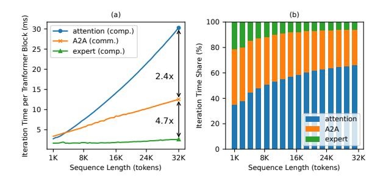
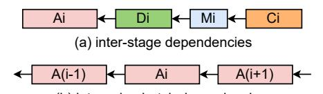
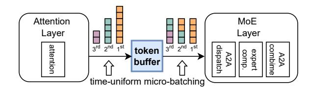
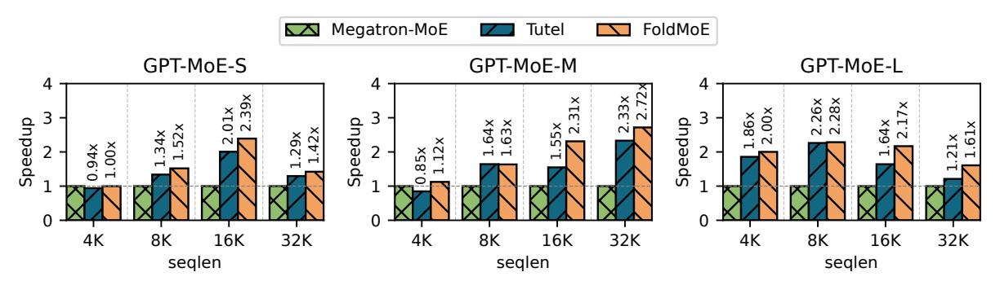
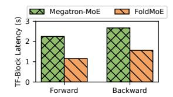
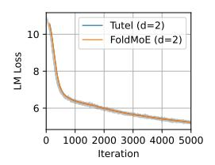
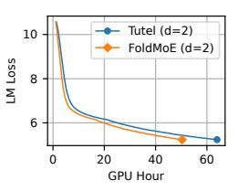

# FOLDMOE: Efficient Long Sequence MoE Training via Attention-MoE Pipelining

Guichao Zhu<sup>1†</sup>, Lintian Lei<sup>1†</sup>, Yuhao Qing<sup>1\*</sup>, Yichao Fu<sup>2</sup>, Fanxin Li<sup>1</sup>, Dong Huang<sup>1</sup>, Zekai Sun<sup>1</sup>, Heming Cui<sup>1\*</sup>

<sup>1</sup>The University of Hong Kong, <sup>2</sup>University of California, San Diego {gczhu, leilt, qyhh}@connect.hku.hk, heming@cs.hku.hk

#### **Abstract**

Training LLMs with Mixture-of-Experts (MoE) architecture on long sequences poses significant challenges due to the all-to-all communication bottleneck of expert parallelism. While existing approaches attempt to hide the communication costs in computation through token-level pipelining within MoE layers, their effectiveness is limited by the insufficient computation. We present FOLDMOE, a high-performance MoE training system that enables token-level overlapping across entire Transformer blocks through novel attention-MoE pipelining. We propose an efficient pipeline schedule, and a novel token buffering design to decouple attention and MoE layer partitioning, along with a timeuniform micro-batching strategy for enhanced efficiency. Evaluations on GPT-MoE models with sequences up to 32K tokens show that FOLDMOE achieves up to 1.49x and 2.72x speedup over state-of-the-art token-level overlapping and non-overlapping baselines respectively.

#### 1 Introduction

Large Language Models (LLMs) excel in various language tasks (Floridi and Chiriatti, 2020; Brown, 2020), but scaling dense models for improved performance (Kaplan et al., 2020; Hoffmann et al., 2022) incurs high computational costs. Mixture-of-Experts (MoE) architectures (Jacobs et al., 1991; Shazeer et al., 2017) address this by replacing dense feed-forward networks with sparse expert networks, enhancing efficiency. This approach has proven effective in recent MoE-based models like Mixtral (Jiang et al., 2024a), DeepSeekV3 (Liu et al., 2024), and MiniMax01 (Li et al., 2025), which achieve superior sample efficiency.

<span id="page-0-0"></span>

Figure 1: Execution time breakdown of training a GPT-MoE model on 2 AWS g5.24xlarge instances (each with 4 NVIDIA A10G GPUs)

These recent models also showcase a clear trend toward longer sequence lengths, with Mixtral handling 32K tokens, DeepSeekV3 extending to 128K, and MiniMax01 pushing boundaries to an impressive 1M tokens. However, training MoE models on such long sequences presents significant challenges, particularly in distributed training environments. In the prevalent expert parallelism training (Shazeer et al., 2017), where experts are distributed across devices, all-to-all communication (A2A) is necessary for token routing. Due to bandwidth constraints, this A2A communication emerges as a primary bottleneck in long sequence training with enormous tokens, as it exhibits a higher complexity constant compared to expert computation (evident from Figure 1a, A2A curve has larger slope than the expert curve).

To mitigate the A2A bottleneck of MoE training, existing works have proposed a pipelining strategy to enable *token-level overlapping* between A2A communication and expert computation in MoE layer (Hwang et al., 2022; He et al., 2022; Li et al., 2025). This approach leverages the token-wise independence of MoE layer, creating a pipeline by partitioning (micro-batching) input tokens, and concurrently executing computation and communication of different micro-batches, as illustrated in Figure 2a. Unfortunately, the lightweight MoE

<sup>†</sup> Equal contribution. \* Corresponding author.

<span id="page-1-0"></span>

Figure 2: Different token-level overlapping strategies for training a single sequence on one Transformer-MoE block. Computation and communication are on two streams (*comp.* and *comm.*) to overlap. Existing works (a) pipeline only MoE layer for overlapping. Attention-MoE pipeline in (b) uses an aAaM schedule with large bubbles due to the imbalanced stages (attention and expert computation). FOLDMOE in (c) proposes a *IA1M schedule* to reduce these pipeline bubbles by interleaving attention and expert computation. In (d), FOLDMOE additionally uses *time-uniform micro-batching* to further reduce bubbles caused by imbalanced attention micro-batches, achieving the largest speedup.

computation makes it hard to fully hide the large A2A latency, especially in commodity cloud environments with limited and unstable network bandwidth. Our measurements show that expert computation only constitutes up to 21% of execution time share as sequence length increases to 32K, being substantially overshadowed by the A2A overhead (Figure 1b).

To incorporate more computation to overlap with A2A communication, we first propose to establish an attention-MoE pipeline within each Transformer block, enabling token-level overlapping beyond MoE layers. For long-sequence training, where the maximum allowed batch size (i.e., number of sequences per training step) is squeezed by sequence length due to memory constraints, the micro-batching of attention layer is performed on sequence dimension (Li et al., 2021; Ma et al., 2024; Sun et al., 2024), where each sequence is sliced into sub-sequences as token micro-batches. We leverage this token-level micro-batching strategy to overlap attention computation with A2A communication from previous micro-batches, establishing an all-Attention-all-MoE pipeline (aAaM) inside Transformer block, as shown in Figure 2b. The attention layer's quadratic complexity with respect to sequence length (see Figure 1a) provides sufficient computational workload to fully overlap A2A communication latency as sequences scale to be longer.

However, exploiting token-level overlapping in attention-MoE pipeline raises several challenges. First, the inherent latency disparities between attention and expert computation stages introduce large pipeline bubbles (i.e., idle time), as shown in Figure 2b. The distinct computational complexity of attention and MoE layers with respect to sequence length make it difficult to achieve complete communication overlap with either stage alone. Second, the non-uniform latency across attention micro-batches might also create pipeline bubbles. Due to the causal property, computational load of attention increases progressively for later tokens in the sequence. This uneven latency leads to inefficient overlapping illustrated in Figure 2c.

To this end, we present FOLDMOE, a longsequence MoE training system fully incorporating attention-MoE pipelining. The system introduces a novel 1-Attention-1-MoE schedule (1A1M), illustrated in Figure 2c, which interleaves attention and MoE computation to minimize pipeline bubbles caused by stage imbalance. To further address the bubble issue caused by latency-uneven attention micro-batches, we design a token buffer to decouple the micro-batching between attention and MoE layers, and a time-uniform sequence slicing algorithm to heuristically partition each sequence for attention pipelining, ensuring high overlapping efficiency of attention and A2A communication (see Figure 2d). FOLDMOE is compatible with existing long-sequence training techniques like FlashAttention (Dao et al., 2022), tensor parallelism and sequence parallelism (Shoeybi et al., 2019; Korthikanti et al., 2023).

Our contribution can be summarized as follows:

• For the first time, we extend token-level overlapping of A2A communication and computation to the entire Transformer block through

- attention-MoE pipelining, enabling efficient training of MoE models on long sequences.
- We design an efficient token-level attention-MoE pipeline schedule (*1A1M*) that effectively hides A2A communication overhead.
- We develop a novel token buffering design between attention and MoE layers to enable timeuniform token micro-batching without requiring architectural modifications.
- We implement FOLDMOE and demonstrate its effectiveness on GPT-MoE models with sequences up to 32K tokens, achieving up to 1.49x speedup over state-of-the-art token-level overlapping approaches.

# 2 Background

#### <span id="page-2-4"></span>2.1 Transformer-MoE Block

Contemporary MoE models (Jiang et al., 2024a; Liu et al., 2024; Li et al., 2025) consist of stacked decoder-only Transformer-MoE blocks <sup>1</sup>, each containing an attention layer followed by an MoE layer (Figure 3). Only in attention layer do tokens compute to interact with each other, while the remaining part performs token-wise operations, allowing token-level input partitioning. For details of Transformer language modeling, please refer to Appx. A.

Causal attention in decoder models. The attention layer uses masked self-attention (Vaswani et al., 2017). For an input sequence  $(\mathbf{x_1}, \mathbf{x_2}, \dots, \mathbf{x_n})$ , it first projects each token  $\mathbf{x_i}$  into three vectors: query  $\mathbf{q_i}$ , key  $\mathbf{k_i}$ , and value  $\mathbf{v_i}$ , and then applies masked self-attention as:

$$Attn(\mathbf{x_t}; \mathbf{x_1}, \dots, \mathbf{x_{t-1}}) = \sum_{i=1}^{t} \operatorname{softmax}(\frac{\mathbf{q_t}^T \mathbf{k_i}}{\sqrt{d_k}}) \mathbf{v_i}$$
(1)

, where  $\mathbf{k}_i \in \mathbb{R}^{d_k}$ . Note that each query  $\mathbf{q_t}$  only requires  $\mathbf{k_1}, \mathbf{k_2}, \dots, \mathbf{k_{t-1}}$  and  $\mathbf{v_1}, \mathbf{v_2}, \dots, \mathbf{v_{t-1}}$  (i.e., KV pairs of its previous tokens) for masked attention. This causal property enables pipelining the attention computation along sequence dimension. While prior works (Li et al., 2021; Sun et al., 2024; Ma et al., 2024) focused on pipelined attention to optimize computational device utilization, we instead exploit this property to enhance communication-computation overlap in MoE model training.

<span id="page-2-1"></span>

Figure 3: A Transformer-MoE block consists of an attention layer followed by an MoE layer. (b) shows a 4-expert MoE layer with a top-1 gate under 2-way expert parallelism.

Mixture-of-Experts layer. An MoE layer comprises a gate and multiple expert networks. Given an input token  $\mathbf{x}$ , the gate assigns a score  $g(\mathbf{x})_i$  to indicate its affinity with each expert  $E_i$ . Based on these scores, the token is routed to top-k experts  $\tau$ . These experts process each token independently, and their outputs are aggregated as the final output, as shown in Equation 2. Since experts process data in token-wise manner, computation of MoE layer for a sequence of tokens is inherently chunkable on token level.

<span id="page-2-2"></span>
$$MoE(\mathbf{x}) = \sum_{i \in \tau} g(\mathbf{x})_i E_i(\mathbf{x})$$
 (2)

Expert parallelism (EP) (Shazeer et al., 2017) is commonly used for training larger MoE by distributing experts across multiple devices (e.g., GPUs), as illustrated in Figure 3b. Tokens are dispatched to experts residing on different devices, and results are collected back to the original devices for the following operations. This necessitates two symmetric A2A communications for exchanging tokens among devices, referred to as A2A dispatch and A2A combine, respectively. For more details about MoE, please refer to Appx. B.

#### <span id="page-2-3"></span>2.2 Comm.-Comp. Overlapping

To tackle the A2A bottleneck of MoE training, previous works proposed to hide A2A communication in computation. When training with relatively short sequences, *sequence-level overlapping* (Jiang et al., 2024b; Liu et al., 2024) can be applied to partition inputs on batch dimension, overlapping the A2A and computation of different sequences. This approach runs on the dimension of pipeline parallelism (Huang et al., 2019; Narayanan et al., 2019), requiring large enough

<span id="page-2-0"></span><sup>&</sup>lt;sup>1</sup>For brevity, we will refer to Transformer-MoE blocks simply as Transformer blocks in this paper.

training batch to be partitioned into micro-batches with less number of sequences. However, when training with long sequences, where maximum allowed batch size is decreased by large single sequence memory usage, this coarse-grained partitioning causes large pipeline bubbles (Li et al., 2021) and reduced overlapping efficiency. cases with extremely long sequences squeezing the batch size to be one, this approach becomes infeasible. On the other hand, token-level overlapping partitions inputs on token level (Hwang et al., 2022; He et al., 2022; Li et al., 2025), enabling finer granularity of pipelining and overlapping for long sequence training. Unfortunately, this token-level overlapping is designed only in MoE layer, as shown in Figure 2a, where the relatively small computation-to-communication ratio makes it hard to fully hide the A2A latency. We extend the existing token-level overlapping from MoE layers to the entire Transformer block, enabling fully overlap of A2A communication with computation.

#### 3 Attention-MoE Pipelining

For a given input sequence  $X = (\mathbf{x_1}, \mathbf{x_2}, \dots, \mathbf{x_n})$  of n tokens, a Transformer block computes the output sequence  $Y = (\mathbf{y_1}, \mathbf{y_2}, \dots, \mathbf{y_n})$ :

$$\mathbf{z_t} = \operatorname{Attn}(\mathbf{x_t}; \mathbf{x_1}, \dots, \mathbf{x_{t-1}}) \tag{3}$$

$$\mathbf{v_t} = \mathrm{MoE}(\mathbf{z_t}) \tag{4}$$

To establish an attention-MoE pipeline, we partition a Transformer block into four sequential pipeline stages: "attention computation  $\rightarrow$  A2A dispatch  $\rightarrow$  expert computation  $\rightarrow$  A2A combine", where the first stage is executed in the attention layer (Equation 3), while the remaining three stages operate in the MoE layer (Equation 4). Each sequence input to the Transformer block is sliced into micro-batches (i.e., sub-sequences) and fed into attention layer sequentially.

Attention computation can be pipelined by preserving the computed keys and values for each token. Denote  $X_{i:j}$  as the sub-sequence from the i-th to j-th token in the input sequence, with similar notation for keys  $K_{i:j}$ , values  $V_{i:j}$ , and attention outputs  $Z_{i:j}$ . Following Equation 1, computing attention for token  $\mathbf{x_t}$  requires only  $K_{1:t-1}$ ,  $V_{1:t-1}$  (i.e., keys and values of preceding tokens) and the token itself. This property allows us to partition inputs along the sequence dimension into microbatches, where each micro-batch only requires

access to keys and values from previous microbatches, as shown in Figure 5b. By maintaining computed keys and values during processing, attention computation can be performed in microbatches while overlapping with downstream MoE communication from previous micro-batches, as illustrated in Figure 2b. For instance, given an 8-token input sequence X sliced into micro-batches  $X_{1:4}$  and  $X_{5:8}$ , the attention layer first processes  $X_{1:4}$  to generate  $Z_{1:4}$ , storing  $K_{1:4}$  and  $V_{1:4}$  for subsequent use. The attention computation for  $X_{5:8}$  can then commence immediately, running in parallel with the A2A dispatch of  $Z_{1:4}$  in the MoE layer.

The MoE layer similarly supports pipelining to overlap expert computation with A2A communication of different micro-batches. The token-wise nature of MoE computation enables sequence partitioning into token micro-batches, as described in § 2.1. Combining both pipelined attention and MoE layers establishes a complete tokenlevel pipeline within each Transformer block (Figure 2b). Once the A2A combine stage completes processing the final micro-batch, the complete output sequence is formed by concatenating all micro-batch outputs before proceeding to the next Transformer block. During the backward pass, the pipeline schedule executes in reverse order while maintaining the same overlapping patterns as the forward pass.

#### <span id="page-3-1"></span><span id="page-3-0"></span>4 FOLDMOE System

Atop attention-MoE pipelining paradigm, we design training system FOLDMOE to maximize the communication-computation overlapping efficiency. This section introduces two key innovations: First, we propose *IAIM scheduling*, a schedule to address pipeline bubbles arising from stage imbalance. Second, we develop a *time-uniform micro-batching* strategy to reduce bubbles caused by micro-batch imbalance of attention. Finally, we show how to combine our system with existing long-sequence training methods.

#### 4.1 1A1M Scheduling

Trivially adopting an all-Attention-all-MoE schedule (aAaM) from MoE-only pipeline introduces large bubbles into the attention-MoE pipeline, as shown in Figure 2d. This problem arises from the uneven pipeline stages and false dependencies of aAaM schedule. The data dependence

<span id="page-4-1"></span>

(b) inter-microbatch dependencies Figure 4: Two categories of data dependencies in the attention-MoE pipeline.

<span id="page-4-0"></span>

Figure 5: Uneven attention computation of token-uniform micro-batching. (b) shows that a later micro-batches in the sequence have more previous positions to attend, incurring more computation than earlier micro-batches.

dencies of attention-MoE pipeline fall into two categories, as shown in Figure 4: (1) Inter-stage dependencies requiring sequential execution of the four pipeline stages for each micro-batch, and (2) Inter-microbatch dependencies mandating sequential attention computation across micro-batches. The aAaM schedule falsely delays expert computation and A2A combine by waiting for the attention stages of all following micro-batches. This creates large bubbles at the end of the pipeline where A2A combine can only overlap with the shorter expert computation.

To address the problem of aAaM, we propose to interleave the attention and expert computation across micro-batches (1-Attention-1-MoE schedule, 1A1M), to fully overlap two communication stages with two computation stages. As shown in Figure 2c, the 1A1M schedule executes A2A dispatch and expert computation of each micro-batch as soon as possible after its attention is completed, enabling the corresponding A2A combine to be executed earlier in the pipeline to overlap with computation. This design effectively reduces the bubbles caused by falsely stalled A2A combine stages at the end of the pipeline.

#### 4.2 Time-Uniform Micro-Batching

A conventional token-uniform micro-batching strategy (i.e., each micro-batch has the same number of tokens) leads to reduced overlapping effi-

<span id="page-4-2"></span>

Figure 6: Token buffer between attention and MoE layers to decouple their micro-batching. The sequence can be freely partitioned into micro-batches for time-uniform attention operation, without affecting the MoE layer's token-uniform micro-batching.

ciency in the attention-MoE pipeline. In attention layers, each micro-batch depends on previous ones, causing later micro-batches to perform more computations when attending to accumulated contexts under uniform sequence partitioning, as illustrated in Figure 5b. This computational imbalance across attention micro-batches leads to inefficient overlapping with time-uniform A2A communication, as shown in Figure 2b. To also obtain microbatches with fixed latency in attention layer for better overlapping with A2A, we propose a timeuniform micro-batching strategy, which (1) maintains uniform-size pipelining in MoE layer while allowing non-uniform partitioning in attention layers, and (2) determines a sequence slicing scheme maximizing overlap with A2A.

To effectively decouple micro-batching of attention and MoE layers, FOLDMOE introduces a token buffer between them, as shown in Figure 6b. This buffer temporarily stores tokens produced by the attention layer and emits fixed-size microbatches in a first-in-first-out manner to the MoE layer. The MoE layer can maintain uniform A2A communication and expert computation as long as the buffer contains sufficient unconsumed tokens to form a complete micro-batch when needed. For instance, consider an 8-token input sequence X sliced into two micro-batches:  $X_{1:6}$  and  $X_{7:8}$ . The attention layer processes these sequentially, producing  $Z_{1:6}$  and  $Z_{7:8}$ . Upon receiving  $Z_{1:6}$ , the token buffer retains  $Z_{5:6}$  and forwards  $Z_{1:4}$  as the first micro-batch for A2A dispatch and expert computation, generating  $Y_{1:4}$ . After receiving  $Z_{7:8}$ , the buffer combines it with the stored  $Z_{5:6}$  to emit  $Z_{5:8}$ , producing  $Y_{5:8}$ .

The sequence slicing problem for attention layer can be formulated as follows: given a training sequence length L and an overlap degree d, the sequence needs to be sliced into d microbatches to maximize pipeline overlapping. A slic-

<span id="page-5-0"></span>

Figure 7: Attention slicing is performed upon the 1A1M pipeline with fixed-size MoE micro-batches.

ing scheme S is defined as:

$$S=\{l_1,l_2,\cdots,l_d\}$$
 s.t.  $\sum_{i=1}^d l_i=L, \quad \sum_{i=1}^j l_i\geq \frac{j}{d}\cdot L$ 

where the second constraint ensures sufficient token availability in the buffer for the MoE layer. In a 1A1M pipeline, there are invariably two A2A stages during warm-up phase, three A2A stages during cool-down phase, and the saturated phase in between, as shown in Figure 7. An effective attention slicing strategy should minimize the warmup phase while maintaining uniform attention latency during the saturated phase to maximize overlap with A2A.

FOLDMOE employs a heuristic algorithm to produce a *quick-start time-uniform slicing scheme* for each sequence. Specifically, the algorithm aims to create a valid slicing scheme with a minimal initial micro-batch size to start the leading A2A as soon as possible, while ensuring subsequent micro-batches have approximately equal attention latencies. To estimate an ideal uniform latency for attention micro-batch, we follow (Hoffmann et al., 2022) to model the attention FLOPs for a *l*-token sequence attending to a *c*-token context (including the sequence itself) as:

$$FLOPs(l, c) = (4H + 3h)lc + 8H^2l$$
 (5)

where H denotes the model dimension (d\_model) and h is the number of attention heads. Each attention micro-batch incurs a computational cost of  $\mathrm{FLOPs}(l_i, \sum_i^L l_i)$ . The ideal uniform latency per micro-batch is calculated as  $\hat{t} = \sum_i^L \mathrm{FLOPs}(1,i)/d$ . As detailed in Algorithm 1, our algorithm begins with allocating a quick-start micro-batch of size L/d, then iteratively determines subsequent micro-batch boundaries by finding slices that yield attention latencies closest to  $\hat{t}$ . This process has a time complexity of O(L) for each set of training configurations (i.e., training sequence length and model specification).

The combination of sequence slicing strategy and token buffer management enables

```
Algorithm 1: Quick-start time-uniform attention slicing
```

```
Input: Total sequence length L, overlap
             degree d, ideal slice time \tilde{t}
    Output: Slicing scheme S
    /* Init a quick-start slice to S */
1 m \leftarrow \left\lceil \frac{L}{d} \right\rceil, S \leftarrow [];
 2 S.append(m);
    /* Cut one slice down from rest
        whenever latency exceeds \hat{t}
                                                          */
 start \leftarrow m:
 4 while start < L do
        end \leftarrow
          \max\{start + 1, (\operatorname{len}(S) + 1) \cdot m\};
        if L - end \ge d - \operatorname{len}(S) end
 6
             end \leftarrow \underset{end \le i \le L+1}{\operatorname{arg \, min}} | \text{FLOPs}(i - i)|
               start, i) - \hat{t}|;
        S.append(end - start);
10
        start \leftarrow end;
11 end
12 return S;
```

time-uniform micro-batching across the entire Transformer-MoE block, achieving full communication-computation overlap during the pipeline's saturated phase (see Figure 2d).

# 4.3 Combining with Other Long-Sequence Methods

FOLDMOE establishes the attention-MoE pipeline not beyond each Transformer block, overlapping communication and computation of a single device. This simplicity allows it to work with other established long-sequence training methods.

Combine with FlashAttention. FOLDMOE can seamlessly integrate FlashAttention (Dao et al., 2022; Dao, 2023), since they both maintain identical attention patterns with causal masking, whether processing the sequence in micro-batches or as a whole.

Combine with TP and SP. FOLDMOE is orthogonal to tensor parallelism (TP) (Shoeybi et al., 2019) in the sense that: TP slices and parallelizes *operators* across devices, while FOLDMOE slices data along the sequence dimension within a single device. On the other hand, sequence parallelism (SP) (Korthikanti et al., 2023),

<span id="page-6-0"></span>

Figure 8: End-to-end Performance of training MoE models on 16 GPUs with DP+TP/SP and EP.

<span id="page-6-1"></span>

Figure 9: Average normalized throughput of FOLDMOE and Tutel training GPT-MoE-M.

which operates within TP groups, also performs sequence-dimension partitioning as FOLDMOE. Fortunately, since SP exclusively operates on non-attention and non-MoE regions, e.g., layernorm (Lei Ba et al., 2016) and dropout (Srivastava et al., 2014), it does not affect the data integrity of FOLDMOE's attention-MoE pipelining.

#### 5 Evaluation

**Testbeds.** We evaluate FOLDMOE on a cluster with 2 AWS g5.48xlarge nodes, each containing 8 NVIDIA A10G-24G GPUs, and the nodes are linked by a 100 Gbps network.

Models and datasets. We evaluate the training workloads of the MoE counterparts of GPT-2 (Brown, 2020) models from 3 representative model sizes, GPT-MoE-L (large), GPT-MoE-M (mediam), GPT-MoE-S (small), as shown in Table 1. Wikipedia dataset is used as training data, and the training sequence length (seqlen) varies from 4K to 32K, with each seqlen being a power of 2. More details on model and experiment setups can be found in Appx. C.

**Baselines.** We compare FOLDMOE's training performance with Megatron-MoE (core\_r0.9.0) and Tutel (v0.3.2). The former serves as a vanilla non-overlapping baseline. Tutel is one of the state-of-the-art MoE training system that implements MoE-only overlapping between A2A and expert computation. For each experiment with Tutel, we turn on only its overlapping-related features, and

search through the overlap degree d (the number of partitions) of 2, 4, 8 and 16 to report the best result. The same search is also conducted for FOLD-MOE. We mainly focus on per-iteration training latency as our evaluation metric.

#### <span id="page-6-2"></span>5.1 Main Results

The main experiment conducts training on 16 GPUs, with 2-way cross-node DP and 8-way intranode TP+SP for attention layers, and 16-way EP for MoE layers. We show the speedups on periteration latency against Megatron-MoE for all configurations in Figure 8. FOLDMOE accelerates MoE training for all models: for GPT-MoE-S, FOLDMOE speeds up training against the best baselines by 1.14x, 1.19x, and 1.10x for seqlen 8K, 16K and 32K, respectively; for GPT-MoE-M, FOLDMOE significantly speeds up against Tutel by 1.12x, 1.49x, and 1.17x for seqlen 4K, 16K and 32K, respectively; for GPT-MoE-L, FOLDMOE accelerates training by 1.32x and 1.33x against Tutel for seqlen 16K and 32K, respectively.

#### 5.2 Ablation Study

Forward and backward pass overlapping. Both forward and backward pass of the training benefit from the attention-MoE pipelining of FOLDMOE. Figure 10 shows average training latency of Transformer blocks in GPT-MoE-L: under d=2, forward pass has 1.48x speedup and backward pass has 1.64x against the baseline; under d=8, forward/backward pass speedups increase to 1.94x

<span id="page-7-0"></span>



Figure 10: Latency of forward and backward pass of Transformer-block in GPT-MoE-M with 32K seqlen. Left: d=2. Right: d=8.

and 1.71x, respectively, benefiting from pipeline bubbles being further reduced.

System component effectiveness. We have developed FOLDMOE step by step, introducing aAaM, 1A1M schedule, and time-uniform microbatching for an efficient attention-MoE pipeline within each Transformer block. As shown in Figure 11a, 1A1M achieves better communication overlapping with computation, reducing the A2A latency on the critical path. Adding time-uniform micro-batching (1A1M+uniform) further minimizes pipeline bubbles, leading to optimal end-to-end performance. In the case of d=2 (Figure 11b), 1A1M degrades to aAaM due to insufficient token micro-batches for pipeline stage interleaving, maintaining the same critical path A2A latency.

Overlap degree. The overlap degree d serves as the sole configuration parameter for pipeline settings in both FOLDMOE and Tutel, determining the granularity of computation and communication partitioning. While a larger d can potentially yield higher speedups through reduced pipeline bubbles, it also introduces increased overhead from micro-batching operations, manifesting as smaller but more numerous GPU kernel launches. Figure 9 presents the average training throughput

<span id="page-7-1"></span>

Figure 11: Breakdown of average Transformer block latency on critical path of training GPT-MoE-L on 32K seglen with different FOLDMOE scheduling.

of the GPT-MoE-M block across various overlap degrees, normalized to the non-overlapping baseline (d=1). The results demonstrate a clear trade-off in FOLDMOE's performance: training throughput initially improves with increasing d due to better overlapping, reaches a peak, then declines as micro-batching overhead exceeds overlapping benefits. While Tutel exhibits a similar trade-off pattern, it is constrained by insufficient expert computation for overlapping. In contrast, FOLD-MOE achieves higher peak throughput and shows more gradual performance degradation by effectively utilizing the larger attention computation to hide A2A overhead.

#### **5.3** Training Convergence

FOLDMOE preserves the convergence characteristics of model training. To validate this, we trained GPT-MoE-S with 8K seqlen using 16-way DP/EP, comparing the loss curves between FOLD-MoE and Tutel at the same overlap degree d=2. As demonstrated in Figure 12a, models trained with FOLDMOE and Tutel exhibit identical convergence patterns, confirming that FOLDMOE maintains convergence fidelity. Figure 12b shows that FOLDMOE reaches the same training loss using less GPU hours than Tutel.

<span id="page-7-2"></span>



(a) FOLDMOE kept the same logical convergence efficiency as Tutel. The loss curve of both systems overlap in the figure.

(b) Reaching the same training loss 5.21 using the same overlap degree d=2, FOLDMOE takes 21% less time than Tutel.

Figure 12: Training loss curve of GPT-MoE-S over (a) logical training steps and (b) physical time.

#### 6 Conclusion

We present FOLDMOE, a system for efficient MoE training on long sequences through novel attention-MoE pipelining. By introducing a 1A1M pipeline schedule and time-uniform microbatching strategy, FOLDMOE enables effective token-level overlapping of A2A communication with computation across entire Transformer blocks. FOLDMOE is compatible with other long sequence training methods. Our evaluations show

that FOLDMOE accelerates the training of GPT-MoE models by up to 1.49x speedup using up to 32K sequence length on 16 GPUs compared to state-of-the-art systems.

### Limitations

While FOLDMOE demonstrates strong performance for training Transformer-based MoE models with long sequences, it is subject to two limitations: (1) Selection of an optimal overlap degree. Selecting an overlap degree (i.e., the number of micro-batches) is crucial for striking a balance between pipeline speedup and micro-batching overhead. This ideal overlap degree depends on model size, sequence length, and hardware specifics, and is currently left to be determined through light runtime profiling and manual tuning. (2) FOLD-MOE currently employs FP16 training to improve throughput. In long-sequence settings, rounding errors can accumulate across chunked layers, potentially causing minor numerical fluctuations in convergence. That said, as demonstrated in Figure [12,](#page-7-2) the impact on model quality remains negligible, with FOLDMOE preserving near-identical loss curves compared to baseline implementations and achieving faster convergence.

# Acknowledgments

We thank our anonymous reviewers for their insightful feedback. We also thank Xingjian Zeng for the helpful discussion and comments. The work is supported in part by National Key R&D Program of China (2022ZD0160201), HK RGC RIF (R7030-22), HK RGC GRF (ref No.: 17208223 & 17204424), a Huawei flagship research grant in 2023, SupernetAI, and the HKU-CAS Joint Laboratory for Intelligent System Software.

# References

- <span id="page-8-11"></span>Yoshua Bengio, Réjean Ducharme, and Pascal Vincent. 2000. A neural probabilistic language model. *Advances in neural information processing systems*, 13.
- <span id="page-8-1"></span>Tom B Brown. 2020. Language models are few-shot learners. *arXiv preprint arXiv:2005.14165*.
- <span id="page-8-13"></span>NVIDIA Corporation. 2020. Nvidia collective communication library (nccl) documentation. Available at: [https://docs.nvidia.com/deeplearning/](https://docs.nvidia.com/deeplearning/nccl/user-guide/docs/index.html) [nccl/user-guide/docs/index.html](https://docs.nvidia.com/deeplearning/nccl/user-guide/docs/index.html). Accessed: 30/09/2024.

- <span id="page-8-10"></span>Tri Dao. 2023. Flashattention-2: Faster attention with better parallelism and work partitioning. *arXiv preprint arXiv:2307.08691*.
- <span id="page-8-7"></span>Tri Dao, Dan Fu, Stefano Ermon, Atri Rudra, and Christopher Ré. 2022. Flashattention: Fast and memory-efficient exact attention with io-awareness. *Advances in Neural Information Processing Systems*, 35:16344–16359.
- <span id="page-8-12"></span>William Fedus, Barret Zoph, and Noam Shazeer. 2022. Switch transformers: Scaling to trillion parameter models with simple and efficient sparsity. *The Journal of Machine Learning Research*, 23(1):5232– 5270.
- <span id="page-8-0"></span>Luciano Floridi and Massimo Chiriatti. 2020. Gpt-3: Its nature, scope, limits, and consequences. *Minds and Machines*, 30:681–694.
- <span id="page-8-6"></span>Jiaao He, Jidong Zhai, Tiago Antunes, Haojie Wang, Fuwen Luo, Shangfeng Shi, and Qin Li. 2022. [Fastermoe: Modeling and optimizing training of](https://doi.org/10.1145/3503221.3508418) [large-scale dynamic pre-trained models.](https://doi.org/10.1145/3503221.3508418) In *Proceedings of the 27th ACM SIGPLAN Symposium on Principles and Practice of Parallel Programming*, PPoPP '22, page 120–134, New York, NY, USA. Association for Computing Machinery.
- <span id="page-8-2"></span>Jordan Hoffmann, Sebastian Borgeaud, Arthur Mensch, Elena Buchatskaya, Trevor Cai, Eliza Rutherford, Diego de Las Casas, Lisa Anne Hendricks, Johannes Welbl, Aidan Clark, and 1 others. 2022. Training compute-optimal large language models. *arXiv preprint arXiv:2203.15556*.
- <span id="page-8-9"></span>Yanping Huang, Youlong Cheng, Ankur Bapna, Orhan Firat, Dehao Chen, Mia Chen, HyoukJoong Lee, Jiquan Ngiam, Quoc V Le, Yonghui Wu, and 1 others. 2019. Gpipe: Efficient training of giant neural networks using pipeline parallelism. *Advances in neural information processing systems*, 32.
- <span id="page-8-5"></span>Changho Hwang, Wei Cui, Yifan Xiong, Ziyue Yang, Ze Liu, Han Hu, Zilong Wang, Rafael Salas, Jithin Jose, Prabhat Ram, and 1 others. 2022. Tutel: Adaptive mixture-of-experts at scale. *arXiv preprint arXiv:2206.03382*.
- <span id="page-8-3"></span>Robert A Jacobs, Michael I Jordan, Steven J Nowlan, and Geoffrey E Hinton. 1991. Adaptive mixtures of local experts. *Neural computation*, 3(1):79–87.
- <span id="page-8-4"></span>Albert Q Jiang, Alexandre Sablayrolles, Antoine Roux, Arthur Mensch, Blanche Savary, Chris Bamford, Devendra Singh Chaplot, Diego de las Casas, Emma Bou Hanna, Florian Bressand, and 1 others. 2024a. Mixtral of experts. *arXiv preprint arXiv:2401.04088*.
- <span id="page-8-8"></span>Chenyu Jiang, Ye Tian, Zhen Jia, Shuai Zheng, Chuan Wu, and Yida Wang. 2024b. Lancet: Accelerating mixture-of-experts training via whole graph computation-communication overlapping. *Proceedings of Machine Learning and Systems*, 6:74–86.

- <span id="page-9-0"></span>Jared Kaplan, Sam McCandlish, Tom Henighan, Tom B Brown, Benjamin Chess, Rewon Child, Scott Gray, Alec Radford, Jeffrey Wu, and Dario Amodei. 2020. Scaling laws for neural language models. *arXiv preprint arXiv:2001.08361*.
- <span id="page-9-16"></span>Diederik P Kingma and Jimmy Ba. 2014. Adam: A method for stochastic optimization. *arXiv preprint arXiv:1412.6980*.
- <span id="page-9-8"></span>Vijay Anand Korthikanti, Jared Casper, Sangkug Lym, Lawrence McAfee, Michael Andersch, Mohammad Shoeybi, and Bryan Catanzaro. 2023. Reducing activation recomputation in large transformer models. *Proceedings of Machine Learning and Systems*, 5:341–353.
- <span id="page-9-11"></span>Jimmy Lei Ba, Jamie Ryan Kiros, and Geoffrey E Hinton. 2016. Layer normalization. *ArXiv e-prints*, pages arXiv–1607.
- <span id="page-9-13"></span>Dmitry Lepikhin, HyoukJoong Lee, Yuanzhong Xu, Dehao Chen, Orhan Firat, Yanping Huang, Maxim Krikun, Noam Shazeer, and Zhifeng Chen. 2020. Gshard: Scaling giant models with conditional computation and automatic sharding. *arXiv preprint arXiv:2006.16668*.
- <span id="page-9-3"></span>Aonian Li, Bangwei Gong, Bo Yang, Boji Shan, Chang Liu, Cheng Zhu, Chunhao Zhang, Congchao Guo, Da Chen, Dong Li, and 1 others. 2025. Minimax-01: Scaling foundation models with lightning attention. *arXiv preprint arXiv:2501.08313*.
- <span id="page-9-15"></span>Shen Li, Yanli Zhao, Rohan Varma, Omkar Salpekar, Pieter Noordhuis, Teng Li, Adam Paszke, Jeff Smith, Brian Vaughan, Pritam Damania, and Soumith Chintala. 2020. [Pytorch distributed: expe](https://doi.org/10.14778/3415478.3415530)[riences on accelerating data parallel training.](https://doi.org/10.14778/3415478.3415530) *Proc. VLDB Endow.*, 13(12):3005–3018.
- <span id="page-9-4"></span>Zhuohan Li, Siyuan Zhuang, Shiyuan Guo, Danyang Zhuo, Hao Zhang, Dawn Song, and Ion Stoica. 2021. Terapipe: Token-level pipeline parallelism for training large-scale language models. In *International Conference on Machine Learning*, pages 6543–6552. PMLR.
- <span id="page-9-2"></span>Aixin Liu, Bei Feng, Bing Xue, Bingxuan Wang, Bochao Wu, Chengda Lu, Chenggang Zhao, Chengqi Deng, Chenyu Zhang, Chong Ruan, and 1 others. 2024. Deepseek-v3 technical report. *arXiv preprint arXiv:2412.19437*.
- <span id="page-9-5"></span>Ruilong Ma, Xiang Yang, Jingyu Wang, Qi Qi, Haifeng Sun, Jing Wang, Zirui Zhuang, and Jianxin Liao. 2024. [HPipe: Large language model pipeline par](https://doi.org/10.18653/v1/2024.naacl-industry.1)[allelism for long context on heterogeneous cost](https://doi.org/10.18653/v1/2024.naacl-industry.1)[effective devices.](https://doi.org/10.18653/v1/2024.naacl-industry.1) pages 1–9, Mexico City, Mexico.
- <span id="page-9-10"></span>Deepak Narayanan, Aaron Harlap, Amar Phanishayee, Vivek Seshadri, Nikhil R Devanur, Gregory R Ganger, Phillip B Gibbons, and Matei Zaharia. 2019. Pipedream: Generalized pipeline parallelism for dnn training. In *Proceedings of the 27th ACM symposium on operating systems principles*, pages 1–15.

- <span id="page-9-14"></span>Adam Paszke, Sam Gross, Francisco Massa, Adam Lerer, James Bradbury, Gregory Chanan, Trevor Killeen, Zeming Lin, Natalia Gimelshein, Luca Antiga, Alban Desmaison, Andreas Köpf, Edward Yang, Zach DeVito, Martin Raison, Alykhan Tejani, Sasank Chilamkurthy, Benoit Steiner, Lu Fang, and 2 others. 2019. *PyTorch: an imperative style, highperformance deep learning library*. Curran Associates Inc., Red Hook, NY, USA.
- <span id="page-9-1"></span>Noam Shazeer, Azalia Mirhoseini, Krzysztof Maziarz, Andy Davis, Quoc Le, Geoffrey Hinton, and Jeff Dean. 2017. Outrageously large neural networks: The sparsely-gated mixture-of-experts layer. *arXiv preprint arXiv:1701.06538*.
- <span id="page-9-7"></span>Mohammad Shoeybi, Mostofa Patwary, Raul Puri, Patrick LeGresley, Jared Casper, and Bryan Catanzaro. 2019. Megatron-lm: Training multi-billion parameter language models using model parallelism. *arXiv preprint arXiv:1909.08053*.
- <span id="page-9-12"></span>Nitish Srivastava, Geoffrey Hinton, Alex Krizhevsky, Ilya Sutskever, and Ruslan Salakhutdinov. 2014. Dropout: a simple way to prevent neural networks from overfitting. *The journal of machine learning research*, 15(1):1929–1958.
- <span id="page-9-6"></span>Ao Sun, Weilin Zhao, Xu Han, Cheng Yang, Xinrong Zhang, Zhiyuan Liu, Chuan Shi, and Maosong Sun. 2024. Seq1f1b: Efficient sequence-level pipeline parallelism for large language model training. *arXiv preprint arXiv:2406.03488*.
- <span id="page-9-9"></span>Ashish Vaswani, Noam Shazeer, Niki Parmar, Jakob Uszkoreit, Llion Jones, Aidan N Gomez, Łukasz Kaiser, and Illia Polosukhin. 2017. Attention is all you need. *Advances in neural information processing systems*, 30.

#### <span id="page-10-0"></span>A Language Modeling

Autoregressive modeling. Natural language has a sequential structure, which is commonly modeled by LLMs as joint probability over all tokens in the sequence (Bengio et al., 2000):

<span id="page-10-3"></span>
$$P(X) = \prod_{t=1}^{T} P(\mathbf{x_t} | \mathbf{x_1}, \mathbf{x_2}, \dots, \mathbf{x_{t-1}})$$
 (6)

, where T is the sequence length, and  $x_t$  is the token at position t in sequence X. Contemporary LLMs are usually built as a stack of decoderonly Transformer blocks (Brown, 2020; Floridi and Chiriatti, 2020) to model the autoregressive property in Equation 6.

Transformer. Each Transformer block consists of two categories of components: attention modules (Vaswani et al., 2017) an token-wise modules, including FFN, layernorm (Lei Ba et al., 2016), and dropout (Srivastava et al., 2014). FFN will be replaced by MoE layer in Transformer-based MoE models (Fedus et al., 2022; Lepikhin et al., 2020). LayerNorm (Lei Ba et al., 2016) is a token-wise operation, which normalizes its input along the last dimension, which is the embedding dimension of each token. Dropout (Srivastava et al., 2014) is an element-wise operation, which randomly sets a fraction of its input to zero during training to prevent overfitting, and scales the rest by the inverse of the keep probability. None of these operations requires information beyond a single token, and thus do not affect our design of partitioning the whole Transformer block at token level.

#### <span id="page-10-1"></span>B Mixture-of-Experts

**MoE Architecture.** Given an input token  $\mathbf{x} \in \mathbb{R}^d$ , the gate  $g: \mathbb{R}^d \to \mathbb{R}^{|\mathcal{E}|}$  assigns a score to indicate its affinity with each expert  $E_i$ , where  $\mathcal{E}$  is the set of all experts in this layer. As shown in Equation 7, the gate g is a linear transformation upon each input token x, followed by a softmax function. It projects from the input space to  $\mathbb{R}^{|\mathcal{E}|}$ , where  $\mathcal{E}$  is the set of all experts in this layer.

<span id="page-10-4"></span>
$$g(\mathbf{x}) = \operatorname{softmax}(W_a \mathbf{x}) \tag{7}$$

Modern expert networks in MoE are often implemented as fully-connected feed-forward networks (FFNs) with the same hidden size. , as shown in Equation 8, where  $W^{(i)}$  and  $b^{(i)}$  are parameter weights of expert i, while  $\sigma$  is a non-linear

activation function.

<span id="page-10-5"></span>
$$e_i(x) = \sigma(x \cdot W_1^{(i)} + b_1^{(i)}) \cdot W_2^{(i)} + b_2^{(i)}$$
 (8)

An FFN expert is usually designed to project each input to a higher dimensional hidden space and then back to the input space.

**Expert Capacity.** In MoE layers, a fixed *expert capacity* is typically assigned to each expert to promote balanced computational load distribution across experts and amongst expert parallel ranks. This capacity constraint dictates the maximum number of tokens an expert is permitted to process during a single forward pass.

The expert capacity is commonly defined in terms of a *capacity factor* (CF), which quantifies the ratio of allocated token slots per expert to the expected average number of tokens each expert would handle under perfectly balanced load conditions. The expert capacity can be formally expressed as:

$$\text{Expert Capacity} = \text{CF} \cdot \frac{B \cdot L}{|\mathcal{E}|},$$

where B denotes the batch size, L represents the sequence length, and  $|\mathcal{E}|$  signifies the total number of experts. The selection of the CF embodies a trade-off between computational efficiency, memory footprint, and the potential for token dropping.

#### <span id="page-10-2"></span>**C** Experiment Setups

**Software testbeds.** The experiments are conducted using CUDA 12.4, NCCL 2.21.5 (Corporation, 2020), and PyTorch 2.5.1 (Paszke et al., 2019) as the underlying software stack. Megatron-LM (Shoeybi et al., 2019) is used as the training framework.

Model details. According to Hoffmann et al. (2022)'s modeling, the attention-to-MoE computation ratio is mainly determined by d\_model, expert hidden size and seqlen, thus we mainly vary these parameters to evaluate our system under different conditions. We enhance the original GPT model by replacing every other Transformer block's FFN layer with an MoE layer, where experts are still FFNs, with top-1 GShard gate (Lepikhin et al., 2020).

**Training configurations.** We scale EP by one expert per GPU. For MoE layers, only EP (Shazeer et al., 2017) is applied, while DP, TP and SP (Li et al., 2020; Shoeybi et al., 2019; Korthikanti

<span id="page-11-0"></span>

|                    | GPT-MoE-S | GPT-MoE-M | GPT-MoE-L |
|--------------------|-----------|-----------|-----------|
| n_layer            | 6         | 6         | 12        |
| d_model            | 512       | 768       | 1024      |
| n_heads            | 8         | 8         | 8         |
| n_expert_per_gpu   | 1         | 1         | 1         |
| expert_hidden_size | 1024      | 1536      | 2048      |

Table 1: Model configurations for GPT-MoE variants.

[et al.,](#page-9-8) [2023\)](#page-9-8) are mixedly applied on attention layers. In each set of comparative experiments, we used the largest batch size that did not cause an out-of-memory error in any system. Adam optimizer [\(Kingma and Ba,](#page-9-16) [2014\)](#page-9-16) is used for training. We predominantly employ a capacity factor of 1.0 for all experiments.

Metrics. Our experimental evaluation primarily focuses on the average per-block training latency of models. To ensure measurement accuracy and eliminate initialization overhead, we execute 20 iterations for each experimental configuration and exclude the first five iterations to account for system warm-up effects. The final metrics are computed by averaging the latencies from iterations 6 through 20, and then normalizing by the total number of Transformer blocks in the model to obtain the per-block latency. This methodology provides a more reliable measure of steady-state performance while controlling for variations in model depth across different architectures.

## D Experiment Results

Table [2](#page-12-0) include the detailed Transformer block latency of our main experiments in § [5.1.](#page-6-2)

<span id="page-12-0"></span>

| Model     | SeqLen | System                           | d=1               | d=2          | d=4           | d=8          | d=16         |
|-----------|--------|----------------------------------|-------------------|--------------|---------------|--------------|--------------|
| GPT-MoE-L | 4096   | FoldMoE<br>Megatron-MoE<br>Tutel | -<br>800.94<br>-  | 502.67       | 400.10        | 578.19       | 1093.32      |
|           |        |                                  |                   | -<br>635.28  | -<br>431.37   | -<br>936.80  | -<br>527.75  |
|           | 8192   | FoldMoE<br>Megatron-MoE<br>Tutel | -<br>1688.37<br>- | 1029.06      | 832.73        | 738.90       | 1157.71      |
|           |        |                                  |                   | -<br>1808.21 | -<br>1943.72  | -<br>746.55  | -<br>1116.06 |
|           | 16384  | FoldMoE<br>Megatron-MoE<br>Tutel | -<br>2839.86<br>- | 1991.33      | 1309.26       | 1616.71      | 1811.94      |
|           |        |                                  |                   | -<br>2731.00 | -<br>1730.58  | -<br>4315.75 | -<br>3251.08 |
|           |        | FoldMoE                          | -                 | 3278.31      | 4016.33       | 2724.75      | 3209.82      |
|           | 32768  | Megatron-MoE<br>Tutel            | 4382.43<br>-      | -<br>3620.50 | -<br>11569.79 | -<br>7965.96 | -<br>7609.02 |
| GPT-MoE-M | 4096   | FoldMoE<br>Megatron-MoE<br>Tutel | -                 | 363.94       | 322.06        | 516.52       | 1225.78      |
|           |        |                                  | 361.86<br>-       | -<br>441.06  | -<br>427.28   | -<br>446.73  | -<br>468.61  |
|           | 8192   | FoldMoE<br>Megatron-MoE<br>Tutel | -<br>935.77<br>-  | 597.94       | 572.44        | 710.68       | 1037.50      |
|           |        |                                  |                   | -<br>569.65  | -<br>1695.62  | -<br>1020.66 | -<br>892.82  |
|           | 16384  | FoldMoE<br>Megatron-MoE<br>Tutel | -<br>2749.70<br>- | 1331.96      | 1189.83       | 1209.73      | 1321.54      |
|           |        |                                  |                   | -<br>1774.98 | -<br>4209.27  | -<br>2230.82 | -<br>2640.12 |
|           | 32768  | FoldMoE<br>Megatron-MoE<br>Tutel | -<br>5787.19<br>- | 2130.07      | 2998.03       | 2765.12      | 2540.53      |
|           |        |                                  |                   | -<br>2483.79 | -<br>5478.15  | -<br>8120.67 | -<br>6677.55 |
| GPT-MoE-S | 4096   | FoldMoE<br>Megatron-MoE<br>Tutel | -<br>272.36<br>-  | 373.87       | 272.95        | 523.96       | 858.39       |
|           |        |                                  |                   | -<br>468.93  | -<br>422.93   | -<br>289.46  | -<br>390.60  |
|           | 8192   | FoldMoE<br>Megatron-MoE<br>Tutel | -<br>613.19<br>-  | 403.56       | 418.75        | 655.35       | 939.90       |
|           |        |                                  |                   | -<br>728.45  | -<br>458.18   | -<br>750.66  | -<br>550.49  |
|           | 16384  | FoldMoE<br>Megatron-MoE<br>Tutel | -<br>1885.48<br>- | 1032.03      | 949.55        | 788.57       | 1794.69      |
|           |        |                                  |                   | -<br>939.75  | -<br>1726.05  | -<br>1382.16 | -<br>1109.29 |
|           | 32768  | FoldMoE<br>Megatron-MoE<br>Tutel | -<br>2499.82<br>- | 3041.63      | 2763.40       | 2705.85      | 1759.33      |
|           |        |                                  |                   | -<br>2775.18 | -<br>3301.95  | -<br>1930.80 | -<br>2981.09 |

Table 2: Average Transformer block latency (ms) under different experiment configurations.