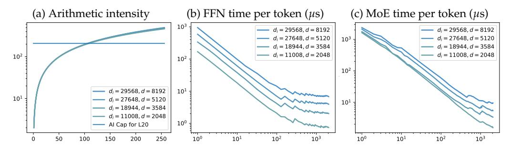
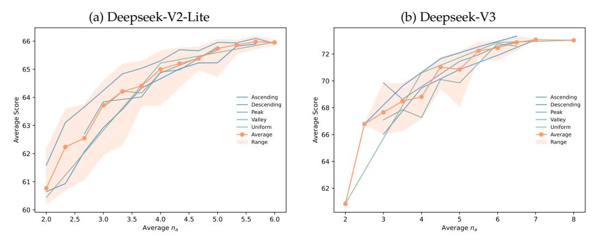

# Faster MoE LLM Inference for Extremely Large Models

Haoqi Yang†, Luohe Shi†, Qiwei Li, Zuchao Li, Ping Wang, Bo Du Wuhan University Wuhan, 430072, P. R. China

### Mengjia Shen

Wuhan Second Ship Design And Research Institute Wuhan, 430010, P. R. China

#### Hai Zhao

Shanghai Jiao Tong University Shanghai, 200240, P. R. China

## **Abstract**

Sparse Mixture of Experts (MoE) large language models (LLMs) are gradually becoming the mainstream approach for ultra-large-scale models. Existing optimization efforts for MoE models have focused primarily on coarse-grained MoE architectures. With the emergence of DeepSeek Models, fine-grained MoE models are gaining popularity, yet research on them remains limited. Therefore, we want to discuss the efficiency dynamic under different service loads. Additionally, fine-grained models allow deployers to reduce the number of routed experts, both activated counts and total counts, raising the question of how this reduction affects the trade-off between MoE efficiency and performance. Our findings indicate that while deploying MoE models presents greater challenges, it also offers significant optimization opportunities. Reducing the number of activated experts can lead to substantial efficiency improvements in certain scenarios, with only minor performance degradation. Reducing the total number of experts provides limited efficiency gains but results in severe performance degradation. Our method can increase throughput by at least 10% without any performance degradation. Overall, we conclude that MoE inference optimization remains an area with substantial potential for exploration and improvement.

# 1 Introduction

The introduction of the Transformer (Vaswani et al., 2017) has significantly improved the training efficiency of sequence models, making the training of ultra-large-scale models feasible. Building upon this foundation, GPT-style decoder-only Transformer models (Radford et al., 2018; 2019; Brown et al., 2020; OpenAI, 2023), guided by scaling laws (Kaplan et al., 2020), have rapidly gained prominence (Touvron et al., 2023a;b; Dubey et al., 2024). Their exceptional scalability has made them the mainstream choice for constructing large-scale generative language models (Chowdhery et al., 2023). To further expand model size while controlling both inference and training costs, one promising direction is the sparsification of the feed-forward network (FFN), which constitutes the majority of parameters in LLMs.

The FFN module in LLMs is typically implemented as either a Multi-Layer Perceptron (MLP, Murtagh, 1991) or a Gated Linear Unit (GLU, Dauphin et al., 2017). Both first project the hidden state to an intermediate state via an upsampling transformation, followed by an activation function, and then downsampled to produce the new hidden state. The

\*Corresponding Author, †Equal Contribution

Figure 1: The comparison of FFN, coarse-grained MoE, and fine-grained MoE.

intermediate state in MLP and GLU can be easily partitioned: a large one can be divided into multiple smaller ones while maintaining strict equivalence. This enables a strategy where an excessively large intermediate state is split into multiple smaller states, with only a subset of them being selectively activated through gating. Parameters corresponding to each partition is referred to as an "expert", and this architecture is known as the Sparse Mixture-of-Experts (MoE, [Shazeer et al.,](#page-14-6) [2017\)](#page-14-6). MoE was demonstrated to be effective in Transformer architectures by [Fedus et al..](#page-12-0) Mixtral-8x7B [\(Jiang et al.,](#page-13-1) [2024\)](#page-13-1) is the most famous large-scale open-source MoE LLM.

The deployment of Large Language Models (LLMs) has long been a significant challenge. Due to the autoregressive decoding, model parameters are repeatedly accessed during inference [\(Yu et al.,](#page-16-0) [2022\)](#page-16-0) but with only a few computation, leading to low arithmetic intensity. According to the Roofline model [\(Williams et al.,](#page-15-1) [2009\)](#page-15-1), this harms the computational efficiency of the system. Several existing works have optimized this aspect by enlarging batch size [\(Kwon et al.,](#page-13-2) [2023;](#page-13-2) [Zheng et al.,](#page-16-1) [2024;](#page-16-1) [Ye et al.,](#page-16-2) [2024\)](#page-16-2). While significant progress has been made in improving the training efficiency of MoE models [\(He et al.,](#page-13-3) [2021;](#page-13-3) [2022;](#page-13-4) [Zhai](#page-16-3) [et al.,](#page-16-3) [2023;](#page-16-3) [Rajbhandari et al.,](#page-14-7) [2022\)](#page-14-7), accelerating MoE modules during inference remains an underexplored area. In particular, the theoretical performance of MoE-based inference systems under varying batch sizes has yet to be thoroughly investigated.

Traditional MoE models employ a relatively conservative number of experts, typically eight in total and two actived per token. Moreover, these experts are generally initialized from a pre-trained dense small model. [Dai et al.](#page-10-1) introduced several modifications. They significantly increased the number of experts, both total and activated, while reducing the size of each expert. Additionally, all experts were randomly initialized. To mitigate the instability associated with training smaller experts, they introduced a larger shared expert which is always chosen as a backbone. The release of Deepseek V2 [\(DeepSeek-AI et al.,](#page-10-2) [2024a\)](#page-10-2), featuring 236 billion parameters, demonstrated the scalability of this paradigm. [DeepSeek-AI et al.](#page-11-1) further optimized the expert selection mechanism by incorporating grouping constraints and sigmoid activation, instead of softmax, leading to the development of the Deepseek V3 model. We refer to the deepseek approach as fine-grained MoE, while the conventional MoE paradigm is termed coarse-grained MoE. As shown in Figure [1.](#page-1-0)

Fine-grained MoE enhances the model's adaptability, allowing for more flexible parameter utilization during inference. Studies have explored discarding certain parameters at inference time to improve decoding speed. These approaches include expert pruning, where specific experts are removed and not loaded into memory [\(Chen et al.,](#page-9-2) [2022;](#page-9-2) [Lee et al.,](#page-13-5) [2024;](#page-13-5) [Lu et al.,](#page-14-8) [2024;](#page-14-8) [Xie et al.,](#page-15-2) [2024;](#page-15-2) [Yang et al.,](#page-15-3) [2024b\)](#page-15-3), and expert skipping, where the number of activated experts per token is reduced [\(Lu et al.,](#page-14-8) [2024\)](#page-14-8). Although some prior work has explored related topics, it has predominantly focused on designs tailored for coarse-grained MoE rather than the more promising fine-grained variant.

In summary, this paper presents an efficiency analysis of fine-grained MoE models under varying batch sizes during inference. We aim to address the question of whether MoE models can achieve efficiency gains only in large-scale service scenarios. Furthermore, we investigate the impact of different expert reduction strategies on both model performance and computational efficiency to assess whether this direction warrants further exploration, particularly in fine-grained MoE and its sigmoid-activated variant, in which the model exhibits different dynamical behaviors, necessitating a distinct analytical approach.

## 2 Background and Related Works

#### 2.1 FFN and MoE

Feed-forward network is usually an MLP or a GLU, given in Equation 1, where  $ACT(\cdot)$  denotes the activation function, and  $\otimes$  denotes the element-wise product.

$$MLP(h) = W_{d} \cdot ACT(W_{u} \cdot h)$$

$$GLU(h) = W_{d} \cdot (ACT(W_{u} \cdot h) \otimes (W_{g} \cdot h))$$
(1)

We use GLU to represent FFN from now on since it's the more common practice in current days (Shazeer, 2020; Chowdhery et al., 2023).

A mixture of experts layer can be represented as the weighted combination of multiple GLUs, where the weights r are given by a linear classifier called router. We define router logits as r'. Moreover, there is usually two function to modify the logits,  $F_r(\cdot)$  to manipulate Topk selection for load balancing, and  $F_w(\cdot)$  to normalize logits into the final weights. An MoE layer with  $n_e$  experts and  $n_a$  activated is given in Equation 2

$$MoE(h) = \sum_{i=1}^{n_e} r_i \cdot GLU_i(h)$$

$$r' = W_r \cdot h, \quad r_i = \begin{cases} F_w(r'_i), & r'_i \in Topk \left(F_r(r'), k = n_a\right) \\ 0, & \text{otherwise.} \end{cases}$$
(2)

## 2.2 LLM Serving Efficiency

Although modern LLM service systems offer a variety of system-level objectives (SLOs, Wang et al., 2024) for performance analysis, we focus on the most fundamental metric, **throughput**, to avoid unnecessary complexity. Throughput reflects the efficiency of computation under fixed input-output sequence lengths, effectively measuring the utilization of the hardware's computational capacity.

Previous works, such as Orca (Yu et al., 2022) and vLLM (Kwon et al., 2023), have constructed analytical frameworks based on the Roofline (Williams et al., 2009) model, which suggests that higher overall computational intensity leads to reduced per-token computation time. A core principle in LLM inference optimization is maximizing batch size to enhance computational efficiency. This is exemplified by continuous batching in vLLM and chunk attention (Ye et al., 2024), which facilitates batch processing of KV cache segments with shared prefix tokens.

#### 2.3 Model Pruning

Model pruning refers to the process of reducing a model's parameter count to enhance inference speed while minimizing performance degradation. Pruning can be performed at different levels of granularity. For instance, LayerSkip (Gromov et al., 2025) enables skipping entire layers, while other methods apply pruning within layers by sparsifying the attention of FFN (Frantar & Alistarh, 2023; He et al., 2024). In the context of LLMs, pruning is not limited to model parameters. It can also extend to components such as the KV cache, where various approaches have been proposed to selectively remove stored key-value pairs, further optimizing memory usage and computational efficiency.

For MoE models, related research has primarily focused on expert pruning (Chen et al., 2022; Yang et al., 2024b; Xie et al., 2024; Lu et al., 2024; Lee et al., 2024; Muzio et al., 2024; Li et al., 2024; Chen et al., 2025). For coarse-grained MoE, pruning was a relatively straightforward approach due to the high homogeneity among experts. However, in fine-grained MoE, these

methods face significant challenges. Nevertheless, the increased number of experts, both global and active, also presents new opportunities for optimization.

## 3 Preliminaries

#### 3.1 Notations

Previously we defined d as the hidden size,  $d_i$  as the intermediate size for FFNs,  $n_e$  as the expert counts,  $n_a$  as the active (chosen) experts per token,  $F_r$  as the modifier function of router logits for expert selection, and  $F_w$  as the weight modifier. We denote L as the sequence length, results in hidden state  $h \in \mathbb{R}^d$ ,  $H \in \mathbb{R}^{d \times L}$ ,  $W_u$ ,  $W_g \in R^{d_i \times d}$ , and  $W_d \in R^{d \times d_i}$ . The memory I/O, FLOPS, and arithmetic intensity (AI) based on the triplet of  $(d, d_i, L)$  is given in Equation 3.

$$I/O(d, d_i, L) = 3d_i d + 2L(d + d_i)$$

$$FLOPS(d, d_i, L) = 6L(d_i d)$$

$$AI(d, d_i, L) = \frac{6L(d_i d)}{3d_i d + 2L(d_i + d)}$$
(3)

To better evaluate the size of each state, we further define  $d_e$  as the intermediate size of experts,  $d_s$  as the intermediate size of of shared expert, and  $d_a$  as the activated intermediate size where  $d_a = d_e \times n_a$ .

#### 3.2 Evaluation Method

We selected two representative fine-grained MoE models for evaluation: DeepSeek-V2-Lite and DeepSeek-V3. Their fundamental characteristics are presented in Table 1.

| Model            | $n_e$ | $n_a$ | d    | $d_e$ | $d_s$ | $d_a$ | $d_a/(d_s+d_a)$ | <i>F</i> w |
|------------------|-------|-------|------|-------|-------|-------|-----------------|-----------------------|
| Deepseek-V2-Lite | 64    | 6     | 2048 | 1408  | 10944 | 8448  | 45.6%           | softmax               |
| Deepseek-V3      | 256   | 8     | 7168 | 2048  | 18432 | 16384 | 47.1%           | sigmoid               |

Table 1: Model information of Deepseek-V2-Lite and V3.

To evaluate the model's performance, we selected several benchmark datasets, including ARC (Easy and Challenge, Clark et al., 2018), BoolQ (Clark et al., 2019), OpenBookQA (OBQA, Mihaylov et al., 2018), RTE (Bentivogli et al., 2009), and Winogrande (Sakaguchi et al., 2021). If not specified, the performance score is the average of all above benchmarks, with 36 as the baseline (can be achieved through pure guessing).

#### 3.3 Hardware and Implementation Details

Implementation details of Section 4 is given in Appendix B. Implementation details of Section 5 and 6 is given in Appendix C.

It is important to emphasize that one of the most critical controlled variables in our efficiency experiments is the number of input and output tokens, as highlighted in Appendix A. Unless otherwise specified, all tests were conducted with randomly sampled 1024 input tokens, while the model was instructed to generate an additional 1024 tokens during inference, since increasing the proportion of input tokens can significantly enhance overall throughput.

### 4 Severing Efficiency of MoE

#### 4.1 Weakened Batch Effect

The feed-forward layer constitutes the majority of model parameters, accounting for approximately 66% in earlier models and up to 88% in some modern models (Qwen-2.5-3B,

Yang et al., 2024a). In a single-batch setting, it dominates computation time. During the prefill phase, all tokens in a sequence pass through the FFN simultaneously, meaning that once parameters are loaded into memory, they are reused multiple times. This amortizes the parameter loading cost across multiple tokens. Figure 2a depicted relationship between L and AI. When the batch size is small, increasing the number of parallel tokens significantly improves system performance. Notably, doubling the number of tokens from one to two incurs virtually no additional latency, despite the computational workload doubling. This phenomenon is illustrated in Figure 2b, showcasing the relationship between L and per-token latency ( $\mu$ s). It can be observed that at around L = 150, the efficiency maxed out.

In MoE models, although sparse activation reduces computational demands, resulting in a much lower FLOP requirement than the total parameter count, additional experts must be loaded into memory as the number of tokens increases. Since tokens rarely reuse the same expert within a batch, this creates an additional memory access overhead. Consequently, even without considering scheduling overhead (which can be significant), MoE is inherently not faster than FFN when operating under the same activated parameter count.

We evaluated the efficiency of the MoE module across different sequence lengths, as shown in Figure 2c. Our findings indicate that the MoE module incurs higher latency and reaches its peak efficiency more slowly compared to Figure 2b. However, we observed that larger models tend to achieve maximum efficiency more easily, primarily due to their inherently higher AI upper bound.

Figure 2: Simulation experiment results. X-axis represents sequence length *L*.

## 4.2 Expert Parallel

Although MoE is less efficient than FFN in terms of batch processing speedup, it requires significantly less inter-device communication under the same computational demands. When deploying models across multiple computing devices (e.g., GPUs or compute nodes), the most effective method for maximizing hardware utilization is tensor parallelism (TP).

For a dense FFN, TP is implemented by partitioning the intermediate states across multiple devices. Specifically, in a system with  $n_d$  devices, each device stores only a fraction of the parameters from  $W_{\{u,d,g\}}$ , corresponding to a subpartition of length  $d_i/n_d$  along the intermediate dimension. As previously discussed, the FFN structure allows for straightforward partitioning, enabling computations to be executed in parallel across the  $n_d$  devices. However, the primary drawback of TP lies in its high communication overhead. The total inter-device data transfer volume, even in the most optimized scenarios, cannot be lower than  $2(n_d-1)Ld$ . This is because each hidden state value must be exchanged across all devices twice, once for mapping and once for reducing, significantly limited it's applicability: TP is only seen across GPUs within a node, but not across nodes.

MoE inherently overcomes this communication bottleneck through expert parallelism (EP). In an EP setting, different experts are distributed across different devices, meaning that each token's state is transmitted only to its selected experts. Consequently, in the worst-case scenario, EP requires only  $2n_aLd$  communication operations. Given that the typical value of  $n_d$  is 8, whereas  $n_a$  is typically 2 for coarse-grained models, EP reduces data transfer volume to approximately 28% of that in TP. In fine-grained MoE, a similar optimization can

be achieved by grouping experts according to the EP paradigm, where all experts residing on the same device belong to the same group. By constraining each token to select experts from a limited number of groups (e.g., selecting from only 2 out of 8 possible groups), we can achieve the same benefits while further optimizing communication overhead.

In a typical multi-GPU setup, intra-node bandwidth using NVLink is approximately 160 GB/s, whereas inter-node connectivity via InfiniBand achieves around 50 GB/s, roughly 31% of intra-node bandwidth DeepSeek-AI et al. (2024b). This indicates that, under such configurations, EP can be effectively implemented across nodes, rather than requiring intra-node TP, while maintaining comparable latency. This property effectively compensates for the efficiency limitations discussed in the previous section: experts within a layer can be distributed across multiple nodes, allowing each node to handle a larger and more concentrated set of requests, thereby increasing arithmetic intensity.

## 5 Inference Time Expert Skipping

Compared to coarse-grained MoE, which typically activates only two experts, fine-grained MoE selects 6 to 8 experts from a pool of 64 to 256. This provides an opportunity to reduce the number of activated experts  $n_a$ , potentially improving efficiency. However, merely reducing  $n_a$  has limited impact on the overall model size, meaning it does not significantly lower the deployment barrier. Additionally, due to the presence of a large shared expert backbone, the actual reduction in computational cost is also relatively constrained.

Despite these challenges, we aim to explore this aspect from a language modeling perspective. More fine-grained control over  $n_a$  can provide insights into the adaptability of MoE models by analyzing their capacity requirements across different components. We conduct our experiments on DeepSeek-V2-Lite and DeepSeek-V3, detailed result can be found in Appendix E.

#### 5.1 Efficiency

In terms of efficiency, we investigated the impact of varying the number of activated experts  $(n_a)$  while retaining all experts. To simplify the testing scope and procedure, we used a consistent  $n_a$  across all layers, ranging from 2 to the model's original  $n_a$ . Based on this setup, we further evaluated the models under different request loads to analyze their performance. Our experiment results are depicted in Figure 3.

Figure 3: How expert skipping influence throughput. X-axis represents the concurrency.

By analyzing the throughput trend, we observed that reducing the number of activated experts  $n_a$  has no significant impact on the number of concurrent requests required to reach peak throughput. However, the speedup ratio curve presents a much more complex pattern.

Notably, we observe substantial acceleration at both low and high concurrency levels, while the acceleration effect is limited at moderate concurrency. In fact, at low concurrency, the

speedup ratio can reach 50% (when  $n_a=2$ ), surpassing the theoretical compute reduction upper bound for fine-grained MoE without considering MLA layers ( $d_a/(d_s+d_a)$ , 45%). This is because at low concurrency, the system is memory I/O-bound, and reducing  $n_a$  immediately lowers the required parameter loading, leading to a higher proportion of acceleration. At moderate concurrency, the system remains memory I/O-bound, but since a sufficient number of tokens are processed simultaneously, reducing  $n_a$  does not significantly reduce the total number of experts selected across all requests, resulting in limited acceleration. At high concurrency, the system shifts to a compute-bound regime, where reducing  $n_a$  lowers computational demands, thereby increasing throughput. In this case, the throughput gain aligns more closely with the compute reduction ratio.

#### 5.2 Performance and Structure Searching

We aim to identify an inter-layer expert allocation strategy that maximizes model performance while maintaining a fixed total number of experts activated per token. In addition, we investigate the impact of different expert reduction strategies on model performance. Our current focus is on customized reductions at the layer level.

Specifically, we define expert allocation using a four-tuple (b, h, e, p), where:

- The first layer selects *b* experts, i.e.,  $n_a(1) = b$ .
- The *p*-th layer selects *h* experts, i.e.,  $n_a(p) = h$ .
- The final layer selects *e* experts, i.e.,  $n_a(-1) = e$ .
- For the other layers, expert counts are determined through linear interpolation.

This formulation allows us to explore various expert allocation patterns, including ascending, descending, peak, and valley-shaped distributions, depicted in Figure 6, Appendix D. These experiments help us analyze the relative importance of experts across different layers from a language modeling perspective.

Figure 4: How expert skipping influence performance

Figure 4 presents our results. For softmax-based models such as DeepSeek V2, as shown in Figure 4a, we observe that even relatively aggressive expert skipping does not lead to a significant degradation in performance. On average, reducing the number of active experts from the full set to only two results in a performance drop of approximately 7.5%, while in the best-case scenario, the performance loss is limited to around 6%. Moreover, when an average of 3.3 experts is retained, the performance degradation remains within 1%.

In the V3 model, as shown in Figure 4b, we observe a similar performance curve when reducing  $n_a$ . However, compared to the smoother performance of V2-Lite, the V3 model exhibits greater instability across different reduction strategies. This instability may stem from the inherent properties of the sigmoid function, where expert weights tend to polarize

Figure 5: Throughput and speedup of expert pruning.

toward 0 or 1. In contrast, in softmax-based models, the weights of lower-ranked experts are significantly smaller than that of the top-ranked expert. We argue that using sigmoid instead of softmax offers a greater advantage in fine-grained MoE models, as it enables more effective utilization of the selected experts. However, this also limits its applicability in expert skipping, if skipping removes experts whose weights have already converged to 1, a substantial performance drop may occur.

Furthermore, among various expert skipping strategies, our experiments indicate that the descending reduction strategy offers the best trade-off between efficiency and performance on V2-Lite, but the ascending strategy yields the best performance in V3. We believe this behavior difference is an intrinsic characteristic of the model. The opposite trends observed in V2-Lite and V3 suggest that the optimal expert skipping strategy could be model-dependent, implying that a universal skipping strategy may not exist.

# 6 Pre-Inference Expert Pruning

Beyond reducing the number of activated experts during inference, we also explore another possibility introduced by fine-grained MoE models, determining which experts to discard before inference begins. In other words, this corresponds to reducing the total number of experts ( $n_e$ ). This approach has already been partially investigated, primarily in the context of Mixtral-series models, where expert pruning is typically guided by information-based metrics or performance comparisons after expert removal.

However, we focus on two additional key questions: 1. To what extent can these methods accelerate inference? 2. Are these methods still effective for fine-grained MoE models? While reducing the total number of experts does not decrease the computational workload, it can increase computational intensity, which could theoretically lead to a net positive effect on inference speed. Furthermore, fine-grained MoE models introduce a unique challenge for global expert reduction, fully randomized initialization, meaning that experts do not exhibit any similarities, making effective global pruning significantly more complex.

#### 6.1 Efficiency

We conducted experiments on DeepSeek V2 with varying  $n_e$  under a concurrent request setting of 512. The results of our evaluation are presented in Table 5.

We observed that the acceleration ratio was also significant at lower throughput levels, with up to 2.3× speedup. This is because when the number of experts is reduced, the computational intensity per expert increases rapidly, leading to a substantial increase in inference speed even with unchanged FLOPs. However, we noticed that at a concurrency level of 192, the throughput after expert reduction decreased. This may be due to a strategy shift within sglang for optimization, potentially triggering an underlying bug. For details on the sglang version used, please refer to Appendix C.

# **6.2 Performance**

We evaluated the performance of different selection strategies under varying *ne* values, as presented in Table [2.](#page-8-0) We conducted experiments using various expert reduction strategies, including random removal, structured removal (selecting experts based on odd indices, even indices, lower half indices, and upper half indices, methods theoretically equivalent to random selection), as well as the soft count and hard count methods proposed by [Muzio](#page-14-10) [et al.,](#page-14-10) which determine expert importance by there popularity before selecting the most critical ones. In some cases, certain methods completely lost their capabilities on specific test sets, performing at a level comparable to return random answer, we mark such cases in *italics*.

| Method                                 | ne                   | ARC-C                        | ARC-E                        | BoolQ                        | OBQA                         | RTE                          | WinoGrande                   | Avg                          |
|----------------------------------------|----------------------|------------------------------|------------------------------|------------------------------|------------------------------|------------------------------|------------------------------|------------------------------|
| Baseline                               | 64                   | 52.9                         | 80.6                         | 83.1                         | 35.8                         | 73.3                         | 71.4                         | 66.0                         |
| Random                                 | 16 32 48       | 20.8 19.2 43.7         | 27.2 31.1 75.0         | 60.8 59.4 81.2         | 14.8 15.2 31.2         | 50.5 50.5 65.7         | 50.5 51.2 67.5         | 37.4 37.7 60.7         |
| Odd Even First half Last half | 32 32 32 32 | 22.2 32.1 21.4 32.6 | 30.9 62.2 30.8 60.1 | 65.9 69.4 62.5 75.3 | 19.8 23.4 21.6 23.6 | 57.0 66.1 59.9 71.5 | 54.7 63.7 52.7 65.4 | 41.7 52.8 41.5 54.7 |
| Activate Count                      | 16 32 48       | 21.8 40.8 44.7         | 31.4 68.3 75.8         | 62.0 75.0 79.4         | 14.8 29.2 33.8         | 57.0 54.9 66.4         | 50.7 70.2 72.6         | 39.6 56.3 62.1         |
| Soft Count                          | 16 32 48       | 28.7 39.7 46.8         | 57.3 71.2 76.3         | 62.2 76.1 80.0         | 22.4 31.4 33.8         | 55.6 58.5 76.5         | 60.9 70.2 72.1         | 47.8 57.8 64.2         |

Table 2: Performance of different expert pruning method.

Our results indicate that the soft count method consistently outperformed the others. When reducing the number of experts by 25%, even the best method exhibited some performance degradation, whereas random selection resulted in significant accuracy loss. With a 50% reduction in experts, even the best method experienced a 15% drop in performance, while randomly selected experts completely lost language capabilities. Finally, when only 25% of the experts were retained, random selection still resulted in total failure, and only the best method was able to maintain some capability, while even the slightly inferior hard count method almost entirely lost its effectiveness.

An interesting observation from our experiments is that structured removal outperformed purely random selection. More specifically, when retaining experts with even indices or those from the latter half, performance was close to that of the best method. In contrast, the other two structured methods led to near-total language capability loss. This suggests the existence of particularly critical experts, which happen to be those with even indices and higher-numbered designations. In other words, despite the load-balancing mechanisms applied during training, there remains a significant disparity in expert importance.

# **7 Conclusion**

Through our research and experiments, we have derived several key conclusions regarding fine-grained MoE models.

Compared to typical FFNs, MoE layers, despite having the same computational requirements, are more challenging to execute efficiently due to increased scheduling overhead and weaker batch-processing effects. However, expert parallelism offers potential for optimization. Expert skipping during inference improves throughput. Although the presence of

a shared backbone and attention mechanism constrains acceleration gains, small-batch and large-batch scenarios still exhibit significant improvements, whereas the effects remain less pronounced at intermediate concurrency levels. Encouragingly, the performance impact of expert skipping is minimal, and with appropriate skipping strategies, performance degradation can be further mitigated. Our best approach can increase throughput by at least 10% without any loss in performance on Deepseek-V3. On a global level, reducing the number of total experts before inference can yield a moderate increase in throughput, though the acceleration effect diminishes when the expert count is minimized. While reducing memory consumption lowers the deployment barrier, it also results in substantial performance loss, which limits its practical usability.

Overall, we believe that MoE optimization remains a promising research direction, both in terms of designing more efficient inference systems and exploring its potential from a language modeling perspective.

# **References**

Luisa Bentivogli, Bernardo Magnini, Ido Dagan, Hoa Trang Dang, and Danilo Giampiccolo. The fifth PASCAL recognizing textual entailment challenge. In *Proceedings of the Second Text Analysis Conference, TAC 2009, Gaithersburg, Maryland, USA, November 16-17, 2009*. NIST, 2009. URL [https://tac.nist.gov/publications/2009/additional.papers/RTE5](https://tac.nist.gov/publications/2009/additional.papers/RTE5_overview.proceedings.pdf) [overview.proceedings.pdf](https://tac.nist.gov/publications/2009/additional.papers/RTE5_overview.proceedings.pdf).

Tom Brown, Benjamin Mann, Nick Ryder, Melanie Subbiah, Jared D Kaplan, Prafulla Dhariwal, Arvind Neelakantan, Pranav Shyam, Girish Sastry, Amanda Askell, Sandhini Agarwal, Ariel Herbert-Voss, Gretchen Krueger, Tom Henighan, Rewon Child, Aditya Ramesh, Daniel Ziegler, Jeffrey Wu, Clemens Winter, Chris Hesse, Mark Chen, Eric Sigler, Mateusz Litwin, Scott Gray, Benjamin Chess, Jack Clark, Christopher Berner, Sam McCandlish, Alec Radford, Ilya Sutskever, and Dario Amodei. Language models are few-shot learners. In H. Larochelle, M. Ranzato, R. Hadsell, M.F. Balcan, and H. Lin (eds.), *Advances in Neural Information Processing Systems*, volume 33, pp. 1877–1901. Curran Associates, Inc., 2020. URL [https://proceedings.neurips.cc/paper](https://proceedings.neurips.cc/paper_files/paper/2020/file/1457c0d6bfcb4967418bfb8ac142f64a-Paper.pdf) files/paper/2020/ [file/1457c0d6bfcb4967418bfb8ac142f64a-Paper.pdf](https://proceedings.neurips.cc/paper_files/paper/2020/file/1457c0d6bfcb4967418bfb8ac142f64a-Paper.pdf).

I-Chun Chen, Hsu-Shen Liu, Wei-Fang Sun, Chen-Hao Chao, Yen-Chang Hsu, and Chun-Yi Lee. Retraining-free merging of sparse mixture-of-experts via hierarchical clustering, 2025. URL <https://openreview.net/forum?id=yeeIGM3N6w>.

Tianyu Chen, Shaohan Huang, Yuan Xie, Binxing Jiao, Daxin Jiang, Haoyi Zhou, Jianxin Li, and Furu Wei. Task-specific expert pruning for sparse mixture-of-experts. *CoRR*, abs/2206.00277, 2022. doi: 10.48550/ARXIV.2206.00277. URL [https://doi.org/10.](https://doi.org/10.48550/arXiv.2206.00277) [48550/arXiv.2206.00277](https://doi.org/10.48550/arXiv.2206.00277).

Aakanksha Chowdhery, Sharan Narang, Jacob Devlin, Maarten Bosma, Gaurav Mishra, Adam Roberts, Paul Barham, Hyung Won Chung, Charles Sutton, Sebastian Gehrmann, Parker Schuh, Kensen Shi, Sasha Tsvyashchenko, Joshua Maynez, Abhishek Rao, Parker Barnes, Yi Tay, Noam Shazeer, Vinodkumar Prabhakaran, Emily Reif, Nan Du, Ben Hutchinson, Reiner Pope, James Bradbury, Jacob Austin, Michael Isard, Guy Gur-Ari, Pengcheng Yin, Toju Duke, Anselm Levskaya, Sanjay Ghemawat, Sunipa Dev, Henryk Michalewski, Xavier Garcia, Vedant Misra, Kevin Robinson, Liam Fedus, Denny Zhou, Daphne Ippolito, David Luan, Hyeontaek Lim, Barret Zoph, Alexander Spiridonov, Ryan Sepassi, David Dohan, Shivani Agrawal, Mark Omernick, Andrew M. Dai, Thanumalayan Sankaranarayana Pillai, Marie Pellat, Aitor Lewkowycz, Erica Moreira, Rewon Child, Oleksandr Polozov, Katherine Lee, Zongwei Zhou, Xuezhi Wang, Brennan Saeta, Mark Diaz, Orhan Firat, Michele Catasta, Jason Wei, Kathy Meier-Hellstern, Douglas Eck, Jeff Dean, Slav Petrov, and Noah Fiedel. Palm: Scaling language modeling with pathways. *J. Mach. Learn. Res.*, 24:240:1–240:113, 2023. URL <https://jmlr.org/papers/v24/22-1144.html>.

Christopher Clark, Kenton Lee, Ming-Wei Chang, Tom Kwiatkowski, Michael Collins, and Kristina Toutanova. BoolQ: Exploring the surprising difficulty of natural yes/no

questions. In Jill Burstein, Christy Doran, and Thamar Solorio (eds.), *Proceedings of the 2019 Conference of the North American Chapter of the Association for Computational Linguistics: Human Language Technologies, Volume 1 (Long and Short Papers)*, pp. 2924–2936, Minneapolis, Minnesota, June 2019. Association for Computational Linguistics. doi: 10.18653/v1/ N19-1300. URL <https://aclanthology.org/N19-1300/>.

Peter Clark, Isaac Cowhey, Oren Etzioni, Tushar Khot, Ashish Sabharwal, Carissa Schoenick, and Oyvind Tafjord. Think you have solved question answering? try arc, the AI2 reasoning challenge. *CoRR*, abs/1803.05457, 2018. URL [http://arxiv.org/abs/1803.](http://arxiv.org/abs/1803.05457) [05457](http://arxiv.org/abs/1803.05457).

Damai Dai, Chengqi Deng, Chenggang Zhao, R.x. Xu, Huazuo Gao, Deli Chen, Jiashi Li, Wangding Zeng, Xingkai Yu, Y. Wu, Zhenda Xie, Y.k. Li, Panpan Huang, Fuli Luo, Chong Ruan, Zhifang Sui, and Wenfeng Liang. DeepSeekMoE: Towards ultimate expert specialization in mixture-of-experts language models. In Lun-Wei Ku, Andre Martins, and Vivek Srikumar (eds.), *Proceedings of the 62nd Annual Meeting of the Association for Computational Linguistics (Volume 1: Long Papers)*, pp. 1280–1297, Bangkok, Thailand, August 2024. Association for Computational Linguistics. doi: 10.18653/v1/2024.acl-long. 70. URL <https://aclanthology.org/2024.acl-long.70/>.

Yann N. Dauphin, Angela Fan, Michael Auli, and David Grangier. Language modeling with gated convolutional networks. In Doina Precup and Yee Whye Teh (eds.), *Proceedings of the 34th International Conference on Machine Learning, ICML 2017, Sydney, NSW, Australia, 6-11 August 2017*, volume 70 of *Proceedings of Machine Learning Research*, pp. 933–941. PMLR, 2017. URL <http://proceedings.mlr.press/v70/dauphin17a.html>.

DeepSeek-AI, Aixin Liu, Bei Feng, Bin Wang, Bingxuan Wang, Bo Liu, Chenggang Zhao, Chengqi Deng, Chong Ruan, Damai Dai, Daya Guo, Dejian Yang, Deli Chen, Dongjie Ji, Erhang Li, Fangyun Lin, Fuli Luo, Guangbo Hao, Guanting Chen, Guowei Li, Hao Zhang, Hanwei Xu, Hao Yang, Haowei Zhang, Honghui Ding, Huajian Xin, Huazuo Gao, Hui Li, Hui Qu, J. L. Cai, Jian Liang, Jianzhong Guo, Jiaqi Ni, Jiashi Li, Jin Chen, Jingyang Yuan, Junjie Qiu, Junxiao Song, Kai Dong, Kaige Gao, Kang Guan, Lean Wang, Lecong Zhang, Lei Xu, Leyi Xia, Liang Zhao, Liyue Zhang, Meng Li, Miaojun Wang, Mingchuan Zhang, Minghua Zhang, Minghui Tang, Mingming Li, Ning Tian, Panpan Huang, Peiyi Wang, Peng Zhang, Qihao Zhu, Qinyu Chen, Qiushi Du, R. J. Chen, R. L. Jin, Ruiqi Ge, Ruizhe Pan, Runxin Xu, Ruyi Chen, S. S. Li, Shanghao Lu, Shangyan Zhou, Shanhuang Chen, Shaoqing Wu, Shengfeng Ye, Shirong Ma, Shiyu Wang, Shuang Zhou, Shuiping Yu, Shunfeng Zhou, Size Zheng, Tao Wang, Tian Pei, Tian Yuan, Tianyu Sun, W. L. Xiao, Wangding Zeng, Wei An, Wen Liu, Wenfeng Liang, Wenjun Gao, Wentao Zhang, X. Q. Li, Xiangyue Jin, Xianzu Wang, Xiao Bi, Xiaodong Liu, Xiaohan Wang, Xiaojin Shen, Xiaokang Chen, Xiaosha Chen, Xiaotao Nie, and Xiaowen Sun. Deepseek-v2: A strong, economical, and efficient mixture-of-experts language model. *CoRR*, abs/2405.04434, 2024a. doi: 10.48550/ARXIV.2405.04434. URL <https://doi.org/10.48550/arXiv.2405.04434>.

DeepSeek-AI, Aixin Liu, Bei Feng, Bing Xue, Bingxuan Wang, Bochao Wu, Chengda Lu, Chenggang Zhao, Chengqi Deng, Chenyu Zhang, Chong Ruan, Damai Dai, Daya Guo, Dejian Yang, Deli Chen, Dongjie Ji, Erhang Li, Fangyun Lin, Fucong Dai, Fuli Luo, Guangbo Hao, Guanting Chen, Guowei Li, H. Zhang, Han Bao, Hanwei Xu, Haocheng Wang, Haowei Zhang, Honghui Ding, Huajian Xin, Huazuo Gao, Hui Li, Hui Qu, J. L. Cai, Jian Liang, Jianzhong Guo, Jiaqi Ni, Jiashi Li, Jiawei Wang, Jin Chen, Jingchang Chen, Jingyang Yuan, Junjie Qiu, Junlong Li, Junxiao Song, Kai Dong, Kai Hu, Kaige Gao, Kang Guan, Kexin Huang, Kuai Yu, Lean Wang, Lecong Zhang, Lei Xu, Leyi Xia, Liang Zhao, Litong Wang, Liyue Zhang, Meng Li, Miaojun Wang, Mingchuan Zhang, Minghua Zhang, Minghui Tang, Mingming Li, Ning Tian, Panpan Huang, Peiyi Wang, Peng Zhang, Qiancheng Wang, Qihao Zhu, Qinyu Chen, Qiushi Du, R. J. Chen, R. L. Jin, Ruiqi Ge, Ruisong Zhang, Ruizhe Pan, Runji Wang, Runxin Xu, Ruoyu Zhang, Ruyi Chen, S. S. Li, Shanghao Lu, Shangyan Zhou, Shanhuang Chen, Shaoqing Wu, Shengfeng Ye, Shengfeng Ye, Shirong Ma, Shiyu Wang, Shuang Zhou, Shuiping Yu, Shunfeng Zhou, Shuting Pan, T. Wang, Tao Yun, Tian Pei, Tianyu Sun, W. L. Xiao, and Wangding Zeng. Deepseek-v3 technical report. *CoRR*, abs/2412.19437, 2024b. doi: 10.48550/ARXIV.2412.19437. URL <https://doi.org/10.48550/arXiv.2412.19437>.

DeepSeek-AI, Daya Guo, Dejian Yang, Haowei Zhang, Junxiao Song, Ruoyu Zhang, Runxin Xu, Qihao Zhu, Shirong Ma, Peiyi Wang, Xiao Bi, Xiaokang Zhang, Xingkai Yu, Yu Wu, Z. F. Wu, Zhibin Gou, Zhihong Shao, Zhuoshu Li, Ziyi Gao, Aixin Liu, Bing Xue, Bingxuan Wang, Bochao Wu, Bei Feng, Chengda Lu, Chenggang Zhao, Chengqi Deng, Chenyu Zhang, Chong Ruan, Damai Dai, Deli Chen, Dongjie Ji, Erhang Li, Fangyun Lin, Fucong Dai, Fuli Luo, Guangbo Hao, Guanting Chen, Guowei Li, H. Zhang, Han Bao, Hanwei Xu, Haocheng Wang, Honghui Ding, Huajian Xin, Huazuo Gao, Hui Qu, Hui Li, Jianzhong Guo, Jiashi Li, Jiawei Wang, Jingchang Chen, Jingyang Yuan, Junjie Qiu, Junlong Li, J. L. Cai, Jiaqi Ni, Jian Liang, Jin Chen, Kai Dong, Kai Hu, Kaige Gao, Kang Guan, Kexin Huang, Kuai Yu, Lean Wang, Lecong Zhang, Liang Zhao, Litong Wang, Liyue Zhang, Lei Xu, Leyi Xia, Mingchuan Zhang, Minghua Zhang, Minghui Tang, Meng Li, Miaojun Wang, Mingming Li, Ning Tian, Panpan Huang, Peng Zhang, Qiancheng Wang, Qinyu Chen, Qiushi Du, Ruiqi Ge, Ruisong Zhang, Ruizhe Pan, Runji Wang, R. J. Chen, R. L. Jin, Ruyi Chen, Shanghao Lu, Shangyan Zhou, Shanhuang Chen, Shengfeng Ye, Shiyu Wang, Shuiping Yu, Shunfeng Zhou, Shuting Pan, and S. S. Li. Deepseek-r1: Incentivizing reasoning capability in llms via reinforcement learning. *CoRR*, abs/2501.12948, 2025. doi: 10.48550/ARXIV.2501.12948. URL <https://doi.org/10.48550/arXiv.2501.12948>.

Abhimanyu Dubey, Abhinav Jauhri, Abhinav Pandey, Abhishek Kadian, Ahmad Al-Dahle, Aiesha Letman, Akhil Mathur, Alan Schelten, Amy Yang, Angela Fan, Anirudh Goyal, Anthony Hartshorn, Aobo Yang, Archi Mitra, Archie Sravankumar, Artem Korenev, Arthur Hinsvark, Arun Rao, Aston Zhang, Aurelien Rodriguez, Austen Gregerson, Ava Spataru, Baptiste Roziere, Bethany Biron, Binh Tang, Bobbie Chern, Charlotte Caucheteux, Chaya Nayak, Chloe Bi, Chris Marra, Chris McConnell, Christian Keller, Christophe Touret, Chunyang Wu, Corinne Wong, Cristian Canton Ferrer, Cyrus Nikolaidis, Damien Allonsius, Daniel Song, Danielle Pintz, Danny Livshits, David Esiobu, Dhruv Choudhary, Dhruv Mahajan, Diego Garcia-Olano, Diego Perino, Dieuwke Hupkes, Egor Lakomkin, Ehab AlBadawy, Elina Lobanova, Emily Dinan, Eric Michael Smith, Filip Radenovic, Frank Zhang, Gabriel Synnaeve, Gabrielle Lee, Georgia Lewis Anderson, Graeme Nail, Gregoire Mialon, Guan Pang, Guillem Cucurell, Hailey Nguyen, Hannah Korevaar, Hu Xu, Hugo Touvron, Iliyan Zarov, Imanol Arrieta Ibarra, Isabel Kloumann, Ishan Misra, Ivan Evtimov, Jade Copet, Jaewon Lee, Jan Geffert, Jana Vranes, Jason Park, Jay Mahadeokar, Jeet Shah, Jelmer van der Linde, Jennifer Billock, Jenny Hong, Jenya Lee, Jeremy Fu, Jianfeng Chi, Jianyu Huang, Jiawen Liu, Jie Wang, Jiecao Yu, Joanna Bitton, Joe Spisak, Jongsoo Park, Joseph Rocca, Joshua Johnstun, Joshua Saxe, Junteng Jia, Kalyan Vasuden Alwala, Kartikeya Upasani, Kate Plawiak, Ke Li, Kenneth Heafield, Kevin Stone, Khalid El-Arini, Krithika Iyer, Kshitiz Malik, Kuenley Chiu, Kunal Bhalla, Lauren Rantala-Yeary, Laurens van der Maaten, Lawrence Chen, Liang Tan, Liz Jenkins, Louis Martin, Lovish Madaan, Lubo Malo, Lukas Blecher, Lukas Landzaat, Luke de Oliveira, Madeline Muzzi, Mahesh Pasupuleti, Mannat Singh, Manohar Paluri, Marcin Kardas, Mathew Oldham, Mathieu Rita, Maya Pavlova, Melanie Kambadur, Mike Lewis, Min Si, Mitesh Kumar Singh, Mona Hassan, Naman Goyal, Narjes Torabi, Nikolay Bashlykov, Nikolay Bogoychev, Niladri Chatterji, Olivier Duchenne, Onur C¸ elebi, Patrick Alrassy, Pengchuan Zhang, Pengwei Li, Petar Vasic, Peter Weng, Prajjwal Bhargava, Pratik Dubal, Praveen Krishnan, Punit Singh Koura, Puxin Xu, Qing He, Qingxiao Dong, Ragavan Srinivasan, Raj Ganapathy, Ramon Calderer, Ricardo Silveira Cabral, Robert Stojnic, Roberta Raileanu, Rohit Girdhar, Rohit Patel, Romain Sauvestre, Ronnie Polidoro, Roshan Sumbaly, Ross Taylor, Ruan Silva, Rui Hou, Rui Wang, Saghar Hosseini, Sahana Chennabasappa, Sanjay Singh, Sean Bell, Seohyun Sonia Kim, Sergey Edunov, Shaoliang Nie, Sharan Narang, Sharath Raparthy, Sheng Shen, Shengye Wan, Shruti Bhosale, Shun Zhang, Simon Vandenhende, Soumya Batra, Spencer Whitman, Sten Sootla, Stephane Collot, Suchin Gururangan, Sydney Borodinsky, Tamar Herman, Tara Fowler, Tarek Sheasha, Thomas Georgiou, Thomas Scialom, Tobias Speckbacher, Todor Mihaylov, Tong Xiao, Ujjwal Karn, Vedanuj Goswami, Vibhor Gupta, Vignesh Ramanathan, Viktor Kerkez, Vincent Gonguet, Virginie Do, Vish Vogeti, Vladan Petrovic, Weiwei Chu, Wenhan Xiong, Wenyin Fu, Whitney Meers, Xavier Martinet, Xiaodong Wang, Xiaoqing Ellen Tan, Xinfeng Xie, Xuchao Jia, Xuewei Wang, Yaelle Goldschlag, Yashesh Gaur, Yasmine Babaei, Yi Wen, Yiwen Song, Yuchen Zhang, Yue Li, Yuning Mao, Zacharie Delpierre Coudert, Zheng Yan, Zhengxing Chen, Zoe Papakipos, Aaditya Singh, Aaron Grattafiori, Abha Jain, Adam Kelsey, Adam Shajnfeld, Adithya Gangidi, Adolfo Victoria, Ahuva Goldstand, Ajay Menon, Ajay Sharma, Alex Boesenberg, Alex Vaughan, Alexei Baevski, Allie Feinstein, Amanda Kallet, Amit Sangani, Anam Yunus, Andrei Lupu, Andres Alvarado, Andrew Caples, Andrew Gu, Andrew Ho, Andrew Poulton, Andrew Ryan, Ankit Ramchandani, Annie Franco, Aparajita Saraf, Arkabandhu Chowdhury, Ashley Gabriel, Ashwin Bharambe, Assaf Eisenman, Azadeh Yazdan, Beau James, Ben Maurer, Benjamin Leonhardi, Bernie Huang, Beth Loyd, Beto De Paola, Bhargavi Paranjape, Bing Liu, Bo Wu, Boyu Ni, Braden Hancock, Bram Wasti, Brandon Spence, Brani Stojkovic, Brian Gamido, Britt Montalvo, Carl Parker, Carly Burton, Catalina Mejia, Changhan Wang, Changkyu Kim, Chao Zhou, Chester Hu, Ching-Hsiang Chu, Chris Cai, Chris Tindal, Christoph Feichtenhofer, Damon Civin, Dana Beaty, Daniel Kreymer, Daniel Li, Danny Wyatt, David Adkins, David Xu, Davide Testuggine, Delia David, Devi Parikh, Diana Liskovich, Didem Foss, Dingkang Wang, Duc Le, Dustin Holland, Edward Dowling, Eissa Jamil, Elaine Montgomery, Eleonora Presani, Emily Hahn, Emily Wood, Erik Brinkman, Esteban Arcaute, Evan Dunbar, Evan Smothers, Fei Sun, Felix Kreuk, Feng Tian, Firat Ozgenel, Francesco Caggioni, Francisco Guzman, ´ Frank Kanayet, Frank Seide, Gabriela Medina Florez, Gabriella Schwarz, Gada Badeer, Georgia Swee, Gil Halpern, Govind Thattai, Grant Herman, Grigory Sizov, Guangyi, Zhang, Guna Lakshminarayanan, Hamid Shojanazeri, Han Zou, Hannah Wang, Hanwen Zha, Haroun Habeeb, Harrison Rudolph, Helen Suk, Henry Aspegren, Hunter Goldman, Igor Molybog, Igor Tufanov, Irina-Elena Veliche, Itai Gat, Jake Weissman, James Geboski, James Kohli, Japhet Asher, Jean-Baptiste Gaya, Jeff Marcus, Jeff Tang, Jennifer Chan, Jenny Zhen, Jeremy Reizenstein, Jeremy Teboul, Jessica Zhong, Jian Jin, Jingyi Yang, Joe Cummings, Jon Carvill, Jon Shepard, Jonathan McPhie, Jonathan Torres, Josh Ginsburg, Junjie Wang, Kai Wu, Kam Hou U, Karan Saxena, Karthik Prasad, Kartikay Khandelwal, Katayoun Zand, Kathy Matosich, Kaushik Veeraraghavan, Kelly Michelena, Keqian Li, Kun Huang, Kunal Chawla, Kushal Lakhotia, Kyle Huang, Lailin Chen, Lakshya Garg, Lavender A, Leandro Silva, Lee Bell, Lei Zhang, Liangpeng Guo, Licheng Yu, Liron Moshkovich, Luca Wehrstedt, Madian Khabsa, Manav Avalani, Manish Bhatt, Maria Tsimpoukelli, Martynas Mankus, Matan Hasson, Matthew Lennie, Matthias Reso, Maxim Groshev, Maxim Naumov, Maya Lathi, Meghan Keneally, Michael L. Seltzer, Michal Valko, Michelle Restrepo, Mihir Patel, Mik Vyatskov, Mikayel Samvelyan, Mike Clark, Mike Macey, Mike Wang, Miquel Jubert Hermoso, Mo Metanat, Mohammad Rastegari, Munish Bansal, Nandhini Santhanam, Natascha Parks, Natasha White, Navyata Bawa, Nayan Singhal, Nick Egebo, Nicolas Usunier, Nikolay Pavlovich Laptev, Ning Dong, Ning Zhang, Norman Cheng, Oleg Chernoguz, Olivia Hart, Omkar Salpekar, Ozlem Kalinli, Parkin Kent, Parth Parekh, Paul Saab, Pavan Balaji, Pedro Rittner, Philip Bontrager, Pierre Roux, Piotr Dollar, Polina Zvyagina, Prashant Ratanchandani, Pritish Yuvraj, Qian Liang, Rachad Alao, Rachel Rodriguez, Rafi Ayub, Raghotham Murthy, Raghu Nayani, Rahul Mitra, Raymond Li, Rebekkah Hogan, Robin Battey, Rocky Wang, Rohan Maheswari, Russ Howes, Ruty Rinott, Sai Jayesh Bondu, Samyak Datta, Sara Chugh, Sara Hunt, Sargun Dhillon, Sasha Sidorov, Satadru Pan, Saurabh Verma, Seiji Yamamoto, Sharadh Ramaswamy, Shaun Lindsay, Shaun Lindsay, Sheng Feng, Shenghao Lin, Shengxin Cindy Zha, Shiva Shankar, Shuqiang Zhang, Shuqiang Zhang, Sinong Wang, Sneha Agarwal, Soji Sajuyigbe, Soumith Chintala, Stephanie Max, Stephen Chen, Steve Kehoe, Steve Satterfield, Sudarshan Govindaprasad, Sumit Gupta, Sungmin Cho, Sunny Virk, Suraj Subramanian, Sy Choudhury, Sydney Goldman, Tal Remez, Tamar Glaser, Tamara Best, Thilo Kohler, Thomas Robinson, Tianhe Li, Tianjun Zhang, Tim Matthews, Timothy Chou, Tzook Shaked, Varun Vontimitta, Victoria Ajayi, Victoria Montanez, Vijai Mohan, Vinay Satish Kumar, Vishal Mangla, Vlad Ionescu, Vlad Poenaru, Vlad Tiberiu Mihailescu, Vladimir Ivanov, Wei Li, Wenchen Wang, Wenwen Jiang, Wes Bouaziz, Will Constable, Xiaocheng Tang, Xiaofang Wang, Xiaojian Wu, Xiaolan Wang, Xide Xia, Xilun Wu, Xinbo Gao, Yanjun Chen, Ye Hu, Ye Jia, Ye Qi, Yenda Li, Yilin Zhang, Ying Zhang, Yossi Adi, Youngjin Nam, Yu, Wang, Yuchen Hao, Yundi Qian, Yuzi He, Zach Rait, Zachary DeVito, Zef Rosnbrick, Zhaoduo Wen, Zhenyu Yang, and Zhiwei Zhao. The llama 3 herd of models. *CoRR*, abs/2407.21783, 2024. doi: 10.48550/ARXIV.2407.21783. URL <https://doi.org/10.48550/arXiv.2407.21783>.

William Fedus, Barret Zoph, and Noam Shazeer. Switch transformers: Scaling to trillion parameter models with simple and efficient sparsity. *J. Mach. Learn. Res.*, 23:120:1–120:39,

- 2022. URL <https://jmlr.org/papers/v23/21-0998.html>.
- Elias Frantar and Dan Alistarh. Sparsegpt: Massive language models can be accurately pruned in one-shot. In Andreas Krause, Emma Brunskill, Kyunghyun Cho, Barbara Engelhardt, Sivan Sabato, and Jonathan Scarlett (eds.), *International Conference on Machine Learning, ICML 2023, 23-29 July 2023, Honolulu, Hawaii, USA*, volume 202 of *Proceedings of Machine Learning Research*, pp. 10323–10337. PMLR, 2023. URL [https://proceedings.mlr.](https://proceedings.mlr.press/v202/frantar23a.html) [press/v202/frantar23a.html](https://proceedings.mlr.press/v202/frantar23a.html).
- Andrey Gromov, Kushal Tirumala, Hassan Shapourian, Paolo Glorioso, and Dan Roberts. The unreasonable ineffectiveness of the deeper layers. In *The Thirteenth International Conference on Learning Representations*, 2025. URL [https://openreview.net/forum?id=](https://openreview.net/forum?id=ngmEcEer8a) [ngmEcEer8a](https://openreview.net/forum?id=ngmEcEer8a).
- Jiaao He, Jiezhong Qiu, Aohan Zeng, Zhilin Yang, Jidong Zhai, and Jie Tang. Fastmoe: A fast mixture-of-expert training system. *CoRR*, abs/2103.13262, 2021. URL [https:](https://arxiv.org/abs/2103.13262) [//arxiv.org/abs/2103.13262](https://arxiv.org/abs/2103.13262).
- Jiaao He, Jidong Zhai, Tiago Antunes, Haojie Wang, Fuwen Luo, Shangfeng Shi, and Qin Li. Fastermoe: modeling and optimizing training of large-scale dynamic pre-trained models. In *Proceedings of the 27th ACM SIGPLAN Symposium on Principles and Practice of Parallel Programming*, PPoPP '22, pp. 120–134, New York, NY, USA, 2022. Association for Computing Machinery. ISBN 9781450392044. doi: 10.1145/3503221.3508418. URL <https://doi.org/10.1145/3503221.3508418>.
- Junhui He, Shangyu Wu, Weidong Wen, Chun Jason Xue, and Qingan Li. CHESS: Optimizing LLM inference via channel-wise thresholding and selective sparsification. In Yaser Al-Onaizan, Mohit Bansal, and Yun-Nung Chen (eds.), *Proceedings of the 2024 Conference on Empirical Methods in Natural Language Processing*, pp. 18658–18668, Miami, Florida, USA, November 2024. Association for Computational Linguistics. doi: 10.18653/v1/2024. emnlp-main.1038. URL <https://aclanthology.org/2024.emnlp-main.1038/>.
- Albert Q. Jiang, Alexandre Sablayrolles, Antoine Roux, Arthur Mensch, Blanche Savary, Chris Bamford, Devendra Singh Chaplot, Diego de Las Casas, Emma Bou Hanna, Florian Bressand, Gianna Lengyel, Guillaume Bour, Guillaume Lample, Lelio Renard Lavaud, ´ Lucile Saulnier, Marie-Anne Lachaux, Pierre Stock, Sandeep Subramanian, Sophia Yang, Szymon Antoniak, Teven Le Scao, Theophile Gervet, Thibaut Lavril, Thomas Wang, ´ Timothee Lacroix, and William El Sayed. Mixtral of experts. ´ *CoRR*, abs/2401.04088, 2024. doi: 10.48550/ARXIV.2401.04088. URL <https://doi.org/10.48550/arXiv.2401.04088>.
- Jared Kaplan, Sam McCandlish, Tom Henighan, Tom B. Brown, Benjamin Chess, Rewon Child, Scott Gray, Alec Radford, Jeffrey Wu, and Dario Amodei. Scaling laws for neural language models. *CoRR*, abs/2001.08361, 2020. URL <https://arxiv.org/abs/2001.08361>.
- Woosuk Kwon, Zhuohan Li, Siyuan Zhuang, Ying Sheng, Lianmin Zheng, Cody Hao Yu, Joseph Gonzalez, Hao Zhang, and Ion Stoica. Efficient memory management for large language model serving with pagedattention. In *Proceedings of the 29th Symposium on Operating Systems Principles*, SOSP '23, pp. 611–626, New York, NY, USA, 2023. Association for Computing Machinery. ISBN 9798400702297. doi: 10.1145/3600006.3613165. URL <https://doi.org/10.1145/3600006.3613165>.
- Jaeseong Lee, Seung-won Hwang, Aurick Qiao, Daniel F. Campos, Zhewei Yao, and Yuxiong He. STUN: structured-then-unstructured pruning for scalable moe pruning. *CoRR*, abs/2409.06211, 2024. doi: 10.48550/ARXIV.2409.06211. URL [https:](https://doi.org/10.48550/arXiv.2409.06211) [//doi.org/10.48550/arXiv.2409.06211](https://doi.org/10.48550/arXiv.2409.06211).
- Pingzhi Li, Zhenyu Zhang, Prateek Yadav, Yi-Lin Sung, Yu Cheng, Mohit Bansal, and Tianlong Chen. Merge, then compress: Demystify efficient smoe with hints from its routing policy. In *The Twelfth International Conference on Learning Representations, ICLR 2024, Vienna, Austria, May 7-11, 2024*. OpenReview.net, 2024. URL [https://openreview.](https://openreview.net/forum?id=eFWG9Cy3WK) [net/forum?id=eFWG9Cy3WK](https://openreview.net/forum?id=eFWG9Cy3WK).

- Xudong Lu, Qi Liu, Yuhui Xu, Aojun Zhou, Siyuan Huang, Bo Zhang, Junchi Yan, and Hongsheng Li. Not all experts are equal: Efficient expert pruning and skipping for mixture-of-experts large language models. In Lun-Wei Ku, Andre Martins, and Vivek Srikumar (eds.), *Proceedings of the 62nd Annual Meeting of the Association for Computational Linguistics (Volume 1: Long Papers)*, pp. 6159–6172, Bangkok, Thailand, August 2024. Association for Computational Linguistics. doi: 10.18653/v1/2024.acl-long.334. URL <https://aclanthology.org/2024.acl-long.334/>.
- Todor Mihaylov, Peter Clark, Tushar Khot, and Ashish Sabharwal. Can a suit of armor conduct electricity? a new dataset for open book question answering. In Ellen Riloff, David Chiang, Julia Hockenmaier, and Jun'ichi Tsujii (eds.), *Proceedings of the 2018 Conference on Empirical Methods in Natural Language Processing*, pp. 2381–2391, Brussels, Belgium, October-November 2018. Association for Computational Linguistics. doi: 10.18653/v1/D18-1260. URL <https://aclanthology.org/D18-1260/>.
- Fionn Murtagh. Multilayer perceptrons for classification and regression. *Neurocomputing*, 2 (5):183–197, 1991. ISSN 0925-2312. doi: https://doi.org/10.1016/0925-2312(91)90023-5. URL <https://www.sciencedirect.com/science/article/pii/0925231291900235>.
- Alexandre Muzio, Alex Sun, and Churan He. Seer-moe: Sparse expert efficiency through regularization for mixture-of-experts. *CoRR*, abs/2404.05089, 2024. doi: 10.48550/ARXIV. 2404.05089. URL <https://doi.org/10.48550/arXiv.2404.05089>.
- OpenAI. GPT-4 technical report. *CoRR*, abs/2303.08774, 2023. doi: 10.48550/ARXIV.2303. 08774. URL <https://doi.org/10.48550/arXiv.2303.08774>.
- Alec Radford, Karthik Narasimhan, Tim Salimans, Ilya Sutskever, et al. Improving language understanding by generative pre-training. *OpenAI blog*, 2018.
- Alec Radford, Jeffrey Wu, Rewon Child, David Luan, Dario Amodei, Ilya Sutskever, et al. Language models are unsupervised multitask learners. *OpenAI blog*, 1(8):9, 2019.
- Samyam Rajbhandari, Conglong Li, Zhewei Yao, Minjia Zhang, Reza Yazdani Aminabadi, Ammar Ahmad Awan, Jeff Rasley, and Yuxiong He. DeepSpeed-MoE: Advancing mixtureof-experts inference and training to power next-generation AI scale. In Kamalika Chaudhuri, Stefanie Jegelka, Le Song, Csaba Szepesvari, Gang Niu, and Sivan Sabato (eds.), *Proceedings of the 39th International Conference on Machine Learning*, volume 162 of *Proceedings of Machine Learning Research*, pp. 18332–18346. PMLR, 17–23 Jul 2022. URL <https://proceedings.mlr.press/v162/rajbhandari22a.html>.
- Keisuke Sakaguchi, Ronan Le Bras, Chandra Bhagavatula, and Yejin Choi. Winogrande: an adversarial winograd schema challenge at scale. *Commun. ACM*, 64(9):99–106, 2021. doi: 10.1145/3474381. URL <https://doi.org/10.1145/3474381>.
- Noam Shazeer. GLU variants improve transformer. *CoRR*, abs/2002.05202, 2020. URL <https://arxiv.org/abs/2002.05202>.
- Noam Shazeer, Azalia Mirhoseini, Krzysztof Maziarz, Andy Davis, Quoc V. Le, Geoffrey E. Hinton, and Jeff Dean. Outrageously large neural networks: The sparsely-gated mixtureof-experts layer. In *5th International Conference on Learning Representations, ICLR 2017, Toulon, France, April 24-26, 2017, Conference Track Proceedings*. OpenReview.net, 2017. URL <https://openreview.net/forum?id=B1ckMDqlg>.
- Hugo Touvron, Thibaut Lavril, Gautier Izacard, Xavier Martinet, Marie-Anne Lachaux, Timothee Lacroix, Baptiste Rozi ´ ere, Naman Goyal, Eric Hambro, Faisal Azhar, Aur ` elien ´ Rodriguez, Armand Joulin, Edouard Grave, and Guillaume Lample. Llama: Open and efficient foundation language models. *CoRR*, abs/2302.13971, 2023a. doi: 10.48550/ ARXIV.2302.13971. URL <https://doi.org/10.48550/arXiv.2302.13971>.
- Hugo Touvron, Louis Martin, Kevin Stone, Peter Albert, Amjad Almahairi, Yasmine Babaei, Nikolay Bashlykov, Soumya Batra, Prajjwal Bhargava, Shruti Bhosale, Dan Bikel, Lukas Blecher, Cristian Canton-Ferrer, Moya Chen, Guillem Cucurull, David Esiobu, Jude

Fernandes, Jeremy Fu, Wenyin Fu, Brian Fuller, Cynthia Gao, Vedanuj Goswami, Naman Goyal, Anthony Hartshorn, Saghar Hosseini, Rui Hou, Hakan Inan, Marcin Kardas, Viktor Kerkez, Madian Khabsa, Isabel Kloumann, Artem Korenev, Punit Singh Koura, Marie-Anne Lachaux, Thibaut Lavril, Jenya Lee, Diana Liskovich, Yinghai Lu, Yuning Mao, Xavier Martinet, Todor Mihaylov, Pushkar Mishra, Igor Molybog, Yixin Nie, Andrew Poulton, Jeremy Reizenstein, Rashi Rungta, Kalyan Saladi, Alan Schelten, Ruan Silva, Eric Michael Smith, Ranjan Subramanian, Xiaoqing Ellen Tan, Binh Tang, Ross Taylor, Adina Williams, Jian Xiang Kuan, Puxin Xu, Zheng Yan, Iliyan Zarov, Yuchen Zhang, Angela Fan, Melanie Kambadur, Sharan Narang, Aurelien Rodriguez, Robert Stojnic, ´ Sergey Edunov, and Thomas Scialom. Llama 2: Open foundation and fine-tuned chat models. *CoRR*, abs/2307.09288, 2023b. doi: 10.48550/ARXIV.2307.09288. URL [https:](https://doi.org/10.48550/arXiv.2307.09288) [//doi.org/10.48550/arXiv.2307.09288](https://doi.org/10.48550/arXiv.2307.09288).

Ashish Vaswani, Noam Shazeer, Niki Parmar, Jakob Uszkoreit, Llion Jones, Aidan N Gomez, Ł ukasz Kaiser, and Illia Polosukhin. Attention is all you need. In I. Guyon, U. Von Luxburg, S. Bengio, H. Wallach, R. Fergus, S. Vishwanathan, and R. Garnett (eds.), *Advances in Neural Information Processing Systems*, volume 30. Curran Associates, Inc., 2017. URL [https://proceedings.neurips.cc/paper](https://proceedings.neurips.cc/paper_files/paper/2017/file/3f5ee243547dee91fbd053c1c4a845aa-Paper.pdf) files/paper/2017/ [file/3f5ee243547dee91fbd053c1c4a845aa-Paper.pdf](https://proceedings.neurips.cc/paper_files/paper/2017/file/3f5ee243547dee91fbd053c1c4a845aa-Paper.pdf).

Zhibin Wang, Shipeng Li, Yuhang Zhou, Xue Li, Rong Gu, Nguyen Cam-Tu, Chen Tian, and Sheng Zhong. Revisiting SLO and goodput metrics in LLM serving. *CoRR*, abs/2410.14257, 2024. doi: 10.48550/ARXIV.2410.14257. URL [https://doi.org/10.48550/arXiv.2410.](https://doi.org/10.48550/arXiv.2410.14257) [14257](https://doi.org/10.48550/arXiv.2410.14257).

Samuel Williams, Andrew Waterman, and David Patterson. Roofline: an insightful visual performance model for multicore architectures. *Commun. ACM*, 52(4):65–76, April 2009. ISSN 0001-0782. doi: 10.1145/1498765.1498785. URL [https://doi.org/10.1145/1498765.](https://doi.org/10.1145/1498765.1498785) [1498785](https://doi.org/10.1145/1498765.1498785).

Thomas Wolf, Lysandre Debut, Victor Sanh, Julien Chaumond, Clement Delangue, Anthony Moi, Pierric Cistac, Tim Rault, Remi Louf, Morgan Funtowicz, Joe Davison, Sam Shleifer, Patrick von Platen, Clara Ma, Yacine Jernite, Julien Plu, Canwen Xu, Teven Le Scao, Sylvain Gugger, Mariama Drame, Quentin Lhoest, and Alexander Rush. Transformers: State-of-the-art natural language processing. In Qun Liu and David Schlangen (eds.), *Proceedings of the 2020 Conference on Empirical Methods in Natural Language Processing: System Demonstrations*, pp. 38–45, Online, October 2020. Association for Computational Linguistics. doi: 10.18653/v1/2020.emnlp-demos.6. URL [https://aclanthology.org/](https://aclanthology.org/2020.emnlp-demos.6/) [2020.emnlp-demos.6/](https://aclanthology.org/2020.emnlp-demos.6/).

Yanyue Xie, Zhi Zhang, Ding Zhou, Cong Xie, Ziang Song, Xin Liu, Yanzhi Wang, Xue Lin, and An Xu. Moe-pruner: Pruning mixture-of-experts large language model using the hints from its router. *CoRR*, abs/2410.12013, 2024. doi: 10.48550/ARXIV.2410.12013. URL <https://doi.org/10.48550/arXiv.2410.12013>.

An Yang, Baosong Yang, Beichen Zhang, Binyuan Hui, Bo Zheng, Bowen Yu, Chengyuan Li, Dayiheng Liu, Fei Huang, Haoran Wei, Huan Lin, Jian Yang, Jianhong Tu, Jianwei Zhang, Jianxin Yang, Jiaxi Yang, Jingren Zhou, Junyang Lin, Kai Dang, Keming Lu, Keqin Bao, Kexin Yang, Le Yu, Mei Li, Mingfeng Xue, Pei Zhang, Qin Zhu, Rui Men, Runji Lin, Tianhao Li, Tingyu Xia, Xingzhang Ren, Xuancheng Ren, Yang Fan, Yang Su, Yichang Zhang, Yu Wan, Yuqiong Liu, Zeyu Cui, Zhenru Zhang, and Zihan Qiu. Qwen2.5 technical report. *CoRR*, abs/2412.15115, 2024a. doi: 10.48550/ARXIV.2412.15115. URL <https://doi.org/10.48550/arXiv.2412.15115>.

Cheng Yang, Yang Sui, Jinqi Xiao, Lingyi Huang, Yu Gong, Yuanlin Duan, Wenqi Jia, Miao Yin, Yu Cheng, and Bo Yuan. Moe-i2: Compressing mixture of experts models through inter-expert pruning and intra-expert low-rank decomposition. *CoRR*, abs/2411.01016, 2024b. doi: 10.48550/ARXIV.2411.01016. URL [https://doi.org/10.48550/arXiv.2411.](https://doi.org/10.48550/arXiv.2411.01016) [01016](https://doi.org/10.48550/arXiv.2411.01016).

Lu Ye, Ze Tao, Yong Huang, and Yang Li. ChunkAttention: Efficient self-attention with prefix-aware KV cache and two-phase partition. In Lun-Wei Ku, Andre Martins, and Vivek Srikumar (eds.), *Proceedings of the 62nd Annual Meeting of the Association for Computational Linguistics (Volume 1: Long Papers)*, pp. 11608–11620, Bangkok, Thailand, August 2024. Association for Computational Linguistics. doi: 10.18653/v1/2024.acl-long.623. URL <https://aclanthology.org/2024.acl-long.623/>.

Gyeong-In Yu, Joo Seong Jeong, Geon-Woo Kim, Soojeong Kim, and Byung-Gon Chun. Orca: A distributed serving system for Transformer-Based generative models. In *16th USENIX Symposium on Operating Systems Design and Implementation (OSDI 22)*, pp. 521– 538, Carlsbad, CA, July 2022. USENIX Association. ISBN 978-1-939133-28-1. URL [https:](https://www.usenix.org/conference/osdi22/presentation/yu) [//www.usenix.org/conference/osdi22/presentation/yu](https://www.usenix.org/conference/osdi22/presentation/yu).

Mingshu Zhai, Jiaao He, Zixuan Ma, Zan Zong, Runqing Zhang, and Jidong Zhai. Smart-MoE: Efficiently training Sparsely-Activated models through combining offline and online parallelization. In *2023 USENIX Annual Technical Conference (USENIX ATC 23)*, pp. 961–975, Boston, MA, July 2023. USENIX Association. ISBN 978-1-939133-35-9. URL <https://www.usenix.org/conference/atc23/presentation/zhai>.

Lianmin Zheng, Liangsheng Yin, Zhiqiang Xie, Chuyue Sun, Jeff Huang, Cody Hao Yu, Shiyi Cao, Christos Kozyrakis, Ion Stoica, Joseph E. Gonzalez, Clark Barrett, and Ying Sheng. Sglang: Efficient execution of structured language model programs. In A. Globerson, L. Mackey, D. Belgrave, A. Fan, U. Paquet, J. Tomczak, and C. Zhang (eds.), *Advances in Neural Information Processing Systems*, volume 37, pp. 62557–62583. Curran Associates, Inc., 2024. URL [https://proceedings.neurips.cc/paper](https://proceedings.neurips.cc/paper_files/paper/2024/file/724be4472168f31ba1c9ac630f15dec8-Paper-Conference.pdf) files/paper/2024/ [file/724be4472168f31ba1c9ac630f15dec8-Paper-Conference.pdf](https://proceedings.neurips.cc/paper_files/paper/2024/file/724be4472168f31ba1c9ac630f15dec8-Paper-Conference.pdf).

# **A Importancy of Controlling Input and Output Token Count**

We conducted tests under a concurrent request setting of 512, ensuring that the total number of input and output tokens remained fixed at 2048. The results of our evaluation are presented in Table [3](#page-16-5) for Deepseek-V2-Lite. Some datapoints on Deepseek V3 is presented in Table [4.](#page-16-6)

From this experiment, we observe that increasing the proportion of input tokens can significantly enhance overall throughput. This is primarily due to the fact that the prefill phase is highly parallelizable, with the computational cost evenly distributed across all tokens. In contrast, autoregressive decoding operates sequentially, processing only one token at a time, which leads to lower efficiency.

For the same reason, all our efficiency evaluations are conducted under this fixed setting rather than relying on performance benchmarks based on real-world workload scenarios. The latter approach introduces uncontrollable variables and lacks accuracy in assessing computational efficiency.

| Input token  | 256  | 512  | 768  | 1024 | 1280  | 1536  | 1792  |
|--------------|------|------|------|------|-------|-------|-------|
| Output token | 1792 | 1536 | 1280 | 1024 | 768   | 512   | 256   |
| Throughput   | 6368 | 7106 | 8224 | 9484 | 10419 | 11584 | 13040 |

Table 3: Influence of IO token counts on throughput for Deepseek-V2-Lite.

| Input token  | 1024 | 1024 |
|--------------|------|------|
| Output token | 1024 | 8    |
| Throughput   | 2636 | 8487 |

Table 4: Influence of IO token counts on throughput for Deepseek-V3.

# **B Implementation Detail of Section [4](#page-3-2)**

## **B.1 Hardware**

Please reference Table [5.](#page-17-2)

| Item   | Type                                 | Quantity |
|--------|--------------------------------------|----------|
| CPU    | Intel Xeon Silver 4314 CPU @ 2.40GHz | 24       |
| GPU    | NVIDIA Tesla A800 80G PCI-e          | 1        |
| Memory | 16GB ECC DDR4@2666MHz                | 15       |

Table 5: Hardware Information

#### **B.2 Software**

We utilize pyTorch for the basic framework with torch.compile. We use an implementation of SwiGLU for GLU, and the implementation from Transformers [\(Wolf et al.,](#page-15-6) [2020\)](#page-15-6) MixtralModel for MoE methods.

# **C Implementation Detail of Section [5](#page-5-0)**

### **C.1 Deepseek-V2-Lite**

## *C.1.1 Hardware*

Please reference Table [6.](#page-17-3)

| Item   | Type                                 | Quantity |
|--------|--------------------------------------|----------|
| CPU    | Intel Xeon Silver 4314 CPU @ 2.40GHz | 24       |
| GPU    | NVIDIA Tesla A800 80G PCI-e          | 2        |
| Memory | 16GB ECC DDR4@2666MHz                | 15       |

Table 6: Hardware Information

#### *C.1.2 Software*

We utilize sglang build v0.4.4 post 1 (commit ad4e58bf67ec833ff4d036af5129ec6e1633efc4) as the backend and sglang.bench for profiling.

#### **C.2 Deepseek-V3**

#### *C.2.1 Hardware*

Please reference Table [7.](#page-17-4)

| Item   | Type                                   | Quantity |
|--------|----------------------------------------|----------|
| CPU    | Intel Xeon Platinum 8558 CPU @ 2.10GHz | 48x2     |
| GPU    | NVIDIA Tesla H200 141G SXM5            | 8        |
| Memory | 64GB ECC DDR4@2666MHz                  | 32       |

Table 7: Hardware Information

Figure 6: Structure shapes in Section [5.](#page-5-0)

### *C.2.2 Software*

We utilize sglang build v0.4.4 post 1 (commit ad4e58bf67ec833ff4d036af5129ec6e1633efc4) as the backend and sglang.bench for profiling.

# **D Structure Shapes in Section [5](#page-5-0)**

Please reference Figure [6.](#page-18-1)

# **E Detailed Results of Section [5](#page-5-0) and [6](#page-7-0)**

Reference Table [8](#page-18-3) for Figure [3a.](#page-5-1) Reference Table [9](#page-19-0) for Figure [3b.](#page-5-1) Reference Table [10](#page-22-0) for Figure [4a.](#page-6-0) Reference Table [11](#page-23-0) for Figure [4b.](#page-6-0) Reference Table [12](#page-24-0) for Figure [5.](#page-7-1)

| Concurrency | = na 6 | 5    | 4     | 3     | 2     |
|-------------|--------------|------|-------|-------|-------|
| 2           | 479          | 511  | 544   | 583   | 631   |
| 4           | 729          | 774  | 838   | 974   | 1099  |
| 8           | 1041         | 1122 | 1234  | 1380  | 1581  |
| 16          | 1519         | 1608 | 1738  | 1932  | 2254  |
| 32          | 2345         | 2412 | 2529  | 2716  | 3069  |
| 48          | 2968         | 3017 | 3111  | 3258  | 3572  |
| 64          | 3755         | 3801 | 3896  | 4042  | 4357  |
| 96          | 5020         | 5087 | 5172  | 5279  | 5608  |
| 128         | 5591         | 5660 | 5812  | 5960  | 6126  |
| 192         | 5948         | 6104 | 6069  | 6227  | 6461  |
| 256         | 7263         | 7385 | 7430  | 7501  | 7846  |
| 384         | 9052         | 9218 | 9369  | 9551  | 10137 |
| 512         | 9379         | 9783 | 9950  | 10102 | 10954 |
| 768         | 9453         | 9694 | 10043 | 10249 | 10968 |

Table 8: Detailed result of Figure [3a.](#page-5-1)

| Concurrency | = na 8 | 6    | 4    | 3    |
|-------------|--------------|------|------|------|
| 2           | 163          | 164  | 167  | 170  |
| 4           | 300          | 308  | 312  | 323  |
| 8           | 526          | 537  | 554  | 575  |
| 16          | 769          | 793  | 820  | 979  |
| 32          | 1204         | 1331 | 1401 | 1705 |
| 64          | 1666         | 1751 | 1851 | 1900 |
| 128         | 2751         | 2806 | 2985 | 3100 |

Table 9: Detailed result of Figure [3b.](#page-5-1)

| (b, h,e, p) | ARC-C | ARC-E | BoolQ | OBQA | RTE  | WinoGrande | Avg  |
|----------------|-------|-------|-------|------|------|------------|------|
| (2, 2, 2, 1)   | 43.1  | 73.7  | 80.3  | 30.0 | 69.7 | 65.8       | 60.4 |
| (2, 2, 2, 6)   | 43.6  | 73.9  | 80.3  | 30.0 | 69.7 | 66.9       | 60.7 |
| (2, 2, 2, 11)  | 43.5  | 73.9  | 80.2  | 30.0 | 69.3 | 65.6       | 60.4 |
| (2, 2, 2, 16)  | 43.5  | 74.0  | 80.3  | 30.0 | 69.7 | 65.0       | 60.4 |
| (2, 2, 2, 21)  | 42.6  | 73.6  | 80.2  | 30.0 | 69.3 | 65.6       | 60.2 |
| (2, 2, 2, 26)  | 43.3  | 73.4  | 80.2  | 30.4 | 69.7 | 65.5       | 60.4 |
| (2, 2, 4, 1)   | 45.1  | 76.4  | 80.6  | 33.0 | 72.6 | 68.2       | 62.6 |
| (2, 2, 4, 6)   | 45.1  | 76.0  | 79.7  | 31.0 | 71.8 | 66.3       | 61.6 |
| (2, 2, 4, 11)  | 43.7  | 75.4  | 79.9  | 31.4 | 70.8 | 65.8       | 61.2 |
| (2, 2, 4, 16)  | 43.5  | 74.8  | 80.2  | 29.6 | 70.8 | 65.4       | 60.7 |
| (2, 2, 4, 21)  | 42.2  | 74.7  | 80.2  | 30.2 | 70.0 | 66.4       | 60.6 |
| (2, 2, 4, 26)  | 42.8  | 73.5  | 80.5  | 30.2 | 69.7 | 64.6       | 60.2 |
| (2, 2, 6, 1)   | 47.4  | 77.8  | 80.9  | 34.0 | 76.2 | 68.0       | 64.0 |
| (2, 2, 6, 6)   | 46.5  | 77.0  | 80.3  | 32.2 | 70.8 | 67.1       | 62.3 |
| (2, 2, 6, 11)  | 44.7  | 76.3  | 80.3  | 32.4 | 72.2 | 65.9       | 62.0 |
| (2, 2, 6, 16)  | 43.4  | 75.0  | 80.0  | 30.6 | 71.1 | 66.2       | 61.1 |
| (2, 2, 6, 21)  | 43.0  | 74.7  | 80.1  | 31.0 | 72.2 | 65.4       | 61.1 |
| (2, 2, 6, 26)  | 43.5  | 73.8  | 80.2  | 29.8 | 71.1 | 65.7       | 60.7 |
| (2, 4, 2, 1)   | 49.4  | 77.9  | 82.4  | 33.2 | 72.2 | 69.6       | 64.1 |
| (2, 4, 2, 6)   | 48.3  | 77.7  | 82.9  | 32.8 | 71.8 | 69.9       | 63.9 |
| (2, 4, 2, 11)  | 47.7  | 78.2  | 82.2  | 32.4 | 72.9 | 70.1       | 63.9 |
| (2, 4, 2, 16)  | 48.2  | 77.2  | 81.5  | 33.6 | 73.3 | 68.7       | 63.8 |
| (2, 4, 2, 21)  | 46.6  | 77.5  | 81.9  | 33.2 | 73.3 | 68.5       | 63.5 |
| (2, 4, 2, 26)  | 46.4  | 76.9  | 80.7  | 33.0 | 72.6 | 66.7       | 62.7 |
| (2, 4, 4, 1)   | 49.6  | 78.2  | 83.1  | 33.4 | 74.0 | 70.7       | 64.8 |
| (2, 4, 4, 6)   | 48.0  | 78.5  | 82.4  | 33.4 | 74.7 | 70.5       | 64.6 |
| (2, 4, 4, 11)  | 48.5  | 78.6  | 81.8  | 32.4 | 74.0 | 70.2       | 64.2 |
| (2, 4, 4, 16)  | 47.6  | 77.5  | 81.2  | 34.8 | 75.1 | 68.8       | 64.2 |
| (2, 4, 4, 21)  | 46.8  | 77.9  | 81.4  | 34.0 | 73.3 | 68.6       | 63.7 |
| (2, 4, 4, 26)  | 45.6  | 76.6  | 80.7  | 33.4 | 71.1 | 67.3       | 62.4 |
| (2, 4, 6, 1)   | 50.5  | 78.9  | 82.2  | 34.4 | 74.0 | 69.9       | 65.0 |
| (2, 4, 6, 6)   | 48.4  | 78.5  | 82.5  | 32.6 | 74.7 | 70.9       | 64.6 |
| (2, 4, 6, 11)  | 48.1  | 78.7  | 81.4  | 33.0 | 73.6 | 69.4       | 64.0 |
| (2, 4, 6, 16)  | 48.0  | 77.7  | 81.2  | 33.6 | 74.4 | 69.8       | 64.1 |
| (2, 4, 6, 21)  | 46.2  | 77.3  | 81.2  | 33.6 | 72.9 | 67.9       | 63.2 |
| (2, 4, 6, 26)  | 46.2  | 76.6  | 80.9  | 33.2 | 71.8 | 66.6       | 62.6 |
| (2, 6, 2, 1)   | 50.1  | 79.1  | 83.5  | 32.8 | 71.8 | 71.1       | 64.8 |
| (2, 6, 2, 6)   | 48.5  | 78.5  | 82.8  | 34.4 | 74.0 | 69.9       | 64.7 |
| (2, 6, 2, 11)  | 50.1  | 78.5  | 82.6  | 33.8 | 73.3 | 70.7       | 64.8 |
| (2, 6, 2, 16)  | 48.7  | 78.4  | 82.8  | 33.6 | 73.3 | 70.3       | 64.5 |
| (2, 6, 2, 21)  | 48.3  | 78.9  | 82.1  | 33.8 | 74.7 | 71.0       | 64.8 |
| (2, 6, 2, 26)  | 49.4  | 77.7  | 81.3  | 34.8 | 73.6 | 68.3       | 64.2 |
| (2, 6, 4, 1)   | 50.5  | 79.6  | 83.1  | 33.8 | 72.9 | 71.7       | 65.3 |
| (2, 6, 4, 6)   | 50.3  | 79.3  | 82.8  | 34.4 | 73.6 | 71.6       | 65.3 |
| (2, 6, 4, 11)  | 49.2  | 78.4  | 81.9  | 33.2 | 72.6 | 70.9       | 64.4 |
| (2, 6, 4, 16)  | 48.4  | 79.1  | 82.4  | 33.6 | 75.1 | 70.4       | 64.8 |
| (2, 6, 4, 21)  | 49.0  | 78.5  | 82.0  | 33.2 | 74.7 | 70.6       | 64.7 |
| (2, 6, 4, 26)  | 48.9  | 77.8  | 81.2  | 34.4 | 72.6 | 68.2       | 63.8 |
| (2, 6, 6, 1)   | 50.9  | 80.1  | 83.0  | 35.6 | 72.9 | 71.9       | 65.7 |
| (2, 6, 6, 6)   | 51.0  | 79.5  | 82.4  | 34.4 | 74.0 | 72.0       | 65.5 |
| (2, 6, 6, 11)  | 49.7  | 78.7  | 82.2  | 33.4 | 72.9 | 71.5       | 64.7 |
| (2, 6, 6, 16)  | 48.8  | 78.7  | 82.1  | 34.0 | 75.1 | 71.1       | 65.0 |
| (2, 6, 6, 21)  | 47.9  | 78.7  | 81.9  | 33.2 | 74.0 | 70.6       | 64.4 |
| (2, 6, 6, 26)  | 48.6  | 77.5  | 81.3  | 34.2 | 75.1 | 68.0       | 64.1 |

| (b, h,e, p)                 | ARC-C        | ARC-E        | BoolQ        | OBQA         | RTE          | WinoGrande   | Avg          |
|--------------------------------|--------------|--------------|--------------|--------------|--------------|--------------|--------------|
| (4, 2, 2, 1)                   | 44.1         | 74.5         | 80.7         | 30.6         | 70.4         | 67.2         | 61.3         |
| (4, 2, 2, 6)                   | 45.5         | 75.6         | 81.0         | 31.4         | 71.8         | 67.7         | 62.2         |
| (4, 2, 2, 11)                  | 47.4         | 76.5         | 81.9         | 31.4         | 72.6         | 68.2         | 63.0         |
| (4, 2, 2, 16)                  | 48.4         | 77.1         | 82.2         | 32.6         | 73.3         | 67.9         | 63.6         |
| (4, 2, 2, 21)                  | 49.7         | 77.2         | 82.6         | 32.6         | 72.6         | 68.0         | 63.8         |
| (4, 2, 2, 26)                  | 49.1         | 77.7         | 82.5         | 31.8         | 72.9         | 69.3         | 63.9         |
| (4, 2, 4, 1)                   | 47.5         | 77.9         | 81.9         | 32.0         | 74.7         | 69.6         | 63.9         |
| (4, 2, 4, 6)                   | 47.7         | 76.4         | 80.7         | 30.6         | 73.3         | 68.0         | 62.8         |
| (4, 2, 4, 11)                  | 47.9         | 77.5         | 82.1         | 31.6         | 74.0         | 69.1         | 63.7         |
| (4, 2, 4, 16)                  | 47.4         | 77.5         | 81.8         | 32.0         | 75.1         | 69.5         | 63.9         |
| (4, 2, 4, 21)                  | 49.7         | 77.9         | 82.3         | 32.6         | 74.0         | 68.3         | 64.1         |
| (4, 2, 4, 26)                  | 49.0         | 78.4         | 82.3         | 32.2         | 72.6         | 69.3         | 63.9         |
| (4, 2, 6, 1)                   | 48.4         | 77.3         | 81.3         | 34.0         | 71.8         | 70.0         | 63.8         |
| (4, 2, 6, 6)                   | 48.5         | 77.6         | 81.1         | 32.6         | 73.6         | 68.8         | 63.7         |
| (4, 2, 6, 11)                  | 48.4         | 78.4         | 82.0         | 31.8         | 74.0         | 69.1         | 63.9         |
| (4, 2, 6, 16)                  | 47.9         | 78.1         | 82.1         | 32.8         | 74.0         | 69.3         | 64.0         |
| (4, 2, 6, 21)                  | 48.9         | 77.9         | 82.6         | 32.2         | 73.6         | 69.6         | 64.1         |
| (4, 2, 6, 26)                  | 49.2         | 78.0         | 82.6         | 32.0         | 72.6         | 68.4         | 63.8         |
| (4, 4, 2, 1)                   | 48.6         | 77.5         | 82.8         | 34.2         | 70.8         | 69.5         | 63.9         |
| (4, 4, 2, 6)                   | 50.1         | 78.4         | 82.8         | 32.8         | 72.2         | 70.5         | 64.5         |
| (4, 4, 2, 11)                  | 49.7         | 78.5         | 82.8         | 34.2         | 72.2         | 70.6         | 64.6         |
| (4, 4, 2, 16)                  | 50.2         | 77.9         | 82.7         | 34.2         | 73.3         | 69.9         | 64.7         |
| (4, 4, 2, 21)                  | 50.9         | 78.2         | 82.8         | 34.4         | 72.9         | 70.6         | 65.0         |
| (4, 4, 2, 26)                  | 50.5         | 79.0         | 82.8         | 33.6         | 73.3         | 70.4         | 64.9         |
| (4, 4, 4, 1)                   | 50.5         | 79.1         | 82.7         | 34.8         | 73.3         | 70.7         | 65.2         |
| (4, 4, 4, 6)                   | 50.7         | 79.4         | 82.8         | 34.8         | 73.3         | 70.3         | 65.2         |
| (4, 4, 4, 11)                  | 51.0         | 79.0         | 82.7         | 34.4         | 73.6         | 70.1         | 65.1         |
| (4, 4, 4, 16)                  | 51.3         | 79.0         | 82.7         | 34.8         | 73.3         | 70.3         | 65.2         |
| (4, 4, 4, 21) (4, 4, 4, 26) | 50.3 50.9 | 78.9 79.0 | 82.6 82.7 | 34.8 35.2 | 74.0 73.6 | 70.8 70.5 | 65.2 65.3 |
| (4, 4, 6, 1)                   | 50.2         | 79.5         | 83.1         | 33.8         | 74.4         | 71.1         | 65.4         |
| (4, 4, 6, 6)                   | 51.6         | 79.0         | 82.9         | 33.6         | 73.6         | 70.9         | 65.3         |
| (4, 4, 6, 11)                  | 51.4         | 79.0         | 82.8         | 34.6         | 74.4         | 70.2         | 65.4         |
| (4, 4, 6, 16)                  | 51.2         | 79.0         | 82.9         | 33.8         | 73.3         | 70.2         | 65.1         |
| (4, 4, 6, 21)                  | 50.8         | 79.0         | 82.6         | 34.0         | 74.0         | 70.6         | 65.2         |
| (4, 4, 6, 26)                  | 50.4         | 78.9         | 82.7         | 34.4         | 73.3         | 70.6         | 65.1         |
| (4, 6, 2, 1)                   | 51.7         | 79.5         | 83.5         | 34.6         | 72.9         | 70.2         | 65.4         |
| (4, 6, 2, 6)                   | 50.9         | 79.5         | 83.5         | 35.0         | 72.6         | 71.9         | 65.6         |
| (4, 6, 2, 11)                  | 52.1         | 79.5         | 83.3         | 33.6         | 73.6         | 70.7         | 65.5         |
| (4, 6, 2, 16)                  | 51.8         | 78.9         | 83.4         | 33.8         | 73.3         | 70.2         | 65.2         |
| (4, 6, 2, 21)                  | 51.8         | 79.5         | 83.2         | 35.0         | 74.0         | 71.3         | 65.8         |
| (4, 6, 2, 26)                  | 50.8         | 79.5         | 83.1         | 33.4         | 73.3         | 71.3         | 65.2         |
| (4, 6, 4, 1)                   | 52.1         | 80.1         | 83.5         | 35.0         | 72.6         | 71.8         | 65.9         |
| (4, 6, 4, 6)                   | 52.5         | 80.0         | 83.1         | 35.0         | 74.0         | 71.8         | 66.1         |
| (4, 6, 4, 11)                  | 52.2         | 80.4         | 83.2         | 33.8         | 74.0         | 71.7         | 65.9         |
| (4, 6, 4, 16)                  | 52.1         | 79.5         | 83.1         | 34.0         | 74.0         | 70.7         | 65.6         |
| (4, 6, 4, 21)                  | 51.5         | 79.4         | 83.3         | 34.4         | 73.6         | 71.3         | 65.6         |
| (4, 6, 4, 26)                  | 50.7         | 79.6         | 83.0         | 33.6         | 73.6         | 71.3         | 65.3         |
| (4, 6, 6, 1)                   | 52.7         | 80.2         | 83.0         | 34.6         | 73.3         | 71.7         | 65.9         |
| (4, 6, 6, 6)                   | 52.2         | 80.1         | 83.2         | 34.8         | 73.3         | 72.7         | 66.1         |
| (4, 6, 6, 11)                  | 52.9         | 79.9         | 83.0         | 34.2         | 73.6         | 72.5         | 66.0         |
| (4, 6, 6, 16)                  | 51.9         | 79.5         | 83.1         | 35.2         | 74.0         | 71.6         | 65.9         |
| (4, 6, 6, 21)                  | 51.1         | 79.7         | 83.2         | 34.6         | 74.0         | 71.7         | 65.7         |
| (4, 6, 6, 26)                  | 51.2         | 79.7         | 83.3         | 33.8         | 74.0         | 71.3         | 65.6         |

| (b, h,e, p)                | ARC-C        | ARC-E        | BoolQ        | OBQA         | RTE          | WinoGrande   | Avg          |
|-------------------------------|--------------|--------------|--------------|--------------|--------------|--------------|--------------|
| (6, 2, 2, 1)                  | 44.8         | 75.1         | 80.7         | 31.4         | 70.0         | 66.0         | 61.3         |
| (6, 2, 2, 6)                  | 46.3         | 75.8         | 81.7         | 32.4         | 72.2         | 68.0         | 62.7         |
| (6, 2, 2, 11)                 | 47.5         | 77.2         | 82.4         | 32.8         | 72.6         | 68.8         | 63.6         |
| (6, 2, 2, 16)                 | 49.5         | 78.4         | 83.0         | 34.0         | 72.6         | 70.2         | 64.6         |
| (6, 2, 2, 21)                 | 50.7         | 78.8         | 83.9         | 33.8         | 72.6         | 69.3         | 64.8         |
| (6, 2, 2, 26)                 | 50.8         | 79.3         | 83.5         | 34.4         | 71.5         | 71.6         | 65.2         |
| (6, 2, 4, 1)                  | 47.8         | 77.2         | 80.6         | 32.2         | 70.8         | 67.9         | 62.7         |
| (6, 2, 4, 6)                  | 48.0         | 77.3         | 81.3         | 32.4         | 73.6         | 67.9         | 63.4         |
| (6, 2, 4, 11)                 | 48.3         | 78.2         | 82.6         | 32.6         | 73.3         | 69.3         | 64.1         |
| (6, 2, 4, 16)                 | 48.5         | 78.5         | 83.0         | 34.0         | 74.7         | 70.5         | 64.9         |
| (6, 2, 4, 21)                 | 50.5         | 79.1         | 83.8         | 33.6         | 72.6         | 70.2         | 65.0         |
| (6, 2, 4, 26)                 | 51.5         | 79.4         | 83.7         | 35.4         | 72.2         | 71.3         | 65.6         |
| (6, 2, 6, 1)                  | 48.9         | 77.9         | 81.2         | 33.4         | 72.2         | 68.8         | 63.7         |
| (6, 2, 6, 6)                  | 49.0         | 77.9         | 81.4         | 32.8         | 74.4         | 69.5         | 64.2         |
| (6, 2, 6, 11)                 | 50.0         | 78.9         | 82.4         | 32.8         | 73.6         | 70.4         | 64.7         |
| (6, 2, 6, 16)                 | 50.2         | 79.3         | 83.1         | 34.4         | 74.7         | 71.2         | 65.5         |
| (6, 2, 6, 21)                 | 50.9         | 79.4         | 83.6         | 34.0         | 73.3         | 69.5         | 65.1         |
| (6, 2, 6, 26)                 | 51.0         | 79.7         | 83.7         | 35.2         | 71.1         | 71.3         | 65.3         |
| (6, 4, 2, 1)                  | 49.5         | 77.8         | 82.8         | 33.8         | 72.6         | 69.8         | 64.4         |
| (6, 4, 2, 6)                  | 50.8         | 79.1         | 83.5         | 33.6         | 74.0         | 70.2         | 65.2         |
| (6, 4, 2, 11)                 | 51.0         | 79.2         | 83.8         | 34.8         | 72.2         | 70.6         | 65.3         |
| (6, 4, 2, 16)                 | 51.7         | 80.0         | 83.6         | 33.6         | 72.6         | 70.1         | 65.3         |
| (6, 4, 2, 21)                 | 52.2         | 80.1         | 83.4         | 35.4         | 72.9         | 70.4         | 65.7         |
| (6, 4, 2, 26)                 | 52.6         | 80.3         | 83.5         | 35.6         | 72.6         | 71.7         | 66.1         |
| (6, 4, 4, 1)                  | 51.2         | 79.6         | 83.3         | 34.6         | 74.7         | 70.2         | 65.6         |
| (6, 4, 4, 6)                  | 50.7         | 79.9         | 83.2         | 35.0         | 74.0         | 71.2         | 65.7         |
| (6, 4, 4, 11)                 | 51.9         | 80.1         | 83.7         | 34.6         | 73.3         | 71.0         | 65.8         |
| (6, 4, 4, 16)                 | 51.9         | 80.5         | 83.5         | 34.4         | 72.9         | 70.6         | 65.6         |
| (6, 4, 4, 21)                 | 52.2         | 80.1         | 83.4         | 35.0         | 72.6         | 71.3         | 65.8         |
| (6, 4, 4, 26)                 | 52.4         | 80.2         | 83.4         | 35.6         | 72.6         | 71.6         | 65.9         |
| (6, 4, 6, 1)                  | 51.6         | 79.3         | 83.3         | 34.4         | 74.4         | 70.8         | 65.6         |
| (6, 4, 6, 6)                  | 51.4         | 79.4         | 83.3         | 34.0         | 74.0         | 72.3         | 65.7         |
| (6, 4, 6, 11)                 | 52.4         | 79.7         | 83.7         | 33.8         | 72.9         | 70.2         | 65.4         |
| (6, 4, 6, 16)                 | 51.5         | 80.3         | 83.6         | 34.4         | 73.3         | 71.1         | 65.7         |
| (6, 4, 6, 21)                 | 51.6         | 80.2         | 83.3         | 35.0         | 72.2         | 71.2         | 65.6         |
| (6, 4, 6, 26)                 | 52.1         | 80.2         | 83.4         | 35.8         | 72.6         | 71.9         | 66.0         |
| (6, 6, 2, 1)                  | 50.3         | 80.1         | 83.6         | 34.4         | 71.8         | 70.8         | 65.2         |
| (6, 6, 2, 6)                  | 52.0         | 80.4         | 83.5         | 35.2         | 72.6         | 70.5         | 65.7         |
| (6, 6, 2, 11)                 | 51.5         | 80.2         | 83.5         | 35.0         | 71.8         | 71.0         | 65.5         |
| (6, 6, 2, 16)                 | 52.3         | 80.0         | 83.6         | 36.2         | 71.8         | 71.3         | 65.9         |
| (6, 6, 2, 21)                 | 52.6         | 80.3         | 83.3         | 36.4         | 72.2         | 71.3         | 66.0         |
| (6, 6, 2, 26)                 | 52.7         | 80.5         | 83.2         | 35.2         | 72.6         | 71.3         | 65.9         |
| (6, 6, 4, 1)                  | 52.0         | 80.4         | 83.6         | 35.4         | 72.6         | 71.4         | 65.9         |
| (6, 6, 4, 6)                  | 52.3         | 80.4         | 83.3         | 36.0         | 72.2         | 71.7         | 66.0         |
| (6, 6, 4, 11)                 | 52.6         | 80.6         | 83.2         | 35.6         | 72.2         | 70.9         | 65.8         |
| (6, 6, 4, 16)                 | 52.7         | 80.4         | 83.3         | 35.2         | 72.6         | 72.0         | 66.0         |
| (6, 6, 4, 21)                 | 53.2         | 80.3         | 83.1         | 36.0         | 72.6         | 71.9         | 66.2         |
| (6, 6, 4, 26) (6, 6, 6, 1) | 53.2 53.3 | 80.3 80.3 | 83.1 83.3 | 35.6 34.8 | 72.6 72.6 | 70.6 70.9 | 65.9 65.9 |
| (6, 6, 6, 6)                  | 52.8         | 80.5         | 83.2         | 35.6         | 72.9         | 70.6         | 65.9         |
| (6, 6, 6, 11)                 | 52.8         | 80.1         | 83.1         | 35.8         | 72.9         | 71.4         | 66.0         |
| (6, 6, 6, 16)                 | 52.9         | 80.0         | 83.1         | 35.8         | 73.3         | 71.2         | 66.0         |
| (6, 6, 6, 21)                 | 52.9         | 80.6         | 83.0         | 35.8         | 72.6         | 71.0         | 66.0         |
| (6, 6, 6, 26)                 | 52.9         | 80.5         | 83.1         | 35.4         | 72.9         | 71.0         | 66.0         |
|                               |              |              |              |              |              |              |              |

Table 10: Detailed result of Figure [4a.](#page-6-0)

| (b, h,e, p)                 | ARC-C        | ARC-E        | BoolQ        | OBQA         | RTE          | WinoGrande   | Avg          |
|--------------------------------|--------------|--------------|--------------|--------------|--------------|--------------|--------------|
| (2, 2, 2, 61)                  | 53.2         | 78.9         | 69.9         | 33.2         | 65.3         | 64.5         | 60.8         |
| (2, 4, 4, 61)                  | 58.1         | 84.4         | 78.6         | 36.4         | 69.7         | 73.6         | 66.8         |
| (2, 6, 6, 61)                  | 63.1         | 85.4         | 83.8         | 39.2         | 71.1         | 76.2         | 69.8         |
| (2, 8, 8, 61)                  | 65.4         | 87.0         | 86.9         | 37.4         | 73.6         | 78.2         | 71.4         |
| (4, 2, 2, 61)                  | 57.9         | 82.5         | 78.9         | 35.0         | 69.3         | 72.5         | 66.0         |
| (4, 4, 4, 61)                  | 64.1         | 85.5         | 85.6         | 38.4         | 71.8         | 78.2         | 70.6         |
| (4, 6, 6, 61)                  | 65.5         | 86.8         | 87.3         | 38.6         | 73.6         | 78.8         | 71.8         |
| (4, 8, 8, 61)                  | 65.3         | 87.6         | 88.0         | 38.0         | 74.0         | 80.2         | 72.2         |
| (6, 2, 2, 61)                  | 61.9         | 85.5         | 84.1         | 36.2         | 73.3         | 75.1         | 69.3         |
| (6, 4, 4, 61)                  | 64.2         | 87.1         | 87.4         | 37.8         | 73.6         | 78.4         | 71.4         |
| (6, 6, 6, 61)                  | 65.8         | 87.1         | 88.5         | 39.8         | 76.2         | 79.9         | 72.9         |
| (6, 8, 8, 61)                  | 66.0         | 87.9         | 88.6         | 39.2         | 77.6         | 80.6         | 73.3         |
| (8, 2, 2, 61)                  | 62.8         | 85.4         | 87.3         | 37.4         | 74.0         | 77.2         | 70.7         |
| (8, 4, 4, 61)                  | 65.2         | 87.3         | 88.4         | 38.0         | 75.8         | 79.0         | 72.3         |
| (8, 6, 6, 61)                  | 66.5         | 87.8         | 89.0         | 39.6         | 76.2         | 79.4         | 73.1         |
| (8, 8, 8, 61)                  | 65.5         | 88.0         | 89.2         | 39.6         | 75.5         | 80.4         | 73.0         |
| (2, 5, 2, 10)                  | 61.3         | 85.4         | 83.5         | 34.6         | 74.0         | 74.5         | 68.9         |
| (2, 5, 2, 30)                  | 62.8         | 85.5         | 84.7         | 37.4         | 73.3         | 75.4         | 69.8         |
| (2, 5, 2, 50)                  | 62.4         | 85.0         | 81.9         | 36.4         | 70.8         | 73.8         | 68.4         |
| (2, 5, 8, 10)                  | 66.0         | 87.8         | 87.9         | 39.4         | 77.3         | 79.0         | 72.9         |
| (2, 5, 8, 30)                  | 65.9         | 87.3         | 86.9         | 38.2         | 73.6         | 78.7         | 71.8         |
| (2, 5, 8, 50)                  | 62.0         | 85.7         | 83.5         | 37.6         | 71.1         | 76.6         | 69.4         |
| (2, 8, 2, 10)                  | 64.7         | 85.9         | 87.0         | 36.8         | 73.6         | 78.1         | 71.0         |
| (2, 8, 2, 30)                  | 66.0         | 87.0         | 87.5         | 38.0         | 76.5         | 77.9         | 72.2         |
| (2, 8, 2, 50)                  | 64.2         | 86.1         | 86.1         | 37.4         | 72.6         | 78.5         | 70.8         |
| (2, 8, 5, 10)                  | 65.5         | 87.5         | 89.2         | 38.6         | 75.8         | 79.6         | 72.7         |
| (2, 8, 5, 30)                  | 65.8         | 87.4         | 88.5         | 37.6         | 74.4         | 79.2         | 72.1         |
| (2, 8, 5, 50)                  | 64.5         | 87.0         | 87.3         | 37.8         | 74.4         | 79.6         | 71.8         |
| (5, 2, 5, 10)                  | 59.9         | 85.0         | 80.5         | 34.8         | 69.0         | 73.4         | 67.1         |
| (5, 2, 5, 30)                  | 58.4         | 83.6         | 79.7         | 34.6         | 69.3         | 72.2         | 66.3         |
| (5, 2, 5, 50)                  | 60.7         | 85.4         | 82.6         | 36.0         | 73.6         | 73.4         | 68.6         |
| (5, 2, 8, 10)                  | 62.6         | 86.4         | 84.9         | 38.6         | 67.1         | 76.9         | 69.4         |
| (5, 2, 8, 30)                  | 60.0         | 84.7         | 81.2         | 36.8         | 66.8         | 73.6         | 67.2         |
| (5, 2, 8, 50)                  | 60.3         | 85.7         | 83.3         | 35.4         | 72.6         | 75.1         | 68.7         |
| (5, 8, 2, 10)                  | 64.0         | 85.7         | 87.0         | 38.4         | 74.7         | 79.1         | 71.5         |
| (5, 8, 2, 30)                  | 64.4         | 86.7         | 88.5         | 37.0         | 75.5         | 78.4         | 71.8         |
| (5, 8, 2, 50)                  | 64.9         | 87.2         | 89.0         | 37.0         | 75.5         | 79.0         | 72.1         |
| (5, 8, 5, 10)                  | 65.9         | 87.5         | 89.1         | 38.8         | 77.6         | 80.0         | 73.2         |
| (5, 8, 5, 30)                  | 65.5         | 87.7         | 89.1         | 39.6         | 75.8         | 79.9         | 72.9         |
| (5, 8, 5, 50) (8, 2, 5, 10) | 65.4 61.6 | 87.6 84.8 | 89.1 80.4 | 38.4 36.4 | 75.1 70.8 | 80.5 72.7 | 72.7 67.8 |
| (8, 2, 5, 30)                  | 58.4         | 84.4         | 81.9         | 36.2         | 72.2         | 71.0         | 67.4         |
| (8, 2, 5, 50)                  | 62.5         | 86.6         | 87.1         | 37.6         | 74.0         | 76.8         | 70.8         |
| (8, 2, 8, 10)                  | 63.1         | 86.7         | 85.1         | 38.2         | 72.9         | 75.8         | 70.3         |
| (8, 2, 8, 30)                  | 59.2         | 84.0         | 83.9         | 36.2         | 72.6         | 72.8         | 68.1         |
| (8, 2, 8, 50)                  | 62.3         | 86.2         | 87.3         | 38.6         | 74.7         | 77.7         | 71.1         |
| (8, 5, 2, 10)                  | 62.2         | 84.3         | 83.1         | 37.2         | 74.7         | 75.9         | 69.6         |
| (8, 5, 2, 30)                  | 62.2         | 85.6         | 87.3         | 36.8         | 74.4         | 76.2         | 70.4         |
| (8, 5, 2, 50)                  | 65.9         | 86.3         | 87.9         | 38.2         | 72.6         | 78.4         | 71.5         |
| (8, 5, 8, 10)                  | 65.2         | 88.0         | 88.5         | 38.0         | 76.5         | 80.4         | 72.8         |
| (8, 5, 8, 30)                  | 65.2         | 87.2         | 88.7         | 38.8         | 74.7         | 79.0         | 72.3         |
| (8, 5, 8, 50)                  | 66.0         | 87.1         | 88.6         | 39.2         | 75.1         | 81.5         | 72.9         |
|                                |              |              |              |              |              |              |              |

Table 11: Detailed result of Figure [4b.](#page-6-0)

| Concurrency | = ne 64 | 48   | 32   | 24   | 16   | 12   | 8    | 6    |
|-------------|---------------|------|------|------|------|------|------|------|
| 2           | 488           | 494  | 510  | 520  | 533  | 544  | 566  | 590  |
| 3           | 563           | 572  | 635  | 667  | 723  | 767  | 836  | 889  |
| 4           | 742           | 763  | 839  | 882  | 958  | 1020 | 1101 | 1169 |
| 6           | 876           | 928  | 1114 | 1182 | 1309 | 1446 | 1595 | 1708 |
| 8           | 1060          | 1144 | 1367 | 1455 | 1614 | 1779 | 1947 | 2072 |
| 12          | 1357          | 1513 | 1918 | 2124 | 2379 | 2680 | 2978 | 3190 |
| 16          | 1548          | 1749 | 2182 | 2403 | 2651 | 2935 | 3212 | 3386 |
| 24          | 2022          | 2338 | 2922 | 3265 | 3621 | 3870 | 4203 | 4351 |
| 32          | 2351          | 2714 | 3328 | 3645 | 4068 | 4292 | 4588 | 4786 |
| 48          | 2937          | 3352 | 3982 | 4312 | 4703 | 4920 | 5097 | 5180 |
| 64          | 3679          | 4203 | 4931 | 5321 | 5766 | 6011 | 6155 | 6280 |
| 96          | 4810          | 5497 | 6486 | 6993 | 7590 | 8038 | 8430 | 8723 |
| 128         | 5312          | 5954 | 6748 | 7196 | 7693 | 7994 | 8314 | 8543 |
| 192         | 5729          | 5836 | 5959 | 5909 | 6027 | 5999 | 6122 | 6171 |
| 256         | 6901          | 7087 | 7238 | 7202 | 7286 | 7333 | 7502 | 7490 |
| 512         | 8808          | 9074 | 9248 | 9201 | 9154 | 9191 | 9069 | 9173 |
| 784         | 8853          | 9147 | 9280 | 9481 | 9571 | 9607 | 9285 | 9356 |

Table 12: Detailed result of Figure [5.](#page-7-1)