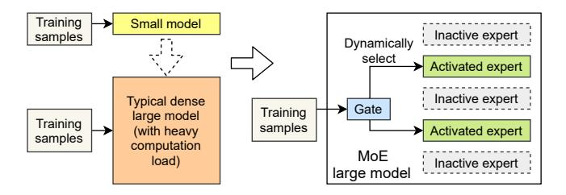
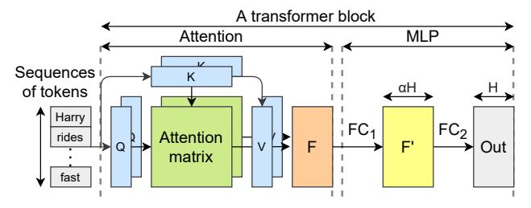
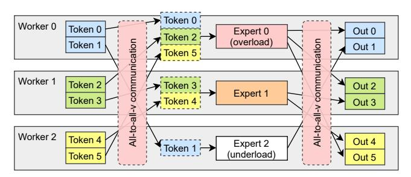
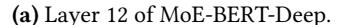
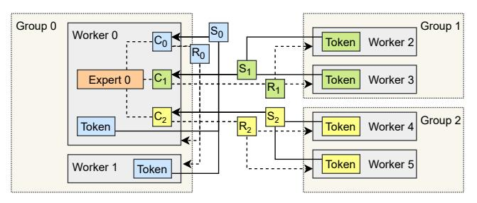
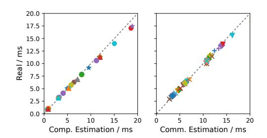
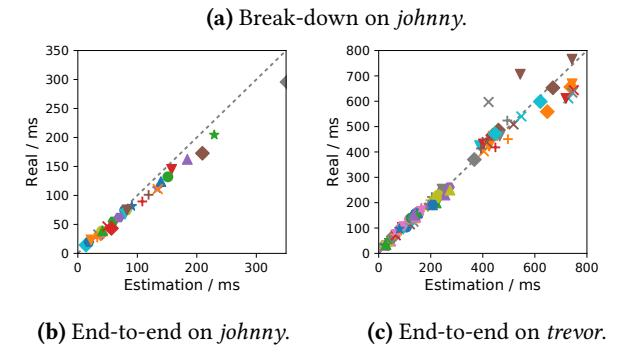
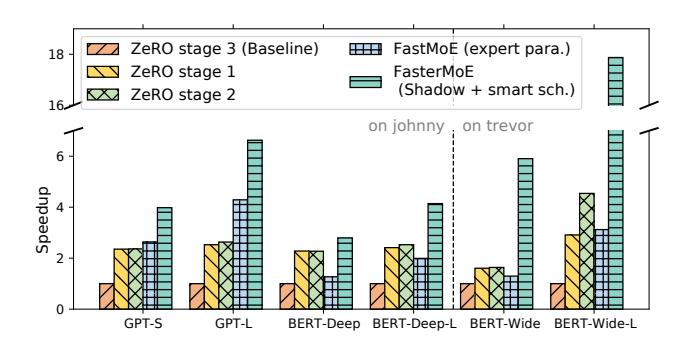
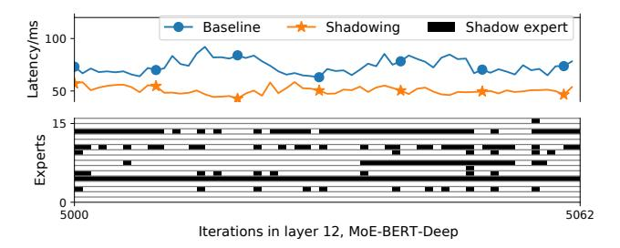

# FASTERMOE: Modeling and Optimizing Training of Large-Scale Dynamic Pre-Trained Models

Jiaao He Tsinghua University hja20@mails.tsinghua.edu.cn

Haojie Wang Tsinghua University wanghaojie@tsinghua.edu.cn Jidong Zhai\*
Tsinghua University
zhaijidong@tsinghua.edu.cn

Fuwen Luo Tsinghua University Ifw19@mails.tsinghua.edu.cn

Qin Li Tsinghua University liqin20@mails.tsinghua.edu.cn Tiago Antunes
Tsinghua University
vazama10@mails.tsinghua.edu.cn

Shangfeng Shi Tsinghua University ssf20@mails.tsinghua.edu.cn

#### **Abstract**

The current trend in deep learning is to scale models to extremely large sizes with the objective of increasing their accuracy. Mixture-of-Expert (MoE) is the most popular pretrained model that makes feasible the training of models with parameters beyond trillion-scale. Thanks to the dynamic activation of experts, i.e., shallow layers specialized in certain domains, it allows for sparse training of bigger models, removing the linearity between model size and computation. However, different from traditional deep learning models, it draws huge challenges to the efficiency of these training systems, including dynamic load imbalance, inefficient synchronous execution mode, and congested all-to-all communication.

To address these challenges, we first propose a performance model that can both accurately predict the latency of different operations of a specific training task, and intuitively analyze its end-to-end performance via a novel roofline-like model. Then, guided by this model, we invent a dynamic shadowing approach to cope with load imbalance, and a smart fine-grained schedule that splits different operations and executes them concurrently. We design a congestion-avoiding expert selection strategy that relieves network congestion for the lower latency of iterations, when modification of expert selection is allowed. We implement

\*Corresponding author


This work is licensed under a Creative Commons Attribution-NonCommercial International 4.0 License.

PPoPP '22, April 2–6, 2022, Seoul, Republic of Korea © 2022 Association for Computing Machinery. ACM ISBN 978-1-4503-9204-4/22/04.

https://doi.org/10.1145/3503221.3508418

and integrate the above optimizations as a general system, FASTERMOE, empowering efficient distributed MoE model training. FASTERMOE is evaluated on different cluster systems using up to 64 GPUs. It achieves 1.37× - 17.87× speedup compared with state-of-the-art systems for large models, including ZeRO, GShard, and BASE Layer.

Source code of FASTERMOE is now available at https://github.com/thu-pacman/FasterMoE.

CCS Concepts: • Computing methodologies  $\rightarrow$  Massively parallel algorithms.

*Keywords:* Distributed Deep Learning, Parallelism, Performance Modeling

#### 1 Introduction

A pre-trained model is a model that is already trained with a wide range of samples, containing *knowledge*. Compared to training a new model from scratch, using a pre-trained model can greatly reduce resource consumption. Therefore, pre-trained models have been becoming more popular in many domains, such as image processing [22], reading comprehension [3], and language generation [1, 24, 38]. In recent years, both academia and industry are interested in developing pre-trained models with higher accuracy.

One of the promising ways for improving model accuracy is scaling up model size. Researchers have shown that larger models bring significantly higher accuracy [1, 5, 11]. Among these works, Mixture-of-Expert (MoE) [17] appears promising to scale models to extreme size. As shown in Figure 1, different from directly scaling small models to a large dense model, an MoE model consists of many small models, namely *experts*. Training samples are fed into different experts, dynamically selected by a light-weight trainable gate network. In MoE, as experts are sparsely activated and much extra computation is saved, it can significantly increase the number of samples trained in the same period of time and improve the model accuracy compared with classic

dense pre-trained models. Therefore, such dynamic models are becoming increasingly important for training a giant model, such as Google's GShard [11] and Facebook's BASE Layer [12].

<span id="page-1-0"></span>

**Figure 1.** MoE structure for training a large model.

Although flexible MoE structure makes it more feasible to train a giant model beyond trillion-scale, it is still extremely costly. A 600 billion MoE model in GShard [11] takes 2,048 TPUs 4 days to train. To reduce training time, expert parallelism is introduced to train MoE models distributedly, where experts are partitioned onto different workers and each worker processes a different batch of training samples (detailed in Section 2.3). In MoE layers, each input is sent to its desired expert by the system through the network.

The inefficiency of existing MoE training methods mainly comes from dynamic expert selection and flexible MoE structure. We summarize three main challenges when training an MoE model as follows.

**Dynamic expert selection.** With increasing model size, experts are commonly distributed across different workers. A popular expert receives more tokens than others, which causes its resident worker to be heavily loaded while other workers may idle. Even worse, this pattern changes among different iterations dynamically. This behavior significantly affects hardware utilization and training efficiency.

Inefficient synchronous operations. All experts need to obtain their input from many other workers, being one of the most time-consuming operations when training MoE models. It is commonly implemented as synchronous all-to-all operations with variable message sizes. Considering that non-uniform expert selection leads to severe imbalance in both computation and communication, this method of launching synchronous operations can lead to much more overhead.

Mismatch of model design and network topology. Expert selection in MoE model training can significantly affect the training efficiency since it determines both load balance and communication traffic. Existing works like GShard [11] and BASE Layer [12] use different expert selection strategies to balance computation load but ignore communication, despite that the network topology is critical to communication performance. Network contention is frequently caused in current widely-used network topology by the complex communication in MoE.

To address these challenges, we propose FASTERMOE, a highly efficient distributed system for training large dynamic pre-trained models. To capture dynamic behavior introduced by MoE, we build a precise performance model for training tasks. Given an MoE model and system configuration, our performance model can first estimate the latency of operations, and then visualize the task with a roofline-like model for better understanding its performance. Guided by our performance model, we further propose three key optimization strategies for the training process. Dynamic shadowing is enabled to reduce the idling caused by imbalanced expert selection. A fine-grained smart scheduling strategy is introduced to perform computation and communication operations asynchronously, which can fully exploit inter-operation parallelism. Finally, a congestion-avoiding expert selection strategy is designed to lower the latency of iterations, with promising convergence results.

FASTERMOE is tested on 2 different clusters with up to 64 GPUs. Evaluation results show that FASTERMOE achieves up to 17.87× speedup compared with ZeRO Optimizer [25], with mathematical equivalence. When modification of expert selection is allowed, FASTERMOE is 1.37× faster in convergence time over GShard, and 2.19× over BASE Layer.

In summary, we make the following contributions:

- We design a performance model, which can accurately estimate the performance for a given MoE model with a specific parallel strategy.
- We present a roofline-like model to analyze the performance and theoretical limit of different parallelisms, and the improvements of our optimizations below.
- Guided by our performance model, we invent a dynamic shadowing approach to reduce the impact of skew expert popularity.
- We create a smart fine-grained schedule of communication and computation to reduce their latency jointly.
- We design an adjusted expert selection strategy at runtime for faster communication with less congestion, whereas the loss is decreasing in promising slope.
- We implement the above techniques into an end-toend MoE training system, FASTERMOE, and achieve up to 17.87× speedup over state-of-the-art systems.

The rest of this paper is organized as follows. Section 2 introduces the background and main challenges of distributed training. Section 3 presents our performance model and Section 4 introduces optimization strategies guided by our performance model. Section 5 evaluates FasterMoE. More related works are described in Section 6, and Section 7 concludes this paper.

# <span id="page-1-1"></span>2 Background and Challenges

#### 2.1 Transformer: Backbone of Pre-trained Models

Transformer [34] is the state-of-the-art structure to process sequences. Most pre-trained models are based on sequences,

<span id="page-2-1"></span>

Weights and residuals are not presented in this figure.

**Figure 2.** Structure of a transformer block.

such as texts [3], proteins [29], or even pixels in images [22], making transformers as the basic structure of many pretrained models. As shown in Figure 2, a transformer block consists of two parts, namely attention and multi-layer perceptron (MLP).

The attention layer extracts the relationship of tokens of a sequence by performing dot product between each pair of tokens in a specific linear space, represented by Q and K. The resulting matrix of the pairwise product is called attention matrix. The attention matrix is used to add up embedding vectors of different tokens with weight, from V to F, extracting the relationship between them. The result of the attention layer is fed into an MLP layer, which typically consists of two huge fully-connected (FC) layers in a transformer block. The most time-consuming computation of a transformer block is general matrix multiplication (GeMM) that occurs in the MLP layer.

#### 2.2 MoE Structure

MoE [17] is found to have strong ability in modern large-scale pre-trained models. The key idea of MoE is that it has a number of small models, namely *experts*, constituting a large model, given the intuition that different small models are experts in different domains, and can be only activated when the data in its domain are input.

In transformers, the MLP layer is commonly extended by MoE. When processing a token, only a few experts that best fit their domain are activated. Recall that in a non-MoE transformer model, there are two adjacent FC layers in an MLP. These dense layers become giant when scaling up the model size, making the GeMM computation too heavy. In an MoE model, the weight matrices of the GeMMs are split along certain dimensions, so that each part still produces an output of the same size, while the GeMM computation remains small. In other words, MoE allows an increase in model parameters without increasing computation, making it currently the most feasible approach to produce pre-trained models of trillion-scale and beyond.

For a given input, an additional module, **gate**, is introduced to decide which experts should be activated. A gate is

commonly a small FC layer to compute a fit score for each expert, and the experts with top k fit scores are selected.

## <span id="page-2-0"></span>2.3 Parallel Strategies

Data, model, and expert parallelism are three commonly used parallel strategies in distributed training.

**Data parallelism** duplicates parameters of the model across all workers. Each worker is then given a different batch of training samples. Workers synchronize gradients globally and update the model after each iteration. Although there is no communication within each iteration, the size of the model must not exceed the capacity of a single worker, making it impossible to scale up to large models.

Model parallelism partitions weight tensors along certain dimensions, i.e., models are split into partitions and placed on different workers. All workers process the global batch together, and compute using its corresponding partition of weight. After each layer, the embedding vectors are aggregated and re-distributed. However, model parallelism cannot scale up to very large models with high-efficiency, as it is limited by the partition dimensions and by the large communication overhead that exists between layers.

<span id="page-2-2"></span>

**Figure 3.** Partitioning of tensors in expert parallelism, with related communication.

**Expert parallelism** is a specific method of parallelism for MoE models, which is first proposed by GShard [11]. As shown in Figure 3, experts are placed on different workers and each worker takes a different batch of training samples. For non-MoE layers, expert parallelism behaves the same as data parallelism. In MoE layers, tokens in the sequence are sent to workers where their desired experts reside. Similar to model parallelism, the outputs of each MoE layer are exchanged again to be organized back into original sequences for the computation of the next layer. As MoE models often have numerous experts, expert parallelism can scale up with model size better than model parallelism.

#### 2.4 Challenges and Observations

When training transformers using expert parallelism, a set of challenges greatly influence training efficiency. In this section, we describe such challenges.

Skewed expert selection leads to dynamic load imbalance. We use an example to describe this challenge. As

shown in Figure 3, expert 0 receives 3 tokens, 3× more workload than expert 2. As a result, worker 2 idles for a long time before the next communication starts, not making full use of its available computational power. Given that training data naturally follow a skewed distribution, some experts are more likely to be selected more than others.

<span id="page-3-1"></span>




(b) Layer 8 of MoE-GPT.

Areas with different colors represent different experts.

**Figure 4.** Distribution of expert selection in some iterations when training different MoE models.

We collect the expert selection of each token when training two real-world models of 16 experts to observe the actual popularity of different experts. Some iterations during the training are sampled and visualized in Figure 4. Fast-changing uneven distributions are observed in the first 500 iterations. In the MoE layer shown in Figure 4a, the popularity of experts keeps changing through the whole training process. Figure 4b shows another layer in a different model, in which popularity is more stable, while there are still many unpopular experts. In fact, zooming in the figure, many tiny stripes are seen, indicating that these experts are unpopular, although still faithfully processing their domain-specific data. At the same time, 4 out of 16 experts are processing about 20% of all tokens, 3.2× the average.

The more popular experts are receiving more tokens than the less popular ones, leaving the workers they run on more heavily loaded. This dynamic behavior affects hardware utilization and decreases training efficiency of the model, as it is not making full use of the available computational resources. Therefore, the first challenge presented by an MoE training system is to handle dynamic load imbalance caused by skew expert selection.

**Synchronous execution mode of operations is inefficient.** The all-to-all operation in expert parallelism is commonly implemented by synchronous operators provided by

communication libraries, such as MPI [6] or NCCL [8]. Considering that a non-uniform expert selection leads to imbalance in both computation and communication, this synchronized execution method leads to a higher waste of resources. When performing either communication or computation, the other hardware ends up underutilized, while they could be used to process other operations. However, it is not easy to split an all-to-all communication, as dependencies exist between different communication and computation tasks. Deadlocks can be easily introduced if the order of data transfer is not properly designed. Therefore, the second challenge is how to efficiently organize communication and computation tasks to be executed in parallel.

Expert parallelism causes severe network contention. Lastly, we highlight the incompatibility between expert assignment and network topology. In every iteration, multiple communication operations are performed simultaneously, which can incur a large performance degradation due to a few saturated links. Since the expert assignment of the tokens dictates the load balance and communication path, performing a smart assignment of tokens can help to lower the end-to-end latency of training without affecting the quality of the models. Therefore, the third challenge is how to design a network topology-aware token assignment strategy to avoid severe network contention.

# <span id="page-3-0"></span>3 Performance Modeling

To estimate and analyze the performance of a training task, we first build models for computation and communication separately. Then, we introduce a roofline-like model to study how communication latency and computation latency determine the overall training efficiency jointly.

<span id="page-3-2"></span>Notations used in the model are defined in Table 1.

Table 1. Notations used in the model

| Notation | Definition                                |
|----------|-------------------------------------------|
| Lat      | Latency of an operation                   |
| P        | Throughput of computation                 |
| W        | Bandwidth of a specific link              |
| T        | Traffic                                   |
| B        | Number of tokens for certain data         |
| H        | Length of embedding vectors               |
| α        | Fraction of intermediate embedding in MLP |

#### 3.1 Load-aware Computation Modeling

As mentioned above, GeMM is the major computation when training transformers. Modern massive computation devices, e.g., GPUs, are highly optimized for regular computation, such as GeMM, achieving very high performance. According to our measurement, an NVIDIA Tesla V100 GPU can achieve more than 90% of its peak throughput when running GeMMs

for typical model sizes and batch sizes in transformers. Therefore, we predict the computation latency of forward in an MLP layer in a transformer block by the formula below.

$$Lat_{comp} = \max_{w \in workers} \left\{ \frac{4B_w \alpha H^2}{P_w} \right\}$$
 (1)

 $B_w$  denotes the batch size on worker w, given that the batch size of modules on different workers may differ in expert parallelism. H is the length of the tokens' embedding vectors, and  $\alpha H$  is the length of the intermediate embedding between FC layers in MLP. As a single FMA operation accounts for 2 operations, each FC execution then takes  $2B_w\alpha H^2$  operations. There are 2 FCs, resulting in the constant factor 4.  $P_w$  denotes the average throughput of w to perform GeMM. The end-to-end latency is the maximum latency of each single worker, as all the workers have to exchange features after computation. As a result, load imbalance in computation is reflected by this formula.

A potential issue is that for workers whose  $B_w$  are very small, it may not achieve good utilization of its computation device, which results in an incorrect latency estimation. However, although peak performance is not achieved, computation latency with a small  $B_w$  is commonly no larger than that with a huge  $B_w$ . As the huge  $B_w$  dominates the overall computation latency, this inaccuracy in prediction does not invalidate its effectiveness.

#### 3.2 Topology-aware Communication Modeling

According to LogP model [2], the overall latency of communication consists of overhead and latency. The feature vector of each token is commonly larger than 1024, indicating that the minimum granularity of transferring data is more than 4KB. Therefore, we simplify the model by regarding the overhead in communication as negligible. Bandwidth of interconnections can be fully utilized if we assume that there is no congestion. Given that there are commonly multiple accelerators within a node, each being a worker, we should not only consider inter-node connection, but also intra-node connection, such as PCIe, UPI, and NVLink.

We adopt a topology-aware model to predict the latency of collective communication operations. Assume that a link l has a bandwidth of  $W_l$  in a single direction, with traffic of size  $T_l$  flowing through it. The end-to-end latency of the communication is calculated as follows.

$$Lat_{\text{comm}} = \max_{l \in \text{links}} \left\{ \frac{T_l}{W_l} \right\} \tag{2}$$

 $W_l$  can be determined by hardware specifications and by performing point-to-point bandwidth benchmarks. We highlight that the network topology graph is **directed**. To obtain  $T_l$ , we model each link as an edge in the graph. Two directed edges are used to represent a duplex link, considering traffic in both directions separately. Because in a load-imbalanced situation, traffic on two directions of a link may differ greatly.

the effective bandwidth of the link does not directly equal to that when both directions are busy.

The traffic on each link depends on the algorithm and routing policy. Different methods are used for different operations to compute the traffic on each edge. We show how 3 types of common communications are modeled below.

**All-to-all-v** is used to route tokens from its position in the sequence to their desired experts. Due to the flexibility of expert selection, traffic between each pair of workers is highly variable. We assume that all-to-all operations simply create links between all pairs of workers, and transfer data simultaneously. The path between each pair of workers is calculated by an algorithm according to the type of topology. For each pair of workers, the traffic between them is accumulated on all directed edges along the path.

**All-reduce** operator is widely used in synchronizing data, including the gradients of duplicated model parameters in data parallelism, and embedding vectors in model parallelism. Applying ring all-reduce [30] on a tensor of size S on each of n workers results in having each of them sending a total of  $2\frac{n-1}{n}S$  to its neighbor in a pipeline.

**Broadcast and reduce** are as regular as all-reduce, utilizing ring connection and pipeline to lower its latency. But different from all-reduce, they only send messages of total size *S* through each link.

#### 3.3 DDL-Roofline Model

We propose a Distributed Deep Learning (DDL) Roofline model to characterize the performance of a specific training task on a given cluster.

Computation and communication are two key factors in parallel MoE models. Thus, we define the ratio of computation-communication  $R_{CC}$ , presenting on the X axis of the DDL-Roofline, as follows.

$$R_{CC} = \frac{Lat_{\text{comp}}}{Lat_{\text{comm}}} \tag{3}$$

 $Lat_{\rm comp}$  and  $Lat_{\rm comm}$  denote the latency of computation and communication estimated by our predictor, respectively.  $R_{CC}$  denotes whether the task is bounded by computation or communication. When  $R_{CC} > 1$ , computation time dominates the end-to-end latency, otherwise communication takes up most of the latency. This ratio indicates the direction of applying different optimizations.

The variable of the Y axis is  $\overline{P}$ , the average computation throughput of all workers. When training an MoE MLP layer, it can be calculated as follows.

$$\overline{P} = \frac{12\alpha H^2 \sum_w B_w}{N Lat_{e2e}} \tag{4}$$

 $12\alpha H^2 \sum_w B_w$  denotes the total computation to be processed by all experts for all tokens, and N is the number of workers.  $Lat_{e2e}$  is the end-to-end latency of an iteration by estimation or measure. For example, in synchronous expert

parallelism, we estimate it by  $Lat_{\rm e2e} = 3Lat_{\rm comp} + 4Lat_{\rm comm}$ , as there are in total 3 rounds of computation in both forward and backward, and 4 rounds of communication.  $\overline{P}$  intuitively reflects the average utilization of all worker devices, and can also directly indicate the scalability of a system.

<span id="page-5-1"></span>

**Figure 5.** DDL-Roofline model showing different parallelisms and optimizations of FASTERMOE.

Ideally, communication and computation are performed simultaneously, and we obtain a roofline-like polyline as theoretical upper bound shown by a solid line in Figure 5. It is calculated as follows.

$$\overline{P}_{\text{ideal}} = P_w \min\{1, R_{CC}\} \tag{5}$$

We also highlight a semi-ideal curve by dashes, which refers to full hardware utilization when the training is performed in a synchronous way.

$$\overline{P}_{\text{semi-ideal}} = P_w \frac{Lat_{\text{comp}}}{Lat_{\text{comp}} + Lat_{\text{comm}}}$$

$$= P_w \frac{R_{CC}}{R_{CC} + 1}$$
(6)

In the semi-ideal case, the end-to-end latency is the sum of communication latency and computation latency. Different from the original roofline model [37] that depicts a program on a single device, where memory access and computation are naturally executed simultaneously, distributed training programs commonly requires significant optimizations on the system to execute them at the same time.

Given a training task and its parallel configuration, DDL-Roofline helps to better understand the training throughput of the model. Below, we show a few examples of how parallel strategies are reflected with DDL-Roofline in Figure 5 when training a specific transformer model.

**Data parallelism** is shown by 2 points on the left part of the ideal polyline. As synchronizing gradients for an MoE MLP layer involves performing all-reduce on  $2N\alpha H^2$  elements, it is too expensive, resulting in a poor  $R_{CC}$ . However, as the all-reduce may be overlapped with backward computation, it can move slightly above the semi-ideal curve.

**Model parallelism** has larger  $R_{CC}$  as it introduces less communication. It performs 2 all-reduce on an embedding matrix

of B tokens, totally sized 2NBH. Compared to data parallelism, it reduces communication of  $\frac{\alpha H}{B} > 1$ . But when synchronizing embedding vectors, no other computation can be performed. This characteristic forces model parallelism to be performed synchronously, and stops the point from moving above the semi-ideal curve.

**Expert parallelism** introduces more latency on computation than communication, due to load imbalance, so it has large  $R_{CC}$  but poor  $\overline{P}$ , far below the semi-ideal curve. Optimizations in FasterMoE are also presented in Figure 5. We indicate their characteristics in DDL-Roofline in the following Section.

# <span id="page-5-0"></span>4 Model-Guided Optimization Approaches

# 4.1 Light-Weight Dynamic Shadowing Strategy

In MoE models, popular experts can be selected by more than half the input tokens, causing severe load imbalance, as Figure 4 suggests. Although the embedding of a single input token is orders of magnitude smaller than model parameters, batches of input coming from all other workers may be equal or even larger than model parameters. Therefore, a trade-off comes that whether the latency of transferring so many embedding vectors can be replaced by replicating model parameters of popular experts.

<span id="page-5-2"></span>

**Figure 6.** An example of dynamic shadowing. Instead of sending input to worker 1, expert 1 is replicated.

As shown in Figure 6, some experts are replicated on all workers, namely shadowed experts, so that their parameters, instead of their input tokens, are transferred over the network. Their related computation is performed locally, intuitively reducing the load of the worker that contains a popular expert.

However, dynamic shadowing is challenging, as the popularity of experts changes with the training process, and the decisions taken every iteration may differ. Additionally, parameters cannot be cached like a trivial distributed memory system, as they are updated in every iteration and requiring gradients to be gathered globally as part of the update process. If they are cached on every worker, they should be updated in every iteration, introducing significant extra overhead.

To address this challenge, we leverage our performance model to analyze whether an expert should be shadowed at runtime. We predict the end-to-end latency of a training iteration to check performance gain, and act accordingly. We elaborate our analysis below.

In the original imbalance situation, the communication and computation are dominated by a set of popular experts. We model the workload of a single worker w from a total of N workers by calculating its batch size  $B_w$  as  $B_w = \sum_{i=1}^N T_{iw}$  where  $T_{iw}$  tokens are sent from worker i to worker w.

A single iteration of training an MLP layer contains 1 GeMM in forward, and 2 in backward to compute the gradient of the inputs. There are 4 rounds of all-to-all communication, 2 in each forward and backward. In a simplified case where the network has a fixed bandwidth, the training latency is calculated as follows.

$$Lat_{\text{imbl}}(B) = \max_{w} \left\{ 3 \frac{4B_{w}\alpha H^{2}}{P} + 4 \frac{B_{w}H}{W_{\text{net}}} \right\}$$
 (7)

To shadow a popular expert, we have to first broadcast its parameters to all workers and then run the computation over the local tokens using the fetched model. In the backward stage, each worker computes the gradients separately of its fetched experts, followed by a reduce operation. Finally, the parameter update operation is performed at the worker where the popular expert is originally placed.

In this scenario, the overhead of performing imbalanced computation is replaced by 2 collective communication operators over 2 parameters of size  $\alpha H^2$  each. Since multiple popular experts are being sent to many other workers, load imbalance is less likely to happen. The latency of shadowing r models is calculated as follows.

$$Lat_{\text{shadow}}(r, B') = \max_{w} \left\{ 3 \frac{4B'_{w} \alpha H^2}{P} \right\} + 2r \frac{2\alpha H^2}{W_{\text{net}}}$$
(8)

In case that the shadowing strategy is faster, either of the following conditions is expected.

$$B_{\text{max}} > r\alpha H$$
 (9)

or

$$\frac{3(B_{\text{max}} - B'_{\text{max}})\alpha H}{r\alpha H - B_{\text{max}}} > \frac{P}{W_{\text{net}}}$$
 (10)

The first condition suggests that the total overhead of transferring the input is higher than transferring the model. The second condition indicates that the reduced computation latency is more than the increased communication overhead. In either case, dynamic shadowing is enabled to reduce end-to-end latency. Otherwise, the communication is too expensive and model exchange does not bring benefit to reducing latency, thus not performed. Such situation typically occurs when the workload is balanced across different workers. Represented by arrow (1) in Figure 5, the latency

of computation is shortened thanks to the reduced idling, resulting in a lower  $R_{CC}$  and higher  $\overline{P}$ .

We select the experts to shadow at runtime in every iteration. A light-weight algorithm, as shown in Algorithm 1, is performed on every worker. As matrix T always has to be available across all workers, no extra communication is introduced. It returns a set of experts to be shadowed, according to the formulas above.

#### <span id="page-6-0"></span>**Algorithm 1** Select experts to shadow

```
1: function SelectShadowExperts(B[N])
          B_{\max} \leftarrow \max\{B\}
 3:
          c_{\min} \leftarrow Lat_{\mathrm{imbl}}(B_{\max})
          E_s \leftarrow \emptyset
 4:
          for i, B_i \in DescendingSort(B) do
 5:
                B_i \leftarrow T_{ii}
                                                   \triangleright Remove all T_{ii} from B_i
 6:
                for all j \neq i do
 7:
                     B_i \leftarrow B_i + T_{ii} > Compute T_{ii} at j
 8:
 9:
                B'_{\max} \leftarrow \max\{B\}
10:
                c \leftarrow Lat_{\text{shadow}}(|E_s| + 1, B'_{\text{max}})
11:
                if c < c_{\min} then
                     c_{\min} \leftarrow c
13:
                     E_s \leftarrow E_s \cup \{i\}
15:
16:
                     return E_s
17:
                end if
          end for
18:
19: end function
```

#### 4.2 Asynchronous Fine-Grained Smart Scheduling

As our DDL-Roofline shows, when communication and computation are performed separately, a program cannot move beyond the semi-ideal curve. Besides, due to the inherently large amount of communication, increasing  $R_{CC}$  is hard. Therefore, we propose a smart scheduling approach that partitions the task into smaller parts, and re-schedule fine-grained communication and computation operations with efficiency in mind. Fine-grained scheduling allows computation and communication to be performed asynchronously, thus better utilizing the hardware, enabling the leap beyond the semi-ideal curve as arrow (2) suggests in Figure 5.

In expert parallelism, communication follows a complicated all-to-all pattern. We first split up all-to-all communication by dividing workers into fine-grained groups. We use a grouped pairwise exchange algorithm [33] to perform all-to-all. The groups form a ring of size n, and send data to other groups with a stride increasing from 0 to n-1. For group assignment, we follow a heuristic that closely connected workers are placed in the same group, resulting in faster connections among workers of the same group. The group size is jointly determined by connection topology, and related computation granularity.

<span id="page-7-0"></span>

Viewing from worker 0, in  $S_{0,1}$ , worker 0 sends data to group 2 at the same time when receiving data from group 1. And it behaves similarly in  $R_{0,1}$ ,  $S_{0,2}$  and  $R_{0,2}$ . They are not plotted due to space limit.

Figure 7. Fine-grained operation split-up.

In either forward or backward stage of an MoE layer, 2 symmetric all-to-all are involved, with computation between them. We split computation according to the pairwise exchanging, making room for re-organizing them. 3n operations are performed in n steps, by all workers in the n groups. In step j, workers in group i perform the following 3 operations, instantiated by an example in Figure 7.

- $S_{i,j}$ : **sends** tokens to group  $t_{i,j} = (i j)$  and receives tokens from  $f_{i,j} = (i + j)$  (both modulo n).
- $C_{i,j}$ : **computes** on tokens from  $f_{i,j}$  using local experts.
- $R_{i,j}$ : **receives** outputs of local tokens from  $t_{i,j}$  and sends output back to  $f_{i,j}$

Thereby, both communication and computation are split into fine-grained tasks, with a specific order as a requirement. Figure 8a shows a faithful schedule that sequentially perform the operations. Its latency equals that of the original synchronous execution mode, using coarse-grained operators. As long as dependencies are met, the operations can be performed out of order.

<span id="page-7-1"></span>

**Figure 8.** Scheduling tasks on separate streams on a worker and minimizing overhead.

Recall that the goal of the schedule is to perform the operations in parallel. A communication and a computation stream are created for each worker to execute different types of operators. As shown in Figure 8b, in its communication stream, it first executes  $S_{i,0}, S_{i,1}, \ldots, S_{i,n-1}$  and then from  $R_{i,0}$  to  $R_{i,n-1}$ . Its computation stream executes from  $C_{i,0}$  to  $C_{i,n-1}$ . By performing the operations in parallel, the end-to-end latency is significantly reduced. However, all operations must

respect their data dependencies and wait for previous tasks to be executed before starting itself.

We illustrate our approach to minimize overhead with a two-stream schedule. We make the assumption that the computation stream is busy most of the time. We highlight that, in the opposite case that communication takes most of the time, the optimization would have little effect, according to the DDL-Roofline. As the computation stream is fully occupied, the main opportunity for optimization is to reduce the latency of the first *S* and the last *R*. An example is given by Figure 8c. As group 2 introduces lower overhead than group 3, placing it at the last place of the schedule lowers the end-to-end latency. Note that  $S_{i,0}$  receives tokens from the local group, which is expected to be the fastest operation, as no upper level connection is involved.  $R_{i,n-1}$  only exchanges data with neighbors of group *i*. From a global view, all groups in step n-1 are organized as a ring, and exchange data along the ring. This makes the best use of the network bandwidth among all steps other than step 0. As a result, the fastest 2 operations, i.e.  $S_{i,0}$  and  $R_{i,n-1}$ , are placed at the first and the last in the smart schedule, minimizing overhead.

#### 4.3 Contention-Avoiding Expert Selection Strategy

In an MoE model, the ultimate goal is to train all the experts with a large enough amount of input samples, rather than treating each token with their most desired expert. As the fit score is used as weight to aggregate the output of each expert, changing the selection of experts does not introduce numerical incorrectness. Both GShard [11] and BASE Layer [12] change the expert selection strategy to fulfill a specific purpose. We observe that expert selection strategy can be co-designed with the training system for better efficiency. However, the accuracy of the model can be affected by the selection strategy. The experts may be fed with tokens that are less relevant to its expertise, making it less powerful. Therefore, beside throughput, better fitting between tokens and experts is appreciated.

We design a **topology-aware gate** that directs inputs to the experts with lower latency. By considering network topology of the specific hardware, training throughput can be increased. In a common cluster with tree-like topology, the bandwidth of upper level connections is commonly lower than local connections. Different from other regular collective communication, all-to-all leads to much higher contention on those connections.

Assume that a switch connects N nodes with M workers on each node. The traffic between a worker and the host is roughly  $T_w = \frac{MN-1}{MN}BH$ . Meanwhile, traffic across the network interface of each node is  $T_n = \frac{M(N-1)}{N}BH$ , about  $M \times \text{larger than } T_w$ .

To reduce congestion, we allow up to  $L = \frac{W_{\text{net}}}{MW_{\text{local}}}B$  tokens to be directed to another node. Here,  $W_{\text{net}}$  and  $W_{\text{local}}$  denotes

the communication bandwidth inter- and intra- nodes, respectively. Specifically, if there are more than L tokens whose best-fit selection is on another node, L of them with the highest score are allowed to go. The rest of them are left together with other tokens to re-select their desired experts within the local node. The traffic across the network is reduced to  $\frac{W_{\rm net}}{W_{\rm local}}BH$ , taking the same time as local communication does. As a result, congestion of upper-level links is less likely to happen, and the communication overhead is decreased. With reduced communication overhead, the model can be trained for more iterations in the same amount of time. Besides, the best-fit pairs of expert and token are preserved, reducing the impact of limited room for selection of others.

Note that for other types of topology, another specialized topology-aware gate shall be designed to increase the performance. By demonstrating this topology-aware gate on specific tree topology as an instance, we advocate a co-design methodology. With the guidance of the DDL-Roofline model, gates with high-throughput can be easily designed, and their performance patterns can be better understood.

#### <span id="page-8-0"></span>5 Evaluation

#### 5.1 Experimental Setup

We evaluate FasterMoE on 2 representative clusters. *johnny* is a cluster with 16 GPUs on 2 worker nodes. Each worker node has 8 NVIDIA Tesla V100-PCIE GPUs connected to 2 CPU sockets via PCIe switches. Although equipped with Infiniband EDR, the bandwidth degrades to 50Gb/s due to the lack of ×16 PCIe slots onboard. *johnny* cluster represents a common class of hardware widely used in DL training. *trevor* is a partition of a supercomputer. 4 NVIDIA V100-SXM2 GPUs present in each node with NVLink interconnecting them to form a heterogeneous ring, where half of the edges have double bandwidth via a bond of two links. Infiniband EDR at 100Gb/s is used for communication. We regard *trevor* as a representative of supercomputers, used for both deep learning and other traditional HPC tasks. 64 GPUs in 16 nodes are allocated for our experiments on *trevor*.

#### 5.2 Methodology

The models used for evaluation are shown in Table 2. MoE-GPT and MoE-BERT-Deep are trained on *johnny*. MoE-BERT-Wide is trained on *trevor*.

The end-to-end latency including forward and backward stages in all MoE layers of a model is measured based on an expert selection dataset, which is recorded in real model training process. This dataset is first used to validate the accuracy of our performance predictor. Expert selection of an MoE layer is fed to the performance predictor and real programs at the same time. The predicted latency is then compared with the actual one. It is also reused for approaches that do not modify expert selection, including the data parallelism approach using ZeRO optimizer [25], the expert

<span id="page-8-1"></span>Table 2. Specifications of models for evaluation

| Model name                        | Size                    | Layers | Experts | Н                    | α | Cluster |
|-----------------------------------|-------------------------|--------|---------|----------------------|---|---------|
| MoE-GPT-S<br>MoE-GPT<br>MoE-GPT-L | 0.86B<br>3.42B<br>13.7B | 12     | 16      | 1024<br>2048<br>4096 | 2 | johnny  |
| MoE-BERT-Deep<br>MoE-BERT-Deep-L  | 1.71B<br>27.4B          | 24     | 16      | 1024<br>4096         | 2 | johnny  |
| MoE-BERT-Wide<br>MoE-BERT-Wide-L  | 3.27B<br>13.1B          | 12     | 64      | 1024<br>2048         | 2 | trevor  |

parallelism approach using *FastMoE* [7], and FASTERMOE without topology-aware gate.

In the data parallelism approach, the MoE models are replicated across all workers, and then optimized by ZeRO Optimizer, a widely used data parallelism approach to train large models. It partitions optimizer states, gradients, and parameters, stage by stage, in order to ultimately fit a large model into the limited memory on each worker. The stage 3 of ZeRO, i.e. partitioning every tensor across all workers, is used as the baseline. We also show the results of stage 1 and 2 to get a wider vision of data parallelism, although they have larger memory footprint, thus infeasible for the large models that stage 3 or FASTERMOE targets.

An implementation of expert parallelism using *FastMoE* is used as another baseline, which has similar memory footprint to ZeRO stage 3, but the model is partitioned differently. Dynamic shadowing and smart scheduling in FASTERMOE are enabled when comparing with these baseline systems.

In other state-of-the-art systems of expert parallelism, including GShard [11] and BASE Layer [12], expert selection is modified, similar to the topology-aware gate in FASTER-MOE. The experts will be trained over different bunches of data compared with the original selection, thus leading to different model parameters. Therefore, comparison between FASTERMOE and them are made by training MoE-GPT on *johnny* cluster, and checking their training loss.

We implement FasterMoE based on *FastMoE* [7]. Dynamic shadowing and smart scheduling are implemented by extending its functionality. Both the topology-aware gate and GShard's [11] load balancing policy are implemented as custom gates in *FastMoE*. DeepSpeed's [27] implementation of ZeRO Optimizer [25] is used over a single-worker version of *FastMoE*. To train models, we use Megatron-LM [20] as a baseline, altering its MLP module for MoE training. BASE Layer [12] is implemented by FairSeq [21], and it is used as a plugin layer.

# 5.3 Accuracy of Performance Models

We check the accuracy of our performance predictor on both clusters. We use different models and different layers in the expert selection dataset to cover different patterns of imbalance. H and  $\alpha$  are also set to different values to test a wider range of cases.

<span id="page-9-0"></span>

Different markers represents different layers in different models.



Figure 9. Accuracy of prediction.

Latency prediction of communication and computation are separately tested on *johnny*, as shown in Figure 9a. The predictor can accurately predict the performance of communication and computation in a separate way. Slight underestimation of the performance is observed for computation when the latency is high, because we use 90% of the peak performance as the throughput of performing GeMM. When the size of the matrices gets larger, overhead is reduced, and the actual throughput will be higher than that in our model.

Figure 9b shows the end-to-end iteration time estimation on *johnny*. Under-estimation exists for larger tasks because their computation is done in a higher throughput than expected. On *trevor*, as presented in Figure 9c, the situation is similar except for a few outliers above, due to performance variation of the supercomputer, as its network is large and shared.  $R^2$  scores of end-to-end estimation are 0.987 and 0.967 on the clusters, respectively.

#### 5.4 Overall Speedup

Figure 10 shows the overall speedup of FASTERMOE against stage 3 of ZeRO optimizer. FASTERMOE achieves 6.63× and 17.87× speedup on two clusters correspondingly. Stages 1 and 2 of ZeRO have lower latency than stage 3, as they do not partition the parameters, which introduces significant overhead. ZeRO stage 2 is faster than stage 1 for better

<span id="page-9-1"></span>

**Figure 10.** Overall speedup compared with ZeRO.

overlapped backward computation and gradient synchronization, as mentioned in Section 3. However, FASTERMOE still achieves up to 3.94× speedup against ZeRO stage 2.

*FastMoE* without extra optimization is also tested in this experiment, indicating the baseline performance of expert parallelism, and outperforms ZeRO stage 3. This suggests that data parallelism is inherently inefficient, which is already illustrated in the DDL-Roofline.

# 5.5 Dynamic Shadowing and Smart Scheduling Analysis

The optimizations are tested separately to better understand the performance gain brought by each of them.

We inspect the latency and the shadowed experts in specific iterations, as shown in Figure 11. We observe that popularity of experts is highly dynamic, and 19% experts are shadowed on average. The shadowing strategy succeeded in reducing latency of iterations accordingly. A maximum speedup of 1.97× is achieved when 1 expert is shadowed.

<span id="page-9-2"></span>

Figure 11. Effect of shadowing.

The theoretical upper bound of the smart schedule's speedup in every layer, calculated as  $\frac{Lat_{\text{comm}} + Lat_{\text{comp}}}{\max\{Lat_{\text{comm}}, Lat_{\text{comp}}\}}$ , is compared with the actual speedup in Figure 12. We suggest that there is up to 1.71× speedup ideally, and we achieve up to 1.42×. In some layers, our implementation reaches up to 99% of the theoretical speedup. We observe that the real speedup is closer to the upper bound in larger models and with more workers, because of relatively lower startup overhead.

<span id="page-10-2"></span>

Figure 12. Speedup of smart scheduling per layer.

<span id="page-10-3"></span>

**Figure 13.** Speedup of the optimizations separately.

As shown in Figure 13, performing dynamic shadowing brings up to  $1.95 \times$  speedup on *johnny*, and  $4.74 \times$  on *trevor*. Smart scheduling speeds training up by  $1.40 \times$ . When they are jointly utilized,  $2.20 \times$  speedup is observed on *johnny*, and  $5.72 \times$  observed on *trevor*.

#### 5.6 Speedup of the Topology-aware Gate

<span id="page-10-4"></span>

Figure 14. Training loss w.r.t. time.

**Table 3.** Time and iterations @LM-loss = 4.0

<span id="page-10-5"></span>

| System                                           | Time/hour | Iterations | Iter. time/ms |
|--------------------------------------------------|-----------|------------|---------------|
| GShard [11]                                      | 8.58      | 30.9k      | 1000          |
| FairSeq (BASE Layer) [12]                        | 13.7      | 21.0k      | 2355          |
| FastMoE [7]                                      | 7.19      | 12.2k      | 2117          |
| FasterMoE w/o topo. gate FasterMoE w/ topo. gate | 5.81      | 13.0k      | 1609          |
|                                                  | 6.25      | 15.3k      | 1471          |

The loss curve when training MoE-GPT is presented in Figure 14, and their convergence time is shown in Table 3. GShard, although with the lowest iteration time, takes  $2.38\times$  more steps than a faithful top-2 gate in FastMoE. BASE

Layer [12] also takes significantly more steps to converge. It even takes more time in each iteration due to its strict matching algorithm and extra communication overhead.

When only dynamic shadowing and smart scheduling are enabled, indicated by FasterMoE w/o topo. gate, the loss curve is almost identical to FastMoE, with 1.33× speedup per iteration. Although the per-iteration latency is not as low as other state-of-the-art systems, these optimizations do not modify expert selection, thus not incurring extra steps towards convergence. When the topology-aware gate is enabled together with dynamic shadowing and smart scheduling, indicated by FasterMoE w/ topo. gate, the iterations are 9.4% faster, whereas 18% more steps are taken, similar to other baselines that modify the selection. Overall, Faster-MoE is 1.37× and 2.19× faster than GShard and BASE Layers, respectively.

#### <span id="page-10-0"></span>6 Related Work

Parameter server [10, 13, 14] is the earliest system to support data parallelism, soon replaced by Horovod [30] using allreduce for better performance. Asynchronous partial model updating methods [15, 16, 18, 32] are introduced to speed up convergence in heterogeneous environment for data parallelism. SuperNeurons [35] places large models on a single GPU by a fine-grained memory management method. ZeRO Offload [28] reduces memory consumption of data parallelism by swapping data to host memory, and the data is further off-loaded to disks [26]. Megatron-LM [20] is a dedicated training system for pre-training, with an insightful model parallelism method for transformer blocks. TOFU [36] and FlexFlow [9] are general systems that provide optimal hybrid of data and model parallelism via execution simulator and searching. Another approach to save memory is pipeline parallelism [19], and it can be mixed with data parallelism [4].

BERT [3] and GPT [1, 24] are popular pre-trained models for language comprehension and generation, respectively. GShard [11] based on Mesh TensorFlow[31] first introduces expert parallelism. BASE layers [12], as a part of FairSeq [21], is another MoE training system from the PyTorch [23] community, using a matching algorithm for expert assignment.

#### <span id="page-10-1"></span>7 Conclusion

We present FasterMoE to address the challenges in distributed training of MoE models with a performance model and several optimizations. Performance is modeled by an accurate predictor of communication and computation, and a novel DDL-Roofline that shows the theoretical upper bound of a specific training task on a given platform. Guided by the performance model, we propose a dynamic shadowing approach that can reduce the overhead introduced by load imbalance. The synchronous operators are split into smaller

tasks between worker groups, and smartly scheduled to execute concurrently, minimizing communication overhead. We also design an expert selection approach to avoid congestion in the network, achieving higher throughput with promising convergence speed. FASTERMOE enables training large dynamic MoE model with up to 17.87× more efficiency.

# Acknowledgments

We would like to thank the anonymous reviewers for their insightful comments. This work is supported by National Key R&D Program of China under Grant 2021ZD0110104, National Natural Science Foundation of China (U20A20226), Beijing Natural Science Foundation (4202031). Part of the experiments in this paper are conducted on Tianhe-2 supercomputer operated by *National Supercomputer Center in Guangzhou*. Jidong Zhai is the corresponding author of this paper.

#### References

- <span id="page-11-2"></span>[1] Tom B Brown, Benjamin Mann, Nick Ryder, Melanie Subbiah, Jared Kaplan, Prafulla Dhariwal, Arvind Neelakantan, Pranav Shyam, Girish Sastry, Amanda Askell, et al. 2020. Language models are few-shot learners. arXiv preprint arXiv:2005.14165 (2020).
- <span id="page-11-11"></span>[2] David Culler, Richard Karp, David Patterson, Abhijit Sahay, Klaus Erik Schauser, Eunice Santos, Ramesh Subramonian, and Thorsten Von Eicken. 1993. LogP: Towards a realistic model of parallel computation. In Proceedings of the fourth ACM SIGPLAN symposium on Principles and practice of parallel programming. 1–12.
- <span id="page-11-1"></span>[3] Jacob Devlin, Ming-Wei Chang, Kenton Lee, and Kristina Toutanova. 2018. Bert: Pre-training of deep bidirectional transformers for language understanding. arXiv preprint arXiv:1810.04805 (2018).
- <span id="page-11-25"></span>[4] Shiqing Fan, Yi Rong, Chen Meng, Zongyan Cao, Siyu Wang, Zhen Zheng, Chuan Wu, Guoping Long, Jun Yang, Lixue Xia, et al. 2021. DAPPLE: A pipelined data parallel approach for training large models. In Proceedings of the 26th ACM SIGPLAN Symposium on Principles and Practice of Parallel Programming. 431–445.
- <span id="page-11-4"></span>[5] William Fedus, Barret Zoph, and Noam Shazeer. 2021. Switch transformers: Scaling to trillion parameter models with simple and efficient sparsity. arXiv preprint arXiv:2101.03961 (2021).
- <span id="page-11-9"></span>[6] William Gropp, William D Gropp, Ewing Lusk, Anthony Skjellum, and Argonne Distinguished Fellow Emeritus Ewing Lusk. 1999. Using MPI: portable parallel programming with the message-passing interface. Vol. 1. MIT press.
- <span id="page-11-12"></span>[7] Jiaao He, Jiezhong Qiu, Aohan Zeng, Zhilin Yang, Jidong Zhai, and Jie Tang. 2021. FastMoE: A Fast Mixture-of-Expert Training System. arXiv preprint arXiv:2103.13262 (2021).
- <span id="page-11-10"></span>[8] Sylvain Jeaugey. 2017. Optimized inter-GPU collective operations with NCCL 2.
- <span id="page-11-23"></span>[9] Zhihao Jia, Matei Zaharia, and Alex Aiken. 2018. Beyond data and model parallelism for deep neural networks. arXiv preprint arXiv:1807.05358 (2018).
- <span id="page-11-16"></span>[10] Yimin Jiang, Yibo Zhu, Chang Lan, Bairen Yi, Yong Cui, and Chuanxiong Guo. 2020. A Unified Architecture for Accelerating Distributed DNN Training in Heterogeneous GPU/CPU Clusters. In 14th USENIX Symposium on Operating Systems Design and Implementation (OSDI 20). USENIX Association, 463–479.
- <span id="page-11-5"></span>[11] Dmitry Lepikhin, HyoukJoong Lee, Yuanzhong Xu, Dehao Chen, Orhan Firat, Yanping Huang, Maxim Krikun, Noam Shazeer, and Zhifeng Chen. 2020. Gshard: Scaling giant models with conditional computation and automatic sharding. arXiv preprint arXiv:2006.16668 (2020).

- <span id="page-11-7"></span>[12] Mike Lewis, Shruti Bhosale, Tim Dettmers, Naman Goyal, and Luke Zettlemoyer. 2021. Base layers: Simplifying training of large, sparse models. arXiv preprint arXiv:2103.16716 (2021).
- <span id="page-11-17"></span>[13] Mu Li, David G. Andersen, Jun Woo Park, Alexander J. Smola, Amr Ahmed, Vanja Josifovski, James Long, Eugene J. Shekita, and Bor-Yiing Su. 2014. Scaling Distributed Machine Learning with the Parameter Server. In Proceedings of the 11th USENIX Conference on Operating Systems Design and Implementation (Broomfield, CO) (OSDI'14). USENIX Association, USA, 583–598.
- <span id="page-11-18"></span>[14] Mu Li, David G. Andersen, Jun Woo Park, Alexander J. Smola, Amr Ahmed, Vanja Josifovski, James Long, Eugene J. Shekita, and Bor-Yiing Su. 2014. Scaling Distributed Machine Learning with the Parameter Server. In Proceedings of the 11th USENIX Conference on Operating Systems Design and Implementation (Broomfield, CO) (OSDI'14). USENIX Association, USA, 583–598.
- <span id="page-11-19"></span>[15] Shigang Li, Tal Ben-Nun, Salvatore Di Girolamo, Dan Alistarh, and Torsten Hoefler. 2020. Taming unbalanced training workloads in deep learning with partial collective operations. In Proceedings of the 25th ACM SIGPLAN Symposium on Principles and Practice of Parallel Programming. 45–61.
- <span id="page-11-20"></span>[16] Qinyi Luo, Jiaao He, Youwei Zhuo, and Xuehai Qian. 2020. Prague: High-performance heterogeneity-aware asynchronous decentralized training. In Proceedings of the Twenty-Fifth International Conference on Architectural Support for Programming Languages and Operating Systems. 401–416.
- <span id="page-11-6"></span>[17] Saeed Masoudnia and Reza Ebrahimpour. 2014. Mixture of experts: a literature survey. Artificial Intelligence Review 42, 2 (2014), 275–293.
- <span id="page-11-21"></span>[18] Giorgi Nadiradze, Amirmojtaba Sabour, Dan Alistarh, Aditya Sharma, Ilia Markov, and Vitaly Aksenov. 2019. SwarmSGD: Scalable decentralized SGD with local updates. arXiv preprint arXiv:1910.12308 (2019).
- <span id="page-11-24"></span>[19] Deepak Narayanan, Aaron Harlap, Amar Phanishayee, Vivek Seshadri, Nikhil R Devanur, Gregory R Ganger, Phillip B Gibbons, and Matei Zaharia. 2019. PipeDream: generalized pipeline parallelism for DNN training. In Proceedings of the 27th ACM Symposium on Operating Systems Principles. 1–15.
- <span id="page-11-14"></span>[20] Deepak Narayanan, Mohammad Shoeybi, Jared Casper, Patrick LeGresley, Mostofa Patwary, Vijay Anand Korthikanti, Dmitri Vainbrand, Prethvi Kashinkunti, Julie Bernauer, Bryan Catanzaro, et al. 2021. Efficient large-scale language model training on gpu clusters. arXiv preprint arXiv:2104.04473 (2021).
- <span id="page-11-15"></span>[21] Myle Ott, Sergey Edunov, Alexei Baevski, Angela Fan, Sam Gross, Nathan Ng, David Grangier, and Michael Auli. 2019. fairseq: A Fast, Extensible Toolkit for Sequence Modeling. In *Proceedings of NAACL-HLT 2019: Demonstrations*.
- <span id="page-11-0"></span>[22] Niki Parmar, Ashish Vaswani, Jakob Uszkoreit, Lukasz Kaiser, Noam Shazeer, Alexander Ku, and Dustin Tran. 2018. Image transformer. In International Conference on Machine Learning. PMLR, 4055–4064.
- <span id="page-11-26"></span>[23] Adam Paszke, Sam Gross, Francisco Massa, Adam Lerer, James Bradbury, Gregory Chanan, Trevor Killeen, Zeming Lin, Natalia Gimelshein, Luca Antiga, et al. 2019. Pytorch: An imperative style, high-performance deep learning library. Advances in neural information processing systems 32 (2019), 8026–8037.
- <span id="page-11-3"></span>[24] Alec Radford, Jeffrey Wu, Rewon Child, David Luan, Dario Amodei, Ilya Sutskever, et al. 2019. Language models are unsupervised multitask learners. OpenAI blog 1, 8 (2019), 9.
- <span id="page-11-8"></span>[25] Samyam Rajbhandari, Jeff Rasley, Olatunji Ruwase, and Yuxiong He. 2020. Zero: Memory optimizations toward training trillion parameter models. In SC20: International Conference for High Performance Computing, Networking, Storage and Analysis. IEEE, 1–16.
- <span id="page-11-22"></span>[26] Samyam Rajbhandari, Olatunji Ruwase, Jeff Rasley, Shaden Smith, and Yuxiong He. 2021. ZeRO-Infinity: Breaking the GPU Memory Wall for Extreme Scale Deep Learning. arXiv preprint arXiv:2104.07857 (2021).
- <span id="page-11-13"></span>[27] Jeff Rasley, Samyam Rajbhandari, Olatunji Ruwase, and Yuxiong He. 2020. Deepspeed: System optimizations enable training deep learning

- models with over 100 billion parameters. In Proceedings of the 26th ACM SIGKDD International Conference on Knowledge Discovery & Data Mining. 3505–3506.
- <span id="page-12-8"></span>[28] Jie Ren, Samyam Rajbhandari, Reza Yazdani Aminabadi, Olatunji Ruwase, Shuangyan Yang, Minjia Zhang, Dong Li, and Yuxiong He. 2021. Zero-offload: Democratizing billion-scale model training. arXiv preprint arXiv:2101.06840 (2021).
- <span id="page-12-2"></span>[29] Andrew W Senior, Richard Evans, John Jumper, James Kirkpatrick, Laurent Sifre, Tim Green, Chongli Qin, Augustin Žídek, Alexander WR Nelson, Alex Bridgland, et al. 2020. Improved protein structure prediction using potentials from deep learning. Nature 577, 7792 (2020), 706–710.
- <span id="page-12-3"></span>[30] Alexander Sergeev and Mike Del Balso. 2018. Horovod: fast and easy distributed deep learning in TensorFlow. arXiv preprint arXiv:1802.05799 (2018).
- <span id="page-12-10"></span>[31] Noam Shazeer, Youlong Cheng, Niki Parmar, Dustin Tran, Ashish Vaswani, Penporn Koanantakool, Peter Hawkins, HyoukJoong Lee, Mingsheng Hong, Cliff Young, et al. 2018. Mesh-tensorflow: Deep learning for supercomputers. arXiv preprint arXiv:1811.02084 (2018).
- <span id="page-12-6"></span>[32] Saeed Soori, Bugra Can, Mert Gurbuzbalaban, and Maryam Mehri Dehnavi. 2020. ASYNC: A Cloud Engine with Asynchrony and History for Distributed Machine Learning. In 2020 IEEE International Parallel and Distributed Processing Symposium (IPDPS). IEEE, 429–439.

- <span id="page-12-5"></span>[33] Sathish S Vadhiyar, Graham E Fagg, and Jack Dongarra. 2000. Automatically tuned collective communications. In SC'00: Proceedings of the 2000 ACM/IEEE Conference on Supercomputing. IEEE, 3–3.
- <span id="page-12-1"></span>[34] Ashish Vaswani, Noam Shazeer, Niki Parmar, Jakob Uszkoreit, Llion Jones, Aidan N Gomez, Łukasz Kaiser, and Illia Polosukhin. 2017. Attention is all you need. In Advances in neural information processing systems. 5998–6008.
- <span id="page-12-7"></span>[35] Linnan Wang, Jinmian Ye, Yiyang Zhao, Wei Wu, Ang Li, Shuaiwen Leon Song, Zenglin Xu, and Tim Kraska. 2018. Superneurons: Dynamic GPU memory management for training deep neural networks. In Proceedings of the 23rd ACM SIGPLAN symposium on principles and practice of parallel programming. 41–53.
- <span id="page-12-9"></span>[36] Minjie Wang, Chien-chin Huang, and Jinyang Li. 2019. Supporting very large models using automatic dataflow graph partitioning. In Proceedings of the Fourteenth EuroSys Conference 2019. 1–17.
- <span id="page-12-4"></span>[37] Samuel Williams, Andrew Waterman, and David Patterson. 2009. Roofline: an insightful visual performance model for multicore architectures. Commun. ACM 52, 4 (2009), 65–76.
- <span id="page-12-0"></span>[38] Zhengyan Zhang, Xu Han, Hao Zhou, Pei Ke, Yuxian Gu, Deming Ye, Yujia Qin, Yusheng Su, Haozhe Ji, Jian Guan, et al. 2021. CPM: A large-scale generative Chinese pre-trained language model. AI Open (2021).

#### **A** Artifact Evaluation Instruction

#### A.1 Access

Scripts of experiments in this paper are available at https://github.com/laekov/fastermoe-ae for reproduction.

#### A.2 Prerequisites

**A.2.1 Hardware.** The scripts target on the results on 16 NVIDIA V100 GPUs. While other models of GPUs can be used, the results may vary. Infiniband network connection is recommended, as MoE models are highly communication-intensive.

**A.2.2 Installation of FASTERMOE.** FASTERMOE is implemented based on FastMoE [7]. It requires CUDA, NCCL, and PyTorch (v1.10.0). PyTorch can be installed using the following command.

```
pip install --user -f https://download.pytorch.org/whl/cu113/torch_stable.html torch==1.10.0+cu113
```

The developer package of NCCL (≥2.9.9) is required, and its version should be the same with PyTorch (e.g. PyTorch v1.10.0 installed via the command above comes with NCCL 2.10.3). It can be downloaded from https://developer.nvidia.com/nccl/nccl-legacy-downloads.

Besides, matplotlib is required to plot the figures.

Use the following command in fastermoe directory to compile and install it.

```
USE_NCCL=1 python setup.py install --user
```

The environment variable TORCH\_CUDA\_ARCH\_LIST should be provided if different types of GPUs are installed in the node for compilation and test runs. You can refer to https://pytorch.org/docs/stable/cpp\_extension.html#torch.utils.cpp\_extension. CUDAExtension for explanation.

**A.2.3** Installation of baseline systems. NVIDIA Apex is required by Megatron-LM and FairSeq [12]. The apex package on PyPI is broken, so it has to be installed from source. Clone it from https://github.com/NVIDIA/apex, and use the following command to install it.

```
python3 setup.py install --user --cuda_ext --cpp_ext
```

DeepSpeed [25] v0.4.4 is used as a baseline. It can be found at https://github.com/microsoft/DeepSpeed and directly installed from PyPI.

```
pip install --user deepspeed==0.4.4
```

FairSeq is used as the baseline of BASE Layers. As it does not formally release newer versions on PyPI or GitHub, the main branch is used. Use the following command in fairseq directory to install it.

```
python3 setup.py build_ext
python3 setup.py install --user
```

If it fails with unknown pyx file type, try adding --editable flag in installation command.

**A.2.4 Training and Benchmark Data.** For single-layer tests, the expert selection dataset can be downloaded at https://pacman.cs.tsinghua.edu.cn/laekov/fastermoe-data/dumps.tgz. It is generated for 16 experts. Download and unzip the dataset to test the performance of FASTERMOE and the baselines using our benchmark scripts.

For training, the dataset is pre-processed, and can be downloaded at https://pacman.cs.tsinghua.edu.cn/laekov/fastermoedata/wikidataset.tgz.

# A.3 Running the Experiments

You can simply run runme. Sh provided in the AE repository to reproduce all artifacts mentioned below. The data directory at the beginning of the script must be modified according to its real location.

It is assumed that you are using a cluster managed by SLURM, with 8 GPUs installed on each node. For a different setup, you may modify srun commands in runme. sh and files in scripts directory. It should also be noted that network bandwidth varies in different systems. The default parameters in the performance model are likely to be invalid on other systems. Therefore, part of the Python code in FasterMoE is supposed to be modified. Please refer to Appendix A.5 for details of how to modify the performance model.

#### A.4 Reproduction Results

The results of experiments, i.e. figures and tables, are generated in the results directory. Below is a list of available results, and a few discussions on them.

A.4.1 Figure [9:](#page-9-0) Accuracy of prediction. results/fig9a.pdf and results/fig9b.pdf are the accuracy scatter plot of predictions of the performance predictor shown in Figure [9.](#page-9-0)

To reduce time span of reproduction, the number of data points is reduced. However, they should still be close to the dashed line, while communication time sometimes get underestimated for uncertain network traffic.

A.4.2 Figure [10:](#page-9-1) Speedup over ZeRO. FasterMoE is compared with ZeRO Optimizer [\[25\]](#page-11-8) in Figure [10.](#page-9-1) The result is available in results/fig10.pdf.

For similar reason, the amount of test cases is reduced to shorten running time. Therefore, the speedup may vary from the original figure in the paper.

A.4.3 Figure [11:](#page-9-2) Effect of shadowing. Dynamic shadowing is analyzed in detail in Figure [11.](#page-9-2) Shadowed experts in 62 iterations are shown as black blocks. The reproduced figure is in results/fig11.pdf.

The effectiveness of shadowing may degrade if the performance model is not accurate enough, e.g. using network bandwidth that does not correspond to your real system.

- A.4.4 Figure [12:](#page-10-2) Speedup of smart scheduling. Theoretical speedup is computed and compared with actual speedup achieved by FasterMoE. The results can be seen in results/fig12.pdf
- A.4.5 Figure [13:](#page-10-3) Speedup breakdown. Dynamic shadowing and smart scheduling are enabled separately to inspect their effects alone. The reproduced version of Figure [13](#page-10-3) can be found in results/fig13.pdf.
- A.4.6 Table [3:](#page-10-5) Iteration time of topology-aware gate. As it takes days to train the model to our target loss, we only present average iteration time of first 500 iterations, comparing with only the last column of Table [3.](#page-10-5) The reproduced results can be found in results/table3.txt.

The data present in the paper was obtained from tens of thousands of iterations. As we only run the first 500 iterations, the average iteration time of different systems may be different, due to the variance of expert selection load balancing, as explained earlier in the paper.

#### <span id="page-14-0"></span>A.5 Advancement

The figures are generated by different scripts, and collected in runme.sh. Inspect it for details.

It will be interesting to change model geometry, such as and mentioned in the paper, and see how performance changes. This can be achieved by specifying different input to the benchmark scripts, which should be straight-forward. The changes can also be predicted by our DDL-Roofline model.

Besides, as FasterMoE is implemented based on FastMoE, we use environment variables as switches to our optimizations. By default, all the optimizations are turned off, and it behaves the same as original FastMoE.

A few parameters, such as bandwidth of communication in dynamic shadowing, and group size in smart scheduling, are tunable. They may be tuned, and the performance may vary. Specifically, the formula to the dynamic shadowing is located at fastermoe/fmoe/transformer.py:34. And the granularity of grouping is controlled by the environment variable FMOE\_FUSE\_GRAN.