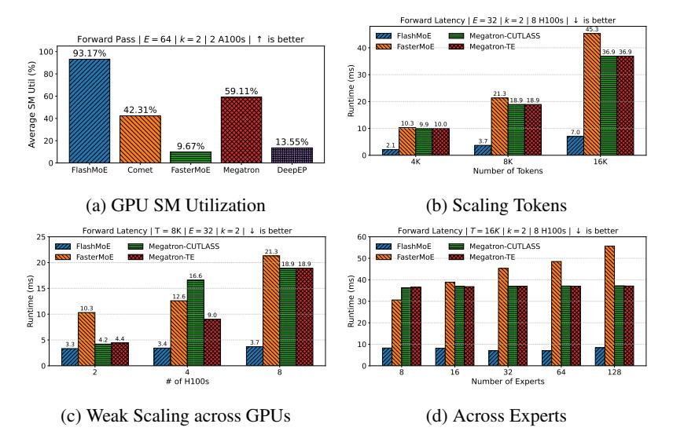
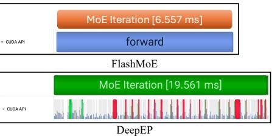
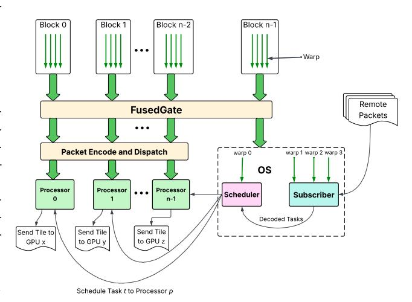
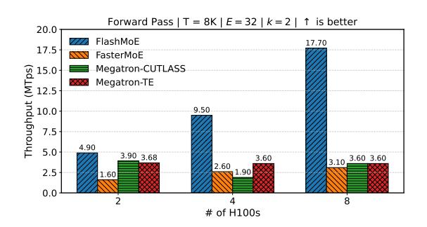
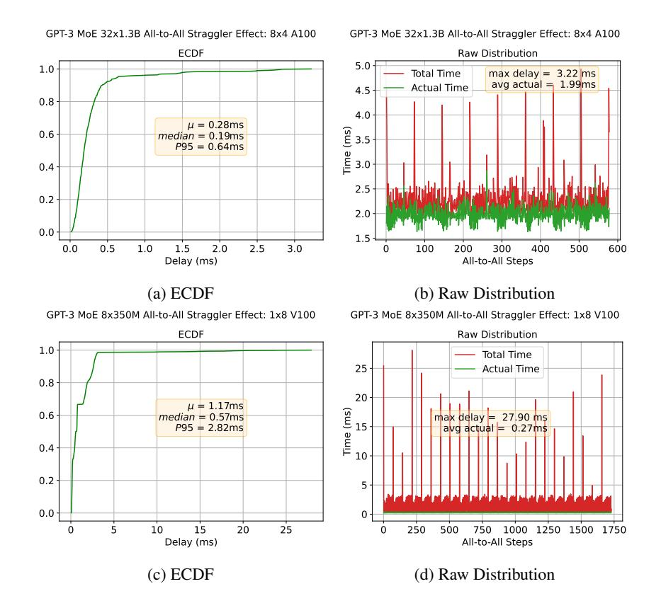
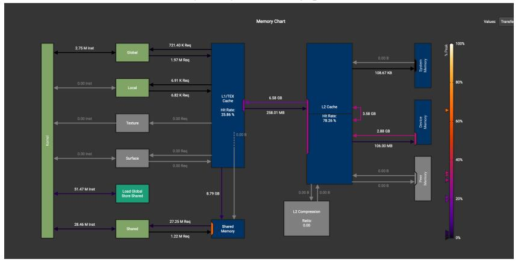

# FlashMoE: Fast Distributed MoE in a Single Kernel

Osayamen Jonathan Aimuyo\*

Cornell University oja7@cornell.edu

# **Byungsoo Oh**Cornell University

Cornell University bo239@cornell.edu

### Rachee Singh

Cornell University rs2293@cornell.edu

#### **Abstract**

The computational sparsity of Mixture-of-Experts (MoE) models enables sublinear growth in compute cost as model size increases, thus offering a scalable path to training massive neural networks. However, existing implementations suffer from low GPU utilization, significant latency overhead, and a fundamental inability to leverage task locality, primarily due to CPU-managed scheduling, host-initiated communication, and frequent kernel launches. To overcome these limitations, we develop FlashMoE, a fully GPU-resident MoE operator that fuses expert computation and inter-GPU communication into a single persistent GPU kernel. FlashMoE enables fine-grained pipelining of dispatch, compute, and combine phases, eliminating launch overheads and reducing idle gaps. Unlike existing work, FlashMoE obviates bulk-synchronous collectives for one-sided, device-initiated, inter-GPU (R)DMA transfers, thus unlocking payload efficiency, where we eliminate bloated or redundant network payloads in sparsely activated layers. When evaluated on an 8-H100 GPU node with MoE models having up to 128 experts and 16K token sequences, FlashMoE achieves up to 9× higher GPU utilization,  $6 \times$  lower latency, 5.7 \times higher throughput, and  $4 \times$  better overlap efficiency compared to state-of-the-art baselines—despite using FP32 while baselines use FP16. FlashMoE shows that principled GPU kernel-hardware co-design is key to unlocking the performance ceiling of large-scale distributed ML. We provide code at https://github.com/osayamenja/FlashMoE.



Figure 1: FlashMoE performance.

<sup>\*</sup>Correspondence to osayamen@stanford.edu

# 1 Introduction

State-of-the-art large language models (LLMs) [\[1](#page-10-0)[–5\]](#page-10-1) have adopted the Mixture-of-Experts (MoE) architecture for its computational efficiency and strong performance across a range of tasks. The traditional Transformer block consists of a self-attention module followed by a dense feed-forward network (FFN) [\[6\]](#page-10-2). In contrast, MoE architectures replace this single FFN (Figure [2\(](#page-1-0)a)) with many identically sized FFNs, known as experts (Figure [2\(](#page-1-0)b)). A trainable neural network, known as a gate function, sparsely activates these experts by dynamically routing input tokens to the experts selected at runtime. This increase in model parameters due to more FFNs improves model quality without the corresponding increase in computational cost.

<span id="page-1-0"></span>

Figure 2: Transformer blocks (a) without MoE, (b) with MoE, and (c) with distributed MoE and expert parallelism. T, E, and O represent input tokens, experts, and output activations, respectively.

#### Communication overheads in MoE. As MoE

model sizes grow, GPU memory constraints prevent hosting all experts on a single device. The standard practice is to distribute experts across multiple GPUs using expert parallelism (EP), which requires token routing via many-to-many communication primitives like *AlltoAll* [\[1,](#page-10-0) [4,](#page-10-3) [3,](#page-10-4) [7\]](#page-10-5) (Figure [2\(](#page-1-0)c)). Another round of *AlltoAll* communication restores the permuted tokens processed by experts to their original order in the sequence. *AlltoAll* communication is challenging to optimize on GPU networks and is highly sensitive to straggler delays — a phenomenon where a single straggler GPU delays all others from making progress [\[8\]](#page-10-6). These communication operations can account for 68% of the total runtime [\[9,](#page-10-7) [10\]](#page-10-8), causing GPUs to remain idle (Figure [3,](#page-1-1) top left).

Kernel launch overheads in MoE. To mitigate these communication bottlenecks, recent work pipelines computation with communication kernels (Figure [3,](#page-1-1) left middle). However, the effectiveness of these solutions is limited by the overhead of launching many kernels from the CPU. Specifically, existing implementations [\[11–](#page-10-9)[14\]](#page-10-10) launch a large number of kernels per a single layer pass (see Table [1\)](#page-2-0). Frequent kernel launches negatively affect performance by: (1) creating non-deterministic kernel start times across GPUs, exacerbating straggler issues; (2) introducing unnecessary synchronization points, causing GPUs to wait on peers or the CPU before proceeding; and (3) incurring repeated global memory round trips at kernel boundaries. Although CUDA graphs [\[15\]](#page-11-0) can partially mitigate the first issue in static workloads, they are incompatible with MoE's dynamic expert routing patterns. Addressing the remaining issues requires novel solutions, which we provide in this work through complete kernel fusion and asynchronous device-initiated communication.

<span id="page-1-1"></span>

Figure 3: Comparing FlashMoE with state-of-the-art techniques that either do not overlap communication and computation (left, top) or do some overlap (left, middle). FlashMoE is a persistent kernel that fuses all computation and communication of the MoE operator (left, bottom). FlashMoE implements device-initiated computation (gate, expert FFN, scale) and communication tasks (right).

Our Contributions: distributed MoE in a single kernel. To overcome these fundamental inefficiencies in state-of-the-art MoE models, we develop FlashMoE a megakernel that integrates all MoE computation and communication tasks into a single persistent GPU kernel *i.e.,* a kernel that remains active for the entirety of the MoE operator (Figure [3](#page-1-1) bottom left). Instead of multiple kernel launches coordinated by the CPU, FlashMoE requires launching only one kernel, significantly reducing the involvement of the CPU. Within the fused kernel, FlashMoE implements a reactive programming model to achieve fine-grained parallelism and loosely coupled, non-blocking execution among tens of thousands of GPU threads.

In-kernel Block scheduling and Tile parallelism. FlashMoE implements *tile-level parallelism*, meaning it partitions input token matrices into smaller, independent units called *tiles*, which are processed by blocks but managed (scheduled and constructed) by warps. We specialize every thread block, except one, as *processors* to perform compute. In addition, we designate a dedicated Operating System (OS) block (4 warps) to perform administrative tasks of (1) scheduling computational work to processors (*scheduler*), and (2) decoding computational tasks from messages received from other GPUs (*subscriber*). This design allows Flash-MoE to dynamically assign tasks to GPU blocks based on *readiness*, ensuring that no GPU SM remains idle throughout the lifetime of the MoE

<span id="page-2-0"></span>

| MoE Implementation           | GPU Ops |  |  |
|------------------------------|---------|--|--|
| FlashMoE (this work)         | 1       |  |  |
| COMET [12]                   | 33      |  |  |
| Megatron-LM CUTLASS [13, 16] | 85      |  |  |
| Megatron-LM TE [13, 16]      | 261     |  |  |
| Megatron-LM + DeepEP [1]     | 432     |  |  |
| DeepSpeedMoE [11]            | 550     |  |  |

Table 1: We report number of GPU operations launched by MoE implementations by profiling with Nsight Systems [\[17\]](#page-11-2). We count operations in a single MoE layer (Gate → Dispatch → Expert → Combine) on 2 A100 GPUs, where each GPU has 32 experts. FlashMoE is the first to fully fuse the distributed MoE layer into a single GPU kernel.

operator. FlashMoE selects tile dimensions to maximize GPU arithmetic intensity while benefitting from a high-degree of parallelism.

Asynchronous and payload-efficient communication. By redesigning the MoE operator from the ground up, FlashMoE resolves fundamental inefficiencies inherent in the conventional MoE execution pipeline. One notable inefficiency is token padding during communication. To simplify programming complexity and due to symmetry constraints of collective communication APIs, existing implementations have to zero-pad token payloads to match predefined buffer sizes. This occurs when tokens are asymmetrically routed to experts, resulting in GPUs receiving much less than the expected capacity. However, these null payloads waste communication bandwidth, bloat data transfer latency and may lead to unnecessary computations on null matrices in some implementations. FlashMoE introduces *payload-efficient* communication by sending non-padded tokens only to GPUs with actively selected experts, conserving both communication and computational resources.

Technical challenges. Realizing the single-kernel design of FlashMoE required solving several technical challenges to achieve high performance: (1) lightweight computational dependency management; (2) navigating optimal SM occupancy configurations; (3) implementing in-device BLAS operations; (4) minimizing inter- and intra-device synchronization overheads; (5) implementing transfer-awareness by leveraging DMA over Unified Virtual Addressing (UVA) when available. In addressing these challenges, FlashMoE's design presents a radical departure from traditional synchronous *AlltoAll* collectives, where GPUs exhibit significant idle time during layer execution. For device-initiated communication, FlashMoE uses NVSHMEM [\[18\]](#page-11-3) to establish a global address space across all GPUs for Direct Memory Access (DMA) communication. For in-device BLAS, FlashMoE develops custom high-performance GEMM operations via CUTLASS [\[19\]](#page-11-4).

Results. Our evaluations show that FlashMoE achieves 6× latency speedup, 9× higher GPU utilization, 4× better weak scaling efficiency and 5.7× increased throughput compared to state-ofthe-art implementations. We project these performance gains becoming even better in multi-node scenarios, where inter-node communication occurs using lower bandwidth inter-node links (*e.g.,* RDMA, Infiniband).

## 2 Motivation

Synchronous Communication. *AlltoAll* or *AllGather* communication as currently used in MoE frameworks is a *synchronous* collective operation, whose completion requires the participation of all involved GPUs. Here, disparities in processing speeds or kernel scheduling among GPUs induce

<span id="page-3-0"></span>



(a) GPU SM Utilization across baselines

(b) Kernel Launch overhead (CUDA API row)

Figure 4: 4a shows GPU utilization averaged across 100 MoE forward passes on 2 A100s with 300 GB/s unidirectional bandwidth, where we observe up to 90% idle time, due to kernel launch gaps and non-overlapping communication.

a straggler effect detrimental (Figure 13) to (1) the collective operation's performance and (2) E2E performance, as stalled GPUs cannot proceed to downstream dependent or independent tasks until the collective terminates. We expound on this problem in §A.

**Kernel Launch Overhead.** We compare the kernel launch overheads between FlashMoE and existing baselines. Table 1 shows the number of kernel launches during a single forward pass: FlashMoE launches exactly one persistent kernel, while the baselines launch up to 550 short-lived kernels to perform the same computation. Figure 4 provides a visual comparison using CUDA API traces captured by NSight Systems, illustrating the difference between FlashMoE and DeepEP. DeepEP exhibits many small CUDA API calls, with frequent stalls between individual operators, leading to increased GPU idle time (Figure 4a). In contrast, FlashMoE maintains high GPU utilization by avoiding launch overhead and synchronization gaps—achieving **93.17**% GPU utilization compared to 14% for DeepEP. See §4 for experimental results and §B for a discussion of related work.

### 3 Fused MoE Kernel Design

Modern distributed MoE systems suffer from two limitations: (1) frequent many-to-many (AlltoAll or AllGather) collectives on the critical path, and (2) significant overhead from repeated kernel launches. We address these in FlashMoE, a fully fused MoE operator implemented as a single persistent GPU kernel. Unlike previous approaches [12, 1, 11, 13, 20, 10, 21– 25], FlashMoE is the first solution to implement a completely fused Distributed MoE kernel, eliminating kernel launch overhead entirely by requiring only a single kernel launch (see Table 1).

**Actor-based model.** The design of FlashMoE is based on the actor model of concurrent computation [26–28]. We implement this model by specializ-

<span id="page-3-1"></span>

Figure 5: FlashMoE Fused Kernel

ing GPU thread blocks and warps into three distinct actor roles: (1) **Processor** (§F.1), (2) **Subscriber** (§F.3), and (3) **Scheduler**(§F.2). The Processor performs compute (GEMMs and element-wise operations) and tile communication. We use CUTLASS [19] as the underlying infrastructure for high-performance BLAS routines and NVSHMEM for kernel-initiated communication [18]. The Subscriber and Scheduler perform administrative functions. Specifically, the Scheduler assigns computational tasks to available thread blocks. Our key innovation is making the Scheduler both *multithreaded*, enabling high scheduling throughput, and *work-conserving*, ensuring consistently high GPU SM utilization. On the other hand, the Subscriber decodes *tile packets* from peer GPUs to task

#### Algorithm 1: FlashMoE Distributed MoE Fused Kernel

```
Input: A, O \in \mathbb{R}^{S \times H}, X \in \mathbb{R}^{E \times H \times D}, N
1 begin
         T_{\phi}, G_{\phi} \leftarrow \mathbf{FusedGate}(A)
2
3
         if blockId + 1 < N then
              \mathbf{Dispatch}(T_{\phi}, A)
              processor::start()
 5
 6
         else
               if warpID == 0 then
                   scheduler::start()
 8
                    subscriber::start(T_{\phi}, G_{\phi}, O, X)
10
               end if
11
         end if
13 end
```

<span id="page-4-1"></span>
$$D^{j} \xrightarrow{\substack{\text{Dispatch} \\ \text{packets}}} S_{b}^{i} \xrightarrow{\substack{\text{Tasks} \\ \text{Tasks}}} S_{h}^{i} \xrightarrow{\substack{\text{Schedule} \\ \text{Task} \\ \text{$GEMM_{0}$}}} P^{i} \xrightarrow{\substack{\text{Notify} \\ \text{Tasks} \\ \text{$GEMM_{1}$}}} P^{i} \xrightarrow{\substack{\text{Send} \\ \text{Task} \\ \text{$GEMM_{1}$}}} S_{b}^{j} \xrightarrow{\substack{\text{Notify} \\ \text{Tasks} \\ \text{$V$}}} S_{h}^{i} \xrightarrow{\substack{\text{Schedule} \\ \text{Tasks} \\ \text{Combine}}} P^{j}$$

Figure 6: DMoE Functional Dependencies Expressed as a Chain of Actor Interactions. We denote  $S_b$ ,  $S_h$ , and P as the Subscriber, Scheduler and Processor actors, respectively. For any actor  $a \in \{S_b, S_h, P\}$ ,  $a^i$  identifies an actor on GPU i. We define  $D_i^j$  as the operator, where GPU j dispatches packets of GPU i. This diagram expresses task dependencies at the granularity of a tile, namely  $GEMM_0$ ,  $GEMM_1$ , combine and communication produce an output tile. Notifications occur as signals propagated through shared memory (subscriber  $\leftrightarrow$  scheduler) or global memory (scheduler  $\leftrightarrow$  processor or inter-GPU communication). Note one-sided inter-GPU transfers (packet or single tile) are coupled with a signal to notify  $S_b^j$  on the receiving GPU j of the message's delivery.

descriptors (§3.1). Of the N thread blocks on a GPU, we specialize N-1 to adopt the **Processor** role. We specialize the last block as the Operating System (OS). Within this block, we specialize three warps for the **Subscriber** role and one warp for the **Scheduler** role. This split of thread blocks across actors is intentional: our goal is to use few resources for administrative tasks while reserving bulk of the resources for performing MoE computation tasks. Figure 5 summarizes the FlashMoE architecture and its constituent actors, while Algorithm 1 gives a very close translation of the system in code. Note that  $A \in \mathbb{R}^{S \times H}$  is the input token matrix;  $O \in \mathbb{R}^{S \times H}$  the output matrix; and  $X \in \mathbb{R}^{E \times H \times D}$  is a 3-D tensor of expert weights, where E denotes the number of local experts for the executing GPU, H is the embedding dimension, D is the FFN intermediate dimension and S is the sequence length.  $T_{\phi} \in (\mathbb{N} \times \mathbb{R})^{E \times C}$  is a routing table data structure, where  $T_{\phi}\left(e,c\right) = (i,w)$  indicates that token i at slot c dispatches to expert e. w is the combine weight (Equation 2) and C is expert capacity. The tuple structure of  $T_{\phi}$  is an implementation detail.  $G_{\phi} \in \mathbb{R}^{S \times E}$  captures the affinity scores produced by the gate (Equation 3). Inter-actor interactions in FlashMoE. FlashMoE decomposes MoE computation and communication at the granularity of a tile, a statically sized partition of a tensor, to achieve parallel execution and efficient overlap of tasks. Each tile maps to a discrete unit of work encapsulated by a task descriptor. The **Subscriber** decodes these task descriptors from the remote tile packets it receives. Concurrently, the Scheduler receives notifications about available tasks and dispatches them for execution to Processor actors that perform computations defined by these tasks, namely the feed-forward network (FFN) and expert-combine operations. Figure 6 show the chain of actor interactions, demonstrating how FlashMoE enforces DMoE functional dependencies.

**Determining tile dimensions in FlashMoE.** Selecting appropriate tile dimensions in FlashMoE is crucial to ensure efficient GPU utilization. An undersized tile underutilizes the GPU, while excessively large tiles create register pressure, causing performance-degrading register spills to local memory. After careful parameter sweeps, we choose tile dimensions of (128, 64). Our key insights are: increasing tile width significantly raises the register usage per thread, potentially triggering costly spills; increasing tile height without adjusting thread count increases workload per thread, harming performance. Raising the thread count per block beyond our fixed value of 128 threads reduces the

number of concurrent blocks, negatively affecting SM occupancy. Larger thread-block sizes also increase overhead from intra-block synchronization (*\_\_syncthreads()* barriers), further degrading performance. Thus, our chosen tile dimensions balance register usage, shared-memory constraints, and GPU occupancy to deliver optimal performance.

#### <span id="page-5-0"></span>3.1 Task Abstraction for Computation

Computational operators. The FFN operator is a standard position-wise feed-forward network widely used in Transformer architectures [\[6\]](#page-10-2), composed of two linear transformations separated by a nonlinear activation ϕ (e.g., GELU or ReLU):

$$FFN(x) = W_2 \cdot \phi(xW_1 + b_1) + b_2 \tag{1}$$

Here, W<sup>1</sup> and W<sup>2</sup> represent learnable weight matrices, and b<sup>1</sup> and b<sup>2</sup> are biases. The expert-combine operation, used in architectures like GShard [\[29\]](#page-12-2) and DeepSeek [\[1\]](#page-10-0), merges outputs from multiple experts by computing a weighted combination based on their affinity scores:

<span id="page-5-1"></span>
$$C_i = \sum_{j=1}^k g_{i,e} \tag{2}$$

<span id="page-5-2"></span>
$$\mathbf{h}_{i} = \sum_{j=1}^{k} \frac{g_{i,e}}{C_{i}} \cdot \mathbf{h}_{i}^{k} \tag{3}$$

In these equations, i ∈ 0, S − 1 represents an input token index, e = Ei,k identifies the k-th expert selected for token i, and gi,e is the affinity score indicating how relevant expert e is for token i.

Unified task abstraction. We unify the FFN and combine operations under a common abstraction called a *task*. Tasks provide a uniform interface for communicating tile-level work among Subscribers, Schedulers, and Processors. Formally, a task descriptor t ∈ T is defined as a tuple:

$$t = (\mathcal{M}, \star, \phi)$$

where M is a set of metadata (*e.g.,* device ID, tile index), ⋆ is a binary tensor operation (specifically, matrix multiplication · or Hadamard product ⊙), and ϕ is an element-wise activation function (e.g., ReLU or identity).

We define a task t operating on input tensors A, B, D, producing output tensor C, as follows:

<span id="page-5-3"></span>
$$\mathcal{F}_t(A, B, C, D) := C \leftarrow \phi \left( A \star_t B + D \right) \tag{4}$$

The operator ⋆<sup>t</sup> (instantiated from ⋆) may behave differently depending on the task metadata M, and the result of A ⋆<sup>t</sup> B is accumulated into D. We provide an example of task metadata in [§E.](#page-19-0)

In practice, we implement each task defined by Equation [4](#page-5-3) as a *single fused* \_\_device\_\_ decorated function which the Processor (Algorithm [2\)](#page-20-1) invokes at runtime. Fusion for t entails applying ϕ and the succeeding addition operation to registers storing the results of the binary operator ⋆t. To illustrate its flexibility, we show how the FFN and expert-combine operations can be expressed using this task framework. Note that we omit the matrix multiplication symbol (·) for simplicity. Also, ϕ<sup>1</sup> can be any activation function, while ϕ<sup>2</sup> is the identity function. The FFN is expressed as:

$$t_{1} = (\mathcal{M}, \cdot, \phi_{1}), \quad t_{2} = (\mathcal{M}, \cdot, \phi_{2}),$$

$$\mathcal{F}_{t_{1}}(A, B_{1}, C_{1}, D_{1}) \coloneqq C_{1} \leftarrow \phi_{1} (AB_{1} + D_{1}),$$

$$\mathcal{F}_{t_{2}}(C_{1}, B_{2}, C_{2}, D_{2}) \coloneqq C_{2} \leftarrow \phi_{2} (C_{1}B_{2} + D_{2}).$$

Whereas, the expert-combine operation is formalized as:

$$t_3 = (\mathcal{M}, \odot, \phi_2),$$
  
$$\mathcal{F}_{t_3}(A, S, C, C) \coloneqq C \leftarrow \phi_2 (A \odot S + C).$$

#### 3.2 Symmetric Tensor Layout for Inter-GPU Communication

Within a single GPU device, the actors in FlashMoE communicate through the GPU's memory subsystem. Specifically, the Scheduler and Subscriber actors exchange data via fast shared memory,

<span id="page-6-0"></span>

(a) Layout across 2 Expert-parallel Processes.

(b) State machine for DMA (top) and RDMA (bottom) communication.

Figure 7: Symmetric Tensor Layout

while other actor pairs communicate through global memory. For communication across multiple devices, FlashMoE uses *device-initiated communication*, leveraging the one-sided PGAS (Partitioned Global Address Space) programming model [30]. However, achieving scalable and correct one-sided memory accesses in PGAS without costly synchronization is a known challenge [1, 31]. We address this challenge with a provably correct and scalable solution: a symmetric tensor layout L, supporting fully non-blocking memory accesses. We define L as:

$$L \in \mathbb{R}^{P \times R \times B \times E \times C \times H}$$

where: P is the expert parallel world size, R identifies communication rounds (i.e., two rounds, one for token dispatch and one for combine), B is number of staging buffers, E is the number of local experts, E is the upscaled expert capacity (§3.2.1) and E is the token embedding dimension. Our core insight to enable non-blocking communication is temporal buffering. Specifically, we overprovision memory for the underlying token matrix by at least  $2 \cdot r$  times, where E is the number of communication rounds in the dependency graph, and the factor of 2 accounts for separate buffers for incoming and outgoing data within each communication round. For MoE models, we have E in this modest increase in memory usage eliminates the need for synchronization during one-sided data transfers. Figure 7b illustrates how cells within this symmetric tensor layout are indexed and used for Direct Memory Access (DMA) and Remote DMA (RDMA) operations. As Theorem 3.1 reinforces, this indexing scheme over E is the underlying mechanism that allows for fully non-blocking accesses eliding synchronization because all accesses are write conflict-free. See§ E for the proof.

<span id="page-6-1"></span>**Theorem 3.1.** The symmetric tensor layout L is write-write conflict-free.

To construct L, we start from the original token buffer  $T \in \mathbb{R}^{S \times H}$ , where S is the sequence length and H is the token embedding dimension. We first reorganize the sequence dimension S into three sub-dimensions representing the expert capacity (C), local expert slots (E), and the expert parallel world size (W), st:

$$C \cdot E \cdot W = C \cdot E' = S'$$
, where  $S' \ge S$  and  $E' \ge E_W$ 

In the typical case of uniform expert distribution (illustrated in Figure 7a), we have S' = S and  $E' = E_W$ , where  $E_W$  is the total number of experts in the model. Thus, the size of the token buffer is  $Size(T) = S' \cdot H$ . In Figure 7a, each cell labeled  $E_i$  (with  $i \in \{0, \dots, 3\}$ ) is a matrix of size (C, H). Extending prior work [29, 12], we introduce additional temporal dimensions R (communication rounds) and B (staging buffers). Each communication round has two fixed staging slots: one for outgoing tokens and another for incoming tokens. Each slot, indexed by dimension P, forms a tensor of shape (S', H). Therefore, the tensor size Size(L) is generally at least four times the original token buffer size, becoming exactly four times larger in the case of uniform expert distribution. Empirically, we find  $Size(L) \approx 4 \cdot Size(T)$ , contributing memory overhead  $\leq 2\%$  of memory capacity for inference of popular models. We present a thorough breakdown in  $\S D$ .

#### <span id="page-7-1"></span>3.2.1 In-place Padding for Payload Efficiency

Due to the dynamic and uneven distribution of tokens in MoE dispatch [32], GPUs commonly receive fewer tokens than their predefined expert capacity. Current MoE frameworks [11] typically pad these buffers with null tokens before computation, unnecessarily increasing communication payloads and degrading performance. In contrast, we propose *in-place padding*, performing padding directly within the local symmetric tensor buffers and thus eliminating excess network communication.

As we show in Figure 7a as a reference, each cell  $E_i$  is sized according to the expert capacity C. We further align this capacity to ensure divisibility by the tile block size bM=128, guaranteeing safe and aligned memory reads by Processor threads consuming remote tokens. This in-place padding strategy slightly increases the memory footprint of L, as described below:

$$Size(L) \approx \begin{cases} 4 \cdot Size(T), & \frac{S}{E} \geq bM \\ 4 \cdot \frac{bM \cdot E}{S} \cdot Size(T), & \text{otherwise} \end{cases}$$

#### <span id="page-7-0"></span>4 Evaluation

We implement (§G) and evaluate FlashMoE across five metrics: Forward Latency (§ 4.1), GPU Utilization (§ 4.2), Overlap Efficiency (§ 4.4), Throughput (§ 4.3), and Expert Scalability (§ 4.5). We run experiments on a server with 8 NVIDIA H100 80G GPUs interconnected via NVLink, 125 GB of RAM, and 20 vCPUs. We used PyTorch 2.6.0, CUDA 12.8, and Ubuntu 22.04. All experiments use MoE transformer models configured with 16 attention heads, an embedding dimension of 2048, and an FFN intermediate size of 2048. We apply Distributed Data Parallelism (DDP) and Expert Parallelism for all experiments. We execute only the forward pass over a single MoE layer and measure the average runtime of 32 passes after 32 warmup passes. We use top-2 routing with a capacity factor of 1.0. We compare FlashMoE against several state-of-the-art MoE systems: (1) Comet [12], (2) FasterMoE [14], (3) Megatron-CUTLASS [13], and (4) Megatron-TE: Megatron-LM with Transformer Engine [33]. Comet relies on cudaMemcpyPeerAsync [34], while FasterMoE and Megatron-LM use NCCL exclusively for communication.

**Desiderata.** We observe Comet exhibiting anomalously bad performance values at 8 GPUs, so we exclude their results from evaluations at 8 GPUs and only include for results at  $\leq$  4 GPUs. We evaluate FlashMoE using FP32 precision whereas all baselines use FP16. We do so because (1) of incomplete fp16 tuning (§H) and (2) no baseline supports FP32. Note, this precision discrepancy disadvantages FlashMoE by doubling its communication volume and computational workload.

#### <span id="page-7-2"></span>4.1 Forward Latency

<span id="page-7-3"></span>

Figure 8: Forward Latency as the Number of Tokens per GPU increases.

We first measure the forward latency of FlashMoE across different sequence lengths on both 4 and 8 GPU setups (Figure 8). FlashMoE consistently outperforms all baselines, with especially notable improvements at longer sequence lengths. On 4 GPUs, it achieves up to **4.6**x speedup over Megatron-TE at 16K tokens, and **2.6**x over FasterMoE. The gains are even more pronounced at 8 GPUs where FlashMoE maintains low latency, exhibiting up to **6.4**x speedup over baselines that degrade steeply due to increasing communication costs as token buffers increase proportionally.

#### <span id="page-8-0"></span>4.2 GPU Utilization

To quantify GPU efficiency, we measure Streaming Multiprocessor (SM) utilization during the forward pass (Figure 9). FlashMoE achieves 93.17% average SM utilization, over 9x higher than FasterMoE (9.67%), 6.8x higher than DeepEP+Megatron-LM (13.55%) 4x higher than Megatron-TE (59.11%), and 2.2x higher than Comet (42.31%). This improvement stems from our fully fused kernel architecture and finegrained pipelining of compute and communication tasks. By eliminating idle gaps due to kernel launches and enabling in-kernel task scheduling, FlashMoE ensures SMs remain busy with productive work throughout execution.

<span id="page-8-3"></span>

Figure 9: SM utilization, defined as the ratio of cycles in which SMs have at least one warp in flight to the total number of cycles [17]. Values represent the average SM utilization over 100 iterations.

#### <span id="page-8-2"></span>4.3 Throughput

As shown in Figure 10, FlashMoE scales linearly with GPU count, reaching 17.7 MTokens/s at 8 GPUs. This is over **5.7**x higher than FasterMoE and **4.9**x higher than Megatron-TE and Megatron-CUTLASS. Notably, these results are achieved despite *Flash-MoE operating entirely in FP32, while baselines use FP16*. This indicates that FlashMoE 's design eliminates throughput bottlenecks not by exploiting lower precision, but by maximizing hardware utilization and eliminating host-driven inefficiencies.

<span id="page-8-4"></span>

Figure 10: Throughput when scaling the number of GPUs, computed as  $\frac{T \times N_G}{\text{latency}}$ .

#### <span id="page-8-1"></span>4.4 Overlap Efficiency

<span id="page-8-5"></span>


- (a) Latency as Number of GPUs increases.
- (b) Weak scaling efficiency

Figure 11: Weak scaling efficiency. We define Overlap Efficiency  $O_e$  to be  $O_e = T(2)/T(N_G)$ , where  $T(N_G)$  is the latency at  $N_G$  GPUs and T(2) is the latency at 2 GPUs.

We evaluate the extent to which FlashMoE overlaps communication and computation by measuring weak scaling efficiency as the number of GPUs increases (Figure 11b). We note that most baselines fail to execute at a single GPU, hence why we use 2 GPUs as the reference point. We observe that Megatron-CUTLASS and Megatron-TE degrade significantly, with overlap efficiency dropping below 50% at  $\geq$  4 GPUs. FlashMoE gives up to 3.88x and 4x higher efficiency at 4 and 8 GPUs, respectively. Figure 11a further illuminates this efficiency, as FlashMoE shows stable forward latency growth. These results corroborate that FlashMoE's actor-based design and asynchronous data movement achieve near-ideal overlap.

#### <span id="page-9-0"></span>4.5 Expert Scalability

<span id="page-9-1"></span>

Figure 12: Forward Latency as the *Number of experts* increases.

We analyze how FlashMoE scales with increasing number of experts at fixed sequence length (T = 16K). Note that for the discussed plots, the number of experts on the x-axis is the *total number across all GPUs*. Each GPU gets 1/8th of this value. As seen in Figure 12, FlashMoE maintains *low, uniform* latency, as desired, even as the number of experts grows from 8 to 128. In contrast, baselines exhibit superlinear latency increases due to increased kernel launch overheads. FlashMoE outperforms these baselines by up to **4**X at 4 H100s and **6.6**X at 8 H100s, both at 128 experts. FlashMoE 's payload-efficient communication and scheduler-driven in-kernel dispatching allow it to sustain expert parallelism without incurring the communication and orchestration penalties seen in other systems. These results reinforce FlashMoE 's scalability for ultra-sparse MoE configurations.

#### 5 Limitations and Future Work

**Engineering complexity.** Fully fused, persistent kernels demand deep GPU + distributed-systems expertise; future work may investigate compiler/DSL abstractions to lower this barrier.

**FP16 inefficiency.** Our FP16 path is suboptimal (§H) due to insufficient tuning. We anticipate addressing this gap with autotuned GEMM operators like cuBLASDx [35] or CUTLASS builders.

**Training support.** This work targets inference; enabling training will require fusing backward computation and gradient communication with new bookkeeping and task descriptors.

### 6 Conclusion

We introduce FlashMoE, the first work to fuse the entire Distributed MoE operator into a single persistent GPU kernel that unifies computation, communication, and scheduling via actor-style concurrency, warp specialization, and async (R)DMA. We address two dominant bottlenecks in prior systems—CPU-managed synchronous communication and fragmented multi-kernel execution. Empirically, FlashMoE achieves up to  $6\times$  speedup,  $9\times$  higher GPU utilization, and  $5.7\times$  throughput for distributed MoE. Looking ahead, we see a shift from CPU orchestration to fully autonomous, GPU-native pipelines—extending this fusion approach to training and beyond.

### 7 Acknowledgements

This research is supported by NSF Award #2444537 and ACE, one of the seven centers in JUMP 2.0, a Semiconductor Research Corporation (SRC) program sponsored by DARPA. This work also used resources of the National Energy Research Scientific Computing Center, a DOE Office of Science User Facility supported by the Office of Science of the U.S. Department of Energy under Contract No. DE-AC02-05CH11231 using NERSC award ASCR-ERCAP0030076. We acknowledge and thank Dr. Giulia Guidi for providing access to these NERSC supercomputing resources.

# References

- <span id="page-10-0"></span>[1] DeepSeek-AI. Deepseek-v3 technical report, 2025. URL [https://arxiv.org/abs/2412.](https://arxiv.org/abs/2412.19437) [19437](https://arxiv.org/abs/2412.19437).
- [2] Meta AI. The llama 4 herd: The beginning of a new era of natively multimodal ai innovation, 2025. URL <https://ai.meta.com/blog/llama-4-multimodal-intelligence/>.
- <span id="page-10-4"></span>[3] Mosaic Research. Introducing dbrx: A new state-of-the-art open llm, 2024. URL [https:](https://www.databricks.com/blog/introducing-dbrx-new-state-art-open-llm) [//www.databricks.com/blog/introducing-dbrx-new-state-art-open-llm](https://www.databricks.com/blog/introducing-dbrx-new-state-art-open-llm).
- <span id="page-10-3"></span>[4] Snowflake AI Research. Snowflake arctic: The best llm for enterprise ai — efficiently intelligent, truly open, 2024. URL [https://www.snowflake.com/en/blog/](https://www.snowflake.com/en/blog/arctic-open-efficient-foundation-language-models-snowflake/) [arctic-open-efficient-foundation-language-models-snowflake/](https://www.snowflake.com/en/blog/arctic-open-efficient-foundation-language-models-snowflake/).
- <span id="page-10-1"></span>[5] OpenAI. GPT-OSS: Open-weight language models for reasoning and agentic tasks. [https:](https://github.com/openai/gpt-oss) [//github.com/openai/gpt-oss](https://github.com/openai/gpt-oss), August 2025. Models: gpt-oss-120b and gpt-oss-20b.
- <span id="page-10-2"></span>[6] Ashish Vaswani, Noam Shazeer, Niki Parmar, Jakob Uszkoreit, Llion Jones, Aidan N Gomez, Ł ukasz Kaiser, and Illia Polosukhin. Attention is all you need. In *Advances in Neural Information Processing Systems*, volume 30. Curran Associates, Inc., 2017. URL [https://proceedings.neurips.cc/paper\\_files/paper/2017/file/](https://proceedings.neurips.cc/paper_files/paper/2017/file/3f5ee243547dee91fbd053c1c4a845aa-Paper.pdf) [3f5ee243547dee91fbd053c1c4a845aa-Paper.pdf](https://proceedings.neurips.cc/paper_files/paper/2017/file/3f5ee243547dee91fbd053c1c4a845aa-Paper.pdf).
- <span id="page-10-5"></span>[7] Siddharth Singh, Olatunji Ruwase, Ammar Ahmad Awan, Samyam Rajbhandari, Yuxiong He, and Abhinav Bhatele. A hybrid tensor-expert-data parallelism approach to optimize mixture-ofexperts training. In *Proceedings of the 37th ACM International Conference on Supercomputing*, ICS '23, page 203–214, New York, NY, USA, 2023. Association for Computing Machinery. ISBN 9798400700569. doi: 10.1145/3577193.3593704. URL [https://doi.org/10.1145/](https://doi.org/10.1145/3577193.3593704) [3577193.3593704](https://doi.org/10.1145/3577193.3593704).
- <span id="page-10-6"></span>[8] Arjun Devraj, Eric Ding, Abhishek Vijaya Kumar, Robert Kleinberg, and Rachee Singh. Efficient allreduce with stragglers, 2025. URL <https://arxiv.org/abs/2505.23523>.
- <span id="page-10-7"></span>[9] Juncai Liu, Jessie Hui Wang, and Yimin Jiang. Janus: A unified distributed training framework for sparse mixture-of-experts models. In *Proceedings of the ACM SIGCOMM 2023 Conference*, ACM SIGCOMM '23, page 486–498, New York, NY, USA, 2023. Association for Computing Machinery. ISBN 9798400702365. doi: 10.1145/3603269.3604869. URL [https://doi.org/](https://doi.org/10.1145/3603269.3604869) [10.1145/3603269.3604869](https://doi.org/10.1145/3603269.3604869).
- <span id="page-10-8"></span>[10] Chenyu Jiang, Ye Tian, Zhen Jia, Shuai Zheng, Chuan Wu, and Yida Wang. Lancet: Accelerating mixture-of-experts training via whole graph computation-communication overlapping. In P. Gibbons, G. Pekhimenko, and C. De Sa, editors, *Proceedings of Machine Learning and Systems*, volume 6, pages 74–86, 2024. URL [https://proceedings.mlsys.org/paper\\_files/](https://proceedings.mlsys.org/paper_files/paper/2024/file/339caf45a6fa281cae8adc6465343464-Paper-Conference.pdf) [paper/2024/file/339caf45a6fa281cae8adc6465343464-Paper-Conference.pdf](https://proceedings.mlsys.org/paper_files/paper/2024/file/339caf45a6fa281cae8adc6465343464-Paper-Conference.pdf).
- <span id="page-10-9"></span>[11] Samyam Rajbhandari, Conglong Li, Zhewei Yao, Minjia Zhang, Reza Yazdani Aminabadi, Ammar Ahmad Awan, Jeff Rasley, and Yuxiong He. DeepSpeed-MoE: Advancing mixtureof-experts inference and training to power next-generation AI scale. In *Proceedings of the 39th International Conference on Machine Learning*, volume 162 of *Proceedings of Machine Learning Research*, pages 18332–18346. PMLR, 17–23 Jul 2022. URL [https:](https://proceedings.mlr.press/v162/rajbhandari22a.html) [//proceedings.mlr.press/v162/rajbhandari22a.html](https://proceedings.mlr.press/v162/rajbhandari22a.html).
- <span id="page-10-11"></span>[12] Shulai Zhang, Ningxin Zheng, Haibin Lin, Ziheng Jiang, Wenlei Bao, Chengquan Jiang, Qi Hou, Weihao Cui, Size Zheng, Li-Wen Chang, Quan Chen, and Xin Liu. Comet: Finegrained computation-communication overlapping for mixture-of-experts. In *MLSys '25*. URL <https://arxiv.org/abs/2502.19811>.
- <span id="page-10-12"></span>[13] NVIDIA. Megatron-lm, 2025. URL [https://github.com/NVIDIA/Megatron-LM?tab=](https://github.com/NVIDIA/Megatron-LM?tab=readme-ov-file) [readme-ov-file](https://github.com/NVIDIA/Megatron-LM?tab=readme-ov-file). v0.11.0.
- <span id="page-10-10"></span>[14] Jiaao He, Jidong Zhai, Tiago Antunes, Haojie Wang, Fuwen Luo, Shangfeng Shi, and Qin Li. Fastermoe: modeling and optimizing training of large-scale dynamic pre-trained models. In *Proceedings of the 27th ACM SIGPLAN Symposium on Principles and Practice of Parallel Programming (PPoPP 22)*, pages 120–134, 2022.

- <span id="page-11-0"></span>[15] Michael Wendt and Joshua Wyatt. Getting started with CUDA graphs. [https://developer.](https://developer.nvidia.com/blog/cuda-graphs/) [nvidia.com/blog/cuda-graphs/](https://developer.nvidia.com/blog/cuda-graphs/), 2019. Accessed: 2024-05-15.
- <span id="page-11-1"></span>[16] Deepak Narayanan, Mohammad Shoeybi, Jared Casper, Patrick LeGresley, Mostofa Patwary, Vijay Korthikanti, Dmitri Vainbrand, Prethvi Kashinkunti, Julie Bernauer, Bryan Catanzaro, Amar Phanishayee, and Matei Zaharia. Efficient large-scale language model training on gpu clusters using megatron-lm. In *Proceedings of the International Conference for High Performance Computing, Networking, Storage and Analysis*, SC '21, New York, NY, USA, 2021. Association for Computing Machinery. ISBN 9781450384421. doi: 10.1145/3458817.3476209. URL <https://doi.org/10.1145/3458817.3476209>.
- <span id="page-11-2"></span>[17] NVIDIA. NVIDIA Nsight Systems Metrics, . URL [https://docs.nvidia.](https://docs.nvidia.com/nsight-systems/UserGuide/index.html?highlight=SM%2520active#available-metrics) [com/nsight-systems/UserGuide/index.html?highlight=SM%2520active#](https://docs.nvidia.com/nsight-systems/UserGuide/index.html?highlight=SM%2520active#available-metrics) [available-metrics](https://docs.nvidia.com/nsight-systems/UserGuide/index.html?highlight=SM%2520active#available-metrics).
- <span id="page-11-3"></span>[18] NVIDIA. Nvidia openshmem library (nvshmem), 2025. URL [https://docs.nvidia.com/](https://docs.nvidia.com/nvshmem/api/index.html) [nvshmem/api/index.html](https://docs.nvidia.com/nvshmem/api/index.html). v3.2.5.
- <span id="page-11-4"></span>[19] Vijay Thakkar, Pradeep Ramani, Cris Cecka, Aniket Shivam, Honghao Lu, Ethan Yan, Jack Kosaian, Mark Hoemmen, Haicheng Wu, Andrew Kerr, Matt Nicely, Duane Merrill, Dustyn Blasig, Fengqi Qiao, Piotr Majcher, Paul Springer, Markus Hohnerbach, Jin Wang, and Manish Gupta. CUTLASS, 2025. URL <https://github.com/NVIDIA/cutlass>.
- <span id="page-11-5"></span>[20] Changho Hwang, Wei Cui, Yifan Xiong, Ziyue Yang, Ze Liu, Han Hu, Zilong Wang, Rafael Salas, Jithin Jose, Prabhat Ram, HoYuen Chau, Peng Cheng, Fan Yang, Mao Yang, and Yongqiang Xiong. Tutel: Adaptive mixture-of-experts at scale. In D. Song, M. Carbin, and T. Chen, editors, *Proceedings of Machine Learning and Systems*, volume 5, pages 269– 287. Curan, 2023. URL [https://proceedings.mlsys.org/paper\\_files/paper/2023/](https://proceedings.mlsys.org/paper_files/paper/2023/file/5616d34cf8ff73942cfd5aa922842556-Paper-mlsys2023.pdf) [file/5616d34cf8ff73942cfd5aa922842556-Paper-mlsys2023.pdf](https://proceedings.mlsys.org/paper_files/paper/2023/file/5616d34cf8ff73942cfd5aa922842556-Paper-mlsys2023.pdf).
- <span id="page-11-6"></span>[21] Jiaao He, Jidong Zhai, Tiago Antunes, Haojie Wang, Fuwen Luo, Shangfeng Shi, and Qin Li. Fastermoe: modeling and optimizing training of large-scale dynamic pre-trained models. In *Proceedings of the 27th ACM SIGPLAN Symposium on Principles and Practice of Parallel Programming*, PPoPP '22, page 120–134, New York, NY, USA, 2022. Association for Computing Machinery. ISBN 9781450392044. doi: 10.1145/3503221.3508418. URL <https://doi.org/10.1145/3503221.3508418>.
- [22] Xiaonan Nie, Xupeng Miao, Zilong Wang, Zichao Yang, Jilong Xue, Lingxiao Ma, Gang Cao, and Bin Cui. Flexmoe: Scaling large-scale sparse pre-trained model training via dynamic device placement. *Proc. ACM Manag. Data*, 1(1), May 2023. doi: 10.1145/3588964. URL <https://doi.org/10.1145/3588964>.
- [23] Shaohuai Shi, Xinglin Pan, Qiang Wang, Chengjian Liu, Xiaozhe Ren, Zhongzhe Hu, Yu Yang, Bo Li, and Xiaowen Chu. Schemoe: An extensible mixture-of-experts distributed training system with tasks scheduling. In *Proceedings of the Nineteenth European Conference on Computer Systems*, EuroSys '24, page 236–249, New York, NY, USA, 2024. Association for Computing Machinery. ISBN 9798400704376. doi: 10.1145/3627703.3650083. URL <https://doi.org/10.1145/3627703.3650083>.
- [24] Hulin Wang, Yaqi Xia, Donglin Yang, Xiaobo Zhou, and Dazhao Cheng. Harnessing inter-gpu shared memory for seamless moe communication-computation fusion. In *Proceedings of the 30th ACM SIGPLAN Annual Symposium on Principles and Practice of Parallel Programming*, PPoPP '25, page 170–182, New York, NY, USA, 2025. Association for Computing Machinery. ISBN 9798400714436. doi: 10.1145/3710848.3710868. URL [https://doi.org/10.1145/](https://doi.org/10.1145/3710848.3710868) [3710848.3710868](https://doi.org/10.1145/3710848.3710868).
- <span id="page-11-7"></span>[25] Tri Dao, Dan Fu, Stefano Ermon, Atri Rudra, and Christopher Ré. Flashattention: Fast and memory-efficient exact attention with io-awareness. In *Advances in Neural Information Processing Systems*, volume 35, pages 16344–16359. Curran Associates, Inc., 2022. URL [https://proceedings.neurips.cc/paper\\_files/paper/2022/file/](https://proceedings.neurips.cc/paper_files/paper/ 2022/file/67d57c32e20fd0a7a302cb81d36e40d5-Paper-Conference.pdf) [67d57c32e20fd0a7a302cb81d36e40d5-Paper-Conference.pdf](https://proceedings.neurips.cc/paper_files/paper/ 2022/file/67d57c32e20fd0a7a302cb81d36e40d5-Paper-Conference.pdf).

- <span id="page-12-0"></span>[26] Gul A. Agha. Actors: A model of concurrent computation in distributed systems. Technical report, 1985. MIT Artificial Intelligence Laboratory Technical Reports.
- [27] Carl Hewitt, Peter Bishop, and Richard Steiger. A universal modular actor formalism for artificial intelligence. IJCAI'73, page 235–245, San Francisco, CA, USA, 1973. Morgan Kaufmann Publishers Inc.
- <span id="page-12-1"></span>[28] Irene Greif. *SEMANTICS OF COMMUNICATING PARALLEL PROCESSES*. PhD thesis, Massachusetts Institute of Technology, 1975.
- <span id="page-12-2"></span>[29] Dmitry Lepikhin, HyoukJoong Lee, Yuanzhong Xu, Dehao Chen, Orhan Firat, Yanping Huang, Maxim Krikun, Noam Shazeer, and Zhifeng Chen. Gshard: Scaling giant models with conditional computation and automatic sharding. In *9th International Conference on Learning Representations, ICLR 2021, Virtual Event, Austria, May 3-7, 2021*. OpenReview.net, 2021. URL <https://openreview.net/forum?id=qrwe7XHTmYb>.
- <span id="page-12-3"></span>[30] Katherine Yelick, Dan Bonachea, Wei-Yu Chen, Phillip Colella, Kaushik Datta, Jason Duell, Susan L. Graham, Paul Hargrove, Paul Hilfinger, Parry Husbands, Costin Iancu, Amir Kamil, Rajesh Nishtala, Jimmy Su, Michael Welcome, and Tong Wen. Productivity and performance using partitioned global address space languages. In *Proceedings of the 2007 International Workshop on Parallel Symbolic Computation*, PASCO '07, page 24–32, New York, NY, USA, 2007. Association for Computing Machinery. ISBN 9781595937414. doi: 10.1145/1278177. 1278183. URL <https://doi.org/10.1145/1278177.1278183>.
- <span id="page-12-4"></span>[31] Size Zheng, Wenlei Bao, Qi Hou, Xuegui Zheng, Jin Fang, Chenhui Huang, Tianqi Li, Haojie Duanmu, Renze Chen, Ruifan Xu, Yifan Guo, Ningxin Zheng, Ziheng Jiang, Xinyi Di, Dongyang Wang, Jianxi Ye, Haibin Lin, Li-Wen Chang, Liqiang Lu, Yun Liang, Jidong Zhai, and Xin Liu. Triton-distributed: Programming overlapping kernels on distributed ai systems with the triton compiler, 2025. URL <https://arxiv.org/abs/2504.19442>.
- <span id="page-12-5"></span>[32] Quentin Anthony, Yury Tokpanov, Paolo Glorioso, and Beren Millidge. Blackmamba: Mixture of experts for state-space models, 2024. URL <https://arxiv.org/abs/2402.01771>.
- <span id="page-12-6"></span>[33] NVIDIA. Transformer engine, . URL <https://github.com/NVIDIA/TransformerEngine>.
- <span id="page-12-7"></span>[34] Bytedance. Flux's overlap performance is worse than non-overlap [4xrtx 4090], 2025. URL <https://github.com/bytedance/flux/issues/111#issuecomment-2822823236>.
- <span id="page-12-8"></span>[35] NVIDIA. cublasdx, 2025. URL <https://docs.nvidia.com/cuda/cublasdx/>.
- <span id="page-12-9"></span>[36] NERSC. Network - NERSC Documentation. [https://docs.nersc.gov/performance/](https://docs.nersc.gov/performance/network/) [network/](https://docs.nersc.gov/performance/network/), 2025. [Accessed 23-05-2025].
- <span id="page-12-10"></span>[37] C. Bell, D. Bonachea, R. Nishtala, and K. Yelick. Optimizing bandwidth limited problems using one-sided communication and overlap. In *Proceedings 20th IEEE International Parallel & Distributed Processing Symposium*, pages 10 pp.–, 2006. doi: 10.1109/IPDPS.2006.1639320.
- <span id="page-12-11"></span>[38] Yuxin Chen, Benjamin Brock, Serban Porumbescu, Aydin Buluc, Katherine Yelick, and John Owens. Atos: A task-parallel gpu scheduler for graph analytics. In *Proceedings of the 51st International Conference on Parallel Processing*, ICPP '22, New York, NY, USA, 2023. Association for Computing Machinery. ISBN 9781450397339. doi: 10.1145/3545008.3545056. URL <https://doi.org/10.1145/3545008.3545056>.
- <span id="page-12-12"></span>[39] Abhinav Jangda, Jun Huang, Guodong Liu, Amir Hossein Nodehi Sabet, Saeed Maleki, Youshan Miao, Madanlal Musuvathi, Todd Mytkowicz, and Olli Saarikivi. Breaking the computation and communication abstraction barrier in distributed machine learning workloads. In *Proceedings of the 27th ACM International Conference on Architectural Support for Programming Languages and Operating Systems (ASPLOS 22)*, pages 402–416, 2022.
- [40] Shibo Wang, Jinliang Wei, Amit Sabne, Andy Davis, Berkin Ilbeyi, Blake Hechtman, Dehao Chen, Karthik Srinivasa Murthy, Marcello Maggioni, Qiao Zhang, et al. Overlap communication with dependent computation via decomposition in large deep learning models. In *Proceedings of the 28th ACM International Conference on Architectural Support for Programming Languages and Operating Systems (ASPLOS 22)*, pages 93–106, 2022.

- [41] Chang Chen, Xiuhong Li, Qianchao Zhu, Jiangfei Duan, Peng Sun, Xingcheng Zhang, and Chao Yang. Centauri: Enabling efficient scheduling for communication-computation overlap in large model training via communication partitioning. In *Proceedings of the 29th ACM International Conference on Architectural Support for Programming Languages and Operating Systems (ASPLOS 24)*, pages 178–191, 2024.
- [42] Suchita Pati, Shaizeen Aga, Mahzabeen Islam, Nuwan Jayasena, and Matthew D Sinclair. T3: Transparent tracking & triggering for fine-grained overlap of compute & collectives. In *Proceedings of the 29th ACM International Conference on Architectural Support for Programming Languages and Operating Systems (ASPLOS 24)*, pages 1146–1164, 2024.
- [43] Ziheng Jiang, Haibin Lin, Yinmin Zhong, Qi Huang, Yangrui Chen, Zhi Zhang, Yanghua Peng, Xiang Li, Cong Xie, Shibiao Nong, et al. {MegaScale}: Scaling large language model training to more than 10,000 {GPUs}. In *21st USENIX Symposium on Networked Systems Design and Implementation (NSDI 24)*, pages 745–760, 2024.
- [44] Weigao Sun, Zhen Qin, Weixuan Sun, Shidi Li, Dong Li, Xuyang Shen, Yu Qiao, and Yiran Zhong. CO2: Efficient distributed training with full communication-computation overlap. In *The Twelfth International Conference on Learning Representations (ICLR 24)*, 2024.
- [45] Kshiteej Mahajan, Ching-Hsiang Chu, Srinivas Sridharan, and Aditya Akella. Better together: Jointly optimizing {ML} collective scheduling and execution planning using {SYNDICATE}. In *20th USENIX Symposium on Networked Systems Design and Implementation (NSDI 23)*, pages 809–824, 2023.
- [46] Hulin Wang, Yaqi Xia, Donglin Yang, Xiaobo Zhou, and Dazhao Cheng. Harnessing inter-gpu shared memory for seamless moe communication-computation fusion. In *Proceedings of the 30th ACM SIGPLAN Annual Symposium on Principles and Practice of Parallel Programming*, pages 170–182, 2025.
- <span id="page-13-0"></span>[47] Kishore Punniyamurthy, Khaled Hamidouche, and Bradford M Beckmann. Optimizing distributed ml communication with fused computation-collective operations. In *SC24: International Conference for High Performance Computing, Networking, Storage and Analysis*, pages 1–17, 2024.
- <span id="page-13-1"></span>[48] Changho Hwang, Wei Cui, Yifan Xiong, Ziyue Yang, Ze Liu, Han Hu, Zilong Wang, Rafael Salas, Jithin Jose, Prabhat Ram, et al. Tutel: Adaptive mixture-of-experts at scale. *Proceedings of Machine Learning and Systems (MLSys 23)*, 5:269–287, 2023.
- <span id="page-13-2"></span>[49] Chenyu Jiang, Ye Tian, Zhen Jia, Shuai Zheng, Chuan Wu, and Yida Wang. Lancet: Accelerating mixture-of-experts training via whole graph computation-communication overlapping. In *Proceedings of Machine Learning and Systems (MLSys 24)*, pages 74–86, 2024.
- <span id="page-13-3"></span>[50] Jingyuan Liu, Jianlin Su, Xingcheng Yao, Zhejun Jiang, Guokun Lai, Yulun Du, Yidao Qin, Weixin Xu, Enzhe Lu, Junjie Yan, et al. Muon is scalable for llm training. *arXiv preprint arXiv:2502.16982*, 2025.
- [51] XAI. Grok-1. <https://huggingface.co/xai-org/grok-1>, 2024.
- [52] Snowflake. Snowflake arctic. [https://huggingface.co/Snowflake/](https://huggingface.co/Snowflake/snowflake-arctic-instruct) [snowflake-arctic-instruct](https://huggingface.co/Snowflake/snowflake-arctic-instruct), 2024.
- [53] An Yang, Anfeng Li, Baosong Yang, Beichen Zhang, Binyuan Hui, Bo Zheng, Bowen Yu, Chang Gao, Chengen Huang, Chenxu Lv, et al. Qwen3 technical report. *arXiv preprint arXiv:2505.09388*, 2025.
- [54] Albert Q Jiang, Alexandre Sablayrolles, Antoine Roux, Arthur Mensch, Blanche Savary, Chris Bamford, Devendra Singh Chaplot, Diego de las Casas, Emma Bou Hanna, Florian Bressand, et al. Mixtral of experts. *arXiv preprint arXiv:2401.04088*, 2024.
- <span id="page-13-4"></span>[55] Aixin Liu, Bei Feng, Bing Xue, Bingxuan Wang, Bochao Wu, Chengda Lu, Chenggang Zhao, Chengqi Deng, Chenyu Zhang, Chong Ruan, et al. Deepseek-v3 technical report. *arXiv preprint arXiv:2412.19437*, 2024.

## NeurIPS Paper Checklist

### 1. Claims

Question: Do the main claims made in the abstract and introduction accurately reflect the paper's contributions and scope?

Answer: [Yes]

### 2. Limitations

Question: Does the paper discuss the limitations of the work performed by the authors?

Answer: [Yes]

### 3. Theory assumptions and proofs

Question: For each theoretical result, does the paper provide the full set of assumptions and a complete (and correct) proof?

Answer: [Yes]

### 4. Experimental result reproducibility

Question: Does the paper fully disclose all the information needed to reproduce the main experimental results of the paper to the extent that it affects the main claims and/or conclusions of the paper (regardless of whether the code and data are provided or not)?

Answer: [Yes]

#### 5. Open access to data and code

Question: Does the paper provide open access to the data and code, with sufficient instructions to faithfully reproduce the main experimental results, as described in supplemental material?

Answer: [Yes]

### 6. Experimental setting/details

Question: Does the paper specify all the training and test details (e.g., data splits, hyperparameters, how they were chosen, type of optimizer, etc.) necessary to understand the results?

Answer: [NA]

### 7. Experiment statistical significance

Question: Does the paper report error bars suitably and correctly defined or other appropriate information about the statistical significance of the experiments?

Answer: [Yes]

Justification: All reported results in the evaluation section were obtained as the average of 32 executions preceded by 32 warmup runs.

#### 8. Experiments compute resources

Question: For each experiment, does the paper provide sufficient information on the computer resources (type of compute workers, memory, time of execution) needed to reproduce the experiments?

Answer: [Yes]

### 9. Code of ethics

Question: Does the research conducted in the paper conform, in every respect, with the NeurIPS Code of Ethics <https://neurips.cc/public/EthicsGuidelines>?

Answer: [Yes]

#### 10. Broader impacts

Question: Does the paper discuss both potential positive societal impacts and negative societal impacts of the work performed?

Answer: [NA]

Justification: We do not foresee immediate social or ethical impacts, but we acknowledge that increased compute efficiency could amplify access to large-scale models, which raises general considerations around prevalent issues such as environmental cost of training, and responsible downstream use. We recommend that users of our system consider these factors when integrating it into broader ML applications.

### 11. Safeguards

Question: Does the paper describe safeguards that have been put in place for responsible release of data or models that have a high risk for misuse (e.g., pretrained language models, image generators, or scraped datasets)?

Answer: [NA]

### 12. Licenses for existing assets

Question: Are the creators or original owners of assets (e.g., code, data, models), used in the paper, properly credited and are the license and terms of use explicitly mentioned and properly respected?

Answer: [Yes]

### 13. New assets

Question: Are new assets introduced in the paper well documented and is the documentation provided alongside the assets?

Answer: [Yes]

#### 14. Crowdsourcing and research with human subjects

Question: For crowdsourcing experiments and research with human subjects, does the paper include the full text of instructions given to participants and screenshots, if applicable, as well as details about compensation (if any)?

Answer: [NA]

### 15. Institutional review board (IRB) approvals or equivalent for research with human subjects

Question: Does the paper describe potential risks incurred by study participants, whether such risks were disclosed to the subjects, and whether Institutional Review Board (IRB) approvals (or an equivalent approval/review based on the requirements of your country or institution) were obtained?

Answer: [NA]

### 16. Declaration of LLM usage

Question: Does the paper describe the usage of LLMs if it is an important, original, or non-standard component of the core methods in this research? Note that if the LLM is used only for writing, editing, or formatting purposes and does not impact the core methodology, scientific rigorousness, or originality of the research, declaration is not required.

Answer: [NA]

# <span id="page-16-1"></span><span id="page-16-0"></span>A Supplementary Motivation


Figure 13: Overlapped Schedule (bottom) showing how idle time from the sequential schedule (top) is repurposed for computation. FlashMoE implements the overlapped schedule.

In Figure [14,](#page-17-1) we present empirical cumulative and raw distributions of *AlltoAll* kernel runtime from distributed training of a 1.3B GPT-3 MoE model across 32 A100 and 8 V100 GPUs. We use this result to motivate the severity and prevalence of straggler effects. In Figure [14b,](#page-17-1) we observe P95 communication performance degradation of 1.32X when compared to the mean actual kernel time. This performance reduction is rather tame as the underlying hardware is a supercomputer well-tuned against "software jitter" [\[36\]](#page-12-9). However, we observe a more severe p95 performance loss of 11X in a single-node Virtual Machine (VM). In line with prior HPC works [\[37,](#page-12-10) [38\]](#page-12-11), we argue that obviating the inherent barrier in this synchronous collective communication would allow GPUs to repurpose this observed idle time for downstream computation as depicted in Figure [13.](#page-16-0)

Table 2: Straggler Delay within Synchronous *All-to-All* communication. We capture the distribution of delay induced by stragglers across many steps. Let Actual Time t<sup>a</sup> denote the fastest kernel execution time across all GPUs, and Total Time t be the maximum recorded step time. We define Delay as the maximum difference between t and ta. Note Delay is idle time. For the 1x8 V100, we profile 1750 steps and 600 steps for the 8x4 A100. See Figure [14](#page-17-1) for the raw distribution.

| System               | # Nodes | # GPUs | Median | p95   |
|----------------------|---------|--------|--------|-------|
| Commercial VM (V100) | 1       | 8      | 3.1x   | 11.4x |
| Supercomputer (A100) | 8       | 32     | 1.09x  | 1.32x |

# <span id="page-16-2"></span>B Related Work

Computation-Communication Overlap and Kernel Fusion. To reduce the communication overheads of synchronization in distributed DNN training, many research efforts have been focused on increasing the overlap of computation and communication. For generic Transformer-based models without MoE layers, many works [\[39–](#page-12-12)[47\]](#page-13-0) have provided insights and techniques to partition and schedule computation and communication operations, aimed at finer-grained overlapping. To address the challenges posed by *AlltoAll* communication and expert parallelism in MoE training, Tutel [\[48\]](#page-13-1)

<span id="page-17-1"></span>

Figure 14: Straggler effect of synchronous AlltoAll.  $M \times N$  A100 or V100 denotes N GPUs within a node across M nodes. Every GPU communicates with every other GPU per AlltoAll step. We capture the distribution of delay induced by stragglers across many steps. Actual Time  $t_a$  denotes the fastest kernel execution time across all GPUs, conversely Total Time t is the maximum recorded step time, while Delay is the maximum difference between t and  $t_a$ . Note Delay is idle time.

and FasterMoE [14] overlap *AlltoAll* with expert computation. Lancet [49] additionally enables both non-MoE computation in forward pass and weight gradient computation in backward pass to be overlapped with *AlltoAll*. Despite overlapping, the performance of these approaches is limited in practice due to blocking synchronous collective communication with barriers. In contrast, Flash-MoE fundamentally eliminates these inefficiencies with asynchronous, device-initiated data transfers overlapped with tiled computation all *within a single kernel*. FlashMoE further differentiates itself from SOTA works like COMET [12] and DeepEP [1], which also use this form of kernel-initiated communication but at a coarse-grained granularity and without complete kernel fusion.

#### <span id="page-17-0"></span>C Proof of Theorem 3.1

We begin with two necessary definitions vital to the proof.

**Definition C.1.** Define a write as  $w(p_s, p_t, i)$ , where  $p_s$  is the source process and i is an ordered tuple indicating the index coordinates for L residing on the target process  $p_t$ . A write-write conflict occurs when there exist at least two distinct, un-synchronized, concurrent writes  $w_1(p_{s_1}, p_{t_1}, i_1)$  and  $w_2(p_{s_2}, p_{t_2}, i_2)$ , such that  $p_{t_1} = p_{t_2}$  and index coordinates  $i_1 = i_2$  but  $p_{s_1} \neq p_{s_2}$ 

**Definition C.2.** For any source process  $p_s$ , a valid index coordinate i = (p\*, r, b, e, c) satisfies the following:

1. For inter-device writes, it must hold that  $p*=p_s$  and b=1. Note this also applies to self-looping writes  $w(p_t, p_t, i)$ .

2. For any write  $w(p_s, p_t, i)$ , if b = 0, then  $p_s = p_t$ . This rule describes intra-device staging writes.

We restate Theorem 3.1 and outline its proof below.

**Theorem C.1.** The symmetric tensor layout L is write-write conflict-free.

*Proof.* As is the case for typical physical implementations, assume that each index coordinate i maps to a distinct memory segment in L. Next, we show by contradiction that no write-write conflicts can exist when accessing L using  $valid\ i$ . For simplicity, we only include the index coordinates when describing a write. Assume that there exist at least two writes  $w_1(p_{s_1}, p_{t_1}, i_1)$ ,  $w_2(p_{s_2}, p_{t_2}, i_2)$  with  $p_{t_1} = p_{t_2}$  and valid destination coordinates  $i_1, i_2$ , where  $i_1 = i_2$  lexicographically and both are unpacked below.

$$i_1 = (p_1, r_1, b_1, e_1, c_1), i_2 = (p_2, r_2, b_2, e_2, c_2)$$

Note that intra-process writes always have distinct  $c_j$  coordinates, where  $j \in \{0, C-1\}$ . For inter-process transfers, we have two cases.

Case 1: 
$$p_{s_1} = p_{s_2}$$

Here,  $w_1$  and  $w_2$  are identical operations. This contradicts the definition of a conflict, which requires that  $p_{s_1} \neq p_{s_2}$ . In practice, such repeat writes never even occur.

Case 2: 
$$p_{s_1} \neq p_{s_2}$$

To ensure validity for  $i_1$  and  $i_2$ , it is the case that  $p_1 = p_{s_1}$  and  $p_2 = p_{s_2}$ . However, this implies that  $i_1 \neq i_2$  yielding a contradiction as desired.

### <span id="page-18-0"></span>**D** Memory Overhead

We measure the GPU memory required for the symmetric tensor L and runtime bookkeeping state of FlashMoE. The memory overhead primarily depends on the tile size, expert capacity (EC), and the number of experts (E). Table 3 summarizes the memory overhead across recent MoE models [50–55] during inference, showing that FlashMoE maintains a modest and predictable memory footprint. In particular, the symmetric tensor (ST) accounts for at most 2.15% additional memory relative to the total inference memory requirements.

<span id="page-18-1"></span>Table 3: Memory overhead of FlashMoE (tile size bM = 128,  $Size(T) = Tokens \times 4KB$ ).

| Model             | Params | S    | E   | H  | I     | ST (GB) | Model (GB) | Overhead (%) |
|-------------------|--------|------|-----|----|-------|---------|------------|--------------|
| Moonlight-16B-A3B | 16B    | 8K   | 64  | 2K | 1.38K | 0.25    | 59         | 0.49         |
| Ğrok-1            | 314B   | 8K   | 8   | 6K | 32K   | 0.75    | 1169       | 0.15         |
| Snowflake-Arctic  | 479B   | 4K   | 128 | 7K | 4.75K | 1.75    | 1784       | 0.12         |
| Qwen3-235B-A22B   | 235B   | 40K  | 128 | 4K | 1.5K  | 3.00    | 875        | 0.38         |
| Mixtral 8x7B      | 47B    | 32K  | 8   | 4K | 14K   | 2.00    | 175        | 2.15         |
| DeepSeek-V3       | 685B   | 160K | 256 | 7K | 2K    | 1.50    | 2551       | 0.11         |

# <span id="page-19-0"></span>E Task Implementation

```
#def i ne GEMMs 2
   st r uct __al i gn__( 16) Task {
        const byt e* aDat a;
        ar r ay<const byt e* , GEMMs> bDat a;
        ar r ay<byt e* , GEMMs> cDat a;
        ar r ay<const byt e* , GEMMs> dDat a;
        byt e* r cDat a;
        ui nt 64_t * f l ags;
        ui nt M;
        ui nt syncI dx;
        ui nt t i l eI dx;
        ui nt bat chI dx;
        ui nt peer I dx;
        ui nt exper t I dx;
        ui nt i sPeer Remot e;
        TaskType t askType;
        ui nt 16_t t i l eSi ze;
        / / Pad t i l l 128- byt e cache l i ne
        ui nt paddi ng[ 6] = { } ;
   }
 1
 2
 3
 4
 5
 6
 7
 8
 9
10
11
12
13
14
15
16
17
18
19
20
```

Figure 15: *Task Struct*. TaskType ∈ {GEMM0, GEMM1, Combine}

# F Actors

#### <span id="page-20-0"></span>F.1 Processor

Algorithm 2: *Processor Actor*: executed by a block

```
1 begin
2 tQ ← GetTQ()
3 signal ← 0
4 // shared memory variables
5 task ← {}
6 interrupt ← False
7 complete ← False
8 while interrupt == False do
9 if warpId == 0 then
10 if threadId == 0 then
11 awaitTaskFromScheduler(interrupt, signal)
12 FencedNotifyRQ(ready)
13 end if
14 syncwarp()
15 warpReadTQ(tQ, signal, task)
16 end if
17 syncthreads()
18 if interrupt == False then
19 switch task.Type do
20 case GEMM0 do
21 // fused GEMM, epilogue and async tile staging
22 fGET(GEMM0, task)
23 if threadId == 0 then
24 complete ← NotifyTileCompletion()
25 end if
26 syncthreads()
27 if complete == True then
28 NotifySchedulerNextGEMM(tQ)
29 end if
30 end case
31 case GEMM1 do
32 // fused GEMM, epilogue and async tile transfer
33 fGET(GEMM1, task)
34 end case
35 case Combine do
36 combine(task)
37 end case
38 end switch
39 end if
40 end while
41 end
```

### <span id="page-21-0"></span>F.2 Scheduler

Algorithm 3: *Scheduler Actor*: executed by one warp

```
1 begin
2 scheduled ← 0
3 tT B ← 0
4 tqState ← {}
5 pT DB ← GetProcessorDoorbell()
6 sT DB ← GetSubscriberDoorbell()
7 taskBound ← GetTaskBound()
8 tT B ← AtomicLoad(taskBound)
9 // circular buffer ready queue
10 rQ ← {}
11 // Populate ready queue with Processor ids
12 PopulateRQ(rQ)
13 while scheduled < tT B do
14 lt ← 0
15 do in parallel
16 Sweep doorbells and populate observed task counts into tqState
17 Aggregate locally observed task counts into lt
18 end
19 qS, taskT ally ← 0
20 // qS is the inclusive output
21 WarpInclusiveSum(lt, qS, tasktally)
22 while tasktally > 0 do
23 Repopulate rQ with ready processor ids
24 do in parallel
25 Starting at rQ[qS], signal processors about task indices from tqState
26 end
27 end while
28 if threadId == 0 then
29 tT B ← AtomicLoad(taskBound)
30 end if
31 tT B ← WarpBroadcast(tT B)
32 end while
33 InterruptSubscribers()
34 InterruptProcessors()
35 end
```

#### <span id="page-22-0"></span>F.3 Subscriber

#### Algorithm 4: *Subscriber Actor*: executed by three warps

```
Input: Tϕ ∈

            R
              2
               E×C
                   , Gϕ ∈ R
                          S×E O ∈ R
                                   S×H, X ∈ R
                                            E×H×D
1 begin
2 interrupt ← GetSharedInterrupt()
3 flags ← GetSymmetricFlags()
4 tQ ← GetTQ()
5 // Predefined upper bound on the number of tasks.
6 // We modulate this value to the actual task count computed
7 // dispatch signals received from peer GPUs
8 taskBound ← GetTaskBound()
9 while AtomicLoad(interrupt) == False do
10 // dispatch flags
11 do in parallel
12 Visit dispatch flags
13 Atomically retrieve signal
14 if Signal is set and flag is not visited then
15 Mark visited
16 SelfCorrectTaskBound(taskBound, Signal)
17 Enforce memory consistency before consuming packet
18 Decode packet into a set of GEMM0 task descriptors using X
19 Write task descriptors to tQ
20 Notify Scheduler of decoded tasks
21 end if
22 end
23 Advance flags by number of dispatch flags length
24 Atomically retrieve signal
25 // combine signals
26 do in parallel
27 Visit combine flags: one per tile
28 if Signal is set and flag is not visited then
29 Mark visited
30 Enforce memory consistency before consuming packet
31 Decode packet into a set of combine task descriptors using Tϕ, Gϕ, O
32 Write task descriptors to tQ
33 Notify Scheduler of decoded tasks
34 end if
35 end
36 end while
37 end
```

# <span id="page-23-0"></span>G Implementation

Table 4: Implementation metrics of FlashMoE.

| Metric                          | Value      |
|---------------------------------|------------|
| Total lines of code (CUDA/C++)  | 6820       |
| Kernel stack frame size         | 0 B        |
| Spill stores (per thread)       | 0          |
| Spill loads (per thread)        | 0          |
| Shared memory usage (per block) | 46 KB      |
| Registers per thread            | 255        |
| Max active blocks per SM        | 2          |
| Compilation time                | 53 seconds |
| Binary size                     | 29 MB      |

# <span id="page-23-1"></span>H FP16 Memory Throughput


(a) Memory subsystem throughput for FP16



(b) Memory subsystem throughput for FP32

Figure 16: Here, we report the total A100 memory throughput for both FP16 (top) and FP32 (bottom) variants of FlashMoE. Notably, the FP16 implementation issues approximately 2× more shared memory instructions compared to its FP32 counterpart under identical workloads. We attribute this inefficiency to suboptimal shared memory layouts in FlashMoE when operating on half-precision data. While this bottleneck is addressable through improved layout strategies, we leave its resolution to future work.