## FloE: On-the-Fly MoE Inference on Memory-constrained GPU

Yuxin Zhou \* 1 2 Zheng Li \* 1 2 Jun Zhang 1 2 Jue Wang <sup>1</sup> Yiping Wang <sup>3</sup> Zhongle Xie 1 2 Ke Chen 1 2 Lidan Shou 1 2

## Abstract

With the widespread adoption of Mixture-of-Experts (MoE) models, there is a growing demand for efficient inference on memory-constrained devices. While offloading expert parameters to CPU memory and loading activated experts on demand has emerged as a potential solution, the large size of activated experts overburdens the limited PCIe bandwidth, hindering the effectiveness in latency-sensitive scenarios. To mitigate this, we propose FloE, an on-the-fly MoE inference system on memory-constrained GPUs. FloE is built on the insight that there exists substantial untapped redundancy within sparsely activated experts. It employs various compression techniques on the expert's internal parameter matrices to reduce the data movement load, combined with low-cost sparse prediction, achieving perceptible inference acceleration in wall-clock time on resource-constrained devices. Empirically, FloE achieves a 9.3× compression of parameters per expert in Mixtral-8×7B; enables deployment on a GPU with only 11GB VRAM, reducing the memory footprint by up to 8.5×; and delivers a 48.7× inference speedup compared to DeepSpeed-MII on a single GeForce RTX 3090—all with only a 4.4% ∼ 7.6% average performance degradation.

## 1. Introduction

Mixture of Experts (MoE) models including DeepSeek-R1 [\(DeepSeek-AI,](#page-9-0) [2025\)](#page-9-0), GPT-4 [\(OpenAI,](#page-10-0) [2023\)](#page-10-0), Phi-4 [\(Abdin et al.,](#page-9-1) [2024b\)](#page-9-1), Mixtral [\(Jiang et al.,](#page-10-1) [2024\)](#page-10-1), etc., offer a paradigm shift in the large language model (LLM) architecture by introducing sparsely activated experts. These

*Proceedings of the* 41 st *International Conference on Machine Learning*, Vancouver, Canada. PMLR 267, 2025. Copyright 2025 by the author(s).

sparse LLMs contextually activate only a subset of experts per token, significantly reducing inference costs while maintaining generative performance. However, the abundance of idle, non-activated experts during MoE inference significantly hampers efficient GPU memory utilization, making it challenging to deploy MoE models on memory-constrained GPUs. For instance, running inference for Mixtral-8×7B, where two experts are activated, requires approximately 94GB of VRAM in FP16 precision. Of this, 30% of the activated parameters (27.3GB) are utilized during decoding, while the remaining 66.8GB is occupied by non-activated experts, resulting in significant inefficiency [\(Shin et al.,](#page-11-0) [2024\)](#page-11-0).

To address the problem, offloading techniques [\(Sarkar et al.,](#page-11-1) [2023;](#page-11-1) [Eliseev & Mazur,](#page-9-2) [2023;](#page-9-2) [Hwang et al.,](#page-10-2) [2024;](#page-10-2) [Song](#page-11-2) [et al.,](#page-11-2) [2024a;](#page-11-2) [Xue et al.,](#page-11-3) [2024a;](#page-11-3) [Tang et al.,](#page-11-4) [2024\)](#page-11-4), which unmount expert parameters to CPU memory and load them into GPU memory on demand for each input, offers a natural solution. However, offloading shifts the decoding bottleneck from memory-bound to I/O-bound, as transferring billions of parameters through the low-bandwidth PCIe bus incurs substantial data transfer delays. For comparison, the DRAM-to-VRAM bandwidth (32GB/s for PCIe 4.0) is orders of magnitude lower than the bandwidth between GPU memory and on-chip computation units (300GB/s). Consequently, existing MoE inference systems with expert offloading, designed for edge-side continuous serving scenarios (i.e., single-batch latency-sensitive inference) [\(Kong](#page-10-3) [et al.,](#page-10-3) [2024;](#page-10-3) [Eliseev & Mazur,](#page-9-2) [2023;](#page-9-2) [Hwang et al.,](#page-10-2) [2024;](#page-10-2) [Sarkar et al.,](#page-11-1) [2023;](#page-11-1) [Tang et al.,](#page-11-4) [2024\)](#page-11-4), still fail to support *on-the-fly* inference, where the loading process is *perceptible* to the user because its overhead cannot be hidden by the model computation. Ultra-low-bit quantization effectively reduces the size of transmitted parameters to mitigate the latency of activated expert loading [\(Eliseev & Mazur,](#page-9-2) [2023;](#page-9-2) [Sarkar et al.,](#page-11-1) [2023\)](#page-11-1), but at the cost of significantly degraded generation performance. Thus, a pressing question emerges:

*How can we hide the I/O overhead of activated experts within model computation to enable on-the-fly MoE inference on the memory-constrained GPU while minimizing generation performance degradation?*

In this paper, we present an on-the-fly MoE inference system, coined FloE, for consumer-grade devices. FloE reduces the I/O overhead of the experts, namely the transfer cost of the matrices for up, gate, and down projections, via

<sup>\*</sup>Equal contribution <sup>1</sup>The State Key Laboratory of Blockchain and Data Security, Zhejiang University <sup>2</sup>Hangzhou High-Tech Zone (Binjiang) Institute of Blockchain and Data Security 3 Paul G. Allen School of Computer Science & Engineering, University of Washington. Correspondence to: Zhongle Xie <xiezl@zju.edu.cn>, Lidan Shou <should@zju.edu.cn>.

a hybrid compression mechanism (Section [3.2\)](#page-2-0). Despite the utilization of the well-known inter-expert sparsity, the compression exploits the vast, untapped intra-expert sparsity in MoE models with a novel contextual sparsification scheme (Section [3.2.1\)](#page-2-1), balancing the transfer cost and the downstream performance. In detail, the system first identifies low-magnitude, no-salient output activations of up projection and then removes the corresponding channel weights from the gate and down projections. Meanwhile, we observe that the up projection matrix has limited sensitivity on performance against quantization, motivating us to enable the ultra-low-bit quantization in FloE to reduce the transfer overhead further (Section [3.2.2\)](#page-3-0).

Although the hybrid compression reduces per-transfer cost for MoE models, the pipelining between transfer and computation is prevented due to the sequential execution of routing, quantized up projection computation, and DRAM expert fetching, inhibiting on-the-fly inference. Therefore, we investigate the weights and the input during the computation and locate a high similarity between the shared hidden state input before routing and up projection of the MoE model. Based on the finding, we devise two efficient yet effective sparsity predictors: (1) an inter-expert learning-based predictor to guide the routing of the activation expert of the next layer with the hidden state of the current layer; (2) an intra-expert reused-based predictor precomputing the context sparsity distribution with the hidden state of the current layer and the reused up projection. The two predictors, with the help of prefetching, enable the pipelining of transfer and computation for on-the-fly inference. (Section [3.3\)](#page-4-0)

To integrate all the techniques above, we at last propose an efficient sparse kernel and compact asynchronous transfer from DRAM to VRAM to achieve system-wide efficiency (Section [3.4\)](#page-5-0). The experimental study on various GPU specs and downstream tasks evidence the efficiency and efficacy of FloE (Section [4\)](#page-6-0). Notably, for the popular Mixtral-8×7B, FloE achieves 9.3× parameter compression per expert, enables deployment on a GPU with just 11GB VRAM , and delivers a 2.6× inference speedup on an RTX 3090, with only 4.4%∼7.6% average performance degradation.

## <span id="page-1-0"></span>2. Related Work

Experts Offloading. Efficient deployment of MoE models faces substantial challenges due to their parameter counts, particularly under resource constraints. Current inference frameworks like Llama.cpp [\(llama.cpp\)](#page-10-4), Hugging-Face Accelerate [\(Gugger et al.,](#page-10-5) [2022\)](#page-10-5), and DeepSpeed Inference [\(Aminabadi et al.,](#page-9-3) [2022\)](#page-9-3) employ experts offloading by selectively transferring VRAM-dominant expert weights to DRAM [\(Sheng et al.,](#page-11-5) [2023\)](#page-11-5). However, constrained PCIe bandwidth creates transfer bottlenecks during CPU-GPU expert transfers [\(Kamahori et al.,](#page-10-6) [2024\)](#page-10-6).

To mitigate this, prefetching strategies predict and preload

required experts through two paradigms: experience-based statistical methods using offline activation traces [\(Sarkar](#page-11-1) [et al.,](#page-11-1) [2023\)](#page-11-1) (limited to top-1 expert activation strategy [\(Fe](#page-9-4)[dus et al.,](#page-9-4) [2022\)](#page-9-4)), and intermediate result-driven approaches leveraging hidden states [\(Eliseev & Mazur,](#page-9-2) [2023;](#page-9-2) [Hwang](#page-10-2) [et al.,](#page-10-2) [2024;](#page-10-2) [Song et al.,](#page-11-2) [2024a;](#page-11-2) [Tang et al.,](#page-11-4) [2024\)](#page-11-4) or prior expert indices [\(Xue et al.,](#page-11-3) [2024a\)](#page-11-3). The former fails under multiexpert activation due to exponential path growth [\(Dai et al.,](#page-9-5) [2024\)](#page-9-5), while the latter faces an accuracy-latency tradeoff: early-stage predictions from intermediate results [\(Song et al.,](#page-11-2) [2024a\)](#page-11-2) diminish prefetching accuracy, necessitating costly expert reloads, whereas adjacent-layer predictions [\(Hwang](#page-10-2) [et al.,](#page-10-2) [2024;](#page-10-2) [Eliseev & Mazur,](#page-9-2) [2023\)](#page-9-2) prevent computationcommunication overlap.

While ultra-low-bit expert quantization reduces transfer overhead at the cost of accuracy [\(Eliseev & Mazur,](#page-9-2) [2023;](#page-9-2) [Sarkar et al.,](#page-11-1) [2023\)](#page-11-1), CPU-based partial computation [\(Kama](#page-10-6)[hori et al.,](#page-10-6) [2024;](#page-10-6) [Xue et al.,](#page-11-6) [2024b;](#page-11-6) [Tang et al.,](#page-11-4) [2024\)](#page-11-4) achieves limited acceleration due to insufficient throughput for high-dimensional matrix operations.

In contrast to our focus on on-the-fly inference in latencysensitive scenarios, alternative offloading solutions, such as MoE-lightning [\(Cao et al.,](#page-9-6) [2024\)](#page-9-6), are primarily designed for high-throughput inference in offline scenarios.

Sparsity in LLMs. Maintaining model quality while minimizing parameter transfer necessitates synergistic sparsity and quantization. Weight pruning [\(Sun et al.,](#page-11-7) [2023;](#page-11-7) [Frantar](#page-9-7) [& Alistarh,](#page-9-7) [2023;](#page-9-7) [Ma et al.,](#page-10-7) [2023\)](#page-10-7) zeroes subsets of LLM weights to reduce computational/memory overhead but faces performance degradation and hardware compatibility issues on consumer-grade devices.

Activation sparsity—conditional computation via zero-rich hidden states—naturally occurs in ReLU-based MLPs [\(Liu](#page-10-8) [et al.,](#page-10-8) [2023;](#page-10-8) [Alizadeh et al.,](#page-9-8) [2023;](#page-9-8) [Shin et al.,](#page-11-0) [2024\)](#page-11-0) but diminishes in modern architectures using non-ReLU MLPs (e.g., SwiGLU [\(Shazeer,](#page-11-8) [2020\)](#page-11-8)), limiting direct applicability. Recent research has thus concentrated on reintroducing activation sparsity within newer architectures [\(Mirzadeh et al.,](#page-10-9) [2023;](#page-10-9) [Zhang et al.,](#page-11-9) [2024;](#page-11-9) [Song et al.,](#page-11-10) [2025;](#page-11-10) [2024b\)](#page-11-11), but requires extensive pretraining (billions of tokens). Trainingfree activation sparsity [\(Lee et al.,](#page-10-10) [2024a;](#page-10-10) [Liu et al.,](#page-10-11) [2024\)](#page-10-11), achieved through activation magnitude pruning in SwiGLUbased LLMs, remains tailored for dense models with uniform parameter utilization across inputs.

## 3. FloE: On-the-Fly MoE Inference

## 3.1. MoE Inference with Offloading

Figure [1\(](#page-2-2)a) illustrates naive MoE inference with offloading. Non-expert weights, frequently activated during inference, reside persistently in VRAM and are computed on the GPU. Expert weights, due to their sparse activation, are offloaded to DRAM. If certain experts' weights are missing from


<span id="page-2-2"></span>Figure 1. Comparison of MoE inference offloading systems for memory-constrained GPUs: (a) Naive MoE Inference with Offloading; (b) Advanced MoE Inference with Offloading; (c) On-the-Fly MoE Inference (FloE).

VRAM (Figure 1(a) **①**), the system transfers these weights over the PCIe bus (Figure 1(a) **②**), after which the GPU proceeds with subsequent computations (Figure 1(a) **③**).

As mentioned in the introduction, expert offloading shifts the decoding bottleneck from memory-bound to I/O bound. Specifically, the expert transferring from DRAM to VRAM incurs long latency. For example, the expert in the Mixtral-8×7B model has over 300MB of FP16 parameters, taking nearly 15ms to transfer over a 16-channel PCIe 4.0 bus, whilst a single expert's computation on a GeForce RTX 3090 takes only about 5ms.

Figure 1(b) shows advanced MoE offloading (Eliseev & Mazur, 2023; Sarkar et al., 2023; Hwang et al., 2024; Song et al., 2024a; Xue et al., 2024a; Tang et al., 2024)(detailed related works discussion in Section 2). Despite the process in the naive solution, an extra expert predictor (Figure 1(b) ) is implemented to prognosticate the expert visiting in the near future. The prognosticated expert, as shown as Figure 1(b) , is quantized and preloaded in a GPU-resident expert cache (Figure 1(b) ), managed by a replacement policy. Compared to the naive solution, the advanced MoE offloading can achieve better transfer efficiency due to the usage of the expert predictor and the cache.

Next, we present FloE, an inference system that delivers on-the-fly MoE model inference on consumer-grade GPUs. FloE uses a hybrid compression scheme—integrating contextual sparsity and ultra-low-bit quantization (Figure 1(c) —detailed in Section 3.2. In Section 3.3, FloE introduces dual predictors (Figure 1(c) ) for inter- and intra-expert sparsity to accurately prefetch activated compressed weights (Figure 1(c) ) while minimizing DRAM usage. Finally, Section 3.4 describes system co-optimizations that further enhance FloE's efficiency.

#### <span id="page-2-0"></span>3.2. Expert Hybrid Compression

As shown in Figure 1, in a SwiGLU-based MoE model, each expert  $\mathcal{E}_{ij}$  consists of three matrices  $\{\mathbf{W}_{ij}^{\text{gate}}, \mathbf{W}_{ij}^{\text{down}}, \mathbf{W}_{ij}^{\text{up}}\}$ .

We denote the number of layers and the number of experts per layer as m and n, respectively. Although advanced MoE offloading proposes compressing experts using ultra-low-bit quantization (e.g., INT2, INT1) to reduce transfer costs, this significantly degrades model performance.

We argue that applying a uniform ultra-low-bit quantization strategy  $\mathbb{Q}(\cdot)$  across all matrices (see Figure 1(b)  $\{\mathbf{W}_{ij}^{\mathbb{Q}(\text{gate})}, \mathbf{W}_{ij}^{\mathbb{Q}(\text{down})}, \mathbf{W}_{ij}^{\mathbb{Q}(\text{up})}\}$ ) within an expert fails to strike an optimal balance between efficiency and performance. Thus, FloE introduces a unique twist with a hybrid strategy that tailors compression methods to the properties of the projection matrices. Specifically, contextual activation sparsity  $\mathbb{S}(\cdot)$  is applied to the gate projection  $\mathbf{W}_{ij}^{\text{gate}}$  and down projection  $\mathbf{W}_{ij}^{\text{down}}$  to produce  $\mathbf{W}_{ij}^{\text{S}(\text{gate})}$  and  $\mathbf{W}_{ij}^{\text{S}(\text{down})}$ . Meanwhile, ultra-low-bit quantization  $\mathbb{Q}(\cdot)$  (INT2) is used for the up projection  $\mathbf{W}_{ij}^{\text{up}}$  to yield  $\mathbf{W}_{ij}^{\text{Q}(\text{up})}$ .

# <span id="page-2-1"></span>3.2.1. CONTEXTUAL SPARSIFICATION FOR GATE & DOWN PROJECTIONS

Contextual activation sparsity reduces model computations dependent on low-magnitude, non-salient contextual activations by pruning the corresponding channel weights, with minimal impact on model performance (Liu et al., 2023; Lee et al., 2024a; Liu et al., 2024). However, the MoE model already performs sparse activation inference through the router, selecting the experts to participate in the computation based on the given context.

**Question 1.** Does internal sparsity in experts of MoE models exist and persist consistently across layers?

**Observation 1.** The experts within a sparsely activated MoE model maintain a high internal sparsity across layers.

We conducted a preliminary study on the activation distribution within experts, analyzing output activations from the W<sup>gate</sup> and W<sup>up</sup> matrices, and input hidden states to the W<sup>down</sup> matrix of the Mixtral-8×7B (Jiang et al., 2024) model on the C4 dataset (Raffel et al., 2019), visualized

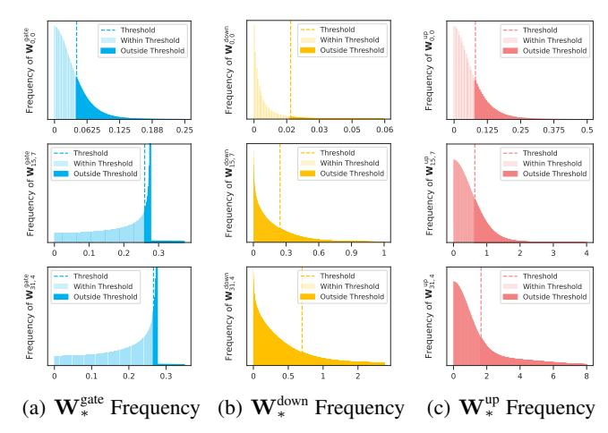

Figure 2. Activation distributions of Mixtral-8×7B's three hidden states at experts E0,<sup>0</sup> (shallow layer), E15,<sup>7</sup> (middle layer), and E35,<sup>4</sup> (deep layer).

in Figure [2](#page-3-1) . Consistent with findings from CATS [\(Lee](#page-10-10) [et al.,](#page-10-10) [2024a\)](#page-10-10) and TEAL [\(Liu et al.,](#page-10-11) [2024\)](#page-10-11), we observed that many activations are concentrated around zero. This concentration motivates the use of a magnitude-based activation sparse strategy, where activations close to zero are set to exactly zero, eliminating corresponding weight computations and transfers during inference.

Given an input vector x and three projection weight matrices Wgate ,Wdown ,Wup in an expert E, the corresponding activation output a<sup>E</sup> is computed as following forward pass:

<span id="page-3-4"></span>
$$\mathbf{a}_{\mathcal{E}}(\mathbf{x}) := \left( \text{SiLU}(\mathbf{x}\mathbf{W}^{\text{gate}}) \odot (\mathbf{x}\mathbf{W}^{\text{up}}) \right) \mathbf{W}^{\text{down}}, \quad (1)$$

$$Silu(\mathbf{x}) := \mathbf{x} \cdot \sigma(\mathbf{x}) = \frac{\mathbf{x}}{1 + e^{-\mathbf{x}}},$$
 (2)

where ⊙ denotes the Hardmard product and SiLU(·) is the activation function. Therefore, magnitude-based sparsity can be determined from the outputs of the SiLU activation function, Wup, and the inputs to Wdown. We define three activation functions:

$$\mathbf{a}_{\text{gate}}(\mathbf{x}) = \text{SiLU}(\mathbf{x}\mathbf{W}^{\text{gate}}), \quad \mathbf{a}_{\text{up}}(\mathbf{x}) = \mathbf{x}\mathbf{W}^{\text{up}}, \quad (3)$$

$$\mathbf{a}_{down}(\mathbf{x}) = \mathbf{a}_{gate}(\mathbf{x}) \odot \mathbf{a}_{up}(\mathbf{x}),$$
 (4)

and produce the following sparsity function:

<span id="page-3-3"></span>
$$S_t(\mathbf{a}(\mathbf{x})) = \begin{cases} \mathbf{a}(\mathbf{x}), & \text{if } |\mathbf{a}(\mathbf{x})| \ge t, \\ 0, & \text{if } |\mathbf{a}(\mathbf{x})| < t. \end{cases}$$
 (5)

Here, a ∈ {agate, aup, adown}. The threshold t is derived from the sampled dataset based on the desired sparsity ratio:

$$t := \min\{t' : F(t') \ge k\},\tag{6}$$

where F(·) represents the empirical cumulative distribution function of absolute activation values for each expert, and k specifies the target sparsity ratio (e.g., 70%). The distribution is empirically estimated offline using activations sampled from a general text corpus.

<span id="page-3-1"></span>To evaluate the impact of magnitude-based activation pruning on model performance, we set thresholds for the outputs of the SiLU activation function, Wup, and the inputs to Wdown at various sparsity levels, then measured text perplexity on WikiText-2 [\(Merity et al.,](#page-10-13) [2016\)](#page-10-13). As shown in Figure [3\(](#page-4-1)a), we find that pruning based on the Wdown inputs is the least sensitive to sparsity: at 50% sparsity, the perplexity increases by only about 0.5%, and even at 90% sparsity, perplexity remains relatively stable. In contrast, pruning the Wup outputs is slightly more sensitive, where 80% sparsity roughly matches the 90% sparsity level of the Wdown inputs. Pruning the SiLU outputs is the most sensitive, pushing perplexity above 7 at 70% sparsity. We provide further evaluations on downstream tasks in Section [4.2](#page-7-0) and have a theoretical interpretation for this phenomenon (Refer to Appendix [A.1](#page-12-0) for more details):

Theorem 3.1 (informal). *From the definition of* S<sup>t</sup> *in Equation* [\(5\)](#page-3-3)*, we define:*

$$\mathcal{L}_{\text{down}} = \mathbb{E} \left\| \left( \mathbf{a}_{\text{down}} - \mathbf{S}_t(\mathbf{a}_{\text{down}}) \right) \mathbf{W}^{\text{down}} \right\|_2^2, \tag{7}$$

$$\mathcal{L}_{up} = \mathbb{E} \left\| \left( \mathbf{a}_{down} - \mathbf{a}_{gate} \odot S_t(\mathbf{a}_{up}) \right) \mathbf{W}^{down} \right\|_2^2, \quad (8)$$

$$\mathcal{L}_{\text{gate}} = \mathbb{E} \left\| \left( \mathbf{a}_{\text{down}} - S_t(\mathbf{a}_{\text{gate}}) \odot \mathbf{a}_{\text{up}} \right) \mathbf{W}^{\text{down}} \right\|_2^2.$$
 (9)

*Then under assumptions consistent with experimental observations, we have*

$$\mathcal{L}_{\text{down}} \leq \mathcal{L}_{\text{up}} < \mathcal{L}_{\text{gate}}.$$
 (10)

While the input pruning of down projection shows theoretical optimality for downstream tasks, its effectiveness is constrained by two factors: (1) Dependency on gate/up projection outputs limits computational savings to the final projection, and (2) Non-linear operations (SiLU, Hadamard product) hinder prediction for offloading. Empirical evaluations and theoretical analysis show that the output sparsity of up projection, compared to the SiLU activation function, yields superior generative performance at equivalent sparsity ratios. This motivates our design to replace the original expert forward pass computation in Equation [\(1\)](#page-3-4) as follows:

$$\mathbf{a}^{\mathsf{S}}(x) := (\mathtt{SiLU}(\mathbf{x}\mathbf{W}^{\mathsf{gate}}) \odot \mathtt{S}_t((\mathbf{x}\mathbf{W}^{\mathsf{up}})))\mathbf{W}^{\mathsf{down}}$$
 (11)

#### <span id="page-3-0"></span>3.2.2. ULTRA-LOW-BIT QUANTIZATION FOR THE UP PROJECTION

Thanks to contextual sparsity, only 10% of the weights in the gate and down projections ({Wgate ,Wdown}) are activated. However, the full parameter set of the up projection Wup is required for computation, as its output activations determine

<span id="page-3-2"></span><sup>1</sup> Phi-3.5-MoE-instruct [\(Abdin et al.,](#page-8-0) [2024a\)](#page-8-0) and DeepSeek-V2 [\(DeepSeek-AI,](#page-9-9) [2024\)](#page-9-9) are validated in the Appendix [D.](#page-21-0)

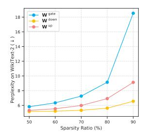

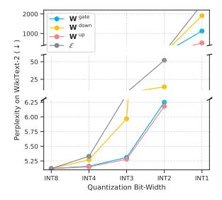

- (a) Sparsification Sensitivity
- (b) Quantization Sensitivity

Figure 3. Compression sensitivity of expert parameters: (a) Sparsification sensitivity; (b) Quantization sensitivity.

the sparsity threshold for truncating **W**<sup>gate</sup> and **W**<sup>down</sup>. As mentioned, prior work (Eliseev & Mazur, 2023) deploying MoE models on consumer-grade devices suffers from substantial performance loss due to the uniform ultra-low-bit quantization on the three projection matrices. Building upon the fact that the contextual sparsity of gate and down projections has minimal impact on performance, thus alleviating the quantization burden on experts, the following question arises:

**Question 2.** Can we quantize only the full up projection, from  $W^{up}$  to  $W^{q(up)}$ , and effectively reverse the inherent performance degradation caused by uniform quantization? **Observation 2.** The up projection exhibits low sensitivity to ultra-low-bit quantization.

We employ Half-Quadratic Quantization (HQQ) (Badri & Shaji, 2023) with various bit-widths to quantize the three projection matrices within each expert of Mixtral 8×7B and evaluate their quantization sensitivity using perplexity on WikiText-2 (Merity et al., 2016)<sup>2</sup>. As shown in Figure 3(b), quantizing the projection matrices at INT8 and INT4 results in minimal performance impact, with perplexity changes under 3%. At INT3 and INT2, perplexity increases, with the down projection exhibiting the most significant change, followed by the gate projection, while the up projection remains the least sensitive. At INT1, up projection quantization yields only 46.01% of the perplexity of gate projection quantization and 27.23% of the perplexity for down projection quantization. Across all bit-widths, the up projection consistently shows the lowest perplexity.

Analysis: Some works (Geva et al., 2021; Yu & Ananiadou, 2024) treat the MLP layer (i.e., the expert in MoE) as a key-value memory model, where the up and gate projections serve as keys to selectively activate the values in the down projection, which stores knowledge related to the input. This theory aligns with our experimental results. The down projection, storing knowledge as values, requires higher precision than the gate and up projection, as evidenced by its significant performance degradation across different quanti-

zation bit-widths. The gate projection, influenced by nonlinear activations, e.g., SwiGLU (Shazeer, 2020), demonstrates greater sensitivity at ultra-low bit-widths (INT2, INT1).

**Implementation:** The observation and analysis of quantization sensitivity above suggest that the up projection is the least sensitive to quantization, and therefore we choose to apply the INT2 of HQQ method for its compression.

#### <span id="page-4-1"></span><span id="page-4-0"></span>3.3. Expert Sparsity Prediction

In MoE models, each MoE layer uses a router to determine activated experts for each input hidden state x, followed by a forward pass according to Equation (1). Although the hybrid compression reduces per-transfer cost for MoE models, the pipelining between transfer and computation is prevented due to the sequential execution of routing, quantized up projection computation, and DRAM expert fetching, inhibiting on-the-fly inference. Recalling sparsity prediction in dense LLMs (Liu et al., 2023; Lee et al., 2024b), the residual structure of the model leads to high similarity between hidden state inputs before consecutive MLP layers. This allows the hidden state of the *i*-th MLP layer to be fed into a trained predictor to forecast the sparsity distribution for the (i+1)-th layer. Inspired by this approach and considering the same inputs to the router and quantized up projection, we pose the following question:

**Question 3.** Can the hidden states x of the existing layer be used in sparsity prediction in prefetching the activated compressed experts for the successive layer, replacing the router and up projection computations?

Fortunately, in sparse MoE models, we empirically validate the core principle behind sparsity prediction:

**Observation 3.** The hidden states input to the router and up projection in consecutive MoE layers exhibit high similarity.

Specifically, we randomly sample 100 sequences of length 256 from the ShareGPT (ShareGPT, 20023) and feed them into Mixtral-8×7B. Then, we compute the average next layer similarity, defined as the cosine similarity between the hidden states before the i-th layer and (i+1)-th layer. Figure 4 shows that the next layer similarity consistently remains above 0.95, except for the first layer.

Building on the observation, we devise two efficient yet effective predictors for inter- and intra-expert sparsity. They both consume the input hidden states of the existing layer and prefetch the activated compressed experts to be visited in the next layer, hence excluding the upcoming computation of router and up projection.

#### 3.3.1. Inter-expert sparsity predictor

For inter-expert sparsity, we introduce a learning-based predictor that proactively predicts the experts required for the (i+1)-th layer while computing the i-th layer.

The core idea of the learning-based predictor is to collect

<span id="page-4-2"></span><sup>&</sup>lt;sup>2</sup>Phi-3.5-MoE-instruct (Abdin et al., 2024a), DeepSeek-MoE-16B-Base (Dai et al., 2024) and Qwen1.5-MoE-A2.7B (Team, 2024) are validated in the Appendix E.

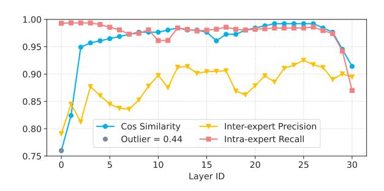

Figure 4. Next layer cosine similarity (blue), intra-expert predictor precision (yellow), inter-expert predictor recall (red), and the outlier corresponding to the cosine similarity at the 0-th layer (gray).

the input from the previous layer along with the historical trajectory of expert selections, capturing the underlying correlations between them. Leveraging these correlations, the predictor makes informed decisions about future expert selections. We observe that the complexity of prediction diminishes as the layer depth increases. To adapt to this, we dynamically adjust the predictor's parameters in practice, scaling from a single-layer MLP with 32K parameters to a two-layer MLP with 2M parameters. The orange line in Figure 4 illustrates an average precision of 0.88, highlighting the inter-experts predictor's capability to maintain high accuracy while adapting to varying layer depths.

#### 3.3.2. Intra-expert sparsity predictor

For intra-expert sparsity, we introduce a parameter-free, reuse-based predictor. This predictor estimates the output activations of the up projection in the (i+1)-th layer by directly performing matrix multiplication between the hidden states before the i-th MoE layer and the reused up projection matrix of the (i+1)-th layer. Once the approximate output activations of the up projection are obtained, the contextual sparsity distribution can be computed in advance.

Different from existing learning-based predictors (Liu et al., 2023; Shin et al., 2024; Xue et al., 2024b), which, for example, impose an additional 2.19GB~9GB of memory footprint for models like Mixtral-8×7B (detailed in Appendix F), an unbearable burden for memory-constrained GPUs, our intra-expert sparsity predictor incurs little extra memory cost. Furthermore, the red line in Figure 4 shows an average recall of 0.95, demonstrating the predictor's ability to maintain high accuracy across varying layer depths.

#### <span id="page-5-0"></span>3.4. System Co-optimization

## 3.4.1. EFFICIENT SPARSE KERNEL

To translate the reduction in computational complexity introduced by sparsity into clock time acceleration, we developed a specialized sparse GEMV kernel using the Triton (Tillet et al., 2019)-based kernel introduced by CATS (Lee et al.,

```
Algorithm 1 Efficient Sparse Kernel
```

```
1: Input: hidden states \mathbf{x}, threshold t_{ij}, \mathcal{E}_{ij} = \{\mathbf{W}_{ij}^{\mathrm{gate}}, \mathbf{W}_{ij}^{\mathrm{down},\top}, \mathbf{W}_{ij}^{\mathrm{up}}\}
2: \mathbf{v} \leftarrow \mathbf{x} \mathbf{W}_{ij}^{\mathrm{up}}
3: \mathbf{mask} \leftarrow (|\mathbf{v}| > t_{ij})
4: \mathbf{x}' \leftarrow \mathrm{SiLU}\left(\mathbf{x} \mathbf{W}_{ij}^{\mathrm{gate}}[\mathbf{mask}]\right) \odot \mathbf{v}[\mathbf{mask}]
5: \mathbf{y} \leftarrow (\mathbf{W}_{ij}^{\mathrm{down},\top}[\mathbf{mask}]\mathbf{x}')^{\top}
6: Return: \mathbf{y}
```

<span id="page-5-1"></span>2024a). We achieve maximal data read efficiency by transposing  $\mathbf{W}_{ij}^{\text{down}}$  and utilizing column-major storage. By selectively loading the columns of the weight matrices  $\mathbf{W}_{ij}^{\text{gate}}$  and  $\mathbf{W}_{ij}^{\text{down},\top}$  based on a threshold, we reduce the number of memory accesses, thereby accelerating clock time.

As shown in Algorithm 1, this kernel accepts the input hidden state  $\mathbf{x}$ , sparse threshold  $t_{ij}$ , and expert weights  $\mathcal{E}_{ij} = \left\{ \mathbf{W}_{ij}^{\text{gate}}, \mathbf{W}_{ij}^{\text{down},\top}, \mathbf{W}_{ij}^{\text{up}} \right\}$ . First, a mask vector is generated based on the absolute values of the hidden vectors output by  $\mathbf{x}\mathbf{W}^{\text{up}}$  and the magnitude of the threshold. The Silu activation and element-wise multiplication are fused into each block computed by  $\mathbf{W}_{ij}^{\text{gate}}[\mathbf{mask}]\mathbf{x}$ , which conserves memory operations required for multiple storage and loading of  $\mathbf{x}'$  and reduces kernel launch time. Subsequently, the resulting  $\mathbf{x}'$  is multiplied by the transposed  $\mathbf{W}_{ij}^{\text{down},\top}$  to produce the output of the sparse MLP. Section 4.1 shows our sparse GEMV kernel effectively reduces expert computation time as sparsity increases.

#### 3.4.2. Compact Asynchronous Transfer

Due to the sparse activation of weights, the expert transfer process occurs across multiple non-contiguous memory blocks in DRAM and VRAM, making it difficult to fully utilize the PCIe bus bandwidth. The Pytorch (Paszke et al., 2019) naive implementation can only achieve a fraction of the PCIe bandwidth, significantly affecting inference latency. Therefore, we compacted the arrangement of the gate and down projection matrices to transfer data in larger chunks and further enhance data throughput using SIMD and multithreaded asynchronous transfer techniques. Next, we detail the optimization of the data transfer strategy.

Compact weights Layout In an expert, the activation of the i-th intermediate neuron corresponds to the usage of the i-th column from the gate and up projection matrix, along with the i-th row from the down projection matrix. By co-locating the corresponding columns of the gate projection and rows of the down projection in DRAM, we can compact the data into larger contiguous chunks for efficient transfer. Assuming each element of the  $d_{\rm hidden} \times d_{\rm intermediate}$  weight matrices is stored in num\_bytes, this layout strategy increases the chunk size from  $d_{\rm hidden} \times {\rm num\_bytes}$  to  $2d_{\rm hidden} \times {\rm num\_bytes}$ , as illustrated in Figure 5.

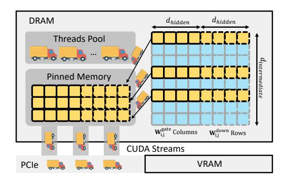

Figure 5. Process of FloE's compact asynchronous transfer: compacting weights layout in DRAM for reduced access latency and multi-threaded packaging of activated experts to enable asynchronous data transfer.

**SIMD Asynchronous Transfer** To fully leverage modern CPU capabilities, we use the AVX-512 instruction set and multithreaded asynchronous transfer. As shown in the Figure 5, we allocate a pinned memory in the CPU (transferring data from pinned memory significantly improves transfer speed) to send weights to VRAM. We use multithreading in combination with SIMD instructions to bundle several weights groups for transfer into pinned memory, and asynchronously send transfer requests across multiple streams, minimizing idle time on the PCIe bus.

#### <span id="page-6-0"></span>4. Evaluation

In this section, we aim to demonstrate that FloE can speed up MoE decoding on limited GPU memory while preserving high accuracy. We first present our end-to-end system results showing wall-clock performance, followed by FloE's accuracy in downstream tasks<sup>3</sup>. Specifically,

- In Section 4.1, we demonstrate that FloE enables 48.7× end-to-end acceleration compared to DeepSpeed-MII, with sparse kernel contributing up to 2x speedup and compact asynchronous transfer achieving 12.6x faster performance compared to the naive method.
- In Section 4.2, we show that FloE achieves a performance gain of 9.8% over other methods at high sparsity.

#### <span id="page-6-1"></span>4.1. Efficiency Evaluation

We analyze decode efficiency via end-to-end generation tests across various input/output lengths and VRAM usage, assess single-expert latency speedup for sparse GEMV, and evaluate transfer efficiency by simulating single-expert transfer with varying chunk sizes.

**Setup** We use GeForce RTX 3090 with 24G VRAM to evaluate end-to-end latency on ShareGPT (ShareGPT, 20023) prompts. The system is also equipped with a 64-core CPU at 2.3GHz and 256G DRAM interconnected via PCIe 4.0. For the single-expert latency test, we use C4 dataset (Raffel et al., 2019) and employ four types of GPUs, including H100, A100, A6000, and GeForce RTX 3090.

<span id="page-6-2"></span>**Baseline** We employ four SOTA baselines in the evaluation: DeepSpeed-MII (Microsoft): An inference system utilizes ZeRO-Infinity (Rajbhandari et al., 2021) to deal with expert offloading. Mixtral-Offloading (dvmazur, 2023): An MoE framework integrating expert prediction, caching mechanisms, and quantization. Fiddler (Kamahori et al., 2024): A CPU-GPU co-execution system minimizing data transfer overhead through computational offloading. Mixtral-GPU: A model with HQQ INT2 quantized enabling complete GPU residency, serving as the latency lower-bound reference for on-the-fly scenario requirements. **Analysis** We evaluate FloE's end-to-end efficiency with varying input/output lengths, and the results averaging over 5 runs are depicted in Figure 6. In the figure, we measure the inference speed for single-batch generation. We select the average output tokens per second (TPS) as the measurement. As seen, FloE achieves 91% of Mixtral-GPU's speed (95% at most), delivering  $48.7 \times$ ,  $2.60 \times$  and  $3.14 \times$  speedups over DeepSpeed-MII, Mixtral-Offloading and Fildder, respectively. It should be noted that with longer outputs for fixed inputs, TPS improves as layer-wise expert replacement overhead is amortized over longer sequences.

Figure 8 compares the generation throughput under input/output length of 64/256 and VRAM usage ranging from 12GB to 24GB. With additional VRAM, we cache more MoE layers to reduce expert misprediction reload overhead. Meanwhile, our sparse GEMV kernel applied to expert activations further boosts generation speed. Across different VRAM capacities, our method remains close to Mixtral-GPU's performance and slightly surpasses it at 24GB. When DRAM usage reaches 21GB, Mixtral-Offloading essentially mirrors the Mixtral-GPU setup but is marginally slower, as it still relies on INT3 quantization for certain experts.

Table 1 compares the sparse kernel's speedup across sparsity levels and GPUs for a single expert, including dense up projection GEMV, fused SiLU activation, sparse gate projection GEMV, and sparse down-projection GEMV. Using 500 tokens from C4 dataset, we ran 80 warm-up iterations and 200 timed trials to measure execution latency. Our kernel consistently outperforms the dense baseline (sparsity = 0). At 50% and 70% sparsity, it achieves over 1.26x and 1.44x speedup, respectively. At 90% sparsity, only A6000 and RTX 3090 obtain nearly  $2\times$  speedup, while H100 and A100 are limited by kernel launch overhead and other non-computational factors due to their higher computational throughput. The results evidence our sparse GEMV kernel is advantageous on consumer-grade devices.

<span id="page-6-3"></span> $<sup>^{3}</sup>$ We employ Mixtral-8×7B as the MoE model for all test cases.

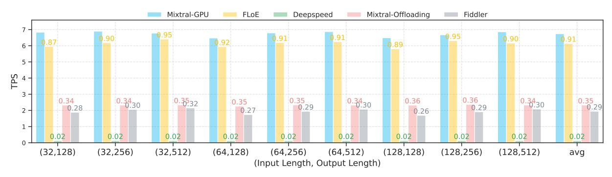

Figure 6. Bars quantify generation speed of compared methods under 12GB VRAM constraints, with numerical labels indicating relative speedup ratios against the Mixtral-GPU baseline. Note that DeepSpeed uses FP16 offloading.

Table 1. Single-Expert Execution Latency with Sparse GEMV Kernel (ms).

<span id="page-7-3"></span>

|                                   | There is single Empere Emeration Enterto with Sparce CENT ( Inches ( Inc.) ). |                                                                                                                                      |                                                                  |                                                                  |                                                                  |                                                                  |  |  |  |  |  |
|-----------------------------------|-------------------------------------------------------------------------------|--------------------------------------------------------------------------------------------------------------------------------------|------------------------------------------------------------------|------------------------------------------------------------------|------------------------------------------------------------------|------------------------------------------------------------------|--|--|--|--|--|
| GPU MODEL                         | 0%                                                                            | 50%                                                                                                                                  | 60%                                                              | 70%                                                              | 80%                                                              | 90%                                                              |  |  |  |  |  |
| H100<br>A100<br>A6000<br>RTX-3090 | $0.253 \\ 0.524$                                                              | $0.134 (1.26 \times \uparrow)$<br>$0.195 (1.30 \times \uparrow)$<br>$0.365 (1.44 \times \uparrow)$<br>$0.379 (1.43 \times \uparrow)$ | $0.188 (1.35 \times \uparrow)$<br>$0.337 (1.56 \times \uparrow)$ | $0.176 (1.44 \times \uparrow)$<br>$0.305 (1.72 \times \uparrow)$ | $0.166 (1.52 \times \uparrow)$<br>$0.277 (1.89 \times \uparrow)$ | $0.155 (1.63 \times \uparrow)$<br>$0.263 (1.99 \times \uparrow)$ |  |  |  |  |  |

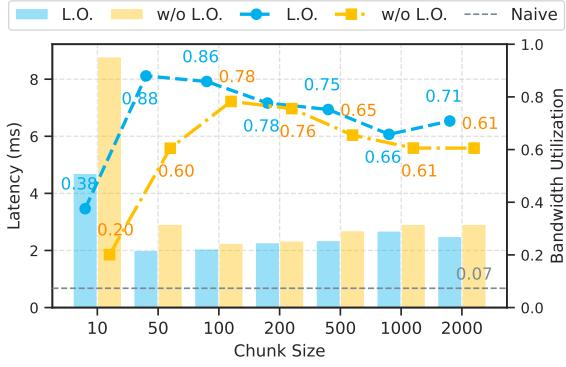

Figure 7. Comparison transfer latency and bandwidth utilization: bars show DRAM-to-VRAM transfer delays per expert, while lines depict utilization relative to PCIe 4.0's actual peak bandwidth. Gray dashed lines are PyTorch's native implementation.

For transfer efficiency, we randomly selected 20% of expert weights (20% of columns in the gate projection matrix and corresponding columns in the transposed down projection) and transferred them from DRAM to VRAM using varying chunk sizes (number of weight columns per thread). The average over 20 trials is shown in Figure 7. Our compact asynchronous transfer achieve up to 88% of peak bandwidth, 12.6× faster than PyTorch (Paszke et al., 2019) native implementation. Compact weights layout improves efficiency across all chunk sizes. Transfer latency first increases and then decreases as chunk size grows—small chunks are dominated by API calls and CUDA launch overhead, while large chunks suffer from excessive DRAM packing time, limiting transfer overlap. The optimal chunk size in our setup is 50.

<span id="page-7-1"></span>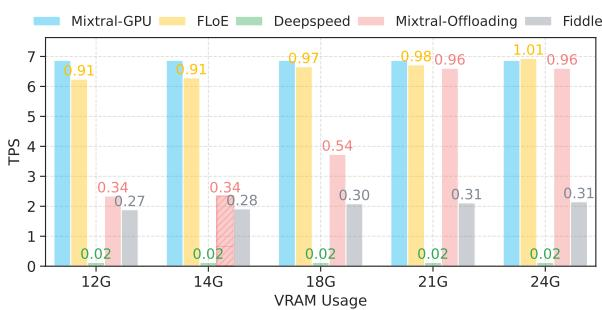

<span id="page-7-4"></span><span id="page-7-2"></span>Figure 8. Illustration of the generation speed of different methods under varying DRAM usage, with numbers indicating the speed relative to Mixtral-GPU. Since Mistral-Offloading caches by layer, there is no configuration for 14GB DRAM usage, so we use the 12GB result instead.

#### <span id="page-7-0"></span>4.2. Efficacy Evaluation

We analyze model efficacy via downstream tasks and validate the compatibility of the quantization with FloE.

**Setup** For the downstream task performance, we use seven downstream tasks using the EleutherAI LM Harness (Gao et al., 2024), including zero-shot ARC easy and challenge, zero-shot BoolQ, zero-shot SciQ, zero-shot OpenBookQA, zero-shot Winogrande and 5-shot MMLU (Clark et al., 2018; 2019; Johannes Welbl, 2017; Sakaguchi et al., 2019; Hendrycks et al., 2021). These tasks are originally chosen to measure the abilities of the models across various domains, such as reading comprehension and reasoning.

**Baseline** We employ three sparsity or quantization baselines in the evaluation: **CATS** (Lee et al., 2024a): A SOTA activation sparsification method, which applies magnitude

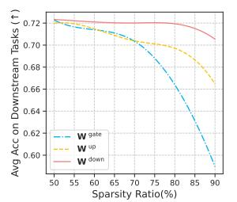

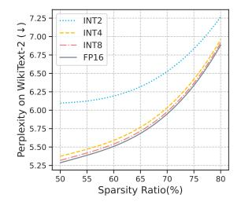

- (a) Sparsification Sensitivity
- (b) Quantization Compatibility

<span id="page-8-2"></span>Figure 9. Impact of scaling up sparsity ratio on performance: (a) Task accuracy across different sparsity strategies, and (b) Text perplexity of FloE combined with various quantization bit-widths.

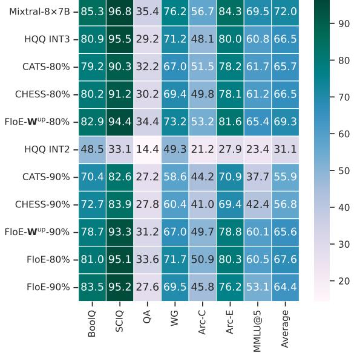

<span id="page-8-1"></span>Figure 10. Downstream task performance. FloE- $\mathbf{W}^{up}$  refers to our contextural sparsification according up projection.

pruning to FFN activations. **CHESS** (He et al., 2024): A general activation sparsification approach via channel-wise thresholding and selective sparsification. **HQQ quantization** (Badri & Shaji, 2023): A fast and accurate model quantizer that skips the need for calibration data.

Analysis As shown in Figure 10, FloE-W<sup>up</sup> achieves a 2.8% accuracy improvement at 80% sparsity and a significant performance gain of 9.8% over the SOTA methods at 90% sparsity. The reason lies in the fact that activations for W<sup>up</sup> demonstrate better performance compared to those for W<sup>gate</sup>, as evidenced by the trend in Figure 9(a). In addition, FloE combines both quantization and sparsity, trading off a small amount of accuracy for improved deployment speed. Despite this trade-off, its performance remains higher than that of HQQ INT3 and CHESS. On the MMLU task, we observe a noticeable performance drop from FloE-W<sup>up</sup> to FloE. When GPU memory is sufficient, increasing the bitwidth of the W<sup>up</sup> matrix can mitigate this issue.

We also demonstrate the compatibility with quantization

techniques by evaluating different HQQ quantizations and plotting the perplexity variations of Mixtral-8×7B on WikiText-2 in Figure 9(b). The perplexity increases exhibit similar trends across different bit widths, indicating that the errors introduced by activation sparsity and weight quantization are largely independent and additive.

#### 5. Conclusion

We introduce FloE, an on-the-fly inference system for MoE models on memory-constrained GPUs, which optimizes GPU memory utilization through an expert hybrid compression scheme and effective sparsity predictors, achieving a remarkable 48.7× inference speedup on a single GeForce RTX 3090 compared to DeepSpeed-MII. We hope our work inspires further research on MoE inference with offloading from a sparsity perspective and believe FloE will serve as a valuable tool for the community, enabling on-the-fly inference of sparse MoE models on consumer-grade hardware.

## Acknowledgements

This work was supported by the Pioneer R&D Program of Zhejiang (No. 2024C01021), the National Regional Innovation and Development Joint Fund (No. U24A20254), and the Zhejiang Province 'Leading Talent of Technological Innovation Program' (No. 2023R5214).

### **Impact Statement**

This paper presents work whose goal is to advance the field of Machine Learning. There are many potential societal consequences of our work, none which we feel must be specifically highlighted here.

#### References

<span id="page-8-0"></span>Abdin, M., Aneja, J., Awadalla, H., Awadallah, A., Awan, A. A., Bach, N., Bahree, A., Bakhtiari, A., Bao, J., Behl, H., Benhaim, A., Bilenko, M., Bjorck, J., Bubeck, S., Cai, M., Cai, Q., Chaudhary, V., Chen, D., Chen, D., Chen, W., Chen, Y.-C., Chen, Y.-L., Cheng, H., Chopra, P., Dai, X., Dixon, M., Eldan, R., Fragoso, V., Gao, J., Gao, M., Gao, M., Garg, A., Giorno, A. D., Goswami, A., Gunasekar, S., Haider, E., Hao, J., Hewett, R. J., Hu, W., Huynh, J., Iter, D., Jacobs, S. A., Javaheripi, M., Jin, X., Karampatziakis, N., Kauffmann, P., Khademi, M., Kim, D., Kim, Y. J., Kurilenko, L., Lee, J. R., Lee, Y. T., Li, Y., Li, Y., Liang, C., Liden, L., Lin, X., Lin, Z., Liu, C., Liu, L., Liu, M., Liu, W., Liu, X., Luo, C., Madan, P., Mahmoudzadeh, A., Majercak, D., Mazzola, M., Mendes, C. C. T., Mitra, A., Modi, H., Nguyen, A., Norick, B., Patra, B., Perez-Becker, D., Portet, T., Pryzant, R., Qin, H., Radmilac, M., Ren, L., de Rosa, G., Rosset, C., Roy, S., Ruwase, O., Saarikivi, O., Saied, A., Salim, A., Santacroce, M., Shah, S., Shang, N., Sharma, H., Shen, Y., Shukla, S., Song, X.,

- Tanaka, M., Tupini, A., Vaddamanu, P., Wang, C., Wang, G., Wang, L., Wang, S., Wang, X., Wang, Y., Ward, R., Wen, W., Witte, P., Wu, H., Wu, X., Wyatt, M., Xiao, B., Xu, C., Xu, J., Xu, W., Xue, J., Yadav, S., Yang, F., Yang, J., Yang, Y., Yang, Z., Yu, D., Yuan, L., Zhang, C., Zhang, C., Zhang, J., Zhang, L. L., Zhang, Y., Zhang, Y., Zhang, Y., and Zhou, X. Phi-3 technical report: A highly capable language model locally on your phone, 2024a. URL <https://arxiv.org/abs/2404.14219>.
- <span id="page-9-1"></span>Abdin, M., Aneja, J., Behl, H., Bubeck, S., Eldan, R., Gunasekar, S., Harrison, M., Hewett, R. J., Javaheripi, M., Kauffmann, P., Lee, J. R., Lee, Y. T., Li, Y., Liu, W., Mendes, C. C. T., Nguyen, A., Price, E., de Rosa, G., Saarikivi, O., Salim, A., Shah, S., Wang, X., Ward, R., Wu, Y., Yu, D., Zhang, C., and Zhang, Y. Phi-4 technical report, 2024b. URL [https://arxiv.org/abs/](https://arxiv.org/abs/2412.08905) [2412.08905](https://arxiv.org/abs/2412.08905).
- <span id="page-9-8"></span>Alizadeh, K., Mirzadeh, I., Belenko, D., Khatamifard, K., Cho, M., Del Mundo, C. C., Rastegari, M., and Farajtabar, M. Llm in a flash: Efficient large language model inference with limited memory. arXiv preprint arXiv:2312.11514, 2023.
- <span id="page-9-3"></span>Aminabadi, R. Y., Rajbhandari, S., Awan, A. A., Li, C., Li, D., Zheng, E., Ruwase, O., Smith, S., Zhang, M., Rasley, J., et al. Deepspeed-inference: enabling efficient inference of transformer models at unprecedented scale. In SC22: International Conference for High Performance Computing, Networking, Storage and Analysis, pp. 1– 15. IEEE, 2022.
- <span id="page-9-10"></span>Badri, H. and Shaji, A. Half-quadratic quantization of large machine learning models, November 2023. URL [https://mobiusml.github.io/hqq\\_blog/](https://mobiusml.github.io/hqq_blog/).
- <span id="page-9-6"></span>Cao, S., Liu, S., Griggs, T., Schafhalter, P., Liu, X., Sheng, Y., Gonzalez, J. E., Zaharia, M., and Stoica, I. Moelightning: High-throughput moe inference on memoryconstrained gpus. arXiv preprint arXiv:2411.11217, 2024.
- <span id="page-9-16"></span>Chen, Y., Jamieson, K., and Du, S. Active multi-task representation learning. In ICML, volume 162 of Proceedings of Machine Learning Research, pp. 3271–3298. PMLR, 17–23 Jul 2022. URL [https://proceedings.mlr.](https://proceedings.mlr.press/v162/chen22j.html) [press/v162/chen22j.html](https://proceedings.mlr.press/v162/chen22j.html).
- <span id="page-9-14"></span>Clark, C., Lee, K., Chang, M.-W., Kwiatkowski, T., Collins, M., and Toutanova, K. Boolq: Exploring the surprising difficulty of natural yes/no questions, 2019. URL [https:](https://arxiv.org/abs/1905.10044) [//arxiv.org/abs/1905.10044](https://arxiv.org/abs/1905.10044).
- <span id="page-9-13"></span>Clark, P., Cowhey, I., Etzioni, O., Khot, T., Sabharwal, A., Schoenick, C., and Tafjord, O. Think you have solved question answering? try arc, the ai2 reasoning challenge, 2018. URL [https://arxiv.org/abs/](https://arxiv.org/abs/1803.05457) [1803.05457](https://arxiv.org/abs/1803.05457).

- <span id="page-9-5"></span>Dai, D., Deng, C., Zhao, C., Xu, R., Gao, H., Chen, D., Li, J., Zeng, W., Yu, X., Wu, Y., Xie, Z., Li, Y., Huang, P., Luo, F., Ruan, C., Sui, Z., and Liang, W. DeepSeekMoE: Towards ultimate expert specialization in mixture-of-experts language models. In Ku, L.-W., Martins, A., and Srikumar, V. (eds.), ACL (Volume 1: Long Papers), pp. 1280–1297, Bangkok, Thailand, August 2024. Association for Computational Linguistics. doi: 10.18653/v1/2024.acl-long.70. URL [https:](https://aclanthology.org/2024.acl-long.70) [//aclanthology.org/2024.acl-long.70](https://aclanthology.org/2024.acl-long.70).
- <span id="page-9-9"></span>DeepSeek-AI. Deepseek-v2: A strong, economical, and efficient mixture-of-experts language model, 2024.
- <span id="page-9-0"></span>DeepSeek-AI. Deepseek-r1: Incentivizing reasoning capability in llms via reinforcement learning, 2025. URL <https://arxiv.org/abs/2501.12948>.
- <span id="page-9-15"></span>Du, S. S., Hu, W., Kakade, S. M., Lee, J. D., and Lei, Q. Few-shot learning via learning the representation, provably. arXiv preprint arXiv:2002.09434, 2020.
- <span id="page-9-17"></span>Dubey, A., Jauhri, A., Pandey, A., Kadian, A., Al-Dahle, A., Letman, A., Mathur, A., Schelten, A., Yang, A., Fan, A., Goyal, A., Hartshorn, A., Yang, A., Mitra, A., Sravankumar, A., Korenev, A., Hinsvark, A., Rao, A., Zhang, A., Rodriguez, A., and et al. The llama 3 herd of models, 2024. URL [https://arxiv.org/abs/2407.](https://arxiv.org/abs/2407.21783) [21783](https://arxiv.org/abs/2407.21783).
- <span id="page-9-11"></span>dvmazur. mixtral-offloading. [https://github.com/](https://github.com/dvmazur/mixtral-offloading) [dvmazur/mixtral-offloading](https://github.com/dvmazur/mixtral-offloading), 2023. Version v0.1.0, Accessed on: October 10, 2023.
- <span id="page-9-2"></span>Eliseev, A. and Mazur, D. Fast inference of mixtureof-experts language models with offloading. CoRR, abs/2312.17238, 2023. doi: 10.48550/ARXIV.2312. 17238. URL [https://doi.org/10.48550/](https://doi.org/10.48550/arXiv.2312.17238) [arXiv.2312.17238](https://doi.org/10.48550/arXiv.2312.17238).
- <span id="page-9-4"></span>Fedus, W., Zoph, B., and Shazeer, N. Switch transformers: Scaling to trillion parameter models with simple and efficient sparsity. Journal of Machine Learning Research, 23(120):1–39, 2022.
- <span id="page-9-7"></span>Frantar, E. and Alistarh, D. Sparsegpt: Massive language models can be accurately pruned in one-shot. In ICML, pp. 10323–10337. PMLR, 2023.
- <span id="page-9-12"></span>Gao, L., Tow, J., Abbasi, B., Biderman, S., Black, S., DiPofi, A., Foster, C., Golding, L., Hsu, J., Le Noac'h, A., Li, H., McDonell, K., Muennighoff, N., Ociepa, C., Phang, J., Reynolds, L., Schoelkopf, H., Skowron, A., Sutawika, L., Tang, E., Thite, A., Wang, B., Wang, K., and Zou, A. A framework for few-shot language model evaluation, 07 2024. URL [https://zenodo.org/records/](https://zenodo.org/records/12608602) [12608602](https://zenodo.org/records/12608602).

- <span id="page-10-14"></span>Geva, M., Schuster, R., Berant, J., and Levy, O. Transformer feed-forward layers are key-value memories. In Moens, M.-F., Huang, X., Specia, L., and Yih, S. W. t. (eds.), EMNLP, pp. 5484–5495, Online and Punta Cana, Dominican Republic, November 2021. Association for Computational Linguistics. doi: 10.18653/v1/2021. emnlp-main.446. URL [https://aclanthology.](https://aclanthology.org/2021.emnlp-main.446/) [org/2021.emnlp-main.446/](https://aclanthology.org/2021.emnlp-main.446/).
- <span id="page-10-21"></span>Gradshteyn, I. S. and Ryzhik, I. M. Table of integrals, series, and products. Academic press, 2014.
- <span id="page-10-5"></span>Gugger, S., Debut, L., Wolf, T., Schmid, P., Mueller, Z., Mangrulkar, S., Sun, M., and Bossan, B. Accelerate: Training and inference at scale made simple, efficient and adaptable. [https://github.com/](https://github.com/huggingface/accelerate) [huggingface/accelerate](https://github.com/huggingface/accelerate), 2022.
- <span id="page-10-20"></span>He, J., Wu, S., Wen, W., Xue, C. J., and Li, Q. Chess: Optimizing llm inference via channel-wise thresholding and selective sparsification, 2024. URL [https:](https://arxiv.org/abs/2409.01366) [//arxiv.org/abs/2409.01366](https://arxiv.org/abs/2409.01366).
- <span id="page-10-19"></span>Hendrycks, D., Burns, C., Basart, S., Zou, A., Mazeika, M., Song, D., and Steinhardt, J. Measuring massive multitask language understanding, 2021. URL [https:](https://arxiv.org/abs/2009.03300) [//arxiv.org/abs/2009.03300](https://arxiv.org/abs/2009.03300).
- <span id="page-10-2"></span>Hwang, R., Wei, J., Cao, S., Hwang, C., Tang, X., Cao, T., and Yang, M. Pre-gated moe: An algorithm-system co-design for fast and scalable mixture-of-expert inference. In 2024 ACM/IEEE 51st Annual International Symposium on Computer Architecture (ISCA), pp. 1018– 1031. IEEE, 2024.
- <span id="page-10-1"></span>Jiang, A. Q., Sablayrolles, A., Roux, A., Mensch, A., Savary, B., Bamford, C., Chaplot, D. S., de las Casas, D., Hanna, E. B., Bressand, F., Lengyel, G., Bour, G., Lample, G., Lavaud, L. R., Saulnier, L., Lachaux, M.-A., Stock, P., Subramanian, S., Yang, S., Antoniak, S., Scao, T. L., Gervet, T., Lavril, T., Wang, T., Lacroix, T., and Sayed, W. E. Mixtral of experts, 2024. URL [https://arxiv.](https://arxiv.org/abs/2401.04088) [org/abs/2401.04088](https://arxiv.org/abs/2401.04088).
- <span id="page-10-18"></span>Johannes Welbl, Nelson F. Liu, M. G. Crowdsourcing multiple choice science questions. 2017.
- <span id="page-10-6"></span>Kamahori, K., Gu, Y., Zhu, K., and Kasikci, B. Fiddler: Cpu-gpu orchestration for fast inference of mixture-ofexperts models. arXiv preprint arXiv:2402.07033, 2024.
- <span id="page-10-3"></span>Kong, R., Li, Y., Feng, Q., Wang, W., Ye, X., Ouyang, Y., Kong, L., and Liu, Y. SwapMoE: Serving off-the-shelf MoE-based large language models with tunable memory budget. In ACL (Volume 1: Long Papers), August 2024.
- <span id="page-10-10"></span>Lee, D., Lee, J., Zhang, G., Tiwari, M., and Mirhoseini, A. CATS: Context-aware thresholding for sparsity in large language models. In First Conference on Language Modeling, 2024a. URL [https://openreview.](https://openreview.net/forum?id=v3w2a7EInO) [net/forum?id=v3w2a7EInO](https://openreview.net/forum?id=v3w2a7EInO).

- <span id="page-10-15"></span>Lee, W., Lee, J., Seo, J., and Sim, J. InfiniGen: Efficient generative inference of large language models with dynamic KV cache management. In 18th USENIX Symposium on Operating Systems Design and Implementation (OSDI 24), pp. 155–172, Santa Clara, CA, July 2024b. USENIX Association. ISBN 978-1- 939133-40-3. URL [https://www.usenix.org/](https://www.usenix.org/conference/osdi24/presentation/lee) [conference/osdi24/presentation/lee](https://www.usenix.org/conference/osdi24/presentation/lee).
- <span id="page-10-11"></span>Liu, J., Ponnusamy, P., Cai, T., Guo, H., Kim, Y., and Athiwaratkun, B. Training-free activation sparsity in large language models. arXiv preprint arXiv:2408.14690, 2024.
- <span id="page-10-8"></span>Liu, Z., Wang, J., Dao, T., Zhou, T., Yuan, B., Song, Z., Shrivastava, A., Zhang, C., Tian, Y., Re, C., et al. Deja vu: Contextual sparsity for efficient llms at inference time. In ICML, pp. 22137–22176. PMLR, 2023.
- <span id="page-10-4"></span>llama.cpp. llama.cpp. [https://github.com/](https://github.com/ggerganov/llama.cpp) [ggerganov/llama.cpp](https://github.com/ggerganov/llama.cpp).
- <span id="page-10-7"></span>Ma, X., Fang, G., and Wang, X. Llm-pruner: On the structural pruning of large language models. NIPS, 36:21702– 21720, 2023.
- <span id="page-10-13"></span>Merity, S., Xiong, C., Bradbury, J., and Socher, R. Pointer sentinel mixture models, 2016.
- <span id="page-10-17"></span>Microsoft. Deepspeed-mii. [https://github.com/](https://github.com/microsoft/DeepSpeed-MII) [microsoft/DeepSpeed-MII](https://github.com/microsoft/DeepSpeed-MII).
- <span id="page-10-9"></span>Mirzadeh, I., Alizadeh, K., Mehta, S., Del Mundo, C. C., Tuzel, O., Samei, G., Rastegari, M., and Farajtabar, M. Relu strikes back: Exploiting activation sparsity in large language models. arXiv preprint arXiv:2310.04564, 2023.
- <span id="page-10-0"></span>OpenAI. GPT-4 technical report. CoRR, abs/2303.08774, 2023. doi: 10.48550/ARXIV.2303.08774. URL [https:](https://doi.org/10.48550/arXiv.2303.08774) [//doi.org/10.48550/arXiv.2303.08774](https://doi.org/10.48550/arXiv.2303.08774).
- <span id="page-10-16"></span>Paszke, A., Gross, S., Massa, F., Lerer, A., Bradbury, J., Chanan, G., Killeen, T., Lin, Z., Gimelshein, N., Antiga, L., Desmaison, A., Kopf, A., Yang, E., DeVito, Z., Raison, M., Tejani, A., Chilamkurthy, S., Steiner, B., Fang, L., Bai, J., and Chintala, S. Pytorch: An imperative style, high-performance deep learning library. In Wallach, H., Larochelle, H., Beygelzimer, A., d'Alche-Buc, F., Fox, E., and Garnett, R. (eds.), ´ NIPS 32, pp. 8024–8035. Curran Associates, Inc., 2019. [http://papers.neurips.cc/paper/](http://papers.neurips.cc/paper/9015-pytorch-an-imperative-style-high/-performance-deep-learning-library.pdf) [9015-pytorch-an-imperative-style-high/](http://papers.neurips.cc/paper/9015-pytorch-an-imperative-style-high/-performance-deep-learning-library.pdf) [-performance-deep-learning-library.](http://papers.neurips.cc/paper/9015-pytorch-an-imperative-style-high/-performance-deep-learning-library.pdf) [pdf](http://papers.neurips.cc/paper/9015-pytorch-an-imperative-style-high/-performance-deep-learning-library.pdf).
- <span id="page-10-12"></span>Raffel, C., Shazeer, N., Roberts, A., Lee, K., Narang, S., Matena, M., Zhou, Y., Li, W., and Liu, P. J. Exploring the limits of transfer learning with a unified text-to-text transformer. arXiv e-prints, 2019.

- <span id="page-11-16"></span>Rajbhandari, S., Ruwase, O., Rasley, J., Smith, S., and He, Y. Zero-infinity: breaking the gpu memory wall for extreme scale deep learning. In Proceedings of the International Conference for High Performance Computing, Networking, Storage and Analysis, SC '21, New York, NY, USA, 2021. Association for Computing Machinery. ISBN 9781450384421. doi: 10.1145/ 3458817.3476205. URL [https://doi.org/10.](https://doi.org/10.1145/3458817.3476205) [1145/3458817.3476205](https://doi.org/10.1145/3458817.3476205).
- <span id="page-11-17"></span>Sakaguchi, K., Bras, R. L., Bhagavatula, C., and Choi, Y. Winogrande: An adversarial winograd schema challenge at scale, 2019. URL [https://arxiv.org/abs/](https://arxiv.org/abs/1907.10641) [1907.10641](https://arxiv.org/abs/1907.10641).
- <span id="page-11-1"></span>Sarkar, R., Liang, H., Fan, Z., Wang, Z., and Hao, C. Edge-moe: Memory-efficient multi-task vision transformer architecture with task-level sparsity via mixtureof-experts. In 2023 IEEE/ACM International Conference on Computer Aided Design (ICCAD), pp. 01–09. IEEE, 2023.
- <span id="page-11-14"></span>ShareGPT. Sharegpt. [https://huggingface.](https://huggingface.co/datasets/anon8231489123/ShareGPT_Vicuna_unfiltered) [co/datasets/anon8231489123/ShareGPT\\_](https://huggingface.co/datasets/anon8231489123/ShareGPT_Vicuna_unfiltered) [Vicuna\\_unfiltered](https://huggingface.co/datasets/anon8231489123/ShareGPT_Vicuna_unfiltered), 20023.
- <span id="page-11-8"></span>Shazeer, N. Glu variants improve transformer. arXiv preprint arXiv:2002.05202, 2020.
- <span id="page-11-5"></span>Sheng, Y., Zheng, L., Yuan, B., Li, Z., Ryabinin, M., Chen, B., Liang, P., Re, C., Stoica, I., and Zhang, C. Flexgen: ´ High-throughput generative inference of large language models with a single gpu. In ICML, pp. 31094–31116. PMLR, 2023.
- <span id="page-11-0"></span>Shin, J., Yang, H., and Yi, Y. Sparseinfer: Training-free prediction of activation sparsity for fast llm inference, 2024. URL <https://arxiv.org/abs/2411.12692>.
- <span id="page-11-10"></span>Song, C., Han, X., Zhang, Z., Hu, S., Shi, X., Li, K., Chen, C., Liu, Z., Li, G., Yang, T., and Sun, M. Prosparse: Introducing and enhancing intrinsic activation sparsity within large language models, 2025. URL [https://](https://arxiv.org/abs/2402.13516) [arxiv.org/abs/2402.13516](https://arxiv.org/abs/2402.13516).
- <span id="page-11-2"></span>Song, X., Zhong, Z., and Chen, R. Promoe: Fast moebased llm serving using proactive caching. arXiv preprint arXiv:2410.22134, 2024a.
- <span id="page-11-11"></span>Song, Y., Xie, H., Zhang, Z., Wen, B., Ma, L., Mi, Z., and Chen, H. Turbo sparse: Achieving llm sota performance with minimal activated parameters. arXiv preprint arXiv:2406.05955, 2024b.
- <span id="page-11-7"></span>Sun, M., Liu, Z., Bair, A., and Kolter, J. Z. A simple and effective pruning approach for large language models. arXiv preprint arXiv:2306.11695, 2023.

- <span id="page-11-4"></span>Tang, P., Liu, J., Hou, X., Pu, Y., Wang, J., Heng, P.-A., Li, C., and Guo, M. Hobbit: A mixed precision expert offloading system for fast moe inference. arXiv preprint arXiv:2411.01433, 2024.
- <span id="page-11-13"></span>Team, Q. Qwen1.5-moe: Matching 7b model performance with 1/3 activated parameters", February 2024. URL [https://qwenlm.github.io/blog/](https://qwenlm.github.io/blog/qwen-moe/) [qwen-moe/](https://qwenlm.github.io/blog/qwen-moe/).
- <span id="page-11-20"></span>Thekumparampil, K. K., Jain, P., Netrapalli, P., and Oh, S. Sample efficient linear meta-learning by alternating minimization. arXiv preprint arXiv:2105.08306, 2021.
- <span id="page-11-15"></span>Tillet, P., Kung, H. T., and Cox, D. Triton: an intermediate language and compiler for tiled neural network computations. In Proceedings of the 3rd ACM SIGPLAN International Workshop on Machine Learning and Programming Languages, MAPL 2019, pp. 10–19, New York, NY, USA, 2019. Association for Computing Machinery. ISBN 9781450367196. doi: 10.1145/ 3315508.3329973. URL [https://doi.org/10.](https://doi.org/10.1145/3315508.3329973) [1145/3315508.3329973](https://doi.org/10.1145/3315508.3329973).
- <span id="page-11-18"></span>Tripuraneni, N., Jordan, M., and Jin, C. On the theory of transfer learning: The importance of task diversity. NIPS, 33:7852–7862, 2020.
- <span id="page-11-19"></span>Tripuraneni, N., Jin, C., and Jordan, M. Provable metalearning of linear representations. In ICML, pp. 10434– 10443. PMLR, 2021.
- <span id="page-11-21"></span>Wang, Y., Chen, Y., Jamieson, K., and Du, S. S. Improved active multi-task representation learning via lasso. In ICML, pp. 35548–35578. PMLR, 2023.
- <span id="page-11-3"></span>Xue, L., Fu, Y., Lu, Z., Mai, L., and Marina, M. Moeinfinity: Activation-aware expert offloading for efficient moe serving. arXiv preprint arXiv:2401.14361, 2024a.
- <span id="page-11-6"></span>Xue, Z., Song, Y., Mi, Z., Chen, L., Xia, Y., and Chen, H. Powerinfer-2: Fast large language model inference on a smartphone. arXiv preprint arXiv:2406.06282, 2024b.
- <span id="page-11-12"></span>Yu, Z. and Ananiadou, S. Neuron-level knowledge attribution in large language models. In Al-Onaizan, Y., Bansal, M., and Chen, Y.-N. (eds.), EMNLP, pp. 3267– 3280, Miami, Florida, USA, November 2024. Association for Computational Linguistics. doi: 10.18653/v1/2024. emnlp-main.191. URL [https://aclanthology.](https://aclanthology.org/2024.emnlp-main.191/) [org/2024.emnlp-main.191/](https://aclanthology.org/2024.emnlp-main.191/).
- <span id="page-11-9"></span>Zhang, Z., Song, Y., Yu, G., Han, X., Lin, Y., Xiao, C., Song, C., Liu, Z., Mi, Z., and Sun, M. ReLU<sup>2</sup> wins: Discovering efficient activation functions for sparse llms. arXiv preprint arXiv:2402.03804, 2024.

#### A. Theoretical Analysis

#### <span id="page-12-0"></span>A.1. Preliminary

Given a vector  $x \in \mathbb{R}^m$ , we use  $||x||_2 := \sqrt{\sum_{i=1}^m x_i^2}$  to denote the two-norm of x. We use [m] to represent the set  $\{1, 2, ..., m\}$ . We use  $\odot$  to denote the element-wise multiplication of two vectors or matrice.

We denote  $\mathcal{N}(\mu, \sigma^2)$  to be the Gaussian distribution with mean  $\mu$  and variance  $\sigma^2$ . We let  $\phi(x) = \frac{1}{\sqrt{2\pi}}e^{-x^2/2}$  and  $\Phi(x) = \int_{-\infty}^x \phi(y)dy$  to be the probability density function (PDF) and cumulative distribution function (CDF) of the standard normal distribution, respectively. Given function f, we use  $f^{-1}$  to define its reverse function.

#### A.2. Main Theorem

In the main paper, we state the informal theorem as below:

**Theorem A.1** (informal). From the definition of  $S_t$  in Equation (5), we define:

$$\mathcal{L}_{\text{down}} = \mathbb{E} \left\| \left( \mathbf{a}_{\text{down}} - \mathbf{S}_t(\mathbf{a}_{\text{down}}) \right) \mathbf{W}^{\text{down}} \right\|_2^2, \tag{12}$$

$$\mathcal{L}_{up} = \mathbb{E} \left\| \left( \mathbf{a}_{down} - \mathbf{a}_{gate} \odot S_t(\mathbf{a}_{up}) \right) \mathbf{W}^{down} \right\|_2^2, \tag{13}$$

$$\mathcal{L}_{\text{gate}} = \mathbb{E} \left\| \left( \mathbf{a}_{\text{down}} - \mathbf{S}_t(\mathbf{a}_{\text{gate}}) \odot \mathbf{a}_{\text{up}} \right) \mathbf{W}^{\text{down}} \right\|_2^2. \tag{14}$$

Then under assumptions consistent with experimental observations, we have

$$\mathcal{L}_{down} \leq \mathcal{L}_{up} < \mathcal{L}_{gate}.$$
 (15)

Here we restate the theorem in a formal format.

<span id="page-12-1"></span>**Theorem A.2.** Let  $\mathbf{a}_{gate} \in \mathbb{R}^m$  and  $\mathbf{a}_{up} \in \mathbb{R}^m$  be the activations after the Silufunction and the up projection, respectively, and define  $\mathbf{a}_{down} = \mathbf{a}_{gate} \odot \mathbf{a}_{up}$ . Let  $\mathbf{W}^{down} \in \mathbb{R}^{m \times n}$  be the weight matrix for the down projection. From the definition of  $S_t$  in Equation (5), we define:

$$\mathcal{L}_{\text{down}} = \mathbb{E} \left\| \left( \mathbf{a}_{\text{down}} - \mathbf{S}_t(\mathbf{a}_{\text{down}}) \right) \mathbf{W}^{\text{down}} \right\|_2^2, \tag{16}$$

$$\mathcal{L}_{up} = \mathbb{E} \left\| \left( \mathbf{a}_{down} - \mathbf{a}_{gate} \odot S_t(\mathbf{a}_{up}) \right) \mathbf{W}^{down} \right\|_2^2, \tag{17}$$

$$\mathcal{L}_{\text{gate}} = \mathbb{E} \left\| \left( \mathbf{a}_{\text{down}} - \mathbf{S}_t(\mathbf{a}_{\text{gate}}) \odot \mathbf{a}_{\text{up}} \right) \mathbf{W}^{\text{down}} \right\|_2^2.$$
 (18)

We assump that all the  $W_{ij}$  in  $\mathbf{W}^{\text{down}}$  are i.i.d. and satisfies  $W_{ij} \sim \mathcal{N}(0, \sigma_W^2) (i \in [m], j \in [n])$ . Similarly, for all  $i \in [m]$ , we assume  $a_{\text{gate},i}$  are i.i.d. and satisfies  $a_{\text{gate},i} \sim \mathcal{N}(0, \sigma_{\text{gate}}^2)$ . And for all  $i \in [m]$ , we let  $a_{\text{up},i}$  are i.i.d. and  $a_{\text{gate},i} = x_{\text{gate},i} - c$  for some constant c > 0, where  $x_{\text{gate},i}$  satisfies exponential distribution with parameter  $\lambda$ . We also assume  $a_{\text{up}}$  and  $a_{\text{gate}}$  are independent. Then if we keep the threshold of sparsity such that  $(1 - \eta) \times 100\%$  elements of the activations are set to zero in  $S_t$ , we can explictly write out  $\mathcal{L}_{\text{up}}$  and  $\mathcal{L}_{\text{gate}}$  as follows:

$$\mathcal{L}_{up} = nm\sigma_W^2 \cdot \sigma_{up}^2 \left(\frac{2}{\lambda^2} - \frac{2c}{\lambda} + c^2\right) \cdot \left(1 - \eta - 2z_\eta \phi(z_\eta)\right). \tag{19}$$

$$\mathcal{L}_{up} = nm\sigma_W^2 \cdot \sigma_{up}^2 \cdot \left[ e^{\lambda(q_{\eta} - c)} \left( \frac{2}{\lambda^2} - 2\frac{q_{\eta}}{\lambda} + q_{\eta}^2 \right) - e^{-\lambda(c + q_{\eta})} \left( \frac{2}{\lambda^2} + 2\frac{q_{\eta}}{\lambda} + q_{\eta}^2 \right) \right], \tag{20}$$

where  $z_{\eta} = \Phi^{-1}\left(1 - \frac{\eta}{2}\right)$ ,  $\phi(x) = \frac{1}{\sqrt{2\pi}}e^{-x^2/2}$  and  $q_{\eta} = \frac{1}{\lambda c}\sinh^{-1}(\frac{1-\eta}{2}e^{\lambda c})$ . Furthermore, if  $\lambda c \geq 2$ , and  $\eta \in [e^{-4}, 1/2]$ , we can obtain

$$\mathcal{L}_{\text{down}} \leq \mathcal{L}_{\text{up}} < \mathcal{L}_{\text{gate}}.$$
 (21)

Remark A.3. Here we discuss the rationality of the theorem assumptions: First, the choice of  $\mathcal{L}_2$  loss, independence between random variables, and gaussian assumptions are widely used in machine learning theory community (Tripuraneni et al., 2020; 2021; Du et al., 2020; Thekumparampil et al., 2021; Chen et al., 2022; Wang et al., 2023), and from Figure 2 in the main paper, we can observe that the distribution of elements in activations after up projection satisfy gaussian distribution.

On the other hand, the shifted exponential distribution on gate-projection activations mainly comes from the property of SiLU function. The distribution of gate-projection elements before and after SiLU functions are shown in Figure 11. We find

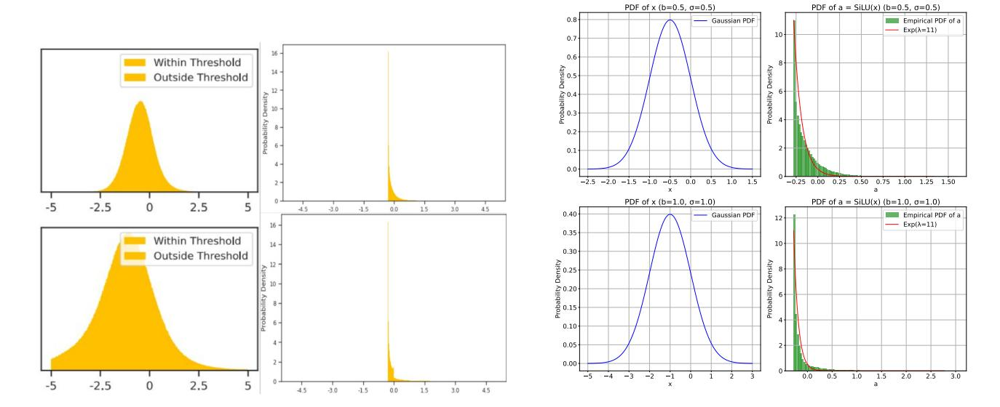

Figure 11. (Left) Distribution of gate-projection elements before (1st column) and after (2rd column) SiLU functions. The first row is for 15-th layer and second row is for 31-th layer. We can see that before SiLU function, the activations are roughly shifted gaussian, while after SiLU, they has very high probability density at value  $x \approx -0.28$ , which is the minimum value of SiLU function. (Right) Simulation of SiLU outputs on shifted gaussian variables. We find that for input  $x \sim \mathcal{N}(-b, \sigma^2)$  with reasonable  $b, \sigma$  (as in the left figure), the outputs after SiLU function has similar truncated unimodal distribution, and can be well fitted by shifted exponential distribution, i.e., a = x - c for x satisfies exponential distribution with parameters  $\lambda = 11$  and shifted constant c = 0.28.

that the distribution of  $a_{\text{gate},i}$  can be well fitted by shifted exponential distribution, i.e., a=x-c for x satisfies exponential distribution with parameters  $\lambda \geq 10$  and shifted constant c=0.28. Here c is the negative value of the minimum of SiLU function, and thus is a fixed value. Therefore, our assumptions are consistent with experimental observations, and we can see that condition  $\lambda c \geq 2$  is also satisfied. We add this data distribution assumption mainly because the theoretical difficulty for handling the reverse function of SiLU function, and we will see that even with this simplification, the proof is still non-trivial.

Then we comes to the proof of our main theorem:

Proof of Theorem A.2: From assumptions and Lemma A.11, Lemma A.12, we have

<span id="page-13-0"></span>
$$\mathcal{L}_{\text{down}} = n\sigma_W^2 \cdot \sigma_{\text{up}}^2 \cdot \mathbb{E} \| \mathbf{a}_{\text{down}} - \mathbf{S}_t(\mathbf{a}_{\text{down}}) \|_2^2, \tag{22}$$

$$\mathcal{L}_{up} = n\sigma_W^2 \cdot \sigma_{up}^2 \cdot \mathbb{E} \| \mathbf{a}_{down} - \mathbf{a}_{gate} \odot \mathbf{S}_t(\mathbf{a}_{up}) \|_2^2, \tag{23}$$

$$\mathcal{L}_{\text{gate}} = n\sigma_W^2 \cdot \sigma_{\text{up}}^2 \cdot \mathbb{E} \| \mathbf{a}_{\text{down}} - \mathbf{S}_t(\mathbf{a}_{\text{gate}}) \odot \mathbf{a}_{\text{up}} \|_2^2.$$
 (24)

Note that obviously, for any vector **a** and any fixed ratio of non-sparsity rate  $1 - \eta$ ,  $S_t(a)$  is the sparsified vectors with maximum norm, and all three kind of sparsification strategies have the same non-sparsity ratios, so we must have

$$\|\mathbf{a}_{\text{down}} - \mathbf{S}_{t}(\mathbf{a}_{\text{down}})\|_{2}^{2} \le \|\mathbf{a}_{\text{down}} - \mathbf{a}_{\text{gate}} \odot \mathbf{S}_{t}(\mathbf{a}_{\text{up}})\|_{2}^{2}$$
(25)

$$\|\mathbf{a}_{\text{down}} - \mathbf{S}_t(\mathbf{a}_{\text{down}})\|_2^2 \le \|\mathbf{a}_{\text{down}} - \mathbf{S}_t(\mathbf{a}_{\text{gate}}) \odot \mathbf{a}_{\text{up}}\|_2^2$$
(26)

On the other hand, note that

$$\mathbb{E}\left\|\mathbf{a}_{\text{down}} - \mathbf{a}_{\text{gate}} \odot S_{t}(\mathbf{a}_{\text{up}})\right\|_{2}^{2} = \mathbb{E}\left\|\mathbf{a}_{\text{gate}} \odot (\mathbf{a}_{\text{up}} - S_{t}(\mathbf{a}_{\text{up}}))\right\|_{2}^{2}$$
(27)

$$= m\mathbb{E}\left[a_{\text{gate},i} \cdot (a_{\text{up},i} - S_t(a_{\text{up},i}))\right]^2, \quad \text{(i.i.d.)}$$

$$= m\mathbb{E}\big[a_{\mathrm{gate},i}^2\big] \cdot \mathbb{E}\big[(a_{\mathrm{up},i} - \mathbf{S}_t(a_{\mathrm{up},i}))\big]^2, \quad \text{(independence, Lemma A.12, Lemma A.11)}$$

(29)

Similar formulas hold for  $\mathcal{L}_{gate}$ . Then combining Lemma A.4, Lemma A.5, and Lemma A.9, we can get the results.

#### A.3. Technical Proof

<span id="page-14-0"></span>**Lemma A.4.** Assume that random variable  $a \sim \mathcal{N}(0, \sigma^2)$ . For a given  $\eta \in (0, 1)$ , define the threshold  $t_{\eta}$  such that  $P(|a| > t_{\eta}) = \eta$ . Then if we define the inverse sparsity function  $\bar{S}_{t_{\eta}}(a)$  as

$$\bar{S}_{t_{\eta}}(a) = \begin{cases} 0, & \text{if } |a| \ge t_{\eta}, \\ a, & \text{otherwise.} \end{cases}$$
(30)

Then, the threshold  $t_{\eta}$  and the expectation  $\mathbb{E}[\bar{S}_{t_{\eta}}(a)^2]$  are given by

$$t_{\eta} = \sigma \Phi^{-1} \left( 1 - \frac{\eta}{2} \right), \tag{31}$$

and

$$\mathbb{E}[\bar{S}_{t_{\eta}}(a)^{2}] = \sigma^{2} \left[ 1 - \eta - 2z_{\eta}\phi(z_{\eta}) \right] = \left( 1 - \eta - 2z_{\eta}\phi(z_{\eta}) \right) \cdot \mathbb{E}[a^{2}], \tag{32}$$

where  $z_{\eta} = \Phi^{-1}\left(1 - \frac{\eta}{2}\right) = t_{\eta}/\sigma$ . And as defined in Appendix A.I,  $\phi(x) = \frac{1}{\sqrt{2\pi}}e^{-x^2/2}$  is the PDF of the standard normal distribution,  $\Phi^{-1}(\cdot)$  denotes its inverse cumulative distribution function (CDF).

## *Proof.* Threshold $t_{\eta}$ :

Given  $a \sim \mathcal{N}(0, \sigma^2)$ , standardize a by defining  $Z = \frac{a}{\sigma}$ , so that  $Z \sim \mathcal{N}(0, 1)$ . Therefore:

$$P\left(|Z| > \frac{t_{\eta}}{\sigma}\right) \le \eta.$$

Due to the symmetry, we have

$$2P\left(Z>\frac{t_{\eta}}{\sigma}\right)\leq\eta\quad\Rightarrow\quad P\left(Z>\frac{t_{\eta}}{\sigma}\right)\leq\frac{\eta}{2}.$$

Therefore we have

$$\frac{t_{\eta}}{\sigma} = \Phi^{-1} \left( 1 - \frac{\eta}{2} \right) \quad \Rightarrow t_{\eta} = \sigma \, \Phi^{-1} \left( 1 - \frac{\eta}{2} \right).$$

## **Expectation** $\mathbb{E}[\bar{S}_{t_n}(a)^2]$ :

First note that

$$\mathbb{E}[\bar{S}_{t_{\eta}}(a)^2] = \mathbb{E}\left[a^2 \cdot \mathbf{1}_{\{|a| < t_{\eta}\}}\right] \tag{33}$$

$$= \mathbb{E}[a^2] - \mathbb{E}\left[a^2 \cdot \mathbf{1}_{\{|a| \ge t_\eta\}}\right] \tag{34}$$

$$= \sigma^2 - \mathbb{E}\left[a^2 \cdot \mathbf{1}_{\{|a| \ge t_\eta\}}\right] \tag{35}$$

And let  $z = a/\sigma \sim N(0, \sigma^2), z_{\eta} = t_{\eta}/\sigma$ , we can obtain

$$\mathbb{E}\left[a^2 \cdot \mathbf{1}_{\{|a| \ge t_\eta\}}\right] = 2\sigma^2 \int_{z_\eta}^\infty z^2 \phi(z) dz \tag{36}$$

$$=2\sigma^2\{[-z\phi(z)]_{z_\eta}^\infty + \int_{z_\eta}^\infty \phi(z)dz\}$$
 (37)

$$=2\sigma^2(z_\eta\phi(z_\eta)+Q(z_\eta))\tag{38}$$

where  $Q(z)=1-\Phi(z)$ . Substituting  $z_{\eta}=\Phi^{-1}\left(1-\frac{\eta}{2}\right)$ , we get  $Q(z_{\eta})=\frac{\eta}{2}$ . Therefore, finally we have

$$\mathbb{E}[\bar{S}_{t_{\eta}}(a)^{2}] = \sigma^{2} - 2\sigma^{2} \left[ \frac{z_{\eta}}{\sqrt{2\pi}} e^{-z_{\eta}^{2}/2} + \frac{\eta}{2} \right] = \sigma^{2} \left[ 1 - \eta - 2z_{\eta}\phi(z_{\eta}) \right]$$
(39)

<span id="page-14-1"></span>This concludes the proof.

**Lemma A.5.** We define  $t_{\eta}$  and  $\bar{S}_{t_{\eta}}$  similarly as Lemma A.4. If x satisfies exponential distribution with parameter  $\lambda$ , and a = x - c for some constant c ( $c \ge t_{\eta}$ ). Then we have

$$\mathbb{E}[a^2] = \frac{2}{\lambda^2} - \frac{2c}{\lambda} + c^2 \tag{40}$$

And,

$$\mathbb{E}[\bar{S}_{t_{\eta}}(a)^{2}] = e^{\lambda(t_{\eta} - c)} \left(\frac{2}{\lambda^{2}} - 2\frac{t_{\eta}}{\lambda} + t_{\eta}^{2}\right) - e^{-\lambda(c + t_{\eta})} \left(\frac{2}{\lambda^{2}} + 2\frac{t_{\eta}}{\lambda} + t_{\eta}^{2}\right) \tag{41}$$

Furthermore,  $t_{\eta}$  satisfies

$$t_{\eta} = \begin{cases} \frac{1}{\lambda} \sinh^{-1} \left( \frac{1-\eta}{2} e^{\lambda c} \right), & \eta \ge \exp(-2\lambda c) \\ -\frac{1}{\lambda} \ln(\eta) - c, & otherwise. \end{cases}$$
(42)

where  $\sinh^{-1}(x) = \ln(x + \sqrt{x^2 + 1})$ 

*Proof.* Expectation  $\mathbb{E}[a^2]$ :

Since  $x \sim \operatorname{Exp}(\lambda)$ , we have  $\mathbb{E}[x] = \frac{1}{\lambda}$  and  $\operatorname{Var}(x) = \frac{1}{\lambda^2}$ . For a = x - c:

$$\mathbb{E}[a] = \mathbb{E}[x] - c = \frac{1}{\lambda} - c, \quad \text{Var}(a) = \text{Var}(x) = \frac{1}{\lambda^2}. \tag{43}$$

Thus:

$$\mathbb{E}[a^2] = \text{Var}(a) + (\mathbb{E}[a])^2 = \frac{1}{\lambda^2} + \left(\frac{1}{\lambda} - c\right)^2 = \frac{2}{\lambda^2} - \frac{2c}{\lambda} + c^2.$$
 (44)

**Expectation**  $\mathbb{E}[\bar{S}_{t_n}(a)^2]$ :

By definition:

$$\mathbb{E}[\bar{S}_{t_{\eta}}(a)^{2}] = \mathbb{E}[a^{2} \cdot \mathbf{1}_{\{|a| < t_{\eta}\}}] = \int_{c-t_{\eta}}^{c+t_{\eta}} (x-c)^{2} \lambda e^{-\lambda x} dx. \tag{45}$$

where a = x - c. Recover it to the integral on a:

$$\mathbb{E}[\bar{S}_{t_{\eta}}(a)^{2}] = \lambda e^{-\lambda c} \int_{-t_{\eta}}^{t_{\eta}} a^{2} e^{-\lambda a} da. \tag{46}$$

Exploiting symmetry (valid if  $c \geq t_{\eta}$ ):

$$\int_{-t_{\eta}}^{t_{\eta}} a^{2} e^{-\lambda a} da = \int_{-t_{\eta}}^{0} a^{2} e^{-\lambda a} da + \int_{0}^{t_{\eta}} a^{2} e^{-\lambda a} da$$
 (47)

$$=2\int_0^{t_\eta} a^2 \left(\frac{e^{\lambda a} + e^{-\lambda a}}{2}\right) da \tag{48}$$

$$=2\int_0^{t_\eta} a^2 \cosh(\lambda a) da,\tag{49}$$

where  $\cosh(\lambda a) = \frac{e^{\lambda a} + e^{-\lambda a}}{2}$ . Using the integral formula (Gradshteyn & Ryzhik, 2014):

$$\int a^2 \cosh(\lambda a) da = \frac{e^{\lambda a}}{2\lambda^3} \left( (\lambda a)^2 - 2\lambda a + 2 \right) - \frac{e^{-\lambda a}}{2\lambda^3} \left( (\lambda a)^2 + 2\lambda a + 2 \right) + C, \tag{50}$$

Then we have

$$\mathbb{E}[\bar{S}_{t_{\eta}}(a)^{2}] = 2\lambda e^{-\lambda c} \int_{0}^{t_{\eta}} a^{2} \cosh(\lambda a) da \tag{51}$$

$$=\frac{e^{-\lambda c}}{\lambda^2} \left[ e^{\lambda t_\eta} \left( (\lambda t_\eta)^2 - 2\lambda t_\eta + 2 \right) - e^{-\lambda t_\eta} \left( (\lambda t_\eta)^2 + 2\lambda t_\eta + 2 \right) \right]. \tag{52}$$

$$= e^{\lambda(t_{\eta} - c)} \left( \frac{2}{\lambda^2} - 2\frac{t_{\eta}}{\lambda} + t_{\eta}^2 \right) - e^{-\lambda(c + t_{\eta})} \left( \frac{2}{\lambda^2} + 2\frac{t_{\eta}}{\lambda} + t_{\eta}^2 \right)$$
 (53)

#### Determination of tη:

The threshold satisfies P(|a| ≥ tη) = η. For a = x − c with x ∼ Exp(λ):

$$P(x \ge c + t_{\eta}) + P(x \le c - t_{\eta}) = e^{-\lambda(c + t_{\eta})} + \left(1 - e^{-\lambda(c - t_{\eta})}\right) = \eta.$$
 (54)

Case 1: η ≤ e −2λc

When t<sup>η</sup> > c, the lower tail vanishes:

$$P(x \ge c + t_{\eta}) = e^{-\lambda(c + t_{\eta})} = \eta \implies t_{\eta} = -\frac{1}{\lambda}\ln(\eta) - c.$$
 (55)

It's clear the condition in this case is: t<sup>η</sup> ≥ c ⇒ η ≤ exp(−2λc).

Case 2: η ≥ e −2λc

When t<sup>η</sup> ≤ c, both terms contribute:

$$e^{-\lambda c}(e^{-\lambda t_{\eta}} - e^{\lambda t_{\eta}}) + 1 = \eta, \tag{56}$$

$$e^{\lambda t_{\eta}} - e^{-\lambda t_{\eta}} = (1 - \eta)e^{\lambda c}.$$
(57)

Note that sinh(y) = <sup>e</sup> <sup>y</sup>−e −y 2 :

$$\sinh(\lambda t_{\eta}) = \frac{(1-\eta)e^{\lambda c}}{2} \implies t_{\eta} = \frac{1}{\lambda}\sinh^{-1}\left(\frac{1-\eta}{2}e^{\lambda c}\right). \tag{58}$$

It's easy to check now we have η ≥ exp(−2λc). This concludes the proof.

*Remark* A.6*.* From calculation, we can have some approximation of the key terms in Lemma [A.5:](#page-14-1) If λc ≫ 1 and η ∈ [exp(−2λc), 1], then we have

$$t_{\eta} \approx c + \frac{1}{\lambda} \ln(1 - \eta) \tag{59}$$

$$\mathbb{E}[\bar{S}_{t_{\eta}}(a)^2] \approx (1 - \eta) \left(\frac{2}{\lambda^2} - 2\frac{t_{\eta}}{\lambda} + t_{\eta}^2\right) \tag{60}$$

Then if η ∈ [exp(−2λc), 1/2], we can see t<sup>η</sup> is very close to c, which matches our experiment observations in Figure [11.](#page-13-0)

Then we compare the second moments calculated above.

<span id="page-16-0"></span>Lemma A.7. *Let* q<sup>η</sup> = p sinh<sup>−</sup><sup>1</sup> ( 1−η 2 e p )*,* g<sup>η</sup> = p(q<sup>η</sup> − 1)*, and* h<sup>η</sup> = p(q<sup>η</sup> + 1)*. Then if* p ≥ 2 *and* η ∈ [e −2p , 1/2]*, we have*

$$0 < 1 + \frac{\ln(1 - \eta)}{p} < q_{\eta} < 1 \tag{61}$$

$$\ln(1-\eta) < g_{\eta} < 0, \qquad 2p + \ln(1-\eta) < h_{\eta} < 2p$$
 (62)

*Proof.* Note that

$$\sinh^{-1}(x) = \ln(x + \sqrt{x^2 + 1}) \ge \ln(2x) \tag{63}$$

So we have

$$q_{\eta} = \frac{1}{p} \sinh^{-1} \left( \frac{1 - \eta}{2} e^{p} \right) > \frac{1}{p} \ln \left( 2 \cdot \frac{1 - \eta}{2} e^{p} \right) = \frac{\ln(1 - \eta)}{p} + 1 > 0.$$
 (64)

And the last inequality holds when η ≤ 0.5 < 1 − e <sup>−</sup><sup>2</sup> ≤ 1 − e −p . For the upper bound, from η ≥ e −2p , we have:

$$\frac{1-\eta}{2}e^p \le \frac{1-e^{-2p}}{2}e^p = \frac{e^p - e^{-p}}{2} = \sinh(p). \tag{65}$$

Since sinh<sup>−</sup><sup>1</sup> is strictly increasing and sinh<sup>−</sup><sup>1</sup> (sinh(p)) = p, we have:

$$q_{\eta} = \frac{1}{p} \sinh^{-1}(\frac{1-\eta}{2}e^p) < 1. \tag{66}$$

<span id="page-16-1"></span>And thus inequalities for g<sup>η</sup> also hold.

Lemma A.8. *For* p > 0*, the function*

$$f(p) = e^{-2p} \cdot \frac{2 + 2p + p^2}{2 - 2p + p^2} \tag{67}$$

*is strictly decreasing. And therefore when* p ≥ 2*,* f(p) ≤ f(2) = 5e −4 *.*

*Proof.* Let N(p) = p <sup>2</sup> + 2p + 2 and D(p) = p <sup>2</sup> − 2p + 2. The derivative of f(p) is:

$$f'(p) = e^{-2p} \left( \frac{N'(p)D(p) - N(p)D'(p) - 2N(p)D(p)}{D(p)^2} \right)$$
(68)

$$=e^{-2p}\left(\frac{(2p+2)(p^2-2p+2)-(p^2+2p+2)(2p-2)-2(p^2-2p+2)(p^2+2p+2)}{D(p)^2}\right)$$
(69)

$$=e^{-2p} \cdot \frac{-4p^2 + 8 - 2(p^4 + 4)}{D(p)^2} \tag{70}$$

$$=e^{-2p}\cdot\frac{-2p^4-4p^2}{D(p)^2}\tag{71}$$

< 0. (72)

Therefore, f(p) is strictly decreasing.

#### <span id="page-17-0"></span>Lemma A.9. *We define*

$$F(\eta) = 1 - \eta - 2z_{\eta}\phi(z_{\eta}) \tag{73}$$

*where* z<sup>η</sup> = Φ<sup>−</sup><sup>1</sup> 1 − η 2 *and* ϕ(x) = <sup>√</sup> 1 2π e −x <sup>2</sup>/2 *. And we define*

$$G(\eta, p) = e^{p(q_{\eta} - 1)} \left( \frac{2/p^2 - 2q_{\eta}/p + q_{\eta}^2}{2/p^2 - 2/p + 1} \right) - e^{-p(1 + q_{\eta})} \left( \frac{2/p^2 + 2q_{\eta}/p + q_{\eta}^2}{2/p^2 - 2/p + 1} \right)$$
(74)

*where* q<sup>η</sup> = 1 p sinh<sup>−</sup><sup>1</sup> ( 1−η 2 e p )*. Then if* p ≥ 2 *and* η ∈ [e −4 , 0.5]*, we have* F(η) < G(η, p)*.*

*Proof.* Let g<sup>η</sup> = p(q<sup>η</sup> − 1) and h<sup>η</sup> = p(q<sup>η</sup> + 1). Then for the first term we have

$$G_1(\eta, p) = e^{p(q_{\eta} - 1)} \left( \frac{2/p^2 - 2q_{\eta}/p + q_{\eta}^2}{2/p^2 - 2/p + 1} \right)$$
(75)

$$=e^{g_{\eta}}\left(\frac{2-2pq_{\eta}+q_{\eta}^{2}p^{2}}{2-2p+p^{2}}\right) \tag{76}$$

$$=e^{g_{\eta}}\left(1+\frac{-p^2+2p-2pq_{\eta}+q_{\eta}^2p^2}{(p-1)^2+1}\right)$$
(77)

$$=e^{g_{\eta}}\left(1+\frac{p[-p+2-2q_{\eta}+q_{\eta}^{2}p]}{(p-1)^{2}+1}\right)$$
(78)

$$=e^{g_{\eta}}\left(1+\frac{p[p(q_{\eta}^{2}-1)+2(1-q_{\eta})]}{(p-1)^{2}+1}\right)$$
(79)

$$=e^{g_{\eta}}\left(1+\frac{p\cdot(q_{\eta}-1)\cdot(p(q_{\eta}+1)-2)}{(p-1)^{2}+1}\right)$$
(80)

$$=e^{g_{\eta}}\left(1+\frac{g_{\eta}(h_{\eta}-2)}{(p-1)^{2}+1}\right) \tag{81}$$

From Lemma [A.7,](#page-16-0) it's easy to see that

$$G_1(\eta, p) > (1 - \eta) \cdot (1 + \ln(1 - \eta) \cdot \frac{(2p - 2)}{(p - 1)^2 + 1})$$
 (82)

$$> 1 - \eta + (1 - \eta) \ln(1 - \eta)$$
 (83)

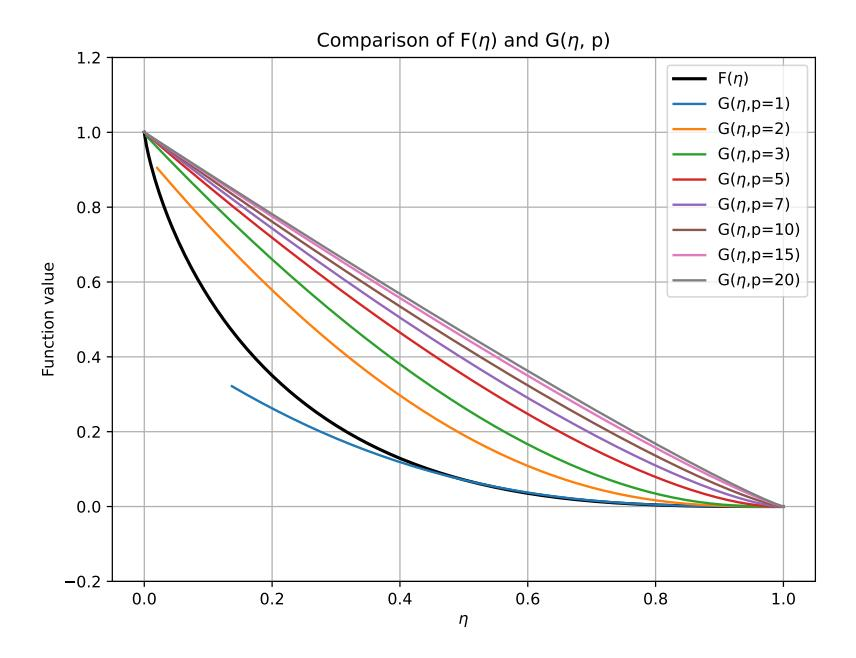

Figure 12. Comparison between  $F(\eta)$  and  $G(\eta, p)$ . When  $p \ge 2$  and  $\eta \in [e^{-4}, 0.5]$ , we can see that  $G(\eta, p) \ge F(\eta)$ . And actually this gap increases as p increases.

Here we use  $\ln(1-\eta) < 0$  and the property that  $f(p) := \frac{2p-2}{(p-1)^2+1} \le f(2) = 1$ .

Similarly, for the second term of G, we have

$$G_2(\eta, p) = e^{-p(1+q_\eta)} \left( \frac{2/p^2 + 2q_\eta/p + q_\eta^2}{2/p^2 - 2/p + 1} \right)$$
(84)

<span id="page-18-1"></span>
$$=e^{-h_{\eta}}\left(\frac{2+2pq_{\eta}+q_{\eta}^{2}p^{2}}{2-2p+p^{2}}\right) \tag{85}$$

$$<(1-\eta)\cdot e^{-2p}(\frac{2+2p+p^2}{2-2p+p^2})$$
 (Lemma A.7) (86)

<span id="page-18-0"></span>
$$< 5e^{-4}(1-\eta)$$
 (Lemma A.8) (87)

Therefore we have

$$G(\eta, p) - F(\eta) = G_1(\eta, p) - G_2(\eta, p) - F(\eta)$$
(88)

$$> 1 - \eta + (1 - \eta)\ln(1 - \eta) - 5e^{-4}(1 - \eta) - [1 - \eta - 2z_n\phi(z_n)]$$
 (89)

$$=2z_n\phi(z_n)-(1-\eta)[5e^{-4}-\ln(1-\eta)]$$
(90)

$$=Q(\eta) \tag{91}$$

where  $z_{\eta} = \Phi^{-1} \left( 1 - \frac{\eta}{2} \right)$  and  $\phi(x) = \frac{1}{\sqrt{2\pi}} e^{-x^2/2}$ .

Note that for  $m(x)=x\phi(x),$   $m'(x)=(1-x^2)\phi(x),$  and thus m(x) is strictly decreasing on  $x\in(-\infty,-1)\cup(1,\infty)$  and strictly increasing on (-1,1). And further note that  $\Phi^{-1}(\cdot)$  is strictly decreasing and continous, then since  $\eta\in[e^{-2p},0.5],$   $z_\eta\in[\Phi^{-1}(0.75),\Phi^{-1}(1-e^{-2p}/2)],$  where  $\Phi^{-1}(0.75)\approx0.674$  and  $\Phi^{-1}(1-e^{-2p}/2)>\Phi^{-1}(0.975)\approx1.960>1.$  Therefore,  $m_2(\eta)=2m(z_\eta)$  first increase, and then decrease on  $\eta\in[e^{-2p},0.5]\supset[e^{-4},0.5].$ 

Similarly, for  $n(\eta) = (1 - \eta)[5e^{-4} - \ln(1 - \eta)]$ ,  $n'(\eta) = 1 - 5e^{-4} + \ln(1 - \eta)$ . We can see  $n'(\eta)$  consistently increase for  $\eta \in [0, \eta^*] \supset [e^{-2p}, 0.5] \supset [e^{-4}, 0.5]$ , where  $\eta^* = 1 - \exp(5e^{-4} - 1) \approx 0.632$ .

Combining these, to prove that  $Q(\eta)$  (Equation (91)) is positive on  $\eta \in [e^{-4}, 0.5]$ , we just need to make sure  $m_2(e^{-4}) > n(e^{-4})$  and  $m_2(0.5) > n(0.5)$ . And from calculation we get

$$m_2(e^{-4}) \approx 0.116 > n(e^{-4}) \approx 0.108, \qquad m_2(0.5) \approx 0.429 > n(0.5) \approx 0.392$$
 (92)

Therefore, we have  $G(\eta, p) - F(\eta) > Q(\eta) > 0$  for all  $p \ge 2$  and  $\eta \in [e^{-4}, 0.5]$ . This completes the proof.

Remark A.10. Lemma A.9 is the key lemma of the whole proof, which compares the variance caused by the inverse sparsity function of up and gate function. We can further visualize  $F(\eta)$  and  $G(\eta, p)$  in Figure 12. We see that the visualization results match our proof, and showing that larger p will has larger  $G(\eta, p) - F(\eta)$  values.

<span id="page-19-0"></span>**Lemma A.11.** Assume that  $x \in \mathbb{R}^m$  and  $W \in \mathbb{R}^{m \times n}$  are random vector and matrix whose elements are independent to each other. And all the  $W_{ij}$  in W satisfies  $W_{ij} \sim \mathcal{N}(0, \sigma^2) (i \in [m], j \in [n])$ . Then we have

$$\mathbb{E}[\|xW\|_2^2] = n\sigma^2 \mathbb{E}[\|x\|_2^2]. \tag{93}$$

Furthermore, if all  $x_i$  are i.i.d. (independent and identically distributed), with mean 0 and variance  $\sigma_x^2$ , then

$$\mathbb{E}[\|xW\|_2^2] = nm\sigma^2 \cdot \sigma_x^2. \tag{94}$$

*Proof.* Let  $W_j$  denote the j-th column of matrix W. Due to independence:

$$\mathbb{E}[\|xW\|_{2}^{2}] = \mathbb{E}\left[\sum_{j=1}^{n} (xW_{j})^{2}\right] = \sum_{j=1}^{n} \mathbb{E}\left[(xW_{j})^{2}\right] = n\mathbb{E}\left[(xW_{j})^{2}\right]$$
(95)

Similarly by independence between x and W.

$$\mathbb{E}\left[(xW_j)^2\right] = \mathbb{E}\left[\left(\sum_{i=1}^m x_i W_{ij}\right)^2\right] \tag{96}$$

$$= \sum_{i=1}^{m} \mathbb{E}[x_i^2] \mathbb{E}[W_{ij}^2] + 2 \sum_{i < k} \mathbb{E}[x_i x_k] \mathbb{E}[W_{ij} W_{kj}]$$
(97)

$$= \sum_{i=1}^{m} \mathbb{E}[x_i^2] \sigma^2 + 0 \tag{98}$$

$$= \sigma^2 \mathbb{E} \left[ \sum_{i=1}^m x_i^2 \right] \tag{99}$$

$$=\sigma^2 \mathbb{E}[\|x\|_2^2] \tag{100}$$

Combine them and we get the first equation. And the second equation is totally similar.

<span id="page-19-1"></span>**Lemma A.12.** If  $a \sim \mathcal{N}(0, \sigma_a^2)$ , b is a random variable independent to a, sparsity function  $S_t$  is defined as Equation (5). Then for any t > 0,  $\mathbb{E}[(a - S_t(a)) \cdot b] = \mathbb{E}[a \cdot (b - S_t(b))] = 0$ .

*Proof.* Just need to note that a and b are independent and from symmetry,  $\mathbb{E}[S_t(a)] = 0$ , and then the proof is trivial.  $\square$ 

## B. Sparsity Insensitivity of the Up Projection in Dense LLMs

We evaluate the sparsity sensitivity of the up projection on LLaMA-3-8B [\(Dubey et al.,](#page-9-17) [2024\)](#page-9-17), with results consistent with our findings on MoE models.Some results are presented in Table [2.](#page-20-0)

Table 2. Sparsity Insensitivity of the Up Projection in Dense LLMs

<span id="page-20-0"></span>

| METHOD   | BOOL Q | SCI Q | OPENBOOKQA | WINOGRANDE | ARC CHALLENGE | ARC EASY | AVERAGE |
|----------|--------|-------|------------|------------|---------------|----------|---------|
| BASE     | 0.8187 | 0.961 | 0.370      | 0.7348     | 0.5026        | 0.8085   | 0.6993  |
| UP-90%   | 0.7116 | 0.925 | 0.300      | 0.6717     | 0.4002        | 0.7066   | 0.6192  |
| DOWN-90% | 0.7780 | 0.959 | 0.336      | 0.6922     | 0.4241        | 0.7504   | 0.6566  |

## C. Downstream Tasks Performance Details

<span id="page-20-1"></span>We present the detailed evaluation results of FloE and baseline methods across downstream tasks in Section [4.2](#page-7-0) in Table [3.](#page-20-1) We also evaluate the impact of different projection matrix sparsification sensitivity on downstream tasks in Table [5.](#page-21-3)

Table 3. Performance of Downstream Tasks under Different Compression Methods

|              | MMLU@5 | BOOLQ | SCIQ  | QA    | WG    | ARC-C | ARC-E | AVERAGE |
|--------------|--------|-------|-------|-------|-------|-------|-------|---------|
| MIXTRAL-8*7B | 0.695  | 0.853 | 0.968 | 0.354 | 0.762 | 0.567 | 0.843 | 0.720   |
| HQQ INT3     | 0.608  | 0.809 | 0.955 | 0.292 | 0.712 | 0.481 | 0.800 | 0.665   |
| CATS-80%     | 0.617  | 0.792 | 0.903 | 0.322 | 0.670 | 0.515 | 0.782 | 0.657   |
| CHESS-80%    | 0.612  | 0.802 | 0.912 | 0.302 | 0.694 | 0.498 | 0.781 | 0.657   |
| FLOE-Wup-80% | 0.654  | 0.829 | 0.944 | 0.344 | 0.732 | 0.532 | 0.816 | 0.693   |
| HQQ INT2     | 0.234  | 0.485 | 0.331 | 0.144 | 0.493 | 0.212 | 0.279 | 0.311   |
| CATS-90%     | 0.377  | 0.704 | 0.826 | 0.272 | 0.586 | 0.442 | 0.709 | 0.559   |
| CHESS-90%    | 0.424  | 0.727 | 0.839 | 0.278 | 0.604 | 0.410 | 0.694 | 0.568   |
| FLOE-Wup-90% | 0.601  | 0.787 | 0.933 | 0.312 | 0.670 | 0.497 | 0.788 | 0.656   |
| FLOE-80%     | 0.605  | 0.810 | 0.951 | 0.336 | 0.717 | 0.509 | 0.803 | 0.676   |
| FLOE-90%     | 0.531  | 0.835 | 0.952 | 0.276 | 0.695 | 0.458 | 0.762 | 0.644   |

Table 4. Performance of Downstream Tasks Under Different Sparse Strategies

|      | 0%     | 50%    | 60%    | 70%    | 80%    | 90%    |
|------|--------|--------|--------|--------|--------|--------|
| GATE | 0.7247 | 0.7228 | 0.7140 | 0.7035 | 0.6640 | 0.5897 |
| UP   |        | 0.7199 | 0.7148 | 0.7038 | 0.6971 | 0.6646 |
| DOWN |        | 0.7233 | 0.7210 | 0.7201 | 0.7194 | 0.7054 |

## <span id="page-21-0"></span>D. Sparsification Insensitivity of the Up Projection in More MoE models

<span id="page-21-3"></span>Due to the smaller hidden layer dimensions of DeepSeek V2's experts, the sparsity rates tested were correspondingly lower, with results in Table [6.](#page-21-4)

Table 5. Sparsification Sensitivity of MoE Models

| MODEL                | OPERATION | 50%    | 60%    | 70%    | 80%    | 90%     |
|----------------------|-----------|--------|--------|--------|--------|---------|
| MIXTRAL-8×7B         | GATE      | 5.8151 | 6.3379 | 7.2570 | 9.1439 | 18.5280 |
|                      | DOWN      | 5.1583 | 5.2101 | 5.3252 | 5.6147 | 6.5511  |
|                      | UP        | 5.3164 | 5.5390 | 5.9795 | 6.9141 | 9.1250  |
| PHI-3.5-MOE-INSTRUCT | GATE      | 5.4386 | 5.7809 | 6.4006 | 7.6114 | 11.2538 |
|                      | DOWN      | 5.1495 | 5.2051 | 5.3255 | 5.6377 | 6.6271  |
|                      | UP        | 5.4092 | 5.6855 | 6.2642 | 7.3284 | 10.2146 |

Table 6. Sparsification Sensitivity of DeepSeek-V2

| MODEL       | OPERATION | 30%    | 50%    | 70%    |
|-------------|-----------|--------|--------|--------|
| DEEPSEEK-V2 | GATE      | 8.6434 | 8.8331 | 9.8083 |
|             | DOWN      | 8.6264 | 8.6400 | 8.7223 |
|             | UP        | 8.6456 | 8.7818 | 9.2083 |

## <span id="page-21-4"></span><span id="page-21-1"></span>E. Quantization Insensitivity of the Up Projection in More MoE models

<span id="page-21-5"></span>Besides Mixtral 8×7B, we also evaluated the quantization insensitivity of the up-projection in Phi-3.5-MoE-instruct [\(Abdin](#page-8-0) [et al.,](#page-8-0) [2024a\)](#page-8-0), DeepSeek-MoE-16B-Base [\(Dai et al.,](#page-9-5) [2024\)](#page-9-5), and Qwen1.5-MoE-A2.7B [\(Team,](#page-11-13) [2024\)](#page-11-13), all of which show that the up-projection is the least sensitive to ultra-low-bit quantization.The results are shown in Table [7.](#page-21-5)

Table 7. Quantization Sensitivity of MoE Models

| MODEL                | OPERATION | INT8  | INT4  | INT3  | INT2  | INT1  |
|----------------------|-----------|-------|-------|-------|-------|-------|
| PHI-3.5-MOE-INSTRUCT | GATE      | 5.768 | 5.785 | 5.952 | 6.623 | 608.7 |
|                      | DOWN      | 5.768 | 5.772 | 6.067 | 7.733 | 365.9 |
|                      | UP        | 5.769 | 5.788 | 5.899 | 6.599 | 209.3 |
| DEEPSEEK-MOE-16      | GATE      | 8.476 | 8.497 | 8.558 | 9.020 | 112.8 |
|                      | DOWN      | 8.476 | 8.659 | 9.364 | 27.70 | 350.1 |
|                      | UP        | 8.476 | 8.489 | 8.602 | 9.090 | 83.57 |
| MIXTRAL-8×7B         | GATE      | 5.119 | 5.158 | 5.310 | 6.245 | 1130  |
|                      | DOWN      | 5.121 | 5.270 | 5.968 | 14.36 | 1910  |
|                      | UP        | 5.119 | 5.151 | 5.281 | 6.177 | 520.1 |
| QWEN-1.5-A2.7B       | GATE      | 9.227 | 9.258 | 9.364 | 10.72 | 102.0 |
|                      | DOWN      | 9.224 | 9.419 | 9.655 | 12.53 | 138.4 |
|                      | UP        | 9.226 | 9.270 | 9.426 | 10.19 | 71.06 |

## <span id="page-21-2"></span>F. Memory Footprint of Learning-based Contextual Sparsity Predictors

While some existing approaches rely on learning-based prediction methods [\(Liu et al.,](#page-10-8) [2023;](#page-10-8) [Shin et al.,](#page-11-0) [2024\)](#page-11-0), these methods often incur significant memory costs. For instance, in the Mixtral-8×7B model, where the hidden state dimension d is 4096 and the gating weight matrix Wgate in an MLP block has a size of d × k = 4096 × 14336, PowerInfer [\(Xue et al.,](#page-11-6) [2024b\)](#page-11-6) requires (4096 × 1024 + 1024 × 14336) × 2 (bytes) × 256 = 9GB of memory when the rank of the DEJAVU predictor [\(Liu et al.,](#page-10-8) [2023\)](#page-10-8) is set to 1024. Similarly, although SparseInfer [\(Shin et al.,](#page-11-0) [2024\)](#page-11-0) achieves a more memory-efficient design by storing only the sign bit of each element, compactly packed into 32-bit variables, it still incurs a memory footprint of 14336 × 160 × 4 (bytes) × 256 = 2.19GB.