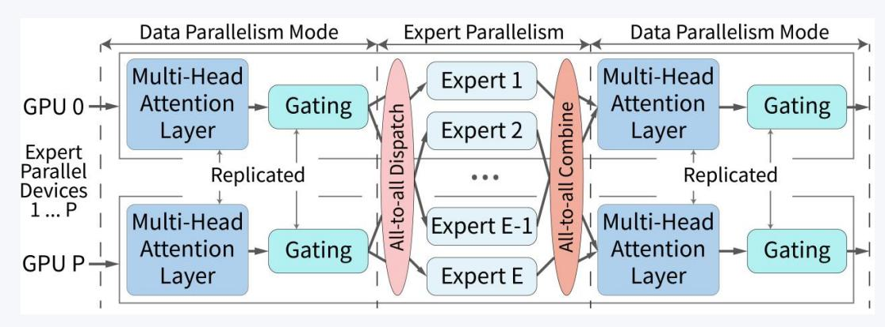
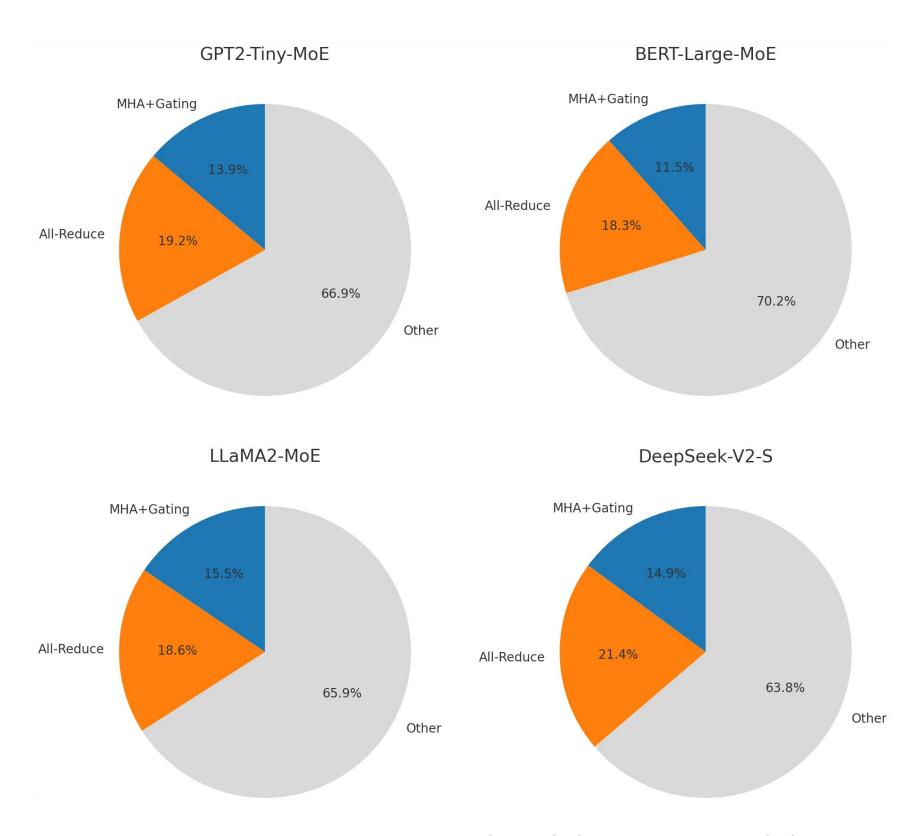
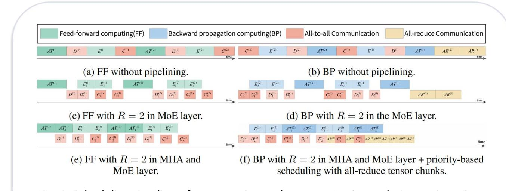
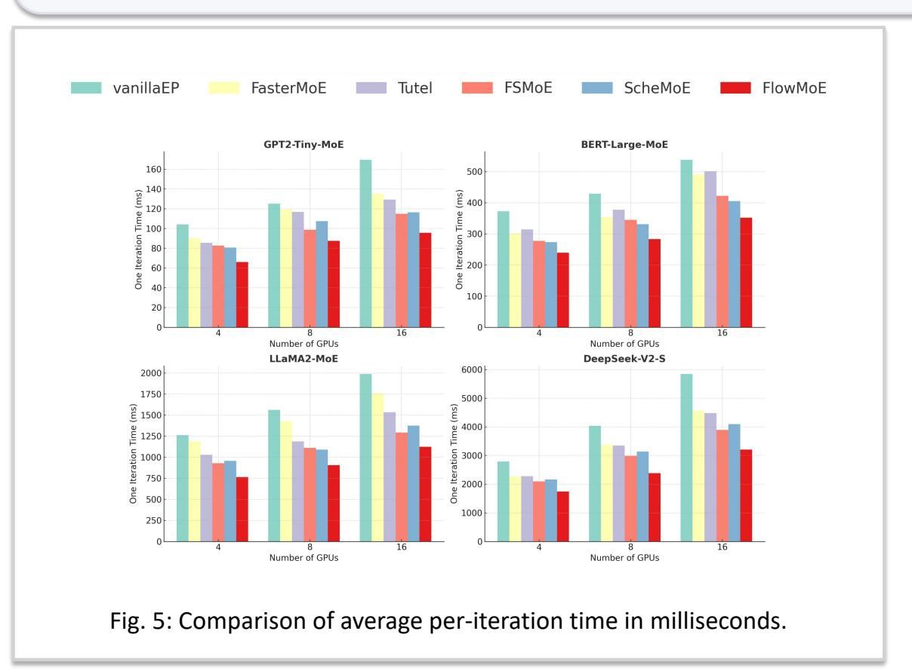

#### FlowMoE: A Scalable Pipeline Scheduling Framework for Distributed Mixture-of-Experts Training

Yunqi Gao1, Bing Hu1,\*, Mahdi Boloursaz Mashhadi2, A-Long Jin3, Yanfeng Zhang4, Pei Xiao2, Rahim Tafazolli2, Mérouane Debbah5 1-Zhejiang University · 2-University of Surrey · 3-Xi'an Jiaotong-Liverpool University · 4-Northeastern University · 5-Khalifa University

#### **Motivation**

- MoE scales LLM without increasing computational costs.
- Existing works pipeline only expert + all-to-all, ignoring MHA, gating, and all-reduce.
- Ignored tasks = 30-40% of iteration time  $\rightarrow$  huge inefficiency.

Fig. 1: Training MoE model with expert parallelism

Fig. 2: One iteration time breakdown per model

# **FlowMoE — Key Ideas**

- **Unified pipeline scheduling strategy:** Schedules MHA, gating, expert, and A2A together.
- **Priority scheduling mechanism for heterogeneous communication tasks:** Cut all-reduce chunks and execute them in all-to-all task gaps.
- **Lightweight adaptive optimizer and system integration:** Tiny Bayesian optimizer for automatic tuning. Deploying FlowMoE to the PyTorch engine.

# **Experimental Results**

### **Experimental Settings**

- 675 customized MoE layers, 4 real-world MoE models
- Clusters: RTX3090 (16 GPUs),RTX2080Ti (8 GPUs).

# **System Implementation & Conclusion**

### **System Implementation**

- **Framework:** Implemented on PyTorch , leveraging Tutel for optimized communication.
- **Compatibility:** Supports multiple optimization frameworks and communication stacks.

### **Conclusions**

- The unified scheduling across all major MoE-related tasks.
- Enabling the optimal coexistence of heterogeneous communication tasks.
- Substantially advancing distributed pipeline training.
- Open-source: github.com/ZJU-CNLAB/FlowMoE

