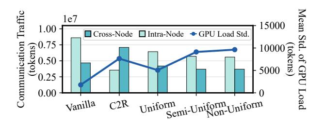
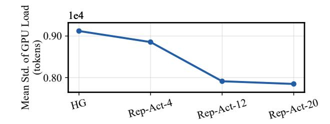
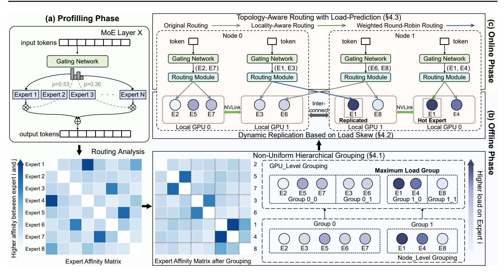
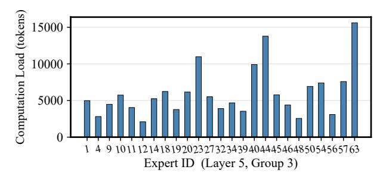
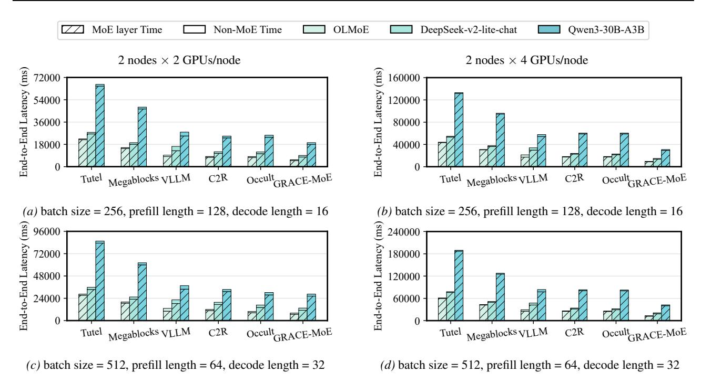
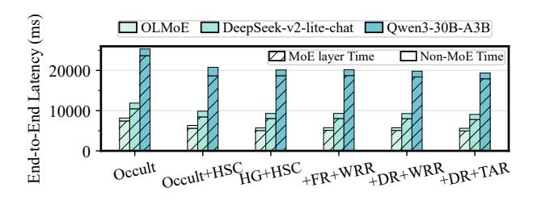
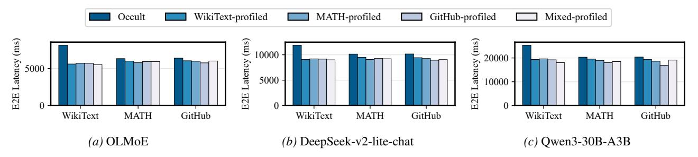
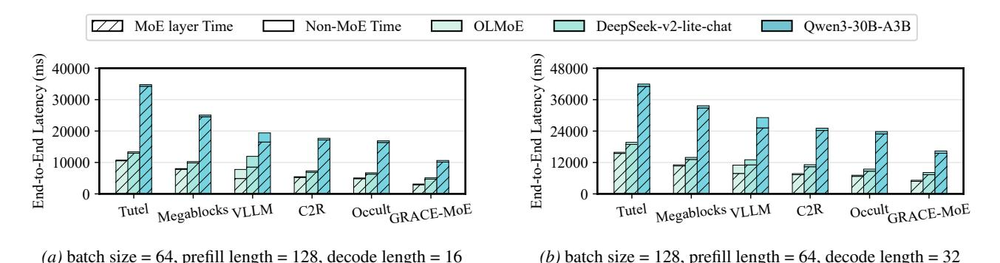
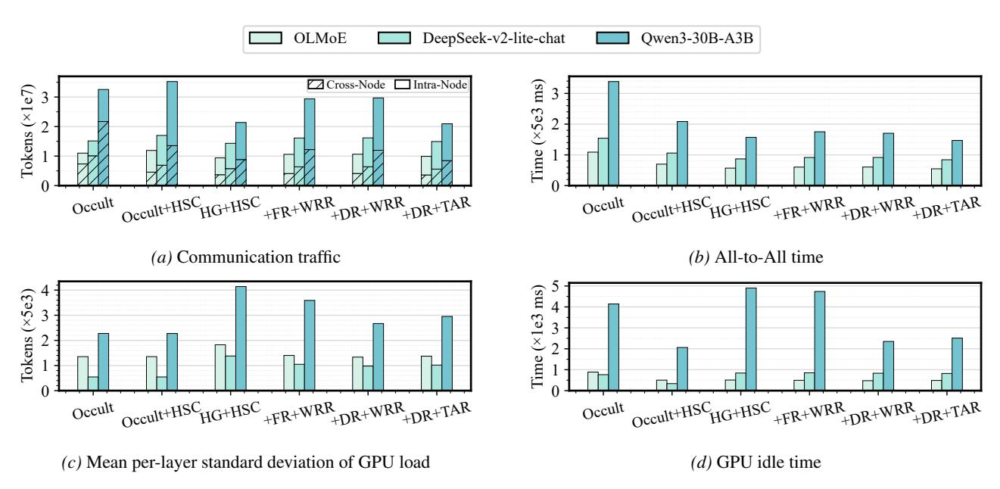

## GRACE-MoE: Grouping and Replication with Locality-Aware Routing for Efficient Distributed MoE Inference

Yu Han <sup>1</sup> Lehan Pan <sup>1</sup> Jie Peng <sup>1</sup> Ziyang Tao <sup>1</sup> Hanqi Zhu <sup>1</sup> Wuyang Zhang <sup>1</sup> Yanyong Zhang <sup>1</sup>

## Abstract

Sparse Mixture of Experts (SMoE) enables scalable parameter growth in large language models (LLMs) by selectively activating a subset of experts, and its large parameter count necessitates distributed deployment for inference. However, distributed inference faces a critical dilemma: although communication overhead constitutes the primary bottleneck, reducing it often exacerbates computational load imbalance, leading to resource waste. In this paper, we present GRACE-MoE, which stands for Grouping and Replication with Locality-Aware Routing for SMoE inference. GRACE-MoE is a lossless co-optimization framework that integrates expert grouping to reduce communication and dynamic replication to correct load skew, together with locality-aware routing to resolve replica selection. To underpin this coordinated optimization in multi-node settings, GRACE-MoE adopts a hierarchical sparse communication design that reduces crossnode traffic while implicitly aligning execution across nodes, thereby mitigating synchronization overhead. Experiments on diverse models and multi-node, multi-GPU environments demonstrate that GRACE-MoE efficiently reduces endto-end inference latency, achieving up to 4.66× speedup over existing systems, and the code will be released upon acceptance.

## <span id="page-0-1"></span>1. Introduction

Large language models (LLMs) built on the Transformer architecture [\(Vaswani et al.,](#page-10-0) [2017\)](#page-10-0) demonstrate substantial performance gains as parameter counts increase [\(Brown](#page-8-0) [et al.,](#page-8-0) [2020\)](#page-8-0), but scaling dense models by simply enlarging parameters incurs prohibitive computation and memory

*Preprint.*

costs [\(Kaplan et al.,](#page-8-1) [2020;](#page-8-1) [Clark et al.,](#page-8-2) [2022\)](#page-8-2). The Sparse Mixture-of-Experts (SMoE) architecture mitigates this by partitioning parameters into experts and activating only a small subset per token, thereby enabling "large-parameter but small-computation" scaling [\(Shazeer et al.,](#page-9-0) [2017\)](#page-9-0). Recent SMoE systems, such as GShard [\(Lepikhin et al.,](#page-8-3) [2021\)](#page-8-3) and Switch Transformer [\(Fedus et al.,](#page-8-4) [2022\)](#page-8-4), have reached trillion-parameter scales, underscoring this potential.

Unfortunately, the massive parameter scale of SMoE exceeds the memory and computation capacity of a single device (i.e., a GPU), necessitating distributed deployment with expert parallelism, combined with data parallelism [\(Lep](#page-8-3)[ikhin et al.,](#page-8-3) [2021;](#page-8-3) [Zhai et al.,](#page-10-1) [2023\)](#page-10-1). In this setting, experts within each MoE layer are partitioned across GPUs and coordinated through All-to-All communication. This design introduces two critical bottlenecks for inference: communication overhead and computational load[1](#page-0-0) imbalance.

Each MoE layer involves two rounds of All-to-All communication, dispatching tokens to experts and aggregating results. Repeated across layers, this amplifies latency, making communication the primary bottleneck in SMoE inference [\(He et al.,](#page-8-5) [2022;](#page-8-5) [Gale et al.,](#page-8-6) [2023\)](#page-8-6). In cross-node settings with limited bandwidth, All-to-All communication accounts for over 70% of a single MoE layer's execution time and about 40% of overall end-to-end inference latency across layers [\(Li et al.,](#page-9-1) [2023;](#page-9-1) [Hwang et al.,](#page-8-7) [2023\)](#page-8-7). Meanwhile, the gating network naturally skews token routing, creating "hot" and "cold" experts that cause load imbalance, overloading some GPUs while leaving others idle and wasting computing resources [\(Lewis et al.,](#page-9-2) [2021;](#page-9-2) [Clark et al.,](#page-8-2) [2022;](#page-8-2) [He et al.,](#page-8-5) [2022\)](#page-8-5). Prior work typically addresses these two issues in isolation, but improving one often worsens the other. For example, methods that reduce communication often concentrate co-activated experts, which increases load skew. Such trade-offs can often be tolerated within a single node, where high-bandwidth links and tight synchronization partially mask their impact. However, in multi-node settings, limited cross-node bandwidth amplifies both effects: communication overhead becomes dominant, while load imbalance further exacerbates communication tail latency [\(Go](#page-8-8)

<sup>1</sup>University of Science and Technology of China. Correspondence to: Wuyang Zhang <wuyangz@ustc.edu.cn>, Yanyong Zhang <yanyongz@ustc.edu.cn>.

<span id="page-0-0"></span><sup>1</sup>[Computational load refers to the number of tokens assigned](#page-8-8) [to an expert, or the total over a group or GPU.](#page-8-8)

<span id="page-1-1"></span>



- (a) Uniformity constraint vs. communication traffic
- (b) Number of replicated experts vs. computational load balance

Figure 1. Impact of grouping uniformity constraint and number of replicated experts. Analysis of OLMoE with 2 nodes  $\times$  2 GPUs per node. Rep-Act-x denotes replication of x highly activated experts shared across HG groups; HG denotes hierarchical grouping.

& Mahajan, 2025), delaying global synchronization. As a result, jointly mitigating communication overhead and computational load imbalance in multi-node SMoE inference remains an open challenge.

At the system level, this communication bottleneck manifests in how All-to-All communication is implemented in multi-node deployments. Most existing systems adopt a flat global All-to-All communication pattern that requires strict synchronization across all ranks within a communication group. In heterogeneous clusters where high-bandwidth intra-node links (e.g., NVLink) coexist with significantly slower cross-node links (e.g., Ethernet), global synchronization is often limited by the slowest links. This straggler effect substantially amplifies synchronization overhead and constitutes another critical scalability bottleneck for distributed multi-node, multi-GPU systems.

In this paper, we propose **GRACE-MoE**, a lossless cooptimization framework for multi-node SMoE inference. **GRACE-MoE** consists of two tightly coupled phases: ① Grouping & Replication and @ Routing, performed in the offline and online phases. During the offline phase, we group experts based on affinity (i.e., co-activation frequency) to reduce cross-device<sup>2</sup> All-to-All communication, directly mitigating the communication bottleneck. We further replicate highly activated experts from the most heavily loaded groups, with the number of replicas dynamically determined by load skew, to alleviate computational load imbalance without excessive redundancy. In the online phase, we design a topology-aware routing strategy to determine which replica executes the computation. This strategy prioritizes local replicas and employs weighted round-robin with load prediction across remote replicas when necessary, maintaining load balance while limiting cross-node traffic. To make such joint optimization effective in multi-node environments, we introduce a hierarchical sparse communication design that reduces cross-node synchronization overhead through implicit alignment of execution across nodes, mitigating long-tail latency. Together, these designs reconcile the conflicting objectives of communication efficiency and load balancing under the constraints of multi-node SMoE inference. Experiments on various MoE models and multi-node, multi-GPU setups show that **GRACE-MoE** reduces communication latency and alleviates load imbalance without accuracy degradation, reducing end-to-end inference latency by up to 78.55% compared to existing systems. The main contributions of this work are summarized as follows:

- Understanding trade-offs in SMoE inference. We identify the inherent trade-off between communication efficiency and load balancing.
- A lossless co-optimization framework. We propose a framework that jointly optimizes communication efficiency and load balance without accuracy loss.
- Hierarchical sparse communication architecture.
   We introduce a physically global yet logically sparse communication scheme for multi-node, multi-GPU SMoE inference.

#### 2. Related Work

Efficient SMoE Inference Systems. Various systems have been proposed to accelerate SMoE inference, such as DeepSpeed-MoE (Rasley et al., 2020), Tutel (Hwang et al., 2023), and MegaBlocks (Gale et al., 2023), which optimize SMoE through kernel optimization, adaptive parallelism, and computation reformulation as block-sparse matrix multiplications. Further throughput improvements involve scheduling, memory management, and pipelining, as exemplified by Lina (Li et al., 2023), vLLM (Kwon et al., 2023), Klotski (Fang et al., 2025), and others (Shen et al., 2022; Liu et al., 2023; Huang et al., 2023; Eliseev & Mazur, 2023; Zheng et al., 2024; Kong et al., 2024; Li et al., 2024; Wei et al., 2024; Yu et al., 2024; Hwang et al., 2024; Zhang et al., 2025b; Suo et al., 2025). Despite these advances, communication overhead and load imbalance remain critical bottlenecks in expert-parallel inference.

<span id="page-1-0"></span><sup>&</sup>lt;sup>2</sup>Cross-device communication includes both intra-node and cross-node cases.

<span id="page-2-1"></span>

Figure 2. Overview of **GRACE-MoE**. (a) Profiling expert selections to build affinity matrices. (b) Grouping high-affinity experts on the same device and dynamically replicating hot experts to balance computational load. (c) Adaptive routing reduces communication by prioritizing local replicas and balances requests via weighted round-robin with load prediction across remote replicas.

Expert Grouping, Replication and Routing. Some methods reduce communication through uniform expert grouping, such as C2R (Zhang et al., 2025a), Occult (Luo et al., 2025), and others (Yao et al., 2024; Li et al., 2025). Among them, C2R and Occult achieve substantial communication savings for top-k models but are lossy due to routing pruning and exacerbate load imbalance. Other works mitigate imbalance via expert replication or flexible placement (He et al., 2022; Nie et al., 2023; Wang et al., 2023; Wu et al., 2024; Skiadopoulos et al., 2025; Zeng et al., 2025; Go & Mahajan, 2025; DeepSeek-AI, 2025), yet most target training rather than inference and do not explicitly optimize communication. Existing works mainly optimize either communication or load balance, while joint optimization remains largely unexplored, especially in multi-node settings.

## <span id="page-2-0"></span>3. Observations

Motivated by the communication overhead and load imbalance discussed in Section 1, we analyze communication traffic in intra-node and cross-node settings. Under top-k routing, each token activates k experts per layer, and C2R (Zhang et al., 2025a) shows that expert activations exhibit strong co-activation patterns. We define expert affinity as the frequency with which two experts are co-activated by the same tokens. Grouping experts by affinity naturally yields uneven group sizes. Uniform grouping enforces equal experts per group, whereas non-uniform grouping re-

laxes this constraint and allows group sizes to follow affinity structure. As shown in Figure 1a, relaxing the uniformity constraint better exploits affinity and reduces cross-device traffic compared to Vanilla and C2R, while uniform grouping disrupts co-activation and limits optimization. However, affinity-based grouping concentrates frequently co-activated experts into the same groups, increasing the chance that certain devices receive disproportionately more tokens and exacerbating computational load imbalance, especially under non-uniform grouping. This trade-off is evident in Figure 1a, where grouping strategies that reduce communication traffic lead to worse load imbalance, motivating our design.

Beyond grouping, communication patterns introduce additional challenges in multi-node settings. Aggregating token copies destined for the same node can reduce expensive cross-node bandwidth consumption, but this is unsupported by flat global All-to-All and motivates hierarchical All-to-All. However, conventional hierarchical implementations decompose communication into multiple stages, incurring extra kernel launches and synchronization overhead. More critically, physically partitioning communication groups across nodes without global coordination leads to progress decoupling, where faster groups contend more aggressively for cross-node bandwidth and force slower groups to stall, resulting in long-tail latency. This imbalance propagates to subsequent intra-node communication stages, causing GPU spin-waiting and amplified synchronization overhead.

<span id="page-3-1"></span>



(a) Group-level load analysis across layers

(b) Per-expert load within the heaviest group

Figure 3. Computational load distribution after hierarchical grouping. (a) In OLMoE, affinity clustering concentrates load on a few groups. (b) In Layer 5, the heaviest group's per-expert load shows overload from a few frequently activated experts.

## 4. Method

To address the trade-off observed in Section 3, we propose **GRACE-MoE**, a hybrid optimization framework built on profiling of routing behaviors. During profiling, per-layer expert selections are recorded to construct expert affinity matrices and load statistics. Guided by this analysis, the framework integrates offline non-uniform hierarchical expert grouping (Section 4.1) and dynamic replication based on load skew (Section 4.2) with online locality-aware routing with load prediction (Section 4.3). As illustrated in Figure 2, this comprehensive design effectively reduces communication overhead and improves computational load balance in multi-node, multi-GPU SMoE inference, while maintaining model accuracy.

## <span id="page-3-0"></span>4.1. Expert Grouping: Communication-Centric Optimization

The objective of expert grouping is to colocate high-affinity experts on the same GPU to reduce cross-device communication. We build on spectral clustering to design a hierarchical grouping scheme for multi-node, multi-GPU topologies.

Non-Uniform Grouping of Experts Based on Intra-Layer **Affinity.** Spectral clustering produces groups with dense intra-connections and sparse inter-connections, aligning with our communication-centric goal. As observed in Section 3, affinity-based grouping tends to form uneven group sizes but better captures co-activation patterns, thereby reducing communication. We therefore apply spectral clustering to the expert affinity matrix to generate fully nonuniform groups, with sizes determined solely by affinity. Although fully non-uniform grouping reduces communication, it leads to computational load imbalance that is even more severe than in the uniform scheme. To mitigate this, we propose controlled non-uniform grouping, regulated by a non-uniformity ratio r that bounds group-size deviations. Given an ideal group size  $E = \frac{n}{D}$ , where n is the number of experts per layer and D is the number of groups, actual sizes are restricted to  $[E - \delta, E + \delta]$ , where  $\delta = E \cdot r$ . The choice

of r is critical: too small a value splits high-affinity experts and increases communication, while too large a value creates substantial group size disparity and worsens load imbalance. We model the selection of r as an optimization problem that balances affinity utilization against grouping non-uniformity. We define intra-group affinity utilization U(r) and size deviation S(r) as

$$U(r) = \frac{\sum_{C \in \mathcal{C}(r)} \sum_{\substack{i,j \in C \\ \sum_{i,j} A_{i,j}}} A_{i,j}}{\sum_{i < j} A_{i,j}}.$$
 (1)

$$S(r) = \sqrt{\frac{1}{D} \sum_{d=1}^{D} (|C_d| - E)^2}.$$
 (2)

where r is the candidate ratio,  $\mathcal{C}(r) = \{C_1, \dots, C_D\}$  denotes the grouping with D groups, and  $A \in \mathbb{R}^{n \times n}$  is the affinity matrix, with  $A_{i,j}$  denoting the affinity between experts i and j. By plotting (S(r), U(r)), we select the knee point as the optimal r, preserving affinity while avoiding excessive size gaps. The validity of this choice is empirically confirmed in Appendix A.1. After determining r, we refine fully non-uniform grouping by reassigning experts with the lowest intra-group affinity to candidate groups with higher affinity, yielding a scheme with controlled non-uniformity. Details of the algorithm are provided in Appendix A.2.

Hierarchical Grouping for Distributed Expert Placement. In multi-node, multi-GPU scenarios, we adopt a hierarchical grouping (HG) strategy. At the cross-node level, experts within each layer are divided into N large groups mapped to nodes. Since cross-node communication is much more expensive, we apply fully non-uniform grouping to maximize intra-node affinity and minimize cross-node traffic. Within each node, these groups are further partitioned into G smaller groups mapped to individual GPUs, where controlled non-uniform grouping is applied to balance group size while preserving affinity. This two-level strategy achieves communication optimization across the topology: affinity is maximized within GPUs, weaker across

<span id="page-4-2"></span>

*Figure 4.* End-to-end inference latency and MoE layer time. Comparison of GRACE-MoE and all baselines under different workloads and cluster settings.

GPUs in the same node, and rare across nodes. As a result, communication overhead is significantly reduced.

## <span id="page-4-0"></span>4.2. Expert Replication: Computational Load Balance-Centric Optimization

The affinity-based expert grouping scheme reduces communication but also aggravates the inherent computational load imbalance of SMoE models. High-affinity experts are frequently co-activated, and when grouped together, they tend to overload their hosting GPU. To mitigate this imbalance while preserving the communication benefits of grouping, we propose dynamic expert replication.

Selection of Experts for Replication. The root cause of load imbalance in SMoE inference lies in a small number of experts being frequently activated. We therefore replicate highly activated experts. As shown in Figure [1b,](#page-1-1) starting from hierarchical grouping, we replicate different numbers of such experts by placing one replica on each GPU. The results show that replicating only a few experts yields limited improvement, while a moderate replication level significantly reduces load imbalance. However, further increasing the number of replicated experts brings only marginal additional benefits. We attribute this to redundant replication, which degrades the system toward data parallelism, disrupts affinity-based grouping, and incurs unnecessary memory overhead. Hence, the replication scope must be carefully constrained. As illustrated in Figure [3,](#page-3-1) after grouping, only

a few groups in each layer handle the majority of tokens, and the overload mainly stems from a small number of frequently activated experts. We therefore replicate only these experts within the heaviest group rather than the entire group, preserving intra-group affinity and communication benefits while avoiding redundancy and wasted resources.

Dynamic Replica Allocation Based on Load Skew. Since expert activation distributions and grouping results vary across layers, the computational load skew of the heaviest group also differs. Therefore, we propose a dynamic replication (DR) strategy driven by load skew. After generating the expert groups in each layer, profiling data are used to calculate the load W<sup>i</sup> of each group, yielding the maximum Wmax and mean load W. The computational load skew factor (ρ) is defined as Wmax/W, and the number of replicas is determined by Equation [\(3\)](#page-4-1).

<span id="page-4-1"></span>
$$n_{\text{replica}} = \min \left( \max \left( 1, \lfloor \rho \rfloor \right), \ n_{\text{gpu}} - 1 \right).$$
 (3)

Within the heaviest group, experts are ranked by individual load, and those whose cumulative load exceeds Wmax · nreplica 1+nreplica are identified as hot experts. These experts are then replicated onto the nreplica most underutilized GPUs. The original primary replicas remain, while additional replicas serve only as secondary copies, keeping the grouping structure intact. This mechanism effectively redistributes the workload of hotspot GPUs while maintaining communication efficiency, significantly mitigating the imbalance amplified by grouping.

# <span id="page-5-0"></span>4.3. Routing Policy: Co-Optimizes Communication and Computational Load

After replication, multiple expert instances exist, and the system must decide which replica executes computation. The routing policy should balance two objectives: minimizing cross-device communication and balancing computational load. We explore two complementary strategies.

Weighted Round-Robin with Load Prediction. After replication, each duplicated expert has  $n_{\rm replica}+1$  instances distributed across different GPUs, and routing must decide which instance processes incoming tokens. To guide this decision, we leverage the pre-replication load statistics from Section 4.2 and predict the post-replication computational load of GPUs. Let  $W_{\rm max}$  denote the pre-replication load of the heaviest group and  $W_{\rm r}$  the total load of its replicated experts. Assuming this load is evenly split across all  $n_{\rm replica}+1$  instances, the per-instance load is  $W_{\rm p}=W_{\rm max}/(n_{\rm replica}+1)$ . The updated loads are then:

$$W'_{\text{max}} = W_{\text{max}} - W_{\text{r}} + W_{\text{p}}, \quad W'_{\text{i}} = W_{\text{i}} + W_{\text{p}}.$$
 (4)

where  $W_{\rm i}$  is the pre-replication load of a target replicahosting GPU. Based on these predictions, routing weights are assigned inversely proportional to the predicted loads, and tokens are dispatched via the weighted round-robin (WRR) policy. This approach alleviates overload on hotspot GPUs by directing more tokens to less loaded GPUs. However, its inherent randomness can trigger unnecessary crossdevice communication by routing tokens to remote GPUs even when local replicas exist. This limits effectiveness under high concurrency, especially in multi-node scenarios.

Topology-Aware Routing with Locality Preference. In distributed clusters, communication overhead exhibits a clear hierarchy: intra-GPU communication incurs negligible overhead, followed by intra-node communication across GPUs, while cross-node communication is the most expensive. This hierarchy motivates a topology-aware routing (TAR) policy that prioritizes replicas based on physical locality. The scheme follows a hierarchical locality-first policy: (i) If a replica exists on the same GPU as the token, it is selected. (ii) Otherwise, a replica on another GPU within the same node is chosen. (iii) Only if no intranode replica is available, is the token routed to a cross-node replica. Within each tier, if multiple replicas are available, weighted round-robin with load prediction is applied to balance computational load. While sacrificing some load balance, it significantly reduces communication overhead, which is the dominant bottleneck in large-scale inference, thereby achieving a practical trade-off between communication and computation. The details of our routing policies are provided in Appendix A.3.

## 5. System Design

To address synchronization bottlenecks in multi-node, multi-GPU environments, we introduce hierarchical sparse communication (HSC) that replaces flat global All-to-All with a physically global but logically sparse communication scheme, enabling efficient token dispatch through a twostage design. The first stage performs cross-node routing, where each GPU communicates with peer GPUs in remote nodes to forward tokens to target nodes, reducing cross-node traffic. The second stage redistributes tokens within each node to the GPUs hosting the target experts. Tokens routed to multiple experts on the same destination are transmitted only once. Cross-node communication uses a single global communication group with zero-padding to realize logically sparse point-to-point transfers. This preserves the bandwidth benefits of sparse communication and leverages the implicit barrier of global collectives for soft synchronization across nodes. Intra-node communication remains isolated to exploit high-bandwidth links and the scheduling flexibility of the hierarchical design. Cross-node communication is overlapped with intra-node routing decision computation via fine-grained pipelining, further reducing end-to-end latency. Hierarchical sparse communication restructures costly crossnode transfers, mitigating long-tail latency and jitter while achieving stable end-to-end speedup.

## 6. Experiments

## <span id="page-5-1"></span>6.1. Experimental Setup

Models and Datasets. We evaluate GRACE-MoE on three representative MoE models, OLMoE (Muennighoff et al., 2025), DeepSeek-v2-lite-chat (Liu et al., 2024), and Qwen3-30B-A3B (Yang et al., 2025) (Table 3). Datasets include WikiText-2-v1 (Merity et al., 2017), MATH (Hendrycks et al., 2021), and the GitHub subset of The Pile (Gao et al., 2021), covering text, code and math tasks.

Baselines and Metrics. Baselines include Tutel (Hwang et al., 2023), Megablocks (Gale et al., 2023), vLLM (Kwon et al., 2023), and expert placement methods C2R (Zhang et al., 2025a) and Occult (Luo et al., 2025). For Occult, we use its No-Prune variant as a lossless baseline. We measure communication efficiency, computational load balance, and inference performance using all-to-all communication time and traffic, GPU idle time, mean per-layer GPU load standard deviation, MoE layer time, and end-to-end latency.

Hardware and Software. Experiments are conducted on a multi-node system with two logical nodes, each equipped with 4× NVIDIA A100-SXM4 GPUs (80GB). GPUs within a node are interconnected via NVLink (12 links per GPU, 50 GB/s per direction). Cross-node bandwidth is 25 Gbps over Ethernet to emulate practical multi-node deployment. We implement **GRACE-MoE** on Megablocks (Gale et al.,

<span id="page-6-1"></span>

| Table 1. Component analysis. Relative impact of incremental component optimizations under a 2 nodes $\times$ 2 GPUs/node setup. All |
|-------------------------------------------------------------------------------------------------------------------------------------|
| values are reported as relative changes with respect to Occult, averaged over the three models.                                     |

| METRIC             | OCCULT | OCCULT + HSC | HG + HSC | + FR + WRR | + DR + WRR | + DR + TAR |
|--------------------|--------|--------------|----------|------------|------------|------------|
| ALL-TO-ALL TIME    | 0.00   | -35.19%      | -48.33%  | -44.52%    | -44.91%    | -50.57%    |
| CROSS-NODE TRAFFIC | 0.00   | -35.64%      | -50.67%  | -41.62%    | -41.84%    | -52.11%    |
| INTRA-NODE TRAFFIC | 0.00   | +100.13%     | +47.10%  | +76.33%    | +78.41%    | +57.22%    |
| GPU IDLE TIME      | 0.00   | -49.88%      | -4.78%   | -6.18%     | -26.86%    | -25.66%    |
| AVG. GPU LOAD STD. | 0.00   | +0.02%       | +90.03%  | +51.32%    | +31.92%    | +39.35%    |

2023) using PyTorch 2.5 (Paszke et al., 2019) and Triton 3.1 (Tillet et al., 2019), supporting data and expert parallelism. Inference uses BFloat16 precision.

#### <span id="page-6-0"></span>6.2. End-to-End Performance

We evaluate GRACE-MoE on WikiText-2-v1 (Merity et al., 2017) using the three MoE models in Section 6.1 under multi-node settings with 2 nodes × 2 GPUs/node and 2 nodes  $\times$  4 GPUs/node. To stress the system under diverse workloads, we vary the batch size and the ratio between prefill and decode lengths: (i) batch size = 256, prefill length = 128, decode length = 16; and (ii) batch size = 512, prefill length = 64, decode length = 32. As shown in Figure 4, **GRACE-MoE** consistently outperforms all baselines across models, workloads, and cluster scales, with the performance advantage becoming more pronounced at larger scales. While baseline systems exhibit steep latency growth due to rising cross-node communication overhead, GRACE-**MoE** effectively suppresses this trend, reducing MoE layer time by up to 80.11%, 75.45%, and 78.59% and end-to-end latency by up to 78.55%, 73.17%, and 77.64%, achieving maximum speedups of  $4.66\times$ ,  $3.73\times$ , and  $4.47\times$  across the three models, respectively. These results demonstrate strong scalability. Additional results in Appendix A.5 show that GRACE-MoE maintains stable performance under lighter workloads on large clusters, highlighting robustness across deployment scenarios. Overall, GRACE-MoE improves end-to-end inference performance through the joint optimization of communication overhead and load balance in multi-node distributed settings, without loss of accuracy.

## <span id="page-6-3"></span>**6.3.** Component Analysis

In multi-node SMoE inference, reducing communication overhead often aggravates load imbalance, while mitigating imbalance may increase communication. To study this trade-off, we use Occult (Luo et al., 2025) as the uniform grouping baseline. We evaluate the three models from Section 6.1 on 2 nodes × 2 GPUs/node using WikiText-2-v1 (Merity et al., 2017) under the workload (i) defined in Section 6.2. We analyze communication efficiency, computational load balance, and their joint effect by decomposing MoE layer time into communication time, GPU idle time, and others.

**Research Question 1: How to Reduce Communication** Overhead? In distributed settings, All-to-All communication is the primary bottleneck. To mitigate it, we first introduce hierarchical sparse communication (HSC) while keeping Occult's uniform expert placement. As shown in Table 1, HSC decreases All-to-All time by an average of 35.19% and cross-node communication traffic by 35.64% across the three models, while shifting traffic to intra-node links. Building on this system design, we further propose non-uniform hierarchical grouping (HG). Compared to Occult under the same system, HG shortens All-to-All time by 18.56%, 17.96%, and 24.69% on the three models, and cuts cross-node communication traffic by 19.21%, 16.72%, and 34.77%, respectively, while reducing intra-node traffic by 22.35%, 15.00%, and 42.15%. Together, HSC and HG reshape communication patterns, substantially curbing cross-device transfers and improving communication efficiency in multi-node MoE inference.

<span id="page-6-2"></span>

Figure 5. Ablation study of components. Each variant corresponds to a component configuration reported in Table 1.

Research Question 2: How to Mitigate Computational Load Imbalance? As shown in Table 1, HG achieves the lowest communication overhead but exacerbates computational load imbalance. Compared to Occult under the same system design, GPU idle time increases by an average of 96.36% across the three models, and the mean per-layer standard deviation of GPU load rises by 90.00%, leaving some devices persistently underutilized. To address this issue, we introduce dynamic replication (DR) based on load skew, together with weighted round-robin routing with load prediction (WRR). In contrast to HG without replication, DR lowers GPU idle time by an average of 19.71% and reduces GPU load deviation by 30.46% across the three models, significantly improving utilization. For compari-

<span id="page-7-0"></span>

*Figure 6.* Generalization across datasets. Placements derived from different datasets are cross-evaluated across three MoE models.

son, we evaluate a fixed-replica scheme (FR) that assigns one replica of overloaded experts in the heaviest group of each layer to the least-loaded GPU. This approach reduces GPU idle time by only 1.59% on average, yielding limited improvements. Overall, the combination of DR and WRR achieves the lowest GPU idle time and the best load balance through adaptive replica allocation and weighted roundrobin routing. Although replication increases the number of expert instances, replicas are created only for a small subset of heavily skewed experts per layer, keeping the parameter footprint within device memory limits.

Research Question 3: How to Achieve Joint Optimization of Communication Overhead and Computational Load Balance? Table [1](#page-6-1) shows that DR with WRR mitigates load imbalance but introduces additional cross-device communication, increasing cross-node and intra-node traffic by 19.34% and 23.20% on average across the three models compared to HG without replication. To address this issue, we propose topology-aware routing with locality preference (TAR). Compared to WRR, TAR reduces All-to-All time by 9.47%, 8.10%, and 13.69% on the three models, lowers cross-node communication traffic by 12.12%, 12.42%, and 29.40%, and decreases intra-node traffic by an average of 12.58%, while GPU idle time and load deviation increase only marginally by 2.58% and 5.76% on average. By prioritizing local replicas and falling back to WRR only when necessary, TAR achieves a more favorable trade-off between communication efficiency and computational load balance.

Finally, we evaluate how the components jointly translate to end-to-end performance. Figure [5](#page-6-2) shows end-to-end latency and MoE layer time as components are incrementally integrated and refined. Across all three models, progressively integrating hierarchical sparse communication, nonuniform hierarchical grouping, dynamic replication, and locality-aware routing consistently reduces both metrics. Compared to Occult, the full design achieves end-to-end speedups of 1.45×, 1.31×, and 1.31× on the three models, confirming that the component-level optimizations directly translate into practical inference gains. Absolute values of these metrics are shown in Appendix [A.6.](#page-12-0)

## 6.4. Generalizability Analysis

Previous experiments demonstrate that GRACE-MoE generalizes well across different MoE models, workloads, and cluster scales. We further evaluate its generalizability under cross-dataset transfer. Expert grouping and replication schemes derived from profiling on individual datasets are directly applied to inference on other datasets under a 2 nodes × 2 GPUs/node setup with the workload (i) defined in Section [6.2.](#page-6-0) As shown in Figure [6,](#page-7-0) placements derived from one dataset consistently retain strong performance when transferred to others, despite distribution differences. Across three models and three target datasets, the worst-case endto-end latency increase under cross-dataset placement is at most 4.52% relative to in-domain placement, while still remaining at least 12.06% lower than Occult [\(Luo et al.,](#page-9-8) [2025\)](#page-9-8) on average across all evaluated model and dataset combinations. Placements derived from mixed-dataset profiling, combining samples from the three datasets mentioned in Section [6.1,](#page-5-1) exhibit competitive and robust performance, often matching or even exceeding those obtained from singledataset profiling. These results indicate that expert affinity and activation patterns captured by GRACE-MoE are stable across datasets, enabling reuse of offline grouping and replication without frequent re-profiling, thereby providing sustained inference performance gains across data distributions. This property is particularly important for practical deployment, where continuous online profiling would otherwise introduce additional overhead and system complexity.

## 7. Conclusion

We present GRACE-MoE, a co-optimization framework for jointly reducing communication overhead and alleviating computational load imbalance in distributed SMoE inference through non-uniform hierarchical grouping based on affinity, dynamic replication driven by load skew, and topology-aware routing with load prediction, supported by hierarchical sparse communication. Without sacrificing accuracy, GRACE-MoE improves end-to-end inference efficiency and demonstrates strong scalability, providing a practical solution for large-scale SMoE deployment.

## References

- <span id="page-8-0"></span>Brown, T., Mann, B., Ryder, N., Subbiah, M., Kaplan, J. D., Dhariwal, P., Neelakantan, A., Shyam, P., Sastry, G., Askell, A., et al. Language models are few-shot learners. *Advances in neural information processing systems*, 33: 1877–1901, 2020.
- <span id="page-8-2"></span>Clark, A., de Las Casas, D., Guy, A., Mensch, A., Paganini, M., Hoffmann, J., Damoc, B., Hechtman, B., Cai, T., Borgeaud, S., et al. Unified scaling laws for routed language models. In *International conference on machine learning*, pp. 4057–4086. PMLR, 2022.
- <span id="page-8-15"></span>DeepSeek-AI. {EPLB}: Expert parallelism load balancer. [https://github.com/deepseek-ai/](https://github.com/deepseek-ai/EPLB) [EPLB](https://github.com/deepseek-ai/EPLB), 2025. Accessed: 2026-01-26.
- <span id="page-8-12"></span>Eliseev, A. and Mazur, D. Fast inference of mixture-ofexperts language models with offloading. *arXiv preprint arXiv:2312.17238*, 2023.
- <span id="page-8-10"></span>Fang, Z., Huang, Y., Hong, Z., Lyu, Y., Chen, W., Yu, Y., Yu, F., and Zheng, Z. Klotski: Efficient mixture-ofexpert inference via expert-aware multi-batch pipeline. In *Proceedings of the 30th ACM International Conference on Architectural Support for Programming Languages and Operating Systems, Volume 2*, pp. 574–588, 2025.
- <span id="page-8-4"></span>Fedus, W., Zoph, B., and Shazeer, N. Switch transformers: Scaling to trillion parameter models with simple and efficient sparsity. *Journal of Machine Learning Research*, 23(120):1–39, 2022.
- <span id="page-8-6"></span>Gale, T., Narayanan, D., Young, C., and Zaharia, M. Megablocks: Efficient sparse training with mixture-ofexperts. *Proceedings of Machine Learning and Systems*, 5:288–304, 2023.
- <span id="page-8-17"></span>Gao, L., Biderman, S., Black, S., Golding, L., Hoppe, T., Foster, C., Phang, J., He, H., Thite, A., Nabeshima, N., Presser, S., and Leahy, C. The pile: An 800gb dataset of diverse text for language modeling. *CoRR*, abs/2101.00027, 2021. URL [https://arxiv.org/](https://arxiv.org/abs/2101.00027) [abs/2101.00027](https://arxiv.org/abs/2101.00027).
- <span id="page-8-8"></span>Go, S. and Mahajan, D. Moetuner: Optimized mixture of expert serving with balanced expert placement and token routing. *arXiv preprint arXiv:2502.06643*, 2025.
- <span id="page-8-5"></span>He, J., Zhai, J., Antunes, T., Wang, H., Luo, F., Shi, S., and Li, Q. Fastermoe: modeling and optimizing training of large-scale dynamic pre-trained models. In *Proceedings of the 27th ACM SIGPLAN Symposium on Principles and Practice of Parallel Programming*, pp. 120–134, 2022.

- <span id="page-8-16"></span>Hendrycks, D., Burns, C., Kadavath, S., Arora, A., Basart, S., Tang, E., Song, D., and Steinhardt, J. Measuring mathematical problem solving with the MATH dataset. In Vanschoren, J. and Yeung, S. (eds.), *Proceedings of the Neural Information Processing Systems Track on Datasets and Benchmarks 1, NeurIPS Datasets and Benchmarks 2021, December 2021, virtual*, 2021.
- <span id="page-8-11"></span>Huang, H., Ardalani, N., Sun, A., Ke, L., Lee, H.-H. S., Sridhar, A., Bhosale, S., Wu, C.-J., and Lee, B. Towards moe deployment: Mitigating inefficiencies in mixture-ofexpert (moe) inference. *arXiv preprint arXiv:2303.06182*, 2023.
- <span id="page-8-7"></span>Hwang, C., Cui, W., Xiong, Y., Yang, Z., Liu, Z., Hu, H., Wang, Z., Salas, R., Jose, J., Ram, P., et al. Tutel: Adaptive mixture-of-experts at scale. *Proceedings of Machine Learning and Systems*, 5:269–287, 2023.
- <span id="page-8-14"></span>Hwang, R., Wei, J., Cao, S., Hwang, C., Tang, X., Cao, T., and Yang, M. Pre-gated moe: An algorithm-system codesign for fast and scalable mixture-of-expert inference. In *2024 ACM/IEEE 51st Annual International Symposium on Computer Architecture (ISCA)*, pp. 1018–1031. IEEE, 2024.
- <span id="page-8-1"></span>Kaplan, J., McCandlish, S., Henighan, T., Brown, T. B., Chess, B., Child, R., Gray, S., Radford, A., Wu, J., and Amodei, D. Scaling laws for neural language models. *arXiv preprint arXiv:2001.08361*, 2020.
- <span id="page-8-13"></span>Kong, R., Li, Y., Feng, Q., Wang, W., Ye, X., Ouyang, Y., Kong, L., and Liu, Y. Swapmoe: Serving off-theshelf moe-based large language models with tunable memory budget. In Ku, L., Martins, A., and Srikumar, V. (eds.), *Proceedings of the 62nd Annual Meeting of the Association for Computational Linguistics (Volume 1: Long Papers), ACL 2024, Bangkok, Thailand, August 11-16, 2024*, pp. 6710–6720. Association for Computational Linguistics, 2024. doi: 10.18653/ V1/2024.ACL-LONG.363. URL [https://doi.org/](https://doi.org/10.18653/v1/2024.acl-long.363) [10.18653/v1/2024.acl-long.363](https://doi.org/10.18653/v1/2024.acl-long.363).
- <span id="page-8-9"></span>Kwon, W., Li, Z., Zhuang, S., Sheng, Y., Zheng, L., Yu, C. H., Gonzalez, J., Zhang, H., and Stoica, I. Efficient memory management for large language model serving with pagedattention. In *Proceedings of the 29th symposium on operating systems principles*, pp. 611–626, 2023.
- <span id="page-8-3"></span>Lepikhin, D., Lee, H., Xu, Y., Chen, D., Firat, O., Huang, Y., Krikun, M., Shazeer, N., and Chen, Z. Gshard: Scaling giant models with conditional computation and automatic sharding. In *9th International Conference on Learning Representations, ICLR 2021, Virtual Event, Austria, May 3-7, 2021*. OpenReview.net, 2021. URL [https:](https://openreview.net/forum?id=qrwe7XHTmYb) [//openreview.net/forum?id=qrwe7XHTmYb](https://openreview.net/forum?id=qrwe7XHTmYb).

- <span id="page-9-2"></span>Lewis, M., Bhosale, S., Dettmers, T., Goyal, N., and Zettlemoyer, L. Base layers: Simplifying training of large, sparse models. In *International Conference on Machine Learning*, pp. 6265–6274. PMLR, 2021.
- <span id="page-9-1"></span>Li, J., Jiang, Y., Zhu, Y., Wang, C., and Xu, H. Accelerating distributed {MoE} training and inference with lina. In *2023 USENIX Annual Technical Conference (USENIX ATC 23)*, pp. 945–959, 2023.
- <span id="page-9-6"></span>Li, P., Zhang, Z., Yadav, P., Sung, Y., Cheng, Y., Bansal, M., and Chen, T. Merge, then compress: Demystify efficient smoe with hints from its routing policy. In *The Twelfth International Conference on Learning Representations, ICLR 2024, Vienna, Austria, May 7-11, 2024*. OpenReview.net, 2024. URL [https://openreview.net/](https://openreview.net/forum?id=eFWG9Cy3WK) [forum?id=eFWG9Cy3WK](https://openreview.net/forum?id=eFWG9Cy3WK).
- <span id="page-9-9"></span>Li, Y., Zheng, P., Chen, S., Xu, Z., Lai, Y., Du, Y., and Wang, Z. Speculative moe: Communication efficient parallel moe inference with speculative token and expert pre-scheduling. *arXiv preprint arXiv:2503.04398*, 2025.
- <span id="page-9-13"></span>Liu, A., Feng, B., Wang, B., Wang, B., Liu, B., Zhao, C., Dengr, C., Ruan, C., Dai, D., Guo, D., et al. Deepseek-v2: A strong, economical, and efficient mixture-of-experts language model. *arXiv preprint arXiv:2405.04434*, 2024.
- <span id="page-9-5"></span>Liu, J., Wang, J. H., and Jiang, Y. Janus: A unified distributed training framework for sparse mixture-of-experts models. In *Proceedings of the ACM SIGCOMM 2023 Conference*, pp. 486–498, 2023.
- <span id="page-9-8"></span>Luo, S., Li, P., Peng, J., Zhao, Y., Cao, Y., Cheng, Y., and Chen, T. Occult: Optimizing collaborative communications across experts for accelerated parallel moe training and inference. In *Forty-second International Conference on Machine Learning, ICML 2025, Vancouver, BC, Canada, July 13-19, 2025*. OpenReview.net, 2025. URL [https://openreview.net/forum?](https://openreview.net/forum?id=vh2Dt4sT67) [id=vh2Dt4sT67](https://openreview.net/forum?id=vh2Dt4sT67).
- <span id="page-9-14"></span>Merity, S., Xiong, C., Bradbury, J., and Socher, R. Pointer sentinel mixture models. In *5th International Conference on Learning Representations, ICLR 2017, Toulon, France, April 24-26, 2017, Conference Track Proceedings*. OpenReview.net, 2017. URL [https://openreview.](https://openreview.net/forum?id=Byj72udxe) [net/forum?id=Byj72udxe](https://openreview.net/forum?id=Byj72udxe).
- <span id="page-9-12"></span>Muennighoff, N., Soldaini, L., Groeneveld, D., Lo, K., Morrison, J., Min, S., Shi, W., Walsh, E. P., Tafjord, O., Lambert, N., Gu, Y., Arora, S., Bhagia, A., Schwenk, D., Wadden, D., Wettig, A., Hui, B., Dettmers, T., Kiela, D., Farhadi, A., and et al. Olmoe: Open mixture-of-experts language models. In *The Thirteenth International Conference on Learning Representations, ICLR 2025, Singapore, April 24-28, 2025*. OpenReview.net, 2025. URL [https:](https://openreview.net/forum?id=xXTkbTBmqq) [//openreview.net/forum?id=xXTkbTBmqq](https://openreview.net/forum?id=xXTkbTBmqq).

- <span id="page-9-10"></span>Nie, X., Miao, X., Wang, Z., Yang, Z., Xue, J., Ma, L., Cao, G., and Cui, B. Flexmoe: Scaling large-scale sparse pre-trained model training via dynamic device placement. *Proceedings of the ACM on Management of Data*, 1(1): 1–19, 2023.
- <span id="page-9-15"></span>Paszke, A., Gross, S., Massa, F., Lerer, A., Bradbury, J., Chanan, G., Killeen, T., Lin, Z., Gimelshein, N., Antiga, L., Desmaison, A., Kopf, A., Yang, E. Z., DeVito, Z., ¨ Raison, M., Tejani, A., Chilamkurthy, S., Steiner, B., Fang, L., Bai, J., and Chintala, S. Pytorch: An imperative style, high-performance deep learning library. In Wallach, H. M., Larochelle, H., Beygelzimer, A., d'Alche-Buc, F., ´ Fox, E. B., and Garnett, R. (eds.), *Advances in Neural Information Processing Systems 32: Annual Conference on Neural Information Processing Systems 2019, NeurIPS 2019, December 8-14, 2019, Vancouver, BC, Canada*, pp. 8024–8035, 2019.
- <span id="page-9-3"></span>Rasley, J., Rajbhandari, S., Ruwase, O., and He, Y. Deepspeed: System optimizations enable training deep learning models with over 100 billion parameters. In *Proceedings of the 26th ACM SIGKDD international conference on knowledge discovery & data mining*, pp. 3505–3506, 2020.
- <span id="page-9-0"></span>Shazeer, N., Mirhoseini, A., Maziarz, K., Davis, A., Le, Q. V., Hinton, G. E., and Dean, J. Outrageously large neural networks: The sparsely-gated mixture-of-experts layer. In *5th International Conference on Learning Representations, ICLR 2017, Toulon, France, April 24-26, 2017, Conference Track Proceedings*. OpenReview.net, 2017. URL [https://openreview.net/forum?](https://openreview.net/forum?id=B1ckMDqlg) [id=B1ckMDqlg](https://openreview.net/forum?id=B1ckMDqlg).
- <span id="page-9-4"></span>Shen, L., Wu, Z., Gong, W., Hao, H., Bai, Y., Wu, H., Wu, X., Bian, J., Xiong, H., Yu, D., et al. Se-moe: A scalable and efficient mixture-of-experts distributed training and inference system. *arXiv e-prints*, pp. arXiv–2205, 2022.
- <span id="page-9-11"></span>Skiadopoulos, A., Zhao, M., Gandhi, S., Norrie, T., Mukherjee, S., and Kozyrakis, C. Accelerating mixture-ofexperts training with adaptive expert replication. *arXiv preprint arXiv:2504.19925*, 2025.
- <span id="page-9-7"></span>Suo, J., Liao, X., Xiao, L., Ruan, L., Wang, J., Su, X., and Huo, Z. Coserve: Efficient collaboration-of-experts (coe) model inference with limited memory. In *Proceedings of the 30th ACM International Conference on Architectural Support for Programming Languages and Operating Systems, Volume 2*, pp. 178–191, 2025.
- <span id="page-9-16"></span>Tillet, P., Kung, H.-T., and Cox, D. Triton: an intermediate language and compiler for tiled neural network computations. In *Proceedings of the 3rd ACM SIGPLAN International Workshop on Machine Learning and Programming Languages*, pp. 10–19, 2019.

- <span id="page-10-0"></span>Vaswani, A., Shazeer, N., Parmar, N., Uszkoreit, J., Jones, L., Gomez, A. N., Kaiser, L., and Polosukhin, I. Attention is all you need. In Guyon, I., von Luxburg, U., Bengio, S., Wallach, H. M., Fergus, R., Vishwanathan, S. V. N., and Garnett, R. (eds.), *Advances in Neural Information Processing Systems 30: Annual Conference on Neural Information Processing Systems 2017, December 4-9, 2017, Long Beach, CA, USA*, pp. 5998–6008, 2017.
- <span id="page-10-8"></span>Wang, W., Lai, Z., Li, S., Liu, W., Ge, K., Liu, Y., Shen, A., and Li, D. Prophet: Fine-grained load balancing for parallel training of large-scale moe models. In *2023 IEEE International Conference on Cluster Computing (CLUSTER)*, pp. 82–94. IEEE, 2023.
- <span id="page-10-3"></span>Wei, Y., Du, J., Jiang, J., Shi, X., Zhang, X., Huang, D., Xiao, N., and Lu, Y. Aptmoe: Affinity-aware pipeline tuning for moe models on bandwidth-constrained gpu nodes. In *SC24: International Conference for High Performance Computing, Networking, Storage and Analysis*, pp. 1–14. IEEE, 2024.
- <span id="page-10-9"></span>Wu, Y., Qu, W., Tao, T., Wang, Z., Bai, W., Li, Z., Tian, Y., Zhang, J., Lentz, M., and Zhuo, D. Lazarus: Resilient and elastic training of mixture-of-experts models with adaptive expert placement. *arXiv preprint arXiv:2407.04656*, 2024.
- <span id="page-10-11"></span>Yang, A., Li, A., Yang, B., Zhang, B., Hui, B., Zheng, B., Yu, B., Gao, C., Huang, C., Lv, C., et al. Qwen3 technical report. *arXiv preprint arXiv:2505.09388*, 2025.
- <span id="page-10-7"></span>Yao, J., Anthony, Q., Shafi, A., Subramoni, H., and Panda, D. K. D. Exploiting inter-layer expert affinity for accelerating mixture-of-experts model inference. In *2024 IEEE International Parallel and Distributed Processing Symposium (IPDPS)*, pp. 915–925. IEEE, 2024.
- <span id="page-10-4"></span>Yu, D., Shen, L., Hao, H., Gong, W., Wu, H., Bian, J., Dai, L., and Xiong, H. Moesys: A distributed and efficient mixture-of-experts training and inference system for internet services. *IEEE Transactions on Services Computing*, 17(5):2626–2639, 2024.
- <span id="page-10-10"></span>Zeng, Y., Huang, C., Mei, Y., Zhang, L., Su, T., Ye, W., Shi, W., and Wang, S. Efficientmoe: Optimizing mixture-ofexperts model training with adaptive load balance. *IEEE Trans. Parallel Distributed Syst.*, 36(4):677–688, 2025. doi: 10.1109/TPDS.2025.3539297. URL [https://](https://doi.org/10.1109/TPDS.2025.3539297) [doi.org/10.1109/TPDS.2025.3539297](https://doi.org/10.1109/TPDS.2025.3539297).
- <span id="page-10-1"></span>Zhai, M., He, J., Ma, Z., Zong, Z., Zhang, R., and Zhai, J. {SmartMoE}: Efficiently training {Sparsely-Activated} models through combining offline and online parallelization. In *2023 USENIX Annual Technical Conference (USENIX ATC 23)*, pp. 961–975, 2023.

- <span id="page-10-6"></span>Zhang, M., Li, P., Peng, J., Qiu, M., and Chen, T. Advancing MoE efficiency: A collaboration-constrained routing (C2R) strategy for better expert parallelism design. In Chiruzzo, L., Ritter, A., and Wang, L. (eds.), *Proceedings of the 2025 Conference of the Nations of the Americas Chapter of the Association for Computational Linguistics: Human Language Technologies (Volume 1: Long Papers)*, pp. 6815–6825, Albuquerque, New Mexico, April 2025a. Association for Computational Linguistics. ISBN 979-8-89176-189-6. doi: 10.18653/v1/2025.naacl-long. 347. URL [https://aclanthology.org/2025.](https://aclanthology.org/2025.naacl-long.347/) [naacl-long.347/](https://aclanthology.org/2025.naacl-long.347/).
- <span id="page-10-5"></span>Zhang, S., Zheng, N., Lin, H., Jiang, Z., Bao, W., Jiang, C., Hou, Q., Cui, W., Zheng, S., Chang, L., Chen, Q., and Liu, X. COMET: fine-grained computationcommunication overlapping for mixture-of-experts. In Zaharia, M., Joshi, G., and Lin, Y. C. (eds.), *Proceedings of the Eighth Conference on Machine Learning and Systems, MLSys 2025, Santa Clara, CA, USA, May 12-15, 2025*. OpenReview.net/mlsys.org, 2025b. URL [https:](https://openreview.net/forum?id=fGgQS5VW09) [//openreview.net/forum?id=fGgQS5VW09](https://openreview.net/forum?id=fGgQS5VW09).
- <span id="page-10-2"></span>Zheng, L., Yin, L., Xie, Z., Sun, C. L., Huang, J., Yu, C. H., Cao, S., Kozyrakis, C., Stoica, I., Gonzalez, J. E., et al. Sglang: Efficient execution of structured language model programs. *Advances in neural information processing systems*, 37:62557–62583, 2024.

## A. Appendix

### <span id="page-11-0"></span>A.1. Validation of Non-Uniform Ratio Selection

We conduct experiments using OLMoE [\(Muennighoff et al.,](#page-9-12) [2025\)](#page-9-12) and WikiText-2-v1 [\(Merity et al.,](#page-9-14) [2017\)](#page-9-14) under a 2 nodes × 2 GPUs/node setting to validate the selection of the non-uniform ratio (r). We compare three representative placements: uniform grouping (as used by Occult [\(Luo et al.,](#page-9-8) [2025\)](#page-9-8)), fully non-uniform grouping, and controlled nonuniform grouping with r = 0.15. As shown in Table [2,](#page-11-5) uniform grouping suffers from higher All-to-All communication overhead due to disrupted expert affinity. In contrast, fully non-uniform grouping reduces communication but introduces severe computational load skew. Although it achieves only marginal additional reduction in All-to-All time compared to controlled non-uniformity, it substantially increases GPU idle time, resulting in higher end-to-end latency. Controlled non-uniform grouping with r = 0.15 achieves a better balance between extremes, reducing communication overhead while limiting load imbalance. Overall, these results demonstrate the effectiveness of our non-uniform ratio (r) selection scheme.

*Table 2.* Comparison of different expert grouping strategies

<span id="page-11-5"></span>

| GROUPING                         | ALL-TO-ALL TIME (MS) | GPU IDLE TIME (MS) | END-TO-END LATENCY (MS) |
|----------------------------------|----------------------|--------------------|-------------------------|
| UNIFORM (OCCULT)                 | 3494.02              | 501.69             | 6328.03                 |
| CONTROLLED NON-UNIFORM(r = 0.15) | 2846.38              | 506.93             | 5698.10                 |
| FULLY NON-UNIFORM                | 2825.81              | 617.16             | 5747.50                 |

## <span id="page-11-1"></span>A.2. Algorithm for Controlled Non-uniform Grouping

For completeness, we provide the detailed pseudocode of our grouping scheme. Algorithm [1](#page-11-6) defines the intra-group affinity score used to evaluate candidate assignments, while Algorithm [2](#page-12-1) gives the full procedure for controlled non-uniform grouping with non-uniformity ratio r.

## <span id="page-11-6"></span>Algorithm 1 Intra-group Affinity Score

Input: affinity matrix A ∈ R <sup>n</sup>×<sup>n</sup>, expert set S

Output: intra-group affinity score

score ← P i∈S P <sup>j</sup>∈<sup>S</sup> Ai,j Return: score

## <span id="page-11-2"></span>A.3. Algorithm for Topology-Aware Routing with Load Prediction

We present two routing policies for replica assignment. Algorithm [3](#page-12-2) specifies the weighted polling strategy, while Algorithm [4](#page-13-0) incorporates it into a topology-aware routing policy. Together, these ensure that replicas are selected with minimal cross-device communication overhead while maintaining balanced computational load.

### A.4. Experiment Configurations

<span id="page-11-3"></span>Details of the model architectures used for evaluation are summarized in Table [3.](#page-11-3)

*Table 3.* Model architecture details used in experiments

| MODEL                 | TOP K | EXPERTS | MOE LAYERS | PARAMS |
|-----------------------|-------|---------|------------|--------|
| OLMOE                 | 8     | 64      | 16         | 6.92B  |
| DEEPSEEK-V2-LITE-CHAT | 6     | 64      | 26         | 15.7B  |
| QWEN3-30B-A3B         | 8     | 128     | 48         | 30.5B  |

## <span id="page-11-4"></span>A.5. Additional End-to-End Performance Results

To complement the main results in Section [6.2,](#page-6-0) we report additional end-to-end performance under two lighter workload configurations: (i) batch size = 64, prefill = 128, decode = 16; and (ii) batch size = 128, prefill = 64, decode = 32, evaluated

### <span id="page-12-1"></span>Algorithm 2 Controlled Non-uniform Grouping

```
Input: affinity matrix A \in \mathbb{R}^{n \times n}, number of groups D, ratio r, experts N_e
Output: grouping \{L_d\}_{d=1}^D
E \leftarrow \lfloor N_e/D \rfloor
\delta \leftarrow \max(1, \operatorname{round}(E \cdot r))
num_{\min} \leftarrow \max(1, E - \delta)
num_{\max} \leftarrow E + \delta
Initialize L \leftarrow \{L_1, \dots, L_D\} as empty groups
\{C_d\}_{d=1}^D \leftarrow \text{SpectralClustering}(A, D)
\Omega \leftarrow \emptyset
for d = 1 to D do
   if |C_d| > num_{\max} then
      Keep top-num_{\max} experts in L_d by affinity, push others to \Omega
      L_d \leftarrow C_d
   end if
end for
for each e \in \Omega do
   Assign e to group d^* that maximizes intra-group affinity
   L_{d^*} \leftarrow L_{d^*} \cup \{e\}
end for
Compute need[d] \leftarrow \max(0, num_{\min} - |L_d|) for d = 1..D
S \leftarrow \sum_{d=1}^{D} need[d]
if S > 0 then
   Move weakest-affinity experts from oversized groups to needy groups
end if
Return: \{L_d\}_{d=1}^D
```

#### <span id="page-12-2"></span>Algorithm 3 Weighted Round-Robin with Load Prediction

```
Input: polling weights (map gpu_id → weight)

Output: selected_gpu_id

gpus ← Keys(polling_weights)

weights ← Values(polling_weights)

selected_gpu_id ← WeightedrandomChoice(gpus, weights)

return selected_gpu_id
```

on 2 nodes × 4 GPUs/node setting. As shown in Figure 7, the performance trends remain consistent with those observed in Figure 4. Across both workloads, **GRACE-MoE** achieves lower end-to-end latency and shorter MoE layer time than all baselines. Notably, even under lighter workloads where communication pressure is reduced, **GRACE-MoE** consistently maintains performance advantages, demonstrating robust effectiveness across a wide range of workload intensities.

#### <span id="page-12-0"></span>A.6. Additional Component Analysis Results

To complement the analysis in Sec. 6.3, we visualize the absolute values of key communication overhead and computational load balance metrics under different component configurations. Figure 8 provides a more intuitive view of how hierarchical sparse communication, non-uniform hierarchical grouping, dynamic replication, and locality-aware routing affect these metrics. The observed trends are consistent with the relative comparisons reported in Table 1.

## <span id="page-13-0"></span>Algorithm 4 Topology-Aware Routing with Locality Preference

```
Input: token_gpu_id, token_node_id; replica_gpus; polling_weights (gpu_id \rightarrow weight)

Output: selected gpu_id

local\_gpu\_replicas \leftarrow \{g \in replica\_gpus \mid g = token\_gpu\_id \}

local\_node\_replicas \leftarrow \{g \in replica\_gpus \mid Node(g) = token\_node\_id \}
\nif local\_gpu\_replicas \neq \emptyset then

return token\_gpu\_id
\nelse
\nif local\_node\_replicas \neq \emptyset then

local\_weights \leftarrow polling\_weights restricted to local\_node\_replicas

return ChooseByPollingWeight(local\_weights)
\nelse

return ChooseByPollingWeight(local\_weights)
\nend if\nend if
```

<span id="page-13-1"></span>

Figure 7. End-to-end inference latency and MoE layer time under lighter workloads. Supplementary evaluation of GRACE-MoE and all baselines across three models under the 2 nodes  $\times$  4 GPUs/node setting.

<span id="page-13-2"></span>

Figure 8. Component breakdown of system metrics. Absolute values of communication overhead and computational load balance metrics corresponding to Table 1, evaluated across three models on the WikiText-2-v1 dataset.